# Parent Section Magnitude-Probability Distributions

Only fault sections with at least one triggered aftershock are plotted. Sections are sorted by total supraseismogenic trigger rate (decreasing)

## Table Of Contents

* [Garlock (Central)](#garlock-central)
* [Tank Canyon](#tank-canyon)
* [Little Lake](#little-lake)
* [Airport Lake](#airport-lake)
* [Owl Lake](#owl-lake)
* [Panamint Valley](#panamint-valley)
* [Garlock (East)](#garlock-east)
* [Ash Hill](#ash-hill)
* [Hunter Mountain-Saline Valley](#hunter-mountain-saline-valley)
* [Blackwater](#blackwater)
* [Garlock (West)](#garlock-west)
* [McLean Lake](#mclean-lake)
* [Gravel Hills-Harper Lk](#gravel-hills-harper-lk)
* [Goldstone Lake](#goldstone-lake)
* [So Sierra Nevada](#so-sierra-nevada)
* [San Andreas (Mojave S)](#san-andreas-mojave-s)
* [Coyote Canyon](#coyote-canyon)
* [Death Valley (So)](#death-valley-so)
* [Nelson Lake](#nelson-lake)
* [San Andreas (Mojave N)](#san-andreas-mojave-n)
* [Towne Pass](#towne-pass)
* [Lenwood-Lockhart-Old Woman Springs](#lenwood-lockhart-old-woman-springs)
* [San Andreas (San Bernardino N)](#san-andreas-san-bernardino-n)
* [Paradise](#paradise)
* [Bicycle Lake](#bicycle-lake)
* [Garlic Springs](#garlic-springs)
* [Coyote Lake](#coyote-lake)
* [San Andreas (San Bernardino S)](#san-andreas-san-bernardino-s)
* [Helendale-So Lockhart](#helendale-so-lockhart)
* [Death Valley (Black Mtns Frontal)](#death-valley-black-mtns-frontal)
* [Sierra Nevada  (No Extension)](#sierra-nevada--no-extension)
* [San Andreas (Big Bend)](#san-andreas-big-bend)
* [Death Valley (No)](#death-valley-no)
* [San Andreas (San Gorgonio Pass-Garnet HIll)](#san-andreas-san-gorgonio-pass-garnet-hill)
* [Elsinore (Glen Ivy) rev](#elsinore-glen-ivy-rev)
* [Santa Ynez (West)](#santa-ynez-west)
* [San Jacinto (San Bernardino)](#san-jacinto-san-bernardino)
* [Red Pass](#red-pass)
* [San Andreas (Parkfield)](#san-andreas-parkfield)
* [Death Valley (Fish Lake Valley)](#death-valley-fish-lake-valley)
* [Owens Valley](#owens-valley)
* [San Andreas (Coachella) rev](#san-andreas-coachella-rev)
* [Cady](#cady)
* [Calico-Hidalgo](#calico-hidalgo)
* [San Jacinto (San Jacinto Valley) rev](#san-jacinto-san-jacinto-valley-rev)
* [Independence rev 2011](#independence-rev-2011)
* [White Wolf (Extension)](#white-wolf-extension)
* [San Andreas (Creeping Section) 2011 CFM](#san-andreas-creeping-section-2011-cfm)
* [Mission Ridge-Arroyo Parida-Santa Ana](#mission-ridge-arroyo-parida-santa-ana)
* [Manix-Afton Hills](#manix-afton-hills)
* [San Andreas (Cholame) rev](#san-andreas-cholame-rev)
* [San Andreas (North Branch Mill Creek)](#san-andreas-north-branch-mill-creek)
* [Chino alt 1](#chino-alt-1)
* [San Jacinto (Stepovers Combined)](#san-jacinto-stepovers-combined)
* [San Andreas (Carrizo) rev](#san-andreas-carrizo-rev)
* [Lake Isabella (Seismicity)](#lake-isabella-seismicity)
* [Baker](#baker)
* [Ludlow](#ludlow)
* [Red Mountain](#red-mountain)
* [San Jacinto (Anza) rev](#san-jacinto-anza-rev)
* [Scodie Lineament](#scodie-lineament)
* [San Jacinto (Coyote Creek)](#san-jacinto-coyote-creek)
* [Mission Creek](#mission-creek)
* [Lost Hills](#lost-hills)
* [San Jacinto (Borrego)](#san-jacinto-borrego)
* [Palos Verdes](#palos-verdes)
* [Cleghorn Pass](#cleghorn-pass)
* [Santa Rosa Island](#santa-rosa-island)
* [San Jacinto (Lytle Creek connector)](#san-jacinto-lytle-creek-connector)
* [Ventura-Pitas Point](#ventura-pitas-point)
* [San Pedro Basin](#san-pedro-basin)
* [Deep Springs](#deep-springs)
* [Tin Mountain](#tin-mountain)
* [Hosgri](#hosgri)
* [Imperial](#imperial)
* [Oceanic - West Huasna](#oceanic---west-huasna)
* [Pinto Mtn](#pinto-mtn)
* [Great Valley 09 (Laguna Seca)](#great-valley-09-laguna-seca)
* [Brawley (Seismic Zone) alt 1](#brawley-seismic-zone-alt-1)
* [Kern Canyon (North Kern) 2011](#kern-canyon-north-kern-2011)
* [White Mountains](#white-mountains)
* [Santa Ynez (East)](#santa-ynez-east)
* [Cleghorn Lake](#cleghorn-lake)
* [Kern Canyon (South Kern) 2011](#kern-canyon-south-kern-2011)
* [Elysian Park (Upper)](#elysian-park-upper)
* [Big Pine (Central)](#big-pine-central)
* [Oak Ridge (Onshore)](#oak-ridge-onshore)
* [Ortigalita (North)](#ortigalita-north)
* [Dry Mountain](#dry-mountain)
* [Whittier alt 1](#whittier-alt-1)
* [Pisgah-Bullion Mtn-Mesquite Lk](#pisgah-bullion-mtn-mesquite-lk)
* [Channel Islands Thrust](#channel-islands-thrust)
* [Ortigalita (South)](#ortigalita-south)
* [Cleghorn](#cleghorn)
* [Santa Cruz Island](#santa-cruz-island)
* [Calaveras (So) - Paicines extension 2011 CFM](#calaveras-so---paicines-extension-2011-cfm)
* [San Andreas (Santa Cruz Mts) 2011 CFM](#san-andreas-santa-cruz-mts-2011-cfm)
* [Newport-Inglewood alt 1](#newport-inglewood-alt-1)
* [Rinconada 2011 CFM](#rinconada-2011-cfm)
* [Monterey Bay-Tularcitos](#monterey-bay-tularcitos)
* [Santa Cruz Catalina Ridge alt1](#santa-cruz-catalina-ridge-alt1)
* [San Gabriel](#san-gabriel)
* [Rose Canyon](#rose-canyon)
* [Big Pine (East)](#big-pine-east)
* [Sheephole](#sheephole)
* [Blue Cut](#blue-cut)
* [Green Valley 2011 CFM](#green-valley-2011-cfm)
* [Newport-Inglewood (Offshore)](#newport-inglewood-offshore)
* [Elsinore (Temecula) rev](#elsinore-temecula-rev)
* [North Salt Lake](#north-salt-lake)
* [Redondo Canyon alt 1](#redondo-canyon-alt-1)
* [Pitas Point (Lower West)](#pitas-point-lower-west)
* [Los Alamos 2011 CFM](#los-alamos-2011-cfm)
* [Coronado Bank alt1](#coronado-bank-alt1)
* [White Wolf](#white-wolf)
* [Likely 2011 CFM](#likely-2011-cfm)
* [La Panza 2011](#la-panza-2011)
* [Great Valley 08 (Quinto)](#great-valley-08-quinto)
* [Simi-Santa Rosa](#simi-santa-rosa)
* [Elsinore (Stepovers Combined)](#elsinore-stepovers-combined)
* [San Diego Trough north alt1](#san-diego-trough-north-alt1)
* [San Jacinto (Superstition Mtn)](#san-jacinto-superstition-mtn)
* [Monte Vista - Shannon 2011 CFM](#monte-vista---shannon-2011-cfm)
* [Great Valley 03a Dunnigan Hills](#great-valley-03a-dunnigan-hills)
* [Sierra Madre](#sierra-madre)
* [Pitas Point (Lower)-Montalvo](#pitas-point-lower-montalvo)
* [Pleito](#pleito)
* [Hollywood](#hollywood)
* [San Diego Trough south](#san-diego-trough-south)
* [Kern Canyon (Lake Isabella) 2011](#kern-canyon-lake-isabella-2011)
* [Puente Hills](#puente-hills)
* [San Luis Range 2011 CFM](#san-luis-range-2011-cfm)
* [Verdugo](#verdugo)
* [Greenville (So) 2011 CFM](#greenville-so-2011-cfm)
* [Northridge](#northridge)
* [Hunting Creek - Berryessa 2011 CFM](#hunting-creek---berryessa-2011-cfm)
* [San Gregorio (North) 2011 CFM](#san-gregorio-north-2011-cfm)
* [San Cayetano](#san-cayetano)
* [Greenville (No) 2011 CFM](#greenville-no-2011-cfm)
* [Hayward (So) extension 2011 CFM](#hayward-so-extension-2011-cfm)
* [Santa Susana alt 1](#santa-susana-alt-1)
* [Elsinore (Julian)](#elsinore-julian)
* [Sisar](#sisar)
* [Del Valle](#del-valle)
* [Hosgri (Extension)](#hosgri-extension)
* [Johnson Valley (No) 2011 rev](#johnson-valley-no-2011-rev)
* [Concord 2011 CFM](#concord-2011-cfm)
* [Great Valley 04b Gordon Valley](#great-valley-04b-gordon-valley)
* [Goose Lake 2011 CFM](#goose-lake-2011-cfm)
* [Calaveras (So) 2011 CFM](#calaveras-so-2011-cfm)
* [Great Valley 05 Pittsburg - Kirby Hills alt1](#great-valley-05-pittsburg---kirby-hills-alt1)
* [Davis Creek](#davis-creek)
* [Sierra Madre (San Fernando)](#sierra-madre-san-fernando)
* [San Juan](#san-juan)
* [Northridge Hills](#northridge-hills)
* [Butano 2011 CFM](#butano-2011-cfm)
* [Fontana (Seismicity)](#fontana-seismicity)
* [San Clemente](#san-clemente)
* [Raymond](#raymond)
* [San Jacinto (Clark) rev](#san-jacinto-clark-rev)
* [Mono Lake 2011 CFM](#mono-lake-2011-cfm)
* [Casmalia 2011 CFM](#casmalia-2011-cfm)
* [Los Alamos extension](#los-alamos-extension)
* [Cucamonga](#cucamonga)
* [Santa Monica alt 1](#santa-monica-alt-1)
* [Hayward (No) 2011 CFM](#hayward-no-2011-cfm)
* [Elysian Park (Lower CFM)](#elysian-park-lower-cfm)
* [Channel Islands Western Deep Ramp](#channel-islands-western-deep-ramp)
* [Superstition Hills](#superstition-hills)
* [Gillem - Big Crack 2011 CFM](#gillem---big-crack-2011-cfm)
* [Hayward (So) 2011 CFM](#hayward-so-2011-cfm)
* [Calaveras (Central) 2011 CFM](#calaveras-central-2011-cfm)
* [Bullion Mountains](#bullion-mountains)
* [Camp Rock 2011](#camp-rock-2011)
* [Mendocino](#mendocino)
* [South Klamath Lake East](#south-klamath-lake-east)
* [San Luis Range - Oceano 2011 CFM](#san-luis-range---oceano-2011-cfm)
* [Rodgers Creek - Healdsburg 2011 CFM](#rodgers-creek---healdsburg-2011-cfm)
* [Mission (connected) 2011 CFM](#mission-connected-2011-cfm)
* [South Klamath Lake West](#south-klamath-lake-west)
* [Elmore Ranch](#elmore-ranch)
* [Homestead Valley 2011](#homestead-valley-2011)
* [Great Valley 07 (Orestimba)](#great-valley-07-orestimba)
* [Owens Valley Keough Hot Springs](#owens-valley-keough-hot-springs)
* [Cedar Mtn-Mahogany Mtn](#cedar-mtn-mahogany-mtn)
* [Malibu Coast (Extension) alt 1](#malibu-coast-extension-alt-1)

## Garlock (Central)
*[(top)](#table-of-contents)*

| 1 Week | 1 Month | 1 Year | 10 Year |
|-----|-----|-----|-----|
|  |  | 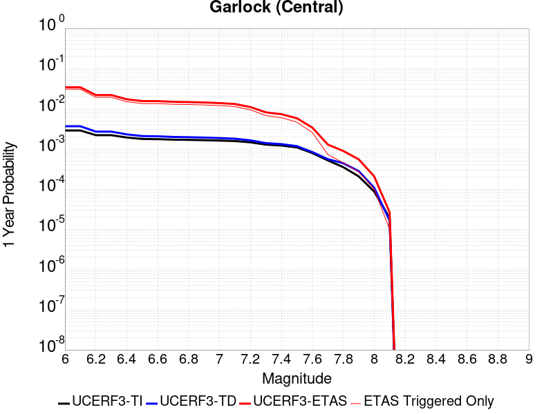 |  |

| Magnitude | 1 wk TI Prob | 1 wk TD Prob | 1 wk ETAS Prob | 1 wk ETAS/TD Gain | 1 wk ETAS Triggered Only | 1 mo TI Prob | 1 mo TD Prob | 1 mo ETAS Prob | 1 mo ETAS/TD Gain | 1 mo ETAS Triggered Only | 1 yr TI Prob | 1 yr TD Prob | 1 yr ETAS Prob | 1 yr ETAS/TD Gain | 1 yr ETAS Triggered Only | 10 yr TI Prob | 10 yr TD Prob | 10 yr ETAS Prob | 10 yr ETAS/TD Gain | 10 yr ETAS Triggered Only |
|-----|-----|-----|-----|-----|-----|-----|-----|-----|-----|-----|-----|-----|-----|-----|-----|-----|-----|-----|-----|-----|
| 6.0 | 5.5131142E-5 | 7.0263915E-5 | 0.0031900448 | 45.400894 | 0.00312 | 2.3625491E-4 | 3.0109668E-4 | 0.009788239 | 32.508625 | 0.00949 | 0.0028726095 | 0.0036597557 | 0.034117877 | 9.322447 | 0.03057 | 0.028357591 | 0.03608841 | 0.08988432 | 2.49067 | 0.05581 |
| 6.1 | 5.5131142E-5 | 7.0263915E-5 | 0.0031900448 | 45.400894 | 0.00312 | 2.3625491E-4 | 3.0109668E-4 | 0.009788239 | 32.508625 | 0.00949 | 0.0028726095 | 0.0036597557 | 0.034117877 | 9.322447 | 0.03057 | 0.028357591 | 0.03608841 | 0.08988432 | 2.49067 | 0.05581 |
| 6.2 | 4.216245E-5 | 5.167697E-5 | 0.001851584 | 35.829964 | 0.0018 | 1.806837E-4 | 2.214541E-4 | 0.0061201476 | 27.636189 | 0.0059 | 0.0021976046 | 0.0026929018 | 0.02188109 | 8.125469 | 0.01924 | 0.021759989 | 0.026697638 | 0.061191473 | 2.2920182 | 0.03544 |
| 6.3 | 4.216245E-5 | 5.167697E-5 | 0.001851584 | 35.829964 | 0.0018 | 1.806837E-4 | 2.214541E-4 | 0.0061201476 | 27.636189 | 0.0059 | 0.0021976046 | 0.0026929018 | 0.02188109 | 8.125469 | 0.01924 | 0.021759989 | 0.026697638 | 0.061191473 | 2.2920182 | 0.03544 |
| 6.4 | 3.6858168E-5 | 4.4125387E-5 | 0.0013240689 | 30.006964 | 0.00128 | 1.5795401E-4 | 1.8909524E-4 | 0.004648252 | 24.581537 | 0.00446 | 0.0019213937 | 0.002299829 | 0.017175538 | 7.468181 | 0.01491 | 0.019048655 | 0.022856504 | 0.049542293 | 2.1675358 | 0.02731 |
| 6.5 | 3.39199E-5 | 4.0032657E-5 | 0.001179987 | 29.47561 | 0.00114 | 1.453629E-4 | 1.7155736E-4 | 0.0041708713 | 24.311815 | 0.004 | 0.0017683565 | 0.0020867318 | 0.015498687 | 7.4272532 | 0.01344 | 0.017543508 | 0.020767307 | 0.04511103 | 2.1722138 | 0.02486 |
| 6.6 | 3.3571985E-5 | 3.9486808E-5 | 0.0011794418 | 29.86926 | 0.00114 | 1.4387199E-4 | 1.6921831E-4 | 0.0041685416 | 24.634102 | 0.004 | 0.0017502342 | 0.002058308 | 0.015450685 | 7.5064983 | 0.01342 | 0.017365133 | 0.020488603 | 0.044760894 | 2.1846728 | 0.02478 |
| 6.7 | 3.2580007E-5 | 3.8103142E-5 | 0.001118062 | 29.34304 | 0.00108 | 1.3962112E-4 | 1.6328908E-4 | 0.0039826655 | 24.390274 | 0.00382 | 0.0016985617 | 0.0019862533 | 0.01484067 | 7.4716907 | 0.01288 | 0.016856372 | 0.019781195 | 0.04307119 | 2.1773808 | 0.02376 |
| 6.8 | 3.2185937E-5 | 3.7530306E-5 | 0.0011174898 | 29.775663 | 0.00108 | 1.3793244E-4 | 1.6083437E-4 | 0.0039502247 | 24.560825 | 0.00379 | 0.0016780337 | 0.0019564212 | 0.014621594 | 7.4736433 | 0.01269 | 0.016654192 | 0.01948797 | 0.04243195 | 2.1773407 | 0.0234 |
| 6.9 | 3.165394E-5 | 3.673481E-5 | 0.0011066955 | 30.126614 | 0.00107 | 1.3565269E-4 | 1.5742553E-4 | 0.00387684 | 24.626501 | 0.00372 | 0.0016503202 | 0.0019149922 | 0.014291246 | 7.462822 | 0.0124 | 0.01638118 | 0.019080566 | 0.041524 | 2.176246 | 0.02288 |
| 7.0 | 3.0903822E-5 | 3.563997E-5 | 0.001075603 | 30.179682 | 0.00104 | 1.3243823E-4 | 1.527339E-4 | 0.0037621825 | 24.632269 | 0.00361 | 0.0016112428 | 0.0018579704 | 0.01380573 | 7.430544 | 0.01197 | 0.015996104 | 0.018519683 | 0.04015151 | 2.168045 | 0.02204 |
| 7.1 | 3.0069863E-5 | 3.4406152E-5 | 0.0010243721 | 29.772934 | 9.9E-4 | 1.2886449E-4 | 1.4744673E-4 | 0.0035369468 | 23.987965 | 0.00339 | 0.0015677959 | 0.0017937068 | 0.013093402 | 7.2996335 | 0.01132 | 0.01556781 | 0.017887289 | 0.03847237 | 2.150822 | 0.02096 |
| 7.2 | 2.7957109E-5 | 3.1295218E-5 | 7.9127145E-4 | 25.2841 | 7.6E-4 | 1.1981068E-4 | 1.3411559E-4 | 0.002873748 | 21.427399 | 0.00274 | 0.0014577188 | 0.0016316538 | 0.010986365 | 6.7332697 | 0.00937 | 0.014481937 | 0.01629076 | 0.03351551 | 2.0573325 | 0.01751 |
| 7.3 | 2.4519275E-5 | 2.6727728E-5 | 6.4671115E-4 | 24.196264 | 6.2E-4 | 1.0507837E-4 | 1.14542454E-4 | 0.0021043145 | 18.37148 | 0.00199 | 0.0012785783 | 0.001393677 | 0.008114298 | 5.8222227 | 0.00673 | 0.012712469 | 0.013934706 | 0.026418293 | 1.8958629 | 0.01266 |
| 7.4 | 2.3225532E-5 | 2.5212068E-5 | 5.751982E-4 | 22.8144 | 5.5E-4 | 9.95342E-5 | 1.0804733E-4 | 0.0018578583 | 17.194857 | 0.00175 | 0.0012111551 | 0.0013146969 | 0.0073167956 | 5.5653863 | 0.00601 | 0.012045753 | 0.013152248 | 0.024343101 | 1.85087 | 0.01134 |
| 7.5 | 2.097765E-5 | 2.2495726E-5 | 4.2248672E-4 | 18.780756 | 4.0E-4 | 8.9901114E-5 | 9.640676E-5 | 0.0013162892 | 13.653494 | 0.00122 | 0.0010939965 | 0.0011731321 | 0.0057977005 | 4.9420695 | 0.00463 | 0.010886264 | 0.011746572 | 0.020522263 | 1.7470852 | 0.00888 |
| 7.6 | 1.511254E-5 | 1.6002541E-5 | 2.2599917E-4 | 14.122705 | 2.1E-4 | 6.476642E-5 | 6.858056E-5 | 6.1854284E-4 | 9.019216 | 5.5E-4 | 7.882459E-4 | 8.346563E-4 | 0.0033925197 | 4.064571 | 0.00256 | 0.007854558 | 0.0083893575 | 0.013268082 | 1.5815372 | 0.00492 |
| 7.7 | 9.934069E-6 | 1.0689199E-5 | 8.068845E-5 | 7.5485964 | 7.0E-5 | 4.2573887E-5 | 4.581005E-5 | 2.0580272E-4 | 4.492523 | 1.6E-4 | 5.182138E-4 | 5.5759505E-4 | 0.001287188 | 2.3084638 | 7.3E-4 | 0.00517007 | 0.0056330822 | 0.0071345763 | 1.2665492 | 0.00151 |
| 7.8 | 6.7562896E-6 | 8.43693E-6 | 5.8436508E-5 | 6.926276 | 5.0E-5 | 2.8955206E-5 | 3.6157773E-5 | 1.5615343E-4 | 4.3186684 | 1.2E-4 | 3.5247262E-4 | 4.401321E-4 | 8.899341E-4 | 2.0219703 | 4.5E-4 | 0.0035191406 | 0.004451056 | 0.0054764715 | 1.2303758 | 0.00103 |
| 7.9 | 3.975453E-6 | 5.376211E-6 | 3.537605E-5 | 6.580108 | 3.0E-5 | 1.7037546E-5 | 2.3040702E-5 | 1.0303886E-4 | 4.4720364 | 8.0E-5 | 2.0741238E-4 | 2.8048453E-4 | 5.504088E-4 | 1.9623499 | 2.7E-4 | 0.002072189 | 0.0028363194 | 0.003504419 | 1.2355516 | 6.7E-4 |
| 8.0 | 1.6729537E-6 | 2.079309E-6 | 2.2079268E-5 | 10.61856 | 2.0E-5 | 7.169782E-6 | 8.911295E-6 | 3.891103E-5 | 4.366484 | 3.0E-5 | 8.7288594E-5 | 1.0848964E-4 | 2.0847878E-4 | 1.921647 | 1.0E-4 | 8.7254314E-4 | 0.0010978674 | 0.0013475929 | 1.2274642 | 2.5E-4 |
| 8.1 | 3.6733252E-7 | 3.15158E-7 | 3.15158E-7 | 1.0 | 0.0 | 1.5742813E-6 | 1.3506765E-6 | 1.3506765E-6 | 1.0 | 0.0 | 1.9166706E-5 | 1.6444379E-5 | 2.6444213E-5 | 1.6081005 | 1.0E-5 | 1.9165053E-4 | 1.6652296E-4 | 2.0651631E-4 | 1.2401671 | 4.0E-5 |

## Tank Canyon
*[(top)](#table-of-contents)*

| 1 Week | 1 Month | 1 Year | 10 Year |
|-----|-----|-----|-----|
|  |  |  |  |

| Magnitude | 1 wk TI Prob | 1 wk TD Prob | 1 wk ETAS Prob | 1 wk ETAS/TD Gain | 1 wk ETAS Triggered Only | 1 mo TI Prob | 1 mo TD Prob | 1 mo ETAS Prob | 1 mo ETAS/TD Gain | 1 mo ETAS Triggered Only | 1 yr TI Prob | 1 yr TD Prob | 1 yr ETAS Prob | 1 yr ETAS/TD Gain | 1 yr ETAS Triggered Only | 10 yr TI Prob | 10 yr TD Prob | 10 yr ETAS Prob | 10 yr ETAS/TD Gain | 10 yr ETAS Triggered Only |
|-----|-----|-----|-----|-----|-----|-----|-----|-----|-----|-----|-----|-----|-----|-----|-----|-----|-----|-----|-----|-----|
| 6.0 | 4.8284557E-5 | 5.7969093E-5 | 0.0016478769 | 28.426819 | 0.00159 | 2.0691741E-4 | 2.4841915E-4 | 0.006036981 | 24.30159 | 0.00579 | 0.0025163088 | 0.003020976 | 0.025353307 | 8.392422 | 0.0224 | 0.02488006 | 0.029865786 | 0.0711644 | 2.3828068 | 0.04257 |
| 6.1 | 1.7796336E-5 | 2.0874571E-5 | 5.508635E-4 | 26.389214 | 5.3E-4 | 7.626778E-5 | 8.94596E-5 | 0.0021392761 | 23.913322 | 0.00205 | 9.281647E-4 | 0.0010886635 | 0.00901003 | 8.276231 | 0.00793 | 0.009242975 | 0.010837391 | 0.025981471 | 2.3973916 | 0.01531 |
| 6.2 | 1.7796336E-5 | 2.0874571E-5 | 5.508635E-4 | 26.389214 | 5.3E-4 | 7.626778E-5 | 8.94596E-5 | 0.0021392761 | 23.913322 | 0.00205 | 9.281647E-4 | 0.0010886635 | 0.00901003 | 8.276231 | 0.00793 | 0.009242975 | 0.010837391 | 0.025981471 | 2.3973916 | 0.01531 |
| 6.3 | 1.3515912E-5 | 1.576045E-5 | 4.6575337E-4 | 29.552034 | 4.5E-4 | 5.792405E-5 | 6.754317E-5 | 0.0016274378 | 24.09478 | 0.00156 | 7.049971E-4 | 8.220519E-4 | 0.0065473416 | 7.964633 | 0.00573 | 0.007027647 | 0.008192722 | 0.019330718 | 2.3594987 | 0.01123 |
| 6.4 | 1.0870146E-5 | 1.2618687E-5 | 3.2261477E-4 | 25.566431 | 3.1E-4 | 4.658551E-5 | 5.4079064E-5 | 0.0012140163 | 22.448915 | 0.00116 | 5.67031E-4 | 6.582316E-4 | 0.0049853814 | 7.5739017 | 0.00433 | 0.005655863 | 0.0065648356 | 0.014810347 | 2.256012 | 0.0083 |
| 6.5 | 7.964826E-6 | 9.196535E-6 | 2.091947E-4 | 22.747122 | 2.0E-4 | 3.4134522E-5 | 3.9413186E-5 | 7.29386E-4 | 18.506142 | 6.9E-4 | 4.1550855E-4 | 4.7976055E-4 | 0.0030885083 | 6.437604 | 0.00261 | 0.0041473247 | 0.0047885496 | 0.009884032 | 2.0640972 | 0.00512 |
| 6.6 | 6.6317E-6 | 7.612634E-6 | 1.5761149E-4 | 20.703938 | 1.5E-4 | 2.8421264E-5 | 3.2625216E-5 | 5.9260696E-4 | 18.164078 | 5.6E-4 | 3.4597394E-4 | 3.9714875E-4 | 0.0024163465 | 6.0842357 | 0.00202 | 0.0034543579 | 0.0039655417 | 0.007750473 | 1.9544549 | 0.0038 |
| 6.7 | 4.793663E-6 | 5.430978E-6 | 9.543049E-5 | 17.57151 | 9.0E-5 | 2.0544108E-5 | 2.3275437E-5 | 3.6326752E-4 | 15.607334 | 3.4E-4 | 2.500958E-4 | 2.83346E-4 | 0.0015329918 | 5.410318 | 0.00125 | 0.0024981452 | 0.0028305396 | 0.0051838597 | 1.8314033 | 0.00236 |
| 6.8 | 4.382823E-6 | 4.9694218E-6 | 9.496897E-5 | 19.110668 | 9.0E-5 | 1.8783392E-5 | 2.1297372E-5 | 3.4129055E-4 | 16.025007 | 3.2E-4 | 2.286638E-4 | 2.5926894E-4 | 0.0013689811 | 5.280159 | 0.00111 | 0.0022842865 | 0.0025903387 | 0.0047148215 | 1.8201563 | 0.00213 |
| 6.9 | 2.729601E-6 | 3.073619E-6 | 3.3073527E-5 | 10.760451 | 3.0E-5 | 1.1698237E-5 | 1.3172593E-5 | 1.4317088E-4 | 10.868846 | 1.3E-4 | 1.4241673E-4 | 1.6036574E-4 | 6.8028236E-4 | 4.242068 | 5.2E-4 | 0.001423255 | 0.0016026661 | 0.0025311755 | 1.5793531 | 9.3E-4 |
| 7.0 | 1.8987357E-6 | 2.126981E-6 | 1.21269595E-5 | 5.7014894 | 1.0E-5 | 8.137413E-6 | 9.115605E-6 | 4.911524E-5 | 5.3880396 | 4.0E-5 | 9.90685E-5 | 1.1097753E-4 | 3.709487E-4 | 3.3425565 | 2.6E-4 | 9.902435E-4 | 0.0011092898 | 0.001518835 | 1.3691958 | 4.1E-4 |
| 7.1 | 1.4928986E-6 | 1.664156E-6 | 1.664156E-6 | 1.0 | 0.0 | 6.398121E-6 | 7.132081E-6 | 2.7131939E-5 | 3.8042107 | 2.0E-5 | 7.789434E-5 | 8.6830216E-5 | 2.3681718E-4 | 2.7273593 | 1.5E-4 | 7.786704E-4 | 8.6802075E-4 | 0.0010878298 | 1.2532302 | 2.2E-4 |
| 7.2 | 1.069082E-6 | 1.1828755E-6 | 1.1828755E-6 | 1.0 | 0.0 | 4.581772E-6 | 5.06946E-6 | 2.506936E-5 | 4.9451737 | 2.0E-5 | 5.5781646E-5 | 6.171946E-5 | 1.4171452E-4 | 2.2961078 | 8.0E-5 | 5.576765E-4 | 6.170754E-4 | 7.270076E-4 | 1.1781502 | 1.1E-4 |
| 7.3 | 8.776551E-7 | 9.770138E-7 | 9.770138E-7 | 1.0 | 0.0 | 3.7613736E-6 | 4.187198E-6 | 1.4187156E-5 | 3.3882217 | 1.0E-5 | 4.579376E-5 | 5.0978466E-5 | 1.00975914E-4 | 1.9807563 | 5.0E-5 | 4.5784327E-4 | 5.097187E-4 | 5.7968305E-4 | 1.1372607 | 7.0E-5 |
| 7.4 | 7.55721E-7 | 8.510355E-7 | 8.510355E-7 | 1.0 | 0.0 | 3.2388E-6 | 3.6472927E-6 | 1.3647256E-5 | 3.7417495 | 1.0E-5 | 3.9431678E-5 | 4.4405402E-5 | 9.4403185E-5 | 2.1259391 | 5.0E-5 | 3.942468E-4 | 4.4401616E-4 | 5.039895E-4 | 1.1350702 | 6.0E-5 |
| 7.5 | 5.587665E-7 | 6.305699E-7 | 6.305699E-7 | 1.0 | 0.0 | 2.3947114E-6 | 2.7024423E-6 | 2.7024423E-6 | 1.0 | 0.0 | 2.915522E-5 | 3.2902237E-5 | 6.290125E-5 | 1.9117621 | 3.0E-5 | 2.9151395E-4 | 3.2902235E-4 | 3.5901248E-4 | 1.0911492 | 3.0E-5 |

## Little Lake
*[(top)](#table-of-contents)*

| 1 Week | 1 Month | 1 Year | 10 Year |
|-----|-----|-----|-----|
|  |  |  |  |

| Magnitude | 1 wk TI Prob | 1 wk TD Prob | 1 wk ETAS Prob | 1 wk ETAS/TD Gain | 1 wk ETAS Triggered Only | 1 mo TI Prob | 1 mo TD Prob | 1 mo ETAS Prob | 1 mo ETAS/TD Gain | 1 mo ETAS Triggered Only | 1 yr TI Prob | 1 yr TD Prob | 1 yr ETAS Prob | 1 yr ETAS/TD Gain | 1 yr ETAS Triggered Only | 10 yr TI Prob | 10 yr TD Prob | 10 yr ETAS Prob | 10 yr ETAS/TD Gain | 10 yr ETAS Triggered Only |
|-----|-----|-----|-----|-----|-----|-----|-----|-----|-----|-----|-----|-----|-----|-----|-----|-----|-----|-----|-----|-----|
| 6.0 | 2.8424427E-5 | 3.120695E-5 | 0.0013211666 | 42.335655 | 0.00129 | 1.2181328E-4 | 1.3373797E-4 | 0.004313179 | 32.25097 | 0.00418 | 0.0014820677 | 0.0016271768 | 0.016103582 | 9.89664 | 0.0145 | 0.014722223 | 0.016166033 | 0.041735876 | 2.5817018 | 0.02599 |
| 6.1 | 2.8424427E-5 | 3.120695E-5 | 0.0013211666 | 42.335655 | 0.00129 | 1.2181328E-4 | 1.3373797E-4 | 0.004313179 | 32.25097 | 0.00418 | 0.0014820677 | 0.0016271768 | 0.016103582 | 9.89664 | 0.0145 | 0.014722223 | 0.016166033 | 0.041735876 | 2.5817018 | 0.02599 |
| 6.2 | 2.8424427E-5 | 3.120695E-5 | 0.0013211666 | 42.335655 | 0.00129 | 1.2181328E-4 | 1.3373797E-4 | 0.004313179 | 32.25097 | 0.00418 | 0.0014820677 | 0.0016271768 | 0.016103582 | 9.89664 | 0.0145 | 0.014722223 | 0.016166033 | 0.041735876 | 2.5817018 | 0.02599 |
| 6.3 | 1.48860645E-5 | 1.608196E-5 | 8.460686E-4 | 52.60979 | 8.3E-4 | 6.379586E-5 | 6.892103E-5 | 0.0028187316 | 40.89799 | 0.00275 | 7.7643775E-4 | 8.3881867E-4 | 0.010250917 | 12.220659 | 0.00942 | 0.007737305 | 0.008359344 | 0.025078405 | 3.0000448 | 0.01686 |
| 6.4 | 1.48860645E-5 | 1.608196E-5 | 8.460686E-4 | 52.60979 | 8.3E-4 | 6.379586E-5 | 6.892103E-5 | 0.0028187316 | 40.89799 | 0.00275 | 7.7643775E-4 | 8.3881867E-4 | 0.010250917 | 12.220659 | 0.00942 | 0.007737305 | 0.008359344 | 0.025078405 | 3.0000448 | 0.01686 |
| 6.5 | 1.2797581E-5 | 1.3766043E-5 | 7.8375544E-4 | 56.93397 | 7.7E-4 | 5.4845623E-5 | 5.8996135E-5 | 0.002518851 | 42.695187 | 0.00246 | 6.675408E-4 | 7.1806693E-4 | 0.009311891 | 12.967999 | 0.0086 | 0.006655392 | 0.0071600177 | 0.022628464 | 3.1603923 | 0.01558 |
| 6.6 | 9.661896E-6 | 1.0289375E-5 | 6.602827E-4 | 64.17131 | 6.5E-4 | 4.1407468E-5 | 4.409667E-5 | 0.002124005 | 48.16702 | 0.00208 | 5.040193E-4 | 5.367609E-4 | 0.007702912 | 14.350733 | 0.00717 | 0.005028777 | 0.0053562494 | 0.01839603 | 3.434498 | 0.01311 |
| 6.7 | 7.767871E-6 | 8.199943E-6 | 5.981951E-4 | 72.951126 | 5.9E-4 | 3.329045E-5 | 3.514222E-5 | 0.0018350789 | 52.21864 | 0.0018 | 4.0523586E-4 | 4.2778626E-4 | 0.0065251766 | 15.253358 | 0.0061 | 0.004044977 | 0.0042709797 | 0.015512761 | 3.6321316 | 0.01129 |
| 6.8 | 6.4235196E-6 | 6.735953E-6 | 5.067326E-4 | 75.22805 | 5.0E-4 | 2.752908E-5 | 2.8868122E-5 | 0.001588823 | 55.037285 | 0.00156 | 3.35115E-4 | 3.5142555E-4 | 0.005199721 | 14.7960825 | 0.00485 | 0.003346101 | 0.0035099585 | 0.012558088 | 3.577845 | 0.00908 |
| 6.9 | 3.1283696E-6 | 3.1122543E-6 | 3.2311125E-4 | 103.819046 | 3.2E-4 | 1.3407229E-5 | 1.3338173E-5 | 9.4332575E-4 | 70.72376 | 9.3E-4 | 1.6322079E-4 | 1.6238166E-4 | 0.0030019204 | 18.48682 | 0.00284 | 0.0016310095 | 0.0016227784 | 0.007023999 | 4.3283787 | 0.00541 |
| 7.0 | 2.290603E-6 | 2.2287375E-6 | 2.422282E-4 | 108.68405 | 2.4E-4 | 9.816834E-6 | 9.5517025E-6 | 6.595455E-4 | 69.05005 | 6.5E-4 | 1.19513395E-4 | 1.16286814E-4 | 0.0019660718 | 16.907091 | 0.00185 | 0.0011944914 | 0.0011623618 | 0.004588375 | 3.9474585 | 0.00343 |
| 7.1 | 1.293693E-6 | 1.1777174E-6 | 9.117761E-5 | 77.41892 | 9.0E-5 | 5.5443866E-6 | 5.0473545E-6 | 3.2504575E-4 | 64.39923 | 3.2E-4 | 6.750081E-5 | 6.1450504E-5 | 9.2139764E-4 | 14.994143 | 8.6E-4 | 6.7480316E-4 | 6.1440363E-4 | 0.0022733838 | 3.700147 | 0.00166 |
| 7.2 | 4.715842E-7 | 3.0919497E-7 | 3.0919497E-7 | 1.0 | 0.0 | 2.0210737E-6 | 1.3251206E-6 | 1.1325107E-5 | 8.546473 | 1.0E-5 | 2.4606294E-5 | 1.613323E-5 | 3.6132908E-5 | 2.2396574 | 2.0E-5 | 2.460357E-4 | 1.6132114E-4 | 2.7130338E-4 | 1.6817597 | 1.1E-4 |
| 7.3 | 3.9430947E-7 | 2.3098994E-7 | 2.3098994E-7 | 1.0 | 0.0 | 1.6898966E-6 | 9.899564E-7 | 1.09899465E-5 | 11.101444 | 1.0E-5 | 2.0574296E-5 | 1.2052655E-5 | 3.2052412E-5 | 2.6593654 | 2.0E-5 | 2.0572392E-4 | 1.2052008E-4 | 1.9051165E-4 | 1.580746 | 7.0E-5 |
| 7.4 | 3.547123E-7 | 1.9680535E-7 | 1.9680535E-7 | 1.0 | 0.0 | 1.5201948E-6 | 8.434512E-7 | 1.0843442E-5 | 12.856041 | 1.0E-5 | 1.8508214E-5 | 1.026897E-5 | 3.0268766E-5 | 2.947595 | 2.0E-5 | 1.8506673E-4 | 1.0268502E-4 | 1.7267783E-4 | 1.6816263 | 7.0E-5 |
| 7.5 | 2.6354266E-7 | 1.4424117E-7 | 1.4424117E-7 | 1.0 | 0.0 | 1.129468E-6 | 6.181763E-7 | 1.061817E-5 | 17.176605 | 1.0E-5 | 1.3751187E-5 | 7.5262706E-6 | 2.752612E-5 | 3.6573386 | 2.0E-5 | 1.3750336E-4 | 7.526021E-5 | 1.2525645E-4 | 1.6643116 | 5.0E-5 |
| 7.6 | 1.269913E-7 | 7.5729716E-8 | 7.5729716E-8 | 1.0 | 0.0 | 5.4424834E-7 | 3.2455588E-7 | 3.2455588E-7 | 1.0 | 0.0 | 6.6262032E-6 | 3.951461E-6 | 3.951461E-6 | 1.0 | 0.0 | 6.626006E-5 | 3.9513943E-5 | 5.9513153E-5 | 1.5061305 | 2.0E-5 |

## Airport Lake
*[(top)](#table-of-contents)*

| 1 Week | 1 Month | 1 Year | 10 Year |
|-----|-----|-----|-----|
|  |  |  |  |

| Magnitude | 1 wk TI Prob | 1 wk TD Prob | 1 wk ETAS Prob | 1 wk ETAS/TD Gain | 1 wk ETAS Triggered Only | 1 mo TI Prob | 1 mo TD Prob | 1 mo ETAS Prob | 1 mo ETAS/TD Gain | 1 mo ETAS Triggered Only | 1 yr TI Prob | 1 yr TD Prob | 1 yr ETAS Prob | 1 yr ETAS/TD Gain | 1 yr ETAS Triggered Only | 10 yr TI Prob | 10 yr TD Prob | 10 yr ETAS Prob | 10 yr ETAS/TD Gain | 10 yr ETAS Triggered Only |
|-----|-----|-----|-----|-----|-----|-----|-----|-----|-----|-----|-----|-----|-----|-----|-----|-----|-----|-----|-----|-----|
| 6.0 | 1.2387061E-5 | 1.31034385E-5 | 0.0012230875 | 93.340965 | 0.00121 | 5.3086325E-5 | 5.6156543E-5 | 0.0037459494 | 66.70548 | 0.00369 | 6.461343E-4 | 6.835199E-4 | 0.0125554 | 18.368742 | 0.01188 | 0.0064425888 | 0.0068169856 | 0.02779301 | 4.0770235 | 0.02112 |
| 6.1 | 1.2387061E-5 | 1.31034385E-5 | 0.0012230875 | 93.340965 | 0.00121 | 5.3086325E-5 | 5.6156543E-5 | 0.0037459494 | 66.70548 | 0.00369 | 6.461343E-4 | 6.835199E-4 | 0.0125554 | 18.368742 | 0.01188 | 0.0064425888 | 0.0068169856 | 0.02779301 | 4.0770235 | 0.02112 |
| 6.2 | 1.2387061E-5 | 1.31034385E-5 | 0.0012230875 | 93.340965 | 0.00121 | 5.3086325E-5 | 5.6156543E-5 | 0.0037459494 | 66.70548 | 0.00369 | 6.461343E-4 | 6.835199E-4 | 0.0125554 | 18.368742 | 0.01188 | 0.0064425888 | 0.0068169856 | 0.02779301 | 4.0770235 | 0.02112 |
| 6.3 | 1.2387061E-5 | 1.31034385E-5 | 0.0012230875 | 93.340965 | 0.00121 | 5.3086325E-5 | 5.6156543E-5 | 0.0037459494 | 66.70548 | 0.00369 | 6.461343E-4 | 6.835199E-4 | 0.0125554 | 18.368742 | 0.01188 | 0.0064425888 | 0.0068169856 | 0.02779301 | 4.0770235 | 0.02112 |
| 6.4 | 1.2387061E-5 | 1.31034385E-5 | 0.0012230875 | 93.340965 | 0.00121 | 5.3086325E-5 | 5.6156543E-5 | 0.0037459494 | 66.70548 | 0.00369 | 6.461343E-4 | 6.835199E-4 | 0.0125554 | 18.368742 | 0.01188 | 0.0064425888 | 0.0068169856 | 0.02779301 | 4.0770235 | 0.02112 |
| 6.5 | 6.9922594E-6 | 7.3850792E-6 | 8.573788E-4 | 116.096085 | 8.5E-4 | 2.996648E-5 | 3.1649986E-5 | 0.0027915626 | 88.20107 | 0.00276 | 3.6478083E-4 | 3.8527587E-4 | 0.009241862 | 23.987648 | 0.00886 | 0.003641826 | 0.0038466167 | 0.019645609 | 5.107244 | 0.01586 |
| 6.6 | 6.9922594E-6 | 7.3850792E-6 | 8.573788E-4 | 116.096085 | 8.5E-4 | 2.996648E-5 | 3.1649986E-5 | 0.0027915626 | 88.20107 | 0.00276 | 3.6478083E-4 | 3.8527587E-4 | 0.009241862 | 23.987648 | 0.00886 | 0.003641826 | 0.0038466167 | 0.019645609 | 5.107244 | 0.01586 |
| 6.7 | 5.477277E-6 | 5.78619E-6 | 7.657818E-4 | 132.34647 | 7.6E-4 | 2.3473833E-5 | 2.4797742E-5 | 0.0022947413 | 92.53832 | 0.00227 | 2.8575645E-4 | 3.0187456E-4 | 0.007579677 | 25.108696 | 0.00728 | 0.0028538927 | 0.003015029 | 0.016264958 | 5.394628 | 0.01329 |
| 6.8 | 3.9950432E-6 | 4.219175E-6 | 6.0421665E-4 | 143.20729 | 6.0E-4 | 1.7121502E-5 | 1.8082068E-5 | 0.0017580506 | 97.22619 | 0.00174 | 2.0843433E-4 | 2.201297E-4 | 0.005748912 | 26.116024 | 0.00553 | 0.0020823893 | 0.0021993876 | 0.012237262 | 5.5639405 | 0.01006 |
| 6.9 | 2.95695E-6 | 3.1230895E-6 | 4.131218E-4 | 132.27985 | 4.1E-4 | 1.2672582E-5 | 1.3384613E-5 | 0.0012033687 | 89.90687 | 0.00119 | 1.5427776E-4 | 1.6294775E-4 | 0.0039023382 | 23.948402 | 0.00374 | 0.001541707 | 0.0016285051 | 0.008567187 | 5.2607675 | 0.00695 |
| 7.0 | 1.456072E-6 | 1.5408453E-6 | 2.3154049E-4 | 150.26848 | 2.3E-4 | 6.2402937E-6 | 6.603612E-6 | 6.3659943E-4 | 96.40171 | 6.3E-4 | 7.597293E-5 | 8.039702E-5 | 0.0018602539 | 23.138346 | 0.00178 | 7.594696E-4 | 8.037782E-4 | 0.00402119 | 5.0028605 | 0.00322 |
| 7.1 | 6.995192E-7 | 7.409137E-7 | 9.074085E-5 | 122.47154 | 9.0E-5 | 2.997936E-6 | 3.1753445E-6 | 3.1317436E-4 | 98.62689 | 3.1E-4 | 3.649926E-5 | 3.865982E-5 | 8.386289E-4 | 21.69252 | 8.0E-4 | 3.6493264E-4 | 3.865982E-4 | 0.0018860183 | 4.8784976 | 0.0015 |

## Owl Lake
*[(top)](#table-of-contents)*

| 1 Week | 1 Month | 1 Year | 10 Year |
|-----|-----|-----|-----|
|  |  |  |  |

| Magnitude | 1 wk TI Prob | 1 wk TD Prob | 1 wk ETAS Prob | 1 wk ETAS/TD Gain | 1 wk ETAS Triggered Only | 1 mo TI Prob | 1 mo TD Prob | 1 mo ETAS Prob | 1 mo ETAS/TD Gain | 1 mo ETAS Triggered Only | 1 yr TI Prob | 1 yr TD Prob | 1 yr ETAS Prob | 1 yr ETAS/TD Gain | 1 yr ETAS Triggered Only | 10 yr TI Prob | 10 yr TD Prob | 10 yr ETAS Prob | 10 yr ETAS/TD Gain | 10 yr ETAS Triggered Only |
|-----|-----|-----|-----|-----|-----|-----|-----|-----|-----|-----|-----|-----|-----|-----|-----|-----|-----|-----|-----|-----|
| 6.0 | 5.0320643E-5 | 6.636751E-5 | 6.263303E-4 | 9.437304 | 5.6E-4 | 2.1564208E-4 | 2.8440743E-4 | 0.002683725 | 9.436197 | 0.0024 | 0.0026222812 | 0.0034582184 | 0.012387233 | 3.5819695 | 0.00896 | 0.02591553 | 0.034145147 | 0.050661266 | 1.4837033 | 0.0171 |
| 6.1 | 5.0320643E-5 | 6.636751E-5 | 6.263303E-4 | 9.437304 | 5.6E-4 | 2.1564208E-4 | 2.8440743E-4 | 0.002683725 | 9.436197 | 0.0024 | 0.0026222812 | 0.0034582184 | 0.012387233 | 3.5819695 | 0.00896 | 0.02591553 | 0.034145147 | 0.050661266 | 1.4837033 | 0.0171 |
| 6.2 | 2.4125871E-5 | 3.0985673E-5 | 4.4097297E-4 | 14.231512 | 4.1E-4 | 1.0339249E-4 | 1.3279014E-4 | 0.0020125406 | 15.155797 | 0.00188 | 0.0012580766 | 0.0016156738 | 0.008324817 | 5.1525354 | 0.00672 | 0.012509781 | 0.016072799 | 0.028647387 | 1.7823522 | 0.01278 |
| 6.3 | 1.7433485E-5 | 2.2359218E-5 | 4.2235028E-4 | 18.889315 | 4.0E-4 | 7.471279E-5 | 9.582259E-5 | 0.0018456549 | 19.261168 | 0.00175 | 9.0924866E-4 | 0.0011661658 | 0.007159169 | 6.1390657 | 0.006 | 0.009055373 | 0.011630783 | 0.022591798 | 1.9424142 | 0.01109 |
| 6.4 | 1.7433485E-5 | 2.2359218E-5 | 4.2235028E-4 | 18.889315 | 4.0E-4 | 7.471279E-5 | 9.582259E-5 | 0.0018456549 | 19.261168 | 0.00175 | 9.0924866E-4 | 0.0011661658 | 0.007159169 | 6.1390657 | 0.006 | 0.009055373 | 0.011630783 | 0.022591798 | 1.9424142 | 0.01109 |
| 6.5 | 1.5182742E-5 | 1.9432528E-5 | 4.0942495E-4 | 21.069052 | 3.9E-4 | 6.506727E-5 | 8.328046E-5 | 0.0017831388 | 21.411253 | 0.0017 | 7.919061E-4 | 0.0010136192 | 0.00682772 | 6.735981 | 0.00582 | 0.0078909 | 0.010120159 | 0.02058319 | 2.03388 | 0.01057 |
| 6.6 | 6.7271576E-6 | 8.54959E-6 | 2.885472E-4 | 33.749825 | 2.8E-4 | 2.8830356E-5 | 3.664062E-5 | 0.0012665956 | 34.56807 | 0.00123 | 3.5095305E-4 | 4.460139E-4 | 0.0046741273 | 10.479779 | 0.00423 | 0.0035039932 | 0.00446897 | 0.012244067 | 2.7397962 | 0.00781 |
| 6.7 | 6.682835E-6 | 8.482033E-6 | 2.8847967E-4 | 34.010674 | 2.8E-4 | 2.8640408E-5 | 3.6351095E-5 | 0.0012663064 | 34.835438 | 0.00123 | 3.4864116E-4 | 4.4249036E-4 | 0.0046706186 | 10.5553 | 0.00423 | 0.003480947 | 0.0044338945 | 0.012199311 | 2.751376 | 0.0078 |
| 6.8 | 6.5774975E-6 | 8.328496E-6 | 2.8832618E-4 | 34.619236 | 2.8E-4 | 2.8188972E-5 | 3.5693098E-5 | 0.0012456499 | 34.898903 | 0.00121 | 3.4314668E-4 | 4.3448244E-4 | 0.0046426533 | 10.685479 | 0.00421 | 0.0034261728 | 0.004354035 | 0.012090204 | 2.7767816 | 0.00777 |
| 6.9 | 6.363419E-6 | 8.0016425E-6 | 2.879994E-4 | 35.992535 | 2.8E-4 | 2.727151E-5 | 3.4292334E-5 | 0.0012242516 | 35.700443 | 0.00119 | 3.3198006E-4 | 4.1743479E-4 | 0.004585694 | 10.9854145 | 0.00417 | 0.0033148455 | 0.0041840128 | 0.011861755 | 2.8350186 | 0.00771 |
| 7.0 | 6.1342453E-6 | 7.633808E-6 | 2.8763167E-4 | 37.67866 | 2.8E-4 | 2.6289357E-5 | 3.271594E-5 | 0.0012226771 | 37.372517 | 0.00119 | 3.2002592E-4 | 3.9824928E-4 | 0.0045366003 | 11.391359 | 0.00414 | 0.0031956544 | 0.003992689 | 0.011562345 | 2.895879 | 0.0076 |
| 7.1 | 5.842926E-6 | 7.144311E-6 | 2.8714232E-4 | 40.191742 | 2.8E-4 | 2.504087E-5 | 3.0618146E-5 | 0.0011405841 | 37.2519 | 0.00111 | 3.0482994E-4 | 3.727176E-4 | 0.004231279 | 11.352507 | 0.00386 | 0.0030441214 | 0.0037381246 | 0.010881322 | 2.9109042 | 0.00717 |
| 7.2 | 4.77173E-6 | 5.360388E-6 | 1.4535963E-4 | 27.11737 | 1.4E-4 | 2.045011E-5 | 2.2972914E-5 | 7.1295706E-4 | 31.034683 | 6.9E-4 | 2.4895166E-4 | 2.7966336E-4 | 0.002768967 | 9.901072 | 0.00249 | 0.0024867293 | 0.0028096375 | 0.007506404 | 2.6716628 | 0.00471 |
| 7.3 | 3.0494948E-6 | 2.7118685E-6 | 6.2711704E-5 | 23.124907 | 6.0E-5 | 1.3069198E-5 | 1.1622243E-5 | 1.9162014E-4 | 16.487364 | 1.8E-4 | 1.5910587E-4 | 1.4149178E-4 | 8.713885E-4 | 6.1585803 | 7.3E-4 | 0.0015899199 | 0.0014239748 | 0.0027021521 | 1.8976123 | 0.00128 |
| 7.4 | 2.7263884E-6 | 2.306996E-6 | 2.230695E-5 | 9.669263 | 2.0E-5 | 1.1684469E-5 | 9.887089E-6 | 8.98863E-5 | 9.09128 | 8.0E-5 | 1.4224913E-4 | 1.20368764E-4 | 5.203206E-4 | 4.3227215 | 4.0E-4 | 0.0014215811 | 0.0012119126 | 0.0019410279 | 1.6016237 | 7.3E-4 |
| 7.5 | 2.6090431E-6 | 2.1669089E-6 | 2.1669089E-6 | 1.0 | 0.0 | 1.1181565E-5 | 9.286719E-6 | 6.9286165E-5 | 7.460779 | 6.0E-5 | 1.3612706E-4 | 1.13060036E-4 | 4.530216E-4 | 4.0069118 | 3.4E-4 | 0.001360437 | 0.0011386569 | 0.0017379737 | 1.5263367 | 6.0E-4 |
| 7.6 | 2.3008756E-6 | 1.8740378E-6 | 1.8740378E-6 | 1.0 | 0.0 | 9.860858E-6 | 8.031567E-6 | 5.8031164E-5 | 7.2253857 | 5.0E-5 | 1.20049335E-4 | 9.7780015E-5 | 3.7775264E-4 | 3.8632908 | 2.8E-4 | 0.001199845 | 9.856429E-4 | 0.001415219 | 1.4358335 | 4.3E-4 |
| 7.7 | 1.7184348E-6 | 1.3430688E-6 | 1.3430688E-6 | 1.0 | 0.0 | 7.3646997E-6 | 5.7559964E-6 | 2.5755882E-5 | 4.474617 | 2.0E-5 | 8.966153E-5 | 7.007705E-5 | 2.4006513E-4 | 3.4257314 | 1.7E-4 | 8.962536E-4 | 7.084367E-4 | 9.282808E-4 | 1.3103229 | 2.2E-4 |
| 7.8 | 8.4612907E-7 | 8.4140794E-7 | 8.4140794E-7 | 1.0 | 0.0 | 3.6262625E-6 | 3.6060292E-6 | 1.3605993E-5 | 3.7731235 | 1.0E-5 | 4.4148852E-5 | 4.3902543E-5 | 8.3900784E-5 | 1.911069 | 4.0E-5 | 4.414008E-4 | 4.4441366E-4 | 5.1438255E-4 | 1.1574409 | 7.0E-5 |
| 7.9 | 2.716738E-7 | 3.7717388E-7 | 3.7717388E-7 | 1.0 | 0.0 | 1.1643157E-6 | 1.6164585E-6 | 1.1616442E-5 | 7.1863537 | 1.0E-5 | 1.4175452E-5 | 1.9680216E-5 | 4.9679624E-5 | 2.5243435 | 3.0E-5 | 1.4174548E-4 | 1.9855621E-4 | 2.2855026E-4 | 1.1510607 | 3.0E-5 |
| 8.0 | 2.1995428E-8 | 3.3880568E-8 | 3.3880568E-8 | 1.0 | 0.0 | 9.426611E-8 | 1.4520243E-7 | 1.4520243E-7 | 1.0 | 0.0 | 1.1476893E-6 | 1.7678389E-6 | 1.1767821E-5 | 6.6566143 | 1.0E-5 | 1.14768345E-5 | 1.7979586E-5 | 2.7979406E-5 | 1.5561763 | 1.0E-5 |

## Panamint Valley
*[(top)](#table-of-contents)*

| 1 Week | 1 Month | 1 Year | 10 Year |
|-----|-----|-----|-----|
|  |  | 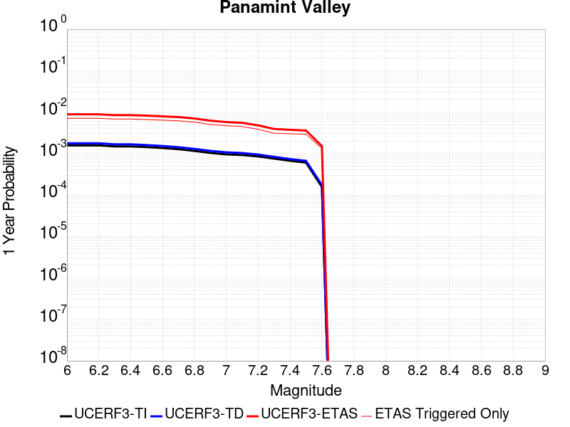 |  |

| Magnitude | 1 wk TI Prob | 1 wk TD Prob | 1 wk ETAS Prob | 1 wk ETAS/TD Gain | 1 wk ETAS Triggered Only | 1 mo TI Prob | 1 mo TD Prob | 1 mo ETAS Prob | 1 mo ETAS/TD Gain | 1 mo ETAS Triggered Only | 1 yr TI Prob | 1 yr TD Prob | 1 yr ETAS Prob | 1 yr ETAS/TD Gain | 1 yr ETAS Triggered Only | 10 yr TI Prob | 10 yr TD Prob | 10 yr ETAS Prob | 10 yr ETAS/TD Gain | 10 yr ETAS Triggered Only |
|-----|-----|-----|-----|-----|-----|-----|-----|-----|-----|-----|-----|-----|-----|-----|-----|-----|-----|-----|-----|-----|
| 6.0 | 3.0211835E-5 | 3.3986937E-5 | 6.439662E-4 | 18.947462 | 6.1E-4 | 1.2947287E-4 | 1.4565034E-4 | 0.0021653562 | 14.866812 | 0.00202 | 0.0015751923 | 0.00177188 | 0.008849317 | 4.9943094 | 0.00709 | 0.015640736 | 0.01758438 | 0.030925585 | 1.7586963 | 0.01358 |
| 6.1 | 3.0211835E-5 | 3.3986937E-5 | 6.439662E-4 | 18.947462 | 6.1E-4 | 1.2947287E-4 | 1.4565034E-4 | 0.0021653562 | 14.866812 | 0.00202 | 0.0015751923 | 0.00177188 | 0.008849317 | 4.9943094 | 0.00709 | 0.015640736 | 0.01758438 | 0.030925585 | 1.7586963 | 0.01358 |
| 6.2 | 3.0211835E-5 | 3.3986937E-5 | 6.439662E-4 | 18.947462 | 6.1E-4 | 1.2947287E-4 | 1.4565034E-4 | 0.0021653562 | 14.866812 | 0.00202 | 0.0015751923 | 0.00177188 | 0.008849317 | 4.9943094 | 0.00709 | 0.015640736 | 0.01758438 | 0.030925585 | 1.7586963 | 0.01358 |
| 6.3 | 2.8573924E-5 | 3.210498E-5 | 6.320857E-4 | 19.68809 | 6.0E-4 | 1.2245393E-4 | 1.3758568E-4 | 0.002127312 | 15.461725 | 0.00199 | 0.001489857 | 0.0016738464 | 0.008472447 | 5.0616636 | 0.00681 | 0.01479908 | 0.016618982 | 0.02928493 | 1.7621374 | 0.01288 |
| 6.4 | 2.8573924E-5 | 3.210498E-5 | 6.320857E-4 | 19.68809 | 6.0E-4 | 1.2245393E-4 | 1.3758568E-4 | 0.002127312 | 15.461725 | 0.00199 | 0.001489857 | 0.0016738464 | 0.008472447 | 5.0616636 | 0.00681 | 0.01479908 | 0.016618982 | 0.02928493 | 1.7621374 | 0.01288 |
| 6.5 | 2.7468774E-5 | 3.0830648E-5 | 6.3081214E-4 | 20.460554 | 6.0E-4 | 1.1771801E-4 | 1.3212481E-4 | 0.0020918658 | 15.832498 | 0.00196 | 0.0014322745 | 0.0016074601 | 0.008216819 | 5.111678 | 0.00662 | 0.014230782 | 0.015964814 | 0.028275095 | 1.7710882 | 0.01251 |
| 6.6 | 2.6135967E-5 | 2.9254603E-5 | 6.2923704E-4 | 21.508993 | 6.0E-4 | 1.1200648E-4 | 1.2537099E-4 | 0.0020251328 | 16.153122 | 0.0019 | 0.0013628257 | 0.0015253496 | 0.007905602 | 5.1828136 | 0.00639 | 0.013544982 | 0.015155134 | 0.026845243 | 1.7713629 | 0.01187 |
| 6.7 | 2.4498746E-5 | 2.7343389E-5 | 5.873281E-4 | 21.479712 | 5.6E-4 | 1.04990395E-4 | 1.17180825E-4 | 0.0019169699 | 16.359076 | 0.0018 | 0.0012775084 | 0.0014257679 | 0.0076069427 | 5.33533 | 0.00619 | 0.012701893 | 0.0141723305 | 0.025400909 | 1.7922887 | 0.01139 |
| 6.8 | 2.2244329E-5 | 2.4937352E-5 | 5.5492413E-4 | 22.25273 | 5.3E-4 | 9.532935E-5 | 1.0687011E-4 | 0.0017866906 | 16.718338 | 0.00168 | 0.0011600169 | 0.0013003887 | 0.0070229378 | 5.400645 | 0.00573 | 0.011539802 | 0.012933511 | 0.023258228 | 1.7982917 | 0.01046 |
| 6.9 | 1.9902658E-5 | 2.2292053E-5 | 4.922816E-4 | 22.083277 | 4.7E-4 | 8.529431E-5 | 9.553398E-5 | 0.0015453955 | 16.176395 | 0.00145 | 0.0010379635 | 0.001162524 | 0.0062166415 | 5.347538 | 0.00506 | 0.010331288 | 0.011569529 | 0.020613668 | 1.7817205 | 0.00915 |
| 7.0 | 1.8353881E-5 | 2.0567875E-5 | 4.6055883E-4 | 22.392143 | 4.4E-4 | 7.865712E-5 | 8.814516E-5 | 0.0014180279 | 16.087418 | 0.00133 | 9.5722964E-4 | 0.0010726567 | 0.005757626 | 5.3676314 | 0.00469 | 0.009531168 | 0.010679722 | 0.019019691 | 1.7809165 | 0.00843 |
| 7.1 | 1.7667631E-5 | 1.9774241E-5 | 4.2976614E-4 | 21.733635 | 4.1E-4 | 7.571623E-5 | 8.47441E-5 | 0.0013546365 | 15.985024 | 0.00127 | 9.2145515E-4 | 0.0010312885 | 0.005526648 | 5.358973 | 0.0045 | 0.009176437 | 0.010269914 | 0.01831642 | 1.7835027 | 0.00813 |
| 7.2 | 1.6381597E-5 | 1.8159777E-5 | 3.3815397E-4 | 18.621042 | 3.2E-4 | 7.020495E-5 | 7.782539E-5 | 0.0011077452 | 14.233726 | 0.00103 | 8.544101E-4 | 9.471295E-4 | 0.004793483 | 5.061064 | 0.00385 | 0.008511325 | 0.009435581 | 0.016448777 | 1.7432712 | 0.00708 |
| 7.3 | 1.4520491E-5 | 1.5967695E-5 | 2.8596338E-4 | 17.90887 | 2.7E-4 | 6.222919E-5 | 6.8431276E-5 | 8.483779E-4 | 12.397517 | 7.8E-4 | 7.57377E-4 | 8.3284854E-4 | 0.0039302665 | 4.7190657 | 0.0031 | 0.0075480095 | 0.008300383 | 0.0141414935 | 1.7037159 | 0.00589 |
| 7.4 | 1.2852287E-5 | 1.4146512E-5 | 2.7414283E-4 | 19.37883 | 2.6E-4 | 5.5080065E-5 | 6.0626586E-5 | 8.205805E-4 | 13.534994 | 7.6E-4 | 6.7039346E-4 | 7.3789456E-4 | 0.0037456735 | 5.076164 | 0.00301 | 0.0066837464 | 0.0073573655 | 0.012995576 | 1.7663355 | 0.00568 |
| 7.5 | 1.1637851E-5 | 1.2837783E-5 | 2.7283444E-4 | 21.252459 | 2.6E-4 | 4.987555E-5 | 5.5017998E-5 | 7.8497786E-4 | 14.267655 | 7.3E-4 | 6.070656E-4 | 6.6965393E-4 | 0.0036076852 | 5.3873873 | 0.00294 | 0.006054099 | 0.006679258 | 0.012172322 | 1.8224063 | 0.00553 |
| 7.6 | 3.0068115E-6 | 3.333416E-6 | 1.3333299E-4 | 39.9989 | 1.3E-4 | 1.2886271E-5 | 1.4286032E-5 | 2.8428217E-4 | 19.899311 | 2.7E-4 | 1.5687906E-4 | 1.7392583E-4 | 0.0015136928 | 8.703094 | 0.00134 | 0.0015676835 | 0.0017393373 | 0.004185076 | 2.4061325 | 0.00245 |

## Garlock (East)
*[(top)](#table-of-contents)*

| 1 Week | 1 Month | 1 Year | 10 Year |
|-----|-----|-----|-----|
| 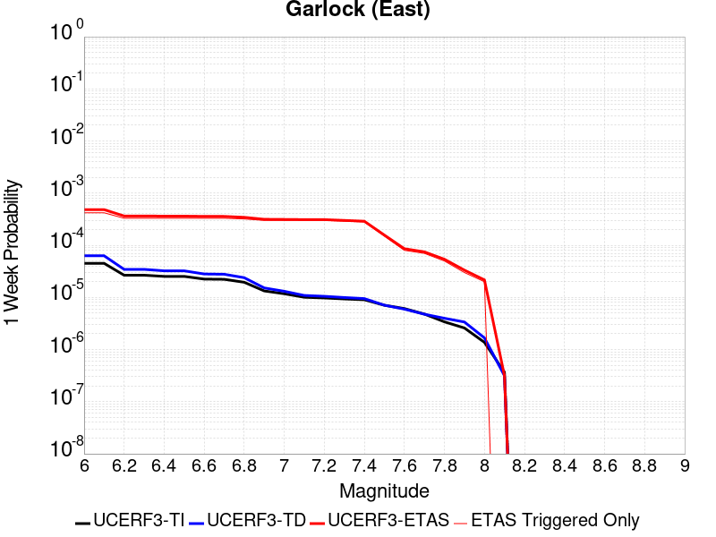 |  | 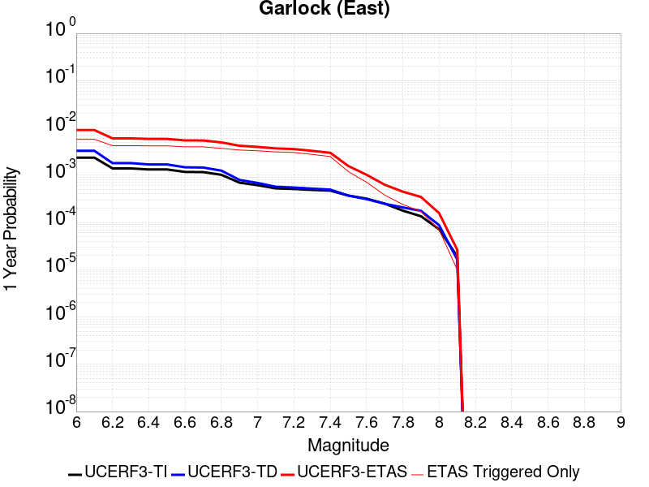 | 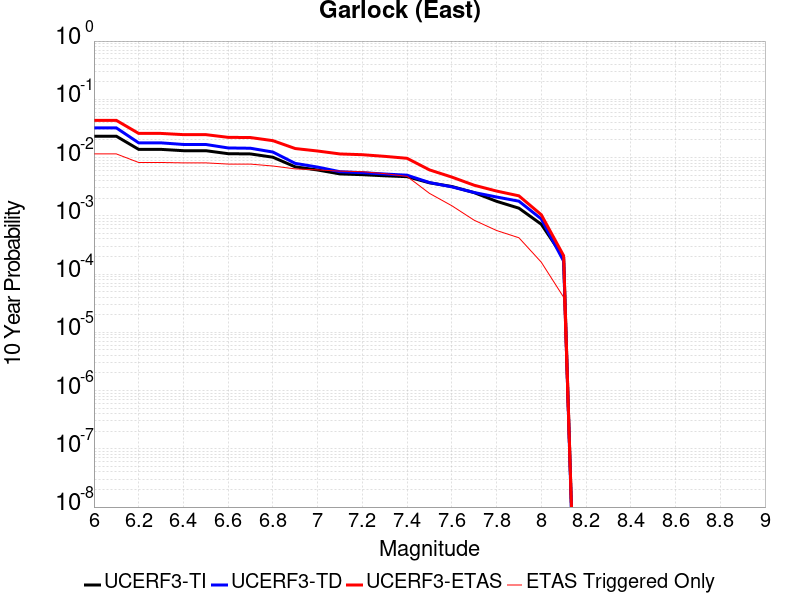 |

| Magnitude | 1 wk TI Prob | 1 wk TD Prob | 1 wk ETAS Prob | 1 wk ETAS/TD Gain | 1 wk ETAS Triggered Only | 1 mo TI Prob | 1 mo TD Prob | 1 mo ETAS Prob | 1 mo ETAS/TD Gain | 1 mo ETAS Triggered Only | 1 yr TI Prob | 1 yr TD Prob | 1 yr ETAS Prob | 1 yr ETAS/TD Gain | 1 yr ETAS Triggered Only | 10 yr TI Prob | 10 yr TD Prob | 10 yr ETAS Prob | 10 yr ETAS/TD Gain | 10 yr ETAS Triggered Only |
|-----|-----|-----|-----|-----|-----|-----|-----|-----|-----|-----|-----|-----|-----|-----|-----|-----|-----|-----|-----|-----|
| 6.0 | 4.5092507E-5 | 6.2913175E-5 | 4.8288674E-4 | 7.675447 | 4.2E-4 | 1.9323928E-4 | 2.6960255E-4 | 0.0018791684 | 6.970144 | 0.00161 | 0.0023501497 | 0.0032779162 | 0.008999101 | 2.7453725 | 0.00574 | 0.023254504 | 0.032356877 | 0.043542832 | 1.3457056 | 0.01156 |
| 6.1 | 4.5092507E-5 | 6.2913175E-5 | 4.8288674E-4 | 7.675447 | 4.2E-4 | 1.9323928E-4 | 2.6960255E-4 | 0.0018791684 | 6.970144 | 0.00161 | 0.0023501497 | 0.0032779162 | 0.008999101 | 2.7453725 | 0.00574 | 0.023254504 | 0.032356877 | 0.043542832 | 1.3457056 | 0.01156 |
| 6.2 | 2.6674514E-5 | 3.451754E-5 | 3.6450615E-4 | 10.560027 | 3.3E-4 | 1.1431433E-4 | 1.4792412E-4 | 0.0014177363 | 9.584213 | 0.00127 | 0.0013908884 | 0.0017995214 | 0.0060019456 | 3.335301 | 0.00421 | 0.01382215 | 0.017894316 | 0.025977045 | 1.4516926 | 0.00823 |
| 6.3 | 2.6674514E-5 | 3.451754E-5 | 3.6450615E-4 | 10.560027 | 3.3E-4 | 1.1431433E-4 | 1.4792412E-4 | 0.0014177363 | 9.584213 | 0.00127 | 0.0013908884 | 0.0017995214 | 0.0060019456 | 3.335301 | 0.00421 | 0.01382215 | 0.017894316 | 0.025977045 | 1.4516926 | 0.00823 |
| 6.4 | 2.5312667E-5 | 3.234662E-5 | 3.6233594E-4 | 11.201664 | 3.3E-4 | 1.0847834E-4 | 1.3862117E-4 | 0.0014084451 | 10.16039 | 0.00127 | 0.0013199237 | 0.0016864355 | 0.0058494033 | 3.4685009 | 0.00417 | 0.013121112 | 0.016782269 | 0.024756163 | 1.4751382 | 0.00811 |
| 6.5 | 2.5312667E-5 | 3.234662E-5 | 3.6233594E-4 | 11.201664 | 3.3E-4 | 1.0847834E-4 | 1.3862117E-4 | 0.0014084451 | 10.16039 | 0.00127 | 0.0013199237 | 0.0016864355 | 0.0058494033 | 3.4685009 | 0.00417 | 0.013121112 | 0.016782269 | 0.024756163 | 1.4751382 | 0.00811 |
| 6.6 | 2.246556E-5 | 2.8141178E-5 | 3.581319E-4 | 12.726258 | 3.3E-4 | 9.627742E-5 | 1.2059961E-4 | 0.00136045 | 11.280717 | 0.00124 | 0.0011715472 | 0.0014673348 | 0.0054315096 | 3.7016156 | 0.00397 | 0.011653901 | 0.014622457 | 0.022239426 | 1.520909 | 0.00773 |
| 6.7 | 2.2241198E-5 | 2.7810898E-5 | 3.5780173E-4 | 12.865521 | 3.3E-4 | 9.531594E-5 | 1.1918425E-4 | 0.0013590364 | 11.402819 | 0.00124 | 0.0011598538 | 0.001450126 | 0.005414369 | 3.7337232 | 0.00397 | 0.011538187 | 0.01445264 | 0.022061065 | 1.5264385 | 0.00772 |
| 6.8 | 1.9528685E-5 | 2.3905086E-5 | 3.4389744E-4 | 14.385953 | 3.2E-4 | 8.369167E-5 | 1.0244646E-4 | 0.0012923245 | 12.614634 | 0.00119 | 0.0010184698 | 0.0012465916 | 0.0049319915 | 3.9563813 | 0.00369 | 0.010138147 | 0.0124399755 | 0.019510906 | 1.5684038 | 0.00716 |
| 6.9 | 1.3318621E-5 | 1.520483E-5 | 3.1520028E-4 | 20.730274 | 3.0E-4 | 5.7078556E-5 | 6.5161956E-5 | 0.0011750896 | 18.03337 | 0.00111 | 6.9470983E-4 | 7.930638E-4 | 0.004190367 | 5.283771 | 0.0034 | 0.0069254204 | 0.007942963 | 0.014282208 | 1.7980956 | 0.00639 |
| 7.0 | 1.1760853E-5 | 1.3113529E-5 | 3.131096E-4 | 23.876837 | 3.0E-4 | 5.0402683E-5 | 5.6199657E-5 | 0.0011661373 | 20.7499 | 0.00111 | 6.134799E-4 | 6.8402104E-4 | 0.0039617773 | 5.7918944 | 0.00328 | 0.0061178906 | 0.006859494 | 0.012957376 | 1.8889698 | 0.00614 |
| 7.1 | 1.0064758E-5 | 1.0908474E-5 | 3.109052E-4 | 28.501255 | 3.0E-4 | 4.3133965E-5 | 4.6749785E-5 | 0.0011366989 | 24.314526 | 0.00109 | 5.2502943E-4 | 5.690335E-4 | 0.0036772639 | 6.4622974 | 0.00311 | 0.005237907 | 0.005715874 | 0.011532436 | 2.0176156 | 0.00585 |
| 7.2 | 9.768808E-6 | 1.0504312E-5 | 3.1050117E-4 | 29.5594 | 3.0E-4 | 4.186565E-5 | 4.5017725E-5 | 0.0011149696 | 24.767347 | 0.00107 | 5.095951E-4 | 5.4795644E-4 | 0.0035663017 | 6.508367 | 0.00302 | 0.0050842804 | 0.0055061206 | 0.011194626 | 2.033124 | 0.00572 |
| 7.3 | 9.344516E-6 | 9.949868E-6 | 2.99947E-4 | 30.145824 | 2.9E-4 | 4.004731E-5 | 4.2641615E-5 | 0.0010725977 | 25.153778 | 0.00103 | 4.8746695E-4 | 5.1904144E-4 | 0.0032676142 | 6.2954783 | 0.00275 | 0.0048639905 | 0.0052177473 | 0.010490093 | 2.010464 | 0.0053 |
| 7.4 | 9.023491E-6 | 9.495952E-6 | 2.894933E-4 | 30.485966 | 2.8E-4 | 3.867153E-5 | 4.0696326E-5 | 9.606589E-4 | 23.605545 | 9.2E-4 | 4.7072413E-4 | 4.9536844E-4 | 0.00297414 | 6.0038943 | 0.00248 | 0.004697283 | 0.004981145 | 0.009707484 | 1.9488461 | 0.00475 |
| 7.5 | 7.081253E-6 | 7.0923793E-6 | 1.5709132E-4 | 22.149311 | 1.5E-4 | 3.0347876E-5 | 3.039556E-5 | 4.503828E-4 | 14.817388 | 4.2E-4 | 3.6942272E-4 | 3.7000384E-4 | 0.0015595636 | 4.214993 | 0.00119 | 0.003688092 | 0.003726762 | 0.006147706 | 1.6496106 | 0.00243 |
| 7.6 | 6.116396E-6 | 5.9637186E-6 | 8.596324E-5 | 14.41437 | 8.0E-5 | 2.6212863E-5 | 2.5558546E-5 | 2.2555343E-4 | 8.824971 | 2.0E-4 | 3.1909486E-4 | 3.1113112E-4 | 0.0010209102 | 3.2812862 | 7.1E-4 | 0.0031863707 | 0.0031380828 | 0.004623407 | 1.4733222 | 0.00149 |
| 7.7 | 4.797145E-6 | 4.761514E-6 | 7.476118E-5 | 15.701136 | 7.0E-5 | 2.055903E-5 | 2.040633E-5 | 1.4040388E-4 | 6.8804083 | 1.2E-4 | 2.5027743E-4 | 2.484189E-4 | 6.2832446E-4 | 2.5292945 | 3.8E-4 | 0.0024999576 | 0.0025115511 | 0.0033494413 | 1.3336147 | 8.4E-4 |
| 7.8 | 3.4028885E-6 | 3.982237E-6 | 5.398204E-5 | 13.555707 | 5.0E-5 | 1.4583726E-5 | 1.7066619E-5 | 1.0706508E-4 | 6.273362 | 9.0E-5 | 1.775424E-4 | 2.0776634E-4 | 4.4771648E-4 | 2.154904 | 2.4E-4 | 0.0017740062 | 0.002103188 | 0.0026620103 | 1.2657025 | 5.6E-4 |
| 7.9 | 2.5928412E-6 | 3.3756398E-6 | 3.3375538E-5 | 9.887174 | 3.0E-5 | 1.1112129E-5 | 1.4466948E-5 | 7.446608E-5 | 5.1473246 | 6.0E-5 | 1.3528178E-4 | 1.7612091E-4 | 3.46091E-4 | 1.965076 | 1.7E-4 | 0.0013519945 | 0.0017829009 | 0.002202152 | 1.2351512 | 4.2E-4 |
| 8.0 | 1.3743648E-6 | 1.6749214E-6 | 2.1674889E-5 | 12.94084 | 2.0E-5 | 5.8901214E-6 | 7.1782147E-6 | 3.7178E-5 | 5.179282 | 3.0E-5 | 7.1709874E-5 | 8.739129E-5 | 1.5738518E-4 | 1.8009251 | 7.0E-5 | 7.1686733E-4 | 8.8447647E-4 | 0.001044335 | 1.180738 | 1.6E-4 |
| 8.1 | 3.6733252E-7 | 3.15158E-7 | 3.15158E-7 | 1.0 | 0.0 | 1.5742813E-6 | 1.3506765E-6 | 1.3506765E-6 | 1.0 | 0.0 | 1.9166706E-5 | 1.6444379E-5 | 2.6444213E-5 | 1.6081005 | 1.0E-5 | 1.9165053E-4 | 1.6652296E-4 | 2.0651631E-4 | 1.2401671 | 4.0E-5 |

## Ash Hill
*[(top)](#table-of-contents)*

| 1 Week | 1 Month | 1 Year | 10 Year |
|-----|-----|-----|-----|
| 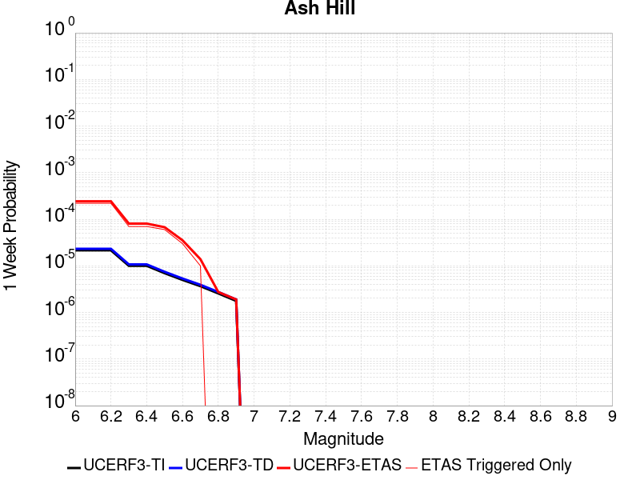 |  | 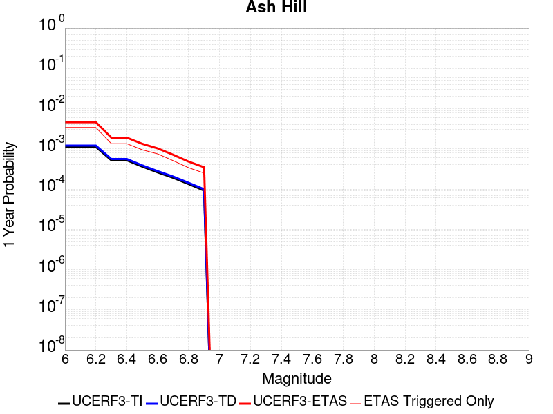 |  |

| Magnitude | 1 wk TI Prob | 1 wk TD Prob | 1 wk ETAS Prob | 1 wk ETAS/TD Gain | 1 wk ETAS Triggered Only | 1 mo TI Prob | 1 mo TD Prob | 1 mo ETAS Prob | 1 mo ETAS/TD Gain | 1 mo ETAS Triggered Only | 1 yr TI Prob | 1 yr TD Prob | 1 yr ETAS Prob | 1 yr ETAS/TD Gain | 1 yr ETAS Triggered Only | 10 yr TI Prob | 10 yr TD Prob | 10 yr ETAS Prob | 10 yr ETAS/TD Gain | 10 yr ETAS Triggered Only |
|-----|-----|-----|-----|-----|-----|-----|-----|-----|-----|-----|-----|-----|-----|-----|-----|-----|-----|-----|-----|-----|
| 6.0 | 2.1545662E-5 | 2.3195107E-5 | 2.4319E-4 | 10.484539 | 2.2E-4 | 9.2335285E-5 | 9.9404264E-5 | 9.593188E-4 | 9.650681 | 8.6E-4 | 0.0011236023 | 0.001209655 | 0.00461553 | 3.8155756 | 0.00341 | 0.011179381 | 0.012038689 | 0.018598752 | 1.5449151 | 0.00664 |
| 6.1 | 2.1545662E-5 | 2.3195107E-5 | 2.4319E-4 | 10.484539 | 2.2E-4 | 9.2335285E-5 | 9.9404264E-5 | 9.593188E-4 | 9.650681 | 8.6E-4 | 0.0011236023 | 0.001209655 | 0.00461553 | 3.8155756 | 0.00341 | 0.011179381 | 0.012038689 | 0.018598752 | 1.5449151 | 0.00664 |
| 6.2 | 2.1545662E-5 | 2.3195107E-5 | 2.4319E-4 | 10.484539 | 2.2E-4 | 9.2335285E-5 | 9.9404264E-5 | 9.593188E-4 | 9.650681 | 8.6E-4 | 0.0011236023 | 0.001209655 | 0.00461553 | 3.8155756 | 0.00341 | 0.011179381 | 0.012038689 | 0.018598752 | 1.5449151 | 0.00664 |
| 6.3 | 1.0025529E-5 | 1.07472215E-5 | 8.074647E-5 | 7.5132413 | 7.0E-5 | 4.2965847E-5 | 4.6058783E-5 | 3.560445E-4 | 7.73022 | 3.1E-4 | 5.229836E-4 | 5.6063465E-4 | 0.0019098778 | 3.4066355 | 0.00135 | 0.005217545 | 0.0055935155 | 0.008258525 | 1.4764463 | 0.00268 |
| 6.4 | 1.0025529E-5 | 1.07472215E-5 | 8.074647E-5 | 7.5132413 | 7.0E-5 | 4.2965847E-5 | 4.6058783E-5 | 3.560445E-4 | 7.73022 | 3.1E-4 | 5.229836E-4 | 5.6063465E-4 | 0.0019098778 | 3.4066355 | 0.00135 | 0.005217545 | 0.0055935155 | 0.008258525 | 1.4764463 | 0.00268 |
| 6.5 | 6.9617327E-6 | 7.456831E-6 | 6.7456385E-5 | 9.046253 | 6.0E-5 | 2.9835655E-5 | 3.1957505E-5 | 2.5195046E-4 | 7.883922 | 2.2E-4 | 3.6318856E-4 | 3.8902182E-4 | 0.0013386522 | 3.4410725 | 9.5E-4 | 0.0036259557 | 0.0038842626 | 0.0057071545 | 1.4693019 | 0.00183 |
| 6.6 | 4.9919777E-6 | 5.3468293E-6 | 3.5346668E-5 | 6.6107717 | 3.0E-5 | 2.1394015E-5 | 2.2914819E-5 | 1.9291093E-4 | 8.41861 | 1.7E-4 | 2.60441E-4 | 2.789589E-4 | 0.0010287497 | 3.687818 | 7.5E-4 | 0.0026013597 | 0.002786746 | 0.00411304 | 1.4759291 | 0.00133 |
| 6.7 | 3.6630722E-6 | 3.924728E-6 | 1.3924689E-5 | 3.5479374 | 1.0E-5 | 1.5698786E-5 | 1.6820186E-5 | 1.2681834E-4 | 7.5396514 | 1.1E-4 | 1.9111596E-4 | 2.0477225E-4 | 7.1466784E-4 | 3.4900618 | 5.1E-4 | 0.0019095168 | 0.0020463988 | 0.0029345774 | 1.4340204 | 8.9E-4 |
| 6.8 | 2.5599613E-6 | 2.7449987E-6 | 2.7449987E-6 | 1.0 | 0.0 | 1.0971216E-5 | 1.1764255E-5 | 9.1763315E-5 | 7.8001804 | 8.0E-5 | 1.3356637E-4 | 1.4322533E-4 | 4.8317664E-4 | 3.3735416 | 3.4E-4 | 0.0013348613 | 0.0014318153 | 0.002070899 | 1.446345 | 6.4E-4 |
| 6.9 | 1.7684905E-6 | 1.8969218E-6 | 1.8969218E-6 | 1.0 | 0.0 | 7.579223E-6 | 8.129665E-6 | 6.812918E-5 | 8.380318 | 6.0E-5 | 9.2273134E-5 | 9.897867E-5 | 3.4895394E-4 | 3.5255466 | 2.5E-4 | 9.223483E-4 | 9.897867E-4 | 0.0014593216 | 1.4743798 | 4.7E-4 |

## Hunter Mountain-Saline Valley
*[(top)](#table-of-contents)*

| 1 Week | 1 Month | 1 Year | 10 Year |
|-----|-----|-----|-----|
| 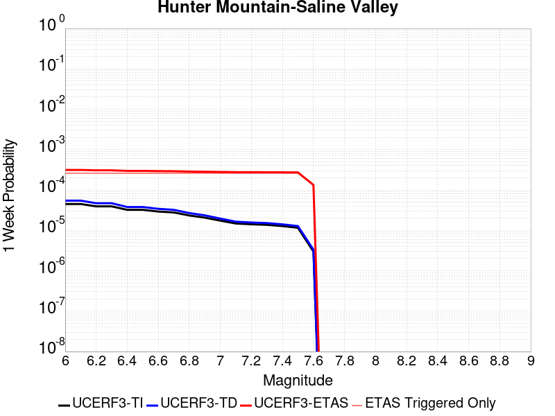 |  |  | 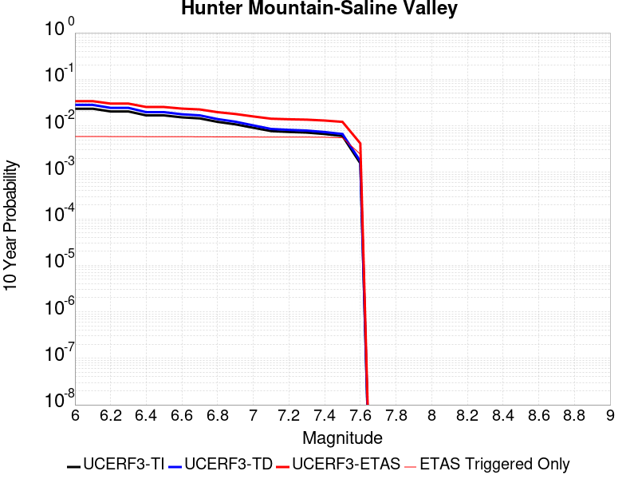 |

| Magnitude | 1 wk TI Prob | 1 wk TD Prob | 1 wk ETAS Prob | 1 wk ETAS/TD Gain | 1 wk ETAS Triggered Only | 1 mo TI Prob | 1 mo TD Prob | 1 mo ETAS Prob | 1 mo ETAS/TD Gain | 1 mo ETAS Triggered Only | 1 yr TI Prob | 1 yr TD Prob | 1 yr ETAS Prob | 1 yr ETAS/TD Gain | 1 yr ETAS Triggered Only | 10 yr TI Prob | 10 yr TD Prob | 10 yr ETAS Prob | 10 yr ETAS/TD Gain | 10 yr ETAS Triggered Only |
|-----|-----|-----|-----|-----|-----|-----|-----|-----|-----|-----|-----|-----|-----|-----|-----|-----|-----|-----|-----|-----|
| 6.0 | 4.5103672E-5 | 5.4575114E-5 | 3.1456092E-4 | 5.7638164 | 2.6E-4 | 1.9328714E-4 | 2.3386894E-4 | 9.936912E-4 | 4.2489233 | 7.6E-4 | 0.002350731 | 0.0028437607 | 0.005915002 | 2.0799928 | 0.00308 | 0.023260195 | 0.028094335 | 0.03381886 | 1.2037609 | 0.00589 |
| 6.1 | 4.5103672E-5 | 5.4575114E-5 | 3.1456092E-4 | 5.7638164 | 2.6E-4 | 1.9328714E-4 | 2.3386894E-4 | 9.936912E-4 | 4.2489233 | 7.6E-4 | 0.002350731 | 0.0028437607 | 0.005915002 | 2.0799928 | 0.00308 | 0.023260195 | 0.028094335 | 0.03381886 | 1.2037609 | 0.00589 |
| 6.2 | 3.9363465E-5 | 4.7067442E-5 | 3.070552E-4 | 6.5237284 | 2.6E-4 | 1.6868966E-4 | 2.0169823E-4 | 9.615449E-4 | 4.7672453 | 7.6E-4 | 0.002051862 | 0.0024530238 | 0.005515493 | 2.2484465 | 0.00307 | 0.020330196 | 0.024275525 | 0.029993271 | 1.2355354 | 0.00586 |
| 6.3 | 3.9363465E-5 | 4.7067442E-5 | 3.070552E-4 | 6.5237284 | 2.6E-4 | 1.6868966E-4 | 2.0169823E-4 | 9.615449E-4 | 4.7672453 | 7.6E-4 | 0.002051862 | 0.0024530238 | 0.005515493 | 2.2484465 | 0.00307 | 0.020330196 | 0.024275525 | 0.029993271 | 1.2355354 | 0.00586 |
| 6.4 | 3.2311684E-5 | 3.7954065E-5 | 2.979442E-4 | 7.8501263 | 2.6E-4 | 1.384713E-4 | 1.6265054E-4 | 9.2252693E-4 | 5.6718345 | 7.6E-4 | 0.0016845843 | 0.0019785445 | 0.00503249 | 2.5435314 | 0.00306 | 0.016718714 | 0.019618044 | 0.02533367 | 1.2913454 | 0.00583 |
| 6.5 | 3.2311684E-5 | 3.7954065E-5 | 2.979442E-4 | 7.8501263 | 2.6E-4 | 1.384713E-4 | 1.6265054E-4 | 9.2252693E-4 | 5.6718345 | 7.6E-4 | 0.0016845843 | 0.0019785445 | 0.00503249 | 2.5435314 | 0.00306 | 0.016718714 | 0.019618044 | 0.02533367 | 1.2913454 | 0.00583 |
| 6.6 | 2.9305844E-5 | 3.4184548E-5 | 2.9417567E-4 | 8.6055155 | 2.6E-4 | 1.2559042E-4 | 1.4649733E-4 | 9.06386E-4 | 6.1870475 | 7.6E-4 | 0.0015279909 | 0.0017822086 | 0.004836755 | 2.7139108 | 0.00306 | 0.015175272 | 0.017687084 | 0.023404146 | 1.3232337 | 0.00582 |
| 6.7 | 2.7826512E-5 | 3.2346827E-5 | 2.923384E-4 | 9.037622 | 2.6E-4 | 1.19251024E-4 | 1.3862223E-4 | 8.9851685E-4 | 6.481766 | 7.6E-4 | 0.0014509142 | 0.0016864793 | 0.0047413185 | 2.8113708 | 0.00306 | 0.014414776 | 0.016744496 | 0.022447377 | 1.3405825 | 0.0058 |
| 6.8 | 2.3389874E-5 | 2.6868787E-5 | 2.868618E-4 | 10.676395 | 2.6E-4 | 1.0023846E-4 | 1.1514713E-4 | 8.7505963E-4 | 7.5994916 | 7.6E-4 | 0.00121972 | 0.001401062 | 0.0044467887 | 3.17387 | 0.00305 | 0.01213047 | 0.013928502 | 0.019618135 | 1.4084885 | 0.00577 |
| 6.9 | 2.069209E-5 | 2.3571833E-5 | 2.835657E-4 | 12.029854 | 2.6E-4 | 8.867737E-5 | 1.0101843E-4 | 8.6094165E-4 | 8.522619 | 7.6E-4 | 0.0010791123 | 0.0012292416 | 0.004265505 | 3.4700296 | 0.00304 | 0.010738871 | 0.012229453 | 0.017919011 | 1.465234 | 0.00576 |
| 7.0 | 1.7462342E-5 | 1.9635027E-5 | 2.7962992E-4 | 14.241383 | 2.6E-4 | 7.483646E-5 | 8.414753E-5 | 8.4408355E-4 | 10.030997 | 7.6E-4 | 9.1075303E-4 | 0.0010240373 | 0.004060924 | 3.965602 | 0.00304 | 0.009070295 | 0.010196818 | 0.01586839 | 1.55621 | 0.00573 |
| 7.1 | 1.4807709E-5 | 1.644299E-5 | 2.7643872E-4 | 16.811949 | 2.6E-4 | 6.3460066E-5 | 7.0468144E-5 | 8.304146E-4 | 11.784255 | 7.6E-4 | 7.723524E-4 | 8.576285E-4 | 0.0038750384 | 4.518318 | 0.00302 | 0.007696735 | 0.0085461745 | 0.014197461 | 1.6612651 | 0.0057 |
| 7.2 | 1.4180048E-5 | 1.5699527E-5 | 2.7569543E-4 | 17.56075 | 2.6E-4 | 6.077022E-5 | 6.728204E-5 | 8.272309E-4 | 12.294973 | 7.6E-4 | 7.396263E-4 | 8.188672E-4 | 0.0038363943 | 4.685002 | 0.00302 | 0.0073716943 | 0.00816145 | 0.01381493 | 1.6927053 | 0.0057 |
| 7.3 | 1.3730402E-5 | 1.5173232E-5 | 2.751693E-4 | 18.13518 | 2.6E-4 | 5.8843252E-5 | 6.502661E-5 | 8.249772E-4 | 12.686764 | 7.6E-4 | 7.161811E-4 | 7.9142745E-4 | 0.0038090374 | 4.81287 | 0.00302 | 0.007138774 | 0.007889022 | 0.013544055 | 1.716823 | 0.0057 |
| 7.4 | 1.2810095E-5 | 1.4110371E-5 | 2.7410671E-4 | 19.425903 | 2.6E-4 | 5.489925E-5 | 6.0471706E-5 | 8.2042575E-4 | 13.5671015 | 7.6E-4 | 6.681934E-4 | 7.3601014E-4 | 0.0037437947 | 5.0866075 | 0.00301 | 0.006661878 | 0.0073386207 | 0.012967011 | 1.7669548 | 0.00567 |
| 7.5 | 1.1595659E-5 | 1.2801643E-5 | 2.7279832E-4 | 21.309633 | 2.6E-4 | 4.9694736E-5 | 5.4863118E-5 | 7.848231E-4 | 14.305113 | 7.3E-4 | 6.0486543E-4 | 6.677694E-4 | 0.0036058063 | 5.3997774 | 0.00294 | 0.006032217 | 0.0066605005 | 0.012143734 | 1.8232466 | 0.00552 |
| 7.6 | 2.997694E-6 | 3.325541E-6 | 1.3332511E-4 | 40.091255 | 1.3E-4 | 1.28471975E-5 | 1.4252282E-5 | 2.8424844E-4 | 19.944065 | 2.7E-4 | 1.564034E-4 | 1.73515E-4 | 0.0015132825 | 8.721335 | 0.00134 | 0.0015629337 | 0.0017352314 | 0.00418098 | 2.4094656 | 0.00245 |

## Blackwater
*[(top)](#table-of-contents)*

| 1 Week | 1 Month | 1 Year | 10 Year |
|-----|-----|-----|-----|
| 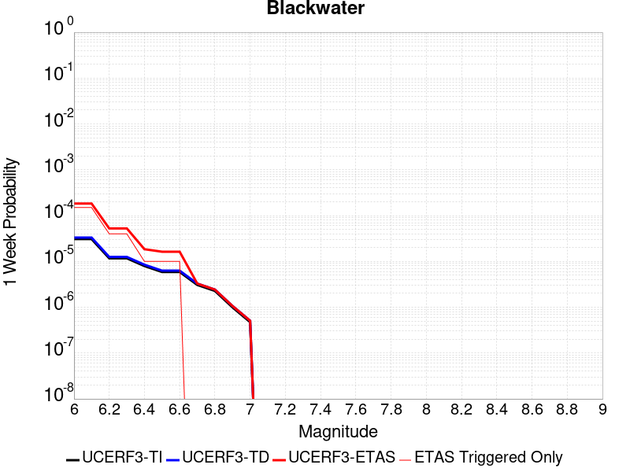 |  |  | 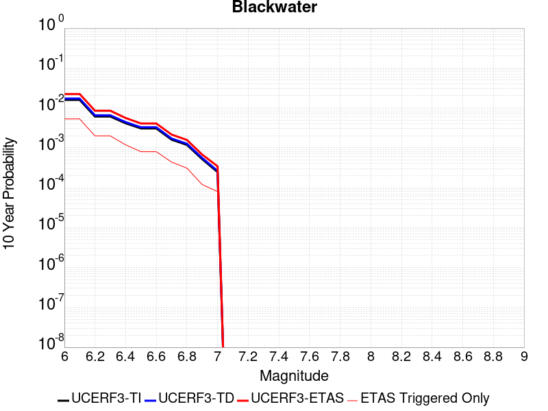 |

| Magnitude | 1 wk TI Prob | 1 wk TD Prob | 1 wk ETAS Prob | 1 wk ETAS/TD Gain | 1 wk ETAS Triggered Only | 1 mo TI Prob | 1 mo TD Prob | 1 mo ETAS Prob | 1 mo ETAS/TD Gain | 1 mo ETAS Triggered Only | 1 yr TI Prob | 1 yr TD Prob | 1 yr ETAS Prob | 1 yr ETAS/TD Gain | 1 yr ETAS Triggered Only | 10 yr TI Prob | 10 yr TD Prob | 10 yr ETAS Prob | 10 yr ETAS/TD Gain | 10 yr ETAS Triggered Only |
|-----|-----|-----|-----|-----|-----|-----|-----|-----|-----|-----|-----|-----|-----|-----|-----|-----|-----|-----|-----|-----|
| 6.0 | 3.0708583E-5 | 3.3096807E-5 | 1.8309183E-4 | 5.5320096 | 1.5E-4 | 1.3160157E-4 | 1.4183651E-4 | 8.1174145E-4 | 5.7230783 | 6.7E-4 | 0.0016010714 | 0.0017256284 | 0.004311159 | 2.4983125 | 0.00259 | 0.015895851 | 0.017136125 | 0.022345304 | 1.3039881 | 0.0053 |
| 6.1 | 3.0708583E-5 | 3.3096807E-5 | 1.8309183E-4 | 5.5320096 | 1.5E-4 | 1.3160157E-4 | 1.4183651E-4 | 8.1174145E-4 | 5.7230783 | 6.7E-4 | 0.0016010714 | 0.0017256284 | 0.004311159 | 2.4983125 | 0.00259 | 0.015895851 | 0.017136125 | 0.022345304 | 1.3039881 | 0.0053 |
| 6.2 | 1.1707779E-5 | 1.2545455E-5 | 5.2544954E-5 | 4.1883655 | 4.0E-5 | 5.017523E-5 | 5.3765183E-5 | 2.8375283E-4 | 5.2776313 | 2.3E-4 | 6.107122E-4 | 6.5440417E-4 | 0.0016237694 | 2.4812944 | 9.7E-4 | 0.006090366 | 0.0065257424 | 0.008502756 | 1.3029561 | 0.00199 |
| 6.3 | 1.1707779E-5 | 1.2545455E-5 | 5.2544954E-5 | 4.1883655 | 4.0E-5 | 5.017523E-5 | 5.3765183E-5 | 2.8375283E-4 | 5.2776313 | 2.3E-4 | 6.107122E-4 | 6.5440417E-4 | 0.0016237694 | 2.4812944 | 9.7E-4 | 0.006090366 | 0.0065257424 | 0.008502756 | 1.3029561 | 0.00199 |
| 6.4 | 7.929244E-6 | 8.480317E-6 | 1.8480232E-5 | 2.179191 | 1.0E-5 | 3.3982033E-5 | 3.6343732E-5 | 1.7633864E-4 | 4.851969 | 1.4E-4 | 4.136527E-4 | 4.4239915E-4 | 0.0010121469 | 2.2878592 | 5.7E-4 | 0.0041288356 | 0.00441559 | 0.005600335 | 1.2683097 | 0.00119 |
| 6.5 | 5.8832115E-6 | 6.286151E-6 | 1.6286089E-5 | 2.5907886 | 1.0E-5 | 2.521352E-5 | 2.6940383E-5 | 1.1693796E-4 | 4.34062 | 9.0E-5 | 3.0693135E-4 | 3.2795232E-4 | 6.878343E-4 | 2.0973606 | 3.6E-4 | 0.0030650778 | 0.003274937 | 0.004072317 | 1.2434795 | 8.0E-4 |
| 6.6 | 5.8832115E-6 | 6.286151E-6 | 1.6286089E-5 | 2.5907886 | 1.0E-5 | 2.521352E-5 | 2.6940383E-5 | 1.1693796E-4 | 4.34062 | 9.0E-5 | 3.0693135E-4 | 3.2795232E-4 | 6.878343E-4 | 2.0973606 | 3.6E-4 | 0.0030650778 | 0.003274937 | 0.004072317 | 1.2434795 | 8.0E-4 |
| 6.7 | 3.0715053E-6 | 3.2815494E-6 | 3.2815494E-6 | 1.0 | 0.0 | 1.3163528E-5 | 1.4063714E-5 | 6.406301E-5 | 4.5551987 | 5.0E-5 | 1.6025416E-4 | 1.7121343E-4 | 3.8117747E-4 | 2.2263293 | 2.1E-4 | 0.0016013865 | 0.0017109298 | 0.002150177 | 1.2567301 | 4.4E-4 |
| 6.8 | 2.2722281E-6 | 2.4288158E-6 | 2.4288158E-6 | 1.0 | 0.0 | 9.738084E-6 | 1.0409174E-5 | 6.0408653E-5 | 5.803405 | 5.0E-5 | 1.1855473E-4 | 1.2672524E-4 | 3.0670242E-4 | 2.4202158 | 1.8E-4 | 0.001184915 | 0.00126662 | 0.0015762274 | 1.2444359 | 3.1E-4 |
| 6.9 | 9.952399E-7 | 1.0653768E-6 | 1.0653768E-6 | 1.0 | 0.0 | 4.265307E-6 | 4.5658953E-6 | 3.4565757E-5 | 7.570423 | 3.0E-5 | 5.1928873E-5 | 5.5588873E-5 | 1.4558386E-4 | 2.6189392 | 9.0E-5 | 5.191674E-4 | 5.558003E-4 | 6.757336E-4 | 1.2157849 | 1.2E-4 |
| 7.0 | 4.7385504E-7 | 5.075694E-7 | 5.075694E-7 | 1.0 | 0.0 | 2.0308057E-6 | 2.1752971E-6 | 1.21752755E-5 | 5.597063 | 1.0E-5 | 2.4724779E-5 | 2.6484244E-5 | 8.648266E-5 | 3.2654378 | 6.0E-5 | 2.4722028E-4 | 2.6484244E-4 | 3.4482125E-4 | 1.3019863 | 8.0E-5 |

## Garlock (West)
*[(top)](#table-of-contents)*

| 1 Week | 1 Month | 1 Year | 10 Year |
|-----|-----|-----|-----|
| 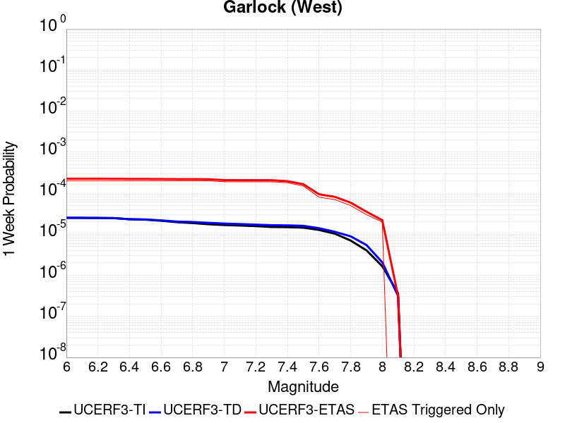 | 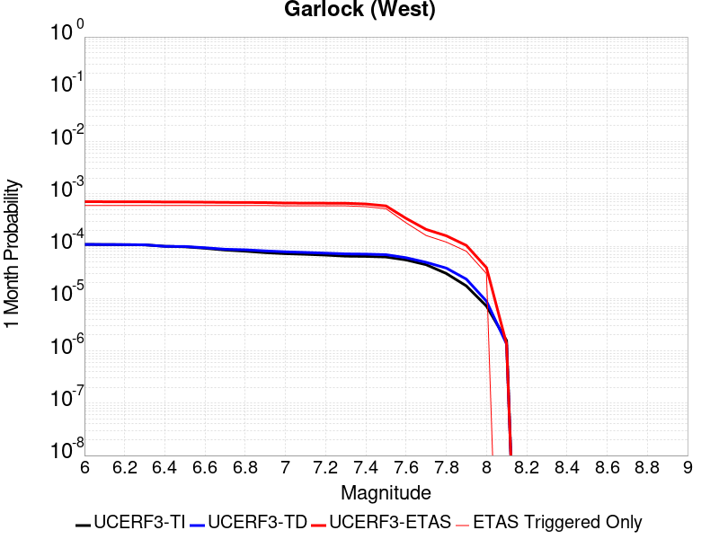 |  |  |

| Magnitude | 1 wk TI Prob | 1 wk TD Prob | 1 wk ETAS Prob | 1 wk ETAS/TD Gain | 1 wk ETAS Triggered Only | 1 mo TI Prob | 1 mo TD Prob | 1 mo ETAS Prob | 1 mo ETAS/TD Gain | 1 mo ETAS Triggered Only | 1 yr TI Prob | 1 yr TD Prob | 1 yr ETAS Prob | 1 yr ETAS/TD Gain | 1 yr ETAS Triggered Only | 10 yr TI Prob | 10 yr TD Prob | 10 yr ETAS Prob | 10 yr ETAS/TD Gain | 10 yr ETAS Triggered Only |
|-----|-----|-----|-----|-----|-----|-----|-----|-----|-----|-----|-----|-----|-----|-----|-----|-----|-----|-----|-----|-----|
| 6.0 | 2.5181727E-5 | 2.5210844E-5 | 2.252058E-4 | 8.932895 | 2.0E-4 | 1.0791722E-4 | 1.0804202E-4 | 7.079772E-4 | 6.552795 | 6.0E-4 | 0.0013131002 | 0.0013146213 | 0.0034318343 | 2.6105118 | 0.00212 | 0.013053683 | 0.013148927 | 0.017421992 | 1.3249744 | 0.00433 |
| 6.1 | 2.5077732E-5 | 2.511191E-5 | 2.251069E-4 | 8.9641485 | 2.0E-4 | 1.0747157E-4 | 1.0761805E-4 | 7.0755347E-4 | 6.5746727 | 6.0E-4 | 0.001307681 | 0.0013094657 | 0.0034266897 | 2.6168609 | 0.00212 | 0.013000126 | 0.01309798 | 0.017371265 | 1.3262553 | 0.00433 |
| 6.2 | 2.494612E-5 | 2.4993578E-5 | 2.2498857E-4 | 9.001856 | 2.0E-4 | 1.0690756E-4 | 1.0711096E-4 | 7.070467E-4 | 6.6010675 | 6.0E-4 | 0.0013008224 | 0.0013032992 | 0.0034205362 | 2.624521 | 0.00212 | 0.012932341 | 0.01303704 | 0.01731059 | 1.3278006 | 0.00433 |
| 6.3 | 2.4733758E-5 | 2.481293E-5 | 2.2480797E-4 | 9.060113 | 2.0E-4 | 1.0599751E-4 | 1.0633682E-4 | 7.06273E-4 | 6.641848 | 6.0E-4 | 0.0012897556 | 0.0012938853 | 0.0034111422 | 2.6363559 | 0.00212 | 0.012822957 | 0.012944002 | 0.017217955 | 1.3301879 | 0.00433 |
| 6.4 | 2.3237335E-5 | 2.3192146E-5 | 2.2318751E-4 | 9.623409 | 2.0E-4 | 9.958477E-5 | 9.939114E-5 | 6.993315E-4 | 7.036155 | 6.0E-4 | 0.0012117702 | 0.0012094182 | 0.0033268542 | 2.750789 | 0.00212 | 0.012051838 | 0.012108807 | 0.016366618 | 1.3516293 | 0.00431 |
| 6.5 | 2.2732203E-5 | 2.3006645E-5 | 2.2300205E-4 | 9.692941 | 2.0E-4 | 9.742009E-5 | 9.8596196E-5 | 6.9853704E-4 | 7.0848274 | 6.0E-4 | 0.0011854442 | 0.0011997505 | 0.0033172069 | 2.764914 | 0.00212 | 0.011791403 | 0.012013179 | 0.016271403 | 1.3544626 | 0.00431 |
| 6.6 | 2.1319436E-5 | 2.1786731E-5 | 2.2178238E-4 | 10.179699 | 2.0E-4 | 9.136581E-5 | 9.336838E-5 | 6.933124E-4 | 7.4255586 | 6.0E-4 | 0.001111811 | 0.0011361695 | 0.0032537607 | 2.8637989 | 0.00212 | 0.011062649 | 0.011384028 | 0.015635077 | 1.3734221 | 0.0043 |
| 6.7 | 1.970802E-5 | 2.0406487E-5 | 2.204024E-4 | 10.800605 | 2.0E-4 | 8.446021E-5 | 8.745345E-5 | 6.87401E-4 | 7.860193 | 6.0E-4 | 0.001027818 | 0.0010642274 | 0.0031819714 | 2.9899354 | 0.00212 | 0.010230771 | 0.0106716985 | 0.0149258105 | 1.3986349 | 0.0043 |
| 6.8 | 1.8744462E-5 | 1.9914061E-5 | 2.1991009E-4 | 11.042954 | 2.0E-4 | 8.033094E-5 | 8.534319E-5 | 6.85292E-4 | 8.029838 | 6.0E-4 | 9.775903E-4 | 0.0010385597 | 0.0031463683 | 3.0295496 | 0.00211 | 0.009733009 | 0.010417448 | 0.014652861 | 1.4065691 | 0.00428 |
| 6.9 | 1.7559682E-5 | 1.8966344E-5 | 2.1896255E-4 | 11.544795 | 2.0E-4 | 7.5253614E-5 | 8.12818E-5 | 6.81233E-4 | 8.381125 | 6.0E-4 | 9.158276E-4 | 9.891582E-4 | 0.0030870808 | 3.1209176 | 0.0021 | 0.0091206245 | 0.009927887 | 0.014155495 | 1.4258316 | 0.00427 |
| 7.0 | 1.6794445E-5 | 1.8229071E-5 | 2.0822561E-4 | 11.422722 | 1.9E-4 | 7.197421E-5 | 7.812226E-5 | 6.6807616E-4 | 8.551675 | 5.9E-4 | 8.759337E-4 | 9.507249E-4 | 0.0030287474 | 3.1857245 | 0.00208 | 0.008724891 | 0.00954675 | 0.013756176 | 1.4409277 | 0.00425 |
| 7.1 | 1.6337795E-5 | 1.772981E-5 | 2.0772644E-4 | 11.716226 | 1.9E-4 | 7.0017246E-5 | 7.5982694E-5 | 6.6593784E-4 | 8.764337 | 5.9E-4 | 8.521265E-4 | 9.2469796E-4 | 0.002992784 | 3.2364988 | 0.00207 | 0.008488664 | 0.009288571 | 0.013489188 | 1.452235 | 0.00424 |
| 7.2 | 1.5780008E-5 | 1.71784E-5 | 2.0717514E-4 | 12.060211 | 1.9E-4 | 6.762685E-5 | 7.3619645E-5 | 6.635762E-4 | 9.013576 | 5.9E-4 | 8.2304585E-4 | 8.959519E-4 | 0.002934124 | 3.274868 | 0.00204 | 0.008200042 | 0.00900339 | 0.013155665 | 1.4611903 | 0.00419 |
| 7.3 | 1.5058865E-5 | 1.6631378E-5 | 2.0662822E-4 | 12.423998 | 1.9E-4 | 6.45364E-5 | 7.12754E-5 | 6.612333E-4 | 9.277161 | 5.9E-4 | 7.854473E-4 | 8.674337E-4 | 0.0028956728 | 3.3382065 | 0.00203 | 0.00782677 | 0.008720041 | 0.01282394 | 1.4706284 | 0.00414 |
| 7.4 | 1.4887923E-5 | 1.6467307E-5 | 1.9646435E-4 | 11.930569 | 1.8E-4 | 6.380382E-5 | 7.057228E-5 | 6.4053206E-4 | 9.076256 | 5.7E-4 | 7.7653467E-4 | 8.5887994E-4 | 0.002827188 | 3.291715 | 0.00197 | 0.0077382675 | 0.008634882 | 0.0126499105 | 1.4649779 | 0.00405 |
| 7.5 | 1.4509299E-5 | 1.605924E-5 | 1.6605684E-4 | 10.340267 | 1.5E-4 | 6.218123E-5 | 6.882351E-5 | 5.887877E-4 | 8.555038 | 5.2E-4 | 7.567935E-4 | 8.376052E-4 | 0.0026760641 | 3.1948988 | 0.00184 | 0.0075422134 | 0.008423145 | 0.01216139 | 1.4438063 | 0.00377 |
| 7.6 | 1.2756717E-5 | 1.4062841E-5 | 9.406172E-5 | 6.688671 | 8.0E-5 | 5.4670498E-5 | 6.026793E-5 | 3.4025105E-4 | 5.6456404 | 2.8E-4 | 6.6541E-4 | 7.3351566E-4 | 0.0019526208 | 2.6620028 | 0.00122 | 0.006634211 | 0.0073878807 | 0.009849559 | 1.3332049 | 0.00248 |
| 7.7 | 1.0328985E-5 | 1.1471806E-5 | 8.1471E-5 | 7.101846 | 7.0E-5 | 4.4266326E-5 | 4.916396E-5 | 2.0915609E-4 | 4.2542567 | 1.6E-4 | 5.388092E-4 | 5.984072E-4 | 0.0013279703 | 2.219175 | 7.3E-4 | 0.0053750467 | 0.006044336 | 0.007545209 | 1.2483107 | 0.00151 |
| 7.8 | 7.0306583E-6 | 8.908598E-6 | 5.8908154E-5 | 6.6125054 | 5.0E-5 | 3.0131043E-5 | 3.8179147E-5 | 1.5817456E-4 | 4.142957 | 1.2E-4 | 3.667837E-4 | 4.6473212E-4 | 9.1452297E-4 | 1.9678497 | 4.5E-4 | 0.003661789 | 0.004699938 | 0.005725097 | 1.2181219 | 0.00103 |
| 7.9 | 4.060633E-6 | 5.4706725E-6 | 3.5470508E-5 | 6.4837565 | 3.0E-5 | 1.7402595E-5 | 2.344553E-5 | 1.0344365E-4 | 4.4120846 | 8.0E-5 | 2.11856E-4 | 2.85412E-4 | 5.5533496E-4 | 1.9457308 | 2.7E-4 | 0.0021165414 | 0.002886943 | 0.003555009 | 1.2314094 | 6.7E-4 |
| 8.0 | 1.6729537E-6 | 2.079309E-6 | 2.2079268E-5 | 10.61856 | 2.0E-5 | 7.169782E-6 | 8.911295E-6 | 3.891103E-5 | 4.366484 | 3.0E-5 | 8.7288594E-5 | 1.0848964E-4 | 2.0847878E-4 | 1.921647 | 1.0E-4 | 8.7254314E-4 | 0.0010978674 | 0.0013475929 | 1.2274642 | 2.5E-4 |
| 8.1 | 3.6733252E-7 | 3.15158E-7 | 3.15158E-7 | 1.0 | 0.0 | 1.5742813E-6 | 1.3506765E-6 | 1.3506765E-6 | 1.0 | 0.0 | 1.9166706E-5 | 1.6444379E-5 | 2.6444213E-5 | 1.6081005 | 1.0E-5 | 1.9165053E-4 | 1.6652296E-4 | 2.0651631E-4 | 1.2401671 | 4.0E-5 |

## McLean Lake
*[(top)](#table-of-contents)*

| 1 Week | 1 Month | 1 Year | 10 Year |
|-----|-----|-----|-----|
| 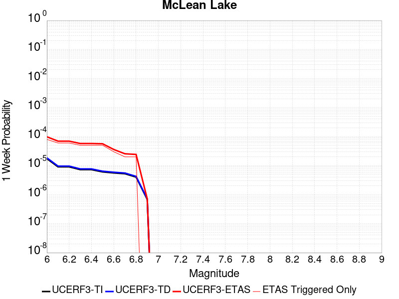 | 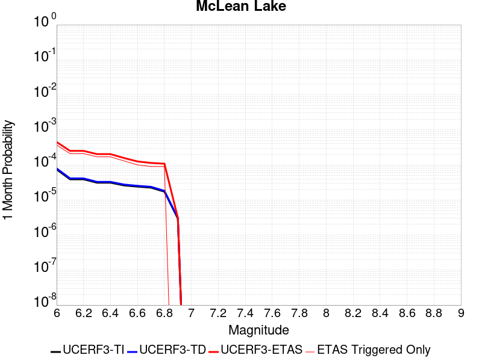 | 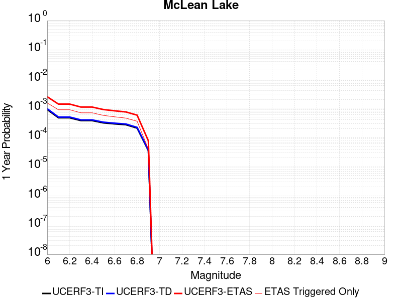 |  |

| Magnitude | 1 wk TI Prob | 1 wk TD Prob | 1 wk ETAS Prob | 1 wk ETAS/TD Gain | 1 wk ETAS Triggered Only | 1 mo TI Prob | 1 mo TD Prob | 1 mo ETAS Prob | 1 mo ETAS/TD Gain | 1 mo ETAS Triggered Only | 1 yr TI Prob | 1 yr TD Prob | 1 yr ETAS Prob | 1 yr ETAS/TD Gain | 1 yr ETAS Triggered Only | 10 yr TI Prob | 10 yr TD Prob | 10 yr ETAS Prob | 10 yr ETAS/TD Gain | 10 yr ETAS Triggered Only |
|-----|-----|-----|-----|-----|-----|-----|-----|-----|-----|-----|-----|-----|-----|-----|-----|-----|-----|-----|-----|-----|
| 6.0 | 1.7360222E-5 | 1.850208E-5 | 9.85006E-5 | 5.323758 | 8.0E-5 | 7.439883E-5 | 7.929249E-5 | 4.4926314E-4 | 5.665898 | 3.7E-4 | 9.0542925E-4 | 9.650072E-4 | 0.0024835404 | 2.573598 | 0.00152 | 0.009017491 | 0.009613009 | 0.012950613 | 1.3471966 | 0.00337 |
| 6.1 | 9.062689E-6 | 9.5924015E-6 | 6.959183E-5 | 7.2548904 | 6.0E-5 | 3.8839516E-5 | 4.1109695E-5 | 2.5110107E-4 | 6.1080737 | 2.1E-4 | 4.727685E-4 | 5.004045E-4 | 0.0013899591 | 2.777671 | 8.9E-4 | 0.0047176396 | 0.00499366 | 0.0069538224 | 1.3925302 | 0.00197 |
| 6.2 | 9.062689E-6 | 9.5924015E-6 | 6.959183E-5 | 7.2548904 | 6.0E-5 | 3.8839516E-5 | 4.1109695E-5 | 2.5110107E-4 | 6.1080737 | 2.1E-4 | 4.727685E-4 | 5.004045E-4 | 0.0013899591 | 2.777671 | 8.9E-4 | 0.0047176396 | 0.00499366 | 0.0069538224 | 1.3925302 | 0.00197 |
| 6.3 | 7.2575485E-6 | 7.667871E-6 | 5.7667487E-5 | 7.520665 | 5.0E-5 | 3.110341E-5 | 3.2861928E-5 | 2.0285635E-4 | 6.17299 | 1.7E-4 | 3.786182E-4 | 4.0002767E-4 | 0.0010997476 | 2.7491791 | 7.0E-4 | 0.0037797375 | 0.0039937804 | 0.00553759 | 1.3865534 | 0.00155 |
| 6.4 | 7.2575485E-6 | 7.667871E-6 | 5.7667487E-5 | 7.520665 | 5.0E-5 | 3.110341E-5 | 3.2861928E-5 | 2.0285635E-4 | 6.17299 | 1.7E-4 | 3.786182E-4 | 4.0002767E-4 | 0.0010997476 | 2.7491791 | 7.0E-4 | 0.0037797375 | 0.0039937804 | 0.00553759 | 1.3865534 | 0.00155 |
| 6.5 | 6.06582E-6 | 6.4040096E-6 | 5.640369E-5 | 8.807558 | 5.0E-5 | 2.5996113E-5 | 2.7445503E-5 | 1.5744193E-4 | 5.7365294 | 1.3E-4 | 3.164567E-4 | 3.3410426E-4 | 9.039138E-4 | 2.7054844 | 5.7E-4 | 0.0031600643 | 0.0033366582 | 0.0046024206 | 1.3793503 | 0.00127 |
| 6.6 | 5.598744E-6 | 5.9103845E-6 | 3.591021E-5 | 6.075782 | 3.0E-5 | 2.3994397E-5 | 2.533001E-5 | 1.2532748E-4 | 4.9477863 | 1.0E-4 | 2.9209262E-4 | 3.083556E-4 | 8.181984E-4 | 2.6534245 | 5.1E-4 | 0.0029170897 | 0.0030799068 | 0.0042263647 | 1.3722379 | 0.00115 |
| 6.7 | 5.246996E-6 | 5.5392766E-6 | 2.5539166E-5 | 4.6105595 | 2.0E-5 | 2.2486933E-5 | 2.3739578E-5 | 1.1373744E-4 | 4.7910476 | 9.0E-5 | 2.73744E-4 | 2.8899737E-4 | 7.4886443E-4 | 2.59125 | 4.6E-4 | 0.0027340704 | 0.0028868392 | 0.0039637215 | 1.3730316 | 0.00108 |
| 6.8 | 4.02324E-6 | 4.2469924E-6 | 2.4246907E-5 | 5.709195 | 2.0E-5 | 1.7242342E-5 | 1.8201301E-5 | 1.0819967E-4 | 5.944611 | 9.0E-5 | 2.099053E-4 | 2.2158427E-4 | 5.815045E-4 | 2.624304 | 3.6E-4 | 0.0020970714 | 0.0022142178 | 0.0030922692 | 1.3965516 | 8.8E-4 |
| 6.9 | 6.835972E-7 | 7.140046E-7 | 7.140046E-7 | 1.0 | 0.0 | 2.9296991E-6 | 3.060018E-6 | 3.060018E-6 | 1.0 | 0.0 | 3.56685E-5 | 3.7255402E-5 | 7.725391E-5 | 2.0736299 | 4.0E-5 | 3.5662777E-4 | 3.725228E-4 | 4.8248185E-4 | 1.2951739 | 1.1E-4 |

## Gravel Hills-Harper Lk
*[(top)](#table-of-contents)*

| 1 Week | 1 Month | 1 Year | 10 Year |
|-----|-----|-----|-----|
|  |  |  |  |

| Magnitude | 1 wk TI Prob | 1 wk TD Prob | 1 wk ETAS Prob | 1 wk ETAS/TD Gain | 1 wk ETAS Triggered Only | 1 mo TI Prob | 1 mo TD Prob | 1 mo ETAS Prob | 1 mo ETAS/TD Gain | 1 mo ETAS Triggered Only | 1 yr TI Prob | 1 yr TD Prob | 1 yr ETAS Prob | 1 yr ETAS/TD Gain | 1 yr ETAS Triggered Only | 10 yr TI Prob | 10 yr TD Prob | 10 yr ETAS Prob | 10 yr ETAS/TD Gain | 10 yr ETAS Triggered Only |
|-----|-----|-----|-----|-----|-----|-----|-----|-----|-----|-----|-----|-----|-----|-----|-----|-----|-----|-----|-----|-----|
| 6.0 | 3.0679566E-5 | 3.1466156E-5 | 1.8146144E-4 | 5.7668767 | 1.5E-4 | 1.3147724E-4 | 1.3484921E-4 | 5.347953E-4 | 3.965876 | 4.0E-4 | 0.0015995599 | 0.0016407692 | 0.0029985378 | 1.8275195 | 0.00136 | 0.015880952 | 0.016308116 | 0.019141149 | 1.1737192 | 0.00288 |
| 6.1 | 3.0679566E-5 | 3.1466156E-5 | 1.8146144E-4 | 5.7668767 | 1.5E-4 | 1.3147724E-4 | 1.3484921E-4 | 5.347953E-4 | 3.965876 | 4.0E-4 | 0.0015995599 | 0.0016407692 | 0.0029985378 | 1.8275195 | 0.00136 | 0.015880952 | 0.016308116 | 0.019141149 | 1.1737192 | 0.00288 |
| 6.2 | 1.514536E-5 | 1.36357285E-5 | 5.3635184E-5 | 3.93343 | 4.0E-5 | 6.490707E-5 | 5.8437592E-5 | 1.984294E-4 | 3.3955781 | 1.4E-4 | 7.8995706E-4 | 7.1125734E-4 | 0.0010510155 | 1.4776868 | 3.4E-4 | 0.007871548 | 0.007091011 | 0.00786548 | 1.1092185 | 7.8E-4 |
| 6.3 | 1.514536E-5 | 1.36357285E-5 | 5.3635184E-5 | 3.93343 | 4.0E-5 | 6.490707E-5 | 5.8437592E-5 | 1.984294E-4 | 3.3955781 | 1.4E-4 | 7.8995706E-4 | 7.1125734E-4 | 0.0010510155 | 1.4776868 | 3.4E-4 | 0.007871548 | 0.007091011 | 0.00786548 | 1.1092185 | 7.8E-4 |
| 6.4 | 1.2532521E-5 | 1.0690072E-5 | 2.0689966E-5 | 1.9354374 | 1.0E-5 | 5.37097E-5 | 4.5813824E-5 | 1.2581015E-4 | 2.7461178 | 8.0E-5 | 6.537194E-4 | 5.576464E-4 | 7.475404E-4 | 1.3405278 | 1.9E-4 | 0.0065179965 | 0.0055630608 | 0.0060205017 | 1.0822283 | 4.6E-4 |
| 6.5 | 1.1094058E-5 | 9.083975E-6 | 1.9083884E-5 | 2.1008296 | 1.0E-5 | 4.7545094E-5 | 3.893076E-5 | 1.08928034E-4 | 2.797994 | 7.0E-5 | 5.787078E-4 | 4.7388297E-4 | 5.938261E-4 | 1.2531071 | 1.2E-4 | 0.0057720304 | 0.004729132 | 0.0050575715 | 1.0694503 | 3.3E-4 |
| 6.6 | 9.688328E-6 | 7.5319463E-6 | 7.5319463E-6 | 1.0 | 0.0 | 4.1520743E-5 | 3.2279386E-5 | 8.227777E-5 | 2.5489264 | 5.0E-5 | 5.053978E-4 | 3.929332E-4 | 4.7290177E-4 | 1.203517 | 8.0E-5 | 0.0050424994 | 0.0039226413 | 0.0041318173 | 1.0533254 | 2.1E-4 |
| 6.7 | 8.974824E-6 | 6.749636E-6 | 6.749636E-6 | 1.0 | 0.0 | 3.8462964E-5 | 2.8926703E-5 | 4.8926126E-5 | 1.6913826 | 2.0E-5 | 4.6818596E-4 | 3.521279E-4 | 4.021103E-4 | 1.1419438 | 5.0E-5 | 0.004672008 | 0.0035159206 | 0.0036454634 | 1.0368446 | 1.3E-4 |
| 6.8 | 7.4780046E-6 | 5.116361E-6 | 5.116361E-6 | 1.0 | 0.0 | 3.20482E-5 | 2.1927084E-5 | 2.1927084E-5 | 1.0 | 0.0 | 3.9011694E-4 | 2.6693093E-4 | 2.6693093E-4 | 1.0 | 0.0 | 0.0038943281 | 0.0026662415 | 0.0027061347 | 1.0149624 | 4.0E-5 |
| 6.9 | 6.3409307E-6 | 3.907628E-6 | 3.907628E-6 | 1.0 | 0.0 | 2.7175134E-5 | 1.6746875E-5 | 1.6746875E-5 | 1.0 | 0.0 | 3.3080703E-4 | 2.0387511E-4 | 2.0387511E-4 | 1.0 | 0.0 | 0.0033031502 | 0.002036979 | 0.0020569381 | 1.0097984 | 2.0E-5 |
| 7.0 | 5.1239335E-6 | 2.6059488E-6 | 2.6059488E-6 | 1.0 | 0.0 | 2.195953E-5 | 1.1168306E-5 | 1.1168306E-5 | 1.0 | 0.0 | 2.6732447E-4 | 1.3596589E-4 | 1.3596589E-4 | 1.0 | 0.0 | 0.0026700313 | 0.0013588523 | 0.0013688387 | 1.0073491 | 1.0E-5 |
| 7.1 | 4.438899E-6 | 2.0985503E-6 | 2.0985503E-6 | 1.0 | 0.0 | 1.9023713E-5 | 8.993757E-6 | 8.993757E-6 | 1.0 | 0.0 | 2.315891E-4 | 1.0949371E-4 | 1.0949371E-4 | 1.0 | 0.0 | 0.002313479 | 0.0010944195 | 0.0011044085 | 1.0091273 | 1.0E-5 |
| 7.2 | 3.50367E-6 | 1.261629E-6 | 1.261629E-6 | 1.0 | 0.0 | 1.5015643E-5 | 5.4069706E-6 | 5.4069706E-6 | 1.0 | 0.0 | 1.8280011E-4 | 6.582796E-5 | 6.582796E-5 | 1.0 | 0.0 | 0.0018264982 | 6.5809285E-4 | 6.5809285E-4 | 1.0 | 0.0 |
| 7.3 | 2.561638E-6 | 7.119602E-7 | 7.119602E-7 | 1.0 | 0.0 | 1.0978401E-5 | 3.0512545E-6 | 3.0512545E-6 | 1.0 | 0.0 | 1.3365384E-4 | 3.714841E-5 | 3.714841E-5 | 1.0 | 0.0 | 0.0013357349 | 3.71424E-4 | 3.71424E-4 | 1.0 | 0.0 |
| 7.4 | 2.0368864E-6 | 5.305195E-7 | 5.305195E-7 | 1.0 | 0.0 | 8.729483E-6 | 2.273653E-6 | 2.273653E-6 | 1.0 | 0.0 | 1.06276275E-4 | 2.768138E-5 | 2.768138E-5 | 1.0 | 0.0 | 0.0010622547 | 2.7677987E-4 | 2.7677987E-4 | 1.0 | 0.0 |
| 7.5 | 1.1681728E-6 | 3.6032552E-7 | 3.6032552E-7 | 1.0 | 0.0 | 5.0064455E-6 | 1.5442513E-6 | 1.5442513E-6 | 1.0 | 0.0 | 6.0951766E-5 | 1.8801102E-5 | 1.8801102E-5 | 1.0 | 0.0 | 6.093505E-4 | 1.8799558E-4 | 1.8799558E-4 | 1.0 | 0.0 |
| 7.6 | 1.3154387E-7 | 7.119984E-8 | 7.119984E-8 | 1.0 | 0.0 | 5.6375933E-7 | 3.0514218E-7 | 3.0514218E-7 | 1.0 | 0.0 | 6.863748E-6 | 3.7151012E-6 | 3.7151012E-6 | 1.0 | 0.0 | 6.863536E-5 | 3.715055E-5 | 3.715055E-5 | 1.0 | 0.0 |

## Goldstone Lake
*[(top)](#table-of-contents)*

| 1 Week | 1 Month | 1 Year | 10 Year |
|-----|-----|-----|-----|
|  | 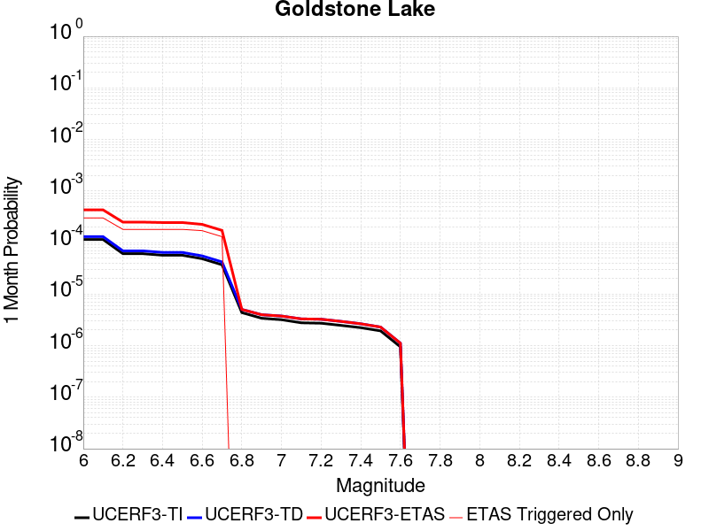 | 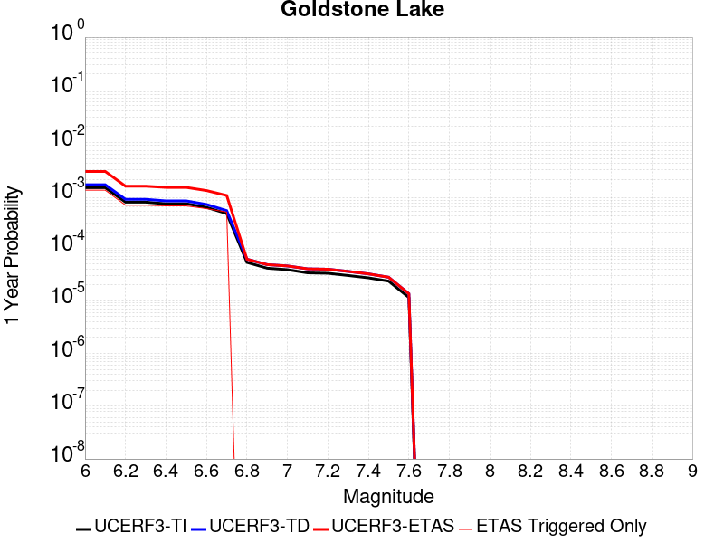 |  |

| Magnitude | 1 wk TI Prob | 1 wk TD Prob | 1 wk ETAS Prob | 1 wk ETAS/TD Gain | 1 wk ETAS Triggered Only | 1 mo TI Prob | 1 mo TD Prob | 1 mo ETAS Prob | 1 mo ETAS/TD Gain | 1 mo ETAS Triggered Only | 1 yr TI Prob | 1 yr TD Prob | 1 yr ETAS Prob | 1 yr ETAS/TD Gain | 1 yr ETAS Triggered Only | 10 yr TI Prob | 10 yr TD Prob | 10 yr ETAS Prob | 10 yr ETAS/TD Gain | 10 yr ETAS Triggered Only |
|-----|-----|-----|-----|-----|-----|-----|-----|-----|-----|-----|-----|-----|-----|-----|-----|-----|-----|-----|-----|-----|
| 6.0 | 2.671352E-5 | 3.0377598E-5 | 9.0375775E-5 | 2.9750798 | 6.0E-5 | 1.1448149E-4 | 1.3018431E-4 | 4.3014527E-4 | 3.304125 | 3.0E-4 | 0.001392921 | 0.001584038 | 0.002832058 | 1.7878724 | 0.00125 | 0.013842222 | 0.015746972 | 0.01830603 | 1.1625111 | 0.0026 |
| 6.1 | 2.671352E-5 | 3.0377598E-5 | 9.0375775E-5 | 2.9750798 | 6.0E-5 | 1.1448149E-4 | 1.3018431E-4 | 4.3014527E-4 | 3.304125 | 3.0E-4 | 0.001392921 | 0.001584038 | 0.002832058 | 1.7878724 | 0.00125 | 0.013842222 | 0.015746972 | 0.01830603 | 1.1625111 | 0.0026 |
| 6.2 | 1.4197047E-5 | 1.6097005E-5 | 4.609652E-5 | 2.8636708 | 3.0E-5 | 6.0843064E-5 | 6.898589E-5 | 2.4897346E-4 | 3.609049 | 1.8E-4 | 7.4051257E-4 | 8.396782E-4 | 0.0014891324 | 1.7734561 | 6.5E-4 | 0.007380498 | 0.0083747525 | 0.009703531 | 1.1586647 | 0.00134 |
| 6.3 | 1.4197047E-5 | 1.6097005E-5 | 4.609652E-5 | 2.8636708 | 3.0E-5 | 6.0843064E-5 | 6.898589E-5 | 2.4897346E-4 | 3.609049 | 1.8E-4 | 7.4051257E-4 | 8.396782E-4 | 0.0014891324 | 1.7734561 | 6.5E-4 | 0.007380498 | 0.0083747525 | 0.009703531 | 1.1586647 | 0.00134 |
| 6.4 | 1.3238931E-5 | 1.5009165E-5 | 4.5008714E-5 | 2.9987488 | 3.0E-5 | 5.6737044E-5 | 6.4323955E-5 | 2.4431237E-4 | 3.7981553 | 1.8E-4 | 6.9055456E-4 | 7.829608E-4 | 0.0014124676 | 1.804008 | 6.3E-4 | 0.006884126 | 0.0078116497 | 0.0090816505 | 1.1625779 | 0.00128 |
| 6.5 | 1.3238931E-5 | 1.5009165E-5 | 4.5008714E-5 | 2.9987488 | 3.0E-5 | 5.6737044E-5 | 6.4323955E-5 | 2.4431237E-4 | 3.7981553 | 1.8E-4 | 6.9055456E-4 | 7.829608E-4 | 0.0014124676 | 1.804008 | 6.3E-4 | 0.006884126 | 0.0078116497 | 0.0090816505 | 1.1625779 | 0.00128 |
| 6.6 | 1.1328278E-5 | 1.2855769E-5 | 4.2855383E-5 | 3.3335528 | 3.0E-5 | 4.8548856E-5 | 5.5095526E-5 | 2.2508616E-4 | 4.08538 | 1.7E-4 | 5.90922E-4 | 6.706773E-4 | 0.0012303017 | 1.8344169 | 5.6E-4 | 0.0058935313 | 0.006695922 | 0.0077488245 | 1.1572453 | 0.00106 |
| 6.7 | 8.651175E-6 | 9.825019E-6 | 2.9824823E-5 | 3.0355995 | 2.0E-5 | 3.707594E-5 | 4.2107054E-5 | 1.7210159E-4 | 4.087239 | 1.3E-4 | 4.5130608E-4 | 5.1262334E-4 | 9.923773E-4 | 1.93588 | 4.8E-4 | 0.0045039062 | 0.005123288 | 0.005929138 | 1.1572917 | 8.1E-4 |
| 6.8 | 1.0215377E-6 | 1.1754954E-6 | 1.1754954E-6 | 1.0 | 0.0 | 4.378012E-6 | 5.0378285E-6 | 5.0378285E-6 | 1.0 | 0.0 | 5.3300988E-5 | 6.133395E-5 | 6.133395E-5 | 1.0 | 0.0 | 5.3288206E-4 | 6.131815E-4 | 6.2317535E-4 | 1.0162984 | 1.0E-5 |
| 6.9 | 7.9360774E-7 | 9.283571E-7 | 9.283571E-7 | 1.0 | 0.0 | 3.4011714E-6 | 3.978668E-6 | 3.978668E-6 | 1.0 | 0.0 | 4.1408475E-5 | 4.8439273E-5 | 4.8439273E-5 | 1.0 | 0.0 | 4.140076E-4 | 4.8429414E-4 | 4.8429414E-4 | 1.0 | 0.0 |
| 7.0 | 7.4382757E-7 | 8.7474876E-7 | 8.7474876E-7 | 1.0 | 0.0 | 3.1878285E-6 | 3.7489183E-6 | 3.7489183E-6 | 1.0 | 0.0 | 3.8811122E-5 | 4.564219E-5 | 4.564219E-5 | 1.0 | 0.0 | 3.8804344E-4 | 4.5633482E-4 | 4.5633482E-4 | 1.0 | 0.0 |
| 7.1 | 6.4709513E-7 | 7.7114316E-7 | 7.7114316E-7 | 1.0 | 0.0 | 2.773262E-6 | 3.3048955E-6 | 3.3048955E-6 | 1.0 | 0.0 | 3.376394E-5 | 4.023642E-5 | 4.023642E-5 | 1.0 | 0.0 | 3.375881E-4 | 4.022973E-4 | 4.022973E-4 | 1.0 | 0.0 |
| 7.2 | 6.356704E-7 | 7.588488E-7 | 7.588488E-7 | 1.0 | 0.0 | 2.7242988E-6 | 3.2522055E-6 | 3.2522055E-6 | 1.0 | 0.0 | 3.3167835E-5 | 3.9594943E-5 | 3.9594943E-5 | 1.0 | 0.0 | 3.3162883E-4 | 3.9588482E-4 | 3.9588482E-4 | 1.0 | 0.0 |
| 7.3 | 5.7695723E-7 | 6.8966835E-7 | 6.8966835E-7 | 1.0 | 0.0 | 2.4726714E-6 | 2.9557186E-6 | 2.9557186E-6 | 1.0 | 0.0 | 3.0104358E-5 | 3.5985337E-5 | 3.5985337E-5 | 1.0 | 0.0 | 3.0100282E-4 | 3.5980085E-4 | 3.5980085E-4 | 1.0 | 0.0 |
| 7.4 | 5.209647E-7 | 6.1936134E-7 | 6.1936134E-7 | 1.0 | 0.0 | 2.232704E-6 | 2.6544035E-6 | 2.6544035E-6 | 1.0 | 0.0 | 2.718283E-5 | 3.231694E-5 | 3.231694E-5 | 1.0 | 0.0 | 2.7179506E-4 | 3.2312796E-4 | 3.2312796E-4 | 1.0 | 0.0 |
| 7.5 | 4.512955E-7 | 5.3489674E-7 | 5.3489674E-7 | 1.0 | 0.0 | 1.934122E-6 | 2.2924128E-6 | 2.2924128E-6 | 1.0 | 0.0 | 2.3547682E-5 | 2.7909824E-5 | 2.7909824E-5 | 1.0 | 0.0 | 2.3545188E-4 | 2.7906848E-4 | 2.7906848E-4 | 1.0 | 0.0 |
| 7.6 | 2.21172E-7 | 2.603997E-7 | 2.603997E-7 | 1.0 | 0.0 | 9.478797E-7 | 1.1159984E-6 | 1.1159984E-6 | 1.0 | 0.0 | 1.1540374E-5 | 1.3587224E-5 | 1.3587224E-5 | 1.0 | 0.0 | 1.1539775E-4 | 1.3586675E-4 | 1.3586675E-4 | 1.0 | 0.0 |

## So Sierra Nevada
*[(top)](#table-of-contents)*

| 1 Week | 1 Month | 1 Year | 10 Year |
|-----|-----|-----|-----|
|  | 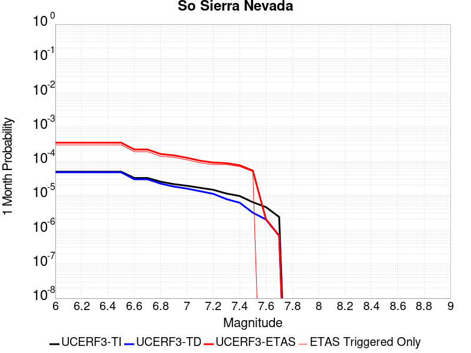 |  |  |

| Magnitude | 1 wk TI Prob | 1 wk TD Prob | 1 wk ETAS Prob | 1 wk ETAS/TD Gain | 1 wk ETAS Triggered Only | 1 mo TI Prob | 1 mo TD Prob | 1 mo ETAS Prob | 1 mo ETAS/TD Gain | 1 mo ETAS Triggered Only | 1 yr TI Prob | 1 yr TD Prob | 1 yr ETAS Prob | 1 yr ETAS/TD Gain | 1 yr ETAS Triggered Only | 10 yr TI Prob | 10 yr TD Prob | 10 yr ETAS Prob | 10 yr ETAS/TD Gain | 10 yr ETAS Triggered Only |
|-----|-----|-----|-----|-----|-----|-----|-----|-----|-----|-----|-----|-----|-----|-----|-----|-----|-----|-----|-----|-----|
| 6.0 | 1.15488665E-5 | 1.1079864E-5 | 9.1078975E-5 | 8.220225 | 8.0E-5 | 4.9494203E-5 | 4.748434E-5 | 3.4747008E-4 | 7.3175726 | 3.0E-4 | 6.024253E-4 | 5.7798123E-4 | 0.0018072703 | 3.1268668 | 0.00123 | 0.006007948 | 0.005766049 | 0.008361 | 1.4500396 | 0.00261 |
| 6.1 | 1.15488665E-5 | 1.1079864E-5 | 9.1078975E-5 | 8.220225 | 8.0E-5 | 4.9494203E-5 | 4.748434E-5 | 3.4747008E-4 | 7.3175726 | 3.0E-4 | 6.024253E-4 | 5.7798123E-4 | 0.0018072703 | 3.1268668 | 0.00123 | 0.006007948 | 0.005766049 | 0.008361 | 1.4500396 | 0.00261 |
| 6.2 | 1.15488665E-5 | 1.1079864E-5 | 9.1078975E-5 | 8.220225 | 8.0E-5 | 4.9494203E-5 | 4.748434E-5 | 3.4747008E-4 | 7.3175726 | 3.0E-4 | 6.024253E-4 | 5.7798123E-4 | 0.0018072703 | 3.1268668 | 0.00123 | 0.006007948 | 0.005766049 | 0.008361 | 1.4500396 | 0.00261 |
| 6.3 | 1.15488665E-5 | 1.1079864E-5 | 9.1078975E-5 | 8.220225 | 8.0E-5 | 4.9494203E-5 | 4.748434E-5 | 3.4747008E-4 | 7.3175726 | 3.0E-4 | 6.024253E-4 | 5.7798123E-4 | 0.0018072703 | 3.1268668 | 0.00123 | 0.006007948 | 0.005766049 | 0.008361 | 1.4500396 | 0.00261 |
| 6.4 | 1.15488665E-5 | 1.1079864E-5 | 9.1078975E-5 | 8.220225 | 8.0E-5 | 4.9494203E-5 | 4.748434E-5 | 3.4747008E-4 | 7.3175726 | 3.0E-4 | 6.024253E-4 | 5.7798123E-4 | 0.0018072703 | 3.1268668 | 0.00123 | 0.006007948 | 0.005766049 | 0.008361 | 1.4500396 | 0.00261 |
| 6.5 | 1.15488665E-5 | 1.1079864E-5 | 9.1078975E-5 | 8.220225 | 8.0E-5 | 4.9494203E-5 | 4.748434E-5 | 3.4747008E-4 | 7.3175726 | 3.0E-4 | 6.024253E-4 | 5.7798123E-4 | 0.0018072703 | 3.1268668 | 0.00123 | 0.006007948 | 0.005766049 | 0.008361 | 1.4500396 | 0.00261 |
| 6.6 | 7.587044E-6 | 6.9357857E-6 | 3.6935577E-5 | 5.325363 | 3.0E-5 | 3.2515498E-5 | 2.9724473E-5 | 2.1971883E-4 | 7.391849 | 1.9E-4 | 3.9580427E-4 | 3.618383E-4 | 0.0011215633 | 3.0996258 | 7.6E-4 | 0.003951 | 0.003612783 | 0.005177111 | 1.4329981 | 0.00157 |
| 6.7 | 7.587044E-6 | 6.9357857E-6 | 3.6935577E-5 | 5.325363 | 3.0E-5 | 3.2515498E-5 | 2.9724473E-5 | 2.1971883E-4 | 7.391849 | 1.9E-4 | 3.9580427E-4 | 3.618383E-4 | 0.0011215633 | 3.0996258 | 7.6E-4 | 0.003951 | 0.003612783 | 0.005177111 | 1.4329981 | 0.00157 |
| 6.8 | 5.9026956E-6 | 5.1795155E-6 | 2.5179412E-5 | 4.8613453 | 2.0E-5 | 2.5297022E-5 | 2.219774E-5 | 1.6219463E-4 | 7.306808 | 1.4E-4 | 3.0794772E-4 | 2.7022514E-4 | 8.0008194E-4 | 2.9607975 | 5.3E-4 | 0.0030752132 | 0.0026990818 | 0.0037661938 | 1.3953611 | 0.00107 |
| 6.9 | 5.0118915E-6 | 4.252534E-6 | 2.425245E-5 | 5.7030582 | 2.0E-5 | 2.1479358E-5 | 1.8225022E-5 | 1.4822265E-4 | 8.13292 | 1.3E-4 | 2.614798E-4 | 2.2186778E-4 | 6.317768E-4 | 2.8475375 | 4.1E-4 | 0.0026117235 | 0.0022165354 | 0.0030347179 | 1.3691267 | 8.2E-4 |
| 7.0 | 4.4924795E-6 | 3.714019E-6 | 2.3713945E-5 | 6.384982 | 2.0E-5 | 1.925334E-5 | 1.591713E-5 | 1.2591538E-4 | 7.9106836 | 1.1E-4 | 2.3438422E-4 | 1.9377447E-4 | 5.237105E-4 | 2.7026808 | 3.3E-4 | 0.0023413717 | 0.0019361179 | 0.0026048208 | 1.3453833 | 6.7E-4 |
| 7.1 | 3.9118436E-6 | 3.1120699E-6 | 1.3112039E-5 | 4.2132854 | 1.0E-5 | 1.6764936E-5 | 1.3337378E-5 | 1.0333618E-4 | 7.7478633 | 9.0E-5 | 2.0409399E-4 | 1.6237104E-4 | 4.323272E-4 | 2.6625881 | 2.7E-4 | 0.0020390663 | 0.0016225801 | 0.002201639 | 1.3568754 | 5.8E-4 |
| 7.2 | 3.4200818E-6 | 2.6055395E-6 | 1.2605514E-5 | 4.837967 | 1.0E-5 | 1.4657411E-5 | 1.1166553E-5 | 9.116566E-5 | 8.164172 | 8.0E-5 | 1.7843937E-4 | 1.359448E-4 | 3.4591625E-4 | 2.5445347 | 2.1E-4 | 0.0017829615 | 0.0013586661 | 0.0018280275 | 1.3454576 | 4.7E-4 |
| 7.3 | 2.6593618E-6 | 1.8284946E-6 | 1.1828476E-5 | 6.46897 | 1.0E-5 | 1.13972155E-5 | 7.836384E-6 | 8.783576E-5 | 11.208711 | 8.0E-5 | 1.3875226E-4 | 9.540409E-5 | 2.5538882E-4 | 2.6769168 | 1.6E-4 | 0.0013866565 | 9.5366023E-4 | 0.0012833455 | 1.3457052 | 3.3E-4 |
| 7.4 | 2.2577992E-6 | 1.4365058E-6 | 1.1436491E-5 | 7.961326 | 1.0E-5 | 9.676246E-6 | 6.1564406E-6 | 7.615601E-5 | 12.370136 | 7.0E-5 | 1.1780193E-4 | 7.495234E-5 | 2.049426E-4 | 2.7343054 | 1.3E-4 | 0.001177395 | 7.4929564E-4 | 0.0010390783 | 1.3867401 | 2.9E-4 |
| 7.5 | 1.489319E-6 | 7.3544686E-7 | 7.3544686E-7 | 1.0 | 0.0 | 6.3827797E-6 | 3.1519114E-6 | 5.3151754E-5 | 16.86334 | 5.0E-5 | 7.770758E-5 | 3.837385E-5 | 1.2837039E-4 | 3.345257 | 9.0E-5 | 7.7680405E-4 | 3.8367268E-4 | 5.436113E-4 | 1.4168621 | 1.6E-4 |
| 7.6 | 1.0680322E-6 | 4.6600493E-7 | 4.6600493E-7 | 1.0 | 0.0 | 4.577273E-6 | 1.9971626E-6 | 1.9971626E-6 | 1.0 | 0.0 | 5.5726876E-5 | 2.4315184E-5 | 4.43147E-5 | 1.8225113 | 2.0E-5 | 5.5712904E-4 | 2.4312551E-4 | 2.9311335E-4 | 1.2056051 | 5.0E-5 |
| 7.7 | 5.509146E-7 | 1.5582485E-7 | 1.5582485E-7 | 1.0 | 0.0 | 2.3610605E-6 | 6.6782064E-7 | 6.6782064E-7 | 1.0 | 0.0 | 2.8745531E-5 | 8.130687E-6 | 1.8130606E-5 | 2.2298985 | 1.0E-5 | 2.8741814E-4 | 8.130401E-5 | 9.13032E-5 | 1.1229851 | 1.0E-5 |

## San Andreas (Mojave S)
*[(top)](#table-of-contents)*

| 1 Week | 1 Month | 1 Year | 10 Year |
|-----|-----|-----|-----|
|  | 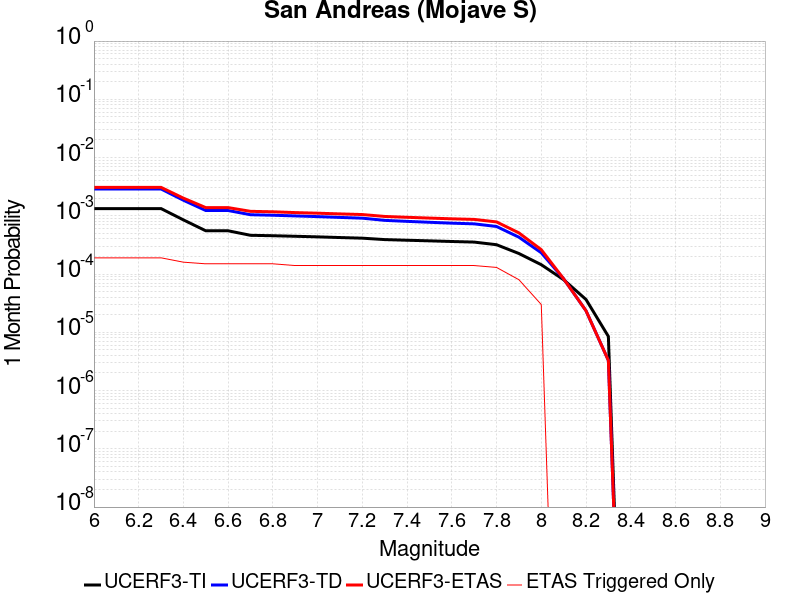 |  |  |

| Magnitude | 1 wk TI Prob | 1 wk TD Prob | 1 wk ETAS Prob | 1 wk ETAS/TD Gain | 1 wk ETAS Triggered Only | 1 mo TI Prob | 1 mo TD Prob | 1 mo ETAS Prob | 1 mo ETAS/TD Gain | 1 mo ETAS Triggered Only | 1 yr TI Prob | 1 yr TD Prob | 1 yr ETAS Prob | 1 yr ETAS/TD Gain | 1 yr ETAS Triggered Only | 10 yr TI Prob | 10 yr TD Prob | 10 yr ETAS Prob | 10 yr ETAS/TD Gain | 10 yr ETAS Triggered Only |
|-----|-----|-----|-----|-----|-----|-----|-----|-----|-----|-----|-----|-----|-----|-----|-----|-----|-----|-----|-----|-----|
| 6.0 | 3.1064058E-4 | 6.748811E-4 | 7.248473E-4 | 1.0740371 | 5.0E-5 | 0.0013306376 | 0.0028892697 | 0.0030787208 | 1.0655706 | 1.9E-4 | 0.016080605 | 0.034635544 | 0.03547541 | 1.0242487 | 8.7E-4 | 0.1496549 | 0.28669757 | 0.28805995 | 1.004752 | 0.00191 |
| 6.1 | 3.1064058E-4 | 6.748811E-4 | 7.248473E-4 | 1.0740371 | 5.0E-5 | 0.0013306376 | 0.0028892697 | 0.0030787208 | 1.0655706 | 1.9E-4 | 0.016080605 | 0.034635544 | 0.03547541 | 1.0242487 | 8.7E-4 | 0.1496549 | 0.28669757 | 0.28805995 | 1.004752 | 0.00191 |
| 6.2 | 3.1064058E-4 | 6.748811E-4 | 7.248473E-4 | 1.0740371 | 5.0E-5 | 0.0013306376 | 0.0028892697 | 0.0030787208 | 1.0655706 | 1.9E-4 | 0.016080605 | 0.034635544 | 0.03547541 | 1.0242487 | 8.7E-4 | 0.1496549 | 0.28669757 | 0.28805995 | 1.004752 | 0.00191 |
| 6.3 | 3.1064058E-4 | 6.748811E-4 | 7.248473E-4 | 1.0740371 | 5.0E-5 | 0.0013306376 | 0.0028892697 | 0.0030787208 | 1.0655706 | 1.9E-4 | 0.016080605 | 0.034635544 | 0.03547541 | 1.0242487 | 8.7E-4 | 0.1496549 | 0.28669757 | 0.28805995 | 1.004752 | 0.00191 |
| 6.4 | 1.9872203E-4 | 4.320531E-4 | 4.8203146E-4 | 1.1156765 | 5.0E-5 | 8.5138786E-4 | 0.0018503703 | 0.0020100742 | 1.0863092 | 1.6E-4 | 0.010316478 | 0.022301685 | 0.023034958 | 1.0328797 | 7.5E-4 | 0.098504856 | 0.19709684 | 0.19842966 | 1.0067623 | 0.00166 |
| 6.5 | 1.291105E-4 | 2.877729E-4 | 3.3775854E-4 | 1.1736981 | 5.0E-5 | 5.5321335E-4 | 0.0012327323 | 0.0013825474 | 1.1215309 | 1.5E-4 | 0.006714592 | 0.01490606 | 0.015566072 | 1.0442781 | 6.7E-4 | 0.065152965 | 0.13813633 | 0.13940327 | 1.0091716 | 0.00147 |
| 6.6 | 1.291105E-4 | 2.877729E-4 | 3.3775854E-4 | 1.1736981 | 5.0E-5 | 5.5321335E-4 | 0.0012327323 | 0.0013825474 | 1.1215309 | 1.5E-4 | 0.006714592 | 0.01490606 | 0.015566072 | 1.0442781 | 6.7E-4 | 0.065152965 | 0.13813633 | 0.13940327 | 1.0091716 | 0.00147 |
| 6.7 | 1.08001186E-4 | 2.4358135E-4 | 2.9356917E-4 | 1.2052202 | 5.0E-5 | 4.6278012E-4 | 0.001043503 | 0.0011933465 | 1.1435966 | 1.5E-4 | 0.0056198016 | 0.01263094 | 0.013272731 | 1.0508109 | 6.5E-4 | 0.054797906 | 0.11927966 | 0.12052147 | 1.0104109 | 0.00141 |
| 6.8 | 1.0624356E-4 | 2.387573E-4 | 2.8874536E-4 | 1.2093676 | 5.0E-5 | 4.5525006E-4 | 0.0010228448 | 0.0011726915 | 1.1464998 | 1.5E-4 | 0.0055285925 | 0.012382305 | 0.013024257 | 1.0518442 | 6.5E-4 | 0.053930566 | 0.11722881 | 0.11846469 | 1.0105425 | 0.0014 |
| 6.9 | 1.0393785E-4 | 2.3245982E-4 | 2.824482E-4 | 1.2150409 | 5.0E-5 | 4.4537184E-4 | 9.958765E-4 | 0.001135737 | 1.1404396 | 1.4E-4 | 0.0054089287 | 0.01205764 | 0.012689922 | 1.0524384 | 6.4E-4 | 0.05279156 | 0.114526235 | 0.11574819 | 1.0106696 | 0.00138 |
| 7.0 | 1.0155622E-4 | 2.2615404E-4 | 2.7614273E-4 | 1.2210382 | 5.0E-5 | 4.3516833E-4 | 9.6887193E-4 | 0.0011087363 | 1.1443579 | 1.4E-4 | 0.005285311 | 0.011732441 | 0.012364932 | 1.0539097 | 6.4E-4 | 0.05161361 | 0.111786306 | 0.11300316 | 1.0108855 | 0.00137 |
| 7.1 | 9.885595E-5 | 2.1903674E-4 | 2.690258E-4 | 1.2282223 | 5.0E-5 | 4.2359953E-4 | 9.383915E-4 | 0.0010782601 | 1.1490514 | 1.4E-4 | 0.0051451353 | 0.0113652665 | 0.011997993 | 1.0556719 | 6.4E-4 | 0.05027629 | 0.10867059 | 0.10989171 | 1.0112369 | 0.00137 |
| 7.2 | 9.6411415E-5 | 2.1266536E-4 | 2.6265474E-4 | 1.2350612 | 5.0E-5 | 4.1312634E-4 | 9.111049E-4 | 0.0010509774 | 1.1535196 | 1.4E-4 | 0.005018219 | 0.011036465 | 0.011669402 | 1.0573496 | 6.4E-4 | 0.049064007 | 0.10586017 | 0.107085146 | 1.0115716 | 0.00137 |
| 7.3 | 9.1180635E-5 | 1.9494242E-4 | 2.4493266E-4 | 1.256436 | 5.0E-5 | 3.907156E-4 | 8.352001E-4 | 9.7508315E-4 | 1.1674845 | 1.4E-4 | 0.004746591 | 0.010121264 | 0.010734988 | 1.0606371 | 6.2E-4 | 0.046464786 | 0.09805159 | 0.09926922 | 1.0124183 | 0.00135 |
| 7.4 | 8.887388E-5 | 1.8742566E-4 | 2.3741629E-4 | 1.2667224 | 5.0E-5 | 3.8083247E-4 | 8.0300565E-4 | 9.428932E-4 | 1.174205 | 1.4E-4 | 0.0046267817 | 0.009732866 | 0.010336928 | 1.0620643 | 6.1E-4 | 0.045316286 | 0.09468574 | 0.09588981 | 1.0127164 | 0.00133 |
| 7.5 | 8.6750515E-5 | 1.8073889E-4 | 2.3072986E-4 | 1.2765921 | 5.0E-5 | 3.7173493E-4 | 7.743654E-4 | 9.1425696E-4 | 1.1806532 | 1.4E-4 | 0.004516484 | 0.00938723 | 0.009991503 | 1.064372 | 6.1E-4 | 0.04425787 | 0.09164878 | 0.09285689 | 1.0131819 | 0.00133 |
| 7.6 | 8.453092E-5 | 1.7461211E-4 | 2.2460338E-4 | 1.286299 | 5.0E-5 | 3.6222505E-4 | 7.4812304E-4 | 8.880183E-4 | 1.186995 | 1.4E-4 | 0.0044011753 | 0.009070434 | 0.0096749 | 1.0666414 | 6.1E-4 | 0.04315024 | 0.08880694 | 0.09000972 | 1.0135437 | 0.00132 |
| 7.7 | 8.259102E-5 | 1.6983104E-4 | 2.1982254E-4 | 1.2943603 | 5.0E-5 | 3.539135E-4 | 7.276443E-4 | 8.6754246E-4 | 1.1922617 | 1.4E-4 | 0.004300386 | 0.008823153 | 0.009417859 | 1.067403 | 6.0E-4 | 0.042181134 | 0.086556934 | 0.08775354 | 1.0138246 | 0.00131 |
| 7.8 | 7.444844E-5 | 1.5303439E-4 | 2.0302674E-4 | 1.326674 | 5.0E-5 | 3.1902574E-4 | 6.5569684E-4 | 7.8561157E-4 | 1.1981324 | 1.3E-4 | 0.0038772223 | 0.007953937 | 0.00844004 | 1.0611147 | 4.9E-4 | 0.03810269 | 0.07838002 | 0.0793938 | 1.0129342 | 0.0011 |
| 7.9 | 5.2586525E-5 | 1.00200166E-4 | 1.3019716E-4 | 1.2993706 | 3.0E-5 | 2.2535135E-4 | 4.2935862E-4 | 5.0932425E-4 | 1.1862444 | 8.0E-5 | 0.0027402006 | 0.005214923 | 0.0055034105 | 1.0553197 | 2.9E-4 | 0.027066574 | 0.05226346 | 0.052936353 | 1.012875 | 7.1E-4 |
| 8.0 | 3.379877E-5 | 5.4152522E-5 | 7.415144E-5 | 1.3693072 | 2.0E-5 | 1.4484383E-4 | 2.320616E-4 | 2.6205464E-4 | 1.129246 | 3.0E-5 | 0.0017620471 | 0.0028216913 | 0.0029413528 | 1.0424076 | 1.2E-4 | 0.017481409 | 0.028873252 | 0.029135456 | 1.0090812 | 2.7E-4 |
| 8.1 | 1.8668277E-5 | 1.9346266E-5 | 1.9346266E-5 | 1.0 | 0.0 | 8.000444E-5 | 8.290994E-5 | 8.290994E-5 | 1.0 | 0.0 | 9.736188E-4 | 0.0010089617 | 0.0010289415 | 1.0198023 | 2.0E-5 | 0.009693642 | 0.010818155 | 0.010867613 | 1.0045719 | 5.0E-5 |
| 8.2 | 8.541571E-6 | 5.4748616E-6 | 5.4748616E-6 | 1.0 | 0.0 | 3.660622E-5 | 2.346348E-5 | 2.346348E-5 | 1.0 | 0.0 | 4.455896E-4 | 2.8563052E-4 | 2.8563052E-4 | 1.0 | 0.0 | 0.0044469717 | 0.0032484764 | 0.0032484764 | 1.0 | 0.0 |
| 8.3 | 1.983087E-6 | 7.68342E-7 | 7.68342E-7 | 1.0 | 0.0 | 8.498917E-6 | 3.2928901E-6 | 3.2928901E-6 | 1.0 | 0.0 | 1.034694E-4 | 4.0090217E-5 | 4.0090217E-5 | 1.0 | 0.0 | 0.0010342124 | 4.7331754E-4 | 4.7331754E-4 | 1.0 | 0.0 |

## Coyote Canyon
*[(top)](#table-of-contents)*

| 1 Week | 1 Month | 1 Year | 10 Year |
|-----|-----|-----|-----|
|  |  |  | 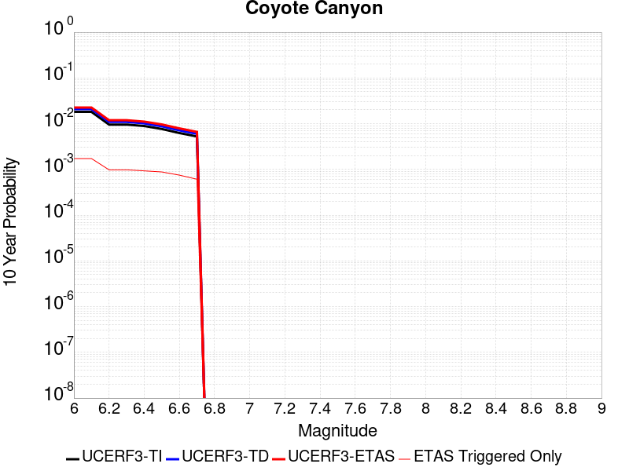 |

| Magnitude | 1 wk TI Prob | 1 wk TD Prob | 1 wk ETAS Prob | 1 wk ETAS/TD Gain | 1 wk ETAS Triggered Only | 1 mo TI Prob | 1 mo TD Prob | 1 mo ETAS Prob | 1 mo ETAS/TD Gain | 1 mo ETAS Triggered Only | 1 yr TI Prob | 1 yr TD Prob | 1 yr ETAS Prob | 1 yr ETAS/TD Gain | 1 yr ETAS Triggered Only | 10 yr TI Prob | 10 yr TD Prob | 10 yr ETAS Prob | 10 yr ETAS/TD Gain | 10 yr ETAS Triggered Only |
|-----|-----|-----|-----|-----|-----|-----|-----|-----|-----|-----|-----|-----|-----|-----|-----|-----|-----|-----|-----|-----|
| 6.0 | 3.5090034E-5 | 4.036658E-5 | 6.036577E-5 | 1.4954394 | 2.0E-5 | 1.503772E-4 | 1.729896E-4 | 2.729723E-4 | 1.5779694 | 1.0E-4 | 0.0018293047 | 0.0021043702 | 0.0028627708 | 1.3603932 | 7.6E-4 | 0.018143194 | 0.020870358 | 0.022564251 | 1.0811627 | 0.00173 |
| 6.1 | 3.5090034E-5 | 4.036658E-5 | 6.036577E-5 | 1.4954394 | 2.0E-5 | 1.503772E-4 | 1.729896E-4 | 2.729723E-4 | 1.5779694 | 1.0E-4 | 0.0018293047 | 0.0021043702 | 0.0028627708 | 1.3603932 | 7.6E-4 | 0.018143194 | 0.020870358 | 0.022564251 | 1.0811627 | 0.00173 |
| 6.2 | 1.841879E-5 | 2.1060916E-5 | 2.1060916E-5 | 1.0 | 0.0 | 7.8935285E-5 | 9.025852E-5 | 1.2025581E-4 | 1.3323486 | 3.0E-5 | 9.606133E-4 | 0.0010984455 | 0.001468039 | 1.3364697 | 3.7E-4 | 0.0095647145 | 0.010940247 | 0.011909526 | 1.0885975 | 9.8E-4 |
| 6.3 | 1.841879E-5 | 2.1060916E-5 | 2.1060916E-5 | 1.0 | 0.0 | 7.8935285E-5 | 9.025852E-5 | 1.2025581E-4 | 1.3323486 | 3.0E-5 | 9.606133E-4 | 0.0010984455 | 0.001468039 | 1.3364697 | 3.7E-4 | 0.0095647145 | 0.010940247 | 0.011909526 | 1.0885975 | 9.8E-4 |
| 6.4 | 1.712201E-5 | 1.9566249E-5 | 1.9566249E-5 | 1.0 | 0.0 | 7.337798E-5 | 8.385323E-5 | 1.1385071E-4 | 1.357738 | 3.0E-5 | 8.930107E-4 | 0.0010205354 | 0.0013701782 | 1.3426073 | 3.5E-4 | 0.008894307 | 0.010168407 | 0.011088951 | 1.0905298 | 9.3E-4 |
| 6.5 | 1.4744935E-5 | 1.683786E-5 | 1.683786E-5 | 1.0 | 0.0 | 6.3191044E-5 | 7.216079E-5 | 9.2159346E-5 | 1.2771388 | 2.0E-5 | 7.6907943E-4 | 8.7829697E-4 | 0.0012179983 | 1.3867729 | 3.4E-4 | 0.007664232 | 0.008757454 | 0.009629748 | 1.0996058 | 8.8E-4 |
| 6.6 | 1.2017839E-5 | 1.37248135E-5 | 1.37248135E-5 | 1.0 | 0.0 | 5.150401E-5 | 5.88198E-5 | 6.8819216E-5 | 1.1700008 | 1.0E-5 | 6.268809E-4 | 7.159844E-4 | 9.957838E-4 | 1.39079 | 2.8E-4 | 0.0062511545 | 0.00714547 | 0.007890111 | 1.1042116 | 7.5E-4 |
| 6.7 | 1.00956095E-5 | 1.1534127E-5 | 1.1534127E-5 | 1.0 | 0.0 | 4.326618E-5 | 4.9431528E-5 | 5.9431033E-5 | 1.20229 | 1.0E-5 | 5.266384E-4 | 6.0174963E-4 | 8.316112E-4 | 1.3819888 | 2.3E-4 | 0.005253921 | 0.00600973 | 0.0066160643 | 1.1008921 | 6.1E-4 |

## Death Valley (So)
*[(top)](#table-of-contents)*

| 1 Week | 1 Month | 1 Year | 10 Year |
|-----|-----|-----|-----|
| 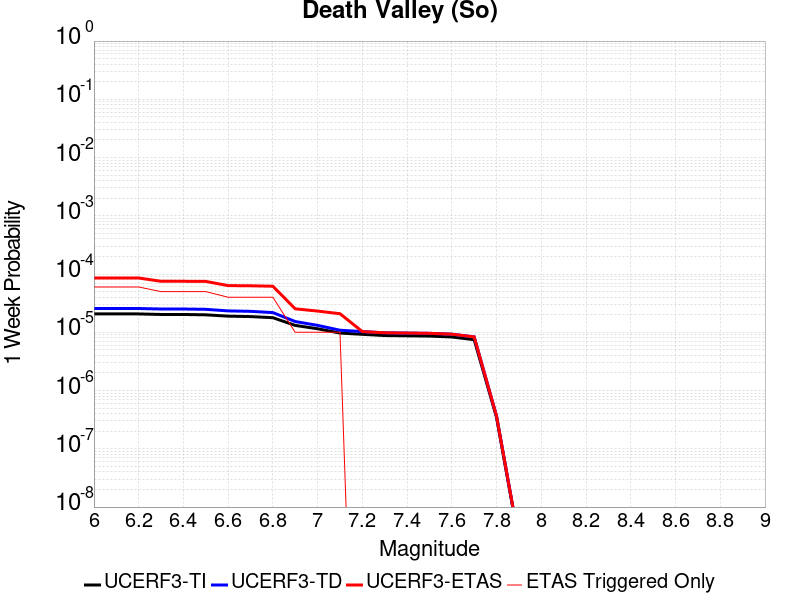 | 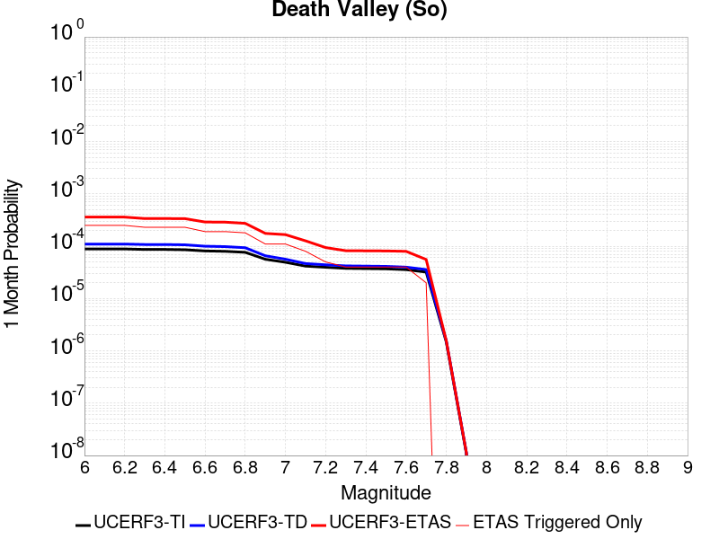 |  | 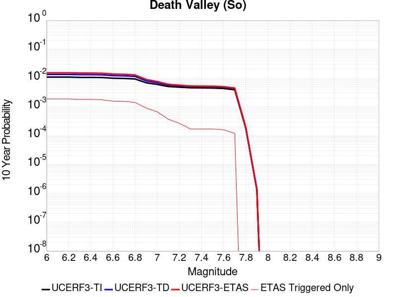 |

| Magnitude | 1 wk TI Prob | 1 wk TD Prob | 1 wk ETAS Prob | 1 wk ETAS/TD Gain | 1 wk ETAS Triggered Only | 1 mo TI Prob | 1 mo TD Prob | 1 mo ETAS Prob | 1 mo ETAS/TD Gain | 1 mo ETAS Triggered Only | 1 yr TI Prob | 1 yr TD Prob | 1 yr ETAS Prob | 1 yr ETAS/TD Gain | 1 yr ETAS Triggered Only | 10 yr TI Prob | 10 yr TD Prob | 10 yr ETAS Prob | 10 yr ETAS/TD Gain | 10 yr ETAS Triggered Only |
|-----|-----|-----|-----|-----|-----|-----|-----|-----|-----|-----|-----|-----|-----|-----|-----|-----|-----|-----|-----|-----|
| 6.0 | 2.0684236E-5 | 2.5619585E-5 | 8.561805E-5 | 3.3418982 | 6.0E-5 | 8.864371E-5 | 1.097937E-4 | 3.5976624E-4 | 3.2767477 | 2.5E-4 | 0.0010787029 | 0.0013359354 | 0.0022347332 | 1.6727853 | 9.0E-4 | 0.010734817 | 0.013282327 | 0.015137356 | 1.1396614 | 0.00188 |
| 6.1 | 2.0684236E-5 | 2.5619585E-5 | 8.561805E-5 | 3.3418982 | 6.0E-5 | 8.864371E-5 | 1.097937E-4 | 3.5976624E-4 | 3.2767477 | 2.5E-4 | 0.0010787029 | 0.0013359354 | 0.0022347332 | 1.6727853 | 9.0E-4 | 0.010734817 | 0.013282327 | 0.015137356 | 1.1396614 | 0.00188 |
| 6.2 | 2.0684236E-5 | 2.5619585E-5 | 8.561805E-5 | 3.3418982 | 6.0E-5 | 8.864371E-5 | 1.097937E-4 | 3.5976624E-4 | 3.2767477 | 2.5E-4 | 0.0010787029 | 0.0013359354 | 0.0022347332 | 1.6727853 | 9.0E-4 | 0.010734817 | 0.013282327 | 0.015137356 | 1.1396614 | 0.00188 |
| 6.3 | 2.0240292E-5 | 2.5119647E-5 | 7.511839E-5 | 2.990424 | 5.0E-5 | 8.6741224E-5 | 1.0765128E-4 | 3.3762652E-4 | 3.1362982 | 2.3E-4 | 0.0010555626 | 0.0013098831 | 0.0021787435 | 1.6633114 | 8.7E-4 | 0.010505628 | 0.013024874 | 0.0148113 | 1.1371548 | 0.00181 |
| 6.4 | 2.0240292E-5 | 2.5119647E-5 | 7.511839E-5 | 2.990424 | 5.0E-5 | 8.6741224E-5 | 1.0765128E-4 | 3.3762652E-4 | 3.1362982 | 2.3E-4 | 0.0010555626 | 0.0013098831 | 0.0021787435 | 1.6633114 | 8.7E-4 | 0.010505628 | 0.013024874 | 0.0148113 | 1.1371548 | 0.00181 |
| 6.5 | 1.9962767E-5 | 2.4808885E-5 | 7.480765E-5 | 3.0153568 | 5.0E-5 | 8.55519E-5 | 1.0631956E-4 | 3.362951E-4 | 3.1630597 | 2.3E-4 | 0.0010410968 | 0.0012936887 | 0.002152576 | 1.6639059 | 8.6E-4 | 0.010362327 | 0.012864814 | 0.014602172 | 1.1350473 | 0.00176 |
| 6.6 | 1.8937297E-5 | 2.3312656E-5 | 6.331172E-5 | 2.7157662 | 4.0E-5 | 8.115732E-5 | 9.990764E-5 | 2.8988865E-4 | 2.9015665 | 1.9E-4 | 9.876423E-4 | 0.0012157114 | 0.0019747873 | 1.6243885 | 7.6E-4 | 0.009832645 | 0.0120936595 | 0.0136545515 | 1.129067 | 0.00158 |
| 6.7 | 1.8621096E-5 | 2.2913278E-5 | 6.291236E-5 | 2.7456727 | 4.0E-5 | 7.980225E-5 | 9.819616E-5 | 2.8817749E-4 | 2.9347126 | 1.9E-4 | 9.711593E-4 | 0.001194897 | 0.0019340127 | 1.6185602 | 7.4E-4 | 0.009669261 | 0.0118877655 | 0.013419339 | 1.1288362 | 0.00155 |
| 6.8 | 1.7830353E-5 | 2.1807256E-5 | 6.1806386E-5 | 2.8342118 | 4.0E-5 | 7.641356E-5 | 9.34564E-5 | 2.7343957E-4 | 2.9258518 | 1.8E-4 | 9.29938E-4 | 0.0011372517 | 0.0018464443 | 1.623602 | 7.1E-4 | 0.009260561 | 0.011317162 | 0.0127210915 | 1.1240531 | 0.00142 |
| 6.9 | 1.3135183E-5 | 1.5304811E-5 | 2.5304658E-5 | 1.6533793 | 1.0E-5 | 5.6292425E-5 | 6.559044E-5 | 1.7558322E-4 | 2.6769638 | 1.1E-4 | 6.8514474E-4 | 7.9827744E-4 | 0.0013178623 | 1.6508826 | 5.2E-4 | 0.006830362 | 0.007955107 | 0.008857868 | 1.1134819 | 9.1E-4 |
| 7.0 | 1.1507512E-5 | 1.3154884E-5 | 2.3154753E-5 | 1.7601639 | 1.0E-5 | 4.9316975E-5 | 5.637689E-5 | 1.663707E-4 | 2.951044 | 1.1E-4 | 6.002687E-4 | 6.861783E-4 | 0.0010958969 | 1.5971024 | 4.1E-4 | 0.0059864987 | 0.0068412963 | 0.007506713 | 1.0972646 | 6.7E-4 |
| 7.1 | 9.715903E-6 | 1.08657705E-5 | 2.0865662E-5 | 1.9203113 | 1.0E-5 | 4.1638916E-5 | 4.656678E-5 | 1.2656306E-4 | 2.7178829 | 8.0E-5 | 5.068359E-4 | 5.6680734E-4 | 7.9667696E-4 | 1.4055517 | 2.3E-4 | 0.0050568148 | 0.00565407 | 0.0060219783 | 1.0650696 | 3.7E-4 |
| 7.2 | 9.233269E-6 | 1.0286766E-5 | 1.0286766E-5 | 1.0 | 0.0 | 3.9570554E-5 | 4.408542E-5 | 9.408321E-5 | 2.134112 | 5.0E-5 | 4.81665E-4 | 5.36612E-4 | 6.9652614E-4 | 1.298007 | 1.6E-4 | 0.0048062233 | 0.005353594 | 0.0056221485 | 1.0501634 | 2.7E-4 |
| 7.3 | 8.8041315E-6 | 9.808581E-6 | 9.808581E-6 | 1.0 | 0.0 | 3.7731446E-5 | 4.2036125E-5 | 8.203444E-5 | 1.9515225 | 4.0E-5 | 4.592835E-4 | 5.1167386E-4 | 6.1162264E-4 | 1.195337 | 1.0E-4 | 0.0045833546 | 0.005105384 | 0.005274516 | 1.0331281 | 1.7E-4 |
| 7.4 | 8.708749E-6 | 9.70759E-6 | 9.70759E-6 | 1.0 | 0.0 | 3.7322676E-5 | 4.1603318E-5 | 8.1601655E-5 | 1.9614217 | 4.0E-5 | 4.5430884E-4 | 5.064069E-4 | 6.0635625E-4 | 1.1973697 | 1.0E-4 | 0.004533812 | 0.0050529554 | 0.005222096 | 1.0334737 | 1.7E-4 |
| 7.5 | 8.612678E-6 | 9.60523E-6 | 9.60523E-6 | 1.0 | 0.0 | 3.6910955E-5 | 4.1164647E-5 | 8.1163E-5 | 1.9716676 | 4.0E-5 | 4.492982E-4 | 5.010685E-4 | 6.0101843E-4 | 1.1994735 | 1.0E-4 | 0.004483909 | 0.004999813 | 0.005168963 | 1.0338312 | 1.7E-4 |
| 7.6 | 8.319024E-6 | 9.284318E-6 | 9.284318E-6 | 1.0 | 0.0 | 3.5652476E-5 | 3.978935E-5 | 7.978776E-5 | 2.005254 | 4.0E-5 | 4.3398244E-4 | 4.8433186E-4 | 5.8428344E-4 | 1.20637 | 1.0E-4 | 0.0043313587 | 0.004833187 | 0.0049924133 | 1.0329444 | 1.6E-4 |
| 7.7 | 7.4718328E-6 | 8.345533E-6 | 8.345533E-6 | 1.0 | 0.0 | 3.2021748E-5 | 3.5766105E-5 | 5.5765388E-5 | 1.5591687 | 2.0E-5 | 3.8979502E-4 | 4.3536935E-4 | 5.1533454E-4 | 1.1836721 | 8.0E-5 | 0.00389112 | 0.0043455698 | 0.004465048 | 1.0274943 | 1.2E-4 |
| 7.8 | 3.4586725E-7 | 3.648336E-7 | 3.648336E-7 | 1.0 | 0.0 | 1.4822873E-6 | 1.5635717E-6 | 1.5635717E-6 | 1.0 | 0.0 | 1.80467E-5 | 1.9036323E-5 | 1.9036323E-5 | 1.0 | 0.0 | 1.8045233E-4 | 1.9034736E-4 | 1.9034736E-4 | 1.0 | 0.0 |
| 7.9 | 2.5591178E-9 | 2.6697147E-9 | 2.6697147E-9 | 1.0 | 0.0 | 1.0967647E-8 | 1.1441634E-8 | 1.1441634E-8 | 1.0 | 0.0 | 1.335311E-7 | 1.3930189E-7 | 1.3930189E-7 | 1.0 | 0.0 | 1.3353102E-6 | 1.3930189E-6 | 1.3930189E-6 | 1.0 | 0.0 |

## Nelson Lake
*[(top)](#table-of-contents)*

| 1 Week | 1 Month | 1 Year | 10 Year |
|-----|-----|-----|-----|
|  |  | 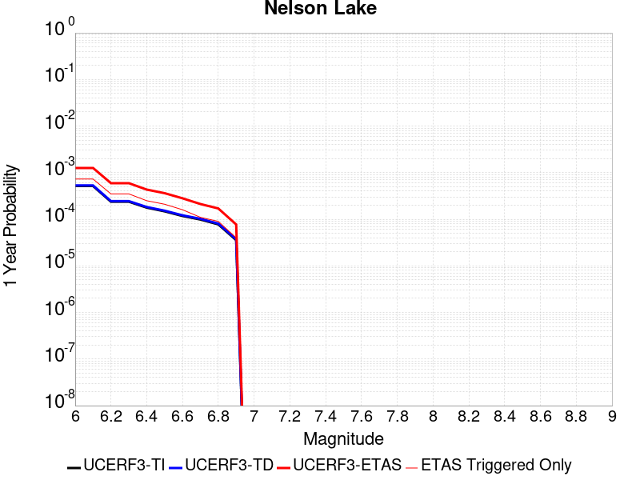 | 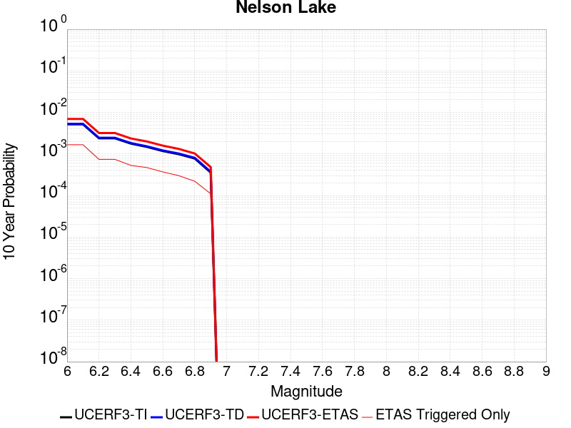 |

| Magnitude | 1 wk TI Prob | 1 wk TD Prob | 1 wk ETAS Prob | 1 wk ETAS/TD Gain | 1 wk ETAS Triggered Only | 1 mo TI Prob | 1 mo TD Prob | 1 mo ETAS Prob | 1 mo ETAS/TD Gain | 1 mo ETAS Triggered Only | 1 yr TI Prob | 1 yr TD Prob | 1 yr ETAS Prob | 1 yr ETAS/TD Gain | 1 yr ETAS Triggered Only | 10 yr TI Prob | 10 yr TD Prob | 10 yr ETAS Prob | 10 yr ETAS/TD Gain | 10 yr ETAS Triggered Only |
|-----|-----|-----|-----|-----|-----|-----|-----|-----|-----|-----|-----|-----|-----|-----|-----|-----|-----|-----|-----|-----|
| 6.0 | 9.913453E-6 | 1.0192362E-5 | 4.0192055E-5 | 3.9433506 | 3.0E-5 | 4.2485535E-5 | 4.3680877E-5 | 1.5367607E-4 | 3.5181544 | 1.1E-4 | 5.1713863E-4 | 5.3169526E-4 | 0.0012613072 | 2.372237 | 7.3E-4 | 0.0051593683 | 0.0053052595 | 0.0069663995 | 1.313112 | 0.00167 |
| 6.1 | 9.913453E-6 | 1.0192362E-5 | 4.0192055E-5 | 3.9433506 | 3.0E-5 | 4.2485535E-5 | 4.3680877E-5 | 1.5367607E-4 | 3.5181544 | 1.1E-4 | 5.1713863E-4 | 5.3169526E-4 | 0.0012613072 | 2.372237 | 7.3E-4 | 0.0051593683 | 0.0053052595 | 0.0069663995 | 1.313112 | 0.00167 |
| 6.2 | 4.5596407E-6 | 4.6963655E-6 | 4.6963655E-6 | 1.0 | 0.0 | 1.954117E-5 | 2.0127132E-5 | 4.012673E-5 | 1.9936635 | 2.0E-5 | 2.3788778E-4 | 2.4502154E-4 | 5.949358E-4 | 2.4280958 | 3.5E-4 | 0.0023763329 | 0.00244764 | 0.003185829 | 1.301592 | 7.4E-4 |
| 6.3 | 4.5596407E-6 | 4.6963655E-6 | 4.6963655E-6 | 1.0 | 0.0 | 1.954117E-5 | 2.0127132E-5 | 4.012673E-5 | 1.9936635 | 2.0E-5 | 2.3788778E-4 | 2.4502154E-4 | 5.949358E-4 | 2.4280958 | 3.5E-4 | 0.0023763329 | 0.00244764 | 0.003185829 | 1.301592 | 7.4E-4 |
| 6.4 | 3.4025713E-6 | 3.5099386E-6 | 3.5099386E-6 | 1.0 | 0.0 | 1.4582367E-5 | 1.5042511E-5 | 3.504221E-5 | 2.3295453 | 2.0E-5 | 1.7752586E-4 | 1.8312802E-4 | 4.3308226E-4 | 2.3649151 | 2.5E-4 | 0.001773841 | 0.0018298541 | 0.0023588843 | 1.2891105 | 5.3E-4 |
| 6.5 | 2.8352947E-6 | 2.9278917E-6 | 2.9278917E-6 | 1.0 | 0.0 | 1.2151207E-5 | 1.2548051E-5 | 2.2547925E-5 | 1.7969265 | 1.0E-5 | 1.479309E-4 | 1.5276256E-4 | 3.6273047E-4 | 2.3744724 | 2.1E-4 | 0.0014783246 | 0.0015266493 | 0.0019959318 | 1.3073938 | 4.7E-4 |
| 6.6 | 2.251518E-6 | 2.3290975E-6 | 2.3290975E-6 | 1.0 | 0.0 | 9.649328E-6 | 9.981812E-6 | 1.9981711E-5 | 2.0018122 | 1.0E-5 | 1.1747423E-4 | 1.21522404E-4 | 2.8150296E-4 | 2.3164697 | 1.6E-4 | 0.0011741214 | 0.0012146212 | 0.0015841719 | 1.3042517 | 3.7E-4 |
| 6.7 | 1.8911853E-6 | 1.959166E-6 | 1.959166E-6 | 1.0 | 0.0 | 8.105055E-6 | 8.396401E-6 | 8.396401E-6 | 1.0 | 0.0 | 9.867457E-5 | 1.0222198E-4 | 2.1221074E-4 | 2.0759795 | 1.1E-4 | 9.863076E-4 | 0.0010218071 | 0.0013215005 | 1.2932975 | 3.0E-4 |
| 6.8 | 1.4874814E-6 | 1.5438522E-6 | 1.5438522E-6 | 1.0 | 0.0 | 6.374905E-6 | 6.6164957E-6 | 6.6164957E-6 | 1.0 | 0.0 | 7.76117E-5 | 8.055338E-5 | 1.7054613E-4 | 2.1171815 | 9.0E-5 | 7.75846E-4 | 8.052929E-4 | 0.0010251157 | 1.2729726 | 2.2E-4 |
| 6.9 | 6.835972E-7 | 7.140046E-7 | 7.140046E-7 | 1.0 | 0.0 | 2.9296991E-6 | 3.060018E-6 | 3.060018E-6 | 1.0 | 0.0 | 3.56685E-5 | 3.7255402E-5 | 7.725391E-5 | 2.0736299 | 4.0E-5 | 3.5662777E-4 | 3.725228E-4 | 4.8248185E-4 | 1.2951739 | 1.1E-4 |

## San Andreas (Mojave N)
*[(top)](#table-of-contents)*

| 1 Week | 1 Month | 1 Year | 10 Year |
|-----|-----|-----|-----|
| 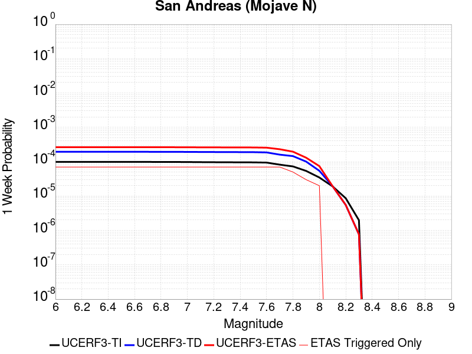 |  |  |  |

| Magnitude | 1 wk TI Prob | 1 wk TD Prob | 1 wk ETAS Prob | 1 wk ETAS/TD Gain | 1 wk ETAS Triggered Only | 1 mo TI Prob | 1 mo TD Prob | 1 mo ETAS Prob | 1 mo ETAS/TD Gain | 1 mo ETAS Triggered Only | 1 yr TI Prob | 1 yr TD Prob | 1 yr ETAS Prob | 1 yr ETAS/TD Gain | 1 yr ETAS Triggered Only | 10 yr TI Prob | 10 yr TD Prob | 10 yr ETAS Prob | 10 yr ETAS/TD Gain | 10 yr ETAS Triggered Only |
|-----|-----|-----|-----|-----|-----|-----|-----|-----|-----|-----|-----|-----|-----|-----|-----|-----|-----|-----|-----|-----|
| 6.0 | 9.877682E-5 | 1.9425084E-4 | 2.6423723E-4 | 1.3602889 | 7.0E-5 | 4.2326056E-4 | 8.322382E-4 | 0.0010220801 | 1.2281101 | 1.9E-4 | 0.0051410277 | 0.010085552 | 0.01092698 | 1.083429 | 8.5E-4 | 0.05023708 | 0.09842106 | 0.10000784 | 1.0161223 | 0.00176 |
| 6.1 | 9.877682E-5 | 1.9425084E-4 | 2.6423723E-4 | 1.3602889 | 7.0E-5 | 4.2326056E-4 | 8.322382E-4 | 0.0010220801 | 1.2281101 | 1.9E-4 | 0.0051410277 | 0.010085552 | 0.01092698 | 1.083429 | 8.5E-4 | 0.05023708 | 0.09842106 | 0.10000784 | 1.0161223 | 0.00176 |
| 6.2 | 9.877682E-5 | 1.9425084E-4 | 2.6423723E-4 | 1.3602889 | 7.0E-5 | 4.2326056E-4 | 8.322382E-4 | 0.0010220801 | 1.2281101 | 1.9E-4 | 0.0051410277 | 0.010085552 | 0.01092698 | 1.083429 | 8.5E-4 | 0.05023708 | 0.09842106 | 0.10000784 | 1.0161223 | 0.00176 |
| 6.3 | 9.877682E-5 | 1.9425084E-4 | 2.6423723E-4 | 1.3602889 | 7.0E-5 | 4.2326056E-4 | 8.322382E-4 | 0.0010220801 | 1.2281101 | 1.9E-4 | 0.0051410277 | 0.010085552 | 0.01092698 | 1.083429 | 8.5E-4 | 0.05023708 | 0.09842106 | 0.10000784 | 1.0161223 | 0.00176 |
| 6.4 | 9.877682E-5 | 1.9425084E-4 | 2.6423723E-4 | 1.3602889 | 7.0E-5 | 4.2326056E-4 | 8.322382E-4 | 0.0010220801 | 1.2281101 | 1.9E-4 | 0.0051410277 | 0.010085552 | 0.01092698 | 1.083429 | 8.5E-4 | 0.05023708 | 0.09842106 | 0.10000784 | 1.0161223 | 0.00176 |
| 6.5 | 9.861474E-5 | 1.9398842E-4 | 2.6397486E-4 | 1.3607763 | 7.0E-5 | 4.2256617E-4 | 8.3111424E-4 | 0.0010209563 | 1.2284187 | 1.9E-4 | 0.0051326132 | 0.010071996 | 0.010913434 | 1.0835425 | 8.5E-4 | 0.050156746 | 0.09829884 | 0.09988583 | 1.0161446 | 0.00176 |
| 6.6 | 9.861474E-5 | 1.9398842E-4 | 2.6397486E-4 | 1.3607763 | 7.0E-5 | 4.2256617E-4 | 8.3111424E-4 | 0.0010209563 | 1.2284187 | 1.9E-4 | 0.0051326132 | 0.010071996 | 0.010913434 | 1.0835425 | 8.5E-4 | 0.050156746 | 0.09829884 | 0.09988583 | 1.0161446 | 0.00176 |
| 6.7 | 9.8552715E-5 | 1.9388793E-4 | 2.6387436E-4 | 1.3609633 | 7.0E-5 | 4.223004E-4 | 8.306838E-4 | 0.0010205259 | 1.2285372 | 1.9E-4 | 0.0051293927 | 0.010066804 | 0.010908246 | 1.083586 | 8.5E-4 | 0.050125998 | 0.09825202 | 0.0998391 | 1.0161531 | 0.00176 |
| 6.8 | 9.8464974E-5 | 1.9373948E-4 | 2.6372593E-4 | 1.3612399 | 7.0E-5 | 4.219245E-4 | 8.3004805E-4 | 0.0010198903 | 1.2287124 | 1.9E-4 | 0.0051248376 | 0.010059134 | 0.010900584 | 1.0836504 | 8.5E-4 | 0.05008251 | 0.09818202 | 0.09976922 | 1.0161659 | 0.00176 |
| 6.9 | 9.825824E-5 | 1.9341944E-4 | 2.634059E-4 | 1.3618377 | 7.0E-5 | 4.2103877E-4 | 8.286773E-4 | 0.0010185199 | 1.229091 | 1.9E-4 | 0.0051141046 | 0.010042599 | 0.010884063 | 1.0837895 | 8.5E-4 | 0.049980022 | 0.09803108 | 0.09961855 | 1.0161935 | 0.00176 |
| 7.0 | 9.781462E-5 | 1.9273283E-4 | 2.6271935E-4 | 1.3631271 | 7.0E-5 | 4.1913814E-4 | 8.2573656E-4 | 0.0010155797 | 1.2299076 | 1.9E-4 | 0.005091073 | 0.010007125 | 0.010848619 | 1.0840895 | 8.5E-4 | 0.04976007 | 0.09770738 | 0.099295415 | 1.016253 | 0.00176 |
| 7.1 | 9.7121134E-5 | 1.9174957E-4 | 2.6173613E-4 | 1.3649895 | 7.0E-5 | 4.1616702E-4 | 8.2152523E-4 | 0.0010113692 | 1.2310871 | 1.9E-4 | 0.005055068 | 0.009956322 | 0.010797859 | 1.0845228 | 8.5E-4 | 0.04941613 | 0.09724377 | 0.09883262 | 1.0163388 | 0.00176 |
| 7.2 | 9.663819E-5 | 1.9105714E-4 | 2.6104375E-4 | 1.3663125 | 7.0E-5 | 4.1409794E-4 | 8.1855955E-4 | 0.0010084041 | 1.231925 | 1.9E-4 | 0.0050299936 | 0.009920545 | 0.010762112 | 1.0848308 | 8.5E-4 | 0.049176537 | 0.096916944 | 0.09850637 | 1.0163999 | 0.00176 |
| 7.3 | 9.6277574E-5 | 1.9058192E-4 | 2.6056857E-4 | 1.3672261 | 7.0E-5 | 4.125529E-4 | 8.165242E-4 | 0.001006369 | 1.2325037 | 1.9E-4 | 0.0050112694 | 0.00989599 | 0.010737577 | 1.0850434 | 8.5E-4 | 0.04899759 | 0.096690275 | 0.0982801 | 1.0164424 | 0.00176 |
| 7.4 | 9.593308E-5 | 1.8997936E-4 | 2.5996607E-4 | 1.368391 | 7.0E-5 | 4.1107697E-4 | 8.1394333E-4 | 0.0010037887 | 1.2332414 | 1.9E-4 | 0.0049933824 | 0.009864853 | 0.010706468 | 1.0853145 | 8.5E-4 | 0.04882661 | 0.09640832 | 0.09799864 | 1.0164957 | 0.00176 |
| 7.5 | 9.561707E-5 | 1.8943982E-4 | 2.5942657E-4 | 1.3694404 | 7.0E-5 | 4.0972308E-4 | 8.116325E-4 | 0.0010014783 | 1.2339061 | 1.9E-4 | 0.0049769743 | 0.009836973 | 0.010678612 | 1.0855587 | 8.5E-4 | 0.048669744 | 0.09615438 | 0.09774515 | 1.0165439 | 0.00176 |
| 7.6 | 9.418194E-5 | 1.8596048E-4 | 2.5594747E-4 | 1.3763541 | 7.0E-5 | 4.0357444E-4 | 7.967302E-4 | 9.865789E-4 | 1.2382847 | 1.9E-4 | 0.004902454 | 0.009657159 | 0.010498951 | 1.0871676 | 8.5E-4 | 0.047957025 | 0.09453603 | 0.09612059 | 1.0167614 | 0.00175 |
| 7.7 | 8.202141E-5 | 1.6043177E-4 | 2.3042054E-4 | 1.4362526 | 7.0E-5 | 3.51473E-4 | 6.873836E-4 | 8.472736E-4 | 1.2326066 | 1.6E-4 | 0.00427079 | 0.008336838 | 0.009090503 | 1.0904016 | 7.6E-4 | 0.04189639 | 0.08233 | 0.083770745 | 1.0174996 | 0.00157 |
| 7.8 | 7.2859846E-5 | 1.453612E-4 | 1.9535393E-4 | 1.3439207 | 5.0E-5 | 3.1221908E-4 | 6.228279E-4 | 7.4275315E-4 | 1.1925496 | 1.2E-4 | 0.003794643 | 0.007556606 | 0.008032979 | 1.0630406 | 4.8E-4 | 0.037304975 | 0.074813254 | 0.075821705 | 1.0134796 | 0.00109 |
| 7.9 | 5.3874453E-5 | 1.0059413E-4 | 1.3059111E-4 | 1.2981981 | 3.0E-5 | 2.3087008E-4 | 4.3104647E-4 | 5.11012E-4 | 1.1855148 | 8.0E-5 | 0.0028072202 | 0.005235374 | 0.005523856 | 1.0551025 | 2.9E-4 | 0.02772022 | 0.052488588 | 0.05316132 | 1.0128168 | 7.1E-4 |
| 8.0 | 3.468538E-5 | 5.4339347E-5 | 7.433826E-5 | 1.3680375 | 2.0E-5 | 1.4864317E-4 | 2.3286213E-4 | 2.6285514E-4 | 1.1288016 | 3.0E-5 | 0.0018082283 | 0.0028314125 | 0.0029510728 | 1.0422617 | 1.2E-4 | 0.017935853 | 0.028986264 | 0.029248437 | 1.0090448 | 2.7E-4 |
| 8.1 | 1.9152367E-5 | 1.9439854E-5 | 1.9439854E-5 | 1.0 | 0.0 | 8.207899E-5 | 8.3311E-5 | 8.3311E-5 | 1.0 | 0.0 | 9.988535E-4 | 0.0010138402 | 0.0010338199 | 1.019707 | 2.0E-5 | 0.009943757 | 0.01087572 | 0.010925176 | 1.0045474 | 5.0E-5 |
| 8.2 | 8.643924E-6 | 5.488954E-6 | 5.488954E-6 | 1.0 | 0.0 | 3.704486E-5 | 2.3523877E-5 | 2.3523877E-5 | 1.0 | 0.0 | 4.5092785E-4 | 2.8636563E-4 | 2.8636563E-4 | 1.0 | 0.0 | 0.0045001395 | 0.0032564052 | 0.0032564052 | 1.0 | 0.0 |
| 8.3 | 1.983087E-6 | 7.68342E-7 | 7.68342E-7 | 1.0 | 0.0 | 8.498917E-6 | 3.2928901E-6 | 3.2928901E-6 | 1.0 | 0.0 | 1.034694E-4 | 4.0090217E-5 | 4.0090217E-5 | 1.0 | 0.0 | 0.0010342124 | 4.7331754E-4 | 4.7331754E-4 | 1.0 | 0.0 |

## Towne Pass
*[(top)](#table-of-contents)*

| 1 Week | 1 Month | 1 Year | 10 Year |
|-----|-----|-----|-----|
|  |  | 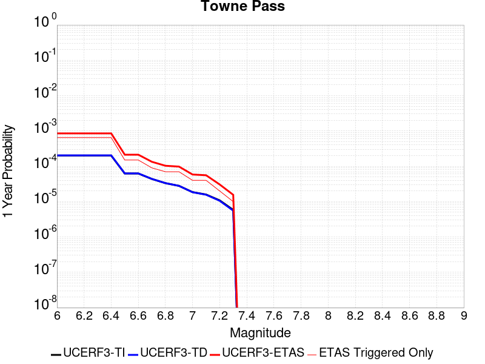 | 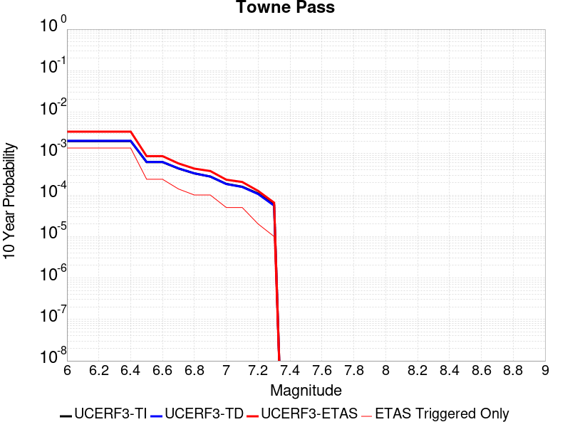 |

| Magnitude | 1 wk TI Prob | 1 wk TD Prob | 1 wk ETAS Prob | 1 wk ETAS/TD Gain | 1 wk ETAS Triggered Only | 1 mo TI Prob | 1 mo TD Prob | 1 mo ETAS Prob | 1 mo ETAS/TD Gain | 1 mo ETAS Triggered Only | 1 yr TI Prob | 1 yr TD Prob | 1 yr ETAS Prob | 1 yr ETAS/TD Gain | 1 yr ETAS Triggered Only | 10 yr TI Prob | 10 yr TD Prob | 10 yr ETAS Prob | 10 yr ETAS/TD Gain | 10 yr ETAS Triggered Only |
|-----|-----|-----|-----|-----|-----|-----|-----|-----|-----|-----|-----|-----|-----|-----|-----|-----|-----|-----|-----|-----|
| 6.0 | 3.849728E-6 | 3.8945645E-6 | 5.389437E-5 | 13.838356 | 5.0E-5 | 1.649873E-5 | 1.6690909E-5 | 1.5668858E-4 | 9.38766 | 1.4E-4 | 2.0085352E-4 | 2.0319723E-4 | 8.5306517E-4 | 4.1982126 | 6.5E-4 | 0.0020067208 | 0.0020305435 | 0.003387782 | 1.6684114 | 0.00136 |
| 6.1 | 3.849728E-6 | 3.8945645E-6 | 5.389437E-5 | 13.838356 | 5.0E-5 | 1.649873E-5 | 1.6690909E-5 | 1.5668858E-4 | 9.38766 | 1.4E-4 | 2.0085352E-4 | 2.0319723E-4 | 8.5306517E-4 | 4.1982126 | 6.5E-4 | 0.0020067208 | 0.0020305435 | 0.003387782 | 1.6684114 | 0.00136 |
| 6.2 | 3.849728E-6 | 3.8945645E-6 | 5.389437E-5 | 13.838356 | 5.0E-5 | 1.649873E-5 | 1.6690909E-5 | 1.5668858E-4 | 9.38766 | 1.4E-4 | 2.0085352E-4 | 2.0319723E-4 | 8.5306517E-4 | 4.1982126 | 6.5E-4 | 0.0020067208 | 0.0020305435 | 0.003387782 | 1.6684114 | 0.00136 |
| 6.3 | 3.849728E-6 | 3.8945645E-6 | 5.389437E-5 | 13.838356 | 5.0E-5 | 1.649873E-5 | 1.6690909E-5 | 1.5668858E-4 | 9.38766 | 1.4E-4 | 2.0085352E-4 | 2.0319723E-4 | 8.5306517E-4 | 4.1982126 | 6.5E-4 | 0.0020067208 | 0.0020305435 | 0.003387782 | 1.6684114 | 0.00136 |
| 6.4 | 3.849728E-6 | 3.8945645E-6 | 5.389437E-5 | 13.838356 | 5.0E-5 | 1.649873E-5 | 1.6690909E-5 | 1.5668858E-4 | 9.38766 | 1.4E-4 | 2.0085352E-4 | 2.0319723E-4 | 8.5306517E-4 | 4.1982126 | 6.5E-4 | 0.0020067208 | 0.0020305435 | 0.003387782 | 1.6684114 | 0.00136 |
| 6.5 | 1.1953545E-6 | 1.2030612E-6 | 1.1203049E-5 | 9.3121195 | 1.0E-5 | 5.1229376E-6 | 5.155967E-6 | 3.5155812E-5 | 6.8184714 | 3.0E-5 | 6.236998E-5 | 6.2772204E-5 | 2.127628E-4 | 3.3894427 | 1.5E-4 | 6.235248E-4 | 6.2755647E-4 | 8.6740585E-4 | 1.3821957 | 2.4E-4 |
| 6.6 | 1.1953545E-6 | 1.2030612E-6 | 1.1203049E-5 | 9.3121195 | 1.0E-5 | 5.1229376E-6 | 5.155967E-6 | 3.5155812E-5 | 6.8184714 | 3.0E-5 | 6.236998E-5 | 6.2772204E-5 | 2.127628E-4 | 3.3894427 | 1.5E-4 | 6.235248E-4 | 6.2755647E-4 | 8.6740585E-4 | 1.3821957 | 2.4E-4 |
| 6.7 | 8.375951E-7 | 8.4107455E-7 | 1.0841066E-5 | 12.889543 | 1.0E-5 | 3.5896885E-6 | 3.6046006E-6 | 2.3604529E-5 | 6.5484447 | 2.0E-5 | 4.370358E-5 | 4.3885186E-5 | 1.3388124E-4 | 3.050716 | 9.0E-5 | 4.3694986E-4 | 4.3877092E-4 | 5.7870947E-4 | 1.3189331 | 1.4E-4 |
| 6.8 | 6.38041E-7 | 6.392223E-7 | 1.0639216E-5 | 16.644 | 1.0E-5 | 2.7344586E-6 | 2.7395215E-6 | 1.2739494E-5 | 4.6502624 | 1.0E-5 | 3.3291526E-5 | 3.33532E-5 | 1.0335087E-4 | 3.098679 | 7.0E-5 | 3.3286537E-4 | 3.3348578E-4 | 4.3345243E-4 | 1.2997628 | 1.0E-4 |
| 6.9 | 5.3460053E-7 | 5.345395E-7 | 1.0534534E-5 | 19.707682 | 1.0E-5 | 2.2911431E-6 | 2.2908816E-6 | 1.2290859E-5 | 5.3651214 | 1.0E-5 | 2.789431E-5 | 2.7891161E-5 | 9.788921E-5 | 3.5096855 | 7.0E-5 | 2.789081E-4 | 2.7887995E-4 | 3.7885204E-4 | 1.3584772 | 1.0E-4 |
| 7.0 | 3.557783E-7 | 3.5324751E-7 | 3.5324751E-7 | 1.0 | 0.0 | 1.5247632E-6 | 1.5139171E-6 | 1.5139171E-6 | 1.0 | 0.0 | 1.8563835E-5 | 1.8431794E-5 | 5.8431055E-5 | 3.170123 | 4.0E-5 | 1.8562283E-4 | 1.8430348E-4 | 2.3429428E-4 | 1.2712417 | 5.0E-5 |
| 7.1 | 3.037942E-7 | 3.0002698E-7 | 3.0002698E-7 | 1.0 | 0.0 | 1.3019744E-6 | 1.2858293E-6 | 1.2858293E-6 | 1.0 | 0.0 | 1.5851423E-5 | 1.5654867E-5 | 5.565424E-5 | 3.555076 | 4.0E-5 | 1.5850292E-4 | 1.5653839E-4 | 2.0653056E-4 | 1.3193605 | 5.0E-5 |
| 7.2 | 2.0808248E-7 | 2.0218083E-7 | 2.0218083E-7 | 1.0 | 0.0 | 8.917818E-7 | 8.66489E-7 | 8.66489E-7 | 1.0 | 0.0 | 1.0857389E-5 | 1.0549457E-5 | 3.0549247E-5 | 2.895812 | 2.0E-5 | 1.0856859E-4 | 1.0549003E-4 | 1.2548792E-4 | 1.1895714 | 2.0E-5 |
| 7.3 | 1.1162073E-7 | 1.0637144E-7 | 1.0637144E-7 | 1.0 | 0.0 | 4.7837443E-7 | 4.558775E-7 | 4.558775E-7 | 1.0 | 0.0 | 5.8241935E-6 | 5.5502965E-6 | 1.555024E-5 | 2.8016956 | 1.0E-5 | 5.8240406E-5 | 5.550178E-5 | 6.5501226E-5 | 1.1801645 | 1.0E-5 |

## Lenwood-Lockhart-Old Woman Springs
*[(top)](#table-of-contents)*

| 1 Week | 1 Month | 1 Year | 10 Year |
|-----|-----|-----|-----|
| 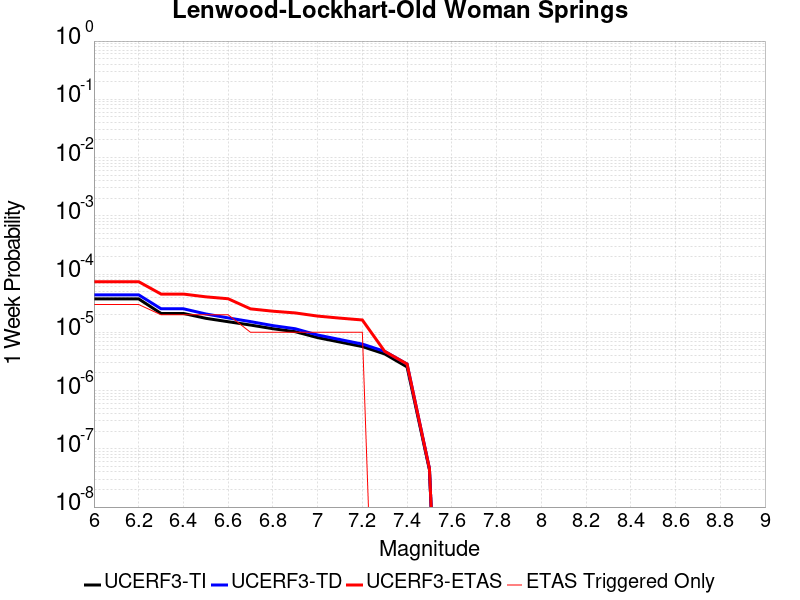 |  |  |  |

| Magnitude | 1 wk TI Prob | 1 wk TD Prob | 1 wk ETAS Prob | 1 wk ETAS/TD Gain | 1 wk ETAS Triggered Only | 1 mo TI Prob | 1 mo TD Prob | 1 mo ETAS Prob | 1 mo ETAS/TD Gain | 1 mo ETAS Triggered Only | 1 yr TI Prob | 1 yr TD Prob | 1 yr ETAS Prob | 1 yr ETAS/TD Gain | 1 yr ETAS Triggered Only | 10 yr TI Prob | 10 yr TD Prob | 10 yr ETAS Prob | 10 yr ETAS/TD Gain | 10 yr ETAS Triggered Only |
|-----|-----|-----|-----|-----|-----|-----|-----|-----|-----|-----|-----|-----|-----|-----|-----|-----|-----|-----|-----|-----|
| 6.0 | 3.744542E-5 | 4.396377E-5 | 7.396245E-5 | 1.68235 | 3.0E-5 | 1.604705E-4 | 1.8840353E-4 | 2.983828E-4 | 1.5837432 | 1.1E-4 | 0.0019519776 | 0.0022915718 | 0.0028602658 | 1.2481675 | 5.7E-4 | 0.019349206 | 0.022697426 | 0.023928829 | 1.0542529 | 0.00126 |
| 6.1 | 3.744542E-5 | 4.396377E-5 | 7.396245E-5 | 1.68235 | 3.0E-5 | 1.604705E-4 | 1.8840353E-4 | 2.983828E-4 | 1.5837432 | 1.1E-4 | 0.0019519776 | 0.0022915718 | 0.0028602658 | 1.2481675 | 5.7E-4 | 0.019349206 | 0.022697426 | 0.023928829 | 1.0542529 | 0.00126 |
| 6.2 | 3.744542E-5 | 4.396377E-5 | 7.396245E-5 | 1.68235 | 3.0E-5 | 1.604705E-4 | 1.8840353E-4 | 2.983828E-4 | 1.5837432 | 1.1E-4 | 0.0019519776 | 0.0022915718 | 0.0028602658 | 1.2481675 | 5.7E-4 | 0.019349206 | 0.022697426 | 0.023928829 | 1.0542529 | 0.00126 |
| 6.3 | 2.1079984E-5 | 2.535389E-5 | 4.5353383E-5 | 1.7888136 | 2.0E-5 | 9.0339665E-5 | 1.0865511E-4 | 1.3865186E-4 | 1.276073 | 3.0E-5 | 0.0010993304 | 0.0013220932 | 0.0015717627 | 1.1888441 | 2.5E-4 | 0.010939079 | 0.013144492 | 0.013766211 | 1.0472988 | 6.3E-4 |
| 6.4 | 2.1079984E-5 | 2.535389E-5 | 4.5353383E-5 | 1.7888136 | 2.0E-5 | 9.0339665E-5 | 1.0865511E-4 | 1.3865186E-4 | 1.276073 | 3.0E-5 | 0.0010993304 | 0.0013220932 | 0.0015717627 | 1.1888441 | 2.5E-4 | 0.010939079 | 0.013144492 | 0.013766211 | 1.0472988 | 6.3E-4 |
| 6.5 | 1.7397282E-5 | 2.0662763E-5 | 4.0662348E-5 | 1.9679048 | 2.0E-5 | 7.455765E-5 | 8.855176E-5 | 1.0854998E-4 | 1.2258366 | 2.0E-5 | 9.073613E-4 | 0.0010775961 | 0.0012773806 | 1.1853983 | 2.0E-4 | 0.009036654 | 0.010725003 | 0.011199855 | 1.0442753 | 4.8E-4 |
| 6.6 | 1.52050325E-5 | 1.767999E-5 | 3.7679634E-5 | 2.1312025 | 2.0E-5 | 6.51628E-5 | 7.5769225E-5 | 9.576771E-5 | 1.2639394 | 2.0E-5 | 7.9306826E-4 | 9.2210784E-4 | 0.0011219234 | 1.2166944 | 2.0E-4 | 0.007902439 | 0.009183679 | 0.009639455 | 1.0496289 | 4.6E-4 |
| 6.7 | 1.332523E-5 | 1.5264251E-5 | 2.5264098E-5 | 1.6551155 | 1.0E-5 | 5.7106878E-5 | 6.5416614E-5 | 7.5415956E-5 | 1.1528563 | 1.0E-5 | 6.950544E-4 | 7.9616206E-4 | 9.360506E-4 | 1.1757036 | 1.4E-4 | 0.006928845 | 0.007933727 | 0.008290872 | 1.0450159 | 3.6E-4 |
| 6.8 | 1.1525329E-5 | 1.3031177E-5 | 2.3031047E-5 | 1.7673804 | 1.0E-5 | 4.9393333E-5 | 5.584673E-5 | 6.584617E-5 | 1.1790515 | 1.0E-5 | 6.011979E-4 | 6.797261E-4 | 8.096377E-4 | 1.1911235 | 1.3E-4 | 0.00599574 | 0.006776922 | 0.007074889 | 1.0439678 | 3.0E-4 |
| 6.9 | 1.0253909E-5 | 1.1514605E-5 | 2.151449E-5 | 1.8684523 | 1.0E-5 | 4.3944583E-5 | 4.9347393E-5 | 5.93469E-5 | 1.2026349 | 1.0E-5 | 5.3489394E-4 | 6.006425E-4 | 6.9058844E-4 | 1.1497495 | 9.0E-5 | 0.0053360825 | 0.0059905704 | 0.0062191924 | 1.0381637 | 2.3E-4 |
| 7.0 | 8.104563E-6 | 8.991396E-6 | 1.8991306E-5 | 2.1121643 | 1.0E-5 | 3.4733377E-5 | 3.8534E-5 | 4.8533613E-5 | 1.2595011 | 1.0E-5 | 4.2279682E-4 | 4.6905284E-4 | 5.090341E-4 | 1.0852382 | 4.0E-5 | 0.0042199334 | 0.0046808766 | 0.004820221 | 1.029769 | 1.4E-4 |
| 7.1 | 6.7986157E-6 | 7.515907E-6 | 1.7515831E-5 | 2.3305013 | 1.0E-5 | 2.91366E-5 | 3.2210643E-5 | 4.2210322E-5 | 1.3104464 | 1.0E-5 | 3.5468035E-4 | 3.9209618E-4 | 4.220844E-4 | 1.0764818 | 3.0E-5 | 0.003541148 | 0.00391426 | 0.0040138685 | 1.0254476 | 1.0E-4 |
| 7.2 | 5.6893327E-6 | 6.2800846E-6 | 1.6280022E-5 | 2.5923252 | 1.0E-5 | 2.4382627E-5 | 2.6914382E-5 | 3.6914113E-5 | 1.3715385 | 1.0E-5 | 2.9681803E-4 | 3.2763532E-4 | 3.4762878E-4 | 1.0610235 | 2.0E-5 | 0.002964219 | 0.0032717215 | 0.0033315253 | 1.018279 | 6.0E-5 |
| 7.3 | 4.253348E-6 | 4.706957E-6 | 4.706957E-6 | 1.0 | 0.0 | 1.8228506E-5 | 2.0172527E-5 | 2.0172527E-5 | 1.0 | 0.0 | 2.2190946E-4 | 2.4557466E-4 | 2.555722E-4 | 1.0407108 | 1.0E-5 | 0.00221688 | 0.0024532138 | 0.0025030912 | 1.0203314 | 5.0E-5 |
| 7.4 | 2.5448119E-6 | 2.8520685E-6 | 2.8520685E-6 | 1.0 | 0.0 | 1.0906291E-5 | 1.2223103E-5 | 1.2223103E-5 | 1.0 | 0.0 | 1.3277601E-4 | 1.4880777E-4 | 1.5880627E-4 | 1.0671908 | 1.0E-5 | 0.001326967 | 0.0014872435 | 0.0015171987 | 1.0201416 | 3.0E-5 |
| 7.5 | 4.3706837E-8 | 4.5629836E-8 | 4.5629836E-8 | 1.0 | 0.0 | 1.8731501E-7 | 1.9555644E-7 | 1.9555644E-7 | 1.0 | 0.0 | 2.2805577E-6 | 2.3808975E-6 | 2.3808975E-6 | 1.0 | 0.0 | 2.2805343E-5 | 2.3808776E-5 | 2.3808776E-5 | 1.0 | 0.0 |

## San Andreas (San Bernardino N)
*[(top)](#table-of-contents)*

| 1 Week | 1 Month | 1 Year | 10 Year |
|-----|-----|-----|-----|
|  | 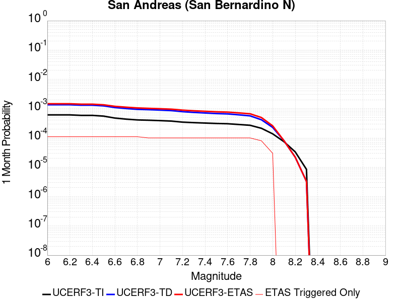 | 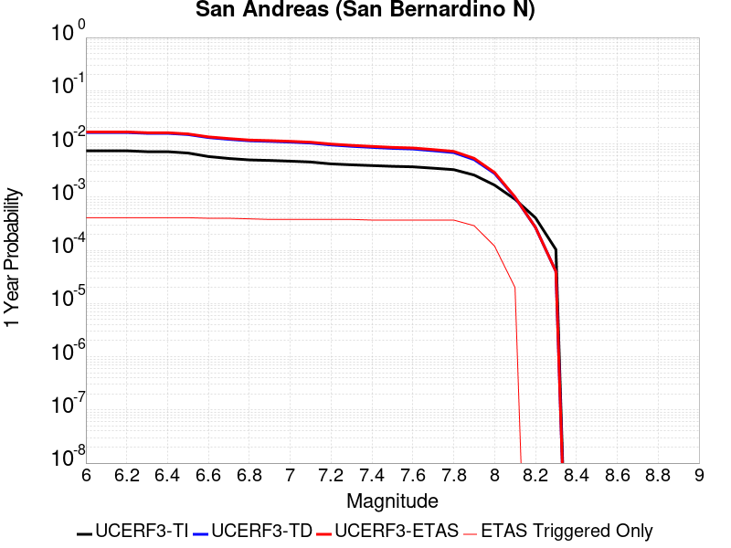 | 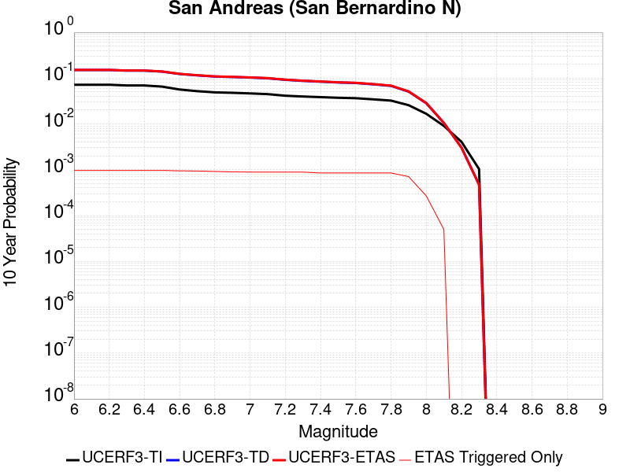 |

| Magnitude | 1 wk TI Prob | 1 wk TD Prob | 1 wk ETAS Prob | 1 wk ETAS/TD Gain | 1 wk ETAS Triggered Only | 1 mo TI Prob | 1 mo TD Prob | 1 mo ETAS Prob | 1 mo ETAS/TD Gain | 1 mo ETAS Triggered Only | 1 yr TI Prob | 1 yr TD Prob | 1 yr ETAS Prob | 1 yr ETAS/TD Gain | 1 yr ETAS Triggered Only | 10 yr TI Prob | 10 yr TD Prob | 10 yr ETAS Prob | 10 yr ETAS/TD Gain | 10 yr ETAS Triggered Only |
|-----|-----|-----|-----|-----|-----|-----|-----|-----|-----|-----|-----|-----|-----|-----|-----|-----|-----|-----|-----|-----|
| 6.0 | 1.4273766E-4 | 3.1627202E-4 | 3.4626253E-4 | 1.094825 | 3.0E-5 | 6.115894E-4 | 0.0013547534 | 0.0014646043 | 1.0810856 | 1.1E-4 | 0.0074207084 | 0.01637088 | 0.016774168 | 1.0246345 | 4.1E-4 | 0.07177748 | 0.1503515 | 0.15117565 | 1.0054816 | 9.7E-4 |
| 6.1 | 1.4273766E-4 | 3.1627202E-4 | 3.4626253E-4 | 1.094825 | 3.0E-5 | 6.115894E-4 | 0.0013547534 | 0.0014646043 | 1.0810856 | 1.1E-4 | 0.0074207084 | 0.01637088 | 0.016774168 | 1.0246345 | 4.1E-4 | 0.07177748 | 0.1503515 | 0.15117565 | 1.0054816 | 9.7E-4 |
| 6.2 | 1.4273766E-4 | 3.1627202E-4 | 3.4626253E-4 | 1.094825 | 3.0E-5 | 6.115894E-4 | 0.0013547534 | 0.0014646043 | 1.0810856 | 1.1E-4 | 0.0074207084 | 0.01637088 | 0.016774168 | 1.0246345 | 4.1E-4 | 0.07177748 | 0.1503515 | 0.15117565 | 1.0054816 | 9.7E-4 |
| 6.3 | 1.3730655E-4 | 3.053195E-4 | 3.3531035E-4 | 1.0982277 | 3.0E-5 | 5.883239E-4 | 0.0013078616 | 0.0014177178 | 1.0839968 | 1.1E-4 | 0.0071393442 | 0.01580836 | 0.01621188 | 1.0255257 | 4.1E-4 | 0.06914291 | 0.1456514 | 0.14648011 | 1.0056897 | 9.7E-4 |
| 6.4 | 1.3730655E-4 | 3.053195E-4 | 3.3531035E-4 | 1.0982277 | 3.0E-5 | 5.883239E-4 | 0.0013078616 | 0.0014177178 | 1.0839968 | 1.1E-4 | 0.0071393442 | 0.01580836 | 0.01621188 | 1.0255257 | 4.1E-4 | 0.06914291 | 0.1456514 | 0.14648011 | 1.0056897 | 9.7E-4 |
| 6.5 | 1.2942807E-4 | 2.8946265E-4 | 3.1945397E-4 | 1.1036103 | 3.0E-5 | 5.545738E-4 | 0.0012399696 | 0.0013498332 | 1.0886018 | 1.1E-4 | 0.0067310524 | 0.014993378 | 0.01539723 | 1.0269355 | 4.1E-4 | 0.06530788 | 0.13879414 | 0.1396295 | 1.0060188 | 9.7E-4 |
| 6.6 | 1.1125901E-4 | 2.5384777E-4 | 2.8384014E-4 | 1.1181511 | 3.0E-5 | 4.767372E-4 | 0.0010874677 | 0.0011973481 | 1.1010424 | 1.1E-4 | 0.005788839 | 0.0131601775 | 0.013554913 | 1.0299947 | 4.0E-4 | 0.056403454 | 0.123083934 | 0.123917006 | 1.0067683 | 9.5E-4 |
| 6.7 | 1.02209575E-4 | 2.3519604E-4 | 2.6518898E-4 | 1.1275232 | 3.0E-5 | 4.3796748E-4 | 0.0010075951 | 0.0011174842 | 1.1090609 | 1.1E-4 | 0.0053192247 | 0.012198891 | 0.012594012 | 1.0323899 | 4.0E-4 | 0.051936906 | 0.114875786 | 0.11570781 | 1.0072428 | 9.4E-4 |
| 6.8 | 9.610582E-5 | 2.2045147E-4 | 2.5044486E-4 | 1.1360544 | 3.0E-5 | 4.1181705E-4 | 9.444507E-4 | 0.0010543468 | 1.1163598 | 1.1E-4 | 0.0050023515 | 0.011438328 | 0.0118238665 | 1.033706 | 3.9E-4 | 0.048912346 | 0.10827732 | 0.109097704 | 1.0075767 | 9.2E-4 |
| 6.9 | 9.3877505E-5 | 2.15006E-4 | 2.4499957E-4 | 1.139501 | 3.0E-5 | 4.0227012E-4 | 9.2112954E-4 | 0.0010210375 | 1.1084623 | 1.0E-4 | 0.0048866454 | 0.011157331 | 0.011533091 | 1.0336783 | 3.8E-4 | 0.04780577 | 0.10586745 | 0.10667217 | 1.0076011 | 9.0E-4 |
| 7.0 | 9.1019785E-5 | 2.0827369E-4 | 2.3826744E-4 | 1.1440113 | 3.0E-5 | 3.900265E-4 | 8.922968E-4 | 9.922076E-4 | 1.1119703 | 1.0E-4 | 0.0047382377 | 0.010809825 | 0.011185717 | 1.0347732 | 3.8E-4 | 0.046384744 | 0.10283744 | 0.10363592 | 1.0077645 | 8.9E-4 |
| 7.1 | 8.771155E-5 | 2.0001776E-4 | 2.3001176E-4 | 1.1499567 | 3.0E-5 | 3.758525E-4 | 8.569379E-4 | 9.568522E-4 | 1.1165946 | 1.0E-4 | 0.0045664064 | 0.010383506 | 0.01075956 | 1.0362165 | 3.8E-4 | 0.044737056 | 0.09914872 | 0.09995048 | 1.0080864 | 8.9E-4 |
| 7.2 | 8.0830236E-5 | 1.8407055E-4 | 2.1406503E-4 | 1.162951 | 3.0E-5 | 3.4636928E-4 | 7.8863546E-4 | 8.885566E-4 | 1.1267014 | 1.0E-4 | 0.0042088944 | 0.009559472 | 0.009935839 | 1.0393711 | 3.8E-4 | 0.041300658 | 0.091878824 | 0.09268705 | 1.0087967 | 8.9E-4 |
| 7.3 | 7.7668235E-5 | 1.7350251E-4 | 2.0349731E-4 | 1.1728781 | 3.0E-5 | 3.328214E-4 | 7.433704E-4 | 8.4329606E-4 | 1.1344224 | 1.0E-4 | 0.0040445733 | 0.009013056 | 0.009389631 | 1.0417811 | 3.8E-4 | 0.03971748 | 0.087144956 | 0.0879574 | 1.0093229 | 8.9E-4 |
| 7.4 | 7.520177E-5 | 1.6570097E-4 | 1.95696E-4 | 1.1810191 | 3.0E-5 | 3.2225347E-4 | 7.0995383E-4 | 8.098828E-4 | 1.1407542 | 1.0E-4 | 0.0039163795 | 0.008609498 | 0.008976312 | 1.0426058 | 3.7E-4 | 0.038480744 | 0.08360034 | 0.084379286 | 1.0093174 | 8.5E-4 |
| 7.5 | 7.274697E-5 | 1.5857513E-4 | 1.8857038E-4 | 1.1891547 | 3.0E-5 | 3.1173544E-4 | 6.794308E-4 | 7.7936286E-4 | 1.147082 | 1.0E-4 | 0.003788775 | 0.008240752 | 0.008607703 | 1.0445288 | 3.7E-4 | 0.03724827 | 0.08031635 | 0.08109808 | 1.0097332 | 8.5E-4 |
| 7.6 | 7.1185845E-5 | 1.5427222E-4 | 1.8426758E-4 | 1.1944314 | 3.0E-5 | 3.0504653E-4 | 6.6099915E-4 | 7.6093304E-4 | 1.1511861 | 1.0E-4 | 0.0037076178 | 0.0080180215 | 0.008385055 | 1.045776 | 3.7E-4 | 0.036463667 | 0.07830552 | 0.07908896 | 1.0100049 | 8.5E-4 |
| 7.7 | 6.709961E-5 | 1.4335671E-4 | 1.7335241E-4 | 1.2092382 | 3.0E-5 | 2.8753807E-4 | 6.142413E-4 | 7.141799E-4 | 1.1627024 | 1.0E-4 | 0.003495157 | 0.0074527836 | 0.007820026 | 1.0492759 | 3.7E-4 | 0.034406938 | 0.0731328 | 0.07392064 | 1.0107727 | 8.5E-4 |
| 7.8 | 6.300812E-5 | 1.3218872E-4 | 1.6218475E-4 | 1.2269182 | 3.0E-5 | 2.7000686E-4 | 5.664001E-4 | 6.663435E-4 | 1.1764536 | 1.0E-4 | 0.0032823787 | 0.006874146 | 0.0072416025 | 1.0534549 | 3.7E-4 | 0.032343175 | 0.06778813 | 0.06858051 | 1.0116891 | 8.5E-4 |
| 7.9 | 4.983037E-5 | 9.736461E-5 | 1.2736168E-4 | 1.3080902 | 3.0E-5 | 2.1354125E-4 | 4.1721016E-4 | 4.971768E-4 | 1.1916698 | 8.0E-5 | 0.0025967648 | 0.0050677136 | 0.005356244 | 1.0569351 | 2.9E-4 | 0.025666296 | 0.05070927 | 0.051383264 | 1.0132914 | 7.1E-4 |
| 8.0 | 3.2211527E-5 | 5.338049E-5 | 7.337942E-5 | 1.3746487 | 2.0E-5 | 1.380421E-4 | 2.2875347E-4 | 2.5874662E-4 | 1.1311156 | 3.0E-5 | 0.0016793669 | 0.0027815185 | 0.0029011846 | 1.0430219 | 1.2E-4 | 0.016667323 | 0.028398372 | 0.028660705 | 1.0092375 | 2.7E-4 |
| 8.1 | 1.743376E-5 | 1.8859591E-5 | 1.8859591E-5 | 1.0 | 0.0 | 7.471398E-5 | 8.082432E-5 | 8.082432E-5 | 1.0 | 0.0 | 9.0926304E-4 | 9.835925E-4 | 0.0010035728 | 1.0203136 | 2.0E-5 | 0.009055517 | 0.010502379 | 0.010551854 | 1.0047108 | 5.0E-5 |
| 8.2 | 7.831616E-6 | 5.1681136E-6 | 5.1681136E-6 | 1.0 | 0.0 | 3.3563636E-5 | 2.214887E-5 | 2.214887E-5 | 1.0 | 0.0 | 4.0856065E-4 | 2.696292E-4 | 2.696292E-4 | 1.0 | 0.0 | 0.004078103 | 0.0030488814 | 0.0030488814 | 1.0 | 0.0 |
| 8.3 | 1.983087E-6 | 7.68342E-7 | 7.68342E-7 | 1.0 | 0.0 | 8.498917E-6 | 3.2928901E-6 | 3.2928901E-6 | 1.0 | 0.0 | 1.034694E-4 | 4.0090217E-5 | 4.0090217E-5 | 1.0 | 0.0 | 0.0010342124 | 4.7331754E-4 | 4.7331754E-4 | 1.0 | 0.0 |

## Paradise
*[(top)](#table-of-contents)*

| 1 Week | 1 Month | 1 Year | 10 Year |
|-----|-----|-----|-----|
|  | 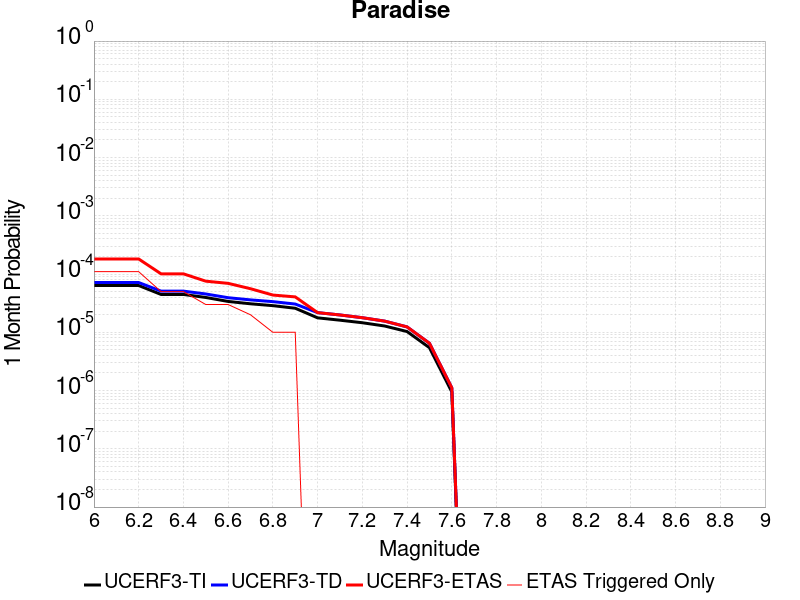 |  | 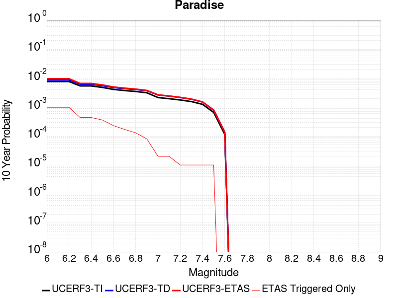 |

| Magnitude | 1 wk TI Prob | 1 wk TD Prob | 1 wk ETAS Prob | 1 wk ETAS/TD Gain | 1 wk ETAS Triggered Only | 1 mo TI Prob | 1 mo TD Prob | 1 mo ETAS Prob | 1 mo ETAS/TD Gain | 1 mo ETAS Triggered Only | 1 yr TI Prob | 1 yr TD Prob | 1 yr ETAS Prob | 1 yr ETAS/TD Gain | 1 yr ETAS Triggered Only | 10 yr TI Prob | 10 yr TD Prob | 10 yr ETAS Prob | 10 yr ETAS/TD Gain | 10 yr ETAS Triggered Only |
|-----|-----|-----|-----|-----|-----|-----|-----|-----|-----|-----|-----|-----|-----|-----|-----|-----|-----|-----|-----|-----|
| 6.0 | 1.4851273E-5 | 1.6695147E-5 | 4.6694644E-5 | 2.7968996 | 3.0E-5 | 6.364676E-5 | 7.15488E-5 | 1.8154092E-4 | 2.5373023 | 1.1E-4 | 7.7462377E-4 | 8.7078207E-4 | 0.0013403728 | 1.5392747 | 4.7E-4 | 0.0077192914 | 0.00867608 | 0.00965749 | 1.1131169 | 9.9E-4 |
| 6.1 | 1.4851273E-5 | 1.6695147E-5 | 4.6694644E-5 | 2.7968996 | 3.0E-5 | 6.364676E-5 | 7.15488E-5 | 1.8154092E-4 | 2.5373023 | 1.1E-4 | 7.7462377E-4 | 8.7078207E-4 | 0.0013403728 | 1.5392747 | 4.7E-4 | 0.0077192914 | 0.00867608 | 0.00965749 | 1.1131169 | 9.9E-4 |
| 6.2 | 1.4851273E-5 | 1.6695147E-5 | 4.6694644E-5 | 2.7968996 | 3.0E-5 | 6.364676E-5 | 7.15488E-5 | 1.8154092E-4 | 2.5373023 | 1.1E-4 | 7.7462377E-4 | 8.7078207E-4 | 0.0013403728 | 1.5392747 | 4.7E-4 | 0.0077192914 | 0.00867608 | 0.00965749 | 1.1131169 | 9.9E-4 |
| 6.3 | 1.0426831E-5 | 1.1888921E-5 | 3.188868E-5 | 2.6822186 | 2.0E-5 | 4.4685654E-5 | 5.0951556E-5 | 1.0094901E-4 | 1.9812742 | 5.0E-5 | 5.43912E-4 | 6.2016456E-4 | 8.300343E-4 | 1.3384098 | 2.1E-4 | 0.0054258266 | 0.0061849477 | 0.006622226 | 1.0707004 | 4.4E-4 |
| 6.4 | 1.0426831E-5 | 1.1888921E-5 | 3.188868E-5 | 2.6822186 | 2.0E-5 | 4.4685654E-5 | 5.0951556E-5 | 1.0094901E-4 | 1.9812742 | 5.0E-5 | 5.43912E-4 | 6.2016456E-4 | 8.300343E-4 | 1.3384098 | 2.1E-4 | 0.0054258266 | 0.0061849477 | 0.006622226 | 1.0707004 | 4.4E-4 |
| 6.5 | 9.25027E-6 | 1.0620223E-5 | 1.0620223E-5 | 1.0 | 0.0 | 3.964341E-5 | 4.5514476E-5 | 7.551311E-5 | 1.6591009 | 3.0E-5 | 4.8255164E-4 | 5.5400276E-4 | 7.239086E-4 | 1.3066877 | 1.7E-4 | 0.0048150513 | 0.005526716 | 0.0058847265 | 1.0647781 | 3.6E-4 |
| 6.6 | 7.904275E-6 | 9.159742E-6 | 9.159742E-6 | 1.0 | 0.0 | 3.3875025E-5 | 3.925547E-5 | 6.925429E-5 | 1.7641947 | 3.0E-5 | 4.1235037E-4 | 4.7783446E-4 | 5.877819E-4 | 1.2300953 | 1.1E-4 | 0.0041158604 | 0.004768467 | 0.0049973703 | 1.0480036 | 2.3E-4 |
| 6.7 | 7.2061953E-6 | 8.407444E-6 | 8.407444E-6 | 1.0 | 0.0 | 3.088333E-5 | 3.6031426E-5 | 5.6030705E-5 | 1.555051 | 2.0E-5 | 3.7593965E-4 | 4.3859798E-4 | 5.285585E-4 | 1.2051094 | 9.0E-5 | 0.003753043 | 0.0043776925 | 0.0045469482 | 1.0386633 | 1.7E-4 |
| 6.8 | 6.6948724E-6 | 7.842346E-6 | 7.842346E-6 | 1.0 | 0.0 | 2.8691995E-5 | 3.3609642E-5 | 4.3609307E-5 | 1.2975236 | 1.0E-5 | 3.4926904E-4 | 4.0912413E-4 | 4.790955E-4 | 1.1710272 | 7.0E-5 | 0.003487206 | 0.004084067 | 0.0042135357 | 1.031701 | 1.3E-4 |
| 6.9 | 6.0421025E-6 | 7.130782E-6 | 7.130782E-6 | 1.0 | 0.0 | 2.5894467E-5 | 3.0560153E-5 | 4.0559848E-5 | 1.3272135 | 1.0E-5 | 3.1521954E-4 | 3.7200976E-4 | 4.2199114E-4 | 1.1343551 | 5.0E-5 | 0.0031477278 | 0.0037142083 | 0.003793911 | 1.0214589 | 8.0E-5 |
| 7.0 | 4.134091E-6 | 5.0804206E-6 | 5.0804206E-6 | 1.0 | 0.0 | 1.7717413E-5 | 2.177306E-5 | 2.177306E-5 | 1.0 | 0.0 | 2.1568815E-4 | 2.650563E-4 | 2.8505098E-4 | 1.0754356 | 2.0E-5 | 0.0021547892 | 0.0026475545 | 0.0026675016 | 1.0075341 | 2.0E-5 |
| 7.1 | 3.7674888E-6 | 4.63197E-6 | 4.63197E-6 | 1.0 | 0.0 | 1.6146281E-5 | 1.9851159E-5 | 1.9851159E-5 | 1.0 | 0.0 | 1.9656324E-4 | 2.4166256E-4 | 2.6165773E-4 | 1.0827401 | 2.0E-5 | 0.0019638946 | 0.0024141483 | 0.0024341 | 1.0082645 | 2.0E-5 |
| 7.2 | 3.4065345E-6 | 4.1568132E-6 | 4.1568132E-6 | 1.0 | 0.0 | 1.4599351E-5 | 1.78148E-5 | 1.78148E-5 | 1.0 | 0.0 | 1.777326E-4 | 2.1687511E-4 | 2.2687293E-4 | 1.0460995 | 1.0E-5 | 0.0017759053 | 0.0021667827 | 0.0021767612 | 1.0046052 | 1.0E-5 |
| 7.3 | 2.9934936E-6 | 3.6293911E-6 | 3.6293911E-6 | 1.0 | 0.0 | 1.2829195E-5 | 1.555445E-5 | 1.555445E-5 | 1.0 | 0.0 | 1.5618425E-4 | 1.8936043E-4 | 1.9935855E-4 | 1.0527993 | 1.0E-5 | 0.0015607453 | 0.0018921362 | 0.0019021173 | 1.005275 | 1.0E-5 |
| 7.4 | 2.4049796E-6 | 2.8890386E-6 | 2.8890386E-6 | 1.0 | 0.0 | 1.0307015E-5 | 1.23815435E-5 | 1.23815435E-5 | 1.0 | 0.0 | 1.2548068E-4 | 1.507363E-4 | 1.607348E-4 | 1.066331 | 1.0E-5 | 0.0012540985 | 0.0015064821 | 0.001516467 | 1.006628 | 1.0E-5 |
| 7.5 | 1.2710091E-6 | 1.5134942E-6 | 1.5134942E-6 | 1.0 | 0.0 | 5.44717E-6 | 6.486395E-6 | 6.486395E-6 | 1.0 | 0.0 | 6.631728E-5 | 7.8970246E-5 | 8.896946E-5 | 1.1266199 | 1.0E-5 | 6.6297496E-4 | 7.895445E-4 | 7.995366E-4 | 1.0126555 | 1.0E-5 |
| 7.6 | 2.21172E-7 | 2.603997E-7 | 2.603997E-7 | 1.0 | 0.0 | 9.478797E-7 | 1.1159984E-6 | 1.1159984E-6 | 1.0 | 0.0 | 1.1540374E-5 | 1.3587224E-5 | 1.3587224E-5 | 1.0 | 0.0 | 1.1539775E-4 | 1.3586675E-4 | 1.3586675E-4 | 1.0 | 0.0 |

## Bicycle Lake
*[(top)](#table-of-contents)*

| 1 Week | 1 Month | 1 Year | 10 Year |
|-----|-----|-----|-----|
|  | 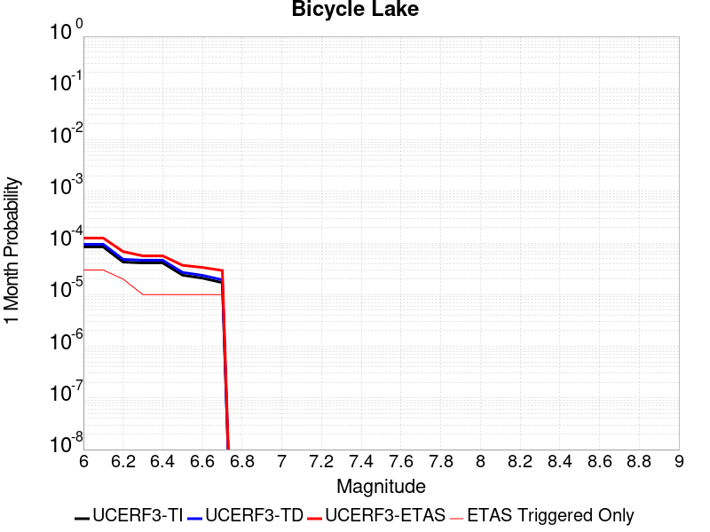 |  |  |

| Magnitude | 1 wk TI Prob | 1 wk TD Prob | 1 wk ETAS Prob | 1 wk ETAS/TD Gain | 1 wk ETAS Triggered Only | 1 mo TI Prob | 1 mo TD Prob | 1 mo ETAS Prob | 1 mo ETAS/TD Gain | 1 mo ETAS Triggered Only | 1 yr TI Prob | 1 yr TD Prob | 1 yr ETAS Prob | 1 yr ETAS/TD Gain | 1 yr ETAS Triggered Only | 10 yr TI Prob | 10 yr TD Prob | 10 yr ETAS Prob | 10 yr ETAS/TD Gain | 10 yr ETAS Triggered Only |
|-----|-----|-----|-----|-----|-----|-----|-----|-----|-----|-----|-----|-----|-----|-----|-----|-----|-----|-----|-----|-----|
| 6.0 | 1.9621975E-5 | 2.2098115E-5 | 2.2098115E-5 | 1.0 | 0.0 | 8.4091465E-5 | 9.470353E-5 | 1.2470069E-4 | 1.316748 | 3.0E-5 | 0.0010233327 | 0.0011525406 | 0.0014621833 | 1.268661 | 3.1E-4 | 0.01018633 | 0.011478944 | 0.012378498 | 1.0783656 | 9.1E-4 |
| 6.1 | 1.9621975E-5 | 2.2098115E-5 | 2.2098115E-5 | 1.0 | 0.0 | 8.4091465E-5 | 9.470353E-5 | 1.2470069E-4 | 1.316748 | 3.0E-5 | 0.0010233327 | 0.0011525406 | 0.0014621833 | 1.268661 | 3.1E-4 | 0.01018633 | 0.011478944 | 0.012378498 | 1.0783656 | 9.1E-4 |
| 6.2 | 9.9971285E-6 | 1.1256166E-5 | 1.1256166E-5 | 1.0 | 0.0 | 4.2844134E-5 | 4.8240112E-5 | 6.823915E-5 | 1.4145727 | 2.0E-5 | 5.2150246E-4 | 5.872171E-4 | 7.37129E-4 | 1.2552922 | 1.5E-4 | 0.0052028033 | 0.00586176 | 0.006398595 | 1.0915825 | 5.4E-4 |
| 6.3 | 9.589428E-6 | 1.0798852E-5 | 1.0798852E-5 | 1.0 | 0.0 | 4.10969E-5 | 4.6280264E-5 | 5.62798E-5 | 1.2160648 | 1.0E-5 | 5.002399E-4 | 5.6336843E-4 | 6.932952E-4 | 1.2306249 | 1.3E-4 | 0.0049911533 | 0.0056244927 | 0.00612168 | 1.0883969 | 5.0E-4 |
| 6.4 | 9.589428E-6 | 1.0798852E-5 | 1.0798852E-5 | 1.0 | 0.0 | 4.10969E-5 | 4.6280264E-5 | 5.62798E-5 | 1.2160648 | 1.0E-5 | 5.002399E-4 | 5.6336843E-4 | 6.932952E-4 | 1.2306249 | 1.3E-4 | 0.0049911533 | 0.0056244927 | 0.00612168 | 1.0883969 | 5.0E-4 |
| 6.5 | 5.557707E-6 | 6.285907E-6 | 6.285907E-6 | 1.0 | 0.0 | 2.3818526E-5 | 2.6939477E-5 | 3.6939207E-5 | 1.3711925 | 1.0E-5 | 2.8995197E-4 | 3.2796565E-4 | 4.1793613E-4 | 1.274329 | 9.0E-5 | 0.0028957394 | 0.0032774527 | 0.003606371 | 1.100358 | 3.3E-4 |
| 6.6 | 4.8742945E-6 | 5.5135583E-6 | 5.5135583E-6 | 1.0 | 0.0 | 2.0889667E-5 | 2.3629469E-5 | 3.3629232E-5 | 1.4231904 | 1.0E-5 | 2.54302E-4 | 2.8767702E-4 | 3.67654E-4 | 1.2780097 | 8.0E-5 | 0.002540112 | 0.0028756151 | 0.0031647813 | 1.100558 | 2.9E-4 |
| 6.7 | 3.991108E-6 | 4.516131E-6 | 4.516131E-6 | 1.0 | 0.0 | 1.7104636E-5 | 1.9354848E-5 | 2.9354653E-5 | 1.5166564 | 1.0E-5 | 2.0822904E-4 | 2.3564526E-4 | 3.0562875E-4 | 1.2969867 | 7.0E-5 | 0.0020803404 | 0.0023564526 | 0.002595887 | 1.101608 | 2.4E-4 |

## Garlic Springs
*[(top)](#table-of-contents)*

| 1 Week | 1 Month | 1 Year | 10 Year |
|-----|-----|-----|-----|
| 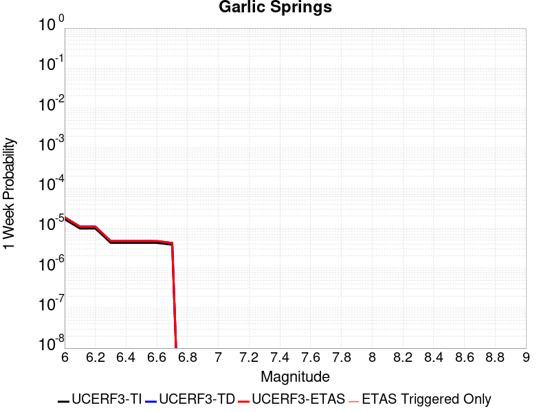 |  |  |  |

| Magnitude | 1 wk TI Prob | 1 wk TD Prob | 1 wk ETAS Prob | 1 wk ETAS/TD Gain | 1 wk ETAS Triggered Only | 1 mo TI Prob | 1 mo TD Prob | 1 mo ETAS Prob | 1 mo ETAS/TD Gain | 1 mo ETAS Triggered Only | 1 yr TI Prob | 1 yr TD Prob | 1 yr ETAS Prob | 1 yr ETAS/TD Gain | 1 yr ETAS Triggered Only | 10 yr TI Prob | 10 yr TD Prob | 10 yr ETAS Prob | 10 yr ETAS/TD Gain | 10 yr ETAS Triggered Only |
|-----|-----|-----|-----|-----|-----|-----|-----|-----|-----|-----|-----|-----|-----|-----|-----|-----|-----|-----|-----|-----|
| 6.0 | 1.6760017E-5 | 1.8777673E-5 | 1.8777673E-5 | 1.0 | 0.0 | 7.182667E-5 | 8.047392E-5 | 1.0047231E-4 | 1.2485077 | 2.0E-5 | 8.7413884E-4 | 9.794469E-4 | 0.001219212 | 1.2447963 | 2.4E-4 | 0.008707083 | 0.009762848 | 0.010416404 | 1.0669432 | 6.6E-4 |
| 6.1 | 9.852767E-6 | 1.097405E-5 | 1.097405E-5 | 1.0 | 0.0 | 4.222546E-5 | 4.7031197E-5 | 6.7030254E-5 | 1.4252297 | 2.0E-5 | 5.139737E-4 | 5.725254E-4 | 7.1244524E-4 | 1.2443906 | 1.4E-4 | 0.005127866 | 0.005717463 | 0.006105233 | 1.0678221 | 3.9E-4 |
| 6.2 | 9.852767E-6 | 1.097405E-5 | 1.097405E-5 | 1.0 | 0.0 | 4.222546E-5 | 4.7031197E-5 | 6.7030254E-5 | 1.4252297 | 2.0E-5 | 5.139737E-4 | 5.725254E-4 | 7.1244524E-4 | 1.2443906 | 1.4E-4 | 0.005127866 | 0.005717463 | 0.006105233 | 1.0678221 | 3.9E-4 |
| 6.3 | 4.3167724E-6 | 4.778218E-6 | 4.778218E-6 | 1.0 | 0.0 | 1.8500323E-5 | 2.0478048E-5 | 4.0477637E-5 | 1.9766356 | 2.0E-5 | 2.2521814E-4 | 2.4931473E-4 | 3.292948E-4 | 1.3207996 | 8.0E-5 | 0.0022499003 | 0.0024926087 | 0.0027020853 | 1.0840391 | 2.1E-4 |
| 6.4 | 4.3167724E-6 | 4.778218E-6 | 4.778218E-6 | 1.0 | 0.0 | 1.8500323E-5 | 2.0478048E-5 | 4.0477637E-5 | 1.9766356 | 2.0E-5 | 2.2521814E-4 | 2.4931473E-4 | 3.292948E-4 | 1.3207996 | 8.0E-5 | 0.0022499003 | 0.0024926087 | 0.0027020853 | 1.0840391 | 2.1E-4 |
| 6.5 | 4.3167724E-6 | 4.778218E-6 | 4.778218E-6 | 1.0 | 0.0 | 1.8500323E-5 | 2.0478048E-5 | 4.0477637E-5 | 1.9766356 | 2.0E-5 | 2.2521814E-4 | 2.4931473E-4 | 3.292948E-4 | 1.3207996 | 8.0E-5 | 0.0022499003 | 0.0024926087 | 0.0027020853 | 1.0840391 | 2.1E-4 |
| 6.6 | 4.301311E-6 | 4.761086E-6 | 4.761086E-6 | 1.0 | 0.0 | 1.8434059E-5 | 2.0404625E-5 | 4.0404215E-5 | 1.98015 | 2.0E-5 | 2.2441156E-4 | 2.48421E-4 | 3.2840113E-4 | 1.3219539 | 8.0E-5 | 0.0022418506 | 0.0024836916 | 0.00269317 | 1.0843415 | 2.1E-4 |
| 6.7 | 3.8599724E-6 | 4.2712286E-6 | 4.2712286E-6 | 1.0 | 0.0 | 1.6542634E-5 | 1.8305267E-5 | 3.83049E-5 | 2.0925617 | 2.0E-5 | 2.0138794E-4 | 2.2286661E-4 | 3.0284878E-4 | 1.3588791 | 8.0E-5 | 0.0020120554 | 0.002228666 | 0.0024282204 | 1.0895398 | 2.0E-4 |

## Coyote Lake
*[(top)](#table-of-contents)*

| 1 Week | 1 Month | 1 Year | 10 Year |
|-----|-----|-----|-----|
|  |  |  | 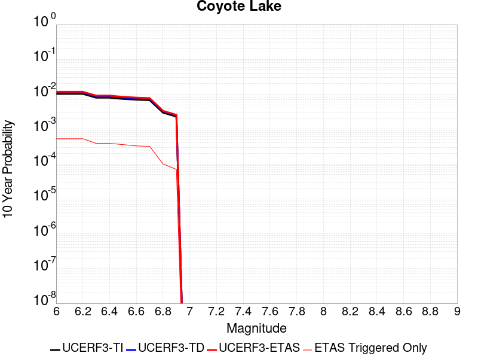 |

| Magnitude | 1 wk TI Prob | 1 wk TD Prob | 1 wk ETAS Prob | 1 wk ETAS/TD Gain | 1 wk ETAS Triggered Only | 1 mo TI Prob | 1 mo TD Prob | 1 mo ETAS Prob | 1 mo ETAS/TD Gain | 1 mo ETAS Triggered Only | 1 yr TI Prob | 1 yr TD Prob | 1 yr ETAS Prob | 1 yr ETAS/TD Gain | 1 yr ETAS Triggered Only | 10 yr TI Prob | 10 yr TD Prob | 10 yr ETAS Prob | 10 yr ETAS/TD Gain | 10 yr ETAS Triggered Only |
|-----|-----|-----|-----|-----|-----|-----|-----|-----|-----|-----|-----|-----|-----|-----|-----|-----|-----|-----|-----|-----|
| 6.0 | 1.980352E-5 | 2.170752E-5 | 2.170752E-5 | 1.0 | 0.0 | 8.486947E-5 | 9.302932E-5 | 1.13027454E-4 | 1.2149659 | 2.0E-5 | 0.0010327959 | 0.0011321155 | 0.0013318891 | 1.1764604 | 2.0E-4 | 0.010280091 | 0.011270658 | 0.011794685 | 1.0464947 | 5.3E-4 |
| 6.1 | 1.980352E-5 | 2.170752E-5 | 2.170752E-5 | 1.0 | 0.0 | 8.486947E-5 | 9.302932E-5 | 1.13027454E-4 | 1.2149659 | 2.0E-5 | 0.0010327959 | 0.0011321155 | 0.0013318891 | 1.1764604 | 2.0E-4 | 0.010280091 | 0.011270658 | 0.011794685 | 1.0464947 | 5.3E-4 |
| 6.2 | 1.980352E-5 | 2.170752E-5 | 2.170752E-5 | 1.0 | 0.0 | 8.486947E-5 | 9.302932E-5 | 1.13027454E-4 | 1.2149659 | 2.0E-5 | 0.0010327959 | 0.0011321155 | 0.0013318891 | 1.1764604 | 2.0E-4 | 0.010280091 | 0.011270658 | 0.011794685 | 1.0464947 | 5.3E-4 |
| 6.3 | 1.5344787E-5 | 1.682127E-5 | 1.682127E-5 | 1.0 | 0.0 | 6.576172E-5 | 7.208951E-5 | 9.208807E-5 | 1.2774129 | 2.0E-5 | 8.003548E-4 | 8.773976E-4 | 0.0010172748 | 1.1594228 | 1.4E-4 | 0.007974784 | 0.008745381 | 0.00913197 | 1.044205 | 3.9E-4 |
| 6.4 | 1.5344787E-5 | 1.682127E-5 | 1.682127E-5 | 1.0 | 0.0 | 6.576172E-5 | 7.208951E-5 | 9.208807E-5 | 1.2774129 | 2.0E-5 | 8.003548E-4 | 8.773976E-4 | 0.0010172748 | 1.1594228 | 1.4E-4 | 0.007974784 | 0.008745381 | 0.00913197 | 1.044205 | 3.9E-4 |
| 6.5 | 1.4189697E-5 | 1.5558544E-5 | 1.5558544E-5 | 1.0 | 0.0 | 6.081157E-5 | 6.667811E-5 | 8.667678E-5 | 1.2999285 | 2.0E-5 | 7.401293E-4 | 8.11564E-4 | 9.314666E-4 | 1.1477426 | 1.2E-4 | 0.0073766913 | 0.008091945 | 0.008449032 | 1.0441287 | 3.6E-4 |
| 6.6 | 1.3469301E-5 | 1.4772108E-5 | 1.4772108E-5 | 1.0 | 0.0 | 5.7724297E-5 | 6.330784E-5 | 8.330657E-5 | 1.3158966 | 2.0E-5 | 7.025667E-4 | 7.7056035E-4 | 8.8047556E-4 | 1.1426432 | 1.1E-4 | 0.0070034964 | 0.0076847896 | 0.008012254 | 1.042612 | 3.3E-4 |
| 6.7 | 1.3027966E-5 | 1.42822555E-5 | 1.42822555E-5 | 1.0 | 0.0 | 5.5832945E-5 | 6.120857E-5 | 8.120734E-5 | 1.3267317 | 2.0E-5 | 6.7955407E-4 | 7.450193E-4 | 8.549373E-4 | 1.1475372 | 1.1E-4 | 0.006774798 | 0.0074310936 | 0.007748716 | 1.0427423 | 3.2E-4 |
| 6.8 | 5.695434E-6 | 6.2246327E-6 | 6.2246327E-6 | 1.0 | 0.0 | 2.4408775E-5 | 2.6676893E-5 | 2.6676893E-5 | 1.0 | 0.0 | 2.971363E-4 | 3.2477276E-4 | 3.54763E-4 | 1.0923423 | 3.0E-5 | 0.0029673933 | 0.0032459223 | 0.0033455978 | 1.0307078 | 1.0E-4 |
| 6.9 | 4.385688E-6 | 4.793221E-6 | 4.793221E-6 | 1.0 | 0.0 | 1.879567E-5 | 2.0542375E-5 | 2.0542375E-5 | 1.0 | 0.0 | 2.2881327E-4 | 2.5010342E-4 | 2.7009842E-4 | 1.0799469 | 2.0E-5 | 0.002285778 | 0.0025010342 | 0.0025708592 | 1.0279185 | 7.0E-5 |

## San Andreas (San Bernardino S)
*[(top)](#table-of-contents)*

| 1 Week | 1 Month | 1 Year | 10 Year |
|-----|-----|-----|-----|
|  |  |  | 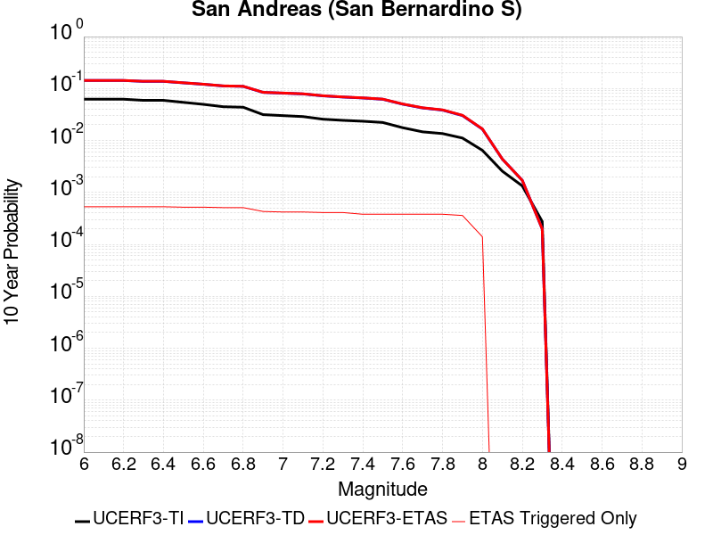 |

| Magnitude | 1 wk TI Prob | 1 wk TD Prob | 1 wk ETAS Prob | 1 wk ETAS/TD Gain | 1 wk ETAS Triggered Only | 1 mo TI Prob | 1 mo TD Prob | 1 mo ETAS Prob | 1 mo ETAS/TD Gain | 1 mo ETAS Triggered Only | 1 yr TI Prob | 1 yr TD Prob | 1 yr ETAS Prob | 1 yr ETAS/TD Gain | 1 yr ETAS Triggered Only | 10 yr TI Prob | 10 yr TD Prob | 10 yr ETAS Prob | 10 yr ETAS/TD Gain | 10 yr ETAS Triggered Only |
|-----|-----|-----|-----|-----|-----|-----|-----|-----|-----|-----|-----|-----|-----|-----|-----|-----|-----|-----|-----|-----|
| 6.0 | 1.2336002E-4 | 3.0017726E-4 | 3.2017124E-4 | 1.0666074 | 2.0E-5 | 5.2857865E-4 | 0.0012858658 | 0.0013557757 | 1.054368 | 7.0E-5 | 0.006416472 | 0.015547995 | 0.015764575 | 1.0139297 | 2.2E-4 | 0.06234337 | 0.14289086 | 0.14334513 | 1.0031791 | 5.3E-4 |
| 6.1 | 1.2336002E-4 | 3.0017726E-4 | 3.2017124E-4 | 1.0666074 | 2.0E-5 | 5.2857865E-4 | 0.0012858658 | 0.0013557757 | 1.054368 | 7.0E-5 | 0.006416472 | 0.015547995 | 0.015764575 | 1.0139297 | 2.2E-4 | 0.06234337 | 0.14289086 | 0.14334513 | 1.0031791 | 5.3E-4 |
| 6.2 | 1.2336002E-4 | 3.0017726E-4 | 3.2017124E-4 | 1.0666074 | 2.0E-5 | 5.2857865E-4 | 0.0012858658 | 0.0013557757 | 1.054368 | 7.0E-5 | 0.006416472 | 0.015547995 | 0.015764575 | 1.0139297 | 2.2E-4 | 0.06234337 | 0.14289086 | 0.14334513 | 1.0031791 | 5.3E-4 |
| 6.3 | 1.1712257E-4 | 2.880589E-4 | 3.0805313E-4 | 1.0694102 | 2.0E-5 | 5.018573E-4 | 0.0012339797 | 0.0013038934 | 1.0566571 | 7.0E-5 | 0.006093008 | 0.014925055 | 0.015141772 | 1.0145203 | 2.2E-4 | 0.059286322 | 0.13759916 | 0.13805623 | 1.0033218 | 5.3E-4 |
| 6.4 | 1.1712257E-4 | 2.880589E-4 | 3.0805313E-4 | 1.0694102 | 2.0E-5 | 5.018573E-4 | 0.0012339797 | 0.0013038934 | 1.0566571 | 7.0E-5 | 0.006093008 | 0.014925055 | 0.015141772 | 1.0145203 | 2.2E-4 | 0.059286322 | 0.13759916 | 0.13805623 | 1.0033218 | 5.3E-4 |
| 6.5 | 1.0689076E-4 | 2.6818516E-4 | 2.8817978E-4 | 1.0745554 | 2.0E-5 | 4.5802278E-4 | 0.0011488835 | 0.001218803 | 1.0608587 | 7.0E-5 | 0.0055621783 | 0.0139025645 | 0.014119506 | 1.0156044 | 2.2E-4 | 0.05425003 | 0.128846 | 0.129299 | 1.0035158 | 5.2E-4 |
| 6.6 | 9.7648895E-5 | 2.5063104E-4 | 2.7062604E-4 | 1.0797786 | 2.0E-5 | 4.1842813E-4 | 0.0010737145 | 0.0011436393 | 1.0651243 | 7.0E-5 | 0.005082469 | 0.012998486 | 0.013215627 | 1.016705 | 2.2E-4 | 0.049677886 | 0.121005476 | 0.121462554 | 1.0037774 | 5.2E-4 |
| 6.7 | 8.757013E-5 | 2.3133679E-4 | 2.5133215E-4 | 1.086434 | 2.0E-5 | 3.7524657E-4 | 9.910889E-4 | 0.0010610196 | 1.0705594 | 7.0E-5 | 0.00455906 | 0.012003835 | 0.012221194 | 1.0181075 | 2.2E-4 | 0.04466656 | 0.11231348 | 0.1127662 | 1.0040308 | 5.1E-4 |
| 6.8 | 8.562978E-5 | 2.2693464E-4 | 2.469301E-4 | 1.0881112 | 2.0E-5 | 3.6693315E-4 | 9.7223674E-4 | 0.0010421687 | 1.071929 | 7.0E-5 | 0.004458263 | 0.011776806 | 0.011994215 | 1.0184608 | 2.2E-4 | 0.043698758 | 0.11032349 | 0.11077722 | 1.0041127 | 5.1E-4 |
| 6.9 | 6.124075E-5 | 1.7077175E-4 | 1.9076833E-4 | 1.1170954 | 2.0E-5 | 2.6243398E-4 | 7.316745E-4 | 8.016233E-4 | 1.095601 | 7.0E-5 | 0.0031904527 | 0.0088719595 | 0.009040451 | 1.0189915 | 1.7E-4 | 0.031450346 | 0.08423127 | 0.08462505 | 1.004675 | 4.3E-4 |
| 7.0 | 5.8598747E-5 | 1.6506072E-4 | 1.8505742E-4 | 1.1211475 | 2.0E-5 | 2.5111332E-4 | 7.072121E-4 | 7.771626E-4 | 1.0989102 | 7.0E-5 | 0.0030530186 | 0.0085765105 | 0.008745052 | 1.0196515 | 1.7E-4 | 0.03011414 | 0.081548624 | 0.08193437 | 1.0047303 | 4.2E-4 |
| 7.1 | 5.613814E-5 | 1.592451E-4 | 1.7924192E-4 | 1.1255726 | 2.0E-5 | 2.4056983E-4 | 6.8230124E-4 | 7.522535E-4 | 1.1025239 | 7.0E-5 | 0.0029250039 | 0.008275559 | 0.008444152 | 1.0203724 | 1.7E-4 | 0.028868021 | 0.078847244 | 0.07923413 | 1.0049068 | 4.2E-4 |
| 7.2 | 4.991222E-5 | 1.4530713E-4 | 1.6530423E-4 | 1.1376195 | 2.0E-5 | 2.1389198E-4 | 6.225966E-4 | 6.92553E-4 | 1.1123624 | 7.0E-5 | 0.002601025 | 0.0075538717 | 0.0077225873 | 1.022335 | 1.7E-4 | 0.025707912 | 0.07230022 | 0.07268058 | 1.0052608 | 4.1E-4 |
| 7.3 | 4.7410045E-5 | 1.372468E-4 | 1.5724404E-4 | 1.145703 | 2.0E-5 | 2.0317009E-4 | 5.880683E-4 | 6.580271E-4 | 1.1189638 | 7.0E-5 | 0.0024707897 | 0.007136313 | 0.0073050996 | 1.0236518 | 1.7E-4 | 0.024434982 | 0.06858187 | 0.06896376 | 1.0055683 | 4.1E-4 |
| 7.4 | 4.5556746E-5 | 1.3132402E-4 | 1.513214E-4 | 1.1522751 | 2.0E-5 | 1.952286E-4 | 5.6269614E-4 | 6.3265674E-4 | 1.1243311 | 7.0E-5 | 0.002374317 | 0.0068293847 | 0.006988292 | 1.0232682 | 1.6E-4 | 0.023491086 | 0.06583366 | 0.06618864 | 1.0053921 | 3.8E-4 |
| 7.5 | 4.3084514E-5 | 1.2367514E-4 | 1.4367267E-4 | 1.1616939 | 2.0E-5 | 1.8463485E-4 | 5.2992895E-4 | 5.998919E-4 | 1.1320232 | 7.0E-5 | 0.0022456115 | 0.0064328704 | 0.006591841 | 1.0247122 | 1.6E-4 | 0.022230545 | 0.06223368 | 0.06259003 | 1.005726 | 3.8E-4 |
| 7.6 | 3.408608E-5 | 9.8449476E-5 | 1.1844751E-4 | 1.2031299 | 2.0E-5 | 1.4607502E-4 | 4.2185822E-4 | 4.9182866E-4 | 1.1658626 | 7.0E-5 | 0.0017770125 | 0.005124054 | 0.005283234 | 1.0310652 | 1.6E-4 | 0.017628696 | 0.050062034 | 0.05042301 | 1.0072106 | 3.8E-4 |
| 7.7 | 2.8315713E-5 | 8.257536E-5 | 1.0257371E-4 | 1.242183 | 2.0E-5 | 1.2134742E-4 | 3.5384644E-4 | 4.2382165E-4 | 1.1977559 | 7.0E-5 | 0.0014764034 | 0.004299579 | 0.004458891 | 1.037053 | 1.6E-4 | 0.01466633 | 0.042310927 | 0.04267485 | 1.0086012 | 3.8E-4 |
| 7.8 | 2.6222975E-5 | 7.4713724E-5 | 9.4712224E-5 | 1.2676685 | 2.0E-5 | 1.1237934E-4 | 3.201624E-4 | 3.9014E-4 | 1.218569 | 7.0E-5 | 0.0013673597 | 0.0038910161 | 0.0040503936 | 1.0409603 | 1.6E-4 | 0.013589768 | 0.038473904 | 0.038839284 | 1.0094968 | 3.8E-4 |
| 7.9 | 2.1469694E-5 | 5.7947793E-5 | 7.7946635E-5 | 1.3451183 | 2.0E-5 | 9.200973E-5 | 2.4832407E-4 | 3.0830916E-4 | 1.2415597 | 6.0E-5 | 0.0011196428 | 0.0030191569 | 0.003168704 | 1.0495328 | 1.5E-4 | 0.011140184 | 0.030183546 | 0.03053268 | 1.011567 | 3.6E-4 |
| 8.0 | 1.2420249E-5 | 3.1357376E-5 | 4.135706E-5 | 1.3188943 | 1.0E-5 | 5.322855E-5 | 1.3438183E-4 | 1.5437914E-4 | 1.1488097 | 2.0E-5 | 6.478649E-4 | 0.0016348719 | 0.0017047576 | 1.0427468 | 7.0E-5 | 0.0064597935 | 0.016540429 | 0.016678113 | 1.0083241 | 1.4E-4 |
| 8.1 | 4.9197724E-6 | 7.836348E-6 | 7.836348E-6 | 1.0 | 0.0 | 2.1084568E-5 | 3.3583918E-5 | 3.3583918E-5 | 1.0 | 0.0 | 2.566744E-4 | 4.088076E-4 | 4.088076E-4 | 1.0 | 0.0 | 0.002563781 | 0.004391403 | 0.004391403 | 1.0 | 0.0 |
| 8.2 | 2.5634774E-6 | 2.9132123E-6 | 2.9132123E-6 | 1.0 | 0.0 | 1.0986286E-5 | 1.2485137E-5 | 1.2485137E-5 | 1.0 | 0.0 | 1.3374983E-4 | 1.5199598E-4 | 1.5199598E-4 | 1.0 | 0.0 | 0.0013366934 | 0.0017083796 | 0.0017083796 | 1.0 | 0.0 |
| 8.3 | 5.2850464E-7 | 3.2174762E-7 | 3.2174762E-7 | 1.0 | 0.0 | 2.2650179E-6 | 1.3789177E-6 | 1.3789177E-6 | 1.0 | 0.0 | 2.7576245E-5 | 1.6788206E-5 | 1.6788206E-5 | 1.0 | 0.0 | 2.7572823E-4 | 1.9918833E-4 | 1.9918833E-4 | 1.0 | 0.0 |

## Helendale-So Lockhart
*[(top)](#table-of-contents)*

| 1 Week | 1 Month | 1 Year | 10 Year |
|-----|-----|-----|-----|
|  | 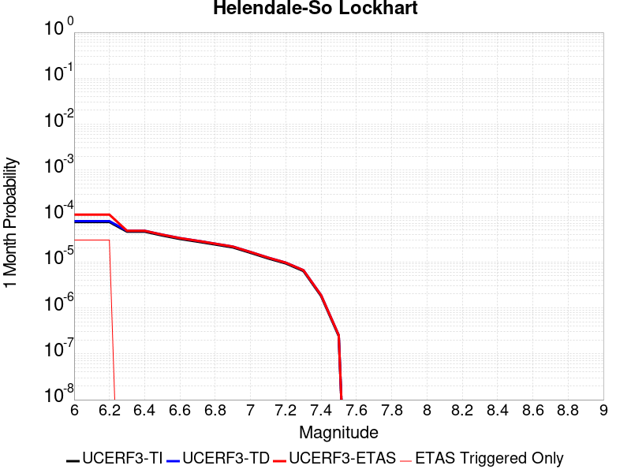 | 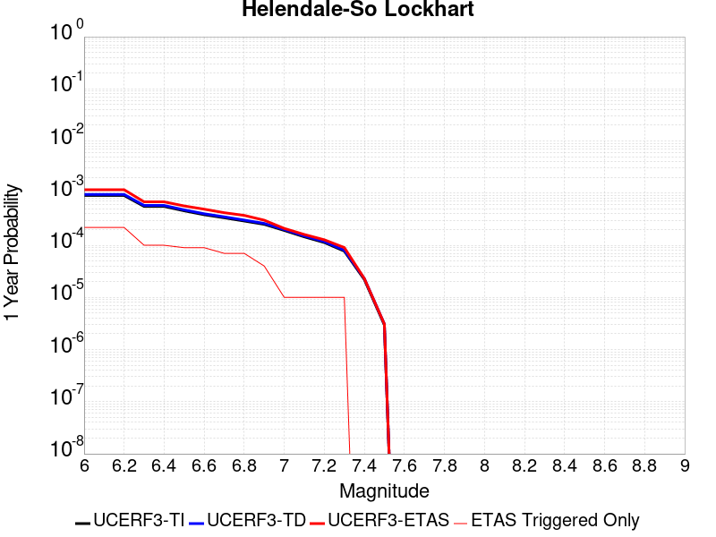 |  |

| Magnitude | 1 wk TI Prob | 1 wk TD Prob | 1 wk ETAS Prob | 1 wk ETAS/TD Gain | 1 wk ETAS Triggered Only | 1 mo TI Prob | 1 mo TD Prob | 1 mo ETAS Prob | 1 mo ETAS/TD Gain | 1 mo ETAS Triggered Only | 1 yr TI Prob | 1 yr TD Prob | 1 yr ETAS Prob | 1 yr ETAS/TD Gain | 1 yr ETAS Triggered Only | 10 yr TI Prob | 10 yr TD Prob | 10 yr ETAS Prob | 10 yr ETAS/TD Gain | 10 yr ETAS Triggered Only |
|-----|-----|-----|-----|-----|-----|-----|-----|-----|-----|-----|-----|-----|-----|-----|-----|-----|-----|-----|-----|-----|
| 6.0 | 1.7296055E-5 | 1.8104043E-5 | 2.8103863E-5 | 1.5523528 | 1.0E-5 | 7.412385E-5 | 7.758657E-5 | 1.07584245E-4 | 1.3866348 | 3.0E-5 | 9.0208417E-4 | 9.4422785E-4 | 0.0011640202 | 1.2327746 | 2.2E-4 | 0.008984311 | 0.009404279 | 0.009909483 | 1.0537206 | 5.1E-4 |
| 6.1 | 1.7296055E-5 | 1.8104043E-5 | 2.8103863E-5 | 1.5523528 | 1.0E-5 | 7.412385E-5 | 7.758657E-5 | 1.07584245E-4 | 1.3866348 | 3.0E-5 | 9.0208417E-4 | 9.4422785E-4 | 0.0011640202 | 1.2327746 | 2.2E-4 | 0.008984311 | 0.009404279 | 0.009909483 | 1.0537206 | 5.1E-4 |
| 6.2 | 1.7296055E-5 | 1.8104043E-5 | 2.8103863E-5 | 1.5523528 | 1.0E-5 | 7.412385E-5 | 7.758657E-5 | 1.07584245E-4 | 1.3866348 | 3.0E-5 | 9.0208417E-4 | 9.4422785E-4 | 0.0011640202 | 1.2327746 | 2.2E-4 | 0.008984311 | 0.009404279 | 0.009909483 | 1.0537206 | 5.1E-4 |
| 6.3 | 1.0669118E-5 | 1.1135606E-5 | 1.1135606E-5 | 1.0 | 0.0 | 4.5723988E-5 | 4.7723166E-5 | 4.7723166E-5 | 1.0 | 0.0 | 5.5654737E-4 | 5.808775E-4 | 6.808193E-4 | 1.1720533 | 1.0E-4 | 0.0055515557 | 0.0057938877 | 0.006062323 | 1.0463308 | 2.7E-4 |
| 6.4 | 1.0669118E-5 | 1.1135606E-5 | 1.1135606E-5 | 1.0 | 0.0 | 4.5723988E-5 | 4.7723166E-5 | 4.7723166E-5 | 1.0 | 0.0 | 5.5654737E-4 | 5.808775E-4 | 6.808193E-4 | 1.1720533 | 1.0E-4 | 0.0055515557 | 0.0057938877 | 0.006062323 | 1.0463308 | 2.7E-4 |
| 6.5 | 8.790038E-6 | 9.170344E-6 | 9.170344E-6 | 1.0 | 0.0 | 3.767105E-5 | 3.9300892E-5 | 3.9300892E-5 | 1.0 | 0.0 | 4.585485E-4 | 4.7838487E-4 | 5.683418E-4 | 1.188043 | 9.0E-5 | 0.0045760344 | 0.004773715 | 0.005002617 | 1.0479505 | 2.3E-4 |
| 6.6 | 7.396949E-6 | 7.715661E-6 | 7.715661E-6 | 1.0 | 0.0 | 3.1700827E-5 | 3.3066703E-5 | 3.3066703E-5 | 1.0 | 0.0 | 3.858892E-4 | 4.0251375E-4 | 4.9247756E-4 | 1.2235049 | 9.0E-5 | 0.003852198 | 0.004017954 | 0.00423707 | 1.0545342 | 2.2E-4 |
| 6.7 | 6.4600285E-6 | 6.738139E-6 | 6.738139E-6 | 1.0 | 0.0 | 2.7685543E-5 | 2.8877423E-5 | 2.8877423E-5 | 1.0 | 0.0 | 3.3701936E-4 | 3.515267E-4 | 4.2150207E-4 | 1.1990614 | 7.0E-5 | 0.0033650869 | 0.003509788 | 0.003699121 | 1.0539443 | 1.9E-4 |
| 6.8 | 5.600104E-6 | 5.8361006E-6 | 5.8361006E-6 | 1.0 | 0.0 | 2.4000226E-5 | 2.5011625E-5 | 2.5011625E-5 | 1.0 | 0.0 | 2.9216358E-4 | 3.0447455E-4 | 3.7445326E-4 | 1.2298343 | 7.0E-5 | 0.0029177975 | 0.0030406357 | 0.0032001492 | 1.0524606 | 1.6E-4 |
| 6.9 | 4.839122E-6 | 5.039587E-6 | 5.039587E-6 | 1.0 | 0.0 | 2.0738931E-5 | 2.1598053E-5 | 2.1598053E-5 | 1.0 | 0.0 | 2.5246723E-4 | 2.6292502E-4 | 3.029145E-4 | 1.1520946 | 4.0E-5 | 0.002521806 | 0.0026261872 | 0.0027458721 | 1.0455736 | 1.2E-4 |
| 7.0 | 3.6937633E-6 | 3.8452667E-6 | 3.8452667E-6 | 1.0 | 0.0 | 1.5830317E-5 | 1.6479611E-5 | 1.6479611E-5 | 1.0 | 0.0 | 1.9271708E-4 | 2.0062111E-4 | 2.1061911E-4 | 1.0498352 | 1.0E-5 | 0.0019255003 | 0.0020044316 | 0.002084271 | 1.0398315 | 8.0E-5 |
| 7.1 | 2.7858857E-6 | 2.897897E-6 | 2.897897E-6 | 1.0 | 0.0 | 1.1939455E-5 | 1.2419501E-5 | 1.2419501E-5 | 1.0 | 0.0 | 1.4535317E-4 | 1.5119715E-4 | 1.6119564E-4 | 1.0661288 | 1.0E-5 | 0.0014525814 | 0.0015109644 | 0.0015608887 | 1.0330415 | 5.0E-5 |
| 7.2 | 2.1672065E-6 | 2.2540464E-6 | 2.2540464E-6 | 1.0 | 0.0 | 9.2879945E-6 | 9.660163E-6 | 9.660163E-6 | 1.0 | 0.0 | 1.1307546E-4 | 1.1760633E-4 | 1.2760515E-4 | 1.0850195 | 1.0E-5 | 0.0011301794 | 0.0011754591 | 0.0012054238 | 1.025492 | 3.0E-5 |
| 7.3 | 1.4823496E-6 | 1.5422333E-6 | 1.5422333E-6 | 1.0 | 0.0 | 6.3529114E-6 | 6.6095554E-6 | 6.6095554E-6 | 1.0 | 0.0 | 7.734395E-5 | 8.046852E-5 | 9.0467714E-5 | 1.1242622 | 1.0E-5 | 7.731704E-4 | 8.044089E-4 | 8.343848E-4 | 1.0372645 | 3.0E-5 |
| 7.4 | 4.2321457E-7 | 4.4109458E-7 | 4.4109458E-7 | 1.0 | 0.0 | 1.8137755E-6 | 1.8904042E-6 | 1.8904042E-6 | 1.0 | 0.0 | 2.2082493E-5 | 2.3015475E-5 | 2.3015475E-5 | 1.0 | 0.0 | 2.2080299E-4 | 2.3013544E-4 | 2.3013544E-4 | 1.0 | 0.0 |
| 7.5 | 5.6942316E-8 | 5.9416603E-8 | 5.9416603E-8 | 1.0 | 0.0 | 2.440385E-7 | 2.5464257E-7 | 2.5464257E-7 | 1.0 | 0.0 | 2.9711643E-6 | 3.1002696E-6 | 3.1002696E-6 | 1.0 | 0.0 | 2.9711247E-5 | 3.1002342E-5 | 3.1002342E-5 | 1.0 | 0.0 |

## Death Valley (Black Mtns Frontal)
*[(top)](#table-of-contents)*

| 1 Week | 1 Month | 1 Year | 10 Year |
|-----|-----|-----|-----|
|  | 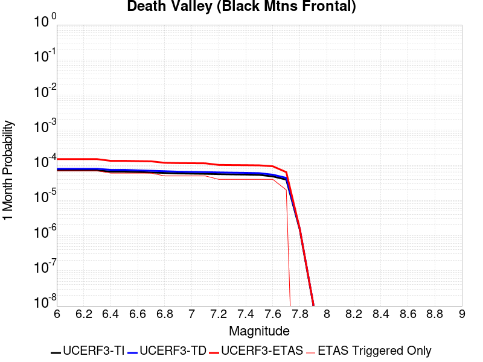 | 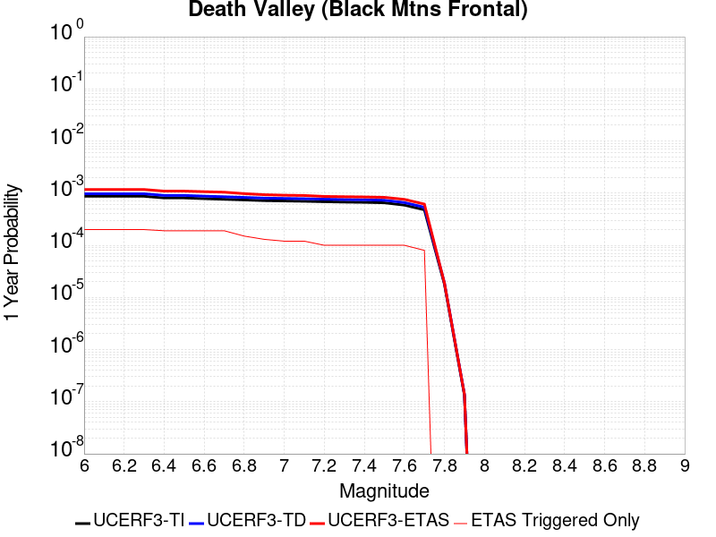 | 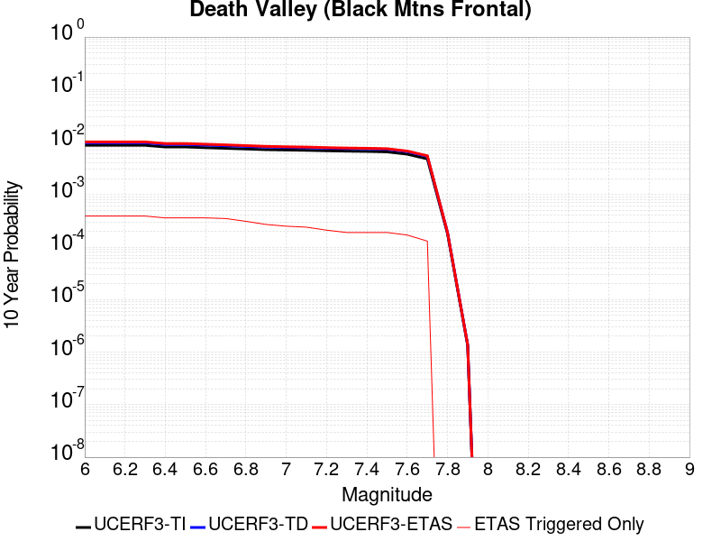 |

| Magnitude | 1 wk TI Prob | 1 wk TD Prob | 1 wk ETAS Prob | 1 wk ETAS/TD Gain | 1 wk ETAS Triggered Only | 1 mo TI Prob | 1 mo TD Prob | 1 mo ETAS Prob | 1 mo ETAS/TD Gain | 1 mo ETAS Triggered Only | 1 yr TI Prob | 1 yr TD Prob | 1 yr ETAS Prob | 1 yr ETAS/TD Gain | 1 yr ETAS Triggered Only | 10 yr TI Prob | 10 yr TD Prob | 10 yr ETAS Prob | 10 yr ETAS/TD Gain | 10 yr ETAS Triggered Only |
|-----|-----|-----|-----|-----|-----|-----|-----|-----|-----|-----|-----|-----|-----|-----|-----|-----|-----|-----|-----|-----|
| 6.0 | 1.6707214E-5 | 1.8671086E-5 | 3.867071E-5 | 2.071155 | 2.0E-5 | 7.160038E-5 | 8.001653E-5 | 1.5001092E-4 | 1.8747493 | 7.0E-5 | 8.71386E-4 | 9.737734E-4 | 0.0011735787 | 1.2051866 | 2.0E-4 | 0.00867977 | 0.009695919 | 0.010082138 | 1.0398331 | 3.9E-4 |
| 6.1 | 1.6707214E-5 | 1.8671086E-5 | 3.867071E-5 | 2.071155 | 2.0E-5 | 7.160038E-5 | 8.001653E-5 | 1.5001092E-4 | 1.8747493 | 7.0E-5 | 8.71386E-4 | 9.737734E-4 | 0.0011735787 | 1.2051866 | 2.0E-4 | 0.00867977 | 0.009695919 | 0.010082138 | 1.0398331 | 3.9E-4 |
| 6.2 | 1.6707214E-5 | 1.8671086E-5 | 3.867071E-5 | 2.071155 | 2.0E-5 | 7.160038E-5 | 8.001653E-5 | 1.5001092E-4 | 1.8747493 | 7.0E-5 | 8.71386E-4 | 9.737734E-4 | 0.0011735787 | 1.2051866 | 2.0E-4 | 0.00867977 | 0.009695919 | 0.010082138 | 1.0398331 | 3.9E-4 |
| 6.3 | 1.6707214E-5 | 1.8671086E-5 | 3.867071E-5 | 2.071155 | 2.0E-5 | 7.160038E-5 | 8.001653E-5 | 1.5001092E-4 | 1.8747493 | 7.0E-5 | 8.71386E-4 | 9.737734E-4 | 0.0011735787 | 1.2051866 | 2.0E-4 | 0.00867977 | 0.009695919 | 0.010082138 | 1.0398331 | 3.9E-4 |
| 6.4 | 1.5515609E-5 | 1.7338973E-5 | 3.7338625E-5 | 2.153451 | 2.0E-5 | 6.649377E-5 | 7.43078E-5 | 1.3430334E-4 | 1.8073922 | 6.0E-5 | 8.0926094E-4 | 9.043281E-4 | 0.0010941562 | 1.2099108 | 1.9E-4 | 0.008063202 | 0.009007165 | 0.009363922 | 1.0396081 | 3.6E-4 |
| 6.5 | 1.5515609E-5 | 1.7338973E-5 | 3.7338625E-5 | 2.153451 | 2.0E-5 | 6.649377E-5 | 7.43078E-5 | 1.3430334E-4 | 1.8073922 | 6.0E-5 | 8.0926094E-4 | 9.043281E-4 | 0.0010941562 | 1.2099108 | 1.9E-4 | 0.008063202 | 0.009007165 | 0.009363922 | 1.0396081 | 3.6E-4 |
| 6.6 | 1.5041828E-5 | 1.6809881E-5 | 3.6809546E-5 | 2.1897564 | 2.0E-5 | 6.4463384E-5 | 7.204039E-5 | 1.3203606E-4 | 1.8328061 | 6.0E-5 | 7.8455906E-4 | 8.767447E-4 | 0.0010665781 | 1.2165208 | 1.9E-4 | 0.00781795 | 0.008733513 | 0.009090369 | 1.0408605 | 3.6E-4 |
| 6.7 | 1.4634985E-5 | 1.6356733E-5 | 3.6356407E-5 | 2.222718 | 2.0E-5 | 6.271985E-5 | 7.009843E-5 | 1.3009422E-4 | 1.8558792 | 6.0E-5 | 7.6334673E-4 | 8.5312E-4 | 0.0010429579 | 1.2225219 | 1.9E-4 | 0.007607299 | 0.008499087 | 0.008846112 | 1.0408309 | 3.5E-4 |
| 6.8 | 1.4209158E-5 | 1.5882744E-5 | 2.5882586E-5 | 1.6296041 | 1.0E-5 | 6.089497E-5 | 6.806716E-5 | 1.18063756E-4 | 1.7345186 | 5.0E-5 | 7.4114406E-4 | 8.284082E-4 | 9.782839E-4 | 1.1809201 | 1.5E-4 | 0.007386771 | 0.0082538165 | 0.008561258 | 1.0372484 | 3.1E-4 |
| 6.9 | 1.3780098E-5 | 1.540527E-5 | 2.5405116E-5 | 1.6491185 | 1.0E-5 | 5.9056227E-5 | 6.602095E-5 | 1.1601765E-4 | 1.7572855 | 5.0E-5 | 7.1877235E-4 | 8.0351403E-4 | 9.3340955E-4 | 1.1616594 | 1.3E-4 | 0.0071645193 | 0.008006684 | 0.008274522 | 1.0334518 | 2.7E-4 |
| 7.0 | 1.3585064E-5 | 1.5188823E-5 | 2.5188672E-5 | 1.6583688 | 1.0E-5 | 5.8220405E-5 | 6.5093365E-5 | 1.1509011E-4 | 1.7680775 | 5.0E-5 | 7.086029E-4 | 7.92229E-4 | 9.1213395E-4 | 1.1513513 | 1.2E-4 | 0.007063476 | 0.00789464 | 0.008142666 | 1.031417 | 2.5E-4 |
| 7.1 | 1.3398601E-5 | 1.4981999E-5 | 2.498185E-5 | 1.6674577 | 1.0E-5 | 5.742131E-5 | 6.4207015E-5 | 1.1420381E-4 | 1.778681 | 5.0E-5 | 6.9888023E-4 | 7.8144553E-4 | 9.0135174E-4 | 1.1534415 | 1.2E-4 | 0.0069668638 | 0.0077875657 | 0.0080256965 | 1.0305784 | 2.4E-4 |
| 7.2 | 1.3126312E-5 | 1.4680209E-5 | 1.4680209E-5 | 1.0 | 0.0 | 5.6254412E-5 | 6.291369E-5 | 1.0291117E-4 | 1.6357516 | 4.0E-5 | 6.846822E-4 | 7.657104E-4 | 8.656339E-4 | 1.1304977 | 1.0E-4 | 0.006825765 | 0.0076313056 | 0.007839703 | 1.0273082 | 2.1E-4 |
| 7.3 | 1.2922429E-5 | 1.44544265E-5 | 1.44544265E-5 | 1.0 | 0.0 | 5.5380664E-5 | 6.19461E-5 | 1.01943624E-4 | 1.6456827 | 4.0E-5 | 6.74051E-4 | 7.539382E-4 | 8.5386285E-4 | 1.1325369 | 1.0E-4 | 0.006720101 | 0.0075143855 | 0.007702958 | 1.0250949 | 1.9E-4 |
| 7.4 | 1.2768878E-5 | 1.4284403E-5 | 1.4284403E-5 | 1.0 | 0.0 | 5.4722615E-5 | 6.121746E-5 | 1.0121502E-4 | 1.6533684 | 4.0E-5 | 6.660441E-4 | 7.450732E-4 | 8.449987E-4 | 1.134115 | 1.0E-4 | 0.0066405144 | 0.007426331 | 0.0076149195 | 1.0253947 | 1.9E-4 |
| 7.5 | 1.2521929E-5 | 1.4012637E-5 | 1.4012637E-5 | 1.0 | 0.0 | 5.366431E-5 | 6.0052804E-5 | 1.00050405E-4 | 1.6660404 | 4.0E-5 | 6.531671E-4 | 7.3090306E-4 | 8.3082996E-4 | 1.1367171 | 1.0E-4 | 0.006512506 | 0.0072855675 | 0.0074741836 | 1.0258889 | 1.9E-4 |
| 7.6 | 1.1301089E-5 | 1.264871E-5 | 1.264871E-5 | 1.0 | 0.0 | 4.8432343E-5 | 5.4207663E-5 | 9.42055E-5 | 1.7378631 | 4.0E-5 | 5.895042E-4 | 6.597838E-4 | 7.597178E-4 | 1.1514648 | 1.0E-4 | 0.0058794282 | 0.0065788017 | 0.006747683 | 1.0256705 | 1.7E-4 |
| 7.7 | 9.189108E-6 | 1.0283815E-5 | 1.0283815E-5 | 1.0 | 0.0 | 3.93813E-5 | 4.4072774E-5 | 6.407189E-5 | 1.4537749 | 2.0E-5 | 4.7936183E-4 | 5.36459E-4 | 6.1641604E-4 | 1.1490461 | 8.0E-5 | 0.004783291 | 0.0053521506 | 0.005481455 | 1.0241593 | 1.3E-4 |
| 7.8 | 3.4586725E-7 | 3.648336E-7 | 3.648336E-7 | 1.0 | 0.0 | 1.4822873E-6 | 1.5635717E-6 | 1.5635717E-6 | 1.0 | 0.0 | 1.80467E-5 | 1.9036323E-5 | 1.9036323E-5 | 1.0 | 0.0 | 1.8045233E-4 | 1.9034736E-4 | 1.9034736E-4 | 1.0 | 0.0 |
| 7.9 | 2.5591178E-9 | 2.6697147E-9 | 2.6697147E-9 | 1.0 | 0.0 | 1.0967647E-8 | 1.1441634E-8 | 1.1441634E-8 | 1.0 | 0.0 | 1.335311E-7 | 1.3930189E-7 | 1.3930189E-7 | 1.0 | 0.0 | 1.3353102E-6 | 1.3930189E-6 | 1.3930189E-6 | 1.0 | 0.0 |

## Sierra Nevada  (No Extension)
*[(top)](#table-of-contents)*

| 1 Week | 1 Month | 1 Year | 10 Year |
|-----|-----|-----|-----|
|  |  | 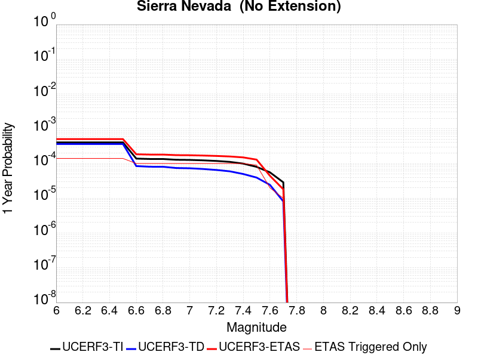 | 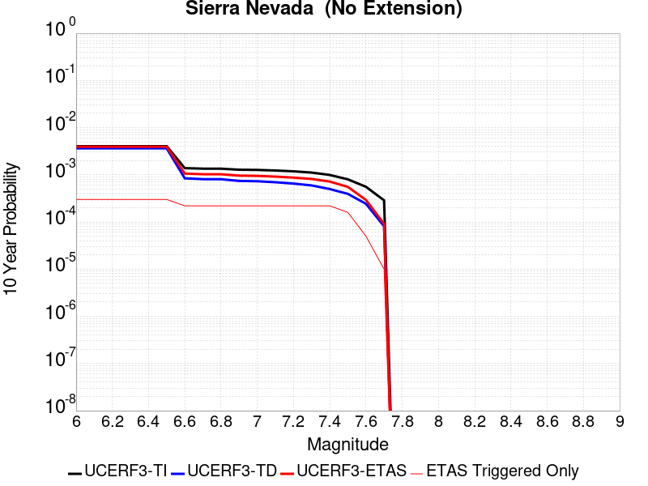 |

| Magnitude | 1 wk TI Prob | 1 wk TD Prob | 1 wk ETAS Prob | 1 wk ETAS/TD Gain | 1 wk ETAS Triggered Only | 1 mo TI Prob | 1 mo TD Prob | 1 mo ETAS Prob | 1 mo ETAS/TD Gain | 1 mo ETAS Triggered Only | 1 yr TI Prob | 1 yr TD Prob | 1 yr ETAS Prob | 1 yr ETAS/TD Gain | 1 yr ETAS Triggered Only | 10 yr TI Prob | 10 yr TD Prob | 10 yr ETAS Prob | 10 yr ETAS/TD Gain | 10 yr ETAS Triggered Only |
|-----|-----|-----|-----|-----|-----|-----|-----|-----|-----|-----|-----|-----|-----|-----|-----|-----|-----|-----|-----|-----|
| 6.0 | 7.7690465E-6 | 6.9764938E-6 | 6.9764938E-6 | 1.0 | 0.0 | 3.329549E-5 | 2.989912E-5 | 1.09896726E-4 | 3.675584 | 8.0E-5 | 4.0529718E-4 | 3.6399683E-4 | 5.0394586E-4 | 1.3844787 | 1.4E-4 | 0.004045588 | 0.0036375225 | 0.003936431 | 1.0821737 | 3.0E-4 |
| 6.1 | 7.7690465E-6 | 6.9764938E-6 | 6.9764938E-6 | 1.0 | 0.0 | 3.329549E-5 | 2.989912E-5 | 1.09896726E-4 | 3.675584 | 8.0E-5 | 4.0529718E-4 | 3.6399683E-4 | 5.0394586E-4 | 1.3844787 | 1.4E-4 | 0.004045588 | 0.0036375225 | 0.003936431 | 1.0821737 | 3.0E-4 |
| 6.2 | 7.7690465E-6 | 6.9764938E-6 | 6.9764938E-6 | 1.0 | 0.0 | 3.329549E-5 | 2.989912E-5 | 1.09896726E-4 | 3.675584 | 8.0E-5 | 4.0529718E-4 | 3.6399683E-4 | 5.0394586E-4 | 1.3844787 | 1.4E-4 | 0.004045588 | 0.0036375225 | 0.003936431 | 1.0821737 | 3.0E-4 |
| 6.3 | 7.7690465E-6 | 6.9764938E-6 | 6.9764938E-6 | 1.0 | 0.0 | 3.329549E-5 | 2.989912E-5 | 1.09896726E-4 | 3.675584 | 8.0E-5 | 4.0529718E-4 | 3.6399683E-4 | 5.0394586E-4 | 1.3844787 | 1.4E-4 | 0.004045588 | 0.0036375225 | 0.003936431 | 1.0821737 | 3.0E-4 |
| 6.4 | 7.7690465E-6 | 6.9764938E-6 | 6.9764938E-6 | 1.0 | 0.0 | 3.329549E-5 | 2.989912E-5 | 1.09896726E-4 | 3.675584 | 8.0E-5 | 4.0529718E-4 | 3.6399683E-4 | 5.0394586E-4 | 1.3844787 | 1.4E-4 | 0.004045588 | 0.0036375225 | 0.003936431 | 1.0821737 | 3.0E-4 |
| 6.5 | 7.7690465E-6 | 6.9764938E-6 | 6.9764938E-6 | 1.0 | 0.0 | 3.329549E-5 | 2.989912E-5 | 1.09896726E-4 | 3.675584 | 8.0E-5 | 4.0529718E-4 | 3.6399683E-4 | 5.0394586E-4 | 1.3844787 | 1.4E-4 | 0.004045588 | 0.0036375225 | 0.003936431 | 1.0821737 | 3.0E-4 |
| 6.6 | 2.653E-6 | 1.6149306E-6 | 1.6149306E-6 | 1.0 | 0.0 | 1.136995E-5 | 6.9211133E-6 | 5.6920766E-5 | 8.224221 | 5.0E-5 | 1.3842035E-4 | 8.426133E-5 | 1.842529E-4 | 2.1866841 | 1.0E-4 | 0.0013833415 | 8.422972E-4 | 0.0010621119 | 1.2609705 | 2.2E-4 |
| 6.7 | 2.5902466E-6 | 1.5502635E-6 | 1.5502635E-6 | 1.0 | 0.0 | 1.11010095E-5 | 6.6439693E-6 | 5.6643636E-5 | 8.525572 | 5.0E-5 | 1.351464E-4 | 8.088735E-5 | 1.8087927E-4 | 2.2361872 | 1.0E-4 | 0.0013506424 | 8.085821E-4 | 0.0010284042 | 1.2718612 | 2.2E-4 |
| 6.8 | 2.5853892E-6 | 1.5470633E-6 | 1.5470633E-6 | 1.0 | 0.0 | 1.1080193E-5 | 6.6302546E-6 | 5.6629924E-5 | 8.541139 | 5.0E-5 | 1.34893E-4 | 8.072039E-5 | 1.8071232E-4 | 2.2387443 | 1.0E-4 | 0.0013481114 | 8.069137E-4 | 0.0010267362 | 1.2724237 | 2.2E-4 |
| 6.9 | 2.458257E-6 | 1.4221358E-6 | 1.4221358E-6 | 1.0 | 0.0 | 1.0535345E-5 | 6.0948537E-6 | 5.609455E-5 | 9.203592 | 5.0E-5 | 1.2826028E-4 | 7.420234E-5 | 1.7419492E-4 | 2.3475664 | 1.0E-4 | 0.0012818627 | 7.417776E-4 | 9.616144E-4 | 1.2963649 | 2.2E-4 |
| 7.0 | 2.4341468E-6 | 1.3990993E-6 | 1.3990993E-6 | 1.0 | 0.0 | 1.0432016E-5 | 5.9961267E-6 | 5.5995828E-5 | 9.338667 | 5.0E-5 | 1.270024E-4 | 7.300041E-5 | 1.7299311E-4 | 2.3697553 | 1.0E-4 | 0.0012692984 | 7.2976627E-4 | 9.496057E-4 | 1.3012464 | 2.2E-4 |
| 7.1 | 2.3652476E-6 | 1.334048E-6 | 1.334048E-6 | 1.0 | 0.0 | 1.0136736E-5 | 5.7173356E-6 | 5.571705E-5 | 9.745282 | 5.0E-5 | 1.2340778E-4 | 6.960636E-5 | 1.695994E-4 | 2.4365504 | 1.0E-4 | 0.0012333926 | 6.9584727E-4 | 9.1569417E-4 | 1.3159413 | 2.2E-4 |
| 7.2 | 2.272158E-6 | 1.250353E-6 | 1.250353E-6 | 1.0 | 0.0 | 9.737784E-6 | 5.3586446E-6 | 5.5358378E-5 | 10.3306675 | 5.0E-5 | 1.1855107E-4 | 6.523956E-5 | 1.6523304E-4 | 2.5327125 | 1.0E-4 | 0.0011848784 | 6.5220555E-4 | 8.7206205E-4 | 1.3370969 | 2.2E-4 |
| 7.3 | 2.1382127E-6 | 1.1420389E-6 | 1.1420389E-6 | 1.0 | 0.0 | 9.163737E-6 | 4.894443E-6 | 5.4894197E-5 | 11.215617 | 5.0E-5 | 1.1156279E-4 | 5.9588227E-5 | 1.5958227E-4 | 2.678084 | 1.0E-4 | 0.001115068 | 5.957237E-4 | 8.155926E-4 | 1.3690788 | 2.2E-4 |
| 7.4 | 1.9048055E-6 | 9.575891E-7 | 9.575891E-7 | 1.0 | 0.0 | 8.163426E-6 | 4.103947E-6 | 5.410374E-5 | 13.183343 | 5.0E-5 | 9.9385186E-5 | 4.9964416E-5 | 1.4995942E-4 | 3.0013244 | 1.0E-4 | 9.934074E-4 | 4.995325E-4 | 7.1942265E-4 | 1.4401917 | 2.2E-4 |
| 7.5 | 1.5373403E-6 | 7.5605953E-7 | 7.5605953E-7 | 1.0 | 0.0 | 6.5885843E-6 | 3.240251E-6 | 5.3240088E-5 | 16.430853 | 5.0E-5 | 8.021306E-5 | 3.9449347E-5 | 1.2944579E-4 | 3.2813165 | 9.0E-5 | 8.0184115E-4 | 3.9442393E-4 | 5.543608E-4 | 1.4054949 | 1.6E-4 |
| 7.6 | 1.0680322E-6 | 4.6600493E-7 | 4.6600493E-7 | 1.0 | 0.0 | 4.577273E-6 | 1.9971626E-6 | 1.9971626E-6 | 1.0 | 0.0 | 5.5726876E-5 | 2.4315184E-5 | 4.43147E-5 | 1.8225113 | 2.0E-5 | 5.5712904E-4 | 2.4312551E-4 | 2.9311335E-4 | 1.2056051 | 5.0E-5 |
| 7.7 | 5.509146E-7 | 1.5582485E-7 | 1.5582485E-7 | 1.0 | 0.0 | 2.3610605E-6 | 6.6782064E-7 | 6.6782064E-7 | 1.0 | 0.0 | 2.8745531E-5 | 8.130687E-6 | 1.8130606E-5 | 2.2298985 | 1.0E-5 | 2.8741814E-4 | 8.130401E-5 | 9.13032E-5 | 1.1229851 | 1.0E-5 |

## San Andreas (Big Bend)
*[(top)](#table-of-contents)*

| 1 Week | 1 Month | 1 Year | 10 Year |
|-----|-----|-----|-----|
|  |  | 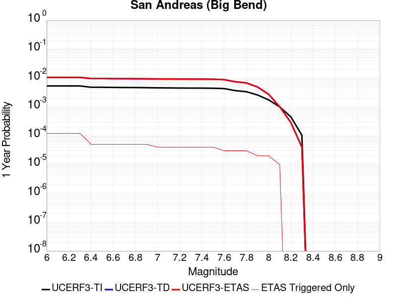 |  |

| Magnitude | 1 wk TI Prob | 1 wk TD Prob | 1 wk ETAS Prob | 1 wk ETAS/TD Gain | 1 wk ETAS Triggered Only | 1 mo TI Prob | 1 mo TD Prob | 1 mo ETAS Prob | 1 mo ETAS/TD Gain | 1 mo ETAS Triggered Only | 1 yr TI Prob | 1 yr TD Prob | 1 yr ETAS Prob | 1 yr ETAS/TD Gain | 1 yr ETAS Triggered Only | 10 yr TI Prob | 10 yr TD Prob | 10 yr ETAS Prob | 10 yr ETAS/TD Gain | 10 yr ETAS Triggered Only |
|-----|-----|-----|-----|-----|-----|-----|-----|-----|-----|-----|-----|-----|-----|-----|-----|-----|-----|-----|-----|-----|
| 6.0 | 1.0179969E-4 | 2.0096141E-4 | 2.0096141E-4 | 1.0 | 0.0 | 4.362114E-4 | 8.609799E-4 | 8.609799E-4 | 1.0 | 0.0 | 0.0052979486 | 0.010432333 | 0.01055108 | 1.0113827 | 1.2E-4 | 0.051734097 | 0.101552926 | 0.101804495 | 1.0024772 | 2.8E-4 |
| 6.1 | 1.0179969E-4 | 2.0096141E-4 | 2.0096141E-4 | 1.0 | 0.0 | 4.362114E-4 | 8.609799E-4 | 8.609799E-4 | 1.0 | 0.0 | 0.0052979486 | 0.010432333 | 0.01055108 | 1.0113827 | 1.2E-4 | 0.051734097 | 0.101552926 | 0.101804495 | 1.0024772 | 2.8E-4 |
| 6.2 | 1.0179969E-4 | 2.0096141E-4 | 2.0096141E-4 | 1.0 | 0.0 | 4.362114E-4 | 8.609799E-4 | 8.609799E-4 | 1.0 | 0.0 | 0.0052979486 | 0.010432333 | 0.01055108 | 1.0113827 | 1.2E-4 | 0.051734097 | 0.101552926 | 0.101804495 | 1.0024772 | 2.8E-4 |
| 6.3 | 1.0179969E-4 | 2.0096141E-4 | 2.0096141E-4 | 1.0 | 0.0 | 4.362114E-4 | 8.609799E-4 | 8.609799E-4 | 1.0 | 0.0 | 0.0052979486 | 0.010432333 | 0.01055108 | 1.0113827 | 1.2E-4 | 0.051734097 | 0.101552926 | 0.101804495 | 1.0024772 | 2.8E-4 |
| 6.4 | 9.1639464E-5 | 1.8452943E-4 | 1.8452943E-4 | 1.0 | 0.0 | 3.9268145E-4 | 7.9060096E-4 | 7.9060096E-4 | 1.0 | 0.0 | 0.0047704205 | 0.009583203 | 0.009632724 | 1.0051675 | 5.0E-5 | 0.046693064 | 0.093878016 | 0.09399582 | 1.0012548 | 1.3E-4 |
| 6.5 | 9.1639464E-5 | 1.8452943E-4 | 1.8452943E-4 | 1.0 | 0.0 | 3.9268145E-4 | 7.9060096E-4 | 7.9060096E-4 | 1.0 | 0.0 | 0.0047704205 | 0.009583203 | 0.009632724 | 1.0051675 | 5.0E-5 | 0.046693064 | 0.093878016 | 0.09399582 | 1.0012548 | 1.3E-4 |
| 6.6 | 9.042622E-5 | 1.8259944E-4 | 1.8259944E-4 | 1.0 | 0.0 | 3.8748336E-4 | 7.8233454E-4 | 7.8233454E-4 | 1.0 | 0.0 | 0.0047074095 | 0.009483437 | 0.009532963 | 1.0052223 | 5.0E-5 | 0.046089325 | 0.09297188 | 0.09306259 | 1.0009756 | 1.0E-4 |
| 6.7 | 8.9836685E-5 | 1.817426E-4 | 1.817426E-4 | 1.0 | 0.0 | 3.8495753E-4 | 7.7866454E-4 | 7.7866454E-4 | 1.0 | 0.0 | 0.00467679 | 0.009439143 | 0.009488671 | 1.0052471 | 5.0E-5 | 0.045795817 | 0.09256611 | 0.09265685 | 1.0009803 | 1.0E-4 |
| 6.8 | 8.9471854E-5 | 1.812102E-4 | 1.812102E-4 | 1.0 | 0.0 | 3.8339442E-4 | 7.763842E-4 | 7.763842E-4 | 1.0 | 0.0 | 0.004657841 | 0.00941162 | 0.00946115 | 1.0052626 | 5.0E-5 | 0.04561414 | 0.092313245 | 0.092404015 | 1.0009832 | 1.0E-4 |
| 6.9 | 8.858234E-5 | 1.8002956E-4 | 1.8002956E-4 | 1.0 | 0.0 | 3.7958333E-4 | 7.713273E-4 | 7.713273E-4 | 1.0 | 0.0 | 0.004611638 | 0.009350581 | 0.0094001135 | 1.0052973 | 5.0E-5 | 0.04517103 | 0.09175325 | 0.091844074 | 1.0009899 | 1.0E-4 |
| 7.0 | 8.7433385E-5 | 1.7841696E-4 | 1.7841696E-4 | 1.0 | 0.0 | 3.746607E-4 | 7.6442026E-4 | 7.6442026E-4 | 1.0 | 0.0 | 0.004551957 | 0.009267206 | 0.009306836 | 1.0042763 | 4.0E-5 | 0.044598386 | 0.0909875 | 0.09106932 | 1.0008992 | 9.0E-5 |
| 7.1 | 8.684964E-5 | 1.7753613E-4 | 1.7753613E-4 | 1.0 | 0.0 | 3.7215967E-4 | 7.6064747E-4 | 7.6064747E-4 | 1.0 | 0.0 | 0.0045216335 | 0.009221663 | 0.009261293 | 1.0042976 | 4.0E-5 | 0.04430731 | 0.09056893 | 0.090650775 | 1.0009037 | 9.0E-5 |
| 7.2 | 8.606521E-5 | 1.7644191E-4 | 1.7644191E-4 | 1.0 | 0.0 | 3.6879873E-4 | 7.5596065E-4 | 7.5596065E-4 | 1.0 | 0.0 | 0.0044808835 | 0.009165082 | 0.0092047155 | 1.0043244 | 4.0E-5 | 0.043916024 | 0.09004933 | 0.09013122 | 1.0009094 | 9.0E-5 |
| 7.3 | 8.568266E-5 | 1.7586154E-4 | 1.7586154E-4 | 1.0 | 0.0 | 3.6715972E-4 | 7.534748E-4 | 7.534748E-4 | 1.0 | 0.0 | 0.0044610105 | 0.009135071 | 0.0091747055 | 1.0043387 | 4.0E-5 | 0.043725148 | 0.08977032 | 0.08985224 | 1.0009125 | 9.0E-5 |
| 7.4 | 8.5432206E-5 | 1.7548713E-4 | 1.7548713E-4 | 1.0 | 0.0 | 3.6608664E-4 | 7.5187115E-4 | 7.5187115E-4 | 1.0 | 0.0 | 0.004447999 | 0.00911571 | 0.009155345 | 1.004348 | 4.0E-5 | 0.043600157 | 0.08959039 | 0.089672334 | 1.0009146 | 9.0E-5 |
| 7.5 | 8.4791965E-5 | 1.7417947E-4 | 1.7417947E-4 | 1.0 | 0.0 | 3.633435E-4 | 7.4627006E-4 | 7.4627006E-4 | 1.0 | 0.0 | 0.0044147377 | 0.009048086 | 0.009087724 | 1.0043808 | 4.0E-5 | 0.043280575 | 0.088967696 | 0.08904969 | 1.0009216 | 9.0E-5 |
| 7.6 | 8.241105E-5 | 1.6862988E-4 | 1.6862988E-4 | 1.0 | 0.0 | 3.531424E-4 | 7.224995E-4 | 7.224995E-4 | 1.0 | 0.0 | 0.0042910352 | 0.008761042 | 0.008790779 | 1.0033942 | 3.0E-5 | 0.042091176 | 0.08634332 | 0.08639814 | 1.0006349 | 6.0E-5 |
| 7.7 | 7.00432E-5 | 1.4224868E-4 | 1.4224868E-4 | 1.0 | 0.0 | 3.001506E-4 | 6.094948E-4 | 6.094948E-4 | 1.0 | 0.0 | 0.0036482112 | 0.007395391 | 0.0074251695 | 1.0040265 | 3.0E-5 | 0.035888977 | 0.07360915 | 0.07366473 | 1.0007551 | 6.0E-5 |
| 7.8 | 6.415362E-5 | 1.2987282E-4 | 1.2987282E-4 | 1.0 | 0.0 | 2.749151E-4 | 5.564791E-4 | 5.564791E-4 | 1.0 | 0.0 | 0.0033419547 | 0.006754116 | 0.0067839134 | 1.0044117 | 3.0E-5 | 0.03292141 | 0.067335576 | 0.06739154 | 1.000831 | 6.0E-5 |
| 7.9 | 4.939911E-5 | 9.3542665E-5 | 9.3542665E-5 | 1.0 | 0.0 | 2.116933E-4 | 4.0083556E-4 | 4.0083556E-4 | 1.0 | 0.0 | 0.0025743195 | 0.0048692618 | 0.0048891646 | 1.0040874 | 2.0E-5 | 0.025447013 | 0.048975818 | 0.049013857 | 1.0007768 | 4.0E-5 |
| 8.0 | 3.344983E-5 | 5.2304567E-5 | 5.2304567E-5 | 1.0 | 0.0 | 1.4334853E-4 | 2.2414318E-4 | 2.2414318E-4 | 1.0 | 0.0 | 0.0017438711 | 0.0027255297 | 0.0027454754 | 1.007318 | 2.0E-5 | 0.017302496 | 0.027960341 | 0.027979782 | 1.0006953 | 2.0E-5 |
| 8.1 | 1.9104898E-5 | 1.9210376E-5 | 1.9210376E-5 | 1.0 | 0.0 | 8.1875565E-5 | 8.232759E-5 | 8.232759E-5 | 1.0 | 0.0 | 9.963791E-4 | 0.0010018782 | 0.0010118681 | 1.0099713 | 1.0E-5 | 0.009919235 | 0.01076935 | 0.010779243 | 1.0009185 | 1.0E-5 |
| 8.2 | 8.643924E-6 | 5.488954E-6 | 5.488954E-6 | 1.0 | 0.0 | 3.704486E-5 | 2.3523877E-5 | 2.3523877E-5 | 1.0 | 0.0 | 4.5092785E-4 | 2.8636563E-4 | 2.8636563E-4 | 1.0 | 0.0 | 0.0045001395 | 0.0032564052 | 0.0032564052 | 1.0 | 0.0 |
| 8.3 | 1.983087E-6 | 7.68342E-7 | 7.68342E-7 | 1.0 | 0.0 | 8.498917E-6 | 3.2928901E-6 | 3.2928901E-6 | 1.0 | 0.0 | 1.034694E-4 | 4.0090217E-5 | 4.0090217E-5 | 1.0 | 0.0 | 0.0010342124 | 4.7331754E-4 | 4.7331754E-4 | 1.0 | 0.0 |

## Death Valley (No)
*[(top)](#table-of-contents)*

| 1 Week | 1 Month | 1 Year | 10 Year |
|-----|-----|-----|-----|
| 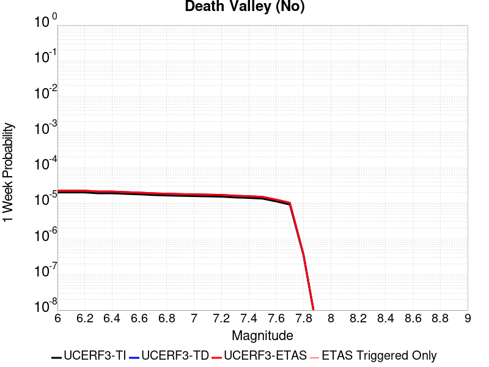 |  | 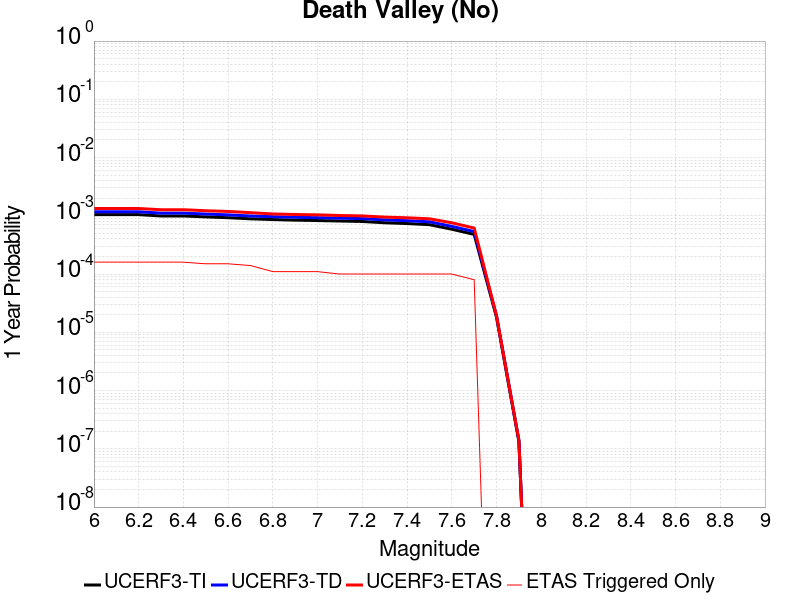 |  |

| Magnitude | 1 wk TI Prob | 1 wk TD Prob | 1 wk ETAS Prob | 1 wk ETAS/TD Gain | 1 wk ETAS Triggered Only | 1 mo TI Prob | 1 mo TD Prob | 1 mo ETAS Prob | 1 mo ETAS/TD Gain | 1 mo ETAS Triggered Only | 1 yr TI Prob | 1 yr TD Prob | 1 yr ETAS Prob | 1 yr ETAS/TD Gain | 1 yr ETAS Triggered Only | 10 yr TI Prob | 10 yr TD Prob | 10 yr ETAS Prob | 10 yr ETAS/TD Gain | 10 yr ETAS Triggered Only |
|-----|-----|-----|-----|-----|-----|-----|-----|-----|-----|-----|-----|-----|-----|-----|-----|-----|-----|-----|-----|-----|
| 6.0 | 2.0074807E-5 | 2.2501097E-5 | 2.2501097E-5 | 1.0 | 0.0 | 8.603206E-5 | 9.642976E-5 | 1.4642494E-4 | 1.5184622 | 5.0E-5 | 0.001046937 | 0.0011734073 | 0.0013332196 | 1.1361951 | 1.6E-4 | 0.010420183 | 0.0116730295 | 0.011949761 | 1.0237069 | 2.8E-4 |
| 6.1 | 2.0074807E-5 | 2.2501097E-5 | 2.2501097E-5 | 1.0 | 0.0 | 8.603206E-5 | 9.642976E-5 | 1.4642494E-4 | 1.5184622 | 5.0E-5 | 0.001046937 | 0.0011734073 | 0.0013332196 | 1.1361951 | 1.6E-4 | 0.010420183 | 0.0116730295 | 0.011949761 | 1.0237069 | 2.8E-4 |
| 6.2 | 2.0074807E-5 | 2.2501097E-5 | 2.2501097E-5 | 1.0 | 0.0 | 8.603206E-5 | 9.642976E-5 | 1.4642494E-4 | 1.5184622 | 5.0E-5 | 0.001046937 | 0.0011734073 | 0.0013332196 | 1.1361951 | 1.6E-4 | 0.010420183 | 0.0116730295 | 0.011949761 | 1.0237069 | 2.8E-4 |
| 6.3 | 1.9050609E-5 | 2.1337903E-5 | 2.1337903E-5 | 1.0 | 0.0 | 8.164292E-5 | 9.144499E-5 | 1.4144041E-4 | 1.5467268 | 5.0E-5 | 9.935491E-4 | 0.0011127809 | 0.0012726028 | 1.143624 | 1.6E-4 | 0.009891188 | 0.011072912 | 0.011349811 | 1.0250069 | 2.8E-4 |
| 6.4 | 1.9050609E-5 | 2.1337903E-5 | 2.1337903E-5 | 1.0 | 0.0 | 8.164292E-5 | 9.144499E-5 | 1.4144041E-4 | 1.5467268 | 5.0E-5 | 9.935491E-4 | 0.0011127809 | 0.0012726028 | 1.143624 | 1.6E-4 | 0.009891188 | 0.011072912 | 0.011349811 | 1.0250069 | 2.8E-4 |
| 6.5 | 1.8367004E-5 | 2.0561925E-5 | 2.0561925E-5 | 1.0 | 0.0 | 7.8713354E-5 | 8.8119596E-5 | 1.381152E-4 | 1.5673606 | 5.0E-5 | 9.5791375E-4 | 0.0010723346 | 0.0012221738 | 1.1397318 | 1.5E-4 | 0.009537951 | 0.010672389 | 0.010939508 | 1.025029 | 2.7E-4 |
| 6.6 | 1.779439E-5 | 1.9911813E-5 | 1.9911813E-5 | 1.0 | 0.0 | 7.625944E-5 | 8.533358E-5 | 1.3532932E-4 | 1.5858858 | 5.0E-5 | 9.280632E-4 | 0.0010384476 | 0.0011882918 | 1.1442964 | 1.5E-4 | 0.009241969 | 0.010336709 | 0.010603919 | 1.0258505 | 2.7E-4 |
| 6.7 | 1.7025437E-5 | 1.9044268E-5 | 1.9044268E-5 | 1.0 | 0.0 | 7.296412E-5 | 8.161578E-5 | 1.316117E-4 | 1.6125767 | 5.0E-5 | 8.87976E-4 | 9.932253E-4 | 0.0011330862 | 1.1408149 | 1.4E-4 | 0.008844362 | 0.009888581 | 0.01014601 | 1.0260329 | 2.6E-4 |
| 6.8 | 1.6545107E-5 | 1.8513367E-5 | 1.8513367E-5 | 1.0 | 0.0 | 7.090568E-5 | 7.934062E-5 | 1.1933745E-4 | 1.5041153 | 4.0E-5 | 8.629347E-4 | 9.6555013E-4 | 0.0010754439 | 1.1138147 | 1.1E-4 | 0.008595915 | 0.009614253 | 0.009832138 | 1.0226626 | 2.2E-4 |
| 6.9 | 1.615478E-5 | 1.8088402E-5 | 1.8088402E-5 | 1.0 | 0.0 | 6.9232934E-5 | 7.751945E-5 | 1.1751635E-4 | 1.5159595 | 4.0E-5 | 8.4258494E-4 | 9.433967E-4 | 0.001053293 | 1.1164899 | 1.1E-4 | 0.008393973 | 0.009394613 | 0.009612546 | 1.0231977 | 2.2E-4 |
| 7.0 | 1.5894311E-5 | 1.7806347E-5 | 1.7806347E-5 | 1.0 | 0.0 | 6.81167E-5 | 7.6310724E-5 | 1.1630767E-4 | 1.5241327 | 4.0E-5 | 8.2900526E-4 | 9.286931E-4 | 0.0010385909 | 1.118336 | 1.1E-4 | 0.008259195 | 0.00924881 | 0.009456868 | 1.0224956 | 2.1E-4 |
| 7.1 | 1.5602263E-5 | 1.748429E-5 | 1.748429E-5 | 1.0 | 0.0 | 6.6865134E-5 | 7.493055E-5 | 1.1492755E-4 | 1.5337876 | 4.0E-5 | 8.137789E-4 | 9.119037E-4 | 0.0010118125 | 1.1095607 | 1.0E-4 | 0.008108052 | 0.009082301 | 0.009270575 | 1.0207298 | 1.9E-4 |
| 7.2 | 1.5323829E-5 | 1.7171402E-5 | 1.7171402E-5 | 1.0 | 0.0 | 6.56719E-5 | 7.3589676E-5 | 1.13586735E-4 | 1.5435145 | 4.0E-5 | 7.99262E-4 | 8.955921E-4 | 9.955026E-4 | 1.111558 | 1.0E-4 | 0.007963934 | 0.008920506 | 0.009108811 | 1.0211092 | 1.9E-4 |
| 7.3 | 1.4556212E-5 | 1.6303184E-5 | 1.6303184E-5 | 1.0 | 0.0 | 6.238227E-5 | 6.9868955E-5 | 1.0986616E-4 | 1.5724604 | 4.0E-5 | 7.592395E-4 | 8.5032836E-4 | 9.502433E-4 | 1.1175016 | 1.0E-4 | 0.0075665074 | 0.008471391 | 0.008659782 | 1.0222384 | 1.9E-4 |
| 7.4 | 1.411725E-5 | 1.5808666E-5 | 1.5808666E-5 | 1.0 | 0.0 | 6.0501097E-5 | 6.77497E-5 | 1.07746986E-4 | 1.5903685 | 4.0E-5 | 7.363519E-4 | 8.245462E-4 | 9.244638E-4 | 1.1211789 | 1.0E-4 | 0.0073391674 | 0.008215504 | 0.008403943 | 1.022937 | 1.9E-4 |
| 7.5 | 1.3503312E-5 | 1.5126967E-5 | 1.5126967E-5 | 1.0 | 0.0 | 5.7870053E-5 | 6.482828E-5 | 1.0482568E-4 | 1.6169747 | 4.0E-5 | 7.043401E-4 | 7.8900426E-4 | 8.889254E-4 | 1.126642 | 1.0E-4 | 0.007021119 | 0.007862655 | 0.008051161 | 1.0239749 | 1.9E-4 |
| 7.6 | 1.1279839E-5 | 1.2626889E-5 | 1.2626889E-5 | 1.0 | 0.0 | 4.834127E-5 | 5.411414E-5 | 9.411198E-5 | 1.7391382 | 4.0E-5 | 5.88396E-4 | 6.586458E-4 | 7.5858E-4 | 1.1517266 | 1.0E-4 | 0.005868405 | 0.00656749 | 0.006736373 | 1.0257151 | 1.7E-4 |
| 7.7 | 9.189108E-6 | 1.0283815E-5 | 1.0283815E-5 | 1.0 | 0.0 | 3.93813E-5 | 4.4072774E-5 | 6.407189E-5 | 1.4537749 | 2.0E-5 | 4.7936183E-4 | 5.36459E-4 | 6.1641604E-4 | 1.1490461 | 8.0E-5 | 0.004783291 | 0.0053521506 | 0.005481455 | 1.0241593 | 1.3E-4 |
| 7.8 | 3.4586725E-7 | 3.648336E-7 | 3.648336E-7 | 1.0 | 0.0 | 1.4822873E-6 | 1.5635717E-6 | 1.5635717E-6 | 1.0 | 0.0 | 1.80467E-5 | 1.9036323E-5 | 1.9036323E-5 | 1.0 | 0.0 | 1.8045233E-4 | 1.9034736E-4 | 1.9034736E-4 | 1.0 | 0.0 |
| 7.9 | 2.5591178E-9 | 2.6697147E-9 | 2.6697147E-9 | 1.0 | 0.0 | 1.0967647E-8 | 1.1441634E-8 | 1.1441634E-8 | 1.0 | 0.0 | 1.335311E-7 | 1.3930189E-7 | 1.3930189E-7 | 1.0 | 0.0 | 1.3353102E-6 | 1.3930189E-6 | 1.3930189E-6 | 1.0 | 0.0 |

## San Andreas (San Gorgonio Pass-Garnet HIll)
*[(top)](#table-of-contents)*

| 1 Week | 1 Month | 1 Year | 10 Year |
|-----|-----|-----|-----|
| 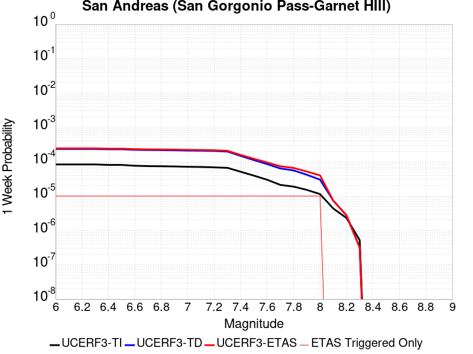 |  |  | 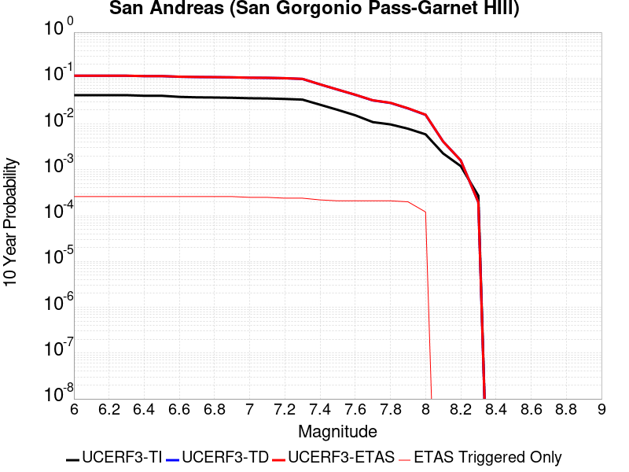 |

| Magnitude | 1 wk TI Prob | 1 wk TD Prob | 1 wk ETAS Prob | 1 wk ETAS/TD Gain | 1 wk ETAS Triggered Only | 1 mo TI Prob | 1 mo TD Prob | 1 mo ETAS Prob | 1 mo ETAS/TD Gain | 1 mo ETAS Triggered Only | 1 yr TI Prob | 1 yr TD Prob | 1 yr ETAS Prob | 1 yr ETAS/TD Gain | 1 yr ETAS Triggered Only | 10 yr TI Prob | 10 yr TD Prob | 10 yr ETAS Prob | 10 yr ETAS/TD Gain | 10 yr ETAS Triggered Only |
|-----|-----|-----|-----|-----|-----|-----|-----|-----|-----|-----|-----|-----|-----|-----|-----|-----|-----|-----|-----|-----|
| 6.0 | 8.31567E-5 | 2.3393625E-4 | 2.4393392E-4 | 1.0427366 | 1.0E-5 | 3.5633717E-4 | 0.0010022013 | 0.0010621411 | 1.0598083 | 6.0E-5 | 0.004329778 | 0.012133588 | 0.012271889 | 1.0113982 | 1.4E-4 | 0.042463828 | 0.11262414 | 0.11285485 | 1.0020486 | 2.6E-4 |
| 6.1 | 8.31567E-5 | 2.3393625E-4 | 2.4393392E-4 | 1.0427366 | 1.0E-5 | 3.5633717E-4 | 0.0010022013 | 0.0010621411 | 1.0598083 | 6.0E-5 | 0.004329778 | 0.012133588 | 0.012271889 | 1.0113982 | 1.4E-4 | 0.042463828 | 0.11262414 | 0.11285485 | 1.0020486 | 2.6E-4 |
| 6.2 | 8.31567E-5 | 2.3393625E-4 | 2.4393392E-4 | 1.0427366 | 1.0E-5 | 3.5633717E-4 | 0.0010022013 | 0.0010621411 | 1.0598083 | 6.0E-5 | 0.004329778 | 0.012133588 | 0.012271889 | 1.0113982 | 1.4E-4 | 0.042463828 | 0.11262414 | 0.11285485 | 1.0020486 | 2.6E-4 |
| 6.3 | 8.31567E-5 | 2.3393625E-4 | 2.4393392E-4 | 1.0427366 | 1.0E-5 | 3.5633717E-4 | 0.0010022013 | 0.0010621411 | 1.0598083 | 6.0E-5 | 0.004329778 | 0.012133588 | 0.012271889 | 1.0113982 | 1.4E-4 | 0.042463828 | 0.11262414 | 0.11285485 | 1.0020486 | 2.6E-4 |
| 6.4 | 8.059055E-5 | 2.2951834E-4 | 2.3951606E-4 | 1.0435596 | 1.0E-5 | 3.4534236E-4 | 9.832818E-4 | 0.0010432227 | 1.0609602 | 6.0E-5 | 0.0041964394 | 0.01190578 | 0.012044114 | 1.011619 | 1.4E-4 | 0.041180745 | 0.11060517 | 0.11083642 | 1.0020907 | 2.6E-4 |
| 6.5 | 8.059055E-5 | 2.2951834E-4 | 2.3951606E-4 | 1.0435596 | 1.0E-5 | 3.4534236E-4 | 9.832818E-4 | 0.0010432227 | 1.0609602 | 6.0E-5 | 0.0041964394 | 0.01190578 | 0.012044114 | 1.011619 | 1.4E-4 | 0.041180745 | 0.11060517 | 0.11083642 | 1.0020907 | 2.6E-4 |
| 6.6 | 7.619237E-5 | 2.2196014E-4 | 2.3195792E-4 | 1.0450431 | 1.0E-5 | 3.2649786E-4 | 9.509133E-4 | 0.0010108562 | 1.0630373 | 6.0E-5 | 0.0039678677 | 0.011516465 | 0.011654853 | 1.0120165 | 1.4E-4 | 0.03897764 | 0.10714162 | 0.10737377 | 1.0021667 | 2.6E-4 |
| 6.7 | 7.440636E-5 | 2.1871815E-4 | 2.2871597E-4 | 1.0457109 | 1.0E-5 | 3.188454E-4 | 9.370291E-4 | 9.969729E-4 | 1.0639721 | 6.0E-5 | 0.0038750346 | 0.011349191 | 0.011487602 | 1.0121957 | 1.4E-4 | 0.038081564 | 0.10565004 | 0.10588256 | 1.002201 | 2.6E-4 |
| 6.8 | 7.3735864E-5 | 2.1718972E-4 | 2.2718756E-4 | 1.0460327 | 1.0E-5 | 3.1597257E-4 | 9.3048334E-4 | 9.904276E-4 | 1.0644226 | 6.0E-5 | 0.0038401815 | 0.011270325 | 0.011408746 | 1.012282 | 1.4E-4 | 0.03774495 | 0.10495156 | 0.10518427 | 1.0022173 | 2.6E-4 |
| 6.9 | 7.27575E-5 | 2.1487928E-4 | 2.2487713E-4 | 1.0465277 | 1.0E-5 | 3.117806E-4 | 9.2058844E-4 | 9.805332E-4 | 1.0651157 | 6.0E-5 | 0.003789323 | 0.011151093 | 0.011289532 | 1.0124148 | 1.4E-4 | 0.037253562 | 0.10389946 | 0.104132436 | 1.0022424 | 2.6E-4 |
| 7.0 | 7.102591E-5 | 2.1071924E-4 | 2.2071713E-4 | 1.0474465 | 1.0E-5 | 3.0436125E-4 | 9.027721E-4 | 9.62718E-4 | 1.066402 | 6.0E-5 | 0.003699303 | 0.010936375 | 0.011074844 | 1.0126613 | 1.4E-4 | 0.03638325 | 0.10200155 | 0.10222605 | 1.002201 | 2.5E-4 |
| 7.1 | 7.028513E-5 | 2.0907549E-4 | 2.190734E-4 | 1.0478196 | 1.0E-5 | 3.0118722E-4 | 8.957324E-4 | 9.556786E-4 | 1.0669243 | 6.0E-5 | 0.0036607897 | 0.010851522 | 0.010990003 | 1.0127615 | 1.4E-4 | 0.036010686 | 0.10124453 | 0.10146922 | 1.0022193 | 2.5E-4 |
| 7.2 | 6.8498244E-5 | 2.0515372E-4 | 2.1515167E-4 | 1.048734 | 1.0E-5 | 2.9353087E-4 | 8.7893615E-4 | 9.388834E-4 | 1.0682044 | 6.0E-5 | 0.003567883 | 0.010649043 | 0.010787552 | 1.0130067 | 1.4E-4 | 0.035111405 | 0.099436425 | 0.099652566 | 1.0021735 | 2.4E-4 |
| 7.3 | 6.622592E-5 | 1.9742535E-4 | 2.0742338E-4 | 1.050642 | 1.0E-5 | 2.8379448E-4 | 8.458365E-4 | 9.057857E-4 | 1.0708756 | 6.0E-5 | 0.0034497243 | 0.010249915 | 0.01038848 | 1.0135187 | 1.4E-4 | 0.033966612 | 0.09593252 | 0.0961495 | 1.0022618 | 2.4E-4 |
| 7.4 | 5.1050705E-5 | 1.4698104E-4 | 1.5697956E-4 | 1.068026 | 1.0E-5 | 2.1877038E-4 | 6.2976754E-4 | 6.8972976E-4 | 1.0952133 | 6.0E-5 | 0.002660276 | 0.007640657 | 0.0077696634 | 1.0168842 | 1.3E-4 | 0.02628654 | 0.072902195 | 0.073106155 | 1.0027977 | 2.2E-4 |
| 7.5 | 3.9302922E-5 | 1.11377325E-4 | 1.2137621E-4 | 1.0897748 | 1.0E-5 | 1.6843023E-4 | 4.7724438E-4 | 5.3721573E-4 | 1.1256617 | 6.0E-5 | 0.0020487092 | 0.00579504 | 0.0059143445 | 1.0205873 | 1.2E-4 | 0.020299247 | 0.056044318 | 0.056242548 | 1.003537 | 2.1E-4 |
| 7.6 | 2.9851626E-5 | 8.501993E-5 | 9.501908E-5 | 1.1176095 | 1.0E-5 | 1.2792926E-4 | 3.6432035E-4 | 4.2429852E-4 | 1.1646302 | 6.0E-5 | 0.0015564259 | 0.0044266046 | 0.0045460737 | 1.0269889 | 1.2E-4 | 0.0154556995 | 0.043225124 | 0.043426048 | 1.0046483 | 2.1E-4 |
| 7.7 | 2.1135214E-5 | 6.359134E-5 | 7.35907E-5 | 1.1572441 | 1.0E-5 | 9.0576345E-5 | 2.725059E-4 | 3.3248952E-4 | 1.2201188 | 6.0E-5 | 0.0011022091 | 0.003312717 | 0.0034323195 | 1.0361041 | 1.2E-4 | 0.010967582 | 0.03261066 | 0.03281381 | 1.0062296 | 2.1E-4 |
| 7.8 | 1.883379E-5 | 5.5697463E-5 | 6.5696906E-5 | 1.1795313 | 1.0E-5 | 8.0713755E-5 | 2.3868159E-4 | 2.9866726E-4 | 1.251321 | 6.0E-5 | 9.822468E-4 | 0.0029020791 | 0.0030217308 | 1.0412296 | 1.2E-4 | 0.0097791655 | 0.028721085 | 0.028925054 | 1.0071017 | 2.1E-4 |
| 7.9 | 1.5156185E-5 | 4.170545E-5 | 5.1705032E-5 | 1.2397668 | 1.0E-5 | 6.495346E-5 | 1.787254E-4 | 2.2871647E-4 | 1.2797087 | 5.0E-5 | 7.9052144E-4 | 0.0021738117 | 0.0022835725 | 1.0504924 | 1.1E-4 | 0.007877152 | 0.021781009 | 0.021976652 | 1.0089823 | 2.0E-4 |
| 8.0 | 1.1405907E-5 | 3.0009689E-5 | 4.000939E-5 | 1.3332157 | 1.0E-5 | 4.8881542E-5 | 1.2860661E-4 | 1.4860404E-4 | 1.155493 | 2.0E-5 | 5.9497025E-4 | 0.001564662 | 0.001624568 | 1.0382869 | 6.0E-5 | 0.005933798 | 0.01578931 | 0.015907414 | 1.00748 | 1.2E-4 |
| 8.1 | 4.3511436E-6 | 7.3819633E-6 | 7.3819633E-6 | 1.0 | 0.0 | 1.8647626E-5 | 3.1636602E-5 | 3.1636602E-5 | 1.0 | 0.0 | 2.2701119E-4 | 3.8510768E-4 | 3.8510768E-4 | 1.0 | 0.0 | 0.0022677942 | 0.004122689 | 0.004122689 | 1.0 | 0.0 |
| 8.2 | 2.3042528E-6 | 2.7389121E-6 | 2.7389121E-6 | 1.0 | 0.0 | 9.875332E-6 | 1.1738142E-5 | 1.1738142E-5 | 1.0 | 0.0 | 1.2022553E-4 | 1.4290256E-4 | 1.4290256E-4 | 1.0 | 0.0 | 0.0012016051 | 0.0016010946 | 0.0016010946 | 1.0 | 0.0 |
| 8.3 | 5.202968E-7 | 3.1682953E-7 | 3.1682953E-7 | 1.0 | 0.0 | 2.2298414E-6 | 1.3578402E-6 | 1.3578402E-6 | 1.0 | 0.0 | 2.714798E-5 | 1.653159E-5 | 1.653159E-5 | 1.0 | 0.0 | 2.7144665E-4 | 1.9610842E-4 | 1.9610842E-4 | 1.0 | 0.0 |

## Elsinore (Glen Ivy) rev
*[(top)](#table-of-contents)*

| 1 Week | 1 Month | 1 Year | 10 Year |
|-----|-----|-----|-----|
|  |  | 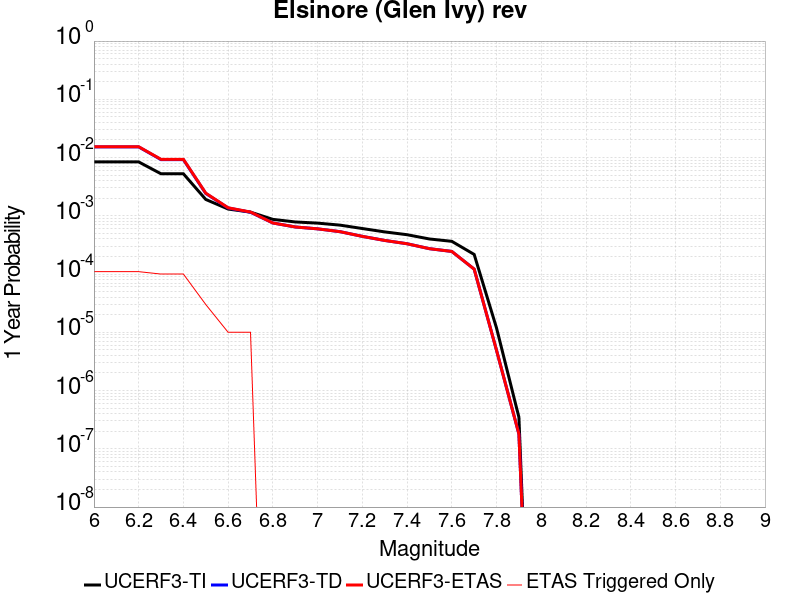 |  |

| Magnitude | 1 wk TI Prob | 1 wk TD Prob | 1 wk ETAS Prob | 1 wk ETAS/TD Gain | 1 wk ETAS Triggered Only | 1 mo TI Prob | 1 mo TD Prob | 1 mo ETAS Prob | 1 mo ETAS/TD Gain | 1 mo ETAS Triggered Only | 1 yr TI Prob | 1 yr TD Prob | 1 yr ETAS Prob | 1 yr ETAS/TD Gain | 1 yr ETAS Triggered Only | 10 yr TI Prob | 10 yr TD Prob | 10 yr ETAS Prob | 10 yr ETAS/TD Gain | 10 yr ETAS Triggered Only |
|-----|-----|-----|-----|-----|-----|-----|-----|-----|-----|-----|-----|-----|-----|-----|-----|-----|-----|-----|-----|-----|
| 6.0 | 1.6204086E-4 | 2.9364368E-4 | 3.0364076E-4 | 1.0340449 | 1.0E-5 | 6.94276E-4 | 0.0012580206 | 0.0012779955 | 1.015878 | 2.0E-5 | 0.008420097 | 0.015236372 | 0.015344696 | 1.0071095 | 1.1E-4 | 0.081081145 | 0.13970125 | 0.1398475 | 1.0010469 | 1.7E-4 |
| 6.1 | 1.6204086E-4 | 2.9364368E-4 | 3.0364076E-4 | 1.0340449 | 1.0E-5 | 6.94276E-4 | 0.0012580206 | 0.0012779955 | 1.015878 | 2.0E-5 | 0.008420097 | 0.015236372 | 0.015344696 | 1.0071095 | 1.1E-4 | 0.081081145 | 0.13970125 | 0.1398475 | 1.0010469 | 1.7E-4 |
| 6.2 | 1.6204086E-4 | 2.9364368E-4 | 3.0364076E-4 | 1.0340449 | 1.0E-5 | 6.94276E-4 | 0.0012580206 | 0.0012779955 | 1.015878 | 2.0E-5 | 0.008420097 | 0.015236372 | 0.015344696 | 1.0071095 | 1.1E-4 | 0.081081145 | 0.13970125 | 0.1398475 | 1.0010469 | 1.7E-4 |
| 6.3 | 1.0111737E-4 | 1.7704445E-4 | 1.8704268E-4 | 1.056473 | 1.0E-5 | 4.332882E-4 | 7.58658E-4 | 7.7864283E-4 | 1.0263424 | 2.0E-5 | 0.005262531 | 0.009218234 | 0.009317311 | 1.010748 | 1.0E-4 | 0.0513964 | 0.08702383 | 0.087151654 | 1.0014688 | 1.4E-4 |
| 6.4 | 1.0111737E-4 | 1.7704445E-4 | 1.8704268E-4 | 1.056473 | 1.0E-5 | 4.332882E-4 | 7.58658E-4 | 7.7864283E-4 | 1.0263424 | 2.0E-5 | 0.005262531 | 0.009218234 | 0.009317311 | 1.010748 | 1.0E-4 | 0.0513964 | 0.08702383 | 0.087151654 | 1.0014688 | 1.4E-4 |
| 6.5 | 3.6624708E-5 | 4.639627E-5 | 5.6395806E-5 | 1.2155246 | 1.0E-5 | 1.569536E-4 | 1.9882806E-4 | 2.0882607E-4 | 1.0502847 | 1.0E-5 | 0.001909235 | 0.0024184072 | 0.0024483346 | 1.0123749 | 3.0E-5 | 0.01892915 | 0.023742532 | 0.023791347 | 1.0020559 | 5.0E-5 |
| 6.6 | 2.5051324E-5 | 2.6151325E-5 | 2.6151325E-5 | 1.0 | 0.0 | 1.073584E-4 | 1.1207254E-4 | 1.1207254E-4 | 1.0 | 0.0 | 0.0013063047 | 0.0013636737 | 0.00137366 | 1.0073231 | 1.0E-5 | 0.012986525 | 0.013566461 | 0.013596055 | 1.0021813 | 3.0E-5 |
| 6.7 | 2.2189772E-5 | 2.207595E-5 | 2.207595E-5 | 1.0 | 0.0 | 9.509556E-5 | 9.460799E-5 | 9.460799E-5 | 1.0 | 0.0 | 0.0011571734 | 0.00115128 | 0.0011612684 | 1.0086759 | 1.0E-5 | 0.011511663 | 0.011467008 | 0.011496664 | 1.0025862 | 3.0E-5 |
| 6.8 | 1.6654378E-5 | 1.443957E-5 | 1.443957E-5 | 1.0 | 0.0 | 7.137396E-5 | 6.1882434E-5 | 6.1882434E-5 | 1.0 | 0.0 | 8.686314E-4 | 7.5316336E-4 | 7.5316336E-4 | 1.0 | 0.0 | 0.008652439 | 0.007511445 | 0.0075312946 | 1.0026426 | 2.0E-5 |
| 6.9 | 1.5042909E-5 | 1.2333641E-5 | 1.2333641E-5 | 1.0 | 0.0 | 6.446802E-5 | 5.2857413E-5 | 5.2857413E-5 | 1.0 | 0.0 | 7.8461546E-4 | 6.433521E-4 | 6.433521E-4 | 1.0 | 0.0 | 0.007818509 | 0.006419119 | 0.0064389906 | 1.0030957 | 2.0E-5 |
| 7.0 | 1.4361385E-5 | 1.1452851E-5 | 1.1452851E-5 | 1.0 | 0.0 | 6.154734E-5 | 4.908274E-5 | 4.908274E-5 | 1.0 | 0.0 | 7.490812E-4 | 5.9742143E-4 | 5.9742143E-4 | 1.0 | 0.0 | 0.007465612 | 0.0059621446 | 0.0059820255 | 1.0033345 | 2.0E-5 |
| 7.1 | 1.3265571E-5 | 1.0246209E-5 | 1.0246209E-5 | 1.0 | 0.0 | 5.6851208E-5 | 4.3911597E-5 | 4.3911597E-5 | 1.0 | 0.0 | 6.919436E-4 | 5.344951E-4 | 5.344951E-4 | 1.0 | 0.0 | 0.006897931 | 0.005335452 | 0.0053553456 | 1.0037285 | 2.0E-5 |
| 7.2 | 1.1596403E-5 | 8.506108E-6 | 8.506108E-6 | 1.0 | 0.0 | 4.9697923E-5 | 3.645425E-5 | 3.645425E-5 | 1.0 | 0.0 | 6.049042E-4 | 4.437418E-4 | 4.437418E-4 | 1.0 | 0.0 | 0.006032603 | 0.0044299727 | 0.0044399286 | 1.0022473 | 1.0E-5 |
| 7.3 | 1.0150827E-5 | 7.2396233E-6 | 7.2396233E-6 | 1.0 | 0.0 | 4.3502816E-5 | 3.1026597E-5 | 3.1026597E-5 | 1.0 | 0.0 | 5.2951806E-4 | 3.7768477E-4 | 3.7768477E-4 | 1.0 | 0.0 | 0.005282581 | 0.0037708154 | 0.0037807778 | 1.0026419 | 1.0E-5 |
| 7.4 | 9.080705E-6 | 6.35326E-6 | 6.35326E-6 | 1.0 | 0.0 | 3.8916725E-5 | 2.722798E-5 | 2.722798E-5 | 1.0 | 0.0 | 4.7370812E-4 | 3.314516E-4 | 3.314516E-4 | 1.0 | 0.0 | 0.004726996 | 0.0033097232 | 0.0033196902 | 1.0030113 | 1.0E-5 |
| 7.5 | 7.671649E-6 | 5.2262353E-6 | 5.2262353E-6 | 1.0 | 0.0 | 3.287808E-5 | 2.2397966E-5 | 2.2397966E-5 | 1.0 | 0.0 | 4.0021708E-4 | 2.7266238E-4 | 2.7266238E-4 | 1.0 | 0.0 | 0.0039949706 | 0.0027234033 | 0.0027234033 | 1.0 | 0.0 |
| 7.6 | 6.990086E-6 | 4.6880846E-6 | 4.6880846E-6 | 1.0 | 0.0 | 2.9957167E-5 | 2.0091642E-5 | 2.0091642E-5 | 1.0 | 0.0 | 3.6466747E-4 | 2.4458946E-4 | 2.4458946E-4 | 1.0 | 0.0 | 0.0036406964 | 0.002443319 | 0.002443319 | 1.0 | 0.0 |
| 7.7 | 4.163505E-6 | 2.3298514E-6 | 2.3298514E-6 | 1.0 | 0.0 | 1.7843471E-5 | 9.985044E-6 | 9.985044E-6 | 1.0 | 0.0 | 2.172226E-4 | 1.21561876E-4 | 1.21561876E-4 | 1.0 | 0.0 | 0.0021701038 | 0.0012150268 | 0.0012150268 | 1.0 | 0.0 |
| 7.8 | 2.2692414E-7 | 9.386795E-8 | 9.386795E-8 | 1.0 | 0.0 | 9.725317E-7 | 4.0229116E-7 | 4.0229116E-7 | 1.0 | 0.0 | 1.1840509E-5 | 4.8978873E-6 | 4.8978873E-6 | 1.0 | 0.0 | 1.1839878E-4 | 4.897812E-5 | 4.897812E-5 | 1.0 | 0.0 |
| 7.9 | 6.676829E-9 | 3.440201E-9 | 3.440201E-9 | 1.0 | 0.0 | 2.861498E-8 | 1.4743717E-8 | 1.4743717E-8 | 1.0 | 0.0 | 3.4838732E-7 | 1.7950475E-7 | 1.7950475E-7 | 1.0 | 0.0 | 3.4838679E-6 | 1.7950462E-6 | 1.7950462E-6 | 1.0 | 0.0 |

## Santa Ynez (West)
*[(top)](#table-of-contents)*

| 1 Week | 1 Month | 1 Year | 10 Year |
|-----|-----|-----|-----|
|  |  | 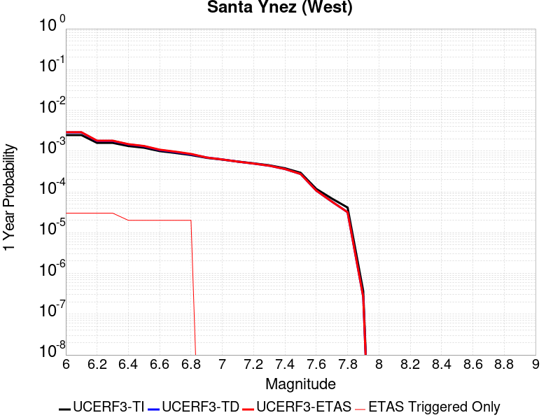 |  |

| Magnitude | 1 wk TI Prob | 1 wk TD Prob | 1 wk ETAS Prob | 1 wk ETAS/TD Gain | 1 wk ETAS Triggered Only | 1 mo TI Prob | 1 mo TD Prob | 1 mo ETAS Prob | 1 mo ETAS/TD Gain | 1 mo ETAS Triggered Only | 1 yr TI Prob | 1 yr TD Prob | 1 yr ETAS Prob | 1 yr ETAS/TD Gain | 1 yr ETAS Triggered Only | 10 yr TI Prob | 10 yr TD Prob | 10 yr ETAS Prob | 10 yr ETAS/TD Gain | 10 yr ETAS Triggered Only |
|-----|-----|-----|-----|-----|-----|-----|-----|-----|-----|-----|-----|-----|-----|-----|-----|-----|-----|-----|-----|-----|
| 6.0 | 4.7352758E-5 | 5.4975957E-5 | 5.4975957E-5 | 1.0 | 0.0 | 2.0292461E-4 | 2.3559162E-4 | 2.3559162E-4 | 1.0 | 0.0 | 0.0024678076 | 0.0028647191 | 0.0028946332 | 1.0104423 | 3.0E-5 | 0.024405818 | 0.028306318 | 0.028422922 | 1.0041193 | 1.2E-4 |
| 6.1 | 4.7352758E-5 | 5.4975957E-5 | 5.4975957E-5 | 1.0 | 0.0 | 2.0292461E-4 | 2.3559162E-4 | 2.3559162E-4 | 1.0 | 0.0 | 0.0024678076 | 0.0028647191 | 0.0028946332 | 1.0104423 | 3.0E-5 | 0.024405818 | 0.028306318 | 0.028422922 | 1.0041193 | 1.2E-4 |
| 6.2 | 3.0415853E-5 | 3.3927E-5 | 3.3927E-5 | 1.0 | 0.0 | 1.3034715E-4 | 1.4539355E-4 | 1.4539355E-4 | 1.0 | 0.0 | 0.0015858212 | 0.0017687645 | 0.0017987114 | 1.0169309 | 3.0E-5 | 0.015745522 | 0.017550772 | 0.017639192 | 1.005038 | 9.0E-5 |
| 6.3 | 3.0415853E-5 | 3.3927E-5 | 3.3927E-5 | 1.0 | 0.0 | 1.3034715E-4 | 1.4539355E-4 | 1.4539355E-4 | 1.0 | 0.0 | 0.0015858212 | 0.0017687645 | 0.0017987114 | 1.0169309 | 3.0E-5 | 0.015745522 | 0.017550772 | 0.017639192 | 1.005038 | 9.0E-5 |
| 6.4 | 2.5452082E-5 | 2.7913835E-5 | 2.7913835E-5 | 1.0 | 0.0 | 1.09075794E-4 | 1.1962535E-4 | 1.1962535E-4 | 1.0 | 0.0 | 0.0013271887 | 0.0014554822 | 0.001475453 | 1.0137211 | 2.0E-5 | 0.013192902 | 0.014461676 | 0.014530663 | 1.0047704 | 7.0E-5 |
| 6.5 | 2.3143784E-5 | 2.5129453E-5 | 2.5129453E-5 | 1.0 | 0.0 | 9.9183875E-5 | 1.076933E-4 | 1.076933E-4 | 1.0 | 0.0 | 0.0012068948 | 0.0013103889 | 0.0013303626 | 1.0152427 | 2.0E-5 | 0.012003611 | 0.013028296 | 0.013097384 | 1.0053029 | 7.0E-5 |
| 6.6 | 1.9118515E-5 | 2.0355204E-5 | 2.0355204E-5 | 1.0 | 0.0 | 8.193392E-5 | 8.723372E-5 | 8.723372E-5 | 1.0 | 0.0 | 9.97089E-4 | 0.001061561 | 0.0010815398 | 1.0188202 | 2.0E-5 | 0.00992627 | 0.010565811 | 0.010625177 | 1.0056187 | 6.0E-5 |
| 6.7 | 1.722807E-5 | 1.8147073E-5 | 1.8147073E-5 | 1.0 | 0.0 | 7.3832496E-5 | 7.777088E-5 | 7.777088E-5 | 1.0 | 0.0 | 8.985399E-4 | 9.4645476E-4 | 9.664358E-4 | 1.0211115 | 2.0E-5 | 0.008949154 | 0.009424885 | 0.009484319 | 1.0063062 | 6.0E-5 |
| 6.8 | 1.5317364E-5 | 1.5927077E-5 | 1.5927077E-5 | 1.0 | 0.0 | 6.56442E-5 | 6.825713E-5 | 6.825713E-5 | 1.0 | 0.0 | 7.98925E-4 | 8.307181E-4 | 8.507015E-4 | 1.0240556 | 2.0E-5 | 0.007960589 | 0.008276615 | 0.008326202 | 1.0059911 | 5.0E-5 |
| 6.9 | 1.3071226E-5 | 1.3330063E-5 | 1.3330063E-5 | 1.0 | 0.0 | 5.6018336E-5 | 5.7127603E-5 | 5.7127603E-5 | 1.0 | 0.0 | 6.8180985E-4 | 6.953089E-4 | 6.953089E-4 | 1.0 | 0.0 | 0.0067972173 | 0.0069315946 | 0.006951456 | 1.0028653 | 2.0E-5 |
| 7.0 | 1.1836986E-5 | 1.1933152E-5 | 1.1933152E-5 | 1.0 | 0.0 | 5.0728955E-5 | 5.1141087E-5 | 5.1141087E-5 | 1.0 | 0.0 | 6.1745E-4 | 6.2246656E-4 | 6.2246656E-4 | 1.0 | 0.0 | 0.006157372 | 0.0062074233 | 0.006227299 | 1.003202 | 2.0E-5 |
| 7.1 | 1.0597169E-5 | 1.0542508E-5 | 1.0542508E-5 | 1.0 | 0.0 | 4.541565E-5 | 4.51814E-5 | 4.51814E-5 | 1.0 | 0.0 | 5.5279525E-4 | 5.4994586E-4 | 5.4994586E-4 | 1.0 | 0.0 | 0.0055142213 | 0.0054859803 | 0.0055058706 | 1.0036256 | 2.0E-5 |
| 7.2 | 9.59113E-6 | 9.45942E-6 | 9.45942E-6 | 1.0 | 0.0 | 4.11042E-5 | 4.0539744E-5 | 4.0539744E-5 | 1.0 | 0.0 | 5.0032866E-4 | 4.934607E-4 | 4.934607E-4 | 1.0 | 0.0 | 0.004992037 | 0.0049237683 | 0.00494367 | 1.0040419 | 2.0E-5 |
| 7.3 | 8.586084E-6 | 8.379829E-6 | 8.379829E-6 | 1.0 | 0.0 | 3.679698E-5 | 3.5913064E-5 | 3.5913064E-5 | 1.0 | 0.0 | 4.4791115E-4 | 4.3715487E-4 | 4.3715487E-4 | 1.0 | 0.0 | 0.004470094 | 0.0043630605 | 0.004382973 | 1.0045639 | 2.0E-5 |
| 7.4 | 7.2622997E-6 | 6.9517455E-6 | 6.9517455E-6 | 1.0 | 0.0 | 3.112377E-5 | 2.979286E-5 | 2.979286E-5 | 1.0 | 0.0 | 3.78866E-4 | 3.6266865E-4 | 3.6266865E-4 | 1.0 | 0.0 | 0.0037822074 | 0.0036208683 | 0.0036208683 | 1.0 | 0.0 |
| 7.5 | 5.627296E-6 | 5.2517357E-6 | 5.2517357E-6 | 1.0 | 0.0 | 2.411676E-5 | 2.2507249E-5 | 2.2507249E-5 | 1.0 | 0.0 | 2.9358198E-4 | 2.7399202E-4 | 2.7399202E-4 | 1.0 | 0.0 | 0.0029319443 | 0.002736614 | 0.002736614 | 1.0 | 0.0 |
| 7.6 | 2.265244E-6 | 2.060912E-6 | 2.060912E-6 | 1.0 | 0.0 | 9.708152E-6 | 8.8324505E-6 | 8.8324505E-6 | 1.0 | 0.0 | 1.18190335E-4 | 1.0752987E-4 | 1.0752987E-4 | 1.0 | 0.0 | 0.001181275 | 0.001074787 | 0.001074787 | 1.0 | 0.0 |
| 7.7 | 1.3099874E-6 | 1.1016549E-6 | 1.1016549E-6 | 1.0 | 0.0 | 5.61422E-6 | 4.72137E-6 | 4.72137E-6 | 1.0 | 0.0 | 6.8350986E-5 | 5.7481186E-5 | 5.7481186E-5 | 1.0 | 0.0 | 6.832996E-4 | 5.7466555E-4 | 5.7466555E-4 | 1.0 | 0.0 |
| 7.8 | 7.903951E-7 | 6.071279E-7 | 6.071279E-7 | 1.0 | 0.0 | 3.3874032E-6 | 2.6019743E-6 | 2.6019743E-6 | 1.0 | 0.0 | 4.1240855E-5 | 3.1678588E-5 | 3.1678588E-5 | 1.0 | 0.0 | 4.12332E-4 | 3.1674205E-4 | 3.1674205E-4 | 1.0 | 0.0 |
| 7.9 | 7.0753297E-9 | 5.090034E-9 | 5.090034E-9 | 1.0 | 0.0 | 3.032284E-8 | 2.1814431E-8 | 2.1814431E-8 | 1.0 | 0.0 | 3.6918053E-7 | 2.655907E-7 | 2.655907E-7 | 1.0 | 0.0 | 3.691799E-6 | 2.6559046E-6 | 2.6559046E-6 | 1.0 | 0.0 |

## San Jacinto (San Bernardino)
*[(top)](#table-of-contents)*

| 1 Week | 1 Month | 1 Year | 10 Year |
|-----|-----|-----|-----|
|  |  |  |  |

| Magnitude | 1 wk TI Prob | 1 wk TD Prob | 1 wk ETAS Prob | 1 wk ETAS/TD Gain | 1 wk ETAS Triggered Only | 1 mo TI Prob | 1 mo TD Prob | 1 mo ETAS Prob | 1 mo ETAS/TD Gain | 1 mo ETAS Triggered Only | 1 yr TI Prob | 1 yr TD Prob | 1 yr ETAS Prob | 1 yr ETAS/TD Gain | 1 yr ETAS Triggered Only | 10 yr TI Prob | 10 yr TD Prob | 10 yr ETAS Prob | 10 yr ETAS/TD Gain | 10 yr ETAS Triggered Only |
|-----|-----|-----|-----|-----|-----|-----|-----|-----|-----|-----|-----|-----|-----|-----|-----|-----|-----|-----|-----|-----|
| 6.0 | 3.409352E-5 | 3.6030986E-5 | 4.6030626E-5 | 1.2775289 | 1.0E-5 | 1.461069E-4 | 1.5440938E-4 | 1.6440783E-4 | 1.0647529 | 1.0E-5 | 0.0017774 | 0.001878315 | 0.0019481835 | 1.0371975 | 7.0E-5 | 0.01763251 | 0.019372659 | 0.01954917 | 1.0091114 | 1.8E-4 |
| 6.1 | 3.409352E-5 | 3.6030986E-5 | 4.6030626E-5 | 1.2775289 | 1.0E-5 | 1.461069E-4 | 1.5440938E-4 | 1.6440783E-4 | 1.0647529 | 1.0E-5 | 0.0017774 | 0.001878315 | 0.0019481835 | 1.0371975 | 7.0E-5 | 0.01763251 | 0.019372659 | 0.01954917 | 1.0091114 | 1.8E-4 |
| 6.2 | 3.409352E-5 | 3.6030986E-5 | 4.6030626E-5 | 1.2775289 | 1.0E-5 | 1.461069E-4 | 1.5440938E-4 | 1.6440783E-4 | 1.0647529 | 1.0E-5 | 0.0017774 | 0.001878315 | 0.0019481835 | 1.0371975 | 7.0E-5 | 0.01763251 | 0.019372659 | 0.01954917 | 1.0091114 | 1.8E-4 |
| 6.3 | 3.409352E-5 | 3.6030986E-5 | 4.6030626E-5 | 1.2775289 | 1.0E-5 | 1.461069E-4 | 1.5440938E-4 | 1.6440783E-4 | 1.0647529 | 1.0E-5 | 0.0017774 | 0.001878315 | 0.0019481835 | 1.0371975 | 7.0E-5 | 0.01763251 | 0.019372659 | 0.01954917 | 1.0091114 | 1.8E-4 |
| 6.4 | 3.400795E-5 | 3.5923636E-5 | 4.592328E-5 | 1.2783582 | 1.0E-5 | 1.4574021E-4 | 1.5394937E-4 | 1.6394783E-4 | 1.0649464 | 1.0E-5 | 0.0017729428 | 0.0018727243 | 0.0019425931 | 1.0373087 | 7.0E-5 | 0.017588645 | 0.019317737 | 0.01949426 | 1.0091379 | 1.8E-4 |
| 6.5 | 3.341482E-5 | 3.5184206E-5 | 4.5183857E-5 | 1.2842084 | 1.0E-5 | 1.4319851E-4 | 1.5078076E-4 | 1.6077925E-4 | 1.0663115 | 1.0E-5 | 0.0017420477 | 0.0018342114 | 0.001904083 | 1.0380936 | 7.0E-5 | 0.017284546 | 0.018939253 | 0.019115843 | 1.0093241 | 1.8E-4 |
| 6.6 | 3.3364955E-5 | 3.5121422E-5 | 4.512107E-5 | 1.2847165 | 1.0E-5 | 1.4298483E-4 | 1.505117E-4 | 1.6051019E-4 | 1.06643 | 1.0E-5 | 0.0017394501 | 0.0018309412 | 0.001900813 | 1.0381618 | 7.0E-5 | 0.017258976 | 0.018907115 | 0.019083712 | 1.0093402 | 1.8E-4 |
| 6.7 | 3.335922E-5 | 3.5111196E-5 | 4.5110843E-5 | 1.2847995 | 1.0E-5 | 1.4296026E-4 | 1.5046788E-4 | 1.6046637E-4 | 1.0664494 | 1.0E-5 | 0.0017391514 | 0.0018304085 | 0.0019002804 | 1.0381728 | 7.0E-5 | 0.017256035 | 0.018901907 | 0.019078504 | 1.0093428 | 1.8E-4 |
| 6.8 | 3.327683E-5 | 3.500525E-5 | 4.5004897E-5 | 1.2856615 | 1.0E-5 | 1.4260718E-4 | 1.5001388E-4 | 1.6001238E-4 | 1.0666505 | 1.0E-5 | 0.0017348597 | 0.0018248904 | 0.0018947626 | 1.0382885 | 7.0E-5 | 0.017213784 | 0.018847674 | 0.01902428 | 1.0093702 | 1.8E-4 |
| 6.9 | 3.3235785E-5 | 3.4946195E-5 | 4.4945846E-5 | 1.2861441 | 1.0E-5 | 1.4243131E-4 | 1.4976082E-4 | 1.5975932E-4 | 1.0667632 | 1.0E-5 | 0.0017327217 | 0.0018218146 | 0.001891687 | 1.0383532 | 7.0E-5 | 0.017192734 | 0.01881754 | 0.018994153 | 1.0093856 | 1.8E-4 |
| 7.0 | 3.3197095E-5 | 3.4886118E-5 | 4.488577E-5 | 1.286637 | 1.0E-5 | 1.422655E-4 | 1.4950338E-4 | 1.5950188E-4 | 1.0668781 | 1.0E-5 | 0.0017307063 | 0.0018186854 | 0.0018885582 | 1.0384194 | 7.0E-5 | 0.017172894 | 0.018786915 | 0.018963533 | 1.0094011 | 1.8E-4 |
| 7.1 | 3.3129716E-5 | 3.476631E-5 | 4.4765966E-5 | 1.2876247 | 1.0E-5 | 1.4197677E-4 | 1.4898997E-4 | 1.5898849E-4 | 1.0671086 | 1.0E-5 | 0.0017271966 | 0.0018124452 | 0.0018823183 | 1.0385518 | 7.0E-5 | 0.017138338 | 0.018725986 | 0.018902617 | 1.0094323 | 1.8E-4 |
| 7.2 | 3.3034008E-5 | 3.4633744E-5 | 4.4633398E-5 | 1.2887257 | 1.0E-5 | 1.4156665E-4 | 1.484219E-4 | 1.5842041E-4 | 1.0673655 | 1.0E-5 | 0.0017222111 | 0.0018055403 | 0.0018754139 | 1.0386995 | 7.0E-5 | 0.017089253 | 0.018658374 | 0.018835016 | 1.0094671 | 1.8E-4 |
| 7.3 | 3.2956614E-5 | 3.4501478E-5 | 4.4501132E-5 | 1.2898327 | 1.0E-5 | 1.4123498E-4 | 1.478551E-4 | 1.5785362E-4 | 1.0676237 | 1.0E-5 | 0.0017181796 | 0.001798651 | 0.001868525 | 1.038848 | 7.0E-5 | 0.017049557 | 0.01859111 | 0.018767765 | 1.009502 | 1.8E-4 |
| 7.4 | 3.2915937E-5 | 3.4423152E-5 | 4.4422806E-5 | 1.2904922 | 1.0E-5 | 1.4106068E-4 | 1.4751946E-4 | 1.5751798E-4 | 1.0677776 | 1.0E-5 | 0.0017160608 | 0.0017945713 | 0.0018644456 | 1.0389365 | 7.0E-5 | 0.017028693 | 0.018551366 | 0.018728027 | 1.0095228 | 1.8E-4 |
| 7.5 | 3.281791E-5 | 3.4288034E-5 | 4.428769E-5 | 1.291637 | 1.0E-5 | 1.406406E-4 | 1.4694045E-4 | 1.5693899E-4 | 1.0680448 | 1.0E-5 | 0.0017109542 | 0.0017875334 | 0.0018574083 | 1.0390902 | 7.0E-5 | 0.016978411 | 0.01848224 | 0.018658914 | 1.009559 | 1.8E-4 |
| 7.6 | 3.2521442E-5 | 3.40129E-5 | 4.4012562E-5 | 1.2939961 | 1.0E-5 | 1.3937015E-4 | 1.4576144E-4 | 1.5575999E-4 | 1.0685953 | 1.0E-5 | 0.0016955109 | 0.0017732024 | 0.0018430783 | 1.0394065 | 7.0E-5 | 0.016826328 | 0.018339828 | 0.018516527 | 1.0096347 | 1.8E-4 |
| 7.7 | 3.0287873E-5 | 3.249642E-5 | 4.2496096E-5 | 1.3077163 | 1.0E-5 | 1.297987E-4 | 1.3926295E-4 | 1.4926156E-4 | 1.0717967 | 1.0E-5 | 0.0015791537 | 0.0016942088 | 0.0017640903 | 1.0412472 | 7.0E-5 | 0.01567979 | 0.017550439 | 0.01772728 | 1.0100762 | 1.8E-4 |
| 7.8 | 2.6316151E-5 | 2.9705654E-5 | 3.970536E-5 | 1.3366263 | 1.0E-5 | 1.1277862E-4 | 1.2730373E-4 | 1.3730247E-4 | 1.0785422 | 1.0E-5 | 0.0013722149 | 0.001548822 | 0.0016187136 | 1.0451256 | 7.0E-5 | 0.013637724 | 0.016091198 | 0.016268302 | 1.0110062 | 1.8E-4 |
| 7.9 | 2.0761147E-5 | 2.3454775E-5 | 3.345454E-5 | 1.4263424 | 1.0E-5 | 8.897331E-5 | 1.005166E-4 | 1.1051559E-4 | 1.0994761 | 1.0E-5 | 0.0010827117 | 0.0012231034 | 0.00128303 | 1.0489955 | 6.0E-5 | 0.010774517 | 0.012812119 | 0.012960197 | 1.0115577 | 1.5E-4 |
| 8.0 | 1.5738568E-5 | 1.6061122E-5 | 2.6060961E-5 | 1.6226115 | 1.0E-5 | 6.744926E-5 | 6.883157E-5 | 7.883088E-5 | 1.1452721 | 1.0E-5 | 8.2088535E-4 | 8.377028E-4 | 8.776693E-4 | 1.0477096 | 4.0E-5 | 0.008178596 | 0.008880417 | 0.008969618 | 1.0100447 | 9.0E-5 |
| 8.1 | 1.0105832E-5 | 8.3464765E-6 | 8.3464765E-6 | 1.0 | 0.0 | 4.3309992E-5 | 3.5770125E-5 | 3.5770125E-5 | 1.0 | 0.0 | 5.2717153E-4 | 4.3541478E-4 | 4.5540606E-4 | 1.0459132 | 2.0E-5 | 0.005259227 | 0.0046858224 | 0.0047355886 | 1.0106205 | 5.0E-5 |
| 8.2 | 4.189207E-6 | 1.5831124E-6 | 1.5831124E-6 | 1.0 | 0.0 | 1.7953622E-5 | 6.78475E-6 | 6.78475E-6 | 1.0 | 0.0 | 2.1856341E-4 | 8.2601226E-5 | 8.2601226E-5 | 1.0 | 0.0 | 0.0021834858 | 9.592587E-4 | 9.592587E-4 | 1.0 | 0.0 |
| 8.3 | 1.2758221E-6 | 3.6275617E-7 | 3.6275617E-7 | 1.0 | 0.0 | 5.4677976E-6 | 1.5546683E-6 | 1.5546683E-6 | 1.0 | 0.0 | 6.65684E-5 | 1.8927927E-5 | 1.8927927E-5 | 1.0 | 0.0 | 6.6548464E-4 | 2.2825136E-4 | 2.2825136E-4 | 1.0 | 0.0 |

## Red Pass
*[(top)](#table-of-contents)*

| 1 Week | 1 Month | 1 Year | 10 Year |
|-----|-----|-----|-----|
| 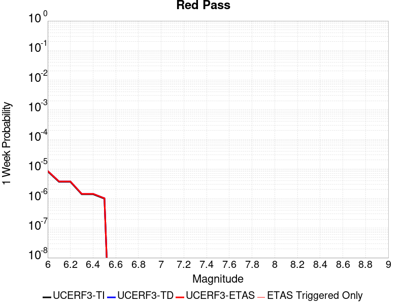 |  |  |  |

| Magnitude | 1 wk TI Prob | 1 wk TD Prob | 1 wk ETAS Prob | 1 wk ETAS/TD Gain | 1 wk ETAS Triggered Only | 1 mo TI Prob | 1 mo TD Prob | 1 mo ETAS Prob | 1 mo ETAS/TD Gain | 1 mo ETAS Triggered Only | 1 yr TI Prob | 1 yr TD Prob | 1 yr ETAS Prob | 1 yr ETAS/TD Gain | 1 yr ETAS Triggered Only | 10 yr TI Prob | 10 yr TD Prob | 10 yr ETAS Prob | 10 yr ETAS/TD Gain | 10 yr ETAS Triggered Only |
|-----|-----|-----|-----|-----|-----|-----|-----|-----|-----|-----|-----|-----|-----|-----|-----|-----|-----|-----|-----|-----|
| 6.0 | 8.258278E-6 | 8.5513775E-6 | 8.5513775E-6 | 1.0 | 0.0 | 3.539214E-5 | 3.6648347E-5 | 5.6647616E-5 | 1.5457072 | 2.0E-5 | 4.308141E-4 | 4.4612016E-4 | 5.3608E-4 | 1.2016494 | 9.0E-5 | 0.0042997985 | 0.0044540036 | 0.0046232464 | 1.037998 | 1.7E-4 |
| 6.1 | 3.649988E-6 | 3.7753643E-6 | 3.7753643E-6 | 1.0 | 0.0 | 1.5642712E-5 | 1.6180058E-5 | 2.6179898E-5 | 1.6180347 | 1.0E-5 | 1.9043336E-4 | 1.9697918E-4 | 2.2697326E-4 | 1.1522703 | 3.0E-5 | 0.0019027026 | 0.001968513 | 0.0020184147 | 1.0253499 | 5.0E-5 |
| 6.2 | 3.649988E-6 | 3.7753643E-6 | 3.7753643E-6 | 1.0 | 0.0 | 1.5642712E-5 | 1.6180058E-5 | 2.6179898E-5 | 1.6180347 | 1.0E-5 | 1.9043336E-4 | 1.9697918E-4 | 2.2697326E-4 | 1.1522703 | 3.0E-5 | 0.0019027026 | 0.001968513 | 0.0020184147 | 1.0253499 | 5.0E-5 |
| 6.3 | 1.3924937E-6 | 1.4411353E-6 | 1.4411353E-6 | 1.0 | 0.0 | 5.9678164E-6 | 6.1762876E-6 | 6.1762876E-6 | 1.0 | 0.0 | 7.265574E-5 | 7.519512E-5 | 8.519437E-5 | 1.1329774 | 1.0E-5 | 7.263199E-4 | 7.518355E-4 | 7.6182804E-4 | 1.0132908 | 1.0E-5 |
| 6.4 | 1.3924937E-6 | 1.4411353E-6 | 1.4411353E-6 | 1.0 | 0.0 | 5.9678164E-6 | 6.1762876E-6 | 6.1762876E-6 | 1.0 | 0.0 | 7.265574E-5 | 7.519512E-5 | 8.519437E-5 | 1.1329774 | 1.0E-5 | 7.263199E-4 | 7.518355E-4 | 7.6182804E-4 | 1.0132908 | 1.0E-5 |
| 6.5 | 9.876812E-7 | 1.0222045E-6 | 1.0222045E-6 | 1.0 | 0.0 | 4.2329125E-6 | 4.3808764E-6 | 4.3808764E-6 | 1.0 | 0.0 | 5.153449E-5 | 5.3337168E-5 | 6.3336636E-5 | 1.1874765 | 1.0E-5 | 5.1522546E-4 | 5.333717E-4 | 5.4336636E-4 | 1.0187386 | 1.0E-5 |

## San Andreas (Parkfield)
*[(top)](#table-of-contents)*

| 1 Week | 1 Month | 1 Year | 10 Year |
|-----|-----|-----|-----|
|  | 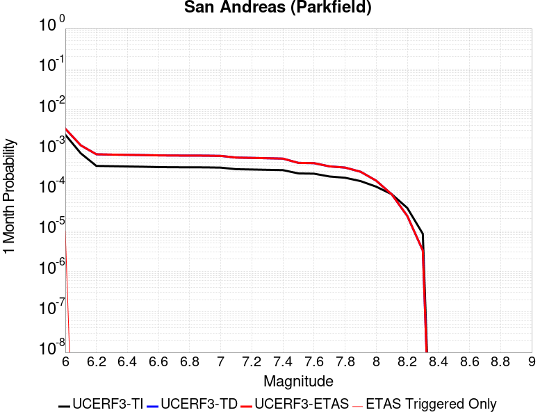 | 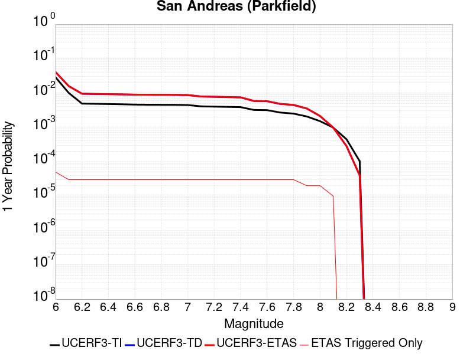 |  |

| Magnitude | 1 wk TI Prob | 1 wk TD Prob | 1 wk ETAS Prob | 1 wk ETAS/TD Gain | 1 wk ETAS Triggered Only | 1 mo TI Prob | 1 mo TD Prob | 1 mo ETAS Prob | 1 mo ETAS/TD Gain | 1 mo ETAS Triggered Only | 1 yr TI Prob | 1 yr TD Prob | 1 yr ETAS Prob | 1 yr ETAS/TD Gain | 1 yr ETAS Triggered Only | 10 yr TI Prob | 10 yr TD Prob | 10 yr ETAS Prob | 10 yr ETAS/TD Gain | 10 yr ETAS Triggered Only |
|-----|-----|-----|-----|-----|-----|-----|-----|-----|-----|-----|-----|-----|-----|-----|-----|-----|-----|-----|-----|-----|
| 6.0 | 5.556969E-4 | 7.806865E-4 | 7.806865E-4 | 1.0 | 0.0 | 0.0023793848 | 0.003342062 | 0.0033520288 | 1.0029821 | 1.0E-5 | 0.028586963 | 0.040327907 | 0.04037589 | 1.0011898 | 5.0E-5 | 0.25176284 | 0.337592 | 0.3377046 | 1.0003335 | 1.7E-4 |
| 6.1 | 1.925858E-4 | 3.0356165E-4 | 3.0356165E-4 | 1.0 | 0.0 | 8.2510663E-4 | 0.0013004246 | 0.0013004246 | 1.0 | 0.0 | 0.0099994885 | 0.015817752 | 0.015847279 | 1.0018666 | 3.0E-5 | 0.095613256 | 0.14991689 | 0.1499849 | 1.0004536 | 8.0E-5 |
| 6.2 | 9.4306815E-5 | 1.8264171E-4 | 1.8264171E-4 | 1.0 | 0.0 | 4.0410945E-4 | 7.825166E-4 | 7.825166E-4 | 1.0 | 0.0 | 0.0049089384 | 0.00948573 | 0.009515446 | 1.0031327 | 3.0E-5 | 0.048019063 | 0.091946684 | 0.092010245 | 1.0006913 | 7.0E-5 |
| 6.3 | 9.283051E-5 | 1.796063E-4 | 1.796063E-4 | 1.0 | 0.0 | 3.9778434E-4 | 7.6951546E-4 | 7.6951546E-4 | 1.0 | 0.0 | 0.0048322747 | 0.009328807 | 0.009358527 | 1.0031859 | 3.0E-5 | 0.047285385 | 0.090599544 | 0.0906632 | 1.0007026 | 7.0E-5 |
| 6.4 | 9.138826E-5 | 1.7722696E-4 | 1.7722696E-4 | 1.0 | 0.0 | 3.916052E-4 | 7.593242E-4 | 7.593242E-4 | 1.0 | 0.0 | 0.0047573745 | 0.009205784 | 0.009235508 | 1.0032288 | 3.0E-5 | 0.046568092 | 0.08950133 | 0.08956506 | 1.0007122 | 7.0E-5 |
| 6.5 | 9.000255E-5 | 1.7480615E-4 | 1.7480615E-4 | 1.0 | 0.0 | 3.8566816E-4 | 7.489553E-4 | 7.489553E-4 | 1.0 | 0.0 | 0.0046854047 | 0.009080612 | 0.00911034 | 1.0032737 | 3.0E-5 | 0.045878403 | 0.088386714 | 0.08845053 | 1.0007219 | 7.0E-5 |
| 6.6 | 8.8109264E-5 | 1.7161515E-4 | 1.7161515E-4 | 1.0 | 0.0 | 3.7755648E-4 | 7.352873E-4 | 7.352873E-4 | 1.0 | 0.0 | 0.0045870654 | 0.008915593 | 0.008945325 | 1.0033349 | 3.0E-5 | 0.04493529 | 0.08691743 | 0.08698135 | 1.0007354 | 7.0E-5 |
| 6.7 | 8.738073E-5 | 1.7028535E-4 | 1.7028535E-4 | 1.0 | 0.0 | 3.7443507E-4 | 7.2959135E-4 | 7.2959135E-4 | 1.0 | 0.0 | 0.0045492216 | 0.008846852 | 0.008876586 | 1.003361 | 3.0E-5 | 0.04457213 | 0.08631762 | 0.08638158 | 1.000741 | 7.0E-5 |
| 6.8 | 8.710195E-5 | 1.6973988E-4 | 1.6973988E-4 | 1.0 | 0.0 | 3.7324068E-4 | 7.27255E-4 | 7.27255E-4 | 1.0 | 0.0 | 0.0045347405 | 0.008818645 | 0.00884838 | 1.0033718 | 3.0E-5 | 0.04443313 | 0.08606506 | 0.08612904 | 1.0007434 | 7.0E-5 |
| 6.9 | 8.6801556E-5 | 1.6914903E-4 | 1.6914903E-4 | 1.0 | 0.0 | 3.7195362E-4 | 7.2472414E-4 | 7.2472414E-4 | 1.0 | 0.0 | 0.0045191357 | 0.008788081 | 0.008817818 | 1.0033838 | 3.0E-5 | 0.044283327 | 0.085790984 | 0.085854985 | 1.0007459 | 7.0E-5 |
| 7.0 | 8.5571606E-5 | 1.6667573E-4 | 1.6667573E-4 | 1.0 | 0.0 | 3.6668387E-4 | 7.141302E-4 | 7.141302E-4 | 1.0 | 0.0 | 0.004455241 | 0.008660131 | 0.008689871 | 1.0034342 | 3.0E-5 | 0.043669727 | 0.084638834 | 0.08470291 | 1.0007571 | 7.0E-5 |
| 7.1 | 7.82589E-5 | 1.5147835E-4 | 1.5147835E-4 | 1.0 | 0.0 | 3.3535215E-4 | 6.490322E-4 | 6.490322E-4 | 1.0 | 0.0 | 0.0040752706 | 0.007873507 | 0.007903271 | 1.0037802 | 3.0E-5 | 0.040013418 | 0.0775485 | 0.07760384 | 1.0007137 | 6.0E-5 |
| 7.2 | 7.690929E-5 | 1.4884972E-4 | 1.4884972E-4 | 1.0 | 0.0 | 3.2956956E-4 | 6.3777214E-4 | 6.3777214E-4 | 1.0 | 0.0 | 0.004005129 | 0.0077373977 | 0.0077671655 | 1.0038472 | 3.0E-5 | 0.0393371 | 0.076321304 | 0.07637672 | 1.0007261 | 6.0E-5 |
| 7.3 | 7.5543794E-5 | 1.4581317E-4 | 1.4581317E-4 | 1.0 | 0.0 | 3.2371894E-4 | 6.247647E-4 | 6.247647E-4 | 1.0 | 0.0 | 0.003934157 | 0.007580144 | 0.0076099164 | 1.0039277 | 3.0E-5 | 0.038652334 | 0.074883536 | 0.07493904 | 1.0007412 | 6.0E-5 |
| 7.4 | 7.4214564E-5 | 1.4282037E-4 | 1.4282037E-4 | 1.0 | 0.0 | 3.1802364E-4 | 6.119444E-4 | 6.119444E-4 | 1.0 | 0.0 | 0.003865065 | 0.007425131 | 0.0074549085 | 1.0040103 | 3.0E-5 | 0.03798529 | 0.07345646 | 0.073512055 | 1.0007569 | 6.0E-5 |
| 7.5 | 6.149578E-5 | 1.12071495E-4 | 1.12071495E-4 | 1.0 | 0.0 | 2.6352672E-4 | 4.802181E-4 | 4.802181E-4 | 1.0 | 0.0 | 0.0032037178 | 0.0058310134 | 0.0058608386 | 1.0051149 | 3.0E-5 | 0.03157923 | 0.058633085 | 0.05868015 | 1.0008028 | 5.0E-5 |
| 7.6 | 6.0643448E-5 | 1.1035655E-4 | 1.1035655E-4 | 1.0 | 0.0 | 2.598746E-4 | 4.7287103E-4 | 4.7287103E-4 | 1.0 | 0.0 | 0.0031593828 | 0.005742038 | 0.0057718656 | 1.0051947 | 3.0E-5 | 0.031148417 | 0.057793517 | 0.057840627 | 1.0008152 | 5.0E-5 |
| 7.7 | 5.1652263E-5 | 9.189291E-5 | 9.189291E-5 | 1.0 | 0.0 | 2.2134806E-4 | 3.9376735E-4 | 3.9376735E-4 | 1.0 | 0.0 | 0.002691582 | 0.004783589 | 0.0048134453 | 1.0062414 | 3.0E-5 | 0.026592141 | 0.048604436 | 0.048652004 | 1.0009787 | 5.0E-5 |
| 7.8 | 4.8090482E-5 | 8.573056E-5 | 8.573056E-5 | 1.0 | 0.0 | 2.060858E-4 | 3.6736496E-4 | 3.6736496E-4 | 1.0 | 0.0 | 0.0025062072 | 0.0044635036 | 0.0044933697 | 1.0066912 | 3.0E-5 | 0.024781305 | 0.045365382 | 0.045413114 | 1.0010521 | 5.0E-5 |
| 7.9 | 3.970278E-5 | 6.760842E-5 | 6.760842E-5 | 1.0 | 0.0 | 1.7014367E-4 | 2.8971818E-4 | 2.8971818E-4 | 1.0 | 0.0 | 0.002069531 | 0.0035216175 | 0.003541547 | 1.0056592 | 2.0E-5 | 0.020503636 | 0.03593117 | 0.03596973 | 1.0010732 | 4.0E-5 |
| 8.0 | 2.8982335E-5 | 4.076363E-5 | 4.076363E-5 | 1.0 | 0.0 | 1.2420409E-4 | 1.7468957E-4 | 1.7468957E-4 | 1.0 | 0.0 | 0.0015111357 | 0.0021247722 | 0.0021447297 | 1.0093927 | 2.0E-5 | 0.015009012 | 0.02204345 | 0.02206301 | 1.0008873 | 2.0E-5 |
| 8.1 | 1.8836186E-5 | 1.8717825E-5 | 1.8717825E-5 | 1.0 | 0.0 | 8.0724014E-5 | 8.0216785E-5 | 8.0216785E-5 | 1.0 | 0.0 | 9.823717E-4 | 9.7620237E-4 | 9.861926E-4 | 1.0102338 | 1.0E-5 | 0.009780403 | 0.0105073545 | 0.01051725 | 1.0009418 | 1.0E-5 |
| 8.2 | 8.643924E-6 | 5.488954E-6 | 5.488954E-6 | 1.0 | 0.0 | 3.704486E-5 | 2.3523877E-5 | 2.3523877E-5 | 1.0 | 0.0 | 4.5092785E-4 | 2.8636563E-4 | 2.8636563E-4 | 1.0 | 0.0 | 0.0045001395 | 0.0032564052 | 0.0032564052 | 1.0 | 0.0 |
| 8.3 | 1.983087E-6 | 7.68342E-7 | 7.68342E-7 | 1.0 | 0.0 | 8.498917E-6 | 3.2928901E-6 | 3.2928901E-6 | 1.0 | 0.0 | 1.034694E-4 | 4.0090217E-5 | 4.0090217E-5 | 1.0 | 0.0 | 0.0010342124 | 4.7331754E-4 | 4.7331754E-4 | 1.0 | 0.0 |

## Death Valley (Fish Lake Valley)
*[(top)](#table-of-contents)*

| 1 Week | 1 Month | 1 Year | 10 Year |
|-----|-----|-----|-----|
| 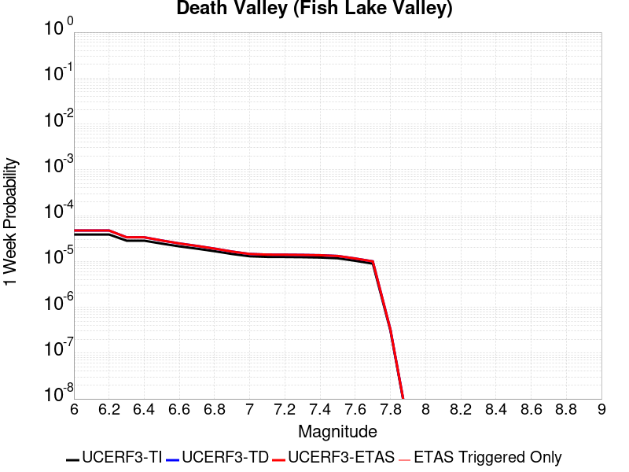 | 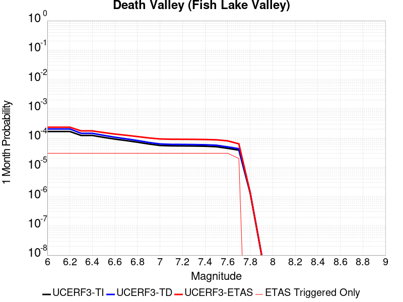 |  |  |

| Magnitude | 1 wk TI Prob | 1 wk TD Prob | 1 wk ETAS Prob | 1 wk ETAS/TD Gain | 1 wk ETAS Triggered Only | 1 mo TI Prob | 1 mo TD Prob | 1 mo ETAS Prob | 1 mo ETAS/TD Gain | 1 mo ETAS Triggered Only | 1 yr TI Prob | 1 yr TD Prob | 1 yr ETAS Prob | 1 yr ETAS/TD Gain | 1 yr ETAS Triggered Only | 10 yr TI Prob | 10 yr TD Prob | 10 yr ETAS Prob | 10 yr ETAS/TD Gain | 10 yr ETAS Triggered Only |
|-----|-----|-----|-----|-----|-----|-----|-----|-----|-----|-----|-----|-----|-----|-----|-----|-----|-----|-----|-----|-----|
| 6.0 | 3.872328E-5 | 4.7271453E-5 | 4.7271453E-5 | 1.0 | 0.0 | 1.6594635E-4 | 2.0257791E-4 | 2.3257184E-4 | 1.1480612 | 3.0E-5 | 0.0020185246 | 0.0024637296 | 0.002553508 | 1.03644 | 9.0E-5 | 0.02000288 | 0.024390144 | 0.024546243 | 1.0064 | 1.6E-4 |
| 6.1 | 3.872328E-5 | 4.7271453E-5 | 4.7271453E-5 | 1.0 | 0.0 | 1.6594635E-4 | 2.0257791E-4 | 2.3257184E-4 | 1.1480612 | 3.0E-5 | 0.0020185246 | 0.0024637296 | 0.002553508 | 1.03644 | 9.0E-5 | 0.02000288 | 0.024390144 | 0.024546243 | 1.0064 | 1.6E-4 |
| 6.2 | 3.872328E-5 | 4.7271453E-5 | 4.7271453E-5 | 1.0 | 0.0 | 1.6594635E-4 | 2.0257791E-4 | 2.3257184E-4 | 1.1480612 | 3.0E-5 | 0.0020185246 | 0.0024637296 | 0.002553508 | 1.03644 | 9.0E-5 | 0.02000288 | 0.024390144 | 0.024546243 | 1.0064 | 1.6E-4 |
| 6.3 | 2.8356371E-5 | 3.361221E-5 | 3.361221E-5 | 1.0 | 0.0 | 1.2152165E-4 | 1.4404482E-4 | 1.740405E-4 | 1.2082385 | 3.0E-5 | 0.0014785219 | 0.001752414 | 0.0018322738 | 1.0455713 | 8.0E-5 | 0.014687235 | 0.01739298 | 0.017540371 | 1.0084741 | 1.5E-4 |
| 6.4 | 2.8356371E-5 | 3.361221E-5 | 3.361221E-5 | 1.0 | 0.0 | 1.2152165E-4 | 1.4404482E-4 | 1.740405E-4 | 1.2082385 | 3.0E-5 | 0.0014785219 | 0.001752414 | 0.0018322738 | 1.0455713 | 8.0E-5 | 0.014687235 | 0.01739298 | 0.017540371 | 1.0084741 | 1.5E-4 |
| 6.5 | 2.4448687E-5 | 2.860939E-5 | 2.860939E-5 | 1.0 | 0.0 | 1.0477588E-4 | 1.2260619E-4 | 1.5260252E-4 | 1.2446558 | 3.0E-5 | 0.0012748998 | 0.0014917589 | 0.0015716394 | 1.053548 | 8.0E-5 | 0.012676105 | 0.014822316 | 0.014970093 | 1.0099698 | 1.5E-4 |
| 6.6 | 2.1298161E-5 | 2.4661547E-5 | 2.4661547E-5 | 1.0 | 0.0 | 9.127464E-5 | 1.0568826E-4 | 1.3568508E-4 | 1.2838237 | 3.0E-5 | 0.0011107022 | 0.0012860289 | 0.001365926 | 1.062127 | 8.0E-5 | 0.011051672 | 0.012789278 | 0.01293736 | 1.0115786 | 1.5E-4 |
| 6.7 | 1.8959729E-5 | 2.1782242E-5 | 2.1782242E-5 | 1.0 | 0.0 | 8.125345E-5 | 9.334927E-5 | 1.2334647E-4 | 1.3213437 | 3.0E-5 | 9.888117E-4 | 0.0011359603 | 0.0012158694 | 1.070345 | 8.0E-5 | 0.009844234 | 0.011304198 | 0.011452503 | 1.0131195 | 1.5E-4 |
| 6.8 | 1.6691629E-5 | 1.9019344E-5 | 1.9019344E-5 | 1.0 | 0.0 | 7.153359E-5 | 8.1509024E-5 | 1.1150658E-4 | 1.3680274 | 3.0E-5 | 8.7057345E-4 | 9.919375E-4 | 0.0010718581 | 1.0805702 | 8.0E-5 | 0.008671708 | 0.009876857 | 0.010025375 | 1.0150371 | 1.5E-4 |
| 6.9 | 1.450505E-5 | 1.6390335E-5 | 1.6390335E-5 | 1.0 | 0.0 | 6.216302E-5 | 7.024245E-5 | 1.00240344E-4 | 1.4270622 | 3.0E-5 | 7.5657194E-4 | 8.548751E-4 | 9.3480665E-4 | 1.093501 | 8.0E-5 | 0.007540013 | 0.008516797 | 0.00866552 | 1.0174623 | 1.5E-4 |
| 7.0 | 1.2940855E-5 | 1.453864E-5 | 1.453864E-5 | 1.0 | 0.0 | 5.545963E-5 | 6.2307E-5 | 9.2305134E-5 | 1.4814568 | 3.0E-5 | 6.750118E-4 | 7.583295E-4 | 8.3826884E-4 | 1.105415 | 8.0E-5 | 0.006729651 | 0.007558036 | 0.0077069025 | 1.0196965 | 1.5E-4 |
| 7.1 | 1.2544658E-5 | 1.4078849E-5 | 1.4078849E-5 | 1.0 | 0.0 | 5.3761712E-5 | 6.033656E-5 | 9.0334746E-5 | 1.4971809 | 3.0E-5 | 6.5435225E-4 | 7.343556E-4 | 8.142969E-4 | 1.1088591 | 8.0E-5 | 0.006524288 | 0.007319883 | 0.007468785 | 1.0203421 | 1.5E-4 |
| 7.2 | 1.2489416E-5 | 1.4016312E-5 | 1.4016312E-5 | 1.0 | 0.0 | 5.3524967E-5 | 6.0068556E-5 | 9.006676E-5 | 1.4993993 | 3.0E-5 | 6.514716E-4 | 7.310949E-4 | 8.110364E-4 | 1.109345 | 8.0E-5 | 0.006495651 | 0.00728749 | 0.007436397 | 1.0204332 | 1.5E-4 |
| 7.3 | 1.2368307E-5 | 1.3880444E-5 | 1.3880444E-5 | 1.0 | 0.0 | 5.3005948E-5 | 5.9486294E-5 | 8.948451E-5 | 1.5042878 | 3.0E-5 | 6.451563E-4 | 7.240106E-4 | 8.0395263E-4 | 1.1104156 | 8.0E-5 | 0.0064328653 | 0.007217109 | 0.0073660268 | 1.0206339 | 1.5E-4 |
| 7.4 | 1.2161707E-5 | 1.3648489E-5 | 1.3648489E-5 | 1.0 | 0.0 | 5.212056E-5 | 5.8492245E-5 | 8.849049E-5 | 1.5128585 | 3.0E-5 | 6.3438306E-4 | 7.1191596E-4 | 7.91859E-4 | 1.1122928 | 8.0E-5 | 0.006325751 | 0.0070969425 | 0.0072458778 | 1.0209858 | 1.5E-4 |
| 7.5 | 1.1707948E-5 | 1.3146116E-5 | 1.3146116E-5 | 1.0 | 0.0 | 5.0175953E-5 | 5.633931E-5 | 8.633762E-5 | 1.5324578 | 3.0E-5 | 6.10721E-4 | 6.857208E-4 | 7.6566596E-4 | 1.1165856 | 8.0E-5 | 0.0060904534 | 0.0068366327 | 0.006985607 | 1.0217906 | 1.5E-4 |
| 7.6 | 1.0319538E-5 | 1.1580149E-5 | 1.1580149E-5 | 1.0 | 0.0 | 4.4225842E-5 | 4.9628292E-5 | 7.96268E-5 | 1.6044639 | 3.0E-5 | 5.383166E-4 | 6.040621E-4 | 6.8401376E-4 | 1.1323568 | 8.0E-5 | 0.0053701443 | 0.006024733 | 0.00615395 | 1.0214478 | 1.3E-4 |
| 7.7 | 8.937764E-6 | 1.0023232E-5 | 1.0023232E-5 | 1.0 | 0.0 | 3.830414E-5 | 4.2956028E-5 | 6.295517E-5 | 1.4655724 | 2.0E-5 | 4.6625308E-4 | 5.228692E-4 | 5.9283257E-4 | 1.1338067 | 7.0E-5 | 0.0046527605 | 0.0052168993 | 0.0053263255 | 1.0209754 | 1.1E-4 |
| 7.8 | 3.108007E-7 | 3.2847237E-7 | 3.2847237E-7 | 1.0 | 0.0 | 1.3320023E-6 | 1.407738E-6 | 1.407738E-6 | 1.0 | 0.0 | 1.6217007E-5 | 1.7139078E-5 | 1.7139078E-5 | 1.0 | 0.0 | 1.6215823E-4 | 1.7137795E-4 | 1.7137795E-4 | 1.0 | 0.0 |
| 7.9 | 2.5591178E-9 | 2.6697147E-9 | 2.6697147E-9 | 1.0 | 0.0 | 1.0967647E-8 | 1.1441634E-8 | 1.1441634E-8 | 1.0 | 0.0 | 1.335311E-7 | 1.3930189E-7 | 1.3930189E-7 | 1.0 | 0.0 | 1.3353102E-6 | 1.3930189E-6 | 1.3930189E-6 | 1.0 | 0.0 |

## Owens Valley
*[(top)](#table-of-contents)*

| 1 Week | 1 Month | 1 Year | 10 Year |
|-----|-----|-----|-----|
|  |  | 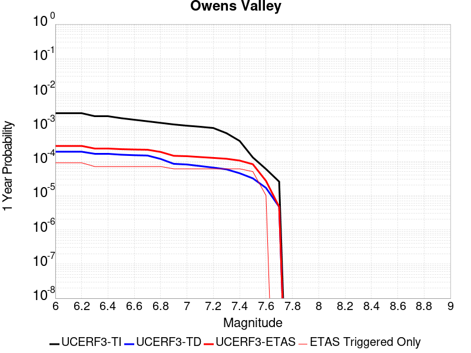 |  |

| Magnitude | 1 wk TI Prob | 1 wk TD Prob | 1 wk ETAS Prob | 1 wk ETAS/TD Gain | 1 wk ETAS Triggered Only | 1 mo TI Prob | 1 mo TD Prob | 1 mo ETAS Prob | 1 mo ETAS/TD Gain | 1 mo ETAS Triggered Only | 1 yr TI Prob | 1 yr TD Prob | 1 yr ETAS Prob | 1 yr ETAS/TD Gain | 1 yr ETAS Triggered Only | 10 yr TI Prob | 10 yr TD Prob | 10 yr ETAS Prob | 10 yr ETAS/TD Gain | 10 yr ETAS Triggered Only |
|-----|-----|-----|-----|-----|-----|-----|-----|-----|-----|-----|-----|-----|-----|-----|-----|-----|-----|-----|-----|-----|
| 6.0 | 4.83821E-5 | 3.628889E-6 | 3.628889E-6 | 1.0 | 0.0 | 2.0733538E-4 | 1.5552296E-5 | 4.5551827E-5 | 2.9289458 | 3.0E-5 | 0.002521386 | 1.8933373E-4 | 2.7931668E-4 | 1.4752611 | 9.0E-5 | 0.024929691 | 0.0019262071 | 0.0020759183 | 1.0777233 | 1.5E-4 |
| 6.1 | 4.83821E-5 | 3.628889E-6 | 3.628889E-6 | 1.0 | 0.0 | 2.0733538E-4 | 1.5552296E-5 | 4.5551827E-5 | 2.9289458 | 3.0E-5 | 0.002521386 | 1.8933373E-4 | 2.7931668E-4 | 1.4752611 | 9.0E-5 | 0.024929691 | 0.0019262071 | 0.0020759183 | 1.0777233 | 1.5E-4 |
| 6.2 | 4.83821E-5 | 3.628889E-6 | 3.628889E-6 | 1.0 | 0.0 | 2.0733538E-4 | 1.5552296E-5 | 4.5551827E-5 | 2.9289458 | 3.0E-5 | 0.002521386 | 1.8933373E-4 | 2.7931668E-4 | 1.4752611 | 9.0E-5 | 0.024929691 | 0.0019262071 | 0.0020759183 | 1.0777233 | 1.5E-4 |
| 6.3 | 3.953008E-5 | 3.1566549E-6 | 3.1566549E-6 | 1.0 | 0.0 | 1.6940363E-4 | 1.35284545E-5 | 4.352805E-5 | 3.217518 | 3.0E-5 | 0.002060538 | 1.6469722E-4 | 2.3468569E-4 | 1.4249524 | 7.0E-5 | 0.020415364 | 0.0016598707 | 0.0017696881 | 1.0661602 | 1.1E-4 |
| 6.4 | 3.953008E-5 | 3.1566549E-6 | 3.1566549E-6 | 1.0 | 0.0 | 1.6940363E-4 | 1.35284545E-5 | 4.352805E-5 | 3.217518 | 3.0E-5 | 0.002060538 | 1.6469722E-4 | 2.3468569E-4 | 1.4249524 | 7.0E-5 | 0.020415364 | 0.0016598707 | 0.0017696881 | 1.0661602 | 1.1E-4 |
| 6.5 | 3.457342E-5 | 2.9724126E-6 | 2.9724126E-6 | 1.0 | 0.0 | 1.4816338E-4 | 1.2738853E-5 | 4.273847E-5 | 3.35497 | 3.0E-5 | 0.0018023965 | 1.550852E-4 | 2.2507434E-4 | 1.4512948 | 7.0E-5 | 0.017878477 | 0.001556161 | 0.0016659899 | 1.0705768 | 1.1E-4 |
| 6.6 | 3.1127765E-5 | 2.8750662E-6 | 2.8750662E-6 | 1.0 | 0.0 | 1.3339789E-4 | 1.2321659E-5 | 4.2321288E-5 | 3.4347072 | 3.0E-5 | 0.0016229092 | 1.5000656E-4 | 2.1999606E-4 | 1.4665763 | 7.0E-5 | 0.016111081 | 0.0015015614 | 0.0016113962 | 1.073147 | 1.1E-4 |
| 6.7 | 2.806885E-5 | 2.810841E-6 | 2.810841E-6 | 1.0 | 0.0 | 1.2028952E-4 | 1.2046409E-5 | 4.204605E-5 | 3.4903386 | 3.0E-5 | 0.001463541 | 1.4665585E-4 | 2.1664558E-4 | 1.4772379 | 7.0E-5 | 0.014539397 | 0.0014659748 | 0.0015758135 | 1.0749254 | 1.1E-4 |
| 6.8 | 2.524524E-5 | 2.2357387E-6 | 2.2357387E-6 | 1.0 | 0.0 | 1.0818939E-4 | 9.581704E-6 | 3.9581417E-5 | 4.130937 | 3.0E-5 | 0.0013164099 | 1.166513E-4 | 1.8664314E-4 | 1.600009 | 7.0E-5 | 0.01308639 | 0.0011661743 | 0.001276046 | 1.0942155 | 1.1E-4 |
| 6.9 | 2.2704568E-5 | 1.608441E-6 | 1.608441E-6 | 1.0 | 0.0 | 9.730166E-5 | 6.8933005E-6 | 3.6893092E-5 | 5.3520217 | 3.0E-5 | 0.0011840039 | 8.392272E-5 | 1.4391768E-4 | 1.7148834 | 6.0E-5 | 0.011777153 | 8.391226E-4 | 9.3903864E-4 | 1.1190721 | 1.0E-4 |
| 7.0 | 2.0871712E-5 | 1.5398031E-6 | 1.5398031E-6 | 1.0 | 0.0 | 8.944713E-5 | 6.5991394E-6 | 3.659894E-5 | 5.546017 | 3.0E-5 | 0.0010884746 | 8.0341575E-5 | 1.4033675E-4 | 1.7467513 | 6.0E-5 | 0.010831586 | 8.0329797E-4 | 9.0321765E-4 | 1.1243868 | 1.0E-4 |
| 7.1 | 1.944928E-5 | 1.3866381E-6 | 1.3866381E-6 | 1.0 | 0.0 | 8.335139E-5 | 5.942721E-6 | 3.5942543E-5 | 6.0481625 | 3.0E-5 | 0.0010143308 | 7.235024E-5 | 1.323459E-4 | 1.8292392 | 6.0E-5 | 0.010097133 | 7.234255E-4 | 8.233531E-4 | 1.1381313 | 1.0E-4 |
| 7.2 | 1.7876306E-5 | 1.249108E-6 | 1.249108E-6 | 1.0 | 0.0 | 7.6610486E-5 | 5.353309E-6 | 3.5353147E-5 | 6.6039805 | 3.0E-5 | 9.3233347E-4 | 6.5174594E-5 | 1.2517069E-4 | 1.9205441 | 6.0E-5 | 0.009284316 | 6.5169286E-4 | 7.5162767E-4 | 1.1533465 | 1.0E-4 |
| 7.3 | 1.2618672E-5 | 1.1117008E-6 | 1.1117008E-6 | 1.0 | 0.0 | 5.40789E-5 | 4.7644235E-6 | 3.476428E-5 | 7.2966394 | 3.0E-5 | 6.582117E-4 | 5.800532E-5 | 1.18001844E-4 | 2.0343277 | 6.0E-5 | 0.0065626553 | 5.800349E-4 | 6.799769E-4 | 1.1723034 | 1.0E-4 |
| 7.4 | 7.4874442E-6 | 8.5501574E-7 | 8.5501574E-7 | 1.0 | 0.0 | 3.208865E-5 | 3.6643482E-6 | 3.3664237E-5 | 9.186965 | 3.0E-5 | 3.906093E-4 | 4.461253E-5 | 1.04609855E-4 | 2.3448536 | 6.0E-5 | 0.003899234 | 4.4612843E-4 | 5.4608384E-4 | 1.2240506 | 1.0E-4 |
| 7.5 | 2.4734156E-6 | 6.069623E-7 | 6.069623E-7 | 1.0 | 0.0 | 1.060031E-5 | 2.6012644E-6 | 3.2601187E-5 | 12.532823 | 3.0E-5 | 1.2905113E-4 | 3.1669937E-5 | 8.166835E-5 | 2.5787342 | 5.0E-5 | 0.0012897621 | 3.166546E-4 | 3.6663873E-4 | 1.1578507 | 5.0E-5 |
| 7.6 | 1.1328841E-6 | 3.1970308E-7 | 3.1970308E-7 | 1.0 | 0.0 | 4.8552088E-6 | 1.3701554E-6 | 1.3701554E-6 | 1.0 | 0.0 | 5.9110564E-5 | 1.6681515E-5 | 2.668135E-5 | 1.599456 | 1.0E-5 | 5.9094845E-4 | 1.6680283E-4 | 1.7680116E-4 | 1.059941 | 1.0E-5 |
| 7.7 | 4.8613185E-7 | 8.966636E-8 | 8.966636E-8 | 1.0 | 0.0 | 2.0834207E-6 | 3.8428433E-7 | 3.8428433E-7 | 1.0 | 0.0 | 2.536535E-5 | 4.6786527E-6 | 4.6786527E-6 | 1.0 | 0.0 | 2.5362454E-4 | 4.6785608E-5 | 4.6785608E-5 | 1.0 | 0.0 |

## San Andreas (Coachella) rev
*[(top)](#table-of-contents)*

| 1 Week | 1 Month | 1 Year | 10 Year |
|-----|-----|-----|-----|
|  |  |  | 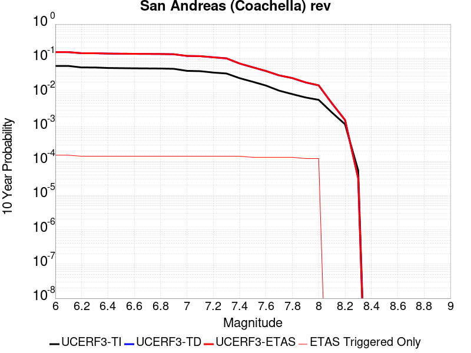 |

| Magnitude | 1 wk TI Prob | 1 wk TD Prob | 1 wk ETAS Prob | 1 wk ETAS/TD Gain | 1 wk ETAS Triggered Only | 1 mo TI Prob | 1 mo TD Prob | 1 mo ETAS Prob | 1 mo ETAS/TD Gain | 1 mo ETAS Triggered Only | 1 yr TI Prob | 1 yr TD Prob | 1 yr ETAS Prob | 1 yr ETAS/TD Gain | 1 yr ETAS Triggered Only | 10 yr TI Prob | 10 yr TD Prob | 10 yr ETAS Prob | 10 yr ETAS/TD Gain | 10 yr ETAS Triggered Only |
|-----|-----|-----|-----|-----|-----|-----|-----|-----|-----|-----|-----|-----|-----|-----|-----|-----|-----|-----|-----|-----|
| 6.0 | 1.1925945E-4 | 3.2741754E-4 | 3.3741427E-4 | 1.030532 | 1.0E-5 | 5.110118E-4 | 0.0014024682 | 0.0014224402 | 1.0142406 | 2.0E-5 | 0.0062038354 | 0.016942704 | 0.017001687 | 1.0034814 | 6.0E-5 | 0.060334753 | 0.15270138 | 0.15282848 | 1.0008323 | 1.5E-4 |
| 6.1 | 1.1925945E-4 | 3.2741754E-4 | 3.3741427E-4 | 1.030532 | 1.0E-5 | 5.110118E-4 | 0.0014024682 | 0.0014224402 | 1.0142406 | 2.0E-5 | 0.0062038354 | 0.016942704 | 0.017001687 | 1.0034814 | 6.0E-5 | 0.060334753 | 0.15270138 | 0.15282848 | 1.0008323 | 1.5E-4 |
| 6.2 | 1.07432395E-4 | 3.0242422E-4 | 3.1242118E-4 | 1.0330561 | 1.0E-5 | 4.603433E-4 | 0.001295464 | 0.0013154381 | 1.0154185 | 2.0E-5 | 0.005590286 | 0.01565931 | 0.01571837 | 1.0037715 | 6.0E-5 | 0.05451731 | 0.14187258 | 0.14199272 | 1.0008467 | 1.4E-4 |
| 6.3 | 1.0718766E-4 | 3.0187727E-4 | 3.1187426E-4 | 1.0331161 | 1.0E-5 | 4.592948E-4 | 0.0012931223 | 0.0013130964 | 1.0154464 | 2.0E-5 | 0.005577586 | 0.01563121 | 0.01569027 | 1.0037785 | 6.0E-5 | 0.054396555 | 0.14164084 | 0.14176102 | 1.0008484 | 1.4E-4 |
| 6.4 | 1.0355944E-4 | 2.93958E-4 | 3.0395505E-4 | 1.0340085 | 1.0E-5 | 4.4375064E-4 | 0.0012592156 | 0.0012791904 | 1.015863 | 2.0E-5 | 0.0053892885 | 0.015224237 | 0.015283323 | 1.0038811 | 6.0E-5 | 0.052604496 | 0.13820101 | 0.13832167 | 1.000873 | 1.4E-4 |
| 6.5 | 1.0227914E-4 | 2.9115228E-4 | 3.0114935E-4 | 1.0343363 | 1.0E-5 | 4.382655E-4 | 0.0012472027 | 0.0012671778 | 1.0160159 | 2.0E-5 | 0.0053228354 | 0.015080013 | 0.0151391085 | 1.0039188 | 6.0E-5 | 0.051971316 | 0.13698022 | 0.13710105 | 1.000882 | 1.4E-4 |
| 6.6 | 1.0116757E-4 | 2.8880974E-4 | 2.9880684E-4 | 1.0346149 | 1.0E-5 | 4.3350324E-4 | 0.0012371727 | 0.001257148 | 1.016146 | 2.0E-5 | 0.0052651367 | 0.014959581 | 0.015018684 | 1.0039508 | 6.0E-5 | 0.051421247 | 0.13595843 | 0.1360794 | 1.0008898 | 1.4E-4 |
| 6.7 | 1.0050676E-4 | 2.8739532E-4 | 2.9739246E-4 | 1.0347853 | 1.0E-5 | 4.3067214E-4 | 0.0012311168 | 0.0012510922 | 1.0162255 | 2.0E-5 | 0.005230834 | 0.01488686 | 0.014945966 | 1.0039704 | 6.0E-5 | 0.051094085 | 0.13534318 | 0.13546424 | 1.0008944 | 1.4E-4 |
| 6.8 | 9.976819E-5 | 2.8543177E-4 | 2.954289E-4 | 1.0350246 | 1.0E-5 | 4.2750788E-4 | 0.0012227094 | 0.0012426849 | 1.0163372 | 2.0E-5 | 0.0051924936 | 0.014785894 | 0.014845007 | 1.0039979 | 6.0E-5 | 0.050728295 | 0.13449486 | 0.13461603 | 1.000901 | 1.4E-4 |
| 6.9 | 9.77719E-5 | 2.8040004E-4 | 2.9039723E-4 | 1.0356534 | 1.0E-5 | 4.1895514E-4 | 0.0012011649 | 0.001221141 | 1.0166305 | 2.0E-5 | 0.0050888555 | 0.014527118 | 0.014586246 | 1.0040702 | 6.0E-5 | 0.049738888 | 0.13232318 | 0.13244465 | 1.000918 | 1.4E-4 |
| 7.0 | 8.500761E-5 | 2.477394E-4 | 2.5773692E-4 | 1.040355 | 1.0E-5 | 3.6426744E-4 | 0.0010613115 | 0.0010812903 | 1.0188246 | 2.0E-5 | 0.0044259406 | 0.012845688 | 0.012904917 | 1.0046108 | 6.0E-5 | 0.04338823 | 0.118179366 | 0.118302815 | 1.0010446 | 1.4E-4 |
| 7.1 | 8.319876E-5 | 2.4376555E-4 | 2.537631E-4 | 1.041013 | 1.0E-5 | 3.5651738E-4 | 0.0010442944 | 0.0010642735 | 1.0191317 | 2.0E-5 | 0.004331963 | 0.012640928 | 0.012700169 | 1.0046865 | 6.0E-5 | 0.042484846 | 0.116399206 | 0.11652291 | 1.0010628 | 1.4E-4 |
| 7.2 | 7.563917E-5 | 2.2424657E-4 | 2.3424433E-4 | 1.0445838 | 1.0E-5 | 3.2412758E-4 | 9.6070586E-4 | 9.806866E-4 | 1.020798 | 2.0E-5 | 0.0039391145 | 0.011634555 | 0.011693857 | 1.005097 | 6.0E-5 | 0.03870018 | 0.10780455 | 0.10792945 | 1.0011586 | 1.4E-4 |
| 7.3 | 7.082985E-5 | 2.0740405E-4 | 2.1740198E-4 | 1.048205 | 1.0E-5 | 3.0352117E-4 | 8.8857464E-4 | 9.0855686E-4 | 1.022488 | 2.0E-5 | 0.0036891096 | 0.010765358 | 0.010824712 | 1.0055134 | 6.0E-5 | 0.03628465 | 0.10032599 | 0.100451946 | 1.0012554 | 1.4E-4 |
| 7.4 | 5.146215E-5 | 1.4282389E-4 | 1.5282247E-4 | 1.0700063 | 1.0E-5 | 2.2053342E-4 | 6.1195967E-4 | 6.319474E-4 | 1.0326619 | 2.0E-5 | 0.0026816884 | 0.0074253455 | 0.0074849 | 1.0080204 | 6.0E-5 | 0.02649557 | 0.07088707 | 0.071017146 | 1.001835 | 1.4E-4 |
| 7.5 | 4.0285166E-5 | 1.0949058E-4 | 1.1948949E-4 | 1.0913221 | 1.0E-5 | 1.7263928E-4 | 4.6916128E-4 | 4.8915186E-4 | 1.0426092 | 2.0E-5 | 0.002099857 | 0.005697148 | 0.005746863 | 1.0087264 | 5.0E-5 | 0.020801254 | 0.05504435 | 0.05516719 | 1.0022317 | 1.3E-4 |
| 7.6 | 3.1168736E-5 | 8.44554E-5 | 9.445456E-5 | 1.1183957 | 1.0E-5 | 1.3357346E-4 | 3.6190165E-4 | 3.818944E-4 | 1.0552436 | 2.0E-5 | 0.0016250437 | 0.0043972773 | 0.0044470574 | 1.0113207 | 5.0E-5 | 0.016132116 | 0.04283994 | 0.042964373 | 1.0029045 | 1.3E-4 |
| 7.7 | 2.2100989E-5 | 6.244587E-5 | 7.244525E-5 | 1.1601287 | 1.0E-5 | 9.4715084E-5 | 2.6759773E-4 | 2.8759238E-4 | 1.0747191 | 2.0E-5 | 0.001152546 | 0.0032531414 | 0.0033029788 | 1.0153197 | 5.0E-5 | 0.011465867 | 0.031926684 | 0.032052536 | 1.0039418 | 1.3E-4 |
| 7.8 | 1.7484861E-5 | 5.1847725E-5 | 6.1847204E-5 | 1.1928625 | 1.0E-5 | 7.493296E-5 | 2.2218561E-4 | 2.4218118E-4 | 1.0899948 | 2.0E-5 | 9.1192697E-4 | 0.002701757 | 0.0027516219 | 1.0184565 | 5.0E-5 | 0.009081938 | 0.026663804 | 0.02679034 | 1.0047455 | 1.3E-4 |
| 7.9 | 1.3967285E-5 | 3.826518E-5 | 4.82648E-5 | 1.2613242 | 1.0E-5 | 5.985842E-5 | 1.6398334E-4 | 1.739817E-4 | 1.0609719 | 1.0E-5 | 7.2853256E-4 | 0.0019946701 | 0.0020345903 | 1.0200135 | 4.0E-5 | 0.0072614877 | 0.01992915 | 0.02004676 | 1.0059013 | 1.2E-4 |
| 8.0 | 1.1887396E-5 | 3.110184E-5 | 4.1101528E-5 | 1.3215144 | 1.0E-5 | 5.094499E-5 | 1.332868E-4 | 1.4328546E-4 | 1.0750161 | 1.0E-5 | 6.200787E-4 | 0.0016215598 | 0.001661495 | 1.0246276 | 4.0E-5 | 0.006183513 | 0.016296344 | 0.016414387 | 1.0072436 | 1.2E-4 |
| 8.1 | 5.100864E-6 | 8.988319E-6 | 8.988319E-6 | 1.0 | 0.0 | 2.1860664E-5 | 3.85208E-5 | 3.85208E-5 | 1.0 | 0.0 | 2.6612106E-4 | 4.6888995E-4 | 4.6888995E-4 | 1.0 | 0.0 | 0.002658026 | 0.0049251597 | 0.0049251597 | 1.0 | 0.0 |
| 8.2 | 2.3004484E-6 | 2.792476E-6 | 2.792476E-6 | 1.0 | 0.0 | 9.859027E-6 | 1.1967699E-5 | 1.1967699E-5 | 1.0 | 0.0 | 1.2002704E-4 | 1.4569703E-4 | 1.4569703E-4 | 1.0 | 0.0 | 0.0011996223 | 0.0016005031 | 0.0016005031 | 1.0 | 0.0 |
| 8.3 | 1.0424446E-7 | 5.8324215E-8 | 5.8324215E-8 | 1.0 | 0.0 | 4.4676187E-7 | 2.499609E-7 | 2.499609E-7 | 1.0 | 0.0 | 5.439312E-6 | 3.04327E-6 | 3.04327E-6 | 1.0 | 0.0 | 5.4391792E-5 | 3.1994135E-5 | 3.1994135E-5 | 1.0 | 0.0 |

## Cady
*[(top)](#table-of-contents)*

| 1 Week | 1 Month | 1 Year | 10 Year |
|-----|-----|-----|-----|
| 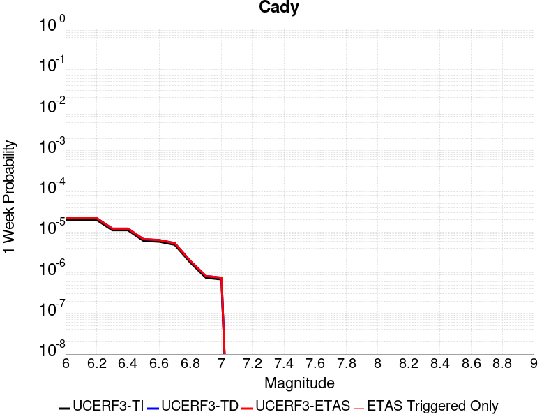 |  | 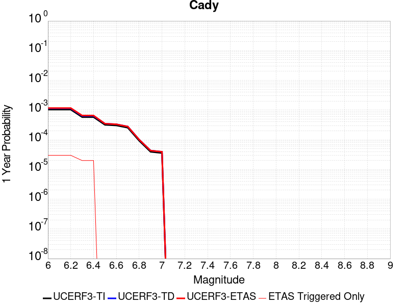 |  |

| Magnitude | 1 wk TI Prob | 1 wk TD Prob | 1 wk ETAS Prob | 1 wk ETAS/TD Gain | 1 wk ETAS Triggered Only | 1 mo TI Prob | 1 mo TD Prob | 1 mo ETAS Prob | 1 mo ETAS/TD Gain | 1 mo ETAS Triggered Only | 1 yr TI Prob | 1 yr TD Prob | 1 yr ETAS Prob | 1 yr ETAS/TD Gain | 1 yr ETAS Triggered Only | 10 yr TI Prob | 10 yr TD Prob | 10 yr ETAS Prob | 10 yr ETAS/TD Gain | 10 yr ETAS Triggered Only |
|-----|-----|-----|-----|-----|-----|-----|-----|-----|-----|-----|-----|-----|-----|-----|-----|-----|-----|-----|-----|-----|
| 6.0 | 1.9892565E-5 | 2.1859532E-5 | 2.1859532E-5 | 1.0 | 0.0 | 8.525106E-5 | 9.368086E-5 | 1.0367992E-4 | 1.1067353 | 1.0E-5 | 0.0010374374 | 0.0011400586 | 0.0011700244 | 1.0262845 | 3.0E-5 | 0.010326075 | 0.011351115 | 0.011469753 | 1.0104517 | 1.2E-4 |
| 6.1 | 1.9892565E-5 | 2.1859532E-5 | 2.1859532E-5 | 1.0 | 0.0 | 8.525106E-5 | 9.368086E-5 | 1.0367992E-4 | 1.1067353 | 1.0E-5 | 0.0010374374 | 0.0011400586 | 0.0011700244 | 1.0262845 | 3.0E-5 | 0.010326075 | 0.011351115 | 0.011469753 | 1.0104517 | 1.2E-4 |
| 6.2 | 1.9892565E-5 | 2.1859532E-5 | 2.1859532E-5 | 1.0 | 0.0 | 8.525106E-5 | 9.368086E-5 | 1.0367992E-4 | 1.1067353 | 1.0E-5 | 0.0010374374 | 0.0011400586 | 0.0011700244 | 1.0262845 | 3.0E-5 | 0.010326075 | 0.011351115 | 0.011469753 | 1.0104517 | 1.2E-4 |
| 6.3 | 1.1117327E-5 | 1.21770145E-5 | 1.21770145E-5 | 1.0 | 0.0 | 4.764482E-5 | 5.218634E-5 | 6.218582E-5 | 1.191611 | 1.0E-5 | 5.7992124E-4 | 6.3521496E-4 | 6.5520225E-4 | 1.0314654 | 2.0E-5 | 0.0057841022 | 0.0063370992 | 0.0064066555 | 1.0109761 | 7.0E-5 |
| 6.4 | 1.1117327E-5 | 1.21770145E-5 | 1.21770145E-5 | 1.0 | 0.0 | 4.764482E-5 | 5.218634E-5 | 6.218582E-5 | 1.191611 | 1.0E-5 | 5.7992124E-4 | 6.3521496E-4 | 6.5520225E-4 | 1.0314654 | 2.0E-5 | 0.0057841022 | 0.0063370992 | 0.0064066555 | 1.0109761 | 7.0E-5 |
| 6.5 | 6.103093E-6 | 6.672252E-6 | 6.672252E-6 | 1.0 | 0.0 | 2.615585E-5 | 2.8595123E-5 | 2.8595123E-5 | 1.0 | 0.0 | 3.1840094E-4 | 3.4810256E-4 | 3.4810256E-4 | 1.0 | 0.0 | 0.0031794512 | 0.003476807 | 0.0034967375 | 1.0057324 | 2.0E-5 |
| 6.6 | 5.817237E-6 | 6.3658817E-6 | 6.3658817E-6 | 1.0 | 0.0 | 2.4930776E-5 | 2.7282134E-5 | 2.7282134E-5 | 1.0 | 0.0 | 3.034899E-4 | 3.321218E-4 | 3.321218E-4 | 1.0 | 0.0 | 0.0030307577 | 0.0033174767 | 0.0033374103 | 1.0060086 | 2.0E-5 |
| 6.7 | 4.8846314E-6 | 5.3407534E-6 | 5.3407534E-6 | 1.0 | 0.0 | 2.0933967E-5 | 2.288881E-5 | 2.288881E-5 | 1.0 | 0.0 | 2.5484123E-4 | 2.786474E-4 | 2.786474E-4 | 1.0 | 0.0 | 0.0025454918 | 0.0027841358 | 0.00280408 | 1.0071635 | 2.0E-5 |
| 6.8 | 1.7788773E-6 | 1.9399733E-6 | 1.9399733E-6 | 1.0 | 0.0 | 7.6237375E-6 | 8.314153E-6 | 8.314153E-6 | 1.0 | 0.0 | 9.281505E-5 | 1.01221696E-4 | 1.01221696E-4 | 1.0 | 0.0 | 9.2776294E-4 | 0.0010119105 | 0.0010219004 | 1.0098723 | 1.0E-5 |
| 6.9 | 7.5455404E-7 | 8.297399E-7 | 8.297399E-7 | 1.0 | 0.0 | 3.233799E-6 | 3.5560251E-6 | 3.5560251E-6 | 1.0 | 0.0 | 3.937079E-5 | 4.3294083E-5 | 4.3294083E-5 | 1.0 | 0.0 | 3.9363815E-4 | 4.3288944E-4 | 4.4288512E-4 | 1.0230906 | 1.0E-5 |
| 7.0 | 6.8578805E-7 | 7.5420957E-7 | 7.5420957E-7 | 1.0 | 0.0 | 2.9390883E-6 | 3.2323244E-6 | 3.2323244E-6 | 1.0 | 0.0 | 3.578281E-5 | 3.935317E-5 | 3.935317E-5 | 1.0 | 0.0 | 3.577705E-4 | 3.934945E-4 | 4.0349056E-4 | 1.0254033 | 1.0E-5 |

## Calico-Hidalgo
*[(top)](#table-of-contents)*

| 1 Week | 1 Month | 1 Year | 10 Year |
|-----|-----|-----|-----|
| 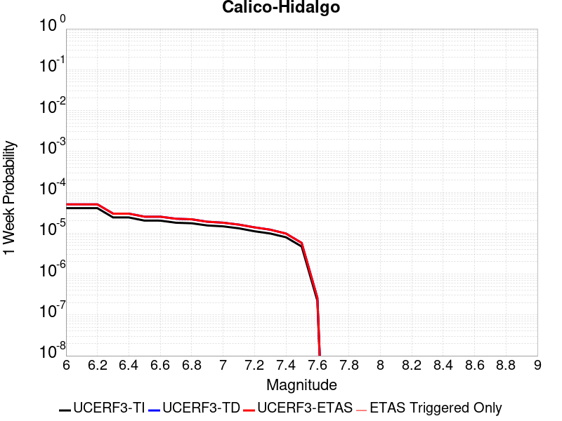 |  |  |  |

| Magnitude | 1 wk TI Prob | 1 wk TD Prob | 1 wk ETAS Prob | 1 wk ETAS/TD Gain | 1 wk ETAS Triggered Only | 1 mo TI Prob | 1 mo TD Prob | 1 mo ETAS Prob | 1 mo ETAS/TD Gain | 1 mo ETAS Triggered Only | 1 yr TI Prob | 1 yr TD Prob | 1 yr ETAS Prob | 1 yr ETAS/TD Gain | 1 yr ETAS Triggered Only | 10 yr TI Prob | 10 yr TD Prob | 10 yr ETAS Prob | 10 yr ETAS/TD Gain | 10 yr ETAS Triggered Only |
|-----|-----|-----|-----|-----|-----|-----|-----|-----|-----|-----|-----|-----|-----|-----|-----|-----|-----|-----|-----|-----|
| 6.0 | 4.0906612E-5 | 5.070639E-5 | 5.070639E-5 | 1.0 | 0.0 | 1.7530227E-4 | 2.1729727E-4 | 2.2729511E-4 | 1.0460099 | 1.0E-5 | 0.0021322158 | 0.0026427885 | 0.0027225772 | 1.0301911 | 8.0E-5 | 0.02111873 | 0.026153978 | 0.02627084 | 1.0044682 | 1.2E-4 |
| 6.1 | 4.0906612E-5 | 5.070639E-5 | 5.070639E-5 | 1.0 | 0.0 | 1.7530227E-4 | 2.1729727E-4 | 2.2729511E-4 | 1.0460099 | 1.0E-5 | 0.0021322158 | 0.0026427885 | 0.0027225772 | 1.0301911 | 8.0E-5 | 0.02111873 | 0.026153978 | 0.02627084 | 1.0044682 | 1.2E-4 |
| 6.2 | 4.0906612E-5 | 5.070639E-5 | 5.070639E-5 | 1.0 | 0.0 | 1.7530227E-4 | 2.1729727E-4 | 2.2729511E-4 | 1.0460099 | 1.0E-5 | 0.0021322158 | 0.0026427885 | 0.0027225772 | 1.0301911 | 8.0E-5 | 0.02111873 | 0.026153978 | 0.02627084 | 1.0044682 | 1.2E-4 |
| 6.3 | 2.4242801E-5 | 3.0091685E-5 | 3.0091685E-5 | 1.0 | 0.0 | 1.0389358E-4 | 1.2895819E-4 | 1.389569E-4 | 1.0775346 | 1.0E-5 | 0.0012641704 | 0.001568968 | 0.0016188894 | 1.031818 | 5.0E-5 | 0.01257003 | 0.015582583 | 0.015661336 | 1.0050539 | 8.0E-5 |
| 6.4 | 2.4242801E-5 | 3.0091685E-5 | 3.0091685E-5 | 1.0 | 0.0 | 1.0389358E-4 | 1.2895819E-4 | 1.389569E-4 | 1.0775346 | 1.0E-5 | 0.0012641704 | 0.001568968 | 0.0016188894 | 1.031818 | 5.0E-5 | 0.01257003 | 0.015582583 | 0.015661336 | 1.0050539 | 8.0E-5 |
| 6.5 | 2.0286952E-5 | 2.531643E-5 | 2.531643E-5 | 1.0 | 0.0 | 8.694118E-5 | 1.0849457E-4 | 1.1849349E-4 | 1.0921605 | 1.0E-5 | 0.0010579949 | 0.0013201381 | 0.0013700721 | 1.0378249 | 5.0E-5 | 0.010529719 | 0.013124894 | 0.013193975 | 1.0052633 | 7.0E-5 |
| 6.6 | 2.0269223E-5 | 2.5297379E-5 | 2.5297379E-5 | 1.0 | 0.0 | 8.6865206E-5 | 1.0841293E-4 | 1.18411845E-4 | 1.09223 | 1.0E-5 | 0.0010570707 | 0.0013191453 | 0.0013690795 | 1.0378534 | 5.0E-5 | 0.010520565 | 0.013115084 | 0.013184166 | 1.0052674 | 7.0E-5 |
| 6.7 | 1.799852E-5 | 2.254116E-5 | 2.254116E-5 | 1.0 | 0.0 | 7.713423E-5 | 9.660148E-5 | 1.0660051E-4 | 1.1035081 | 1.0E-5 | 9.3870464E-4 | 0.001175503 | 0.0012254443 | 1.042485 | 5.0E-5 | 0.009347493 | 0.011694463 | 0.011753761 | 1.0050707 | 6.0E-5 |
| 6.8 | 1.7458793E-5 | 2.1842661E-5 | 2.1842661E-5 | 1.0 | 0.0 | 7.4821255E-5 | 9.360813E-5 | 1.0360719E-4 | 1.1068183 | 1.0E-5 | 9.10568E-4 | 0.0011390975 | 0.0011890406 | 1.0438443 | 5.0E-5 | 0.009068459 | 0.011334172 | 0.011393492 | 1.0052338 | 6.0E-5 |
| 6.9 | 1.542884E-5 | 1.9026375E-5 | 1.9026375E-5 | 1.0 | 0.0 | 6.612192E-5 | 8.153913E-5 | 9.153831E-5 | 1.1226305 | 1.0E-5 | 8.04737E-4 | 9.923E-4 | 0.0010322602 | 1.0402704 | 4.0E-5 | 0.008018291 | 0.009880089 | 0.0099295955 | 1.0050107 | 5.0E-5 |
| 7.0 | 1.468253E-5 | 1.8031013E-5 | 1.8031013E-5 | 1.0 | 0.0 | 6.292361E-5 | 7.727356E-5 | 8.727278E-5 | 1.1294004 | 1.0E-5 | 7.658257E-4 | 9.4041246E-4 | 9.803749E-4 | 1.0424945 | 4.0E-5 | 0.0076319184 | 0.0093656955 | 0.009415227 | 1.0052886 | 5.0E-5 |
| 7.1 | 1.3139281E-5 | 1.6201298E-5 | 1.6201298E-5 | 1.0 | 0.0 | 5.6309986E-5 | 6.943235E-5 | 7.9431666E-5 | 1.1440151 | 1.0E-5 | 6.853584E-4 | 8.4502366E-4 | 8.7499834E-4 | 1.0354719 | 3.0E-5 | 0.0068324856 | 0.008419402 | 0.00844915 | 1.0035332 | 3.0E-5 |
| 7.2 | 1.1127404E-5 | 1.3866893E-5 | 1.3866893E-5 | 1.0 | 0.0 | 4.7688E-5 | 5.9428246E-5 | 6.942765E-5 | 1.1682601 | 1.0E-5 | 5.8044674E-4 | 7.2330964E-4 | 7.432952E-4 | 1.0276307 | 2.0E-5 | 0.0057893298 | 0.0072106617 | 0.0072305175 | 1.0027536 | 2.0E-5 |
| 7.3 | 9.808154E-6 | 1.2176456E-5 | 1.2176456E-5 | 1.0 | 0.0 | 4.2034266E-5 | 5.218383E-5 | 5.218383E-5 | 1.0 | 0.0 | 5.11647E-4 | 6.351636E-4 | 6.451573E-4 | 1.015734 | 1.0E-5 | 0.0051047057 | 0.006334558 | 0.006344495 | 1.0015687 | 1.0E-5 |
| 7.4 | 7.942452E-6 | 9.792324E-6 | 9.792324E-6 | 1.0 | 0.0 | 3.4038632E-5 | 4.196648E-5 | 4.196648E-5 | 1.0 | 0.0 | 4.1434157E-4 | 5.1083154E-4 | 5.2082643E-4 | 1.0195659 | 1.0E-5 | 0.0041356985 | 0.0050975145 | 0.005107464 | 1.0019517 | 1.0E-5 |
| 7.5 | 4.7121216E-6 | 5.772934E-6 | 5.772934E-6 | 1.0 | 0.0 | 2.019465E-5 | 2.4740953E-5 | 2.4740953E-5 | 1.0 | 0.0 | 2.4584212E-4 | 3.0118713E-4 | 3.1118412E-4 | 1.0331919 | 1.0E-5 | 0.0024557032 | 0.003008542 | 0.0030185117 | 1.0033139 | 1.0E-5 |
| 7.6 | 2.21172E-7 | 2.603997E-7 | 2.603997E-7 | 1.0 | 0.0 | 9.478797E-7 | 1.1159984E-6 | 1.1159984E-6 | 1.0 | 0.0 | 1.1540374E-5 | 1.3587224E-5 | 1.3587224E-5 | 1.0 | 0.0 | 1.1539775E-4 | 1.3586675E-4 | 1.3586675E-4 | 1.0 | 0.0 |

## San Jacinto (San Jacinto Valley) rev
*[(top)](#table-of-contents)*

| 1 Week | 1 Month | 1 Year | 10 Year |
|-----|-----|-----|-----|
| 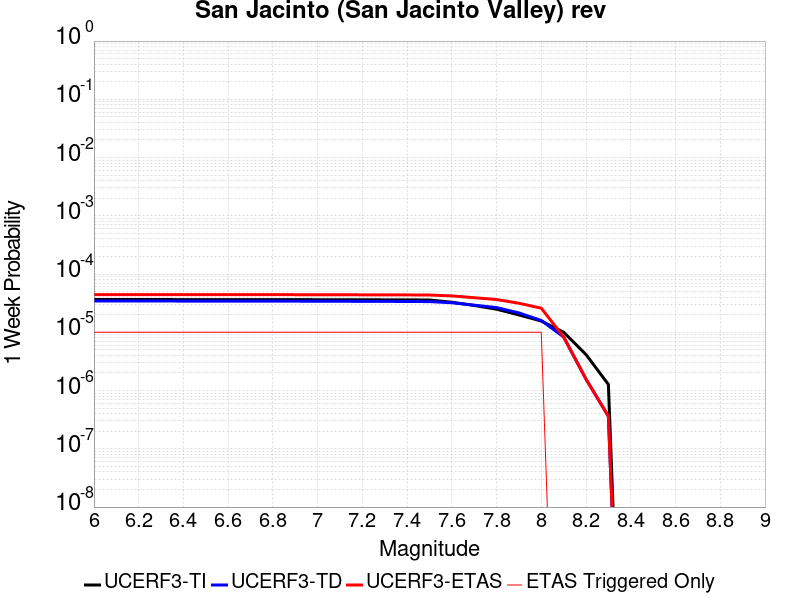 |  |  |  |

| Magnitude | 1 wk TI Prob | 1 wk TD Prob | 1 wk ETAS Prob | 1 wk ETAS/TD Gain | 1 wk ETAS Triggered Only | 1 mo TI Prob | 1 mo TD Prob | 1 mo ETAS Prob | 1 mo ETAS/TD Gain | 1 mo ETAS Triggered Only | 1 yr TI Prob | 1 yr TD Prob | 1 yr ETAS Prob | 1 yr ETAS/TD Gain | 1 yr ETAS Triggered Only | 10 yr TI Prob | 10 yr TD Prob | 10 yr ETAS Prob | 10 yr ETAS/TD Gain | 10 yr ETAS Triggered Only |
|-----|-----|-----|-----|-----|-----|-----|-----|-----|-----|-----|-----|-----|-----|-----|-----|-----|-----|-----|-----|-----|
| 6.0 | 3.652694E-5 | 3.4450106E-5 | 4.444976E-5 | 1.2902648 | 1.0E-5 | 1.5653463E-4 | 1.4763494E-4 | 1.5763346E-4 | 1.0677246 | 1.0E-5 | 0.0019041431 | 0.0017959751 | 0.0018558674 | 1.0333481 | 6.0E-5 | 0.018879099 | 0.01855129 | 0.018678878 | 1.0068775 | 1.3E-4 |
| 6.1 | 3.652694E-5 | 3.4450106E-5 | 4.444976E-5 | 1.2902648 | 1.0E-5 | 1.5653463E-4 | 1.4763494E-4 | 1.5763346E-4 | 1.0677246 | 1.0E-5 | 0.0019041431 | 0.0017959751 | 0.0018558674 | 1.0333481 | 6.0E-5 | 0.018879099 | 0.01855129 | 0.018678878 | 1.0068775 | 1.3E-4 |
| 6.2 | 3.652694E-5 | 3.4450106E-5 | 4.444976E-5 | 1.2902648 | 1.0E-5 | 1.5653463E-4 | 1.4763494E-4 | 1.5763346E-4 | 1.0677246 | 1.0E-5 | 0.0019041431 | 0.0017959751 | 0.0018558674 | 1.0333481 | 6.0E-5 | 0.018879099 | 0.01855129 | 0.018678878 | 1.0068775 | 1.3E-4 |
| 6.3 | 3.652694E-5 | 3.4450106E-5 | 4.444976E-5 | 1.2902648 | 1.0E-5 | 1.5653463E-4 | 1.4763494E-4 | 1.5763346E-4 | 1.0677246 | 1.0E-5 | 0.0019041431 | 0.0017959751 | 0.0018558674 | 1.0333481 | 6.0E-5 | 0.018879099 | 0.01855129 | 0.018678878 | 1.0068775 | 1.3E-4 |
| 6.4 | 3.646941E-5 | 3.437167E-5 | 4.437133E-5 | 1.2909273 | 1.0E-5 | 1.5628811E-4 | 1.4729884E-4 | 1.5729736E-4 | 1.0678792 | 1.0E-5 | 0.0019011468 | 0.0017918904 | 0.0018517828 | 1.0334241 | 6.0E-5 | 0.018849645 | 0.018511167 | 0.01863876 | 1.0068928 | 1.3E-4 |
| 6.5 | 3.646941E-5 | 3.437167E-5 | 4.437133E-5 | 1.2909273 | 1.0E-5 | 1.5628811E-4 | 1.4729884E-4 | 1.5729736E-4 | 1.0678792 | 1.0E-5 | 0.0019011468 | 0.0017918904 | 0.0018517828 | 1.0334241 | 6.0E-5 | 0.018849645 | 0.018511167 | 0.01863876 | 1.0068928 | 1.3E-4 |
| 6.6 | 3.6442503E-5 | 3.433505E-5 | 4.433471E-5 | 1.2912376 | 1.0E-5 | 1.561728E-4 | 1.4714191E-4 | 1.5714044E-4 | 1.0679516 | 1.0E-5 | 0.0018997455 | 0.0017899829 | 0.0018498756 | 1.0334599 | 6.0E-5 | 0.018835869 | 0.018492434 | 0.01862003 | 1.0069 | 1.3E-4 |
| 6.7 | 3.6432113E-5 | 3.4320623E-5 | 4.432028E-5 | 1.29136 | 1.0E-5 | 1.5612828E-4 | 1.4708008E-4 | 1.570786E-4 | 1.0679802 | 1.0E-5 | 0.0018992044 | 0.0017892316 | 0.0018491242 | 1.033474 | 6.0E-5 | 0.018830549 | 0.018485056 | 0.018612653 | 1.0069027 | 1.3E-4 |
| 6.8 | 3.6409598E-5 | 3.4289675E-5 | 4.428933E-5 | 1.291623 | 1.0E-5 | 1.560318E-4 | 1.4694745E-4 | 1.5694599E-4 | 1.0680416 | 1.0E-5 | 0.0018980318 | 0.0017876195 | 0.0018475123 | 1.0335042 | 6.0E-5 | 0.018819023 | 0.018469209 | 0.01859681 | 1.0069088 | 1.3E-4 |
| 6.9 | 3.638078E-5 | 3.4250093E-5 | 4.424975E-5 | 1.29196 | 1.0E-5 | 1.5590832E-4 | 1.4677783E-4 | 1.5677637E-4 | 1.0681201 | 1.0E-5 | 0.0018965311 | 0.001785558 | 0.0018454507 | 1.033543 | 6.0E-5 | 0.018804269 | 0.018448941 | 0.018576544 | 1.0069165 | 1.3E-4 |
| 7.0 | 3.6294874E-5 | 3.4132092E-5 | 4.413175E-5 | 1.2929695 | 1.0E-5 | 1.5554018E-4 | 1.462722E-4 | 1.5627073E-4 | 1.0683557 | 1.0E-5 | 0.0018920569 | 0.001779412 | 0.0018393053 | 1.033659 | 6.0E-5 | 0.018760284 | 0.018388517 | 0.018516127 | 1.0069396 | 1.3E-4 |
| 7.1 | 3.6260717E-5 | 3.4088367E-5 | 4.408803E-5 | 1.2933452 | 1.0E-5 | 1.5539382E-4 | 1.4608484E-4 | 1.5608338E-4 | 1.0684434 | 1.0E-5 | 0.001890278 | 0.0017771346 | 0.0018370281 | 1.0337023 | 6.0E-5 | 0.018742796 | 0.018366115 | 0.018493727 | 1.0069482 | 1.3E-4 |
| 7.2 | 3.6210204E-5 | 3.4022498E-5 | 4.402216E-5 | 1.2939131 | 1.0E-5 | 1.5517735E-4 | 1.4580258E-4 | 1.5580111E-4 | 1.0685759 | 1.0E-5 | 0.001887647 | 0.0017737037 | 0.0018335973 | 1.0337676 | 6.0E-5 | 0.01871693 | 0.018332351 | 0.018459968 | 1.0069613 | 1.3E-4 |
| 7.3 | 3.6119454E-5 | 3.3910605E-5 | 4.3910266E-5 | 1.294883 | 1.0E-5 | 1.5478847E-4 | 1.4532308E-4 | 1.5532163E-4 | 1.0688022 | 1.0E-5 | 0.0018829206 | 0.0017678753 | 0.0018277692 | 1.033879 | 6.0E-5 | 0.018670462 | 0.018274812 | 0.018402437 | 1.0069836 | 1.3E-4 |
| 7.4 | 3.607848E-5 | 3.3858065E-5 | 4.3857726E-5 | 1.2953407 | 1.0E-5 | 1.5461289E-4 | 1.4509793E-4 | 1.550965E-4 | 1.0689089 | 1.0E-5 | 0.0018807866 | 0.0017651387 | 0.0018250328 | 1.0339316 | 6.0E-5 | 0.018649481 | 0.018247787 | 0.018375415 | 1.0069941 | 1.3E-4 |
| 7.5 | 3.5856774E-5 | 3.3666936E-5 | 4.3666598E-5 | 1.2970173 | 1.0E-5 | 1.5366284E-4 | 1.4427889E-4 | 1.5427746E-4 | 1.0693002 | 1.0E-5 | 0.0018692396 | 0.001755183 | 0.0018150776 | 1.0341245 | 6.0E-5 | 0.018535944 | 0.018148415 | 0.018276054 | 1.0070331 | 1.3E-4 |
| 7.6 | 3.286655E-5 | 3.2183445E-5 | 4.2183125E-5 | 1.3107088 | 1.0E-5 | 1.4084904E-4 | 1.3792177E-4 | 1.479204E-4 | 1.0724949 | 1.0E-5 | 0.001713488 | 0.0016779063 | 0.0017378055 | 1.0356989 | 6.0E-5 | 0.017003361 | 0.017364694 | 0.017492438 | 1.0073564 | 1.3E-4 |
| 7.7 | 2.8882527E-5 | 2.9275447E-5 | 3.9275154E-5 | 1.3415731 | 1.0E-5 | 1.237764E-4 | 1.2546017E-4 | 1.3545892E-4 | 1.0796965 | 1.0E-5 | 0.0015059357 | 0.0015264084 | 0.0015863169 | 1.039248 | 6.0E-5 | 0.014957713 | 0.015850719 | 0.015978657 | 1.0080715 | 1.3E-4 |
| 7.8 | 2.4950225E-5 | 2.6564854E-5 | 3.656459E-5 | 1.3764272 | 1.0E-5 | 1.0692515E-4 | 1.1384441E-4 | 1.2384327E-4 | 1.0878292 | 1.0E-5 | 0.0013010362 | 0.0013851754 | 0.0014450923 | 1.0432558 | 6.0E-5 | 0.012934455 | 0.014431266 | 0.01455939 | 1.0088782 | 1.3E-4 |
| 7.9 | 1.9881603E-5 | 2.154128E-5 | 3.1541065E-5 | 1.4642149 | 1.0E-5 | 8.520408E-5 | 9.2316506E-5 | 1.02315586E-4 | 1.108313 | 1.0E-5 | 0.001036866 | 0.0011233748 | 0.0011833074 | 1.0533504 | 6.0E-5 | 0.010320415 | 0.011794633 | 0.0119231 | 1.0108919 | 1.3E-4 |
| 8.0 | 1.563292E-5 | 1.5964662E-5 | 2.5964504E-5 | 1.6263734 | 1.0E-5 | 6.6996516E-5 | 6.8418194E-5 | 7.8417506E-5 | 1.14615 | 1.0E-5 | 8.153773E-4 | 8.326738E-4 | 8.726405E-4 | 1.0479981 | 4.0E-5 | 0.00812392 | 0.00882488 | 0.008914086 | 1.0101085 | 9.0E-5 |
| 8.1 | 1.0045313E-5 | 8.317683E-6 | 8.317683E-6 | 1.0 | 0.0 | 4.305063E-5 | 3.5646728E-5 | 3.5646728E-5 | 1.0 | 0.0 | 5.2401534E-4 | 4.33913E-4 | 4.5390433E-4 | 1.0460722 | 2.0E-5 | 0.0052278144 | 0.004667648 | 0.0047174147 | 1.0106621 | 5.0E-5 |
| 8.2 | 4.1554413E-6 | 1.5701903E-6 | 1.5701903E-6 | 1.0 | 0.0 | 1.7808914E-5 | 6.7293695E-6 | 6.7293695E-6 | 1.0 | 0.0 | 2.1680194E-4 | 8.192702E-5 | 8.192702E-5 | 1.0 | 0.0 | 0.0021659054 | 9.50935E-4 | 9.50935E-4 | 1.0 | 0.0 |
| 8.3 | 1.2758221E-6 | 3.6275617E-7 | 3.6275617E-7 | 1.0 | 0.0 | 5.4677976E-6 | 1.5546683E-6 | 1.5546683E-6 | 1.0 | 0.0 | 6.65684E-5 | 1.8927927E-5 | 1.8927927E-5 | 1.0 | 0.0 | 6.6548464E-4 | 2.2825136E-4 | 2.2825136E-4 | 1.0 | 0.0 |

## Independence rev 2011
*[(top)](#table-of-contents)*

| 1 Week | 1 Month | 1 Year | 10 Year |
|-----|-----|-----|-----|
|  |  |  | 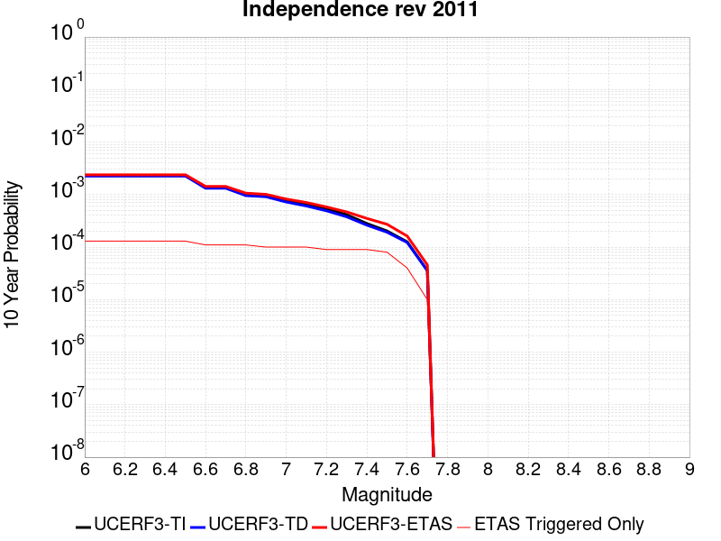 |

| Magnitude | 1 wk TI Prob | 1 wk TD Prob | 1 wk ETAS Prob | 1 wk ETAS/TD Gain | 1 wk ETAS Triggered Only | 1 mo TI Prob | 1 mo TD Prob | 1 mo ETAS Prob | 1 mo ETAS/TD Gain | 1 mo ETAS Triggered Only | 1 yr TI Prob | 1 yr TD Prob | 1 yr ETAS Prob | 1 yr ETAS/TD Gain | 1 yr ETAS Triggered Only | 10 yr TI Prob | 10 yr TD Prob | 10 yr ETAS Prob | 10 yr ETAS/TD Gain | 10 yr ETAS Triggered Only |
|-----|-----|-----|-----|-----|-----|-----|-----|-----|-----|-----|-----|-----|-----|-----|-----|-----|-----|-----|-----|-----|
| 6.0 | 4.422171E-6 | 4.326278E-6 | 4.326278E-6 | 1.0 | 0.0 | 1.8952025E-5 | 1.8541077E-5 | 2.8540891E-5 | 1.539333 | 1.0E-5 | 2.3071647E-4 | 2.2571722E-4 | 2.7570594E-4 | 1.2214661 | 5.0E-5 | 0.0023047708 | 0.0022551732 | 0.00238488 | 1.0575153 | 1.3E-4 |
| 6.1 | 4.422171E-6 | 4.326278E-6 | 4.326278E-6 | 1.0 | 0.0 | 1.8952025E-5 | 1.8541077E-5 | 2.8540891E-5 | 1.539333 | 1.0E-5 | 2.3071647E-4 | 2.2571722E-4 | 2.7570594E-4 | 1.2214661 | 5.0E-5 | 0.0023047708 | 0.0022551732 | 0.00238488 | 1.0575153 | 1.3E-4 |
| 6.2 | 4.422171E-6 | 4.326278E-6 | 4.326278E-6 | 1.0 | 0.0 | 1.8952025E-5 | 1.8541077E-5 | 2.8540891E-5 | 1.539333 | 1.0E-5 | 2.3071647E-4 | 2.2571722E-4 | 2.7570594E-4 | 1.2214661 | 5.0E-5 | 0.0023047708 | 0.0022551732 | 0.00238488 | 1.0575153 | 1.3E-4 |
| 6.3 | 4.422171E-6 | 4.326278E-6 | 4.326278E-6 | 1.0 | 0.0 | 1.8952025E-5 | 1.8541077E-5 | 2.8540891E-5 | 1.539333 | 1.0E-5 | 2.3071647E-4 | 2.2571722E-4 | 2.7570594E-4 | 1.2214661 | 5.0E-5 | 0.0023047708 | 0.0022551732 | 0.00238488 | 1.0575153 | 1.3E-4 |
| 6.4 | 4.422171E-6 | 4.326278E-6 | 4.326278E-6 | 1.0 | 0.0 | 1.8952025E-5 | 1.8541077E-5 | 2.8540891E-5 | 1.539333 | 1.0E-5 | 2.3071647E-4 | 2.2571722E-4 | 2.7570594E-4 | 1.2214661 | 5.0E-5 | 0.0023047708 | 0.0022551732 | 0.00238488 | 1.0575153 | 1.3E-4 |
| 6.5 | 4.422171E-6 | 4.326278E-6 | 4.326278E-6 | 1.0 | 0.0 | 1.8952025E-5 | 1.8541077E-5 | 2.8540891E-5 | 1.539333 | 1.0E-5 | 2.3071647E-4 | 2.2571722E-4 | 2.7570594E-4 | 1.2214661 | 5.0E-5 | 0.0023047708 | 0.0022551732 | 0.00238488 | 1.0575153 | 1.3E-4 |
| 6.6 | 2.663744E-6 | 2.532024E-6 | 2.532024E-6 | 1.0 | 0.0 | 1.1415996E-5 | 1.0851489E-5 | 2.085138E-5 | 1.9215226 | 1.0E-5 | 1.3898089E-4 | 1.3210934E-4 | 1.7210406E-4 | 1.3027395 | 4.0E-5 | 0.0013889399 | 0.0013203564 | 0.0014302111 | 1.0832008 | 1.1E-4 |
| 6.7 | 2.663744E-6 | 2.532024E-6 | 2.532024E-6 | 1.0 | 0.0 | 1.1415996E-5 | 1.0851489E-5 | 2.085138E-5 | 1.9215226 | 1.0E-5 | 1.3898089E-4 | 1.3210934E-4 | 1.7210406E-4 | 1.3027395 | 4.0E-5 | 0.0013889399 | 0.0013203564 | 0.0014302111 | 1.0832008 | 1.1E-4 |
| 6.8 | 1.9716529E-6 | 1.8322906E-6 | 1.8322906E-6 | 1.0 | 0.0 | 8.449913E-6 | 7.852651E-6 | 1.7852573E-5 | 2.2734451 | 1.0E-5 | 1.0287284E-4 | 9.5601965E-5 | 1.3559814E-4 | 1.4183614 | 4.0E-5 | 0.0010282523 | 9.556213E-4 | 0.0010655161 | 1.1149983 | 1.1E-4 |
| 6.9 | 1.8788617E-6 | 1.7430302E-6 | 1.7430302E-6 | 1.0 | 0.0 | 8.0522395E-6 | 7.4701093E-6 | 1.7470034E-5 | 2.3386586 | 1.0E-5 | 9.80316E-5 | 9.09449E-5 | 1.3094126E-4 | 1.4397868 | 4.0E-5 | 9.798837E-4 | 9.090889E-4 | 0.001008998 | 1.1099002 | 1.0E-4 |
| 7.0 | 1.5045488E-6 | 1.384976E-6 | 1.384976E-6 | 1.0 | 0.0 | 6.44805E-6 | 5.9355984E-6 | 1.5935539E-5 | 2.68474 | 1.0E-5 | 7.8502184E-5 | 7.226357E-5 | 1.1226068E-4 | 1.5534893 | 4.0E-5 | 7.8474457E-4 | 7.224058E-4 | 8.2233356E-4 | 1.1383264 | 1.0E-4 |
| 7.1 | 1.272341E-6 | 1.162532E-6 | 1.162532E-6 | 1.0 | 0.0 | 5.4528787E-6 | 4.9822706E-6 | 1.4982221E-5 | 3.007107 | 1.0E-5 | 6.6386776E-5 | 6.065749E-5 | 1.0065507E-4 | 1.6594003 | 4.0E-5 | 6.636695E-4 | 6.0641253E-4 | 7.063519E-4 | 1.1648042 | 1.0E-4 |
| 7.2 | 1.0416892E-6 | 9.410073E-7 | 9.410073E-7 | 1.0 | 0.0 | 4.464375E-6 | 4.0328823E-6 | 1.4032842E-5 | 3.4796062 | 1.0E-5 | 5.4352407E-5 | 4.9099253E-5 | 7.909778E-5 | 1.6109773 | 3.0E-5 | 5.4339116E-4 | 4.908859E-4 | 5.8084173E-4 | 1.183252 | 9.0E-5 |
| 7.3 | 7.9450155E-7 | 7.235146E-7 | 7.235146E-7 | 1.0 | 0.0 | 3.4050022E-6 | 3.1007733E-6 | 1.3100742E-5 | 4.2249923 | 1.0E-5 | 4.1455114E-5 | 3.775127E-5 | 6.775014E-5 | 1.7946452 | 3.0E-5 | 4.144738E-4 | 3.774497E-4 | 4.6741572E-4 | 1.2383524 | 9.0E-5 |
| 7.4 | 5.3893444E-7 | 5.019602E-7 | 5.019602E-7 | 1.0 | 0.0 | 2.309717E-6 | 2.1512562E-6 | 1.2151235E-5 | 5.648437 | 1.0E-5 | 2.8120441E-5 | 2.6191234E-5 | 5.619045E-5 | 2.1453915 | 3.0E-5 | 2.8116882E-4 | 2.618819E-4 | 3.5185835E-4 | 1.3435763 | 9.0E-5 |
| 7.5 | 3.8852085E-7 | 3.6826125E-7 | 3.6826125E-7 | 1.0 | 0.0 | 1.6650882E-6 | 1.5782615E-6 | 1.1578246E-5 | 7.3360753 | 1.0E-5 | 2.027226E-5 | 1.9215167E-5 | 4.9214592E-5 | 2.5612366 | 3.0E-5 | 2.0270412E-4 | 1.9213527E-4 | 2.721199E-4 | 1.4162933 | 8.0E-5 |
| 7.6 | 2.414929E-7 | 2.3457856E-7 | 2.3457856E-7 | 1.0 | 0.0 | 1.0349692E-6 | 1.0053363E-6 | 1.0053363E-6 | 1.0 | 0.0 | 1.2600677E-5 | 1.2239902E-5 | 2.223978E-5 | 1.81699 | 1.0E-5 | 1.2599962E-4 | 1.223924E-4 | 1.6238751E-4 | 1.3267777 | 4.0E-5 |
| 7.7 | 6.8298014E-8 | 6.859034E-8 | 6.859034E-8 | 1.0 | 0.0 | 2.9270575E-7 | 2.9395858E-7 | 2.9395858E-7 | 1.0 | 0.0 | 3.5636867E-6 | 3.57894E-6 | 1.3578904E-5 | 3.7941132 | 1.0E-5 | 3.5636294E-5 | 3.5788875E-5 | 4.5788514E-5 | 1.2794064 | 1.0E-5 |

## White Wolf (Extension)
*[(top)](#table-of-contents)*

| 1 Week | 1 Month | 1 Year | 10 Year |
|-----|-----|-----|-----|
|  |  | 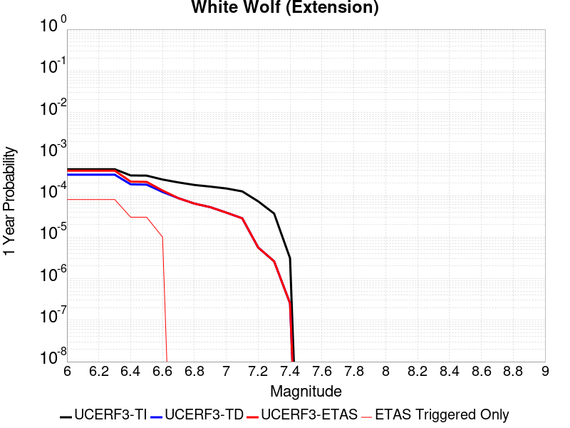 | 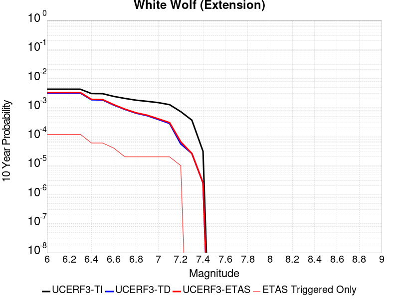 |

| Magnitude | 1 wk TI Prob | 1 wk TD Prob | 1 wk ETAS Prob | 1 wk ETAS/TD Gain | 1 wk ETAS Triggered Only | 1 mo TI Prob | 1 mo TD Prob | 1 mo ETAS Prob | 1 mo ETAS/TD Gain | 1 mo ETAS Triggered Only | 1 yr TI Prob | 1 yr TD Prob | 1 yr ETAS Prob | 1 yr ETAS/TD Gain | 1 yr ETAS Triggered Only | 10 yr TI Prob | 10 yr TD Prob | 10 yr ETAS Prob | 10 yr ETAS/TD Gain | 10 yr ETAS Triggered Only |
|-----|-----|-----|-----|-----|-----|-----|-----|-----|-----|-----|-----|-----|-----|-----|-----|-----|-----|-----|-----|-----|
| 6.0 | 8.222555E-6 | 6.0667785E-6 | 1.6066717E-5 | 2.6483114 | 1.0E-5 | 3.5239045E-5 | 2.6000256E-5 | 3.5999998E-5 | 1.3846016 | 1.0E-5 | 4.289509E-4 | 3.1651376E-4 | 3.9648844E-4 | 1.2526736 | 8.0E-5 | 0.0042812387 | 0.0031612816 | 0.0032809023 | 1.0378393 | 1.2E-4 |
| 6.1 | 8.222555E-6 | 6.0667785E-6 | 1.6066717E-5 | 2.6483114 | 1.0E-5 | 3.5239045E-5 | 2.6000256E-5 | 3.5999998E-5 | 1.3846016 | 1.0E-5 | 4.289509E-4 | 3.1651376E-4 | 3.9648844E-4 | 1.2526736 | 8.0E-5 | 0.0042812387 | 0.0031612816 | 0.0032809023 | 1.0378393 | 1.2E-4 |
| 6.2 | 8.222555E-6 | 6.0667785E-6 | 1.6066717E-5 | 2.6483114 | 1.0E-5 | 3.5239045E-5 | 2.6000256E-5 | 3.5999998E-5 | 1.3846016 | 1.0E-5 | 4.289509E-4 | 3.1651376E-4 | 3.9648844E-4 | 1.2526736 | 8.0E-5 | 0.0042812387 | 0.0031612816 | 0.0032809023 | 1.0378393 | 1.2E-4 |
| 6.3 | 8.222555E-6 | 6.0667785E-6 | 1.6066717E-5 | 2.6483114 | 1.0E-5 | 3.5239045E-5 | 2.6000256E-5 | 3.5999998E-5 | 1.3846016 | 1.0E-5 | 4.289509E-4 | 3.1651376E-4 | 3.9648844E-4 | 1.2526736 | 8.0E-5 | 0.0042812387 | 0.0031612816 | 0.0032809023 | 1.0378393 | 1.2E-4 |
| 6.4 | 5.821773E-6 | 3.5572468E-6 | 3.5572468E-6 | 1.0 | 0.0 | 2.4950215E-5 | 1.524526E-5 | 1.524526E-5 | 1.0 | 0.0 | 3.0372653E-4 | 1.8559633E-4 | 2.1559077E-4 | 1.1616111 | 3.0E-5 | 0.0030331176 | 0.0018545217 | 0.0019144105 | 1.0322933 | 6.0E-5 |
| 6.5 | 5.766023E-6 | 3.4991801E-6 | 3.4991801E-6 | 1.0 | 0.0 | 2.4711293E-5 | 1.4996406E-5 | 1.4996406E-5 | 1.0 | 0.0 | 3.0081844E-4 | 1.8256705E-4 | 2.1256157E-4 | 1.1642932 | 3.0E-5 | 0.0030041158 | 0.0018242787 | 0.0018841693 | 1.0328298 | 6.0E-5 |
| 6.6 | 4.643576E-6 | 2.3326766E-6 | 2.3326766E-6 | 1.0 | 0.0 | 1.9900888E-5 | 9.997149E-6 | 9.997149E-6 | 1.0 | 0.0 | 2.4226638E-4 | 1.2170892E-4 | 1.3170771E-4 | 1.0821532 | 1.0E-5 | 0.0024200242 | 0.0012164651 | 0.0012564164 | 1.0328422 | 4.0E-5 |
| 6.7 | 3.9529173E-6 | 1.6483899E-6 | 1.6483899E-6 | 1.0 | 0.0 | 1.6940963E-5 | 7.06451E-6 | 7.06451E-6 | 1.0 | 0.0 | 2.0623671E-4 | 8.60072E-5 | 8.60072E-5 | 1.0 | 0.0 | 0.002060454 | 8.597577E-4 | 8.797405E-4 | 1.0232424 | 2.0E-5 |
| 6.8 | 3.4377522E-6 | 1.2245586E-6 | 1.2245586E-6 | 1.0 | 0.0 | 1.473314E-5 | 5.248098E-6 | 5.248098E-6 | 1.0 | 0.0 | 1.7936122E-4 | 6.3893815E-5 | 6.3893815E-5 | 1.0 | 0.0 | 0.0017921652 | 6.3876354E-4 | 6.5875077E-4 | 1.0312905 | 2.0E-5 |
| 6.9 | 3.1367306E-6 | 1.003409E-6 | 1.003409E-6 | 1.0 | 0.0 | 1.3443062E-5 | 4.300318E-6 | 4.300318E-6 | 1.0 | 0.0 | 1.63657E-4 | 5.2355186E-5 | 5.2355186E-5 | 1.0 | 0.0 | 0.0016353652 | 5.234362E-4 | 5.4342573E-4 | 1.038189 | 2.0E-5 |
| 7.0 | 2.8298145E-6 | 7.428931E-7 | 7.428931E-7 | 1.0 | 0.0 | 1.2127721E-5 | 3.183824E-6 | 3.183824E-6 | 1.0 | 0.0 | 1.47645E-4 | 3.8762417E-5 | 3.8762417E-5 | 1.0 | 0.0 | 0.0014754693 | 3.8756157E-4 | 4.075538E-4 | 1.0515847 | 2.0E-5 |
| 7.1 | 2.4091064E-6 | 5.422966E-7 | 5.422966E-7 | 1.0 | 0.0 | 1.03247E-5 | 2.3241266E-6 | 2.3241266E-6 | 1.0 | 0.0 | 1.2569598E-4 | 2.8295914E-5 | 2.8295914E-5 | 1.0 | 0.0 | 0.001256249 | 2.8292715E-4 | 3.029215E-4 | 1.0706695 | 2.0E-5 |
| 7.2 | 1.3875518E-6 | 1.0744113E-7 | 1.0744113E-7 | 1.0 | 0.0 | 5.9466374E-6 | 4.6046193E-7 | 4.6046193E-7 | 1.0 | 0.0 | 7.23979E-5 | 5.606111E-6 | 5.606111E-6 | 1.0 | 0.0 | 7.2374323E-4 | 5.6059806E-5 | 6.605925E-5 | 1.178371 | 1.0E-5 |
| 7.3 | 7.056077E-7 | 5.0026372E-8 | 5.0026372E-8 | 1.0 | 0.0 | 3.0240296E-6 | 2.1439872E-7 | 2.1439872E-7 | 1.0 | 0.0 | 3.681694E-5 | 2.6103019E-6 | 2.6103019E-6 | 1.0 | 0.0 | 3.681084E-4 | 2.6102758E-5 | 2.6102758E-5 | 1.0 | 0.0 |
| 7.4 | 5.9334678E-8 | 4.8689395E-9 | 4.8689395E-9 | 1.0 | 0.0 | 2.5429145E-7 | 2.0866883E-8 | 2.0866883E-8 | 1.0 | 0.0 | 3.095994E-6 | 2.5405427E-7 | 2.5405427E-7 | 1.0 | 0.0 | 3.095951E-5 | 2.5405411E-6 | 2.5405411E-6 | 1.0 | 0.0 |

## San Andreas (Creeping Section) 2011 CFM
*[(top)](#table-of-contents)*

| 1 Week | 1 Month | 1 Year | 10 Year |
|-----|-----|-----|-----|
| 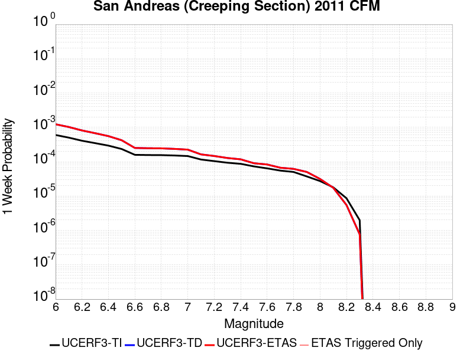 | 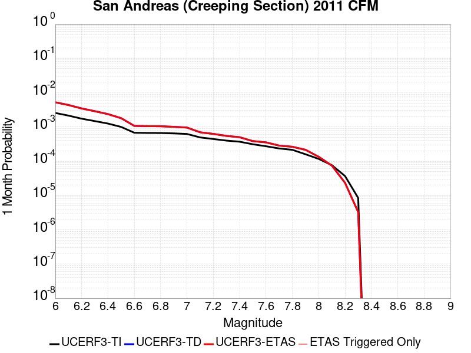 |  | 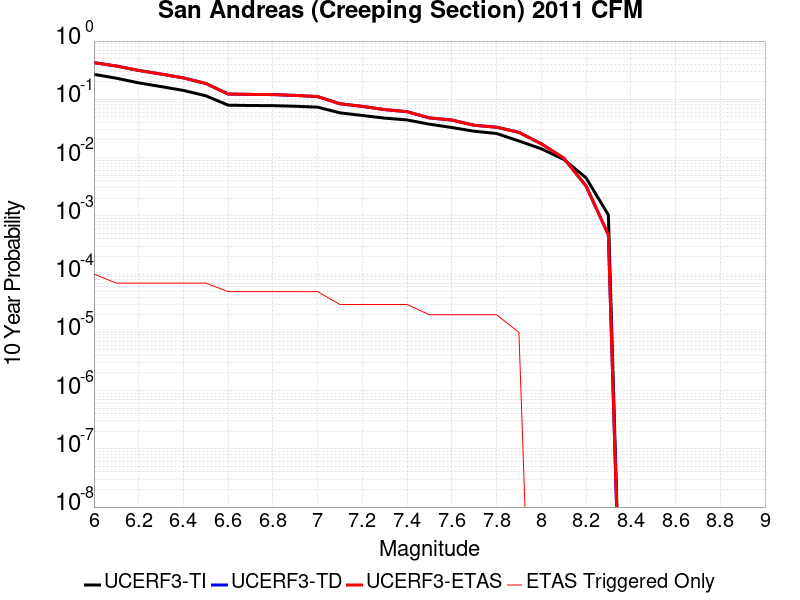 |

| Magnitude | 1 wk TI Prob | 1 wk TD Prob | 1 wk ETAS Prob | 1 wk ETAS/TD Gain | 1 wk ETAS Triggered Only | 1 mo TI Prob | 1 mo TD Prob | 1 mo ETAS Prob | 1 mo ETAS/TD Gain | 1 mo ETAS Triggered Only | 1 yr TI Prob | 1 yr TD Prob | 1 yr ETAS Prob | 1 yr ETAS/TD Gain | 1 yr ETAS Triggered Only | 10 yr TI Prob | 10 yr TD Prob | 10 yr ETAS Prob | 10 yr ETAS/TD Gain | 10 yr ETAS Triggered Only |
|-----|-----|-----|-----|-----|-----|-----|-----|-----|-----|-----|-----|-----|-----|-----|-----|-----|-----|-----|-----|-----|
| 6.0 | 5.986481E-4 | 0.001227922 | 0.001227922 | 1.0 | 0.0 | 0.0025631124 | 0.0052456073 | 0.0052456073 | 1.0 | 0.0 | 0.030762846 | 0.061222106 | 0.06124088 | 1.0003067 | 2.0E-5 | 0.26835477 | 0.42603105 | 0.42608845 | 1.0001347 | 1.0E-4 |
| 6.1 | 5.015945E-4 | 0.0010220119 | 0.0010220119 | 1.0 | 0.0 | 0.00214792 | 0.004367516 | 0.004367516 | 1.0 | 0.0 | 0.025839351 | 0.051262945 | 0.051272433 | 1.0001851 | 1.0E-5 | 0.23032776 | 0.37294963 | 0.37299353 | 1.0001177 | 7.0E-5 |
| 6.2 | 4.073338E-4 | 8.111284E-4 | 8.111284E-4 | 1.0 | 0.0 | 0.0017445484 | 0.00346743 | 0.00346743 | 1.0 | 0.0 | 0.021034058 | 0.04094755 | 0.040957138 | 1.0002342 | 1.0E-5 | 0.19150782 | 0.31313518 | 0.31318325 | 1.0001535 | 7.0E-5 |
| 6.3 | 3.464099E-4 | 6.7405787E-4 | 6.7405787E-4 | 1.0 | 0.0 | 0.0014837692 | 0.0028833575 | 0.0028833575 | 1.0 | 0.0 | 0.017915873 | 0.034203574 | 0.034213234 | 1.0002824 | 1.0E-5 | 0.16538359 | 0.2714246 | 0.27147558 | 1.0001879 | 7.0E-5 |
| 6.4 | 2.935057E-4 | 5.544494E-4 | 5.544494E-4 | 1.0 | 0.0 | 0.0012572751 | 0.0023721312 | 0.0023721312 | 1.0 | 0.0 | 0.015200248 | 0.02827873 | 0.028288446 | 1.0003437 | 1.0E-5 | 0.14201577 | 0.23309915 | 0.23315282 | 1.0002303 | 7.0E-5 |
| 6.5 | 2.3409708E-4 | 4.2093964E-4 | 4.2093964E-4 | 1.0 | 0.0 | 0.0010028875 | 0.0018023108 | 0.0018023108 | 1.0 | 0.0 | 0.012141965 | 0.021602781 | 0.021612566 | 1.0004529 | 1.0E-5 | 0.11499573 | 0.18694481 | 0.18700173 | 1.0003045 | 7.0E-5 |
| 6.6 | 1.5842178E-4 | 2.5102272E-4 | 2.5102272E-4 | 1.0 | 0.0 | 6.7877385E-4 | 0.0010753684 | 0.0010753684 | 1.0 | 0.0 | 0.0082328 | 0.013012473 | 0.013022343 | 1.0007585 | 1.0E-5 | 0.07934396 | 0.12327748 | 0.12332131 | 1.0003556 | 5.0E-5 |
| 6.7 | 1.5616413E-4 | 2.4638645E-4 | 2.4638645E-4 | 1.0 | 0.0 | 6.691031E-4 | 0.0010555148 | 0.0010555148 | 1.0 | 0.0 | 0.0081159435 | 0.012774302 | 0.012784174 | 1.0007728 | 1.0E-5 | 0.0782586 | 0.121304624 | 0.12134856 | 1.0003622 | 5.0E-5 |
| 6.8 | 1.5538467E-4 | 2.4462442E-4 | 2.4462442E-4 | 1.0 | 0.0 | 6.6576427E-4 | 0.0010479693 | 0.0010479693 | 1.0 | 0.0 | 0.008075596 | 0.012683656 | 0.01269353 | 1.0007784 | 1.0E-5 | 0.07788358 | 0.1205354 | 0.12057938 | 1.0003648 | 5.0E-5 |
| 6.9 | 1.5153569E-4 | 2.3571422E-4 | 2.3571422E-4 | 1.0 | 0.0 | 6.49277E-4 | 0.0010098148 | 0.0010098148 | 1.0 | 0.0 | 0.007876333 | 0.012225717 | 0.012235595 | 1.000808 | 1.0E-5 | 0.07602952 | 0.11660516 | 0.11664933 | 1.0003788 | 5.0E-5 |
| 7.0 | 1.4588932E-4 | 2.2428404E-4 | 2.2428404E-4 | 1.0 | 0.0 | 6.250901E-4 | 9.6086523E-4 | 9.6086523E-4 | 1.0 | 0.0 | 0.0075839474 | 0.011636282 | 0.0116461655 | 1.0008494 | 1.0E-5 | 0.073302895 | 0.11145119 | 0.11149562 | 1.0003986 | 5.0E-5 |
| 7.1 | 1.1565079E-4 | 1.6308045E-4 | 1.6308045E-4 | 1.0 | 0.0 | 4.955521E-4 | 6.987299E-4 | 6.987299E-4 | 1.0 | 0.0 | 0.006016669 | 0.008474057 | 0.0084839715 | 1.00117 | 1.0E-5 | 0.058563538 | 0.08378492 | 0.08381241 | 1.0003281 | 3.0E-5 |
| 7.2 | 1.0393792E-4 | 1.4640315E-4 | 1.4640315E-4 | 1.0 | 0.0 | 4.4537216E-4 | 6.2729197E-4 | 6.2729197E-4 | 1.0 | 0.0 | 0.005408933 | 0.007610706 | 0.00762063 | 1.0013039 | 1.0E-5 | 0.052791595 | 0.07572826 | 0.07575599 | 1.0003662 | 3.0E-5 |
| 7.3 | 9.332884E-5 | 1.2802477E-4 | 1.2802477E-4 | 1.0 | 0.0 | 3.999194E-4 | 5.485628E-4 | 5.485628E-4 | 1.0 | 0.0 | 0.0048581534 | 0.006658435 | 0.0066683684 | 1.0014919 | 1.0E-5 | 0.047533102 | 0.06658122 | 0.066609226 | 1.0004206 | 3.0E-5 |
| 7.4 | 8.670252E-5 | 1.1721237E-4 | 1.1721237E-4 | 1.0 | 0.0 | 3.715293E-4 | 5.022426E-4 | 5.022426E-4 | 1.0 | 0.0 | 0.004513991 | 0.0060977805 | 0.0061077196 | 1.00163 | 1.0E-5 | 0.044233937 | 0.06123388 | 0.061262045 | 1.0004599 | 3.0E-5 |
| 7.5 | 7.3036405E-5 | 9.0208116E-5 | 9.0208116E-5 | 1.0 | 0.0 | 3.129756E-4 | 3.86549E-4 | 3.86549E-4 | 1.0 | 0.0 | 0.0038038217 | 0.0046961 | 0.004706053 | 1.0021194 | 1.0E-5 | 0.03739367 | 0.047948062 | 0.047967106 | 1.0003971 | 2.0E-5 |
| 7.6 | 6.3935775E-5 | 8.293158E-5 | 8.293158E-5 | 1.0 | 0.0 | 2.7398168E-4 | 3.5537273E-4 | 3.5537273E-4 | 1.0 | 0.0 | 0.0033306254 | 0.004318098 | 0.0043280553 | 1.0023059 | 1.0E-5 | 0.032811474 | 0.044052057 | 0.04407118 | 1.000434 | 2.0E-5 |
| 7.7 | 5.5050095E-5 | 6.673132E-5 | 6.673132E-5 | 1.0 | 0.0 | 2.3590765E-4 | 2.8596006E-4 | 2.8596006E-4 | 1.0 | 0.0 | 0.0028683927 | 0.00347601 | 0.003485975 | 1.0028669 | 1.0E-5 | 0.0283165 | 0.03585043 | 0.035869714 | 1.0005379 | 2.0E-5 |
| 7.8 | 5.027131E-5 | 6.173165E-5 | 6.173165E-5 | 1.0 | 0.0 | 2.1543067E-4 | 2.6453738E-4 | 2.6453738E-4 | 1.0 | 0.0 | 0.0026197135 | 0.0032159893 | 0.0032259573 | 1.0030994 | 1.0E-5 | 0.025890453 | 0.033176254 | 0.03319559 | 1.0005828 | 2.0E-5 |
| 7.9 | 3.7271806E-5 | 5.0307328E-5 | 5.0307328E-5 | 1.0 | 0.0 | 1.5972654E-4 | 2.1558502E-4 | 2.1558502E-4 | 1.0 | 0.0 | 0.0019429359 | 0.0026215904 | 0.0026215904 | 1.0 | 0.0 | 0.019260362 | 0.027107356 | 0.027117085 | 1.0003589 | 1.0E-5 |
| 8.0 | 2.7310243E-5 | 3.148312E-5 | 3.148312E-5 | 1.0 | 0.0 | 1.17038646E-4 | 1.3492069E-4 | 1.3492069E-4 | 1.0 | 0.0 | 0.0014240141 | 0.0016414225 | 0.0016414225 | 1.0 | 0.0 | 0.014149235 | 0.017241642 | 0.017241642 | 1.0 | 0.0 |
| 8.1 | 1.7940547E-5 | 1.7435583E-5 | 1.7435583E-5 | 1.0 | 0.0 | 7.688579E-5 | 7.472179E-5 | 7.472179E-5 | 1.0 | 0.0 | 9.3568244E-4 | 9.0935867E-4 | 9.0935867E-4 | 1.0 | 0.0 | 0.009317525 | 0.009817343 | 0.009817343 | 1.0 | 0.0 |
| 8.2 | 8.643924E-6 | 5.488954E-6 | 5.488954E-6 | 1.0 | 0.0 | 3.704486E-5 | 2.3523877E-5 | 2.3523877E-5 | 1.0 | 0.0 | 4.5092785E-4 | 2.8636563E-4 | 2.8636563E-4 | 1.0 | 0.0 | 0.0045001395 | 0.0032564052 | 0.0032564052 | 1.0 | 0.0 |
| 8.3 | 1.983087E-6 | 7.68342E-7 | 7.68342E-7 | 1.0 | 0.0 | 8.498917E-6 | 3.2928901E-6 | 3.2928901E-6 | 1.0 | 0.0 | 1.034694E-4 | 4.0090217E-5 | 4.0090217E-5 | 1.0 | 0.0 | 0.0010342124 | 4.7331754E-4 | 4.7331754E-4 | 1.0 | 0.0 |

## Mission Ridge-Arroyo Parida-Santa Ana
*[(top)](#table-of-contents)*

| 1 Week | 1 Month | 1 Year | 10 Year |
|-----|-----|-----|-----|
|  | 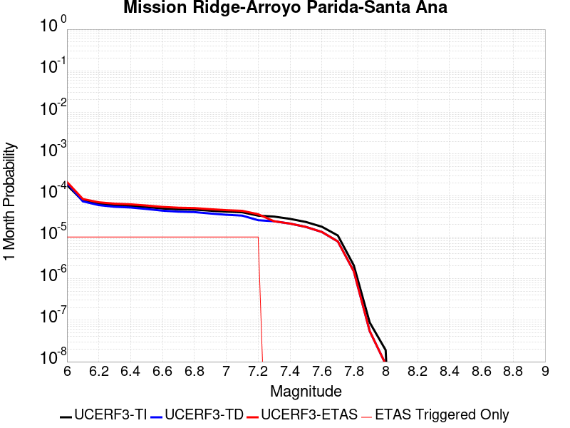 | 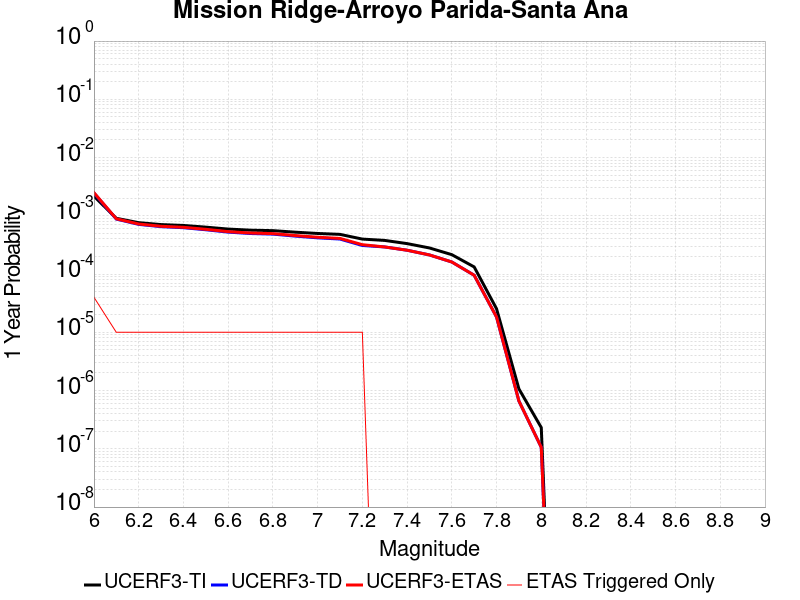 |  |

| Magnitude | 1 wk TI Prob | 1 wk TD Prob | 1 wk ETAS Prob | 1 wk ETAS/TD Gain | 1 wk ETAS Triggered Only | 1 mo TI Prob | 1 mo TD Prob | 1 mo ETAS Prob | 1 mo ETAS/TD Gain | 1 mo ETAS Triggered Only | 1 yr TI Prob | 1 yr TD Prob | 1 yr ETAS Prob | 1 yr ETAS/TD Gain | 1 yr ETAS Triggered Only | 10 yr TI Prob | 10 yr TD Prob | 10 yr ETAS Prob | 10 yr ETAS/TD Gain | 10 yr ETAS Triggered Only |
|-----|-----|-----|-----|-----|-----|-----|-----|-----|-----|-----|-----|-----|-----|-----|-----|-----|-----|-----|-----|-----|
| 6.0 | 4.169034E-5 | 4.7141915E-5 | 5.7141446E-5 | 1.2121154 | 1.0E-5 | 1.7866064E-4 | 2.02026E-4 | 2.1202398E-4 | 1.0494885 | 1.0E-5 | 0.0021730233 | 0.002457629 | 0.0024975308 | 1.0162358 | 4.0E-5 | 0.021518968 | 0.024386454 | 0.024484014 | 1.0040007 | 1.0E-4 |
| 6.1 | 1.73813E-5 | 1.6855052E-5 | 2.6854885E-5 | 1.5932839 | 1.0E-5 | 7.4489166E-5 | 7.2234E-5 | 8.223328E-5 | 1.1384289 | 1.0E-5 | 9.065282E-4 | 8.791049E-4 | 8.890961E-4 | 1.0113652 | 1.0E-5 | 0.009028391 | 0.008757415 | 0.008797065 | 1.0045276 | 4.0E-5 |
| 6.2 | 1.4622182E-5 | 1.3673933E-5 | 2.3673796E-5 | 1.7313085 | 1.0E-5 | 6.2664985E-5 | 5.8601272E-5 | 6.860069E-5 | 1.1706347 | 1.0E-5 | 7.6267915E-4 | 7.132408E-4 | 7.232337E-4 | 1.0140105 | 1.0E-5 | 0.007600669 | 0.0071099605 | 0.007139747 | 1.0041895 | 3.0E-5 |
| 6.3 | 1.3552434E-5 | 1.2482793E-5 | 2.2482667E-5 | 1.8010927 | 1.0E-5 | 5.8080568E-5 | 5.3496606E-5 | 6.349607E-5 | 1.1869178 | 1.0E-5 | 7.069015E-4 | 6.511297E-4 | 6.6112314E-4 | 1.015348 | 1.0E-5 | 0.00704657 | 0.006492582 | 0.0065223873 | 1.0045906 | 3.0E-5 |
| 6.4 | 1.30977305E-5 | 1.1979728E-5 | 2.1979607E-5 | 1.8347335 | 1.0E-5 | 5.613192E-5 | 5.13407E-5 | 6.1340186E-5 | 1.1947672 | 1.0E-5 | 6.831918E-4 | 6.248967E-4 | 6.348905E-4 | 1.0159926 | 1.0E-5 | 0.006810953 | 0.006231741 | 0.006261554 | 1.0047841 | 3.0E-5 |
| 6.5 | 1.225205E-5 | 1.104934E-5 | 2.104923E-5 | 1.9050214 | 1.0E-5 | 5.2507727E-5 | 4.735347E-5 | 5.7352998E-5 | 1.2111678 | 1.0E-5 | 6.3909404E-4 | 5.763787E-4 | 5.86373E-4 | 1.0173397 | 1.0E-5 | 0.006372592 | 0.005749148 | 0.0057789753 | 1.0051881 | 3.0E-5 |
| 6.6 | 1.1352241E-5 | 1.0064037E-5 | 2.0063937E-5 | 1.993627 | 1.0E-5 | 4.8651553E-5 | 4.3130887E-5 | 5.3130458E-5 | 1.2318424 | 1.0E-5 | 5.921717E-4 | 5.2499416E-4 | 5.349889E-4 | 1.0190378 | 1.0E-5 | 0.0059059616 | 0.005237785 | 0.005267628 | 1.0056976 | 3.0E-5 |
| 6.7 | 1.0864116E-5 | 9.517505E-6 | 1.9517409E-5 | 2.0506856 | 1.0E-5 | 4.6559664E-5 | 4.078868E-5 | 5.0788272E-5 | 1.245156 | 1.0E-5 | 5.667165E-4 | 4.9649103E-4 | 5.0648605E-4 | 1.0201313 | 1.0E-5 | 0.005652734 | 0.004954052 | 0.0049839034 | 1.0060257 | 3.0E-5 |
| 6.8 | 1.0666365E-5 | 9.300248E-6 | 1.9300156E-5 | 2.0752301 | 1.0E-5 | 4.571219E-5 | 3.9857612E-5 | 4.985721E-5 | 1.2508831 | 1.0E-5 | 5.564038E-4 | 4.8516036E-4 | 4.951555E-4 | 1.0206017 | 1.0E-5 | 0.005550127 | 0.0048412443 | 0.004871099 | 1.0061667 | 3.0E-5 |
| 6.9 | 1.0038665E-5 | 8.592481E-6 | 1.8592396E-5 | 2.163798 | 1.0E-5 | 4.302214E-5 | 3.682441E-5 | 4.6824043E-5 | 1.271549 | 1.0E-5 | 5.236687E-4 | 4.4824678E-4 | 4.582423E-4 | 1.0222992 | 1.0E-5 | 0.005224364 | 0.0044736373 | 0.0045035034 | 1.006676 | 3.0E-5 |
| 7.0 | 9.5379955E-6 | 8.02548E-6 | 1.80254E-5 | 2.2460213 | 1.0E-5 | 4.0876483E-5 | 3.439447E-5 | 4.4394128E-5 | 1.2907344 | 1.0E-5 | 4.975576E-4 | 4.1867394E-4 | 4.2866974E-4 | 1.0238749 | 1.0E-5 | 0.00496445 | 0.004179051 | 0.0042089256 | 1.0071486 | 3.0E-5 |
| 7.1 | 9.207389E-6 | 7.652762E-6 | 1.7652685E-5 | 2.3067079 | 1.0E-5 | 3.945964E-5 | 3.279715E-5 | 4.279682E-5 | 1.3048946 | 1.0E-5 | 4.803152E-4 | 3.992338E-4 | 4.0922983E-4 | 1.025038 | 1.0E-5 | 0.004792784 | 0.003985362 | 0.0040152427 | 1.0074975 | 3.0E-5 |
| 7.2 | 7.638091E-6 | 5.931402E-6 | 1.5931342E-5 | 2.685932 | 1.0E-5 | 3.2734264E-5 | 2.5420048E-5 | 3.5419795E-5 | 1.3933803 | 1.0E-5 | 3.984668E-4 | 3.0944546E-4 | 3.1944236E-4 | 1.0323058 | 1.0E-5 | 0.0039775306 | 0.0030902023 | 0.0031101406 | 1.0064521 | 2.0E-5 |
| 7.3 | 7.2500147E-6 | 5.5964174E-6 | 5.5964174E-6 | 1.0 | 0.0 | 3.1071122E-5 | 2.3984427E-5 | 2.3984427E-5 | 1.0 | 0.0 | 3.7822526E-4 | 2.9197158E-4 | 2.9197158E-4 | 1.0 | 0.0 | 0.0037758215 | 0.0029159351 | 0.002925906 | 1.0034194 | 1.0E-5 |
| 7.4 | 6.3899715E-6 | 4.91872E-6 | 4.91872E-6 | 1.0 | 0.0 | 2.7385306E-5 | 2.108006E-5 | 2.108006E-5 | 1.0 | 0.0 | 3.3336508E-4 | 2.566197E-4 | 2.566197E-4 | 1.0 | 0.0 | 0.0033286542 | 0.0025632782 | 0.0025732527 | 1.0038912 | 1.0E-5 |
| 7.5 | 5.379025E-6 | 4.084036E-6 | 4.084036E-6 | 1.0 | 0.0 | 2.305276E-5 | 1.7502894E-5 | 1.7502894E-5 | 1.0 | 0.0 | 2.806312E-4 | 2.1307702E-4 | 2.1307702E-4 | 1.0 | 0.0 | 0.0028027708 | 0.0021287384 | 0.002138717 | 1.0046877 | 1.0E-5 |
| 7.6 | 4.1270696E-6 | 3.0884828E-6 | 3.0884828E-6 | 1.0 | 0.0 | 1.768732E-5 | 1.3236288E-5 | 1.3236288E-5 | 1.0 | 0.0 | 2.1532185E-4 | 1.6113996E-4 | 1.6113996E-4 | 1.0 | 0.0 | 0.0021511333 | 0.0016102394 | 0.0016102394 | 1.0 | 0.0 |
| 7.7 | 2.5406805E-6 | 1.8282797E-6 | 1.8282797E-6 | 1.0 | 0.0 | 1.0888585E-5 | 7.835461E-6 | 7.835461E-6 | 1.0 | 0.0 | 1.3256045E-4 | 9.539262E-5 | 9.539262E-5 | 1.0 | 0.0 | 0.0013248142 | 9.535229E-4 | 9.535229E-4 | 1.0 | 0.0 |
| 7.8 | 4.8608285E-7 | 3.5100072E-7 | 3.5100072E-7 | 1.0 | 0.0 | 2.0832106E-6 | 1.504288E-6 | 1.504288E-6 | 1.0 | 0.0 | 2.5362791E-5 | 1.8314553E-5 | 1.8314553E-5 | 1.0 | 0.0 | 2.5359896E-4 | 1.8313056E-4 | 1.8313056E-4 | 1.0 | 0.0 |
| 7.9 | 2.0472514E-8 | 1.2689652E-8 | 1.2689652E-8 | 1.0 | 0.0 | 8.7739345E-8 | 5.4384223E-8 | 5.4384223E-8 | 1.0 | 0.0 | 1.068226E-6 | 6.621277E-7 | 6.621277E-7 | 1.0 | 0.0 | 1.0682209E-5 | 6.6212583E-6 | 6.6212583E-6 | 1.0 | 0.0 |
| 8.0 | 4.443582E-9 | 2.0325128E-9 | 2.0325128E-9 | 1.0 | 0.0 | 1.9043922E-8 | 8.710769E-9 | 8.710769E-9 | 1.0 | 0.0 | 2.3185973E-7 | 1.0605361E-7 | 1.0605361E-7 | 1.0 | 0.0 | 2.3185949E-6 | 1.0605356E-6 | 1.0605356E-6 | 1.0 | 0.0 |

## Manix-Afton Hills
*[(top)](#table-of-contents)*

| 1 Week | 1 Month | 1 Year | 10 Year |
|-----|-----|-----|-----|
|  | 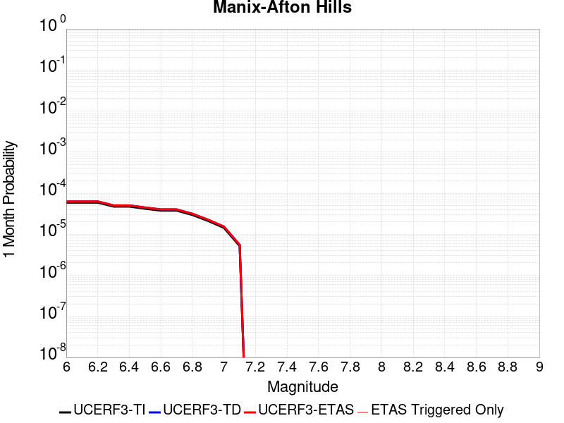 | 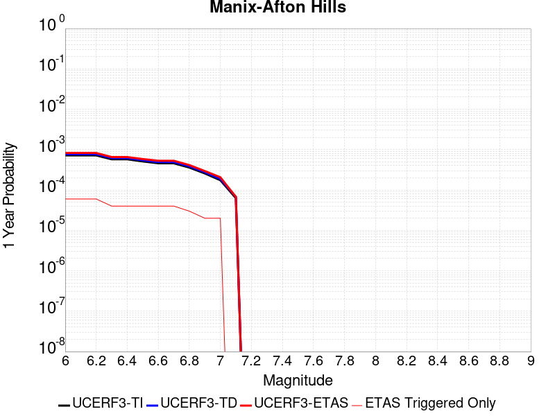 |  |

| Magnitude | 1 wk TI Prob | 1 wk TD Prob | 1 wk ETAS Prob | 1 wk ETAS/TD Gain | 1 wk ETAS Triggered Only | 1 mo TI Prob | 1 mo TD Prob | 1 mo ETAS Prob | 1 mo ETAS/TD Gain | 1 mo ETAS Triggered Only | 1 yr TI Prob | 1 yr TD Prob | 1 yr ETAS Prob | 1 yr ETAS/TD Gain | 1 yr ETAS Triggered Only | 10 yr TI Prob | 10 yr TD Prob | 10 yr ETAS Prob | 10 yr ETAS/TD Gain | 10 yr ETAS Triggered Only |
|-----|-----|-----|-----|-----|-----|-----|-----|-----|-----|-----|-----|-----|-----|-----|-----|-----|-----|-----|-----|-----|
| 6.0 | 1.3783202E-5 | 1.4711459E-5 | 1.4711459E-5 | 1.0 | 0.0 | 5.906953E-5 | 6.3047686E-5 | 6.3047686E-5 | 1.0 | 0.0 | 7.189342E-4 | 7.6735264E-4 | 8.2730665E-4 | 1.078131 | 6.0E-5 | 0.0071661277 | 0.007648787 | 0.0077579455 | 1.0142714 | 1.1E-4 |
| 6.1 | 1.3783202E-5 | 1.4711459E-5 | 1.4711459E-5 | 1.0 | 0.0 | 5.906953E-5 | 6.3047686E-5 | 6.3047686E-5 | 1.0 | 0.0 | 7.189342E-4 | 7.6735264E-4 | 8.2730665E-4 | 1.078131 | 6.0E-5 | 0.0071661277 | 0.007648787 | 0.0077579455 | 1.0142714 | 1.1E-4 |
| 6.2 | 1.3783202E-5 | 1.4711459E-5 | 1.4711459E-5 | 1.0 | 0.0 | 5.906953E-5 | 6.3047686E-5 | 6.3047686E-5 | 1.0 | 0.0 | 7.189342E-4 | 7.6735264E-4 | 8.2730665E-4 | 1.078131 | 6.0E-5 | 0.0071661277 | 0.007648787 | 0.0077579455 | 1.0142714 | 1.1E-4 |
| 6.3 | 1.10494875E-5 | 1.1793431E-5 | 1.1793431E-5 | 1.0 | 0.0 | 4.7354086E-5 | 5.0542356E-5 | 5.0542356E-5 | 1.0 | 0.0 | 5.763835E-4 | 6.1518984E-4 | 6.5516523E-4 | 1.0649806 | 4.0E-5 | 0.005748908 | 0.006135909 | 0.0062253564 | 1.0145777 | 9.0E-5 |
| 6.4 | 1.10494875E-5 | 1.1793431E-5 | 1.1793431E-5 | 1.0 | 0.0 | 4.7354086E-5 | 5.0542356E-5 | 5.0542356E-5 | 1.0 | 0.0 | 5.763835E-4 | 6.1518984E-4 | 6.5516523E-4 | 1.0649806 | 4.0E-5 | 0.005748908 | 0.006135909 | 0.0062253564 | 1.0145777 | 9.0E-5 |
| 6.5 | 9.788949E-6 | 1.0454584E-5 | 1.0454584E-5 | 1.0 | 0.0 | 4.1951964E-5 | 4.4804645E-5 | 4.4804645E-5 | 1.0 | 0.0 | 5.1064545E-4 | 5.453693E-4 | 5.853475E-4 | 1.0733048 | 4.0E-5 | 0.0050947363 | 0.005441236 | 0.005510855 | 1.0127947 | 7.0E-5 |
| 6.6 | 8.810006E-6 | 9.413869E-6 | 9.413869E-6 | 1.0 | 0.0 | 3.775662E-5 | 4.0344577E-5 | 4.0344577E-5 | 1.0 | 0.0 | 4.5958988E-4 | 4.910934E-4 | 5.310738E-4 | 1.0814109 | 4.0E-5 | 0.0045864056 | 0.004900964 | 0.004970621 | 1.0142128 | 7.0E-5 |
| 6.7 | 8.80128E-6 | 9.404348E-6 | 9.404348E-6 | 1.0 | 0.0 | 3.7719226E-5 | 4.0303774E-5 | 4.0303774E-5 | 1.0 | 0.0 | 4.591348E-4 | 4.9059687E-4 | 5.3057726E-4 | 1.0814934 | 4.0E-5 | 0.004581874 | 0.0048960205 | 0.004965678 | 1.0142273 | 7.0E-5 |
| 6.8 | 6.8994877E-6 | 7.3802676E-6 | 7.3802676E-6 | 1.0 | 0.0 | 2.9568899E-5 | 3.162938E-5 | 3.162938E-5 | 1.0 | 0.0 | 3.5994186E-4 | 3.8502782E-4 | 4.150163E-4 | 1.0778865 | 3.0E-5 | 0.003593594 | 0.0038444125 | 0.0039041818 | 1.015547 | 6.0E-5 |
| 6.9 | 4.9328037E-6 | 5.271096E-6 | 5.271096E-6 | 1.0 | 0.0 | 2.1140417E-5 | 2.2590251E-5 | 2.2590251E-5 | 1.0 | 0.0 | 2.5735417E-4 | 2.7500774E-4 | 2.9500225E-4 | 1.0727053 | 2.0E-5 | 0.0025705635 | 0.0027472796 | 0.0027971421 | 1.0181499 | 5.0E-5 |
| 7.0 | 3.347973E-6 | 3.5901267E-6 | 3.5901267E-6 | 1.0 | 0.0 | 1.4348378E-5 | 1.538619E-5 | 1.538619E-5 | 1.0 | 0.0 | 1.746775E-4 | 1.8731486E-4 | 2.0731111E-4 | 1.106752 | 2.0E-5 | 0.0017454025 | 0.0018719723 | 0.0019118974 | 1.0213279 | 4.0E-5 |
| 7.1 | 1.2073567E-6 | 1.2935163E-6 | 1.2935163E-6 | 1.0 | 0.0 | 5.1743755E-6 | 5.543639E-6 | 5.543639E-6 | 1.0 | 0.0 | 6.29962E-5 | 6.749335E-5 | 6.749335E-5 | 1.0 | 0.0 | 6.297835E-4 | 6.748886E-4 | 6.748886E-4 | 1.0 | 0.0 |

## San Andreas (Cholame) rev
*[(top)](#table-of-contents)*

| 1 Week | 1 Month | 1 Year | 10 Year |
|-----|-----|-----|-----|
|  |  |  |  |

| Magnitude | 1 wk TI Prob | 1 wk TD Prob | 1 wk ETAS Prob | 1 wk ETAS/TD Gain | 1 wk ETAS Triggered Only | 1 mo TI Prob | 1 mo TD Prob | 1 mo ETAS Prob | 1 mo ETAS/TD Gain | 1 mo ETAS Triggered Only | 1 yr TI Prob | 1 yr TD Prob | 1 yr ETAS Prob | 1 yr ETAS/TD Gain | 1 yr ETAS Triggered Only | 10 yr TI Prob | 10 yr TD Prob | 10 yr ETAS Prob | 10 yr ETAS/TD Gain | 10 yr ETAS Triggered Only |
|-----|-----|-----|-----|-----|-----|-----|-----|-----|-----|-----|-----|-----|-----|-----|-----|-----|-----|-----|-----|-----|
| 6.0 | 1.2302514E-4 | 2.5231388E-4 | 2.5231388E-4 | 1.0 | 0.0 | 5.27144E-4 | 0.0010808987 | 0.0010808987 | 1.0 | 0.0 | 0.0063991086 | 0.013081042 | 0.013120519 | 1.0030179 | 4.0E-5 | 0.06217949 | 0.12450353 | 0.12459984 | 1.0007735 | 1.1E-4 |
| 6.1 | 1.2302514E-4 | 2.5231388E-4 | 2.5231388E-4 | 1.0 | 0.0 | 5.27144E-4 | 0.0010808987 | 0.0010808987 | 1.0 | 0.0 | 0.0063991086 | 0.013081042 | 0.013120519 | 1.0030179 | 4.0E-5 | 0.06217949 | 0.12450353 | 0.12459984 | 1.0007735 | 1.1E-4 |
| 6.2 | 1.2203569E-4 | 2.5048148E-4 | 2.5048148E-4 | 1.0 | 0.0 | 5.2290526E-4 | 0.0010730521 | 0.0010730521 | 1.0 | 0.0 | 0.006347804 | 0.012986653 | 0.013026133 | 1.0030401 | 4.0E-5 | 0.061695136 | 0.12368968 | 0.12378607 | 1.0007793 | 1.1E-4 |
| 6.3 | 1.2142645E-4 | 2.49341E-4 | 2.49341E-4 | 1.0 | 0.0 | 5.202953E-4 | 0.0010681683 | 0.0010681683 | 1.0 | 0.0 | 0.006316212 | 0.0129279 | 0.012967383 | 1.0030541 | 4.0E-5 | 0.06139677 | 0.12318379 | 0.123280235 | 1.000783 | 1.1E-4 |
| 6.4 | 1.1865206E-4 | 2.4439473E-4 | 2.4439473E-4 | 1.0 | 0.0 | 5.0840975E-4 | 0.0010469871 | 0.0010469871 | 1.0 | 0.0 | 0.006172335 | 0.012673045 | 0.012712537 | 1.0031163 | 4.0E-5 | 0.060036868 | 0.120976195 | 0.12107289 | 1.0007993 | 1.1E-4 |
| 6.5 | 1.17443946E-4 | 2.4232677E-4 | 2.4232677E-4 | 1.0 | 0.0 | 5.032341E-4 | 0.0010381315 | 0.0010381315 | 1.0 | 0.0 | 0.006109677 | 0.012566473 | 0.012605971 | 1.0031431 | 4.0E-5 | 0.059444077 | 0.1200501 | 0.12014689 | 1.0008063 | 1.1E-4 |
| 6.6 | 1.13579066E-4 | 2.3541384E-4 | 2.3541384E-4 | 1.0 | 0.0 | 4.866766E-4 | 0.0010085278 | 0.0010085278 | 1.0 | 0.0 | 0.0059092017 | 0.012210141 | 0.012249652 | 1.0032359 | 4.0E-5 | 0.057545185 | 0.116963364 | 0.1170605 | 1.0008304 | 1.1E-4 |
| 6.7 | 1.1271412E-4 | 2.3385634E-4 | 2.3385634E-4 | 1.0 | 0.0 | 4.829711E-4 | 0.001001858 | 0.001001858 | 1.0 | 0.0 | 0.005864331 | 0.012129842 | 0.012169357 | 1.0032576 | 4.0E-5 | 0.057119697 | 0.11626677 | 0.11636398 | 1.0008361 | 1.1E-4 |
| 6.8 | 1.1217975E-4 | 2.3273996E-4 | 2.3273996E-4 | 1.0 | 0.0 | 4.8068175E-4 | 9.970772E-4 | 9.970772E-4 | 1.0 | 0.0 | 0.005836608 | 0.012072283 | 0.0121118 | 1.0032734 | 4.0E-5 | 0.056856725 | 0.11576484 | 0.11586211 | 1.0008402 | 1.1E-4 |
| 6.9 | 1.1146753E-4 | 2.3122675E-4 | 2.3122675E-4 | 1.0 | 0.0 | 4.7763053E-4 | 9.90597E-4 | 9.90597E-4 | 1.0 | 0.0 | 0.0057996577 | 0.011994258 | 0.012033777 | 1.003295 | 4.0E-5 | 0.056506127 | 0.11508507 | 0.115182415 | 1.0008458 | 1.1E-4 |
| 7.0 | 1.0965793E-4 | 2.2745806E-4 | 2.2745806E-4 | 1.0 | 0.0 | 4.698779E-4 | 9.744576E-4 | 9.744576E-4 | 1.0 | 0.0 | 0.005705768 | 0.011799905 | 0.011839434 | 1.0033499 | 4.0E-5 | 0.055614736 | 0.113386035 | 0.11348356 | 1.0008601 | 1.1E-4 |
| 7.1 | 9.927982E-5 | 2.0563949E-4 | 2.0563949E-4 | 1.0 | 0.0 | 4.2541555E-4 | 8.8101544E-4 | 8.8101544E-4 | 1.0 | 0.0 | 0.0051671406 | 0.010673903 | 0.010713476 | 1.0037074 | 4.0E-5 | 0.05048634 | 0.10347803 | 0.10356768 | 1.0008664 | 1.0E-4 |
| 7.2 | 9.696786E-5 | 2.006803E-4 | 2.006803E-4 | 1.0 | 0.0 | 4.1551032E-4 | 8.59776E-4 | 8.59776E-4 | 1.0 | 0.0 | 0.00504711 | 0.010417813 | 0.0104573965 | 1.0037996 | 4.0E-5 | 0.04934009 | 0.10121556 | 0.10130545 | 1.000888 | 1.0E-4 |
| 7.3 | 9.4727984E-5 | 1.949692E-4 | 1.949692E-4 | 1.0 | 0.0 | 4.0591392E-4 | 8.353157E-4 | 8.353157E-4 | 1.0 | 0.0 | 0.0049308087 | 0.010122815 | 0.010162409 | 1.0039115 | 4.0E-5 | 0.048228268 | 0.09858523 | 0.09866636 | 1.0008229 | 9.0E-5 |
| 7.4 | 9.220358E-5 | 1.886706E-4 | 1.886706E-4 | 1.0 | 0.0 | 3.9509835E-4 | 8.083387E-4 | 8.083387E-4 | 1.0 | 0.0 | 0.004799717 | 0.009797362 | 0.00983697 | 1.0040427 | 4.0E-5 | 0.046973653 | 0.09566168 | 0.09574307 | 1.0008508 | 9.0E-5 |
| 7.5 | 7.71631E-5 | 1.5198934E-4 | 1.5198934E-4 | 1.0 | 0.0 | 3.306571E-4 | 6.5122044E-4 | 6.5122044E-4 | 1.0 | 0.0 | 0.0040183207 | 0.007899857 | 0.007939541 | 1.0050234 | 4.0E-5 | 0.03946433 | 0.07837912 | 0.07845285 | 1.0009407 | 8.0E-5 |
| 7.6 | 7.5634416E-5 | 1.4858136E-4 | 1.4858136E-4 | 1.0 | 0.0 | 3.241072E-4 | 6.36622E-4 | 6.36622E-4 | 1.0 | 0.0 | 0.0039388672 | 0.007723395 | 0.007753163 | 1.0038543 | 3.0E-5 | 0.038697794 | 0.07674156 | 0.07679696 | 1.0007218 | 6.0E-5 |
| 7.7 | 6.3783E-5 | 1.2377257E-4 | 1.2377257E-4 | 1.0 | 0.0 | 2.7332708E-4 | 5.3034606E-4 | 5.3034606E-4 | 1.0 | 0.0 | 0.0033226798 | 0.0064378735 | 0.0064676804 | 1.00463 | 3.0E-5 | 0.032734364 | 0.06462491 | 0.06468104 | 1.0008684 | 6.0E-5 |
| 7.8 | 5.863422E-5 | 1.1432944E-4 | 1.1432944E-4 | 1.0 | 0.0 | 2.512653E-4 | 4.898914E-4 | 4.898914E-4 | 1.0 | 0.0 | 0.003054864 | 0.005948137 | 0.0059779584 | 1.0050136 | 3.0E-5 | 0.030132094 | 0.059736405 | 0.05979282 | 1.0009444 | 6.0E-5 |
| 7.9 | 4.595283E-5 | 8.438587E-5 | 8.438587E-5 | 1.0 | 0.0 | 1.9692584E-4 | 3.6160363E-4 | 3.6160363E-4 | 1.0 | 0.0 | 0.0023949358 | 0.0043936437 | 0.004413556 | 1.004532 | 2.0E-5 | 0.023692891 | 0.044419806 | 0.044458028 | 1.0008605 | 4.0E-5 |
| 8.0 | 3.2950178E-5 | 5.08492E-5 | 5.08492E-5 | 1.0 | 0.0 | 1.412074E-4 | 2.1790696E-4 | 2.1790696E-4 | 1.0 | 0.0 | 0.0017178444 | 0.002649791 | 0.0026697381 | 1.0075277 | 2.0E-5 | 0.017046256 | 0.02721765 | 0.027237108 | 1.0007148 | 2.0E-5 |
| 8.1 | 1.9177472E-5 | 1.9222509E-5 | 1.9222509E-5 | 1.0 | 0.0 | 8.218658E-5 | 8.2379585E-5 | 8.2379585E-5 | 1.0 | 0.0 | 0.0010001622 | 0.0010025105 | 0.0010125006 | 1.009965 | 1.0E-5 | 0.009956728 | 0.010777723 | 0.010787616 | 1.0009178 | 1.0E-5 |
| 8.2 | 8.643924E-6 | 5.488954E-6 | 5.488954E-6 | 1.0 | 0.0 | 3.704486E-5 | 2.3523877E-5 | 2.3523877E-5 | 1.0 | 0.0 | 4.5092785E-4 | 2.8636563E-4 | 2.8636563E-4 | 1.0 | 0.0 | 0.0045001395 | 0.0032564052 | 0.0032564052 | 1.0 | 0.0 |
| 8.3 | 1.983087E-6 | 7.68342E-7 | 7.68342E-7 | 1.0 | 0.0 | 8.498917E-6 | 3.2928901E-6 | 3.2928901E-6 | 1.0 | 0.0 | 1.034694E-4 | 4.0090217E-5 | 4.0090217E-5 | 1.0 | 0.0 | 0.0010342124 | 4.7331754E-4 | 4.7331754E-4 | 1.0 | 0.0 |

## San Andreas (North Branch Mill Creek)
*[(top)](#table-of-contents)*

| 1 Week | 1 Month | 1 Year | 10 Year |
|-----|-----|-----|-----|
| 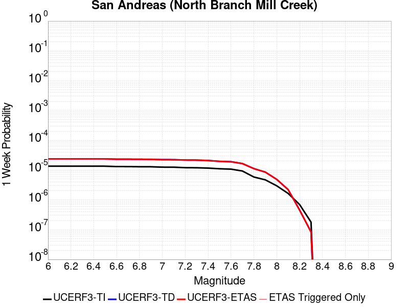 |  |  | 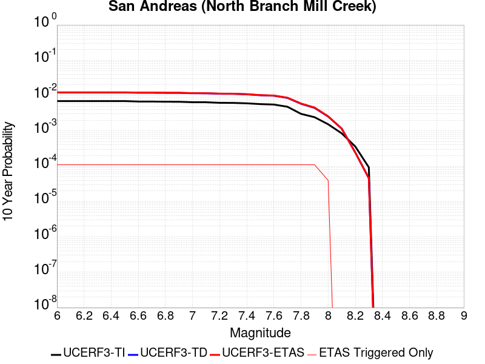 |

| Magnitude | 1 wk TI Prob | 1 wk TD Prob | 1 wk ETAS Prob | 1 wk ETAS/TD Gain | 1 wk ETAS Triggered Only | 1 mo TI Prob | 1 mo TD Prob | 1 mo ETAS Prob | 1 mo ETAS/TD Gain | 1 mo ETAS Triggered Only | 1 yr TI Prob | 1 yr TD Prob | 1 yr ETAS Prob | 1 yr ETAS/TD Gain | 1 yr ETAS Triggered Only | 10 yr TI Prob | 10 yr TD Prob | 10 yr ETAS Prob | 10 yr ETAS/TD Gain | 10 yr ETAS Triggered Only |
|-----|-----|-----|-----|-----|-----|-----|-----|-----|-----|-----|-----|-----|-----|-----|-----|-----|-----|-----|-----|-----|
| 6.0 | 1.3461156E-5 | 2.3519155E-5 | 2.3519155E-5 | 1.0 | 0.0 | 5.7689394E-5 | 1.007925E-4 | 1.007925E-4 | 1.0 | 0.0 | 7.02142E-4 | 0.0012264613 | 0.0012664122 | 1.0325742 | 4.0E-5 | 0.0069992766 | 0.012239431 | 0.012348085 | 1.0088774 | 1.1E-4 |
| 6.1 | 1.3461156E-5 | 2.3519155E-5 | 2.3519155E-5 | 1.0 | 0.0 | 5.7689394E-5 | 1.007925E-4 | 1.007925E-4 | 1.0 | 0.0 | 7.02142E-4 | 0.0012264613 | 0.0012664122 | 1.0325742 | 4.0E-5 | 0.0069992766 | 0.012239431 | 0.012348085 | 1.0088774 | 1.1E-4 |
| 6.2 | 1.3461156E-5 | 2.3519155E-5 | 2.3519155E-5 | 1.0 | 0.0 | 5.7689394E-5 | 1.007925E-4 | 1.007925E-4 | 1.0 | 0.0 | 7.02142E-4 | 0.0012264613 | 0.0012664122 | 1.0325742 | 4.0E-5 | 0.0069992766 | 0.012239431 | 0.012348085 | 1.0088774 | 1.1E-4 |
| 6.3 | 1.3461156E-5 | 2.3519155E-5 | 2.3519155E-5 | 1.0 | 0.0 | 5.7689394E-5 | 1.007925E-4 | 1.007925E-4 | 1.0 | 0.0 | 7.02142E-4 | 0.0012264613 | 0.0012664122 | 1.0325742 | 4.0E-5 | 0.0069992766 | 0.012239431 | 0.012348085 | 1.0088774 | 1.1E-4 |
| 6.4 | 1.3461156E-5 | 2.3519155E-5 | 2.3519155E-5 | 1.0 | 0.0 | 5.7689394E-5 | 1.007925E-4 | 1.007925E-4 | 1.0 | 0.0 | 7.02142E-4 | 0.0012264613 | 0.0012664122 | 1.0325742 | 4.0E-5 | 0.0069992766 | 0.012239431 | 0.012348085 | 1.0088774 | 1.1E-4 |
| 6.5 | 1.3450706E-5 | 2.3508115E-5 | 2.3508115E-5 | 1.0 | 0.0 | 5.764461E-5 | 1.00745194E-4 | 1.00745194E-4 | 1.0 | 0.0 | 7.0159714E-4 | 0.0012258858 | 0.0012658368 | 1.0325894 | 4.0E-5 | 0.006993862 | 0.012233741 | 0.012342395 | 1.0088816 | 1.1E-4 |
| 6.6 | 1.3074523E-5 | 2.3122391E-5 | 2.3122391E-5 | 1.0 | 0.0 | 5.6032466E-5 | 9.909221E-5 | 9.909221E-5 | 1.0 | 0.0 | 6.8198174E-4 | 0.0012057832 | 0.001245735 | 1.0331335 | 4.0E-5 | 0.006798926 | 0.012034904 | 0.01214358 | 1.0090301 | 1.1E-4 |
| 6.7 | 1.3050216E-5 | 2.3097686E-5 | 2.3097686E-5 | 1.0 | 0.0 | 5.59283E-5 | 9.898634E-5 | 9.898634E-5 | 1.0 | 0.0 | 6.8071426E-4 | 0.0012044957 | 0.0012444475 | 1.0331689 | 4.0E-5 | 0.0067863287 | 0.012022168 | 0.012130846 | 1.0090398 | 1.1E-4 |
| 6.8 | 1.29049395E-5 | 2.2946091E-5 | 2.2946091E-5 | 1.0 | 0.0 | 5.530571E-5 | 9.83367E-5 | 9.83367E-5 | 1.0 | 0.0 | 6.73139E-4 | 0.001196595 | 0.0012365471 | 1.0333881 | 4.0E-5 | 0.0067110364 | 0.011944012 | 0.012052698 | 1.0090996 | 1.1E-4 |
| 6.9 | 1.2867369E-5 | 2.2905491E-5 | 2.2905491E-5 | 1.0 | 0.0 | 5.51447E-5 | 9.8162716E-5 | 9.8162716E-5 | 1.0 | 0.0 | 6.711799E-4 | 0.0011944791 | 0.0012344313 | 1.0334474 | 4.0E-5 | 0.006691564 | 0.01192308 | 0.012031768 | 1.0091158 | 1.1E-4 |
| 7.0 | 1.2495996E-5 | 2.2305438E-5 | 2.2305438E-5 | 1.0 | 0.0 | 5.3553173E-5 | 9.559125E-5 | 9.559125E-5 | 1.0 | 0.0 | 6.518148E-4 | 0.0011632049 | 0.0012031584 | 1.0343478 | 4.0E-5 | 0.0064990623 | 0.0116136195 | 0.011722342 | 1.0093616 | 1.1E-4 |
| 7.1 | 1.2452067E-5 | 2.2250506E-5 | 2.2250506E-5 | 1.0 | 0.0 | 5.3364907E-5 | 9.535584E-5 | 9.535584E-5 | 1.0 | 0.0 | 6.4952404E-4 | 0.0011603419 | 0.0012002955 | 1.0344326 | 4.0E-5 | 0.0064762887 | 0.011585288 | 0.011694013 | 1.0093848 | 1.1E-4 |
| 7.2 | 1.2002777E-5 | 2.1628968E-5 | 2.1628968E-5 | 1.0 | 0.0 | 5.143946E-5 | 9.2692295E-5 | 9.2692295E-5 | 1.0 | 0.0 | 6.2609545E-4 | 0.0011279471 | 0.001167902 | 1.0354227 | 4.0E-5 | 0.006243344 | 0.011264661 | 0.011373422 | 1.009655 | 1.1E-4 |
| 7.3 | 1.1923425E-5 | 2.1498776E-5 | 2.1498776E-5 | 1.0 | 0.0 | 5.109939E-5 | 9.2134374E-5 | 9.2134374E-5 | 1.0 | 0.0 | 6.219575E-4 | 0.0011211614 | 0.0011611165 | 1.0356373 | 4.0E-5 | 0.0062021962 | 0.011197517 | 0.011306285 | 1.0097136 | 1.1E-4 |
| 7.4 | 1.16105175E-5 | 2.087257E-5 | 2.087257E-5 | 1.0 | 0.0 | 4.975841E-5 | 8.945082E-5 | 8.945082E-5 | 1.0 | 0.0 | 6.0564023E-4 | 0.0010885221 | 0.0011284787 | 1.036707 | 4.0E-5 | 0.006039923 | 0.010875033 | 0.010983837 | 1.0100049 | 1.1E-4 |
| 7.5 | 1.1037265E-5 | 1.9572046E-5 | 1.9572046E-5 | 1.0 | 0.0 | 4.7301706E-5 | 8.3877516E-5 | 8.3877516E-5 | 1.0 | 0.0 | 5.757461E-4 | 0.0010207325 | 0.0010606917 | 1.0391475 | 4.0E-5 | 0.005742567 | 0.010204205 | 0.0103130825 | 1.0106698 | 1.1E-4 |
| 7.6 | 1.0720915E-5 | 1.901373E-5 | 1.901373E-5 | 1.0 | 0.0 | 4.5945973E-5 | 8.148489E-5 | 8.148489E-5 | 1.0 | 0.0 | 5.592486E-4 | 9.916292E-4 | 0.0010315895 | 1.0402976 | 4.0E-5 | 0.005578433 | 0.009915816 | 0.0100247245 | 1.0109833 | 1.1E-4 |
| 7.7 | 9.276279E-6 | 1.6458705E-5 | 1.6458705E-5 | 1.0 | 0.0 | 3.9754876E-5 | 7.053541E-5 | 7.053541E-5 | 1.0 | 0.0 | 4.839081E-4 | 8.58432E-4 | 8.9839764E-4 | 1.0465566 | 4.0E-5 | 0.0048285574 | 0.008594804 | 0.008703859 | 1.0126884 | 1.1E-4 |
| 7.8 | 5.8346777E-6 | 1.1168865E-5 | 1.1168865E-5 | 1.0 | 0.0 | 2.5005522E-5 | 4.7865684E-5 | 4.7865684E-5 | 1.0 | 0.0 | 3.043997E-4 | 5.8260903E-4 | 6.225857E-4 | 1.0686166 | 4.0E-5 | 0.0030398308 | 0.0058540506 | 0.005963407 | 1.0186805 | 1.1E-4 |
| 7.9 | 4.690204E-6 | 8.520649E-6 | 8.520649E-6 | 1.0 | 0.0 | 2.0100719E-5 | 3.6516558E-5 | 3.6516558E-5 | 1.0 | 0.0 | 2.4469878E-4 | 4.444985E-4 | 4.8448073E-4 | 1.089949 | 4.0E-5 | 0.002444295 | 0.0044766967 | 0.0045862044 | 1.0244617 | 1.1E-4 |
| 8.0 | 2.9570454E-6 | 4.8540132E-6 | 4.8540132E-6 | 1.0 | 0.0 | 1.267299E-5 | 2.0802749E-5 | 2.0802749E-5 | 1.0 | 0.0 | 1.5428272E-4 | 2.5324404E-4 | 2.6324153E-4 | 1.0394776 | 1.0E-5 | 0.0015417566 | 0.0025533193 | 0.0025932172 | 1.0156258 | 4.0E-5 |
| 8.1 | 1.6376824E-6 | 2.2006025E-6 | 2.2006025E-6 | 1.0 | 0.0 | 7.01862E-6 | 9.431119E-6 | 9.431119E-6 | 1.0 | 0.0 | 8.544835E-5 | 1.1481784E-4 | 1.1481784E-4 | 1.0 | 0.0 | 8.54155E-4 | 0.001162599 | 0.001162599 | 1.0 | 0.0 |
| 8.2 | 6.9631557E-7 | 4.5475895E-7 | 4.5475895E-7 | 1.0 | 0.0 | 2.984206E-6 | 1.9489653E-6 | 1.9489653E-6 | 1.0 | 0.0 | 3.63321E-5 | 2.3728397E-5 | 2.3728397E-5 | 1.0 | 0.0 | 3.6326164E-4 | 2.4577059E-4 | 2.4577059E-4 | 1.0 | 0.0 |
| 8.3 | 1.7876137E-7 | 8.383837E-8 | 8.383837E-8 | 1.0 | 0.0 | 7.661199E-7 | 3.5930728E-7 | 3.5930728E-7 | 1.0 | 0.0 | 9.32747E-6 | 4.3745576E-6 | 4.3745576E-6 | 1.0 | 0.0 | 9.3270784E-5 | 4.5942954E-5 | 4.5942954E-5 | 1.0 | 0.0 |

## Chino alt 1
*[(top)](#table-of-contents)*

| 1 Week | 1 Month | 1 Year | 10 Year |
|-----|-----|-----|-----|
|  | 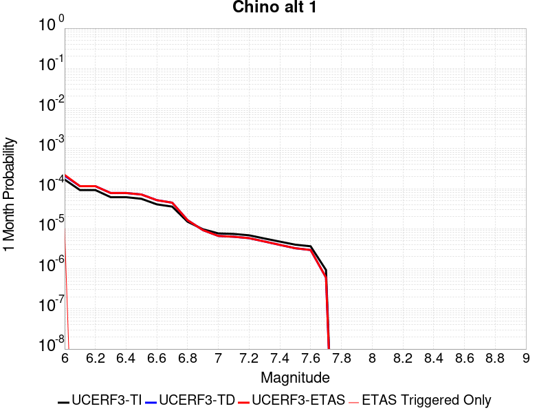 |  | 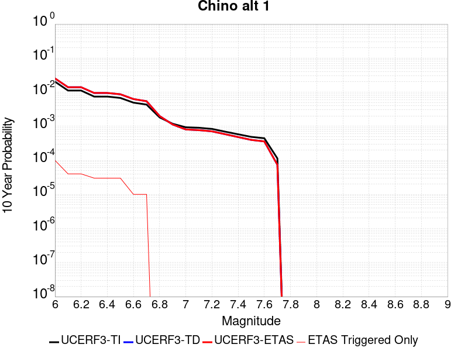 |

| Magnitude | 1 wk TI Prob | 1 wk TD Prob | 1 wk ETAS Prob | 1 wk ETAS/TD Gain | 1 wk ETAS Triggered Only | 1 mo TI Prob | 1 mo TD Prob | 1 mo ETAS Prob | 1 mo ETAS/TD Gain | 1 mo ETAS Triggered Only | 1 yr TI Prob | 1 yr TD Prob | 1 yr ETAS Prob | 1 yr ETAS/TD Gain | 1 yr ETAS Triggered Only | 10 yr TI Prob | 10 yr TD Prob | 10 yr ETAS Prob | 10 yr ETAS/TD Gain | 10 yr ETAS Triggered Only |
|-----|-----|-----|-----|-----|-----|-----|-----|-----|-----|-----|-----|-----|-----|-----|-----|-----|-----|-----|-----|-----|
| 6.0 | 3.939946E-5 | 4.8953603E-5 | 4.8953603E-5 | 1.0 | 0.0 | 1.6884391E-4 | 2.0978722E-4 | 2.1978513E-4 | 1.0476574 | 1.0E-5 | 0.0020537362 | 0.0025516537 | 0.0025915515 | 1.0156361 | 4.0E-5 | 0.020348595 | 0.025280396 | 0.025377868 | 1.0038556 | 1.0E-4 |
| 6.1 | 2.1505624E-5 | 2.6882151E-5 | 2.6882151E-5 | 1.0 | 0.0 | 9.2163704E-5 | 1.1520476E-4 | 1.1520476E-4 | 1.0 | 0.0 | 0.0011215154 | 0.0014018269 | 0.0014217988 | 1.0142471 | 2.0E-5 | 0.011158722 | 0.013946737 | 0.01398618 | 1.002828 | 4.0E-5 |
| 6.2 | 2.1505624E-5 | 2.6882151E-5 | 2.6882151E-5 | 1.0 | 0.0 | 9.2163704E-5 | 1.1520476E-4 | 1.1520476E-4 | 1.0 | 0.0 | 0.0011215154 | 0.0014018269 | 0.0014217988 | 1.0142471 | 2.0E-5 | 0.011158722 | 0.013946737 | 0.01398618 | 1.002828 | 4.0E-5 |
| 6.3 | 1.4290785E-5 | 1.8167579E-5 | 1.8167579E-5 | 1.0 | 0.0 | 6.1244784E-5 | 7.785898E-5 | 7.785898E-5 | 1.0 | 0.0 | 7.454001E-4 | 9.475663E-4 | 9.6754736E-4 | 1.0210867 | 2.0E-5 | 0.007429048 | 0.009445713 | 0.00947543 | 1.003146 | 3.0E-5 |
| 6.4 | 1.4290785E-5 | 1.8167579E-5 | 1.8167579E-5 | 1.0 | 0.0 | 6.1244784E-5 | 7.785898E-5 | 7.785898E-5 | 1.0 | 0.0 | 7.454001E-4 | 9.475663E-4 | 9.6754736E-4 | 1.0210867 | 2.0E-5 | 0.007429048 | 0.009445713 | 0.00947543 | 1.003146 | 3.0E-5 |
| 6.5 | 1.3017944E-5 | 1.6654432E-5 | 1.6654432E-5 | 1.0 | 0.0 | 5.5789995E-5 | 7.137444E-5 | 7.137444E-5 | 1.0 | 0.0 | 6.790315E-4 | 8.686811E-4 | 8.8866375E-4 | 1.0230035 | 2.0E-5 | 0.0067696036 | 0.0086631505 | 0.00869289 | 1.003433 | 3.0E-5 |
| 6.6 | 9.470016E-6 | 1.2041162E-5 | 1.2041162E-5 | 1.0 | 0.0 | 4.058515E-5 | 5.160415E-5 | 5.160415E-5 | 1.0 | 0.0 | 4.940122E-4 | 6.2813336E-4 | 6.381271E-4 | 1.0159101 | 1.0E-5 | 0.004929154 | 0.0062727924 | 0.00628273 | 1.0015842 | 1.0E-5 |
| 6.7 | 8.314155E-6 | 1.0409261E-5 | 1.0409261E-5 | 1.0 | 0.0 | 3.5631605E-5 | 4.4610537E-5 | 4.4610537E-5 | 1.0 | 0.0 | 4.3372845E-4 | 5.430302E-4 | 5.5302476E-4 | 1.0184052 | 1.0E-5 | 0.004328829 | 0.0054265605 | 0.0054365066 | 1.0018328 | 1.0E-5 |
| 6.8 | 3.4856364E-6 | 3.8138032E-6 | 3.8138032E-6 | 1.0 | 0.0 | 1.4938357E-5 | 1.634478E-5 | 1.634478E-5 | 1.0 | 0.0 | 1.8185932E-4 | 1.9898161E-4 | 1.9898161E-4 | 1.0 | 0.0 | 0.0018171056 | 0.001989711 | 0.001989711 | 1.0 | 0.0 |
| 6.9 | 2.2645952E-6 | 2.1531393E-6 | 2.1531393E-6 | 1.0 | 0.0 | 9.705372E-6 | 9.227709E-6 | 9.227709E-6 | 1.0 | 0.0 | 1.18156495E-4 | 1.12341775E-4 | 1.12341775E-4 | 1.0 | 0.0 | 0.0011809369 | 0.001123466 | 0.001123466 | 1.0 | 0.0 |
| 7.0 | 1.7864003E-6 | 1.5432659E-6 | 1.5432659E-6 | 1.0 | 0.0 | 7.655979E-6 | 6.61398E-6 | 6.61398E-6 | 1.0 | 0.0 | 9.3207556E-5 | 8.052229E-5 | 8.052229E-5 | 1.0 | 0.0 | 9.316847E-4 | 8.0537825E-4 | 8.0537825E-4 | 1.0 | 0.0 |
| 7.1 | 1.7315456E-6 | 1.4735324E-6 | 1.4735324E-6 | 1.0 | 0.0 | 7.420889E-6 | 6.3151238E-6 | 6.3151238E-6 | 1.0 | 0.0 | 9.034557E-5 | 7.6883975E-5 | 7.6883975E-5 | 1.0 | 0.0 | 9.0308854E-4 | 7.690116E-4 | 7.690116E-4 | 1.0 | 0.0 |
| 7.2 | 1.6008337E-6 | 1.3575723E-6 | 1.3575723E-6 | 1.0 | 0.0 | 6.860698E-6 | 5.818154E-6 | 5.818154E-6 | 1.0 | 0.0 | 8.352579E-5 | 7.0833776E-5 | 7.0833776E-5 | 1.0 | 0.0 | 8.34944E-4 | 7.085362E-4 | 7.085362E-4 | 1.0 | 0.0 |
| 7.3 | 1.3320939E-6 | 1.1219028E-6 | 1.1219028E-6 | 1.0 | 0.0 | 5.7089615E-6 | 4.808146E-6 | 4.808146E-6 | 1.0 | 0.0 | 6.9504385E-5 | 5.8537655E-5 | 5.8537655E-5 | 1.0 | 0.0 | 6.9482654E-4 | 5.853669E-4 | 5.853669E-4 | 1.0 | 0.0 |
| 7.4 | 1.114294E-6 | 9.2380674E-7 | 9.2380674E-7 | 1.0 | 0.0 | 4.775537E-6 | 3.959166E-6 | 3.959166E-6 | 1.0 | 0.0 | 5.8140613E-5 | 4.8201815E-5 | 4.8201815E-5 | 1.0 | 0.0 | 5.81254E-4 | 4.8193042E-4 | 4.8193042E-4 | 1.0 | 0.0 |
| 7.5 | 9.354081E-7 | 7.624187E-7 | 7.624187E-7 | 1.0 | 0.0 | 4.0088858E-6 | 3.2675048E-6 | 3.2675048E-6 | 1.0 | 0.0 | 4.8807087E-5 | 3.978118E-5 | 3.978118E-5 | 1.0 | 0.0 | 4.879637E-4 | 3.9774398E-4 | 3.9774398E-4 | 1.0 | 0.0 |
| 7.6 | 8.521771E-7 | 6.88138E-7 | 6.88138E-7 | 1.0 | 0.0 | 3.6521824E-6 | 2.9491598E-6 | 2.9491598E-6 | 1.0 | 0.0 | 4.4464414E-5 | 3.590546E-5 | 3.590546E-5 | 1.0 | 0.0 | 4.4455516E-4 | 3.5899977E-4 | 3.5899977E-4 | 1.0 | 0.0 |
| 7.7 | 2.1803626E-7 | 1.418834E-7 | 1.418834E-7 | 1.0 | 0.0 | 9.344408E-7 | 6.080717E-7 | 6.080717E-7 | 1.0 | 0.0 | 1.1376757E-5 | 7.4032573E-6 | 7.4032573E-6 | 1.0 | 0.0 | 1.13761744E-4 | 7.4031064E-5 | 7.4031064E-5 | 1.0 | 0.0 |

## San Jacinto (Stepovers Combined)
*[(top)](#table-of-contents)*

| 1 Week | 1 Month | 1 Year | 10 Year |
|-----|-----|-----|-----|
|  | 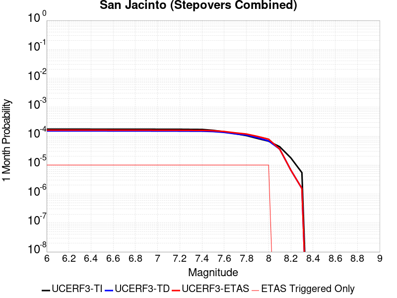 |  | 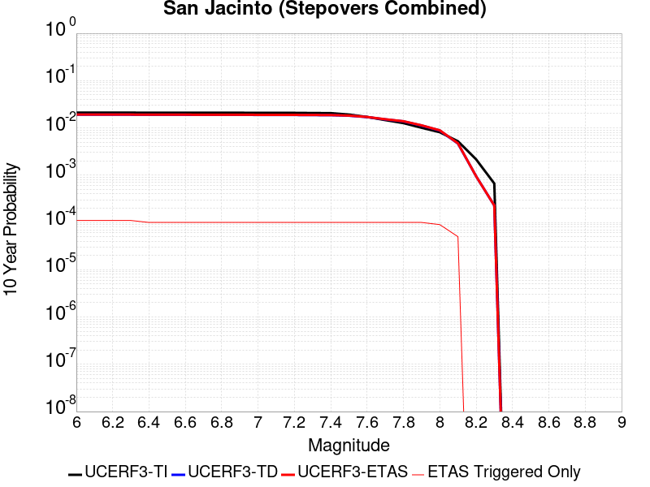 |

| Magnitude | 1 wk TI Prob | 1 wk TD Prob | 1 wk ETAS Prob | 1 wk ETAS/TD Gain | 1 wk ETAS Triggered Only | 1 mo TI Prob | 1 mo TD Prob | 1 mo ETAS Prob | 1 mo ETAS/TD Gain | 1 mo ETAS Triggered Only | 1 yr TI Prob | 1 yr TD Prob | 1 yr ETAS Prob | 1 yr ETAS/TD Gain | 1 yr ETAS Triggered Only | 10 yr TI Prob | 10 yr TD Prob | 10 yr ETAS Prob | 10 yr ETAS/TD Gain | 10 yr ETAS Triggered Only |
|-----|-----|-----|-----|-----|-----|-----|-----|-----|-----|-----|-----|-----|-----|-----|-----|-----|-----|-----|-----|-----|
| 6.0 | 4.0667746E-5 | 3.5319867E-5 | 4.5319513E-5 | 1.2831168 | 1.0E-5 | 1.742787E-4 | 1.5136207E-4 | 1.6136054E-4 | 1.0660567 | 1.0E-5 | 0.0021197782 | 0.0018412762 | 0.0019011657 | 1.0325261 | 6.0E-5 | 0.020996714 | 0.019011328 | 0.019119237 | 1.005676 | 1.1E-4 |
| 6.1 | 4.0667746E-5 | 3.5319867E-5 | 4.5319513E-5 | 1.2831168 | 1.0E-5 | 1.742787E-4 | 1.5136207E-4 | 1.6136054E-4 | 1.0660567 | 1.0E-5 | 0.0021197782 | 0.0018412762 | 0.0019011657 | 1.0325261 | 6.0E-5 | 0.020996714 | 0.019011328 | 0.019119237 | 1.005676 | 1.1E-4 |
| 6.2 | 4.0667746E-5 | 3.5319867E-5 | 4.5319513E-5 | 1.2831168 | 1.0E-5 | 1.742787E-4 | 1.5136207E-4 | 1.6136054E-4 | 1.0660567 | 1.0E-5 | 0.0021197782 | 0.0018412762 | 0.0019011657 | 1.0325261 | 6.0E-5 | 0.020996714 | 0.019011328 | 0.019119237 | 1.005676 | 1.1E-4 |
| 6.3 | 4.0667746E-5 | 3.5319867E-5 | 4.5319513E-5 | 1.2831168 | 1.0E-5 | 1.742787E-4 | 1.5136207E-4 | 1.6136054E-4 | 1.0660567 | 1.0E-5 | 0.0021197782 | 0.0018412762 | 0.0019011657 | 1.0325261 | 6.0E-5 | 0.020996714 | 0.019011328 | 0.019119237 | 1.005676 | 1.1E-4 |
| 6.4 | 4.0577226E-5 | 3.5191744E-5 | 4.5191395E-5 | 1.2841475 | 1.0E-5 | 1.738908E-4 | 1.5081304E-4 | 1.6081153E-4 | 1.0662973 | 1.0E-5 | 0.0021150648 | 0.0018346049 | 0.0018845132 | 1.0272038 | 5.0E-5 | 0.020950472 | 0.01894589 | 0.019043995 | 1.0051782 | 1.0E-4 |
| 6.5 | 4.0577226E-5 | 3.5191744E-5 | 4.5191395E-5 | 1.2841475 | 1.0E-5 | 1.738908E-4 | 1.5081304E-4 | 1.6081153E-4 | 1.0662973 | 1.0E-5 | 0.0021150648 | 0.0018346049 | 0.0018845132 | 1.0272038 | 5.0E-5 | 0.020950472 | 0.01894589 | 0.019043995 | 1.0051782 | 1.0E-4 |
| 6.6 | 4.053861E-5 | 3.5137084E-5 | 4.513673E-5 | 1.2845896 | 1.0E-5 | 1.7372532E-4 | 1.505788E-4 | 1.6057728E-4 | 1.0664004 | 1.0E-5 | 0.0021130538 | 0.0018317578 | 0.0018816662 | 1.0272462 | 5.0E-5 | 0.020930743 | 0.018917965 | 0.019016072 | 1.005186 | 1.0E-4 |
| 6.7 | 4.0516545E-5 | 3.5106146E-5 | 4.5105793E-5 | 1.2848405 | 1.0E-5 | 1.7363077E-4 | 1.5044623E-4 | 1.6044472E-4 | 1.066459 | 1.0E-5 | 0.002111905 | 0.001830147 | 0.0018800555 | 1.0272702 | 5.0E-5 | 0.020919468 | 0.018902158 | 0.01900027 | 1.0051904 | 1.0E-4 |
| 6.8 | 4.049434E-5 | 3.5077705E-5 | 4.507735E-5 | 1.2850714 | 1.0E-5 | 1.7353562E-4 | 1.5032434E-4 | 1.6032284E-4 | 1.0665128 | 1.0E-5 | 0.0021107488 | 0.0018286656 | 0.0018785741 | 1.0272924 | 5.0E-5 | 0.020908125 | 0.01888757 | 0.018985681 | 1.0051945 | 1.0E-4 |
| 6.9 | 4.046386E-5 | 3.504026E-5 | 4.503991E-5 | 1.2853761 | 1.0E-5 | 1.73405E-4 | 1.5016389E-4 | 1.6016238E-4 | 1.0665839 | 1.0E-5 | 0.0021091616 | 0.0018267153 | 0.001876624 | 1.0273216 | 5.0E-5 | 0.020892553 | 0.018868342 | 0.018966455 | 1.0051999 | 1.0E-4 |
| 7.0 | 4.036382E-5 | 3.4920806E-5 | 4.4920456E-5 | 1.2863523 | 1.0E-5 | 1.7297632E-4 | 1.4965203E-4 | 1.5965053E-4 | 1.0668117 | 1.0E-5 | 0.0021039525 | 0.001820494 | 0.001870403 | 1.027415 | 5.0E-5 | 0.02084144 | 0.018806947 | 0.018905066 | 1.0052172 | 1.0E-4 |
| 7.1 | 4.0343282E-5 | 3.4899265E-5 | 4.4898916E-5 | 1.286529 | 1.0E-5 | 1.7288832E-4 | 1.4955971E-4 | 1.5955821E-4 | 1.0668529 | 1.0E-5 | 0.002102883 | 0.0018193721 | 0.001869281 | 1.027432 | 5.0E-5 | 0.020830948 | 0.018795822 | 0.018893942 | 1.0052203 | 1.0E-4 |
| 7.2 | 4.0257353E-5 | 3.4803666E-5 | 4.4803317E-5 | 1.2873161 | 1.0E-5 | 1.725201E-4 | 1.4915006E-4 | 1.5914856E-4 | 1.0670366 | 1.0E-5 | 0.0020984085 | 0.0018143929 | 0.0018643021 | 1.0275074 | 5.0E-5 | 0.020787042 | 0.018746512 | 0.018844638 | 1.0052344 | 1.0E-4 |
| 7.3 | 3.9940667E-5 | 3.4631066E-5 | 4.4630717E-5 | 1.2887481 | 1.0E-5 | 1.7116306E-4 | 1.4841043E-4 | 1.5840893E-4 | 1.0673707 | 1.0E-5 | 0.0020819185 | 0.0018054027 | 0.0018553124 | 1.0276446 | 5.0E-5 | 0.020625217 | 0.018655011 | 0.018753147 | 1.0052605 | 1.0E-4 |
| 7.4 | 3.9721202E-5 | 3.4516357E-5 | 4.451601E-5 | 1.2897077 | 1.0E-5 | 1.7022261E-4 | 1.4791888E-4 | 1.579174E-4 | 1.0675946 | 1.0E-5 | 0.0020704903 | 0.001799428 | 0.0018493381 | 1.0277367 | 5.0E-5 | 0.020513052 | 0.018594086 | 0.018692227 | 1.0052781 | 1.0E-4 |
| 7.5 | 3.7036873E-5 | 3.3582237E-5 | 4.3581902E-5 | 1.2977664 | 1.0E-5 | 1.5871979E-4 | 1.4391595E-4 | 1.539145E-4 | 1.069475 | 1.0E-5 | 0.0019307006 | 0.0017507714 | 0.0018006839 | 1.0285088 | 5.0E-5 | 0.019140124 | 0.018094845 | 0.018193034 | 1.0054264 | 1.0E-4 |
| 7.6 | 3.2940967E-5 | 3.135635E-5 | 4.1356037E-5 | 1.3189046 | 1.0E-5 | 1.4116794E-4 | 1.3437745E-4 | 1.443761E-4 | 1.0744072 | 1.0E-5 | 0.0017173645 | 0.0016348199 | 0.0016847382 | 1.0305344 | 5.0E-5 | 0.01704153 | 0.016924236 | 0.017022545 | 1.0058087 | 1.0E-4 |
| 7.7 | 2.8236149E-5 | 2.7921253E-5 | 3.7920974E-5 | 1.3581401 | 1.0E-5 | 1.2100645E-4 | 1.1965703E-4 | 1.2965583E-4 | 1.0835621 | 1.0E-5 | 0.0014722579 | 0.0014558518 | 0.0015057791 | 1.0342941 | 5.0E-5 | 0.014625421 | 0.015134497 | 0.015232983 | 1.0065074 | 1.0E-4 |
| 7.8 | 2.4329287E-5 | 2.524342E-5 | 3.5243167E-5 | 1.3961328 | 1.0E-5 | 1.042642E-4 | 1.0818161E-4 | 1.1818053E-4 | 1.0924271 | 1.0E-5 | 0.0012686774 | 0.0013163161 | 0.0013662503 | 1.0379348 | 5.0E-5 | 0.012614589 | 0.01373106 | 0.013829686 | 1.0071827 | 1.0E-4 |
| 7.9 | 1.9370926E-5 | 2.0453801E-5 | 3.0453597E-5 | 1.4888967 | 1.0E-5 | 8.301561E-5 | 8.7656204E-5 | 9.765533E-5 | 1.1140721 | 1.0E-5 | 0.0010102465 | 0.0010666926 | 0.0011166392 | 1.0468239 | 5.0E-5 | 0.0100566605 | 0.011216374 | 0.011315252 | 1.0088155 | 1.0E-4 |
| 8.0 | 1.5583017E-5 | 1.5913674E-5 | 2.5913516E-5 | 1.6283804 | 1.0E-5 | 6.6782646E-5 | 6.819968E-5 | 7.8199E-5 | 1.1466182 | 1.0E-5 | 8.127754E-4 | 8.3001546E-4 | 8.699823E-4 | 1.0481519 | 4.0E-5 | 0.008098091 | 0.008796125 | 0.008885333 | 1.0101417 | 9.0E-5 |
| 8.1 | 1.0024873E-5 | 8.308254E-6 | 8.308254E-6 | 1.0 | 0.0 | 4.2963035E-5 | 3.560632E-5 | 3.560632E-5 | 1.0 | 0.0 | 5.229494E-4 | 4.3342123E-4 | 4.5341256E-4 | 1.0461245 | 2.0E-5 | 0.0052172043 | 0.004661928 | 0.004711695 | 1.0106752 | 5.0E-5 |
| 8.2 | 4.142796E-6 | 1.5656183E-6 | 1.5656183E-6 | 1.0 | 0.0 | 1.775472E-5 | 6.7097753E-6 | 6.7097753E-6 | 1.0 | 0.0 | 2.1614227E-4 | 8.1688486E-5 | 8.1688486E-5 | 1.0 | 0.0 | 0.0021593217 | 9.481003E-4 | 9.481003E-4 | 1.0 | 0.0 |
| 8.3 | 1.2750878E-6 | 3.624692E-7 | 3.624692E-7 | 1.0 | 0.0 | 5.4646503E-6 | 1.5534386E-6 | 1.5534386E-6 | 1.0 | 0.0 | 6.653009E-5 | 1.8912953E-5 | 1.8912953E-5 | 1.0 | 0.0 | 6.6510175E-4 | 2.2808049E-4 | 2.2808049E-4 | 1.0 | 0.0 |

## San Andreas (Carrizo) rev
*[(top)](#table-of-contents)*

| 1 Week | 1 Month | 1 Year | 10 Year |
|-----|-----|-----|-----|
|  |  |  |  |

| Magnitude | 1 wk TI Prob | 1 wk TD Prob | 1 wk ETAS Prob | 1 wk ETAS/TD Gain | 1 wk ETAS Triggered Only | 1 mo TI Prob | 1 mo TD Prob | 1 mo ETAS Prob | 1 mo ETAS/TD Gain | 1 mo ETAS Triggered Only | 1 yr TI Prob | 1 yr TD Prob | 1 yr ETAS Prob | 1 yr ETAS/TD Gain | 1 yr ETAS Triggered Only | 10 yr TI Prob | 10 yr TD Prob | 10 yr ETAS Prob | 10 yr ETAS/TD Gain | 10 yr ETAS Triggered Only |
|-----|-----|-----|-----|-----|-----|-----|-----|-----|-----|-----|-----|-----|-----|-----|-----|-----|-----|-----|-----|-----|
| 6.0 | 1.1674632E-4 | 2.4349855E-4 | 2.4349855E-4 | 1.0 | 0.0 | 5.002454E-4 | 0.0010431495 | 0.0010431495 | 1.0 | 0.0 | 0.006073493 | 0.0126268715 | 0.012666366 | 1.0031278 | 4.0E-5 | 0.0591016 | 0.12072698 | 0.120823696 | 1.0008012 | 1.1E-4 |
| 6.1 | 1.1674632E-4 | 2.4349855E-4 | 2.4349855E-4 | 1.0 | 0.0 | 5.002454E-4 | 0.0010431495 | 0.0010431495 | 1.0 | 0.0 | 0.006073493 | 0.0126268715 | 0.012666366 | 1.0031278 | 4.0E-5 | 0.0591016 | 0.12072698 | 0.120823696 | 1.0008012 | 1.1E-4 |
| 6.2 | 1.1674632E-4 | 2.4349855E-4 | 2.4349855E-4 | 1.0 | 0.0 | 5.002454E-4 | 0.0010431495 | 0.0010431495 | 1.0 | 0.0 | 0.006073493 | 0.0126268715 | 0.012666366 | 1.0031278 | 4.0E-5 | 0.0591016 | 0.12072698 | 0.120823696 | 1.0008012 | 1.1E-4 |
| 6.3 | 1.1674632E-4 | 2.4349855E-4 | 2.4349855E-4 | 1.0 | 0.0 | 5.002454E-4 | 0.0010431495 | 0.0010431495 | 1.0 | 0.0 | 0.006073493 | 0.0126268715 | 0.012666366 | 1.0031278 | 4.0E-5 | 0.0591016 | 0.12072698 | 0.120823696 | 1.0008012 | 1.1E-4 |
| 6.4 | 1.1674632E-4 | 2.4349855E-4 | 2.4349855E-4 | 1.0 | 0.0 | 5.002454E-4 | 0.0010431495 | 0.0010431495 | 1.0 | 0.0 | 0.006073493 | 0.0126268715 | 0.012666366 | 1.0031278 | 4.0E-5 | 0.0591016 | 0.12072698 | 0.120823696 | 1.0008012 | 1.1E-4 |
| 6.5 | 1.13136164E-4 | 2.3669745E-4 | 2.3669745E-4 | 1.0 | 0.0 | 4.847792E-4 | 0.0010140248 | 0.0010140248 | 1.0 | 0.0 | 0.0058862255 | 0.012276316 | 0.012315825 | 1.0032183 | 4.0E-5 | 0.057327334 | 0.11769824 | 0.11779529 | 1.0008246 | 1.1E-4 |
| 6.6 | 1.13136164E-4 | 2.3669745E-4 | 2.3669745E-4 | 1.0 | 0.0 | 4.847792E-4 | 0.0010140248 | 0.0010140248 | 1.0 | 0.0 | 0.0058862255 | 0.012276316 | 0.012315825 | 1.0032183 | 4.0E-5 | 0.057327334 | 0.11769824 | 0.11779529 | 1.0008246 | 1.1E-4 |
| 6.7 | 1.1149675E-4 | 2.3360913E-4 | 2.3360913E-4 | 1.0 | 0.0 | 4.777557E-4 | 0.0010007994 | 0.0010007994 | 1.0 | 0.0 | 0.0058011734 | 0.012117094 | 0.01215661 | 1.0032611 | 4.0E-5 | 0.05652051 | 0.11631973 | 0.11641693 | 1.0008357 | 1.1E-4 |
| 6.8 | 1.1103589E-4 | 2.326304E-4 | 2.326304E-4 | 1.0 | 0.0 | 4.7578133E-4 | 9.966079E-4 | 9.966079E-4 | 1.0 | 0.0 | 0.005777263 | 0.012066631 | 0.0121061485 | 1.0032749 | 4.0E-5 | 0.056293584 | 0.11587995 | 0.11597721 | 1.0008392 | 1.1E-4 |
| 6.9 | 1.1053259E-4 | 2.3155386E-4 | 2.3155386E-4 | 1.0 | 0.0 | 4.7362508E-4 | 9.919978E-4 | 9.919978E-4 | 1.0 | 0.0 | 0.0057511497 | 0.012011122 | 0.012050642 | 1.0032903 | 4.0E-5 | 0.05604569 | 0.115396075 | 0.11549338 | 1.0008433 | 1.1E-4 |
| 7.0 | 1.1005377E-4 | 2.3056196E-4 | 2.3056196E-4 | 1.0 | 0.0 | 4.7157376E-4 | 9.8775E-4 | 9.8775E-4 | 1.0 | 0.0 | 0.0057263062 | 0.011959975 | 0.011999496 | 1.0033045 | 4.0E-5 | 0.055809796 | 0.11494831 | 0.11504567 | 1.000847 | 1.1E-4 |
| 7.1 | 1.0308142E-4 | 2.1565401E-4 | 2.1565401E-4 | 1.0 | 0.0 | 4.417027E-4 | 9.239052E-4 | 9.239052E-4 | 1.0 | 0.0 | 0.0053644776 | 0.011190846 | 0.011230398 | 1.0035343 | 4.0E-5 | 0.052368138 | 0.10820351 | 0.10829269 | 1.0008242 | 1.0E-4 |
| 7.2 | 1.0027479E-4 | 2.0973093E-4 | 2.0973093E-4 | 1.0 | 0.0 | 4.296783E-4 | 8.985382E-4 | 8.985382E-4 | 1.0 | 0.0 | 0.0052187922 | 0.010885128 | 0.010924692 | 1.0036347 | 4.0E-5 | 0.050979212 | 0.105506994 | 0.10559644 | 1.0008478 | 1.0E-4 |
| 7.3 | 9.816942E-5 | 2.0447953E-4 | 2.0447953E-4 | 1.0 | 0.0 | 4.2065824E-4 | 8.7604753E-4 | 8.7604753E-4 | 1.0 | 0.0 | 0.005109493 | 0.010614003 | 0.010653579 | 1.0037286 | 4.0E-5 | 0.049935985 | 0.10308959 | 0.10317032 | 1.0007831 | 9.0E-5 |
| 7.4 | 9.5634205E-5 | 1.981702E-4 | 1.981702E-4 | 1.0 | 0.0 | 4.0979648E-4 | 8.490253E-4 | 8.490253E-4 | 1.0 | 0.0 | 0.0049778637 | 0.010288154 | 0.010327742 | 1.003848 | 4.0E-5 | 0.048678253 | 0.100174405 | 0.100255385 | 1.0008085 | 9.0E-5 |
| 7.5 | 8.052417E-5 | 1.6134606E-4 | 1.6134606E-4 | 1.0 | 0.0 | 3.4505792E-4 | 6.913001E-4 | 6.913001E-4 | 1.0 | 0.0 | 0.0041929903 | 0.008384179 | 0.008423843 | 1.0047309 | 4.0E-5 | 0.04114753 | 0.08290832 | 0.08298168 | 1.0008849 | 8.0E-5 |
| 7.6 | 7.897024E-5 | 1.5787578E-4 | 1.5787578E-4 | 1.0 | 0.0 | 3.384E-4 | 6.7643524E-4 | 6.7643524E-4 | 1.0 | 0.0 | 0.0041122385 | 0.008204577 | 0.00823433 | 1.0036265 | 3.0E-5 | 0.040369697 | 0.08124857 | 0.08130369 | 1.0006784 | 6.0E-5 |
| 7.7 | 6.707427E-5 | 1.329566E-4 | 1.329566E-4 | 1.0 | 0.0 | 2.8742946E-4 | 5.696896E-4 | 5.696896E-4 | 1.0 | 0.0 | 0.003493839 | 0.006913946 | 0.0069437386 | 1.004309 | 3.0E-5 | 0.034394164 | 0.069136776 | 0.069192626 | 1.0008079 | 6.0E-5 |
| 7.8 | 6.147705E-5 | 1.2215169E-4 | 1.2215169E-4 | 1.0 | 0.0 | 2.6344648E-4 | 5.2340224E-4 | 5.2340224E-4 | 1.0 | 0.0 | 0.0032027436 | 0.006353828 | 0.0063836374 | 1.0046916 | 3.0E-5 | 0.031569764 | 0.06359524 | 0.06365143 | 1.0008835 | 6.0E-5 |
| 7.9 | 4.7636717E-5 | 8.8924724E-5 | 8.8924724E-5 | 1.0 | 0.0 | 2.0414138E-4 | 3.810503E-4 | 3.810503E-4 | 1.0 | 0.0 | 0.0024825884 | 0.0046294266 | 0.004649334 | 1.0043002 | 2.0E-5 | 0.024550365 | 0.046687778 | 0.04672591 | 1.0008167 | 4.0E-5 |
| 8.0 | 3.3554235E-5 | 5.2214647E-5 | 5.2214647E-5 | 1.0 | 0.0 | 1.4379594E-4 | 2.2375787E-4 | 2.2375787E-4 | 1.0 | 0.0 | 0.0017493097 | 0.0027208505 | 0.002740796 | 1.0073307 | 2.0E-5 | 0.017356034 | 0.027919138 | 0.027938578 | 1.0006963 | 2.0E-5 |
| 8.1 | 1.9175432E-5 | 1.9222338E-5 | 1.9222338E-5 | 1.0 | 0.0 | 8.217783E-5 | 8.237885E-5 | 8.237885E-5 | 1.0 | 0.0 | 0.0010000558 | 0.0010025017 | 0.0010124916 | 1.0099651 | 1.0E-5 | 0.009955673 | 0.010777608 | 0.0107875 | 1.0009178 | 1.0E-5 |
| 8.2 | 8.643924E-6 | 5.488954E-6 | 5.488954E-6 | 1.0 | 0.0 | 3.704486E-5 | 2.3523877E-5 | 2.3523877E-5 | 1.0 | 0.0 | 4.5092785E-4 | 2.8636563E-4 | 2.8636563E-4 | 1.0 | 0.0 | 0.0045001395 | 0.0032564052 | 0.0032564052 | 1.0 | 0.0 |
| 8.3 | 1.983087E-6 | 7.68342E-7 | 7.68342E-7 | 1.0 | 0.0 | 8.498917E-6 | 3.2928901E-6 | 3.2928901E-6 | 1.0 | 0.0 | 1.034694E-4 | 4.0090217E-5 | 4.0090217E-5 | 1.0 | 0.0 | 0.0010342124 | 4.7331754E-4 | 4.7331754E-4 | 1.0 | 0.0 |

## Lake Isabella (Seismicity)
*[(top)](#table-of-contents)*

| 1 Week | 1 Month | 1 Year | 10 Year |
|-----|-----|-----|-----|
|  | 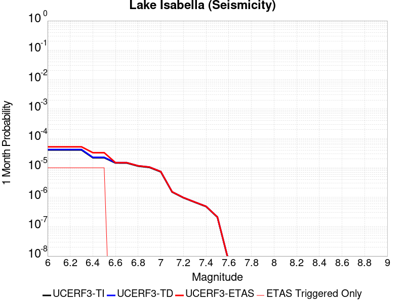 |  | 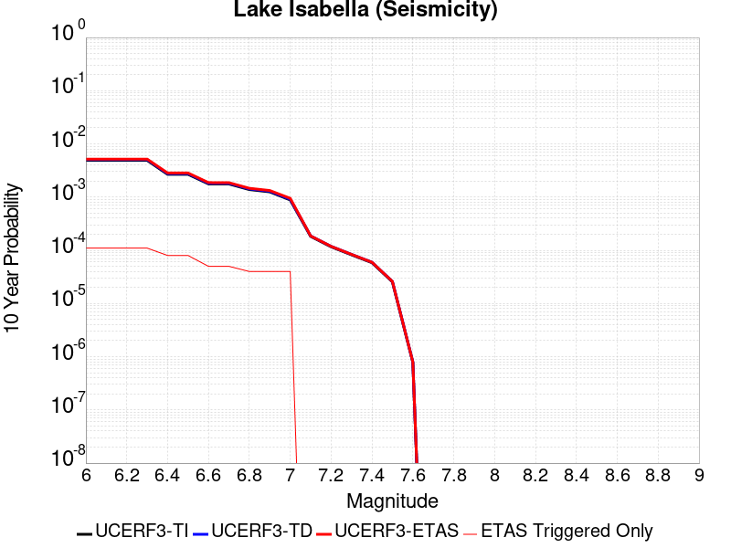 |

| Magnitude | 1 wk TI Prob | 1 wk TD Prob | 1 wk ETAS Prob | 1 wk ETAS/TD Gain | 1 wk ETAS Triggered Only | 1 mo TI Prob | 1 mo TD Prob | 1 mo ETAS Prob | 1 mo ETAS/TD Gain | 1 mo ETAS Triggered Only | 1 yr TI Prob | 1 yr TD Prob | 1 yr ETAS Prob | 1 yr ETAS/TD Gain | 1 yr ETAS Triggered Only | 10 yr TI Prob | 10 yr TD Prob | 10 yr ETAS Prob | 10 yr ETAS/TD Gain | 10 yr ETAS Triggered Only |
|-----|-----|-----|-----|-----|-----|-----|-----|-----|-----|-----|-----|-----|-----|-----|-----|-----|-----|-----|-----|-----|
| 6.0 | 9.431637E-6 | 9.741771E-6 | 9.741771E-6 | 1.0 | 0.0 | 4.0420677E-5 | 4.1749852E-5 | 5.1749434E-5 | 1.2395118 | 1.0E-5 | 4.920106E-4 | 5.08199E-4 | 5.7816337E-4 | 1.1376714 | 7.0E-5 | 0.004909227 | 0.0050716605 | 0.005181103 | 1.0215791 | 1.1E-4 |
| 6.1 | 9.431637E-6 | 9.741771E-6 | 9.741771E-6 | 1.0 | 0.0 | 4.0420677E-5 | 4.1749852E-5 | 5.1749434E-5 | 1.2395118 | 1.0E-5 | 4.920106E-4 | 5.08199E-4 | 5.7816337E-4 | 1.1376714 | 7.0E-5 | 0.004909227 | 0.0050716605 | 0.005181103 | 1.0215791 | 1.1E-4 |
| 6.2 | 9.431637E-6 | 9.741771E-6 | 9.741771E-6 | 1.0 | 0.0 | 4.0420677E-5 | 4.1749852E-5 | 5.1749434E-5 | 1.2395118 | 1.0E-5 | 4.920106E-4 | 5.08199E-4 | 5.7816337E-4 | 1.1376714 | 7.0E-5 | 0.004909227 | 0.0050716605 | 0.005181103 | 1.0215791 | 1.1E-4 |
| 6.3 | 9.431637E-6 | 9.741771E-6 | 9.741771E-6 | 1.0 | 0.0 | 4.0420677E-5 | 4.1749852E-5 | 5.1749434E-5 | 1.2395118 | 1.0E-5 | 4.920106E-4 | 5.08199E-4 | 5.7816337E-4 | 1.1376714 | 7.0E-5 | 0.004909227 | 0.0050716605 | 0.005181103 | 1.0215791 | 1.1E-4 |
| 6.4 | 5.144063E-6 | 5.300136E-6 | 5.300136E-6 | 1.0 | 0.0 | 2.2045799E-5 | 2.271469E-5 | 3.2714463E-5 | 1.4402337 | 1.0E-5 | 2.6837454E-4 | 2.765197E-4 | 3.265059E-4 | 1.180769 | 5.0E-5 | 0.0026805066 | 0.0027620967 | 0.002841876 | 1.0288835 | 8.0E-5 |
| 6.5 | 5.144063E-6 | 5.300136E-6 | 5.300136E-6 | 1.0 | 0.0 | 2.2045799E-5 | 2.271469E-5 | 3.2714463E-5 | 1.4402337 | 1.0E-5 | 2.6837454E-4 | 2.765197E-4 | 3.265059E-4 | 1.180769 | 5.0E-5 | 0.0026805066 | 0.0027620967 | 0.002841876 | 1.0288835 | 8.0E-5 |
| 6.6 | 3.4009804E-6 | 3.4988236E-6 | 3.4988236E-6 | 1.0 | 0.0 | 1.4575549E-5 | 1.4994881E-5 | 1.4994881E-5 | 1.0 | 0.0 | 1.7744285E-4 | 1.8254899E-4 | 2.0254533E-4 | 1.1095396 | 2.0E-5 | 0.0017730123 | 0.0018241481 | 0.0018740569 | 1.0273601 | 5.0E-5 |
| 6.7 | 3.3880428E-6 | 3.48569E-6 | 3.48569E-6 | 1.0 | 0.0 | 1.4520103E-5 | 1.4938595E-5 | 1.4938595E-5 | 1.0 | 0.0 | 1.767679E-4 | 1.8186383E-4 | 2.0186018E-4 | 1.1099524 | 2.0E-5 | 0.0017662736 | 0.0018173077 | 0.0018672168 | 1.0274632 | 5.0E-5 |
| 6.8 | 2.6582E-6 | 2.7337292E-6 | 2.7337292E-6 | 1.0 | 0.0 | 1.1392236E-5 | 1.1715937E-5 | 1.1715937E-5 | 1.0 | 0.0 | 1.3869164E-4 | 1.4263354E-4 | 1.5263211E-4 | 1.0700997 | 1.0E-5 | 0.0013860512 | 0.001425552 | 0.001465495 | 1.0280193 | 4.0E-5 |
| 6.9 | 2.406011E-6 | 2.474355E-6 | 2.474355E-6 | 1.0 | 0.0 | 1.0311434E-5 | 1.0604343E-5 | 1.0604343E-5 | 1.0 | 0.0 | 1.2553448E-4 | 1.2910155E-4 | 1.3910026E-4 | 1.0774484 | 1.0E-5 | 0.0012546359 | 0.001290395 | 0.0013303434 | 1.0309583 | 4.0E-5 |
| 7.0 | 1.6953097E-6 | 1.7429554E-6 | 1.7429554E-6 | 1.0 | 0.0 | 7.265593E-6 | 7.469793E-6 | 7.469793E-6 | 1.0 | 0.0 | 8.8455E-5 | 9.094198E-5 | 1.0094108E-4 | 1.1099502 | 1.0E-5 | 8.84198E-4 | 9.0915046E-4 | 9.491141E-4 | 1.0439571 | 4.0E-5 |
| 7.1 | 3.5013824E-7 | 3.571509E-7 | 3.571509E-7 | 1.0 | 0.0 | 1.5005916E-6 | 1.5306458E-6 | 1.5306458E-6 | 1.0 | 0.0 | 1.826955E-5 | 1.8635455E-5 | 1.8635455E-5 | 1.0 | 0.0 | 1.8268047E-4 | 1.8633918E-4 | 1.8633918E-4 | 1.0 | 0.0 |
| 7.2 | 2.2321095E-7 | 2.2750736E-7 | 2.2750736E-7 | 1.0 | 0.0 | 9.56618E-7 | 9.750312E-7 | 9.750312E-7 | 1.0 | 0.0 | 1.1646762E-5 | 1.1870941E-5 | 1.1870941E-5 | 1.0 | 0.0 | 1.1646151E-4 | 1.18703174E-4 | 1.18703174E-4 | 1.0 | 0.0 |
| 7.3 | 1.5760406E-7 | 1.6061036E-7 | 1.6061036E-7 | 1.0 | 0.0 | 6.7544585E-7 | 6.883299E-7 | 6.883299E-7 | 1.0 | 0.0 | 8.223522E-6 | 8.380385E-6 | 8.380385E-6 | 1.0 | 0.0 | 8.2232174E-5 | 8.3800755E-5 | 8.3800755E-5 | 1.0 | 0.0 |
| 7.4 | 1.1216497E-7 | 1.1431788E-7 | 1.1431788E-7 | 1.0 | 0.0 | 4.8070694E-7 | 4.8993365E-7 | 4.8993365E-7 | 1.0 | 0.0 | 5.852591E-6 | 5.9649265E-6 | 5.9649265E-6 | 1.0 | 0.0 | 5.8524372E-5 | 5.9647708E-5 | 5.9647708E-5 | 1.0 | 0.0 |
| 7.5 | 4.885185E-8 | 4.9788092E-8 | 4.9788092E-8 | 1.0 | 0.0 | 2.0936506E-7 | 2.1337752E-7 | 2.1337752E-7 | 1.0 | 0.0 | 2.5490165E-6 | 2.5978684E-6 | 2.5978684E-6 | 1.0 | 0.0 | 2.5489873E-5 | 2.59784E-5 | 2.59784E-5 | 1.0 | 0.0 |
| 7.6 | 1.504641E-9 | 1.5318006E-9 | 1.5318006E-9 | 1.0 | 0.0 | 6.4484613E-9 | 6.5648598E-9 | 6.5648598E-9 | 1.0 | 0.0 | 7.851001E-8 | 7.992716E-8 | 7.992716E-8 | 1.0 | 0.0 | 7.8509987E-7 | 7.992716E-7 | 7.992716E-7 | 1.0 | 0.0 |

## Baker
*[(top)](#table-of-contents)*

| 1 Week | 1 Month | 1 Year | 10 Year |
|-----|-----|-----|-----|
|  |  | 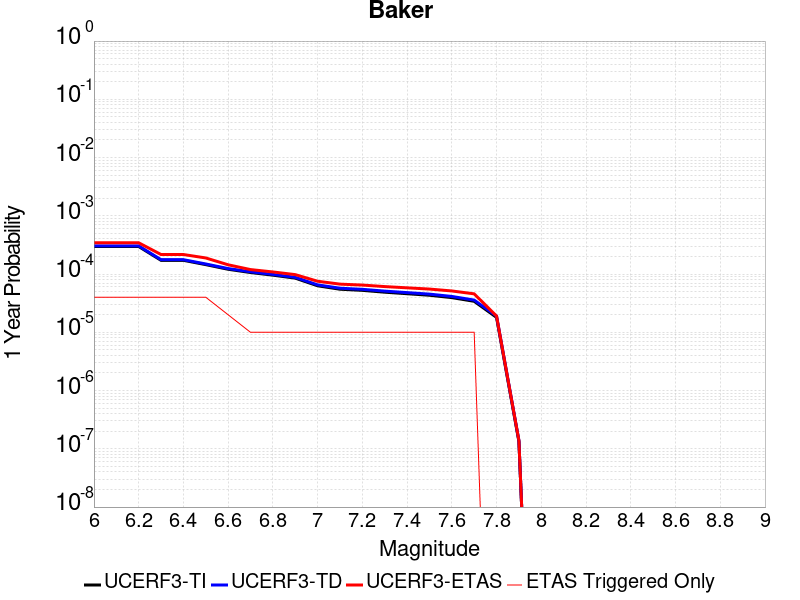 | 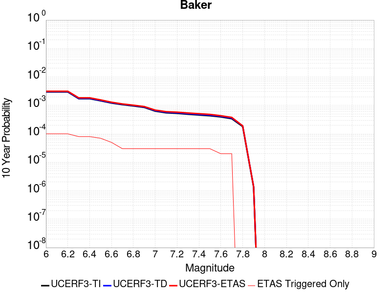 |

| Magnitude | 1 wk TI Prob | 1 wk TD Prob | 1 wk ETAS Prob | 1 wk ETAS/TD Gain | 1 wk ETAS Triggered Only | 1 mo TI Prob | 1 mo TD Prob | 1 mo ETAS Prob | 1 mo ETAS/TD Gain | 1 mo ETAS Triggered Only | 1 yr TI Prob | 1 yr TD Prob | 1 yr ETAS Prob | 1 yr ETAS/TD Gain | 1 yr ETAS Triggered Only | 10 yr TI Prob | 10 yr TD Prob | 10 yr ETAS Prob | 10 yr ETAS/TD Gain | 10 yr ETAS Triggered Only |
|-----|-----|-----|-----|-----|-----|-----|-----|-----|-----|-----|-----|-----|-----|-----|-----|-----|-----|-----|-----|-----|
| 6.0 | 5.695525E-6 | 5.8348905E-6 | 2.5834774E-5 | 4.4276366 | 2.0E-5 | 2.4409164E-5 | 2.5006457E-5 | 4.5005956E-5 | 1.7997735 | 2.0E-5 | 2.9714106E-4 | 3.044151E-4 | 3.444029E-4 | 1.1313596 | 4.0E-5 | 0.0029674405 | 0.0030403766 | 0.0031400723 | 1.0327907 | 1.0E-4 |
| 6.1 | 5.695525E-6 | 5.8348905E-6 | 2.5834774E-5 | 4.4276366 | 2.0E-5 | 2.4409164E-5 | 2.5006457E-5 | 4.5005956E-5 | 1.7997735 | 2.0E-5 | 2.9714106E-4 | 3.044151E-4 | 3.444029E-4 | 1.1313596 | 4.0E-5 | 0.0029674405 | 0.0030403766 | 0.0031400723 | 1.0327907 | 1.0E-4 |
| 6.2 | 5.695525E-6 | 5.8348905E-6 | 2.5834774E-5 | 4.4276366 | 2.0E-5 | 2.4409164E-5 | 2.5006457E-5 | 4.5005956E-5 | 1.7997735 | 2.0E-5 | 2.9714106E-4 | 3.044151E-4 | 3.444029E-4 | 1.1313596 | 4.0E-5 | 0.0029674405 | 0.0030403766 | 0.0031400723 | 1.0327907 | 1.0E-4 |
| 6.3 | 3.2995713E-6 | 3.3836993E-6 | 2.3383633E-5 | 6.9106703 | 2.0E-5 | 1.4140943E-5 | 1.4501491E-5 | 3.45012E-5 | 2.3791485 | 2.0E-5 | 1.7215237E-4 | 1.7654183E-4 | 2.1653475E-4 | 1.2265352 | 4.0E-5 | 0.0017201907 | 0.0017640629 | 0.0018439217 | 1.0452698 | 8.0E-5 |
| 6.4 | 3.2995713E-6 | 3.3836993E-6 | 2.3383633E-5 | 6.9106703 | 2.0E-5 | 1.4140943E-5 | 1.4501491E-5 | 3.45012E-5 | 2.3791485 | 2.0E-5 | 1.7215237E-4 | 1.7654183E-4 | 2.1653475E-4 | 1.2265352 | 4.0E-5 | 0.0017201907 | 0.0017640629 | 0.0018439217 | 1.0452698 | 8.0E-5 |
| 6.5 | 2.782202E-6 | 2.8558688E-6 | 2.2855811E-5 | 8.003103 | 2.0E-5 | 1.1923668E-5 | 1.2239382E-5 | 3.223914E-5 | 2.6340494 | 2.0E-5 | 1.4516099E-4 | 1.4900461E-4 | 1.8899866E-4 | 1.2684081 | 4.0E-5 | 0.001450662 | 0.0014890799 | 0.0015589757 | 1.0469389 | 7.0E-5 |
| 6.6 | 2.3163404E-6 | 2.3809448E-6 | 2.3809448E-6 | 1.0 | 0.0 | 9.927136E-6 | 1.020401E-5 | 1.020401E-5 | 1.0 | 0.0 | 1.20856166E-4 | 1.2422695E-4 | 1.4422447E-4 | 1.1609757 | 2.0E-5 | 0.0012079047 | 0.0012415954 | 0.0012915332 | 1.0402207 | 5.0E-5 |
| 6.7 | 2.037056E-6 | 2.0965235E-6 | 2.0965235E-6 | 1.0 | 0.0 | 8.7302105E-6 | 8.98507E-6 | 8.98507E-6 | 1.0 | 0.0 | 1.0628513E-4 | 1.09387904E-4 | 1.1938681E-4 | 1.0914078 | 1.0E-5 | 0.0010623431 | 0.0010933568 | 0.0011233239 | 1.0274085 | 3.0E-5 |
| 6.8 | 1.8356744E-6 | 1.8915503E-6 | 1.8915503E-6 | 1.0 | 0.0 | 7.867153E-6 | 8.10662E-6 | 8.10662E-6 | 1.0 | 0.0 | 9.577837E-5 | 9.869377E-5 | 1.0869278E-4 | 1.1013135 | 1.0E-5 | 9.57371E-4 | 9.865133E-4 | 0.0010164838 | 1.0303801 | 3.0E-5 |
| 6.9 | 1.6310546E-6 | 1.6832274E-6 | 1.6832274E-6 | 1.0 | 0.0 | 6.9902153E-6 | 7.2138123E-6 | 7.2138123E-6 | 1.0 | 0.0 | 8.510255E-5 | 8.782474E-5 | 9.782386E-5 | 1.1138531 | 1.0E-5 | 8.5069967E-4 | 8.779116E-4 | 9.0788526E-4 | 1.034142 | 3.0E-5 |
| 7.0 | 1.2058036E-6 | 1.2508841E-6 | 1.2508841E-6 | 1.0 | 0.0 | 5.1677193E-6 | 5.360921E-6 | 5.360921E-6 | 1.0 | 0.0 | 6.291517E-5 | 6.526728E-5 | 7.526663E-5 | 1.1532061 | 1.0E-5 | 6.289736E-4 | 6.5248343E-4 | 6.8246387E-4 | 1.0459481 | 3.0E-5 |
| 7.1 | 1.052382E-6 | 1.0951775E-6 | 1.0951775E-6 | 1.0 | 0.0 | 4.5102006E-6 | 4.6936098E-6 | 4.6936098E-6 | 1.0 | 0.0 | 5.491031E-5 | 5.7143207E-5 | 6.714264E-5 | 1.174989 | 1.0E-5 | 5.4896745E-4 | 5.71286E-4 | 6.012689E-4 | 1.0524831 | 3.0E-5 |
| 7.2 | 1.0067454E-6 | 1.0487875E-6 | 1.0487875E-6 | 1.0 | 0.0 | 4.3146156E-6 | 4.4947956E-6 | 4.4947956E-6 | 1.0 | 0.0 | 5.252918E-5 | 5.4722772E-5 | 6.4722226E-5 | 1.1827292 | 1.0E-5 | 5.251676E-4 | 5.470938E-4 | 5.7707744E-4 | 1.0548052 | 3.0E-5 |
| 7.3 | 9.3596316E-7 | 9.767882E-7 | 9.767882E-7 | 1.0 | 0.0 | 4.0112645E-6 | 4.1862286E-6 | 4.1862286E-6 | 1.0 | 0.0 | 4.8836053E-5 | 5.096615E-5 | 6.096564E-5 | 1.1961987 | 1.0E-5 | 4.8825322E-4 | 5.0954544E-4 | 5.395301E-4 | 1.058846 | 3.0E-5 |
| 7.4 | 8.8117395E-7 | 9.207818E-7 | 9.207818E-7 | 1.0 | 0.0 | 3.7764542E-6 | 3.946202E-6 | 3.946202E-6 | 1.0 | 0.0 | 4.5977362E-5 | 4.8043956E-5 | 5.8043475E-5 | 1.2081327 | 1.0E-5 | 4.596785E-4 | 4.8033646E-4 | 5.1032205E-4 | 1.0624262 | 3.0E-5 |
| 7.5 | 8.292386E-7 | 8.674745E-7 | 8.674745E-7 | 1.0 | 0.0 | 3.5538749E-6 | 3.7177426E-6 | 3.7177426E-6 | 1.0 | 0.0 | 4.326757E-5 | 4.5262583E-5 | 5.526213E-5 | 1.2209231 | 1.0E-5 | 4.3259145E-4 | 4.5253438E-4 | 4.8252082E-4 | 1.0662633 | 3.0E-5 |
| 7.6 | 7.553842E-7 | 7.9146116E-7 | 7.9146116E-7 | 1.0 | 0.0 | 3.2373566E-6 | 3.391972E-6 | 3.391972E-6 | 1.0 | 0.0 | 3.9414106E-5 | 4.1296484E-5 | 5.1296072E-5 | 1.2421414 | 1.0E-5 | 3.9407116E-4 | 4.1288882E-4 | 4.3288057E-4 | 1.0484192 | 2.0E-5 |
| 7.7 | 6.5285366E-7 | 6.852924E-7 | 6.852924E-7 | 1.0 | 0.0 | 2.797941E-6 | 2.9369642E-6 | 2.9369642E-6 | 1.0 | 0.0 | 3.40644E-5 | 3.575696E-5 | 4.5756602E-5 | 1.2796558 | 1.0E-5 | 3.405918E-4 | 3.575127E-4 | 3.7750555E-4 | 1.055922 | 2.0E-5 |
| 7.8 | 3.4586725E-7 | 3.648336E-7 | 3.648336E-7 | 1.0 | 0.0 | 1.4822873E-6 | 1.5635717E-6 | 1.5635717E-6 | 1.0 | 0.0 | 1.80467E-5 | 1.9036323E-5 | 1.9036323E-5 | 1.0 | 0.0 | 1.8045233E-4 | 1.9034736E-4 | 1.9034736E-4 | 1.0 | 0.0 |
| 7.9 | 2.5591178E-9 | 2.6697147E-9 | 2.6697147E-9 | 1.0 | 0.0 | 1.0967647E-8 | 1.1441634E-8 | 1.1441634E-8 | 1.0 | 0.0 | 1.335311E-7 | 1.3930189E-7 | 1.3930189E-7 | 1.0 | 0.0 | 1.3353102E-6 | 1.3930189E-6 | 1.3930189E-6 | 1.0 | 0.0 |

## Ludlow
*[(top)](#table-of-contents)*

| 1 Week | 1 Month | 1 Year | 10 Year |
|-----|-----|-----|-----|
|  |  | 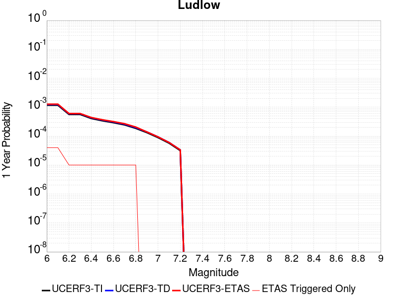 | 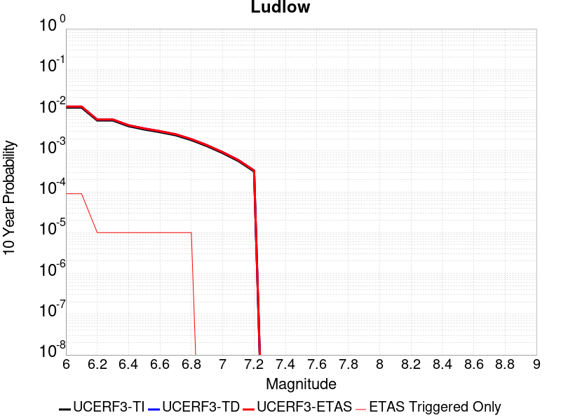 |

| Magnitude | 1 wk TI Prob | 1 wk TD Prob | 1 wk ETAS Prob | 1 wk ETAS/TD Gain | 1 wk ETAS Triggered Only | 1 mo TI Prob | 1 mo TD Prob | 1 mo ETAS Prob | 1 mo ETAS/TD Gain | 1 mo ETAS Triggered Only | 1 yr TI Prob | 1 yr TD Prob | 1 yr ETAS Prob | 1 yr ETAS/TD Gain | 1 yr ETAS Triggered Only | 10 yr TI Prob | 10 yr TD Prob | 10 yr ETAS Prob | 10 yr ETAS/TD Gain | 10 yr ETAS Triggered Only |
|-----|-----|-----|-----|-----|-----|-----|-----|-----|-----|-----|-----|-----|-----|-----|-----|-----|-----|-----|-----|-----|
| 6.0 | 2.2407607E-5 | 2.3657743E-5 | 3.3657507E-5 | 1.4226846 | 1.0E-5 | 9.602906E-5 | 1.0138664E-4 | 1.313836E-4 | 1.295867 | 3.0E-5 | 0.0011685267 | 0.0012337274 | 0.0012736782 | 1.032382 | 4.0E-5 | 0.011624013 | 0.012273295 | 0.0123621905 | 1.007243 | 9.0E-5 |
| 6.1 | 2.2407607E-5 | 2.3657743E-5 | 3.3657507E-5 | 1.4226846 | 1.0E-5 | 9.602906E-5 | 1.0138664E-4 | 1.313836E-4 | 1.295867 | 3.0E-5 | 0.0011685267 | 0.0012337274 | 0.0012736782 | 1.032382 | 4.0E-5 | 0.011624013 | 0.012273295 | 0.0123621905 | 1.007243 | 9.0E-5 |
| 6.2 | 1.0781252E-5 | 1.13658925E-5 | 1.13658925E-5 | 1.0 | 0.0 | 4.620455E-5 | 4.871008E-5 | 5.8709593E-5 | 1.2052863 | 1.0E-5 | 5.623952E-4 | 5.928879E-4 | 6.0288195E-4 | 1.0168566 | 1.0E-5 | 0.00560974 | 0.00591348 | 0.005923421 | 1.0016811 | 1.0E-5 |
| 6.3 | 1.0781252E-5 | 1.13658925E-5 | 1.13658925E-5 | 1.0 | 0.0 | 4.620455E-5 | 4.871008E-5 | 5.8709593E-5 | 1.2052863 | 1.0E-5 | 5.623952E-4 | 5.928879E-4 | 6.0288195E-4 | 1.0168566 | 1.0E-5 | 0.00560974 | 0.00591348 | 0.005923421 | 1.0016811 | 1.0E-5 |
| 6.4 | 7.814439E-6 | 8.237895E-6 | 8.237895E-6 | 1.0 | 0.0 | 3.3490025E-5 | 3.5304794E-5 | 4.530444E-5 | 1.2832377 | 1.0E-5 | 4.0766477E-4 | 4.297525E-4 | 4.3974817E-4 | 1.0232592 | 1.0E-5 | 0.0040691774 | 0.0042893607 | 0.004299318 | 1.0023214 | 1.0E-5 |
| 6.5 | 6.4986366E-6 | 6.8510576E-6 | 6.8510576E-6 | 1.0 | 0.0 | 2.7851002E-5 | 2.936135E-5 | 3.9361057E-5 | 1.3405738 | 1.0E-5 | 3.390332E-4 | 3.5741672E-4 | 3.6741316E-4 | 1.0279685 | 1.0E-5 | 0.003385164 | 0.0035685152 | 0.0035784794 | 1.0027922 | 1.0E-5 |
| 6.6 | 5.582177E-6 | 5.8861247E-6 | 5.8861247E-6 | 1.0 | 0.0 | 2.3923398E-5 | 2.5226009E-5 | 3.5225756E-5 | 1.3964063 | 1.0E-5 | 2.9122844E-4 | 3.070841E-4 | 3.1708102E-4 | 1.0325544 | 1.0E-5 | 0.0029084706 | 0.0030666708 | 0.0030766402 | 1.0032508 | 1.0E-5 |
| 6.7 | 4.6858763E-6 | 4.940527E-6 | 4.940527E-6 | 1.0 | 0.0 | 2.0082172E-5 | 2.1173519E-5 | 3.1173306E-5 | 1.4722781 | 1.0E-5 | 2.4447302E-4 | 2.5775764E-4 | 2.6775507E-4 | 1.0387862 | 1.0E-5 | 0.0024420423 | 0.0025746431 | 0.0025846176 | 1.0038741 | 1.0E-5 |
| 6.8 | 3.5584908E-6 | 3.7520942E-6 | 3.7520942E-6 | 1.0 | 0.0 | 1.5250586E-5 | 1.6080307E-5 | 2.6080146E-5 | 1.6218687 | 1.0E-5 | 1.8566006E-4 | 1.9576056E-4 | 2.057586E-4 | 1.0510728 | 1.0E-5 | 0.0018550502 | 0.0019559222 | 0.0019659027 | 1.0051026 | 1.0E-5 |
| 6.9 | 2.532834E-6 | 2.6710577E-6 | 2.6710577E-6 | 1.0 | 0.0 | 1.0854958E-5 | 1.1447341E-5 | 1.1447341E-5 | 1.0 | 0.0 | 1.3215111E-4 | 1.3936275E-4 | 1.3936275E-4 | 1.0 | 0.0 | 0.0013207254 | 0.001392781 | 0.001392781 | 1.0 | 0.0 |
| 7.0 | 1.7083285E-6 | 1.8019805E-6 | 1.8019805E-6 | 1.0 | 0.0 | 7.3213873E-6 | 7.722751E-6 | 7.722751E-6 | 1.0 | 0.0 | 8.913424E-5 | 9.4020616E-5 | 9.4020616E-5 | 1.0 | 0.0 | 8.9098496E-4 | 9.3982485E-4 | 9.3982485E-4 | 1.0 | 0.0 |
| 7.1 | 1.0905424E-6 | 1.1497851E-6 | 1.1497851E-6 | 1.0 | 0.0 | 4.6737446E-6 | 4.927642E-6 | 4.927642E-6 | 1.0 | 0.0 | 5.6901354E-5 | 5.999249E-5 | 5.999249E-5 | 1.0 | 0.0 | 5.6886784E-4 | 5.997727E-4 | 5.997727E-4 | 1.0 | 0.0 |
| 7.2 | 6.06668E-7 | 6.387403E-7 | 6.387403E-7 | 1.0 | 0.0 | 2.600003E-6 | 2.7374558E-6 | 2.7374558E-6 | 1.0 | 0.0 | 3.1654577E-5 | 3.3328084E-5 | 3.3328084E-5 | 1.0 | 0.0 | 3.1650066E-4 | 3.3323772E-4 | 3.3323772E-4 | 1.0 | 0.0 |

## Red Mountain
*[(top)](#table-of-contents)*

| 1 Week | 1 Month | 1 Year | 10 Year |
|-----|-----|-----|-----|
| 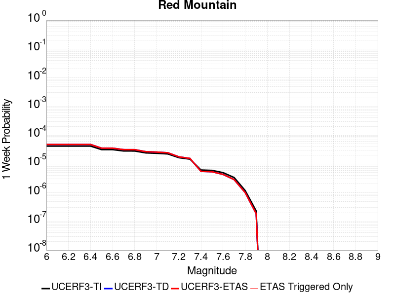 |  | 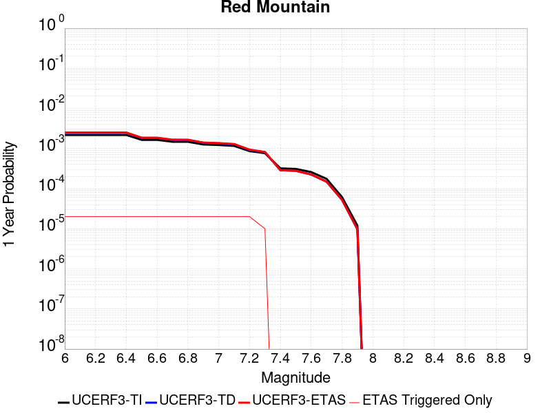 |  |

| Magnitude | 1 wk TI Prob | 1 wk TD Prob | 1 wk ETAS Prob | 1 wk ETAS/TD Gain | 1 wk ETAS Triggered Only | 1 mo TI Prob | 1 mo TD Prob | 1 mo ETAS Prob | 1 mo ETAS/TD Gain | 1 mo ETAS Triggered Only | 1 yr TI Prob | 1 yr TD Prob | 1 yr ETAS Prob | 1 yr ETAS/TD Gain | 1 yr ETAS Triggered Only | 10 yr TI Prob | 10 yr TD Prob | 10 yr ETAS Prob | 10 yr ETAS/TD Gain | 10 yr ETAS Triggered Only |
|-----|-----|-----|-----|-----|-----|-----|-----|-----|-----|-----|-----|-----|-----|-----|-----|-----|-----|-----|-----|-----|
| 6.0 | 4.1810763E-5 | 4.7592912E-5 | 4.7592912E-5 | 1.0 | 0.0 | 1.7917668E-4 | 2.039546E-4 | 2.039546E-4 | 1.0 | 0.0 | 0.0021792934 | 0.002480485 | 0.0025004353 | 1.0080429 | 2.0E-5 | 0.021580452 | 0.024545603 | 0.024643147 | 1.0039741 | 1.0E-4 |
| 6.1 | 4.1810763E-5 | 4.7592912E-5 | 4.7592912E-5 | 1.0 | 0.0 | 1.7917668E-4 | 2.039546E-4 | 2.039546E-4 | 1.0 | 0.0 | 0.0021792934 | 0.002480485 | 0.0025004353 | 1.0080429 | 2.0E-5 | 0.021580452 | 0.024545603 | 0.024643147 | 1.0039741 | 1.0E-4 |
| 6.2 | 4.1810763E-5 | 4.7592912E-5 | 4.7592912E-5 | 1.0 | 0.0 | 1.7917668E-4 | 2.039546E-4 | 2.039546E-4 | 1.0 | 0.0 | 0.0021792934 | 0.002480485 | 0.0025004353 | 1.0080429 | 2.0E-5 | 0.021580452 | 0.024545603 | 0.024643147 | 1.0039741 | 1.0E-4 |
| 6.3 | 4.1810763E-5 | 4.7592912E-5 | 4.7592912E-5 | 1.0 | 0.0 | 1.7917668E-4 | 2.039546E-4 | 2.039546E-4 | 1.0 | 0.0 | 0.0021792934 | 0.002480485 | 0.0025004353 | 1.0080429 | 2.0E-5 | 0.021580452 | 0.024545603 | 0.024643147 | 1.0039741 | 1.0E-4 |
| 6.4 | 4.1810763E-5 | 4.7592912E-5 | 4.7592912E-5 | 1.0 | 0.0 | 1.7917668E-4 | 2.039546E-4 | 2.039546E-4 | 1.0 | 0.0 | 0.0021792934 | 0.002480485 | 0.0025004353 | 1.0080429 | 2.0E-5 | 0.021580452 | 0.024545603 | 0.024643147 | 1.0039741 | 1.0E-4 |
| 6.5 | 3.154503E-5 | 3.5361823E-5 | 3.5361823E-5 | 1.0 | 0.0 | 1.3518598E-4 | 1.5154238E-4 | 1.5154238E-4 | 1.0 | 0.0 | 0.0016446467 | 0.0018435593 | 0.0018635225 | 1.0108286 | 2.0E-5 | 0.01632528 | 0.018292308 | 0.018380662 | 1.0048301 | 9.0E-5 |
| 6.6 | 3.1535834E-5 | 3.5351204E-5 | 3.5351204E-5 | 1.0 | 0.0 | 1.3514658E-4 | 1.5149688E-4 | 1.5149688E-4 | 1.0 | 0.0 | 0.0016441676 | 0.0018430062 | 0.0018629694 | 1.0108318 | 2.0E-5 | 0.01632056 | 0.018286869 | 0.018375224 | 1.0048316 | 9.0E-5 |
| 6.7 | 2.8267326E-5 | 3.1471165E-5 | 3.1471165E-5 | 1.0 | 0.0 | 1.2114006E-4 | 1.3486993E-4 | 1.3486993E-4 | 1.0 | 0.0 | 0.0014738824 | 0.0016408897 | 0.0016608569 | 1.0121685 | 2.0E-5 | 0.014641452 | 0.016296502 | 0.016375197 | 1.004829 | 8.0E-5 |
| 6.8 | 2.8212884E-5 | 3.1409047E-5 | 3.1409047E-5 | 1.0 | 0.0 | 1.20906756E-4 | 1.3460373E-4 | 1.3460373E-4 | 1.0 | 0.0 | 0.0014710457 | 0.0016376537 | 0.0016576209 | 1.0121926 | 2.0E-5 | 0.014613459 | 0.016264616 | 0.016343314 | 1.0048387 | 8.0E-5 |
| 6.9 | 2.4227871E-5 | 2.6708487E-5 | 2.6708487E-5 | 1.0 | 0.0 | 1.03829596E-4 | 1.1446035E-4 | 1.1446035E-4 | 1.0 | 0.0 | 0.0012633923 | 0.0013927398 | 0.0014127119 | 1.0143402 | 2.0E-5 | 0.012562336 | 0.013847803 | 0.013926695 | 1.0056971 | 8.0E-5 |
| 7.0 | 2.348524E-5 | 2.5837215E-5 | 2.5837215E-5 | 1.0 | 0.0 | 1.0064714E-4 | 1.1072665E-4 | 1.1072665E-4 | 1.0 | 0.0 | 0.0012246901 | 0.0013473389 | 0.0013673119 | 1.014824 | 2.0E-5 | 0.012179627 | 0.013399338 | 0.013468401 | 1.0051541 | 7.0E-5 |
| 7.1 | 2.2311642E-5 | 2.4464194E-5 | 2.4464194E-5 | 1.0 | 0.0 | 9.561782E-5 | 1.0484276E-4 | 1.0484276E-4 | 1.0 | 0.0 | 0.0011635252 | 0.001275788 | 0.0012957624 | 1.0156566 | 2.0E-5 | 0.01157452 | 0.012692156 | 0.012761268 | 1.0054452 | 7.0E-5 |
| 7.2 | 1.6533986E-5 | 1.767127E-5 | 1.767127E-5 | 1.0 | 0.0 | 7.085802E-5 | 7.573217E-5 | 7.573217E-5 | 1.0 | 0.0 | 8.623549E-4 | 9.2171255E-4 | 9.4169413E-4 | 1.0216787 | 2.0E-5 | 0.008590161 | 0.009185176 | 0.009244625 | 1.0064722 | 6.0E-5 |
| 7.3 | 1.4703092E-5 | 1.5560321E-5 | 1.5560321E-5 | 1.0 | 0.0 | 6.301173E-5 | 6.668574E-5 | 6.668574E-5 | 1.0 | 0.0 | 7.668978E-4 | 8.1165804E-4 | 8.216499E-4 | 1.0123105 | 1.0E-5 | 0.0076425658 | 0.008093012 | 0.008142606 | 1.0061282 | 5.0E-5 |
| 7.4 | 6.1331984E-6 | 5.5290357E-6 | 5.5290357E-6 | 1.0 | 0.0 | 2.6284872E-5 | 2.3695655E-5 | 2.3695655E-5 | 1.0 | 0.0 | 3.199713E-4 | 2.8845694E-4 | 2.8845694E-4 | 1.0 | 0.0 | 0.0031951098 | 0.0028808797 | 0.0029008219 | 1.0069224 | 2.0E-5 |
| 7.5 | 5.954766E-6 | 5.3386593E-6 | 5.3386593E-6 | 1.0 | 0.0 | 2.5520176E-5 | 2.287977E-5 | 2.287977E-5 | 1.0 | 0.0 | 3.1066386E-4 | 2.7852613E-4 | 2.7852613E-4 | 1.0 | 0.0 | 0.003102299 | 0.0027818244 | 0.0028017687 | 1.0071695 | 2.0E-5 |
| 7.6 | 4.9726646E-6 | 4.315423E-6 | 4.315423E-6 | 1.0 | 0.0 | 2.1311245E-5 | 1.8494542E-5 | 1.8494542E-5 | 1.0 | 0.0 | 2.5943352E-4 | 2.251481E-4 | 2.251481E-4 | 1.0 | 0.0 | 0.0025913084 | 0.0022492348 | 0.0022691898 | 1.0088719 | 2.0E-5 |
| 7.7 | 3.3613894E-6 | 2.8527484E-6 | 2.8527484E-6 | 1.0 | 0.0 | 1.4405875E-5 | 1.2226009E-5 | 1.2226009E-5 | 1.0 | 0.0 | 1.7537741E-4 | 1.4884175E-4 | 1.4884175E-4 | 1.0 | 0.0 | 0.0017523908 | 0.001487447 | 0.0015074172 | 1.0134258 | 2.0E-5 |
| 7.8 | 1.1828961E-6 | 1.0123005E-6 | 1.0123005E-6 | 1.0 | 0.0 | 5.069545E-6 | 4.3384234E-6 | 4.3384234E-6 | 1.0 | 0.0 | 6.171996E-5 | 5.2819058E-5 | 5.2819058E-5 | 1.0 | 0.0 | 6.170282E-4 | 5.2806793E-4 | 5.3806265E-4 | 1.018927 | 1.0E-5 |
| 7.9 | 2.2967266E-7 | 1.8619417E-7 | 1.8619417E-7 | 1.0 | 0.0 | 9.843111E-7 | 7.979748E-7 | 7.979748E-7 | 1.0 | 0.0 | 1.19839215E-5 | 9.715302E-6 | 9.715302E-6 | 1.0 | 0.0 | 1.1983275E-4 | 9.7149066E-5 | 9.7149066E-5 | 1.0 | 0.0 |

## San Jacinto (Anza) rev
*[(top)](#table-of-contents)*

| 1 Week | 1 Month | 1 Year | 10 Year |
|-----|-----|-----|-----|
|  |  | 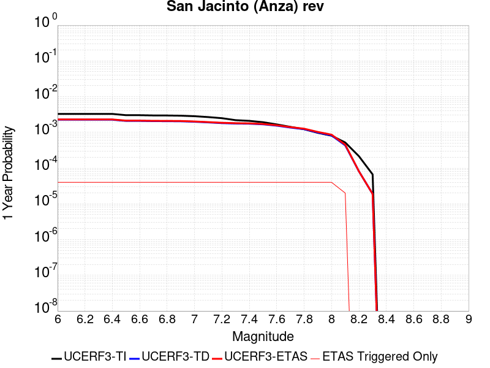 | 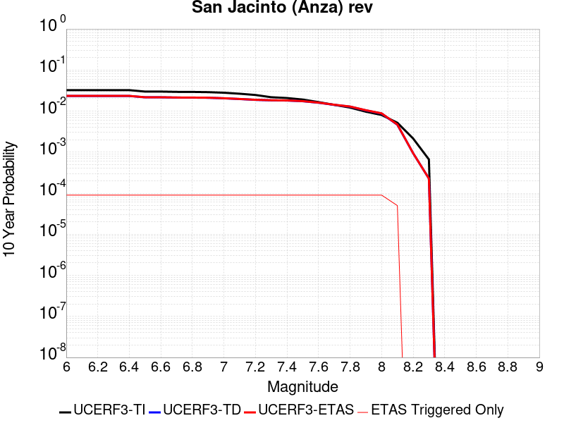 |

| Magnitude | 1 wk TI Prob | 1 wk TD Prob | 1 wk ETAS Prob | 1 wk ETAS/TD Gain | 1 wk ETAS Triggered Only | 1 mo TI Prob | 1 mo TD Prob | 1 mo ETAS Prob | 1 mo ETAS/TD Gain | 1 mo ETAS Triggered Only | 1 yr TI Prob | 1 yr TD Prob | 1 yr ETAS Prob | 1 yr ETAS/TD Gain | 1 yr ETAS Triggered Only | 10 yr TI Prob | 10 yr TD Prob | 10 yr ETAS Prob | 10 yr ETAS/TD Gain | 10 yr ETAS Triggered Only |
|-----|-----|-----|-----|-----|-----|-----|-----|-----|-----|-----|-----|-----|-----|-----|-----|-----|-----|-----|-----|-----|
| 6.0 | 6.3015636E-5 | 4.335686E-5 | 5.3356427E-5 | 1.230634 | 1.0E-5 | 2.7003905E-4 | 1.8580195E-4 | 1.958001E-4 | 1.0538107 | 1.0E-5 | 0.0032827691 | 0.002259804 | 0.0022997134 | 1.0176606 | 4.0E-5 | 0.032346968 | 0.02332425 | 0.02341215 | 1.0037687 | 9.0E-5 |
| 6.1 | 6.3015636E-5 | 4.335686E-5 | 5.3356427E-5 | 1.230634 | 1.0E-5 | 2.7003905E-4 | 1.8580195E-4 | 1.958001E-4 | 1.0538107 | 1.0E-5 | 0.0032827691 | 0.002259804 | 0.0022997134 | 1.0176606 | 4.0E-5 | 0.032346968 | 0.02332425 | 0.02341215 | 1.0037687 | 9.0E-5 |
| 6.2 | 6.3015636E-5 | 4.335686E-5 | 5.3356427E-5 | 1.230634 | 1.0E-5 | 2.7003905E-4 | 1.8580195E-4 | 1.958001E-4 | 1.0538107 | 1.0E-5 | 0.0032827691 | 0.002259804 | 0.0022997134 | 1.0176606 | 4.0E-5 | 0.032346968 | 0.02332425 | 0.02341215 | 1.0037687 | 9.0E-5 |
| 6.3 | 6.3015636E-5 | 4.335686E-5 | 5.3356427E-5 | 1.230634 | 1.0E-5 | 2.7003905E-4 | 1.8580195E-4 | 1.958001E-4 | 1.0538107 | 1.0E-5 | 0.0032827691 | 0.002259804 | 0.0022997134 | 1.0176606 | 4.0E-5 | 0.032346968 | 0.02332425 | 0.02341215 | 1.0037687 | 9.0E-5 |
| 6.4 | 6.3015636E-5 | 4.335686E-5 | 5.3356427E-5 | 1.230634 | 1.0E-5 | 2.7003905E-4 | 1.8580195E-4 | 1.958001E-4 | 1.0538107 | 1.0E-5 | 0.0032827691 | 0.002259804 | 0.0022997134 | 1.0176606 | 4.0E-5 | 0.032346968 | 0.02332425 | 0.02341215 | 1.0037687 | 9.0E-5 |
| 6.5 | 5.811017E-5 | 4.013432E-5 | 5.013392E-5 | 1.2491533 | 1.0E-5 | 2.4901982E-4 | 1.7199293E-4 | 1.819912E-4 | 1.0581319 | 1.0E-5 | 0.0030276014 | 0.0020920085 | 0.0021319247 | 1.0190804 | 4.0E-5 | 0.02986684 | 0.021620627 | 0.02170868 | 1.0040727 | 9.0E-5 |
| 6.6 | 5.811017E-5 | 4.013432E-5 | 5.013392E-5 | 1.2491533 | 1.0E-5 | 2.4901982E-4 | 1.7199293E-4 | 1.819912E-4 | 1.0581319 | 1.0E-5 | 0.0030276014 | 0.0020920085 | 0.0021319247 | 1.0190804 | 4.0E-5 | 0.02986684 | 0.021620627 | 0.02170868 | 1.0040727 | 9.0E-5 |
| 6.7 | 5.712442E-5 | 3.955652E-5 | 4.955612E-5 | 1.2527928 | 1.0E-5 | 2.4479596E-4 | 1.6951695E-4 | 1.7951526E-4 | 1.0589812 | 1.0E-5 | 0.0029763177 | 0.0020619207 | 0.0021018384 | 1.0193594 | 4.0E-5 | 0.029367693 | 0.021312203 | 0.021400284 | 1.004133 | 9.0E-5 |
| 6.8 | 5.6967532E-5 | 3.941285E-5 | 4.9412454E-5 | 1.2537143 | 1.0E-5 | 2.4412372E-4 | 1.6890132E-4 | 1.7889962E-4 | 1.0591961 | 1.0E-5 | 0.0029681553 | 0.0020544394 | 0.0020943573 | 1.01943 | 4.0E-5 | 0.029288229 | 0.021236885 | 0.021324974 | 1.0041479 | 9.0E-5 |
| 6.9 | 5.6211324E-5 | 3.9117327E-5 | 4.9116938E-5 | 1.2556312 | 1.0E-5 | 2.4088343E-4 | 1.6763495E-4 | 1.7763326E-4 | 1.0596434 | 1.0E-5 | 0.0029288116 | 0.0020390505 | 0.0020789688 | 1.019577 | 4.0E-5 | 0.028905109 | 0.021076152 | 0.021164255 | 1.0041802 | 9.0E-5 |
| 7.0 | 5.4383527E-5 | 3.797681E-5 | 4.797643E-5 | 1.2633086 | 1.0E-5 | 2.3305144E-4 | 1.6274763E-4 | 1.72746E-4 | 1.0614349 | 1.0E-5 | 0.0028337094 | 0.0019796565 | 0.0020195774 | 1.0201656 | 4.0E-5 | 0.027978465 | 0.02046659 | 0.020554747 | 1.0043074 | 9.0E-5 |
| 7.1 | 5.1393665E-5 | 3.643812E-5 | 4.6437755E-5 | 1.2744279 | 1.0E-5 | 2.2023996E-4 | 1.5615404E-4 | 1.6615249E-4 | 1.0640293 | 1.0E-5 | 0.0026781242 | 0.0018995219 | 0.001939446 | 1.0210179 | 4.0E-5 | 0.026460782 | 0.01963942 | 0.019727651 | 1.0044926 | 9.0E-5 |
| 7.2 | 4.785222E-5 | 3.4788187E-5 | 4.4787837E-5 | 1.2874439 | 1.0E-5 | 2.0506482E-4 | 1.4908372E-4 | 1.5908224E-4 | 1.0670664 | 1.0E-5 | 0.0024938055 | 0.0018135867 | 0.0018535142 | 1.0220157 | 4.0E-5 | 0.024660049 | 0.018753184 | 0.018841496 | 1.0047092 | 9.0E-5 |
| 7.3 | 4.2143256E-5 | 3.3881366E-5 | 4.3881028E-5 | 1.2951375 | 1.0E-5 | 1.8060145E-4 | 1.4519779E-4 | 1.5519634E-4 | 1.0688616 | 1.0E-5 | 0.002196605 | 0.0017663531 | 0.0018062826 | 1.0226055 | 4.0E-5 | 0.02175019 | 0.018260721 | 0.018349078 | 1.0048386 | 9.0E-5 |
| 7.4 | 4.0264713E-5 | 3.3519147E-5 | 4.3518812E-5 | 1.298327 | 1.0E-5 | 1.7255165E-4 | 1.4364561E-4 | 1.5364417E-4 | 1.0696058 | 1.0E-5 | 0.002098792 | 0.0017474857 | 0.0017874158 | 1.02285 | 4.0E-5 | 0.020790804 | 0.018065086 | 0.018153459 | 1.004892 | 9.0E-5 |
| 7.5 | 3.694492E-5 | 3.2231463E-5 | 4.223114E-5 | 1.3102459 | 1.0E-5 | 1.5832575E-4 | 1.3812754E-4 | 1.4812616E-4 | 1.0723869 | 1.0E-5 | 0.0019259118 | 0.0016804087 | 0.0017203415 | 1.0237638 | 4.0E-5 | 0.01909306 | 0.017380662 | 0.017469097 | 1.0050882 | 9.0E-5 |
| 7.6 | 3.200565E-5 | 2.9540213E-5 | 3.953992E-5 | 1.3385116 | 1.0E-5 | 1.3715986E-4 | 1.2659478E-4 | 1.3659352E-4 | 1.0789822 | 1.0E-5 | 0.001668642 | 0.001540204 | 0.0015801424 | 1.0259306 | 4.0E-5 | 0.01656168 | 0.015965091 | 0.016053654 | 1.0055473 | 9.0E-5 |
| 7.7 | 2.731642E-5 | 2.61279E-5 | 3.612764E-5 | 1.3827226 | 1.0E-5 | 1.1706512E-4 | 1.11971916E-4 | 1.2197079E-4 | 1.0892981 | 1.0E-5 | 0.001424336 | 0.0013624065 | 0.001402352 | 1.0293198 | 4.0E-5 | 0.014152412 | 0.014185313 | 0.0142740365 | 1.0062546 | 9.0E-5 |
| 7.8 | 2.3466424E-5 | 2.3538514E-5 | 3.353828E-5 | 1.4248257 | 1.0E-5 | 1.0056651E-4 | 1.0087545E-4 | 1.1087444E-4 | 1.0991222 | 1.0E-5 | 0.0012237094 | 0.0012274674 | 0.0012674184 | 1.0325475 | 4.0E-5 | 0.012169928 | 0.012826493 | 0.012915338 | 1.0069268 | 9.0E-5 |
| 7.9 | 1.8611925E-5 | 1.8938485E-5 | 2.8938295E-5 | 1.5280154 | 1.0E-5 | 7.9762955E-5 | 8.116241E-5 | 9.11616E-5 | 1.1231997 | 1.0E-5 | 9.7068126E-4 | 9.877052E-4 | 0.0010276657 | 1.040458 | 4.0E-5 | 0.0096645225 | 0.01040975 | 0.010498813 | 1.0085558 | 9.0E-5 |
| 8.0 | 1.5460775E-5 | 1.576795E-5 | 2.5767791E-5 | 1.6341878 | 1.0E-5 | 6.6258784E-5 | 6.757518E-5 | 7.757451E-5 | 1.1479733 | 1.0E-5 | 8.0640207E-4 | 8.2241796E-4 | 8.6238503E-4 | 1.0485971 | 4.0E-5 | 0.008034821 | 0.008717085 | 0.0088063 | 1.0102346 | 9.0E-5 |
| 8.1 | 9.983884E-6 | 8.285737E-6 | 8.285737E-6 | 1.0 | 0.0 | 4.2787375E-5 | 3.550982E-5 | 3.550982E-5 | 1.0 | 0.0 | 5.2081177E-4 | 4.322468E-4 | 4.5223816E-4 | 1.0462499 | 2.0E-5 | 0.0051959283 | 0.0046485034 | 0.004698271 | 1.0107062 | 5.0E-5 |
| 8.2 | 4.1226E-6 | 1.5575664E-6 | 1.5575664E-6 | 1.0 | 0.0 | 1.7668166E-5 | 6.6752677E-6 | 6.6752677E-6 | 1.0 | 0.0 | 2.1508869E-4 | 8.126839E-5 | 8.126839E-5 | 1.0 | 0.0 | 0.0021488064 | 9.4312185E-4 | 9.4312185E-4 | 1.0 | 0.0 |
| 8.3 | 1.2750878E-6 | 3.624692E-7 | 3.624692E-7 | 1.0 | 0.0 | 5.4646503E-6 | 1.5534386E-6 | 1.5534386E-6 | 1.0 | 0.0 | 6.653009E-5 | 1.8912953E-5 | 1.8912953E-5 | 1.0 | 0.0 | 6.6510175E-4 | 2.2808049E-4 | 2.2808049E-4 | 1.0 | 0.0 |

## Scodie Lineament
*[(top)](#table-of-contents)*

| 1 Week | 1 Month | 1 Year | 10 Year |
|-----|-----|-----|-----|
|  |  | 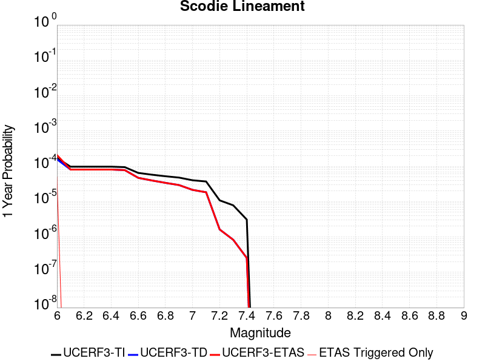 |  |

| Magnitude | 1 wk TI Prob | 1 wk TD Prob | 1 wk ETAS Prob | 1 wk ETAS/TD Gain | 1 wk ETAS Triggered Only | 1 mo TI Prob | 1 mo TD Prob | 1 mo ETAS Prob | 1 mo ETAS/TD Gain | 1 mo ETAS Triggered Only | 1 yr TI Prob | 1 yr TD Prob | 1 yr ETAS Prob | 1 yr ETAS/TD Gain | 1 yr ETAS Triggered Only | 10 yr TI Prob | 10 yr TD Prob | 10 yr ETAS Prob | 10 yr ETAS/TD Gain | 10 yr ETAS Triggered Only |
|-----|-----|-----|-----|-----|-----|-----|-----|-----|-----|-----|-----|-----|-----|-----|-----|-----|-----|-----|-----|-----|
| 6.0 | 3.2919327E-6 | 3.0133822E-6 | 3.0133822E-6 | 1.0 | 0.0 | 1.4108206E-5 | 1.2914449E-5 | 3.291419E-5 | 2.548633 | 2.0E-5 | 1.7175387E-4 | 1.5722525E-4 | 2.0721738E-4 | 1.317965 | 5.0E-5 | 0.0017162118 | 0.0015714517 | 0.001651326 | 1.0508283 | 8.0E-5 |
| 6.1 | 1.8663811E-6 | 1.549075E-6 | 1.549075E-6 | 1.0 | 0.0 | 7.998751E-6 | 6.638879E-6 | 6.638879E-6 | 1.0 | 0.0 | 9.738045E-5 | 8.082585E-5 | 8.082585E-5 | 1.0 | 0.0 | 9.7337784E-4 | 8.0801337E-4 | 8.2799717E-4 | 1.0247321 | 2.0E-5 |
| 6.2 | 1.8663811E-6 | 1.549075E-6 | 1.549075E-6 | 1.0 | 0.0 | 7.998751E-6 | 6.638879E-6 | 6.638879E-6 | 1.0 | 0.0 | 9.738045E-5 | 8.082585E-5 | 8.082585E-5 | 1.0 | 0.0 | 9.7337784E-4 | 8.0801337E-4 | 8.2799717E-4 | 1.0247321 | 2.0E-5 |
| 6.3 | 1.8663811E-6 | 1.549075E-6 | 1.549075E-6 | 1.0 | 0.0 | 7.998751E-6 | 6.638879E-6 | 6.638879E-6 | 1.0 | 0.0 | 9.738045E-5 | 8.082585E-5 | 8.082585E-5 | 1.0 | 0.0 | 9.7337784E-4 | 8.0801337E-4 | 8.2799717E-4 | 1.0247321 | 2.0E-5 |
| 6.4 | 1.8663811E-6 | 1.549075E-6 | 1.549075E-6 | 1.0 | 0.0 | 7.998751E-6 | 6.638879E-6 | 6.638879E-6 | 1.0 | 0.0 | 9.738045E-5 | 8.082585E-5 | 8.082585E-5 | 1.0 | 0.0 | 9.7337784E-4 | 8.0801337E-4 | 8.2799717E-4 | 1.0247321 | 2.0E-5 |
| 6.5 | 1.8106311E-6 | 1.4910082E-6 | 1.4910082E-6 | 1.0 | 0.0 | 7.759824E-6 | 6.390022E-6 | 6.390022E-6 | 1.0 | 0.0 | 9.447177E-5 | 7.779624E-5 | 7.779624E-5 | 1.0 | 0.0 | 9.4431615E-4 | 7.777387E-4 | 7.977231E-4 | 1.0256956 | 2.0E-5 |
| 6.6 | 1.2414679E-6 | 8.9977146E-7 | 8.9977146E-7 | 1.0 | 0.0 | 5.320566E-6 | 3.8561584E-6 | 3.8561584E-6 | 1.0 | 0.0 | 6.477596E-5 | 4.6947804E-5 | 4.6947804E-5 | 1.0 | 0.0 | 6.475708E-4 | 4.693875E-4 | 4.893781E-4 | 1.0425887 | 2.0E-5 |
| 6.7 | 1.1062215E-6 | 7.5944484E-7 | 7.5944484E-7 | 1.0 | 0.0 | 4.7409408E-6 | 3.25476E-6 | 3.25476E-6 | 1.0 | 0.0 | 5.7719422E-5 | 3.9626055E-5 | 3.9626055E-5 | 1.0 | 0.0 | 5.770443E-4 | 3.9619688E-4 | 4.061929E-4 | 1.0252299 | 1.0E-5 |
| 6.8 | 1.0006736E-6 | 6.5005196E-7 | 6.5005196E-7 | 1.0 | 0.0 | 4.288594E-6 | 2.7859342E-6 | 2.7859342E-6 | 1.0 | 0.0 | 5.221238E-5 | 3.3918284E-5 | 3.3918284E-5 | 1.0 | 0.0 | 5.220012E-4 | 3.3913713E-4 | 3.4913374E-4 | 1.0294766 | 1.0E-5 |
| 6.9 | 9.167364E-7 | 5.631736E-7 | 5.631736E-7 | 1.0 | 0.0 | 3.9288643E-6 | 2.4135993E-6 | 2.4135993E-6 | 1.0 | 0.0 | 4.7832873E-5 | 2.9385234E-5 | 2.9385234E-5 | 1.0 | 0.0 | 4.782258E-4 | 2.9381915E-4 | 3.038162E-4 | 1.0340246 | 1.0E-5 |
| 7.0 | 7.6987664E-7 | 4.1134754E-7 | 4.1134754E-7 | 1.0 | 0.0 | 3.2994672E-6 | 1.762917E-6 | 1.762917E-6 | 1.0 | 0.0 | 4.0170275E-5 | 2.1463342E-5 | 2.1463342E-5 | 1.0 | 0.0 | 4.0163012E-4 | 2.1461655E-4 | 2.246144E-4 | 1.0465847 | 1.0E-5 |
| 7.1 | 7.1038727E-7 | 3.5212344E-7 | 3.5212344E-7 | 1.0 | 0.0 | 3.0445133E-6 | 1.5090997E-6 | 1.5090997E-6 | 1.0 | 0.0 | 3.706632E-5 | 1.837317E-5 | 1.837317E-5 | 1.0 | 0.0 | 3.7060137E-4 | 1.8372E-4 | 1.9371817E-4 | 1.0544207 | 1.0E-5 |
| 7.2 | 2.0799602E-7 | 3.1189188E-8 | 3.1189188E-8 | 1.0 | 0.0 | 8.914113E-7 | 1.3366794E-7 | 1.3366794E-7 | 1.0 | 0.0 | 1.0852878E-5 | 1.627406E-6 | 1.627406E-6 | 1.0 | 0.0 | 1.08523476E-4 | 1.6273949E-5 | 1.6273949E-5 | 1.0 | 0.0 |
| 7.3 | 1.5048182E-7 | 1.5947283E-8 | 1.5947283E-8 | 1.0 | 0.0 | 6.449219E-7 | 6.834549E-8 | 6.834549E-8 | 1.0 | 0.0 | 7.851896E-6 | 8.321061E-7 | 8.321061E-7 | 1.0 | 0.0 | 7.851618E-5 | 8.3210325E-6 | 8.3210325E-6 | 1.0 | 0.0 |
| 7.4 | 5.9334678E-8 | 4.8689395E-9 | 4.8689395E-9 | 1.0 | 0.0 | 2.5429145E-7 | 2.0866883E-8 | 2.0866883E-8 | 1.0 | 0.0 | 3.095994E-6 | 2.5405427E-7 | 2.5405427E-7 | 1.0 | 0.0 | 3.095951E-5 | 2.5405411E-6 | 2.5405411E-6 | 1.0 | 0.0 |

## San Jacinto (Coyote Creek)
*[(top)](#table-of-contents)*

| 1 Week | 1 Month | 1 Year | 10 Year |
|-----|-----|-----|-----|
|  |  |  |  |

| Magnitude | 1 wk TI Prob | 1 wk TD Prob | 1 wk ETAS Prob | 1 wk ETAS/TD Gain | 1 wk ETAS Triggered Only | 1 mo TI Prob | 1 mo TD Prob | 1 mo ETAS Prob | 1 mo ETAS/TD Gain | 1 mo ETAS Triggered Only | 1 yr TI Prob | 1 yr TD Prob | 1 yr ETAS Prob | 1 yr ETAS/TD Gain | 1 yr ETAS Triggered Only | 10 yr TI Prob | 10 yr TD Prob | 10 yr ETAS Prob | 10 yr ETAS/TD Gain | 10 yr ETAS Triggered Only |
|-----|-----|-----|-----|-----|-----|-----|-----|-----|-----|-----|-----|-----|-----|-----|-----|-----|-----|-----|-----|-----|
| 6.0 | 2.7374346E-5 | 2.4167546E-5 | 3.4167304E-5 | 1.413768 | 1.0E-5 | 1.1731335E-4 | 1.035711E-4 | 1.13570066E-4 | 1.096542 | 1.0E-5 | 0.0014273542 | 0.0012602513 | 0.0012902134 | 1.0237747 | 3.0E-5 | 0.01418221 | 0.012939939 | 0.013018904 | 1.0061024 | 8.0E-5 |
| 6.1 | 2.7374346E-5 | 2.4167546E-5 | 3.4167304E-5 | 1.413768 | 1.0E-5 | 1.1731335E-4 | 1.035711E-4 | 1.13570066E-4 | 1.096542 | 1.0E-5 | 0.0014273542 | 0.0012602513 | 0.0012902134 | 1.0237747 | 3.0E-5 | 0.01418221 | 0.012939939 | 0.013018904 | 1.0061024 | 8.0E-5 |
| 6.2 | 2.7374346E-5 | 2.4167546E-5 | 3.4167304E-5 | 1.413768 | 1.0E-5 | 1.1731335E-4 | 1.035711E-4 | 1.13570066E-4 | 1.096542 | 1.0E-5 | 0.0014273542 | 0.0012602513 | 0.0012902134 | 1.0237747 | 3.0E-5 | 0.01418221 | 0.012939939 | 0.013018904 | 1.0061024 | 8.0E-5 |
| 6.3 | 2.7374346E-5 | 2.4167546E-5 | 3.4167304E-5 | 1.413768 | 1.0E-5 | 1.1731335E-4 | 1.035711E-4 | 1.13570066E-4 | 1.096542 | 1.0E-5 | 0.0014273542 | 0.0012602513 | 0.0012902134 | 1.0237747 | 3.0E-5 | 0.01418221 | 0.012939939 | 0.013018904 | 1.0061024 | 8.0E-5 |
| 6.4 | 2.7374346E-5 | 2.4167546E-5 | 3.4167304E-5 | 1.413768 | 1.0E-5 | 1.1731335E-4 | 1.035711E-4 | 1.13570066E-4 | 1.096542 | 1.0E-5 | 0.0014273542 | 0.0012602513 | 0.0012902134 | 1.0237747 | 3.0E-5 | 0.01418221 | 0.012939939 | 0.013018904 | 1.0061024 | 8.0E-5 |
| 6.5 | 2.7282445E-5 | 2.4053614E-5 | 3.4053373E-5 | 1.415728 | 1.0E-5 | 1.16919524E-4 | 1.0308286E-4 | 1.1308183E-4 | 1.0969993 | 1.0E-5 | 0.0014225657 | 0.0012543139 | 0.0012842763 | 1.0238875 | 3.0E-5 | 0.014134934 | 0.012881263 | 0.012960233 | 1.0061306 | 8.0E-5 |
| 6.6 | 2.7282445E-5 | 2.4053614E-5 | 3.4053373E-5 | 1.415728 | 1.0E-5 | 1.16919524E-4 | 1.0308286E-4 | 1.1308183E-4 | 1.0969993 | 1.0E-5 | 0.0014225657 | 0.0012543139 | 0.0012842763 | 1.0238875 | 3.0E-5 | 0.014134934 | 0.012881263 | 0.012960233 | 1.0061306 | 8.0E-5 |
| 6.7 | 2.7216198E-5 | 2.3978728E-5 | 3.397849E-5 | 1.4170263 | 1.0E-5 | 1.1663563E-4 | 1.02761944E-4 | 1.12760914E-4 | 1.0973023 | 1.0E-5 | 0.0014191137 | 0.0012504113 | 0.0012803738 | 1.0239621 | 3.0E-5 | 0.014100855 | 0.012842671 | 0.012921643 | 1.0061493 | 8.0E-5 |
| 6.8 | 2.7078617E-5 | 2.3895931E-5 | 3.3895692E-5 | 1.4184712 | 1.0E-5 | 1.1604605E-4 | 1.0240713E-4 | 1.1240611E-4 | 1.0976394 | 1.0E-5 | 0.001411945 | 0.0012460963 | 0.001276059 | 1.0240452 | 3.0E-5 | 0.014030075 | 0.012799807 | 0.012878783 | 1.0061702 | 8.0E-5 |
| 6.9 | 2.6982952E-5 | 2.381543E-5 | 3.381519E-5 | 1.4198859 | 1.0E-5 | 1.15636096E-4 | 1.0206215E-4 | 1.1206113E-4 | 1.0979695 | 1.0E-5 | 0.0014069602 | 0.001241901 | 0.0012718637 | 1.0241265 | 3.0E-5 | 0.013980856 | 0.012758115 | 0.012837095 | 1.0061905 | 8.0E-5 |
| 7.0 | 2.6449972E-5 | 2.3392402E-5 | 3.3392167E-5 | 1.4274793 | 1.0E-5 | 1.1335209E-4 | 1.00249315E-4 | 1.1024831E-4 | 1.0997413 | 1.0E-5 | 0.001379188 | 0.0012198546 | 0.001249818 | 1.0245631 | 3.0E-5 | 0.0137065975 | 0.012539455 | 0.012618451 | 1.0062999 | 8.0E-5 |
| 7.1 | 2.6257849E-5 | 2.3218416E-5 | 3.3218184E-5 | 1.4306827 | 1.0E-5 | 1.1252879E-4 | 9.950371E-5 | 1.0950272E-4 | 1.1004888 | 1.0E-5 | 0.0013691769 | 0.0012107871 | 0.0012407508 | 1.0247473 | 3.0E-5 | 0.013607717 | 0.012449308 | 0.012528312 | 1.0063461 | 8.0E-5 |
| 7.2 | 2.5270041E-5 | 2.2413013E-5 | 3.2412787E-5 | 1.4461594 | 1.0E-5 | 1.0829568E-4 | 9.6052245E-5 | 1.0605128E-4 | 1.1041 | 1.0E-5 | 0.0013177024 | 0.0011688111 | 0.001198776 | 1.0256371 | 3.0E-5 | 0.013099162 | 0.0120302625 | 0.0121093 | 1.0065699 | 8.0E-5 |
| 7.3 | 2.339701E-5 | 2.1144546E-5 | 3.1144333E-5 | 1.4729252 | 1.0E-5 | 1.0026905E-4 | 9.061635E-5 | 1.0061544E-4 | 1.1103454 | 1.0E-5 | 0.001220092 | 0.0011026977 | 0.0011326646 | 1.027176 | 3.0E-5 | 0.012134149 | 0.011369025 | 0.011448116 | 1.0069567 | 8.0E-5 |
| 7.4 | 2.296333E-5 | 2.087482E-5 | 3.0874613E-5 | 1.479036 | 1.0E-5 | 9.841056E-5 | 8.946047E-5 | 9.945957E-5 | 1.1117712 | 1.0E-5 | 0.0011974899 | 0.001088639 | 0.0011186063 | 1.0275273 | 3.0E-5 | 0.011910575 | 0.0112280985 | 0.0113072 | 1.007045 | 8.0E-5 |
| 7.5 | 2.2188895E-5 | 2.0397565E-5 | 3.0397361E-5 | 1.4902446 | 1.0E-5 | 9.50918E-5 | 8.741522E-5 | 9.741435E-5 | 1.1143866 | 1.0E-5 | 0.0011571277 | 0.0010637627 | 0.0010937308 | 1.0281718 | 3.0E-5 | 0.011511209 | 0.010977626 | 0.011056748 | 1.0072075 | 8.0E-5 |
| 7.6 | 2.0013189E-5 | 1.8983354E-5 | 2.8983164E-5 | 1.5267673 | 1.0E-5 | 8.5767984E-5 | 8.135471E-5 | 9.135389E-5 | 1.1229085 | 1.0E-5 | 0.001043725 | 9.900453E-4 | 0.0010200156 | 1.0302716 | 3.0E-5 | 0.010388365 | 0.01023539 | 0.010314571 | 1.007736 | 8.0E-5 |
| 7.7 | 1.7230794E-5 | 1.676414E-5 | 2.6763972E-5 | 1.5965014 | 1.0E-5 | 7.384417E-5 | 7.184434E-5 | 8.1843624E-5 | 1.1391798 | 1.0E-5 | 8.986819E-4 | 8.743546E-4 | 9.043284E-4 | 1.034281 | 3.0E-5 | 0.008950562 | 0.009073635 | 0.009152909 | 1.0087367 | 8.0E-5 |
| 7.8 | 1.4478809E-5 | 1.501069E-5 | 2.501054E-5 | 1.6661819 | 1.0E-5 | 6.205057E-5 | 6.432994E-5 | 7.4329306E-5 | 1.1554385 | 1.0E-5 | 7.552038E-4 | 7.829363E-4 | 8.129128E-4 | 1.0382873 | 3.0E-5 | 0.0075264242 | 0.008151702 | 0.008231049 | 1.0097339 | 8.0E-5 |
| 7.9 | 1.1114467E-5 | 1.166258E-5 | 2.1662463E-5 | 1.8574332 | 1.0E-5 | 4.7632562E-5 | 4.9981532E-5 | 5.998103E-5 | 1.200064 | 1.0E-5 | 5.797721E-4 | 6.083558E-4 | 6.383376E-4 | 1.0492833 | 3.0E-5 | 0.0057826187 | 0.006389501 | 0.00646899 | 1.0124406 | 8.0E-5 |
| 8.0 | 9.327402E-6 | 9.915031E-6 | 1.9914933E-5 | 2.0085597 | 1.0E-5 | 3.9973966E-5 | 4.2492302E-5 | 5.2491876E-5 | 1.2353268 | 1.0E-5 | 4.8657437E-4 | 5.172215E-4 | 5.47206E-4 | 1.0579722 | 3.0E-5 | 0.0048551033 | 0.0054583023 | 0.0055378657 | 1.0145766 | 8.0E-5 |
| 8.1 | 7.0235833E-6 | 6.839238E-6 | 6.839238E-6 | 1.0 | 0.0 | 3.0100724E-5 | 2.9310693E-5 | 2.9310693E-5 | 1.0 | 0.0 | 3.664147E-4 | 3.5679978E-4 | 3.7679262E-4 | 1.0560338 | 2.0E-5 | 0.003658111 | 0.0037938291 | 0.0038436393 | 1.0131294 | 5.0E-5 |
| 8.2 | 2.0358202E-6 | 9.018346E-7 | 9.018346E-7 | 1.0 | 0.0 | 8.724915E-6 | 3.8649996E-6 | 3.8649996E-6 | 1.0 | 0.0 | 1.06220665E-4 | 4.705538E-5 | 4.705538E-5 | 1.0 | 0.0 | 0.001061699 | 5.3387694E-4 | 5.3387694E-4 | 1.0 | 0.0 |
| 8.3 | 2.0051264E-7 | 6.637482E-8 | 6.637482E-8 | 1.0 | 0.0 | 8.5933965E-7 | 2.8446348E-7 | 2.8446348E-7 | 1.0 | 0.0 | 1.046241E-5 | 3.4633376E-6 | 3.4633376E-6 | 1.0 | 0.0 | 1.0461917E-4 | 4.025472E-5 | 4.025472E-5 | 1.0 | 0.0 |

## Mission Creek
*[(top)](#table-of-contents)*

| 1 Week | 1 Month | 1 Year | 10 Year |
|-----|-----|-----|-----|
|  | 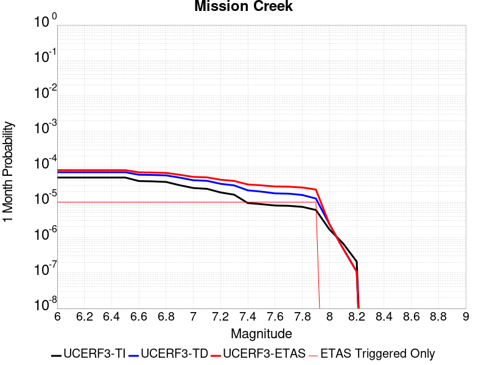 |  | 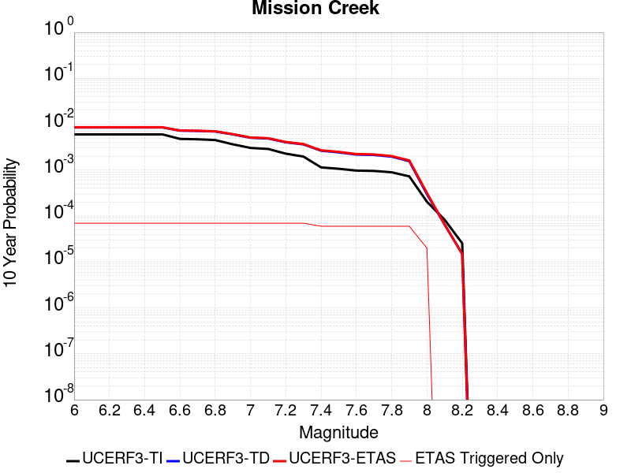 |

| Magnitude | 1 wk TI Prob | 1 wk TD Prob | 1 wk ETAS Prob | 1 wk ETAS/TD Gain | 1 wk ETAS Triggered Only | 1 mo TI Prob | 1 mo TD Prob | 1 mo ETAS Prob | 1 mo ETAS/TD Gain | 1 mo ETAS Triggered Only | 1 yr TI Prob | 1 yr TD Prob | 1 yr ETAS Prob | 1 yr ETAS/TD Gain | 1 yr ETAS Triggered Only | 10 yr TI Prob | 10 yr TD Prob | 10 yr ETAS Prob | 10 yr ETAS/TD Gain | 10 yr ETAS Triggered Only |
|-----|-----|-----|-----|-----|-----|-----|-----|-----|-----|-----|-----|-----|-----|-----|-----|-----|-----|-----|-----|-----|
| 6.0 | 1.1549387E-5 | 1.6328935E-5 | 2.6328773E-5 | 1.6123998 | 1.0E-5 | 4.9496433E-5 | 6.997936E-5 | 7.997866E-5 | 1.1428893 | 1.0E-5 | 6.0245243E-4 | 8.516807E-4 | 8.716636E-4 | 1.023463 | 2.0E-5 | 0.006008218 | 0.008513321 | 0.008582725 | 1.0081524 | 7.0E-5 |
| 6.1 | 1.1549387E-5 | 1.6328935E-5 | 2.6328773E-5 | 1.6123998 | 1.0E-5 | 4.9496433E-5 | 6.997936E-5 | 7.997866E-5 | 1.1428893 | 1.0E-5 | 6.0245243E-4 | 8.516807E-4 | 8.716636E-4 | 1.023463 | 2.0E-5 | 0.006008218 | 0.008513321 | 0.008582725 | 1.0081524 | 7.0E-5 |
| 6.2 | 1.1549387E-5 | 1.6328935E-5 | 2.6328773E-5 | 1.6123998 | 1.0E-5 | 4.9496433E-5 | 6.997936E-5 | 7.997866E-5 | 1.1428893 | 1.0E-5 | 6.0245243E-4 | 8.516807E-4 | 8.716636E-4 | 1.023463 | 2.0E-5 | 0.006008218 | 0.008513321 | 0.008582725 | 1.0081524 | 7.0E-5 |
| 6.3 | 1.1549387E-5 | 1.6328935E-5 | 2.6328773E-5 | 1.6123998 | 1.0E-5 | 4.9496433E-5 | 6.997936E-5 | 7.997866E-5 | 1.1428893 | 1.0E-5 | 6.0245243E-4 | 8.516807E-4 | 8.716636E-4 | 1.023463 | 2.0E-5 | 0.006008218 | 0.008513321 | 0.008582725 | 1.0081524 | 7.0E-5 |
| 6.4 | 1.1549387E-5 | 1.6328935E-5 | 2.6328773E-5 | 1.6123998 | 1.0E-5 | 4.9496433E-5 | 6.997936E-5 | 7.997866E-5 | 1.1428893 | 1.0E-5 | 6.0245243E-4 | 8.516807E-4 | 8.716636E-4 | 1.023463 | 2.0E-5 | 0.006008218 | 0.008513321 | 0.008582725 | 1.0081524 | 7.0E-5 |
| 6.5 | 1.1549387E-5 | 1.6328935E-5 | 2.6328773E-5 | 1.6123998 | 1.0E-5 | 4.9496433E-5 | 6.997936E-5 | 7.997866E-5 | 1.1428893 | 1.0E-5 | 6.0245243E-4 | 8.516807E-4 | 8.716636E-4 | 1.023463 | 2.0E-5 | 0.006008218 | 0.008513321 | 0.008582725 | 1.0081524 | 7.0E-5 |
| 6.6 | 9.202681E-6 | 1.3852161E-5 | 2.3852022E-5 | 1.721899 | 1.0E-5 | 3.9439463E-5 | 5.9365106E-5 | 6.936451E-5 | 1.1684391 | 1.0E-5 | 4.800697E-4 | 7.225395E-4 | 7.4252504E-4 | 1.0276601 | 2.0E-5 | 0.004790339 | 0.007230483 | 0.007299977 | 1.0096112 | 7.0E-5 |
| 6.7 | 9.019164E-6 | 1.36578265E-5 | 2.3657689E-5 | 1.7321709 | 1.0E-5 | 3.8652986E-5 | 5.8532278E-5 | 6.853169E-5 | 1.1708359 | 1.0E-5 | 4.7049852E-4 | 7.124065E-4 | 7.3239225E-4 | 1.0280539 | 2.0E-5 | 0.004695036 | 0.007129805 | 0.007199306 | 1.009748 | 7.0E-5 |
| 6.8 | 8.673558E-6 | 1.3279923E-5 | 2.327979E-5 | 1.7530063 | 1.0E-5 | 3.717186E-5 | 5.6912766E-5 | 6.6912195E-5 | 1.1756974 | 1.0E-5 | 4.524734E-4 | 6.927015E-4 | 7.126876E-4 | 1.0288525 | 2.0E-5 | 0.0045155324 | 0.006933987 | 0.0070035015 | 1.0100251 | 7.0E-5 |
| 6.9 | 7.002255E-6 | 1.1484103E-5 | 2.1483987E-5 | 1.8707589 | 1.0E-5 | 3.000932E-5 | 4.9216695E-5 | 5.92162E-5 | 1.203173 | 1.0E-5 | 3.653022E-4 | 5.990553E-4 | 6.1904336E-4 | 1.0333658 | 2.0E-5 | 0.0036470229 | 0.006002787 | 0.006072367 | 1.0115912 | 7.0E-5 |
| 7.0 | 5.84644E-6 | 9.681097E-6 | 1.9681002E-5 | 2.0329309 | 1.0E-5 | 2.5055931E-5 | 4.1489784E-5 | 5.148937E-5 | 1.2410132 | 1.0E-5 | 3.0501327E-4 | 5.050256E-4 | 5.250155E-4 | 1.0395819 | 2.0E-5 | 0.0030459496 | 0.0050669545 | 0.0051365998 | 1.013745 | 7.0E-5 |
| 7.1 | 5.54703E-6 | 9.335551E-6 | 1.9335457E-5 | 2.0711641 | 1.0E-5 | 2.377277E-5 | 4.0008916E-5 | 5.000852E-5 | 1.2499343 | 1.0E-5 | 2.8939504E-4 | 4.8700414E-4 | 5.0699443E-4 | 1.0410475 | 2.0E-5 | 0.0028901845 | 0.0048875376 | 0.0049571954 | 1.0142522 | 7.0E-5 |
| 7.2 | 4.384709E-6 | 7.687395E-6 | 1.7687318E-5 | 2.3008208 | 1.0E-5 | 1.8791474E-5 | 3.294558E-5 | 4.2945252E-5 | 1.3035208 | 1.0E-5 | 2.2876218E-4 | 4.0104229E-4 | 4.2103426E-4 | 1.0498501 | 2.0E-5 | 0.0022852682 | 0.0040313187 | 0.0041010366 | 1.017294 | 7.0E-5 |
| 7.3 | 3.7888456E-6 | 6.921161E-6 | 1.6921093E-5 | 2.4448342 | 1.0E-5 | 1.623781E-5 | 2.96618E-5 | 3.9661503E-5 | 1.337124 | 1.0E-5 | 1.9767738E-4 | 3.6107594E-4 | 3.810687E-4 | 1.05537 | 2.0E-5 | 0.0019750162 | 0.0036330097 | 0.0037027553 | 1.0191978 | 7.0E-5 |
| 7.4 | 2.1982462E-6 | 5.0293165E-6 | 1.5029266E-5 | 2.9883318 | 1.0E-5 | 9.421021E-6 | 2.1554037E-5 | 3.155382E-5 | 1.4639403 | 1.0E-5 | 1.1469489E-4 | 2.62389E-4 | 2.8238373E-4 | 1.0762028 | 2.0E-5 | 0.0011463572 | 0.002648694 | 0.002708535 | 1.0225927 | 6.0E-5 |
| 7.5 | 2.051923E-6 | 4.6204054E-6 | 1.4620359E-5 | 3.164302 | 1.0E-5 | 8.793926E-6 | 1.9801588E-5 | 2.9801391E-5 | 1.505 | 1.0E-5 | 1.0706078E-4 | 2.4105782E-4 | 2.6105298E-4 | 1.0829476 | 2.0E-5 | 0.0010700922 | 0.0024362742 | 0.002496128 | 1.0245677 | 6.0E-5 |
| 7.6 | 1.8733427E-6 | 4.1285803E-6 | 1.4128539E-5 | 3.4221303 | 1.0E-5 | 8.028587E-6 | 1.7693796E-5 | 2.7693617E-5 | 1.5651599 | 1.0E-5 | 9.774366E-5 | 2.1540074E-4 | 2.3539644E-4 | 1.0928302 | 2.0E-5 | 9.770069E-4 | 0.0021807181 | 0.0022405873 | 1.0274539 | 6.0E-5 |
| 7.7 | 1.8411953E-6 | 4.04822E-6 | 1.404818E-5 | 3.4702115 | 1.0E-5 | 7.890813E-6 | 1.7349399E-5 | 2.7349226E-5 | 1.5763788 | 1.0E-5 | 9.606641E-5 | 2.1120855E-4 | 2.3120432E-4 | 1.0946732 | 2.0E-5 | 9.6024893E-4 | 0.0021389856 | 0.0021988573 | 1.0279907 | 6.0E-5 |
| 7.8 | 1.7194251E-6 | 3.7152436E-6 | 1.37152065E-5 | 3.6916034 | 1.0E-5 | 7.368944E-6 | 1.5922376E-5 | 2.5922216E-5 | 1.628037 | 1.0E-5 | 8.97132E-5 | 1.9383777E-4 | 2.1383389E-4 | 1.1031591 | 2.0E-5 | 8.967699E-4 | 0.0019647926 | 0.0020246746 | 1.0304775 | 6.0E-5 |
| 7.9 | 1.4035052E-6 | 2.9540124E-6 | 1.2953983E-5 | 4.385216 | 1.0E-5 | 6.0150082E-6 | 1.2659992E-5 | 2.2659866E-5 | 1.7898799 | 1.0E-5 | 7.3230265E-5 | 1.5412456E-4 | 1.7412148E-4 | 1.1297451 | 2.0E-5 | 7.3206134E-4 | 0.0015651089 | 0.0016250149 | 1.038276 | 6.0E-5 |
| 8.0 | 3.9318823E-7 | 5.538173E-7 | 5.538173E-7 | 1.0 | 0.0 | 1.6850913E-6 | 2.3735006E-6 | 2.3735006E-6 | 1.0 | 0.0 | 2.0515794E-5 | 2.8896993E-5 | 3.8896706E-5 | 1.3460468 | 1.0E-5 | 2.0513899E-4 | 2.994949E-4 | 3.194889E-4 | 1.0667591 | 2.0E-5 |
| 8.1 | 1.596793E-7 | 1.14133464E-7 | 1.14133464E-7 | 1.0 | 0.0 | 6.8433974E-7 | 4.891433E-7 | 4.891433E-7 | 1.0 | 0.0 | 8.331805E-6 | 5.955304E-6 | 5.955304E-6 | 1.0 | 0.0 | 8.331492E-5 | 6.568087E-5 | 6.568087E-5 | 1.0 | 0.0 |
| 8.2 | 4.9003038E-8 | 2.5529511E-8 | 2.5529511E-8 | 1.0 | 0.0 | 2.10013E-7 | 1.09412184E-7 | 1.09412184E-7 | 1.0 | 0.0 | 2.5569052E-6 | 1.3320926E-6 | 1.3320926E-6 | 1.0 | 0.0 | 2.556876E-5 | 1.5003252E-5 | 1.5003252E-5 | 1.0 | 0.0 |

## Lost Hills
*[(top)](#table-of-contents)*

| 1 Week | 1 Month | 1 Year | 10 Year |
|-----|-----|-----|-----|
|  |  | 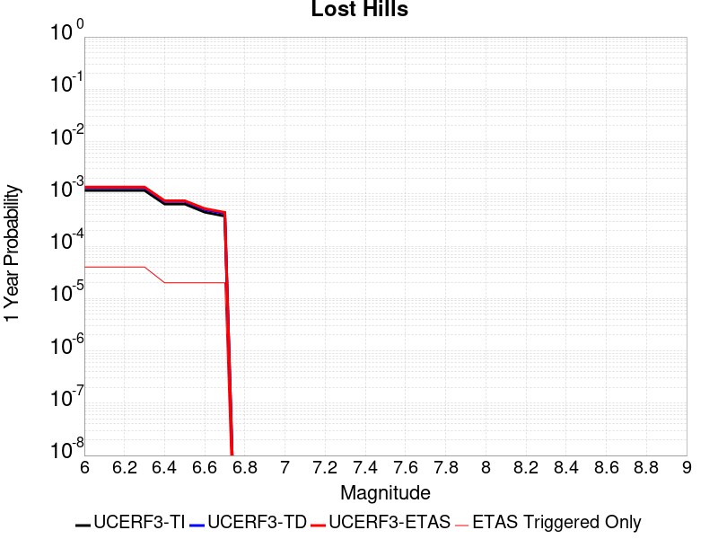 | 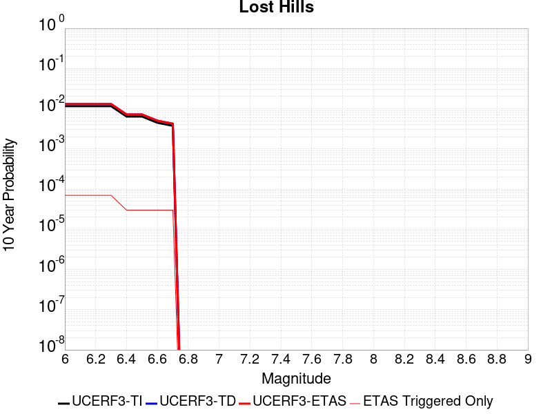 |

| Magnitude | 1 wk TI Prob | 1 wk TD Prob | 1 wk ETAS Prob | 1 wk ETAS/TD Gain | 1 wk ETAS Triggered Only | 1 mo TI Prob | 1 mo TD Prob | 1 mo ETAS Prob | 1 mo ETAS/TD Gain | 1 mo ETAS Triggered Only | 1 yr TI Prob | 1 yr TD Prob | 1 yr ETAS Prob | 1 yr ETAS/TD Gain | 1 yr ETAS Triggered Only | 10 yr TI Prob | 10 yr TD Prob | 10 yr ETAS Prob | 10 yr ETAS/TD Gain | 10 yr ETAS Triggered Only |
|-----|-----|-----|-----|-----|-----|-----|-----|-----|-----|-----|-----|-----|-----|-----|-----|-----|-----|-----|-----|-----|
| 6.0 | 2.233523E-5 | 2.510774E-5 | 2.510774E-5 | 1.0 | 0.0 | 9.571891E-5 | 1.0760111E-4 | 1.0760111E-4 | 1.0 | 0.0 | 0.0011647546 | 0.0013094243 | 0.001349372 | 1.0305078 | 4.0E-5 | 0.011586686 | 0.013033688 | 0.013102776 | 1.0053006 | 7.0E-5 |
| 6.1 | 2.233523E-5 | 2.510774E-5 | 2.510774E-5 | 1.0 | 0.0 | 9.571891E-5 | 1.0760111E-4 | 1.0760111E-4 | 1.0 | 0.0 | 0.0011647546 | 0.0013094243 | 0.001349372 | 1.0305078 | 4.0E-5 | 0.011586686 | 0.013033688 | 0.013102776 | 1.0053006 | 7.0E-5 |
| 6.2 | 2.233523E-5 | 2.510774E-5 | 2.510774E-5 | 1.0 | 0.0 | 9.571891E-5 | 1.0760111E-4 | 1.0760111E-4 | 1.0 | 0.0 | 0.0011647546 | 0.0013094243 | 0.001349372 | 1.0305078 | 4.0E-5 | 0.011586686 | 0.013033688 | 0.013102776 | 1.0053006 | 7.0E-5 |
| 6.3 | 2.233523E-5 | 2.510774E-5 | 2.510774E-5 | 1.0 | 0.0 | 9.571891E-5 | 1.0760111E-4 | 1.0760111E-4 | 1.0 | 0.0 | 0.0011647546 | 0.0013094243 | 0.001349372 | 1.0305078 | 4.0E-5 | 0.011586686 | 0.013033688 | 0.013102776 | 1.0053006 | 7.0E-5 |
| 6.4 | 1.2288092E-5 | 1.378173E-5 | 1.378173E-5 | 1.0 | 0.0 | 5.2662188E-5 | 5.9063746E-5 | 5.9063746E-5 | 1.0 | 0.0 | 6.409735E-4 | 7.189577E-4 | 7.389433E-4 | 1.027798 | 2.0E-5 | 0.006391279 | 0.007175524 | 0.0072053084 | 1.0041509 | 3.0E-5 |
| 6.5 | 1.2288092E-5 | 1.378173E-5 | 1.378173E-5 | 1.0 | 0.0 | 5.2662188E-5 | 5.9063746E-5 | 5.9063746E-5 | 1.0 | 0.0 | 6.409735E-4 | 7.189577E-4 | 7.389433E-4 | 1.027798 | 2.0E-5 | 0.006391279 | 0.007175524 | 0.0072053084 | 1.0041509 | 3.0E-5 |
| 6.6 | 8.58281E-6 | 9.634208E-6 | 9.634208E-6 | 1.0 | 0.0 | 3.6782953E-5 | 4.128928E-5 | 4.128928E-5 | 1.0 | 0.0 | 4.4774043E-4 | 5.0266425E-4 | 5.226542E-4 | 1.039768 | 2.0E-5 | 0.0044683935 | 0.0050234334 | 0.0050532827 | 1.005942 | 3.0E-5 |
| 6.7 | 7.205685E-6 | 8.088669E-6 | 8.088669E-6 | 1.0 | 0.0 | 3.088114E-5 | 3.466573E-5 | 3.466573E-5 | 1.0 | 0.0 | 3.7591302E-4 | 4.2205522E-4 | 4.420468E-4 | 1.0473672 | 2.0E-5 | 0.0037527776 | 0.0042205523 | 0.004250426 | 1.007078 | 3.0E-5 |

## San Jacinto (Borrego)
*[(top)](#table-of-contents)*

| 1 Week | 1 Month | 1 Year | 10 Year |
|-----|-----|-----|-----|
|  | 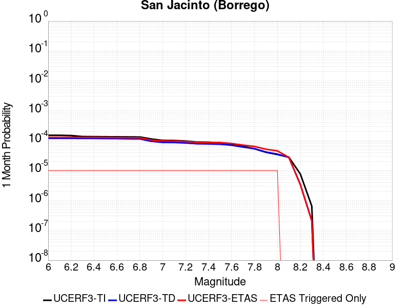 |  |  |

| Magnitude | 1 wk TI Prob | 1 wk TD Prob | 1 wk ETAS Prob | 1 wk ETAS/TD Gain | 1 wk ETAS Triggered Only | 1 mo TI Prob | 1 mo TD Prob | 1 mo ETAS Prob | 1 mo ETAS/TD Gain | 1 mo ETAS Triggered Only | 1 yr TI Prob | 1 yr TD Prob | 1 yr ETAS Prob | 1 yr ETAS/TD Gain | 1 yr ETAS Triggered Only | 10 yr TI Prob | 10 yr TD Prob | 10 yr ETAS Prob | 10 yr ETAS/TD Gain | 10 yr ETAS Triggered Only |
|-----|-----|-----|-----|-----|-----|-----|-----|-----|-----|-----|-----|-----|-----|-----|-----|-----|-----|-----|-----|-----|
| 6.0 | 3.543992E-5 | 2.7947624E-5 | 3.7947346E-5 | 1.3578022 | 1.0E-5 | 1.5187653E-4 | 1.19770106E-4 | 1.297689E-4 | 1.0834833 | 1.0E-5 | 0.0018475284 | 0.0014572379 | 0.0014871942 | 1.0205569 | 3.0E-5 | 0.018322436 | 0.014880617 | 0.014949576 | 1.0046341 | 7.0E-5 |
| 6.1 | 3.542281E-5 | 2.7947624E-5 | 3.7947346E-5 | 1.3578022 | 1.0E-5 | 1.5180321E-4 | 1.19770106E-4 | 1.297689E-4 | 1.0834833 | 1.0E-5 | 0.0018466372 | 0.0014572379 | 0.0014871942 | 1.0205569 | 3.0E-5 | 0.018313672 | 0.014880617 | 0.014949576 | 1.0046341 | 7.0E-5 |
| 6.2 | 3.4688688E-5 | 2.7947624E-5 | 3.7947346E-5 | 1.3578022 | 1.0E-5 | 1.4865733E-4 | 1.19770106E-4 | 1.297689E-4 | 1.0834833 | 1.0E-5 | 0.0018084005 | 0.0014572379 | 0.0014871942 | 1.0205569 | 3.0E-5 | 0.017937548 | 0.014880617 | 0.014949576 | 1.0046341 | 7.0E-5 |
| 6.3 | 3.2087122E-5 | 2.7792965E-5 | 3.7792684E-5 | 1.3597933 | 1.0E-5 | 1.3750899E-4 | 1.1910733E-4 | 1.2910615E-4 | 1.0839479 | 1.0E-5 | 0.0016728862 | 0.0014491794 | 0.001479136 | 1.0206714 | 3.0E-5 | 0.016603488 | 0.0148016475 | 0.014870611 | 1.0046592 | 7.0E-5 |
| 6.4 | 3.1828724E-5 | 2.7759947E-5 | 3.775967E-5 | 1.3602213 | 1.0E-5 | 1.364017E-4 | 1.1896584E-4 | 1.2896465E-4 | 1.0840478 | 1.0E-5 | 0.0016594254 | 0.001447459 | 0.0014774156 | 1.0206959 | 3.0E-5 | 0.016470885 | 0.0147847235 | 0.014853689 | 1.0046647 | 7.0E-5 |
| 6.5 | 3.1563577E-5 | 2.7499631E-5 | 3.7499358E-5 | 1.3636312 | 1.0E-5 | 1.3526545E-4 | 1.1785031E-4 | 1.2784913E-4 | 1.0848434 | 1.0E-5 | 0.0016456128 | 0.0014338953 | 0.0014638524 | 1.020892 | 3.0E-5 | 0.0163348 | 0.014651294 | 0.014720269 | 1.0047077 | 7.0E-5 |
| 6.6 | 3.1467625E-5 | 2.734384E-5 | 3.734357E-5 | 1.3657031 | 1.0E-5 | 1.3485427E-4 | 1.17182695E-4 | 1.2718153E-4 | 1.0853268 | 1.0E-5 | 0.0016406142 | 0.0014257778 | 0.001455735 | 1.0210111 | 3.0E-5 | 0.016285548 | 0.014571534 | 0.014640514 | 1.0047339 | 7.0E-5 |
| 6.7 | 3.1223695E-5 | 2.6961829E-5 | 3.696156E-5 | 1.3708848 | 1.0E-5 | 1.3380898E-4 | 1.1554564E-4 | 1.2554448E-4 | 1.0865359 | 1.0E-5 | 0.0016279068 | 0.0014058725 | 0.0014358304 | 1.021309 | 3.0E-5 | 0.01616033 | 0.014375892 | 0.014444886 | 1.0047992 | 7.0E-5 |
| 6.8 | 3.1015585E-5 | 2.6782798E-5 | 3.678253E-5 | 1.373364 | 1.0E-5 | 1.3291716E-4 | 1.1477844E-4 | 1.2477729E-4 | 1.0871143 | 1.0E-5 | 0.001617065 | 0.0013965438 | 0.0014265019 | 1.0214516 | 3.0E-5 | 0.016053487 | 0.014283154 | 0.014352154 | 1.0048308 | 7.0E-5 |
| 6.9 | 2.6641965E-5 | 2.2203956E-5 | 3.2203734E-5 | 1.4503602 | 1.0E-5 | 1.1417485E-4 | 9.515636E-5 | 1.0515541E-4 | 1.1050801 | 1.0E-5 | 0.0013891924 | 0.001157917 | 0.0011878822 | 1.0258785 | 3.0E-5 | 0.0138054015 | 0.011892728 | 0.011961895 | 1.005816 | 7.0E-5 |
| 7.0 | 2.3854353E-5 | 2.0498017E-5 | 3.0497813E-5 | 1.4878421 | 1.0E-5 | 1.02228936E-4 | 8.784571E-5 | 9.784482E-5 | 1.1138259 | 1.0E-5 | 0.0012439266 | 0.0010689993 | 0.0010989672 | 1.0280336 | 3.0E-5 | 0.012369866 | 0.01099272 | 0.01106195 | 1.0062978 | 7.0E-5 |
| 7.1 | 2.3672901E-5 | 2.0334484E-5 | 3.0334282E-5 | 1.4917654 | 1.0E-5 | 1.0145135E-4 | 8.7144894E-5 | 9.7144024E-5 | 1.1147414 | 1.0E-5 | 0.0012344702 | 0.0010604752 | 0.0010904435 | 1.0282592 | 3.0E-5 | 0.0122763505 | 0.010907886 | 0.010977122 | 1.0063474 | 7.0E-5 |
| 7.2 | 2.2717244E-5 | 1.9561707E-5 | 2.9561512E-5 | 1.5111928 | 1.0E-5 | 9.735599E-5 | 8.3833205E-5 | 9.3832365E-5 | 1.1192745 | 1.0E-5 | 0.0011846646 | 0.0010201937 | 0.0010501631 | 1.0293761 | 3.0E-5 | 0.01178369 | 0.010505172 | 0.010574437 | 1.0065933 | 7.0E-5 |
| 7.3 | 2.1016205E-5 | 1.8403072E-5 | 2.8402888E-5 | 1.5433775 | 1.0E-5 | 9.006634E-5 | 7.886794E-5 | 8.886715E-5 | 1.1267842 | 1.0E-5 | 0.001096006 | 9.5979625E-4 | 9.897675E-4 | 1.0312266 | 3.0E-5 | 0.010906163 | 0.009900665 | 0.009969972 | 1.0070002 | 7.0E-5 |
| 7.4 | 2.0683625E-5 | 1.820554E-5 | 2.8205357E-5 | 1.5492734 | 1.0E-5 | 8.86411E-5 | 7.802142E-5 | 8.8020635E-5 | 1.1281599 | 1.0E-5 | 0.001078671 | 9.4949885E-4 | 9.794703E-4 | 1.0315657 | 3.0E-5 | 0.010734501 | 0.009797363 | 0.009866676 | 1.0070748 | 7.0E-5 |
| 7.5 | 1.9993966E-5 | 1.7800401E-5 | 2.7800224E-5 | 1.5617751 | 1.0E-5 | 8.568561E-5 | 7.6285214E-5 | 8.628445E-5 | 1.131077 | 1.0E-5 | 0.001042723 | 9.283788E-4 | 9.5835095E-4 | 1.0322844 | 3.0E-5 | 0.010378438 | 0.0095842015 | 0.00965353 | 1.0072337 | 7.0E-5 |
| 7.6 | 1.788966E-5 | 1.6453148E-5 | 2.6452984E-5 | 1.6077764 | 1.0E-5 | 7.666772E-5 | 7.05116E-5 | 8.0510894E-5 | 1.1418107 | 1.0E-5 | 9.3302975E-4 | 8.581424E-4 | 8.8811666E-4 | 1.0349293 | 3.0E-5 | 0.00929122 | 0.008875836 | 0.008945215 | 1.0078166 | 7.0E-5 |
| 7.7 | 1.5125781E-5 | 1.4254682E-5 | 2.425454E-5 | 1.7015139 | 1.0E-5 | 6.4823165E-5 | 6.109007E-5 | 7.108946E-5 | 1.1636827 | 1.0E-5 | 7.889362E-4 | 7.435186E-4 | 7.734963E-4 | 1.0403187 | 3.0E-5 | 0.007861412 | 0.0077232756 | 0.007792735 | 1.0089935 | 7.0E-5 |
| 7.8 | 1.250089E-5 | 1.2647167E-5 | 2.264704E-5 | 1.790681 | 1.0E-5 | 5.3574146E-5 | 5.420102E-5 | 6.4200474E-5 | 1.1844884 | 1.0E-5 | 6.5207E-4 | 6.596982E-4 | 6.896785E-4 | 1.0454453 | 3.0E-5 | 0.006501599 | 0.0068765106 | 0.0069460296 | 1.0101095 | 7.0E-5 |
| 7.9 | 9.561E-6 | 9.769368E-6 | 1.976927E-5 | 2.0235977 | 1.0E-5 | 4.0975072E-5 | 4.186805E-5 | 5.186763E-5 | 1.2388356 | 1.0E-5 | 4.987573E-4 | 5.096249E-4 | 5.396096E-4 | 1.0588368 | 3.0E-5 | 0.0049763937 | 0.0053601125 | 0.0054297373 | 1.0129894 | 7.0E-5 |
| 8.0 | 8.01699E-6 | 8.306909E-6 | 1.8306826E-5 | 2.2038074 | 1.0E-5 | 3.4358076E-5 | 3.5600555E-5 | 4.5600198E-5 | 1.2808845 | 1.0E-5 | 4.1822926E-4 | 4.333511E-4 | 4.6333807E-4 | 1.0691979 | 3.0E-5 | 0.0041744304 | 0.004580452 | 0.004650132 | 1.0152123 | 7.0E-5 |
| 8.1 | 6.541947E-6 | 6.4732235E-6 | 6.4732235E-6 | 1.0 | 0.0 | 2.8036617E-5 | 2.7742095E-5 | 2.7742095E-5 | 1.0 | 0.0 | 3.4129233E-4 | 3.3770816E-4 | 3.577014E-4 | 1.0592028 | 2.0E-5 | 0.0034076865 | 0.0035865188 | 0.0036363394 | 1.0138911 | 5.0E-5 |
| 8.2 | 1.7968189E-6 | 7.9922734E-7 | 7.9922734E-7 | 1.0 | 0.0 | 7.70063E-6 | 3.4252555E-6 | 3.4252555E-6 | 1.0 | 0.0 | 9.3751136E-5 | 4.170171E-5 | 4.170171E-5 | 1.0 | 0.0 | 9.371159E-4 | 4.7237758E-4 | 4.7237758E-4 | 1.0 | 0.0 |
| 8.3 | 1.5167889E-7 | 4.9126783E-8 | 4.9126783E-8 | 1.0 | 0.0 | 6.500522E-7 | 2.1054335E-7 | 2.1054335E-7 | 1.0 | 0.0 | 7.9143565E-6 | 2.5633626E-6 | 2.5633626E-6 | 1.0 | 0.0 | 7.914075E-5 | 2.9780846E-5 | 2.9780846E-5 | 1.0 | 0.0 |

## Palos Verdes
*[(top)](#table-of-contents)*

| 1 Week | 1 Month | 1 Year | 10 Year |
|-----|-----|-----|-----|
|  | 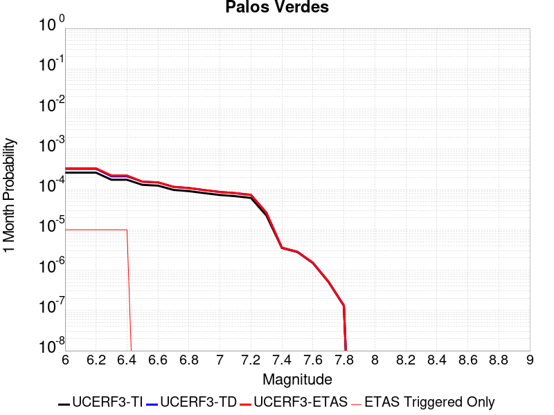 |  | 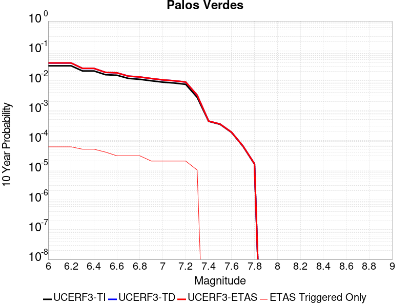 |

| Magnitude | 1 wk TI Prob | 1 wk TD Prob | 1 wk ETAS Prob | 1 wk ETAS/TD Gain | 1 wk ETAS Triggered Only | 1 mo TI Prob | 1 mo TD Prob | 1 mo ETAS Prob | 1 mo ETAS/TD Gain | 1 mo ETAS Triggered Only | 1 yr TI Prob | 1 yr TD Prob | 1 yr ETAS Prob | 1 yr ETAS/TD Gain | 1 yr ETAS Triggered Only | 10 yr TI Prob | 10 yr TD Prob | 10 yr ETAS Prob | 10 yr ETAS/TD Gain | 10 yr ETAS Triggered Only |
|-----|-----|-----|-----|-----|-----|-----|-----|-----|-----|-----|-----|-----|-----|-----|-----|-----|-----|-----|-----|-----|
| 6.0 | 6.126063E-5 | 7.623313E-5 | 7.623313E-5 | 1.0 | 0.0 | 2.6251914E-4 | 3.266759E-4 | 3.3667262E-4 | 1.0306014 | 1.0E-5 | 0.0031914865 | 0.0039705248 | 0.0039904453 | 1.0050172 | 2.0E-5 | 0.031460393 | 0.039052334 | 0.03910999 | 1.0014764 | 6.0E-5 |
| 6.1 | 6.126063E-5 | 7.623313E-5 | 7.623313E-5 | 1.0 | 0.0 | 2.6251914E-4 | 3.266759E-4 | 3.3667262E-4 | 1.0306014 | 1.0E-5 | 0.0031914865 | 0.0039705248 | 0.0039904453 | 1.0050172 | 2.0E-5 | 0.031460393 | 0.039052334 | 0.03910999 | 1.0014764 | 6.0E-5 |
| 6.2 | 6.126063E-5 | 7.623313E-5 | 7.623313E-5 | 1.0 | 0.0 | 2.6251914E-4 | 3.266759E-4 | 3.3667262E-4 | 1.0306014 | 1.0E-5 | 0.0031914865 | 0.0039705248 | 0.0039904453 | 1.0050172 | 2.0E-5 | 0.031460393 | 0.039052334 | 0.03910999 | 1.0014764 | 6.0E-5 |
| 6.3 | 4.0838047E-5 | 4.9753515E-5 | 4.9753515E-5 | 1.0 | 0.0 | 1.7500846E-4 | 2.1321319E-4 | 2.2321107E-4 | 1.0468915 | 1.0E-5 | 0.0021286458 | 0.0025929878 | 0.002612936 | 1.007693 | 2.0E-5 | 0.021083709 | 0.025648735 | 0.025697453 | 1.0018994 | 5.0E-5 |
| 6.4 | 4.0838047E-5 | 4.9753515E-5 | 4.9753515E-5 | 1.0 | 0.0 | 1.7500846E-4 | 2.1321319E-4 | 2.2321107E-4 | 1.0468915 | 1.0E-5 | 0.0021286458 | 0.0025929878 | 0.002612936 | 1.007693 | 2.0E-5 | 0.021083709 | 0.025648735 | 0.025697453 | 1.0018994 | 5.0E-5 |
| 6.5 | 3.0512005E-5 | 3.6564343E-5 | 3.6564343E-5 | 1.0 | 0.0 | 1.3075917E-4 | 1.5669558E-4 | 1.5669558E-4 | 1.0 | 0.0 | 0.0015908304 | 0.0019062175 | 0.0019161984 | 1.005236 | 1.0E-5 | 0.015794903 | 0.018910542 | 0.018949786 | 1.0020752 | 4.0E-5 |
| 6.6 | 2.9255087E-5 | 3.5157078E-5 | 3.5157078E-5 | 1.0 | 0.0 | 1.2537291E-4 | 1.5066515E-4 | 1.5066515E-4 | 1.0 | 0.0 | 0.0015253464 | 0.0018329205 | 0.001842902 | 1.0054457 | 1.0E-5 | 0.015149189 | 0.018189583 | 0.018219037 | 1.0016193 | 3.0E-5 |
| 6.7 | 2.287198E-5 | 2.7250231E-5 | 2.7250231E-5 | 1.0 | 0.0 | 9.801909E-5 | 1.16781994E-4 | 1.16781994E-4 | 1.0 | 0.0 | 0.001192729 | 0.0014209851 | 0.001430971 | 1.0070274 | 1.0E-5 | 0.011863477 | 0.014128223 | 0.014157799 | 1.0020934 | 3.0E-5 |
| 6.8 | 2.1325764E-5 | 2.543371E-5 | 2.543371E-5 | 1.0 | 0.0 | 9.139293E-5 | 1.0899757E-4 | 1.0899757E-4 | 1.0 | 0.0 | 0.001112141 | 0.0013263278 | 0.0013363146 | 1.0075296 | 1.0E-5 | 0.011065915 | 0.013193157 | 0.0132227605 | 1.0022439 | 3.0E-5 |
| 6.9 | 1.9009392E-5 | 2.2615155E-5 | 2.2615155E-5 | 1.0 | 0.0 | 8.1466285E-5 | 9.691898E-5 | 9.691898E-5 | 1.0 | 0.0 | 9.914007E-4 | 0.0011794372 | 0.0011894254 | 1.0084686 | 1.0E-5 | 0.009869894 | 0.011740462 | 0.011760227 | 1.0016835 | 2.0E-5 |
| 7.0 | 1.7098473E-5 | 2.0320791E-5 | 2.0320791E-5 | 1.0 | 0.0 | 7.3277115E-5 | 8.708668E-5 | 8.708668E-5 | 1.0 | 0.0 | 8.917837E-4 | 0.0010598497 | 0.0010698392 | 1.0094253 | 1.0E-5 | 0.008882134 | 0.010556389 | 0.010576178 | 1.0018746 | 2.0E-5 |
| 7.1 | 1.5982785E-5 | 1.8996103E-5 | 1.8996103E-5 | 1.0 | 0.0 | 6.849585E-5 | 8.140981E-5 | 8.140981E-5 | 1.0 | 0.0 | 8.336179E-4 | 9.907985E-4 | 0.0010007885 | 1.0100828 | 1.0E-5 | 0.008304977 | 0.009872175 | 0.0098919775 | 1.0020059 | 2.0E-5 |
| 7.2 | 1.4468002E-5 | 1.7198454E-5 | 1.7198454E-5 | 1.0 | 0.0 | 6.200425E-5 | 7.370605E-5 | 7.370605E-5 | 1.0 | 0.0 | 7.546402E-4 | 8.970857E-4 | 9.070767E-4 | 1.0111372 | 1.0E-5 | 0.007520827 | 0.008942914 | 0.0089627355 | 1.0022165 | 2.0E-5 |
| 7.3 | 5.288233E-6 | 6.204084E-6 | 6.204084E-6 | 1.0 | 0.0 | 2.2663658E-5 | 2.6588856E-5 | 2.6588856E-5 | 1.0 | 0.0 | 2.7589512E-4 | 3.2370616E-4 | 3.3370292E-4 | 1.0308822 | 1.0E-5 | 0.0027555283 | 0.0032357695 | 0.0032457372 | 1.0030805 | 1.0E-5 |
| 7.4 | 8.279556E-7 | 8.408395E-7 | 8.408395E-7 | 1.0 | 0.0 | 3.5483763E-6 | 3.6035933E-6 | 3.6035933E-6 | 1.0 | 0.0 | 4.3200624E-5 | 4.387294E-5 | 4.387294E-5 | 1.0 | 0.0 | 4.3192226E-4 | 4.3865E-4 | 4.3865E-4 | 1.0 | 0.0 |
| 7.5 | 6.559831E-7 | 6.667269E-7 | 6.667269E-7 | 1.0 | 0.0 | 2.8113532E-6 | 2.8573984E-6 | 2.8573984E-6 | 1.0 | 0.0 | 3.4227687E-5 | 3.4788336E-5 | 3.4788336E-5 | 1.0 | 0.0 | 3.4222414E-4 | 3.4783554E-4 | 3.4783554E-4 | 1.0 | 0.0 |
| 7.6 | 3.5018968E-7 | 3.5620255E-7 | 3.5620255E-7 | 1.0 | 0.0 | 1.500812E-6 | 1.5265817E-6 | 1.5265817E-6 | 1.0 | 0.0 | 1.8272232E-5 | 1.858602E-5 | 1.858602E-5 | 1.0 | 0.0 | 1.8270731E-4 | 1.8584926E-4 | 1.8584926E-4 | 1.0 | 0.0 |
| 7.7 | 1.1986104E-7 | 1.2198457E-7 | 1.2198457E-7 | 1.0 | 0.0 | 5.1369005E-7 | 5.227909E-7 | 5.227909E-7 | 1.0 | 0.0 | 6.2541585E-6 | 6.364961E-6 | 6.364961E-6 | 1.0 | 0.0 | 6.2539824E-5 | 6.364783E-5 | 6.364783E-5 | 1.0 | 0.0 |
| 7.8 | 3.0445005E-8 | 3.1027806E-8 | 3.1027806E-8 | 1.0 | 0.0 | 1.3047858E-7 | 1.329763E-7 | 1.329763E-7 | 1.0 | 0.0 | 1.5885756E-6 | 1.6189855E-6 | 1.6189855E-6 | 1.0 | 0.0 | 1.5885644E-5 | 1.6189757E-5 | 1.6189757E-5 | 1.0 | 0.0 |

## Cleghorn Pass
*[(top)](#table-of-contents)*

| 1 Week | 1 Month | 1 Year | 10 Year |
|-----|-----|-----|-----|
|  |  |  |  |

| Magnitude | 1 wk TI Prob | 1 wk TD Prob | 1 wk ETAS Prob | 1 wk ETAS/TD Gain | 1 wk ETAS Triggered Only | 1 mo TI Prob | 1 mo TD Prob | 1 mo ETAS Prob | 1 mo ETAS/TD Gain | 1 mo ETAS Triggered Only | 1 yr TI Prob | 1 yr TD Prob | 1 yr ETAS Prob | 1 yr ETAS/TD Gain | 1 yr ETAS Triggered Only | 10 yr TI Prob | 10 yr TD Prob | 10 yr ETAS Prob | 10 yr ETAS/TD Gain | 10 yr ETAS Triggered Only |
|-----|-----|-----|-----|-----|-----|-----|-----|-----|-----|-----|-----|-----|-----|-----|-----|-----|-----|-----|-----|-----|
| 6.0 | 1.0522846E-5 | 1.1040844E-5 | 1.1040844E-5 | 1.0 | 0.0 | 4.509713E-5 | 4.731734E-5 | 5.7316865E-5 | 1.211329 | 1.0E-5 | 5.4891926E-4 | 5.7598896E-4 | 5.959775E-4 | 1.0347029 | 2.0E-5 | 0.0054756533 | 0.0057501267 | 0.0057998393 | 1.0086454 | 5.0E-5 |
| 6.1 | 1.0522846E-5 | 1.1040844E-5 | 1.1040844E-5 | 1.0 | 0.0 | 4.509713E-5 | 4.731734E-5 | 5.7316865E-5 | 1.211329 | 1.0E-5 | 5.4891926E-4 | 5.7598896E-4 | 5.959775E-4 | 1.0347029 | 2.0E-5 | 0.0054756533 | 0.0057501267 | 0.0057998393 | 1.0086454 | 5.0E-5 |
| 6.2 | 2.1045846E-6 | 2.208243E-6 | 2.208243E-6 | 1.0 | 0.0 | 9.019617E-6 | 9.463887E-6 | 9.463887E-6 | 1.0 | 0.0 | 1.098083E-4 | 1.1522093E-4 | 1.1522093E-4 | 1.0 | 0.0 | 0.0010975406 | 0.0011520233 | 0.0011520233 | 1.0 | 0.0 |
| 6.3 | 2.1045846E-6 | 2.208243E-6 | 2.208243E-6 | 1.0 | 0.0 | 9.019617E-6 | 9.463887E-6 | 9.463887E-6 | 1.0 | 0.0 | 1.098083E-4 | 1.1522093E-4 | 1.1522093E-4 | 1.0 | 0.0 | 0.0010975406 | 0.0011520233 | 0.0011520233 | 1.0 | 0.0 |
| 6.4 | 1.7259927E-6 | 1.8109101E-6 | 1.8109101E-6 | 1.0 | 0.0 | 7.3970905E-6 | 7.761044E-6 | 7.761044E-6 | 1.0 | 0.0 | 9.005586E-5 | 9.449071E-5 | 9.449071E-5 | 1.0 | 0.0 | 9.001937E-4 | 9.449071E-4 | 9.449071E-4 | 1.0 | 0.0 |

## Santa Rosa Island
*[(top)](#table-of-contents)*

| 1 Week | 1 Month | 1 Year | 10 Year |
|-----|-----|-----|-----|
| 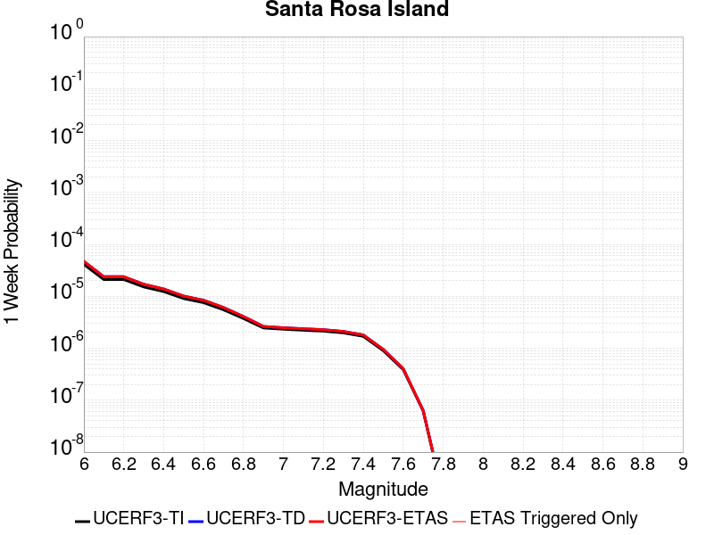 |  | 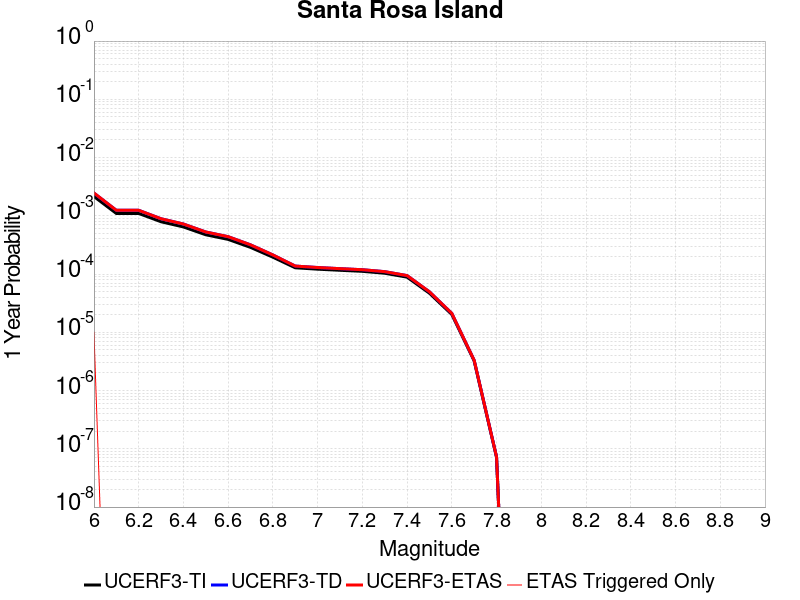 | 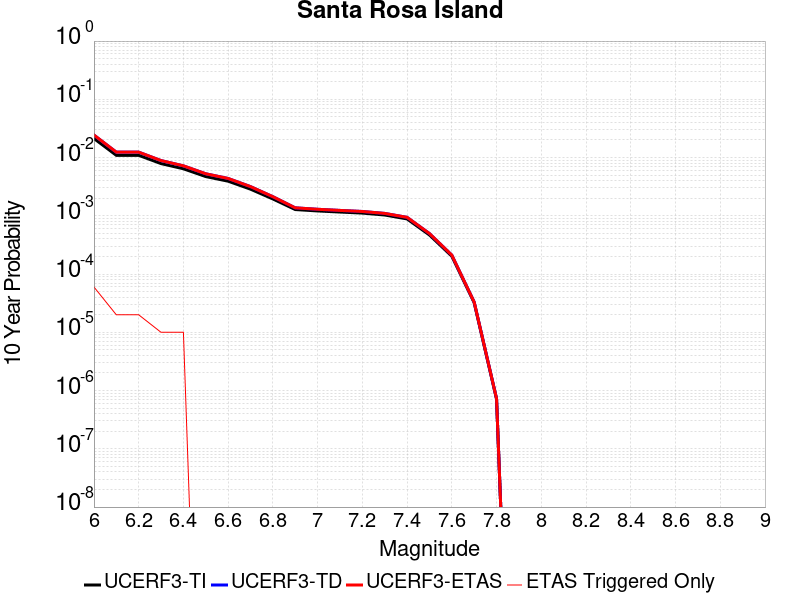 |

| Magnitude | 1 wk TI Prob | 1 wk TD Prob | 1 wk ETAS Prob | 1 wk ETAS/TD Gain | 1 wk ETAS Triggered Only | 1 mo TI Prob | 1 mo TD Prob | 1 mo ETAS Prob | 1 mo ETAS/TD Gain | 1 mo ETAS Triggered Only | 1 yr TI Prob | 1 yr TD Prob | 1 yr ETAS Prob | 1 yr ETAS/TD Gain | 1 yr ETAS Triggered Only | 10 yr TI Prob | 10 yr TD Prob | 10 yr ETAS Prob | 10 yr ETAS/TD Gain | 10 yr ETAS Triggered Only |
|-----|-----|-----|-----|-----|-----|-----|-----|-----|-----|-----|-----|-----|-----|-----|-----|-----|-----|-----|-----|-----|
| 6.0 | 4.1143165E-5 | 4.7093676E-5 | 4.7093676E-5 | 1.0 | 0.0 | 1.7631594E-4 | 2.0181555E-4 | 2.0181555E-4 | 1.0 | 0.0 | 0.002144533 | 0.0024545323 | 0.002464508 | 1.0040641 | 1.0E-5 | 0.021239553 | 0.024294848 | 0.02435339 | 1.0024097 | 6.0E-5 |
| 6.1 | 2.1061249E-5 | 2.3866147E-5 | 2.3866147E-5 | 1.0 | 0.0 | 9.0259375E-5 | 1.0227964E-4 | 1.0227964E-4 | 1.0 | 0.0 | 0.0010983539 | 0.0012445722 | 0.0012445722 | 1.0 | 0.0 | 0.01092941 | 0.0123790605 | 0.012398813 | 1.0015956 | 2.0E-5 |
| 6.2 | 2.1061249E-5 | 2.3866147E-5 | 2.3866147E-5 | 1.0 | 0.0 | 9.0259375E-5 | 1.0227964E-4 | 1.0227964E-4 | 1.0 | 0.0 | 0.0010983539 | 0.0012445722 | 0.0012445722 | 1.0 | 0.0 | 0.01092941 | 0.0123790605 | 0.012398813 | 1.0015956 | 2.0E-5 |
| 6.3 | 1.5158236E-5 | 1.7075226E-5 | 1.7075226E-5 | 1.0 | 0.0 | 6.496225E-5 | 7.317755E-5 | 7.317755E-5 | 1.0 | 0.0 | 7.906284E-4 | 8.905845E-4 | 8.905845E-4 | 1.0 | 0.0 | 0.007878214 | 0.008871407 | 0.008881318 | 1.0011172 | 1.0E-5 |
| 6.4 | 1.2341918E-5 | 1.3853551E-5 | 1.3853551E-5 | 1.0 | 0.0 | 5.2892858E-5 | 5.9371054E-5 | 5.9371054E-5 | 1.0 | 0.0 | 6.437803E-4 | 7.22611E-4 | 7.22611E-4 | 1.0 | 0.0 | 0.006419184 | 0.00720345 | 0.007213378 | 1.0013782 | 1.0E-5 |
| 6.5 | 9.061158E-6 | 1.0117473E-5 | 1.0117473E-5 | 1.0 | 0.0 | 3.883296E-5 | 4.3359905E-5 | 4.3359905E-5 | 1.0 | 0.0 | 4.726887E-4 | 5.277843E-4 | 5.277843E-4 | 1.0 | 0.0 | 0.004716845 | 0.0052658464 | 0.0052658464 | 1.0 | 0.0 |
| 6.6 | 7.5461685E-6 | 8.401091E-6 | 8.401091E-6 | 1.0 | 0.0 | 3.2340322E-5 | 3.60042E-5 | 3.60042E-5 | 1.0 | 0.0 | 3.936723E-4 | 4.3826725E-4 | 4.3826725E-4 | 1.0 | 0.0 | 0.003929756 | 0.004374459 | 0.004374459 | 1.0 | 0.0 |
| 6.7 | 5.5023775E-6 | 6.087624E-6 | 6.087624E-6 | 1.0 | 0.0 | 2.3581404E-5 | 2.6089576E-5 | 2.6089576E-5 | 1.0 | 0.0 | 2.8706578E-4 | 3.1759753E-4 | 3.1759753E-4 | 1.0 | 0.0 | 0.0028669522 | 0.003171758 | 0.003171758 | 1.0 | 0.0 |
| 6.8 | 3.7351679E-6 | 4.083284E-6 | 4.083284E-6 | 1.0 | 0.0 | 1.6007763E-5 | 1.7499684E-5 | 1.7499684E-5 | 1.0 | 0.0 | 1.948771E-4 | 2.1304033E-4 | 2.1304033E-4 | 1.0 | 0.0 | 0.0019470629 | 0.0021286062 | 0.0021286062 | 1.0 | 0.0 |
| 6.9 | 2.456366E-6 | 2.62934E-6 | 2.62934E-6 | 1.0 | 0.0 | 1.0527241E-5 | 1.1268552E-5 | 1.1268552E-5 | 1.0 | 0.0 | 1.2816161E-4 | 1.3718601E-4 | 1.3718601E-4 | 1.0 | 0.0 | 0.0012808773 | 0.0013710161 | 0.0013710161 | 1.0 | 0.0 |
| 7.0 | 2.3245157E-6 | 2.4828419E-6 | 2.4828419E-6 | 1.0 | 0.0 | 9.962172E-6 | 1.0640707E-5 | 1.0640707E-5 | 1.0 | 0.0 | 1.2128269E-4 | 1.2954292E-4 | 1.2954292E-4 | 1.0 | 0.0 | 0.0012121652 | 0.0012946764 | 0.0012946764 | 1.0 | 0.0 |
| 7.1 | 2.2248344E-6 | 2.3733094E-6 | 2.3733094E-6 | 1.0 | 0.0 | 9.53497E-6 | 1.0171287E-5 | 1.0171287E-5 | 1.0 | 0.0 | 1.1608207E-4 | 1.2382839E-4 | 1.2382839E-4 | 1.0 | 0.0 | 0.0011602144 | 0.0012375959 | 0.0012375959 | 1.0 | 0.0 |
| 7.2 | 2.1350402E-6 | 2.2762106E-6 | 2.2762106E-6 | 1.0 | 0.0 | 9.150141E-6 | 9.755151E-6 | 9.755151E-6 | 1.0 | 0.0 | 1.1139726E-4 | 1.1876251E-4 | 1.1876251E-4 | 1.0 | 0.0 | 0.0011134144 | 0.0011869924 | 0.0011869924 | 1.0 | 0.0 |
| 7.3 | 1.9793572E-6 | 2.1087708E-6 | 2.1087708E-6 | 1.0 | 0.0 | 8.482932E-6 | 9.037558E-6 | 9.037558E-6 | 1.0 | 0.0 | 1.032748E-4 | 1.1002673E-4 | 1.1002673E-4 | 1.0 | 0.0 | 0.0010322682 | 0.0010997243 | 0.0010997243 | 1.0 | 0.0 |
| 7.4 | 1.6951194E-6 | 1.8046172E-6 | 1.8046172E-6 | 1.0 | 0.0 | 7.264777E-6 | 7.734051E-6 | 7.734051E-6 | 1.0 | 0.0 | 8.844508E-5 | 9.415802E-5 | 9.415802E-5 | 1.0 | 0.0 | 8.840988E-4 | 9.411829E-4 | 9.411829E-4 | 1.0 | 0.0 |
| 7.5 | 8.987207E-7 | 9.5124267E-7 | 9.5124267E-7 | 1.0 | 0.0 | 3.8516546E-6 | 4.0767477E-6 | 4.0767477E-6 | 1.0 | 0.0 | 4.6892885E-5 | 4.9633287E-5 | 4.9633287E-5 | 1.0 | 0.0 | 4.688299E-4 | 4.9622316E-4 | 4.9622316E-4 | 1.0 | 0.0 |
| 7.6 | 3.8783037E-7 | 4.0530045E-7 | 4.0530045E-7 | 1.0 | 0.0 | 1.6621291E-6 | 1.7370007E-6 | 1.7370007E-6 | 1.0 | 0.0 | 2.0236233E-5 | 2.1147785E-5 | 2.1147785E-5 | 1.0 | 0.0 | 2.023439E-4 | 2.1145839E-4 | 2.1145839E-4 | 1.0 | 0.0 |
| 7.7 | 6.181804E-8 | 6.339123E-8 | 6.339123E-8 | 1.0 | 0.0 | 2.6493444E-7 | 2.7167667E-7 | 2.7167667E-7 | 1.0 | 0.0 | 3.225572E-6 | 3.3076583E-6 | 3.3076583E-6 | 1.0 | 0.0 | 3.225525E-5 | 3.30761E-5 | 3.30761E-5 | 1.0 | 0.0 |
| 7.8 | 1.3704449E-9 | 1.3964252E-9 | 1.3964252E-9 | 1.0 | 0.0 | 5.873335E-9 | 5.9846794E-9 | 5.9846794E-9 | 1.0 | 0.0 | 7.1507856E-8 | 7.2863465E-8 | 7.2863465E-8 | 1.0 | 0.0 | 7.1507833E-7 | 7.286345E-7 | 7.286345E-7 | 1.0 | 0.0 |

## San Jacinto (Lytle Creek connector)
*[(top)](#table-of-contents)*

| 1 Week | 1 Month | 1 Year | 10 Year |
|-----|-----|-----|-----|
| 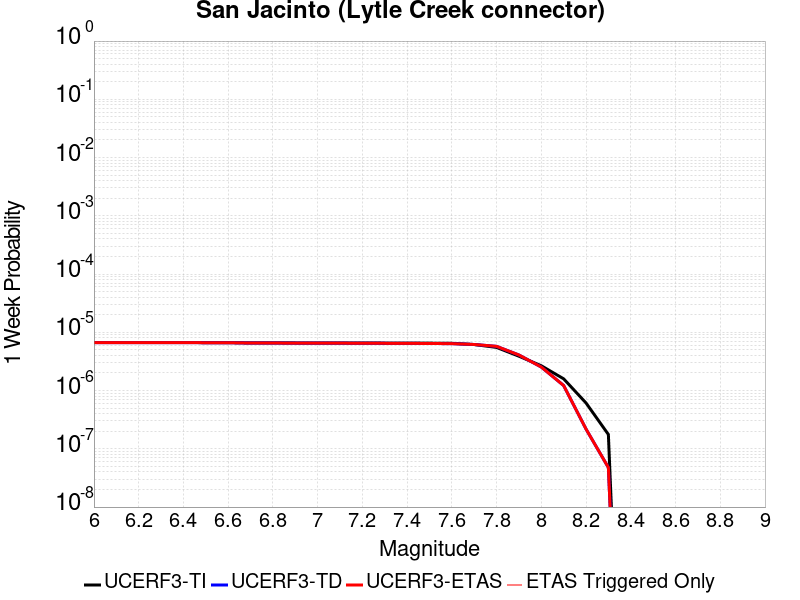 |  | 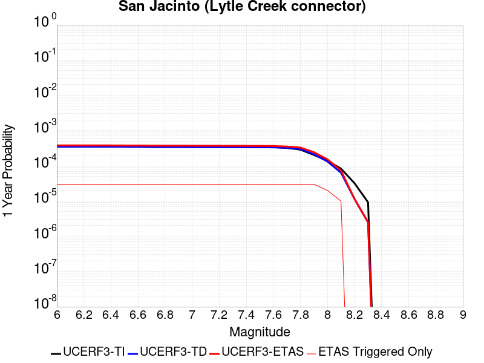 | 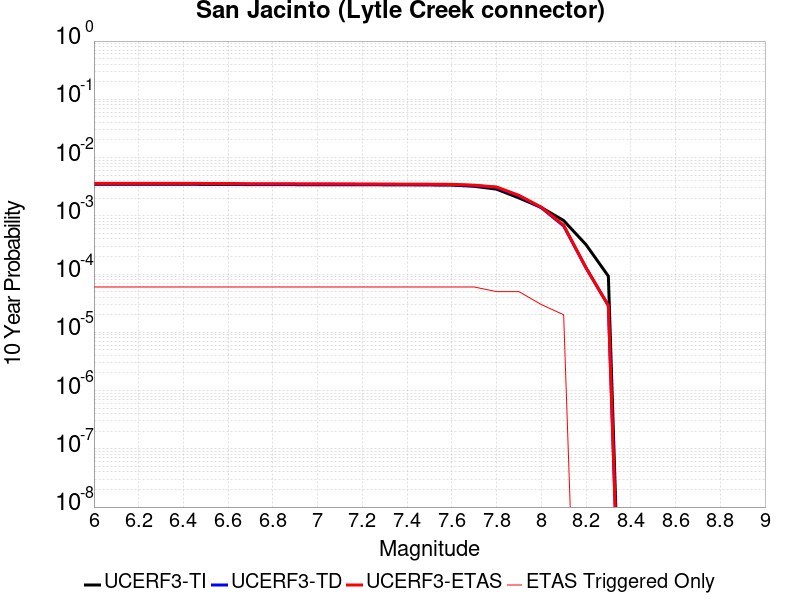 |

| Magnitude | 1 wk TI Prob | 1 wk TD Prob | 1 wk ETAS Prob | 1 wk ETAS/TD Gain | 1 wk ETAS Triggered Only | 1 mo TI Prob | 1 mo TD Prob | 1 mo ETAS Prob | 1 mo ETAS/TD Gain | 1 mo ETAS Triggered Only | 1 yr TI Prob | 1 yr TD Prob | 1 yr ETAS Prob | 1 yr ETAS/TD Gain | 1 yr ETAS Triggered Only | 10 yr TI Prob | 10 yr TD Prob | 10 yr ETAS Prob | 10 yr ETAS/TD Gain | 10 yr ETAS Triggered Only |
|-----|-----|-----|-----|-----|-----|-----|-----|-----|-----|-----|-----|-----|-----|-----|-----|-----|-----|-----|-----|-----|
| 6.0 | 6.693995E-6 | 6.6677876E-6 | 6.6677876E-6 | 1.0 | 0.0 | 2.8688235E-5 | 2.857592E-5 | 2.857592E-5 | 1.0 | 0.0 | 3.492233E-4 | 3.4785634E-4 | 3.7784592E-4 | 1.0862125 | 3.0E-5 | 0.00348675 | 0.0035533172 | 0.003613104 | 1.0168257 | 6.0E-5 |
| 6.1 | 6.693995E-6 | 6.6677876E-6 | 6.6677876E-6 | 1.0 | 0.0 | 2.8688235E-5 | 2.857592E-5 | 2.857592E-5 | 1.0 | 0.0 | 3.492233E-4 | 3.4785634E-4 | 3.7784592E-4 | 1.0862125 | 3.0E-5 | 0.00348675 | 0.0035533172 | 0.003613104 | 1.0168257 | 6.0E-5 |
| 6.2 | 6.693995E-6 | 6.6677876E-6 | 6.6677876E-6 | 1.0 | 0.0 | 2.8688235E-5 | 2.857592E-5 | 2.857592E-5 | 1.0 | 0.0 | 3.492233E-4 | 3.4785634E-4 | 3.7784592E-4 | 1.0862125 | 3.0E-5 | 0.00348675 | 0.0035533172 | 0.003613104 | 1.0168257 | 6.0E-5 |
| 6.3 | 6.693995E-6 | 6.6677876E-6 | 6.6677876E-6 | 1.0 | 0.0 | 2.8688235E-5 | 2.857592E-5 | 2.857592E-5 | 1.0 | 0.0 | 3.492233E-4 | 3.4785634E-4 | 3.7784592E-4 | 1.0862125 | 3.0E-5 | 0.00348675 | 0.0035533172 | 0.003613104 | 1.0168257 | 6.0E-5 |
| 6.4 | 6.693995E-6 | 6.6677876E-6 | 6.6677876E-6 | 1.0 | 0.0 | 2.8688235E-5 | 2.857592E-5 | 2.857592E-5 | 1.0 | 0.0 | 3.492233E-4 | 3.4785634E-4 | 3.7784592E-4 | 1.0862125 | 3.0E-5 | 0.00348675 | 0.0035533172 | 0.003613104 | 1.0168257 | 6.0E-5 |
| 6.5 | 6.6561875E-6 | 6.628005E-6 | 6.628005E-6 | 1.0 | 0.0 | 2.8526205E-5 | 2.8405426E-5 | 2.8405426E-5 | 1.0 | 0.0 | 3.472512E-4 | 3.4578127E-4 | 3.7577088E-4 | 1.08673 | 3.0E-5 | 0.0034670907 | 0.0035326325 | 0.0035924204 | 1.0169245 | 6.0E-5 |
| 6.6 | 6.6561875E-6 | 6.628005E-6 | 6.628005E-6 | 1.0 | 0.0 | 2.8526205E-5 | 2.8405426E-5 | 2.8405426E-5 | 1.0 | 0.0 | 3.472512E-4 | 3.4578127E-4 | 3.7577088E-4 | 1.08673 | 3.0E-5 | 0.0034670907 | 0.0035326325 | 0.0035924204 | 1.0169245 | 6.0E-5 |
| 6.7 | 6.5802237E-6 | 6.54718E-6 | 6.54718E-6 | 1.0 | 0.0 | 2.8200653E-5 | 2.8059041E-5 | 2.8059041E-5 | 1.0 | 0.0 | 3.4328885E-4 | 3.4156535E-4 | 3.715551E-4 | 1.087801 | 3.0E-5 | 0.0034275902 | 0.003490606 | 0.0035503968 | 1.017129 | 6.0E-5 |
| 6.8 | 6.575632E-6 | 6.541669E-6 | 6.541669E-6 | 1.0 | 0.0 | 2.8180975E-5 | 2.8035423E-5 | 2.8035423E-5 | 1.0 | 0.0 | 3.4304935E-4 | 3.412779E-4 | 3.7126764E-4 | 1.0878749 | 3.0E-5 | 0.0034252026 | 0.0034877406 | 0.0035475313 | 1.0171431 | 6.0E-5 |
| 6.9 | 6.570433E-6 | 6.533062E-6 | 6.533062E-6 | 1.0 | 0.0 | 2.8158694E-5 | 2.7998536E-5 | 2.7998536E-5 | 1.0 | 0.0 | 3.4277816E-4 | 3.4082893E-4 | 3.708187E-4 | 1.0879906 | 3.0E-5 | 0.0034224992 | 0.0034832652 | 0.0035430563 | 1.0171652 | 6.0E-5 |
| 7.0 | 6.5643826E-6 | 6.5231816E-6 | 6.5231816E-6 | 1.0 | 0.0 | 2.8132765E-5 | 2.7956194E-5 | 2.7956194E-5 | 1.0 | 0.0 | 3.424626E-4 | 3.403136E-4 | 3.7030337E-4 | 1.088124 | 3.0E-5 | 0.0034193532 | 0.0034781278 | 0.0035379191 | 1.0171907 | 6.0E-5 |
| 7.1 | 6.557402E-6 | 6.5118925E-6 | 6.5118925E-6 | 1.0 | 0.0 | 2.8102848E-5 | 2.7907812E-5 | 2.7907812E-5 | 1.0 | 0.0 | 3.4209844E-4 | 3.397247E-4 | 3.6971451E-4 | 1.0882767 | 3.0E-5 | 0.0034157229 | 0.0034722586 | 0.0035320502 | 1.0172198 | 6.0E-5 |
| 7.2 | 6.546394E-6 | 6.4938563E-6 | 6.4938563E-6 | 1.0 | 0.0 | 2.8055672E-5 | 2.7830518E-5 | 2.7830518E-5 | 1.0 | 0.0 | 3.4152428E-4 | 3.3878392E-4 | 3.6877376E-4 | 1.088522 | 3.0E-5 | 0.0034099987 | 0.0034628846 | 0.0035226769 | 1.0172666 | 6.0E-5 |
| 7.3 | 6.5364216E-6 | 6.4746378E-6 | 6.4746378E-6 | 1.0 | 0.0 | 2.8012933E-5 | 2.7748152E-5 | 2.7748152E-5 | 1.0 | 0.0 | 3.4100408E-4 | 3.3778144E-4 | 3.677713E-4 | 1.0887848 | 3.0E-5 | 0.003404813 | 0.0034529038 | 0.0035126966 | 1.0173167 | 6.0E-5 |
| 7.4 | 6.5269523E-6 | 6.4557194E-6 | 6.4557194E-6 | 1.0 | 0.0 | 2.7972354E-5 | 2.7667074E-5 | 2.7667074E-5 | 1.0 | 0.0 | 3.4051016E-4 | 3.3679465E-4 | 3.6678454E-4 | 1.089045 | 3.0E-5 | 0.0033998888 | 0.0034430833 | 0.0035028765 | 1.0173663 | 6.0E-5 |
| 7.5 | 6.5111835E-6 | 6.4319875E-6 | 6.4319875E-6 | 1.0 | 0.0 | 2.7904773E-5 | 2.7565371E-5 | 2.7565371E-5 | 1.0 | 0.0 | 3.3968766E-4 | 3.3555678E-4 | 3.655467E-4 | 1.0893737 | 3.0E-5 | 0.0033916887 | 0.0034307532 | 0.0034905474 | 1.0174289 | 6.0E-5 |
| 7.6 | 6.4768806E-6 | 6.391088E-6 | 6.391088E-6 | 1.0 | 0.0 | 2.7757764E-5 | 2.739009E-5 | 2.739009E-5 | 1.0 | 0.0 | 3.3789838E-4 | 3.3342338E-4 | 3.634134E-4 | 1.0899457 | 3.0E-5 | 0.0033738504 | 0.003409481 | 0.0034692762 | 1.017538 | 6.0E-5 |
| 7.7 | 6.1655364E-6 | 6.1835135E-6 | 6.1835135E-6 | 1.0 | 0.0 | 2.642346E-5 | 2.6500504E-5 | 2.6500504E-5 | 1.0 | 0.0 | 3.2165812E-4 | 3.225959E-4 | 3.5258624E-4 | 1.0929656 | 3.0E-5 | 0.0032119295 | 0.0033010652 | 0.0033608673 | 1.018116 | 6.0E-5 |
| 7.8 | 5.5043524E-6 | 5.744364E-6 | 5.744364E-6 | 1.0 | 0.0 | 2.3589868E-5 | 2.461847E-5 | 2.461847E-5 | 1.0 | 0.0 | 2.871688E-4 | 2.9968872E-4 | 3.2967972E-4 | 1.1000738 | 3.0E-5 | 0.0028679797 | 0.0030710585 | 0.0031209048 | 1.0162311 | 5.0E-5 |
| 7.9 | 3.889249E-6 | 4.082685E-6 | 4.082685E-6 | 1.0 | 0.0 | 1.6668104E-5 | 1.7497105E-5 | 1.7497105E-5 | 1.0 | 0.0 | 2.0291525E-4 | 2.1300647E-4 | 2.4300007E-4 | 1.1408108 | 3.0E-5 | 0.0020273007 | 0.0021974265 | 0.0022473165 | 1.0227039 | 5.0E-5 |
| 8.0 | 2.668535E-6 | 2.5356037E-6 | 2.5356037E-6 | 1.0 | 0.0 | 1.1436528E-5 | 1.0866828E-5 | 1.0866828E-5 | 1.0 | 0.0 | 1.3923083E-4 | 1.3229562E-4 | 1.5229298E-4 | 1.1511565 | 2.0E-5 | 0.0013914363 | 0.0013779602 | 0.0014079189 | 1.0217413 | 3.0E-5 |
| 8.1 | 1.5911459E-6 | 1.2208603E-6 | 1.2208603E-6 | 1.0 | 0.0 | 6.8191785E-6 | 5.232248E-6 | 5.232248E-6 | 1.0 | 0.0 | 8.3020335E-5 | 6.370078E-5 | 7.370015E-5 | 1.156974 | 1.0E-5 | 8.298933E-4 | 6.7050394E-4 | 6.9049053E-4 | 1.0298083 | 2.0E-5 |
| 8.2 | 6.1294963E-7 | 2.1876858E-7 | 2.1876858E-7 | 1.0 | 0.0 | 2.6269242E-6 | 9.375793E-7 | 9.375793E-7 | 1.0 | 0.0 | 3.1982334E-5 | 1.1414968E-5 | 1.1414968E-5 | 1.0 | 0.0 | 3.1977732E-4 | 1.2820825E-4 | 1.2820825E-4 | 1.0 | 0.0 |
| 8.3 | 1.762871E-7 | 4.7708813E-8 | 4.7708813E-8 | 1.0 | 0.0 | 7.5551594E-7 | 2.0446633E-7 | 2.0446633E-7 | 1.0 | 0.0 | 9.1983675E-6 | 2.4893748E-6 | 2.4893748E-6 | 1.0 | 0.0 | 9.197987E-5 | 2.8780514E-5 | 2.8780514E-5 | 1.0 | 0.0 |

## Ventura-Pitas Point
*[(top)](#table-of-contents)*

| 1 Week | 1 Month | 1 Year | 10 Year |
|-----|-----|-----|-----|
|  | 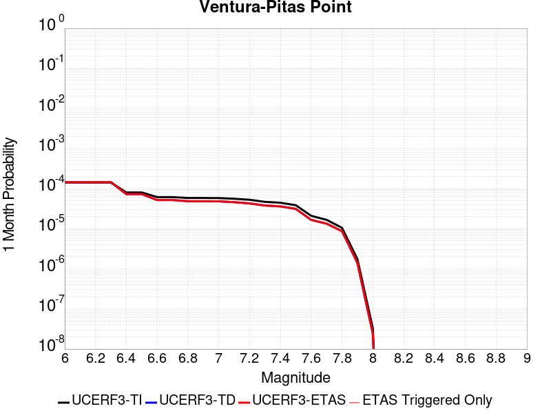 | 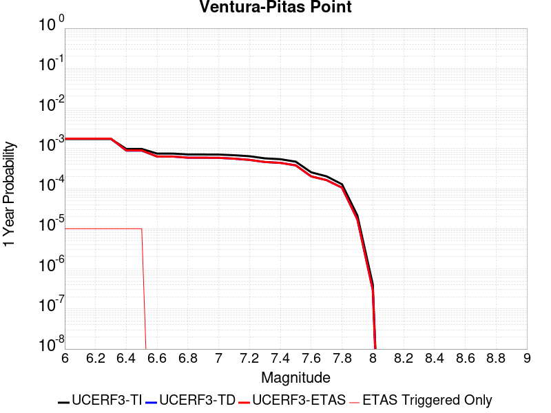 |  |

| Magnitude | 1 wk TI Prob | 1 wk TD Prob | 1 wk ETAS Prob | 1 wk ETAS/TD Gain | 1 wk ETAS Triggered Only | 1 mo TI Prob | 1 mo TD Prob | 1 mo ETAS Prob | 1 mo ETAS/TD Gain | 1 mo ETAS Triggered Only | 1 yr TI Prob | 1 yr TD Prob | 1 yr ETAS Prob | 1 yr ETAS/TD Gain | 1 yr ETAS Triggered Only | 10 yr TI Prob | 10 yr TD Prob | 10 yr ETAS Prob | 10 yr ETAS/TD Gain | 10 yr ETAS Triggered Only |
|-----|-----|-----|-----|-----|-----|-----|-----|-----|-----|-----|-----|-----|-----|-----|-----|-----|-----|-----|-----|-----|
| 6.0 | 3.3179622E-5 | 3.3736957E-5 | 3.3736957E-5 | 1.0 | 0.0 | 1.4219063E-4 | 1.445804E-4 | 1.445804E-4 | 1.0 | 0.0 | 0.0017297962 | 0.001759102 | 0.0017690844 | 1.0056747 | 1.0E-5 | 0.017163932 | 0.017477313 | 0.017526438 | 1.0028108 | 5.0E-5 |
| 6.1 | 3.3179622E-5 | 3.3736957E-5 | 3.3736957E-5 | 1.0 | 0.0 | 1.4219063E-4 | 1.445804E-4 | 1.445804E-4 | 1.0 | 0.0 | 0.0017297962 | 0.001759102 | 0.0017690844 | 1.0056747 | 1.0E-5 | 0.017163932 | 0.017477313 | 0.017526438 | 1.0028108 | 5.0E-5 |
| 6.2 | 3.3179622E-5 | 3.3736957E-5 | 3.3736957E-5 | 1.0 | 0.0 | 1.4219063E-4 | 1.445804E-4 | 1.445804E-4 | 1.0 | 0.0 | 0.0017297962 | 0.001759102 | 0.0017690844 | 1.0056747 | 1.0E-5 | 0.017163932 | 0.017477313 | 0.017526438 | 1.0028108 | 5.0E-5 |
| 6.3 | 3.3179622E-5 | 3.3736957E-5 | 3.3736957E-5 | 1.0 | 0.0 | 1.4219063E-4 | 1.445804E-4 | 1.445804E-4 | 1.0 | 0.0 | 0.0017297962 | 0.001759102 | 0.0017690844 | 1.0056747 | 1.0E-5 | 0.017163932 | 0.017477313 | 0.017526438 | 1.0028108 | 5.0E-5 |
| 6.4 | 1.8754668E-5 | 1.7020395E-5 | 1.7020395E-5 | 1.0 | 0.0 | 8.037467E-5 | 7.294264E-5 | 7.294264E-5 | 1.0 | 0.0 | 9.781223E-4 | 8.877379E-4 | 8.9772907E-4 | 1.0112545 | 1.0E-5 | 0.009738282 | 0.008844254 | 0.008873989 | 1.003362 | 3.0E-5 |
| 6.5 | 1.8754668E-5 | 1.7020395E-5 | 1.7020395E-5 | 1.0 | 0.0 | 8.037467E-5 | 7.294264E-5 | 7.294264E-5 | 1.0 | 0.0 | 9.781223E-4 | 8.877379E-4 | 8.9772907E-4 | 1.0112545 | 1.0E-5 | 0.009738282 | 0.008844254 | 0.008873989 | 1.003362 | 3.0E-5 |
| 6.6 | 1.4361558E-5 | 1.212285E-5 | 1.212285E-5 | 1.0 | 0.0 | 6.154808E-5 | 5.195405E-5 | 5.195405E-5 | 1.0 | 0.0 | 7.490902E-4 | 6.323593E-4 | 6.323593E-4 | 1.0 | 0.0 | 0.0074657016 | 0.006305856 | 0.006315793 | 1.0015758 | 1.0E-5 |
| 6.7 | 1.4361558E-5 | 1.212285E-5 | 1.212285E-5 | 1.0 | 0.0 | 6.154808E-5 | 5.195405E-5 | 5.195405E-5 | 1.0 | 0.0 | 7.490902E-4 | 6.323593E-4 | 6.323593E-4 | 1.0 | 0.0 | 0.0074657016 | 0.006305856 | 0.006315793 | 1.0015758 | 1.0E-5 |
| 6.8 | 1.3663846E-5 | 1.13449605E-5 | 1.13449605E-5 | 1.0 | 0.0 | 5.8558027E-5 | 4.8620364E-5 | 4.8620364E-5 | 1.0 | 0.0 | 7.127108E-4 | 5.917941E-4 | 5.917941E-4 | 1.0 | 0.0 | 0.007104293 | 0.0059023974 | 0.0059123384 | 1.0016842 | 1.0E-5 |
| 6.9 | 1.3644157E-5 | 1.132306E-5 | 1.132306E-5 | 1.0 | 0.0 | 5.8473648E-5 | 4.8526508E-5 | 4.8526508E-5 | 1.0 | 0.0 | 7.116841E-4 | 5.90652E-4 | 5.90652E-4 | 1.0 | 0.0 | 0.007094092 | 0.0058910376 | 0.0059009786 | 1.0016875 | 1.0E-5 |
| 7.0 | 1.3568845E-5 | 1.1242622E-5 | 1.1242622E-5 | 1.0 | 0.0 | 5.8150898E-5 | 4.818179E-5 | 4.818179E-5 | 1.0 | 0.0 | 7.077572E-4 | 5.864573E-4 | 5.864573E-4 | 1.0 | 0.0 | 0.007055073 | 0.005849312 | 0.0058592535 | 1.0016996 | 1.0E-5 |
| 7.1 | 1.306572E-5 | 1.0721052E-5 | 1.0721052E-5 | 1.0 | 0.0 | 5.599474E-5 | 4.5946563E-5 | 4.5946563E-5 | 1.0 | 0.0 | 6.815227E-4 | 5.592577E-4 | 5.592577E-4 | 1.0 | 0.0 | 0.0067943637 | 0.005578708 | 0.005588652 | 1.0017825 | 1.0E-5 |
| 7.2 | 1.232604E-5 | 9.995608E-6 | 9.995608E-6 | 1.0 | 0.0 | 5.2824813E-5 | 4.2837626E-5 | 4.2837626E-5 | 1.0 | 0.0 | 6.429523E-4 | 5.214251E-4 | 5.214251E-4 | 1.0 | 0.0 | 0.0064109527 | 0.005202208 | 0.005212156 | 1.0019122 | 1.0E-5 |
| 7.3 | 1.0917261E-5 | 8.844227E-6 | 8.844227E-6 | 1.0 | 0.0 | 4.678742E-5 | 3.7903286E-5 | 3.7903286E-5 | 1.0 | 0.0 | 5.69488E-4 | 4.6137636E-4 | 4.6137636E-4 | 1.0 | 0.0 | 0.0056803077 | 0.004604351 | 0.0046143048 | 1.0021619 | 1.0E-5 |
| 7.4 | 1.039959E-5 | 8.423923E-6 | 8.423923E-6 | 1.0 | 0.0 | 4.456891E-5 | 3.6102032E-5 | 3.6102032E-5 | 1.0 | 0.0 | 5.424914E-4 | 4.3945515E-4 | 4.3945515E-4 | 1.0 | 0.0 | 0.0054116896 | 0.004386023 | 0.004395979 | 1.00227 | 1.0E-5 |
| 7.5 | 9.015877E-6 | 7.297813E-6 | 7.297813E-6 | 1.0 | 0.0 | 3.86389E-5 | 3.1275977E-5 | 3.1275977E-5 | 1.0 | 0.0 | 4.7032707E-4 | 3.8071987E-4 | 3.8071987E-4 | 1.0 | 0.0 | 0.004693329 | 0.0038008215 | 0.0038107834 | 1.002621 | 1.0E-5 |
| 7.6 | 4.900162E-6 | 3.874221E-6 | 3.874221E-6 | 1.0 | 0.0 | 2.1000526E-5 | 1.6603699E-5 | 1.6603699E-5 | 1.0 | 0.0 | 2.556514E-4 | 2.0213141E-4 | 2.0213141E-4 | 1.0 | 0.0 | 0.0025535747 | 0.0020194892 | 0.002029469 | 1.0049417 | 1.0E-5 |
| 7.7 | 3.8850626E-6 | 3.1268125E-6 | 3.1268125E-6 | 1.0 | 0.0 | 1.6650163E-5 | 1.3400557E-5 | 1.3400557E-5 | 1.0 | 0.0 | 2.0269687E-4 | 1.6313966E-4 | 1.6313966E-4 | 1.0 | 0.0 | 0.002025121 | 0.0016302082 | 0.001640192 | 1.0061241 | 1.0E-5 |
| 7.8 | 2.4654719E-6 | 2.0299221E-6 | 2.0299221E-6 | 1.0 | 0.0 | 1.0566265E-5 | 8.699638E-6 | 8.699638E-6 | 1.0 | 0.0 | 1.2863669E-4 | 1.05912986E-4 | 1.05912986E-4 | 1.0 | 0.0 | 0.0012856225 | 0.0010586298 | 0.0010686192 | 1.0094361 | 1.0E-5 |
| 7.9 | 4.095894E-7 | 3.2765558E-7 | 3.2765558E-7 | 1.0 | 0.0 | 1.7553821E-6 | 1.4042374E-6 | 1.4042374E-6 | 1.0 | 0.0 | 2.1371567E-5 | 1.709646E-5 | 1.709646E-5 | 1.0 | 0.0 | 2.1369511E-4 | 1.7095175E-4 | 1.7095175E-4 | 1.0 | 0.0 |
| 8.0 | 7.791402E-9 | 5.6836544E-9 | 5.6836544E-9 | 1.0 | 0.0 | 3.3391725E-8 | 2.4358519E-8 | 2.4358519E-8 | 1.0 | 0.0 | 4.0654416E-7 | 2.9656493E-7 | 2.9656493E-7 | 1.0 | 0.0 | 4.065434E-6 | 2.9656476E-6 | 2.9656476E-6 | 1.0 | 0.0 |

## San Pedro Basin
*[(top)](#table-of-contents)*

| 1 Week | 1 Month | 1 Year | 10 Year |
|-----|-----|-----|-----|
| 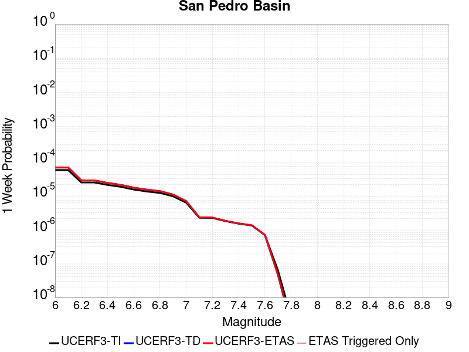 |  |  |  |

| Magnitude | 1 wk TI Prob | 1 wk TD Prob | 1 wk ETAS Prob | 1 wk ETAS/TD Gain | 1 wk ETAS Triggered Only | 1 mo TI Prob | 1 mo TD Prob | 1 mo ETAS Prob | 1 mo ETAS/TD Gain | 1 mo ETAS Triggered Only | 1 yr TI Prob | 1 yr TD Prob | 1 yr ETAS Prob | 1 yr ETAS/TD Gain | 1 yr ETAS Triggered Only | 10 yr TI Prob | 10 yr TD Prob | 10 yr ETAS Prob | 10 yr ETAS/TD Gain | 10 yr ETAS Triggered Only |
|-----|-----|-----|-----|-----|-----|-----|-----|-----|-----|-----|-----|-----|-----|-----|-----|-----|-----|-----|-----|-----|
| 6.0 | 5.3449043E-5 | 6.3373984E-5 | 6.3373984E-5 | 1.0 | 0.0 | 2.2904722E-4 | 2.71578E-4 | 2.9157256E-4 | 1.0736237 | 2.0E-5 | 0.0027850836 | 0.0033020563 | 0.0033319574 | 1.0090553 | 3.0E-5 | 0.027504366 | 0.032591686 | 0.03264006 | 1.0014842 | 5.0E-5 |
| 6.1 | 5.3449043E-5 | 6.3373984E-5 | 6.3373984E-5 | 1.0 | 0.0 | 2.2904722E-4 | 2.71578E-4 | 2.9157256E-4 | 1.0736237 | 2.0E-5 | 0.0027850836 | 0.0033020563 | 0.0033319574 | 1.0090553 | 3.0E-5 | 0.027504366 | 0.032591686 | 0.03264006 | 1.0014842 | 5.0E-5 |
| 6.2 | 2.3189454E-5 | 2.6644302E-5 | 2.6644302E-5 | 1.0 | 0.0 | 9.9379584E-5 | 1.1418514E-4 | 1.24184E-4 | 1.0875671 | 1.0E-5 | 0.0012092749 | 0.001389365 | 0.001399351 | 1.0071875 | 1.0E-5 | 0.012027155 | 0.013811659 | 0.013841244 | 1.0021421 | 3.0E-5 |
| 6.3 | 2.3189454E-5 | 2.6644302E-5 | 2.6644302E-5 | 1.0 | 0.0 | 9.9379584E-5 | 1.1418514E-4 | 1.24184E-4 | 1.0875671 | 1.0E-5 | 0.0012092749 | 0.001389365 | 0.001399351 | 1.0071875 | 1.0E-5 | 0.012027155 | 0.013811659 | 0.013841244 | 1.0021421 | 3.0E-5 |
| 6.4 | 1.966056E-5 | 2.2464632E-5 | 2.2464632E-5 | 1.0 | 0.0 | 8.425682E-5 | 9.627367E-5 | 1.062727E-4 | 1.1038606 | 1.0E-5 | 0.001025344 | 0.0011715419 | 0.0011815302 | 1.0085257 | 1.0E-5 | 0.010206259 | 0.011657746 | 0.011687396 | 1.0025434 | 3.0E-5 |
| 6.5 | 1.7342953E-5 | 1.9746192E-5 | 1.9746192E-5 | 1.0 | 0.0 | 7.4324824E-5 | 8.4624E-5 | 9.462316E-5 | 1.1181598 | 1.0E-5 | 9.04529E-4 | 0.0010298472 | 0.0010398369 | 1.0097002 | 1.0E-5 | 0.009008561 | 0.010254471 | 0.010284163 | 1.0028956 | 3.0E-5 |
| 6.6 | 1.439804E-5 | 1.6323553E-5 | 1.6323553E-5 | 1.0 | 0.0 | 6.170443E-5 | 6.995639E-5 | 7.995569E-5 | 1.1429362 | 1.0E-5 | 7.509924E-4 | 8.5141836E-4 | 8.614098E-4 | 1.0117351 | 1.0E-5 | 0.0074845953 | 0.008484766 | 0.008504597 | 1.0023372 | 2.0E-5 |
| 6.7 | 1.2634884E-5 | 1.4286016E-5 | 1.4286016E-5 | 1.0 | 0.0 | 5.414838E-5 | 6.122452E-5 | 6.122452E-5 | 1.0 | 0.0 | 6.590571E-4 | 7.451841E-4 | 7.451841E-4 | 1.0 | 0.0 | 0.006571059 | 0.0074298745 | 0.0074398 | 1.0013359 | 1.0E-5 |
| 6.8 | 1.146091E-5 | 1.2933835E-5 | 1.2933835E-5 | 1.0 | 0.0 | 4.911726E-5 | 5.542971E-5 | 5.542971E-5 | 1.0 | 0.0 | 5.9783855E-4 | 6.7467755E-4 | 6.7467755E-4 | 1.0 | 0.0 | 0.0059623276 | 0.006729233 | 0.0067391656 | 1.001476 | 1.0E-5 |
| 6.9 | 9.109035E-6 | 1.0235507E-5 | 1.0235507E-5 | 1.0 | 0.0 | 3.9038136E-5 | 4.386588E-5 | 4.386588E-5 | 1.0 | 0.0 | 4.7518566E-4 | 5.339642E-4 | 5.339642E-4 | 1.0 | 0.0 | 0.0047417083 | 0.0053295665 | 0.0053295665 | 1.0 | 0.0 |
| 7.0 | 5.9351028E-6 | 6.5842555E-6 | 6.5842555E-6 | 1.0 | 0.0 | 2.5435906E-5 | 2.8218066E-5 | 2.8218066E-5 | 1.0 | 0.0 | 3.0963816E-4 | 3.435244E-4 | 3.435244E-4 | 1.0 | 0.0 | 0.0030920706 | 0.003432251 | 0.003432251 | 1.0 | 0.0 |
| 7.1 | 2.1557585E-6 | 2.2096835E-6 | 2.2096835E-6 | 1.0 | 0.0 | 9.238933E-6 | 9.470039E-6 | 9.470039E-6 | 1.0 | 0.0 | 1.1247819E-4 | 1.1529178E-4 | 1.1529178E-4 | 1.0 | 0.0 | 0.0011242128 | 0.0011523351 | 0.0011523351 | 1.0 | 0.0 |
| 7.2 | 2.1251979E-6 | 2.1780295E-6 | 2.1780295E-6 | 1.0 | 0.0 | 9.107958E-6 | 9.33438E-6 | 9.33438E-6 | 1.0 | 0.0 | 1.1088375E-4 | 1.136403E-4 | 1.136403E-4 | 1.0 | 0.0 | 0.0011082845 | 0.0011358372 | 0.0011358372 | 1.0 | 0.0 |
| 7.3 | 1.7145798E-6 | 1.7443134E-6 | 1.7443134E-6 | 1.0 | 0.0 | 7.3481783E-6 | 7.475608E-6 | 7.475608E-6 | 1.0 | 0.0 | 8.94604E-5 | 9.101182E-5 | 9.101182E-5 | 1.0 | 0.0 | 8.9424395E-4 | 9.097546E-4 | 9.097546E-4 | 1.0 | 0.0 |
| 7.4 | 1.4467993E-6 | 1.4642079E-6 | 1.4642079E-6 | 1.0 | 0.0 | 6.200554E-6 | 6.2751624E-6 | 6.2751624E-6 | 1.0 | 0.0 | 7.548913E-5 | 7.63975E-5 | 7.63975E-5 | 1.0 | 0.0 | 7.546349E-4 | 7.637196E-4 | 7.637196E-4 | 1.0 | 0.0 |
| 7.5 | 1.2803735E-6 | 1.2931683E-6 | 1.2931683E-6 | 1.0 | 0.0 | 5.487303E-6 | 5.5421388E-6 | 5.5421388E-6 | 1.0 | 0.0 | 6.680587E-5 | 6.747352E-5 | 6.747352E-5 | 1.0 | 0.0 | 6.678579E-4 | 6.7453744E-4 | 6.7453744E-4 | 1.0 | 0.0 |
| 7.6 | 6.755009E-7 | 6.7695646E-7 | 6.7695646E-7 | 1.0 | 0.0 | 2.8950008E-6 | 2.901239E-6 | 2.901239E-6 | 1.0 | 0.0 | 3.5246063E-5 | 3.532207E-5 | 3.532207E-5 | 1.0 | 0.0 | 3.5240475E-4 | 3.531703E-4 | 3.531703E-4 | 1.0 | 0.0 |
| 7.7 | 6.211885E-8 | 4.570046E-8 | 4.570046E-8 | 1.0 | 0.0 | 2.6622362E-7 | 1.958591E-7 | 1.958591E-7 | 1.0 | 0.0 | 3.2412677E-6 | 2.384582E-6 | 2.384582E-6 | 1.0 | 0.0 | 3.2412205E-5 | 2.3845587E-5 | 2.3845587E-5 | 1.0 | 0.0 |
| 7.8 | 2.6580573E-9 | 1.5139615E-9 | 1.5139615E-9 | 1.0 | 0.0 | 1.1391674E-8 | 6.4884063E-9 | 6.4884063E-9 | 1.0 | 0.0 | 1.3869362E-7 | 7.8996344E-8 | 7.8996344E-8 | 1.0 | 0.0 | 1.3869354E-6 | 7.8996345E-7 | 7.8996345E-7 | 1.0 | 0.0 |

## Deep Springs
*[(top)](#table-of-contents)*

| 1 Week | 1 Month | 1 Year | 10 Year |
|-----|-----|-----|-----|
|  |  |  |  |

| Magnitude | 1 wk TI Prob | 1 wk TD Prob | 1 wk ETAS Prob | 1 wk ETAS/TD Gain | 1 wk ETAS Triggered Only | 1 mo TI Prob | 1 mo TD Prob | 1 mo ETAS Prob | 1 mo ETAS/TD Gain | 1 mo ETAS Triggered Only | 1 yr TI Prob | 1 yr TD Prob | 1 yr ETAS Prob | 1 yr ETAS/TD Gain | 1 yr ETAS Triggered Only | 10 yr TI Prob | 10 yr TD Prob | 10 yr ETAS Prob | 10 yr ETAS/TD Gain | 10 yr ETAS Triggered Only |
|-----|-----|-----|-----|-----|-----|-----|-----|-----|-----|-----|-----|-----|-----|-----|-----|-----|-----|-----|-----|-----|
| 6.0 | 1.9810619E-5 | 2.3113951E-5 | 2.3113951E-5 | 1.0 | 0.0 | 8.489989E-5 | 9.905889E-5 | 9.905889E-5 | 1.0 | 0.0 | 0.001033166 | 0.0012058825 | 0.0012258585 | 1.0165653 | 2.0E-5 | 0.010283757 | 0.012043169 | 0.012092567 | 1.0041018 | 5.0E-5 |
| 6.1 | 1.9810619E-5 | 2.3113951E-5 | 2.3113951E-5 | 1.0 | 0.0 | 8.489989E-5 | 9.905889E-5 | 9.905889E-5 | 1.0 | 0.0 | 0.001033166 | 0.0012058825 | 0.0012258585 | 1.0165653 | 2.0E-5 | 0.010283757 | 0.012043169 | 0.012092567 | 1.0041018 | 5.0E-5 |
| 6.2 | 1.9810619E-5 | 2.3113951E-5 | 2.3113951E-5 | 1.0 | 0.0 | 8.489989E-5 | 9.905889E-5 | 9.905889E-5 | 1.0 | 0.0 | 0.001033166 | 0.0012058825 | 0.0012258585 | 1.0165653 | 2.0E-5 | 0.010283757 | 0.012043169 | 0.012092567 | 1.0041018 | 5.0E-5 |
| 6.3 | 1.9810619E-5 | 2.3113951E-5 | 2.3113951E-5 | 1.0 | 0.0 | 8.489989E-5 | 9.905889E-5 | 9.905889E-5 | 1.0 | 0.0 | 0.001033166 | 0.0012058825 | 0.0012258585 | 1.0165653 | 2.0E-5 | 0.010283757 | 0.012043169 | 0.012092567 | 1.0041018 | 5.0E-5 |
| 6.4 | 1.9810619E-5 | 2.3113951E-5 | 2.3113951E-5 | 1.0 | 0.0 | 8.489989E-5 | 9.905889E-5 | 9.905889E-5 | 1.0 | 0.0 | 0.001033166 | 0.0012058825 | 0.0012258585 | 1.0165653 | 2.0E-5 | 0.010283757 | 0.012043169 | 0.012092567 | 1.0041018 | 5.0E-5 |
| 6.5 | 1.7190405E-5 | 2.0051795E-5 | 2.0051795E-5 | 1.0 | 0.0 | 7.367108E-5 | 8.593626E-5 | 8.593626E-5 | 1.0 | 0.0 | 8.9657627E-4 | 0.001046274 | 0.001066253 | 1.0190954 | 2.0E-5 | 0.008929676 | 0.010462702 | 0.01051218 | 1.0047289 | 5.0E-5 |
| 6.6 | 1.7190405E-5 | 2.0051795E-5 | 2.0051795E-5 | 1.0 | 0.0 | 7.367108E-5 | 8.593626E-5 | 8.593626E-5 | 1.0 | 0.0 | 8.9657627E-4 | 0.001046274 | 0.001066253 | 1.0190954 | 2.0E-5 | 0.008929676 | 0.010462702 | 0.01051218 | 1.0047289 | 5.0E-5 |

## Tin Mountain
*[(top)](#table-of-contents)*

| 1 Week | 1 Month | 1 Year | 10 Year |
|-----|-----|-----|-----|
|  |  |  | 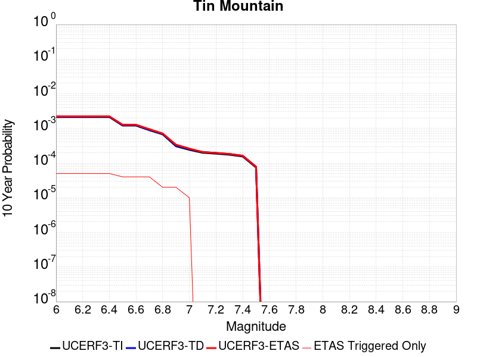 |

| Magnitude | 1 wk TI Prob | 1 wk TD Prob | 1 wk ETAS Prob | 1 wk ETAS/TD Gain | 1 wk ETAS Triggered Only | 1 mo TI Prob | 1 mo TD Prob | 1 mo ETAS Prob | 1 mo ETAS/TD Gain | 1 mo ETAS Triggered Only | 1 yr TI Prob | 1 yr TD Prob | 1 yr ETAS Prob | 1 yr ETAS/TD Gain | 1 yr ETAS Triggered Only | 10 yr TI Prob | 10 yr TD Prob | 10 yr ETAS Prob | 10 yr ETAS/TD Gain | 10 yr ETAS Triggered Only |
|-----|-----|-----|-----|-----|-----|-----|-----|-----|-----|-----|-----|-----|-----|-----|-----|-----|-----|-----|-----|-----|
| 6.0 | 4.083776E-6 | 4.181574E-6 | 4.181574E-6 | 1.0 | 0.0 | 1.750178E-5 | 1.792093E-5 | 1.792093E-5 | 1.0 | 0.0 | 2.1306332E-4 | 2.181692E-4 | 2.28167E-4 | 1.045826 | 1.0E-5 | 0.0021285915 | 0.0021799158 | 0.0022298067 | 1.0228866 | 5.0E-5 |
| 6.1 | 4.083776E-6 | 4.181574E-6 | 4.181574E-6 | 1.0 | 0.0 | 1.750178E-5 | 1.792093E-5 | 1.792093E-5 | 1.0 | 0.0 | 2.1306332E-4 | 2.181692E-4 | 2.28167E-4 | 1.045826 | 1.0E-5 | 0.0021285915 | 0.0021799158 | 0.0022298067 | 1.0228866 | 5.0E-5 |
| 6.2 | 4.083776E-6 | 4.181574E-6 | 4.181574E-6 | 1.0 | 0.0 | 1.750178E-5 | 1.792093E-5 | 1.792093E-5 | 1.0 | 0.0 | 2.1306332E-4 | 2.181692E-4 | 2.28167E-4 | 1.045826 | 1.0E-5 | 0.0021285915 | 0.0021799158 | 0.0022298067 | 1.0228866 | 5.0E-5 |
| 6.3 | 4.083776E-6 | 4.181574E-6 | 4.181574E-6 | 1.0 | 0.0 | 1.750178E-5 | 1.792093E-5 | 1.792093E-5 | 1.0 | 0.0 | 2.1306332E-4 | 2.181692E-4 | 2.28167E-4 | 1.045826 | 1.0E-5 | 0.0021285915 | 0.0021799158 | 0.0022298067 | 1.0228866 | 5.0E-5 |
| 6.4 | 4.083776E-6 | 4.181574E-6 | 4.181574E-6 | 1.0 | 0.0 | 1.750178E-5 | 1.792093E-5 | 1.792093E-5 | 1.0 | 0.0 | 2.1306332E-4 | 2.181692E-4 | 2.28167E-4 | 1.045826 | 1.0E-5 | 0.0021285915 | 0.0021799158 | 0.0022298067 | 1.0228866 | 5.0E-5 |
| 6.5 | 2.3143427E-6 | 2.3731798E-6 | 2.3731798E-6 | 1.0 | 0.0 | 9.9185745E-6 | 1.0170735E-5 | 1.0170735E-5 | 1.0 | 0.0 | 1.2075195E-4 | 1.2382244E-4 | 1.3382119E-4 | 1.0807508 | 1.0E-5 | 0.0012068636 | 0.0012376104 | 0.0012775608 | 1.0322803 | 4.0E-5 |
| 6.6 | 2.3143427E-6 | 2.3731798E-6 | 2.3731798E-6 | 1.0 | 0.0 | 9.9185745E-6 | 1.0170735E-5 | 1.0170735E-5 | 1.0 | 0.0 | 1.2075195E-4 | 1.2382244E-4 | 1.3382119E-4 | 1.0807508 | 1.0E-5 | 0.0012068636 | 0.0012376104 | 0.0012775608 | 1.0322803 | 4.0E-5 |
| 6.7 | 1.7029532E-6 | 1.7498095E-6 | 1.7498095E-6 | 1.0 | 0.0 | 7.2983503E-6 | 7.499165E-6 | 7.499165E-6 | 1.0 | 0.0 | 8.885379E-5 | 9.129904E-5 | 1.0129813E-4 | 1.1095202 | 1.0E-5 | 8.881827E-4 | 9.12668E-4 | 9.5263147E-4 | 1.0437876 | 4.0E-5 |
| 6.8 | 1.2914646E-6 | 1.3299526E-6 | 1.3299526E-6 | 1.0 | 0.0 | 5.534837E-6 | 5.6997874E-6 | 5.6997874E-6 | 1.0 | 0.0 | 6.738455E-5 | 6.939314E-5 | 6.939314E-5 | 1.0 | 0.0 | 6.736412E-4 | 6.937581E-4 | 7.137442E-4 | 1.0288085 | 2.0E-5 |
| 6.9 | 5.8708974E-7 | 6.117089E-7 | 6.117089E-7 | 1.0 | 0.0 | 2.5160964E-6 | 2.6216073E-6 | 2.6216073E-6 | 1.0 | 0.0 | 3.0633044E-5 | 3.1917643E-5 | 3.1917643E-5 | 1.0 | 0.0 | 3.0628822E-4 | 3.191347E-4 | 3.391283E-4 | 1.0626495 | 2.0E-5 |
| 7.0 | 4.6248786E-7 | 4.832096E-7 | 4.832096E-7 | 1.0 | 0.0 | 1.9820893E-6 | 2.0708967E-6 | 2.0708967E-6 | 1.0 | 0.0 | 2.413167E-5 | 2.5212914E-5 | 2.5212914E-5 | 1.0 | 0.0 | 2.412905E-4 | 2.5210422E-4 | 2.621017E-4 | 1.0396562 | 1.0E-5 |
| 7.1 | 3.804606E-7 | 3.9872182E-7 | 3.9872182E-7 | 1.0 | 0.0 | 1.6305444E-6 | 1.7088068E-6 | 1.7088068E-6 | 1.0 | 0.0 | 1.9851697E-5 | 2.0804559E-5 | 2.0804559E-5 | 1.0 | 0.0 | 1.9849923E-4 | 2.0802947E-4 | 2.0802947E-4 | 1.0 | 0.0 |
| 7.2 | 3.5864858E-7 | 3.7617545E-7 | 3.7617545E-7 | 1.0 | 0.0 | 1.5370645E-6 | 1.6121797E-6 | 1.6121797E-6 | 1.0 | 0.0 | 1.87136E-5 | 1.9628145E-5 | 1.9628145E-5 | 1.0 | 0.0 | 1.8712023E-4 | 1.9626743E-4 | 1.9626743E-4 | 1.0 | 0.0 |
| 7.3 | 3.342063E-7 | 3.5064113E-7 | 3.5064113E-7 | 1.0 | 0.0 | 1.4323119E-6 | 1.5027471E-6 | 1.5027471E-6 | 1.0 | 0.0 | 1.7438259E-5 | 1.8295825E-5 | 1.8295825E-5 | 1.0 | 0.0 | 1.743689E-4 | 1.8294649E-4 | 1.8294649E-4 | 1.0 | 0.0 |
| 7.4 | 2.971242E-7 | 3.1166385E-7 | 3.1166385E-7 | 1.0 | 0.0 | 1.2733886E-6 | 1.3357017E-6 | 1.3357017E-6 | 1.0 | 0.0 | 1.5503398E-5 | 1.626208E-5 | 1.626208E-5 | 1.0 | 0.0 | 1.5502315E-4 | 1.6261218E-4 | 1.6261218E-4 | 1.0 | 0.0 |
| 7.5 | 1.4326713E-7 | 1.501279E-7 | 1.501279E-7 | 1.0 | 0.0 | 6.140018E-7 | 6.434053E-7 | 6.434053E-7 | 1.0 | 0.0 | 7.4754466E-6 | 7.83346E-6 | 7.83346E-6 | 1.0 | 0.0 | 7.475195E-5 | 7.83346E-5 | 7.83346E-5 | 1.0 | 0.0 |

## Hosgri
*[(top)](#table-of-contents)*

| 1 Week | 1 Month | 1 Year | 10 Year |
|-----|-----|-----|-----|
|  | 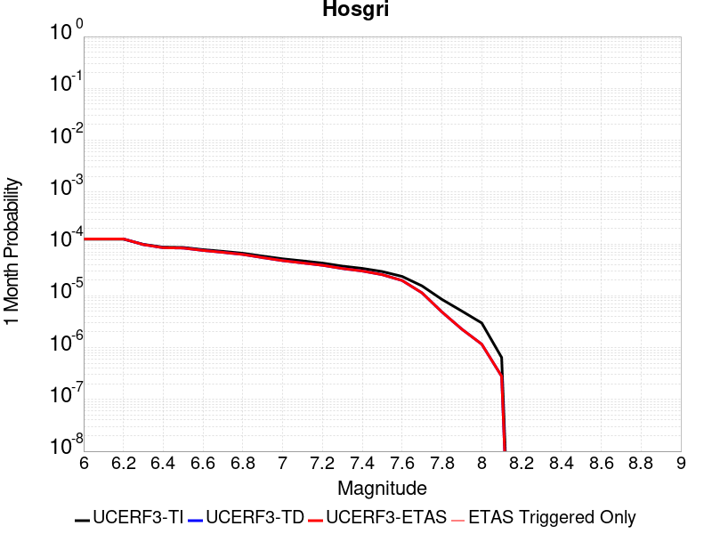 | 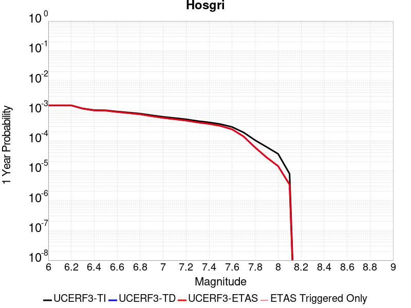 | 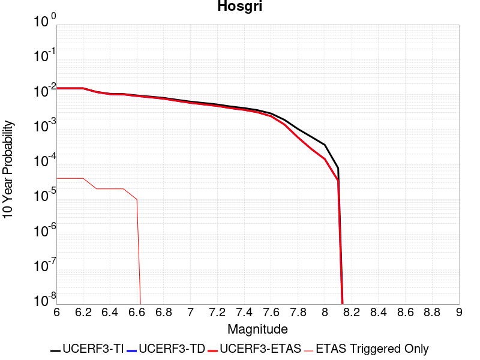 |

| Magnitude | 1 wk TI Prob | 1 wk TD Prob | 1 wk ETAS Prob | 1 wk ETAS/TD Gain | 1 wk ETAS Triggered Only | 1 mo TI Prob | 1 mo TD Prob | 1 mo ETAS Prob | 1 mo ETAS/TD Gain | 1 mo ETAS Triggered Only | 1 yr TI Prob | 1 yr TD Prob | 1 yr ETAS Prob | 1 yr ETAS/TD Gain | 1 yr ETAS Triggered Only | 10 yr TI Prob | 10 yr TD Prob | 10 yr ETAS Prob | 10 yr ETAS/TD Gain | 10 yr ETAS Triggered Only |
|-----|-----|-----|-----|-----|-----|-----|-----|-----|-----|-----|-----|-----|-----|-----|-----|-----|-----|-----|-----|-----|
| 6.0 | 2.883978E-5 | 2.9129562E-5 | 2.9129562E-5 | 1.0 | 0.0 | 1.235932E-4 | 1.2483516E-4 | 1.2483516E-4 | 1.0 | 0.0 | 0.0015037085 | 0.0015188357 | 0.0015188357 | 1.0 | 0.0 | 0.01493574 | 0.015088329 | 0.015127725 | 1.002611 | 4.0E-5 |
| 6.1 | 2.883978E-5 | 2.9129562E-5 | 2.9129562E-5 | 1.0 | 0.0 | 1.235932E-4 | 1.2483516E-4 | 1.2483516E-4 | 1.0 | 0.0 | 0.0015037085 | 0.0015188357 | 0.0015188357 | 1.0 | 0.0 | 0.01493574 | 0.015088329 | 0.015127725 | 1.002611 | 4.0E-5 |
| 6.2 | 2.883978E-5 | 2.9129562E-5 | 2.9129562E-5 | 1.0 | 0.0 | 1.235932E-4 | 1.2483516E-4 | 1.2483516E-4 | 1.0 | 0.0 | 0.0015037085 | 0.0015188357 | 0.0015188357 | 1.0 | 0.0 | 0.01493574 | 0.015088329 | 0.015127725 | 1.002611 | 4.0E-5 |
| 6.3 | 2.2914428E-5 | 2.2642886E-5 | 2.2642886E-5 | 1.0 | 0.0 | 9.8200995E-5 | 9.703736E-5 | 9.703736E-5 | 1.0 | 0.0 | 0.0011949413 | 0.0011807944 | 0.0011807944 | 1.0 | 0.0 | 0.011885363 | 0.011746606 | 0.011766371 | 1.0016826 | 2.0E-5 |
| 6.4 | 2.0195741E-5 | 1.9697385E-5 | 1.9697385E-5 | 1.0 | 0.0 | 8.65503E-5 | 8.441464E-5 | 8.441464E-5 | 1.0 | 0.0 | 0.0010532405 | 0.0010272657 | 0.0010272657 | 1.0 | 0.0 | 0.010482626 | 0.010226219 | 0.010246014 | 1.0019357 | 2.0E-5 |
| 6.5 | 1.9924333E-5 | 1.94098E-5 | 1.94098E-5 | 1.0 | 0.0 | 8.53872E-5 | 8.318221E-5 | 8.318221E-5 | 1.0 | 0.0 | 0.0010390934 | 0.0010122748 | 0.0010122748 | 1.0 | 0.0 | 0.010342481 | 0.010077676 | 0.010097475 | 1.0019646 | 2.0E-5 |
| 6.6 | 1.809694E-5 | 1.7459066E-5 | 1.7459066E-5 | 1.0 | 0.0 | 7.7556004E-5 | 7.482243E-5 | 7.482243E-5 | 1.0 | 0.0 | 9.438353E-4 | 9.1058365E-4 | 9.1058365E-4 | 1.0 | 0.0 | 0.009398366 | 0.00906947 | 0.009079379 | 1.0010926 | 1.0E-5 |
| 6.7 | 1.675989E-5 | 1.6043496E-5 | 1.6043496E-5 | 1.0 | 0.0 | 7.182612E-5 | 6.875603E-5 | 6.875603E-5 | 1.0 | 0.0 | 8.7413215E-4 | 8.367843E-4 | 8.367843E-4 | 1.0 | 0.0 | 0.008707017 | 0.008337242 | 0.008337242 | 1.0 | 0.0 |
| 6.8 | 1.5401129E-5 | 1.4614778E-5 | 1.4614778E-5 | 1.0 | 0.0 | 6.6003166E-5 | 6.263326E-5 | 6.263326E-5 | 1.0 | 0.0 | 8.032922E-4 | 7.6229405E-4 | 7.6229405E-4 | 1.0 | 0.0 | 0.008003947 | 0.007597657 | 0.007597657 | 1.0 | 0.0 |
| 6.9 | 1.356559E-5 | 1.2690615E-5 | 1.2690615E-5 | 1.0 | 0.0 | 5.8136946E-5 | 5.438722E-5 | 5.438722E-5 | 1.0 | 0.0 | 7.0758746E-4 | 6.6196366E-4 | 6.6196366E-4 | 1.0 | 0.0 | 0.007053386 | 0.0066007245 | 0.0066007245 | 1.0 | 0.0 |
| 7.0 | 1.2030819E-5 | 1.1096572E-5 | 1.1096572E-5 | 1.0 | 0.0 | 5.155963E-5 | 4.755587E-5 | 4.755587E-5 | 1.0 | 0.0 | 6.275577E-4 | 5.7883904E-4 | 5.7883904E-4 | 1.0 | 0.0 | 0.006257884 | 0.0057740742 | 0.0057740742 | 1.0 | 0.0 |
| 7.1 | 1.0972698E-5 | 1.0022767E-5 | 1.0022767E-5 | 1.0 | 0.0 | 4.7025E-5 | 4.295401E-5 | 4.295401E-5 | 1.0 | 0.0 | 5.72379E-4 | 5.2283966E-4 | 5.2283966E-4 | 1.0 | 0.0 | 0.0057090693 | 0.005216848 | 0.005216848 | 1.0 | 0.0 |
| 7.2 | 9.961926E-6 | 9.035315E-6 | 9.035315E-6 | 1.0 | 0.0 | 4.2693267E-5 | 3.8722206E-5 | 3.8722206E-5 | 1.0 | 0.0 | 5.1966653E-4 | 4.7134093E-4 | 4.7134093E-4 | 1.0 | 0.0 | 0.00518453 | 0.0047041588 | 0.0047041588 | 1.0 | 0.0 |
| 7.3 | 8.700929E-6 | 7.8286475E-6 | 7.8286475E-6 | 1.0 | 0.0 | 3.7289166E-5 | 3.3550914E-5 | 3.3550914E-5 | 1.0 | 0.0 | 4.53901E-4 | 4.0840587E-4 | 4.0840587E-4 | 1.0 | 0.0 | 0.00452975 | 0.004077293 | 0.004077293 | 1.0 | 0.0 |
| 7.4 | 7.866285E-6 | 6.999273E-6 | 6.999273E-6 | 1.0 | 0.0 | 3.3712215E-5 | 2.999654E-5 | 2.999654E-5 | 1.0 | 0.0 | 4.103689E-4 | 3.651467E-4 | 3.651467E-4 | 1.0 | 0.0 | 0.004096119 | 0.0036462047 | 0.0036462047 | 1.0 | 0.0 |
| 7.5 | 6.8381305E-6 | 5.9602116E-6 | 5.9602116E-6 | 1.0 | 0.0 | 2.9305946E-5 | 2.5543515E-5 | 2.5543515E-5 | 1.0 | 0.0 | 3.5674145E-4 | 3.1094794E-4 | 3.1094794E-4 | 1.0 | 0.0 | 0.0035616932 | 0.0031058637 | 0.0031058637 | 1.0 | 0.0 |
| 7.6 | 5.503376E-6 | 4.5957354E-6 | 4.5957354E-6 | 1.0 | 0.0 | 2.3585684E-5 | 1.969586E-5 | 1.969586E-5 | 1.0 | 0.0 | 2.8711787E-4 | 2.3977073E-4 | 2.3977073E-4 | 1.0 | 0.0 | 0.002867472 | 0.0023958536 | 0.0023958536 | 1.0 | 0.0 |
| 7.7 | 3.6144982E-6 | 2.6526661E-6 | 2.6526661E-6 | 1.0 | 0.0 | 1.5490614E-5 | 1.1368519E-5 | 1.1368519E-5 | 1.0 | 0.0 | 1.8858191E-4 | 1.3840293E-4 | 1.3840293E-4 | 1.0 | 0.0 | 0.0018842196 | 0.0013838989 | 0.0013838989 | 1.0 | 0.0 |
| 7.8 | 1.9853494E-6 | 1.1364963E-6 | 1.1364963E-6 | 1.0 | 0.0 | 8.508612E-6 | 4.8706893E-6 | 4.8706893E-6 | 1.0 | 0.0 | 1.0358743E-4 | 5.929903E-5 | 5.929903E-5 | 1.0 | 0.0 | 0.0010353916 | 5.935623E-4 | 5.935623E-4 | 1.0 | 0.0 |
| 7.9 | 1.1818757E-6 | 5.298197E-7 | 5.298197E-7 | 1.0 | 0.0 | 5.0651715E-6 | 2.2706538E-6 | 2.2706538E-6 | 1.0 | 0.0 | 6.1666724E-5 | 2.7644859E-5 | 2.7644859E-5 | 1.0 | 0.0 | 6.1649614E-4 | 2.7710275E-4 | 2.7710275E-4 | 1.0 | 0.0 |
| 8.0 | 6.962958E-7 | 2.71605E-7 | 2.71605E-7 | 1.0 | 0.0 | 2.9841215E-6 | 1.1640208E-6 | 1.1640208E-6 | 1.0 | 0.0 | 3.6331072E-5 | 1.4171861E-5 | 1.4171861E-5 | 1.0 | 0.0 | 3.6325134E-4 | 1.4228027E-4 | 1.4228027E-4 | 1.0 | 0.0 |
| 8.1 | 1.5033264E-7 | 6.532006E-8 | 6.532006E-8 | 1.0 | 0.0 | 6.442826E-7 | 2.7994307E-7 | 2.7994307E-7 | 1.0 | 0.0 | 7.844113E-6 | 3.4083016E-6 | 3.4083016E-6 | 1.0 | 0.0 | 7.843835E-5 | 3.40998E-5 | 3.40998E-5 | 1.0 | 0.0 |

## Imperial
*[(top)](#table-of-contents)*

| 1 Week | 1 Month | 1 Year | 10 Year |
|-----|-----|-----|-----|
|  | 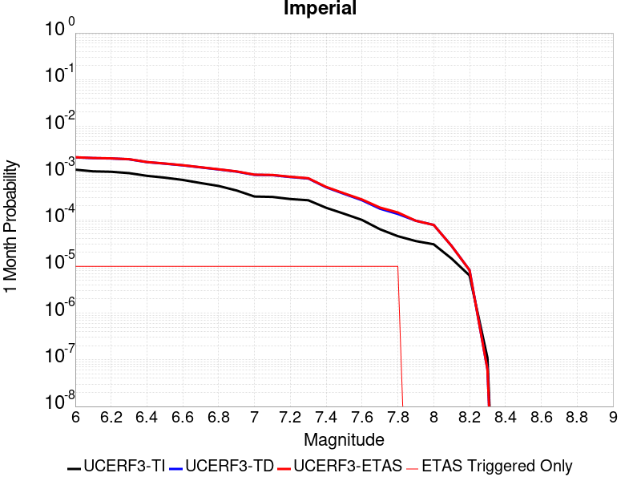 | 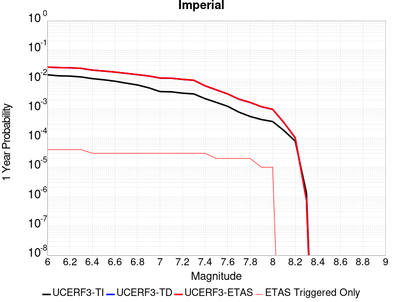 | 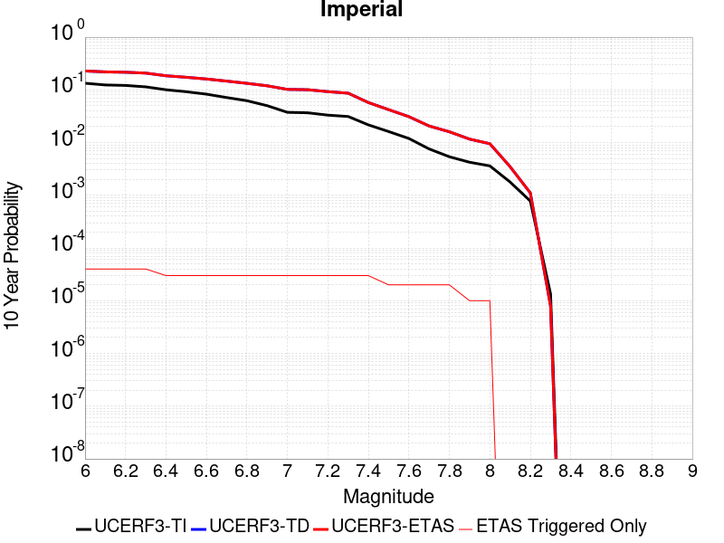 |

| Magnitude | 1 wk TI Prob | 1 wk TD Prob | 1 wk ETAS Prob | 1 wk ETAS/TD Gain | 1 wk ETAS Triggered Only | 1 mo TI Prob | 1 mo TD Prob | 1 mo ETAS Prob | 1 mo ETAS/TD Gain | 1 mo ETAS Triggered Only | 1 yr TI Prob | 1 yr TD Prob | 1 yr ETAS Prob | 1 yr ETAS/TD Gain | 1 yr ETAS Triggered Only | 10 yr TI Prob | 10 yr TD Prob | 10 yr ETAS Prob | 10 yr ETAS/TD Gain | 10 yr ETAS Triggered Only |
|-----|-----|-----|-----|-----|-----|-----|-----|-----|-----|-----|-----|-----|-----|-----|-----|-----|-----|-----|-----|-----|
| 6.0 | 2.7496446E-4 | 5.0588493E-4 | 5.0588493E-4 | 1.0 | 0.0 | 0.0011778869 | 0.0021663161 | 0.0021762943 | 1.0046061 | 1.0E-5 | 0.0142467655 | 0.026057037 | 0.026095994 | 1.0014951 | 4.0E-5 | 0.13367249 | 0.22816308 | 0.22819395 | 1.0001353 | 4.0E-5 |
| 6.1 | 2.5356023E-4 | 4.8687877E-4 | 4.8687877E-4 | 1.0 | 0.0 | 0.001086234 | 0.002084993 | 0.0020949722 | 1.0047861 | 1.0E-5 | 0.013144928 | 0.02508714 | 0.025126137 | 1.0015545 | 4.0E-5 | 0.123940155 | 0.21958555 | 0.21961677 | 1.0001422 | 4.0E-5 |
| 6.2 | 2.4820742E-4 | 4.7782742E-4 | 4.7782742E-4 | 1.0 | 0.0 | 0.0010633124 | 0.0020462626 | 0.002056242 | 1.004877 | 1.0E-5 | 0.01286919 | 0.024626885 | 0.0246659 | 1.0015843 | 4.0E-5 | 0.12148927 | 0.2160902 | 0.21612155 | 1.0001451 | 4.0E-5 |
| 6.3 | 2.3205351E-4 | 4.591772E-4 | 4.591772E-4 | 1.0 | 0.0 | 9.94136E-4 | 0.001966455 | 0.0019764353 | 1.0050753 | 1.0E-5 | 0.012036599 | 0.023675136 | 0.02371419 | 1.0016495 | 4.0E-5 | 0.11405133 | 0.20802991 | 0.20806159 | 1.0001522 | 4.0E-5 |
| 6.4 | 2.0304754E-4 | 3.990305E-4 | 3.990305E-4 | 1.0 | 0.0 | 8.6991355E-4 | 0.0017090245 | 0.0017190075 | 1.0058413 | 1.0E-5 | 0.010539869 | 0.020609176 | 0.020638557 | 1.0014256 | 3.0E-5 | 0.100537635 | 0.18516292 | 0.18518737 | 1.000132 | 3.0E-5 |
| 6.5 | 1.854992E-4 | 3.7013623E-4 | 3.7013623E-4 | 1.0 | 0.0 | 7.9475436E-4 | 0.0015853462 | 0.0015953303 | 1.0062978 | 1.0E-5 | 0.009633281 | 0.01913209 | 0.019161517 | 1.001538 | 3.0E-5 | 0.0922623 | 0.1733897 | 0.1734145 | 1.000143 | 3.0E-5 |
| 6.6 | 1.6586106E-4 | 3.405752E-4 | 3.405752E-4 | 1.0 | 0.0 | 7.106394E-4 | 0.0014588017 | 0.0014687871 | 1.006845 | 1.0E-5 | 0.008617763 | 0.017617919 | 0.01764739 | 1.0016729 | 3.0E-5 | 0.08291132 | 0.16086075 | 0.16088593 | 1.0001565 | 3.0E-5 |
| 6.7 | 1.4224656E-4 | 3.0786527E-4 | 3.0786527E-4 | 1.0 | 0.0 | 6.094856E-4 | 0.0013187636 | 0.0013287504 | 1.0075729 | 1.0E-5 | 0.0073952693 | 0.015939647 | 0.015969168 | 1.0018522 | 3.0E-5 | 0.07153955 | 0.14656053 | 0.14658615 | 1.0001746 | 3.0E-5 |
| 6.8 | 1.2317259E-4 | 2.7807712E-4 | 2.7807712E-4 | 1.0 | 0.0 | 5.2777573E-4 | 0.001191221 | 0.001201209 | 1.0083847 | 1.0E-5 | 0.0064067547 | 0.014408057 | 0.014437624 | 1.0020522 | 3.0E-5 | 0.06225166 | 0.13300322 | 0.13302924 | 1.0001955 | 3.0E-5 |
| 6.9 | 9.859898E-5 | 2.5026657E-4 | 2.5026657E-4 | 1.0 | 0.0 | 4.2249862E-4 | 0.0010721345 | 0.0010821237 | 1.0093172 | 1.0E-5 | 0.0051317946 | 0.012976076 | 0.013005687 | 1.0022819 | 3.0E-5 | 0.05014893 | 0.119456775 | 0.11948319 | 1.0002211 | 3.0E-5 |
| 7.0 | 7.3191884E-5 | 2.1275983E-4 | 2.1275983E-4 | 1.0 | 0.0 | 3.136418E-4 | 9.115124E-4 | 9.215033E-4 | 1.0109608 | 1.0E-5 | 0.003811904 | 0.011041881 | 0.011071549 | 1.002687 | 3.0E-5 | 0.037471764 | 0.1021029 | 0.10212983 | 1.0002638 | 3.0E-5 |
| 7.1 | 7.1760296E-5 | 2.0977223E-4 | 2.0977223E-4 | 1.0 | 0.0 | 3.0750787E-4 | 8.9871726E-4 | 9.0870826E-4 | 1.011117 | 1.0E-5 | 0.003737482 | 0.010887666 | 0.0109173395 | 1.0027254 | 3.0E-5 | 0.03675245 | 0.100738965 | 0.10076594 | 1.0002677 | 3.0E-5 |
| 7.2 | 6.46614E-5 | 1.9145425E-4 | 1.9145425E-4 | 1.0 | 0.0 | 2.7709085E-4 | 8.2026323E-4 | 8.3025504E-4 | 1.0121812 | 1.0E-5 | 0.0033683628 | 0.0099415975 | 0.009971299 | 1.0029876 | 3.0E-5 | 0.033177625 | 0.09254549 | 0.09257271 | 1.0002942 | 3.0E-5 |
| 7.3 | 6.088115E-5 | 1.7816747E-4 | 1.7816747E-4 | 1.0 | 0.0 | 2.6089314E-4 | 7.633543E-4 | 7.7334663E-4 | 1.0130901 | 1.0E-5 | 0.0031717476 | 0.00925481 | 0.009284533 | 1.0032115 | 3.0E-5 | 0.031268585 | 0.08659512 | 0.086622514 | 1.0003164 | 3.0E-5 |
| 7.4 | 4.199346E-5 | 1.1516791E-4 | 1.1516791E-4 | 1.0 | 0.0 | 1.7995955E-4 | 4.9348426E-4 | 5.034793E-4 | 1.020254 | 1.0E-5 | 0.0021888057 | 0.0059917886 | 0.006021609 | 1.0049769 | 3.0E-5 | 0.02167372 | 0.057468183 | 0.057496462 | 1.000492 | 3.0E-5 |
| 7.5 | 3.130448E-5 | 8.338591E-5 | 8.338591E-5 | 1.0 | 0.0 | 1.3415517E-4 | 3.5731954E-4 | 3.6731598E-4 | 1.0279762 | 1.0E-5 | 0.0016321153 | 0.0043417476 | 0.0043616607 | 1.0045865 | 2.0E-5 | 0.016201803 | 0.04215597 | 0.042175125 | 1.0004544 | 2.0E-5 |
| 7.6 | 2.3074248E-5 | 6.0889954E-5 | 6.0889954E-5 | 1.0 | 0.0 | 9.888588E-5 | 2.6093097E-4 | 2.7092837E-4 | 1.0383143 | 1.0E-5 | 0.0012032706 | 0.00317223 | 0.0031921666 | 1.0062847 | 2.0E-5 | 0.011967761 | 0.031047072 | 0.031066451 | 1.0006242 | 2.0E-5 |
| 7.7 | 1.45864815E-5 | 4.0162275E-5 | 4.0162275E-5 | 1.0 | 0.0 | 6.2511994E-5 | 1.721127E-4 | 1.8211098E-4 | 1.0580915 | 1.0E-5 | 7.608177E-4 | 0.0020934637 | 0.002113422 | 1.0095335 | 2.0E-5 | 0.007582182 | 0.020644996 | 0.020664584 | 1.0009488 | 2.0E-5 |
| 7.8 | 1.0352979E-5 | 3.099286E-5 | 3.099286E-5 | 1.0 | 0.0 | 4.4369157E-5 | 1.3281978E-4 | 1.4281845E-4 | 1.07528 | 1.0E-5 | 5.400606E-4 | 0.0016158838 | 0.0016358515 | 1.0123571 | 2.0E-5 | 0.0053875 | 0.016031493 | 0.016051171 | 1.0012275 | 2.0E-5 |
| 7.9 | 8.137906E-6 | 2.2174778E-5 | 2.2174778E-5 | 1.0 | 0.0 | 3.4876273E-5 | 9.5031304E-5 | 9.5031304E-5 | 1.0 | 0.0 | 4.2453592E-4 | 0.001156393 | 0.0011663814 | 1.0086375 | 1.0E-5 | 0.004237258 | 0.011629866 | 0.01163975 | 1.0008498 | 1.0E-5 |
| 8.0 | 6.93792E-6 | 1.8030849E-5 | 1.8030849E-5 | 1.0 | 0.0 | 2.9733603E-5 | 7.727278E-5 | 7.727278E-5 | 1.0 | 0.0 | 3.6194647E-4 | 9.403908E-4 | 9.503814E-4 | 1.0106239 | 1.0E-5 | 0.0036135751 | 0.00951191 | 0.009521816 | 1.0010413 | 1.0E-5 |
| 8.1 | 3.4286315E-6 | 6.3901293E-6 | 6.3901293E-6 | 1.0 | 0.0 | 1.4694053E-5 | 2.7385982E-5 | 2.7385982E-5 | 1.0 | 0.0 | 1.7888541E-4 | 3.3337343E-4 | 3.3337343E-4 | 1.0 | 0.0 | 0.0017874148 | 0.003491124 | 0.003491124 | 1.0 | 0.0 |
| 8.2 | 1.4906886E-6 | 1.9406882E-6 | 1.9406882E-6 | 1.0 | 0.0 | 6.3886496E-6 | 8.317209E-6 | 8.317209E-6 | 1.0 | 0.0 | 7.7779034E-5 | 1.0125734E-4 | 1.0125734E-4 | 1.0 | 0.0 | 7.775182E-4 | 0.0011095967 | 0.0011095967 | 1.0 | 0.0 |
| 8.3 | 2.5758007E-8 | 1.4540999E-8 | 1.4540999E-8 | 1.0 | 0.0 | 1.10391454E-7 | 6.231856E-8 | 6.231856E-8 | 1.0 | 0.0 | 1.3440151E-6 | 7.587285E-7 | 7.587285E-7 | 1.0 | 0.0 | 1.344007E-5 | 7.909574E-6 | 7.909574E-6 | 1.0 | 0.0 |

## Oceanic - West Huasna
*[(top)](#table-of-contents)*

| 1 Week | 1 Month | 1 Year | 10 Year |
|-----|-----|-----|-----|
|  |  | 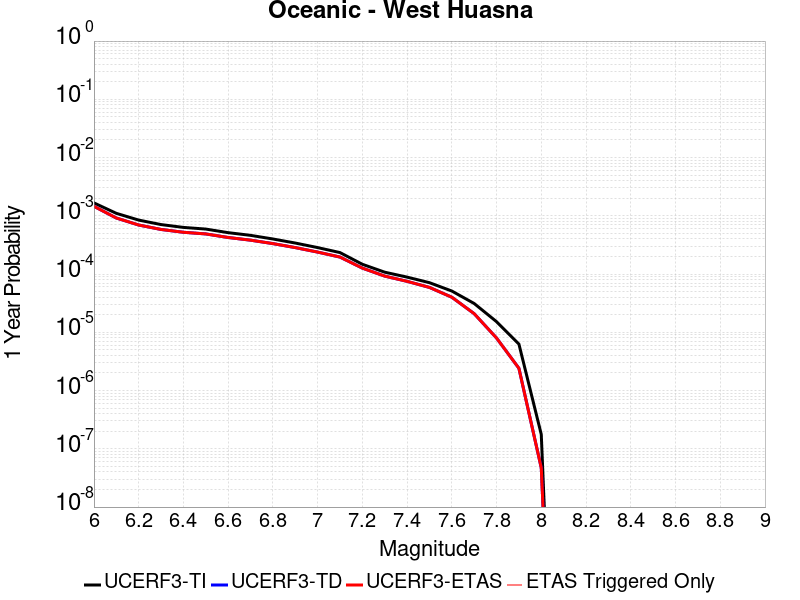 |  |

| Magnitude | 1 wk TI Prob | 1 wk TD Prob | 1 wk ETAS Prob | 1 wk ETAS/TD Gain | 1 wk ETAS Triggered Only | 1 mo TI Prob | 1 mo TD Prob | 1 mo ETAS Prob | 1 mo ETAS/TD Gain | 1 mo ETAS Triggered Only | 1 yr TI Prob | 1 yr TD Prob | 1 yr ETAS Prob | 1 yr ETAS/TD Gain | 1 yr ETAS Triggered Only | 10 yr TI Prob | 10 yr TD Prob | 10 yr ETAS Prob | 10 yr ETAS/TD Gain | 10 yr ETAS Triggered Only |
|-----|-----|-----|-----|-----|-----|-----|-----|-----|-----|-----|-----|-----|-----|-----|-----|-----|-----|-----|-----|-----|
| 6.0 | 3.195567E-5 | 2.7927668E-5 | 2.7927668E-5 | 1.0 | 0.0 | 1.3694567E-4 | 1.1968476E-4 | 1.1968476E-4 | 1.0 | 0.0 | 0.0016660384 | 0.001456231 | 0.001456231 | 1.0 | 0.0 | 0.016536033 | 0.014471439 | 0.01451086 | 1.002724 | 4.0E-5 |
| 6.1 | 2.1156782E-5 | 1.7573955E-5 | 1.7573955E-5 | 1.0 | 0.0 | 9.066878E-5 | 7.5314834E-5 | 7.5314834E-5 | 1.0 | 0.0 | 0.0011033333 | 9.165817E-4 | 9.165817E-4 | 1.0 | 0.0 | 0.010978713 | 0.00912902 | 0.009148838 | 1.0021708 | 2.0E-5 |
| 6.2 | 1.6195117E-5 | 1.3327479E-5 | 1.3327479E-5 | 1.0 | 0.0 | 6.9405796E-5 | 5.7116533E-5 | 5.7116533E-5 | 1.0 | 0.0 | 8.44688E-4 | 6.951745E-4 | 6.951745E-4 | 1.0 | 0.0 | 0.008414844 | 0.0069302926 | 0.006950154 | 1.0028659 | 2.0E-5 |
| 6.3 | 1.3559345E-5 | 1.1179399E-5 | 1.1179399E-5 | 1.0 | 0.0 | 5.811018E-5 | 4.7910835E-5 | 4.7910835E-5 | 1.0 | 0.0 | 7.072618E-4 | 5.831592E-4 | 5.831592E-4 | 1.0 | 0.0 | 0.0070501505 | 0.005816408 | 0.0058362917 | 1.0034186 | 2.0E-5 |
| 6.4 | 1.2120619E-5 | 1.0001198E-5 | 1.0001198E-5 | 1.0 | 0.0 | 5.1944477E-5 | 4.2861575E-5 | 4.2861575E-5 | 1.0 | 0.0 | 6.322405E-4 | 5.217152E-4 | 5.217152E-4 | 1.0 | 0.0 | 0.006304447 | 0.0052049714 | 0.0052248673 | 1.0038224 | 2.0E-5 |
| 6.5 | 1.13511915E-5 | 9.367677E-6 | 9.367677E-6 | 1.0 | 0.0 | 4.8647056E-5 | 4.014657E-5 | 4.014657E-5 | 1.0 | 0.0 | 5.9211696E-4 | 4.886753E-4 | 4.886753E-4 | 1.0 | 0.0 | 0.0059054173 | 0.0048760665 | 0.004895969 | 1.0040817 | 2.0E-5 |
| 6.6 | 9.850605E-6 | 8.135591E-6 | 8.135591E-6 | 1.0 | 0.0 | 4.2216197E-5 | 3.4866353E-5 | 3.4866353E-5 | 1.0 | 0.0 | 5.1386096E-4 | 4.2441537E-4 | 4.2441537E-4 | 1.0 | 0.0 | 0.0051267436 | 0.0042360807 | 0.004255996 | 1.0047014 | 2.0E-5 |
| 6.7 | 8.8558645E-6 | 7.318587E-6 | 7.318587E-6 | 1.0 | 0.0 | 3.7953152E-5 | 3.1364994E-5 | 3.1364994E-5 | 1.0 | 0.0 | 4.6198163E-4 | 3.818021E-4 | 3.818021E-4 | 1.0 | 0.0 | 0.004610224 | 0.0038114868 | 0.0038314105 | 1.0052273 | 2.0E-5 |
| 6.8 | 7.67136E-6 | 6.39189E-6 | 6.39189E-6 | 1.0 | 0.0 | 3.2876844E-5 | 2.7393527E-5 | 2.7393527E-5 | 1.0 | 0.0 | 4.0020206E-4 | 3.3346532E-4 | 3.3346532E-4 | 1.0 | 0.0 | 0.003994821 | 0.0033296705 | 0.0033496039 | 1.0059866 | 2.0E-5 |
| 6.9 | 6.534529E-6 | 5.4584452E-6 | 5.4584452E-6 | 1.0 | 0.0 | 2.8004823E-5 | 2.3393128E-5 | 2.3393128E-5 | 1.0 | 0.0 | 3.4090536E-4 | 2.8477423E-4 | 2.8477423E-4 | 1.0 | 0.0 | 0.0034038287 | 0.00284411 | 0.0028540813 | 1.0035061 | 1.0E-5 |
| 7.0 | 5.460525E-6 | 4.5700517E-6 | 4.5700517E-6 | 1.0 | 0.0 | 2.3402039E-5 | 1.9585788E-5 | 1.9585788E-5 | 1.0 | 0.0 | 2.8488258E-4 | 2.3843099E-4 | 2.3843099E-4 | 1.0 | 0.0 | 0.0028451765 | 0.0023817657 | 0.0023917418 | 1.0041885 | 1.0E-5 |
| 7.1 | 4.4825083E-6 | 3.7525324E-6 | 3.7525324E-6 | 1.0 | 0.0 | 1.9210609E-5 | 1.6082184E-5 | 1.6082184E-5 | 1.0 | 0.0 | 2.3386406E-4 | 1.9578308E-4 | 1.9578308E-4 | 1.0 | 0.0 | 0.002336181 | 0.001956118 | 0.001956118 | 1.0 | 0.0 |
| 7.2 | 2.821708E-6 | 2.425005E-6 | 2.425005E-6 | 1.0 | 0.0 | 1.2092979E-5 | 1.0392837E-5 | 1.0392837E-5 | 1.0 | 0.0 | 1.4722206E-4 | 1.2652545E-4 | 1.2652545E-4 | 1.0 | 0.0 | 0.0014712457 | 0.0012645366 | 0.0012645366 | 1.0 | 0.0 |
| 7.3 | 2.0644757E-6 | 1.7688046E-6 | 1.7688046E-6 | 1.0 | 0.0 | 8.847723E-6 | 7.580569E-6 | 7.580569E-6 | 1.0 | 0.0 | 1.0771569E-4 | 9.228953E-5 | 9.228953E-5 | 1.0 | 0.0 | 0.001076635 | 9.225137E-4 | 9.225137E-4 | 1.0 | 0.0 |
| 7.4 | 1.6980367E-6 | 1.4380493E-6 | 1.4380493E-6 | 1.0 | 0.0 | 7.27728E-6 | 6.1630535E-6 | 6.1630535E-6 | 1.0 | 0.0 | 8.8597284E-5 | 7.50326E-5 | 7.50326E-5 | 1.0 | 0.0 | 8.8561967E-4 | 7.500742E-4 | 7.500742E-4 | 1.0 | 0.0 |
| 7.5 | 1.3637683E-6 | 1.1303208E-6 | 1.1303208E-6 | 1.0 | 0.0 | 5.844708E-6 | 4.844223E-6 | 4.844223E-6 | 1.0 | 0.0 | 7.1156996E-5 | 5.8976817E-5 | 5.8976817E-5 | 1.0 | 0.0 | 7.1134215E-4 | 5.8961316E-4 | 5.8961316E-4 | 1.0 | 0.0 |
| 7.6 | 9.802994E-7 | 7.677772E-7 | 7.677772E-7 | 1.0 | 0.0 | 4.2012766E-6 | 3.2904693E-6 | 3.2904693E-6 | 1.0 | 0.0 | 5.1149345E-5 | 4.0060728E-5 | 4.0060728E-5 | 1.0 | 0.0 | 5.113757E-4 | 4.005365E-4 | 4.005365E-4 | 1.0 | 0.0 |
| 7.7 | 5.986191E-7 | 4.0055494E-7 | 4.0055494E-7 | 1.0 | 0.0 | 2.5655079E-6 | 1.7166628E-6 | 1.7166628E-6 | 1.0 | 0.0 | 3.1234613E-5 | 2.090017E-5 | 2.090017E-5 | 1.0 | 0.0 | 3.123022E-4 | 2.0898339E-4 | 2.0898339E-4 | 1.0 | 0.0 |
| 7.8 | 2.9189815E-7 | 1.5290173E-7 | 1.5290173E-7 | 1.0 | 0.0 | 1.2509914E-6 | 6.55293E-7 | 6.55293E-7 | 1.0 | 0.0 | 1.5230714E-5 | 7.978163E-6 | 7.978163E-6 | 1.0 | 0.0 | 1.522967E-4 | 7.978008E-5 | 7.978008E-5 | 1.0 | 0.0 |
| 7.9 | 1.2057845E-7 | 4.6236803E-8 | 4.6236803E-8 | 1.0 | 0.0 | 5.1676466E-7 | 1.9815772E-7 | 1.9815772E-7 | 1.0 | 0.0 | 6.2915915E-6 | 2.4125675E-6 | 2.4125675E-6 | 1.0 | 0.0 | 6.2914136E-5 | 2.4126719E-5 | 2.4126719E-5 | 1.0 | 0.0 |
| 8.0 | 3.3806387E-9 | 9.0207886E-10 | 9.0207886E-10 | 1.0 | 0.0 | 1.4488451E-8 | 3.866053E-9 | 3.866053E-9 | 1.0 | 0.0 | 1.7639688E-7 | 4.706919E-8 | 4.706919E-8 | 1.0 | 0.0 | 1.7639674E-6 | 4.717863E-7 | 4.717863E-7 | 1.0 | 0.0 |

## Pinto Mtn
*[(top)](#table-of-contents)*

| 1 Week | 1 Month | 1 Year | 10 Year |
|-----|-----|-----|-----|
|  | 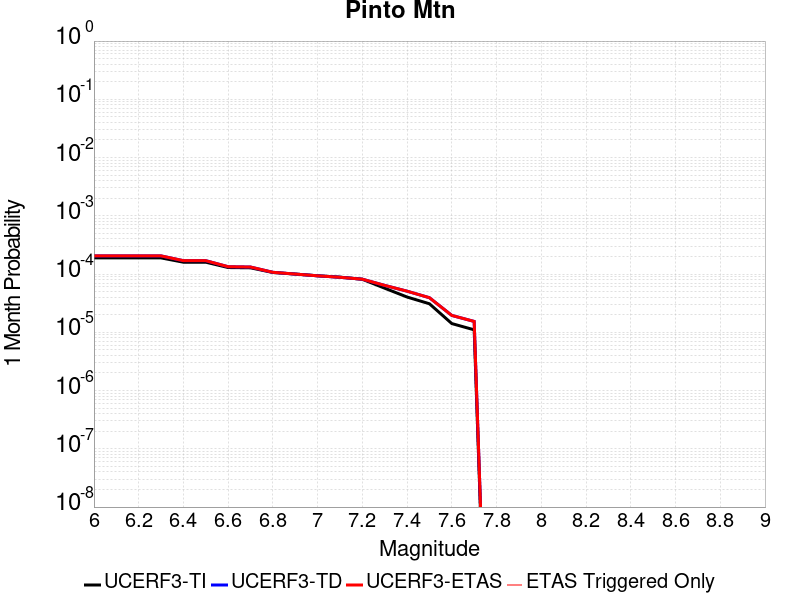 | 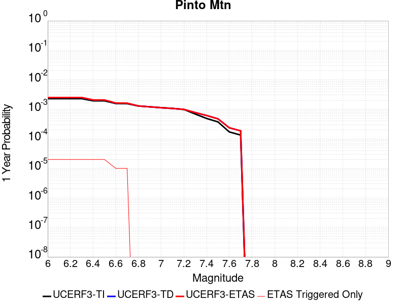 |  |

| Magnitude | 1 wk TI Prob | 1 wk TD Prob | 1 wk ETAS Prob | 1 wk ETAS/TD Gain | 1 wk ETAS Triggered Only | 1 mo TI Prob | 1 mo TD Prob | 1 mo ETAS Prob | 1 mo ETAS/TD Gain | 1 mo ETAS Triggered Only | 1 yr TI Prob | 1 yr TD Prob | 1 yr ETAS Prob | 1 yr ETAS/TD Gain | 1 yr ETAS Triggered Only | 10 yr TI Prob | 10 yr TD Prob | 10 yr ETAS Prob | 10 yr ETAS/TD Gain | 10 yr ETAS Triggered Only |
|-----|-----|-----|-----|-----|-----|-----|-----|-----|-----|-----|-----|-----|-----|-----|-----|-----|-----|-----|-----|-----|
| 6.0 | 4.4194956E-5 | 4.7858128E-5 | 4.7858128E-5 | 1.0 | 0.0 | 1.893932E-4 | 2.0509107E-4 | 2.0509107E-4 | 1.0 | 0.0 | 0.0023034236 | 0.0024942888 | 0.002514239 | 1.0079983 | 2.0E-5 | 0.022796938 | 0.024680441 | 0.024729207 | 1.0019759 | 5.0E-5 |
| 6.1 | 4.4194956E-5 | 4.7858128E-5 | 4.7858128E-5 | 1.0 | 0.0 | 1.893932E-4 | 2.0509107E-4 | 2.0509107E-4 | 1.0 | 0.0 | 0.0023034236 | 0.0024942888 | 0.002514239 | 1.0079983 | 2.0E-5 | 0.022796938 | 0.024680441 | 0.024729207 | 1.0019759 | 5.0E-5 |
| 6.2 | 4.4194956E-5 | 4.7858128E-5 | 4.7858128E-5 | 1.0 | 0.0 | 1.893932E-4 | 2.0509107E-4 | 2.0509107E-4 | 1.0 | 0.0 | 0.0023034236 | 0.0024942888 | 0.002514239 | 1.0079983 | 2.0E-5 | 0.022796938 | 0.024680441 | 0.024729207 | 1.0019759 | 5.0E-5 |
| 6.3 | 4.4194956E-5 | 4.7858128E-5 | 4.7858128E-5 | 1.0 | 0.0 | 1.893932E-4 | 2.0509107E-4 | 2.0509107E-4 | 1.0 | 0.0 | 0.0023034236 | 0.0024942888 | 0.002514239 | 1.0079983 | 2.0E-5 | 0.022796938 | 0.024680441 | 0.024729207 | 1.0019759 | 5.0E-5 |
| 6.4 | 3.729929E-5 | 3.960709E-5 | 3.960709E-5 | 1.0 | 0.0 | 1.5984432E-4 | 1.6973416E-4 | 1.6973416E-4 | 1.0 | 0.0 | 0.0019443673 | 0.0020646483 | 0.002084607 | 1.0096669 | 2.0E-5 | 0.019274427 | 0.020464687 | 0.020513665 | 1.0023932 | 5.0E-5 |
| 6.5 | 3.729929E-5 | 3.960709E-5 | 3.960709E-5 | 1.0 | 0.0 | 1.5984432E-4 | 1.6973416E-4 | 1.6973416E-4 | 1.0 | 0.0 | 0.0019443673 | 0.0020646483 | 0.002084607 | 1.0096669 | 2.0E-5 | 0.019274427 | 0.020464687 | 0.020513665 | 1.0023932 | 5.0E-5 |
| 6.6 | 3.0204548E-5 | 3.120863E-5 | 3.120863E-5 | 1.0 | 0.0 | 1.2944164E-4 | 1.337446E-4 | 1.337446E-4 | 1.0 | 0.0 | 0.0015748127 | 0.0016271591 | 0.0016371427 | 1.0061357 | 1.0E-5 | 0.015636992 | 0.01615632 | 0.016175997 | 1.001218 | 2.0E-5 |
| 6.7 | 2.9857754E-5 | 3.0817995E-5 | 3.0817995E-5 | 1.0 | 0.0 | 1.2795553E-4 | 1.3207064E-4 | 1.3207064E-4 | 1.0 | 0.0 | 0.0015567453 | 0.0016068085 | 0.0016167925 | 1.0062135 | 1.0E-5 | 0.015458848 | 0.01595575 | 0.01597543 | 1.0012335 | 2.0E-5 |
| 6.8 | 2.4819734E-5 | 2.5012347E-5 | 2.5012347E-5 | 1.0 | 0.0 | 1.0636595E-4 | 1.0719149E-4 | 1.0719149E-4 | 1.0 | 0.0 | 0.0012942362 | 0.0013042967 | 0.0013042967 | 1.0 | 0.0 | 0.012867244 | 0.012968784 | 0.012968784 | 1.0 | 0.0 |
| 6.9 | 2.331124E-5 | 2.3340557E-5 | 2.3340557E-5 | 1.0 | 0.0 | 9.990149E-5 | 1.00027246E-4 | 1.00027246E-4 | 1.0 | 0.0 | 0.001215622 | 0.0012171717 | 0.0012171717 | 1.0 | 0.0 | 0.012089936 | 0.012107245 | 0.012107245 | 1.0 | 0.0 |
| 7.0 | 2.1818534E-5 | 2.1763632E-5 | 2.1763632E-5 | 1.0 | 0.0 | 9.3504656E-5 | 9.326948E-5 | 9.326948E-5 | 1.0 | 0.0 | 0.0011378246 | 0.0011349842 | 0.0011349842 | 1.0 | 0.0 | 0.011320163 | 0.011293979 | 0.011293979 | 1.0 | 0.0 |
| 7.1 | 2.066081E-5 | 2.0543222E-5 | 2.0543222E-5 | 1.0 | 0.0 | 8.854332E-5 | 8.8039524E-5 | 8.8039524E-5 | 1.0 | 0.0 | 0.0010774818 | 0.0010713737 | 0.0010713737 | 1.0 | 0.0 | 0.010722724 | 0.010664137 | 0.010664137 | 1.0 | 0.0 |
| 7.2 | 1.8990233E-5 | 1.9056453E-5 | 1.9056453E-5 | 1.0 | 0.0 | 8.138417E-5 | 8.166807E-5 | 8.166807E-5 | 1.0 | 0.0 | 9.904018E-4 | 9.938745E-4 | 9.938745E-4 | 1.0 | 0.0 | 0.009859995 | 0.009896295 | 0.009896295 | 1.0 | 0.0 |
| 7.3 | 1.3335872E-5 | 1.4908904E-5 | 1.4908904E-5 | 1.0 | 0.0 | 5.7152483E-5 | 6.389381E-5 | 6.389381E-5 | 1.0 | 0.0 | 6.956093E-4 | 7.7764224E-4 | 7.7764224E-4 | 1.0 | 0.0 | 0.006934359 | 0.0077505107 | 0.0077505107 | 1.0 | 0.0 |
| 7.4 | 9.414066E-6 | 1.1863018E-5 | 1.1863018E-5 | 1.0 | 0.0 | 4.0345374E-5 | 5.084057E-5 | 5.084057E-5 | 1.0 | 0.0 | 4.910942E-4 | 6.188175E-4 | 6.188175E-4 | 1.0 | 0.0 | 0.0049001034 | 0.006171893 | 0.006171893 | 1.0 | 0.0 |
| 7.5 | 7.2101157E-6 | 9.160243E-6 | 9.160243E-6 | 1.0 | 0.0 | 3.090013E-5 | 3.925764E-5 | 3.925764E-5 | 1.0 | 0.0 | 3.7614413E-4 | 4.7786476E-4 | 4.7786476E-4 | 1.0 | 0.0 | 0.0037550807 | 0.0047691474 | 0.0047691474 | 1.0 | 0.0 |
| 7.6 | 3.296375E-6 | 4.54757E-6 | 4.54757E-6 | 1.0 | 0.0 | 1.4127245E-5 | 1.9489447E-5 | 1.9489447E-5 | 1.0 | 0.0 | 1.7198564E-4 | 2.3725958E-4 | 2.3725958E-4 | 1.0 | 0.0 | 0.0017185259 | 0.0023702004 | 0.0023702004 | 1.0 | 0.0 |
| 7.7 | 2.5741092E-6 | 3.586373E-6 | 3.586373E-6 | 1.0 | 0.0 | 1.103185E-5 | 1.5370086E-5 | 1.5370086E-5 | 1.0 | 0.0 | 1.3430449E-4 | 1.8711605E-4 | 1.8711605E-4 | 1.0 | 0.0 | 0.0013422335 | 0.001869715 | 0.001869715 | 1.0 | 0.0 |

## Great Valley 09 (Laguna Seca)
*[(top)](#table-of-contents)*

| 1 Week | 1 Month | 1 Year | 10 Year |
|-----|-----|-----|-----|
|  | 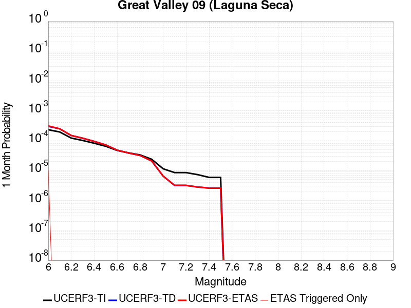 |  |  |

| Magnitude | 1 wk TI Prob | 1 wk TD Prob | 1 wk ETAS Prob | 1 wk ETAS/TD Gain | 1 wk ETAS Triggered Only | 1 mo TI Prob | 1 mo TD Prob | 1 mo ETAS Prob | 1 mo ETAS/TD Gain | 1 mo ETAS Triggered Only | 1 yr TI Prob | 1 yr TD Prob | 1 yr ETAS Prob | 1 yr ETAS/TD Gain | 1 yr ETAS Triggered Only | 10 yr TI Prob | 10 yr TD Prob | 10 yr ETAS Prob | 10 yr ETAS/TD Gain | 10 yr ETAS Triggered Only |
|-----|-----|-----|-----|-----|-----|-----|-----|-----|-----|-----|-----|-----|-----|-----|-----|-----|-----|-----|-----|-----|
| 6.0 | 5.4353277E-5 | 7.0509035E-5 | 7.0509035E-5 | 1.0 | 0.0 | 2.3292181E-4 | 3.0214872E-4 | 3.1214568E-4 | 1.0330863 | 1.0E-5 | 0.0028321352 | 0.0036725902 | 0.0036925168 | 1.0054257 | 2.0E-5 | 0.02796312 | 0.036119506 | 0.036158063 | 1.0010674 | 4.0E-5 |
| 6.1 | 4.5578287E-5 | 5.822616E-5 | 5.822616E-5 | 1.0 | 0.0 | 1.953209E-4 | 2.495183E-4 | 2.495183E-4 | 1.0 | 0.0 | 0.0023754383 | 0.0030337614 | 0.003043731 | 1.0032862 | 1.0E-5 | 0.023502063 | 0.02992279 | 0.029942192 | 1.0006484 | 2.0E-5 |
| 6.2 | 2.8536782E-5 | 3.4738878E-5 | 3.4738878E-5 | 1.0 | 0.0 | 1.2229476E-4 | 1.4887282E-4 | 1.4887282E-4 | 1.0 | 0.0 | 0.0014879217 | 0.0018109919 | 0.0018209737 | 1.0055119 | 1.0E-5 | 0.014779986 | 0.01795988 | 0.017969701 | 1.0005468 | 1.0E-5 |
| 6.3 | 2.3698774E-5 | 2.8214034E-5 | 2.8214034E-5 | 1.0 | 0.0 | 1.01562226E-4 | 1.2091195E-4 | 1.2091195E-4 | 1.0 | 0.0 | 0.0012358186 | 0.0014711645 | 0.0014711645 | 1.0 | 0.0 | 0.012289686 | 0.014612712 | 0.014612712 | 1.0 | 0.0 |
| 6.4 | 1.9191197E-5 | 2.212311E-5 | 2.212311E-5 | 1.0 | 0.0 | 8.2245395E-5 | 9.4810064E-5 | 9.4810064E-5 | 1.0 | 0.0 | 0.0010008777 | 0.0011537436 | 0.0011537436 | 1.0 | 0.0 | 0.009963818 | 0.011477948 | 0.011477948 | 1.0 | 0.0 |
| 6.5 | 1.5203241E-5 | 1.6801456E-5 | 1.6801456E-5 | 1.0 | 0.0 | 6.5155116E-5 | 7.200437E-5 | 7.200437E-5 | 1.0 | 0.0 | 7.9297484E-4 | 8.763316E-4 | 8.763316E-4 | 1.0 | 0.0 | 0.007901512 | 0.008730196 | 0.008730196 | 1.0 | 0.0 |
| 6.6 | 1.0984925E-5 | 1.1243293E-5 | 1.1243293E-5 | 1.0 | 0.0 | 4.70774E-5 | 4.8184604E-5 | 4.8184604E-5 | 1.0 | 0.0 | 5.730166E-4 | 5.8649277E-4 | 5.8649277E-4 | 1.0 | 0.0 | 0.005715413 | 0.0058498466 | 0.0058498466 | 1.0 | 0.0 |
| 6.7 | 9.134616E-6 | 9.020425E-6 | 9.020425E-6 | 1.0 | 0.0 | 3.9147766E-5 | 3.8658403E-5 | 3.8658403E-5 | 1.0 | 0.0 | 4.7651984E-4 | 4.7056677E-4 | 4.7056677E-4 | 1.0 | 0.0 | 0.004754993 | 0.0046959487 | 0.0046959487 | 1.0 | 0.0 |
| 6.8 | 7.785589E-6 | 7.45238E-6 | 7.45238E-6 | 1.0 | 0.0 | 3.3366385E-5 | 3.193839E-5 | 3.193839E-5 | 1.0 | 0.0 | 4.0616E-4 | 3.8878256E-4 | 3.8878256E-4 | 1.0 | 0.0 | 0.0040541845 | 0.003881228 | 0.003881228 | 1.0 | 0.0 |
| 6.9 | 5.579095E-6 | 4.8987786E-6 | 4.8987786E-6 | 1.0 | 0.0 | 2.3910188E-5 | 2.0994605E-5 | 2.0994605E-5 | 1.0 | 0.0 | 2.9106764E-4 | 2.5558073E-4 | 2.5558073E-4 | 1.0 | 0.0 | 0.002906867 | 0.0025530052 | 0.0025530052 | 1.0 | 0.0 |
| 7.0 | 2.6816688E-6 | 1.5216912E-6 | 1.5216912E-6 | 1.0 | 0.0 | 1.1492816E-5 | 6.521518E-6 | 6.521518E-6 | 1.0 | 0.0 | 1.3991605E-4 | 7.9396676E-5 | 7.9396676E-5 | 1.0 | 0.0 | 0.0013982799 | 7.9369184E-4 | 7.9369184E-4 | 1.0 | 0.0 |
| 7.1 | 1.9951021E-6 | 7.4542356E-7 | 7.4542356E-7 | 1.0 | 0.0 | 8.55041E-6 | 3.1946686E-6 | 3.1946686E-6 | 1.0 | 0.0 | 1.0409627E-4 | 3.889444E-5 | 3.889444E-5 | 1.0 | 0.0 | 0.0010404752 | 3.8888046E-4 | 3.8888046E-4 | 1.0 | 0.0 |
| 7.2 | 1.9951021E-6 | 7.4542356E-7 | 7.4542356E-7 | 1.0 | 0.0 | 8.55041E-6 | 3.1946686E-6 | 3.1946686E-6 | 1.0 | 0.0 | 1.0409627E-4 | 3.889444E-5 | 3.889444E-5 | 1.0 | 0.0 | 0.0010404752 | 3.8888046E-4 | 3.8888046E-4 | 1.0 | 0.0 |
| 7.3 | 1.7087556E-6 | 6.5792227E-7 | 6.5792227E-7 | 1.0 | 0.0 | 7.3232177E-6 | 2.819664E-6 | 2.819664E-6 | 1.0 | 0.0 | 8.915652E-5 | 3.432891E-5 | 3.432891E-5 | 1.0 | 0.0 | 8.9120766E-4 | 3.432401E-4 | 3.432401E-4 | 1.0 | 0.0 |
| 7.4 | 1.3804846E-6 | 6.0741337E-7 | 6.0741337E-7 | 1.0 | 0.0 | 5.916349E-6 | 2.6031978E-6 | 2.6031978E-6 | 1.0 | 0.0 | 7.2029165E-5 | 3.1693515E-5 | 3.1693515E-5 | 1.0 | 0.0 | 7.200583E-4 | 3.1689394E-4 | 3.1689394E-4 | 1.0 | 0.0 |
| 7.5 | 1.3804846E-6 | 6.0741337E-7 | 6.0741337E-7 | 1.0 | 0.0 | 5.916349E-6 | 2.6031978E-6 | 2.6031978E-6 | 1.0 | 0.0 | 7.2029165E-5 | 3.1693515E-5 | 3.1693515E-5 | 1.0 | 0.0 | 7.200583E-4 | 3.1689394E-4 | 3.1689394E-4 | 1.0 | 0.0 |

## Brawley (Seismic Zone) alt 1
*[(top)](#table-of-contents)*

| 1 Week | 1 Month | 1 Year | 10 Year |
|-----|-----|-----|-----|
| 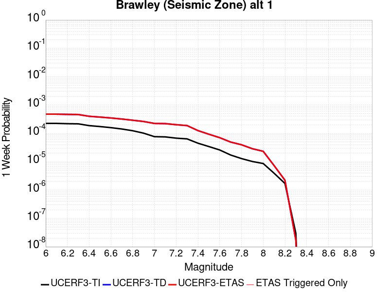 | 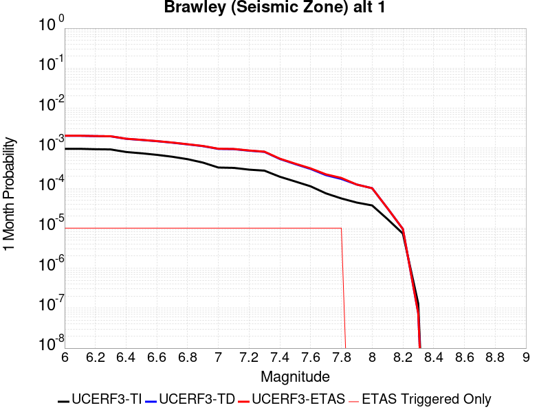 |  | 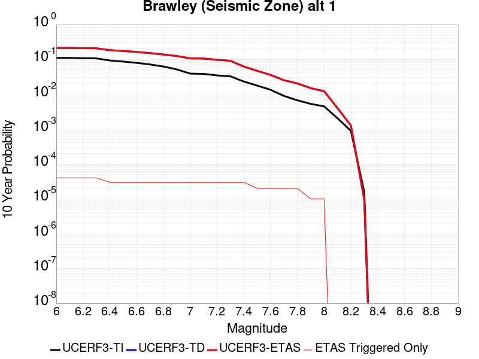 |

| Magnitude | 1 wk TI Prob | 1 wk TD Prob | 1 wk ETAS Prob | 1 wk ETAS/TD Gain | 1 wk ETAS Triggered Only | 1 mo TI Prob | 1 mo TD Prob | 1 mo ETAS Prob | 1 mo ETAS/TD Gain | 1 mo ETAS Triggered Only | 1 yr TI Prob | 1 yr TD Prob | 1 yr ETAS Prob | 1 yr ETAS/TD Gain | 1 yr ETAS Triggered Only | 10 yr TI Prob | 10 yr TD Prob | 10 yr ETAS Prob | 10 yr ETAS/TD Gain | 10 yr ETAS Triggered Only |
|-----|-----|-----|-----|-----|-----|-----|-----|-----|-----|-----|-----|-----|-----|-----|-----|-----|-----|-----|-----|-----|
| 6.0 | 2.2521618E-4 | 4.7657057E-4 | 4.7657057E-4 | 1.0 | 0.0 | 9.6485513E-4 | 0.0020408838 | 0.0020508633 | 1.0048898 | 1.0E-5 | 0.011683988 | 0.02455872 | 0.024597736 | 1.0015887 | 4.0E-5 | 0.11088423 | 0.21358448 | 0.21361594 | 1.0001472 | 4.0E-5 |
| 6.1 | 2.2521618E-4 | 4.7657057E-4 | 4.7657057E-4 | 1.0 | 0.0 | 9.6485513E-4 | 0.0020408838 | 0.0020508633 | 1.0048898 | 1.0E-5 | 0.011683988 | 0.02455872 | 0.024597736 | 1.0015887 | 4.0E-5 | 0.11088423 | 0.21358448 | 0.21361594 | 1.0001472 | 4.0E-5 |
| 6.2 | 2.198148E-4 | 4.67411E-4 | 4.67411E-4 | 1.0 | 0.0 | 9.417233E-4 | 0.0020016888 | 0.0020116689 | 1.0049858 | 1.0E-5 | 0.011405343 | 0.024092708 | 0.024131743 | 1.0016203 | 4.0E-5 | 0.10837428 | 0.21001986 | 0.21005146 | 1.0001504 | 4.0E-5 |
| 6.3 | 2.1704129E-4 | 4.6176696E-4 | 4.6176696E-4 | 1.0 | 0.0 | 9.298453E-4 | 0.001977537 | 0.001987517 | 1.0050468 | 1.0E-5 | 0.011262234 | 0.023805823 | 0.02384487 | 1.0016403 | 4.0E-5 | 0.107082725 | 0.2079108 | 0.20794249 | 1.0001523 | 4.0E-5 |
| 6.4 | 1.876142E-4 | 4.0068117E-4 | 4.0068117E-4 | 1.0 | 0.0 | 8.038131E-4 | 0.0017160892 | 0.001726072 | 1.0058172 | 1.0E-5 | 0.00974259 | 0.020692257 | 0.020721637 | 1.0014198 | 3.0E-5 | 0.093263686 | 0.18466182 | 0.18468629 | 1.0001324 | 3.0E-5 |
| 6.5 | 1.7390939E-4 | 3.7499474E-4 | 3.7499474E-4 | 1.0 | 0.0 | 7.45113E-4 | 0.0016061426 | 0.0016161266 | 1.006216 | 1.0E-5 | 0.009034078 | 0.019380184 | 0.019409603 | 1.001518 | 3.0E-5 | 0.086755216 | 0.17448258 | 0.17450735 | 1.000142 | 3.0E-5 |
| 6.6 | 1.591791E-4 | 3.4913234E-4 | 3.4913234E-4 | 1.0 | 0.0 | 6.8201777E-4 | 0.0014954335 | 0.0015054186 | 1.006677 | 1.0E-5 | 0.008271996 | 0.018056469 | 0.018085929 | 1.0016315 | 3.0E-5 | 0.07970774 | 0.1638883 | 0.1639134 | 1.0001531 | 3.0E-5 |
| 6.7 | 1.4268003E-4 | 3.2078187E-4 | 3.2078187E-4 | 1.0 | 0.0 | 6.1134255E-4 | 0.0013740633 | 0.0013840497 | 1.0072677 | 1.0E-5 | 0.007417723 | 0.01660286 | 0.016632363 | 1.0017769 | 3.0E-5 | 0.07174956 | 0.15200984 | 0.15203528 | 1.0001674 | 3.0E-5 |
| 6.8 | 1.239713E-4 | 2.9070597E-4 | 2.9070597E-4 | 1.0 | 0.0 | 5.3119735E-4 | 0.001245294 | 0.0012552816 | 1.0080203 | 1.0E-5 | 0.0064481674 | 0.015057488 | 0.015087036 | 1.0019624 | 3.0E-5 | 0.06264243 | 0.13844487 | 0.13847072 | 1.0001867 | 3.0E-5 |
| 6.9 | 1.0180238E-4 | 2.6267522E-4 | 2.6267522E-4 | 1.0 | 0.0 | 4.3622297E-4 | 0.0011252696 | 0.0011352582 | 1.0088768 | 1.0E-5 | 0.005298089 | 0.013615097 | 0.013644689 | 1.0021734 | 3.0E-5 | 0.05173543 | 0.12501492 | 0.12504117 | 1.0002099 | 3.0E-5 |
| 7.0 | 7.6619996E-5 | 2.2409327E-4 | 2.2409327E-4 | 1.0 | 0.0 | 3.283301E-4 | 9.6004945E-4 | 9.700398E-4 | 1.0104061 | 1.0E-5 | 0.0039900932 | 0.011626668 | 0.01165632 | 1.0025502 | 3.0E-5 | 0.039192066 | 0.10730799 | 0.10733477 | 1.0002496 | 3.0E-5 |
| 7.1 | 7.5127435E-5 | 2.2092364E-4 | 2.2092364E-4 | 1.0 | 0.0 | 3.2193496E-4 | 9.464752E-4 | 9.564657E-4 | 1.0105555 | 1.0E-5 | 0.0039125155 | 0.011463152 | 0.011492808 | 1.0025871 | 3.0E-5 | 0.038443442 | 0.10587153 | 0.10589835 | 1.0002533 | 3.0E-5 |
| 7.2 | 6.788582E-5 | 2.021975E-4 | 2.021975E-4 | 1.0 | 0.0 | 2.9090676E-4 | 8.66276E-4 | 8.762673E-4 | 1.0115336 | 1.0E-5 | 0.0035360386 | 0.010496546 | 0.010526231 | 1.0028281 | 3.0E-5 | 0.034803 | 0.09754102 | 0.097568095 | 1.0002775 | 3.0E-5 |
| 7.3 | 6.399602E-5 | 1.8850298E-4 | 1.8850298E-4 | 1.0 | 0.0 | 2.7423984E-4 | 8.076226E-4 | 8.1761455E-4 | 1.012372 | 1.0E-5 | 0.0033337586 | 0.009789065 | 0.009818772 | 1.0030346 | 3.0E-5 | 0.03284188 | 0.091434605 | 0.09146186 | 1.0002981 | 3.0E-5 |
| 7.4 | 4.506759E-5 | 1.2536443E-4 | 1.2536443E-4 | 1.0 | 0.0 | 1.9313251E-4 | 5.371664E-4 | 5.4716103E-4 | 1.0186062 | 1.0E-5 | 0.0023488526 | 0.006520564 | 0.006550369 | 1.0045708 | 3.0E-5 | 0.023241805 | 0.06239545 | 0.062423576 | 1.0004508 | 3.0E-5 |
| 7.5 | 3.43289E-5 | 9.341529E-5 | 9.341529E-5 | 1.0 | 0.0 | 1.4711556E-4 | 4.0029016E-4 | 4.1028613E-4 | 1.0249718 | 1.0E-5 | 0.0017896603 | 0.0048627043 | 0.004882607 | 1.0040929 | 2.0E-5 | 0.01775316 | 0.047082577 | 0.047101635 | 1.0004048 | 2.0E-5 |
| 7.6 | 2.5980507E-5 | 7.058434E-5 | 7.058434E-5 | 1.0 | 0.0 | 1.1134028E-4 | 3.024694E-4 | 3.1246635E-4 | 1.0330513 | 1.0E-5 | 0.001354725 | 0.0036763707 | 0.0036962973 | 1.0054201 | 2.0E-5 | 0.013464959 | 0.03586497 | 0.035884257 | 1.0005376 | 2.0E-5 |
| 7.7 | 1.7292105E-5 | 4.9452825E-5 | 4.9452825E-5 | 1.0 | 0.0 | 7.4106916E-5 | 2.1192349E-4 | 2.2192138E-4 | 1.0471768 | 1.0E-5 | 9.018782E-4 | 0.0025771211 | 0.0025970696 | 1.0077406 | 2.0E-5 | 0.008982267 | 0.025311116 | 0.025330609 | 1.0007702 | 2.0E-5 |
| 7.8 | 1.2927471E-5 | 3.9732924E-5 | 3.9732924E-5 | 1.0 | 0.0 | 5.5402274E-5 | 1.7027286E-4 | 1.8027116E-4 | 1.0587193 | 1.0E-5 | 6.743139E-4 | 0.0020711035 | 0.0020910623 | 1.0096366 | 2.0E-5 | 0.0067227143 | 0.020449795 | 0.020469386 | 1.000958 | 2.0E-5 |
| 7.9 | 1.0200774E-5 | 2.8777797E-5 | 2.8777797E-5 | 1.0 | 0.0 | 4.371687E-5 | 1.2332758E-4 | 1.2332758E-4 | 1.0 | 0.0 | 5.321229E-4 | 0.0015004803 | 0.0015104653 | 1.0066545 | 1.0E-5 | 0.005308505 | 0.0150065 | 0.01501635 | 1.0006564 | 1.0E-5 |
| 8.0 | 8.650396E-6 | 2.3304925E-5 | 2.3304925E-5 | 1.0 | 0.0 | 3.70726E-5 | 9.987443E-5 | 9.987443E-5 | 1.0 | 0.0 | 4.5126543E-4 | 0.0012152938 | 0.0012252816 | 1.0082184 | 1.0E-5 | 0.0045035016 | 0.012223941 | 0.012233819 | 1.0008081 | 1.0E-5 |
| 8.1 | 3.9368224E-6 | 7.339901E-6 | 7.339901E-6 | 1.0 | 0.0 | 1.6871985E-5 | 3.145634E-5 | 3.145634E-5 | 1.0 | 0.0 | 2.0539707E-4 | 3.8291377E-4 | 3.8291377E-4 | 1.0 | 0.0 | 0.0020520731 | 0.004007097 | 0.004007097 | 1.0 | 0.0 |
| 8.2 | 1.7101195E-6 | 2.222576E-6 | 2.222576E-6 | 1.0 | 0.0 | 7.329063E-6 | 9.525292E-6 | 9.525292E-6 | 1.0 | 0.0 | 8.922769E-5 | 1.15964285E-4 | 1.15964285E-4 | 1.0 | 0.0 | 8.9191867E-4 | 0.0012690878 | 0.0012690878 | 1.0 | 0.0 |
| 8.3 | 3.0346666E-8 | 1.7264131E-8 | 1.7264131E-8 | 1.0 | 0.0 | 1.3005713E-7 | 7.3989135E-8 | 7.3989135E-8 | 1.0 | 0.0 | 1.5834444E-6 | 9.0081767E-7 | 9.0081767E-7 | 1.0 | 0.0 | 1.5834332E-5 | 9.393475E-6 | 9.393475E-6 | 1.0 | 0.0 |

## Kern Canyon (North Kern) 2011
*[(top)](#table-of-contents)*

| 1 Week | 1 Month | 1 Year | 10 Year |
|-----|-----|-----|-----|
|  | 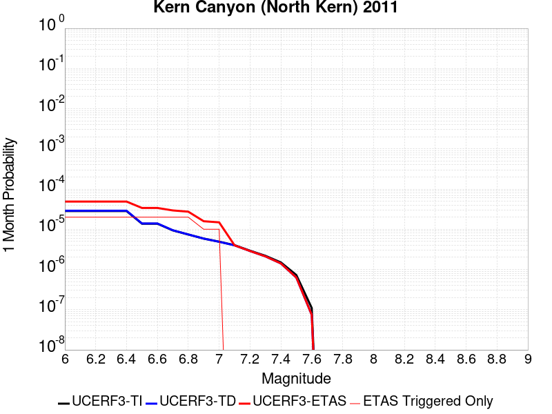 | 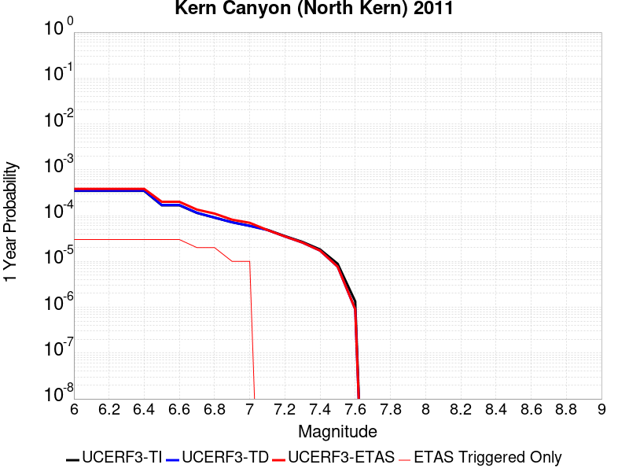 | 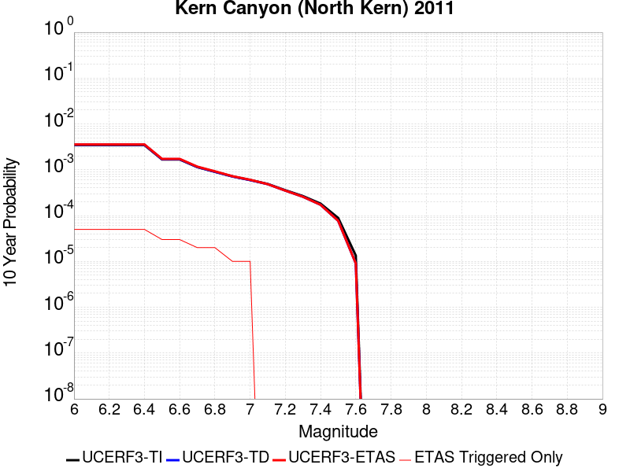 |

| Magnitude | 1 wk TI Prob | 1 wk TD Prob | 1 wk ETAS Prob | 1 wk ETAS/TD Gain | 1 wk ETAS Triggered Only | 1 mo TI Prob | 1 mo TD Prob | 1 mo ETAS Prob | 1 mo ETAS/TD Gain | 1 mo ETAS Triggered Only | 1 yr TI Prob | 1 yr TD Prob | 1 yr ETAS Prob | 1 yr ETAS/TD Gain | 1 yr ETAS Triggered Only | 10 yr TI Prob | 10 yr TD Prob | 10 yr ETAS Prob | 10 yr ETAS/TD Gain | 10 yr ETAS Triggered Only |
|-----|-----|-----|-----|-----|-----|-----|-----|-----|-----|-----|-----|-----|-----|-----|-----|-----|-----|-----|-----|-----|
| 6.0 | 6.6264497E-6 | 6.75739E-6 | 1.6757322E-5 | 2.4798512 | 1.0E-5 | 2.8398761E-5 | 2.8959967E-5 | 4.8959388E-5 | 1.6905885 | 2.0E-5 | 3.4570007E-4 | 3.5253857E-4 | 3.8252797E-4 | 1.085067 | 3.0E-5 | 0.0034516277 | 0.0035205814 | 0.0035704055 | 1.0141522 | 5.0E-5 |
| 6.1 | 6.6264497E-6 | 6.75739E-6 | 1.6757322E-5 | 2.4798512 | 1.0E-5 | 2.8398761E-5 | 2.8959967E-5 | 4.8959388E-5 | 1.6905885 | 2.0E-5 | 3.4570007E-4 | 3.5253857E-4 | 3.8252797E-4 | 1.085067 | 3.0E-5 | 0.0034516277 | 0.0035205814 | 0.0035704055 | 1.0141522 | 5.0E-5 |
| 6.2 | 6.6264497E-6 | 6.75739E-6 | 1.6757322E-5 | 2.4798512 | 1.0E-5 | 2.8398761E-5 | 2.8959967E-5 | 4.8959388E-5 | 1.6905885 | 2.0E-5 | 3.4570007E-4 | 3.5253857E-4 | 3.8252797E-4 | 1.085067 | 3.0E-5 | 0.0034516277 | 0.0035205814 | 0.0035704055 | 1.0141522 | 5.0E-5 |
| 6.3 | 6.6264497E-6 | 6.75739E-6 | 1.6757322E-5 | 2.4798512 | 1.0E-5 | 2.8398761E-5 | 2.8959967E-5 | 4.8959388E-5 | 1.6905885 | 2.0E-5 | 3.4570007E-4 | 3.5253857E-4 | 3.8252797E-4 | 1.085067 | 3.0E-5 | 0.0034516277 | 0.0035205814 | 0.0035704055 | 1.0141522 | 5.0E-5 |
| 6.4 | 6.6264497E-6 | 6.75739E-6 | 1.6757322E-5 | 2.4798512 | 1.0E-5 | 2.8398761E-5 | 2.8959967E-5 | 4.8959388E-5 | 1.6905885 | 2.0E-5 | 3.4570007E-4 | 3.5253857E-4 | 3.8252797E-4 | 1.085067 | 3.0E-5 | 0.0034516277 | 0.0035205814 | 0.0035704055 | 1.0141522 | 5.0E-5 |
| 6.5 | 3.2162225E-6 | 3.2571172E-6 | 1.3257085E-5 | 4.0701895 | 1.0E-5 | 1.3783738E-5 | 1.3959003E-5 | 3.3958724E-5 | 2.4327471 | 2.0E-5 | 1.6780409E-4 | 1.6993842E-4 | 1.9993332E-4 | 1.1765045 | 3.0E-5 | 0.0016767744 | 0.0016981644 | 0.0017281134 | 1.0176362 | 3.0E-5 |
| 6.6 | 3.2162225E-6 | 3.2571172E-6 | 1.3257085E-5 | 4.0701895 | 1.0E-5 | 1.3783738E-5 | 1.3959003E-5 | 3.3958724E-5 | 2.4327471 | 2.0E-5 | 1.6780409E-4 | 1.6993842E-4 | 1.9993332E-4 | 1.1765045 | 3.0E-5 | 0.0016767744 | 0.0016981644 | 0.0017281134 | 1.0176362 | 3.0E-5 |
| 6.7 | 2.1908265E-6 | 2.2071386E-6 | 1.2207116E-5 | 5.530743 | 1.0E-5 | 9.389223E-6 | 9.459131E-6 | 2.9458943E-5 | 3.1143389 | 2.0E-5 | 1.1430779E-4 | 1.1515904E-4 | 1.3515673E-4 | 1.1736529 | 2.0E-5 | 0.0011424901 | 0.0011510131 | 0.00117099 | 1.017356 | 2.0E-5 |
| 6.8 | 1.7303895E-6 | 1.7365653E-6 | 1.1736548E-5 | 6.7584834 | 1.0E-5 | 7.415934E-6 | 7.4424024E-6 | 2.7442253E-5 | 3.6872842 | 2.0E-5 | 9.028525E-5 | 9.060758E-5 | 1.1060577E-4 | 1.2207121 | 2.0E-5 | 9.024858E-4 | 9.057161E-4 | 9.2569797E-4 | 1.022062 | 2.0E-5 |
| 6.9 | 1.3700314E-6 | 1.368872E-6 | 1.368872E-6 | 1.0 | 0.0 | 5.87155E-6 | 5.866581E-6 | 1.5866523E-5 | 2.7045603 | 1.0E-5 | 7.148377E-5 | 7.142333E-5 | 8.1422615E-5 | 1.1400002 | 1.0E-5 | 7.146078E-4 | 7.140083E-4 | 7.2400115E-4 | 1.0139954 | 1.0E-5 |
| 7.0 | 1.1467797E-6 | 1.1413886E-6 | 1.1413886E-6 | 1.0 | 0.0 | 4.9147607E-6 | 4.891656E-6 | 1.4891607E-5 | 3.0442874 | 1.0E-5 | 5.983557E-5 | 5.9554317E-5 | 6.9553724E-5 | 1.1679039 | 1.0E-5 | 5.981946E-4 | 5.953867E-4 | 6.0538074E-4 | 1.0167859 | 1.0E-5 |
| 7.1 | 9.3952065E-7 | 9.302757E-7 | 9.302757E-7 | 1.0 | 0.0 | 4.026511E-6 | 3.9868896E-6 | 3.9868896E-6 | 1.0 | 0.0 | 4.9021666E-5 | 4.8539318E-5 | 4.8539318E-5 | 1.0 | 0.0 | 4.901085E-4 | 4.8528894E-4 | 4.8528894E-4 | 1.0 | 0.0 |
| 7.2 | 6.858055E-7 | 6.719349E-7 | 6.719349E-7 | 1.0 | 0.0 | 2.939163E-6 | 2.879718E-6 | 2.879718E-6 | 1.0 | 0.0 | 3.5783723E-5 | 3.506001E-5 | 3.506001E-5 | 1.0 | 0.0 | 3.5777962E-4 | 3.5054568E-4 | 3.5054568E-4 | 1.0 | 0.0 |
| 7.3 | 5.1101983E-7 | 4.939336E-7 | 4.939336E-7 | 1.0 | 0.0 | 2.1900833E-6 | 2.1168566E-6 | 2.1168566E-6 | 1.0 | 0.0 | 2.6663936E-5 | 2.5772431E-5 | 2.5772431E-5 | 1.0 | 0.0 | 2.6660739E-4 | 2.576949E-4 | 2.576949E-4 | 1.0 | 0.0 |
| 7.4 | 3.4999414E-7 | 3.299616E-7 | 3.299616E-7 | 1.0 | 0.0 | 1.499974E-6 | 1.4141204E-6 | 1.4141204E-6 | 1.0 | 0.0 | 1.8262032E-5 | 1.7216782E-5 | 1.7216782E-5 | 1.0 | 0.0 | 1.826053E-4 | 1.7215473E-4 | 1.7215473E-4 | 1.0 | 0.0 |
| 7.5 | 1.7021522E-7 | 1.4750174E-7 | 1.4750174E-7 | 1.0 | 0.0 | 7.2949354E-7 | 6.321502E-7 | 6.321502E-7 | 1.0 | 0.0 | 8.881548E-6 | 7.6964025E-6 | 7.6964025E-6 | 1.0 | 0.0 | 8.8811925E-5 | 7.6961434E-5 | 7.6961434E-5 | 1.0 | 0.0 |
| 7.6 | 2.572245E-8 | 1.7352786E-8 | 1.7352786E-8 | 1.0 | 0.0 | 1.10239064E-7 | 7.4369076E-8 | 7.4369076E-8 | 1.0 | 0.0 | 1.3421597E-6 | 9.054432E-7 | 9.054432E-7 | 1.0 | 0.0 | 1.3421517E-5 | 9.054401E-6 | 9.054401E-6 | 1.0 | 0.0 |

## White Mountains
*[(top)](#table-of-contents)*

| 1 Week | 1 Month | 1 Year | 10 Year |
|-----|-----|-----|-----|
| 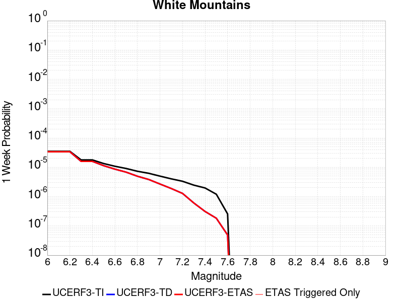 | 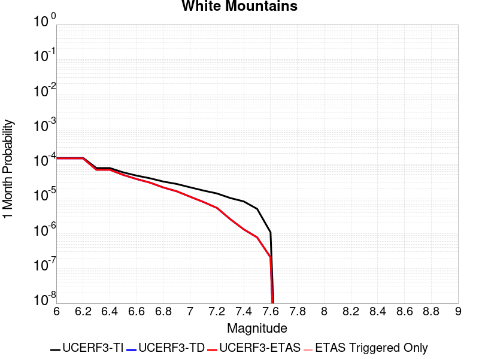 | 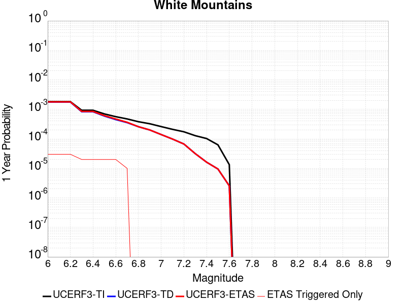 | 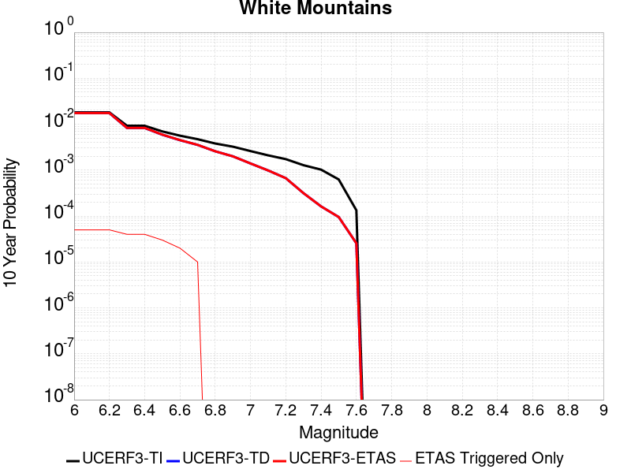 |

| Magnitude | 1 wk TI Prob | 1 wk TD Prob | 1 wk ETAS Prob | 1 wk ETAS/TD Gain | 1 wk ETAS Triggered Only | 1 mo TI Prob | 1 mo TD Prob | 1 mo ETAS Prob | 1 mo ETAS/TD Gain | 1 mo ETAS Triggered Only | 1 yr TI Prob | 1 yr TD Prob | 1 yr ETAS Prob | 1 yr ETAS/TD Gain | 1 yr ETAS Triggered Only | 10 yr TI Prob | 10 yr TD Prob | 10 yr ETAS Prob | 10 yr ETAS/TD Gain | 10 yr ETAS Triggered Only |
|-----|-----|-----|-----|-----|-----|-----|-----|-----|-----|-----|-----|-----|-----|-----|-----|-----|-----|-----|-----|-----|
| 6.0 | 3.503579E-5 | 3.378522E-5 | 3.378522E-5 | 1.0 | 0.0 | 1.5014476E-4 | 1.4478645E-4 | 1.4478645E-4 | 1.0 | 0.0 | 0.0018264796 | 0.0017614706 | 0.0017914177 | 1.0170013 | 3.0E-5 | 0.018115403 | 0.01748742 | 0.017536545 | 1.0028092 | 5.0E-5 |
| 6.1 | 3.503579E-5 | 3.378522E-5 | 3.378522E-5 | 1.0 | 0.0 | 1.5014476E-4 | 1.4478645E-4 | 1.4478645E-4 | 1.0 | 0.0 | 0.0018264796 | 0.0017614706 | 0.0017914177 | 1.0170013 | 3.0E-5 | 0.018115403 | 0.01748742 | 0.017536545 | 1.0028092 | 5.0E-5 |
| 6.2 | 3.503579E-5 | 3.378522E-5 | 3.378522E-5 | 1.0 | 0.0 | 1.5014476E-4 | 1.4478645E-4 | 1.4478645E-4 | 1.0 | 0.0 | 0.0018264796 | 0.0017614706 | 0.0017914177 | 1.0170013 | 3.0E-5 | 0.018115403 | 0.01748742 | 0.017536545 | 1.0028092 | 5.0E-5 |
| 6.3 | 1.7818425E-5 | 1.591665E-5 | 1.591665E-5 | 1.0 | 0.0 | 7.636245E-5 | 6.821251E-5 | 6.821251E-5 | 1.0 | 0.0 | 9.293162E-4 | 8.301852E-4 | 8.501686E-4 | 1.024071 | 2.0E-5 | 0.009254395 | 0.008272297 | 0.008311966 | 1.0047954 | 4.0E-5 |
| 6.4 | 1.7818425E-5 | 1.591665E-5 | 1.591665E-5 | 1.0 | 0.0 | 7.636245E-5 | 6.821251E-5 | 6.821251E-5 | 1.0 | 0.0 | 9.293162E-4 | 8.301852E-4 | 8.501686E-4 | 1.024071 | 2.0E-5 | 0.009254395 | 0.008272297 | 0.008311966 | 1.0047954 | 4.0E-5 |
| 6.5 | 1.3397557E-5 | 1.1336706E-5 | 1.1336706E-5 | 1.0 | 0.0 | 5.741684E-5 | 4.8585018E-5 | 4.8585018E-5 | 1.0 | 0.0 | 6.988258E-4 | 5.91369E-4 | 6.1135716E-4 | 1.0337999 | 2.0E-5 | 0.006966323 | 0.0058986587 | 0.005928482 | 1.0050559 | 3.0E-5 |
| 6.6 | 1.0818695E-5 | 8.625652E-6 | 8.625652E-6 | 1.0 | 0.0 | 4.6365014E-5 | 3.6966583E-5 | 3.6966583E-5 | 1.0 | 0.0 | 5.6434784E-4 | 4.4997953E-4 | 4.6997055E-4 | 1.0444264 | 2.0E-5 | 0.005629168 | 0.0044911206 | 0.004511031 | 1.0044333 | 2.0E-5 |
| 6.7 | 9.067908E-6 | 6.8026347E-6 | 6.8026347E-6 | 1.0 | 0.0 | 3.8861883E-5 | 2.915384E-5 | 2.915384E-5 | 1.0 | 0.0 | 4.7304068E-4 | 3.548934E-4 | 3.6488983E-4 | 1.0281675 | 1.0E-5 | 0.00472035 | 0.0035435837 | 0.0035535481 | 1.002812 | 1.0E-5 |
| 6.8 | 7.295947E-6 | 4.9365335E-6 | 4.9365335E-6 | 1.0 | 0.0 | 3.126797E-5 | 2.1156407E-5 | 2.1156407E-5 | 1.0 | 0.0 | 3.8062103E-4 | 2.5754995E-4 | 2.5754995E-4 | 1.0 | 0.0 | 0.0037996976 | 0.0025726275 | 0.0025726275 | 1.0 | 0.0 |
| 6.9 | 6.2243444E-6 | 3.83233E-6 | 3.83233E-6 | 1.0 | 0.0 | 2.6675489E-5 | 1.642417E-5 | 1.642417E-5 | 1.0 | 0.0 | 3.2472567E-4 | 1.9994646E-4 | 1.9994646E-4 | 1.0 | 0.0 | 0.0032425157 | 0.0019977184 | 0.0019977184 | 1.0 | 0.0 |
| 7.0 | 4.9878413E-6 | 2.6796338E-6 | 2.6796338E-6 | 1.0 | 0.0 | 2.1376287E-5 | 1.1484096E-5 | 1.1484096E-5 | 1.0 | 0.0 | 2.602252E-4 | 1.3981016E-4 | 1.3981016E-4 | 1.0 | 0.0 | 0.002599207 | 0.0013972482 | 0.0013972482 | 1.0 | 0.0 |
| 7.1 | 4.0252844E-6 | 1.8858487E-6 | 1.8858487E-6 | 1.0 | 0.0 | 1.7251105E-5 | 8.082185E-6 | 8.082185E-6 | 1.0 | 0.0 | 2.1001195E-4 | 9.839628E-5 | 9.839628E-5 | 1.0 | 0.0 | 0.0020981359 | 9.8354E-4 | 9.8354E-4 | 1.0 | 0.0 |
| 7.2 | 3.3284066E-6 | 1.2820489E-6 | 1.2820489E-6 | 1.0 | 0.0 | 1.4264522E-5 | 5.494484E-6 | 5.494484E-6 | 1.0 | 0.0 | 1.736567E-4 | 6.689339E-5 | 6.689339E-5 | 1.0 | 0.0 | 0.0017352107 | 6.6874264E-4 | 6.6874264E-4 | 1.0 | 0.0 |
| 7.3 | 2.458226E-6 | 6.057984E-7 | 6.057984E-7 | 1.0 | 0.0 | 1.0535211E-5 | 2.5962765E-6 | 2.5962765E-6 | 1.0 | 0.0 | 1.2825865E-4 | 3.1609245E-5 | 3.1609245E-5 | 1.0 | 0.0 | 0.0012818464 | 3.1605124E-4 | 3.1605124E-4 | 1.0 | 0.0 |
| 7.4 | 1.965953E-6 | 3.1095928E-7 | 3.1095928E-7 | 1.0 | 0.0 | 8.425486E-6 | 1.3326819E-6 | 1.3326819E-6 | 1.0 | 0.0 | 1.0257547E-4 | 1.6225284E-5 | 1.6225284E-5 | 1.0 | 0.0 | 0.0010252813 | 1.6224111E-4 | 1.6224111E-4 | 1.0 | 0.0 |
| 7.5 | 1.2014192E-6 | 1.8248838E-7 | 1.8248838E-7 | 1.0 | 0.0 | 5.148929E-6 | 7.8209285E-7 | 7.8209285E-7 | 1.0 | 0.0 | 6.2686406E-5 | 9.521939E-6 | 9.521939E-6 | 1.0 | 0.0 | 6.266873E-4 | 9.52154E-5 | 9.52154E-5 | 1.0 | 0.0 |
| 7.6 | 2.5612175E-7 | 4.8958572E-8 | 4.8958572E-8 | 1.0 | 0.0 | 1.0976642E-6 | 2.0982245E-7 | 2.0982245E-7 | 1.0 | 0.0 | 1.3363979E-5 | 2.5545855E-6 | 2.5545855E-6 | 1.0 | 0.0 | 1.3363175E-4 | 2.55456E-5 | 2.55456E-5 | 1.0 | 0.0 |

## Santa Ynez (East)
*[(top)](#table-of-contents)*

| 1 Week | 1 Month | 1 Year | 10 Year |
|-----|-----|-----|-----|
|  |  |  | 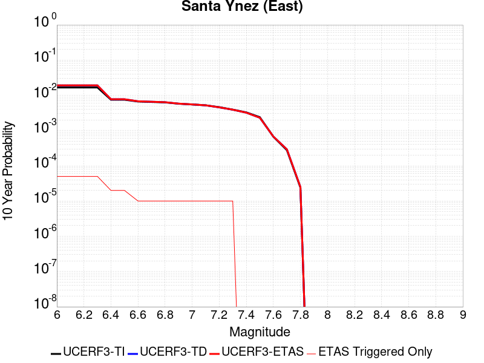 |

| Magnitude | 1 wk TI Prob | 1 wk TD Prob | 1 wk ETAS Prob | 1 wk ETAS/TD Gain | 1 wk ETAS Triggered Only | 1 mo TI Prob | 1 mo TD Prob | 1 mo ETAS Prob | 1 mo ETAS/TD Gain | 1 mo ETAS Triggered Only | 1 yr TI Prob | 1 yr TD Prob | 1 yr ETAS Prob | 1 yr ETAS/TD Gain | 1 yr ETAS Triggered Only | 10 yr TI Prob | 10 yr TD Prob | 10 yr ETAS Prob | 10 yr ETAS/TD Gain | 10 yr ETAS Triggered Only |
|-----|-----|-----|-----|-----|-----|-----|-----|-----|-----|-----|-----|-----|-----|-----|-----|-----|-----|-----|-----|-----|
| 6.0 | 3.2269712E-5 | 3.6752866E-5 | 3.6752866E-5 | 1.0 | 0.0 | 1.3829143E-4 | 1.575061E-4 | 1.6750454E-4 | 1.0634795 | 1.0E-5 | 0.0016823979 | 0.0019165399 | 0.0019365016 | 1.0104154 | 2.0E-5 | 0.016697178 | 0.019057656 | 0.019106703 | 1.0025736 | 5.0E-5 |
| 6.1 | 3.2269712E-5 | 3.6752866E-5 | 3.6752866E-5 | 1.0 | 0.0 | 1.3829143E-4 | 1.575061E-4 | 1.6750454E-4 | 1.0634795 | 1.0E-5 | 0.0016823979 | 0.0019165399 | 0.0019365016 | 1.0104154 | 2.0E-5 | 0.016697178 | 0.019057656 | 0.019106703 | 1.0025736 | 5.0E-5 |
| 6.2 | 3.2269712E-5 | 3.6752866E-5 | 3.6752866E-5 | 1.0 | 0.0 | 1.3829143E-4 | 1.575061E-4 | 1.6750454E-4 | 1.0634795 | 1.0E-5 | 0.0016823979 | 0.0019165399 | 0.0019365016 | 1.0104154 | 2.0E-5 | 0.016697178 | 0.019057656 | 0.019106703 | 1.0025736 | 5.0E-5 |
| 6.3 | 3.2269712E-5 | 3.6752866E-5 | 3.6752866E-5 | 1.0 | 0.0 | 1.3829143E-4 | 1.575061E-4 | 1.6750454E-4 | 1.0634795 | 1.0E-5 | 0.0016823979 | 0.0019165399 | 0.0019365016 | 1.0104154 | 2.0E-5 | 0.016697178 | 0.019057656 | 0.019106703 | 1.0025736 | 5.0E-5 |
| 6.4 | 1.4404779E-5 | 1.4849906E-5 | 1.4849906E-5 | 1.0 | 0.0 | 6.1733306E-5 | 6.364093E-5 | 6.364093E-5 | 1.0 | 0.0 | 7.513438E-4 | 7.7455794E-4 | 7.8455015E-4 | 1.0129006 | 1.0E-5 | 0.0074880854 | 0.007719133 | 0.0077389786 | 1.002571 | 2.0E-5 |
| 6.5 | 1.4404779E-5 | 1.4849906E-5 | 1.4849906E-5 | 1.0 | 0.0 | 6.1733306E-5 | 6.364093E-5 | 6.364093E-5 | 1.0 | 0.0 | 7.513438E-4 | 7.7455794E-4 | 7.8455015E-4 | 1.0129006 | 1.0E-5 | 0.0074880854 | 0.007719133 | 0.0077389786 | 1.002571 | 2.0E-5 |
| 6.6 | 1.280208E-5 | 1.3012371E-5 | 1.3012371E-5 | 1.0 | 0.0 | 5.4864904E-5 | 5.5766122E-5 | 5.5766122E-5 | 1.0 | 0.0 | 6.6777546E-4 | 6.7874277E-4 | 6.7874277E-4 | 1.0 | 0.0 | 0.006657724 | 0.006766908 | 0.0067768404 | 1.0014678 | 1.0E-5 |
| 6.7 | 1.2457027E-5 | 1.2628875E-5 | 1.2628875E-5 | 1.0 | 0.0 | 5.3386164E-5 | 5.4122636E-5 | 5.4122636E-5 | 1.0 | 0.0 | 6.497827E-4 | 6.587456E-4 | 6.587456E-4 | 1.0 | 0.0 | 0.00647886 | 0.0065681264 | 0.006578061 | 1.0015125 | 1.0E-5 |
| 6.8 | 1.2095134E-5 | 1.2231308E-5 | 1.2231308E-5 | 1.0 | 0.0 | 5.1835254E-5 | 5.2418844E-5 | 5.2418844E-5 | 1.0 | 0.0 | 6.309115E-4 | 6.380142E-4 | 6.380142E-4 | 1.0 | 0.0 | 0.0062912325 | 0.006362013 | 0.0063719493 | 1.0015619 | 1.0E-5 |
| 6.9 | 1.1104036E-5 | 1.11577065E-5 | 1.11577065E-5 | 1.0 | 0.0 | 4.758786E-5 | 4.7817874E-5 | 4.7817874E-5 | 1.0 | 0.0 | 5.7922816E-4 | 5.8202835E-4 | 5.8202835E-4 | 1.0 | 0.0 | 0.005777207 | 0.0058051855 | 0.0058151274 | 1.0017126 | 1.0E-5 |
| 7.0 | 1.0577444E-5 | 1.058202E-5 | 1.058202E-5 | 1.0 | 0.0 | 4.5331115E-5 | 4.535073E-5 | 4.535073E-5 | 1.0 | 0.0 | 5.5176654E-4 | 5.520065E-4 | 5.520065E-4 | 1.0 | 0.0 | 0.0055039856 | 0.0055064918 | 0.0055164364 | 1.001806 | 1.0E-5 |
| 7.1 | 1.0021775E-5 | 9.981309E-6 | 9.981309E-6 | 1.0 | 0.0 | 4.294976E-5 | 4.277634E-5 | 4.277634E-5 | 1.0 | 0.0 | 5.2278786E-4 | 5.206787E-4 | 5.206787E-4 | 1.0 | 0.0 | 0.0052155964 | 0.0051947203 | 0.0052046683 | 1.001915 | 1.0E-5 |
| 7.2 | 8.874109E-6 | 8.749076E-6 | 8.749076E-6 | 1.0 | 0.0 | 3.8031343E-5 | 3.749551E-5 | 3.749551E-5 | 1.0 | 0.0 | 4.629332E-4 | 4.5641328E-4 | 4.5641328E-4 | 1.0 | 0.0 | 0.0046197 | 0.004554877 | 0.0045648315 | 1.0021855 | 1.0E-5 |
| 7.3 | 7.5504267E-6 | 7.5053454E-6 | 7.5053454E-6 | 1.0 | 0.0 | 3.235857E-5 | 3.2165375E-5 | 3.2165375E-5 | 1.0 | 0.0 | 3.9389438E-4 | 3.915441E-4 | 3.915441E-4 | 1.0 | 0.0 | 0.0039319694 | 0.0039086496 | 0.0039186105 | 1.0025485 | 1.0E-5 |
| 7.4 | 6.309394E-6 | 6.1833402E-6 | 6.1833402E-6 | 1.0 | 0.0 | 2.703998E-5 | 2.6499765E-5 | 2.6499765E-5 | 1.0 | 0.0 | 3.2916202E-4 | 3.2258782E-4 | 3.2258782E-4 | 1.0 | 0.0 | 0.003286749 | 0.003221293 | 0.003221293 | 1.0 | 0.0 |
| 7.5 | 4.6103073E-6 | 4.4410153E-6 | 4.4410153E-6 | 1.0 | 0.0 | 1.975831E-5 | 1.9032788E-5 | 1.9032788E-5 | 1.0 | 0.0 | 2.4053088E-4 | 2.3170024E-4 | 2.3170024E-4 | 1.0 | 0.0 | 0.002402707 | 0.002314656 | 0.002314656 | 1.0 | 0.0 |
| 7.6 | 1.2858658E-6 | 1.3008439E-6 | 1.3008439E-6 | 1.0 | 0.0 | 5.5108417E-6 | 5.575034E-6 | 5.575034E-6 | 1.0 | 0.0 | 6.7092435E-5 | 6.7873996E-5 | 6.7873996E-5 | 1.0 | 0.0 | 6.707218E-4 | 6.785395E-4 | 6.785395E-4 | 1.0 | 0.0 |
| 7.7 | 5.3302307E-7 | 5.612249E-7 | 5.612249E-7 | 1.0 | 0.0 | 2.2843826E-6 | 2.4052476E-6 | 2.4052476E-6 | 1.0 | 0.0 | 2.7812002E-5 | 2.9283532E-5 | 2.9283532E-5 | 1.0 | 0.0 | 2.7808524E-4 | 2.928003E-4 | 2.928003E-4 | 1.0 | 0.0 |
| 7.8 | 4.613933E-8 | 4.803083E-8 | 4.803083E-8 | 1.0 | 0.0 | 1.9773998E-7 | 2.0584639E-7 | 2.0584639E-7 | 1.0 | 0.0 | 2.4074816E-6 | 2.506177E-6 | 2.506177E-6 | 1.0 | 0.0 | 2.4074554E-5 | 2.5061498E-5 | 2.5061498E-5 | 1.0 | 0.0 |

## Cleghorn Lake
*[(top)](#table-of-contents)*

| 1 Week | 1 Month | 1 Year | 10 Year |
|-----|-----|-----|-----|
|  |  | 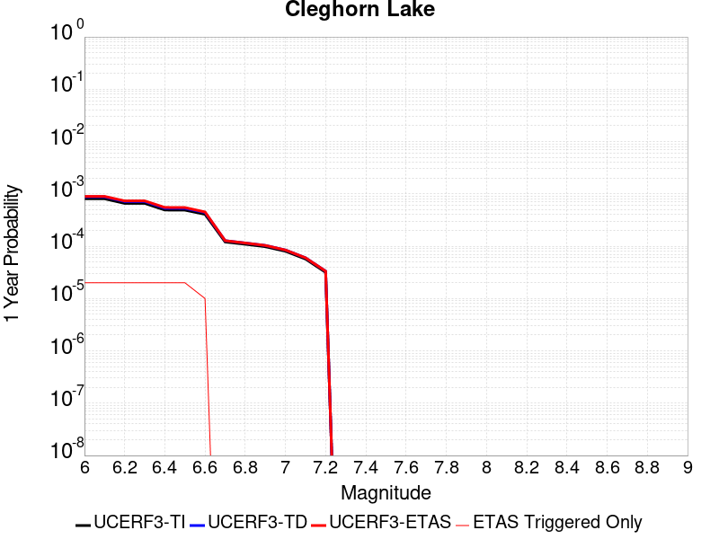 |  |

| Magnitude | 1 wk TI Prob | 1 wk TD Prob | 1 wk ETAS Prob | 1 wk ETAS/TD Gain | 1 wk ETAS Triggered Only | 1 mo TI Prob | 1 mo TD Prob | 1 mo ETAS Prob | 1 mo ETAS/TD Gain | 1 mo ETAS Triggered Only | 1 yr TI Prob | 1 yr TD Prob | 1 yr ETAS Prob | 1 yr ETAS/TD Gain | 1 yr ETAS Triggered Only | 10 yr TI Prob | 10 yr TD Prob | 10 yr ETAS Prob | 10 yr ETAS/TD Gain | 10 yr ETAS Triggered Only |
|-----|-----|-----|-----|-----|-----|-----|-----|-----|-----|-----|-----|-----|-----|-----|-----|-----|-----|-----|-----|-----|
| 6.0 | 1.5467183E-5 | 1.679474E-5 | 1.679474E-5 | 1.0 | 0.0 | 6.6286244E-5 | 7.197578E-5 | 8.1975064E-5 | 1.1389257 | 1.0E-5 | 8.067362E-4 | 8.760077E-4 | 8.9599023E-4 | 1.0228108 | 2.0E-5 | 0.008038137 | 0.008730974 | 0.008770624 | 1.0045414 | 4.0E-5 |
| 6.1 | 1.5467183E-5 | 1.679474E-5 | 1.679474E-5 | 1.0 | 0.0 | 6.6286244E-5 | 7.197578E-5 | 8.1975064E-5 | 1.1389257 | 1.0E-5 | 8.067362E-4 | 8.760077E-4 | 8.9599023E-4 | 1.0228108 | 2.0E-5 | 0.008038137 | 0.008730974 | 0.008770624 | 1.0045414 | 4.0E-5 |
| 6.2 | 1.2624631E-5 | 1.3681972E-5 | 1.3681972E-5 | 1.0 | 0.0 | 5.410444E-5 | 5.863598E-5 | 6.863539E-5 | 1.1705338 | 1.0E-5 | 6.585225E-4 | 7.137079E-4 | 7.336936E-4 | 1.0280026 | 2.0E-5 | 0.0065657445 | 0.0071189534 | 0.0071586687 | 1.0055788 | 4.0E-5 |
| 6.3 | 1.2624631E-5 | 1.3681972E-5 | 1.3681972E-5 | 1.0 | 0.0 | 5.410444E-5 | 5.863598E-5 | 6.863539E-5 | 1.1705338 | 1.0E-5 | 6.585225E-4 | 7.137079E-4 | 7.336936E-4 | 1.0280026 | 2.0E-5 | 0.0065657445 | 0.0071189534 | 0.0071586687 | 1.0055788 | 4.0E-5 |
| 6.4 | 9.417684E-6 | 1.0170421E-5 | 1.0170421E-5 | 1.0 | 0.0 | 4.036088E-5 | 4.358702E-5 | 5.3586584E-5 | 1.2294161 | 1.0E-5 | 4.912829E-4 | 5.3058384E-4 | 5.505732E-4 | 1.0376743 | 2.0E-5 | 0.004901982 | 0.005297207 | 0.005317101 | 1.0037556 | 2.0E-5 |
| 6.5 | 9.368219E-6 | 1.0117847E-5 | 1.0117847E-5 | 1.0 | 0.0 | 4.014889E-5 | 4.336171E-5 | 5.3361277E-5 | 1.2306082 | 1.0E-5 | 4.8870314E-4 | 5.27842E-4 | 5.4783147E-4 | 1.0378702 | 2.0E-5 | 0.004876298 | 0.0052699186 | 0.005289813 | 1.0037751 | 2.0E-5 |
| 6.6 | 7.803798E-6 | 8.442088E-6 | 8.442088E-6 | 1.0 | 0.0 | 3.3444423E-5 | 3.6180103E-5 | 4.617974E-5 | 1.2763851 | 1.0E-5 | 4.0710976E-4 | 4.4044363E-4 | 4.5043923E-4 | 1.0226943 | 1.0E-5 | 0.0040636472 | 0.004399624 | 0.0044095805 | 1.002263 | 1.0E-5 |
| 6.7 | 2.3108669E-6 | 2.443886E-6 | 2.443886E-6 | 1.0 | 0.0 | 9.903678E-6 | 1.04737555E-5 | 1.04737555E-5 | 1.0 | 0.0 | 1.205706E-4 | 1.275107E-4 | 1.275107E-4 | 1.0 | 0.0 | 0.001205052 | 0.001274394 | 0.001274394 | 1.0 | 0.0 |
| 6.8 | 2.0882828E-6 | 2.2063284E-6 | 2.2063284E-6 | 1.0 | 0.0 | 8.949753E-6 | 9.455661E-6 | 9.455661E-6 | 1.0 | 0.0 | 1.08957785E-4 | 1.1511675E-4 | 1.1511675E-4 | 1.0 | 0.0 | 0.0010890438 | 0.001150588 | 0.001150588 | 1.0 | 0.0 |
| 6.9 | 1.876935E-6 | 1.9810918E-6 | 1.9810918E-6 | 1.0 | 0.0 | 8.043982E-6 | 8.490367E-6 | 8.490367E-6 | 1.0 | 0.0 | 9.7931086E-5 | 1.0336548E-4 | 1.0336548E-4 | 1.0 | 0.0 | 9.788794E-4 | 0.0010331899 | 0.0010331899 | 1.0 | 0.0 |
| 7.0 | 1.5357559E-6 | 1.6203138E-6 | 1.6203138E-6 | 1.0 | 0.0 | 6.5817944E-6 | 6.9441844E-6 | 6.9441844E-6 | 1.0 | 0.0 | 8.01304E-5 | 8.454229E-5 | 8.454229E-5 | 1.0 | 0.0 | 8.010151E-4 | 8.4511377E-4 | 8.4511377E-4 | 1.0 | 0.0 |
| 7.1 | 1.0905424E-6 | 1.1497851E-6 | 1.1497851E-6 | 1.0 | 0.0 | 4.6737446E-6 | 4.927642E-6 | 4.927642E-6 | 1.0 | 0.0 | 5.6901354E-5 | 5.999249E-5 | 5.999249E-5 | 1.0 | 0.0 | 5.6886784E-4 | 5.997727E-4 | 5.997727E-4 | 1.0 | 0.0 |
| 7.2 | 6.06668E-7 | 6.387403E-7 | 6.387403E-7 | 1.0 | 0.0 | 2.600003E-6 | 2.7374558E-6 | 2.7374558E-6 | 1.0 | 0.0 | 3.1654577E-5 | 3.3328084E-5 | 3.3328084E-5 | 1.0 | 0.0 | 3.1650066E-4 | 3.3323772E-4 | 3.3323772E-4 | 1.0 | 0.0 |

## Kern Canyon (South Kern) 2011
*[(top)](#table-of-contents)*

| 1 Week | 1 Month | 1 Year | 10 Year |
|-----|-----|-----|-----|
| 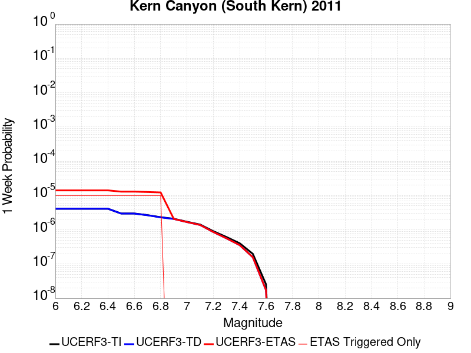 |  | 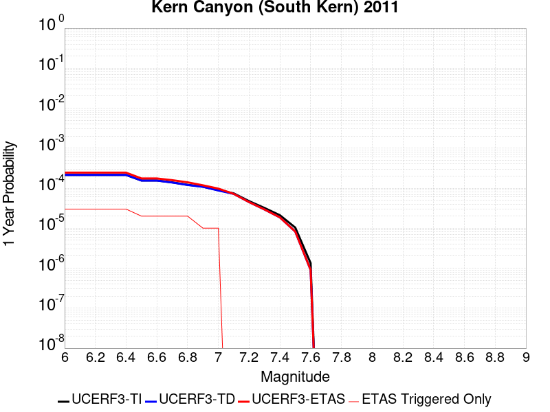 | 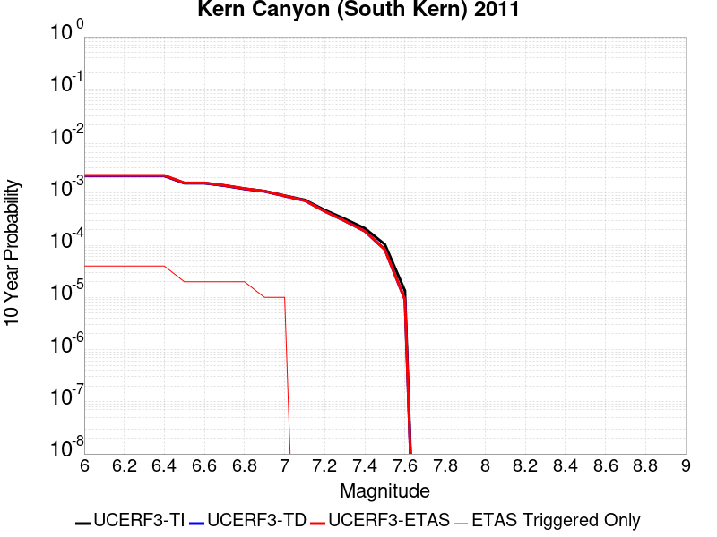 |

| Magnitude | 1 wk TI Prob | 1 wk TD Prob | 1 wk ETAS Prob | 1 wk ETAS/TD Gain | 1 wk ETAS Triggered Only | 1 mo TI Prob | 1 mo TD Prob | 1 mo ETAS Prob | 1 mo ETAS/TD Gain | 1 mo ETAS Triggered Only | 1 yr TI Prob | 1 yr TD Prob | 1 yr ETAS Prob | 1 yr ETAS/TD Gain | 1 yr ETAS Triggered Only | 10 yr TI Prob | 10 yr TD Prob | 10 yr ETAS Prob | 10 yr ETAS/TD Gain | 10 yr ETAS Triggered Only |
|-----|-----|-----|-----|-----|-----|-----|-----|-----|-----|-----|-----|-----|-----|-----|-----|-----|-----|-----|-----|-----|
| 6.0 | 4.105075E-6 | 4.113755E-6 | 1.4113714E-5 | 3.430859 | 1.0E-5 | 1.7593058E-5 | 1.7630264E-5 | 3.762991E-5 | 2.134393 | 2.0E-5 | 2.1417443E-4 | 2.1462796E-4 | 2.446215E-4 | 1.1397468 | 3.0E-5 | 0.0021396813 | 0.0021442706 | 0.002184185 | 1.0186144 | 4.0E-5 |
| 6.1 | 4.105075E-6 | 4.113755E-6 | 1.4113714E-5 | 3.430859 | 1.0E-5 | 1.7593058E-5 | 1.7630264E-5 | 3.762991E-5 | 2.134393 | 2.0E-5 | 2.1417443E-4 | 2.1462796E-4 | 2.446215E-4 | 1.1397468 | 3.0E-5 | 0.0021396813 | 0.0021442706 | 0.002184185 | 1.0186144 | 4.0E-5 |
| 6.2 | 4.105075E-6 | 4.113755E-6 | 1.4113714E-5 | 3.430859 | 1.0E-5 | 1.7593058E-5 | 1.7630264E-5 | 3.762991E-5 | 2.134393 | 2.0E-5 | 2.1417443E-4 | 2.1462796E-4 | 2.446215E-4 | 1.1397468 | 3.0E-5 | 0.0021396813 | 0.0021442706 | 0.002184185 | 1.0186144 | 4.0E-5 |
| 6.3 | 4.105075E-6 | 4.113755E-6 | 1.4113714E-5 | 3.430859 | 1.0E-5 | 1.7593058E-5 | 1.7630264E-5 | 3.762991E-5 | 2.134393 | 2.0E-5 | 2.1417443E-4 | 2.1462796E-4 | 2.446215E-4 | 1.1397468 | 3.0E-5 | 0.0021396813 | 0.0021442706 | 0.002184185 | 1.0186144 | 4.0E-5 |
| 6.4 | 4.105075E-6 | 4.113755E-6 | 1.4113714E-5 | 3.430859 | 1.0E-5 | 1.7593058E-5 | 1.7630264E-5 | 3.762991E-5 | 2.134393 | 2.0E-5 | 2.1417443E-4 | 2.1462796E-4 | 2.446215E-4 | 1.1397468 | 3.0E-5 | 0.0021396813 | 0.0021442706 | 0.002184185 | 1.0186144 | 4.0E-5 |
| 6.5 | 2.9849807E-6 | 2.9731757E-6 | 1.2973146E-5 | 4.363397 | 1.0E-5 | 1.2792712E-5 | 1.274212E-5 | 3.2741864E-5 | 2.5695775 | 2.0E-5 | 1.5574014E-4 | 1.5512442E-4 | 1.7512131E-4 | 1.1289088 | 2.0E-5 | 0.0015563103 | 0.0015501765 | 0.0015701456 | 1.0128818 | 2.0E-5 |
| 6.6 | 2.9849807E-6 | 2.9731757E-6 | 1.2973146E-5 | 4.363397 | 1.0E-5 | 1.2792712E-5 | 1.274212E-5 | 3.2741864E-5 | 2.5695775 | 2.0E-5 | 1.5574014E-4 | 1.5512442E-4 | 1.7512131E-4 | 1.1289088 | 2.0E-5 | 0.0015563103 | 0.0015501765 | 0.0015701456 | 1.0128818 | 2.0E-5 |
| 6.7 | 2.6756725E-6 | 2.6582397E-6 | 1.2658213E-5 | 4.761878 | 1.0E-5 | 1.1467117E-5 | 1.1392406E-5 | 3.1392177E-5 | 2.7555354 | 2.0E-5 | 1.396032E-4 | 1.3869382E-4 | 1.5869105E-4 | 1.1441826 | 2.0E-5 | 0.0013951553 | 0.0013860837 | 0.0014060559 | 1.0144092 | 2.0E-5 |
| 6.8 | 2.3283721E-6 | 2.3047953E-6 | 1.2304772E-5 | 5.33877 | 1.0E-5 | 9.9787E-6 | 9.877657E-6 | 2.987746E-5 | 3.0247517 | 2.0E-5 | 1.214839E-4 | 1.2025392E-4 | 1.4025152E-4 | 1.1662947 | 2.0E-5 | 0.001214175 | 0.0012018959 | 0.0012218719 | 1.0166204 | 2.0E-5 |
| 6.9 | 2.0972677E-6 | 2.0696561E-6 | 2.0696561E-6 | 1.0 | 0.0 | 8.988259E-6 | 8.869925E-6 | 1.8869836E-5 | 2.1273952 | 1.0E-5 | 1.0942656E-4 | 1.07986045E-4 | 1.17984964E-4 | 1.0925945 | 1.0E-5 | 0.0010937268 | 0.0010793415 | 0.0010893308 | 1.0092549 | 1.0E-5 |
| 7.0 | 1.7132242E-6 | 1.678716E-6 | 1.678716E-6 | 1.0 | 0.0 | 7.3423685E-6 | 7.1944773E-6 | 1.7194405E-5 | 2.389945 | 1.0E-5 | 8.938967E-5 | 8.758928E-5 | 9.75884E-5 | 1.1141592 | 1.0E-5 | 8.935372E-4 | 8.755514E-4 | 8.8554266E-4 | 1.0114114 | 1.0E-5 |
| 7.1 | 1.4215541E-6 | 1.3815855E-6 | 1.3815855E-6 | 1.0 | 0.0 | 6.0923603E-6 | 5.921068E-6 | 5.921068E-6 | 1.0 | 0.0 | 7.417196E-5 | 7.2086645E-5 | 7.2086645E-5 | 1.0 | 0.0 | 7.414721E-4 | 7.206353E-4 | 7.206353E-4 | 1.0 | 0.0 |
| 7.2 | 9.097853E-7 | 8.603844E-7 | 8.603844E-7 | 1.0 | 0.0 | 3.899074E-6 | 3.6873564E-6 | 3.6873564E-6 | 1.0 | 0.0 | 4.7470192E-5 | 4.489265E-5 | 4.489265E-5 | 1.0 | 0.0 | 4.7460053E-4 | 4.488369E-4 | 4.488369E-4 | 1.0 | 0.0 |
| 7.3 | 6.144169E-7 | 5.6282533E-7 | 5.6282533E-7 | 1.0 | 0.0 | 2.6332125E-6 | 2.4121064E-6 | 2.4121064E-6 | 1.0 | 0.0 | 3.205889E-5 | 2.9367004E-5 | 2.9367004E-5 | 1.0 | 0.0 | 3.2054266E-4 | 2.9363175E-4 | 2.9363175E-4 | 1.0 | 0.0 |
| 7.4 | 4.049844E-7 | 3.5728635E-7 | 3.5728635E-7 | 1.0 | 0.0 | 1.7356463E-6 | 1.5312263E-6 | 1.5312263E-6 | 1.0 | 0.0 | 2.1131287E-5 | 1.8642522E-5 | 1.8642522E-5 | 1.0 | 0.0 | 2.1129279E-4 | 1.8640984E-4 | 1.8640984E-4 | 1.0 | 0.0 |
| 7.5 | 1.9871162E-7 | 1.583061E-7 | 1.583061E-7 | 1.0 | 0.0 | 8.5162094E-7 | 6.784545E-7 | 6.784545E-7 | 1.0 | 0.0 | 1.0368436E-5 | 8.260154E-6 | 8.260154E-6 | 1.0 | 0.0 | 1.0367952E-4 | 8.259855E-5 | 8.259855E-5 | 1.0 | 0.0 |
| 7.6 | 2.572245E-8 | 1.7352786E-8 | 1.7352786E-8 | 1.0 | 0.0 | 1.10239064E-7 | 7.4369076E-8 | 7.4369076E-8 | 1.0 | 0.0 | 1.3421597E-6 | 9.054432E-7 | 9.054432E-7 | 1.0 | 0.0 | 1.3421517E-5 | 9.054401E-6 | 9.054401E-6 | 1.0 | 0.0 |

## Elysian Park (Upper)
*[(top)](#table-of-contents)*

| 1 Week | 1 Month | 1 Year | 10 Year |
|-----|-----|-----|-----|
|  |  |  |  |

| Magnitude | 1 wk TI Prob | 1 wk TD Prob | 1 wk ETAS Prob | 1 wk ETAS/TD Gain | 1 wk ETAS Triggered Only | 1 mo TI Prob | 1 mo TD Prob | 1 mo ETAS Prob | 1 mo ETAS/TD Gain | 1 mo ETAS Triggered Only | 1 yr TI Prob | 1 yr TD Prob | 1 yr ETAS Prob | 1 yr ETAS/TD Gain | 1 yr ETAS Triggered Only | 10 yr TI Prob | 10 yr TD Prob | 10 yr ETAS Prob | 10 yr ETAS/TD Gain | 10 yr ETAS Triggered Only |
|-----|-----|-----|-----|-----|-----|-----|-----|-----|-----|-----|-----|-----|-----|-----|-----|-----|-----|-----|-----|-----|
| 6.0 | 3.1876025E-5 | 3.7038328E-5 | 3.7038328E-5 | 1.0 | 0.0 | 1.3660437E-4 | 1.5872877E-4 | 1.5872877E-4 | 1.0 | 0.0 | 0.0016618895 | 0.00193125 | 0.0019512114 | 1.010336 | 2.0E-5 | 0.016495159 | 0.019191215 | 0.019230448 | 1.0020443 | 4.0E-5 |
| 6.1 | 3.1876025E-5 | 3.7038328E-5 | 3.7038328E-5 | 1.0 | 0.0 | 1.3660437E-4 | 1.5872877E-4 | 1.5872877E-4 | 1.0 | 0.0 | 0.0016618895 | 0.00193125 | 0.0019512114 | 1.010336 | 2.0E-5 | 0.016495159 | 0.019191215 | 0.019230448 | 1.0020443 | 4.0E-5 |
| 6.2 | 3.1876025E-5 | 3.7038328E-5 | 3.7038328E-5 | 1.0 | 0.0 | 1.3660437E-4 | 1.5872877E-4 | 1.5872877E-4 | 1.0 | 0.0 | 0.0016618895 | 0.00193125 | 0.0019512114 | 1.010336 | 2.0E-5 | 0.016495159 | 0.019191215 | 0.019230448 | 1.0020443 | 4.0E-5 |
| 6.3 | 3.1876025E-5 | 3.7038328E-5 | 3.7038328E-5 | 1.0 | 0.0 | 1.3660437E-4 | 1.5872877E-4 | 1.5872877E-4 | 1.0 | 0.0 | 0.0016618895 | 0.00193125 | 0.0019512114 | 1.010336 | 2.0E-5 | 0.016495159 | 0.019191215 | 0.019230448 | 1.0020443 | 4.0E-5 |
| 6.4 | 1.9273462E-5 | 2.1203568E-5 | 2.1203568E-5 | 1.0 | 0.0 | 8.259794E-5 | 9.087025E-5 | 9.087025E-5 | 1.0 | 0.0 | 0.001005166 | 0.0011059572 | 0.0011259351 | 1.0180639 | 2.0E-5 | 0.010006315 | 0.011021396 | 0.011051066 | 1.002692 | 3.0E-5 |
| 6.5 | 1.9273462E-5 | 2.1203568E-5 | 2.1203568E-5 | 1.0 | 0.0 | 8.259794E-5 | 9.087025E-5 | 9.087025E-5 | 1.0 | 0.0 | 0.001005166 | 0.0011059572 | 0.0011259351 | 1.0180639 | 2.0E-5 | 0.010006315 | 0.011021396 | 0.011051066 | 1.002692 | 3.0E-5 |
| 6.6 | 9.813258E-6 | 9.6659605E-6 | 9.6659605E-6 | 1.0 | 0.0 | 4.205614E-5 | 4.142493E-5 | 4.142493E-5 | 1.0 | 0.0 | 5.119132E-4 | 5.0423905E-4 | 5.14234E-4 | 1.0198219 | 1.0E-5 | 0.005107356 | 0.005031673 | 0.0050515723 | 1.0039548 | 2.0E-5 |
| 6.7 | 9.801478E-6 | 9.65353E-6 | 9.65353E-6 | 1.0 | 0.0 | 4.2005657E-5 | 4.1371655E-5 | 4.1371655E-5 | 1.0 | 0.0 | 5.112989E-4 | 5.0359074E-4 | 5.135857E-4 | 1.0198474 | 1.0E-5 | 0.0051012407 | 0.005025219 | 0.0050451187 | 1.0039599 | 2.0E-5 |
| 6.8 | 8.102489E-6 | 7.773291E-6 | 7.773291E-6 | 1.0 | 0.0 | 3.4724493E-5 | 3.3313707E-5 | 3.3313707E-5 | 1.0 | 0.0 | 4.2268867E-4 | 4.0552387E-4 | 4.155198E-4 | 1.0246495 | 1.0E-5 | 0.004218856 | 0.0040483326 | 0.0040682517 | 1.0049204 | 2.0E-5 |
| 6.9 | 6.08275E-6 | 5.4816237E-6 | 5.4816237E-6 | 1.0 | 0.0 | 2.6068668E-5 | 2.3492466E-5 | 2.3492466E-5 | 1.0 | 0.0 | 3.173398E-4 | 2.85984E-4 | 2.9598112E-4 | 1.0349569 | 1.0E-5 | 0.0031688702 | 0.0028562373 | 0.0028761802 | 1.0069822 | 2.0E-5 |
| 7.0 | 5.5995934E-6 | 4.982936E-6 | 4.982936E-6 | 1.0 | 0.0 | 2.3998036E-5 | 2.1355268E-5 | 2.1355268E-5 | 1.0 | 0.0 | 2.9213692E-4 | 2.5997005E-4 | 2.6996745E-4 | 1.038456 | 1.0E-5 | 0.0029175316 | 0.0025967264 | 0.0026166746 | 1.007682 | 2.0E-5 |
| 7.1 | 4.709881E-6 | 4.0875284E-6 | 4.0875284E-6 | 1.0 | 0.0 | 2.0185047E-5 | 1.7517863E-5 | 1.7517863E-5 | 1.0 | 0.0 | 2.4572524E-4 | 2.1325951E-4 | 2.2325738E-4 | 1.0468812 | 1.0E-5 | 0.002454537 | 0.0021305901 | 0.0021505475 | 1.0093671 | 2.0E-5 |
| 7.2 | 3.6063436E-6 | 2.9780444E-6 | 2.9780444E-6 | 1.0 | 0.0 | 1.5455667E-5 | 1.27629855E-5 | 1.27629855E-5 | 1.0 | 0.0 | 1.881565E-4 | 1.5537838E-4 | 1.5537838E-4 | 1.0 | 0.0 | 0.0018799726 | 0.0015527087 | 0.0015626932 | 1.0064304 | 1.0E-5 |
| 7.3 | 2.471135E-6 | 2.095525E-6 | 2.095525E-6 | 1.0 | 0.0 | 1.0590536E-5 | 8.98079E-6 | 8.98079E-6 | 1.0 | 0.0 | 1.2893214E-4 | 1.09335706E-4 | 1.09335706E-4 | 1.0 | 0.0 | 0.0012885736 | 0.0010928264 | 0.0011028155 | 1.0091406 | 1.0E-5 |
| 7.4 | 1.163943E-6 | 1.0275429E-6 | 1.0275429E-6 | 1.0 | 0.0 | 4.988318E-6 | 4.4037483E-6 | 4.4037483E-6 | 1.0 | 0.0 | 6.0731076E-5 | 5.3614345E-5 | 5.3614345E-5 | 1.0 | 0.0 | 6.071448E-4 | 5.3601706E-4 | 5.460117E-4 | 1.0186461 | 1.0E-5 |
| 7.5 | 4.99459E-7 | 4.9177623E-7 | 4.9177623E-7 | 1.0 | 0.0 | 2.140537E-6 | 2.107611E-6 | 2.107611E-6 | 1.0 | 0.0 | 2.6060725E-5 | 2.5659876E-5 | 2.5659876E-5 | 1.0 | 0.0 | 2.605767E-4 | 2.565707E-4 | 2.565707E-4 | 1.0 | 0.0 |
| 7.6 | 2.4667852E-7 | 2.4779285E-7 | 2.4779285E-7 | 1.0 | 0.0 | 1.0571932E-6 | 1.061969E-6 | 1.061969E-6 | 1.0 | 0.0 | 1.2871251E-5 | 1.2929399E-5 | 1.2929399E-5 | 1.0 | 0.0 | 1.2870505E-4 | 1.2928684E-4 | 1.2928684E-4 | 1.0 | 0.0 |
| 7.7 | 8.2312795E-8 | 7.38696E-8 | 7.38696E-8 | 1.0 | 0.0 | 3.527691E-7 | 3.1658396E-7 | 3.1658396E-7 | 1.0 | 0.0 | 4.294955E-6 | 3.854404E-6 | 3.854404E-6 | 1.0 | 0.0 | 4.2948723E-5 | 3.8543487E-5 | 3.8543487E-5 | 1.0 | 0.0 |
| 7.8 | 2.7819295E-8 | 1.7569661E-8 | 1.7569661E-8 | 1.0 | 0.0 | 1.1922555E-7 | 7.5298544E-8 | 7.5298544E-8 | 1.0 | 0.0 | 1.45157E-6 | 9.167595E-7 | 9.167595E-7 | 1.0 | 0.0 | 1.45156055E-5 | 9.167572E-6 | 9.167572E-6 | 1.0 | 0.0 |

## Big Pine (Central)
*[(top)](#table-of-contents)*

| 1 Week | 1 Month | 1 Year | 10 Year |
|-----|-----|-----|-----|
| 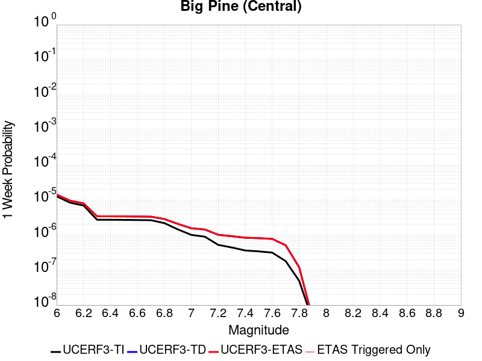 | 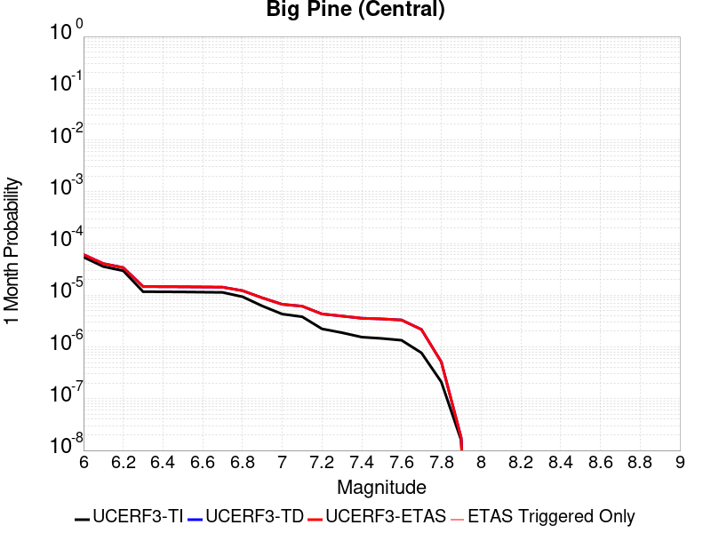 |  | 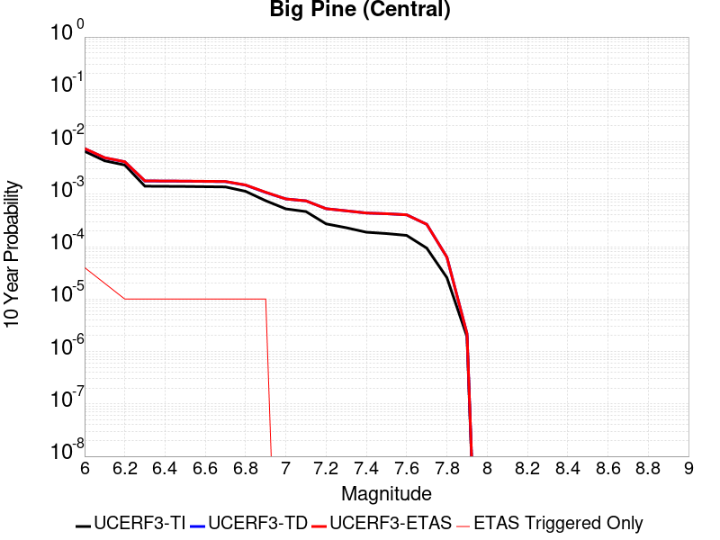 |

| Magnitude | 1 wk TI Prob | 1 wk TD Prob | 1 wk ETAS Prob | 1 wk ETAS/TD Gain | 1 wk ETAS Triggered Only | 1 mo TI Prob | 1 mo TD Prob | 1 mo ETAS Prob | 1 mo ETAS/TD Gain | 1 mo ETAS Triggered Only | 1 yr TI Prob | 1 yr TD Prob | 1 yr ETAS Prob | 1 yr ETAS/TD Gain | 1 yr ETAS Triggered Only | 10 yr TI Prob | 10 yr TD Prob | 10 yr ETAS Prob | 10 yr ETAS/TD Gain | 10 yr ETAS Triggered Only |
|-----|-----|-----|-----|-----|-----|-----|-----|-----|-----|-----|-----|-----|-----|-----|-----|-----|-----|-----|-----|-----|
| 6.0 | 1.2706755E-5 | 1.4251883E-5 | 1.4251883E-5 | 1.0 | 0.0 | 5.4456385E-5 | 6.107827E-5 | 6.107827E-5 | 1.0 | 0.0 | 6.628048E-4 | 7.4341084E-4 | 7.534034E-4 | 1.0134416 | 1.0E-5 | 0.006608314 | 0.0074142604 | 0.0074539636 | 1.005355 | 4.0E-5 |
| 6.1 | 8.342579E-6 | 9.511965E-6 | 9.511965E-6 | 1.0 | 0.0 | 3.5753423E-5 | 4.076505E-5 | 4.076505E-5 | 1.0 | 0.0 | 4.3521097E-4 | 4.9622316E-4 | 5.0621823E-4 | 1.0201422 | 1.0E-5 | 0.0043435963 | 0.004954699 | 0.0049746 | 1.0040165 | 2.0E-5 |
| 6.2 | 6.923899E-6 | 7.9683E-6 | 7.9683E-6 | 1.0 | 0.0 | 2.9673516E-5 | 3.414952E-5 | 3.414952E-5 | 1.0 | 0.0 | 3.6121515E-4 | 4.1571032E-4 | 4.1571032E-4 | 1.0 | 0.0 | 0.003606286 | 0.004152627 | 0.004162586 | 1.0023981 | 1.0E-5 |
| 6.3 | 2.728396E-6 | 3.425304E-6 | 3.425304E-6 | 1.0 | 0.0 | 1.1693074E-5 | 1.4679797E-5 | 1.4679797E-5 | 1.0 | 0.0 | 1.4235388E-4 | 1.7871274E-4 | 1.7871274E-4 | 1.0 | 0.0 | 0.0014226272 | 0.0017871896 | 0.0017971717 | 1.0055854 | 1.0E-5 |
| 6.4 | 2.7136944E-6 | 3.409597E-6 | 3.409597E-6 | 1.0 | 0.0 | 1.1630066E-5 | 1.4612482E-5 | 1.4612482E-5 | 1.0 | 0.0 | 1.4158686E-4 | 1.7789331E-4 | 1.7789331E-4 | 1.0 | 0.0 | 0.0014149669 | 0.0017790084 | 0.0017889907 | 1.0056111 | 1.0E-5 |
| 6.5 | 2.6971882E-6 | 3.3919416E-6 | 3.3919416E-6 | 1.0 | 0.0 | 1.1559327E-5 | 1.4536817E-5 | 1.4536817E-5 | 1.0 | 0.0 | 1.4072572E-4 | 1.7697224E-4 | 1.7697224E-4 | 1.0 | 0.0 | 0.0014063664 | 0.0017698124 | 0.0017797947 | 1.0056403 | 1.0E-5 |
| 6.6 | 2.669092E-6 | 3.3619613E-6 | 3.3619613E-6 | 1.0 | 0.0 | 1.1438916E-5 | 1.44083315E-5 | 1.44083315E-5 | 1.0 | 0.0 | 1.3925991E-4 | 1.7540817E-4 | 1.7540817E-4 | 1.0 | 0.0 | 0.0013917267 | 0.0017541966 | 0.001764179 | 1.0056906 | 1.0E-5 |
| 6.7 | 2.6408059E-6 | 3.3319864E-6 | 3.3319864E-6 | 1.0 | 0.0 | 1.1317691E-5 | 1.4279868E-5 | 1.4279868E-5 | 1.0 | 0.0 | 1.3778417E-4 | 1.738444E-4 | 1.738444E-4 | 1.0 | 0.0 | 0.0013769877 | 0.0017385832 | 0.0017485658 | 1.0057418 | 1.0E-5 |
| 6.8 | 2.1786943E-6 | 2.8554382E-6 | 2.8554382E-6 | 1.0 | 0.0 | 9.337228E-6 | 1.2237539E-5 | 1.2237539E-5 | 1.0 | 0.0 | 1.1367482E-4 | 1.4898258E-4 | 1.4898258E-4 | 1.0 | 0.0 | 0.0011361669 | 0.0014903127 | 0.0015002978 | 1.0067 | 1.0E-5 |
| 6.9 | 1.4411696E-6 | 2.06946E-6 | 2.06946E-6 | 1.0 | 0.0 | 6.1764263E-6 | 8.869086E-6 | 8.869086E-6 | 1.0 | 0.0 | 7.51954E-5 | 1.0797603E-4 | 1.0797603E-4 | 1.0 | 0.0 | 7.5169955E-4 | 0.0010806769 | 0.001090666 | 1.0092435 | 1.0E-5 |
| 7.0 | 1.0073411E-6 | 1.5551191E-6 | 1.5551191E-6 | 1.0 | 0.0 | 4.317169E-6 | 6.6647794E-6 | 6.6647794E-6 | 1.0 | 0.0 | 5.2560266E-5 | 8.1140824E-5 | 8.1140824E-5 | 1.0 | 0.0 | 5.2547833E-4 | 8.1254187E-4 | 8.1254187E-4 | 1.0 | 0.0 |
| 7.1 | 8.947104E-7 | 1.4310953E-6 | 1.4310953E-6 | 1.0 | 0.0 | 3.834468E-6 | 6.1332516E-6 | 6.1332516E-6 | 1.0 | 0.0 | 4.6683643E-5 | 7.466993E-5 | 7.466993E-5 | 1.0 | 0.0 | 4.6673836E-4 | 7.478781E-4 | 7.478781E-4 | 1.0 | 0.0 |
| 7.2 | 5.215166E-7 | 1.0119572E-6 | 1.0119572E-6 | 1.0 | 0.0 | 2.2350691E-6 | 4.3369523E-6 | 4.3369523E-6 | 1.0 | 0.0 | 2.7211627E-5 | 5.280116E-5 | 5.280116E-5 | 1.0 | 0.0 | 2.7208295E-4 | 5.2930566E-4 | 5.2930566E-4 | 1.0 | 0.0 |
| 7.3 | 4.4024807E-7 | 9.227248E-7 | 9.227248E-7 | 1.0 | 0.0 | 1.8867761E-6 | 3.9545293E-6 | 3.9545293E-6 | 1.0 | 0.0 | 2.2971257E-5 | 4.814537E-5 | 4.814537E-5 | 1.0 | 0.0 | 2.2968883E-4 | 4.8276875E-4 | 4.8276875E-4 | 1.0 | 0.0 |
| 7.4 | 3.6130905E-7 | 8.3659444E-7 | 8.3659444E-7 | 1.0 | 0.0 | 1.5484665E-6 | 3.5854E-6 | 3.5854E-6 | 1.0 | 0.0 | 1.8852415E-5 | 4.365141E-5 | 4.365141E-5 | 1.0 | 0.0 | 1.8850817E-4 | 4.3783817E-4 | 4.3783817E-4 | 1.0 | 0.0 |
| 7.5 | 3.408184E-7 | 8.1154064E-7 | 8.1154064E-7 | 1.0 | 0.0 | 1.4606494E-6 | 3.4780269E-6 | 3.4780269E-6 | 1.0 | 0.0 | 1.7783263E-5 | 4.2344192E-5 | 4.2344192E-5 | 1.0 | 0.0 | 1.778184E-4 | 4.2474963E-4 | 4.2474963E-4 | 1.0 | 0.0 |
| 7.6 | 3.1428627E-7 | 7.7386017E-7 | 7.7386017E-7 | 1.0 | 0.0 | 1.3469405E-6 | 3.3165397E-6 | 3.3165397E-6 | 1.0 | 0.0 | 1.6398877E-5 | 4.037816E-5 | 4.037816E-5 | 1.0 | 0.0 | 1.6397667E-4 | 4.050677E-4 | 4.050677E-4 | 1.0 | 0.0 |
| 7.7 | 1.7972785E-7 | 5.0831034E-7 | 5.0831034E-7 | 1.0 | 0.0 | 7.70262E-7 | 2.178471E-6 | 2.178471E-6 | 1.0 | 0.0 | 9.377899E-6 | 2.6522574E-5 | 2.6522574E-5 | 1.0 | 0.0 | 9.377503E-5 | 2.6656085E-4 | 2.6656085E-4 | 1.0 | 0.0 |
| 7.8 | 4.9230927E-8 | 1.1993416E-7 | 1.1993416E-7 | 1.0 | 0.0 | 2.1098968E-7 | 5.1400343E-7 | 5.1400343E-7 | 1.0 | 0.0 | 2.5687964E-6 | 6.2579757E-6 | 6.2579757E-6 | 1.0 | 0.0 | 2.5687666E-5 | 6.3018786E-5 | 6.3018786E-5 | 1.0 | 0.0 |
| 7.9 | 3.6805972E-9 | 4.1102663E-9 | 4.1102663E-9 | 1.0 | 0.0 | 1.5773987E-8 | 1.7615427E-8 | 1.7615427E-8 | 1.0 | 0.0 | 1.9204828E-7 | 2.1446782E-7 | 2.1446782E-7 | 1.0 | 0.0 | 1.920481E-6 | 2.1926676E-6 | 2.1926676E-6 | 1.0 | 0.0 |

## Oak Ridge (Onshore)
*[(top)](#table-of-contents)*

| 1 Week | 1 Month | 1 Year | 10 Year |
|-----|-----|-----|-----|
|  | 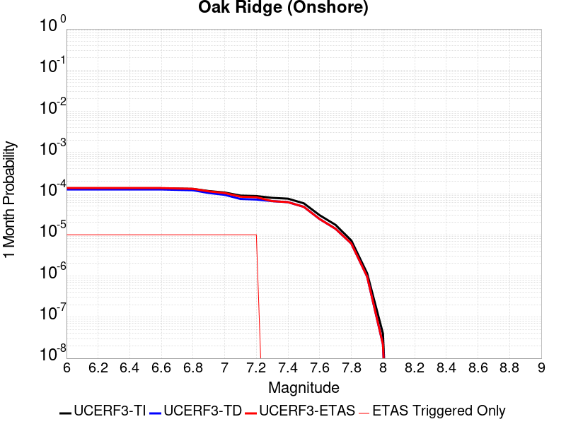 |  |  |

| Magnitude | 1 wk TI Prob | 1 wk TD Prob | 1 wk ETAS Prob | 1 wk ETAS/TD Gain | 1 wk ETAS Triggered Only | 1 mo TI Prob | 1 mo TD Prob | 1 mo ETAS Prob | 1 mo ETAS/TD Gain | 1 mo ETAS Triggered Only | 1 yr TI Prob | 1 yr TD Prob | 1 yr ETAS Prob | 1 yr ETAS/TD Gain | 1 yr ETAS Triggered Only | 10 yr TI Prob | 10 yr TD Prob | 10 yr ETAS Prob | 10 yr ETAS/TD Gain | 10 yr ETAS Triggered Only |
|-----|-----|-----|-----|-----|-----|-----|-----|-----|-----|-----|-----|-----|-----|-----|-----|-----|-----|-----|-----|-----|
| 6.0 | 3.155064E-5 | 2.9527526E-5 | 3.9527233E-5 | 1.338657 | 1.0E-5 | 1.3521002E-4 | 1.2654062E-4 | 1.3653935E-4 | 1.079016 | 1.0E-5 | 0.001644939 | 0.0015395813 | 0.0015495659 | 1.0064852 | 1.0E-5 | 0.01632816 | 0.015293657 | 0.0153133515 | 1.0012877 | 2.0E-5 |
| 6.1 | 3.155064E-5 | 2.9527526E-5 | 3.9527233E-5 | 1.338657 | 1.0E-5 | 1.3521002E-4 | 1.2654062E-4 | 1.3653935E-4 | 1.079016 | 1.0E-5 | 0.001644939 | 0.0015395813 | 0.0015495659 | 1.0064852 | 1.0E-5 | 0.01632816 | 0.015293657 | 0.0153133515 | 1.0012877 | 2.0E-5 |
| 6.2 | 3.155064E-5 | 2.9527526E-5 | 3.9527233E-5 | 1.338657 | 1.0E-5 | 1.3521002E-4 | 1.2654062E-4 | 1.3653935E-4 | 1.079016 | 1.0E-5 | 0.001644939 | 0.0015395813 | 0.0015495659 | 1.0064852 | 1.0E-5 | 0.01632816 | 0.015293657 | 0.0153133515 | 1.0012877 | 2.0E-5 |
| 6.3 | 3.155064E-5 | 2.9527526E-5 | 3.9527233E-5 | 1.338657 | 1.0E-5 | 1.3521002E-4 | 1.2654062E-4 | 1.3653935E-4 | 1.079016 | 1.0E-5 | 0.001644939 | 0.0015395813 | 0.0015495659 | 1.0064852 | 1.0E-5 | 0.01632816 | 0.015293657 | 0.0153133515 | 1.0012877 | 2.0E-5 |
| 6.4 | 3.155064E-5 | 2.9527526E-5 | 3.9527233E-5 | 1.338657 | 1.0E-5 | 1.3521002E-4 | 1.2654062E-4 | 1.3653935E-4 | 1.079016 | 1.0E-5 | 0.001644939 | 0.0015395813 | 0.0015495659 | 1.0064852 | 1.0E-5 | 0.01632816 | 0.015293657 | 0.0153133515 | 1.0012877 | 2.0E-5 |
| 6.5 | 3.155064E-5 | 2.9527526E-5 | 3.9527233E-5 | 1.338657 | 1.0E-5 | 1.3521002E-4 | 1.2654062E-4 | 1.3653935E-4 | 1.079016 | 1.0E-5 | 0.001644939 | 0.0015395813 | 0.0015495659 | 1.0064852 | 1.0E-5 | 0.01632816 | 0.015293657 | 0.0153133515 | 1.0012877 | 2.0E-5 |
| 6.6 | 3.155064E-5 | 2.9527526E-5 | 3.9527233E-5 | 1.338657 | 1.0E-5 | 1.3521002E-4 | 1.2654062E-4 | 1.3653935E-4 | 1.079016 | 1.0E-5 | 0.001644939 | 0.0015395813 | 0.0015495659 | 1.0064852 | 1.0E-5 | 0.01632816 | 0.015293657 | 0.0153133515 | 1.0012877 | 2.0E-5 |
| 6.7 | 3.098897E-5 | 2.8865683E-5 | 3.8865393E-5 | 1.3464221 | 1.0E-5 | 1.328031E-4 | 1.2370442E-4 | 1.3370319E-4 | 1.0808278 | 1.0E-5 | 0.0016156785 | 0.0015050984 | 0.0015150834 | 1.0066341 | 1.0E-5 | 0.016039822 | 0.014953489 | 0.014973191 | 1.0013175 | 2.0E-5 |
| 6.8 | 3.0449872E-5 | 2.8240844E-5 | 3.8240563E-5 | 1.3540871 | 1.0E-5 | 1.3049292E-4 | 1.2102679E-4 | 1.3102558E-4 | 1.0826163 | 1.0E-5 | 0.0015875935 | 0.0014725423 | 0.0014825276 | 1.006781 | 1.0E-5 | 0.015762992 | 0.014632219 | 0.014651926 | 1.0013468 | 2.0E-5 |
| 6.9 | 2.697928E-5 | 2.4221008E-5 | 3.4220768E-5 | 1.4128547 | 1.0E-5 | 1.15620365E-4 | 1.0380031E-4 | 1.1379927E-4 | 1.0963289 | 1.0E-5 | 0.0014067689 | 0.0012630577 | 0.0012730451 | 1.0079073 | 1.0E-5 | 0.0139789665 | 0.012561507 | 0.012581255 | 1.0015721 | 2.0E-5 |
| 7.0 | 2.4893961E-5 | 2.1863147E-5 | 3.1862928E-5 | 1.4573807 | 1.0E-5 | 1.0668404E-4 | 9.369594E-5 | 1.03695E-4 | 1.1067182 | 1.0E-5 | 0.0012981043 | 0.0011401688 | 0.0011501574 | 1.0087607 | 1.0E-5 | 0.012905477 | 0.011345476 | 0.011365249 | 1.0017428 | 2.0E-5 |
| 7.1 | 2.0945363E-5 | 1.735535E-5 | 2.7355176E-5 | 1.5761812 | 1.0E-5 | 8.976275E-5 | 7.437798E-5 | 8.4377236E-5 | 1.1344384 | 1.0E-5 | 0.0010923136 | 9.051804E-4 | 9.1517135E-4 | 1.0110375 | 1.0E-5 | 0.0108696 | 0.009015869 | 0.009035689 | 1.0021983 | 2.0E-5 |
| 7.2 | 2.0439404E-5 | 1.681026E-5 | 2.6810092E-5 | 1.5948648 | 1.0E-5 | 8.7594504E-5 | 7.204201E-5 | 8.204128E-5 | 1.1387979 | 1.0E-5 | 0.0010659413 | 8.7676314E-4 | 8.8675437E-4 | 1.0113956 | 1.0E-5 | 0.010608427 | 0.008733959 | 0.008753784 | 1.0022699 | 2.0E-5 |
| 7.3 | 1.8463334E-5 | 1.5382515E-5 | 1.5382515E-5 | 1.0 | 0.0 | 7.912617E-5 | 6.592342E-5 | 6.592342E-5 | 1.0 | 0.0 | 9.6293533E-4 | 8.023264E-4 | 8.023264E-4 | 1.0 | 0.0 | 0.009587734 | 0.007995161 | 0.008005082 | 1.0012407 | 1.0E-5 |
| 7.4 | 1.763139E-5 | 1.4517404E-5 | 1.4517404E-5 | 1.0 | 0.0 | 7.556091E-5 | 6.2215986E-5 | 6.2215986E-5 | 1.0 | 0.0 | 9.1956573E-4 | 7.572203E-4 | 7.572203E-4 | 1.0 | 0.0 | 0.009157699 | 0.007547206 | 0.0075571304 | 1.001315 | 1.0E-5 |
| 7.5 | 1.3594944E-5 | 1.1163711E-5 | 1.1163711E-5 | 1.0 | 0.0 | 5.8262744E-5 | 4.7843612E-5 | 4.7843612E-5 | 1.0 | 0.0 | 7.0911803E-4 | 5.8234285E-4 | 5.8234285E-4 | 1.0 | 0.0 | 0.007068595 | 0.0058084396 | 0.0058183814 | 1.0017116 | 1.0E-5 |
| 7.6 | 6.9889534E-6 | 5.636862E-6 | 5.636862E-6 | 1.0 | 0.0 | 2.9952313E-5 | 2.415776E-5 | 2.415776E-5 | 1.0 | 0.0 | 3.646084E-4 | 2.9408143E-4 | 2.9408143E-4 | 1.0 | 0.0 | 0.0036401073 | 0.0029369667 | 0.0029469375 | 1.0033948 | 1.0E-5 |
| 7.7 | 4.0824193E-6 | 3.283342E-6 | 3.283342E-6 | 1.0 | 0.0 | 1.7495966E-5 | 1.407139E-5 | 1.407139E-5 | 1.0 | 0.0 | 2.1299256E-4 | 1.7130584E-4 | 1.7130584E-4 | 1.0 | 0.0 | 0.0021278851 | 0.0017117513 | 0.0017217342 | 1.005832 | 1.0E-5 |
| 7.8 | 1.7023609E-6 | 1.4370794E-6 | 1.4370794E-6 | 1.0 | 0.0 | 7.295812E-6 | 6.158897E-6 | 6.158897E-6 | 1.0 | 0.0 | 8.882289E-5 | 7.4982025E-5 | 7.4982025E-5 | 1.0 | 0.0 | 8.8787393E-4 | 7.4957E-4 | 7.5956254E-4 | 1.0133309 | 1.0E-5 |
| 7.9 | 2.721225E-7 | 2.2617105E-7 | 2.2617105E-7 | 1.0 | 0.0 | 1.1662388E-6 | 9.693042E-7 | 9.693042E-7 | 1.0 | 0.0 | 1.4198865E-5 | 1.1801218E-5 | 1.1801218E-5 | 1.0 | 0.0 | 1.4197957E-4 | 1.1800619E-4 | 1.1800619E-4 | 1.0 | 0.0 |
| 8.0 | 9.364255E-9 | 5.1213855E-9 | 5.1213855E-9 | 1.0 | 0.0 | 4.0132523E-8 | 2.1948797E-8 | 2.1948797E-8 | 1.0 | 0.0 | 4.8861335E-7 | 2.6722657E-7 | 2.6722657E-7 | 1.0 | 0.0 | 4.8861225E-6 | 2.6722628E-6 | 2.6722628E-6 | 1.0 | 0.0 |

## Ortigalita (North)
*[(top)](#table-of-contents)*

| 1 Week | 1 Month | 1 Year | 10 Year |
|-----|-----|-----|-----|
|  |  |  |  |

| Magnitude | 1 wk TI Prob | 1 wk TD Prob | 1 wk ETAS Prob | 1 wk ETAS/TD Gain | 1 wk ETAS Triggered Only | 1 mo TI Prob | 1 mo TD Prob | 1 mo ETAS Prob | 1 mo ETAS/TD Gain | 1 mo ETAS Triggered Only | 1 yr TI Prob | 1 yr TD Prob | 1 yr ETAS Prob | 1 yr ETAS/TD Gain | 1 yr ETAS Triggered Only | 10 yr TI Prob | 10 yr TD Prob | 10 yr ETAS Prob | 10 yr ETAS/TD Gain | 10 yr ETAS Triggered Only |
|-----|-----|-----|-----|-----|-----|-----|-----|-----|-----|-----|-----|-----|-----|-----|-----|-----|-----|-----|-----|-----|
| 6.0 | 7.711876E-5 | 1.0507971E-4 | 1.0507971E-4 | 1.0 | 0.0 | 3.3046713E-4 | 4.5027473E-4 | 4.6027024E-4 | 1.0221987 | 1.0E-5 | 0.004016016 | 0.0054687066 | 0.0054985425 | 1.0054557 | 3.0E-5 | 0.039442103 | 0.053461075 | 0.053498935 | 1.0007082 | 4.0E-5 |
| 6.1 | 4.607858E-5 | 6.0246308E-5 | 6.0246308E-5 | 1.0 | 0.0 | 1.9746469E-4 | 2.581757E-4 | 2.681731E-4 | 1.0387233 | 1.0E-5 | 0.0024014818 | 0.0031391045 | 0.0031490729 | 1.0031756 | 1.0E-5 | 0.023756953 | 0.030978423 | 0.030997803 | 1.0006256 | 2.0E-5 |
| 6.2 | 4.607858E-5 | 6.0246308E-5 | 6.0246308E-5 | 1.0 | 0.0 | 1.9746469E-4 | 2.581757E-4 | 2.681731E-4 | 1.0387233 | 1.0E-5 | 0.0024014818 | 0.0031391045 | 0.0031490729 | 1.0031756 | 1.0E-5 | 0.023756953 | 0.030978423 | 0.030997803 | 1.0006256 | 2.0E-5 |
| 6.3 | 3.327423E-5 | 4.2479634E-5 | 4.2479634E-5 | 1.0 | 0.0 | 1.4259605E-4 | 1.8204462E-4 | 1.8204462E-4 | 1.0 | 0.0 | 0.0017347244 | 0.0022144287 | 0.0022144287 | 1.0 | 0.0 | 0.017212452 | 0.021947866 | 0.021947866 | 1.0 | 0.0 |
| 6.4 | 2.7732503E-5 | 3.5002122E-5 | 3.5002122E-5 | 1.0 | 0.0 | 1.1884817E-4 | 1.5000197E-4 | 1.5000197E-4 | 1.0 | 0.0 | 0.001446016 | 0.0018249901 | 0.0018249901 | 1.0 | 0.0 | 0.014366428 | 0.018122995 | 0.018122995 | 1.0 | 0.0 |
| 6.5 | 2.7689714E-5 | 3.4951932E-5 | 3.4951932E-5 | 1.0 | 0.0 | 1.186648E-4 | 1.4978691E-4 | 1.4978691E-4 | 1.0 | 0.0 | 0.0014437864 | 0.001822376 | 0.001822376 | 1.0 | 0.0 | 0.014344421 | 0.01809728 | 0.01809728 | 1.0 | 0.0 |
| 6.6 | 2.2976905E-5 | 2.8721039E-5 | 2.8721039E-5 | 1.0 | 0.0 | 9.846873E-5 | 1.2308579E-4 | 1.2308579E-4 | 1.0 | 0.0 | 0.0011981975 | 0.0014977782 | 0.0014977782 | 1.0 | 0.0 | 0.011917574 | 0.014900108 | 0.014900108 | 1.0 | 0.0 |
| 6.7 | 1.9871539E-5 | 2.4906842E-5 | 2.4906842E-5 | 1.0 | 0.0 | 8.516096E-5 | 1.0674064E-4 | 1.0674064E-4 | 1.0 | 0.0 | 0.0010363415 | 0.0012990412 | 0.0012990412 | 1.0 | 0.0 | 0.010315218 | 0.012938168 | 0.012938168 | 1.0 | 0.0 |
| 6.8 | 6.5640475E-6 | 7.6059414E-6 | 7.6059414E-6 | 1.0 | 0.0 | 2.813133E-5 | 3.25965E-5 | 3.25965E-5 | 1.0 | 0.0 | 3.424451E-4 | 3.9679298E-4 | 3.9679298E-4 | 1.0 | 0.0 | 0.0034191788 | 0.0039611324 | 0.0039611324 | 1.0 | 0.0 |
| 6.9 | 5.6219683E-6 | 6.5022164E-6 | 6.5022164E-6 | 1.0 | 0.0 | 2.4093928E-5 | 2.7866357E-5 | 2.7866357E-5 | 1.0 | 0.0 | 2.933041E-4 | 3.3922266E-4 | 3.3922266E-4 | 1.0 | 0.0 | 0.0029291727 | 0.0033873057 | 0.0033873057 | 1.0 | 0.0 |
| 7.0 | 3.875591E-6 | 4.485017E-6 | 4.485017E-6 | 1.0 | 0.0 | 1.6609569E-5 | 1.9221372E-5 | 1.9221372E-5 | 1.0 | 0.0 | 2.0220275E-4 | 2.3399718E-4 | 2.3399718E-4 | 1.0 | 0.0 | 0.0020201886 | 0.0023377163 | 0.0023377163 | 1.0 | 0.0 |
| 7.1 | 1.6017933E-6 | 1.8571518E-6 | 1.8571518E-6 | 1.0 | 0.0 | 6.8648105E-6 | 7.959204E-6 | 7.959204E-6 | 1.0 | 0.0 | 8.357586E-5 | 9.690007E-5 | 9.690007E-5 | 1.0 | 0.0 | 8.3544437E-4 | 9.686828E-4 | 9.686828E-4 | 1.0 | 0.0 |

## Dry Mountain
*[(top)](#table-of-contents)*

| 1 Week | 1 Month | 1 Year | 10 Year |
|-----|-----|-----|-----|
|  |  | 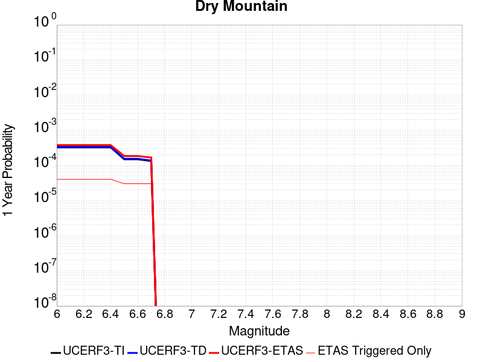 | 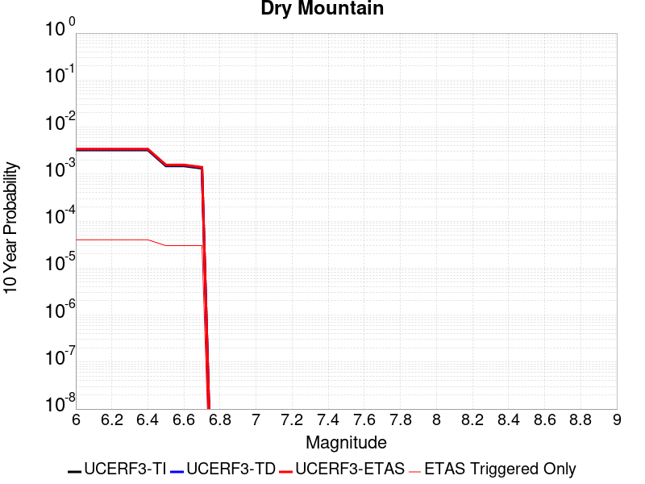 |

| Magnitude | 1 wk TI Prob | 1 wk TD Prob | 1 wk ETAS Prob | 1 wk ETAS/TD Gain | 1 wk ETAS Triggered Only | 1 mo TI Prob | 1 mo TD Prob | 1 mo ETAS Prob | 1 mo ETAS/TD Gain | 1 mo ETAS Triggered Only | 1 yr TI Prob | 1 yr TD Prob | 1 yr ETAS Prob | 1 yr ETAS/TD Gain | 1 yr ETAS Triggered Only | 10 yr TI Prob | 10 yr TD Prob | 10 yr ETAS Prob | 10 yr ETAS/TD Gain | 10 yr ETAS Triggered Only |
|-----|-----|-----|-----|-----|-----|-----|-----|-----|-----|-----|-----|-----|-----|-----|-----|-----|-----|-----|-----|-----|
| 6.0 | 6.222801E-6 | 6.4394644E-6 | 1.64394E-5 | 2.5529141 | 1.0E-5 | 2.6668875E-5 | 2.7597504E-5 | 4.759695E-5 | 1.7246833 | 2.0E-5 | 3.2464517E-4 | 3.359637E-4 | 3.7595027E-4 | 1.1190205 | 4.0E-5 | 0.0032417132 | 0.00335612 | 0.003395986 | 1.0118785 | 4.0E-5 |
| 6.1 | 6.222801E-6 | 6.4394644E-6 | 1.64394E-5 | 2.5529141 | 1.0E-5 | 2.6668875E-5 | 2.7597504E-5 | 4.759695E-5 | 1.7246833 | 2.0E-5 | 3.2464517E-4 | 3.359637E-4 | 3.7595027E-4 | 1.1190205 | 4.0E-5 | 0.0032417132 | 0.00335612 | 0.003395986 | 1.0118785 | 4.0E-5 |
| 6.2 | 6.222801E-6 | 6.4394644E-6 | 1.64394E-5 | 2.5529141 | 1.0E-5 | 2.6668875E-5 | 2.7597504E-5 | 4.759695E-5 | 1.7246833 | 2.0E-5 | 3.2464517E-4 | 3.359637E-4 | 3.7595027E-4 | 1.1190205 | 4.0E-5 | 0.0032417132 | 0.00335612 | 0.003395986 | 1.0118785 | 4.0E-5 |
| 6.3 | 6.222801E-6 | 6.4394644E-6 | 1.64394E-5 | 2.5529141 | 1.0E-5 | 2.6668875E-5 | 2.7597504E-5 | 4.759695E-5 | 1.7246833 | 2.0E-5 | 3.2464517E-4 | 3.359637E-4 | 3.7595027E-4 | 1.1190205 | 4.0E-5 | 0.0032417132 | 0.00335612 | 0.003395986 | 1.0118785 | 4.0E-5 |
| 6.4 | 6.222801E-6 | 6.4394644E-6 | 1.64394E-5 | 2.5529141 | 1.0E-5 | 2.6668875E-5 | 2.7597504E-5 | 4.759695E-5 | 1.7246833 | 2.0E-5 | 3.2464517E-4 | 3.359637E-4 | 3.7595027E-4 | 1.1190205 | 4.0E-5 | 0.0032417132 | 0.00335612 | 0.003395986 | 1.0118785 | 4.0E-5 |
| 6.5 | 2.8528623E-6 | 2.9522066E-6 | 2.9522066E-6 | 1.0 | 0.0 | 1.22264955E-5 | 1.2652302E-5 | 2.2652175E-5 | 1.7903601 | 1.0E-5 | 1.4884741E-4 | 1.5403959E-4 | 1.8403496E-4 | 1.1947252 | 3.0E-5 | 0.0014874774 | 0.0015401816 | 0.0015701354 | 1.0194483 | 3.0E-5 |
| 6.6 | 2.8528623E-6 | 2.9522066E-6 | 2.9522066E-6 | 1.0 | 0.0 | 1.22264955E-5 | 1.2652302E-5 | 2.2652175E-5 | 1.7903601 | 1.0E-5 | 1.4884741E-4 | 1.5403959E-4 | 1.8403496E-4 | 1.1947252 | 3.0E-5 | 0.0014874774 | 0.0015401816 | 0.0015701354 | 1.0194483 | 3.0E-5 |
| 6.7 | 2.541E-6 | 2.629392E-6 | 2.629392E-6 | 1.0 | 0.0 | 1.0889954E-5 | 1.1268822E-5 | 2.126871E-5 | 1.8873942 | 1.0E-5 | 1.3257713E-4 | 1.3719792E-4 | 1.671938E-4 | 1.2186322 | 3.0E-5 | 0.0013249806 | 0.0013719791 | 0.0014019379 | 1.0218363 | 3.0E-5 |

## Whittier alt 1
*[(top)](#table-of-contents)*

| 1 Week | 1 Month | 1 Year | 10 Year |
|-----|-----|-----|-----|
| 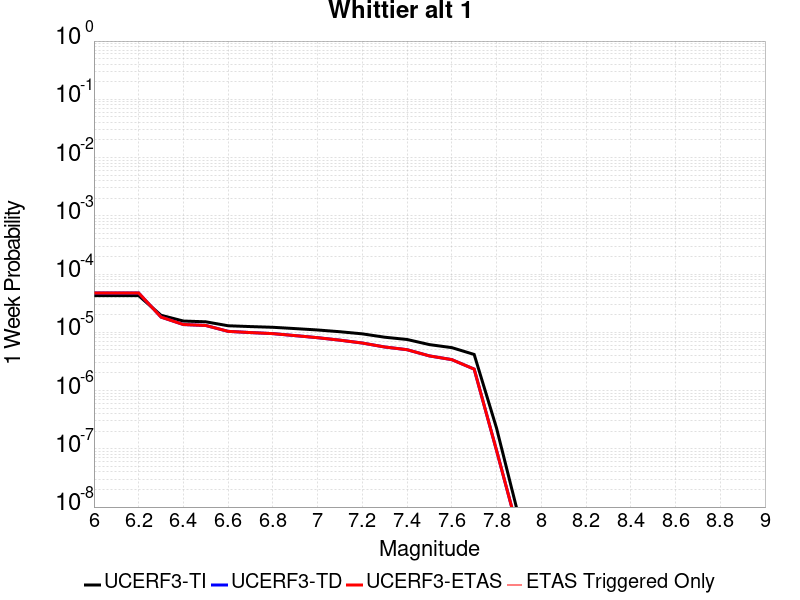 |  | 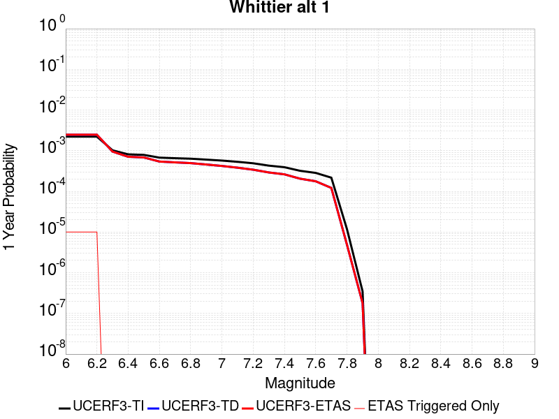 |  |

| Magnitude | 1 wk TI Prob | 1 wk TD Prob | 1 wk ETAS Prob | 1 wk ETAS/TD Gain | 1 wk ETAS Triggered Only | 1 mo TI Prob | 1 mo TD Prob | 1 mo ETAS Prob | 1 mo ETAS/TD Gain | 1 mo ETAS Triggered Only | 1 yr TI Prob | 1 yr TD Prob | 1 yr ETAS Prob | 1 yr ETAS/TD Gain | 1 yr ETAS Triggered Only | 10 yr TI Prob | 10 yr TD Prob | 10 yr ETAS Prob | 10 yr ETAS/TD Gain | 10 yr ETAS Triggered Only |
|-----|-----|-----|-----|-----|-----|-----|-----|-----|-----|-----|-----|-----|-----|-----|-----|-----|-----|-----|-----|-----|
| 6.0 | 4.2554693E-5 | 4.7255566E-5 | 4.7255566E-5 | 1.0 | 0.0 | 1.8236451E-4 | 2.0250995E-4 | 2.0250995E-4 | 1.0 | 0.0 | 0.002218027 | 0.0024630916 | 0.002473067 | 1.0040499 | 1.0E-5 | 0.02196019 | 0.02439196 | 0.024430985 | 1.0015999 | 4.0E-5 |
| 6.1 | 4.2554693E-5 | 4.7255566E-5 | 4.7255566E-5 | 1.0 | 0.0 | 1.8236451E-4 | 2.0250995E-4 | 2.0250995E-4 | 1.0 | 0.0 | 0.002218027 | 0.0024630916 | 0.002473067 | 1.0040499 | 1.0E-5 | 0.02196019 | 0.02439196 | 0.024430985 | 1.0015999 | 4.0E-5 |
| 6.2 | 4.2554693E-5 | 4.7255566E-5 | 4.7255566E-5 | 1.0 | 0.0 | 1.8236451E-4 | 2.0250995E-4 | 2.0250995E-4 | 1.0 | 0.0 | 0.002218027 | 0.0024630916 | 0.002473067 | 1.0040499 | 1.0E-5 | 0.02196019 | 0.02439196 | 0.024430985 | 1.0015999 | 4.0E-5 |
| 6.3 | 1.9617712E-5 | 1.8270406E-5 | 1.8270406E-5 | 1.0 | 0.0 | 8.40732E-5 | 7.82995E-5 | 7.82995E-5 | 1.0 | 0.0 | 0.0010231105 | 9.528985E-4 | 9.528985E-4 | 1.0 | 0.0 | 0.01018413 | 0.00949141 | 0.00951122 | 1.0020871 | 2.0E-5 |
| 6.4 | 1.5611336E-5 | 1.3605806E-5 | 1.3605806E-5 | 1.0 | 0.0 | 6.690401E-5 | 5.8309328E-5 | 5.8309328E-5 | 1.0 | 0.0 | 8.142519E-4 | 7.0969085E-4 | 7.0969085E-4 | 1.0 | 0.0 | 0.008112748 | 0.0070762085 | 0.007096067 | 1.0028064 | 2.0E-5 |
| 6.5 | 1.5150166E-5 | 1.3102443E-5 | 1.3102443E-5 | 1.0 | 0.0 | 6.492767E-5 | 5.6152152E-5 | 5.6152152E-5 | 1.0 | 0.0 | 7.9020765E-4 | 6.834439E-4 | 6.834439E-4 | 1.0 | 0.0 | 0.007874036 | 0.0068153697 | 0.0068352334 | 1.0029145 | 2.0E-5 |
| 6.6 | 1.295588E-5 | 1.0381985E-5 | 1.0381985E-5 | 1.0 | 0.0 | 5.552402E-5 | 4.449347E-5 | 4.449347E-5 | 1.0 | 0.0 | 6.7579525E-4 | 5.415753E-4 | 5.415753E-4 | 1.0 | 0.0 | 0.006737438 | 0.005403989 | 0.0054238806 | 1.003681 | 2.0E-5 |
| 6.7 | 1.2542085E-5 | 9.900597E-6 | 9.900597E-6 | 1.0 | 0.0 | 5.3750682E-5 | 4.2430453E-5 | 4.2430453E-5 | 1.0 | 0.0 | 6.542181E-4 | 5.164702E-4 | 5.164702E-4 | 1.0 | 0.0 | 0.006522954 | 0.0051541165 | 0.005174014 | 1.0038604 | 2.0E-5 |
| 6.8 | 1.2195878E-5 | 9.496602E-6 | 9.496602E-6 | 1.0 | 0.0 | 5.2267E-5 | 4.0699095E-5 | 4.0699095E-5 | 1.0 | 0.0 | 6.36165E-4 | 4.954007E-4 | 4.954007E-4 | 1.0 | 0.0 | 0.0063434686 | 0.0049443045 | 0.0049642054 | 1.0040251 | 2.0E-5 |
| 6.9 | 1.1580298E-5 | 8.774055E-6 | 8.774055E-6 | 1.0 | 0.0 | 4.9628903E-5 | 3.760256E-5 | 3.760256E-5 | 1.0 | 0.0 | 6.040644E-4 | 4.5771664E-4 | 4.5771664E-4 | 1.0 | 0.0 | 0.00602425 | 0.0045689982 | 0.004588907 | 1.0043573 | 2.0E-5 |
| 7.0 | 1.0964795E-5 | 8.08506E-6 | 8.08506E-6 | 1.0 | 0.0 | 4.6991136E-5 | 3.46498E-5 | 3.46498E-5 | 1.0 | 0.0 | 5.7196687E-4 | 4.217812E-4 | 4.217812E-4 | 1.0 | 0.0 | 0.0057049696 | 0.004211015 | 0.004230931 | 1.0047294 | 2.0E-5 |
| 7.1 | 1.0230601E-5 | 7.327553E-6 | 7.327553E-6 | 1.0 | 0.0 | 4.3844695E-5 | 3.1403426E-5 | 3.1403426E-5 | 1.0 | 0.0 | 5.336784E-4 | 3.8227096E-4 | 3.8227096E-4 | 1.0 | 0.0 | 0.005323986 | 0.0038172973 | 0.0038372208 | 1.0052193 | 2.0E-5 |
| 7.2 | 9.40865E-6 | 6.5440786E-6 | 6.5440786E-6 | 1.0 | 0.0 | 4.032216E-5 | 2.8045757E-5 | 2.8045757E-5 | 1.0 | 0.0 | 4.908117E-4 | 3.414048E-4 | 3.414048E-4 | 1.0 | 0.0 | 0.0048972913 | 0.0034098956 | 0.0034198617 | 1.0029227 | 1.0E-5 |
| 7.3 | 8.237384E-6 | 5.598426E-6 | 5.598426E-6 | 1.0 | 0.0 | 3.5302593E-5 | 2.399304E-5 | 2.399304E-5 | 1.0 | 0.0 | 4.2972428E-4 | 2.9207714E-4 | 2.9207714E-4 | 1.0 | 0.0 | 0.0042889426 | 0.0029172536 | 0.0029272244 | 1.0034178 | 1.0E-5 |
| 7.4 | 7.5316966E-6 | 5.028428E-6 | 5.028428E-6 | 1.0 | 0.0 | 3.2278298E-5 | 2.1550233E-5 | 2.1550233E-5 | 1.0 | 0.0 | 3.9291743E-4 | 2.6234353E-4 | 2.6234353E-4 | 1.0 | 0.0 | 0.0039222343 | 0.00262045 | 0.002630424 | 1.0038061 | 1.0E-5 |
| 7.5 | 6.149649E-6 | 3.934318E-6 | 3.934318E-6 | 1.0 | 0.0 | 2.6355372E-5 | 1.686126E-5 | 1.686126E-5 | 1.0 | 0.0 | 3.208294E-4 | 2.0526741E-4 | 2.0526741E-4 | 1.0 | 0.0 | 0.003203666 | 0.0020508673 | 0.0020508673 | 1.0 | 0.0 |
| 7.6 | 5.457711E-6 | 3.395795E-6 | 3.395795E-6 | 1.0 | 0.0 | 2.338998E-5 | 1.455333E-5 | 1.455333E-5 | 1.0 | 0.0 | 2.8473578E-4 | 1.771732E-4 | 1.771732E-4 | 1.0 | 0.0 | 0.0028437122 | 0.0017704003 | 0.0017704003 | 1.0 | 0.0 |
| 7.7 | 4.1676276E-6 | 2.3335126E-6 | 2.3335126E-6 | 1.0 | 0.0 | 1.7861139E-5 | 1.0000734E-5 | 1.0000734E-5 | 1.0 | 0.0 | 2.1743766E-4 | 1.2175288E-4 | 1.2175288E-4 | 1.0 | 0.0 | 0.0021722503 | 0.0012169348 | 0.0012169348 | 1.0 | 0.0 |
| 7.8 | 2.2692414E-7 | 9.386795E-8 | 9.386795E-8 | 1.0 | 0.0 | 9.725317E-7 | 4.0229116E-7 | 4.0229116E-7 | 1.0 | 0.0 | 1.1840509E-5 | 4.8978873E-6 | 4.8978873E-6 | 1.0 | 0.0 | 1.1839878E-4 | 4.897812E-5 | 4.897812E-5 | 1.0 | 0.0 |
| 7.9 | 6.676829E-9 | 3.440201E-9 | 3.440201E-9 | 1.0 | 0.0 | 2.861498E-8 | 1.4743717E-8 | 1.4743717E-8 | 1.0 | 0.0 | 3.4838732E-7 | 1.7950475E-7 | 1.7950475E-7 | 1.0 | 0.0 | 3.4838679E-6 | 1.7950462E-6 | 1.7950462E-6 | 1.0 | 0.0 |

## Pisgah-Bullion Mtn-Mesquite Lk
*[(top)](#table-of-contents)*

| 1 Week | 1 Month | 1 Year | 10 Year |
|-----|-----|-----|-----|
|  | 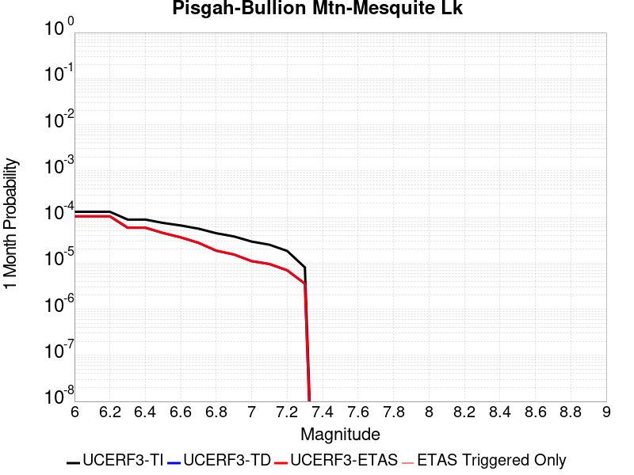 |  |  |

| Magnitude | 1 wk TI Prob | 1 wk TD Prob | 1 wk ETAS Prob | 1 wk ETAS/TD Gain | 1 wk ETAS Triggered Only | 1 mo TI Prob | 1 mo TD Prob | 1 mo ETAS Prob | 1 mo ETAS/TD Gain | 1 mo ETAS Triggered Only | 1 yr TI Prob | 1 yr TD Prob | 1 yr ETAS Prob | 1 yr ETAS/TD Gain | 1 yr ETAS Triggered Only | 10 yr TI Prob | 10 yr TD Prob | 10 yr ETAS Prob | 10 yr ETAS/TD Gain | 10 yr ETAS Triggered Only |
|-----|-----|-----|-----|-----|-----|-----|-----|-----|-----|-----|-----|-----|-----|-----|-----|-----|-----|-----|-----|-----|
| 6.0 | 3.0240792E-5 | 2.4092184E-5 | 2.4092184E-5 | 1.0 | 0.0 | 1.2959696E-4 | 1.032487E-4 | 1.032487E-4 | 1.0 | 0.0 | 0.0015767008 | 0.0012564284 | 0.0012664158 | 1.0079491 | 1.0E-5 | 0.015655609 | 0.012503273 | 0.012542773 | 1.0031592 | 4.0E-5 |
| 6.1 | 3.0240792E-5 | 2.4092184E-5 | 2.4092184E-5 | 1.0 | 0.0 | 1.2959696E-4 | 1.032487E-4 | 1.032487E-4 | 1.0 | 0.0 | 0.0015767008 | 0.0012564284 | 0.0012664158 | 1.0079491 | 1.0E-5 | 0.015655609 | 0.012503273 | 0.012542773 | 1.0031592 | 4.0E-5 |
| 6.2 | 3.0240792E-5 | 2.4092184E-5 | 2.4092184E-5 | 1.0 | 0.0 | 1.2959696E-4 | 1.032487E-4 | 1.032487E-4 | 1.0 | 0.0 | 0.0015767008 | 0.0012564284 | 0.0012664158 | 1.0079491 | 1.0E-5 | 0.015655609 | 0.012503273 | 0.012542773 | 1.0031592 | 4.0E-5 |
| 6.3 | 2.0498217E-5 | 1.3638587E-5 | 1.3638587E-5 | 1.0 | 0.0 | 8.784654E-5 | 5.844987E-5 | 5.844987E-5 | 1.0 | 0.0 | 0.0010690069 | 7.11411E-4 | 7.11411E-4 | 1.0 | 0.0 | 0.01063879 | 0.007092963 | 0.007112821 | 1.0027997 | 2.0E-5 |
| 6.4 | 2.0498217E-5 | 1.3638587E-5 | 1.3638587E-5 | 1.0 | 0.0 | 8.784654E-5 | 5.844987E-5 | 5.844987E-5 | 1.0 | 0.0 | 0.0010690069 | 7.11411E-4 | 7.11411E-4 | 1.0 | 0.0 | 0.01063879 | 0.007092963 | 0.007112821 | 1.0027997 | 2.0E-5 |
| 6.5 | 1.7316182E-5 | 1.0477421E-5 | 1.0477421E-5 | 1.0 | 0.0 | 7.42101E-5 | 4.4902514E-5 | 4.4902514E-5 | 1.0 | 0.0 | 9.0313336E-4 | 5.46561E-4 | 5.46561E-4 | 1.0 | 0.0 | 0.008994718 | 0.0054531633 | 0.0054631084 | 1.0018238 | 1.0E-5 |
| 6.6 | 1.5251077E-5 | 8.414566E-6 | 8.414566E-6 | 1.0 | 0.0 | 6.536012E-5 | 3.606197E-5 | 3.606197E-5 | 1.0 | 0.0 | 7.9546886E-4 | 4.3897325E-4 | 4.3897325E-4 | 1.0 | 0.0 | 0.007926274 | 0.0043817786 | 0.004391735 | 1.0022721 | 1.0E-5 |
| 6.7 | 1.2997425E-5 | 6.411711E-6 | 6.411711E-6 | 1.0 | 0.0 | 5.570206E-5 | 2.74785E-5 | 2.74785E-5 | 1.0 | 0.0 | 6.7796157E-4 | 3.3450403E-4 | 3.3450403E-4 | 1.0 | 0.0 | 0.0067589693 | 0.0033404655 | 0.0033404655 | 1.0 | 0.0 |
| 6.8 | 1.035386E-5 | 4.333397E-6 | 4.333397E-6 | 1.0 | 0.0 | 4.437293E-5 | 1.8571576E-5 | 1.8571576E-5 | 1.0 | 0.0 | 5.401065E-4 | 2.2608634E-4 | 2.2608634E-4 | 1.0 | 0.0 | 0.0053879567 | 0.00225865 | 0.00225865 | 1.0 | 0.0 |
| 6.9 | 8.816252E-6 | 3.5807898E-6 | 3.5807898E-6 | 1.0 | 0.0 | 3.778339E-5 | 1.5346155E-5 | 1.5346155E-5 | 1.0 | 0.0 | 4.5991567E-4 | 1.86824E-4 | 1.86824E-4 | 1.0 | 0.0 | 0.00458965 | 0.001866728 | 0.001866728 | 1.0 | 0.0 |
| 7.0 | 6.8232207E-6 | 2.5677002E-6 | 2.5677002E-6 | 1.0 | 0.0 | 2.9242048E-5 | 1.1004385E-5 | 1.1004385E-5 | 1.0 | 0.0 | 3.5596377E-4 | 1.3397046E-4 | 1.3397046E-4 | 1.0 | 0.0 | 0.0035539411 | 0.001338928 | 0.001338928 | 1.0 | 0.0 |
| 7.1 | 5.837013E-6 | 2.2274799E-6 | 2.2274799E-6 | 1.0 | 0.0 | 2.501553E-5 | 9.546308E-6 | 9.546308E-6 | 1.0 | 0.0 | 3.045215E-4 | 1.16220406E-4 | 1.16220406E-4 | 1.0 | 0.0 | 0.0030410455 | 0.0011616253 | 0.0011616253 | 1.0 | 0.0 |
| 7.2 | 4.278052E-6 | 1.6276423E-6 | 1.6276423E-6 | 1.0 | 0.0 | 1.833438E-5 | 6.9755924E-6 | 6.9755924E-6 | 1.0 | 0.0 | 2.231982E-4 | 8.4924766E-5 | 8.4924766E-5 | 1.0 | 0.0 | 0.0022297418 | 8.4894634E-4 | 8.4894634E-4 | 1.0 | 0.0 |
| 7.3 | 1.8803692E-6 | 8.3452414E-7 | 8.3452414E-7 | 1.0 | 0.0 | 8.0587E-6 | 3.5765281E-6 | 3.5765281E-6 | 1.0 | 0.0 | 9.811026E-5 | 4.3543507E-5 | 4.3543507E-5 | 1.0 | 0.0 | 9.806695E-4 | 4.353642E-4 | 4.353642E-4 | 1.0 | 0.0 |

## Channel Islands Thrust
*[(top)](#table-of-contents)*

| 1 Week | 1 Month | 1 Year | 10 Year |
|-----|-----|-----|-----|
| 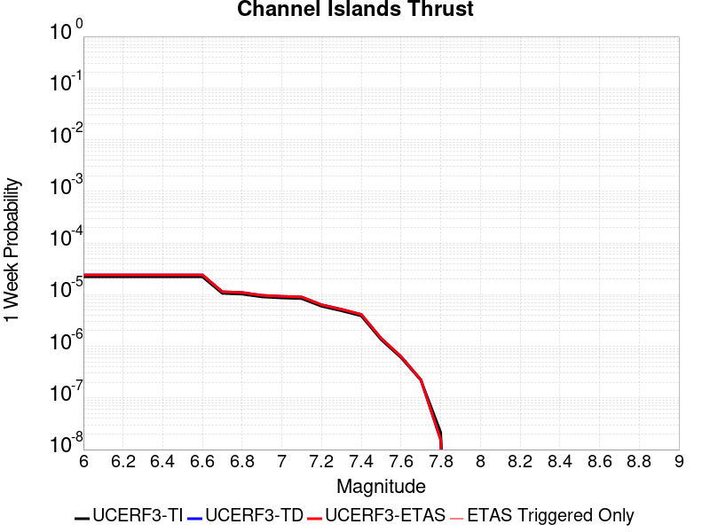 |  | 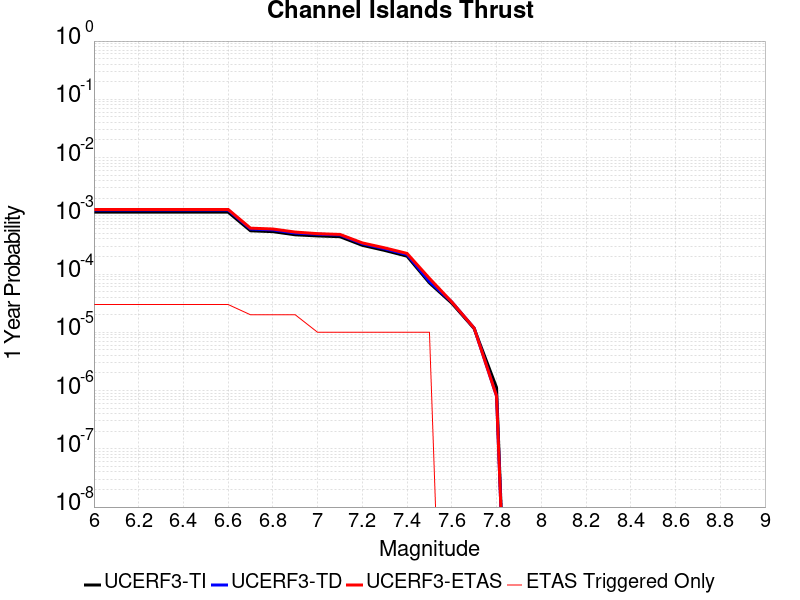 | 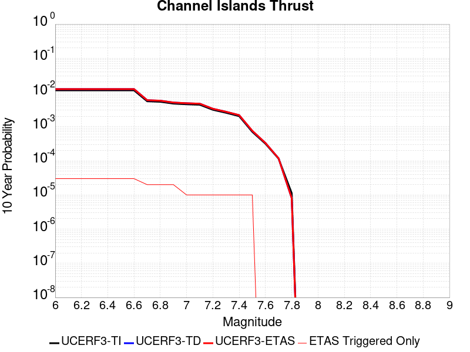 |

| Magnitude | 1 wk TI Prob | 1 wk TD Prob | 1 wk ETAS Prob | 1 wk ETAS/TD Gain | 1 wk ETAS Triggered Only | 1 mo TI Prob | 1 mo TD Prob | 1 mo ETAS Prob | 1 mo ETAS/TD Gain | 1 mo ETAS Triggered Only | 1 yr TI Prob | 1 yr TD Prob | 1 yr ETAS Prob | 1 yr ETAS/TD Gain | 1 yr ETAS Triggered Only | 10 yr TI Prob | 10 yr TD Prob | 10 yr ETAS Prob | 10 yr ETAS/TD Gain | 10 yr ETAS Triggered Only |
|-----|-----|-----|-----|-----|-----|-----|-----|-----|-----|-----|-----|-----|-----|-----|-----|-----|-----|-----|-----|-----|
| 6.0 | 2.2156251E-5 | 2.409281E-5 | 2.409281E-5 | 1.0 | 0.0 | 9.495191E-5 | 1.0325141E-4 | 1.0325141E-4 | 1.0 | 0.0 | 0.0011554264 | 0.0012564675 | 0.0012864298 | 1.0238465 | 3.0E-5 | 0.011494373 | 0.012504227 | 0.012533852 | 1.0023692 | 3.0E-5 |
| 6.1 | 2.2156251E-5 | 2.409281E-5 | 2.409281E-5 | 1.0 | 0.0 | 9.495191E-5 | 1.0325141E-4 | 1.0325141E-4 | 1.0 | 0.0 | 0.0011554264 | 0.0012564675 | 0.0012864298 | 1.0238465 | 3.0E-5 | 0.011494373 | 0.012504227 | 0.012533852 | 1.0023692 | 3.0E-5 |
| 6.2 | 2.2156251E-5 | 2.409281E-5 | 2.409281E-5 | 1.0 | 0.0 | 9.495191E-5 | 1.0325141E-4 | 1.0325141E-4 | 1.0 | 0.0 | 0.0011554264 | 0.0012564675 | 0.0012864298 | 1.0238465 | 3.0E-5 | 0.011494373 | 0.012504227 | 0.012533852 | 1.0023692 | 3.0E-5 |
| 6.3 | 2.2156251E-5 | 2.409281E-5 | 2.409281E-5 | 1.0 | 0.0 | 9.495191E-5 | 1.0325141E-4 | 1.0325141E-4 | 1.0 | 0.0 | 0.0011554264 | 0.0012564675 | 0.0012864298 | 1.0238465 | 3.0E-5 | 0.011494373 | 0.012504227 | 0.012533852 | 1.0023692 | 3.0E-5 |
| 6.4 | 2.2156251E-5 | 2.409281E-5 | 2.409281E-5 | 1.0 | 0.0 | 9.495191E-5 | 1.0325141E-4 | 1.0325141E-4 | 1.0 | 0.0 | 0.0011554264 | 0.0012564675 | 0.0012864298 | 1.0238465 | 3.0E-5 | 0.011494373 | 0.012504227 | 0.012533852 | 1.0023692 | 3.0E-5 |
| 6.5 | 2.2156251E-5 | 2.409281E-5 | 2.409281E-5 | 1.0 | 0.0 | 9.495191E-5 | 1.0325141E-4 | 1.0325141E-4 | 1.0 | 0.0 | 0.0011554264 | 0.0012564675 | 0.0012864298 | 1.0238465 | 3.0E-5 | 0.011494373 | 0.012504227 | 0.012533852 | 1.0023692 | 3.0E-5 |
| 6.6 | 2.2156251E-5 | 2.409281E-5 | 2.409281E-5 | 1.0 | 0.0 | 9.495191E-5 | 1.0325141E-4 | 1.0325141E-4 | 1.0 | 0.0 | 0.0011554264 | 0.0012564675 | 0.0012864298 | 1.0238465 | 3.0E-5 | 0.011494373 | 0.012504227 | 0.012533852 | 1.0023692 | 3.0E-5 |
| 6.7 | 1.0601296E-5 | 1.1379858E-5 | 1.1379858E-5 | 1.0 | 0.0 | 4.5433335E-5 | 4.8769936E-5 | 4.8769936E-5 | 1.0 | 0.0 | 5.5301044E-4 | 5.936171E-4 | 6.1360525E-4 | 1.0336717 | 2.0E-5 | 0.005516363 | 0.0059208167 | 0.005940698 | 1.0033579 | 2.0E-5 |
| 6.8 | 1.0246747E-5 | 1.0996972E-5 | 1.0996972E-5 | 1.0 | 0.0 | 4.391389E-5 | 4.7129055E-5 | 4.7129055E-5 | 1.0 | 0.0 | 5.345204E-4 | 5.7364994E-4 | 5.936385E-4 | 1.0348445 | 2.0E-5 | 0.0053323656 | 0.0057221823 | 0.005742068 | 1.0034752 | 2.0E-5 |
| 6.9 | 9.049551E-6 | 9.699907E-6 | 9.699907E-6 | 1.0 | 0.0 | 3.878322E-5 | 4.157039E-5 | 4.157039E-5 | 1.0 | 0.0 | 4.7208337E-4 | 5.060061E-4 | 5.25996E-4 | 1.0395052 | 2.0E-5 | 0.0047108172 | 0.0050489567 | 0.005068856 | 1.0039412 | 2.0E-5 |
| 7.0 | 8.6542195E-6 | 9.274854E-6 | 9.274854E-6 | 1.0 | 0.0 | 3.7088983E-5 | 3.9748793E-5 | 3.9748793E-5 | 1.0 | 0.0 | 4.5146482E-4 | 4.8383817E-4 | 4.9383333E-4 | 1.020658 | 1.0E-5 | 0.004505487 | 0.0048282593 | 0.0048382115 | 1.0020611 | 1.0E-5 |
| 7.1 | 8.391028E-6 | 8.993169E-6 | 8.993169E-6 | 1.0 | 0.0 | 3.5961057E-5 | 3.8541606E-5 | 3.8541606E-5 | 1.0 | 0.0 | 4.3773788E-4 | 4.6914708E-4 | 4.7914239E-4 | 1.0213053 | 1.0E-5 | 0.004368766 | 0.004681977 | 0.00469193 | 1.0021259 | 1.0E-5 |
| 7.2 | 5.965188E-6 | 6.3718603E-6 | 6.3718603E-6 | 1.0 | 0.0 | 2.556484E-5 | 2.7307691E-5 | 2.7307691E-5 | 1.0 | 0.0 | 3.1120746E-4 | 3.3242095E-4 | 3.4241762E-4 | 1.0300723 | 1.0E-5 | 0.00310772 | 0.0033192951 | 0.003329262 | 1.0030026 | 1.0E-5 |
| 7.3 | 4.877518E-6 | 5.2061405E-6 | 5.2061405E-6 | 1.0 | 0.0 | 2.0903482E-5 | 2.2311842E-5 | 2.2311842E-5 | 1.0 | 0.0 | 2.5447016E-4 | 2.7161327E-4 | 2.8161056E-4 | 1.0368071 | 1.0E-5 | 0.0025417898 | 0.0027128593 | 0.0027228321 | 1.0036762 | 1.0E-5 |
| 7.4 | 3.8829853E-6 | 4.1419694E-6 | 4.1419694E-6 | 1.0 | 0.0 | 1.664126E-5 | 1.7751177E-5 | 1.7751177E-5 | 1.0 | 0.0 | 2.0258849E-4 | 2.1609958E-4 | 2.2609741E-4 | 1.046265 | 1.0E-5 | 0.002024039 | 0.002158936 | 0.0021689145 | 1.0046219 | 1.0E-5 |
| 7.5 | 1.3489616E-6 | 1.427825E-6 | 1.427825E-6 | 1.0 | 0.0 | 5.7812517E-6 | 6.119236E-6 | 6.119236E-6 | 1.0 | 0.0 | 7.038446E-5 | 7.449919E-5 | 8.4498446E-5 | 1.1342196 | 1.0E-5 | 7.036218E-4 | 7.447461E-4 | 7.547387E-4 | 1.0134174 | 1.0E-5 |
| 7.6 | 6.058192E-7 | 6.353929E-7 | 6.353929E-7 | 1.0 | 0.0 | 2.5963652E-6 | 2.7231097E-6 | 2.7231097E-6 | 1.0 | 0.0 | 3.161029E-5 | 3.315337E-5 | 3.315337E-5 | 1.0 | 0.0 | 3.1605794E-4 | 3.3148588E-4 | 3.3148588E-4 | 1.0 | 0.0 |
| 7.7 | 2.2170494E-7 | 2.2608398E-7 | 2.2608398E-7 | 1.0 | 0.0 | 9.5016367E-7 | 9.689311E-7 | 9.689311E-7 | 1.0 | 0.0 | 1.1568181E-5 | 1.1796683E-5 | 1.1796683E-5 | 1.0 | 0.0 | 1.1567579E-4 | 1.17961674E-4 | 1.17961674E-4 | 1.0 | 0.0 |
| 7.8 | 2.1613102E-8 | 1.546698E-8 | 1.546698E-8 | 1.0 | 0.0 | 9.262757E-8 | 6.628706E-8 | 6.628706E-8 | 1.0 | 0.0 | 1.1277401E-6 | 8.0704467E-7 | 8.0704467E-7 | 1.0 | 0.0 | 1.1277344E-5 | 8.070425E-6 | 8.070425E-6 | 1.0 | 0.0 |

## Ortigalita (South)
*[(top)](#table-of-contents)*

| 1 Week | 1 Month | 1 Year | 10 Year |
|-----|-----|-----|-----|
| 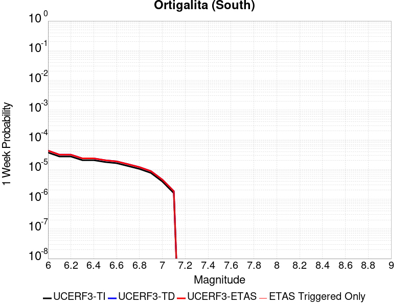 |  | 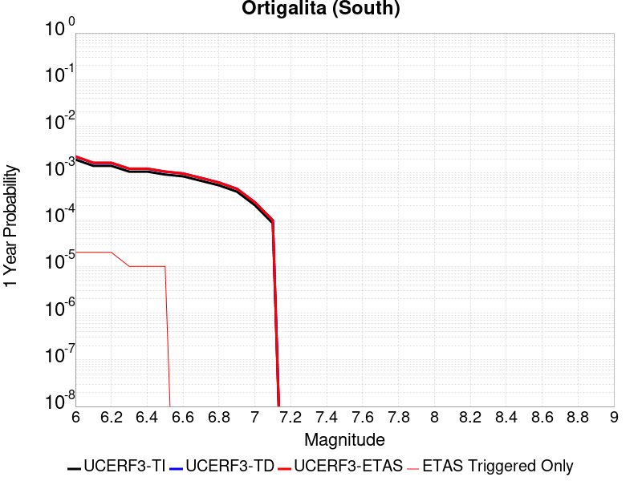 | 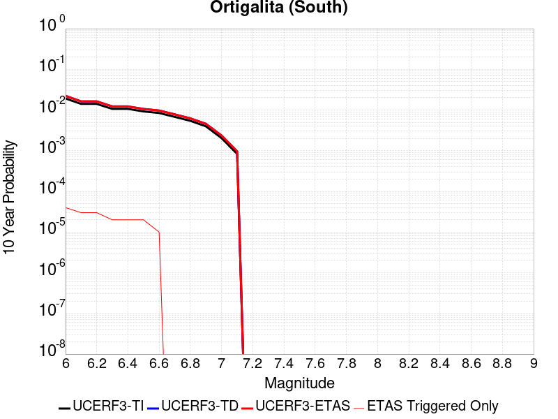 |

| Magnitude | 1 wk TI Prob | 1 wk TD Prob | 1 wk ETAS Prob | 1 wk ETAS/TD Gain | 1 wk ETAS Triggered Only | 1 mo TI Prob | 1 mo TD Prob | 1 mo ETAS Prob | 1 mo ETAS/TD Gain | 1 mo ETAS Triggered Only | 1 yr TI Prob | 1 yr TD Prob | 1 yr ETAS Prob | 1 yr ETAS/TD Gain | 1 yr ETAS Triggered Only | 10 yr TI Prob | 10 yr TD Prob | 10 yr ETAS Prob | 10 yr ETAS/TD Gain | 10 yr ETAS Triggered Only |
|-----|-----|-----|-----|-----|-----|-----|-----|-----|-----|-----|-----|-----|-----|-----|-----|-----|-----|-----|-----|-----|
| 6.0 | 3.72394E-5 | 4.3258227E-5 | 4.3258227E-5 | 1.0 | 0.0 | 1.5958765E-4 | 1.8538011E-4 | 1.9537826E-4 | 1.0539333 | 1.0E-5 | 0.0019412481 | 0.0022548232 | 0.002274778 | 1.0088499 | 2.0E-5 | 0.019243775 | 0.02233583 | 0.022374935 | 1.0017508 | 4.0E-5 |
| 6.1 | 2.7299884E-5 | 3.1493844E-5 | 3.1493844E-5 | 1.0 | 0.0 | 1.16994255E-4 | 1.3496695E-4 | 1.449656E-4 | 1.0740823 | 1.0E-5 | 0.0014234743 | 0.0016420395 | 0.0016620067 | 1.01216 | 2.0E-5 | 0.014143906 | 0.016304996 | 0.016334508 | 1.00181 | 3.0E-5 |
| 6.2 | 2.7299884E-5 | 3.1493844E-5 | 3.1493844E-5 | 1.0 | 0.0 | 1.16994255E-4 | 1.3496695E-4 | 1.449656E-4 | 1.0740823 | 1.0E-5 | 0.0014234743 | 0.0016420395 | 0.0016620067 | 1.01216 | 2.0E-5 | 0.014143906 | 0.016304996 | 0.016334508 | 1.00181 | 3.0E-5 |
| 6.3 | 2.0546433E-5 | 2.3632772E-5 | 2.3632772E-5 | 1.0 | 0.0 | 8.805317E-5 | 1.0127949E-4 | 1.0127949E-4 | 1.0 | 0.0 | 0.00107152 | 0.0012323993 | 0.0012423869 | 1.0081042 | 1.0E-5 | 0.010663681 | 0.012257712 | 0.012277467 | 1.0016116 | 2.0E-5 |
| 6.4 | 2.0546433E-5 | 2.3632772E-5 | 2.3632772E-5 | 1.0 | 0.0 | 8.805317E-5 | 1.0127949E-4 | 1.0127949E-4 | 1.0 | 0.0 | 0.00107152 | 0.0012323993 | 0.0012423869 | 1.0081042 | 1.0E-5 | 0.010663681 | 0.012257712 | 0.012277467 | 1.0016116 | 2.0E-5 |
| 6.5 | 1.7779594E-5 | 2.0448117E-5 | 2.0448117E-5 | 1.0 | 0.0 | 7.619603E-5 | 8.7631925E-5 | 8.7631925E-5 | 1.0 | 0.0 | 9.272918E-4 | 0.00106641 | 0.0010763993 | 1.0093672 | 1.0E-5 | 0.009234319 | 0.010614393 | 0.010634181 | 1.0018642 | 2.0E-5 |
| 6.6 | 1.6272212E-5 | 1.8716015E-5 | 1.8716015E-5 | 1.0 | 0.0 | 6.973618E-5 | 8.0209094E-5 | 8.0209094E-5 | 1.0 | 0.0 | 8.487073E-4 | 9.761204E-4 | 9.761204E-4 | 1.0 | 0.0 | 0.008454733 | 0.009719632 | 0.009729534 | 1.0010189 | 1.0E-5 |
| 6.7 | 1.3051484E-5 | 1.5039612E-5 | 1.5039612E-5 | 1.0 | 0.0 | 5.593373E-5 | 6.445394E-5 | 6.445394E-5 | 1.0 | 0.0 | 6.807804E-4 | 7.844537E-4 | 7.844537E-4 | 1.0 | 0.0 | 0.006786986 | 0.00781783 | 0.00781783 | 1.0 | 0.0 |
| 6.8 | 1.04277415E-5 | 1.1987902E-5 | 1.1987902E-5 | 1.0 | 0.0 | 4.4689557E-5 | 5.1375755E-5 | 5.1375755E-5 | 1.0 | 0.0 | 5.439595E-4 | 6.2532775E-4 | 6.2532775E-4 | 1.0 | 0.0 | 0.0054262993 | 0.006236436 | 0.006236436 | 1.0 | 0.0 |
| 6.9 | 7.639968E-6 | 8.791996E-6 | 8.791996E-6 | 1.0 | 0.0 | 3.274231E-5 | 3.7679474E-5 | 3.7679474E-5 | 1.0 | 0.0 | 3.9856473E-4 | 4.586569E-4 | 4.586569E-4 | 1.0 | 0.0 | 0.003978506 | 0.0045776893 | 0.0045776893 | 1.0 | 0.0 |
| 7.0 | 3.919831E-6 | 4.533665E-6 | 4.533665E-6 | 1.0 | 0.0 | 1.679917E-5 | 1.9429861E-5 | 1.9429861E-5 | 1.0 | 0.0 | 2.045107E-4 | 2.36535E-4 | 2.36535E-4 | 1.0 | 0.0 | 0.0020432258 | 0.002363041 | 0.002363041 | 1.0 | 0.0 |
| 7.1 | 1.6017933E-6 | 1.8571518E-6 | 1.8571518E-6 | 1.0 | 0.0 | 6.8648105E-6 | 7.959204E-6 | 7.959204E-6 | 1.0 | 0.0 | 8.357586E-5 | 9.690007E-5 | 9.690007E-5 | 1.0 | 0.0 | 8.3544437E-4 | 9.686828E-4 | 9.686828E-4 | 1.0 | 0.0 |

## Cleghorn
*[(top)](#table-of-contents)*

| 1 Week | 1 Month | 1 Year | 10 Year |
|-----|-----|-----|-----|
| 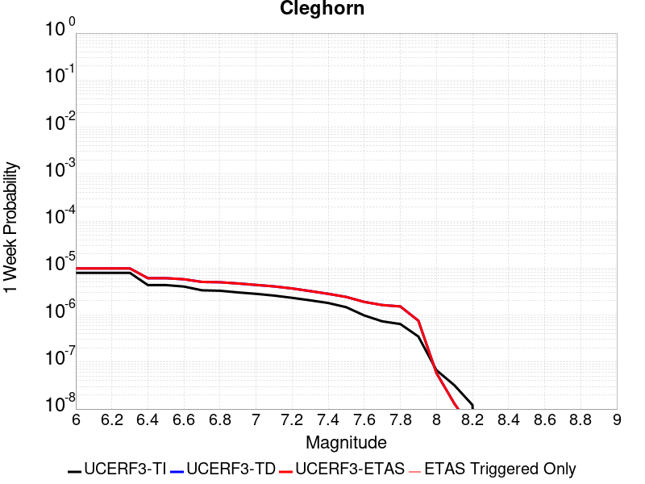 | 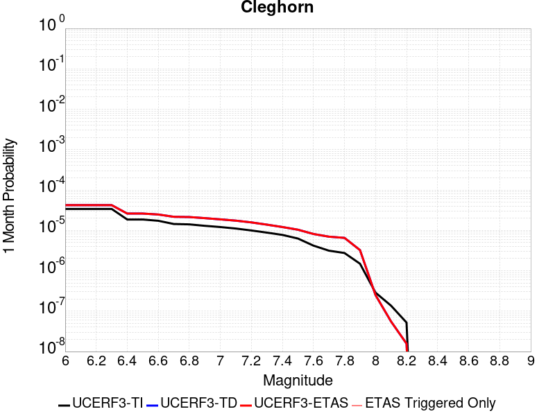 | 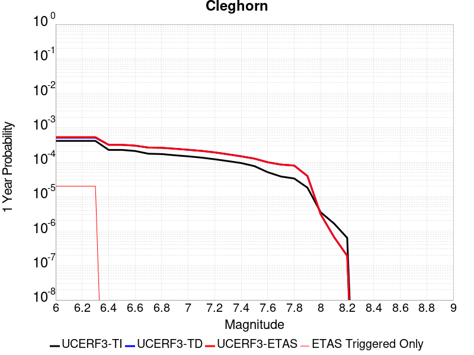 |  |

| Magnitude | 1 wk TI Prob | 1 wk TD Prob | 1 wk ETAS Prob | 1 wk ETAS/TD Gain | 1 wk ETAS Triggered Only | 1 mo TI Prob | 1 mo TD Prob | 1 mo ETAS Prob | 1 mo ETAS/TD Gain | 1 mo ETAS Triggered Only | 1 yr TI Prob | 1 yr TD Prob | 1 yr ETAS Prob | 1 yr ETAS/TD Gain | 1 yr ETAS Triggered Only | 10 yr TI Prob | 10 yr TD Prob | 10 yr ETAS Prob | 10 yr ETAS/TD Gain | 10 yr ETAS Triggered Only |
|-----|-----|-----|-----|-----|-----|-----|-----|-----|-----|-----|-----|-----|-----|-----|-----|-----|-----|-----|-----|-----|
| 6.0 | 7.9267165E-6 | 9.837177E-6 | 9.837177E-6 | 1.0 | 0.0 | 3.39712E-5 | 4.2158706E-5 | 4.2158706E-5 | 1.0 | 0.0 | 4.1352084E-4 | 5.13172E-4 | 5.3316174E-4 | 1.0389533 | 2.0E-5 | 0.004127522 | 0.0051349266 | 0.0051647727 | 1.0058123 | 3.0E-5 |
| 6.1 | 7.9267165E-6 | 9.837177E-6 | 9.837177E-6 | 1.0 | 0.0 | 3.39712E-5 | 4.2158706E-5 | 4.2158706E-5 | 1.0 | 0.0 | 4.1352084E-4 | 5.13172E-4 | 5.3316174E-4 | 1.0389533 | 2.0E-5 | 0.004127522 | 0.0051349266 | 0.0051647727 | 1.0058123 | 3.0E-5 |
| 6.2 | 7.9267165E-6 | 9.837177E-6 | 9.837177E-6 | 1.0 | 0.0 | 3.39712E-5 | 4.2158706E-5 | 4.2158706E-5 | 1.0 | 0.0 | 4.1352084E-4 | 5.13172E-4 | 5.3316174E-4 | 1.0389533 | 2.0E-5 | 0.004127522 | 0.0051349266 | 0.0051647727 | 1.0058123 | 3.0E-5 |
| 6.3 | 7.9267165E-6 | 9.837177E-6 | 9.837177E-6 | 1.0 | 0.0 | 3.39712E-5 | 4.2158706E-5 | 4.2158706E-5 | 1.0 | 0.0 | 4.1352084E-4 | 5.13172E-4 | 5.3316174E-4 | 1.0389533 | 2.0E-5 | 0.004127522 | 0.0051349266 | 0.0051647727 | 1.0058123 | 3.0E-5 |
| 6.4 | 4.3445207E-6 | 6.0969764E-6 | 6.0969764E-6 | 1.0 | 0.0 | 1.8619241E-5 | 2.6129643E-5 | 2.6129643E-5 | 1.0 | 0.0 | 2.2666567E-4 | 3.1808298E-4 | 3.1808298E-4 | 1.0 | 0.0 | 0.0022643462 | 0.0031904106 | 0.0032003787 | 1.0031244 | 1.0E-5 |
| 6.5 | 4.3445207E-6 | 6.0969764E-6 | 6.0969764E-6 | 1.0 | 0.0 | 1.8619241E-5 | 2.6129643E-5 | 2.6129643E-5 | 1.0 | 0.0 | 2.2666567E-4 | 3.1808298E-4 | 3.1808298E-4 | 1.0 | 0.0 | 0.0022643462 | 0.0031904106 | 0.0032003787 | 1.0031244 | 1.0E-5 |
| 6.6 | 4.040109E-6 | 5.779379E-6 | 5.779379E-6 | 1.0 | 0.0 | 1.7314638E-5 | 2.4768537E-5 | 2.4768537E-5 | 1.0 | 0.0 | 2.1078532E-4 | 3.0151615E-4 | 3.0151615E-4 | 1.0 | 0.0 | 0.002105855 | 0.0030251981 | 0.003035168 | 1.0032955 | 1.0E-5 |
| 6.7 | 3.3632055E-6 | 5.0728645E-6 | 5.0728645E-6 | 1.0 | 0.0 | 1.4413658E-5 | 2.1740669E-5 | 2.1740669E-5 | 1.0 | 0.0 | 1.7547216E-4 | 2.646608E-4 | 2.646608E-4 | 1.0 | 0.0 | 0.0017533366 | 0.0026575273 | 0.0026675009 | 1.003753 | 1.0E-5 |
| 6.8 | 3.2902772E-6 | 4.9947703E-6 | 4.9947703E-6 | 1.0 | 0.0 | 1.4101111E-5 | 2.1405984E-5 | 2.1405984E-5 | 1.0 | 0.0 | 1.716675E-4 | 2.60587E-4 | 2.60587E-4 | 1.0 | 0.0 | 0.0017153495 | 0.0026168854 | 0.0026268591 | 1.0038114 | 1.0E-5 |
| 6.9 | 3.031547E-6 | 4.696313E-6 | 4.696313E-6 | 1.0 | 0.0 | 1.299228E-5 | 2.0126903E-5 | 2.0126903E-5 | 1.0 | 0.0 | 1.5816953E-4 | 2.4501776E-4 | 2.4501776E-4 | 1.0 | 0.0 | 0.00158057 | 0.0024615454 | 0.0024715206 | 1.0040525 | 1.0E-5 |
| 7.0 | 2.8259715E-6 | 4.3753325E-6 | 4.3753325E-6 | 1.0 | 0.0 | 1.211125E-5 | 1.8751292E-5 | 1.8751292E-5 | 1.0 | 0.0 | 1.4744449E-4 | 2.282733E-4 | 2.282733E-4 | 1.0 | 0.0 | 0.001473467 | 0.002294456 | 0.002304433 | 1.0043483 | 1.0E-5 |
| 7.1 | 2.5962665E-6 | 4.0703308E-6 | 4.0703308E-6 | 1.0 | 0.0 | 1.1126809E-5 | 1.744416E-5 | 1.744416E-5 | 1.0 | 0.0 | 1.3546048E-4 | 2.1236215E-4 | 2.1236215E-4 | 1.0 | 0.0 | 0.0013537793 | 0.002135665 | 0.0021456436 | 1.0046724 | 1.0E-5 |
| 7.2 | 2.3247253E-6 | 3.6806362E-6 | 3.6806362E-6 | 1.0 | 0.0 | 9.96307E-6 | 1.577406E-5 | 1.577406E-5 | 1.0 | 0.0 | 1.21293626E-4 | 1.9203244E-4 | 1.9203244E-4 | 1.0 | 0.0 | 0.0012122744 | 0.0019327591 | 0.0019427397 | 1.0051639 | 1.0E-5 |
| 7.3 | 2.056928E-6 | 3.2388728E-6 | 3.2388728E-6 | 1.0 | 0.0 | 8.815376E-6 | 1.3880811E-5 | 1.3880811E-5 | 1.0 | 0.0 | 1.0732192E-4 | 1.6898592E-4 | 1.6898592E-4 | 1.0 | 0.0 | 0.001072701 | 0.0017027346 | 0.0017127176 | 1.005863 | 1.0E-5 |
| 7.4 | 1.8055999E-6 | 2.828866E-6 | 2.828866E-6 | 1.0 | 0.0 | 7.738263E-6 | 1.2123656E-5 | 1.2123656E-5 | 1.0 | 0.0 | 9.4209274E-5 | 1.4759565E-4 | 1.4759565E-4 | 1.0 | 0.0 | 9.4169343E-4 | 0.0014892742 | 0.0014892742 | 1.0 | 0.0 |
| 7.5 | 1.4683443E-6 | 2.4279263E-6 | 2.4279263E-6 | 1.0 | 0.0 | 6.292889E-6 | 1.0405358E-5 | 1.0405358E-5 | 1.0 | 0.0 | 7.661323E-5 | 1.2667796E-4 | 1.2667796E-4 | 1.0 | 0.0 | 7.658682E-4 | 0.0012803981 | 0.0012803981 | 1.0 | 0.0 |
| 7.6 | 9.804088E-7 | 1.9033644E-6 | 1.9033644E-6 | 1.0 | 0.0 | 4.201745E-6 | 8.157251E-6 | 8.157251E-6 | 1.0 | 0.0 | 5.1155046E-5 | 9.931005E-5 | 9.931005E-5 | 1.0 | 0.0 | 5.114327E-4 | 0.0010070323 | 0.0010070323 | 1.0 | 0.0 |
| 7.7 | 7.3434086E-7 | 1.6314445E-6 | 1.6314445E-6 | 1.0 | 0.0 | 3.1471714E-6 | 6.9918865E-6 | 6.9918865E-6 | 1.0 | 0.0 | 3.831614E-5 | 8.512292E-5 | 8.512292E-5 | 1.0 | 0.0 | 3.8309532E-4 | 8.653134E-4 | 8.653134E-4 | 1.0 | 0.0 |
| 7.8 | 6.434184E-7 | 1.5248431E-6 | 1.5248431E-6 | 1.0 | 0.0 | 2.7575045E-6 | 6.535026E-6 | 6.535026E-6 | 1.0 | 0.0 | 3.35721E-5 | 7.956106E-5 | 7.956106E-5 | 1.0 | 0.0 | 3.3567028E-4 | 8.093966E-4 | 8.093966E-4 | 1.0 | 0.0 |
| 7.9 | 3.4943926E-7 | 7.5890904E-7 | 7.5890904E-7 | 1.0 | 0.0 | 1.497596E-6 | 3.252463E-6 | 3.252463E-6 | 1.0 | 0.0 | 1.8233079E-5 | 3.9598028E-5 | 3.9598028E-5 | 1.0 | 0.0 | 1.8231584E-4 | 4.0475116E-4 | 4.0475116E-4 | 1.0 | 0.0 |
| 8.0 | 6.717524E-8 | 5.853563E-8 | 5.853563E-8 | 1.0 | 0.0 | 2.8789387E-7 | 2.5086695E-7 | 2.5086695E-7 | 1.0 | 0.0 | 3.505102E-6 | 3.054301E-6 | 3.054301E-6 | 1.0 | 0.0 | 3.5050467E-5 | 3.2814176E-5 | 3.2814176E-5 | 1.0 | 0.0 |
| 8.1 | 3.1984914E-8 | 1.300408E-8 | 1.300408E-8 | 1.0 | 0.0 | 1.370782E-7 | 5.5731768E-8 | 5.5731768E-8 | 1.0 | 0.0 | 1.6689258E-6 | 6.7853404E-7 | 6.7853404E-7 | 1.0 | 0.0 | 1.6689133E-5 | 7.771629E-6 | 7.771629E-6 | 1.0 | 0.0 |
| 8.2 | 1.21887656E-8 | 3.6643266E-9 | 3.6643266E-9 | 1.0 | 0.0 | 5.2237567E-8 | 1.5704257E-8 | 1.5704257E-8 | 1.0 | 0.0 | 6.359922E-7 | 1.9119932E-7 | 1.9119932E-7 | 1.0 | 0.0 | 6.3599036E-6 | 2.2556399E-6 | 2.2556399E-6 | 1.0 | 0.0 |

## Santa Cruz Island
*[(top)](#table-of-contents)*

| 1 Week | 1 Month | 1 Year | 10 Year |
|-----|-----|-----|-----|
| 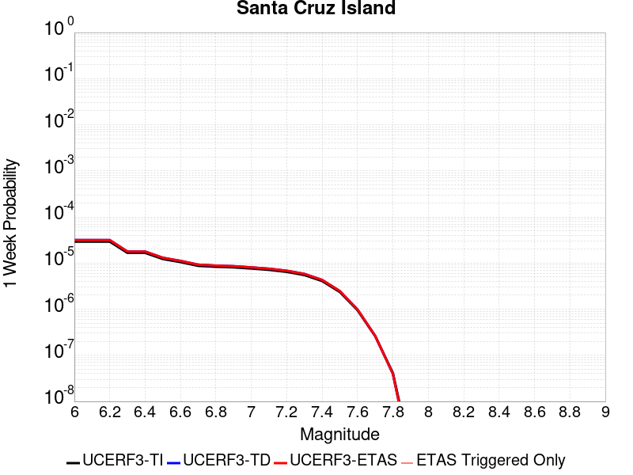 | 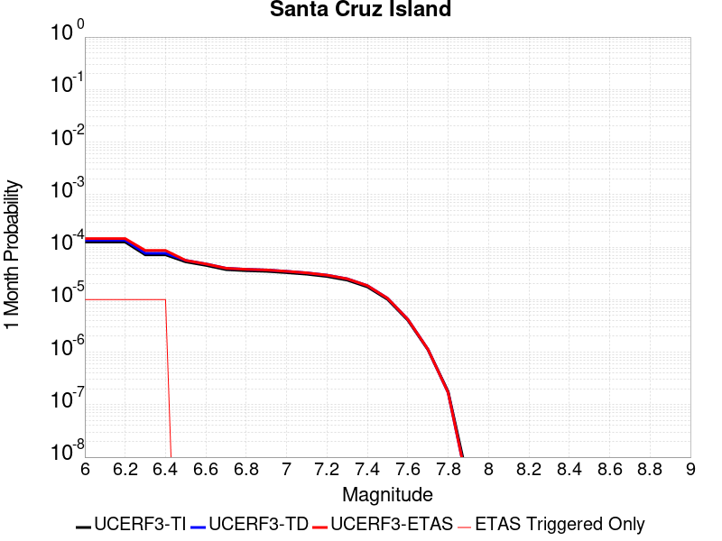 | 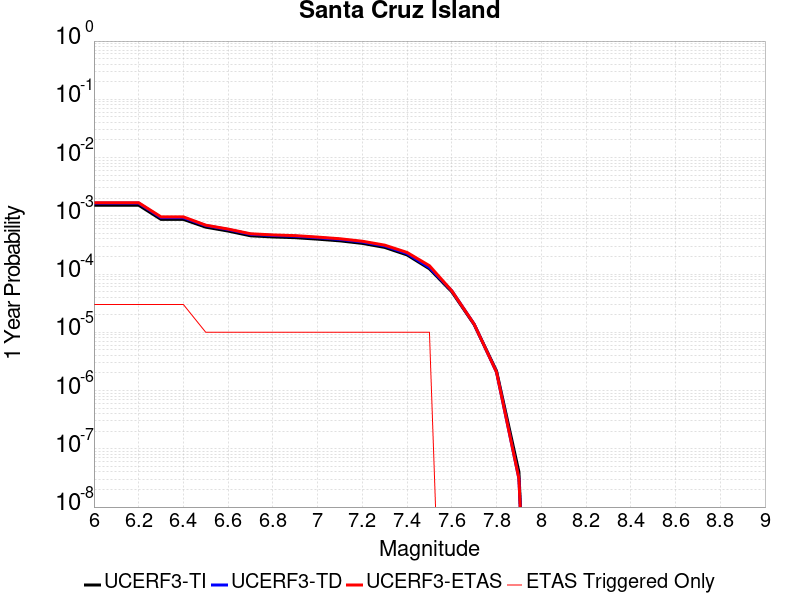 |  |

| Magnitude | 1 wk TI Prob | 1 wk TD Prob | 1 wk ETAS Prob | 1 wk ETAS/TD Gain | 1 wk ETAS Triggered Only | 1 mo TI Prob | 1 mo TD Prob | 1 mo ETAS Prob | 1 mo ETAS/TD Gain | 1 mo ETAS Triggered Only | 1 yr TI Prob | 1 yr TD Prob | 1 yr ETAS Prob | 1 yr ETAS/TD Gain | 1 yr ETAS Triggered Only | 10 yr TI Prob | 10 yr TD Prob | 10 yr ETAS Prob | 10 yr ETAS/TD Gain | 10 yr ETAS Triggered Only |
|-----|-----|-----|-----|-----|-----|-----|-----|-----|-----|-----|-----|-----|-----|-----|-----|-----|-----|-----|-----|-----|
| 6.0 | 2.9164563E-5 | 3.160073E-5 | 3.160073E-5 | 1.0 | 0.0 | 1.2498499E-4 | 1.3542545E-4 | 1.4542408E-4 | 1.0738313 | 1.0E-5 | 0.0015206301 | 0.001647694 | 0.0016776446 | 1.0181773 | 3.0E-5 | 0.015102667 | 0.016368506 | 0.016398016 | 1.0018028 | 3.0E-5 |
| 6.1 | 2.9164563E-5 | 3.160073E-5 | 3.160073E-5 | 1.0 | 0.0 | 1.2498499E-4 | 1.3542545E-4 | 1.4542408E-4 | 1.0738313 | 1.0E-5 | 0.0015206301 | 0.001647694 | 0.0016776446 | 1.0181773 | 3.0E-5 | 0.015102667 | 0.016368506 | 0.016398016 | 1.0018028 | 3.0E-5 |
| 6.2 | 2.9164563E-5 | 3.160073E-5 | 3.160073E-5 | 1.0 | 0.0 | 1.2498499E-4 | 1.3542545E-4 | 1.4542408E-4 | 1.0738313 | 1.0E-5 | 0.0015206301 | 0.001647694 | 0.0016776446 | 1.0181773 | 3.0E-5 | 0.015102667 | 0.016368506 | 0.016398016 | 1.0018028 | 3.0E-5 |
| 6.3 | 1.6635553E-5 | 1.7804827E-5 | 1.7804827E-5 | 1.0 | 0.0 | 7.1293274E-5 | 7.630428E-5 | 8.630351E-5 | 1.1310443 | 1.0E-5 | 8.6765E-4 | 9.286268E-4 | 9.58599E-4 | 1.0322758 | 3.0E-5 | 0.008642701 | 0.009249336 | 0.009279058 | 1.0032135 | 3.0E-5 |
| 6.4 | 1.6635553E-5 | 1.7804827E-5 | 1.7804827E-5 | 1.0 | 0.0 | 7.1293274E-5 | 7.630428E-5 | 8.630351E-5 | 1.1310443 | 1.0E-5 | 8.6765E-4 | 9.286268E-4 | 9.58599E-4 | 1.0322758 | 3.0E-5 | 0.008642701 | 0.009249336 | 0.009279058 | 1.0032135 | 3.0E-5 |
| 6.5 | 1.2238748E-5 | 1.3043317E-5 | 1.3043317E-5 | 1.0 | 0.0 | 5.2450723E-5 | 5.5898756E-5 | 5.5898756E-5 | 1.0 | 0.0 | 6.3840044E-4 | 6.8035856E-4 | 6.903517E-4 | 1.0146881 | 1.0E-5 | 0.0063656955 | 0.006783155 | 0.006793087 | 1.0014642 | 1.0E-5 |
| 6.6 | 1.0489767E-5 | 1.11569025E-5 | 1.11569025E-5 | 1.0 | 0.0 | 4.495537E-5 | 4.7814436E-5 | 4.7814436E-5 | 1.0 | 0.0 | 5.4719415E-4 | 5.819875E-4 | 5.9198163E-4 | 1.0171725 | 1.0E-5 | 0.005458487 | 0.0058048745 | 0.0058148163 | 1.0017127 | 1.0E-5 |
| 6.7 | 8.699222E-6 | 9.236997E-6 | 9.236997E-6 | 1.0 | 0.0 | 3.7281847E-5 | 3.9586535E-5 | 3.9586535E-5 | 1.0 | 0.0 | 4.5381195E-4 | 4.8186E-4 | 4.918552E-4 | 1.0207429 | 1.0E-5 | 0.0045288634 | 0.0048082196 | 0.0048181717 | 1.0020698 | 1.0E-5 |
| 6.8 | 8.307732E-6 | 8.817108E-6 | 8.817108E-6 | 1.0 | 0.0 | 3.560408E-5 | 3.7787064E-5 | 3.7787064E-5 | 1.0 | 0.0 | 4.3339343E-4 | 4.5996078E-4 | 4.699562E-4 | 1.021731 | 1.0E-5 | 0.004325492 | 0.004590141 | 0.0046000956 | 1.0021685 | 1.0E-5 |
| 6.9 | 8.073121E-6 | 8.565136E-6 | 8.565136E-6 | 1.0 | 0.0 | 3.459863E-5 | 3.6707213E-5 | 3.6707213E-5 | 1.0 | 0.0 | 4.2115687E-4 | 4.468191E-4 | 4.568146E-4 | 1.0223705 | 1.0E-5 | 0.004203596 | 0.0044592586 | 0.004469214 | 1.0022326 | 1.0E-5 |
| 7.0 | 7.617019E-6 | 8.074848E-6 | 8.074848E-6 | 1.0 | 0.0 | 3.264396E-5 | 3.4606033E-5 | 3.4606033E-5 | 1.0 | 0.0 | 3.9736772E-4 | 4.212474E-4 | 4.3124318E-4 | 1.023729 | 1.0E-5 | 0.003966579 | 0.0042045363 | 0.0042144945 | 1.0023683 | 1.0E-5 |
| 7.1 | 7.1224836E-6 | 7.5459575E-6 | 7.5459575E-6 | 1.0 | 0.0 | 3.052457E-5 | 3.233942E-5 | 3.233942E-5 | 1.0 | 0.0 | 3.715733E-4 | 3.9366164E-4 | 4.0365773E-4 | 1.0253925 | 1.0E-5 | 0.003709526 | 0.0039296863 | 0.0039396468 | 1.0025347 | 1.0E-5 |
| 7.2 | 6.441115E-6 | 6.8275385E-6 | 6.8275385E-6 | 1.0 | 0.0 | 2.7604487E-5 | 2.9260553E-5 | 2.9260553E-5 | 1.0 | 0.0 | 3.360328E-4 | 3.561892E-4 | 3.6618565E-4 | 1.028065 | 1.0E-5 | 0.0033552512 | 0.0035562117 | 0.0035661762 | 1.002802 | 1.0E-5 |
| 7.3 | 5.494274E-6 | 5.8201254E-6 | 5.8201254E-6 | 1.0 | 0.0 | 2.3546674E-5 | 2.4943158E-5 | 2.4943158E-5 | 1.0 | 0.0 | 2.8664304E-4 | 3.0364082E-4 | 3.1363778E-4 | 1.0329237 | 1.0E-5 | 0.002862736 | 0.0030322825 | 0.0030422523 | 1.0032878 | 1.0E-5 |
| 7.4 | 4.0802624E-6 | 4.31235E-6 | 4.31235E-6 | 1.0 | 0.0 | 1.7486722E-5 | 1.8481369E-5 | 1.8481369E-5 | 1.0 | 0.0 | 2.1288003E-4 | 2.2498751E-4 | 2.3498527E-4 | 1.0444369 | 1.0E-5 | 0.0021267622 | 0.0022476064 | 0.002257584 | 1.0044392 | 1.0E-5 |
| 7.5 | 2.3584746E-6 | 2.4753576E-6 | 2.4753576E-6 | 1.0 | 0.0 | 1.0107709E-5 | 1.0608633E-5 | 1.0608633E-5 | 1.0 | 0.0 | 1.2305441E-4 | 1.291525E-4 | 1.391512E-4 | 1.0774179 | 1.0E-5 | 0.0012298629 | 0.0012907794 | 0.0013007665 | 1.0077373 | 1.0E-5 |
| 7.6 | 9.4981914E-7 | 9.861092E-7 | 9.861092E-7 | 1.0 | 0.0 | 4.0706473E-6 | 4.2261754E-6 | 4.2261754E-6 | 1.0 | 0.0 | 4.9559E-5 | 5.1452484E-5 | 5.1452484E-5 | 1.0 | 0.0 | 4.954795E-4 | 5.14407E-4 | 5.14407E-4 | 1.0 | 0.0 |
| 7.7 | 2.6013532E-7 | 2.6416927E-7 | 2.6416927E-7 | 1.0 | 0.0 | 1.1148652E-6 | 1.1321536E-6 | 1.1321536E-6 | 1.0 | 0.0 | 1.3573399E-5 | 1.3783883E-5 | 1.3783883E-5 | 1.0 | 0.0 | 1.357257E-4 | 1.3783036E-4 | 1.3783036E-4 | 1.0 | 0.0 |
| 7.8 | 4.1522263E-8 | 3.965715E-8 | 3.965715E-8 | 1.0 | 0.0 | 1.7795254E-7 | 1.6995921E-7 | 1.6995921E-7 | 1.0 | 0.0 | 2.16657E-6 | 2.0692517E-6 | 2.0692517E-6 | 1.0 | 0.0 | 2.1665488E-5 | 2.0692343E-5 | 2.0692343E-5 | 1.0 | 0.0 |
| 7.9 | 7.7242046E-10 | 5.9469063E-10 | 5.9469063E-10 | 1.0 | 0.0 | 3.3103735E-9 | 2.5486744E-9 | 2.5486744E-9 | 1.0 | 0.0 | 4.0303796E-8 | 3.1030112E-8 | 3.1030112E-8 | 1.0 | 0.0 | 4.030379E-7 | 3.103011E-7 | 3.103011E-7 | 1.0 | 0.0 |

## Calaveras (So) - Paicines extension 2011 CFM
*[(top)](#table-of-contents)*

| 1 Week | 1 Month | 1 Year | 10 Year |
|-----|-----|-----|-----|
|  | 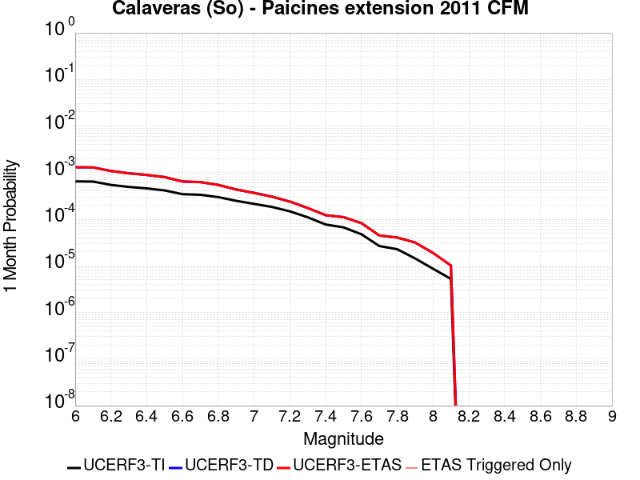 |  | 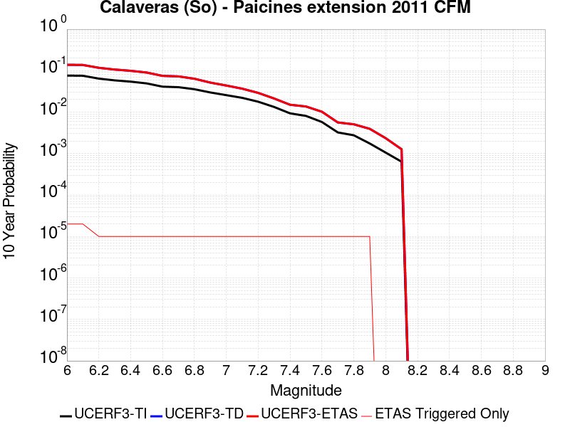 |

| Magnitude | 1 wk TI Prob | 1 wk TD Prob | 1 wk ETAS Prob | 1 wk ETAS/TD Gain | 1 wk ETAS Triggered Only | 1 mo TI Prob | 1 mo TD Prob | 1 mo ETAS Prob | 1 mo ETAS/TD Gain | 1 mo ETAS Triggered Only | 1 yr TI Prob | 1 yr TD Prob | 1 yr ETAS Prob | 1 yr ETAS/TD Gain | 1 yr ETAS Triggered Only | 10 yr TI Prob | 10 yr TD Prob | 10 yr ETAS Prob | 10 yr ETAS/TD Gain | 10 yr ETAS Triggered Only |
|-----|-----|-----|-----|-----|-----|-----|-----|-----|-----|-----|-----|-----|-----|-----|-----|-----|-----|-----|-----|-----|
| 6.0 | 1.5183659E-4 | 3.052773E-4 | 3.052773E-4 | 1.0 | 0.0 | 6.5056595E-4 | 0.0013076358 | 0.0013076358 | 1.0 | 0.0 | 0.007891912 | 0.01570158 | 0.01570158 | 1.0 | 0.0 | 0.076174594 | 0.13853289 | 0.13855013 | 1.0001243 | 2.0E-5 |
| 6.1 | 1.5024997E-4 | 3.02217E-4 | 3.02217E-4 | 1.0 | 0.0 | 6.437695E-4 | 0.0012945335 | 0.0012945335 | 1.0 | 0.0 | 0.0078097614 | 0.015544962 | 0.015544962 | 1.0 | 0.0 | 0.075409345 | 0.13720244 | 0.1372197 | 1.0001258 | 2.0E-5 |
| 6.2 | 1.2743923E-4 | 2.533313E-4 | 2.533313E-4 | 1.0 | 0.0 | 5.460538E-4 | 0.0010852051 | 0.0010852051 | 1.0 | 0.0 | 0.0066279583 | 0.013052239 | 0.013052239 | 1.0 | 0.0 | 0.064337276 | 0.11730083 | 0.11730966 | 1.0000752 | 1.0E-5 |
| 6.3 | 1.1525114E-4 | 2.2617549E-4 | 2.2617549E-4 | 1.0 | 0.0 | 4.9383997E-4 | 9.6894085E-4 | 9.6894085E-4 | 1.0 | 0.0 | 0.0059959386 | 0.011673429 | 0.011673429 | 1.0 | 0.0 | 0.058367174 | 0.106417134 | 0.106426075 | 1.0000839 | 1.0E-5 |
| 6.4 | 1.07200925E-4 | 2.085579E-4 | 2.085579E-4 | 1.0 | 0.0 | 4.5935164E-4 | 8.9349016E-4 | 8.9349016E-4 | 1.0 | 0.0 | 0.0055782744 | 0.01077823 | 0.01077823 | 1.0 | 0.0 | 0.0544031 | 0.09923991 | 0.099248916 | 1.0000907 | 1.0E-5 |
| 6.5 | 9.69631E-5 | 1.8746332E-4 | 1.8746332E-4 | 1.0 | 0.0 | 4.1548995E-4 | 8.0314995E-4 | 8.0314995E-4 | 1.0 | 0.0 | 0.0050468626 | 0.009700045 | 0.009700045 | 1.0 | 0.0 | 0.04933773 | 0.090131566 | 0.09014066 | 1.000101 | 1.0E-5 |
| 6.6 | 8.0552316E-5 | 1.5081883E-4 | 1.5081883E-4 | 1.0 | 0.0 | 3.4517853E-4 | 6.4618274E-4 | 6.4618274E-4 | 1.0 | 0.0 | 0.0041944524 | 0.007831711 | 0.007831711 | 1.0 | 0.0 | 0.04116161 | 0.07490183 | 0.07491108 | 1.0001235 | 1.0E-5 |
| 6.7 | 7.815757E-5 | 1.462194E-4 | 1.462194E-4 | 1.0 | 0.0 | 3.34918E-4 | 6.2650174E-4 | 6.2650174E-4 | 1.0 | 0.0 | 0.004070005 | 0.007594524 | 0.007594524 | 1.0 | 0.0 | 0.039962657 | 0.07275128 | 0.07276055 | 1.0001274 | 1.0E-5 |
| 6.8 | 6.965264E-5 | 1.2731973E-4 | 1.2731973E-4 | 1.0 | 0.0 | 2.9847719E-4 | 5.4554077E-4 | 5.4554077E-4 | 1.0 | 0.0 | 0.0036279052 | 0.006618584 | 0.006618584 | 1.0 | 0.0 | 0.03569247 | 0.06384469 | 0.06385405 | 1.0001466 | 1.0E-5 |
| 6.9 | 5.8000453E-5 | 1.01523416E-4 | 1.01523416E-4 | 1.0 | 0.0 | 2.4854968E-4 | 4.3502837E-4 | 4.3502837E-4 | 1.0 | 0.0 | 0.0030218933 | 0.0052837124 | 0.0052837124 | 1.0 | 0.0 | 0.029811295 | 0.051542826 | 0.05155231 | 1.000184 | 1.0E-5 |
| 7.0 | 4.9865852E-5 | 8.5763946E-5 | 8.5763946E-5 | 1.0 | 0.0 | 2.1369329E-4 | 3.6750847E-4 | 3.6750847E-4 | 1.0 | 0.0 | 0.0025986114 | 0.004465325 | 0.004465325 | 1.0 | 0.0 | 0.025684336 | 0.043822676 | 0.04383224 | 1.0002182 | 1.0E-5 |
| 7.1 | 4.283875E-5 | 7.1186725E-5 | 7.1186725E-5 | 1.0 | 0.0 | 1.8358172E-4 | 3.050506E-4 | 3.050506E-4 | 1.0 | 0.0 | 0.0022328163 | 0.0037077225 | 0.0037077225 | 1.0 | 0.0 | 0.022105146 | 0.03676716 | 0.03677679 | 1.000262 | 1.0E-5 |
| 7.2 | 3.450115E-5 | 5.5839675E-5 | 5.5839675E-5 | 1.0 | 0.0 | 1.478537E-4 | 2.392911E-4 | 2.392911E-4 | 1.0 | 0.0 | 0.0017986323 | 0.002909506 | 0.002909506 | 1.0 | 0.0 | 0.017841442 | 0.02911007 | 0.02911978 | 1.0003335 | 1.0E-5 |
| 7.3 | 2.5709045E-5 | 4.0644358E-5 | 4.0644358E-5 | 1.0 | 0.0 | 1.1017697E-4 | 1.7417857E-4 | 1.7417857E-4 | 1.0 | 0.0 | 0.0013405791 | 0.0021185784 | 0.0021185784 | 1.0 | 0.0 | 0.013325208 | 0.021324893 | 0.02133468 | 1.000459 | 1.0E-5 |
| 7.4 | 1.8003093E-5 | 2.853691E-5 | 2.853691E-5 | 1.0 | 0.0 | 7.715383E-5 | 1.2229531E-4 | 1.2229531E-4 | 1.0 | 0.0 | 9.3894306E-4 | 0.0014879309 | 0.0014879309 | 1.0 | 0.0 | 0.009349857 | 0.015065318 | 0.015075168 | 1.0006537 | 1.0E-5 |
| 7.5 | 1.5595824E-5 | 2.5848529E-5 | 2.5848529E-5 | 1.0 | 0.0 | 6.683753E-5 | 1.10774716E-4 | 1.10774716E-4 | 1.0 | 0.0 | 8.134431E-4 | 0.00134785 | 0.00134785 | 1.0 | 0.0 | 0.008104719 | 0.013664801 | 0.013674664 | 1.0007218 | 1.0E-5 |
| 7.6 | 1.1110309E-5 | 1.9245095E-5 | 1.9245095E-5 | 1.0 | 0.0 | 4.761474E-5 | 8.2476385E-5 | 8.2476385E-5 | 1.0 | 0.0 | 5.795553E-4 | 0.0010036888 | 0.0010036888 | 1.0 | 0.0 | 0.0057804612 | 0.010215148 | 0.010225046 | 1.0009689 | 1.0E-5 |
| 7.7 | 6.2140443E-6 | 1.04531455E-5 | 1.04531455E-5 | 1.0 | 0.0 | 2.6631347E-5 | 4.4798424E-5 | 4.4798424E-5 | 1.0 | 0.0 | 3.241884E-4 | 5.452844E-4 | 5.452844E-4 | 1.0 | 0.0 | 0.0032371588 | 0.0056276857 | 0.0056376294 | 1.0017669 | 1.0E-5 |
| 7.8 | 5.305533E-6 | 9.447369E-6 | 9.447369E-6 | 1.0 | 0.0 | 2.27378E-5 | 4.0488096E-5 | 4.0488096E-5 | 1.0 | 0.0 | 2.7679754E-4 | 4.9283117E-4 | 4.9283117E-4 | 1.0 | 0.0 | 0.0027645302 | 0.005081297 | 0.005091246 | 1.001958 | 1.0E-5 |
| 7.9 | 3.363505E-6 | 7.39551E-6 | 7.39551E-6 | 1.0 | 0.0 | 1.4414942E-5 | 3.1694657E-5 | 3.1694657E-5 | 1.0 | 0.0 | 1.7548777E-4 | 3.858142E-4 | 3.858142E-4 | 1.0 | 0.0 | 0.0017534926 | 0.0039536534 | 0.003963614 | 1.0025192 | 1.0E-5 |
| 8.0 | 2.0271132E-6 | 4.4191597E-6 | 4.4191597E-6 | 1.0 | 0.0 | 8.687599E-6 | 1.893912E-5 | 1.893912E-5 | 1.0 | 0.0 | 1.05766376E-4 | 2.3055942E-4 | 2.3055942E-4 | 1.0 | 0.0 | 0.0010571606 | 0.0023540538 | 0.0023540538 | 1.0 | 0.0 |
| 8.1 | 1.2206116E-6 | 2.3784507E-6 | 2.3784507E-6 | 1.0 | 0.0 | 5.2311816E-6 | 1.019332E-5 | 1.019332E-5 | 1.0 | 0.0 | 6.3687774E-5 | 1.2409665E-4 | 1.2409665E-4 | 1.0 | 0.0 | 6.366953E-4 | 0.0012722017 | 0.0012722017 | 1.0 | 0.0 |

## San Andreas (Santa Cruz Mts) 2011 CFM
*[(top)](#table-of-contents)*

| 1 Week | 1 Month | 1 Year | 10 Year |
|-----|-----|-----|-----|
| 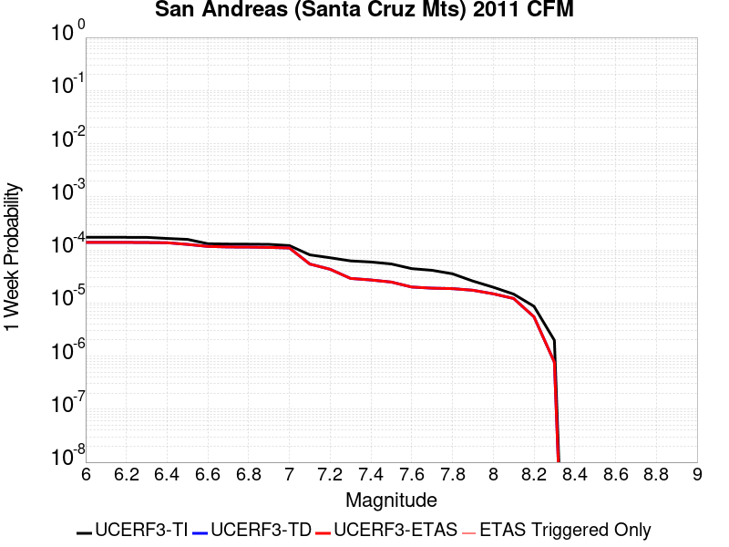 | 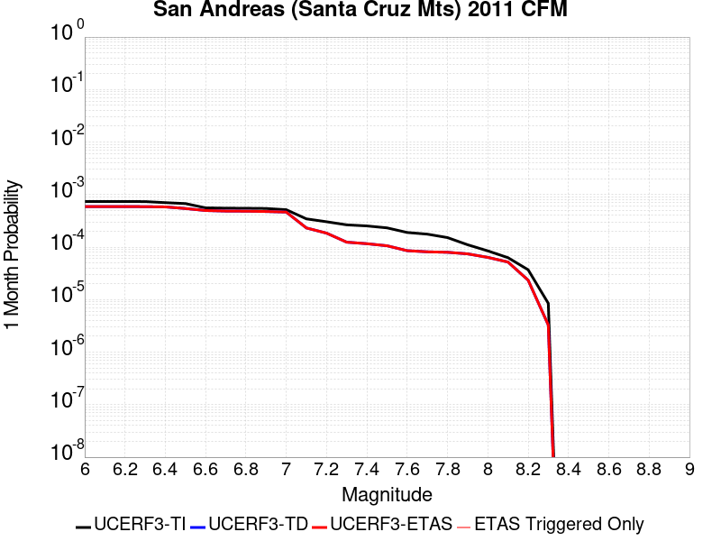 | 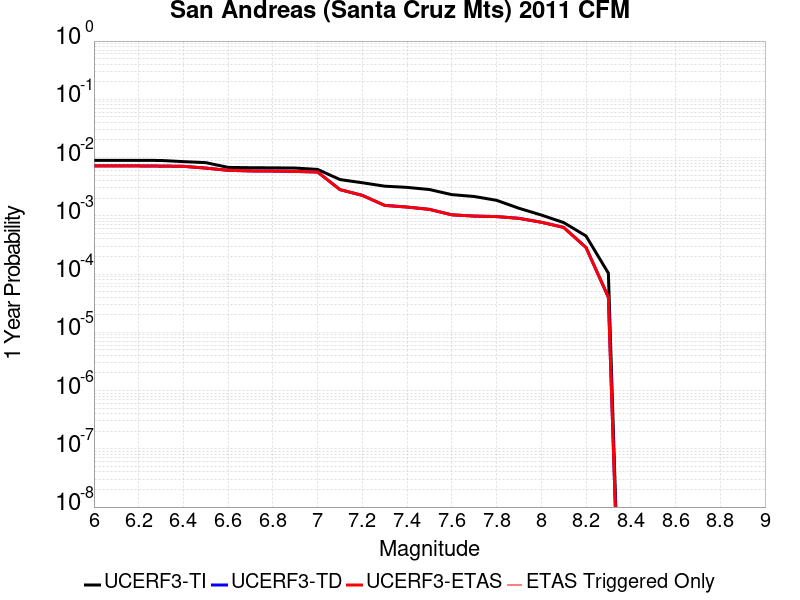 | 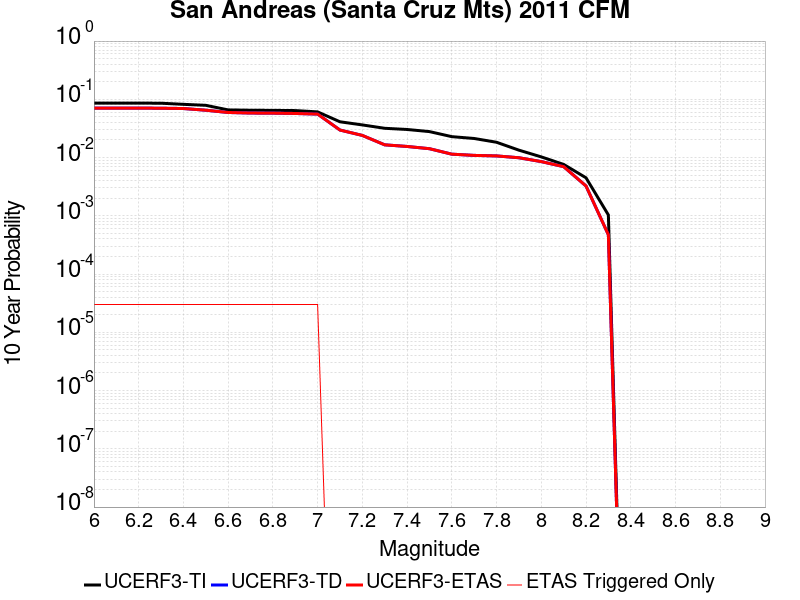 |

| Magnitude | 1 wk TI Prob | 1 wk TD Prob | 1 wk ETAS Prob | 1 wk ETAS/TD Gain | 1 wk ETAS Triggered Only | 1 mo TI Prob | 1 mo TD Prob | 1 mo ETAS Prob | 1 mo ETAS/TD Gain | 1 mo ETAS Triggered Only | 1 yr TI Prob | 1 yr TD Prob | 1 yr ETAS Prob | 1 yr ETAS/TD Gain | 1 yr ETAS Triggered Only | 10 yr TI Prob | 10 yr TD Prob | 10 yr ETAS Prob | 10 yr ETAS/TD Gain | 10 yr ETAS Triggered Only |
|-----|-----|-----|-----|-----|-----|-----|-----|-----|-----|-----|-----|-----|-----|-----|-----|-----|-----|-----|-----|-----|
| 6.0 | 1.7221631E-4 | 1.3814753E-4 | 1.3814753E-4 | 1.0 | 0.0 | 7.378611E-4 | 5.9192855E-4 | 5.9192855E-4 | 1.0 | 0.0 | 0.008946515 | 0.007183307 | 0.007183307 | 1.0 | 0.0 | 0.08594794 | 0.07065544 | 0.07068332 | 1.0003946 | 3.0E-5 |
| 6.1 | 1.7221631E-4 | 1.3814753E-4 | 1.3814753E-4 | 1.0 | 0.0 | 7.378611E-4 | 5.9192855E-4 | 5.9192855E-4 | 1.0 | 0.0 | 0.008946515 | 0.007183307 | 0.007183307 | 1.0 | 0.0 | 0.08594794 | 0.07065544 | 0.07068332 | 1.0003946 | 3.0E-5 |
| 6.2 | 1.7221631E-4 | 1.3814753E-4 | 1.3814753E-4 | 1.0 | 0.0 | 7.378611E-4 | 5.9192855E-4 | 5.9192855E-4 | 1.0 | 0.0 | 0.008946515 | 0.007183307 | 0.007183307 | 1.0 | 0.0 | 0.08594794 | 0.07065544 | 0.07068332 | 1.0003946 | 3.0E-5 |
| 6.3 | 1.716926E-4 | 1.3734154E-4 | 1.3734154E-4 | 1.0 | 0.0 | 7.3561794E-4 | 5.8847584E-4 | 5.8847584E-4 | 1.0 | 0.0 | 0.008919428 | 0.007141546 | 0.007141546 | 1.0 | 0.0 | 0.08569809 | 0.0702675 | 0.07029539 | 1.000397 | 3.0E-5 |
| 6.4 | 1.6392978E-4 | 1.3609658E-4 | 1.3609658E-4 | 1.0 | 0.0 | 7.02367E-4 | 5.8314274E-4 | 5.8314274E-4 | 1.0 | 0.0 | 0.008517839 | 0.0070770374 | 0.0070770374 | 1.0 | 0.0 | 0.08198654 | 0.06949931 | 0.06952722 | 1.0004016 | 3.0E-5 |
| 6.5 | 1.5742714E-4 | 1.2669053E-4 | 1.2669053E-4 | 1.0 | 0.0 | 6.745133E-4 | 5.4284814E-4 | 5.4284814E-4 | 1.0 | 0.0 | 0.00818132 | 0.006589473 | 0.006589473 | 1.0 | 0.0 | 0.078865945 | 0.06495932 | 0.06498737 | 1.0004318 | 3.0E-5 |
| 6.6 | 1.3038084E-4 | 1.1607541E-4 | 1.1607541E-4 | 1.0 | 0.0 | 5.5865536E-4 | 4.973725E-4 | 4.973725E-4 | 1.0 | 0.0 | 0.006780438 | 0.006038939 | 0.006038939 | 1.0 | 0.0 | 0.0657725 | 0.059415884 | 0.059444103 | 1.0004749 | 3.0E-5 |
| 6.7 | 1.2867592E-4 | 1.133392E-4 | 1.133392E-4 | 1.0 | 0.0 | 5.5135164E-4 | 4.856503E-4 | 4.856503E-4 | 1.0 | 0.0 | 0.0066920654 | 0.0058970014 | 0.0058970014 | 1.0 | 0.0 | 0.06494093 | 0.058126573 | 0.05815483 | 1.0004861 | 3.0E-5 |
| 6.8 | 1.2801298E-4 | 1.1271455E-4 | 1.1271455E-4 | 1.0 | 0.0 | 5.485117E-4 | 4.8297422E-4 | 4.8297422E-4 | 1.0 | 0.0 | 0.0066577005 | 0.0058645965 | 0.0058645965 | 1.0 | 0.0 | 0.06461738 | 0.057840347 | 0.05786861 | 1.0004886 | 3.0E-5 |
| 6.9 | 1.269149E-4 | 1.1113565E-4 | 1.1113565E-4 | 1.0 | 0.0 | 5.4380763E-4 | 4.7620997E-4 | 4.7620997E-4 | 1.0 | 0.0 | 0.006600777 | 0.0057826815 | 0.0057826815 | 1.0 | 0.0 | 0.06408122 | 0.05711186 | 0.057140145 | 1.0004953 | 3.0E-5 |
| 7.0 | 1.2030331E-4 | 1.0843386E-4 | 1.0843386E-4 | 1.0 | 0.0 | 5.154837E-4 | 4.6463503E-4 | 4.6463503E-4 | 1.0 | 0.0 | 0.006257969 | 0.005642495 | 0.005642495 | 1.0 | 0.0 | 0.06084648 | 0.055783253 | 0.05581158 | 1.0005078 | 3.0E-5 |
| 7.1 | 8.049617E-5 | 5.405664E-5 | 5.405664E-5 | 1.0 | 0.0 | 3.4493793E-4 | 2.3165093E-4 | 2.3165093E-4 | 1.0 | 0.0 | 0.0041915346 | 0.0028167374 | 0.0028167374 | 1.0 | 0.0 | 0.041133516 | 0.029682726 | 0.029682726 | 1.0 | 0.0 |
| 7.2 | 7.093979E-5 | 4.3050426E-5 | 4.3050426E-5 | 1.0 | 0.0 | 3.0399222E-4 | 1.844889E-4 | 1.844889E-4 | 1.0 | 0.0 | 0.0036948253 | 0.0022438616 | 0.0022438616 | 1.0 | 0.0 | 0.03633994 | 0.02399759 | 0.02399759 | 1.0 | 0.0 |
| 7.3 | 6.193693E-5 | 2.8978333E-5 | 2.8978333E-5 | 1.0 | 0.0 | 2.6541698E-4 | 1.2418695E-4 | 1.2418695E-4 | 1.0 | 0.0 | 0.0032266637 | 0.0015109292 | 0.0015109292 | 1.0 | 0.0 | 0.031802133 | 0.016543163 | 0.016543163 | 1.0 | 0.0 |
| 7.4 | 5.906492E-5 | 2.7100308E-5 | 2.7100308E-5 | 1.0 | 0.0 | 2.5311083E-4 | 1.1613902E-4 | 1.1613902E-4 | 1.0 | 0.0 | 0.0030772698 | 0.0014130768 | 0.0014130768 | 1.0 | 0.0 | 0.030350044 | 0.015511554 | 0.015511554 | 1.0 | 0.0 |
| 7.5 | 5.424296E-5 | 2.4744899E-5 | 2.4744899E-5 | 1.0 | 0.0 | 2.324491E-4 | 1.0604526E-4 | 1.0604526E-4 | 1.0 | 0.0 | 0.002826395 | 0.0012903375 | 0.0012903375 | 1.0 | 0.0 | 0.027907165 | 0.014198632 | 0.014198632 | 1.0 | 0.0 |
| 7.6 | 4.43084E-5 | 1.9950565E-5 | 1.9950565E-5 | 1.0 | 0.0 | 1.8987931E-4 | 8.5499625E-5 | 8.5499625E-5 | 1.0 | 0.0 | 0.0023093296 | 0.001040461 | 0.001040461 | 1.0 | 0.0 | 0.022854783 | 0.011437572 | 0.011437572 | 1.0 | 0.0 |
| 7.7 | 4.118098E-5 | 1.8980038E-5 | 1.8980038E-5 | 1.0 | 0.0 | 1.7647797E-4 | 8.1340484E-5 | 8.1340484E-5 | 1.0 | 0.0 | 0.002146502 | 9.898708E-4 | 9.898708E-4 | 1.0 | 0.0 | 0.021258866 | 0.010893939 | 0.010893939 | 1.0 | 0.0 |
| 7.8 | 3.5408906E-5 | 1.8606728E-5 | 1.8606728E-5 | 1.0 | 0.0 | 1.5174363E-4 | 7.974068E-5 | 7.974068E-5 | 1.0 | 0.0 | 0.0018459131 | 9.7041065E-4 | 9.7041065E-4 | 1.0 | 0.0 | 0.018306552 | 0.010674672 | 0.010674672 | 1.0 | 0.0 |
| 7.9 | 2.5860836E-5 | 1.7354143E-5 | 1.7354143E-5 | 1.0 | 0.0 | 1.10827445E-4 | 7.437278E-5 | 7.437278E-5 | 1.0 | 0.0 | 0.001348489 | 9.0511265E-4 | 9.0511265E-4 | 1.0 | 0.0 | 0.013403354 | 0.009927788 | 0.009927788 | 1.0 | 0.0 |
| 8.0 | 1.9777332E-5 | 1.48725E-5 | 1.48725E-5 | 1.0 | 0.0 | 8.4757245E-5 | 6.373773E-5 | 6.373773E-5 | 1.0 | 0.0 | 0.0010314309 | 7.7573076E-4 | 7.7573076E-4 | 1.0 | 0.0 | 0.010266567 | 0.008526401 | 0.008526401 | 1.0 | 0.0 |
| 8.1 | 1.468494E-5 | 1.2134421E-5 | 1.2134421E-5 | 1.0 | 0.0 | 6.293394E-5 | 5.2003623E-5 | 5.2003623E-5 | 1.0 | 0.0 | 7.6595135E-4 | 6.329604E-4 | 6.329604E-4 | 1.0 | 0.0 | 0.0076331664 | 0.0069835386 | 0.0069835386 | 1.0 | 0.0 |
| 8.2 | 8.63836E-6 | 5.4831444E-6 | 5.4831444E-6 | 1.0 | 0.0 | 3.7021015E-5 | 2.3498978E-5 | 2.3498978E-5 | 1.0 | 0.0 | 4.5063766E-4 | 2.860626E-4 | 2.860626E-4 | 1.0 | 0.0 | 0.004497249 | 0.0032533836 | 0.0032533836 | 1.0 | 0.0 |
| 8.3 | 1.983087E-6 | 7.68342E-7 | 7.68342E-7 | 1.0 | 0.0 | 8.498917E-6 | 3.2928901E-6 | 3.2928901E-6 | 1.0 | 0.0 | 1.034694E-4 | 4.0090217E-5 | 4.0090217E-5 | 1.0 | 0.0 | 0.0010342124 | 4.7331754E-4 | 4.7331754E-4 | 1.0 | 0.0 |

## Newport-Inglewood alt 1
*[(top)](#table-of-contents)*

| 1 Week | 1 Month | 1 Year | 10 Year |
|-----|-----|-----|-----|
|  |  | 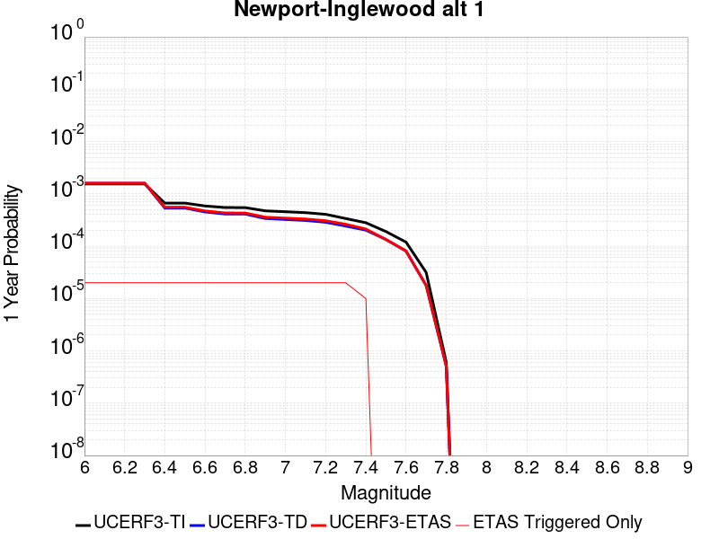 | 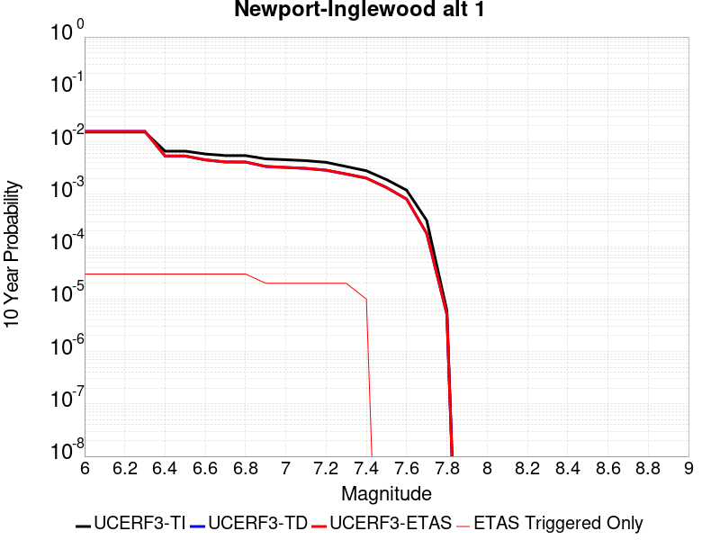 |

| Magnitude | 1 wk TI Prob | 1 wk TD Prob | 1 wk ETAS Prob | 1 wk ETAS/TD Gain | 1 wk ETAS Triggered Only | 1 mo TI Prob | 1 mo TD Prob | 1 mo ETAS Prob | 1 mo ETAS/TD Gain | 1 mo ETAS Triggered Only | 1 yr TI Prob | 1 yr TD Prob | 1 yr ETAS Prob | 1 yr ETAS/TD Gain | 1 yr ETAS Triggered Only | 10 yr TI Prob | 10 yr TD Prob | 10 yr ETAS Prob | 10 yr ETAS/TD Gain | 10 yr ETAS Triggered Only |
|-----|-----|-----|-----|-----|-----|-----|-----|-----|-----|-----|-----|-----|-----|-----|-----|-----|-----|-----|-----|-----|
| 6.0 | 2.9668912E-5 | 3.0406676E-5 | 3.0406676E-5 | 1.0 | 0.0 | 1.2714628E-4 | 1.3031055E-4 | 1.3031055E-4 | 1.0 | 0.0 | 0.0015469068 | 0.0015858584 | 0.0016058268 | 1.0125915 | 2.0E-5 | 0.015361829 | 0.015793001 | 0.015822528 | 1.0018696 | 3.0E-5 |
| 6.1 | 2.9668912E-5 | 3.0406676E-5 | 3.0406676E-5 | 1.0 | 0.0 | 1.2714628E-4 | 1.3031055E-4 | 1.3031055E-4 | 1.0 | 0.0 | 0.0015469068 | 0.0015858584 | 0.0016058268 | 1.0125915 | 2.0E-5 | 0.015361829 | 0.015793001 | 0.015822528 | 1.0018696 | 3.0E-5 |
| 6.2 | 2.9668912E-5 | 3.0406676E-5 | 3.0406676E-5 | 1.0 | 0.0 | 1.2714628E-4 | 1.3031055E-4 | 1.3031055E-4 | 1.0 | 0.0 | 0.0015469068 | 0.0015858584 | 0.0016058268 | 1.0125915 | 2.0E-5 | 0.015361829 | 0.015793001 | 0.015822528 | 1.0018696 | 3.0E-5 |
| 6.3 | 2.9668912E-5 | 3.0406676E-5 | 3.0406676E-5 | 1.0 | 0.0 | 1.2714628E-4 | 1.3031055E-4 | 1.3031055E-4 | 1.0 | 0.0 | 0.0015469068 | 0.0015858584 | 0.0016058268 | 1.0125915 | 2.0E-5 | 0.015361829 | 0.015793001 | 0.015822528 | 1.0018696 | 3.0E-5 |
| 6.4 | 1.275942E-5 | 1.027286E-5 | 1.027286E-5 | 1.0 | 0.0 | 5.4682085E-5 | 4.4025823E-5 | 4.4025823E-5 | 1.0 | 0.0 | 6.65551E-4 | 5.3588673E-4 | 5.55876E-4 | 1.0373013 | 2.0E-5 | 0.0066356123 | 0.00534637 | 0.0053762095 | 1.0055813 | 3.0E-5 |
| 6.5 | 1.275942E-5 | 1.027286E-5 | 1.027286E-5 | 1.0 | 0.0 | 5.4682085E-5 | 4.4025823E-5 | 4.4025823E-5 | 1.0 | 0.0 | 6.65551E-4 | 5.3588673E-4 | 5.55876E-4 | 1.0373013 | 2.0E-5 | 0.0066356123 | 0.00534637 | 0.0053762095 | 1.0055813 | 3.0E-5 |
| 6.6 | 1.1255358E-5 | 8.662163E-6 | 8.662163E-6 | 1.0 | 0.0 | 4.8236358E-5 | 3.7123038E-5 | 3.7123038E-5 | 1.0 | 0.0 | 5.871194E-4 | 4.5188097E-4 | 4.7187193E-4 | 1.0442394 | 2.0E-5 | 0.005855706 | 0.0045097983 | 0.004539663 | 1.0066222 | 3.0E-5 |
| 6.7 | 1.0504745E-5 | 7.9000465E-6 | 7.9000465E-6 | 1.0 | 0.0 | 4.5019555E-5 | 3.3856908E-5 | 3.3856908E-5 | 1.0 | 0.0 | 5.4797524E-4 | 4.1213114E-4 | 4.321229E-4 | 1.0485083 | 2.0E-5 | 0.0054662596 | 0.0041137985 | 0.004143675 | 1.0072626 | 3.0E-5 |
| 6.8 | 1.0476007E-5 | 7.881427E-6 | 7.881427E-6 | 1.0 | 0.0 | 4.4896402E-5 | 3.3777113E-5 | 3.3777113E-5 | 1.0 | 0.0 | 5.464766E-4 | 4.1116E-4 | 4.3115177E-4 | 1.0486228 | 2.0E-5 | 0.005451347 | 0.004104123 | 0.004134 | 1.0072798 | 3.0E-5 |
| 6.9 | 9.076797E-6 | 6.489834E-6 | 6.489834E-6 | 1.0 | 0.0 | 3.889998E-5 | 2.781328E-5 | 2.781328E-5 | 1.0 | 0.0 | 4.7350433E-4 | 3.3857438E-4 | 3.5856763E-4 | 1.0590512 | 2.0E-5 | 0.004724967 | 0.003380623 | 0.0034005553 | 1.0058961 | 2.0E-5 |
| 7.0 | 8.73795E-6 | 6.212212E-6 | 6.212212E-6 | 1.0 | 0.0 | 3.7447822E-5 | 2.6623497E-5 | 2.6623497E-5 | 1.0 | 0.0 | 4.5583185E-4 | 3.2409313E-4 | 3.4408664E-4 | 1.0616907 | 2.0E-5 | 0.0045489795 | 0.0032362365 | 0.0032561717 | 1.00616 | 2.0E-5 |
| 7.1 | 8.391299E-6 | 5.955984E-6 | 5.955984E-6 | 1.0 | 0.0 | 3.5962214E-5 | 2.5525398E-5 | 2.5525398E-5 | 1.0 | 0.0 | 4.37752E-4 | 3.1072766E-4 | 3.3072144E-4 | 1.064345 | 2.0E-5 | 0.004368907 | 0.0031029615 | 0.0031228994 | 1.0064255 | 2.0E-5 |
| 7.2 | 7.796882E-6 | 5.49672E-6 | 5.49672E-6 | 1.0 | 0.0 | 3.341478E-5 | 2.355716E-5 | 2.355716E-5 | 1.0 | 0.0 | 4.06749E-4 | 2.867709E-4 | 3.0676514E-4 | 1.069722 | 2.0E-5 | 0.0040600533 | 0.0028640323 | 0.002883975 | 1.0069631 | 2.0E-5 |
| 7.3 | 6.4738833E-6 | 4.647925E-6 | 4.647925E-6 | 1.0 | 0.0 | 2.774492E-5 | 1.9919527E-5 | 1.9919527E-5 | 1.0 | 0.0 | 3.3774204E-4 | 2.4249342E-4 | 2.6248855E-4 | 1.0824565 | 2.0E-5 | 0.0033722918 | 0.0024223048 | 0.0024422563 | 1.0082366 | 2.0E-5 |
| 7.4 | 5.382145E-6 | 3.885849E-6 | 3.885849E-6 | 1.0 | 0.0 | 2.3066134E-5 | 1.6653532E-5 | 1.6653532E-5 | 1.0 | 0.0 | 2.8079396E-4 | 2.0273803E-4 | 2.12736E-4 | 1.0493147 | 1.0E-5 | 0.0028043943 | 0.0020255453 | 0.002035525 | 1.0049269 | 1.0E-5 |
| 7.5 | 3.648244E-6 | 2.573842E-6 | 2.573842E-6 | 1.0 | 0.0 | 1.5635238E-5 | 1.10307055E-5 | 1.10307055E-5 | 1.0 | 0.0 | 1.9034238E-4 | 1.3429066E-4 | 1.3429066E-4 | 1.0 | 0.0 | 0.0019017943 | 0.0013421056 | 0.0013421056 | 1.0 | 0.0 |
| 7.6 | 2.2906888E-6 | 1.5480238E-6 | 1.5480238E-6 | 1.0 | 0.0 | 9.817201E-6 | 6.634371E-6 | 6.634371E-6 | 1.0 | 0.0 | 1.1951787E-4 | 8.0770544E-5 | 8.0770544E-5 | 1.0 | 0.0 | 0.0011945361 | 8.0741855E-4 | 8.0741855E-4 | 1.0 | 0.0 |
| 7.7 | 6.0479874E-7 | 3.3976116E-7 | 3.3976116E-7 | 1.0 | 0.0 | 2.5919921E-6 | 1.4561185E-6 | 1.4561185E-6 | 1.0 | 0.0 | 3.1557047E-5 | 1.7728113E-5 | 1.7728113E-5 | 1.0 | 0.0 | 3.1552566E-4 | 1.7726836E-4 | 1.7726836E-4 | 1.0 | 0.0 |
| 7.8 | 1.16056995E-8 | 9.782426E-9 | 9.782426E-9 | 1.0 | 0.0 | 4.9738713E-8 | 4.1924682E-8 | 4.1924682E-8 | 1.0 | 0.0 | 6.0556863E-7 | 5.1043304E-7 | 5.1043304E-7 | 1.0 | 0.0 | 6.05567E-6 | 5.1043303E-6 | 5.1043303E-6 | 1.0 | 0.0 |

## Rinconada 2011 CFM
*[(top)](#table-of-contents)*

| 1 Week | 1 Month | 1 Year | 10 Year |
|-----|-----|-----|-----|
|  | 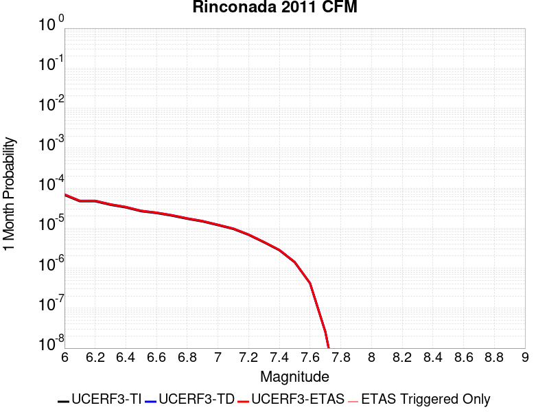 | 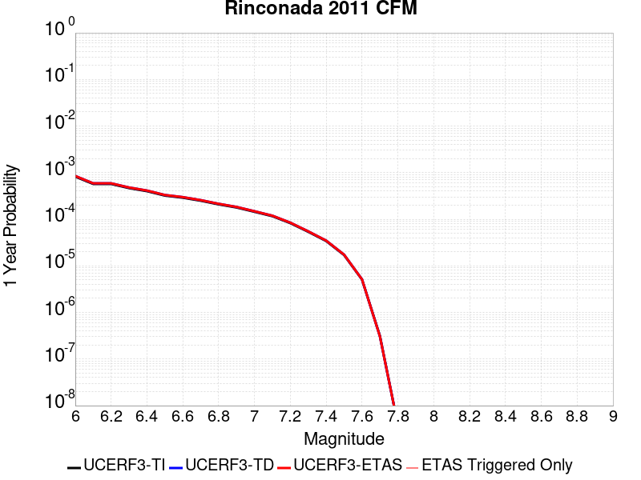 |  |

| Magnitude | 1 wk TI Prob | 1 wk TD Prob | 1 wk ETAS Prob | 1 wk ETAS/TD Gain | 1 wk ETAS Triggered Only | 1 mo TI Prob | 1 mo TD Prob | 1 mo ETAS Prob | 1 mo ETAS/TD Gain | 1 mo ETAS Triggered Only | 1 yr TI Prob | 1 yr TD Prob | 1 yr ETAS Prob | 1 yr ETAS/TD Gain | 1 yr ETAS Triggered Only | 10 yr TI Prob | 10 yr TD Prob | 10 yr ETAS Prob | 10 yr ETAS/TD Gain | 10 yr ETAS Triggered Only |
|-----|-----|-----|-----|-----|-----|-----|-----|-----|-----|-----|-----|-----|-----|-----|-----|-----|-----|-----|-----|-----|
| 6.0 | 1.5752368E-5 | 1.6274917E-5 | 1.6274917E-5 | 1.0 | 0.0 | 6.75084E-5 | 6.9747795E-5 | 6.9747795E-5 | 1.0 | 0.0 | 8.2160486E-4 | 8.4885175E-4 | 8.4885175E-4 | 1.0 | 0.0 | 0.008185739 | 0.008456474 | 0.008486221 | 1.0035176 | 3.0E-5 |
| 6.1 | 1.0966133E-5 | 1.1323166E-5 | 1.1323166E-5 | 1.0 | 0.0 | 4.6996865E-5 | 4.852696E-5 | 4.852696E-5 | 1.0 | 0.0 | 5.720366E-4 | 5.906563E-4 | 5.906563E-4 | 1.0 | 0.0 | 0.0057056635 | 0.0058909603 | 0.0059108427 | 1.003375 | 2.0E-5 |
| 6.2 | 1.0966133E-5 | 1.1323166E-5 | 1.1323166E-5 | 1.0 | 0.0 | 4.6996865E-5 | 4.852696E-5 | 4.852696E-5 | 1.0 | 0.0 | 5.720366E-4 | 5.906563E-4 | 5.906563E-4 | 1.0 | 0.0 | 0.0057056635 | 0.0058909603 | 0.0059108427 | 1.003375 | 2.0E-5 |
| 6.3 | 8.926149E-6 | 9.212882E-6 | 9.212882E-6 | 1.0 | 0.0 | 3.8254362E-5 | 3.9483184E-5 | 3.9483184E-5 | 1.0 | 0.0 | 4.6564735E-4 | 4.806021E-4 | 4.806021E-4 | 1.0 | 0.0 | 0.0046467283 | 0.004795672 | 0.004815576 | 1.0041504 | 2.0E-5 |
| 6.4 | 7.676955E-6 | 7.920285E-6 | 7.920285E-6 | 1.0 | 0.0 | 3.290082E-5 | 3.3943637E-5 | 3.3943637E-5 | 1.0 | 0.0 | 4.0049385E-4 | 4.131856E-4 | 4.131856E-4 | 1.0 | 0.0 | 0.0039977287 | 0.0041242 | 0.0041441177 | 1.0048294 | 2.0E-5 |
| 6.5 | 6.1671026E-6 | 6.359029E-6 | 6.359029E-6 | 1.0 | 0.0 | 2.6430173E-5 | 2.7252698E-5 | 2.7252698E-5 | 1.0 | 0.0 | 3.2173982E-4 | 3.3175116E-4 | 3.3175116E-4 | 1.0 | 0.0 | 0.003212744 | 0.0033125712 | 0.003322538 | 1.0030088 | 1.0E-5 |
| 6.6 | 5.553456E-6 | 5.724879E-6 | 5.724879E-6 | 1.0 | 0.0 | 2.3800309E-5 | 2.4534966E-5 | 2.4534966E-5 | 1.0 | 0.0 | 2.897302E-4 | 2.9867233E-4 | 2.9867233E-4 | 1.0 | 0.0 | 0.0028935277 | 0.0029827177 | 0.002992688 | 1.0033426 | 1.0E-5 |
| 6.7 | 4.787857E-6 | 4.933366E-6 | 4.933366E-6 | 1.0 | 0.0 | 2.0519226E-5 | 2.1142827E-5 | 2.1142827E-5 | 1.0 | 0.0 | 2.4979294E-4 | 2.5738354E-4 | 2.5738354E-4 | 1.0 | 0.0 | 0.0024951235 | 0.00257086 | 0.0025808346 | 1.0038798 | 1.0E-5 |
| 6.8 | 3.9955166E-6 | 4.113522E-6 | 4.113522E-6 | 1.0 | 0.0 | 1.7123532E-5 | 1.7629261E-5 | 1.7629261E-5 | 1.0 | 0.0 | 2.0845905E-4 | 2.1461514E-4 | 2.1461514E-4 | 1.0 | 0.0 | 0.002082636 | 0.0021440824 | 0.0021540609 | 1.004654 | 1.0E-5 |
| 6.9 | 3.4250072E-6 | 3.5224843E-6 | 3.5224843E-6 | 1.0 | 0.0 | 1.46785205E-5 | 1.5096274E-5 | 1.5096274E-5 | 1.0 | 0.0 | 1.7869633E-4 | 1.8378165E-4 | 1.8378165E-4 | 1.0 | 0.0 | 0.001785527 | 0.0018362992 | 0.0018362992 | 1.0 | 0.0 |
| 7.0 | 2.7712713E-6 | 2.8467296E-6 | 2.8467296E-6 | 1.0 | 0.0 | 1.1876823E-5 | 1.2200212E-5 | 1.2200212E-5 | 1.0 | 0.0 | 1.4459073E-4 | 1.4852747E-4 | 1.4852747E-4 | 1.0 | 0.0 | 0.0014449668 | 0.0014842836 | 0.0014842836 | 1.0 | 0.0 |
| 7.1 | 2.227358E-6 | 2.2857214E-6 | 2.2857214E-6 | 1.0 | 0.0 | 9.545785E-6 | 9.795912E-6 | 9.795912E-6 | 1.0 | 0.0 | 1.16213734E-4 | 1.19258715E-4 | 1.19258715E-4 | 1.0 | 0.0 | 0.0011615298 | 0.0011919482 | 0.0011919482 | 1.0 | 0.0 |
| 7.2 | 1.581796E-6 | 1.6209167E-6 | 1.6209167E-6 | 1.0 | 0.0 | 6.779108E-6 | 6.9467674E-6 | 6.9467674E-6 | 1.0 | 0.0 | 8.253252E-5 | 8.4573614E-5 | 8.4573614E-5 | 1.0 | 0.0 | 8.250187E-4 | 8.454149E-4 | 8.454149E-4 | 1.0 | 0.0 |
| 7.3 | 1.0306567E-6 | 1.0546574E-6 | 1.0546574E-6 | 1.0 | 0.0 | 4.4170924E-6 | 4.5199527E-6 | 4.5199527E-6 | 1.0 | 0.0 | 5.3776774E-5 | 5.502904E-5 | 5.502904E-5 | 1.0 | 0.0 | 5.376376E-4 | 5.5015436E-4 | 5.5015436E-4 | 1.0 | 0.0 |
| 7.4 | 6.535541E-7 | 6.6828045E-7 | 6.6828045E-7 | 1.0 | 0.0 | 2.800943E-6 | 2.864056E-6 | 2.864056E-6 | 1.0 | 0.0 | 3.4100947E-5 | 3.4869325E-5 | 3.4869325E-5 | 1.0 | 0.0 | 3.4095717E-4 | 3.4863866E-4 | 3.4863866E-4 | 1.0 | 0.0 |
| 7.5 | 3.2656962E-7 | 3.3317002E-7 | 3.3317002E-7 | 1.0 | 0.0 | 1.3995833E-6 | 1.4278708E-6 | 1.4278708E-6 | 1.0 | 0.0 | 1.7039794E-5 | 1.7384187E-5 | 1.7384187E-5 | 1.0 | 0.0 | 1.7038487E-4 | 1.7382832E-4 | 1.7382832E-4 | 1.0 | 0.0 |
| 7.6 | 9.754343E-8 | 9.8210805E-8 | 9.8210805E-8 | 1.0 | 0.0 | 4.180432E-7 | 4.2090338E-7 | 4.2090338E-7 | 1.0 | 0.0 | 5.089664E-6 | 5.1244865E-6 | 5.1244865E-6 | 1.0 | 0.0 | 5.0895473E-5 | 5.1243693E-5 | 5.1243693E-5 | 1.0 | 0.0 |
| 7.7 | 6.0001453E-9 | 5.849116E-9 | 5.849116E-9 | 1.0 | 0.0 | 2.5714908E-8 | 2.5067639E-8 | 2.5067639E-8 | 1.0 | 0.0 | 3.1307894E-7 | 3.0519845E-7 | 3.0519845E-7 | 1.0 | 0.0 | 3.1307852E-6 | 3.0519807E-6 | 3.0519807E-6 | 1.0 | 0.0 |
| 7.8 | 7.400003E-11 | 7.465473E-11 | 7.465473E-11 | 1.0 | 0.0 | 3.171432E-10 | 3.1994873E-10 | 3.1994873E-10 | 1.0 | 0.0 | 3.861218E-9 | 3.895376E-9 | 3.895376E-9 | 1.0 | 0.0 | 3.861218E-8 | 3.895376E-8 | 3.895376E-8 | 1.0 | 0.0 |

## Monterey Bay-Tularcitos
*[(top)](#table-of-contents)*

| 1 Week | 1 Month | 1 Year | 10 Year |
|-----|-----|-----|-----|
|  | 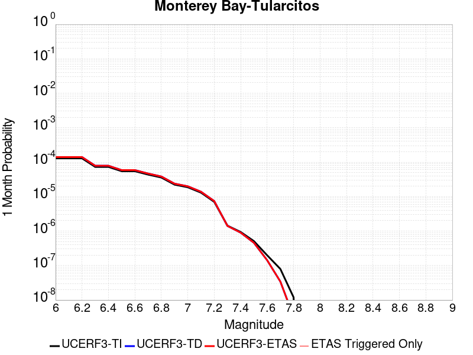 | 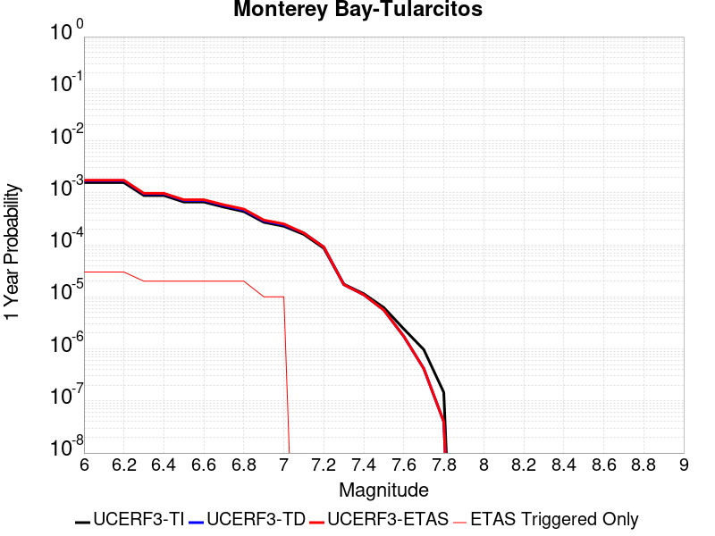 |  |

| Magnitude | 1 wk TI Prob | 1 wk TD Prob | 1 wk ETAS Prob | 1 wk ETAS/TD Gain | 1 wk ETAS Triggered Only | 1 mo TI Prob | 1 mo TD Prob | 1 mo ETAS Prob | 1 mo ETAS/TD Gain | 1 mo ETAS Triggered Only | 1 yr TI Prob | 1 yr TD Prob | 1 yr ETAS Prob | 1 yr ETAS/TD Gain | 1 yr ETAS Triggered Only | 10 yr TI Prob | 10 yr TD Prob | 10 yr ETAS Prob | 10 yr ETAS/TD Gain | 10 yr ETAS Triggered Only |
|-----|-----|-----|-----|-----|-----|-----|-----|-----|-----|-----|-----|-----|-----|-----|-----|-----|-----|-----|-----|-----|
| 6.0 | 3.0131365E-5 | 3.2799864E-5 | 3.2799864E-5 | 1.0 | 0.0 | 1.2912804E-4 | 1.4056388E-4 | 1.4056388E-4 | 1.0 | 0.0 | 0.001571 | 0.0017101273 | 0.001740076 | 1.0175126 | 3.0E-5 | 0.015599402 | 0.016980479 | 0.01700997 | 1.0017368 | 3.0E-5 |
| 6.1 | 3.0131365E-5 | 3.2799864E-5 | 3.2799864E-5 | 1.0 | 0.0 | 1.2912804E-4 | 1.4056388E-4 | 1.4056388E-4 | 1.0 | 0.0 | 0.001571 | 0.0017101273 | 0.001740076 | 1.0175126 | 3.0E-5 | 0.015599402 | 0.016980479 | 0.01700997 | 1.0017368 | 3.0E-5 |
| 6.2 | 3.0131365E-5 | 3.2799864E-5 | 3.2799864E-5 | 1.0 | 0.0 | 1.2912804E-4 | 1.4056388E-4 | 1.4056388E-4 | 1.0 | 0.0 | 0.001571 | 0.0017101273 | 0.001740076 | 1.0175126 | 3.0E-5 | 0.015599402 | 0.016980479 | 0.01700997 | 1.0017368 | 3.0E-5 |
| 6.3 | 1.6998249E-5 | 1.8331346E-5 | 1.8331346E-5 | 1.0 | 0.0 | 7.28476E-5 | 7.8560646E-5 | 7.8560646E-5 | 1.0 | 0.0 | 8.865586E-4 | 9.5607486E-4 | 9.7605574E-4 | 1.0208988 | 2.0E-5 | 0.0088303005 | 0.009521541 | 0.00954135 | 1.0020806 | 2.0E-5 |
| 6.4 | 1.6998249E-5 | 1.8331346E-5 | 1.8331346E-5 | 1.0 | 0.0 | 7.28476E-5 | 7.8560646E-5 | 7.8560646E-5 | 1.0 | 0.0 | 8.865586E-4 | 9.5607486E-4 | 9.7605574E-4 | 1.0208988 | 2.0E-5 | 0.0088303005 | 0.009521541 | 0.00954135 | 1.0020806 | 2.0E-5 |
| 6.5 | 1.27470785E-5 | 1.3693703E-5 | 1.3693703E-5 | 1.0 | 0.0 | 5.4629192E-5 | 5.8686037E-5 | 5.8686037E-5 | 1.0 | 0.0 | 6.649074E-4 | 7.142786E-4 | 7.342643E-4 | 1.0279803 | 2.0E-5 | 0.0066292146 | 0.0071208808 | 0.0071407384 | 1.0027887 | 2.0E-5 |
| 6.6 | 1.2739422E-5 | 1.3685791E-5 | 1.3685791E-5 | 1.0 | 0.0 | 5.4596385E-5 | 5.8652127E-5 | 5.8652127E-5 | 1.0 | 0.0 | 6.645082E-4 | 7.1386603E-4 | 7.3385175E-4 | 1.0279964 | 2.0E-5 | 0.0066252467 | 0.0071167815 | 0.007136639 | 1.0027902 | 2.0E-5 |
| 6.7 | 1.0160109E-5 | 1.0886056E-5 | 1.0886056E-5 | 1.0 | 0.0 | 4.35426E-5 | 4.665373E-5 | 4.665373E-5 | 1.0 | 0.0 | 5.300022E-4 | 5.6786824E-4 | 5.8785686E-4 | 1.0351994 | 2.0E-5 | 0.005287399 | 0.0056648827 | 0.0056847692 | 1.0035105 | 2.0E-5 |
| 6.8 | 8.349859E-6 | 8.932831E-6 | 8.932831E-6 | 1.0 | 0.0 | 3.578462E-5 | 3.8283033E-5 | 3.8283033E-5 | 1.0 | 0.0 | 4.3559066E-4 | 4.660019E-4 | 4.8599258E-4 | 1.0428983 | 2.0E-5 | 0.004347378 | 0.004650812 | 0.004670719 | 1.0042803 | 2.0E-5 |
| 6.9 | 5.193639E-6 | 5.5365786E-6 | 5.5365786E-6 | 1.0 | 0.0 | 2.2258262E-5 | 2.3727996E-5 | 2.3727996E-5 | 1.0 | 0.0 | 2.7096065E-4 | 2.888533E-4 | 2.988504E-4 | 1.0346097 | 1.0E-5 | 0.0027063051 | 0.0028850995 | 0.0028950707 | 1.0034561 | 1.0E-5 |
| 7.0 | 4.359381E-6 | 4.643491E-6 | 4.643491E-6 | 1.0 | 0.0 | 1.8682927E-5 | 1.990054E-5 | 1.990054E-5 | 1.0 | 0.0 | 2.274409E-4 | 2.4226512E-4 | 2.522627E-4 | 1.041267 | 1.0E-5 | 0.0022720827 | 0.0024203032 | 0.0024302788 | 1.0041217 | 1.0E-5 |
| 7.1 | 3.0398533E-6 | 3.2311307E-6 | 3.2311307E-6 | 1.0 | 0.0 | 1.3027877E-5 | 1.3847644E-5 | 1.3847644E-5 | 1.0 | 0.0 | 1.5860285E-4 | 1.6858465E-4 | 1.6858465E-4 | 1.0 | 0.0 | 0.001584897 | 0.0016848253 | 0.0016848253 | 1.0 | 0.0 |
| 7.2 | 1.642335E-6 | 1.7333635E-6 | 1.7333635E-6 | 1.0 | 0.0 | 7.0385595E-6 | 7.4286913E-6 | 7.4286913E-6 | 1.0 | 0.0 | 8.569109E-5 | 9.044263E-5 | 9.044263E-5 | 1.0 | 0.0 | 8.5658056E-4 | 9.042609E-4 | 9.042609E-4 | 1.0 | 0.0 |
| 7.3 | 3.356842E-7 | 3.2953318E-7 | 3.2953318E-7 | 1.0 | 0.0 | 1.4386458E-6 | 1.4122843E-6 | 1.4122843E-6 | 1.0 | 0.0 | 1.7515373E-5 | 1.7194427E-5 | 1.7194427E-5 | 1.0 | 0.0 | 1.7513991E-4 | 1.7193107E-4 | 1.7193107E-4 | 1.0 | 0.0 |
| 7.4 | 2.1973483E-7 | 2.1007209E-7 | 2.1007209E-7 | 1.0 | 0.0 | 9.417204E-7 | 9.0030863E-7 | 9.0030863E-7 | 1.0 | 0.0 | 1.1465385E-5 | 1.0961203E-5 | 1.0961203E-5 | 1.0 | 0.0 | 1.1464794E-4 | 1.0960666E-4 | 1.0960666E-4 | 1.0 | 0.0 |
| 7.5 | 1.1944135E-7 | 1.0696716E-7 | 1.0696716E-7 | 1.0 | 0.0 | 5.118914E-7 | 4.584306E-7 | 4.584306E-7 | 1.0 | 0.0 | 6.23226E-6 | 5.5813784E-6 | 5.5813784E-6 | 1.0 | 0.0 | 6.2320854E-5 | 5.5812394E-5 | 5.5812394E-5 | 1.0 | 0.0 |
| 7.6 | 4.636058E-8 | 3.337065E-8 | 3.337065E-8 | 1.0 | 0.0 | 1.9868818E-7 | 1.4301706E-7 | 1.4301706E-7 | 1.0 | 0.0 | 2.419026E-6 | 1.7412314E-6 | 1.7412314E-6 | 1.0 | 0.0 | 2.4189996E-5 | 1.741218E-5 | 1.741218E-5 | 1.0 | 0.0 |
| 7.7 | 1.8588572E-8 | 8.007671E-9 | 8.007671E-9 | 1.0 | 0.0 | 7.9665305E-8 | 3.431859E-8 | 3.431859E-8 | 1.0 | 0.0 | 9.699246E-7 | 4.1782872E-7 | 4.1782872E-7 | 1.0 | 0.0 | 9.699204E-6 | 4.1782796E-6 | 4.1782796E-6 | 1.0 | 0.0 |
| 7.8 | 2.7960154E-9 | 7.616562E-10 | 7.616562E-10 | 1.0 | 0.0 | 1.1982923E-8 | 3.2642404E-9 | 3.2642404E-9 | 1.0 | 0.0 | 1.4589209E-7 | 3.9742126E-8 | 3.9742126E-8 | 1.0 | 0.0 | 1.4589199E-6 | 3.9742122E-7 | 3.9742122E-7 | 1.0 | 0.0 |

## Santa Cruz Catalina Ridge alt1
*[(top)](#table-of-contents)*

| 1 Week | 1 Month | 1 Year | 10 Year |
|-----|-----|-----|-----|
| 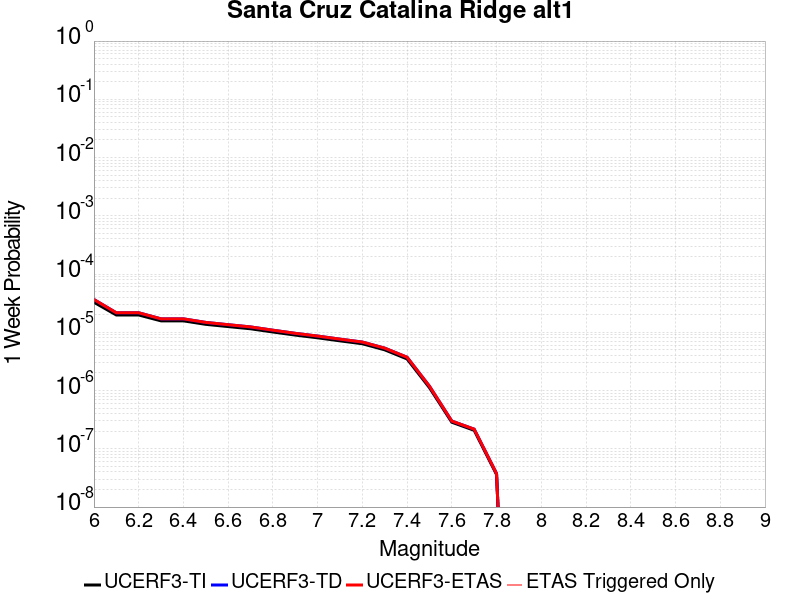 | 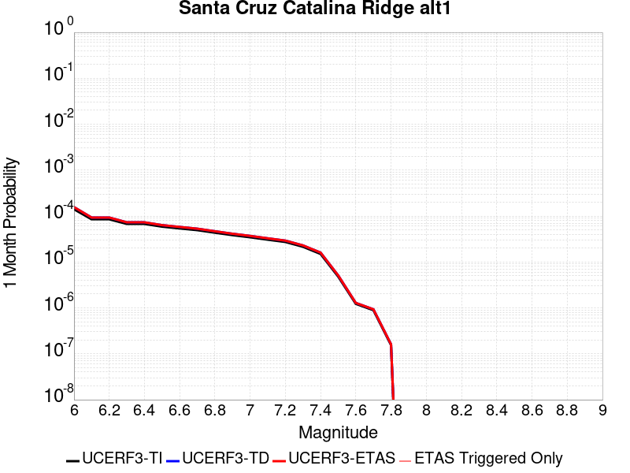 | 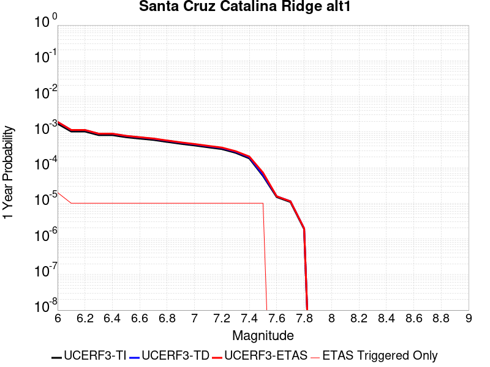 |  |

| Magnitude | 1 wk TI Prob | 1 wk TD Prob | 1 wk ETAS Prob | 1 wk ETAS/TD Gain | 1 wk ETAS Triggered Only | 1 mo TI Prob | 1 mo TD Prob | 1 mo ETAS Prob | 1 mo ETAS/TD Gain | 1 mo ETAS Triggered Only | 1 yr TI Prob | 1 yr TD Prob | 1 yr ETAS Prob | 1 yr ETAS/TD Gain | 1 yr ETAS Triggered Only | 10 yr TI Prob | 10 yr TD Prob | 10 yr ETAS Prob | 10 yr ETAS/TD Gain | 10 yr ETAS Triggered Only |
|-----|-----|-----|-----|-----|-----|-----|-----|-----|-----|-----|-----|-----|-----|-----|-----|-----|-----|-----|-----|-----|
| 6.0 | 3.2833184E-5 | 3.6559963E-5 | 3.6559963E-5 | 1.0 | 0.0 | 1.4070606E-4 | 1.5667708E-4 | 1.5667708E-4 | 1.0 | 0.0 | 0.00171175 | 0.001906041 | 0.0019260029 | 1.010473 | 2.0E-5 | 0.016986247 | 0.018913832 | 0.018943265 | 1.0015562 | 3.0E-5 |
| 6.1 | 1.9835548E-5 | 2.1660251E-5 | 2.1660251E-5 | 1.0 | 0.0 | 8.500672E-5 | 9.2826456E-5 | 9.2826456E-5 | 1.0 | 0.0 | 0.0010344655 | 0.0011295964 | 0.001139585 | 1.0088427 | 1.0E-5 | 0.010296632 | 0.011240681 | 0.0112604555 | 1.0017593 | 2.0E-5 |
| 6.2 | 1.9835548E-5 | 2.1660251E-5 | 2.1660251E-5 | 1.0 | 0.0 | 8.500672E-5 | 9.2826456E-5 | 9.2826456E-5 | 1.0 | 0.0 | 0.0010344655 | 0.0011295964 | 0.001139585 | 1.0088427 | 1.0E-5 | 0.010296632 | 0.011240681 | 0.0112604555 | 1.0017593 | 2.0E-5 |
| 6.3 | 1.5728183E-5 | 1.7034477E-5 | 1.7034477E-5 | 1.0 | 0.0 | 6.7404755E-5 | 7.300289E-5 | 7.300289E-5 | 1.0 | 0.0 | 8.2034385E-4 | 8.884539E-4 | 8.98445E-4 | 1.0112455 | 1.0E-5 | 0.008173222 | 0.0088497 | 0.008859611 | 1.00112 | 1.0E-5 |
| 6.4 | 1.5728183E-5 | 1.7034477E-5 | 1.7034477E-5 | 1.0 | 0.0 | 6.7404755E-5 | 7.300289E-5 | 7.300289E-5 | 1.0 | 0.0 | 8.2034385E-4 | 8.884539E-4 | 8.98445E-4 | 1.0112455 | 1.0E-5 | 0.008173222 | 0.0088497 | 0.008859611 | 1.00112 | 1.0E-5 |
| 6.5 | 1.3707734E-5 | 1.4794959E-5 | 1.4794959E-5 | 1.0 | 0.0 | 5.8746107E-5 | 6.3405445E-5 | 6.3405445E-5 | 1.0 | 0.0 | 7.1499916E-4 | 7.7169144E-4 | 7.816837E-4 | 1.0129485 | 1.0E-5 | 0.0071270303 | 0.007690516 | 0.007700439 | 1.0012903 | 1.0E-5 |
| 6.6 | 1.2539813E-5 | 1.3510608E-5 | 1.3510608E-5 | 1.0 | 0.0 | 5.3740947E-5 | 5.790134E-5 | 5.790134E-5 | 1.0 | 0.0 | 6.540996E-4 | 7.0472347E-4 | 7.1471644E-4 | 1.01418 | 1.0E-5 | 0.0065217763 | 0.00702519 | 0.00703512 | 1.0014135 | 1.0E-5 |
| 6.7 | 1.1504083E-5 | 1.23777245E-5 | 1.23777245E-5 | 1.0 | 0.0 | 4.930228E-5 | 5.3046326E-5 | 5.3046326E-5 | 1.0 | 0.0 | 6.0008996E-4 | 6.456496E-4 | 6.556432E-4 | 1.0154783 | 1.0E-5 | 0.005984721 | 0.0064379675 | 0.006447903 | 1.0015433 | 1.0E-5 |
| 6.8 | 1.012739E-5 | 1.0877371E-5 | 1.0877371E-5 | 1.0 | 0.0 | 4.340238E-5 | 4.661648E-5 | 4.661648E-5 | 1.0 | 0.0 | 5.282958E-4 | 5.674093E-4 | 5.774037E-4 | 1.017614 | 1.0E-5 | 0.0052704164 | 0.005659775 | 0.0056697186 | 1.0017569 | 1.0E-5 |
| 6.9 | 8.9607865E-6 | 9.609376E-6 | 9.609376E-6 | 1.0 | 0.0 | 3.8402806E-5 | 4.1182397E-5 | 4.1182397E-5 | 1.0 | 0.0 | 4.6745385E-4 | 5.012814E-4 | 5.1127636E-4 | 1.0199388 | 1.0E-5 | 0.0046647177 | 0.005001626 | 0.005011576 | 1.0019894 | 1.0E-5 |
| 7.0 | 8.046829E-6 | 8.619974E-6 | 8.619974E-6 | 1.0 | 0.0 | 3.4485955E-5 | 3.6942227E-5 | 3.6942227E-5 | 1.0 | 0.0 | 4.1978562E-4 | 4.4967962E-4 | 4.5967512E-4 | 1.022228 | 1.0E-5 | 0.004189935 | 0.0044877874 | 0.0044977427 | 1.0022182 | 1.0E-5 |
| 7.1 | 7.136131E-6 | 7.637856E-6 | 7.637856E-6 | 1.0 | 0.0 | 3.0583058E-5 | 3.273326E-5 | 3.273326E-5 | 1.0 | 0.0 | 3.7228514E-4 | 3.9845527E-4 | 4.084513E-4 | 1.0250869 | 1.0E-5 | 0.0037166206 | 0.003977485 | 0.0039874455 | 1.0025041 | 1.0E-5 |
| 7.2 | 6.362014E-6 | 6.805135E-6 | 6.805135E-6 | 1.0 | 0.0 | 2.726549E-5 | 2.9164541E-5 | 2.9164541E-5 | 1.0 | 0.0 | 3.3190678E-4 | 3.550211E-4 | 3.6501753E-4 | 1.0281574 | 1.0E-5 | 0.0033141149 | 0.0035446077 | 0.0035545724 | 1.0028112 | 1.0E-5 |
| 7.3 | 5.004101E-6 | 5.3518534E-6 | 5.3518534E-6 | 1.0 | 0.0 | 2.1445969E-5 | 2.2936316E-5 | 2.2936316E-5 | 1.0 | 0.0 | 2.6107338E-4 | 2.792144E-4 | 2.892116E-4 | 1.0358047 | 1.0E-5 | 0.002607669 | 0.0027886906 | 0.0027986628 | 1.0035759 | 1.0E-5 |
| 7.4 | 3.4901443E-6 | 3.7321488E-6 | 3.7321488E-6 | 1.0 | 0.0 | 1.4957676E-5 | 1.5994827E-5 | 1.5994827E-5 | 1.0 | 0.0 | 1.8209449E-4 | 1.9472E-4 | 2.0471806E-4 | 1.0513458 | 1.0E-5 | 0.0018194534 | 0.0019455325 | 0.0019555131 | 1.0051299 | 1.0E-5 |
| 7.5 | 1.1215045E-6 | 1.1894139E-6 | 1.1894139E-6 | 1.0 | 0.0 | 4.806439E-6 | 5.097478E-6 | 5.097478E-6 | 1.0 | 0.0 | 5.851682E-5 | 6.206006E-5 | 7.205944E-5 | 1.1611242 | 1.0E-5 | 5.850142E-4 | 6.204304E-4 | 6.304242E-4 | 1.0161078 | 1.0E-5 |
| 7.6 | 2.8599047E-7 | 2.995252E-7 | 2.995252E-7 | 1.0 | 0.0 | 1.2256729E-6 | 1.2836788E-6 | 1.2836788E-6 | 1.0 | 0.0 | 1.4922465E-5 | 1.5628679E-5 | 1.5628679E-5 | 1.0 | 0.0 | 1.4921463E-4 | 1.5627593E-4 | 1.5627593E-4 | 1.0 | 0.0 |
| 7.7 | 2.0781519E-7 | 2.1744698E-7 | 2.1744698E-7 | 1.0 | 0.0 | 8.906362E-7 | 9.319153E-7 | 9.319153E-7 | 1.0 | 0.0 | 1.08434415E-5 | 1.134601E-5 | 1.134601E-5 | 1.0 | 0.0 | 1.0842913E-4 | 1.1345441E-4 | 1.1345441E-4 | 1.0 | 0.0 |
| 7.8 | 3.614776E-8 | 3.7641595E-8 | 3.7641595E-8 | 1.0 | 0.0 | 1.5491896E-7 | 1.6132111E-7 | 1.6132111E-7 | 1.0 | 0.0 | 1.8861368E-6 | 1.964083E-6 | 1.964083E-6 | 1.0 | 0.0 | 1.8861208E-5 | 1.9640667E-5 | 1.9640667E-5 | 1.0 | 0.0 |

## San Gabriel
*[(top)](#table-of-contents)*

| 1 Week | 1 Month | 1 Year | 10 Year |
|-----|-----|-----|-----|
| 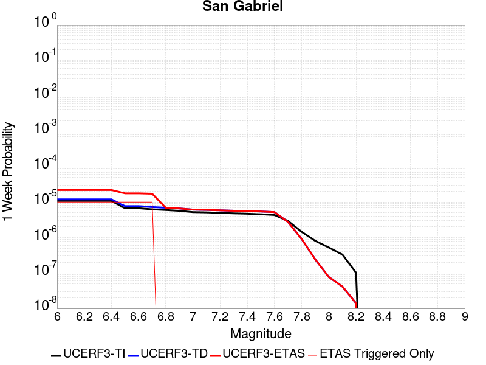 | 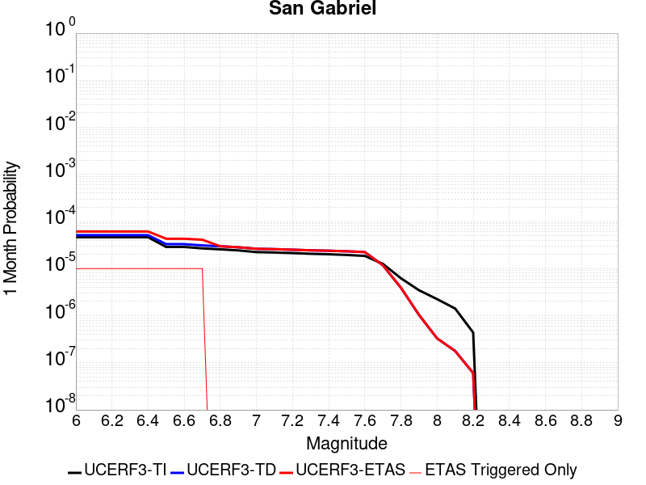 |  |  |

| Magnitude | 1 wk TI Prob | 1 wk TD Prob | 1 wk ETAS Prob | 1 wk ETAS/TD Gain | 1 wk ETAS Triggered Only | 1 mo TI Prob | 1 mo TD Prob | 1 mo ETAS Prob | 1 mo ETAS/TD Gain | 1 mo ETAS Triggered Only | 1 yr TI Prob | 1 yr TD Prob | 1 yr ETAS Prob | 1 yr ETAS/TD Gain | 1 yr ETAS Triggered Only | 10 yr TI Prob | 10 yr TD Prob | 10 yr ETAS Prob | 10 yr ETAS/TD Gain | 10 yr ETAS Triggered Only |
|-----|-----|-----|-----|-----|-----|-----|-----|-----|-----|-----|-----|-----|-----|-----|-----|-----|-----|-----|-----|-----|
| 6.0 | 1.083775E-5 | 1.1991179E-5 | 2.199106E-5 | 1.8339363 | 1.0E-5 | 4.6446676E-5 | 5.138982E-5 | 6.1389306E-5 | 1.194581 | 1.0E-5 | 5.653415E-4 | 6.255027E-4 | 6.354965E-4 | 1.0159771 | 1.0E-5 | 0.0056390543 | 0.0062495098 | 0.0062793223 | 1.0047704 | 3.0E-5 |
| 6.1 | 1.083775E-5 | 1.1991179E-5 | 2.199106E-5 | 1.8339363 | 1.0E-5 | 4.6446676E-5 | 5.138982E-5 | 6.1389306E-5 | 1.194581 | 1.0E-5 | 5.653415E-4 | 6.255027E-4 | 6.354965E-4 | 1.0159771 | 1.0E-5 | 0.0056390543 | 0.0062495098 | 0.0062793223 | 1.0047704 | 3.0E-5 |
| 6.2 | 1.083775E-5 | 1.1991179E-5 | 2.199106E-5 | 1.8339363 | 1.0E-5 | 4.6446676E-5 | 5.138982E-5 | 6.1389306E-5 | 1.194581 | 1.0E-5 | 5.653415E-4 | 6.255027E-4 | 6.354965E-4 | 1.0159771 | 1.0E-5 | 0.0056390543 | 0.0062495098 | 0.0062793223 | 1.0047704 | 3.0E-5 |
| 6.3 | 1.083775E-5 | 1.1991179E-5 | 2.199106E-5 | 1.8339363 | 1.0E-5 | 4.6446676E-5 | 5.138982E-5 | 6.1389306E-5 | 1.194581 | 1.0E-5 | 5.653415E-4 | 6.255027E-4 | 6.354965E-4 | 1.0159771 | 1.0E-5 | 0.0056390543 | 0.0062495098 | 0.0062793223 | 1.0047704 | 3.0E-5 |
| 6.4 | 1.083775E-5 | 1.1991179E-5 | 2.199106E-5 | 1.8339363 | 1.0E-5 | 4.6446676E-5 | 5.138982E-5 | 6.1389306E-5 | 1.194581 | 1.0E-5 | 5.653415E-4 | 6.255027E-4 | 6.354965E-4 | 1.0159771 | 1.0E-5 | 0.0056390543 | 0.0062495098 | 0.0062793223 | 1.0047704 | 3.0E-5 |
| 6.5 | 6.7317824E-6 | 7.722873E-6 | 1.7722796E-5 | 2.2948449 | 1.0E-5 | 2.8850178E-5 | 3.3097615E-5 | 4.3097283E-5 | 1.3021265 | 1.0E-5 | 3.511943E-4 | 4.0289E-4 | 4.1288597E-4 | 1.0248107 | 1.0E-5 | 0.003506398 | 0.004032685 | 0.004052604 | 1.0049394 | 2.0E-5 |
| 6.6 | 6.7317824E-6 | 7.722873E-6 | 1.7722796E-5 | 2.2948449 | 1.0E-5 | 2.8850178E-5 | 3.3097615E-5 | 4.3097283E-5 | 1.3021265 | 1.0E-5 | 3.511943E-4 | 4.0289E-4 | 4.1288597E-4 | 1.0248107 | 1.0E-5 | 0.003506398 | 0.004032685 | 0.004052604 | 1.0049394 | 2.0E-5 |
| 6.7 | 6.274881E-6 | 7.2517882E-6 | 1.7251716E-5 | 2.3789601 | 1.0E-5 | 2.6892068E-5 | 3.107873E-5 | 4.1078416E-5 | 1.3217535 | 1.0E-5 | 3.2736175E-4 | 3.7831877E-4 | 3.88315E-4 | 1.0264227 | 1.0E-5 | 0.0032687993 | 0.0037878293 | 0.0037977914 | 1.00263 | 1.0E-5 |
| 6.8 | 5.996209E-6 | 6.9645052E-6 | 6.9645052E-6 | 1.0 | 0.0 | 2.5697784E-5 | 2.9847542E-5 | 2.9847542E-5 | 1.0 | 0.0 | 3.128256E-4 | 3.6333417E-4 | 3.6333417E-4 | 1.0 | 0.0 | 0.003123856 | 0.003638481 | 0.003638481 | 1.0 | 0.0 |
| 6.9 | 5.686331E-6 | 6.6295283E-6 | 6.6295283E-6 | 1.0 | 0.0 | 2.4369761E-5 | 2.841196E-5 | 2.841196E-5 | 1.0 | 0.0 | 2.9666146E-4 | 3.458616E-4 | 3.458616E-4 | 1.0 | 0.0 | 0.0029626573 | 0.0034643116 | 0.0034643116 | 1.0 | 0.0 |
| 7.0 | 5.2329838E-6 | 6.1533956E-6 | 6.1533956E-6 | 1.0 | 0.0 | 2.242688E-5 | 2.6371434E-5 | 2.6371434E-5 | 1.0 | 0.0 | 2.7301308E-4 | 3.2102567E-4 | 3.2102567E-4 | 1.0 | 0.0 | 0.002726779 | 0.003216685 | 0.003216685 | 1.0 | 0.0 |
| 7.1 | 5.135671E-6 | 6.0435063E-6 | 6.0435063E-6 | 1.0 | 0.0 | 2.2009834E-5 | 2.5900488E-5 | 2.5900488E-5 | 1.0 | 0.0 | 2.6793676E-4 | 3.1529358E-4 | 3.1529358E-4 | 1.0 | 0.0 | 0.0026761394 | 0.0031595286 | 0.0031595286 | 1.0 | 0.0 |
| 7.2 | 4.989062E-6 | 5.87686E-6 | 5.87686E-6 | 1.0 | 0.0 | 2.1381518E-5 | 2.5186304E-5 | 2.5186304E-5 | 1.0 | 0.0 | 2.6028889E-4 | 3.0660085E-4 | 3.0660085E-4 | 1.0 | 0.0 | 0.0025998424 | 0.0030728446 | 0.0030728446 | 1.0 | 0.0 |
| 7.3 | 4.8219395E-6 | 5.7083903E-6 | 5.7083903E-6 | 1.0 | 0.0 | 2.0665291E-5 | 2.4464305E-5 | 2.4464305E-5 | 1.0 | 0.0 | 2.5157086E-4 | 2.9781295E-4 | 2.9781295E-4 | 1.0 | 0.0 | 0.0025128627 | 0.0029852048 | 0.0029852048 | 1.0 | 0.0 |
| 7.4 | 4.7118383E-6 | 5.5969276E-6 | 5.5969276E-6 | 1.0 | 0.0 | 2.0193436E-5 | 2.3986617E-5 | 2.3986617E-5 | 1.0 | 0.0 | 2.4582737E-4 | 2.9199867E-4 | 2.9199867E-4 | 1.0 | 0.0 | 0.002455556 | 0.0029272153 | 0.0029272153 | 1.0 | 0.0 |
| 7.5 | 4.5506545E-6 | 5.4422667E-6 | 5.4422667E-6 | 1.0 | 0.0 | 1.9502659E-5 | 2.3323795E-5 | 2.3323795E-5 | 1.0 | 0.0 | 2.37419E-4 | 2.8393095E-4 | 2.8393095E-4 | 1.0 | 0.0 | 0.002371655 | 0.0028467465 | 0.0028467465 | 1.0 | 0.0 |
| 7.6 | 4.343636E-6 | 5.2350983E-6 | 5.2350983E-6 | 1.0 | 0.0 | 1.861545E-5 | 2.2435946E-5 | 2.2435946E-5 | 1.0 | 0.0 | 2.2661954E-4 | 2.7312417E-4 | 2.7312417E-4 | 1.0 | 0.0 | 0.0022638857 | 0.002738941 | 0.002738941 | 1.0 | 0.0 |
| 7.7 | 2.936235E-6 | 2.7478952E-6 | 2.7478952E-6 | 1.0 | 0.0 | 1.2583803E-5 | 1.177664E-5 | 1.177664E-5 | 1.0 | 0.0 | 1.5319703E-4 | 1.433712E-4 | 1.433712E-4 | 1.0 | 0.0 | 0.0015309147 | 0.0014400922 | 0.0014400922 | 1.0 | 0.0 |
| 7.8 | 1.4541639E-6 | 9.1392957E-7 | 9.1392957E-7 | 1.0 | 0.0 | 6.232116E-6 | 3.9168353E-6 | 3.9168353E-6 | 1.0 | 0.0 | 7.587337E-5 | 4.7686426E-5 | 4.7686426E-5 | 1.0 | 0.0 | 7.584747E-4 | 4.816769E-4 | 4.816769E-4 | 1.0 | 0.0 |
| 7.9 | 8.098958E-7 | 2.4236454E-7 | 2.4236454E-7 | 1.0 | 0.0 | 3.4709774E-6 | 1.0387047E-6 | 1.0387047E-6 | 1.0 | 0.0 | 4.225833E-5 | 1.26461555E-5 | 1.26461555E-5 | 1.0 | 0.0 | 4.2250296E-4 | 1.2954725E-4 | 1.2954725E-4 | 1.0 | 0.0 |
| 8.0 | 5.2473234E-7 | 7.707381E-8 | 7.707381E-8 | 1.0 | 0.0 | 2.248851E-6 | 3.3031625E-7 | 3.3031625E-7 | 1.0 | 0.0 | 2.7379416E-5 | 4.0215928E-6 | 4.0215928E-6 | 1.0 | 0.0 | 2.7376044E-4 | 4.2346022E-5 | 4.2346022E-5 | 1.0 | 0.0 |
| 8.1 | 3.3162388E-7 | 4.165347E-8 | 4.165347E-8 | 1.0 | 0.0 | 1.4212444E-6 | 1.7851485E-7 | 1.7851485E-7 | 1.0 | 0.0 | 1.7303513E-5 | 2.173416E-6 | 2.173416E-6 | 1.0 | 0.0 | 1.7302166E-4 | 2.3051865E-5 | 2.3051865E-5 | 1.0 | 0.0 |
| 8.2 | 1.0235345E-7 | 1.4092453E-8 | 1.4092453E-8 | 1.0 | 0.0 | 4.3865757E-7 | 6.0396225E-8 | 6.0396225E-8 | 1.0 | 0.0 | 5.340643E-6 | 7.353238E-7 | 7.353238E-7 | 1.0 | 0.0 | 5.3405143E-5 | 7.954484E-6 | 7.954484E-6 | 1.0 | 0.0 |

## Rose Canyon
*[(top)](#table-of-contents)*

| 1 Week | 1 Month | 1 Year | 10 Year |
|-----|-----|-----|-----|
| 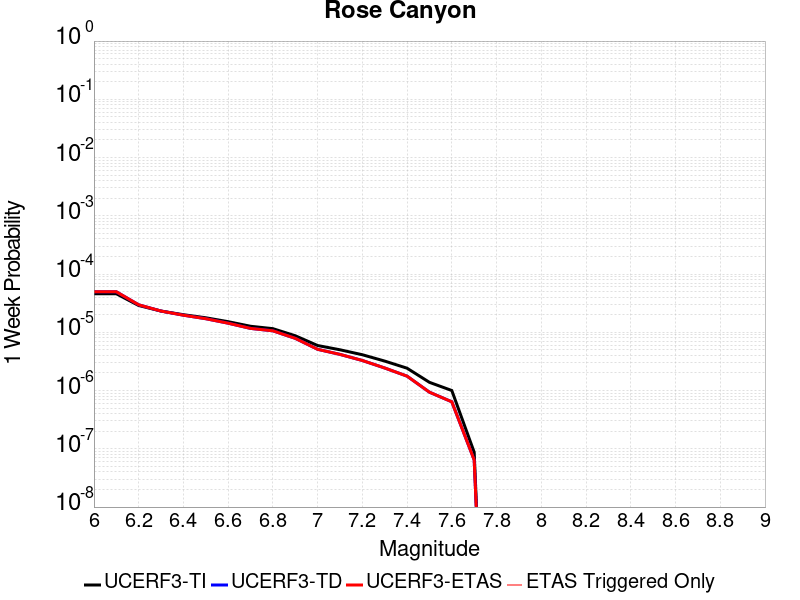 | 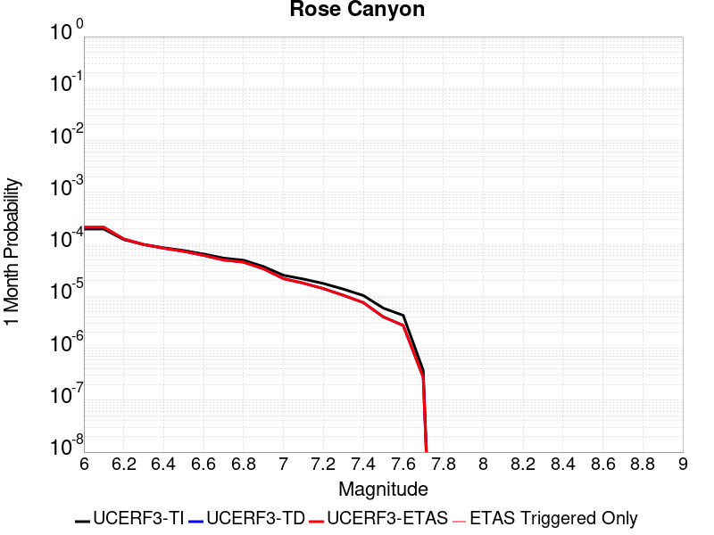 |  | 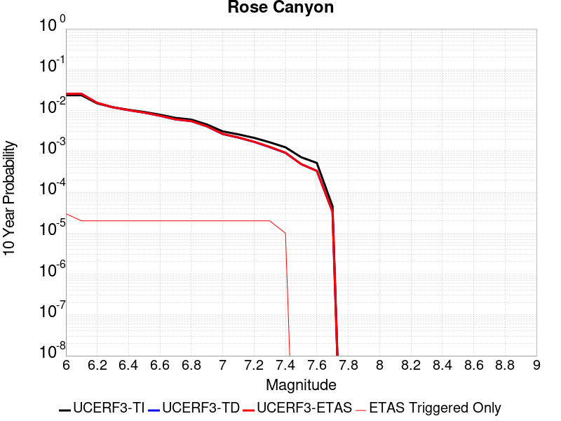 |

| Magnitude | 1 wk TI Prob | 1 wk TD Prob | 1 wk ETAS Prob | 1 wk ETAS/TD Gain | 1 wk ETAS Triggered Only | 1 mo TI Prob | 1 mo TD Prob | 1 mo ETAS Prob | 1 mo ETAS/TD Gain | 1 mo ETAS Triggered Only | 1 yr TI Prob | 1 yr TD Prob | 1 yr ETAS Prob | 1 yr ETAS/TD Gain | 1 yr ETAS Triggered Only | 10 yr TI Prob | 10 yr TD Prob | 10 yr ETAS Prob | 10 yr ETAS/TD Gain | 10 yr ETAS Triggered Only |
|-----|-----|-----|-----|-----|-----|-----|-----|-----|-----|-----|-----|-----|-----|-----|-----|-----|-----|-----|-----|-----|
| 6.0 | 4.5923203E-5 | 4.971889E-5 | 4.971889E-5 | 1.0 | 0.0 | 1.9679888E-4 | 2.1306289E-4 | 2.1306289E-4 | 1.0 | 0.0 | 0.0023933933 | 0.0025911625 | 0.0026111105 | 1.0076985 | 2.0E-5 | 0.023677798 | 0.025642276 | 0.025671506 | 1.00114 | 3.0E-5 |
| 6.1 | 4.5923203E-5 | 4.971889E-5 | 4.971889E-5 | 1.0 | 0.0 | 1.9679888E-4 | 2.1306289E-4 | 2.1306289E-4 | 1.0 | 0.0 | 0.0023933933 | 0.0025911625 | 0.0026111105 | 1.0076985 | 2.0E-5 | 0.023677798 | 0.025642276 | 0.025661763 | 1.00076 | 2.0E-5 |
| 6.2 | 2.8844734E-5 | 2.9670931E-5 | 2.9670931E-5 | 1.0 | 0.0 | 1.2361443E-4 | 1.2715312E-4 | 1.2715312E-4 | 1.0 | 0.0 | 0.0015039665 | 0.0015470065 | 0.0015669756 | 1.0129082 | 2.0E-5 | 0.0149382865 | 0.015375392 | 0.015395083 | 1.0012808 | 2.0E-5 |
| 6.3 | 2.3171577E-5 | 2.3162687E-5 | 2.3162687E-5 | 1.0 | 0.0 | 9.9302975E-5 | 9.926496E-5 | 9.926496E-5 | 1.0 | 0.0 | 0.0012083431 | 0.0012078941 | 0.00122787 | 1.0165378 | 2.0E-5 | 0.012017938 | 0.012023181 | 0.012042941 | 1.0016434 | 2.0E-5 |
| 6.4 | 2.0066604E-5 | 1.9668267E-5 | 1.9668267E-5 | 1.0 | 0.0 | 8.599689E-5 | 8.42899E-5 | 8.42899E-5 | 1.0 | 0.0 | 0.0010465092 | 0.0010257565 | 0.0010457359 | 1.0194778 | 2.0E-5 | 0.010415946 | 0.010218199 | 0.010237996 | 1.0019373 | 2.0E-5 |
| 6.5 | 1.776989E-5 | 1.7114877E-5 | 1.7114877E-5 | 1.0 | 0.0 | 7.615444E-5 | 7.334745E-5 | 7.334745E-5 | 1.0 | 0.0 | 9.267859E-4 | 8.926463E-4 | 9.126284E-4 | 1.0223852 | 2.0E-5 | 0.009229303 | 0.008896765 | 0.008916587 | 1.002228 | 2.0E-5 |
| 6.6 | 1.5227364E-5 | 1.4339947E-5 | 1.4339947E-5 | 1.0 | 0.0 | 6.52585E-5 | 6.1455496E-5 | 6.1455496E-5 | 1.0 | 0.0 | 7.942326E-4 | 7.47969E-4 | 7.6795404E-4 | 1.0267191 | 2.0E-5 | 0.007914 | 0.0074587152 | 0.0074785664 | 1.0026615 | 2.0E-5 |
| 6.7 | 1.2703898E-5 | 1.1673768E-5 | 1.1673768E-5 | 1.0 | 0.0 | 5.4444143E-5 | 5.00295E-5 | 5.00295E-5 | 1.0 | 0.0 | 6.626558E-4 | 6.0894317E-4 | 6.28931E-4 | 1.0328238 | 2.0E-5 | 0.006606833 | 0.0060753413 | 0.00609522 | 1.0032719 | 2.0E-5 |
| 6.8 | 1.1554917E-5 | 1.0609752E-5 | 1.0609752E-5 | 1.0 | 0.0 | 4.9520135E-5 | 4.5469595E-5 | 4.5469595E-5 | 1.0 | 0.0 | 6.0274085E-4 | 5.534558E-4 | 5.734447E-4 | 1.0361166 | 2.0E-5 | 0.0060110865 | 0.0055227824 | 0.005542672 | 1.0036013 | 2.0E-5 |
| 6.9 | 8.732078E-6 | 7.881612E-6 | 7.881612E-6 | 1.0 | 0.0 | 3.7422655E-5 | 3.3777913E-5 | 3.3777913E-5 | 1.0 | 0.0 | 4.5552556E-4 | 4.1117144E-4 | 4.311632E-4 | 1.0486215 | 2.0E-5 | 0.0045459294 | 0.00410494 | 0.004124858 | 1.0048522 | 2.0E-5 |
| 7.0 | 5.9337494E-6 | 5.107613E-6 | 5.107613E-6 | 1.0 | 0.0 | 2.5430107E-5 | 2.1889588E-5 | 2.1889588E-5 | 1.0 | 0.0 | 3.0956755E-4 | 2.6647327E-4 | 2.8646793E-4 | 1.0750344 | 2.0E-5 | 0.0030913667 | 0.002661553 | 0.0026814998 | 1.0074944 | 2.0E-5 |
| 7.1 | 5.013409E-6 | 4.1774847E-6 | 4.1774847E-6 | 1.0 | 0.0 | 2.1485863E-5 | 1.7903383E-5 | 1.7903383E-5 | 1.0 | 0.0 | 2.6155898E-4 | 2.17952E-4 | 2.3794764E-4 | 1.0917434 | 2.0E-5 | 0.0026125133 | 0.002177394 | 0.0021973504 | 1.0091653 | 2.0E-5 |
| 7.2 | 4.120763E-6 | 3.2822204E-6 | 3.2822204E-6 | 1.0 | 0.0 | 1.7660293E-5 | 1.4066584E-5 | 1.4066584E-5 | 1.0 | 0.0 | 2.1499286E-4 | 1.7124729E-4 | 1.9124386E-4 | 1.1167701 | 2.0E-5 | 0.0021478499 | 0.0017111629 | 0.0017311285 | 1.011668 | 2.0E-5 |
| 7.3 | 3.2081239E-6 | 2.4406E-6 | 2.4406E-6 | 1.0 | 0.0 | 1.374903E-5 | 1.0459672E-5 | 1.0459672E-5 | 1.0 | 0.0 | 1.6738157E-4 | 1.2733914E-4 | 1.4733658E-4 | 1.157041 | 2.0E-5 | 0.0016725556 | 0.0012726687 | 0.0012926433 | 1.015695 | 2.0E-5 |
| 7.4 | 2.4194755E-6 | 1.7681109E-6 | 1.7681109E-6 | 1.0 | 0.0 | 1.0369139E-5 | 7.5775965E-6 | 7.5775965E-6 | 1.0 | 0.0 | 1.2623696E-4 | 9.225339E-5 | 1.0225247E-4 | 1.1083871 | 1.0E-5 | 0.0012616527 | 9.2215627E-4 | 9.32147E-4 | 1.0108341 | 1.0E-5 |
| 7.5 | 1.3842889E-6 | 9.3789356E-7 | 9.3789356E-7 | 1.0 | 0.0 | 5.9326535E-6 | 4.0195378E-6 | 4.0195378E-6 | 1.0 | 0.0 | 7.222766E-5 | 4.893681E-5 | 4.893681E-5 | 1.0 | 0.0 | 7.220419E-4 | 4.8926385E-4 | 4.8926385E-4 | 1.0 | 0.0 |
| 7.6 | 1.0021575E-6 | 6.4117023E-7 | 6.4117023E-7 | 1.0 | 0.0 | 4.2949537E-6 | 2.7478698E-6 | 2.7478698E-6 | 1.0 | 0.0 | 5.2289808E-5 | 3.345482E-5 | 3.345482E-5 | 1.0 | 0.0 | 5.2277505E-4 | 3.345E-4 | 3.345E-4 | 1.0 | 0.0 |
| 7.7 | 8.7620116E-8 | 6.449362E-8 | 6.449362E-8 | 1.0 | 0.0 | 3.7551473E-7 | 2.764012E-7 | 2.764012E-7 | 1.0 | 0.0 | 4.5718825E-6 | 3.36518E-6 | 3.36518E-6 | 1.0 | 0.0 | 4.5717883E-5 | 3.365132E-5 | 3.365132E-5 | 1.0 | 0.0 |

## Big Pine (East)
*[(top)](#table-of-contents)*

| 1 Week | 1 Month | 1 Year | 10 Year |
|-----|-----|-----|-----|
| 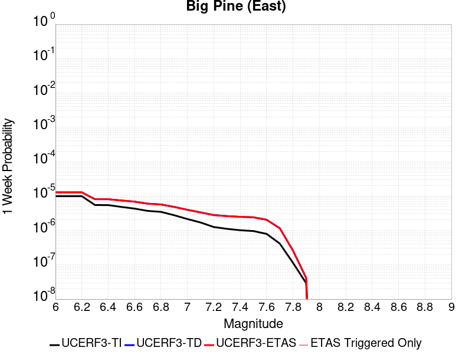 |  | 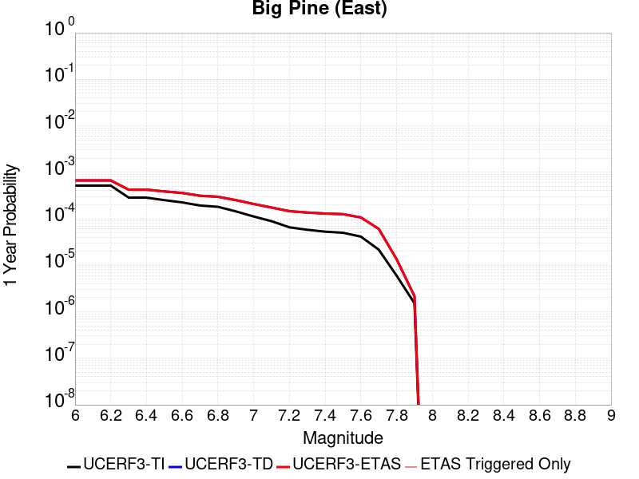 |  |

| Magnitude | 1 wk TI Prob | 1 wk TD Prob | 1 wk ETAS Prob | 1 wk ETAS/TD Gain | 1 wk ETAS Triggered Only | 1 mo TI Prob | 1 mo TD Prob | 1 mo ETAS Prob | 1 mo ETAS/TD Gain | 1 mo ETAS Triggered Only | 1 yr TI Prob | 1 yr TD Prob | 1 yr ETAS Prob | 1 yr ETAS/TD Gain | 1 yr ETAS Triggered Only | 10 yr TI Prob | 10 yr TD Prob | 10 yr ETAS Prob | 10 yr ETAS/TD Gain | 10 yr ETAS Triggered Only |
|-----|-----|-----|-----|-----|-----|-----|-----|-----|-----|-----|-----|-----|-----|-----|-----|-----|-----|-----|-----|-----|
| 6.0 | 9.916913E-6 | 1.2820476E-5 | 1.2820476E-5 | 1.0 | 0.0 | 4.250036E-5 | 5.4943863E-5 | 5.4943863E-5 | 1.0 | 0.0 | 5.173191E-4 | 6.687583E-4 | 6.687583E-4 | 1.0 | 0.0 | 0.0051611643 | 0.006672221 | 0.0067020208 | 1.0044663 | 3.0E-5 |
| 6.1 | 9.916913E-6 | 1.2820476E-5 | 1.2820476E-5 | 1.0 | 0.0 | 4.250036E-5 | 5.4943863E-5 | 5.4943863E-5 | 1.0 | 0.0 | 5.173191E-4 | 6.687583E-4 | 6.687583E-4 | 1.0 | 0.0 | 0.0051611643 | 0.006672221 | 0.0067020208 | 1.0044663 | 3.0E-5 |
| 6.2 | 9.916913E-6 | 1.2820476E-5 | 1.2820476E-5 | 1.0 | 0.0 | 4.250036E-5 | 5.4943863E-5 | 5.4943863E-5 | 1.0 | 0.0 | 5.173191E-4 | 6.687583E-4 | 6.687583E-4 | 1.0 | 0.0 | 0.0051611643 | 0.006672221 | 0.0067020208 | 1.0044663 | 3.0E-5 |
| 6.3 | 5.479711E-6 | 8.116337E-6 | 8.116337E-6 | 1.0 | 0.0 | 2.3484265E-5 | 3.4783858E-5 | 3.4783858E-5 | 1.0 | 0.0 | 2.858834E-4 | 4.2341437E-4 | 4.2341437E-4 | 1.0 | 0.0 | 0.0028551589 | 0.004228973 | 0.0042588464 | 1.0070639 | 3.0E-5 |
| 6.4 | 5.465009E-6 | 8.10063E-6 | 8.10063E-6 | 1.0 | 0.0 | 2.3421257E-5 | 3.4716544E-5 | 3.4716544E-5 | 1.0 | 0.0 | 2.851165E-4 | 4.2259513E-4 | 4.2259513E-4 | 1.0 | 0.0 | 0.0028475097 | 0.004220812 | 0.004250685 | 1.0070777 | 3.0E-5 |
| 6.5 | 4.826767E-6 | 7.4256723E-6 | 7.4256723E-6 | 1.0 | 0.0 | 2.068598E-5 | 3.1823936E-5 | 3.1823936E-5 | 1.0 | 0.0 | 2.518227E-4 | 3.8739032E-4 | 3.8739032E-4 | 1.0 | 0.0 | 0.0025153751 | 0.0038700053 | 0.0038998893 | 1.0077219 | 3.0E-5 |
| 6.6 | 4.3146847E-6 | 6.8855975E-6 | 6.8855975E-6 | 1.0 | 0.0 | 1.8491375E-5 | 2.9509383E-5 | 2.9509383E-5 | 1.0 | 0.0 | 2.2510924E-4 | 3.5921996E-4 | 3.5921996E-4 | 1.0 | 0.0 | 0.0022488134 | 0.0035892157 | 0.003609144 | 1.0055523 | 2.0E-5 |
| 6.7 | 3.6968106E-6 | 5.9986346E-6 | 5.9986346E-6 | 1.0 | 0.0 | 1.5843378E-5 | 2.570819E-5 | 2.570819E-5 | 1.0 | 0.0 | 1.9287605E-4 | 3.1295378E-4 | 3.1295378E-4 | 1.0 | 0.0 | 0.0019270873 | 0.003127863 | 0.0031478005 | 1.0063741 | 2.0E-5 |
| 6.8 | 3.4671132E-6 | 5.7052534E-6 | 5.7052534E-6 | 1.0 | 0.0 | 1.4858972E-5 | 2.4450865E-5 | 2.4450865E-5 | 1.0 | 0.0 | 1.8089297E-4 | 2.9765005E-4 | 2.9765005E-4 | 1.0 | 0.0 | 0.0018074579 | 0.0029752376 | 0.002995178 | 1.0067022 | 2.0E-5 |
| 6.9 | 2.7686972E-6 | 4.828063E-6 | 4.828063E-6 | 1.0 | 0.0 | 1.1865792E-5 | 2.069154E-5 | 2.069154E-5 | 1.0 | 0.0 | 1.4445644E-4 | 2.5189112E-4 | 2.5189112E-4 | 1.0 | 0.0 | 0.0014436257 | 0.0025187118 | 0.0025386615 | 1.0079206 | 2.0E-5 |
| 7.0 | 2.1472624E-6 | 3.9876204E-6 | 3.9876204E-6 | 1.0 | 0.0 | 9.20252E-6 | 1.7089693E-5 | 1.7089693E-5 | 1.0 | 0.0 | 1.12034926E-4 | 2.080477E-4 | 2.080477E-4 | 1.0 | 0.0 | 0.0011197845 | 0.0020811528 | 0.002091132 | 1.0047951 | 1.0E-5 |
| 7.1 | 1.7018335E-6 | 3.3472238E-6 | 3.3472238E-6 | 1.0 | 0.0 | 7.293552E-6 | 1.4345168E-5 | 1.4345168E-5 | 1.0 | 0.0 | 8.879537E-5 | 1.7463879E-4 | 1.7463879E-4 | 1.0 | 0.0 | 8.87599E-4 | 0.0017476075 | 0.00175759 | 1.0057122 | 1.0E-5 |
| 7.2 | 1.25603E-6 | 2.7967021E-6 | 2.7967021E-6 | 1.0 | 0.0 | 5.3829745E-6 | 1.1985812E-5 | 1.1985812E-5 | 1.0 | 0.0 | 6.553574E-5 | 1.4591771E-4 | 1.4591771E-4 | 1.0 | 0.0 | 6.551642E-4 | 0.0014607868 | 0.0014707722 | 1.0068356 | 1.0E-5 |
| 7.3 | 1.112297E-6 | 2.6124264E-6 | 2.6124264E-6 | 1.0 | 0.0 | 4.7669787E-6 | 1.1196066E-5 | 1.1196066E-5 | 1.0 | 0.0 | 5.803642E-5 | 1.363038E-4 | 1.363038E-4 | 1.0 | 0.0 | 5.802127E-4 | 0.0013646018 | 0.0013745881 | 1.0073181 | 1.0E-5 |
| 7.4 | 1.0137181E-6 | 2.4854962E-6 | 2.4854962E-6 | 1.0 | 0.0 | 4.3444993E-6 | 1.0652085E-5 | 1.0652085E-5 | 1.0 | 0.0 | 5.2892992E-5 | 1.2968163E-4 | 1.2968163E-4 | 1.0 | 0.0 | 5.288041E-4 | 0.0012982433 | 0.0013082303 | 1.0076927 | 1.0E-5 |
| 7.5 | 9.598608E-7 | 2.4090932E-6 | 2.4090932E-6 | 1.0 | 0.0 | 4.1136827E-6 | 1.0324645E-5 | 1.0324645E-5 | 1.0 | 0.0 | 5.0082934E-5 | 1.2569551E-4 | 1.2569551E-4 | 1.0 | 0.0 | 5.007165E-4 | 0.0012582362 | 0.0012682237 | 1.0079377 | 1.0E-5 |
| 7.6 | 7.929459E-7 | 2.0465766E-6 | 2.0465766E-6 | 1.0 | 0.0 | 3.3983351E-6 | 8.771014E-6 | 8.771014E-6 | 1.0 | 0.0 | 4.1373947E-5 | 1.0678204E-4 | 1.0678204E-4 | 1.0 | 0.0 | 4.1366243E-4 | 0.0010693908 | 0.0010693908 | 1.0 | 0.0 |
| 7.7 | 4.155788E-7 | 1.1617767E-6 | 1.1617767E-6 | 1.0 | 0.0 | 1.7810507E-6 | 4.9790337E-6 | 4.9790337E-6 | 1.0 | 0.0 | 2.1684076E-5 | 6.0618087E-5 | 6.0618087E-5 | 1.0 | 0.0 | 2.1681961E-4 | 6.091878E-4 | 6.091878E-4 | 1.0 | 0.0 |
| 7.8 | 1.14666925E-7 | 2.59475E-7 | 2.59475E-7 | 1.0 | 0.0 | 4.914296E-7 | 1.1120353E-6 | 1.1120353E-6 | 1.0 | 0.0 | 5.9831386E-6 | 1.353895E-5 | 1.353895E-5 | 1.0 | 0.0 | 5.9829777E-5 | 1.3648138E-4 | 1.3648138E-4 | 1.0 | 0.0 |
| 7.9 | 2.9231824E-8 | 4.150957E-8 | 4.150957E-8 | 1.0 | 0.0 | 1.2527924E-7 | 1.7789813E-7 | 1.7789813E-7 | 1.0 | 0.0 | 1.5252737E-6 | 2.1659077E-6 | 2.1659077E-6 | 1.0 | 0.0 | 1.5252632E-5 | 2.1991611E-5 | 2.1991611E-5 | 1.0 | 0.0 |

## Sheephole
*[(top)](#table-of-contents)*

| 1 Week | 1 Month | 1 Year | 10 Year |
|-----|-----|-----|-----|
|  |  | 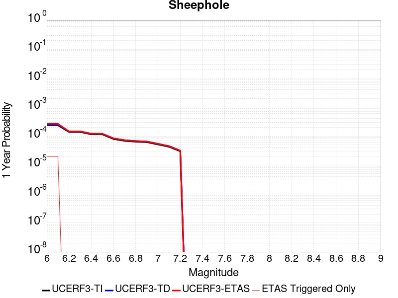 |  |

| Magnitude | 1 wk TI Prob | 1 wk TD Prob | 1 wk ETAS Prob | 1 wk ETAS/TD Gain | 1 wk ETAS Triggered Only | 1 mo TI Prob | 1 mo TD Prob | 1 mo ETAS Prob | 1 mo ETAS/TD Gain | 1 mo ETAS Triggered Only | 1 yr TI Prob | 1 yr TD Prob | 1 yr ETAS Prob | 1 yr ETAS/TD Gain | 1 yr ETAS Triggered Only | 10 yr TI Prob | 10 yr TD Prob | 10 yr ETAS Prob | 10 yr ETAS/TD Gain | 10 yr ETAS Triggered Only |
|-----|-----|-----|-----|-----|-----|-----|-----|-----|-----|-----|-----|-----|-----|-----|-----|-----|-----|-----|-----|-----|
| 6.0 | 4.5579695E-6 | 4.7413337E-6 | 4.7413337E-6 | 1.0 | 0.0 | 1.9534009E-5 | 2.0319874E-5 | 3.031967E-5 | 1.4921191 | 1.0E-5 | 2.3780059E-4 | 2.4737194E-4 | 2.6736697E-4 | 1.08083 | 2.0E-5 | 0.0023754628 | 0.00247151 | 0.002501436 | 1.0121083 | 3.0E-5 |
| 6.1 | 4.5579695E-6 | 4.7413337E-6 | 4.7413337E-6 | 1.0 | 0.0 | 1.9534009E-5 | 2.0319874E-5 | 3.031967E-5 | 1.4921191 | 1.0E-5 | 2.3780059E-4 | 2.4737194E-4 | 2.6736697E-4 | 1.08083 | 2.0E-5 | 0.0023754628 | 0.00247151 | 0.002501436 | 1.0121083 | 3.0E-5 |
| 6.2 | 2.6677674E-6 | 2.7874407E-6 | 2.7874407E-6 | 1.0 | 0.0 | 1.1433239E-5 | 1.1946126E-5 | 1.1946126E-5 | 1.0 | 0.0 | 1.3919079E-4 | 1.4543545E-4 | 1.4543545E-4 | 1.0 | 0.0 | 0.0013910364 | 0.0014535086 | 0.0014535086 | 1.0 | 0.0 |
| 6.3 | 2.6677674E-6 | 2.7874407E-6 | 2.7874407E-6 | 1.0 | 0.0 | 1.1433239E-5 | 1.1946126E-5 | 1.1946126E-5 | 1.0 | 0.0 | 1.3919079E-4 | 1.4543545E-4 | 1.4543545E-4 | 1.0 | 0.0 | 0.0013910364 | 0.0014535086 | 0.0014535086 | 1.0 | 0.0 |
| 6.4 | 2.2159759E-6 | 2.3229204E-6 | 2.3229204E-6 | 1.0 | 0.0 | 9.497005E-6 | 9.95534E-6 | 9.95534E-6 | 1.0 | 0.0 | 1.156199E-4 | 1.21200326E-4 | 1.21200326E-4 | 1.0 | 0.0 | 0.0011555976 | 0.0012114216 | 0.0012114216 | 1.0 | 0.0 |
| 6.5 | 2.1986082E-6 | 2.3048003E-6 | 2.3048003E-6 | 1.0 | 0.0 | 9.4225725E-6 | 9.877684E-6 | 9.877684E-6 | 1.0 | 0.0 | 1.1471378E-4 | 1.2025496E-4 | 1.2025496E-4 | 1.0 | 0.0 | 0.0011465458 | 0.0012019782 | 0.0012019782 | 1.0 | 0.0 |
| 6.6 | 1.5232331E-6 | 1.6019226E-6 | 1.6019226E-6 | 1.0 | 0.0 | 6.5281256E-6 | 6.8653653E-6 | 6.8653653E-6 | 1.0 | 0.0 | 7.947703E-5 | 8.358281E-5 | 8.358281E-5 | 1.0 | 0.0 | 7.9448614E-4 | 8.3553244E-4 | 8.3553244E-4 | 1.0 | 0.0 |
| 6.7 | 1.3137362E-6 | 1.3828461E-6 | 1.3828461E-6 | 1.0 | 0.0 | 5.6302856E-6 | 5.9264703E-6 | 5.9264703E-6 | 1.0 | 0.0 | 6.854657E-5 | 7.215253E-5 | 7.215253E-5 | 1.0 | 0.0 | 6.8525434E-4 | 7.213049E-4 | 7.213049E-4 | 1.0 | 0.0 |
| 6.8 | 1.2275751E-6 | 1.29231E-6 | 1.29231E-6 | 1.0 | 0.0 | 5.2610258E-6 | 5.5384603E-6 | 5.5384603E-6 | 1.0 | 0.0 | 6.4051106E-5 | 6.74288E-5 | 6.74288E-5 | 1.0 | 0.0 | 6.4032647E-4 | 6.740968E-4 | 6.740968E-4 | 1.0 | 0.0 |
| 6.9 | 1.1837088E-6 | 1.2461264E-6 | 1.2461264E-6 | 1.0 | 0.0 | 5.0730278E-6 | 5.3405315E-6 | 5.3405315E-6 | 1.0 | 0.0 | 6.176237E-5 | 6.5019165E-5 | 6.5019165E-5 | 1.0 | 0.0 | 6.17452E-4 | 6.5001455E-4 | 6.5001455E-4 | 1.0 | 0.0 |
| 7.0 | 9.849371E-7 | 1.036649E-6 | 1.036649E-6 | 1.0 | 0.0 | 4.2211523E-6 | 4.4427743E-6 | 4.4427743E-6 | 1.0 | 0.0 | 5.1391315E-5 | 5.4089538E-5 | 5.4089538E-5 | 1.0 | 0.0 | 5.137943E-4 | 5.4077385E-4 | 5.4077385E-4 | 1.0 | 0.0 |
| 7.1 | 8.1643645E-7 | 8.591836E-7 | 8.591836E-7 | 1.0 | 0.0 | 3.4990085E-6 | 3.6822107E-6 | 3.6822107E-6 | 1.0 | 0.0 | 4.2599597E-5 | 4.483008E-5 | 4.483008E-5 | 1.0 | 0.0 | 4.259143E-4 | 4.48219E-4 | 4.48219E-4 | 1.0 | 0.0 |
| 7.2 | 5.7295756E-7 | 6.029619E-7 | 6.029619E-7 | 1.0 | 0.0 | 2.45553E-6 | 2.5841202E-6 | 2.5841202E-6 | 1.0 | 0.0 | 2.9895667E-5 | 3.1461277E-5 | 3.1461277E-5 | 1.0 | 0.0 | 2.9891645E-4 | 3.1457492E-4 | 3.1457492E-4 | 1.0 | 0.0 |

## Blue Cut
*[(top)](#table-of-contents)*

| 1 Week | 1 Month | 1 Year | 10 Year |
|-----|-----|-----|-----|
|  | 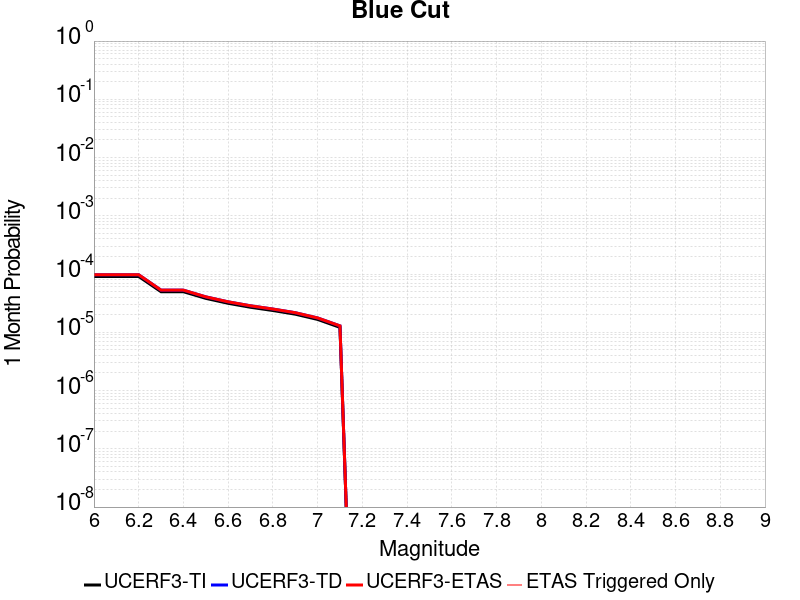 |  |  |

| Magnitude | 1 wk TI Prob | 1 wk TD Prob | 1 wk ETAS Prob | 1 wk ETAS/TD Gain | 1 wk ETAS Triggered Only | 1 mo TI Prob | 1 mo TD Prob | 1 mo ETAS Prob | 1 mo ETAS/TD Gain | 1 mo ETAS Triggered Only | 1 yr TI Prob | 1 yr TD Prob | 1 yr ETAS Prob | 1 yr ETAS/TD Gain | 1 yr ETAS Triggered Only | 10 yr TI Prob | 10 yr TD Prob | 10 yr ETAS Prob | 10 yr ETAS/TD Gain | 10 yr ETAS Triggered Only |
|-----|-----|-----|-----|-----|-----|-----|-----|-----|-----|-----|-----|-----|-----|-----|-----|-----|-----|-----|-----|-----|
| 6.0 | 2.1227985E-5 | 2.2720169E-5 | 2.2720169E-5 | 1.0 | 0.0 | 9.097391E-5 | 9.7368844E-5 | 9.7368844E-5 | 1.0 | 0.0 | 0.0011070445 | 0.0011848791 | 0.0012048554 | 1.0168594 | 2.0E-5 | 0.011015458 | 0.011791458 | 0.011821104 | 1.0025142 | 3.0E-5 |
| 6.1 | 2.1227985E-5 | 2.2720169E-5 | 2.2720169E-5 | 1.0 | 0.0 | 9.097391E-5 | 9.7368844E-5 | 9.7368844E-5 | 1.0 | 0.0 | 0.0011070445 | 0.0011848791 | 0.0012048554 | 1.0168594 | 2.0E-5 | 0.011015458 | 0.011791458 | 0.011821104 | 1.0025142 | 3.0E-5 |
| 6.2 | 2.1227985E-5 | 2.2720169E-5 | 2.2720169E-5 | 1.0 | 0.0 | 9.097391E-5 | 9.7368844E-5 | 9.7368844E-5 | 1.0 | 0.0 | 0.0011070445 | 0.0011848791 | 0.0012048554 | 1.0168594 | 2.0E-5 | 0.011015458 | 0.011791458 | 0.011821104 | 1.0025142 | 3.0E-5 |
| 6.3 | 1.1613981E-5 | 1.2353834E-5 | 1.2353834E-5 | 1.0 | 0.0 | 4.9773254E-5 | 5.2944E-5 | 5.2944E-5 | 1.0 | 0.0 | 6.0582085E-4 | 6.4441503E-4 | 6.6440215E-4 | 1.0310159 | 2.0E-5 | 0.0060417196 | 0.006426711 | 0.006456518 | 1.0046381 | 3.0E-5 |
| 6.4 | 1.1613981E-5 | 1.2353834E-5 | 1.2353834E-5 | 1.0 | 0.0 | 4.9773254E-5 | 5.2944E-5 | 5.2944E-5 | 1.0 | 0.0 | 6.0582085E-4 | 6.4441503E-4 | 6.6440215E-4 | 1.0310159 | 2.0E-5 | 0.0060417196 | 0.006426711 | 0.006456518 | 1.0046381 | 3.0E-5 |
| 6.5 | 8.931326E-6 | 9.481817E-6 | 9.481817E-6 | 1.0 | 0.0 | 3.8276554E-5 | 4.0635776E-5 | 4.0635776E-5 | 1.0 | 0.0 | 4.6591737E-4 | 4.946374E-4 | 5.1462755E-4 | 1.0404136 | 2.0E-5 | 0.0046494175 | 0.0049362737 | 0.004956175 | 1.0040317 | 2.0E-5 |
| 6.6 | 7.345353E-6 | 7.790454E-6 | 7.790454E-6 | 1.0 | 0.0 | 3.1479703E-5 | 3.338728E-5 | 3.338728E-5 | 1.0 | 0.0 | 3.83198E-4 | 4.0642233E-4 | 4.1641828E-4 | 1.0245949 | 1.0E-5 | 0.0038253788 | 0.004057582 | 0.0040675416 | 1.0024545 | 1.0E-5 |
| 6.7 | 6.2775666E-6 | 6.6552975E-6 | 6.6552975E-6 | 1.0 | 0.0 | 2.690358E-5 | 2.8522436E-5 | 2.8522436E-5 | 1.0 | 0.0 | 3.2750185E-4 | 3.4721283E-4 | 3.5720936E-4 | 1.0287908 | 1.0E-5 | 0.0032701963 | 0.0034674446 | 0.0034774097 | 1.002874 | 1.0E-5 |
| 6.8 | 5.5234095E-6 | 5.855242E-6 | 5.855242E-6 | 1.0 | 0.0 | 2.367154E-5 | 2.5093694E-5 | 2.5093694E-5 | 1.0 | 0.0 | 2.8816288E-4 | 3.0548018E-4 | 3.0548018E-4 | 1.0 | 0.0 | 0.002877895 | 0.0030513185 | 0.0030513185 | 1.0 | 0.0 |
| 6.9 | 4.7780054E-6 | 5.0655335E-6 | 5.0655335E-6 | 1.0 | 0.0 | 2.0477004E-5 | 2.170929E-5 | 2.170929E-5 | 1.0 | 0.0 | 2.4927902E-4 | 2.642856E-4 | 2.642856E-4 | 1.0 | 0.0 | 0.0024899957 | 0.002640405 | 0.002640405 | 1.0 | 0.0 |
| 7.0 | 3.883171E-6 | 4.11858E-6 | 4.11858E-6 | 1.0 | 0.0 | 1.6642054E-5 | 1.7650977E-5 | 1.7650977E-5 | 1.0 | 0.0 | 2.0259817E-4 | 2.1488633E-4 | 2.1488633E-4 | 1.0 | 0.0 | 0.0020241356 | 0.002147461 | 0.002147461 | 1.0 | 0.0 |
| 7.1 | 2.8358215E-6 | 3.0097845E-6 | 3.0097845E-6 | 1.0 | 0.0 | 1.2153464E-5 | 1.289905E-5 | 1.289905E-5 | 1.0 | 0.0 | 1.4795837E-4 | 1.5704118E-4 | 1.5704118E-4 | 1.0 | 0.0 | 0.001478599 | 0.0015699473 | 0.0015699473 | 1.0 | 0.0 |

## Green Valley 2011 CFM
*[(top)](#table-of-contents)*

| 1 Week | 1 Month | 1 Year | 10 Year |
|-----|-----|-----|-----|
|  |  | 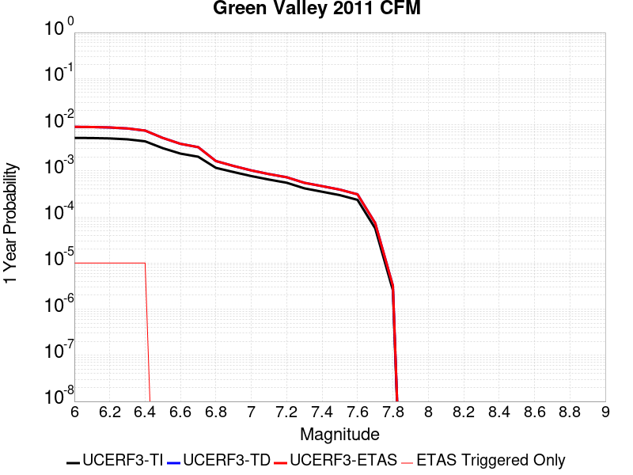 |  |

| Magnitude | 1 wk TI Prob | 1 wk TD Prob | 1 wk ETAS Prob | 1 wk ETAS/TD Gain | 1 wk ETAS Triggered Only | 1 mo TI Prob | 1 mo TD Prob | 1 mo ETAS Prob | 1 mo ETAS/TD Gain | 1 mo ETAS Triggered Only | 1 yr TI Prob | 1 yr TD Prob | 1 yr ETAS Prob | 1 yr ETAS/TD Gain | 1 yr ETAS Triggered Only | 10 yr TI Prob | 10 yr TD Prob | 10 yr ETAS Prob | 10 yr ETAS/TD Gain | 10 yr ETAS Triggered Only |
|-----|-----|-----|-----|-----|-----|-----|-----|-----|-----|-----|-----|-----|-----|-----|-----|-----|-----|-----|-----|-----|
| 6.0 | 9.9629346E-5 | 1.7305705E-4 | 1.7305705E-4 | 1.0 | 0.0 | 4.2691303E-4 | 7.414668E-4 | 7.414668E-4 | 1.0 | 0.0 | 0.0051852856 | 0.008987168 | 0.008997078 | 1.0011027 | 1.0E-5 | 0.050659515 | 0.08552724 | 0.08554553 | 1.0002139 | 2.0E-5 |
| 6.1 | 9.88615E-5 | 1.7153013E-4 | 1.7153013E-4 | 1.0 | 0.0 | 4.2362334E-4 | 7.349266E-4 | 7.349266E-4 | 1.0 | 0.0 | 0.0051454236 | 0.008908194 | 0.008918105 | 1.0011126 | 1.0E-5 | 0.050279044 | 0.08481485 | 0.08483315 | 1.0002158 | 2.0E-5 |
| 6.2 | 9.696895E-5 | 1.6792017E-4 | 1.6792017E-4 | 1.0 | 0.0 | 4.15515E-4 | 7.194639E-4 | 7.194639E-4 | 1.0 | 0.0 | 0.0050471667 | 0.008721567 | 0.00873148 | 1.0011365 | 1.0E-5 | 0.04934063 | 0.08312371 | 0.08314204 | 1.0002207 | 2.0E-5 |
| 6.3 | 9.275224E-5 | 1.5971335E-4 | 1.5971335E-4 | 1.0 | 0.0 | 3.9744904E-4 | 6.843105E-4 | 6.843105E-4 | 1.0 | 0.0 | 0.0048282105 | 0.008296883 | 0.0083068 | 1.0011953 | 1.0E-5 | 0.047246475 | 0.07926211 | 0.079280525 | 1.0002323 | 2.0E-5 |
| 6.4 | 8.391499E-5 | 1.436941E-4 | 1.436941E-4 | 1.0 | 0.0 | 3.595861E-4 | 6.156939E-4 | 6.156939E-4 | 1.0 | 0.0 | 0.004369175 | 0.0074675 | 0.0074774255 | 1.0013292 | 1.0E-5 | 0.04284265 | 0.0716356 | 0.07165416 | 1.0002592 | 2.0E-5 |
| 6.5 | 5.9519385E-5 | 9.935359E-5 | 9.935359E-5 | 1.0 | 0.0 | 2.5505814E-4 | 4.2573572E-4 | 4.2573572E-4 | 1.0 | 0.0 | 0.0031009112 | 0.0051686377 | 0.0051686377 | 1.0 | 0.0 | 0.030579966 | 0.05014978 | 0.05014978 | 1.0 | 0.0 |
| 6.6 | 4.5361558E-5 | 7.4036536E-5 | 7.4036536E-5 | 1.0 | 0.0 | 1.9439218E-4 | 3.172637E-4 | 3.172637E-4 | 1.0 | 0.0 | 0.0023641558 | 0.0038542415 | 0.0038542415 | 1.0 | 0.0 | 0.023391623 | 0.037669353 | 0.037669353 | 1.0 | 0.0 |
| 6.7 | 3.8808106E-5 | 6.2660576E-5 | 6.2660576E-5 | 1.0 | 0.0 | 1.6630985E-4 | 2.685203E-4 | 2.685203E-4 | 1.0 | 0.0 | 0.0020229418 | 0.0032629308 | 0.0032629308 | 1.0 | 0.0 | 0.020046256 | 0.032008827 | 0.032008827 | 1.0 | 0.0 |
| 6.8 | 2.2284667E-5 | 3.128642E-5 | 3.128642E-5 | 1.0 | 0.0 | 9.550222E-5 | 1.3407787E-4 | 1.3407787E-4 | 1.0 | 0.0 | 0.0011621192 | 0.0016311664 | 0.0016311664 | 1.0 | 0.0 | 0.011560607 | 0.016166577 | 0.016166577 | 1.0 | 0.0 |
| 6.9 | 1.8050168E-5 | 2.4448911E-5 | 2.4448911E-5 | 1.0 | 0.0 | 7.735557E-5 | 1.0477688E-4 | 1.0477688E-4 | 1.0 | 0.0 | 9.4139716E-4 | 0.0012749154 | 0.0012749154 | 1.0 | 0.0 | 0.009374191 | 0.012668268 | 0.012668268 | 1.0 | 0.0 |
| 7.0 | 1.4763166E-5 | 1.958358E-5 | 1.958358E-5 | 1.0 | 0.0 | 6.326917E-5 | 8.392695E-5 | 8.392695E-5 | 1.0 | 0.0 | 7.7002996E-4 | 0.0010213346 | 0.0010213346 | 1.0 | 0.0 | 0.007673672 | 0.010165716 | 0.010165716 | 1.0 | 0.0 |
| 7.1 | 1.2399713E-5 | 1.6304351E-5 | 1.6304351E-5 | 1.0 | 0.0 | 5.3140546E-5 | 6.987393E-5 | 6.987393E-5 | 1.0 | 0.0 | 6.467941E-4 | 8.50385E-4 | 8.50385E-4 | 1.0 | 0.0 | 0.006449148 | 0.008471588 | 0.008471588 | 1.0 | 0.0 |
| 7.2 | 1.0584195E-5 | 1.3922341E-5 | 1.3922341E-5 | 1.0 | 0.0 | 4.5360044E-5 | 5.966582E-5 | 5.966582E-5 | 1.0 | 0.0 | 5.521186E-4 | 7.2619086E-4 | 7.2619086E-4 | 1.0 | 0.0 | 0.0055074887 | 0.0072385953 | 0.0072385953 | 1.0 | 0.0 |
| 7.3 | 7.998173E-6 | 1.0544554E-5 | 1.0544554E-5 | 1.0 | 0.0 | 3.4277433E-5 | 4.519017E-5 | 4.519017E-5 | 1.0 | 0.0 | 4.1724785E-4 | 5.500525E-4 | 5.500525E-4 | 1.0 | 0.0 | 0.004164653 | 0.005487176 | 0.005487176 | 1.0 | 0.0 |
| 7.4 | 6.7571127E-6 | 8.933202E-6 | 8.933202E-6 | 1.0 | 0.0 | 2.8958733E-5 | 3.8284594E-5 | 3.8284594E-5 | 1.0 | 0.0 | 3.5251552E-4 | 4.6601618E-4 | 4.6601618E-4 | 1.0 | 0.0 | 0.0035195686 | 0.004650593 | 0.004650593 | 1.0 | 0.0 |
| 7.5 | 5.69878E-6 | 7.516771E-6 | 7.516771E-6 | 1.0 | 0.0 | 2.4423114E-5 | 3.221434E-5 | 3.221434E-5 | 1.0 | 0.0 | 2.9731085E-4 | 3.921399E-4 | 3.921399E-4 | 1.0 | 0.0 | 0.002969134 | 0.003914631 | 0.003914631 | 1.0 | 0.0 |
| 7.6 | 4.503664E-6 | 5.935934E-6 | 5.935934E-6 | 1.0 | 0.0 | 1.9301275E-5 | 2.5439474E-5 | 2.5439474E-5 | 1.0 | 0.0 | 2.3496768E-4 | 3.0968242E-4 | 3.0968242E-4 | 1.0 | 0.0 | 0.002347194 | 0.0030926338 | 0.0030926338 | 1.0 | 0.0 |
| 7.7 | 1.0873546E-6 | 1.4107341E-6 | 1.4107341E-6 | 1.0 | 0.0 | 4.6600826E-6 | 6.0459893E-6 | 6.0459893E-6 | 1.0 | 0.0 | 5.6735033E-5 | 7.360746E-5 | 7.360746E-5 | 1.0 | 0.0 | 5.672055E-4 | 7.3583284E-4 | 7.3583284E-4 | 1.0 | 0.0 |
| 7.8 | 4.9373917E-8 | 6.177918E-8 | 6.177918E-8 | 1.0 | 0.0 | 2.1160248E-7 | 2.6476792E-7 | 2.6476792E-7 | 1.0 | 0.0 | 2.5762572E-6 | 3.2235457E-6 | 3.2235457E-6 | 1.0 | 0.0 | 2.5762274E-5 | 3.223337E-5 | 3.223337E-5 | 1.0 | 0.0 |

## Newport-Inglewood (Offshore)
*[(top)](#table-of-contents)*

| 1 Week | 1 Month | 1 Year | 10 Year |
|-----|-----|-----|-----|
| 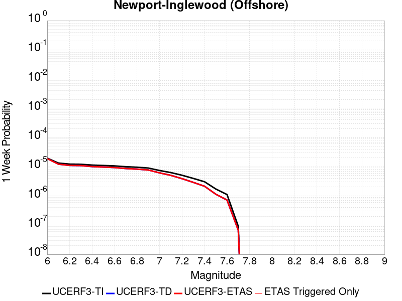 |  | 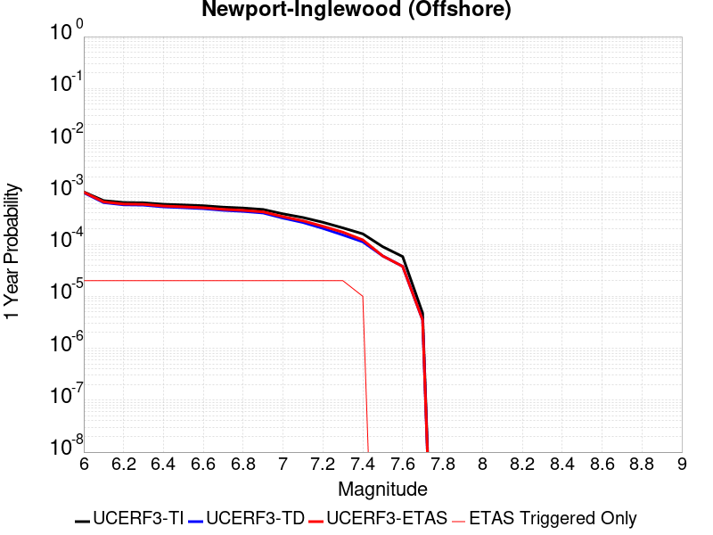 |  |

| Magnitude | 1 wk TI Prob | 1 wk TD Prob | 1 wk ETAS Prob | 1 wk ETAS/TD Gain | 1 wk ETAS Triggered Only | 1 mo TI Prob | 1 mo TD Prob | 1 mo ETAS Prob | 1 mo ETAS/TD Gain | 1 mo ETAS Triggered Only | 1 yr TI Prob | 1 yr TD Prob | 1 yr ETAS Prob | 1 yr ETAS/TD Gain | 1 yr ETAS Triggered Only | 10 yr TI Prob | 10 yr TD Prob | 10 yr ETAS Prob | 10 yr ETAS/TD Gain | 10 yr ETAS Triggered Only |
|-----|-----|-----|-----|-----|-----|-----|-----|-----|-----|-----|-----|-----|-----|-----|-----|-----|-----|-----|-----|-----|
| 6.0 | 1.9626508E-5 | 1.8965913E-5 | 1.8965913E-5 | 1.0 | 0.0 | 8.411089E-5 | 8.128002E-5 | 8.128002E-5 | 1.0 | 0.0 | 0.001023569 | 9.891476E-4 | 0.0010091278 | 1.0201994 | 2.0E-5 | 0.010188672 | 0.009848791 | 0.009868595 | 1.0020107 | 2.0E-5 |
| 6.1 | 1.331886E-5 | 1.2218475E-5 | 1.2218475E-5 | 1.0 | 0.0 | 5.707958E-5 | 5.236385E-5 | 5.236385E-5 | 1.0 | 0.0 | 6.947222E-4 | 6.3734484E-4 | 6.5733213E-4 | 1.0313601 | 2.0E-5 | 0.006925544 | 0.0063553476 | 0.00637522 | 1.003127 | 2.0E-5 |
| 6.2 | 1.2250852E-5 | 1.1076382E-5 | 1.1076382E-5 | 1.0 | 0.0 | 5.2502597E-5 | 4.746935E-5 | 4.746935E-5 | 1.0 | 0.0 | 6.3903164E-4 | 5.777871E-4 | 5.9777556E-4 | 1.0345948 | 2.0E-5 | 0.006371971 | 0.00576297 | 0.0057828547 | 1.0034504 | 2.0E-5 |
| 6.3 | 1.2106258E-5 | 1.0919239E-5 | 1.0919239E-5 | 1.0 | 0.0 | 5.1882926E-5 | 4.6795903E-5 | 4.6795903E-5 | 1.0 | 0.0 | 6.3149154E-4 | 5.695922E-4 | 5.895808E-4 | 1.0350928 | 2.0E-5 | 0.0062970007 | 0.00568144 | 0.005701326 | 1.0035002 | 2.0E-5 |
| 6.4 | 1.1348758E-5 | 1.0109689E-5 | 1.0109689E-5 | 1.0 | 0.0 | 4.8636626E-5 | 4.3326523E-5 | 4.3326523E-5 | 1.0 | 0.0 | 5.919901E-4 | 5.273736E-4 | 5.47363E-4 | 1.0379038 | 2.0E-5 | 0.005904155 | 0.0052613164 | 0.005281211 | 1.0037813 | 2.0E-5 |
| 6.5 | 1.100837E-5 | 9.743706E-6 | 9.743706E-6 | 1.0 | 0.0 | 4.7177873E-5 | 4.1758078E-5 | 4.1758078E-5 | 1.0 | 0.0 | 5.7423924E-4 | 5.0828676E-4 | 5.282766E-4 | 1.0393279 | 2.0E-5 | 0.005727576 | 0.005071333 | 0.005091232 | 1.0039238 | 2.0E-5 |
| 6.6 | 1.0634696E-5 | 9.345849E-6 | 9.345849E-6 | 1.0 | 0.0 | 4.557647E-5 | 4.005303E-5 | 4.005303E-5 | 1.0 | 0.0 | 5.5475225E-4 | 4.8753724E-4 | 5.075275E-4 | 1.0410025 | 2.0E-5 | 0.0055336943 | 0.0048647635 | 0.0048846663 | 1.0040911 | 2.0E-5 |
| 6.7 | 9.9780855E-6 | 8.6681985E-6 | 8.6681985E-6 | 1.0 | 0.0 | 4.276252E-5 | 3.7148897E-5 | 3.7148897E-5 | 1.0 | 0.0 | 5.205093E-4 | 4.5219465E-4 | 4.721856E-4 | 1.0442088 | 2.0E-5 | 0.0051929182 | 0.0045128246 | 0.004532734 | 1.0044118 | 2.0E-5 |
| 6.8 | 9.59546E-6 | 8.273229E-6 | 8.273229E-6 | 1.0 | 0.0 | 4.1122752E-5 | 3.5456218E-5 | 3.5456218E-5 | 1.0 | 0.0 | 5.0055445E-4 | 4.315946E-4 | 4.5158598E-4 | 1.0463197 | 2.0E-5 | 0.004994285 | 0.00430764 | 0.004327554 | 1.0046229 | 2.0E-5 |
| 6.9 | 9.000614E-6 | 7.7071E-6 | 7.7071E-6 | 1.0 | 0.0 | 3.857349E-5 | 3.3030014E-5 | 3.3030014E-5 | 1.0 | 0.0 | 4.6953102E-4 | 4.0206686E-4 | 4.2205883E-4 | 1.0497229 | 2.0E-5 | 0.004685402 | 0.0040134657 | 0.004033386 | 1.0049633 | 2.0E-5 |
| 7.0 | 7.4070194E-6 | 6.1491064E-6 | 6.1491064E-6 | 1.0 | 0.0 | 3.1743984E-5 | 2.6353047E-5 | 2.6353047E-5 | 1.0 | 0.0 | 3.8641447E-4 | 3.2080128E-4 | 3.4079485E-4 | 1.0623239 | 2.0E-5 | 0.0038574322 | 0.0032034016 | 0.0032233375 | 1.0062233 | 2.0E-5 |
| 7.1 | 6.299615E-6 | 5.0567664E-6 | 5.0567664E-6 | 1.0 | 0.0 | 2.699807E-5 | 2.1671676E-5 | 2.1671676E-5 | 1.0 | 0.0 | 3.2865192E-4 | 2.6382084E-4 | 2.8381558E-4 | 1.075789 | 2.0E-5 | 0.003281663 | 0.0026350913 | 0.0026550386 | 1.0075699 | 2.0E-5 |
| 7.2 | 5.096653E-6 | 3.8929193E-6 | 3.8929193E-6 | 1.0 | 0.0 | 2.1842614E-5 | 1.6683834E-5 | 1.6683834E-5 | 1.0 | 0.0 | 2.6590136E-4 | 2.0310686E-4 | 2.2310279E-4 | 1.0984503 | 2.0E-5 | 0.0026558342 | 0.0020292234 | 0.0020491828 | 1.009836 | 2.0E-5 |
| 7.3 | 3.9753018E-6 | 2.9099924E-6 | 2.9099924E-6 | 1.0 | 0.0 | 1.7036897E-5 | 1.2471336E-5 | 1.2471336E-5 | 1.0 | 0.0 | 2.0740448E-4 | 1.5182802E-4 | 1.7182498E-4 | 1.131708 | 2.0E-5 | 0.00207211 | 0.001517251 | 0.0015372207 | 1.0131618 | 2.0E-5 |
| 7.4 | 3.0568392E-6 | 2.1450614E-6 | 2.1450614E-6 | 1.0 | 0.0 | 1.3100675E-5 | 9.193088E-6 | 9.193088E-6 | 1.0 | 0.0 | 1.5948903E-4 | 1.1192016E-4 | 1.2191904E-4 | 1.0893394 | 1.0E-5 | 0.0015937461 | 0.0011186443 | 0.001128633 | 1.0089294 | 1.0E-5 |
| 7.5 | 1.7279019E-6 | 1.1470257E-6 | 1.1470257E-6 | 1.0 | 0.0 | 7.405273E-6 | 4.9158157E-6 | 4.9158157E-6 | 1.0 | 0.0 | 9.015547E-5 | 5.984845E-5 | 5.984845E-5 | 1.0 | 0.0 | 9.01189E-4 | 5.983272E-4 | 5.983272E-4 | 1.0 | 0.0 |
| 7.6 | 1.1156416E-6 | 7.223269E-7 | 7.223269E-7 | 1.0 | 0.0 | 4.7813123E-6 | 3.095683E-6 | 3.095683E-6 | 1.0 | 0.0 | 5.821092E-5 | 3.768931E-5 | 3.768931E-5 | 1.0 | 0.0 | 5.8195676E-4 | 3.7683154E-4 | 3.7683154E-4 | 1.0 | 0.0 |
| 7.7 | 9.117973E-8 | 6.734269E-8 | 6.734269E-8 | 1.0 | 0.0 | 3.907702E-7 | 2.886115E-7 | 2.886115E-7 | 1.0 | 0.0 | 4.757617E-6 | 3.5138394E-6 | 3.5138394E-6 | 1.0 | 0.0 | 4.7575148E-5 | 3.513787E-5 | 3.513787E-5 | 1.0 | 0.0 |

## Elsinore (Temecula) rev
*[(top)](#table-of-contents)*

| 1 Week | 1 Month | 1 Year | 10 Year |
|-----|-----|-----|-----|
|  |  |  |  |

| Magnitude | 1 wk TI Prob | 1 wk TD Prob | 1 wk ETAS Prob | 1 wk ETAS/TD Gain | 1 wk ETAS Triggered Only | 1 mo TI Prob | 1 mo TD Prob | 1 mo ETAS Prob | 1 mo ETAS/TD Gain | 1 mo ETAS Triggered Only | 1 yr TI Prob | 1 yr TD Prob | 1 yr ETAS Prob | 1 yr ETAS/TD Gain | 1 yr ETAS Triggered Only | 10 yr TI Prob | 10 yr TD Prob | 10 yr ETAS Prob | 10 yr ETAS/TD Gain | 10 yr ETAS Triggered Only |
|-----|-----|-----|-----|-----|-----|-----|-----|-----|-----|-----|-----|-----|-----|-----|-----|-----|-----|-----|-----|-----|
| 6.0 | 2.9514995E-5 | 2.2520515E-5 | 2.2520515E-5 | 1.0 | 0.0 | 1.264867E-4 | 9.651305E-5 | 9.651305E-5 | 1.0 | 0.0 | 0.0015388876 | 0.0011744351 | 0.0011744351 | 1.0 | 0.0 | 0.015282745 | 0.011698669 | 0.011718435 | 1.0016896 | 2.0E-5 |
| 6.1 | 2.9514995E-5 | 2.2520515E-5 | 2.2520515E-5 | 1.0 | 0.0 | 1.264867E-4 | 9.651305E-5 | 9.651305E-5 | 1.0 | 0.0 | 0.0015388876 | 0.0011744351 | 0.0011744351 | 1.0 | 0.0 | 0.015282745 | 0.011698669 | 0.011718435 | 1.0016896 | 2.0E-5 |
| 6.2 | 2.9514995E-5 | 2.2520515E-5 | 2.2520515E-5 | 1.0 | 0.0 | 1.264867E-4 | 9.651305E-5 | 9.651305E-5 | 1.0 | 0.0 | 0.0015388876 | 0.0011744351 | 0.0011744351 | 1.0 | 0.0 | 0.015282745 | 0.011698669 | 0.011718435 | 1.0016896 | 2.0E-5 |
| 6.3 | 2.3223649E-5 | 1.8408859E-5 | 1.8408859E-5 | 1.0 | 0.0 | 9.952613E-5 | 7.8892816E-5 | 7.8892816E-5 | 1.0 | 0.0 | 0.001211057 | 9.601141E-4 | 9.601141E-4 | 1.0 | 0.0 | 0.012044783 | 0.009571161 | 0.009590969 | 1.0020696 | 2.0E-5 |
| 6.4 | 2.3223649E-5 | 1.8408859E-5 | 1.8408859E-5 | 1.0 | 0.0 | 9.952613E-5 | 7.8892816E-5 | 7.8892816E-5 | 1.0 | 0.0 | 0.001211057 | 9.601141E-4 | 9.601141E-4 | 1.0 | 0.0 | 0.012044783 | 0.009571161 | 0.009590969 | 1.0020696 | 2.0E-5 |
| 6.5 | 1.8338875E-5 | 1.4751796E-5 | 1.4751796E-5 | 1.0 | 0.0 | 7.8592806E-5 | 6.32205E-5 | 6.32205E-5 | 1.0 | 0.0 | 9.5644733E-4 | 7.694465E-4 | 7.694465E-4 | 1.0 | 0.0 | 0.009523412 | 0.0076747835 | 0.00769463 | 1.0025859 | 2.0E-5 |
| 6.6 | 1.8223333E-5 | 1.4614342E-5 | 1.4614342E-5 | 1.0 | 0.0 | 7.809766E-5 | 6.263144E-5 | 6.263144E-5 | 1.0 | 0.0 | 9.504242E-4 | 7.622798E-4 | 7.622798E-4 | 1.0 | 0.0 | 0.009463696 | 0.0076036076 | 0.0076234555 | 1.0026103 | 2.0E-5 |
| 6.7 | 1.7512752E-5 | 1.4028793E-5 | 1.4028793E-5 | 1.0 | 0.0 | 7.505249E-5 | 6.0122064E-5 | 6.0122064E-5 | 1.0 | 0.0 | 9.13381E-4 | 7.317489E-4 | 7.317489E-4 | 1.0 | 0.0 | 0.00909636 | 0.0072997403 | 0.0073195943 | 1.0027199 | 2.0E-5 |
| 6.8 | 1.7417142E-5 | 1.3952768E-5 | 1.3952768E-5 | 1.0 | 0.0 | 7.4642754E-5 | 5.9796257E-5 | 5.9796257E-5 | 1.0 | 0.0 | 9.083966E-4 | 7.277848E-4 | 7.277848E-4 | 1.0 | 0.0 | 0.009046922 | 0.007260304 | 0.007280159 | 1.0027347 | 2.0E-5 |
| 6.9 | 1.6402591E-5 | 1.29901255E-5 | 1.29901255E-5 | 1.0 | 0.0 | 7.0294926E-5 | 5.5670822E-5 | 5.5670822E-5 | 1.0 | 0.0 | 8.5550465E-4 | 6.7758915E-4 | 6.7758915E-4 | 1.0 | 0.0 | 0.008522186 | 0.0067609535 | 0.006780818 | 1.0029382 | 2.0E-5 |
| 7.0 | 1.3912486E-5 | 1.0879564E-5 | 1.0879564E-5 | 1.0 | 0.0 | 5.9623577E-5 | 4.6625886E-5 | 4.6625886E-5 | 1.0 | 0.0 | 7.2567526E-4 | 5.6752504E-4 | 5.6752504E-4 | 1.0 | 0.0 | 0.0072331014 | 0.005664676 | 0.0056845625 | 1.0035106 | 2.0E-5 |
| 7.1 | 1.3405147E-5 | 1.0328681E-5 | 1.0328681E-5 | 1.0 | 0.0 | 5.7449364E-5 | 4.426504E-5 | 4.426504E-5 | 1.0 | 0.0 | 6.9922156E-4 | 5.387962E-4 | 5.387962E-4 | 1.0 | 0.0 | 0.0069702556 | 0.005378231 | 0.005398123 | 1.0036987 | 2.0E-5 |
| 7.2 | 1.21402E-5 | 8.997804E-6 | 8.997804E-6 | 1.0 | 0.0 | 5.202839E-5 | 3.856146E-5 | 3.856146E-5 | 1.0 | 0.0 | 6.332616E-4 | 4.693864E-4 | 4.693864E-4 | 1.0 | 0.0 | 0.0063146 | 0.004685375 | 0.004695328 | 1.0021243 | 1.0E-5 |
| 7.3 | 1.05047775E-5 | 7.5726457E-6 | 7.5726457E-6 | 1.0 | 0.0 | 4.5019697E-5 | 3.24538E-5 | 3.24538E-5 | 1.0 | 0.0 | 5.4797693E-4 | 3.9505484E-4 | 3.9505484E-4 | 1.0 | 0.0 | 0.005466277 | 0.003943915 | 0.003943915 | 1.0 | 0.0 |
| 7.4 | 9.624483E-6 | 6.7876354E-6 | 6.7876354E-6 | 1.0 | 0.0 | 4.124713E-5 | 2.908955E-5 | 2.908955E-5 | 1.0 | 0.0 | 5.0206814E-4 | 3.541091E-4 | 3.541091E-4 | 1.0 | 0.0 | 0.005009353 | 0.0035356025 | 0.0035356025 | 1.0 | 0.0 |
| 7.5 | 8.215151E-6 | 5.6361687E-6 | 5.6361687E-6 | 1.0 | 0.0 | 3.5207315E-5 | 2.4154791E-5 | 2.4154791E-5 | 1.0 | 0.0 | 4.2856473E-4 | 2.9404619E-4 | 2.9404619E-4 | 1.0 | 0.0 | 0.004277392 | 0.002936699 | 0.002936699 | 1.0 | 0.0 |
| 7.6 | 6.975058E-6 | 4.676584E-6 | 4.676584E-6 | 1.0 | 0.0 | 2.9892764E-5 | 2.0042356E-5 | 2.0042356E-5 | 1.0 | 0.0 | 3.6388362E-4 | 2.4398953E-4 | 2.4398953E-4 | 1.0 | 0.0 | 0.0036328835 | 0.0024373329 | 0.0024373329 | 1.0 | 0.0 |
| 7.7 | 4.159604E-6 | 2.3273096E-6 | 2.3273096E-6 | 1.0 | 0.0 | 1.7826753E-5 | 9.97415E-6 | 9.97415E-6 | 1.0 | 0.0 | 2.1701909E-4 | 1.2142925E-4 | 1.2142925E-4 | 1.0 | 0.0 | 0.0021680726 | 0.0012137021 | 0.0012137021 | 1.0 | 0.0 |
| 7.8 | 2.2692414E-7 | 9.386795E-8 | 9.386795E-8 | 1.0 | 0.0 | 9.725317E-7 | 4.0229116E-7 | 4.0229116E-7 | 1.0 | 0.0 | 1.1840509E-5 | 4.8978873E-6 | 4.8978873E-6 | 1.0 | 0.0 | 1.1839878E-4 | 4.897812E-5 | 4.897812E-5 | 1.0 | 0.0 |
| 7.9 | 6.676829E-9 | 3.440201E-9 | 3.440201E-9 | 1.0 | 0.0 | 2.861498E-8 | 1.4743717E-8 | 1.4743717E-8 | 1.0 | 0.0 | 3.4838732E-7 | 1.7950475E-7 | 1.7950475E-7 | 1.0 | 0.0 | 3.4838679E-6 | 1.7950462E-6 | 1.7950462E-6 | 1.0 | 0.0 |

## North Salt Lake
*[(top)](#table-of-contents)*

| 1 Week | 1 Month | 1 Year | 10 Year |
|-----|-----|-----|-----|
| 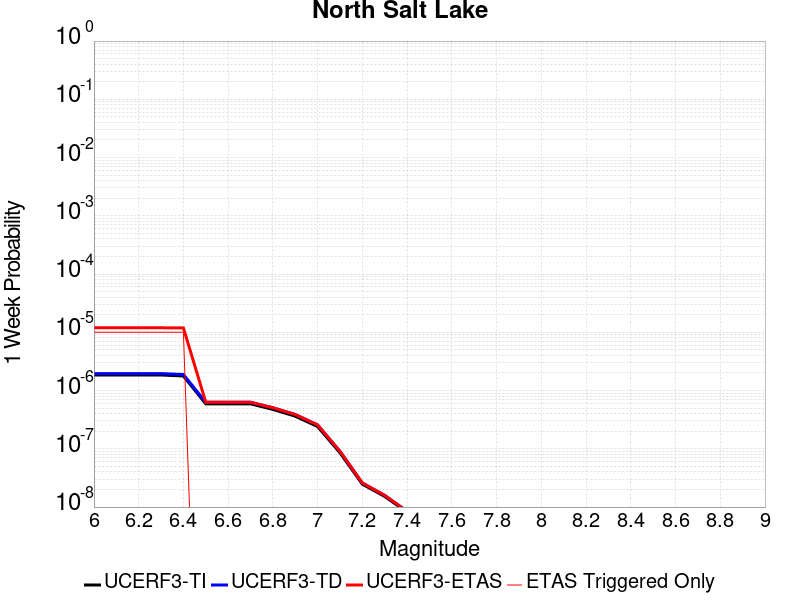 | 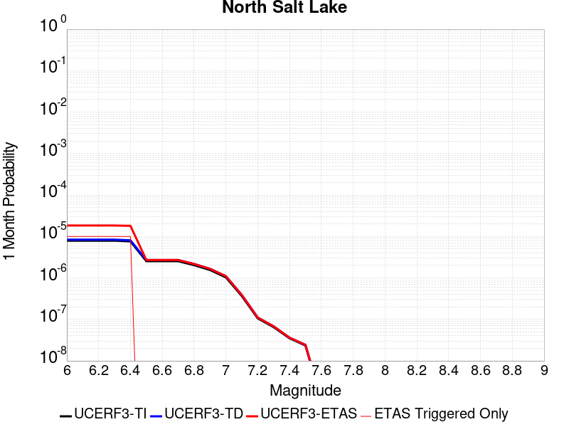 |  |  |

| Magnitude | 1 wk TI Prob | 1 wk TD Prob | 1 wk ETAS Prob | 1 wk ETAS/TD Gain | 1 wk ETAS Triggered Only | 1 mo TI Prob | 1 mo TD Prob | 1 mo ETAS Prob | 1 mo ETAS/TD Gain | 1 mo ETAS Triggered Only | 1 yr TI Prob | 1 yr TD Prob | 1 yr ETAS Prob | 1 yr ETAS/TD Gain | 1 yr ETAS Triggered Only | 10 yr TI Prob | 10 yr TD Prob | 10 yr ETAS Prob | 10 yr ETAS/TD Gain | 10 yr ETAS Triggered Only |
|-----|-----|-----|-----|-----|-----|-----|-----|-----|-----|-----|-----|-----|-----|-----|-----|-----|-----|-----|-----|-----|
| 6.0 | 1.849599E-6 | 1.9556126E-6 | 1.1955593E-5 | 6.113477 | 1.0E-5 | 7.926829E-6 | 8.381182E-6 | 1.8381097E-5 | 2.193139 | 1.0E-5 | 9.650487E-5 | 1.02038124E-4 | 1.120371E-4 | 1.0979925 | 1.0E-5 | 9.646297E-4 | 0.0010201106 | 0.0010400901 | 1.0195857 | 2.0E-5 |
| 6.1 | 1.849599E-6 | 1.9556126E-6 | 1.1955593E-5 | 6.113477 | 1.0E-5 | 7.926829E-6 | 8.381182E-6 | 1.8381097E-5 | 2.193139 | 1.0E-5 | 9.650487E-5 | 1.02038124E-4 | 1.120371E-4 | 1.0979925 | 1.0E-5 | 9.646297E-4 | 0.0010201106 | 0.0010301004 | 1.0097928 | 1.0E-5 |
| 6.2 | 1.849599E-6 | 1.9556126E-6 | 1.1955593E-5 | 6.113477 | 1.0E-5 | 7.926829E-6 | 8.381182E-6 | 1.8381097E-5 | 2.193139 | 1.0E-5 | 9.650487E-5 | 1.02038124E-4 | 1.120371E-4 | 1.0979925 | 1.0E-5 | 9.646297E-4 | 0.0010201106 | 0.0010301004 | 1.0097928 | 1.0E-5 |
| 6.3 | 1.849599E-6 | 1.9556126E-6 | 1.1955593E-5 | 6.113477 | 1.0E-5 | 7.926829E-6 | 8.381182E-6 | 1.8381097E-5 | 2.193139 | 1.0E-5 | 9.650487E-5 | 1.02038124E-4 | 1.120371E-4 | 1.0979925 | 1.0E-5 | 9.646297E-4 | 0.0010201106 | 0.0010301004 | 1.0097928 | 1.0E-5 |
| 6.4 | 1.7803909E-6 | 1.8861124E-6 | 1.18860935E-5 | 6.301901 | 1.0E-5 | 7.630225E-6 | 8.083325E-6 | 1.8083245E-5 | 2.2371047 | 1.0E-5 | 9.289402E-5 | 9.841205E-5 | 1.0841106E-4 | 1.1016036 | 1.0E-5 | 9.28552E-4 | 9.838819E-4 | 9.938721E-4 | 1.0101538 | 1.0E-5 |
| 6.5 | 5.9157696E-7 | 6.3003364E-7 | 6.3003364E-7 | 1.0 | 0.0 | 2.5353274E-6 | 2.7001417E-6 | 2.7001417E-6 | 1.0 | 0.0 | 3.0867173E-5 | 3.287377E-5 | 3.287377E-5 | 1.0 | 0.0 | 3.0862886E-4 | 3.28693E-4 | 3.28693E-4 | 1.0 | 0.0 |
| 6.6 | 5.9157696E-7 | 6.3003364E-7 | 6.3003364E-7 | 1.0 | 0.0 | 2.5353274E-6 | 2.7001417E-6 | 2.7001417E-6 | 1.0 | 0.0 | 3.0867173E-5 | 3.287377E-5 | 3.287377E-5 | 1.0 | 0.0 | 3.0862886E-4 | 3.28693E-4 | 3.28693E-4 | 1.0 | 0.0 |
| 6.7 | 5.9157696E-7 | 6.3003364E-7 | 6.3003364E-7 | 1.0 | 0.0 | 2.5353274E-6 | 2.7001417E-6 | 2.7001417E-6 | 1.0 | 0.0 | 3.0867173E-5 | 3.287377E-5 | 3.287377E-5 | 1.0 | 0.0 | 3.0862886E-4 | 3.28693E-4 | 3.28693E-4 | 1.0 | 0.0 |
| 6.8 | 4.7536267E-7 | 5.066143E-7 | 5.066143E-7 | 1.0 | 0.0 | 2.037267E-6 | 2.1712026E-6 | 2.1712026E-6 | 1.0 | 0.0 | 2.4803443E-5 | 2.6434096E-5 | 2.6434096E-5 | 1.0 | 0.0 | 2.4800675E-4 | 2.6431197E-4 | 2.6431197E-4 | 1.0 | 0.0 |
| 6.9 | 3.6345344E-7 | 3.8751006E-7 | 3.8751006E-7 | 1.0 | 0.0 | 1.5576567E-6 | 1.6607564E-6 | 1.6607564E-6 | 1.0 | 0.0 | 1.8964305E-5 | 2.0219539E-5 | 2.0219539E-5 | 1.0 | 0.0 | 1.8962687E-4 | 2.021787E-4 | 2.021787E-4 | 1.0 | 0.0 |
| 7.0 | 2.4087325E-7 | 2.570998E-7 | 2.570998E-7 | 1.0 | 0.0 | 1.0323135E-6 | 1.1018559E-6 | 1.1018559E-6 | 1.0 | 0.0 | 1.25683455E-5 | 1.3415026E-5 | 1.3415026E-5 | 1.0 | 0.0 | 1.2567634E-4 | 1.3414343E-4 | 1.3414343E-4 | 1.0 | 0.0 |
| 7.1 | 8.551555E-8 | 9.044672E-8 | 9.044672E-8 | 1.0 | 0.0 | 3.6649516E-7 | 3.8762875E-7 | 3.8762875E-7 | 1.0 | 0.0 | 4.4620692E-6 | 4.7193707E-6 | 4.7193707E-6 | 1.0 | 0.0 | 4.46198E-5 | 4.7192825E-5 | 4.7192825E-5 | 1.0 | 0.0 |
| 7.2 | 2.475279E-8 | 2.5893618E-8 | 2.5893618E-8 | 1.0 | 0.0 | 1.0608338E-7 | 1.1097265E-7 | 1.1097265E-7 | 1.0 | 0.0 | 1.2915643E-6 | 1.3510912E-6 | 1.3510912E-6 | 1.0 | 0.0 | 1.2915569E-5 | 1.3510837E-5 | 1.3510837E-5 | 1.0 | 0.0 |
| 7.3 | 1.5212393E-8 | 1.5847736E-8 | 1.5847736E-8 | 1.0 | 0.0 | 6.519597E-8 | 6.791887E-8 | 6.791887E-8 | 1.0 | 0.0 | 7.9376065E-7 | 8.2691196E-7 | 8.2691196E-7 | 1.0 | 0.0 | 7.937579E-6 | 8.269092E-6 | 8.269092E-6 | 1.0 | 0.0 |
| 7.4 | 8.182E-9 | 8.447396E-9 | 8.447396E-9 | 1.0 | 0.0 | 3.5065714E-8 | 3.6203126E-8 | 3.6203126E-8 | 1.0 | 0.0 | 4.26925E-7 | 4.4077296E-7 | 4.4077296E-7 | 1.0 | 0.0 | 4.269242E-6 | 4.4077215E-6 | 4.4077215E-6 | 1.0 | 0.0 |
| 7.5 | 5.479913E-9 | 5.6681158E-9 | 5.6681158E-9 | 1.0 | 0.0 | 2.3485342E-8 | 2.4291925E-8 | 2.4291925E-8 | 1.0 | 0.0 | 2.85934E-7 | 2.9575415E-7 | 2.9575415E-7 | 1.0 | 0.0 | 2.8593363E-6 | 2.9575378E-6 | 2.9575378E-6 | 1.0 | 0.0 |
| 7.6 | 2.6813562E-10 | 2.7732305E-10 | 2.7732305E-10 | 1.0 | 0.0 | 1.1491527E-9 | 1.1885273E-9 | 1.1885273E-9 | 1.0 | 0.0 | 1.3990933E-8 | 1.4470319E-8 | 1.4470319E-8 | 1.0 | 0.0 | 1.3990932E-7 | 1.447032E-7 | 1.447032E-7 | 1.0 | 0.0 |

## Redondo Canyon alt 1
*[(top)](#table-of-contents)*

| 1 Week | 1 Month | 1 Year | 10 Year |
|-----|-----|-----|-----|
| 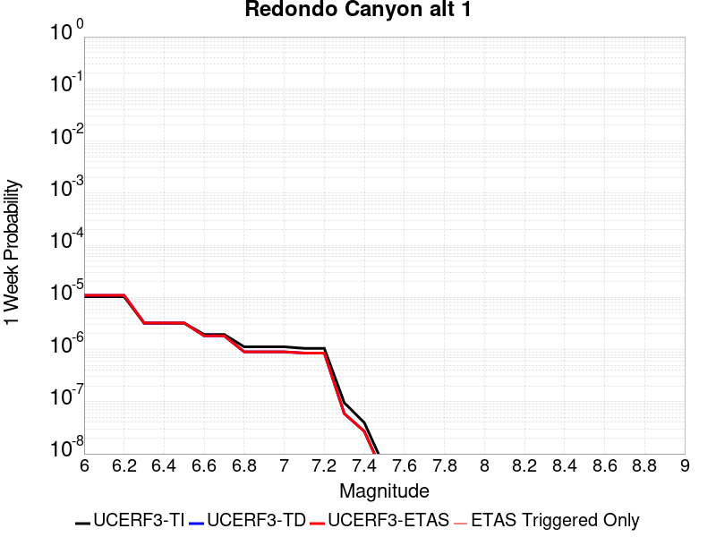 |  | 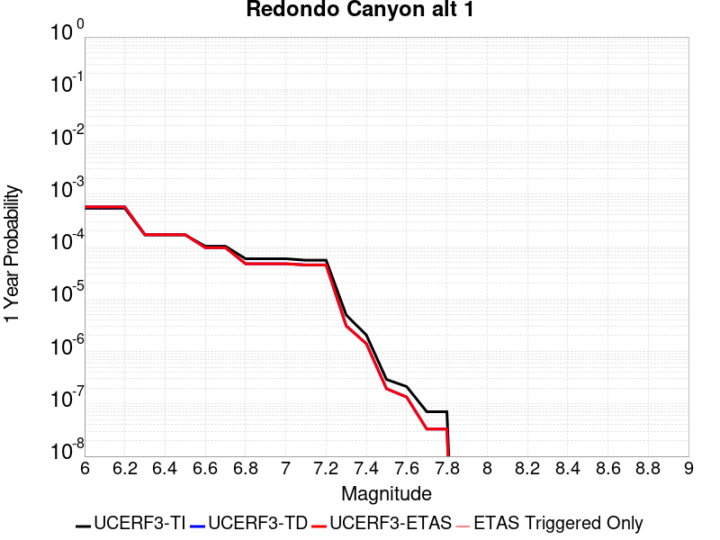 |  |

| Magnitude | 1 wk TI Prob | 1 wk TD Prob | 1 wk ETAS Prob | 1 wk ETAS/TD Gain | 1 wk ETAS Triggered Only | 1 mo TI Prob | 1 mo TD Prob | 1 mo ETAS Prob | 1 mo ETAS/TD Gain | 1 mo ETAS Triggered Only | 1 yr TI Prob | 1 yr TD Prob | 1 yr ETAS Prob | 1 yr ETAS/TD Gain | 1 yr ETAS Triggered Only | 10 yr TI Prob | 10 yr TD Prob | 10 yr ETAS Prob | 10 yr ETAS/TD Gain | 10 yr ETAS Triggered Only |
|-----|-----|-----|-----|-----|-----|-----|-----|-----|-----|-----|-----|-----|-----|-----|-----|-----|-----|-----|-----|-----|
| 6.0 | 1.0346246E-5 | 1.0981754E-5 | 1.0981754E-5 | 1.0 | 0.0 | 4.43403E-5 | 4.7064255E-5 | 4.7064255E-5 | 1.0 | 0.0 | 5.3970946E-4 | 5.7293556E-4 | 5.7293556E-4 | 1.0 | 0.0 | 0.0053840056 | 0.0057223244 | 0.00574221 | 1.0034751 | 2.0E-5 |
| 6.1 | 1.0346246E-5 | 1.0981754E-5 | 1.0981754E-5 | 1.0 | 0.0 | 4.43403E-5 | 4.7064255E-5 | 4.7064255E-5 | 1.0 | 0.0 | 5.3970946E-4 | 5.7293556E-4 | 5.7293556E-4 | 1.0 | 0.0 | 0.0053840056 | 0.0057223244 | 0.00574221 | 1.0034751 | 2.0E-5 |
| 6.2 | 1.0346246E-5 | 1.0981754E-5 | 1.0981754E-5 | 1.0 | 0.0 | 4.43403E-5 | 4.7064255E-5 | 4.7064255E-5 | 1.0 | 0.0 | 5.3970946E-4 | 5.7293556E-4 | 5.7293556E-4 | 1.0 | 0.0 | 0.0053840056 | 0.0057223244 | 0.00574221 | 1.0034751 | 2.0E-5 |
| 6.3 | 3.2052794E-6 | 3.2362834E-6 | 3.2362834E-6 | 1.0 | 0.0 | 1.373684E-5 | 1.3869735E-5 | 1.3869735E-5 | 1.0 | 0.0 | 1.6723319E-4 | 1.6885491E-4 | 1.6885491E-4 | 1.0 | 0.0 | 0.001671074 | 0.0016876558 | 0.0016976389 | 1.0059154 | 1.0E-5 |
| 6.4 | 3.2052794E-6 | 3.2362834E-6 | 3.2362834E-6 | 1.0 | 0.0 | 1.373684E-5 | 1.3869735E-5 | 1.3869735E-5 | 1.0 | 0.0 | 1.6723319E-4 | 1.6885491E-4 | 1.6885491E-4 | 1.0 | 0.0 | 0.001671074 | 0.0016876558 | 0.0016976389 | 1.0059154 | 1.0E-5 |
| 6.5 | 3.2052794E-6 | 3.2362834E-6 | 3.2362834E-6 | 1.0 | 0.0 | 1.373684E-5 | 1.3869735E-5 | 1.3869735E-5 | 1.0 | 0.0 | 1.6723319E-4 | 1.6885491E-4 | 1.6885491E-4 | 1.0 | 0.0 | 0.001671074 | 0.0016876558 | 0.0016976389 | 1.0059154 | 1.0E-5 |
| 6.6 | 1.948328E-6 | 1.8289716E-6 | 1.8289716E-6 | 1.0 | 0.0 | 8.349951E-6 | 7.838435E-6 | 7.838435E-6 | 1.0 | 0.0 | 1.016559E-4 | 9.543026E-5 | 9.543026E-5 | 1.0 | 0.0 | 0.0010160941 | 9.540398E-4 | 9.540398E-4 | 1.0 | 0.0 |
| 6.7 | 1.948328E-6 | 1.8289716E-6 | 1.8289716E-6 | 1.0 | 0.0 | 8.349951E-6 | 7.838435E-6 | 7.838435E-6 | 1.0 | 0.0 | 1.016559E-4 | 9.543026E-5 | 9.543026E-5 | 1.0 | 0.0 | 0.0010160941 | 9.540398E-4 | 9.540398E-4 | 1.0 | 0.0 |
| 6.8 | 1.1278219E-6 | 9.0336715E-7 | 9.0336715E-7 | 1.0 | 0.0 | 4.8335132E-6 | 3.8715702E-6 | 3.8715702E-6 | 1.0 | 0.0 | 5.8846435E-5 | 4.7135774E-5 | 4.7135774E-5 | 1.0 | 0.0 | 5.8830855E-4 | 4.712998E-4 | 4.712998E-4 | 1.0 | 0.0 |
| 6.9 | 1.1278219E-6 | 9.0336715E-7 | 9.0336715E-7 | 1.0 | 0.0 | 4.8335132E-6 | 3.8715702E-6 | 3.8715702E-6 | 1.0 | 0.0 | 5.8846435E-5 | 4.7135774E-5 | 4.7135774E-5 | 1.0 | 0.0 | 5.8830855E-4 | 4.712998E-4 | 4.712998E-4 | 1.0 | 0.0 |
| 7.0 | 1.1278219E-6 | 9.0336715E-7 | 9.0336715E-7 | 1.0 | 0.0 | 4.8335132E-6 | 3.8715702E-6 | 3.8715702E-6 | 1.0 | 0.0 | 5.8846435E-5 | 4.7135774E-5 | 4.7135774E-5 | 1.0 | 0.0 | 5.8830855E-4 | 4.712998E-4 | 4.712998E-4 | 1.0 | 0.0 |
| 7.1 | 1.0545139E-6 | 8.5698196E-7 | 8.5698196E-7 | 1.0 | 0.0 | 4.5193374E-6 | 3.672777E-6 | 3.672777E-6 | 1.0 | 0.0 | 5.5021545E-5 | 4.471557E-5 | 4.471557E-5 | 1.0 | 0.0 | 5.500792E-4 | 4.4710745E-4 | 4.4710745E-4 | 1.0 | 0.0 |
| 7.2 | 1.0545139E-6 | 8.5698196E-7 | 8.5698196E-7 | 1.0 | 0.0 | 4.5193374E-6 | 3.672777E-6 | 3.672777E-6 | 1.0 | 0.0 | 5.5021545E-5 | 4.471557E-5 | 4.471557E-5 | 1.0 | 0.0 | 5.500792E-4 | 4.4710745E-4 | 4.4710745E-4 | 1.0 | 0.0 |
| 7.3 | 9.505161E-8 | 5.896212E-8 | 5.896212E-8 | 1.0 | 0.0 | 4.0736398E-7 | 2.5269478E-7 | 2.5269478E-7 | 1.0 | 0.0 | 4.959645E-6 | 3.0765557E-6 | 3.0765557E-6 | 1.0 | 0.0 | 4.9595343E-5 | 3.076525E-5 | 3.076525E-5 | 1.0 | 0.0 |
| 7.4 | 3.9520785E-8 | 2.6990074E-8 | 2.6990074E-8 | 1.0 | 0.0 | 1.6937479E-7 | 1.1567174E-7 | 1.1567174E-7 | 1.0 | 0.0 | 2.062136E-6 | 1.4083028E-6 | 1.4083028E-6 | 1.0 | 0.0 | 2.062117E-5 | 1.4082965E-5 | 1.4082965E-5 | 1.0 | 0.0 |
| 7.5 | 5.6133214E-9 | 3.7371777E-9 | 3.7371777E-9 | 1.0 | 0.0 | 2.4057092E-8 | 1.6016475E-8 | 1.6016475E-8 | 1.0 | 0.0 | 2.9289507E-7 | 1.9500058E-7 | 1.9500058E-7 | 1.0 | 0.0 | 2.9289467E-6 | 1.9500044E-6 | 1.9500044E-6 | 1.0 | 0.0 |
| 7.6 | 4.1064334E-9 | 2.596027E-9 | 2.596027E-9 | 1.0 | 0.0 | 1.7599E-8 | 1.112583E-8 | 1.112583E-8 | 1.0 | 0.0 | 2.142678E-7 | 1.3545697E-7 | 1.3545697E-7 | 1.0 | 0.0 | 2.1426758E-6 | 1.3545691E-6 | 1.3545691E-6 | 1.0 | 0.0 |
| 7.7 | 1.361975E-9 | 6.361647E-10 | 6.361647E-10 | 1.0 | 0.0 | 5.8370353E-9 | 2.72642E-9 | 2.72642E-9 | 1.0 | 0.0 | 7.1065905E-8 | 3.3194166E-8 | 3.3194166E-8 | 1.0 | 0.0 | 7.106588E-7 | 3.319416E-7 | 3.319416E-7 | 1.0 | 0.0 |
| 7.8 | 1.361975E-9 | 6.361647E-10 | 6.361647E-10 | 1.0 | 0.0 | 5.8370353E-9 | 2.72642E-9 | 2.72642E-9 | 1.0 | 0.0 | 7.1065905E-8 | 3.3194166E-8 | 3.3194166E-8 | 1.0 | 0.0 | 7.106588E-7 | 3.319416E-7 | 3.319416E-7 | 1.0 | 0.0 |

## Pitas Point (Lower West)
*[(top)](#table-of-contents)*

| 1 Week | 1 Month | 1 Year | 10 Year |
|-----|-----|-----|-----|
| 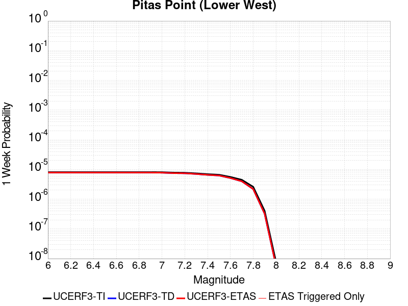 |  | 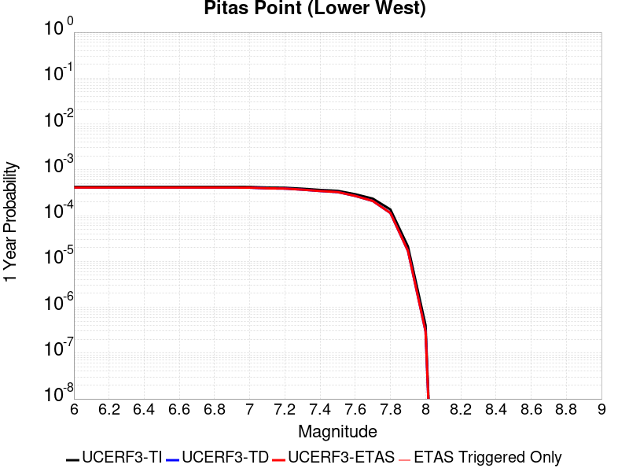 |  |

| Magnitude | 1 wk TI Prob | 1 wk TD Prob | 1 wk ETAS Prob | 1 wk ETAS/TD Gain | 1 wk ETAS Triggered Only | 1 mo TI Prob | 1 mo TD Prob | 1 mo ETAS Prob | 1 mo ETAS/TD Gain | 1 mo ETAS Triggered Only | 1 yr TI Prob | 1 yr TD Prob | 1 yr ETAS Prob | 1 yr ETAS/TD Gain | 1 yr ETAS Triggered Only | 10 yr TI Prob | 10 yr TD Prob | 10 yr ETAS Prob | 10 yr ETAS/TD Gain | 10 yr ETAS Triggered Only |
|-----|-----|-----|-----|-----|-----|-----|-----|-----|-----|-----|-----|-----|-----|-----|-----|-----|-----|-----|-----|-----|
| 6.0 | 8.151497E-6 | 7.855952E-6 | 7.855952E-6 | 1.0 | 0.0 | 3.493452E-5 | 3.3667937E-5 | 3.3667937E-5 | 1.0 | 0.0 | 4.252448E-4 | 4.0983077E-4 | 4.0983077E-4 | 1.0 | 0.0 | 0.0042443196 | 0.00409083 | 0.0041107484 | 1.004869 | 2.0E-5 |
| 6.1 | 8.151497E-6 | 7.855952E-6 | 7.855952E-6 | 1.0 | 0.0 | 3.493452E-5 | 3.3667937E-5 | 3.3667937E-5 | 1.0 | 0.0 | 4.252448E-4 | 4.0983077E-4 | 4.0983077E-4 | 1.0 | 0.0 | 0.0042443196 | 0.00409083 | 0.0041107484 | 1.004869 | 2.0E-5 |
| 6.2 | 8.151497E-6 | 7.855952E-6 | 7.855952E-6 | 1.0 | 0.0 | 3.493452E-5 | 3.3667937E-5 | 3.3667937E-5 | 1.0 | 0.0 | 4.252448E-4 | 4.0983077E-4 | 4.0983077E-4 | 1.0 | 0.0 | 0.0042443196 | 0.00409083 | 0.0041107484 | 1.004869 | 2.0E-5 |
| 6.3 | 8.151497E-6 | 7.855952E-6 | 7.855952E-6 | 1.0 | 0.0 | 3.493452E-5 | 3.3667937E-5 | 3.3667937E-5 | 1.0 | 0.0 | 4.252448E-4 | 4.0983077E-4 | 4.0983077E-4 | 1.0 | 0.0 | 0.0042443196 | 0.00409083 | 0.0041107484 | 1.004869 | 2.0E-5 |
| 6.4 | 8.151497E-6 | 7.855952E-6 | 7.855952E-6 | 1.0 | 0.0 | 3.493452E-5 | 3.3667937E-5 | 3.3667937E-5 | 1.0 | 0.0 | 4.252448E-4 | 4.0983077E-4 | 4.0983077E-4 | 1.0 | 0.0 | 0.0042443196 | 0.00409083 | 0.0041107484 | 1.004869 | 2.0E-5 |
| 6.5 | 8.151497E-6 | 7.855952E-6 | 7.855952E-6 | 1.0 | 0.0 | 3.493452E-5 | 3.3667937E-5 | 3.3667937E-5 | 1.0 | 0.0 | 4.252448E-4 | 4.0983077E-4 | 4.0983077E-4 | 1.0 | 0.0 | 0.0042443196 | 0.00409083 | 0.0041107484 | 1.004869 | 2.0E-5 |
| 6.6 | 8.151497E-6 | 7.855952E-6 | 7.855952E-6 | 1.0 | 0.0 | 3.493452E-5 | 3.3667937E-5 | 3.3667937E-5 | 1.0 | 0.0 | 4.252448E-4 | 4.0983077E-4 | 4.0983077E-4 | 1.0 | 0.0 | 0.0042443196 | 0.00409083 | 0.0041107484 | 1.004869 | 2.0E-5 |
| 6.7 | 8.151497E-6 | 7.855952E-6 | 7.855952E-6 | 1.0 | 0.0 | 3.493452E-5 | 3.3667937E-5 | 3.3667937E-5 | 1.0 | 0.0 | 4.252448E-4 | 4.0983077E-4 | 4.0983077E-4 | 1.0 | 0.0 | 0.0042443196 | 0.00409083 | 0.0041107484 | 1.004869 | 2.0E-5 |
| 6.8 | 8.151497E-6 | 7.855952E-6 | 7.855952E-6 | 1.0 | 0.0 | 3.493452E-5 | 3.3667937E-5 | 3.3667937E-5 | 1.0 | 0.0 | 4.252448E-4 | 4.0983077E-4 | 4.0983077E-4 | 1.0 | 0.0 | 0.0042443196 | 0.00409083 | 0.0041107484 | 1.004869 | 2.0E-5 |
| 6.9 | 8.151497E-6 | 7.855952E-6 | 7.855952E-6 | 1.0 | 0.0 | 3.493452E-5 | 3.3667937E-5 | 3.3667937E-5 | 1.0 | 0.0 | 4.252448E-4 | 4.0983077E-4 | 4.0983077E-4 | 1.0 | 0.0 | 0.0042443196 | 0.00409083 | 0.0041107484 | 1.004869 | 2.0E-5 |
| 7.0 | 8.103535E-6 | 7.805381E-6 | 7.805381E-6 | 1.0 | 0.0 | 3.4728975E-5 | 3.3451208E-5 | 3.3451208E-5 | 1.0 | 0.0 | 4.2274324E-4 | 4.071931E-4 | 4.071931E-4 | 1.0 | 0.0 | 0.0042193993 | 0.00406455 | 0.004084469 | 1.0049006 | 2.0E-5 |
| 7.1 | 7.853298E-6 | 7.5410667E-6 | 7.5410667E-6 | 1.0 | 0.0 | 3.3656554E-5 | 3.231846E-5 | 3.231846E-5 | 1.0 | 0.0 | 4.096915E-4 | 3.9340692E-4 | 3.9340692E-4 | 1.0 | 0.0 | 0.00408937 | 0.003927181 | 0.0039471025 | 1.0050727 | 2.0E-5 |
| 7.2 | 7.771102E-6 | 7.4533464E-6 | 7.4533464E-6 | 1.0 | 0.0 | 3.33043E-5 | 3.1942527E-5 | 3.1942527E-5 | 1.0 | 0.0 | 4.0540437E-4 | 3.8883154E-4 | 3.8883154E-4 | 1.0 | 0.0 | 0.0040466557 | 0.0038815879 | 0.00390151 | 1.0051326 | 2.0E-5 |
| 7.3 | 7.3945344E-6 | 7.04944E-6 | 7.04944E-6 | 1.0 | 0.0 | 3.1690477E-5 | 3.0211539E-5 | 3.0211539E-5 | 1.0 | 0.0 | 3.8576324E-4 | 3.6776403E-4 | 3.6776403E-4 | 1.0 | 0.0 | 0.0038509427 | 0.003671622 | 0.0036915485 | 1.0054272 | 2.0E-5 |
| 7.4 | 6.964645E-6 | 6.5902773E-6 | 6.5902773E-6 | 1.0 | 0.0 | 2.9848137E-5 | 2.8243743E-5 | 2.8243743E-5 | 1.0 | 0.0 | 3.6334046E-4 | 3.438138E-4 | 3.438138E-4 | 1.0 | 0.0 | 0.0036274698 | 0.0034328722 | 0.0034528035 | 1.005806 | 2.0E-5 |
| 7.5 | 6.6525035E-6 | 6.2593085E-6 | 6.2593085E-6 | 1.0 | 0.0 | 2.851042E-5 | 2.6825335E-5 | 2.6825335E-5 | 1.0 | 0.0 | 3.4705905E-4 | 3.2654998E-4 | 3.2654998E-4 | 1.0 | 0.0 | 0.0034651754 | 0.003260753 | 0.0032806878 | 1.0061135 | 2.0E-5 |
| 7.6 | 5.613338E-6 | 5.1515085E-6 | 5.1515085E-6 | 1.0 | 0.0 | 2.405694E-5 | 2.207771E-5 | 2.207771E-5 | 1.0 | 0.0 | 2.928539E-4 | 2.6876325E-4 | 2.6876325E-4 | 1.0 | 0.0 | 0.0029246826 | 0.0026844137 | 0.00270436 | 1.0074304 | 2.0E-5 |
| 7.7 | 4.494704E-6 | 3.9970087E-6 | 3.9970087E-6 | 1.0 | 0.0 | 1.9262876E-5 | 1.7129927E-5 | 1.7129927E-5 | 1.0 | 0.0 | 2.3450027E-4 | 2.0853712E-4 | 2.0853712E-4 | 1.0 | 0.0 | 0.0023425296 | 0.0020834384 | 0.002103397 | 1.0095795 | 2.0E-5 |
| 7.8 | 2.6075882E-6 | 2.183688E-6 | 2.183688E-6 | 1.0 | 0.0 | 1.117533E-5 | 9.358629E-6 | 9.358629E-6 | 1.0 | 0.0 | 1.3605114E-4 | 1.139354E-4 | 1.139354E-4 | 1.0 | 0.0 | 0.0013596788 | 0.0011387746 | 0.0011487631 | 1.0087714 | 1.0E-5 |
| 7.9 | 4.045984E-7 | 3.2424532E-7 | 3.2424532E-7 | 1.0 | 0.0 | 1.733992E-6 | 1.3896221E-6 | 1.3896221E-6 | 1.0 | 0.0 | 2.1111147E-5 | 1.691852E-5 | 1.691852E-5 | 1.0 | 0.0 | 2.1109142E-4 | 1.6917264E-4 | 1.6917264E-4 | 1.0 | 0.0 |
| 8.0 | 7.791402E-9 | 5.6836544E-9 | 5.6836544E-9 | 1.0 | 0.0 | 3.3391725E-8 | 2.4358519E-8 | 2.4358519E-8 | 1.0 | 0.0 | 4.0654416E-7 | 2.9656493E-7 | 2.9656493E-7 | 1.0 | 0.0 | 4.065434E-6 | 2.9656476E-6 | 2.9656476E-6 | 1.0 | 0.0 |

## Los Alamos 2011 CFM
*[(top)](#table-of-contents)*

| 1 Week | 1 Month | 1 Year | 10 Year |
|-----|-----|-----|-----|
|  |  |  | 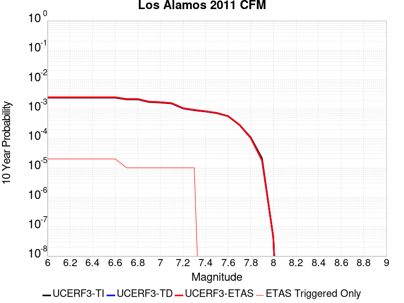 |

| Magnitude | 1 wk TI Prob | 1 wk TD Prob | 1 wk ETAS Prob | 1 wk ETAS/TD Gain | 1 wk ETAS Triggered Only | 1 mo TI Prob | 1 mo TD Prob | 1 mo ETAS Prob | 1 mo ETAS/TD Gain | 1 mo ETAS Triggered Only | 1 yr TI Prob | 1 yr TD Prob | 1 yr ETAS Prob | 1 yr ETAS/TD Gain | 1 yr ETAS Triggered Only | 10 yr TI Prob | 10 yr TD Prob | 10 yr ETAS Prob | 10 yr ETAS/TD Gain | 10 yr ETAS Triggered Only |
|-----|-----|-----|-----|-----|-----|-----|-----|-----|-----|-----|-----|-----|-----|-----|-----|-----|-----|-----|-----|-----|
| 6.0 | 4.6284417E-6 | 4.7517924E-6 | 4.7517924E-6 | 1.0 | 0.0 | 1.9836029E-5 | 2.0364676E-5 | 2.0364676E-5 | 1.0 | 0.0 | 2.4147688E-4 | 2.4791347E-4 | 2.4791347E-4 | 1.0 | 0.0 | 0.0024121467 | 0.0024765432 | 0.0024964937 | 1.0080558 | 2.0E-5 |
| 6.1 | 4.6284417E-6 | 4.7517924E-6 | 4.7517924E-6 | 1.0 | 0.0 | 1.9836029E-5 | 2.0364676E-5 | 2.0364676E-5 | 1.0 | 0.0 | 2.4147688E-4 | 2.4791347E-4 | 2.4791347E-4 | 1.0 | 0.0 | 0.0024121467 | 0.0024765432 | 0.0024964937 | 1.0080558 | 2.0E-5 |
| 6.2 | 4.6284417E-6 | 4.7517924E-6 | 4.7517924E-6 | 1.0 | 0.0 | 1.9836029E-5 | 2.0364676E-5 | 2.0364676E-5 | 1.0 | 0.0 | 2.4147688E-4 | 2.4791347E-4 | 2.4791347E-4 | 1.0 | 0.0 | 0.0024121467 | 0.0024765432 | 0.0024964937 | 1.0080558 | 2.0E-5 |
| 6.3 | 4.6284417E-6 | 4.7517924E-6 | 4.7517924E-6 | 1.0 | 0.0 | 1.9836029E-5 | 2.0364676E-5 | 2.0364676E-5 | 1.0 | 0.0 | 2.4147688E-4 | 2.4791347E-4 | 2.4791347E-4 | 1.0 | 0.0 | 0.0024121467 | 0.0024765432 | 0.0024964937 | 1.0080558 | 2.0E-5 |
| 6.4 | 4.6284417E-6 | 4.7517924E-6 | 4.7517924E-6 | 1.0 | 0.0 | 1.9836029E-5 | 2.0364676E-5 | 2.0364676E-5 | 1.0 | 0.0 | 2.4147688E-4 | 2.4791347E-4 | 2.4791347E-4 | 1.0 | 0.0 | 0.0024121467 | 0.0024765432 | 0.0024964937 | 1.0080558 | 2.0E-5 |
| 6.5 | 4.6284417E-6 | 4.7517924E-6 | 4.7517924E-6 | 1.0 | 0.0 | 1.9836029E-5 | 2.0364676E-5 | 2.0364676E-5 | 1.0 | 0.0 | 2.4147688E-4 | 2.4791347E-4 | 2.4791347E-4 | 1.0 | 0.0 | 0.0024121467 | 0.0024765432 | 0.0024964937 | 1.0080558 | 2.0E-5 |
| 6.6 | 4.6284417E-6 | 4.7517924E-6 | 4.7517924E-6 | 1.0 | 0.0 | 1.9836029E-5 | 2.0364676E-5 | 2.0364676E-5 | 1.0 | 0.0 | 2.4147688E-4 | 2.4791347E-4 | 2.4791347E-4 | 1.0 | 0.0 | 0.0024121467 | 0.0024765432 | 0.0024964937 | 1.0080558 | 2.0E-5 |
| 6.7 | 4.062321E-6 | 4.1664025E-6 | 4.1664025E-6 | 1.0 | 0.0 | 1.7409831E-5 | 1.7855897E-5 | 1.7855897E-5 | 1.0 | 0.0 | 2.1194408E-4 | 2.1737537E-4 | 2.1737537E-4 | 1.0 | 0.0 | 0.0021174205 | 0.0021717772 | 0.0021817554 | 1.0045946 | 1.0E-5 |
| 6.8 | 4.062321E-6 | 4.1664025E-6 | 4.1664025E-6 | 1.0 | 0.0 | 1.7409831E-5 | 1.7855897E-5 | 1.7855897E-5 | 1.0 | 0.0 | 2.1194408E-4 | 2.1737537E-4 | 2.1737537E-4 | 1.0 | 0.0 | 0.0021174205 | 0.0021717772 | 0.0021817554 | 1.0045946 | 1.0E-5 |
| 6.9 | 3.2936077E-6 | 3.373002E-6 | 3.373002E-6 | 1.0 | 0.0 | 1.4115385E-5 | 1.4455649E-5 | 1.4455649E-5 | 1.0 | 0.0 | 1.7184127E-4 | 1.7598424E-4 | 1.7598424E-4 | 1.0 | 0.0 | 0.0017170844 | 0.0017585414 | 0.0017685238 | 1.0056765 | 1.0E-5 |
| 7.0 | 3.1687898E-6 | 3.2448586E-6 | 3.2448586E-6 | 1.0 | 0.0 | 1.3580457E-5 | 1.3906468E-5 | 1.3906468E-5 | 1.0 | 0.0 | 1.6532952E-4 | 1.6929902E-4 | 1.6929902E-4 | 1.0 | 0.0 | 0.0016520657 | 0.001691792 | 0.0017017751 | 1.0059009 | 1.0E-5 |
| 7.1 | 2.9379228E-6 | 3.0073663E-6 | 3.0073663E-6 | 1.0 | 0.0 | 1.25910365E-5 | 1.2888654E-5 | 1.2888654E-5 | 1.0 | 0.0 | 1.5328509E-4 | 1.5690897E-4 | 1.5690897E-4 | 1.0 | 0.0 | 0.001531794 | 0.001568071 | 0.0015780553 | 1.0063672 | 1.0E-5 |
| 7.2 | 2.0020686E-6 | 2.0416587E-6 | 2.0416587E-6 | 1.0 | 0.0 | 8.580266E-6 | 8.7499375E-6 | 8.7499375E-6 | 1.0 | 0.0 | 1.0445973E-4 | 1.06525324E-4 | 1.06525324E-4 | 1.0 | 0.0 | 0.0010441064 | 0.0010647471 | 0.0010747364 | 1.0093819 | 1.0E-5 |
| 7.3 | 1.7364243E-6 | 1.7679062E-6 | 1.7679062E-6 | 1.0 | 0.0 | 7.441797E-6 | 7.576719E-6 | 7.576719E-6 | 1.0 | 0.0 | 9.0600115E-5 | 9.224268E-5 | 9.224268E-5 | 1.0 | 0.0 | 9.0563187E-4 | 9.2204707E-4 | 9.3203783E-4 | 1.0108354 | 1.0E-5 |
| 7.4 | 1.5718434E-6 | 1.5983417E-6 | 1.5983417E-6 | 1.0 | 0.0 | 6.7364545E-6 | 6.850018E-6 | 6.850018E-6 | 1.0 | 0.0 | 8.201325E-5 | 8.3395804E-5 | 8.3395804E-5 | 1.0 | 0.0 | 8.198299E-4 | 8.336481E-4 | 8.336481E-4 | 1.0 | 0.0 |
| 7.5 | 1.3841119E-6 | 1.4043009E-6 | 1.4043009E-6 | 1.0 | 0.0 | 5.9318945E-6 | 6.0184184E-6 | 6.0184184E-6 | 1.0 | 0.0 | 7.221842E-5 | 7.327181E-5 | 7.327181E-5 | 1.0 | 0.0 | 7.2194956E-4 | 7.324794E-4 | 7.324794E-4 | 1.0 | 0.0 |
| 7.6 | 1.0843726E-6 | 1.0934594E-6 | 1.0934594E-6 | 1.0 | 0.0 | 4.647303E-6 | 4.6862465E-6 | 4.6862465E-6 | 1.0 | 0.0 | 5.6579443E-5 | 5.705358E-5 | 5.705358E-5 | 1.0 | 0.0 | 5.656504E-4 | 5.7039195E-4 | 5.7039195E-4 | 1.0 | 0.0 |
| 7.7 | 5.544814E-7 | 5.5019615E-7 | 5.5019615E-7 | 1.0 | 0.0 | 2.3763469E-6 | 2.3579812E-6 | 2.3579812E-6 | 1.0 | 0.0 | 2.8931638E-5 | 2.8708046E-5 | 2.8708046E-5 | 1.0 | 0.0 | 2.8927872E-4 | 2.870435E-4 | 2.870435E-4 | 1.0 | 0.0 |
| 7.8 | 2.0707465E-7 | 1.9778815E-7 | 1.9778815E-7 | 1.0 | 0.0 | 8.874625E-7 | 8.476632E-7 | 8.476632E-7 | 1.0 | 0.0 | 1.08048025E-5 | 1.0320251E-5 | 1.0320251E-5 | 1.0 | 0.0 | 1.0804277E-4 | 1.03197766E-4 | 1.03197766E-4 | 1.0 | 0.0 |
| 7.9 | 3.9821284E-8 | 3.4331745E-8 | 3.4331745E-8 | 1.0 | 0.0 | 1.7066264E-7 | 1.4713603E-7 | 1.4713603E-7 | 1.0 | 0.0 | 2.0778157E-6 | 1.7913799E-6 | 1.7913799E-6 | 1.0 | 0.0 | 2.0777963E-5 | 1.791366E-5 | 1.791366E-5 | 1.0 | 0.0 |
| 8.0 | 7.880441E-11 | 8.235457E-11 | 8.235457E-11 | 1.0 | 0.0 | 3.3773329E-10 | 3.52948E-10 | 3.52948E-10 | 1.0 | 0.0 | 4.1119033E-9 | 4.2971413E-9 | 4.2971413E-9 | 1.0 | 0.0 | 4.1119034E-8 | 4.2971415E-8 | 4.2971415E-8 | 1.0 | 0.0 |

## Coronado Bank alt1
*[(top)](#table-of-contents)*

| 1 Week | 1 Month | 1 Year | 10 Year |
|-----|-----|-----|-----|
|  |  | 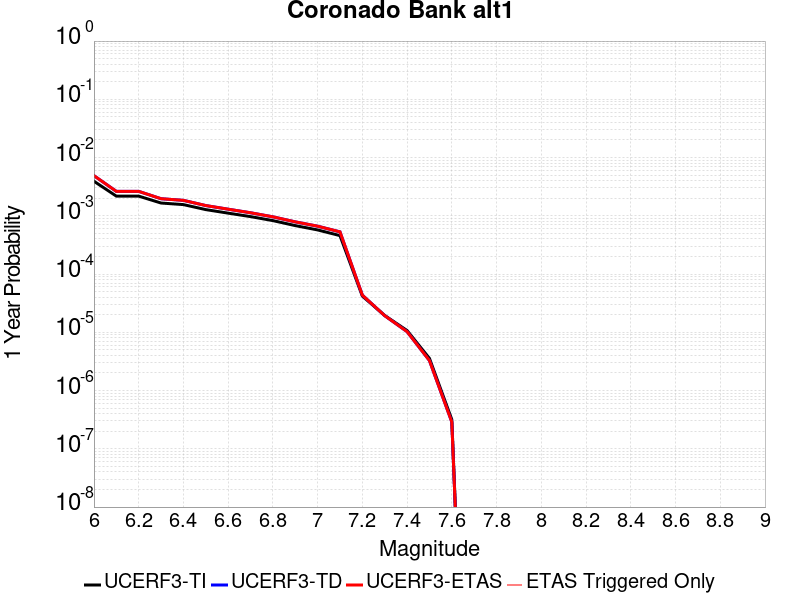 | 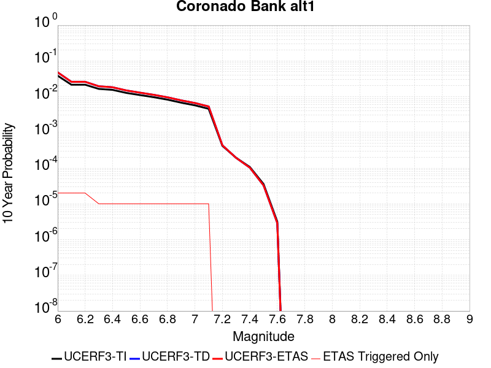 |

| Magnitude | 1 wk TI Prob | 1 wk TD Prob | 1 wk ETAS Prob | 1 wk ETAS/TD Gain | 1 wk ETAS Triggered Only | 1 mo TI Prob | 1 mo TD Prob | 1 mo ETAS Prob | 1 mo ETAS/TD Gain | 1 mo ETAS Triggered Only | 1 yr TI Prob | 1 yr TD Prob | 1 yr ETAS Prob | 1 yr ETAS/TD Gain | 1 yr ETAS Triggered Only | 10 yr TI Prob | 10 yr TD Prob | 10 yr ETAS Prob | 10 yr ETAS/TD Gain | 10 yr ETAS Triggered Only |
|-----|-----|-----|-----|-----|-----|-----|-----|-----|-----|-----|-----|-----|-----|-----|-----|-----|-----|-----|-----|-----|
| 6.0 | 7.533492E-5 | 9.3958E-5 | 9.3958E-5 | 1.0 | 0.0 | 3.22824E-4 | 4.0261925E-4 | 4.0261925E-4 | 1.0 | 0.0 | 0.0039233007 | 0.0048914095 | 0.0048914095 | 1.0 | 0.0 | 0.03854755 | 0.047907796 | 0.04792684 | 1.0003974 | 2.0E-5 |
| 6.1 | 4.1807285E-5 | 5.049681E-5 | 5.049681E-5 | 1.0 | 0.0 | 1.7916178E-4 | 2.1639753E-4 | 2.1639753E-4 | 1.0 | 0.0 | 0.0021791123 | 0.0026315534 | 0.0026315534 | 1.0 | 0.0 | 0.021578677 | 0.026013035 | 0.026032515 | 1.0007489 | 2.0E-5 |
| 6.2 | 4.1807285E-5 | 5.049681E-5 | 5.049681E-5 | 1.0 | 0.0 | 1.7916178E-4 | 2.1639753E-4 | 2.1639753E-4 | 1.0 | 0.0 | 0.0021791123 | 0.0026315534 | 0.0026315534 | 1.0 | 0.0 | 0.021578677 | 0.026013035 | 0.026032515 | 1.0007489 | 2.0E-5 |
| 6.3 | 3.1793104E-5 | 3.7713762E-5 | 3.7713762E-5 | 1.0 | 0.0 | 1.3624904E-4 | 1.616206E-4 | 1.616206E-4 | 1.0 | 0.0 | 0.0016575698 | 0.001965985 | 0.001965985 | 1.0 | 0.0 | 0.016452603 | 0.019489812 | 0.019499617 | 1.0005031 | 1.0E-5 |
| 6.4 | 2.9878007E-5 | 3.5338227E-5 | 3.5338227E-5 | 1.0 | 0.0 | 1.2804232E-4 | 1.5144095E-4 | 1.5144095E-4 | 1.0 | 0.0 | 0.0015578003 | 0.0018422646 | 0.0018422646 | 1.0 | 0.0 | 0.015469253 | 0.018273681 | 0.0182835 | 1.0005373 | 1.0E-5 |
| 6.5 | 2.4512565E-5 | 2.876592E-5 | 2.876592E-5 | 1.0 | 0.0 | 1.0504962E-4 | 1.2327686E-4 | 1.2327686E-4 | 1.0 | 0.0 | 0.0012782287 | 0.0014998899 | 0.0014998899 | 1.0 | 0.0 | 0.012709012 | 0.014900647 | 0.014910498 | 1.0006611 | 1.0E-5 |
| 6.6 | 2.1317413E-5 | 2.4908248E-5 | 2.4908248E-5 | 1.0 | 0.0 | 9.135714E-5 | 1.067454E-4 | 1.067454E-4 | 1.0 | 0.0 | 0.0011117056 | 0.0012988728 | 0.0012988728 | 1.0 | 0.0 | 0.011061605 | 0.012915217 | 0.012925088 | 1.0007643 | 1.0E-5 |
| 6.7 | 1.8585655E-5 | 2.1636217E-5 | 2.1636217E-5 | 1.0 | 0.0 | 7.9650374E-5 | 9.2723465E-5 | 9.2723465E-5 | 1.0 | 0.0 | 9.6931186E-4 | 0.001128344 | 0.001128344 | 1.0 | 0.0 | 0.0096509475 | 0.011228313 | 0.0112382 | 1.0008806 | 1.0E-5 |
| 6.8 | 1.5862879E-5 | 1.8420595E-5 | 1.8420595E-5 | 1.0 | 0.0 | 6.798199E-5 | 7.894313E-5 | 7.894313E-5 | 1.0 | 0.0 | 8.273665E-4 | 9.6072804E-4 | 9.6072804E-4 | 1.0 | 0.0 | 0.008242928 | 0.009567729 | 0.009577633 | 1.0010352 | 1.0E-5 |
| 6.9 | 1.3021509E-5 | 1.5096173E-5 | 1.5096173E-5 | 1.0 | 0.0 | 5.5805274E-5 | 6.469638E-5 | 6.469638E-5 | 1.0 | 0.0 | 6.792174E-4 | 7.8741193E-4 | 7.8741193E-4 | 1.0 | 0.0 | 0.006771452 | 0.007848043 | 0.007857964 | 1.0012642 | 1.0E-5 |
| 7.0 | 1.0974371E-5 | 1.27208705E-5 | 1.27208705E-5 | 1.0 | 0.0 | 4.7032172E-5 | 5.451698E-5 | 5.451698E-5 | 1.0 | 0.0 | 5.7246623E-4 | 6.6355965E-4 | 6.6355965E-4 | 1.0 | 0.0 | 0.0057099373 | 0.0066175326 | 0.0066274665 | 1.0015011 | 1.0E-5 |
| 7.1 | 8.766221E-6 | 1.0164449E-5 | 1.0164449E-5 | 1.0 | 0.0 | 3.7568978E-5 | 4.3561293E-5 | 4.3561293E-5 | 1.0 | 0.0 | 4.573063E-4 | 5.302469E-4 | 5.302469E-4 | 1.0 | 0.0 | 0.0045636636 | 0.005291517 | 0.005301464 | 1.0018798 | 1.0E-5 |
| 7.2 | 8.026024E-7 | 8.3319674E-7 | 8.3319674E-7 | 1.0 | 0.0 | 3.43972E-6 | 3.5708383E-6 | 3.5708383E-6 | 1.0 | 0.0 | 4.1877785E-5 | 4.3474098E-5 | 4.3474098E-5 | 1.0 | 0.0 | 4.1869894E-4 | 4.3465703E-4 | 4.3465703E-4 | 1.0 | 0.0 |
| 7.3 | 3.7293114E-7 | 3.7001612E-7 | 3.7001612E-7 | 1.0 | 0.0 | 1.5982754E-6 | 1.5857823E-6 | 1.5857823E-6 | 1.0 | 0.0 | 1.9458828E-5 | 1.930673E-5 | 1.930673E-5 | 1.0 | 0.0 | 1.9457124E-4 | 1.930506E-4 | 1.930506E-4 | 1.0 | 0.0 |
| 7.4 | 2.0557036E-7 | 1.9674646E-7 | 1.9674646E-7 | 1.0 | 0.0 | 8.810155E-7 | 8.431988E-7 | 8.431988E-7 | 1.0 | 0.0 | 1.0726311E-5 | 1.0265897E-5 | 1.0265897E-5 | 1.0 | 0.0 | 1.0725793E-4 | 1.0265426E-4 | 1.0265426E-4 | 1.0 | 0.0 |
| 7.5 | 6.845446E-8 | 6.279423E-8 | 6.279423E-8 | 1.0 | 0.0 | 2.9337625E-7 | 2.691181E-7 | 2.691181E-7 | 1.0 | 0.0 | 3.5718497E-6 | 3.2765079E-6 | 3.2765079E-6 | 1.0 | 0.0 | 3.5717923E-5 | 3.2764605E-5 | 3.2764605E-5 | 1.0 | 0.0 |
| 7.6 | 6.0975145E-9 | 5.5318807E-9 | 5.5318807E-9 | 1.0 | 0.0 | 2.6132206E-8 | 2.370806E-8 | 2.370806E-8 | 1.0 | 0.0 | 3.1815955E-7 | 2.886456E-7 | 2.886456E-7 | 1.0 | 0.0 | 3.181591E-6 | 2.886453E-6 | 2.886453E-6 | 1.0 | 0.0 |

## White Wolf
*[(top)](#table-of-contents)*

| 1 Week | 1 Month | 1 Year | 10 Year |
|-----|-----|-----|-----|
| 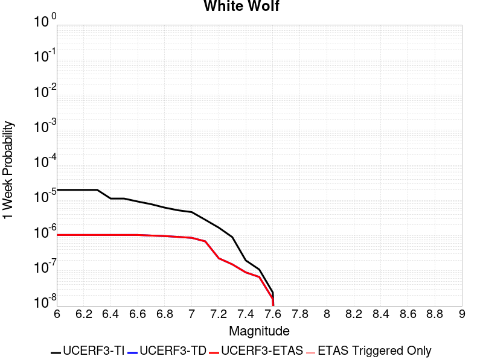 |  |  | 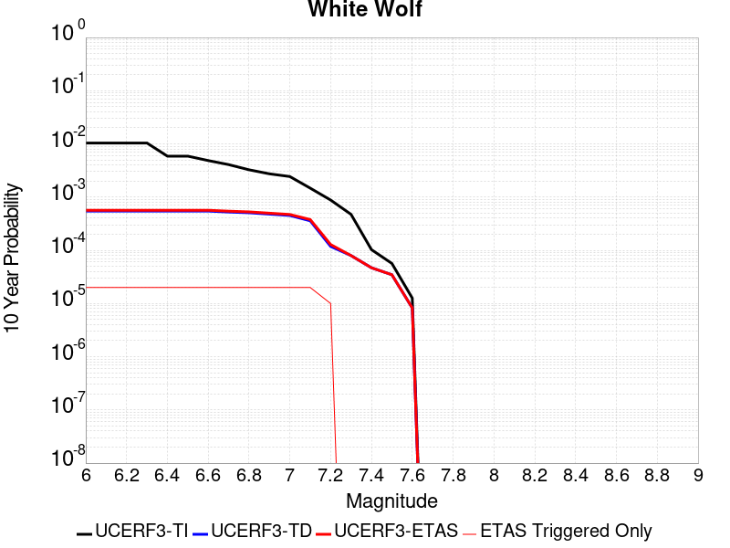 |

| Magnitude | 1 wk TI Prob | 1 wk TD Prob | 1 wk ETAS Prob | 1 wk ETAS/TD Gain | 1 wk ETAS Triggered Only | 1 mo TI Prob | 1 mo TD Prob | 1 mo ETAS Prob | 1 mo ETAS/TD Gain | 1 mo ETAS Triggered Only | 1 yr TI Prob | 1 yr TD Prob | 1 yr ETAS Prob | 1 yr ETAS/TD Gain | 1 yr ETAS Triggered Only | 10 yr TI Prob | 10 yr TD Prob | 10 yr ETAS Prob | 10 yr ETAS/TD Gain | 10 yr ETAS Triggered Only |
|-----|-----|-----|-----|-----|-----|-----|-----|-----|-----|-----|-----|-----|-----|-----|-----|-----|-----|-----|-----|-----|
| 6.0 | 2.0037822E-5 | 1.0469558E-6 | 1.0469558E-6 | 1.0 | 0.0 | 8.587355E-5 | 4.486946E-6 | 4.486946E-6 | 1.0 | 0.0 | 0.001045009 | 5.4627253E-5 | 5.4627253E-5 | 1.0 | 0.0 | 0.010401085 | 5.4614333E-4 | 5.661324E-4 | 1.0366005 | 2.0E-5 |
| 6.1 | 2.0037822E-5 | 1.0469558E-6 | 1.0469558E-6 | 1.0 | 0.0 | 8.587355E-5 | 4.486946E-6 | 4.486946E-6 | 1.0 | 0.0 | 0.001045009 | 5.4627253E-5 | 5.4627253E-5 | 1.0 | 0.0 | 0.010401085 | 5.4614333E-4 | 5.661324E-4 | 1.0366005 | 2.0E-5 |
| 6.2 | 2.0037822E-5 | 1.0469558E-6 | 1.0469558E-6 | 1.0 | 0.0 | 8.587355E-5 | 4.486946E-6 | 4.486946E-6 | 1.0 | 0.0 | 0.001045009 | 5.4627253E-5 | 5.4627253E-5 | 1.0 | 0.0 | 0.010401085 | 5.4614333E-4 | 5.661324E-4 | 1.0366005 | 2.0E-5 |
| 6.3 | 2.0037822E-5 | 1.0469558E-6 | 1.0469558E-6 | 1.0 | 0.0 | 8.587355E-5 | 4.486946E-6 | 4.486946E-6 | 1.0 | 0.0 | 0.001045009 | 5.4627253E-5 | 5.4627253E-5 | 1.0 | 0.0 | 0.010401085 | 5.4614333E-4 | 5.661324E-4 | 1.0366005 | 2.0E-5 |
| 6.4 | 1.132487E-5 | 1.0469558E-6 | 1.0469558E-6 | 1.0 | 0.0 | 4.8534253E-5 | 4.486946E-6 | 4.486946E-6 | 1.0 | 0.0 | 5.907443E-4 | 5.4627253E-5 | 5.4627253E-5 | 1.0 | 0.0 | 0.005891764 | 5.4614333E-4 | 5.661324E-4 | 1.0366005 | 2.0E-5 |
| 6.5 | 1.132487E-5 | 1.0469558E-6 | 1.0469558E-6 | 1.0 | 0.0 | 4.8534253E-5 | 4.486946E-6 | 4.486946E-6 | 1.0 | 0.0 | 5.907443E-4 | 5.4627253E-5 | 5.4627253E-5 | 1.0 | 0.0 | 0.005891764 | 5.4614333E-4 | 5.661324E-4 | 1.0366005 | 2.0E-5 |
| 6.6 | 9.347473E-6 | 1.0469558E-6 | 1.0469558E-6 | 1.0 | 0.0 | 4.0059982E-5 | 4.486946E-6 | 4.486946E-6 | 1.0 | 0.0 | 4.8762115E-4 | 5.4627253E-5 | 5.4627253E-5 | 1.0 | 0.0 | 0.0048655253 | 5.4614333E-4 | 5.661324E-4 | 1.0366005 | 2.0E-5 |
| 6.7 | 7.842647E-6 | 1.0048718E-6 | 1.0048718E-6 | 1.0 | 0.0 | 3.361091E-5 | 4.3065866E-6 | 4.3065866E-6 | 1.0 | 0.0 | 4.0913603E-4 | 5.2431482E-5 | 5.2431482E-5 | 1.0 | 0.0 | 0.004083836 | 5.241961E-4 | 5.441856E-4 | 1.0381336 | 2.0E-5 |
| 6.8 | 6.26597E-6 | 9.735176E-7 | 9.735176E-7 | 1.0 | 0.0 | 2.685388E-5 | 4.172212E-6 | 4.172212E-6 | 1.0 | 0.0 | 3.2689696E-4 | 5.0795545E-5 | 5.0795545E-5 | 1.0 | 0.0 | 0.003264165 | 5.0784426E-4 | 5.2783405E-4 | 1.0393622 | 2.0E-5 |
| 6.9 | 5.258436E-6 | 9.1835824E-7 | 9.1835824E-7 | 1.0 | 0.0 | 2.2535958E-5 | 3.9358156E-6 | 3.9358156E-6 | 1.0 | 0.0 | 2.7434074E-4 | 4.7917547E-5 | 4.7917547E-5 | 1.0 | 0.0 | 0.0027400232 | 4.7907696E-4 | 4.9906736E-4 | 1.041727 | 2.0E-5 |
| 7.0 | 4.675028E-6 | 8.661489E-7 | 8.661489E-7 | 1.0 | 0.0 | 2.003568E-5 | 3.712062E-6 | 3.712062E-6 | 1.0 | 0.0 | 2.4390711E-4 | 4.5193465E-5 | 4.5193465E-5 | 1.0 | 0.0 | 0.0024363957 | 4.5184745E-4 | 4.718384E-4 | 1.0442427 | 2.0E-5 |
| 7.1 | 2.8270078E-6 | 6.8744214E-7 | 6.8744214E-7 | 1.0 | 0.0 | 1.2115692E-5 | 2.9461776E-6 | 2.9461776E-6 | 1.0 | 0.0 | 1.4749856E-4 | 3.586916E-5 | 3.586916E-5 | 1.0 | 0.0 | 0.001474007 | 3.5863783E-4 | 3.7863065E-4 | 1.0557466 | 2.0E-5 |
| 7.2 | 1.6881406E-6 | 2.2707704E-7 | 2.2707704E-7 | 1.0 | 0.0 | 7.2348685E-6 | 9.73187E-7 | 9.73187E-7 | 1.0 | 0.0 | 8.808096E-5 | 1.1848489E-5 | 1.1848489E-5 | 1.0 | 0.0 | 8.8046055E-4 | 1.1847872E-4 | 1.2847754E-4 | 1.0843934 | 1.0E-5 |
| 7.3 | 9.086107E-7 | 1.5267179E-7 | 1.5267179E-7 | 1.0 | 0.0 | 3.8940398E-6 | 6.5430754E-7 | 6.5430754E-7 | 1.0 | 0.0 | 4.7408903E-5 | 7.966166E-6 | 7.966166E-6 | 1.0 | 0.0 | 4.739879E-4 | 7.965889E-5 | 7.965889E-5 | 1.0 | 0.0 |
| 7.4 | 1.9717383E-7 | 9.004104E-8 | 9.004104E-8 | 1.0 | 0.0 | 8.450304E-7 | 3.8589013E-7 | 3.8589013E-7 | 1.0 | 0.0 | 1.0288197E-5 | 4.6982022E-6 | 4.6982022E-6 | 1.0 | 0.0 | 1.028772E-4 | 4.6981062E-5 | 4.6981062E-5 | 1.0 | 0.0 |
| 7.5 | 1.086975E-7 | 6.659825E-8 | 6.659825E-8 | 1.0 | 0.0 | 4.6584634E-7 | 2.8542104E-7 | 2.8542104E-7 | 1.0 | 0.0 | 5.6716644E-6 | 3.4749958E-6 | 3.4749958E-6 | 1.0 | 0.0 | 5.6715195E-5 | 3.474944E-5 | 3.474944E-5 | 1.0 | 0.0 |
| 7.6 | 2.4217808E-8 | 1.5820985E-8 | 1.5820985E-8 | 1.0 | 0.0 | 1.03790605E-7 | 6.7804216E-8 | 6.7804216E-8 | 1.0 | 0.0 | 1.2636499E-6 | 8.255161E-7 | 8.255161E-7 | 1.0 | 0.0 | 1.2636427E-5 | 8.255135E-6 | 8.255135E-6 | 1.0 | 0.0 |

## Likely 2011 CFM
*[(top)](#table-of-contents)*

| 1 Week | 1 Month | 1 Year | 10 Year |
|-----|-----|-----|-----|
|  | 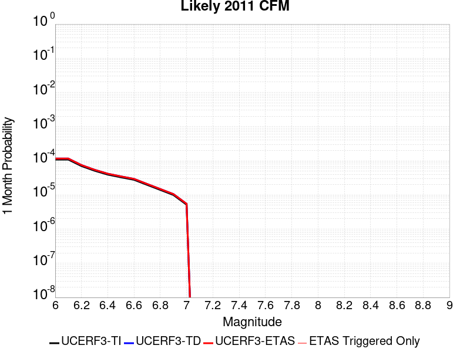 | 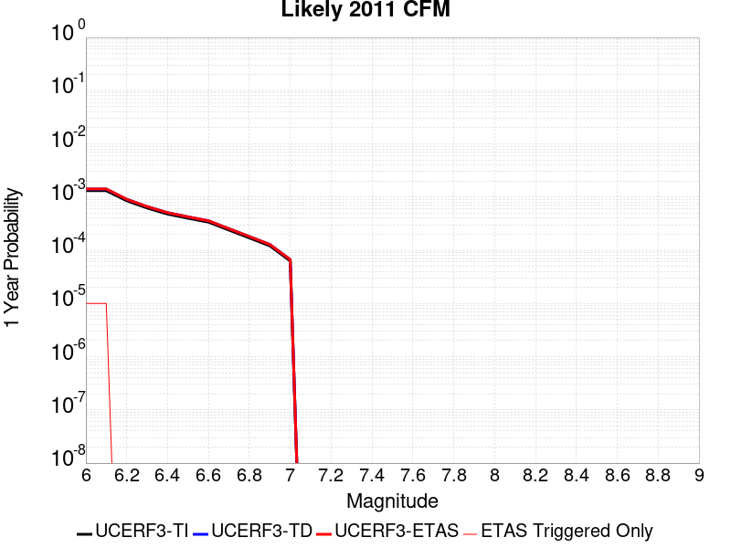 | 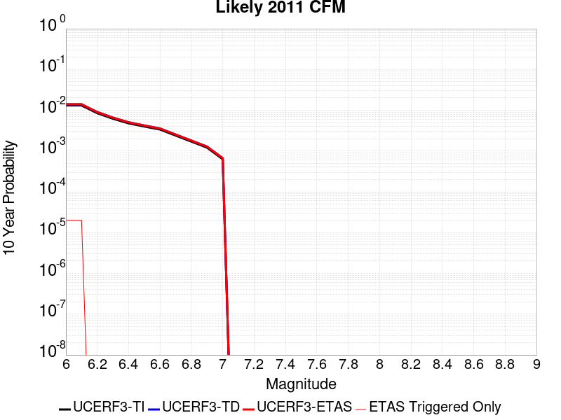 |

| Magnitude | 1 wk TI Prob | 1 wk TD Prob | 1 wk ETAS Prob | 1 wk ETAS/TD Gain | 1 wk ETAS Triggered Only | 1 mo TI Prob | 1 mo TD Prob | 1 mo ETAS Prob | 1 mo ETAS/TD Gain | 1 mo ETAS Triggered Only | 1 yr TI Prob | 1 yr TD Prob | 1 yr ETAS Prob | 1 yr ETAS/TD Gain | 1 yr ETAS Triggered Only | 10 yr TI Prob | 10 yr TD Prob | 10 yr ETAS Prob | 10 yr ETAS/TD Gain | 10 yr ETAS Triggered Only |
|-----|-----|-----|-----|-----|-----|-----|-----|-----|-----|-----|-----|-----|-----|-----|-----|-----|-----|-----|-----|-----|
| 6.0 | 2.5315949E-5 | 2.7105461E-5 | 2.7105461E-5 | 1.0 | 0.0 | 1.0849241E-4 | 1.1616134E-4 | 1.1616134E-4 | 1.0 | 0.0 | 0.0013200947 | 0.0014133913 | 0.0014233772 | 1.0070652 | 1.0E-5 | 0.013122803 | 0.014048677 | 0.014068397 | 1.0014036 | 2.0E-5 |
| 6.1 | 2.5315949E-5 | 2.7105461E-5 | 2.7105461E-5 | 1.0 | 0.0 | 1.0849241E-4 | 1.1616134E-4 | 1.1616134E-4 | 1.0 | 0.0 | 0.0013200947 | 0.0014133913 | 0.0014233772 | 1.0070652 | 1.0E-5 | 0.013122803 | 0.014048677 | 0.014068397 | 1.0014036 | 2.0E-5 |
| 6.2 | 1.6375941E-5 | 1.7466275E-5 | 1.7466275E-5 | 1.0 | 0.0 | 7.0180715E-5 | 7.4853386E-5 | 7.4853386E-5 | 1.0 | 0.0 | 8.5411523E-4 | 9.109712E-4 | 9.109712E-4 | 1.0 | 0.0 | 0.008508399 | 0.009073656 | 0.009073656 | 1.0 | 0.0 |
| 6.3 | 1.1945543E-5 | 1.2712891E-5 | 1.2712891E-5 | 1.0 | 0.0 | 5.119418E-5 | 5.448271E-5 | 5.448271E-5 | 1.0 | 0.0 | 6.2311086E-4 | 6.631304E-4 | 6.631304E-4 | 1.0 | 0.0 | 0.0062136655 | 0.006612072 | 0.006612072 | 1.0 | 0.0 |
| 6.4 | 9.192729E-6 | 9.768715E-6 | 9.768715E-6 | 1.0 | 0.0 | 3.939681E-5 | 4.1865267E-5 | 4.1865267E-5 | 1.0 | 0.0 | 4.7955062E-4 | 5.095931E-4 | 5.095931E-4 | 1.0 | 0.0 | 0.004785171 | 0.005084527 | 0.005084527 | 1.0 | 0.0 |
| 6.5 | 7.67906E-6 | 8.152809E-6 | 8.152809E-6 | 1.0 | 0.0 | 3.2909844E-5 | 3.4940153E-5 | 3.4940153E-5 | 1.0 | 0.0 | 4.006037E-4 | 4.253152E-4 | 4.253152E-4 | 1.0 | 0.0 | 0.0039988225 | 0.0042452053 | 0.0042452053 | 1.0 | 0.0 |
| 6.6 | 6.4884057E-6 | 6.8849067E-6 | 6.8849067E-6 | 1.0 | 0.0 | 2.7807157E-5 | 2.9506418E-5 | 2.9506418E-5 | 1.0 | 0.0 | 3.3849955E-4 | 3.5918286E-4 | 3.5918286E-4 | 1.0 | 0.0 | 0.003379844 | 0.003586168 | 0.003586168 | 1.0 | 0.0 |
| 6.7 | 4.6060636E-6 | 4.8841507E-6 | 4.8841507E-6 | 1.0 | 0.0 | 1.9740122E-5 | 2.0931911E-5 | 2.0931911E-5 | 1.0 | 0.0 | 2.403095E-4 | 2.5481705E-4 | 2.5481705E-4 | 1.0 | 0.0 | 0.002400498 | 0.0025453316 | 0.0025453316 | 1.0 | 0.0 |
| 6.8 | 3.2795615E-6 | 3.477451E-6 | 3.477451E-6 | 1.0 | 0.0 | 1.4055187E-5 | 1.4903279E-5 | 1.4903279E-5 | 1.0 | 0.0 | 1.7110848E-4 | 1.8143287E-4 | 1.8143287E-4 | 1.0 | 0.0 | 0.0017097679 | 0.0018129027 | 0.0018129027 | 1.0 | 0.0 |
| 6.9 | 2.3289967E-6 | 2.4706126E-6 | 2.4706126E-6 | 1.0 | 0.0 | 9.981376E-6 | 1.0588299E-5 | 1.0588299E-5 | 1.0 | 0.0 | 1.2151648E-4 | 1.2890536E-4 | 1.2890536E-4 | 1.0 | 0.0 | 0.0012145005 | 0.0012883488 | 0.0012883488 | 1.0 | 0.0 |
| 7.0 | 1.211292E-6 | 1.2864253E-6 | 1.2864253E-6 | 1.0 | 0.0 | 5.1912407E-6 | 5.513242E-6 | 5.513242E-6 | 1.0 | 0.0 | 6.320152E-5 | 6.712195E-5 | 6.712195E-5 | 1.0 | 0.0 | 6.3183554E-4 | 6.7104667E-4 | 6.7104667E-4 | 1.0 | 0.0 |

## La Panza 2011
*[(top)](#table-of-contents)*

| 1 Week | 1 Month | 1 Year | 10 Year |
|-----|-----|-----|-----|
|  |  | 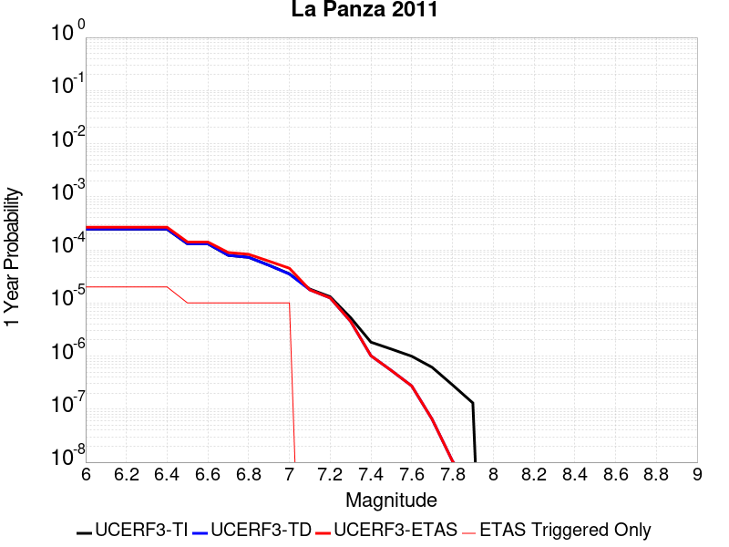 |  |

| Magnitude | 1 wk TI Prob | 1 wk TD Prob | 1 wk ETAS Prob | 1 wk ETAS/TD Gain | 1 wk ETAS Triggered Only | 1 mo TI Prob | 1 mo TD Prob | 1 mo ETAS Prob | 1 mo ETAS/TD Gain | 1 mo ETAS Triggered Only | 1 yr TI Prob | 1 yr TD Prob | 1 yr ETAS Prob | 1 yr ETAS/TD Gain | 1 yr ETAS Triggered Only | 10 yr TI Prob | 10 yr TD Prob | 10 yr ETAS Prob | 10 yr ETAS/TD Gain | 10 yr ETAS Triggered Only |
|-----|-----|-----|-----|-----|-----|-----|-----|-----|-----|-----|-----|-----|-----|-----|-----|-----|-----|-----|-----|-----|
| 6.0 | 4.6754544E-6 | 4.7176463E-6 | 1.4717599E-5 | 3.1196911 | 1.0E-5 | 2.0037509E-5 | 2.0218338E-5 | 3.0218136E-5 | 1.4945905 | 1.0E-5 | 2.4392935E-4 | 2.4613243E-4 | 2.661275E-4 | 1.0812371 | 2.0E-5 | 0.0024366176 | 0.0024587926 | 0.0024787434 | 1.0081141 | 2.0E-5 |
| 6.1 | 4.6754544E-6 | 4.7176463E-6 | 1.4717599E-5 | 3.1196911 | 1.0E-5 | 2.0037509E-5 | 2.0218338E-5 | 3.0218136E-5 | 1.4945905 | 1.0E-5 | 2.4392935E-4 | 2.4613243E-4 | 2.661275E-4 | 1.0812371 | 2.0E-5 | 0.0024366176 | 0.0024587926 | 0.0024787434 | 1.0081141 | 2.0E-5 |
| 6.2 | 4.6754544E-6 | 4.7176463E-6 | 1.4717599E-5 | 3.1196911 | 1.0E-5 | 2.0037509E-5 | 2.0218338E-5 | 3.0218136E-5 | 1.4945905 | 1.0E-5 | 2.4392935E-4 | 2.4613243E-4 | 2.661275E-4 | 1.0812371 | 2.0E-5 | 0.0024366176 | 0.0024587926 | 0.0024787434 | 1.0081141 | 2.0E-5 |
| 6.3 | 4.6754544E-6 | 4.7176463E-6 | 1.4717599E-5 | 3.1196911 | 1.0E-5 | 2.0037509E-5 | 2.0218338E-5 | 3.0218136E-5 | 1.4945905 | 1.0E-5 | 2.4392935E-4 | 2.4613243E-4 | 2.661275E-4 | 1.0812371 | 2.0E-5 | 0.0024366176 | 0.0024587926 | 0.0024787434 | 1.0081141 | 2.0E-5 |
| 6.4 | 4.6754544E-6 | 4.7176463E-6 | 1.4717599E-5 | 3.1196911 | 1.0E-5 | 2.0037509E-5 | 2.0218338E-5 | 3.0218136E-5 | 1.4945905 | 1.0E-5 | 2.4392935E-4 | 2.4613243E-4 | 2.661275E-4 | 1.0812371 | 2.0E-5 | 0.0024366176 | 0.0024587926 | 0.0024787434 | 1.0081141 | 2.0E-5 |
| 6.5 | 2.485343E-6 | 2.500648E-6 | 1.2500623E-5 | 4.9989533 | 1.0E-5 | 1.0651426E-5 | 1.0717021E-5 | 2.0716914E-5 | 1.9330851 | 1.0E-5 | 1.296734E-4 | 1.304723E-4 | 1.40471E-4 | 1.0766346 | 1.0E-5 | 0.0012959775 | 0.0013039954 | 0.0013139824 | 1.0076587 | 1.0E-5 |
| 6.6 | 2.485343E-6 | 2.500648E-6 | 1.2500623E-5 | 4.9989533 | 1.0E-5 | 1.0651426E-5 | 1.0717021E-5 | 2.0716914E-5 | 1.9330851 | 1.0E-5 | 1.296734E-4 | 1.304723E-4 | 1.40471E-4 | 1.0766346 | 1.0E-5 | 0.0012959775 | 0.0013039954 | 0.0013139824 | 1.0076587 | 1.0E-5 |
| 6.7 | 1.5108508E-6 | 1.5146821E-6 | 1.1514667E-5 | 7.602035 | 1.0E-5 | 6.4750584E-6 | 6.4914793E-6 | 1.6491414E-5 | 2.5404708 | 1.0E-5 | 7.8830984E-5 | 7.903101E-5 | 8.903021E-5 | 1.1265227 | 1.0E-5 | 7.880303E-4 | 7.900398E-4 | 8.000319E-4 | 1.0126476 | 1.0E-5 |
| 6.8 | 1.3865837E-6 | 1.3885541E-6 | 1.138854E-5 | 8.201726 | 1.0E-5 | 5.942488E-6 | 5.9509334E-6 | 1.5950875E-5 | 2.6803987 | 1.0E-5 | 7.234739E-5 | 7.2450304E-5 | 8.244958E-5 | 1.1380156 | 1.0E-5 | 7.232384E-4 | 7.2427664E-4 | 7.3426944E-4 | 1.0137969 | 1.0E-5 |
| 6.9 | 9.826583E-7 | 9.796707E-7 | 1.0979661E-5 | 11.2075 | 1.0E-5 | 4.2113857E-6 | 4.1985827E-6 | 1.419854E-5 | 3.3817463 | 1.0E-5 | 5.1272415E-5 | 5.1116596E-5 | 6.111609E-5 | 1.1956211 | 1.0E-5 | 5.126059E-4 | 5.110538E-4 | 5.2104867E-4 | 1.0195574 | 1.0E-5 |
| 7.0 | 6.7797646E-7 | 6.7106214E-7 | 1.0671055E-5 | 15.90174 | 1.0E-5 | 2.9056102E-6 | 2.8759775E-6 | 1.2875948E-5 | 4.4770684 | 1.0E-5 | 3.537523E-5 | 3.5014495E-5 | 4.5014145E-5 | 1.285586 | 1.0E-5 | 3.5369597E-4 | 3.500929E-4 | 3.6008938E-4 | 1.0285538 | 1.0E-5 |
| 7.1 | 3.4979826E-7 | 3.387779E-7 | 3.387779E-7 | 1.0 | 0.0 | 1.4991346E-6 | 1.4519046E-6 | 1.4519046E-6 | 1.0 | 0.0 | 1.825181E-5 | 1.7676806E-5 | 1.7676806E-5 | 1.0 | 0.0 | 1.825031E-4 | 1.7675517E-4 | 1.7675517E-4 | 1.0 | 0.0 |
| 7.2 | 2.5088332E-7 | 2.3835753E-7 | 2.3835753E-7 | 1.0 | 0.0 | 1.0752137E-6 | 1.021532E-6 | 1.021532E-6 | 1.0 | 0.0 | 1.3090649E-5 | 1.2437089E-5 | 1.2437089E-5 | 1.0 | 0.0 | 1.3089878E-4 | 1.2436477E-4 | 1.2436477E-4 | 1.0 | 0.0 |
| 7.3 | 1.0159086E-7 | 8.6483766E-8 | 8.6483766E-8 | 1.0 | 0.0 | 4.3538932E-7 | 3.7064464E-7 | 3.7064464E-7 | 1.0 | 0.0 | 5.300852E-6 | 4.5125894E-6 | 4.5125894E-6 | 1.0 | 0.0 | 5.3007258E-5 | 4.512502E-5 | 4.512502E-5 | 1.0 | 0.0 |
| 7.4 | 3.5006252E-8 | 1.9416381E-8 | 1.9416381E-8 | 1.0 | 0.0 | 1.5002678E-7 | 8.321306E-8 | 8.321306E-8 | 1.0 | 0.0 | 1.8265745E-6 | 1.0131185E-6 | 1.0131185E-6 | 1.0 | 0.0 | 1.8265595E-5 | 1.0131142E-5 | 1.0131142E-5 | 1.0 | 0.0 |
| 7.5 | 2.592274E-8 | 1.0248095E-8 | 1.0248095E-8 | 1.0 | 0.0 | 1.1109746E-7 | 4.3920405E-8 | 4.3920405E-8 | 1.0 | 0.0 | 1.3526106E-6 | 5.347308E-7 | 5.347308E-7 | 1.0 | 0.0 | 1.3526024E-5 | 5.347296E-6 | 5.347296E-6 | 1.0 | 0.0 |
| 7.6 | 1.9016717E-8 | 5.2505826E-9 | 5.2505826E-9 | 1.0 | 0.0 | 8.150022E-8 | 2.2502498E-8 | 2.2502498E-8 | 1.0 | 0.0 | 9.922647E-7 | 2.7396786E-7 | 2.7396786E-7 | 1.0 | 0.0 | 9.922603E-6 | 2.7396754E-6 | 2.7396754E-6 | 1.0 | 0.0 |
| 7.7 | 1.17738495E-8 | 1.2423165E-9 | 1.2423165E-9 | 1.0 | 0.0 | 5.0459356E-8 | 5.324213E-9 | 5.324213E-9 | 1.0 | 0.0 | 6.1434247E-7 | 6.4822295E-8 | 6.4822295E-8 | 1.0 | 0.0 | 6.143408E-6 | 6.4822274E-7 | 6.4822274E-7 | 1.0 | 0.0 |
| 7.8 | 5.489079E-9 | 2.0177415E-10 | 2.0177415E-10 | 1.0 | 0.0 | 2.3524624E-8 | 8.6474716E-10 | 8.6474716E-10 | 1.0 | 0.0 | 2.8641225E-7 | 1.0528295E-8 | 1.0528295E-8 | 1.0 | 0.0 | 2.8641189E-6 | 1.0528294E-7 | 1.0528294E-7 | 1.0 | 0.0 |
| 7.9 | 2.5081048E-9 | 6.708767E-11 | 6.708767E-11 | 1.0 | 0.0 | 1.0749021E-8 | 2.8751934E-10 | 2.8751934E-10 | 1.0 | 0.0 | 1.3086932E-7 | 3.5005474E-9 | 3.5005474E-9 | 1.0 | 0.0 | 1.3086925E-6 | 3.5005474E-8 | 3.5005474E-8 | 1.0 | 0.0 |

## Great Valley 08 (Quinto)
*[(top)](#table-of-contents)*

| 1 Week | 1 Month | 1 Year | 10 Year |
|-----|-----|-----|-----|
| 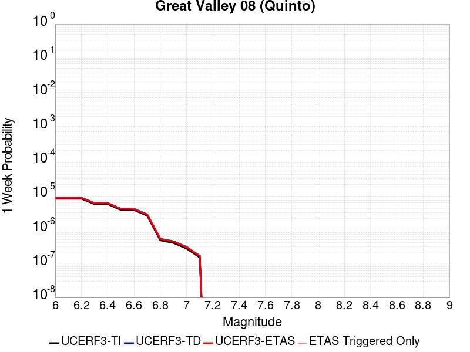 | 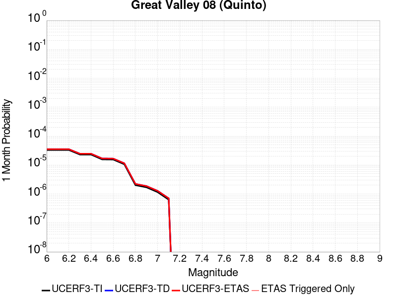 | 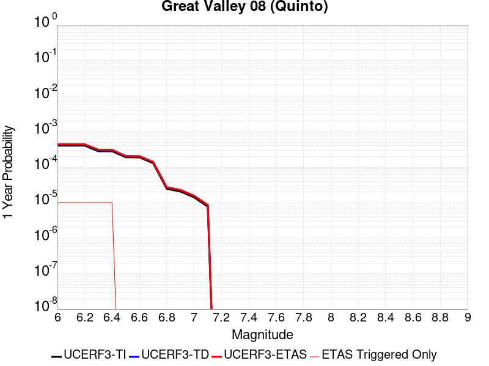 |  |

| Magnitude | 1 wk TI Prob | 1 wk TD Prob | 1 wk ETAS Prob | 1 wk ETAS/TD Gain | 1 wk ETAS Triggered Only | 1 mo TI Prob | 1 mo TD Prob | 1 mo ETAS Prob | 1 mo ETAS/TD Gain | 1 mo ETAS Triggered Only | 1 yr TI Prob | 1 yr TD Prob | 1 yr ETAS Prob | 1 yr ETAS/TD Gain | 1 yr ETAS Triggered Only | 10 yr TI Prob | 10 yr TD Prob | 10 yr ETAS Prob | 10 yr ETAS/TD Gain | 10 yr ETAS Triggered Only |
|-----|-----|-----|-----|-----|-----|-----|-----|-----|-----|-----|-----|-----|-----|-----|-----|-----|-----|-----|-----|-----|
| 6.0 | 7.737697E-6 | 8.253242E-6 | 8.253242E-6 | 1.0 | 0.0 | 3.3161137E-5 | 3.5370667E-5 | 3.5370667E-5 | 1.0 | 0.0 | 4.0366207E-4 | 4.3057164E-4 | 4.4056732E-4 | 1.0232149 | 1.0E-5 | 0.004029296 | 0.004299227 | 0.004319141 | 1.004632 | 2.0E-5 |
| 6.1 | 7.737697E-6 | 8.253242E-6 | 8.253242E-6 | 1.0 | 0.0 | 3.3161137E-5 | 3.5370667E-5 | 3.5370667E-5 | 1.0 | 0.0 | 4.0366207E-4 | 4.3057164E-4 | 4.4056732E-4 | 1.0232149 | 1.0E-5 | 0.004029296 | 0.004299227 | 0.004319141 | 1.004632 | 2.0E-5 |
| 6.2 | 7.737697E-6 | 8.253242E-6 | 8.253242E-6 | 1.0 | 0.0 | 3.3161137E-5 | 3.5370667E-5 | 3.5370667E-5 | 1.0 | 0.0 | 4.0366207E-4 | 4.3057164E-4 | 4.4056732E-4 | 1.0232149 | 1.0E-5 | 0.004029296 | 0.004299227 | 0.004319141 | 1.004632 | 2.0E-5 |
| 6.3 | 5.374012E-6 | 5.7507236E-6 | 5.7507236E-6 | 1.0 | 0.0 | 2.3031276E-5 | 2.464579E-5 | 2.464579E-5 | 1.0 | 0.0 | 2.803697E-4 | 3.000323E-4 | 3.100293E-4 | 1.0333197 | 1.0E-5 | 0.0028001624 | 0.0029973655 | 0.0030073356 | 1.0033263 | 1.0E-5 |
| 6.4 | 5.374012E-6 | 5.7507236E-6 | 5.7507236E-6 | 1.0 | 0.0 | 2.3031276E-5 | 2.464579E-5 | 2.464579E-5 | 1.0 | 0.0 | 2.803697E-4 | 3.000323E-4 | 3.100293E-4 | 1.0333197 | 1.0E-5 | 0.0028001624 | 0.0029973655 | 0.0030073356 | 1.0033263 | 1.0E-5 |
| 6.5 | 3.65427E-6 | 3.941439E-6 | 3.941439E-6 | 1.0 | 0.0 | 1.5661062E-5 | 1.6891812E-5 | 1.6891812E-5 | 1.0 | 0.0 | 1.9065675E-4 | 2.0564545E-4 | 2.0564545E-4 | 1.0 | 0.0 | 0.0019049325 | 0.0020552434 | 0.0020552434 | 1.0 | 0.0 |
| 6.6 | 3.6143538E-6 | 3.8986245E-6 | 3.8986245E-6 | 1.0 | 0.0 | 1.5489995E-5 | 1.6708324E-5 | 1.6708324E-5 | 1.0 | 0.0 | 1.8857437E-4 | 2.034119E-4 | 2.034119E-4 | 1.0 | 0.0 | 0.0018841444 | 0.0020329487 | 0.0020329487 | 1.0 | 0.0 |
| 6.7 | 2.4821015E-6 | 2.6857888E-6 | 2.6857888E-6 | 1.0 | 0.0 | 1.0637535E-5 | 1.1510504E-5 | 1.1510504E-5 | 1.0 | 0.0 | 1.2950429E-4 | 1.4013704E-4 | 1.4013704E-4 | 1.0 | 0.0 | 0.0012942884 | 0.0014010416 | 0.0014010416 | 1.0 | 0.0 |
| 6.8 | 4.7110538E-7 | 5.193218E-7 | 5.193218E-7 | 1.0 | 0.0 | 2.0190216E-6 | 2.2256631E-6 | 2.2256631E-6 | 1.0 | 0.0 | 2.458131E-5 | 2.709713E-5 | 2.709713E-5 | 1.0 | 0.0 | 2.457859E-4 | 2.7094007E-4 | 2.7094007E-4 | 1.0 | 0.0 |
| 6.9 | 3.958685E-7 | 4.3705143E-7 | 4.3705143E-7 | 1.0 | 0.0 | 1.6965782E-6 | 1.8730763E-6 | 1.8730763E-6 | 1.0 | 0.0 | 2.0655643E-5 | 2.2804481E-5 | 2.2804481E-5 | 1.0 | 0.0 | 2.0653724E-4 | 2.2802303E-4 | 2.2802303E-4 | 1.0 | 0.0 |
| 7.0 | 2.70294E-7 | 2.9921196E-7 | 2.9921196E-7 | 1.0 | 0.0 | 1.1584025E-6 | 1.2823365E-6 | 1.2823365E-6 | 1.0 | 0.0 | 1.4103458E-5 | 1.5612348E-5 | 1.5612348E-5 | 1.0 | 0.0 | 1.4102564E-4 | 1.5611379E-4 | 1.5611379E-4 | 1.0 | 0.0 |
| 7.1 | 1.4828602E-7 | 1.6469784E-7 | 1.6469784E-7 | 1.0 | 0.0 | 6.3551136E-7 | 7.0584775E-7 | 7.0584775E-7 | 1.0 | 0.0 | 7.737323E-6 | 8.593671E-6 | 8.593671E-6 | 1.0 | 0.0 | 7.737054E-5 | 8.593418E-5 | 8.593418E-5 | 1.0 | 0.0 |

## Simi-Santa Rosa
*[(top)](#table-of-contents)*

| 1 Week | 1 Month | 1 Year | 10 Year |
|-----|-----|-----|-----|
|  | 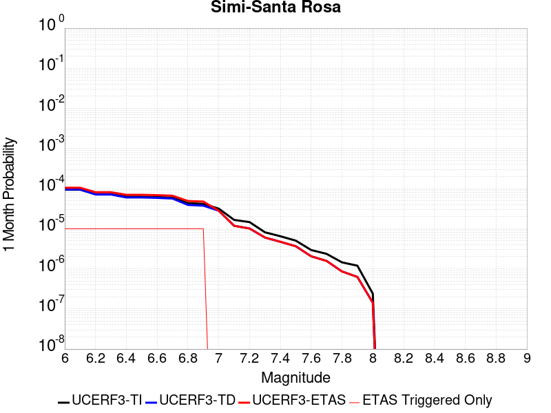 | 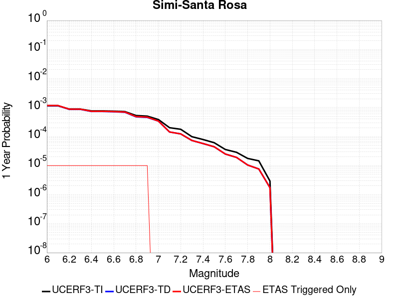 | 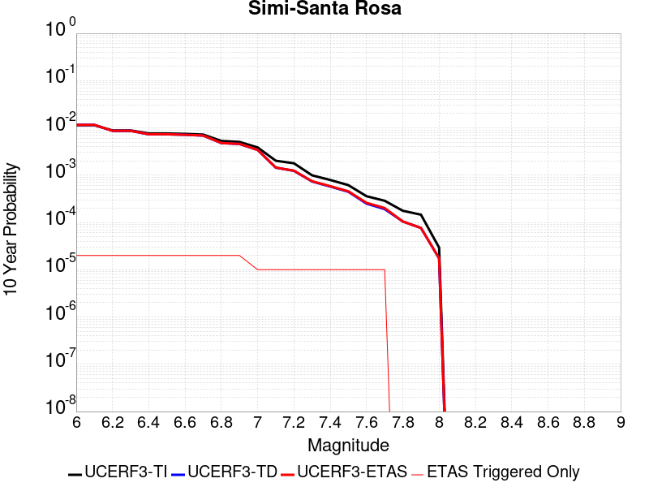 |

| Magnitude | 1 wk TI Prob | 1 wk TD Prob | 1 wk ETAS Prob | 1 wk ETAS/TD Gain | 1 wk ETAS Triggered Only | 1 mo TI Prob | 1 mo TD Prob | 1 mo ETAS Prob | 1 mo ETAS/TD Gain | 1 mo ETAS Triggered Only | 1 yr TI Prob | 1 yr TD Prob | 1 yr ETAS Prob | 1 yr ETAS/TD Gain | 1 yr ETAS Triggered Only | 10 yr TI Prob | 10 yr TD Prob | 10 yr ETAS Prob | 10 yr ETAS/TD Gain | 10 yr ETAS Triggered Only |
|-----|-----|-----|-----|-----|-----|-----|-----|-----|-----|-----|-----|-----|-----|-----|-----|-----|-----|-----|-----|-----|
| 6.0 | 2.198912E-5 | 2.2276581E-5 | 3.227636E-5 | 1.4488919 | 1.0E-5 | 9.4235686E-5 | 9.546781E-5 | 1.0546686E-4 | 1.1047374 | 1.0E-5 | 0.0011467156 | 0.0011617447 | 0.0011717331 | 1.0085977 | 1.0E-5 | 0.011408163 | 0.011561163 | 0.011580931 | 1.0017099 | 2.0E-5 |
| 6.1 | 2.198912E-5 | 2.2276581E-5 | 3.227636E-5 | 1.4488919 | 1.0E-5 | 9.4235686E-5 | 9.546781E-5 | 1.0546686E-4 | 1.1047374 | 1.0E-5 | 0.0011467156 | 0.0011617447 | 0.0011717331 | 1.0085977 | 1.0E-5 | 0.011408163 | 0.011561163 | 0.011580931 | 1.0017099 | 2.0E-5 |
| 6.2 | 1.69983E-5 | 1.666944E-5 | 2.6669273E-5 | 1.5998901 | 1.0E-5 | 7.284782E-5 | 7.143867E-5 | 8.143795E-5 | 1.1399702 | 1.0E-5 | 8.865613E-4 | 8.694479E-4 | 8.794392E-4 | 1.0114915 | 1.0E-5 | 0.008830327 | 0.008663383 | 0.00868321 | 1.0022886 | 2.0E-5 |
| 6.3 | 1.69983E-5 | 1.666944E-5 | 2.6669273E-5 | 1.5998901 | 1.0E-5 | 7.284782E-5 | 7.143867E-5 | 8.143795E-5 | 1.1399702 | 1.0E-5 | 8.865613E-4 | 8.694479E-4 | 8.794392E-4 | 1.0114915 | 1.0E-5 | 0.008830327 | 0.008663383 | 0.00868321 | 1.0022886 | 2.0E-5 |
| 6.4 | 1.4666188E-5 | 1.4053306E-5 | 2.4053164E-5 | 1.7115663 | 1.0E-5 | 6.285358E-5 | 6.02272E-5 | 7.02266E-5 | 1.1660279 | 1.0E-5 | 7.6497364E-4 | 7.330444E-4 | 7.430371E-4 | 1.0136317 | 1.0E-5 | 0.0076234564 | 0.0073087392 | 0.007328593 | 1.0027164 | 2.0E-5 |
| 6.5 | 1.4666188E-5 | 1.4053306E-5 | 2.4053164E-5 | 1.7115663 | 1.0E-5 | 6.285358E-5 | 6.02272E-5 | 7.02266E-5 | 1.1660279 | 1.0E-5 | 7.6497364E-4 | 7.330444E-4 | 7.430371E-4 | 1.0136317 | 1.0E-5 | 0.0076234564 | 0.0073087392 | 0.007328593 | 1.0027164 | 2.0E-5 |
| 6.6 | 1.4377586E-5 | 1.37303305E-5 | 2.3730194E-5 | 1.7283046 | 1.0E-5 | 6.1616774E-5 | 5.884309E-5 | 6.88425E-5 | 1.1699334 | 1.0E-5 | 7.4992597E-4 | 7.1620394E-4 | 7.261968E-4 | 1.0139525 | 1.0E-5 | 0.007474003 | 0.007141426 | 0.0071612834 | 1.0027806 | 2.0E-5 |
| 6.7 | 1.3881404E-5 | 1.3208275E-5 | 2.3208144E-5 | 1.7570912 | 1.0E-5 | 5.9490372E-5 | 5.6605804E-5 | 6.660524E-5 | 1.1766503 | 1.0E-5 | 7.240546E-4 | 6.889825E-4 | 6.989756E-4 | 1.0145042 | 1.0E-5 | 0.007217 | 0.006870914 | 0.0068907766 | 1.0028908 | 2.0E-5 |
| 6.8 | 1.0176516E-5 | 9.154684E-6 | 1.9154593E-5 | 2.0923269 | 1.0E-5 | 4.3612912E-5 | 3.9233866E-5 | 4.9233473E-5 | 1.2548718 | 1.0E-5 | 5.308578E-4 | 4.775842E-4 | 4.875794E-4 | 1.0209287 | 1.0E-5 | 0.0052959146 | 0.0047672116 | 0.0047871163 | 1.0041753 | 2.0E-5 |
| 6.9 | 9.699797E-6 | 8.7752305E-6 | 1.8775143E-5 | 2.1395612 | 1.0E-5 | 4.15699E-5 | 3.7607682E-5 | 4.7607307E-5 | 1.2658931 | 1.0E-5 | 5.05996E-4 | 4.577938E-4 | 4.677892E-4 | 1.0218339 | 1.0E-5 | 0.005048454 | 0.004570125 | 0.004590034 | 1.0043563 | 2.0E-5 |
| 7.0 | 7.4049476E-6 | 6.5597224E-6 | 6.5597224E-6 | 1.0 | 0.0 | 3.1735104E-5 | 2.8112865E-5 | 2.8112865E-5 | 1.0 | 0.0 | 3.8630638E-4 | 3.4223302E-4 | 3.4223302E-4 | 1.0 | 0.0 | 0.0038563553 | 0.0034183022 | 0.003428268 | 1.0029154 | 1.0E-5 |
| 7.1 | 3.873439E-6 | 2.7596984E-6 | 2.7596984E-6 | 1.0 | 0.0 | 1.6600346E-5 | 1.1827226E-5 | 1.1827226E-5 | 1.0 | 0.0 | 2.0209046E-4 | 1.439872E-4 | 1.439872E-4 | 1.0 | 0.0 | 0.0020190678 | 0.0014389626 | 0.0014489483 | 1.0069394 | 1.0E-5 |
| 7.2 | 3.417706E-6 | 2.367821E-6 | 2.367821E-6 | 1.0 | 0.0 | 1.4647229E-5 | 1.0147766E-5 | 1.0147766E-5 | 1.0 | 0.0 | 1.7831543E-4 | 1.2354228E-4 | 1.2354228E-4 | 1.0 | 0.0 | 0.0017817242 | 0.0012347583 | 0.0012447459 | 1.0080887 | 1.0E-5 |
| 7.3 | 1.90225E-6 | 1.4075075E-6 | 1.4075075E-6 | 1.0 | 0.0 | 8.152474E-6 | 6.0321613E-6 | 6.0321613E-6 | 1.0 | 0.0 | 9.9251854E-5 | 7.343911E-5 | 7.343911E-5 | 1.0 | 0.0 | 9.920754E-4 | 7.3415064E-4 | 7.441433E-4 | 1.0136112 | 1.0E-5 |
| 7.4 | 1.5170556E-6 | 1.1026005E-6 | 1.1026005E-6 | 1.0 | 0.0 | 6.5016507E-6 | 4.725422E-6 | 4.725422E-6 | 1.0 | 0.0 | 7.915472E-5 | 5.7530506E-5 | 5.7530506E-5 | 1.0 | 0.0 | 7.9126534E-4 | 5.7515723E-4 | 5.851515E-4 | 1.0173765 | 1.0E-5 |
| 7.5 | 1.178732E-6 | 8.5362774E-7 | 8.5362774E-7 | 1.0 | 0.0 | 5.0516987E-6 | 3.6583995E-6 | 3.6583995E-6 | 1.0 | 0.0 | 6.1502695E-5 | 4.4540113E-5 | 4.4540113E-5 | 1.0 | 0.0 | 6.148568E-4 | 4.453128E-4 | 4.5530836E-4 | 1.0224462 | 1.0E-5 |
| 7.6 | 6.8722386E-7 | 4.7942876E-7 | 4.7942876E-7 | 1.0 | 0.0 | 2.9452417E-6 | 2.054693E-6 | 2.054693E-6 | 1.0 | 0.0 | 3.5857727E-5 | 2.50156E-5 | 2.50156E-5 | 1.0 | 0.0 | 3.5851944E-4 | 2.5012798E-4 | 2.6012547E-4 | 1.0399696 | 1.0E-5 |
| 7.7 | 5.5126515E-7 | 3.6741855E-7 | 3.6741855E-7 | 1.0 | 0.0 | 2.3625628E-6 | 1.57465E-6 | 1.57465E-6 | 1.0 | 0.0 | 2.8763823E-5 | 1.9171197E-5 | 1.9171197E-5 | 1.0 | 0.0 | 2.87601E-4 | 1.9169554E-4 | 2.0169362E-4 | 1.0521561 | 1.0E-5 |
| 7.8 | 3.3860243E-7 | 2.0083374E-7 | 2.0083374E-7 | 1.0 | 0.0 | 1.4511525E-6 | 8.607158E-7 | 8.607158E-7 | 1.0 | 0.0 | 1.7667637E-5 | 1.0479164E-5 | 1.0479164E-5 | 1.0 | 0.0 | 1.7666233E-4 | 1.04786755E-4 | 1.04786755E-4 | 1.0 | 0.0 |
| 7.9 | 2.7955386E-7 | 1.4656113E-7 | 1.4656113E-7 | 1.0 | 0.0 | 1.1980875E-6 | 6.28119E-7 | 6.28119E-7 | 1.0 | 0.0 | 1.4586617E-5 | 7.6473225E-6 | 7.6473225E-6 | 1.0 | 0.0 | 1.458566E-4 | 7.6470635E-5 | 7.6470635E-5 | 1.0 | 0.0 |
| 8.0 | 5.6259015E-8 | 3.3360266E-8 | 3.3360266E-8 | 1.0 | 0.0 | 2.4111003E-7 | 1.4297257E-7 | 1.4297257E-7 | 1.0 | 0.0 | 2.9355108E-6 | 1.7406898E-6 | 1.7406898E-6 | 1.0 | 0.0 | 2.935472E-5 | 1.7406775E-5 | 1.7406775E-5 | 1.0 | 0.0 |

## Elsinore (Stepovers Combined)
*[(top)](#table-of-contents)*

| 1 Week | 1 Month | 1 Year | 10 Year |
|-----|-----|-----|-----|
| 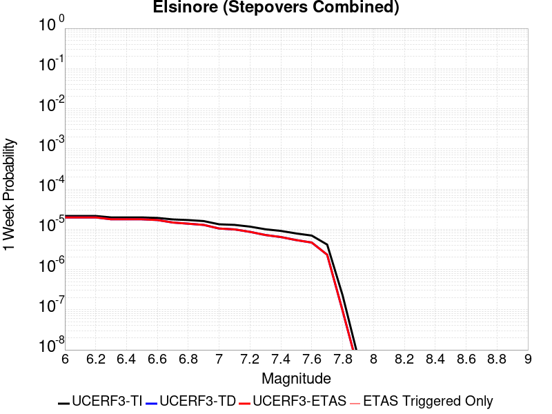 | 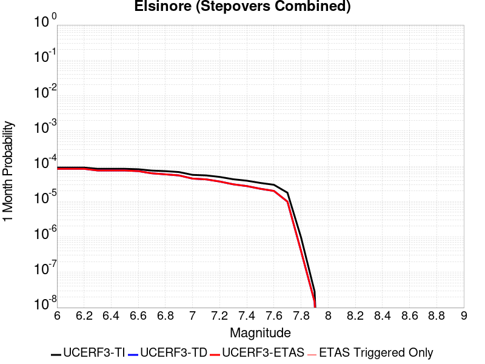 |  | 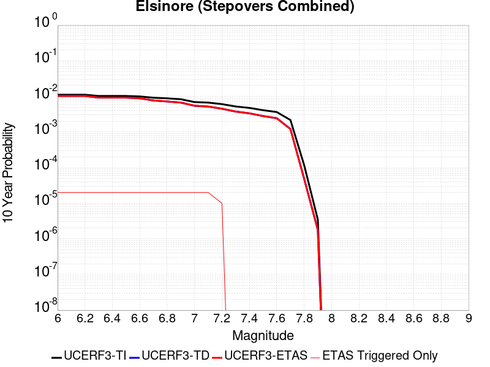 |

| Magnitude | 1 wk TI Prob | 1 wk TD Prob | 1 wk ETAS Prob | 1 wk ETAS/TD Gain | 1 wk ETAS Triggered Only | 1 mo TI Prob | 1 mo TD Prob | 1 mo ETAS Prob | 1 mo ETAS/TD Gain | 1 mo ETAS Triggered Only | 1 yr TI Prob | 1 yr TD Prob | 1 yr ETAS Prob | 1 yr ETAS/TD Gain | 1 yr ETAS Triggered Only | 10 yr TI Prob | 10 yr TD Prob | 10 yr ETAS Prob | 10 yr ETAS/TD Gain | 10 yr ETAS Triggered Only |
|-----|-----|-----|-----|-----|-----|-----|-----|-----|-----|-----|-----|-----|-----|-----|-----|-----|-----|-----|-----|-----|
| 6.0 | 2.144392E-5 | 1.9762472E-5 | 1.9762472E-5 | 1.0 | 0.0 | 9.189928E-5 | 8.469368E-5 | 8.469368E-5 | 1.0 | 0.0 | 0.0011182994 | 0.0010306796 | 0.0010306796 | 1.0 | 0.0 | 0.011126885 | 0.010266087 | 0.010285882 | 1.0019282 | 2.0E-5 |
| 6.1 | 2.144392E-5 | 1.9762472E-5 | 1.9762472E-5 | 1.0 | 0.0 | 9.189928E-5 | 8.469368E-5 | 8.469368E-5 | 1.0 | 0.0 | 0.0011182994 | 0.0010306796 | 0.0010306796 | 1.0 | 0.0 | 0.011126885 | 0.010266087 | 0.010285882 | 1.0019282 | 2.0E-5 |
| 6.2 | 2.144392E-5 | 1.9762472E-5 | 1.9762472E-5 | 1.0 | 0.0 | 9.189928E-5 | 8.469368E-5 | 8.469368E-5 | 1.0 | 0.0 | 0.0011182994 | 0.0010306796 | 0.0010306796 | 1.0 | 0.0 | 0.011126885 | 0.010266087 | 0.010285882 | 1.0019282 | 2.0E-5 |
| 6.3 | 1.9751555E-5 | 1.7743587E-5 | 1.7743587E-5 | 1.0 | 0.0 | 8.4646774E-5 | 7.604182E-5 | 7.604182E-5 | 1.0 | 0.0 | 0.0010300872 | 9.254326E-4 | 9.254326E-4 | 1.0 | 0.0 | 0.010253254 | 0.009222372 | 0.009242188 | 1.0021486 | 2.0E-5 |
| 6.4 | 1.9751555E-5 | 1.7743587E-5 | 1.7743587E-5 | 1.0 | 0.0 | 8.4646774E-5 | 7.604182E-5 | 7.604182E-5 | 1.0 | 0.0 | 0.0010300872 | 9.254326E-4 | 9.254326E-4 | 1.0 | 0.0 | 0.010253254 | 0.009222372 | 0.009242188 | 1.0021486 | 2.0E-5 |
| 6.5 | 1.9751555E-5 | 1.7743587E-5 | 1.7743587E-5 | 1.0 | 0.0 | 8.4646774E-5 | 7.604182E-5 | 7.604182E-5 | 1.0 | 0.0 | 0.0010300872 | 9.254326E-4 | 9.254326E-4 | 1.0 | 0.0 | 0.010253254 | 0.009222372 | 0.009242188 | 1.0021486 | 2.0E-5 |
| 6.6 | 1.9188685E-5 | 1.700544E-5 | 1.700544E-5 | 1.0 | 0.0 | 8.2234634E-5 | 7.2878516E-5 | 7.2878516E-5 | 1.0 | 0.0 | 0.0010007467 | 8.8695093E-4 | 8.8695093E-4 | 1.0 | 0.0 | 0.00996252 | 0.008840903 | 0.008860726 | 1.0022422 | 2.0E-5 |
| 6.7 | 1.7608272E-5 | 1.4734398E-5 | 1.4734398E-5 | 1.0 | 0.0 | 7.546184E-5 | 6.314595E-5 | 6.314595E-5 | 1.0 | 0.0 | 9.183606E-4 | 7.685405E-4 | 7.685405E-4 | 1.0 | 0.0 | 0.009145746 | 0.0076658325 | 0.007685679 | 1.002589 | 2.0E-5 |
| 6.8 | 1.697165E-5 | 1.378502E-5 | 1.378502E-5 | 1.0 | 0.0 | 7.273361E-5 | 5.9077367E-5 | 5.9077367E-5 | 1.0 | 0.0 | 8.8517193E-4 | 7.1903825E-4 | 7.1903825E-4 | 1.0 | 0.0 | 0.008816543 | 0.007173533 | 0.0071933893 | 1.002768 | 2.0E-5 |
| 6.9 | 1.600365E-5 | 1.2848269E-5 | 1.2848269E-5 | 1.0 | 0.0 | 6.858527E-5 | 5.506289E-5 | 5.506289E-5 | 1.0 | 0.0 | 8.347058E-4 | 6.701923E-4 | 6.701923E-4 | 1.0 | 0.0 | 0.008315775 | 0.0066875946 | 0.006707461 | 1.0029706 | 2.0E-5 |
| 7.0 | 1.3314581E-5 | 1.0448936E-5 | 1.0448936E-5 | 1.0 | 0.0 | 5.7061243E-5 | 4.4780405E-5 | 4.4780405E-5 | 1.0 | 0.0 | 6.944992E-4 | 5.450677E-4 | 5.450677E-4 | 1.0 | 0.0 | 0.006923327 | 0.0054412354 | 0.0054611266 | 1.0036557 | 2.0E-5 |
| 7.1 | 1.2865345E-5 | 9.938764E-6 | 9.938764E-6 | 1.0 | 0.0 | 5.5136024E-5 | 4.2594027E-5 | 4.2594027E-5 | 1.0 | 0.0 | 6.710743E-4 | 5.184614E-4 | 5.184614E-4 | 1.0 | 0.0 | 0.0066905143 | 0.0051758513 | 0.0051957476 | 1.0038441 | 2.0E-5 |
| 7.2 | 1.1650051E-5 | 8.63485E-6 | 8.63485E-6 | 1.0 | 0.0 | 4.9927836E-5 | 3.7005986E-5 | 3.7005986E-5 | 1.0 | 0.0 | 6.0770183E-4 | 4.5045651E-4 | 4.5045651E-4 | 1.0 | 0.0 | 0.0060604266 | 0.004496858 | 0.004506813 | 1.0022137 | 1.0E-5 |
| 7.3 | 1.0008533E-5 | 7.2018906E-6 | 7.2018906E-6 | 1.0 | 0.0 | 4.2893007E-5 | 3.086489E-5 | 3.086489E-5 | 1.0 | 0.0 | 5.220972E-4 | 3.7571666E-4 | 3.7571666E-4 | 1.0 | 0.0 | 0.005208723 | 0.0037512018 | 0.0037512018 | 1.0 | 0.0 |
| 7.4 | 9.116759E-6 | 6.4108067E-6 | 6.4108067E-6 | 1.0 | 0.0 | 3.907124E-5 | 2.7474603E-5 | 2.7474603E-5 | 1.0 | 0.0 | 4.7558855E-4 | 3.3445333E-4 | 3.3445333E-4 | 1.0 | 0.0 | 0.00474572 | 0.003339652 | 0.003339652 | 1.0 | 0.0 |
| 7.5 | 7.870524E-6 | 5.383148E-6 | 5.383148E-6 | 1.0 | 0.0 | 3.3730383E-5 | 2.3070439E-5 | 2.3070439E-5 | 1.0 | 0.0 | 4.1059E-4 | 2.8084766E-4 | 2.8084766E-4 | 1.0 | 0.0 | 0.0040983222 | 0.002805054 | 0.002805054 | 1.0 | 0.0 |
| 7.6 | 6.9774537E-6 | 4.678146E-6 | 4.678146E-6 | 1.0 | 0.0 | 2.990303E-5 | 2.004905E-5 | 2.004905E-5 | 1.0 | 0.0 | 3.640086E-4 | 2.4407101E-4 | 2.4407101E-4 | 1.0 | 0.0 | 0.003634129 | 0.002438146 | 0.002438146 | 1.0 | 0.0 |
| 7.7 | 4.1616954E-6 | 2.3286575E-6 | 2.3286575E-6 | 1.0 | 0.0 | 1.7835715E-5 | 9.979926E-6 | 9.979926E-6 | 1.0 | 0.0 | 2.171282E-4 | 1.2149957E-4 | 1.2149957E-4 | 1.0 | 0.0 | 0.0021691616 | 0.0012144046 | 0.0012144046 | 1.0 | 0.0 |
| 7.8 | 2.2692414E-7 | 9.386795E-8 | 9.386795E-8 | 1.0 | 0.0 | 9.725317E-7 | 4.0229116E-7 | 4.0229116E-7 | 1.0 | 0.0 | 1.1840509E-5 | 4.8978873E-6 | 4.8978873E-6 | 1.0 | 0.0 | 1.1839878E-4 | 4.897812E-5 | 4.897812E-5 | 1.0 | 0.0 |
| 7.9 | 6.676829E-9 | 3.440201E-9 | 3.440201E-9 | 1.0 | 0.0 | 2.861498E-8 | 1.4743717E-8 | 1.4743717E-8 | 1.0 | 0.0 | 3.4838732E-7 | 1.7950475E-7 | 1.7950475E-7 | 1.0 | 0.0 | 3.4838679E-6 | 1.7950462E-6 | 1.7950462E-6 | 1.0 | 0.0 |

## San Diego Trough north alt1
*[(top)](#table-of-contents)*

| 1 Week | 1 Month | 1 Year | 10 Year |
|-----|-----|-----|-----|
| 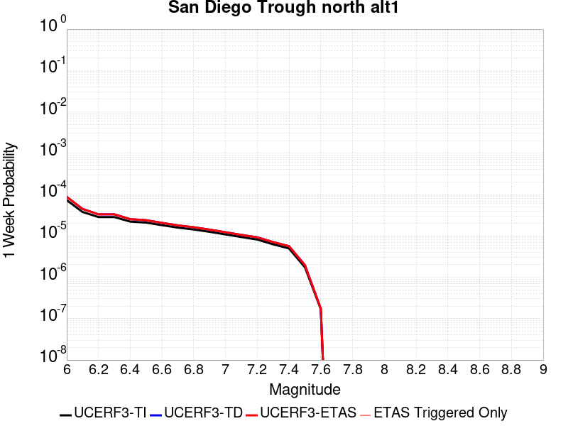 |  |  |  |

| Magnitude | 1 wk TI Prob | 1 wk TD Prob | 1 wk ETAS Prob | 1 wk ETAS/TD Gain | 1 wk ETAS Triggered Only | 1 mo TI Prob | 1 mo TD Prob | 1 mo ETAS Prob | 1 mo ETAS/TD Gain | 1 mo ETAS Triggered Only | 1 yr TI Prob | 1 yr TD Prob | 1 yr ETAS Prob | 1 yr ETAS/TD Gain | 1 yr ETAS Triggered Only | 10 yr TI Prob | 10 yr TD Prob | 10 yr ETAS Prob | 10 yr ETAS/TD Gain | 10 yr ETAS Triggered Only |
|-----|-----|-----|-----|-----|-----|-----|-----|-----|-----|-----|-----|-----|-----|-----|-----|-----|-----|-----|-----|-----|
| 6.0 | 7.329252E-5 | 8.821782E-5 | 8.821782E-5 | 1.0 | 0.0 | 3.14073E-4 | 3.7802523E-4 | 3.7802523E-4 | 1.0 | 0.0 | 0.0038171355 | 0.0045933835 | 0.0046033375 | 1.002167 | 1.0E-5 | 0.03752231 | 0.045048345 | 0.04506744 | 1.0004239 | 2.0E-5 |
| 6.1 | 3.7940346E-5 | 4.4888136E-5 | 4.4888136E-5 | 1.0 | 0.0 | 1.6259136E-4 | 1.9236411E-4 | 1.9236411E-4 | 1.0 | 0.0 | 0.0019777524 | 0.002339605 | 0.0023495816 | 1.0042642 | 1.0E-5 | 0.019602431 | 0.02315826 | 0.023177797 | 1.0008436 | 2.0E-5 |
| 6.2 | 2.8645263E-5 | 3.3298827E-5 | 3.3298827E-5 | 1.0 | 0.0 | 1.2275964E-4 | 1.4270161E-4 | 1.4270161E-4 | 1.0 | 0.0 | 0.0014935739 | 0.0017360242 | 0.0017360242 | 1.0 | 0.0 | 0.0148357535 | 0.01722729 | 0.017237118 | 1.0005704 | 1.0E-5 |
| 6.3 | 2.8645263E-5 | 3.3298827E-5 | 3.3298827E-5 | 1.0 | 0.0 | 1.2275964E-4 | 1.4270161E-4 | 1.4270161E-4 | 1.0 | 0.0 | 0.0014935739 | 0.0017360242 | 0.0017360242 | 1.0 | 0.0 | 0.0148357535 | 0.01722729 | 0.017237118 | 1.0005704 | 1.0E-5 |
| 6.4 | 2.2204576E-5 | 2.5449715E-5 | 2.5449715E-5 | 1.0 | 0.0 | 9.5159E-5 | 1.0906571E-4 | 1.0906571E-4 | 1.0 | 0.0 | 0.001157945 | 0.0013270761 | 0.0013270761 | 1.0 | 0.0 | 0.011519298 | 0.013192673 | 0.013192673 | 1.0 | 0.0 |
| 6.5 | 2.1004838E-5 | 2.4025992E-5 | 2.4025992E-5 | 1.0 | 0.0 | 9.0017624E-5 | 1.0296453E-4 | 1.0296453E-4 | 1.0 | 0.0 | 0.0010954136 | 0.0012528815 | 0.0012528815 | 1.0 | 0.0 | 0.010900296 | 0.012459257 | 0.012459257 | 1.0 | 0.0 |
| 6.6 | 1.820557E-5 | 2.0705853E-5 | 2.0705853E-5 | 1.0 | 0.0 | 7.802154E-5 | 8.873638E-5 | 8.873638E-5 | 1.0 | 0.0 | 9.4949827E-4 | 0.0010798355 | 0.0010798355 | 1.0 | 0.0 | 0.009454516 | 0.0107465545 | 0.0107465545 | 1.0 | 0.0 |
| 6.7 | 1.5884485E-5 | 1.7984537E-5 | 1.7984537E-5 | 1.0 | 0.0 | 6.807459E-5 | 7.707433E-5 | 7.707433E-5 | 1.0 | 0.0 | 8.284929E-4 | 9.379787E-4 | 9.379787E-4 | 1.0 | 0.0 | 0.008254109 | 0.009340564 | 0.009340564 | 1.0 | 0.0 |
| 6.8 | 1.4331171E-5 | 1.6201857E-5 | 1.6201857E-5 | 1.0 | 0.0 | 6.141786E-5 | 6.943469E-5 | 6.943469E-5 | 1.0 | 0.0 | 7.4750587E-4 | 8.450415E-4 | 8.450415E-4 | 1.0 | 0.0 | 0.0074499645 | 0.008418549 | 0.008418549 | 1.0 | 0.0 |
| 6.9 | 1.2574203E-5 | 1.4206525E-5 | 1.4206525E-5 | 1.0 | 0.0 | 5.3888325E-5 | 6.0883693E-5 | 6.0883693E-5 | 1.0 | 0.0 | 6.558929E-4 | 7.4100826E-4 | 7.4100826E-4 | 1.0 | 0.0 | 0.0065396037 | 0.0073855603 | 0.0073855603 | 1.0 | 0.0 |
| 7.0 | 1.0883844E-5 | 1.2289855E-5 | 1.2289855E-5 | 1.0 | 0.0 | 4.664421E-5 | 5.2669748E-5 | 5.2669748E-5 | 1.0 | 0.0 | 5.677453E-4 | 6.410665E-4 | 6.410665E-4 | 1.0 | 0.0 | 0.00566297 | 0.0063923006 | 0.0063923006 | 1.0 | 0.0 |
| 7.1 | 9.393088E-6 | 1.0607533E-5 | 1.0607533E-5 | 1.0 | 0.0 | 4.025547E-5 | 4.5460067E-5 | 4.5460067E-5 | 1.0 | 0.0 | 4.900001E-4 | 5.533365E-4 | 5.533365E-4 | 1.0 | 0.0 | 0.0048892107 | 0.005519684 | 0.005519684 | 1.0 | 0.0 |
| 7.2 | 8.190791E-6 | 9.259077E-6 | 9.259077E-6 | 1.0 | 0.0 | 3.510292E-5 | 3.9681163E-5 | 3.9681163E-5 | 1.0 | 0.0 | 4.2729423E-4 | 4.830117E-4 | 4.830117E-4 | 1.0 | 0.0 | 0.0042647356 | 0.004819699 | 0.004819699 | 1.0 | 0.0 |
| 7.3 | 6.268162E-6 | 7.0900633E-6 | 7.0900633E-6 | 1.0 | 0.0 | 2.6863276E-5 | 3.0385634E-5 | 3.0385634E-5 | 1.0 | 0.0 | 3.2701128E-4 | 3.698827E-4 | 3.698827E-4 | 1.0 | 0.0 | 0.003265305 | 0.0036927166 | 0.0036927166 | 1.0 | 0.0 |
| 7.4 | 4.985186E-6 | 5.64296E-6 | 5.64296E-6 | 1.0 | 0.0 | 2.1364907E-5 | 2.4183892E-5 | 2.4183892E-5 | 1.0 | 0.0 | 2.600867E-4 | 2.9439948E-4 | 2.9439948E-4 | 1.0 | 0.0 | 0.002597825 | 0.0029401362 | 0.0029401362 | 1.0 | 0.0 |
| 7.5 | 1.7489613E-6 | 1.9697716E-6 | 1.9697716E-6 | 1.0 | 0.0 | 7.495527E-6 | 8.441852E-6 | 8.441852E-6 | 1.0 | 0.0 | 9.125422E-5 | 1.0277492E-4 | 1.0277492E-4 | 1.0 | 0.0 | 9.1216754E-4 | 0.001027296 | 0.001027296 | 1.0 | 0.0 |
| 7.6 | 1.6988751E-7 | 1.7534032E-7 | 1.7534032E-7 | 1.0 | 0.0 | 7.2808916E-7 | 7.5145834E-7 | 7.5145834E-7 | 1.0 | 0.0 | 8.864449E-6 | 9.148969E-6 | 9.148969E-6 | 1.0 | 0.0 | 8.8640954E-5 | 9.1486116E-5 | 9.1486116E-5 | 1.0 | 0.0 |

## San Jacinto (Superstition Mtn)
*[(top)](#table-of-contents)*

| 1 Week | 1 Month | 1 Year | 10 Year |
|-----|-----|-----|-----|
| 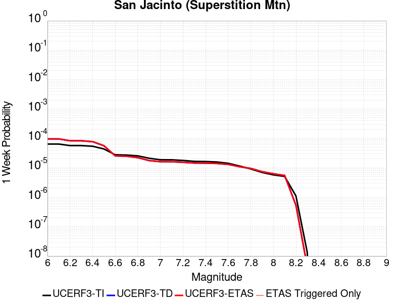 |  | 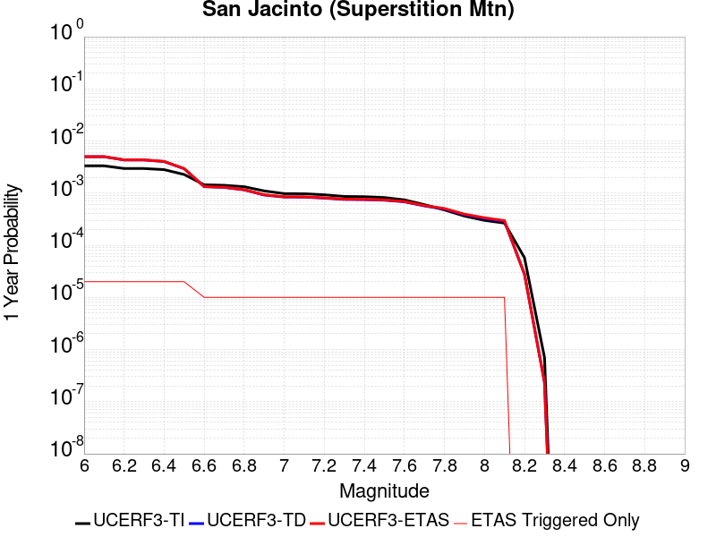 | 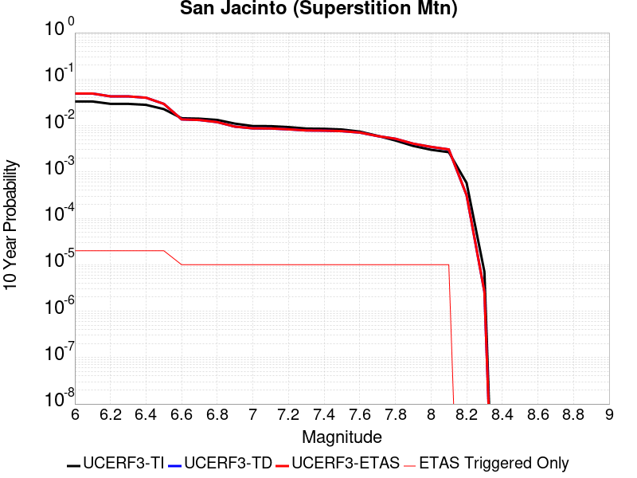 |

| Magnitude | 1 wk TI Prob | 1 wk TD Prob | 1 wk ETAS Prob | 1 wk ETAS/TD Gain | 1 wk ETAS Triggered Only | 1 mo TI Prob | 1 mo TD Prob | 1 mo ETAS Prob | 1 mo ETAS/TD Gain | 1 mo ETAS Triggered Only | 1 yr TI Prob | 1 yr TD Prob | 1 yr ETAS Prob | 1 yr ETAS/TD Gain | 1 yr ETAS Triggered Only | 10 yr TI Prob | 10 yr TD Prob | 10 yr ETAS Prob | 10 yr ETAS/TD Gain | 10 yr ETAS Triggered Only |
|-----|-----|-----|-----|-----|-----|-----|-----|-----|-----|-----|-----|-----|-----|-----|-----|-----|-----|-----|-----|-----|
| 6.0 | 6.4193904E-5 | 9.6014155E-5 | 9.6014155E-5 | 1.0 | 0.0 | 2.7508775E-4 | 4.1143413E-4 | 4.1143413E-4 | 1.0 | 0.0 | 0.0033440501 | 0.004999107 | 0.0050190073 | 1.0039808 | 2.0E-5 | 0.03294174 | 0.048833773 | 0.048852798 | 1.0003896 | 2.0E-5 |
| 6.1 | 6.4193904E-5 | 9.6014155E-5 | 9.6014155E-5 | 1.0 | 0.0 | 2.7508775E-4 | 4.1143413E-4 | 4.1143413E-4 | 1.0 | 0.0 | 0.0033440501 | 0.004999107 | 0.0050190073 | 1.0039808 | 2.0E-5 | 0.03294174 | 0.048833773 | 0.048852798 | 1.0003896 | 2.0E-5 |
| 6.2 | 5.7023593E-5 | 8.3162966E-5 | 8.3162966E-5 | 1.0 | 0.0 | 2.4436394E-4 | 3.5637344E-4 | 3.5637344E-4 | 1.0 | 0.0 | 0.002971072 | 0.004331852 | 0.0043517654 | 1.004597 | 2.0E-5 | 0.029316625 | 0.04251328 | 0.042532433 | 1.0004505 | 2.0E-5 |
| 6.3 | 5.6940098E-5 | 8.3008315E-5 | 8.3008315E-5 | 1.0 | 0.0 | 2.4400617E-4 | 3.5571083E-4 | 3.5571083E-4 | 1.0 | 0.0 | 0.002966728 | 0.004323817 | 0.0043437304 | 1.0046055 | 2.0E-5 | 0.029274331 | 0.04243653 | 0.04245568 | 1.0004513 | 2.0E-5 |
| 6.4 | 5.4171585E-5 | 7.75018E-5 | 7.75018E-5 | 1.0 | 0.0 | 2.3214328E-4 | 3.3211758E-4 | 3.3211758E-4 | 1.0 | 0.0 | 0.0028226813 | 0.004037683 | 0.0040576025 | 1.0049334 | 2.0E-5 | 0.02787096 | 0.0397257 | 0.039744906 | 1.0004834 | 2.0E-5 |
| 6.5 | 4.375144E-5 | 5.6439036E-5 | 5.6439036E-5 | 1.0 | 0.0 | 1.874927E-4 | 2.4186578E-4 | 2.4186578E-4 | 1.0 | 0.0 | 0.0022803338 | 0.0029419153 | 0.0029618563 | 1.0067782 | 2.0E-5 | 0.022570757 | 0.029245816 | 0.029265232 | 1.0006639 | 2.0E-5 |
| 6.6 | 2.772192E-5 | 2.55052E-5 | 2.55052E-5 | 1.0 | 0.0 | 1.1880282E-4 | 1.09303524E-4 | 1.09303524E-4 | 1.0 | 0.0 | 0.0014454646 | 0.0013299774 | 0.0013399641 | 1.0075089 | 1.0E-5 | 0.014360986 | 0.01354923 | 0.013559095 | 1.000728 | 1.0E-5 |
| 6.7 | 2.7124124E-5 | 2.471615E-5 | 2.471615E-5 | 1.0 | 0.0 | 1.1624106E-4 | 1.0592216E-4 | 1.0592216E-4 | 1.0 | 0.0 | 0.0014143161 | 0.0012888586 | 0.0012988457 | 1.0077488 | 1.0E-5 | 0.014053487 | 0.013142647 | 0.0131525155 | 1.0007509 | 1.0E-5 |
| 6.8 | 2.5475807E-5 | 2.2180813E-5 | 2.2180813E-5 | 1.0 | 0.0 | 1.0917746E-4 | 9.5057236E-5 | 9.5057236E-5 | 1.0 | 0.0 | 0.001328425 | 0.0011567194 | 0.0011667077 | 1.0086352 | 1.0E-5 | 0.0132051185 | 0.011830691 | 0.011840573 | 1.0008353 | 1.0E-5 |
| 6.9 | 2.1162023E-5 | 1.7641334E-5 | 1.7641334E-5 | 1.0 | 0.0 | 9.069123E-5 | 7.560355E-5 | 7.560355E-5 | 1.0 | 0.0 | 0.0011036064 | 9.200883E-4 | 9.3007914E-4 | 1.0108585 | 1.0E-5 | 0.010981417 | 0.009454764 | 0.00946467 | 1.0010476 | 1.0E-5 |
| 7.0 | 1.8754288E-5 | 1.6175962E-5 | 1.6175962E-5 | 1.0 | 0.0 | 8.037304E-5 | 6.932372E-5 | 6.932372E-5 | 1.0 | 0.0 | 9.781026E-4 | 8.43692E-4 | 8.5368357E-4 | 1.0118426 | 1.0E-5 | 0.009738087 | 0.008677567 | 0.008687481 | 1.0011424 | 1.0E-5 |
| 7.1 | 1.8678527E-5 | 1.610109E-5 | 1.610109E-5 | 1.0 | 0.0 | 8.0048376E-5 | 6.900286E-5 | 6.900286E-5 | 1.0 | 0.0 | 9.7415317E-4 | 8.397885E-4 | 8.4978016E-4 | 1.0118978 | 1.0E-5 | 0.009698939 | 0.008638517 | 0.008648431 | 1.0011476 | 1.0E-5 |
| 7.2 | 1.7804578E-5 | 1.5395515E-5 | 1.5395515E-5 | 1.0 | 0.0 | 7.6303106E-5 | 6.5979126E-5 | 6.5979126E-5 | 1.0 | 0.0 | 9.285943E-4 | 8.0300204E-4 | 8.12994E-4 | 1.0124433 | 1.0E-5 | 0.009247236 | 0.008269752 | 0.00827967 | 1.0011992 | 1.0E-5 |
| 7.3 | 1.6583685E-5 | 1.4544454E-5 | 1.4544454E-5 | 1.0 | 0.0 | 7.1070994E-5 | 6.233189E-5 | 6.233189E-5 | 1.0 | 0.0 | 8.649459E-4 | 7.586286E-4 | 7.68621E-4 | 1.0131717 | 1.0E-5 | 0.00861587 | 0.007824981 | 0.007834902 | 1.0012679 | 1.0E-5 |
| 7.4 | 1.6387552E-5 | 1.4409311E-5 | 1.4409311E-5 | 1.0 | 0.0 | 7.023047E-5 | 6.175274E-5 | 6.175274E-5 | 1.0 | 0.0 | 8.5472054E-4 | 7.5158227E-4 | 7.615748E-4 | 1.0132953 | 1.0E-5 | 0.008514405 | 0.007754348 | 0.007764271 | 1.0012796 | 1.0E-5 |
| 7.5 | 1.5790754E-5 | 1.4049853E-5 | 1.4049853E-5 | 1.0 | 0.0 | 6.767291E-5 | 6.021228E-5 | 6.021228E-5 | 1.0 | 0.0 | 8.236062E-4 | 7.3283986E-4 | 7.4283255E-4 | 1.0136355 | 1.0E-5 | 0.008205604 | 0.0075648366 | 0.007574761 | 1.0013119 | 1.0E-5 |
| 7.6 | 1.4248672E-5 | 1.3068457E-5 | 1.3068457E-5 | 1.0 | 0.0 | 6.106431E-5 | 5.6006476E-5 | 5.6006476E-5 | 1.0 | 0.0 | 7.432043E-4 | 6.816673E-4 | 6.9166045E-4 | 1.0146599 | 1.0E-5 | 0.007407237 | 0.0070472364 | 0.007057166 | 1.001409 | 1.0E-5 |
| 7.7 | 1.15449975E-5 | 1.09166585E-5 | 1.09166585E-5 | 1.0 | 0.0 | 4.947762E-5 | 4.6784844E-5 | 4.6784844E-5 | 1.0 | 0.0 | 6.022235E-4 | 5.6945736E-4 | 5.794517E-4 | 1.0175506 | 1.0E-5 | 0.006005941 | 0.005916985 | 0.0059269257 | 1.00168 | 1.0E-5 |
| 7.8 | 9.1391985E-6 | 9.5267715E-6 | 9.5267715E-6 | 1.0 | 0.0 | 3.9167408E-5 | 4.0828385E-5 | 4.0828385E-5 | 1.0 | 0.0 | 4.767588E-4 | 4.969728E-4 | 5.0696783E-4 | 1.0201118 | 1.0E-5 | 0.0047573727 | 0.0051832297 | 0.005193178 | 1.0019193 | 1.0E-5 |
| 7.9 | 6.973017E-6 | 7.3932424E-6 | 7.3932424E-6 | 1.0 | 0.0 | 2.9884017E-5 | 3.1684944E-5 | 3.1684944E-5 | 1.0 | 0.0 | 3.6377716E-4 | 3.8569642E-4 | 3.9569256E-4 | 1.0259172 | 1.0E-5 | 0.0036318225 | 0.004057612 | 0.0040675714 | 1.0024545 | 1.0E-5 |
| 8.0 | 5.7638235E-6 | 6.2700688E-6 | 6.2700688E-6 | 1.0 | 0.0 | 2.4701867E-5 | 2.687145E-5 | 2.687145E-5 | 1.0 | 0.0 | 3.0070372E-4 | 3.2711128E-4 | 3.37108E-4 | 1.0305606 | 1.0E-5 | 0.0030029714 | 0.0034587646 | 0.00346873 | 1.0028812 | 1.0E-5 |
| 8.1 | 5.1124434E-6 | 5.5048636E-6 | 5.5048636E-6 | 1.0 | 0.0 | 2.1910288E-5 | 2.3592062E-5 | 2.3592062E-5 | 1.0 | 0.0 | 2.6672508E-4 | 2.87196E-4 | 2.971931E-4 | 1.0348095 | 1.0E-5 | 0.0026640517 | 0.0030451815 | 0.003055151 | 1.0032738 | 1.0E-5 |
| 8.2 | 1.1075938E-6 | 5.3500304E-7 | 5.3500304E-7 | 1.0 | 0.0 | 4.7468216E-6 | 2.2928682E-6 | 2.2928682E-6 | 1.0 | 0.0 | 5.779102E-5 | 2.7915336E-5 | 2.7915336E-5 | 1.0 | 0.0 | 5.777599E-4 | 3.142146E-4 | 3.142146E-4 | 1.0 | 0.0 |
| 8.3 | 1.3584393E-8 | 4.4866955E-9 | 4.4866955E-9 | 1.0 | 0.0 | 5.8218827E-8 | 1.9228695E-8 | 1.9228695E-8 | 1.0 | 0.0 | 7.0881396E-7 | 2.3410936E-7 | 2.3410936E-7 | 1.0 | 0.0 | 7.0881174E-6 | 2.6235152E-6 | 2.6235152E-6 | 1.0 | 0.0 |

## Monte Vista - Shannon 2011 CFM
*[(top)](#table-of-contents)*

| 1 Week | 1 Month | 1 Year | 10 Year |
|-----|-----|-----|-----|
|  | 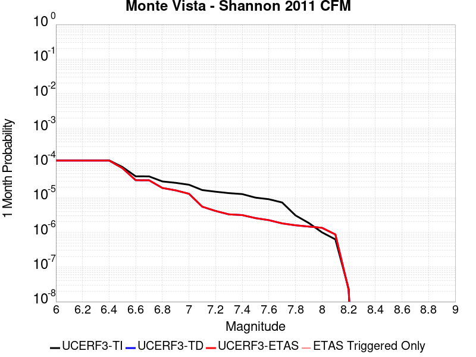 |  | 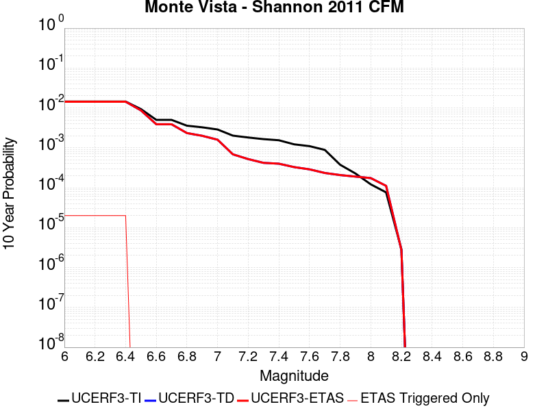 |

| Magnitude | 1 wk TI Prob | 1 wk TD Prob | 1 wk ETAS Prob | 1 wk ETAS/TD Gain | 1 wk ETAS Triggered Only | 1 mo TI Prob | 1 mo TD Prob | 1 mo ETAS Prob | 1 mo ETAS/TD Gain | 1 mo ETAS Triggered Only | 1 yr TI Prob | 1 yr TD Prob | 1 yr ETAS Prob | 1 yr ETAS/TD Gain | 1 yr ETAS Triggered Only | 10 yr TI Prob | 10 yr TD Prob | 10 yr ETAS Prob | 10 yr ETAS/TD Gain | 10 yr ETAS Triggered Only |
|-----|-----|-----|-----|-----|-----|-----|-----|-----|-----|-----|-----|-----|-----|-----|-----|-----|-----|-----|-----|-----|
| 6.0 | 2.7907707E-5 | 2.7586655E-5 | 2.7586655E-5 | 1.0 | 0.0 | 1.19598975E-4 | 1.1822386E-4 | 1.1822386E-4 | 1.0 | 0.0 | 0.0014551448 | 0.0014385489 | 0.0014485345 | 1.0069414 | 1.0E-5 | 0.014456532 | 0.014321466 | 0.01434118 | 1.0013765 | 2.0E-5 |
| 6.1 | 2.7907707E-5 | 2.7586655E-5 | 2.7586655E-5 | 1.0 | 0.0 | 1.19598975E-4 | 1.1822386E-4 | 1.1822386E-4 | 1.0 | 0.0 | 0.0014551448 | 0.0014385489 | 0.0014485345 | 1.0069414 | 1.0E-5 | 0.014456532 | 0.014321466 | 0.01434118 | 1.0013765 | 2.0E-5 |
| 6.2 | 2.7907707E-5 | 2.7586655E-5 | 2.7586655E-5 | 1.0 | 0.0 | 1.19598975E-4 | 1.1822386E-4 | 1.1822386E-4 | 1.0 | 0.0 | 0.0014551448 | 0.0014385489 | 0.0014485345 | 1.0069414 | 1.0E-5 | 0.014456532 | 0.014321466 | 0.01434118 | 1.0013765 | 2.0E-5 |
| 6.3 | 2.7907707E-5 | 2.7586655E-5 | 2.7586655E-5 | 1.0 | 0.0 | 1.19598975E-4 | 1.1822386E-4 | 1.1822386E-4 | 1.0 | 0.0 | 0.0014551448 | 0.0014385489 | 0.0014485345 | 1.0069414 | 1.0E-5 | 0.014456532 | 0.014321466 | 0.01434118 | 1.0013765 | 2.0E-5 |
| 6.4 | 2.7907707E-5 | 2.7586655E-5 | 2.7586655E-5 | 1.0 | 0.0 | 1.19598975E-4 | 1.1822386E-4 | 1.1822386E-4 | 1.0 | 0.0 | 0.0014551448 | 0.0014385489 | 0.0014485345 | 1.0069414 | 1.0E-5 | 0.014456532 | 0.014321466 | 0.01434118 | 1.0013765 | 2.0E-5 |
| 6.5 | 1.7990213E-5 | 1.664191E-5 | 1.664191E-5 | 1.0 | 0.0 | 7.709863E-5 | 7.1320894E-5 | 7.1320894E-5 | 1.0 | 0.0 | 9.382716E-4 | 8.680523E-4 | 8.680523E-4 | 1.0 | 0.0 | 0.0093431985 | 0.008670001 | 0.008670001 | 1.0 | 0.0 |
| 6.6 | 9.650407E-6 | 7.4588243E-6 | 7.4588243E-6 | 1.0 | 0.0 | 4.135823E-5 | 3.1966043E-5 | 3.1966043E-5 | 1.0 | 0.0 | 5.0342013E-4 | 3.891249E-4 | 3.891249E-4 | 1.0 | 0.0 | 0.005022812 | 0.0039021273 | 0.0039021273 | 1.0 | 0.0 |
| 6.7 | 9.62828E-6 | 7.436737E-6 | 7.436737E-6 | 1.0 | 0.0 | 4.1263404E-5 | 3.1871386E-5 | 3.1871386E-5 | 1.0 | 0.0 | 5.022661E-4 | 3.8797286E-4 | 3.8797286E-4 | 1.0 | 0.0 | 0.0050113243 | 0.0038906476 | 0.0038906476 | 1.0 | 0.0 |
| 6.8 | 6.887523E-6 | 4.463149E-6 | 4.463149E-6 | 1.0 | 0.0 | 2.9517621E-5 | 1.9127654E-5 | 1.9127654E-5 | 1.0 | 0.0 | 3.5931775E-4 | 2.3285652E-4 | 2.3285652E-4 | 1.0 | 0.0 | 0.0035873733 | 0.0023432903 | 0.0023432903 | 1.0 | 0.0 |
| 6.9 | 6.2722347E-6 | 3.8049966E-6 | 3.8049966E-6 | 1.0 | 0.0 | 2.6880729E-5 | 1.6307038E-5 | 1.6307038E-5 | 1.0 | 0.0 | 3.2722374E-4 | 1.9852213E-4 | 1.9852213E-4 | 1.0 | 0.0 | 0.003267423 | 0.002000599 | 0.002000599 | 1.0 | 0.0 |
| 7.0 | 5.5320347E-6 | 3.0321132E-6 | 3.0321132E-6 | 1.0 | 0.0 | 2.3708504E-5 | 1.2994717E-5 | 1.2994717E-5 | 1.0 | 0.0 | 2.8861282E-4 | 1.5820102E-4 | 1.5820102E-4 | 1.0 | 0.0 | 0.0028823826 | 0.0015980211 | 0.0015980211 | 1.0 | 0.0 |
| 7.1 | 3.8794055E-6 | 1.2852364E-6 | 1.2852364E-6 | 1.0 | 0.0 | 1.6625918E-5 | 5.5081446E-6 | 5.5081446E-6 | 1.0 | 0.0 | 2.0240174E-4 | 6.705961E-5 | 6.705961E-5 | 1.0 | 0.0 | 0.002022175 | 6.8735634E-4 | 6.8735634E-4 | 1.0 | 0.0 |
| 7.2 | 3.4813652E-6 | 9.684858E-7 | 9.684858E-7 | 1.0 | 0.0 | 1.49200505E-5 | 4.150647E-6 | 4.150647E-6 | 1.0 | 0.0 | 1.8163648E-4 | 5.0532963E-5 | 5.0532963E-5 | 1.0 | 0.0 | 0.0018148809 | 5.2216504E-4 | 5.2216504E-4 | 1.0 | 0.0 |
| 7.3 | 3.1682148E-6 | 7.7324756E-7 | 7.7324756E-7 | 1.0 | 0.0 | 1.3577992E-5 | 3.313914E-6 | 3.313914E-6 | 1.0 | 0.0 | 1.6529951E-4 | 4.0346156E-5 | 4.0346156E-5 | 1.0 | 0.0 | 0.0016517661 | 4.2031374E-4 | 4.2031374E-4 | 1.0 | 0.0 |
| 7.4 | 2.9707667E-6 | 7.3587034E-7 | 7.3587034E-7 | 1.0 | 0.0 | 1.2731795E-5 | 3.153726E-6 | 3.153726E-6 | 1.0 | 0.0 | 1.5499859E-4 | 3.839594E-5 | 3.839594E-5 | 1.0 | 0.0 | 0.0015489052 | 4.0061006E-4 | 4.0061006E-4 | 1.0 | 0.0 |
| 7.5 | 2.3462758E-6 | 6.0189757E-7 | 6.0189757E-7 | 1.0 | 0.0 | 1.0055429E-5 | 2.5795584E-6 | 2.5795584E-6 | 1.0 | 0.0 | 1.2241797E-4 | 3.1405674E-5 | 3.1405674E-5 | 1.0 | 0.0 | 0.0012235056 | 3.2898266E-4 | 3.2898266E-4 | 1.0 | 0.0 |
| 7.6 | 2.112783E-6 | 5.261996E-7 | 5.261996E-7 | 1.0 | 0.0 | 9.054753E-6 | 2.2551392E-6 | 2.2551392E-6 | 1.0 | 0.0 | 1.1023604E-4 | 2.7455975E-5 | 2.7455975E-5 | 1.0 | 0.0 | 0.0011018137 | 2.8906539E-4 | 2.8906539E-4 | 1.0 | 0.0 |
| 7.7 | 1.7022471E-6 | 4.2406643E-7 | 4.2406643E-7 | 1.0 | 0.0 | 7.2953244E-6 | 1.8174262E-6 | 1.8174262E-6 | 1.0 | 0.0 | 8.881695E-5 | 2.212694E-5 | 2.212694E-5 | 1.0 | 0.0 | 8.878146E-4 | 2.3446612E-4 | 2.3446612E-4 | 1.0 | 0.0 |
| 7.8 | 7.230914E-7 | 3.7367803E-7 | 3.7367803E-7 | 1.0 | 0.0 | 3.0989595E-6 | 1.6014762E-6 | 1.6014762E-6 | 1.0 | 0.0 | 3.772918E-5 | 1.94978E-5 | 1.94978E-5 | 1.0 | 0.0 | 3.7722773E-4 | 2.0770078E-4 | 2.0770078E-4 | 1.0 | 0.0 |
| 7.9 | 4.3588446E-7 | 3.4377132E-7 | 3.4377132E-7 | 1.0 | 0.0 | 1.868075E-6 | 1.4733048E-6 | 1.4733048E-6 | 1.0 | 0.0 | 2.2743576E-5 | 1.793734E-5 | 1.793734E-5 | 1.0 | 0.0 | 2.2741247E-4 | 1.9032517E-4 | 1.9032517E-4 | 1.0 | 0.0 |
| 8.0 | 2.3317523E-7 | 3.157609E-7 | 3.157609E-7 | 1.0 | 0.0 | 9.99322E-7 | 1.3532604E-6 | 1.3532604E-6 | 1.0 | 0.0 | 1.2166677E-5 | 1.647582E-5 | 1.647582E-5 | 1.0 | 0.0 | 1.21660116E-4 | 1.7431752E-4 | 1.7431752E-4 | 1.0 | 0.0 |
| 8.1 | 1.4662456E-7 | 2.0345128E-7 | 2.0345128E-7 | 1.0 | 0.0 | 6.283908E-7 | 8.7193376E-7 | 8.7193376E-7 | 1.0 | 0.0 | 7.650631E-6 | 1.0615743E-5 | 1.0615743E-5 | 1.0 | 0.0 | 7.650368E-5 | 1.1151567E-4 | 1.1151567E-4 | 1.0 | 0.0 |
| 8.2 | 5.4931775E-9 | 5.085425E-9 | 5.085425E-9 | 1.0 | 0.0 | 2.3542189E-8 | 2.1794678E-8 | 2.1794678E-8 | 1.0 | 0.0 | 2.8662612E-7 | 2.653502E-7 | 2.653502E-7 | 1.0 | 0.0 | 2.8662573E-6 | 2.7590645E-6 | 2.7590645E-6 | 1.0 | 0.0 |

## Great Valley 03a Dunnigan Hills
*[(top)](#table-of-contents)*

| 1 Week | 1 Month | 1 Year | 10 Year |
|-----|-----|-----|-----|
| 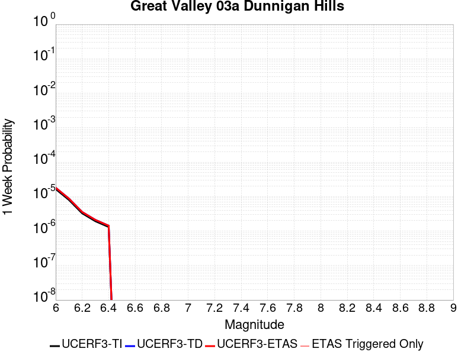 |  |  |  |

| Magnitude | 1 wk TI Prob | 1 wk TD Prob | 1 wk ETAS Prob | 1 wk ETAS/TD Gain | 1 wk ETAS Triggered Only | 1 mo TI Prob | 1 mo TD Prob | 1 mo ETAS Prob | 1 mo ETAS/TD Gain | 1 mo ETAS Triggered Only | 1 yr TI Prob | 1 yr TD Prob | 1 yr ETAS Prob | 1 yr ETAS/TD Gain | 1 yr ETAS Triggered Only | 10 yr TI Prob | 10 yr TD Prob | 10 yr ETAS Prob | 10 yr ETAS/TD Gain | 10 yr ETAS Triggered Only |
|-----|-----|-----|-----|-----|-----|-----|-----|-----|-----|-----|-----|-----|-----|-----|-----|-----|-----|-----|-----|-----|
| 6.0 | 1.6591328E-5 | 1.8108569E-5 | 1.8108569E-5 | 1.0 | 0.0 | 7.110376E-5 | 7.760624E-5 | 7.760624E-5 | 1.0 | 0.0 | 8.6534437E-4 | 9.4451546E-4 | 9.4451546E-4 | 1.0 | 0.0 | 0.008619824 | 0.0094118435 | 0.0094316555 | 1.002105 | 2.0E-5 |
| 6.1 | 8.041125E-6 | 8.770022E-6 | 8.770022E-6 | 1.0 | 0.0 | 3.4461507E-5 | 3.758538E-5 | 3.758538E-5 | 1.0 | 0.0 | 4.194881E-4 | 4.5752624E-4 | 4.5752624E-4 | 1.0 | 0.0 | 0.004186971 | 0.0045678406 | 0.004577795 | 1.0021793 | 1.0E-5 |
| 6.2 | 3.2807004E-6 | 3.57969E-6 | 3.57969E-6 | 1.0 | 0.0 | 1.4060069E-5 | 1.5341462E-5 | 1.5341462E-5 | 1.0 | 0.0 | 1.7116789E-4 | 1.8677044E-4 | 1.8677044E-4 | 1.0 | 0.0 | 0.0017103611 | 0.0018665427 | 0.0018765241 | 1.0053475 | 1.0E-5 |
| 6.3 | 1.9339366E-6 | 2.1104522E-6 | 2.1104522E-6 | 1.0 | 0.0 | 8.288273E-6 | 9.04478E-6 | 9.04478E-6 | 1.0 | 0.0 | 1.00905054E-4 | 1.10117486E-4 | 1.10117486E-4 | 1.0 | 0.0 | 0.0010085925 | 0.0011009092 | 0.0011009092 | 1.0 | 0.0 |
| 6.4 | 1.3142635E-6 | 1.4340352E-6 | 1.4340352E-6 | 1.0 | 0.0 | 5.6325457E-6 | 6.145865E-6 | 6.145865E-6 | 1.0 | 0.0 | 6.857408E-5 | 7.4825904E-5 | 7.4825904E-5 | 1.0 | 0.0 | 6.8552926E-4 | 7.482591E-4 | 7.482591E-4 | 1.0 | 0.0 |

## Sierra Madre
*[(top)](#table-of-contents)*

| 1 Week | 1 Month | 1 Year | 10 Year |
|-----|-----|-----|-----|
| 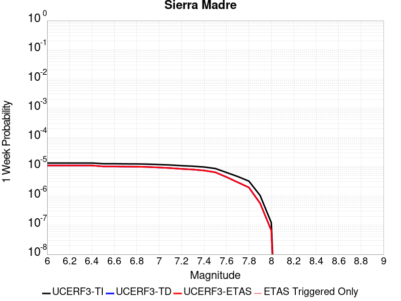 | 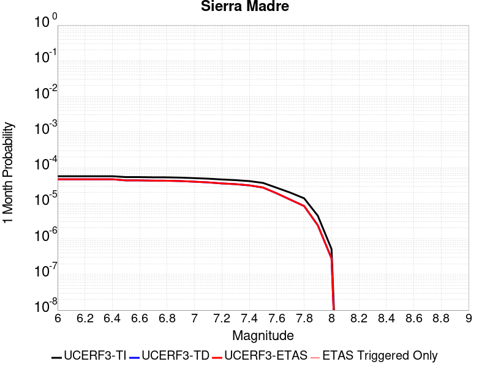 |  |  |

| Magnitude | 1 wk TI Prob | 1 wk TD Prob | 1 wk ETAS Prob | 1 wk ETAS/TD Gain | 1 wk ETAS Triggered Only | 1 mo TI Prob | 1 mo TD Prob | 1 mo ETAS Prob | 1 mo ETAS/TD Gain | 1 mo ETAS Triggered Only | 1 yr TI Prob | 1 yr TD Prob | 1 yr ETAS Prob | 1 yr ETAS/TD Gain | 1 yr ETAS Triggered Only | 10 yr TI Prob | 10 yr TD Prob | 10 yr ETAS Prob | 10 yr ETAS/TD Gain | 10 yr ETAS Triggered Only |
|-----|-----|-----|-----|-----|-----|-----|-----|-----|-----|-----|-----|-----|-----|-----|-----|-----|-----|-----|-----|-----|
| 6.0 | 1.3379373E-5 | 1.1001739E-5 | 1.1001739E-5 | 1.0 | 0.0 | 5.7338908E-5 | 4.7149464E-5 | 4.7149464E-5 | 1.0 | 0.0 | 6.978776E-4 | 5.73895E-4 | 5.8388925E-4 | 1.0174148 | 1.0E-5 | 0.0069569005 | 0.005724494 | 0.0057443795 | 1.0034738 | 2.0E-5 |
| 6.1 | 1.3379373E-5 | 1.1001739E-5 | 1.1001739E-5 | 1.0 | 0.0 | 5.7338908E-5 | 4.7149464E-5 | 4.7149464E-5 | 1.0 | 0.0 | 6.978776E-4 | 5.73895E-4 | 5.8388925E-4 | 1.0174148 | 1.0E-5 | 0.0069569005 | 0.005724494 | 0.0057443795 | 1.0034738 | 2.0E-5 |
| 6.2 | 1.3379373E-5 | 1.1001739E-5 | 1.1001739E-5 | 1.0 | 0.0 | 5.7338908E-5 | 4.7149464E-5 | 4.7149464E-5 | 1.0 | 0.0 | 6.978776E-4 | 5.73895E-4 | 5.8388925E-4 | 1.0174148 | 1.0E-5 | 0.0069569005 | 0.005724494 | 0.0057443795 | 1.0034738 | 2.0E-5 |
| 6.3 | 1.3379373E-5 | 1.1001739E-5 | 1.1001739E-5 | 1.0 | 0.0 | 5.7338908E-5 | 4.7149464E-5 | 4.7149464E-5 | 1.0 | 0.0 | 6.978776E-4 | 5.73895E-4 | 5.8388925E-4 | 1.0174148 | 1.0E-5 | 0.0069569005 | 0.005724494 | 0.0057443795 | 1.0034738 | 2.0E-5 |
| 6.4 | 1.3379373E-5 | 1.1001739E-5 | 1.1001739E-5 | 1.0 | 0.0 | 5.7338908E-5 | 4.7149464E-5 | 4.7149464E-5 | 1.0 | 0.0 | 6.978776E-4 | 5.73895E-4 | 5.8388925E-4 | 1.0174148 | 1.0E-5 | 0.0069569005 | 0.005724494 | 0.0057443795 | 1.0034738 | 2.0E-5 |
| 6.5 | 1.26563245E-5 | 1.0231176E-5 | 1.0231176E-5 | 1.0 | 0.0 | 5.4240263E-5 | 4.3847165E-5 | 4.3847165E-5 | 1.0 | 0.0 | 6.601751E-4 | 5.3370954E-4 | 5.437042E-4 | 1.0187268 | 1.0E-5 | 0.006582173 | 0.0053246 | 0.0053444933 | 1.0037361 | 2.0E-5 |
| 6.6 | 1.26563245E-5 | 1.0231176E-5 | 1.0231176E-5 | 1.0 | 0.0 | 5.4240263E-5 | 4.3847165E-5 | 4.3847165E-5 | 1.0 | 0.0 | 6.601751E-4 | 5.3370954E-4 | 5.437042E-4 | 1.0187268 | 1.0E-5 | 0.006582173 | 0.0053246 | 0.0053444933 | 1.0037361 | 2.0E-5 |
| 6.7 | 1.2502474E-5 | 1.0067316E-5 | 1.0067316E-5 | 1.0 | 0.0 | 5.3580934E-5 | 4.3144933E-5 | 4.3144933E-5 | 1.0 | 0.0 | 6.521526E-4 | 5.25164E-4 | 5.3515873E-4 | 1.0190316 | 1.0E-5 | 0.0065024206 | 0.005239549 | 0.005259444 | 1.0037972 | 2.0E-5 |
| 6.8 | 1.2454966E-5 | 1.00196E-5 | 1.00196E-5 | 1.0 | 0.0 | 5.3377335E-5 | 4.2940443E-5 | 4.2940443E-5 | 1.0 | 0.0 | 6.4967526E-4 | 5.226756E-4 | 5.3267035E-4 | 1.0191224 | 1.0E-5 | 0.006477792 | 0.005214781 | 0.005234677 | 1.0038153 | 2.0E-5 |
| 6.9 | 1.2225574E-5 | 9.793572E-6 | 9.793572E-6 | 1.0 | 0.0 | 5.2394265E-5 | 4.197178E-5 | 4.197178E-5 | 1.0 | 0.0 | 6.3771347E-4 | 5.1088765E-4 | 5.2088255E-4 | 1.0195638 | 1.0E-5 | 0.006358865 | 0.005097448 | 0.005117346 | 1.0039035 | 2.0E-5 |
| 7.0 | 1.182946E-5 | 9.400103E-6 | 9.400103E-6 | 1.0 | 0.0 | 5.06967E-5 | 4.028554E-5 | 4.028554E-5 | 1.0 | 0.0 | 6.1705755E-4 | 4.903671E-4 | 5.003622E-4 | 1.0203829 | 1.0E-5 | 0.006153469 | 0.0048931623 | 0.0049130647 | 1.0040673 | 2.0E-5 |
| 7.1 | 1.14369095E-5 | 8.9870955E-6 | 8.9870955E-6 | 1.0 | 0.0 | 4.9014405E-5 | 3.851556E-5 | 3.851556E-5 | 1.0 | 0.0 | 5.9658696E-4 | 4.6882703E-4 | 4.7882236E-4 | 1.0213199 | 1.0E-5 | 0.005949879 | 0.0046786857 | 0.004698592 | 1.0042547 | 2.0E-5 |
| 7.2 | 1.0836419E-5 | 8.400468E-6 | 8.400468E-6 | 1.0 | 0.0 | 4.644097E-5 | 3.6001515E-5 | 3.6001515E-5 | 1.0 | 0.0 | 5.652721E-4 | 4.382312E-4 | 4.482268E-4 | 1.022809 | 1.0E-5 | 0.0056383642 | 0.0043739676 | 0.0043938803 | 1.0045525 | 2.0E-5 |
| 7.3 | 1.0403439E-5 | 8.021717E-6 | 8.021717E-6 | 1.0 | 0.0 | 4.4585406E-5 | 3.4378336E-5 | 3.4378336E-5 | 1.0 | 0.0 | 5.426921E-4 | 4.1847676E-4 | 4.1847676E-4 | 1.0 | 0.0 | 0.005413687 | 0.004177183 | 0.004187141 | 1.002384 | 1.0E-5 |
| 7.4 | 9.768864E-6 | 7.41532E-6 | 7.41532E-6 | 1.0 | 0.0 | 4.186589E-5 | 3.177956E-5 | 3.177956E-5 | 1.0 | 0.0 | 5.09598E-4 | 3.8684835E-4 | 3.8684835E-4 | 1.0 | 0.0 | 0.0050843097 | 0.0038620413 | 0.0038720025 | 1.0025793 | 1.0E-5 |
| 7.5 | 8.687089E-6 | 6.450897E-6 | 6.450897E-6 | 1.0 | 0.0 | 3.722985E-5 | 2.7646412E-5 | 2.7646412E-5 | 1.0 | 0.0 | 4.5317915E-4 | 3.3654395E-4 | 3.3654395E-4 | 1.0 | 0.0 | 0.004522561 | 0.0033606302 | 0.0033705966 | 1.0029657 | 1.0E-5 |
| 7.6 | 6.3506063E-6 | 4.4309877E-6 | 4.4309877E-6 | 1.0 | 0.0 | 2.72166E-5 | 1.8989811E-5 | 1.8989811E-5 | 1.0 | 0.0 | 3.3131172E-4 | 2.3117667E-4 | 2.3117667E-4 | 1.0 | 0.0 | 0.003308182 | 0.0023095869 | 0.0023195636 | 1.0043198 | 1.0E-5 |
| 7.7 | 4.62223E-6 | 2.9335897E-6 | 2.9335897E-6 | 1.0 | 0.0 | 1.9809406E-5 | 1.2572466E-5 | 1.2572466E-5 | 1.0 | 0.0 | 2.4115283E-4 | 1.5305905E-4 | 1.5305905E-4 | 1.0 | 0.0 | 0.0024089129 | 0.0015297374 | 0.0015397221 | 1.0065271 | 1.0E-5 |
| 7.8 | 3.2145008E-6 | 1.9498889E-6 | 1.9498889E-6 | 1.0 | 0.0 | 1.3776359E-5 | 8.356639E-6 | 8.356639E-6 | 1.0 | 0.0 | 1.6771426E-4 | 1.0173735E-4 | 1.0173735E-4 | 1.0 | 0.0 | 0.0016758774 | 0.0010170521 | 0.0010170521 | 1.0 | 0.0 |
| 7.9 | 1.0391769E-6 | 5.603997E-7 | 5.603997E-7 | 1.0 | 0.0 | 4.4536077E-6 | 2.4017108E-6 | 2.4017108E-6 | 1.0 | 0.0 | 5.4221324E-5 | 2.924044E-5 | 2.924044E-5 | 1.0 | 0.0 | 5.4208096E-4 | 2.9236634E-4 | 2.9236634E-4 | 1.0 | 0.0 |
| 8.0 | 1.210983E-7 | 6.614803E-8 | 6.614803E-8 | 1.0 | 0.0 | 5.1899264E-7 | 2.8349154E-7 | 2.8349154E-7 | 1.0 | 0.0 | 6.3187167E-6 | 3.4515042E-6 | 3.4515042E-6 | 1.0 | 0.0 | 6.318537E-5 | 3.4514524E-5 | 3.4514524E-5 | 1.0 | 0.0 |

## Pitas Point (Lower)-Montalvo
*[(top)](#table-of-contents)*

| 1 Week | 1 Month | 1 Year | 10 Year |
|-----|-----|-----|-----|
|  |  | 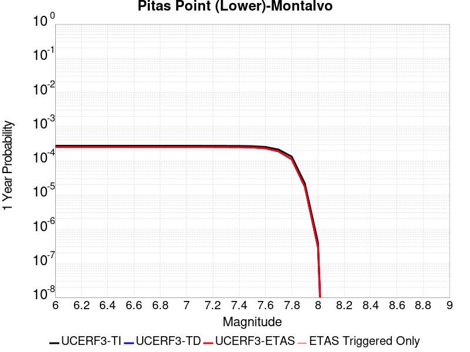 | 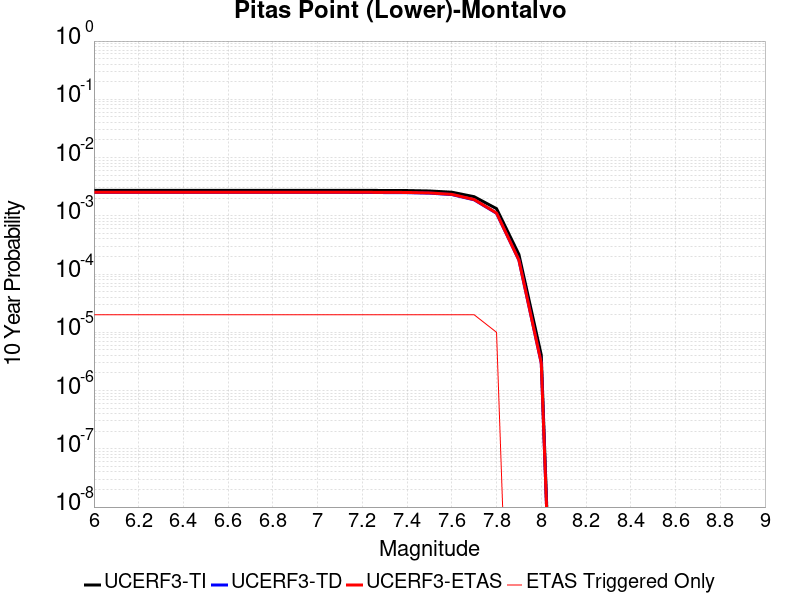 |

| Magnitude | 1 wk TI Prob | 1 wk TD Prob | 1 wk ETAS Prob | 1 wk ETAS/TD Gain | 1 wk ETAS Triggered Only | 1 mo TI Prob | 1 mo TD Prob | 1 mo ETAS Prob | 1 mo ETAS/TD Gain | 1 mo ETAS Triggered Only | 1 yr TI Prob | 1 yr TD Prob | 1 yr ETAS Prob | 1 yr ETAS/TD Gain | 1 yr ETAS Triggered Only | 10 yr TI Prob | 10 yr TD Prob | 10 yr ETAS Prob | 10 yr ETAS/TD Gain | 10 yr ETAS Triggered Only |
|-----|-----|-----|-----|-----|-----|-----|-----|-----|-----|-----|-----|-----|-----|-----|-----|-----|-----|-----|-----|-----|
| 6.0 | 5.2543637E-6 | 4.837984E-6 | 4.837984E-6 | 1.0 | 0.0 | 2.2518509E-5 | 2.0734054E-5 | 2.0734054E-5 | 1.0 | 0.0 | 2.7412834E-4 | 2.5240818E-4 | 2.5240818E-4 | 1.0 | 0.0 | 0.0027379042 | 0.0025212474 | 0.002541197 | 1.0079126 | 2.0E-5 |
| 6.1 | 5.2543637E-6 | 4.837984E-6 | 4.837984E-6 | 1.0 | 0.0 | 2.2518509E-5 | 2.0734054E-5 | 2.0734054E-5 | 1.0 | 0.0 | 2.7412834E-4 | 2.5240818E-4 | 2.5240818E-4 | 1.0 | 0.0 | 0.0027379042 | 0.0025212474 | 0.002541197 | 1.0079126 | 2.0E-5 |
| 6.2 | 5.2543637E-6 | 4.837984E-6 | 4.837984E-6 | 1.0 | 0.0 | 2.2518509E-5 | 2.0734054E-5 | 2.0734054E-5 | 1.0 | 0.0 | 2.7412834E-4 | 2.5240818E-4 | 2.5240818E-4 | 1.0 | 0.0 | 0.0027379042 | 0.0025212474 | 0.002541197 | 1.0079126 | 2.0E-5 |
| 6.3 | 5.2543637E-6 | 4.837984E-6 | 4.837984E-6 | 1.0 | 0.0 | 2.2518509E-5 | 2.0734054E-5 | 2.0734054E-5 | 1.0 | 0.0 | 2.7412834E-4 | 2.5240818E-4 | 2.5240818E-4 | 1.0 | 0.0 | 0.0027379042 | 0.0025212474 | 0.002541197 | 1.0079126 | 2.0E-5 |
| 6.4 | 5.2543637E-6 | 4.837984E-6 | 4.837984E-6 | 1.0 | 0.0 | 2.2518509E-5 | 2.0734054E-5 | 2.0734054E-5 | 1.0 | 0.0 | 2.7412834E-4 | 2.5240818E-4 | 2.5240818E-4 | 1.0 | 0.0 | 0.0027379042 | 0.0025212474 | 0.002541197 | 1.0079126 | 2.0E-5 |
| 6.5 | 5.2543637E-6 | 4.837984E-6 | 4.837984E-6 | 1.0 | 0.0 | 2.2518509E-5 | 2.0734054E-5 | 2.0734054E-5 | 1.0 | 0.0 | 2.7412834E-4 | 2.5240818E-4 | 2.5240818E-4 | 1.0 | 0.0 | 0.0027379042 | 0.0025212474 | 0.002541197 | 1.0079126 | 2.0E-5 |
| 6.6 | 5.2543637E-6 | 4.837984E-6 | 4.837984E-6 | 1.0 | 0.0 | 2.2518509E-5 | 2.0734054E-5 | 2.0734054E-5 | 1.0 | 0.0 | 2.7412834E-4 | 2.5240818E-4 | 2.5240818E-4 | 1.0 | 0.0 | 0.0027379042 | 0.0025212474 | 0.002541197 | 1.0079126 | 2.0E-5 |
| 6.7 | 5.2543637E-6 | 4.837984E-6 | 4.837984E-6 | 1.0 | 0.0 | 2.2518509E-5 | 2.0734054E-5 | 2.0734054E-5 | 1.0 | 0.0 | 2.7412834E-4 | 2.5240818E-4 | 2.5240818E-4 | 1.0 | 0.0 | 0.0027379042 | 0.0025212474 | 0.002541197 | 1.0079126 | 2.0E-5 |
| 6.8 | 5.2543637E-6 | 4.837984E-6 | 4.837984E-6 | 1.0 | 0.0 | 2.2518509E-5 | 2.0734054E-5 | 2.0734054E-5 | 1.0 | 0.0 | 2.7412834E-4 | 2.5240818E-4 | 2.5240818E-4 | 1.0 | 0.0 | 0.0027379042 | 0.0025212474 | 0.002541197 | 1.0079126 | 2.0E-5 |
| 6.9 | 5.2543637E-6 | 4.837984E-6 | 4.837984E-6 | 1.0 | 0.0 | 2.2518509E-5 | 2.0734054E-5 | 2.0734054E-5 | 1.0 | 0.0 | 2.7412834E-4 | 2.5240818E-4 | 2.5240818E-4 | 1.0 | 0.0 | 0.0027379042 | 0.0025212474 | 0.002541197 | 1.0079126 | 2.0E-5 |
| 7.0 | 5.2543637E-6 | 4.837984E-6 | 4.837984E-6 | 1.0 | 0.0 | 2.2518509E-5 | 2.0734054E-5 | 2.0734054E-5 | 1.0 | 0.0 | 2.7412834E-4 | 2.5240818E-4 | 2.5240818E-4 | 1.0 | 0.0 | 0.0027379042 | 0.0025212474 | 0.002541197 | 1.0079126 | 2.0E-5 |
| 7.1 | 5.2543637E-6 | 4.837984E-6 | 4.837984E-6 | 1.0 | 0.0 | 2.2518509E-5 | 2.0734054E-5 | 2.0734054E-5 | 1.0 | 0.0 | 2.7412834E-4 | 2.5240818E-4 | 2.5240818E-4 | 1.0 | 0.0 | 0.0027379042 | 0.0025212474 | 0.002541197 | 1.0079126 | 2.0E-5 |
| 7.2 | 5.2458695E-6 | 4.8291377E-6 | 4.8291377E-6 | 1.0 | 0.0 | 2.2482105E-5 | 2.0696141E-5 | 2.0696141E-5 | 1.0 | 0.0 | 2.7368523E-4 | 2.519467E-4 | 2.519467E-4 | 1.0 | 0.0 | 0.0027334841 | 0.0025166431 | 0.0025365928 | 1.0079271 | 2.0E-5 |
| 7.3 | 5.22665E-6 | 4.8090546E-6 | 4.8090546E-6 | 1.0 | 0.0 | 2.2399736E-5 | 2.0610072E-5 | 2.0610072E-5 | 1.0 | 0.0 | 2.7268266E-4 | 2.5089906E-4 | 2.5089906E-4 | 1.0 | 0.0 | 0.002723483 | 0.0025061904 | 0.0025261403 | 1.0079602 | 2.0E-5 |
| 7.4 | 5.210642E-6 | 4.7922667E-6 | 4.7922667E-6 | 1.0 | 0.0 | 2.233113E-5 | 2.0538126E-5 | 2.0538126E-5 | 1.0 | 0.0 | 2.718476E-4 | 2.500233E-4 | 2.500233E-4 | 1.0 | 0.0 | 0.002715153 | 0.0024974525 | 0.0025174026 | 1.0079882 | 2.0E-5 |
| 7.5 | 5.1226016E-6 | 4.7001517E-6 | 4.7001517E-6 | 1.0 | 0.0 | 2.1953823E-5 | 2.0143352E-5 | 2.0143352E-5 | 1.0 | 0.0 | 2.67255E-4 | 2.4521802E-4 | 2.4521802E-4 | 1.0 | 0.0 | 0.0026693381 | 0.0024495062 | 0.0024694572 | 1.0081449 | 2.0E-5 |
| 7.6 | 4.8796987E-6 | 4.4450467E-6 | 4.4450467E-6 | 1.0 | 0.0 | 2.0912828E-5 | 1.9050061E-5 | 1.9050061E-5 | 1.0 | 0.0 | 2.5458392E-4 | 2.3191012E-4 | 2.3191012E-4 | 1.0 | 0.0 | 0.0025429246 | 0.0023167117 | 0.0023366653 | 1.0086129 | 2.0E-5 |
| 7.7 | 4.0834398E-6 | 3.609201E-6 | 3.609201E-6 | 1.0 | 0.0 | 1.7500339E-5 | 1.5467915E-5 | 1.5467915E-5 | 1.0 | 0.0 | 2.1304579E-4 | 1.8830581E-4 | 1.8830581E-4 | 1.0 | 0.0 | 0.0021284167 | 0.0018814863 | 0.0019014486 | 1.0106099 | 2.0E-5 |
| 7.8 | 2.5445438E-6 | 2.1212766E-6 | 2.1212766E-6 | 1.0 | 0.0 | 1.0905142E-5 | 9.0911535E-6 | 9.0911535E-6 | 1.0 | 0.0 | 1.3276201E-4 | 1.1067922E-4 | 1.1067922E-4 | 1.0 | 0.0 | 0.0013268272 | 0.0011062457 | 0.0011162346 | 1.0090296 | 1.0E-5 |
| 7.9 | 4.1677114E-7 | 3.32945E-7 | 3.32945E-7 | 1.0 | 0.0 | 1.7861609E-6 | 1.4269064E-6 | 1.4269064E-6 | 1.0 | 0.0 | 2.1746291E-5 | 1.737245E-5 | 1.737245E-5 | 1.0 | 0.0 | 2.1744163E-4 | 1.7371123E-4 | 1.7371123E-4 | 1.0 | 0.0 |
| 8.0 | 7.791402E-9 | 5.6836544E-9 | 5.6836544E-9 | 1.0 | 0.0 | 3.3391725E-8 | 2.4358519E-8 | 2.4358519E-8 | 1.0 | 0.0 | 4.0654416E-7 | 2.9656493E-7 | 2.9656493E-7 | 1.0 | 0.0 | 4.065434E-6 | 2.9656476E-6 | 2.9656476E-6 | 1.0 | 0.0 |

## Pleito
*[(top)](#table-of-contents)*

| 1 Week | 1 Month | 1 Year | 10 Year |
|-----|-----|-----|-----|
| 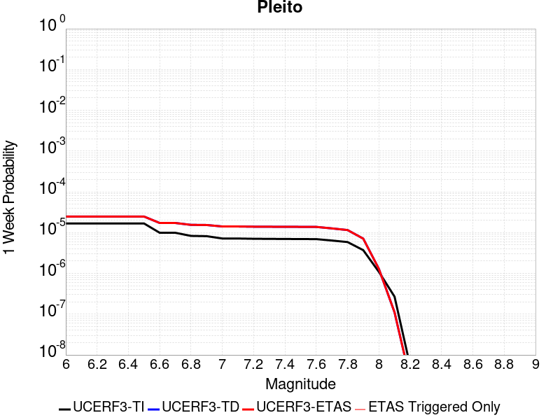 | 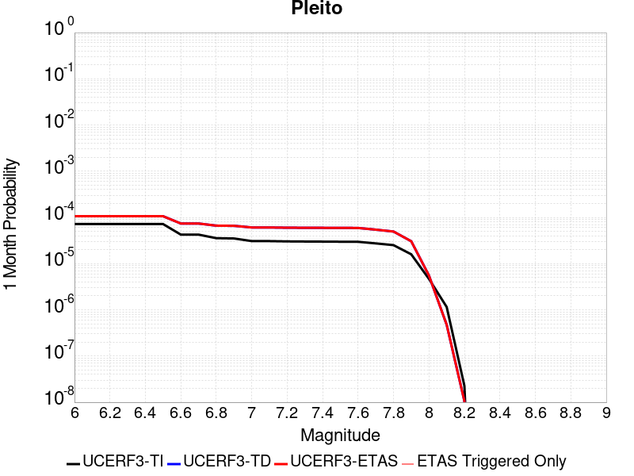 |  | 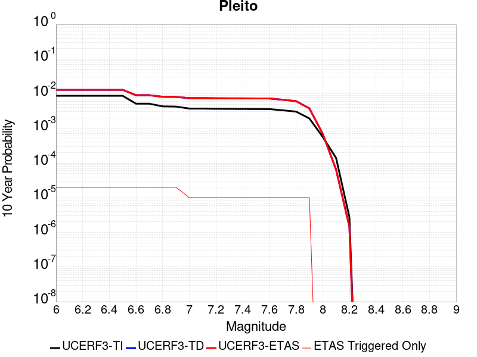 |

| Magnitude | 1 wk TI Prob | 1 wk TD Prob | 1 wk ETAS Prob | 1 wk ETAS/TD Gain | 1 wk ETAS Triggered Only | 1 mo TI Prob | 1 mo TD Prob | 1 mo ETAS Prob | 1 mo ETAS/TD Gain | 1 mo ETAS Triggered Only | 1 yr TI Prob | 1 yr TD Prob | 1 yr ETAS Prob | 1 yr ETAS/TD Gain | 1 yr ETAS Triggered Only | 10 yr TI Prob | 10 yr TD Prob | 10 yr ETAS Prob | 10 yr ETAS/TD Gain | 10 yr ETAS Triggered Only |
|-----|-----|-----|-----|-----|-----|-----|-----|-----|-----|-----|-----|-----|-----|-----|-----|-----|-----|-----|-----|-----|
| 6.0 | 1.6763008E-5 | 2.4782541E-5 | 2.4782541E-5 | 1.0 | 0.0 | 7.183948E-5 | 1.0620697E-4 | 1.0620697E-4 | 1.0 | 0.0 | 8.742947E-4 | 0.0012923749 | 0.001302362 | 1.0077277 | 1.0E-5 | 0.00870863 | 0.01296333 | 0.012983072 | 1.0015228 | 2.0E-5 |
| 6.1 | 1.6763008E-5 | 2.4782541E-5 | 2.4782541E-5 | 1.0 | 0.0 | 7.183948E-5 | 1.0620697E-4 | 1.0620697E-4 | 1.0 | 0.0 | 8.742947E-4 | 0.0012923749 | 0.001302362 | 1.0077277 | 1.0E-5 | 0.00870863 | 0.01296333 | 0.012983072 | 1.0015228 | 2.0E-5 |
| 6.2 | 1.6763008E-5 | 2.4782541E-5 | 2.4782541E-5 | 1.0 | 0.0 | 7.183948E-5 | 1.0620697E-4 | 1.0620697E-4 | 1.0 | 0.0 | 8.742947E-4 | 0.0012923749 | 0.001302362 | 1.0077277 | 1.0E-5 | 0.00870863 | 0.01296333 | 0.012983072 | 1.0015228 | 2.0E-5 |
| 6.3 | 1.6763008E-5 | 2.4782541E-5 | 2.4782541E-5 | 1.0 | 0.0 | 7.183948E-5 | 1.0620697E-4 | 1.0620697E-4 | 1.0 | 0.0 | 8.742947E-4 | 0.0012923749 | 0.001302362 | 1.0077277 | 1.0E-5 | 0.00870863 | 0.01296333 | 0.012983072 | 1.0015228 | 2.0E-5 |
| 6.4 | 1.6763008E-5 | 2.4782541E-5 | 2.4782541E-5 | 1.0 | 0.0 | 7.183948E-5 | 1.0620697E-4 | 1.0620697E-4 | 1.0 | 0.0 | 8.742947E-4 | 0.0012923749 | 0.001302362 | 1.0077277 | 1.0E-5 | 0.00870863 | 0.01296333 | 0.012983072 | 1.0015228 | 2.0E-5 |
| 6.5 | 1.6763008E-5 | 2.4782541E-5 | 2.4782541E-5 | 1.0 | 0.0 | 7.183948E-5 | 1.0620697E-4 | 1.0620697E-4 | 1.0 | 0.0 | 8.742947E-4 | 0.0012923749 | 0.001302362 | 1.0077277 | 1.0E-5 | 0.00870863 | 0.01296333 | 0.012983072 | 1.0015228 | 2.0E-5 |
| 6.6 | 9.910213E-6 | 1.723304E-5 | 1.723304E-5 | 1.0 | 0.0 | 4.247165E-5 | 7.3853815E-5 | 7.3853815E-5 | 1.0 | 0.0 | 5.169696E-4 | 8.98803E-4 | 9.0879406E-4 | 1.0111159 | 1.0E-5 | 0.0051576863 | 0.009060032 | 0.00907985 | 1.0021875 | 2.0E-5 |
| 6.7 | 9.910213E-6 | 1.723304E-5 | 1.723304E-5 | 1.0 | 0.0 | 4.247165E-5 | 7.3853815E-5 | 7.3853815E-5 | 1.0 | 0.0 | 5.169696E-4 | 8.98803E-4 | 9.0879406E-4 | 1.0111159 | 1.0E-5 | 0.0051576863 | 0.009060032 | 0.00907985 | 1.0021875 | 2.0E-5 |
| 6.8 | 8.300162E-6 | 1.5492597E-5 | 1.5492597E-5 | 1.0 | 0.0 | 3.557164E-5 | 6.6395165E-5 | 6.6395165E-5 | 1.0 | 0.0 | 4.3299864E-4 | 8.0806273E-4 | 8.1805466E-4 | 1.0123652 | 1.0E-5 | 0.004321559 | 0.00815945 | 0.0081792865 | 1.0024312 | 2.0E-5 |
| 6.9 | 8.183114E-6 | 1.5363803E-5 | 1.5363803E-5 | 1.0 | 0.0 | 3.5070017E-5 | 6.584322E-5 | 6.584322E-5 | 1.0 | 0.0 | 4.2689382E-4 | 8.013478E-4 | 8.1133976E-4 | 1.0124689 | 1.0E-5 | 0.0042607468 | 0.008092791 | 0.008112629 | 1.0024513 | 2.0E-5 |
| 7.0 | 7.1748823E-6 | 1.4150565E-5 | 1.4150565E-5 | 1.0 | 0.0 | 3.0749135E-5 | 6.064387E-5 | 6.064387E-5 | 1.0 | 0.0 | 3.743064E-4 | 7.3808955E-4 | 7.3808955E-4 | 1.0 | 0.0 | 0.0037367654 | 0.007464133 | 0.0074740583 | 1.0013298 | 1.0E-5 |
| 7.1 | 7.1671807E-6 | 1.4140933E-5 | 1.4140933E-5 | 1.0 | 0.0 | 3.0716128E-5 | 6.0602593E-5 | 6.0602593E-5 | 1.0 | 0.0 | 3.7390468E-4 | 7.3758734E-4 | 7.3758734E-4 | 1.0 | 0.0 | 0.0037327618 | 0.0074591446 | 0.00746907 | 1.0013306 | 1.0E-5 |
| 7.2 | 7.0649667E-6 | 1.3988164E-5 | 1.3988164E-5 | 1.0 | 0.0 | 3.0278077E-5 | 5.99479E-5 | 5.99479E-5 | 1.0 | 0.0 | 3.6857324E-4 | 7.296218E-4 | 7.296218E-4 | 1.0 | 0.0 | 0.0036796255 | 0.007379872 | 0.0073897983 | 1.001345 | 1.0E-5 |
| 7.3 | 7.02082E-6 | 1.3931584E-5 | 1.3931584E-5 | 1.0 | 0.0 | 3.008888E-5 | 5.9705428E-5 | 5.9705428E-5 | 1.0 | 0.0 | 3.6627054E-4 | 7.2667166E-4 | 7.2667166E-4 | 1.0 | 0.0 | 0.0036566744 | 0.0073503535 | 0.00736028 | 1.0013505 | 1.0E-5 |
| 7.4 | 6.987146E-6 | 1.3891126E-5 | 1.3891126E-5 | 1.0 | 0.0 | 2.9944567E-5 | 5.953204E-5 | 5.953204E-5 | 1.0 | 0.0 | 3.6451413E-4 | 7.245621E-4 | 7.245621E-4 | 1.0 | 0.0 | 0.0036391679 | 0.007329279 | 0.0073392056 | 1.0013543 | 1.0E-5 |
| 7.5 | 6.9494554E-6 | 1.3848016E-5 | 1.3848016E-5 | 1.0 | 0.0 | 2.9783041E-5 | 5.9347298E-5 | 5.9347298E-5 | 1.0 | 0.0 | 3.625482E-4 | 7.223143E-4 | 7.223143E-4 | 1.0 | 0.0 | 0.0036195726 | 0.0073069 | 0.007316827 | 1.0013586 | 1.0E-5 |
| 7.6 | 6.92694E-6 | 1.3807103E-5 | 1.3807103E-5 | 1.0 | 0.0 | 2.9686547E-5 | 5.9171958E-5 | 5.9171958E-5 | 1.0 | 0.0 | 3.6137376E-4 | 7.20181E-4 | 7.20181E-4 | 1.0 | 0.0 | 0.0036078666 | 0.007285639 | 0.007295566 | 1.0013626 | 1.0E-5 |
| 7.7 | 6.395867E-6 | 1.268542E-5 | 1.268542E-5 | 1.0 | 0.0 | 2.741057E-5 | 5.4364955E-5 | 5.4364955E-5 | 1.0 | 0.0 | 3.336726E-4 | 6.6169264E-4 | 6.6169264E-4 | 1.0 | 0.0 | 0.0033317201 | 0.006703919 | 0.0067138514 | 1.0014817 | 1.0E-5 |
| 7.8 | 5.8664327E-6 | 1.1551571E-5 | 1.1551571E-5 | 1.0 | 0.0 | 2.5141611E-5 | 4.9505794E-5 | 4.9505794E-5 | 1.0 | 0.0 | 3.060561E-4 | 6.025666E-4 | 6.025666E-4 | 1.0 | 0.0 | 0.0030563495 | 0.0061086505 | 0.006118589 | 1.001627 | 1.0E-5 |
| 7.9 | 3.7167474E-6 | 7.1235727E-6 | 7.1235727E-6 | 1.0 | 0.0 | 1.592882E-5 | 3.052924E-5 | 3.052924E-5 | 1.0 | 0.0 | 1.9391612E-4 | 3.7163027E-4 | 3.7163027E-4 | 1.0 | 0.0 | 0.0019374699 | 0.0037723172 | 0.0037822796 | 1.0026408 | 1.0E-5 |
| 8.0 | 1.0903841E-6 | 1.2900235E-6 | 1.2900235E-6 | 1.0 | 0.0 | 4.6730665E-6 | 5.5286605E-6 | 5.5286605E-6 | 1.0 | 0.0 | 5.68931E-5 | 6.7309375E-5 | 6.7309375E-5 | 1.0 | 0.0 | 5.6878536E-4 | 6.952896E-4 | 6.952896E-4 | 1.0 | 0.0 |
| 8.1 | 2.6894583E-7 | 1.1095561E-7 | 1.1095561E-7 | 1.0 | 0.0 | 1.1526245E-6 | 4.7552396E-7 | 4.7552396E-7 | 1.0 | 0.0 | 1.4033113E-5 | 5.789489E-6 | 5.789489E-6 | 1.0 | 0.0 | 1.4032227E-4 | 6.476579E-5 | 6.476579E-5 | 1.0 | 0.0 |
| 8.2 | 5.2967013E-9 | 2.466248E-9 | 2.466248E-9 | 1.0 | 0.0 | 2.2700148E-8 | 1.0569635E-8 | 1.0569635E-8 | 1.0 | 0.0 | 2.7637427E-7 | 1.286853E-7 | 1.286853E-7 | 1.0 | 0.0 | 2.7637393E-6 | 1.4639884E-6 | 1.4639884E-6 | 1.0 | 0.0 |

## Hollywood
*[(top)](#table-of-contents)*

| 1 Week | 1 Month | 1 Year | 10 Year |
|-----|-----|-----|-----|
|  |  |  |  |

| Magnitude | 1 wk TI Prob | 1 wk TD Prob | 1 wk ETAS Prob | 1 wk ETAS/TD Gain | 1 wk ETAS Triggered Only | 1 mo TI Prob | 1 mo TD Prob | 1 mo ETAS Prob | 1 mo ETAS/TD Gain | 1 mo ETAS Triggered Only | 1 yr TI Prob | 1 yr TD Prob | 1 yr ETAS Prob | 1 yr ETAS/TD Gain | 1 yr ETAS Triggered Only | 10 yr TI Prob | 10 yr TD Prob | 10 yr ETAS Prob | 10 yr ETAS/TD Gain | 10 yr ETAS Triggered Only |
|-----|-----|-----|-----|-----|-----|-----|-----|-----|-----|-----|-----|-----|-----|-----|-----|-----|-----|-----|-----|-----|
| 6.0 | 1.24487615E-5 | 1.2593661E-5 | 2.2593536E-5 | 1.7940402 | 1.0E-5 | 5.3350745E-5 | 5.3971744E-5 | 6.397121E-5 | 1.1852721 | 1.0E-5 | 6.4935174E-4 | 6.569125E-4 | 6.768994E-4 | 1.0304254 | 2.0E-5 | 0.0064745755 | 0.0065501947 | 0.006570064 | 1.0030334 | 2.0E-5 |
| 6.1 | 1.24487615E-5 | 1.2593661E-5 | 2.2593536E-5 | 1.7940402 | 1.0E-5 | 5.3350745E-5 | 5.3971744E-5 | 6.397121E-5 | 1.1852721 | 1.0E-5 | 6.4935174E-4 | 6.569125E-4 | 6.768994E-4 | 1.0304254 | 2.0E-5 | 0.0064745755 | 0.0065501947 | 0.006570064 | 1.0030334 | 2.0E-5 |
| 6.2 | 1.24487615E-5 | 1.2593661E-5 | 2.2593536E-5 | 1.7940402 | 1.0E-5 | 5.3350745E-5 | 5.3971744E-5 | 6.397121E-5 | 1.1852721 | 1.0E-5 | 6.4935174E-4 | 6.569125E-4 | 6.768994E-4 | 1.0304254 | 2.0E-5 | 0.0064745755 | 0.0065501947 | 0.006570064 | 1.0030334 | 2.0E-5 |
| 6.3 | 1.24487615E-5 | 1.2593661E-5 | 2.2593536E-5 | 1.7940402 | 1.0E-5 | 5.3350745E-5 | 5.3971744E-5 | 6.397121E-5 | 1.1852721 | 1.0E-5 | 6.4935174E-4 | 6.569125E-4 | 6.768994E-4 | 1.0304254 | 2.0E-5 | 0.0064745755 | 0.0065501947 | 0.006570064 | 1.0030334 | 2.0E-5 |
| 6.4 | 1.2431024E-5 | 1.25742745E-5 | 2.2574148E-5 | 1.7952645 | 1.0E-5 | 5.327473E-5 | 5.388866E-5 | 6.3888125E-5 | 1.1855578 | 1.0E-5 | 6.4842677E-4 | 6.5590156E-4 | 6.7588844E-4 | 1.0304724 | 2.0E-5 | 0.0064653796 | 0.006540145 | 0.006560014 | 1.003038 | 2.0E-5 |
| 6.5 | 1.1242222E-5 | 1.1318209E-5 | 1.1318209E-5 | 1.0 | 0.0 | 4.8180063E-5 | 4.8505724E-5 | 4.8505724E-5 | 1.0 | 0.0 | 5.864344E-4 | 5.9039984E-4 | 6.003939E-4 | 1.0169277 | 1.0E-5 | 0.0058488925 | 0.0058886 | 0.0058985413 | 1.0016882 | 1.0E-5 |
| 6.6 | 1.1234066E-5 | 1.1309323E-5 | 1.1309323E-5 | 1.0 | 0.0 | 4.8145106E-5 | 4.846764E-5 | 4.846764E-5 | 1.0 | 0.0 | 5.86009E-4 | 5.8993645E-4 | 5.999305E-4 | 1.016941 | 1.0E-5 | 0.005844661 | 0.0058839903 | 0.0058939317 | 1.0016896 | 1.0E-5 |
| 6.7 | 1.12294E-5 | 1.1304066E-5 | 1.1304066E-5 | 1.0 | 0.0 | 4.812511E-5 | 4.8445112E-5 | 4.8445112E-5 | 1.0 | 0.0 | 5.857657E-4 | 5.896623E-4 | 5.9965637E-4 | 1.0169488 | 1.0E-5 | 0.0058422405 | 0.0058812634 | 0.005891205 | 1.0016903 | 1.0E-5 |
| 6.8 | 1.0252819E-5 | 1.0218808E-5 | 1.0218808E-5 | 1.0 | 0.0 | 4.3939912E-5 | 4.3794167E-5 | 4.3794167E-5 | 1.0 | 0.0 | 5.3483713E-4 | 5.3306564E-4 | 5.430603E-4 | 1.0187494 | 1.0E-5 | 0.005335517 | 0.005318096 | 0.005328043 | 1.0018704 | 1.0E-5 |
| 6.9 | 9.252289E-6 | 9.110625E-6 | 9.110625E-6 | 1.0 | 0.0 | 3.9652066E-5 | 3.904496E-5 | 3.904496E-5 | 1.0 | 0.0 | 4.8265693E-4 | 4.7527032E-4 | 4.8526557E-4 | 1.0210307 | 1.0E-5 | 0.0048161 | 0.0047427122 | 0.004752665 | 1.0020984 | 1.0E-5 |
| 7.0 | 8.474604E-6 | 8.258546E-6 | 8.258546E-6 | 1.0 | 0.0 | 3.6319227E-5 | 3.5393292E-5 | 3.5393292E-5 | 1.0 | 0.0 | 4.4209688E-4 | 4.308296E-4 | 4.4082527E-4 | 1.023201 | 1.0E-5 | 0.004412184 | 0.0043000937 | 0.004310051 | 1.0023155 | 1.0E-5 |
| 7.1 | 6.643643E-6 | 6.2685863E-6 | 6.2685863E-6 | 1.0 | 0.0 | 2.8472443E-5 | 2.6865095E-5 | 2.6865095E-5 | 1.0 | 0.0 | 3.4659685E-4 | 3.2703386E-4 | 3.370306E-4 | 1.0305679 | 1.0E-5 | 0.0034605677 | 0.003265572 | 0.0032755395 | 1.0030522 | 1.0E-5 |
| 7.2 | 5.549002E-6 | 5.1088914E-6 | 5.1088914E-6 | 1.0 | 0.0 | 2.378122E-5 | 2.1895066E-5 | 2.1895066E-5 | 1.0 | 0.0 | 2.8949787E-4 | 2.6653998E-4 | 2.6653998E-4 | 1.0 | 0.0 | 0.0028912104 | 0.0026622193 | 0.0026622193 | 1.0 | 0.0 |
| 7.3 | 4.3059727E-6 | 3.960039E-6 | 3.960039E-6 | 1.0 | 0.0 | 1.8454039E-5 | 1.6971486E-5 | 1.6971486E-5 | 1.0 | 0.0 | 2.2465475E-4 | 2.0660834E-4 | 2.0660834E-4 | 1.0 | 0.0 | 0.0022442779 | 0.0020641726 | 0.0020641726 | 1.0 | 0.0 |
| 7.4 | 2.8550733E-6 | 2.7014153E-6 | 2.7014153E-6 | 1.0 | 0.0 | 1.2235971E-5 | 1.1577443E-5 | 1.1577443E-5 | 1.0 | 0.0 | 1.4896276E-4 | 1.409463E-4 | 1.409463E-4 | 1.0 | 0.0 | 0.0014886294 | 0.0014085742 | 0.0014085742 | 1.0 | 0.0 |
| 7.5 | 1.9927045E-6 | 1.8977307E-6 | 1.8977307E-6 | 1.0 | 0.0 | 8.540134E-6 | 8.133106E-6 | 8.133106E-6 | 1.0 | 0.0 | 1.0397117E-4 | 9.9016106E-5 | 9.9016106E-5 | 1.0 | 0.0 | 0.0010392254 | 9.897235E-4 | 9.897235E-4 | 1.0 | 0.0 |
| 7.6 | 1.345084E-6 | 1.221666E-6 | 1.221666E-6 | 1.0 | 0.0 | 5.764633E-6 | 5.235701E-6 | 5.235701E-6 | 1.0 | 0.0 | 7.018215E-5 | 6.374282E-5 | 6.374282E-5 | 1.0 | 0.0 | 7.0159987E-4 | 6.372473E-4 | 6.372473E-4 | 1.0 | 0.0 |
| 7.7 | 7.6835164E-7 | 6.278186E-7 | 6.278186E-7 | 1.0 | 0.0 | 3.2929315E-6 | 2.6906484E-6 | 2.6906484E-6 | 1.0 | 0.0 | 4.00907E-5 | 3.275817E-5 | 3.275817E-5 | 1.0 | 0.0 | 4.0083472E-4 | 3.2753486E-4 | 3.2753486E-4 | 1.0 | 0.0 |
| 7.8 | 3.6562128E-7 | 2.453882E-7 | 2.453882E-7 | 1.0 | 0.0 | 1.5669474E-6 | 1.0516633E-6 | 1.0516633E-6 | 1.0 | 0.0 | 1.9077417E-5 | 1.2803929E-5 | 1.2803929E-5 | 1.0 | 0.0 | 1.907578E-4 | 1.2803229E-4 | 1.2803229E-4 | 1.0 | 0.0 |
| 7.9 | 7.5024424E-8 | 5.382534E-8 | 5.382534E-8 | 1.0 | 0.0 | 3.215332E-7 | 2.3068002E-7 | 2.3068002E-7 | 1.0 | 0.0 | 3.91466E-6 | 2.808527E-6 | 2.808527E-6 | 1.0 | 0.0 | 3.9145907E-5 | 2.8085044E-5 | 2.8085044E-5 | 1.0 | 0.0 |

## San Diego Trough south
*[(top)](#table-of-contents)*

| 1 Week | 1 Month | 1 Year | 10 Year |
|-----|-----|-----|-----|
|  | 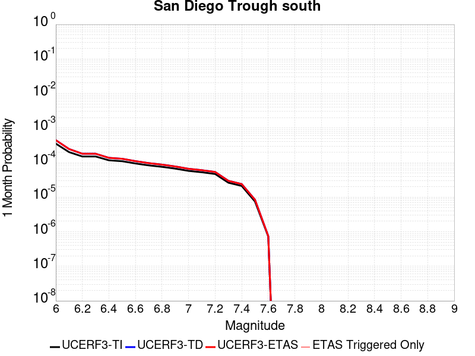 | 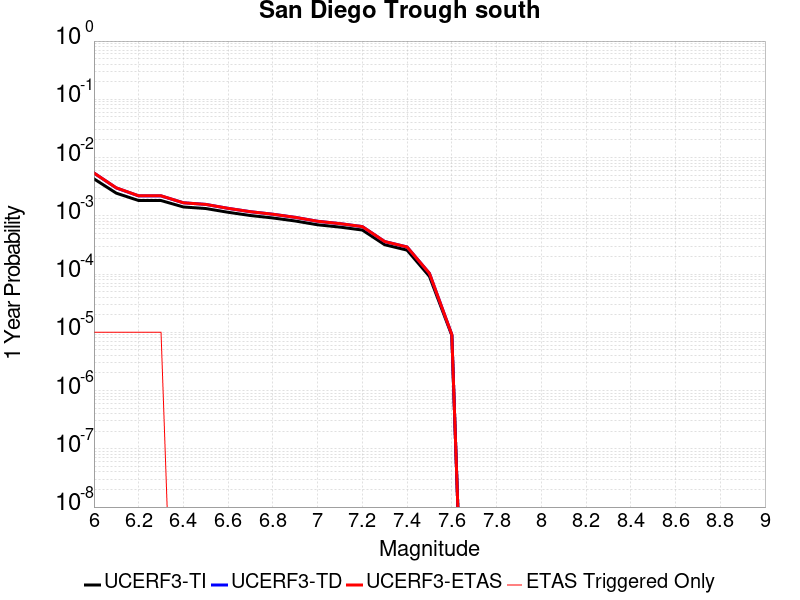 |  |

| Magnitude | 1 wk TI Prob | 1 wk TD Prob | 1 wk ETAS Prob | 1 wk ETAS/TD Gain | 1 wk ETAS Triggered Only | 1 mo TI Prob | 1 mo TD Prob | 1 mo ETAS Prob | 1 mo ETAS/TD Gain | 1 mo ETAS Triggered Only | 1 yr TI Prob | 1 yr TD Prob | 1 yr ETAS Prob | 1 yr ETAS/TD Gain | 1 yr ETAS Triggered Only | 10 yr TI Prob | 10 yr TD Prob | 10 yr ETAS Prob | 10 yr ETAS/TD Gain | 10 yr ETAS Triggered Only |
|-----|-----|-----|-----|-----|-----|-----|-----|-----|-----|-----|-----|-----|-----|-----|-----|-----|-----|-----|-----|-----|
| 6.0 | 8.279495E-5 | 1.0425189E-4 | 1.0425189E-4 | 1.0 | 0.0 | 3.5478722E-4 | 4.467223E-4 | 4.467223E-4 | 1.0 | 0.0 | 0.004310982 | 0.005426155 | 0.005436101 | 1.001833 | 1.0E-5 | 0.042283054 | 0.052996993 | 0.053015932 | 1.0003574 | 2.0E-5 |
| 6.1 | 4.6961468E-5 | 5.773456E-5 | 5.773456E-5 | 1.0 | 0.0 | 2.0124791E-4 | 2.474113E-4 | 2.474113E-4 | 1.0 | 0.0 | 0.00244744 | 0.0030082306 | 0.0030182004 | 1.0033143 | 1.0E-5 | 0.024206603 | 0.029681915 | 0.029701322 | 1.0006539 | 2.0E-5 |
| 6.2 | 3.5079658E-5 | 4.2144766E-5 | 4.2144766E-5 | 1.0 | 0.0 | 1.5033272E-4 | 1.8060819E-4 | 1.8060819E-4 | 1.0 | 0.0 | 0.0018287642 | 0.0021967308 | 0.0022067088 | 1.0045422 | 1.0E-5 | 0.018137876 | 0.02175273 | 0.021772295 | 1.0008994 | 2.0E-5 |
| 6.3 | 3.5079658E-5 | 4.2144766E-5 | 4.2144766E-5 | 1.0 | 0.0 | 1.5033272E-4 | 1.8060819E-4 | 1.8060819E-4 | 1.0 | 0.0 | 0.0018287642 | 0.0021967308 | 0.0022067088 | 1.0045422 | 1.0E-5 | 0.018137876 | 0.02175273 | 0.021772295 | 1.0008994 | 2.0E-5 |
| 6.4 | 2.7196904E-5 | 3.2089334E-5 | 3.2089334E-5 | 1.0 | 0.0 | 1.16552954E-4 | 1.3751857E-4 | 1.3751857E-4 | 1.0 | 0.0 | 0.0014181085 | 0.0016730167 | 0.0016730167 | 1.0 | 0.0 | 0.014090929 | 0.01660575 | 0.016615583 | 1.0005922 | 1.0E-5 |
| 6.5 | 2.5584688E-5 | 3.0103636E-5 | 3.0103636E-5 | 1.0 | 0.0 | 1.0964406E-4 | 1.2900929E-4 | 1.2900929E-4 | 1.0 | 0.0 | 0.0013340989 | 0.001569569 | 0.001569569 | 1.0 | 0.0 | 0.013261181 | 0.015586334 | 0.015596178 | 1.0006316 | 1.0E-5 |
| 6.6 | 2.2034688E-5 | 2.5744363E-5 | 2.5744363E-5 | 1.0 | 0.0 | 9.443096E-5 | 1.1032836E-4 | 1.1032836E-4 | 1.0 | 0.0 | 0.0011490905 | 0.0013424265 | 0.0013424265 | 1.0 | 0.0 | 0.011431668 | 0.013344152 | 0.013354018 | 1.0007393 | 1.0E-5 |
| 6.7 | 1.9394853E-5 | 2.2543129E-5 | 2.2543129E-5 | 1.0 | 0.0 | 8.311815E-5 | 9.660986E-5 | 9.660986E-5 | 1.0 | 0.0 | 0.0010114936 | 0.0011755956 | 0.0011755956 | 1.0 | 0.0 | 0.01006902 | 0.011694471 | 0.011704355 | 1.0008451 | 1.0E-5 |
| 6.8 | 1.7615313E-5 | 2.0404388E-5 | 2.0404388E-5 | 1.0 | 0.0 | 7.549201E-5 | 8.7444474E-5 | 8.7444474E-5 | 1.0 | 0.0 | 9.1872766E-4 | 0.0010641208 | 0.0010641208 | 1.0 | 0.0 | 0.009149387 | 0.010590821 | 0.010600715 | 1.0009342 | 1.0E-5 |
| 6.9 | 1.5621423E-5 | 1.802715E-5 | 1.802715E-5 | 1.0 | 0.0 | 6.6947236E-5 | 7.725695E-5 | 7.725695E-5 | 1.0 | 0.0 | 8.147778E-4 | 9.40201E-4 | 9.40201E-4 | 1.0 | 0.0 | 0.008117969 | 0.009362677 | 0.009362677 | 1.0 | 0.0 |
| 7.0 | 1.3444376E-5 | 1.5448948E-5 | 1.5448948E-5 | 1.0 | 0.0 | 5.7617483E-5 | 6.620811E-5 | 6.620811E-5 | 1.0 | 0.0 | 7.0126704E-4 | 8.057884E-4 | 8.057884E-4 | 1.0 | 0.0 | 0.006990582 | 0.008029 | 0.008029 | 1.0 | 0.0 |
| 7.1 | 1.2268361E-5 | 1.4073802E-5 | 1.4073802E-5 | 1.0 | 0.0 | 5.2577634E-5 | 6.0314913E-5 | 6.0314913E-5 | 1.0 | 0.0 | 6.399447E-4 | 7.340893E-4 | 7.340893E-4 | 1.0 | 0.0 | 0.0063810493 | 0.007316949 | 0.007316949 | 1.0 | 0.0 |
| 7.2 | 1.0922655E-5 | 1.2514242E-5 | 1.2514242E-5 | 1.0 | 0.0 | 4.681054E-5 | 5.3631382E-5 | 5.3631382E-5 | 1.0 | 0.0 | 5.697693E-4 | 6.52769E-4 | 6.52769E-4 | 1.0 | 0.0 | 0.0056831064 | 0.006508796 | 0.006508796 | 1.0 | 0.0 |
| 7.3 | 6.1106753E-6 | 6.9292714E-6 | 6.9292714E-6 | 1.0 | 0.0 | 2.6188345E-5 | 2.969654E-5 | 2.969654E-5 | 1.0 | 0.0 | 3.1879646E-4 | 3.614958E-4 | 3.614958E-4 | 1.0 | 0.0 | 0.0031833951 | 0.003609123 | 0.003609123 | 1.0 | 0.0 |
| 7.4 | 4.933187E-6 | 5.5898304E-6 | 5.5898304E-6 | 1.0 | 0.0 | 2.114206E-5 | 2.3956198E-5 | 2.3956198E-5 | 1.0 | 0.0 | 2.5737417E-4 | 2.9162806E-4 | 2.9162806E-4 | 1.0 | 0.0 | 0.002570763 | 0.002912495 | 0.002912495 | 1.0 | 0.0 |
| 7.5 | 1.7489613E-6 | 1.9697716E-6 | 1.9697716E-6 | 1.0 | 0.0 | 7.495527E-6 | 8.441852E-6 | 8.441852E-6 | 1.0 | 0.0 | 9.125422E-5 | 1.0277492E-4 | 1.0277492E-4 | 1.0 | 0.0 | 9.1216754E-4 | 0.001027296 | 0.001027296 | 1.0 | 0.0 |
| 7.6 | 1.6988751E-7 | 1.7534032E-7 | 1.7534032E-7 | 1.0 | 0.0 | 7.2808916E-7 | 7.5145834E-7 | 7.5145834E-7 | 1.0 | 0.0 | 8.864449E-6 | 9.148969E-6 | 9.148969E-6 | 1.0 | 0.0 | 8.8640954E-5 | 9.1486116E-5 | 9.1486116E-5 | 1.0 | 0.0 |

## Kern Canyon (Lake Isabella) 2011
*[(top)](#table-of-contents)*

| 1 Week | 1 Month | 1 Year | 10 Year |
|-----|-----|-----|-----|
|  |  | 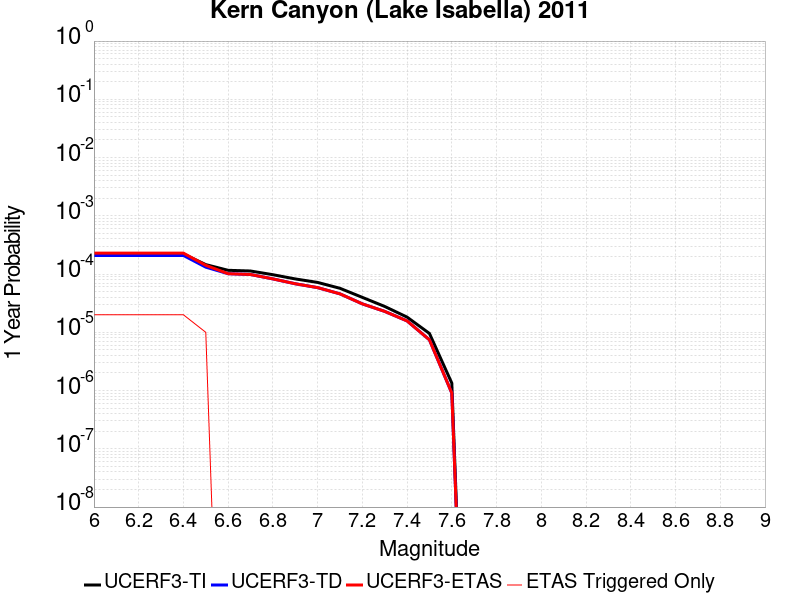 | 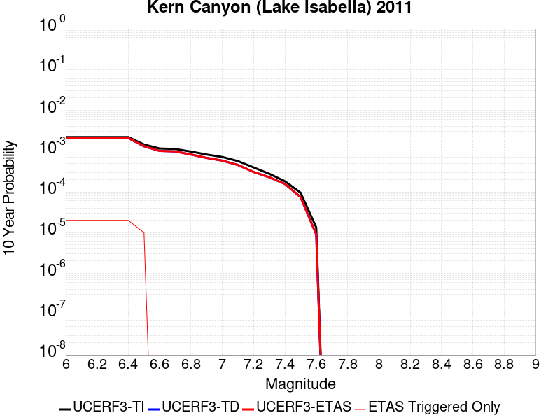 |

| Magnitude | 1 wk TI Prob | 1 wk TD Prob | 1 wk ETAS Prob | 1 wk ETAS/TD Gain | 1 wk ETAS Triggered Only | 1 mo TI Prob | 1 mo TD Prob | 1 mo ETAS Prob | 1 mo ETAS/TD Gain | 1 mo ETAS Triggered Only | 1 yr TI Prob | 1 yr TD Prob | 1 yr ETAS Prob | 1 yr ETAS/TD Gain | 1 yr ETAS Triggered Only | 10 yr TI Prob | 10 yr TD Prob | 10 yr ETAS Prob | 10 yr ETAS/TD Gain | 10 yr ETAS Triggered Only |
|-----|-----|-----|-----|-----|-----|-----|-----|-----|-----|-----|-----|-----|-----|-----|-----|-----|-----|-----|-----|-----|
| 6.0 | 4.2387383E-6 | 4.0016726E-6 | 4.0016726E-6 | 1.0 | 0.0 | 1.8165894E-5 | 1.7149921E-5 | 1.7149921E-5 | 1.0 | 0.0 | 2.2114732E-4 | 2.0878216E-4 | 2.28778E-4 | 1.0957736 | 2.0E-5 | 0.0022092736 | 0.002086044 | 0.0021060023 | 1.0095675 | 2.0E-5 |
| 6.1 | 4.2387383E-6 | 4.0016726E-6 | 4.0016726E-6 | 1.0 | 0.0 | 1.8165894E-5 | 1.7149921E-5 | 1.7149921E-5 | 1.0 | 0.0 | 2.2114732E-4 | 2.0878216E-4 | 2.28778E-4 | 1.0957736 | 2.0E-5 | 0.0022092736 | 0.002086044 | 0.0021060023 | 1.0095675 | 2.0E-5 |
| 6.2 | 4.2387383E-6 | 4.0016726E-6 | 4.0016726E-6 | 1.0 | 0.0 | 1.8165894E-5 | 1.7149921E-5 | 1.7149921E-5 | 1.0 | 0.0 | 2.2114732E-4 | 2.0878216E-4 | 2.28778E-4 | 1.0957736 | 2.0E-5 | 0.0022092736 | 0.002086044 | 0.0021060023 | 1.0095675 | 2.0E-5 |
| 6.3 | 4.2387383E-6 | 4.0016726E-6 | 4.0016726E-6 | 1.0 | 0.0 | 1.8165894E-5 | 1.7149921E-5 | 1.7149921E-5 | 1.0 | 0.0 | 2.2114732E-4 | 2.0878216E-4 | 2.28778E-4 | 1.0957736 | 2.0E-5 | 0.0022092736 | 0.002086044 | 0.0021060023 | 1.0095675 | 2.0E-5 |
| 6.4 | 4.2387383E-6 | 4.0016726E-6 | 4.0016726E-6 | 1.0 | 0.0 | 1.8165894E-5 | 1.7149921E-5 | 1.7149921E-5 | 1.0 | 0.0 | 2.2114732E-4 | 2.0878216E-4 | 2.28778E-4 | 1.0957736 | 2.0E-5 | 0.0022092736 | 0.002086044 | 0.0021060023 | 1.0095675 | 2.0E-5 |
| 6.5 | 2.7857532E-6 | 2.5178888E-6 | 2.5178888E-6 | 1.0 | 0.0 | 1.1938888E-5 | 1.079091E-5 | 1.079091E-5 | 1.0 | 0.0 | 1.4534626E-4 | 1.3137174E-4 | 1.4137042E-4 | 1.0761099 | 1.0E-5 | 0.0014525123 | 0.0013129734 | 0.0013229604 | 1.0076063 | 1.0E-5 |
| 6.6 | 2.2233348E-6 | 1.9441413E-6 | 1.9441413E-6 | 1.0 | 0.0 | 9.528543E-6 | 8.332008E-6 | 8.332008E-6 | 1.0 | 0.0 | 1.1600384E-4 | 1.0143756E-4 | 1.0143756E-4 | 1.0 | 0.0 | 0.001159433 | 0.0010139212 | 0.0010139212 | 1.0 | 0.0 |
| 6.7 | 2.1635126E-6 | 1.883521E-6 | 1.883521E-6 | 1.0 | 0.0 | 9.272164E-6 | 8.072208E-6 | 8.072208E-6 | 1.0 | 0.0 | 1.1288274E-4 | 9.827478E-5 | 9.827478E-5 | 1.0 | 0.0 | 0.0011282542 | 9.823214E-4 | 9.823214E-4 | 1.0 | 0.0 |
| 6.8 | 1.8685711E-6 | 1.5831579E-6 | 1.5831579E-6 | 1.0 | 0.0 | 8.008137E-6 | 6.784945E-6 | 6.784945E-6 | 1.0 | 0.0 | 9.74947E-5 | 8.260362E-5 | 8.260362E-5 | 1.0 | 0.0 | 9.745194E-4 | 8.257341E-4 | 8.257341E-4 | 1.0 | 0.0 |
| 6.9 | 1.5815071E-6 | 1.306506E-6 | 1.306506E-6 | 1.0 | 0.0 | 6.77787E-6 | 5.599299E-6 | 5.599299E-6 | 1.0 | 0.0 | 8.251744E-5 | 6.8169364E-5 | 6.8169364E-5 | 1.0 | 0.0 | 8.248681E-4 | 6.814872E-4 | 6.814872E-4 | 1.0 | 0.0 |
| 7.0 | 1.3772564E-6 | 1.1210832E-6 | 1.1210832E-6 | 1.0 | 0.0 | 5.9025137E-6 | 4.8046336E-6 | 4.8046336E-6 | 1.0 | 0.0 | 7.186073E-5 | 5.849486E-5 | 5.849486E-5 | 1.0 | 0.0 | 7.18375E-4 | 5.847967E-4 | 5.847967E-4 | 1.0 | 0.0 |
| 7.1 | 1.0916998E-6 | 8.7638637E-7 | 8.7638637E-7 | 1.0 | 0.0 | 4.678705E-6 | 3.7559364E-6 | 3.7559364E-6 | 1.0 | 0.0 | 5.6961744E-5 | 4.572758E-5 | 4.572758E-5 | 1.0 | 0.0 | 5.6947145E-4 | 4.5718305E-4 | 4.5718305E-4 | 1.0 | 0.0 |
| 7.2 | 7.6277024E-7 | 5.901513E-7 | 5.901513E-7 | 1.0 | 0.0 | 3.2690114E-6 | 2.5292175E-6 | 2.5292175E-6 | 1.0 | 0.0 | 3.9799485E-5 | 3.079279E-5 | 3.079279E-5 | 1.0 | 0.0 | 3.9792358E-4 | 3.0788587E-4 | 3.0788587E-4 | 1.0 | 0.0 |
| 7.3 | 5.3265916E-7 | 4.382483E-7 | 4.382483E-7 | 1.0 | 0.0 | 2.282823E-6 | 1.8782057E-6 | 1.8782057E-6 | 1.0 | 0.0 | 2.7793016E-5 | 2.2866918E-5 | 2.2866918E-5 | 1.0 | 0.0 | 2.778954E-4 | 2.2864602E-4 | 2.2864602E-4 | 1.0 | 0.0 |
| 7.4 | 3.4946007E-7 | 3.0065988E-7 | 3.0065988E-7 | 1.0 | 0.0 | 1.497685E-6 | 1.2885417E-6 | 1.2885417E-6 | 1.0 | 0.0 | 1.8234163E-5 | 1.5687885E-5 | 1.5687885E-5 | 1.0 | 0.0 | 1.8232666E-4 | 1.5686799E-4 | 1.5686799E-4 | 1.0 | 0.0 |
| 7.5 | 1.8317026E-7 | 1.424497E-7 | 1.424497E-7 | 1.0 | 0.0 | 7.850152E-7 | 6.1049855E-7 | 6.1049855E-7 | 1.0 | 0.0 | 9.557518E-6 | 7.4327954E-6 | 7.4327954E-6 | 1.0 | 0.0 | 9.5571064E-5 | 7.4325544E-5 | 7.4325544E-5 | 1.0 | 0.0 |
| 7.6 | 2.572245E-8 | 1.7352786E-8 | 1.7352786E-8 | 1.0 | 0.0 | 1.10239064E-7 | 7.4369076E-8 | 7.4369076E-8 | 1.0 | 0.0 | 1.3421597E-6 | 9.054432E-7 | 9.054432E-7 | 1.0 | 0.0 | 1.3421517E-5 | 9.054401E-6 | 9.054401E-6 | 1.0 | 0.0 |

## Puente Hills
*[(top)](#table-of-contents)*

| 1 Week | 1 Month | 1 Year | 10 Year |
|-----|-----|-----|-----|
|  |  | 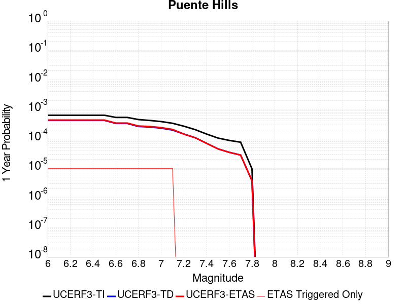 | 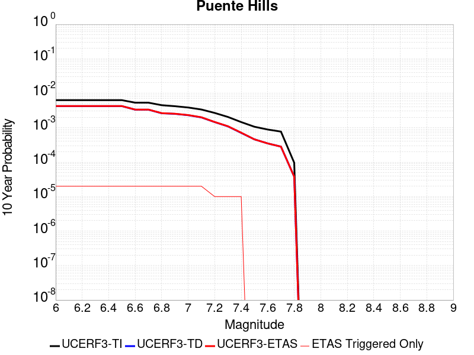 |

| Magnitude | 1 wk TI Prob | 1 wk TD Prob | 1 wk ETAS Prob | 1 wk ETAS/TD Gain | 1 wk ETAS Triggered Only | 1 mo TI Prob | 1 mo TD Prob | 1 mo ETAS Prob | 1 mo ETAS/TD Gain | 1 mo ETAS Triggered Only | 1 yr TI Prob | 1 yr TD Prob | 1 yr ETAS Prob | 1 yr ETAS/TD Gain | 1 yr ETAS Triggered Only | 10 yr TI Prob | 10 yr TD Prob | 10 yr ETAS Prob | 10 yr ETAS/TD Gain | 10 yr ETAS Triggered Only |
|-----|-----|-----|-----|-----|-----|-----|-----|-----|-----|-----|-----|-----|-----|-----|-----|-----|-----|-----|-----|-----|
| 6.0 | 1.2101656E-5 | 8.099071E-6 | 8.099071E-6 | 1.0 | 0.0 | 5.1863204E-5 | 3.4709876E-5 | 3.4709876E-5 | 1.0 | 0.0 | 6.312516E-4 | 4.2251643E-4 | 4.325122E-4 | 1.0236577 | 1.0E-5 | 0.0062946146 | 0.0042176917 | 0.004237607 | 1.0047219 | 2.0E-5 |
| 6.1 | 1.2101656E-5 | 8.099071E-6 | 8.099071E-6 | 1.0 | 0.0 | 5.1863204E-5 | 3.4709876E-5 | 3.4709876E-5 | 1.0 | 0.0 | 6.312516E-4 | 4.2251643E-4 | 4.325122E-4 | 1.0236577 | 1.0E-5 | 0.0062946146 | 0.0042176917 | 0.004237607 | 1.0047219 | 2.0E-5 |
| 6.2 | 1.2101656E-5 | 8.099071E-6 | 8.099071E-6 | 1.0 | 0.0 | 5.1863204E-5 | 3.4709876E-5 | 3.4709876E-5 | 1.0 | 0.0 | 6.312516E-4 | 4.2251643E-4 | 4.325122E-4 | 1.0236577 | 1.0E-5 | 0.0062946146 | 0.0042176917 | 0.004237607 | 1.0047219 | 2.0E-5 |
| 6.3 | 1.2101656E-5 | 8.099071E-6 | 8.099071E-6 | 1.0 | 0.0 | 5.1863204E-5 | 3.4709876E-5 | 3.4709876E-5 | 1.0 | 0.0 | 6.312516E-4 | 4.2251643E-4 | 4.325122E-4 | 1.0236577 | 1.0E-5 | 0.0062946146 | 0.0042176917 | 0.004237607 | 1.0047219 | 2.0E-5 |
| 6.4 | 1.2101656E-5 | 8.099071E-6 | 8.099071E-6 | 1.0 | 0.0 | 5.1863204E-5 | 3.4709876E-5 | 3.4709876E-5 | 1.0 | 0.0 | 6.312516E-4 | 4.2251643E-4 | 4.325122E-4 | 1.0236577 | 1.0E-5 | 0.0062946146 | 0.0042176917 | 0.004237607 | 1.0047219 | 2.0E-5 |
| 6.5 | 1.2101656E-5 | 8.099071E-6 | 8.099071E-6 | 1.0 | 0.0 | 5.1863204E-5 | 3.4709876E-5 | 3.4709876E-5 | 1.0 | 0.0 | 6.312516E-4 | 4.2251643E-4 | 4.325122E-4 | 1.0236577 | 1.0E-5 | 0.0062946146 | 0.0042176917 | 0.004237607 | 1.0047219 | 2.0E-5 |
| 6.6 | 1.0222488E-5 | 6.399588E-6 | 6.399588E-6 | 1.0 | 0.0 | 4.3809923E-5 | 2.7426531E-5 | 2.7426531E-5 | 1.0 | 0.0 | 5.332553E-4 | 3.338693E-4 | 3.4386598E-4 | 1.0299418 | 1.0E-5 | 0.0053197746 | 0.0033339222 | 0.0033538556 | 1.005979 | 2.0E-5 |
| 6.7 | 1.0222488E-5 | 6.399588E-6 | 6.399588E-6 | 1.0 | 0.0 | 4.3809923E-5 | 2.7426531E-5 | 2.7426531E-5 | 1.0 | 0.0 | 5.332553E-4 | 3.338693E-4 | 3.4386598E-4 | 1.0299418 | 1.0E-5 | 0.0053197746 | 0.0033339222 | 0.0033538556 | 1.005979 | 2.0E-5 |
| 6.8 | 8.6367845E-6 | 5.0286094E-6 | 5.0286094E-6 | 1.0 | 0.0 | 3.7014266E-5 | 2.1551008E-5 | 2.1551008E-5 | 1.0 | 0.0 | 4.505555E-4 | 2.623525E-4 | 2.7234986E-4 | 1.0381067 | 1.0E-5 | 0.004496431 | 0.002620484 | 0.0026404315 | 1.0076122 | 2.0E-5 |
| 6.9 | 8.066481E-6 | 4.836463E-6 | 4.836463E-6 | 1.0 | 0.0 | 3.4570177E-5 | 2.0727537E-5 | 2.0727537E-5 | 1.0 | 0.0 | 4.2081063E-4 | 2.5232908E-4 | 2.6232656E-4 | 1.0396208 | 1.0E-5 | 0.0042001465 | 0.0025204795 | 0.0025404291 | 1.007915 | 2.0E-5 |
| 7.0 | 7.393828E-6 | 4.4176263E-6 | 4.4176263E-6 | 1.0 | 0.0 | 3.168745E-5 | 1.893255E-5 | 1.893255E-5 | 1.0 | 0.0 | 3.857264E-4 | 2.3047985E-4 | 2.4047754E-4 | 1.0433778 | 1.0E-5 | 0.0038505755 | 0.0023024536 | 0.0023224077 | 1.0086664 | 2.0E-5 |
| 7.1 | 6.4660953E-6 | 3.8047303E-6 | 3.8047303E-6 | 1.0 | 0.0 | 2.7711543E-5 | 1.6305887E-5 | 1.6305887E-5 | 1.0 | 0.0 | 3.373358E-4 | 1.9850644E-4 | 2.0850447E-4 | 1.0503662 | 1.0E-5 | 0.0033682417 | 0.001983327 | 0.0020032874 | 1.010064 | 2.0E-5 |
| 7.2 | 5.143232E-6 | 2.7867638E-6 | 2.7867638E-6 | 1.0 | 0.0 | 2.2042237E-5 | 1.194322E-5 | 1.194322E-5 | 1.0 | 0.0 | 2.6833118E-4 | 1.4539908E-4 | 1.4539908E-4 | 1.0 | 0.0 | 0.002680074 | 0.0014530494 | 0.0014630348 | 1.006872 | 1.0E-5 |
| 7.3 | 3.928255E-6 | 2.0915647E-6 | 2.0915647E-6 | 1.0 | 0.0 | 1.683527E-5 | 8.963818E-6 | 8.963818E-6 | 1.0 | 0.0 | 2.0495013E-4 | 1.0912908E-4 | 1.0912908E-4 | 1.0 | 0.0 | 0.002047612 | 0.0010907616 | 0.0011007508 | 1.0091579 | 1.0E-5 |
| 7.4 | 2.7894434E-6 | 1.354835E-6 | 1.354835E-6 | 1.0 | 0.0 | 1.1954703E-5 | 5.8064234E-6 | 5.8064234E-6 | 1.0 | 0.0 | 1.4553878E-4 | 7.0690956E-5 | 7.0690956E-5 | 1.0 | 0.0 | 0.001454435 | 7.066891E-4 | 7.16682E-4 | 1.0141405 | 1.0E-5 |
| 7.5 | 2.041735E-6 | 8.788577E-7 | 8.788577E-7 | 1.0 | 0.0 | 8.750263E-6 | 3.7665277E-6 | 3.7665277E-6 | 1.0 | 0.0 | 1.06529245E-4 | 4.5856545E-5 | 4.5856545E-5 | 1.0 | 0.0 | 0.0010647819 | 4.5847415E-4 | 4.5847415E-4 | 1.0 | 0.0 |
| 7.6 | 1.6959062E-6 | 6.699691E-7 | 6.699691E-7 | 1.0 | 0.0 | 7.268149E-6 | 2.8712932E-6 | 2.8712932E-6 | 1.0 | 0.0 | 8.848612E-5 | 3.4957462E-5 | 3.4957462E-5 | 1.0 | 0.0 | 8.84509E-4 | 3.495225E-4 | 3.495225E-4 | 1.0 | 0.0 |
| 7.7 | 1.4767965E-6 | 5.4085115E-7 | 5.4085115E-7 | 1.0 | 0.0 | 6.3291122E-6 | 2.3179316E-6 | 2.3179316E-6 | 1.0 | 0.0 | 7.705422E-5 | 2.8220478E-5 | 2.8220478E-5 | 1.0 | 0.0 | 7.702751E-4 | 2.821715E-4 | 2.821715E-4 | 1.0 | 0.0 |
| 7.8 | 1.8432911E-7 | 7.283086E-8 | 7.283086E-8 | 1.0 | 0.0 | 7.8998164E-7 | 3.1213222E-7 | 3.1213222E-7 | 1.0 | 0.0 | 9.617985E-6 | 3.8002065E-6 | 3.8002065E-6 | 1.0 | 0.0 | 9.617568E-5 | 3.800174E-5 | 3.800174E-5 | 1.0 | 0.0 |

## San Luis Range 2011 CFM
*[(top)](#table-of-contents)*

| 1 Week | 1 Month | 1 Year | 10 Year |
|-----|-----|-----|-----|
| 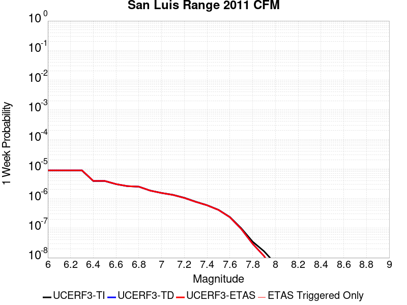 |  |  |  |

| Magnitude | 1 wk TI Prob | 1 wk TD Prob | 1 wk ETAS Prob | 1 wk ETAS/TD Gain | 1 wk ETAS Triggered Only | 1 mo TI Prob | 1 mo TD Prob | 1 mo ETAS Prob | 1 mo ETAS/TD Gain | 1 mo ETAS Triggered Only | 1 yr TI Prob | 1 yr TD Prob | 1 yr ETAS Prob | 1 yr ETAS/TD Gain | 1 yr ETAS Triggered Only | 10 yr TI Prob | 10 yr TD Prob | 10 yr ETAS Prob | 10 yr ETAS/TD Gain | 10 yr ETAS Triggered Only |
|-----|-----|-----|-----|-----|-----|-----|-----|-----|-----|-----|-----|-----|-----|-----|-----|-----|-----|-----|-----|-----|
| 6.0 | 8.8368415E-6 | 8.96552E-6 | 8.96552E-6 | 1.0 | 0.0 | 3.787163E-5 | 3.8423135E-5 | 3.8423135E-5 | 1.0 | 0.0 | 4.609895E-4 | 4.6770912E-4 | 4.6770912E-4 | 1.0 | 0.0 | 0.0046003438 | 0.0046680304 | 0.004687937 | 1.0042645 | 2.0E-5 |
| 6.1 | 8.8368415E-6 | 8.96552E-6 | 8.96552E-6 | 1.0 | 0.0 | 3.787163E-5 | 3.8423135E-5 | 3.8423135E-5 | 1.0 | 0.0 | 4.609895E-4 | 4.6770912E-4 | 4.6770912E-4 | 1.0 | 0.0 | 0.0046003438 | 0.0046680304 | 0.004687937 | 1.0042645 | 2.0E-5 |
| 6.2 | 8.8368415E-6 | 8.96552E-6 | 8.96552E-6 | 1.0 | 0.0 | 3.787163E-5 | 3.8423135E-5 | 3.8423135E-5 | 1.0 | 0.0 | 4.609895E-4 | 4.6770912E-4 | 4.6770912E-4 | 1.0 | 0.0 | 0.0046003438 | 0.0046680304 | 0.004687937 | 1.0042645 | 2.0E-5 |
| 6.3 | 8.8368415E-6 | 8.96552E-6 | 8.96552E-6 | 1.0 | 0.0 | 3.787163E-5 | 3.8423135E-5 | 3.8423135E-5 | 1.0 | 0.0 | 4.609895E-4 | 4.6770912E-4 | 4.6770912E-4 | 1.0 | 0.0 | 0.0046003438 | 0.0046680304 | 0.004687937 | 1.0042645 | 2.0E-5 |
| 6.4 | 3.9094193E-6 | 3.941232E-6 | 3.941232E-6 | 1.0 | 0.0 | 1.6754546E-5 | 1.6890886E-5 | 1.6890886E-5 | 1.0 | 0.0 | 2.039675E-4 | 2.0562741E-4 | 2.0562741E-4 | 1.0 | 0.0 | 0.0020378039 | 0.0020544003 | 0.0020544003 | 1.0 | 0.0 |
| 6.5 | 3.9094193E-6 | 3.941232E-6 | 3.941232E-6 | 1.0 | 0.0 | 1.6754546E-5 | 1.6890886E-5 | 1.6890886E-5 | 1.0 | 0.0 | 2.039675E-4 | 2.0562741E-4 | 2.0562741E-4 | 1.0 | 0.0 | 0.0020378039 | 0.0020544003 | 0.0020544003 | 1.0 | 0.0 |
| 6.6 | 3.0587726E-6 | 3.0754118E-6 | 3.0754118E-6 | 1.0 | 0.0 | 1.3108959E-5 | 1.318027E-5 | 1.318027E-5 | 1.0 | 0.0 | 1.595899E-4 | 1.6045809E-4 | 1.6045809E-4 | 1.0 | 0.0 | 0.0015947534 | 0.0016034343 | 0.0016034343 | 1.0 | 0.0 |
| 6.7 | 2.6160574E-6 | 2.625148E-6 | 2.625148E-6 | 1.0 | 0.0 | 1.1211626E-5 | 1.1250586E-5 | 1.1250586E-5 | 1.0 | 0.0 | 1.3649299E-4 | 1.3696733E-4 | 1.3696733E-4 | 1.0 | 0.0 | 0.0013640919 | 0.0013688353 | 0.0013688353 | 1.0 | 0.0 |
| 6.8 | 2.5110312E-6 | 2.51816E-6 | 2.51816E-6 | 1.0 | 0.0 | 1.0761518E-5 | 1.079207E-5 | 1.079207E-5 | 1.0 | 0.0 | 1.310136E-4 | 1.3138559E-4 | 1.3138559E-4 | 1.0 | 0.0 | 0.0013093639 | 0.001313085 | 0.001313085 | 1.0 | 0.0 |
| 6.9 | 1.8564405E-6 | 1.8525027E-6 | 1.8525027E-6 | 1.0 | 0.0 | 7.95615E-6 | 7.939273E-6 | 7.939273E-6 | 1.0 | 0.0 | 9.686181E-5 | 9.665638E-5 | 9.665638E-5 | 1.0 | 0.0 | 9.68196E-4 | 9.661454E-4 | 9.661454E-4 | 1.0 | 0.0 |
| 7.0 | 1.546127E-6 | 1.5369675E-6 | 1.5369675E-6 | 1.0 | 0.0 | 6.626242E-6 | 6.5869867E-6 | 6.5869867E-6 | 1.0 | 0.0 | 8.06715E-5 | 8.019362E-5 | 8.019362E-5 | 1.0 | 0.0 | 8.0642226E-4 | 8.016475E-4 | 8.016475E-4 | 1.0 | 0.0 |
| 7.1 | 1.3368208E-6 | 1.3235447E-6 | 1.3235447E-6 | 1.0 | 0.0 | 5.7292195E-6 | 5.672322E-6 | 5.672322E-6 | 1.0 | 0.0 | 6.975101E-5 | 6.905834E-5 | 6.905834E-5 | 1.0 | 0.0 | 6.972912E-4 | 6.903693E-4 | 6.903693E-4 | 1.0 | 0.0 |
| 7.2 | 1.0623363E-6 | 1.0454469E-6 | 1.0454469E-6 | 1.0 | 0.0 | 4.5528623E-6 | 4.4804788E-6 | 4.4804788E-6 | 1.0 | 0.0 | 5.5429686E-5 | 5.4548465E-5 | 5.4548465E-5 | 1.0 | 0.0 | 5.5415864E-4 | 5.45351E-4 | 5.45351E-4 | 1.0 | 0.0 |
| 7.3 | 7.831679E-7 | 7.727471E-7 | 7.727471E-7 | 1.0 | 0.0 | 3.3564295E-6 | 3.3117692E-6 | 3.3117692E-6 | 1.0 | 0.0 | 4.086376E-5 | 4.0320043E-5 | 4.0320043E-5 | 1.0 | 0.0 | 4.0856248E-4 | 4.0312743E-4 | 4.0312743E-4 | 1.0 | 0.0 |
| 7.4 | 5.9558846E-7 | 5.910703E-7 | 5.910703E-7 | 1.0 | 0.0 | 2.5525194E-6 | 2.533156E-6 | 2.533156E-6 | 1.0 | 0.0 | 3.107648E-5 | 3.084074E-5 | 3.084074E-5 | 1.0 | 0.0 | 3.1072134E-4 | 3.083647E-4 | 3.083647E-4 | 1.0 | 0.0 |
| 7.5 | 4.1616502E-7 | 4.1196856E-7 | 4.1196856E-7 | 1.0 | 0.0 | 1.7835631E-6 | 1.7655783E-6 | 1.7655783E-6 | 1.0 | 0.0 | 2.1714664E-5 | 2.1495704E-5 | 2.1495704E-5 | 1.0 | 0.0 | 2.1712543E-4 | 2.149363E-4 | 2.149363E-4 | 1.0 | 0.0 |
| 7.6 | 2.3816014E-7 | 2.3376965E-7 | 2.3376965E-7 | 1.0 | 0.0 | 1.0206859E-6 | 1.0018695E-6 | 1.0018695E-6 | 1.0 | 0.0 | 1.242678E-5 | 1.2197693E-5 | 1.2197693E-5 | 1.0 | 0.0 | 1.2426086E-4 | 1.2197026E-4 | 1.2197026E-4 | 1.0 | 0.0 |
| 7.7 | 9.918777E-8 | 9.3870696E-8 | 9.3870696E-8 | 1.0 | 0.0 | 4.2509038E-7 | 4.023029E-7 | 4.023029E-7 | 1.0 | 0.0 | 5.1754632E-6 | 4.898027E-6 | 4.898027E-6 | 1.0 | 0.0 | 5.1753424E-5 | 4.8979193E-5 | 4.8979193E-5 | 1.0 | 0.0 |
| 7.8 | 3.4982556E-8 | 2.9689085E-8 | 2.9689085E-8 | 1.0 | 0.0 | 1.4992524E-7 | 1.2723893E-7 | 1.2723893E-7 | 1.0 | 0.0 | 1.8253382E-6 | 1.5491328E-6 | 1.5491328E-6 | 1.0 | 0.0 | 1.8253233E-5 | 1.5491221E-5 | 1.5491221E-5 | 1.0 | 0.0 |
| 7.9 | 1.6624908E-8 | 1.1479339E-8 | 1.1479339E-8 | 1.0 | 0.0 | 7.12496E-8 | 4.9197165E-8 | 4.9197165E-8 | 1.0 | 0.0 | 8.6746354E-7 | 5.989753E-7 | 5.989753E-7 | 1.0 | 0.0 | 8.674601E-6 | 5.9897375E-6 | 5.9897375E-6 | 1.0 | 0.0 |
| 8.0 | 6.3352315E-9 | 3.0902623E-9 | 3.0902623E-9 | 1.0 | 0.0 | 2.715099E-8 | 1.3243979E-8 | 1.3243979E-8 | 1.0 | 0.0 | 3.3056327E-7 | 1.6124542E-7 | 1.6124542E-7 | 1.0 | 0.0 | 3.3056278E-6 | 1.612453E-6 | 1.612453E-6 | 1.0 | 0.0 |

## Verdugo
*[(top)](#table-of-contents)*

| 1 Week | 1 Month | 1 Year | 10 Year |
|-----|-----|-----|-----|
| 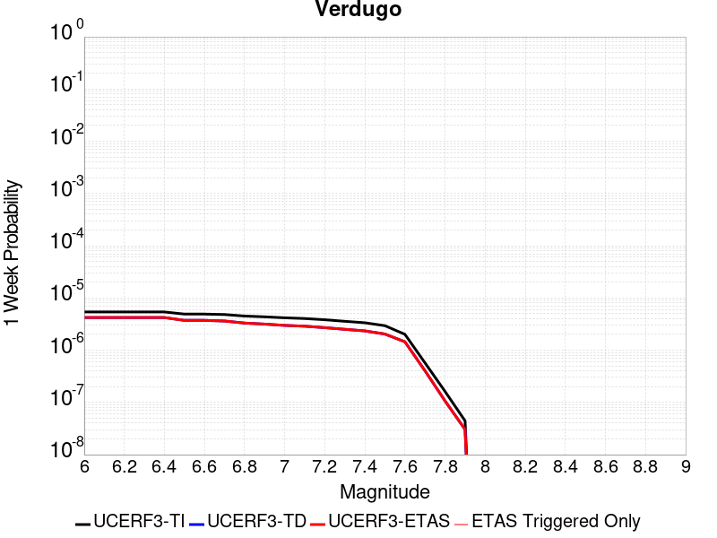 |  |  |  |

| Magnitude | 1 wk TI Prob | 1 wk TD Prob | 1 wk ETAS Prob | 1 wk ETAS/TD Gain | 1 wk ETAS Triggered Only | 1 mo TI Prob | 1 mo TD Prob | 1 mo ETAS Prob | 1 mo ETAS/TD Gain | 1 mo ETAS Triggered Only | 1 yr TI Prob | 1 yr TD Prob | 1 yr ETAS Prob | 1 yr ETAS/TD Gain | 1 yr ETAS Triggered Only | 10 yr TI Prob | 10 yr TD Prob | 10 yr ETAS Prob | 10 yr ETAS/TD Gain | 10 yr ETAS Triggered Only |
|-----|-----|-----|-----|-----|-----|-----|-----|-----|-----|-----|-----|-----|-----|-----|-----|-----|-----|-----|-----|-----|
| 6.0 | 5.392987E-6 | 4.216773E-6 | 4.216773E-6 | 1.0 | 0.0 | 2.3112598E-5 | 1.8071762E-5 | 1.8071762E-5 | 1.0 | 0.0 | 2.8135953E-4 | 2.2000197E-4 | 2.3999756E-4 | 1.0908883 | 2.0E-5 | 0.0028100356 | 0.0021978894 | 0.0022178455 | 1.0090797 | 2.0E-5 |
| 6.1 | 5.392987E-6 | 4.216773E-6 | 4.216773E-6 | 1.0 | 0.0 | 2.3112598E-5 | 1.8071762E-5 | 1.8071762E-5 | 1.0 | 0.0 | 2.8135953E-4 | 2.2000197E-4 | 2.3999756E-4 | 1.0908883 | 2.0E-5 | 0.0028100356 | 0.0021978894 | 0.0022178455 | 1.0090797 | 2.0E-5 |
| 6.2 | 5.392987E-6 | 4.216773E-6 | 4.216773E-6 | 1.0 | 0.0 | 2.3112598E-5 | 1.8071762E-5 | 1.8071762E-5 | 1.0 | 0.0 | 2.8135953E-4 | 2.2000197E-4 | 2.3999756E-4 | 1.0908883 | 2.0E-5 | 0.0028100356 | 0.0021978894 | 0.0022178455 | 1.0090797 | 2.0E-5 |
| 6.3 | 5.392987E-6 | 4.216773E-6 | 4.216773E-6 | 1.0 | 0.0 | 2.3112598E-5 | 1.8071762E-5 | 1.8071762E-5 | 1.0 | 0.0 | 2.8135953E-4 | 2.2000197E-4 | 2.3999756E-4 | 1.0908883 | 2.0E-5 | 0.0028100356 | 0.0021978894 | 0.0022178455 | 1.0090797 | 2.0E-5 |
| 6.4 | 5.392987E-6 | 4.216773E-6 | 4.216773E-6 | 1.0 | 0.0 | 2.3112598E-5 | 1.8071762E-5 | 1.8071762E-5 | 1.0 | 0.0 | 2.8135953E-4 | 2.2000197E-4 | 2.3999756E-4 | 1.0908883 | 2.0E-5 | 0.0028100356 | 0.0021978894 | 0.0022178455 | 1.0090797 | 2.0E-5 |
| 6.5 | 4.9154837E-6 | 3.7227146E-6 | 3.7227146E-6 | 1.0 | 0.0 | 2.1066187E-5 | 1.5954394E-5 | 1.5954394E-5 | 1.0 | 0.0 | 2.5645064E-4 | 1.9422764E-4 | 2.042257E-4 | 1.051476 | 1.0E-5 | 0.002561549 | 0.0019405998 | 0.0019505804 | 1.005143 | 1.0E-5 |
| 6.6 | 4.9154837E-6 | 3.7227146E-6 | 3.7227146E-6 | 1.0 | 0.0 | 2.1066187E-5 | 1.5954394E-5 | 1.5954394E-5 | 1.0 | 0.0 | 2.5645064E-4 | 1.9422764E-4 | 2.042257E-4 | 1.051476 | 1.0E-5 | 0.002561549 | 0.0019405998 | 0.0019505804 | 1.005143 | 1.0E-5 |
| 6.7 | 4.817006E-6 | 3.6209E-6 | 3.6209E-6 | 1.0 | 0.0 | 2.0644147E-5 | 1.5518051E-5 | 1.5518051E-5 | 1.0 | 0.0 | 2.513135E-4 | 1.8891609E-4 | 1.989142E-4 | 1.0529236 | 1.0E-5 | 0.0025102948 | 0.0018875746 | 0.0018975558 | 1.0052878 | 1.0E-5 |
| 6.8 | 4.507407E-6 | 3.3073463E-6 | 3.3073463E-6 | 1.0 | 0.0 | 1.9317316E-5 | 1.4174265E-5 | 1.4174265E-5 | 1.0 | 0.0 | 2.3516294E-4 | 1.7255815E-4 | 1.8255642E-4 | 1.0579414 | 1.0E-5 | 0.0023491425 | 0.001724256 | 0.0017342387 | 1.0057896 | 1.0E-5 |
| 6.9 | 4.3573054E-6 | 3.1612503E-6 | 3.1612503E-6 | 1.0 | 0.0 | 1.8674033E-5 | 1.3548146E-5 | 1.3548146E-5 | 1.0 | 0.0 | 2.2733262E-4 | 1.6493631E-4 | 1.7493466E-4 | 1.0606195 | 1.0E-5 | 0.0022710022 | 0.0016481513 | 0.0016581349 | 1.0060574 | 1.0E-5 |
| 7.0 | 4.171527E-6 | 2.9839064E-6 | 2.9839064E-6 | 1.0 | 0.0 | 1.787785E-5 | 1.2788108E-5 | 1.2788108E-5 | 1.0 | 0.0 | 2.1764109E-4 | 1.556842E-4 | 1.6568265E-4 | 1.0642226 | 1.0E-5 | 0.0021742806 | 0.0015557626 | 0.0015657471 | 1.0064178 | 1.0E-5 |
| 7.1 | 4.0405484E-6 | 2.8824945E-6 | 2.8824945E-6 | 1.0 | 0.0 | 1.731652E-5 | 1.235349E-5 | 1.235349E-5 | 1.0 | 0.0 | 2.1080824E-4 | 1.5039346E-4 | 1.6039197E-4 | 1.0664823 | 1.0E-5 | 0.0021060838 | 0.001502928 | 0.0015129129 | 1.0066437 | 1.0E-5 |
| 7.2 | 3.8306007E-6 | 2.7020742E-6 | 2.7020742E-6 | 1.0 | 0.0 | 1.6416758E-5 | 1.1580268E-5 | 1.1580268E-5 | 1.0 | 0.0 | 1.9985568E-4 | 1.4098074E-4 | 1.5097934E-4 | 1.0709217 | 1.0E-5 | 0.0019967605 | 0.0014089238 | 0.0014189096 | 1.0070876 | 1.0E-5 |
| 7.3 | 3.5750938E-6 | 2.5124E-6 | 2.5124E-6 | 1.0 | 0.0 | 1.532174E-5 | 1.0767384E-5 | 1.0767384E-5 | 1.0 | 0.0 | 1.8652623E-4 | 1.3108512E-4 | 1.3108512E-4 | 1.0 | 0.0 | 0.0018636974 | 0.0013100886 | 0.0013100886 | 1.0 | 0.0 |
| 7.4 | 3.3510041E-6 | 2.341078E-6 | 2.341078E-6 | 1.0 | 0.0 | 1.4361368E-5 | 1.0033154E-5 | 1.0033154E-5 | 1.0 | 0.0 | 1.7483562E-4 | 1.221469E-4 | 1.221469E-4 | 1.0 | 0.0 | 0.0017469813 | 0.0012208081 | 0.0012208081 | 1.0 | 0.0 |
| 7.5 | 2.948287E-6 | 2.0392013E-6 | 2.0392013E-6 | 1.0 | 0.0 | 1.2635454E-5 | 8.739405E-6 | 8.739405E-6 | 1.0 | 0.0 | 1.538258E-4 | 1.06397165E-4 | 1.06397165E-4 | 1.0 | 0.0 | 0.0015371935 | 0.0010634725 | 0.0010634725 | 1.0 | 0.0 |
| 7.6 | 2.0134323E-6 | 1.4471889E-6 | 1.4471889E-6 | 1.0 | 0.0 | 8.628967E-6 | 6.2022236E-6 | 6.2022236E-6 | 1.0 | 0.0 | 1.05052604E-4 | 7.5509546E-5 | 7.5509546E-5 | 1.0 | 0.0 | 0.0010500296 | 7.548477E-4 | 7.548477E-4 | 1.0 | 0.0 |
| 7.7 | 5.726436E-7 | 4.04542E-7 | 4.04542E-7 | 1.0 | 0.0 | 2.4541846E-6 | 1.7337504E-6 | 1.7337504E-6 | 1.0 | 0.0 | 2.9879287E-5 | 2.1108233E-5 | 2.1108233E-5 | 1.0 | 0.0 | 2.987527E-4 | 2.1106482E-4 | 2.1106482E-4 | 1.0 | 0.0 |
| 7.8 | 1.6248204E-7 | 1.06887995E-7 | 1.06887995E-7 | 1.0 | 0.0 | 6.963514E-7 | 4.5809134E-7 | 4.5809134E-7 | 1.0 | 0.0 | 8.478045E-6 | 5.577248E-6 | 5.577248E-6 | 1.0 | 0.0 | 8.477722E-5 | 5.5771114E-5 | 5.5771114E-5 | 1.0 | 0.0 |
| 7.9 | 4.4475744E-8 | 3.0376174E-8 | 3.0376174E-8 | 1.0 | 0.0 | 1.9061031E-7 | 1.301836E-7 | 1.301836E-7 | 1.0 | 0.0 | 2.320678E-6 | 1.5849843E-6 | 1.5849843E-6 | 1.0 | 0.0 | 2.3206538E-5 | 1.5849742E-5 | 1.5849742E-5 | 1.0 | 0.0 |

## Greenville (So) 2011 CFM
*[(top)](#table-of-contents)*

| 1 Week | 1 Month | 1 Year | 10 Year |
|-----|-----|-----|-----|
|  |  | 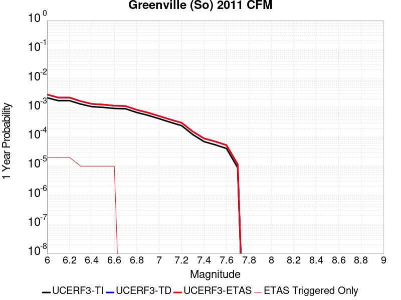 |  |

| Magnitude | 1 wk TI Prob | 1 wk TD Prob | 1 wk ETAS Prob | 1 wk ETAS/TD Gain | 1 wk ETAS Triggered Only | 1 mo TI Prob | 1 mo TD Prob | 1 mo ETAS Prob | 1 mo ETAS/TD Gain | 1 mo ETAS Triggered Only | 1 yr TI Prob | 1 yr TD Prob | 1 yr ETAS Prob | 1 yr ETAS/TD Gain | 1 yr ETAS Triggered Only | 10 yr TI Prob | 10 yr TD Prob | 10 yr ETAS Prob | 10 yr ETAS/TD Gain | 10 yr ETAS Triggered Only |
|-----|-----|-----|-----|-----|-----|-----|-----|-----|-----|-----|-----|-----|-----|-----|-----|-----|-----|-----|-----|-----|
| 6.0 | 4.279693E-5 | 5.504568E-5 | 5.504568E-5 | 1.0 | 0.0 | 1.8340252E-4 | 2.3589072E-4 | 2.3589072E-4 | 1.0 | 0.0 | 0.0022306389 | 0.0028685203 | 0.002888463 | 1.0069523 | 2.0E-5 | 0.022083808 | 0.02834083 | 0.028360263 | 1.0006857 | 2.0E-5 |
| 6.1 | 3.4037297E-5 | 4.3196407E-5 | 4.3196407E-5 | 1.0 | 0.0 | 1.4586597E-4 | 1.851155E-4 | 1.851155E-4 | 1.0 | 0.0 | 0.0017744715 | 0.002251635 | 0.00227159 | 1.0088624 | 2.0E-5 | 0.01760369 | 0.022304548 | 0.022324102 | 1.0008767 | 2.0E-5 |
| 6.2 | 3.4037297E-5 | 4.3196407E-5 | 4.3196407E-5 | 1.0 | 0.0 | 1.4586597E-4 | 1.851155E-4 | 1.851155E-4 | 1.0 | 0.0 | 0.0017744715 | 0.002251635 | 0.00227159 | 1.0088624 | 2.0E-5 | 0.01760369 | 0.022304548 | 0.022324102 | 1.0008767 | 2.0E-5 |
| 6.3 | 2.5956324E-5 | 3.2431584E-5 | 3.2431584E-5 | 1.0 | 0.0 | 1.11236644E-4 | 1.389855E-4 | 1.389855E-4 | 1.0 | 0.0 | 0.0013534647 | 0.0016909101 | 0.0017008932 | 1.005904 | 1.0E-5 | 0.013452509 | 0.016787242 | 0.016797073 | 1.0005857 | 1.0E-5 |
| 6.4 | 2.1145053E-5 | 2.619967E-5 | 2.619967E-5 | 1.0 | 0.0 | 9.061851E-5 | 1.1227964E-4 | 1.1227964E-4 | 1.0 | 0.0 | 0.0011027219 | 0.0013661786 | 0.001376165 | 1.0073097 | 1.0E-5 | 0.01097266 | 0.013581203 | 0.013591067 | 1.0007263 | 1.0E-5 |
| 6.5 | 2.0030959E-5 | 2.4797639E-5 | 2.4797639E-5 | 1.0 | 0.0 | 8.584414E-5 | 1.0627143E-4 | 1.0627143E-4 | 1.0 | 0.0 | 0.0010446513 | 0.0012931189 | 0.001303106 | 1.0077232 | 1.0E-5 | 0.010397541 | 0.012859294 | 0.012869165 | 1.0007676 | 1.0E-5 |
| 6.6 | 1.8395405E-5 | 2.2756136E-5 | 2.2756136E-5 | 1.0 | 0.0 | 7.8835066E-5 | 9.752279E-5 | 9.752279E-5 | 1.0 | 0.0 | 9.5939427E-4 | 0.0011867218 | 0.0011967099 | 1.0084165 | 1.0E-5 | 0.009552629 | 0.0118069025 | 0.011816784 | 1.000837 | 1.0E-5 |
| 6.7 | 1.7883482E-5 | 2.2127128E-5 | 2.2127128E-5 | 1.0 | 0.0 | 7.664124E-5 | 9.4827235E-5 | 9.4827235E-5 | 1.0 | 0.0 | 9.3270757E-4 | 0.0011539387 | 0.0011539387 | 1.0 | 0.0 | 0.009288026 | 0.011482523 | 0.011482523 | 1.0 | 0.0 |
| 6.8 | 1.3373564E-5 | 1.6507069E-5 | 1.6507069E-5 | 1.0 | 0.0 | 5.7314013E-5 | 7.074274E-5 | 7.074274E-5 | 1.0 | 0.0 | 6.975747E-4 | 8.609673E-4 | 8.609673E-4 | 1.0 | 0.0 | 0.0069538904 | 0.008577928 | 0.008577928 | 1.0 | 0.0 |
| 6.9 | 1.06692905E-5 | 1.3153386E-5 | 1.3153386E-5 | 1.0 | 0.0 | 4.5724726E-5 | 5.6370493E-5 | 5.6370493E-5 | 1.0 | 0.0 | 5.5655633E-4 | 6.861059E-4 | 6.861059E-4 | 1.0 | 0.0 | 0.005551645 | 0.0068411096 | 0.0068411096 | 1.0 | 0.0 |
| 7.0 | 8.157512E-6 | 1.0063179E-5 | 1.0063179E-5 | 1.0 | 0.0 | 3.4960296E-5 | 4.312721E-5 | 4.312721E-5 | 1.0 | 0.0 | 4.2555845E-4 | 5.2495097E-4 | 5.2495097E-4 | 1.0 | 0.0 | 0.004247444 | 0.0052375873 | 0.0052375873 | 1.0 | 0.0 |
| 7.1 | 6.1467113E-6 | 7.6277793E-6 | 7.6277793E-6 | 1.0 | 0.0 | 2.6342783E-5 | 3.2690077E-5 | 3.2690077E-5 | 1.0 | 0.0 | 3.206762E-4 | 3.9792983E-4 | 3.9792983E-4 | 1.0 | 0.0 | 0.0032021382 | 0.0039723613 | 0.0039723613 | 1.0 | 0.0 |
| 7.2 | 4.713467E-6 | 5.914416E-6 | 5.914416E-6 | 1.0 | 0.0 | 2.0200418E-5 | 2.5347254E-5 | 2.5347254E-5 | 1.0 | 0.0 | 2.4591232E-4 | 3.085597E-4 | 3.085597E-4 | 1.0 | 0.0 | 0.0024564038 | 0.003081466 | 0.003081466 | 1.0 | 0.0 |
| 7.3 | 2.3266216E-6 | 2.954166E-6 | 2.954166E-6 | 1.0 | 0.0 | 9.971197E-6 | 1.266065E-5 | 1.266065E-5 | 1.0 | 0.0 | 1.2139256E-4 | 1.5413266E-4 | 1.5413266E-4 | 1.0 | 0.0 | 0.0012132627 | 0.0015403271 | 0.0015403271 | 1.0 | 0.0 |
| 7.4 | 1.3314E-6 | 1.718079E-6 | 1.718079E-6 | 1.0 | 0.0 | 5.7059874E-6 | 7.3631754E-6 | 7.3631754E-6 | 1.0 | 0.0 | 6.946818E-5 | 8.964302E-5 | 8.964302E-5 | 1.0 | 0.0 | 6.9446466E-4 | 8.961074E-4 | 8.961074E-4 | 1.0 | 0.0 |
| 7.5 | 1.0362941E-6 | 1.3469978E-6 | 1.3469978E-6 | 1.0 | 0.0 | 4.4412527E-6 | 5.7728353E-6 | 5.7728353E-6 | 1.0 | 0.0 | 5.407091E-5 | 7.028205E-5 | 7.028205E-5 | 1.0 | 0.0 | 5.405776E-4 | 7.026284E-4 | 7.026284E-4 | 1.0 | 0.0 |
| 7.6 | 7.764784E-7 | 1.0089714E-6 | 1.0089714E-6 | 1.0 | 0.0 | 3.3277602E-6 | 4.324156E-6 | 4.324156E-6 | 1.0 | 0.0 | 4.0514726E-5 | 5.264537E-5 | 5.264537E-5 | 1.0 | 0.0 | 4.050734E-4 | 5.2635034E-4 | 5.2635034E-4 | 1.0 | 0.0 |
| 7.7 | 1.6927763E-7 | 2.2139474E-7 | 2.2139474E-7 | 1.0 | 0.0 | 7.2547533E-7 | 9.4883427E-7 | 9.4883427E-7 | 1.0 | 0.0 | 8.832627E-6 | 1.1551999E-5 | 1.1551999E-5 | 1.0 | 0.0 | 8.8322755E-5 | 1.15516705E-4 | 1.15516705E-4 | 1.0 | 0.0 |

## Northridge
*[(top)](#table-of-contents)*

| 1 Week | 1 Month | 1 Year | 10 Year |
|-----|-----|-----|-----|
|  |  |  |  |

| Magnitude | 1 wk TI Prob | 1 wk TD Prob | 1 wk ETAS Prob | 1 wk ETAS/TD Gain | 1 wk ETAS Triggered Only | 1 mo TI Prob | 1 mo TD Prob | 1 mo ETAS Prob | 1 mo ETAS/TD Gain | 1 mo ETAS Triggered Only | 1 yr TI Prob | 1 yr TD Prob | 1 yr ETAS Prob | 1 yr ETAS/TD Gain | 1 yr ETAS Triggered Only | 10 yr TI Prob | 10 yr TD Prob | 10 yr ETAS Prob | 10 yr ETAS/TD Gain | 10 yr ETAS Triggered Only |
|-----|-----|-----|-----|-----|-----|-----|-----|-----|-----|-----|-----|-----|-----|-----|-----|-----|-----|-----|-----|-----|
| 6.0 | 1.8340852E-5 | 7.588653E-6 | 7.588653E-6 | 1.0 | 0.0 | 7.860128E-5 | 3.2522406E-5 | 3.2522406E-5 | 1.0 | 0.0 | 9.565505E-4 | 3.9589053E-4 | 3.9589053E-4 | 1.0 | 0.0 | 0.009524435 | 0.0039520753 | 0.0039620358 | 1.0025203 | 1.0E-5 |
| 6.1 | 1.8340852E-5 | 7.588653E-6 | 7.588653E-6 | 1.0 | 0.0 | 7.860128E-5 | 3.2522406E-5 | 3.2522406E-5 | 1.0 | 0.0 | 9.565505E-4 | 3.9589053E-4 | 3.9589053E-4 | 1.0 | 0.0 | 0.009524435 | 0.0039520753 | 0.0039620358 | 1.0025203 | 1.0E-5 |
| 6.2 | 1.8340852E-5 | 7.588653E-6 | 7.588653E-6 | 1.0 | 0.0 | 7.860128E-5 | 3.2522406E-5 | 3.2522406E-5 | 1.0 | 0.0 | 9.565505E-4 | 3.9589053E-4 | 3.9589053E-4 | 1.0 | 0.0 | 0.009524435 | 0.0039520753 | 0.0039620358 | 1.0025203 | 1.0E-5 |
| 6.3 | 1.8340852E-5 | 7.588653E-6 | 7.588653E-6 | 1.0 | 0.0 | 7.860128E-5 | 3.2522406E-5 | 3.2522406E-5 | 1.0 | 0.0 | 9.565505E-4 | 3.9589053E-4 | 3.9589053E-4 | 1.0 | 0.0 | 0.009524435 | 0.0039520753 | 0.0039620358 | 1.0025203 | 1.0E-5 |
| 6.4 | 1.7361892E-5 | 7.588653E-6 | 7.588653E-6 | 1.0 | 0.0 | 7.440598E-5 | 3.2522406E-5 | 3.2522406E-5 | 1.0 | 0.0 | 9.055163E-4 | 3.9589053E-4 | 3.9589053E-4 | 1.0 | 0.0 | 0.009018354 | 0.0039520753 | 0.0039620358 | 1.0025203 | 1.0E-5 |
| 6.5 | 1.7361892E-5 | 7.588653E-6 | 7.588653E-6 | 1.0 | 0.0 | 7.440598E-5 | 3.2522406E-5 | 3.2522406E-5 | 1.0 | 0.0 | 9.055163E-4 | 3.9589053E-4 | 3.9589053E-4 | 1.0 | 0.0 | 0.009018354 | 0.0039520753 | 0.0039620358 | 1.0025203 | 1.0E-5 |
| 6.6 | 1.5458201E-5 | 7.588653E-6 | 7.588653E-6 | 1.0 | 0.0 | 6.624775E-5 | 3.2522406E-5 | 3.2522406E-5 | 1.0 | 0.0 | 8.0626784E-4 | 3.9589053E-4 | 3.9589053E-4 | 1.0 | 0.0 | 0.008033488 | 0.0039520753 | 0.0039620358 | 1.0025203 | 1.0E-5 |
| 6.7 | 1.2538368E-5 | 6.382152E-6 | 6.382152E-6 | 1.0 | 0.0 | 5.3734755E-5 | 2.7351796E-5 | 2.7351796E-5 | 1.0 | 0.0 | 6.5402425E-4 | 3.3295766E-4 | 3.3295766E-4 | 1.0 | 0.0 | 0.0065210275 | 0.003324636 | 0.0033346028 | 1.0029979 | 1.0E-5 |
| 6.8 | 1.1438097E-5 | 6.350802E-6 | 6.350802E-6 | 1.0 | 0.0 | 4.9019498E-5 | 2.721744E-5 | 2.721744E-5 | 1.0 | 0.0 | 5.9664896E-4 | 3.3132237E-4 | 3.3132237E-4 | 1.0 | 0.0 | 0.005950495 | 0.003308332 | 0.0033182988 | 1.0030127 | 1.0E-5 |
| 6.9 | 1.1204891E-5 | 6.287248E-6 | 6.287248E-6 | 1.0 | 0.0 | 4.8020076E-5 | 2.6945074E-5 | 2.6945074E-5 | 1.0 | 0.0 | 5.8448757E-4 | 3.2800733E-4 | 3.2800733E-4 | 1.0 | 0.0 | 0.0058295266 | 0.0032752797 | 0.003285247 | 1.0030432 | 1.0E-5 |
| 7.0 | 1.061046E-5 | 6.115889E-6 | 6.115889E-6 | 1.0 | 0.0 | 4.5472607E-5 | 2.6210691E-5 | 2.6210691E-5 | 1.0 | 0.0 | 5.534883E-4 | 3.1906887E-4 | 3.1906887E-4 | 1.0 | 0.0 | 0.0055211177 | 0.0031861542 | 0.0031961224 | 1.0031285 | 1.0E-5 |
| 7.1 | 1.0266979E-5 | 6.004796E-6 | 6.004796E-6 | 1.0 | 0.0 | 4.40006E-5 | 2.5734587E-5 | 2.5734587E-5 | 1.0 | 0.0 | 5.355756E-4 | 3.1327398E-4 | 3.1327398E-4 | 1.0 | 0.0 | 0.0053428668 | 0.0031283696 | 0.0031383384 | 1.0031866 | 1.0E-5 |
| 7.2 | 9.91273E-6 | 5.8204982E-6 | 5.8204982E-6 | 1.0 | 0.0 | 4.248244E-5 | 2.4944755E-5 | 2.4944755E-5 | 1.0 | 0.0 | 5.171009E-4 | 3.036605E-4 | 3.036605E-4 | 1.0 | 0.0 | 0.0051589934 | 0.0030325006 | 0.0030424704 | 1.0032876 | 1.0E-5 |
| 7.3 | 8.4959265E-6 | 5.193542E-6 | 5.193542E-6 | 1.0 | 0.0 | 3.6410605E-5 | 2.225785E-5 | 2.225785E-5 | 1.0 | 0.0 | 4.4320893E-4 | 2.7095588E-4 | 2.7095588E-4 | 1.0 | 0.0 | 0.00442326 | 0.0027062816 | 0.0027162544 | 1.0036851 | 1.0E-5 |
| 7.4 | 8.0847185E-6 | 4.9823193E-6 | 4.9823193E-6 | 1.0 | 0.0 | 3.4648332E-5 | 2.1352624E-5 | 2.1352624E-5 | 1.0 | 0.0 | 4.2176177E-4 | 2.5993743E-4 | 2.5993743E-4 | 1.0 | 0.0 | 0.0042096223 | 0.0025963597 | 0.0026063337 | 1.0038415 | 1.0E-5 |
| 7.5 | 6.8220684E-6 | 4.2534934E-6 | 4.2534934E-6 | 1.0 | 0.0 | 2.9237108E-5 | 1.8229131E-5 | 1.8229131E-5 | 1.0 | 0.0 | 3.5590364E-4 | 2.2191727E-4 | 2.2191727E-4 | 1.0 | 0.0 | 0.0035533418 | 0.0022169778 | 0.0022269555 | 1.0045006 | 1.0E-5 |
| 7.6 | 4.4224143E-6 | 2.9000655E-6 | 2.9000655E-6 | 1.0 | 0.0 | 1.8953066E-5 | 1.24287935E-5 | 1.24287935E-5 | 1.0 | 0.0 | 2.3072914E-4 | 1.5131016E-4 | 1.5131016E-4 | 1.0 | 0.0 | 0.0023048974 | 0.001512083 | 0.0015220679 | 1.0066034 | 1.0E-5 |
| 7.7 | 2.5297056E-6 | 1.6046373E-6 | 1.6046373E-6 | 1.0 | 0.0 | 1.0841551E-5 | 6.876999E-6 | 6.876999E-6 | 1.0 | 0.0 | 1.319879E-4 | 8.372429E-5 | 8.372429E-5 | 1.0 | 0.0 | 0.0013190953 | 8.369322E-4 | 8.4692385E-4 | 1.0119385 | 1.0E-5 |
| 7.8 | 1.2508156E-6 | 8.7802823E-7 | 8.7802823E-7 | 1.0 | 0.0 | 5.3606273E-6 | 3.7629727E-6 | 3.7629727E-6 | 1.0 | 0.0 | 6.526368E-5 | 4.581324E-5 | 4.581324E-5 | 1.0 | 0.0 | 6.524452E-4 | 4.5803929E-4 | 4.680347E-4 | 1.0218222 | 1.0E-5 |
| 7.9 | 2.262199E-7 | 1.4665291E-7 | 1.4665291E-7 | 1.0 | 0.0 | 9.695135E-7 | 6.285123E-7 | 6.285123E-7 | 1.0 | 0.0 | 1.1803763E-5 | 7.652111E-6 | 7.652111E-6 | 1.0 | 0.0 | 1.1803136E-4 | 7.6518554E-5 | 7.6518554E-5 | 1.0 | 0.0 |
| 8.0 | 2.865362E-9 | 1.275549E-9 | 1.275549E-9 | 1.0 | 0.0 | 1.2280123E-8 | 5.4666387E-9 | 5.4666387E-9 | 1.0 | 0.0 | 1.4951048E-7 | 6.6556325E-8 | 6.6556325E-8 | 1.0 | 0.0 | 1.4951038E-6 | 6.655632E-7 | 6.655632E-7 | 1.0 | 0.0 |

## Hunting Creek - Berryessa 2011 CFM
*[(top)](#table-of-contents)*

| 1 Week | 1 Month | 1 Year | 10 Year |
|-----|-----|-----|-----|
|  |  |  |  |

| Magnitude | 1 wk TI Prob | 1 wk TD Prob | 1 wk ETAS Prob | 1 wk ETAS/TD Gain | 1 wk ETAS Triggered Only | 1 mo TI Prob | 1 mo TD Prob | 1 mo ETAS Prob | 1 mo ETAS/TD Gain | 1 mo ETAS Triggered Only | 1 yr TI Prob | 1 yr TD Prob | 1 yr ETAS Prob | 1 yr ETAS/TD Gain | 1 yr ETAS Triggered Only | 10 yr TI Prob | 10 yr TD Prob | 10 yr ETAS Prob | 10 yr ETAS/TD Gain | 10 yr ETAS Triggered Only |
|-----|-----|-----|-----|-----|-----|-----|-----|-----|-----|-----|-----|-----|-----|-----|-----|-----|-----|-----|-----|-----|
| 6.0 | 1.1270982E-4 | 2.0016641E-4 | 2.0016641E-4 | 1.0 | 0.0 | 4.8295266E-4 | 8.5741625E-4 | 8.5741625E-4 | 1.0 | 0.0 | 0.0058641075 | 0.010387654 | 0.010387654 | 1.0 | 0.0 | 0.057117578 | 0.0980473 | 0.098056324 | 1.000092 | 1.0E-5 |
| 6.1 | 1.1239393E-4 | 1.9964768E-4 | 1.9964768E-4 | 1.0 | 0.0 | 4.8159933E-4 | 8.551946E-4 | 8.551946E-4 | 1.0 | 0.0 | 0.0058477195 | 0.010360888 | 0.010360888 | 1.0 | 0.0 | 0.056962132 | 0.09780575 | 0.097814776 | 1.0000923 | 1.0E-5 |
| 6.2 | 7.596265E-5 | 1.29413E-4 | 1.29413E-4 | 1.0 | 0.0 | 3.2551357E-4 | 5.543188E-4 | 5.543188E-4 | 1.0 | 0.0 | 0.0039559277 | 0.006721576 | 0.006721576 | 1.0 | 0.0 | 0.038862433 | 0.06459806 | 0.06460741 | 1.0001448 | 1.0E-5 |
| 6.3 | 6.78794E-5 | 1.1451705E-4 | 1.1451705E-4 | 1.0 | 0.0 | 2.9087928E-4 | 4.906954E-4 | 4.906954E-4 | 1.0 | 0.0 | 0.003535705 | 0.005953176 | 0.005953176 | 1.0 | 0.0 | 0.034799766 | 0.05747131 | 0.057480734 | 1.000164 | 1.0E-5 |
| 6.4 | 6.2165134E-5 | 1.043856E-4 | 1.043856E-4 | 1.0 | 0.0 | 2.6639478E-4 | 4.4729383E-4 | 4.4729383E-4 | 1.0 | 0.0 | 0.0032385332 | 0.0054280413 | 0.0054280413 | 1.0 | 0.0 | 0.03191742 | 0.052556038 | 0.052565515 | 1.0001802 | 1.0E-5 |
| 6.5 | 5.4368087E-5 | 9.073028E-5 | 9.073028E-5 | 1.0 | 0.0 | 2.3298527E-4 | 3.8878949E-4 | 3.8878949E-4 | 1.0 | 0.0 | 0.0028329059 | 0.004720297 | 0.004720297 | 1.0 | 0.0 | 0.027970633 | 0.045885 | 0.045885 | 1.0 | 0.0 |
| 6.6 | 4.729947E-5 | 7.848912E-5 | 7.848912E-5 | 1.0 | 0.0 | 2.0269625E-4 | 3.3634168E-4 | 3.3634168E-4 | 1.0 | 0.0 | 0.002465034 | 0.0040853387 | 0.0040853387 | 1.0 | 0.0 | 0.02437869 | 0.03985583 | 0.03985583 | 1.0 | 0.0 |
| 6.7 | 3.6875328E-5 | 6.046134E-5 | 6.046134E-5 | 1.0 | 0.0 | 1.5802756E-4 | 2.590968E-4 | 2.590968E-4 | 1.0 | 0.0 | 0.0019222875 | 0.003148527 | 0.003148527 | 1.0 | 0.0 | 0.019057442 | 0.030895753 | 0.030895753 | 1.0 | 0.0 |
| 6.8 | 2.0292036E-5 | 2.8978397E-5 | 2.8978397E-5 | 1.0 | 0.0 | 8.6962966E-5 | 1.2418722E-4 | 1.2418722E-4 | 1.0 | 0.0 | 0.0010582599 | 0.0015109128 | 0.0015109128 | 1.0 | 0.0 | 0.010532344 | 0.014979563 | 0.014979563 | 1.0 | 0.0 |
| 6.9 | 1.7871042E-5 | 2.4474015E-5 | 2.4474015E-5 | 1.0 | 0.0 | 7.658793E-5 | 1.0488445E-4 | 1.0488445E-4 | 1.0 | 0.0 | 9.320591E-4 | 0.0012762214 | 0.0012762214 | 1.0 | 0.0 | 0.009281595 | 0.012680673 | 0.012680673 | 1.0 | 0.0 |
| 7.0 | 1.6415532E-5 | 2.1907901E-5 | 2.1907901E-5 | 1.0 | 0.0 | 7.035038E-5 | 9.388765E-5 | 9.388765E-5 | 1.0 | 0.0 | 8.561793E-4 | 0.0011424861 | 0.0011424861 | 1.0 | 0.0 | 0.008528882 | 0.011365353 | 0.011365353 | 1.0 | 0.0 |
| 7.1 | 1.5409885E-5 | 2.0347887E-5 | 2.0347887E-5 | 1.0 | 0.0 | 6.6040695E-5 | 8.720233E-5 | 8.720233E-5 | 1.0 | 0.0 | 8.0374884E-4 | 0.0010611742 | 0.0010611742 | 1.0 | 0.0 | 0.00800848 | 0.010561392 | 0.010561392 | 1.0 | 0.0 |
| 7.2 | 1.4497423E-5 | 1.9056415E-5 | 1.9056415E-5 | 1.0 | 0.0 | 6.213033E-5 | 8.166781E-5 | 8.166781E-5 | 1.0 | 0.0 | 7.5617427E-4 | 9.938551E-4 | 9.938551E-4 | 1.0 | 0.0 | 0.0075360634 | 0.009894678 | 0.009894678 | 1.0 | 0.0 |
| 7.3 | 1.3615175E-5 | 1.782753E-5 | 1.782753E-5 | 1.0 | 0.0 | 5.8349444E-5 | 7.640148E-5 | 7.640148E-5 | 1.0 | 0.0 | 7.101729E-4 | 9.297939E-4 | 9.297939E-4 | 1.0 | 0.0 | 0.0070790765 | 0.009259547 | 0.009259547 | 1.0 | 0.0 |
| 7.4 | 1.2252825E-5 | 1.6027523E-5 | 1.6027523E-5 | 1.0 | 0.0 | 5.251105E-5 | 6.868759E-5 | 6.868759E-5 | 1.0 | 0.0 | 6.391345E-4 | 8.3595334E-4 | 8.3595334E-4 | 1.0 | 0.0 | 0.0063729943 | 0.00832853 | 0.00832853 | 1.0 | 0.0 |
| 7.5 | 1.0913301E-5 | 1.42423E-5 | 1.42423E-5 | 1.0 | 0.0 | 4.6770452E-5 | 6.103701E-5 | 6.103701E-5 | 1.0 | 0.0 | 5.6928146E-4 | 7.4287504E-4 | 7.4287504E-4 | 1.0 | 0.0 | 0.0056782532 | 0.007404292 | 0.007404292 | 1.0 | 0.0 |
| 7.6 | 8.623192E-6 | 1.1235461E-5 | 1.1235461E-5 | 1.0 | 0.0 | 3.6956015E-5 | 4.8151098E-5 | 4.8151098E-5 | 1.0 | 0.0 | 4.4984656E-4 | 5.860845E-4 | 5.860845E-4 | 1.0 | 0.0 | 0.00448937 | 0.005845703 | 0.005845703 | 1.0 | 0.0 |
| 7.7 | 2.0993634E-6 | 2.662731E-6 | 2.662731E-6 | 1.0 | 0.0 | 8.997241E-6 | 1.1411655E-5 | 1.1411655E-5 | 1.0 | 0.0 | 1.09535904E-4 | 1.3892811E-4 | 1.3892811E-4 | 1.0 | 0.0 | 0.0010948193 | 0.0013884191 | 0.0013884191 | 1.0 | 0.0 |
| 7.8 | 1.8428308E-7 | 2.1675433E-7 | 2.1675433E-7 | 1.0 | 0.0 | 7.897844E-7 | 9.289468E-7 | 9.289468E-7 | 1.0 | 0.0 | 9.615583E-6 | 1.1309872E-5 | 1.1309872E-5 | 1.0 | 0.0 | 9.615166E-5 | 1.1309158E-4 | 1.1309158E-4 | 1.0 | 0.0 |

## San Gregorio (North) 2011 CFM
*[(top)](#table-of-contents)*

| 1 Week | 1 Month | 1 Year | 10 Year |
|-----|-----|-----|-----|
| 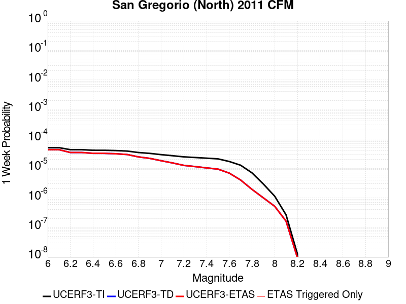 |  | 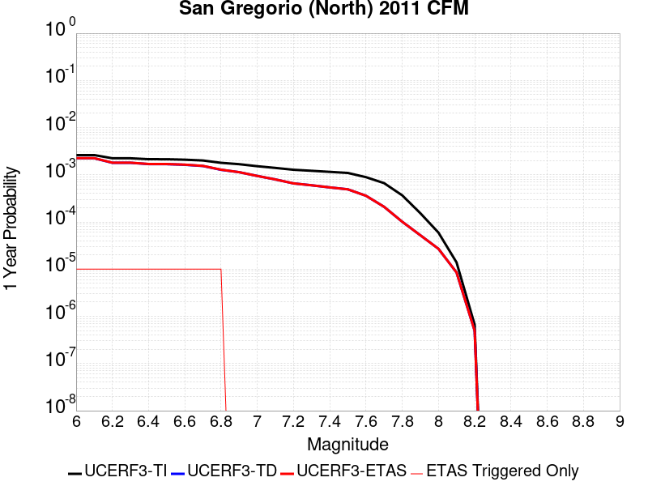 |  |

| Magnitude | 1 wk TI Prob | 1 wk TD Prob | 1 wk ETAS Prob | 1 wk ETAS/TD Gain | 1 wk ETAS Triggered Only | 1 mo TI Prob | 1 mo TD Prob | 1 mo ETAS Prob | 1 mo ETAS/TD Gain | 1 mo ETAS Triggered Only | 1 yr TI Prob | 1 yr TD Prob | 1 yr ETAS Prob | 1 yr ETAS/TD Gain | 1 yr ETAS Triggered Only | 10 yr TI Prob | 10 yr TD Prob | 10 yr ETAS Prob | 10 yr ETAS/TD Gain | 10 yr ETAS Triggered Only |
|-----|-----|-----|-----|-----|-----|-----|-----|-----|-----|-----|-----|-----|-----|-----|-----|-----|-----|-----|-----|-----|
| 6.0 | 5.0283932E-5 | 4.3073043E-5 | 4.3073043E-5 | 1.0 | 0.0 | 2.1548476E-4 | 1.845856E-4 | 1.9458376E-4 | 1.0541654 | 1.0E-5 | 0.0026203706 | 0.0022450294 | 0.002255007 | 1.0044442 | 1.0E-5 | 0.02589687 | 0.022301044 | 0.022310821 | 1.0004385 | 1.0E-5 |
| 6.1 | 5.0283932E-5 | 4.3073043E-5 | 4.3073043E-5 | 1.0 | 0.0 | 2.1548476E-4 | 1.845856E-4 | 1.9458376E-4 | 1.0541654 | 1.0E-5 | 0.0026203706 | 0.0022450294 | 0.002255007 | 1.0044442 | 1.0E-5 | 0.02589687 | 0.022301044 | 0.022310821 | 1.0004385 | 1.0E-5 |
| 6.2 | 4.2998647E-5 | 3.4455905E-5 | 3.4455905E-5 | 1.0 | 0.0 | 1.842669E-4 | 1.4765965E-4 | 1.5765819E-4 | 1.0677133 | 1.0E-5 | 0.0022411412 | 0.0017962867 | 0.0018062687 | 1.0055571 | 1.0E-5 | 0.022186736 | 0.017893974 | 0.017903795 | 1.0005488 | 1.0E-5 |
| 6.3 | 4.2998647E-5 | 3.4455905E-5 | 3.4455905E-5 | 1.0 | 0.0 | 1.842669E-4 | 1.4765965E-4 | 1.5765819E-4 | 1.0677133 | 1.0E-5 | 0.0022411412 | 0.0017962867 | 0.0018062687 | 1.0055571 | 1.0E-5 | 0.022186736 | 0.017893974 | 0.017903795 | 1.0005488 | 1.0E-5 |
| 6.4 | 4.1101295E-5 | 3.2340977E-5 | 3.2340977E-5 | 1.0 | 0.0 | 1.7613651E-4 | 1.3859668E-4 | 1.4859528E-4 | 1.0721418 | 1.0E-5 | 0.0021423528 | 0.0016861213 | 0.0016961045 | 1.0059208 | 1.0E-5 | 0.02121817 | 0.016809238 | 0.01681907 | 1.000585 | 1.0E-5 |
| 6.5 | 4.1032585E-5 | 3.2259002E-5 | 3.2259002E-5 | 1.0 | 0.0 | 1.7584208E-4 | 1.382454E-4 | 1.4824401E-4 | 1.0723251 | 1.0E-5 | 0.0021387753 | 0.0016818513 | 0.0016918345 | 1.0059358 | 1.0E-5 | 0.021183075 | 0.016767189 | 0.01677702 | 1.0005864 | 1.0E-5 |
| 6.6 | 4.011629E-5 | 3.1280546E-5 | 3.1280546E-5 | 1.0 | 0.0 | 1.7191563E-4 | 1.3405245E-4 | 1.440511E-4 | 1.0745877 | 1.0E-5 | 0.0020910634 | 0.0016308803 | 0.001640864 | 1.0061216 | 1.0E-5 | 0.020714961 | 0.016264709 | 0.016274545 | 1.0006049 | 1.0E-5 |
| 6.7 | 3.8583938E-5 | 2.9467401E-5 | 2.9467401E-5 | 1.0 | 0.0 | 1.6534925E-4 | 1.2628283E-4 | 1.3628157E-4 | 1.0791774 | 1.0E-5 | 0.0020112682 | 0.0015364232 | 0.0015464078 | 1.0064986 | 1.0E-5 | 0.019931622 | 0.015333165 | 0.015343012 | 1.0006422 | 1.0E-5 |
| 6.8 | 3.44341E-5 | 2.44642E-5 | 2.44642E-5 | 1.0 | 0.0 | 1.4756636E-4 | 1.0484242E-4 | 1.14841365E-4 | 1.0953712 | 1.0E-5 | 0.0017951399 | 0.0012757193 | 0.0012857064 | 1.0078287 | 1.0E-5 | 0.017807078 | 0.012758123 | 0.012767996 | 1.0007738 | 1.0E-5 |
| 6.9 | 3.221199E-5 | 2.1787615E-5 | 2.1787615E-5 | 1.0 | 0.0 | 1.3804408E-4 | 9.33722E-5 | 9.33722E-5 | 1.0 | 0.0 | 0.0016793909 | 0.0011362219 | 0.0011362219 | 1.0 | 0.0 | 0.01666756 | 0.011377644 | 0.011377644 | 1.0 | 0.0 |
| 7.0 | 2.9186718E-5 | 1.815431E-5 | 1.815431E-5 | 1.0 | 0.0 | 1.2507994E-4 | 7.780189E-5 | 7.780189E-5 | 1.0 | 0.0 | 0.0015217843 | 9.4683067E-4 | 9.4683067E-4 | 1.0 | 0.0 | 0.015114053 | 0.009500756 | 0.009500756 | 1.0 | 0.0 |
| 7.1 | 2.6840138E-5 | 1.5291298E-5 | 1.5291298E-5 | 1.0 | 0.0 | 1.1502409E-4 | 6.55325E-5 | 6.55325E-5 | 1.0 | 0.0 | 0.0013995186 | 7.97568E-4 | 7.97568E-4 | 1.0 | 0.0 | 0.013907375 | 0.008019351 | 0.008019351 | 1.0 | 0.0 |
| 7.2 | 2.453002E-5 | 1.2612979E-5 | 1.2612979E-5 | 1.0 | 0.0 | 1.05124425E-4 | 5.4054508E-5 | 5.4054508E-5 | 1.0 | 0.0 | 0.0012791384 | 6.579155E-4 | 6.579155E-4 | 1.0 | 0.0 | 0.012718005 | 0.0066310135 | 0.0066310135 | 1.0 | 0.0 |
| 7.3 | 2.3330727E-5 | 1.1494777E-5 | 1.1494777E-5 | 1.0 | 0.0 | 9.9985E-5 | 4.9262402E-5 | 4.9262402E-5 | 1.0 | 0.0 | 0.0012166376 | 5.9960515E-4 | 5.9960515E-4 | 1.0 | 0.0 | 0.012099981 | 0.0060498407 | 0.0060498407 | 1.0 | 0.0 |
| 7.4 | 2.2136466E-5 | 1.0374679E-5 | 1.0374679E-5 | 1.0 | 0.0 | 9.486712E-5 | 4.446215E-5 | 4.446215E-5 | 1.0 | 0.0 | 0.0011543952 | 5.4119254E-4 | 5.4119254E-4 | 1.0 | 0.0 | 0.011484168 | 0.0054673133 | 0.0054673133 | 1.0 | 0.0 |
| 7.5 | 2.0994974E-5 | 9.432709E-6 | 9.432709E-6 | 1.0 | 0.0 | 8.997535E-5 | 4.042527E-5 | 4.042527E-5 | 1.0 | 0.0 | 0.0010948994 | 4.920667E-4 | 4.920667E-4 | 1.0 | 0.0 | 0.010895205 | 0.004976314 | 0.004976314 | 1.0 | 0.0 |
| 7.6 | 1.7091823E-5 | 6.897964E-6 | 6.897964E-6 | 1.0 | 0.0 | 7.3248615E-5 | 2.9562367E-5 | 2.9562367E-5 | 1.0 | 0.0 | 8.9143694E-4 | 3.598625E-4 | 3.598625E-4 | 1.0 | 0.0 | 0.008878695 | 0.003650556 | 0.003650556 | 1.0 | 0.0 |
| 7.7 | 1.2772179E-5 | 4.0238565E-6 | 4.0238565E-6 | 1.0 | 0.0 | 5.473676E-5 | 1.7244984E-5 | 1.7244984E-5 | 1.0 | 0.0 | 6.6621625E-4 | 2.0993748E-4 | 2.0993748E-4 | 1.0 | 0.0 | 0.006642225 | 0.002138552 | 0.002138552 | 1.0 | 0.0 |
| 7.8 | 7.041923E-6 | 1.9425775E-6 | 1.9425775E-6 | 1.0 | 0.0 | 3.017932E-5 | 8.325305E-6 | 8.325305E-6 | 1.0 | 0.0 | 3.6737128E-4 | 1.0135588E-4 | 1.0135588E-4 | 1.0 | 0.0 | 0.0036676454 | 0.0010389668 | 0.0010389668 | 1.0 | 0.0 |
| 7.9 | 2.946768E-6 | 1.0045106E-6 | 1.0045106E-6 | 1.0 | 0.0 | 1.2628945E-5 | 4.3050386E-6 | 4.3050386E-6 | 1.0 | 0.0 | 1.5374656E-4 | 5.2412583E-5 | 5.2412583E-5 | 1.0 | 0.0 | 0.0015364023 | 5.346189E-4 | 5.346189E-4 | 1.0 | 0.0 |
| 8.0 | 1.1433375E-6 | 5.1880994E-7 | 5.1880994E-7 | 1.0 | 0.0 | 4.9000087E-6 | 2.2234692E-6 | 2.2234692E-6 | 1.0 | 0.0 | 5.965597E-5 | 2.70704E-5 | 2.70704E-5 | 1.0 | 0.0 | 5.963996E-4 | 2.743333E-4 | 2.743333E-4 | 1.0 | 0.0 |
| 8.1 | 2.6675295E-7 | 1.631507E-7 | 1.631507E-7 | 1.0 | 0.0 | 1.1432264E-6 | 6.992171E-7 | 6.992171E-7 | 1.0 | 0.0 | 1.3918692E-5 | 8.512935E-6 | 8.512935E-6 | 1.0 | 0.0 | 1.391782E-4 | 8.651227E-5 | 8.651227E-5 | 1.0 | 0.0 |
| 8.2 | 1.2704569E-8 | 9.4541255E-9 | 9.4541255E-9 | 1.0 | 0.0 | 5.444815E-8 | 4.051768E-8 | 4.051768E-8 | 1.0 | 0.0 | 6.629061E-7 | 4.9330265E-7 | 4.9330265E-7 | 1.0 | 0.0 | 6.629041E-6 | 5.124241E-6 | 5.124241E-6 | 1.0 | 0.0 |

## San Cayetano
*[(top)](#table-of-contents)*

| 1 Week | 1 Month | 1 Year | 10 Year |
|-----|-----|-----|-----|
|  | 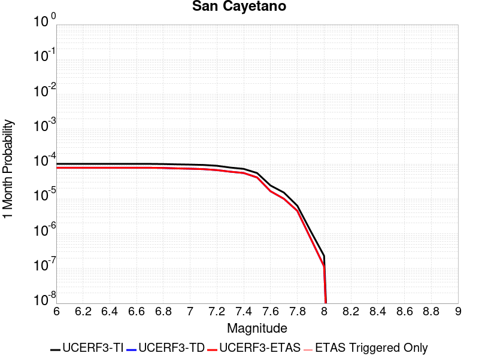 | 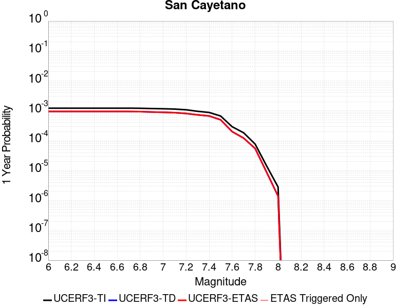 |  |

| Magnitude | 1 wk TI Prob | 1 wk TD Prob | 1 wk ETAS Prob | 1 wk ETAS/TD Gain | 1 wk ETAS Triggered Only | 1 mo TI Prob | 1 mo TD Prob | 1 mo ETAS Prob | 1 mo ETAS/TD Gain | 1 mo ETAS Triggered Only | 1 yr TI Prob | 1 yr TD Prob | 1 yr ETAS Prob | 1 yr ETAS/TD Gain | 1 yr ETAS Triggered Only | 10 yr TI Prob | 10 yr TD Prob | 10 yr ETAS Prob | 10 yr ETAS/TD Gain | 10 yr ETAS Triggered Only |
|-----|-----|-----|-----|-----|-----|-----|-----|-----|-----|-----|-----|-----|-----|-----|-----|-----|-----|-----|-----|-----|
| 6.0 | 2.3476267E-5 | 1.817047E-5 | 1.817047E-5 | 1.0 | 0.0 | 1.0060869E-4 | 7.787115E-5 | 7.787115E-5 | 1.0 | 0.0 | 0.0012242225 | 9.4767247E-4 | 9.4767247E-4 | 1.0 | 0.0 | 0.012175002 | 0.009437201 | 0.009447106 | 1.0010496 | 1.0E-5 |
| 6.1 | 2.3476267E-5 | 1.817047E-5 | 1.817047E-5 | 1.0 | 0.0 | 1.0060869E-4 | 7.787115E-5 | 7.787115E-5 | 1.0 | 0.0 | 0.0012242225 | 9.4767247E-4 | 9.4767247E-4 | 1.0 | 0.0 | 0.012175002 | 0.009437201 | 0.009447106 | 1.0010496 | 1.0E-5 |
| 6.2 | 2.3476267E-5 | 1.817047E-5 | 1.817047E-5 | 1.0 | 0.0 | 1.0060869E-4 | 7.787115E-5 | 7.787115E-5 | 1.0 | 0.0 | 0.0012242225 | 9.4767247E-4 | 9.4767247E-4 | 1.0 | 0.0 | 0.012175002 | 0.009437201 | 0.009447106 | 1.0010496 | 1.0E-5 |
| 6.3 | 2.3476267E-5 | 1.817047E-5 | 1.817047E-5 | 1.0 | 0.0 | 1.0060869E-4 | 7.787115E-5 | 7.787115E-5 | 1.0 | 0.0 | 0.0012242225 | 9.4767247E-4 | 9.4767247E-4 | 1.0 | 0.0 | 0.012175002 | 0.009437201 | 0.009447106 | 1.0010496 | 1.0E-5 |
| 6.4 | 2.3476267E-5 | 1.817047E-5 | 1.817047E-5 | 1.0 | 0.0 | 1.0060869E-4 | 7.787115E-5 | 7.787115E-5 | 1.0 | 0.0 | 0.0012242225 | 9.4767247E-4 | 9.4767247E-4 | 1.0 | 0.0 | 0.012175002 | 0.009437201 | 0.009447106 | 1.0010496 | 1.0E-5 |
| 6.5 | 2.3476267E-5 | 1.817047E-5 | 1.817047E-5 | 1.0 | 0.0 | 1.0060869E-4 | 7.787115E-5 | 7.787115E-5 | 1.0 | 0.0 | 0.0012242225 | 9.4767247E-4 | 9.4767247E-4 | 1.0 | 0.0 | 0.012175002 | 0.009437201 | 0.009447106 | 1.0010496 | 1.0E-5 |
| 6.6 | 2.3476267E-5 | 1.817047E-5 | 1.817047E-5 | 1.0 | 0.0 | 1.0060869E-4 | 7.787115E-5 | 7.787115E-5 | 1.0 | 0.0 | 0.0012242225 | 9.4767247E-4 | 9.4767247E-4 | 1.0 | 0.0 | 0.012175002 | 0.009437201 | 0.009447106 | 1.0010496 | 1.0E-5 |
| 6.7 | 2.3476267E-5 | 1.817047E-5 | 1.817047E-5 | 1.0 | 0.0 | 1.0060869E-4 | 7.787115E-5 | 7.787115E-5 | 1.0 | 0.0 | 0.0012242225 | 9.4767247E-4 | 9.4767247E-4 | 1.0 | 0.0 | 0.012175002 | 0.009437201 | 0.009447106 | 1.0010496 | 1.0E-5 |
| 6.8 | 2.3241924E-5 | 1.7938162E-5 | 1.7938162E-5 | 1.0 | 0.0 | 9.960445E-5 | 7.687559E-5 | 7.687559E-5 | 1.0 | 0.0 | 0.0012120095 | 9.35562E-4 | 9.35562E-4 | 1.0 | 0.0 | 0.012054204 | 0.009317089 | 0.009326996 | 1.0010633 | 1.0E-5 |
| 6.9 | 2.2761007E-5 | 1.743357E-5 | 1.743357E-5 | 1.0 | 0.0 | 9.7543525E-5 | 7.471318E-5 | 7.471318E-5 | 1.0 | 0.0 | 0.0011869454 | 9.0925675E-4 | 9.0925675E-4 | 1.0 | 0.0 | 0.011806256 | 0.009056196 | 0.009066105 | 1.0010942 | 1.0E-5 |
| 7.0 | 2.240283E-5 | 1.7067296E-5 | 1.7067296E-5 | 1.0 | 0.0 | 9.600859E-5 | 7.314352E-5 | 7.314352E-5 | 1.0 | 0.0 | 0.0011682777 | 8.9016196E-4 | 8.9016196E-4 | 1.0 | 0.0 | 0.011621549 | 0.008866779 | 0.00887669 | 1.0011178 | 1.0E-5 |
| 7.1 | 2.1871154E-5 | 1.6587113E-5 | 1.6587113E-5 | 1.0 | 0.0 | 9.373015E-5 | 7.108571E-5 | 7.108571E-5 | 1.0 | 0.0 | 0.0011405671 | 8.6512824E-4 | 8.6512824E-4 | 1.0 | 0.0 | 0.011347309 | 0.008618405 | 0.008628319 | 1.0011503 | 1.0E-5 |
| 7.2 | 2.0714133E-5 | 1.556559E-5 | 1.556559E-5 | 1.0 | 0.0 | 8.8771834E-5 | 6.670799E-5 | 6.670799E-5 | 1.0 | 0.0 | 0.0010802611 | 8.118704E-4 | 8.118704E-4 | 1.0 | 0.0 | 0.010750249 | 0.008089819 | 0.008099738 | 1.0012261 | 1.0E-5 |
| 7.3 | 1.8408395E-5 | 1.399771E-5 | 1.399771E-5 | 1.0 | 0.0 | 7.8890735E-5 | 5.9988823E-5 | 5.9988823E-5 | 1.0 | 0.0 | 9.600714E-4 | 7.3012215E-4 | 7.3012215E-4 | 1.0 | 0.0 | 0.009559342 | 0.0072779534 | 0.0072878804 | 1.001364 | 1.0E-5 |
| 7.4 | 1.6856795E-5 | 1.2850762E-5 | 1.2850762E-5 | 1.0 | 0.0 | 7.2241404E-5 | 5.5073546E-5 | 5.5073546E-5 | 1.0 | 0.0 | 8.7918417E-4 | 6.70317E-4 | 6.70317E-4 | 1.0 | 0.0 | 0.00875714 | 0.0066836313 | 0.0066935644 | 1.0014862 | 1.0E-5 |
| 7.5 | 1.2822778E-5 | 9.578011E-6 | 9.578011E-6 | 1.0 | 0.0 | 5.495361E-5 | 4.104798E-5 | 4.104798E-5 | 1.0 | 0.0 | 6.688548E-4 | 4.996461E-4 | 4.996461E-4 | 1.0 | 0.0 | 0.006668452 | 0.0049853986 | 0.004995349 | 1.0019958 | 1.0E-5 |
| 7.6 | 5.6272684E-6 | 3.8551166E-6 | 3.8551166E-6 | 1.0 | 0.0 | 2.4116642E-5 | 1.6521824E-5 | 1.6521824E-5 | 1.0 | 0.0 | 2.9358055E-4 | 2.0113474E-4 | 2.0113474E-4 | 1.0 | 0.0 | 0.0029319301 | 0.002009538 | 0.002009538 | 1.0 | 0.0 |
| 7.7 | 3.5261346E-6 | 2.3408315E-6 | 2.3408315E-6 | 1.0 | 0.0 | 1.5111918E-5 | 1.0032097E-5 | 1.0032097E-5 | 1.0 | 0.0 | 1.8397206E-4 | 1.22134E-4 | 1.22134E-4 | 1.0 | 0.0 | 0.0018381984 | 0.0012206762 | 0.0012206762 | 1.0 | 0.0 |
| 7.8 | 1.4826929E-6 | 1.0564792E-6 | 1.0564792E-6 | 1.0 | 0.0 | 6.354383E-6 | 4.5277598E-6 | 4.5277598E-6 | 1.0 | 0.0 | 7.736187E-5 | 5.5124103E-5 | 5.5124103E-5 | 1.0 | 0.0 | 7.733494E-4 | 5.5110635E-4 | 5.5110635E-4 | 1.0 | 0.0 |
| 7.9 | 2.7568166E-7 | 1.697944E-7 | 1.697944E-7 | 1.0 | 0.0 | 1.1814923E-6 | 7.2769006E-7 | 7.2769006E-7 | 1.0 | 0.0 | 1.4384574E-5 | 8.859591E-6 | 8.859591E-6 | 1.0 | 0.0 | 1.4383643E-4 | 8.859242E-5 | 8.859242E-5 | 1.0 | 0.0 |
| 8.0 | 5.407832E-8 | 2.6891726E-8 | 2.6891726E-8 | 1.0 | 0.0 | 2.3176422E-7 | 1.1525025E-7 | 1.1525025E-7 | 1.0 | 0.0 | 2.8217257E-6 | 1.4031709E-6 | 1.4031709E-6 | 1.0 | 0.0 | 2.8216898E-5 | 1.4031625E-5 | 1.4031625E-5 | 1.0 | 0.0 |

## Greenville (No) 2011 CFM
*[(top)](#table-of-contents)*

| 1 Week | 1 Month | 1 Year | 10 Year |
|-----|-----|-----|-----|
|  |  |  |  |

| Magnitude | 1 wk TI Prob | 1 wk TD Prob | 1 wk ETAS Prob | 1 wk ETAS/TD Gain | 1 wk ETAS Triggered Only | 1 mo TI Prob | 1 mo TD Prob | 1 mo ETAS Prob | 1 mo ETAS/TD Gain | 1 mo ETAS Triggered Only | 1 yr TI Prob | 1 yr TD Prob | 1 yr ETAS Prob | 1 yr ETAS/TD Gain | 1 yr ETAS Triggered Only | 10 yr TI Prob | 10 yr TD Prob | 10 yr ETAS Prob | 10 yr ETAS/TD Gain | 10 yr ETAS Triggered Only |
|-----|-----|-----|-----|-----|-----|-----|-----|-----|-----|-----|-----|-----|-----|-----|-----|-----|-----|-----|-----|-----|
| 6.0 | 3.286654E-5 | 4.0369163E-5 | 4.0369163E-5 | 1.0 | 0.0 | 1.4084899E-4 | 1.7299943E-4 | 1.7299943E-4 | 1.0 | 0.0 | 0.0017134876 | 0.0021042717 | 0.0021142506 | 1.0047423 | 1.0E-5 | 0.017003356 | 0.020848349 | 0.02085814 | 1.0004697 | 1.0E-5 |
| 6.1 | 3.286654E-5 | 4.0369163E-5 | 4.0369163E-5 | 1.0 | 0.0 | 1.4084899E-4 | 1.7299943E-4 | 1.7299943E-4 | 1.0 | 0.0 | 0.0017134876 | 0.0021042717 | 0.0021142506 | 1.0047423 | 1.0E-5 | 0.017003356 | 0.020848349 | 0.02085814 | 1.0004697 | 1.0E-5 |
| 6.2 | 3.1697953E-5 | 3.8931943E-5 | 3.8931943E-5 | 1.0 | 0.0 | 1.358413E-4 | 1.668407E-4 | 1.668407E-4 | 1.0 | 0.0 | 0.0016526132 | 0.0020294313 | 0.002039411 | 1.0049175 | 1.0E-5 | 0.01640377 | 0.020113682 | 0.020123482 | 1.0004872 | 1.0E-5 |
| 6.3 | 3.1363317E-5 | 3.8520786E-5 | 3.8520786E-5 | 1.0 | 0.0 | 1.344073E-4 | 1.6507883E-4 | 1.6507883E-4 | 1.0 | 0.0 | 0.0016351803 | 0.0020080202 | 0.002018 | 1.0049701 | 1.0E-5 | 0.016232004 | 0.019903433 | 0.019913234 | 1.0004925 | 1.0E-5 |
| 6.4 | 3.0228604E-5 | 3.7127804E-5 | 3.7127804E-5 | 1.0 | 0.0 | 1.2954473E-4 | 1.5910964E-4 | 1.5910964E-4 | 1.0 | 0.0 | 0.0015760659 | 0.0019354759 | 0.0019454565 | 1.0051566 | 1.0E-5 | 0.015649348 | 0.019190716 | 0.019200522 | 1.000511 | 1.0E-5 |
| 6.5 | 2.9537814E-5 | 3.628319E-5 | 3.628319E-5 | 1.0 | 0.0 | 1.2658449E-4 | 1.554903E-4 | 1.554903E-4 | 1.0 | 0.0 | 0.0015400766 | 0.0018914875 | 0.0019014686 | 1.0052768 | 1.0E-5 | 0.01529447 | 0.018758342 | 0.018768154 | 1.0005231 | 1.0E-5 |
| 6.6 | 2.7345395E-5 | 3.3592292E-5 | 3.3592292E-5 | 1.0 | 0.0 | 1.1718928E-4 | 1.4395917E-4 | 1.4395917E-4 | 1.0 | 0.0 | 0.0014258457 | 0.0017513251 | 0.0017613076 | 1.0057 | 1.0E-5 | 0.014167317 | 0.017379051 | 0.017388877 | 1.0005654 | 1.0E-5 |
| 6.7 | 2.5615784E-5 | 3.1569067E-5 | 3.1569067E-5 | 1.0 | 0.0 | 1.09777306E-4 | 1.3528914E-4 | 1.3528914E-4 | 1.0 | 0.0 | 0.0013357193 | 0.0016459314 | 0.0016459314 | 1.0 | 0.0 | 0.013277191 | 0.01634108 | 0.01634108 | 1.0 | 0.0 |
| 6.8 | 2.0059057E-5 | 2.4713456E-5 | 2.4713456E-5 | 1.0 | 0.0 | 8.596455E-5 | 1.0591059E-4 | 1.0591059E-4 | 1.0 | 0.0 | 0.0010461159 | 0.001288715 | 0.001288715 | 1.0 | 0.0 | 0.0104120495 | 0.012814435 | 0.012814435 | 1.0 | 0.0 |
| 6.9 | 1.6321746E-5 | 2.0185693E-5 | 2.0185693E-5 | 1.0 | 0.0 | 6.9948466E-5 | 8.650731E-5 | 8.650731E-5 | 1.0 | 0.0 | 8.5128983E-4 | 0.00105273 | 0.00105273 | 1.0 | 0.0 | 0.008480361 | 0.010478959 | 0.010478959 | 1.0 | 0.0 |
| 7.0 | 1.22527645E-5 | 1.5136329E-5 | 1.5136329E-5 | 1.0 | 0.0 | 5.2510793E-5 | 6.4868385E-5 | 6.4868385E-5 | 1.0 | 0.0 | 6.3913135E-4 | 7.894907E-4 | 7.894907E-4 | 1.0 | 0.0 | 0.0063729626 | 0.007867497 | 0.007867497 | 1.0 | 0.0 |
| 7.1 | 8.996482E-6 | 1.1165407E-5 | 1.1165407E-5 | 1.0 | 0.0 | 3.8555783E-5 | 4.7850874E-5 | 4.7850874E-5 | 1.0 | 0.0 | 4.6931554E-4 | 5.824299E-4 | 5.824299E-4 | 1.0 | 0.0 | 0.004683256 | 0.0058093253 | 0.0058093253 | 1.0 | 0.0 |
| 7.2 | 6.0273087E-6 | 7.5697803E-6 | 7.5697803E-6 | 1.0 | 0.0 | 2.5831067E-5 | 3.2441516E-5 | 3.2441516E-5 | 1.0 | 0.0 | 3.1444785E-4 | 3.9490458E-4 | 3.9490458E-4 | 1.0 | 0.0 | 0.0031400328 | 0.003942225 | 0.003942225 | 1.0 | 0.0 |
| 7.3 | 3.1209995E-6 | 3.9665556E-6 | 3.9665556E-6 | 1.0 | 0.0 | 1.3375643E-5 | 1.6999413E-5 | 1.6999413E-5 | 1.0 | 0.0 | 1.6283628E-4 | 2.0694836E-4 | 2.0694836E-4 | 1.0 | 0.0 | 0.0016271701 | 0.0020676467 | 0.0020676467 | 1.0 | 0.0 |
| 7.4 | 2.0254208E-6 | 2.609755E-6 | 2.609755E-6 | 1.0 | 0.0 | 8.680347E-6 | 1.1184617E-5 | 1.1184617E-5 | 1.0 | 0.0 | 1.0567809E-4 | 1.3616426E-4 | 1.3616426E-4 | 1.0 | 0.0 | 0.0010562785 | 0.0013608651 | 0.0013608651 | 1.0 | 0.0 |
| 7.5 | 1.6763418E-6 | 2.1734766E-6 | 2.1734766E-6 | 1.0 | 0.0 | 7.184302E-6 | 9.3148665E-6 | 9.3148665E-6 | 1.0 | 0.0 | 8.746537E-5 | 1.1340265E-4 | 1.1340265E-4 | 1.0 | 0.0 | 8.743095E-4 | 0.0011334948 | 0.0011334948 | 1.0 | 0.0 |
| 7.6 | 1.1935462E-6 | 1.5459636E-6 | 1.5459636E-6 | 1.0 | 0.0 | 5.115188E-6 | 6.625542E-6 | 6.625542E-6 | 1.0 | 0.0 | 6.2275634E-5 | 8.0663034E-5 | 8.0663034E-5 | 1.0 | 0.0 | 6.2258187E-4 | 8.063682E-4 | 8.063682E-4 | 1.0 | 0.0 |
| 7.7 | 3.0464201E-7 | 3.984723E-7 | 3.984723E-7 | 1.0 | 0.0 | 1.3056081E-6 | 1.7077374E-6 | 1.7077374E-6 | 1.0 | 0.0 | 1.589566E-5 | 2.0791509E-5 | 2.0791509E-5 | 1.0 | 0.0 | 1.5894524E-4 | 2.0790035E-4 | 2.0790035E-4 | 1.0 | 0.0 |

## Hayward (So) extension 2011 CFM
*[(top)](#table-of-contents)*

| 1 Week | 1 Month | 1 Year | 10 Year |
|-----|-----|-----|-----|
| 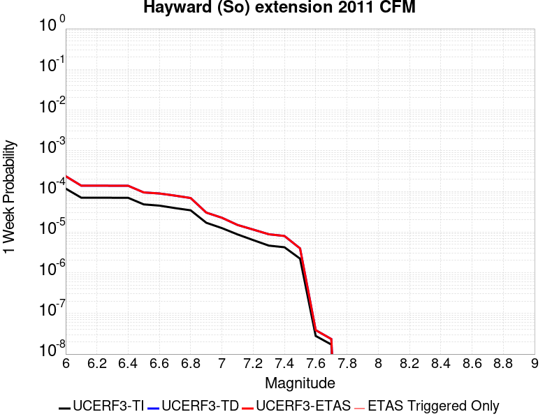 | 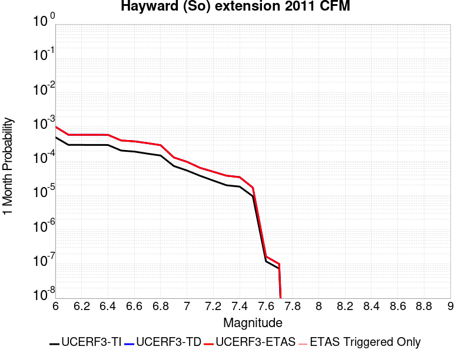 |  | 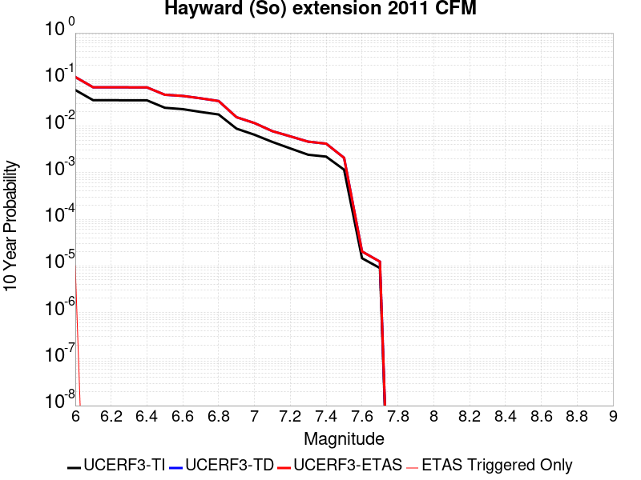 |

| Magnitude | 1 wk TI Prob | 1 wk TD Prob | 1 wk ETAS Prob | 1 wk ETAS/TD Gain | 1 wk ETAS Triggered Only | 1 mo TI Prob | 1 mo TD Prob | 1 mo ETAS Prob | 1 mo ETAS/TD Gain | 1 mo ETAS Triggered Only | 1 yr TI Prob | 1 yr TD Prob | 1 yr ETAS Prob | 1 yr ETAS/TD Gain | 1 yr ETAS Triggered Only | 10 yr TI Prob | 10 yr TD Prob | 10 yr ETAS Prob | 10 yr ETAS/TD Gain | 10 yr ETAS Triggered Only |
|-----|-----|-----|-----|-----|-----|-----|-----|-----|-----|-----|-----|-----|-----|-----|-----|-----|-----|-----|-----|-----|
| 6.0 | 1.1721256E-4 | 2.3636376E-4 | 2.3636376E-4 | 1.0 | 0.0 | 5.022428E-4 | 0.0010126528 | 0.0010126528 | 1.0 | 0.0 | 0.0060976758 | 0.012250351 | 0.012250351 | 1.0 | 0.0 | 0.0593305 | 0.11286398 | 0.11287285 | 1.0000786 | 1.0E-5 |
| 6.1 | 6.99169E-5 | 1.3795098E-4 | 1.3795098E-4 | 1.0 | 0.0 | 2.9960944E-4 | 5.9109874E-4 | 5.9109874E-4 | 1.0 | 0.0 | 0.0036416445 | 0.007173764 | 0.007173764 | 1.0 | 0.0 | 0.035825435 | 0.06782111 | 0.06782111 | 1.0 | 0.0 |
| 6.2 | 6.99169E-5 | 1.3795098E-4 | 1.3795098E-4 | 1.0 | 0.0 | 2.9960944E-4 | 5.9109874E-4 | 5.9109874E-4 | 1.0 | 0.0 | 0.0036416445 | 0.007173764 | 0.007173764 | 1.0 | 0.0 | 0.035825435 | 0.06782111 | 0.06782111 | 1.0 | 0.0 |
| 6.3 | 6.970908E-5 | 1.3763242E-4 | 1.3763242E-4 | 1.0 | 0.0 | 2.9871898E-4 | 5.897341E-4 | 5.897341E-4 | 1.0 | 0.0 | 0.0036308395 | 0.007157299 | 0.007157299 | 1.0 | 0.0 | 0.035720866 | 0.06767006 | 0.06767006 | 1.0 | 0.0 |
| 6.4 | 6.9517155E-5 | 1.3730107E-4 | 1.3730107E-4 | 1.0 | 0.0 | 2.9789665E-4 | 5.883147E-4 | 5.883147E-4 | 1.0 | 0.0 | 0.0036208609 | 0.0071402094 | 0.0071402094 | 1.0 | 0.0 | 0.03562429 | 0.06751409 | 0.06751409 | 1.0 | 0.0 |
| 6.5 | 4.786248E-5 | 9.418472E-5 | 9.418472E-5 | 1.0 | 0.0 | 2.0510878E-4 | 4.03589E-4 | 4.03589E-4 | 1.0 | 0.0 | 0.0024943394 | 0.0049030366 | 0.0049030366 | 1.0 | 0.0 | 0.02466527 | 0.04691766 | 0.04691766 | 1.0 | 0.0 |
| 6.6 | 4.4662214E-5 | 8.885063E-5 | 8.885063E-5 | 1.0 | 0.0 | 1.9139545E-4 | 3.8073547E-4 | 3.8073547E-4 | 1.0 | 0.0 | 0.0023277493 | 0.0046260646 | 0.0046260646 | 1.0 | 0.0 | 0.02303517 | 0.04430889 | 0.04430889 | 1.0 | 0.0 |
| 6.7 | 3.884542E-5 | 7.8680896E-5 | 7.8680896E-5 | 1.0 | 0.0 | 1.6646975E-4 | 3.3716275E-4 | 3.3716275E-4 | 1.0 | 0.0 | 0.002024885 | 0.004097675 | 0.004097675 | 1.0 | 0.0 | 0.020065336 | 0.039348204 | 0.039348204 | 1.0 | 0.0 |
| 6.8 | 3.4221863E-5 | 6.8586945E-5 | 6.8586945E-5 | 1.0 | 0.0 | 1.4665688E-4 | 2.939133E-4 | 2.939133E-4 | 1.0 | 0.0 | 0.0017840851 | 0.003572944 | 0.003572944 | 1.0 | 0.0 | 0.017698295 | 0.034435116 | 0.034435116 | 1.0 | 0.0 |
| 6.9 | 1.6927712E-5 | 3.008159E-5 | 3.008159E-5 | 1.0 | 0.0 | 7.2545314E-5 | 1.2891505E-4 | 1.2891505E-4 | 1.0 | 0.0 | 8.828813E-4 | 0.0015684677 | 0.0015684677 | 1.0 | 0.0 | 0.008793819 | 0.01547308 | 0.01547308 | 1.0 | 0.0 |
| 7.0 | 1.2509653E-5 | 2.2481563E-5 | 2.2481563E-5 | 1.0 | 0.0 | 5.3611697E-5 | 9.6346244E-5 | 9.6346244E-5 | 1.0 | 0.0 | 6.525269E-4 | 0.0011724284 | 0.0011724284 | 1.0 | 0.0 | 0.0065061417 | 0.011591685 | 0.011591685 | 1.0 | 0.0 |
| 7.1 | 8.751583E-6 | 1.4942405E-5 | 1.4942405E-5 | 1.0 | 0.0 | 3.750624E-5 | 6.403734E-5 | 6.403734E-5 | 1.0 | 0.0 | 4.5654282E-4 | 7.793816E-4 | 7.793816E-4 | 1.0 | 0.0 | 0.0045560603 | 0.0077718985 | 0.0077718985 | 1.0 | 0.0 |
| 7.2 | 6.354379E-6 | 1.1514803E-5 | 1.1514803E-5 | 1.0 | 0.0 | 2.7232769E-5 | 4.934825E-5 | 4.934825E-5 | 1.0 | 0.0 | 3.3150852E-4 | 6.0065417E-4 | 6.0065417E-4 | 1.0 | 0.0 | 0.0033101442 | 0.0060084416 | 0.0060084416 | 1.0 | 0.0 |
| 7.3 | 4.645554E-6 | 8.833633E-6 | 8.833633E-6 | 1.0 | 0.0 | 1.9909365E-5 | 3.78579E-5 | 3.78579E-5 | 1.0 | 0.0 | 2.4236954E-4 | 4.608264E-4 | 4.608264E-4 | 1.0 | 0.0 | 0.0024210536 | 0.004618521 | 0.004618521 | 1.0 | 0.0 |
| 7.4 | 4.23437E-6 | 8.007689E-6 | 8.007689E-6 | 1.0 | 0.0 | 1.8147173E-5 | 3.4318236E-5 | 3.4318236E-5 | 1.0 | 0.0 | 2.2091944E-4 | 4.177483E-4 | 4.177483E-4 | 1.0 | 0.0 | 0.0022069993 | 0.004189641 | 0.004189641 | 1.0 | 0.0 |
| 7.5 | 2.2187417E-6 | 3.9638594E-6 | 3.9638594E-6 | 1.0 | 0.0 | 9.508858E-6 | 1.6987873E-5 | 1.6987873E-5 | 1.0 | 0.0 | 1.157642E-4 | 2.0681036E-4 | 2.0681036E-4 | 1.0 | 0.0 | 0.0011570391 | 0.00207941 | 0.00207941 | 1.0 | 0.0 |
| 7.6 | 2.7952495E-8 | 3.8804295E-8 | 3.8804295E-8 | 1.0 | 0.0 | 1.1979641E-7 | 1.6630412E-7 | 1.6630412E-7 | 1.0 | 0.0 | 1.4585203E-6 | 2.0247508E-6 | 2.0247508E-6 | 1.0 | 0.0 | 1.4585107E-5 | 2.0338077E-5 | 2.0338077E-5 | 1.0 | 0.0 |
| 7.7 | 1.7192724E-8 | 2.3451456E-8 | 2.3451456E-8 | 1.0 | 0.0 | 7.36831E-8 | 1.00506234E-7 | 1.00506234E-7 | 1.0 | 0.0 | 8.9709135E-7 | 1.2236627E-6 | 1.2236627E-6 | 1.0 | 0.0 | 8.970877E-6 | 1.2304719E-5 | 1.2304719E-5 | 1.0 | 0.0 |

## Santa Susana alt 1
*[(top)](#table-of-contents)*

| 1 Week | 1 Month | 1 Year | 10 Year |
|-----|-----|-----|-----|
| 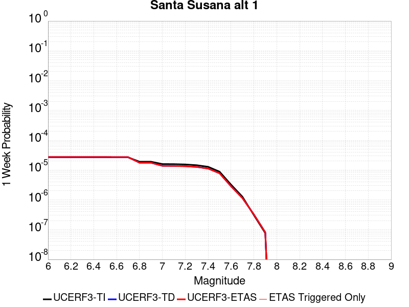 | 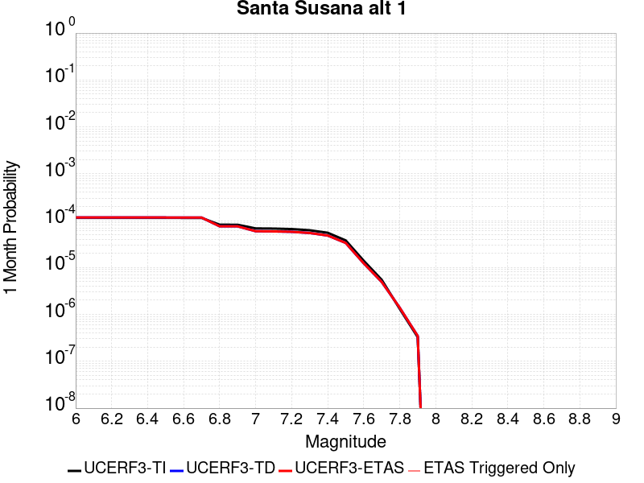 | 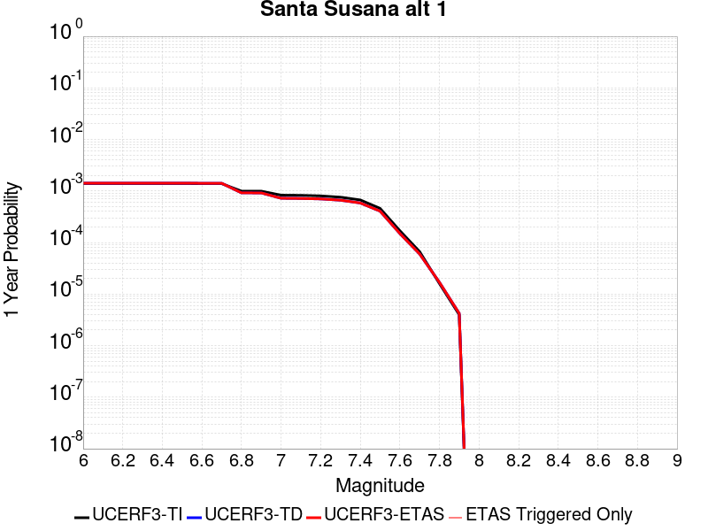 | 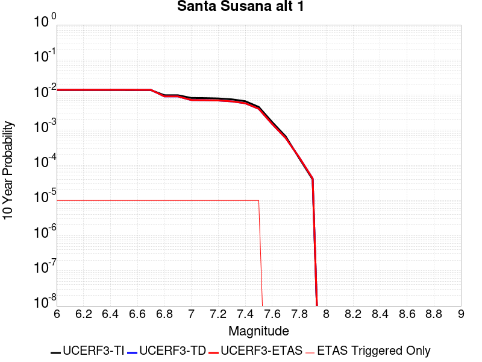 |

| Magnitude | 1 wk TI Prob | 1 wk TD Prob | 1 wk ETAS Prob | 1 wk ETAS/TD Gain | 1 wk ETAS Triggered Only | 1 mo TI Prob | 1 mo TD Prob | 1 mo ETAS Prob | 1 mo ETAS/TD Gain | 1 mo ETAS Triggered Only | 1 yr TI Prob | 1 yr TD Prob | 1 yr ETAS Prob | 1 yr ETAS/TD Gain | 1 yr ETAS Triggered Only | 10 yr TI Prob | 10 yr TD Prob | 10 yr ETAS Prob | 10 yr ETAS/TD Gain | 10 yr ETAS Triggered Only |
|-----|-----|-----|-----|-----|-----|-----|-----|-----|-----|-----|-----|-----|-----|-----|-----|-----|-----|-----|-----|-----|
| 6.0 | 2.674877E-5 | 2.7199834E-5 | 2.7199834E-5 | 1.0 | 0.0 | 1.1463255E-4 | 1.1656615E-4 | 1.1656615E-4 | 1.0 | 0.0 | 0.0013947578 | 0.0014183826 | 0.0014183826 | 1.0 | 0.0 | 0.013860362 | 0.014105062 | 0.014114921 | 1.0006989 | 1.0E-5 |
| 6.1 | 2.674877E-5 | 2.7199834E-5 | 2.7199834E-5 | 1.0 | 0.0 | 1.1463255E-4 | 1.1656615E-4 | 1.1656615E-4 | 1.0 | 0.0 | 0.0013947578 | 0.0014183826 | 0.0014183826 | 1.0 | 0.0 | 0.013860362 | 0.014105062 | 0.014114921 | 1.0006989 | 1.0E-5 |
| 6.2 | 2.674877E-5 | 2.7199834E-5 | 2.7199834E-5 | 1.0 | 0.0 | 1.1463255E-4 | 1.1656615E-4 | 1.1656615E-4 | 1.0 | 0.0 | 0.0013947578 | 0.0014183826 | 0.0014183826 | 1.0 | 0.0 | 0.013860362 | 0.014105062 | 0.014114921 | 1.0006989 | 1.0E-5 |
| 6.3 | 2.674877E-5 | 2.7199834E-5 | 2.7199834E-5 | 1.0 | 0.0 | 1.1463255E-4 | 1.1656615E-4 | 1.1656615E-4 | 1.0 | 0.0 | 0.0013947578 | 0.0014183826 | 0.0014183826 | 1.0 | 0.0 | 0.013860362 | 0.014105062 | 0.014114921 | 1.0006989 | 1.0E-5 |
| 6.4 | 2.674877E-5 | 2.7199834E-5 | 2.7199834E-5 | 1.0 | 0.0 | 1.1463255E-4 | 1.1656615E-4 | 1.1656615E-4 | 1.0 | 0.0 | 0.0013947578 | 0.0014183826 | 0.0014183826 | 1.0 | 0.0 | 0.013860362 | 0.014105062 | 0.014114921 | 1.0006989 | 1.0E-5 |
| 6.5 | 2.674877E-5 | 2.7199834E-5 | 2.7199834E-5 | 1.0 | 0.0 | 1.1463255E-4 | 1.1656615E-4 | 1.1656615E-4 | 1.0 | 0.0 | 0.0013947578 | 0.0014183826 | 0.0014183826 | 1.0 | 0.0 | 0.013860362 | 0.014105062 | 0.014114921 | 1.0006989 | 1.0E-5 |
| 6.6 | 2.6647976E-5 | 2.7076161E-5 | 2.7076161E-5 | 1.0 | 0.0 | 1.14200615E-4 | 1.1603617E-4 | 1.1603617E-4 | 1.0 | 0.0 | 0.0013895056 | 0.0014119387 | 0.0014119387 | 1.0 | 0.0 | 0.013808494 | 0.014041442 | 0.014051301 | 1.0007021 | 1.0E-5 |
| 6.7 | 2.6647976E-5 | 2.7076161E-5 | 2.7076161E-5 | 1.0 | 0.0 | 1.14200615E-4 | 1.1603617E-4 | 1.1603617E-4 | 1.0 | 0.0 | 0.0013895056 | 0.0014119387 | 0.0014119387 | 1.0 | 0.0 | 0.013808494 | 0.014041442 | 0.014051301 | 1.0007021 | 1.0E-5 |
| 6.8 | 1.9073179E-5 | 1.7638224E-5 | 1.7638224E-5 | 1.0 | 0.0 | 8.1739636E-5 | 7.5590295E-5 | 7.5590295E-5 | 1.0 | 0.0 | 9.947256E-4 | 9.199414E-4 | 9.199414E-4 | 1.0 | 0.0 | 0.009902848 | 0.009163587 | 0.009173496 | 1.0010812 | 1.0E-5 |
| 6.9 | 1.9041876E-5 | 1.7620354E-5 | 1.7620354E-5 | 1.0 | 0.0 | 8.160549E-5 | 7.5513715E-5 | 7.5513715E-5 | 1.0 | 0.0 | 9.930939E-4 | 9.1900985E-4 | 9.1900985E-4 | 1.0 | 0.0 | 0.0098866755 | 0.009154348 | 0.009164256 | 1.0010824 | 1.0E-5 |
| 7.0 | 1.5917482E-5 | 1.3864503E-5 | 1.3864503E-5 | 1.0 | 0.0 | 6.8215995E-5 | 5.941797E-5 | 5.941797E-5 | 1.0 | 0.0 | 8.302132E-4 | 7.231783E-4 | 7.231783E-4 | 1.0 | 0.0 | 0.008271185 | 0.007209145 | 0.007219073 | 1.0013771 | 1.0E-5 |
| 7.1 | 1.577788E-5 | 1.3744504E-5 | 1.3744504E-5 | 1.0 | 0.0 | 6.761774E-5 | 5.8903715E-5 | 5.8903715E-5 | 1.0 | 0.0 | 8.2293496E-4 | 7.169214E-4 | 7.169214E-4 | 1.0 | 0.0 | 0.008198941 | 0.0071469797 | 0.007156908 | 1.0013891 | 1.0E-5 |
| 7.2 | 1.5416446E-5 | 1.3470562E-5 | 1.3470562E-5 | 1.0 | 0.0 | 6.606882E-5 | 5.7729732E-5 | 5.7729732E-5 | 1.0 | 0.0 | 8.0409093E-4 | 7.026374E-4 | 7.026374E-4 | 1.0 | 0.0 | 0.008011877 | 0.007005044 | 0.007014974 | 1.0014175 | 1.0E-5 |
| 7.3 | 1.4534083E-5 | 1.2718447E-5 | 1.2718447E-5 | 1.0 | 0.0 | 6.228744E-5 | 5.4506516E-5 | 5.4506516E-5 | 1.0 | 0.0 | 7.580857E-4 | 6.634192E-4 | 6.634192E-4 | 1.0 | 0.0 | 0.007555048 | 0.0066152387 | 0.0066251727 | 1.0015017 | 1.0E-5 |
| 7.4 | 1.2858995E-5 | 1.1230124E-5 | 1.1230124E-5 | 1.0 | 0.0 | 5.5108816E-5 | 4.8128237E-5 | 4.8128237E-5 | 1.0 | 0.0 | 6.7074323E-4 | 5.8580766E-4 | 5.8580766E-4 | 1.0 | 0.0 | 0.0066872234 | 0.00584341 | 0.005853351 | 1.0017014 | 1.0E-5 |
| 7.5 | 8.827668E-6 | 7.805684E-6 | 7.805684E-6 | 1.0 | 0.0 | 3.7832317E-5 | 3.3452518E-5 | 3.3452518E-5 | 1.0 | 0.0 | 4.605111E-4 | 4.0721073E-4 | 4.0721073E-4 | 1.0 | 0.0 | 0.0045955796 | 0.0040648943 | 0.004074854 | 1.0024501 | 1.0E-5 |
| 7.6 | 3.2533426E-6 | 2.8720442E-6 | 2.8720442E-6 | 1.0 | 0.0 | 1.3942822E-5 | 1.2308705E-5 | 1.2308705E-5 | 1.0 | 0.0 | 1.6974064E-4 | 1.4984855E-4 | 1.4984855E-4 | 1.0 | 0.0 | 0.0016961104 | 0.0014975119 | 0.0014975119 | 1.0 | 0.0 |
| 7.7 | 1.2751709E-6 | 1.1491394E-6 | 1.1491394E-6 | 1.0 | 0.0 | 5.4650063E-6 | 4.9248742E-6 | 4.9248742E-6 | 1.0 | 0.0 | 6.653442E-5 | 5.9958787E-5 | 5.9958787E-5 | 1.0 | 0.0 | 6.6514505E-4 | 5.99435E-4 | 5.99435E-4 | 1.0 | 0.0 |
| 7.8 | 3.067544E-7 | 3.240123E-7 | 3.240123E-7 | 1.0 | 0.0 | 1.3146611E-6 | 1.3886234E-6 | 1.3886234E-6 | 1.0 | 0.0 | 1.600588E-5 | 1.690637E-5 | 1.690637E-5 | 1.0 | 0.0 | 1.6004729E-4 | 1.6905185E-4 | 1.6905185E-4 | 1.0 | 0.0 |
| 7.9 | 7.622999E-8 | 8.088155E-8 | 8.088155E-8 | 1.0 | 0.0 | 3.2669993E-7 | 3.4663518E-7 | 3.4663518E-7 | 1.0 | 0.0 | 3.977564E-6 | 4.2202773E-6 | 4.2202773E-6 | 1.0 | 0.0 | 3.977493E-5 | 4.220218E-5 | 4.220218E-5 | 1.0 | 0.0 |

## Elsinore (Julian)
*[(top)](#table-of-contents)*

| 1 Week | 1 Month | 1 Year | 10 Year |
|-----|-----|-----|-----|
|  |  | 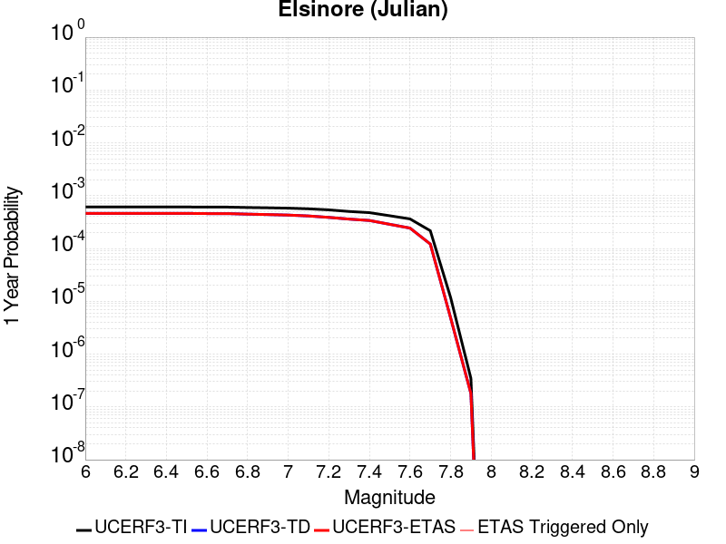 |  |

| Magnitude | 1 wk TI Prob | 1 wk TD Prob | 1 wk ETAS Prob | 1 wk ETAS/TD Gain | 1 wk ETAS Triggered Only | 1 mo TI Prob | 1 mo TD Prob | 1 mo ETAS Prob | 1 mo ETAS/TD Gain | 1 mo ETAS Triggered Only | 1 yr TI Prob | 1 yr TD Prob | 1 yr ETAS Prob | 1 yr ETAS/TD Gain | 1 yr ETAS Triggered Only | 10 yr TI Prob | 10 yr TD Prob | 10 yr ETAS Prob | 10 yr ETAS/TD Gain | 10 yr ETAS Triggered Only |
|-----|-----|-----|-----|-----|-----|-----|-----|-----|-----|-----|-----|-----|-----|-----|-----|-----|-----|-----|-----|-----|
| 6.0 | 1.1710231E-5 | 8.846432E-6 | 8.846432E-6 | 1.0 | 0.0 | 5.0185736E-5 | 3.7912738E-5 | 3.7912738E-5 | 1.0 | 0.0 | 6.1084004E-4 | 4.6149152E-4 | 4.6149152E-4 | 1.0 | 0.0 | 0.006091637 | 0.0046055363 | 0.0046154903 | 1.0021613 | 1.0E-5 |
| 6.1 | 1.1710231E-5 | 8.846432E-6 | 8.846432E-6 | 1.0 | 0.0 | 5.0185736E-5 | 3.7912738E-5 | 3.7912738E-5 | 1.0 | 0.0 | 6.1084004E-4 | 4.6149152E-4 | 4.6149152E-4 | 1.0 | 0.0 | 0.006091637 | 0.0046055363 | 0.0046154903 | 1.0021613 | 1.0E-5 |
| 6.2 | 1.1710231E-5 | 8.846432E-6 | 8.846432E-6 | 1.0 | 0.0 | 5.0185736E-5 | 3.7912738E-5 | 3.7912738E-5 | 1.0 | 0.0 | 6.1084004E-4 | 4.6149152E-4 | 4.6149152E-4 | 1.0 | 0.0 | 0.006091637 | 0.0046055363 | 0.0046154903 | 1.0021613 | 1.0E-5 |
| 6.3 | 1.1710231E-5 | 8.846432E-6 | 8.846432E-6 | 1.0 | 0.0 | 5.0185736E-5 | 3.7912738E-5 | 3.7912738E-5 | 1.0 | 0.0 | 6.1084004E-4 | 4.6149152E-4 | 4.6149152E-4 | 1.0 | 0.0 | 0.006091637 | 0.0046055363 | 0.0046154903 | 1.0021613 | 1.0E-5 |
| 6.4 | 1.1710231E-5 | 8.846432E-6 | 8.846432E-6 | 1.0 | 0.0 | 5.0185736E-5 | 3.7912738E-5 | 3.7912738E-5 | 1.0 | 0.0 | 6.1084004E-4 | 4.6149152E-4 | 4.6149152E-4 | 1.0 | 0.0 | 0.006091637 | 0.0046055363 | 0.0046154903 | 1.0021613 | 1.0E-5 |
| 6.5 | 1.1710231E-5 | 8.846432E-6 | 8.846432E-6 | 1.0 | 0.0 | 5.0185736E-5 | 3.7912738E-5 | 3.7912738E-5 | 1.0 | 0.0 | 6.1084004E-4 | 4.6149152E-4 | 4.6149152E-4 | 1.0 | 0.0 | 0.006091637 | 0.0046055363 | 0.0046154903 | 1.0021613 | 1.0E-5 |
| 6.6 | 1.1650619E-5 | 8.778801E-6 | 8.778801E-6 | 1.0 | 0.0 | 4.993027E-5 | 3.76229E-5 | 3.76229E-5 | 1.0 | 0.0 | 6.0773146E-4 | 4.5796426E-4 | 4.5796426E-4 | 1.0 | 0.0 | 0.0060607214 | 0.004570409 | 0.004580363 | 1.002178 | 1.0E-5 |
| 6.7 | 1.1650619E-5 | 8.778801E-6 | 8.778801E-6 | 1.0 | 0.0 | 4.993027E-5 | 3.76229E-5 | 3.76229E-5 | 1.0 | 0.0 | 6.0773146E-4 | 4.5796426E-4 | 4.5796426E-4 | 1.0 | 0.0 | 0.0060607214 | 0.004570409 | 0.004580363 | 1.002178 | 1.0E-5 |
| 6.8 | 1.1442698E-5 | 8.561954E-6 | 8.561954E-6 | 1.0 | 0.0 | 4.9039216E-5 | 3.6693582E-5 | 3.6693582E-5 | 1.0 | 0.0 | 5.968889E-4 | 4.4665445E-4 | 4.4665445E-4 | 1.0 | 0.0 | 0.0059528816 | 0.004457769 | 0.0044677244 | 1.0022333 | 1.0E-5 |
| 6.9 | 1.1300589E-5 | 8.409815E-6 | 8.409815E-6 | 1.0 | 0.0 | 4.8430196E-5 | 3.6041572E-5 | 3.6041572E-5 | 1.0 | 0.0 | 5.894781E-4 | 4.3871946E-4 | 4.3871946E-4 | 1.0 | 0.0 | 0.005879169 | 0.0043787337 | 0.0043886895 | 1.0022738 | 1.0E-5 |
| 7.0 | 1.1117729E-5 | 8.2269835E-6 | 8.2269835E-6 | 1.0 | 0.0 | 4.764654E-5 | 3.5258035E-5 | 3.5258035E-5 | 1.0 | 0.0 | 5.799422E-4 | 4.2918368E-4 | 4.2918368E-4 | 1.0 | 0.0 | 0.0057843104 | 0.0042837467 | 0.004293704 | 1.0023245 | 1.0E-5 |
| 7.1 | 1.08053955E-5 | 7.912638E-6 | 7.912638E-6 | 1.0 | 0.0 | 4.6308014E-5 | 3.391087E-5 | 3.391087E-5 | 1.0 | 0.0 | 5.6365423E-4 | 4.1278827E-4 | 4.1278827E-4 | 1.0 | 0.0 | 0.005622267 | 0.004120411 | 0.00413037 | 1.002417 | 1.0E-5 |
| 7.2 | 1.032804E-5 | 7.433888E-6 | 7.433888E-6 | 1.0 | 0.0 | 4.4262277E-5 | 3.185914E-5 | 3.185914E-5 | 1.0 | 0.0 | 5.387599E-4 | 3.8781756E-4 | 3.8781756E-4 | 1.0 | 0.0 | 0.0053745564 | 0.0038715953 | 0.0038815567 | 1.0025729 | 1.0E-5 |
| 7.3 | 9.622426E-6 | 6.898638E-6 | 6.898638E-6 | 1.0 | 0.0 | 4.1238312E-5 | 2.9565264E-5 | 2.9565264E-5 | 1.0 | 0.0 | 5.019608E-4 | 3.5989904E-4 | 3.5989904E-4 | 1.0 | 0.0 | 0.005008285 | 0.003593334 | 0.003593334 | 1.0 | 0.0 |
| 7.4 | 9.144434E-6 | 6.4971227E-6 | 6.4971227E-6 | 1.0 | 0.0 | 3.9189843E-5 | 2.7844522E-5 | 2.7844522E-5 | 1.0 | 0.0 | 4.7703186E-4 | 3.389557E-4 | 3.389557E-4 | 1.0 | 0.0 | 0.0047600917 | 0.0033845308 | 0.0033845308 | 1.0 | 0.0 |
| 7.5 | 7.988981E-6 | 5.4989455E-6 | 5.4989455E-6 | 1.0 | 0.0 | 3.4238044E-5 | 2.3566705E-5 | 2.3566705E-5 | 1.0 | 0.0 | 4.1676845E-4 | 2.8688813E-4 | 2.8688813E-4 | 1.0 | 0.0 | 0.0041598766 | 0.002865305 | 0.002865305 | 1.0 | 0.0 |
| 7.6 | 6.9554876E-6 | 4.6630726E-6 | 4.6630726E-6 | 1.0 | 0.0 | 2.9808893E-5 | 1.9984449E-5 | 1.9984449E-5 | 1.0 | 0.0 | 3.6286283E-4 | 2.4328468E-4 | 2.4328468E-4 | 1.0 | 0.0 | 0.0036227088 | 0.0024302998 | 0.0024302998 | 1.0 | 0.0 |
| 7.7 | 4.1557314E-6 | 2.3249631E-6 | 2.3249631E-6 | 1.0 | 0.0 | 1.7810156E-5 | 9.964094E-6 | 9.964094E-6 | 1.0 | 0.0 | 2.1681708E-4 | 1.2130683E-4 | 1.2130683E-4 | 1.0 | 0.0 | 0.0021660565 | 0.0012124792 | 0.0012124792 | 1.0 | 0.0 |
| 7.8 | 2.2597293E-7 | 9.334235E-8 | 9.334235E-8 | 1.0 | 0.0 | 9.684551E-7 | 4.000386E-7 | 4.000386E-7 | 1.0 | 0.0 | 1.1790877E-5 | 4.8704624E-6 | 4.8704624E-6 | 1.0 | 0.0 | 1.17902506E-4 | 4.8703885E-5 | 4.8703885E-5 | 1.0 | 0.0 |
| 7.9 | 6.676829E-9 | 3.440201E-9 | 3.440201E-9 | 1.0 | 0.0 | 2.861498E-8 | 1.4743717E-8 | 1.4743717E-8 | 1.0 | 0.0 | 3.4838732E-7 | 1.7950475E-7 | 1.7950475E-7 | 1.0 | 0.0 | 3.4838679E-6 | 1.7950462E-6 | 1.7950462E-6 | 1.0 | 0.0 |

## Sisar
*[(top)](#table-of-contents)*

| 1 Week | 1 Month | 1 Year | 10 Year |
|-----|-----|-----|-----|
| 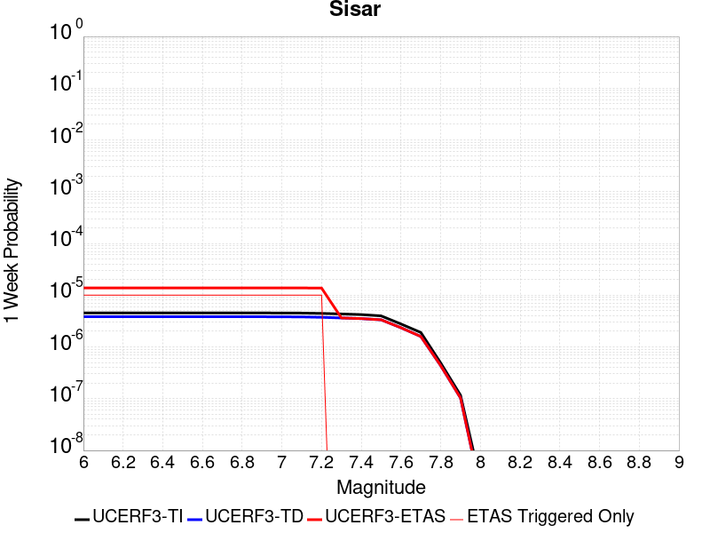 |  |  | 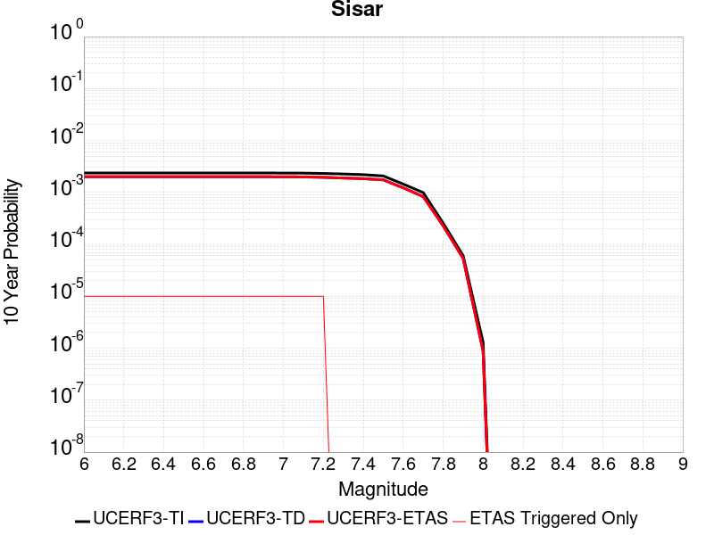 |

| Magnitude | 1 wk TI Prob | 1 wk TD Prob | 1 wk ETAS Prob | 1 wk ETAS/TD Gain | 1 wk ETAS Triggered Only | 1 mo TI Prob | 1 mo TD Prob | 1 mo ETAS Prob | 1 mo ETAS/TD Gain | 1 mo ETAS Triggered Only | 1 yr TI Prob | 1 yr TD Prob | 1 yr ETAS Prob | 1 yr ETAS/TD Gain | 1 yr ETAS Triggered Only | 10 yr TI Prob | 10 yr TD Prob | 10 yr ETAS Prob | 10 yr ETAS/TD Gain | 10 yr ETAS Triggered Only |
|-----|-----|-----|-----|-----|-----|-----|-----|-----|-----|-----|-----|-----|-----|-----|-----|-----|-----|-----|-----|-----|
| 6.0 | 4.544193E-6 | 3.839685E-6 | 1.3839647E-5 | 3.60437 | 1.0E-5 | 1.9474966E-5 | 1.6455691E-5 | 2.6455527E-5 | 1.6076825 | 1.0E-5 | 2.3708193E-4 | 2.0032996E-4 | 2.1032795E-4 | 1.0499077 | 1.0E-5 | 0.0023682916 | 0.0020015275 | 0.0020115075 | 1.0049862 | 1.0E-5 |
| 6.1 | 4.544193E-6 | 3.839685E-6 | 1.3839647E-5 | 3.60437 | 1.0E-5 | 1.9474966E-5 | 1.6455691E-5 | 2.6455527E-5 | 1.6076825 | 1.0E-5 | 2.3708193E-4 | 2.0032996E-4 | 2.1032795E-4 | 1.0499077 | 1.0E-5 | 0.0023682916 | 0.0020015275 | 0.0020115075 | 1.0049862 | 1.0E-5 |
| 6.2 | 4.544193E-6 | 3.839685E-6 | 1.3839647E-5 | 3.60437 | 1.0E-5 | 1.9474966E-5 | 1.6455691E-5 | 2.6455527E-5 | 1.6076825 | 1.0E-5 | 2.3708193E-4 | 2.0032996E-4 | 2.1032795E-4 | 1.0499077 | 1.0E-5 | 0.0023682916 | 0.0020015275 | 0.0020115075 | 1.0049862 | 1.0E-5 |
| 6.3 | 4.544193E-6 | 3.839685E-6 | 1.3839647E-5 | 3.60437 | 1.0E-5 | 1.9474966E-5 | 1.6455691E-5 | 2.6455527E-5 | 1.6076825 | 1.0E-5 | 2.3708193E-4 | 2.0032996E-4 | 2.1032795E-4 | 1.0499077 | 1.0E-5 | 0.0023682916 | 0.0020015275 | 0.0020115075 | 1.0049862 | 1.0E-5 |
| 6.4 | 4.544193E-6 | 3.839685E-6 | 1.3839647E-5 | 3.60437 | 1.0E-5 | 1.9474966E-5 | 1.6455691E-5 | 2.6455527E-5 | 1.6076825 | 1.0E-5 | 2.3708193E-4 | 2.0032996E-4 | 2.1032795E-4 | 1.0499077 | 1.0E-5 | 0.0023682916 | 0.0020015275 | 0.0020115075 | 1.0049862 | 1.0E-5 |
| 6.5 | 4.544193E-6 | 3.839685E-6 | 1.3839647E-5 | 3.60437 | 1.0E-5 | 1.9474966E-5 | 1.6455691E-5 | 2.6455527E-5 | 1.6076825 | 1.0E-5 | 2.3708193E-4 | 2.0032996E-4 | 2.1032795E-4 | 1.0499077 | 1.0E-5 | 0.0023682916 | 0.0020015275 | 0.0020115075 | 1.0049862 | 1.0E-5 |
| 6.6 | 4.544193E-6 | 3.839685E-6 | 1.3839647E-5 | 3.60437 | 1.0E-5 | 1.9474966E-5 | 1.6455691E-5 | 2.6455527E-5 | 1.6076825 | 1.0E-5 | 2.3708193E-4 | 2.0032996E-4 | 2.1032795E-4 | 1.0499077 | 1.0E-5 | 0.0023682916 | 0.0020015275 | 0.0020115075 | 1.0049862 | 1.0E-5 |
| 6.7 | 4.544193E-6 | 3.839685E-6 | 1.3839647E-5 | 3.60437 | 1.0E-5 | 1.9474966E-5 | 1.6455691E-5 | 2.6455527E-5 | 1.6076825 | 1.0E-5 | 2.3708193E-4 | 2.0032996E-4 | 2.1032795E-4 | 1.0499077 | 1.0E-5 | 0.0023682916 | 0.0020015275 | 0.0020115075 | 1.0049862 | 1.0E-5 |
| 6.8 | 4.544193E-6 | 3.839685E-6 | 1.3839647E-5 | 3.60437 | 1.0E-5 | 1.9474966E-5 | 1.6455691E-5 | 2.6455527E-5 | 1.6076825 | 1.0E-5 | 2.3708193E-4 | 2.0032996E-4 | 2.1032795E-4 | 1.0499077 | 1.0E-5 | 0.0023682916 | 0.0020015275 | 0.0020115075 | 1.0049862 | 1.0E-5 |
| 6.9 | 4.542225E-6 | 3.837647E-6 | 1.3837609E-5 | 3.6057534 | 1.0E-5 | 1.9466532E-5 | 1.6446957E-5 | 2.6446793E-5 | 1.6080052 | 1.0E-5 | 2.3697925E-4 | 2.0022363E-4 | 2.1022162E-4 | 1.0499341 | 1.0E-5 | 0.002367267 | 0.0020004662 | 0.002010446 | 1.0049888 | 1.0E-5 |
| 7.0 | 4.5278484E-6 | 3.822711E-6 | 1.3822672E-5 | 3.6159346 | 1.0E-5 | 1.940492E-5 | 1.6382946E-5 | 2.6382782E-5 | 1.6103809 | 1.0E-5 | 2.3622929E-4 | 1.9944445E-4 | 2.0944244E-4 | 1.0501293 | 1.0E-5 | 0.0023597833 | 0.0019926883 | 0.0020026683 | 1.0050083 | 1.0E-5 |
| 7.1 | 4.5132488E-6 | 3.8074982E-6 | 1.380746E-5 | 3.6263866 | 1.0E-5 | 1.9342351E-5 | 1.6317748E-5 | 2.6317586E-5 | 1.6128197 | 1.0E-5 | 2.3546767E-4 | 1.9865081E-4 | 2.0864882E-4 | 1.0503296 | 1.0E-5 | 0.0023521832 | 0.0019847662 | 0.0019947463 | 1.0050284 | 1.0E-5 |
| 7.2 | 4.448859E-6 | 3.7399573E-6 | 1.373992E-5 | 3.6738174 | 1.0E-5 | 1.9066398E-5 | 1.6028293E-5 | 2.6028132E-5 | 1.6238868 | 1.0E-5 | 2.3210866E-4 | 1.9512732E-4 | 2.0512537E-4 | 1.0512385 | 1.0E-5 | 0.0023186638 | 0.0019495934 | 0.001959574 | 1.0051193 | 1.0E-5 |
| 7.3 | 4.3424366E-6 | 3.6337894E-6 | 3.6337894E-6 | 1.0 | 0.0 | 1.861031E-5 | 1.5573292E-5 | 1.5573292E-5 | 1.0 | 0.0 | 2.2655698E-4 | 1.8958867E-4 | 1.8958867E-4 | 1.0 | 0.0 | 0.0022632615 | 0.0018943028 | 0.0018943028 | 1.0 | 0.0 |
| 7.4 | 4.218641E-6 | 3.5331395E-6 | 3.5331395E-6 | 1.0 | 0.0 | 1.8079765E-5 | 1.5141941E-5 | 1.5141941E-5 | 1.0 | 0.0 | 2.2009891E-4 | 1.8433787E-4 | 1.8433787E-4 | 1.0 | 0.0 | 0.0021988105 | 0.001841883 | 0.001841883 | 1.0 | 0.0 |
| 7.5 | 3.983779E-6 | 3.3479018E-6 | 3.3479018E-6 | 1.0 | 0.0 | 1.7073227E-5 | 1.4348074E-5 | 1.4348074E-5 | 1.0 | 0.0 | 2.0784672E-4 | 1.7467413E-4 | 1.7467413E-4 | 1.0 | 0.0 | 0.0020765243 | 0.0017454013 | 0.0017454013 | 1.0 | 0.0 |
| 7.6 | 2.777393E-6 | 2.3523125E-6 | 2.3523125E-6 | 1.0 | 0.0 | 1.1903058E-5 | 1.0081301E-5 | 1.0081301E-5 | 1.0 | 0.0 | 1.449101E-4 | 1.22733E-4 | 1.22733E-4 | 1.0 | 0.0 | 0.0014481564 | 0.00122666 | 0.00122666 | 1.0 | 0.0 |
| 7.7 | 1.9028433E-6 | 1.5939175E-6 | 1.5939175E-6 | 1.0 | 0.0 | 8.155017E-6 | 6.8310574E-6 | 6.8310574E-6 | 1.0 | 0.0 | 9.928281E-5 | 8.3164996E-5 | 8.3164996E-5 | 1.0 | 0.0 | 9.923846E-4 | 8.313435E-4 | 8.313435E-4 | 1.0 | 0.0 |
| 7.8 | 4.9095956E-7 | 4.3584475E-7 | 4.3584475E-7 | 1.0 | 0.0 | 2.1041105E-6 | 1.8679048E-6 | 1.8679048E-6 | 1.0 | 0.0 | 2.5617246E-5 | 2.2741506E-5 | 2.2741506E-5 | 1.0 | 0.0 | 2.5614293E-4 | 2.2739195E-4 | 2.2739195E-4 | 1.0 | 0.0 |
| 7.9 | 1.16657894E-7 | 1.03357515E-7 | 1.03357515E-7 | 1.0 | 0.0 | 4.999623E-7 | 4.429607E-7 | 4.429607E-7 | 1.0 | 0.0 | 6.087024E-6 | 5.3930335E-6 | 5.3930335E-6 | 1.0 | 0.0 | 6.0868573E-5 | 5.3929056E-5 | 5.3929056E-5 | 1.0 | 0.0 |
| 8.0 | 2.5100346E-9 | 1.7069005E-9 | 1.7069005E-9 | 1.0 | 0.0 | 1.0757291E-8 | 7.3152884E-9 | 7.3152884E-9 | 1.0 | 0.0 | 1.3097001E-7 | 8.906363E-8 | 8.906363E-8 | 1.0 | 0.0 | 1.3096993E-6 | 8.9063604E-7 | 8.9063604E-7 | 1.0 | 0.0 |

## Del Valle
*[(top)](#table-of-contents)*

| 1 Week | 1 Month | 1 Year | 10 Year |
|-----|-----|-----|-----|
| 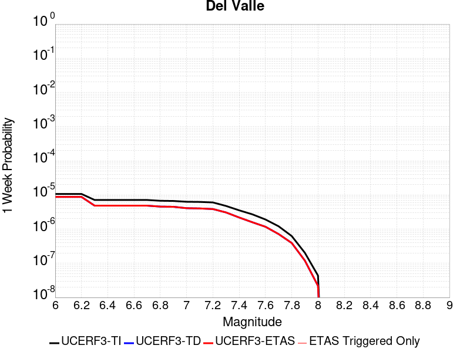 |  |  |  |

| Magnitude | 1 wk TI Prob | 1 wk TD Prob | 1 wk ETAS Prob | 1 wk ETAS/TD Gain | 1 wk ETAS Triggered Only | 1 mo TI Prob | 1 mo TD Prob | 1 mo ETAS Prob | 1 mo ETAS/TD Gain | 1 mo ETAS Triggered Only | 1 yr TI Prob | 1 yr TD Prob | 1 yr ETAS Prob | 1 yr ETAS/TD Gain | 1 yr ETAS Triggered Only | 10 yr TI Prob | 10 yr TD Prob | 10 yr ETAS Prob | 10 yr ETAS/TD Gain | 10 yr ETAS Triggered Only |
|-----|-----|-----|-----|-----|-----|-----|-----|-----|-----|-----|-----|-----|-----|-----|-----|-----|-----|-----|-----|-----|
| 6.0 | 1.0716125E-5 | 8.768361E-6 | 8.768361E-6 | 1.0 | 0.0 | 4.592544E-5 | 3.7578262E-5 | 3.7578262E-5 | 1.0 | 0.0 | 5.589988E-4 | 4.5743905E-4 | 4.5743905E-4 | 1.0 | 0.0 | 0.0055759475 | 0.0045669293 | 0.0045768837 | 1.0021796 | 1.0E-5 |
| 6.1 | 1.0716125E-5 | 8.768361E-6 | 8.768361E-6 | 1.0 | 0.0 | 4.592544E-5 | 3.7578262E-5 | 3.7578262E-5 | 1.0 | 0.0 | 5.589988E-4 | 4.5743905E-4 | 4.5743905E-4 | 1.0 | 0.0 | 0.0055759475 | 0.0045669293 | 0.0045768837 | 1.0021796 | 1.0E-5 |
| 6.2 | 1.0716125E-5 | 8.768361E-6 | 8.768361E-6 | 1.0 | 0.0 | 4.592544E-5 | 3.7578262E-5 | 3.7578262E-5 | 1.0 | 0.0 | 5.589988E-4 | 4.5743905E-4 | 4.5743905E-4 | 1.0 | 0.0 | 0.0055759475 | 0.0045669293 | 0.0045768837 | 1.0021796 | 1.0E-5 |
| 6.3 | 7.1293784E-6 | 4.866175E-6 | 4.866175E-6 | 1.0 | 0.0 | 3.055412E-5 | 2.0854872E-5 | 2.0854872E-5 | 1.0 | 0.0 | 3.7193293E-4 | 2.5387923E-4 | 2.5387923E-4 | 1.0 | 0.0 | 0.0037131102 | 0.0025359779 | 0.0025359779 | 1.0 | 0.0 |
| 6.4 | 7.1293784E-6 | 4.866175E-6 | 4.866175E-6 | 1.0 | 0.0 | 3.055412E-5 | 2.0854872E-5 | 2.0854872E-5 | 1.0 | 0.0 | 3.7193293E-4 | 2.5387923E-4 | 2.5387923E-4 | 1.0 | 0.0 | 0.0037131102 | 0.0025359779 | 0.0025359779 | 1.0 | 0.0 |
| 6.5 | 7.1293784E-6 | 4.866175E-6 | 4.866175E-6 | 1.0 | 0.0 | 3.055412E-5 | 2.0854872E-5 | 2.0854872E-5 | 1.0 | 0.0 | 3.7193293E-4 | 2.5387923E-4 | 2.5387923E-4 | 1.0 | 0.0 | 0.0037131102 | 0.0025359779 | 0.0025359779 | 1.0 | 0.0 |
| 6.6 | 7.1293784E-6 | 4.866175E-6 | 4.866175E-6 | 1.0 | 0.0 | 3.055412E-5 | 2.0854872E-5 | 2.0854872E-5 | 1.0 | 0.0 | 3.7193293E-4 | 2.5387923E-4 | 2.5387923E-4 | 1.0 | 0.0 | 0.0037131102 | 0.0025359779 | 0.0025359779 | 1.0 | 0.0 |
| 6.7 | 7.12272E-6 | 4.86355E-6 | 4.86355E-6 | 1.0 | 0.0 | 3.0525585E-5 | 2.0843625E-5 | 2.0843625E-5 | 1.0 | 0.0 | 3.7158563E-4 | 2.537423E-4 | 2.537423E-4 | 1.0 | 0.0 | 0.003709649 | 0.0025346118 | 0.0025346118 | 1.0 | 0.0 |
| 6.8 | 6.7558703E-6 | 4.5597358E-6 | 4.5597358E-6 | 1.0 | 0.0 | 2.895341E-5 | 1.9541581E-5 | 1.9541581E-5 | 1.0 | 0.0 | 3.5245073E-4 | 2.3789342E-4 | 2.3789342E-4 | 1.0 | 0.0 | 0.0035189227 | 0.0023764628 | 0.0023764628 | 1.0 | 0.0 |
| 6.9 | 6.6700386E-6 | 4.5028655E-6 | 4.5028655E-6 | 1.0 | 0.0 | 2.8585566E-5 | 1.9297857E-5 | 1.9297857E-5 | 1.0 | 0.0 | 3.479737E-4 | 2.349267E-4 | 2.349267E-4 | 1.0 | 0.0 | 0.003474293 | 0.0023468586 | 0.0023468586 | 1.0 | 0.0 |
| 7.0 | 6.3181424E-6 | 4.0990067E-6 | 4.0990067E-6 | 1.0 | 0.0 | 2.7077473E-5 | 1.7567054E-5 | 1.7567054E-5 | 1.0 | 0.0 | 3.2961834E-4 | 2.1385832E-4 | 2.1385832E-4 | 1.0 | 0.0 | 0.0032912986 | 0.00213658 | 0.00213658 | 1.0 | 0.0 |
| 7.1 | 6.248759E-6 | 4.034193E-6 | 4.034193E-6 | 1.0 | 0.0 | 2.678012E-5 | 1.7289287E-5 | 1.7289287E-5 | 1.0 | 0.0 | 3.2599916E-4 | 2.1047716E-4 | 2.1047716E-4 | 1.0 | 0.0 | 0.0032552136 | 0.0021028325 | 0.0021028325 | 1.0 | 0.0 |
| 7.2 | 6.0411944E-6 | 3.870173E-6 | 3.870173E-6 | 1.0 | 0.0 | 2.5890577E-5 | 1.6586351E-5 | 1.6586351E-5 | 1.0 | 0.0 | 3.1517216E-4 | 2.0192053E-4 | 2.0192053E-4 | 1.0 | 0.0 | 0.0031472554 | 0.002017424 | 0.002017424 | 1.0 | 0.0 |
| 7.3 | 4.7691183E-6 | 3.0783274E-6 | 3.0783274E-6 | 1.0 | 0.0 | 2.0438918E-5 | 1.3192766E-5 | 1.3192766E-5 | 1.0 | 0.0 | 2.488154E-4 | 1.606103E-4 | 1.606103E-4 | 1.0 | 0.0 | 0.00248537 | 0.0016049681 | 0.0016049681 | 1.0 | 0.0 |
| 7.4 | 3.5524722E-6 | 2.1894814E-6 | 2.1894814E-6 | 1.0 | 0.0 | 1.5224792E-5 | 9.383458E-6 | 9.383458E-6 | 1.0 | 0.0 | 1.8534607E-4 | 1.1423769E-4 | 1.1423769E-4 | 1.0 | 0.0 | 0.0018519156 | 0.001141798 | 0.001141798 | 1.0 | 0.0 |
| 7.5 | 2.7133442E-6 | 1.5917178E-6 | 1.5917178E-6 | 1.0 | 0.0 | 1.1628566E-5 | 6.82163E-6 | 6.82163E-6 | 1.0 | 0.0 | 1.415686E-4 | 8.3050196E-5 | 8.3050196E-5 | 1.0 | 0.0 | 0.0014147845 | 8.301935E-4 | 8.301935E-4 | 1.0 | 0.0 |
| 7.6 | 1.915338E-6 | 1.1739909E-6 | 1.1739909E-6 | 1.0 | 0.0 | 8.208566E-6 | 5.03138E-6 | 5.03138E-6 | 1.0 | 0.0 | 9.993471E-5 | 6.125534E-5 | 6.125534E-5 | 1.0 | 0.0 | 9.988978E-4 | 6.1238545E-4 | 6.1238545E-4 | 1.0 | 0.0 |
| 7.7 | 1.2120448E-6 | 7.180842E-7 | 7.180842E-7 | 1.0 | 0.0 | 5.194467E-6 | 3.0775E-6 | 3.0775E-6 | 1.0 | 0.0 | 6.3240805E-5 | 3.7467922E-5 | 3.7467922E-5 | 1.0 | 0.0 | 6.322281E-4 | 3.7461644E-4 | 3.7461644E-4 | 1.0 | 0.0 |
| 7.8 | 6.272381E-7 | 3.9328637E-7 | 3.9328637E-7 | 1.0 | 0.0 | 2.6881603E-6 | 1.685512E-6 | 1.685512E-6 | 1.0 | 0.0 | 3.272786E-5 | 2.0520916E-5 | 2.0520916E-5 | 1.0 | 0.0 | 3.272304E-4 | 2.0519037E-4 | 2.0519037E-4 | 1.0 | 0.0 |
| 7.9 | 2.0292627E-7 | 1.2005712E-7 | 1.2005712E-7 | 1.0 | 0.0 | 8.6968373E-7 | 5.145304E-7 | 5.145304E-7 | 1.0 | 0.0 | 1.0588348E-5 | 6.2643903E-6 | 6.2643903E-6 | 1.0 | 0.0 | 1.0587843E-4 | 6.264216E-5 | 6.264216E-5 | 1.0 | 0.0 |
| 8.0 | 4.374492E-8 | 2.1902885E-8 | 2.1902885E-8 | 1.0 | 0.0 | 1.8747821E-7 | 9.38695E-8 | 9.38695E-8 | 1.0 | 0.0 | 2.2825448E-6 | 1.1428606E-6 | 1.1428606E-6 | 1.0 | 0.0 | 2.2825214E-5 | 1.1428551E-5 | 1.1428551E-5 | 1.0 | 0.0 |

## Hosgri (Extension)
*[(top)](#table-of-contents)*

| 1 Week | 1 Month | 1 Year | 10 Year |
|-----|-----|-----|-----|
|  | 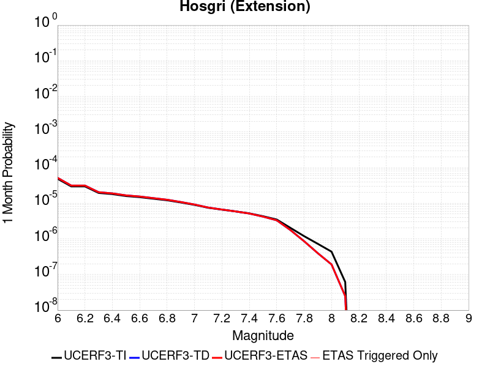 | 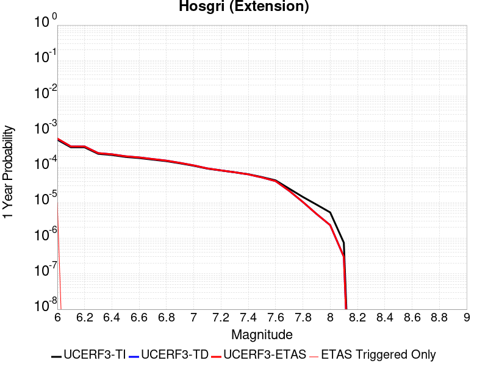 | 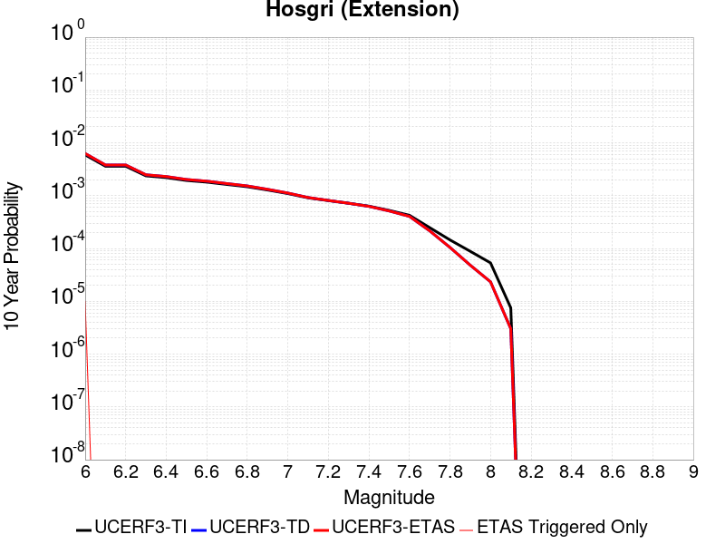 |

| Magnitude | 1 wk TI Prob | 1 wk TD Prob | 1 wk ETAS Prob | 1 wk ETAS/TD Gain | 1 wk ETAS Triggered Only | 1 mo TI Prob | 1 mo TD Prob | 1 mo ETAS Prob | 1 mo ETAS/TD Gain | 1 mo ETAS Triggered Only | 1 yr TI Prob | 1 yr TD Prob | 1 yr ETAS Prob | 1 yr ETAS/TD Gain | 1 yr ETAS Triggered Only | 10 yr TI Prob | 10 yr TD Prob | 10 yr ETAS Prob | 10 yr ETAS/TD Gain | 10 yr ETAS Triggered Only |
|-----|-----|-----|-----|-----|-----|-----|-----|-----|-----|-----|-----|-----|-----|-----|-----|-----|-----|-----|-----|-----|
| 6.0 | 1.1369135E-5 | 1.2083427E-5 | 1.2083427E-5 | 1.0 | 0.0 | 4.8723956E-5 | 5.1785217E-5 | 5.1785217E-5 | 1.0 | 0.0 | 5.9305265E-4 | 6.3032535E-4 | 6.40319E-4 | 1.0158548 | 1.0E-5 | 0.005914725 | 0.006287624 | 0.0062975613 | 1.0015805 | 1.0E-5 |
| 6.1 | 6.934979E-6 | 7.3247807E-6 | 7.3247807E-6 | 1.0 | 0.0 | 2.9721E-5 | 3.1391563E-5 | 3.1391563E-5 | 1.0 | 0.0 | 3.617931E-4 | 3.821294E-4 | 3.821294E-4 | 1.0 | 0.0 | 0.0036120464 | 0.003815136 | 0.003815136 | 1.0 | 0.0 |
| 6.2 | 6.934979E-6 | 7.3247807E-6 | 7.3247807E-6 | 1.0 | 0.0 | 2.9721E-5 | 3.1391563E-5 | 3.1391563E-5 | 1.0 | 0.0 | 3.617931E-4 | 3.821294E-4 | 3.821294E-4 | 1.0 | 0.0 | 0.0036120464 | 0.003815136 | 0.003815136 | 1.0 | 0.0 |
| 6.3 | 4.5484676E-6 | 4.769489E-6 | 4.769489E-6 | 1.0 | 0.0 | 1.9493287E-5 | 2.0440508E-5 | 2.0440508E-5 | 1.0 | 0.0 | 2.3730492E-4 | 2.488352E-4 | 2.488352E-4 | 1.0 | 0.0 | 0.0023705168 | 0.0024856082 | 0.0024856082 | 1.0 | 0.0 |
| 6.4 | 4.218095E-6 | 4.4170115E-6 | 4.4170115E-6 | 1.0 | 0.0 | 1.8077424E-5 | 1.8929913E-5 | 1.8929913E-5 | 1.0 | 0.0 | 2.2007042E-4 | 2.3044764E-4 | 2.3044764E-4 | 1.0 | 0.0 | 0.002198526 | 0.0023021202 | 0.0023021202 | 1.0 | 0.0 |
| 6.5 | 3.717374E-6 | 3.884015E-6 | 3.884015E-6 | 1.0 | 0.0 | 1.5931506E-5 | 1.6645672E-5 | 1.6645672E-5 | 1.0 | 0.0 | 1.9394881E-4 | 2.0264239E-4 | 2.0264239E-4 | 1.0 | 0.0 | 0.0019377962 | 0.002024595 | 0.002024595 | 1.0 | 0.0 |
| 6.6 | 3.4605036E-6 | 3.6084357E-6 | 3.6084357E-6 | 1.0 | 0.0 | 1.4830645E-5 | 1.5464633E-5 | 1.5464633E-5 | 1.0 | 0.0 | 1.8054814E-4 | 1.8826578E-4 | 1.8826578E-4 | 1.0 | 0.0 | 0.0018040152 | 0.0018810777 | 0.0018810777 | 1.0 | 0.0 |
| 6.7 | 3.123439E-6 | 3.2466885E-6 | 3.2466885E-6 | 1.0 | 0.0 | 1.33860985E-5 | 1.3914305E-5 | 1.3914305E-5 | 1.0 | 0.0 | 1.6296357E-4 | 1.693936E-4 | 1.693936E-4 | 1.0 | 0.0 | 0.001628441 | 0.0016926557 | 0.0016926557 | 1.0 | 0.0 |
| 6.8 | 2.8290783E-6 | 2.9306514E-6 | 2.9306514E-6 | 1.0 | 0.0 | 1.2124565E-5 | 1.2559874E-5 | 1.2559874E-5 | 1.0 | 0.0 | 1.4760658E-4 | 1.5290582E-4 | 1.5290582E-4 | 1.0 | 0.0 | 0.0014750857 | 0.0015280149 | 0.0015280149 | 1.0 | 0.0 |
| 6.9 | 2.454112E-6 | 2.5284198E-6 | 2.5284198E-6 | 1.0 | 0.0 | 1.0517581E-5 | 1.083604E-5 | 1.083604E-5 | 1.0 | 0.0 | 1.2804402E-4 | 1.3192085E-4 | 1.3192085E-4 | 1.0 | 0.0 | 0.0012797028 | 0.0013184316 | 0.0013184316 | 1.0 | 0.0 |
| 7.0 | 2.1008145E-6 | 2.1499604E-6 | 2.1499604E-6 | 1.0 | 0.0 | 9.003459E-6 | 9.2140845E-6 | 9.2140845E-6 | 1.0 | 0.0 | 1.096116E-4 | 1.1217574E-4 | 1.1217574E-4 | 1.0 | 0.0 | 0.0010955755 | 0.0011211949 | 0.0011211949 | 1.0 | 0.0 |
| 7.1 | 1.744384E-6 | 1.7687156E-6 | 1.7687156E-6 | 1.0 | 0.0 | 7.47591E-6 | 7.5801877E-6 | 7.5801877E-6 | 1.0 | 0.0 | 9.1015405E-5 | 9.228489E-5 | 9.228489E-5 | 1.0 | 0.0 | 9.097813E-4 | 9.2246744E-4 | 9.2246744E-4 | 1.0 | 0.0 |
| 7.2 | 1.5456587E-6 | 1.5563631E-6 | 1.5563631E-6 | 1.0 | 0.0 | 6.6242346E-6 | 6.670111E-6 | 6.670111E-6 | 1.0 | 0.0 | 8.064707E-5 | 8.120559E-5 | 8.120559E-5 | 1.0 | 0.0 | 8.0617814E-4 | 8.117604E-4 | 8.117604E-4 | 1.0 | 0.0 |
| 7.3 | 1.3775123E-6 | 1.3766786E-6 | 1.3766786E-6 | 1.0 | 0.0 | 5.9036106E-6 | 5.9000376E-6 | 5.9000376E-6 | 1.0 | 0.0 | 7.187409E-5 | 7.1830604E-5 | 7.1830604E-5 | 1.0 | 0.0 | 7.185085E-4 | 7.1807485E-4 | 7.1807485E-4 | 1.0 | 0.0 |
| 7.4 | 1.214491E-6 | 1.2024119E-6 | 1.2024119E-6 | 1.0 | 0.0 | 5.2049513E-6 | 5.153184E-6 | 5.153184E-6 | 1.0 | 0.0 | 6.336844E-5 | 6.273822E-5 | 6.273822E-5 | 1.0 | 0.0 | 6.335037E-4 | 6.272059E-4 | 6.272059E-4 | 1.0 | 0.0 |
| 7.5 | 1.0101123E-6 | 9.842851E-7 | 9.842851E-7 | 1.0 | 0.0 | 4.3290456E-6 | 4.2183574E-6 | 4.2183574E-6 | 1.0 | 0.0 | 5.2704854E-5 | 5.13573E-5 | 5.13573E-5 | 1.0 | 0.0 | 5.2692357E-4 | 5.134549E-4 | 5.134549E-4 | 1.0 | 0.0 |
| 7.6 | 8.1558215E-7 | 7.7665186E-7 | 7.7665186E-7 | 1.0 | 0.0 | 3.4953473E-6 | 3.328504E-6 | 3.328504E-6 | 1.0 | 0.0 | 4.255502E-5 | 4.0523784E-5 | 4.0523784E-5 | 1.0 | 0.0 | 4.2546875E-4 | 4.051644E-4 | 4.051644E-4 | 1.0 | 0.0 |
| 7.7 | 4.757816E-7 | 4.131347E-7 | 4.131347E-7 | 1.0 | 0.0 | 2.0390623E-6 | 1.7705761E-6 | 1.7705761E-6 | 1.0 | 0.0 | 2.4825302E-5 | 2.1556552E-5 | 2.1556552E-5 | 1.0 | 0.0 | 2.482253E-4 | 2.1554474E-4 | 2.1554474E-4 | 1.0 | 0.0 |
| 7.8 | 2.782787E-7 | 2.0051701E-7 | 2.0051701E-7 | 1.0 | 0.0 | 1.1926223E-6 | 8.593583E-7 | 8.593583E-7 | 1.0 | 0.0 | 1.452008E-5 | 1.0462637E-5 | 1.0462637E-5 | 1.0 | 0.0 | 1.4519131E-4 | 1.0462148E-4 | 1.0462148E-4 | 1.0 | 0.0 |
| 7.9 | 1.6948086E-7 | 9.247979E-8 | 9.247979E-8 | 1.0 | 0.0 | 7.2634634E-7 | 3.9634187E-7 | 3.9634187E-7 | 1.0 | 0.0 | 8.843231E-6 | 4.825452E-6 | 4.825452E-6 | 1.0 | 0.0 | 8.842879E-5 | 4.8253478E-5 | 4.8253478E-5 | 1.0 | 0.0 |
| 8.0 | 1.0225492E-7 | 4.4765976E-8 | 4.4765976E-8 | 1.0 | 0.0 | 4.382353E-7 | 1.9185416E-7 | 1.9185416E-7 | 1.0 | 0.0 | 5.335502E-6 | 2.3358218E-6 | 2.3358218E-6 | 1.0 | 0.0 | 5.335374E-5 | 2.3357976E-5 | 2.3357976E-5 | 1.0 | 0.0 |
| 8.1 | 1.43711345E-8 | 5.7919225E-9 | 5.7919225E-9 | 1.0 | 0.0 | 6.1590576E-8 | 2.4822524E-8 | 2.4822524E-8 | 1.0 | 0.0 | 7.4986497E-7 | 3.022142E-7 | 3.022142E-7 | 1.0 | 0.0 | 7.4986247E-6 | 3.0221383E-6 | 3.0221383E-6 | 1.0 | 0.0 |

## Johnson Valley (No) 2011 rev
*[(top)](#table-of-contents)*

| 1 Week | 1 Month | 1 Year | 10 Year |
|-----|-----|-----|-----|
| 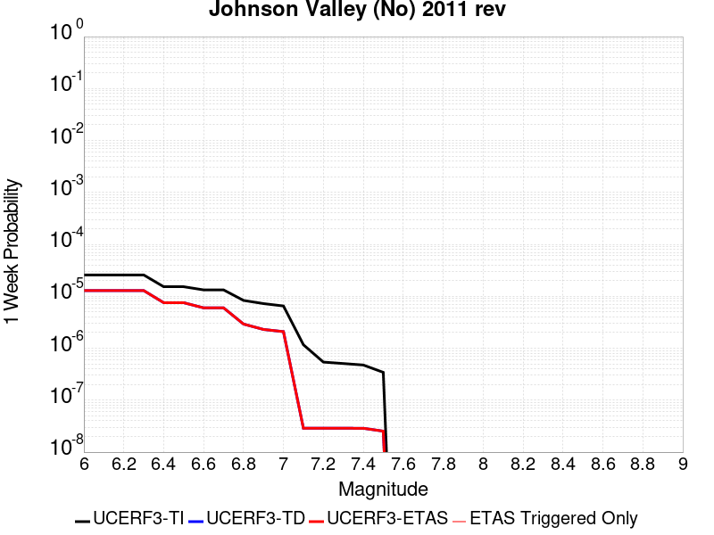 |  |  | 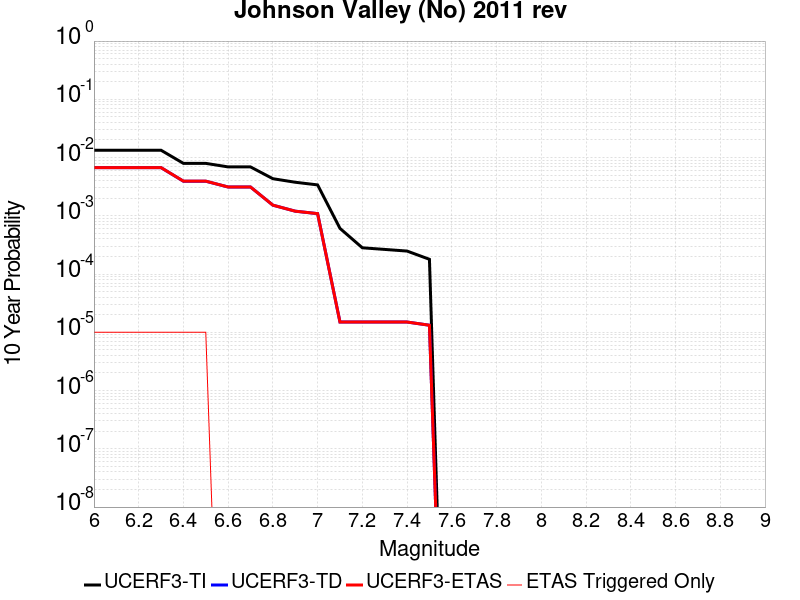 |

| Magnitude | 1 wk TI Prob | 1 wk TD Prob | 1 wk ETAS Prob | 1 wk ETAS/TD Gain | 1 wk ETAS Triggered Only | 1 mo TI Prob | 1 mo TD Prob | 1 mo ETAS Prob | 1 mo ETAS/TD Gain | 1 mo ETAS Triggered Only | 1 yr TI Prob | 1 yr TD Prob | 1 yr ETAS Prob | 1 yr ETAS/TD Gain | 1 yr ETAS Triggered Only | 10 yr TI Prob | 10 yr TD Prob | 10 yr ETAS Prob | 10 yr ETAS/TD Gain | 10 yr ETAS Triggered Only |
|-----|-----|-----|-----|-----|-----|-----|-----|-----|-----|-----|-----|-----|-----|-----|-----|-----|-----|-----|-----|-----|
| 6.0 | 2.577707E-5 | 1.29015325E-5 | 1.29015325E-5 | 1.0 | 0.0 | 1.1046848E-4 | 5.5291337E-5 | 5.5291337E-5 | 1.0 | 0.0 | 0.0013441239 | 6.730038E-4 | 6.8299705E-4 | 1.0148487 | 1.0E-5 | 0.013360229 | 0.006713566 | 0.0067234985 | 1.0014795 | 1.0E-5 |
| 6.1 | 2.577707E-5 | 1.29015325E-5 | 1.29015325E-5 | 1.0 | 0.0 | 1.1046848E-4 | 5.5291337E-5 | 5.5291337E-5 | 1.0 | 0.0 | 0.0013441239 | 6.730038E-4 | 6.8299705E-4 | 1.0148487 | 1.0E-5 | 0.013360229 | 0.006713566 | 0.0067234985 | 1.0014795 | 1.0E-5 |
| 6.2 | 2.577707E-5 | 1.29015325E-5 | 1.29015325E-5 | 1.0 | 0.0 | 1.1046848E-4 | 5.5291337E-5 | 5.5291337E-5 | 1.0 | 0.0 | 0.0013441239 | 6.730038E-4 | 6.8299705E-4 | 1.0148487 | 1.0E-5 | 0.013360229 | 0.006713566 | 0.0067234985 | 1.0014795 | 1.0E-5 |
| 6.3 | 2.577707E-5 | 1.29015325E-5 | 1.29015325E-5 | 1.0 | 0.0 | 1.1046848E-4 | 5.5291337E-5 | 5.5291337E-5 | 1.0 | 0.0 | 0.0013441239 | 6.730038E-4 | 6.8299705E-4 | 1.0148487 | 1.0E-5 | 0.013360229 | 0.006713566 | 0.0067234985 | 1.0014795 | 1.0E-5 |
| 6.4 | 1.5296591E-5 | 7.5371186E-6 | 7.5371186E-6 | 1.0 | 0.0 | 6.555518E-5 | 3.2301643E-5 | 3.2301643E-5 | 1.0 | 0.0 | 7.97842E-4 | 3.9322028E-4 | 4.0321634E-4 | 1.025421 | 1.0E-5 | 0.007949836 | 0.0039270865 | 0.0039370474 | 1.0025364 | 1.0E-5 |
| 6.5 | 1.5296591E-5 | 7.5371186E-6 | 7.5371186E-6 | 1.0 | 0.0 | 6.555518E-5 | 3.2301643E-5 | 3.2301643E-5 | 1.0 | 0.0 | 7.97842E-4 | 3.9322028E-4 | 4.0321634E-4 | 1.025421 | 1.0E-5 | 0.007949836 | 0.0039270865 | 0.0039370474 | 1.0025364 | 1.0E-5 |
| 6.6 | 1.3289383E-5 | 5.992047E-6 | 5.992047E-6 | 1.0 | 0.0 | 5.6953253E-5 | 2.5680045E-5 | 2.5680045E-5 | 1.0 | 0.0 | 6.9318525E-4 | 3.1262665E-4 | 3.1262665E-4 | 1.0 | 0.0 | 0.0069102696 | 0.0031235332 | 0.0031235332 | 1.0 | 0.0 |
| 6.7 | 1.3289383E-5 | 5.992047E-6 | 5.992047E-6 | 1.0 | 0.0 | 5.6953253E-5 | 2.5680045E-5 | 2.5680045E-5 | 1.0 | 0.0 | 6.9318525E-4 | 3.1262665E-4 | 3.1262665E-4 | 1.0 | 0.0 | 0.0069102696 | 0.0031235332 | 0.0031235332 | 1.0 | 0.0 |
| 6.8 | 8.330789E-6 | 2.9213809E-6 | 2.9213809E-6 | 1.0 | 0.0 | 3.570289E-5 | 1.2520176E-5 | 1.2520176E-5 | 1.0 | 0.0 | 4.34596E-4 | 1.5242818E-4 | 1.5242818E-4 | 1.0 | 0.0 | 0.0043374705 | 0.0015237964 | 0.0015237964 | 1.0 | 0.0 |
| 6.9 | 7.2359003E-6 | 2.301496E-6 | 2.301496E-6 | 1.0 | 0.0 | 3.1010633E-5 | 9.863546E-6 | 9.863546E-6 | 1.0 | 0.0 | 3.7748902E-4 | 1.2008739E-4 | 1.2008739E-4 | 1.0 | 0.0 | 0.0037684843 | 0.0012007479 | 0.0012007479 | 1.0 | 0.0 |
| 7.0 | 6.5149957E-6 | 2.0886396E-6 | 2.0886396E-6 | 1.0 | 0.0 | 2.792111E-5 | 8.951311E-6 | 8.951311E-6 | 1.0 | 0.0 | 3.398865E-4 | 1.08982065E-4 | 1.08982065E-4 | 1.0 | 0.0 | 0.003393671 | 0.0010898061 | 0.0010898061 | 1.0 | 0.0 |
| 7.1 | 1.1662233E-6 | 2.8807156E-8 | 2.8807156E-8 | 1.0 | 0.0 | 4.9980904E-6 | 1.2345923E-7 | 1.2345923E-7 | 1.0 | 0.0 | 6.0850052E-5 | 1.5031153E-6 | 1.5031153E-6 | 1.0 | 0.0 | 6.083339E-4 | 1.5031068E-5 | 1.5031068E-5 | 1.0 | 0.0 |
| 7.2 | 5.413881E-7 | 2.8807156E-8 | 2.8807156E-8 | 1.0 | 0.0 | 2.3202326E-6 | 1.2345923E-7 | 1.2345923E-7 | 1.0 | 0.0 | 2.8248465E-5 | 1.5031153E-6 | 1.5031153E-6 | 1.0 | 0.0 | 2.8244875E-4 | 1.5031068E-5 | 1.5031068E-5 | 1.0 | 0.0 |
| 7.3 | 5.076821E-7 | 2.8807156E-8 | 2.8807156E-8 | 1.0 | 0.0 | 2.1757785E-6 | 1.2345923E-7 | 1.2345923E-7 | 1.0 | 0.0 | 2.648978E-5 | 1.5031153E-6 | 1.5031153E-6 | 1.0 | 0.0 | 2.6486625E-4 | 1.5031068E-5 | 1.5031068E-5 | 1.0 | 0.0 |
| 7.4 | 4.7568687E-7 | 2.8789072E-8 | 2.8789072E-8 | 1.0 | 0.0 | 2.0386565E-6 | 1.2338174E-7 | 1.2338174E-7 | 1.0 | 0.0 | 2.482036E-5 | 1.5021717E-6 | 1.5021717E-6 | 1.0 | 0.0 | 2.4817587E-4 | 1.5021632E-5 | 1.5021632E-5 | 1.0 | 0.0 |
| 7.5 | 3.435626E-7 | 2.5361997E-8 | 2.5361997E-8 | 1.0 | 0.0 | 1.4724103E-6 | 1.08694266E-7 | 1.08694266E-7 | 1.0 | 0.0 | 1.7926448E-5 | 1.3233521E-6 | 1.3233521E-6 | 1.0 | 0.0 | 1.7925001E-4 | 1.3233458E-5 | 1.3233458E-5 | 1.0 | 0.0 |

## Concord 2011 CFM
*[(top)](#table-of-contents)*

| 1 Week | 1 Month | 1 Year | 10 Year |
|-----|-----|-----|-----|
|  |  |  |  |

| Magnitude | 1 wk TI Prob | 1 wk TD Prob | 1 wk ETAS Prob | 1 wk ETAS/TD Gain | 1 wk ETAS Triggered Only | 1 mo TI Prob | 1 mo TD Prob | 1 mo ETAS Prob | 1 mo ETAS/TD Gain | 1 mo ETAS Triggered Only | 1 yr TI Prob | 1 yr TD Prob | 1 yr ETAS Prob | 1 yr ETAS/TD Gain | 1 yr ETAS Triggered Only | 10 yr TI Prob | 10 yr TD Prob | 10 yr ETAS Prob | 10 yr ETAS/TD Gain | 10 yr ETAS Triggered Only |
|-----|-----|-----|-----|-----|-----|-----|-----|-----|-----|-----|-----|-----|-----|-----|-----|-----|-----|-----|-----|-----|
| 6.0 | 5.7865112E-5 | 9.759591E-5 | 9.759591E-5 | 1.0 | 0.0 | 2.4796976E-4 | 4.182017E-4 | 4.182017E-4 | 1.0 | 0.0 | 0.0030148525 | 0.0050796377 | 0.005089587 | 1.0019586 | 1.0E-5 | 0.029742775 | 0.0492507 | 0.049260207 | 1.000193 | 1.0E-5 |
| 6.1 | 5.7865112E-5 | 9.759591E-5 | 9.759591E-5 | 1.0 | 0.0 | 2.4796976E-4 | 4.182017E-4 | 4.182017E-4 | 1.0 | 0.0 | 0.0030148525 | 0.0050796377 | 0.005089587 | 1.0019586 | 1.0E-5 | 0.029742775 | 0.0492507 | 0.049260207 | 1.000193 | 1.0E-5 |
| 6.2 | 5.6789337E-5 | 9.5799136E-5 | 9.5799136E-5 | 1.0 | 0.0 | 2.4336016E-4 | 4.1050368E-4 | 4.1050368E-4 | 1.0 | 0.0 | 0.0029588845 | 0.004986345 | 0.004996295 | 1.0019954 | 1.0E-5 | 0.029197963 | 0.04836717 | 0.048376683 | 1.0001967 | 1.0E-5 |
| 6.3 | 5.203322E-5 | 8.803288E-5 | 8.803288E-5 | 1.0 | 0.0 | 2.2298045E-4 | 3.772336E-4 | 3.772336E-4 | 1.0 | 0.0 | 0.0027114071 | 0.004583931 | 0.004593885 | 1.0021715 | 1.0E-5 | 0.026785625 | 0.04453783 | 0.044547386 | 1.0002146 | 1.0E-5 |
| 6.4 | 4.7120942E-5 | 7.8976125E-5 | 7.8976125E-5 | 1.0 | 0.0 | 2.0193127E-4 | 3.3842938E-4 | 3.3842938E-4 | 1.0 | 0.0 | 0.0024557412 | 0.0041133384 | 0.004123297 | 1.0024211 | 1.0E-5 | 0.024287801 | 0.040066537 | 0.040076133 | 1.0002396 | 1.0E-5 |
| 6.5 | 2.9598437E-5 | 4.6676185E-5 | 4.6676185E-5 | 1.0 | 0.0 | 1.2684427E-4 | 2.0002664E-4 | 2.0002664E-4 | 1.0 | 0.0 | 0.001543235 | 0.0024328148 | 0.0024328148 | 1.0 | 0.0 | 0.015325619 | 0.02391063 | 0.02391063 | 1.0 | 0.0 |
| 6.6 | 2.0443718E-5 | 2.9985338E-5 | 2.9985338E-5 | 1.0 | 0.0 | 8.7613E-5 | 1.2850246E-4 | 1.2850246E-4 | 1.0 | 0.0 | 0.0010661662 | 0.001563431 | 0.001563431 | 1.0 | 0.0 | 0.010610655 | 0.015467506 | 0.015467506 | 1.0 | 0.0 |
| 6.7 | 1.798539E-5 | 2.5558318E-5 | 2.5558318E-5 | 1.0 | 0.0 | 7.7077966E-5 | 1.09531175E-4 | 1.09531175E-4 | 1.0 | 0.0 | 9.380202E-4 | 0.0013327477 | 0.0013327477 | 1.0 | 0.0 | 0.009340706 | 0.01321791 | 0.01321791 | 1.0 | 0.0 |
| 6.8 | 1.613555E-5 | 2.1960052E-5 | 2.1960052E-5 | 1.0 | 0.0 | 6.915052E-5 | 9.4111194E-5 | 9.4111194E-5 | 1.0 | 0.0 | 8.4158237E-4 | 0.0011452155 | 0.0011452155 | 1.0 | 0.0 | 0.008384023 | 0.011378636 | 0.011378636 | 1.0 | 0.0 |
| 6.9 | 1.2916435E-5 | 1.708176E-5 | 1.708176E-5 | 1.0 | 0.0 | 5.5354973E-5 | 7.320553E-5 | 7.320553E-5 | 1.0 | 0.0 | 6.7373837E-4 | 8.9091866E-4 | 8.9091866E-4 | 1.0 | 0.0 | 0.006716994 | 0.008867503 | 0.008867503 | 1.0 | 0.0 |
| 7.0 | 9.81129E-6 | 1.2631425E-5 | 1.2631425E-5 | 1.0 | 0.0 | 4.2047708E-5 | 5.4133565E-5 | 5.4133565E-5 | 1.0 | 0.0 | 5.118106E-4 | 6.588785E-4 | 6.588785E-4 | 1.0 | 0.0 | 0.005106334 | 0.0065694614 | 0.0065694614 | 1.0 | 0.0 |
| 7.1 | 8.0889195E-6 | 1.0418796E-5 | 1.0418796E-5 | 1.0 | 0.0 | 3.4666336E-5 | 4.465122E-5 | 4.465122E-5 | 1.0 | 0.0 | 4.219809E-4 | 5.4349407E-4 | 5.4349407E-4 | 1.0 | 0.0 | 0.004211805 | 0.005421875 | 0.005421875 | 1.0 | 0.0 |
| 7.2 | 6.267438E-6 | 8.116162E-6 | 8.116162E-6 | 1.0 | 0.0 | 2.6860173E-5 | 3.478309E-5 | 3.478309E-5 | 1.0 | 0.0 | 3.2697353E-4 | 4.2340258E-4 | 4.2340258E-4 | 1.0 | 0.0 | 0.0032649285 | 0.0042262096 | 0.0042262096 | 1.0 | 0.0 |
| 7.3 | 3.6761196E-6 | 4.8405195E-6 | 4.8405195E-6 | 1.0 | 0.0 | 1.5754704E-5 | 2.074492E-5 | 2.074492E-5 | 1.0 | 0.0 | 1.9179663E-4 | 2.5254034E-4 | 2.5254034E-4 | 1.0 | 0.0 | 0.0019163118 | 0.0025226711 | 0.0025226711 | 1.0 | 0.0 |
| 7.4 | 2.8044356E-6 | 3.7099376E-6 | 3.7099376E-6 | 1.0 | 0.0 | 1.2018954E-5 | 1.5899635E-5 | 1.5899635E-5 | 1.0 | 0.0 | 1.4632095E-4 | 1.9356099E-4 | 1.9356099E-4 | 1.0 | 0.0 | 0.0014622464 | 0.0019340221 | 0.0019340221 | 1.0 | 0.0 |
| 7.5 | 2.4578699E-6 | 3.2450537E-6 | 3.2450537E-6 | 1.0 | 0.0 | 1.0533685E-5 | 1.3907299E-5 | 1.3907299E-5 | 1.0 | 0.0 | 1.2824008E-4 | 1.6930832E-4 | 1.6930832E-4 | 1.0 | 0.0 | 0.0012816609 | 0.001691874 | 0.001691874 | 1.0 | 0.0 |
| 7.6 | 1.7713267E-6 | 2.3352432E-6 | 2.3352432E-6 | 1.0 | 0.0 | 7.591378E-6 | 1.0008148E-5 | 1.0008148E-5 | 1.0 | 0.0 | 9.2421105E-5 | 1.2184247E-4 | 1.2184247E-4 | 1.0 | 0.0 | 9.2382677E-4 | 0.0012178101 | 0.0012178101 | 1.0 | 0.0 |
| 7.7 | 5.1912366E-7 | 6.829085E-7 | 6.829085E-7 | 1.0 | 0.0 | 2.2248137E-6 | 2.9267474E-6 | 2.9267474E-6 | 1.0 | 0.0 | 2.708677E-5 | 3.563258E-5 | 3.563258E-5 | 1.0 | 0.0 | 2.708347E-4 | 3.562766E-4 | 3.562766E-4 | 1.0 | 0.0 |

## Great Valley 04b Gordon Valley
*[(top)](#table-of-contents)*

| 1 Week | 1 Month | 1 Year | 10 Year |
|-----|-----|-----|-----|
|  |  |  |  |

| Magnitude | 1 wk TI Prob | 1 wk TD Prob | 1 wk ETAS Prob | 1 wk ETAS/TD Gain | 1 wk ETAS Triggered Only | 1 mo TI Prob | 1 mo TD Prob | 1 mo ETAS Prob | 1 mo ETAS/TD Gain | 1 mo ETAS Triggered Only | 1 yr TI Prob | 1 yr TD Prob | 1 yr ETAS Prob | 1 yr ETAS/TD Gain | 1 yr ETAS Triggered Only | 10 yr TI Prob | 10 yr TD Prob | 10 yr ETAS Prob | 10 yr ETAS/TD Gain | 10 yr ETAS Triggered Only |
|-----|-----|-----|-----|-----|-----|-----|-----|-----|-----|-----|-----|-----|-----|-----|-----|-----|-----|-----|-----|-----|
| 6.0 | 2.1181217E-5 | 2.3983135E-5 | 2.3983135E-5 | 1.0 | 0.0 | 9.077348E-5 | 1.02781756E-4 | 1.02781756E-4 | 1.0 | 0.0 | 0.0011046068 | 0.0012508163 | 0.0012508163 | 1.0 | 0.0 | 0.010991322 | 0.01245421 | 0.012464085 | 1.000793 | 1.0E-5 |
| 6.1 | 2.1181217E-5 | 2.3983135E-5 | 2.3983135E-5 | 1.0 | 0.0 | 9.077348E-5 | 1.02781756E-4 | 1.02781756E-4 | 1.0 | 0.0 | 0.0011046068 | 0.0012508163 | 0.0012508163 | 1.0 | 0.0 | 0.010991322 | 0.01245421 | 0.012464085 | 1.000793 | 1.0E-5 |
| 6.2 | 2.1181217E-5 | 2.3983135E-5 | 2.3983135E-5 | 1.0 | 0.0 | 9.077348E-5 | 1.02781756E-4 | 1.02781756E-4 | 1.0 | 0.0 | 0.0011046068 | 0.0012508163 | 0.0012508163 | 1.0 | 0.0 | 0.010991322 | 0.01245421 | 0.012464085 | 1.000793 | 1.0E-5 |
| 6.3 | 2.1181217E-5 | 2.3983135E-5 | 2.3983135E-5 | 1.0 | 0.0 | 9.077348E-5 | 1.02781756E-4 | 1.02781756E-4 | 1.0 | 0.0 | 0.0011046068 | 0.0012508163 | 0.0012508163 | 1.0 | 0.0 | 0.010991322 | 0.01245421 | 0.012464085 | 1.000793 | 1.0E-5 |
| 6.4 | 1.0988268E-5 | 1.2255024E-5 | 1.2255024E-5 | 1.0 | 0.0 | 4.7091726E-5 | 5.252056E-5 | 5.252056E-5 | 1.0 | 0.0 | 5.731909E-4 | 6.3926616E-4 | 6.3926616E-4 | 1.0 | 0.0 | 0.005717147 | 0.00637586 | 0.006385796 | 1.0015584 | 1.0E-5 |
| 6.5 | 1.0988268E-5 | 1.2255024E-5 | 1.2255024E-5 | 1.0 | 0.0 | 4.7091726E-5 | 5.252056E-5 | 5.252056E-5 | 1.0 | 0.0 | 5.731909E-4 | 6.3926616E-4 | 6.3926616E-4 | 1.0 | 0.0 | 0.005717147 | 0.00637586 | 0.006385796 | 1.0015584 | 1.0E-5 |
| 6.6 | 1.0517822E-5 | 1.1724562E-5 | 1.1724562E-5 | 1.0 | 0.0 | 4.5075605E-5 | 5.024724E-5 | 5.024724E-5 | 1.0 | 0.0 | 5.4865726E-4 | 6.116041E-4 | 6.116041E-4 | 1.0 | 0.0 | 0.0054730466 | 0.0061007626 | 0.0061107012 | 1.0016291 | 1.0E-5 |
| 6.7 | 7.789219E-6 | 8.678012E-6 | 8.678012E-6 | 1.0 | 0.0 | 3.3381937E-5 | 3.719098E-5 | 3.719098E-5 | 1.0 | 0.0 | 4.063493E-4 | 4.5271128E-4 | 4.5271128E-4 | 1.0 | 0.0 | 0.004056071 | 0.004518408 | 0.004518408 | 1.0 | 0.0 |
| 6.8 | 7.5850853E-6 | 8.452748E-6 | 8.452748E-6 | 1.0 | 0.0 | 3.2507105E-5 | 3.622559E-5 | 3.622559E-5 | 1.0 | 0.0 | 3.957021E-4 | 4.4096244E-4 | 4.4096244E-4 | 1.0 | 0.0 | 0.0039499826 | 0.0044013867 | 0.0044013867 | 1.0 | 0.0 |
| 6.9 | 6.604105E-6 | 7.3588617E-6 | 7.3588617E-6 | 1.0 | 0.0 | 2.8303E-5 | 3.153762E-5 | 3.153762E-5 | 1.0 | 0.0 | 3.4453452E-4 | 3.8390674E-4 | 3.8390674E-4 | 1.0 | 0.0 | 0.0034400085 | 0.003832822 | 0.003832822 | 1.0 | 0.0 |
| 7.0 | 5.3701115E-6 | 5.9886747E-6 | 5.9886747E-6 | 1.0 | 0.0 | 2.301456E-5 | 2.5665513E-5 | 2.5665513E-5 | 1.0 | 0.0 | 2.8016625E-4 | 3.1243573E-4 | 3.1243573E-4 | 1.0 | 0.0 | 0.0027981328 | 0.0031202533 | 0.0031202533 | 1.0 | 0.0 |
| 7.1 | 4.4685607E-6 | 4.986693E-6 | 4.986693E-6 | 1.0 | 0.0 | 1.9150835E-5 | 2.1371381E-5 | 2.1371381E-5 | 1.0 | 0.0 | 2.3313647E-4 | 2.6016796E-4 | 2.6016796E-4 | 1.0 | 0.0 | 0.0023289204 | 0.0025988787 | 0.0025988787 | 1.0 | 0.0 |
| 7.2 | 2.833378E-6 | 3.1645566E-6 | 3.1645566E-6 | 1.0 | 0.0 | 1.2142991E-5 | 1.3562325E-5 | 1.3562325E-5 | 1.0 | 0.0 | 1.4783088E-4 | 1.6511054E-4 | 1.6511054E-4 | 1.0 | 0.0 | 0.0014773258 | 0.0016500506 | 0.0016500506 | 1.0 | 0.0 |
| 7.3 | 7.0087293E-7 | 7.773133E-7 | 7.773133E-7 | 1.0 | 0.0 | 3.0037377E-6 | 3.3313408E-6 | 3.3313408E-6 | 1.0 | 0.0 | 3.656989E-5 | 4.0558778E-5 | 4.0558778E-5 | 1.0 | 0.0 | 3.6563876E-4 | 4.0555873E-4 | 4.0555873E-4 | 1.0 | 0.0 |
| 7.4 | 3.112171E-8 | 3.206873E-8 | 3.206873E-8 | 1.0 | 0.0 | 1.3337875E-7 | 1.374374E-7 | 1.374374E-7 | 1.0 | 0.0 | 1.6238852E-6 | 1.6732992E-6 | 1.6732992E-6 | 1.0 | 0.0 | 1.6238733E-5 | 1.6732874E-5 | 1.6732874E-5 | 1.0 | 0.0 |

## Goose Lake 2011 CFM
*[(top)](#table-of-contents)*

| 1 Week | 1 Month | 1 Year | 10 Year |
|-----|-----|-----|-----|
|  |  |  | 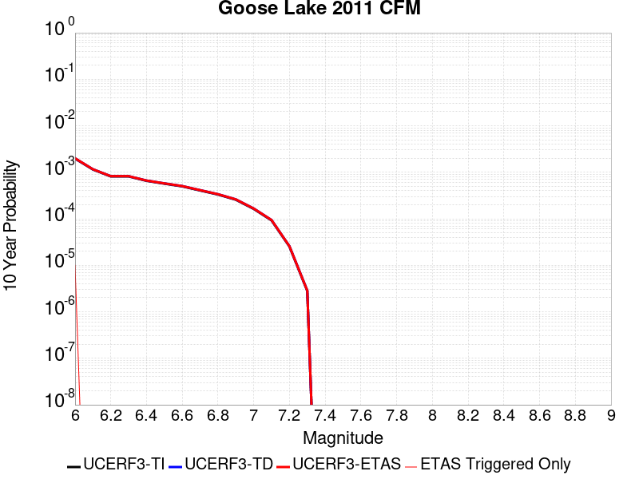 |

| Magnitude | 1 wk TI Prob | 1 wk TD Prob | 1 wk ETAS Prob | 1 wk ETAS/TD Gain | 1 wk ETAS Triggered Only | 1 mo TI Prob | 1 mo TD Prob | 1 mo ETAS Prob | 1 mo ETAS/TD Gain | 1 mo ETAS Triggered Only | 1 yr TI Prob | 1 yr TD Prob | 1 yr ETAS Prob | 1 yr ETAS/TD Gain | 1 yr ETAS Triggered Only | 10 yr TI Prob | 10 yr TD Prob | 10 yr ETAS Prob | 10 yr ETAS/TD Gain | 10 yr ETAS Triggered Only |
|-----|-----|-----|-----|-----|-----|-----|-----|-----|-----|-----|-----|-----|-----|-----|-----|-----|-----|-----|-----|-----|
| 6.0 | 3.780968E-6 | 3.8230382E-6 | 3.8230382E-6 | 1.0 | 0.0 | 1.6204049E-5 | 1.6384352E-5 | 1.6384352E-5 | 1.0 | 0.0 | 1.9726643E-4 | 1.9946233E-4 | 1.9946233E-4 | 1.0 | 0.0 | 0.001970914 | 0.0019929411 | 0.0020029214 | 1.0050077 | 1.0E-5 |
| 6.1 | 2.2035124E-6 | 2.2298111E-6 | 2.2298111E-6 | 1.0 | 0.0 | 9.443591E-6 | 9.556299E-6 | 9.556299E-6 | 1.0 | 0.0 | 1.1496965E-4 | 1.16341915E-4 | 1.16341915E-4 | 1.0 | 0.0 | 0.0011491019 | 0.0011628284 | 0.0011628284 | 1.0 | 0.0 |
| 6.2 | 1.5624689E-6 | 1.5827E-6 | 1.5827E-6 | 1.0 | 0.0 | 6.6962784E-6 | 6.7829824E-6 | 6.7829824E-6 | 1.0 | 0.0 | 8.152414E-5 | 8.2579725E-5 | 8.2579725E-5 | 1.0 | 0.0 | 8.1494235E-4 | 8.254948E-4 | 8.254948E-4 | 1.0 | 0.0 |
| 6.3 | 1.5624689E-6 | 1.5827E-6 | 1.5827E-6 | 1.0 | 0.0 | 6.6962784E-6 | 6.7829824E-6 | 6.7829824E-6 | 1.0 | 0.0 | 8.152414E-5 | 8.2579725E-5 | 8.2579725E-5 | 1.0 | 0.0 | 8.1494235E-4 | 8.254948E-4 | 8.254948E-4 | 1.0 | 0.0 |
| 6.4 | 1.256464E-6 | 1.2738761E-6 | 1.2738761E-6 | 1.0 | 0.0 | 5.3848344E-6 | 5.4594575E-6 | 5.4594575E-6 | 1.0 | 0.0 | 6.5558386E-5 | 6.646689E-5 | 6.646689E-5 | 1.0 | 0.0 | 6.553905E-4 | 6.644721E-4 | 6.644721E-4 | 1.0 | 0.0 |
| 6.5 | 1.0910911E-6 | 1.1069465E-6 | 1.1069465E-6 | 1.0 | 0.0 | 4.6760965E-6 | 4.7440476E-6 | 4.7440476E-6 | 1.0 | 0.0 | 5.692999E-5 | 5.775726E-5 | 5.775726E-5 | 1.0 | 0.0 | 5.6915404E-4 | 5.774237E-4 | 5.774237E-4 | 1.0 | 0.0 |
| 6.6 | 9.546601E-7 | 9.6913E-7 | 9.6913E-7 | 1.0 | 0.0 | 4.091394E-6 | 4.153408E-6 | 4.153408E-6 | 1.0 | 0.0 | 4.9811584E-5 | 5.0566578E-5 | 5.0566578E-5 | 1.0 | 0.0 | 4.980042E-4 | 5.055516E-4 | 5.055516E-4 | 1.0 | 0.0 |
| 6.7 | 7.790316E-7 | 7.916011E-7 | 7.916011E-7 | 1.0 | 0.0 | 3.3387028E-6 | 3.3925717E-6 | 3.3925717E-6 | 1.0 | 0.0 | 4.0647945E-5 | 4.1303785E-5 | 4.1303785E-5 | 1.0 | 0.0 | 4.0640513E-4 | 4.1296167E-4 | 4.1296167E-4 | 1.0 | 0.0 |
| 6.8 | 6.3714384E-7 | 6.4787804E-7 | 6.4787804E-7 | 1.0 | 0.0 | 2.7306137E-6 | 2.776617E-6 | 2.776617E-6 | 1.0 | 0.0 | 3.3244716E-5 | 3.3804794E-5 | 3.3804794E-5 | 1.0 | 0.0 | 3.323974E-4 | 3.3799701E-4 | 3.3799701E-4 | 1.0 | 0.0 |
| 6.9 | 4.92586E-7 | 5.013948E-7 | 5.013948E-7 | 1.0 | 0.0 | 2.1110811E-6 | 2.1488331E-6 | 2.1488331E-6 | 1.0 | 0.0 | 2.5702111E-5 | 2.6161733E-5 | 2.6161733E-5 | 1.0 | 0.0 | 2.569914E-4 | 2.6158692E-4 | 2.6158692E-4 | 1.0 | 0.0 |
| 7.0 | 3.130245E-7 | 3.1903767E-7 | 3.1903767E-7 | 1.0 | 0.0 | 1.3415328E-6 | 1.3673036E-6 | 1.3673036E-6 | 1.0 | 0.0 | 1.6333039E-5 | 1.6646796E-5 | 1.6646796E-5 | 1.0 | 0.0 | 1.6331839E-4 | 1.664557E-4 | 1.664557E-4 | 1.0 | 0.0 |
| 7.1 | 1.7680084E-7 | 1.8024052E-7 | 1.8024052E-7 | 1.0 | 0.0 | 7.5771766E-7 | 7.7245915E-7 | 7.7245915E-7 | 1.0 | 0.0 | 9.225173E-6 | 9.404651E-6 | 9.404651E-6 | 1.0 | 0.0 | 9.22479E-5 | 9.404264E-5 | 9.404264E-5 | 1.0 | 0.0 |
| 7.2 | 4.8641045E-8 | 4.9402352E-8 | 4.9402352E-8 | 1.0 | 0.0 | 2.084616E-7 | 2.1172436E-7 | 2.1172436E-7 | 1.0 | 0.0 | 2.538017E-6 | 2.577741E-6 | 2.577741E-6 | 1.0 | 0.0 | 2.537988E-5 | 2.5777124E-5 | 2.5777124E-5 | 1.0 | 0.0 |
| 7.3 | 5.3911844E-9 | 5.4758464E-9 | 5.4758464E-9 | 1.0 | 0.0 | 2.3105075E-8 | 2.3467912E-8 | 2.3467912E-8 | 1.0 | 0.0 | 2.8130427E-7 | 2.857218E-7 | 2.857218E-7 | 1.0 | 0.0 | 2.8130391E-6 | 2.857216E-6 | 2.857216E-6 | 1.0 | 0.0 |

## Calaveras (So) 2011 CFM
*[(top)](#table-of-contents)*

| 1 Week | 1 Month | 1 Year | 10 Year |
|-----|-----|-----|-----|
| 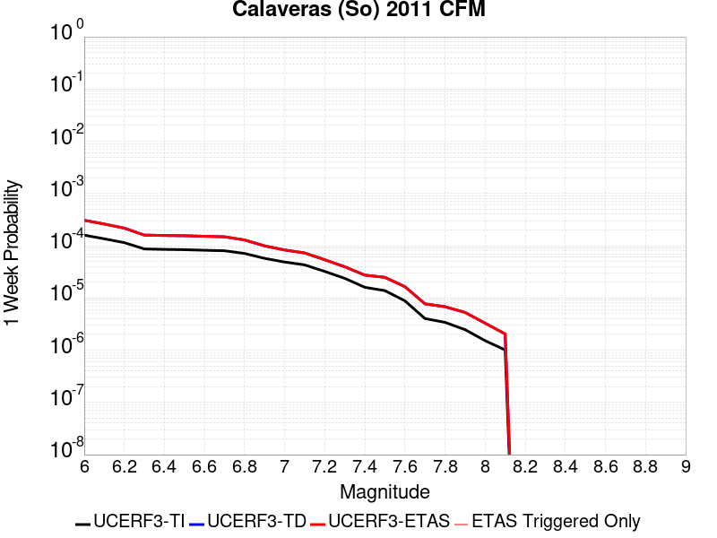 |  |  |  |

| Magnitude | 1 wk TI Prob | 1 wk TD Prob | 1 wk ETAS Prob | 1 wk ETAS/TD Gain | 1 wk ETAS Triggered Only | 1 mo TI Prob | 1 mo TD Prob | 1 mo ETAS Prob | 1 mo ETAS/TD Gain | 1 mo ETAS Triggered Only | 1 yr TI Prob | 1 yr TD Prob | 1 yr ETAS Prob | 1 yr ETAS/TD Gain | 1 yr ETAS Triggered Only | 10 yr TI Prob | 10 yr TD Prob | 10 yr ETAS Prob | 10 yr ETAS/TD Gain | 10 yr ETAS Triggered Only |
|-----|-----|-----|-----|-----|-----|-----|-----|-----|-----|-----|-----|-----|-----|-----|-----|-----|-----|-----|-----|-----|
| 6.0 | 1.5950744E-4 | 3.073298E-4 | 3.073298E-4 | 1.0 | 0.0 | 6.834242E-4 | 0.0013164851 | 0.0013164851 | 1.0 | 0.0 | 0.00828899 | 0.015864532 | 0.015864532 | 1.0 | 0.0 | 0.079865426 | 0.14444934 | 0.14445789 | 1.0000592 | 1.0E-5 |
| 6.1 | 1.3584697E-4 | 2.6055795E-4 | 2.6055795E-4 | 1.0 | 0.0 | 5.8207137E-4 | 0.0011162142 | 0.0011162142 | 1.0 | 0.0 | 0.007063716 | 0.013467284 | 0.013467284 | 1.0 | 0.0 | 0.06843361 | 0.12407611 | 0.124084875 | 1.0000706 | 1.0E-5 |
| 6.2 | 1.14676266E-4 | 2.1742213E-4 | 2.1742213E-4 | 1.0 | 0.0 | 4.9137714E-4 | 9.31488E-4 | 9.31488E-4 | 1.0 | 0.0 | 0.0059661185 | 0.011250365 | 0.011250365 | 1.0 | 0.0 | 0.058084648 | 0.10506591 | 0.10507486 | 1.0000852 | 1.0E-5 |
| 6.3 | 8.691518E-5 | 1.599854E-4 | 1.599854E-4 | 1.0 | 0.0 | 3.7244044E-4 | 6.8546354E-4 | 6.8546354E-4 | 1.0 | 0.0 | 0.004525038 | 0.008306238 | 0.008306238 | 1.0 | 0.0 | 0.044339992 | 0.07938139 | 0.0793906 | 1.000116 | 1.0E-5 |
| 6.4 | 8.50982E-5 | 1.5704907E-4 | 1.5704907E-4 | 1.0 | 0.0 | 3.646556E-4 | 6.728858E-4 | 6.728858E-4 | 1.0 | 0.0 | 0.0044306475 | 0.008154256 | 0.008154256 | 1.0 | 0.0 | 0.04343345 | 0.07798744 | 0.077996664 | 1.0001183 | 1.0E-5 |
| 6.5 | 8.4062965E-5 | 1.5529433E-4 | 1.5529433E-4 | 1.0 | 0.0 | 3.602201E-4 | 6.6536927E-4 | 6.6536927E-4 | 1.0 | 0.0 | 0.004376863 | 0.00806345 | 0.00806345 | 1.0 | 0.0 | 0.042916555 | 0.07715867 | 0.0771679 | 1.0001196 | 1.0E-5 |
| 6.6 | 8.194716E-5 | 1.5165257E-4 | 1.5165257E-4 | 1.0 | 0.0 | 3.5115483E-4 | 6.497696E-4 | 6.497696E-4 | 1.0 | 0.0 | 0.0042669317 | 0.007875272 | 0.007875272 | 1.0 | 0.0 | 0.04185927 | 0.07544381 | 0.07545306 | 1.0001225 | 1.0E-5 |
| 6.7 | 8.012326E-5 | 1.4832857E-4 | 1.4832857E-4 | 1.0 | 0.0 | 3.433402E-4 | 6.3553656E-4 | 6.3553656E-4 | 1.0 | 0.0 | 0.004172157 | 0.0077037495 | 0.0077037495 | 1.0 | 0.0 | 0.040946912 | 0.073885866 | 0.07389513 | 1.0001253 | 1.0E-5 |
| 6.8 | 7.119773E-5 | 1.2890759E-4 | 1.2890759E-4 | 1.0 | 0.0 | 3.0509746E-4 | 5.52343E-4 | 5.52343E-4 | 1.0 | 0.0 | 0.0037082357 | 0.006700882 | 0.006700882 | 1.0 | 0.0 | 0.036469642 | 0.06472833 | 0.064737685 | 1.0001445 | 1.0E-5 |
| 6.9 | 5.7343088E-5 | 9.927315E-5 | 9.927315E-5 | 1.0 | 0.0 | 2.4573295E-4 | 4.2538744E-4 | 4.2538744E-4 | 1.0 | 0.0 | 0.0029876942 | 0.005166875 | 0.005166875 | 1.0 | 0.0 | 0.02947844 | 0.05054853 | 0.050558027 | 1.0001879 | 1.0E-5 |
| 7.0 | 4.8746577E-5 | 8.292993E-5 | 8.292993E-5 | 1.0 | 0.0 | 2.0889717E-4 | 3.5536595E-4 | 3.5536595E-4 | 1.0 | 0.0 | 0.0025403565 | 0.0043180636 | 0.0043180636 | 1.0 | 0.0 | 0.025115121 | 0.042524014 | 0.042533588 | 1.0002252 | 1.0E-5 |
| 7.1 | 4.2998014E-5 | 7.270967E-5 | 7.270967E-5 | 1.0 | 0.0 | 1.8426418E-4 | 3.1157598E-4 | 3.1157598E-4 | 1.0 | 0.0 | 0.002241108 | 0.0037868994 | 0.0037868994 | 1.0 | 0.0 | 0.022186412 | 0.03745239 | 0.037462015 | 1.000257 | 1.0E-5 |
| 7.2 | 3.221292E-5 | 5.396419E-5 | 5.396419E-5 | 1.0 | 0.0 | 1.3804805E-4 | 2.3125476E-4 | 2.3125476E-4 | 1.0 | 0.0 | 0.0016794393 | 0.0028119197 | 0.0028119197 | 1.0 | 0.0 | 0.016668037 | 0.028064482 | 0.028074201 | 1.0003463 | 1.0E-5 |
| 7.3 | 2.3756531E-5 | 3.952333E-5 | 3.952333E-5 | 1.0 | 0.0 | 1.0180973E-4 | 1.693748E-4 | 1.693748E-4 | 1.0 | 0.0 | 0.0012388286 | 0.002060205 | 0.002060205 | 1.0 | 0.0 | 0.012319452 | 0.020668885 | 0.020678679 | 1.0004739 | 1.0E-5 |
| 7.4 | 1.5997684E-5 | 2.736345E-5 | 2.736345E-5 | 1.0 | 0.0 | 6.8559704E-5 | 1.17266674E-4 | 1.17266674E-4 | 1.0 | 0.0 | 8.343947E-4 | 0.0014267892 | 0.0014267892 | 1.0 | 0.0 | 0.008312687 | 0.01438753 | 0.01438753 | 1.0 | 0.0 |
| 7.5 | 1.3814293E-5 | 2.480456E-5 | 2.480456E-5 | 1.0 | 0.0 | 5.9202768E-5 | 1.0630094E-4 | 1.0630094E-4 | 1.0 | 0.0 | 7.205553E-4 | 0.0012934479 | 0.0012934479 | 1.0 | 0.0 | 0.007182234 | 0.0130664455 | 0.0130664455 | 1.0 | 0.0 |
| 7.6 | 8.817309E-6 | 1.6448737E-5 | 1.6448737E-5 | 1.0 | 0.0 | 3.7787922E-5 | 7.049269E-5 | 7.049269E-5 | 1.0 | 0.0 | 4.5997082E-4 | 8.5791195E-4 | 8.5791195E-4 | 1.0 | 0.0 | 0.004590199 | 0.008729103 | 0.008729103 | 1.0 | 0.0 |
| 7.7 | 4.0352206E-6 | 7.718972E-6 | 7.718972E-6 | 1.0 | 0.0 | 1.7293689E-5 | 3.3080887E-5 | 3.3080887E-5 | 1.0 | 0.0 | 2.1053031E-4 | 4.0268543E-4 | 4.0268543E-4 | 1.0 | 0.0 | 0.0021033096 | 0.004170919 | 0.004170919 | 1.0 | 0.0 |
| 7.8 | 3.413169E-6 | 6.797414E-6 | 6.797414E-6 | 1.0 | 0.0 | 1.4627784E-5 | 2.9131448E-5 | 2.9131448E-5 | 1.0 | 0.0 | 1.7807873E-4 | 3.5461772E-4 | 3.5461772E-4 | 1.0 | 0.0 | 0.0017793609 | 0.0036714657 | 0.0036714657 | 1.0 | 0.0 |
| 7.9 | 2.4740732E-6 | 5.2865817E-6 | 5.2865817E-6 | 1.0 | 0.0 | 1.06031275E-5 | 2.2656583E-5 | 2.2656583E-5 | 1.0 | 0.0 | 1.2908543E-4 | 2.7580903E-4 | 2.7580903E-4 | 1.0 | 0.0 | 0.0012901047 | 0.002838413 | 0.002838413 | 1.0 | 0.0 |
| 8.0 | 1.5231818E-6 | 3.293288E-6 | 3.293288E-6 | 1.0 | 0.0 | 6.527906E-6 | 1.4114015E-5 | 1.4114015E-5 | 1.0 | 0.0 | 7.9474354E-5 | 1.7182462E-4 | 1.7182462E-4 | 1.0 | 0.0 | 7.944594E-4 | 0.001758611 | 0.001758611 | 1.0 | 0.0 |
| 8.1 | 1.0104524E-6 | 2.048486E-6 | 2.048486E-6 | 1.0 | 0.0 | 4.330503E-6 | 8.779196E-6 | 8.779196E-6 | 1.0 | 0.0 | 5.2722597E-5 | 1.068815E-4 | 1.068815E-4 | 1.0 | 0.0 | 5.271009E-4 | 0.0010943245 | 0.0010943245 | 1.0 | 0.0 |

## Great Valley 05 Pittsburg - Kirby Hills alt1
*[(top)](#table-of-contents)*

| 1 Week | 1 Month | 1 Year | 10 Year |
|-----|-----|-----|-----|
|  | 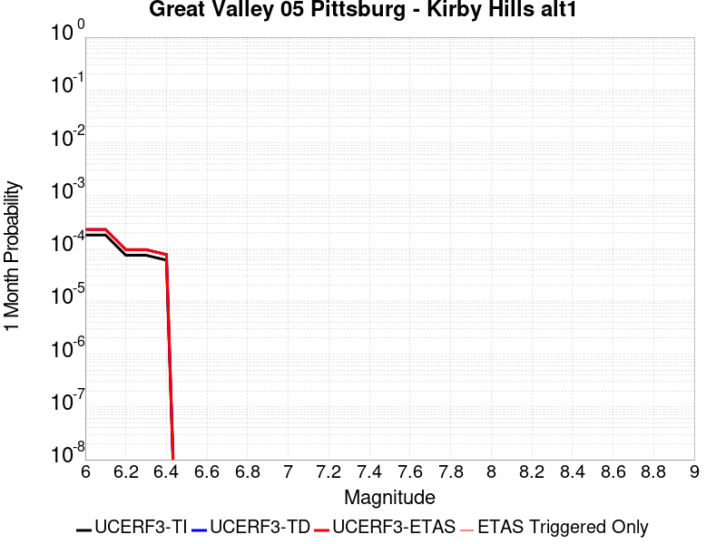 | 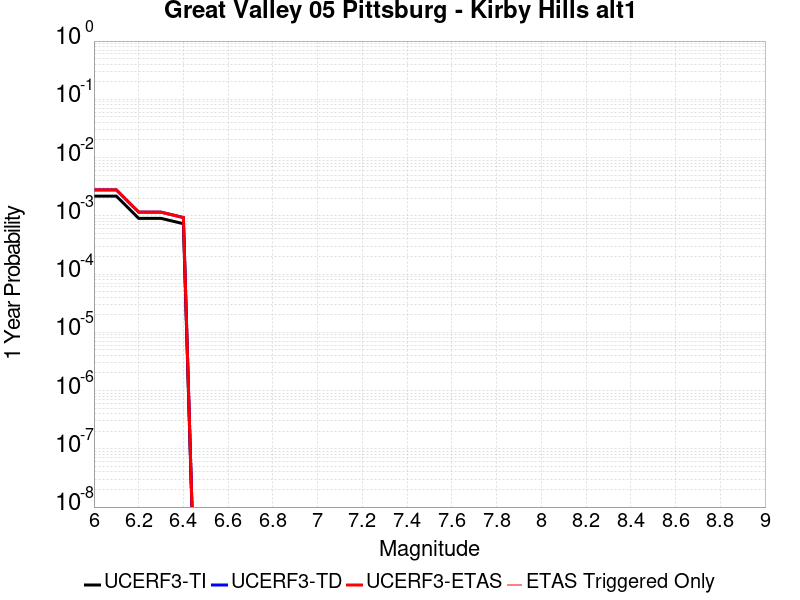 | 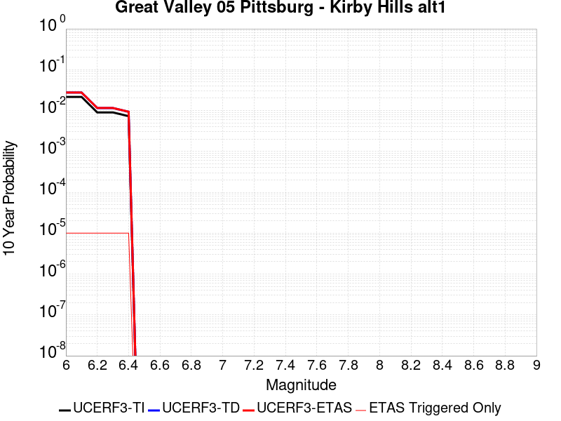 |

| Magnitude | 1 wk TI Prob | 1 wk TD Prob | 1 wk ETAS Prob | 1 wk ETAS/TD Gain | 1 wk ETAS Triggered Only | 1 mo TI Prob | 1 mo TD Prob | 1 mo ETAS Prob | 1 mo ETAS/TD Gain | 1 mo ETAS Triggered Only | 1 yr TI Prob | 1 yr TD Prob | 1 yr ETAS Prob | 1 yr ETAS/TD Gain | 1 yr ETAS Triggered Only | 10 yr TI Prob | 10 yr TD Prob | 10 yr ETAS Prob | 10 yr ETAS/TD Gain | 10 yr ETAS Triggered Only |
|-----|-----|-----|-----|-----|-----|-----|-----|-----|-----|-----|-----|-----|-----|-----|-----|-----|-----|-----|-----|-----|
| 6.0 | 4.187212E-5 | 5.3447573E-5 | 5.3447573E-5 | 1.0 | 0.0 | 1.794396E-4 | 2.2904667E-4 | 2.2904667E-4 | 1.0 | 0.0 | 0.002182488 | 0.0027860666 | 0.0027860666 | 1.0 | 0.0 | 0.021611776 | 0.027605776 | 0.027615499 | 1.0003523 | 1.0E-5 |
| 6.1 | 4.187212E-5 | 5.3447573E-5 | 5.3447573E-5 | 1.0 | 0.0 | 1.794396E-4 | 2.2904667E-4 | 2.2904667E-4 | 1.0 | 0.0 | 0.002182488 | 0.0027860666 | 0.0027860666 | 1.0 | 0.0 | 0.021611776 | 0.027605776 | 0.027615499 | 1.0003523 | 1.0E-5 |
| 6.2 | 1.7353306E-5 | 2.2156657E-5 | 2.2156657E-5 | 1.0 | 0.0 | 7.436919E-5 | 9.495596E-5 | 9.495596E-5 | 1.0 | 0.0 | 9.050688E-4 | 0.0011558724 | 0.0011558724 | 1.0 | 0.0 | 0.009013915 | 0.011536266 | 0.011546151 | 1.0008569 | 1.0E-5 |
| 6.3 | 1.7353306E-5 | 2.2156657E-5 | 2.2156657E-5 | 1.0 | 0.0 | 7.436919E-5 | 9.495596E-5 | 9.495596E-5 | 1.0 | 0.0 | 9.050688E-4 | 0.0011558724 | 0.0011558724 | 1.0 | 0.0 | 0.009013915 | 0.011536266 | 0.011546151 | 1.0008569 | 1.0E-5 |
| 6.4 | 1.4028824E-5 | 1.7902436E-5 | 1.7902436E-5 | 1.0 | 0.0 | 6.0122147E-5 | 7.6724726E-5 | 7.6724726E-5 | 1.0 | 0.0 | 7.3174125E-4 | 9.341235E-4 | 9.341235E-4 | 1.0 | 0.0 | 0.0072933645 | 0.00933907 | 0.009348976 | 1.0010607 | 1.0E-5 |

## Davis Creek
*[(top)](#table-of-contents)*

| 1 Week | 1 Month | 1 Year | 10 Year |
|-----|-----|-----|-----|
|  |  |  |  |

| Magnitude | 1 wk TI Prob | 1 wk TD Prob | 1 wk ETAS Prob | 1 wk ETAS/TD Gain | 1 wk ETAS Triggered Only | 1 mo TI Prob | 1 mo TD Prob | 1 mo ETAS Prob | 1 mo ETAS/TD Gain | 1 mo ETAS Triggered Only | 1 yr TI Prob | 1 yr TD Prob | 1 yr ETAS Prob | 1 yr ETAS/TD Gain | 1 yr ETAS Triggered Only | 10 yr TI Prob | 10 yr TD Prob | 10 yr ETAS Prob | 10 yr ETAS/TD Gain | 10 yr ETAS Triggered Only |
|-----|-----|-----|-----|-----|-----|-----|-----|-----|-----|-----|-----|-----|-----|-----|-----|-----|-----|-----|-----|-----|
| 6.0 | 2.331472E-5 | 2.5418065E-5 | 2.5418065E-5 | 1.0 | 0.0 | 9.99164E-5 | 1.0893069E-4 | 1.0893069E-4 | 1.0 | 0.0 | 0.0012158032 | 0.0013255428 | 0.0013255428 | 1.0 | 0.0 | 0.01209173 | 0.013188143 | 0.013198012 | 1.0007483 | 1.0E-5 |
| 6.1 | 1.0407654E-5 | 1.1317355E-5 | 1.1317355E-5 | 1.0 | 0.0 | 4.4603472E-5 | 4.85022E-5 | 4.85022E-5 | 1.0 | 0.0 | 5.4291193E-4 | 5.903814E-4 | 5.903814E-4 | 1.0 | 0.0 | 0.0054158745 | 0.005890802 | 0.005890802 | 1.0 | 0.0 |
| 6.2 | 1.0407654E-5 | 1.1317355E-5 | 1.1317355E-5 | 1.0 | 0.0 | 4.4603472E-5 | 4.85022E-5 | 4.85022E-5 | 1.0 | 0.0 | 5.4291193E-4 | 5.903814E-4 | 5.903814E-4 | 1.0 | 0.0 | 0.0054158745 | 0.005890802 | 0.005890802 | 1.0 | 0.0 |
| 6.3 | 5.1323277E-6 | 5.5687324E-6 | 5.5687324E-6 | 1.0 | 0.0 | 2.1995505E-5 | 2.3865825E-5 | 2.3865825E-5 | 1.0 | 0.0 | 2.6776237E-4 | 2.905363E-4 | 2.905363E-4 | 1.0 | 0.0 | 0.0026743996 | 0.002902411 | 0.002902411 | 1.0 | 0.0 |
| 6.4 | 2.4985154E-6 | 2.7046215E-6 | 2.7046215E-6 | 1.0 | 0.0 | 1.07078795E-5 | 1.15912035E-5 | 1.15912035E-5 | 1.0 | 0.0 | 1.3036063E-4 | 1.4111739E-4 | 1.4111739E-4 | 1.0 | 0.0 | 0.0013028418 | 0.0014106324 | 0.0014106324 | 1.0 | 0.0 |
| 6.5 | 2.4846438E-6 | 2.6905554E-6 | 2.6905554E-6 | 1.0 | 0.0 | 1.064843E-5 | 1.1530921E-5 | 1.1530921E-5 | 1.0 | 0.0 | 1.2963692E-4 | 1.4038355E-4 | 1.4038355E-4 | 1.0 | 0.0 | 0.0012956132 | 0.0014033034 | 0.0014033034 | 1.0 | 0.0 |
| 6.6 | 2.072566E-7 | 2.1018198E-7 | 2.1018198E-7 | 1.0 | 0.0 | 8.882423E-7 | 9.007796E-7 | 9.007796E-7 | 1.0 | 0.0 | 1.0814296E-5 | 1.0966938E-5 | 1.0966938E-5 | 1.0 | 0.0 | 1.081377E-4 | 1.0966415E-4 | 1.0966415E-4 | 1.0 | 0.0 |
| 6.7 | 1.7544528E-7 | 1.7790919E-7 | 1.7790919E-7 | 1.0 | 0.0 | 7.5190815E-7 | 7.624677E-7 | 7.624677E-7 | 1.0 | 0.0 | 9.154443E-6 | 9.283007E-6 | 9.283007E-6 | 1.0 | 0.0 | 9.1540656E-5 | 9.282635E-5 | 9.282635E-5 | 1.0 | 0.0 |
| 6.8 | 1.2320395E-7 | 1.2481198E-7 | 1.2481198E-7 | 1.0 | 0.0 | 5.280168E-7 | 5.349084E-7 | 5.349084E-7 | 1.0 | 0.0 | 6.428586E-6 | 6.5124914E-6 | 6.5124914E-6 | 1.0 | 0.0 | 6.4284E-5 | 6.512312E-5 | 6.512312E-5 | 1.0 | 0.0 |
| 6.9 | 6.399997E-8 | 6.48609E-8 | 6.48609E-8 | 1.0 | 0.0 | 2.7428555E-7 | 2.7797526E-7 | 2.7797526E-7 | 1.0 | 0.0 | 3.3394215E-6 | 3.3843444E-6 | 3.3843444E-6 | 1.0 | 0.0 | 3.3393713E-5 | 3.3842993E-5 | 3.3842993E-5 | 1.0 | 0.0 |
| 7.0 | 6.4455685E-9 | 6.5352976E-9 | 6.5352976E-9 | 1.0 | 0.0 | 2.7623864E-8 | 2.8008419E-8 | 2.8008419E-8 | 1.0 | 0.0 | 3.3632048E-7 | 3.410025E-7 | 3.410025E-7 | 1.0 | 0.0 | 3.3631998E-6 | 3.410025E-6 | 3.410025E-6 | 1.0 | 0.0 |

## Sierra Madre (San Fernando)
*[(top)](#table-of-contents)*

| 1 Week | 1 Month | 1 Year | 10 Year |
|-----|-----|-----|-----|
|  |  |  |  |

| Magnitude | 1 wk TI Prob | 1 wk TD Prob | 1 wk ETAS Prob | 1 wk ETAS/TD Gain | 1 wk ETAS Triggered Only | 1 mo TI Prob | 1 mo TD Prob | 1 mo ETAS Prob | 1 mo ETAS/TD Gain | 1 mo ETAS Triggered Only | 1 yr TI Prob | 1 yr TD Prob | 1 yr ETAS Prob | 1 yr ETAS/TD Gain | 1 yr ETAS Triggered Only | 10 yr TI Prob | 10 yr TD Prob | 10 yr ETAS Prob | 10 yr ETAS/TD Gain | 10 yr ETAS Triggered Only |
|-----|-----|-----|-----|-----|-----|-----|-----|-----|-----|-----|-----|-----|-----|-----|-----|-----|-----|-----|-----|-----|
| 6.0 | 1.0346413E-5 | 6.287655E-6 | 6.287655E-6 | 1.0 | 0.0 | 4.4341014E-5 | 2.6946822E-5 | 2.6946822E-5 | 1.0 | 0.0 | 5.3971814E-4 | 3.2802927E-4 | 3.2802927E-4 | 1.0 | 0.0 | 0.0053840918 | 0.0032755632 | 0.0032855305 | 1.0030429 | 1.0E-5 |
| 6.1 | 1.0346413E-5 | 6.287655E-6 | 6.287655E-6 | 1.0 | 0.0 | 4.4341014E-5 | 2.6946822E-5 | 2.6946822E-5 | 1.0 | 0.0 | 5.3971814E-4 | 3.2802927E-4 | 3.2802927E-4 | 1.0 | 0.0 | 0.0053840918 | 0.0032755632 | 0.0032855305 | 1.0030429 | 1.0E-5 |
| 6.2 | 1.0346413E-5 | 6.287655E-6 | 6.287655E-6 | 1.0 | 0.0 | 4.4341014E-5 | 2.6946822E-5 | 2.6946822E-5 | 1.0 | 0.0 | 5.3971814E-4 | 3.2802927E-4 | 3.2802927E-4 | 1.0 | 0.0 | 0.0053840918 | 0.0032755632 | 0.0032855305 | 1.0030429 | 1.0E-5 |
| 6.3 | 1.0346413E-5 | 6.287655E-6 | 6.287655E-6 | 1.0 | 0.0 | 4.4341014E-5 | 2.6946822E-5 | 2.6946822E-5 | 1.0 | 0.0 | 5.3971814E-4 | 3.2802927E-4 | 3.2802927E-4 | 1.0 | 0.0 | 0.0053840918 | 0.0032755632 | 0.0032855305 | 1.0030429 | 1.0E-5 |
| 6.4 | 1.0249558E-5 | 6.287655E-6 | 6.287655E-6 | 1.0 | 0.0 | 4.392594E-5 | 2.6946822E-5 | 2.6946822E-5 | 1.0 | 0.0 | 5.3466705E-4 | 3.2802927E-4 | 3.2802927E-4 | 1.0 | 0.0 | 0.0053338245 | 0.0032755632 | 0.0032855305 | 1.0030429 | 1.0E-5 |
| 6.5 | 1.0249558E-5 | 6.287655E-6 | 6.287655E-6 | 1.0 | 0.0 | 4.392594E-5 | 2.6946822E-5 | 2.6946822E-5 | 1.0 | 0.0 | 5.3466705E-4 | 3.2802927E-4 | 3.2802927E-4 | 1.0 | 0.0 | 0.0053338245 | 0.0032755632 | 0.0032855305 | 1.0030429 | 1.0E-5 |
| 6.6 | 9.9035515E-6 | 6.287655E-6 | 6.287655E-6 | 1.0 | 0.0 | 4.2443102E-5 | 2.6946822E-5 | 2.6946822E-5 | 1.0 | 0.0 | 5.166222E-4 | 3.2802927E-4 | 3.2802927E-4 | 1.0 | 0.0 | 0.0051542283 | 0.0032755632 | 0.0032855305 | 1.0030429 | 1.0E-5 |
| 6.7 | 9.87217E-6 | 6.275075E-6 | 6.275075E-6 | 1.0 | 0.0 | 4.2308613E-5 | 2.6892907E-5 | 2.6892907E-5 | 1.0 | 0.0 | 5.149856E-4 | 3.2737307E-4 | 3.2737307E-4 | 1.0 | 0.0 | 0.005137938 | 0.0032690205 | 0.003278988 | 1.003049 | 1.0E-5 |
| 6.8 | 9.4359175E-6 | 6.179043E-6 | 6.179043E-6 | 1.0 | 0.0 | 4.043902E-5 | 2.648135E-5 | 2.648135E-5 | 1.0 | 0.0 | 4.9223384E-4 | 3.2236383E-4 | 3.2236383E-4 | 1.0 | 0.0 | 0.0049114493 | 0.0032190739 | 0.0032290416 | 1.0030965 | 1.0E-5 |
| 6.9 | 8.700447E-6 | 6.0402913E-6 | 6.0402913E-6 | 1.0 | 0.0 | 3.72871E-5 | 2.5886711E-5 | 2.5886711E-5 | 1.0 | 0.0 | 4.5387587E-4 | 3.151262E-4 | 3.151262E-4 | 1.0 | 0.0 | 0.0045295 | 0.0031469031 | 0.0031568715 | 1.0031677 | 1.0E-5 |
| 7.0 | 8.648878E-6 | 6.0152056E-6 | 6.0152056E-6 | 1.0 | 0.0 | 3.7066096E-5 | 2.5779203E-5 | 2.5779203E-5 | 1.0 | 0.0 | 4.5118626E-4 | 3.1381767E-4 | 3.1381767E-4 | 1.0 | 0.0 | 0.004502713 | 0.0031338546 | 0.0031438232 | 1.003181 | 1.0E-5 |
| 7.1 | 8.505786E-6 | 5.924833E-6 | 5.924833E-6 | 1.0 | 0.0 | 3.645286E-5 | 2.53919E-5 | 2.53919E-5 | 1.0 | 0.0 | 4.437232E-4 | 3.091036E-4 | 3.091036E-4 | 1.0 | 0.0 | 0.0044283825 | 0.0030868459 | 0.003096815 | 1.0032295 | 1.0E-5 |
| 7.2 | 8.139752E-6 | 5.6991207E-6 | 5.6991207E-6 | 1.0 | 0.0 | 3.4884186E-5 | 2.442458E-5 | 2.442458E-5 | 1.0 | 0.0 | 4.246322E-4 | 2.9732974E-4 | 2.9732974E-4 | 1.0 | 0.0 | 0.004238217 | 0.0029694254 | 0.0029793957 | 1.0033576 | 1.0E-5 |
| 7.3 | 7.8816E-6 | 5.5524306E-6 | 5.5524306E-6 | 1.0 | 0.0 | 3.3777847E-5 | 2.3795921E-5 | 2.3795921E-5 | 1.0 | 0.0 | 4.111677E-4 | 2.8967788E-4 | 2.8967788E-4 | 1.0 | 0.0 | 0.004104078 | 0.0028931084 | 0.0029030794 | 1.0034465 | 1.0E-5 |
| 7.4 | 7.5810603E-6 | 5.356662E-6 | 5.356662E-6 | 1.0 | 0.0 | 3.2489854E-5 | 2.2956927E-5 | 2.2956927E-5 | 1.0 | 0.0 | 3.9549218E-4 | 2.7946578E-4 | 2.7946578E-4 | 1.0 | 0.0 | 0.0039478904 | 0.0027912485 | 0.0028012206 | 1.0035726 | 1.0E-5 |
| 7.5 | 6.349153E-6 | 4.4079093E-6 | 4.4079093E-6 | 1.0 | 0.0 | 2.7210372E-5 | 1.8890907E-5 | 1.8890907E-5 | 1.0 | 0.0 | 3.312359E-4 | 2.2997333E-4 | 2.2997333E-4 | 1.0 | 0.0 | 0.0033074263 | 0.0022974357 | 0.0023074127 | 1.0043427 | 1.0E-5 |
| 7.6 | 4.430576E-6 | 2.8908958E-6 | 2.8908958E-6 | 1.0 | 0.0 | 1.8988047E-5 | 1.2389495E-5 | 1.2389495E-5 | 1.0 | 0.0 | 2.3115493E-4 | 1.5083188E-4 | 1.5083188E-4 | 1.0 | 0.0 | 0.0023091463 | 0.0015073178 | 0.0015173027 | 1.0066243 | 1.0E-5 |
| 7.7 | 3.005066E-6 | 1.7512955E-6 | 1.7512955E-6 | 1.0 | 0.0 | 1.2878791E-5 | 7.5055304E-6 | 7.5055304E-6 | 1.0 | 0.0 | 1.56788E-4 | 9.1376016E-5 | 9.1376016E-5 | 1.0 | 0.0 | 0.0015667742 | 9.133856E-4 | 9.233765E-4 | 1.0109383 | 1.0E-5 |
| 7.8 | 1.8459098E-6 | 1.0584135E-6 | 1.0584135E-6 | 1.0 | 0.0 | 7.911018E-6 | 4.5360503E-6 | 4.5360503E-6 | 1.0 | 0.0 | 9.631238E-5 | 5.5225017E-5 | 5.5225017E-5 | 1.0 | 0.0 | 9.627065E-4 | 5.5211334E-4 | 5.5211334E-4 | 1.0 | 0.0 |
| 7.9 | 9.839262E-7 | 5.235467E-7 | 5.235467E-7 | 1.0 | 0.0 | 4.2168194E-6 | 2.2437696E-6 | 2.2437696E-6 | 1.0 | 0.0 | 5.1338568E-5 | 2.7317554E-5 | 2.7317554E-5 | 1.0 | 0.0 | 5.132671E-4 | 2.7314224E-4 | 2.7314224E-4 | 1.0 | 0.0 |
| 8.0 | 1.210983E-7 | 6.614803E-8 | 6.614803E-8 | 1.0 | 0.0 | 5.1899264E-7 | 2.8349154E-7 | 2.8349154E-7 | 1.0 | 0.0 | 6.3187167E-6 | 3.4515042E-6 | 3.4515042E-6 | 1.0 | 0.0 | 6.318537E-5 | 3.4514524E-5 | 3.4514524E-5 | 1.0 | 0.0 |

## San Juan
*[(top)](#table-of-contents)*

| 1 Week | 1 Month | 1 Year | 10 Year |
|-----|-----|-----|-----|
| 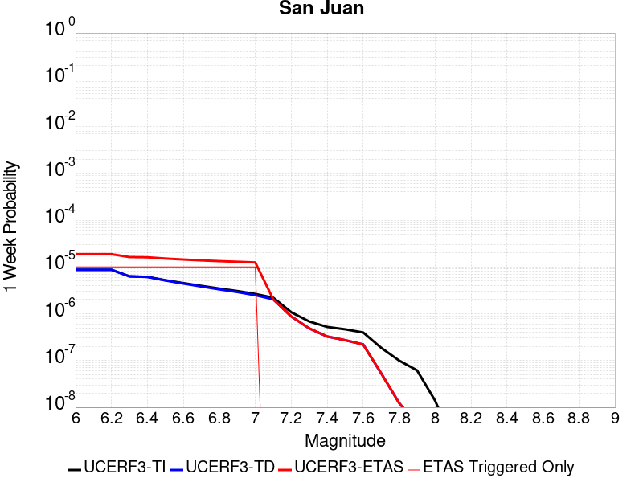 |  |  |  |

| Magnitude | 1 wk TI Prob | 1 wk TD Prob | 1 wk ETAS Prob | 1 wk ETAS/TD Gain | 1 wk ETAS Triggered Only | 1 mo TI Prob | 1 mo TD Prob | 1 mo ETAS Prob | 1 mo ETAS/TD Gain | 1 mo ETAS Triggered Only | 1 yr TI Prob | 1 yr TD Prob | 1 yr ETAS Prob | 1 yr ETAS/TD Gain | 1 yr ETAS Triggered Only | 10 yr TI Prob | 10 yr TD Prob | 10 yr ETAS Prob | 10 yr ETAS/TD Gain | 10 yr ETAS Triggered Only |
|-----|-----|-----|-----|-----|-----|-----|-----|-----|-----|-----|-----|-----|-----|-----|-----|-----|-----|-----|-----|-----|
| 6.0 | 8.682808E-6 | 8.750271E-6 | 1.8750185E-5 | 2.1428118 | 1.0E-5 | 3.72115E-5 | 3.7500653E-5 | 4.7500278E-5 | 1.266652 | 1.0E-5 | 4.5295584E-4 | 4.564796E-4 | 4.6647503E-4 | 1.0218968 | 1.0E-5 | 0.004520337 | 0.0045559607 | 0.004565915 | 1.0021849 | 1.0E-5 |
| 6.1 | 8.682808E-6 | 8.750271E-6 | 1.8750185E-5 | 2.1428118 | 1.0E-5 | 3.72115E-5 | 3.7500653E-5 | 4.7500278E-5 | 1.266652 | 1.0E-5 | 4.5295584E-4 | 4.564796E-4 | 4.6647503E-4 | 1.0218968 | 1.0E-5 | 0.004520337 | 0.0045559607 | 0.004565915 | 1.0021849 | 1.0E-5 |
| 6.2 | 8.682808E-6 | 8.750271E-6 | 1.8750185E-5 | 2.1428118 | 1.0E-5 | 3.72115E-5 | 3.7500653E-5 | 4.7500278E-5 | 1.266652 | 1.0E-5 | 4.5295584E-4 | 4.564796E-4 | 4.6647503E-4 | 1.0218968 | 1.0E-5 | 0.004520337 | 0.0045559607 | 0.004565915 | 1.0021849 | 1.0E-5 |
| 6.3 | 6.3054235E-6 | 6.2836584E-6 | 1.6283595E-5 | 2.5914195 | 1.0E-5 | 2.7022963E-5 | 2.6929694E-5 | 3.6929425E-5 | 1.3713273 | 1.0E-5 | 3.2895492E-4 | 3.2782112E-4 | 3.3781782E-4 | 1.0304945 | 1.0E-5 | 0.003284684 | 0.0032735753 | 0.0032835426 | 1.0030447 | 1.0E-5 |
| 6.4 | 6.1490473E-6 | 6.1153914E-6 | 1.6115331E-5 | 2.6352084 | 1.0E-5 | 2.6352795E-5 | 2.6208565E-5 | 3.62083E-5 | 1.3815447 | 1.0E-5 | 3.2079802E-4 | 3.1904393E-4 | 3.2904075E-4 | 1.0313337 | 1.0E-5 | 0.0032033534 | 0.0031860552 | 0.0031960234 | 1.0031286 | 1.0E-5 |
| 6.5 | 5.204848E-6 | 5.138129E-6 | 1.5138077E-5 | 2.9462237 | 1.0E-5 | 2.23063E-5 | 2.2020373E-5 | 3.202015E-5 | 1.4541149 | 1.0E-5 | 2.7154534E-4 | 2.68066E-4 | 2.7806332E-4 | 1.0372943 | 1.0E-5 | 0.0027121378 | 0.0026775806 | 0.0026875539 | 1.0037247 | 1.0E-5 |
| 6.6 | 4.5179986E-6 | 4.4157E-6 | 1.4415656E-5 | 3.2646365 | 1.0E-5 | 1.9362706E-5 | 1.8924296E-5 | 2.8924107E-5 | 1.5284113 | 1.0E-5 | 2.3571544E-4 | 2.3037974E-4 | 2.4037744E-4 | 1.0433966 | 1.0E-5 | 0.0023546559 | 0.0023015463 | 0.002311523 | 1.0043349 | 1.0E-5 |
| 6.7 | 3.9442616E-6 | 3.8204266E-6 | 1.3820389E-5 | 3.6174986 | 1.0E-5 | 1.6903869E-5 | 1.6373158E-5 | 2.6372994E-5 | 1.6107458 | 1.0E-5 | 2.0578515E-4 | 1.9932563E-4 | 2.0932364E-4 | 1.0501592 | 1.0E-5 | 0.002055947 | 0.0019915935 | 0.0020015736 | 1.0050111 | 1.0E-5 |
| 6.8 | 3.4536245E-6 | 3.316909E-6 | 1.3316876E-5 | 4.0148454 | 1.0E-5 | 1.4801163E-5 | 1.4215249E-5 | 2.4215107E-5 | 1.7034599 | 1.0E-5 | 1.8018926E-4 | 1.7305753E-4 | 1.830558E-4 | 1.0577743 | 1.0E-5 | 0.0018004322 | 0.0017293466 | 0.0017393293 | 1.0057725 | 1.0E-5 |
| 6.9 | 3.059865E-6 | 2.9125792E-6 | 1.291255E-5 | 4.433373 | 1.0E-5 | 1.3113641E-5 | 1.24824255E-5 | 2.2482302E-5 | 1.8011163 | 1.0E-5 | 1.596469E-4 | 1.519635E-4 | 1.6196199E-4 | 1.0657953 | 1.0E-5 | 0.0015953224 | 0.0015187106 | 0.0015286955 | 1.0065745 | 1.0E-5 |
| 7.0 | 2.6504351E-6 | 2.4925173E-6 | 1.2492493E-5 | 5.011998 | 1.0E-5 | 1.1358958E-5 | 1.0682176E-5 | 2.068207E-5 | 1.9361289 | 1.0E-5 | 1.3828653E-4 | 1.3004828E-4 | 1.4004698E-4 | 1.0768845 | 1.0E-5 | 0.0013820052 | 0.0012998336 | 0.0013098207 | 1.0076833 | 1.0E-5 |
| 7.1 | 2.2039317E-6 | 2.0342527E-6 | 2.0342527E-6 | 1.0 | 0.0 | 9.445387E-6 | 8.718199E-6 | 8.718199E-6 | 1.0 | 0.0 | 1.1499152E-4 | 1.06139436E-4 | 1.06139436E-4 | 1.0 | 0.0 | 0.0011493203 | 0.0010609975 | 0.0010609975 | 1.0 | 0.0 |
| 7.2 | 1.0786707E-6 | 8.7738175E-7 | 8.7738175E-7 | 1.0 | 0.0 | 4.622866E-6 | 3.7602022E-6 | 3.7602022E-6 | 1.0 | 0.0 | 5.628194E-5 | 4.577951E-5 | 4.577951E-5 | 1.0 | 0.0 | 5.6267687E-4 | 4.577599E-4 | 4.577599E-4 | 1.0 | 0.0 |
| 7.3 | 6.846433E-7 | 4.8710973E-7 | 4.8710973E-7 | 1.0 | 0.0 | 2.9341822E-6 | 2.0876114E-6 | 2.0876114E-6 | 1.0 | 0.0 | 3.5723086E-5 | 2.5416373E-5 | 2.5416373E-5 | 1.0 | 0.0 | 3.571734E-4 | 2.541682E-4 | 2.541682E-4 | 1.0 | 0.0 |
| 7.4 | 5.23043E-7 | 3.2645153E-7 | 3.2645153E-7 | 1.0 | 0.0 | 2.2416111E-6 | 1.3990773E-6 | 1.3990773E-6 | 1.0 | 0.0 | 2.7291273E-5 | 1.7033633E-5 | 1.7033633E-5 | 1.0 | 0.0 | 2.7287923E-4 | 1.7035524E-4 | 1.7035524E-4 | 1.0 | 0.0 |
| 7.5 | 4.648444E-7 | 2.724957E-7 | 2.724957E-7 | 1.0 | 0.0 | 1.9921886E-6 | 1.1678381E-6 | 1.1678381E-6 | 1.0 | 0.0 | 2.4254627E-5 | 1.4218338E-5 | 1.4218338E-5 | 1.0 | 0.0 | 2.425198E-4 | 1.4220392E-4 | 1.4220392E-4 | 1.0 | 0.0 |
| 7.6 | 3.9906567E-7 | 2.209498E-7 | 2.209498E-7 | 1.0 | 0.0 | 1.7102802E-6 | 9.469274E-7 | 9.469274E-7 | 1.0 | 0.0 | 2.0822463E-5 | 1.152878E-5 | 1.152878E-5 | 1.0 | 0.0 | 2.0820512E-4 | 1.1530646E-4 | 1.1530646E-4 | 1.0 | 0.0 |
| 7.7 | 1.8784601E-7 | 5.37104E-8 | 5.37104E-8 | 1.0 | 0.0 | 8.0505407E-7 | 2.3018744E-7 | 2.3018744E-7 | 1.0 | 0.0 | 9.80149E-6 | 2.8025283E-6 | 2.8025283E-6 | 1.0 | 0.0 | 9.801057E-5 | 2.8034005E-5 | 2.8034005E-5 | 1.0 | 0.0 |
| 7.8 | 1.00154914E-7 | 1.2429782E-8 | 1.2429782E-8 | 1.0 | 0.0 | 4.2923529E-7 | 5.3270497E-8 | 5.3270497E-8 | 1.0 | 0.0 | 5.225927E-6 | 6.4856806E-7 | 6.4856806E-7 | 1.0 | 0.0 | 5.225804E-5 | 6.491578E-6 | 6.491578E-6 | 1.0 | 0.0 |
| 7.9 | 6.171429E-8 | 4.303855E-9 | 4.303855E-9 | 1.0 | 0.0 | 2.6448978E-7 | 1.8445094E-8 | 1.8445094E-8 | 1.0 | 0.0 | 3.2201583E-6 | 2.2456898E-7 | 2.2456898E-7 | 1.0 | 0.0 | 3.2201115E-5 | 2.2510008E-6 | 2.2510008E-6 | 1.0 | 0.0 |
| 8.0 | 1.3974572E-8 | 3.392041E-10 | 3.392041E-10 | 1.0 | 0.0 | 5.989102E-8 | 1.4537321E-9 | 1.4537321E-9 | 1.0 | 0.0 | 7.2917294E-7 | 1.769918E-8 | 1.769918E-8 | 1.0 | 0.0 | 7.2917055E-6 | 1.8131027E-7 | 1.8131027E-7 | 1.0 | 0.0 |
| 8.1 | 1.8403477E-9 | 1.13355436E-10 | 1.13355436E-10 | 1.0 | 0.0 | 7.887204E-9 | 4.8580906E-10 | 4.8580906E-10 | 1.0 | 0.0 | 9.602671E-8 | 5.914724E-9 | 5.914724E-9 | 1.0 | 0.0 | 9.602667E-7 | 6.039373E-8 | 6.039373E-8 | 1.0 | 0.0 |

## Northridge Hills
*[(top)](#table-of-contents)*

| 1 Week | 1 Month | 1 Year | 10 Year |
|-----|-----|-----|-----|
|  | 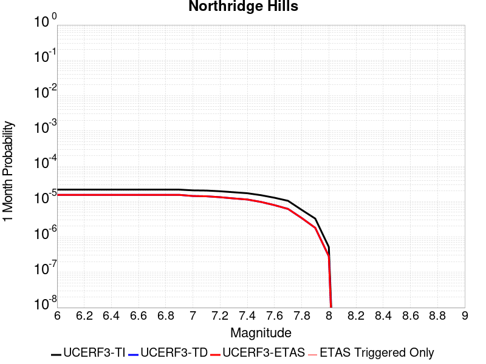 |  | 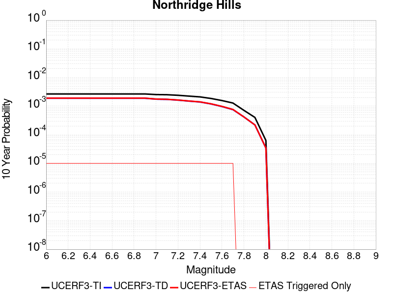 |

| Magnitude | 1 wk TI Prob | 1 wk TD Prob | 1 wk ETAS Prob | 1 wk ETAS/TD Gain | 1 wk ETAS Triggered Only | 1 mo TI Prob | 1 mo TD Prob | 1 mo ETAS Prob | 1 mo ETAS/TD Gain | 1 mo ETAS Triggered Only | 1 yr TI Prob | 1 yr TD Prob | 1 yr ETAS Prob | 1 yr ETAS/TD Gain | 1 yr ETAS Triggered Only | 10 yr TI Prob | 10 yr TD Prob | 10 yr ETAS Prob | 10 yr ETAS/TD Gain | 10 yr ETAS Triggered Only |
|-----|-----|-----|-----|-----|-----|-----|-----|-----|-----|-----|-----|-----|-----|-----|-----|-----|-----|-----|-----|-----|
| 6.0 | 5.095982E-6 | 3.6154656E-6 | 3.6154656E-6 | 1.0 | 0.0 | 2.183974E-5 | 1.5494761E-5 | 1.5494761E-5 | 1.0 | 0.0 | 2.658664E-4 | 1.886325E-4 | 1.886325E-4 | 1.0 | 0.0 | 0.0026554854 | 0.0018847364 | 0.0018947176 | 1.0052958 | 1.0E-5 |
| 6.1 | 5.095982E-6 | 3.6154656E-6 | 3.6154656E-6 | 1.0 | 0.0 | 2.183974E-5 | 1.5494761E-5 | 1.5494761E-5 | 1.0 | 0.0 | 2.658664E-4 | 1.886325E-4 | 1.886325E-4 | 1.0 | 0.0 | 0.0026554854 | 0.0018847364 | 0.0018947176 | 1.0052958 | 1.0E-5 |
| 6.2 | 5.095982E-6 | 3.6154656E-6 | 3.6154656E-6 | 1.0 | 0.0 | 2.183974E-5 | 1.5494761E-5 | 1.5494761E-5 | 1.0 | 0.0 | 2.658664E-4 | 1.886325E-4 | 1.886325E-4 | 1.0 | 0.0 | 0.0026554854 | 0.0018847364 | 0.0018947176 | 1.0052958 | 1.0E-5 |
| 6.3 | 5.095982E-6 | 3.6154656E-6 | 3.6154656E-6 | 1.0 | 0.0 | 2.183974E-5 | 1.5494761E-5 | 1.5494761E-5 | 1.0 | 0.0 | 2.658664E-4 | 1.886325E-4 | 1.886325E-4 | 1.0 | 0.0 | 0.0026554854 | 0.0018847364 | 0.0018947176 | 1.0052958 | 1.0E-5 |
| 6.4 | 5.095982E-6 | 3.6154656E-6 | 3.6154656E-6 | 1.0 | 0.0 | 2.183974E-5 | 1.5494761E-5 | 1.5494761E-5 | 1.0 | 0.0 | 2.658664E-4 | 1.886325E-4 | 1.886325E-4 | 1.0 | 0.0 | 0.0026554854 | 0.0018847364 | 0.0018947176 | 1.0052958 | 1.0E-5 |
| 6.5 | 5.095982E-6 | 3.6154656E-6 | 3.6154656E-6 | 1.0 | 0.0 | 2.183974E-5 | 1.5494761E-5 | 1.5494761E-5 | 1.0 | 0.0 | 2.658664E-4 | 1.886325E-4 | 1.886325E-4 | 1.0 | 0.0 | 0.0026554854 | 0.0018847364 | 0.0018947176 | 1.0052958 | 1.0E-5 |
| 6.6 | 5.095982E-6 | 3.6154656E-6 | 3.6154656E-6 | 1.0 | 0.0 | 2.183974E-5 | 1.5494761E-5 | 1.5494761E-5 | 1.0 | 0.0 | 2.658664E-4 | 1.886325E-4 | 1.886325E-4 | 1.0 | 0.0 | 0.0026554854 | 0.0018847364 | 0.0018947176 | 1.0052958 | 1.0E-5 |
| 6.7 | 5.095982E-6 | 3.6154656E-6 | 3.6154656E-6 | 1.0 | 0.0 | 2.183974E-5 | 1.5494761E-5 | 1.5494761E-5 | 1.0 | 0.0 | 2.658664E-4 | 1.886325E-4 | 1.886325E-4 | 1.0 | 0.0 | 0.0026554854 | 0.0018847364 | 0.0018947176 | 1.0052958 | 1.0E-5 |
| 6.8 | 5.095982E-6 | 3.6154656E-6 | 3.6154656E-6 | 1.0 | 0.0 | 2.183974E-5 | 1.5494761E-5 | 1.5494761E-5 | 1.0 | 0.0 | 2.658664E-4 | 1.886325E-4 | 1.886325E-4 | 1.0 | 0.0 | 0.0026554854 | 0.0018847364 | 0.0018947176 | 1.0052958 | 1.0E-5 |
| 6.9 | 5.0942654E-6 | 3.6136807E-6 | 3.6136807E-6 | 1.0 | 0.0 | 2.1832384E-5 | 1.5487112E-5 | 1.5487112E-5 | 1.0 | 0.0 | 2.6577685E-4 | 1.8853939E-4 | 1.8853939E-4 | 1.0 | 0.0 | 0.002654592 | 0.0018838067 | 0.0018937879 | 1.0052984 | 1.0E-5 |
| 7.0 | 4.851143E-6 | 3.358991E-6 | 3.358991E-6 | 1.0 | 0.0 | 2.0790447E-5 | 1.4395597E-5 | 1.4395597E-5 | 1.0 | 0.0 | 2.5309427E-4 | 1.7525234E-4 | 1.7525234E-4 | 1.0 | 0.0 | 0.0025280623 | 0.0017511457 | 0.0017611282 | 1.0057006 | 1.0E-5 |
| 7.1 | 4.7910607E-6 | 3.2972712E-6 | 3.2972712E-6 | 1.0 | 0.0 | 2.0532956E-5 | 1.4131086E-5 | 1.4131086E-5 | 1.0 | 0.0 | 2.4996005E-4 | 1.7203242E-4 | 1.7203242E-4 | 1.0 | 0.0 | 0.0024967908 | 0.0017189966 | 0.0017289794 | 1.0058074 | 1.0E-5 |
| 7.2 | 4.580079E-6 | 3.1070454E-6 | 3.1070454E-6 | 1.0 | 0.0 | 1.9628762E-5 | 1.3315841E-5 | 1.3315841E-5 | 1.0 | 0.0 | 2.3895396E-4 | 1.6210834E-4 | 1.6210834E-4 | 1.0 | 0.0 | 0.0023869718 | 0.0016199043 | 0.0016298882 | 1.0061632 | 1.0E-5 |
| 7.3 | 4.290062E-6 | 2.8684692E-6 | 2.8684692E-6 | 1.0 | 0.0 | 1.838585E-5 | 1.2293382E-5 | 1.2293382E-5 | 1.0 | 0.0 | 2.2382473E-4 | 1.4966166E-4 | 1.4966166E-4 | 1.0 | 0.0 | 0.0022359942 | 0.0014956117 | 0.0015055968 | 1.0066762 | 1.0E-5 |
| 7.4 | 4.0259683E-6 | 2.6741418E-6 | 2.6741418E-6 | 1.0 | 0.0 | 1.7254037E-5 | 1.1460557E-5 | 1.1460557E-5 | 1.0 | 0.0 | 2.1004764E-4 | 1.3952337E-4 | 1.3952337E-4 | 1.0 | 0.0 | 0.002098492 | 0.0013943606 | 0.0014043467 | 1.0071617 | 1.0E-5 |
| 7.5 | 3.5477108E-6 | 2.2854456E-6 | 2.2854456E-6 | 1.0 | 0.0 | 1.5204386E-5 | 9.7947295E-6 | 9.7947295E-6 | 1.0 | 0.0 | 1.8509767E-4 | 1.1924432E-4 | 1.1924432E-4 | 1.0 | 0.0 | 0.0018494357 | 0.001191805 | 0.0012017931 | 1.0083807 | 1.0E-5 |
| 7.6 | 2.9990608E-6 | 1.8530498E-6 | 1.8530498E-6 | 1.0 | 0.0 | 1.2853055E-5 | 7.941618E-6 | 7.941618E-6 | 1.0 | 0.0 | 1.564747E-4 | 9.668491E-5 | 9.668491E-5 | 1.0 | 0.0 | 0.0015636457 | 9.664293E-4 | 9.7641966E-4 | 1.0103374 | 1.0E-5 |
| 7.7 | 2.4542855E-6 | 1.4463353E-6 | 1.4463353E-6 | 1.0 | 0.0 | 1.05183235E-5 | 6.198565E-6 | 6.198565E-6 | 1.0 | 0.0 | 1.2805307E-4 | 7.546492E-5 | 7.546492E-5 | 1.0 | 0.0 | 0.001279793 | 7.543935E-4 | 7.64386E-4 | 1.0132457 | 1.0E-5 |
| 7.8 | 1.3623128E-6 | 8.017485E-7 | 8.017485E-7 | 1.0 | 0.0 | 5.8384703E-6 | 3.4360605E-6 | 3.4360605E-6 | 1.0 | 0.0 | 7.108106E-5 | 4.1833235E-5 | 4.1833235E-5 | 1.0 | 0.0 | 7.1058323E-4 | 4.1825383E-4 | 4.1825383E-4 | 1.0 | 0.0 |
| 7.9 | 7.716622E-7 | 4.2197863E-7 | 4.2197863E-7 | 1.0 | 0.0 | 3.3071194E-6 | 1.8084785E-6 | 1.8084785E-6 | 1.0 | 0.0 | 4.0263436E-5 | 2.2018005E-5 | 2.2018005E-5 | 1.0 | 0.0 | 4.0256142E-4 | 2.2015834E-4 | 2.2015834E-4 | 1.0 | 0.0 |
| 8.0 | 1.2117711E-7 | 6.6230385E-8 | 6.6230385E-8 | 1.0 | 0.0 | 5.1933034E-7 | 2.8384449E-7 | 2.8384449E-7 | 1.0 | 0.0 | 6.3228285E-6 | 3.4558013E-6 | 3.4558013E-6 | 1.0 | 0.0 | 6.3226486E-5 | 3.455749E-5 | 3.455749E-5 | 1.0 | 0.0 |

## Butano 2011 CFM
*[(top)](#table-of-contents)*

| 1 Week | 1 Month | 1 Year | 10 Year |
|-----|-----|-----|-----|
| 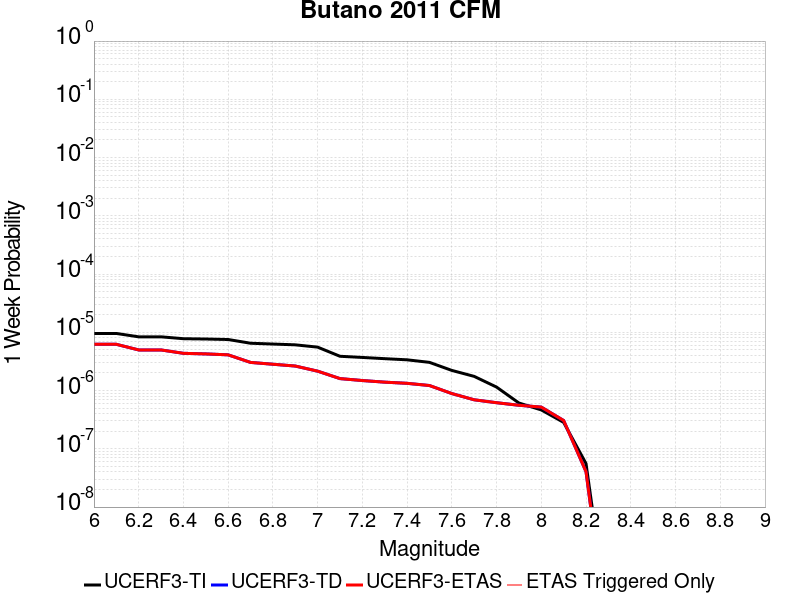 |  | 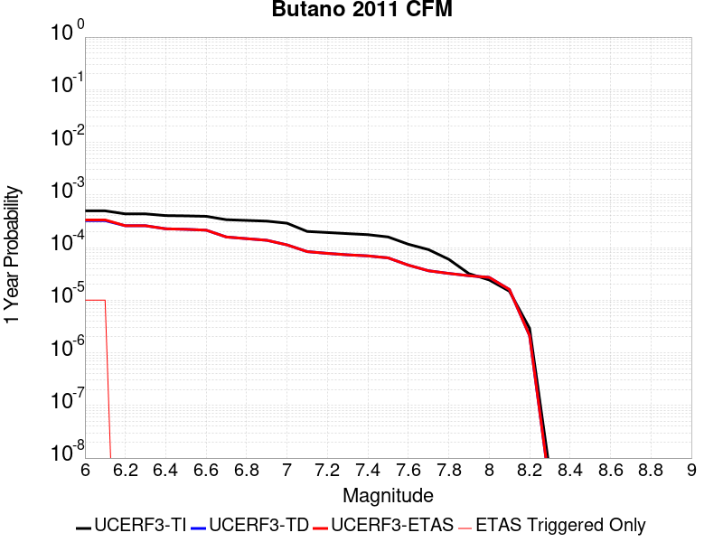 | 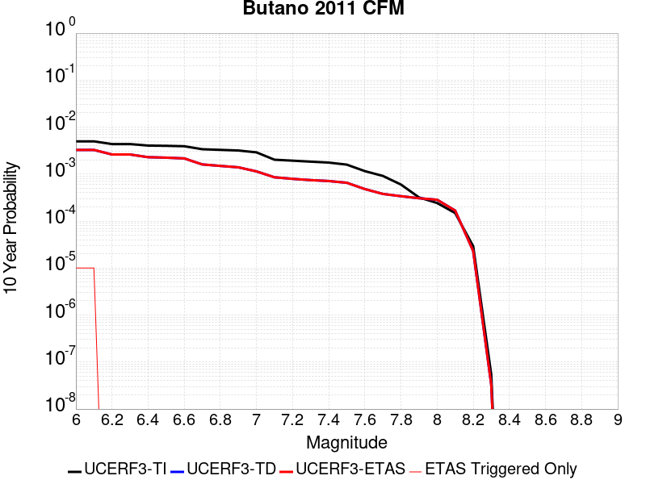 |

| Magnitude | 1 wk TI Prob | 1 wk TD Prob | 1 wk ETAS Prob | 1 wk ETAS/TD Gain | 1 wk ETAS Triggered Only | 1 mo TI Prob | 1 mo TD Prob | 1 mo ETAS Prob | 1 mo ETAS/TD Gain | 1 mo ETAS Triggered Only | 1 yr TI Prob | 1 yr TD Prob | 1 yr ETAS Prob | 1 yr ETAS/TD Gain | 1 yr ETAS Triggered Only | 10 yr TI Prob | 10 yr TD Prob | 10 yr ETAS Prob | 10 yr ETAS/TD Gain | 10 yr ETAS Triggered Only |
|-----|-----|-----|-----|-----|-----|-----|-----|-----|-----|-----|-----|-----|-----|-----|-----|-----|-----|-----|-----|-----|
| 6.0 | 9.561135E-6 | 6.228287E-6 | 6.228287E-6 | 1.0 | 0.0 | 4.097565E-5 | 2.6692396E-5 | 2.6692396E-5 | 1.0 | 0.0 | 4.9876433E-4 | 3.2493367E-4 | 3.3493043E-4 | 1.0307655 | 1.0E-5 | 0.004976464 | 0.0032622605 | 0.0032722277 | 1.0030553 | 1.0E-5 |
| 6.1 | 9.561135E-6 | 6.228287E-6 | 6.228287E-6 | 1.0 | 0.0 | 4.097565E-5 | 2.6692396E-5 | 2.6692396E-5 | 1.0 | 0.0 | 4.9876433E-4 | 3.2493367E-4 | 3.3493043E-4 | 1.0307655 | 1.0E-5 | 0.004976464 | 0.0032622605 | 0.0032722277 | 1.0030553 | 1.0E-5 |
| 6.2 | 8.364741E-6 | 4.9813525E-6 | 4.9813525E-6 | 1.0 | 0.0 | 3.5848396E-5 | 2.1348487E-5 | 2.1348487E-5 | 1.0 | 0.0 | 4.3636683E-4 | 2.5988842E-4 | 2.5988842E-4 | 1.0 | 0.0 | 0.0043551093 | 0.0026134674 | 0.0026134674 | 1.0 | 0.0 |
| 6.3 | 8.364741E-6 | 4.9813525E-6 | 4.9813525E-6 | 1.0 | 0.0 | 3.5848396E-5 | 2.1348487E-5 | 2.1348487E-5 | 1.0 | 0.0 | 4.3636683E-4 | 2.5988842E-4 | 2.5988842E-4 | 1.0 | 0.0 | 0.0043551093 | 0.0026134674 | 0.0026134674 | 1.0 | 0.0 |
| 6.4 | 7.768282E-6 | 4.3592904E-6 | 4.3592904E-6 | 1.0 | 0.0 | 3.329221E-5 | 1.8682545E-5 | 1.8682545E-5 | 1.0 | 0.0 | 4.0525728E-4 | 2.2743763E-4 | 2.2743763E-4 | 1.0 | 0.0 | 0.0040451903 | 0.002289656 | 0.002289656 | 1.0 | 0.0 |
| 6.5 | 7.673437E-6 | 4.2588513E-6 | 4.2588513E-6 | 1.0 | 0.0 | 3.2885746E-5 | 1.82521E-5 | 1.82521E-5 | 1.0 | 0.0 | 4.0031038E-4 | 2.22198E-4 | 2.22198E-4 | 1.0 | 0.0 | 0.0039959005 | 0.0022373653 | 0.0022373653 | 1.0 | 0.0 |
| 6.6 | 7.5244197E-6 | 4.103811E-6 | 4.103811E-6 | 1.0 | 0.0 | 3.2247113E-5 | 1.758765E-5 | 1.758765E-5 | 1.0 | 0.0 | 3.9253788E-4 | 2.1410994E-4 | 2.1410994E-4 | 1.0 | 0.0 | 0.003918452 | 0.0021566437 | 0.0021566437 | 1.0 | 0.0 |
| 6.7 | 6.4921405E-6 | 3.0438493E-6 | 3.0438493E-6 | 1.0 | 0.0 | 2.7823162E-5 | 1.30450035E-5 | 1.30450035E-5 | 1.0 | 0.0 | 3.3869434E-4 | 1.5881142E-4 | 1.5881142E-4 | 1.0 | 0.0 | 0.003381786 | 0.0016044728 | 0.0016044728 | 1.0 | 0.0 |
| 6.8 | 6.2890294E-6 | 2.8306097E-6 | 2.8306097E-6 | 1.0 | 0.0 | 2.6952705E-5 | 1.2131128E-5 | 1.2131128E-5 | 1.0 | 0.0 | 3.2809976E-4 | 1.4768656E-4 | 1.4768656E-4 | 1.0 | 0.0 | 0.0032761577 | 0.0014933785 | 0.0014933785 | 1.0 | 0.0 |
| 6.9 | 6.0965517E-6 | 2.6371163E-6 | 2.6371163E-6 | 1.0 | 0.0 | 2.6127816E-5 | 1.1301878E-5 | 1.1301878E-5 | 1.0 | 0.0 | 3.1805973E-4 | 1.3759173E-4 | 1.3759173E-4 | 1.0 | 0.0 | 0.0031760489 | 0.0013925604 | 0.0013925604 | 1.0 | 0.0 |
| 7.0 | 5.566252E-6 | 2.1544965E-6 | 2.1544965E-6 | 1.0 | 0.0 | 2.3855147E-5 | 9.233524E-6 | 9.233524E-6 | 1.0 | 0.0 | 2.9039773E-4 | 1.12412396E-4 | 1.12412396E-4 | 1.0 | 0.0 | 0.0029001853 | 0.0011410478 | 0.0011410478 | 1.0 | 0.0 |
| 7.1 | 3.878588E-6 | 1.6055053E-6 | 1.6055053E-6 | 1.0 | 0.0 | 1.6622414E-5 | 6.8807185E-6 | 6.8807185E-6 | 1.0 | 0.0 | 2.023591E-4 | 8.376953E-5 | 8.376953E-5 | 1.0 | 0.0 | 0.0020217493 | 8.544741E-4 | 8.544741E-4 | 1.0 | 0.0 |
| 7.2 | 3.7038085E-6 | 1.4865388E-6 | 1.4865388E-6 | 1.0 | 0.0 | 1.587337E-5 | 6.370865E-6 | 6.370865E-6 | 1.0 | 0.0 | 1.9324113E-4 | 7.756252E-5 | 7.756252E-5 | 1.0 | 0.0 | 0.0019307317 | 7.92417E-4 | 7.92417E-4 | 1.0 | 0.0 |
| 7.3 | 3.5277278E-6 | 1.3946282E-6 | 1.3946282E-6 | 1.0 | 0.0 | 1.5118746E-5 | 5.9769636E-6 | 5.9769636E-6 | 1.0 | 0.0 | 1.8405518E-4 | 7.276711E-5 | 7.276711E-5 | 1.0 | 0.0 | 0.0018390282 | 7.444085E-4 | 7.444085E-4 | 1.0 | 0.0 |
| 7.4 | 3.3711294E-6 | 1.3318496E-6 | 1.3318496E-6 | 1.0 | 0.0 | 1.4447617E-5 | 5.707914E-6 | 5.707914E-6 | 1.0 | 0.0 | 1.7588554E-4 | 6.9491645E-5 | 6.9491645E-5 | 1.0 | 0.0 | 0.0017574639 | 7.1162294E-4 | 7.1162294E-4 | 1.0 | 0.0 |
| 7.5 | 3.0496426E-6 | 1.2207621E-6 | 1.2207621E-6 | 1.0 | 0.0 | 1.3069831E-5 | 5.231827E-6 | 5.231827E-6 | 1.0 | 0.0 | 1.5911358E-4 | 6.369563E-5 | 6.369563E-5 | 1.0 | 0.0 | 0.001589997 | 6.536299E-4 | 6.536299E-4 | 1.0 | 0.0 |
| 7.6 | 2.2179781E-6 | 8.887138E-7 | 8.887138E-7 | 1.0 | 0.0 | 9.505586E-6 | 3.8087678E-6 | 3.8087678E-6 | 1.0 | 0.0 | 1.1572436E-4 | 4.637076E-5 | 4.637076E-5 | 1.0 | 0.0 | 0.0011566412 | 4.803627E-4 | 4.803627E-4 | 1.0 | 0.0 |
| 7.7 | 1.7519328E-6 | 6.9454455E-7 | 6.9454455E-7 | 1.0 | 0.0 | 7.508262E-6 | 2.976616E-6 | 2.976616E-6 | 1.0 | 0.0 | 9.140925E-5 | 3.6239697E-5 | 3.6239697E-5 | 1.0 | 0.0 | 9.137166E-4 | 3.783575E-4 | 3.783575E-4 | 1.0 | 0.0 |
| 7.8 | 1.1478974E-6 | 6.1872794E-7 | 6.1872794E-7 | 1.0 | 0.0 | 4.9195505E-6 | 2.6516884E-6 | 2.6516884E-6 | 1.0 | 0.0 | 5.9893882E-5 | 3.2283828E-5 | 3.2283828E-5 | 1.0 | 0.0 | 5.9877743E-4 | 3.384712E-4 | 3.384712E-4 | 1.0 | 0.0 |
| 7.9 | 6.1154634E-7 | 5.5932884E-7 | 5.5932884E-7 | 1.0 | 0.0 | 2.6209104E-6 | 2.3971213E-6 | 2.3971213E-6 | 1.0 | 0.0 | 3.1909116E-5 | 2.918456E-5 | 2.918456E-5 | 1.0 | 0.0 | 3.1904536E-4 | 3.062421E-4 | 3.062421E-4 | 1.0 | 0.0 |
| 8.0 | 4.6520046E-7 | 5.199789E-7 | 5.199789E-7 | 1.0 | 0.0 | 1.9937147E-6 | 2.2284792E-6 | 2.2284792E-6 | 1.0 | 0.0 | 2.4273206E-5 | 2.7131397E-5 | 2.7131397E-5 | 1.0 | 0.0 | 2.4270554E-4 | 2.8473893E-4 | 2.8473893E-4 | 1.0 | 0.0 |
| 8.1 | 2.8425194E-7 | 3.0630198E-7 | 3.0630198E-7 | 1.0 | 0.0 | 1.218222E-6 | 1.3127221E-6 | 1.3127221E-6 | 1.0 | 0.0 | 1.4831752E-5 | 1.5982274E-5 | 1.5982274E-5 | 1.0 | 0.0 | 1.4830762E-4 | 1.6771963E-4 | 1.6771963E-4 | 1.0 | 0.0 |
| 8.2 | 5.585778E-8 | 4.0623355E-8 | 4.0623355E-8 | 1.0 | 0.0 | 2.3939046E-7 | 1.7410008E-7 | 1.7410008E-7 | 1.0 | 0.0 | 2.914575E-6 | 2.1196665E-6 | 2.1196665E-6 | 1.0 | 0.0 | 2.9145367E-5 | 2.3030867E-5 | 2.3030867E-5 | 1.0 | 0.0 |
| 8.3 | 1.0371215E-10 | 5.3720917E-11 | 5.3720917E-11 | 1.0 | 0.0 | 4.4448079E-10 | 2.3023239E-10 | 2.3023239E-10 | 1.0 | 0.0 | 5.4115543E-9 | 2.80308E-9 | 2.80308E-9 | 1.0 | 0.0 | 5.4115542E-8 | 3.2236333E-8 | 3.2236333E-8 | 1.0 | 0.0 |

## Fontana (Seismicity)
*[(top)](#table-of-contents)*

| 1 Week | 1 Month | 1 Year | 10 Year |
|-----|-----|-----|-----|
|  |  |  |  |

| Magnitude | 1 wk TI Prob | 1 wk TD Prob | 1 wk ETAS Prob | 1 wk ETAS/TD Gain | 1 wk ETAS Triggered Only | 1 mo TI Prob | 1 mo TD Prob | 1 mo ETAS Prob | 1 mo ETAS/TD Gain | 1 mo ETAS Triggered Only | 1 yr TI Prob | 1 yr TD Prob | 1 yr ETAS Prob | 1 yr ETAS/TD Gain | 1 yr ETAS Triggered Only | 10 yr TI Prob | 10 yr TD Prob | 10 yr ETAS Prob | 10 yr ETAS/TD Gain | 10 yr ETAS Triggered Only |
|-----|-----|-----|-----|-----|-----|-----|-----|-----|-----|-----|-----|-----|-----|-----|-----|-----|-----|-----|-----|-----|
| 6.0 | 7.1789214E-6 | 7.5521466E-6 | 7.5521466E-6 | 1.0 | 0.0 | 3.076644E-5 | 3.236617E-5 | 3.236617E-5 | 1.0 | 0.0 | 3.7451705E-4 | 3.9402765E-4 | 3.9402765E-4 | 1.0 | 0.0 | 0.003738865 | 0.00393729 | 0.0039472505 | 1.0025299 | 1.0E-5 |
| 6.1 | 7.1789214E-6 | 7.5521466E-6 | 7.5521466E-6 | 1.0 | 0.0 | 3.076644E-5 | 3.236617E-5 | 3.236617E-5 | 1.0 | 0.0 | 3.7451705E-4 | 3.9402765E-4 | 3.9402765E-4 | 1.0 | 0.0 | 0.003738865 | 0.00393729 | 0.0039472505 | 1.0025299 | 1.0E-5 |
| 6.2 | 7.1789214E-6 | 7.5521466E-6 | 7.5521466E-6 | 1.0 | 0.0 | 3.076644E-5 | 3.236617E-5 | 3.236617E-5 | 1.0 | 0.0 | 3.7451705E-4 | 3.9402765E-4 | 3.9402765E-4 | 1.0 | 0.0 | 0.003738865 | 0.00393729 | 0.0039472505 | 1.0025299 | 1.0E-5 |
| 6.3 | 7.1789214E-6 | 7.5521466E-6 | 7.5521466E-6 | 1.0 | 0.0 | 3.076644E-5 | 3.236617E-5 | 3.236617E-5 | 1.0 | 0.0 | 3.7451705E-4 | 3.9402765E-4 | 3.9402765E-4 | 1.0 | 0.0 | 0.003738865 | 0.00393729 | 0.0039472505 | 1.0025299 | 1.0E-5 |
| 6.4 | 7.1789214E-6 | 7.5521466E-6 | 7.5521466E-6 | 1.0 | 0.0 | 3.076644E-5 | 3.236617E-5 | 3.236617E-5 | 1.0 | 0.0 | 3.7451705E-4 | 3.9402765E-4 | 3.9402765E-4 | 1.0 | 0.0 | 0.003738865 | 0.00393729 | 0.0039472505 | 1.0025299 | 1.0E-5 |
| 6.5 | 5.2611317E-6 | 5.532832E-6 | 5.532832E-6 | 1.0 | 0.0 | 2.2547512E-5 | 2.3712137E-5 | 2.3712137E-5 | 1.0 | 0.0 | 2.744814E-4 | 2.8869527E-4 | 2.8869527E-4 | 1.0 | 0.0 | 0.002741426 | 0.0028869526 | 0.0028869526 | 1.0 | 0.0 |
| 6.6 | 5.2611317E-6 | 5.532832E-6 | 5.532832E-6 | 1.0 | 0.0 | 2.2547512E-5 | 2.3712137E-5 | 2.3712137E-5 | 1.0 | 0.0 | 2.744814E-4 | 2.8869527E-4 | 2.8869527E-4 | 1.0 | 0.0 | 0.002741426 | 0.0028869526 | 0.0028869526 | 1.0 | 0.0 |

## San Clemente
*[(top)](#table-of-contents)*

| 1 Week | 1 Month | 1 Year | 10 Year |
|-----|-----|-----|-----|
|  | 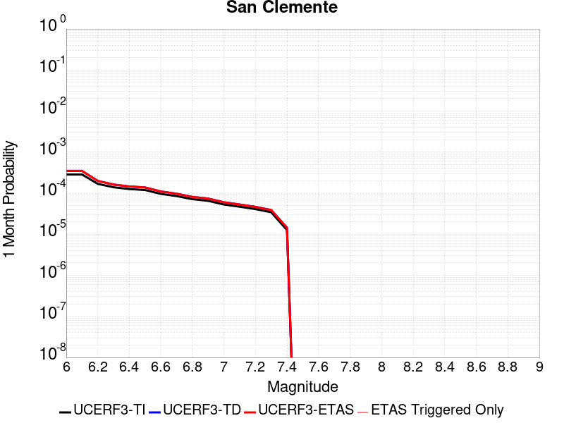 |  |  |

| Magnitude | 1 wk TI Prob | 1 wk TD Prob | 1 wk ETAS Prob | 1 wk ETAS/TD Gain | 1 wk ETAS Triggered Only | 1 mo TI Prob | 1 mo TD Prob | 1 mo ETAS Prob | 1 mo ETAS/TD Gain | 1 mo ETAS Triggered Only | 1 yr TI Prob | 1 yr TD Prob | 1 yr ETAS Prob | 1 yr ETAS/TD Gain | 1 yr ETAS Triggered Only | 10 yr TI Prob | 10 yr TD Prob | 10 yr ETAS Prob | 10 yr ETAS/TD Gain | 10 yr ETAS Triggered Only |
|-----|-----|-----|-----|-----|-----|-----|-----|-----|-----|-----|-----|-----|-----|-----|-----|-----|-----|-----|-----|-----|
| 6.0 | 6.681379E-5 | 8.1641134E-5 | 8.1641134E-5 | 1.0 | 0.0 | 2.8631336E-4 | 3.498469E-4 | 3.498469E-4 | 1.0 | 0.0 | 0.003480294 | 0.0042516463 | 0.004261604 | 1.002342 | 1.0E-5 | 0.03426291 | 0.041759077 | 0.041768663 | 1.0002295 | 1.0E-5 |
| 6.1 | 6.681379E-5 | 8.1641134E-5 | 8.1641134E-5 | 1.0 | 0.0 | 2.8631336E-4 | 3.498469E-4 | 3.498469E-4 | 1.0 | 0.0 | 0.003480294 | 0.0042516463 | 0.004261604 | 1.002342 | 1.0E-5 | 0.03426291 | 0.041759077 | 0.041768663 | 1.0002295 | 1.0E-5 |
| 6.2 | 3.9400576E-5 | 4.6455116E-5 | 4.6455116E-5 | 1.0 | 0.0 | 1.6884868E-4 | 1.990785E-4 | 1.990785E-4 | 1.0 | 0.0 | 0.0020537945 | 0.0024211477 | 0.0024311235 | 1.0041202 | 1.0E-5 | 0.020349167 | 0.023954442 | 0.023964202 | 1.0004075 | 1.0E-5 |
| 6.3 | 3.2590255E-5 | 3.793141E-5 | 3.793141E-5 | 1.0 | 0.0 | 1.3966505E-4 | 1.6255323E-4 | 1.6255323E-4 | 1.0 | 0.0 | 0.0016990956 | 0.0019773194 | 0.0019872996 | 1.0050473 | 1.0E-5 | 0.01686163 | 0.019601053 | 0.019610858 | 1.0005002 | 1.0E-5 |
| 6.4 | 2.9454652E-5 | 3.4099783E-5 | 3.4099783E-5 | 1.0 | 0.0 | 1.2622811E-4 | 1.4613387E-4 | 1.4613387E-4 | 1.0 | 0.0 | 0.0015357438 | 0.0017777525 | 0.0017877347 | 1.0056151 | 1.0E-5 | 0.015251739 | 0.017638486 | 0.01764831 | 1.000557 | 1.0E-5 |
| 6.5 | 2.790836E-5 | 3.224933E-5 | 3.224933E-5 | 1.0 | 0.0 | 1.1960178E-4 | 1.3820422E-4 | 1.3820422E-4 | 1.0 | 0.0 | 0.001455179 | 0.0016813624 | 0.0016913456 | 1.0059376 | 1.0E-5 | 0.014456868 | 0.016689435 | 0.016699268 | 1.0005891 | 1.0E-5 |
| 6.6 | 2.2492153E-5 | 2.5764102E-5 | 2.5764102E-5 | 1.0 | 0.0 | 9.639138E-5 | 1.1041299E-4 | 1.1041299E-4 | 1.0 | 0.0 | 0.0011729331 | 0.0013434635 | 0.0013534501 | 1.0074334 | 1.0E-5 | 0.011667615 | 0.013355134 | 0.0133650005 | 1.0007387 | 1.0E-5 |
| 6.7 | 1.9862755E-5 | 2.2667613E-5 | 2.2667613E-5 | 1.0 | 0.0 | 8.512331E-5 | 9.714336E-5 | 9.714336E-5 | 1.0 | 0.0 | 0.0010358836 | 0.00118209 | 0.0011920781 | 1.0084496 | 1.0E-5 | 0.010310682 | 0.011759315 | 0.011769197 | 1.0008404 | 1.0E-5 |
| 6.8 | 1.6697575E-5 | 1.8978673E-5 | 1.8978673E-5 | 1.0 | 0.0 | 7.155907E-5 | 8.1334685E-5 | 8.1334685E-5 | 1.0 | 0.0 | 8.7088346E-4 | 9.898093E-4 | 9.898093E-4 | 1.0 | 0.0 | 0.008674784 | 0.009855035 | 0.009855035 | 1.0 | 0.0 |
| 6.9 | 1.5218415E-5 | 1.7270266E-5 | 1.7270266E-5 | 1.0 | 0.0 | 6.522015E-5 | 7.401338E-5 | 7.401338E-5 | 1.0 | 0.0 | 7.93766E-4 | 9.007491E-4 | 9.007491E-4 | 1.0 | 0.0 | 0.007909367 | 0.008971928 | 0.008971928 | 1.0 | 0.0 |
| 7.0 | 1.2392958E-5 | 1.4033705E-5 | 1.4033705E-5 | 1.0 | 0.0 | 5.3111595E-5 | 6.014311E-5 | 6.014311E-5 | 1.0 | 0.0 | 6.4644177E-4 | 7.3200394E-4 | 7.3200394E-4 | 1.0 | 0.0 | 0.0064456454 | 0.007296714 | 0.007296714 | 1.0 | 0.0 |
| 7.1 | 1.0934128E-5 | 1.2375744E-5 | 1.2375744E-5 | 1.0 | 0.0 | 4.6859706E-5 | 5.3037864E-5 | 5.3037864E-5 | 1.0 | 0.0 | 5.7036756E-4 | 6.45552E-4 | 6.45552E-4 | 1.0 | 0.0 | 0.0056890585 | 0.006437514 | 0.006437514 | 1.0 | 0.0 |
| 7.2 | 9.5798805E-6 | 1.0845467E-5 | 1.0845467E-5 | 1.0 | 0.0 | 4.1055984E-5 | 4.6479785E-5 | 4.6479785E-5 | 1.0 | 0.0 | 4.9974193E-4 | 5.657517E-4 | 5.657517E-4 | 1.0 | 0.0 | 0.0049861963 | 0.0056438376 | 0.0056438376 | 1.0 | 0.0 |
| 7.3 | 8.0167365E-6 | 9.084367E-6 | 9.084367E-6 | 1.0 | 0.0 | 3.4356988E-5 | 3.893246E-5 | 3.893246E-5 | 1.0 | 0.0 | 4.1821605E-4 | 4.7390666E-4 | 4.7390666E-4 | 1.0 | 0.0 | 0.0041742986 | 0.0047296635 | 0.0047296635 | 1.0 | 0.0 |
| 7.4 | 2.9581017E-6 | 3.36255E-6 | 3.36255E-6 | 1.0 | 0.0 | 1.2677518E-5 | 1.4410877E-5 | 1.4410877E-5 | 1.0 | 0.0 | 1.5433785E-4 | 1.7544335E-4 | 1.7544335E-4 | 1.0 | 0.0 | 0.001542307 | 0.0017535435 | 0.0017535435 | 1.0 | 0.0 |

## Raymond
*[(top)](#table-of-contents)*

| 1 Week | 1 Month | 1 Year | 10 Year |
|-----|-----|-----|-----|
|  |  |  | 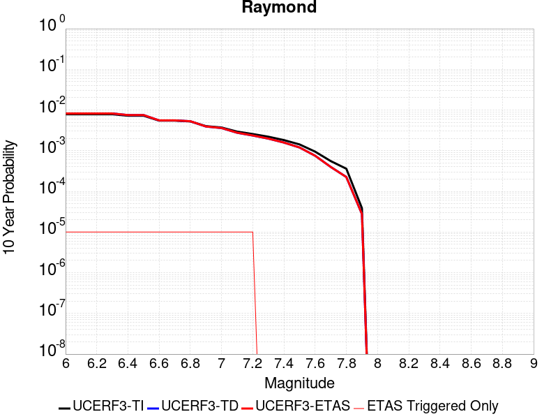 |

| Magnitude | 1 wk TI Prob | 1 wk TD Prob | 1 wk ETAS Prob | 1 wk ETAS/TD Gain | 1 wk ETAS Triggered Only | 1 mo TI Prob | 1 mo TD Prob | 1 mo ETAS Prob | 1 mo ETAS/TD Gain | 1 mo ETAS Triggered Only | 1 yr TI Prob | 1 yr TD Prob | 1 yr ETAS Prob | 1 yr ETAS/TD Gain | 1 yr ETAS Triggered Only | 10 yr TI Prob | 10 yr TD Prob | 10 yr ETAS Prob | 10 yr ETAS/TD Gain | 10 yr ETAS Triggered Only |
|-----|-----|-----|-----|-----|-----|-----|-----|-----|-----|-----|-----|-----|-----|-----|-----|-----|-----|-----|-----|-----|
| 6.0 | 1.5157413E-5 | 1.5810916E-5 | 1.5810916E-5 | 1.0 | 0.0 | 6.4958724E-5 | 6.775945E-5 | 6.775945E-5 | 1.0 | 0.0 | 7.905855E-4 | 8.2468416E-4 | 8.346759E-4 | 1.0121158 | 1.0E-5 | 0.007877788 | 0.008218757 | 0.0082286745 | 1.0012068 | 1.0E-5 |
| 6.1 | 1.5157413E-5 | 1.5810916E-5 | 1.5810916E-5 | 1.0 | 0.0 | 6.4958724E-5 | 6.775945E-5 | 6.775945E-5 | 1.0 | 0.0 | 7.905855E-4 | 8.2468416E-4 | 8.346759E-4 | 1.0121158 | 1.0E-5 | 0.007877788 | 0.008218757 | 0.0082286745 | 1.0012068 | 1.0E-5 |
| 6.2 | 1.5157413E-5 | 1.5810916E-5 | 1.5810916E-5 | 1.0 | 0.0 | 6.4958724E-5 | 6.775945E-5 | 6.775945E-5 | 1.0 | 0.0 | 7.905855E-4 | 8.2468416E-4 | 8.346759E-4 | 1.0121158 | 1.0E-5 | 0.007877788 | 0.008218757 | 0.0082286745 | 1.0012068 | 1.0E-5 |
| 6.3 | 1.5157413E-5 | 1.5810916E-5 | 1.5810916E-5 | 1.0 | 0.0 | 6.4958724E-5 | 6.775945E-5 | 6.775945E-5 | 1.0 | 0.0 | 7.905855E-4 | 8.2468416E-4 | 8.346759E-4 | 1.0121158 | 1.0E-5 | 0.007877788 | 0.008218757 | 0.0082286745 | 1.0012068 | 1.0E-5 |
| 6.4 | 1.3941944E-5 | 1.44554215E-5 | 1.44554215E-5 | 1.0 | 0.0 | 5.9749822E-5 | 6.1950464E-5 | 6.1950464E-5 | 1.0 | 0.0 | 7.2721124E-4 | 7.5400923E-4 | 7.640017E-4 | 1.0132524 | 1.0E-5 | 0.007248361 | 0.0075168433 | 0.0075267684 | 1.0013204 | 1.0E-5 |
| 6.5 | 1.3941944E-5 | 1.44554215E-5 | 1.44554215E-5 | 1.0 | 0.0 | 5.9749822E-5 | 6.1950464E-5 | 6.1950464E-5 | 1.0 | 0.0 | 7.2721124E-4 | 7.5400923E-4 | 7.640017E-4 | 1.0132524 | 1.0E-5 | 0.007248361 | 0.0075168433 | 0.0075267684 | 1.0013204 | 1.0E-5 |
| 6.6 | 1.0542609E-5 | 1.0671684E-5 | 1.0671684E-5 | 1.0 | 0.0 | 4.5181827E-5 | 4.573502E-5 | 4.573502E-5 | 1.0 | 0.0 | 5.499499E-4 | 5.5668707E-4 | 5.666815E-4 | 1.0179534 | 1.0E-5 | 0.005485909 | 0.0055534868 | 0.0055634314 | 1.0017906 | 1.0E-5 |
| 6.7 | 1.0542609E-5 | 1.0671684E-5 | 1.0671684E-5 | 1.0 | 0.0 | 4.5181827E-5 | 4.573502E-5 | 4.573502E-5 | 1.0 | 0.0 | 5.499499E-4 | 5.5668707E-4 | 5.666815E-4 | 1.0179534 | 1.0E-5 | 0.005485909 | 0.0055534868 | 0.0055634314 | 1.0017906 | 1.0E-5 |
| 6.8 | 1.0079132E-5 | 1.0177206E-5 | 1.0177206E-5 | 1.0 | 0.0 | 4.3195567E-5 | 4.3615895E-5 | 4.3615895E-5 | 1.0 | 0.0 | 5.257791E-4 | 5.308995E-4 | 5.4089417E-4 | 1.018826 | 1.0E-5 | 0.0052453685 | 0.0052968618 | 0.0053068087 | 1.0018779 | 1.0E-5 |
| 6.9 | 7.721598E-6 | 7.549351E-6 | 7.549351E-6 | 1.0 | 0.0 | 3.3092143E-5 | 3.2353964E-5 | 3.2353964E-5 | 1.0 | 0.0 | 4.0282236E-4 | 3.9383955E-4 | 4.038356E-4 | 1.0253811 | 1.0E-5 | 0.0040209293 | 0.0039315494 | 0.0039415103 | 1.0025336 | 1.0E-5 |
| 7.0 | 7.137566E-6 | 6.91173E-6 | 6.91173E-6 | 1.0 | 0.0 | 3.058921E-5 | 2.962137E-5 | 2.962137E-5 | 1.0 | 0.0 | 3.7236E-4 | 3.6058156E-4 | 3.7057797E-4 | 1.027723 | 1.0E-5 | 0.0037173668 | 0.0036000833 | 0.0036100473 | 1.0027677 | 1.0E-5 |
| 7.1 | 5.654976E-6 | 5.299912E-6 | 5.299912E-6 | 1.0 | 0.0 | 2.4235387E-5 | 2.2713713E-5 | 2.2713713E-5 | 1.0 | 0.0 | 2.9502588E-4 | 2.7650458E-4 | 2.865018E-4 | 1.0361558 | 1.0E-5 | 0.0029463451 | 0.0027616364 | 0.0027716088 | 1.0036111 | 1.0E-5 |
| 7.2 | 4.9358455E-6 | 4.5270053E-6 | 4.5270053E-6 | 1.0 | 0.0 | 2.1153453E-5 | 1.9401308E-5 | 1.9401308E-5 | 1.0 | 0.0 | 2.5751285E-4 | 2.3618546E-4 | 2.461831E-4 | 1.0423295 | 1.0E-5 | 0.0025721465 | 0.0023593665 | 0.002369343 | 1.0042285 | 1.0E-5 |
| 7.3 | 4.2368597E-6 | 3.8059438E-6 | 3.8059438E-6 | 1.0 | 0.0 | 1.8157843E-5 | 1.6311087E-5 | 1.6311087E-5 | 1.0 | 0.0 | 2.2104931E-4 | 1.9856948E-4 | 1.9856948E-4 | 1.0 | 0.0 | 0.0022082955 | 0.0019839394 | 0.0019839394 | 1.0 | 0.0 |
| 7.4 | 3.4999923E-6 | 3.044046E-6 | 3.044046E-6 | 1.0 | 0.0 | 1.49998805E-5 | 1.3045847E-5 | 1.3045847E-5 | 1.0 | 0.0 | 1.8260824E-4 | 1.5882168E-4 | 1.5882168E-4 | 1.0 | 0.0 | 0.0018245826 | 0.0015870975 | 0.0015870975 | 1.0 | 0.0 |
| 7.5 | 2.738017E-6 | 2.3022249E-6 | 2.3022249E-6 | 1.0 | 0.0 | 1.1734306E-5 | 9.866641E-6 | 9.866641E-6 | 1.0 | 0.0 | 1.428558E-4 | 1.201198E-4 | 1.201198E-4 | 1.0 | 0.0 | 0.0014276401 | 0.0012005632 | 0.0012005632 | 1.0 | 0.0 |
| 7.6 | 1.8186392E-6 | 1.4424369E-6 | 1.4424369E-6 | 1.0 | 0.0 | 7.794145E-6 | 6.1818578E-6 | 6.1818578E-6 | 1.0 | 0.0 | 9.488958E-5 | 7.526156E-5 | 7.526156E-5 | 1.0 | 0.0 | 9.4849075E-4 | 7.523722E-4 | 7.523722E-4 | 1.0 | 0.0 |
| 7.7 | 1.0660348E-6 | 7.644813E-7 | 7.644813E-7 | 1.0 | 0.0 | 4.5687125E-6 | 3.2763444E-6 | 3.2763444E-6 | 1.0 | 0.0 | 5.5622655E-5 | 3.988878E-5 | 3.988878E-5 | 1.0 | 0.0 | 5.5608735E-4 | 3.9882533E-4 | 3.9882533E-4 | 1.0 | 0.0 |
| 7.8 | 6.913602E-7 | 4.3212557E-7 | 4.3212557E-7 | 1.0 | 0.0 | 2.962969E-6 | 1.8519654E-6 | 1.8519654E-6 | 1.0 | 0.0 | 3.607355E-5 | 2.2547452E-5 | 2.2547452E-5 | 1.0 | 0.0 | 3.6067693E-4 | 2.254595E-4 | 2.254595E-4 | 1.0 | 0.0 |
| 7.9 | 7.425201E-8 | 5.323065E-8 | 5.323065E-8 | 1.0 | 0.0 | 3.1822285E-7 | 2.2813134E-7 | 2.2813134E-7 | 1.0 | 0.0 | 3.874356E-6 | 2.7774968E-6 | 2.7774968E-6 | 1.0 | 0.0 | 3.8742884E-5 | 2.7774751E-5 | 2.7774751E-5 | 1.0 | 0.0 |

## San Jacinto (Clark) rev
*[(top)](#table-of-contents)*

| 1 Week | 1 Month | 1 Year | 10 Year |
|-----|-----|-----|-----|
|  | 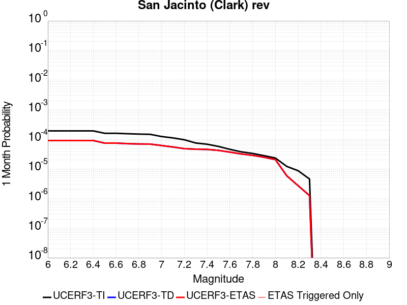 |  |  |

| Magnitude | 1 wk TI Prob | 1 wk TD Prob | 1 wk ETAS Prob | 1 wk ETAS/TD Gain | 1 wk ETAS Triggered Only | 1 mo TI Prob | 1 mo TD Prob | 1 mo ETAS Prob | 1 mo ETAS/TD Gain | 1 mo ETAS Triggered Only | 1 yr TI Prob | 1 yr TD Prob | 1 yr ETAS Prob | 1 yr ETAS/TD Gain | 1 yr ETAS Triggered Only | 10 yr TI Prob | 10 yr TD Prob | 10 yr ETAS Prob | 10 yr ETAS/TD Gain | 10 yr ETAS Triggered Only |
|-----|-----|-----|-----|-----|-----|-----|-----|-----|-----|-----|-----|-----|-----|-----|-----|-----|-----|-----|-----|-----|
| 6.0 | 4.482615E-5 | 2.1184933E-5 | 2.1184933E-5 | 1.0 | 0.0 | 1.9209793E-4 | 9.0789465E-5 | 9.0789465E-5 | 1.0 | 0.0 | 0.0023362834 | 0.0011048104 | 0.0011147994 | 1.0090413 | 1.0E-5 | 0.02311874 | 0.011520111 | 0.011529996 | 1.0008581 | 1.0E-5 |
| 6.1 | 4.482615E-5 | 2.1184933E-5 | 2.1184933E-5 | 1.0 | 0.0 | 1.9209793E-4 | 9.0789465E-5 | 9.0789465E-5 | 1.0 | 0.0 | 0.0023362834 | 0.0011048104 | 0.0011147994 | 1.0090413 | 1.0E-5 | 0.02311874 | 0.011520111 | 0.011529996 | 1.0008581 | 1.0E-5 |
| 6.2 | 4.482615E-5 | 2.1184933E-5 | 2.1184933E-5 | 1.0 | 0.0 | 1.9209793E-4 | 9.0789465E-5 | 9.0789465E-5 | 1.0 | 0.0 | 0.0023362834 | 0.0011048104 | 0.0011147994 | 1.0090413 | 1.0E-5 | 0.02311874 | 0.011520111 | 0.011529996 | 1.0008581 | 1.0E-5 |
| 6.3 | 4.482615E-5 | 2.1184933E-5 | 2.1184933E-5 | 1.0 | 0.0 | 1.9209793E-4 | 9.0789465E-5 | 9.0789465E-5 | 1.0 | 0.0 | 0.0023362834 | 0.0011048104 | 0.0011147994 | 1.0090413 | 1.0E-5 | 0.02311874 | 0.011520111 | 0.011529996 | 1.0008581 | 1.0E-5 |
| 6.4 | 4.482615E-5 | 2.1184933E-5 | 2.1184933E-5 | 1.0 | 0.0 | 1.9209793E-4 | 9.0789465E-5 | 9.0789465E-5 | 1.0 | 0.0 | 0.0023362834 | 0.0011048104 | 0.0011147994 | 1.0090413 | 1.0E-5 | 0.02311874 | 0.011520111 | 0.011529996 | 1.0008581 | 1.0E-5 |
| 6.5 | 3.7294863E-5 | 1.7384222E-5 | 1.7384222E-5 | 1.0 | 0.0 | 1.5982533E-4 | 7.45017E-5 | 7.45017E-5 | 1.0 | 0.0 | 0.0019441366 | 9.066853E-4 | 9.1667625E-4 | 1.0110192 | 1.0E-5 | 0.01927216 | 0.009508996 | 0.009518902 | 1.0010417 | 1.0E-5 |
| 6.6 | 3.7294863E-5 | 1.7384222E-5 | 1.7384222E-5 | 1.0 | 0.0 | 1.5982533E-4 | 7.45017E-5 | 7.45017E-5 | 1.0 | 0.0 | 0.0019441366 | 9.066853E-4 | 9.1667625E-4 | 1.0110192 | 1.0E-5 | 0.01927216 | 0.009508996 | 0.009518902 | 1.0010417 | 1.0E-5 |
| 6.7 | 3.6039248E-5 | 1.6631966E-5 | 1.6631966E-5 | 1.0 | 0.0 | 1.5444479E-4 | 7.127793E-5 | 7.127793E-5 | 1.0 | 0.0 | 0.0018787434 | 8.6746743E-4 | 8.774588E-4 | 1.0115178 | 1.0E-5 | 0.01862939 | 0.009110694 | 0.009120603 | 1.0010877 | 1.0E-5 |
| 6.8 | 3.5031844E-5 | 1.6260221E-5 | 1.6260221E-5 | 1.0 | 0.0 | 1.5012783E-4 | 6.968483E-5 | 6.968483E-5 | 1.0 | 0.0 | 0.0018262739 | 8.480866E-4 | 8.580781E-4 | 1.0117812 | 1.0E-5 | 0.01811338 | 0.008910437 | 0.008920348 | 1.0011122 | 1.0E-5 |
| 6.9 | 3.435112E-5 | 1.6090278E-5 | 1.6090278E-5 | 1.0 | 0.0 | 1.4721078E-4 | 6.8956535E-5 | 6.8956535E-5 | 1.0 | 0.0 | 0.0017908178 | 8.3922653E-4 | 8.4921817E-4 | 1.0119058 | 1.0E-5 | 0.017764548 | 0.00881853 | 0.008828442 | 1.001124 | 1.0E-5 |
| 7.0 | 2.8959772E-5 | 1.4361901E-5 | 1.4361901E-5 | 1.0 | 0.0 | 1.241074E-4 | 6.154957E-5 | 6.154957E-5 | 1.0 | 0.0 | 0.0015099603 | 7.491111E-4 | 7.591036E-4 | 1.0133392 | 1.0E-5 | 0.014997416 | 0.007881404 | 0.007891325 | 1.0012589 | 1.0E-5 |
| 7.1 | 2.6002877E-5 | 1.2852534E-5 | 1.2852534E-5 | 1.0 | 0.0 | 1.11436144E-4 | 5.508114E-5 | 5.508114E-5 | 1.0 | 0.0 | 0.0013558907 | 6.7040866E-4 | 6.80402E-4 | 1.0149063 | 1.0E-5 | 0.013476475 | 0.0070590847 | 0.007069014 | 1.0014067 | 1.0E-5 |
| 7.2 | 2.2544838E-5 | 1.1284359E-5 | 1.1284359E-5 | 1.0 | 0.0 | 9.661716E-5 | 4.836065E-5 | 4.836065E-5 | 1.0 | 0.0 | 0.001175679 | 5.886333E-4 | 5.986274E-4 | 1.0169785 | 1.0E-5 | 0.011694785 | 0.006204408 | 0.0062143463 | 1.0016018 | 1.0E-5 |
| 7.3 | 1.75334E-5 | 1.0832541E-5 | 1.0832541E-5 | 1.0 | 0.0 | 7.514098E-5 | 4.6424357E-5 | 4.6424357E-5 | 1.0 | 0.0 | 9.144575E-4 | 5.6507136E-4 | 5.7506573E-4 | 1.0176868 | 1.0E-5 | 0.009107036 | 0.005944866 | 0.0059548067 | 1.0016721 | 1.0E-5 |
| 7.4 | 1.5924552E-5 | 1.0632027E-5 | 1.0632027E-5 | 1.0 | 0.0 | 6.82463E-5 | 4.556504E-5 | 4.556504E-5 | 1.0 | 0.0 | 8.305819E-4 | 5.546145E-4 | 5.64609E-4 | 1.0180205 | 1.0E-5 | 0.008274844 | 0.0058319494 | 0.0058418913 | 1.0017047 | 1.0E-5 |
| 7.5 | 1.3428931E-5 | 9.870909E-6 | 9.870909E-6 | 1.0 | 0.0 | 5.7551293E-5 | 4.2303214E-5 | 4.2303214E-5 | 1.0 | 0.0 | 7.004617E-4 | 5.14921E-4 | 5.249159E-4 | 1.0194105 | 1.0E-5 | 0.006982579 | 0.0054167216 | 0.0054266676 | 1.0018362 | 1.0E-5 |
| 7.6 | 1.0688787E-5 | 8.627451E-6 | 8.627451E-6 | 1.0 | 0.0 | 4.5808283E-5 | 3.697427E-5 | 3.697427E-5 | 1.0 | 0.0 | 5.5757316E-4 | 4.5006923E-4 | 4.6006474E-4 | 1.0222088 | 1.0E-5 | 0.005561762 | 0.0047483603 | 0.004758313 | 1.0020959 | 1.0E-5 |
| 7.7 | 8.81236E-6 | 7.4802188E-6 | 7.4802188E-6 | 1.0 | 0.0 | 3.776671E-5 | 3.2057687E-5 | 3.2057687E-5 | 1.0 | 0.0 | 4.597127E-4 | 3.9023266E-4 | 4.0022875E-4 | 1.0256157 | 1.0E-5 | 0.0045876284 | 0.004141145 | 0.0041511036 | 1.0024048 | 1.0E-5 |
| 7.8 | 7.780431E-6 | 6.708102E-6 | 6.708102E-6 | 1.0 | 0.0 | 3.3344273E-5 | 2.8748693E-5 | 2.8748693E-5 | 1.0 | 0.0 | 4.0589093E-4 | 3.499593E-4 | 3.599558E-4 | 1.0285648 | 1.0E-5 | 0.0040515037 | 0.0037289346 | 0.0037388974 | 1.0026717 | 1.0E-5 |
| 7.9 | 6.5437994E-6 | 5.791146E-6 | 5.791146E-6 | 1.0 | 0.0 | 2.8044553E-5 | 2.4818963E-5 | 2.4818963E-5 | 1.0 | 0.0 | 3.4138895E-4 | 3.0212913E-4 | 3.1212613E-4 | 1.0330884 | 1.0E-5 | 0.0034086495 | 0.0032402345 | 0.003250202 | 1.0030762 | 1.0E-5 |
| 8.0 | 5.4488164E-6 | 4.82292E-6 | 4.82292E-6 | 1.0 | 0.0 | 2.3351862E-5 | 2.0669495E-5 | 2.0669495E-5 | 1.0 | 0.0 | 2.8427184E-4 | 2.5162217E-4 | 2.6161966E-4 | 1.0397321 | 1.0E-5 | 0.0028390845 | 0.0027159697 | 0.0027259425 | 1.0036719 | 1.0E-5 |
| 8.1 | 2.8397242E-6 | 1.370892E-6 | 1.370892E-6 | 1.0 | 0.0 | 1.217019E-5 | 5.8752385E-6 | 5.8752385E-6 | 1.0 | 0.0 | 1.4816198E-4 | 7.1528695E-5 | 7.1528695E-5 | 1.0 | 0.0 | 0.0014806325 | 8.137027E-4 | 8.137027E-4 | 1.0 | 0.0 |
| 8.2 | 2.030244E-6 | 6.340338E-7 | 6.340338E-7 | 1.0 | 0.0 | 8.701017E-6 | 2.7172848E-6 | 2.7172848E-6 | 1.0 | 0.0 | 1.05929736E-4 | 3.3082448E-5 | 3.3082448E-5 | 1.0 | 0.0 | 0.0010587925 | 3.9611236E-4 | 3.9611236E-4 | 1.0 | 0.0 |
| 8.3 | 1.0659804E-6 | 2.93546E-7 | 2.93546E-7 | 1.0 | 0.0 | 4.568479E-6 | 1.2580538E-6 | 1.2580538E-6 | 1.0 | 0.0 | 5.5619817E-5 | 1.53167E-5 | 1.53167E-5 | 1.0 | 0.0 | 5.5605895E-4 | 1.8627937E-4 | 1.8627937E-4 | 1.0 | 0.0 |

## Mono Lake 2011 CFM
*[(top)](#table-of-contents)*

| 1 Week | 1 Month | 1 Year | 10 Year |
|-----|-----|-----|-----|
|  |  |  |  |

| Magnitude | 1 wk TI Prob | 1 wk TD Prob | 1 wk ETAS Prob | 1 wk ETAS/TD Gain | 1 wk ETAS Triggered Only | 1 mo TI Prob | 1 mo TD Prob | 1 mo ETAS Prob | 1 mo ETAS/TD Gain | 1 mo ETAS Triggered Only | 1 yr TI Prob | 1 yr TD Prob | 1 yr ETAS Prob | 1 yr ETAS/TD Gain | 1 yr ETAS Triggered Only | 10 yr TI Prob | 10 yr TD Prob | 10 yr ETAS Prob | 10 yr ETAS/TD Gain | 10 yr ETAS Triggered Only |
|-----|-----|-----|-----|-----|-----|-----|-----|-----|-----|-----|-----|-----|-----|-----|-----|-----|-----|-----|-----|-----|
| 6.0 | 2.0341662E-5 | 2.3829683E-5 | 2.3829683E-5 | 1.0 | 0.0 | 8.717564E-5 | 1.02126214E-4 | 1.02126214E-4 | 1.0 | 0.0 | 0.0010608466 | 0.001243209 | 0.001243209 | 1.0 | 0.0 | 0.010557966 | 0.012414624 | 0.0124245 | 1.0007955 | 1.0E-5 |
| 6.1 | 2.0341662E-5 | 2.3829683E-5 | 2.3829683E-5 | 1.0 | 0.0 | 8.717564E-5 | 1.02126214E-4 | 1.02126214E-4 | 1.0 | 0.0 | 0.0010608466 | 0.001243209 | 0.001243209 | 1.0 | 0.0 | 0.010557966 | 0.012414624 | 0.0124245 | 1.0007955 | 1.0E-5 |
| 6.2 | 2.0341662E-5 | 2.3829683E-5 | 2.3829683E-5 | 1.0 | 0.0 | 8.717564E-5 | 1.02126214E-4 | 1.02126214E-4 | 1.0 | 0.0 | 0.0010608466 | 0.001243209 | 0.001243209 | 1.0 | 0.0 | 0.010557966 | 0.012414624 | 0.0124245 | 1.0007955 | 1.0E-5 |
| 6.3 | 2.0341662E-5 | 2.3829683E-5 | 2.3829683E-5 | 1.0 | 0.0 | 8.717564E-5 | 1.02126214E-4 | 1.02126214E-4 | 1.0 | 0.0 | 0.0010608466 | 0.001243209 | 0.001243209 | 1.0 | 0.0 | 0.010557966 | 0.012414624 | 0.0124245 | 1.0007955 | 1.0E-5 |
| 6.4 | 1.749821E-5 | 2.0492287E-5 | 2.0492287E-5 | 1.0 | 0.0 | 7.499018E-5 | 8.782409E-5 | 8.782409E-5 | 1.0 | 0.0 | 9.1262296E-4 | 0.0010692583 | 0.0010692583 | 1.0 | 0.0 | 0.009088841 | 0.010692543 | 0.010702437 | 1.0009252 | 1.0E-5 |
| 6.5 | 1.749821E-5 | 2.0492287E-5 | 2.0492287E-5 | 1.0 | 0.0 | 7.499018E-5 | 8.782409E-5 | 8.782409E-5 | 1.0 | 0.0 | 9.1262296E-4 | 0.0010692583 | 0.0010692583 | 1.0 | 0.0 | 0.009088841 | 0.010692543 | 0.010702437 | 1.0009252 | 1.0E-5 |

## Casmalia 2011 CFM
*[(top)](#table-of-contents)*

| 1 Week | 1 Month | 1 Year | 10 Year |
|-----|-----|-----|-----|
| 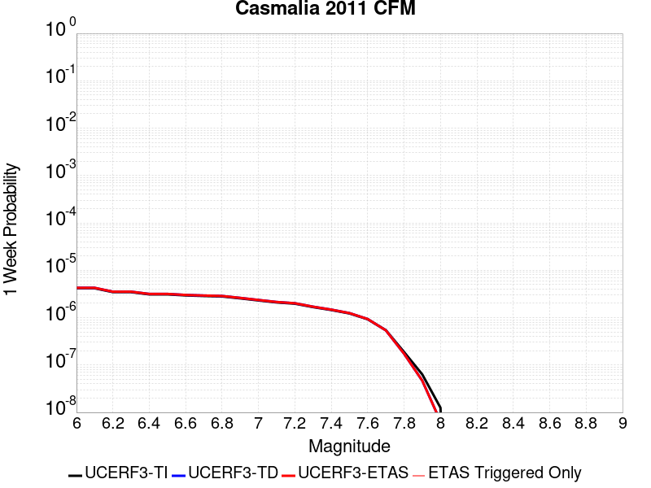 | 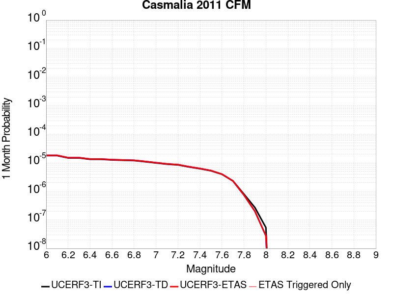 |  |  |

| Magnitude | 1 wk TI Prob | 1 wk TD Prob | 1 wk ETAS Prob | 1 wk ETAS/TD Gain | 1 wk ETAS Triggered Only | 1 mo TI Prob | 1 mo TD Prob | 1 mo ETAS Prob | 1 mo ETAS/TD Gain | 1 mo ETAS Triggered Only | 1 yr TI Prob | 1 yr TD Prob | 1 yr ETAS Prob | 1 yr ETAS/TD Gain | 1 yr ETAS Triggered Only | 10 yr TI Prob | 10 yr TD Prob | 10 yr ETAS Prob | 10 yr ETAS/TD Gain | 10 yr ETAS Triggered Only |
|-----|-----|-----|-----|-----|-----|-----|-----|-----|-----|-----|-----|-----|-----|-----|-----|-----|-----|-----|-----|-----|
| 6.0 | 4.1704893E-6 | 4.262535E-6 | 4.262535E-6 | 1.0 | 0.0 | 1.7873403E-5 | 1.8267881E-5 | 1.8267881E-5 | 1.0 | 0.0 | 2.1758694E-4 | 2.2238896E-4 | 2.2238896E-4 | 1.0 | 0.0 | 0.0021737402 | 0.0022216851 | 0.0022316629 | 1.0044911 | 1.0E-5 |
| 6.1 | 4.1704893E-6 | 4.262535E-6 | 4.262535E-6 | 1.0 | 0.0 | 1.7873403E-5 | 1.8267881E-5 | 1.8267881E-5 | 1.0 | 0.0 | 2.1758694E-4 | 2.2238896E-4 | 2.2238896E-4 | 1.0 | 0.0 | 0.0021737402 | 0.0022216851 | 0.0022316629 | 1.0044911 | 1.0E-5 |
| 6.2 | 3.457312E-6 | 3.5370697E-6 | 3.5370697E-6 | 1.0 | 0.0 | 1.4816967E-5 | 1.5158782E-5 | 1.5158782E-5 | 1.0 | 0.0 | 1.8038164E-4 | 1.8454263E-4 | 1.8454263E-4 | 1.0 | 0.0 | 0.001802353 | 0.0018439033 | 0.0018538849 | 1.0054133 | 1.0E-5 |
| 6.3 | 3.457312E-6 | 3.5370697E-6 | 3.5370697E-6 | 1.0 | 0.0 | 1.4816967E-5 | 1.5158782E-5 | 1.5158782E-5 | 1.0 | 0.0 | 1.8038164E-4 | 1.8454263E-4 | 1.8454263E-4 | 1.0 | 0.0 | 0.001802353 | 0.0018439033 | 0.0018538849 | 1.0054133 | 1.0E-5 |
| 6.4 | 3.0957337E-6 | 3.1692712E-6 | 3.1692712E-6 | 1.0 | 0.0 | 1.3267363E-5 | 1.358252E-5 | 1.358252E-5 | 1.0 | 0.0 | 1.6151817E-4 | 1.653547E-4 | 1.653547E-4 | 1.0 | 0.0 | 0.0016140083 | 0.0016523227 | 0.0016623063 | 1.0060421 | 1.0E-5 |
| 6.5 | 3.0957337E-6 | 3.1692712E-6 | 3.1692712E-6 | 1.0 | 0.0 | 1.3267363E-5 | 1.358252E-5 | 1.358252E-5 | 1.0 | 0.0 | 1.6151817E-4 | 1.653547E-4 | 1.653547E-4 | 1.0 | 0.0 | 0.0016140083 | 0.0016523227 | 0.0016623063 | 1.0060421 | 1.0E-5 |
| 6.6 | 2.9459152E-6 | 3.0166195E-6 | 3.0166195E-6 | 1.0 | 0.0 | 1.262529E-5 | 1.2928305E-5 | 1.2928305E-5 | 1.0 | 0.0 | 1.5370206E-4 | 1.5739081E-4 | 1.5739081E-4 | 1.0 | 0.0 | 0.0015359579 | 0.0015727989 | 0.0015827832 | 1.0063481 | 1.0E-5 |
| 6.7 | 2.8634809E-6 | 2.9325163E-6 | 2.9325163E-6 | 1.0 | 0.0 | 1.2272003E-5 | 1.2567867E-5 | 1.2567867E-5 | 1.0 | 0.0 | 1.4940138E-4 | 1.5300309E-4 | 1.5300309E-4 | 1.0 | 0.0 | 0.0014930099 | 0.0015289829 | 0.0015389676 | 1.0065303 | 1.0E-5 |
| 6.8 | 2.7999822E-6 | 2.86764E-6 | 2.86764E-6 | 1.0 | 0.0 | 1.1999869E-5 | 1.2289828E-5 | 1.2289828E-5 | 1.0 | 0.0 | 1.460886E-4 | 1.4961843E-4 | 1.4961843E-4 | 1.0 | 0.0 | 0.001459926 | 0.0014951823 | 0.0015051673 | 1.0066781 | 1.0E-5 |
| 6.9 | 2.551052E-6 | 2.6120056E-6 | 2.6120056E-6 | 1.0 | 0.0 | 1.0933034E-5 | 1.1194262E-5 | 1.1194262E-5 | 1.0 | 0.0 | 1.3310155E-4 | 1.3628164E-4 | 1.3628164E-4 | 1.0 | 0.0 | 0.0013302186 | 0.0013619848 | 0.0013719711 | 1.0073322 | 1.0E-5 |
| 7.0 | 2.3081875E-6 | 2.362447E-6 | 2.362447E-6 | 1.0 | 0.0 | 9.892195E-6 | 1.0124733E-5 | 1.0124733E-5 | 1.0 | 0.0 | 1.20430814E-4 | 1.2326169E-4 | 1.2326169E-4 | 1.0 | 0.0 | 0.0012036557 | 0.001231936 | 0.0012419238 | 1.0081073 | 1.0E-5 |
| 7.1 | 2.093245E-6 | 2.1417602E-6 | 2.1417602E-6 | 1.0 | 0.0 | 8.971019E-6 | 9.178941E-6 | 9.178941E-6 | 1.0 | 0.0 | 1.09216686E-4 | 1.1174788E-4 | 1.1174788E-4 | 1.0 | 0.0 | 0.0010916302 | 0.001116919 | 0.0011269078 | 1.0089432 | 1.0E-5 |
| 7.2 | 1.9714576E-6 | 2.0165437E-6 | 2.0165437E-6 | 1.0 | 0.0 | 8.449076E-6 | 8.6423015E-6 | 8.6423015E-6 | 1.0 | 0.0 | 1.0286264E-4 | 1.0521496E-4 | 1.0521496E-4 | 1.0 | 0.0 | 0.0010281504 | 0.0010516533 | 0.0010616428 | 1.0094988 | 1.0E-5 |
| 7.3 | 1.6689512E-6 | 1.7047441E-6 | 1.7047441E-6 | 1.0 | 0.0 | 7.1526288E-6 | 7.306026E-6 | 7.306026E-6 | 1.0 | 0.0 | 8.7079774E-5 | 8.894724E-5 | 8.894724E-5 | 1.0 | 0.0 | 8.7045657E-4 | 8.891172E-4 | 8.991083E-4 | 1.0112371 | 1.0E-5 |
| 7.4 | 1.4490954E-6 | 1.4779191E-6 | 1.4779191E-6 | 1.0 | 0.0 | 6.210394E-6 | 6.333924E-6 | 6.333924E-6 | 1.0 | 0.0 | 7.560892E-5 | 7.71128E-5 | 7.71128E-5 | 1.0 | 0.0 | 7.55832E-4 | 7.7086105E-4 | 7.7086105E-4 | 1.0 | 0.0 |
| 7.5 | 1.226873E-6 | 1.2481956E-6 | 1.2481956E-6 | 1.0 | 0.0 | 5.2580162E-6 | 5.3493986E-6 | 5.3493986E-6 | 1.0 | 0.0 | 6.401447E-5 | 6.512699E-5 | 6.512699E-5 | 1.0 | 0.0 | 6.399603E-4 | 6.510795E-4 | 6.510795E-4 | 1.0 | 0.0 |
| 7.6 | 9.2561345E-7 | 9.3621367E-7 | 9.3621367E-7 | 1.0 | 0.0 | 3.966909E-6 | 4.012338E-6 | 4.012338E-6 | 1.0 | 0.0 | 4.8296046E-5 | 4.8849128E-5 | 4.8849128E-5 | 1.0 | 0.0 | 4.828555E-4 | 4.883843E-4 | 4.883843E-4 | 1.0 | 0.0 |
| 7.7 | 5.4367933E-7 | 5.393044E-7 | 5.393044E-7 | 1.0 | 0.0 | 2.3300522E-6 | 2.3113025E-6 | 2.3113025E-6 | 1.0 | 0.0 | 2.8368017E-5 | 2.8139746E-5 | 2.8139746E-5 | 1.0 | 0.0 | 2.8364395E-4 | 2.8136195E-4 | 2.8136195E-4 | 1.0 | 0.0 |
| 7.8 | 1.8825742E-7 | 1.7343253E-7 | 1.7343253E-7 | 1.0 | 0.0 | 8.068173E-7 | 7.4328204E-7 | 7.4328204E-7 | 1.0 | 0.0 | 9.822956E-6 | 9.049421E-6 | 9.049421E-6 | 1.0 | 0.0 | 9.822522E-5 | 9.0490554E-5 | 9.0490554E-5 | 1.0 | 0.0 |
| 7.9 | 6.342771E-8 | 4.6798455E-8 | 4.6798455E-8 | 1.0 | 0.0 | 2.7183304E-7 | 2.005648E-7 | 2.005648E-7 | 1.0 | 0.0 | 3.3095623E-6 | 2.4418737E-6 | 2.4418737E-6 | 1.0 | 0.0 | 3.309513E-5 | 2.4418472E-5 | 2.4418472E-5 | 1.0 | 0.0 |
| 8.0 | 1.2574819E-8 | 6.476017E-9 | 6.476017E-9 | 1.0 | 0.0 | 5.3892084E-8 | 2.775436E-8 | 2.775436E-8 | 1.0 | 0.0 | 6.561359E-7 | 3.3790928E-7 | 3.3790928E-7 | 1.0 | 0.0 | 6.56134E-6 | 3.379088E-6 | 3.379088E-6 | 1.0 | 0.0 |

## Los Alamos extension
*[(top)](#table-of-contents)*

| 1 Week | 1 Month | 1 Year | 10 Year |
|-----|-----|-----|-----|
| 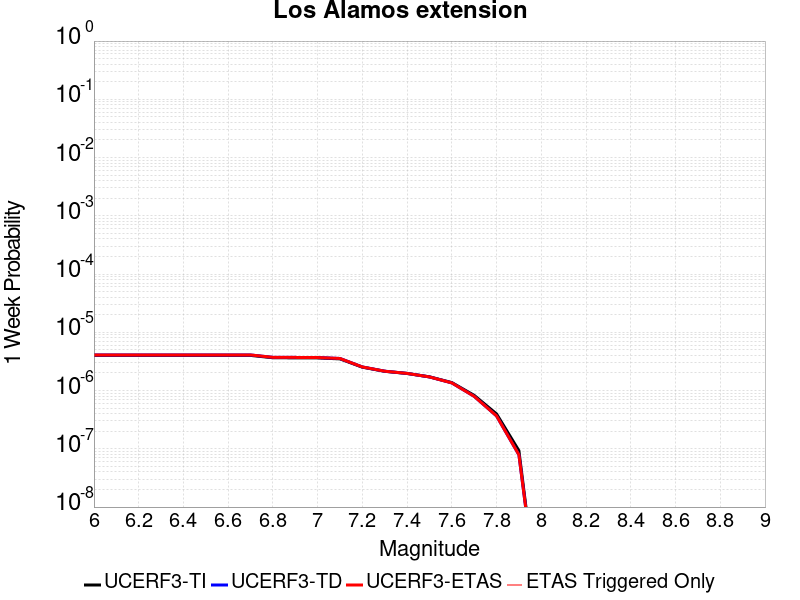 | 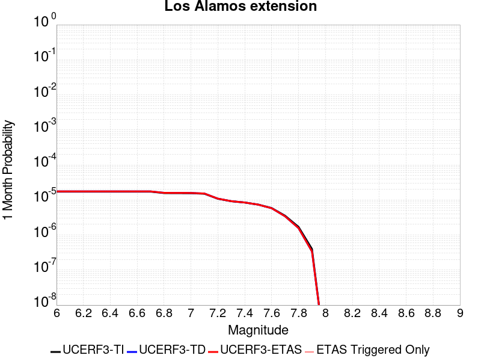 |  |  |

| Magnitude | 1 wk TI Prob | 1 wk TD Prob | 1 wk ETAS Prob | 1 wk ETAS/TD Gain | 1 wk ETAS Triggered Only | 1 mo TI Prob | 1 mo TD Prob | 1 mo ETAS Prob | 1 mo ETAS/TD Gain | 1 mo ETAS Triggered Only | 1 yr TI Prob | 1 yr TD Prob | 1 yr ETAS Prob | 1 yr ETAS/TD Gain | 1 yr ETAS Triggered Only | 10 yr TI Prob | 10 yr TD Prob | 10 yr ETAS Prob | 10 yr ETAS/TD Gain | 10 yr ETAS Triggered Only |
|-----|-----|-----|-----|-----|-----|-----|-----|-----|-----|-----|-----|-----|-----|-----|-----|-----|-----|-----|-----|-----|
| 6.0 | 4.0146506E-6 | 4.086218E-6 | 4.086218E-6 | 1.0 | 0.0 | 1.7205533E-5 | 1.751225E-5 | 1.751225E-5 | 1.0 | 0.0 | 2.0945723E-4 | 2.1319189E-4 | 2.1319189E-4 | 1.0 | 0.0 | 0.0020925992 | 0.002129983 | 0.0021399616 | 1.0046849 | 1.0E-5 |
| 6.1 | 4.0146506E-6 | 4.086218E-6 | 4.086218E-6 | 1.0 | 0.0 | 1.7205533E-5 | 1.751225E-5 | 1.751225E-5 | 1.0 | 0.0 | 2.0945723E-4 | 2.1319189E-4 | 2.1319189E-4 | 1.0 | 0.0 | 0.0020925992 | 0.002129983 | 0.0021399616 | 1.0046849 | 1.0E-5 |
| 6.2 | 4.0146506E-6 | 4.086218E-6 | 4.086218E-6 | 1.0 | 0.0 | 1.7205533E-5 | 1.751225E-5 | 1.751225E-5 | 1.0 | 0.0 | 2.0945723E-4 | 2.1319189E-4 | 2.1319189E-4 | 1.0 | 0.0 | 0.0020925992 | 0.002129983 | 0.0021399616 | 1.0046849 | 1.0E-5 |
| 6.3 | 4.0146506E-6 | 4.086218E-6 | 4.086218E-6 | 1.0 | 0.0 | 1.7205533E-5 | 1.751225E-5 | 1.751225E-5 | 1.0 | 0.0 | 2.0945723E-4 | 2.1319189E-4 | 2.1319189E-4 | 1.0 | 0.0 | 0.0020925992 | 0.002129983 | 0.0021399616 | 1.0046849 | 1.0E-5 |
| 6.4 | 4.0146506E-6 | 4.086218E-6 | 4.086218E-6 | 1.0 | 0.0 | 1.7205533E-5 | 1.751225E-5 | 1.751225E-5 | 1.0 | 0.0 | 2.0945723E-4 | 2.1319189E-4 | 2.1319189E-4 | 1.0 | 0.0 | 0.0020925992 | 0.002129983 | 0.0021399616 | 1.0046849 | 1.0E-5 |
| 6.5 | 4.0146506E-6 | 4.086218E-6 | 4.086218E-6 | 1.0 | 0.0 | 1.7205533E-5 | 1.751225E-5 | 1.751225E-5 | 1.0 | 0.0 | 2.0945723E-4 | 2.1319189E-4 | 2.1319189E-4 | 1.0 | 0.0 | 0.0020925992 | 0.002129983 | 0.0021399616 | 1.0046849 | 1.0E-5 |
| 6.6 | 4.0146506E-6 | 4.086218E-6 | 4.086218E-6 | 1.0 | 0.0 | 1.7205533E-5 | 1.751225E-5 | 1.751225E-5 | 1.0 | 0.0 | 2.0945723E-4 | 2.1319189E-4 | 2.1319189E-4 | 1.0 | 0.0 | 0.0020925992 | 0.002129983 | 0.0021399616 | 1.0046849 | 1.0E-5 |
| 6.7 | 4.0146506E-6 | 4.086218E-6 | 4.086218E-6 | 1.0 | 0.0 | 1.7205533E-5 | 1.751225E-5 | 1.751225E-5 | 1.0 | 0.0 | 2.0945723E-4 | 2.1319189E-4 | 2.1319189E-4 | 1.0 | 0.0 | 0.0020925992 | 0.002129983 | 0.0021399616 | 1.0046849 | 1.0E-5 |
| 6.8 | 3.6584688E-6 | 3.7189127E-6 | 3.7189127E-6 | 1.0 | 0.0 | 1.5679057E-5 | 1.5938105E-5 | 1.5938105E-5 | 1.0 | 0.0 | 1.9087581E-4 | 1.9403009E-4 | 1.9403009E-4 | 1.0 | 0.0 | 0.0019071194 | 0.0019386992 | 0.0019486798 | 1.005148 | 1.0E-5 |
| 6.9 | 3.644631E-6 | 3.7046225E-6 | 3.7046225E-6 | 1.0 | 0.0 | 1.5619753E-5 | 1.5876862E-5 | 1.5876862E-5 | 1.0 | 0.0 | 1.901539E-4 | 1.9328458E-4 | 1.9328458E-4 | 1.0 | 0.0 | 0.0018999127 | 0.0019312571 | 0.0019412378 | 1.005168 | 1.0E-5 |
| 7.0 | 3.6318522E-6 | 3.6913827E-6 | 3.6913827E-6 | 1.0 | 0.0 | 1.5564989E-5 | 1.5820122E-5 | 1.5820122E-5 | 1.0 | 0.0 | 1.8948725E-4 | 1.9259389E-4 | 1.9259389E-4 | 1.0 | 0.0 | 0.0018932576 | 0.0019243622 | 0.0019343429 | 1.0051866 | 1.0E-5 |
| 7.1 | 3.5001724E-6 | 3.5554517E-6 | 3.5554517E-6 | 1.0 | 0.0 | 1.5000653E-5 | 1.5237567E-5 | 1.5237567E-5 | 1.0 | 0.0 | 1.8261763E-4 | 1.855025E-4 | 1.855025E-4 | 1.0 | 0.0 | 0.0018246764 | 0.0018535672 | 0.0018635486 | 1.005385 | 1.0E-5 |
| 7.2 | 2.5204702E-6 | 2.5437337E-6 | 2.5437337E-6 | 1.0 | 0.0 | 1.080197E-5 | 1.0901671E-5 | 1.0901671E-5 | 1.0 | 0.0 | 1.3150605E-4 | 1.3271981E-4 | 1.3271981E-4 | 1.0 | 0.0 | 0.0013142825 | 0.0013264111 | 0.0013363978 | 1.0075291 | 1.0E-5 |
| 7.3 | 2.1399692E-6 | 2.150166E-6 | 2.150166E-6 | 1.0 | 0.0 | 9.1712645E-6 | 9.214965E-6 | 9.214965E-6 | 1.0 | 0.0 | 1.1165442E-4 | 1.12186455E-4 | 1.12186455E-4 | 1.0 | 0.0 | 0.0011159834 | 0.0011213014 | 0.0011312902 | 1.0089082 | 1.0E-5 |
| 7.4 | 1.9660122E-6 | 1.9702686E-6 | 1.9702686E-6 | 1.0 | 0.0 | 8.42574E-6 | 8.443981E-6 | 8.443981E-6 | 1.0 | 0.0 | 1.0257855E-4 | 1.02800645E-4 | 1.02800645E-4 | 1.0 | 0.0 | 0.0010253121 | 0.001027534 | 0.001027534 | 1.0 | 0.0 |
| 7.5 | 1.7204633E-6 | 1.7151268E-6 | 1.7151268E-6 | 1.0 | 0.0 | 7.373393E-6 | 7.3505225E-6 | 7.3505225E-6 | 1.0 | 0.0 | 8.976737E-5 | 8.948897E-5 | 8.948897E-5 | 1.0 | 0.0 | 8.9731114E-4 | 8.945323E-4 | 8.945323E-4 | 1.0 | 0.0 |
| 7.6 | 1.3717638E-6 | 1.3536055E-6 | 1.3536055E-6 | 1.0 | 0.0 | 5.878974E-6 | 5.8011537E-6 | 5.8011537E-6 | 1.0 | 0.0 | 7.157416E-5 | 7.062678E-5 | 7.062678E-5 | 1.0 | 0.0 | 7.1551115E-4 | 7.06046E-4 | 7.06046E-4 | 1.0 | 0.0 |
| 7.7 | 8.272564E-7 | 7.957779E-7 | 7.957779E-7 | 1.0 | 0.0 | 3.5453797E-6 | 3.4104723E-6 | 3.4104723E-6 | 1.0 | 0.0 | 4.3164142E-5 | 4.152171E-5 | 4.152171E-5 | 1.0 | 0.0 | 4.315576E-4 | 4.1513972E-4 | 4.1513972E-4 | 1.0 | 0.0 |
| 7.8 | 3.9708277E-7 | 3.6719734E-7 | 3.6719734E-7 | 1.0 | 0.0 | 1.7017821E-6 | 1.5737019E-6 | 1.5737019E-6 | 1.0 | 0.0 | 2.0719E-5 | 1.9159654E-5 | 1.9159654E-5 | 1.0 | 0.0 | 2.071707E-4 | 1.9158008E-4 | 1.9158008E-4 | 1.0 | 0.0 |
| 7.9 | 9.292528E-8 | 7.8892484E-8 | 7.8892484E-8 | 1.0 | 0.0 | 3.9825116E-7 | 3.381106E-7 | 3.381106E-7 | 1.0 | 0.0 | 4.848697E-6 | 4.116489E-6 | 4.116489E-6 | 1.0 | 0.0 | 4.8485912E-5 | 4.1164134E-5 | 4.1164134E-5 | 1.0 | 0.0 |
| 8.0 | 7.880441E-11 | 8.235457E-11 | 8.235457E-11 | 1.0 | 0.0 | 3.3773329E-10 | 3.52948E-10 | 3.52948E-10 | 1.0 | 0.0 | 4.1119033E-9 | 4.2971413E-9 | 4.2971413E-9 | 1.0 | 0.0 | 4.1119034E-8 | 4.2971415E-8 | 4.2971415E-8 | 1.0 | 0.0 |

## Cucamonga
*[(top)](#table-of-contents)*

| 1 Week | 1 Month | 1 Year | 10 Year |
|-----|-----|-----|-----|
|  |  | 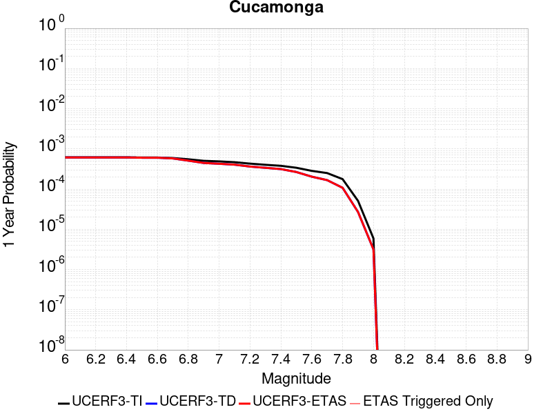 |  |

| Magnitude | 1 wk TI Prob | 1 wk TD Prob | 1 wk ETAS Prob | 1 wk ETAS/TD Gain | 1 wk ETAS Triggered Only | 1 mo TI Prob | 1 mo TD Prob | 1 mo ETAS Prob | 1 mo ETAS/TD Gain | 1 mo ETAS Triggered Only | 1 yr TI Prob | 1 yr TD Prob | 1 yr ETAS Prob | 1 yr ETAS/TD Gain | 1 yr ETAS Triggered Only | 10 yr TI Prob | 10 yr TD Prob | 10 yr ETAS Prob | 10 yr ETAS/TD Gain | 10 yr ETAS Triggered Only |
|-----|-----|-----|-----|-----|-----|-----|-----|-----|-----|-----|-----|-----|-----|-----|-----|-----|-----|-----|-----|-----|
| 6.0 | 1.1848348E-5 | 1.1738908E-5 | 1.1738908E-5 | 1.0 | 0.0 | 5.0777642E-5 | 5.0308652E-5 | 5.0308652E-5 | 1.0 | 0.0 | 6.180424E-4 | 6.123384E-4 | 6.123384E-4 | 1.0 | 0.0 | 0.0061632637 | 0.0061076838 | 0.006117623 | 1.0016273 | 1.0E-5 |
| 6.1 | 1.1848348E-5 | 1.1738908E-5 | 1.1738908E-5 | 1.0 | 0.0 | 5.0777642E-5 | 5.0308652E-5 | 5.0308652E-5 | 1.0 | 0.0 | 6.180424E-4 | 6.123384E-4 | 6.123384E-4 | 1.0 | 0.0 | 0.0061632637 | 0.0061076838 | 0.006117623 | 1.0016273 | 1.0E-5 |
| 6.2 | 1.1848348E-5 | 1.1738908E-5 | 1.1738908E-5 | 1.0 | 0.0 | 5.0777642E-5 | 5.0308652E-5 | 5.0308652E-5 | 1.0 | 0.0 | 6.180424E-4 | 6.123384E-4 | 6.123384E-4 | 1.0 | 0.0 | 0.0061632637 | 0.0061076838 | 0.006117623 | 1.0016273 | 1.0E-5 |
| 6.3 | 1.1848348E-5 | 1.1738908E-5 | 1.1738908E-5 | 1.0 | 0.0 | 5.0777642E-5 | 5.0308652E-5 | 5.0308652E-5 | 1.0 | 0.0 | 6.180424E-4 | 6.123384E-4 | 6.123384E-4 | 1.0 | 0.0 | 0.0061632637 | 0.0061076838 | 0.006117623 | 1.0016273 | 1.0E-5 |
| 6.4 | 1.1848348E-5 | 1.1738908E-5 | 1.1738908E-5 | 1.0 | 0.0 | 5.0777642E-5 | 5.0308652E-5 | 5.0308652E-5 | 1.0 | 0.0 | 6.180424E-4 | 6.123384E-4 | 6.123384E-4 | 1.0 | 0.0 | 0.0061632637 | 0.0061076838 | 0.006117623 | 1.0016273 | 1.0E-5 |
| 6.5 | 1.16988695E-5 | 1.1577934E-5 | 1.1577934E-5 | 1.0 | 0.0 | 5.013705E-5 | 4.961879E-5 | 4.961879E-5 | 1.0 | 0.0 | 6.102476E-4 | 6.03944E-4 | 6.03944E-4 | 1.0 | 0.0 | 0.006085745 | 0.006024196 | 0.006034136 | 1.00165 | 1.0E-5 |
| 6.6 | 1.16988695E-5 | 1.1577934E-5 | 1.1577934E-5 | 1.0 | 0.0 | 5.013705E-5 | 4.961879E-5 | 4.961879E-5 | 1.0 | 0.0 | 6.102476E-4 | 6.03944E-4 | 6.03944E-4 | 1.0 | 0.0 | 0.006085745 | 0.006024196 | 0.006034136 | 1.00165 | 1.0E-5 |
| 6.7 | 1.1397107E-5 | 1.1116795E-5 | 1.1116795E-5 | 1.0 | 0.0 | 4.884383E-5 | 4.764255E-5 | 4.764255E-5 | 1.0 | 0.0 | 5.9451134E-4 | 5.7989615E-4 | 5.7989615E-4 | 1.0 | 0.0 | 0.005929234 | 0.0057849777 | 0.00579492 | 1.0017186 | 1.0E-5 |
| 6.8 | 1.058387E-5 | 9.786617E-6 | 9.786617E-6 | 1.0 | 0.0 | 4.5358654E-5 | 4.1941974E-5 | 4.1941974E-5 | 1.0 | 0.0 | 5.521017E-4 | 5.10525E-4 | 5.10525E-4 | 1.0 | 0.0 | 0.00550732 | 0.0050945277 | 0.005104477 | 1.0019529 | 1.0E-5 |
| 6.9 | 9.690046E-6 | 8.58096E-6 | 8.58096E-6 | 1.0 | 0.0 | 4.1528107E-5 | 3.6775025E-5 | 3.6775025E-5 | 1.0 | 0.0 | 5.054874E-4 | 4.4764436E-4 | 4.4764436E-4 | 1.0 | 0.0 | 0.005043391 | 0.004468359 | 0.0044783144 | 1.0022279 | 1.0E-5 |
| 7.0 | 9.381461E-6 | 8.188542E-6 | 8.188542E-6 | 1.0 | 0.0 | 4.020564E-5 | 3.509328E-5 | 3.509328E-5 | 1.0 | 0.0 | 4.893937E-4 | 4.271773E-4 | 4.271773E-4 | 1.0 | 0.0 | 0.0048831734 | 0.0042644925 | 0.00427445 | 1.002335 | 1.0E-5 |
| 7.1 | 8.946492E-6 | 7.783298E-6 | 7.783298E-6 | 1.0 | 0.0 | 3.8341543E-5 | 3.3356566E-5 | 3.3356566E-5 | 1.0 | 0.0 | 4.667083E-4 | 4.0604084E-4 | 4.0604084E-4 | 1.0 | 0.0 | 0.0046572937 | 0.004053923 | 0.0040638824 | 1.0024568 | 1.0E-5 |
| 7.2 | 8.251016E-6 | 6.9765965E-6 | 6.9765965E-6 | 1.0 | 0.0 | 3.5361016E-5 | 2.9899358E-5 | 2.9899358E-5 | 1.0 | 0.0 | 4.3043532E-4 | 3.6396412E-4 | 3.6396412E-4 | 1.0 | 0.0 | 0.0042960253 | 0.0036346104 | 0.0036445742 | 1.0027413 | 1.0E-5 |
| 7.3 | 7.717881E-6 | 6.4876253E-6 | 6.4876253E-6 | 1.0 | 0.0 | 3.3076216E-5 | 2.7803813E-5 | 2.7803813E-5 | 1.0 | 0.0 | 4.026285E-4 | 3.3845907E-4 | 3.3845907E-4 | 1.0 | 0.0 | 0.004018998 | 0.0033803699 | 0.003390336 | 1.0029483 | 1.0E-5 |
| 7.4 | 7.275623E-6 | 6.0332213E-6 | 6.0332213E-6 | 1.0 | 0.0 | 3.118087E-5 | 2.5856409E-5 | 2.5856409E-5 | 1.0 | 0.0 | 3.7956095E-4 | 3.147565E-4 | 3.147565E-4 | 1.0 | 0.0 | 0.0037891332 | 0.0031440398 | 0.0031540084 | 1.0031706 | 1.0E-5 |
| 7.5 | 6.5109502E-6 | 5.1016887E-6 | 5.1016887E-6 | 1.0 | 0.0 | 2.7903774E-5 | 2.1864196E-5 | 2.1864196E-5 | 1.0 | 0.0 | 3.3967546E-4 | 2.6616422E-4 | 2.6616422E-4 | 1.0 | 0.0 | 0.0033915674 | 0.0026593755 | 0.002669349 | 1.0037503 | 1.0E-5 |
| 7.6 | 5.4495326E-6 | 3.909536E-6 | 3.909536E-6 | 1.0 | 0.0 | 2.335493E-5 | 1.6755048E-5 | 1.6755048E-5 | 1.0 | 0.0 | 2.8430918E-4 | 2.0397367E-4 | 2.0397367E-4 | 1.0 | 0.0 | 0.0028394572 | 0.002038782 | 0.0020487616 | 1.0048949 | 1.0E-5 |
| 7.7 | 4.7997164E-6 | 3.201125E-6 | 3.201125E-6 | 1.0 | 0.0 | 2.057005E-5 | 1.3719035E-5 | 1.3719035E-5 | 1.0 | 0.0 | 2.504116E-4 | 1.670165E-4 | 1.670165E-4 | 1.0 | 0.0 | 0.002501296 | 0.0016698382 | 0.0016798215 | 1.0059786 | 1.0E-5 |
| 7.8 | 3.3941733E-6 | 2.0646994E-6 | 2.0646994E-6 | 1.0 | 0.0 | 1.4546376E-5 | 8.848681E-6 | 8.848681E-6 | 1.0 | 0.0 | 1.7708774E-4 | 1.07727385E-4 | 1.07727385E-4 | 1.0 | 0.0 | 0.0017694668 | 0.0010769886 | 0.0010769886 | 1.0 | 0.0 |
| 7.9 | 9.750552E-7 | 5.157296E-7 | 5.157296E-7 | 1.0 | 0.0 | 4.178801E-6 | 2.210268E-6 | 2.210268E-6 | 1.0 | 0.0 | 5.0875715E-5 | 2.6909682E-5 | 2.6909682E-5 | 1.0 | 0.0 | 5.086407E-4 | 2.6906465E-4 | 2.6906465E-4 | 1.0 | 0.0 |
| 8.0 | 1.133857E-7 | 6.054673E-8 | 6.054673E-8 | 1.0 | 0.0 | 4.8593864E-7 | 2.5948597E-7 | 2.5948597E-7 | 1.0 | 0.0 | 5.9162867E-6 | 3.1592372E-6 | 3.1592372E-6 | 1.0 | 0.0 | 5.916129E-5 | 3.159194E-5 | 3.159194E-5 | 1.0 | 0.0 |

## Santa Monica alt 1
*[(top)](#table-of-contents)*

| 1 Week | 1 Month | 1 Year | 10 Year |
|-----|-----|-----|-----|
|  |  | 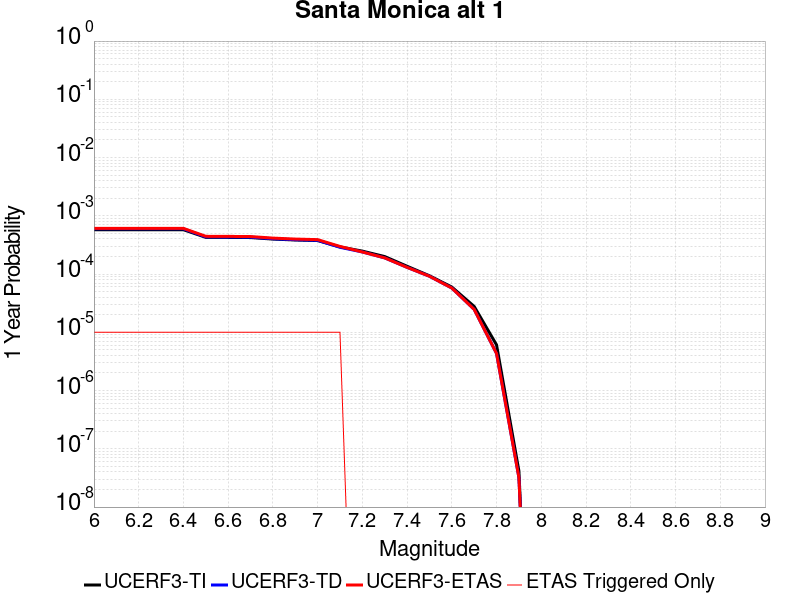 |  |

| Magnitude | 1 wk TI Prob | 1 wk TD Prob | 1 wk ETAS Prob | 1 wk ETAS/TD Gain | 1 wk ETAS Triggered Only | 1 mo TI Prob | 1 mo TD Prob | 1 mo ETAS Prob | 1 mo ETAS/TD Gain | 1 mo ETAS Triggered Only | 1 yr TI Prob | 1 yr TD Prob | 1 yr ETAS Prob | 1 yr ETAS/TD Gain | 1 yr ETAS Triggered Only | 10 yr TI Prob | 10 yr TD Prob | 10 yr ETAS Prob | 10 yr ETAS/TD Gain | 10 yr ETAS Triggered Only |
|-----|-----|-----|-----|-----|-----|-----|-----|-----|-----|-----|-----|-----|-----|-----|-----|-----|-----|-----|-----|-----|
| 6.0 | 1.1066008E-5 | 1.1480662E-5 | 1.1480662E-5 | 1.0 | 0.0 | 4.742488E-5 | 4.9201986E-5 | 4.9201986E-5 | 1.0 | 0.0 | 5.7724497E-4 | 5.988835E-4 | 6.0887745E-4 | 1.0166878 | 1.0E-5 | 0.005757478 | 0.0059740827 | 0.0059840227 | 1.0016639 | 1.0E-5 |
| 6.1 | 1.1066008E-5 | 1.1480662E-5 | 1.1480662E-5 | 1.0 | 0.0 | 4.742488E-5 | 4.9201986E-5 | 4.9201986E-5 | 1.0 | 0.0 | 5.7724497E-4 | 5.988835E-4 | 6.0887745E-4 | 1.0166878 | 1.0E-5 | 0.005757478 | 0.0059740827 | 0.0059840227 | 1.0016639 | 1.0E-5 |
| 6.2 | 1.1066008E-5 | 1.1480662E-5 | 1.1480662E-5 | 1.0 | 0.0 | 4.742488E-5 | 4.9201986E-5 | 4.9201986E-5 | 1.0 | 0.0 | 5.7724497E-4 | 5.988835E-4 | 6.0887745E-4 | 1.0166878 | 1.0E-5 | 0.005757478 | 0.0059740827 | 0.0059840227 | 1.0016639 | 1.0E-5 |
| 6.3 | 1.1066008E-5 | 1.1480662E-5 | 1.1480662E-5 | 1.0 | 0.0 | 4.742488E-5 | 4.9201986E-5 | 4.9201986E-5 | 1.0 | 0.0 | 5.7724497E-4 | 5.988835E-4 | 6.0887745E-4 | 1.0166878 | 1.0E-5 | 0.005757478 | 0.0059740827 | 0.0059840227 | 1.0016639 | 1.0E-5 |
| 6.4 | 1.1066008E-5 | 1.1480662E-5 | 1.1480662E-5 | 1.0 | 0.0 | 4.742488E-5 | 4.9201986E-5 | 4.9201986E-5 | 1.0 | 0.0 | 5.7724497E-4 | 5.988835E-4 | 6.0887745E-4 | 1.0166878 | 1.0E-5 | 0.005757478 | 0.0059740827 | 0.0059840227 | 1.0016639 | 1.0E-5 |
| 6.5 | 8.183544E-6 | 8.335676E-6 | 8.335676E-6 | 1.0 | 0.0 | 3.5071862E-5 | 3.5723846E-5 | 3.5723846E-5 | 1.0 | 0.0 | 4.2691626E-4 | 4.3485264E-4 | 4.448483E-4 | 1.0229863 | 1.0E-5 | 0.0042609703 | 0.004340183 | 0.0043501398 | 1.0022941 | 1.0E-5 |
| 6.6 | 8.1543285E-6 | 8.303889E-6 | 8.303889E-6 | 1.0 | 0.0 | 3.4946657E-5 | 3.5587622E-5 | 3.5587622E-5 | 1.0 | 0.0 | 4.2539247E-4 | 4.3319477E-4 | 4.4319042E-4 | 1.0230743 | 1.0E-5 | 0.0042457907 | 0.004323669 | 0.0043336255 | 1.0023029 | 1.0E-5 |
| 6.7 | 8.110878E-6 | 8.257285E-6 | 8.257285E-6 | 1.0 | 0.0 | 3.4760444E-5 | 3.5387893E-5 | 3.5387893E-5 | 1.0 | 0.0 | 4.231262E-4 | 4.3076402E-4 | 4.407597E-4 | 1.0232046 | 1.0E-5 | 0.0042232145 | 0.004299456 | 0.0043094126 | 1.0023159 | 1.0E-5 |
| 6.8 | 7.644036E-6 | 7.751288E-6 | 7.751288E-6 | 1.0 | 0.0 | 3.275974E-5 | 3.321939E-5 | 3.321939E-5 | 1.0 | 0.0 | 3.9877684E-4 | 4.043724E-4 | 4.1436835E-4 | 1.0247197 | 1.0E-5 | 0.00398062 | 0.004036512 | 0.004046472 | 1.0024674 | 1.0E-5 |
| 6.9 | 7.3698293E-6 | 7.4559375E-6 | 7.4559375E-6 | 1.0 | 0.0 | 3.15846E-5 | 3.1953634E-5 | 3.1953634E-5 | 1.0 | 0.0 | 3.8447464E-4 | 3.8896746E-4 | 3.9896354E-4 | 1.0256991 | 1.0E-5 | 0.0038381014 | 0.00388301 | 0.0038929712 | 1.0025653 | 1.0E-5 |
| 7.0 | 7.209872E-6 | 7.28584E-6 | 7.28584E-6 | 1.0 | 0.0 | 3.0899086E-5 | 3.1224663E-5 | 3.1224663E-5 | 1.0 | 0.0 | 3.7613141E-4 | 3.8009536E-4 | 3.9009153E-4 | 1.0262992 | 1.0E-5 | 0.0037549543 | 0.0037945951 | 0.0038045573 | 1.0026253 | 1.0E-5 |
| 7.1 | 5.603456E-6 | 5.5240434E-6 | 5.5240434E-6 | 1.0 | 0.0 | 2.4014591E-5 | 2.367426E-5 | 2.367426E-5 | 1.0 | 0.0 | 2.923384E-4 | 2.8819637E-4 | 2.9819348E-4 | 1.0346886 | 1.0E-5 | 0.0029195412 | 0.002878268 | 0.0028882392 | 1.0034643 | 1.0E-5 |
| 7.2 | 4.7483613E-6 | 4.591252E-6 | 4.591252E-6 | 1.0 | 0.0 | 2.0349962E-5 | 1.9676647E-5 | 1.9676647E-5 | 1.0 | 0.0 | 2.4773262E-4 | 2.3953697E-4 | 2.3953697E-4 | 1.0 | 0.0 | 0.0024745662 | 0.002392802 | 0.002392802 | 1.0 | 0.0 |
| 7.3 | 3.829015E-6 | 3.6343188E-6 | 3.6343188E-6 | 1.0 | 0.0 | 1.6409962E-5 | 1.5575559E-5 | 1.5575559E-5 | 1.0 | 0.0 | 1.9977297E-4 | 1.8961601E-4 | 1.8961601E-4 | 1.0 | 0.0 | 0.0019959346 | 0.0018945511 | 0.0018945511 | 1.0 | 0.0 |
| 7.4 | 2.610755E-6 | 2.4996373E-6 | 2.4996373E-6 | 1.0 | 0.0 | 1.1188902E-5 | 1.0712688E-5 | 1.0712688E-5 | 1.0 | 0.0 | 1.3621636E-4 | 1.3041921E-4 | 1.3041921E-4 | 1.0 | 0.0 | 0.001361329 | 0.0013034311 | 0.0013034311 | 1.0 | 0.0 |
| 7.5 | 1.792146E-6 | 1.7584671E-6 | 1.7584671E-6 | 1.0 | 0.0 | 7.680603E-6 | 7.536266E-6 | 7.536266E-6 | 1.0 | 0.0 | 9.3507326E-5 | 9.1750204E-5 | 9.1750204E-5 | 1.0 | 0.0 | 9.3467993E-4 | 9.171264E-4 | 9.171264E-4 | 1.0 | 0.0 |
| 7.6 | 1.1473018E-6 | 1.1029475E-6 | 1.1029475E-6 | 1.0 | 0.0 | 4.9169985E-6 | 4.726909E-6 | 4.726909E-6 | 1.0 | 0.0 | 5.986281E-5 | 5.7548616E-5 | 5.7548616E-5 | 1.0 | 0.0 | 5.984669E-4 | 5.753388E-4 | 5.753388E-4 | 1.0 | 0.0 |
| 7.7 | 5.330919E-7 | 4.7454355E-7 | 4.7454355E-7 | 1.0 | 0.0 | 2.2846775E-6 | 2.0337566E-6 | 2.0337566E-6 | 1.0 | 0.0 | 2.7815593E-5 | 2.4760717E-5 | 2.4760717E-5 | 1.0 | 0.0 | 2.7812112E-4 | 2.4758073E-4 | 2.4758073E-4 | 1.0 | 0.0 |
| 7.8 | 1.1668574E-7 | 8.297522E-8 | 8.297522E-8 | 1.0 | 0.0 | 5.000816E-7 | 3.5560805E-7 | 3.5560805E-7 | 1.0 | 0.0 | 6.0884768E-6 | 4.3295195E-6 | 4.3295195E-6 | 1.0 | 0.0 | 6.08831E-5 | 4.3294385E-5 | 4.3294385E-5 | 1.0 | 0.0 |
| 7.9 | 8.007447E-10 | 6.160982E-10 | 6.160982E-10 | 1.0 | 0.0 | 3.4317629E-9 | 2.640421E-9 | 2.640421E-9 | 1.0 | 0.0 | 4.1781714E-8 | 3.2147128E-8 | 3.2147128E-8 | 1.0 | 0.0 | 4.1781706E-7 | 3.2147122E-7 | 3.2147122E-7 | 1.0 | 0.0 |

## Hayward (No) 2011 CFM
*[(top)](#table-of-contents)*

| 1 Week | 1 Month | 1 Year | 10 Year |
|-----|-----|-----|-----|
|  |  | 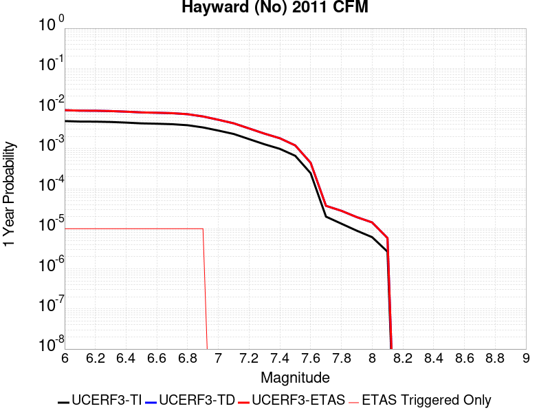 | 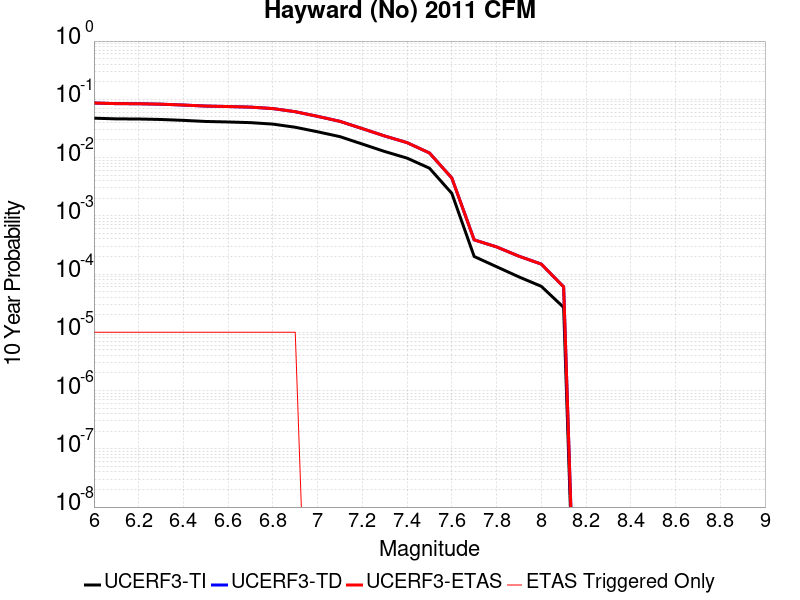 |

| Magnitude | 1 wk TI Prob | 1 wk TD Prob | 1 wk ETAS Prob | 1 wk ETAS/TD Gain | 1 wk ETAS Triggered Only | 1 mo TI Prob | 1 mo TD Prob | 1 mo ETAS Prob | 1 mo ETAS/TD Gain | 1 mo ETAS Triggered Only | 1 yr TI Prob | 1 yr TD Prob | 1 yr ETAS Prob | 1 yr ETAS/TD Gain | 1 yr ETAS Triggered Only | 10 yr TI Prob | 10 yr TD Prob | 10 yr ETAS Prob | 10 yr ETAS/TD Gain | 10 yr ETAS Triggered Only |
|-----|-----|-----|-----|-----|-----|-----|-----|-----|-----|-----|-----|-----|-----|-----|-----|-----|-----|-----|-----|-----|
| 6.0 | 9.3068506E-5 | 1.7401433E-4 | 1.7401433E-4 | 1.0 | 0.0 | 3.9880406E-4 | 7.4555416E-4 | 7.4555416E-4 | 1.0 | 0.0 | 0.0048446343 | 0.009039365 | 0.009049275 | 1.0010962 | 1.0E-5 | 0.047403704 | 0.08640088 | 0.086410016 | 1.0001057 | 1.0E-5 |
| 6.1 | 9.055486E-5 | 1.6952657E-4 | 1.6952657E-4 | 1.0 | 0.0 | 3.880345E-4 | 7.263399E-4 | 7.263399E-4 | 1.0 | 0.0 | 0.0047140904 | 0.008807437 | 0.008817349 | 1.0011255 | 1.0E-5 | 0.046153355 | 0.084293924 | 0.08430308 | 1.0001086 | 1.0E-5 |
| 6.2 | 9.006742E-5 | 1.6873234E-4 | 1.6873234E-4 | 1.0 | 0.0 | 3.859461E-4 | 7.229379E-4 | 7.229379E-4 | 1.0 | 0.0 | 0.0046887742 | 0.008766404 | 0.008776317 | 1.0011307 | 1.0E-5 | 0.0459107 | 0.083918124 | 0.08392729 | 1.0001092 | 1.0E-5 |
| 6.3 | 8.8336754E-5 | 1.6552822E-4 | 1.6552822E-4 | 1.0 | 0.0 | 3.7853114E-4 | 7.092146E-4 | 7.092146E-4 | 1.0 | 0.0 | 0.004598882 | 0.008600669 | 0.008610583 | 1.0011528 | 1.0E-5 | 0.04504866 | 0.08241128 | 0.08242046 | 1.0001113 | 1.0E-5 |
| 6.4 | 8.526157E-5 | 1.5979799E-4 | 1.5979799E-4 | 1.0 | 0.0 | 3.6535555E-4 | 6.8466953E-4 | 6.8466953E-4 | 1.0 | 0.0 | 0.0044391346 | 0.008304147 | 0.008314064 | 1.0011942 | 1.0E-5 | 0.043514993 | 0.079708114 | 0.079717316 | 1.0001155 | 1.0E-5 |
| 6.5 | 8.152396E-5 | 1.5312144E-4 | 1.5312144E-4 | 1.0 | 0.0 | 3.493416E-4 | 6.5607036E-4 | 6.5607036E-4 | 1.0 | 0.0 | 0.0042449418 | 0.00795855 | 0.00796847 | 1.0012465 | 1.0E-5 | 0.04164765 | 0.0765389 | 0.07654813 | 1.0001206 | 1.0E-5 |
| 6.6 | 7.987405E-5 | 1.5016341E-4 | 1.5016341E-4 | 1.0 | 0.0 | 3.4227243E-4 | 6.433994E-4 | 6.433994E-4 | 1.0 | 0.0 | 0.0041592065 | 0.007805409 | 0.00781533 | 1.0012711 | 1.0E-5 | 0.04082218 | 0.07513141 | 0.07514066 | 1.0001231 | 1.0E-5 |
| 6.7 | 7.777665E-5 | 1.4655573E-4 | 1.4655573E-4 | 1.0 | 0.0 | 3.332859E-4 | 6.2794547E-4 | 6.2794547E-4 | 1.0 | 0.0 | 0.004050208 | 0.007618591 | 0.007628515 | 1.0013026 | 1.0E-5 | 0.039771806 | 0.07340772 | 0.07341698 | 1.0001262 | 1.0E-5 |
| 6.8 | 7.3284005E-5 | 1.3806048E-4 | 1.3806048E-4 | 1.0 | 0.0 | 3.140365E-4 | 5.915542E-4 | 5.915542E-4 | 1.0 | 0.0 | 0.0038166929 | 0.0071785264 | 0.0071884543 | 1.0013831 | 1.0E-5 | 0.037518036 | 0.06932066 | 0.06932996 | 1.0001342 | 1.0E-5 |
| 6.9 | 6.458263E-5 | 1.2136389E-4 | 1.2136389E-4 | 1.0 | 0.0 | 2.7675333E-4 | 5.2002777E-4 | 5.2002777E-4 | 1.0 | 0.0 | 0.0033642664 | 0.006313059 | 0.0063229958 | 1.001574 | 1.0E-5 | 0.033137884 | 0.061248135 | 0.061257523 | 1.0001533 | 1.0E-5 |
| 7.0 | 5.3853604E-5 | 1.0029617E-4 | 1.0029617E-4 | 1.0 | 0.0 | 2.3078074E-4 | 4.2977024E-4 | 4.2977024E-4 | 1.0 | 0.0 | 0.0028061352 | 0.005219964 | 0.005219964 | 1.0 | 0.0 | 0.027709642 | 0.050979473 | 0.050979473 | 1.0 | 0.0 |
| 7.1 | 4.4308683E-5 | 8.174316E-5 | 8.174316E-5 | 1.0 | 0.0 | 1.8988053E-4 | 3.50281E-4 | 3.50281E-4 | 1.0 | 0.0 | 0.0023093442 | 0.0042563733 | 0.0042563733 | 1.0 | 0.0 | 0.022854926 | 0.041842416 | 0.041842416 | 1.0 | 0.0 |
| 7.2 | 3.295973E-5 | 6.0805694E-5 | 6.0805694E-5 | 1.0 | 0.0 | 1.4124835E-4 | 2.6056994E-4 | 2.6056994E-4 | 1.0 | 0.0 | 0.0017183421 | 0.0031678467 | 0.0031678467 | 1.0 | 0.0 | 0.017051157 | 0.031386647 | 0.031386647 | 1.0 | 0.0 |
| 7.3 | 2.452256E-5 | 4.521192E-5 | 4.521192E-5 | 1.0 | 0.0 | 1.05092455E-4 | 1.9375107E-4 | 1.9375107E-4 | 1.0 | 0.0 | 0.0012787496 | 0.002356381 | 0.002356381 | 1.0 | 0.0 | 0.0127141625 | 0.023456585 | 0.023456585 | 1.0 | 0.0 |
| 7.4 | 1.8829967E-5 | 3.4631223E-5 | 3.4631223E-5 | 1.0 | 0.0 | 8.069736E-5 | 1.4841114E-4 | 1.4841114E-4 | 1.0 | 0.0 | 9.820475E-4 | 0.0018054179 | 0.0018054179 | 1.0 | 0.0 | 0.009777189 | 0.018033646 | 0.018033646 | 1.0 | 0.0 |
| 7.5 | 1.26374125E-5 | 2.2943705E-5 | 2.2943705E-5 | 1.0 | 0.0 | 5.4159216E-5 | 9.832649E-5 | 9.832649E-5 | 1.0 | 0.0 | 6.5918895E-4 | 0.0011964734 | 0.0011964734 | 1.0 | 0.0 | 0.00657237 | 0.012000075 | 0.012000075 | 1.0 | 0.0 |
| 7.6 | 4.666429E-6 | 8.486093E-6 | 8.486093E-6 | 1.0 | 0.0 | 1.9998828E-5 | 3.636847E-5 | 3.636847E-5 | 1.0 | 0.0 | 2.4345852E-4 | 4.426974E-4 | 4.426974E-4 | 1.0 | 0.0 | 0.0024319198 | 0.0044625155 | 0.0044625155 | 1.0 | 0.0 |
| 7.7 | 3.8399318E-7 | 7.14338E-7 | 7.14338E-7 | 1.0 | 0.0 | 1.6456839E-6 | 3.0614449E-6 | 3.0614449E-6 | 1.0 | 0.0 | 2.003602E-5 | 3.7272457E-5 | 3.7272457E-5 | 1.0 | 0.0 | 2.0034213E-4 | 3.8661328E-4 | 3.8661328E-4 | 1.0 | 0.0 |
| 7.8 | 2.5637698E-7 | 5.3744117E-7 | 5.3744117E-7 | 1.0 | 0.0 | 1.098758E-6 | 2.3033172E-6 | 2.3033172E-6 | 1.0 | 0.0 | 1.3377297E-5 | 2.8042528E-5 | 2.8042528E-5 | 1.0 | 0.0 | 1.3376492E-4 | 2.9284175E-4 | 2.9284175E-4 | 1.0 | 0.0 |
| 7.9 | 1.7141245E-7 | 3.7347283E-7 | 3.7347283E-7 | 1.0 | 0.0 | 7.3462456E-7 | 1.6005968E-6 | 1.6005968E-6 | 1.0 | 0.0 | 8.944017E-6 | 1.9487092E-5 | 1.9487092E-5 | 1.0 | 0.0 | 8.943657E-5 | 2.0272878E-4 | 2.0272878E-4 | 1.0 | 0.0 |
| 8.0 | 1.1808895E-7 | 2.7548475E-7 | 2.7548475E-7 | 1.0 | 0.0 | 5.060954E-7 | 1.1806483E-6 | 1.1806483E-6 | 1.0 | 0.0 | 6.161694E-6 | 1.4374299E-5 | 1.4374299E-5 | 1.0 | 0.0 | 6.161523E-5 | 1.4834986E-4 | 1.4834986E-4 | 1.0 | 0.0 |
| 8.1 | 5.138535E-8 | 1.12442855E-7 | 1.12442855E-7 | 1.0 | 0.0 | 2.2022292E-7 | 4.8189787E-7 | 4.8189787E-7 | 1.0 | 0.0 | 2.6812106E-6 | 5.8670907E-6 | 5.8670907E-6 | 1.0 | 0.0 | 2.6811784E-5 | 6.0229115E-5 | 6.0229115E-5 | 1.0 | 0.0 |

## Elysian Park (Lower CFM)
*[(top)](#table-of-contents)*

| 1 Week | 1 Month | 1 Year | 10 Year |
|-----|-----|-----|-----|
|  |  |  | 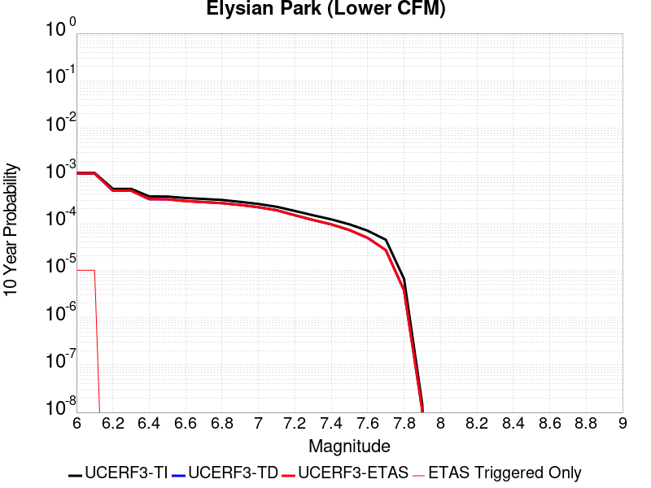 |

| Magnitude | 1 wk TI Prob | 1 wk TD Prob | 1 wk ETAS Prob | 1 wk ETAS/TD Gain | 1 wk ETAS Triggered Only | 1 mo TI Prob | 1 mo TD Prob | 1 mo ETAS Prob | 1 mo ETAS/TD Gain | 1 mo ETAS Triggered Only | 1 yr TI Prob | 1 yr TD Prob | 1 yr ETAS Prob | 1 yr ETAS/TD Gain | 1 yr ETAS Triggered Only | 10 yr TI Prob | 10 yr TD Prob | 10 yr ETAS Prob | 10 yr ETAS/TD Gain | 10 yr ETAS Triggered Only |
|-----|-----|-----|-----|-----|-----|-----|-----|-----|-----|-----|-----|-----|-----|-----|-----|-----|-----|-----|-----|-----|
| 6.0 | 2.1766498E-6 | 2.1038136E-6 | 2.1038136E-6 | 1.0 | 0.0 | 9.328466E-6 | 9.01632E-6 | 9.01632E-6 | 1.0 | 0.0 | 1.1356815E-4 | 1.0976962E-4 | 1.0976962E-4 | 1.0 | 0.0 | 0.0011351013 | 0.0010972959 | 0.0011072849 | 1.0091033 | 1.0E-5 |
| 6.1 | 2.1766498E-6 | 2.1038136E-6 | 2.1038136E-6 | 1.0 | 0.0 | 9.328466E-6 | 9.01632E-6 | 9.01632E-6 | 1.0 | 0.0 | 1.1356815E-4 | 1.0976962E-4 | 1.0976962E-4 | 1.0 | 0.0 | 0.0011351013 | 0.0010972959 | 0.0011072849 | 1.0091033 | 1.0E-5 |
| 6.2 | 1.0031182E-6 | 9.1864104E-7 | 9.1864104E-7 | 1.0 | 0.0 | 4.299071E-6 | 3.9370275E-6 | 3.9370275E-6 | 1.0 | 0.0 | 5.2339932E-5 | 4.7932357E-5 | 4.7932357E-5 | 1.0 | 0.0 | 5.2327604E-4 | 4.7923E-4 | 4.7923E-4 | 1.0 | 0.0 |
| 6.3 | 1.0031182E-6 | 9.1864104E-7 | 9.1864104E-7 | 1.0 | 0.0 | 4.299071E-6 | 3.9370275E-6 | 3.9370275E-6 | 1.0 | 0.0 | 5.2339932E-5 | 4.7932357E-5 | 4.7932357E-5 | 1.0 | 0.0 | 5.2327604E-4 | 4.7923E-4 | 4.7923E-4 | 1.0 | 0.0 |
| 6.4 | 6.9606244E-7 | 6.0921303E-7 | 6.0921303E-7 | 1.0 | 0.0 | 2.9831212E-6 | 2.6109103E-6 | 2.6109103E-6 | 1.0 | 0.0 | 3.6318896E-5 | 3.178737E-5 | 3.178737E-5 | 1.0 | 0.0 | 3.6312963E-4 | 3.178285E-4 | 3.178285E-4 | 1.0 | 0.0 |
| 6.5 | 6.901879E-7 | 6.0328136E-7 | 6.0328136E-7 | 1.0 | 0.0 | 2.9579448E-6 | 2.585489E-6 | 2.585489E-6 | 1.0 | 0.0 | 3.6012385E-5 | 3.1477877E-5 | 3.1477877E-5 | 1.0 | 0.0 | 3.600655E-4 | 3.147344E-4 | 3.147344E-4 | 1.0 | 0.0 |
| 6.6 | 6.4198554E-7 | 5.546795E-7 | 5.546795E-7 | 1.0 | 0.0 | 2.7513638E-6 | 2.3771956E-6 | 2.3771956E-6 | 1.0 | 0.0 | 3.3497337E-5 | 2.8941975E-5 | 2.8941975E-5 | 1.0 | 0.0 | 3.349229E-4 | 2.893822E-4 | 2.893822E-4 | 1.0 | 0.0 |
| 6.7 | 6.138733E-7 | 5.2636017E-7 | 5.2636017E-7 | 1.0 | 0.0 | 2.6308828E-6 | 2.2558272E-6 | 2.2558272E-6 | 1.0 | 0.0 | 3.203053E-5 | 2.7464352E-5 | 2.7464352E-5 | 1.0 | 0.0 | 3.2025913E-4 | 2.746097E-4 | 2.746097E-4 | 1.0 | 0.0 |
| 6.8 | 5.84778E-7 | 5.00312E-7 | 5.00312E-7 | 1.0 | 0.0 | 2.506189E-6 | 2.1441924E-6 | 2.1441924E-6 | 1.0 | 0.0 | 3.0512423E-5 | 2.6105232E-5 | 2.6105232E-5 | 1.0 | 0.0 | 3.0508233E-4 | 2.6102175E-4 | 2.6102175E-4 | 1.0 | 0.0 |
| 6.9 | 5.322785E-7 | 4.5802537E-7 | 4.5802537E-7 | 1.0 | 0.0 | 2.2811914E-6 | 1.9629645E-6 | 1.9629645E-6 | 1.0 | 0.0 | 2.7773152E-5 | 2.389883E-5 | 2.389883E-5 | 1.0 | 0.0 | 2.7769682E-4 | 2.3896269E-4 | 2.3896269E-4 | 1.0 | 0.0 |
| 7.0 | 4.8147206E-7 | 4.112585E-7 | 4.112585E-7 | 1.0 | 0.0 | 2.06345E-6 | 1.7625351E-6 | 1.7625351E-6 | 1.0 | 0.0 | 2.5122214E-5 | 2.1458654E-5 | 2.1458654E-5 | 1.0 | 0.0 | 2.5119373E-4 | 2.1456591E-4 | 2.1456591E-4 | 1.0 | 0.0 |
| 7.1 | 4.1932955E-7 | 3.545729E-7 | 3.545729E-7 | 1.0 | 0.0 | 1.7971255E-6 | 1.5195972E-6 | 1.5195972E-6 | 1.0 | 0.0 | 2.1879783E-5 | 1.850094E-5 | 1.850094E-5 | 1.0 | 0.0 | 2.1877629E-4 | 1.8499405E-4 | 1.8499405E-4 | 1.0 | 0.0 |
| 7.2 | 3.426051E-7 | 2.781165E-7 | 2.781165E-7 | 1.0 | 0.0 | 1.4683067E-6 | 1.1919273E-6 | 1.1919273E-6 | 1.0 | 0.0 | 1.7876488E-5 | 1.4511617E-5 | 1.4511617E-5 | 1.0 | 0.0 | 1.787505E-4 | 1.4510672E-4 | 1.4510672E-4 | 1.0 | 0.0 |
| 7.3 | 2.7771645E-7 | 2.2097676E-7 | 2.2097676E-7 | 1.0 | 0.0 | 1.1902127E-6 | 9.4704285E-7 | 9.4704285E-7 | 1.0 | 0.0 | 1.4490744E-5 | 1.15301855E-5 | 1.15301855E-5 | 1.0 | 0.0 | 1.4489799E-4 | 1.15295894E-4 | 1.15295894E-4 | 1.0 | 0.0 |
| 7.4 | 2.2756493E-7 | 1.784084E-7 | 1.784084E-7 | 1.0 | 0.0 | 9.752779E-7 | 7.6460714E-7 | 7.6460714E-7 | 1.0 | 0.0 | 1.1873944E-5 | 9.309052E-6 | 9.309052E-6 | 1.0 | 0.0 | 1.18733085E-4 | 9.308664E-5 | 9.308664E-5 | 1.0 | 0.0 |
| 7.5 | 1.7874558E-7 | 1.3543603E-7 | 1.3543603E-7 | 1.0 | 0.0 | 7.660522E-7 | 5.804399E-7 | 5.804399E-7 | 1.0 | 0.0 | 9.326646E-6 | 7.0668334E-6 | 7.0668334E-6 | 1.0 | 0.0 | 9.326255E-5 | 7.06661E-5 | 7.06661E-5 | 1.0 | 0.0 |
| 7.6 | 1.3124549E-7 | 9.25154E-8 | 9.25154E-8 | 1.0 | 0.0 | 5.624805E-7 | 3.964945E-7 | 3.964945E-7 | 1.0 | 0.0 | 6.8481786E-6 | 4.82731E-6 | 4.82731E-6 | 1.0 | 0.0 | 6.8479676E-5 | 4.8272068E-5 | 4.8272068E-5 | 1.0 | 0.0 |
| 7.7 | 8.439993E-8 | 5.0905733E-8 | 5.0905733E-8 | 1.0 | 0.0 | 3.6171392E-7 | 2.1816741E-7 | 2.1816741E-7 | 1.0 | 0.0 | 4.403858E-6 | 2.6561852E-6 | 2.6561852E-6 | 1.0 | 0.0 | 4.4037708E-5 | 2.6561547E-5 | 2.6561547E-5 | 1.0 | 0.0 |
| 7.8 | 1.2591407E-8 | 7.22856E-9 | 7.22856E-9 | 1.0 | 0.0 | 5.3963173E-8 | 3.097954E-8 | 3.097954E-8 | 1.0 | 0.0 | 6.570014E-7 | 3.7717584E-7 | 3.7717584E-7 | 1.0 | 0.0 | 6.5699946E-6 | 3.771752E-6 | 3.771752E-6 | 1.0 | 0.0 |
| 7.9 | 2.8324232E-11 | 2.1407542E-11 | 2.1407542E-11 | 1.0 | 0.0 | 1.2138957E-10 | 9.174661E-11 | 9.174661E-11 | 1.0 | 0.0 | 1.4779177E-9 | 1.1170151E-9 | 1.1170151E-9 | 1.0 | 0.0 | 1.4779177E-8 | 1.1170152E-8 | 1.1170152E-8 | 1.0 | 0.0 |

## Channel Islands Western Deep Ramp
*[(top)](#table-of-contents)*

| 1 Week | 1 Month | 1 Year | 10 Year |
|-----|-----|-----|-----|
|  |  | 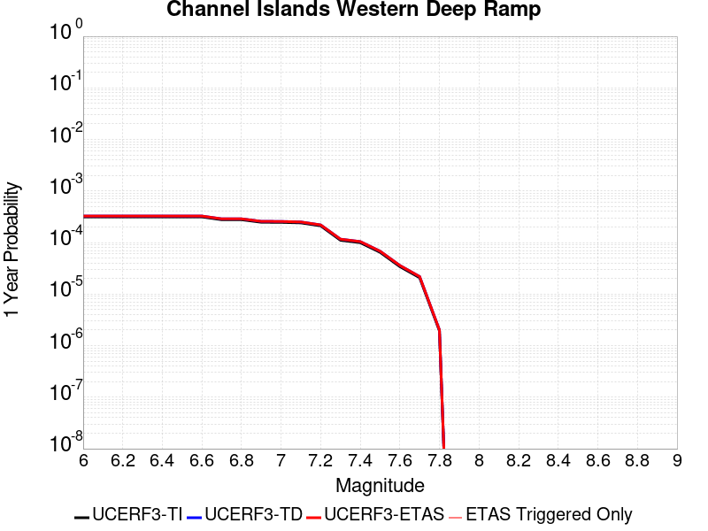 |  |

| Magnitude | 1 wk TI Prob | 1 wk TD Prob | 1 wk ETAS Prob | 1 wk ETAS/TD Gain | 1 wk ETAS Triggered Only | 1 mo TI Prob | 1 mo TD Prob | 1 mo ETAS Prob | 1 mo ETAS/TD Gain | 1 mo ETAS Triggered Only | 1 yr TI Prob | 1 yr TD Prob | 1 yr ETAS Prob | 1 yr ETAS/TD Gain | 1 yr ETAS Triggered Only | 10 yr TI Prob | 10 yr TD Prob | 10 yr ETAS Prob | 10 yr ETAS/TD Gain | 10 yr ETAS Triggered Only |
|-----|-----|-----|-----|-----|-----|-----|-----|-----|-----|-----|-----|-----|-----|-----|-----|-----|-----|-----|-----|-----|
| 6.0 | 6.0213506E-6 | 6.254959E-6 | 6.254959E-6 | 1.0 | 0.0 | 2.5805533E-5 | 2.6806716E-5 | 2.6806716E-5 | 1.0 | 0.0 | 3.1413708E-4 | 3.2632737E-4 | 3.2632737E-4 | 1.0 | 0.0 | 0.0031369338 | 0.0032589233 | 0.0032688908 | 1.0030586 | 1.0E-5 |
| 6.1 | 6.0213506E-6 | 6.254959E-6 | 6.254959E-6 | 1.0 | 0.0 | 2.5805533E-5 | 2.6806716E-5 | 2.6806716E-5 | 1.0 | 0.0 | 3.1413708E-4 | 3.2632737E-4 | 3.2632737E-4 | 1.0 | 0.0 | 0.0031369338 | 0.0032589233 | 0.0032688908 | 1.0030586 | 1.0E-5 |
| 6.2 | 6.0213506E-6 | 6.254959E-6 | 6.254959E-6 | 1.0 | 0.0 | 2.5805533E-5 | 2.6806716E-5 | 2.6806716E-5 | 1.0 | 0.0 | 3.1413708E-4 | 3.2632737E-4 | 3.2632737E-4 | 1.0 | 0.0 | 0.0031369338 | 0.0032589233 | 0.0032688908 | 1.0030586 | 1.0E-5 |
| 6.3 | 6.0213506E-6 | 6.254959E-6 | 6.254959E-6 | 1.0 | 0.0 | 2.5805533E-5 | 2.6806716E-5 | 2.6806716E-5 | 1.0 | 0.0 | 3.1413708E-4 | 3.2632737E-4 | 3.2632737E-4 | 1.0 | 0.0 | 0.0031369338 | 0.0032589233 | 0.0032688908 | 1.0030586 | 1.0E-5 |
| 6.4 | 6.0213506E-6 | 6.254959E-6 | 6.254959E-6 | 1.0 | 0.0 | 2.5805533E-5 | 2.6806716E-5 | 2.6806716E-5 | 1.0 | 0.0 | 3.1413708E-4 | 3.2632737E-4 | 3.2632737E-4 | 1.0 | 0.0 | 0.0031369338 | 0.0032589233 | 0.0032688908 | 1.0030586 | 1.0E-5 |
| 6.5 | 6.0213506E-6 | 6.254959E-6 | 6.254959E-6 | 1.0 | 0.0 | 2.5805533E-5 | 2.6806716E-5 | 2.6806716E-5 | 1.0 | 0.0 | 3.1413708E-4 | 3.2632737E-4 | 3.2632737E-4 | 1.0 | 0.0 | 0.0031369338 | 0.0032589233 | 0.0032688908 | 1.0030586 | 1.0E-5 |
| 6.6 | 6.0213506E-6 | 6.254959E-6 | 6.254959E-6 | 1.0 | 0.0 | 2.5805533E-5 | 2.6806716E-5 | 2.6806716E-5 | 1.0 | 0.0 | 3.1413708E-4 | 3.2632737E-4 | 3.2632737E-4 | 1.0 | 0.0 | 0.0031369338 | 0.0032589233 | 0.0032688908 | 1.0030586 | 1.0E-5 |
| 6.7 | 5.313309E-6 | 5.5253226E-6 | 5.5253226E-6 | 1.0 | 0.0 | 2.2771126E-5 | 2.3679762E-5 | 2.3679762E-5 | 1.0 | 0.0 | 2.772032E-4 | 2.8826704E-4 | 2.8826704E-4 | 1.0 | 0.0 | 0.0027685766 | 0.0028793344 | 0.0028793344 | 1.0 | 0.0 |
| 6.8 | 5.313309E-6 | 5.5253226E-6 | 5.5253226E-6 | 1.0 | 0.0 | 2.2771126E-5 | 2.3679762E-5 | 2.3679762E-5 | 1.0 | 0.0 | 2.772032E-4 | 2.8826704E-4 | 2.8826704E-4 | 1.0 | 0.0 | 0.0027685766 | 0.0028793344 | 0.0028793344 | 1.0 | 0.0 |
| 6.9 | 4.744377E-6 | 4.939506E-6 | 4.939506E-6 | 1.0 | 0.0 | 2.0332885E-5 | 2.116916E-5 | 2.116916E-5 | 1.0 | 0.0 | 2.4752476E-4 | 2.5770778E-4 | 2.5770778E-4 | 1.0 | 0.0 | 0.0024724922 | 0.0025744569 | 0.0025744569 | 1.0 | 0.0 |
| 7.0 | 4.722209E-6 | 4.9165483E-6 | 4.9165483E-6 | 1.0 | 0.0 | 2.0237881E-5 | 2.1070773E-5 | 2.1070773E-5 | 1.0 | 0.0 | 2.4636835E-4 | 2.565102E-4 | 2.565102E-4 | 1.0 | 0.0 | 0.002460954 | 0.0025625085 | 0.0025625085 | 1.0 | 0.0 |
| 7.1 | 4.611174E-6 | 4.8014826E-6 | 4.8014826E-6 | 1.0 | 0.0 | 1.9762025E-5 | 2.0577641E-5 | 2.0577641E-5 | 1.0 | 0.0 | 2.4057609E-4 | 2.5050773E-4 | 2.5050773E-4 | 1.0 | 0.0 | 0.002403158 | 0.0025026202 | 0.0025026202 | 1.0 | 0.0 |
| 7.2 | 4.043994E-6 | 4.212092E-6 | 4.212092E-6 | 1.0 | 0.0 | 1.7331287E-5 | 1.8051716E-5 | 1.8051716E-5 | 1.0 | 0.0 | 2.10988E-4 | 2.1976106E-4 | 2.1976106E-4 | 1.0 | 0.0 | 0.002107878 | 0.002195788 | 0.002195788 | 1.0 | 0.0 |
| 7.3 | 2.1233036E-6 | 2.229829E-6 | 2.229829E-6 | 1.0 | 0.0 | 9.099841E-6 | 9.5563755E-6 | 9.5563755E-6 | 1.0 | 0.0 | 1.1078493E-4 | 1.16342715E-4 | 1.16342715E-4 | 1.0 | 0.0 | 0.0011072971 | 0.0011628236 | 0.0011628236 | 1.0 | 0.0 |
| 7.4 | 1.9051884E-6 | 2.001535E-6 | 2.001535E-6 | 1.0 | 0.0 | 8.165067E-6 | 8.577978E-6 | 8.577978E-6 | 1.0 | 0.0 | 9.940516E-5 | 1.04431936E-4 | 1.04431936E-4 | 1.0 | 0.0 | 9.93607E-4 | 0.0010438339 | 0.0010438339 | 1.0 | 0.0 |
| 7.5 | 1.2408497E-6 | 1.3039086E-6 | 1.3039086E-6 | 1.0 | 0.0 | 5.317916E-6 | 5.588168E-6 | 5.588168E-6 | 1.0 | 0.0 | 6.4743705E-5 | 6.803384E-5 | 6.803384E-5 | 1.0 | 0.0 | 6.4724847E-4 | 6.801323E-4 | 6.801323E-4 | 1.0 | 0.0 |
| 7.6 | 6.5440025E-7 | 6.886852E-7 | 6.886852E-7 | 1.0 | 0.0 | 2.8045695E-6 | 2.9515047E-6 | 2.9515047E-6 | 1.0 | 0.0 | 3.4145098E-5 | 3.5933994E-5 | 3.5933994E-5 | 1.0 | 0.0 | 3.4139853E-4 | 3.5928324E-4 | 3.5928324E-4 | 1.0 | 0.0 |
| 7.7 | 3.985963E-7 | 4.1931597E-7 | 4.1931597E-7 | 1.0 | 0.0 | 1.7082689E-6 | 1.7970673E-6 | 1.7970673E-6 | 1.0 | 0.0 | 2.0797976E-5 | 2.1879086E-5 | 2.1879086E-5 | 1.0 | 0.0 | 2.0796029E-4 | 2.187705E-4 | 2.187705E-4 | 1.0 | 0.0 |
| 7.8 | 3.706329E-8 | 3.8592386E-8 | 3.8592386E-8 | 1.0 | 0.0 | 1.5884267E-7 | 1.6539593E-7 | 1.6539593E-7 | 1.0 | 0.0 | 1.9339077E-6 | 2.0136938E-6 | 2.0136938E-6 | 1.0 | 0.0 | 1.933891E-5 | 2.0136767E-5 | 2.0136767E-5 | 1.0 | 0.0 |

## Superstition Hills
*[(top)](#table-of-contents)*

| 1 Week | 1 Month | 1 Year | 10 Year |
|-----|-----|-----|-----|
|  |  |  |  |

| Magnitude | 1 wk TI Prob | 1 wk TD Prob | 1 wk ETAS Prob | 1 wk ETAS/TD Gain | 1 wk ETAS Triggered Only | 1 mo TI Prob | 1 mo TD Prob | 1 mo ETAS Prob | 1 mo ETAS/TD Gain | 1 mo ETAS Triggered Only | 1 yr TI Prob | 1 yr TD Prob | 1 yr ETAS Prob | 1 yr ETAS/TD Gain | 1 yr ETAS Triggered Only | 10 yr TI Prob | 10 yr TD Prob | 10 yr ETAS Prob | 10 yr ETAS/TD Gain | 10 yr ETAS Triggered Only |
|-----|-----|-----|-----|-----|-----|-----|-----|-----|-----|-----|-----|-----|-----|-----|-----|-----|-----|-----|-----|-----|
| 6.0 | 6.6865185E-5 | 1.414615E-5 | 1.414615E-5 | 1.0 | 0.0 | 2.8653358E-4 | 6.062504E-5 | 6.062504E-5 | 1.0 | 0.0 | 0.0034829667 | 7.378761E-4 | 7.4786873E-4 | 1.0135424 | 1.0E-5 | 0.03428881 | 0.007524804 | 0.007534729 | 1.0013189 | 1.0E-5 |
| 6.1 | 6.544851E-5 | 1.414615E-5 | 1.414615E-5 | 1.0 | 0.0 | 2.8046346E-4 | 6.062504E-5 | 6.062504E-5 | 1.0 | 0.0 | 0.0034092965 | 7.378761E-4 | 7.478687E-4 | 1.0135424 | 1.0E-5 | 0.033574644 | 0.0075248033 | 0.0075347284 | 1.0013189 | 1.0E-5 |
| 6.2 | 6.544851E-5 | 1.414615E-5 | 1.414615E-5 | 1.0 | 0.0 | 2.8046346E-4 | 6.062504E-5 | 6.062504E-5 | 1.0 | 0.0 | 0.0034092965 | 7.378761E-4 | 7.478687E-4 | 1.0135424 | 1.0E-5 | 0.033574644 | 0.0075248033 | 0.0075347284 | 1.0013189 | 1.0E-5 |
| 6.3 | 5.2402065E-5 | 1.4146149E-5 | 1.4146149E-5 | 1.0 | 0.0 | 2.2456095E-4 | 6.0625032E-5 | 6.0625032E-5 | 1.0 | 0.0 | 0.0027306017 | 7.37876E-4 | 7.478686E-4 | 1.0135424 | 1.0E-5 | 0.02697292 | 0.007524798 | 0.007534723 | 1.0013189 | 1.0E-5 |
| 6.4 | 4.542238E-5 | 1.4146148E-5 | 1.4146148E-5 | 1.0 | 0.0 | 1.9465282E-4 | 6.062503E-5 | 6.062503E-5 | 1.0 | 0.0 | 0.0023673223 | 7.37876E-4 | 7.478686E-4 | 1.0135424 | 1.0E-5 | 0.023422617 | 0.007524795 | 0.0075347195 | 1.0013189 | 1.0E-5 |
| 6.5 | 2.9672969E-5 | 1.4146146E-5 | 1.4146146E-5 | 1.0 | 0.0 | 1.2716366E-4 | 6.0625025E-5 | 6.0625025E-5 | 1.0 | 0.0 | 0.0015471181 | 7.3787593E-4 | 7.4786856E-4 | 1.0135424 | 1.0E-5 | 0.015363912 | 0.0075247884 | 0.007534713 | 1.0013189 | 1.0E-5 |
| 6.6 | 2.6056105E-5 | 1.3811846E-5 | 1.3811846E-5 | 1.0 | 0.0 | 1.1166424E-4 | 5.9192374E-5 | 5.9192374E-5 | 1.0 | 0.0 | 0.0013586642 | 7.2044495E-4 | 7.3043775E-4 | 1.0138704 | 1.0E-5 | 0.013503874 | 0.007349193 | 0.0073591196 | 1.0013506 | 1.0E-5 |
| 6.7 | 1.4611248E-5 | 1.3391699E-5 | 1.3391699E-5 | 1.0 | 0.0 | 6.261813E-5 | 5.7391822E-5 | 5.7391822E-5 | 1.0 | 0.0 | 7.6210906E-4 | 6.985374E-4 | 7.085304E-4 | 1.0143056 | 1.0E-5 | 0.0075950073 | 0.0071303607 | 0.0071402895 | 1.0013925 | 1.0E-5 |
| 6.8 | 1.30607E-5 | 1.0986751E-5 | 1.0986751E-5 | 1.0 | 0.0 | 5.597323E-5 | 4.7085272E-5 | 4.7085272E-5 | 1.0 | 0.0 | 6.8126095E-4 | 5.731211E-4 | 5.831154E-4 | 1.0174383 | 1.0E-5 | 0.006791762 | 0.0058785332 | 0.0058884746 | 1.0016911 | 1.0E-5 |
| 6.9 | 1.0443096E-5 | 8.202543E-6 | 8.202543E-6 | 1.0 | 0.0 | 4.4755358E-5 | 3.5153294E-5 | 3.5153294E-5 | 1.0 | 0.0 | 5.447602E-4 | 4.2790966E-4 | 4.379054E-4 | 1.0233594 | 1.0E-5 | 0.005434267 | 0.004413219 | 0.004423175 | 1.0022559 | 1.0E-5 |
| 7.0 | 8.045912E-6 | 6.7462E-6 | 6.7462E-6 | 1.0 | 0.0 | 3.4482026E-5 | 2.8911973E-5 | 2.8911973E-5 | 1.0 | 0.0 | 4.197378E-4 | 3.5194744E-4 | 3.619439E-4 | 1.0284033 | 1.0E-5 | 0.0041894587 | 0.003636813 | 0.0036467765 | 1.0027397 | 1.0E-5 |
| 7.1 | 8.045912E-6 | 6.7462E-6 | 6.7462E-6 | 1.0 | 0.0 | 3.4482026E-5 | 2.8911973E-5 | 2.8911973E-5 | 1.0 | 0.0 | 4.197378E-4 | 3.5194744E-4 | 3.619439E-4 | 1.0284033 | 1.0E-5 | 0.0041894587 | 0.003636813 | 0.0036467765 | 1.0027397 | 1.0E-5 |
| 7.2 | 7.375506E-6 | 6.2530116E-6 | 6.2530116E-6 | 1.0 | 0.0 | 3.1608928E-5 | 2.679835E-5 | 2.679835E-5 | 1.0 | 0.0 | 3.8477074E-4 | 3.2622193E-4 | 3.3621865E-4 | 1.0306439 | 1.0E-5 | 0.003841052 | 0.0033772253 | 0.0033871916 | 1.002951 | 1.0E-5 |
| 7.3 | 6.6063913E-6 | 5.805328E-6 | 5.805328E-6 | 1.0 | 0.0 | 2.8312797E-5 | 2.4879744E-5 | 2.4879744E-5 | 1.0 | 0.0 | 3.446538E-4 | 3.0286948E-4 | 3.1286647E-4 | 1.0330075 | 1.0E-5 | 0.0034411973 | 0.0031414342 | 0.0031514028 | 1.0031732 | 1.0E-5 |
| 7.4 | 6.4313126E-6 | 5.6867293E-6 | 5.6867293E-6 | 1.0 | 0.0 | 2.7562477E-5 | 2.4371473E-5 | 2.4371473E-5 | 1.0 | 0.0 | 3.355215E-4 | 2.96683E-4 | 3.0668E-4 | 1.033696 | 1.0E-5 | 0.0033501536 | 0.0030791848 | 0.003089154 | 1.0032376 | 1.0E-5 |
| 7.5 | 6.0742927E-6 | 5.4824754E-6 | 5.4824754E-6 | 1.0 | 0.0 | 2.6032423E-5 | 2.3496115E-5 | 2.3496115E-5 | 1.0 | 0.0 | 3.1689866E-4 | 2.8602834E-4 | 2.9602548E-4 | 1.0349516 | 1.0E-5 | 0.0031644711 | 0.0029709823 | 0.0029809526 | 1.0033559 | 1.0E-5 |
| 7.6 | 5.6987187E-6 | 5.3005997E-6 | 5.3005997E-6 | 1.0 | 0.0 | 2.4422852E-5 | 2.2716662E-5 | 2.2716662E-5 | 1.0 | 0.0 | 2.9730765E-4 | 2.7654093E-4 | 2.8653815E-4 | 1.036151 | 1.0E-5 | 0.002969102 | 0.0028741928 | 0.002884164 | 1.0034692 | 1.0E-5 |
| 7.7 | 5.1658035E-6 | 4.931508E-6 | 4.931508E-6 | 1.0 | 0.0 | 2.2138971E-5 | 2.1134867E-5 | 2.1134867E-5 | 1.0 | 0.0 | 2.6950863E-4 | 2.5728723E-4 | 2.6728466E-4 | 1.0388571 | 1.0E-5 | 0.00269182 | 0.0026791887 | 0.0026891618 | 1.0037224 | 1.0E-5 |
| 7.8 | 3.6864697E-6 | 4.202221E-6 | 4.202221E-6 | 1.0 | 0.0 | 1.579906E-5 | 1.8009398E-5 | 1.8009398E-5 | 1.0 | 0.0 | 1.9233658E-4 | 2.1924282E-4 | 2.2924063E-4 | 1.0456015 | 1.0E-5 | 0.0019217018 | 0.0022922577 | 0.0023022348 | 1.0043526 | 1.0E-5 |
| 7.9 | 3.0265903E-6 | 3.5690077E-6 | 3.5690077E-6 | 1.0 | 0.0 | 1.2971037E-5 | 1.529566E-5 | 1.529566E-5 | 1.0 | 0.0 | 1.5791094E-4 | 1.8620919E-4 | 1.9620733E-4 | 1.053693 | 1.0E-5 | 0.0015779877 | 0.0019562359 | 0.0019662164 | 1.0051018 | 1.0E-5 |
| 8.0 | 2.5271493E-6 | 3.0915614E-6 | 3.0915614E-6 | 1.0 | 0.0 | 1.0830595E-5 | 1.3249484E-5 | 1.3249484E-5 | 1.0 | 0.0 | 1.3185451E-4 | 1.6130095E-4 | 1.7129934E-4 | 1.061986 | 1.0E-5 | 0.0013177631 | 0.0016998803 | 0.0017098633 | 1.0058727 | 1.0E-5 |
| 8.1 | 2.3749135E-6 | 2.921983E-6 | 2.921983E-6 | 1.0 | 0.0 | 1.0178161E-5 | 1.2522726E-5 | 1.2522726E-5 | 1.0 | 0.0 | 1.2391206E-4 | 1.5245394E-4 | 1.6245242E-4 | 1.0655836 | 1.0E-5 | 0.0012384299 | 0.0016073589 | 0.0016173428 | 1.0062114 | 1.0E-5 |
| 8.2 | 1.7186406E-9 | 1.146511E-9 | 1.146511E-9 | 1.0 | 0.0 | 7.3656024E-9 | 4.9136184E-9 | 4.9136184E-9 | 1.0 | 0.0 | 8.9676206E-8 | 5.982331E-8 | 5.982331E-8 | 1.0 | 0.0 | 8.9676166E-7 | 6.402274E-7 | 6.402274E-7 | 1.0 | 0.0 |

## Gillem - Big Crack 2011 CFM
*[(top)](#table-of-contents)*

| 1 Week | 1 Month | 1 Year | 10 Year |
|-----|-----|-----|-----|
| 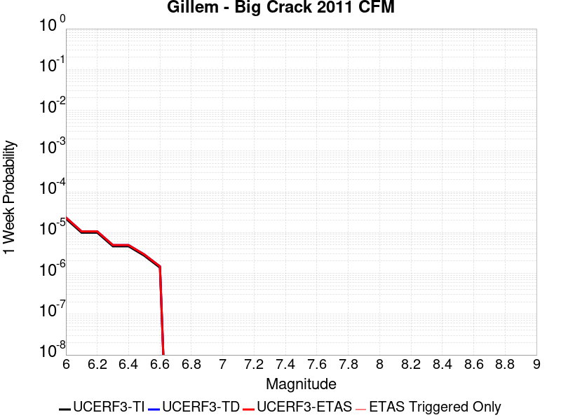 |  |  | 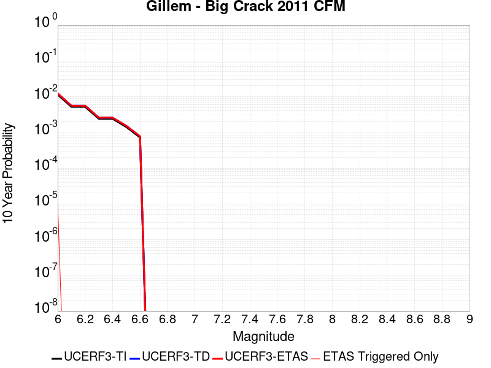 |

| Magnitude | 1 wk TI Prob | 1 wk TD Prob | 1 wk ETAS Prob | 1 wk ETAS/TD Gain | 1 wk ETAS Triggered Only | 1 mo TI Prob | 1 mo TD Prob | 1 mo ETAS Prob | 1 mo ETAS/TD Gain | 1 mo ETAS Triggered Only | 1 yr TI Prob | 1 yr TD Prob | 1 yr ETAS Prob | 1 yr ETAS/TD Gain | 1 yr ETAS Triggered Only | 10 yr TI Prob | 10 yr TD Prob | 10 yr ETAS Prob | 10 yr ETAS/TD Gain | 10 yr ETAS Triggered Only |
|-----|-----|-----|-----|-----|-----|-----|-----|-----|-----|-----|-----|-----|-----|-----|-----|-----|-----|-----|-----|-----|
| 6.0 | 2.196852E-5 | 2.3605138E-5 | 2.3605138E-5 | 1.0 | 0.0 | 9.4147406E-5 | 1.0116146E-4 | 1.0116146E-4 | 1.0 | 0.0 | 0.0011456419 | 0.0012310338 | 0.0012310338 | 1.0 | 0.0 | 0.011397537 | 0.012251006 | 0.012260884 | 1.0008062 | 1.0E-5 |
| 6.1 | 9.992795E-6 | 1.0712176E-5 | 1.0712176E-5 | 1.0 | 0.0 | 4.2825563E-5 | 4.5908622E-5 | 4.5908622E-5 | 1.0 | 0.0 | 5.2127644E-4 | 5.5881246E-4 | 5.5881246E-4 | 1.0 | 0.0 | 0.0052005537 | 0.005575883 | 0.005575883 | 1.0 | 0.0 |
| 6.2 | 9.992795E-6 | 1.0712176E-5 | 1.0712176E-5 | 1.0 | 0.0 | 4.2825563E-5 | 4.5908622E-5 | 4.5908622E-5 | 1.0 | 0.0 | 5.2127644E-4 | 5.5881246E-4 | 5.5881246E-4 | 1.0 | 0.0 | 0.0052005537 | 0.005575883 | 0.005575883 | 1.0 | 0.0 |
| 6.3 | 4.6127884E-6 | 4.942788E-6 | 4.942788E-6 | 1.0 | 0.0 | 1.9768944E-5 | 2.1183232E-5 | 2.1183232E-5 | 1.0 | 0.0 | 2.406603E-4 | 2.578798E-4 | 2.578798E-4 | 1.0 | 0.0 | 0.0024039985 | 0.0025762434 | 0.0025762434 | 1.0 | 0.0 |
| 6.4 | 4.6127884E-6 | 4.942788E-6 | 4.942788E-6 | 1.0 | 0.0 | 1.9768944E-5 | 2.1183232E-5 | 2.1183232E-5 | 1.0 | 0.0 | 2.406603E-4 | 2.578798E-4 | 2.578798E-4 | 1.0 | 0.0 | 0.0024039985 | 0.0025762434 | 0.0025762434 | 1.0 | 0.0 |
| 6.5 | 2.716712E-6 | 2.9111889E-6 | 2.9111889E-6 | 1.0 | 0.0 | 1.1643E-5 | 1.2476477E-5 | 1.2476477E-5 | 1.0 | 0.0 | 1.417443E-4 | 1.5189295E-4 | 1.5189295E-4 | 1.0 | 0.0 | 0.0014165393 | 0.0015181294 | 0.0015181294 | 1.0 | 0.0 |
| 6.6 | 1.3818255E-6 | 1.4821088E-6 | 1.4821088E-6 | 1.0 | 0.0 | 5.922096E-6 | 6.3518864E-6 | 6.3518864E-6 | 1.0 | 0.0 | 7.209913E-5 | 7.7332705E-5 | 7.7332705E-5 | 1.0 | 0.0 | 7.2075747E-4 | 7.731789E-4 | 7.731789E-4 | 1.0 | 0.0 |

## Hayward (So) 2011 CFM
*[(top)](#table-of-contents)*

| 1 Week | 1 Month | 1 Year | 10 Year |
|-----|-----|-----|-----|
| 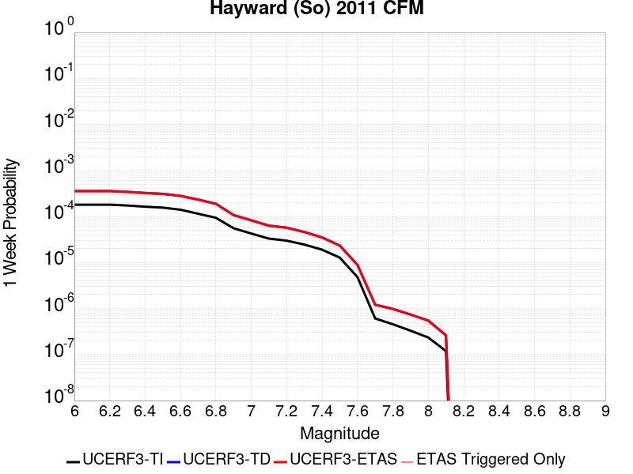 | 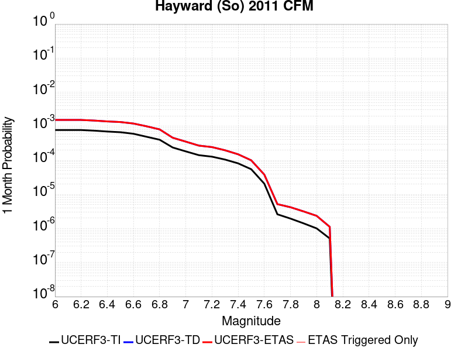 | 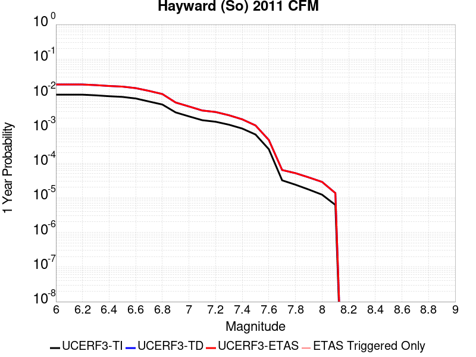 |  |

| Magnitude | 1 wk TI Prob | 1 wk TD Prob | 1 wk ETAS Prob | 1 wk ETAS/TD Gain | 1 wk ETAS Triggered Only | 1 mo TI Prob | 1 mo TD Prob | 1 mo ETAS Prob | 1 mo ETAS/TD Gain | 1 mo ETAS Triggered Only | 1 yr TI Prob | 1 yr TD Prob | 1 yr ETAS Prob | 1 yr ETAS/TD Gain | 1 yr ETAS Triggered Only | 10 yr TI Prob | 10 yr TD Prob | 10 yr ETAS Prob | 10 yr ETAS/TD Gain | 10 yr ETAS Triggered Only |
|-----|-----|-----|-----|-----|-----|-----|-----|-----|-----|-----|-----|-----|-----|-----|-----|-----|-----|-----|-----|-----|
| 6.0 | 1.8091932E-4 | 3.5716876E-4 | 3.5716876E-4 | 1.0 | 0.0 | 7.751381E-4 | 0.0015298353 | 0.0015298353 | 1.0 | 0.0 | 0.00939654 | 0.018469084 | 0.018469084 | 1.0 | 0.0 | 0.090090066 | 0.1667761 | 0.16678444 | 1.00005 | 1.0E-5 |
| 6.1 | 1.8091932E-4 | 3.5716876E-4 | 3.5716876E-4 | 1.0 | 0.0 | 7.751381E-4 | 0.0015298353 | 0.0015298353 | 1.0 | 0.0 | 0.00939654 | 0.018469084 | 0.018469084 | 1.0 | 0.0 | 0.090090066 | 0.1667761 | 0.16678444 | 1.00005 | 1.0E-5 |
| 6.2 | 1.8091932E-4 | 3.5716876E-4 | 3.5716876E-4 | 1.0 | 0.0 | 7.751381E-4 | 0.0015298353 | 0.0015298353 | 1.0 | 0.0 | 0.00939654 | 0.018469084 | 0.018469084 | 1.0 | 0.0 | 0.090090066 | 0.1667761 | 0.16678444 | 1.00005 | 1.0E-5 |
| 6.3 | 1.7322872E-4 | 3.427354E-4 | 3.427354E-4 | 1.0 | 0.0 | 7.4219756E-4 | 0.0014680488 | 0.0014680488 | 1.0 | 0.0 | 0.0089988755 | 0.017729288 | 0.017729288 | 1.0 | 0.0 | 0.08643075 | 0.16071117 | 0.16071956 | 1.0000522 | 1.0E-5 |
| 6.4 | 1.6334097E-4 | 3.2355002E-4 | 3.2355002E-4 | 1.0 | 0.0 | 6.998449E-4 | 0.0013859147 | 0.0013859147 | 1.0 | 0.0 | 0.008487372 | 0.016744977 | 0.016744977 | 1.0 | 0.0 | 0.081704415 | 0.15259907 | 0.15260755 | 1.0000556 | 1.0E-5 |
| 6.5 | 1.5600289E-4 | 3.1029453E-4 | 3.1029453E-4 | 1.0 | 0.0 | 6.684125E-4 | 0.0013291643 | 0.0013291643 | 1.0 | 0.0 | 0.008107598 | 0.016064392 | 0.016064392 | 1.0 | 0.0 | 0.078181036 | 0.1468751 | 0.14688364 | 1.000058 | 1.0E-5 |
| 6.6 | 1.4046066E-4 | 2.8043045E-4 | 2.8043045E-4 | 1.0 | 0.0 | 6.018354E-4 | 0.001201298 | 0.001201298 | 1.0 | 0.0 | 0.0073027555 | 0.014529222 | 0.014529222 | 1.0 | 0.0 | 0.07067384 | 0.13396107 | 0.13396974 | 1.0000646 | 1.0E-5 |
| 6.7 | 1.14696966E-4 | 2.328075E-4 | 2.328075E-4 | 1.0 | 0.0 | 4.914658E-4 | 9.973701E-4 | 9.973701E-4 | 1.0 | 0.0 | 0.0059671924 | 0.012076436 | 0.012076436 | 1.0 | 0.0 | 0.058094822 | 0.11278556 | 0.11279443 | 1.0000787 | 1.0E-5 |
| 6.8 | 9.3874296E-5 | 1.8869406E-4 | 1.8869406E-4 | 1.0 | 0.0 | 4.0225635E-4 | 8.084419E-4 | 8.084419E-4 | 1.0 | 0.0 | 0.0048864787 | 0.009799094 | 0.009799094 | 1.0 | 0.0 | 0.047804173 | 0.092632905 | 0.09264198 | 1.000098 | 1.0E-5 |
| 6.9 | 5.551852E-5 | 1.0735069E-4 | 1.0735069E-4 | 1.0 | 0.0 | 2.3791482E-4 | 4.5999384E-4 | 4.5999384E-4 | 1.0 | 0.0 | 0.0028927654 | 0.0055861627 | 0.0055861627 | 1.0 | 0.0 | 0.028553981 | 0.054271217 | 0.054280676 | 1.0001743 | 1.0E-5 |
| 7.0 | 4.2662363E-5 | 8.251254E-5 | 8.251254E-5 | 1.0 | 0.0 | 1.8282588E-4 | 3.5357763E-4 | 3.5357763E-4 | 1.0 | 0.0 | 0.0022236328 | 0.0042963843 | 0.0042963843 | 1.0 | 0.0 | 0.022015138 | 0.042087104 | 0.042096686 | 1.0002276 | 1.0E-5 |
| 7.1 | 3.305886E-5 | 6.306136E-5 | 6.306136E-5 | 1.0 | 0.0 | 1.4167312E-4 | 2.7023506E-4 | 2.7023506E-4 | 1.0 | 0.0 | 0.0017235056 | 0.003285167 | 0.003285167 | 1.0 | 0.0 | 0.017101998 | 0.03247311 | 0.032482784 | 1.0002979 | 1.0E-5 |
| 7.2 | 2.9856887E-5 | 5.7054312E-5 | 5.7054312E-5 | 1.0 | 0.0 | 1.2795182E-4 | 2.4449566E-4 | 2.4449566E-4 | 1.0 | 0.0 | 0.0015567001 | 0.002972688 | 0.002972688 | 1.0 | 0.0 | 0.015458403 | 0.029473132 | 0.029482836 | 1.0003293 | 1.0E-5 |
| 7.3 | 2.4559737E-5 | 4.602505E-5 | 4.602505E-5 | 1.0 | 0.0 | 1.0525176E-4 | 1.9723538E-4 | 1.9723538E-4 | 1.0 | 0.0 | 0.0012806869 | 0.002398709 | 0.002398709 | 1.0 | 0.0 | 0.012733313 | 0.023874132 | 0.023883894 | 1.0004089 | 1.0E-5 |
| 7.4 | 1.9002231E-5 | 3.5078727E-5 | 3.5078727E-5 | 1.0 | 0.0 | 8.143559E-5 | 1.503288E-4 | 1.503288E-4 | 1.0 | 0.0 | 9.910273E-4 | 0.0018287265 | 0.0018287265 | 1.0 | 0.0 | 0.009866194 | 0.01827278 | 0.01827278 | 1.0 | 0.0 |
| 7.5 | 1.2783333E-5 | 2.3353385E-5 | 2.3353385E-5 | 1.0 | 0.0 | 5.4784563E-5 | 1.0008213E-4 | 1.0008213E-4 | 1.0 | 0.0 | 6.667979E-4 | 0.0012178246 | 0.0012178246 | 1.0 | 0.0 | 0.006648007 | 0.012221164 | 0.012221164 | 1.0 | 0.0 |
| 7.6 | 4.8149627E-6 | 8.895181E-6 | 8.895181E-6 | 1.0 | 0.0 | 2.063539E-5 | 3.8121656E-5 | 3.8121656E-5 | 1.0 | 0.0 | 2.5120692E-4 | 4.6403354E-4 | 4.6403354E-4 | 1.0 | 0.0 | 0.0025092314 | 0.004684996 | 0.004684996 | 1.0 | 0.0 |
| 7.7 | 6.0838227E-7 | 1.2073158E-6 | 1.2073158E-6 | 1.0 | 0.0 | 2.6073499E-6 | 5.1742E-6 | 5.1742E-6 | 1.0 | 0.0 | 3.174402E-5 | 6.299407E-5 | 6.299407E-5 | 1.0 | 0.0 | 3.1739488E-4 | 6.5373274E-4 | 6.5373274E-4 | 1.0 | 0.0 |
| 7.8 | 4.5542808E-7 | 9.806538E-7 | 9.806538E-7 | 1.0 | 0.0 | 1.9518332E-6 | 4.202795E-6 | 4.202795E-6 | 1.0 | 0.0 | 2.376331E-5 | 5.1167834E-5 | 5.1167834E-5 | 1.0 | 0.0 | 2.3760769E-4 | 5.3283205E-4 | 5.3283205E-4 | 1.0 | 0.0 |
| 7.9 | 3.3016747E-7 | 7.396889E-7 | 7.396889E-7 | 1.0 | 0.0 | 1.4150027E-6 | 3.1700913E-6 | 3.1700913E-6 | 1.0 | 0.0 | 1.7227521E-5 | 3.8595183E-5 | 3.8595183E-5 | 1.0 | 0.0 | 1.7226185E-4 | 3.9981655E-4 | 3.9981655E-4 | 1.0 | 0.0 |
| 8.0 | 2.347038E-7 | 5.4788046E-7 | 5.4788046E-7 | 1.0 | 0.0 | 1.0058731E-6 | 2.3480568E-6 | 2.3480568E-6 | 1.0 | 0.0 | 1.2246436E-5 | 2.858722E-5 | 2.858722E-5 | 1.0 | 0.0 | 1.2245761E-4 | 2.9390416E-4 | 2.9390416E-4 | 1.0 | 0.0 |
| 8.1 | 1.18822804E-7 | 2.6091143E-7 | 2.6091143E-7 | 1.0 | 0.0 | 5.092405E-7 | 1.1181913E-6 | 1.1181913E-6 | 1.0 | 0.0 | 6.1999854E-6 | 1.3613895E-5 | 1.3613895E-5 | 1.0 | 0.0 | 6.199812E-5 | 1.39336E-4 | 1.39336E-4 | 1.0 | 0.0 |

## Calaveras (Central) 2011 CFM
*[(top)](#table-of-contents)*

| 1 Week | 1 Month | 1 Year | 10 Year |
|-----|-----|-----|-----|
|  |  |  |  |

| Magnitude | 1 wk TI Prob | 1 wk TD Prob | 1 wk ETAS Prob | 1 wk ETAS/TD Gain | 1 wk ETAS Triggered Only | 1 mo TI Prob | 1 mo TD Prob | 1 mo ETAS Prob | 1 mo ETAS/TD Gain | 1 mo ETAS Triggered Only | 1 yr TI Prob | 1 yr TD Prob | 1 yr ETAS Prob | 1 yr ETAS/TD Gain | 1 yr ETAS Triggered Only | 10 yr TI Prob | 10 yr TD Prob | 10 yr ETAS Prob | 10 yr ETAS/TD Gain | 10 yr ETAS Triggered Only |
|-----|-----|-----|-----|-----|-----|-----|-----|-----|-----|-----|-----|-----|-----|-----|-----|-----|-----|-----|-----|-----|
| 6.0 | 1.5010907E-4 | 2.4796682E-4 | 2.4796682E-4 | 1.0 | 0.0 | 6.4316596E-4 | 0.001062293 | 0.001062293 | 1.0 | 0.0 | 0.0078024664 | 0.012855953 | 0.012855953 | 1.0 | 0.0 | 0.07534136 | 0.12045383 | 0.120462626 | 1.0000731 | 1.0E-5 |
| 6.1 | 1.4521465E-4 | 2.3960386E-4 | 2.3960386E-4 | 1.0 | 0.0 | 6.222001E-4 | 0.001026482 | 0.001026482 | 1.0 | 0.0 | 0.0075490056 | 0.012425177 | 0.012425177 | 1.0 | 0.0 | 0.07297657 | 0.11672533 | 0.11673416 | 1.0000757 | 1.0E-5 |
| 6.2 | 1.429998E-4 | 2.3891544E-4 | 2.3891544E-4 | 1.0 | 0.0 | 6.127123E-4 | 0.001023534 | 0.001023534 | 1.0 | 0.0 | 0.007434286 | 0.012389729 | 0.012389729 | 1.0 | 0.0 | 0.07190444 | 0.116378844 | 0.11638768 | 1.0000759 | 1.0E-5 |
| 6.3 | 1.3536277E-4 | 2.3222562E-4 | 2.3222562E-4 | 1.0 | 0.0 | 5.799972E-4 | 9.948855E-4 | 9.948855E-4 | 1.0 | 0.0 | 0.0070386264 | 0.0120457765 | 0.0120457765 | 1.0 | 0.0 | 0.0681982 | 0.11329023 | 0.113299094 | 1.0000783 | 1.0E-5 |
| 6.4 | 1.2993296E-4 | 2.2645849E-4 | 2.2645849E-4 | 1.0 | 0.0 | 5.5673666E-4 | 9.701878E-4 | 9.701878E-4 | 1.0 | 0.0 | 0.006757223 | 0.011748457 | 0.011748457 | 1.0 | 0.0 | 0.06555412 | 0.11056722 | 0.11057611 | 1.0000805 | 1.0E-5 |
| 6.5 | 1.0498927E-4 | 1.7992541E-4 | 1.7992541E-4 | 1.0 | 0.0 | 4.498764E-4 | 7.7088235E-4 | 7.7088235E-4 | 1.0 | 0.0 | 0.005463498 | 0.009344838 | 0.009344838 | 1.0 | 0.0 | 0.053311124 | 0.08924731 | 0.08925641 | 1.000102 | 1.0E-5 |
| 6.6 | 1.0157505E-4 | 1.7479967E-4 | 1.7479967E-4 | 1.0 | 0.0 | 4.35249E-4 | 7.4892765E-4 | 7.4892765E-4 | 1.0 | 0.0 | 0.0052862884 | 0.009079857 | 0.009079857 | 1.0 | 0.0 | 0.05162293 | 0.0868246 | 0.08683374 | 1.0001051 | 1.0E-5 |
| 6.7 | 9.660386E-5 | 1.6739183E-4 | 1.6739183E-4 | 1.0 | 0.0 | 4.1395082E-4 | 7.1719754E-4 | 7.1719754E-4 | 1.0 | 0.0 | 0.0050282106 | 0.008696722 | 0.008696722 | 1.0 | 0.0 | 0.049159497 | 0.083313726 | 0.08332289 | 1.00011 | 1.0E-5 |
| 6.8 | 9.089927E-5 | 1.565333E-4 | 1.565333E-4 | 1.0 | 0.0 | 3.8951015E-4 | 6.7068555E-4 | 6.7068555E-4 | 1.0 | 0.0 | 0.0047319788 | 0.008134782 | 0.008134782 | 1.0 | 0.0 | 0.046324775 | 0.07820561 | 0.078214824 | 1.0001179 | 1.0E-5 |
| 6.9 | 7.353187E-5 | 1.2304155E-4 | 1.2304155E-4 | 1.0 | 0.0 | 3.150985E-4 | 5.272149E-4 | 5.272149E-4 | 1.0 | 0.0 | 0.0038295772 | 0.0064000706 | 0.0064000706 | 1.0 | 0.0 | 0.037642512 | 0.06222852 | 0.0622379 | 1.0001507 | 1.0E-5 |
| 7.0 | 5.746064E-5 | 9.3970615E-5 | 9.3970615E-5 | 1.0 | 0.0 | 2.4623662E-4 | 4.026694E-4 | 4.026694E-4 | 1.0 | 0.0 | 0.0029938098 | 0.004891551 | 0.004891551 | 1.0 | 0.0 | 0.02953797 | 0.048025973 | 0.04803549 | 1.0001982 | 1.0E-5 |
| 7.1 | 4.9557195E-5 | 8.058512E-5 | 8.058512E-5 | 1.0 | 0.0 | 2.123707E-4 | 3.4531942E-4 | 3.4531942E-4 | 1.0 | 0.0 | 0.0025825473 | 0.004196222 | 0.004196222 | 1.0 | 0.0 | 0.0255274 | 0.041402142 | 0.041411728 | 1.0002315 | 1.0E-5 |
| 7.2 | 3.687595E-5 | 5.9582813E-5 | 5.9582813E-5 | 1.0 | 0.0 | 1.5803022E-4 | 2.553301E-4 | 2.553301E-4 | 1.0 | 0.0 | 0.0019223199 | 0.0031042416 | 0.0031042416 | 1.0 | 0.0 | 0.01905776 | 0.030912044 | 0.030921733 | 1.0003135 | 1.0E-5 |
| 7.3 | 2.5846984E-5 | 4.25232E-5 | 4.25232E-5 | 1.0 | 0.0 | 1.1076809E-4 | 1.8222965E-4 | 1.8222965E-4 | 1.0 | 0.0 | 0.0013477671 | 0.002216406 | 0.002216406 | 1.0 | 0.0 | 0.013396223 | 0.022200705 | 0.022210484 | 1.0004405 | 1.0E-5 |
| 7.4 | 1.7747854E-5 | 2.995814E-5 | 2.995814E-5 | 1.0 | 0.0 | 7.6060016E-5 | 1.2838573E-4 | 1.2838573E-4 | 1.0 | 0.0 | 9.2563726E-4 | 0.0015619784 | 0.0015619784 | 1.0 | 0.0 | 0.009217911 | 0.015719919 | 0.015719919 | 1.0 | 0.0 |
| 7.5 | 1.4883479E-5 | 2.626427E-5 | 2.626427E-5 | 1.0 | 0.0 | 6.378478E-5 | 1.1255632E-4 | 1.1255632E-4 | 1.0 | 0.0 | 7.76303E-4 | 0.0013695145 | 0.0013695145 | 1.0 | 0.0 | 0.0077359667 | 0.013812616 | 0.013812616 | 1.0 | 0.0 |
| 7.6 | 8.166975E-6 | 1.4980282E-5 | 1.4980282E-5 | 1.0 | 0.0 | 3.5000852E-5 | 6.419963E-5 | 6.419963E-5 | 1.0 | 0.0 | 4.2605202E-4 | 7.813516E-4 | 7.813516E-4 | 1.0 | 0.0 | 0.004252361 | 0.007948079 | 0.007948079 | 1.0 | 0.0 |
| 7.7 | 3.3858064E-6 | 6.2639187E-6 | 6.2639187E-6 | 1.0 | 0.0 | 1.4510518E-5 | 2.684509E-5 | 2.684509E-5 | 1.0 | 0.0 | 1.7665124E-4 | 3.2679E-4 | 3.2679E-4 | 1.0 | 0.0 | 0.0017651088 | 0.0033931618 | 0.0033931618 | 1.0 | 0.0 |
| 7.8 | 2.7721615E-6 | 5.374935E-6 | 5.374935E-6 | 1.0 | 0.0 | 1.1880637E-5 | 2.3035233E-5 | 2.3035233E-5 | 1.0 | 0.0 | 1.4463716E-4 | 2.804179E-4 | 2.804179E-4 | 1.0 | 0.0 | 0.0014454306 | 0.0029116636 | 0.0029116636 | 1.0 | 0.0 |
| 7.9 | 1.9736292E-6 | 4.134639E-6 | 4.134639E-6 | 1.0 | 0.0 | 8.4583835E-6 | 1.771976E-5 | 1.771976E-5 | 1.0 | 0.0 | 1.0297595E-4 | 2.1571676E-4 | 2.1571676E-4 | 1.0 | 0.0 | 0.0010292825 | 0.0022266437 | 0.0022266437 | 1.0 | 0.0 |
| 8.0 | 1.1767289E-6 | 2.5581394E-6 | 2.5581394E-6 | 1.0 | 0.0 | 5.0431145E-6 | 1.0963409E-5 | 1.0963409E-5 | 1.0 | 0.0 | 6.139818E-5 | 1.3347136E-4 | 1.3347136E-4 | 1.0 | 0.0 | 6.1381224E-4 | 0.0013678768 | 0.0013678768 | 1.0 | 0.0 |
| 8.1 | 7.5112825E-7 | 1.5431651E-6 | 1.5431651E-6 | 1.0 | 0.0 | 3.2191172E-6 | 6.613548E-6 | 6.613548E-6 | 1.0 | 0.0 | 3.9192048E-5 | 8.051699E-5 | 8.051699E-5 | 1.0 | 0.0 | 3.9185135E-4 | 8.24639E-4 | 8.24639E-4 | 1.0 | 0.0 |

## Bullion Mountains
*[(top)](#table-of-contents)*

| 1 Week | 1 Month | 1 Year | 10 Year |
|-----|-----|-----|-----|
|  | 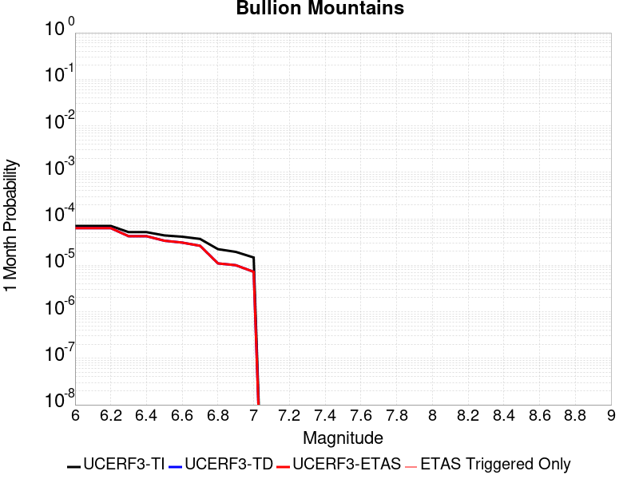 | 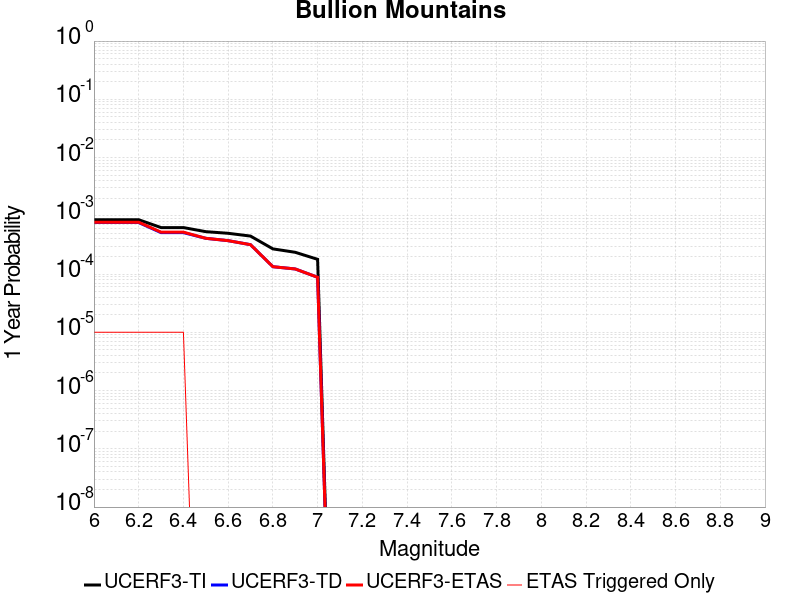 | 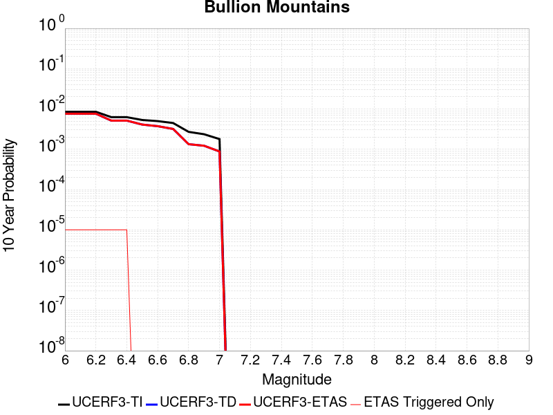 |

| Magnitude | 1 wk TI Prob | 1 wk TD Prob | 1 wk ETAS Prob | 1 wk ETAS/TD Gain | 1 wk ETAS Triggered Only | 1 mo TI Prob | 1 mo TD Prob | 1 mo ETAS Prob | 1 mo ETAS/TD Gain | 1 mo ETAS Triggered Only | 1 yr TI Prob | 1 yr TD Prob | 1 yr ETAS Prob | 1 yr ETAS/TD Gain | 1 yr ETAS Triggered Only | 10 yr TI Prob | 10 yr TD Prob | 10 yr ETAS Prob | 10 yr ETAS/TD Gain | 10 yr ETAS Triggered Only |
|-----|-----|-----|-----|-----|-----|-----|-----|-----|-----|-----|-----|-----|-----|-----|-----|-----|-----|-----|-----|-----|
| 6.0 | 1.6420427E-5 | 1.4692696E-5 | 1.4692696E-5 | 1.0 | 0.0 | 7.037136E-5 | 6.2967396E-5 | 6.2967396E-5 | 1.0 | 0.0 | 8.5643446E-4 | 7.663967E-4 | 7.7638903E-4 | 1.013038 | 1.0E-5 | 0.008531413 | 0.0076413304 | 0.007651254 | 1.0012987 | 1.0E-5 |
| 6.1 | 1.6420427E-5 | 1.4692696E-5 | 1.4692696E-5 | 1.0 | 0.0 | 7.037136E-5 | 6.2967396E-5 | 6.2967396E-5 | 1.0 | 0.0 | 8.5643446E-4 | 7.663967E-4 | 7.7638903E-4 | 1.013038 | 1.0E-5 | 0.008531413 | 0.0076413304 | 0.007651254 | 1.0012987 | 1.0E-5 |
| 6.2 | 1.6420427E-5 | 1.4692696E-5 | 1.4692696E-5 | 1.0 | 0.0 | 7.037136E-5 | 6.2967396E-5 | 6.2967396E-5 | 1.0 | 0.0 | 8.5643446E-4 | 7.663967E-4 | 7.7638903E-4 | 1.013038 | 1.0E-5 | 0.008531413 | 0.0076413304 | 0.007651254 | 1.0012987 | 1.0E-5 |
| 6.3 | 1.2046778E-5 | 9.862754E-6 | 9.862754E-6 | 1.0 | 0.0 | 5.1628023E-5 | 4.226839E-5 | 4.226839E-5 | 1.0 | 0.0 | 6.283899E-4 | 5.1451934E-4 | 5.245142E-4 | 1.0194256 | 1.0E-5 | 0.0062661595 | 0.0051355627 | 0.005145511 | 1.0019372 | 1.0E-5 |
| 6.4 | 1.2046778E-5 | 9.862754E-6 | 9.862754E-6 | 1.0 | 0.0 | 5.1628023E-5 | 4.226839E-5 | 4.226839E-5 | 1.0 | 0.0 | 6.283899E-4 | 5.1451934E-4 | 5.245142E-4 | 1.0194256 | 1.0E-5 | 0.0062661595 | 0.0051355627 | 0.005145511 | 1.0019372 | 1.0E-5 |
| 6.5 | 1.0244343E-5 | 7.879804E-6 | 7.879804E-6 | 1.0 | 0.0 | 4.390359E-5 | 3.3770266E-5 | 3.3770266E-5 | 1.0 | 0.0 | 5.343951E-4 | 4.1109612E-4 | 4.1109612E-4 | 1.0 | 0.0 | 0.005331118 | 0.0041053877 | 0.0041053877 | 1.0 | 0.0 |
| 6.6 | 9.605408E-6 | 7.177816E-6 | 7.177816E-6 | 1.0 | 0.0 | 4.1165385E-5 | 3.076182E-5 | 3.076182E-5 | 1.0 | 0.0 | 5.010733E-4 | 3.7448117E-4 | 3.7448117E-4 | 1.0 | 0.0 | 0.00499945 | 0.0037404983 | 0.0037404983 | 1.0 | 0.0 |
| 6.7 | 8.60418E-6 | 6.124284E-6 | 6.124284E-6 | 1.0 | 0.0 | 3.687454E-5 | 2.6246777E-5 | 2.6246777E-5 | 1.0 | 0.0 | 4.48855E-4 | 3.1952714E-4 | 3.1952714E-4 | 1.0 | 0.0 | 0.004479495 | 0.0031925894 | 0.0031925894 | 1.0 | 0.0 |
| 6.8 | 5.187994E-6 | 2.5633144E-6 | 2.5633144E-6 | 1.0 | 0.0 | 2.223407E-5 | 1.098561E-5 | 1.098561E-5 | 1.0 | 0.0 | 2.7066618E-4 | 1.3374558E-4 | 1.3374558E-4 | 1.0 | 0.0 | 0.0027033675 | 0.0013370425 | 0.0013370425 | 1.0 | 0.0 |
| 6.9 | 4.5302368E-6 | 2.3444445E-6 | 2.3444445E-6 | 1.0 | 0.0 | 1.9415156E-5 | 1.0047603E-5 | 1.0047603E-5 | 1.0 | 0.0 | 2.3635388E-4 | 1.2232667E-4 | 1.2232667E-4 | 1.0 | 0.0 | 0.0023610266 | 0.0012229824 | 0.0012229824 | 1.0 | 0.0 |
| 7.0 | 3.431668E-6 | 1.6883395E-6 | 1.6883395E-6 | 1.0 | 0.0 | 1.4707065E-5 | 7.2357407E-6 | 7.2357407E-6 | 1.0 | 0.0 | 1.7904381E-4 | 8.809514E-5 | 8.809514E-5 | 1.0 | 0.0 | 0.0017889962 | 8.809514E-4 | 8.809514E-4 | 1.0 | 0.0 |

## Camp Rock 2011
*[(top)](#table-of-contents)*

| 1 Week | 1 Month | 1 Year | 10 Year |
|-----|-----|-----|-----|
|  | 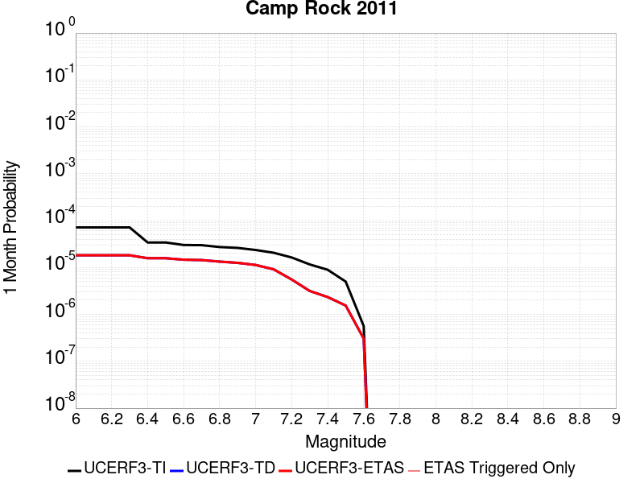 | 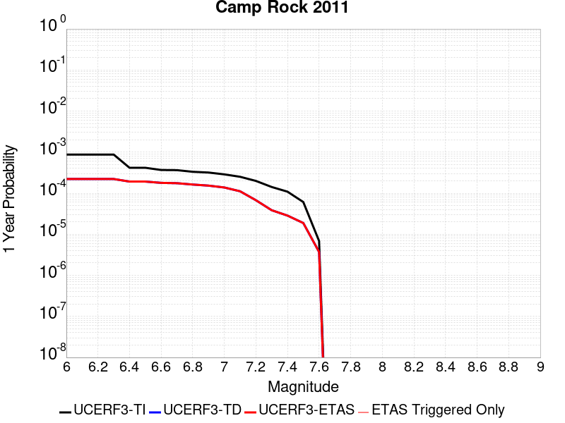 |  |

| Magnitude | 1 wk TI Prob | 1 wk TD Prob | 1 wk ETAS Prob | 1 wk ETAS/TD Gain | 1 wk ETAS Triggered Only | 1 mo TI Prob | 1 mo TD Prob | 1 mo ETAS Prob | 1 mo ETAS/TD Gain | 1 mo ETAS Triggered Only | 1 yr TI Prob | 1 yr TD Prob | 1 yr ETAS Prob | 1 yr ETAS/TD Gain | 1 yr ETAS Triggered Only | 10 yr TI Prob | 10 yr TD Prob | 10 yr ETAS Prob | 10 yr ETAS/TD Gain | 10 yr ETAS Triggered Only |
|-----|-----|-----|-----|-----|-----|-----|-----|-----|-----|-----|-----|-----|-----|-----|-----|-----|-----|-----|-----|-----|
| 6.0 | 1.6710783E-5 | 4.250404E-6 | 4.250404E-6 | 1.0 | 0.0 | 7.161568E-5 | 1.8215893E-5 | 1.8215893E-5 | 1.0 | 0.0 | 8.7157206E-4 | 2.2175645E-4 | 2.2175645E-4 | 1.0 | 0.0 | 0.008681616 | 0.0022154045 | 0.0022253825 | 1.0045038 | 1.0E-5 |
| 6.1 | 1.6710783E-5 | 4.250404E-6 | 4.250404E-6 | 1.0 | 0.0 | 7.161568E-5 | 1.8215893E-5 | 1.8215893E-5 | 1.0 | 0.0 | 8.7157206E-4 | 2.2175645E-4 | 2.2175645E-4 | 1.0 | 0.0 | 0.008681616 | 0.0022154045 | 0.0022253825 | 1.0045038 | 1.0E-5 |
| 6.2 | 1.6710783E-5 | 4.250404E-6 | 4.250404E-6 | 1.0 | 0.0 | 7.161568E-5 | 1.8215893E-5 | 1.8215893E-5 | 1.0 | 0.0 | 8.7157206E-4 | 2.2175645E-4 | 2.2175645E-4 | 1.0 | 0.0 | 0.008681616 | 0.0022154045 | 0.0022253825 | 1.0045038 | 1.0E-5 |
| 6.3 | 1.6710783E-5 | 4.250404E-6 | 4.250404E-6 | 1.0 | 0.0 | 7.161568E-5 | 1.8215893E-5 | 1.8215893E-5 | 1.0 | 0.0 | 8.7157206E-4 | 2.2175645E-4 | 2.2175645E-4 | 1.0 | 0.0 | 0.008681616 | 0.0022154045 | 0.0022253825 | 1.0045038 | 1.0E-5 |
| 6.4 | 7.982846E-6 | 3.6822153E-6 | 3.6822153E-6 | 1.0 | 0.0 | 3.421175E-5 | 1.578083E-5 | 1.578083E-5 | 1.0 | 0.0 | 4.1644843E-4 | 1.9211501E-4 | 1.9211501E-4 | 1.0 | 0.0 | 0.0041566887 | 0.001919524 | 0.0019295049 | 1.0051997 | 1.0E-5 |
| 6.5 | 7.982846E-6 | 3.6822153E-6 | 3.6822153E-6 | 1.0 | 0.0 | 3.421175E-5 | 1.578083E-5 | 1.578083E-5 | 1.0 | 0.0 | 4.1644843E-4 | 1.9211501E-4 | 1.9211501E-4 | 1.0 | 0.0 | 0.0041566887 | 0.001919524 | 0.0019295049 | 1.0051997 | 1.0E-5 |
| 6.6 | 7.048869E-6 | 3.4244786E-6 | 3.4244786E-6 | 1.0 | 0.0 | 3.0209088E-5 | 1.4676256E-5 | 1.4676256E-5 | 1.0 | 0.0 | 3.677336E-4 | 1.7866908E-4 | 1.7866908E-4 | 1.0 | 0.0 | 0.0036712566 | 0.001785286 | 0.0017952682 | 1.0055914 | 1.0E-5 |
| 6.7 | 6.987307E-6 | 3.362455E-6 | 3.362455E-6 | 1.0 | 0.0 | 2.9945259E-5 | 1.4410443E-5 | 1.4410443E-5 | 1.0 | 0.0 | 3.6452254E-4 | 1.7543334E-4 | 1.7543334E-4 | 1.0 | 0.0 | 0.0036392517 | 0.0017529795 | 0.001762962 | 1.0056946 | 1.0E-5 |
| 6.8 | 6.3737602E-6 | 3.118021E-6 | 3.118021E-6 | 1.0 | 0.0 | 2.731583E-5 | 1.336288E-5 | 1.336288E-5 | 1.0 | 0.0 | 3.3251947E-4 | 1.626812E-4 | 1.626812E-4 | 1.0 | 0.0 | 0.0033202237 | 0.0016256497 | 0.0016356335 | 1.0061414 | 1.0E-5 |
| 6.9 | 6.112211E-6 | 2.9332243E-6 | 2.9332243E-6 | 1.0 | 0.0 | 2.6194928E-5 | 1.2570902E-5 | 1.2570902E-5 | 1.0 | 0.0 | 3.1887658E-4 | 1.5304027E-4 | 1.5304027E-4 | 1.0 | 0.0 | 0.003184194 | 0.0015293765 | 0.0015393612 | 1.0065286 | 1.0E-5 |
| 7.0 | 5.5140117E-6 | 2.642019E-6 | 2.642019E-6 | 1.0 | 0.0 | 2.3631264E-5 | 1.1322891E-5 | 1.1322891E-5 | 1.0 | 0.0 | 2.8767265E-4 | 1.3784773E-4 | 1.3784773E-4 | 1.0 | 0.0 | 0.0028730053 | 0.0013776475 | 0.0013876337 | 1.0072488 | 1.0E-5 |
| 7.1 | 4.8151105E-6 | 2.1343515E-6 | 2.1343515E-6 | 1.0 | 0.0 | 2.0636026E-5 | 9.14719E-6 | 9.14719E-6 | 1.0 | 0.0 | 2.5121463E-4 | 1.11361565E-4 | 1.11361565E-4 | 1.0 | 0.0 | 0.0025093083 | 0.0011130795 | 0.0011230684 | 1.0089741 | 1.0E-5 |
| 7.2 | 3.818335E-6 | 1.2938029E-6 | 1.2938029E-6 | 1.0 | 0.0 | 1.6364189E-5 | 5.544858E-6 | 5.544858E-6 | 1.0 | 0.0 | 1.9921579E-4 | 6.750664E-5 | 6.750664E-5 | 1.0 | 0.0 | 0.0019903728 | 6.748696E-4 | 6.748696E-4 | 1.0 | 0.0 |
| 7.3 | 2.7166698E-6 | 7.3840425E-7 | 7.3840425E-7 | 1.0 | 0.0 | 1.1642818E-5 | 3.164586E-6 | 3.164586E-6 | 1.0 | 0.0 | 1.4174209E-4 | 3.8528175E-5 | 3.8528175E-5 | 1.0 | 0.0 | 0.0014165172 | 3.8521693E-4 | 3.8521693E-4 | 1.0 | 0.0 |
| 7.4 | 2.0893426E-6 | 5.4622075E-7 | 5.4622075E-7 | 1.0 | 0.0 | 8.954295E-6 | 2.340944E-6 | 2.340944E-6 | 1.0 | 0.0 | 1.0901308E-4 | 2.8500626E-5 | 2.8500626E-5 | 1.0 | 0.0 | 0.0010895962 | 2.8497024E-4 | 2.8497024E-4 | 1.0 | 0.0 |
| 7.5 | 1.1681728E-6 | 3.6032552E-7 | 3.6032552E-7 | 1.0 | 0.0 | 5.0064455E-6 | 1.5442513E-6 | 1.5442513E-6 | 1.0 | 0.0 | 6.0951766E-5 | 1.8801102E-5 | 1.8801102E-5 | 1.0 | 0.0 | 6.093505E-4 | 1.8799558E-4 | 1.8799558E-4 | 1.0 | 0.0 |
| 7.6 | 1.3154387E-7 | 7.119984E-8 | 7.119984E-8 | 1.0 | 0.0 | 5.6375933E-7 | 3.0514218E-7 | 3.0514218E-7 | 1.0 | 0.0 | 6.863748E-6 | 3.7151012E-6 | 3.7151012E-6 | 1.0 | 0.0 | 6.863536E-5 | 3.715055E-5 | 3.715055E-5 | 1.0 | 0.0 |

## Mendocino
*[(top)](#table-of-contents)*

| 1 Week | 1 Month | 1 Year | 10 Year |
|-----|-----|-----|-----|
| 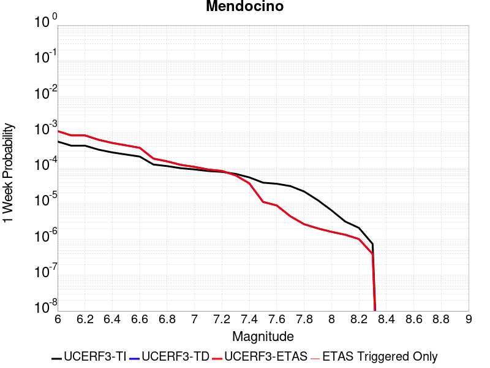 |  | 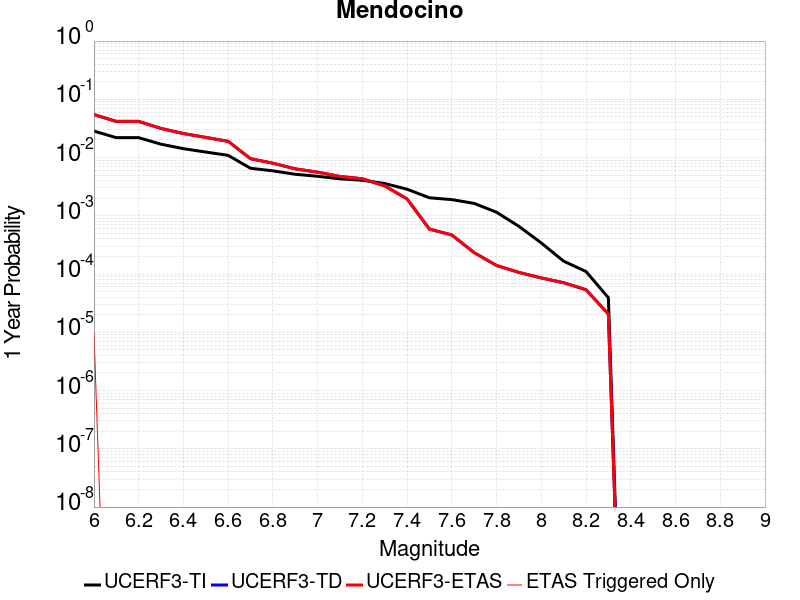 |  |

| Magnitude | 1 wk TI Prob | 1 wk TD Prob | 1 wk ETAS Prob | 1 wk ETAS/TD Gain | 1 wk ETAS Triggered Only | 1 mo TI Prob | 1 mo TD Prob | 1 mo ETAS Prob | 1 mo ETAS/TD Gain | 1 mo ETAS Triggered Only | 1 yr TI Prob | 1 yr TD Prob | 1 yr ETAS Prob | 1 yr ETAS/TD Gain | 1 yr ETAS Triggered Only | 10 yr TI Prob | 10 yr TD Prob | 10 yr ETAS Prob | 10 yr ETAS/TD Gain | 10 yr ETAS Triggered Only |
|-----|-----|-----|-----|-----|-----|-----|-----|-----|-----|-----|-----|-----|-----|-----|-----|-----|-----|-----|-----|-----|
| 6.0 | 5.5409013E-4 | 0.001083651 | 0.001083651 | 1.0 | 0.0 | 0.0023725112 | 0.0046359347 | 0.0046359347 | 1.0 | 0.0 | 0.028505474 | 0.054677866 | 0.05468732 | 1.0001729 | 1.0E-5 | 0.25113493 | 0.4119154 | 0.41192126 | 1.0000143 | 1.0E-5 |
| 6.1 | 4.2515888E-4 | 8.2302326E-4 | 8.2302326E-4 | 1.0 | 0.0 | 0.0018208373 | 0.0035223814 | 0.0035223814 | 1.0 | 0.0 | 0.021944538 | 0.041754782 | 0.041754782 | 1.0 | 0.0 | 0.19899574 | 0.32998735 | 0.32998735 | 1.0 | 0.0 |
| 6.2 | 4.2515888E-4 | 8.2302326E-4 | 8.2302326E-4 | 1.0 | 0.0 | 0.0018208373 | 0.0035223814 | 0.0035223814 | 1.0 | 0.0 | 0.021944538 | 0.041754782 | 0.041754782 | 1.0 | 0.0 | 0.19899574 | 0.32998735 | 0.32998735 | 1.0 | 0.0 |
| 6.3 | 3.2773745E-4 | 6.1941496E-4 | 6.1941496E-4 | 1.0 | 0.0 | 0.0014038329 | 0.0026517813 | 0.0026517813 | 1.0 | 0.0 | 0.016958237 | 0.03159848 | 0.03159848 | 1.0 | 0.0 | 0.1572094 | 0.26081 | 0.26081 | 1.0 | 0.0 |
| 6.4 | 2.7417165E-4 | 5.047014E-4 | 5.047014E-4 | 1.0 | 0.0 | 0.0011744922 | 0.0021611678 | 0.0021611678 | 1.0 | 0.0 | 0.014205975 | 0.025843335 | 0.025843335 | 1.0 | 0.0 | 0.13331394 | 0.2195122 | 0.2195122 | 1.0 | 0.0 |
| 6.5 | 2.3984899E-4 | 4.3237774E-4 | 4.3237774E-4 | 1.0 | 0.0 | 0.0010275192 | 0.001851721 | 0.001851721 | 1.0 | 0.0 | 0.012438473 | 0.022186391 | 0.022186391 | 1.0 | 0.0 | 0.11764851 | 0.19206886 | 0.19206886 | 1.0 | 0.0 |
| 6.6 | 2.1023539E-4 | 3.6941626E-4 | 3.6941626E-4 | 1.0 | 0.0 | 9.0069766E-4 | 0.0015823409 | 0.0015823409 | 1.0 | 0.0 | 0.010910975 | 0.01899545 | 0.01899545 | 1.0 | 0.0 | 0.10390546 | 0.16752551 | 0.16752551 | 1.0 | 0.0 |
| 6.7 | 1.2592976E-4 | 1.8422105E-4 | 1.8422105E-4 | 1.0 | 0.0 | 5.395873E-4 | 7.892804E-4 | 7.892804E-4 | 1.0 | 0.0 | 0.006549705 | 0.009559587 | 0.009559587 | 1.0 | 0.0 | 0.063599944 | 0.091002084 | 0.091002084 | 1.0 | 0.0 |
| 6.8 | 1.13663555E-4 | 1.5408579E-4 | 1.5408579E-4 | 1.0 | 0.0 | 4.8703855E-4 | 6.601995E-4 | 6.601995E-4 | 1.0 | 0.0 | 0.0059135845 | 0.008003613 | 0.008003613 | 1.0 | 0.0 | 0.057586733 | 0.077425025 | 0.077425025 | 1.0 | 0.0 |
| 6.9 | 9.926894E-5 | 1.2305094E-4 | 1.2305094E-4 | 1.0 | 0.0 | 4.2536893E-4 | 5.2725495E-4 | 5.2725495E-4 | 1.0 | 0.0 | 0.0051665753 | 0.006400107 | 0.006400107 | 1.0 | 0.0 | 0.050480947 | 0.06289064 | 0.06289064 | 1.0 | 0.0 |
| 7.0 | 9.168125E-5 | 1.0789747E-4 | 1.0789747E-4 | 1.0 | 0.0 | 3.9286047E-4 | 4.623365E-4 | 4.623365E-4 | 1.0 | 0.0 | 0.004772591 | 0.005614124 | 0.005614124 | 1.0 | 0.0 | 0.04671385 | 0.055651132 | 0.055651132 | 1.0 | 0.0 |
| 7.1 | 8.2854116E-5 | 9.110904E-5 | 9.110904E-5 | 1.0 | 0.0 | 3.5504074E-4 | 3.904097E-4 | 3.904097E-4 | 1.0 | 0.0 | 0.004314056 | 0.004742886 | 0.004742886 | 1.0 | 0.0 | 0.042312626 | 0.047509648 | 0.047509648 | 1.0 | 0.0 |
| 7.2 | 7.8255274E-5 | 8.305945E-5 | 8.305945E-5 | 1.0 | 0.0 | 3.3533663E-4 | 3.559213E-4 | 3.559213E-4 | 1.0 | 0.0 | 0.0040750825 | 0.0043248776 | 0.0043248776 | 1.0 | 0.0 | 0.040011603 | 0.0435536 | 0.0435536 | 1.0 | 0.0 |
| 7.3 | 6.887904E-5 | 6.263606E-5 | 6.263606E-5 | 1.0 | 0.0 | 2.9516246E-4 | 2.684132E-4 | 2.684132E-4 | 1.0 | 0.0 | 0.0035876823 | 0.003263129 | 0.003263129 | 1.0 | 0.0 | 0.035303112 | 0.03337632 | 0.03337632 | 1.0 | 0.0 |
| 7.4 | 5.4898497E-5 | 3.743381E-5 | 3.743381E-5 | 1.0 | 0.0 | 2.3525805E-4 | 1.6042107E-4 | 1.6042107E-4 | 1.0 | 0.0 | 0.0028605047 | 0.0019514329 | 0.0019514329 | 1.0 | 0.0 | 0.02823963 | 0.020429276 | 0.020429276 | 1.0 | 0.0 |
| 7.5 | 3.9103943E-5 | 1.132596E-5 | 1.132596E-5 | 1.0 | 0.0 | 1.6757756E-4 | 4.8538936E-5 | 4.8538936E-5 | 1.0 | 0.0 | 0.0020383475 | 5.9080287E-4 | 5.9080287E-4 | 1.0 | 0.0 | 0.020197518 | 0.0066350647 | 0.0066350647 | 1.0 | 0.0 |
| 7.6 | 3.641042E-5 | 9.000891E-6 | 9.000891E-6 | 1.0 | 0.0 | 1.5603533E-4 | 3.8574686E-5 | 3.8574686E-5 | 1.0 | 0.0 | 0.0018980748 | 4.6954694E-4 | 4.6954694E-4 | 1.0 | 0.0 | 0.018819444 | 0.005357927 | 0.005357927 | 1.0 | 0.0 |
| 7.7 | 3.1318774E-5 | 4.4682E-6 | 4.4682E-6 | 1.0 | 0.0 | 1.342164E-4 | 1.9149289E-5 | 1.9149289E-5 | 1.0 | 0.0 | 0.0016328598 | 2.3311784E-4 | 2.3311784E-4 | 1.0 | 0.0 | 0.016209139 | 0.002873936 | 0.002873936 | 1.0 | 0.0 |
| 7.8 | 2.209241E-5 | 2.6900907E-6 | 2.6900907E-6 | 1.0 | 0.0 | 9.467832E-5 | 1.15289085E-5 | 1.15289085E-5 | 1.0 | 0.0 | 0.001152099 | 1.4035545E-4 | 1.4035545E-4 | 1.0 | 0.0 | 0.011461443 | 0.0017431572 | 0.0017431572 | 1.0 | 0.0 |
| 7.9 | 1.2640477E-5 | 2.0485606E-6 | 2.0485606E-6 | 1.0 | 0.0 | 5.4172346E-5 | 8.779516E-6 | 8.779516E-6 | 1.0 | 0.0 | 6.593487E-4 | 1.0688539E-4 | 1.0688539E-4 | 1.0 | 0.0 | 0.006573958 | 0.0013018542 | 0.0013018542 | 1.0 | 0.0 |
| 8.0 | 6.5548907E-6 | 1.6436068E-6 | 1.6436068E-6 | 1.0 | 0.0 | 2.8092087E-5 | 7.04401E-6 | 7.04401E-6 | 1.0 | 0.0 | 3.4196748E-4 | 8.575747E-5 | 8.575747E-5 | 1.0 | 0.0 | 0.0034144172 | 0.0010338966 | 0.0010338966 | 1.0 | 0.0 |
| 8.1 | 3.1916707E-6 | 1.3625356E-6 | 1.3625356E-6 | 1.0 | 0.0 | 1.3678517E-5 | 5.8394253E-6 | 5.8394253E-6 | 1.0 | 0.0 | 1.6652321E-4 | 7.1092705E-5 | 7.1092705E-5 | 1.0 | 0.0 | 0.0016639848 | 8.651916E-4 | 8.651916E-4 | 1.0 | 0.0 |
| 8.2 | 2.1193785E-6 | 1.0332769E-6 | 1.0332769E-6 | 1.0 | 0.0 | 9.083019E-6 | 4.4283224E-6 | 4.4283224E-6 | 1.0 | 0.0 | 1.1058014E-4 | 5.391351E-5 | 5.391351E-5 | 1.0 | 0.0 | 0.0011052513 | 6.5208826E-4 | 6.5208826E-4 | 1.0 | 0.0 |
| 8.3 | 7.536878E-7 | 3.9382627E-7 | 3.9382627E-7 | 1.0 | 0.0 | 3.2300866E-6 | 1.6878259E-6 | 1.6878259E-6 | 1.0 | 0.0 | 3.9325594E-5 | 2.05491E-5 | 2.05491E-5 | 1.0 | 0.0 | 3.9318635E-4 | 2.4192063E-4 | 2.4192063E-4 | 1.0 | 0.0 |

## South Klamath Lake East
*[(top)](#table-of-contents)*

| 1 Week | 1 Month | 1 Year | 10 Year |
|-----|-----|-----|-----|
|  |  | 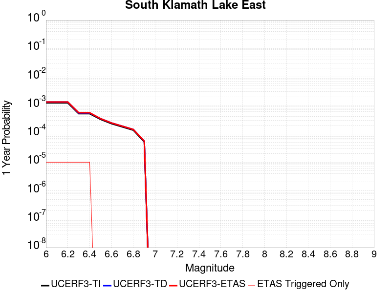 | 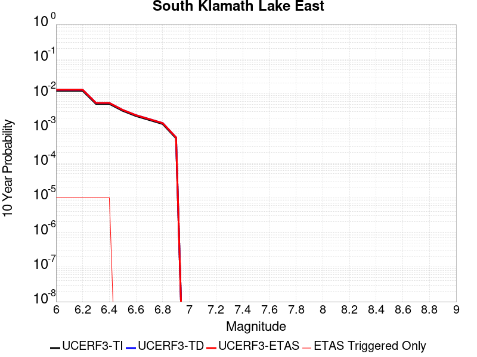 |

| Magnitude | 1 wk TI Prob | 1 wk TD Prob | 1 wk ETAS Prob | 1 wk ETAS/TD Gain | 1 wk ETAS Triggered Only | 1 mo TI Prob | 1 mo TD Prob | 1 mo ETAS Prob | 1 mo ETAS/TD Gain | 1 mo ETAS Triggered Only | 1 yr TI Prob | 1 yr TD Prob | 1 yr ETAS Prob | 1 yr ETAS/TD Gain | 1 yr ETAS Triggered Only | 10 yr TI Prob | 10 yr TD Prob | 10 yr ETAS Prob | 10 yr ETAS/TD Gain | 10 yr ETAS Triggered Only |
|-----|-----|-----|-----|-----|-----|-----|-----|-----|-----|-----|-----|-----|-----|-----|-----|-----|-----|-----|-----|-----|
| 6.0 | 2.3539369E-5 | 2.5047904E-5 | 2.5047904E-5 | 1.0 | 0.0 | 1.0087911E-4 | 1.0734421E-4 | 1.0734421E-4 | 1.0 | 0.0 | 0.0012275111 | 0.0013062154 | 0.0013162025 | 1.0076457 | 1.0E-5 | 0.012207527 | 0.012993725 | 0.013003595 | 1.0007596 | 1.0E-5 |
| 6.1 | 2.3539369E-5 | 2.5047904E-5 | 2.5047904E-5 | 1.0 | 0.0 | 1.0087911E-4 | 1.0734421E-4 | 1.0734421E-4 | 1.0 | 0.0 | 0.0012275111 | 0.0013062154 | 0.0013162025 | 1.0076457 | 1.0E-5 | 0.012207527 | 0.012993725 | 0.013003595 | 1.0007596 | 1.0E-5 |
| 6.2 | 2.3539369E-5 | 2.5047904E-5 | 2.5047904E-5 | 1.0 | 0.0 | 1.0087911E-4 | 1.0734421E-4 | 1.0734421E-4 | 1.0 | 0.0 | 0.0012275111 | 0.0013062154 | 0.0013162025 | 1.0076457 | 1.0E-5 | 0.012207527 | 0.012993725 | 0.013003595 | 1.0007596 | 1.0E-5 |
| 6.3 | 9.807823E-6 | 1.0396275E-5 | 1.0396275E-5 | 1.0 | 0.0 | 4.2032847E-5 | 4.4554752E-5 | 4.4554752E-5 | 1.0 | 0.0 | 5.1162974E-4 | 5.4232747E-4 | 5.52322E-4 | 1.018429 | 1.0E-5 | 0.005104534 | 0.005410876 | 0.005420822 | 1.0018381 | 1.0E-5 |
| 6.4 | 9.807823E-6 | 1.0396275E-5 | 1.0396275E-5 | 1.0 | 0.0 | 4.2032847E-5 | 4.4554752E-5 | 4.4554752E-5 | 1.0 | 0.0 | 5.1162974E-4 | 5.4232747E-4 | 5.52322E-4 | 1.018429 | 1.0E-5 | 0.005104534 | 0.005410876 | 0.005420822 | 1.0018381 | 1.0E-5 |
| 6.5 | 6.191981E-6 | 6.550981E-6 | 6.550981E-6 | 1.0 | 0.0 | 2.653679E-5 | 2.8075347E-5 | 2.8075347E-5 | 1.0 | 0.0 | 3.2303753E-4 | 3.417665E-4 | 3.417665E-4 | 1.0 | 0.0 | 0.0032256835 | 0.0034126875 | 0.0034126875 | 1.0 | 0.0 |
| 6.6 | 4.3693776E-6 | 4.6166547E-6 | 4.6166547E-6 | 1.0 | 0.0 | 1.8725768E-5 | 1.9785519E-5 | 1.9785519E-5 | 1.0 | 0.0 | 2.2796239E-4 | 2.4086318E-4 | 2.4086318E-4 | 1.0 | 0.0 | 0.0022772867 | 0.0024061338 | 0.0024061338 | 1.0 | 0.0 |
| 6.7 | 3.360834E-6 | 3.5513149E-6 | 3.5513149E-6 | 1.0 | 0.0 | 1.4403494E-5 | 1.5219837E-5 | 1.5219837E-5 | 1.0 | 0.0 | 1.7534842E-4 | 1.8528657E-4 | 1.8528657E-4 | 1.0 | 0.0 | 0.0017521014 | 0.0018514008 | 0.0018514008 | 1.0 | 0.0 |
| 6.8 | 2.57873E-6 | 2.7252283E-6 | 2.7252283E-6 | 1.0 | 0.0 | 1.1051653E-5 | 1.1679501E-5 | 1.1679501E-5 | 1.0 | 0.0 | 1.3454557E-4 | 1.4218927E-4 | 1.4218927E-4 | 1.0 | 0.0 | 0.0013446413 | 0.0014210435 | 0.0014210435 | 1.0 | 0.0 |
| 6.9 | 9.987825E-7 | 1.056644E-6 | 1.056644E-6 | 1.0 | 0.0 | 4.2804895E-6 | 4.5284683E-6 | 4.5284683E-6 | 1.0 | 0.0 | 5.211371E-5 | 5.5133034E-5 | 5.5133034E-5 | 1.0 | 0.0 | 5.210149E-4 | 5.5122573E-4 | 5.5122573E-4 | 1.0 | 0.0 |

## San Luis Range - Oceano 2011 CFM
*[(top)](#table-of-contents)*

| 1 Week | 1 Month | 1 Year | 10 Year |
|-----|-----|-----|-----|
|  |  |  |  |

| Magnitude | 1 wk TI Prob | 1 wk TD Prob | 1 wk ETAS Prob | 1 wk ETAS/TD Gain | 1 wk ETAS Triggered Only | 1 mo TI Prob | 1 mo TD Prob | 1 mo ETAS Prob | 1 mo ETAS/TD Gain | 1 mo ETAS Triggered Only | 1 yr TI Prob | 1 yr TD Prob | 1 yr ETAS Prob | 1 yr ETAS/TD Gain | 1 yr ETAS Triggered Only | 10 yr TI Prob | 10 yr TD Prob | 10 yr ETAS Prob | 10 yr ETAS/TD Gain | 10 yr ETAS Triggered Only |
|-----|-----|-----|-----|-----|-----|-----|-----|-----|-----|-----|-----|-----|-----|-----|-----|-----|-----|-----|-----|-----|
| 6.0 | 1.6025788E-6 | 1.6201255E-6 | 1.6201255E-6 | 1.0 | 0.0 | 6.8681766E-6 | 6.943379E-6 | 6.943379E-6 | 1.0 | 0.0 | 8.361684E-5 | 8.4532774E-5 | 9.453193E-5 | 1.1182873 | 1.0E-5 | 8.3585386E-4 | 8.45047E-4 | 8.550386E-4 | 1.0118237 | 1.0E-5 |
| 6.1 | 1.6025788E-6 | 1.6201255E-6 | 1.6201255E-6 | 1.0 | 0.0 | 6.8681766E-6 | 6.943379E-6 | 6.943379E-6 | 1.0 | 0.0 | 8.361684E-5 | 8.4532774E-5 | 9.453193E-5 | 1.1182873 | 1.0E-5 | 8.3585386E-4 | 8.45047E-4 | 8.550386E-4 | 1.0118237 | 1.0E-5 |
| 6.2 | 1.6025788E-6 | 1.6201255E-6 | 1.6201255E-6 | 1.0 | 0.0 | 6.8681766E-6 | 6.943379E-6 | 6.943379E-6 | 1.0 | 0.0 | 8.361684E-5 | 8.4532774E-5 | 9.453193E-5 | 1.1182873 | 1.0E-5 | 8.3585386E-4 | 8.45047E-4 | 8.550386E-4 | 1.0118237 | 1.0E-5 |
| 6.3 | 1.6025788E-6 | 1.6201255E-6 | 1.6201255E-6 | 1.0 | 0.0 | 6.8681766E-6 | 6.943379E-6 | 6.943379E-6 | 1.0 | 0.0 | 8.361684E-5 | 8.4532774E-5 | 9.453193E-5 | 1.1182873 | 1.0E-5 | 8.3585386E-4 | 8.45047E-4 | 8.550386E-4 | 1.0118237 | 1.0E-5 |
| 6.4 | 1.1621186E-6 | 1.1749943E-6 | 1.1749943E-6 | 1.0 | 0.0 | 4.980499E-6 | 5.0356816E-6 | 5.0356816E-6 | 1.0 | 0.0 | 6.0635884E-5 | 6.130797E-5 | 7.130735E-5 | 1.163101 | 1.0E-5 | 6.0619344E-4 | 6.1293715E-4 | 6.2293105E-4 | 1.0163049 | 1.0E-5 |
| 6.5 | 1.1621186E-6 | 1.1749943E-6 | 1.1749943E-6 | 1.0 | 0.0 | 4.980499E-6 | 5.0356816E-6 | 5.0356816E-6 | 1.0 | 0.0 | 6.0635884E-5 | 6.130797E-5 | 7.130735E-5 | 1.163101 | 1.0E-5 | 6.0619344E-4 | 6.1293715E-4 | 6.2293105E-4 | 1.0163049 | 1.0E-5 |
| 6.6 | 7.164729E-7 | 7.2486097E-7 | 7.2486097E-7 | 1.0 | 0.0 | 3.0705946E-6 | 3.1065435E-6 | 3.1065435E-6 | 1.0 | 0.0 | 3.738385E-5 | 3.7821526E-5 | 3.7821526E-5 | 1.0 | 0.0 | 3.737756E-4 | 3.7815268E-4 | 3.7815268E-4 | 1.0 | 0.0 |
| 6.7 | 7.164729E-7 | 7.2486097E-7 | 7.2486097E-7 | 1.0 | 0.0 | 3.0705946E-6 | 3.1065435E-6 | 3.1065435E-6 | 1.0 | 0.0 | 3.738385E-5 | 3.7821526E-5 | 3.7821526E-5 | 1.0 | 0.0 | 3.737756E-4 | 3.7815268E-4 | 3.7815268E-4 | 1.0 | 0.0 |
| 6.8 | 6.700177E-7 | 6.7774687E-7 | 6.7774687E-7 | 1.0 | 0.0 | 2.8715012E-6 | 2.9046264E-6 | 2.9046264E-6 | 1.0 | 0.0 | 3.495997E-5 | 3.5363268E-5 | 3.5363268E-5 | 1.0 | 0.0 | 3.495447E-4 | 3.5357804E-4 | 3.5357804E-4 | 1.0 | 0.0 |
| 6.9 | 5.657865E-7 | 5.72181E-7 | 5.72181E-7 | 1.0 | 0.0 | 2.424797E-6 | 2.4522024E-6 | 2.4522024E-6 | 1.0 | 0.0 | 2.9521503E-5 | 2.9855164E-5 | 2.9855164E-5 | 1.0 | 0.0 | 2.9517582E-4 | 2.985126E-4 | 2.985126E-4 | 1.0 | 0.0 |
| 7.0 | 4.608413E-7 | 4.6601886E-7 | 4.6601886E-7 | 1.0 | 0.0 | 1.9750328E-6 | 1.9972222E-6 | 1.9972222E-6 | 1.0 | 0.0 | 2.4045758E-5 | 2.4315912E-5 | 2.4315912E-5 | 1.0 | 0.0 | 2.4043156E-4 | 2.431328E-4 | 2.431328E-4 | 1.0 | 0.0 |
| 7.1 | 3.9177846E-7 | 3.962177E-7 | 3.962177E-7 | 1.0 | 0.0 | 1.6790494E-6 | 1.6980748E-6 | 1.6980748E-6 | 1.0 | 0.0 | 2.0442236E-5 | 2.0673866E-5 | 2.0673866E-5 | 1.0 | 0.0 | 2.0440355E-4 | 2.0671957E-4 | 2.0671957E-4 | 1.0 | 0.0 |
| 7.2 | 3.3974752E-7 | 3.4366678E-7 | 3.4366678E-7 | 1.0 | 0.0 | 1.45606E-6 | 1.4728568E-6 | 1.4728568E-6 | 1.0 | 0.0 | 1.7727387E-5 | 1.7931885E-5 | 1.7931885E-5 | 1.0 | 0.0 | 1.7725973E-4 | 1.793045E-4 | 1.793045E-4 | 1.0 | 0.0 |
| 7.3 | 2.8900928E-7 | 2.9234144E-7 | 2.9234144E-7 | 1.0 | 0.0 | 1.2386106E-6 | 1.2528913E-6 | 1.2528913E-6 | 1.0 | 0.0 | 1.5079979E-5 | 1.5253845E-5 | 1.5253845E-5 | 1.0 | 0.0 | 1.5078956E-4 | 1.5252807E-4 | 1.5252807E-4 | 1.0 | 0.0 |
| 7.4 | 2.1881527E-7 | 2.2139692E-7 | 2.2139692E-7 | 1.0 | 0.0 | 9.3777936E-7 | 9.488436E-7 | 9.488436E-7 | 1.0 | 0.0 | 1.14174045E-5 | 1.155211E-5 | 1.155211E-5 | 1.0 | 0.0 | 1.1416818E-4 | 1.1551515E-4 | 1.1551515E-4 | 1.0 | 0.0 |
| 7.5 | 1.356398E-7 | 1.3718697E-7 | 1.3718697E-7 | 1.0 | 0.0 | 5.813133E-7 | 5.8794404E-7 | 5.8794404E-7 | 1.0 | 0.0 | 7.0774663E-6 | 7.1581953E-6 | 7.1581953E-6 | 1.0 | 0.0 | 7.077241E-5 | 7.157968E-5 | 7.157968E-5 | 1.0 | 0.0 |
| 7.6 | 5.9269272E-8 | 6.0013924E-8 | 6.0013924E-8 | 1.0 | 0.0 | 2.5401116E-7 | 2.5720252E-7 | 2.5720252E-7 | 1.0 | 0.0 | 3.0925814E-6 | 3.1314362E-6 | 3.1314362E-6 | 1.0 | 0.0 | 3.0925385E-5 | 3.131393E-5 | 3.131393E-5 | 1.0 | 0.0 |
| 7.7 | 5.946232E-9 | 6.036962E-9 | 6.036962E-9 | 1.0 | 0.0 | 2.5483851E-8 | 2.5872696E-8 | 2.5872696E-8 | 1.0 | 0.0 | 3.1026585E-7 | 3.1500002E-7 | 3.1500002E-7 | 1.0 | 0.0 | 3.102654E-6 | 3.1499967E-6 | 3.1499967E-6 | 1.0 | 0.0 |

## Rodgers Creek - Healdsburg 2011 CFM
*[(top)](#table-of-contents)*

| 1 Week | 1 Month | 1 Year | 10 Year |
|-----|-----|-----|-----|
| 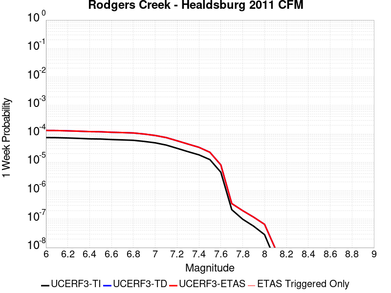 |  | 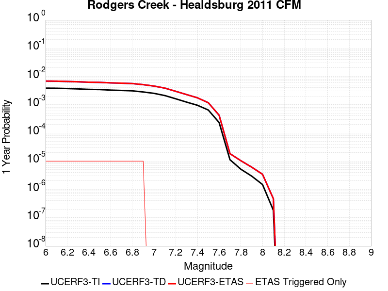 | 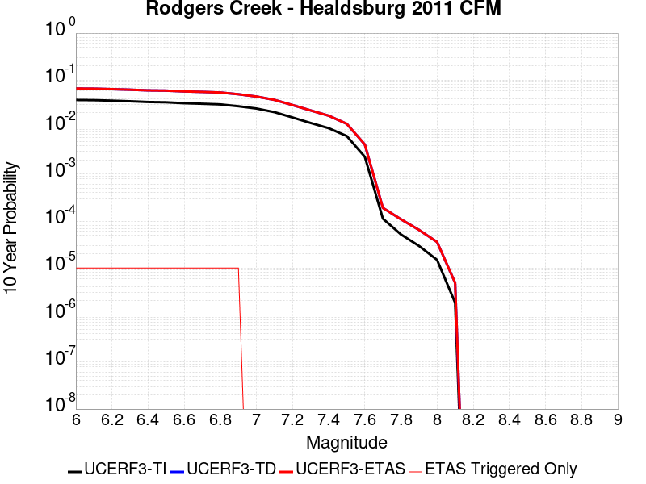 |

| Magnitude | 1 wk TI Prob | 1 wk TD Prob | 1 wk ETAS Prob | 1 wk ETAS/TD Gain | 1 wk ETAS Triggered Only | 1 mo TI Prob | 1 mo TD Prob | 1 mo ETAS Prob | 1 mo ETAS/TD Gain | 1 mo ETAS Triggered Only | 1 yr TI Prob | 1 yr TD Prob | 1 yr ETAS Prob | 1 yr ETAS/TD Gain | 1 yr ETAS Triggered Only | 10 yr TI Prob | 10 yr TD Prob | 10 yr ETAS Prob | 10 yr ETAS/TD Gain | 10 yr ETAS Triggered Only |
|-----|-----|-----|-----|-----|-----|-----|-----|-----|-----|-----|-----|-----|-----|-----|-----|-----|-----|-----|-----|-----|
| 6.0 | 7.390182E-5 | 1.3141868E-4 | 1.3141868E-4 | 1.0 | 0.0 | 3.1668364E-4 | 5.6309934E-4 | 5.6309934E-4 | 1.0 | 0.0 | 0.0038488081 | 0.00683421 | 0.0068441415 | 1.0014533 | 1.0E-5 | 0.037828278 | 0.066216126 | 0.06622546 | 1.000141 | 1.0E-5 |
| 6.1 | 7.318768E-5 | 1.3039859E-4 | 1.3039859E-4 | 1.0 | 0.0 | 3.1362378E-4 | 5.587319E-4 | 5.587319E-4 | 1.0 | 0.0 | 0.0038116854 | 0.0067813764 | 0.0067913085 | 1.0014646 | 1.0E-5 | 0.037469655 | 0.065720685 | 0.06573003 | 1.0001422 | 1.0E-5 |
| 6.2 | 7.1379836E-5 | 1.2732689E-4 | 1.2732689E-4 | 1.0 | 0.0 | 3.058777E-4 | 5.4557296E-4 | 5.4557296E-4 | 1.0 | 0.0 | 0.003717703 | 0.006622149 | 0.0066320826 | 1.0015001 | 1.0E-5 | 0.0365612 | 0.064238794 | 0.06424815 | 1.0001457 | 1.0E-5 |
| 6.3 | 6.9255926E-5 | 1.2387196E-4 | 1.2387196E-4 | 1.0 | 0.0 | 2.9677735E-4 | 5.307722E-4 | 5.307722E-4 | 1.0 | 0.0 | 0.0036072785 | 0.0064430316 | 0.006452967 | 1.0015421 | 1.0E-5 | 0.035492823 | 0.062565 | 0.06257437 | 1.0001498 | 1.0E-5 |
| 6.4 | 6.6757144E-5 | 1.19638345E-4 | 1.19638345E-4 | 1.0 | 0.0 | 2.8607066E-4 | 5.1263545E-4 | 5.1263545E-4 | 1.0 | 0.0 | 0.0034773487 | 0.0062235445 | 0.0062334826 | 1.0015968 | 1.0E-5 | 0.034234364 | 0.060514115 | 0.06052351 | 1.0001552 | 1.0E-5 |
| 6.5 | 6.5735134E-5 | 1.18128686E-4 | 1.18128686E-4 | 1.0 | 0.0 | 2.8169158E-4 | 5.06168E-4 | 5.06168E-4 | 1.0 | 0.0 | 0.003424202 | 0.006145268 | 0.006155207 | 1.0016173 | 1.0E-5 | 0.03371918 | 0.059777845 | 0.059787244 | 1.0001572 | 1.0E-5 |
| 6.6 | 6.289601E-5 | 1.1348193E-4 | 1.1348193E-4 | 1.0 | 0.0 | 2.6952647E-4 | 4.862609E-4 | 4.862609E-4 | 1.0 | 0.0 | 0.0032765474 | 0.0059042363 | 0.0059141773 | 1.0016837 | 1.0E-5 | 0.032286562 | 0.05751525 | 0.057524674 | 1.0001639 | 1.0E-5 |
| 6.7 | 6.115274E-5 | 1.1065132E-4 | 1.1065132E-4 | 1.0 | 0.0 | 2.6205686E-4 | 4.7413417E-4 | 4.7413417E-4 | 1.0 | 0.0 | 0.0031858748 | 0.005757383 | 0.005767326 | 1.0017269 | 1.0E-5 | 0.031405866 | 0.05613307 | 0.05614251 | 1.0001682 | 1.0E-5 |
| 6.8 | 5.9232367E-5 | 1.07324486E-4 | 1.07324486E-4 | 1.0 | 0.0 | 2.538283E-4 | 4.5988135E-4 | 4.5988135E-4 | 1.0 | 0.0 | 0.0030859804 | 0.005584758 | 0.005594702 | 1.0017806 | 1.0E-5 | 0.030434765 | 0.054499708 | 0.054509163 | 1.0001734 | 1.0E-5 |
| 6.9 | 5.4030377E-5 | 9.826568E-5 | 9.826568E-5 | 1.0 | 0.0 | 2.315382E-4 | 4.21071E-4 | 4.21071E-4 | 1.0 | 0.0 | 0.0028153337 | 0.005114555 | 0.0051245037 | 1.0019453 | 1.0E-5 | 0.027799325 | 0.050034847 | 0.050044347 | 1.0001899 | 1.0E-5 |
| 7.0 | 4.8260714E-5 | 8.744557E-5 | 8.744557E-5 | 1.0 | 0.0 | 2.0681522E-4 | 3.7471319E-4 | 3.7471319E-4 | 1.0 | 0.0 | 0.0025150678 | 0.004552644 | 0.004552644 | 1.0 | 0.0 | 0.024867928 | 0.044687025 | 0.044687025 | 1.0 | 0.0 |
| 7.1 | 4.0294493E-5 | 7.392394E-5 | 7.392394E-5 | 1.0 | 0.0 | 1.7267925E-4 | 3.1677863E-4 | 3.1677863E-4 | 1.0 | 0.0 | 0.0021003427 | 0.0038499974 | 0.0038499974 | 1.0 | 0.0 | 0.02080602 | 0.03793959 | 0.03793959 | 1.0 | 0.0 |
| 7.2 | 3.096388E-5 | 5.7009802E-5 | 5.7009802E-5 | 1.0 | 0.0 | 1.326956E-4 | 2.4430497E-4 | 2.4430497E-4 | 1.0 | 0.0 | 0.0016143717 | 0.002970378 | 0.002970378 | 1.0 | 0.0 | 0.01602694 | 0.029452734 | 0.029452734 | 1.0 | 0.0 |
| 7.3 | 2.3615226E-5 | 4.365828E-5 | 4.365828E-5 | 1.0 | 0.0 | 1.0120418E-4 | 1.8709358E-4 | 1.8709358E-4 | 1.0 | 0.0 | 0.0012314644 | 0.0022754984 | 0.0022754984 | 1.0 | 0.0 | 0.0122466255 | 0.02265186 | 0.02265186 | 1.0 | 0.0 |
| 7.4 | 1.8251132E-5 | 3.3568707E-5 | 3.3568707E-5 | 1.0 | 0.0 | 7.821679E-5 | 1.4385801E-4 | 1.4385801E-4 | 1.0 | 0.0 | 9.518733E-4 | 0.0017500741 | 0.0017500741 | 1.0 | 0.0 | 0.009478063 | 0.017479211 | 0.017479211 | 1.0 | 0.0 |
| 7.5 | 1.2411432E-5 | 2.24819E-5 | 2.24819E-5 | 1.0 | 0.0 | 5.3190768E-5 | 9.6347474E-5 | 9.6347474E-5 | 1.0 | 0.0 | 6.4740516E-4 | 0.0011724051 | 0.0011724051 | 1.0 | 0.0 | 0.006455223 | 0.01175418 | 0.01175418 | 1.0 | 0.0 |
| 7.6 | 4.4771446E-6 | 8.090266E-6 | 8.090266E-6 | 1.0 | 0.0 | 1.918762E-5 | 3.4672117E-5 | 3.4672117E-5 | 1.0 | 0.0 | 2.3358424E-4 | 4.220525E-4 | 4.220525E-4 | 1.0 | 0.0 | 0.0023333887 | 0.0042491667 | 0.0042491667 | 1.0 | 0.0 |
| 7.7 | 2.157941E-7 | 3.5383366E-7 | 3.5383366E-7 | 1.0 | 0.0 | 9.248315E-7 | 1.5164289E-6 | 1.5164289E-6 | 1.0 | 0.0 | 1.1259765E-5 | 1.8462366E-5 | 1.8462366E-5 | 1.0 | 0.0 | 1.1259195E-4 | 1.9086001E-4 | 1.9086001E-4 | 1.0 | 0.0 |
| 7.8 | 9.9623286E-8 | 1.9925476E-7 | 1.9925476E-7 | 1.0 | 0.0 | 4.269569E-7 | 8.539487E-7 | 8.539487E-7 | 1.0 | 0.0 | 5.1981874E-6 | 1.0396776E-5 | 1.0396776E-5 | 1.0 | 0.0 | 5.198066E-5 | 1.0914466E-4 | 1.0914466E-4 | 1.0 | 0.0 |
| 7.9 | 5.6745257E-8 | 1.17900306E-7 | 1.17900306E-7 | 1.0 | 0.0 | 2.4319394E-7 | 5.0528695E-7 | 5.0528695E-7 | 1.0 | 0.0 | 2.960882E-6 | 6.151851E-6 | 6.151851E-6 | 1.0 | 0.0 | 2.9608427E-5 | 6.4787746E-5 | 6.4787746E-5 | 1.0 | 0.0 |
| 8.0 | 2.8614323E-8 | 6.587123E-8 | 6.587123E-8 | 1.0 | 0.0 | 1.2263281E-7 | 2.8230522E-7 | 2.8230522E-7 | 1.0 | 0.0 | 1.4930534E-6 | 3.4370607E-6 | 3.4370607E-6 | 1.0 | 0.0 | 1.4930434E-5 | 3.5867513E-5 | 3.5867513E-5 | 1.0 | 0.0 |
| 8.1 | 3.5045191E-9 | 8.9767385E-9 | 8.9767385E-9 | 1.0 | 0.0 | 1.5019367E-8 | 3.8471736E-8 | 3.8471736E-8 | 1.0 | 0.0 | 1.8286079E-7 | 4.683933E-7 | 4.683933E-7 | 1.0 | 0.0 | 1.8286064E-6 | 4.8379734E-6 | 4.8379734E-6 | 1.0 | 0.0 |

## Mission (connected) 2011 CFM
*[(top)](#table-of-contents)*

| 1 Week | 1 Month | 1 Year | 10 Year |
|-----|-----|-----|-----|
|  | 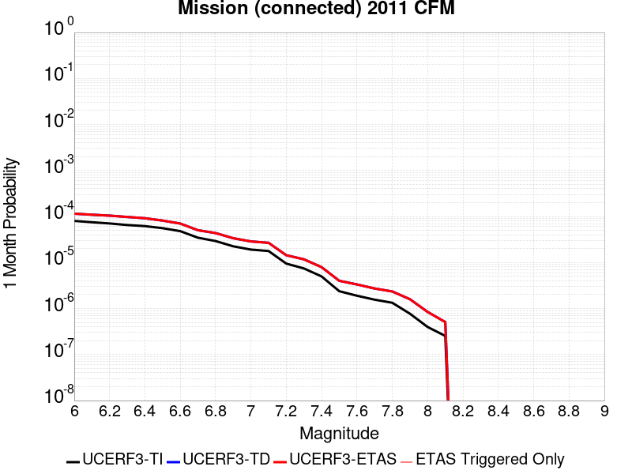 | 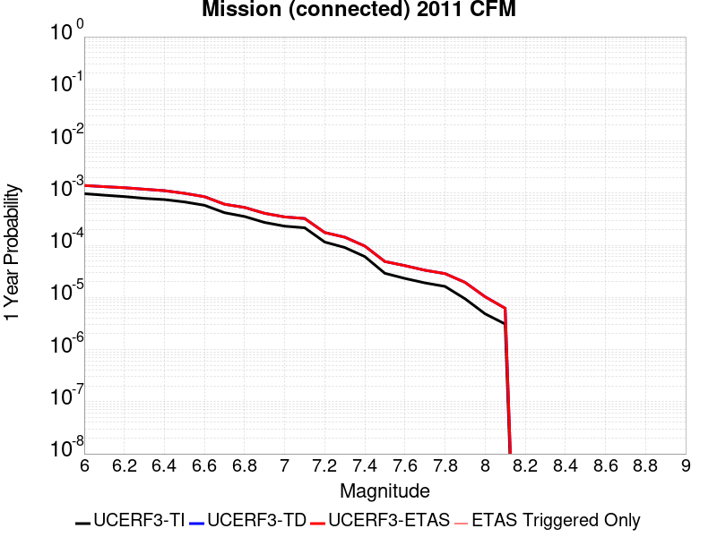 |  |

| Magnitude | 1 wk TI Prob | 1 wk TD Prob | 1 wk ETAS Prob | 1 wk ETAS/TD Gain | 1 wk ETAS Triggered Only | 1 mo TI Prob | 1 mo TD Prob | 1 mo ETAS Prob | 1 mo ETAS/TD Gain | 1 mo ETAS Triggered Only | 1 yr TI Prob | 1 yr TD Prob | 1 yr ETAS Prob | 1 yr ETAS/TD Gain | 1 yr ETAS Triggered Only | 10 yr TI Prob | 10 yr TD Prob | 10 yr ETAS Prob | 10 yr ETAS/TD Gain | 10 yr ETAS Triggered Only |
|-----|-----|-----|-----|-----|-----|-----|-----|-----|-----|-----|-----|-----|-----|-----|-----|-----|-----|-----|-----|-----|
| 6.0 | 1.8735573E-5 | 2.688952E-5 | 2.688952E-5 | 1.0 | 0.0 | 8.029284E-5 | 1.15235125E-4 | 1.15235125E-4 | 1.0 | 0.0 | 9.771269E-4 | 0.0014020179 | 0.0014020179 | 1.0 | 0.0 | 0.009728416 | 0.01394095 | 0.013950811 | 1.0007073 | 1.0E-5 |
| 6.1 | 1.7515964E-5 | 2.5530739E-5 | 2.5530739E-5 | 1.0 | 0.0 | 7.506625E-5 | 1.0941228E-4 | 1.0941228E-4 | 1.0 | 0.0 | 9.135484E-4 | 0.0013312132 | 0.0013312132 | 1.0 | 0.0 | 0.009098019 | 0.013241528 | 0.013241528 | 1.0 | 0.0 |
| 6.2 | 1.6486343E-5 | 2.4375342E-5 | 2.4375342E-5 | 1.0 | 0.0 | 7.065384E-5 | 1.0446098E-4 | 1.0446098E-4 | 1.0 | 0.0 | 8.5987104E-4 | 0.0012710047 | 0.0012710047 | 1.0 | 0.0 | 0.008565514 | 0.012646479 | 0.012646479 | 1.0 | 0.0 |
| 6.3 | 1.5229385E-5 | 2.2804674E-5 | 2.2804674E-5 | 1.0 | 0.0 | 6.526716E-5 | 9.7730066E-5 | 9.7730066E-5 | 1.0 | 0.0 | 7.9433795E-4 | 0.0011891485 | 0.0011891485 | 1.0 | 0.0 | 0.007915046 | 0.011839628 | 0.011839628 | 1.0 | 0.0 |
| 6.4 | 1.4435828E-5 | 2.1404514E-5 | 2.1404514E-5 | 1.0 | 0.0 | 6.186637E-5 | 9.172981E-5 | 9.172981E-5 | 1.0 | 0.0 | 7.529627E-4 | 0.0011161744 | 0.0011161744 | 1.0 | 0.0 | 0.007504165 | 0.011122519 | 0.011122519 | 1.0 | 0.0 |
| 6.5 | 1.30127955E-5 | 1.904306E-5 | 1.904306E-5 | 1.0 | 0.0 | 5.576793E-5 | 8.1610575E-5 | 8.1610575E-5 | 1.0 | 0.0 | 6.78763E-4 | 9.930952E-4 | 9.930952E-4 | 1.0 | 0.0 | 0.0067669353 | 0.009914487 | 0.009914487 | 1.0 | 0.0 |
| 6.6 | 1.1220718E-5 | 1.6398912E-5 | 1.6398912E-5 | 1.0 | 0.0 | 4.8087906E-5 | 7.027917E-5 | 7.027917E-5 | 1.0 | 0.0 | 5.8531296E-4 | 8.5531094E-4 | 8.5531094E-4 | 1.0 | 0.0 | 0.005837737 | 0.0085524 | 0.0085524 | 1.0 | 0.0 |
| 6.7 | 8.086152E-6 | 1.175491E-5 | 1.175491E-5 | 1.0 | 0.0 | 3.4654473E-5 | 5.0377217E-5 | 5.0377217E-5 | 1.0 | 0.0 | 4.2183654E-4 | 6.131708E-4 | 6.131708E-4 | 1.0 | 0.0 | 0.004210367 | 0.0061520776 | 0.0061520776 | 1.0 | 0.0 |
| 6.8 | 6.8361655E-6 | 1.0199498E-5 | 1.0199498E-5 | 1.0 | 0.0 | 2.9297524E-5 | 4.3711407E-5 | 4.3711407E-5 | 1.0 | 0.0 | 3.5663895E-4 | 5.32057E-4 | 5.32057E-4 | 1.0 | 0.0 | 0.0035606713 | 0.005340788 | 0.005340788 | 1.0 | 0.0 |
| 6.9 | 5.2517353E-6 | 7.872214E-6 | 7.872214E-6 | 1.0 | 0.0 | 2.2507242E-5 | 3.3737626E-5 | 3.3737626E-5 | 1.0 | 0.0 | 2.739912E-4 | 4.1067842E-4 | 4.1067842E-4 | 1.0 | 0.0 | 0.0027365363 | 0.004131441 | 0.004131441 | 1.0 | 0.0 |
| 7.0 | 4.4602784E-6 | 6.704456E-6 | 6.704456E-6 | 1.0 | 0.0 | 1.911534E-5 | 2.873307E-5 | 2.873307E-5 | 1.0 | 0.0 | 2.327044E-4 | 3.497691E-4 | 3.497691E-4 | 1.0 | 0.0 | 0.0023246086 | 0.0035236059 | 0.0035236059 | 1.0 | 0.0 |
| 7.1 | 4.1492594E-6 | 6.2531067E-6 | 6.2531067E-6 | 1.0 | 0.0 | 1.7782419E-5 | 2.6798754E-5 | 2.6798754E-5 | 1.0 | 0.0 | 2.1647944E-4 | 3.2622615E-4 | 3.2622615E-4 | 1.0 | 0.0 | 0.0021626868 | 0.0032883629 | 0.0032883629 | 1.0 | 0.0 |
| 7.2 | 2.213247E-6 | 3.3649592E-6 | 3.3649592E-6 | 1.0 | 0.0 | 9.485309E-6 | 1.44211745E-5 | 1.44211745E-5 | 1.0 | 0.0 | 1.15477524E-4 | 1.7556369E-4 | 1.7556369E-4 | 1.0 | 0.0 | 0.0011541754 | 0.0017828988 | 0.0017828988 | 1.0 | 0.0 |
| 7.3 | 1.7362703E-6 | 2.740234E-6 | 2.740234E-6 | 1.0 | 0.0 | 7.4411373E-6 | 1.1743808E-5 | 1.1743808E-5 | 1.0 | 0.0 | 9.0592075E-5 | 1.429715E-4 | 1.429715E-4 | 1.0 | 0.0 | 9.0555154E-4 | 0.0014541033 | 0.0014541033 | 1.0 | 0.0 |
| 7.4 | 1.1628409E-6 | 1.8507498E-6 | 1.8507498E-6 | 1.0 | 0.0 | 4.9835944E-6 | 7.931761E-6 | 7.931761E-6 | 1.0 | 0.0 | 6.0673574E-5 | 9.656492E-5 | 9.656492E-5 | 1.0 | 0.0 | 6.065701E-4 | 9.860051E-4 | 9.860051E-4 | 1.0 | 0.0 |
| 7.5 | 5.5610667E-7 | 9.355345E-7 | 9.355345E-7 | 1.0 | 0.0 | 2.3833122E-6 | 4.0094274E-6 | 4.0094274E-6 | 1.0 | 0.0 | 2.9016439E-5 | 4.881369E-5 | 4.881369E-5 | 1.0 | 0.0 | 2.901265E-4 | 5.0468714E-4 | 5.0468714E-4 | 1.0 | 0.0 |
| 7.6 | 4.4307663E-7 | 7.795659E-7 | 7.795659E-7 | 1.0 | 0.0 | 1.8988985E-6 | 3.3409924E-6 | 3.3409924E-6 | 1.0 | 0.0 | 2.3118844E-5 | 4.0675826E-5 | 4.0675826E-5 | 1.0 | 0.0 | 2.3116439E-4 | 4.2265613E-4 | 4.2265613E-4 | 1.0 | 0.0 |
| 7.7 | 3.639119E-7 | 6.364851E-7 | 6.364851E-7 | 1.0 | 0.0 | 1.5596215E-6 | 2.7277902E-6 | 2.7277902E-6 | 1.0 | 0.0 | 1.8988227E-5 | 3.321034E-5 | 3.321034E-5 | 1.0 | 0.0 | 1.8986604E-4 | 3.473951E-4 | 3.473951E-4 | 1.0 | 0.0 |
| 7.8 | 3.1152942E-7 | 5.4832236E-7 | 5.4832236E-7 | 1.0 | 0.0 | 1.3351254E-6 | 2.3499508E-6 | 2.3499508E-6 | 1.0 | 0.0 | 1.6255031E-5 | 2.8610279E-5 | 2.8610279E-5 | 1.0 | 0.0 | 1.6253842E-4 | 2.9812948E-4 | 2.9812948E-4 | 1.0 | 0.0 |
| 7.9 | 1.8035962E-7 | 3.7236998E-7 | 3.7236998E-7 | 1.0 | 0.0 | 7.729696E-7 | 1.5958703E-6 | 1.5958703E-6 | 1.0 | 0.0 | 9.410865E-6 | 1.9429548E-5 | 1.9429548E-5 | 1.0 | 0.0 | 9.410465E-5 | 2.0096921E-4 | 2.0096921E-4 | 1.0 | 0.0 |
| 8.0 | 9.279334E-8 | 1.97213E-7 | 1.97213E-7 | 1.0 | 0.0 | 3.976857E-7 | 8.451983E-7 | 8.451983E-7 | 1.0 | 0.0 | 4.841813E-6 | 1.0290241E-5 | 1.0290241E-5 | 1.0 | 0.0 | 4.841707E-5 | 1.0541637E-4 | 1.0541637E-4 | 1.0 | 0.0 |
| 8.1 | 5.9253985E-8 | 1.18657304E-7 | 1.18657304E-7 | 1.0 | 0.0 | 2.5394561E-7 | 5.0853123E-7 | 5.0853123E-7 | 1.0 | 0.0 | 3.0917836E-6 | 6.1913506E-6 | 6.1913506E-6 | 1.0 | 0.0 | 3.0917407E-5 | 6.329667E-5 | 6.329667E-5 | 1.0 | 0.0 |

## South Klamath Lake West
*[(top)](#table-of-contents)*

| 1 Week | 1 Month | 1 Year | 10 Year |
|-----|-----|-----|-----|
| 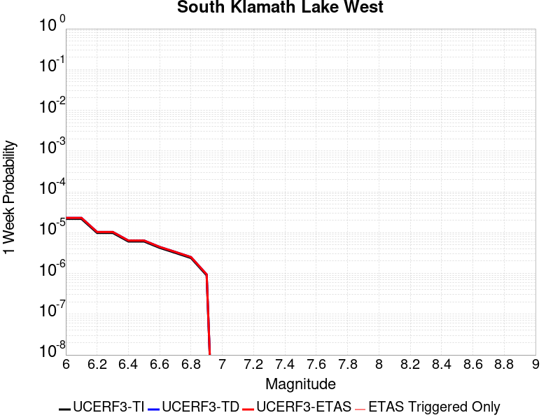 |  |  | 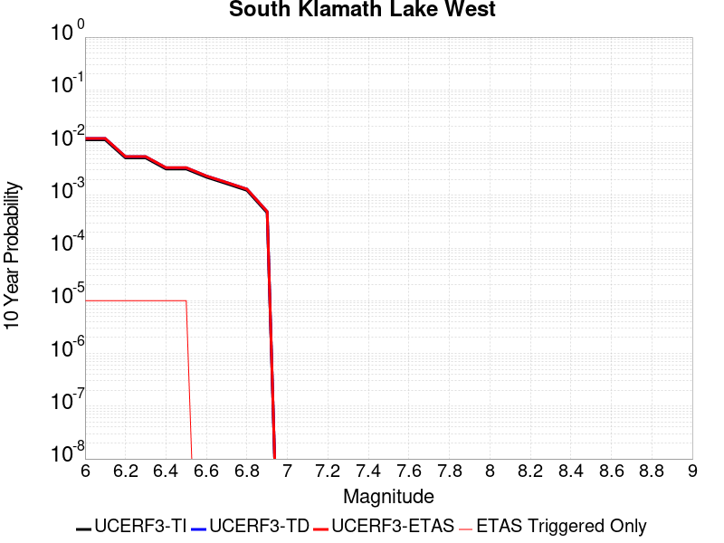 |

| Magnitude | 1 wk TI Prob | 1 wk TD Prob | 1 wk ETAS Prob | 1 wk ETAS/TD Gain | 1 wk ETAS Triggered Only | 1 mo TI Prob | 1 mo TD Prob | 1 mo ETAS Prob | 1 mo ETAS/TD Gain | 1 mo ETAS Triggered Only | 1 yr TI Prob | 1 yr TD Prob | 1 yr ETAS Prob | 1 yr ETAS/TD Gain | 1 yr ETAS Triggered Only | 10 yr TI Prob | 10 yr TD Prob | 10 yr ETAS Prob | 10 yr ETAS/TD Gain | 10 yr ETAS Triggered Only |
|-----|-----|-----|-----|-----|-----|-----|-----|-----|-----|-----|-----|-----|-----|-----|-----|-----|-----|-----|-----|-----|
| 6.0 | 2.174025E-5 | 2.3042538E-5 | 2.3042538E-5 | 1.0 | 0.0 | 9.3169176E-5 | 9.8750366E-5 | 9.8750366E-5 | 1.0 | 0.0 | 0.0011337444 | 0.0012016884 | 0.0012116764 | 1.0083116 | 1.0E-5 | 0.011279777 | 0.011958505 | 0.011968385 | 1.0008262 | 1.0E-5 |
| 6.1 | 2.174025E-5 | 2.3042538E-5 | 2.3042538E-5 | 1.0 | 0.0 | 9.3169176E-5 | 9.8750366E-5 | 9.8750366E-5 | 1.0 | 0.0 | 0.0011337444 | 0.0012016884 | 0.0012116764 | 1.0083116 | 1.0E-5 | 0.011279777 | 0.011958505 | 0.011968385 | 1.0008262 | 1.0E-5 |
| 6.2 | 9.834929E-6 | 1.0394061E-5 | 1.0394061E-5 | 1.0 | 0.0 | 4.2149015E-5 | 4.4545264E-5 | 4.4545264E-5 | 1.0 | 0.0 | 5.1304343E-4 | 5.422127E-4 | 5.522073E-4 | 1.018433 | 1.0E-5 | 0.0051186057 | 0.0054097995 | 0.0054197456 | 1.0018384 | 1.0E-5 |
| 6.3 | 9.834929E-6 | 1.0394061E-5 | 1.0394061E-5 | 1.0 | 0.0 | 4.2149015E-5 | 4.4545264E-5 | 4.4545264E-5 | 1.0 | 0.0 | 5.1304343E-4 | 5.422127E-4 | 5.522073E-4 | 1.018433 | 1.0E-5 | 0.0051186057 | 0.0054097995 | 0.0054197456 | 1.0018384 | 1.0E-5 |
| 6.4 | 6.066321E-6 | 6.400561E-6 | 6.400561E-6 | 1.0 | 0.0 | 2.5998259E-5 | 2.7430702E-5 | 2.7430702E-5 | 1.0 | 0.0 | 3.1648282E-4 | 3.3392032E-4 | 3.43917E-4 | 1.0299373 | 1.0E-5 | 0.0031603249 | 0.0033344561 | 0.003344423 | 1.0029889 | 1.0E-5 |
| 6.5 | 6.066321E-6 | 6.400561E-6 | 6.400561E-6 | 1.0 | 0.0 | 2.5998259E-5 | 2.7430702E-5 | 2.7430702E-5 | 1.0 | 0.0 | 3.1648282E-4 | 3.3392032E-4 | 3.43917E-4 | 1.0299373 | 1.0E-5 | 0.0031603249 | 0.0033344561 | 0.003344423 | 1.0029889 | 1.0E-5 |
| 6.6 | 4.2321803E-6 | 4.4613807E-6 | 4.4613807E-6 | 1.0 | 0.0 | 1.8137789E-5 | 1.9120069E-5 | 1.9120069E-5 | 1.0 | 0.0 | 2.208052E-4 | 2.32763E-4 | 2.32763E-4 | 1.0 | 0.0 | 0.0022058594 | 0.002325294 | 0.002325294 | 1.0 | 0.0 |
| 6.7 | 3.186646E-6 | 3.3603733E-6 | 3.3603733E-6 | 1.0 | 0.0 | 1.3656982E-5 | 1.4401524E-5 | 1.4401524E-5 | 1.0 | 0.0 | 1.6626107E-4 | 1.7532513E-4 | 1.7532513E-4 | 1.0 | 0.0 | 0.0016613674 | 0.0017519351 | 0.0017519351 | 1.0 | 0.0 |
| 6.8 | 2.380121E-6 | 2.5109582E-6 | 2.5109582E-6 | 1.0 | 0.0 | 1.0200479E-5 | 1.0761208E-5 | 1.0761208E-5 | 1.0 | 0.0 | 1.2418375E-4 | 1.310103E-4 | 1.310103E-4 | 1.0 | 0.0 | 0.0012411437 | 0.0013093764 | 0.0013093764 | 1.0 | 0.0 |
| 6.9 | 8.928287E-7 | 9.430447E-7 | 9.430447E-7 | 1.0 | 0.0 | 3.826403E-6 | 4.0416153E-6 | 4.0416153E-6 | 1.0 | 0.0 | 4.658546E-5 | 4.9205773E-5 | 4.9205773E-5 | 1.0 | 0.0 | 4.6575698E-4 | 4.9197045E-4 | 4.9197045E-4 | 1.0 | 0.0 |

## Elmore Ranch
*[(top)](#table-of-contents)*

| 1 Week | 1 Month | 1 Year | 10 Year |
|-----|-----|-----|-----|
|  | 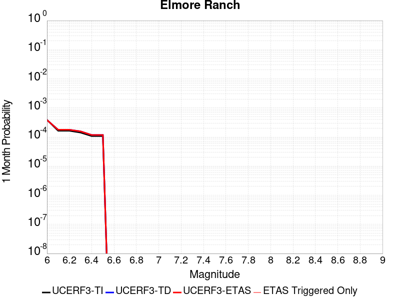 |  | 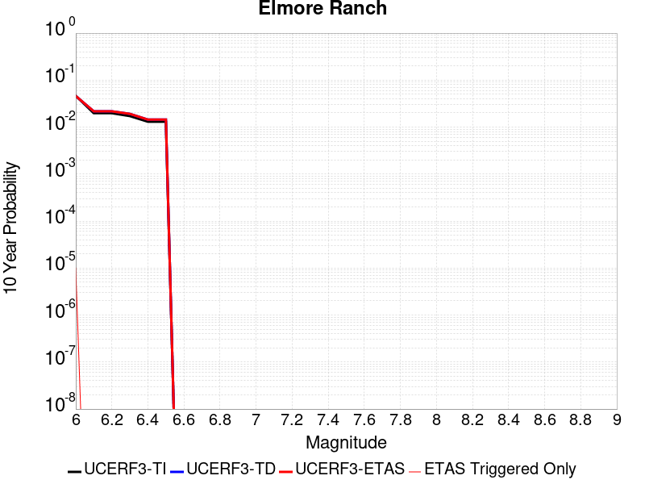 |

| Magnitude | 1 wk TI Prob | 1 wk TD Prob | 1 wk ETAS Prob | 1 wk ETAS/TD Gain | 1 wk ETAS Triggered Only | 1 mo TI Prob | 1 mo TD Prob | 1 mo ETAS Prob | 1 mo ETAS/TD Gain | 1 mo ETAS Triggered Only | 1 yr TI Prob | 1 yr TD Prob | 1 yr ETAS Prob | 1 yr ETAS/TD Gain | 1 yr ETAS Triggered Only | 10 yr TI Prob | 10 yr TD Prob | 10 yr ETAS Prob | 10 yr ETAS/TD Gain | 10 yr ETAS Triggered Only |
|-----|-----|-----|-----|-----|-----|-----|-----|-----|-----|-----|-----|-----|-----|-----|-----|-----|-----|-----|-----|-----|
| 6.0 | 9.102099E-5 | 8.953757E-5 | 8.953757E-5 | 1.0 | 0.0 | 3.9003167E-4 | 3.8368916E-4 | 3.8368916E-4 | 1.0 | 0.0 | 0.0047383 | 0.0046628457 | 0.0046727993 | 1.0021346 | 1.0E-5 | 0.046385348 | 0.045877732 | 0.045887273 | 1.000208 | 1.0E-5 |
| 6.1 | 3.8306698E-5 | 4.150529E-5 | 4.150529E-5 | 1.0 | 0.0 | 1.6416123E-4 | 1.7787176E-4 | 1.7787176E-4 | 1.0 | 0.0 | 0.0019968306 | 0.0021634349 | 0.0021634349 | 1.0 | 0.0 | 0.019789828 | 0.02163138 | 0.02163138 | 1.0 | 0.0 |
| 6.2 | 3.8306698E-5 | 4.150529E-5 | 4.150529E-5 | 1.0 | 0.0 | 1.6416123E-4 | 1.7787176E-4 | 1.7787176E-4 | 1.0 | 0.0 | 0.0019968306 | 0.0021634349 | 0.0021634349 | 1.0 | 0.0 | 0.019789828 | 0.02163138 | 0.02163138 | 1.0 | 0.0 |
| 6.3 | 3.3197924E-5 | 3.6559653E-5 | 3.6559653E-5 | 1.0 | 0.0 | 1.4226905E-4 | 1.5667878E-4 | 1.5667878E-4 | 1.0 | 0.0 | 0.0017307495 | 0.0019061613 | 0.0019061613 | 1.0 | 0.0 | 0.017173318 | 0.019092519 | 0.019092519 | 1.0 | 0.0 |
| 6.4 | 2.5148964E-5 | 2.7423765E-5 | 2.7423765E-5 | 1.0 | 0.0 | 1.0777682E-4 | 1.17528776E-4 | 1.17528776E-4 | 1.0 | 0.0 | 0.0013113929 | 0.0014306217 | 0.0014306217 | 1.0 | 0.0 | 0.01303681 | 0.014388889 | 0.014388889 | 1.0 | 0.0 |
| 6.5 | 2.5148964E-5 | 2.7423765E-5 | 2.7423765E-5 | 1.0 | 0.0 | 1.0777682E-4 | 1.17528776E-4 | 1.17528776E-4 | 1.0 | 0.0 | 0.0013113929 | 0.0014306217 | 0.0014306217 | 1.0 | 0.0 | 0.01303681 | 0.014388889 | 0.014388889 | 1.0 | 0.0 |

## Homestead Valley 2011
*[(top)](#table-of-contents)*

| 1 Week | 1 Month | 1 Year | 10 Year |
|-----|-----|-----|-----|
|  |  |  |  |

| Magnitude | 1 wk TI Prob | 1 wk TD Prob | 1 wk ETAS Prob | 1 wk ETAS/TD Gain | 1 wk ETAS Triggered Only | 1 mo TI Prob | 1 mo TD Prob | 1 mo ETAS Prob | 1 mo ETAS/TD Gain | 1 mo ETAS Triggered Only | 1 yr TI Prob | 1 yr TD Prob | 1 yr ETAS Prob | 1 yr ETAS/TD Gain | 1 yr ETAS Triggered Only | 10 yr TI Prob | 10 yr TD Prob | 10 yr ETAS Prob | 10 yr ETAS/TD Gain | 10 yr ETAS Triggered Only |
|-----|-----|-----|-----|-----|-----|-----|-----|-----|-----|-----|-----|-----|-----|-----|-----|-----|-----|-----|-----|-----|
| 6.0 | 1.539795E-5 | 6.286795E-6 | 6.286795E-6 | 1.0 | 0.0 | 6.5989545E-5 | 2.6943244E-5 | 2.6943244E-5 | 1.0 | 0.0 | 8.0312655E-4 | 3.2800523E-4 | 3.2800523E-4 | 1.0 | 0.0 | 0.008002302 | 0.003277232 | 0.0032871992 | 1.0030414 | 1.0E-5 |
| 6.1 | 1.539795E-5 | 6.286795E-6 | 6.286795E-6 | 1.0 | 0.0 | 6.5989545E-5 | 2.6943244E-5 | 2.6943244E-5 | 1.0 | 0.0 | 8.0312655E-4 | 3.2800523E-4 | 3.2800523E-4 | 1.0 | 0.0 | 0.008002302 | 0.003277232 | 0.0032871992 | 1.0030414 | 1.0E-5 |
| 6.2 | 1.539795E-5 | 6.286795E-6 | 6.286795E-6 | 1.0 | 0.0 | 6.5989545E-5 | 2.6943244E-5 | 2.6943244E-5 | 1.0 | 0.0 | 8.0312655E-4 | 3.2800523E-4 | 3.2800523E-4 | 1.0 | 0.0 | 0.008002302 | 0.003277232 | 0.0032871992 | 1.0030414 | 1.0E-5 |
| 6.3 | 1.539795E-5 | 6.286795E-6 | 6.286795E-6 | 1.0 | 0.0 | 6.5989545E-5 | 2.6943244E-5 | 2.6943244E-5 | 1.0 | 0.0 | 8.0312655E-4 | 3.2800523E-4 | 3.2800523E-4 | 1.0 | 0.0 | 0.008002302 | 0.003277232 | 0.0032871992 | 1.0030414 | 1.0E-5 |
| 6.4 | 1.539795E-5 | 6.286795E-6 | 6.286795E-6 | 1.0 | 0.0 | 6.5989545E-5 | 2.6943244E-5 | 2.6943244E-5 | 1.0 | 0.0 | 8.0312655E-4 | 3.2800523E-4 | 3.2800523E-4 | 1.0 | 0.0 | 0.008002302 | 0.003277232 | 0.0032871992 | 1.0030414 | 1.0E-5 |
| 6.5 | 1.0265258E-5 | 2.8789414E-6 | 2.8789414E-6 | 1.0 | 0.0 | 4.3993223E-5 | 1.2338301E-5 | 1.2338301E-5 | 1.0 | 0.0 | 5.3548586E-4 | 1.502154E-4 | 1.502154E-4 | 1.0 | 0.0 | 0.005341973 | 0.0015018206 | 0.0015018206 | 1.0 | 0.0 |
| 6.6 | 6.664671E-6 | 5.34866E-7 | 5.34866E-7 | 1.0 | 0.0 | 2.8562565E-5 | 2.2922816E-6 | 2.2922816E-6 | 1.0 | 0.0 | 3.476937E-4 | 2.7908289E-5 | 2.7908289E-5 | 1.0 | 0.0 | 0.003471502 | 2.790595E-4 | 2.790595E-4 | 1.0 | 0.0 |
| 6.7 | 6.5954046E-6 | 5.34866E-7 | 5.34866E-7 | 1.0 | 0.0 | 2.8265715E-5 | 2.2922816E-6 | 2.2922816E-6 | 1.0 | 0.0 | 3.4408073E-4 | 2.7908289E-5 | 2.7908289E-5 | 1.0 | 0.0 | 0.0034354846 | 2.790595E-4 | 2.790595E-4 | 1.0 | 0.0 |
| 6.8 | 4.648189E-6 | 2.3268515E-7 | 2.3268515E-7 | 1.0 | 0.0 | 1.9920659E-5 | 9.972217E-7 | 9.972217E-7 | 1.0 | 0.0 | 2.4250703E-4 | 1.2141112E-5 | 1.2141112E-5 | 1.0 | 0.0 | 0.0024224254 | 1.2140496E-4 | 1.2140496E-4 | 1.0 | 0.0 |
| 6.9 | 4.1428534E-6 | 1.934716E-7 | 1.934716E-7 | 1.0 | 0.0 | 1.7754966E-5 | 8.2916375E-7 | 8.2916375E-7 | 1.0 | 0.0 | 2.1614527E-4 | 1.0095025E-5 | 1.0095025E-5 | 1.0 | 0.0 | 0.0021593515 | 1.0094596E-4 | 1.0094596E-4 | 1.0 | 0.0 |
| 7.0 | 3.0673707E-6 | 1.536975E-7 | 1.536975E-7 | 1.0 | 0.0 | 1.3145808E-5 | 6.5870336E-7 | 6.5870336E-7 | 1.0 | 0.0 | 1.6003846E-4 | 8.019685E-6 | 8.019685E-6 | 1.0 | 0.0 | 0.0015992324 | 8.019406E-5 | 8.019406E-5 | 1.0 | 0.0 |
| 7.1 | 2.340854E-6 | 1.468967E-7 | 1.468967E-7 | 1.0 | 0.0 | 1.0032193E-5 | 6.295571E-7 | 6.295571E-7 | 1.0 | 0.0 | 1.221351E-4 | 7.664832E-6 | 7.664832E-6 | 1.0 | 0.0 | 0.00122068 | 7.6645774E-5 | 7.6645774E-5 | 1.0 | 0.0 |
| 7.2 | 1.3754182E-6 | 1.392446E-7 | 1.392446E-7 | 1.0 | 0.0 | 5.8946357E-6 | 5.9676245E-7 | 5.9676245E-7 | 1.0 | 0.0 | 7.176483E-5 | 7.26556E-6 | 7.26556E-6 | 1.0 | 0.0 | 7.174166E-4 | 7.265332E-5 | 7.265332E-5 | 1.0 | 0.0 |
| 7.3 | 1.2573237E-6 | 1.3828955E-7 | 1.3828955E-7 | 1.0 | 0.0 | 5.388519E-6 | 5.926694E-7 | 5.926694E-7 | 1.0 | 0.0 | 6.560324E-5 | 7.2157263E-6 | 7.2157263E-6 | 1.0 | 0.0 | 6.558388E-4 | 7.215502E-5 | 7.215502E-5 | 1.0 | 0.0 |
| 7.4 | 1.0994207E-6 | 1.310781E-7 | 1.310781E-7 | 1.0 | 0.0 | 4.7117946E-6 | 5.6176316E-7 | 5.6176316E-7 | 1.0 | 0.0 | 5.736459E-5 | 6.8394456E-6 | 6.8394456E-6 | 1.0 | 0.0 | 5.734978E-4 | 6.8392445E-5 | 6.8392445E-5 | 1.0 | 0.0 |
| 7.5 | 5.5569126E-7 | 6.77375E-8 | 6.77375E-8 | 1.0 | 0.0 | 2.3815317E-6 | 2.9030355E-7 | 2.9030355E-7 | 1.0 | 0.0 | 2.8994764E-5 | 3.5344408E-6 | 3.5344408E-6 | 1.0 | 0.0 | 2.899098E-4 | 3.534391E-5 | 3.534391E-5 | 1.0 | 0.0 |

## Great Valley 07 (Orestimba)
*[(top)](#table-of-contents)*

| 1 Week | 1 Month | 1 Year | 10 Year |
|-----|-----|-----|-----|
|  | 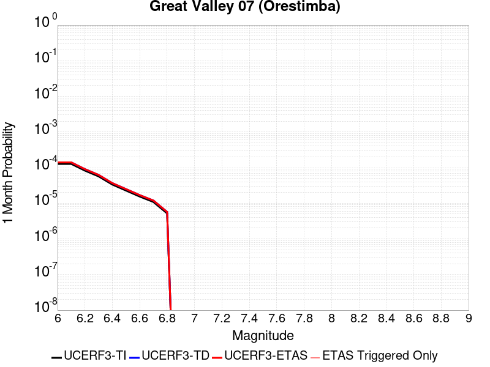 |  |  |

| Magnitude | 1 wk TI Prob | 1 wk TD Prob | 1 wk ETAS Prob | 1 wk ETAS/TD Gain | 1 wk ETAS Triggered Only | 1 mo TI Prob | 1 mo TD Prob | 1 mo ETAS Prob | 1 mo ETAS/TD Gain | 1 mo ETAS Triggered Only | 1 yr TI Prob | 1 yr TD Prob | 1 yr ETAS Prob | 1 yr ETAS/TD Gain | 1 yr ETAS Triggered Only | 10 yr TI Prob | 10 yr TD Prob | 10 yr ETAS Prob | 10 yr ETAS/TD Gain | 10 yr ETAS Triggered Only |
|-----|-----|-----|-----|-----|-----|-----|-----|-----|-----|-----|-----|-----|-----|-----|-----|-----|-----|-----|-----|-----|
| 6.0 | 2.9687902E-5 | 3.275876E-5 | 3.275876E-5 | 1.0 | 0.0 | 1.2722766E-4 | 1.4038754E-4 | 1.4038754E-4 | 1.0 | 0.0 | 0.0015478961 | 0.00170795 | 0.001717933 | 1.005845 | 1.0E-5 | 0.015371585 | 0.016955782 | 0.016965613 | 1.0005797 | 1.0E-5 |
| 6.1 | 2.9687902E-5 | 3.275876E-5 | 3.275876E-5 | 1.0 | 0.0 | 1.2722766E-4 | 1.4038754E-4 | 1.4038754E-4 | 1.0 | 0.0 | 0.0015478961 | 0.00170795 | 0.001717933 | 1.005845 | 1.0E-5 | 0.015371585 | 0.016955782 | 0.016965613 | 1.0005797 | 1.0E-5 |
| 6.2 | 1.9231524E-5 | 2.1159954E-5 | 2.1159954E-5 | 1.0 | 0.0 | 8.2418206E-5 | 9.068249E-5 | 9.068249E-5 | 1.0 | 0.0 | 0.0010029797 | 0.0011035233 | 0.0011135123 | 1.0090519 | 1.0E-5 | 0.00998465 | 0.010982848 | 0.0109927375 | 1.0009005 | 1.0E-5 |
| 6.3 | 1.324766E-5 | 1.4549064E-5 | 1.4549064E-5 | 1.0 | 0.0 | 5.6774446E-5 | 6.23517E-5 | 6.23517E-5 | 1.0 | 0.0 | 6.910097E-4 | 7.588766E-4 | 7.6886907E-4 | 1.0131674 | 1.0E-5 | 0.006888649 | 0.0075637987 | 0.007573723 | 1.0013121 | 1.0E-5 |
| 6.4 | 7.818645E-6 | 8.573147E-6 | 8.573147E-6 | 1.0 | 0.0 | 3.3508048E-5 | 3.674156E-5 | 3.674156E-5 | 1.0 | 0.0 | 4.078841E-4 | 4.4724008E-4 | 4.5723558E-4 | 1.0223494 | 1.0E-5 | 0.004071363 | 0.00446374 | 0.0044736955 | 1.0022303 | 1.0E-5 |
| 6.5 | 5.3076565E-6 | 5.8180085E-6 | 5.8180085E-6 | 1.0 | 0.0 | 2.27469E-5 | 2.4934096E-5 | 2.4934096E-5 | 1.0 | 0.0 | 2.7690834E-4 | 3.0353243E-4 | 3.0353243E-4 | 1.0 | 0.0 | 0.0027656353 | 0.003031388 | 0.003031388 | 1.0 | 0.0 |
| 6.6 | 3.6003578E-6 | 3.948637E-6 | 3.948637E-6 | 1.0 | 0.0 | 1.5430012E-5 | 1.692263E-5 | 1.692263E-5 | 1.0 | 0.0 | 1.8784421E-4 | 2.060151E-4 | 2.060151E-4 | 1.0 | 0.0 | 0.0018768552 | 0.0020583952 | 0.0020583952 | 1.0 | 0.0 |
| 6.7 | 2.5361826E-6 | 2.7835688E-6 | 2.7835688E-6 | 1.0 | 0.0 | 1.0869308E-5 | 1.1929533E-5 | 1.1929533E-5 | 1.0 | 0.0 | 1.3232579E-4 | 1.452337E-4 | 1.452337E-4 | 1.0 | 0.0 | 0.0013224703 | 0.0014515179 | 0.0014515179 | 1.0 | 0.0 |
| 6.8 | 1.2115831E-6 | 1.3314287E-6 | 1.3314287E-6 | 1.0 | 0.0 | 5.1924885E-6 | 5.706116E-6 | 5.706116E-6 | 1.0 | 0.0 | 6.3216714E-5 | 6.947072E-5 | 6.947072E-5 | 1.0 | 0.0 | 6.3198735E-4 | 6.945851E-4 | 6.945851E-4 | 1.0 | 0.0 |

## Owens Valley Keough Hot Springs
*[(top)](#table-of-contents)*

| 1 Week | 1 Month | 1 Year | 10 Year |
|-----|-----|-----|-----|
|  | 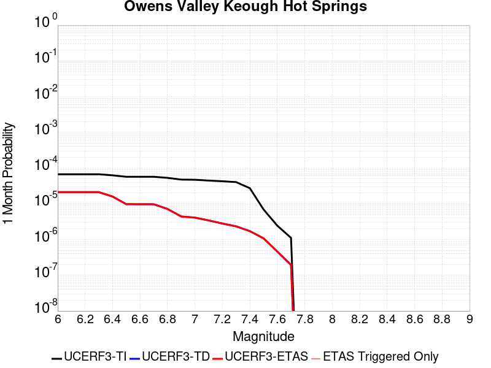 |  |  |

| Magnitude | 1 wk TI Prob | 1 wk TD Prob | 1 wk ETAS Prob | 1 wk ETAS/TD Gain | 1 wk ETAS Triggered Only | 1 mo TI Prob | 1 mo TD Prob | 1 mo ETAS Prob | 1 mo ETAS/TD Gain | 1 mo ETAS Triggered Only | 1 yr TI Prob | 1 yr TD Prob | 1 yr ETAS Prob | 1 yr ETAS/TD Gain | 1 yr ETAS Triggered Only | 10 yr TI Prob | 10 yr TD Prob | 10 yr ETAS Prob | 10 yr ETAS/TD Gain | 10 yr ETAS Triggered Only |
|-----|-----|-----|-----|-----|-----|-----|-----|-----|-----|-----|-----|-----|-----|-----|-----|-----|-----|-----|-----|-----|
| 6.0 | 1.5708529E-5 | 4.951128E-6 | 4.951128E-6 | 1.0 | 0.0 | 6.7320536E-5 | 2.1218977E-5 | 2.1218977E-5 | 1.0 | 0.0 | 8.193192E-4 | 2.5831553E-4 | 2.6831296E-4 | 1.0387024 | 1.0E-5 | 0.008163051 | 0.0025808115 | 0.0025907857 | 1.0038648 | 1.0E-5 |
| 6.1 | 1.5708529E-5 | 4.951128E-6 | 4.951128E-6 | 1.0 | 0.0 | 6.7320536E-5 | 2.1218977E-5 | 2.1218977E-5 | 1.0 | 0.0 | 8.193192E-4 | 2.5831553E-4 | 2.6831296E-4 | 1.0387024 | 1.0E-5 | 0.008163051 | 0.0025808115 | 0.0025907857 | 1.0038648 | 1.0E-5 |
| 6.2 | 1.5708529E-5 | 4.951128E-6 | 4.951128E-6 | 1.0 | 0.0 | 6.7320536E-5 | 2.1218977E-5 | 2.1218977E-5 | 1.0 | 0.0 | 8.193192E-4 | 2.5831553E-4 | 2.6831296E-4 | 1.0387024 | 1.0E-5 | 0.008163051 | 0.0025808115 | 0.0025907857 | 1.0038648 | 1.0E-5 |
| 6.3 | 1.5708529E-5 | 4.951128E-6 | 4.951128E-6 | 1.0 | 0.0 | 6.7320536E-5 | 2.1218977E-5 | 2.1218977E-5 | 1.0 | 0.0 | 8.193192E-4 | 2.5831553E-4 | 2.6831296E-4 | 1.0387024 | 1.0E-5 | 0.008163051 | 0.0025808115 | 0.0025907857 | 1.0038648 | 1.0E-5 |
| 6.4 | 1.4622509E-5 | 3.7269347E-6 | 3.7269347E-6 | 1.0 | 0.0 | 6.266639E-5 | 1.5972499E-5 | 1.5972499E-5 | 1.0 | 0.0 | 7.626962E-4 | 1.9445112E-4 | 2.0444917E-4 | 1.0514168 | 1.0E-5 | 0.007600839 | 0.0019432895 | 0.00195327 | 1.0051359 | 1.0E-5 |
| 6.5 | 1.3335527E-5 | 2.2780637E-6 | 2.2780637E-6 | 1.0 | 0.0 | 5.7151006E-5 | 9.763097E-6 | 9.763097E-6 | 1.0 | 0.0 | 6.955913E-4 | 1.1885991E-4 | 1.2885872E-4 | 1.0841227 | 1.0E-5 | 0.0069341804 | 0.001188186 | 0.0011981741 | 1.0084062 | 1.0E-5 |
| 6.6 | 1.3332855E-5 | 2.2752129E-6 | 2.2752129E-6 | 1.0 | 0.0 | 5.7139558E-5 | 9.750879E-6 | 9.750879E-6 | 1.0 | 0.0 | 6.9545204E-4 | 1.1871117E-4 | 1.2870999E-4 | 1.084228 | 1.0E-5 | 0.0069327964 | 0.0011867002 | 0.0011966883 | 1.0084168 | 1.0E-5 |
| 6.7 | 1.3318214E-5 | 2.2644422E-6 | 2.2644422E-6 | 1.0 | 0.0 | 5.707681E-5 | 9.70472E-6 | 9.70472E-6 | 1.0 | 0.0 | 6.946886E-4 | 1.1814924E-4 | 1.2814807E-4 | 1.0846287 | 1.0E-5 | 0.0069252094 | 0.0011810869 | 0.001191075 | 1.0084568 | 1.0E-5 |
| 6.8 | 1.2441338E-5 | 1.6780807E-6 | 1.6780807E-6 | 1.0 | 0.0 | 5.331893E-5 | 7.1917566E-6 | 7.1917566E-6 | 1.0 | 0.0 | 6.489646E-4 | 8.7556415E-5 | 9.755554E-5 | 1.114202 | 1.0E-5 | 0.0064707273 | 8.754041E-4 | 8.8539533E-4 | 1.0114133 | 1.0E-5 |
| 6.9 | 1.1130476E-5 | 1.0305876E-6 | 1.0305876E-6 | 1.0 | 0.0 | 4.7701167E-5 | 4.4167964E-6 | 4.4167964E-6 | 1.0 | 0.0 | 5.806069E-4 | 5.3773183E-5 | 5.3773183E-5 | 1.0 | 0.0 | 0.0057909233 | 5.377564E-4 | 5.377564E-4 | 1.0 | 0.0 |
| 7.0 | 1.0986073E-5 | 9.581339E-7 | 9.581339E-7 | 1.0 | 0.0 | 4.7082318E-5 | 4.1062817E-6 | 4.1062817E-6 | 1.0 | 0.0 | 5.730765E-4 | 4.9992846E-5 | 4.9992846E-5 | 1.0 | 0.0 | 0.0057160086 | 4.9996964E-4 | 4.9996964E-4 | 1.0 | 0.0 |
| 7.1 | 1.0451338E-5 | 8.00185E-7 | 8.00185E-7 | 1.0 | 0.0 | 4.4790682E-5 | 3.4293596E-6 | 3.4293596E-6 | 1.0 | 0.0 | 5.451901E-4 | 4.175166E-5 | 4.175166E-5 | 1.0 | 0.0 | 0.005438545 | 4.1758787E-4 | 4.1758787E-4 | 1.0 | 0.0 |
| 7.2 | 9.989061E-6 | 6.5463087E-7 | 6.5463087E-7 | 1.0 | 0.0 | 4.280956E-5 | 2.8055579E-6 | 2.8055579E-6 | 1.0 | 0.0 | 5.2108173E-4 | 3.4157136E-5 | 3.4157136E-5 | 1.0 | 0.0 | 0.0051986156 | 3.4165636E-4 | 3.4165636E-4 | 1.0 | 0.0 |
| 7.3 | 9.465365E-6 | 5.4613076E-7 | 5.4613076E-7 | 1.0 | 0.0 | 4.056522E-5 | 2.3405585E-6 | 2.3405585E-6 | 1.0 | 0.0 | 4.937696E-4 | 2.849593E-5 | 2.849593E-5 | 1.0 | 0.0 | 0.0049267393 | 2.850554E-4 | 2.850554E-4 | 1.0 | 0.0 |
| 7.4 | 6.3824805E-6 | 4.0173765E-7 | 4.0173765E-7 | 1.0 | 0.0 | 2.73532E-5 | 1.7217317E-6 | 1.7217317E-6 | 1.0 | 0.0 | 3.3297433E-4 | 2.0961885E-5 | 2.0961885E-5 | 1.0 | 0.0 | 0.0033247585 | 2.0969151E-4 | 2.0969151E-4 | 1.0 | 0.0 |
| 7.5 | 1.6192645E-6 | 2.5167552E-7 | 2.5167552E-7 | 1.0 | 0.0 | 6.9396865E-6 | 1.0786089E-6 | 1.0786089E-6 | 1.0 | 0.0 | 8.448741E-5 | 1.3131986E-5 | 1.3131986E-5 | 1.0 | 0.0 | 8.4455294E-4 | 1.3131222E-4 | 1.3131222E-4 | 1.0 | 0.0 |
| 7.6 | 5.7062545E-7 | 1.079494E-7 | 1.079494E-7 | 1.0 | 0.0 | 2.4455355E-6 | 4.626402E-7 | 4.626402E-7 | 1.0 | 0.0 | 2.9773988E-5 | 5.6326307E-6 | 5.6326307E-6 | 1.0 | 0.0 | 2.977E-4 | 5.6324963E-5 | 5.6324963E-5 | 1.0 | 0.0 |
| 7.7 | 2.5988817E-7 | 4.5468312E-8 | 4.5468312E-8 | 1.0 | 0.0 | 1.113806E-6 | 1.9486419E-7 | 1.9486419E-7 | 1.0 | 0.0 | 1.3560503E-5 | 2.3724692E-6 | 2.3724692E-6 | 1.0 | 0.0 | 1.3559677E-4 | 2.3724484E-5 | 2.3724484E-5 | 1.0 | 0.0 |

## Cedar Mtn-Mahogany Mtn
*[(top)](#table-of-contents)*

| 1 Week | 1 Month | 1 Year | 10 Year |
|-----|-----|-----|-----|
| 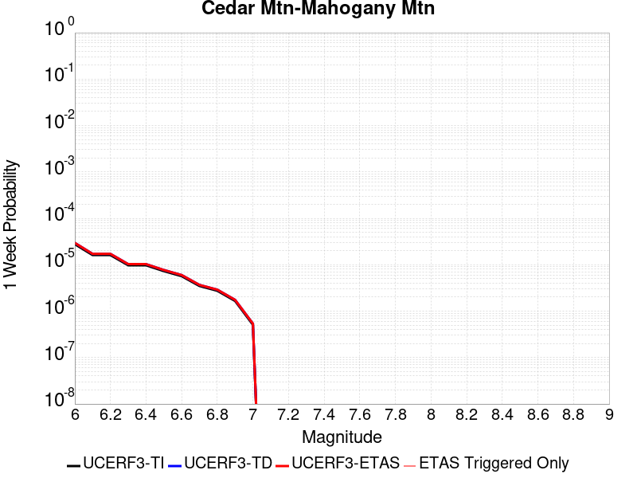 | 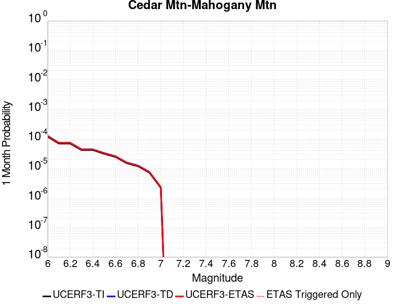 | 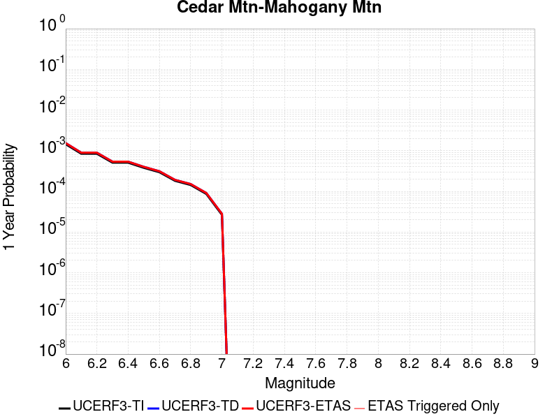 | 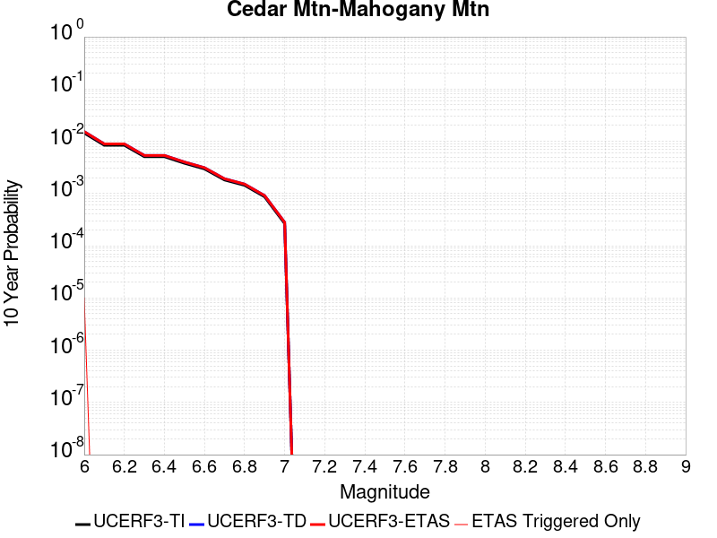 |

| Magnitude | 1 wk TI Prob | 1 wk TD Prob | 1 wk ETAS Prob | 1 wk ETAS/TD Gain | 1 wk ETAS Triggered Only | 1 mo TI Prob | 1 mo TD Prob | 1 mo ETAS Prob | 1 mo ETAS/TD Gain | 1 mo ETAS Triggered Only | 1 yr TI Prob | 1 yr TD Prob | 1 yr ETAS Prob | 1 yr ETAS/TD Gain | 1 yr ETAS Triggered Only | 10 yr TI Prob | 10 yr TD Prob | 10 yr ETAS Prob | 10 yr ETAS/TD Gain | 10 yr ETAS Triggered Only |
|-----|-----|-----|-----|-----|-----|-----|-----|-----|-----|-----|-----|-----|-----|-----|-----|-----|-----|-----|-----|-----|
| 6.0 | 2.7763876E-5 | 2.958959E-5 | 2.958959E-5 | 1.0 | 0.0 | 1.1898261E-4 | 1.2680676E-4 | 1.2680676E-4 | 1.0 | 0.0 | 0.0014476506 | 0.0015428489 | 0.0015428489 | 1.0 | 0.0 | 0.0143825635 | 0.015328597 | 0.015338444 | 1.0006424 | 1.0E-5 |
| 6.1 | 1.6162443E-5 | 1.7143353E-5 | 1.7143353E-5 | 1.0 | 0.0 | 6.926578E-5 | 7.346954E-5 | 7.346954E-5 | 1.0 | 0.0 | 8.4298453E-4 | 8.941423E-4 | 8.941423E-4 | 1.0 | 0.0 | 0.008397939 | 0.0089072585 | 0.0089072585 | 1.0 | 0.0 |
| 6.2 | 1.6162443E-5 | 1.7143353E-5 | 1.7143353E-5 | 1.0 | 0.0 | 6.926578E-5 | 7.346954E-5 | 7.346954E-5 | 1.0 | 0.0 | 8.4298453E-4 | 8.941423E-4 | 8.941423E-4 | 1.0 | 0.0 | 0.008397939 | 0.0089072585 | 0.0089072585 | 1.0 | 0.0 |
| 6.3 | 9.746053E-6 | 1.0303371E-5 | 1.0303371E-5 | 1.0 | 0.0 | 4.1768133E-5 | 4.415658E-5 | 4.415658E-5 | 1.0 | 0.0 | 5.0840835E-4 | 5.3747784E-4 | 5.3747784E-4 | 1.0 | 0.0 | 0.0050724675 | 0.0053621978 | 0.0053621978 | 1.0 | 0.0 |
| 6.4 | 9.746053E-6 | 1.0303371E-5 | 1.0303371E-5 | 1.0 | 0.0 | 4.1768133E-5 | 4.415658E-5 | 4.415658E-5 | 1.0 | 0.0 | 5.0840835E-4 | 5.3747784E-4 | 5.3747784E-4 | 1.0 | 0.0 | 0.0050724675 | 0.0053621978 | 0.0053621978 | 1.0 | 0.0 |
| 6.5 | 7.290083E-6 | 7.695484E-6 | 7.695484E-6 | 1.0 | 0.0 | 3.124284E-5 | 3.298024E-5 | 3.298024E-5 | 1.0 | 0.0 | 3.8031515E-4 | 4.014626E-4 | 4.014626E-4 | 1.0 | 0.0 | 0.0037966494 | 0.0040075937 | 0.0040075937 | 1.0 | 0.0 |
| 6.6 | 5.67907E-6 | 5.989274E-6 | 5.989274E-6 | 1.0 | 0.0 | 2.4338644E-5 | 2.5668072E-5 | 2.5668072E-5 | 1.0 | 0.0 | 2.962827E-4 | 3.1246533E-4 | 3.1246533E-4 | 1.0 | 0.0 | 0.0029588798 | 0.003120396 | 0.003120396 | 1.0 | 0.0 |
| 6.7 | 3.4853963E-6 | 3.6727042E-6 | 3.6727042E-6 | 1.0 | 0.0 | 1.4937327E-5 | 1.574007E-5 | 1.574007E-5 | 1.0 | 0.0 | 1.8184677E-4 | 1.9161912E-4 | 1.9161912E-4 | 1.0 | 0.0 | 0.0018169804 | 0.001914601 | 0.001914601 | 1.0 | 0.0 |
| 6.8 | 2.7535168E-6 | 2.9016344E-6 | 2.9016344E-6 | 1.0 | 0.0 | 1.1800733E-5 | 1.2435519E-5 | 1.2435519E-5 | 1.0 | 0.0 | 1.4366445E-4 | 1.513924E-4 | 1.513924E-4 | 1.0 | 0.0 | 0.0014357162 | 0.0015129399 | 0.0015129399 | 1.0 | 0.0 |
| 6.9 | 1.6594106E-6 | 1.749734E-6 | 1.749734E-6 | 1.0 | 0.0 | 7.1117406E-6 | 7.4988398E-6 | 7.4988398E-6 | 1.0 | 0.0 | 8.6582E-5 | 9.129486E-5 | 9.129486E-5 | 1.0 | 0.0 | 8.654827E-4 | 9.1260404E-4 | 9.1260404E-4 | 1.0 | 0.0 |
| 7.0 | 5.10215E-7 | 5.3893666E-7 | 5.3893666E-7 | 1.0 | 0.0 | 2.186634E-6 | 2.309727E-6 | 2.309727E-6 | 1.0 | 0.0 | 2.6621943E-5 | 2.8120694E-5 | 2.8120694E-5 | 1.0 | 0.0 | 2.6618753E-4 | 2.811839E-4 | 2.811839E-4 | 1.0 | 0.0 |

## Malibu Coast (Extension) alt 1
*[(top)](#table-of-contents)*

| 1 Week | 1 Month | 1 Year | 10 Year |
|-----|-----|-----|-----|
|  |  |  |  |

| Magnitude | 1 wk TI Prob | 1 wk TD Prob | 1 wk ETAS Prob | 1 wk ETAS/TD Gain | 1 wk ETAS Triggered Only | 1 mo TI Prob | 1 mo TD Prob | 1 mo ETAS Prob | 1 mo ETAS/TD Gain | 1 mo ETAS Triggered Only | 1 yr TI Prob | 1 yr TD Prob | 1 yr ETAS Prob | 1 yr ETAS/TD Gain | 1 yr ETAS Triggered Only | 10 yr TI Prob | 10 yr TD Prob | 10 yr ETAS Prob | 10 yr ETAS/TD Gain | 10 yr ETAS Triggered Only |
|-----|-----|-----|-----|-----|-----|-----|-----|-----|-----|-----|-----|-----|-----|-----|-----|-----|-----|-----|-----|-----|
| 6.0 | 8.930738E-6 | 9.329471E-6 | 9.329471E-6 | 1.0 | 0.0 | 3.827403E-5 | 3.9982842E-5 | 3.9982842E-5 | 1.0 | 0.0 | 4.6588664E-4 | 4.8668412E-4 | 4.966793E-4 | 1.0205373 | 1.0E-5 | 0.0046491115 | 0.0048563653 | 0.004866317 | 1.0020492 | 1.0E-5 |
| 6.1 | 7.199952E-6 | 7.5304656E-6 | 7.5304656E-6 | 1.0 | 0.0 | 3.0856572E-5 | 3.2273027E-5 | 3.2273027E-5 | 1.0 | 0.0 | 3.75614E-4 | 3.9285386E-4 | 4.0284992E-4 | 1.0254447 | 1.0E-5 | 0.0037497976 | 0.00392166 | 0.0039316206 | 1.00254 | 1.0E-5 |
| 6.2 | 6.3721413E-6 | 6.666947E-6 | 6.666947E-6 | 1.0 | 0.0 | 2.7308892E-5 | 2.8572318E-5 | 2.8572318E-5 | 1.0 | 0.0 | 3.3243504E-4 | 3.478128E-4 | 3.578093E-4 | 1.0287411 | 1.0E-5 | 0.0033193815 | 0.0034727242 | 0.0034826896 | 1.0028696 | 1.0E-5 |
| 6.3 | 6.016345E-6 | 6.2953072E-6 | 6.2953072E-6 | 1.0 | 0.0 | 2.578408E-5 | 2.6979611E-5 | 2.6979611E-5 | 1.0 | 0.0 | 3.1387596E-4 | 3.2842756E-4 | 3.384243E-4 | 1.0304381 | 1.0E-5 | 0.00313433 | 0.003279458 | 0.0032894253 | 1.0030392 | 1.0E-5 |
| 6.4 | 5.8104883E-6 | 6.0796897E-6 | 6.0796897E-6 | 1.0 | 0.0 | 2.4901856E-5 | 2.6055555E-5 | 2.6055555E-5 | 1.0 | 0.0 | 3.031379E-4 | 3.171805E-4 | 3.2717735E-4 | 1.0315177 | 1.0E-5 | 0.0030272473 | 0.0031673128 | 0.0031772812 | 1.0031472 | 1.0E-5 |
| 6.5 | 5.476925E-6 | 5.727651E-6 | 5.727651E-6 | 1.0 | 0.0 | 2.3472323E-5 | 2.4546845E-5 | 2.4546845E-5 | 1.0 | 0.0 | 2.8573806E-4 | 2.9881718E-4 | 3.0881417E-4 | 1.0334553 | 1.0E-5 | 0.0028537093 | 0.0029841857 | 0.0029941557 | 1.003341 | 1.0E-5 |
| 6.6 | 5.222387E-6 | 5.4587117E-6 | 5.4587117E-6 | 1.0 | 0.0 | 2.2381464E-5 | 2.3394272E-5 | 2.3394272E-5 | 1.0 | 0.0 | 2.7246025E-4 | 2.8478832E-4 | 2.9478545E-4 | 1.0351038 | 1.0E-5 | 0.0027212645 | 0.0028442643 | 0.002854236 | 1.0035058 | 1.0E-5 |
| 6.7 | 5.0337076E-6 | 5.259231E-6 | 5.259231E-6 | 1.0 | 0.0 | 2.1572854E-5 | 2.2539369E-5 | 2.2539369E-5 | 1.0 | 0.0 | 2.6261783E-4 | 2.7438253E-4 | 2.8437978E-4 | 1.0364355 | 1.0E-5 | 0.002623077 | 0.0027404677 | 0.0027504403 | 1.003639 | 1.0E-5 |
| 6.8 | 4.5675624E-6 | 4.7588305E-6 | 4.7588305E-6 | 1.0 | 0.0 | 1.9575122E-5 | 2.0394831E-5 | 2.0394831E-5 | 1.0 | 0.0 | 2.3830103E-4 | 2.4827896E-4 | 2.5827647E-4 | 1.0402672 | 1.0E-5 | 0.0023804565 | 0.0024800354 | 0.0024900106 | 1.0040222 | 1.0E-5 |
| 6.9 | 4.2802412E-6 | 4.452127E-6 | 4.452127E-6 | 1.0 | 0.0 | 1.8343762E-5 | 1.9080406E-5 | 1.9080406E-5 | 1.0 | 0.0 | 2.2331243E-4 | 2.3227934E-4 | 2.4227702E-4 | 1.0430416 | 1.0E-5 | 0.0022308815 | 0.0023203823 | 0.002330359 | 1.0042996 | 1.0E-5 |
| 7.0 | 3.9794063E-6 | 4.1301973E-6 | 4.1301973E-6 | 1.0 | 0.0 | 1.7054486E-5 | 1.7700726E-5 | 1.7700726E-5 | 1.0 | 0.0 | 2.0761859E-4 | 2.1548515E-4 | 2.1548515E-4 | 1.0 | 0.0 | 0.0020742472 | 0.0021527756 | 0.0021527756 | 1.0 | 0.0 |
| 7.1 | 3.7730424E-6 | 3.91131E-6 | 3.91131E-6 | 1.0 | 0.0 | 1.6170083E-5 | 1.6762651E-5 | 1.6762651E-5 | 1.0 | 0.0 | 1.9685295E-4 | 2.0406628E-4 | 2.0406628E-4 | 1.0 | 0.0 | 0.0019667868 | 0.0020388018 | 0.0020388018 | 1.0 | 0.0 |
| 7.2 | 3.424985E-6 | 3.5414216E-6 | 3.5414216E-6 | 1.0 | 0.0 | 1.4678424E-5 | 1.5177434E-5 | 1.5177434E-5 | 1.0 | 0.0 | 1.7869516E-4 | 1.847697E-4 | 1.847697E-4 | 1.0 | 0.0 | 0.0017855153 | 0.0018461728 | 0.0018461728 | 1.0 | 0.0 |
| 7.3 | 2.6966375E-6 | 2.7597166E-6 | 2.7597166E-6 | 1.0 | 0.0 | 1.15569665E-5 | 1.1827303E-5 | 1.1827303E-5 | 1.0 | 0.0 | 1.4069698E-4 | 1.4398794E-4 | 1.4398794E-4 | 1.0 | 0.0 | 0.0014060794 | 0.0014389507 | 0.0014389507 | 1.0 | 0.0 |
| 7.4 | 2.215957E-6 | 2.249429E-6 | 2.249429E-6 | 1.0 | 0.0 | 9.496924E-6 | 9.640375E-6 | 9.640375E-6 | 1.0 | 0.0 | 1.1561892E-4 | 1.1736527E-4 | 1.1736527E-4 | 1.0 | 0.0 | 0.0011555878 | 0.0011730366 | 0.0011730366 | 1.0 | 0.0 |
| 7.5 | 1.2040218E-6 | 1.2219356E-6 | 1.2219356E-6 | 1.0 | 0.0 | 5.160083E-6 | 5.2368564E-6 | 5.2368564E-6 | 1.0 | 0.0 | 6.2822204E-5 | 6.375688E-5 | 6.375688E-5 | 1.0 | 0.0 | 6.280445E-4 | 6.3738774E-4 | 6.3738774E-4 | 1.0 | 0.0 |
| 7.6 | 6.6157446E-7 | 6.6791387E-7 | 6.6791387E-7 | 1.0 | 0.0 | 2.835316E-6 | 2.862485E-6 | 2.862485E-6 | 1.0 | 0.0 | 3.4519428E-5 | 3.4850214E-5 | 3.4850214E-5 | 1.0 | 0.0 | 3.4514067E-4 | 3.4844902E-4 | 3.4844902E-4 | 1.0 | 0.0 |
| 7.7 | 2.6012302E-7 | 2.4358158E-7 | 2.4358158E-7 | 1.0 | 0.0 | 1.1148124E-6 | 1.0439207E-6 | 1.0439207E-6 | 1.0 | 0.0 | 1.3572758E-5 | 1.2709671E-5 | 1.2709671E-5 | 1.0 | 0.0 | 1.3571928E-4 | 1.270905E-4 | 1.270905E-4 | 1.0 | 0.0 |
| 7.8 | 2.8323132E-8 | 2.0267155E-8 | 2.0267155E-8 | 1.0 | 0.0 | 1.2138484E-7 | 8.685923E-8 | 8.685923E-8 | 1.0 | 0.0 | 1.4778595E-6 | 1.0575108E-6 | 1.0575108E-6 | 1.0 | 0.0 | 1.4778497E-5 | 1.0575065E-5 | 1.0575065E-5 | 1.0 | 0.0 |

