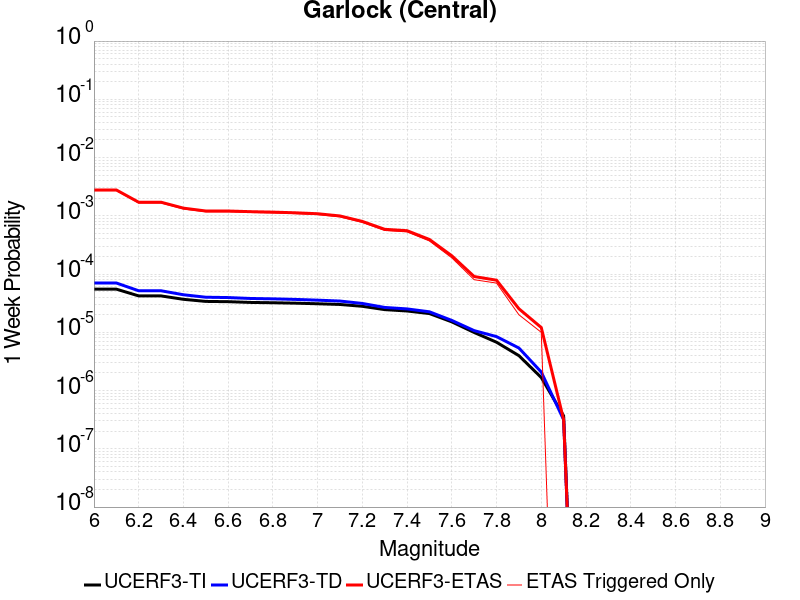
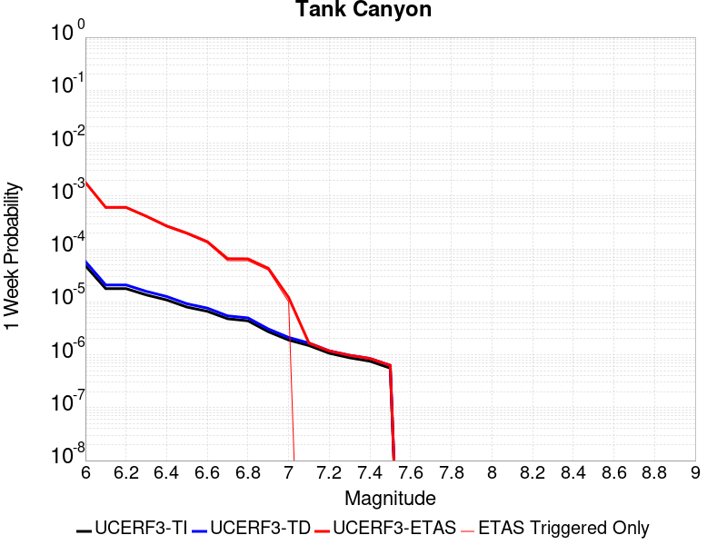
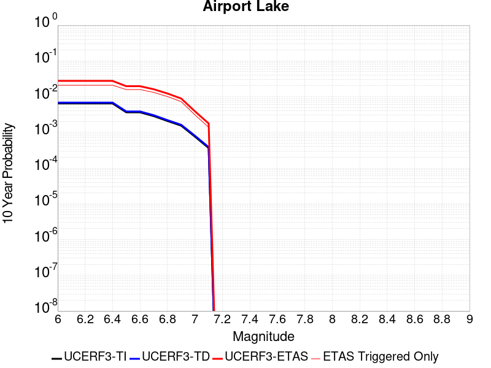
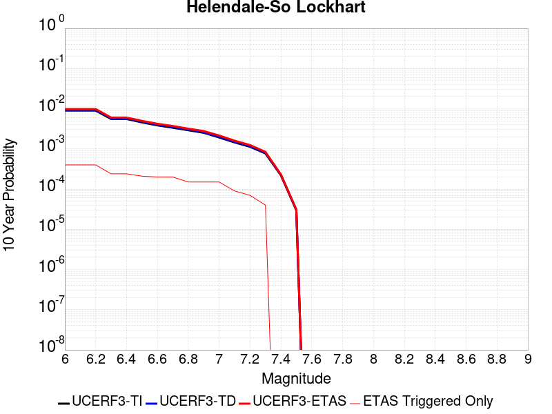
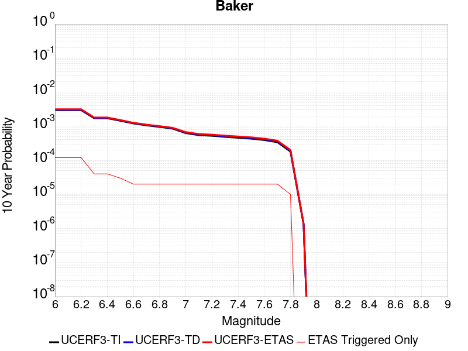
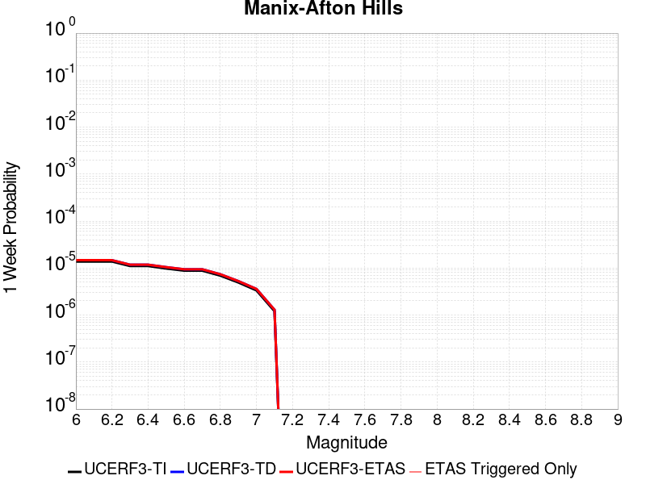
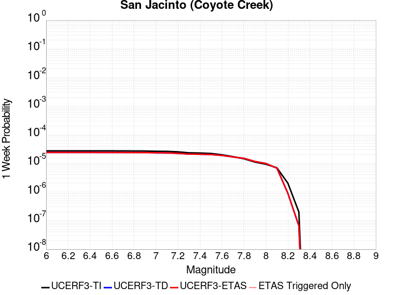
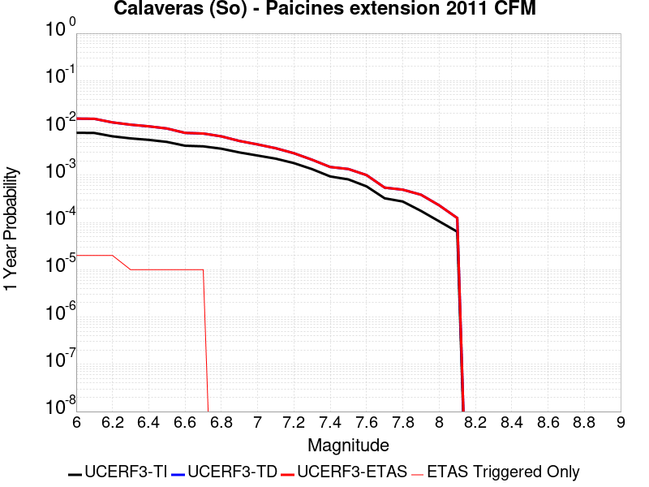

# Parent Section Magnitude-Probability Distributions

Only fault sections with at least one triggered aftershock are plotted. Sections are sorted by total supraseismogenic trigger rate (decreasing)

## Table Of Contents

* [Garlock (Central)](#garlock-central)
* [Tank Canyon](#tank-canyon)
* [Little Lake](#little-lake)
* [Airport Lake](#airport-lake)
* [Owl Lake](#owl-lake)
* [Panamint Valley](#panamint-valley)
* [Garlock (East)](#garlock-east)
* [Ash Hill](#ash-hill)
* [Hunter Mountain-Saline Valley](#hunter-mountain-saline-valley)
* [Blackwater](#blackwater)
* [Garlock (West)](#garlock-west)
* [McLean Lake](#mclean-lake)
* [Gravel Hills-Harper Lk](#gravel-hills-harper-lk)
* [Goldstone Lake](#goldstone-lake)
* [So Sierra Nevada](#so-sierra-nevada)
* [Coyote Canyon](#coyote-canyon)
* [San Andreas (Mojave S)](#san-andreas-mojave-s)
* [Death Valley (So)](#death-valley-so)
* [Nelson Lake](#nelson-lake)
* [Lenwood-Lockhart-Old Woman Springs](#lenwood-lockhart-old-woman-springs)
* [San Andreas (Mojave N)](#san-andreas-mojave-n)
* [Towne Pass](#towne-pass)
* [Paradise](#paradise)
* [Bicycle Lake](#bicycle-lake)
* [Garlic Springs](#garlic-springs)
* [San Andreas (San Bernardino N)](#san-andreas-san-bernardino-n)
* [Death Valley (Black Mtns Frontal)](#death-valley-black-mtns-frontal)
* [Helendale-So Lockhart](#helendale-so-lockhart)
* [San Andreas (San Bernardino S)](#san-andreas-san-bernardino-s)
* [Death Valley (No)](#death-valley-no)
* [San Andreas (Big Bend)](#san-andreas-big-bend)
* [San Andreas (Parkfield)](#san-andreas-parkfield)
* [Coyote Lake](#coyote-lake)
* [Cady](#cady)
* [Red Pass](#red-pass)
* [Sierra Nevada  (No Extension)](#sierra-nevada--no-extension)
* [Death Valley (Fish Lake Valley)](#death-valley-fish-lake-valley)
* [Elsinore (Glen Ivy) rev](#elsinore-glen-ivy-rev)
* [San Andreas (Carrizo) rev](#san-andreas-carrizo-rev)
* [San Andreas (Cholame) rev](#san-andreas-cholame-rev)
* [Calico-Hidalgo](#calico-hidalgo)
* [San Andreas (San Gorgonio Pass-Garnet HIll)](#san-andreas-san-gorgonio-pass-garnet-hill)
* [White Wolf (Extension)](#white-wolf-extension)
* [San Jacinto (San Bernardino)](#san-jacinto-san-bernardino)
* [San Andreas (Creeping Section) 2011 CFM](#san-andreas-creeping-section-2011-cfm)
* [Independence rev 2011](#independence-rev-2011)
* [Scodie Lineament](#scodie-lineament)
* [Baker](#baker)
* [San Andreas (Coachella) rev](#san-andreas-coachella-rev)
* [Deep Springs](#deep-springs)
* [Ludlow](#ludlow)
* [Lake Isabella (Seismicity)](#lake-isabella-seismicity)
* [Santa Ynez (East)](#santa-ynez-east)
* [White Mountains](#white-mountains)
* [Santa Ynez (West)](#santa-ynez-west)
* [Santa Rosa Island](#santa-rosa-island)
* [Owens Valley](#owens-valley)
* [San Clemente](#san-clemente)
* [San Jacinto (San Jacinto Valley) rev](#san-jacinto-san-jacinto-valley-rev)
* [San Andreas (North Branch Mill Creek)](#san-andreas-north-branch-mill-creek)
* [Ortigalita (North)](#ortigalita-north)
* [Cleghorn Lake](#cleghorn-lake)
* [Blue Cut](#blue-cut)
* [Big Pine (Central)](#big-pine-central)
* [Lost Hills](#lost-hills)
* [Manix-Afton Hills](#manix-afton-hills)
* [Cleghorn Pass](#cleghorn-pass)
* [San Jacinto (Stepovers Combined)](#san-jacinto-stepovers-combined)
* [Red Mountain](#red-mountain)
* [Pisgah-Bullion Mtn-Mesquite Lk](#pisgah-bullion-mtn-mesquite-lk)
* [Brawley (Seismic Zone) alt 1](#brawley-seismic-zone-alt-1)
* [Pine Mtn](#pine-mtn)
* [Palos Verdes](#palos-verdes)
* [Santa Cruz Catalina Ridge alt1](#santa-cruz-catalina-ridge-alt1)
* [San Diego Trough south](#san-diego-trough-south)
* [San Jacinto (Lytle Creek connector)](#san-jacinto-lytle-creek-connector)
* [Kern Canyon (North Kern) 2011](#kern-canyon-north-kern-2011)
* [Santa Cruz Island](#santa-cruz-island)
* [Mission Ridge-Arroyo Parida-Santa Ana](#mission-ridge-arroyo-parida-santa-ana)
* [San Diego Trough north alt1](#san-diego-trough-north-alt1)
* [Mission Creek](#mission-creek)
* [San Cayetano](#san-cayetano)
* [Coronado Bank alt1](#coronado-bank-alt1)
* [Ventura-Pitas Point](#ventura-pitas-point)
* [Rose Canyon](#rose-canyon)
* [Channel Islands Thrust](#channel-islands-thrust)
* [Oceanic - West Huasna](#oceanic---west-huasna)
* [San Gabriel](#san-gabriel)
* [Elysian Park (Upper)](#elysian-park-upper)
* [Imperial](#imperial)
* [Chino alt 1](#chino-alt-1)
* [San Jacinto (Borrego)](#san-jacinto-borrego)
* [Channel Islands Western Deep Ramp](#channel-islands-western-deep-ramp)
* [San Jacinto (Coyote Creek)](#san-jacinto-coyote-creek)
* [Pitas Point (Lower West)](#pitas-point-lower-west)
* [Cerro Prieto](#cerro-prieto)
* [Calaveras (So) - Paicines extension 2011 CFM](#calaveras-so---paicines-extension-2011-cfm)
* [San Andreas (Santa Cruz Mts) 2011 CFM](#san-andreas-santa-cruz-mts-2011-cfm)
* [San Jacinto (Anza) rev](#san-jacinto-anza-rev)
* [Santa Ynez River](#santa-ynez-river)
* [Camp Rock 2011](#camp-rock-2011)
* [Big Pine (East)](#big-pine-east)
* [Ortigalita (South)](#ortigalita-south)
* [Oak Ridge (Onshore)](#oak-ridge-onshore)
* [San Pedro Basin](#san-pedro-basin)
* [Dry Mountain](#dry-mountain)
* [Rodgers Creek - Healdsburg 2011 CFM](#rodgers-creek---healdsburg-2011-cfm)
* [Raymond](#raymond)
* [Tin Mountain](#tin-mountain)
* [Newport-Inglewood alt 1](#newport-inglewood-alt-1)
* [Greenville (So) 2011 CFM](#greenville-so-2011-cfm)
* [Davis Creek](#davis-creek)
* [Owens Valley Keough Hot Springs](#owens-valley-keough-hot-springs)
* [Simi-Santa Rosa](#simi-santa-rosa)
* [Cleghorn](#cleghorn)
* [White Wolf](#white-wolf)
* [Surprise Valley 2011 CFM](#surprise-valley-2011-cfm)
* [Hartley Springs 2011 CFM](#hartley-springs-2011-cfm)
* [Round Valley](#round-valley)
* [Calaveras (So) 2011 CFM](#calaveras-so-2011-cfm)
* [North Frontal  (East)](#north-frontal--east)
* [Pinto Mtn](#pinto-mtn)
* [Goose Lake 2011 CFM](#goose-lake-2011-cfm)
* [Pitas Point (Lower)-Montalvo](#pitas-point-lower-montalvo)
* [Robinson Creek](#robinson-creek)
* [Whittier alt 1](#whittier-alt-1)
* [Anaheim](#anaheim)
* [Quien Sabe 2011 CFM](#quien-sabe-2011-cfm)
* [Bennett Valley 2011 CFM](#bennett-valley-2011-cfm)
* [Hosgri](#hosgri)
* [Earthquake Valley (So Extension)](#earthquake-valley-so-extension)
* [San Gregorio (South) 2011 CFM](#san-gregorio-south-2011-cfm)
* [Monterey Bay-Tularcitos](#monterey-bay-tularcitos)
* [Anacapa-Dume alt 1](#anacapa-dume-alt-1)
* [Redondo Canyon alt 1](#redondo-canyon-alt-1)
* [Emerson-Copper Mtn 2011](#emerson-copper-mtn-2011)
* [San Andreas (North Coast) 2011 CFM](#san-andreas-north-coast-2011-cfm)
* [San Andreas (Peninsula) 2011 CFM](#san-andreas-peninsula-2011-cfm)
* [San Gorgonio Pass](#san-gorgonio-pass)
* [Sheephole](#sheephole)
* [Great Valley 09 (Laguna Seca)](#great-valley-09-laguna-seca)
* [Hayward (No) 2011 CFM](#hayward-no-2011-cfm)
* [Sierra Madre](#sierra-madre)
* [Calaveras (Central) 2011 CFM](#calaveras-central-2011-cfm)
* [Thirty Mile Bank](#thirty-mile-bank)
* [Los Alamos extension](#los-alamos-extension)
* [Earthquake Valley (No  Extension)](#earthquake-valley-no--extension)
* [Big Pine (West)](#big-pine-west)
* [Mission (connected) 2011 CFM](#mission-connected-2011-cfm)
* [Fish Slough 2011 CFM](#fish-slough-2011-cfm)
* [Pleito](#pleito)
* [Del Valle](#del-valle)
* [Homestead Valley 2011](#homestead-valley-2011)
* [Fontana (Seismicity)](#fontana-seismicity)
* [Elsinore (Stepovers Combined)](#elsinore-stepovers-combined)
* [Los Alamos 2011 CFM](#los-alamos-2011-cfm)
* [Mono Lake 2011 CFM](#mono-lake-2011-cfm)
* [Cucamonga](#cucamonga)
* [North Frontal  (West)](#north-frontal--west)
* [Monte Vista - Shannon 2011 CFM](#monte-vista---shannon-2011-cfm)
* [Earthquake Valley](#earthquake-valley)

## Garlock (Central)
*[(top)](#table-of-contents)*

| 1 Week | 1 Month | 1 Year | 10 Year |
|-----|-----|-----|-----|
|  |  |  |  |

| Magnitude | 1 wk TI Prob | 1 wk TD Prob | 1 wk ETAS Prob | 1 wk ETAS/TD Gain | 1 wk ETAS Triggered Only | 1 mo TI Prob | 1 mo TD Prob | 1 mo ETAS Prob | 1 mo ETAS/TD Gain | 1 mo ETAS Triggered Only | 1 yr TI Prob | 1 yr TD Prob | 1 yr ETAS Prob | 1 yr ETAS/TD Gain | 1 yr ETAS Triggered Only | 10 yr TI Prob | 10 yr TD Prob | 10 yr ETAS Prob | 10 yr ETAS/TD Gain | 10 yr ETAS Triggered Only |
|-----|-----|-----|-----|-----|-----|-----|-----|-----|-----|-----|-----|-----|-----|-----|-----|-----|-----|-----|-----|-----|
| 6.0 | 5.5131142E-5 | 7.026592E-5 | 0.0027800754 | 39.565063 | 0.00271 | 2.3625491E-4 | 3.0110526E-4 | 0.0090884585 | 30.183659 | 0.00879 | 0.0028726095 | 0.0036598584 | 0.033789184 | 9.232374 | 0.03024 | 0.028357591 | 0.03609695 | 0.08954538 | 2.480691 | 0.05545 |
| 6.1 | 5.5131142E-5 | 7.026592E-5 | 0.0027800754 | 39.565063 | 0.00271 | 2.3625491E-4 | 3.0110526E-4 | 0.0090884585 | 30.183659 | 0.00879 | 0.0028726095 | 0.0036598584 | 0.033789184 | 9.232374 | 0.03024 | 0.028357591 | 0.03609695 | 0.08954538 | 2.480691 | 0.05545 |
| 6.2 | 4.216245E-5 | 5.16789E-5 | 0.0017115931 | 33.119766 | 0.00166 | 1.806837E-4 | 2.2146238E-4 | 0.005630264 | 25.423119 | 0.00541 | 0.0021976046 | 0.0026930019 | 0.02100356 | 7.7993107 | 0.01836 | 0.021759989 | 0.026685655 | 0.059934072 | 2.2459285 | 0.03416 |
| 6.3 | 4.216245E-5 | 5.16789E-5 | 0.0017115931 | 33.119766 | 0.00166 | 1.806837E-4 | 2.2146238E-4 | 0.005630264 | 25.423119 | 0.00541 | 0.0021976046 | 0.0026930019 | 0.02100356 | 7.7993107 | 0.01836 | 0.021759989 | 0.026685655 | 0.059934072 | 2.2459285 | 0.03416 |
| 6.4 | 3.6858168E-5 | 4.412657E-5 | 0.0013540688 | 30.686018 | 0.00131 | 1.5795401E-4 | 1.891003E-4 | 0.0045282794 | 23.946442 | 0.00434 | 0.0019213937 | 0.0022998904 | 0.016796473 | 7.303162 | 0.01453 | 0.019048655 | 0.022864755 | 0.049472146 | 2.1636858 | 0.02723 |
| 6.5 | 3.39199E-5 | 4.0033945E-5 | 0.0012099871 | 30.224028 | 0.00117 | 1.453629E-4 | 1.7156289E-4 | 0.0040508974 | 23.611732 | 0.00388 | 0.0017683565 | 0.002086799 | 0.015219336 | 7.2931495 | 0.01316 | 0.017543508 | 0.020771809 | 0.04473352 | 2.153569 | 0.02447 |
| 6.6 | 3.3571985E-5 | 3.948809E-5 | 0.0012094419 | 30.628016 | 0.00117 | 1.4387199E-4 | 1.6922383E-4 | 0.0040485673 | 23.924334 | 0.00388 | 0.0017502342 | 0.002058375 | 0.015181308 | 7.375385 | 0.01315 | 0.017365133 | 0.020493051 | 0.0444322 | 2.1681595 | 0.02444 |
| 6.7 | 3.2580007E-5 | 3.8104463E-5 | 0.001178061 | 30.916616 | 0.00114 | 1.3962112E-4 | 1.6329474E-4 | 0.003912682 | 23.96086 | 0.00375 | 0.0016985617 | 0.001986322 | 0.014571275 | 7.335807 | 0.01261 | 0.016856372 | 0.019782849 | 0.042817954 | 2.1643977 | 0.0235 |
| 6.8 | 3.2185937E-5 | 3.7531594E-5 | 0.0011574896 | 30.840405 | 0.00112 | 1.3793244E-4 | 1.608399E-4 | 0.0038702432 | 24.062706 | 0.00371 | 0.0016780337 | 0.0019564885 | 0.014312267 | 7.3152833 | 0.01238 | 0.016654192 | 0.019489527 | 0.042070683 | 2.1586301 | 0.02303 |
| 6.9 | 3.165394E-5 | 3.6736074E-5 | 0.001126696 | 30.670017 | 0.00109 | 1.3565269E-4 | 1.5743093E-4 | 0.0037768611 | 23.990591 | 0.00362 | 0.0016503202 | 0.001915058 | 0.014011848 | 7.31667 | 0.01212 | 0.01638118 | 0.019083159 | 0.041094933 | 2.153466 | 0.02244 |
| 7.0 | 3.0903822E-5 | 3.5641162E-5 | 0.0010856037 | 30.45927 | 0.00105 | 1.3243823E-4 | 1.5273901E-4 | 0.0036522045 | 23.911406 | 0.0035 | 0.0016112428 | 0.0018580325 | 0.013586201 | 7.312144 | 0.01175 | 0.015996104 | 0.018520802 | 0.03993668 | 2.1563146 | 0.02182 |
| 7.1 | 3.0069863E-5 | 3.4407287E-5 | 9.943743E-4 | 28.900105 | 9.6E-4 | 1.2886449E-4 | 1.4745159E-4 | 0.0034369666 | 23.309118 | 0.00329 | 0.0015677959 | 0.0017937659 | 0.012813963 | 7.143609 | 0.01104 | 0.01556781 | 0.017888311 | 0.038100168 | 2.1298919 | 0.02058 |
| 7.2 | 2.7957109E-5 | 3.1296175E-5 | 8.0127205E-4 | 25.602877 | 7.7E-4 | 1.1981068E-4 | 1.3411968E-4 | 0.0029437428 | 21.948627 | 0.00281 | 0.0014577188 | 0.0016317035 | 0.010846643 | 6.6474347 | 0.00923 | 0.014481937 | 0.01629175 | 0.033270553 | 2.042172 | 0.01726 |
| 7.3 | 2.4519275E-5 | 2.672845E-5 | 5.867135E-4 | 21.950897 | 5.6E-4 | 1.0507837E-4 | 1.1454555E-4 | 0.0022343027 | 19.5058 | 0.00212 | 0.0012785783 | 0.0013937147 | 0.0080544185 | 5.7791014 | 0.00667 | 0.012712469 | 0.013935601 | 0.026350152 | 1.8908514 | 0.01259 |
| 7.4 | 2.3225532E-5 | 2.5212748E-5 | 5.551994E-4 | 22.020582 | 5.3E-4 | 9.95342E-5 | 1.0805024E-4 | 0.0020578397 | 19.04521 | 0.00195 | 0.0012111551 | 0.0013147322 | 0.007336804 | 5.5804553 | 0.00603 | 0.012045753 | 0.013153152 | 0.0243736 | 1.8530616 | 0.01137 |
| 7.5 | 2.097765E-5 | 2.249628E-5 | 3.9248797E-4 | 17.446793 | 3.7E-4 | 8.9901114E-5 | 9.640914E-5 | 0.0015962645 | 16.557192 | 0.0015 | 0.0010939965 | 0.001173161 | 0.0056578936 | 4.822777 | 0.00449 | 0.010886264 | 0.011747133 | 0.020087987 | 1.7100332 | 0.00844 |
| 7.6 | 1.511254E-5 | 1.6002985E-5 | 2.0599994E-4 | 12.872595 | 1.9E-4 | 6.476642E-5 | 6.858246E-5 | 8.3852967E-4 | 12.226589 | 7.7E-4 | 7.882459E-4 | 8.3467946E-4 | 0.003302618 | 3.9567497 | 0.00247 | 0.007854558 | 0.008389594 | 0.01310966 | 1.5626096 | 0.00476 |
| 7.7 | 9.934069E-6 | 1.0689639E-5 | 9.068879E-5 | 8.483802 | 8.0E-5 | 4.2573887E-5 | 4.5811936E-5 | 2.6580185E-4 | 5.802022 | 2.2E-4 | 5.182138E-4 | 5.57618E-4 | 0.0011772723 | 2.1112523 | 6.2E-4 | 0.00517007 | 0.0056336187 | 0.006826858 | 1.211807 | 0.0012 |
| 7.8 | 6.7562896E-6 | 8.437427E-6 | 7.843684E-5 | 9.296298 | 7.0E-5 | 2.8955206E-5 | 3.61599E-5 | 2.0615375E-4 | 5.7011704 | 1.7E-4 | 3.5247262E-4 | 4.40158E-4 | 9.3993795E-4 | 2.1354556 | 5.0E-4 | 0.0035191406 | 0.004451652 | 0.0052680015 | 1.1833813 | 8.2E-4 |
| 7.9 | 3.975453E-6 | 5.376547E-6 | 2.537644E-5 | 4.7198396 | 2.0E-5 | 1.7037546E-5 | 2.3042143E-5 | 9.304053E-5 | 4.037842 | 7.0E-5 | 2.0741238E-4 | 2.8050205E-4 | 5.704207E-4 | 2.0335705 | 2.9E-4 | 0.002072189 | 0.002836941 | 0.0032657213 | 1.1511418 | 4.3E-4 |
| 8.0 | 1.6729537E-6 | 2.0794002E-6 | 1.2079379E-5 | 5.8090687 | 1.0E-5 | 7.169782E-6 | 8.911686E-6 | 1.8911596E-5 | 2.1221123 | 1.0E-5 | 8.7288594E-5 | 1.084944E-4 | 1.784868E-4 | 1.6451246 | 7.0E-5 | 8.7254314E-4 | 0.0010983207 | 0.0012081999 | 1.1000429 | 1.1E-4 |
| 8.1 | 3.6733252E-7 | 3.1517263E-7 | 3.1517263E-7 | 1.0 | 0.0 | 1.5742813E-6 | 1.3507391E-6 | 1.3507391E-6 | 1.0 | 0.0 | 1.9166706E-5 | 1.6445141E-5 | 2.6444977E-5 | 1.6080723 | 1.0E-5 | 1.9165053E-4 | 1.6653881E-4 | 1.9653382E-4 | 1.1801082 | 3.0E-5 |

## Tank Canyon
*[(top)](#table-of-contents)*

| 1 Week | 1 Month | 1 Year | 10 Year |
|-----|-----|-----|-----|
|  |  |  |  |

| Magnitude | 1 wk TI Prob | 1 wk TD Prob | 1 wk ETAS Prob | 1 wk ETAS/TD Gain | 1 wk ETAS Triggered Only | 1 mo TI Prob | 1 mo TD Prob | 1 mo ETAS Prob | 1 mo ETAS/TD Gain | 1 mo ETAS Triggered Only | 1 yr TI Prob | 1 yr TD Prob | 1 yr ETAS Prob | 1 yr ETAS/TD Gain | 1 yr ETAS Triggered Only | 10 yr TI Prob | 10 yr TD Prob | 10 yr ETAS Prob | 10 yr ETAS/TD Gain | 10 yr ETAS Triggered Only |
|-----|-----|-----|-----|-----|-----|-----|-----|-----|-----|-----|-----|-----|-----|-----|-----|-----|-----|-----|-----|-----|
| 6.0 | 4.8284557E-5 | 5.7969017E-5 | 0.0018078675 | 31.18679 | 0.00175 | 2.0691741E-4 | 2.4841883E-4 | 0.006126958 | 24.663824 | 0.00588 | 0.0025163088 | 0.0030209692 | 0.024186835 | 8.006316 | 0.02123 | 0.02488006 | 0.029866265 | 0.069893986 | 2.3402317 | 0.04126 |
| 6.1 | 1.7796336E-5 | 2.0874713E-5 | 6.108624E-4 | 29.263271 | 5.9E-4 | 7.626778E-5 | 8.946021E-5 | 0.002059284 | 23.018993 | 0.00197 | 9.281647E-4 | 0.0010886719 | 0.008630453 | 7.9275055 | 0.00755 | 0.009242975 | 0.010837688 | 0.025586098 | 2.3608446 | 0.01491 |
| 6.2 | 1.7796336E-5 | 2.0874713E-5 | 6.108624E-4 | 29.263271 | 5.9E-4 | 7.626778E-5 | 8.946021E-5 | 0.002059284 | 23.018993 | 0.00197 | 9.281647E-4 | 0.0010886719 | 0.008630453 | 7.9275055 | 0.00755 | 0.009242975 | 0.010837688 | 0.025586098 | 2.3608446 | 0.01491 |
| 6.3 | 1.3515912E-5 | 1.576059E-5 | 4.1575427E-4 | 26.37936 | 4.0E-4 | 5.792405E-5 | 6.754378E-5 | 0.0015074465 | 22.318068 | 0.00144 | 7.049971E-4 | 8.220588E-4 | 0.006437439 | 7.830874 | 0.00562 | 0.007027647 | 0.008193001 | 0.019122714 | 2.3340304 | 0.01102 |
| 6.4 | 1.0870146E-5 | 1.2618818E-5 | 2.7261555E-4 | 21.60389 | 2.6E-4 | 4.658551E-5 | 5.4079628E-5 | 0.0010940233 | 20.229862 | 0.00104 | 5.67031E-4 | 6.5823825E-4 | 0.0048554735 | 7.376468 | 0.0042 | 0.005655863 | 0.0065651056 | 0.014711272 | 2.2408278 | 0.0082 |
| 6.5 | 7.964826E-6 | 9.196648E-6 | 1.991949E-4 | 21.659512 | 1.9E-4 | 3.4134522E-5 | 3.941367E-5 | 7.893841E-4 | 20.028181 | 7.5E-4 | 4.1550855E-4 | 4.797663E-4 | 0.0033683798 | 7.020876 | 0.00289 | 0.0041473247 | 0.0047888164 | 0.010262478 | 2.1430092 | 0.0055 |
| 6.6 | 6.6317E-6 | 7.612732E-6 | 1.3761174E-4 | 18.076525 | 1.3E-4 | 2.8421264E-5 | 3.2625638E-5 | 5.826077E-4 | 17.857359 | 5.5E-4 | 3.4597394E-4 | 3.971538E-4 | 0.002566292 | 6.461708 | 0.00217 | 0.0034543579 | 0.0039658016 | 0.008139185 | 2.052343 | 0.00419 |
| 6.7 | 4.793663E-6 | 5.4310594E-6 | 6.543074E-5 | 12.047508 | 6.0E-5 | 2.0544108E-5 | 2.3275785E-5 | 3.1326903E-4 | 13.45901 | 2.9E-4 | 2.500958E-4 | 2.833502E-4 | 0.0014730131 | 5.1985598 | 0.00119 | 0.0024981452 | 0.00283079 | 0.0052040527 | 1.8383747 | 0.00238 |
| 6.8 | 4.382823E-6 | 4.9694936E-6 | 6.4969194E-5 | 13.073605 | 6.0E-5 | 1.8783392E-5 | 2.129768E-5 | 3.1129151E-4 | 14.616217 | 2.9E-4 | 2.286638E-4 | 2.5927267E-4 | 0.0013689849 | 5.280097 | 0.00111 | 0.0022842865 | 0.002590578 | 0.004804827 | 1.8547317 | 0.00222 |
| 6.9 | 2.729601E-6 | 3.0736462E-6 | 4.3073524E-5 | 14.01382 | 4.0E-5 | 1.1698237E-5 | 1.3172709E-5 | 2.031702E-4 | 15.42357 | 1.9E-4 | 1.4241673E-4 | 1.6036717E-4 | 6.9028215E-4 | 4.304386 | 5.3E-4 | 0.001423255 | 0.0016026173 | 0.0026509345 | 1.6541282 | 0.00105 |
| 7.0 | 1.8987357E-6 | 2.127005E-6 | 1.2126984E-5 | 5.701436 | 1.0E-5 | 8.137413E-6 | 9.115708E-6 | 8.9114976E-5 | 9.77598 | 8.0E-5 | 9.90685E-5 | 1.1097879E-4 | 3.8094883E-4 | 3.4326272 | 2.7E-4 | 9.902435E-4 | 0.0011093024 | 0.0016487034 | 1.4862524 | 5.4E-4 |
| 7.1 | 1.4928986E-6 | 1.6641712E-6 | 1.6641712E-6 | 1.0 | 0.0 | 6.398121E-6 | 7.1321465E-6 | 3.7131933E-5 | 5.2062774 | 3.0E-5 | 7.789434E-5 | 8.683101E-5 | 2.2681885E-4 | 2.6121871 | 1.4E-4 | 7.786704E-4 | 8.680287E-4 | 0.001157777 | 1.3338003 | 2.9E-4 |
| 7.2 | 1.069082E-6 | 1.1828885E-6 | 1.1828885E-6 | 1.0 | 0.0 | 4.581772E-6 | 5.0695153E-6 | 5.0695153E-6 | 1.0 | 0.0 | 5.5781646E-5 | 6.172014E-5 | 1.2171643E-4 | 1.9720701 | 6.0E-5 | 5.576765E-4 | 6.170822E-4 | 7.669896E-4 | 1.2429295 | 1.5E-4 |
| 7.3 | 8.776551E-7 | 9.770223E-7 | 9.770223E-7 | 1.0 | 0.0 | 3.7613736E-6 | 4.187235E-6 | 4.187235E-6 | 1.0 | 0.0 | 4.579376E-5 | 5.097891E-5 | 8.0977385E-5 | 1.5884486 | 3.0E-5 | 4.5784327E-4 | 5.097232E-4 | 6.29662E-4 | 1.2353019 | 1.2E-4 |
| 7.4 | 7.55721E-7 | 8.5104386E-7 | 8.5104386E-7 | 1.0 | 0.0 | 3.2388E-6 | 3.6473286E-6 | 3.6473286E-6 | 1.0 | 0.0 | 3.9431678E-5 | 4.4405842E-5 | 7.440451E-5 | 1.6755568 | 3.0E-5 | 3.942468E-4 | 4.4402052E-4 | 5.3398055E-4 | 1.2026033 | 9.0E-5 |
| 7.5 | 5.587665E-7 | 6.305743E-7 | 6.305743E-7 | 1.0 | 0.0 | 2.3947114E-6 | 2.702461E-6 | 2.702461E-6 | 1.0 | 0.0 | 2.915522E-5 | 3.2902462E-5 | 6.2901476E-5 | 1.9117558 | 3.0E-5 | 2.9151395E-4 | 3.2902462E-4 | 3.8900488E-4 | 1.1822971 | 6.0E-5 |

## Little Lake
*[(top)](#table-of-contents)*

| 1 Week | 1 Month | 1 Year | 10 Year |
|-----|-----|-----|-----|
|  |  |  |  |

| Magnitude | 1 wk TI Prob | 1 wk TD Prob | 1 wk ETAS Prob | 1 wk ETAS/TD Gain | 1 wk ETAS Triggered Only | 1 mo TI Prob | 1 mo TD Prob | 1 mo ETAS Prob | 1 mo ETAS/TD Gain | 1 mo ETAS Triggered Only | 1 yr TI Prob | 1 yr TD Prob | 1 yr ETAS Prob | 1 yr ETAS/TD Gain | 1 yr ETAS Triggered Only | 10 yr TI Prob | 10 yr TD Prob | 10 yr ETAS Prob | 10 yr ETAS/TD Gain | 10 yr ETAS Triggered Only |
|-----|-----|-----|-----|-----|-----|-----|-----|-----|-----|-----|-----|-----|-----|-----|-----|-----|-----|-----|-----|-----|
| 6.0 | 2.8424427E-5 | 3.1207033E-5 | 0.0015911583 | 50.98717 | 0.00156 | 1.2181328E-4 | 1.3373833E-4 | 0.0045131524 | 33.746143 | 0.00438 | 0.0014820677 | 0.0016271811 | 0.015863977 | 9.749362 | 0.01426 | 0.014722223 | 0.016166076 | 0.0414998 | 2.5670917 | 0.02575 |
| 6.1 | 2.8424427E-5 | 3.1207033E-5 | 0.0015911583 | 50.98717 | 0.00156 | 1.2181328E-4 | 1.3373833E-4 | 0.0045131524 | 33.746143 | 0.00438 | 0.0014820677 | 0.0016271811 | 0.015863977 | 9.749362 | 0.01426 | 0.014722223 | 0.016166076 | 0.0414998 | 2.5670917 | 0.02575 |
| 6.2 | 2.8424427E-5 | 3.1207033E-5 | 0.0015911583 | 50.98717 | 0.00156 | 1.2181328E-4 | 1.3373833E-4 | 0.0045131524 | 33.746143 | 0.00438 | 0.0014820677 | 0.0016271811 | 0.015863977 | 9.749362 | 0.01426 | 0.014722223 | 0.016166076 | 0.0414998 | 2.5670917 | 0.02575 |
| 6.3 | 1.48860645E-5 | 1.6081996E-5 | 0.001016066 | 63.180336 | 0.001 | 6.379586E-5 | 6.892118E-5 | 0.0029987192 | 43.5094 | 0.00293 | 7.7643775E-4 | 8.3882053E-4 | 0.010141011 | 12.089607 | 0.00931 | 0.007737305 | 0.008359362 | 0.024899928 | 2.9786875 | 0.01668 |
| 6.4 | 1.48860645E-5 | 1.6081996E-5 | 0.001016066 | 63.180336 | 0.001 | 6.379586E-5 | 6.892118E-5 | 0.0029987192 | 43.5094 | 0.00293 | 7.7643775E-4 | 8.3882053E-4 | 0.010141011 | 12.089607 | 0.00931 | 0.007737305 | 0.008359362 | 0.024899928 | 2.9786875 | 0.01668 |
| 6.5 | 1.2797581E-5 | 1.3766072E-5 | 9.337534E-4 | 67.830055 | 9.2E-4 | 5.4845623E-5 | 5.8996262E-5 | 0.0027488375 | 46.593422 | 0.00269 | 6.675408E-4 | 7.1806845E-4 | 0.009311893 | 12.967974 | 0.0086 | 0.006655392 | 0.0071600326 | 0.022221414 | 3.1035354 | 0.01517 |
| 6.6 | 9.661896E-6 | 1.0289394E-5 | 7.802815E-4 | 75.83357 | 7.7E-4 | 4.1407468E-5 | 4.409675E-5 | 0.0024039927 | 54.516323 | 0.00236 | 5.040193E-4 | 5.367619E-4 | 0.007922796 | 14.760353 | 0.00739 | 0.005028777 | 0.0053562596 | 0.01825679 | 3.408496 | 0.01297 |
| 6.7 | 7.767871E-6 | 8.199957E-6 | 6.8819436E-4 | 83.92658 | 6.8E-4 | 3.329045E-5 | 3.514228E-5 | 0.0021050696 | 59.90134 | 0.00207 | 4.0523586E-4 | 4.2778696E-4 | 0.006855036 | 16.024416 | 0.00643 | 0.004044977 | 0.0042709867 | 0.015632255 | 3.6601038 | 0.01141 |
| 6.8 | 6.4235196E-6 | 6.735963E-6 | 5.767321E-4 | 85.61985 | 5.7E-4 | 2.752908E-5 | 2.8868166E-5 | 0.001628822 | 56.422775 | 0.0016 | 3.35115E-4 | 3.5142608E-4 | 0.0055695917 | 15.848544 | 0.00522 | 0.003346101 | 0.0035099636 | 0.012737461 | 3.628944 | 0.00926 |
| 6.9 | 3.1283696E-6 | 3.1122547E-6 | 2.9311134E-4 | 94.17975 | 2.9E-4 | 1.3407229E-5 | 1.33381745E-5 | 9.1332616E-4 | 68.4746 | 9.0E-4 | 1.6322079E-4 | 1.6238168E-4 | 0.0031818913 | 19.595137 | 0.00302 | 0.0016310095 | 0.0016227786 | 0.0070339832 | 4.3345304 | 0.00542 |
| 7.0 | 2.290603E-6 | 2.2287365E-6 | 1.9222831E-4 | 86.2499 | 1.9E-4 | 9.816834E-6 | 9.551699E-6 | 5.095469E-4 | 53.346207 | 5.0E-4 | 1.19513395E-4 | 1.1628677E-4 | 0.0018360867 | 15.789301 | 0.00172 | 0.0011944914 | 0.0011623614 | 0.004418572 | 3.8013756 | 0.00326 |
| 7.1 | 1.293693E-6 | 1.177715E-6 | 9.117761E-5 | 77.419075 | 9.0E-5 | 5.5443866E-6 | 5.0473445E-6 | 2.4504613E-4 | 48.54952 | 2.4E-4 | 6.750081E-5 | 6.145038E-5 | 8.514018E-4 | 13.85511 | 7.9E-4 | 6.7480316E-4 | 6.144024E-4 | 0.002103487 | 3.4236307 | 0.00149 |
| 7.2 | 4.715842E-7 | 3.0919134E-7 | 3.0919134E-7 | 1.0 | 0.0 | 2.0210737E-6 | 1.325105E-6 | 1.1325092E-5 | 8.546561 | 1.0E-5 | 2.4606294E-5 | 1.613304E-5 | 6.6132234E-5 | 4.0991797 | 5.0E-5 | 2.460357E-4 | 1.6131923E-4 | 2.4130633E-4 | 1.4958311 | 8.0E-5 |
| 7.3 | 3.9430947E-7 | 2.309861E-7 | 2.309861E-7 | 1.0 | 0.0 | 1.6898966E-6 | 9.899401E-7 | 1.098993E-5 | 11.101611 | 1.0E-5 | 2.0574296E-5 | 1.2052455E-5 | 5.205197E-5 | 4.318786 | 4.0E-5 | 2.0572392E-4 | 1.2051808E-4 | 1.9050964E-4 | 1.5807557 | 7.0E-5 |
| 7.4 | 3.547123E-7 | 1.9680142E-7 | 1.9680142E-7 | 1.0 | 0.0 | 1.5201948E-6 | 8.434344E-7 | 1.0843426E-5 | 12.8562765 | 1.0E-5 | 1.8508214E-5 | 1.0268766E-5 | 4.0268456E-5 | 3.9214506 | 3.0E-5 | 1.8506673E-4 | 1.0268298E-4 | 1.6267682E-4 | 1.5842627 | 6.0E-5 |
| 7.5 | 2.6354266E-7 | 1.4423811E-7 | 1.4423811E-7 | 1.0 | 0.0 | 1.129468E-6 | 6.181632E-7 | 6.181632E-7 | 1.0 | 0.0 | 1.3751187E-5 | 7.526112E-6 | 2.752596E-5 | 3.6573946 | 2.0E-5 | 1.3750336E-4 | 7.525862E-5 | 1.1525561E-4 | 1.5314605 | 4.0E-5 |
| 7.6 | 1.269913E-7 | 7.572835E-8 | 7.572835E-8 | 1.0 | 0.0 | 5.4424834E-7 | 3.2455003E-7 | 3.2455003E-7 | 1.0 | 0.0 | 6.6262032E-6 | 3.9513898E-6 | 1.395135E-5 | 3.530745 | 1.0E-5 | 6.626006E-5 | 3.9513234E-5 | 6.951205E-5 | 1.7592093 | 3.0E-5 |

## Airport Lake
*[(top)](#table-of-contents)*

| 1 Week | 1 Month | 1 Year | 10 Year |
|-----|-----|-----|-----|
|  |  |  |  |

| Magnitude | 1 wk TI Prob | 1 wk TD Prob | 1 wk ETAS Prob | 1 wk ETAS/TD Gain | 1 wk ETAS Triggered Only | 1 mo TI Prob | 1 mo TD Prob | 1 mo ETAS Prob | 1 mo ETAS/TD Gain | 1 mo ETAS Triggered Only | 1 yr TI Prob | 1 yr TD Prob | 1 yr ETAS Prob | 1 yr ETAS/TD Gain | 1 yr ETAS Triggered Only | 10 yr TI Prob | 10 yr TD Prob | 10 yr ETAS Prob | 10 yr ETAS/TD Gain | 10 yr ETAS Triggered Only |
|-----|-----|-----|-----|-----|-----|-----|-----|-----|-----|-----|-----|-----|-----|-----|-----|-----|-----|-----|-----|-----|
| 6.0 | 1.2387061E-5 | 1.31034585E-5 | 0.001273087 | 97.15656 | 0.00126 | 5.3086325E-5 | 5.615663E-5 | 0.0039759367 | 70.80084 | 0.00392 | 6.461343E-4 | 6.835209E-4 | 0.012955127 | 18.95352 | 0.01228 | 0.0064425888 | 0.006816996 | 0.027554657 | 4.0420527 | 0.02088 |
| 6.1 | 1.2387061E-5 | 1.31034585E-5 | 0.001273087 | 97.15656 | 0.00126 | 5.3086325E-5 | 5.615663E-5 | 0.0039759367 | 70.80084 | 0.00392 | 6.461343E-4 | 6.835209E-4 | 0.012955127 | 18.95352 | 0.01228 | 0.0064425888 | 0.006816996 | 0.027554657 | 4.0420527 | 0.02088 |
| 6.2 | 1.2387061E-5 | 1.31034585E-5 | 0.001273087 | 97.15656 | 0.00126 | 5.3086325E-5 | 5.615663E-5 | 0.0039759367 | 70.80084 | 0.00392 | 6.461343E-4 | 6.835209E-4 | 0.012955127 | 18.95352 | 0.01228 | 0.0064425888 | 0.006816996 | 0.027554657 | 4.0420527 | 0.02088 |
| 6.3 | 1.2387061E-5 | 1.31034585E-5 | 0.001273087 | 97.15656 | 0.00126 | 5.3086325E-5 | 5.615663E-5 | 0.0039759367 | 70.80084 | 0.00392 | 6.461343E-4 | 6.835209E-4 | 0.012955127 | 18.95352 | 0.01228 | 0.0064425888 | 0.006816996 | 0.027554657 | 4.0420527 | 0.02088 |
| 6.4 | 1.2387061E-5 | 1.31034585E-5 | 0.001273087 | 97.15656 | 0.00126 | 5.3086325E-5 | 5.615663E-5 | 0.0039759367 | 70.80084 | 0.00392 | 6.461343E-4 | 6.835209E-4 | 0.012955127 | 18.95352 | 0.01228 | 0.0064425888 | 0.006816996 | 0.027554657 | 4.0420527 | 0.02088 |
| 6.5 | 6.9922594E-6 | 7.38509E-6 | 0.0010073778 | 136.40697 | 0.001 | 2.996648E-5 | 3.1650034E-5 | 0.0030515546 | 96.41552 | 0.00302 | 3.6478083E-4 | 3.8527645E-4 | 0.009631713 | 24.999485 | 0.00925 | 0.003641826 | 0.0038466225 | 0.019585846 | 5.0916996 | 0.0158 |
| 6.6 | 6.9922594E-6 | 7.38509E-6 | 0.0010073778 | 136.40697 | 0.001 | 2.996648E-5 | 3.1650034E-5 | 0.0030515546 | 96.41552 | 0.00302 | 3.6478083E-4 | 3.8527645E-4 | 0.009631713 | 24.999485 | 0.00925 | 0.003641826 | 0.0038466225 | 0.019585846 | 5.0916996 | 0.0158 |
| 6.7 | 5.477277E-6 | 5.7861985E-6 | 8.1578153E-4 | 140.98747 | 8.1E-4 | 2.3473833E-5 | 2.4797779E-5 | 0.0025047362 | 101.00648 | 0.00248 | 2.8575645E-4 | 3.0187503E-4 | 0.007929572 | 26.26773 | 0.00763 | 0.0028538927 | 0.0030150334 | 0.016085505 | 5.3351007 | 0.01311 |
| 6.8 | 3.9950432E-6 | 4.2191814E-6 | 5.942167E-4 | 140.83698 | 5.9E-4 | 1.7121502E-5 | 1.8082095E-5 | 0.0018080497 | 99.99116 | 0.00179 | 2.0843433E-4 | 2.2013002E-4 | 0.0059188753 | 26.888086 | 0.0057 | 0.0020823893 | 0.0021993907 | 0.012247243 | 5.5684705 | 0.01007 |
| 6.9 | 2.95695E-6 | 3.123094E-6 | 4.0312184E-4 | 129.07771 | 4.0E-4 | 1.2672582E-5 | 1.3384633E-5 | 0.0012133686 | 90.653854 | 0.0012 | 1.5427776E-4 | 1.6294798E-4 | 0.0042022895 | 25.789146 | 0.00404 | 0.001541707 | 0.0016285075 | 0.0088567175 | 5.4385486 | 0.00724 |
| 7.0 | 1.456072E-6 | 1.5408477E-6 | 1.8154057E-4 | 117.818634 | 1.8E-4 | 6.2402937E-6 | 6.603622E-6 | 4.7660051E-4 | 72.17259 | 4.7E-4 | 7.597293E-5 | 8.039714E-5 | 0.0016902677 | 21.02398 | 0.00161 | 7.594696E-4 | 8.037794E-4 | 0.0038813038 | 4.828817 | 0.00308 |
| 7.1 | 6.995192E-7 | 7.4091486E-7 | 9.074085E-5 | 122.47135 | 9.0E-5 | 2.997936E-6 | 3.1753495E-6 | 2.3317462E-4 | 73.43274 | 2.3E-4 | 3.649926E-5 | 3.865988E-5 | 7.6863164E-4 | 19.881895 | 7.3E-4 | 3.6493264E-4 | 3.865988E-4 | 0.0017760614 | 4.5940685 | 0.00139 |

## Owl Lake
*[(top)](#table-of-contents)*

| 1 Week | 1 Month | 1 Year | 10 Year |
|-----|-----|-----|-----|
|  |  |  |  |

| Magnitude | 1 wk TI Prob | 1 wk TD Prob | 1 wk ETAS Prob | 1 wk ETAS/TD Gain | 1 wk ETAS Triggered Only | 1 mo TI Prob | 1 mo TD Prob | 1 mo ETAS Prob | 1 mo ETAS/TD Gain | 1 mo ETAS Triggered Only | 1 yr TI Prob | 1 yr TD Prob | 1 yr ETAS Prob | 1 yr ETAS/TD Gain | 1 yr ETAS Triggered Only | 10 yr TI Prob | 10 yr TD Prob | 10 yr ETAS Prob | 10 yr ETAS/TD Gain | 10 yr ETAS Triggered Only |
|-----|-----|-----|-----|-----|-----|-----|-----|-----|-----|-----|-----|-----|-----|-----|-----|-----|-----|-----|-----|-----|
| 6.0 | 5.0320643E-5 | 6.636708E-5 | 7.063246E-4 | 10.642695 | 6.4E-4 | 2.1564208E-4 | 2.844056E-4 | 0.002423797 | 8.5223255 | 0.00214 | 0.0026222812 | 0.0034580405 | 0.011858889 | 3.4293668 | 0.00843 | 0.02591553 | 0.03414627 | 0.05044988 | 1.4774638 | 0.01688 |
| 6.1 | 5.0320643E-5 | 6.636708E-5 | 7.063246E-4 | 10.642695 | 6.4E-4 | 2.1564208E-4 | 2.844056E-4 | 0.002423797 | 8.5223255 | 0.00214 | 0.0026222812 | 0.0034580405 | 0.011858889 | 3.4293668 | 0.00843 | 0.02591553 | 0.03414627 | 0.05044988 | 1.4774638 | 0.01688 |
| 6.2 | 2.4125871E-5 | 3.0985477E-5 | 5.6096906E-4 | 18.104258 | 5.3E-4 | 1.0339249E-4 | 1.327893E-4 | 0.0018625596 | 14.026427 | 0.00173 | 0.0012580766 | 0.0016156802 | 0.008314839 | 5.1463394 | 0.00671 | 0.012509781 | 0.016073482 | 0.02869726 | 1.785379 | 0.01283 |
| 6.3 | 1.7433485E-5 | 2.2359509E-5 | 5.2234833E-4 | 23.361351 | 5.0E-4 | 7.471279E-5 | 9.582383E-5 | 0.0017056696 | 17.800056 | 0.00161 | 9.0924866E-4 | 0.0011661666 | 0.0071891346 | 6.1647577 | 0.00603 | 0.009055373 | 0.011631392 | 0.022799958 | 1.9602089 | 0.0113 |
| 6.4 | 1.7433485E-5 | 2.2359509E-5 | 5.2234833E-4 | 23.361351 | 5.0E-4 | 7.471279E-5 | 9.582383E-5 | 0.0017056696 | 17.800056 | 0.00161 | 9.0924866E-4 | 0.0011661666 | 0.0071891346 | 6.1647577 | 0.00603 | 0.009055373 | 0.011631392 | 0.022799958 | 1.9602089 | 0.0113 |
| 6.5 | 1.5182742E-5 | 1.94329E-5 | 5.094234E-4 | 26.21448 | 4.9E-4 | 6.506727E-5 | 8.328206E-5 | 0.0016231538 | 19.489838 | 0.00154 | 7.919061E-4 | 0.0010136217 | 0.0067478037 | 6.6571226 | 0.00574 | 0.0078909 | 0.010120761 | 0.020712469 | 2.0465329 | 0.0107 |
| 6.6 | 6.7271576E-6 | 8.549907E-6 | 4.3854624E-4 | 51.292515 | 4.3E-4 | 2.8830356E-5 | 3.6641977E-5 | 0.0013365943 | 36.477135 | 0.0013 | 3.5095305E-4 | 4.460304E-4 | 0.004904041 | 10.994858 | 0.00446 | 0.0035039932 | 0.0044694925 | 0.012344139 | 2.7618659 | 0.00791 |
| 6.7 | 6.682835E-6 | 8.482346E-6 | 4.384787E-4 | 51.693092 | 4.3E-4 | 2.8640408E-5 | 3.6352438E-5 | 0.0013363052 | 36.759712 | 0.0013 | 3.4864116E-4 | 4.4250672E-4 | 0.0049005332 | 11.074483 | 0.00446 | 0.003480947 | 0.0044344664 | 0.012309389 | 2.7758448 | 0.00791 |
| 6.8 | 6.5774975E-6 | 8.328804E-6 | 4.3832522E-4 | 52.62763 | 4.3E-4 | 2.8188972E-5 | 3.569442E-5 | 0.001335648 | 37.418957 | 0.0013 | 3.4314668E-4 | 4.3449854E-4 | 0.0048925607 | 11.260246 | 0.00446 | 0.0034261728 | 0.0043545226 | 0.012210165 | 2.8040195 | 0.00789 |
| 6.9 | 6.363419E-6 | 8.00194E-6 | 4.379985E-4 | 54.736538 | 4.3E-4 | 2.727151E-5 | 3.429361E-5 | 0.001334249 | 38.906635 | 0.0013 | 3.3198006E-4 | 4.1745033E-4 | 0.004845601 | 11.607612 | 0.00443 | 0.0033148455 | 0.004184496 | 0.01199169 | 2.8657427 | 0.00784 |
| 7.0 | 6.1342453E-6 | 7.634088E-6 | 4.376308E-4 | 57.325874 | 4.3E-4 | 2.6289357E-5 | 3.2717144E-5 | 0.0013226749 | 40.42758 | 0.00129 | 3.2002592E-4 | 3.9826392E-4 | 0.0048065074 | 12.068649 | 0.00441 | 0.0031956544 | 0.003993168 | 0.011771982 | 2.9480307 | 0.00781 |
| 7.1 | 5.842926E-6 | 7.144559E-6 | 3.8714183E-4 | 54.186947 | 3.8E-4 | 2.504087E-5 | 3.061921E-5 | 0.0012005834 | 39.210136 | 0.00117 | 3.0482994E-4 | 3.7273052E-4 | 0.0044112247 | 11.834889 | 0.00404 | 0.0030441214 | 0.0037385856 | 0.010981406 | 2.9373157 | 0.00727 |
| 7.2 | 4.77173E-6 | 5.3605077E-6 | 2.2535933E-4 | 42.04067 | 2.2E-4 | 2.045011E-5 | 2.2973425E-5 | 7.9295575E-4 | 34.516216 | 7.7E-4 | 2.4895166E-4 | 2.796696E-4 | 0.0029389258 | 10.508563 | 0.00266 | 0.0024867293 | 0.0028101192 | 0.0074470523 | 2.650084 | 0.00465 |
| 7.3 | 3.0494948E-6 | 2.7118315E-6 | 7.271164E-5 | 26.812744 | 7.0E-5 | 1.3069198E-5 | 1.1622084E-5 | 2.2161964E-4 | 19.068838 | 2.1E-4 | 1.5910587E-4 | 1.4148984E-4 | 8.3139224E-4 | 5.875985 | 6.9E-4 | 0.0015899199 | 0.0014244005 | 0.0027325344 | 1.9183753 | 0.00131 |
| 7.4 | 2.7263884E-6 | 2.3069395E-6 | 7.230678E-5 | 31.34316 | 7.0E-5 | 1.1684469E-5 | 9.886847E-6 | 1.4988547E-4 | 15.160088 | 1.4E-4 | 1.4224913E-4 | 1.2036582E-4 | 5.803105E-4 | 4.8212233 | 4.6E-4 | 0.0014215811 | 0.0012123609 | 0.0020413545 | 1.6837846 | 8.3E-4 |
| 7.5 | 2.6090431E-6 | 2.1668493E-6 | 6.216672E-5 | 28.689915 | 6.0E-5 | 1.1181565E-5 | 9.286464E-6 | 1.2928536E-4 | 13.921913 | 1.2E-4 | 1.3612706E-4 | 1.1305693E-4 | 5.0301285E-4 | 4.4491997 | 3.9E-4 | 0.001360437 | 0.0011390866 | 0.0018782436 | 1.6489034 | 7.4E-4 |
| 7.6 | 2.3008756E-6 | 1.8739764E-6 | 3.187392E-5 | 17.008709 | 3.0E-5 | 9.860858E-6 | 8.031304E-6 | 8.803066E-5 | 10.960943 | 8.0E-5 | 1.20049335E-4 | 9.7776814E-5 | 3.8774847E-4 | 3.9656484 | 2.9E-4 | 0.001199845 | 9.859995E-4 | 0.0015054868 | 1.5268637 | 5.2E-4 |
| 7.7 | 1.7184348E-6 | 1.3430076E-6 | 1.1342994E-5 | 8.445964 | 1.0E-5 | 7.3646997E-6 | 5.7557345E-6 | 5.575545E-5 | 9.686938 | 5.0E-5 | 8.966153E-5 | 7.007386E-5 | 2.1006404E-4 | 2.997752 | 1.4E-4 | 8.962536E-4 | 7.0874917E-4 | 9.785577E-4 | 1.3806828 | 2.7E-4 |
| 7.8 | 8.4612907E-7 | 8.41398E-7 | 8.41398E-7 | 1.0 | 0.0 | 3.6262625E-6 | 3.6059864E-6 | 2.3605915E-5 | 6.5463123 | 2.0E-5 | 4.4148852E-5 | 4.3902022E-5 | 1.1389895E-4 | 2.5943897 | 7.0E-5 | 4.414008E-4 | 4.4470842E-4 | 5.2467285E-4 | 1.1798131 | 8.0E-5 |
| 7.9 | 2.716738E-7 | 3.7717913E-7 | 3.7717913E-7 | 1.0 | 0.0 | 1.1643157E-6 | 1.6164811E-6 | 1.6164811E-6 | 1.0 | 0.0 | 1.4175452E-5 | 1.968049E-5 | 3.9680097E-5 | 2.0162148 | 2.0E-5 | 1.4174548E-4 | 1.9886375E-4 | 2.1885977E-4 | 1.1005514 | 2.0E-5 |
| 8.0 | 2.1995428E-8 | 3.3865113E-8 | 3.3865113E-8 | 1.0 | 0.0 | 9.426611E-8 | 1.4513618E-7 | 1.4513618E-7 | 1.0 | 0.0 | 1.1476893E-6 | 1.7670324E-6 | 1.7670324E-6 | 1.0 | 0.0 | 1.14768345E-5 | 1.8216198E-5 | 1.8216198E-5 | 1.0 | 0.0 |

## Panamint Valley
*[(top)](#table-of-contents)*

| 1 Week | 1 Month | 1 Year | 10 Year |
|-----|-----|-----|-----|
|  |  |  |  |

| Magnitude | 1 wk TI Prob | 1 wk TD Prob | 1 wk ETAS Prob | 1 wk ETAS/TD Gain | 1 wk ETAS Triggered Only | 1 mo TI Prob | 1 mo TD Prob | 1 mo ETAS Prob | 1 mo ETAS/TD Gain | 1 mo ETAS Triggered Only | 1 yr TI Prob | 1 yr TD Prob | 1 yr ETAS Prob | 1 yr ETAS/TD Gain | 1 yr ETAS Triggered Only | 10 yr TI Prob | 10 yr TD Prob | 10 yr ETAS Prob | 10 yr ETAS/TD Gain | 10 yr ETAS Triggered Only |
|-----|-----|-----|-----|-----|-----|-----|-----|-----|-----|-----|-----|-----|-----|-----|-----|-----|-----|-----|-----|-----|
| 6.0 | 3.0211835E-5 | 3.398721E-5 | 4.7397226E-4 | 13.945607 | 4.4E-4 | 1.2947287E-4 | 1.456515E-4 | 0.0020753704 | 14.248878 | 0.00193 | 0.0015751923 | 0.0017718942 | 0.008589792 | 4.847802 | 0.00683 | 0.015640736 | 0.017583879 | 0.030659838 | 1.7436334 | 0.01331 |
| 6.1 | 3.0211835E-5 | 3.398721E-5 | 4.7397226E-4 | 13.945607 | 4.4E-4 | 1.2947287E-4 | 1.456515E-4 | 0.0020753704 | 14.248878 | 0.00193 | 0.0015751923 | 0.0017718942 | 0.008589792 | 4.847802 | 0.00683 | 0.015640736 | 0.017583879 | 0.030659838 | 1.7436334 | 0.01331 |
| 6.2 | 3.0211835E-5 | 3.398721E-5 | 4.7397226E-4 | 13.945607 | 4.4E-4 | 1.2947287E-4 | 1.456515E-4 | 0.0020753704 | 14.248878 | 0.00193 | 0.0015751923 | 0.0017718942 | 0.008589792 | 4.847802 | 0.00683 | 0.015640736 | 0.017583879 | 0.030659838 | 1.7436334 | 0.01331 |
| 6.3 | 2.8573924E-5 | 3.210529E-5 | 4.520918E-4 | 14.081536 | 4.2E-4 | 1.2245393E-4 | 1.37587E-4 | 0.0019873325 | 14.444187 | 0.00185 | 0.001489857 | 0.0016738625 | 0.008172966 | 4.8826985 | 0.00651 | 0.01479908 | 0.016618863 | 0.028979963 | 1.7437994 | 0.01257 |
| 6.4 | 2.8573924E-5 | 3.210529E-5 | 4.520918E-4 | 14.081536 | 4.2E-4 | 1.2245393E-4 | 1.37587E-4 | 0.0019873325 | 14.444187 | 0.00185 | 0.001489857 | 0.0016738625 | 0.008172966 | 4.8826985 | 0.00651 | 0.01479908 | 0.016618863 | 0.028979963 | 1.7437994 | 0.01257 |
| 6.5 | 2.7468774E-5 | 3.083093E-5 | 4.5081798E-4 | 14.622263 | 4.2E-4 | 1.1771801E-4 | 1.3212602E-4 | 0.0019618843 | 14.848583 | 0.00183 | 0.0014322745 | 0.0016074748 | 0.008007171 | 4.981211 | 0.00641 | 0.014230782 | 0.015964687 | 0.027989598 | 1.7532194 | 0.01222 |
| 6.6 | 2.6135967E-5 | 2.925487E-5 | 4.492426E-4 | 15.356164 | 4.2E-4 | 1.1200648E-4 | 1.2537214E-4 | 0.0019351452 | 15.435209 | 0.00181 | 0.0013628257 | 0.0015253635 | 0.0076959366 | 5.0453134 | 0.00618 | 0.013544982 | 0.015155087 | 0.026766408 | 1.7661666 | 0.01179 |
| 6.7 | 2.4498746E-5 | 2.7343727E-5 | 4.4733225E-4 | 16.359592 | 4.2E-4 | 1.04990395E-4 | 1.1718228E-4 | 0.0018669772 | 15.932249 | 0.00175 | 0.0012775084 | 0.0014257856 | 0.0072774305 | 5.104155 | 0.00586 | 0.012701893 | 0.014172321 | 0.025174158 | 1.7762904 | 0.01116 |
| 6.8 | 2.2244329E-5 | 2.4938008E-5 | 3.8492904E-4 | 15.435436 | 3.6E-4 | 9.532935E-5 | 1.06872925E-4 | 0.001696703 | 15.875892 | 0.00159 | 0.0011600169 | 0.0013004229 | 0.00666344 | 5.124056 | 0.00537 | 0.011539802 | 0.012933662 | 0.02315967 | 1.7906506 | 0.01036 |
| 6.9 | 1.9902658E-5 | 2.2292694E-5 | 3.6228512E-4 | 16.251293 | 3.4E-4 | 8.529431E-5 | 9.553672E-5 | 0.0015353991 | 16.071299 | 0.00144 | 0.0010379635 | 0.0011625574 | 0.0058271284 | 5.012336 | 0.00467 | 0.010331288 | 0.01156941 | 0.020504823 | 1.7723309 | 0.00904 |
| 7.0 | 1.8353881E-5 | 2.0568523E-5 | 3.3056215E-4 | 16.071262 | 3.1E-4 | 7.865712E-5 | 8.8147935E-5 | 0.0013780342 | 15.633199 | 0.00129 | 9.5722964E-4 | 0.0010726905 | 0.005418024 | 5.050874 | 0.00435 | 0.009531168 | 0.010679672 | 0.01892071 | 1.7716565 | 0.00833 |
| 7.1 | 1.7667631E-5 | 1.9774852E-5 | 3.0976912E-4 | 15.664801 | 2.9E-4 | 7.571623E-5 | 8.474671E-5 | 0.0013046433 | 15.394619 | 0.00122 | 9.2145515E-4 | 0.0010313204 | 0.0051670508 | 5.0101314 | 0.00414 | 0.009176437 | 0.010269835 | 0.01817778 | 1.7700167 | 0.00799 |
| 7.2 | 1.6381597E-5 | 1.816036E-5 | 2.7815564E-4 | 15.316638 | 2.6E-4 | 7.020495E-5 | 7.7827885E-5 | 0.001167743 | 15.004173 | 0.00109 | 8.544101E-4 | 9.471599E-4 | 0.004573722 | 4.8288803 | 0.00363 | 0.008511325 | 0.009435493 | 0.016508123 | 1.7495773 | 0.00714 |
| 7.3 | 1.4520491E-5 | 1.5967842E-5 | 2.0596481E-4 | 12.8987255 | 1.9E-4 | 6.222919E-5 | 6.84319E-5 | 0.0010583642 | 15.465946 | 9.9E-4 | 7.57377E-4 | 8.3285617E-4 | 0.003940266 | 4.731028 | 0.00311 | 0.0075480095 | 0.008300075 | 0.014230441 | 1.7144954 | 0.00598 |
| 7.4 | 1.2852287E-5 | 1.4146655E-5 | 2.0414397E-4 | 14.430547 | 1.9E-4 | 5.5080065E-5 | 6.0627204E-5 | 0.001020569 | 16.833515 | 9.6E-4 | 6.7039346E-4 | 7.37902E-4 | 0.003745681 | 5.0761223 | 0.00301 | 0.0066837464 | 0.0073570614 | 0.013084611 | 1.7785106 | 0.00577 |
| 7.5 | 1.1637851E-5 | 1.2837914E-5 | 2.0283548E-4 | 15.799722 | 1.9E-4 | 4.987555E-5 | 5.501856E-5 | 0.0010049663 | 18.26595 | 9.5E-4 | 6.070656E-4 | 6.696608E-4 | 0.0036276786 | 5.417188 | 0.00296 | 0.006054099 | 0.006678947 | 0.012271344 | 1.8373173 | 0.00563 |
| 7.6 | 3.0068115E-6 | 3.3335075E-6 | 6.333331E-5 | 18.998999 | 6.0E-5 | 1.2886271E-5 | 1.4286424E-5 | 4.1428072E-4 | 28.998209 | 4.0E-4 | 1.5687906E-4 | 1.739306E-4 | 0.0014837028 | 8.530429 | 0.00131 | 0.0015676835 | 0.0017387677 | 0.0042943163 | 2.469747 | 0.00256 |

## Garlock (East)
*[(top)](#table-of-contents)*

| 1 Week | 1 Month | 1 Year | 10 Year |
|-----|-----|-----|-----|
|  |  |  |  |

| Magnitude | 1 wk TI Prob | 1 wk TD Prob | 1 wk ETAS Prob | 1 wk ETAS/TD Gain | 1 wk ETAS Triggered Only | 1 mo TI Prob | 1 mo TD Prob | 1 mo ETAS Prob | 1 mo ETAS/TD Gain | 1 mo ETAS Triggered Only | 1 yr TI Prob | 1 yr TD Prob | 1 yr ETAS Prob | 1 yr ETAS/TD Gain | 1 yr ETAS Triggered Only | 10 yr TI Prob | 10 yr TD Prob | 10 yr ETAS Prob | 10 yr ETAS/TD Gain | 10 yr ETAS Triggered Only |
|-----|-----|-----|-----|-----|-----|-----|-----|-----|-----|-----|-----|-----|-----|-----|-----|-----|-----|-----|-----|-----|
| 6.0 | 4.5092507E-5 | 6.291659E-5 | 5.1288825E-4 | 8.151876 | 4.5E-4 | 1.9323928E-4 | 2.696172E-4 | 0.0018991777 | 7.043979 | 0.00163 | 0.0023501497 | 0.003278094 | 0.009049114 | 2.7604802 | 0.00579 | 0.023254504 | 0.032286204 | 0.04362781 | 1.3512833 | 0.01172 |
| 6.1 | 4.5092507E-5 | 6.291659E-5 | 5.1288825E-4 | 8.151876 | 4.5E-4 | 1.9323928E-4 | 2.696172E-4 | 0.0018991777 | 7.043979 | 0.00163 | 0.0023501497 | 0.003278094 | 0.009049114 | 2.7604802 | 0.00579 | 0.023254504 | 0.032286204 | 0.04362781 | 1.3512833 | 0.01172 |
| 6.2 | 2.6674514E-5 | 3.4519842E-5 | 3.7450812E-4 | 10.849068 | 3.4E-4 | 1.1431433E-4 | 1.4793398E-4 | 0.0014377432 | 9.718816 | 0.00129 | 0.0013908884 | 0.0017996414 | 0.0061218487 | 3.401705 | 0.00433 | 0.01382215 | 0.017876694 | 0.02612653 | 1.4614855 | 0.0084 |
| 6.3 | 2.6674514E-5 | 3.4519842E-5 | 3.7450812E-4 | 10.849068 | 3.4E-4 | 1.1431433E-4 | 1.4793398E-4 | 0.0014377432 | 9.718816 | 0.00129 | 0.0013908884 | 0.0017996414 | 0.0061218487 | 3.401705 | 0.00433 | 0.01382215 | 0.017876694 | 0.02612653 | 1.4614855 | 0.0084 |
| 6.4 | 2.5312667E-5 | 3.234867E-5 | 3.7233767E-4 | 11.5101385 | 3.4E-4 | 1.0847834E-4 | 1.3862996E-4 | 0.0014284512 | 10.304058 | 0.00129 | 0.0013199237 | 0.0016865424 | 0.0059193913 | 3.5097792 | 0.00424 | 0.013121112 | 0.016776746 | 0.024868673 | 1.48233 | 0.00823 |
| 6.5 | 2.5312667E-5 | 3.234867E-5 | 3.7233767E-4 | 11.5101385 | 3.4E-4 | 1.0847834E-4 | 1.3862996E-4 | 0.0014284512 | 10.304058 | 0.00129 | 0.0013199237 | 0.0016865424 | 0.0059193913 | 3.5097792 | 0.00424 | 0.013121112 | 0.016776746 | 0.024868673 | 1.48233 | 0.00823 |
| 6.6 | 2.246556E-5 | 2.8142802E-5 | 3.6813325E-4 | 13.080902 | 3.4E-4 | 9.627742E-5 | 1.20606564E-4 | 0.0013704558 | 11.363029 | 0.00125 | 0.0011715472 | 0.0014674193 | 0.005531447 | 3.7695067 | 0.00407 | 0.011653901 | 0.014617421 | 0.022254135 | 1.5224392 | 0.00775 |
| 6.7 | 2.2241198E-5 | 2.7812517E-5 | 3.5780334E-4 | 12.864831 | 3.3E-4 | 9.531594E-5 | 1.19191194E-4 | 0.0013590434 | 11.402213 | 0.00124 | 0.0011598538 | 0.0014502103 | 0.005494337 | 3.7886484 | 0.00405 | 0.011538187 | 0.014447331 | 0.022045942 | 1.5259526 | 0.00771 |
| 6.8 | 1.9528685E-5 | 2.3906221E-5 | 3.3389882E-4 | 13.967026 | 3.1E-4 | 8.369167E-5 | 1.0245132E-4 | 0.0012623324 | 12.32129 | 0.00116 | 0.0010184698 | 0.0012466508 | 0.0051218136 | 4.108459 | 0.00388 | 0.010138147 | 0.012440448 | 0.019689135 | 1.5826709 | 0.00734 |
| 6.9 | 1.3318621E-5 | 1.5205272E-5 | 3.0520087E-4 | 20.072042 | 2.9E-4 | 5.7078556E-5 | 6.5163855E-5 | 0.0010950967 | 16.805279 | 0.00103 | 6.9470983E-4 | 7.9308683E-4 | 0.0042203665 | 5.321443 | 0.00343 | 0.0069254204 | 0.007944396 | 0.014293551 | 1.7991993 | 0.0064 |
| 7.0 | 1.1760853E-5 | 1.3113893E-5 | 3.0311008E-4 | 23.11366 | 2.9E-4 | 5.0402683E-5 | 5.6201217E-5 | 0.0010761439 | 19.148052 | 0.00102 | 6.134799E-4 | 6.8404E-4 | 0.0039917757 | 5.835588 | 0.00331 | 0.0061178906 | 0.006860902 | 0.013008433 | 1.8960238 | 0.00619 |
| 7.1 | 1.0064758E-5 | 1.0908748E-5 | 2.909057E-4 | 26.667194 | 2.8E-4 | 4.3133965E-5 | 4.6750956E-5 | 9.967065E-4 | 21.31949 | 9.5E-4 | 5.2502943E-4 | 5.6904776E-4 | 0.0036872723 | 6.479724 | 0.00312 | 0.005237907 | 0.0057167383 | 0.011543239 | 2.0192 | 0.00586 |
| 7.2 | 9.768808E-6 | 1.0504567E-5 | 2.9050163E-4 | 27.65479 | 2.8E-4 | 4.186565E-5 | 4.501882E-5 | 9.849765E-4 | 21.879217 | 9.4E-4 | 5.095951E-4 | 5.479698E-4 | 0.0036362766 | 6.635907 | 0.00309 | 0.0050842804 | 0.0055069653 | 0.011255135 | 2.0437999 | 0.00578 |
| 7.3 | 9.344516E-6 | 9.9500985E-6 | 2.7994742E-4 | 28.13514 | 2.7E-4 | 4.004731E-5 | 4.26426E-5 | 9.3260466E-4 | 21.870256 | 8.9E-4 | 4.8746695E-4 | 5.190535E-4 | 0.003427543 | 6.603449 | 0.00291 | 0.0048639905 | 0.0052185855 | 0.010610301 | 2.0331757 | 0.00542 |
| 7.4 | 9.023491E-6 | 9.496157E-6 | 2.694937E-4 | 28.379236 | 2.6E-4 | 3.867153E-5 | 4.06972E-5 | 8.7066344E-4 | 21.393694 | 8.3E-4 | 4.7072413E-4 | 4.9537915E-4 | 0.0031240762 | 6.306435 | 0.00263 | 0.004697283 | 0.0049820007 | 0.009847638 | 1.9766434 | 0.00489 |
| 7.5 | 7.081253E-6 | 7.0924643E-6 | 1.0709176E-4 | 15.099372 | 1.0E-4 | 3.0347876E-5 | 3.0395926E-5 | 4.3038378E-4 | 14.159258 | 4.0E-4 | 3.6942272E-4 | 3.700083E-4 | 0.0015195828 | 4.1068883 | 0.00115 | 0.003688092 | 0.0037273006 | 0.0057696598 | 1.5479459 | 0.00205 |
| 7.6 | 6.116396E-6 | 5.963765E-6 | 5.596347E-5 | 9.383916 | 5.0E-5 | 2.6212863E-5 | 2.5558744E-5 | 2.4555312E-4 | 9.607402 | 2.2E-4 | 3.1909486E-4 | 3.1113354E-4 | 9.80925E-4 | 3.1527462 | 6.7E-4 | 0.0031863707 | 0.0031386262 | 0.0043747346 | 1.3938373 | 0.00124 |
| 7.7 | 4.797145E-6 | 4.76166E-6 | 2.4761564E-5 | 5.200196 | 2.0E-5 | 2.055903E-5 | 2.0406955E-5 | 1.1040512E-4 | 5.410171 | 9.0E-5 | 2.5027743E-4 | 2.4842648E-4 | 5.2835693E-4 | 2.1268141 | 2.8E-4 | 0.0024999576 | 0.0025116731 | 0.0030702667 | 1.222399 | 5.6E-4 |
| 7.8 | 3.4028885E-6 | 3.9824417E-6 | 2.3982362E-5 | 6.0220246 | 2.0E-5 | 1.4583726E-5 | 1.7067496E-5 | 9.706613E-5 | 5.6871924 | 8.0E-5 | 1.775424E-4 | 2.0777702E-4 | 4.4772716E-4 | 2.1548445 | 2.4E-4 | 0.0017740062 | 0.0021033734 | 0.002502532 | 1.1897707 | 4.0E-4 |
| 7.9 | 2.5928412E-6 | 3.3758581E-6 | 3.3758581E-6 | 1.0 | 0.0 | 1.1112129E-5 | 1.4467883E-5 | 5.4467306E-5 | 3.7647045 | 4.0E-5 | 1.3528178E-4 | 1.7613231E-4 | 3.4610237E-4 | 1.9650135 | 1.7E-4 | 0.0013519945 | 0.0017831078 | 0.0020426442 | 1.1455529 | 2.6E-4 |
| 8.0 | 1.3743648E-6 | 1.6750186E-6 | 1.6750186E-6 | 1.0 | 0.0 | 5.8901214E-6 | 7.178631E-6 | 7.178631E-6 | 1.0 | 0.0 | 7.1709874E-5 | 8.739636E-5 | 1.4739111E-4 | 1.6864674 | 6.0E-5 | 7.1686733E-4 | 8.846478E-4 | 9.845593E-4 | 1.1129394 | 1.0E-4 |
| 8.1 | 3.6733252E-7 | 3.1517263E-7 | 3.1517263E-7 | 1.0 | 0.0 | 1.5742813E-6 | 1.3507391E-6 | 1.3507391E-6 | 1.0 | 0.0 | 1.9166706E-5 | 1.6445141E-5 | 2.6444977E-5 | 1.6080723 | 1.0E-5 | 1.9165053E-4 | 1.6653881E-4 | 1.9653382E-4 | 1.1801082 | 3.0E-5 |

## Ash Hill
*[(top)](#table-of-contents)*

| 1 Week | 1 Month | 1 Year | 10 Year |
|-----|-----|-----|-----|
|  |  |  |  |

| Magnitude | 1 wk TI Prob | 1 wk TD Prob | 1 wk ETAS Prob | 1 wk ETAS/TD Gain | 1 wk ETAS Triggered Only | 1 mo TI Prob | 1 mo TD Prob | 1 mo ETAS Prob | 1 mo ETAS/TD Gain | 1 mo ETAS Triggered Only | 1 yr TI Prob | 1 yr TD Prob | 1 yr ETAS Prob | 1 yr ETAS/TD Gain | 1 yr ETAS Triggered Only | 10 yr TI Prob | 10 yr TD Prob | 10 yr ETAS Prob | 10 yr ETAS/TD Gain | 10 yr ETAS Triggered Only |
|-----|-----|-----|-----|-----|-----|-----|-----|-----|-----|-----|-----|-----|-----|-----|-----|-----|-----|-----|-----|-----|
| 6.0 | 2.1545662E-5 | 2.3195153E-5 | 2.931889E-4 | 12.640093 | 2.7E-4 | 9.2335285E-5 | 9.940446E-5 | 9.89316E-4 | 9.952431 | 8.9E-4 | 0.0011236023 | 0.0012096574 | 0.0040062703 | 3.311905 | 0.0028 | 0.011179381 | 0.012038713 | 0.018144315 | 1.5071639 | 0.00618 |
| 6.1 | 2.1545662E-5 | 2.3195153E-5 | 2.931889E-4 | 12.640093 | 2.7E-4 | 9.2335285E-5 | 9.940446E-5 | 9.89316E-4 | 9.952431 | 8.9E-4 | 0.0011236023 | 0.0012096574 | 0.0040062703 | 3.311905 | 0.0028 | 0.011179381 | 0.012038713 | 0.018144315 | 1.5071639 | 0.00618 |
| 6.2 | 2.1545662E-5 | 2.3195153E-5 | 2.931889E-4 | 12.640093 | 2.7E-4 | 9.2335285E-5 | 9.940446E-5 | 9.89316E-4 | 9.952431 | 8.9E-4 | 0.0011236023 | 0.0012096574 | 0.0040062703 | 3.311905 | 0.0028 | 0.011179381 | 0.012038713 | 0.018144315 | 1.5071639 | 0.00618 |
| 6.3 | 1.0025529E-5 | 1.0747242E-5 | 1.0074628E-4 | 9.374151 | 9.0E-5 | 4.2965847E-5 | 4.605887E-5 | 3.9604274E-4 | 8.59862 | 3.5E-4 | 5.229836E-4 | 5.606357E-4 | 0.0017799517 | 3.1748812 | 0.00122 | 0.005217545 | 0.005593526 | 0.008208815 | 1.4675565 | 0.00263 |
| 6.4 | 1.0025529E-5 | 1.0747242E-5 | 1.0074628E-4 | 9.374151 | 9.0E-5 | 4.2965847E-5 | 4.605887E-5 | 3.9604274E-4 | 8.59862 | 3.5E-4 | 5.229836E-4 | 5.606357E-4 | 0.0017799517 | 3.1748812 | 0.00122 | 0.005217545 | 0.005593526 | 0.008208815 | 1.4675565 | 0.00263 |
| 6.5 | 6.9617327E-6 | 7.456845E-6 | 3.7456623E-5 | 5.023119 | 3.0E-5 | 2.9835655E-5 | 3.1957563E-5 | 2.5195052E-4 | 7.883909 | 2.2E-4 | 3.6318856E-4 | 3.8902255E-4 | 0.0012186996 | 3.1327224 | 8.3E-4 | 0.0036259557 | 0.00388427 | 0.0056175115 | 1.4462206 | 0.00174 |
| 6.6 | 4.9919777E-6 | 5.3468393E-6 | 3.534668E-5 | 6.610761 | 3.0E-5 | 2.1394015E-5 | 2.2914863E-5 | 2.0291074E-4 | 8.854984 | 1.8E-4 | 2.60441E-4 | 2.7895943E-4 | 8.987865E-4 | 3.2219253 | 6.2E-4 | 0.0026013597 | 0.0027867514 | 0.004093101 | 1.4687715 | 0.00131 |
| 6.7 | 3.6630722E-6 | 3.924735E-6 | 3.3924618E-5 | 8.643798 | 3.0E-5 | 1.5698786E-5 | 1.6820217E-5 | 1.668177E-4 | 9.917689 | 1.5E-4 | 1.9111596E-4 | 2.0477264E-4 | 6.946723E-4 | 3.3924077 | 4.9E-4 | 0.0019095168 | 0.0020464025 | 0.0029944587 | 1.4632792 | 9.5E-4 |
| 6.8 | 2.5599613E-6 | 2.745004E-6 | 2.274495E-5 | 8.285944 | 2.0E-5 | 1.0971216E-5 | 1.1764278E-5 | 1.5176264E-4 | 12.900293 | 1.4E-4 | 1.3356637E-4 | 1.4322561E-4 | 5.331698E-4 | 3.7225866 | 3.9E-4 | 0.0013348613 | 0.001431818 | 0.0021707586 | 1.5160854 | 7.4E-4 |
| 6.9 | 1.7684905E-6 | 1.8969255E-6 | 2.1896887E-5 | 11.543357 | 2.0E-5 | 7.579223E-6 | 8.129681E-6 | 1.1812879E-4 | 14.530557 | 1.1E-4 | 9.2273134E-5 | 9.897886E-5 | 4.0894817E-4 | 4.131672 | 3.1E-4 | 9.223483E-4 | 9.897887E-4 | 0.0015891948 | 1.60559 | 6.0E-4 |

## Hunter Mountain-Saline Valley
*[(top)](#table-of-contents)*

| 1 Week | 1 Month | 1 Year | 10 Year |
|-----|-----|-----|-----|
|  |  |  |  |

| Magnitude | 1 wk TI Prob | 1 wk TD Prob | 1 wk ETAS Prob | 1 wk ETAS/TD Gain | 1 wk ETAS Triggered Only | 1 mo TI Prob | 1 mo TD Prob | 1 mo ETAS Prob | 1 mo ETAS/TD Gain | 1 mo ETAS Triggered Only | 1 yr TI Prob | 1 yr TD Prob | 1 yr ETAS Prob | 1 yr ETAS/TD Gain | 1 yr ETAS Triggered Only | 10 yr TI Prob | 10 yr TD Prob | 10 yr ETAS Prob | 10 yr ETAS/TD Gain | 10 yr ETAS Triggered Only |
|-----|-----|-----|-----|-----|-----|-----|-----|-----|-----|-----|-----|-----|-----|-----|-----|-----|-----|-----|-----|-----|
| 6.0 | 4.5103672E-5 | 5.4574128E-5 | 2.545632E-4 | 4.6645403 | 2.0E-4 | 1.9328714E-4 | 2.3386882E-4 | 0.0012136396 | 5.1894035 | 9.8E-4 | 0.002350731 | 0.0028438158 | 0.005954943 | 2.0939975 | 0.00312 | 0.023260195 | 0.028094295 | 0.033964604 | 1.2089503 | 0.00604 |
| 6.1 | 4.5103672E-5 | 5.4574128E-5 | 2.545632E-4 | 4.6645403 | 2.0E-4 | 1.9328714E-4 | 2.3386882E-4 | 0.0012136396 | 5.1894035 | 9.8E-4 | 0.002350731 | 0.0028438158 | 0.005954943 | 2.0939975 | 0.00312 | 0.023260195 | 0.028094295 | 0.033964604 | 1.2089503 | 0.00604 |
| 6.2 | 3.9363465E-5 | 4.706706E-5 | 2.4705764E-4 | 5.2490563 | 2.0E-4 | 1.6868966E-4 | 2.017007E-4 | 0.0011815031 | 5.857704 | 9.8E-4 | 0.002051862 | 0.0024530771 | 0.0055454727 | 2.260619 | 0.0031 | 0.020330196 | 0.024275417 | 0.03014928 | 1.2419676 | 0.00602 |
| 6.3 | 3.9363465E-5 | 4.706706E-5 | 2.4705764E-4 | 5.2490563 | 2.0E-4 | 1.6868966E-4 | 2.017007E-4 | 0.0011815031 | 5.857704 | 9.8E-4 | 0.002051862 | 0.0024530771 | 0.0055454727 | 2.260619 | 0.0031 | 0.020330196 | 0.024275417 | 0.03014928 | 1.2419676 | 0.00602 |
| 6.4 | 3.2311684E-5 | 3.79544E-5 | 2.379468E-4 | 6.2692814 | 2.0E-4 | 1.384713E-4 | 1.6265195E-4 | 0.0011424925 | 7.024155 | 9.8E-4 | 0.0016845843 | 0.0019785576 | 0.0050424836 | 2.5485654 | 0.00307 | 0.016718714 | 0.01961783 | 0.02549032 | 1.2993445 | 0.00599 |
| 6.5 | 3.2311684E-5 | 3.79544E-5 | 2.379468E-4 | 6.2692814 | 2.0E-4 | 1.384713E-4 | 1.6265195E-4 | 0.0011424925 | 7.024155 | 9.8E-4 | 0.0016845843 | 0.0019785576 | 0.0050424836 | 2.5485654 | 0.00307 | 0.016718714 | 0.01961783 | 0.02549032 | 1.2993445 | 0.00599 |
| 6.6 | 2.9305844E-5 | 3.418486E-5 | 2.3417802E-4 | 6.8503428 | 2.0E-4 | 1.2559042E-4 | 1.4649864E-4 | 0.001126355 | 7.688502 | 9.8E-4 | 0.0015279909 | 0.0017822236 | 0.004846752 | 2.7194972 | 0.00307 | 0.015175272 | 0.017686846 | 0.023531608 | 1.3304582 | 0.00595 |
| 6.7 | 2.7826512E-5 | 3.2347078E-5 | 2.3234061E-4 | 7.1827393 | 2.0E-4 | 1.19251024E-4 | 1.386233E-4 | 0.0011184874 | 8.068539 | 9.8E-4 | 0.0014509142 | 0.0016864924 | 0.0047413316 | 2.8113568 | 0.00306 | 0.014414776 | 0.016744249 | 0.022584789 | 1.3488086 | 0.00594 |
| 6.8 | 2.3389874E-5 | 2.6869002E-5 | 2.2686363E-4 | 8.443322 | 2.0E-4 | 1.0023846E-4 | 1.1514805E-4 | 0.0010950352 | 9.509803 | 9.8E-4 | 0.00121972 | 0.0014010733 | 0.0044368138 | 3.1667252 | 0.00304 | 0.01213047 | 0.0139282355 | 0.019736199 | 1.416992 | 0.00589 |
| 6.9 | 2.069209E-5 | 2.3572029E-5 | 2.2356732E-4 | 9.484432 | 2.0E-4 | 8.867737E-5 | 1.0101927E-4 | 0.0010809202 | 10.700139 | 9.8E-4 | 0.0010791123 | 0.0012292519 | 0.004265515 | 3.4700089 | 0.00304 | 0.010738871 | 0.012229176 | 0.018037269 | 1.4749373 | 0.00588 |
| 7.0 | 1.7462342E-5 | 1.96352E-5 | 2.1963127E-4 | 11.185589 | 2.0E-4 | 7.483646E-5 | 8.414827E-5 | 0.0010640658 | 12.64513 | 9.8E-4 | 9.1075303E-4 | 0.0010240463 | 0.0040609334 | 3.965576 | 0.00304 | 0.009070295 | 0.010196529 | 0.016016573 | 1.5707868 | 0.00588 |
| 7.1 | 1.4807709E-5 | 1.6443146E-5 | 2.1643986E-4 | 13.162923 | 2.0E-4 | 6.3460066E-5 | 7.0468814E-5 | 0.0010503997 | 14.905881 | 9.8E-4 | 7.723524E-4 | 8.576366E-4 | 0.003885038 | 4.529935 | 0.00303 | 0.007696735 | 0.008545876 | 0.014335968 | 1.6775305 | 0.00584 |
| 7.2 | 1.4180048E-5 | 1.5699678E-5 | 2.0569669E-4 | 13.101969 | 1.9E-4 | 6.077022E-5 | 6.728269E-5 | 0.0010272181 | 15.267197 | 9.6E-4 | 7.396263E-4 | 8.188751E-4 | 0.0038264103 | 4.6727643 | 0.00301 | 0.0073716943 | 0.008161149 | 0.013933651 | 1.7073148 | 0.00582 |
| 7.3 | 1.3730402E-5 | 1.517338E-5 | 2.051705E-4 | 13.52174 | 1.9E-4 | 5.8843252E-5 | 6.502724E-5 | 0.0010249648 | 15.762084 | 9.6E-4 | 7.161811E-4 | 7.914352E-4 | 0.003799053 | 4.8002076 | 0.00301 | 0.007138774 | 0.007888719 | 0.013642965 | 1.7294271 | 0.0058 |
| 7.4 | 1.2810095E-5 | 1.4110515E-5 | 2.0410784E-4 | 14.464946 | 1.9E-4 | 5.489925E-5 | 6.047232E-5 | 0.0010204143 | 16.874071 | 9.6E-4 | 6.681934E-4 | 7.3601765E-4 | 0.0037438022 | 5.086566 | 0.00301 | 0.006661878 | 0.0073383157 | 0.013065973 | 1.780514 | 0.00577 |
| 7.5 | 1.1595659E-5 | 1.2801774E-5 | 2.0279935E-4 | 15.841503 | 1.9E-4 | 4.9694736E-5 | 5.4863678E-5 | 0.0010048116 | 18.314695 | 9.5E-4 | 6.0486543E-4 | 6.677763E-4 | 0.0036257997 | 5.429662 | 0.00296 | 0.006032217 | 0.006660188 | 0.012252691 | 1.8396915 | 0.00563 |
| 7.6 | 2.997694E-6 | 3.3256329E-6 | 6.332543E-5 | 19.041618 | 6.0E-5 | 1.28471975E-5 | 1.4252675E-5 | 4.1424698E-4 | 29.064507 | 4.0E-4 | 1.564034E-4 | 1.7351979E-4 | 0.0014832924 | 8.548262 | 0.00131 | 0.0015629337 | 0.001734655 | 0.0042902143 | 2.4732378 | 0.00256 |

## Blackwater
*[(top)](#table-of-contents)*

| 1 Week | 1 Month | 1 Year | 10 Year |
|-----|-----|-----|-----|
|  |  |  |  |

| Magnitude | 1 wk TI Prob | 1 wk TD Prob | 1 wk ETAS Prob | 1 wk ETAS/TD Gain | 1 wk ETAS Triggered Only | 1 mo TI Prob | 1 mo TD Prob | 1 mo ETAS Prob | 1 mo ETAS/TD Gain | 1 mo ETAS Triggered Only | 1 yr TI Prob | 1 yr TD Prob | 1 yr ETAS Prob | 1 yr ETAS/TD Gain | 1 yr ETAS Triggered Only | 10 yr TI Prob | 10 yr TD Prob | 10 yr ETAS Prob | 10 yr ETAS/TD Gain | 10 yr ETAS Triggered Only |
|-----|-----|-----|-----|-----|-----|-----|-----|-----|-----|-----|-----|-----|-----|-----|-----|-----|-----|-----|-----|-----|
| 6.0 | 3.0708583E-5 | 3.3096872E-5 | 2.4308992E-4 | 7.3448 | 2.1E-4 | 1.3160157E-4 | 1.418368E-4 | 7.917446E-4 | 5.582082 | 6.5E-4 | 0.0016010714 | 0.0017256319 | 0.004221318 | 2.4462447 | 0.0025 | 0.015895851 | 0.01713616 | 0.022433797 | 1.3091495 | 0.00539 |
| 6.1 | 3.0708583E-5 | 3.3096872E-5 | 2.4308992E-4 | 7.3448 | 2.1E-4 | 1.3160157E-4 | 1.418368E-4 | 7.917446E-4 | 5.582082 | 6.5E-4 | 0.0016010714 | 0.0017256319 | 0.004221318 | 2.4462447 | 0.0025 | 0.015895851 | 0.01713616 | 0.022433797 | 1.3091495 | 0.00539 |
| 6.2 | 1.1707779E-5 | 1.254548E-5 | 1.5254373E-4 | 12.159258 | 1.4E-4 | 5.017523E-5 | 5.3765285E-5 | 4.1374593E-4 | 7.6954103 | 3.6E-4 | 6.107122E-4 | 6.544054E-4 | 0.0017336986 | 2.6492732 | 0.00108 | 0.006090366 | 0.006525755 | 0.008502768 | 1.3029556 | 0.00199 |
| 6.3 | 1.1707779E-5 | 1.254548E-5 | 1.5254373E-4 | 12.159258 | 1.4E-4 | 5.017523E-5 | 5.3765285E-5 | 4.1374593E-4 | 7.6954103 | 3.6E-4 | 6.107122E-4 | 6.544054E-4 | 0.0017336986 | 2.6492732 | 0.00108 | 0.006090366 | 0.006525755 | 0.008502768 | 1.3029556 | 0.00199 |
| 6.4 | 7.929244E-6 | 8.480332E-6 | 1.184794E-4 | 13.97108 | 1.1E-4 | 3.3982033E-5 | 3.6343798E-5 | 2.8633472E-4 | 7.878503 | 2.5E-4 | 4.136527E-4 | 4.4239993E-4 | 0.0011520858 | 2.6041727 | 7.1E-4 | 0.0041288356 | 0.0044155978 | 0.005689946 | 1.2886015 | 0.00128 |
| 6.5 | 5.8832115E-6 | 6.2861623E-6 | 5.6285848E-5 | 8.953929 | 5.0E-5 | 2.521352E-5 | 2.6940432E-5 | 1.7693639E-4 | 6.5676894 | 1.5E-4 | 3.0693135E-4 | 3.2795293E-4 | 7.977988E-4 | 2.4326625 | 4.7E-4 | 0.0030650778 | 0.0032749427 | 0.0041022245 | 1.2526095 | 8.3E-4 |
| 6.6 | 5.8832115E-6 | 6.2861623E-6 | 5.6285848E-5 | 8.953929 | 5.0E-5 | 2.521352E-5 | 2.6940432E-5 | 1.7693639E-4 | 6.5676894 | 1.5E-4 | 3.0693135E-4 | 3.2795293E-4 | 7.977988E-4 | 2.4326625 | 4.7E-4 | 0.0030650778 | 0.0032749427 | 0.0041022245 | 1.2526095 | 8.3E-4 |
| 6.7 | 3.0715053E-6 | 3.2815553E-6 | 4.3281423E-5 | 13.1893015 | 4.0E-5 | 1.3163528E-5 | 1.4063739E-5 | 9.406261E-5 | 6.6883073 | 8.0E-5 | 1.6025416E-4 | 1.7121375E-4 | 3.3118634E-4 | 1.9343444 | 1.6E-4 | 0.0016013865 | 0.0017109329 | 0.0020204026 | 1.1808777 | 3.1E-4 |
| 6.8 | 2.2722281E-6 | 2.4288202E-6 | 3.2428747E-5 | 13.351645 | 3.0E-5 | 9.738084E-6 | 1.0409193E-5 | 6.0408674E-5 | 5.803396 | 5.0E-5 | 1.1855473E-4 | 1.2672547E-4 | 2.1671406E-4 | 1.7101066 | 9.0E-5 | 0.001184915 | 0.0012666223 | 0.0014563816 | 1.1498152 | 1.9E-4 |
| 6.9 | 9.952399E-7 | 1.0653787E-6 | 1.1065368E-5 | 10.386324 | 1.0E-5 | 4.265307E-6 | 4.5659035E-6 | 2.4565812E-5 | 5.380274 | 2.0E-5 | 5.1928873E-5 | 5.5588975E-5 | 1.05586194E-4 | 1.8994089 | 5.0E-5 | 5.191674E-4 | 5.558013E-4 | 6.2576245E-4 | 1.1258743 | 7.0E-5 |
| 7.0 | 4.7385504E-7 | 5.075703E-7 | 5.075703E-7 | 1.0 | 0.0 | 2.0308057E-6 | 2.1753012E-6 | 2.1753012E-6 | 1.0 | 0.0 | 2.4724779E-5 | 2.6484293E-5 | 4.6483765E-5 | 1.7551446 | 2.0E-5 | 2.4722028E-4 | 2.6484294E-4 | 2.8483765E-4 | 1.0754964 | 2.0E-5 |

## Garlock (West)
*[(top)](#table-of-contents)*

| 1 Week | 1 Month | 1 Year | 10 Year |
|-----|-----|-----|-----|
|  |  |  |  |

| Magnitude | 1 wk TI Prob | 1 wk TD Prob | 1 wk ETAS Prob | 1 wk ETAS/TD Gain | 1 wk ETAS Triggered Only | 1 mo TI Prob | 1 mo TD Prob | 1 mo ETAS Prob | 1 mo ETAS/TD Gain | 1 mo ETAS Triggered Only | 1 yr TI Prob | 1 yr TD Prob | 1 yr ETAS Prob | 1 yr ETAS/TD Gain | 1 yr ETAS Triggered Only | 10 yr TI Prob | 10 yr TD Prob | 10 yr ETAS Prob | 10 yr ETAS/TD Gain | 10 yr ETAS Triggered Only |
|-----|-----|-----|-----|-----|-----|-----|-----|-----|-----|-----|-----|-----|-----|-----|-----|-----|-----|-----|-----|-----|
| 6.0 | 2.5181727E-5 | 2.521151E-5 | 2.952047E-4 | 11.709124 | 2.7E-4 | 1.0791722E-4 | 1.0804488E-4 | 8.779617E-4 | 8.125898 | 7.7E-4 | 0.0013131002 | 0.001314656 | 0.0034518426 | 2.6256623 | 0.00214 | 0.013053683 | 0.013149914 | 0.016939418 | 1.2881771 | 0.00384 |
| 6.1 | 2.5077732E-5 | 2.511255E-5 | 2.9510577E-4 | 11.751327 | 2.7E-4 | 1.0747157E-4 | 1.0762079E-4 | 8.7753794E-4 | 8.153981 | 7.7E-4 | 0.001307681 | 0.001309499 | 0.0034466968 | 2.6320727 | 0.00214 | 0.013000126 | 0.013098953 | 0.016888654 | 1.2893132 | 0.00384 |
| 6.2 | 2.494612E-5 | 2.4994235E-5 | 2.949875E-4 | 11.802221 | 2.7E-4 | 1.0690756E-4 | 1.07113774E-4 | 8.770313E-4 | 8.187848 | 7.7E-4 | 0.0013008224 | 0.0013033334 | 0.0034405442 | 2.6398036 | 0.00214 | 0.012932341 | 0.013038022 | 0.016827956 | 1.2906832 | 0.00384 |
| 6.3 | 2.4733758E-5 | 2.4813591E-5 | 2.948069E-4 | 11.880864 | 2.7E-4 | 1.0599751E-4 | 1.0633964E-4 | 8.762578E-4 | 8.24018 | 7.7E-4 | 0.0012897556 | 0.0012939196 | 0.0034311507 | 2.6517494 | 0.00214 | 0.012822957 | 0.012944985 | 0.016735276 | 1.2928 | 0.00384 |
| 6.4 | 2.3237335E-5 | 2.3192824E-5 | 2.9318657E-4 | 12.641261 | 2.7E-4 | 9.958477E-5 | 9.939405E-5 | 8.693175E-4 | 8.746173 | 7.7E-4 | 0.0012117702 | 0.0012094536 | 0.0033368776 | 2.7589958 | 0.00213 | 0.012051838 | 0.012109802 | 0.015883543 | 1.3116269 | 0.00382 |
| 6.5 | 2.2732203E-5 | 2.300719E-5 | 2.9300098E-4 | 12.735192 | 2.7E-4 | 9.742009E-5 | 9.8598524E-5 | 8.685226E-4 | 8.808678 | 7.7E-4 | 0.0011854442 | 0.0011997788 | 0.0033272232 | 2.7731972 | 0.00213 | 0.011791403 | 0.012014104 | 0.01578821 | 1.3141396 | 0.00382 |
| 6.6 | 2.1319436E-5 | 2.1787346E-5 | 2.9178147E-4 | 13.392244 | 2.7E-4 | 9.136581E-5 | 9.337101E-5 | 8.632991E-4 | 9.245901 | 7.7E-4 | 0.001111811 | 0.0011362016 | 0.0032537929 | 2.8637462 | 0.00212 | 0.011062649 | 0.01138499 | 0.015151613 | 1.3308412 | 0.00381 |
| 6.7 | 1.970802E-5 | 2.040708E-5 | 2.9040157E-4 | 14.230432 | 2.7E-4 | 8.446021E-5 | 8.745599E-5 | 8.5738866E-4 | 9.803658 | 7.7E-4 | 0.001027818 | 0.0010642584 | 0.003182002 | 2.9898775 | 0.00212 | 0.010230771 | 0.01067265 | 0.0144419875 | 1.3531772 | 0.00381 |
| 6.8 | 1.8744462E-5 | 1.9914683E-5 | 2.899093E-4 | 14.557566 | 2.7E-4 | 8.033094E-5 | 8.5345855E-5 | 8.5528014E-4 | 10.021343 | 7.7E-4 | 9.775903E-4 | 0.0010385922 | 0.0031563903 | 3.0391047 | 0.00212 | 0.009733009 | 0.010418419 | 0.014188725 | 1.3618885 | 0.00381 |
| 6.9 | 1.7559682E-5 | 1.8966964E-5 | 2.8896183E-4 | 15.235007 | 2.7E-4 | 7.5253614E-5 | 8.128447E-5 | 8.512219E-4 | 10.472135 | 7.7E-4 | 9.158276E-4 | 9.891905E-4 | 0.0030971034 | 3.130947 | 0.00211 | 0.0091206245 | 0.009928945 | 0.013691215 | 1.3789194 | 0.0038 |
| 7.0 | 1.6794445E-5 | 1.8229683E-5 | 2.8822475E-4 | 15.810739 | 2.7E-4 | 7.197421E-5 | 7.812488E-5 | 8.480647E-4 | 10.855245 | 7.7E-4 | 8.759337E-4 | 9.507568E-4 | 0.0030487601 | 3.206667 | 0.0021 | 0.008724891 | 0.009547817 | 0.013291726 | 1.392122 | 0.00378 |
| 7.1 | 1.6337795E-5 | 1.7730408E-5 | 2.8772562E-4 | 16.227806 | 2.7E-4 | 7.0017246E-5 | 7.5985256E-5 | 8.4592676E-4 | 11.132774 | 7.7E-4 | 8.521265E-4 | 9.247292E-4 | 0.0030227874 | 3.268835 | 0.0021 | 0.008488664 | 0.009289585 | 0.0130146565 | 1.4009943 | 0.00376 |
| 7.2 | 1.5780008E-5 | 1.717899E-5 | 2.8717436E-4 | 16.716602 | 2.7E-4 | 6.762685E-5 | 7.362218E-5 | 8.3356624E-4 | 11.322217 | 7.6E-4 | 8.2304585E-4 | 8.9598267E-4 | 0.002964128 | 3.3082426 | 0.00207 | 0.008200042 | 0.009004395 | 0.012690899 | 1.4094115 | 0.00372 |
| 7.3 | 1.5058865E-5 | 1.6631971E-5 | 2.8662747E-4 | 17.233522 | 2.7E-4 | 6.45364E-5 | 7.127794E-5 | 8.312238E-4 | 11.661725 | 7.6E-4 | 7.854473E-4 | 8.6746464E-4 | 0.002935669 | 3.3841946 | 0.00207 | 0.00782677 | 0.008721048 | 0.012398694 | 1.4216976 | 0.00371 |
| 7.4 | 1.4887923E-5 | 1.64679E-5 | 2.664638E-4 | 16.1808 | 2.5E-4 | 6.380382E-5 | 7.057482E-5 | 8.0052327E-4 | 11.342903 | 7.3E-4 | 7.7653467E-4 | 8.5891085E-4 | 0.0028771758 | 3.3497958 | 0.00202 | 0.0077382675 | 0.008635836 | 0.012224575 | 1.4155635 | 0.00362 |
| 7.5 | 1.4509299E-5 | 1.6059821E-5 | 2.2605645E-4 | 14.0759 | 2.1E-4 | 6.218123E-5 | 6.8826E-5 | 7.0878194E-4 | 10.298172 | 6.4E-4 | 7.567935E-4 | 8.3763554E-4 | 0.002656111 | 3.1709626 | 0.00182 | 0.0075422134 | 0.008424062 | 0.011745842 | 1.3943204 | 0.00335 |
| 7.6 | 1.2756717E-5 | 1.4063357E-5 | 1.4406153E-4 | 10.243751 | 1.3E-4 | 5.4670498E-5 | 6.0270144E-5 | 4.4024724E-4 | 7.304566 | 3.8E-4 | 6.6541E-4 | 7.335426E-4 | 0.001912677 | 2.607452 | 0.00118 | 0.006634211 | 0.007388735 | 0.009592332 | 1.2982373 | 0.00222 |
| 7.7 | 1.0328985E-5 | 1.1472352E-5 | 9.147143E-5 | 7.973207 | 8.0E-5 | 4.4266326E-5 | 4.9166298E-5 | 2.6915548E-4 | 5.47439 | 2.2E-4 | 5.388092E-4 | 5.9843564E-4 | 0.0012180646 | 2.0354145 | 6.2E-4 | 0.0053750467 | 0.006044926 | 0.007237672 | 1.1973135 | 0.0012 |
| 7.8 | 7.0306583E-6 | 8.909149E-6 | 7.8908524E-5 | 8.857021 | 7.0E-5 | 3.0131043E-5 | 3.818151E-5 | 2.0817501E-4 | 5.4522467 | 1.7E-4 | 3.667837E-4 | 4.647609E-4 | 9.6452853E-4 | 2.075322 | 5.0E-4 | 0.003661789 | 0.004700556 | 0.0055167014 | 1.1736275 | 8.2E-4 |
| 7.9 | 4.060633E-6 | 5.4710104E-6 | 2.5470901E-5 | 4.655612 | 2.0E-5 | 1.7402595E-5 | 2.3446977E-5 | 9.3445335E-5 | 3.9853895 | 7.0E-5 | 2.11856E-4 | 2.8542965E-4 | 5.753469E-4 | 2.0157223 | 2.9E-4 | 0.0021165414 | 0.0028875724 | 0.0033163307 | 1.148484 | 4.3E-4 |
| 8.0 | 1.6729537E-6 | 2.0794002E-6 | 1.2079379E-5 | 5.8090687 | 1.0E-5 | 7.169782E-6 | 8.911686E-6 | 1.8911596E-5 | 2.1221123 | 1.0E-5 | 8.7288594E-5 | 1.084944E-4 | 1.784868E-4 | 1.6451246 | 7.0E-5 | 8.7254314E-4 | 0.0010983207 | 0.0012081999 | 1.1000429 | 1.1E-4 |
| 8.1 | 3.6733252E-7 | 3.1517263E-7 | 3.1517263E-7 | 1.0 | 0.0 | 1.5742813E-6 | 1.3507391E-6 | 1.3507391E-6 | 1.0 | 0.0 | 1.9166706E-5 | 1.6445141E-5 | 2.6444977E-5 | 1.6080723 | 1.0E-5 | 1.9165053E-4 | 1.6653881E-4 | 1.9653382E-4 | 1.1801082 | 3.0E-5 |

## McLean Lake
*[(top)](#table-of-contents)*

| 1 Week | 1 Month | 1 Year | 10 Year |
|-----|-----|-----|-----|
|  |  |  |  |

| Magnitude | 1 wk TI Prob | 1 wk TD Prob | 1 wk ETAS Prob | 1 wk ETAS/TD Gain | 1 wk ETAS Triggered Only | 1 mo TI Prob | 1 mo TD Prob | 1 mo ETAS Prob | 1 mo ETAS/TD Gain | 1 mo ETAS Triggered Only | 1 yr TI Prob | 1 yr TD Prob | 1 yr ETAS Prob | 1 yr ETAS/TD Gain | 1 yr ETAS Triggered Only | 10 yr TI Prob | 10 yr TD Prob | 10 yr ETAS Prob | 10 yr ETAS/TD Gain | 10 yr ETAS Triggered Only |
|-----|-----|-----|-----|-----|-----|-----|-----|-----|-----|-----|-----|-----|-----|-----|-----|-----|-----|-----|-----|-----|
| 6.0 | 1.7360222E-5 | 1.8502113E-5 | 5.8501373E-5 | 3.1618752 | 4.0E-5 | 7.439883E-5 | 7.929263E-5 | 3.9926727E-4 | 5.035364 | 3.2E-4 | 9.0542925E-4 | 9.6500886E-4 | 0.002393629 | 2.4804218 | 0.00143 | 0.009017491 | 0.009613025 | 0.012871399 | 1.338954 | 0.00329 |
| 6.1 | 9.062689E-6 | 9.592417E-6 | 2.9592225E-5 | 3.0849602 | 2.0E-5 | 3.8839516E-5 | 4.110976E-5 | 2.2110235E-4 | 5.378342 | 1.8E-4 | 4.727685E-4 | 5.0040527E-4 | 0.00123004 | 2.4580877 | 7.3E-4 | 0.0047176396 | 0.004993668 | 0.006724979 | 1.3467013 | 0.00174 |
| 6.2 | 9.062689E-6 | 9.592417E-6 | 2.9592225E-5 | 3.0849602 | 2.0E-5 | 3.8839516E-5 | 4.110976E-5 | 2.2110235E-4 | 5.378342 | 1.8E-4 | 4.727685E-4 | 5.0040527E-4 | 0.00123004 | 2.4580877 | 7.3E-4 | 0.0047176396 | 0.004993668 | 0.006724979 | 1.3467013 | 0.00174 |
| 6.3 | 7.2575485E-6 | 7.667882E-6 | 2.766773E-5 | 3.6082623 | 2.0E-5 | 3.110341E-5 | 3.286198E-5 | 1.9285672E-4 | 5.868689 | 1.6E-4 | 3.786182E-4 | 4.0002825E-4 | 9.598042E-4 | 2.399341 | 5.6E-4 | 0.0037797375 | 0.0039937864 | 0.0053085145 | 1.3291935 | 0.00132 |
| 6.4 | 7.2575485E-6 | 7.667882E-6 | 2.766773E-5 | 3.6082623 | 2.0E-5 | 3.110341E-5 | 3.286198E-5 | 1.9285672E-4 | 5.868689 | 1.6E-4 | 3.786182E-4 | 4.0002825E-4 | 9.598042E-4 | 2.399341 | 5.6E-4 | 0.0037797375 | 0.0039937864 | 0.0053085145 | 1.3291935 | 0.00132 |
| 6.5 | 6.06582E-6 | 6.404019E-6 | 2.6403892E-5 | 4.1230187 | 2.0E-5 | 2.5996113E-5 | 2.7445545E-5 | 1.674417E-4 | 6.10087 | 1.4E-4 | 3.164567E-4 | 3.3410476E-4 | 7.7395776E-4 | 2.3165123 | 4.4E-4 | 0.0031600643 | 0.0033366631 | 0.00438316 | 1.3136356 | 0.00105 |
| 6.6 | 5.598744E-6 | 5.910393E-6 | 2.5910274E-5 | 4.3838496 | 2.0E-5 | 2.3994397E-5 | 2.5330046E-5 | 1.653265E-4 | 6.5268927 | 1.4E-4 | 2.9209262E-4 | 3.0835607E-4 | 7.0823275E-4 | 2.2968016 | 4.0E-4 | 0.0029170897 | 0.0030799112 | 0.004046924 | 1.3139741 | 9.7E-4 |
| 6.7 | 5.246996E-6 | 5.5392848E-6 | 2.5539173E-5 | 4.610554 | 2.0E-5 | 2.2486933E-5 | 2.3739613E-5 | 1.6373629E-4 | 6.8971763 | 1.4E-4 | 2.73744E-4 | 2.8899778E-4 | 6.788851E-4 | 2.3491013 | 3.9E-4 | 0.0027340704 | 0.0028868436 | 0.0038141587 | 1.3212211 | 9.3E-4 |
| 6.8 | 4.02324E-6 | 4.2469983E-6 | 2.4246914E-5 | 5.709188 | 2.0E-5 | 1.7242342E-5 | 1.8201328E-5 | 1.2819933E-4 | 7.043405 | 1.1E-4 | 2.099053E-4 | 2.2158459E-4 | 5.315159E-4 | 2.3987043 | 3.1E-4 | 0.0020970714 | 0.002214221 | 0.0029226488 | 1.3199445 | 7.1E-4 |
| 6.9 | 6.835972E-7 | 7.1400547E-7 | 7.1400547E-7 | 1.0 | 0.0 | 2.9296991E-6 | 3.0600215E-6 | 3.0600215E-6 | 1.0 | 0.0 | 3.56685E-5 | 3.7255446E-5 | 6.7254325E-5 | 1.8052214 | 3.0E-5 | 3.5662777E-4 | 3.7252324E-4 | 4.72486E-4 | 1.2683396 | 1.0E-4 |

## Gravel Hills-Harper Lk
*[(top)](#table-of-contents)*

| 1 Week | 1 Month | 1 Year | 10 Year |
|-----|-----|-----|-----|
|  |  |  |  |

| Magnitude | 1 wk TI Prob | 1 wk TD Prob | 1 wk ETAS Prob | 1 wk ETAS/TD Gain | 1 wk ETAS Triggered Only | 1 mo TI Prob | 1 mo TD Prob | 1 mo ETAS Prob | 1 mo ETAS/TD Gain | 1 mo ETAS Triggered Only | 1 yr TI Prob | 1 yr TD Prob | 1 yr ETAS Prob | 1 yr ETAS/TD Gain | 1 yr ETAS Triggered Only | 10 yr TI Prob | 10 yr TD Prob | 10 yr ETAS Prob | 10 yr ETAS/TD Gain | 10 yr ETAS Triggered Only |
|-----|-----|-----|-----|-----|-----|-----|-----|-----|-----|-----|-----|-----|-----|-----|-----|-----|-----|-----|-----|-----|
| 6.0 | 3.0679566E-5 | 3.1466243E-5 | 1.4146278E-4 | 4.4957 | 1.1E-4 | 1.3147724E-4 | 1.3484957E-4 | 4.3480913E-4 | 3.224401 | 3.0E-4 | 0.0015995599 | 0.0016407742 | 0.0030185098 | 1.8396864 | 0.00138 | 0.015880952 | 0.01630817 | 0.01912153 | 1.1725122 | 0.00286 |
| 6.1 | 3.0679566E-5 | 3.1466243E-5 | 1.4146278E-4 | 4.4957 | 1.1E-4 | 1.3147724E-4 | 1.3484957E-4 | 4.3480913E-4 | 3.224401 | 3.0E-4 | 0.0015995599 | 0.0016407742 | 0.0030185098 | 1.8396864 | 0.00138 | 0.015880952 | 0.01630817 | 0.01912153 | 1.1725122 | 0.00286 |
| 6.2 | 1.514536E-5 | 1.3635757E-5 | 6.3635074E-5 | 4.66678 | 5.0E-5 | 6.490707E-5 | 5.8437716E-5 | 1.8843012E-4 | 3.2244606 | 1.3E-4 | 7.8995706E-4 | 7.1125885E-4 | 0.0011609388 | 1.6322311 | 4.5E-4 | 0.007871548 | 0.007091026 | 0.008034289 | 1.1330222 | 9.5E-4 |
| 6.3 | 1.514536E-5 | 1.3635757E-5 | 6.3635074E-5 | 4.66678 | 5.0E-5 | 6.490707E-5 | 5.8437716E-5 | 1.8843012E-4 | 3.2244606 | 1.3E-4 | 7.8995706E-4 | 7.1125885E-4 | 0.0011609388 | 1.6322311 | 4.5E-4 | 0.007871548 | 0.007091026 | 0.008034289 | 1.1330222 | 9.5E-4 |
| 6.4 | 1.2532521E-5 | 1.0690091E-5 | 4.068977E-5 | 3.8063073 | 3.0E-5 | 5.37097E-5 | 4.5813904E-5 | 1.158107E-4 | 2.5278504 | 7.0E-5 | 6.537194E-4 | 5.576473E-4 | 8.175023E-4 | 1.4659845 | 2.6E-4 | 0.0065179965 | 0.0055630705 | 0.0061298995 | 1.1018914 | 5.7E-4 |
| 6.5 | 1.1094058E-5 | 9.0839885E-6 | 2.9083807E-5 | 3.201656 | 2.0E-5 | 4.7545094E-5 | 3.8930822E-5 | 8.892887E-5 | 2.2842793 | 5.0E-5 | 5.787078E-4 | 4.738837E-4 | 6.7378895E-4 | 1.4218445 | 2.0E-4 | 0.0057720304 | 0.004729139 | 0.0050874366 | 1.0757638 | 3.6E-4 |
| 6.6 | 9.688328E-6 | 7.531956E-6 | 2.7531805E-5 | 3.6553328 | 2.0E-5 | 4.1520743E-5 | 3.2279426E-5 | 6.227846E-5 | 1.9293545 | 3.0E-5 | 5.053978E-4 | 3.9293367E-4 | 5.228826E-4 | 1.3307146 | 1.3E-4 | 0.0050424994 | 0.003922646 | 0.004141783 | 1.0558646 | 2.2E-4 |
| 6.7 | 8.974824E-6 | 6.7496435E-6 | 2.6749509E-5 | 3.9630995 | 2.0E-5 | 3.8462964E-5 | 2.8926735E-5 | 5.8925867E-5 | 2.037073 | 3.0E-5 | 4.6818596E-4 | 3.521283E-4 | 4.6208955E-4 | 1.3122761 | 1.1E-4 | 0.004672008 | 0.0035159243 | 0.0036853265 | 1.0481814 | 1.7E-4 |
| 6.8 | 7.4780046E-6 | 5.1163643E-6 | 1.5116313E-5 | 2.9545028 | 1.0E-5 | 3.20482E-5 | 2.1927099E-5 | 4.192666E-5 | 1.9120934 | 2.0E-5 | 3.9011694E-4 | 2.669311E-4 | 3.3691243E-4 | 1.26217 | 7.0E-5 | 0.0038943281 | 0.0026662431 | 0.0027560033 | 1.0336654 | 9.0E-5 |
| 6.9 | 6.3409307E-6 | 3.9076285E-6 | 3.9076285E-6 | 1.0 | 0.0 | 2.7175134E-5 | 1.6746877E-5 | 2.674671E-5 | 1.5971162 | 1.0E-5 | 3.3080703E-4 | 2.0387514E-4 | 2.2387107E-4 | 1.0980792 | 2.0E-5 | 0.0033031502 | 0.0020369792 | 0.0020768978 | 1.0195969 | 4.0E-5 |
| 7.0 | 5.1239335E-6 | 2.605947E-6 | 2.605947E-6 | 1.0 | 0.0 | 2.195953E-5 | 1.11682975E-5 | 2.1168185E-5 | 1.8953816 | 1.0E-5 | 2.6732447E-4 | 1.3596579E-4 | 1.5596308E-4 | 1.1470758 | 2.0E-5 | 0.0026700313 | 0.0013588513 | 0.0013788241 | 1.0146983 | 2.0E-5 |
| 7.1 | 4.438899E-6 | 2.0985524E-6 | 2.0985524E-6 | 1.0 | 0.0 | 1.9023713E-5 | 8.993767E-6 | 8.993767E-6 | 1.0 | 0.0 | 2.315891E-4 | 1.0949383E-4 | 1.1949273E-4 | 1.0913193 | 1.0E-5 | 0.002313479 | 0.0010944207 | 0.0011044097 | 1.0091273 | 1.0E-5 |
| 7.2 | 3.50367E-6 | 1.2616289E-6 | 1.2616289E-6 | 1.0 | 0.0 | 1.5015643E-5 | 5.40697E-6 | 5.40697E-6 | 1.0 | 0.0 | 1.8280011E-4 | 6.582795E-5 | 7.5827294E-5 | 1.1519011 | 1.0E-5 | 0.0018264982 | 6.580928E-4 | 6.680862E-4 | 1.0151855 | 1.0E-5 |
| 7.3 | 2.561638E-6 | 7.119156E-7 | 7.119156E-7 | 1.0 | 0.0 | 1.0978401E-5 | 3.0510635E-6 | 3.0510635E-6 | 1.0 | 0.0 | 1.3365384E-4 | 3.7146085E-5 | 4.7145713E-5 | 1.2691973 | 1.0E-5 | 0.0013357349 | 3.7140076E-4 | 3.8139703E-4 | 1.0269151 | 1.0E-5 |
| 7.4 | 2.0368864E-6 | 5.304855E-7 | 5.304855E-7 | 1.0 | 0.0 | 8.729483E-6 | 2.2735076E-6 | 2.2735076E-6 | 1.0 | 0.0 | 1.06276275E-4 | 2.7679607E-5 | 3.767933E-5 | 1.3612669 | 1.0E-5 | 0.0010622547 | 2.7676215E-4 | 2.8675937E-4 | 1.0361221 | 1.0E-5 |
| 7.5 | 1.1681728E-6 | 3.6030636E-7 | 3.6030636E-7 | 1.0 | 0.0 | 5.0064455E-6 | 1.5441692E-6 | 1.5441692E-6 | 1.0 | 0.0 | 6.0951766E-5 | 1.8800103E-5 | 2.8799914E-5 | 1.531902 | 1.0E-5 | 6.093505E-4 | 1.8798558E-4 | 1.9798371E-4 | 1.0531856 | 1.0E-5 |
| 7.6 | 1.3154387E-7 | 7.119912E-8 | 7.119912E-8 | 1.0 | 0.0 | 5.6375933E-7 | 3.0513903E-7 | 3.0513903E-7 | 1.0 | 0.0 | 6.863748E-6 | 3.715063E-6 | 3.715063E-6 | 1.0 | 0.0 | 6.863536E-5 | 3.7150166E-5 | 3.7150166E-5 | 1.0 | 0.0 |

## Goldstone Lake
*[(top)](#table-of-contents)*

| 1 Week | 1 Month | 1 Year | 10 Year |
|-----|-----|-----|-----|
|  |  |  |  |

| Magnitude | 1 wk TI Prob | 1 wk TD Prob | 1 wk ETAS Prob | 1 wk ETAS/TD Gain | 1 wk ETAS Triggered Only | 1 mo TI Prob | 1 mo TD Prob | 1 mo ETAS Prob | 1 mo ETAS/TD Gain | 1 mo ETAS Triggered Only | 1 yr TI Prob | 1 yr TD Prob | 1 yr ETAS Prob | 1 yr ETAS/TD Gain | 1 yr ETAS Triggered Only | 10 yr TI Prob | 10 yr TD Prob | 10 yr ETAS Prob | 10 yr ETAS/TD Gain | 10 yr ETAS Triggered Only |
|-----|-----|-----|-----|-----|-----|-----|-----|-----|-----|-----|-----|-----|-----|-----|-----|-----|-----|-----|-----|-----|
| 6.0 | 2.671352E-5 | 3.037772E-5 | 9.03759E-5 | 2.9750717 | 6.0E-5 | 1.1448149E-4 | 1.3018484E-4 | 3.001627E-4 | 2.3056657 | 1.7E-4 | 0.001392921 | 0.0015840444 | 0.002612413 | 1.6492043 | 0.00103 | 0.013842222 | 0.015747035 | 0.018276565 | 1.1606354 | 0.00257 |
| 6.1 | 2.671352E-5 | 3.037772E-5 | 9.03759E-5 | 2.9750717 | 6.0E-5 | 1.1448149E-4 | 1.3018484E-4 | 3.001627E-4 | 2.3056657 | 1.7E-4 | 0.001392921 | 0.0015840444 | 0.002612413 | 1.6492043 | 0.00103 | 0.013842222 | 0.015747035 | 0.018276565 | 1.1606354 | 0.00257 |
| 6.2 | 1.4197047E-5 | 1.609707E-5 | 4.6096586E-5 | 2.8636632 | 3.0E-5 | 6.0843064E-5 | 6.898618E-5 | 1.3898134E-4 | 2.014626 | 7.0E-5 | 7.4051257E-4 | 8.396817E-4 | 0.0013792283 | 1.6425608 | 5.4E-4 | 0.007380498 | 0.008374787 | 0.009763063 | 1.1657684 | 0.0014 |
| 6.3 | 1.4197047E-5 | 1.609707E-5 | 4.6096586E-5 | 2.8636632 | 3.0E-5 | 6.0843064E-5 | 6.898618E-5 | 1.3898134E-4 | 2.014626 | 7.0E-5 | 7.4051257E-4 | 8.396817E-4 | 0.0013792283 | 1.6425608 | 5.4E-4 | 0.007380498 | 0.008374787 | 0.009763063 | 1.1657684 | 0.0014 |
| 6.4 | 1.3238931E-5 | 1.5009226E-5 | 4.5008775E-5 | 2.9987404 | 3.0E-5 | 5.6737044E-5 | 6.4324224E-5 | 1.3431972E-4 | 2.088167 | 7.0E-5 | 6.9055456E-4 | 7.8296405E-4 | 0.0012725804 | 1.625337 | 4.9E-4 | 0.006884126 | 0.007811682 | 0.0090916045 | 1.1638473 | 0.00129 |
| 6.5 | 1.3238931E-5 | 1.5009226E-5 | 4.5008775E-5 | 2.9987404 | 3.0E-5 | 5.6737044E-5 | 6.4324224E-5 | 1.3431972E-4 | 2.088167 | 7.0E-5 | 6.9055456E-4 | 7.8296405E-4 | 0.0012725804 | 1.625337 | 4.9E-4 | 0.006884126 | 0.007811682 | 0.0090916045 | 1.1638473 | 0.00129 |
| 6.6 | 1.1328278E-5 | 1.2855824E-5 | 4.2855438E-5 | 3.3335428 | 3.0E-5 | 4.8548856E-5 | 5.5095763E-5 | 1.250919E-4 | 2.270445 | 7.0E-5 | 5.90922E-4 | 6.706802E-4 | 0.0011203784 | 1.6705106 | 4.5E-4 | 0.0058935313 | 0.006695951 | 0.0077885855 | 1.1631784 | 0.0011 |
| 6.7 | 8.651175E-6 | 9.825064E-6 | 2.9824867E-5 | 3.0355902 | 2.0E-5 | 3.707594E-5 | 4.2107247E-5 | 9.210514E-5 | 2.1873941 | 5.0E-5 | 4.5130608E-4 | 5.126257E-4 | 8.82436E-4 | 1.7214042 | 3.7E-4 | 0.0045039062 | 0.005123311 | 0.005949059 | 1.1611747 | 8.3E-4 |
| 6.8 | 1.0215377E-6 | 1.1755094E-6 | 1.1755094E-6 | 1.0 | 0.0 | 4.378012E-6 | 5.0378885E-6 | 5.0378885E-6 | 1.0 | 0.0 | 5.3300988E-5 | 6.133468E-5 | 6.133468E-5 | 1.0 | 0.0 | 5.3288206E-4 | 6.131888E-4 | 6.431704E-4 | 1.0488945 | 3.0E-5 |
| 6.9 | 7.9360774E-7 | 9.283705E-7 | 9.283705E-7 | 1.0 | 0.0 | 3.4011714E-6 | 3.978725E-6 | 3.978725E-6 | 1.0 | 0.0 | 4.1408475E-5 | 4.8439975E-5 | 4.8439975E-5 | 1.0 | 0.0 | 4.140076E-4 | 4.8430116E-4 | 5.0429144E-4 | 1.0412766 | 2.0E-5 |
| 7.0 | 7.4382757E-7 | 8.747621E-7 | 8.747621E-7 | 1.0 | 0.0 | 3.1878285E-6 | 3.7489754E-6 | 3.7489754E-6 | 1.0 | 0.0 | 3.8811122E-5 | 4.5642886E-5 | 4.5642886E-5 | 1.0 | 0.0 | 3.8804344E-4 | 4.5634178E-4 | 4.6633722E-4 | 1.0219034 | 1.0E-5 |
| 7.1 | 6.4709513E-7 | 7.711563E-7 | 7.711563E-7 | 1.0 | 0.0 | 2.773262E-6 | 3.3049519E-6 | 3.3049519E-6 | 1.0 | 0.0 | 3.376394E-5 | 4.0237104E-5 | 4.0237104E-5 | 1.0 | 0.0 | 3.375881E-4 | 4.0230417E-4 | 4.1230014E-4 | 1.0248468 | 1.0E-5 |
| 7.2 | 6.356704E-7 | 7.588619E-7 | 7.588619E-7 | 1.0 | 0.0 | 2.7242988E-6 | 3.2522616E-6 | 3.2522616E-6 | 1.0 | 0.0 | 3.3167835E-5 | 3.9595627E-5 | 3.9595627E-5 | 1.0 | 0.0 | 3.3162883E-4 | 3.9589166E-4 | 4.058877E-4 | 1.0252495 | 1.0E-5 |
| 7.3 | 5.7695723E-7 | 6.896808E-7 | 6.896808E-7 | 1.0 | 0.0 | 2.4726714E-6 | 2.9557718E-6 | 2.9557718E-6 | 1.0 | 0.0 | 3.0104358E-5 | 3.5985988E-5 | 3.5985988E-5 | 1.0 | 0.0 | 3.0100282E-4 | 3.598073E-4 | 3.598073E-4 | 1.0 | 0.0 |
| 7.4 | 5.209647E-7 | 6.1937226E-7 | 6.1937226E-7 | 1.0 | 0.0 | 2.232704E-6 | 2.65445E-6 | 2.65445E-6 | 1.0 | 0.0 | 2.718283E-5 | 3.2317508E-5 | 3.2317508E-5 | 1.0 | 0.0 | 2.7179506E-4 | 3.2313363E-4 | 3.2313363E-4 | 1.0 | 0.0 |
| 7.5 | 4.512955E-7 | 5.349063E-7 | 5.349063E-7 | 1.0 | 0.0 | 1.934122E-6 | 2.292454E-6 | 2.292454E-6 | 1.0 | 0.0 | 2.3547682E-5 | 2.7910324E-5 | 2.7910324E-5 | 1.0 | 0.0 | 2.3545188E-4 | 2.790735E-4 | 2.790735E-4 | 1.0 | 0.0 |
| 7.6 | 2.21172E-7 | 2.6040448E-7 | 2.6040448E-7 | 1.0 | 0.0 | 9.478797E-7 | 1.1160188E-6 | 1.1160188E-6 | 1.0 | 0.0 | 1.1540374E-5 | 1.3587473E-5 | 1.3587473E-5 | 1.0 | 0.0 | 1.1539775E-4 | 1.3586924E-4 | 1.3586924E-4 | 1.0 | 0.0 |

## So Sierra Nevada
*[(top)](#table-of-contents)*

| 1 Week | 1 Month | 1 Year | 10 Year |
|-----|-----|-----|-----|
|  |  |  |  |

| Magnitude | 1 wk TI Prob | 1 wk TD Prob | 1 wk ETAS Prob | 1 wk ETAS/TD Gain | 1 wk ETAS Triggered Only | 1 mo TI Prob | 1 mo TD Prob | 1 mo ETAS Prob | 1 mo ETAS/TD Gain | 1 mo ETAS Triggered Only | 1 yr TI Prob | 1 yr TD Prob | 1 yr ETAS Prob | 1 yr ETAS/TD Gain | 1 yr ETAS Triggered Only | 10 yr TI Prob | 10 yr TD Prob | 10 yr ETAS Prob | 10 yr ETAS/TD Gain | 10 yr ETAS Triggered Only |
|-----|-----|-----|-----|-----|-----|-----|-----|-----|-----|-----|-----|-----|-----|-----|-----|-----|-----|-----|-----|-----|
| 6.0 | 1.15488665E-5 | 1.1079848E-5 | 1.01078855E-4 | 9.122765 | 9.0E-5 | 4.9494203E-5 | 4.748427E-5 | 3.874681E-4 | 8.159925 | 3.4E-4 | 6.024253E-4 | 5.779804E-4 | 0.0018772291 | 3.2479112 | 0.0013 | 0.006007948 | 0.005766041 | 0.008291395 | 1.4379703 | 0.00254 |
| 6.1 | 1.15488665E-5 | 1.1079848E-5 | 1.01078855E-4 | 9.122765 | 9.0E-5 | 4.9494203E-5 | 4.748427E-5 | 3.874681E-4 | 8.159925 | 3.4E-4 | 6.024253E-4 | 5.779804E-4 | 0.0018772291 | 3.2479112 | 0.0013 | 0.006007948 | 0.005766041 | 0.008291395 | 1.4379703 | 0.00254 |
| 6.2 | 1.15488665E-5 | 1.1079848E-5 | 1.01078855E-4 | 9.122765 | 9.0E-5 | 4.9494203E-5 | 4.748427E-5 | 3.874681E-4 | 8.159925 | 3.4E-4 | 6.024253E-4 | 5.779804E-4 | 0.0018772291 | 3.2479112 | 0.0013 | 0.006007948 | 0.005766041 | 0.008291395 | 1.4379703 | 0.00254 |
| 6.3 | 1.15488665E-5 | 1.1079848E-5 | 1.01078855E-4 | 9.122765 | 9.0E-5 | 4.9494203E-5 | 4.748427E-5 | 3.874681E-4 | 8.159925 | 3.4E-4 | 6.024253E-4 | 5.779804E-4 | 0.0018772291 | 3.2479112 | 0.0013 | 0.006007948 | 0.005766041 | 0.008291395 | 1.4379703 | 0.00254 |
| 6.4 | 1.15488665E-5 | 1.1079848E-5 | 1.01078855E-4 | 9.122765 | 9.0E-5 | 4.9494203E-5 | 4.748427E-5 | 3.874681E-4 | 8.159925 | 3.4E-4 | 6.024253E-4 | 5.779804E-4 | 0.0018772291 | 3.2479112 | 0.0013 | 0.006007948 | 0.005766041 | 0.008291395 | 1.4379703 | 0.00254 |
| 6.5 | 1.15488665E-5 | 1.1079848E-5 | 1.01078855E-4 | 9.122765 | 9.0E-5 | 4.9494203E-5 | 4.748427E-5 | 3.874681E-4 | 8.159925 | 3.4E-4 | 6.024253E-4 | 5.779804E-4 | 0.0018772291 | 3.2479112 | 0.0013 | 0.006007948 | 0.005766041 | 0.008291395 | 1.4379703 | 0.00254 |
| 6.6 | 7.587044E-6 | 6.935765E-6 | 6.693535E-5 | 9.650752 | 6.0E-5 | 3.2515498E-5 | 2.9724386E-5 | 2.1971874E-4 | 7.391868 | 1.9E-4 | 3.9580427E-4 | 3.618372E-4 | 0.0010715803 | 2.9614983 | 7.1E-4 | 0.003951 | 0.0036127723 | 0.004977823 | 1.3778402 | 0.00137 |
| 6.7 | 7.587044E-6 | 6.935765E-6 | 6.693535E-5 | 9.650752 | 6.0E-5 | 3.2515498E-5 | 2.9724386E-5 | 2.1971874E-4 | 7.391868 | 1.9E-4 | 3.9580427E-4 | 3.618372E-4 | 0.0010715803 | 2.9614983 | 7.1E-4 | 0.003951 | 0.0036127723 | 0.004977823 | 1.3778402 | 0.00137 |
| 6.8 | 5.9026956E-6 | 5.1794927E-6 | 6.5179185E-5 | 12.584085 | 6.0E-5 | 2.5297022E-5 | 2.2197644E-5 | 1.9219387E-4 | 8.6583 | 1.7E-4 | 3.0794772E-4 | 2.7022397E-4 | 7.7008887E-4 | 2.849817 | 5.0E-4 | 0.0030752132 | 0.0026990701 | 0.003676425 | 1.362108 | 9.8E-4 |
| 6.9 | 5.0118915E-6 | 4.2525103E-6 | 5.4252298E-5 | 12.75771 | 5.0E-5 | 2.1479358E-5 | 1.8224922E-5 | 1.5822236E-4 | 8.681649 | 1.4E-4 | 2.614798E-4 | 2.2186656E-4 | 6.317756E-4 | 2.8475475 | 4.1E-4 | 0.0026117235 | 0.002216523 | 0.0030247278 | 1.3646272 | 8.1E-4 |
| 7.0 | 4.4924795E-6 | 3.7139948E-6 | 2.3713921E-5 | 6.3850174 | 2.0E-5 | 1.925334E-5 | 1.5917027E-5 | 1.15915434E-4 | 7.2824802 | 1.0E-4 | 2.3438422E-4 | 1.937732E-4 | 5.5370346E-4 | 2.857482 | 3.6E-4 | 0.0023413717 | 0.0019361054 | 0.0026447307 | 1.3660055 | 7.1E-4 |
| 7.1 | 3.9118436E-6 | 3.112045E-6 | 1.3112014E-5 | 4.213311 | 1.0E-5 | 1.6764936E-5 | 1.3337271E-5 | 9.33362E-5 | 6.9981484 | 8.0E-5 | 2.0409399E-4 | 1.6236975E-4 | 4.2232752E-4 | 2.6010237 | 2.6E-4 | 0.0020390663 | 0.0016225672 | 0.002161691 | 1.332266 | 5.4E-4 |
| 7.2 | 3.4200818E-6 | 2.6055143E-6 | 1.2605488E-5 | 4.838004 | 1.0E-5 | 1.4657411E-5 | 1.1166445E-5 | 7.116578E-5 | 6.3731813 | 6.0E-5 | 1.7843937E-4 | 1.3594348E-4 | 3.6591222E-4 | 2.6916494 | 2.3E-4 | 0.0017829615 | 0.001358653 | 0.0017880688 | 1.31606 | 4.3E-4 |
| 7.3 | 2.6593618E-6 | 1.8284687E-6 | 1.1828451E-5 | 6.4690475 | 1.0E-5 | 1.13972155E-5 | 7.836273E-6 | 5.783588E-5 | 7.3805346 | 5.0E-5 | 1.3875226E-4 | 9.5402735E-5 | 2.7538557E-4 | 2.8865583 | 1.8E-4 | 0.0013866565 | 9.536467E-4 | 0.001283332 | 1.3457102 | 3.3E-4 |
| 7.4 | 2.2577992E-6 | 1.4364797E-6 | 1.1436466E-5 | 7.961453 | 1.0E-5 | 9.676246E-6 | 6.1563283E-6 | 5.615602E-5 | 9.121674 | 5.0E-5 | 1.1780193E-4 | 7.495098E-5 | 2.3493898E-4 | 3.1345687 | 1.6E-4 | 0.001177395 | 7.49282E-4 | 0.0010590497 | 1.4134194 | 3.1E-4 |
| 7.5 | 1.489319E-6 | 7.354226E-7 | 7.354226E-7 | 1.0 | 0.0 | 6.3827797E-6 | 3.1518073E-6 | 3.1518073E-6 | 1.0 | 0.0 | 7.770758E-5 | 3.8372582E-5 | 7.837105E-5 | 2.042371 | 4.0E-5 | 7.7680405E-4 | 3.8366E-4 | 5.1361014E-4 | 1.3387116 | 1.3E-4 |
| 7.6 | 1.0680322E-6 | 4.6598285E-7 | 4.6598285E-7 | 1.0 | 0.0 | 4.577273E-6 | 1.9970678E-6 | 1.9970678E-6 | 1.0 | 0.0 | 5.5726876E-5 | 2.4314031E-5 | 4.4313547E-5 | 1.8225503 | 2.0E-5 | 5.5712904E-4 | 2.4311399E-4 | 3.2309454E-4 | 1.3289838 | 8.0E-5 |
| 7.7 | 5.509146E-7 | 1.558062E-7 | 1.558062E-7 | 1.0 | 0.0 | 2.3610605E-6 | 6.6774066E-7 | 6.6774066E-7 | 1.0 | 0.0 | 2.8745531E-5 | 8.129714E-6 | 8.129714E-6 | 1.0 | 0.0 | 2.8741814E-4 | 8.1294274E-5 | 9.129346E-5 | 1.1229999 | 1.0E-5 |

## Coyote Canyon
*[(top)](#table-of-contents)*

| 1 Week | 1 Month | 1 Year | 10 Year |
|-----|-----|-----|-----|
|  |  |  |  |

| Magnitude | 1 wk TI Prob | 1 wk TD Prob | 1 wk ETAS Prob | 1 wk ETAS/TD Gain | 1 wk ETAS Triggered Only | 1 mo TI Prob | 1 mo TD Prob | 1 mo ETAS Prob | 1 mo ETAS/TD Gain | 1 mo ETAS Triggered Only | 1 yr TI Prob | 1 yr TD Prob | 1 yr ETAS Prob | 1 yr ETAS/TD Gain | 1 yr ETAS Triggered Only | 10 yr TI Prob | 10 yr TD Prob | 10 yr ETAS Prob | 10 yr ETAS/TD Gain | 10 yr ETAS Triggered Only |
|-----|-----|-----|-----|-----|-----|-----|-----|-----|-----|-----|-----|-----|-----|-----|-----|-----|-----|-----|-----|-----|
| 6.0 | 3.5090034E-5 | 4.0366733E-5 | 7.0365524E-5 | 1.7431562 | 3.0E-5 | 1.503772E-4 | 1.7299026E-4 | 2.7297297E-4 | 1.5779672 | 1.0E-4 | 0.0018293047 | 0.0021043792 | 0.0026931376 | 1.2797778 | 5.9E-4 | 0.018143194 | 0.020870442 | 0.02243705 | 1.0750635 | 0.0016 |
| 6.1 | 3.5090034E-5 | 4.0366733E-5 | 7.0365524E-5 | 1.7431562 | 3.0E-5 | 1.503772E-4 | 1.7299026E-4 | 2.7297297E-4 | 1.5779672 | 1.0E-4 | 0.0018293047 | 0.0021043792 | 0.0026931376 | 1.2797778 | 5.9E-4 | 0.018143194 | 0.020870442 | 0.02243705 | 1.0750635 | 0.0016 |
| 6.2 | 1.841879E-5 | 2.1060994E-5 | 3.1060783E-5 | 1.4748014 | 1.0E-5 | 7.8935285E-5 | 9.025886E-5 | 1.3025526E-4 | 1.4431298 | 4.0E-5 | 9.606133E-4 | 0.0010984497 | 0.0013481751 | 1.2273434 | 2.5E-4 | 0.0095647145 | 0.010940289 | 0.011761209 | 1.0750364 | 8.3E-4 |
| 6.3 | 1.841879E-5 | 2.1060994E-5 | 3.1060783E-5 | 1.4748014 | 1.0E-5 | 7.8935285E-5 | 9.025886E-5 | 1.3025526E-4 | 1.4431298 | 4.0E-5 | 9.606133E-4 | 0.0010984497 | 0.0013481751 | 1.2273434 | 2.5E-4 | 0.0095647145 | 0.010940289 | 0.011761209 | 1.0750364 | 8.3E-4 |
| 6.4 | 1.712201E-5 | 1.9566323E-5 | 2.9566127E-5 | 1.5110723 | 1.0E-5 | 7.337798E-5 | 8.385354E-5 | 1.2385019E-4 | 1.4769822 | 4.0E-5 | 8.930107E-4 | 0.0010205393 | 0.0012503045 | 1.225141 | 2.3E-4 | 0.008894307 | 0.010168446 | 0.0109504135 | 1.0769013 | 7.9E-4 |
| 6.5 | 1.4744935E-5 | 1.6837923E-5 | 2.6837753E-5 | 1.5938874 | 1.0E-5 | 6.3191044E-5 | 7.2161056E-5 | 1.1215817E-4 | 1.5542756 | 4.0E-5 | 7.6907943E-4 | 8.783002E-4 | 0.0010781246 | 1.2275126 | 2.0E-4 | 0.007664232 | 0.008757488 | 0.00946127 | 1.0803635 | 7.1E-4 |
| 6.6 | 1.2017839E-5 | 1.3724864E-5 | 2.3724728E-5 | 1.7285947 | 1.0E-5 | 5.150401E-5 | 5.8820024E-5 | 9.881767E-5 | 1.6800005 | 4.0E-5 | 6.268809E-4 | 7.1598706E-4 | 8.758725E-4 | 1.2233077 | 1.6E-4 | 0.0062511545 | 0.0071454966 | 0.007751138 | 1.0847584 | 6.1E-4 |
| 6.7 | 1.00956095E-5 | 1.1534171E-5 | 2.1534055E-5 | 1.8669791 | 1.0E-5 | 4.326618E-5 | 4.9431714E-5 | 8.942973E-5 | 1.8091571 | 4.0E-5 | 5.266384E-4 | 6.017519E-4 | 7.5166166E-4 | 1.2491221 | 1.5E-4 | 0.005253921 | 0.006009753 | 0.0065266276 | 1.086006 | 5.2E-4 |

## San Andreas (Mojave S)
*[(top)](#table-of-contents)*

| 1 Week | 1 Month | 1 Year | 10 Year |
|-----|-----|-----|-----|
|  |  |  |  |

| Magnitude | 1 wk TI Prob | 1 wk TD Prob | 1 wk ETAS Prob | 1 wk ETAS/TD Gain | 1 wk ETAS Triggered Only | 1 mo TI Prob | 1 mo TD Prob | 1 mo ETAS Prob | 1 mo ETAS/TD Gain | 1 mo ETAS Triggered Only | 1 yr TI Prob | 1 yr TD Prob | 1 yr ETAS Prob | 1 yr ETAS/TD Gain | 1 yr ETAS Triggered Only | 10 yr TI Prob | 10 yr TD Prob | 10 yr ETAS Prob | 10 yr ETAS/TD Gain | 10 yr ETAS Triggered Only |
|-----|-----|-----|-----|-----|-----|-----|-----|-----|-----|-----|-----|-----|-----|-----|-----|-----|-----|-----|-----|-----|
| 6.0 | 3.1064058E-4 | 6.749174E-4 | 7.648567E-4 | 1.1332597 | 9.0E-5 | 0.0013306376 | 0.002889425 | 0.0031287316 | 1.0828215 | 2.4E-4 | 0.016080605 | 0.03458037 | 0.035372015 | 1.0228928 | 8.2E-4 | 0.1496549 | 0.28659815 | 0.28773957 | 1.0039828 | 0.0016 |
| 6.1 | 3.1064058E-4 | 6.749174E-4 | 7.648567E-4 | 1.1332597 | 9.0E-5 | 0.0013306376 | 0.002889425 | 0.0031287316 | 1.0828215 | 2.4E-4 | 0.016080605 | 0.03458037 | 0.035372015 | 1.0228928 | 8.2E-4 | 0.1496549 | 0.28659815 | 0.28773957 | 1.0039828 | 0.0016 |
| 6.2 | 3.1064058E-4 | 6.749174E-4 | 7.648567E-4 | 1.1332597 | 9.0E-5 | 0.0013306376 | 0.002889425 | 0.0031287316 | 1.0828215 | 2.4E-4 | 0.016080605 | 0.03458037 | 0.035372015 | 1.0228928 | 8.2E-4 | 0.1496549 | 0.28659815 | 0.28773957 | 1.0039828 | 0.0016 |
| 6.3 | 3.1064058E-4 | 6.749174E-4 | 7.648567E-4 | 1.1332597 | 9.0E-5 | 0.0013306376 | 0.002889425 | 0.0031287316 | 1.0828215 | 2.4E-4 | 0.016080605 | 0.03458037 | 0.035372015 | 1.0228928 | 8.2E-4 | 0.1496549 | 0.28659815 | 0.28773957 | 1.0039828 | 0.0016 |
| 6.4 | 1.9872203E-4 | 4.3208577E-4 | 5.220469E-4 | 1.208202 | 9.0E-5 | 8.5138786E-4 | 0.0018505102 | 0.0020800845 | 1.12406 | 2.3E-4 | 0.010316478 | 0.022303354 | 0.023017073 | 1.0320005 | 7.3E-4 | 0.098504856 | 0.19710991 | 0.19820184 | 1.0055397 | 0.00136 |
| 6.5 | 1.291105E-4 | 2.8780394E-4 | 3.7777802E-4 | 1.3126229 | 9.0E-5 | 5.5321335E-4 | 0.0012328652 | 0.001452594 | 1.1782261 | 2.2E-4 | 0.006714592 | 0.014907654 | 0.01559722 | 1.0462557 | 7.0E-4 | 0.065152965 | 0.13809344 | 0.13917083 | 1.0078019 | 0.00125 |
| 6.6 | 1.291105E-4 | 2.8780394E-4 | 3.7777802E-4 | 1.3126229 | 9.0E-5 | 5.5321335E-4 | 0.0012328652 | 0.001452594 | 1.1782261 | 2.2E-4 | 0.006714592 | 0.014907654 | 0.01559722 | 1.0462557 | 7.0E-4 | 0.065152965 | 0.13809344 | 0.13917083 | 1.0078019 | 0.00125 |
| 6.7 | 1.08001186E-4 | 2.4361098E-4 | 3.3358907E-4 | 1.3693515 | 9.0E-5 | 4.6278012E-4 | 0.00104363 | 0.0012634003 | 1.2105827 | 2.2E-4 | 0.0056198016 | 0.012632468 | 0.013294004 | 1.0523679 | 6.7E-4 | 0.054797906 | 0.11927635 | 0.12033322 | 1.0088607 | 0.0012 |
| 6.8 | 1.0624356E-4 | 2.3878673E-4 | 3.2876522E-4 | 1.3768153 | 9.0E-5 | 4.5525006E-4 | 0.0010229708 | 0.0012427458 | 1.2148399 | 2.2E-4 | 0.0055285925 | 0.012383821 | 0.013045524 | 1.0534328 | 6.7E-4 | 0.053930566 | 0.117232025 | 0.11829134 | 1.0090361 | 0.0012 |
| 6.9 | 1.0393785E-4 | 2.3248886E-4 | 3.2246794E-4 | 1.3870254 | 9.0E-5 | 4.4537184E-4 | 9.960008E-4 | 0.0012157817 | 1.2206633 | 2.2E-4 | 0.0054089287 | 0.012059136 | 0.012721057 | 1.0548896 | 6.7E-4 | 0.05279156 | 0.11453224 | 0.1155948 | 1.0092773 | 0.0012 |
| 7.0 | 1.0155622E-4 | 2.2618279E-4 | 3.1616245E-4 | 1.3978182 | 9.0E-5 | 4.3516833E-4 | 9.6899515E-4 | 0.0011887819 | 1.2268193 | 2.2E-4 | 0.005285311 | 0.011733925 | 0.01238618 | 1.0555872 | 6.6E-4 | 0.05161361 | 0.11179464 | 0.11285161 | 1.0094545 | 0.00119 |
| 7.1 | 9.885595E-5 | 2.190651E-4 | 3.090454E-4 | 1.4107468 | 9.0E-5 | 4.2359953E-4 | 9.3851297E-4 | 0.0011583065 | 1.2341933 | 2.2E-4 | 0.0051451353 | 0.011366731 | 0.012009342 | 1.0565344 | 6.5E-4 | 0.05027629 | 0.108685225 | 0.10973698 | 1.009677 | 0.00118 |
| 7.2 | 9.6411415E-5 | 2.1269321E-4 | 3.0267407E-4 | 1.4230547 | 9.0E-5 | 4.1312634E-4 | 9.1122417E-4 | 0.0011310237 | 1.2412134 | 2.2E-4 | 0.005018219 | 0.011037903 | 0.011670838 | 1.057342 | 6.4E-4 | 0.049064007 | 0.10587969 | 0.10692581 | 1.0098803 | 0.00117 |
| 7.3 | 9.1180635E-5 | 1.9496935E-4 | 2.8495182E-4 | 1.461521 | 9.0E-5 | 3.907156E-4 | 8.353155E-4 | 0.0010551317 | 1.2631536 | 2.2E-4 | 0.004746591 | 0.010122655 | 0.010736379 | 1.0606288 | 6.2E-4 | 0.046464786 | 0.09806507 | 0.09908426 | 1.0103929 | 0.00113 |
| 7.4 | 8.887388E-5 | 1.8745198E-4 | 2.7743512E-4 | 1.4800329 | 9.0E-5 | 3.8083247E-4 | 8.0311834E-4 | 0.0010229417 | 1.2737123 | 2.2E-4 | 0.0046267817 | 0.009734225 | 0.010348191 | 1.0630728 | 6.2E-4 | 0.045316286 | 0.09469995 | 0.095722936 | 1.0108024 | 0.00113 |
| 7.5 | 8.6750515E-5 | 1.8076494E-4 | 2.7074866E-4 | 1.4977942 | 9.0E-5 | 3.7173493E-4 | 7.7447697E-4 | 9.943065E-4 | 1.2838427 | 2.2E-4 | 0.004516484 | 0.009388575 | 0.010002755 | 1.0654176 | 6.2E-4 | 0.04425787 | 0.091662295 | 0.09268872 | 1.0111978 | 0.00113 |
| 7.6 | 8.453092E-5 | 1.7463716E-4 | 2.6462146E-4 | 1.5152643 | 9.0E-5 | 3.6222505E-4 | 7.482304E-4 | 9.6806575E-4 | 1.2938071 | 2.2E-4 | 0.0044011753 | 0.009071729 | 0.009686105 | 1.0677242 | 6.2E-4 | 0.04315024 | 0.08882165 | 0.089851275 | 1.0115921 | 0.00113 |
| 7.7 | 8.259102E-5 | 1.6985576E-4 | 2.5984045E-4 | 1.5297713 | 9.0E-5 | 3.539135E-4 | 7.277502E-4 | 9.475901E-4 | 1.3020816 | 2.2E-4 | 0.004300386 | 0.008824431 | 0.00943896 | 1.0696394 | 6.2E-4 | 0.042181134 | 0.08657152 | 0.087603696 | 1.0119228 | 0.00113 |
| 7.8 | 7.444844E-5 | 1.5305693E-4 | 2.3304467E-4 | 1.5226014 | 8.0E-5 | 3.1902574E-4 | 6.5579335E-4 | 8.3567534E-4 | 1.2742966 | 1.8E-4 | 0.0038772223 | 0.007955104 | 0.008480888 | 1.0660939 | 5.3E-4 | 0.03810269 | 0.07839389 | 0.0792049 | 1.0103453 | 8.8E-4 |
| 7.9 | 5.2586525E-5 | 1.00215046E-4 | 1.20213044E-4 | 1.1995509 | 2.0E-5 | 2.2535135E-4 | 4.2942236E-4 | 4.9939234E-4 | 1.1629397 | 7.0E-5 | 0.0027402006 | 0.0052156956 | 0.0055240784 | 1.059126 | 3.1E-4 | 0.027066574 | 0.052271064 | 0.052725974 | 1.0087029 | 4.8E-4 |
| 8.0 | 3.379877E-5 | 5.415958E-5 | 6.415904E-5 | 1.1846296 | 1.0E-5 | 1.4484383E-4 | 2.3209184E-4 | 2.4208953E-4 | 1.0430764 | 1.0E-5 | 0.0017620471 | 0.0028220585 | 0.0029018328 | 1.0282681 | 8.0E-5 | 0.017481409 | 0.028877057 | 0.029003303 | 1.0043719 | 1.3E-4 |
| 8.1 | 1.8668277E-5 | 1.9347866E-5 | 1.9347866E-5 | 1.0 | 0.0 | 8.000444E-5 | 8.291679E-5 | 8.291679E-5 | 1.0 | 0.0 | 9.736188E-4 | 0.001009045 | 0.001029025 | 1.0198007 | 2.0E-5 | 0.009693642 | 0.010818812 | 0.010868271 | 1.0045716 | 5.0E-5 |
| 8.2 | 8.541571E-6 | 5.474858E-6 | 5.474858E-6 | 1.0 | 0.0 | 3.660622E-5 | 2.3463466E-5 | 2.3463466E-5 | 1.0 | 0.0 | 4.455896E-4 | 2.8563032E-4 | 2.9562748E-4 | 1.0350003 | 1.0E-5 | 0.0044469717 | 0.0032486052 | 0.0032585727 | 1.0030682 | 1.0E-5 |
| 8.3 | 1.983087E-6 | 7.681609E-7 | 7.681609E-7 | 1.0 | 0.0 | 8.498917E-6 | 3.292114E-6 | 3.292114E-6 | 1.0 | 0.0 | 1.034694E-4 | 4.0080766E-5 | 4.0080766E-5 | 1.0 | 0.0 | 0.0010342124 | 4.732271E-4 | 4.732271E-4 | 1.0 | 0.0 |

## Death Valley (So)
*[(top)](#table-of-contents)*

| 1 Week | 1 Month | 1 Year | 10 Year |
|-----|-----|-----|-----|
|  |  |  |  |

| Magnitude | 1 wk TI Prob | 1 wk TD Prob | 1 wk ETAS Prob | 1 wk ETAS/TD Gain | 1 wk ETAS Triggered Only | 1 mo TI Prob | 1 mo TD Prob | 1 mo ETAS Prob | 1 mo ETAS/TD Gain | 1 mo ETAS Triggered Only | 1 yr TI Prob | 1 yr TD Prob | 1 yr ETAS Prob | 1 yr ETAS/TD Gain | 1 yr ETAS Triggered Only | 10 yr TI Prob | 10 yr TD Prob | 10 yr ETAS Prob | 10 yr ETAS/TD Gain | 10 yr ETAS Triggered Only |
|-----|-----|-----|-----|-----|-----|-----|-----|-----|-----|-----|-----|-----|-----|-----|-----|-----|-----|-----|-----|-----|
| 6.0 | 2.0684236E-5 | 2.5620322E-5 | 6.56193E-5 | 2.5612206 | 4.0E-5 | 8.864371E-5 | 1.09796856E-4 | 3.0977488E-4 | 2.8213458 | 2.0E-4 | 0.0010787029 | 0.0013359739 | 0.0021748517 | 1.6279148 | 8.4E-4 | 0.010734817 | 0.013282043 | 0.01496933 | 1.1270353 | 0.00171 |
| 6.1 | 2.0684236E-5 | 2.5620322E-5 | 6.56193E-5 | 2.5612206 | 4.0E-5 | 8.864371E-5 | 1.09796856E-4 | 3.0977488E-4 | 2.8213458 | 2.0E-4 | 0.0010787029 | 0.0013359739 | 0.0021748517 | 1.6279148 | 8.4E-4 | 0.010734817 | 0.013282043 | 0.01496933 | 1.1270353 | 0.00171 |
| 6.2 | 2.0684236E-5 | 2.5620322E-5 | 6.56193E-5 | 2.5612206 | 4.0E-5 | 8.864371E-5 | 1.09796856E-4 | 3.0977488E-4 | 2.8213458 | 2.0E-4 | 0.0010787029 | 0.0013359739 | 0.0021748517 | 1.6279148 | 8.4E-4 | 0.010734817 | 0.013282043 | 0.01496933 | 1.1270353 | 0.00171 |
| 6.3 | 2.0240292E-5 | 2.5120382E-5 | 4.511988E-5 | 1.7961463 | 2.0E-5 | 8.6741224E-5 | 1.0765443E-4 | 2.8763505E-4 | 2.6718366 | 1.8E-4 | 0.0010555626 | 0.0013099214 | 0.0020988865 | 1.6022997 | 7.9E-4 | 0.010505628 | 0.013024589 | 0.014633359 | 1.1235179 | 0.00163 |
| 6.4 | 2.0240292E-5 | 2.5120382E-5 | 4.511988E-5 | 1.7961463 | 2.0E-5 | 8.6741224E-5 | 1.0765443E-4 | 2.8763505E-4 | 2.6718366 | 1.8E-4 | 0.0010555626 | 0.0013099214 | 0.0020988865 | 1.6022997 | 7.9E-4 | 0.010505628 | 0.013024589 | 0.014633359 | 1.1235179 | 0.00163 |
| 6.5 | 1.9962767E-5 | 2.480962E-5 | 4.4809123E-5 | 1.806119 | 2.0E-5 | 8.55519E-5 | 1.063227E-4 | 2.8630358E-4 | 2.6927793 | 1.8E-4 | 0.0010410968 | 0.001293727 | 0.0020527437 | 1.5866901 | 7.6E-4 | 0.010362327 | 0.012864528 | 0.014424202 | 1.1212384 | 0.00158 |
| 6.6 | 1.8937297E-5 | 2.3313336E-5 | 4.331287E-5 | 1.8578581 | 2.0E-5 | 8.115732E-5 | 9.9910554E-5 | 2.7989256E-4 | 2.8014314 | 1.8E-4 | 9.876423E-4 | 0.0012157467 | 0.00189492 | 1.558647 | 6.8E-4 | 0.009832645 | 0.01209332 | 0.01346651 | 1.1135495 | 0.00139 |
| 6.7 | 1.8621096E-5 | 2.2913951E-5 | 4.2913493E-5 | 1.8728107 | 2.0E-5 | 7.980225E-5 | 9.819903E-5 | 2.7818137E-4 | 2.832832 | 1.8E-4 | 9.711593E-4 | 0.0011949319 | 0.0018741194 | 1.56839 | 6.8E-4 | 0.009669261 | 0.011887436 | 0.013260912 | 1.1155401 | 0.00139 |
| 6.8 | 1.7830353E-5 | 2.1807875E-5 | 3.1807656E-5 | 1.45854 | 1.0E-5 | 7.641356E-5 | 9.345906E-5 | 2.534441E-4 | 2.7118196 | 1.6E-4 | 9.29938E-4 | 0.0011372841 | 0.0017965335 | 1.57967 | 6.6E-4 | 0.009260561 | 0.011316716 | 0.012641552 | 1.1170689 | 0.00134 |
| 6.9 | 1.3135183E-5 | 1.5305022E-5 | 2.530487E-5 | 1.6533703 | 1.0E-5 | 5.6292425E-5 | 6.5591346E-5 | 1.8558347E-4 | 2.8293898 | 1.2E-4 | 6.8514474E-4 | 7.982885E-4 | 0.0012579213 | 1.5757728 | 4.6E-4 | 0.006830362 | 0.007955719 | 0.008749354 | 1.0997566 | 8.0E-4 |
| 7.0 | 1.1507512E-5 | 1.3155021E-5 | 2.3154891E-5 | 1.760156 | 1.0E-5 | 4.9316975E-5 | 5.6377477E-5 | 1.6637128E-4 | 2.9510238 | 1.1E-4 | 6.002687E-4 | 6.8618543E-4 | 0.0010059659 | 1.4660263 | 3.2E-4 | 0.0059864987 | 0.0068418807 | 0.007407981 | 1.0827404 | 5.7E-4 |
| 7.1 | 9.715903E-6 | 1.08658205E-5 | 2.0865711E-5 | 1.920307 | 1.0E-5 | 4.1638916E-5 | 4.6566995E-5 | 9.656466E-5 | 2.0736718 | 5.0E-5 | 5.068359E-4 | 5.668099E-4 | 7.067306E-4 | 1.2468563 | 1.4E-4 | 0.0050568148 | 0.0056541017 | 0.005922575 | 1.047483 | 2.7E-4 |
| 7.2 | 9.233269E-6 | 1.0286802E-5 | 2.02867E-5 | 1.9721094 | 1.0E-5 | 3.9570554E-5 | 4.4085573E-5 | 8.408381E-5 | 1.9072863 | 4.0E-5 | 4.81665E-4 | 5.3661386E-4 | 6.4655486E-4 | 1.204879 | 1.1E-4 | 0.0048062233 | 0.005353613 | 0.0055823815 | 1.0427316 | 2.3E-4 |
| 7.3 | 8.8041315E-6 | 9.808611E-6 | 1.9808513E-5 | 2.0195024 | 1.0E-5 | 3.7731446E-5 | 4.2036252E-5 | 7.203499E-5 | 1.7136397 | 3.0E-5 | 4.592835E-4 | 5.116754E-4 | 6.116242E-4 | 1.1953365 | 1.0E-4 | 0.0045833546 | 0.0051053995 | 0.0052944296 | 1.0370255 | 1.9E-4 |
| 7.4 | 8.708749E-6 | 9.70762E-6 | 1.9707522E-5 | 2.0301087 | 1.0E-5 | 3.7322676E-5 | 4.1603445E-5 | 7.16022E-5 | 1.7210641 | 3.0E-5 | 4.5430884E-4 | 5.0640845E-4 | 6.0635776E-4 | 1.1973691 | 1.0E-4 | 0.004533812 | 0.0050529707 | 0.0052420106 | 1.0374117 | 1.9E-4 |
| 7.5 | 8.612678E-6 | 9.605259E-6 | 1.9605164E-5 | 2.0410862 | 1.0E-5 | 3.6910955E-5 | 4.116477E-5 | 7.116354E-5 | 1.7287484 | 3.0E-5 | 4.492982E-4 | 5.0107006E-4 | 6.0101994E-4 | 1.1994729 | 1.0E-4 | 0.004483909 | 0.004999828 | 0.005188878 | 1.0378113 | 1.9E-4 |
| 7.6 | 8.319024E-6 | 9.284347E-6 | 1.9284254E-5 | 2.0770717 | 1.0E-5 | 3.5652476E-5 | 3.9789473E-5 | 6.978828E-5 | 1.7539383 | 3.0E-5 | 4.3398244E-4 | 4.8433334E-4 | 5.842849E-4 | 1.2063694 | 1.0E-4 | 0.0043313587 | 0.004833202 | 0.0050123315 | 1.0370624 | 1.8E-4 |
| 7.7 | 7.4718328E-6 | 8.345559E-6 | 1.8345476E-5 | 2.198232 | 1.0E-5 | 3.2021748E-5 | 3.5766214E-5 | 6.576514E-5 | 1.8387504 | 3.0E-5 | 3.8979502E-4 | 4.3537072E-4 | 5.153359E-4 | 1.1836715 | 8.0E-5 | 0.00389112 | 0.004345583 | 0.004494931 | 1.0343678 | 1.5E-4 |
| 7.8 | 3.4586725E-7 | 3.6483414E-7 | 3.6483414E-7 | 1.0 | 0.0 | 1.4822873E-6 | 1.563574E-6 | 1.563574E-6 | 1.0 | 0.0 | 1.80467E-5 | 1.9036352E-5 | 2.903616E-5 | 1.5253007 | 1.0E-5 | 1.8045233E-4 | 1.9034765E-4 | 2.0034573E-4 | 1.0525254 | 1.0E-5 |
| 7.9 | 2.5591178E-9 | 2.6697178E-9 | 2.6697178E-9 | 1.0 | 0.0 | 1.0967647E-8 | 1.1441647E-8 | 1.1441647E-8 | 1.0 | 0.0 | 1.335311E-7 | 1.3930206E-7 | 1.3930206E-7 | 1.0 | 0.0 | 1.3353102E-6 | 1.3930205E-6 | 1.3930205E-6 | 1.0 | 0.0 |

## Nelson Lake
*[(top)](#table-of-contents)*

| 1 Week | 1 Month | 1 Year | 10 Year |
|-----|-----|-----|-----|
|  |  |  |  |

| Magnitude | 1 wk TI Prob | 1 wk TD Prob | 1 wk ETAS Prob | 1 wk ETAS/TD Gain | 1 wk ETAS Triggered Only | 1 mo TI Prob | 1 mo TD Prob | 1 mo ETAS Prob | 1 mo ETAS/TD Gain | 1 mo ETAS Triggered Only | 1 yr TI Prob | 1 yr TD Prob | 1 yr ETAS Prob | 1 yr ETAS/TD Gain | 1 yr ETAS Triggered Only | 10 yr TI Prob | 10 yr TD Prob | 10 yr ETAS Prob | 10 yr ETAS/TD Gain | 10 yr ETAS Triggered Only |
|-----|-----|-----|-----|-----|-----|-----|-----|-----|-----|-----|-----|-----|-----|-----|-----|-----|-----|-----|-----|-----|
| 6.0 | 9.913453E-6 | 1.019237E-5 | 4.0192062E-5 | 3.9433484 | 3.0E-5 | 4.2485535E-5 | 4.368091E-5 | 1.3367698E-4 | 3.0603065 | 9.0E-5 | 5.1713863E-4 | 5.3169567E-4 | 0.001121382 | 2.1090674 | 5.9E-4 | 0.0051593683 | 0.005305263 | 0.006707783 | 1.2643638 | 0.00141 |
| 6.1 | 9.913453E-6 | 1.019237E-5 | 4.0192062E-5 | 3.9433484 | 3.0E-5 | 4.2485535E-5 | 4.368091E-5 | 1.3367698E-4 | 3.0603065 | 9.0E-5 | 5.1713863E-4 | 5.3169567E-4 | 0.001121382 | 2.1090674 | 5.9E-4 | 0.0051593683 | 0.005305263 | 0.006707783 | 1.2643638 | 0.00141 |
| 6.2 | 4.5596407E-6 | 4.696369E-6 | 3.469623E-5 | 7.3878837 | 3.0E-5 | 1.954117E-5 | 2.0127149E-5 | 9.012574E-5 | 4.4778194 | 7.0E-5 | 2.3788778E-4 | 2.4502174E-4 | 4.6496783E-4 | 1.8976595 | 2.2E-4 | 0.0023763329 | 0.0024476422 | 0.0030461734 | 1.2445339 | 6.0E-4 |
| 6.3 | 4.5596407E-6 | 4.696369E-6 | 3.469623E-5 | 7.3878837 | 3.0E-5 | 1.954117E-5 | 2.0127149E-5 | 9.012574E-5 | 4.4778194 | 7.0E-5 | 2.3788778E-4 | 2.4502174E-4 | 4.6496783E-4 | 1.8976595 | 2.2E-4 | 0.0023763329 | 0.0024476422 | 0.0030461734 | 1.2445339 | 6.0E-4 |
| 6.4 | 3.4025713E-6 | 3.5099415E-6 | 3.3509838E-5 | 9.547121 | 3.0E-5 | 1.4582367E-5 | 1.5042524E-5 | 7.504162E-5 | 4.988632 | 6.0E-5 | 1.7752586E-4 | 1.8312818E-4 | 3.5309704E-4 | 1.9281416 | 1.7E-4 | 0.001773841 | 0.0018298556 | 0.002289014 | 1.2509259 | 4.6E-4 |
| 6.5 | 2.8352947E-6 | 2.9278942E-6 | 2.9278942E-6 | 1.0 | 0.0 | 1.2151207E-5 | 1.2548062E-5 | 3.254781E-5 | 2.5938516 | 2.0E-5 | 1.479309E-4 | 1.5276269E-4 | 2.7274436E-4 | 1.7854121 | 1.2E-4 | 0.0014783246 | 0.0015266507 | 0.0018861011 | 1.2354503 | 3.6E-4 |
| 6.6 | 2.251518E-6 | 2.3290995E-6 | 2.3290995E-6 | 1.0 | 0.0 | 9.649328E-6 | 9.981821E-6 | 2.998162E-5 | 3.0036225 | 2.0E-5 | 1.1747423E-4 | 1.2152251E-4 | 2.015128E-4 | 1.6582342 | 8.0E-5 | 0.0011741214 | 0.0012146224 | 0.0014643187 | 1.2055752 | 2.5E-4 |
| 6.7 | 1.8911853E-6 | 1.9591678E-6 | 1.9591678E-6 | 1.0 | 0.0 | 8.105055E-6 | 8.39641E-6 | 2.8396242E-5 | 3.3819506 | 2.0E-5 | 9.867457E-5 | 1.02222075E-4 | 1.822139E-4 | 1.7825298 | 8.0E-5 | 9.863076E-4 | 0.001021808 | 0.0012515731 | 1.2248611 | 2.3E-4 |
| 6.8 | 1.4874814E-6 | 1.5438538E-6 | 1.5438538E-6 | 1.0 | 0.0 | 6.374905E-6 | 6.6165026E-6 | 1.6616435E-5 | 2.5113626 | 1.0E-5 | 7.76117E-5 | 8.055346E-5 | 1.5054783E-4 | 1.8689182 | 7.0E-5 | 7.75846E-4 | 8.0529373E-4 | 0.0010151246 | 1.2605644 | 2.1E-4 |
| 6.9 | 6.835972E-7 | 7.1400547E-7 | 7.1400547E-7 | 1.0 | 0.0 | 2.9296991E-6 | 3.0600215E-6 | 3.0600215E-6 | 1.0 | 0.0 | 3.56685E-5 | 3.7255446E-5 | 6.7254325E-5 | 1.8052214 | 3.0E-5 | 3.5662777E-4 | 3.7252324E-4 | 4.72486E-4 | 1.2683396 | 1.0E-4 |

## Lenwood-Lockhart-Old Woman Springs
*[(top)](#table-of-contents)*

| 1 Week | 1 Month | 1 Year | 10 Year |
|-----|-----|-----|-----|
|  |  |  |  |

| Magnitude | 1 wk TI Prob | 1 wk TD Prob | 1 wk ETAS Prob | 1 wk ETAS/TD Gain | 1 wk ETAS Triggered Only | 1 mo TI Prob | 1 mo TD Prob | 1 mo ETAS Prob | 1 mo ETAS/TD Gain | 1 mo ETAS Triggered Only | 1 yr TI Prob | 1 yr TD Prob | 1 yr ETAS Prob | 1 yr ETAS/TD Gain | 1 yr ETAS Triggered Only | 10 yr TI Prob | 10 yr TD Prob | 10 yr ETAS Prob | 10 yr ETAS/TD Gain | 10 yr ETAS Triggered Only |
|-----|-----|-----|-----|-----|-----|-----|-----|-----|-----|-----|-----|-----|-----|-----|-----|-----|-----|-----|-----|-----|
| 6.0 | 3.744542E-5 | 4.3964654E-5 | 9.396245E-5 | 2.1372273 | 5.0E-5 | 1.604705E-4 | 1.884073E-4 | 3.6837338E-4 | 1.955197 | 1.8E-4 | 0.0019519776 | 0.002291618 | 0.003029922 | 1.322176 | 7.4E-4 | 0.019349206 | 0.022697877 | 0.024144284 | 1.0637243 | 0.00148 |
| 6.1 | 3.744542E-5 | 4.3964654E-5 | 9.396245E-5 | 2.1372273 | 5.0E-5 | 1.604705E-4 | 1.884073E-4 | 3.6837338E-4 | 1.955197 | 1.8E-4 | 0.0019519776 | 0.002291618 | 0.003029922 | 1.322176 | 7.4E-4 | 0.019349206 | 0.022697877 | 0.024144284 | 1.0637243 | 0.00148 |
| 6.2 | 3.744542E-5 | 4.3964654E-5 | 9.396245E-5 | 2.1372273 | 5.0E-5 | 1.604705E-4 | 1.884073E-4 | 3.6837338E-4 | 1.955197 | 1.8E-4 | 0.0019519776 | 0.002291618 | 0.003029922 | 1.322176 | 7.4E-4 | 0.019349206 | 0.022697877 | 0.024144284 | 1.0637243 | 0.00148 |
| 6.3 | 2.1079984E-5 | 2.535468E-5 | 4.5354172E-5 | 1.788789 | 2.0E-5 | 9.0339665E-5 | 1.08658496E-4 | 1.886498E-4 | 1.7361716 | 8.0E-5 | 0.0010993304 | 0.0013221344 | 0.001651698 | 1.2492664 | 3.3E-4 | 0.010939079 | 0.013144899 | 0.013756749 | 1.0465466 | 6.2E-4 |
| 6.4 | 2.1079984E-5 | 2.535468E-5 | 4.5354172E-5 | 1.788789 | 2.0E-5 | 9.0339665E-5 | 1.08658496E-4 | 1.886498E-4 | 1.7361716 | 8.0E-5 | 0.0010993304 | 0.0013221344 | 0.001651698 | 1.2492664 | 3.3E-4 | 0.010939079 | 0.013144899 | 0.013756749 | 1.0465466 | 6.2E-4 |
| 6.5 | 1.7397282E-5 | 2.0663505E-5 | 3.0663297E-5 | 1.483935 | 1.0E-5 | 7.455765E-5 | 8.855494E-5 | 1.4854962E-4 | 1.6774855 | 6.0E-5 | 9.073613E-4 | 0.0010776349 | 0.0013173762 | 1.2224699 | 2.4E-4 | 0.009036654 | 0.010725386 | 0.011121096 | 1.0368947 | 4.0E-4 |
| 6.6 | 1.52050325E-5 | 1.7680273E-5 | 1.7680273E-5 | 1.0 | 0.0 | 6.51628E-5 | 7.577044E-5 | 1.05768166E-4 | 1.3959028 | 3.0E-5 | 7.9306826E-4 | 9.2212256E-4 | 0.0011319289 | 1.2275255 | 2.1E-4 | 0.007902439 | 0.009183826 | 0.009530611 | 1.0377605 | 3.5E-4 |
| 6.7 | 1.332523E-5 | 1.5264537E-5 | 1.5264537E-5 | 1.0 | 0.0 | 5.7106878E-5 | 6.541784E-5 | 9.5415875E-5 | 1.4585605 | 3.0E-5 | 6.950544E-4 | 7.96177E-4 | 9.560496E-4 | 1.2008003 | 1.6E-4 | 0.006928845 | 0.007933876 | 0.008221575 | 1.0362622 | 2.9E-4 |
| 6.8 | 1.1525329E-5 | 1.3031494E-5 | 1.3031494E-5 | 1.0 | 0.0 | 4.9393333E-5 | 5.584809E-5 | 7.584697E-5 | 1.3580943 | 2.0E-5 | 6.011979E-4 | 6.797426E-4 | 7.896678E-4 | 1.161716 | 1.1E-4 | 0.00599574 | 0.0067770863 | 0.006995595 | 1.0322423 | 2.2E-4 |
| 6.9 | 1.0253909E-5 | 1.1514943E-5 | 1.1514943E-5 | 1.0 | 0.0 | 4.3944583E-5 | 4.9348844E-5 | 6.934786E-5 | 1.4052579 | 2.0E-5 | 5.3489394E-4 | 6.0066016E-4 | 7.105941E-4 | 1.1830218 | 1.1E-4 | 0.0053360825 | 0.005990746 | 0.006209428 | 1.0365033 | 2.2E-4 |
| 7.0 | 8.104563E-6 | 8.9915075E-6 | 8.9915075E-6 | 1.0 | 0.0 | 3.4733377E-5 | 3.8534476E-5 | 3.8534476E-5 | 1.0 | 0.0 | 4.2279682E-4 | 4.6905866E-4 | 5.590164E-4 | 1.1917837 | 9.0E-5 | 0.0042199334 | 0.0046809344 | 0.0048600915 | 1.0382738 | 1.8E-4 |
| 7.1 | 6.7986157E-6 | 7.516037E-6 | 7.516037E-6 | 1.0 | 0.0 | 2.91366E-5 | 3.2211203E-5 | 3.2211203E-5 | 1.0 | 0.0 | 3.5468035E-4 | 3.9210296E-4 | 4.5207943E-4 | 1.152961 | 6.0E-5 | 0.003541148 | 0.0039143274 | 0.0040537794 | 1.035626 | 1.4E-4 |
| 7.2 | 5.6893327E-6 | 6.2801732E-6 | 6.2801732E-6 | 1.0 | 0.0 | 2.4382627E-5 | 2.6914762E-5 | 2.6914762E-5 | 1.0 | 0.0 | 2.9681803E-4 | 3.2763992E-4 | 3.7762354E-4 | 1.1525565 | 5.0E-5 | 0.002964219 | 0.0032717674 | 0.0033814076 | 1.0335109 | 1.1E-4 |
| 7.3 | 4.253348E-6 | 4.707097E-6 | 4.707097E-6 | 1.0 | 0.0 | 1.8228506E-5 | 2.0173127E-5 | 2.0173127E-5 | 1.0 | 0.0 | 2.2190946E-4 | 2.45582E-4 | 2.7557462E-4 | 1.1221288 | 3.0E-5 | 0.00221688 | 0.002453287 | 0.0025231151 | 1.0284631 | 7.0E-5 |
| 7.4 | 2.5448119E-6 | 2.8520656E-6 | 2.8520656E-6 | 1.0 | 0.0 | 1.0906291E-5 | 1.22230895E-5 | 1.22230895E-5 | 1.0 | 0.0 | 1.3277601E-4 | 1.4880761E-4 | 1.5880611E-4 | 1.0671909 | 1.0E-5 | 0.001326967 | 0.0014872418 | 0.0015072121 | 1.0134277 | 2.0E-5 |
| 7.5 | 4.3706837E-8 | 4.562989E-8 | 4.562989E-8 | 1.0 | 0.0 | 1.8731501E-7 | 1.9555667E-7 | 1.9555667E-7 | 1.0 | 0.0 | 2.2805577E-6 | 2.3809002E-6 | 2.3809002E-6 | 1.0 | 0.0 | 2.2805343E-5 | 2.3808803E-5 | 2.3808803E-5 | 1.0 | 0.0 |

## San Andreas (Mojave N)
*[(top)](#table-of-contents)*

| 1 Week | 1 Month | 1 Year | 10 Year |
|-----|-----|-----|-----|
|  |  |  |  |

| Magnitude | 1 wk TI Prob | 1 wk TD Prob | 1 wk ETAS Prob | 1 wk ETAS/TD Gain | 1 wk ETAS Triggered Only | 1 mo TI Prob | 1 mo TD Prob | 1 mo ETAS Prob | 1 mo ETAS/TD Gain | 1 mo ETAS Triggered Only | 1 yr TI Prob | 1 yr TD Prob | 1 yr ETAS Prob | 1 yr ETAS/TD Gain | 1 yr ETAS Triggered Only | 10 yr TI Prob | 10 yr TD Prob | 10 yr ETAS Prob | 10 yr ETAS/TD Gain | 10 yr ETAS Triggered Only |
|-----|-----|-----|-----|-----|-----|-----|-----|-----|-----|-----|-----|-----|-----|-----|-----|-----|-----|-----|-----|-----|
| 6.0 | 9.877682E-5 | 1.9427844E-4 | 2.9425902E-4 | 1.5146251 | 1.0E-4 | 4.2326056E-4 | 8.3235645E-4 | 0.00109214 | 1.3121061 | 2.6E-4 | 0.0051410277 | 0.010086979 | 0.010809615 | 1.0716405 | 7.3E-4 | 0.05023708 | 0.09842955 | 0.09977289 | 1.0136477 | 0.00149 |
| 6.1 | 9.877682E-5 | 1.9427844E-4 | 2.9425902E-4 | 1.5146251 | 1.0E-4 | 4.2326056E-4 | 8.3235645E-4 | 0.00109214 | 1.3121061 | 2.6E-4 | 0.0051410277 | 0.010086979 | 0.010809615 | 1.0716405 | 7.3E-4 | 0.05023708 | 0.09842955 | 0.09977289 | 1.0136477 | 0.00149 |
| 6.2 | 9.877682E-5 | 1.9427844E-4 | 2.9425902E-4 | 1.5146251 | 1.0E-4 | 4.2326056E-4 | 8.3235645E-4 | 0.00109214 | 1.3121061 | 2.6E-4 | 0.0051410277 | 0.010086979 | 0.010809615 | 1.0716405 | 7.3E-4 | 0.05023708 | 0.09842955 | 0.09977289 | 1.0136477 | 0.00149 |
| 6.3 | 9.877682E-5 | 1.9427844E-4 | 2.9425902E-4 | 1.5146251 | 1.0E-4 | 4.2326056E-4 | 8.3235645E-4 | 0.00109214 | 1.3121061 | 2.6E-4 | 0.0051410277 | 0.010086979 | 0.010809615 | 1.0716405 | 7.3E-4 | 0.05023708 | 0.09842955 | 0.09977289 | 1.0136477 | 0.00149 |
| 6.4 | 9.877682E-5 | 1.9427844E-4 | 2.9425902E-4 | 1.5146251 | 1.0E-4 | 4.2326056E-4 | 8.3235645E-4 | 0.00109214 | 1.3121061 | 2.6E-4 | 0.0051410277 | 0.010086979 | 0.010809615 | 1.0716405 | 7.3E-4 | 0.05023708 | 0.09842955 | 0.09977289 | 1.0136477 | 0.00149 |
| 6.5 | 9.861474E-5 | 1.9401599E-4 | 2.939966E-4 | 1.5153215 | 1.0E-4 | 4.2256617E-4 | 8.312323E-4 | 0.0010910162 | 1.3125286 | 2.6E-4 | 0.0051326132 | 0.01007342 | 0.010796065 | 1.071738 | 7.3E-4 | 0.050156746 | 0.098307714 | 0.09965124 | 1.0136665 | 0.00149 |
| 6.6 | 9.861474E-5 | 1.9401599E-4 | 2.939966E-4 | 1.5153215 | 1.0E-4 | 4.2256617E-4 | 8.312323E-4 | 0.0010910162 | 1.3125286 | 2.6E-4 | 0.0051326132 | 0.01007342 | 0.010796065 | 1.071738 | 7.3E-4 | 0.050156746 | 0.098307714 | 0.09965124 | 1.0136665 | 0.00149 |
| 6.7 | 9.8552715E-5 | 1.9391549E-4 | 2.938961E-4 | 1.5155885 | 1.0E-4 | 4.223004E-4 | 8.308019E-4 | 0.0010905858 | 1.3126906 | 2.6E-4 | 0.0051293927 | 0.010068228 | 0.010790878 | 1.0717753 | 7.3E-4 | 0.050125998 | 0.098260924 | 0.09960452 | 1.0136737 | 0.00149 |
| 6.8 | 9.8464974E-5 | 1.9376705E-4 | 2.9374767E-4 | 1.5159836 | 1.0E-4 | 4.219245E-4 | 8.301661E-4 | 0.0010899503 | 1.3129303 | 2.6E-4 | 0.0051248376 | 0.010060558 | 0.010783214 | 1.0718306 | 7.3E-4 | 0.05008251 | 0.09819067 | 0.09953437 | 1.0136845 | 0.00149 |
| 6.9 | 9.825824E-5 | 1.93447E-4 | 2.9342767E-4 | 1.5168375 | 1.0E-4 | 4.2103877E-4 | 8.2879537E-4 | 0.0010885799 | 1.3134483 | 2.6E-4 | 0.0051141046 | 0.010044023 | 0.0107666915 | 1.0719501 | 7.3E-4 | 0.049980022 | 0.09803962 | 0.09938354 | 1.013708 | 0.00149 |
| 7.0 | 9.781462E-5 | 1.9276033E-4 | 2.9274105E-4 | 1.5186789 | 1.0E-4 | 4.1913814E-4 | 8.258543E-4 | 0.0010856396 | 1.3145655 | 2.6E-4 | 0.005091073 | 0.010008546 | 0.01073124 | 1.0722077 | 7.3E-4 | 0.04976007 | 0.097716 | 0.09905138 | 1.0136659 | 0.00148 |
| 7.1 | 9.7121134E-5 | 1.9177698E-4 | 2.917578E-4 | 1.521339 | 1.0E-4 | 4.1616702E-4 | 8.2164264E-4 | 0.001081429 | 1.3161793 | 2.6E-4 | 0.005055068 | 0.009957738 | 0.01068047 | 1.0725799 | 7.3E-4 | 0.04941613 | 0.09725237 | 0.09858844 | 1.0137382 | 0.00148 |
| 7.2 | 9.663819E-5 | 1.9108452E-4 | 2.910654E-4 | 1.5232286 | 1.0E-4 | 4.1409794E-4 | 8.186768E-4 | 0.0010684722 | 1.3051208 | 2.5E-4 | 0.0050299936 | 0.009921959 | 0.010634815 | 1.0718464 | 7.2E-4 | 0.049176537 | 0.09692554 | 0.098253064 | 1.0136963 | 0.00147 |
| 7.3 | 9.6277574E-5 | 1.9060928E-4 | 2.9059022E-4 | 1.5245334 | 1.0E-4 | 4.125529E-4 | 8.166413E-4 | 0.0010664372 | 1.305882 | 2.5E-4 | 0.0050112694 | 0.0098974025 | 0.010610277 | 1.0720264 | 7.2E-4 | 0.04899759 | 0.096698835 | 0.09802669 | 1.0137318 | 0.00147 |
| 7.4 | 9.593308E-5 | 1.9000666E-4 | 2.8998766E-4 | 1.5261973 | 1.0E-4 | 4.1107697E-4 | 8.1406033E-4 | 0.0010638568 | 1.3068526 | 2.5E-4 | 0.0049933824 | 0.009866264 | 0.01057916 | 1.072256 | 7.2E-4 | 0.04882661 | 0.09641715 | 0.09774542 | 1.0137763 | 0.00147 |
| 7.5 | 9.561707E-5 | 1.8946716E-4 | 2.8944822E-4 | 1.5276959 | 1.0E-4 | 4.0972308E-4 | 8.117496E-4 | 0.0010615466 | 1.3077267 | 2.5E-4 | 0.0049769743 | 0.0098383855 | 0.010551302 | 1.0724628 | 7.2E-4 | 0.048669744 | 0.09616291 | 0.09749155 | 1.0138166 | 0.00147 |
| 7.6 | 9.418194E-5 | 1.8598705E-4 | 2.8596845E-4 | 1.5375718 | 1.0E-4 | 4.0357444E-4 | 7.968441E-4 | 0.0010466449 | 1.3134876 | 2.5E-4 | 0.004902454 | 0.009658533 | 0.010371579 | 1.0738255 | 7.2E-4 | 0.047957025 | 0.094545774 | 0.09587679 | 1.014078 | 0.00147 |
| 7.7 | 8.202141E-5 | 1.6045514E-4 | 2.504407E-4 | 1.5608145 | 9.0E-5 | 3.51473E-4 | 6.874837E-4 | 9.1732555E-4 | 1.3343234 | 2.3E-4 | 0.00427079 | 0.008338048 | 0.008992545 | 1.0784953 | 6.6E-4 | 0.04189639 | 0.082343996 | 0.083527766 | 1.014376 | 0.00129 |
| 7.8 | 7.2859846E-5 | 1.4538268E-4 | 2.2537106E-4 | 1.5501919 | 8.0E-5 | 3.1221908E-4 | 6.229199E-4 | 8.0280774E-4 | 1.2887818 | 1.8E-4 | 0.003794643 | 0.0075577185 | 0.008083712 | 1.069597 | 5.3E-4 | 0.037304975 | 0.07482629 | 0.07564045 | 1.0108806 | 8.8E-4 |
| 7.9 | 5.3874453E-5 | 1.0060891E-4 | 1.2060689E-4 | 1.1987696 | 2.0E-5 | 2.3087008E-4 | 4.311098E-4 | 5.010796E-4 | 1.1623017 | 7.0E-5 | 0.0028072202 | 0.005236141 | 0.0055445177 | 1.0588939 | 3.1E-4 | 0.02772022 | 0.052496158 | 0.05295096 | 1.0086635 | 4.8E-4 |
| 8.0 | 3.468538E-5 | 5.4346317E-5 | 6.4345775E-5 | 1.1839951 | 1.0E-5 | 1.4864317E-4 | 2.3289201E-4 | 2.4288968E-4 | 1.0429283 | 1.0E-5 | 0.0018082283 | 0.0028317752 | 0.0029115486 | 1.0281708 | 8.0E-5 | 0.017935853 | 0.028990021 | 0.029116252 | 1.0043544 | 1.3E-4 |
| 8.1 | 1.9152367E-5 | 1.9441415E-5 | 1.9441415E-5 | 1.0 | 0.0 | 8.207899E-5 | 8.331769E-5 | 8.331769E-5 | 1.0 | 0.0 | 9.988535E-4 | 0.0010139215 | 0.0010339012 | 1.0197054 | 2.0E-5 | 0.009943757 | 0.010876347 | 0.010925803 | 1.0045471 | 5.0E-5 |
| 8.2 | 8.643924E-6 | 5.4889415E-6 | 5.4889415E-6 | 1.0 | 0.0 | 3.704486E-5 | 2.3523822E-5 | 2.3523822E-5 | 1.0 | 0.0 | 4.5092785E-4 | 2.86365E-4 | 2.9636212E-4 | 1.0349104 | 1.0E-5 | 0.0045001395 | 0.0032565289 | 0.0032664964 | 1.0030607 | 1.0E-5 |
| 8.3 | 1.983087E-6 | 7.681609E-7 | 7.681609E-7 | 1.0 | 0.0 | 8.498917E-6 | 3.292114E-6 | 3.292114E-6 | 1.0 | 0.0 | 1.034694E-4 | 4.0080766E-5 | 4.0080766E-5 | 1.0 | 0.0 | 0.0010342124 | 4.732271E-4 | 4.732271E-4 | 1.0 | 0.0 |

## Towne Pass
*[(top)](#table-of-contents)*

| 1 Week | 1 Month | 1 Year | 10 Year |
|-----|-----|-----|-----|
|  |  |  |  |

| Magnitude | 1 wk TI Prob | 1 wk TD Prob | 1 wk ETAS Prob | 1 wk ETAS/TD Gain | 1 wk ETAS Triggered Only | 1 mo TI Prob | 1 mo TD Prob | 1 mo ETAS Prob | 1 mo ETAS/TD Gain | 1 mo ETAS Triggered Only | 1 yr TI Prob | 1 yr TD Prob | 1 yr ETAS Prob | 1 yr ETAS/TD Gain | 1 yr ETAS Triggered Only | 10 yr TI Prob | 10 yr TD Prob | 10 yr ETAS Prob | 10 yr ETAS/TD Gain | 10 yr ETAS Triggered Only |
|-----|-----|-----|-----|-----|-----|-----|-----|-----|-----|-----|-----|-----|-----|-----|-----|-----|-----|-----|-----|-----|
| 6.0 | 3.849728E-6 | 3.8945664E-6 | 5.389437E-5 | 13.83835 | 5.0E-5 | 1.649873E-5 | 1.6690916E-5 | 2.0668775E-4 | 12.383247 | 1.9E-4 | 2.0085352E-4 | 2.0319733E-4 | 7.730815E-4 | 3.804585 | 5.7E-4 | 0.0020067208 | 0.0020305444 | 0.0033478641 | 1.648752 | 0.00132 |
| 6.1 | 3.849728E-6 | 3.8945664E-6 | 5.389437E-5 | 13.83835 | 5.0E-5 | 1.649873E-5 | 1.6690916E-5 | 2.0668775E-4 | 12.383247 | 1.9E-4 | 2.0085352E-4 | 2.0319733E-4 | 7.730815E-4 | 3.804585 | 5.7E-4 | 0.0020067208 | 0.0020305444 | 0.0033478641 | 1.648752 | 0.00132 |
| 6.2 | 3.849728E-6 | 3.8945664E-6 | 5.389437E-5 | 13.83835 | 5.0E-5 | 1.649873E-5 | 1.6690916E-5 | 2.0668775E-4 | 12.383247 | 1.9E-4 | 2.0085352E-4 | 2.0319733E-4 | 7.730815E-4 | 3.804585 | 5.7E-4 | 0.0020067208 | 0.0020305444 | 0.0033478641 | 1.648752 | 0.00132 |
| 6.3 | 3.849728E-6 | 3.8945664E-6 | 5.389437E-5 | 13.83835 | 5.0E-5 | 1.649873E-5 | 1.6690916E-5 | 2.0668775E-4 | 12.383247 | 1.9E-4 | 2.0085352E-4 | 2.0319733E-4 | 7.730815E-4 | 3.804585 | 5.7E-4 | 0.0020067208 | 0.0020305444 | 0.0033478641 | 1.648752 | 0.00132 |
| 6.4 | 3.849728E-6 | 3.8945664E-6 | 5.389437E-5 | 13.83835 | 5.0E-5 | 1.649873E-5 | 1.6690916E-5 | 2.0668775E-4 | 12.383247 | 1.9E-4 | 2.0085352E-4 | 2.0319733E-4 | 7.730815E-4 | 3.804585 | 5.7E-4 | 0.0020067208 | 0.0020305444 | 0.0033478641 | 1.648752 | 0.00132 |
| 6.5 | 1.1953545E-6 | 1.2030619E-6 | 2.1203037E-5 | 17.62423 | 2.0E-5 | 5.1229376E-6 | 5.15597E-6 | 4.5155764E-5 | 8.757957 | 4.0E-5 | 6.236998E-5 | 6.277225E-5 | 1.6276597E-4 | 2.5929608 | 1.0E-4 | 6.235248E-4 | 6.275569E-4 | 8.474188E-4 | 1.3503458 | 2.2E-4 |
| 6.6 | 1.1953545E-6 | 1.2030619E-6 | 2.1203037E-5 | 17.62423 | 2.0E-5 | 5.1229376E-6 | 5.15597E-6 | 4.5155764E-5 | 8.757957 | 4.0E-5 | 6.236998E-5 | 6.277225E-5 | 1.6276597E-4 | 2.5929608 | 1.0E-4 | 6.235248E-4 | 6.275569E-4 | 8.474188E-4 | 1.3503458 | 2.2E-4 |
| 6.7 | 8.375951E-7 | 8.410752E-7 | 1.0841067E-5 | 12.889533 | 1.0E-5 | 3.5896885E-6 | 3.6046033E-6 | 2.360453E-5 | 6.5484405 | 2.0E-5 | 4.370358E-5 | 4.388522E-5 | 1.238817E-4 | 2.8228571 | 8.0E-5 | 4.3694986E-4 | 4.3877124E-4 | 6.0869666E-4 | 1.3872756 | 1.7E-4 |
| 6.8 | 6.38041E-7 | 6.392229E-7 | 1.0639216E-5 | 16.643986 | 1.0E-5 | 2.7344586E-6 | 2.739524E-6 | 2.2739468E-5 | 8.300518 | 2.0E-5 | 3.3291526E-5 | 3.3353233E-5 | 9.3351235E-5 | 2.798866 | 6.0E-5 | 3.3286537E-4 | 3.3348607E-4 | 4.5344606E-4 | 1.3597151 | 1.2E-4 |
| 6.9 | 5.3460053E-7 | 5.3454005E-7 | 1.0534534E-5 | 19.707663 | 1.0E-5 | 2.2911431E-6 | 2.2908841E-6 | 2.2290838E-5 | 9.730234 | 2.0E-5 | 2.789431E-5 | 2.789119E-5 | 8.7889515E-5 | 3.151157 | 6.0E-5 | 2.789081E-4 | 2.788802E-4 | 3.8884953E-4 | 1.3943245 | 1.1E-4 |
| 7.0 | 3.557783E-7 | 3.53248E-7 | 1.0353245E-5 | 29.308714 | 1.0E-5 | 1.5247632E-6 | 1.5139192E-6 | 2.1513888E-5 | 14.210725 | 2.0E-5 | 1.8563835E-5 | 1.8431818E-5 | 3.8431448E-5 | 2.0850601 | 2.0E-5 | 1.8562283E-4 | 1.8430373E-4 | 2.2429637E-4 | 1.2169931 | 4.0E-5 |
| 7.1 | 3.037942E-7 | 3.000274E-7 | 1.0300025E-5 | 34.330276 | 1.0E-5 | 1.3019744E-6 | 1.2858312E-6 | 2.1285805E-5 | 16.554121 | 2.0E-5 | 1.5851423E-5 | 1.565489E-5 | 3.5654575E-5 | 2.2775362 | 2.0E-5 | 1.5850292E-4 | 1.5653862E-4 | 1.9653236E-4 | 1.255488 | 4.0E-5 |
| 7.2 | 2.0808248E-7 | 2.021812E-7 | 1.02021795E-5 | 50.460575 | 1.0E-5 | 8.917818E-7 | 8.664906E-7 | 2.0866473E-5 | 24.081593 | 2.0E-5 | 1.0857389E-5 | 1.0549476E-5 | 3.0549265E-5 | 2.8958087 | 2.0E-5 | 1.0856859E-4 | 1.05490224E-4 | 1.254881E-4 | 1.189571 | 2.0E-5 |
| 7.3 | 1.1162073E-7 | 1.06370905E-7 | 1.06370905E-7 | 1.0 | 0.0 | 4.7837443E-7 | 4.5587524E-7 | 1.045587E-5 | 22.935818 | 1.0E-5 | 5.8241935E-6 | 5.5502687E-6 | 1.5550213E-5 | 2.8017046 | 1.0E-5 | 5.8240406E-5 | 5.5501503E-5 | 6.550095E-5 | 1.1801653 | 1.0E-5 |

## Paradise
*[(top)](#table-of-contents)*

| 1 Week | 1 Month | 1 Year | 10 Year |
|-----|-----|-----|-----|
|  |  |  |  |

| Magnitude | 1 wk TI Prob | 1 wk TD Prob | 1 wk ETAS Prob | 1 wk ETAS/TD Gain | 1 wk ETAS Triggered Only | 1 mo TI Prob | 1 mo TD Prob | 1 mo ETAS Prob | 1 mo ETAS/TD Gain | 1 mo ETAS Triggered Only | 1 yr TI Prob | 1 yr TD Prob | 1 yr ETAS Prob | 1 yr ETAS/TD Gain | 1 yr ETAS Triggered Only | 10 yr TI Prob | 10 yr TD Prob | 10 yr ETAS Prob | 10 yr ETAS/TD Gain | 10 yr ETAS Triggered Only |
|-----|-----|-----|-----|-----|-----|-----|-----|-----|-----|-----|-----|-----|-----|-----|-----|-----|-----|-----|-----|-----|
| 6.0 | 1.4851273E-5 | 1.6695241E-5 | 2.6695076E-5 | 1.598963 | 1.0E-5 | 6.364676E-5 | 7.1549206E-5 | 1.6154276E-4 | 2.2577856 | 9.0E-5 | 7.7462377E-4 | 8.707871E-4 | 0.0012904214 | 1.4819022 | 4.2E-4 | 0.0077192914 | 0.008676129 | 0.0095980605 | 1.1062607 | 9.3E-4 |
| 6.1 | 1.4851273E-5 | 1.6695241E-5 | 2.6695076E-5 | 1.598963 | 1.0E-5 | 6.364676E-5 | 7.1549206E-5 | 1.6154276E-4 | 2.2577856 | 9.0E-5 | 7.7462377E-4 | 8.707871E-4 | 0.0012904214 | 1.4819022 | 4.2E-4 | 0.0077192914 | 0.008676129 | 0.0095980605 | 1.1062607 | 9.3E-4 |
| 6.2 | 1.4851273E-5 | 1.6695241E-5 | 2.6695076E-5 | 1.598963 | 1.0E-5 | 6.364676E-5 | 7.1549206E-5 | 1.6154276E-4 | 2.2577856 | 9.0E-5 | 7.7462377E-4 | 8.707871E-4 | 0.0012904214 | 1.4819022 | 4.2E-4 | 0.0077192914 | 0.008676129 | 0.0095980605 | 1.1062607 | 9.3E-4 |
| 6.3 | 1.0426831E-5 | 1.1889006E-5 | 2.1888887E-5 | 1.8411032 | 1.0E-5 | 4.4685654E-5 | 5.095192E-5 | 8.095039E-5 | 1.5887604 | 3.0E-5 | 5.43912E-4 | 6.20169E-4 | 7.8006973E-4 | 1.2578342 | 1.6E-4 | 0.0054258266 | 0.0061849914 | 0.0065527027 | 1.0594522 | 3.7E-4 |
| 6.4 | 1.0426831E-5 | 1.1889006E-5 | 2.1888887E-5 | 1.8411032 | 1.0E-5 | 4.4685654E-5 | 5.095192E-5 | 8.095039E-5 | 1.5887604 | 3.0E-5 | 5.43912E-4 | 6.20169E-4 | 7.8006973E-4 | 1.2578342 | 1.6E-4 | 0.0054258266 | 0.0061849914 | 0.0065527027 | 1.0594522 | 3.7E-4 |
| 6.5 | 9.25027E-6 | 1.0620305E-5 | 2.0620198E-5 | 1.9415826 | 1.0E-5 | 3.964341E-5 | 4.551483E-5 | 6.5513916E-5 | 1.4393972 | 2.0E-5 | 4.8255164E-4 | 5.54007E-4 | 6.5395166E-4 | 1.1804031 | 1.0E-4 | 0.0048150513 | 0.0055267587 | 0.005805211 | 1.0503826 | 2.8E-4 |
| 6.6 | 7.904275E-6 | 9.159821E-6 | 9.159821E-6 | 1.0 | 0.0 | 3.3875025E-5 | 3.9255807E-5 | 3.9255807E-5 | 1.0 | 0.0 | 4.1235037E-4 | 4.7783856E-4 | 5.0782424E-4 | 1.0627527 | 3.0E-5 | 0.0041158604 | 0.004768508 | 0.0049078404 | 1.0292193 | 1.4E-4 |
| 6.7 | 7.2061953E-6 | 8.407521E-6 | 8.407521E-6 | 1.0 | 0.0 | 3.088333E-5 | 3.6031757E-5 | 3.6031757E-5 | 1.0 | 0.0 | 3.7593965E-4 | 4.38602E-4 | 4.6858884E-4 | 1.0683692 | 3.0E-5 | 0.003753043 | 0.0043777325 | 0.004487251 | 1.0250171 | 1.1E-4 |
| 6.8 | 6.6948724E-6 | 7.842421E-6 | 7.842421E-6 | 1.0 | 0.0 | 2.8691995E-5 | 3.3609962E-5 | 3.3609962E-5 | 1.0 | 0.0 | 3.4926904E-4 | 4.0912806E-4 | 4.3911577E-4 | 1.0732967 | 3.0E-5 | 0.003487206 | 0.004084106 | 0.0041637793 | 1.0195081 | 8.0E-5 |
| 6.9 | 6.0421025E-6 | 7.130855E-6 | 7.130855E-6 | 1.0 | 0.0 | 2.5894467E-5 | 3.0560466E-5 | 3.0560466E-5 | 1.0 | 0.0 | 3.1521954E-4 | 3.7201357E-4 | 4.0200242E-4 | 1.0806122 | 3.0E-5 | 0.0031477278 | 0.0037142464 | 0.0037839864 | 1.0187763 | 7.0E-5 |
| 7.0 | 4.134091E-6 | 5.080489E-6 | 5.080489E-6 | 1.0 | 0.0 | 1.7717413E-5 | 2.177335E-5 | 2.177335E-5 | 1.0 | 0.0 | 2.1568815E-4 | 2.6505985E-4 | 2.8505453E-4 | 1.0754347 | 2.0E-5 | 0.0021547892 | 0.0026475901 | 0.002687484 | 1.015068 | 4.0E-5 |
| 7.1 | 3.7674888E-6 | 4.6320315E-6 | 4.6320315E-6 | 1.0 | 0.0 | 1.6146281E-5 | 1.985142E-5 | 1.985142E-5 | 1.0 | 0.0 | 1.9656324E-4 | 2.4166575E-4 | 2.6166093E-4 | 1.0827389 | 2.0E-5 | 0.0019638946 | 0.0024141802 | 0.0024540836 | 1.0165287 | 4.0E-5 |
| 7.2 | 3.4065345E-6 | 4.156866E-6 | 4.156866E-6 | 1.0 | 0.0 | 1.4599351E-5 | 1.7815028E-5 | 1.7815028E-5 | 1.0 | 0.0 | 1.777326E-4 | 2.1687787E-4 | 2.3687353E-4 | 1.0921978 | 2.0E-5 | 0.0017759053 | 0.0021668104 | 0.0022067237 | 1.0184203 | 4.0E-5 |
| 7.3 | 2.9934936E-6 | 3.6294357E-6 | 3.6294357E-6 | 1.0 | 0.0 | 1.2829195E-5 | 1.555464E-5 | 1.555464E-5 | 1.0 | 0.0 | 1.5618425E-4 | 1.8936276E-4 | 1.9936087E-4 | 1.0527987 | 1.0E-5 | 0.0015607453 | 0.0018921593 | 0.0019121215 | 1.0105499 | 2.0E-5 |
| 7.4 | 2.4049796E-6 | 2.8890672E-6 | 2.8890672E-6 | 1.0 | 0.0 | 1.0307015E-5 | 1.2381666E-5 | 1.2381666E-5 | 1.0 | 0.0 | 1.2548068E-4 | 1.507378E-4 | 1.507378E-4 | 1.0 | 0.0 | 0.0012540985 | 0.0015064969 | 0.0015164819 | 1.0066279 | 1.0E-5 |
| 7.5 | 1.2710091E-6 | 1.5135071E-6 | 1.5135071E-6 | 1.0 | 0.0 | 5.44717E-6 | 6.48645E-6 | 6.48645E-6 | 1.0 | 0.0 | 6.631728E-5 | 7.8970916E-5 | 7.8970916E-5 | 1.0 | 0.0 | 6.6297496E-4 | 7.895511E-4 | 7.995432E-4 | 1.0126554 | 1.0E-5 |
| 7.6 | 2.21172E-7 | 2.6040448E-7 | 2.6040448E-7 | 1.0 | 0.0 | 9.478797E-7 | 1.1160188E-6 | 1.1160188E-6 | 1.0 | 0.0 | 1.1540374E-5 | 1.3587473E-5 | 1.3587473E-5 | 1.0 | 0.0 | 1.1539775E-4 | 1.3586924E-4 | 1.3586924E-4 | 1.0 | 0.0 |

## Bicycle Lake
*[(top)](#table-of-contents)*

| 1 Week | 1 Month | 1 Year | 10 Year |
|-----|-----|-----|-----|
|  |  |  |  |

| Magnitude | 1 wk TI Prob | 1 wk TD Prob | 1 wk ETAS Prob | 1 wk ETAS/TD Gain | 1 wk ETAS Triggered Only | 1 mo TI Prob | 1 mo TD Prob | 1 mo ETAS Prob | 1 mo ETAS/TD Gain | 1 mo ETAS Triggered Only | 1 yr TI Prob | 1 yr TD Prob | 1 yr ETAS Prob | 1 yr ETAS/TD Gain | 1 yr ETAS Triggered Only | 10 yr TI Prob | 10 yr TD Prob | 10 yr ETAS Prob | 10 yr ETAS/TD Gain | 10 yr ETAS Triggered Only |
|-----|-----|-----|-----|-----|-----|-----|-----|-----|-----|-----|-----|-----|-----|-----|-----|-----|-----|-----|-----|-----|
| 6.0 | 1.9621975E-5 | 2.2098187E-5 | 5.2097526E-5 | 2.3575473 | 3.0E-5 | 8.4091465E-5 | 9.470384E-5 | 1.4469911E-4 | 1.5279117 | 5.0E-5 | 0.0010233327 | 0.0011525444 | 0.0014022562 | 1.2166613 | 2.5E-4 | 0.01018633 | 0.011478982 | 0.012299455 | 1.0714761 | 8.3E-4 |
| 6.1 | 1.9621975E-5 | 2.2098187E-5 | 5.2097526E-5 | 2.3575473 | 3.0E-5 | 8.4091465E-5 | 9.470384E-5 | 1.4469911E-4 | 1.5279117 | 5.0E-5 | 0.0010233327 | 0.0011525444 | 0.0014022562 | 1.2166613 | 2.5E-4 | 0.01018633 | 0.011478982 | 0.012299455 | 1.0714761 | 8.3E-4 |
| 6.2 | 9.9971285E-6 | 1.1256204E-5 | 1.1256204E-5 | 1.0 | 0.0 | 4.2844134E-5 | 4.8240272E-5 | 5.823979E-5 | 1.2072856 | 1.0E-5 | 5.2150246E-4 | 5.872191E-4 | 7.0714863E-4 | 1.204233 | 1.2E-4 | 0.0052028033 | 0.0058617797 | 0.006358849 | 1.0847983 | 5.0E-4 |
| 6.3 | 9.589428E-6 | 1.0798888E-5 | 1.0798888E-5 | 1.0 | 0.0 | 4.10969E-5 | 4.628042E-5 | 5.6279958E-5 | 1.2160641 | 1.0E-5 | 5.002399E-4 | 5.633703E-4 | 6.833027E-4 | 1.2128838 | 1.2E-4 | 0.0049911533 | 0.0056245113 | 0.0061117555 | 1.0866287 | 4.9E-4 |
| 6.4 | 9.589428E-6 | 1.0798888E-5 | 1.0798888E-5 | 1.0 | 0.0 | 4.10969E-5 | 4.628042E-5 | 5.6279958E-5 | 1.2160641 | 1.0E-5 | 5.002399E-4 | 5.633703E-4 | 6.833027E-4 | 1.2128838 | 1.2E-4 | 0.0049911533 | 0.0056245113 | 0.0061117555 | 1.0866287 | 4.9E-4 |
| 6.5 | 5.557707E-6 | 6.285929E-6 | 6.285929E-6 | 1.0 | 0.0 | 2.3818526E-5 | 2.693957E-5 | 3.69393E-5 | 1.3711911 | 1.0E-5 | 2.8995197E-4 | 3.279668E-4 | 3.7795037E-4 | 1.1524044 | 5.0E-5 | 0.0028957394 | 0.003277464 | 0.0035764808 | 1.0912342 | 3.0E-4 |
| 6.6 | 4.8742945E-6 | 5.5135774E-6 | 5.5135774E-6 | 1.0 | 0.0 | 2.0889667E-5 | 2.3629551E-5 | 3.3629316E-5 | 1.4231889 | 1.0E-5 | 2.54302E-4 | 2.87678E-4 | 3.3766363E-4 | 1.1737554 | 5.0E-5 | 0.002540112 | 0.0028756252 | 0.0031647913 | 1.1005577 | 2.9E-4 |
| 6.7 | 3.991108E-6 | 4.5161464E-6 | 4.5161464E-6 | 1.0 | 0.0 | 1.7104636E-5 | 1.9354913E-5 | 2.935472E-5 | 1.5166546 | 1.0E-5 | 2.0822904E-4 | 2.3564608E-4 | 2.7563664E-4 | 1.1697061 | 4.0E-5 | 0.0020803404 | 0.0023564608 | 0.0025559894 | 1.084673 | 2.0E-4 |

## Garlic Springs
*[(top)](#table-of-contents)*

| 1 Week | 1 Month | 1 Year | 10 Year |
|-----|-----|-----|-----|
|  |  |  |  |

| Magnitude | 1 wk TI Prob | 1 wk TD Prob | 1 wk ETAS Prob | 1 wk ETAS/TD Gain | 1 wk ETAS Triggered Only | 1 mo TI Prob | 1 mo TD Prob | 1 mo ETAS Prob | 1 mo ETAS/TD Gain | 1 mo ETAS Triggered Only | 1 yr TI Prob | 1 yr TD Prob | 1 yr ETAS Prob | 1 yr ETAS/TD Gain | 1 yr ETAS Triggered Only | 10 yr TI Prob | 10 yr TD Prob | 10 yr ETAS Prob | 10 yr ETAS/TD Gain | 10 yr ETAS Triggered Only |
|-----|-----|-----|-----|-----|-----|-----|-----|-----|-----|-----|-----|-----|-----|-----|-----|-----|-----|-----|-----|-----|
| 6.0 | 1.6760017E-5 | 1.8777731E-5 | 2.8777544E-5 | 1.5325357 | 1.0E-5 | 7.182667E-5 | 8.047417E-5 | 1.20470955E-4 | 1.4970139 | 4.0E-5 | 8.7413884E-4 | 9.794501E-4 | 0.0012491856 | 1.2753949 | 2.7E-4 | 0.008707083 | 0.009762879 | 0.010495654 | 1.0750573 | 7.4E-4 |
| 6.1 | 9.852767E-6 | 1.0974084E-5 | 2.0973974E-5 | 1.9112278 | 1.0E-5 | 4.222546E-5 | 4.703134E-5 | 5.703087E-5 | 1.2126142 | 1.0E-5 | 5.139737E-4 | 5.725271E-4 | 6.9245836E-4 | 1.2094771 | 1.2E-4 | 0.005127866 | 0.00571748 | 0.0060853646 | 1.0643438 | 3.7E-4 |
| 6.2 | 9.852767E-6 | 1.0974084E-5 | 2.0973974E-5 | 1.9112278 | 1.0E-5 | 4.222546E-5 | 4.703134E-5 | 5.703087E-5 | 1.2126142 | 1.0E-5 | 5.139737E-4 | 5.725271E-4 | 6.9245836E-4 | 1.2094771 | 1.2E-4 | 0.005127866 | 0.00571748 | 0.0060853646 | 1.0643438 | 3.7E-4 |
| 6.3 | 4.3167724E-6 | 4.778232E-6 | 4.778232E-6 | 1.0 | 0.0 | 1.8500323E-5 | 2.0478104E-5 | 2.0478104E-5 | 1.0 | 0.0 | 2.2521814E-4 | 2.4931543E-4 | 2.8930546E-4 | 1.1603993 | 4.0E-5 | 0.0022499003 | 0.002492616 | 0.0026023416 | 1.0440203 | 1.1E-4 |
| 6.4 | 4.3167724E-6 | 4.778232E-6 | 4.778232E-6 | 1.0 | 0.0 | 1.8500323E-5 | 2.0478104E-5 | 2.0478104E-5 | 1.0 | 0.0 | 2.2521814E-4 | 2.4931543E-4 | 2.8930546E-4 | 1.1603993 | 4.0E-5 | 0.0022499003 | 0.002492616 | 0.0026023416 | 1.0440203 | 1.1E-4 |
| 6.5 | 4.3167724E-6 | 4.778232E-6 | 4.778232E-6 | 1.0 | 0.0 | 1.8500323E-5 | 2.0478104E-5 | 2.0478104E-5 | 1.0 | 0.0 | 2.2521814E-4 | 2.4931543E-4 | 2.8930546E-4 | 1.1603993 | 4.0E-5 | 0.0022499003 | 0.002492616 | 0.0026023416 | 1.0440203 | 1.1E-4 |
| 6.6 | 4.301311E-6 | 4.7610993E-6 | 4.7610993E-6 | 1.0 | 0.0 | 1.8434059E-5 | 2.0404683E-5 | 2.0404683E-5 | 1.0 | 0.0 | 2.2441156E-4 | 2.484217E-4 | 2.8841177E-4 | 1.1609765 | 4.0E-5 | 0.0022418506 | 0.0024836985 | 0.0025934253 | 1.0441788 | 1.1E-4 |
| 6.7 | 3.8599724E-6 | 4.271241E-6 | 4.271241E-6 | 1.0 | 0.0 | 1.6542634E-5 | 1.8305318E-5 | 1.8305318E-5 | 1.0 | 0.0 | 2.0138794E-4 | 2.2286724E-4 | 2.5286057E-4 | 1.1345793 | 3.0E-5 | 0.0020120554 | 0.0022286724 | 0.0023284496 | 1.0447698 | 1.0E-4 |

## San Andreas (San Bernardino N)
*[(top)](#table-of-contents)*

| 1 Week | 1 Month | 1 Year | 10 Year |
|-----|-----|-----|-----|
|  |  |  |  |

| Magnitude | 1 wk TI Prob | 1 wk TD Prob | 1 wk ETAS Prob | 1 wk ETAS/TD Gain | 1 wk ETAS Triggered Only | 1 mo TI Prob | 1 mo TD Prob | 1 mo ETAS Prob | 1 mo ETAS/TD Gain | 1 mo ETAS Triggered Only | 1 yr TI Prob | 1 yr TD Prob | 1 yr ETAS Prob | 1 yr ETAS/TD Gain | 1 yr ETAS Triggered Only | 10 yr TI Prob | 10 yr TD Prob | 10 yr ETAS Prob | 10 yr ETAS/TD Gain | 10 yr ETAS Triggered Only |
|-----|-----|-----|-----|-----|-----|-----|-----|-----|-----|-----|-----|-----|-----|-----|-----|-----|-----|-----|-----|-----|
| 6.0 | 1.4273766E-4 | 3.1630098E-4 | 3.76282E-4 | 1.1896328 | 6.0E-5 | 6.115894E-4 | 0.0013548773 | 0.0014747147 | 1.0884489 | 1.2E-4 | 0.0074207084 | 0.016372366 | 0.01678549 | 1.025233 | 4.2E-4 | 0.07177748 | 0.1503953 | 0.15097304 | 1.0038414 | 6.8E-4 |
| 6.1 | 1.4273766E-4 | 3.1630098E-4 | 3.76282E-4 | 1.1896328 | 6.0E-5 | 6.115894E-4 | 0.0013548773 | 0.0014747147 | 1.0884489 | 1.2E-4 | 0.0074207084 | 0.016372366 | 0.01678549 | 1.025233 | 4.2E-4 | 0.07177748 | 0.1503953 | 0.15097304 | 1.0038414 | 6.8E-4 |
| 6.2 | 1.4273766E-4 | 3.1630098E-4 | 3.76282E-4 | 1.1896328 | 6.0E-5 | 6.115894E-4 | 0.0013548773 | 0.0014747147 | 1.0884489 | 1.2E-4 | 0.0074207084 | 0.016372366 | 0.01678549 | 1.025233 | 4.2E-4 | 0.07177748 | 0.1503953 | 0.15097304 | 1.0038414 | 6.8E-4 |
| 6.3 | 1.3730655E-4 | 3.053482E-4 | 3.6532988E-4 | 1.196437 | 6.0E-5 | 5.883239E-4 | 0.0013079845 | 0.0014278275 | 1.0916243 | 1.2E-4 | 0.0071393442 | 0.015809836 | 0.016223194 | 1.0261457 | 4.2E-4 | 0.06914291 | 0.1456978 | 0.14627872 | 1.0039872 | 6.8E-4 |
| 6.4 | 1.3730655E-4 | 3.053482E-4 | 3.6532988E-4 | 1.196437 | 6.0E-5 | 5.883239E-4 | 0.0013079845 | 0.0014278275 | 1.0916243 | 1.2E-4 | 0.0071393442 | 0.015809836 | 0.016223194 | 1.0261457 | 4.2E-4 | 0.06914291 | 0.1456978 | 0.14627872 | 1.0039872 | 6.8E-4 |
| 6.5 | 1.2942807E-4 | 2.8949114E-4 | 3.494738E-4 | 1.2072002 | 6.0E-5 | 5.545738E-4 | 0.0012400916 | 0.0013599428 | 1.096647 | 1.2E-4 | 0.0067310524 | 0.014994843 | 0.015408546 | 1.0275897 | 4.2E-4 | 0.06530788 | 0.13883823 | 0.13942383 | 1.0042177 | 6.8E-4 |
| 6.6 | 1.1125901E-4 | 2.5387536E-4 | 3.1386013E-4 | 1.2362764 | 6.0E-5 | 4.767372E-4 | 0.0010875859 | 0.0012074554 | 1.1102161 | 1.2E-4 | 0.005788839 | 0.0131616 | 0.013576072 | 1.031491 | 4.2E-4 | 0.056403454 | 0.12309779 | 0.123694085 | 1.0048441 | 6.8E-4 |
| 6.7 | 1.02209575E-4 | 2.3522355E-4 | 2.9520944E-4 | 1.2550166 | 6.0E-5 | 4.3796748E-4 | 0.0010077128 | 0.0011275919 | 1.1189616 | 1.2E-4 | 0.0053192247 | 0.012200308 | 0.012615184 | 1.0340054 | 4.2E-4 | 0.051936906 | 0.11487707 | 0.11547895 | 1.0052394 | 6.8E-4 |
| 6.8 | 9.610582E-5 | 2.2047812E-4 | 2.8046488E-4 | 1.2720759 | 6.0E-5 | 4.1181705E-4 | 9.4456476E-4 | 0.0010644514 | 1.1269226 | 1.2E-4 | 0.0050023515 | 0.0114397025 | 0.011854897 | 1.0362942 | 4.2E-4 | 0.048912346 | 0.108285874 | 0.10889224 | 1.0055996 | 6.8E-4 |
| 6.9 | 9.3877505E-5 | 2.1503247E-4 | 2.7501959E-4 | 1.2789676 | 6.0E-5 | 4.0227012E-4 | 9.212429E-4 | 0.0010411324 | 1.1301388 | 1.2E-4 | 0.0048866454 | 0.011158697 | 0.01157401 | 1.0372188 | 4.2E-4 | 0.04780577 | 0.10587619 | 0.1064842 | 1.0057425 | 6.8E-4 |
| 7.0 | 9.1019785E-5 | 2.0829972E-4 | 2.6828723E-4 | 1.2879865 | 6.0E-5 | 3.900265E-4 | 8.924083E-4 | 0.0010123012 | 1.1343476 | 1.2E-4 | 0.0047382377 | 0.010811169 | 0.011216736 | 1.0375137 | 4.1E-4 | 0.046384744 | 0.10285096 | 0.10345205 | 1.0058442 | 6.7E-4 |
| 7.1 | 8.771155E-5 | 2.0004353E-4 | 2.6003152E-4 | 1.2998747 | 6.0E-5 | 3.758525E-4 | 8.5704826E-4 | 9.769454E-4 | 1.1398954 | 1.2E-4 | 0.0045664064 | 0.010384837 | 0.010780683 | 1.0381176 | 4.0E-4 | 0.044737056 | 0.09916659 | 0.099761136 | 1.0059955 | 6.6E-4 |
| 7.2 | 8.0830236E-5 | 1.8409459E-4 | 2.4408355E-4 | 1.3258594 | 6.0E-5 | 3.4636928E-4 | 7.887384E-4 | 9.0864376E-4 | 1.1520216 | 1.2E-4 | 0.0042088944 | 0.0095607145 | 0.009946986 | 1.0404019 | 3.9E-4 | 0.041300658 | 0.091894716 | 0.09248499 | 1.0064234 | 6.5E-4 |
| 7.3 | 7.7668235E-5 | 1.7352607E-4 | 2.3351566E-4 | 1.3457093 | 6.0E-5 | 3.328214E-4 | 7.4347126E-4 | 8.6338207E-4 | 1.161285 | 1.2E-4 | 0.0040445733 | 0.009014274 | 0.009400759 | 1.0428747 | 3.9E-4 | 0.03971748 | 0.087156504 | 0.08774072 | 1.0067031 | 6.4E-4 |
| 7.4 | 7.520177E-5 | 1.657239E-4 | 2.2571396E-4 | 1.361988 | 6.0E-5 | 3.2225347E-4 | 7.1005203E-4 | 8.2996686E-4 | 1.1688817 | 1.2E-4 | 0.0039163795 | 0.008610684 | 0.008997326 | 1.0449026 | 3.9E-4 | 0.038480744 | 0.08361233 | 0.08419882 | 1.0070144 | 6.4E-4 |
| 7.5 | 7.274697E-5 | 1.5859777E-4 | 2.1858825E-4 | 1.3782555 | 6.0E-5 | 3.1173544E-4 | 6.795277E-4 | 7.994462E-4 | 1.1764733 | 1.2E-4 | 0.003788775 | 0.0082419235 | 0.008628709 | 1.046929 | 3.9E-4 | 0.03724827 | 0.08032771 | 0.0809163 | 1.0073273 | 6.4E-4 |
| 7.6 | 7.1185845E-5 | 1.5429454E-4 | 2.1428529E-4 | 1.3888066 | 6.0E-5 | 3.0504653E-4 | 6.610948E-4 | 7.8101543E-4 | 1.1813971 | 1.2E-4 | 0.0037076178 | 0.008019177 | 0.00840605 | 1.0482434 | 3.9E-4 | 0.036463667 | 0.07831671 | 0.07890659 | 1.007532 | 6.4E-4 |
| 7.7 | 6.709961E-5 | 1.4337822E-4 | 2.0336961E-4 | 1.4184136 | 6.0E-5 | 2.8753807E-4 | 6.143334E-4 | 7.3425967E-4 | 1.1952137 | 1.2E-4 | 0.003495157 | 0.007453897 | 0.00784099 | 1.0519316 | 3.9E-4 | 0.034406938 | 0.07314403 | 0.07373723 | 1.0081098 | 6.4E-4 |
| 7.8 | 6.300812E-5 | 1.322085E-4 | 1.9220056E-4 | 1.4537686 | 6.0E-5 | 2.7000686E-4 | 5.664848E-4 | 6.8641687E-4 | 1.2117127 | 1.2E-4 | 0.0032823787 | 0.0068751713 | 0.0072525586 | 1.0548913 | 3.8E-4 | 0.032343175 | 0.06779891 | 0.06837688 | 1.0085247 | 6.2E-4 |
| 7.9 | 4.983037E-5 | 9.73791E-5 | 1.1737716E-4 | 1.2053629 | 2.0E-5 | 2.1354125E-4 | 4.172723E-4 | 4.872431E-4 | 1.1676862 | 7.0E-5 | 0.0025967648 | 0.0050684665 | 0.005376895 | 1.0608525 | 3.1E-4 | 0.025666296 | 0.05071665 | 0.051172305 | 1.0089843 | 4.8E-4 |
| 8.0 | 3.2211527E-5 | 5.3387506E-5 | 6.338697E-5 | 1.1872997 | 1.0E-5 | 1.380421E-4 | 2.2878355E-4 | 2.3878126E-4 | 1.0436994 | 1.0E-5 | 0.0016793669 | 0.0027818836 | 0.0028616611 | 1.0286775 | 8.0E-5 | 0.016667323 | 0.028402137 | 0.028528444 | 1.0044471 | 1.3E-4 |
| 8.1 | 1.743376E-5 | 1.8861158E-5 | 1.8861158E-5 | 1.0 | 0.0 | 7.471398E-5 | 8.083103E-5 | 8.083103E-5 | 1.0 | 0.0 | 9.0926304E-4 | 9.836741E-4 | 0.0010036544 | 1.020312 | 2.0E-5 | 0.009055517 | 0.010502981 | 0.010552456 | 1.0047106 | 5.0E-5 |
| 8.2 | 7.831616E-6 | 5.1680513E-6 | 5.1680513E-6 | 1.0 | 0.0 | 3.3563636E-5 | 2.2148603E-5 | 2.2148603E-5 | 1.0 | 0.0 | 4.0856065E-4 | 2.6962595E-4 | 2.7962326E-4 | 1.0370784 | 1.0E-5 | 0.004078103 | 0.003048962 | 0.0030589316 | 1.0032698 | 1.0E-5 |
| 8.3 | 1.983087E-6 | 7.681609E-7 | 7.681609E-7 | 1.0 | 0.0 | 8.498917E-6 | 3.292114E-6 | 3.292114E-6 | 1.0 | 0.0 | 1.034694E-4 | 4.0080766E-5 | 4.0080766E-5 | 1.0 | 0.0 | 0.0010342124 | 4.732271E-4 | 4.732271E-4 | 1.0 | 0.0 |

## Death Valley (Black Mtns Frontal)
*[(top)](#table-of-contents)*

| 1 Week | 1 Month | 1 Year | 10 Year |
|-----|-----|-----|-----|
|  |  |  |  |

| Magnitude | 1 wk TI Prob | 1 wk TD Prob | 1 wk ETAS Prob | 1 wk ETAS/TD Gain | 1 wk ETAS Triggered Only | 1 mo TI Prob | 1 mo TD Prob | 1 mo ETAS Prob | 1 mo ETAS/TD Gain | 1 mo ETAS Triggered Only | 1 yr TI Prob | 1 yr TD Prob | 1 yr ETAS Prob | 1 yr ETAS/TD Gain | 1 yr ETAS Triggered Only | 10 yr TI Prob | 10 yr TD Prob | 10 yr ETAS Prob | 10 yr ETAS/TD Gain | 10 yr ETAS Triggered Only |
|-----|-----|-----|-----|-----|-----|-----|-----|-----|-----|-----|-----|-----|-----|-----|-----|-----|-----|-----|-----|-----|
| 6.0 | 1.6707214E-5 | 1.8671144E-5 | 3.867077E-5 | 2.0711517 | 2.0E-5 | 7.160038E-5 | 8.0016776E-5 | 1.4001198E-4 | 1.7497828 | 6.0E-5 | 8.71386E-4 | 9.7377645E-4 | 0.0011735817 | 1.2051859 | 2.0E-4 | 0.00867977 | 0.009695949 | 0.010111877 | 1.0428971 | 4.2E-4 |
| 6.1 | 1.6707214E-5 | 1.8671144E-5 | 3.867077E-5 | 2.0711517 | 2.0E-5 | 7.160038E-5 | 8.0016776E-5 | 1.4001198E-4 | 1.7497828 | 6.0E-5 | 8.71386E-4 | 9.7377645E-4 | 0.0011735817 | 1.2051859 | 2.0E-4 | 0.00867977 | 0.009695949 | 0.010111877 | 1.0428971 | 4.2E-4 |
| 6.2 | 1.6707214E-5 | 1.8671144E-5 | 3.867077E-5 | 2.0711517 | 2.0E-5 | 7.160038E-5 | 8.0016776E-5 | 1.4001198E-4 | 1.7497828 | 6.0E-5 | 8.71386E-4 | 9.7377645E-4 | 0.0011735817 | 1.2051859 | 2.0E-4 | 0.00867977 | 0.009695949 | 0.010111877 | 1.0428971 | 4.2E-4 |
| 6.3 | 1.6707214E-5 | 1.8671144E-5 | 3.867077E-5 | 2.0711517 | 2.0E-5 | 7.160038E-5 | 8.0016776E-5 | 1.4001198E-4 | 1.7497828 | 6.0E-5 | 8.71386E-4 | 9.7377645E-4 | 0.0011735817 | 1.2051859 | 2.0E-4 | 0.00867977 | 0.009695949 | 0.010111877 | 1.0428971 | 4.2E-4 |
| 6.4 | 1.5515609E-5 | 1.7339025E-5 | 3.733868E-5 | 2.1534474 | 2.0E-5 | 6.649377E-5 | 7.430803E-5 | 1.2430431E-4 | 1.6728247 | 5.0E-5 | 8.0926094E-4 | 9.0433087E-4 | 0.0010841681 | 1.1988622 | 1.8E-4 | 0.008063202 | 0.009007193 | 0.009383771 | 1.0418085 | 3.8E-4 |
| 6.5 | 1.5515609E-5 | 1.7339025E-5 | 3.733868E-5 | 2.1534474 | 2.0E-5 | 6.649377E-5 | 7.430803E-5 | 1.2430431E-4 | 1.6728247 | 5.0E-5 | 8.0926094E-4 | 9.0433087E-4 | 0.0010841681 | 1.1988622 | 1.8E-4 | 0.008063202 | 0.009007193 | 0.009383771 | 1.0418085 | 3.8E-4 |
| 6.6 | 1.5041828E-5 | 1.6809932E-5 | 3.6809597E-5 | 2.1897528 | 2.0E-5 | 6.4463384E-5 | 7.204061E-5 | 1.2203701E-4 | 1.694003 | 5.0E-5 | 7.8455906E-4 | 8.767474E-4 | 0.0010565897 | 1.2051243 | 1.8E-4 | 0.00781795 | 0.00873354 | 0.009110222 | 1.0431304 | 3.8E-4 |
| 6.7 | 1.4634985E-5 | 1.6356784E-5 | 3.6356458E-5 | 2.2227142 | 2.0E-5 | 6.271985E-5 | 7.009865E-5 | 1.20095145E-4 | 1.7132305 | 5.0E-5 | 7.6334673E-4 | 8.531227E-4 | 0.0010329691 | 1.2108096 | 1.8E-4 | 0.007607299 | 0.008499113 | 0.008875883 | 1.0443306 | 3.8E-4 |
| 6.8 | 1.4209158E-5 | 1.5882793E-5 | 3.5882476E-5 | 2.2592044 | 2.0E-5 | 6.089497E-5 | 6.806737E-5 | 1.0806465E-4 | 1.5876131 | 4.0E-5 | 7.4114406E-4 | 8.284108E-4 | 9.9827E-4 | 1.2050422 | 1.7E-4 | 0.007386771 | 0.008253843 | 0.008591036 | 1.0408529 | 3.4E-4 |
| 6.9 | 1.3780098E-5 | 1.5405318E-5 | 3.540501E-5 | 2.298233 | 2.0E-5 | 5.9056227E-5 | 6.602115E-5 | 1.0601851E-4 | 1.6058265 | 4.0E-5 | 7.1877235E-4 | 8.0351654E-4 | 9.4340404E-4 | 1.1740941 | 1.4E-4 | 0.0071645193 | 0.008006708 | 0.008294386 | 1.0359297 | 2.9E-4 |
| 7.0 | 1.3585064E-5 | 1.5188871E-5 | 3.518857E-5 | 2.3167336 | 2.0E-5 | 5.8220405E-5 | 6.509357E-5 | 1.0509096E-4 | 1.61446 | 4.0E-5 | 7.086029E-4 | 7.9223147E-4 | 9.3212054E-4 | 1.176576 | 1.4E-4 | 0.007063476 | 0.007894664 | 0.008172453 | 1.035187 | 2.8E-4 |
| 7.1 | 1.3398601E-5 | 1.4982046E-5 | 3.4981746E-5 | 2.334911 | 2.0E-5 | 5.742131E-5 | 6.420722E-5 | 1.0420465E-4 | 1.6229429 | 4.0E-5 | 6.9888023E-4 | 7.81448E-4 | 9.2133856E-4 | 1.1790146 | 1.4E-4 | 0.0069668638 | 0.00778759 | 0.008055488 | 1.0344006 | 2.7E-4 |
| 7.2 | 1.3126312E-5 | 1.4680254E-5 | 3.467996E-5 | 2.3623543 | 2.0E-5 | 5.6254412E-5 | 6.291389E-5 | 1.0291137E-4 | 1.6357497 | 4.0E-5 | 6.846822E-4 | 7.657128E-4 | 9.056056E-4 | 1.1826962 | 1.4E-4 | 0.006825765 | 0.0076313294 | 0.007889345 | 1.0338101 | 2.6E-4 |
| 7.3 | 1.2922429E-5 | 1.4454472E-5 | 3.4454184E-5 | 2.3836348 | 2.0E-5 | 5.5380664E-5 | 6.1946295E-5 | 1.0194382E-4 | 1.6456807 | 4.0E-5 | 6.74051E-4 | 7.539406E-4 | 8.9383504E-4 | 1.185551 | 1.4E-4 | 0.006720101 | 0.007514409 | 0.007772455 | 1.0343401 | 2.6E-4 |
| 7.4 | 1.2768878E-5 | 1.4284448E-5 | 3.4284163E-5 | 2.400104 | 2.0E-5 | 5.4722615E-5 | 6.121766E-5 | 1.01215206E-4 | 1.6533662 | 4.0E-5 | 6.660441E-4 | 7.450755E-4 | 8.8497123E-4 | 1.1877605 | 1.4E-4 | 0.0066405144 | 0.007426354 | 0.0076744976 | 1.0334139 | 2.5E-4 |
| 7.5 | 1.2521929E-5 | 1.401268E-5 | 3.40124E-5 | 2.4272587 | 2.0E-5 | 5.366431E-5 | 6.0052993E-5 | 1.00050594E-4 | 1.6660384 | 4.0E-5 | 6.531671E-4 | 7.3090533E-4 | 8.70803E-4 | 1.1914033 | 1.4E-4 | 0.006512506 | 0.0072855907 | 0.007523842 | 1.0327017 | 2.4E-4 |
| 7.6 | 1.1301089E-5 | 1.264875E-5 | 3.26485E-5 | 2.581164 | 2.0E-5 | 4.8432343E-5 | 5.4207834E-5 | 9.4205665E-5 | 1.7378607 | 4.0E-5 | 5.895042E-4 | 6.597858E-4 | 7.6971325E-4 | 1.1666107 | 1.1E-4 | 0.0058794282 | 0.006578822 | 0.0067775063 | 1.0302006 | 2.0E-4 |
| 7.7 | 9.189108E-6 | 1.0283847E-5 | 2.0283744E-5 | 1.9723887 | 1.0E-5 | 3.93813E-5 | 4.4072913E-5 | 7.407159E-5 | 1.6806601 | 3.0E-5 | 4.7936183E-4 | 5.3646066E-4 | 6.1641773E-4 | 1.1490456 | 8.0E-5 | 0.004783291 | 0.0053521674 | 0.0055113113 | 1.0297344 | 1.6E-4 |
| 7.8 | 3.4586725E-7 | 3.6483414E-7 | 3.6483414E-7 | 1.0 | 0.0 | 1.4822873E-6 | 1.563574E-6 | 1.563574E-6 | 1.0 | 0.0 | 1.80467E-5 | 1.9036352E-5 | 2.903616E-5 | 1.5253007 | 1.0E-5 | 1.8045233E-4 | 1.9034765E-4 | 2.0034573E-4 | 1.0525254 | 1.0E-5 |
| 7.9 | 2.5591178E-9 | 2.6697178E-9 | 2.6697178E-9 | 1.0 | 0.0 | 1.0967647E-8 | 1.1441647E-8 | 1.1441647E-8 | 1.0 | 0.0 | 1.335311E-7 | 1.3930206E-7 | 1.3930206E-7 | 1.0 | 0.0 | 1.3353102E-6 | 1.3930205E-6 | 1.3930205E-6 | 1.0 | 0.0 |

## Helendale-So Lockhart
*[(top)](#table-of-contents)*

| 1 Week | 1 Month | 1 Year | 10 Year |
|-----|-----|-----|-----|
|  |  |  |  |

| Magnitude | 1 wk TI Prob | 1 wk TD Prob | 1 wk ETAS Prob | 1 wk ETAS/TD Gain | 1 wk ETAS Triggered Only | 1 mo TI Prob | 1 mo TD Prob | 1 mo ETAS Prob | 1 mo ETAS/TD Gain | 1 mo ETAS Triggered Only | 1 yr TI Prob | 1 yr TD Prob | 1 yr ETAS Prob | 1 yr ETAS/TD Gain | 1 yr ETAS Triggered Only | 10 yr TI Prob | 10 yr TD Prob | 10 yr ETAS Prob | 10 yr ETAS/TD Gain | 10 yr ETAS Triggered Only |
|-----|-----|-----|-----|-----|-----|-----|-----|-----|-----|-----|-----|-----|-----|-----|-----|-----|-----|-----|-----|-----|
| 6.0 | 1.7296055E-5 | 1.8104067E-5 | 2.8103885E-5 | 1.5523521 | 1.0E-5 | 7.412385E-5 | 7.7586665E-5 | 1.3758201E-4 | 1.7732688 | 6.0E-5 | 9.0208417E-4 | 9.44229E-4 | 0.0012039836 | 1.2750969 | 2.6E-4 | 0.008984311 | 0.0094042905 | 0.009800529 | 1.0421338 | 4.0E-4 |
| 6.1 | 1.7296055E-5 | 1.8104067E-5 | 2.8103885E-5 | 1.5523521 | 1.0E-5 | 7.412385E-5 | 7.7586665E-5 | 1.3758201E-4 | 1.7732688 | 6.0E-5 | 9.0208417E-4 | 9.44229E-4 | 0.0012039836 | 1.2750969 | 2.6E-4 | 0.008984311 | 0.0094042905 | 0.009800529 | 1.0421338 | 4.0E-4 |
| 6.2 | 1.7296055E-5 | 1.8104067E-5 | 2.8103885E-5 | 1.5523521 | 1.0E-5 | 7.412385E-5 | 7.7586665E-5 | 1.3758201E-4 | 1.7732688 | 6.0E-5 | 9.0208417E-4 | 9.44229E-4 | 0.0012039836 | 1.2750969 | 2.6E-4 | 0.008984311 | 0.0094042905 | 0.009800529 | 1.0421338 | 4.0E-4 |
| 6.3 | 1.0669118E-5 | 1.11356185E-5 | 1.11356185E-5 | 1.0 | 0.0 | 4.5723988E-5 | 4.772322E-5 | 6.772227E-5 | 1.4190632 | 2.0E-5 | 5.5654737E-4 | 5.808781E-4 | 7.30791E-4 | 1.2580798 | 1.5E-4 | 0.0055515557 | 0.005793894 | 0.0060325037 | 1.0411829 | 2.4E-4 |
| 6.4 | 1.0669118E-5 | 1.11356185E-5 | 1.11356185E-5 | 1.0 | 0.0 | 4.5723988E-5 | 4.772322E-5 | 6.772227E-5 | 1.4190632 | 2.0E-5 | 5.5654737E-4 | 5.808781E-4 | 7.30791E-4 | 1.2580798 | 1.5E-4 | 0.0055515557 | 0.005793894 | 0.0060325037 | 1.0411829 | 2.4E-4 |
| 6.5 | 8.790038E-6 | 9.170355E-6 | 9.170355E-6 | 1.0 | 0.0 | 3.767105E-5 | 3.9300936E-5 | 5.9300153E-5 | 1.5088737 | 2.0E-5 | 4.585485E-4 | 4.783854E-4 | 6.1831845E-4 | 1.2925111 | 1.4E-4 | 0.0045760344 | 0.0047737206 | 0.004982718 | 1.0437808 | 2.1E-4 |
| 6.6 | 7.396949E-6 | 7.715669E-6 | 7.715669E-6 | 1.0 | 0.0 | 3.1700827E-5 | 3.3066743E-5 | 5.306608E-5 | 1.6048174 | 2.0E-5 | 3.858892E-4 | 4.025142E-4 | 5.4245786E-4 | 1.3476738 | 1.4E-4 | 0.003852198 | 0.0040179584 | 0.004217155 | 1.0495765 | 2.0E-4 |
| 6.7 | 6.4600285E-6 | 6.7381466E-6 | 6.7381466E-6 | 1.0 | 0.0 | 2.7685543E-5 | 2.8877455E-5 | 4.887688E-5 | 1.6925617 | 2.0E-5 | 3.3701936E-4 | 3.515271E-4 | 4.914779E-4 | 1.3981223 | 1.4E-4 | 0.0033650869 | 0.003509792 | 0.0037090902 | 1.0567834 | 2.0E-4 |
| 6.8 | 5.600104E-6 | 5.8361074E-6 | 5.8361074E-6 | 1.0 | 0.0 | 2.4000226E-5 | 2.5011652E-5 | 3.5011402E-5 | 1.3998036 | 1.0E-5 | 2.9216358E-4 | 3.044749E-4 | 4.1444143E-4 | 1.3611677 | 1.1E-4 | 0.0029177975 | 0.003040639 | 0.0031901828 | 1.0491817 | 1.5E-4 |
| 6.9 | 4.839122E-6 | 5.0395925E-6 | 5.0395925E-6 | 1.0 | 0.0 | 2.0738931E-5 | 2.1598076E-5 | 3.159786E-5 | 1.4629942 | 1.0E-5 | 2.5246723E-4 | 2.629253E-4 | 3.728964E-4 | 1.4182597 | 1.1E-4 | 0.002521806 | 0.00262619 | 0.002775796 | 1.056967 | 1.5E-4 |
| 7.0 | 3.6937633E-6 | 3.845271E-6 | 3.845271E-6 | 1.0 | 0.0 | 1.5830317E-5 | 1.647963E-5 | 2.6479465E-5 | 1.6067997 | 1.0E-5 | 1.9271708E-4 | 2.0062133E-4 | 3.1059925E-4 | 1.5481867 | 1.1E-4 | 0.0019255003 | 0.0020044337 | 0.002154133 | 1.0746841 | 1.5E-4 |
| 7.1 | 2.7858857E-6 | 2.8979002E-6 | 2.8979002E-6 | 1.0 | 0.0 | 1.1939455E-5 | 1.2419514E-5 | 2.241939E-5 | 1.8051745 | 1.0E-5 | 1.4535317E-4 | 1.5119731E-4 | 2.0118974E-4 | 1.3306438 | 5.0E-5 | 0.0014525814 | 0.0015109659 | 0.0016008299 | 1.0594746 | 9.0E-5 |
| 7.2 | 2.1672065E-6 | 2.2540487E-6 | 2.2540487E-6 | 1.0 | 0.0 | 9.2879945E-6 | 9.660174E-6 | 9.660174E-6 | 1.0 | 0.0 | 1.1307546E-4 | 1.17606454E-4 | 1.5760175E-4 | 1.3400774 | 4.0E-5 | 0.0011301794 | 0.0011754604 | 0.001245378 | 1.0594811 | 7.0E-5 |
| 7.3 | 1.4823496E-6 | 1.5422349E-6 | 1.5422349E-6 | 1.0 | 0.0 | 6.3529114E-6 | 6.6095627E-6 | 6.6095627E-6 | 1.0 | 0.0 | 7.734395E-5 | 8.0468606E-5 | 1.00467E-4 | 1.2485242 | 2.0E-5 | 7.731704E-4 | 8.044098E-4 | 8.443776E-4 | 1.049686 | 4.0E-5 |
| 7.4 | 4.2321457E-7 | 4.4109507E-7 | 4.4109507E-7 | 1.0 | 0.0 | 1.8137755E-6 | 1.8904063E-6 | 1.8904063E-6 | 1.0 | 0.0 | 2.2082493E-5 | 2.30155E-5 | 2.30155E-5 | 1.0 | 0.0 | 2.2080299E-4 | 2.3013569E-4 | 2.3013569E-4 | 1.0 | 0.0 |
| 7.5 | 5.6942316E-8 | 5.9416674E-8 | 5.9416674E-8 | 1.0 | 0.0 | 2.440385E-7 | 2.5464286E-7 | 2.5464286E-7 | 1.0 | 0.0 | 2.9711643E-6 | 3.1002733E-6 | 3.1002733E-6 | 1.0 | 0.0 | 2.9711247E-5 | 3.100238E-5 | 3.100238E-5 | 1.0 | 0.0 |

## San Andreas (San Bernardino S)
*[(top)](#table-of-contents)*

| 1 Week | 1 Month | 1 Year | 10 Year |
|-----|-----|-----|-----|
|  |  |  |  |

| Magnitude | 1 wk TI Prob | 1 wk TD Prob | 1 wk ETAS Prob | 1 wk ETAS/TD Gain | 1 wk ETAS Triggered Only | 1 mo TI Prob | 1 mo TD Prob | 1 mo ETAS Prob | 1 mo ETAS/TD Gain | 1 mo ETAS Triggered Only | 1 yr TI Prob | 1 yr TD Prob | 1 yr ETAS Prob | 1 yr ETAS/TD Gain | 1 yr ETAS Triggered Only | 10 yr TI Prob | 10 yr TD Prob | 10 yr ETAS Prob | 10 yr ETAS/TD Gain | 10 yr ETAS Triggered Only |
|-----|-----|-----|-----|-----|-----|-----|-----|-----|-----|-----|-----|-----|-----|-----|-----|-----|-----|-----|-----|-----|
| 6.0 | 1.2336002E-4 | 3.002133E-4 | 3.302043E-4 | 1.0998989 | 3.0E-5 | 5.2857865E-4 | 0.00128602 | 0.0013459428 | 1.0465956 | 6.0E-5 | 0.006416472 | 0.01554985 | 0.015786117 | 1.0151942 | 2.4E-4 | 0.06234337 | 0.14276636 | 0.1430921 | 1.0022817 | 3.8E-4 |
| 6.1 | 1.2336002E-4 | 3.002133E-4 | 3.302043E-4 | 1.0998989 | 3.0E-5 | 5.2857865E-4 | 0.00128602 | 0.0013459428 | 1.0465956 | 6.0E-5 | 0.006416472 | 0.01554985 | 0.015786117 | 1.0151942 | 2.4E-4 | 0.06234337 | 0.14276636 | 0.1430921 | 1.0022817 | 3.8E-4 |
| 6.2 | 1.2336002E-4 | 3.002133E-4 | 3.302043E-4 | 1.0998989 | 3.0E-5 | 5.2857865E-4 | 0.00128602 | 0.0013459428 | 1.0465956 | 6.0E-5 | 0.006416472 | 0.01554985 | 0.015786117 | 1.0151942 | 2.4E-4 | 0.06234337 | 0.14276636 | 0.1430921 | 1.0022817 | 3.8E-4 |
| 6.3 | 1.1712257E-4 | 2.8809524E-4 | 3.180866E-4 | 1.1041023 | 3.0E-5 | 5.018573E-4 | 0.0012341354 | 0.0012940613 | 1.048557 | 6.0E-5 | 0.006093008 | 0.014926926 | 0.015163343 | 1.0158384 | 2.4E-4 | 0.059286322 | 0.13745506 | 0.13778283 | 1.0023845 | 3.8E-4 |
| 6.4 | 1.1712257E-4 | 2.8809524E-4 | 3.180866E-4 | 1.1041023 | 3.0E-5 | 5.018573E-4 | 0.0012341354 | 0.0012940613 | 1.048557 | 6.0E-5 | 0.006093008 | 0.014926926 | 0.015163343 | 1.0158384 | 2.4E-4 | 0.059286322 | 0.13745506 | 0.13778283 | 1.0023845 | 3.8E-4 |
| 6.5 | 1.0689076E-4 | 2.6822014E-4 | 2.982121E-4 | 1.1118184 | 3.0E-5 | 4.5802278E-4 | 0.0011490333 | 0.0012089644 | 1.0521578 | 6.0E-5 | 0.0055621783 | 0.013904368 | 0.014141031 | 1.0170208 | 2.4E-4 | 0.05425003 | 0.12872086 | 0.12905194 | 1.0025722 | 3.8E-4 |
| 6.6 | 9.7648895E-5 | 2.506645E-4 | 2.8065697E-4 | 1.1196519 | 3.0E-5 | 4.1842813E-4 | 0.0010738578 | 0.0011337934 | 1.0558133 | 6.0E-5 | 0.005082469 | 0.013000211 | 0.013237091 | 1.0182213 | 2.4E-4 | 0.049677886 | 0.12088829 | 0.121222354 | 1.0027634 | 3.8E-4 |
| 6.7 | 8.757013E-5 | 2.3136992E-4 | 2.6136296E-4 | 1.1296325 | 3.0E-5 | 3.7524657E-4 | 9.912308E-4 | 0.0010511713 | 1.0604708 | 6.0E-5 | 0.00455906 | 0.012005545 | 0.012242664 | 1.0197507 | 2.4E-4 | 0.04466656 | 0.1121683 | 0.11249679 | 1.0029286 | 3.7E-4 |
| 6.8 | 8.562978E-5 | 2.2696775E-4 | 2.5696095E-4 | 1.1321473 | 3.0E-5 | 3.6693315E-4 | 9.7237853E-4 | 0.0010323202 | 1.0616443 | 6.0E-5 | 0.004458263 | 0.011778516 | 0.012005807 | 1.0192971 | 2.3E-4 | 0.043698758 | 0.11017385 | 0.11049419 | 1.0029075 | 3.6E-4 |
| 6.9 | 6.124075E-5 | 1.7079171E-4 | 2.0078658E-4 | 1.1756226 | 3.0E-5 | 2.6243398E-4 | 7.3176E-4 | 7.9171604E-4 | 1.0819341 | 6.0E-5 | 0.0031904527 | 0.008872991 | 0.009081128 | 1.0234573 | 2.1E-4 | 0.031450346 | 0.084246635 | 0.08453968 | 1.0034784 | 3.2E-4 |
| 7.0 | 5.8598747E-5 | 1.6508043E-4 | 1.9507548E-4 | 1.1816996 | 3.0E-5 | 2.5111332E-4 | 7.0729654E-4 | 7.672541E-4 | 1.0847701 | 6.0E-5 | 0.0030530186 | 0.00857753 | 0.008785728 | 1.0242726 | 2.1E-4 | 0.03011414 | 0.08156555 | 0.08185945 | 1.0036032 | 3.2E-4 |
| 7.1 | 5.613814E-5 | 1.5926463E-4 | 1.8925985E-4 | 1.1883358 | 3.0E-5 | 2.4056983E-4 | 6.823849E-4 | 7.4234395E-4 | 1.0878669 | 6.0E-5 | 0.0029250039 | 0.00827657 | 0.008484831 | 1.0251628 | 2.1E-4 | 0.028868021 | 0.078864954 | 0.079150505 | 1.0036207 | 3.1E-4 |
| 7.2 | 4.991222E-5 | 1.4532506E-4 | 1.753207E-4 | 1.2064037 | 3.0E-5 | 2.1389198E-4 | 6.226734E-4 | 6.826361E-4 | 1.0962987 | 6.0E-5 | 0.002601025 | 0.0075548007 | 0.00775329 | 1.0262733 | 2.0E-4 | 0.025707912 | 0.07231408 | 0.072592385 | 1.0038486 | 3.0E-4 |
| 7.3 | 4.7410045E-5 | 1.3726448E-4 | 1.6726035E-4 | 1.2185262 | 3.0E-5 | 2.0317009E-4 | 5.88144E-4 | 6.481087E-4 | 1.1019559 | 6.0E-5 | 0.0024707897 | 0.0071372287 | 0.0073358016 | 1.0278221 | 2.0E-4 | 0.024434982 | 0.0685899 | 0.06886933 | 1.0040739 | 3.0E-4 |
| 7.4 | 4.5556746E-5 | 1.3134125E-4 | 1.6133732E-4 | 1.2283826 | 3.0E-5 | 1.952286E-4 | 5.6276994E-4 | 6.227362E-4 | 1.1065555 | 6.0E-5 | 0.002374317 | 0.006830278 | 0.0070289117 | 1.0290813 | 2.0E-4 | 0.023491086 | 0.06584212 | 0.06612237 | 1.0042564 | 3.0E-4 |
| 7.5 | 4.3084514E-5 | 1.2369202E-4 | 1.536883E-4 | 1.2425079 | 3.0E-5 | 1.8463485E-4 | 5.3000124E-4 | 5.8996945E-4 | 1.1131473 | 6.0E-5 | 0.0022456115 | 0.0064337454 | 0.0066324584 | 1.030886 | 2.0E-4 | 0.022230545 | 0.062241938 | 0.06252327 | 1.0045199 | 3.0E-4 |
| 7.6 | 3.408608E-5 | 9.8464516E-5 | 1.2846157E-4 | 1.3046483 | 3.0E-5 | 1.4607502E-4 | 4.2192265E-4 | 4.8189732E-4 | 1.1421461 | 6.0E-5 | 0.0017770125 | 0.005124835 | 0.0053238096 | 1.0388256 | 2.0E-4 | 0.017628696 | 0.05006904 | 0.05034452 | 1.005502 | 2.9E-4 |
| 7.7 | 2.8315713E-5 | 8.258915E-5 | 1.1258667E-4 | 1.3632139 | 3.0E-5 | 1.2134742E-4 | 3.5390552E-4 | 4.1388426E-4 | 1.1694767 | 6.0E-5 | 0.0014764034 | 0.004300296 | 0.004499436 | 1.0463084 | 2.0E-4 | 0.01466633 | 0.042318128 | 0.042595856 | 1.0065628 | 2.9E-4 |
| 7.8 | 2.6222975E-5 | 7.472625E-5 | 1.04724015E-4 | 1.4014353 | 3.0E-5 | 1.1237934E-4 | 3.202161E-4 | 3.8019687E-4 | 1.1873134 | 6.0E-5 | 0.0013673597 | 0.0038916678 | 0.0040809284 | 1.0486323 | 1.9E-4 | 0.013589768 | 0.03848065 | 0.038749877 | 1.0069964 | 2.8E-4 |
| 7.9 | 2.1469694E-5 | 5.795764E-5 | 7.795648E-5 | 1.3450596 | 2.0E-5 | 9.200973E-5 | 2.4836627E-4 | 2.8835633E-4 | 1.1610124 | 4.0E-5 | 0.0011196428 | 0.0030196693 | 0.0031791863 | 1.0528259 | 1.6E-4 | 0.011140184 | 0.030189456 | 0.030412514 | 1.0073886 | 2.3E-4 |
| 8.0 | 1.2420249E-5 | 3.13627E-5 | 4.1362386E-5 | 1.3188401 | 1.0E-5 | 5.322855E-5 | 1.3440465E-4 | 1.4440331E-4 | 1.0743922 | 1.0E-5 | 6.478649E-4 | 0.0016351494 | 0.0016850675 | 1.0305282 | 5.0E-5 | 0.0064597935 | 0.016543519 | 0.01661236 | 1.0041612 | 7.0E-5 |
| 8.1 | 4.9197724E-6 | 7.837537E-6 | 7.837537E-6 | 1.0 | 0.0 | 2.1084568E-5 | 3.358901E-5 | 3.358901E-5 | 1.0 | 0.0 | 2.566744E-4 | 4.0886962E-4 | 4.188655E-4 | 1.0244477 | 1.0E-5 | 0.002563781 | 0.0043920735 | 0.00440203 | 1.0022669 | 1.0E-5 |
| 8.2 | 2.5634774E-6 | 2.9135226E-6 | 2.9135226E-6 | 1.0 | 0.0 | 1.0986286E-5 | 1.24864655E-5 | 1.24864655E-5 | 1.0 | 0.0 | 1.3374983E-4 | 1.5201216E-4 | 1.6201065E-4 | 1.0657742 | 1.0E-5 | 0.0013366934 | 0.0017086342 | 0.001718617 | 1.0058427 | 1.0E-5 |
| 8.3 | 5.2850464E-7 | 3.217184E-7 | 3.217184E-7 | 1.0 | 0.0 | 2.2650179E-6 | 1.3787925E-6 | 1.3787925E-6 | 1.0 | 0.0 | 2.7576245E-5 | 1.6786682E-5 | 1.6786682E-5 | 1.0 | 0.0 | 2.7572823E-4 | 1.9917844E-4 | 1.9917844E-4 | 1.0 | 0.0 |

## Death Valley (No)
*[(top)](#table-of-contents)*

| 1 Week | 1 Month | 1 Year | 10 Year |
|-----|-----|-----|-----|
|  |  |  |  |

| Magnitude | 1 wk TI Prob | 1 wk TD Prob | 1 wk ETAS Prob | 1 wk ETAS/TD Gain | 1 wk ETAS Triggered Only | 1 mo TI Prob | 1 mo TD Prob | 1 mo ETAS Prob | 1 mo ETAS/TD Gain | 1 mo ETAS Triggered Only | 1 yr TI Prob | 1 yr TD Prob | 1 yr ETAS Prob | 1 yr ETAS/TD Gain | 1 yr ETAS Triggered Only | 10 yr TI Prob | 10 yr TD Prob | 10 yr ETAS Prob | 10 yr ETAS/TD Gain | 10 yr ETAS Triggered Only |
|-----|-----|-----|-----|-----|-----|-----|-----|-----|-----|-----|-----|-----|-----|-----|-----|-----|-----|-----|-----|-----|
| 6.0 | 2.0074807E-5 | 2.250117E-5 | 4.250072E-5 | 1.8888227 | 2.0E-5 | 8.603206E-5 | 9.643006E-5 | 1.4642524E-4 | 1.5184605 | 5.0E-5 | 0.001046937 | 0.0011734111 | 0.0013631881 | 1.1617311 | 1.9E-4 | 0.010420183 | 0.011673067 | 0.012038748 | 1.0313269 | 3.7E-4 |
| 6.1 | 2.0074807E-5 | 2.250117E-5 | 4.250072E-5 | 1.8888227 | 2.0E-5 | 8.603206E-5 | 9.643006E-5 | 1.4642524E-4 | 1.5184605 | 5.0E-5 | 0.001046937 | 0.0011734111 | 0.0013631881 | 1.1617311 | 1.9E-4 | 0.010420183 | 0.011673067 | 0.012038748 | 1.0313269 | 3.7E-4 |
| 6.2 | 2.0074807E-5 | 2.250117E-5 | 4.250072E-5 | 1.8888227 | 2.0E-5 | 8.603206E-5 | 9.643006E-5 | 1.4642524E-4 | 1.5184605 | 5.0E-5 | 0.001046937 | 0.0011734111 | 0.0013631881 | 1.1617311 | 1.9E-4 | 0.010420183 | 0.011673067 | 0.012038748 | 1.0313269 | 3.7E-4 |
| 6.3 | 1.9050609E-5 | 2.1337972E-5 | 4.1337546E-5 | 1.9372762 | 2.0E-5 | 8.164292E-5 | 9.144528E-5 | 1.414407E-4 | 1.546725 | 5.0E-5 | 9.935491E-4 | 0.0011127844 | 0.001302573 | 1.1705528 | 1.9E-4 | 0.009891188 | 0.011072948 | 0.01143885 | 1.0330448 | 3.7E-4 |
| 6.4 | 1.9050609E-5 | 2.1337972E-5 | 4.1337546E-5 | 1.9372762 | 2.0E-5 | 8.164292E-5 | 9.144528E-5 | 1.414407E-4 | 1.546725 | 5.0E-5 | 9.935491E-4 | 0.0011127844 | 0.001302573 | 1.1705528 | 1.9E-4 | 0.009891188 | 0.011072948 | 0.01143885 | 1.0330448 | 3.7E-4 |
| 6.5 | 1.8367004E-5 | 2.056199E-5 | 4.056158E-5 | 1.9726485 | 2.0E-5 | 7.8713354E-5 | 8.811988E-5 | 1.3811547E-4 | 1.5673589 | 5.0E-5 | 9.5791375E-4 | 0.001072338 | 0.0012621343 | 1.1769929 | 1.9E-4 | 0.009537951 | 0.010672423 | 0.011038474 | 1.0342988 | 3.7E-4 |
| 6.6 | 1.779439E-5 | 1.9911875E-5 | 3.9911476E-5 | 2.0044057 | 2.0E-5 | 7.625944E-5 | 8.533385E-5 | 1.3532958E-4 | 1.585884 | 5.0E-5 | 9.280632E-4 | 0.0010384509 | 0.0012282536 | 1.1827749 | 1.9E-4 | 0.009241969 | 0.010336742 | 0.010683124 | 1.0335099 | 3.5E-4 |
| 6.7 | 1.7025437E-5 | 1.9044328E-5 | 3.9043945E-5 | 2.0501614 | 2.0E-5 | 7.296412E-5 | 8.161603E-5 | 1.3161195E-4 | 1.6125747 | 5.0E-5 | 8.87976E-4 | 9.932284E-4 | 0.0011830396 | 1.1911054 | 1.9E-4 | 0.008844362 | 0.009888612 | 0.01023515 | 1.0350442 | 3.5E-4 |
| 6.8 | 1.6545107E-5 | 1.8513425E-5 | 3.8513055E-5 | 2.0802772 | 2.0E-5 | 7.090568E-5 | 7.9340876E-5 | 1.193377E-4 | 1.5041138 | 4.0E-5 | 8.629347E-4 | 9.6555316E-4 | 0.001135389 | 1.1758949 | 1.7E-4 | 0.008595915 | 0.009614283 | 0.009921303 | 1.0319337 | 3.1E-4 |
| 6.9 | 1.615478E-5 | 1.8088458E-5 | 3.8088096E-5 | 2.1056573 | 2.0E-5 | 6.9232934E-5 | 7.75197E-5 | 1.17516596E-4 | 1.515958 | 4.0E-5 | 8.4258494E-4 | 9.4339973E-4 | 0.0011132393 | 1.1800293 | 1.7E-4 | 0.008393973 | 0.009394643 | 0.00970173 | 1.0326875 | 3.1E-4 |
| 7.0 | 1.5894311E-5 | 1.7806406E-5 | 3.780605E-5 | 2.1231713 | 2.0E-5 | 6.81167E-5 | 7.6310964E-5 | 1.16307914E-4 | 1.5241311 | 4.0E-5 | 8.2900526E-4 | 9.2869607E-4 | 0.0010885475 | 1.1721246 | 1.6E-4 | 0.008259195 | 0.00924884 | 0.009546065 | 1.0321366 | 3.0E-4 |
| 7.1 | 1.5602263E-5 | 1.7484344E-5 | 3.7483995E-5 | 2.1438603 | 2.0E-5 | 6.6865134E-5 | 7.493079E-5 | 1.1492779E-4 | 1.5337859 | 4.0E-5 | 8.137789E-4 | 9.119066E-4 | 0.0010717607 | 1.1752965 | 1.6E-4 | 0.008108052 | 0.009082329 | 0.009379605 | 1.0327312 | 3.0E-4 |
| 7.2 | 1.5323829E-5 | 1.7171456E-5 | 3.7171114E-5 | 2.1647036 | 2.0E-5 | 6.56719E-5 | 7.3589916E-5 | 1.1358697E-4 | 1.5435127 | 4.0E-5 | 7.99262E-4 | 8.95595E-4 | 0.0010554517 | 1.1784922 | 1.6E-4 | 0.007963934 | 0.008920534 | 0.009198036 | 1.0311083 | 2.8E-4 |
| 7.3 | 1.4556212E-5 | 1.6303236E-5 | 3.630291E-5 | 2.2267303 | 2.0E-5 | 6.238227E-5 | 6.986917E-5 | 1.0986638E-4 | 1.5724585 | 4.0E-5 | 7.592395E-4 | 8.5033104E-4 | 0.001010195 | 1.188002 | 1.6E-4 | 0.0075665074 | 0.008471418 | 0.008749046 | 1.0327723 | 2.8E-4 |
| 7.4 | 1.411725E-5 | 1.5808715E-5 | 3.58084E-5 | 2.265105 | 2.0E-5 | 6.0501097E-5 | 6.774991E-5 | 1.07747204E-4 | 1.5903667 | 4.0E-5 | 7.363519E-4 | 8.245488E-4 | 9.844169E-4 | 1.1938856 | 1.6E-4 | 0.0073391674 | 0.00821553 | 0.008483311 | 1.0325946 | 2.7E-4 |
| 7.5 | 1.3503312E-5 | 1.5127015E-5 | 3.512671E-5 | 2.322118 | 2.0E-5 | 5.7870053E-5 | 6.4828484E-5 | 1.0482589E-4 | 1.6169727 | 4.0E-5 | 7.043401E-4 | 7.8900676E-4 | 9.388884E-4 | 1.1899624 | 1.5E-4 | 0.007021119 | 0.00786268 | 0.008110714 | 1.0315458 | 2.5E-4 |
| 7.6 | 1.1279839E-5 | 1.2626928E-5 | 3.2626675E-5 | 2.5838964 | 2.0E-5 | 4.834127E-5 | 5.4114313E-5 | 9.411215E-5 | 1.739136 | 4.0E-5 | 5.88396E-4 | 6.586479E-4 | 7.6857547E-4 | 1.1668988 | 1.1E-4 | 0.005868405 | 0.0065675103 | 0.006766197 | 1.0302529 | 2.0E-4 |
| 7.7 | 9.189108E-6 | 1.0283847E-5 | 2.0283744E-5 | 1.9723887 | 1.0E-5 | 3.93813E-5 | 4.4072913E-5 | 7.407159E-5 | 1.6806601 | 3.0E-5 | 4.7936183E-4 | 5.3646066E-4 | 6.1641773E-4 | 1.1490456 | 8.0E-5 | 0.004783291 | 0.0053521674 | 0.0055113113 | 1.0297344 | 1.6E-4 |
| 7.8 | 3.4586725E-7 | 3.6483414E-7 | 3.6483414E-7 | 1.0 | 0.0 | 1.4822873E-6 | 1.563574E-6 | 1.563574E-6 | 1.0 | 0.0 | 1.80467E-5 | 1.9036352E-5 | 2.903616E-5 | 1.5253007 | 1.0E-5 | 1.8045233E-4 | 1.9034765E-4 | 2.0034573E-4 | 1.0525254 | 1.0E-5 |
| 7.9 | 2.5591178E-9 | 2.6697178E-9 | 2.6697178E-9 | 1.0 | 0.0 | 1.0967647E-8 | 1.1441647E-8 | 1.1441647E-8 | 1.0 | 0.0 | 1.335311E-7 | 1.3930206E-7 | 1.3930206E-7 | 1.0 | 0.0 | 1.3353102E-6 | 1.3930205E-6 | 1.3930205E-6 | 1.0 | 0.0 |

## San Andreas (Big Bend)
*[(top)](#table-of-contents)*

| 1 Week | 1 Month | 1 Year | 10 Year |
|-----|-----|-----|-----|
|  |  |  |  |

| Magnitude | 1 wk TI Prob | 1 wk TD Prob | 1 wk ETAS Prob | 1 wk ETAS/TD Gain | 1 wk ETAS Triggered Only | 1 mo TI Prob | 1 mo TD Prob | 1 mo ETAS Prob | 1 mo ETAS/TD Gain | 1 mo ETAS Triggered Only | 1 yr TI Prob | 1 yr TD Prob | 1 yr ETAS Prob | 1 yr ETAS/TD Gain | 1 yr ETAS Triggered Only | 10 yr TI Prob | 10 yr TD Prob | 10 yr ETAS Prob | 10 yr ETAS/TD Gain | 10 yr ETAS Triggered Only |
|-----|-----|-----|-----|-----|-----|-----|-----|-----|-----|-----|-----|-----|-----|-----|-----|-----|-----|-----|-----|-----|
| 6.0 | 1.0179969E-4 | 2.0098644E-4 | 2.1098444E-4 | 1.0497446 | 1.0E-5 | 4.362114E-4 | 8.610871E-4 | 8.9106127E-4 | 1.0348097 | 3.0E-5 | 0.0052979486 | 0.010433625 | 0.010582061 | 1.0142266 | 1.5E-4 | 0.051734097 | 0.101597786 | 0.10189426 | 1.0029181 | 3.3E-4 |
| 6.1 | 1.0179969E-4 | 2.0098644E-4 | 2.1098444E-4 | 1.0497446 | 1.0E-5 | 4.362114E-4 | 8.610871E-4 | 8.9106127E-4 | 1.0348097 | 3.0E-5 | 0.0052979486 | 0.010433625 | 0.010582061 | 1.0142266 | 1.5E-4 | 0.051734097 | 0.101597786 | 0.10189426 | 1.0029181 | 3.3E-4 |
| 6.2 | 1.0179969E-4 | 2.0098644E-4 | 2.1098444E-4 | 1.0497446 | 1.0E-5 | 4.362114E-4 | 8.610871E-4 | 8.9106127E-4 | 1.0348097 | 3.0E-5 | 0.0052979486 | 0.010433625 | 0.010582061 | 1.0142266 | 1.5E-4 | 0.051734097 | 0.101597786 | 0.10189426 | 1.0029181 | 3.3E-4 |
| 6.3 | 1.0179969E-4 | 2.0098644E-4 | 2.1098444E-4 | 1.0497446 | 1.0E-5 | 4.362114E-4 | 8.610871E-4 | 8.9106127E-4 | 1.0348097 | 3.0E-5 | 0.0052979486 | 0.010433625 | 0.010582061 | 1.0142266 | 1.5E-4 | 0.051734097 | 0.101597786 | 0.10189426 | 1.0029181 | 3.3E-4 |
| 6.4 | 9.1639464E-5 | 1.8455616E-4 | 1.9455432E-4 | 1.0541741 | 1.0E-5 | 3.9268145E-4 | 7.9071545E-4 | 8.1069965E-4 | 1.0252736 | 2.0E-5 | 0.0047704205 | 0.009584585 | 0.009673722 | 1.0093001 | 9.0E-5 | 0.046693064 | 0.09388372 | 0.09405588 | 1.0018338 | 1.9E-4 |
| 6.5 | 9.1639464E-5 | 1.8455616E-4 | 1.9455432E-4 | 1.0541741 | 1.0E-5 | 3.9268145E-4 | 7.9071545E-4 | 8.1069965E-4 | 1.0252736 | 2.0E-5 | 0.0047704205 | 0.009584585 | 0.009673722 | 1.0093001 | 9.0E-5 | 0.046693064 | 0.09388372 | 0.09405588 | 1.0018338 | 1.9E-4 |
| 6.6 | 9.042622E-5 | 1.82626E-4 | 1.9262418E-4 | 1.0547467 | 1.0E-5 | 3.8748336E-4 | 7.8244833E-4 | 8.0243265E-4 | 1.0255408 | 2.0E-5 | 0.0047074095 | 0.009484811 | 0.009564052 | 1.0083545 | 8.0E-5 | 0.046089325 | 0.09298032 | 0.09313451 | 1.0016583 | 1.7E-4 |
| 6.7 | 8.9836685E-5 | 1.8176914E-4 | 1.917673E-4 | 1.0550048 | 1.0E-5 | 3.8495753E-4 | 7.7877817E-4 | 7.987626E-4 | 1.0256612 | 2.0E-5 | 0.00467679 | 0.009440514 | 0.00951976 | 1.0083941 | 8.0E-5 | 0.045795817 | 0.09257453 | 0.092728786 | 1.0016663 | 1.7E-4 |
| 6.8 | 8.9471854E-5 | 1.8123671E-4 | 1.912349E-4 | 1.0551665 | 1.0E-5 | 3.8339442E-4 | 7.7649776E-4 | 7.964822E-4 | 1.0257367 | 2.0E-5 | 0.004657841 | 0.00941299 | 0.009492237 | 1.0084189 | 8.0E-5 | 0.04561414 | 0.09232116 | 0.09247547 | 1.0016714 | 1.7E-4 |
| 6.9 | 8.858234E-5 | 1.8005601E-4 | 1.9005421E-4 | 1.0555283 | 1.0E-5 | 3.7958333E-4 | 7.714406E-4 | 7.914252E-4 | 1.0259055 | 2.0E-5 | 0.004611638 | 0.009351949 | 0.009431201 | 1.0084743 | 8.0E-5 | 0.04517103 | 0.09176125 | 0.091915645 | 1.0016826 | 1.7E-4 |
| 7.0 | 8.7433385E-5 | 1.7844333E-4 | 1.8844154E-4 | 1.0560302 | 1.0E-5 | 3.746607E-4 | 7.645332E-4 | 7.845179E-4 | 1.0261397 | 2.0E-5 | 0.004551957 | 0.00926857 | 0.009347828 | 1.0085514 | 8.0E-5 | 0.044598386 | 0.090994954 | 0.0911404 | 1.0015984 | 1.6E-4 |
| 7.1 | 8.684964E-5 | 1.7756238E-4 | 1.8756061E-4 | 1.0563083 | 1.0E-5 | 3.7215967E-4 | 7.607599E-4 | 7.807447E-4 | 1.0262696 | 2.0E-5 | 0.0045216335 | 0.00922302 | 0.009302282 | 1.0085939 | 8.0E-5 | 0.04430731 | 0.09057667 | 0.09072218 | 1.0016065 | 1.6E-4 |
| 7.2 | 8.606521E-5 | 1.7646812E-4 | 1.8646636E-4 | 1.0566574 | 1.0E-5 | 3.6879873E-4 | 7.560729E-4 | 7.7605783E-4 | 1.0264325 | 2.0E-5 | 0.0044808835 | 0.009166438 | 0.009245705 | 1.0086474 | 8.0E-5 | 0.043916024 | 0.09005713 | 0.09019362 | 1.0015156 | 1.5E-4 |
| 7.3 | 8.568266E-5 | 1.7588768E-4 | 1.8588592E-4 | 1.0568445 | 1.0E-5 | 3.6715972E-4 | 7.5358676E-4 | 7.7357166E-4 | 1.0265198 | 2.0E-5 | 0.0044610105 | 0.009136423 | 0.009215692 | 1.0086762 | 8.0E-5 | 0.043725148 | 0.08977827 | 0.089914806 | 1.0015208 | 1.5E-4 |
| 7.4 | 8.5432206E-5 | 1.7551327E-4 | 1.8551151E-4 | 1.0569657 | 1.0E-5 | 3.6608664E-4 | 7.519831E-4 | 7.7196804E-4 | 1.0265764 | 2.0E-5 | 0.004447999 | 0.009117061 | 0.009196332 | 1.0086948 | 8.0E-5 | 0.043600157 | 0.08959822 | 0.089734785 | 1.0015241 | 1.5E-4 |
| 7.5 | 8.4791965E-5 | 1.7420536E-4 | 1.8420363E-4 | 1.0573936 | 1.0E-5 | 3.633435E-4 | 7.46381E-4 | 7.663661E-4 | 1.026776 | 2.0E-5 | 0.0044147377 | 0.009049425 | 0.009128701 | 1.0087603 | 8.0E-5 | 0.043280575 | 0.08897631 | 0.08911296 | 1.0015359 | 1.5E-4 |
| 7.6 | 8.241105E-5 | 1.6865505E-4 | 1.7865337E-4 | 1.0592827 | 1.0E-5 | 3.531424E-4 | 7.2260736E-4 | 7.425929E-4 | 1.0276575 | 2.0E-5 | 0.0042910352 | 0.008762344 | 0.008831731 | 1.0079187 | 7.0E-5 | 0.042091176 | 0.08635276 | 0.08648067 | 1.0014813 | 1.4E-4 |
| 7.7 | 7.00432E-5 | 1.422705E-4 | 1.5226907E-4 | 1.0702786 | 1.0E-5 | 3.001506E-4 | 6.095883E-4 | 6.195822E-4 | 1.0163945 | 1.0E-5 | 0.0036482112 | 0.007396521 | 0.007436225 | 1.005368 | 4.0E-5 | 0.035888977 | 0.07362229 | 0.07370566 | 1.0011325 | 9.0E-5 |
| 7.8 | 6.415362E-5 | 1.2989277E-4 | 1.3989146E-4 | 1.0769765 | 1.0E-5 | 2.749151E-4 | 5.5656454E-4 | 5.6655897E-4 | 1.0179573 | 1.0E-5 | 0.0033419547 | 0.0067551495 | 0.006784947 | 1.0044111 | 3.0E-5 | 0.03292141 | 0.06734775 | 0.067403704 | 1.0008309 | 6.0E-5 |
| 7.9 | 4.939911E-5 | 9.355684E-5 | 9.355684E-5 | 1.0 | 0.0 | 2.116933E-4 | 4.0089627E-4 | 4.0089627E-4 | 1.0 | 0.0 | 0.0025743195 | 0.0048699975 | 0.0048899003 | 1.0040867 | 2.0E-5 | 0.025447013 | 0.048982758 | 0.049030308 | 1.0009707 | 5.0E-5 |
| 8.0 | 3.344983E-5 | 5.231138E-5 | 5.231138E-5 | 1.0 | 0.0 | 1.4334853E-4 | 2.2417239E-4 | 2.2417239E-4 | 1.0 | 0.0 | 0.0017438711 | 0.0027258846 | 0.0027358572 | 1.0036585 | 1.0E-5 | 0.017302496 | 0.027963627 | 0.027983068 | 1.0006952 | 2.0E-5 |
| 8.1 | 1.9104898E-5 | 1.9211879E-5 | 1.9211879E-5 | 1.0 | 0.0 | 8.1875565E-5 | 8.233403E-5 | 8.233403E-5 | 1.0 | 0.0 | 9.963791E-4 | 0.0010019564 | 0.0010119465 | 1.0099704 | 1.0E-5 | 0.009919235 | 0.010769947 | 0.0107897315 | 1.001837 | 2.0E-5 |
| 8.2 | 8.643924E-6 | 5.4889415E-6 | 5.4889415E-6 | 1.0 | 0.0 | 3.704486E-5 | 2.3523822E-5 | 2.3523822E-5 | 1.0 | 0.0 | 4.5092785E-4 | 2.86365E-4 | 2.9636212E-4 | 1.0349104 | 1.0E-5 | 0.0045001395 | 0.0032565289 | 0.0032664964 | 1.0030607 | 1.0E-5 |
| 8.3 | 1.983087E-6 | 7.681609E-7 | 7.681609E-7 | 1.0 | 0.0 | 8.498917E-6 | 3.292114E-6 | 3.292114E-6 | 1.0 | 0.0 | 1.034694E-4 | 4.0080766E-5 | 4.0080766E-5 | 1.0 | 0.0 | 0.0010342124 | 4.732271E-4 | 4.732271E-4 | 1.0 | 0.0 |

## San Andreas (Parkfield)
*[(top)](#table-of-contents)*

| 1 Week | 1 Month | 1 Year | 10 Year |
|-----|-----|-----|-----|
|  |  |  |  |

| Magnitude | 1 wk TI Prob | 1 wk TD Prob | 1 wk ETAS Prob | 1 wk ETAS/TD Gain | 1 wk ETAS Triggered Only | 1 mo TI Prob | 1 mo TD Prob | 1 mo ETAS Prob | 1 mo ETAS/TD Gain | 1 mo ETAS Triggered Only | 1 yr TI Prob | 1 yr TD Prob | 1 yr ETAS Prob | 1 yr ETAS/TD Gain | 1 yr ETAS Triggered Only | 10 yr TI Prob | 10 yr TD Prob | 10 yr ETAS Prob | 10 yr ETAS/TD Gain | 10 yr ETAS Triggered Only |
|-----|-----|-----|-----|-----|-----|-----|-----|-----|-----|-----|-----|-----|-----|-----|-----|-----|-----|-----|-----|-----|
| 6.0 | 5.556969E-4 | 7.808007E-4 | 7.907929E-4 | 1.0127974 | 1.0E-5 | 0.0023793848 | 0.0033425505 | 0.0033923832 | 1.0149087 | 5.0E-5 | 0.028586963 | 0.040273678 | 0.04039844 | 1.0030979 | 1.3E-4 | 0.25176284 | 0.33771423 | 0.33789966 | 1.0005491 | 2.8E-4 |
| 6.1 | 1.925858E-4 | 3.0358927E-4 | 3.1358624E-4 | 1.0329292 | 1.0E-5 | 8.2510663E-4 | 0.0013005428 | 0.0013105298 | 1.0076791 | 1.0E-5 | 0.0099994885 | 0.015813733 | 0.015862942 | 1.0031118 | 5.0E-5 | 0.095613256 | 0.1499527 | 0.1500717 | 1.0007936 | 1.4E-4 |
| 6.2 | 9.4306815E-5 | 1.8266292E-4 | 1.9266109E-4 | 1.0547357 | 1.0E-5 | 4.0410945E-4 | 7.826074E-4 | 7.925996E-4 | 1.0127678 | 1.0E-5 | 0.0049089384 | 0.009486819 | 0.009536345 | 1.0052204 | 5.0E-5 | 0.048019063 | 0.09195229 | 0.092079416 | 1.0013825 | 1.4E-4 |
| 6.3 | 9.283051E-5 | 1.7962743E-4 | 1.8962563E-4 | 1.0556608 | 1.0E-5 | 3.9778434E-4 | 7.696059E-4 | 7.795982E-4 | 1.0129837 | 1.0E-5 | 0.0048322747 | 0.009329901 | 0.009379434 | 1.0053091 | 5.0E-5 | 0.047285385 | 0.09060524 | 0.09073255 | 1.0014051 | 1.4E-4 |
| 6.4 | 9.138826E-5 | 1.7724787E-4 | 1.872461E-4 | 1.0564082 | 1.0E-5 | 3.916052E-4 | 7.5941376E-4 | 7.694062E-4 | 1.0131581 | 1.0E-5 | 0.0047573745 | 0.009206867 | 0.009256407 | 1.0053807 | 5.0E-5 | 0.046568092 | 0.08950844 | 0.08963591 | 1.0014241 | 1.4E-4 |
| 6.5 | 9.000255E-5 | 1.7482718E-4 | 1.8482542E-4 | 1.0571893 | 1.0E-5 | 3.8566816E-4 | 7.4904534E-4 | 7.5903785E-4 | 1.0133404 | 1.0E-5 | 0.0046854047 | 0.0090817 | 0.009131246 | 1.0054556 | 5.0E-5 | 0.045878403 | 0.088390745 | 0.08851837 | 1.0014439 | 1.4E-4 |
| 6.6 | 8.8109264E-5 | 1.7163585E-4 | 1.8163414E-4 | 1.0582529 | 1.0E-5 | 3.7755648E-4 | 7.3537603E-4 | 7.4536866E-4 | 1.0135884 | 1.0E-5 | 0.0045870654 | 0.008916662 | 0.008966217 | 1.0055575 | 5.0E-5 | 0.04493529 | 0.086922 | 0.087049834 | 1.0014707 | 1.4E-4 |
| 6.7 | 8.738073E-5 | 1.7030598E-4 | 1.8030428E-4 | 1.0587078 | 1.0E-5 | 3.7443507E-4 | 7.2967977E-4 | 7.3967245E-4 | 1.0136946 | 1.0E-5 | 0.0045492216 | 0.008847919 | 0.008897477 | 1.005601 | 5.0E-5 | 0.04457213 | 0.0863223 | 0.08645022 | 1.0014818 | 1.4E-4 |
| 6.8 | 8.710195E-5 | 1.6976047E-4 | 1.7975878E-4 | 1.0588965 | 1.0E-5 | 3.7324068E-4 | 7.2734314E-4 | 7.373359E-4 | 1.0137386 | 1.0E-5 | 0.0045347405 | 0.0088197095 | 0.008869269 | 1.0056192 | 5.0E-5 | 0.04443313 | 0.08606968 | 0.08619763 | 1.0014865 | 1.4E-4 |
| 6.9 | 8.6801556E-5 | 1.6916955E-4 | 1.7916787E-4 | 1.0591023 | 1.0E-5 | 3.7195362E-4 | 7.248121E-4 | 7.3480484E-4 | 1.0137867 | 1.0E-5 | 0.0045191357 | 0.008789143 | 0.008838704 | 1.0056388 | 5.0E-5 | 0.044283327 | 0.08579557 | 0.08592355 | 1.0014918 | 1.4E-4 |
| 7.0 | 8.5571606E-5 | 1.6669606E-4 | 1.766944E-4 | 1.0599794 | 1.0E-5 | 3.6668387E-4 | 7.1421725E-4 | 7.242101E-4 | 1.0139914 | 1.0E-5 | 0.004455241 | 0.0086611835 | 0.00871075 | 1.0057229 | 5.0E-5 | 0.043669727 | 0.08464286 | 0.08477101 | 1.001514 | 1.4E-4 |
| 7.1 | 7.82589E-5 | 1.5149903E-4 | 1.6149752E-4 | 1.065997 | 1.0E-5 | 3.3535215E-4 | 6.491207E-4 | 6.591143E-4 | 1.0153954 | 1.0E-5 | 0.0040752706 | 0.007874578 | 0.007924184 | 1.0062995 | 5.0E-5 | 0.040013418 | 0.07755346 | 0.07766415 | 1.0014273 | 1.2E-4 |
| 7.2 | 7.690929E-5 | 1.4887031E-4 | 1.5886883E-4 | 1.0671625 | 1.0E-5 | 3.2956956E-4 | 6.378604E-4 | 6.47854E-4 | 1.0156674 | 1.0E-5 | 0.004005129 | 0.007738464 | 0.0077880775 | 1.0064112 | 5.0E-5 | 0.0393371 | 0.07632612 | 0.07643696 | 1.0014522 | 1.2E-4 |
| 7.3 | 7.5543794E-5 | 1.4583381E-4 | 1.5583236E-4 | 1.0685612 | 1.0E-5 | 3.2371894E-4 | 6.2485307E-4 | 6.348468E-4 | 1.0159937 | 1.0E-5 | 0.003934157 | 0.007581212 | 0.0076308334 | 1.0065453 | 5.0E-5 | 0.038652334 | 0.07488717 | 0.07499818 | 1.0014824 | 1.2E-4 |
| 7.4 | 7.4214564E-5 | 1.428407E-4 | 1.5283927E-4 | 1.069998 | 1.0E-5 | 3.1802364E-4 | 6.1203155E-4 | 6.220254E-4 | 1.016329 | 1.0E-5 | 0.003865065 | 0.007426184 | 0.007475813 | 1.006683 | 5.0E-5 | 0.03798529 | 0.073459685 | 0.07357087 | 1.0015136 | 1.2E-4 |
| 7.5 | 6.149578E-5 | 1.1208706E-4 | 1.2208594E-4 | 1.0892063 | 1.0E-5 | 2.6352672E-4 | 4.8028477E-4 | 4.9028E-4 | 1.020811 | 1.0E-5 | 0.0032037178 | 0.005831821 | 0.005871588 | 1.0068189 | 4.0E-5 | 0.03157923 | 0.058642372 | 0.058727093 | 1.0014447 | 9.0E-5 |
| 7.6 | 6.0643448E-5 | 1.1037192E-4 | 1.2037081E-4 | 1.0905927 | 1.0E-5 | 2.598746E-4 | 4.7293684E-4 | 4.829321E-4 | 1.0211345 | 1.0E-5 | 0.0031593828 | 0.0057428353 | 0.0057826056 | 1.0069252 | 4.0E-5 | 0.031148417 | 0.05780276 | 0.057887554 | 1.001467 | 9.0E-5 |
| 7.7 | 5.1652263E-5 | 9.19062E-5 | 1.0190528E-4 | 1.1087966 | 1.0E-5 | 2.2134806E-4 | 3.9382427E-4 | 4.0382033E-4 | 1.025382 | 1.0E-5 | 0.002691582 | 0.004784279 | 0.0048041833 | 1.0041604 | 2.0E-5 | 0.026592141 | 0.048615653 | 0.048663225 | 1.0009785 | 5.0E-5 |
| 7.8 | 4.8090482E-5 | 8.574317E-5 | 9.574231E-5 | 1.1166173 | 1.0E-5 | 2.060858E-4 | 3.67419E-4 | 3.7741533E-4 | 1.0272069 | 1.0E-5 | 0.0025062072 | 0.0044641593 | 0.0044840695 | 1.0044601 | 2.0E-5 | 0.024781305 | 0.045375194 | 0.04541338 | 1.0008415 | 4.0E-5 |
| 7.9 | 3.970278E-5 | 6.761866E-5 | 6.761866E-5 | 1.0 | 0.0 | 1.7014367E-4 | 2.8976207E-4 | 2.8976207E-4 | 1.0 | 0.0 | 0.002069531 | 0.0035221502 | 0.003532115 | 1.0028292 | 1.0E-5 | 0.020503636 | 0.035936367 | 0.03596529 | 1.0008048 | 3.0E-5 |
| 8.0 | 2.8982335E-5 | 4.076864E-5 | 4.076864E-5 | 1.0 | 0.0 | 1.2420409E-4 | 1.7471104E-4 | 1.7471104E-4 | 1.0 | 0.0 | 0.0015111357 | 0.002125033 | 0.0021350116 | 1.0046958 | 1.0E-5 | 0.015009012 | 0.02204601 | 0.022065569 | 1.0008872 | 2.0E-5 |
| 8.1 | 1.8836186E-5 | 1.8719236E-5 | 1.8719236E-5 | 1.0 | 0.0 | 8.0724014E-5 | 8.022283E-5 | 8.022283E-5 | 1.0 | 0.0 | 9.823717E-4 | 9.7627594E-4 | 9.862662E-4 | 1.010233 | 1.0E-5 | 0.009780403 | 0.0105080865 | 0.010527876 | 1.0018833 | 2.0E-5 |
| 8.2 | 8.643924E-6 | 5.4889415E-6 | 5.4889415E-6 | 1.0 | 0.0 | 3.704486E-5 | 2.3523822E-5 | 2.3523822E-5 | 1.0 | 0.0 | 4.5092785E-4 | 2.86365E-4 | 2.9636212E-4 | 1.0349104 | 1.0E-5 | 0.0045001395 | 0.0032565289 | 0.0032664964 | 1.0030607 | 1.0E-5 |
| 8.3 | 1.983087E-6 | 7.681609E-7 | 7.681609E-7 | 1.0 | 0.0 | 8.498917E-6 | 3.292114E-6 | 3.292114E-6 | 1.0 | 0.0 | 1.034694E-4 | 4.0080766E-5 | 4.0080766E-5 | 1.0 | 0.0 | 0.0010342124 | 4.732271E-4 | 4.732271E-4 | 1.0 | 0.0 |

## Coyote Lake
*[(top)](#table-of-contents)*

| 1 Week | 1 Month | 1 Year | 10 Year |
|-----|-----|-----|-----|
|  |  |  |  |

| Magnitude | 1 wk TI Prob | 1 wk TD Prob | 1 wk ETAS Prob | 1 wk ETAS/TD Gain | 1 wk ETAS Triggered Only | 1 mo TI Prob | 1 mo TD Prob | 1 mo ETAS Prob | 1 mo ETAS/TD Gain | 1 mo ETAS Triggered Only | 1 yr TI Prob | 1 yr TD Prob | 1 yr ETAS Prob | 1 yr ETAS/TD Gain | 1 yr ETAS Triggered Only | 10 yr TI Prob | 10 yr TD Prob | 10 yr ETAS Prob | 10 yr ETAS/TD Gain | 10 yr ETAS Triggered Only |
|-----|-----|-----|-----|-----|-----|-----|-----|-----|-----|-----|-----|-----|-----|-----|-----|-----|-----|-----|-----|-----|
| 6.0 | 1.980352E-5 | 2.1707576E-5 | 2.1707576E-5 | 1.0 | 0.0 | 8.486947E-5 | 9.302955E-5 | 9.302955E-5 | 1.0 | 0.0 | 0.0010327959 | 0.0011321184 | 0.0012419939 | 1.0970529 | 1.1E-4 | 0.010280091 | 0.011270687 | 0.011567306 | 1.0263177 | 3.0E-4 |
| 6.1 | 1.980352E-5 | 2.1707576E-5 | 2.1707576E-5 | 1.0 | 0.0 | 8.486947E-5 | 9.302955E-5 | 9.302955E-5 | 1.0 | 0.0 | 0.0010327959 | 0.0011321184 | 0.0012419939 | 1.0970529 | 1.1E-4 | 0.010280091 | 0.011270687 | 0.011567306 | 1.0263177 | 3.0E-4 |
| 6.2 | 1.980352E-5 | 2.1707576E-5 | 2.1707576E-5 | 1.0 | 0.0 | 8.486947E-5 | 9.302955E-5 | 9.302955E-5 | 1.0 | 0.0 | 0.0010327959 | 0.0011321184 | 0.0012419939 | 1.0970529 | 1.1E-4 | 0.010280091 | 0.011270687 | 0.011567306 | 1.0263177 | 3.0E-4 |
| 6.3 | 1.5344787E-5 | 1.6821314E-5 | 1.6821314E-5 | 1.0 | 0.0 | 6.576172E-5 | 7.208969E-5 | 7.208969E-5 | 1.0 | 0.0 | 8.003548E-4 | 8.773998E-4 | 9.6732087E-4 | 1.1024858 | 9.0E-5 | 0.007974784 | 0.008745403 | 0.008963479 | 1.0249361 | 2.2E-4 |
| 6.4 | 1.5344787E-5 | 1.6821314E-5 | 1.6821314E-5 | 1.0 | 0.0 | 6.576172E-5 | 7.208969E-5 | 7.208969E-5 | 1.0 | 0.0 | 8.003548E-4 | 8.773998E-4 | 9.6732087E-4 | 1.1024858 | 9.0E-5 | 0.007974784 | 0.008745403 | 0.008963479 | 1.0249361 | 2.2E-4 |
| 6.5 | 1.4189697E-5 | 1.5558584E-5 | 1.5558584E-5 | 1.0 | 0.0 | 6.081157E-5 | 6.667828E-5 | 6.667828E-5 | 1.0 | 0.0 | 7.401293E-4 | 8.11566E-4 | 8.915011E-4 | 1.0984949 | 8.0E-5 | 0.0073766913 | 0.008091966 | 0.008290348 | 1.0245159 | 2.0E-4 |
| 6.6 | 1.3469301E-5 | 1.4772146E-5 | 1.4772146E-5 | 1.0 | 0.0 | 5.7724297E-5 | 6.3308E-5 | 6.3308E-5 | 1.0 | 0.0 | 7.025667E-4 | 7.7056227E-4 | 8.5050066E-4 | 1.1037403 | 8.0E-5 | 0.0070034964 | 0.007684809 | 0.007883272 | 1.0258254 | 2.0E-4 |
| 6.7 | 1.3027966E-5 | 1.4282292E-5 | 1.4282292E-5 | 1.0 | 0.0 | 5.5832945E-5 | 6.1208724E-5 | 6.1208724E-5 | 1.0 | 0.0 | 6.7955407E-4 | 7.4502116E-4 | 8.14969E-4 | 1.0938871 | 7.0E-5 | 0.006774798 | 0.0074311127 | 0.007619701 | 1.0253782 | 1.9E-4 |
| 6.8 | 5.695434E-6 | 6.2246477E-6 | 6.2246477E-6 | 1.0 | 0.0 | 2.4408775E-5 | 2.6676958E-5 | 2.6676958E-5 | 1.0 | 0.0 | 2.971363E-4 | 3.2477354E-4 | 3.6476055E-4 | 1.1231227 | 4.0E-5 | 0.0029673933 | 0.0032459302 | 0.003315703 | 1.0214955 | 7.0E-5 |
| 6.9 | 4.385688E-6 | 4.7932326E-6 | 4.7932326E-6 | 1.0 | 0.0 | 1.879567E-5 | 2.0542426E-5 | 2.0542426E-5 | 1.0 | 0.0 | 2.2881327E-4 | 2.5010403E-4 | 2.8009652E-4 | 1.1199201 | 3.0E-5 | 0.002285778 | 0.0025010402 | 0.0025608903 | 1.0239301 | 6.0E-5 |

## Cady
*[(top)](#table-of-contents)*

| 1 Week | 1 Month | 1 Year | 10 Year |
|-----|-----|-----|-----|
|  |  |  |  |

| Magnitude | 1 wk TI Prob | 1 wk TD Prob | 1 wk ETAS Prob | 1 wk ETAS/TD Gain | 1 wk ETAS Triggered Only | 1 mo TI Prob | 1 mo TD Prob | 1 mo ETAS Prob | 1 mo ETAS/TD Gain | 1 mo ETAS Triggered Only | 1 yr TI Prob | 1 yr TD Prob | 1 yr ETAS Prob | 1 yr ETAS/TD Gain | 1 yr ETAS Triggered Only | 10 yr TI Prob | 10 yr TD Prob | 10 yr ETAS Prob | 10 yr ETAS/TD Gain | 10 yr ETAS Triggered Only |
|-----|-----|-----|-----|-----|-----|-----|-----|-----|-----|-----|-----|-----|-----|-----|-----|-----|-----|-----|-----|-----|
| 6.0 | 1.9892565E-5 | 2.1859589E-5 | 3.185937E-5 | 1.4574552 | 1.0E-5 | 8.525106E-5 | 9.3681105E-5 | 1.0368017E-4 | 1.1067351 | 1.0E-5 | 0.0010374374 | 0.0011400615 | 0.0012199703 | 1.0700916 | 8.0E-5 | 0.010326075 | 0.011351145 | 0.011588421 | 1.0209032 | 2.4E-4 |
| 6.1 | 1.9892565E-5 | 2.1859589E-5 | 3.185937E-5 | 1.4574552 | 1.0E-5 | 8.525106E-5 | 9.3681105E-5 | 1.0368017E-4 | 1.1067351 | 1.0E-5 | 0.0010374374 | 0.0011400615 | 0.0012199703 | 1.0700916 | 8.0E-5 | 0.010326075 | 0.011351145 | 0.011588421 | 1.0209032 | 2.4E-4 |
| 6.2 | 1.9892565E-5 | 2.1859589E-5 | 3.185937E-5 | 1.4574552 | 1.0E-5 | 8.525106E-5 | 9.3681105E-5 | 1.0368017E-4 | 1.1067351 | 1.0E-5 | 0.0010374374 | 0.0011400615 | 0.0012199703 | 1.0700916 | 8.0E-5 | 0.010326075 | 0.011351145 | 0.011588421 | 1.0209032 | 2.4E-4 |
| 6.3 | 1.1117327E-5 | 1.2177045E-5 | 1.2177045E-5 | 1.0 | 0.0 | 4.764482E-5 | 5.218647E-5 | 5.218647E-5 | 1.0 | 0.0 | 5.7992124E-4 | 6.352166E-4 | 6.751912E-4 | 1.0629307 | 4.0E-5 | 0.0057841022 | 0.006337115 | 0.0064861644 | 1.0235201 | 1.5E-4 |
| 6.4 | 1.1117327E-5 | 1.2177045E-5 | 1.2177045E-5 | 1.0 | 0.0 | 4.764482E-5 | 5.218647E-5 | 5.218647E-5 | 1.0 | 0.0 | 5.7992124E-4 | 6.352166E-4 | 6.751912E-4 | 1.0629307 | 4.0E-5 | 0.0057841022 | 0.006337115 | 0.0064861644 | 1.0235201 | 1.5E-4 |
| 6.5 | 6.103093E-6 | 6.6722682E-6 | 6.6722682E-6 | 1.0 | 0.0 | 2.615585E-5 | 2.8595194E-5 | 2.8595194E-5 | 1.0 | 0.0 | 3.1840094E-4 | 3.481034E-4 | 3.5809993E-4 | 1.028717 | 1.0E-5 | 0.0031794512 | 0.0034768155 | 0.0035565374 | 1.0229295 | 8.0E-5 |
| 6.6 | 5.817237E-6 | 6.3658977E-6 | 6.3658977E-6 | 1.0 | 0.0 | 2.4930776E-5 | 2.7282204E-5 | 2.7282204E-5 | 1.0 | 0.0 | 3.034899E-4 | 3.3212264E-4 | 3.421193E-4 | 1.0300994 | 1.0E-5 | 0.0030307577 | 0.0033174849 | 0.0033972196 | 1.0240346 | 8.0E-5 |
| 6.7 | 4.8846314E-6 | 5.3407666E-6 | 5.3407666E-6 | 1.0 | 0.0 | 2.0933967E-5 | 2.2888866E-5 | 2.2888866E-5 | 1.0 | 0.0 | 2.5484123E-4 | 2.7864808E-4 | 2.886453E-4 | 1.0358776 | 1.0E-5 | 0.0025454918 | 0.0027841425 | 0.0028539477 | 1.0250723 | 7.0E-5 |
| 6.8 | 1.7788773E-6 | 1.939978E-6 | 1.939978E-6 | 1.0 | 0.0 | 7.6237375E-6 | 8.314173E-6 | 8.314173E-6 | 1.0 | 0.0 | 9.281505E-5 | 1.01221936E-4 | 1.01221936E-4 | 1.0 | 0.0 | 9.2776294E-4 | 0.001011913 | 0.0010219028 | 1.0098723 | 1.0E-5 |
| 6.9 | 7.5455404E-7 | 8.297421E-7 | 8.297421E-7 | 1.0 | 0.0 | 3.233799E-6 | 3.5560347E-6 | 3.5560347E-6 | 1.0 | 0.0 | 3.937079E-5 | 4.3294196E-5 | 4.3294196E-5 | 1.0 | 0.0 | 3.9363815E-4 | 4.3289058E-4 | 4.4288626E-4 | 1.0230905 | 1.0E-5 |
| 7.0 | 6.8578805E-7 | 7.5421156E-7 | 7.5421156E-7 | 1.0 | 0.0 | 2.9390883E-6 | 3.232333E-6 | 3.232333E-6 | 1.0 | 0.0 | 3.578281E-5 | 3.9353275E-5 | 3.9353275E-5 | 1.0 | 0.0 | 3.577705E-4 | 3.9349555E-4 | 4.034916E-4 | 1.0254033 | 1.0E-5 |

## Red Pass
*[(top)](#table-of-contents)*

| 1 Week | 1 Month | 1 Year | 10 Year |
|-----|-----|-----|-----|
|  |  |  |  |

| Magnitude | 1 wk TI Prob | 1 wk TD Prob | 1 wk ETAS Prob | 1 wk ETAS/TD Gain | 1 wk ETAS Triggered Only | 1 mo TI Prob | 1 mo TD Prob | 1 mo ETAS Prob | 1 mo ETAS/TD Gain | 1 mo ETAS Triggered Only | 1 yr TI Prob | 1 yr TD Prob | 1 yr ETAS Prob | 1 yr ETAS/TD Gain | 1 yr ETAS Triggered Only | 10 yr TI Prob | 10 yr TD Prob | 10 yr ETAS Prob | 10 yr ETAS/TD Gain | 10 yr ETAS Triggered Only |
|-----|-----|-----|-----|-----|-----|-----|-----|-----|-----|-----|-----|-----|-----|-----|-----|-----|-----|-----|-----|-----|
| 6.0 | 8.258278E-6 | 8.551386E-6 | 3.855113E-5 | 4.5081735 | 3.0E-5 | 3.539214E-5 | 3.664838E-5 | 8.664655E-5 | 2.3642666 | 5.0E-5 | 4.308141E-4 | 4.4612057E-4 | 5.6606706E-4 | 1.2688656 | 1.2E-4 | 0.0042997985 | 0.0044540074 | 0.0046431613 | 1.0424682 | 1.9E-4 |
| 6.1 | 3.649988E-6 | 3.7753678E-6 | 3.7753678E-6 | 1.0 | 0.0 | 1.5642712E-5 | 1.6180074E-5 | 2.6179912E-5 | 1.6180341 | 1.0E-5 | 1.9043336E-4 | 1.9697935E-4 | 2.3697148E-4 | 1.203027 | 4.0E-5 | 0.0019027026 | 0.0019685149 | 0.0020283968 | 1.0304198 | 6.0E-5 |
| 6.2 | 3.649988E-6 | 3.7753678E-6 | 3.7753678E-6 | 1.0 | 0.0 | 1.5642712E-5 | 1.6180074E-5 | 2.6179912E-5 | 1.6180341 | 1.0E-5 | 1.9043336E-4 | 1.9697935E-4 | 2.3697148E-4 | 1.203027 | 4.0E-5 | 0.0019027026 | 0.0019685149 | 0.0020283968 | 1.0304198 | 6.0E-5 |
| 6.3 | 1.3924937E-6 | 1.4411366E-6 | 1.4411366E-6 | 1.0 | 0.0 | 5.9678164E-6 | 6.1762935E-6 | 6.1762935E-6 | 1.0 | 0.0 | 7.265574E-5 | 7.519519E-5 | 8.519444E-5 | 1.1329772 | 1.0E-5 | 7.263199E-4 | 7.518362E-4 | 7.6182873E-4 | 1.0132908 | 1.0E-5 |
| 6.4 | 1.3924937E-6 | 1.4411366E-6 | 1.4411366E-6 | 1.0 | 0.0 | 5.9678164E-6 | 6.1762935E-6 | 6.1762935E-6 | 1.0 | 0.0 | 7.265574E-5 | 7.519519E-5 | 8.519444E-5 | 1.1329772 | 1.0E-5 | 7.263199E-4 | 7.518362E-4 | 7.6182873E-4 | 1.0132908 | 1.0E-5 |
| 6.5 | 9.876812E-7 | 1.0222054E-6 | 1.0222054E-6 | 1.0 | 0.0 | 4.2329125E-6 | 4.3808805E-6 | 4.3808805E-6 | 1.0 | 0.0 | 5.153449E-5 | 5.333722E-5 | 5.333722E-5 | 1.0 | 0.0 | 5.1522546E-4 | 5.3337216E-4 | 5.3337216E-4 | 1.0 | 0.0 |

## Sierra Nevada  (No Extension)
*[(top)](#table-of-contents)*

| 1 Week | 1 Month | 1 Year | 10 Year |
|-----|-----|-----|-----|
|  |  |  |  |

| Magnitude | 1 wk TI Prob | 1 wk TD Prob | 1 wk ETAS Prob | 1 wk ETAS/TD Gain | 1 wk ETAS Triggered Only | 1 mo TI Prob | 1 mo TD Prob | 1 mo ETAS Prob | 1 mo ETAS/TD Gain | 1 mo ETAS Triggered Only | 1 yr TI Prob | 1 yr TD Prob | 1 yr ETAS Prob | 1 yr ETAS/TD Gain | 1 yr ETAS Triggered Only | 10 yr TI Prob | 10 yr TD Prob | 10 yr ETAS Prob | 10 yr ETAS/TD Gain | 10 yr ETAS Triggered Only |
|-----|-----|-----|-----|-----|-----|-----|-----|-----|-----|-----|-----|-----|-----|-----|-----|-----|-----|-----|-----|-----|
| 6.0 | 7.7690465E-6 | 6.976472E-6 | 6.976472E-6 | 1.0 | 0.0 | 3.329549E-5 | 2.9899024E-5 | 4.9898426E-5 | 1.6688981 | 2.0E-5 | 4.0529718E-4 | 3.6399567E-4 | 4.4396654E-4 | 1.2197028 | 8.0E-5 | 0.004045588 | 0.0036375108 | 0.0038367833 | 1.0547826 | 2.0E-4 |
| 6.1 | 7.7690465E-6 | 6.976472E-6 | 6.976472E-6 | 1.0 | 0.0 | 3.329549E-5 | 2.9899024E-5 | 4.9898426E-5 | 1.6688981 | 2.0E-5 | 4.0529718E-4 | 3.6399567E-4 | 4.4396654E-4 | 1.2197028 | 8.0E-5 | 0.004045588 | 0.0036375108 | 0.0038367833 | 1.0547826 | 2.0E-4 |
| 6.2 | 7.7690465E-6 | 6.976472E-6 | 6.976472E-6 | 1.0 | 0.0 | 3.329549E-5 | 2.9899024E-5 | 4.9898426E-5 | 1.6688981 | 2.0E-5 | 4.0529718E-4 | 3.6399567E-4 | 4.4396654E-4 | 1.2197028 | 8.0E-5 | 0.004045588 | 0.0036375108 | 0.0038367833 | 1.0547826 | 2.0E-4 |
| 6.3 | 7.7690465E-6 | 6.976472E-6 | 6.976472E-6 | 1.0 | 0.0 | 3.329549E-5 | 2.9899024E-5 | 4.9898426E-5 | 1.6688981 | 2.0E-5 | 4.0529718E-4 | 3.6399567E-4 | 4.4396654E-4 | 1.2197028 | 8.0E-5 | 0.004045588 | 0.0036375108 | 0.0038367833 | 1.0547826 | 2.0E-4 |
| 6.4 | 7.7690465E-6 | 6.976472E-6 | 6.976472E-6 | 1.0 | 0.0 | 3.329549E-5 | 2.9899024E-5 | 4.9898426E-5 | 1.6688981 | 2.0E-5 | 4.0529718E-4 | 3.6399567E-4 | 4.4396654E-4 | 1.2197028 | 8.0E-5 | 0.004045588 | 0.0036375108 | 0.0038367833 | 1.0547826 | 2.0E-4 |
| 6.5 | 7.7690465E-6 | 6.976472E-6 | 6.976472E-6 | 1.0 | 0.0 | 3.329549E-5 | 2.9899024E-5 | 4.9898426E-5 | 1.6688981 | 2.0E-5 | 4.0529718E-4 | 3.6399567E-4 | 4.4396654E-4 | 1.2197028 | 8.0E-5 | 0.004045588 | 0.0036375108 | 0.0038367833 | 1.0547826 | 2.0E-4 |
| 6.6 | 2.653E-6 | 1.6149016E-6 | 1.6149016E-6 | 1.0 | 0.0 | 1.136995E-5 | 6.920989E-6 | 2.692085E-5 | 3.8897405 | 2.0E-5 | 1.3842035E-4 | 8.425982E-5 | 1.6425307E-4 | 1.9493643 | 8.0E-5 | 0.0013833415 | 8.4228214E-4 | 0.0010221305 | 1.213525 | 1.8E-4 |
| 6.7 | 2.5902466E-6 | 1.5502344E-6 | 1.5502344E-6 | 1.0 | 0.0 | 1.11010095E-5 | 6.643845E-6 | 2.6643713E-5 | 4.010285 | 2.0E-5 | 1.351464E-4 | 8.088584E-5 | 1.5088018E-4 | 1.8653473 | 7.0E-5 | 0.0013506424 | 8.08567E-4 | 9.784296E-4 | 1.2100785 | 1.7E-4 |
| 6.8 | 2.5853892E-6 | 1.5470343E-6 | 1.5470343E-6 | 1.0 | 0.0 | 1.1080193E-5 | 6.6301304E-6 | 2.6629998E-5 | 4.016512 | 2.0E-5 | 1.34893E-4 | 8.071888E-5 | 1.5071323E-4 | 1.8671373 | 7.0E-5 | 0.0013481114 | 8.068985E-4 | 9.767613E-4 | 1.2105132 | 1.7E-4 |
| 6.9 | 2.458257E-6 | 1.4221072E-6 | 1.4221072E-6 | 1.0 | 0.0 | 1.0535345E-5 | 6.094731E-6 | 2.6094609E-5 | 4.281503 | 2.0E-5 | 1.2826028E-4 | 7.420084E-5 | 1.4419564E-4 | 1.9433155 | 7.0E-5 | 0.0012818627 | 7.4176263E-4 | 9.116365E-4 | 1.2290138 | 1.7E-4 |
| 7.0 | 2.4341468E-6 | 1.3990706E-6 | 1.3990706E-6 | 1.0 | 0.0 | 1.0432016E-5 | 5.9960034E-6 | 2.5995883E-5 | 4.335535 | 2.0E-5 | 1.270024E-4 | 7.299891E-5 | 1.429938E-4 | 1.9588484 | 7.0E-5 | 0.0012692984 | 7.2975125E-4 | 8.996272E-4 | 1.232786 | 1.7E-4 |
| 7.1 | 2.3652476E-6 | 1.3340191E-6 | 1.3340191E-6 | 1.0 | 0.0 | 1.0136736E-5 | 5.7172124E-6 | 2.5717098E-5 | 4.4981885 | 2.0E-5 | 1.2340778E-4 | 6.960485E-5 | 1.3959999E-4 | 2.005607 | 7.0E-5 | 0.0012333926 | 6.9583225E-4 | 8.657139E-4 | 1.2441418 | 1.7E-4 |
| 7.2 | 2.272158E-6 | 1.2503245E-6 | 1.2503245E-6 | 1.0 | 0.0 | 9.737784E-6 | 5.3585227E-6 | 2.5358415E-5 | 4.732352 | 2.0E-5 | 1.1855107E-4 | 6.523808E-5 | 1.3523351E-4 | 2.072923 | 7.0E-5 | 0.0011848784 | 6.5219076E-4 | 8.220799E-4 | 1.26049 | 1.7E-4 |
| 7.3 | 2.1382127E-6 | 1.1420107E-6 | 1.1420107E-6 | 1.0 | 0.0 | 9.163737E-6 | 4.8943225E-6 | 2.4894225E-5 | 5.0863476 | 2.0E-5 | 1.1156279E-4 | 5.9586757E-5 | 1.295826E-4 | 2.1746876 | 7.0E-5 | 0.001115068 | 5.9570896E-4 | 7.656077E-4 | 1.2852043 | 1.7E-4 |
| 7.4 | 1.9048055E-6 | 9.575613E-7 | 9.575613E-7 | 1.0 | 0.0 | 8.163426E-6 | 4.103828E-6 | 2.4103745E-5 | 5.873479 | 2.0E-5 | 9.9385186E-5 | 4.9962964E-5 | 1.0995997E-4 | 2.2008295 | 6.0E-5 | 9.934074E-4 | 4.99518E-4 | 6.594381E-4 | 1.3201488 | 1.6E-4 |
| 7.5 | 1.5373403E-6 | 7.56035E-7 | 7.56035E-7 | 1.0 | 0.0 | 6.5885843E-6 | 3.2401458E-6 | 3.2401458E-6 | 1.0 | 0.0 | 8.021306E-5 | 3.9448067E-5 | 7.944649E-5 | 2.0139513 | 4.0E-5 | 8.0184115E-4 | 3.9441112E-4 | 5.243599E-4 | 1.3294753 | 1.3E-4 |
| 7.6 | 1.0680322E-6 | 4.6598285E-7 | 4.6598285E-7 | 1.0 | 0.0 | 4.577273E-6 | 1.9970678E-6 | 1.9970678E-6 | 1.0 | 0.0 | 5.5726876E-5 | 2.4314031E-5 | 4.4313547E-5 | 1.8225503 | 2.0E-5 | 5.5712904E-4 | 2.4311399E-4 | 3.2309454E-4 | 1.3289838 | 8.0E-5 |
| 7.7 | 5.509146E-7 | 1.558062E-7 | 1.558062E-7 | 1.0 | 0.0 | 2.3610605E-6 | 6.6774066E-7 | 6.6774066E-7 | 1.0 | 0.0 | 2.8745531E-5 | 8.129714E-6 | 8.129714E-6 | 1.0 | 0.0 | 2.8741814E-4 | 8.1294274E-5 | 9.129346E-5 | 1.1229999 | 1.0E-5 |

## Death Valley (Fish Lake Valley)
*[(top)](#table-of-contents)*

| 1 Week | 1 Month | 1 Year | 10 Year |
|-----|-----|-----|-----|
|  |  |  |  |

| Magnitude | 1 wk TI Prob | 1 wk TD Prob | 1 wk ETAS Prob | 1 wk ETAS/TD Gain | 1 wk ETAS Triggered Only | 1 mo TI Prob | 1 mo TD Prob | 1 mo ETAS Prob | 1 mo ETAS/TD Gain | 1 mo ETAS Triggered Only | 1 yr TI Prob | 1 yr TD Prob | 1 yr ETAS Prob | 1 yr ETAS/TD Gain | 1 yr ETAS Triggered Only | 10 yr TI Prob | 10 yr TD Prob | 10 yr ETAS Prob | 10 yr ETAS/TD Gain | 10 yr ETAS Triggered Only |
|-----|-----|-----|-----|-----|-----|-----|-----|-----|-----|-----|-----|-----|-----|-----|-----|-----|-----|-----|-----|-----|
| 6.0 | 3.872328E-5 | 4.7269954E-5 | 6.726901E-5 | 1.4230818 | 2.0E-5 | 1.6594635E-4 | 2.0257148E-4 | 2.4256337E-4 | 1.1974212 | 4.0E-5 | 0.0020185246 | 0.0024637778 | 0.0025735067 | 1.0445368 | 1.1E-4 | 0.02000288 | 0.02439045 | 0.024575816 | 1.0076 | 1.9E-4 |
| 6.1 | 3.872328E-5 | 4.7269954E-5 | 6.726901E-5 | 1.4230818 | 2.0E-5 | 1.6594635E-4 | 2.0257148E-4 | 2.4256337E-4 | 1.1974212 | 4.0E-5 | 0.0020185246 | 0.0024637778 | 0.0025735067 | 1.0445368 | 1.1E-4 | 0.02000288 | 0.02439045 | 0.024575816 | 1.0076 | 1.9E-4 |
| 6.2 | 3.872328E-5 | 4.7269954E-5 | 6.726901E-5 | 1.4230818 | 2.0E-5 | 1.6594635E-4 | 2.0257148E-4 | 2.4256337E-4 | 1.1974212 | 4.0E-5 | 0.0020185246 | 0.0024637778 | 0.0025735067 | 1.0445368 | 1.1E-4 | 0.02000288 | 0.02439045 | 0.024575816 | 1.0076 | 1.9E-4 |
| 6.3 | 2.8356371E-5 | 3.3612305E-5 | 5.3611635E-5 | 1.5950001 | 2.0E-5 | 1.2152165E-4 | 1.4404522E-4 | 1.8403947E-4 | 1.2776506 | 4.0E-5 | 0.0014785219 | 0.0017524093 | 0.0018622165 | 1.0626607 | 1.1E-4 | 0.014687235 | 0.0173931 | 0.017579794 | 1.0107338 | 1.9E-4 |
| 6.4 | 2.8356371E-5 | 3.3612305E-5 | 5.3611635E-5 | 1.5950001 | 2.0E-5 | 1.2152165E-4 | 1.4404522E-4 | 1.8403947E-4 | 1.2776506 | 4.0E-5 | 0.0014785219 | 0.0017524093 | 0.0018622165 | 1.0626607 | 1.1E-4 | 0.014687235 | 0.0173931 | 0.017579794 | 1.0107338 | 1.9E-4 |
| 6.5 | 2.4448687E-5 | 2.860954E-5 | 4.8608967E-5 | 1.6990476 | 2.0E-5 | 1.0477588E-4 | 1.2260683E-4 | 1.6260192E-4 | 1.3262061 | 4.0E-5 | 0.0012748998 | 0.0014917637 | 0.0016015997 | 1.0736282 | 1.1E-4 | 0.012676105 | 0.014822398 | 0.015009582 | 1.0126284 | 1.9E-4 |
| 6.6 | 2.1298161E-5 | 2.466164E-5 | 4.4661145E-5 | 1.8109561 | 2.0E-5 | 9.127464E-5 | 1.0568865E-4 | 1.4568442E-4 | 1.3784301 | 4.0E-5 | 0.0011107022 | 0.0012860328 | 0.0013958914 | 1.0854243 | 1.1E-4 | 0.011051672 | 0.012789337 | 0.012976907 | 1.0146661 | 1.9E-4 |
| 6.7 | 1.8959729E-5 | 2.1782329E-5 | 4.1781892E-5 | 1.9181554 | 2.0E-5 | 8.125345E-5 | 9.334964E-5 | 1.3334591E-4 | 1.4284565 | 4.0E-5 | 9.888117E-4 | 0.0011359649 | 0.00124584 | 1.096724 | 1.1E-4 | 0.009844234 | 0.011304243 | 0.011492095 | 1.0166179 | 1.9E-4 |
| 6.8 | 1.6691629E-5 | 1.9019415E-5 | 3.9019036E-5 | 2.051537 | 2.0E-5 | 7.153359E-5 | 8.150932E-5 | 1.2150607E-4 | 1.4907014 | 4.0E-5 | 8.7057345E-4 | 9.919411E-4 | 0.001101832 | 1.1107837 | 1.1E-4 | 0.008671708 | 0.009876893 | 0.010065016 | 1.0190468 | 1.9E-4 |
| 6.9 | 1.450505E-5 | 1.6390391E-5 | 3.639006E-5 | 2.2202072 | 2.0E-5 | 6.216302E-5 | 7.024269E-5 | 1.00240584E-4 | 1.4270607 | 3.0E-5 | 7.5657194E-4 | 8.54878E-4 | 9.5479254E-4 | 1.1168758 | 1.0E-4 | 0.007540013 | 0.008516827 | 0.008695293 | 1.0209546 | 1.8E-4 |
| 7.0 | 1.2940855E-5 | 1.45386875E-5 | 3.4538396E-5 | 2.37562 | 2.0E-5 | 5.545963E-5 | 6.2307205E-5 | 9.230534E-5 | 1.4814552 | 3.0E-5 | 6.750118E-4 | 7.58332E-4 | 8.582562E-4 | 1.1317683 | 1.0E-4 | 0.006729651 | 0.007558061 | 0.0077367 | 1.0236356 | 1.8E-4 |
| 7.1 | 1.2544658E-5 | 1.4078894E-5 | 3.4078614E-5 | 2.420546 | 2.0E-5 | 5.3761712E-5 | 6.0336755E-5 | 9.033494E-5 | 1.4971794 | 3.0E-5 | 6.5435225E-4 | 7.34358E-4 | 8.342845E-4 | 1.1360734 | 1.0E-4 | 0.006524288 | 0.0073199067 | 0.007498589 | 1.0244105 | 1.8E-4 |
| 7.2 | 1.2489416E-5 | 1.4016357E-5 | 3.4016077E-5 | 2.4268842 | 2.0E-5 | 5.3524967E-5 | 6.0068753E-5 | 9.006695E-5 | 1.4993978 | 3.0E-5 | 6.514716E-4 | 7.3109724E-4 | 8.3102414E-4 | 1.1366807 | 1.0E-4 | 0.006495651 | 0.0072875135 | 0.0074662017 | 1.0245198 | 1.8E-4 |
| 7.3 | 1.2368307E-5 | 1.3880489E-5 | 3.3880213E-5 | 2.4408514 | 2.0E-5 | 5.3005948E-5 | 5.9486487E-5 | 8.94847E-5 | 1.5042862 | 3.0E-5 | 6.451563E-4 | 7.240129E-4 | 8.239405E-4 | 1.1380191 | 1.0E-4 | 0.0064328653 | 0.0072171325 | 0.0073958333 | 1.0247606 | 1.8E-4 |
| 7.4 | 1.2161707E-5 | 1.3648533E-5 | 3.364826E-5 | 2.465339 | 2.0E-5 | 5.212056E-5 | 5.8492435E-5 | 8.849068E-5 | 1.5128568 | 3.0E-5 | 6.3438306E-4 | 7.119183E-4 | 8.118471E-4 | 1.1403656 | 1.0E-4 | 0.006325751 | 0.0070969653 | 0.007275688 | 1.025183 | 1.8E-4 |
| 7.5 | 1.1707948E-5 | 1.3146158E-5 | 3.3145894E-5 | 2.521337 | 2.0E-5 | 5.0175953E-5 | 5.6339493E-5 | 8.63378E-5 | 1.5324562 | 3.0E-5 | 6.10721E-4 | 6.8572303E-4 | 7.756613E-4 | 1.1311584 | 9.0E-5 | 0.0060904534 | 0.0068366546 | 0.0070054927 | 1.024696 | 1.7E-4 |
| 7.6 | 1.0319538E-5 | 1.1580186E-5 | 3.1579955E-5 | 2.727068 | 2.0E-5 | 4.4225842E-5 | 4.9628452E-5 | 7.962697E-5 | 1.6044619 | 3.0E-5 | 5.383166E-4 | 6.040641E-4 | 6.8401574E-4 | 1.1323563 | 8.0E-5 | 0.0053701443 | 0.0060247527 | 0.0061837886 | 1.0263971 | 1.6E-4 |
| 7.7 | 8.937764E-6 | 1.0023264E-5 | 2.0023164E-5 | 1.997669 | 1.0E-5 | 3.830414E-5 | 4.2956166E-5 | 6.295531E-5 | 1.4655709 | 2.0E-5 | 4.6625308E-4 | 5.2287086E-4 | 5.9283426E-4 | 1.1338062 | 7.0E-5 | 0.0046527605 | 0.005216916 | 0.0053661335 | 1.0286026 | 1.5E-4 |
| 7.8 | 3.108007E-7 | 3.2847285E-7 | 3.2847285E-7 | 1.0 | 0.0 | 1.3320023E-6 | 1.4077401E-6 | 1.4077401E-6 | 1.0 | 0.0 | 1.6217007E-5 | 1.7139104E-5 | 2.7138933E-5 | 1.583451 | 1.0E-5 | 1.6215823E-4 | 1.7137821E-4 | 1.813765E-4 | 1.0583404 | 1.0E-5 |
| 7.9 | 2.5591178E-9 | 2.6697178E-9 | 2.6697178E-9 | 1.0 | 0.0 | 1.0967647E-8 | 1.1441647E-8 | 1.1441647E-8 | 1.0 | 0.0 | 1.335311E-7 | 1.3930206E-7 | 1.3930206E-7 | 1.0 | 0.0 | 1.3353102E-6 | 1.3930205E-6 | 1.3930205E-6 | 1.0 | 0.0 |

## Elsinore (Glen Ivy) rev
*[(top)](#table-of-contents)*

| 1 Week | 1 Month | 1 Year | 10 Year |
|-----|-----|-----|-----|
|  |  |  |  |

| Magnitude | 1 wk TI Prob | 1 wk TD Prob | 1 wk ETAS Prob | 1 wk ETAS/TD Gain | 1 wk ETAS Triggered Only | 1 mo TI Prob | 1 mo TD Prob | 1 mo ETAS Prob | 1 mo ETAS/TD Gain | 1 mo ETAS Triggered Only | 1 yr TI Prob | 1 yr TD Prob | 1 yr ETAS Prob | 1 yr ETAS/TD Gain | 1 yr ETAS Triggered Only | 10 yr TI Prob | 10 yr TD Prob | 10 yr ETAS Prob | 10 yr ETAS/TD Gain | 10 yr ETAS Triggered Only |
|-----|-----|-----|-----|-----|-----|-----|-----|-----|-----|-----|-----|-----|-----|-----|-----|-----|-----|-----|-----|-----|
| 6.0 | 1.6204086E-4 | 2.9376269E-4 | 2.9376269E-4 | 1.0 | 0.0 | 6.94276E-4 | 0.0012584793 | 0.0012684667 | 1.0079361 | 1.0E-5 | 0.008420097 | 0.015235691 | 0.015304625 | 1.0045245 | 7.0E-5 | 0.081081145 | 0.13975307 | 0.13988212 | 1.0009233 | 1.5E-4 |
| 6.1 | 1.6204086E-4 | 2.9376269E-4 | 2.9376269E-4 | 1.0 | 0.0 | 6.94276E-4 | 0.0012584793 | 0.0012684667 | 1.0079361 | 1.0E-5 | 0.008420097 | 0.015235691 | 0.015304625 | 1.0045245 | 7.0E-5 | 0.081081145 | 0.13975307 | 0.13988212 | 1.0009233 | 1.5E-4 |
| 6.2 | 1.6204086E-4 | 2.9376269E-4 | 2.9376269E-4 | 1.0 | 0.0 | 6.94276E-4 | 0.0012584793 | 0.0012684667 | 1.0079361 | 1.0E-5 | 0.008420097 | 0.015235691 | 0.015304625 | 1.0045245 | 7.0E-5 | 0.081081145 | 0.13975307 | 0.13988212 | 1.0009233 | 1.5E-4 |
| 6.3 | 1.0111737E-4 | 1.770477E-4 | 1.770477E-4 | 1.0 | 0.0 | 4.332882E-4 | 7.5867184E-4 | 7.6866423E-4 | 1.013171 | 1.0E-5 | 0.005262531 | 0.009218399 | 0.009267938 | 1.005374 | 5.0E-5 | 0.0513964 | 0.08699471 | 0.087067746 | 1.0008396 | 8.0E-5 |
| 6.4 | 1.0111737E-4 | 1.770477E-4 | 1.770477E-4 | 1.0 | 0.0 | 4.332882E-4 | 7.5867184E-4 | 7.6866423E-4 | 1.013171 | 1.0E-5 | 0.005262531 | 0.009218399 | 0.009267938 | 1.005374 | 5.0E-5 | 0.0513964 | 0.08699471 | 0.087067746 | 1.0008396 | 8.0E-5 |
| 6.5 | 3.6624708E-5 | 4.639747E-5 | 4.639747E-5 | 1.0 | 0.0 | 1.569536E-4 | 1.9883312E-4 | 1.9883312E-4 | 1.0 | 0.0 | 0.001909235 | 0.0024184668 | 0.0024284427 | 1.0041249 | 1.0E-5 | 0.01892915 | 0.023772262 | 0.023791786 | 1.0008214 | 2.0E-5 |
| 6.6 | 2.5051324E-5 | 2.6152034E-5 | 2.6152034E-5 | 1.0 | 0.0 | 1.073584E-4 | 1.12075584E-4 | 1.12075584E-4 | 1.0 | 0.0 | 0.0013063047 | 0.0013637106 | 0.001373697 | 1.0073229 | 1.0E-5 | 0.012986525 | 0.013565903 | 0.013585632 | 1.0014542 | 2.0E-5 |
| 6.7 | 2.2189772E-5 | 2.2076498E-5 | 2.2076498E-5 | 1.0 | 0.0 | 9.509556E-5 | 9.461033E-5 | 9.461033E-5 | 1.0 | 0.0 | 0.0011571734 | 0.0011513085 | 0.001161297 | 1.0086758 | 1.0E-5 | 0.011511663 | 0.01146615 | 0.011485921 | 1.0017242 | 2.0E-5 |
| 6.8 | 1.6654378E-5 | 1.4439793E-5 | 1.4439793E-5 | 1.0 | 0.0 | 7.137396E-5 | 6.188339E-5 | 6.188339E-5 | 1.0 | 0.0 | 8.686314E-4 | 7.5317494E-4 | 7.5317494E-4 | 1.0 | 0.0 | 0.008652439 | 0.0075116614 | 0.0075116614 | 1.0 | 0.0 |
| 6.9 | 1.5042909E-5 | 1.2333825E-5 | 1.2333825E-5 | 1.0 | 0.0 | 6.446802E-5 | 5.28582E-5 | 5.28582E-5 | 1.0 | 0.0 | 7.8461546E-4 | 6.4336165E-4 | 6.4336165E-4 | 1.0 | 0.0 | 0.007818509 | 0.0064193406 | 0.0064193406 | 1.0 | 0.0 |
| 7.0 | 1.4361385E-5 | 1.1453007E-5 | 1.1453007E-5 | 1.0 | 0.0 | 6.154734E-5 | 4.9083406E-5 | 4.9083406E-5 | 1.0 | 0.0 | 7.490812E-4 | 5.974296E-4 | 5.974296E-4 | 1.0 | 0.0 | 0.007465612 | 0.005962333 | 0.005962333 | 1.0 | 0.0 |
| 7.1 | 1.3265571E-5 | 1.02463555E-5 | 1.02463555E-5 | 1.0 | 0.0 | 5.6851208E-5 | 4.3912227E-5 | 4.3912227E-5 | 1.0 | 0.0 | 6.919436E-4 | 5.3450273E-4 | 5.3450273E-4 | 1.0 | 0.0 | 0.006897931 | 0.005335492 | 0.005335492 | 1.0 | 0.0 |
| 7.2 | 1.1596403E-5 | 8.506208E-6 | 8.506208E-6 | 1.0 | 0.0 | 4.9697923E-5 | 3.645468E-5 | 3.645468E-5 | 1.0 | 0.0 | 6.049042E-4 | 4.43747E-4 | 4.43747E-4 | 1.0 | 0.0 | 0.006032603 | 0.004430087 | 0.004430087 | 1.0 | 0.0 |
| 7.3 | 1.0150827E-5 | 7.239718E-6 | 7.239718E-6 | 1.0 | 0.0 | 4.3502816E-5 | 3.1027E-5 | 3.1027E-5 | 1.0 | 0.0 | 5.2951806E-4 | 3.7768972E-4 | 3.7768972E-4 | 1.0 | 0.0 | 0.005282581 | 0.0037708336 | 0.0037708336 | 1.0 | 0.0 |
| 7.4 | 9.080705E-6 | 6.353345E-6 | 6.353345E-6 | 1.0 | 0.0 | 3.8916725E-5 | 2.7228345E-5 | 2.7228345E-5 | 1.0 | 0.0 | 4.7370812E-4 | 3.3145605E-4 | 3.3145605E-4 | 1.0 | 0.0 | 0.004726996 | 0.0033097656 | 0.0033097656 | 1.0 | 0.0 |
| 7.5 | 7.671649E-6 | 5.22633E-6 | 5.22633E-6 | 1.0 | 0.0 | 3.287808E-5 | 2.2398372E-5 | 2.2398372E-5 | 1.0 | 0.0 | 4.0021708E-4 | 2.726673E-4 | 2.726673E-4 | 1.0 | 0.0 | 0.0039949706 | 0.0027234526 | 0.0027234526 | 1.0 | 0.0 |
| 7.6 | 6.990086E-6 | 4.6881714E-6 | 4.6881714E-6 | 1.0 | 0.0 | 2.9957167E-5 | 2.0092015E-5 | 2.0092015E-5 | 1.0 | 0.0 | 3.6466747E-4 | 2.44594E-4 | 2.44594E-4 | 1.0 | 0.0 | 0.0036406964 | 0.0024433641 | 0.0024433641 | 1.0 | 0.0 |
| 7.7 | 4.163505E-6 | 2.329904E-6 | 2.329904E-6 | 1.0 | 0.0 | 1.7843471E-5 | 9.985269E-6 | 9.985269E-6 | 1.0 | 0.0 | 2.172226E-4 | 1.21564604E-4 | 1.21564604E-4 | 1.0 | 0.0 | 0.0021701038 | 0.0012150542 | 0.0012150542 | 1.0 | 0.0 |
| 7.8 | 2.2692414E-7 | 9.386224E-8 | 9.386224E-8 | 1.0 | 0.0 | 9.725317E-7 | 4.022667E-7 | 4.022667E-7 | 1.0 | 0.0 | 1.1840509E-5 | 4.8975894E-6 | 4.8975894E-6 | 1.0 | 0.0 | 1.1839878E-4 | 4.897514E-5 | 4.897514E-5 | 1.0 | 0.0 |
| 7.9 | 6.676829E-9 | 3.4400625E-9 | 3.4400625E-9 | 1.0 | 0.0 | 2.861498E-8 | 1.4743125E-8 | 1.4743125E-8 | 1.0 | 0.0 | 3.4838732E-7 | 1.7949753E-7 | 1.7949753E-7 | 1.0 | 0.0 | 3.4838679E-6 | 1.7949741E-6 | 1.7949741E-6 | 1.0 | 0.0 |

## San Andreas (Carrizo) rev
*[(top)](#table-of-contents)*

| 1 Week | 1 Month | 1 Year | 10 Year |
|-----|-----|-----|-----|
|  |  |  |  |

| Magnitude | 1 wk TI Prob | 1 wk TD Prob | 1 wk ETAS Prob | 1 wk ETAS/TD Gain | 1 wk ETAS Triggered Only | 1 mo TI Prob | 1 mo TD Prob | 1 mo ETAS Prob | 1 mo ETAS/TD Gain | 1 mo ETAS Triggered Only | 1 yr TI Prob | 1 yr TD Prob | 1 yr ETAS Prob | 1 yr ETAS/TD Gain | 1 yr ETAS Triggered Only | 10 yr TI Prob | 10 yr TD Prob | 10 yr ETAS Prob | 10 yr ETAS/TD Gain | 10 yr ETAS Triggered Only |
|-----|-----|-----|-----|-----|-----|-----|-----|-----|-----|-----|-----|-----|-----|-----|-----|-----|-----|-----|-----|-----|
| 6.0 | 1.1674632E-4 | 2.4353049E-4 | 2.635256E-4 | 1.0821053 | 2.0E-5 | 5.002454E-4 | 0.0010432863 | 0.001073255 | 1.0287253 | 3.0E-5 | 0.006073493 | 0.012628517 | 0.012717381 | 1.0070367 | 9.0E-5 | 0.0591016 | 0.1207457 | 0.12090397 | 1.0013107 | 1.8E-4 |
| 6.1 | 1.1674632E-4 | 2.4353049E-4 | 2.635256E-4 | 1.0821053 | 2.0E-5 | 5.002454E-4 | 0.0010432863 | 0.001073255 | 1.0287253 | 3.0E-5 | 0.006073493 | 0.012628517 | 0.012717381 | 1.0070367 | 9.0E-5 | 0.0591016 | 0.1207457 | 0.12090397 | 1.0013107 | 1.8E-4 |
| 6.2 | 1.1674632E-4 | 2.4353049E-4 | 2.635256E-4 | 1.0821053 | 2.0E-5 | 5.002454E-4 | 0.0010432863 | 0.001073255 | 1.0287253 | 3.0E-5 | 0.006073493 | 0.012628517 | 0.012717381 | 1.0070367 | 9.0E-5 | 0.0591016 | 0.1207457 | 0.12090397 | 1.0013107 | 1.8E-4 |
| 6.3 | 1.1674632E-4 | 2.4353049E-4 | 2.635256E-4 | 1.0821053 | 2.0E-5 | 5.002454E-4 | 0.0010432863 | 0.001073255 | 1.0287253 | 3.0E-5 | 0.006073493 | 0.012628517 | 0.012717381 | 1.0070367 | 9.0E-5 | 0.0591016 | 0.1207457 | 0.12090397 | 1.0013107 | 1.8E-4 |
| 6.4 | 1.1674632E-4 | 2.4353049E-4 | 2.635256E-4 | 1.0821053 | 2.0E-5 | 5.002454E-4 | 0.0010432863 | 0.001073255 | 1.0287253 | 3.0E-5 | 0.006073493 | 0.012628517 | 0.012717381 | 1.0070367 | 9.0E-5 | 0.0591016 | 0.1207457 | 0.12090397 | 1.0013107 | 1.8E-4 |
| 6.5 | 1.13136164E-4 | 2.367294E-4 | 2.5672466E-4 | 1.0844647 | 2.0E-5 | 4.847792E-4 | 0.0010141616 | 0.0010441311 | 1.029551 | 3.0E-5 | 0.0058862255 | 0.012277962 | 0.012366856 | 1.0072402 | 9.0E-5 | 0.057327334 | 0.11770982 | 0.11786863 | 1.0013492 | 1.8E-4 |
| 6.6 | 1.13136164E-4 | 2.367294E-4 | 2.5672466E-4 | 1.0844647 | 2.0E-5 | 4.847792E-4 | 0.0010141616 | 0.0010441311 | 1.029551 | 3.0E-5 | 0.0058862255 | 0.012277962 | 0.012366856 | 1.0072402 | 9.0E-5 | 0.057327334 | 0.11770982 | 0.11786863 | 1.0013492 | 1.8E-4 |
| 6.7 | 1.1149675E-4 | 2.3364103E-4 | 2.5363636E-4 | 1.0855814 | 2.0E-5 | 4.777557E-4 | 0.0010009359 | 0.001030906 | 1.0299419 | 3.0E-5 | 0.0058011734 | 0.012118739 | 0.012207649 | 1.0073365 | 9.0E-5 | 0.05652051 | 0.11632778 | 0.11648684 | 1.0013673 | 1.8E-4 |
| 6.8 | 1.1103589E-4 | 2.3266216E-4 | 2.526575E-4 | 1.0859416 | 2.0E-5 | 4.7578133E-4 | 9.96744E-4 | 0.0010267141 | 1.030068 | 3.0E-5 | 0.005777263 | 0.012068269 | 0.012157183 | 1.0073676 | 9.0E-5 | 0.056293584 | 0.11588821 | 0.116047345 | 1.0013732 | 1.8E-4 |
| 6.9 | 1.1053259E-4 | 2.3158544E-4 | 2.515808E-4 | 1.0863413 | 2.0E-5 | 4.7362508E-4 | 9.921329E-4 | 0.0010221032 | 1.0302079 | 3.0E-5 | 0.0057511497 | 0.01201275 | 0.012101669 | 1.0074021 | 9.0E-5 | 0.05604569 | 0.11540524 | 0.115564466 | 1.0013797 | 1.8E-4 |
| 7.0 | 1.1005377E-4 | 2.3059353E-4 | 2.5058893E-4 | 1.0867127 | 2.0E-5 | 4.7157376E-4 | 9.878852E-4 | 0.0010178556 | 1.0303379 | 3.0E-5 | 0.0057263062 | 0.011961603 | 0.012050526 | 1.0074341 | 9.0E-5 | 0.055809796 | 0.11495652 | 0.11511583 | 1.0013858 | 1.8E-4 |
| 7.1 | 1.0308142E-4 | 2.15685E-4 | 2.3568068E-4 | 1.0927079 | 2.0E-5 | 4.417027E-4 | 9.240379E-4 | 9.540101E-4 | 1.0324363 | 3.0E-5 | 0.0053644776 | 0.011192445 | 0.011281437 | 1.0079511 | 9.0E-5 | 0.052368138 | 0.10820715 | 0.108367674 | 1.0014834 | 1.8E-4 |
| 7.2 | 1.0027479E-4 | 2.0976097E-4 | 2.2975677E-4 | 1.0953267 | 2.0E-5 | 4.296783E-4 | 8.9866685E-4 | 9.286399E-4 | 1.0333527 | 3.0E-5 | 0.0052187922 | 0.0108866785 | 0.010975699 | 1.008177 | 9.0E-5 | 0.050979212 | 0.10551567 | 0.10567667 | 1.0015259 | 1.8E-4 |
| 7.3 | 9.816942E-5 | 2.0450956E-4 | 2.2450548E-4 | 1.097775 | 2.0E-5 | 4.2065824E-4 | 8.761762E-4 | 9.0614986E-4 | 1.0342097 | 3.0E-5 | 0.005109493 | 0.010615555 | 0.010704599 | 1.0083882 | 9.0E-5 | 0.049935985 | 0.10309606 | 0.1032575 | 1.0015659 | 1.8E-4 |
| 7.4 | 9.5634205E-5 | 1.982008E-4 | 2.1819683E-4 | 1.1008878 | 2.0E-5 | 4.0979648E-4 | 8.491564E-4 | 8.791309E-4 | 1.0352992 | 3.0E-5 | 0.0049778637 | 0.010289735 | 0.010378809 | 1.0086566 | 9.0E-5 | 0.048678253 | 0.10017557 | 0.100337535 | 1.0016168 | 1.8E-4 |
| 7.5 | 8.052417E-5 | 1.6136975E-4 | 1.7136814E-4 | 1.0619595 | 1.0E-5 | 3.4505792E-4 | 6.9140154E-4 | 7.113877E-4 | 1.0289067 | 2.0E-5 | 0.0041929903 | 0.008385405 | 0.008454817 | 1.0082779 | 7.0E-5 | 0.04114753 | 0.082917295 | 0.083045684 | 1.0015484 | 1.4E-4 |
| 7.6 | 7.897024E-5 | 1.5789938E-4 | 1.678978E-4 | 1.0633215 | 1.0E-5 | 3.384E-4 | 6.765363E-4 | 6.9652277E-4 | 1.0295423 | 2.0E-5 | 0.0041122385 | 0.0082057975 | 0.008265305 | 1.0072519 | 6.0E-5 | 0.040369697 | 0.08125744 | 0.08137687 | 1.0014699 | 1.3E-4 |
| 7.7 | 6.707427E-5 | 1.329769E-4 | 1.4297558E-4 | 1.075191 | 1.0E-5 | 2.8742946E-4 | 5.697766E-4 | 5.797709E-4 | 1.0175407 | 1.0E-5 | 0.003493839 | 0.006914998 | 0.0069447905 | 1.0043083 | 3.0E-5 | 0.034394164 | 0.06914934 | 0.069223806 | 1.0010769 | 8.0E-5 |
| 7.8 | 6.147705E-5 | 1.2217046E-4 | 1.3216924E-4 | 1.0818429 | 1.0E-5 | 2.6344648E-4 | 5.234826E-4 | 5.334774E-4 | 1.0190928 | 1.0E-5 | 0.0032027436 | 0.0063548014 | 0.0063846107 | 1.0046909 | 3.0E-5 | 0.031569764 | 0.063607074 | 0.06366326 | 1.0008833 | 6.0E-5 |
| 7.9 | 4.7636717E-5 | 8.893824E-5 | 8.893824E-5 | 1.0 | 0.0 | 2.0414138E-4 | 3.8110823E-4 | 3.8110823E-4 | 1.0 | 0.0 | 0.0024825884 | 0.004630129 | 0.0046500363 | 1.0042995 | 2.0E-5 | 0.024550365 | 0.046694487 | 0.046742152 | 1.0010208 | 5.0E-5 |
| 8.0 | 3.3554235E-5 | 5.2221443E-5 | 5.2221443E-5 | 1.0 | 0.0 | 1.4379594E-4 | 2.2378699E-4 | 2.2378699E-4 | 1.0 | 0.0 | 0.0017493097 | 0.0027212042 | 0.002731177 | 1.0036649 | 1.0E-5 | 0.017356034 | 0.027922431 | 0.027941871 | 1.0006963 | 2.0E-5 |
| 8.1 | 1.9175432E-5 | 1.9223835E-5 | 1.9223835E-5 | 1.0 | 0.0 | 8.217783E-5 | 8.238527E-5 | 8.238527E-5 | 1.0 | 0.0 | 0.0010000558 | 0.0010025797 | 0.0010125696 | 1.0099642 | 1.0E-5 | 0.009955673 | 0.010778205 | 0.01079799 | 1.0018356 | 2.0E-5 |
| 8.2 | 8.643924E-6 | 5.4889415E-6 | 5.4889415E-6 | 1.0 | 0.0 | 3.704486E-5 | 2.3523822E-5 | 2.3523822E-5 | 1.0 | 0.0 | 4.5092785E-4 | 2.86365E-4 | 2.9636212E-4 | 1.0349104 | 1.0E-5 | 0.0045001395 | 0.0032565289 | 0.0032664964 | 1.0030607 | 1.0E-5 |
| 8.3 | 1.983087E-6 | 7.681609E-7 | 7.681609E-7 | 1.0 | 0.0 | 8.498917E-6 | 3.292114E-6 | 3.292114E-6 | 1.0 | 0.0 | 1.034694E-4 | 4.0080766E-5 | 4.0080766E-5 | 1.0 | 0.0 | 0.0010342124 | 4.732271E-4 | 4.732271E-4 | 1.0 | 0.0 |

## San Andreas (Cholame) rev
*[(top)](#table-of-contents)*

| 1 Week | 1 Month | 1 Year | 10 Year |
|-----|-----|-----|-----|
|  |  |  |  |

| Magnitude | 1 wk TI Prob | 1 wk TD Prob | 1 wk ETAS Prob | 1 wk ETAS/TD Gain | 1 wk ETAS Triggered Only | 1 mo TI Prob | 1 mo TD Prob | 1 mo ETAS Prob | 1 mo ETAS/TD Gain | 1 mo ETAS Triggered Only | 1 yr TI Prob | 1 yr TD Prob | 1 yr ETAS Prob | 1 yr ETAS/TD Gain | 1 yr ETAS Triggered Only | 10 yr TI Prob | 10 yr TD Prob | 10 yr ETAS Prob | 10 yr ETAS/TD Gain | 10 yr ETAS Triggered Only |
|-----|-----|-----|-----|-----|-----|-----|-----|-----|-----|-----|-----|-----|-----|-----|-----|-----|-----|-----|-----|-----|
| 6.0 | 1.2302514E-4 | 2.5234345E-4 | 2.723384E-4 | 1.0792371 | 2.0E-5 | 5.27144E-4 | 0.0010810253 | 0.0011109929 | 1.0277214 | 3.0E-5 | 0.0063991086 | 0.013082566 | 0.013171388 | 1.0067893 | 9.0E-5 | 0.06217949 | 0.12453236 | 0.12468994 | 1.0012654 | 1.8E-4 |
| 6.1 | 1.2302514E-4 | 2.5234345E-4 | 2.723384E-4 | 1.0792371 | 2.0E-5 | 5.27144E-4 | 0.0010810253 | 0.0011109929 | 1.0277214 | 3.0E-5 | 0.0063991086 | 0.013082566 | 0.013171388 | 1.0067893 | 9.0E-5 | 0.06217949 | 0.12453236 | 0.12468994 | 1.0012654 | 1.8E-4 |
| 6.2 | 1.2203569E-4 | 2.5051116E-4 | 2.7050616E-4 | 1.0798167 | 2.0E-5 | 5.2290526E-4 | 0.0010731792 | 0.001103147 | 1.0279243 | 3.0E-5 | 0.006347804 | 0.012988182 | 0.013077013 | 1.0068394 | 9.0E-5 | 0.061695136 | 0.12371675 | 0.12387448 | 1.001275 | 1.8E-4 |
| 6.3 | 1.2142645E-4 | 2.4937064E-4 | 2.6936567E-4 | 1.080182 | 2.0E-5 | 5.202953E-4 | 0.0010682952 | 0.0010982632 | 1.0280521 | 3.0E-5 | 0.006316212 | 0.0129294265 | 0.0130182635 | 1.0068709 | 9.0E-5 | 0.06139677 | 0.12321113 | 0.12336895 | 1.0012809 | 1.8E-4 |
| 6.4 | 1.1865206E-4 | 2.4442433E-4 | 2.6441945E-4 | 1.0818049 | 2.0E-5 | 5.0840975E-4 | 0.0010471139 | 0.0010770825 | 1.0286201 | 3.0E-5 | 0.006172335 | 0.012674569 | 0.0127634285 | 1.0070108 | 9.0E-5 | 0.060036868 | 0.121000364 | 0.121158585 | 1.0013076 | 1.8E-4 |
| 6.5 | 1.17443946E-4 | 2.4235647E-4 | 2.6235162E-4 | 1.0825031 | 2.0E-5 | 5.032341E-4 | 0.0010382588 | 0.0010682276 | 1.0288645 | 3.0E-5 | 0.006109677 | 0.0125680035 | 0.012656872 | 1.007071 | 9.0E-5 | 0.059444077 | 0.12007132 | 0.12022971 | 1.001319 | 1.8E-4 |
| 6.6 | 1.13579066E-4 | 2.3544334E-4 | 2.5543862E-4 | 1.0849261 | 2.0E-5 | 4.866766E-4 | 0.0010086541 | 0.0010386239 | 1.0297126 | 3.0E-5 | 0.0059092017 | 0.012211661 | 0.012300562 | 1.00728 | 9.0E-5 | 0.057545185 | 0.11698038 | 0.117139325 | 1.0013587 | 1.8E-4 |
| 6.7 | 1.1271412E-4 | 2.3388576E-4 | 2.5388107E-4 | 1.0854918 | 2.0E-5 | 4.829711E-4 | 0.001001984 | 0.001031954 | 1.0299106 | 3.0E-5 | 0.005864331 | 0.012131359 | 0.012220267 | 1.0073287 | 9.0E-5 | 0.057119697 | 0.11628371 | 0.11644278 | 1.0013679 | 1.8E-4 |
| 6.8 | 1.1217975E-4 | 2.3276928E-4 | 2.527646E-4 | 1.085902 | 2.0E-5 | 4.8068175E-4 | 9.972027E-4 | 0.0010271728 | 1.0300542 | 3.0E-5 | 0.005836608 | 0.012073794 | 0.012162708 | 1.0073642 | 9.0E-5 | 0.056856725 | 0.115781486 | 0.115940645 | 1.0013746 | 1.8E-4 |
| 6.9 | 1.1146753E-4 | 2.3125584E-4 | 2.5125121E-4 | 1.0864643 | 2.0E-5 | 4.7763053E-4 | 9.907215E-4 | 0.0010206917 | 1.0302509 | 3.0E-5 | 0.0057996577 | 0.011995757 | 0.012084677 | 1.0074127 | 9.0E-5 | 0.056506127 | 0.11510273 | 0.11526201 | 1.0013838 | 1.8E-4 |
| 7.0 | 1.0965793E-4 | 2.2748692E-4 | 2.4748236E-4 | 1.0878972 | 2.0E-5 | 4.698779E-4 | 9.7458117E-4 | 0.0010045519 | 1.0307524 | 3.0E-5 | 0.005705768 | 0.011801394 | 0.011890331 | 1.0075362 | 9.0E-5 | 0.055614736 | 0.11340229 | 0.113561876 | 1.0014073 | 1.8E-4 |
| 7.1 | 9.927982E-5 | 2.0566887E-4 | 2.2566476E-4 | 1.0972236 | 2.0E-5 | 4.2541555E-4 | 8.811413E-4 | 9.1111485E-4 | 1.0340167 | 3.0E-5 | 0.0051671406 | 0.01067542 | 0.010764459 | 1.0083406 | 9.0E-5 | 0.05048634 | 0.10348426 | 0.103627704 | 1.0013862 | 1.6E-4 |
| 7.2 | 9.696786E-5 | 2.0070905E-4 | 2.2070504E-4 | 1.0996268 | 2.0E-5 | 4.1551032E-4 | 8.598991E-4 | 8.898733E-4 | 1.0348579 | 3.0E-5 | 0.00504711 | 0.010419298 | 0.01050836 | 1.0085478 | 9.0E-5 | 0.04934009 | 0.1012238 | 0.1013676 | 1.0014206 | 1.6E-4 |
| 7.3 | 9.4727984E-5 | 1.9499795E-4 | 2.1499406E-4 | 1.1025451 | 2.0E-5 | 4.0591392E-4 | 8.3543884E-4 | 8.654138E-4 | 1.0358793 | 3.0E-5 | 0.0049308087 | 0.010124301 | 0.010213389 | 1.0087996 | 9.0E-5 | 0.048228268 | 0.098590985 | 0.098735206 | 1.0014628 | 1.6E-4 |
| 7.4 | 9.220358E-5 | 1.8869991E-4 | 2.0869613E-4 | 1.1059684 | 2.0E-5 | 3.9509835E-4 | 8.084642E-4 | 8.384399E-4 | 1.0370774 | 3.0E-5 | 0.004799717 | 0.009798876 | 0.009887994 | 1.0090947 | 9.0E-5 | 0.046973653 | 0.09566211 | 0.09580681 | 1.0015125 | 1.6E-4 |
| 7.5 | 7.71631E-5 | 1.5201175E-4 | 1.6201024E-4 | 1.0657744 | 1.0E-5 | 3.306571E-4 | 6.513165E-4 | 6.713035E-4 | 1.0306871 | 2.0E-5 | 0.0040183207 | 0.007901018 | 0.007970465 | 1.0087897 | 7.0E-5 | 0.03946433 | 0.07838765 | 0.078498244 | 1.0014108 | 1.2E-4 |
| 7.6 | 7.5634416E-5 | 1.4860369E-4 | 1.586022E-4 | 1.067283 | 1.0E-5 | 3.241072E-4 | 6.3671765E-4 | 6.5670494E-4 | 1.0313911 | 2.0E-5 | 0.0039388672 | 0.007724551 | 0.0077840877 | 1.0077075 | 6.0E-5 | 0.038697794 | 0.07674999 | 0.07685155 | 1.0013232 | 1.1E-4 |
| 7.7 | 6.3783E-5 | 1.237916E-4 | 1.3379035E-4 | 1.080771 | 1.0E-5 | 2.7332708E-4 | 5.3042755E-4 | 5.404223E-4 | 1.0188427 | 1.0E-5 | 0.0033226798 | 0.00643886 | 0.0064686667 | 1.0046293 | 3.0E-5 | 0.032734364 | 0.06463708 | 0.064693205 | 1.0008682 | 6.0E-5 |
| 7.8 | 5.863422E-5 | 1.1434721E-4 | 1.2434607E-4 | 1.087443 | 1.0E-5 | 2.512653E-4 | 4.8996747E-4 | 4.9996254E-4 | 1.0203996 | 1.0E-5 | 0.003054864 | 0.0059490586 | 0.00597888 | 1.0050129 | 3.0E-5 | 0.030132094 | 0.059747744 | 0.059794758 | 1.0007869 | 5.0E-5 |
| 7.9 | 4.595283E-5 | 8.439868E-5 | 8.439868E-5 | 1.0 | 0.0 | 1.9692584E-4 | 3.616585E-4 | 3.616585E-4 | 1.0 | 0.0 | 0.0023949358 | 0.004394309 | 0.0044142213 | 1.0045314 | 2.0E-5 | 0.023692891 | 0.044426233 | 0.044464454 | 1.0008603 | 4.0E-5 |
| 8.0 | 3.2950178E-5 | 5.085581E-5 | 5.085581E-5 | 1.0 | 0.0 | 1.412074E-4 | 2.1793529E-4 | 2.1793529E-4 | 1.0 | 0.0 | 0.0017178444 | 0.0026501352 | 0.0026601087 | 1.0037634 | 1.0E-5 | 0.017046256 | 0.027220806 | 0.027240261 | 1.0007148 | 2.0E-5 |
| 8.1 | 1.9177472E-5 | 1.9224006E-5 | 1.9224006E-5 | 1.0 | 0.0 | 8.218658E-5 | 8.2385995E-5 | 8.2385995E-5 | 1.0 | 0.0 | 0.0010001622 | 0.0010025885 | 0.0010125786 | 1.0099642 | 1.0E-5 | 0.009956728 | 0.010778321 | 0.010798105 | 1.0018356 | 2.0E-5 |
| 8.2 | 8.643924E-6 | 5.4889415E-6 | 5.4889415E-6 | 1.0 | 0.0 | 3.704486E-5 | 2.3523822E-5 | 2.3523822E-5 | 1.0 | 0.0 | 4.5092785E-4 | 2.86365E-4 | 2.9636212E-4 | 1.0349104 | 1.0E-5 | 0.0045001395 | 0.0032565289 | 0.0032664964 | 1.0030607 | 1.0E-5 |
| 8.3 | 1.983087E-6 | 7.681609E-7 | 7.681609E-7 | 1.0 | 0.0 | 8.498917E-6 | 3.292114E-6 | 3.292114E-6 | 1.0 | 0.0 | 1.034694E-4 | 4.0080766E-5 | 4.0080766E-5 | 1.0 | 0.0 | 0.0010342124 | 4.732271E-4 | 4.732271E-4 | 1.0 | 0.0 |

## Calico-Hidalgo
*[(top)](#table-of-contents)*

| 1 Week | 1 Month | 1 Year | 10 Year |
|-----|-----|-----|-----|
|  |  |  |  |

| Magnitude | 1 wk TI Prob | 1 wk TD Prob | 1 wk ETAS Prob | 1 wk ETAS/TD Gain | 1 wk ETAS Triggered Only | 1 mo TI Prob | 1 mo TD Prob | 1 mo ETAS Prob | 1 mo ETAS/TD Gain | 1 mo ETAS Triggered Only | 1 yr TI Prob | 1 yr TD Prob | 1 yr ETAS Prob | 1 yr ETAS/TD Gain | 1 yr ETAS Triggered Only | 10 yr TI Prob | 10 yr TD Prob | 10 yr ETAS Prob | 10 yr ETAS/TD Gain | 10 yr ETAS Triggered Only |
|-----|-----|-----|-----|-----|-----|-----|-----|-----|-----|-----|-----|-----|-----|-----|-----|-----|-----|-----|-----|-----|
| 6.0 | 4.0906612E-5 | 5.0707407E-5 | 5.0707407E-5 | 1.0 | 0.0 | 1.7530227E-4 | 2.1730165E-4 | 2.1730165E-4 | 1.0 | 0.0 | 0.0021322158 | 0.0026428364 | 0.002722625 | 1.0301905 | 8.0E-5 | 0.02111873 | 0.026154362 | 0.026319915 | 1.0063299 | 1.7E-4 |
| 6.1 | 4.0906612E-5 | 5.0707407E-5 | 5.0707407E-5 | 1.0 | 0.0 | 1.7530227E-4 | 2.1730165E-4 | 2.1730165E-4 | 1.0 | 0.0 | 0.0021322158 | 0.0026428364 | 0.002722625 | 1.0301905 | 8.0E-5 | 0.02111873 | 0.026154362 | 0.026319915 | 1.0063299 | 1.7E-4 |
| 6.2 | 4.0906612E-5 | 5.0707407E-5 | 5.0707407E-5 | 1.0 | 0.0 | 1.7530227E-4 | 2.1730165E-4 | 2.1730165E-4 | 1.0 | 0.0 | 0.0021322158 | 0.0026428364 | 0.002722625 | 1.0301905 | 8.0E-5 | 0.02111873 | 0.026154362 | 0.026319915 | 1.0063299 | 1.7E-4 |
| 6.3 | 2.4242801E-5 | 3.0092215E-5 | 3.0092215E-5 | 1.0 | 0.0 | 1.0389358E-4 | 1.2896044E-4 | 1.2896044E-4 | 1.0 | 0.0 | 0.0012641704 | 0.0015689961 | 0.0016089333 | 1.025454 | 4.0E-5 | 0.01257003 | 0.015582869 | 0.015671467 | 1.0056856 | 9.0E-5 |
| 6.4 | 2.4242801E-5 | 3.0092215E-5 | 3.0092215E-5 | 1.0 | 0.0 | 1.0389358E-4 | 1.2896044E-4 | 1.2896044E-4 | 1.0 | 0.0 | 0.0012641704 | 0.0015689961 | 0.0016089333 | 1.025454 | 4.0E-5 | 0.01257003 | 0.015582869 | 0.015671467 | 1.0056856 | 9.0E-5 |
| 6.5 | 2.0286952E-5 | 2.5316955E-5 | 2.5316955E-5 | 1.0 | 0.0 | 8.694118E-5 | 1.0849682E-4 | 1.0849682E-4 | 1.0 | 0.0 | 0.0010579949 | 0.0013201655 | 0.0013501258 | 1.0226945 | 3.0E-5 | 0.010529719 | 0.013125164 | 0.013194245 | 1.0052632 | 7.0E-5 |
| 6.6 | 2.0269223E-5 | 2.5297903E-5 | 2.5297903E-5 | 1.0 | 0.0 | 8.6865206E-5 | 1.0841517E-4 | 1.0841517E-4 | 1.0 | 0.0 | 0.0010570707 | 0.0013191727 | 0.0013491331 | 1.0227115 | 3.0E-5 | 0.010520565 | 0.013115354 | 0.013184436 | 1.0052673 | 7.0E-5 |
| 6.7 | 1.799852E-5 | 2.2541704E-5 | 2.2541704E-5 | 1.0 | 0.0 | 7.713423E-5 | 9.6603806E-5 | 9.6603806E-5 | 1.0 | 0.0 | 9.3870464E-4 | 0.0011755313 | 0.0011955078 | 1.0169936 | 2.0E-5 | 0.009347493 | 0.011694742 | 0.011754042 | 1.0050706 | 6.0E-5 |
| 6.8 | 1.7458793E-5 | 2.1843054E-5 | 2.1843054E-5 | 1.0 | 0.0 | 7.4821255E-5 | 9.3609815E-5 | 9.3609815E-5 | 1.0 | 0.0 | 9.10568E-4 | 0.0011391181 | 0.0011590953 | 1.0175375 | 2.0E-5 | 0.009068459 | 0.0113343755 | 0.011393695 | 1.0052336 | 6.0E-5 |
| 6.9 | 1.542884E-5 | 1.902662E-5 | 1.902662E-5 | 1.0 | 0.0 | 6.612192E-5 | 8.154019E-5 | 8.154019E-5 | 1.0 | 0.0 | 8.04737E-4 | 9.923128E-4 | 0.0010122929 | 1.0201349 | 2.0E-5 | 0.008018291 | 0.009880216 | 0.009939623 | 1.0060128 | 6.0E-5 |
| 7.0 | 1.468253E-5 | 1.8031407E-5 | 1.8031407E-5 | 1.0 | 0.0 | 6.292361E-5 | 7.727525E-5 | 7.727525E-5 | 1.0 | 0.0 | 7.658257E-4 | 9.4043306E-4 | 9.6041424E-4 | 1.0212468 | 2.0E-5 | 0.0076319184 | 0.0093658995 | 0.009425337 | 1.0063462 | 6.0E-5 |
| 7.1 | 1.3139281E-5 | 1.6201653E-5 | 1.6201653E-5 | 1.0 | 0.0 | 5.6309986E-5 | 6.9433874E-5 | 6.9433874E-5 | 1.0 | 0.0 | 6.853584E-4 | 8.450422E-4 | 8.650253E-4 | 1.0236474 | 2.0E-5 | 0.0068324856 | 0.008419586 | 0.008469165 | 1.0058886 | 5.0E-5 |
| 7.2 | 1.1127404E-5 | 1.3867248E-5 | 1.3867248E-5 | 1.0 | 0.0 | 4.7688E-5 | 5.9429767E-5 | 5.9429767E-5 | 1.0 | 0.0 | 5.8044674E-4 | 7.233281E-4 | 7.4331363E-4 | 1.02763 | 2.0E-5 | 0.0057893298 | 0.0072108456 | 0.007250557 | 1.0055072 | 4.0E-5 |
| 7.3 | 9.808154E-6 | 1.2176767E-5 | 1.2176767E-5 | 1.0 | 0.0 | 4.2034266E-5 | 5.218516E-5 | 5.218516E-5 | 1.0 | 0.0 | 5.11647E-4 | 6.351798E-4 | 6.451735E-4 | 1.0157336 | 1.0E-5 | 0.0051047057 | 0.0063347192 | 0.0063545927 | 1.0031372 | 2.0E-5 |
| 7.4 | 7.942452E-6 | 9.792501E-6 | 9.792501E-6 | 1.0 | 0.0 | 3.4038632E-5 | 4.196724E-5 | 4.196724E-5 | 1.0 | 0.0 | 4.1434157E-4 | 5.1084085E-4 | 5.1084085E-4 | 1.0 | 0.0 | 0.0041356985 | 0.005097607 | 0.005107556 | 1.0019517 | 1.0E-5 |
| 7.5 | 4.7121216E-6 | 5.77304E-6 | 5.77304E-6 | 1.0 | 0.0 | 2.019465E-5 | 2.4741408E-5 | 2.4741408E-5 | 1.0 | 0.0 | 2.4584212E-4 | 3.0119266E-4 | 3.0119266E-4 | 1.0 | 0.0 | 0.0024557032 | 0.003008597 | 0.0030185669 | 1.0033138 | 1.0E-5 |
| 7.6 | 2.21172E-7 | 2.6040448E-7 | 2.6040448E-7 | 1.0 | 0.0 | 9.478797E-7 | 1.1160188E-6 | 1.1160188E-6 | 1.0 | 0.0 | 1.1540374E-5 | 1.3587473E-5 | 1.3587473E-5 | 1.0 | 0.0 | 1.1539775E-4 | 1.3586924E-4 | 1.3586924E-4 | 1.0 | 0.0 |

## San Andreas (San Gorgonio Pass-Garnet HIll)
*[(top)](#table-of-contents)*

| 1 Week | 1 Month | 1 Year | 10 Year |
|-----|-----|-----|-----|
|  |  |  |  |

| Magnitude | 1 wk TI Prob | 1 wk TD Prob | 1 wk ETAS Prob | 1 wk ETAS/TD Gain | 1 wk ETAS Triggered Only | 1 mo TI Prob | 1 mo TD Prob | 1 mo ETAS Prob | 1 mo ETAS/TD Gain | 1 mo ETAS Triggered Only | 1 yr TI Prob | 1 yr TD Prob | 1 yr ETAS Prob | 1 yr ETAS/TD Gain | 1 yr ETAS Triggered Only | 10 yr TI Prob | 10 yr TD Prob | 10 yr ETAS Prob | 10 yr ETAS/TD Gain | 10 yr ETAS Triggered Only |
|-----|-----|-----|-----|-----|-----|-----|-----|-----|-----|-----|-----|-----|-----|-----|-----|-----|-----|-----|-----|-----|
| 6.0 | 8.31567E-5 | 2.3396162E-4 | 2.4395928E-4 | 1.042732 | 1.0E-5 | 3.5633717E-4 | 0.001002304 | 0.0010122941 | 1.009967 | 1.0E-5 | 0.004329778 | 0.012134687 | 0.012233473 | 1.0081408 | 1.0E-4 | 0.042463828 | 0.11263446 | 0.112776436 | 1.0012605 | 1.6E-4 |
| 6.1 | 8.31567E-5 | 2.3396162E-4 | 2.4395928E-4 | 1.042732 | 1.0E-5 | 3.5633717E-4 | 0.001002304 | 0.0010122941 | 1.009967 | 1.0E-5 | 0.004329778 | 0.012134687 | 0.012233473 | 1.0081408 | 1.0E-4 | 0.042463828 | 0.11263446 | 0.112776436 | 1.0012605 | 1.6E-4 |
| 6.2 | 8.31567E-5 | 2.3396162E-4 | 2.4395928E-4 | 1.042732 | 1.0E-5 | 3.5633717E-4 | 0.001002304 | 0.0010122941 | 1.009967 | 1.0E-5 | 0.004329778 | 0.012134687 | 0.012233473 | 1.0081408 | 1.0E-4 | 0.042463828 | 0.11263446 | 0.112776436 | 1.0012605 | 1.6E-4 |
| 6.3 | 8.31567E-5 | 2.3396162E-4 | 2.4395928E-4 | 1.042732 | 1.0E-5 | 3.5633717E-4 | 0.001002304 | 0.0010122941 | 1.009967 | 1.0E-5 | 0.004329778 | 0.012134687 | 0.012233473 | 1.0081408 | 1.0E-4 | 0.042463828 | 0.11263446 | 0.112776436 | 1.0012605 | 1.6E-4 |
| 6.4 | 8.059055E-5 | 2.2953685E-4 | 2.3953455E-4 | 1.043556 | 1.0E-5 | 3.4534236E-4 | 9.833556E-4 | 9.933456E-4 | 1.0101593 | 1.0E-5 | 0.0041964394 | 0.011906852 | 0.012005661 | 1.0082985 | 1.0E-4 | 0.041180745 | 0.11061537 | 0.11075768 | 1.0012865 | 1.6E-4 |
| 6.5 | 8.059055E-5 | 2.2953685E-4 | 2.3953455E-4 | 1.043556 | 1.0E-5 | 3.4534236E-4 | 9.833556E-4 | 9.933456E-4 | 1.0101593 | 1.0E-5 | 0.0041964394 | 0.011906852 | 0.012005661 | 1.0082985 | 1.0E-4 | 0.041180745 | 0.11061537 | 0.11075768 | 1.0012865 | 1.6E-4 |
| 6.6 | 7.619237E-5 | 2.2198065E-4 | 2.3197843E-4 | 1.0450389 | 1.0E-5 | 3.2649786E-4 | 9.51001E-4 | 9.6099154E-4 | 1.0105052 | 1.0E-5 | 0.0039678677 | 0.011517516 | 0.011616364 | 1.0085825 | 1.0E-4 | 0.03897764 | 0.10715185 | 0.10727685 | 1.0011666 | 1.4E-4 |
| 6.7 | 7.440636E-5 | 2.1873853E-4 | 2.2873633E-4 | 1.0457066 | 1.0E-5 | 3.188454E-4 | 9.371162E-4 | 9.4710686E-4 | 1.010661 | 1.0E-5 | 0.0038750346 | 0.011350239 | 0.011449103 | 1.0087104 | 1.0E-4 | 0.038081564 | 0.10566001 | 0.10578521 | 1.001185 | 1.4E-4 |
| 6.8 | 7.3735864E-5 | 2.1721E-4 | 2.2720784E-4 | 1.0460284 | 1.0E-5 | 3.1597257E-4 | 9.305702E-4 | 9.405609E-4 | 1.0107361 | 1.0E-5 | 0.0038401815 | 0.01127137 | 0.011370243 | 1.008772 | 1.0E-4 | 0.03774495 | 0.10496144 | 0.10508675 | 1.0011939 | 1.4E-4 |
| 6.9 | 7.27575E-5 | 2.1489951E-4 | 2.2489736E-4 | 1.0465233 | 1.0E-5 | 3.117806E-4 | 9.2067505E-4 | 9.306659E-4 | 1.0108516 | 1.0E-5 | 0.003789323 | 0.011152136 | 0.011251021 | 1.0088669 | 1.0E-4 | 0.037253562 | 0.10390941 | 0.10403486 | 1.0012074 | 1.4E-4 |
| 7.0 | 7.102591E-5 | 2.1073935E-4 | 2.2073725E-4 | 1.047442 | 1.0E-5 | 3.0436125E-4 | 9.028583E-4 | 9.128492E-4 | 1.011066 | 1.0E-5 | 0.003699303 | 0.010937412 | 0.011036319 | 1.009043 | 1.0E-4 | 0.03638325 | 0.10201114 | 0.10213685 | 1.0012324 | 1.4E-4 |
| 7.1 | 7.028513E-5 | 2.0909554E-4 | 2.1909345E-4 | 1.0478151 | 1.0E-5 | 3.0118722E-4 | 8.958182E-4 | 9.058092E-4 | 1.011153 | 1.0E-5 | 0.0036607897 | 0.010852557 | 0.0109514715 | 1.0091144 | 1.0E-4 | 0.036010686 | 0.101254106 | 0.10137993 | 1.0012426 | 1.4E-4 |
| 7.2 | 6.8498244E-5 | 2.0517362E-4 | 2.1517157E-4 | 1.0487292 | 1.0E-5 | 2.9353087E-4 | 8.790214E-4 | 8.8901265E-4 | 1.0113662 | 1.0E-5 | 0.003567883 | 0.010650071 | 0.010749007 | 1.0092896 | 1.0E-4 | 0.035111405 | 0.09944591 | 0.09957199 | 1.0012678 | 1.4E-4 |
| 7.3 | 6.622592E-5 | 1.9744491E-4 | 2.0744294E-4 | 1.050637 | 1.0E-5 | 2.8379448E-4 | 8.4592024E-4 | 8.5591176E-4 | 1.0118115 | 1.0E-5 | 0.0034497243 | 0.010250924 | 0.0103498995 | 1.0096552 | 1.0E-4 | 0.033966612 | 0.09594154 | 0.096068114 | 1.0013192 | 1.4E-4 |
| 7.4 | 5.1050705E-5 | 1.4699779E-4 | 1.5699632E-4 | 1.0680182 | 1.0E-5 | 2.1877038E-4 | 6.298393E-4 | 6.39833E-4 | 1.0158671 | 1.0E-5 | 0.002660276 | 0.0076415245 | 0.007730837 | 1.0116878 | 9.0E-5 | 0.02628654 | 0.07290935 | 0.07302987 | 1.0016531 | 1.3E-4 |
| 7.5 | 3.9302922E-5 | 1.1139139E-4 | 1.2139028E-4 | 1.0897635 | 1.0E-5 | 1.6843023E-4 | 4.7730465E-4 | 4.8729987E-4 | 1.020941 | 1.0E-5 | 0.0020487092 | 0.00579577 | 0.005875306 | 1.0137231 | 8.0E-5 | 0.020299247 | 0.056051437 | 0.05616471 | 1.0020208 | 1.2E-4 |
| 7.6 | 2.9851626E-5 | 8.503208E-5 | 9.5031224E-5 | 1.1175927 | 1.0E-5 | 1.2792926E-4 | 3.6437242E-4 | 3.7436877E-4 | 1.0274345 | 1.0E-5 | 0.0015564259 | 0.004427236 | 0.004506882 | 1.01799 | 8.0E-5 | 0.0154556995 | 0.04323068 | 0.043335922 | 1.0024345 | 1.1E-4 |
| 7.7 | 2.1135214E-5 | 6.360185E-5 | 7.3601215E-5 | 1.1572181 | 1.0E-5 | 9.0576345E-5 | 2.725509E-4 | 2.8254816E-4 | 1.0366803 | 1.0E-5 | 0.0011022091 | 0.0033132634 | 0.0033929984 | 1.0240654 | 8.0E-5 | 0.010967582 | 0.032616332 | 0.032722745 | 1.0032625 | 1.1E-4 |
| 7.8 | 1.883379E-5 | 5.5706852E-5 | 6.57063E-5 | 1.1795012 | 1.0E-5 | 8.0713755E-5 | 2.3872183E-4 | 2.4871944E-4 | 1.0418798 | 1.0E-5 | 9.822468E-4 | 0.0029025679 | 0.0029823356 | 1.0274818 | 8.0E-5 | 0.0097791655 | 0.028726196 | 0.028833035 | 1.0037192 | 1.1E-4 |
| 7.9 | 1.5156185E-5 | 4.1712676E-5 | 5.1712257E-5 | 1.2397252 | 1.0E-5 | 6.495346E-5 | 1.7875637E-4 | 1.8875458E-4 | 1.055932 | 1.0E-5 | 7.9052144E-4 | 0.0021741877 | 0.002254014 | 1.0367154 | 8.0E-5 | 0.007877152 | 0.021784792 | 0.021892395 | 1.0049394 | 1.1E-4 |
| 8.0 | 1.1405907E-5 | 3.0014855E-5 | 4.0014555E-5 | 1.3331584 | 1.0E-5 | 4.8881542E-5 | 1.2862876E-4 | 1.3862747E-4 | 1.0777332 | 1.0E-5 | 5.9497025E-4 | 0.0015649311 | 0.0016148529 | 1.0319003 | 5.0E-5 | 0.005933798 | 0.015792096 | 0.015860992 | 1.0043626 | 7.0E-5 |
| 8.1 | 4.3511436E-6 | 7.3831143E-6 | 7.3831143E-6 | 1.0 | 0.0 | 1.8647626E-5 | 3.1641535E-5 | 3.1641535E-5 | 1.0 | 0.0 | 2.2701119E-4 | 3.8516772E-4 | 3.9516386E-4 | 1.0259527 | 1.0E-5 | 0.0022677942 | 0.0041233306 | 0.004133289 | 1.0024152 | 1.0E-5 |
| 8.2 | 2.3042528E-6 | 2.7392005E-6 | 2.7392005E-6 | 1.0 | 0.0 | 9.875332E-6 | 1.1739377E-5 | 1.1739377E-5 | 1.0 | 0.0 | 1.2022553E-4 | 1.4291759E-4 | 1.5291617E-4 | 1.0699604 | 1.0E-5 | 0.0012016051 | 0.0016013312 | 0.0016113152 | 1.0062348 | 1.0E-5 |
| 8.3 | 5.202968E-7 | 3.167974E-7 | 3.167974E-7 | 1.0 | 0.0 | 2.2298414E-6 | 1.3577026E-6 | 1.3577026E-6 | 1.0 | 0.0 | 2.714798E-5 | 1.6529917E-5 | 1.6529917E-5 | 1.0 | 0.0 | 2.7144665E-4 | 1.9610216E-4 | 1.9610216E-4 | 1.0 | 0.0 |

## White Wolf (Extension)
*[(top)](#table-of-contents)*

| 1 Week | 1 Month | 1 Year | 10 Year |
|-----|-----|-----|-----|
|  |  |  |  |

| Magnitude | 1 wk TI Prob | 1 wk TD Prob | 1 wk ETAS Prob | 1 wk ETAS/TD Gain | 1 wk ETAS Triggered Only | 1 mo TI Prob | 1 mo TD Prob | 1 mo ETAS Prob | 1 mo ETAS/TD Gain | 1 mo ETAS Triggered Only | 1 yr TI Prob | 1 yr TD Prob | 1 yr ETAS Prob | 1 yr ETAS/TD Gain | 1 yr ETAS Triggered Only | 10 yr TI Prob | 10 yr TD Prob | 10 yr ETAS Prob | 10 yr ETAS/TD Gain | 10 yr ETAS Triggered Only |
|-----|-----|-----|-----|-----|-----|-----|-----|-----|-----|-----|-----|-----|-----|-----|-----|-----|-----|-----|-----|-----|
| 6.0 | 8.222555E-6 | 6.066733E-6 | 1.6066671E-5 | 2.6483238 | 1.0E-5 | 3.5239045E-5 | 2.6000062E-5 | 3.59998E-5 | 1.3846045 | 1.0E-5 | 4.289509E-4 | 3.165114E-4 | 4.064829E-4 | 1.2842599 | 9.0E-5 | 0.0042812387 | 0.003161258 | 0.003290847 | 1.0409929 | 1.3E-4 |
| 6.1 | 8.222555E-6 | 6.066733E-6 | 1.6066671E-5 | 2.6483238 | 1.0E-5 | 3.5239045E-5 | 2.6000062E-5 | 3.59998E-5 | 1.3846045 | 1.0E-5 | 4.289509E-4 | 3.165114E-4 | 4.064829E-4 | 1.2842599 | 9.0E-5 | 0.0042812387 | 0.003161258 | 0.003290847 | 1.0409929 | 1.3E-4 |
| 6.2 | 8.222555E-6 | 6.066733E-6 | 1.6066671E-5 | 2.6483238 | 1.0E-5 | 3.5239045E-5 | 2.6000062E-5 | 3.59998E-5 | 1.3846045 | 1.0E-5 | 4.289509E-4 | 3.165114E-4 | 4.064829E-4 | 1.2842599 | 9.0E-5 | 0.0042812387 | 0.003161258 | 0.003290847 | 1.0409929 | 1.3E-4 |
| 6.3 | 8.222555E-6 | 6.066733E-6 | 1.6066671E-5 | 2.6483238 | 1.0E-5 | 3.5239045E-5 | 2.6000062E-5 | 3.59998E-5 | 1.3846045 | 1.0E-5 | 4.289509E-4 | 3.165114E-4 | 4.064829E-4 | 1.2842599 | 9.0E-5 | 0.0042812387 | 0.003161258 | 0.003290847 | 1.0409929 | 1.3E-4 |
| 6.4 | 5.821773E-6 | 3.5571984E-6 | 3.5571984E-6 | 1.0 | 0.0 | 2.4950215E-5 | 1.5245053E-5 | 1.5245053E-5 | 1.0 | 0.0 | 3.0372653E-4 | 1.8559382E-4 | 2.255864E-4 | 1.2154844 | 4.0E-5 | 0.0030331176 | 0.0018544965 | 0.0019143852 | 1.0322938 | 6.0E-5 |
| 6.5 | 5.766023E-6 | 3.4991315E-6 | 3.4991315E-6 | 1.0 | 0.0 | 2.4711293E-5 | 1.4996198E-5 | 1.4996198E-5 | 1.0 | 0.0 | 3.0081844E-4 | 1.8256452E-4 | 2.2255721E-4 | 1.2190607 | 4.0E-5 | 0.0030041158 | 0.0018242535 | 0.001884144 | 1.0328301 | 6.0E-5 |
| 6.6 | 4.643576E-6 | 2.3326268E-6 | 2.3326268E-6 | 1.0 | 0.0 | 1.9900888E-5 | 9.996937E-6 | 9.996937E-6 | 1.0 | 0.0 | 2.4226638E-4 | 1.2170633E-4 | 1.417039E-4 | 1.16431 | 2.0E-5 | 0.0024200242 | 0.0012164392 | 0.0012464027 | 1.0246321 | 3.0E-5 |
| 6.7 | 3.9529173E-6 | 1.6483401E-6 | 1.6483401E-6 | 1.0 | 0.0 | 1.6940963E-5 | 7.064297E-6 | 7.064297E-6 | 1.0 | 0.0 | 2.0623671E-4 | 8.6004606E-5 | 1.0600289E-4 | 1.2325257 | 2.0E-5 | 0.002060454 | 8.5973175E-4 | 8.8970596E-4 | 1.0348647 | 3.0E-5 |
| 6.8 | 3.4377522E-6 | 1.2245113E-6 | 1.2245113E-6 | 1.0 | 0.0 | 1.473314E-5 | 5.2478954E-6 | 5.2478954E-6 | 1.0 | 0.0 | 1.7936122E-4 | 6.389134E-5 | 8.389007E-5 | 1.3130114 | 2.0E-5 | 0.0017921652 | 6.3873886E-4 | 6.687197E-4 | 1.0469376 | 3.0E-5 |
| 6.9 | 3.1367306E-6 | 1.0033621E-6 | 1.0033621E-6 | 1.0 | 0.0 | 1.3443062E-5 | 4.3001164E-6 | 4.3001164E-6 | 1.0 | 0.0 | 1.63657E-4 | 5.2352734E-5 | 7.2351686E-5 | 1.382004 | 2.0E-5 | 0.0016353652 | 5.2341167E-4 | 5.4340117E-4 | 1.0381908 | 2.0E-5 |
| 7.0 | 2.8298145E-6 | 7.4284884E-7 | 7.4284884E-7 | 1.0 | 0.0 | 1.2127721E-5 | 3.1836341E-6 | 3.1836341E-6 | 1.0 | 0.0 | 1.47645E-4 | 3.8760107E-5 | 5.875933E-5 | 1.5159744 | 2.0E-5 | 0.0014754693 | 3.8753846E-4 | 4.0753072E-4 | 1.0515878 | 2.0E-5 |
| 7.1 | 2.4091064E-6 | 5.422598E-7 | 5.422598E-7 | 1.0 | 0.0 | 1.03247E-5 | 2.3239688E-6 | 2.3239688E-6 | 1.0 | 0.0 | 1.2569598E-4 | 2.8293993E-5 | 4.8293427E-5 | 1.7068439 | 2.0E-5 | 0.001256249 | 2.8290795E-4 | 3.0290228E-4 | 1.0706744 | 2.0E-5 |
| 7.2 | 1.3875518E-6 | 1.0741356E-7 | 1.0741356E-7 | 1.0 | 0.0 | 5.9466374E-6 | 4.6034376E-7 | 4.6034376E-7 | 1.0 | 0.0 | 7.23979E-5 | 5.604672E-6 | 5.604672E-6 | 1.0 | 0.0 | 7.2374323E-4 | 5.604542E-5 | 5.604542E-5 | 1.0 | 0.0 |
| 7.3 | 7.056077E-7 | 5.001034E-8 | 5.001034E-8 | 1.0 | 0.0 | 3.0240296E-6 | 2.1433E-7 | 2.1433E-7 | 1.0 | 0.0 | 3.681694E-5 | 2.6094651E-6 | 2.6094651E-6 | 1.0 | 0.0 | 3.681084E-4 | 2.609439E-5 | 2.609439E-5 | 1.0 | 0.0 |
| 7.4 | 5.9334678E-8 | 4.864138E-9 | 4.864138E-9 | 1.0 | 0.0 | 2.5429145E-7 | 2.0846304E-8 | 2.0846304E-8 | 1.0 | 0.0 | 3.095994E-6 | 2.5380373E-7 | 2.5380373E-7 | 1.0 | 0.0 | 3.095951E-5 | 2.5380357E-6 | 2.5380357E-6 | 1.0 | 0.0 |

## San Jacinto (San Bernardino)
*[(top)](#table-of-contents)*

| 1 Week | 1 Month | 1 Year | 10 Year |
|-----|-----|-----|-----|
|  |  |  |  |

| Magnitude | 1 wk TI Prob | 1 wk TD Prob | 1 wk ETAS Prob | 1 wk ETAS/TD Gain | 1 wk ETAS Triggered Only | 1 mo TI Prob | 1 mo TD Prob | 1 mo ETAS Prob | 1 mo ETAS/TD Gain | 1 mo ETAS Triggered Only | 1 yr TI Prob | 1 yr TD Prob | 1 yr ETAS Prob | 1 yr ETAS/TD Gain | 1 yr ETAS Triggered Only | 10 yr TI Prob | 10 yr TD Prob | 10 yr ETAS Prob | 10 yr ETAS/TD Gain | 10 yr ETAS Triggered Only |
|-----|-----|-----|-----|-----|-----|-----|-----|-----|-----|-----|-----|-----|-----|-----|-----|-----|-----|-----|-----|-----|
| 6.0 | 3.409352E-5 | 3.6033252E-5 | 3.6033252E-5 | 1.0 | 0.0 | 1.461069E-4 | 1.5441909E-4 | 1.6441755E-4 | 1.0647489 | 1.0E-5 | 0.0017774 | 0.0018784328 | 0.0019383201 | 1.0318816 | 6.0E-5 | 0.01763251 | 0.01937353 | 0.0194814 | 1.0055679 | 1.1E-4 |
| 6.1 | 3.409352E-5 | 3.6033252E-5 | 3.6033252E-5 | 1.0 | 0.0 | 1.461069E-4 | 1.5441909E-4 | 1.6441755E-4 | 1.0647489 | 1.0E-5 | 0.0017774 | 0.0018784328 | 0.0019383201 | 1.0318816 | 6.0E-5 | 0.01763251 | 0.01937353 | 0.0194814 | 1.0055679 | 1.1E-4 |
| 6.2 | 3.409352E-5 | 3.6033252E-5 | 3.6033252E-5 | 1.0 | 0.0 | 1.461069E-4 | 1.5441909E-4 | 1.6441755E-4 | 1.0647489 | 1.0E-5 | 0.0017774 | 0.0018784328 | 0.0019383201 | 1.0318816 | 6.0E-5 | 0.01763251 | 0.01937353 | 0.0194814 | 1.0055679 | 1.1E-4 |
| 6.3 | 3.409352E-5 | 3.6033252E-5 | 3.6033252E-5 | 1.0 | 0.0 | 1.461069E-4 | 1.5441909E-4 | 1.6441755E-4 | 1.0647489 | 1.0E-5 | 0.0017774 | 0.0018784328 | 0.0019383201 | 1.0318816 | 6.0E-5 | 0.01763251 | 0.01937353 | 0.0194814 | 1.0055679 | 1.1E-4 |
| 6.4 | 3.400795E-5 | 3.5925907E-5 | 3.5925907E-5 | 1.0 | 0.0 | 1.4574021E-4 | 1.5395909E-4 | 1.6395755E-4 | 1.0649424 | 1.0E-5 | 0.0017729428 | 0.0018728421 | 0.0019327296 | 1.0319768 | 6.0E-5 | 0.017588645 | 0.019318609 | 0.019426484 | 1.005584 | 1.1E-4 |
| 6.5 | 3.341482E-5 | 3.5186462E-5 | 3.5186462E-5 | 1.0 | 0.0 | 1.4319851E-4 | 1.5079042E-4 | 1.6078891E-4 | 1.0663072 | 1.0E-5 | 0.0017420477 | 0.0018343289 | 0.0018942187 | 1.0326495 | 6.0E-5 | 0.017284546 | 0.018940121 | 0.019038228 | 1.0051798 | 1.0E-4 |
| 6.6 | 3.3364955E-5 | 3.5123674E-5 | 3.5123674E-5 | 1.0 | 0.0 | 1.4298483E-4 | 1.5052136E-4 | 1.6051985E-4 | 1.0664258 | 1.0E-5 | 0.0017394501 | 0.0018310585 | 0.0018909486 | 1.0327079 | 6.0E-5 | 0.017258976 | 0.018907985 | 0.019006094 | 1.0051888 | 1.0E-4 |
| 6.7 | 3.335922E-5 | 3.5113448E-5 | 3.5113448E-5 | 1.0 | 0.0 | 1.4296026E-4 | 1.5047753E-4 | 1.6047603E-4 | 1.0664451 | 1.0E-5 | 0.0017391514 | 0.0018305258 | 0.001890416 | 1.0327175 | 6.0E-5 | 0.017256035 | 0.018902775 | 0.019000884 | 1.0051903 | 1.0E-4 |
| 6.8 | 3.327683E-5 | 3.5007502E-5 | 3.5007502E-5 | 1.0 | 0.0 | 1.4260718E-4 | 1.5002354E-4 | 1.6002203E-4 | 1.0666462 | 1.0E-5 | 0.0017348597 | 0.0018250076 | 0.0018848982 | 1.0328165 | 6.0E-5 | 0.017213784 | 0.01884854 | 0.018946655 | 1.0052054 | 1.0E-4 |
| 6.9 | 3.3235785E-5 | 3.4948447E-5 | 3.4948447E-5 | 1.0 | 0.0 | 1.4243131E-4 | 1.4977048E-4 | 1.5976897E-4 | 1.0667589 | 1.0E-5 | 0.0017327217 | 0.0018219318 | 0.0018818226 | 1.0328721 | 6.0E-5 | 0.017192734 | 0.018818406 | 0.018916525 | 1.005214 | 1.0E-4 |
| 7.0 | 3.3197095E-5 | 3.488837E-5 | 3.488837E-5 | 1.0 | 0.0 | 1.422655E-4 | 1.4951303E-4 | 1.5951153E-4 | 1.0668738 | 1.0E-5 | 0.0017307063 | 0.0018188027 | 0.0018786935 | 1.0329287 | 6.0E-5 | 0.017172894 | 0.018787783 | 0.018885903 | 1.0052226 | 1.0E-4 |
| 7.1 | 3.3129716E-5 | 3.476856E-5 | 3.476856E-5 | 1.0 | 0.0 | 1.4197677E-4 | 1.489996E-4 | 1.5899811E-4 | 1.0671042 | 1.0E-5 | 0.0017271966 | 0.0018125622 | 0.0018724535 | 1.0330423 | 6.0E-5 | 0.017138338 | 0.018726861 | 0.018824989 | 1.00524 | 1.0E-4 |
| 7.2 | 3.3034008E-5 | 3.4635992E-5 | 3.4635992E-5 | 1.0 | 0.0 | 1.4156665E-4 | 1.4843151E-4 | 1.5843003E-4 | 1.0673611 | 1.0E-5 | 0.0017222111 | 0.0018056573 | 0.0018655489 | 1.0331689 | 6.0E-5 | 0.017089253 | 0.01865924 | 0.018757373 | 1.0052593 | 1.0E-4 |
| 7.3 | 3.2956614E-5 | 3.4503715E-5 | 3.4503715E-5 | 1.0 | 0.0 | 1.4123498E-4 | 1.4786469E-4 | 1.5786322E-4 | 1.0676194 | 1.0E-5 | 0.0017181796 | 0.0017987676 | 0.0018586597 | 1.0332962 | 6.0E-5 | 0.017049557 | 0.018591976 | 0.018690117 | 1.0052787 | 1.0E-4 |
| 7.4 | 3.2915937E-5 | 3.4425386E-5 | 3.4425386E-5 | 1.0 | 0.0 | 1.4106068E-4 | 1.4752903E-4 | 1.5752757E-4 | 1.0677732 | 1.0E-5 | 0.0017160608 | 0.0017946877 | 0.00185458 | 1.033372 | 6.0E-5 | 0.017028693 | 0.018552223 | 0.018650368 | 1.0052902 | 1.0E-4 |
| 7.5 | 3.281791E-5 | 3.4290264E-5 | 3.4290264E-5 | 1.0 | 0.0 | 1.406406E-4 | 1.4695001E-4 | 1.5694853E-4 | 1.0680404 | 1.0E-5 | 0.0017109542 | 0.0017876496 | 0.0018475424 | 1.0335037 | 6.0E-5 | 0.016978411 | 0.018483102 | 0.018581253 | 1.0053103 | 1.0E-4 |
| 7.6 | 3.2521442E-5 | 3.401513E-5 | 3.401513E-5 | 1.0 | 0.0 | 1.3937015E-4 | 1.4577099E-4 | 1.5576954E-4 | 1.0685908 | 1.0E-5 | 0.0016955109 | 0.0017733185 | 0.0018332121 | 1.0337749 | 6.0E-5 | 0.016826328 | 0.018340677 | 0.018438842 | 1.0053524 | 1.0E-4 |
| 7.7 | 3.0287873E-5 | 3.2498676E-5 | 3.2498676E-5 | 1.0 | 0.0 | 1.297987E-4 | 1.3927261E-4 | 1.4927122E-4 | 1.0717916 | 1.0E-5 | 0.0015791537 | 0.0016943264 | 0.0017542248 | 1.0353523 | 6.0E-5 | 0.01567979 | 0.01755117 | 0.017649416 | 1.0055976 | 1.0E-4 |
| 7.8 | 2.6316151E-5 | 2.9707924E-5 | 2.9707924E-5 | 1.0 | 0.0 | 1.1277862E-4 | 1.2731347E-4 | 1.3731219E-4 | 1.0785363 | 1.0E-5 | 0.0013722149 | 0.0015489403 | 0.0016088474 | 1.0386761 | 6.0E-5 | 0.013637724 | 0.016092027 | 0.016190417 | 1.0061142 | 1.0E-4 |
| 7.9 | 2.0761147E-5 | 2.3456589E-5 | 2.3456589E-5 | 1.0 | 0.0 | 8.897331E-5 | 1.0052437E-4 | 1.1052337E-4 | 1.0994684 | 1.0E-5 | 0.0010827117 | 0.0012231979 | 0.0012831246 | 1.0489918 | 6.0E-5 | 0.010774517 | 0.012812806 | 0.012901654 | 1.0069342 | 9.0E-5 |
| 8.0 | 1.5738568E-5 | 1.6062027E-5 | 1.6062027E-5 | 1.0 | 0.0 | 6.744926E-5 | 6.883545E-5 | 6.883545E-5 | 1.0 | 0.0 | 8.2088535E-4 | 8.3775003E-4 | 8.677249E-4 | 1.0357802 | 3.0E-5 | 0.008178596 | 0.008880855 | 0.008930411 | 1.0055801 | 5.0E-5 |
| 8.1 | 1.0105832E-5 | 8.346576E-6 | 8.346576E-6 | 1.0 | 0.0 | 4.3309992E-5 | 3.577055E-5 | 3.577055E-5 | 1.0 | 0.0 | 5.2717153E-4 | 4.3541993E-4 | 4.454156E-4 | 1.0229564 | 1.0E-5 | 0.005259227 | 0.0046857707 | 0.0047156303 | 1.0063723 | 3.0E-5 |
| 8.2 | 4.189207E-6 | 1.5827173E-6 | 1.5827173E-6 | 1.0 | 0.0 | 1.7953622E-5 | 6.783057E-6 | 6.783057E-6 | 1.0 | 0.0 | 2.1856341E-4 | 8.258061E-5 | 8.258061E-5 | 1.0 | 0.0 | 0.0021834858 | 9.5905625E-4 | 9.5905625E-4 | 1.0 | 0.0 |
| 8.3 | 1.2758221E-6 | 3.6261585E-7 | 3.6261585E-7 | 1.0 | 0.0 | 5.4677976E-6 | 1.554067E-6 | 1.554067E-6 | 1.0 | 0.0 | 6.65684E-5 | 1.8920606E-5 | 1.8920606E-5 | 1.0 | 0.0 | 6.6548464E-4 | 2.2817709E-4 | 2.2817709E-4 | 1.0 | 0.0 |

## San Andreas (Creeping Section) 2011 CFM
*[(top)](#table-of-contents)*

| 1 Week | 1 Month | 1 Year | 10 Year |
|-----|-----|-----|-----|
|  |  |  |  |

| Magnitude | 1 wk TI Prob | 1 wk TD Prob | 1 wk ETAS Prob | 1 wk ETAS/TD Gain | 1 wk ETAS Triggered Only | 1 mo TI Prob | 1 mo TD Prob | 1 mo ETAS Prob | 1 mo ETAS/TD Gain | 1 mo ETAS Triggered Only | 1 yr TI Prob | 1 yr TD Prob | 1 yr ETAS Prob | 1 yr ETAS/TD Gain | 1 yr ETAS Triggered Only | 10 yr TI Prob | 10 yr TD Prob | 10 yr ETAS Prob | 10 yr ETAS/TD Gain | 10 yr ETAS Triggered Only |
|-----|-----|-----|-----|-----|-----|-----|-----|-----|-----|-----|-----|-----|-----|-----|-----|-----|-----|-----|-----|-----|
| 6.0 | 5.986481E-4 | 0.0012279793 | 0.0012279793 | 1.0 | 0.0 | 0.0025631124 | 0.0052473014 | 0.0052473014 | 1.0 | 0.0 | 0.030762846 | 0.061225247 | 0.061262798 | 1.0006133 | 4.0E-5 | 0.26835477 | 0.42603844 | 0.42610157 | 1.0001482 | 1.1E-4 |
| 6.1 | 5.015945E-4 | 0.0010221202 | 0.0010221202 | 1.0 | 0.0 | 0.00214792 | 0.00436935 | 0.00436935 | 1.0 | 0.0 | 0.025839351 | 0.051265918 | 0.051303867 | 1.0007403 | 4.0E-5 | 0.23032776 | 0.3729569 | 0.3730196 | 1.0001681 | 1.0E-4 |
| 6.2 | 4.073338E-4 | 8.110635E-4 | 8.110635E-4 | 1.0 | 0.0 | 0.0017445484 | 0.0034686308 | 0.0034686308 | 1.0 | 0.0 | 0.021034058 | 0.040950738 | 0.0409891 | 1.0009367 | 4.0E-5 | 0.19150782 | 0.3131437 | 0.3132124 | 1.0002193 | 1.0E-4 |
| 6.3 | 3.464099E-4 | 6.7426113E-4 | 6.7426113E-4 | 1.0 | 0.0 | 0.0014837692 | 0.0028844632 | 0.0028844632 | 1.0 | 0.0 | 0.017915873 | 0.034207307 | 0.034236282 | 1.000847 | 3.0E-5 | 0.16538359 | 0.27143362 | 0.2714992 | 1.0002415 | 9.0E-5 |
| 6.4 | 2.935057E-4 | 5.547726E-4 | 5.547726E-4 | 1.0 | 0.0 | 0.0012572751 | 0.0023740386 | 0.0023740386 | 1.0 | 0.0 | 0.015200248 | 0.028282395 | 0.028311547 | 1.0010307 | 3.0E-5 | 0.14201577 | 0.23310879 | 0.23317781 | 1.0002961 | 9.0E-5 |
| 6.5 | 2.3409708E-4 | 4.21282E-4 | 4.21282E-4 | 1.0 | 0.0 | 0.0010028875 | 0.0018034742 | 0.0018034742 | 1.0 | 0.0 | 0.012141965 | 0.02160549 | 0.021634841 | 1.0013585 | 3.0E-5 | 0.11499573 | 0.18695468 | 0.18702784 | 1.0003914 | 9.0E-5 |
| 6.6 | 1.5842178E-4 | 2.5104504E-4 | 2.5104504E-4 | 1.0 | 0.0 | 6.7877385E-4 | 0.0010754545 | 0.0010754545 | 1.0 | 0.0 | 0.0082328 | 0.013013679 | 0.013043288 | 1.0022752 | 3.0E-5 | 0.07934396 | 0.12328688 | 0.12336579 | 1.00064 | 9.0E-5 |
| 6.7 | 1.5616413E-4 | 2.464094E-4 | 2.464094E-4 | 1.0 | 0.0 | 6.691031E-4 | 0.001055608 | 0.001055608 | 1.0 | 0.0 | 0.0081159435 | 0.012775509 | 0.012805126 | 1.0023183 | 3.0E-5 | 0.0782586 | 0.121314 | 0.12139308 | 1.0006518 | 9.0E-5 |
| 6.8 | 1.5538467E-4 | 2.4464726E-4 | 2.4464726E-4 | 1.0 | 0.0 | 6.6576427E-4 | 0.0010480629 | 0.0010480629 | 1.0 | 0.0 | 0.008075596 | 0.012684859 | 0.012714479 | 1.0023351 | 3.0E-5 | 0.07788358 | 0.12054474 | 0.12062389 | 1.0006566 | 9.0E-5 |
| 6.9 | 1.5153569E-4 | 2.3573729E-4 | 2.3573729E-4 | 1.0 | 0.0 | 6.49277E-4 | 0.0010099135 | 0.0010099135 | 1.0 | 0.0 | 0.007876333 | 0.012226899 | 0.012256533 | 1.0024236 | 3.0E-5 | 0.07602952 | 0.116614334 | 0.11669384 | 1.0006818 | 9.0E-5 |
| 7.0 | 1.4588932E-4 | 2.243065E-4 | 2.243065E-4 | 1.0 | 0.0 | 6.250901E-4 | 9.6096133E-4 | 9.6096133E-4 | 1.0 | 0.0 | 0.0075839474 | 0.01163744 | 0.011667091 | 1.0025479 | 3.0E-5 | 0.073302895 | 0.11146 | 0.11153997 | 1.0007175 | 9.0E-5 |
| 7.1 | 1.1565079E-4 | 1.6309942E-4 | 1.6309942E-4 | 1.0 | 0.0 | 4.955521E-4 | 6.9881114E-4 | 6.9881114E-4 | 1.0 | 0.0 | 0.006016669 | 0.008475038 | 0.008494869 | 1.0023398 | 2.0E-5 | 0.058563538 | 0.083794795 | 0.08384977 | 1.000656 | 6.0E-5 |
| 7.2 | 1.0393792E-4 | 1.46421E-4 | 1.46421E-4 | 1.0 | 0.0 | 4.4537216E-4 | 6.2736846E-4 | 6.2736846E-4 | 1.0 | 0.0 | 0.005408933 | 0.00761163 | 0.007631478 | 1.0026076 | 2.0E-5 | 0.052791595 | 0.07573804 | 0.0757935 | 1.0007322 | 6.0E-5 |
| 7.3 | 9.332884E-5 | 1.2804083E-4 | 1.2804083E-4 | 1.0 | 0.0 | 3.999194E-4 | 5.4863165E-4 | 5.4863165E-4 | 1.0 | 0.0 | 0.0048581534 | 0.006659268 | 0.0066791344 | 1.0029833 | 2.0E-5 | 0.047533102 | 0.06659038 | 0.06664639 | 1.000841 | 6.0E-5 |
| 7.4 | 8.670252E-5 | 1.1722758E-4 | 1.1722758E-4 | 1.0 | 0.0 | 3.715293E-4 | 5.023078E-4 | 5.023078E-4 | 1.0 | 0.0 | 0.004513991 | 0.0060985694 | 0.0061184475 | 1.0032594 | 2.0E-5 | 0.044233937 | 0.061242543 | 0.06129887 | 1.0009197 | 6.0E-5 |
| 7.5 | 7.3036405E-5 | 9.022001E-5 | 9.022001E-5 | 1.0 | 0.0 | 3.129756E-4 | 3.8659998E-4 | 3.8659998E-4 | 1.0 | 0.0 | 0.0038038217 | 0.004696718 | 0.004706671 | 1.0021192 | 1.0E-5 | 0.03739367 | 0.04795418 | 0.04798274 | 1.0005956 | 3.0E-5 |
| 7.6 | 6.3935775E-5 | 8.294297E-5 | 8.294297E-5 | 1.0 | 0.0 | 2.7398168E-4 | 3.5542154E-4 | 3.5542154E-4 | 1.0 | 0.0 | 0.0033306254 | 0.00431869 | 0.0043286467 | 1.0023055 | 1.0E-5 | 0.032811474 | 0.04405793 | 0.04408661 | 1.0006509 | 3.0E-5 |
| 7.7 | 5.5050095E-5 | 6.674092E-5 | 6.674092E-5 | 1.0 | 0.0 | 2.3590765E-4 | 2.860012E-4 | 2.860012E-4 | 1.0 | 0.0 | 0.0028683927 | 0.003476509 | 0.003486474 | 1.0028665 | 1.0E-5 | 0.0283165 | 0.03585484 | 0.03587412 | 1.0005378 | 2.0E-5 |
| 7.8 | 5.027131E-5 | 6.174053E-5 | 6.174053E-5 | 1.0 | 0.0 | 2.1543067E-4 | 2.6457544E-4 | 2.6457544E-4 | 1.0 | 0.0 | 0.0026197135 | 0.0032164513 | 0.0032264192 | 1.003099 | 1.0E-5 | 0.025890453 | 0.033180166 | 0.033199504 | 1.0005828 | 2.0E-5 |
| 7.9 | 3.7271806E-5 | 5.031436E-5 | 5.031436E-5 | 1.0 | 0.0 | 1.5972654E-4 | 2.1561516E-4 | 2.1561516E-4 | 1.0 | 0.0 | 0.0019429359 | 0.0026219564 | 0.0026319302 | 1.003804 | 1.0E-5 | 0.019260362 | 0.02711069 | 0.02713015 | 1.0007178 | 2.0E-5 |
| 8.0 | 2.7310243E-5 | 3.148655E-5 | 3.148655E-5 | 1.0 | 0.0 | 1.17038646E-4 | 1.3493538E-4 | 1.3493538E-4 | 1.0 | 0.0 | 0.0014240141 | 0.0016416011 | 0.0016515846 | 1.0060816 | 1.0E-5 | 0.014149235 | 0.01724351 | 0.017253337 | 1.0005699 | 1.0E-5 |
| 8.1 | 1.7940547E-5 | 1.743688E-5 | 1.743688E-5 | 1.0 | 0.0 | 7.688579E-5 | 7.4727344E-5 | 7.4727344E-5 | 1.0 | 0.0 | 9.3568244E-4 | 9.0942625E-4 | 9.194171E-4 | 1.010986 | 1.0E-5 | 0.009317525 | 0.00981802 | 0.009827922 | 1.0010085 | 1.0E-5 |
| 8.2 | 8.643924E-6 | 5.4889415E-6 | 5.4889415E-6 | 1.0 | 0.0 | 3.704486E-5 | 2.3523822E-5 | 2.3523822E-5 | 1.0 | 0.0 | 4.5092785E-4 | 2.86365E-4 | 2.9636212E-4 | 1.0349104 | 1.0E-5 | 0.0045001395 | 0.0032565289 | 0.0032664964 | 1.0030607 | 1.0E-5 |
| 8.3 | 1.983087E-6 | 7.681609E-7 | 7.681609E-7 | 1.0 | 0.0 | 8.498917E-6 | 3.292114E-6 | 3.292114E-6 | 1.0 | 0.0 | 1.034694E-4 | 4.0080766E-5 | 4.0080766E-5 | 1.0 | 0.0 | 0.0010342124 | 4.732271E-4 | 4.732271E-4 | 1.0 | 0.0 |

## Independence rev 2011
*[(top)](#table-of-contents)*

| 1 Week | 1 Month | 1 Year | 10 Year |
|-----|-----|-----|-----|
|  |  |  |  |

| Magnitude | 1 wk TI Prob | 1 wk TD Prob | 1 wk ETAS Prob | 1 wk ETAS/TD Gain | 1 wk ETAS Triggered Only | 1 mo TI Prob | 1 mo TD Prob | 1 mo ETAS Prob | 1 mo ETAS/TD Gain | 1 mo ETAS Triggered Only | 1 yr TI Prob | 1 yr TD Prob | 1 yr ETAS Prob | 1 yr ETAS/TD Gain | 1 yr ETAS Triggered Only | 10 yr TI Prob | 10 yr TD Prob | 10 yr ETAS Prob | 10 yr ETAS/TD Gain | 10 yr ETAS Triggered Only |
|-----|-----|-----|-----|-----|-----|-----|-----|-----|-----|-----|-----|-----|-----|-----|-----|-----|-----|-----|-----|-----|
| 6.0 | 4.422171E-6 | 4.3262844E-6 | 4.3262844E-6 | 1.0 | 0.0 | 1.8952025E-5 | 1.8541105E-5 | 2.8540919E-5 | 1.5393322 | 1.0E-5 | 2.3071647E-4 | 2.2571755E-4 | 2.85704E-4 | 1.265759 | 6.0E-5 | 0.0023047708 | 0.0022551764 | 0.0023749059 | 1.0530909 | 1.2E-4 |
| 6.1 | 4.422171E-6 | 4.3262844E-6 | 4.3262844E-6 | 1.0 | 0.0 | 1.8952025E-5 | 1.8541105E-5 | 2.8540919E-5 | 1.5393322 | 1.0E-5 | 2.3071647E-4 | 2.2571755E-4 | 2.85704E-4 | 1.265759 | 6.0E-5 | 0.0023047708 | 0.0022551764 | 0.0023749059 | 1.0530909 | 1.2E-4 |
| 6.2 | 4.422171E-6 | 4.3262844E-6 | 4.3262844E-6 | 1.0 | 0.0 | 1.8952025E-5 | 1.8541105E-5 | 2.8540919E-5 | 1.5393322 | 1.0E-5 | 2.3071647E-4 | 2.2571755E-4 | 2.85704E-4 | 1.265759 | 6.0E-5 | 0.0023047708 | 0.0022551764 | 0.0023749059 | 1.0530909 | 1.2E-4 |
| 6.3 | 4.422171E-6 | 4.3262844E-6 | 4.3262844E-6 | 1.0 | 0.0 | 1.8952025E-5 | 1.8541105E-5 | 2.8540919E-5 | 1.5393322 | 1.0E-5 | 2.3071647E-4 | 2.2571755E-4 | 2.85704E-4 | 1.265759 | 6.0E-5 | 0.0023047708 | 0.0022551764 | 0.0023749059 | 1.0530909 | 1.2E-4 |
| 6.4 | 4.422171E-6 | 4.3262844E-6 | 4.3262844E-6 | 1.0 | 0.0 | 1.8952025E-5 | 1.8541105E-5 | 2.8540919E-5 | 1.5393322 | 1.0E-5 | 2.3071647E-4 | 2.2571755E-4 | 2.85704E-4 | 1.265759 | 6.0E-5 | 0.0023047708 | 0.0022551764 | 0.0023749059 | 1.0530909 | 1.2E-4 |
| 6.5 | 4.422171E-6 | 4.3262844E-6 | 4.3262844E-6 | 1.0 | 0.0 | 1.8952025E-5 | 1.8541105E-5 | 2.8540919E-5 | 1.5393322 | 1.0E-5 | 2.3071647E-4 | 2.2571755E-4 | 2.85704E-4 | 1.265759 | 6.0E-5 | 0.0023047708 | 0.0022551764 | 0.0023749059 | 1.0530909 | 1.2E-4 |
| 6.6 | 2.663744E-6 | 2.5320292E-6 | 2.5320292E-6 | 1.0 | 0.0 | 1.1415996E-5 | 1.08515105E-5 | 2.0851403E-5 | 1.9215207 | 1.0E-5 | 1.3898089E-4 | 1.3210962E-4 | 1.921017E-4 | 1.4541082 | 6.0E-5 | 0.0013889399 | 0.0013203592 | 0.0014402007 | 1.0907644 | 1.2E-4 |
| 6.7 | 2.663744E-6 | 2.5320292E-6 | 2.5320292E-6 | 1.0 | 0.0 | 1.1415996E-5 | 1.08515105E-5 | 2.0851403E-5 | 1.9215207 | 1.0E-5 | 1.3898089E-4 | 1.3210962E-4 | 1.921017E-4 | 1.4541082 | 6.0E-5 | 0.0013889399 | 0.0013203592 | 0.0014402007 | 1.0907644 | 1.2E-4 |
| 6.8 | 1.9716529E-6 | 1.8322955E-6 | 1.8322955E-6 | 1.0 | 0.0 | 8.449913E-6 | 7.852672E-6 | 1.7852593E-5 | 2.2734418 | 1.0E-5 | 1.0287284E-4 | 9.560222E-5 | 1.4559744E-4 | 1.5229504 | 5.0E-5 | 0.0010282523 | 9.556238E-4 | 0.0010655187 | 1.1149981 | 1.1E-4 |
| 6.9 | 1.8788617E-6 | 1.7430351E-6 | 1.7430351E-6 | 1.0 | 0.0 | 8.0522395E-6 | 7.47013E-6 | 1.7470054E-5 | 2.3386548 | 1.0E-5 | 9.80316E-5 | 9.0945156E-5 | 1.4094061E-4 | 1.5497319 | 5.0E-5 | 9.798837E-4 | 9.0909144E-4 | 0.0010189915 | 1.1208899 | 1.1E-4 |
| 7.0 | 1.5045488E-6 | 1.3849811E-6 | 1.3849811E-6 | 1.0 | 0.0 | 6.44805E-6 | 5.9356203E-6 | 1.593556E-5 | 2.6847339 | 1.0E-5 | 7.8502184E-5 | 7.226383E-5 | 1.2226021E-4 | 1.6918591 | 5.0E-5 | 7.8474457E-4 | 7.2240847E-4 | 8.2233624E-4 | 1.1383258 | 1.0E-4 |
| 7.1 | 1.272341E-6 | 1.162537E-6 | 1.162537E-6 | 1.0 | 0.0 | 5.4528787E-6 | 4.982292E-6 | 1.4982243E-5 | 3.0070982 | 1.0E-5 | 6.6386776E-5 | 6.0657752E-5 | 1.1065472E-4 | 1.824247 | 5.0E-5 | 6.636695E-4 | 6.0641515E-4 | 7.063545E-4 | 1.1648035 | 1.0E-4 |
| 7.2 | 1.0416892E-6 | 9.410119E-7 | 9.410119E-7 | 1.0 | 0.0 | 4.464375E-6 | 4.032902E-6 | 1.4032862E-5 | 3.479594 | 1.0E-5 | 5.4352407E-5 | 4.9099493E-5 | 9.909704E-5 | 2.0182905 | 5.0E-5 | 5.4339116E-4 | 4.908883E-4 | 5.9083925E-4 | 1.2036123 | 1.0E-4 |
| 7.3 | 7.9450155E-7 | 7.2351844E-7 | 7.2351844E-7 | 1.0 | 0.0 | 3.4050022E-6 | 3.1007896E-6 | 1.3100759E-5 | 4.224975 | 1.0E-5 | 4.1455114E-5 | 3.7751473E-5 | 8.7749584E-5 | 2.3244016 | 5.0E-5 | 4.144738E-4 | 3.774517E-4 | 4.7741397E-4 | 1.2648345 | 1.0E-4 |
| 7.4 | 5.3893444E-7 | 5.019613E-7 | 5.019613E-7 | 1.0 | 0.0 | 2.309717E-6 | 2.151261E-6 | 1.2151239E-5 | 5.6484265 | 1.0E-5 | 2.8120441E-5 | 2.6191292E-5 | 7.618998E-5 | 2.9089816 | 5.0E-5 | 2.8116882E-4 | 2.618825E-4 | 3.618563E-4 | 1.3817506 | 1.0E-4 |
| 7.5 | 3.8852085E-7 | 3.682628E-7 | 3.682628E-7 | 1.0 | 0.0 | 1.6650882E-6 | 1.5782681E-6 | 1.5782681E-6 | 1.0 | 0.0 | 2.027226E-5 | 1.9215247E-5 | 5.921448E-5 | 3.0816402 | 4.0E-5 | 2.0270412E-4 | 1.9213607E-4 | 2.721207E-4 | 1.4162916 | 8.0E-5 |
| 7.6 | 2.414929E-7 | 2.3457957E-7 | 2.3457957E-7 | 1.0 | 0.0 | 1.0349692E-6 | 1.0053407E-6 | 1.0053407E-6 | 1.0 | 0.0 | 1.2600677E-5 | 1.2239955E-5 | 3.223971E-5 | 2.633973 | 2.0E-5 | 1.2599962E-4 | 1.2239293E-4 | 1.723868E-4 | 1.4084703 | 5.0E-5 |
| 7.7 | 6.8298014E-8 | 6.859042E-8 | 6.859042E-8 | 1.0 | 0.0 | 2.9270575E-7 | 2.939589E-7 | 2.939589E-7 | 1.0 | 0.0 | 3.5636867E-6 | 3.578944E-6 | 3.578944E-6 | 1.0 | 0.0 | 3.5636294E-5 | 3.578891E-5 | 4.5788554E-5 | 1.2794062 | 1.0E-5 |

## Scodie Lineament
*[(top)](#table-of-contents)*

| 1 Week | 1 Month | 1 Year | 10 Year |
|-----|-----|-----|-----|
|  |  |  |  |

| Magnitude | 1 wk TI Prob | 1 wk TD Prob | 1 wk ETAS Prob | 1 wk ETAS/TD Gain | 1 wk ETAS Triggered Only | 1 mo TI Prob | 1 mo TD Prob | 1 mo ETAS Prob | 1 mo ETAS/TD Gain | 1 mo ETAS Triggered Only | 1 yr TI Prob | 1 yr TD Prob | 1 yr ETAS Prob | 1 yr ETAS/TD Gain | 1 yr ETAS Triggered Only | 10 yr TI Prob | 10 yr TD Prob | 10 yr ETAS Prob | 10 yr ETAS/TD Gain | 10 yr ETAS Triggered Only |
|-----|-----|-----|-----|-----|-----|-----|-----|-----|-----|-----|-----|-----|-----|-----|-----|-----|-----|-----|-----|-----|
| 6.0 | 3.2919327E-6 | 3.013371E-6 | 3.013371E-6 | 1.0 | 0.0 | 1.4108206E-5 | 1.2914402E-5 | 3.2914144E-5 | 2.5486386 | 2.0E-5 | 1.7175387E-4 | 1.5722467E-4 | 2.4721053E-4 | 1.5723393 | 9.0E-5 | 0.0017162118 | 0.001571446 | 0.0016912573 | 1.0762428 | 1.2E-4 |
| 6.1 | 1.8663811E-6 | 1.549063E-6 | 1.549063E-6 | 1.0 | 0.0 | 7.998751E-6 | 6.6388275E-6 | 6.6388275E-6 | 1.0 | 0.0 | 9.738045E-5 | 8.082522E-5 | 1.2082199E-4 | 1.494855 | 4.0E-5 | 9.7337784E-4 | 8.080071E-4 | 8.679586E-4 | 1.0741968 | 6.0E-5 |
| 6.2 | 1.8663811E-6 | 1.549063E-6 | 1.549063E-6 | 1.0 | 0.0 | 7.998751E-6 | 6.6388275E-6 | 6.6388275E-6 | 1.0 | 0.0 | 9.738045E-5 | 8.082522E-5 | 1.2082199E-4 | 1.494855 | 4.0E-5 | 9.7337784E-4 | 8.080071E-4 | 8.679586E-4 | 1.0741968 | 6.0E-5 |
| 6.3 | 1.8663811E-6 | 1.549063E-6 | 1.549063E-6 | 1.0 | 0.0 | 7.998751E-6 | 6.6388275E-6 | 6.6388275E-6 | 1.0 | 0.0 | 9.738045E-5 | 8.082522E-5 | 1.2082199E-4 | 1.494855 | 4.0E-5 | 9.7337784E-4 | 8.080071E-4 | 8.679586E-4 | 1.0741968 | 6.0E-5 |
| 6.4 | 1.8663811E-6 | 1.549063E-6 | 1.549063E-6 | 1.0 | 0.0 | 7.998751E-6 | 6.6388275E-6 | 6.6388275E-6 | 1.0 | 0.0 | 9.738045E-5 | 8.082522E-5 | 1.2082199E-4 | 1.494855 | 4.0E-5 | 9.7337784E-4 | 8.080071E-4 | 8.679586E-4 | 1.0741968 | 6.0E-5 |
| 6.5 | 1.8106311E-6 | 1.490996E-6 | 1.490996E-6 | 1.0 | 0.0 | 7.759824E-6 | 6.38997E-6 | 6.38997E-6 | 1.0 | 0.0 | 9.447177E-5 | 7.779561E-5 | 1.1779249E-4 | 1.5141279 | 4.0E-5 | 9.4431615E-4 | 7.777324E-4 | 8.376857E-4 | 1.0770874 | 6.0E-5 |
| 6.6 | 1.2414679E-6 | 8.9975873E-7 | 8.9975873E-7 | 1.0 | 0.0 | 5.320566E-6 | 3.856104E-6 | 3.856104E-6 | 1.0 | 0.0 | 6.477596E-5 | 4.6947138E-5 | 6.69462E-5 | 1.425991 | 2.0E-5 | 6.475708E-4 | 4.6938087E-4 | 4.993668E-4 | 1.063884 | 3.0E-5 |
| 6.7 | 1.1062215E-6 | 7.59432E-7 | 7.59432E-7 | 1.0 | 0.0 | 4.7409408E-6 | 3.2547048E-6 | 3.2547048E-6 | 1.0 | 0.0 | 5.7719422E-5 | 3.962538E-5 | 5.962459E-5 | 1.504707 | 2.0E-5 | 5.770443E-4 | 3.9619015E-4 | 4.2617827E-4 | 1.0756912 | 3.0E-5 |
| 6.8 | 1.0006736E-6 | 6.50039E-7 | 6.50039E-7 | 1.0 | 0.0 | 4.288594E-6 | 2.7858787E-6 | 2.7858787E-6 | 1.0 | 0.0 | 5.221238E-5 | 3.3917608E-5 | 5.391693E-5 | 1.5896442 | 2.0E-5 | 5.220012E-4 | 3.3913038E-4 | 3.6912021E-4 | 1.0884316 | 3.0E-5 |
| 6.9 | 9.167364E-7 | 5.6316054E-7 | 5.6316054E-7 | 1.0 | 0.0 | 3.9288643E-6 | 2.4135434E-6 | 2.4135434E-6 | 1.0 | 0.0 | 4.7832873E-5 | 2.9384551E-5 | 4.9383965E-5 | 1.6806097 | 2.0E-5 | 4.782258E-4 | 2.9381234E-4 | 3.1380646E-4 | 1.0680506 | 2.0E-5 |
| 7.0 | 7.6987664E-7 | 4.1133436E-7 | 4.1133436E-7 | 1.0 | 0.0 | 3.2994672E-6 | 1.7628605E-6 | 1.7628605E-6 | 1.0 | 0.0 | 4.0170275E-5 | 2.1462654E-5 | 4.1462226E-5 | 1.9318311 | 2.0E-5 | 4.0163012E-4 | 2.1460968E-4 | 2.3460538E-4 | 1.0931724 | 2.0E-5 |
| 7.1 | 7.1038727E-7 | 3.521102E-7 | 3.521102E-7 | 1.0 | 0.0 | 3.0445133E-6 | 1.509043E-6 | 1.509043E-6 | 1.0 | 0.0 | 3.706632E-5 | 1.8372479E-5 | 3.8372113E-5 | 2.0885646 | 2.0E-5 | 3.7060137E-4 | 1.837131E-4 | 2.0370942E-4 | 1.1088454 | 2.0E-5 |
| 7.2 | 2.0799602E-7 | 3.1180086E-8 | 3.1180086E-8 | 1.0 | 0.0 | 8.914113E-7 | 1.3362894E-7 | 1.3362894E-7 | 1.0 | 0.0 | 1.0852878E-5 | 1.6269312E-6 | 1.6269312E-6 | 1.0 | 0.0 | 1.08523476E-4 | 1.62692E-5 | 1.62692E-5 | 1.0 | 0.0 |
| 7.3 | 1.5048182E-7 | 1.5940152E-8 | 1.5940152E-8 | 1.0 | 0.0 | 6.449219E-7 | 6.831494E-8 | 6.831494E-8 | 1.0 | 0.0 | 7.851896E-6 | 8.317341E-7 | 8.317341E-7 | 1.0 | 0.0 | 7.851618E-5 | 8.317313E-6 | 8.317313E-6 | 1.0 | 0.0 |
| 7.4 | 5.9334678E-8 | 4.864138E-9 | 4.864138E-9 | 1.0 | 0.0 | 2.5429145E-7 | 2.0846304E-8 | 2.0846304E-8 | 1.0 | 0.0 | 3.095994E-6 | 2.5380373E-7 | 2.5380373E-7 | 1.0 | 0.0 | 3.095951E-5 | 2.5380357E-6 | 2.5380357E-6 | 1.0 | 0.0 |

## Baker
*[(top)](#table-of-contents)*

| 1 Week | 1 Month | 1 Year | 10 Year |
|-----|-----|-----|-----|
|  |  |  |  |

| Magnitude | 1 wk TI Prob | 1 wk TD Prob | 1 wk ETAS Prob | 1 wk ETAS/TD Gain | 1 wk ETAS Triggered Only | 1 mo TI Prob | 1 mo TD Prob | 1 mo ETAS Prob | 1 mo ETAS/TD Gain | 1 mo ETAS Triggered Only | 1 yr TI Prob | 1 yr TD Prob | 1 yr ETAS Prob | 1 yr ETAS/TD Gain | 1 yr ETAS Triggered Only | 10 yr TI Prob | 10 yr TD Prob | 10 yr ETAS Prob | 10 yr ETAS/TD Gain | 10 yr ETAS Triggered Only |
|-----|-----|-----|-----|-----|-----|-----|-----|-----|-----|-----|-----|-----|-----|-----|-----|-----|-----|-----|-----|-----|
| 6.0 | 5.695525E-6 | 5.834894E-6 | 1.5834836E-5 | 2.7138171 | 1.0E-5 | 2.4409164E-5 | 2.5006473E-5 | 5.5005723E-5 | 2.1996593 | 3.0E-5 | 2.9714106E-4 | 3.0441527E-4 | 3.9438787E-4 | 1.2955588 | 9.0E-5 | 0.0029674405 | 0.0030403784 | 0.0031600136 | 1.0393487 | 1.2E-4 |
| 6.1 | 5.695525E-6 | 5.834894E-6 | 1.5834836E-5 | 2.7138171 | 1.0E-5 | 2.4409164E-5 | 2.5006473E-5 | 5.5005723E-5 | 2.1996593 | 3.0E-5 | 2.9714106E-4 | 3.0441527E-4 | 3.9438787E-4 | 1.2955588 | 9.0E-5 | 0.0029674405 | 0.0030403784 | 0.0031600136 | 1.0393487 | 1.2E-4 |
| 6.2 | 5.695525E-6 | 5.834894E-6 | 1.5834836E-5 | 2.7138171 | 1.0E-5 | 2.4409164E-5 | 2.5006473E-5 | 5.5005723E-5 | 2.1996593 | 3.0E-5 | 2.9714106E-4 | 3.0441527E-4 | 3.9438787E-4 | 1.2955588 | 9.0E-5 | 0.0029674405 | 0.0030403784 | 0.0031600136 | 1.0393487 | 1.2E-4 |
| 6.3 | 3.2995713E-6 | 3.3837018E-6 | 1.33836675E-5 | 3.9553332 | 1.0E-5 | 1.4140943E-5 | 1.4501501E-5 | 3.4501212E-5 | 2.3791475 | 2.0E-5 | 1.7215237E-4 | 1.7654194E-4 | 2.0653664E-4 | 1.1699013 | 3.0E-5 | 0.0017201907 | 0.0017640641 | 0.0018039935 | 1.0226349 | 4.0E-5 |
| 6.4 | 3.2995713E-6 | 3.3837018E-6 | 1.33836675E-5 | 3.9553332 | 1.0E-5 | 1.4140943E-5 | 1.4501501E-5 | 3.4501212E-5 | 2.3791475 | 2.0E-5 | 1.7215237E-4 | 1.7654194E-4 | 2.0653664E-4 | 1.1699013 | 3.0E-5 | 0.0017201907 | 0.0017640641 | 0.0018039935 | 1.0226349 | 4.0E-5 |
| 6.5 | 2.782202E-6 | 2.855871E-6 | 1.2855842E-5 | 4.501549 | 1.0E-5 | 1.1923668E-5 | 1.223939E-5 | 3.2239146E-5 | 2.6340482 | 2.0E-5 | 1.4516099E-4 | 1.4900473E-4 | 1.7900026E-4 | 1.2013059 | 3.0E-5 | 0.001450662 | 0.001489081 | 0.0015190362 | 1.0201167 | 3.0E-5 |
| 6.6 | 2.3163404E-6 | 2.3809466E-6 | 2.3809466E-6 | 1.0 | 0.0 | 9.927136E-6 | 1.02040185E-5 | 2.0203915E-5 | 1.9799961 | 1.0E-5 | 1.20856166E-4 | 1.2422705E-4 | 1.4422456E-4 | 1.1609756 | 2.0E-5 | 0.0012079047 | 0.0012415962 | 0.0012615714 | 1.0160882 | 2.0E-5 |
| 6.7 | 2.037056E-6 | 2.0965251E-6 | 2.0965251E-6 | 1.0 | 0.0 | 8.7302105E-6 | 8.985077E-6 | 1.8984987E-5 | 2.1129465 | 1.0E-5 | 1.0628513E-4 | 1.0938799E-4 | 1.2938581E-4 | 1.1828154 | 2.0E-5 | 0.0010623431 | 0.0010933576 | 0.0011133357 | 1.0182723 | 2.0E-5 |
| 6.8 | 1.8356744E-6 | 1.8915518E-6 | 1.8915518E-6 | 1.0 | 0.0 | 7.867153E-6 | 8.106626E-6 | 1.8106546E-5 | 2.2335489 | 1.0E-5 | 9.577837E-5 | 9.869385E-5 | 1.18691874E-4 | 1.2026268 | 2.0E-5 | 9.57371E-4 | 9.865141E-4 | 0.0010064944 | 1.0202534 | 2.0E-5 |
| 6.9 | 1.6310546E-6 | 1.6832288E-6 | 1.6832288E-6 | 1.0 | 0.0 | 6.9902153E-6 | 7.2138187E-6 | 1.7213746E-5 | 2.3862183 | 1.0E-5 | 8.510255E-5 | 8.782482E-5 | 1.07823056E-4 | 1.2277061 | 2.0E-5 | 8.5069967E-4 | 8.7791233E-4 | 8.978948E-4 | 1.0227613 | 2.0E-5 |
| 7.0 | 1.2058036E-6 | 1.2508854E-6 | 1.2508854E-6 | 1.0 | 0.0 | 5.1677193E-6 | 5.3609265E-6 | 1.5360873E-5 | 2.8653393 | 1.0E-5 | 6.291517E-5 | 6.526735E-5 | 8.526604E-5 | 1.306412 | 2.0E-5 | 6.289736E-4 | 6.524841E-4 | 6.7247107E-4 | 1.0306321 | 2.0E-5 |
| 7.1 | 1.052382E-6 | 1.0951787E-6 | 1.0951787E-6 | 1.0 | 0.0 | 4.5102006E-6 | 4.6936148E-6 | 1.4693568E-5 | 3.1305442 | 1.0E-5 | 5.491031E-5 | 5.714327E-5 | 7.7142126E-5 | 1.3499775 | 2.0E-5 | 5.4896745E-4 | 5.7128666E-4 | 5.912752E-4 | 1.0349886 | 2.0E-5 |
| 7.2 | 1.0067454E-6 | 1.0487886E-6 | 1.0487886E-6 | 1.0 | 0.0 | 4.3146156E-6 | 4.4948006E-6 | 1.4494755E-5 | 3.2247827 | 1.0E-5 | 5.252918E-5 | 5.4722834E-5 | 7.4721735E-5 | 1.3654581 | 2.0E-5 | 5.251676E-4 | 5.4709445E-4 | 5.670835E-4 | 1.0365368 | 2.0E-5 |
| 7.3 | 9.3596316E-7 | 9.767894E-7 | 9.767894E-7 | 1.0 | 0.0 | 4.0112645E-6 | 4.1862336E-6 | 1.4186192E-5 | 3.388772 | 1.0E-5 | 4.8836053E-5 | 5.096621E-5 | 7.0965194E-5 | 1.3923968 | 2.0E-5 | 4.8825322E-4 | 5.09546E-4 | 5.295358E-4 | 1.0392306 | 2.0E-5 |
| 7.4 | 8.8117395E-7 | 9.207829E-7 | 9.207829E-7 | 1.0 | 0.0 | 3.7764542E-6 | 3.9462066E-6 | 1.3946167E-5 | 3.5340693 | 1.0E-5 | 4.5977362E-5 | 4.8044014E-5 | 6.804305E-5 | 1.416265 | 2.0E-5 | 4.596785E-4 | 4.80337E-4 | 5.0032744E-4 | 1.0416174 | 2.0E-5 |
| 7.5 | 8.292386E-7 | 8.674756E-7 | 8.674756E-7 | 1.0 | 0.0 | 3.5538749E-6 | 3.7177472E-6 | 1.371771E-5 | 3.689791 | 1.0E-5 | 4.326757E-5 | 4.526264E-5 | 6.526173E-5 | 1.4418455 | 2.0E-5 | 4.3259145E-4 | 4.5253494E-4 | 4.725259E-4 | 1.0441755 | 2.0E-5 |
| 7.6 | 7.553842E-7 | 7.914622E-7 | 7.914622E-7 | 1.0 | 0.0 | 3.2373566E-6 | 3.3919764E-6 | 1.3391942E-5 | 3.9481237 | 1.0E-5 | 3.9414106E-5 | 4.129654E-5 | 6.129571E-5 | 1.4842821 | 2.0E-5 | 3.9407116E-4 | 4.1288932E-4 | 4.328811E-4 | 1.0484191 | 2.0E-5 |
| 7.7 | 6.5285366E-7 | 6.852933E-7 | 6.852933E-7 | 1.0 | 0.0 | 2.797941E-6 | 2.936968E-6 | 1.2936938E-5 | 4.404862 | 1.0E-5 | 3.40644E-5 | 3.5757006E-5 | 5.575629E-5 | 1.5593109 | 2.0E-5 | 3.405918E-4 | 3.5751317E-4 | 3.7750602E-4 | 1.055922 | 2.0E-5 |
| 7.8 | 3.4586725E-7 | 3.6483414E-7 | 3.6483414E-7 | 1.0 | 0.0 | 1.4822873E-6 | 1.563574E-6 | 1.563574E-6 | 1.0 | 0.0 | 1.80467E-5 | 1.9036352E-5 | 2.903616E-5 | 1.5253007 | 1.0E-5 | 1.8045233E-4 | 1.9034765E-4 | 2.0034573E-4 | 1.0525254 | 1.0E-5 |
| 7.9 | 2.5591178E-9 | 2.6697178E-9 | 2.6697178E-9 | 1.0 | 0.0 | 1.0967647E-8 | 1.1441647E-8 | 1.1441647E-8 | 1.0 | 0.0 | 1.335311E-7 | 1.3930206E-7 | 1.3930206E-7 | 1.0 | 0.0 | 1.3353102E-6 | 1.3930205E-6 | 1.3930205E-6 | 1.0 | 0.0 |

## San Andreas (Coachella) rev
*[(top)](#table-of-contents)*

| 1 Week | 1 Month | 1 Year | 10 Year |
|-----|-----|-----|-----|
|  |  |  |  |

| Magnitude | 1 wk TI Prob | 1 wk TD Prob | 1 wk ETAS Prob | 1 wk ETAS/TD Gain | 1 wk ETAS Triggered Only | 1 mo TI Prob | 1 mo TD Prob | 1 mo ETAS Prob | 1 mo ETAS/TD Gain | 1 mo ETAS Triggered Only | 1 yr TI Prob | 1 yr TD Prob | 1 yr ETAS Prob | 1 yr ETAS/TD Gain | 1 yr ETAS Triggered Only | 10 yr TI Prob | 10 yr TD Prob | 10 yr ETAS Prob | 10 yr ETAS/TD Gain | 10 yr ETAS Triggered Only |
|-----|-----|-----|-----|-----|-----|-----|-----|-----|-----|-----|-----|-----|-----|-----|-----|-----|-----|-----|-----|-----|
| 6.0 | 1.1925945E-4 | 3.274411E-4 | 3.3743784E-4 | 1.0305299 | 1.0E-5 | 5.110118E-4 | 0.0014025691 | 0.001412555 | 1.0071198 | 1.0E-5 | 0.0062038354 | 0.016943913 | 0.017012727 | 1.0040612 | 7.0E-5 | 0.060334753 | 0.15270136 | 0.15279457 | 1.0006104 | 1.1E-4 |
| 6.1 | 1.1925945E-4 | 3.274411E-4 | 3.3743784E-4 | 1.0305299 | 1.0E-5 | 5.110118E-4 | 0.0014025691 | 0.001412555 | 1.0071198 | 1.0E-5 | 0.0062038354 | 0.016943913 | 0.017012727 | 1.0040612 | 7.0E-5 | 0.060334753 | 0.15270136 | 0.15279457 | 1.0006104 | 1.1E-4 |
| 6.2 | 1.07432395E-4 | 3.024467E-4 | 3.1244365E-4 | 1.0330536 | 1.0E-5 | 4.603433E-4 | 0.0012955602 | 0.0013055472 | 1.0077087 | 1.0E-5 | 0.005590286 | 0.015660465 | 0.01572937 | 1.0043999 | 7.0E-5 | 0.05451731 | 0.14189252 | 0.1419869 | 1.0006652 | 1.1E-4 |
| 6.3 | 1.0718766E-4 | 3.0189974E-4 | 3.1189673E-4 | 1.0331136 | 1.0E-5 | 4.592948E-4 | 0.0012932185 | 0.0013032055 | 1.0077226 | 1.0E-5 | 0.005577586 | 0.015632365 | 0.01570127 | 1.0044079 | 7.0E-5 | 0.054396555 | 0.14166078 | 0.14174661 | 1.000606 | 1.0E-4 |
| 6.4 | 1.0355944E-4 | 2.939804E-4 | 3.0397746E-4 | 1.0340059 | 1.0E-5 | 4.4375064E-4 | 0.0012593116 | 0.0012692991 | 1.0079309 | 1.0E-5 | 0.0053892885 | 0.015225389 | 0.015294323 | 1.0045276 | 7.0E-5 | 0.052604496 | 0.13822429 | 0.13831046 | 1.0006235 | 1.0E-4 |
| 6.5 | 1.0227914E-4 | 2.9117469E-4 | 3.011718E-4 | 1.0343336 | 1.0E-5 | 4.382655E-4 | 0.0012472987 | 0.0012572862 | 1.0080073 | 1.0E-5 | 0.0053228354 | 0.015081165 | 0.01515011 | 1.0045716 | 7.0E-5 | 0.051971316 | 0.1369988 | 0.1370851 | 1.0006299 | 1.0E-4 |
| 6.6 | 1.0116757E-4 | 2.8883212E-4 | 2.9882923E-4 | 1.0346122 | 1.0E-5 | 4.3350324E-4 | 0.0012372687 | 0.0012472563 | 1.0080724 | 1.0E-5 | 0.0052651367 | 0.014960732 | 0.015029686 | 1.0046089 | 7.0E-5 | 0.051421247 | 0.13597733 | 0.13606372 | 1.0006354 | 1.0E-4 |
| 6.7 | 1.0050676E-4 | 2.8741773E-4 | 2.9741484E-4 | 1.0347825 | 1.0E-5 | 4.3067214E-4 | 0.0012312126 | 0.0012412004 | 1.0081121 | 1.0E-5 | 0.005230834 | 0.014888011 | 0.014956969 | 1.0046318 | 7.0E-5 | 0.051094085 | 0.13536154 | 0.135448 | 1.0006387 | 1.0E-4 |
| 6.8 | 9.976819E-5 | 2.8545412E-4 | 2.9545126E-4 | 1.0350219 | 1.0E-5 | 4.2750788E-4 | 0.0012228051 | 0.0012327929 | 1.0081679 | 1.0E-5 | 0.0051924936 | 0.014787043 | 0.014856009 | 1.0046638 | 7.0E-5 | 0.050728295 | 0.13451327 | 0.13459983 | 1.0006434 | 1.0E-4 |
| 6.9 | 9.77719E-5 | 2.8042222E-4 | 2.9041944E-4 | 1.0356505 | 1.0E-5 | 4.1895514E-4 | 0.0012012599 | 0.0012112479 | 1.0083146 | 1.0E-5 | 0.0050888555 | 0.014528259 | 0.014597242 | 1.0047482 | 7.0E-5 | 0.049738888 | 0.13234194 | 0.1324287 | 1.0006557 | 1.0E-4 |
| 7.0 | 8.500761E-5 | 2.4776062E-4 | 2.5775813E-4 | 1.0403515 | 1.0E-5 | 3.6426744E-4 | 0.0010614024 | 0.0010713917 | 1.0094115 | 1.0E-5 | 0.0044259406 | 0.012846781 | 0.012915881 | 1.0053788 | 7.0E-5 | 0.04338823 | 0.118190244 | 0.11827843 | 1.0007461 | 1.0E-4 |
| 7.1 | 8.319876E-5 | 2.4378656E-4 | 2.5378412E-4 | 1.0410095 | 1.0E-5 | 3.5651738E-4 | 0.0010443844 | 0.0010543739 | 1.009565 | 1.0E-5 | 0.004331963 | 0.012642011 | 0.012711125 | 1.005467 | 7.0E-5 | 0.042484846 | 0.11641008 | 0.11649844 | 1.000759 | 1.0E-4 |
| 7.2 | 7.563917E-5 | 2.2426703E-4 | 2.342648E-4 | 1.0445797 | 1.0E-5 | 3.2412758E-4 | 9.6079346E-4 | 9.707839E-4 | 1.010398 | 1.0E-5 | 0.0039391145 | 0.01163561 | 0.011704796 | 1.005946 | 7.0E-5 | 0.03870018 | 0.107815675 | 0.10790489 | 1.0008276 | 1.0E-4 |
| 7.3 | 7.082985E-5 | 2.0742363E-4 | 2.1742155E-4 | 1.0482005 | 1.0E-5 | 3.0352117E-4 | 8.8865845E-4 | 8.9864957E-4 | 1.0112429 | 1.0E-5 | 0.0036891096 | 0.010766369 | 0.010835615 | 1.0064317 | 7.0E-5 | 0.03628465 | 0.10033686 | 0.10042682 | 1.0008967 | 1.0E-4 |
| 7.4 | 5.146215E-5 | 1.4283978E-4 | 1.5283836E-4 | 1.0699985 | 1.0E-5 | 2.2053342E-4 | 6.1202777E-4 | 6.220216E-4 | 1.0163292 | 1.0E-5 | 0.0026816884 | 0.007426169 | 0.007485723 | 1.0080196 | 6.0E-5 | 0.02649557 | 0.07089588 | 0.0709795 | 1.0011795 | 9.0E-5 |
| 7.5 | 4.0285166E-5 | 1.09503955E-4 | 1.1950286E-4 | 1.0913109 | 1.0E-5 | 1.7263928E-4 | 4.692186E-4 | 4.792139E-4 | 1.021302 | 1.0E-5 | 0.002099857 | 0.005697842 | 0.005747557 | 1.0087253 | 5.0E-5 | 0.020801254 | 0.05505072 | 0.055126317 | 1.0013732 | 8.0E-5 |
| 7.6 | 3.1168736E-5 | 8.4466956E-5 | 9.446611E-5 | 1.1183795 | 1.0E-5 | 1.3357346E-4 | 3.6195113E-4 | 3.719475E-4 | 1.027618 | 1.0E-5 | 0.0016250437 | 0.0043978775 | 0.0044476576 | 1.0113192 | 5.0E-5 | 0.016132116 | 0.042844724 | 0.042911727 | 1.0015638 | 7.0E-5 |
| 7.7 | 2.2100989E-5 | 6.245576E-5 | 7.245513E-5 | 1.1601033 | 1.0E-5 | 9.4715084E-5 | 2.676401E-4 | 2.7763742E-4 | 1.0373536 | 1.0E-5 | 0.001152546 | 0.0032536557 | 0.0033034931 | 1.0153173 | 5.0E-5 | 0.011465867 | 0.031931575 | 0.03199934 | 1.0021222 | 7.0E-5 |
| 7.8 | 1.7484861E-5 | 5.1856365E-5 | 6.185585E-5 | 1.1928303 | 1.0E-5 | 7.493296E-5 | 2.2222265E-4 | 2.3222042E-4 | 1.04499 | 1.0E-5 | 9.1192697E-4 | 0.0027022066 | 0.0027520715 | 1.0184534 | 5.0E-5 | 0.009081938 | 0.026668154 | 0.026736287 | 1.0025549 | 7.0E-5 |
| 7.9 | 1.3967285E-5 | 3.8271766E-5 | 4.827138E-5 | 1.2612792 | 1.0E-5 | 5.985842E-5 | 1.6401154E-4 | 1.7400991E-4 | 1.0609614 | 1.0E-5 | 7.2853256E-4 | 0.0019950129 | 0.0020449131 | 1.0250125 | 5.0E-5 | 0.0072614877 | 0.019932149 | 0.020000754 | 1.0034419 | 7.0E-5 |
| 8.0 | 1.1887396E-5 | 3.110721E-5 | 4.1106898E-5 | 1.3214589 | 1.0E-5 | 5.094499E-5 | 1.333098E-4 | 1.4330847E-4 | 1.0750033 | 1.0E-5 | 6.200787E-4 | 0.0016218395 | 0.0016717584 | 1.0307792 | 5.0E-5 | 0.006183513 | 0.016298814 | 0.016357835 | 1.0036212 | 6.0E-5 |
| 8.1 | 5.100864E-6 | 8.989754E-6 | 8.989754E-6 | 1.0 | 0.0 | 2.1860664E-5 | 3.852695E-5 | 3.852695E-5 | 1.0 | 0.0 | 2.6612106E-4 | 4.689648E-4 | 4.789601E-4 | 1.0213135 | 1.0E-5 | 0.002658026 | 0.0049257786 | 0.00494568 | 1.0040402 | 2.0E-5 |
| 8.2 | 2.3004484E-6 | 2.7927879E-6 | 2.7927879E-6 | 1.0 | 0.0 | 9.859027E-6 | 1.1969037E-5 | 1.1969037E-5 | 1.0 | 0.0 | 1.2002704E-4 | 1.457133E-4 | 1.5571185E-4 | 1.0686179 | 1.0E-5 | 0.0011996223 | 0.0016007434 | 0.0016107274 | 1.0062371 | 1.0E-5 |
| 8.3 | 1.0424446E-7 | 5.831846E-8 | 5.831846E-8 | 1.0 | 0.0 | 4.4676187E-7 | 2.4993622E-7 | 2.4993622E-7 | 1.0 | 0.0 | 5.439312E-6 | 3.0429696E-6 | 3.0429696E-6 | 1.0 | 0.0 | 5.4391792E-5 | 3.1991265E-5 | 3.1991265E-5 | 1.0 | 0.0 |

## Deep Springs
*[(top)](#table-of-contents)*

| 1 Week | 1 Month | 1 Year | 10 Year |
|-----|-----|-----|-----|
|  |  |  |  |

| Magnitude | 1 wk TI Prob | 1 wk TD Prob | 1 wk ETAS Prob | 1 wk ETAS/TD Gain | 1 wk ETAS Triggered Only | 1 mo TI Prob | 1 mo TD Prob | 1 mo ETAS Prob | 1 mo ETAS/TD Gain | 1 mo ETAS Triggered Only | 1 yr TI Prob | 1 yr TD Prob | 1 yr ETAS Prob | 1 yr ETAS/TD Gain | 1 yr ETAS Triggered Only | 10 yr TI Prob | 10 yr TD Prob | 10 yr ETAS Prob | 10 yr ETAS/TD Gain | 10 yr ETAS Triggered Only |
|-----|-----|-----|-----|-----|-----|-----|-----|-----|-----|-----|-----|-----|-----|-----|-----|-----|-----|-----|-----|-----|
| 6.0 | 1.9810619E-5 | 2.3114053E-5 | 2.3114053E-5 | 1.0 | 0.0 | 8.489989E-5 | 9.9059325E-5 | 1.0905833E-4 | 1.1009396 | 1.0E-5 | 0.001033166 | 0.0012058878 | 0.0012658153 | 1.0496958 | 6.0E-5 | 0.010283757 | 0.012043227 | 0.012151903 | 1.0090238 | 1.1E-4 |
| 6.1 | 1.9810619E-5 | 2.3114053E-5 | 2.3114053E-5 | 1.0 | 0.0 | 8.489989E-5 | 9.9059325E-5 | 1.0905833E-4 | 1.1009396 | 1.0E-5 | 0.001033166 | 0.0012058878 | 0.0012658153 | 1.0496958 | 6.0E-5 | 0.010283757 | 0.012043227 | 0.012151903 | 1.0090238 | 1.1E-4 |
| 6.2 | 1.9810619E-5 | 2.3114053E-5 | 2.3114053E-5 | 1.0 | 0.0 | 8.489989E-5 | 9.9059325E-5 | 1.0905833E-4 | 1.1009396 | 1.0E-5 | 0.001033166 | 0.0012058878 | 0.0012658153 | 1.0496958 | 6.0E-5 | 0.010283757 | 0.012043227 | 0.012151903 | 1.0090238 | 1.1E-4 |
| 6.3 | 1.9810619E-5 | 2.3114053E-5 | 2.3114053E-5 | 1.0 | 0.0 | 8.489989E-5 | 9.9059325E-5 | 1.0905833E-4 | 1.1009396 | 1.0E-5 | 0.001033166 | 0.0012058878 | 0.0012658153 | 1.0496958 | 6.0E-5 | 0.010283757 | 0.012043227 | 0.012151903 | 1.0090238 | 1.1E-4 |
| 6.4 | 1.9810619E-5 | 2.3114053E-5 | 2.3114053E-5 | 1.0 | 0.0 | 8.489989E-5 | 9.9059325E-5 | 1.0905833E-4 | 1.1009396 | 1.0E-5 | 0.001033166 | 0.0012058878 | 0.0012658153 | 1.0496958 | 6.0E-5 | 0.010283757 | 0.012043227 | 0.012151903 | 1.0090238 | 1.1E-4 |
| 6.5 | 1.7190405E-5 | 2.0051884E-5 | 2.0051884E-5 | 1.0 | 0.0 | 7.367108E-5 | 8.593665E-5 | 9.593579E-5 | 1.1163548 | 1.0E-5 | 8.9657627E-4 | 0.0010462785 | 0.0010862366 | 1.0381907 | 4.0E-5 | 0.008929676 | 0.010462753 | 0.010551811 | 1.0085119 | 9.0E-5 |
| 6.6 | 1.7190405E-5 | 2.0051884E-5 | 2.0051884E-5 | 1.0 | 0.0 | 7.367108E-5 | 8.593665E-5 | 9.593579E-5 | 1.1163548 | 1.0E-5 | 8.9657627E-4 | 0.0010462785 | 0.0010862366 | 1.0381907 | 4.0E-5 | 0.008929676 | 0.010462753 | 0.010551811 | 1.0085119 | 9.0E-5 |

## Ludlow
*[(top)](#table-of-contents)*

| 1 Week | 1 Month | 1 Year | 10 Year |
|-----|-----|-----|-----|
|  |  |  |  |

| Magnitude | 1 wk TI Prob | 1 wk TD Prob | 1 wk ETAS Prob | 1 wk ETAS/TD Gain | 1 wk ETAS Triggered Only | 1 mo TI Prob | 1 mo TD Prob | 1 mo ETAS Prob | 1 mo ETAS/TD Gain | 1 mo ETAS Triggered Only | 1 yr TI Prob | 1 yr TD Prob | 1 yr ETAS Prob | 1 yr ETAS/TD Gain | 1 yr ETAS Triggered Only | 10 yr TI Prob | 10 yr TD Prob | 10 yr ETAS Prob | 10 yr ETAS/TD Gain | 10 yr ETAS Triggered Only |
|-----|-----|-----|-----|-----|-----|-----|-----|-----|-----|-----|-----|-----|-----|-----|-----|-----|-----|-----|-----|-----|
| 6.0 | 2.2407607E-5 | 2.3657778E-5 | 2.3657778E-5 | 1.0 | 0.0 | 9.602906E-5 | 1.0138679E-4 | 1.0138679E-4 | 1.0 | 0.0 | 0.0011685267 | 0.0012337293 | 0.0012636923 | 1.0242865 | 3.0E-5 | 0.011624013 | 0.012273313 | 0.0123819625 | 1.0088525 | 1.1E-4 |
| 6.1 | 2.2407607E-5 | 2.3657778E-5 | 2.3657778E-5 | 1.0 | 0.0 | 9.602906E-5 | 1.0138679E-4 | 1.0138679E-4 | 1.0 | 0.0 | 0.0011685267 | 0.0012337293 | 0.0012636923 | 1.0242865 | 3.0E-5 | 0.011624013 | 0.012273313 | 0.0123819625 | 1.0088525 | 1.1E-4 |
| 6.2 | 1.0781252E-5 | 1.1365909E-5 | 1.1365909E-5 | 1.0 | 0.0 | 4.620455E-5 | 4.871015E-5 | 4.871015E-5 | 1.0 | 0.0 | 5.623952E-4 | 5.9288874E-4 | 6.22871E-4 | 1.0505697 | 3.0E-5 | 0.00560974 | 0.0059134886 | 0.0059731337 | 1.0100863 | 6.0E-5 |
| 6.3 | 1.0781252E-5 | 1.1365909E-5 | 1.1365909E-5 | 1.0 | 0.0 | 4.620455E-5 | 4.871015E-5 | 4.871015E-5 | 1.0 | 0.0 | 5.623952E-4 | 5.9288874E-4 | 6.22871E-4 | 1.0505697 | 3.0E-5 | 0.00560974 | 0.0059134886 | 0.0059731337 | 1.0100863 | 6.0E-5 |
| 6.4 | 7.814439E-6 | 8.2379065E-6 | 8.2379065E-6 | 1.0 | 0.0 | 3.3490025E-5 | 3.5304845E-5 | 3.5304845E-5 | 1.0 | 0.0 | 4.0766477E-4 | 4.297531E-4 | 4.597402E-4 | 1.0697775 | 3.0E-5 | 0.0040691774 | 0.004289367 | 0.0043491093 | 1.013928 | 6.0E-5 |
| 6.5 | 6.4986366E-6 | 6.8510676E-6 | 6.8510676E-6 | 1.0 | 0.0 | 2.7851002E-5 | 2.9361392E-5 | 2.9361392E-5 | 1.0 | 0.0 | 3.390332E-4 | 3.5741724E-4 | 3.774101E-4 | 1.055937 | 2.0E-5 | 0.003385164 | 0.00356852 | 0.0036183416 | 1.0139614 | 5.0E-5 |
| 6.6 | 5.582177E-6 | 5.8861333E-6 | 5.8861333E-6 | 1.0 | 0.0 | 2.3923398E-5 | 2.5226045E-5 | 2.5226045E-5 | 1.0 | 0.0 | 2.9122844E-4 | 3.0708453E-4 | 3.270784E-4 | 1.0651087 | 2.0E-5 | 0.0029084706 | 0.0030666753 | 0.0031065526 | 1.0130035 | 4.0E-5 |
| 6.7 | 4.6858763E-6 | 4.940534E-6 | 4.940534E-6 | 1.0 | 0.0 | 2.0082172E-5 | 2.117355E-5 | 2.117355E-5 | 1.0 | 0.0 | 2.4447302E-4 | 2.5775802E-4 | 2.6775544E-4 | 1.038786 | 1.0E-5 | 0.0024420423 | 0.0025746468 | 0.0026045698 | 1.0116221 | 3.0E-5 |
| 6.8 | 3.5584908E-6 | 3.7520995E-6 | 3.7520995E-6 | 1.0 | 0.0 | 1.5250586E-5 | 1.608033E-5 | 1.608033E-5 | 1.0 | 0.0 | 1.8566006E-4 | 1.9576083E-4 | 1.9576083E-4 | 1.0 | 0.0 | 0.0018550502 | 0.001955925 | 0.0019659055 | 1.0051026 | 1.0E-5 |
| 6.9 | 2.532834E-6 | 2.6710613E-6 | 2.6710613E-6 | 1.0 | 0.0 | 1.0854958E-5 | 1.1447358E-5 | 1.1447358E-5 | 1.0 | 0.0 | 1.3215111E-4 | 1.3936294E-4 | 1.3936294E-4 | 1.0 | 0.0 | 0.0013207254 | 0.001392783 | 0.0014027691 | 1.0071698 | 1.0E-5 |
| 7.0 | 1.7083285E-6 | 1.8019831E-6 | 1.8019831E-6 | 1.0 | 0.0 | 7.3213873E-6 | 7.722763E-6 | 7.722763E-6 | 1.0 | 0.0 | 8.913424E-5 | 9.402075E-5 | 9.402075E-5 | 1.0 | 0.0 | 8.9098496E-4 | 9.3982625E-4 | 9.4981684E-4 | 1.0106302 | 1.0E-5 |
| 7.1 | 1.0905424E-6 | 1.1497868E-6 | 1.1497868E-6 | 1.0 | 0.0 | 4.6737446E-6 | 4.927649E-6 | 4.927649E-6 | 1.0 | 0.0 | 5.6901354E-5 | 5.9992573E-5 | 5.9992573E-5 | 1.0 | 0.0 | 5.6886784E-4 | 5.997736E-4 | 6.0976757E-4 | 1.016663 | 1.0E-5 |
| 7.2 | 6.06668E-7 | 6.387412E-7 | 6.387412E-7 | 1.0 | 0.0 | 2.600003E-6 | 2.7374597E-6 | 2.7374597E-6 | 1.0 | 0.0 | 3.1654577E-5 | 3.332813E-5 | 3.332813E-5 | 1.0 | 0.0 | 3.1650066E-4 | 3.332382E-4 | 3.4323486E-4 | 1.0299985 | 1.0E-5 |

## Lake Isabella (Seismicity)
*[(top)](#table-of-contents)*

| 1 Week | 1 Month | 1 Year | 10 Year |
|-----|-----|-----|-----|
|  |  |  |  |

| Magnitude | 1 wk TI Prob | 1 wk TD Prob | 1 wk ETAS Prob | 1 wk ETAS/TD Gain | 1 wk ETAS Triggered Only | 1 mo TI Prob | 1 mo TD Prob | 1 mo ETAS Prob | 1 mo ETAS/TD Gain | 1 mo ETAS Triggered Only | 1 yr TI Prob | 1 yr TD Prob | 1 yr ETAS Prob | 1 yr ETAS/TD Gain | 1 yr ETAS Triggered Only | 10 yr TI Prob | 10 yr TD Prob | 10 yr ETAS Prob | 10 yr ETAS/TD Gain | 10 yr ETAS Triggered Only |
|-----|-----|-----|-----|-----|-----|-----|-----|-----|-----|-----|-----|-----|-----|-----|-----|-----|-----|-----|-----|-----|
| 6.0 | 9.431637E-6 | 9.741779E-6 | 9.741779E-6 | 1.0 | 0.0 | 4.0420677E-5 | 4.174989E-5 | 6.174905E-5 | 1.4790232 | 2.0E-5 | 4.920106E-4 | 5.081994E-4 | 5.481791E-4 | 1.0786693 | 4.0E-5 | 0.004909227 | 0.005071665 | 0.005171158 | 1.0196174 | 1.0E-4 |
| 6.1 | 9.431637E-6 | 9.741779E-6 | 9.741779E-6 | 1.0 | 0.0 | 4.0420677E-5 | 4.174989E-5 | 6.174905E-5 | 1.4790232 | 2.0E-5 | 4.920106E-4 | 5.081994E-4 | 5.481791E-4 | 1.0786693 | 4.0E-5 | 0.004909227 | 0.005071665 | 0.005171158 | 1.0196174 | 1.0E-4 |
| 6.2 | 9.431637E-6 | 9.741779E-6 | 9.741779E-6 | 1.0 | 0.0 | 4.0420677E-5 | 4.174989E-5 | 6.174905E-5 | 1.4790232 | 2.0E-5 | 4.920106E-4 | 5.081994E-4 | 5.481791E-4 | 1.0786693 | 4.0E-5 | 0.004909227 | 0.005071665 | 0.005171158 | 1.0196174 | 1.0E-4 |
| 6.3 | 9.431637E-6 | 9.741779E-6 | 9.741779E-6 | 1.0 | 0.0 | 4.0420677E-5 | 4.174989E-5 | 6.174905E-5 | 1.4790232 | 2.0E-5 | 4.920106E-4 | 5.081994E-4 | 5.481791E-4 | 1.0786693 | 4.0E-5 | 0.004909227 | 0.005071665 | 0.005171158 | 1.0196174 | 1.0E-4 |
| 6.4 | 5.144063E-6 | 5.30014E-6 | 5.30014E-6 | 1.0 | 0.0 | 2.2045799E-5 | 2.2714708E-5 | 3.271448E-5 | 1.4402333 | 1.0E-5 | 2.6837454E-4 | 2.7651992E-4 | 2.965144E-4 | 1.0723075 | 2.0E-5 | 0.0026805066 | 0.002762099 | 0.0028319056 | 1.0252731 | 7.0E-5 |
| 6.5 | 5.144063E-6 | 5.30014E-6 | 5.30014E-6 | 1.0 | 0.0 | 2.2045799E-5 | 2.2714708E-5 | 3.271448E-5 | 1.4402333 | 1.0E-5 | 2.6837454E-4 | 2.7651992E-4 | 2.965144E-4 | 1.0723075 | 2.0E-5 | 0.0026805066 | 0.002762099 | 0.0028319056 | 1.0252731 | 7.0E-5 |
| 6.6 | 3.4009804E-6 | 3.4988261E-6 | 3.4988261E-6 | 1.0 | 0.0 | 1.4575549E-5 | 1.4994892E-5 | 1.4994892E-5 | 1.0 | 0.0 | 1.7744285E-4 | 1.8254912E-4 | 1.8254912E-4 | 1.0 | 0.0 | 0.0017730123 | 0.0018241494 | 0.0018540947 | 1.0164161 | 3.0E-5 |
| 6.7 | 3.3880428E-6 | 3.4856928E-6 | 3.4856928E-6 | 1.0 | 0.0 | 1.4520103E-5 | 1.4938607E-5 | 1.4938607E-5 | 1.0 | 0.0 | 1.767679E-4 | 1.8186396E-4 | 1.8186396E-4 | 1.0 | 0.0 | 0.0017662736 | 0.0018173091 | 0.0018472545 | 1.016478 | 3.0E-5 |
| 6.8 | 2.6582E-6 | 2.7337312E-6 | 2.7337312E-6 | 1.0 | 0.0 | 1.1392236E-5 | 1.1715945E-5 | 1.1715945E-5 | 1.0 | 0.0 | 1.3869164E-4 | 1.4263364E-4 | 1.4263364E-4 | 1.0 | 0.0 | 0.0013860512 | 0.001425553 | 0.0014555103 | 1.0210145 | 3.0E-5 |
| 6.9 | 2.406011E-6 | 2.4743567E-6 | 2.4743567E-6 | 1.0 | 0.0 | 1.0311434E-5 | 1.0604351E-5 | 1.0604351E-5 | 1.0 | 0.0 | 1.2553448E-4 | 1.2910164E-4 | 1.2910164E-4 | 1.0 | 0.0 | 0.0012546359 | 0.001290396 | 0.0013203573 | 1.0232186 | 3.0E-5 |
| 7.0 | 1.6953097E-6 | 1.7429567E-6 | 1.7429567E-6 | 1.0 | 0.0 | 7.265593E-6 | 7.4697987E-6 | 7.4697987E-6 | 1.0 | 0.0 | 8.8455E-5 | 9.094205E-5 | 9.094205E-5 | 1.0 | 0.0 | 8.84198E-4 | 9.091511E-4 | 9.1914204E-4 | 1.0109893 | 1.0E-5 |
| 7.1 | 3.5013824E-7 | 3.5715107E-7 | 3.5715107E-7 | 1.0 | 0.0 | 1.5005916E-6 | 1.5306466E-6 | 1.5306466E-6 | 1.0 | 0.0 | 1.826955E-5 | 1.8635465E-5 | 1.8635465E-5 | 1.0 | 0.0 | 1.8268047E-4 | 1.8633928E-4 | 1.8633928E-4 | 1.0 | 0.0 |
| 7.2 | 2.2321095E-7 | 2.2750747E-7 | 2.2750747E-7 | 1.0 | 0.0 | 9.56618E-7 | 9.750316E-7 | 9.750316E-7 | 1.0 | 0.0 | 1.1646762E-5 | 1.1870947E-5 | 1.1870947E-5 | 1.0 | 0.0 | 1.1646151E-4 | 1.1870323E-4 | 1.1870323E-4 | 1.0 | 0.0 |
| 7.3 | 1.5760406E-7 | 1.6061044E-7 | 1.6061044E-7 | 1.0 | 0.0 | 6.7544585E-7 | 6.8833026E-7 | 6.8833026E-7 | 1.0 | 0.0 | 8.223522E-6 | 8.38039E-6 | 8.38039E-6 | 1.0 | 0.0 | 8.2232174E-5 | 8.38008E-5 | 8.38008E-5 | 1.0 | 0.0 |
| 7.4 | 1.1216497E-7 | 1.14317935E-7 | 1.14317935E-7 | 1.0 | 0.0 | 4.8070694E-7 | 4.8993394E-7 | 4.8993394E-7 | 1.0 | 0.0 | 5.852591E-6 | 5.9649296E-6 | 5.9649296E-6 | 1.0 | 0.0 | 5.8524372E-5 | 5.9647737E-5 | 5.9647737E-5 | 1.0 | 0.0 |
| 7.5 | 4.885185E-8 | 4.9788117E-8 | 4.9788117E-8 | 1.0 | 0.0 | 2.0936506E-7 | 2.1337763E-7 | 2.1337763E-7 | 1.0 | 0.0 | 2.5490165E-6 | 2.5978698E-6 | 2.5978698E-6 | 1.0 | 0.0 | 2.5489873E-5 | 2.5978412E-5 | 2.5978412E-5 | 1.0 | 0.0 |
| 7.6 | 1.504641E-9 | 1.5318012E-9 | 1.5318012E-9 | 1.0 | 0.0 | 6.4484613E-9 | 6.5648624E-9 | 6.5648624E-9 | 1.0 | 0.0 | 7.851001E-8 | 7.9927204E-8 | 7.9927204E-8 | 1.0 | 0.0 | 7.8509987E-7 | 7.99272E-7 | 7.99272E-7 | 1.0 | 0.0 |

## Santa Ynez (East)
*[(top)](#table-of-contents)*

| 1 Week | 1 Month | 1 Year | 10 Year |
|-----|-----|-----|-----|
|  |  |  |  |

| Magnitude | 1 wk TI Prob | 1 wk TD Prob | 1 wk ETAS Prob | 1 wk ETAS/TD Gain | 1 wk ETAS Triggered Only | 1 mo TI Prob | 1 mo TD Prob | 1 mo ETAS Prob | 1 mo ETAS/TD Gain | 1 mo ETAS Triggered Only | 1 yr TI Prob | 1 yr TD Prob | 1 yr ETAS Prob | 1 yr ETAS/TD Gain | 1 yr ETAS Triggered Only | 10 yr TI Prob | 10 yr TD Prob | 10 yr ETAS Prob | 10 yr ETAS/TD Gain | 10 yr ETAS Triggered Only |
|-----|-----|-----|-----|-----|-----|-----|-----|-----|-----|-----|-----|-----|-----|-----|-----|-----|-----|-----|-----|-----|
| 6.0 | 3.2269712E-5 | 3.675329E-5 | 3.675329E-5 | 1.0 | 0.0 | 1.3829143E-4 | 1.5750791E-4 | 1.5750791E-4 | 1.0 | 0.0 | 0.0016823979 | 0.0019165556 | 0.001946498 | 1.0156231 | 3.0E-5 | 0.016697178 | 0.019057728 | 0.019146012 | 1.0046325 | 9.0E-5 |
| 6.1 | 3.2269712E-5 | 3.675329E-5 | 3.675329E-5 | 1.0 | 0.0 | 1.3829143E-4 | 1.5750791E-4 | 1.5750791E-4 | 1.0 | 0.0 | 0.0016823979 | 0.0019165556 | 0.001946498 | 1.0156231 | 3.0E-5 | 0.016697178 | 0.019057728 | 0.019146012 | 1.0046325 | 9.0E-5 |
| 6.2 | 3.2269712E-5 | 3.675329E-5 | 3.675329E-5 | 1.0 | 0.0 | 1.3829143E-4 | 1.5750791E-4 | 1.5750791E-4 | 1.0 | 0.0 | 0.0016823979 | 0.0019165556 | 0.001946498 | 1.0156231 | 3.0E-5 | 0.016697178 | 0.019057728 | 0.019146012 | 1.0046325 | 9.0E-5 |
| 6.3 | 3.2269712E-5 | 3.675329E-5 | 3.675329E-5 | 1.0 | 0.0 | 1.3829143E-4 | 1.5750791E-4 | 1.5750791E-4 | 1.0 | 0.0 | 0.0016823979 | 0.0019165556 | 0.001946498 | 1.0156231 | 3.0E-5 | 0.016697178 | 0.019057728 | 0.019146012 | 1.0046325 | 9.0E-5 |
| 6.4 | 1.4404779E-5 | 1.4849837E-5 | 1.4849837E-5 | 1.0 | 0.0 | 6.1733306E-5 | 6.364063E-5 | 6.364063E-5 | 1.0 | 0.0 | 7.513438E-4 | 7.745543E-4 | 7.8454654E-4 | 1.0129006 | 1.0E-5 | 0.0074880854 | 0.0077190977 | 0.007748866 | 1.0038564 | 3.0E-5 |
| 6.5 | 1.4404779E-5 | 1.4849837E-5 | 1.4849837E-5 | 1.0 | 0.0 | 6.1733306E-5 | 6.364063E-5 | 6.364063E-5 | 1.0 | 0.0 | 7.513438E-4 | 7.745543E-4 | 7.8454654E-4 | 1.0129006 | 1.0E-5 | 0.0074880854 | 0.0077190977 | 0.007748866 | 1.0038564 | 3.0E-5 |
| 6.6 | 1.280208E-5 | 1.3012294E-5 | 1.3012294E-5 | 1.0 | 0.0 | 5.4864904E-5 | 5.5765795E-5 | 5.5765795E-5 | 1.0 | 0.0 | 6.6777546E-4 | 6.787388E-4 | 6.88732E-4 | 1.0147232 | 1.0E-5 | 0.006657724 | 0.0067668683 | 0.0067966655 | 1.0044034 | 3.0E-5 |
| 6.7 | 1.2457027E-5 | 1.2628798E-5 | 1.2628798E-5 | 1.0 | 0.0 | 5.3386164E-5 | 5.4122305E-5 | 5.4122305E-5 | 1.0 | 0.0 | 6.497827E-4 | 6.587415E-4 | 6.6873495E-4 | 1.0151705 | 1.0E-5 | 0.00647886 | 0.006568086 | 0.006597889 | 1.0045376 | 3.0E-5 |
| 6.8 | 1.2095134E-5 | 1.22312285E-5 | 1.22312285E-5 | 1.0 | 0.0 | 5.1835254E-5 | 5.241851E-5 | 5.241851E-5 | 1.0 | 0.0 | 6.309115E-4 | 6.380101E-4 | 6.480037E-4 | 1.0156637 | 1.0E-5 | 0.0062912325 | 0.006361972 | 0.0063917814 | 1.0046855 | 3.0E-5 |
| 6.9 | 1.1104036E-5 | 1.11576255E-5 | 1.11576255E-5 | 1.0 | 0.0 | 4.758786E-5 | 4.7817524E-5 | 4.7817524E-5 | 1.0 | 0.0 | 5.7922816E-4 | 5.820241E-4 | 5.920183E-4 | 1.0171714 | 1.0E-5 | 0.005777207 | 0.0058051436 | 0.0058150855 | 1.0017126 | 1.0E-5 |
| 7.0 | 1.0577444E-5 | 1.0581937E-5 | 1.0581937E-5 | 1.0 | 0.0 | 4.5331115E-5 | 4.5350378E-5 | 4.5350378E-5 | 1.0 | 0.0 | 5.5176654E-4 | 5.5200217E-4 | 5.6199665E-4 | 1.0181059 | 1.0E-5 | 0.0055039856 | 0.005506449 | 0.0055163936 | 1.001806 | 1.0E-5 |
| 7.1 | 1.0021775E-5 | 9.981225E-6 | 9.981225E-6 | 1.0 | 0.0 | 4.294976E-5 | 4.2775984E-5 | 4.2775984E-5 | 1.0 | 0.0 | 5.2278786E-4 | 5.2067434E-4 | 5.306691E-4 | 1.0191959 | 1.0E-5 | 0.0052155964 | 0.0051946766 | 0.005204625 | 1.0019151 | 1.0E-5 |
| 7.2 | 8.874109E-6 | 8.74899E-6 | 8.74899E-6 | 1.0 | 0.0 | 3.8031343E-5 | 3.7495138E-5 | 3.7495138E-5 | 1.0 | 0.0 | 4.629332E-4 | 4.5640877E-4 | 4.664042E-4 | 1.0219002 | 1.0E-5 | 0.0046197 | 0.0045548324 | 0.004564787 | 1.0021855 | 1.0E-5 |
| 7.3 | 7.5504267E-6 | 7.505246E-6 | 7.505246E-6 | 1.0 | 0.0 | 3.235857E-5 | 3.216495E-5 | 3.216495E-5 | 1.0 | 0.0 | 3.9389438E-4 | 3.915389E-4 | 3.915389E-4 | 1.0 | 0.0 | 0.0039319694 | 0.0039085974 | 0.0039085974 | 1.0 | 0.0 |
| 7.4 | 6.309394E-6 | 6.183237E-6 | 6.183237E-6 | 1.0 | 0.0 | 2.703998E-5 | 2.6499323E-5 | 2.6499323E-5 | 1.0 | 0.0 | 3.2916202E-4 | 3.2258246E-4 | 3.2258246E-4 | 1.0 | 0.0 | 0.003286749 | 0.0032212394 | 0.0032212394 | 1.0 | 0.0 |
| 7.5 | 4.6103073E-6 | 4.4409126E-6 | 4.4409126E-6 | 1.0 | 0.0 | 1.975831E-5 | 1.9032346E-5 | 1.9032346E-5 | 1.0 | 0.0 | 2.4053088E-4 | 2.3169488E-4 | 2.3169488E-4 | 1.0 | 0.0 | 0.002402707 | 0.0023146025 | 0.0023146025 | 1.0 | 0.0 |
| 7.6 | 1.2858658E-6 | 1.300848E-6 | 1.300848E-6 | 1.0 | 0.0 | 5.5108417E-6 | 5.575051E-6 | 5.575051E-6 | 1.0 | 0.0 | 6.7092435E-5 | 6.787421E-5 | 6.787421E-5 | 1.0 | 0.0 | 6.707218E-4 | 6.785416E-4 | 6.785416E-4 | 1.0 | 0.0 |
| 7.7 | 5.3302307E-7 | 5.612257E-7 | 5.612257E-7 | 1.0 | 0.0 | 2.2843826E-6 | 2.405251E-6 | 2.405251E-6 | 1.0 | 0.0 | 2.7812002E-5 | 2.9283574E-5 | 2.9283574E-5 | 1.0 | 0.0 | 2.7808524E-4 | 2.9280075E-4 | 2.9280075E-4 | 1.0 | 0.0 |
| 7.8 | 4.613933E-8 | 4.803088E-8 | 4.803088E-8 | 1.0 | 0.0 | 1.9773998E-7 | 2.0584662E-7 | 2.0584662E-7 | 1.0 | 0.0 | 2.4074816E-6 | 2.5061797E-6 | 2.5061797E-6 | 1.0 | 0.0 | 2.4074554E-5 | 2.5061525E-5 | 2.5061525E-5 | 1.0 | 0.0 |

## White Mountains
*[(top)](#table-of-contents)*

| 1 Week | 1 Month | 1 Year | 10 Year |
|-----|-----|-----|-----|
|  |  |  |  |

| Magnitude | 1 wk TI Prob | 1 wk TD Prob | 1 wk ETAS Prob | 1 wk ETAS/TD Gain | 1 wk ETAS Triggered Only | 1 mo TI Prob | 1 mo TD Prob | 1 mo ETAS Prob | 1 mo ETAS/TD Gain | 1 mo ETAS Triggered Only | 1 yr TI Prob | 1 yr TD Prob | 1 yr ETAS Prob | 1 yr ETAS/TD Gain | 1 yr ETAS Triggered Only | 10 yr TI Prob | 10 yr TD Prob | 10 yr ETAS Prob | 10 yr ETAS/TD Gain | 10 yr ETAS Triggered Only |
|-----|-----|-----|-----|-----|-----|-----|-----|-----|-----|-----|-----|-----|-----|-----|-----|-----|-----|-----|-----|-----|
| 6.0 | 3.503579E-5 | 3.3785378E-5 | 3.3785378E-5 | 1.0 | 0.0 | 1.5014476E-4 | 1.4478712E-4 | 1.4478712E-4 | 1.0 | 0.0 | 0.0018264796 | 0.0017614786 | 0.0017814434 | 1.0113341 | 2.0E-5 | 0.018115403 | 0.0174875 | 0.017575925 | 1.0050565 | 9.0E-5 |
| 6.1 | 3.503579E-5 | 3.3785378E-5 | 3.3785378E-5 | 1.0 | 0.0 | 1.5014476E-4 | 1.4478712E-4 | 1.4478712E-4 | 1.0 | 0.0 | 0.0018264796 | 0.0017614786 | 0.0017814434 | 1.0113341 | 2.0E-5 | 0.018115403 | 0.0174875 | 0.017575925 | 1.0050565 | 9.0E-5 |
| 6.2 | 3.503579E-5 | 3.3785378E-5 | 3.3785378E-5 | 1.0 | 0.0 | 1.5014476E-4 | 1.4478712E-4 | 1.4478712E-4 | 1.0 | 0.0 | 0.0018264796 | 0.0017614786 | 0.0017814434 | 1.0113341 | 2.0E-5 | 0.018115403 | 0.0174875 | 0.017575925 | 1.0050565 | 9.0E-5 |
| 6.3 | 1.7818425E-5 | 1.5916776E-5 | 1.5916776E-5 | 1.0 | 0.0 | 7.636245E-5 | 6.821305E-5 | 6.821305E-5 | 1.0 | 0.0 | 9.293162E-4 | 8.301917E-4 | 8.301917E-4 | 1.0 | 0.0 | 0.009254395 | 0.008272362 | 0.008292196 | 1.0023977 | 2.0E-5 |
| 6.4 | 1.7818425E-5 | 1.5916776E-5 | 1.5916776E-5 | 1.0 | 0.0 | 7.636245E-5 | 6.821305E-5 | 6.821305E-5 | 1.0 | 0.0 | 9.293162E-4 | 8.301917E-4 | 8.301917E-4 | 1.0 | 0.0 | 0.009254395 | 0.008272362 | 0.008292196 | 1.0023977 | 2.0E-5 |
| 6.5 | 1.3397557E-5 | 1.1336842E-5 | 1.1336842E-5 | 1.0 | 0.0 | 5.741684E-5 | 4.8585604E-5 | 4.8585604E-5 | 1.0 | 0.0 | 6.988258E-4 | 5.9137616E-4 | 5.9137616E-4 | 1.0 | 0.0 | 0.006966323 | 0.00589873 | 0.005908671 | 1.0016853 | 1.0E-5 |
| 6.6 | 1.0818695E-5 | 8.625748E-6 | 8.625748E-6 | 1.0 | 0.0 | 4.6365014E-5 | 3.696699E-5 | 3.696699E-5 | 1.0 | 0.0 | 5.6434784E-4 | 4.499845E-4 | 4.499845E-4 | 1.0 | 0.0 | 0.005629168 | 0.00449117 | 0.0045011253 | 1.0022166 | 1.0E-5 |
| 6.7 | 9.067908E-6 | 6.802694E-6 | 6.802694E-6 | 1.0 | 0.0 | 3.8861883E-5 | 2.9154095E-5 | 2.9154095E-5 | 1.0 | 0.0 | 4.7304068E-4 | 3.5489647E-4 | 3.5489647E-4 | 1.0 | 0.0 | 0.00472035 | 0.0035436142 | 0.0035535789 | 1.002812 | 1.0E-5 |
| 6.8 | 7.295947E-6 | 4.936593E-6 | 4.936593E-6 | 1.0 | 0.0 | 3.126797E-5 | 2.1156662E-5 | 2.1156662E-5 | 1.0 | 0.0 | 3.8062103E-4 | 2.5755304E-4 | 2.5755304E-4 | 1.0 | 0.0 | 0.0037996976 | 0.0025726585 | 0.0025826327 | 1.003877 | 1.0E-5 |
| 6.9 | 6.2243444E-6 | 3.8323897E-6 | 3.8323897E-6 | 1.0 | 0.0 | 2.6675489E-5 | 1.6424427E-5 | 1.6424427E-5 | 1.0 | 0.0 | 3.2472567E-4 | 1.9994957E-4 | 1.9994957E-4 | 1.0 | 0.0 | 0.0032425157 | 0.0019977496 | 0.0020077294 | 1.0049956 | 1.0E-5 |
| 7.0 | 4.9878413E-6 | 2.6796617E-6 | 2.6796617E-6 | 1.0 | 0.0 | 2.1376287E-5 | 1.1484216E-5 | 1.1484216E-5 | 1.0 | 0.0 | 2.602252E-4 | 1.3981163E-4 | 1.3981163E-4 | 1.0 | 0.0 | 0.002599207 | 0.0013972629 | 0.0014072489 | 1.0071468 | 1.0E-5 |
| 7.1 | 4.0252844E-6 | 1.885796E-6 | 1.885796E-6 | 1.0 | 0.0 | 1.7251105E-5 | 8.081958E-6 | 8.081958E-6 | 1.0 | 0.0 | 2.1001195E-4 | 9.839353E-5 | 9.839353E-5 | 1.0 | 0.0 | 0.0020981359 | 9.835125E-4 | 9.935027E-4 | 1.0101576 | 1.0E-5 |
| 7.2 | 3.3284066E-6 | 1.2819825E-6 | 1.2819825E-6 | 1.0 | 0.0 | 1.4264522E-5 | 5.4941993E-6 | 5.4941993E-6 | 1.0 | 0.0 | 1.736567E-4 | 6.688992E-5 | 6.688992E-5 | 1.0 | 0.0 | 0.0017352107 | 6.68708E-4 | 6.787013E-4 | 1.0149442 | 1.0E-5 |
| 7.3 | 2.458226E-6 | 6.057522E-7 | 6.057522E-7 | 1.0 | 0.0 | 1.0535211E-5 | 2.5960785E-6 | 2.5960785E-6 | 1.0 | 0.0 | 1.2825865E-4 | 3.1606836E-5 | 3.1606836E-5 | 1.0 | 0.0 | 0.0012818464 | 3.1602714E-4 | 3.26024E-4 | 1.0316329 | 1.0E-5 |
| 7.4 | 1.965953E-6 | 3.109198E-7 | 3.109198E-7 | 1.0 | 0.0 | 8.425486E-6 | 1.3325129E-6 | 1.3325129E-6 | 1.0 | 0.0 | 1.0257547E-4 | 1.6223225E-5 | 1.6223225E-5 | 1.0 | 0.0 | 0.0010252813 | 1.6222053E-4 | 1.6222053E-4 | 1.0 | 0.0 |
| 7.5 | 1.2014192E-6 | 1.8246209E-7 | 1.8246209E-7 | 1.0 | 0.0 | 5.148929E-6 | 7.8198013E-7 | 7.8198013E-7 | 1.0 | 0.0 | 6.2686406E-5 | 9.520567E-6 | 9.520567E-6 | 1.0 | 0.0 | 6.266873E-4 | 9.520168E-5 | 9.520168E-5 | 1.0 | 0.0 |
| 7.6 | 2.5612175E-7 | 4.8952682E-8 | 4.8952682E-8 | 1.0 | 0.0 | 1.0976642E-6 | 2.097972E-7 | 2.097972E-7 | 1.0 | 0.0 | 1.3363979E-5 | 2.5542784E-6 | 2.5542784E-6 | 1.0 | 0.0 | 1.3363175E-4 | 2.5542526E-5 | 2.5542526E-5 | 1.0 | 0.0 |

## Santa Ynez (West)
*[(top)](#table-of-contents)*

| 1 Week | 1 Month | 1 Year | 10 Year |
|-----|-----|-----|-----|
|  |  |  |  |

| Magnitude | 1 wk TI Prob | 1 wk TD Prob | 1 wk ETAS Prob | 1 wk ETAS/TD Gain | 1 wk ETAS Triggered Only | 1 mo TI Prob | 1 mo TD Prob | 1 mo ETAS Prob | 1 mo ETAS/TD Gain | 1 mo ETAS Triggered Only | 1 yr TI Prob | 1 yr TD Prob | 1 yr ETAS Prob | 1 yr ETAS/TD Gain | 1 yr ETAS Triggered Only | 10 yr TI Prob | 10 yr TD Prob | 10 yr ETAS Prob | 10 yr ETAS/TD Gain | 10 yr ETAS Triggered Only |
|-----|-----|-----|-----|-----|-----|-----|-----|-----|-----|-----|-----|-----|-----|-----|-----|-----|-----|-----|-----|-----|
| 6.0 | 4.7352758E-5 | 5.497491E-5 | 5.497491E-5 | 1.0 | 0.0 | 2.0292461E-4 | 2.3558705E-4 | 2.3558705E-4 | 1.0 | 0.0 | 0.0024678076 | 0.0028647673 | 0.0028946814 | 1.010442 | 3.0E-5 | 0.024405818 | 0.028306492 | 0.02837451 | 1.0024029 | 7.0E-5 |
| 6.1 | 4.7352758E-5 | 5.497491E-5 | 5.497491E-5 | 1.0 | 0.0 | 2.0292461E-4 | 2.3558705E-4 | 2.3558705E-4 | 1.0 | 0.0 | 0.0024678076 | 0.0028647673 | 0.0028946814 | 1.010442 | 3.0E-5 | 0.024405818 | 0.028306492 | 0.028364792 | 1.0020597 | 6.0E-5 |
| 6.2 | 3.0415853E-5 | 3.3926997E-5 | 3.3926997E-5 | 1.0 | 0.0 | 1.3034715E-4 | 1.4539345E-4 | 1.4539345E-4 | 1.0 | 0.0 | 0.0015858212 | 0.0017687633 | 0.0017987102 | 1.016931 | 3.0E-5 | 0.015745522 | 0.017550804 | 0.017599925 | 1.0027989 | 5.0E-5 |
| 6.3 | 3.0415853E-5 | 3.3926997E-5 | 3.3926997E-5 | 1.0 | 0.0 | 1.3034715E-4 | 1.4539345E-4 | 1.4539345E-4 | 1.0 | 0.0 | 0.0015858212 | 0.0017687633 | 0.0017987102 | 1.016931 | 3.0E-5 | 0.015745522 | 0.017550804 | 0.017599925 | 1.0027989 | 5.0E-5 |
| 6.4 | 2.5452082E-5 | 2.7913813E-5 | 2.7913813E-5 | 1.0 | 0.0 | 1.09075794E-4 | 1.19625256E-4 | 1.19625256E-4 | 1.0 | 0.0 | 0.0013271887 | 0.0014554833 | 0.0014754542 | 1.0137211 | 2.0E-5 | 0.013192902 | 0.014461677 | 0.014501099 | 1.002726 | 4.0E-5 |
| 6.5 | 2.3143784E-5 | 2.5129395E-5 | 2.5129395E-5 | 1.0 | 0.0 | 9.9183875E-5 | 1.0769305E-4 | 1.0769305E-4 | 1.0 | 0.0 | 0.0012068948 | 0.0013103888 | 0.0013203756 | 1.0076213 | 1.0E-5 | 0.012003611 | 0.013028288 | 0.013057897 | 1.0022727 | 3.0E-5 |
| 6.6 | 1.9118515E-5 | 2.0355152E-5 | 2.0355152E-5 | 1.0 | 0.0 | 8.193392E-5 | 8.723349E-5 | 8.723349E-5 | 1.0 | 0.0 | 9.97089E-4 | 0.0010615583 | 0.0010615583 | 1.0 | 0.0 | 0.00992627 | 0.010565785 | 0.010595468 | 1.0028094 | 3.0E-5 |
| 6.7 | 1.722807E-5 | 1.8147011E-5 | 1.8147011E-5 | 1.0 | 0.0 | 7.3832496E-5 | 7.777062E-5 | 7.777062E-5 | 1.0 | 0.0 | 8.985399E-4 | 9.4645156E-4 | 9.4645156E-4 | 1.0 | 0.0 | 0.008949154 | 0.009424853 | 0.009444665 | 1.002102 | 2.0E-5 |
| 6.8 | 1.5317364E-5 | 1.5927006E-5 | 1.5927006E-5 | 1.0 | 0.0 | 6.56442E-5 | 6.8256835E-5 | 6.8256835E-5 | 1.0 | 0.0 | 7.98925E-4 | 8.307144E-4 | 8.307144E-4 | 1.0 | 0.0 | 0.007960589 | 0.008276579 | 0.008296413 | 1.0023965 | 2.0E-5 |
| 6.9 | 1.3071226E-5 | 1.3329982E-5 | 1.3329982E-5 | 1.0 | 0.0 | 5.6018336E-5 | 5.7127254E-5 | 5.7127254E-5 | 1.0 | 0.0 | 6.8180985E-4 | 6.9530465E-4 | 6.9530465E-4 | 1.0 | 0.0 | 0.0067972173 | 0.0069315527 | 0.0069414834 | 1.0014327 | 1.0E-5 |
| 7.0 | 1.1836986E-5 | 1.1933065E-5 | 1.1933065E-5 | 1.0 | 0.0 | 5.0728955E-5 | 5.1140716E-5 | 5.1140716E-5 | 1.0 | 0.0 | 6.1745E-4 | 6.22462E-4 | 6.22462E-4 | 1.0 | 0.0 | 0.006157372 | 0.0062073786 | 0.0062173163 | 1.001601 | 1.0E-5 |
| 7.1 | 1.0597169E-5 | 1.0542417E-5 | 1.0542417E-5 | 1.0 | 0.0 | 4.541565E-5 | 4.5181012E-5 | 4.5181012E-5 | 1.0 | 0.0 | 5.5279525E-4 | 5.499411E-4 | 5.499411E-4 | 1.0 | 0.0 | 0.0055142213 | 0.005485933 | 0.005495878 | 1.0018128 | 1.0E-5 |
| 7.2 | 9.59113E-6 | 9.459327E-6 | 9.459327E-6 | 1.0 | 0.0 | 4.11042E-5 | 4.0539348E-5 | 4.0539348E-5 | 1.0 | 0.0 | 5.0032866E-4 | 4.9345585E-4 | 4.9345585E-4 | 1.0 | 0.0 | 0.004992037 | 0.00492372 | 0.004933671 | 1.002021 | 1.0E-5 |
| 7.3 | 8.586084E-6 | 8.379734E-6 | 8.379734E-6 | 1.0 | 0.0 | 3.679698E-5 | 3.5912657E-5 | 3.5912657E-5 | 1.0 | 0.0 | 4.4791115E-4 | 4.371499E-4 | 4.371499E-4 | 1.0 | 0.0 | 0.004470094 | 0.004363011 | 0.0043729674 | 1.002282 | 1.0E-5 |
| 7.4 | 7.2622997E-6 | 6.951647E-6 | 6.951647E-6 | 1.0 | 0.0 | 3.112377E-5 | 2.9792438E-5 | 2.9792438E-5 | 1.0 | 0.0 | 3.78866E-4 | 3.6266353E-4 | 3.6266353E-4 | 1.0 | 0.0 | 0.0037822074 | 0.003620817 | 0.0036307808 | 1.0027518 | 1.0E-5 |
| 7.5 | 5.627296E-6 | 5.251638E-6 | 5.251638E-6 | 1.0 | 0.0 | 2.411676E-5 | 2.2506829E-5 | 2.2506829E-5 | 1.0 | 0.0 | 2.9358198E-4 | 2.739869E-4 | 2.739869E-4 | 1.0 | 0.0 | 0.0029319443 | 0.002736563 | 0.0027465357 | 1.0036442 | 1.0E-5 |
| 7.6 | 2.265244E-6 | 2.0609202E-6 | 2.0609202E-6 | 1.0 | 0.0 | 9.708152E-6 | 8.832486E-6 | 8.832486E-6 | 1.0 | 0.0 | 1.18190335E-4 | 1.0753029E-4 | 1.0753029E-4 | 1.0 | 0.0 | 0.001181275 | 0.0010747912 | 0.0010847804 | 1.0092942 | 1.0E-5 |
| 7.7 | 1.3099874E-6 | 1.1016593E-6 | 1.1016593E-6 | 1.0 | 0.0 | 5.61422E-6 | 4.721389E-6 | 4.721389E-6 | 1.0 | 0.0 | 6.8350986E-5 | 5.748142E-5 | 5.748142E-5 | 1.0 | 0.0 | 6.832996E-4 | 5.746679E-4 | 5.746679E-4 | 1.0 | 0.0 |
| 7.8 | 7.903951E-7 | 6.071265E-7 | 6.071265E-7 | 1.0 | 0.0 | 3.3874032E-6 | 2.6019682E-6 | 2.6019682E-6 | 1.0 | 0.0 | 4.1240855E-5 | 3.1678515E-5 | 3.1678515E-5 | 1.0 | 0.0 | 4.12332E-4 | 3.1674132E-4 | 3.1674132E-4 | 1.0 | 0.0 |
| 7.9 | 7.0753297E-9 | 5.090115E-9 | 5.090115E-9 | 1.0 | 0.0 | 3.032284E-8 | 2.1814778E-8 | 2.1814778E-8 | 1.0 | 0.0 | 3.6918053E-7 | 2.655949E-7 | 2.655949E-7 | 1.0 | 0.0 | 3.691799E-6 | 2.6559467E-6 | 2.6559467E-6 | 1.0 | 0.0 |

## Santa Rosa Island
*[(top)](#table-of-contents)*

| 1 Week | 1 Month | 1 Year | 10 Year |
|-----|-----|-----|-----|
|  |  |  |  |

| Magnitude | 1 wk TI Prob | 1 wk TD Prob | 1 wk ETAS Prob | 1 wk ETAS/TD Gain | 1 wk ETAS Triggered Only | 1 mo TI Prob | 1 mo TD Prob | 1 mo ETAS Prob | 1 mo ETAS/TD Gain | 1 mo ETAS Triggered Only | 1 yr TI Prob | 1 yr TD Prob | 1 yr ETAS Prob | 1 yr ETAS/TD Gain | 1 yr ETAS Triggered Only | 10 yr TI Prob | 10 yr TD Prob | 10 yr ETAS Prob | 10 yr ETAS/TD Gain | 10 yr ETAS Triggered Only |
|-----|-----|-----|-----|-----|-----|-----|-----|-----|-----|-----|-----|-----|-----|-----|-----|-----|-----|-----|-----|-----|
| 6.0 | 4.1143165E-5 | 4.7093854E-5 | 4.7093854E-5 | 1.0 | 0.0 | 1.7631594E-4 | 2.0181629E-4 | 2.1181427E-4 | 1.04954 | 1.0E-5 | 0.002144533 | 0.002454541 | 0.0024844673 | 1.0121922 | 3.0E-5 | 0.021239553 | 0.024294946 | 0.024382759 | 1.0036144 | 9.0E-5 |
| 6.1 | 2.1061249E-5 | 2.386623E-5 | 2.386623E-5 | 1.0 | 0.0 | 9.0259375E-5 | 1.0228E-4 | 1.0228E-4 | 1.0 | 0.0 | 0.0010983539 | 0.0012445765 | 0.0012545642 | 1.0080248 | 1.0E-5 | 0.01092941 | 0.012379105 | 0.01241861 | 1.0031912 | 4.0E-5 |
| 6.2 | 2.1061249E-5 | 2.386623E-5 | 2.386623E-5 | 1.0 | 0.0 | 9.0259375E-5 | 1.0228E-4 | 1.0228E-4 | 1.0 | 0.0 | 0.0010983539 | 0.0012445765 | 0.0012545642 | 1.0080248 | 1.0E-5 | 0.01092941 | 0.012379105 | 0.01241861 | 1.0031912 | 4.0E-5 |
| 6.3 | 1.5158236E-5 | 1.7075283E-5 | 1.7075283E-5 | 1.0 | 0.0 | 6.496225E-5 | 7.31778E-5 | 7.31778E-5 | 1.0 | 0.0 | 7.906284E-4 | 8.905875E-4 | 8.905875E-4 | 1.0 | 0.0 | 0.007878214 | 0.008871437 | 0.008891259 | 1.0022345 | 2.0E-5 |
| 6.4 | 1.2341918E-5 | 1.3853596E-5 | 1.3853596E-5 | 1.0 | 0.0 | 5.2892858E-5 | 5.937125E-5 | 5.937125E-5 | 1.0 | 0.0 | 6.437803E-4 | 7.2261336E-4 | 7.2261336E-4 | 1.0 | 0.0 | 0.006419184 | 0.0072034737 | 0.0072233295 | 1.0027565 | 2.0E-5 |
| 6.5 | 9.061158E-6 | 1.0117505E-5 | 1.0117505E-5 | 1.0 | 0.0 | 3.883296E-5 | 4.3360043E-5 | 4.3360043E-5 | 1.0 | 0.0 | 4.726887E-4 | 5.27786E-4 | 5.27786E-4 | 1.0 | 0.0 | 0.004716845 | 0.005265863 | 0.0052857576 | 1.0037781 | 2.0E-5 |
| 6.6 | 7.5461685E-6 | 8.401116E-6 | 8.401116E-6 | 1.0 | 0.0 | 3.2340322E-5 | 3.600431E-5 | 3.600431E-5 | 1.0 | 0.0 | 3.936723E-4 | 4.382686E-4 | 4.382686E-4 | 1.0 | 0.0 | 0.003929756 | 0.0043744724 | 0.004394385 | 1.004552 | 2.0E-5 |
| 6.7 | 5.5023775E-6 | 6.0876414E-6 | 6.0876414E-6 | 1.0 | 0.0 | 2.3581404E-5 | 2.608965E-5 | 2.608965E-5 | 1.0 | 0.0 | 2.8706578E-4 | 3.1759843E-4 | 3.1759843E-4 | 1.0 | 0.0 | 0.0028669522 | 0.003171767 | 0.0031817355 | 1.0031428 | 1.0E-5 |
| 6.8 | 3.7351679E-6 | 4.0832942E-6 | 4.0832942E-6 | 1.0 | 0.0 | 1.6007763E-5 | 1.749973E-5 | 1.749973E-5 | 1.0 | 0.0 | 1.948771E-4 | 2.1304087E-4 | 2.1304087E-4 | 1.0 | 0.0 | 0.0019470629 | 0.0021286116 | 0.0021385902 | 1.0046879 | 1.0E-5 |
| 6.9 | 2.456366E-6 | 2.629345E-6 | 2.629345E-6 | 1.0 | 0.0 | 1.0527241E-5 | 1.1268574E-5 | 1.1268574E-5 | 1.0 | 0.0 | 1.2816161E-4 | 1.3718627E-4 | 1.3718627E-4 | 1.0 | 0.0 | 0.0012808773 | 0.0013710188 | 0.0013710188 | 1.0 | 0.0 |
| 7.0 | 2.3245157E-6 | 2.4828464E-6 | 2.4828464E-6 | 1.0 | 0.0 | 9.962172E-6 | 1.0640727E-5 | 1.0640727E-5 | 1.0 | 0.0 | 1.2128269E-4 | 1.2954317E-4 | 1.2954317E-4 | 1.0 | 0.0 | 0.0012121652 | 0.0012946789 | 0.0012946789 | 1.0 | 0.0 |
| 7.1 | 2.2248344E-6 | 2.3733137E-6 | 2.3733137E-6 | 1.0 | 0.0 | 9.53497E-6 | 1.0171305E-5 | 1.0171305E-5 | 1.0 | 0.0 | 1.1608207E-4 | 1.2382862E-4 | 1.2382862E-4 | 1.0 | 0.0 | 0.0011602144 | 0.0012375982 | 0.0012375982 | 1.0 | 0.0 |
| 7.2 | 2.1350402E-6 | 2.2762147E-6 | 2.2762147E-6 | 1.0 | 0.0 | 9.150141E-6 | 9.755169E-6 | 9.755169E-6 | 1.0 | 0.0 | 1.1139726E-4 | 1.1876273E-4 | 1.1876273E-4 | 1.0 | 0.0 | 0.0011134144 | 0.0011869945 | 0.0011869945 | 1.0 | 0.0 |
| 7.3 | 1.9793572E-6 | 2.1087747E-6 | 2.1087747E-6 | 1.0 | 0.0 | 8.482932E-6 | 9.037574E-6 | 9.037574E-6 | 1.0 | 0.0 | 1.032748E-4 | 1.1002693E-4 | 1.1002693E-4 | 1.0 | 0.0 | 0.0010322682 | 0.0010997263 | 0.0010997263 | 1.0 | 0.0 |
| 7.4 | 1.6951194E-6 | 1.8046205E-6 | 1.8046205E-6 | 1.0 | 0.0 | 7.264777E-6 | 7.734065E-6 | 7.734065E-6 | 1.0 | 0.0 | 8.844508E-5 | 9.415819E-5 | 9.415819E-5 | 1.0 | 0.0 | 8.840988E-4 | 9.411846E-4 | 9.411846E-4 | 1.0 | 0.0 |
| 7.5 | 8.987207E-7 | 9.5124426E-7 | 9.5124426E-7 | 1.0 | 0.0 | 3.8516546E-6 | 4.076755E-6 | 4.076755E-6 | 1.0 | 0.0 | 4.6892885E-5 | 4.963337E-5 | 4.963337E-5 | 1.0 | 0.0 | 4.688299E-4 | 4.9622403E-4 | 4.9622403E-4 | 1.0 | 0.0 |
| 7.6 | 3.8783037E-7 | 4.0530108E-7 | 4.0530108E-7 | 1.0 | 0.0 | 1.6621291E-6 | 1.7370035E-6 | 1.7370035E-6 | 1.0 | 0.0 | 2.0236233E-5 | 2.1147818E-5 | 2.1147818E-5 | 1.0 | 0.0 | 2.023439E-4 | 2.1145871E-4 | 2.1145871E-4 | 1.0 | 0.0 |
| 7.7 | 6.181804E-8 | 6.339139E-8 | 6.339139E-8 | 1.0 | 0.0 | 2.6493444E-7 | 2.7167735E-7 | 2.7167735E-7 | 1.0 | 0.0 | 3.225572E-6 | 3.3076667E-6 | 3.3076667E-6 | 1.0 | 0.0 | 3.225525E-5 | 3.3076183E-5 | 3.3076183E-5 | 1.0 | 0.0 |
| 7.8 | 1.3704449E-9 | 1.3964258E-9 | 1.3964258E-9 | 1.0 | 0.0 | 5.873335E-9 | 5.984682E-9 | 5.984682E-9 | 1.0 | 0.0 | 7.1507856E-8 | 7.286351E-8 | 7.286351E-8 | 1.0 | 0.0 | 7.1507833E-7 | 7.2863486E-7 | 7.2863486E-7 | 1.0 | 0.0 |

## Owens Valley
*[(top)](#table-of-contents)*

| 1 Week | 1 Month | 1 Year | 10 Year |
|-----|-----|-----|-----|
|  |  |  |  |

| Magnitude | 1 wk TI Prob | 1 wk TD Prob | 1 wk ETAS Prob | 1 wk ETAS/TD Gain | 1 wk ETAS Triggered Only | 1 mo TI Prob | 1 mo TD Prob | 1 mo ETAS Prob | 1 mo ETAS/TD Gain | 1 mo ETAS Triggered Only | 1 yr TI Prob | 1 yr TD Prob | 1 yr ETAS Prob | 1 yr ETAS/TD Gain | 1 yr ETAS Triggered Only | 10 yr TI Prob | 10 yr TD Prob | 10 yr ETAS Prob | 10 yr ETAS/TD Gain | 10 yr ETAS Triggered Only |
|-----|-----|-----|-----|-----|-----|-----|-----|-----|-----|-----|-----|-----|-----|-----|-----|-----|-----|-----|-----|-----|
| 6.0 | 4.83821E-5 | 3.6304334E-6 | 3.6304334E-6 | 1.0 | 0.0 | 2.0733538E-4 | 1.5558913E-5 | 2.5558757E-5 | 1.6427084 | 1.0E-5 | 0.002521386 | 1.8941429E-4 | 2.094105E-4 | 1.1055686 | 2.0E-5 | 0.024929691 | 0.0019203792 | 0.0020002257 | 1.0415784 | 8.0E-5 |
| 6.1 | 4.83821E-5 | 3.6304334E-6 | 3.6304334E-6 | 1.0 | 0.0 | 2.0733538E-4 | 1.5558913E-5 | 2.5558757E-5 | 1.6427084 | 1.0E-5 | 0.002521386 | 1.8941429E-4 | 2.094105E-4 | 1.1055686 | 2.0E-5 | 0.024929691 | 0.0019203792 | 0.0020002257 | 1.0415784 | 8.0E-5 |
| 6.2 | 4.83821E-5 | 3.6304334E-6 | 3.6304334E-6 | 1.0 | 0.0 | 2.0733538E-4 | 1.5558913E-5 | 2.5558757E-5 | 1.6427084 | 1.0E-5 | 0.002521386 | 1.8941429E-4 | 2.094105E-4 | 1.1055686 | 2.0E-5 | 0.024929691 | 0.0019203792 | 0.0020002257 | 1.0415784 | 8.0E-5 |
| 6.3 | 3.953008E-5 | 3.156813E-6 | 3.156813E-6 | 1.0 | 0.0 | 1.6940363E-4 | 1.3529132E-5 | 2.3528997E-5 | 1.7391357 | 1.0E-5 | 0.002060538 | 1.6470547E-4 | 1.8470218E-4 | 1.1214088 | 2.0E-5 | 0.020415364 | 0.0016591869 | 0.0017290707 | 1.0421194 | 7.0E-5 |
| 6.4 | 3.953008E-5 | 3.156813E-6 | 3.156813E-6 | 1.0 | 0.0 | 1.6940363E-4 | 1.3529132E-5 | 2.3528997E-5 | 1.7391357 | 1.0E-5 | 0.002060538 | 1.6470547E-4 | 1.8470218E-4 | 1.1214088 | 2.0E-5 | 0.020415364 | 0.0016591869 | 0.0017290707 | 1.0421194 | 7.0E-5 |
| 6.5 | 3.457342E-5 | 2.9720923E-6 | 2.9720923E-6 | 1.0 | 0.0 | 1.4816338E-4 | 1.273748E-5 | 2.2737353E-5 | 1.7850746 | 1.0E-5 | 0.0018023965 | 1.5506848E-4 | 1.7506538E-4 | 1.1289552 | 2.0E-5 | 0.017878477 | 0.0015558258 | 0.0016257169 | 1.0449222 | 7.0E-5 |
| 6.6 | 3.1127765E-5 | 2.874963E-6 | 2.874963E-6 | 1.0 | 0.0 | 1.3339789E-4 | 1.2321216E-5 | 2.2321094E-5 | 1.8115982 | 1.0E-5 | 0.0016229092 | 1.5000117E-4 | 1.6999817E-4 | 1.1333123 | 2.0E-5 | 0.016111081 | 0.0015009363 | 0.0015708312 | 1.0465676 | 7.0E-5 |
| 6.7 | 2.806885E-5 | 2.8105997E-6 | 2.8105997E-6 | 1.0 | 0.0 | 1.2028952E-4 | 1.2045375E-5 | 2.2045255E-5 | 1.8301841 | 1.0E-5 | 0.001463541 | 1.4664326E-4 | 1.6664033E-4 | 1.1363654 | 2.0E-5 | 0.014539397 | 0.0014659261 | 0.0015358235 | 1.0476813 | 7.0E-5 |
| 6.8 | 2.524524E-5 | 2.2355287E-6 | 2.2355287E-6 | 1.0 | 0.0 | 1.0818939E-4 | 9.580804E-6 | 1.9580708E-5 | 2.0437438 | 1.0E-5 | 0.0013164099 | 1.1664034E-4 | 1.36638E-4 | 1.1714473 | 2.0E-5 | 0.01308639 | 0.0011661188 | 0.0012360372 | 1.0599582 | 7.0E-5 |
| 6.9 | 2.2704568E-5 | 1.6082505E-6 | 1.6082505E-6 | 1.0 | 0.0 | 9.730166E-5 | 6.8924837E-6 | 1.6892414E-5 | 2.4508457 | 1.0E-5 | 0.0011840039 | 8.3912775E-5 | 1.039111E-4 | 1.2383227 | 2.0E-5 | 0.011777153 | 8.390718E-4 | 9.090131E-4 | 1.0833555 | 7.0E-5 |
| 7.0 | 2.0871712E-5 | 1.5396276E-6 | 1.5396276E-6 | 1.0 | 0.0 | 8.944713E-5 | 6.5983877E-6 | 1.6598322E-5 | 2.5155118 | 1.0E-5 | 0.0010884746 | 8.033242E-5 | 1.0033082E-4 | 1.2489455 | 2.0E-5 | 0.010831586 | 8.0325117E-4 | 8.7319495E-4 | 1.0870758 | 7.0E-5 |
| 7.1 | 1.944928E-5 | 1.3864822E-6 | 1.3864822E-6 | 1.0 | 0.0 | 8.335139E-5 | 5.942053E-6 | 1.5941994E-5 | 2.68291 | 1.0E-5 | 0.0010143308 | 7.23421E-5 | 9.2340655E-5 | 1.2764442 | 2.0E-5 | 0.010097133 | 7.233894E-4 | 7.9333875E-4 | 1.0966967 | 7.0E-5 |
| 7.2 | 1.7876306E-5 | 1.2489663E-6 | 1.2489663E-6 | 1.0 | 0.0 | 7.6610486E-5 | 5.352702E-6 | 1.5352649E-5 | 2.8682053 | 1.0E-5 | 9.3233347E-4 | 6.51672E-5 | 8.51659E-5 | 1.3068829 | 2.0E-5 | 0.009284316 | 6.516748E-4 | 7.216292E-4 | 1.1073456 | 7.0E-5 |
| 7.3 | 1.2618672E-5 | 1.1115651E-6 | 1.1115651E-6 | 1.0 | 0.0 | 5.40789E-5 | 4.763842E-6 | 1.4763794E-5 | 3.099136 | 1.0E-5 | 6.582117E-4 | 5.799824E-5 | 7.799708E-5 | 1.3448181 | 2.0E-5 | 0.0065626553 | 5.8002025E-4 | 6.499796E-4 | 1.1206155 | 7.0E-5 |
| 7.4 | 7.4874442E-6 | 8.548996E-7 | 8.548996E-7 | 1.0 | 0.0 | 3.208865E-5 | 3.6638503E-6 | 1.3663814E-5 | 3.7293591 | 1.0E-5 | 3.906093E-4 | 4.460647E-5 | 5.4606022E-5 | 1.2241727 | 1.0E-5 | 0.003899234 | 4.461221E-4 | 4.960998E-4 | 1.1120269 | 5.0E-5 |
| 7.5 | 2.4734156E-6 | 6.069096E-7 | 6.069096E-7 | 1.0 | 0.0 | 1.060031E-5 | 2.6010387E-6 | 2.6010387E-6 | 1.0 | 0.0 | 1.2905113E-4 | 3.166719E-5 | 3.166719E-5 | 1.0 | 0.0 | 0.0012897621 | 3.166271E-4 | 3.5661442E-4 | 1.1262916 | 4.0E-5 |
| 7.6 | 1.1328841E-6 | 3.19675E-7 | 3.19675E-7 | 1.0 | 0.0 | 4.8552088E-6 | 1.370035E-6 | 1.370035E-6 | 1.0 | 0.0 | 5.9110564E-5 | 1.668005E-5 | 1.668005E-5 | 1.0 | 0.0 | 5.9094845E-4 | 1.6678817E-4 | 1.9678316E-4 | 1.1798389 | 3.0E-5 |
| 7.7 | 4.8613185E-7 | 8.964767E-8 | 8.964767E-8 | 1.0 | 0.0 | 2.0834207E-6 | 3.8420424E-7 | 3.8420424E-7 | 1.0 | 0.0 | 2.536535E-5 | 4.677677E-6 | 4.677677E-6 | 1.0 | 0.0 | 2.5362454E-4 | 4.677586E-5 | 4.677586E-5 | 1.0 | 0.0 |

## San Clemente
*[(top)](#table-of-contents)*

| 1 Week | 1 Month | 1 Year | 10 Year |
|-----|-----|-----|-----|
|  |  |  |  |

| Magnitude | 1 wk TI Prob | 1 wk TD Prob | 1 wk ETAS Prob | 1 wk ETAS/TD Gain | 1 wk ETAS Triggered Only | 1 mo TI Prob | 1 mo TD Prob | 1 mo ETAS Prob | 1 mo ETAS/TD Gain | 1 mo ETAS Triggered Only | 1 yr TI Prob | 1 yr TD Prob | 1 yr ETAS Prob | 1 yr ETAS/TD Gain | 1 yr ETAS Triggered Only | 10 yr TI Prob | 10 yr TD Prob | 10 yr ETAS Prob | 10 yr ETAS/TD Gain | 10 yr ETAS Triggered Only |
|-----|-----|-----|-----|-----|-----|-----|-----|-----|-----|-----|-----|-----|-----|-----|-----|-----|-----|-----|-----|-----|
| 6.0 | 6.681379E-5 | 8.164574E-5 | 9.164492E-5 | 1.1224704 | 1.0E-5 | 2.8631336E-4 | 3.4986413E-4 | 3.5986063E-4 | 1.0285726 | 1.0E-5 | 0.003480294 | 0.004251783 | 0.0043015704 | 1.0117098 | 5.0E-5 | 0.03426291 | 0.041759625 | 0.041826703 | 1.0016062 | 7.0E-5 |
| 6.1 | 6.681379E-5 | 8.164574E-5 | 9.164492E-5 | 1.1224704 | 1.0E-5 | 2.8631336E-4 | 3.4986413E-4 | 3.5986063E-4 | 1.0285726 | 1.0E-5 | 0.003480294 | 0.004251783 | 0.004291613 | 1.0093678 | 4.0E-5 | 0.03426291 | 0.041759625 | 0.041817117 | 1.0013767 | 6.0E-5 |
| 6.2 | 3.9400576E-5 | 4.645573E-5 | 5.6455265E-5 | 1.2152487 | 1.0E-5 | 1.6884868E-4 | 1.9908114E-4 | 2.0907914E-4 | 1.0502207 | 1.0E-5 | 0.0020537945 | 0.002421172 | 0.0024510995 | 1.0123607 | 3.0E-5 | 0.020349167 | 0.023954598 | 0.023993641 | 1.0016298 | 4.0E-5 |
| 6.3 | 3.2590255E-5 | 3.793161E-5 | 3.793161E-5 | 1.0 | 0.0 | 1.3966505E-4 | 1.6255409E-4 | 1.6255409E-4 | 1.0 | 0.0 | 0.0016990956 | 0.0019773296 | 0.0019972902 | 1.0100946 | 2.0E-5 | 0.01686163 | 0.019601155 | 0.019630566 | 1.0015005 | 3.0E-5 |
| 6.4 | 2.9454652E-5 | 3.4099914E-5 | 3.4099914E-5 | 1.0 | 0.0 | 1.2622811E-4 | 1.4613445E-4 | 1.4613445E-4 | 1.0 | 0.0 | 0.0015357438 | 0.0017777613 | 0.0017977257 | 1.0112301 | 2.0E-5 | 0.015251739 | 0.017638572 | 0.017668042 | 1.0016708 | 3.0E-5 |
| 6.5 | 2.790836E-5 | 3.2249467E-5 | 3.2249467E-5 | 1.0 | 0.0 | 1.1960178E-4 | 1.3820484E-4 | 1.3820484E-4 | 1.0 | 0.0 | 0.001455179 | 0.0016813708 | 0.001701337 | 1.011875 | 2.0E-5 | 0.014456868 | 0.016689513 | 0.016719012 | 1.0017675 | 3.0E-5 |
| 6.6 | 2.2492153E-5 | 2.5764197E-5 | 2.5764197E-5 | 1.0 | 0.0 | 9.639138E-5 | 1.104134E-4 | 1.104134E-4 | 1.0 | 0.0 | 0.0011729331 | 0.0013434688 | 0.0013634419 | 1.0148668 | 2.0E-5 | 0.011667615 | 0.013355186 | 0.013374919 | 1.0014776 | 2.0E-5 |
| 6.7 | 1.9862755E-5 | 2.2667698E-5 | 2.2667698E-5 | 1.0 | 0.0 | 8.512331E-5 | 9.7143726E-5 | 9.7143726E-5 | 1.0 | 0.0 | 0.0010358836 | 0.0011820943 | 0.0012020707 | 1.0168991 | 2.0E-5 | 0.010310682 | 0.011759358 | 0.011779123 | 1.0016807 | 2.0E-5 |
| 6.8 | 1.6697575E-5 | 1.897874E-5 | 1.897874E-5 | 1.0 | 0.0 | 7.155907E-5 | 8.1334976E-5 | 8.1334976E-5 | 1.0 | 0.0 | 8.7088346E-4 | 9.898129E-4 | 9.99803E-4 | 1.010093 | 1.0E-5 | 0.008674784 | 0.00985507 | 0.009864972 | 1.0010047 | 1.0E-5 |
| 6.9 | 1.5218415E-5 | 1.7270328E-5 | 1.7270328E-5 | 1.0 | 0.0 | 6.522015E-5 | 7.401364E-5 | 7.401364E-5 | 1.0 | 0.0 | 7.93766E-4 | 9.007523E-4 | 9.107433E-4 | 1.0110918 | 1.0E-5 | 0.007909367 | 0.008971959 | 0.00898187 | 1.0011046 | 1.0E-5 |
| 7.0 | 1.2392958E-5 | 1.4033754E-5 | 1.4033754E-5 | 1.0 | 0.0 | 5.3111595E-5 | 6.0143317E-5 | 6.0143317E-5 | 1.0 | 0.0 | 6.4644177E-4 | 7.320065E-4 | 7.4199913E-4 | 1.0136511 | 1.0E-5 | 0.0064456454 | 0.0072967396 | 0.0073066666 | 1.0013604 | 1.0E-5 |
| 7.1 | 1.0934128E-5 | 1.2375787E-5 | 1.2375787E-5 | 1.0 | 0.0 | 4.6859706E-5 | 5.303805E-5 | 5.303805E-5 | 1.0 | 0.0 | 5.7036756E-4 | 6.455543E-4 | 6.5554783E-4 | 1.0154805 | 1.0E-5 | 0.0056890585 | 0.0064375363 | 0.006447472 | 1.0015434 | 1.0E-5 |
| 7.2 | 9.5798805E-6 | 1.0845505E-5 | 1.0845505E-5 | 1.0 | 0.0 | 4.1055984E-5 | 4.647995E-5 | 4.647995E-5 | 1.0 | 0.0 | 4.9974193E-4 | 5.657536E-4 | 5.657536E-4 | 1.0 | 0.0 | 0.0049861963 | 0.005643857 | 0.005643857 | 1.0 | 0.0 |
| 7.3 | 8.0167365E-6 | 9.084399E-6 | 9.084399E-6 | 1.0 | 0.0 | 3.4356988E-5 | 3.8932594E-5 | 3.8932594E-5 | 1.0 | 0.0 | 4.1821605E-4 | 4.7390832E-4 | 4.7390832E-4 | 1.0 | 0.0 | 0.0041742986 | 0.00472968 | 0.00472968 | 1.0 | 0.0 |
| 7.4 | 2.9581017E-6 | 3.362562E-6 | 3.362562E-6 | 1.0 | 0.0 | 1.2677518E-5 | 1.4410929E-5 | 1.4410929E-5 | 1.0 | 0.0 | 1.5433785E-4 | 1.7544399E-4 | 1.7544399E-4 | 1.0 | 0.0 | 0.001542307 | 0.0017535499 | 0.0017535499 | 1.0 | 0.0 |

## San Jacinto (San Jacinto Valley) rev
*[(top)](#table-of-contents)*

| 1 Week | 1 Month | 1 Year | 10 Year |
|-----|-----|-----|-----|
|  |  |  |  |

| Magnitude | 1 wk TI Prob | 1 wk TD Prob | 1 wk ETAS Prob | 1 wk ETAS/TD Gain | 1 wk ETAS Triggered Only | 1 mo TI Prob | 1 mo TD Prob | 1 mo ETAS Prob | 1 mo ETAS/TD Gain | 1 mo ETAS Triggered Only | 1 yr TI Prob | 1 yr TD Prob | 1 yr ETAS Prob | 1 yr ETAS/TD Gain | 1 yr ETAS Triggered Only | 10 yr TI Prob | 10 yr TD Prob | 10 yr ETAS Prob | 10 yr ETAS/TD Gain | 10 yr ETAS Triggered Only |
|-----|-----|-----|-----|-----|-----|-----|-----|-----|-----|-----|-----|-----|-----|-----|-----|-----|-----|-----|-----|-----|
| 6.0 | 3.652694E-5 | 3.445166E-5 | 3.445166E-5 | 1.0 | 0.0 | 1.5653463E-4 | 1.4764162E-4 | 1.5764014E-4 | 1.0677216 | 1.0E-5 | 0.0019041431 | 0.0017960566 | 0.0018559488 | 1.0333465 | 6.0E-5 | 0.018879099 | 0.018551815 | 0.018630331 | 1.0042323 | 8.0E-5 |
| 6.1 | 3.652694E-5 | 3.445166E-5 | 3.445166E-5 | 1.0 | 0.0 | 1.5653463E-4 | 1.4764162E-4 | 1.5764014E-4 | 1.0677216 | 1.0E-5 | 0.0019041431 | 0.0017960566 | 0.0018559488 | 1.0333465 | 6.0E-5 | 0.018879099 | 0.018551815 | 0.018630331 | 1.0042323 | 8.0E-5 |
| 6.2 | 3.652694E-5 | 3.445166E-5 | 3.445166E-5 | 1.0 | 0.0 | 1.5653463E-4 | 1.4764162E-4 | 1.5764014E-4 | 1.0677216 | 1.0E-5 | 0.0019041431 | 0.0017960566 | 0.0018559488 | 1.0333465 | 6.0E-5 | 0.018879099 | 0.018551815 | 0.018630331 | 1.0042323 | 8.0E-5 |
| 6.3 | 3.652694E-5 | 3.445166E-5 | 3.445166E-5 | 1.0 | 0.0 | 1.5653463E-4 | 1.4764162E-4 | 1.5764014E-4 | 1.0677216 | 1.0E-5 | 0.0019041431 | 0.0017960566 | 0.0018559488 | 1.0333465 | 6.0E-5 | 0.018879099 | 0.018551815 | 0.018630331 | 1.0042323 | 8.0E-5 |
| 6.4 | 3.646941E-5 | 3.4373224E-5 | 3.4373224E-5 | 1.0 | 0.0 | 1.5628811E-4 | 1.473055E-4 | 1.5730404E-4 | 1.0678761 | 1.0E-5 | 0.0019011468 | 0.0017919715 | 0.001851864 | 1.0334227 | 6.0E-5 | 0.018849645 | 0.018511692 | 0.018590212 | 1.0042416 | 8.0E-5 |
| 6.5 | 3.646941E-5 | 3.4373224E-5 | 3.4373224E-5 | 1.0 | 0.0 | 1.5628811E-4 | 1.473055E-4 | 1.5730404E-4 | 1.0678761 | 1.0E-5 | 0.0019011468 | 0.0017919715 | 0.001851864 | 1.0334227 | 6.0E-5 | 0.018849645 | 0.018511692 | 0.018590212 | 1.0042416 | 8.0E-5 |
| 6.6 | 3.6442503E-5 | 3.4336605E-5 | 3.4336605E-5 | 1.0 | 0.0 | 1.561728E-4 | 1.4714859E-4 | 1.5714712E-4 | 1.0679485 | 1.0E-5 | 0.0018997455 | 0.0017900644 | 0.0018499569 | 1.0334584 | 6.0E-5 | 0.018835869 | 0.01849296 | 0.01857148 | 1.004246 | 8.0E-5 |
| 6.7 | 3.6432113E-5 | 3.432218E-5 | 3.432218E-5 | 1.0 | 0.0 | 1.5612828E-4 | 1.4708677E-4 | 1.570853E-4 | 1.0679771 | 1.0E-5 | 0.0018992044 | 0.001789313 | 0.0018492057 | 1.0334724 | 6.0E-5 | 0.018830549 | 0.018485582 | 0.018564103 | 1.0042477 | 8.0E-5 |
| 6.8 | 3.6409598E-5 | 3.429123E-5 | 3.429123E-5 | 1.0 | 0.0 | 1.560318E-4 | 1.4695415E-4 | 1.5695268E-4 | 1.0680385 | 1.0E-5 | 0.0018980318 | 0.001787701 | 0.0018475938 | 1.0335027 | 6.0E-5 | 0.018819023 | 0.018469734 | 0.018548258 | 1.0042514 | 8.0E-5 |
| 6.9 | 3.638078E-5 | 3.4251647E-5 | 3.4251647E-5 | 1.0 | 0.0 | 1.5590832E-4 | 1.4678453E-4 | 1.5678306E-4 | 1.068117 | 1.0E-5 | 0.0018965311 | 0.0017856393 | 0.0018455322 | 1.0335414 | 6.0E-5 | 0.018804269 | 0.018449465 | 0.01852799 | 1.0042561 | 8.0E-5 |
| 7.0 | 3.6294874E-5 | 3.413365E-5 | 3.413365E-5 | 1.0 | 0.0 | 1.5554018E-4 | 1.4627888E-4 | 1.5627741E-4 | 1.0683526 | 1.0E-5 | 0.0018920569 | 0.0017794932 | 0.0018393864 | 1.0336574 | 6.0E-5 | 0.018760284 | 0.01838904 | 0.01846757 | 1.0042704 | 8.0E-5 |
| 7.1 | 3.6260717E-5 | 3.4089928E-5 | 3.4089928E-5 | 1.0 | 0.0 | 1.5539382E-4 | 1.4609152E-4 | 1.5609006E-4 | 1.0684402 | 1.0E-5 | 0.001890278 | 0.0017772159 | 0.0018371092 | 1.0337007 | 6.0E-5 | 0.018742796 | 0.018366633 | 0.018445164 | 1.0042757 | 8.0E-5 |
| 7.2 | 3.6210204E-5 | 3.402406E-5 | 3.402406E-5 | 1.0 | 0.0 | 1.5517735E-4 | 1.4580926E-4 | 1.558078E-4 | 1.0685728 | 1.0E-5 | 0.001887647 | 0.0017737849 | 0.0018336785 | 1.033766 | 6.0E-5 | 0.01871693 | 0.01833286 | 0.018411394 | 1.0042838 | 8.0E-5 |
| 7.3 | 3.6119454E-5 | 3.3912158E-5 | 3.3912158E-5 | 1.0 | 0.0 | 1.5478847E-4 | 1.4532974E-4 | 1.553283E-4 | 1.068799 | 1.0E-5 | 0.0018829206 | 0.0017679563 | 0.0018278501 | 1.0338775 | 6.0E-5 | 0.018670462 | 0.018275324 | 0.018353863 | 1.0042975 | 8.0E-5 |
| 7.4 | 3.607848E-5 | 3.385962E-5 | 3.385962E-5 | 1.0 | 0.0 | 1.5461289E-4 | 1.451046E-4 | 1.5510315E-4 | 1.0689058 | 1.0E-5 | 0.0018807866 | 0.0017652195 | 0.0018251137 | 1.0339301 | 6.0E-5 | 0.018649481 | 0.0182483 | 0.01832684 | 1.0043039 | 8.0E-5 |
| 7.5 | 3.5856774E-5 | 3.3668486E-5 | 3.3668486E-5 | 1.0 | 0.0 | 1.5366284E-4 | 1.4428554E-4 | 1.542841E-4 | 1.069297 | 1.0E-5 | 0.0018692396 | 0.0017552638 | 0.0018151584 | 1.034123 | 6.0E-5 | 0.018535944 | 0.01814893 | 0.018227478 | 1.004328 | 8.0E-5 |
| 7.6 | 3.286655E-5 | 3.2185068E-5 | 3.2185068E-5 | 1.0 | 0.0 | 1.4084904E-4 | 1.3792871E-4 | 1.4792733E-4 | 1.0724912 | 1.0E-5 | 0.001713488 | 0.0016779907 | 0.00173789 | 1.0356971 | 6.0E-5 | 0.017003361 | 0.017365195 | 0.017443806 | 1.004527 | 8.0E-5 |
| 7.7 | 2.8882527E-5 | 2.9277113E-5 | 2.9277113E-5 | 1.0 | 0.0 | 1.237764E-4 | 1.2546731E-4 | 1.3546605E-4 | 1.079692 | 1.0E-5 | 0.0015059357 | 0.0015264952 | 0.0015864036 | 1.0392457 | 6.0E-5 | 0.014957713 | 0.015851142 | 0.015929874 | 1.004967 | 8.0E-5 |
| 7.8 | 2.4950225E-5 | 2.6566546E-5 | 2.6566546E-5 | 1.0 | 0.0 | 1.0692515E-4 | 1.1385166E-4 | 1.2385052E-4 | 1.0878236 | 1.0E-5 | 0.0013010362 | 0.0013852634 | 0.0014451803 | 1.0432531 | 6.0E-5 | 0.012934455 | 0.014431796 | 0.014510641 | 1.0054634 | 8.0E-5 |
| 7.9 | 1.9881603E-5 | 2.1542739E-5 | 2.1542739E-5 | 1.0 | 0.0 | 8.520408E-5 | 9.232276E-5 | 1.0232184E-4 | 1.1083057 | 1.0E-5 | 0.001036866 | 0.0011234508 | 0.0011833834 | 1.0533469 | 6.0E-5 | 0.010320415 | 0.01179522 | 0.011874276 | 1.0067024 | 8.0E-5 |
| 8.0 | 1.563292E-5 | 1.5965561E-5 | 1.5965561E-5 | 1.0 | 0.0 | 6.6996516E-5 | 6.842204E-5 | 6.842204E-5 | 1.0 | 0.0 | 8.153773E-4 | 8.3272066E-4 | 8.626957E-4 | 1.0359964 | 3.0E-5 | 0.00812392 | 0.008825314 | 0.008874873 | 1.0056155 | 5.0E-5 |
| 8.1 | 1.0045313E-5 | 8.317786E-6 | 8.317786E-6 | 1.0 | 0.0 | 4.305063E-5 | 3.564717E-5 | 3.564717E-5 | 1.0 | 0.0 | 5.2401534E-4 | 4.3391835E-4 | 4.4391403E-4 | 1.0230358 | 1.0E-5 | 0.0052278144 | 0.004667598 | 0.0046974574 | 1.0063972 | 3.0E-5 |
| 8.2 | 4.1554413E-6 | 1.5697987E-6 | 1.5697987E-6 | 1.0 | 0.0 | 1.7808914E-5 | 6.727691E-6 | 6.727691E-6 | 1.0 | 0.0 | 2.1680194E-4 | 8.190659E-5 | 8.190659E-5 | 1.0 | 0.0 | 0.0021659054 | 9.507333E-4 | 9.507333E-4 | 1.0 | 0.0 |
| 8.3 | 1.2758221E-6 | 3.6261585E-7 | 3.6261585E-7 | 1.0 | 0.0 | 5.4677976E-6 | 1.554067E-6 | 1.554067E-6 | 1.0 | 0.0 | 6.65684E-5 | 1.8920606E-5 | 1.8920606E-5 | 1.0 | 0.0 | 6.6548464E-4 | 2.2817709E-4 | 2.2817709E-4 | 1.0 | 0.0 |

## San Andreas (North Branch Mill Creek)
*[(top)](#table-of-contents)*

| 1 Week | 1 Month | 1 Year | 10 Year |
|-----|-----|-----|-----|
|  |  |  |  |

| Magnitude | 1 wk TI Prob | 1 wk TD Prob | 1 wk ETAS Prob | 1 wk ETAS/TD Gain | 1 wk ETAS Triggered Only | 1 mo TI Prob | 1 mo TD Prob | 1 mo ETAS Prob | 1 mo ETAS/TD Gain | 1 mo ETAS Triggered Only | 1 yr TI Prob | 1 yr TD Prob | 1 yr ETAS Prob | 1 yr ETAS/TD Gain | 1 yr ETAS Triggered Only | 10 yr TI Prob | 10 yr TD Prob | 10 yr ETAS Prob | 10 yr ETAS/TD Gain | 10 yr ETAS Triggered Only |
|-----|-----|-----|-----|-----|-----|-----|-----|-----|-----|-----|-----|-----|-----|-----|-----|-----|-----|-----|-----|-----|
| 6.0 | 1.3461156E-5 | 2.3521581E-5 | 2.3521581E-5 | 1.0 | 0.0 | 5.7689394E-5 | 1.008029E-4 | 1.008029E-4 | 1.0 | 0.0 | 7.02142E-4 | 0.0012265877 | 0.0012665385 | 1.0325708 | 4.0E-5 | 0.0069992766 | 0.0122431815 | 0.012322202 | 1.0064542 | 8.0E-5 |
| 6.1 | 1.3461156E-5 | 2.3521581E-5 | 2.3521581E-5 | 1.0 | 0.0 | 5.7689394E-5 | 1.008029E-4 | 1.008029E-4 | 1.0 | 0.0 | 7.02142E-4 | 0.0012265877 | 0.0012665385 | 1.0325708 | 4.0E-5 | 0.0069992766 | 0.0122431815 | 0.012322202 | 1.0064542 | 8.0E-5 |
| 6.2 | 1.3461156E-5 | 2.3521581E-5 | 2.3521581E-5 | 1.0 | 0.0 | 5.7689394E-5 | 1.008029E-4 | 1.008029E-4 | 1.0 | 0.0 | 7.02142E-4 | 0.0012265877 | 0.0012665385 | 1.0325708 | 4.0E-5 | 0.0069992766 | 0.0122431815 | 0.012322202 | 1.0064542 | 8.0E-5 |
| 6.3 | 1.3461156E-5 | 2.3521581E-5 | 2.3521581E-5 | 1.0 | 0.0 | 5.7689394E-5 | 1.008029E-4 | 1.008029E-4 | 1.0 | 0.0 | 7.02142E-4 | 0.0012265877 | 0.0012665385 | 1.0325708 | 4.0E-5 | 0.0069992766 | 0.0122431815 | 0.012322202 | 1.0064542 | 8.0E-5 |
| 6.4 | 1.3461156E-5 | 2.3521581E-5 | 2.3521581E-5 | 1.0 | 0.0 | 5.7689394E-5 | 1.008029E-4 | 1.008029E-4 | 1.0 | 0.0 | 7.02142E-4 | 0.0012265877 | 0.0012665385 | 1.0325708 | 4.0E-5 | 0.0069992766 | 0.0122431815 | 0.012322202 | 1.0064542 | 8.0E-5 |
| 6.5 | 1.3450706E-5 | 2.351054E-5 | 2.351054E-5 | 1.0 | 0.0 | 5.764461E-5 | 1.00755584E-4 | 1.00755584E-4 | 1.0 | 0.0 | 7.0159714E-4 | 0.0012260122 | 0.0012659632 | 1.0325861 | 4.0E-5 | 0.006993862 | 0.012237491 | 0.012316513 | 1.0064573 | 8.0E-5 |
| 6.6 | 1.3074523E-5 | 2.3124816E-5 | 2.3124816E-5 | 1.0 | 0.0 | 5.6032466E-5 | 9.910261E-5 | 9.910261E-5 | 1.0 | 0.0 | 6.8198174E-4 | 0.0012059096 | 0.0012458614 | 1.0331299 | 4.0E-5 | 0.006798926 | 0.012038656 | 0.012117693 | 1.0065652 | 8.0E-5 |
| 6.7 | 1.3050216E-5 | 2.3100114E-5 | 2.3100114E-5 | 1.0 | 0.0 | 5.59283E-5 | 9.8996745E-5 | 9.8996745E-5 | 1.0 | 0.0 | 6.8071426E-4 | 0.0012046222 | 0.001244574 | 1.0331655 | 4.0E-5 | 0.0067863287 | 0.012025921 | 0.012104959 | 1.0065722 | 8.0E-5 |
| 6.8 | 1.29049395E-5 | 2.2948518E-5 | 2.2948518E-5 | 1.0 | 0.0 | 5.530571E-5 | 9.83471E-5 | 9.83471E-5 | 1.0 | 0.0 | 6.73139E-4 | 0.0011967215 | 0.0012366736 | 1.0333847 | 4.0E-5 | 0.0067110364 | 0.011947765 | 0.012026809 | 1.0066158 | 8.0E-5 |
| 6.9 | 1.2867369E-5 | 2.290792E-5 | 2.290792E-5 | 1.0 | 0.0 | 5.51447E-5 | 9.817312E-5 | 9.817312E-5 | 1.0 | 0.0 | 6.711799E-4 | 0.0011946056 | 0.0012345577 | 1.0334438 | 4.0E-5 | 0.006691564 | 0.011926833 | 0.012005879 | 1.0066276 | 8.0E-5 |
| 7.0 | 1.2495996E-5 | 2.2307813E-5 | 2.2307813E-5 | 1.0 | 0.0 | 5.3553173E-5 | 9.560143E-5 | 9.560143E-5 | 1.0 | 0.0 | 6.518148E-4 | 0.0011633288 | 0.0012032822 | 1.0343441 | 4.0E-5 | 0.0064990623 | 0.011617346 | 0.011696417 | 1.0068063 | 8.0E-5 |
| 7.1 | 1.2452067E-5 | 2.2252878E-5 | 2.2252878E-5 | 1.0 | 0.0 | 5.3364907E-5 | 9.536601E-5 | 9.536601E-5 | 1.0 | 0.0 | 6.4952404E-4 | 0.0011604655 | 0.0012004192 | 1.034429 | 4.0E-5 | 0.0064762887 | 0.011589014 | 0.011668087 | 1.0068231 | 8.0E-5 |
| 7.2 | 1.2002777E-5 | 2.1631336E-5 | 2.1631336E-5 | 1.0 | 0.0 | 5.143946E-5 | 9.2702445E-5 | 9.2702445E-5 | 1.0 | 0.0 | 6.2609545E-4 | 0.0011280705 | 0.0011680254 | 1.0354187 | 4.0E-5 | 0.006243344 | 0.011268401 | 0.011347499 | 1.0070195 | 8.0E-5 |
| 7.3 | 1.1923425E-5 | 2.1501126E-5 | 2.1501126E-5 | 1.0 | 0.0 | 5.109939E-5 | 9.2144444E-5 | 9.2144444E-5 | 1.0 | 0.0 | 6.219575E-4 | 0.0011212839 | 0.001161239 | 1.0356334 | 4.0E-5 | 0.0062021962 | 0.01120124 | 0.011280344 | 1.0070621 | 8.0E-5 |
| 7.4 | 1.16105175E-5 | 2.0874884E-5 | 2.0874884E-5 | 1.0 | 0.0 | 4.975841E-5 | 8.946074E-5 | 8.946074E-5 | 1.0 | 0.0 | 6.0564023E-4 | 0.0010886427 | 0.0011285993 | 1.036703 | 4.0E-5 | 0.006039923 | 0.010878857 | 0.010957987 | 1.0072737 | 8.0E-5 |
| 7.5 | 1.1037265E-5 | 1.957429E-5 | 1.957429E-5 | 1.0 | 0.0 | 4.7301706E-5 | 8.3887135E-5 | 8.3887135E-5 | 1.0 | 0.0 | 5.757461E-4 | 0.0010208496 | 0.0010608087 | 1.0391431 | 4.0E-5 | 0.005742567 | 0.010205291 | 0.010284474 | 1.0077591 | 8.0E-5 |
| 7.6 | 1.0720915E-5 | 1.9015937E-5 | 1.9015937E-5 | 1.0 | 0.0 | 4.5945973E-5 | 8.149434E-5 | 8.149434E-5 | 1.0 | 0.0 | 5.592486E-4 | 9.917441E-4 | 0.0010317045 | 1.040293 | 4.0E-5 | 0.005578433 | 0.009916881 | 0.009996088 | 1.007987 | 8.0E-5 |
| 7.7 | 9.276279E-6 | 1.6460754E-5 | 1.6460754E-5 | 1.0 | 0.0 | 3.9754876E-5 | 7.0544185E-5 | 7.0544185E-5 | 1.0 | 0.0 | 4.839081E-4 | 8.5853867E-4 | 8.9850434E-4 | 1.0465508 | 4.0E-5 | 0.0048285574 | 0.008595972 | 0.008675285 | 1.0092267 | 8.0E-5 |
| 7.8 | 5.8346777E-6 | 1.1170449E-5 | 1.1170449E-5 | 1.0 | 0.0 | 2.5005522E-5 | 4.7872476E-5 | 4.7872476E-5 | 1.0 | 0.0 | 3.043997E-4 | 5.8269163E-4 | 6.226683E-4 | 1.068607 | 4.0E-5 | 0.0030398308 | 0.0058549545 | 0.0059344857 | 1.0135837 | 8.0E-5 |
| 7.9 | 4.690204E-6 | 8.521879E-6 | 8.521879E-6 | 1.0 | 0.0 | 2.0100719E-5 | 3.652183E-5 | 3.652183E-5 | 1.0 | 0.0 | 2.4469878E-4 | 4.4456264E-4 | 4.8454484E-4 | 1.089936 | 4.0E-5 | 0.002444295 | 0.0044773254 | 0.004556967 | 1.0177878 | 8.0E-5 |
| 8.0 | 2.9570454E-6 | 4.8546713E-6 | 4.8546713E-6 | 1.0 | 0.0 | 1.267299E-5 | 2.0805568E-5 | 2.0805568E-5 | 1.0 | 0.0 | 1.5428272E-4 | 2.5327835E-4 | 2.5327835E-4 | 1.0 | 0.0 | 0.0015417566 | 0.0025535808 | 0.0025635553 | 1.003906 | 1.0E-5 |
| 8.1 | 1.6376824E-6 | 2.2008564E-6 | 2.2008564E-6 | 1.0 | 0.0 | 7.01862E-6 | 9.432208E-6 | 9.432208E-6 | 1.0 | 0.0 | 8.544835E-5 | 1.148311E-4 | 1.148311E-4 | 1.0 | 0.0 | 8.54155E-4 | 0.0011625835 | 0.0011725718 | 1.0085915 | 1.0E-5 |
| 8.2 | 6.9631557E-7 | 4.5473894E-7 | 4.5473894E-7 | 1.0 | 0.0 | 2.984206E-6 | 1.9488796E-6 | 1.9488796E-6 | 1.0 | 0.0 | 3.63321E-5 | 2.3727353E-5 | 2.3727353E-5 | 1.0 | 0.0 | 3.6326164E-4 | 2.4576386E-4 | 2.4576386E-4 | 1.0 | 0.0 |
| 8.3 | 1.7876137E-7 | 8.38268E-8 | 8.38268E-8 | 1.0 | 0.0 | 7.661199E-7 | 3.5925765E-7 | 3.5925765E-7 | 1.0 | 0.0 | 9.32747E-6 | 4.3739533E-6 | 4.3739533E-6 | 1.0 | 0.0 | 9.3270784E-5 | 4.593664E-5 | 4.593664E-5 | 1.0 | 0.0 |

## Ortigalita (North)
*[(top)](#table-of-contents)*

| 1 Week | 1 Month | 1 Year | 10 Year |
|-----|-----|-----|-----|
|  |  |  |  |

| Magnitude | 1 wk TI Prob | 1 wk TD Prob | 1 wk ETAS Prob | 1 wk ETAS/TD Gain | 1 wk ETAS Triggered Only | 1 mo TI Prob | 1 mo TD Prob | 1 mo ETAS Prob | 1 mo ETAS/TD Gain | 1 mo ETAS Triggered Only | 1 yr TI Prob | 1 yr TD Prob | 1 yr ETAS Prob | 1 yr ETAS/TD Gain | 1 yr ETAS Triggered Only | 10 yr TI Prob | 10 yr TD Prob | 10 yr ETAS Prob | 10 yr ETAS/TD Gain | 10 yr ETAS Triggered Only |
|-----|-----|-----|-----|-----|-----|-----|-----|-----|-----|-----|-----|-----|-----|-----|-----|-----|-----|-----|-----|-----|
| 6.0 | 7.711876E-5 | 1.0506847E-4 | 1.0506847E-4 | 1.0 | 0.0 | 3.3046713E-4 | 4.50217E-4 | 4.50217E-4 | 1.0 | 0.0 | 0.004016016 | 0.0054687723 | 0.0054687723 | 1.0 | 0.0 | 0.039442103 | 0.053462397 | 0.05351919 | 1.0010623 | 6.0E-5 |
| 6.1 | 4.607858E-5 | 6.0247112E-5 | 6.0247112E-5 | 1.0 | 0.0 | 1.9746469E-4 | 2.5817825E-4 | 2.5817825E-4 | 1.0 | 0.0 | 0.0024014818 | 0.0031391094 | 0.0031391094 | 1.0 | 0.0 | 0.023756953 | 0.030978905 | 0.031017667 | 1.0012512 | 4.0E-5 |
| 6.2 | 4.607858E-5 | 6.0247112E-5 | 6.0247112E-5 | 1.0 | 0.0 | 1.9746469E-4 | 2.5817825E-4 | 2.5817825E-4 | 1.0 | 0.0 | 0.0024014818 | 0.0031391094 | 0.0031391094 | 1.0 | 0.0 | 0.023756953 | 0.030978905 | 0.031017667 | 1.0012512 | 4.0E-5 |
| 6.3 | 3.327423E-5 | 4.248094E-5 | 4.248094E-5 | 1.0 | 0.0 | 1.4259605E-4 | 1.820498E-4 | 1.820498E-4 | 1.0 | 0.0 | 0.0017347244 | 0.00221445 | 0.00221445 | 1.0 | 0.0 | 0.017212452 | 0.021948118 | 0.02196768 | 1.0008912 | 2.0E-5 |
| 6.4 | 2.7732503E-5 | 3.5002773E-5 | 3.5002773E-5 | 1.0 | 0.0 | 1.1884817E-4 | 1.5000434E-4 | 1.5000434E-4 | 1.0 | 0.0 | 0.001446016 | 0.0018250085 | 0.0018250085 | 1.0 | 0.0 | 0.014366428 | 0.01812319 | 0.01813301 | 1.0005418 | 1.0E-5 |
| 6.5 | 2.7689714E-5 | 3.4952584E-5 | 3.4952584E-5 | 1.0 | 0.0 | 1.186648E-4 | 1.4978928E-4 | 1.4978928E-4 | 1.0 | 0.0 | 0.0014437864 | 0.0018223944 | 0.0018223944 | 1.0 | 0.0 | 0.014344421 | 0.018097477 | 0.018107295 | 1.0005425 | 1.0E-5 |
| 6.6 | 2.2976905E-5 | 2.8721259E-5 | 2.8721259E-5 | 1.0 | 0.0 | 9.846873E-5 | 1.2308662E-4 | 1.2308662E-4 | 1.0 | 0.0 | 0.0011981975 | 0.0014977878 | 0.0014977878 | 1.0 | 0.0 | 0.011917574 | 0.014900245 | 0.014910095 | 1.0006611 | 1.0E-5 |
| 6.7 | 1.9871539E-5 | 2.4907238E-5 | 2.4907238E-5 | 1.0 | 0.0 | 8.516096E-5 | 1.0674234E-4 | 1.0674234E-4 | 1.0 | 0.0 | 0.0010363415 | 0.0012990548 | 0.0012990548 | 1.0 | 0.0 | 0.010315218 | 0.012938274 | 0.012948144 | 1.0007629 | 1.0E-5 |
| 6.8 | 6.5640475E-6 | 7.605973E-6 | 7.605973E-6 | 1.0 | 0.0 | 2.813133E-5 | 3.259664E-5 | 3.259664E-5 | 1.0 | 0.0 | 3.424451E-4 | 3.9679467E-4 | 3.9679467E-4 | 1.0 | 0.0 | 0.0034191788 | 0.003961149 | 0.003971109 | 1.0025145 | 1.0E-5 |
| 6.9 | 5.6219683E-6 | 6.502243E-6 | 6.502243E-6 | 1.0 | 0.0 | 2.4093928E-5 | 2.7866474E-5 | 2.7866474E-5 | 1.0 | 0.0 | 2.933041E-4 | 3.3922406E-4 | 3.3922406E-4 | 1.0 | 0.0 | 0.0029291727 | 0.0033873196 | 0.003397286 | 1.0029422 | 1.0E-5 |
| 7.0 | 3.875591E-6 | 4.485036E-6 | 4.485036E-6 | 1.0 | 0.0 | 1.6609569E-5 | 1.9221452E-5 | 1.9221452E-5 | 1.0 | 0.0 | 2.0220275E-4 | 2.3399816E-4 | 2.3399816E-4 | 1.0 | 0.0 | 0.0020201886 | 0.002337726 | 0.0023477026 | 1.0042677 | 1.0E-5 |
| 7.1 | 1.6017933E-6 | 1.8571596E-6 | 1.8571596E-6 | 1.0 | 0.0 | 6.8648105E-6 | 7.959237E-6 | 7.959237E-6 | 1.0 | 0.0 | 8.357586E-5 | 9.6900476E-5 | 9.6900476E-5 | 1.0 | 0.0 | 8.3544437E-4 | 9.6868695E-4 | 9.6868695E-4 | 1.0 | 0.0 |

## Cleghorn Lake
*[(top)](#table-of-contents)*

| 1 Week | 1 Month | 1 Year | 10 Year |
|-----|-----|-----|-----|
|  |  |  |  |

| Magnitude | 1 wk TI Prob | 1 wk TD Prob | 1 wk ETAS Prob | 1 wk ETAS/TD Gain | 1 wk ETAS Triggered Only | 1 mo TI Prob | 1 mo TD Prob | 1 mo ETAS Prob | 1 mo ETAS/TD Gain | 1 mo ETAS Triggered Only | 1 yr TI Prob | 1 yr TD Prob | 1 yr ETAS Prob | 1 yr ETAS/TD Gain | 1 yr ETAS Triggered Only | 10 yr TI Prob | 10 yr TD Prob | 10 yr ETAS Prob | 10 yr ETAS/TD Gain | 10 yr ETAS Triggered Only |
|-----|-----|-----|-----|-----|-----|-----|-----|-----|-----|-----|-----|-----|-----|-----|-----|-----|-----|-----|-----|-----|
| 6.0 | 1.5467183E-5 | 1.6794778E-5 | 1.6794778E-5 | 1.0 | 0.0 | 6.6286244E-5 | 7.197595E-5 | 7.197595E-5 | 1.0 | 0.0 | 8.067362E-4 | 8.760097E-4 | 9.0598344E-4 | 1.0342162 | 3.0E-5 | 0.008038137 | 0.008730994 | 0.00879047 | 1.0068121 | 6.0E-5 |
| 6.1 | 1.5467183E-5 | 1.6794778E-5 | 1.6794778E-5 | 1.0 | 0.0 | 6.6286244E-5 | 7.197595E-5 | 7.197595E-5 | 1.0 | 0.0 | 8.067362E-4 | 8.760097E-4 | 9.0598344E-4 | 1.0342162 | 3.0E-5 | 0.008038137 | 0.008730994 | 0.00879047 | 1.0068121 | 6.0E-5 |
| 6.2 | 1.2624631E-5 | 1.3682002E-5 | 1.3682002E-5 | 1.0 | 0.0 | 5.410444E-5 | 5.863611E-5 | 5.863611E-5 | 1.0 | 0.0 | 6.585225E-4 | 7.1370945E-4 | 7.436881E-4 | 1.0420039 | 3.0E-5 | 0.0065657445 | 0.007118969 | 0.0071686134 | 1.0069735 | 5.0E-5 |
| 6.3 | 1.2624631E-5 | 1.3682002E-5 | 1.3682002E-5 | 1.0 | 0.0 | 5.410444E-5 | 5.863611E-5 | 5.863611E-5 | 1.0 | 0.0 | 6.585225E-4 | 7.1370945E-4 | 7.436881E-4 | 1.0420039 | 3.0E-5 | 0.0065657445 | 0.007118969 | 0.0071686134 | 1.0069735 | 5.0E-5 |
| 6.4 | 9.417684E-6 | 1.0170443E-5 | 1.0170443E-5 | 1.0 | 0.0 | 4.036088E-5 | 4.3587115E-5 | 4.3587115E-5 | 1.0 | 0.0 | 4.912829E-4 | 5.30585E-4 | 5.4057967E-4 | 1.0188371 | 1.0E-5 | 0.004901982 | 0.005297218 | 0.005327059 | 1.0056334 | 3.0E-5 |
| 6.5 | 9.368219E-6 | 1.01178675E-5 | 1.01178675E-5 | 1.0 | 0.0 | 4.014889E-5 | 4.33618E-5 | 4.33618E-5 | 1.0 | 0.0 | 4.8870314E-4 | 5.2784313E-4 | 5.3783786E-4 | 1.018935 | 1.0E-5 | 0.004876298 | 0.0052699298 | 0.0052997717 | 1.0056627 | 3.0E-5 |
| 6.6 | 7.803798E-6 | 8.442106E-6 | 8.442106E-6 | 1.0 | 0.0 | 3.3444423E-5 | 3.618018E-5 | 3.618018E-5 | 1.0 | 0.0 | 4.0710976E-4 | 4.404446E-4 | 4.404446E-4 | 1.0 | 0.0 | 0.0040636472 | 0.004399634 | 0.004419546 | 1.0045258 | 2.0E-5 |
| 6.7 | 2.3108669E-6 | 2.4438896E-6 | 2.4438896E-6 | 1.0 | 0.0 | 9.903678E-6 | 1.0473772E-5 | 1.0473772E-5 | 1.0 | 0.0 | 1.205706E-4 | 1.275109E-4 | 1.275109E-4 | 1.0 | 0.0 | 0.001205052 | 0.001274396 | 0.0012843832 | 1.0078368 | 1.0E-5 |
| 6.8 | 2.0882828E-6 | 2.2063318E-6 | 2.2063318E-6 | 1.0 | 0.0 | 8.949753E-6 | 9.455674E-6 | 9.455674E-6 | 1.0 | 0.0 | 1.08957785E-4 | 1.1511693E-4 | 1.1511693E-4 | 1.0 | 0.0 | 0.0010890438 | 0.0011505898 | 0.0011605783 | 1.0086812 | 1.0E-5 |
| 6.9 | 1.876935E-6 | 1.9810948E-6 | 1.9810948E-6 | 1.0 | 0.0 | 8.043982E-6 | 8.4903795E-6 | 8.4903795E-6 | 1.0 | 0.0 | 9.7931086E-5 | 1.0336562E-4 | 1.0336562E-4 | 1.0 | 0.0 | 9.788794E-4 | 0.0010331915 | 0.0010431812 | 1.0096687 | 1.0E-5 |
| 7.0 | 1.5357559E-6 | 1.6203162E-6 | 1.6203162E-6 | 1.0 | 0.0 | 6.5817944E-6 | 6.9441944E-6 | 6.9441944E-6 | 1.0 | 0.0 | 8.01304E-5 | 8.4542415E-5 | 8.4542415E-5 | 1.0 | 0.0 | 8.010151E-4 | 8.45115E-4 | 8.551065E-4 | 1.0118227 | 1.0E-5 |
| 7.1 | 1.0905424E-6 | 1.1497868E-6 | 1.1497868E-6 | 1.0 | 0.0 | 4.6737446E-6 | 4.927649E-6 | 4.927649E-6 | 1.0 | 0.0 | 5.6901354E-5 | 5.9992573E-5 | 5.9992573E-5 | 1.0 | 0.0 | 5.6886784E-4 | 5.997736E-4 | 6.0976757E-4 | 1.016663 | 1.0E-5 |
| 7.2 | 6.06668E-7 | 6.387412E-7 | 6.387412E-7 | 1.0 | 0.0 | 2.600003E-6 | 2.7374597E-6 | 2.7374597E-6 | 1.0 | 0.0 | 3.1654577E-5 | 3.332813E-5 | 3.332813E-5 | 1.0 | 0.0 | 3.1650066E-4 | 3.332382E-4 | 3.4323486E-4 | 1.0299985 | 1.0E-5 |

## Blue Cut
*[(top)](#table-of-contents)*

| 1 Week | 1 Month | 1 Year | 10 Year |
|-----|-----|-----|-----|
|  |  |  |  |

| Magnitude | 1 wk TI Prob | 1 wk TD Prob | 1 wk ETAS Prob | 1 wk ETAS/TD Gain | 1 wk ETAS Triggered Only | 1 mo TI Prob | 1 mo TD Prob | 1 mo ETAS Prob | 1 mo ETAS/TD Gain | 1 mo ETAS Triggered Only | 1 yr TI Prob | 1 yr TD Prob | 1 yr ETAS Prob | 1 yr ETAS/TD Gain | 1 yr ETAS Triggered Only | 10 yr TI Prob | 10 yr TD Prob | 10 yr ETAS Prob | 10 yr ETAS/TD Gain | 10 yr ETAS Triggered Only |
|-----|-----|-----|-----|-----|-----|-----|-----|-----|-----|-----|-----|-----|-----|-----|-----|-----|-----|-----|-----|-----|
| 6.0 | 2.1227985E-5 | 2.272021E-5 | 2.272021E-5 | 1.0 | 0.0 | 9.097391E-5 | 9.7369026E-5 | 9.7369026E-5 | 1.0 | 0.0 | 0.0011070445 | 0.0011848813 | 0.0012448102 | 1.050578 | 6.0E-5 | 0.011015458 | 0.01179148 | 0.011860655 | 1.0058665 | 7.0E-5 |
| 6.1 | 2.1227985E-5 | 2.272021E-5 | 2.272021E-5 | 1.0 | 0.0 | 9.097391E-5 | 9.7369026E-5 | 9.7369026E-5 | 1.0 | 0.0 | 0.0011070445 | 0.0011848813 | 0.0012448102 | 1.050578 | 6.0E-5 | 0.011015458 | 0.01179148 | 0.011860655 | 1.0058665 | 7.0E-5 |
| 6.2 | 2.1227985E-5 | 2.272021E-5 | 2.272021E-5 | 1.0 | 0.0 | 9.097391E-5 | 9.7369026E-5 | 9.7369026E-5 | 1.0 | 0.0 | 0.0011070445 | 0.0011848813 | 0.0012448102 | 1.050578 | 6.0E-5 | 0.011015458 | 0.01179148 | 0.011860655 | 1.0058665 | 7.0E-5 |
| 6.3 | 1.1613981E-5 | 1.2353855E-5 | 1.2353855E-5 | 1.0 | 0.0 | 4.9773254E-5 | 5.2944088E-5 | 5.2944088E-5 | 1.0 | 0.0 | 6.0582085E-4 | 6.444161E-4 | 7.043774E-4 | 1.0930475 | 6.0E-5 | 0.0060417196 | 0.006426722 | 0.0064962716 | 1.010822 | 7.0E-5 |
| 6.4 | 1.1613981E-5 | 1.2353855E-5 | 1.2353855E-5 | 1.0 | 0.0 | 4.9773254E-5 | 5.2944088E-5 | 5.2944088E-5 | 1.0 | 0.0 | 6.0582085E-4 | 6.444161E-4 | 7.043774E-4 | 1.0930475 | 6.0E-5 | 0.0060417196 | 0.006426722 | 0.0064962716 | 1.010822 | 7.0E-5 |
| 6.5 | 8.931326E-6 | 9.481832E-6 | 9.481832E-6 | 1.0 | 0.0 | 3.8276554E-5 | 4.063584E-5 | 4.063584E-5 | 1.0 | 0.0 | 4.6591737E-4 | 4.946382E-4 | 5.446135E-4 | 1.1010339 | 5.0E-5 | 0.0046494175 | 0.004936282 | 0.004995986 | 1.0120949 | 6.0E-5 |
| 6.6 | 7.345353E-6 | 7.790467E-6 | 7.790467E-6 | 1.0 | 0.0 | 3.1479703E-5 | 3.3387332E-5 | 3.3387332E-5 | 1.0 | 0.0 | 3.83198E-4 | 4.0642297E-4 | 4.3641077E-4 | 1.0737847 | 3.0E-5 | 0.0038253788 | 0.0040575885 | 0.0040974263 | 1.0098181 | 4.0E-5 |
| 6.7 | 6.2775666E-6 | 6.6553084E-6 | 6.6553084E-6 | 1.0 | 0.0 | 2.690358E-5 | 2.852248E-5 | 2.852248E-5 | 1.0 | 0.0 | 3.2750185E-4 | 3.4721338E-4 | 3.6720643E-4 | 1.0575814 | 2.0E-5 | 0.0032701963 | 0.00346745 | 0.0034973458 | 1.0086219 | 3.0E-5 |
| 6.8 | 5.5234095E-6 | 5.855251E-6 | 5.855251E-6 | 1.0 | 0.0 | 2.367154E-5 | 2.5093734E-5 | 2.5093734E-5 | 1.0 | 0.0 | 2.8816288E-4 | 3.0548064E-4 | 3.154776E-4 | 1.0327253 | 1.0E-5 | 0.002877895 | 0.0030513234 | 0.0030712623 | 1.0065346 | 2.0E-5 |
| 6.9 | 4.7780054E-6 | 5.0655417E-6 | 5.0655417E-6 | 1.0 | 0.0 | 2.0477004E-5 | 2.1709324E-5 | 2.1709324E-5 | 1.0 | 0.0 | 2.4927902E-4 | 2.64286E-4 | 2.7428337E-4 | 1.0378278 | 1.0E-5 | 0.0024899957 | 0.0026404092 | 0.0026603565 | 1.0075545 | 2.0E-5 |
| 7.0 | 3.883171E-6 | 4.1185863E-6 | 4.1185863E-6 | 1.0 | 0.0 | 1.6642054E-5 | 1.7651004E-5 | 1.7651004E-5 | 1.0 | 0.0 | 2.0259817E-4 | 2.1488666E-4 | 2.2488453E-4 | 1.0465262 | 1.0E-5 | 0.0020241356 | 0.0021474645 | 0.0021674216 | 1.0092933 | 2.0E-5 |
| 7.1 | 2.8358215E-6 | 3.0097892E-6 | 3.0097892E-6 | 1.0 | 0.0 | 1.2153464E-5 | 1.28990705E-5 | 1.28990705E-5 | 1.0 | 0.0 | 1.4795837E-4 | 1.5704145E-4 | 1.6703988E-4 | 1.0636674 | 1.0E-5 | 0.001478599 | 0.0015699499 | 0.0015899185 | 1.0127193 | 2.0E-5 |

## Big Pine (Central)
*[(top)](#table-of-contents)*

| 1 Week | 1 Month | 1 Year | 10 Year |
|-----|-----|-----|-----|
|  |  |  |  |

| Magnitude | 1 wk TI Prob | 1 wk TD Prob | 1 wk ETAS Prob | 1 wk ETAS/TD Gain | 1 wk ETAS Triggered Only | 1 mo TI Prob | 1 mo TD Prob | 1 mo ETAS Prob | 1 mo ETAS/TD Gain | 1 mo ETAS Triggered Only | 1 yr TI Prob | 1 yr TD Prob | 1 yr ETAS Prob | 1 yr ETAS/TD Gain | 1 yr ETAS Triggered Only | 10 yr TI Prob | 10 yr TD Prob | 10 yr ETAS Prob | 10 yr ETAS/TD Gain | 10 yr ETAS Triggered Only |
|-----|-----|-----|-----|-----|-----|-----|-----|-----|-----|-----|-----|-----|-----|-----|-----|-----|-----|-----|-----|-----|
| 6.0 | 1.2706755E-5 | 1.425207E-5 | 1.425207E-5 | 1.0 | 0.0 | 5.4456385E-5 | 6.1079074E-5 | 6.1079074E-5 | 1.0 | 0.0 | 6.628048E-4 | 7.434206E-4 | 7.733983E-4 | 1.040324 | 3.0E-5 | 0.006608314 | 0.007414333 | 0.007483814 | 1.0093712 | 7.0E-5 |
| 6.1 | 8.342579E-6 | 9.512141E-6 | 9.512141E-6 | 1.0 | 0.0 | 3.5753423E-5 | 4.0765804E-5 | 4.0765804E-5 | 1.0 | 0.0 | 4.3521097E-4 | 4.9623236E-4 | 5.062274E-4 | 1.0201418 | 1.0E-5 | 0.0043435963 | 0.004954766 | 0.004994568 | 1.008033 | 4.0E-5 |
| 6.2 | 6.923899E-6 | 7.968472E-6 | 7.968472E-6 | 1.0 | 0.0 | 2.9673516E-5 | 3.415026E-5 | 3.415026E-5 | 1.0 | 0.0 | 3.6121515E-4 | 4.1571932E-4 | 4.2571517E-4 | 1.0240446 | 1.0E-5 | 0.003606286 | 0.004152693 | 0.004192527 | 1.0095923 | 4.0E-5 |
| 6.3 | 2.728396E-6 | 3.4254665E-6 | 3.4254665E-6 | 1.0 | 0.0 | 1.1693074E-5 | 1.4680493E-5 | 1.4680493E-5 | 1.0 | 0.0 | 1.4235388E-4 | 1.7872121E-4 | 1.8871942E-4 | 1.055943 | 1.0E-5 | 0.0014226272 | 0.00178725 | 0.0018072142 | 1.0111704 | 2.0E-5 |
| 6.4 | 2.7136944E-6 | 3.4097595E-6 | 3.4097595E-6 | 1.0 | 0.0 | 1.1630066E-5 | 1.4613178E-5 | 1.4613178E-5 | 1.0 | 0.0 | 1.4158686E-4 | 1.7790179E-4 | 1.879E-4 | 1.0562007 | 1.0E-5 | 0.0014149669 | 0.0017790688 | 0.0017990333 | 1.0112219 | 2.0E-5 |
| 6.5 | 2.6971882E-6 | 3.3921042E-6 | 3.3921042E-6 | 1.0 | 0.0 | 1.1559327E-5 | 1.45375125E-5 | 1.45375125E-5 | 1.0 | 0.0 | 1.4072572E-4 | 1.7698071E-4 | 1.8697894E-4 | 1.0564933 | 1.0E-5 | 0.0014063664 | 0.0017698727 | 0.0017898374 | 1.0112803 | 2.0E-5 |
| 6.6 | 2.669092E-6 | 3.3621238E-6 | 3.3621238E-6 | 1.0 | 0.0 | 1.1438916E-5 | 1.4409027E-5 | 1.4409027E-5 | 1.0 | 0.0 | 1.3925991E-4 | 1.7541664E-4 | 1.854149E-4 | 1.0569972 | 1.0E-5 | 0.0013917267 | 0.0017542569 | 0.0017742219 | 1.0113808 | 2.0E-5 |
| 6.7 | 2.6408059E-6 | 3.3321487E-6 | 3.3321487E-6 | 1.0 | 0.0 | 1.1317691E-5 | 1.4280564E-5 | 1.4280564E-5 | 1.0 | 0.0 | 1.3778417E-4 | 1.7385287E-4 | 1.8385112E-4 | 1.0575099 | 1.0E-5 | 0.0013769877 | 0.0017386436 | 0.0017586089 | 1.0114832 | 2.0E-5 |
| 6.8 | 2.1786943E-6 | 2.8556E-6 | 2.8556E-6 | 1.0 | 0.0 | 9.337228E-6 | 1.2238233E-5 | 1.2238233E-5 | 1.0 | 0.0 | 1.1367482E-4 | 1.4899102E-4 | 1.5898954E-4 | 1.0671082 | 1.0E-5 | 0.0011361669 | 0.0014903729 | 0.001510343 | 1.0133995 | 2.0E-5 |
| 6.9 | 1.4411696E-6 | 2.0696195E-6 | 2.0696195E-6 | 1.0 | 0.0 | 6.1764263E-6 | 8.86977E-6 | 8.86977E-6 | 1.0 | 0.0 | 7.51954E-5 | 1.07984364E-4 | 1.1798328E-4 | 1.092596 | 1.0E-5 | 7.5169955E-4 | 0.0010807358 | 0.0011007142 | 1.0184859 | 2.0E-5 |
| 7.0 | 1.0073411E-6 | 1.5552654E-6 | 1.5552654E-6 | 1.0 | 0.0 | 4.317169E-6 | 6.665407E-6 | 6.665407E-6 | 1.0 | 0.0 | 5.2560266E-5 | 8.114846E-5 | 9.1147645E-5 | 1.1232209 | 1.0E-5 | 5.2547833E-4 | 8.125939E-4 | 8.325777E-4 | 1.0245925 | 2.0E-5 |
| 7.1 | 8.947104E-7 | 1.4312385E-6 | 1.4312385E-6 | 1.0 | 0.0 | 3.834468E-6 | 6.133866E-6 | 6.133866E-6 | 1.0 | 0.0 | 4.6683643E-5 | 7.467741E-5 | 8.467666E-5 | 1.1338993 | 1.0E-5 | 4.6673836E-4 | 7.4792857E-4 | 7.679136E-4 | 1.0267205 | 2.0E-5 |
| 7.2 | 5.215166E-7 | 1.0120909E-6 | 1.0120909E-6 | 1.0 | 0.0 | 2.2350691E-6 | 4.3375258E-6 | 4.3375258E-6 | 1.0 | 0.0 | 2.7211627E-5 | 5.280814E-5 | 6.280761E-5 | 1.1893548 | 1.0E-5 | 2.7208295E-4 | 5.293512E-4 | 5.393459E-4 | 1.0188811 | 1.0E-5 |
| 7.3 | 4.4024807E-7 | 9.2285654E-7 | 9.2285654E-7 | 1.0 | 0.0 | 1.8867761E-6 | 3.9550937E-6 | 3.9550937E-6 | 1.0 | 0.0 | 2.2971257E-5 | 4.8152244E-5 | 5.815176E-5 | 1.2076646 | 1.0E-5 | 2.2968883E-4 | 4.8281305E-4 | 4.9280823E-4 | 1.020702 | 1.0E-5 |
| 7.4 | 3.6130905E-7 | 8.36724E-7 | 8.36724E-7 | 1.0 | 0.0 | 1.5484665E-6 | 3.5859553E-6 | 3.5859553E-6 | 1.0 | 0.0 | 1.8852415E-5 | 4.365817E-5 | 5.365773E-5 | 1.2290422 | 1.0E-5 | 1.8850817E-4 | 4.378809E-4 | 4.4787652E-4 | 1.0228273 | 1.0E-5 |
| 7.5 | 3.408184E-7 | 8.116687E-7 | 8.116687E-7 | 1.0 | 0.0 | 1.4606494E-6 | 3.4785758E-6 | 3.4785758E-6 | 1.0 | 0.0 | 1.7783263E-5 | 4.2350875E-5 | 5.2350453E-5 | 1.2361126 | 1.0E-5 | 1.778184E-4 | 4.2479014E-4 | 4.347859E-4 | 1.0235311 | 1.0E-5 |
| 7.6 | 3.1428627E-7 | 7.739851E-7 | 7.739851E-7 | 1.0 | 0.0 | 1.3469405E-6 | 3.317075E-6 | 3.317075E-6 | 1.0 | 0.0 | 1.6398877E-5 | 4.038468E-5 | 5.0384275E-5 | 1.2476087 | 1.0E-5 | 1.6397667E-4 | 4.0510693E-4 | 4.1510287E-4 | 1.0246749 | 1.0E-5 |
| 7.7 | 1.7972785E-7 | 5.083979E-7 | 5.083979E-7 | 1.0 | 0.0 | 7.70262E-7 | 2.1788462E-6 | 2.1788462E-6 | 1.0 | 0.0 | 9.377899E-6 | 2.6527141E-5 | 3.6526875E-5 | 1.3769624 | 1.0E-5 | 9.377503E-5 | 2.6660264E-4 | 2.7659998E-4 | 1.037499 | 1.0E-5 |
| 7.8 | 4.9230927E-8 | 1.1995361E-7 | 1.1995361E-7 | 1.0 | 0.0 | 2.1098968E-7 | 5.1408676E-7 | 5.1408676E-7 | 1.0 | 0.0 | 2.5687964E-6 | 6.25899E-6 | 6.25899E-6 | 1.0 | 0.0 | 2.5687666E-5 | 6.3026404E-5 | 6.3026404E-5 | 1.0 | 0.0 |
| 7.9 | 3.6805972E-9 | 4.1104116E-9 | 4.1104116E-9 | 1.0 | 0.0 | 1.5773987E-8 | 1.7616049E-8 | 1.7616049E-8 | 1.0 | 0.0 | 1.9204828E-7 | 2.1447539E-7 | 2.1447539E-7 | 1.0 | 0.0 | 1.920481E-6 | 2.1931437E-6 | 2.1931437E-6 | 1.0 | 0.0 |

## Lost Hills
*[(top)](#table-of-contents)*

| 1 Week | 1 Month | 1 Year | 10 Year |
|-----|-----|-----|-----|
|  |  |  |  |

| Magnitude | 1 wk TI Prob | 1 wk TD Prob | 1 wk ETAS Prob | 1 wk ETAS/TD Gain | 1 wk ETAS Triggered Only | 1 mo TI Prob | 1 mo TD Prob | 1 mo ETAS Prob | 1 mo ETAS/TD Gain | 1 mo ETAS Triggered Only | 1 yr TI Prob | 1 yr TD Prob | 1 yr ETAS Prob | 1 yr ETAS/TD Gain | 1 yr ETAS Triggered Only | 10 yr TI Prob | 10 yr TD Prob | 10 yr ETAS Prob | 10 yr ETAS/TD Gain | 10 yr ETAS Triggered Only |
|-----|-----|-----|-----|-----|-----|-----|-----|-----|-----|-----|-----|-----|-----|-----|-----|-----|-----|-----|-----|-----|
| 6.0 | 2.233523E-5 | 2.5107822E-5 | 2.5107822E-5 | 1.0 | 0.0 | 9.571891E-5 | 1.0760146E-4 | 1.0760146E-4 | 1.0 | 0.0 | 0.0011647546 | 0.0013094286 | 0.0013294024 | 1.0152538 | 2.0E-5 | 0.011586686 | 0.013033731 | 0.013102818 | 1.0053006 | 7.0E-5 |
| 6.1 | 2.233523E-5 | 2.5107822E-5 | 2.5107822E-5 | 1.0 | 0.0 | 9.571891E-5 | 1.0760146E-4 | 1.0760146E-4 | 1.0 | 0.0 | 0.0011647546 | 0.0013094286 | 0.0013294024 | 1.0152538 | 2.0E-5 | 0.011586686 | 0.013033731 | 0.013102818 | 1.0053006 | 7.0E-5 |
| 6.2 | 2.233523E-5 | 2.5107822E-5 | 2.5107822E-5 | 1.0 | 0.0 | 9.571891E-5 | 1.0760146E-4 | 1.0760146E-4 | 1.0 | 0.0 | 0.0011647546 | 0.0013094286 | 0.0013294024 | 1.0152538 | 2.0E-5 | 0.011586686 | 0.013033731 | 0.013102818 | 1.0053006 | 7.0E-5 |
| 6.3 | 2.233523E-5 | 2.5107822E-5 | 2.5107822E-5 | 1.0 | 0.0 | 9.571891E-5 | 1.0760146E-4 | 1.0760146E-4 | 1.0 | 0.0 | 0.0011647546 | 0.0013094286 | 0.0013294024 | 1.0152538 | 2.0E-5 | 0.011586686 | 0.013033731 | 0.013102818 | 1.0053006 | 7.0E-5 |
| 6.4 | 1.2288092E-5 | 1.3781773E-5 | 1.3781773E-5 | 1.0 | 0.0 | 5.2662188E-5 | 5.9063936E-5 | 5.9063936E-5 | 1.0 | 0.0 | 6.409735E-4 | 7.1895996E-4 | 7.2895276E-4 | 1.013899 | 1.0E-5 | 0.006391279 | 0.007175547 | 0.0072053317 | 1.0041509 | 3.0E-5 |
| 6.5 | 1.2288092E-5 | 1.3781773E-5 | 1.3781773E-5 | 1.0 | 0.0 | 5.2662188E-5 | 5.9063936E-5 | 5.9063936E-5 | 1.0 | 0.0 | 6.409735E-4 | 7.1895996E-4 | 7.2895276E-4 | 1.013899 | 1.0E-5 | 0.006391279 | 0.007175547 | 0.0072053317 | 1.0041509 | 3.0E-5 |
| 6.6 | 8.58281E-6 | 9.634239E-6 | 9.634239E-6 | 1.0 | 0.0 | 3.6782953E-5 | 4.128941E-5 | 4.128941E-5 | 1.0 | 0.0 | 4.4774043E-4 | 5.026659E-4 | 5.1266083E-4 | 1.019884 | 1.0E-5 | 0.0044683935 | 0.0050234497 | 0.005053299 | 1.005942 | 3.0E-5 |
| 6.7 | 7.205685E-6 | 8.088696E-6 | 8.088696E-6 | 1.0 | 0.0 | 3.088114E-5 | 3.4665838E-5 | 3.4665838E-5 | 1.0 | 0.0 | 3.7591302E-4 | 4.220566E-4 | 4.320524E-4 | 1.0236835 | 1.0E-5 | 0.0037527776 | 0.004220566 | 0.0042504393 | 1.007078 | 3.0E-5 |

## Manix-Afton Hills
*[(top)](#table-of-contents)*

| 1 Week | 1 Month | 1 Year | 10 Year |
|-----|-----|-----|-----|
|  |  |  |  |

| Magnitude | 1 wk TI Prob | 1 wk TD Prob | 1 wk ETAS Prob | 1 wk ETAS/TD Gain | 1 wk ETAS Triggered Only | 1 mo TI Prob | 1 mo TD Prob | 1 mo ETAS Prob | 1 mo ETAS/TD Gain | 1 mo ETAS Triggered Only | 1 yr TI Prob | 1 yr TD Prob | 1 yr ETAS Prob | 1 yr ETAS/TD Gain | 1 yr ETAS Triggered Only | 10 yr TI Prob | 10 yr TD Prob | 10 yr ETAS Prob | 10 yr ETAS/TD Gain | 10 yr ETAS Triggered Only |
|-----|-----|-----|-----|-----|-----|-----|-----|-----|-----|-----|-----|-----|-----|-----|-----|-----|-----|-----|-----|-----|
| 6.0 | 1.3783202E-5 | 1.4711485E-5 | 1.4711485E-5 | 1.0 | 0.0 | 5.906953E-5 | 6.3047795E-5 | 6.3047795E-5 | 1.0 | 0.0 | 7.189342E-4 | 7.6735404E-4 | 7.6735404E-4 | 1.0 | 0.0 | 0.0071661277 | 0.0076488005 | 0.0077083413 | 1.0077844 | 6.0E-5 |
| 6.1 | 1.3783202E-5 | 1.4711485E-5 | 1.4711485E-5 | 1.0 | 0.0 | 5.906953E-5 | 6.3047795E-5 | 6.3047795E-5 | 1.0 | 0.0 | 7.189342E-4 | 7.6735404E-4 | 7.6735404E-4 | 1.0 | 0.0 | 0.0071661277 | 0.0076488005 | 0.0077083413 | 1.0077844 | 6.0E-5 |
| 6.2 | 1.3783202E-5 | 1.4711485E-5 | 1.4711485E-5 | 1.0 | 0.0 | 5.906953E-5 | 6.3047795E-5 | 6.3047795E-5 | 1.0 | 0.0 | 7.189342E-4 | 7.6735404E-4 | 7.6735404E-4 | 1.0 | 0.0 | 0.0071661277 | 0.0076488005 | 0.0077083413 | 1.0077844 | 6.0E-5 |
| 6.3 | 1.10494875E-5 | 1.1793452E-5 | 1.1793452E-5 | 1.0 | 0.0 | 4.7354086E-5 | 5.0542447E-5 | 5.0542447E-5 | 1.0 | 0.0 | 5.763835E-4 | 6.151909E-4 | 6.151909E-4 | 1.0 | 0.0 | 0.005748908 | 0.0061359196 | 0.006185613 | 1.0080987 | 5.0E-5 |
| 6.4 | 1.10494875E-5 | 1.1793452E-5 | 1.1793452E-5 | 1.0 | 0.0 | 4.7354086E-5 | 5.0542447E-5 | 5.0542447E-5 | 1.0 | 0.0 | 5.763835E-4 | 6.151909E-4 | 6.151909E-4 | 1.0 | 0.0 | 0.005748908 | 0.0061359196 | 0.006185613 | 1.0080987 | 5.0E-5 |
| 6.5 | 9.788949E-6 | 1.0454603E-5 | 1.0454603E-5 | 1.0 | 0.0 | 4.1951964E-5 | 4.4804725E-5 | 4.4804725E-5 | 1.0 | 0.0 | 5.1064545E-4 | 5.453703E-4 | 5.453703E-4 | 1.0 | 0.0 | 0.0050947363 | 0.0054412456 | 0.005481028 | 1.0073112 | 4.0E-5 |
| 6.6 | 8.810006E-6 | 9.413886E-6 | 9.413886E-6 | 1.0 | 0.0 | 3.775662E-5 | 4.034465E-5 | 4.034465E-5 | 1.0 | 0.0 | 4.5958988E-4 | 4.910943E-4 | 4.910943E-4 | 1.0 | 0.0 | 0.0045864056 | 0.004900973 | 0.0049407766 | 1.0081216 | 4.0E-5 |
| 6.7 | 8.80128E-6 | 9.404365E-6 | 9.404365E-6 | 1.0 | 0.0 | 3.7719226E-5 | 4.0303847E-5 | 4.0303847E-5 | 1.0 | 0.0 | 4.591348E-4 | 4.9059774E-4 | 4.9059774E-4 | 1.0 | 0.0 | 0.004581874 | 0.0048960294 | 0.0049358336 | 1.0081298 | 4.0E-5 |
| 6.8 | 6.8994877E-6 | 7.380281E-6 | 7.380281E-6 | 1.0 | 0.0 | 2.9568899E-5 | 3.162944E-5 | 3.162944E-5 | 1.0 | 0.0 | 3.5994186E-4 | 3.8502854E-4 | 3.8502854E-4 | 1.0 | 0.0 | 0.003593594 | 0.0038444195 | 0.0038643426 | 1.0051824 | 2.0E-5 |
| 6.9 | 4.9328037E-6 | 5.2711057E-6 | 5.2711057E-6 | 1.0 | 0.0 | 2.1140417E-5 | 2.2590291E-5 | 2.2590291E-5 | 1.0 | 0.0 | 2.5735417E-4 | 2.7500823E-4 | 2.7500823E-4 | 1.0 | 0.0 | 0.0025705635 | 0.0027472845 | 0.0027672297 | 1.00726 | 2.0E-5 |
| 7.0 | 3.347973E-6 | 3.5901335E-6 | 3.5901335E-6 | 1.0 | 0.0 | 1.4348378E-5 | 1.5386218E-5 | 1.5386218E-5 | 1.0 | 0.0 | 1.746775E-4 | 1.8731522E-4 | 1.8731522E-4 | 1.0 | 0.0 | 0.0017454025 | 0.001871976 | 0.0018919385 | 1.0106639 | 2.0E-5 |
| 7.1 | 1.2073567E-6 | 1.2935187E-6 | 1.2935187E-6 | 1.0 | 0.0 | 5.1743755E-6 | 5.5436494E-6 | 5.5436494E-6 | 1.0 | 0.0 | 6.29962E-5 | 6.749347E-5 | 6.749347E-5 | 1.0 | 0.0 | 6.297835E-4 | 6.748899E-4 | 6.8488315E-4 | 1.0148072 | 1.0E-5 |

## Cleghorn Pass
*[(top)](#table-of-contents)*

| 1 Week | 1 Month | 1 Year | 10 Year |
|-----|-----|-----|-----|
|  |  |  |  |

| Magnitude | 1 wk TI Prob | 1 wk TD Prob | 1 wk ETAS Prob | 1 wk ETAS/TD Gain | 1 wk ETAS Triggered Only | 1 mo TI Prob | 1 mo TD Prob | 1 mo ETAS Prob | 1 mo ETAS/TD Gain | 1 mo ETAS Triggered Only | 1 yr TI Prob | 1 yr TD Prob | 1 yr ETAS Prob | 1 yr ETAS/TD Gain | 1 yr ETAS Triggered Only | 10 yr TI Prob | 10 yr TD Prob | 10 yr ETAS Prob | 10 yr ETAS/TD Gain | 10 yr ETAS Triggered Only |
|-----|-----|-----|-----|-----|-----|-----|-----|-----|-----|-----|-----|-----|-----|-----|-----|-----|-----|-----|-----|-----|
| 6.0 | 1.0522846E-5 | 1.1040858E-5 | 2.1040747E-5 | 1.9057168 | 1.0E-5 | 4.509713E-5 | 4.73174E-5 | 5.7316927E-5 | 1.2113287 | 1.0E-5 | 5.4891926E-4 | 5.759897E-4 | 5.959782E-4 | 1.0347029 | 2.0E-5 | 0.0054756533 | 0.005750134 | 0.005809789 | 1.0103745 | 6.0E-5 |
| 6.1 | 1.0522846E-5 | 1.1040858E-5 | 2.1040747E-5 | 1.9057168 | 1.0E-5 | 4.509713E-5 | 4.73174E-5 | 5.7316927E-5 | 1.2113287 | 1.0E-5 | 5.4891926E-4 | 5.759897E-4 | 5.959782E-4 | 1.0347029 | 2.0E-5 | 0.0054756533 | 0.005750134 | 0.005809789 | 1.0103745 | 6.0E-5 |
| 6.2 | 2.1045846E-6 | 2.2082456E-6 | 2.2082456E-6 | 1.0 | 0.0 | 9.019617E-6 | 9.463899E-6 | 9.463899E-6 | 1.0 | 0.0 | 1.098083E-4 | 1.1522108E-4 | 1.1522108E-4 | 1.0 | 0.0 | 0.0010975406 | 0.0011520248 | 0.0011720018 | 1.0173408 | 2.0E-5 |
| 6.3 | 2.1045846E-6 | 2.2082456E-6 | 2.2082456E-6 | 1.0 | 0.0 | 9.019617E-6 | 9.463899E-6 | 9.463899E-6 | 1.0 | 0.0 | 1.098083E-4 | 1.1522108E-4 | 1.1522108E-4 | 1.0 | 0.0 | 0.0010975406 | 0.0011520248 | 0.0011720018 | 1.0173408 | 2.0E-5 |
| 6.4 | 1.7259927E-6 | 1.8109125E-6 | 1.8109125E-6 | 1.0 | 0.0 | 7.3970905E-6 | 7.761054E-6 | 7.761054E-6 | 1.0 | 0.0 | 9.005586E-5 | 9.449083E-5 | 9.449083E-5 | 1.0 | 0.0 | 9.001937E-4 | 9.449083E-4 | 9.5489883E-4 | 1.010573 | 1.0E-5 |

## San Jacinto (Stepovers Combined)
*[(top)](#table-of-contents)*

| 1 Week | 1 Month | 1 Year | 10 Year |
|-----|-----|-----|-----|
|  |  |  |  |

| Magnitude | 1 wk TI Prob | 1 wk TD Prob | 1 wk ETAS Prob | 1 wk ETAS/TD Gain | 1 wk ETAS Triggered Only | 1 mo TI Prob | 1 mo TD Prob | 1 mo ETAS Prob | 1 mo ETAS/TD Gain | 1 mo ETAS Triggered Only | 1 yr TI Prob | 1 yr TD Prob | 1 yr ETAS Prob | 1 yr ETAS/TD Gain | 1 yr ETAS Triggered Only | 10 yr TI Prob | 10 yr TD Prob | 10 yr ETAS Prob | 10 yr ETAS/TD Gain | 10 yr ETAS Triggered Only |
|-----|-----|-----|-----|-----|-----|-----|-----|-----|-----|-----|-----|-----|-----|-----|-----|-----|-----|-----|-----|-----|
| 6.0 | 4.0667746E-5 | 3.5321023E-5 | 3.5321023E-5 | 1.0 | 0.0 | 1.742787E-4 | 1.5136703E-4 | 1.5136703E-4 | 1.0 | 0.0 | 0.0021197782 | 0.001841337 | 0.0018812633 | 1.0216833 | 4.0E-5 | 0.020996714 | 0.019011777 | 0.019070636 | 1.003096 | 6.0E-5 |
| 6.1 | 4.0667746E-5 | 3.5321023E-5 | 3.5321023E-5 | 1.0 | 0.0 | 1.742787E-4 | 1.5136703E-4 | 1.5136703E-4 | 1.0 | 0.0 | 0.0021197782 | 0.001841337 | 0.0018812633 | 1.0216833 | 4.0E-5 | 0.020996714 | 0.019011777 | 0.019070636 | 1.003096 | 6.0E-5 |
| 6.2 | 4.0667746E-5 | 3.5321023E-5 | 3.5321023E-5 | 1.0 | 0.0 | 1.742787E-4 | 1.5136703E-4 | 1.5136703E-4 | 1.0 | 0.0 | 0.0021197782 | 0.001841337 | 0.0018812633 | 1.0216833 | 4.0E-5 | 0.020996714 | 0.019011777 | 0.019070636 | 1.003096 | 6.0E-5 |
| 6.3 | 4.0667746E-5 | 3.5321023E-5 | 3.5321023E-5 | 1.0 | 0.0 | 1.742787E-4 | 1.5136703E-4 | 1.5136703E-4 | 1.0 | 0.0 | 0.0021197782 | 0.001841337 | 0.0018812633 | 1.0216833 | 4.0E-5 | 0.020996714 | 0.019011777 | 0.019070636 | 1.003096 | 6.0E-5 |
| 6.4 | 4.0577226E-5 | 3.5192912E-5 | 3.5192912E-5 | 1.0 | 0.0 | 1.738908E-4 | 1.5081806E-4 | 1.5081806E-4 | 1.0 | 0.0 | 0.0021150648 | 0.0018346658 | 0.0018745924 | 1.0217624 | 4.0E-5 | 0.020950472 | 0.018946337 | 0.0190052 | 1.0031068 | 6.0E-5 |
| 6.5 | 4.0577226E-5 | 3.5192912E-5 | 3.5192912E-5 | 1.0 | 0.0 | 1.738908E-4 | 1.5081806E-4 | 1.5081806E-4 | 1.0 | 0.0 | 0.0021150648 | 0.0018346658 | 0.0018745924 | 1.0217624 | 4.0E-5 | 0.020950472 | 0.018946337 | 0.0190052 | 1.0031068 | 6.0E-5 |
| 6.6 | 4.053861E-5 | 3.5138244E-5 | 3.5138244E-5 | 1.0 | 0.0 | 1.7372532E-4 | 1.505838E-4 | 1.505838E-4 | 1.0 | 0.0 | 0.0021130538 | 0.001831819 | 0.0018717457 | 1.0217962 | 4.0E-5 | 0.020930743 | 0.018918412 | 0.018977277 | 1.0031115 | 6.0E-5 |
| 6.7 | 4.0516545E-5 | 3.5107314E-5 | 3.5107314E-5 | 1.0 | 0.0 | 1.7363077E-4 | 1.5045126E-4 | 1.5045126E-4 | 1.0 | 0.0 | 0.002111905 | 0.0018302082 | 0.001870135 | 1.0218154 | 4.0E-5 | 0.020919468 | 0.018902605 | 0.018961472 | 1.0031142 | 6.0E-5 |
| 6.8 | 4.049434E-5 | 3.5078872E-5 | 3.5078872E-5 | 1.0 | 0.0 | 1.7353562E-4 | 1.5032938E-4 | 1.5032938E-4 | 1.0 | 0.0 | 0.0021107488 | 0.0018287268 | 0.0018686537 | 1.0218332 | 4.0E-5 | 0.020908125 | 0.018888017 | 0.018946884 | 1.0031166 | 6.0E-5 |
| 6.9 | 4.046386E-5 | 3.5041427E-5 | 3.5041427E-5 | 1.0 | 0.0 | 1.73405E-4 | 1.5016891E-4 | 1.5016891E-4 | 1.0 | 0.0 | 0.0021091616 | 0.0018267764 | 0.0018667034 | 1.0218565 | 4.0E-5 | 0.020892553 | 0.01886879 | 0.018927656 | 1.0031198 | 6.0E-5 |
| 7.0 | 4.036382E-5 | 3.4921974E-5 | 3.4921974E-5 | 1.0 | 0.0 | 1.7297632E-4 | 1.4965703E-4 | 1.4965703E-4 | 1.0 | 0.0 | 0.0021039525 | 0.001820555 | 0.0018604822 | 1.0219313 | 4.0E-5 | 0.02084144 | 0.018807393 | 0.018866265 | 1.0031302 | 6.0E-5 |
| 7.1 | 4.0343282E-5 | 3.4900433E-5 | 3.4900433E-5 | 1.0 | 0.0 | 1.7288832E-4 | 1.4956473E-4 | 1.4956473E-4 | 1.0 | 0.0 | 0.002102883 | 0.001819433 | 0.0018593603 | 1.0219449 | 4.0E-5 | 0.020830948 | 0.018796263 | 0.018855136 | 1.0031321 | 6.0E-5 |
| 7.2 | 4.0257353E-5 | 3.4804834E-5 | 3.4804834E-5 | 1.0 | 0.0 | 1.725201E-4 | 1.4915506E-4 | 1.4915506E-4 | 1.0 | 0.0 | 0.0020984085 | 0.0018144536 | 0.0018543811 | 1.0220052 | 4.0E-5 | 0.020787042 | 0.018746952 | 0.018805826 | 1.0031406 | 6.0E-5 |
| 7.3 | 3.9940667E-5 | 3.463224E-5 | 3.463224E-5 | 1.0 | 0.0 | 1.7116306E-4 | 1.4841546E-4 | 1.4841546E-4 | 1.0 | 0.0 | 0.0020819185 | 0.0018054639 | 0.0018453917 | 1.022115 | 4.0E-5 | 0.020625217 | 0.018655458 | 0.018714339 | 1.0031562 | 6.0E-5 |
| 7.4 | 3.9721202E-5 | 3.451754E-5 | 3.451754E-5 | 1.0 | 0.0 | 1.7022261E-4 | 1.4792393E-4 | 1.4792393E-4 | 1.0 | 0.0 | 0.0020704903 | 0.0017994895 | 0.0018394175 | 1.0221885 | 4.0E-5 | 0.020513052 | 0.018594539 | 0.018653423 | 1.0031668 | 6.0E-5 |
| 7.5 | 3.7036873E-5 | 3.3583554E-5 | 3.3583554E-5 | 1.0 | 0.0 | 1.5871979E-4 | 1.439216E-4 | 1.439216E-4 | 1.0 | 0.0 | 0.0019307006 | 0.0017508401 | 0.0017907701 | 1.0228062 | 4.0E-5 | 0.019140124 | 0.01809533 | 0.018154243 | 1.0032557 | 6.0E-5 |
| 7.6 | 3.2940967E-5 | 3.1357737E-5 | 3.1357737E-5 | 1.0 | 0.0 | 1.4116794E-4 | 1.3438339E-4 | 1.3438339E-4 | 1.0 | 0.0 | 0.0017173645 | 0.0016348921 | 0.0016748267 | 1.0244265 | 4.0E-5 | 0.01704153 | 0.01692468 | 0.016983664 | 1.0034851 | 6.0E-5 |
| 7.7 | 2.8236149E-5 | 2.792269E-5 | 2.792269E-5 | 1.0 | 0.0 | 1.2100645E-4 | 1.19663186E-4 | 1.19663186E-4 | 1.0 | 0.0 | 0.0014722579 | 0.0014559267 | 0.0014958684 | 1.0274339 | 4.0E-5 | 0.014625421 | 0.015134824 | 0.015193916 | 1.0039043 | 6.0E-5 |
| 7.8 | 2.4329287E-5 | 2.5244884E-5 | 2.5244884E-5 | 1.0 | 0.0 | 1.042642E-4 | 1.0818788E-4 | 1.0818788E-4 | 1.0 | 0.0 | 0.0012686774 | 0.0013163924 | 0.0013563398 | 1.030346 | 4.0E-5 | 0.012614589 | 0.013731495 | 0.013790671 | 1.0043095 | 6.0E-5 |
| 7.9 | 1.9370926E-5 | 2.0455074E-5 | 2.0455074E-5 | 1.0 | 0.0 | 8.301561E-5 | 8.766166E-5 | 8.766166E-5 | 1.0 | 0.0 | 0.0010102465 | 0.001066759 | 0.0011067162 | 1.0374568 | 4.0E-5 | 0.0100566605 | 0.011216888 | 0.011276215 | 1.0052891 | 6.0E-5 |
| 8.0 | 1.5583017E-5 | 1.5914567E-5 | 1.5914567E-5 | 1.0 | 0.0 | 6.6782646E-5 | 6.820351E-5 | 6.820351E-5 | 1.0 | 0.0 | 8.127754E-4 | 8.300621E-4 | 8.6003717E-4 | 1.0361118 | 3.0E-5 | 0.008098091 | 0.008796557 | 0.008846117 | 1.0056341 | 5.0E-5 |
| 8.1 | 1.0024873E-5 | 8.308359E-6 | 8.308359E-6 | 1.0 | 0.0 | 4.2963035E-5 | 3.5606765E-5 | 3.5606765E-5 | 1.0 | 0.0 | 5.229494E-4 | 4.3342667E-4 | 4.4342232E-4 | 1.023062 | 1.0E-5 | 0.0052172043 | 0.004661878 | 0.004691738 | 1.0064052 | 3.0E-5 |
| 8.2 | 4.142796E-6 | 1.5652279E-6 | 1.5652279E-6 | 1.0 | 0.0 | 1.775472E-5 | 6.7081023E-6 | 6.7081023E-6 | 1.0 | 0.0 | 2.1614227E-4 | 8.166811E-5 | 8.166811E-5 | 1.0 | 0.0 | 0.0021593217 | 9.478991E-4 | 9.478991E-4 | 1.0 | 0.0 |
| 8.3 | 1.2750878E-6 | 3.6232893E-7 | 3.6232893E-7 | 1.0 | 0.0 | 5.4646503E-6 | 1.5528375E-6 | 1.5528375E-6 | 1.0 | 0.0 | 6.653009E-5 | 1.8905635E-5 | 1.8905635E-5 | 1.0 | 0.0 | 6.6510175E-4 | 2.2800625E-4 | 2.2800625E-4 | 1.0 | 0.0 |

## Red Mountain
*[(top)](#table-of-contents)*

| 1 Week | 1 Month | 1 Year | 10 Year |
|-----|-----|-----|-----|
|  |  |  |  |

| Magnitude | 1 wk TI Prob | 1 wk TD Prob | 1 wk ETAS Prob | 1 wk ETAS/TD Gain | 1 wk ETAS Triggered Only | 1 mo TI Prob | 1 mo TD Prob | 1 mo ETAS Prob | 1 mo ETAS/TD Gain | 1 mo ETAS Triggered Only | 1 yr TI Prob | 1 yr TD Prob | 1 yr ETAS Prob | 1 yr ETAS/TD Gain | 1 yr ETAS Triggered Only | 10 yr TI Prob | 10 yr TD Prob | 10 yr ETAS Prob | 10 yr ETAS/TD Gain | 10 yr ETAS Triggered Only |
|-----|-----|-----|-----|-----|-----|-----|-----|-----|-----|-----|-----|-----|-----|-----|-----|-----|-----|-----|-----|-----|
| 6.0 | 4.1810763E-5 | 4.7593207E-5 | 4.7593207E-5 | 1.0 | 0.0 | 1.7917668E-4 | 2.0395586E-4 | 2.0395586E-4 | 1.0 | 0.0 | 0.0021792934 | 0.0024804994 | 0.0024804994 | 1.0 | 0.0 | 0.021580452 | 0.024545737 | 0.02459451 | 1.001987 | 5.0E-5 |
| 6.1 | 4.1810763E-5 | 4.7593207E-5 | 4.7593207E-5 | 1.0 | 0.0 | 1.7917668E-4 | 2.0395586E-4 | 2.0395586E-4 | 1.0 | 0.0 | 0.0021792934 | 0.0024804994 | 0.0024804994 | 1.0 | 0.0 | 0.021580452 | 0.024545737 | 0.02459451 | 1.001987 | 5.0E-5 |
| 6.2 | 4.1810763E-5 | 4.7593207E-5 | 4.7593207E-5 | 1.0 | 0.0 | 1.7917668E-4 | 2.0395586E-4 | 2.0395586E-4 | 1.0 | 0.0 | 0.0021792934 | 0.0024804994 | 0.0024804994 | 1.0 | 0.0 | 0.021580452 | 0.024545737 | 0.02459451 | 1.001987 | 5.0E-5 |
| 6.3 | 4.1810763E-5 | 4.7593207E-5 | 4.7593207E-5 | 1.0 | 0.0 | 1.7917668E-4 | 2.0395586E-4 | 2.0395586E-4 | 1.0 | 0.0 | 0.0021792934 | 0.0024804994 | 0.0024804994 | 1.0 | 0.0 | 0.021580452 | 0.024545737 | 0.02459451 | 1.001987 | 5.0E-5 |
| 6.4 | 4.1810763E-5 | 4.7593207E-5 | 4.7593207E-5 | 1.0 | 0.0 | 1.7917668E-4 | 2.0395586E-4 | 2.0395586E-4 | 1.0 | 0.0 | 0.0021792934 | 0.0024804994 | 0.0024804994 | 1.0 | 0.0 | 0.021580452 | 0.024545737 | 0.02459451 | 1.001987 | 5.0E-5 |
| 6.5 | 3.154503E-5 | 3.5362016E-5 | 3.5362016E-5 | 1.0 | 0.0 | 1.3518598E-4 | 1.5154322E-4 | 1.5154322E-4 | 1.0 | 0.0 | 0.0016446467 | 0.0018435695 | 0.0018435695 | 1.0 | 0.0 | 0.01632528 | 0.018292403 | 0.018321855 | 1.00161 | 3.0E-5 |
| 6.6 | 3.1535834E-5 | 3.5351397E-5 | 3.5351397E-5 | 1.0 | 0.0 | 1.3514658E-4 | 1.5149772E-4 | 1.5149772E-4 | 1.0 | 0.0 | 0.0016441676 | 0.0018430164 | 0.0018430164 | 1.0 | 0.0 | 0.01632056 | 0.018286964 | 0.018316416 | 1.0016105 | 3.0E-5 |
| 6.7 | 2.8267326E-5 | 3.1471325E-5 | 3.1471325E-5 | 1.0 | 0.0 | 1.2114006E-4 | 1.3487061E-4 | 1.3487061E-4 | 1.0 | 0.0 | 0.0014738824 | 0.0016408981 | 0.0016408981 | 1.0 | 0.0 | 0.014641452 | 0.016296584 | 0.016326096 | 1.0018109 | 3.0E-5 |
| 6.8 | 2.8212884E-5 | 3.1409207E-5 | 3.1409207E-5 | 1.0 | 0.0 | 1.20906756E-4 | 1.3460443E-4 | 1.3460443E-4 | 1.0 | 0.0 | 0.0014710457 | 0.0016376621 | 0.0016376621 | 1.0 | 0.0 | 0.014613459 | 0.0162647 | 0.016294211 | 1.0018145 | 3.0E-5 |
| 6.9 | 2.4227871E-5 | 2.6708625E-5 | 2.6708625E-5 | 1.0 | 0.0 | 1.03829596E-4 | 1.1446094E-4 | 1.1446094E-4 | 1.0 | 0.0 | 0.0012633923 | 0.001392747 | 0.001392747 | 1.0 | 0.0 | 0.012562336 | 0.0138478745 | 0.013877459 | 1.0021363 | 3.0E-5 |
| 7.0 | 2.348524E-5 | 2.583735E-5 | 2.583735E-5 | 1.0 | 0.0 | 1.0064714E-4 | 1.10727226E-4 | 1.10727226E-4 | 1.0 | 0.0 | 0.0012246901 | 0.0013473459 | 0.0013473459 | 1.0 | 0.0 | 0.012179627 | 0.013399407 | 0.013429006 | 1.002209 | 3.0E-5 |
| 7.1 | 2.2311642E-5 | 2.4464322E-5 | 2.4464322E-5 | 1.0 | 0.0 | 9.561782E-5 | 1.04843304E-4 | 1.04843304E-4 | 1.0 | 0.0 | 0.0011635252 | 0.0012757946 | 0.0012757946 | 1.0 | 0.0 | 0.01157452 | 0.012692221 | 0.012721841 | 1.0023336 | 3.0E-5 |
| 7.2 | 1.6533986E-5 | 1.7671366E-5 | 1.7671366E-5 | 1.0 | 0.0 | 7.085802E-5 | 7.573258E-5 | 7.573258E-5 | 1.0 | 0.0 | 8.623549E-4 | 9.217176E-4 | 9.217176E-4 | 1.0 | 0.0 | 0.008590161 | 0.009185226 | 0.009214951 | 1.003236 | 3.0E-5 |
| 7.3 | 1.4703092E-5 | 1.556041E-5 | 1.556041E-5 | 1.0 | 0.0 | 6.301173E-5 | 6.668611E-5 | 6.668611E-5 | 1.0 | 0.0 | 7.668978E-4 | 8.116626E-4 | 8.116626E-4 | 1.0 | 0.0 | 0.0076425658 | 0.008093056 | 0.008122814 | 1.0036769 | 3.0E-5 |
| 7.4 | 6.1331984E-6 | 5.529078E-6 | 5.529078E-6 | 1.0 | 0.0 | 2.6284872E-5 | 2.3695837E-5 | 2.3695837E-5 | 1.0 | 0.0 | 3.199713E-4 | 2.8845915E-4 | 2.8845915E-4 | 1.0 | 0.0 | 0.0031951098 | 0.0028809016 | 0.0029108152 | 1.0103834 | 3.0E-5 |
| 7.5 | 5.954766E-6 | 5.338701E-6 | 5.338701E-6 | 1.0 | 0.0 | 2.5520176E-5 | 2.287995E-5 | 2.287995E-5 | 1.0 | 0.0 | 3.1066386E-4 | 2.785283E-4 | 2.785283E-4 | 1.0 | 0.0 | 0.003102299 | 0.002781846 | 0.0028117627 | 1.0107542 | 3.0E-5 |
| 7.6 | 4.9726646E-6 | 4.315462E-6 | 4.315462E-6 | 1.0 | 0.0 | 2.1311245E-5 | 1.8494708E-5 | 1.8494708E-5 | 1.0 | 0.0 | 2.5943352E-4 | 2.2515013E-4 | 2.2515013E-4 | 1.0 | 0.0 | 0.0025913084 | 0.0022492548 | 0.0022692098 | 1.0088718 | 2.0E-5 |
| 7.7 | 3.3613894E-6 | 2.8527802E-6 | 2.8527802E-6 | 1.0 | 0.0 | 1.4405875E-5 | 1.22261445E-5 | 1.22261445E-5 | 1.0 | 0.0 | 1.7537741E-4 | 1.488434E-4 | 1.488434E-4 | 1.0 | 0.0 | 0.0017523908 | 0.0014874635 | 0.0014974485 | 1.0067129 | 1.0E-5 |
| 7.8 | 1.1828961E-6 | 1.0123183E-6 | 1.0123183E-6 | 1.0 | 0.0 | 5.069545E-6 | 4.3385E-6 | 4.3385E-6 | 1.0 | 0.0 | 6.171996E-5 | 5.2819985E-5 | 5.2819985E-5 | 1.0 | 0.0 | 6.170282E-4 | 5.2807725E-4 | 5.2807725E-4 | 1.0 | 0.0 |
| 7.9 | 2.2967266E-7 | 1.861967E-7 | 1.861967E-7 | 1.0 | 0.0 | 9.843111E-7 | 7.9798565E-7 | 7.9798565E-7 | 1.0 | 0.0 | 1.19839215E-5 | 9.715435E-6 | 9.715435E-6 | 1.0 | 0.0 | 1.1983275E-4 | 9.715039E-5 | 9.715039E-5 | 1.0 | 0.0 |

## Pisgah-Bullion Mtn-Mesquite Lk
*[(top)](#table-of-contents)*

| 1 Week | 1 Month | 1 Year | 10 Year |
|-----|-----|-----|-----|
|  |  |  |  |

| Magnitude | 1 wk TI Prob | 1 wk TD Prob | 1 wk ETAS Prob | 1 wk ETAS/TD Gain | 1 wk ETAS Triggered Only | 1 mo TI Prob | 1 mo TD Prob | 1 mo ETAS Prob | 1 mo ETAS/TD Gain | 1 mo ETAS Triggered Only | 1 yr TI Prob | 1 yr TD Prob | 1 yr ETAS Prob | 1 yr ETAS/TD Gain | 1 yr ETAS Triggered Only | 10 yr TI Prob | 10 yr TD Prob | 10 yr ETAS Prob | 10 yr ETAS/TD Gain | 10 yr ETAS Triggered Only |
|-----|-----|-----|-----|-----|-----|-----|-----|-----|-----|-----|-----|-----|-----|-----|-----|-----|-----|-----|-----|-----|
| 6.0 | 3.0240792E-5 | 2.4091943E-5 | 2.4091943E-5 | 1.0 | 0.0 | 1.2959696E-4 | 1.0324767E-4 | 1.13246635E-4 | 1.0968444 | 1.0E-5 | 0.0015767008 | 0.0012564162 | 0.0012763911 | 1.0158983 | 2.0E-5 | 0.015655609 | 0.012503152 | 0.012562402 | 1.0047388 | 6.0E-5 |
| 6.1 | 3.0240792E-5 | 2.4091943E-5 | 2.4091943E-5 | 1.0 | 0.0 | 1.2959696E-4 | 1.0324767E-4 | 1.13246635E-4 | 1.0968444 | 1.0E-5 | 0.0015767008 | 0.0012564162 | 0.0012763911 | 1.0158983 | 2.0E-5 | 0.015655609 | 0.012503152 | 0.012562402 | 1.0047388 | 6.0E-5 |
| 6.2 | 3.0240792E-5 | 2.4091943E-5 | 2.4091943E-5 | 1.0 | 0.0 | 1.2959696E-4 | 1.0324767E-4 | 1.13246635E-4 | 1.0968444 | 1.0E-5 | 0.0015767008 | 0.0012564162 | 0.0012763911 | 1.0158983 | 2.0E-5 | 0.015655609 | 0.012503152 | 0.012562402 | 1.0047388 | 6.0E-5 |
| 6.3 | 2.0498217E-5 | 1.3638527E-5 | 1.3638527E-5 | 1.0 | 0.0 | 8.784654E-5 | 5.8449612E-5 | 6.844902E-5 | 1.1710775 | 1.0E-5 | 0.0010690069 | 7.114079E-4 | 7.214008E-4 | 1.0140467 | 1.0E-5 | 0.01063879 | 0.0070929313 | 0.0071127894 | 1.0027997 | 2.0E-5 |
| 6.4 | 2.0498217E-5 | 1.3638527E-5 | 1.3638527E-5 | 1.0 | 0.0 | 8.784654E-5 | 5.8449612E-5 | 6.844902E-5 | 1.1710775 | 1.0E-5 | 0.0010690069 | 7.114079E-4 | 7.214008E-4 | 1.0140467 | 1.0E-5 | 0.01063879 | 0.0070929313 | 0.0071127894 | 1.0027997 | 2.0E-5 |
| 6.5 | 1.7316182E-5 | 1.0477308E-5 | 1.0477308E-5 | 1.0 | 0.0 | 7.42101E-5 | 4.490203E-5 | 4.490203E-5 | 1.0 | 0.0 | 9.0313336E-4 | 5.465551E-4 | 5.465551E-4 | 1.0 | 0.0 | 0.008994718 | 0.0054531046 | 0.0054630497 | 1.0018238 | 1.0E-5 |
| 6.6 | 1.5251077E-5 | 8.414387E-6 | 8.414387E-6 | 1.0 | 0.0 | 6.536012E-5 | 3.60612E-5 | 3.60612E-5 | 1.0 | 0.0 | 7.9546886E-4 | 4.3896388E-4 | 4.3896388E-4 | 1.0 | 0.0 | 0.007926274 | 0.004381685 | 0.0043916414 | 1.0022722 | 1.0E-5 |
| 6.7 | 1.2997425E-5 | 6.4113933E-6 | 6.4113933E-6 | 1.0 | 0.0 | 5.570206E-5 | 2.7477137E-5 | 2.7477137E-5 | 1.0 | 0.0 | 6.7796157E-4 | 3.3448744E-4 | 3.3448744E-4 | 1.0 | 0.0 | 0.0067589693 | 0.0033403002 | 0.0033502667 | 1.0029837 | 1.0E-5 |
| 6.8 | 1.035386E-5 | 4.3333143E-6 | 4.3333143E-6 | 1.0 | 0.0 | 4.437293E-5 | 1.857122E-5 | 1.857122E-5 | 1.0 | 0.0 | 5.401065E-4 | 2.2608202E-4 | 2.2608202E-4 | 1.0 | 0.0 | 0.0053879567 | 0.002258607 | 0.002258607 | 1.0 | 0.0 |
| 6.9 | 8.816252E-6 | 3.580744E-6 | 3.580744E-6 | 1.0 | 0.0 | 3.778339E-5 | 1.5345959E-5 | 1.5345959E-5 | 1.0 | 0.0 | 4.5991567E-4 | 1.8682162E-4 | 1.8682162E-4 | 1.0 | 0.0 | 0.00458965 | 0.0018667041 | 0.0018667041 | 1.0 | 0.0 |
| 7.0 | 6.8232207E-6 | 2.567576E-6 | 2.567576E-6 | 1.0 | 0.0 | 2.9242048E-5 | 1.1003853E-5 | 1.1003853E-5 | 1.0 | 0.0 | 3.5596377E-4 | 1.3396399E-4 | 1.3396399E-4 | 1.0 | 0.0 | 0.0035539411 | 0.0013388634 | 0.0013388634 | 1.0 | 0.0 |
| 7.1 | 5.837013E-6 | 2.2274303E-6 | 2.2274303E-6 | 1.0 | 0.0 | 2.501553E-5 | 9.546096E-6 | 9.546096E-6 | 1.0 | 0.0 | 3.045215E-4 | 1.1621782E-4 | 1.1621782E-4 | 1.0 | 0.0 | 0.0030410455 | 0.0011615995 | 0.0011615995 | 1.0 | 0.0 |
| 7.2 | 4.278052E-6 | 1.6275759E-6 | 1.6275759E-6 | 1.0 | 0.0 | 1.833438E-5 | 6.9753078E-6 | 6.9753078E-6 | 1.0 | 0.0 | 2.231982E-4 | 8.4921296E-5 | 8.4921296E-5 | 1.0 | 0.0 | 0.0022297418 | 8.489117E-4 | 8.489117E-4 | 1.0 | 0.0 |
| 7.3 | 1.8803692E-6 | 8.3451016E-7 | 8.3451016E-7 | 1.0 | 0.0 | 8.0587E-6 | 3.5764679E-6 | 3.5764679E-6 | 1.0 | 0.0 | 9.811026E-5 | 4.3542776E-5 | 4.3542776E-5 | 1.0 | 0.0 | 9.806695E-4 | 4.353569E-4 | 4.353569E-4 | 1.0 | 0.0 |

## Brawley (Seismic Zone) alt 1
*[(top)](#table-of-contents)*

| 1 Week | 1 Month | 1 Year | 10 Year |
|-----|-----|-----|-----|
|  |  |  |  |

| Magnitude | 1 wk TI Prob | 1 wk TD Prob | 1 wk ETAS Prob | 1 wk ETAS/TD Gain | 1 wk ETAS Triggered Only | 1 mo TI Prob | 1 mo TD Prob | 1 mo ETAS Prob | 1 mo ETAS/TD Gain | 1 mo ETAS Triggered Only | 1 yr TI Prob | 1 yr TD Prob | 1 yr ETAS Prob | 1 yr ETAS/TD Gain | 1 yr ETAS Triggered Only | 10 yr TI Prob | 10 yr TD Prob | 10 yr ETAS Prob | 10 yr ETAS/TD Gain | 10 yr ETAS Triggered Only |
|-----|-----|-----|-----|-----|-----|-----|-----|-----|-----|-----|-----|-----|-----|-----|-----|-----|-----|-----|-----|-----|
| 6.0 | 2.2521618E-4 | 4.7660625E-4 | 4.7660625E-4 | 1.0 | 0.0 | 9.6485513E-4 | 0.0020410365 | 0.0020410365 | 1.0 | 0.0 | 0.011683988 | 0.024556616 | 0.024595633 | 1.001589 | 4.0E-5 | 0.11088423 | 0.21359593 | 0.21364312 | 1.0002209 | 6.0E-5 |
| 6.1 | 2.2521618E-4 | 4.7660625E-4 | 4.7660625E-4 | 1.0 | 0.0 | 9.6485513E-4 | 0.0020410365 | 0.0020410365 | 1.0 | 0.0 | 0.011683988 | 0.024556616 | 0.024585878 | 1.0011916 | 3.0E-5 | 0.11088423 | 0.21359593 | 0.21363525 | 1.000184 | 5.0E-5 |
| 6.2 | 2.198148E-4 | 4.674461E-4 | 4.674461E-4 | 1.0 | 0.0 | 9.417233E-4 | 0.0020018392 | 0.0020018392 | 1.0 | 0.0 | 0.011405343 | 0.024090296 | 0.024119573 | 1.0012153 | 3.0E-5 | 0.10837428 | 0.21003127 | 0.21007077 | 1.0001881 | 5.0E-5 |
| 6.3 | 2.1704129E-4 | 4.61802E-4 | 4.61802E-4 | 1.0 | 0.0 | 9.298453E-4 | 0.0019776868 | 0.0019776868 | 1.0 | 0.0 | 0.011262234 | 0.023803072 | 0.023832358 | 1.0012304 | 3.0E-5 | 0.107082725 | 0.20792198 | 0.20795366 | 1.0001523 | 4.0E-5 |
| 6.4 | 1.876142E-4 | 4.007152E-4 | 4.007152E-4 | 1.0 | 0.0 | 8.038131E-4 | 0.0017162348 | 0.0017162348 | 1.0 | 0.0 | 0.00974259 | 0.020691548 | 0.020720927 | 1.0014199 | 3.0E-5 | 0.093263686 | 0.18467408 | 0.18470669 | 1.0001765 | 4.0E-5 |
| 6.5 | 1.7390939E-4 | 3.7502777E-4 | 3.7502777E-4 | 1.0 | 0.0 | 7.45113E-4 | 0.001606284 | 0.001606284 | 1.0 | 0.0 | 0.009034078 | 0.019379726 | 0.019409144 | 1.001518 | 3.0E-5 | 0.086755216 | 0.17449503 | 0.17452805 | 1.0001892 | 4.0E-5 |
| 6.6 | 1.591791E-4 | 3.4916392E-4 | 3.4916392E-4 | 1.0 | 0.0 | 6.8201777E-4 | 0.0014955687 | 0.0014955687 | 1.0 | 0.0 | 0.008271996 | 0.018057084 | 0.018086541 | 1.0016314 | 3.0E-5 | 0.07970774 | 0.16389985 | 0.1639333 | 1.0002041 | 4.0E-5 |
| 6.7 | 1.4268003E-4 | 3.2081167E-4 | 3.2081167E-4 | 1.0 | 0.0 | 6.1134255E-4 | 0.0013741909 | 0.0013741909 | 1.0 | 0.0 | 0.007417723 | 0.016602572 | 0.016632073 | 1.0017769 | 3.0E-5 | 0.07174956 | 0.15202455 | 0.15205847 | 1.0002232 | 4.0E-5 |
| 6.8 | 1.239713E-4 | 2.9073178E-4 | 2.9073178E-4 | 1.0 | 0.0 | 5.3119735E-4 | 0.0012454046 | 0.0012454046 | 1.0 | 0.0 | 0.0064481674 | 0.0150588155 | 0.015088364 | 1.0019622 | 3.0E-5 | 0.06264243 | 0.13845873 | 0.13849318 | 1.0002489 | 4.0E-5 |
| 6.9 | 1.0180238E-4 | 2.6269702E-4 | 2.6269702E-4 | 1.0 | 0.0 | 4.3622297E-4 | 0.0011253628 | 0.0011253628 | 1.0 | 0.0 | 0.005298089 | 0.013616219 | 0.013645811 | 1.0021733 | 3.0E-5 | 0.05173543 | 0.12502679 | 0.12506178 | 1.0002799 | 4.0E-5 |
| 7.0 | 7.6619996E-5 | 2.2411201E-4 | 2.2411201E-4 | 1.0 | 0.0 | 3.283301E-4 | 9.6012966E-4 | 9.6012966E-4 | 1.0 | 0.0 | 0.0039900932 | 0.011627635 | 0.0116572855 | 1.00255 | 3.0E-5 | 0.039192066 | 0.107317835 | 0.10735354 | 1.0003327 | 4.0E-5 |
| 7.1 | 7.5127435E-5 | 2.209422E-4 | 2.209422E-4 | 1.0 | 0.0 | 3.2193496E-4 | 9.4655465E-4 | 9.4655465E-4 | 1.0 | 0.0 | 0.0039125155 | 0.01146411 | 0.011493766 | 1.0025868 | 3.0E-5 | 0.038443442 | 0.10588123 | 0.105917 | 1.0003378 | 4.0E-5 |
| 7.2 | 6.788582E-5 | 2.0221552E-4 | 2.0221552E-4 | 1.0 | 0.0 | 2.9090676E-4 | 8.6635316E-4 | 8.6635316E-4 | 1.0 | 0.0 | 0.0035360386 | 0.010497477 | 0.010527162 | 1.0028279 | 3.0E-5 | 0.034803 | 0.09755097 | 0.09758707 | 1.00037 | 4.0E-5 |
| 7.3 | 6.399602E-5 | 1.8852024E-4 | 1.8852024E-4 | 1.0 | 0.0 | 2.7423984E-4 | 8.076966E-4 | 8.076966E-4 | 1.0 | 0.0 | 0.0033337586 | 0.009789958 | 0.009819664 | 1.0030344 | 3.0E-5 | 0.03284188 | 0.09144429 | 0.091480635 | 1.0003974 | 4.0E-5 |
| 7.4 | 4.506759E-5 | 1.253781E-4 | 1.253781E-4 | 1.0 | 0.0 | 1.9313251E-4 | 5.372249E-4 | 5.372249E-4 | 1.0 | 0.0 | 0.0023488526 | 0.0065212725 | 0.006541142 | 1.0030469 | 2.0E-5 | 0.023241805 | 0.062403 | 0.062431127 | 1.0004507 | 3.0E-5 |
| 7.5 | 3.43289E-5 | 9.3426504E-5 | 9.3426504E-5 | 1.0 | 0.0 | 1.4711556E-4 | 4.0033818E-4 | 4.0033818E-4 | 1.0 | 0.0 | 0.0017896603 | 0.004863287 | 0.004873238 | 1.0020462 | 1.0E-5 | 0.01775316 | 0.047087673 | 0.04710673 | 1.0004047 | 2.0E-5 |
| 7.6 | 2.5980507E-5 | 7.059385E-5 | 7.059385E-5 | 1.0 | 0.0 | 1.1134028E-4 | 3.025101E-4 | 3.025101E-4 | 1.0 | 0.0 | 0.001354725 | 0.003676865 | 0.003686828 | 1.0027097 | 1.0E-5 | 0.013464959 | 0.03586864 | 0.035887923 | 1.0005376 | 2.0E-5 |
| 7.7 | 1.7292105E-5 | 4.946071E-5 | 4.946071E-5 | 1.0 | 0.0 | 7.4106916E-5 | 2.1195727E-4 | 2.1195727E-4 | 1.0 | 0.0 | 9.018782E-4 | 0.0025775316 | 0.0025875058 | 1.0038697 | 1.0E-5 | 0.008982267 | 0.02531489 | 0.025334382 | 1.0007701 | 2.0E-5 |
| 7.8 | 1.2927471E-5 | 3.9739658E-5 | 3.9739658E-5 | 1.0 | 0.0 | 5.5402274E-5 | 1.7030172E-4 | 1.7030172E-4 | 1.0 | 0.0 | 6.743139E-4 | 0.0020714542 | 0.0020814335 | 1.0048175 | 1.0E-5 | 0.0067227143 | 0.02045314 | 0.020472731 | 1.0009578 | 2.0E-5 |
| 7.9 | 1.0200774E-5 | 2.8782859E-5 | 2.8782859E-5 | 1.0 | 0.0 | 4.371687E-5 | 1.2334928E-4 | 1.2334928E-4 | 1.0 | 0.0 | 5.321229E-4 | 0.001500744 | 0.001510729 | 1.0066533 | 1.0E-5 | 0.005308505 | 0.015008678 | 0.015028377 | 1.0013126 | 2.0E-5 |
| 8.0 | 8.650396E-6 | 2.3309049E-5 | 2.3309049E-5 | 1.0 | 0.0 | 3.70726E-5 | 9.98921E-5 | 9.98921E-5 | 1.0 | 0.0 | 4.5126543E-4 | 0.0012155087 | 0.0012254965 | 1.008217 | 1.0E-5 | 0.0045035016 | 0.012225747 | 0.012245503 | 1.0016159 | 2.0E-5 |
| 8.1 | 3.9368224E-6 | 7.3411406E-6 | 7.3411406E-6 | 1.0 | 0.0 | 1.6871985E-5 | 3.146165E-5 | 3.146165E-5 | 1.0 | 0.0 | 2.0539707E-4 | 3.8297844E-4 | 3.929746E-4 | 1.0261011 | 1.0E-5 | 0.0020520731 | 0.0040075677 | 0.0040274872 | 1.0049706 | 2.0E-5 |
| 8.2 | 1.7101195E-6 | 2.2228621E-6 | 2.2228621E-6 | 1.0 | 0.0 | 7.329063E-6 | 9.526518E-6 | 9.526518E-6 | 1.0 | 0.0 | 8.922769E-5 | 1.1597921E-4 | 1.2597805E-4 | 1.0862124 | 1.0E-5 | 8.9191867E-4 | 0.0012692797 | 0.001279267 | 1.0078685 | 1.0E-5 |
| 8.3 | 3.0346666E-8 | 1.7262332E-8 | 1.7262332E-8 | 1.0 | 0.0 | 1.3005713E-7 | 7.3981425E-8 | 7.3981425E-8 | 1.0 | 0.0 | 1.5834444E-6 | 9.007237E-7 | 9.007237E-7 | 1.0 | 0.0 | 1.5834332E-5 | 9.3921435E-6 | 9.3921435E-6 | 1.0 | 0.0 |

## Pine Mtn
*[(top)](#table-of-contents)*

| 1 Week | 1 Month | 1 Year | 10 Year |
|-----|-----|-----|-----|
|  |  |  |  |

| Magnitude | 1 wk TI Prob | 1 wk TD Prob | 1 wk ETAS Prob | 1 wk ETAS/TD Gain | 1 wk ETAS Triggered Only | 1 mo TI Prob | 1 mo TD Prob | 1 mo ETAS Prob | 1 mo ETAS/TD Gain | 1 mo ETAS Triggered Only | 1 yr TI Prob | 1 yr TD Prob | 1 yr ETAS Prob | 1 yr ETAS/TD Gain | 1 yr ETAS Triggered Only | 10 yr TI Prob | 10 yr TD Prob | 10 yr ETAS Prob | 10 yr ETAS/TD Gain | 10 yr ETAS Triggered Only |
|-----|-----|-----|-----|-----|-----|-----|-----|-----|-----|-----|-----|-----|-----|-----|-----|-----|-----|-----|-----|-----|
| 6.0 | 6.894797E-6 | 7.2257935E-6 | 7.2257935E-6 | 1.0 | 0.0 | 2.9548795E-5 | 3.0967334E-5 | 3.0967334E-5 | 1.0 | 0.0 | 3.596972E-4 | 3.7696506E-4 | 3.7696506E-4 | 1.0 | 0.0 | 0.0035911554 | 0.0037635537 | 0.0038233278 | 1.0158824 | 6.0E-5 |
| 6.1 | 6.894797E-6 | 7.2257935E-6 | 7.2257935E-6 | 1.0 | 0.0 | 2.9548795E-5 | 3.0967334E-5 | 3.0967334E-5 | 1.0 | 0.0 | 3.596972E-4 | 3.7696506E-4 | 3.7696506E-4 | 1.0 | 0.0 | 0.0035911554 | 0.0037635537 | 0.0038233278 | 1.0158824 | 6.0E-5 |
| 6.2 | 6.894797E-6 | 7.2257935E-6 | 7.2257935E-6 | 1.0 | 0.0 | 2.9548795E-5 | 3.0967334E-5 | 3.0967334E-5 | 1.0 | 0.0 | 3.596972E-4 | 3.7696506E-4 | 3.7696506E-4 | 1.0 | 0.0 | 0.0035911554 | 0.0037635537 | 0.0038233278 | 1.0158824 | 6.0E-5 |
| 6.3 | 6.894797E-6 | 7.2257935E-6 | 7.2257935E-6 | 1.0 | 0.0 | 2.9548795E-5 | 3.0967334E-5 | 3.0967334E-5 | 1.0 | 0.0 | 3.596972E-4 | 3.7696506E-4 | 3.7696506E-4 | 1.0 | 0.0 | 0.0035911554 | 0.0037635537 | 0.0038233278 | 1.0158824 | 6.0E-5 |
| 6.4 | 6.894797E-6 | 7.2257935E-6 | 7.2257935E-6 | 1.0 | 0.0 | 2.9548795E-5 | 3.0967334E-5 | 3.0967334E-5 | 1.0 | 0.0 | 3.596972E-4 | 3.7696506E-4 | 3.7696506E-4 | 1.0 | 0.0 | 0.0035911554 | 0.0037635537 | 0.0038233278 | 1.0158824 | 6.0E-5 |
| 6.5 | 6.894797E-6 | 7.2257935E-6 | 7.2257935E-6 | 1.0 | 0.0 | 2.9548795E-5 | 3.0967334E-5 | 3.0967334E-5 | 1.0 | 0.0 | 3.596972E-4 | 3.7696506E-4 | 3.7696506E-4 | 1.0 | 0.0 | 0.0035911554 | 0.0037635537 | 0.0038233278 | 1.0158824 | 6.0E-5 |
| 6.6 | 6.894797E-6 | 7.2257935E-6 | 7.2257935E-6 | 1.0 | 0.0 | 2.9548795E-5 | 3.0967334E-5 | 3.0967334E-5 | 1.0 | 0.0 | 3.596972E-4 | 3.7696506E-4 | 3.7696506E-4 | 1.0 | 0.0 | 0.0035911554 | 0.0037635537 | 0.0038233278 | 1.0158824 | 6.0E-5 |
| 6.7 | 6.0867933E-6 | 6.397437E-6 | 6.397437E-6 | 1.0 | 0.0 | 2.6085996E-5 | 2.7417313E-5 | 2.7417313E-5 | 1.0 | 0.0 | 3.1755073E-4 | 3.3375685E-4 | 3.3375685E-4 | 1.0 | 0.0 | 0.0031709734 | 0.0033327749 | 0.0033826083 | 1.0149525 | 5.0E-5 |
| 6.8 | 5.6530425E-6 | 5.9509143E-6 | 5.9509143E-6 | 1.0 | 0.0 | 2.42271E-5 | 2.550368E-5 | 2.550368E-5 | 1.0 | 0.0 | 2.94925E-4 | 3.104651E-4 | 3.104651E-4 | 1.0 | 0.0 | 0.002945339 | 0.0031005186 | 0.0031503635 | 1.0160763 | 5.0E-5 |
| 6.9 | 4.6015225E-6 | 4.864138E-6 | 4.864138E-6 | 1.0 | 0.0 | 1.9720663E-5 | 2.0846148E-5 | 2.0846148E-5 | 1.0 | 0.0 | 2.4007261E-4 | 2.5377376E-4 | 2.5377376E-4 | 1.0 | 0.0 | 0.0023981342 | 0.0025349837 | 0.0025649078 | 1.0118043 | 3.0E-5 |
| 7.0 | 4.4875965E-6 | 4.747776E-6 | 4.747776E-6 | 1.0 | 0.0 | 1.9232413E-5 | 2.0347461E-5 | 2.0347461E-5 | 1.0 | 0.0 | 2.3412947E-4 | 2.4770363E-4 | 2.4770363E-4 | 1.0 | 0.0 | 0.0023388295 | 0.0024744193 | 0.002504345 | 1.012094 | 3.0E-5 |
| 7.1 | 3.203907E-6 | 3.4296986E-6 | 3.4296986E-6 | 1.0 | 0.0 | 1.3730958E-5 | 1.46986295E-5 | 1.46986295E-5 | 1.0 | 0.0 | 1.6716159E-4 | 1.7894179E-4 | 1.7894179E-4 | 1.0 | 0.0 | 0.0016703589 | 0.0017880431 | 0.0017980252 | 1.0055827 | 1.0E-5 |
| 7.2 | 2.2060601E-6 | 2.3787188E-6 | 2.3787188E-6 | 1.0 | 0.0 | 9.4545085E-6 | 1.0194472E-5 | 1.0194472E-5 | 1.0 | 0.0 | 1.15102564E-4 | 1.2411109E-4 | 1.2411109E-4 | 1.0 | 0.0 | 0.0011504296 | 0.0012404625 | 0.0012404625 | 1.0 | 0.0 |
| 7.3 | 1.3765207E-6 | 1.5218637E-6 | 1.5218637E-6 | 1.0 | 0.0 | 5.899361E-6 | 6.5222575E-6 | 6.5222575E-6 | 1.0 | 0.0 | 7.182235E-5 | 7.940568E-5 | 7.940568E-5 | 1.0 | 0.0 | 7.1799144E-4 | 7.937822E-4 | 7.937822E-4 | 1.0 | 0.0 |
| 7.4 | 1.1245983E-6 | 1.2589037E-6 | 1.2589037E-6 | 1.0 | 0.0 | 4.819698E-6 | 5.395291E-6 | 5.395291E-6 | 1.0 | 0.0 | 5.8678244E-5 | 6.568577E-5 | 6.568577E-5 | 1.0 | 0.0 | 5.866275E-4 | 6.566718E-4 | 6.566718E-4 | 1.0 | 0.0 |
| 7.5 | 8.031682E-7 | 9.2787974E-7 | 9.2787974E-7 | 1.0 | 0.0 | 3.4421448E-6 | 3.976622E-6 | 3.976622E-6 | 1.0 | 0.0 | 4.1907308E-5 | 4.8414364E-5 | 4.8414364E-5 | 1.0 | 0.0 | 4.1899405E-4 | 4.8404493E-4 | 4.8404493E-4 | 1.0 | 0.0 |
| 7.6 | 4.8953444E-7 | 6.0046676E-7 | 6.0046676E-7 | 1.0 | 0.0 | 2.098003E-6 | 2.5734269E-6 | 2.5734269E-6 | 1.0 | 0.0 | 2.5542888E-5 | 3.133107E-5 | 3.133107E-5 | 1.0 | 0.0 | 2.5539953E-4 | 3.132714E-4 | 3.132714E-4 | 1.0 | 0.0 |
| 7.7 | 6.634529E-8 | 6.788889E-8 | 6.788889E-8 | 1.0 | 0.0 | 2.843369E-7 | 2.9095236E-7 | 2.9095236E-7 | 1.0 | 0.0 | 3.4617963E-6 | 3.5423398E-6 | 3.5423398E-6 | 1.0 | 0.0 | 3.4617424E-5 | 3.542288E-5 | 3.542288E-5 | 1.0 | 0.0 |
| 7.8 | 9.235578E-9 | 9.488671E-9 | 9.488671E-9 | 1.0 | 0.0 | 3.9581046E-8 | 4.0665732E-8 | 4.0665732E-8 | 1.0 | 0.0 | 4.818991E-7 | 4.951052E-7 | 4.951052E-7 | 1.0 | 0.0 | 4.8189804E-6 | 4.9510427E-6 | 4.9510427E-6 | 1.0 | 0.0 |

## Palos Verdes
*[(top)](#table-of-contents)*

| 1 Week | 1 Month | 1 Year | 10 Year |
|-----|-----|-----|-----|
|  |  |  |  |

| Magnitude | 1 wk TI Prob | 1 wk TD Prob | 1 wk ETAS Prob | 1 wk ETAS/TD Gain | 1 wk ETAS Triggered Only | 1 mo TI Prob | 1 mo TD Prob | 1 mo ETAS Prob | 1 mo ETAS/TD Gain | 1 mo ETAS Triggered Only | 1 yr TI Prob | 1 yr TD Prob | 1 yr ETAS Prob | 1 yr ETAS/TD Gain | 1 yr ETAS Triggered Only | 10 yr TI Prob | 10 yr TD Prob | 10 yr ETAS Prob | 10 yr ETAS/TD Gain | 10 yr ETAS Triggered Only |
|-----|-----|-----|-----|-----|-----|-----|-----|-----|-----|-----|-----|-----|-----|-----|-----|-----|-----|-----|-----|-----|
| 6.0 | 6.126063E-5 | 7.6233235E-5 | 7.6233235E-5 | 1.0 | 0.0 | 2.6251914E-4 | 3.266763E-4 | 3.266763E-4 | 1.0 | 0.0 | 0.0031914865 | 0.003970557 | 0.004000438 | 1.0075256 | 3.0E-5 | 0.031460393 | 0.039052773 | 0.039100822 | 1.0012304 | 5.0E-5 |
| 6.1 | 6.126063E-5 | 7.6233235E-5 | 7.6233235E-5 | 1.0 | 0.0 | 2.6251914E-4 | 3.266763E-4 | 3.266763E-4 | 1.0 | 0.0 | 0.0031914865 | 0.003970557 | 0.004000438 | 1.0075256 | 3.0E-5 | 0.031460393 | 0.039052773 | 0.039100822 | 1.0012304 | 5.0E-5 |
| 6.2 | 6.126063E-5 | 7.6233235E-5 | 7.6233235E-5 | 1.0 | 0.0 | 2.6251914E-4 | 3.266763E-4 | 3.266763E-4 | 1.0 | 0.0 | 0.0031914865 | 0.003970557 | 0.004000438 | 1.0075256 | 3.0E-5 | 0.031460393 | 0.039052773 | 0.039100822 | 1.0012304 | 5.0E-5 |
| 6.3 | 4.0838047E-5 | 4.9753377E-5 | 4.9753377E-5 | 1.0 | 0.0 | 1.7500846E-4 | 2.1321261E-4 | 2.1321261E-4 | 1.0 | 0.0 | 0.0021286458 | 0.0025929795 | 0.0026029535 | 1.0038465 | 1.0E-5 | 0.021083709 | 0.025648946 | 0.025678176 | 1.0011396 | 3.0E-5 |
| 6.4 | 4.0838047E-5 | 4.9753377E-5 | 4.9753377E-5 | 1.0 | 0.0 | 1.7500846E-4 | 2.1321261E-4 | 2.1321261E-4 | 1.0 | 0.0 | 0.0021286458 | 0.0025929795 | 0.0026029535 | 1.0038465 | 1.0E-5 | 0.021083709 | 0.025648946 | 0.025678176 | 1.0011396 | 3.0E-5 |
| 6.5 | 3.0512005E-5 | 3.6564506E-5 | 3.6564506E-5 | 1.0 | 0.0 | 1.3075917E-4 | 1.5669629E-4 | 1.5669629E-4 | 1.0 | 0.0 | 0.0015908304 | 0.0019062232 | 0.0019162042 | 1.005236 | 1.0E-5 | 0.015794903 | 0.01891066 | 0.01892047 | 1.0005188 | 1.0E-5 |
| 6.6 | 2.9255087E-5 | 3.5157238E-5 | 3.5157238E-5 | 1.0 | 0.0 | 1.2537291E-4 | 1.5066583E-4 | 1.5066583E-4 | 1.0 | 0.0 | 0.0015253464 | 0.001832926 | 0.0018429076 | 1.0054457 | 1.0E-5 | 0.015149189 | 0.018189698 | 0.018199516 | 1.0005398 | 1.0E-5 |
| 6.7 | 2.287198E-5 | 2.7250371E-5 | 2.7250371E-5 | 1.0 | 0.0 | 9.801909E-5 | 1.1678259E-4 | 1.1678259E-4 | 1.0 | 0.0 | 0.001192729 | 0.0014209924 | 0.0014309782 | 1.0070274 | 1.0E-5 | 0.011863477 | 0.014128295 | 0.014138154 | 1.0006979 | 1.0E-5 |
| 6.8 | 2.1325764E-5 | 2.5433841E-5 | 2.5433841E-5 | 1.0 | 0.0 | 9.139293E-5 | 1.0899813E-4 | 1.0899813E-4 | 1.0 | 0.0 | 0.001112141 | 0.0013263347 | 0.0013363214 | 1.0075296 | 1.0E-5 | 0.011065915 | 0.013193225 | 0.013203092 | 1.0007479 | 1.0E-5 |
| 6.9 | 1.9009392E-5 | 2.2615268E-5 | 2.2615268E-5 | 1.0 | 0.0 | 8.1466285E-5 | 9.691947E-5 | 9.691947E-5 | 1.0 | 0.0 | 9.914007E-4 | 0.0011794432 | 0.0011894314 | 1.0084686 | 1.0E-5 | 0.009869894 | 0.0117405215 | 0.011750404 | 1.0008417 | 1.0E-5 |
| 7.0 | 1.7098473E-5 | 2.0320893E-5 | 2.0320893E-5 | 1.0 | 0.0 | 7.3277115E-5 | 8.7087115E-5 | 8.7087115E-5 | 1.0 | 0.0 | 8.917837E-4 | 0.0010598551 | 0.0010598551 | 1.0 | 0.0 | 0.008882134 | 0.010556442 | 0.010556442 | 1.0 | 0.0 |
| 7.1 | 1.5982785E-5 | 1.8996197E-5 | 1.8996197E-5 | 1.0 | 0.0 | 6.849585E-5 | 8.141022E-5 | 8.141022E-5 | 1.0 | 0.0 | 8.336179E-4 | 9.908034E-4 | 9.908034E-4 | 1.0 | 0.0 | 0.008304977 | 0.009872224 | 0.009872224 | 1.0 | 0.0 |
| 7.2 | 1.4468002E-5 | 1.719854E-5 | 1.719854E-5 | 1.0 | 0.0 | 6.200425E-5 | 7.370642E-5 | 7.370642E-5 | 1.0 | 0.0 | 7.546402E-4 | 8.970902E-4 | 8.970902E-4 | 1.0 | 0.0 | 0.007520827 | 0.00894296 | 0.00894296 | 1.0 | 0.0 |
| 7.3 | 5.288233E-6 | 6.204113E-6 | 6.204113E-6 | 1.0 | 0.0 | 2.2663658E-5 | 2.6588981E-5 | 2.6588981E-5 | 1.0 | 0.0 | 2.7589512E-4 | 3.2370767E-4 | 3.2370767E-4 | 1.0 | 0.0 | 0.0027555283 | 0.0032357846 | 0.0032357846 | 1.0 | 0.0 |
| 7.4 | 8.279556E-7 | 8.4083985E-7 | 8.4083985E-7 | 1.0 | 0.0 | 3.5483763E-6 | 3.603595E-6 | 3.603595E-6 | 1.0 | 0.0 | 4.3200624E-5 | 4.387296E-5 | 4.387296E-5 | 1.0 | 0.0 | 4.3192226E-4 | 4.3865017E-4 | 4.3865017E-4 | 1.0 | 0.0 |
| 7.5 | 6.559831E-7 | 6.667272E-7 | 6.667272E-7 | 1.0 | 0.0 | 2.8113532E-6 | 2.8573997E-6 | 2.8573997E-6 | 1.0 | 0.0 | 3.4227687E-5 | 3.4788354E-5 | 3.4788354E-5 | 1.0 | 0.0 | 3.4222414E-4 | 3.478357E-4 | 3.478357E-4 | 1.0 | 0.0 |
| 7.6 | 3.5018968E-7 | 3.5620272E-7 | 3.5620272E-7 | 1.0 | 0.0 | 1.500812E-6 | 1.5265824E-6 | 1.5265824E-6 | 1.0 | 0.0 | 1.8272232E-5 | 1.858603E-5 | 1.858603E-5 | 1.0 | 0.0 | 1.8270731E-4 | 1.8584935E-4 | 1.8584935E-4 | 1.0 | 0.0 |
| 7.7 | 1.1986104E-7 | 1.2198463E-7 | 1.2198463E-7 | 1.0 | 0.0 | 5.1369005E-7 | 5.2279114E-7 | 5.2279114E-7 | 1.0 | 0.0 | 6.2541585E-6 | 6.364964E-6 | 6.364964E-6 | 1.0 | 0.0 | 6.2539824E-5 | 6.364786E-5 | 6.364786E-5 | 1.0 | 0.0 |
| 7.8 | 3.0445005E-8 | 3.102782E-8 | 3.102782E-8 | 1.0 | 0.0 | 1.3047858E-7 | 1.3297637E-7 | 1.3297637E-7 | 1.0 | 0.0 | 1.5885756E-6 | 1.6189863E-6 | 1.6189863E-6 | 1.0 | 0.0 | 1.5885644E-5 | 1.6189766E-5 | 1.6189766E-5 | 1.0 | 0.0 |

## Santa Cruz Catalina Ridge alt1
*[(top)](#table-of-contents)*

| 1 Week | 1 Month | 1 Year | 10 Year |
|-----|-----|-----|-----|
|  |  |  |  |

| Magnitude | 1 wk TI Prob | 1 wk TD Prob | 1 wk ETAS Prob | 1 wk ETAS/TD Gain | 1 wk ETAS Triggered Only | 1 mo TI Prob | 1 mo TD Prob | 1 mo ETAS Prob | 1 mo ETAS/TD Gain | 1 mo ETAS Triggered Only | 1 yr TI Prob | 1 yr TD Prob | 1 yr ETAS Prob | 1 yr ETAS/TD Gain | 1 yr ETAS Triggered Only | 10 yr TI Prob | 10 yr TD Prob | 10 yr ETAS Prob | 10 yr ETAS/TD Gain | 10 yr ETAS Triggered Only |
|-----|-----|-----|-----|-----|-----|-----|-----|-----|-----|-----|-----|-----|-----|-----|-----|-----|-----|-----|-----|-----|
| 6.0 | 3.2833184E-5 | 3.6560075E-5 | 3.6560075E-5 | 1.0 | 0.0 | 1.4070606E-4 | 1.5667756E-4 | 1.5667756E-4 | 1.0 | 0.0 | 0.00171175 | 0.0019060466 | 0.0019260086 | 1.0104729 | 2.0E-5 | 0.016986247 | 0.018913893 | 0.018962948 | 1.0025935 | 5.0E-5 |
| 6.1 | 1.9835548E-5 | 2.1660304E-5 | 2.1660304E-5 | 1.0 | 0.0 | 8.500672E-5 | 9.282669E-5 | 9.282669E-5 | 1.0 | 0.0 | 0.0010344655 | 0.0011295992 | 0.0011395878 | 1.0088427 | 1.0E-5 | 0.010296632 | 0.011240708 | 0.011250596 | 1.0008796 | 1.0E-5 |
| 6.2 | 1.9835548E-5 | 2.1660304E-5 | 2.1660304E-5 | 1.0 | 0.0 | 8.500672E-5 | 9.282669E-5 | 9.282669E-5 | 1.0 | 0.0 | 0.0010344655 | 0.0011295992 | 0.0011395878 | 1.0088427 | 1.0E-5 | 0.010296632 | 0.011240708 | 0.011250596 | 1.0008796 | 1.0E-5 |
| 6.3 | 1.5728183E-5 | 1.7034514E-5 | 1.7034514E-5 | 1.0 | 0.0 | 6.7404755E-5 | 7.300305E-5 | 7.300305E-5 | 1.0 | 0.0 | 8.2034385E-4 | 8.8845583E-4 | 8.8845583E-4 | 1.0 | 0.0 | 0.008173222 | 0.00884972 | 0.00884972 | 1.0 | 0.0 |
| 6.4 | 1.5728183E-5 | 1.7034514E-5 | 1.7034514E-5 | 1.0 | 0.0 | 6.7404755E-5 | 7.300305E-5 | 7.300305E-5 | 1.0 | 0.0 | 8.2034385E-4 | 8.8845583E-4 | 8.8845583E-4 | 1.0 | 0.0 | 0.008173222 | 0.00884972 | 0.00884972 | 1.0 | 0.0 |
| 6.5 | 1.3707734E-5 | 1.479499E-5 | 1.479499E-5 | 1.0 | 0.0 | 5.8746107E-5 | 6.3405576E-5 | 6.3405576E-5 | 1.0 | 0.0 | 7.1499916E-4 | 7.71693E-4 | 7.71693E-4 | 1.0 | 0.0 | 0.0071270303 | 0.007690532 | 0.007690532 | 1.0 | 0.0 |
| 6.6 | 1.2539813E-5 | 1.3510637E-5 | 1.3510637E-5 | 1.0 | 0.0 | 5.3740947E-5 | 5.7901456E-5 | 5.7901456E-5 | 1.0 | 0.0 | 6.540996E-4 | 7.047249E-4 | 7.047249E-4 | 1.0 | 0.0 | 0.0065217763 | 0.0070252046 | 0.0070252046 | 1.0 | 0.0 |
| 6.7 | 1.1504083E-5 | 1.237775E-5 | 1.237775E-5 | 1.0 | 0.0 | 4.930228E-5 | 5.304643E-5 | 5.304643E-5 | 1.0 | 0.0 | 6.0008996E-4 | 6.4565096E-4 | 6.4565096E-4 | 1.0 | 0.0 | 0.005984721 | 0.00643798 | 0.00643798 | 1.0 | 0.0 |
| 6.8 | 1.012739E-5 | 1.0877392E-5 | 1.0877392E-5 | 1.0 | 0.0 | 4.340238E-5 | 4.6616573E-5 | 4.6616573E-5 | 1.0 | 0.0 | 5.282958E-4 | 5.6741043E-4 | 5.6741043E-4 | 1.0 | 0.0 | 0.0052704164 | 0.005659786 | 0.005659786 | 1.0 | 0.0 |
| 6.9 | 8.9607865E-6 | 9.6093945E-6 | 9.6093945E-6 | 1.0 | 0.0 | 3.8402806E-5 | 4.1182477E-5 | 4.1182477E-5 | 1.0 | 0.0 | 4.6745385E-4 | 5.0128234E-4 | 5.0128234E-4 | 1.0 | 0.0 | 0.0046647177 | 0.0050016358 | 0.0050016358 | 1.0 | 0.0 |
| 7.0 | 8.046829E-6 | 8.619991E-6 | 8.619991E-6 | 1.0 | 0.0 | 3.4485955E-5 | 3.6942296E-5 | 3.6942296E-5 | 1.0 | 0.0 | 4.1978562E-4 | 4.4968046E-4 | 4.4968046E-4 | 1.0 | 0.0 | 0.004189935 | 0.0044877958 | 0.0044877958 | 1.0 | 0.0 |
| 7.1 | 7.136131E-6 | 7.63787E-6 | 7.63787E-6 | 1.0 | 0.0 | 3.0583058E-5 | 3.2733322E-5 | 3.2733322E-5 | 1.0 | 0.0 | 3.7228514E-4 | 3.9845603E-4 | 3.9845603E-4 | 1.0 | 0.0 | 0.0037166206 | 0.0039774925 | 0.0039774925 | 1.0 | 0.0 |
| 7.2 | 6.362014E-6 | 6.8051477E-6 | 6.8051477E-6 | 1.0 | 0.0 | 2.726549E-5 | 2.9164596E-5 | 2.9164596E-5 | 1.0 | 0.0 | 3.3190678E-4 | 3.5502174E-4 | 3.5502174E-4 | 1.0 | 0.0 | 0.0033141149 | 0.0035446142 | 0.0035446142 | 1.0 | 0.0 |
| 7.3 | 5.004101E-6 | 5.3518634E-6 | 5.3518634E-6 | 1.0 | 0.0 | 2.1445969E-5 | 2.2936358E-5 | 2.2936358E-5 | 1.0 | 0.0 | 2.6107338E-4 | 2.792149E-4 | 2.792149E-4 | 1.0 | 0.0 | 0.002607669 | 0.0027886957 | 0.0027886957 | 1.0 | 0.0 |
| 7.4 | 3.4901443E-6 | 3.7321556E-6 | 3.7321556E-6 | 1.0 | 0.0 | 1.4957676E-5 | 1.5994858E-5 | 1.5994858E-5 | 1.0 | 0.0 | 1.8209449E-4 | 1.9472037E-4 | 1.9472037E-4 | 1.0 | 0.0 | 0.0018194534 | 0.0019455361 | 0.0019455361 | 1.0 | 0.0 |
| 7.5 | 1.1215045E-6 | 1.1894158E-6 | 1.1894158E-6 | 1.0 | 0.0 | 4.806439E-6 | 5.0974863E-6 | 5.0974863E-6 | 1.0 | 0.0 | 5.851682E-5 | 6.2060164E-5 | 6.2060164E-5 | 1.0 | 0.0 | 5.850142E-4 | 6.204314E-4 | 6.204314E-4 | 1.0 | 0.0 |
| 7.6 | 2.8599047E-7 | 2.9952557E-7 | 2.9952557E-7 | 1.0 | 0.0 | 1.2256729E-6 | 1.2836804E-6 | 1.2836804E-6 | 1.0 | 0.0 | 1.4922465E-5 | 1.5628699E-5 | 1.5628699E-5 | 1.0 | 0.0 | 1.4921463E-4 | 1.5627613E-4 | 1.5627613E-4 | 1.0 | 0.0 |
| 7.7 | 2.0781519E-7 | 2.1744724E-7 | 2.1744724E-7 | 1.0 | 0.0 | 8.906362E-7 | 9.319164E-7 | 9.319164E-7 | 1.0 | 0.0 | 1.08434415E-5 | 1.1346025E-5 | 1.1346025E-5 | 1.0 | 0.0 | 1.0842913E-4 | 1.13454545E-4 | 1.13454545E-4 | 1.0 | 0.0 |
| 7.8 | 3.614776E-8 | 3.7641637E-8 | 3.7641637E-8 | 1.0 | 0.0 | 1.5491896E-7 | 1.613213E-7 | 1.613213E-7 | 1.0 | 0.0 | 1.8861368E-6 | 1.9640852E-6 | 1.9640852E-6 | 1.0 | 0.0 | 1.8861208E-5 | 1.9640689E-5 | 1.9640689E-5 | 1.0 | 0.0 |

## San Diego Trough south
*[(top)](#table-of-contents)*

| 1 Week | 1 Month | 1 Year | 10 Year |
|-----|-----|-----|-----|
|  |  |  |  |

| Magnitude | 1 wk TI Prob | 1 wk TD Prob | 1 wk ETAS Prob | 1 wk ETAS/TD Gain | 1 wk ETAS Triggered Only | 1 mo TI Prob | 1 mo TD Prob | 1 mo ETAS Prob | 1 mo ETAS/TD Gain | 1 mo ETAS Triggered Only | 1 yr TI Prob | 1 yr TD Prob | 1 yr ETAS Prob | 1 yr ETAS/TD Gain | 1 yr ETAS Triggered Only | 10 yr TI Prob | 10 yr TD Prob | 10 yr ETAS Prob | 10 yr ETAS/TD Gain | 10 yr ETAS Triggered Only |
|-----|-----|-----|-----|-----|-----|-----|-----|-----|-----|-----|-----|-----|-----|-----|-----|-----|-----|-----|-----|-----|
| 6.0 | 8.279495E-5 | 1.042658E-4 | 1.042658E-4 | 1.0 | 0.0 | 3.5478722E-4 | 4.4678184E-4 | 4.5677737E-4 | 1.0223722 | 1.0E-5 | 0.004310982 | 0.005426456 | 0.0054562935 | 1.0054985 | 3.0E-5 | 0.042283054 | 0.052998114 | 0.053035997 | 1.0007148 | 4.0E-5 |
| 6.1 | 4.6961468E-5 | 5.773474E-5 | 5.773474E-5 | 1.0 | 0.0 | 2.0124791E-4 | 2.4741207E-4 | 2.5740959E-4 | 1.0404084 | 1.0E-5 | 0.00244744 | 0.003008157 | 0.0030280969 | 1.0066286 | 2.0E-5 | 0.024206603 | 0.029682254 | 0.029711364 | 1.0009807 | 3.0E-5 |
| 6.2 | 3.5079658E-5 | 4.2145875E-5 | 4.2145875E-5 | 1.0 | 0.0 | 1.5033272E-4 | 1.8061291E-4 | 1.906111E-4 | 1.055357 | 1.0E-5 | 0.0018287642 | 0.0021967636 | 0.0022167198 | 1.0090843 | 2.0E-5 | 0.018137876 | 0.021752909 | 0.021782257 | 1.0013491 | 3.0E-5 |
| 6.3 | 3.5079658E-5 | 4.2145875E-5 | 4.2145875E-5 | 1.0 | 0.0 | 1.5033272E-4 | 1.8061291E-4 | 1.906111E-4 | 1.055357 | 1.0E-5 | 0.0018287642 | 0.0021967636 | 0.0022167198 | 1.0090843 | 2.0E-5 | 0.018137876 | 0.021752909 | 0.021782257 | 1.0013491 | 3.0E-5 |
| 6.4 | 2.7196904E-5 | 3.208944E-5 | 3.208944E-5 | 1.0 | 0.0 | 1.16552954E-4 | 1.3751899E-4 | 1.3751899E-4 | 1.0 | 0.0 | 0.0014181085 | 0.0016730198 | 0.0016830032 | 1.0059673 | 1.0E-5 | 0.014090929 | 0.01660585 | 0.016625518 | 1.0011843 | 2.0E-5 |
| 6.5 | 2.5584688E-5 | 3.0103733E-5 | 3.0103733E-5 | 1.0 | 0.0 | 1.0964406E-4 | 1.2900967E-4 | 1.2900967E-4 | 1.0 | 0.0 | 0.0013340989 | 0.0015695735 | 0.0015795579 | 1.0063611 | 1.0E-5 | 0.013261181 | 0.015586425 | 0.015606113 | 1.0012631 | 2.0E-5 |
| 6.6 | 2.2034688E-5 | 2.5744443E-5 | 2.5744443E-5 | 1.0 | 0.0 | 9.443096E-5 | 1.1032868E-4 | 1.1032868E-4 | 1.0 | 0.0 | 0.0011490905 | 0.0013424316 | 0.0013524182 | 1.0074391 | 1.0E-5 | 0.011431668 | 0.013344218 | 0.013363951 | 1.0014788 | 2.0E-5 |
| 6.7 | 1.9394853E-5 | 2.2543227E-5 | 2.2543227E-5 | 1.0 | 0.0 | 8.311815E-5 | 9.6610274E-5 | 9.6610274E-5 | 1.0 | 0.0 | 0.0010114936 | 0.0011756007 | 0.0011855889 | 1.0084963 | 1.0E-5 | 0.01006902 | 0.011694522 | 0.011714288 | 1.0016901 | 2.0E-5 |
| 6.8 | 1.7615313E-5 | 2.0404475E-5 | 2.0404475E-5 | 1.0 | 0.0 | 7.549201E-5 | 8.7444845E-5 | 8.7444845E-5 | 1.0 | 0.0 | 9.1872766E-4 | 0.0010641253 | 0.0010741147 | 1.0093874 | 1.0E-5 | 0.009149387 | 0.010590865 | 0.010610653 | 1.0018684 | 2.0E-5 |
| 6.9 | 1.5621423E-5 | 1.8027224E-5 | 1.8027224E-5 | 1.0 | 0.0 | 6.6947236E-5 | 7.725726E-5 | 7.725726E-5 | 1.0 | 0.0 | 8.147778E-4 | 9.4020483E-4 | 9.501954E-4 | 1.010626 | 1.0E-5 | 0.008117969 | 0.009362715 | 0.009382528 | 1.0021161 | 2.0E-5 |
| 7.0 | 1.3444376E-5 | 1.5449008E-5 | 1.5449008E-5 | 1.0 | 0.0 | 5.7617483E-5 | 6.620837E-5 | 6.620837E-5 | 1.0 | 0.0 | 7.0126704E-4 | 8.057916E-4 | 8.157835E-4 | 1.0124002 | 1.0E-5 | 0.006990582 | 0.008029031 | 0.008048871 | 1.002471 | 2.0E-5 |
| 7.1 | 1.2268361E-5 | 1.4073857E-5 | 1.4073857E-5 | 1.0 | 0.0 | 5.2577634E-5 | 6.031515E-5 | 6.031515E-5 | 1.0 | 0.0 | 6.399447E-4 | 7.3409214E-4 | 7.440848E-4 | 1.0136123 | 1.0E-5 | 0.0063810493 | 0.0073169773 | 0.007336831 | 1.0027133 | 2.0E-5 |
| 7.2 | 1.0922655E-5 | 1.25142915E-5 | 1.25142915E-5 | 1.0 | 0.0 | 4.681054E-5 | 5.363159E-5 | 5.363159E-5 | 1.0 | 0.0 | 5.697693E-4 | 6.527715E-4 | 6.6276494E-4 | 1.0153093 | 1.0E-5 | 0.0056831064 | 0.006508821 | 0.006528691 | 1.0030527 | 2.0E-5 |
| 7.3 | 6.1106753E-6 | 6.929296E-6 | 6.929296E-6 | 1.0 | 0.0 | 2.6188345E-5 | 2.9696646E-5 | 2.9696646E-5 | 1.0 | 0.0 | 3.1879646E-4 | 3.614971E-4 | 3.714935E-4 | 1.0276527 | 1.0E-5 | 0.0031833951 | 0.0036091357 | 0.0036290637 | 1.0055215 | 2.0E-5 |
| 7.4 | 4.933187E-6 | 5.5898504E-6 | 5.5898504E-6 | 1.0 | 0.0 | 2.114206E-5 | 2.3956283E-5 | 2.3956283E-5 | 1.0 | 0.0 | 2.5737417E-4 | 2.916291E-4 | 2.916291E-4 | 1.0 | 0.0 | 0.002570763 | 0.0029125053 | 0.002922476 | 1.0034235 | 1.0E-5 |
| 7.5 | 1.7489613E-6 | 1.9697782E-6 | 1.9697782E-6 | 1.0 | 0.0 | 7.495527E-6 | 8.44188E-6 | 8.44188E-6 | 1.0 | 0.0 | 9.125422E-5 | 1.02775266E-4 | 1.02775266E-4 | 1.0 | 0.0 | 9.1216754E-4 | 0.0010272993 | 0.001037289 | 1.0097243 | 1.0E-5 |
| 7.6 | 1.6988751E-7 | 1.7534047E-7 | 1.7534047E-7 | 1.0 | 0.0 | 7.2808916E-7 | 7.5145897E-7 | 7.5145897E-7 | 1.0 | 0.0 | 8.864449E-6 | 9.1489765E-6 | 9.1489765E-6 | 1.0 | 0.0 | 8.8640954E-5 | 9.1486196E-5 | 1.0148528E-4 | 1.1092961 | 1.0E-5 |

## San Jacinto (Lytle Creek connector)
*[(top)](#table-of-contents)*

| 1 Week | 1 Month | 1 Year | 10 Year |
|-----|-----|-----|-----|
|  |  |  |  |

| Magnitude | 1 wk TI Prob | 1 wk TD Prob | 1 wk ETAS Prob | 1 wk ETAS/TD Gain | 1 wk ETAS Triggered Only | 1 mo TI Prob | 1 mo TD Prob | 1 mo ETAS Prob | 1 mo ETAS/TD Gain | 1 mo ETAS Triggered Only | 1 yr TI Prob | 1 yr TD Prob | 1 yr ETAS Prob | 1 yr ETAS/TD Gain | 1 yr ETAS Triggered Only | 10 yr TI Prob | 10 yr TD Prob | 10 yr ETAS Prob | 10 yr ETAS/TD Gain | 10 yr ETAS Triggered Only |
|-----|-----|-----|-----|-----|-----|-----|-----|-----|-----|-----|-----|-----|-----|-----|-----|-----|-----|-----|-----|-----|
| 6.0 | 6.693995E-6 | 6.6681905E-6 | 6.6681905E-6 | 1.0 | 0.0 | 2.8688235E-5 | 2.8577648E-5 | 2.8577648E-5 | 1.0 | 0.0 | 3.492233E-4 | 3.478774E-4 | 3.6787044E-4 | 1.0574715 | 2.0E-5 | 0.00348675 | 0.003553534 | 0.0036033564 | 1.0140204 | 5.0E-5 |
| 6.1 | 6.693995E-6 | 6.6681905E-6 | 6.6681905E-6 | 1.0 | 0.0 | 2.8688235E-5 | 2.8577648E-5 | 2.8577648E-5 | 1.0 | 0.0 | 3.492233E-4 | 3.478774E-4 | 3.6787044E-4 | 1.0574715 | 2.0E-5 | 0.00348675 | 0.003553534 | 0.0036033564 | 1.0140204 | 5.0E-5 |
| 6.2 | 6.693995E-6 | 6.6681905E-6 | 6.6681905E-6 | 1.0 | 0.0 | 2.8688235E-5 | 2.8577648E-5 | 2.8577648E-5 | 1.0 | 0.0 | 3.492233E-4 | 3.478774E-4 | 3.6787044E-4 | 1.0574715 | 2.0E-5 | 0.00348675 | 0.003553534 | 0.0036033564 | 1.0140204 | 5.0E-5 |
| 6.3 | 6.693995E-6 | 6.6681905E-6 | 6.6681905E-6 | 1.0 | 0.0 | 2.8688235E-5 | 2.8577648E-5 | 2.8577648E-5 | 1.0 | 0.0 | 3.492233E-4 | 3.478774E-4 | 3.6787044E-4 | 1.0574715 | 2.0E-5 | 0.00348675 | 0.003553534 | 0.0036033564 | 1.0140204 | 5.0E-5 |
| 6.4 | 6.693995E-6 | 6.6681905E-6 | 6.6681905E-6 | 1.0 | 0.0 | 2.8688235E-5 | 2.8577648E-5 | 2.8577648E-5 | 1.0 | 0.0 | 3.492233E-4 | 3.478774E-4 | 3.6787044E-4 | 1.0574715 | 2.0E-5 | 0.00348675 | 0.003553534 | 0.0036033564 | 1.0140204 | 5.0E-5 |
| 6.5 | 6.6561875E-6 | 6.628408E-6 | 6.628408E-6 | 1.0 | 0.0 | 2.8526205E-5 | 2.8407154E-5 | 2.8407154E-5 | 1.0 | 0.0 | 3.472512E-4 | 3.4580228E-4 | 3.6579536E-4 | 1.0578165 | 2.0E-5 | 0.0034670907 | 0.0035328493 | 0.0035826724 | 1.0141029 | 5.0E-5 |
| 6.6 | 6.6561875E-6 | 6.628408E-6 | 6.628408E-6 | 1.0 | 0.0 | 2.8526205E-5 | 2.8407154E-5 | 2.8407154E-5 | 1.0 | 0.0 | 3.472512E-4 | 3.4580228E-4 | 3.6579536E-4 | 1.0578165 | 2.0E-5 | 0.0034670907 | 0.0035328493 | 0.0035826724 | 1.0141029 | 5.0E-5 |
| 6.7 | 6.5802237E-6 | 6.547583E-6 | 6.547583E-6 | 1.0 | 0.0 | 2.8200653E-5 | 2.8060767E-5 | 2.8060767E-5 | 1.0 | 0.0 | 3.4328885E-4 | 3.4158636E-4 | 3.6157953E-4 | 1.0585303 | 2.0E-5 | 0.0034275902 | 0.0034908226 | 0.0035406481 | 1.0142733 | 5.0E-5 |
| 6.8 | 6.575632E-6 | 6.542072E-6 | 6.542072E-6 | 1.0 | 0.0 | 2.8180975E-5 | 2.803715E-5 | 2.803715E-5 | 1.0 | 0.0 | 3.4304935E-4 | 3.412989E-4 | 3.6129207E-4 | 1.0585797 | 2.0E-5 | 0.0034252026 | 0.0034879572 | 0.003537783 | 1.0142851 | 5.0E-5 |
| 6.9 | 6.570433E-6 | 6.533465E-6 | 6.533465E-6 | 1.0 | 0.0 | 2.8158694E-5 | 2.8000262E-5 | 2.8000262E-5 | 1.0 | 0.0 | 3.4277816E-4 | 3.4084995E-4 | 3.608431E-4 | 1.0586568 | 2.0E-5 | 0.0034224992 | 0.0034834817 | 0.0035333077 | 1.0143034 | 5.0E-5 |
| 7.0 | 6.5643826E-6 | 6.523584E-6 | 6.523584E-6 | 1.0 | 0.0 | 2.8132765E-5 | 2.7957918E-5 | 2.7957918E-5 | 1.0 | 0.0 | 3.424626E-4 | 3.4033458E-4 | 3.6032777E-4 | 1.0587457 | 2.0E-5 | 0.0034193532 | 0.0034783443 | 0.0035281703 | 1.0143247 | 5.0E-5 |
| 7.1 | 6.557402E-6 | 6.5122945E-6 | 6.5122945E-6 | 1.0 | 0.0 | 2.8102848E-5 | 2.7909535E-5 | 2.7909535E-5 | 1.0 | 0.0 | 3.4209844E-4 | 3.397457E-4 | 3.597389E-4 | 1.0588475 | 2.0E-5 | 0.0034157229 | 0.0034724756 | 0.003522302 | 1.014349 | 5.0E-5 |
| 7.2 | 6.546394E-6 | 6.4942583E-6 | 6.4942583E-6 | 1.0 | 0.0 | 2.8055672E-5 | 2.7832239E-5 | 2.7832239E-5 | 1.0 | 0.0 | 3.4152428E-4 | 3.3880488E-4 | 3.587981E-4 | 1.059011 | 2.0E-5 | 0.0034099987 | 0.003463102 | 0.003512929 | 1.014388 | 5.0E-5 |
| 7.3 | 6.5364216E-6 | 6.4750384E-6 | 6.4750384E-6 | 1.0 | 0.0 | 2.8012933E-5 | 2.774987E-5 | 2.774987E-5 | 1.0 | 0.0 | 3.4100408E-4 | 3.3780234E-4 | 3.577956E-4 | 1.0591862 | 2.0E-5 | 0.003404813 | 0.003453122 | 0.0035029494 | 1.0144297 | 5.0E-5 |
| 7.4 | 6.5269523E-6 | 6.4561186E-6 | 6.4561186E-6 | 1.0 | 0.0 | 2.7972354E-5 | 2.7668786E-5 | 2.7668786E-5 | 1.0 | 0.0 | 3.4051016E-4 | 3.368155E-4 | 3.5680874E-4 | 1.0593597 | 2.0E-5 | 0.0033998888 | 0.0034433021 | 0.00349313 | 1.0144709 | 5.0E-5 |
| 7.5 | 6.5111835E-6 | 6.432386E-6 | 6.432386E-6 | 1.0 | 0.0 | 2.7904773E-5 | 2.7567077E-5 | 2.7567077E-5 | 1.0 | 0.0 | 3.3968766E-4 | 3.3557756E-4 | 3.5557084E-4 | 1.0595788 | 2.0E-5 | 0.0033916887 | 0.003430974 | 0.0034808025 | 1.0145231 | 5.0E-5 |
| 7.6 | 6.4768806E-6 | 6.391485E-6 | 6.391485E-6 | 1.0 | 0.0 | 2.7757764E-5 | 2.739179E-5 | 2.739179E-5 | 1.0 | 0.0 | 3.3789838E-4 | 3.334441E-4 | 3.534374E-4 | 1.0599601 | 2.0E-5 | 0.0033738504 | 0.0034096995 | 0.003459529 | 1.0146141 | 5.0E-5 |
| 7.7 | 6.1655364E-6 | 6.1839132E-6 | 6.1839132E-6 | 1.0 | 0.0 | 2.642346E-5 | 2.6502217E-5 | 2.6502217E-5 | 1.0 | 0.0 | 3.2165812E-4 | 3.2261678E-4 | 3.4261032E-4 | 1.0619731 | 2.0E-5 | 0.0032119295 | 0.0033012812 | 0.003351116 | 1.0150956 | 5.0E-5 |
| 7.8 | 5.5043524E-6 | 5.744768E-6 | 5.744768E-6 | 1.0 | 0.0 | 2.3589868E-5 | 2.4620202E-5 | 2.4620202E-5 | 1.0 | 0.0 | 2.871688E-4 | 2.9970976E-4 | 3.1970377E-4 | 1.0667112 | 2.0E-5 | 0.0028679797 | 0.0030712907 | 0.0031211372 | 1.0162297 | 5.0E-5 |
| 7.9 | 3.889249E-6 | 4.082968E-6 | 4.082968E-6 | 1.0 | 0.0 | 1.6668104E-5 | 1.7498318E-5 | 1.7498318E-5 | 1.0 | 0.0 | 2.0291525E-4 | 2.1302124E-4 | 2.3301697E-4 | 1.0938673 | 2.0E-5 | 0.0020273007 | 0.0021976219 | 0.0022475119 | 1.0227019 | 5.0E-5 |
| 8.0 | 2.668535E-6 | 2.5357108E-6 | 2.5357108E-6 | 1.0 | 0.0 | 1.1436528E-5 | 1.0867287E-5 | 1.0867287E-5 | 1.0 | 0.0 | 1.3923083E-4 | 1.3230121E-4 | 1.5229857E-4 | 1.1511502 | 2.0E-5 | 0.0013914363 | 0.0013780595 | 0.0014180044 | 1.0289863 | 4.0E-5 |
| 8.1 | 1.5911459E-6 | 1.220852E-6 | 1.220852E-6 | 1.0 | 0.0 | 6.8191785E-6 | 5.2322125E-6 | 5.2322125E-6 | 1.0 | 0.0 | 8.3020335E-5 | 6.370035E-5 | 7.369971E-5 | 1.156975 | 1.0E-5 | 8.298933E-4 | 6.7055476E-4 | 7.005346E-4 | 1.0447091 | 3.0E-5 |
| 8.2 | 6.1294963E-7 | 2.1871186E-7 | 2.1871186E-7 | 1.0 | 0.0 | 2.6269242E-6 | 9.373362E-7 | 9.373362E-7 | 1.0 | 0.0 | 3.1982334E-5 | 1.1412009E-5 | 1.1412009E-5 | 1.0 | 0.0 | 3.1977732E-4 | 1.2817614E-4 | 1.2817614E-4 | 1.0 | 0.0 |
| 8.3 | 1.762871E-7 | 4.7690317E-8 | 4.7690317E-8 | 1.0 | 0.0 | 7.5551594E-7 | 2.0438705E-7 | 2.0438705E-7 | 1.0 | 0.0 | 9.1983675E-6 | 2.4884096E-6 | 2.4884096E-6 | 1.0 | 0.0 | 9.197987E-5 | 2.8769731E-5 | 2.8769731E-5 | 1.0 | 0.0 |

## Kern Canyon (North Kern) 2011
*[(top)](#table-of-contents)*

| 1 Week | 1 Month | 1 Year | 10 Year |
|-----|-----|-----|-----|
|  |  |  |  |

| Magnitude | 1 wk TI Prob | 1 wk TD Prob | 1 wk ETAS Prob | 1 wk ETAS/TD Gain | 1 wk ETAS Triggered Only | 1 mo TI Prob | 1 mo TD Prob | 1 mo ETAS Prob | 1 mo ETAS/TD Gain | 1 mo ETAS Triggered Only | 1 yr TI Prob | 1 yr TD Prob | 1 yr ETAS Prob | 1 yr ETAS/TD Gain | 1 yr ETAS Triggered Only | 10 yr TI Prob | 10 yr TD Prob | 10 yr ETAS Prob | 10 yr ETAS/TD Gain | 10 yr ETAS Triggered Only |
|-----|-----|-----|-----|-----|-----|-----|-----|-----|-----|-----|-----|-----|-----|-----|-----|-----|-----|-----|-----|-----|
| 6.0 | 6.6264497E-6 | 6.7573947E-6 | 6.7573947E-6 | 1.0 | 0.0 | 2.8398761E-5 | 2.8959987E-5 | 2.8959987E-5 | 1.0 | 0.0 | 3.4570007E-4 | 3.525388E-4 | 3.7253174E-4 | 1.0567113 | 2.0E-5 | 0.0034516277 | 0.0035205837 | 0.0035704079 | 1.0141522 | 5.0E-5 |
| 6.1 | 6.6264497E-6 | 6.7573947E-6 | 6.7573947E-6 | 1.0 | 0.0 | 2.8398761E-5 | 2.8959987E-5 | 2.8959987E-5 | 1.0 | 0.0 | 3.4570007E-4 | 3.525388E-4 | 3.7253174E-4 | 1.0567113 | 2.0E-5 | 0.0034516277 | 0.0035205837 | 0.0035704079 | 1.0141522 | 5.0E-5 |
| 6.2 | 6.6264497E-6 | 6.7573947E-6 | 6.7573947E-6 | 1.0 | 0.0 | 2.8398761E-5 | 2.8959987E-5 | 2.8959987E-5 | 1.0 | 0.0 | 3.4570007E-4 | 3.525388E-4 | 3.7253174E-4 | 1.0567113 | 2.0E-5 | 0.0034516277 | 0.0035205837 | 0.0035704079 | 1.0141522 | 5.0E-5 |
| 6.3 | 6.6264497E-6 | 6.7573947E-6 | 6.7573947E-6 | 1.0 | 0.0 | 2.8398761E-5 | 2.8959987E-5 | 2.8959987E-5 | 1.0 | 0.0 | 3.4570007E-4 | 3.525388E-4 | 3.7253174E-4 | 1.0567113 | 2.0E-5 | 0.0034516277 | 0.0035205837 | 0.0035704079 | 1.0141522 | 5.0E-5 |
| 6.4 | 6.6264497E-6 | 6.7573947E-6 | 6.7573947E-6 | 1.0 | 0.0 | 2.8398761E-5 | 2.8959987E-5 | 2.8959987E-5 | 1.0 | 0.0 | 3.4570007E-4 | 3.525388E-4 | 3.7253174E-4 | 1.0567113 | 2.0E-5 | 0.0034516277 | 0.0035205837 | 0.0035704079 | 1.0141522 | 5.0E-5 |
| 6.5 | 3.2162225E-6 | 3.257119E-6 | 3.257119E-6 | 1.0 | 0.0 | 1.3783738E-5 | 1.3959012E-5 | 1.3959012E-5 | 1.0 | 0.0 | 1.6780409E-4 | 1.6993852E-4 | 1.6993852E-4 | 1.0 | 0.0 | 0.0016767744 | 0.0016981654 | 0.0016981654 | 1.0 | 0.0 |
| 6.6 | 3.2162225E-6 | 3.257119E-6 | 3.257119E-6 | 1.0 | 0.0 | 1.3783738E-5 | 1.3959012E-5 | 1.3959012E-5 | 1.0 | 0.0 | 1.6780409E-4 | 1.6993852E-4 | 1.6993852E-4 | 1.0 | 0.0 | 0.0016767744 | 0.0016981654 | 0.0016981654 | 1.0 | 0.0 |
| 6.7 | 2.1908265E-6 | 2.20714E-6 | 2.20714E-6 | 1.0 | 0.0 | 9.389223E-6 | 9.459138E-6 | 9.459138E-6 | 1.0 | 0.0 | 1.1430779E-4 | 1.15159106E-4 | 1.15159106E-4 | 1.0 | 0.0 | 0.0011424901 | 0.0011510138 | 0.0011510138 | 1.0 | 0.0 |
| 6.8 | 1.7303895E-6 | 1.7365664E-6 | 1.7365664E-6 | 1.0 | 0.0 | 7.415934E-6 | 7.442407E-6 | 7.442407E-6 | 1.0 | 0.0 | 9.028525E-5 | 9.060764E-5 | 9.060764E-5 | 1.0 | 0.0 | 9.024858E-4 | 9.057167E-4 | 9.057167E-4 | 1.0 | 0.0 |
| 6.9 | 1.3700314E-6 | 1.3688729E-6 | 1.3688729E-6 | 1.0 | 0.0 | 5.87155E-6 | 5.8665846E-6 | 5.8665846E-6 | 1.0 | 0.0 | 7.148377E-5 | 7.1423376E-5 | 7.1423376E-5 | 1.0 | 0.0 | 7.146078E-4 | 7.1400875E-4 | 7.1400875E-4 | 1.0 | 0.0 |
| 7.0 | 1.1467797E-6 | 1.1413892E-6 | 1.1413892E-6 | 1.0 | 0.0 | 4.9147607E-6 | 4.8916595E-6 | 4.8916595E-6 | 1.0 | 0.0 | 5.983557E-5 | 5.9554357E-5 | 5.9554357E-5 | 1.0 | 0.0 | 5.981946E-4 | 5.9538713E-4 | 5.9538713E-4 | 1.0 | 0.0 |
| 7.1 | 9.3952065E-7 | 9.302763E-7 | 9.302763E-7 | 1.0 | 0.0 | 4.026511E-6 | 3.986893E-6 | 3.986893E-6 | 1.0 | 0.0 | 4.9021666E-5 | 4.8539354E-5 | 4.8539354E-5 | 1.0 | 0.0 | 4.901085E-4 | 4.852893E-4 | 4.852893E-4 | 1.0 | 0.0 |
| 7.2 | 6.858055E-7 | 6.719355E-7 | 6.719355E-7 | 1.0 | 0.0 | 2.939163E-6 | 2.8797203E-6 | 2.8797203E-6 | 1.0 | 0.0 | 3.5783723E-5 | 3.506004E-5 | 3.506004E-5 | 1.0 | 0.0 | 3.5777962E-4 | 3.5054598E-4 | 3.5054598E-4 | 1.0 | 0.0 |
| 7.3 | 5.1101983E-7 | 4.939341E-7 | 4.939341E-7 | 1.0 | 0.0 | 2.1900833E-6 | 2.1168587E-6 | 2.1168587E-6 | 1.0 | 0.0 | 2.6663936E-5 | 2.5772455E-5 | 2.5772455E-5 | 1.0 | 0.0 | 2.6660739E-4 | 2.5769515E-4 | 2.5769515E-4 | 1.0 | 0.0 |
| 7.4 | 3.4999414E-7 | 3.2996198E-7 | 3.2996198E-7 | 1.0 | 0.0 | 1.499974E-6 | 1.414122E-6 | 1.414122E-6 | 1.0 | 0.0 | 1.8262032E-5 | 1.7216802E-5 | 1.7216802E-5 | 1.0 | 0.0 | 1.826053E-4 | 1.7215492E-4 | 1.7215492E-4 | 1.0 | 0.0 |
| 7.5 | 1.7021522E-7 | 1.4750204E-7 | 1.4750204E-7 | 1.0 | 0.0 | 7.2949354E-7 | 6.3215145E-7 | 6.3215145E-7 | 1.0 | 0.0 | 8.881548E-6 | 7.696418E-6 | 7.696418E-6 | 1.0 | 0.0 | 8.8811925E-5 | 7.6961594E-5 | 7.6961594E-5 | 1.0 | 0.0 |
| 7.6 | 2.572245E-8 | 1.7352983E-8 | 1.7352983E-8 | 1.0 | 0.0 | 1.10239064E-7 | 7.436992E-8 | 7.436992E-8 | 1.0 | 0.0 | 1.3421597E-6 | 9.054535E-7 | 9.054535E-7 | 1.0 | 0.0 | 1.3421517E-5 | 9.054504E-6 | 9.054504E-6 | 1.0 | 0.0 |

## Santa Cruz Island
*[(top)](#table-of-contents)*

| 1 Week | 1 Month | 1 Year | 10 Year |
|-----|-----|-----|-----|
|  |  |  |  |

| Magnitude | 1 wk TI Prob | 1 wk TD Prob | 1 wk ETAS Prob | 1 wk ETAS/TD Gain | 1 wk ETAS Triggered Only | 1 mo TI Prob | 1 mo TD Prob | 1 mo ETAS Prob | 1 mo ETAS/TD Gain | 1 mo ETAS Triggered Only | 1 yr TI Prob | 1 yr TD Prob | 1 yr ETAS Prob | 1 yr ETAS/TD Gain | 1 yr ETAS Triggered Only | 10 yr TI Prob | 10 yr TD Prob | 10 yr ETAS Prob | 10 yr ETAS/TD Gain | 10 yr ETAS Triggered Only |
|-----|-----|-----|-----|-----|-----|-----|-----|-----|-----|-----|-----|-----|-----|-----|-----|-----|-----|-----|-----|-----|
| 6.0 | 2.9164563E-5 | 3.16008E-5 | 3.16008E-5 | 1.0 | 0.0 | 1.2498499E-4 | 1.3542574E-4 | 1.3542574E-4 | 1.0 | 0.0 | 0.0015206301 | 0.0016476976 | 0.0016676647 | 1.0121181 | 2.0E-5 | 0.015102667 | 0.016368544 | 0.016407888 | 1.0024037 | 4.0E-5 |
| 6.1 | 2.9164563E-5 | 3.16008E-5 | 3.16008E-5 | 1.0 | 0.0 | 1.2498499E-4 | 1.3542574E-4 | 1.3542574E-4 | 1.0 | 0.0 | 0.0015206301 | 0.0016476976 | 0.0016676647 | 1.0121181 | 2.0E-5 | 0.015102667 | 0.016368544 | 0.016407888 | 1.0024037 | 4.0E-5 |
| 6.2 | 2.9164563E-5 | 3.16008E-5 | 3.16008E-5 | 1.0 | 0.0 | 1.2498499E-4 | 1.3542574E-4 | 1.3542574E-4 | 1.0 | 0.0 | 0.0015206301 | 0.0016476976 | 0.0016676647 | 1.0121181 | 2.0E-5 | 0.015102667 | 0.016368544 | 0.016407888 | 1.0024037 | 4.0E-5 |
| 6.3 | 1.6635553E-5 | 1.7804861E-5 | 1.7804861E-5 | 1.0 | 0.0 | 7.1293274E-5 | 7.6304415E-5 | 7.6304415E-5 | 1.0 | 0.0 | 8.6765E-4 | 9.2862855E-4 | 9.4861E-4 | 1.0215172 | 2.0E-5 | 0.008642701 | 0.009249354 | 0.009288983 | 1.0042846 | 4.0E-5 |
| 6.4 | 1.6635553E-5 | 1.7804861E-5 | 1.7804861E-5 | 1.0 | 0.0 | 7.1293274E-5 | 7.6304415E-5 | 7.6304415E-5 | 1.0 | 0.0 | 8.6765E-4 | 9.2862855E-4 | 9.4861E-4 | 1.0215172 | 2.0E-5 | 0.008642701 | 0.009249354 | 0.009288983 | 1.0042846 | 4.0E-5 |
| 6.5 | 1.2238748E-5 | 1.3043341E-5 | 1.3043341E-5 | 1.0 | 0.0 | 5.2450723E-5 | 5.5898854E-5 | 5.5898854E-5 | 1.0 | 0.0 | 6.3840044E-4 | 6.803597E-4 | 6.803597E-4 | 1.0 | 0.0 | 0.0063656955 | 0.006783167 | 0.006793099 | 1.0014642 | 1.0E-5 |
| 6.6 | 1.0489767E-5 | 1.11569225E-5 | 1.11569225E-5 | 1.0 | 0.0 | 4.495537E-5 | 4.7814516E-5 | 4.7814516E-5 | 1.0 | 0.0 | 5.4719415E-4 | 5.819885E-4 | 5.819885E-4 | 1.0 | 0.0 | 0.005458487 | 0.0058048842 | 0.005814826 | 1.0017127 | 1.0E-5 |
| 6.7 | 8.699222E-6 | 9.237013E-6 | 9.237013E-6 | 1.0 | 0.0 | 3.7281847E-5 | 3.95866E-5 | 3.95866E-5 | 1.0 | 0.0 | 4.5381195E-4 | 4.8186083E-4 | 4.8186083E-4 | 1.0 | 0.0 | 0.0045288634 | 0.004808228 | 0.0048181796 | 1.0020697 | 1.0E-5 |
| 6.8 | 8.307732E-6 | 8.817123E-6 | 8.817123E-6 | 1.0 | 0.0 | 3.560408E-5 | 3.7787126E-5 | 3.7787126E-5 | 1.0 | 0.0 | 4.3339343E-4 | 4.5996156E-4 | 4.5996156E-4 | 1.0 | 0.0 | 0.004325492 | 0.004590149 | 0.004600103 | 1.0021685 | 1.0E-5 |
| 6.9 | 8.073121E-6 | 8.56515E-6 | 8.56515E-6 | 1.0 | 0.0 | 3.459863E-5 | 3.670727E-5 | 3.670727E-5 | 1.0 | 0.0 | 4.2115687E-4 | 4.4681982E-4 | 4.4681982E-4 | 1.0 | 0.0 | 0.004203596 | 0.004459266 | 0.0044692215 | 1.0022326 | 1.0E-5 |
| 7.0 | 7.617019E-6 | 8.074861E-6 | 8.074861E-6 | 1.0 | 0.0 | 3.264396E-5 | 3.460609E-5 | 3.460609E-5 | 1.0 | 0.0 | 3.9736772E-4 | 4.2124809E-4 | 4.2124809E-4 | 1.0 | 0.0 | 0.003966579 | 0.0042045433 | 0.0042145015 | 1.0023683 | 1.0E-5 |
| 7.1 | 7.1224836E-6 | 7.5459698E-6 | 7.5459698E-6 | 1.0 | 0.0 | 3.052457E-5 | 3.233947E-5 | 3.233947E-5 | 1.0 | 0.0 | 3.715733E-4 | 3.9366228E-4 | 3.9366228E-4 | 1.0 | 0.0 | 0.003709526 | 0.0039296923 | 0.0039396533 | 1.0025347 | 1.0E-5 |
| 7.2 | 6.441115E-6 | 6.82755E-6 | 6.82755E-6 | 1.0 | 0.0 | 2.7604487E-5 | 2.92606E-5 | 2.92606E-5 | 1.0 | 0.0 | 3.360328E-4 | 3.5618982E-4 | 3.5618982E-4 | 1.0 | 0.0 | 0.0033552512 | 0.0035562175 | 0.003566182 | 1.002802 | 1.0E-5 |
| 7.3 | 5.494274E-6 | 5.820135E-6 | 5.820135E-6 | 1.0 | 0.0 | 2.3546674E-5 | 2.4943198E-5 | 2.4943198E-5 | 1.0 | 0.0 | 2.8664304E-4 | 3.036413E-4 | 3.036413E-4 | 1.0 | 0.0 | 0.002862736 | 0.0030322876 | 0.0030422572 | 1.0032878 | 1.0E-5 |
| 7.4 | 4.0802624E-6 | 4.312357E-6 | 4.312357E-6 | 1.0 | 0.0 | 1.7486722E-5 | 1.84814E-5 | 1.84814E-5 | 1.0 | 0.0 | 2.1288003E-4 | 2.2498787E-4 | 2.2498787E-4 | 1.0 | 0.0 | 0.0021267622 | 0.00224761 | 0.0022575874 | 1.0044391 | 1.0E-5 |
| 7.5 | 2.3584746E-6 | 2.4753613E-6 | 2.4753613E-6 | 1.0 | 0.0 | 1.0107709E-5 | 1.0608649E-5 | 1.0608649E-5 | 1.0 | 0.0 | 1.2305441E-4 | 1.2915269E-4 | 1.2915269E-4 | 1.0 | 0.0 | 0.0012298629 | 0.0012907813 | 0.0013007685 | 1.0077373 | 1.0E-5 |
| 7.6 | 9.4981914E-7 | 9.861105E-7 | 9.861105E-7 | 1.0 | 0.0 | 4.0706473E-6 | 4.2261813E-6 | 4.2261813E-6 | 1.0 | 0.0 | 4.9559E-5 | 5.1452556E-5 | 5.1452556E-5 | 1.0 | 0.0 | 4.954795E-4 | 5.1440776E-4 | 5.1440776E-4 | 1.0 | 0.0 |
| 7.7 | 2.6013532E-7 | 2.641697E-7 | 2.641697E-7 | 1.0 | 0.0 | 1.1148652E-6 | 1.1321553E-6 | 1.1321553E-6 | 1.0 | 0.0 | 1.3573399E-5 | 1.3783904E-5 | 1.3783904E-5 | 1.0 | 0.0 | 1.357257E-4 | 1.3783056E-4 | 1.3783056E-4 | 1.0 | 0.0 |
| 7.8 | 4.1522263E-8 | 3.9657298E-8 | 3.9657298E-8 | 1.0 | 0.0 | 1.7795254E-7 | 1.6995985E-7 | 1.6995985E-7 | 1.0 | 0.0 | 2.16657E-6 | 2.0692594E-6 | 2.0692594E-6 | 1.0 | 0.0 | 2.1665488E-5 | 2.0692421E-5 | 2.0692421E-5 | 1.0 | 0.0 |
| 7.9 | 7.7242046E-10 | 5.947599E-10 | 5.947599E-10 | 1.0 | 0.0 | 3.3103735E-9 | 2.5489715E-9 | 2.5489715E-9 | 1.0 | 0.0 | 4.0303796E-8 | 3.103373E-8 | 3.103373E-8 | 1.0 | 0.0 | 4.030379E-7 | 3.1033724E-7 | 3.1033724E-7 | 1.0 | 0.0 |

## Mission Ridge-Arroyo Parida-Santa Ana
*[(top)](#table-of-contents)*

| 1 Week | 1 Month | 1 Year | 10 Year |
|-----|-----|-----|-----|
|  |  |  |  |

| Magnitude | 1 wk TI Prob | 1 wk TD Prob | 1 wk ETAS Prob | 1 wk ETAS/TD Gain | 1 wk ETAS Triggered Only | 1 mo TI Prob | 1 mo TD Prob | 1 mo ETAS Prob | 1 mo ETAS/TD Gain | 1 mo ETAS Triggered Only | 1 yr TI Prob | 1 yr TD Prob | 1 yr ETAS Prob | 1 yr ETAS/TD Gain | 1 yr ETAS Triggered Only | 10 yr TI Prob | 10 yr TD Prob | 10 yr ETAS Prob | 10 yr ETAS/TD Gain | 10 yr ETAS Triggered Only |
|-----|-----|-----|-----|-----|-----|-----|-----|-----|-----|-----|-----|-----|-----|-----|-----|-----|-----|-----|-----|-----|
| 6.0 | 4.169034E-5 | 4.7140988E-5 | 4.7140988E-5 | 1.0 | 0.0 | 1.7866064E-4 | 2.0202185E-4 | 2.0202185E-4 | 1.0 | 0.0 | 0.0021730233 | 0.0024576676 | 0.002467643 | 1.004059 | 1.0E-5 | 0.021518968 | 0.024386572 | 0.024425596 | 1.0016003 | 4.0E-5 |
| 6.1 | 1.73813E-5 | 1.6855118E-5 | 1.6855118E-5 | 1.0 | 0.0 | 7.4489166E-5 | 7.223428E-5 | 7.223428E-5 | 1.0 | 0.0 | 9.065282E-4 | 8.791082E-4 | 8.791082E-4 | 1.0 | 0.0 | 0.009028391 | 0.008757358 | 0.0087672705 | 1.0011319 | 1.0E-5 |
| 6.2 | 1.4622182E-5 | 1.3673982E-5 | 1.3673982E-5 | 1.0 | 0.0 | 6.2664985E-5 | 5.8601483E-5 | 5.8601483E-5 | 1.0 | 0.0 | 7.6267915E-4 | 7.132434E-4 | 7.132434E-4 | 1.0 | 0.0 | 0.007600669 | 0.007109895 | 0.0071198237 | 1.0013965 | 1.0E-5 |
| 6.3 | 1.3552434E-5 | 1.2482838E-5 | 1.2482838E-5 | 1.0 | 0.0 | 5.8080568E-5 | 5.34968E-5 | 5.34968E-5 | 1.0 | 0.0 | 7.069015E-4 | 6.51132E-4 | 6.51132E-4 | 1.0 | 0.0 | 0.00704657 | 0.0064925146 | 0.0064925146 | 1.0 | 0.0 |
| 6.4 | 1.30977305E-5 | 1.1979772E-5 | 1.1979772E-5 | 1.0 | 0.0 | 5.613192E-5 | 5.1340885E-5 | 5.1340885E-5 | 1.0 | 0.0 | 6.831918E-4 | 6.2489905E-4 | 6.2489905E-4 | 1.0 | 0.0 | 0.006810953 | 0.006231673 | 0.006231673 | 1.0 | 0.0 |
| 6.5 | 1.225205E-5 | 1.1049382E-5 | 1.1049382E-5 | 1.0 | 0.0 | 5.2507727E-5 | 4.735365E-5 | 4.735365E-5 | 1.0 | 0.0 | 6.3909404E-4 | 5.763809E-4 | 5.763809E-4 | 1.0 | 0.0 | 0.006372592 | 0.0057490785 | 0.0057490785 | 1.0 | 0.0 |
| 6.6 | 1.1352241E-5 | 1.0064076E-5 | 1.0064076E-5 | 1.0 | 0.0 | 4.8651553E-5 | 4.3131055E-5 | 4.3131055E-5 | 1.0 | 0.0 | 5.921717E-4 | 5.249962E-4 | 5.249962E-4 | 1.0 | 0.0 | 0.0059059616 | 0.0052377144 | 0.0052377144 | 1.0 | 0.0 |
| 6.7 | 1.0864116E-5 | 9.517542E-6 | 9.517542E-6 | 1.0 | 0.0 | 4.6559664E-5 | 4.078884E-5 | 4.078884E-5 | 1.0 | 0.0 | 5.667165E-4 | 4.96493E-4 | 4.96493E-4 | 1.0 | 0.0 | 0.005652734 | 0.00495398 | 0.00495398 | 1.0 | 0.0 |
| 6.8 | 1.0666365E-5 | 9.3002855E-6 | 9.3002855E-6 | 1.0 | 0.0 | 4.571219E-5 | 3.985777E-5 | 3.985777E-5 | 1.0 | 0.0 | 5.564038E-4 | 4.8516228E-4 | 4.8516228E-4 | 1.0 | 0.0 | 0.005550127 | 0.004841172 | 0.004841172 | 1.0 | 0.0 |
| 6.9 | 1.0038665E-5 | 8.592516E-6 | 8.592516E-6 | 1.0 | 0.0 | 4.302214E-5 | 3.682456E-5 | 3.682456E-5 | 1.0 | 0.0 | 5.236687E-4 | 4.4824858E-4 | 4.4824858E-4 | 1.0 | 0.0 | 0.005224364 | 0.004473564 | 0.004473564 | 1.0 | 0.0 |
| 7.0 | 9.5379955E-6 | 8.025512E-6 | 8.025512E-6 | 1.0 | 0.0 | 4.0876483E-5 | 3.439461E-5 | 3.439461E-5 | 1.0 | 0.0 | 4.975576E-4 | 4.1867563E-4 | 4.1867563E-4 | 1.0 | 0.0 | 0.00496445 | 0.0041789766 | 0.0041789766 | 1.0 | 0.0 |
| 7.1 | 9.207389E-6 | 7.652793E-6 | 7.652793E-6 | 1.0 | 0.0 | 3.945964E-5 | 3.279728E-5 | 3.279728E-5 | 1.0 | 0.0 | 4.803152E-4 | 3.9923543E-4 | 3.9923543E-4 | 1.0 | 0.0 | 0.004792784 | 0.003985287 | 0.003985287 | 1.0 | 0.0 |
| 7.2 | 7.638091E-6 | 5.931428E-6 | 5.931428E-6 | 1.0 | 0.0 | 3.2734264E-5 | 2.542016E-5 | 2.542016E-5 | 1.0 | 0.0 | 3.984668E-4 | 3.094468E-4 | 3.094468E-4 | 1.0 | 0.0 | 0.0039775306 | 0.0030901246 | 0.0030901246 | 1.0 | 0.0 |
| 7.3 | 7.2500147E-6 | 5.596445E-6 | 5.596445E-6 | 1.0 | 0.0 | 3.1071122E-5 | 2.3984547E-5 | 2.3984547E-5 | 1.0 | 0.0 | 3.7822526E-4 | 2.9197303E-4 | 2.9197303E-4 | 1.0 | 0.0 | 0.0037758215 | 0.0029158583 | 0.0029158583 | 1.0 | 0.0 |
| 7.4 | 6.3899715E-6 | 4.918745E-6 | 4.918745E-6 | 1.0 | 0.0 | 2.7385306E-5 | 2.1080166E-5 | 2.1080166E-5 | 1.0 | 0.0 | 3.3336508E-4 | 2.5662102E-4 | 2.5662102E-4 | 1.0 | 0.0 | 0.0033286542 | 0.0025631997 | 0.0025631997 | 1.0 | 0.0 |
| 7.5 | 5.379025E-6 | 4.0840596E-6 | 4.0840596E-6 | 1.0 | 0.0 | 2.305276E-5 | 1.7502996E-5 | 1.7502996E-5 | 1.0 | 0.0 | 2.806312E-4 | 2.1307824E-4 | 2.1307824E-4 | 1.0 | 0.0 | 0.0028027708 | 0.0021287508 | 0.0021287508 | 1.0 | 0.0 |
| 7.6 | 4.1270696E-6 | 3.0885058E-6 | 3.0885058E-6 | 1.0 | 0.0 | 1.768732E-5 | 1.3236387E-5 | 1.3236387E-5 | 1.0 | 0.0 | 2.1532185E-4 | 1.6114117E-4 | 1.6114117E-4 | 1.0 | 0.0 | 0.0021511333 | 0.0016102514 | 0.0016102514 | 1.0 | 0.0 |
| 7.7 | 2.5406805E-6 | 1.8282957E-6 | 1.8282957E-6 | 1.0 | 0.0 | 1.0888585E-5 | 7.83553E-6 | 7.83553E-6 | 1.0 | 0.0 | 1.3256045E-4 | 9.539346E-5 | 9.539346E-5 | 1.0 | 0.0 | 0.0013248142 | 9.535313E-4 | 9.535313E-4 | 1.0 | 0.0 |
| 7.8 | 4.8608285E-7 | 3.509993E-7 | 3.509993E-7 | 1.0 | 0.0 | 2.0832106E-6 | 1.5042818E-6 | 1.5042818E-6 | 1.0 | 0.0 | 2.5362791E-5 | 1.8314478E-5 | 1.8314478E-5 | 1.0 | 0.0 | 2.5359896E-4 | 1.8312981E-4 | 1.8312981E-4 | 1.0 | 0.0 |
| 7.9 | 2.0472514E-8 | 1.2689771E-8 | 1.2689771E-8 | 1.0 | 0.0 | 8.7739345E-8 | 5.438473E-8 | 5.438473E-8 | 1.0 | 0.0 | 1.068226E-6 | 6.621339E-7 | 6.621339E-7 | 1.0 | 0.0 | 1.0682209E-5 | 6.6213206E-6 | 6.6213206E-6 | 1.0 | 0.0 |
| 8.0 | 4.443582E-9 | 2.0326327E-9 | 2.0326327E-9 | 1.0 | 0.0 | 1.9043922E-8 | 8.711282E-9 | 8.711282E-9 | 1.0 | 0.0 | 2.3185973E-7 | 1.06059865E-7 | 1.06059865E-7 | 1.0 | 0.0 | 2.3185949E-6 | 1.0605982E-6 | 1.0605982E-6 | 1.0 | 0.0 |

## San Diego Trough north alt1
*[(top)](#table-of-contents)*

| 1 Week | 1 Month | 1 Year | 10 Year |
|-----|-----|-----|-----|
|  |  |  |  |

| Magnitude | 1 wk TI Prob | 1 wk TD Prob | 1 wk ETAS Prob | 1 wk ETAS/TD Gain | 1 wk ETAS Triggered Only | 1 mo TI Prob | 1 mo TD Prob | 1 mo ETAS Prob | 1 mo ETAS/TD Gain | 1 mo ETAS Triggered Only | 1 yr TI Prob | 1 yr TD Prob | 1 yr ETAS Prob | 1 yr ETAS/TD Gain | 1 yr ETAS Triggered Only | 10 yr TI Prob | 10 yr TD Prob | 10 yr ETAS Prob | 10 yr ETAS/TD Gain | 10 yr ETAS Triggered Only |
|-----|-----|-----|-----|-----|-----|-----|-----|-----|-----|-----|-----|-----|-----|-----|-----|-----|-----|-----|-----|-----|
| 6.0 | 7.329252E-5 | 8.822007E-5 | 8.822007E-5 | 1.0 | 0.0 | 3.14073E-4 | 3.7803486E-4 | 3.7803486E-4 | 1.0 | 0.0 | 0.0038171355 | 0.0045934212 | 0.0046133297 | 1.0043341 | 2.0E-5 | 0.03752231 | 0.04504871 | 0.045096457 | 1.0010599 | 5.0E-5 |
| 6.1 | 3.7940346E-5 | 4.4888264E-5 | 4.4888264E-5 | 1.0 | 0.0 | 1.6259136E-4 | 1.9236465E-4 | 1.9236465E-4 | 1.0 | 0.0 | 0.0019777524 | 0.0023396034 | 0.0023595565 | 1.0085285 | 2.0E-5 | 0.019602431 | 0.023158416 | 0.023197489 | 1.0016873 | 4.0E-5 |
| 6.2 | 2.8645263E-5 | 3.3298915E-5 | 3.3298915E-5 | 1.0 | 0.0 | 1.2275964E-4 | 1.4270197E-4 | 1.4270197E-4 | 1.0 | 0.0 | 0.0014935739 | 0.001736034 | 0.0017559994 | 1.0115005 | 2.0E-5 | 0.0148357535 | 0.017227383 | 0.017266694 | 1.0022819 | 4.0E-5 |
| 6.3 | 2.8645263E-5 | 3.3298915E-5 | 3.3298915E-5 | 1.0 | 0.0 | 1.2275964E-4 | 1.4270197E-4 | 1.4270197E-4 | 1.0 | 0.0 | 0.0014935739 | 0.001736034 | 0.0017559994 | 1.0115005 | 2.0E-5 | 0.0148357535 | 0.017227383 | 0.017266694 | 1.0022819 | 4.0E-5 |
| 6.4 | 2.2204576E-5 | 2.5449817E-5 | 2.5449817E-5 | 1.0 | 0.0 | 9.5159E-5 | 1.0906614E-4 | 1.0906614E-4 | 1.0 | 0.0 | 0.001157945 | 0.0013270807 | 0.0013370675 | 1.0075253 | 1.0E-5 | 0.011519298 | 0.013192728 | 0.013222333 | 1.002244 | 3.0E-5 |
| 6.5 | 2.1004838E-5 | 2.4026085E-5 | 2.4026085E-5 | 1.0 | 0.0 | 9.0017624E-5 | 1.0296493E-4 | 1.0296493E-4 | 1.0 | 0.0 | 0.0010954136 | 0.0012528858 | 0.0012628733 | 1.0079715 | 1.0E-5 | 0.010900296 | 0.012459307 | 0.012488933 | 1.0023779 | 3.0E-5 |
| 6.6 | 1.820557E-5 | 2.0705931E-5 | 2.0705931E-5 | 1.0 | 0.0 | 7.802154E-5 | 8.873672E-5 | 8.873672E-5 | 1.0 | 0.0 | 9.4949827E-4 | 0.0010798394 | 0.0010898287 | 1.0092506 | 1.0E-5 | 0.009454516 | 0.0107465945 | 0.010776272 | 1.0027616 | 3.0E-5 |
| 6.7 | 1.5884485E-5 | 1.7984601E-5 | 1.7984601E-5 | 1.0 | 0.0 | 6.807459E-5 | 7.70746E-5 | 7.70746E-5 | 1.0 | 0.0 | 8.284929E-4 | 9.37982E-4 | 9.479726E-4 | 1.0106512 | 1.0E-5 | 0.008254109 | 0.009340596 | 0.009370316 | 1.0031818 | 3.0E-5 |
| 6.8 | 1.4331171E-5 | 1.6201913E-5 | 1.6201913E-5 | 1.0 | 0.0 | 6.141786E-5 | 6.943493E-5 | 6.943493E-5 | 1.0 | 0.0 | 7.4750587E-4 | 8.450444E-4 | 8.5503596E-4 | 1.0118237 | 1.0E-5 | 0.0074499645 | 0.008418578 | 0.008448325 | 1.0035336 | 3.0E-5 |
| 6.9 | 1.2574203E-5 | 1.4206574E-5 | 1.4206574E-5 | 1.0 | 0.0 | 5.3888325E-5 | 6.08839E-5 | 6.08839E-5 | 1.0 | 0.0 | 6.558929E-4 | 7.410108E-4 | 7.510034E-4 | 1.0134851 | 1.0E-5 | 0.0065396037 | 0.007385586 | 0.0074153645 | 1.004032 | 3.0E-5 |
| 7.0 | 1.0883844E-5 | 1.2289897E-5 | 1.2289897E-5 | 1.0 | 0.0 | 4.664421E-5 | 5.266993E-5 | 5.266993E-5 | 1.0 | 0.0 | 5.677453E-4 | 6.4106873E-4 | 6.510623E-4 | 1.015589 | 1.0E-5 | 0.00566297 | 0.0063923225 | 0.0064221304 | 1.0046631 | 3.0E-5 |
| 7.1 | 9.393088E-6 | 1.06075695E-5 | 1.06075695E-5 | 1.0 | 0.0 | 4.025547E-5 | 4.5460223E-5 | 4.5460223E-5 | 1.0 | 0.0 | 4.900001E-4 | 5.5333844E-4 | 5.633329E-4 | 1.0180621 | 1.0E-5 | 0.0048892107 | 0.005519703 | 0.0055495375 | 1.0054051 | 3.0E-5 |
| 7.2 | 8.190791E-6 | 9.25911E-6 | 9.25911E-6 | 1.0 | 0.0 | 3.510292E-5 | 3.9681297E-5 | 3.9681297E-5 | 1.0 | 0.0 | 4.2729423E-4 | 4.830134E-4 | 4.930086E-4 | 1.0206933 | 1.0E-5 | 0.0042647356 | 0.004819716 | 0.0048495713 | 1.0061945 | 3.0E-5 |
| 7.3 | 6.268162E-6 | 7.090088E-6 | 7.090088E-6 | 1.0 | 0.0 | 2.6863276E-5 | 3.038574E-5 | 3.038574E-5 | 1.0 | 0.0 | 3.2701128E-4 | 3.69884E-4 | 3.7988028E-4 | 1.0270255 | 1.0E-5 | 0.003265305 | 0.0036927296 | 0.0037126557 | 1.005396 | 2.0E-5 |
| 7.4 | 4.985186E-6 | 5.6429794E-6 | 5.6429794E-6 | 1.0 | 0.0 | 2.1364907E-5 | 2.4183977E-5 | 2.4183977E-5 | 1.0 | 0.0 | 2.600867E-4 | 2.9440052E-4 | 2.9440052E-4 | 1.0 | 0.0 | 0.002597825 | 0.0029401465 | 0.0029501172 | 1.0033911 | 1.0E-5 |
| 7.5 | 1.7489613E-6 | 1.9697782E-6 | 1.9697782E-6 | 1.0 | 0.0 | 7.495527E-6 | 8.44188E-6 | 8.44188E-6 | 1.0 | 0.0 | 9.125422E-5 | 1.02775266E-4 | 1.02775266E-4 | 1.0 | 0.0 | 9.1216754E-4 | 0.0010272993 | 0.001037289 | 1.0097243 | 1.0E-5 |
| 7.6 | 1.6988751E-7 | 1.7534047E-7 | 1.7534047E-7 | 1.0 | 0.0 | 7.2808916E-7 | 7.5145897E-7 | 7.5145897E-7 | 1.0 | 0.0 | 8.864449E-6 | 9.1489765E-6 | 9.1489765E-6 | 1.0 | 0.0 | 8.8640954E-5 | 9.1486196E-5 | 1.0148528E-4 | 1.1092961 | 1.0E-5 |

## Mission Creek
*[(top)](#table-of-contents)*

| 1 Week | 1 Month | 1 Year | 10 Year |
|-----|-----|-----|-----|
|  |  |  |  |

| Magnitude | 1 wk TI Prob | 1 wk TD Prob | 1 wk ETAS Prob | 1 wk ETAS/TD Gain | 1 wk ETAS Triggered Only | 1 mo TI Prob | 1 mo TD Prob | 1 mo ETAS Prob | 1 mo ETAS/TD Gain | 1 mo ETAS Triggered Only | 1 yr TI Prob | 1 yr TD Prob | 1 yr ETAS Prob | 1 yr ETAS/TD Gain | 1 yr ETAS Triggered Only | 10 yr TI Prob | 10 yr TD Prob | 10 yr ETAS Prob | 10 yr ETAS/TD Gain | 10 yr ETAS Triggered Only |
|-----|-----|-----|-----|-----|-----|-----|-----|-----|-----|-----|-----|-----|-----|-----|-----|-----|-----|-----|-----|-----|
| 6.0 | 1.1549387E-5 | 1.6329812E-5 | 1.6329812E-5 | 1.0 | 0.0 | 4.9496433E-5 | 6.9983114E-5 | 7.998241E-5 | 1.1428816 | 1.0E-5 | 6.0245243E-4 | 8.5172633E-4 | 8.817008E-4 | 1.0351926 | 3.0E-5 | 0.006008218 | 0.008513912 | 0.008553571 | 1.0046582 | 4.0E-5 |
| 6.1 | 1.1549387E-5 | 1.6329812E-5 | 1.6329812E-5 | 1.0 | 0.0 | 4.9496433E-5 | 6.9983114E-5 | 7.998241E-5 | 1.1428816 | 1.0E-5 | 6.0245243E-4 | 8.5172633E-4 | 8.817008E-4 | 1.0351926 | 3.0E-5 | 0.006008218 | 0.008513912 | 0.008553571 | 1.0046582 | 4.0E-5 |
| 6.2 | 1.1549387E-5 | 1.6329812E-5 | 1.6329812E-5 | 1.0 | 0.0 | 4.9496433E-5 | 6.9983114E-5 | 7.998241E-5 | 1.1428816 | 1.0E-5 | 6.0245243E-4 | 8.5172633E-4 | 8.817008E-4 | 1.0351926 | 3.0E-5 | 0.006008218 | 0.008513912 | 0.008553571 | 1.0046582 | 4.0E-5 |
| 6.3 | 1.1549387E-5 | 1.6329812E-5 | 1.6329812E-5 | 1.0 | 0.0 | 4.9496433E-5 | 6.9983114E-5 | 7.998241E-5 | 1.1428816 | 1.0E-5 | 6.0245243E-4 | 8.5172633E-4 | 8.817008E-4 | 1.0351926 | 3.0E-5 | 0.006008218 | 0.008513912 | 0.008553571 | 1.0046582 | 4.0E-5 |
| 6.4 | 1.1549387E-5 | 1.6329812E-5 | 1.6329812E-5 | 1.0 | 0.0 | 4.9496433E-5 | 6.9983114E-5 | 7.998241E-5 | 1.1428816 | 1.0E-5 | 6.0245243E-4 | 8.5172633E-4 | 8.817008E-4 | 1.0351926 | 3.0E-5 | 0.006008218 | 0.008513912 | 0.008553571 | 1.0046582 | 4.0E-5 |
| 6.5 | 1.1549387E-5 | 1.6329812E-5 | 1.6329812E-5 | 1.0 | 0.0 | 4.9496433E-5 | 6.9983114E-5 | 7.998241E-5 | 1.1428816 | 1.0E-5 | 6.0245243E-4 | 8.5172633E-4 | 8.817008E-4 | 1.0351926 | 3.0E-5 | 0.006008218 | 0.008513912 | 0.008553571 | 1.0046582 | 4.0E-5 |
| 6.6 | 9.202681E-6 | 1.3853033E-5 | 1.3853033E-5 | 1.0 | 0.0 | 3.9439463E-5 | 5.9368842E-5 | 6.9368245E-5 | 1.1684285 | 1.0E-5 | 4.800697E-4 | 7.2258495E-4 | 7.525633E-4 | 1.0414876 | 3.0E-5 | 0.004790339 | 0.0072310716 | 0.0072707823 | 1.0054917 | 4.0E-5 |
| 6.7 | 9.019164E-6 | 1.3658698E-5 | 1.3658698E-5 | 1.0 | 0.0 | 3.8652986E-5 | 5.8536014E-5 | 6.853543E-5 | 1.170825 | 1.0E-5 | 4.7049852E-4 | 7.1245193E-4 | 7.4243057E-4 | 1.0420781 | 3.0E-5 | 0.004695036 | 0.007130394 | 0.0071701086 | 1.0055698 | 4.0E-5 |
| 6.8 | 8.673558E-6 | 1.3280794E-5 | 1.3280794E-5 | 1.0 | 0.0 | 3.717186E-5 | 5.6916495E-5 | 6.691593E-5 | 1.175686 | 1.0E-5 | 4.524734E-4 | 6.9274683E-4 | 7.2272605E-4 | 1.0432758 | 3.0E-5 | 0.0045155324 | 0.006934575 | 0.0069742976 | 1.0057282 | 4.0E-5 |
| 6.9 | 7.002255E-6 | 1.1484969E-5 | 1.1484969E-5 | 1.0 | 0.0 | 3.000932E-5 | 4.9220405E-5 | 5.9219914E-5 | 1.2031578 | 1.0E-5 | 3.653022E-4 | 5.9910055E-4 | 6.1908853E-4 | 1.0333633 | 2.0E-5 | 0.0036470229 | 0.006003374 | 0.006033194 | 1.0049672 | 3.0E-5 |
| 7.0 | 5.84644E-6 | 9.681901E-6 | 9.681901E-6 | 1.0 | 0.0 | 2.5055931E-5 | 4.149323E-5 | 5.1492814E-5 | 1.2409931 | 1.0E-5 | 3.0501327E-4 | 5.050675E-4 | 5.2505743E-4 | 1.0395787 | 2.0E-5 | 0.0030459496 | 0.005067509 | 0.005097357 | 1.00589 | 3.0E-5 |
| 7.1 | 5.54703E-6 | 9.3363515E-6 | 9.3363515E-6 | 1.0 | 0.0 | 2.377277E-5 | 4.0012346E-5 | 5.001195E-5 | 1.2499129 | 1.0E-5 | 2.8939504E-4 | 4.870459E-4 | 5.0703617E-4 | 1.0410439 | 2.0E-5 | 0.0028901845 | 0.004888091 | 0.004917944 | 1.0061073 | 3.0E-5 |
| 7.2 | 4.384709E-6 | 7.688156E-6 | 7.688156E-6 | 1.0 | 0.0 | 1.8791474E-5 | 3.2948843E-5 | 4.2948515E-5 | 1.3034908 | 1.0E-5 | 2.2876218E-4 | 4.0108198E-4 | 4.21074E-4 | 1.0498451 | 2.0E-5 | 0.0022852682 | 0.004031863 | 0.004061742 | 1.0074108 | 3.0E-5 |
| 7.3 | 3.7888456E-6 | 6.9219045E-6 | 6.9219045E-6 | 1.0 | 0.0 | 1.623781E-5 | 2.9664987E-5 | 3.966469E-5 | 1.3370878 | 1.0E-5 | 1.9767738E-4 | 3.611147E-4 | 3.811075E-4 | 1.055364 | 2.0E-5 | 0.0019750162 | 0.0036335352 | 0.0036634263 | 1.0082264 | 3.0E-5 |
| 7.4 | 2.1982462E-6 | 5.0300396E-6 | 5.0300396E-6 | 1.0 | 0.0 | 9.421021E-6 | 2.1557134E-5 | 3.155692E-5 | 1.4638735 | 1.0E-5 | 1.1469489E-4 | 2.624267E-4 | 2.8242145E-4 | 1.0761918 | 2.0E-5 | 0.0011463572 | 0.0026492067 | 0.0026791273 | 1.0112941 | 3.0E-5 |
| 7.5 | 2.051923E-6 | 4.6210994E-6 | 4.6210994E-6 | 1.0 | 0.0 | 8.793926E-6 | 1.9804562E-5 | 2.9804363E-5 | 1.5049242 | 1.0E-5 | 1.0706078E-4 | 2.41094E-4 | 2.6108918E-4 | 1.0829352 | 2.0E-5 | 0.0010700922 | 0.0024366872 | 0.0024666141 | 1.0122818 | 3.0E-5 |
| 7.6 | 1.8733427E-6 | 4.129237E-6 | 4.129237E-6 | 1.0 | 0.0 | 8.028587E-6 | 1.769661E-5 | 2.7696433E-5 | 1.56507 | 1.0E-5 | 9.774366E-5 | 2.1543501E-4 | 2.3543069E-4 | 1.0928154 | 2.0E-5 | 9.770069E-4 | 0.002181207 | 0.0022111416 | 1.0137239 | 3.0E-5 |
| 7.7 | 1.8411953E-6 | 4.0488703E-6 | 4.0488703E-6 | 1.0 | 0.0 | 7.890813E-6 | 1.7352188E-5 | 2.7352015E-5 | 1.5762862 | 1.0E-5 | 9.606641E-5 | 2.1124248E-4 | 2.3123826E-4 | 1.0946579 | 2.0E-5 | 9.6024893E-4 | 0.002139469 | 0.0021694046 | 1.0139922 | 3.0E-5 |
| 7.8 | 1.7194251E-6 | 3.715837E-6 | 3.715837E-6 | 1.0 | 0.0 | 7.368944E-6 | 1.592492E-5 | 2.5924759E-5 | 1.6279367 | 1.0E-5 | 8.97132E-5 | 1.9386872E-4 | 2.1386484E-4 | 1.1031426 | 2.0E-5 | 8.967699E-4 | 0.0019652394 | 0.0019951805 | 1.0152353 | 3.0E-5 |
| 7.9 | 1.4035052E-6 | 2.9544778E-6 | 2.9544778E-6 | 1.0 | 0.0 | 6.0150082E-6 | 1.2661987E-5 | 2.266186E-5 | 1.7897555 | 1.0E-5 | 7.3230265E-5 | 1.5414885E-4 | 1.641473E-4 | 1.0648624 | 1.0E-5 | 7.3206134E-4 | 0.0015655344 | 0.0015855031 | 1.0127552 | 2.0E-5 |
| 8.0 | 3.9318823E-7 | 5.5388233E-7 | 5.5388233E-7 | 1.0 | 0.0 | 1.6850913E-6 | 2.3737794E-6 | 2.3737794E-6 | 1.0 | 0.0 | 2.0515794E-5 | 2.8900386E-5 | 2.8900386E-5 | 1.0 | 0.0 | 2.0513899E-4 | 2.9964748E-4 | 2.9964748E-4 | 1.0 | 0.0 |
| 8.1 | 1.596793E-7 | 1.14132376E-7 | 1.14132376E-7 | 1.0 | 0.0 | 6.8433974E-7 | 4.891387E-7 | 4.891387E-7 | 1.0 | 0.0 | 8.331805E-6 | 5.9552476E-6 | 5.9552476E-6 | 1.0 | 0.0 | 8.331492E-5 | 6.568082E-5 | 6.568082E-5 | 1.0 | 0.0 |
| 8.2 | 4.9003038E-8 | 2.5526184E-8 | 2.5526184E-8 | 1.0 | 0.0 | 2.10013E-7 | 1.09397924E-7 | 1.09397924E-7 | 1.0 | 0.0 | 2.5569052E-6 | 1.331919E-6 | 1.331919E-6 | 1.0 | 0.0 | 2.556876E-5 | 1.5002103E-5 | 1.5002103E-5 | 1.0 | 0.0 |

## San Cayetano
*[(top)](#table-of-contents)*

| 1 Week | 1 Month | 1 Year | 10 Year |
|-----|-----|-----|-----|
|  |  |  |  |

| Magnitude | 1 wk TI Prob | 1 wk TD Prob | 1 wk ETAS Prob | 1 wk ETAS/TD Gain | 1 wk ETAS Triggered Only | 1 mo TI Prob | 1 mo TD Prob | 1 mo ETAS Prob | 1 mo ETAS/TD Gain | 1 mo ETAS Triggered Only | 1 yr TI Prob | 1 yr TD Prob | 1 yr ETAS Prob | 1 yr ETAS/TD Gain | 1 yr ETAS Triggered Only | 10 yr TI Prob | 10 yr TD Prob | 10 yr ETAS Prob | 10 yr ETAS/TD Gain | 10 yr ETAS Triggered Only |
|-----|-----|-----|-----|-----|-----|-----|-----|-----|-----|-----|-----|-----|-----|-----|-----|-----|-----|-----|-----|-----|
| 6.0 | 2.3476267E-5 | 1.8171726E-5 | 1.8171726E-5 | 1.0 | 0.0 | 1.0060869E-4 | 7.7876524E-5 | 7.7876524E-5 | 1.0 | 0.0 | 0.0012242225 | 9.477379E-4 | 9.677189E-4 | 1.0210829 | 2.0E-5 | 0.012175002 | 0.009437861 | 0.009477483 | 1.0041982 | 4.0E-5 |
| 6.1 | 2.3476267E-5 | 1.8171726E-5 | 1.8171726E-5 | 1.0 | 0.0 | 1.0060869E-4 | 7.7876524E-5 | 7.7876524E-5 | 1.0 | 0.0 | 0.0012242225 | 9.477379E-4 | 9.677189E-4 | 1.0210829 | 2.0E-5 | 0.012175002 | 0.009437861 | 0.009477483 | 1.0041982 | 4.0E-5 |
| 6.2 | 2.3476267E-5 | 1.8171726E-5 | 1.8171726E-5 | 1.0 | 0.0 | 1.0060869E-4 | 7.7876524E-5 | 7.7876524E-5 | 1.0 | 0.0 | 0.0012242225 | 9.477379E-4 | 9.677189E-4 | 1.0210829 | 2.0E-5 | 0.012175002 | 0.009437861 | 0.009477483 | 1.0041982 | 4.0E-5 |
| 6.3 | 2.3476267E-5 | 1.8171726E-5 | 1.8171726E-5 | 1.0 | 0.0 | 1.0060869E-4 | 7.7876524E-5 | 7.7876524E-5 | 1.0 | 0.0 | 0.0012242225 | 9.477379E-4 | 9.677189E-4 | 1.0210829 | 2.0E-5 | 0.012175002 | 0.009437861 | 0.009477483 | 1.0041982 | 4.0E-5 |
| 6.4 | 2.3476267E-5 | 1.8171726E-5 | 1.8171726E-5 | 1.0 | 0.0 | 1.0060869E-4 | 7.7876524E-5 | 7.7876524E-5 | 1.0 | 0.0 | 0.0012242225 | 9.477379E-4 | 9.677189E-4 | 1.0210829 | 2.0E-5 | 0.012175002 | 0.009437861 | 0.009477483 | 1.0041982 | 4.0E-5 |
| 6.5 | 2.3476267E-5 | 1.8171726E-5 | 1.8171726E-5 | 1.0 | 0.0 | 1.0060869E-4 | 7.7876524E-5 | 7.7876524E-5 | 1.0 | 0.0 | 0.0012242225 | 9.477379E-4 | 9.677189E-4 | 1.0210829 | 2.0E-5 | 0.012175002 | 0.009437861 | 0.009477483 | 1.0041982 | 4.0E-5 |
| 6.6 | 2.3476267E-5 | 1.8171726E-5 | 1.8171726E-5 | 1.0 | 0.0 | 1.0060869E-4 | 7.7876524E-5 | 7.7876524E-5 | 1.0 | 0.0 | 0.0012242225 | 9.477379E-4 | 9.677189E-4 | 1.0210829 | 2.0E-5 | 0.012175002 | 0.009437861 | 0.009477483 | 1.0041982 | 4.0E-5 |
| 6.7 | 2.3476267E-5 | 1.8171726E-5 | 1.8171726E-5 | 1.0 | 0.0 | 1.0060869E-4 | 7.7876524E-5 | 7.7876524E-5 | 1.0 | 0.0 | 0.0012242225 | 9.477379E-4 | 9.677189E-4 | 1.0210829 | 2.0E-5 | 0.012175002 | 0.009437861 | 0.009477483 | 1.0041982 | 4.0E-5 |
| 6.8 | 2.3241924E-5 | 1.7939443E-5 | 1.7939443E-5 | 1.0 | 0.0 | 9.960445E-5 | 7.6881086E-5 | 7.6881086E-5 | 1.0 | 0.0 | 0.0012120095 | 9.3562884E-4 | 9.556101E-4 | 1.021356 | 2.0E-5 | 0.012054204 | 0.009317534 | 0.009357162 | 1.004253 | 4.0E-5 |
| 6.9 | 2.2761007E-5 | 1.743485E-5 | 1.743485E-5 | 1.0 | 0.0 | 9.7543525E-5 | 7.4718664E-5 | 7.4718664E-5 | 1.0 | 0.0 | 0.0011869454 | 9.093236E-4 | 9.2930533E-4 | 1.0219743 | 2.0E-5 | 0.011806256 | 0.009056641 | 0.009096278 | 1.0043766 | 4.0E-5 |
| 7.0 | 2.240283E-5 | 1.706859E-5 | 1.706859E-5 | 1.0 | 0.0 | 9.600859E-5 | 7.314907E-5 | 7.314907E-5 | 1.0 | 0.0 | 0.0011682777 | 8.902295E-4 | 9.102117E-4 | 1.0224462 | 2.0E-5 | 0.011621549 | 0.008867229 | 0.008906875 | 1.004471 | 4.0E-5 |
| 7.1 | 2.1871154E-5 | 1.6588456E-5 | 1.6588456E-5 | 1.0 | 0.0 | 9.373015E-5 | 7.109146E-5 | 7.109146E-5 | 1.0 | 0.0 | 0.0011405671 | 8.651982E-4 | 8.8518095E-4 | 1.0230961 | 2.0E-5 | 0.011347309 | 0.008618881 | 0.008658537 | 1.004601 | 4.0E-5 |
| 7.2 | 2.0714133E-5 | 1.5566933E-5 | 1.5566933E-5 | 1.0 | 0.0 | 8.8771834E-5 | 6.671374E-5 | 6.671374E-5 | 1.0 | 0.0 | 0.0010802611 | 8.1194035E-4 | 8.3192415E-4 | 1.0246123 | 2.0E-5 | 0.010750249 | 0.008090294 | 0.00812997 | 1.0049042 | 4.0E-5 |
| 7.3 | 1.8408395E-5 | 1.3997736E-5 | 1.3997736E-5 | 1.0 | 0.0 | 7.8890735E-5 | 5.998893E-5 | 5.998893E-5 | 1.0 | 0.0 | 9.600714E-4 | 7.301235E-4 | 7.301235E-4 | 1.0 | 0.0 | 0.009559342 | 0.0072777397 | 0.007287667 | 1.0013641 | 1.0E-5 |
| 7.4 | 1.6856795E-5 | 1.2850797E-5 | 1.2850797E-5 | 1.0 | 0.0 | 7.2241404E-5 | 5.50737E-5 | 5.50737E-5 | 1.0 | 0.0 | 8.7918417E-4 | 6.7031884E-4 | 6.7031884E-4 | 1.0 | 0.0 | 0.00875714 | 0.0066834097 | 0.0066933427 | 1.0014863 | 1.0E-5 |
| 7.5 | 1.2822778E-5 | 9.577936E-6 | 9.577936E-6 | 1.0 | 0.0 | 5.495361E-5 | 4.104766E-5 | 4.104766E-5 | 1.0 | 0.0 | 6.688548E-4 | 4.996422E-4 | 4.996422E-4 | 1.0 | 0.0 | 0.006668452 | 0.0049853586 | 0.0049853586 | 1.0 | 0.0 |
| 7.6 | 5.6272684E-6 | 3.8551525E-6 | 3.8551525E-6 | 1.0 | 0.0 | 2.4116642E-5 | 1.6521979E-5 | 1.6521979E-5 | 1.0 | 0.0 | 2.9358055E-4 | 2.0113662E-4 | 2.0113662E-4 | 1.0 | 0.0 | 0.0029319301 | 0.0020095566 | 0.0020095566 | 1.0 | 0.0 |
| 7.7 | 3.5261346E-6 | 2.3408602E-6 | 2.3408602E-6 | 1.0 | 0.0 | 1.5111918E-5 | 1.003222E-5 | 1.003222E-5 | 1.0 | 0.0 | 1.8397206E-4 | 1.221355E-4 | 1.221355E-4 | 1.0 | 0.0 | 0.0018381984 | 0.0012206913 | 0.0012206913 | 1.0 | 0.0 |
| 7.8 | 1.4826929E-6 | 1.0564991E-6 | 1.0564991E-6 | 1.0 | 0.0 | 6.354383E-6 | 4.5278457E-6 | 4.5278457E-6 | 1.0 | 0.0 | 7.736187E-5 | 5.5125147E-5 | 5.5125147E-5 | 1.0 | 0.0 | 7.733494E-4 | 5.511167E-4 | 5.511167E-4 | 1.0 | 0.0 |
| 7.9 | 2.7568166E-7 | 1.6979304E-7 | 1.6979304E-7 | 1.0 | 0.0 | 1.1814923E-6 | 7.2768427E-7 | 7.2768427E-7 | 1.0 | 0.0 | 1.4384574E-5 | 8.859521E-6 | 8.859521E-6 | 1.0 | 0.0 | 1.4383643E-4 | 8.85917E-5 | 8.85917E-5 | 1.0 | 0.0 |
| 8.0 | 5.407832E-8 | 2.6891408E-8 | 2.6891408E-8 | 1.0 | 0.0 | 2.3176422E-7 | 1.1524889E-7 | 1.1524889E-7 | 1.0 | 0.0 | 2.8217257E-6 | 1.4031543E-6 | 1.4031543E-6 | 1.0 | 0.0 | 2.8216898E-5 | 1.4031459E-5 | 1.4031459E-5 | 1.0 | 0.0 |

## Coronado Bank alt1
*[(top)](#table-of-contents)*

| 1 Week | 1 Month | 1 Year | 10 Year |
|-----|-----|-----|-----|
|  |  |  |  |

| Magnitude | 1 wk TI Prob | 1 wk TD Prob | 1 wk ETAS Prob | 1 wk ETAS/TD Gain | 1 wk ETAS Triggered Only | 1 mo TI Prob | 1 mo TD Prob | 1 mo ETAS Prob | 1 mo ETAS/TD Gain | 1 mo ETAS Triggered Only | 1 yr TI Prob | 1 yr TD Prob | 1 yr ETAS Prob | 1 yr ETAS/TD Gain | 1 yr ETAS Triggered Only | 10 yr TI Prob | 10 yr TD Prob | 10 yr ETAS Prob | 10 yr ETAS/TD Gain | 10 yr ETAS Triggered Only |
|-----|-----|-----|-----|-----|-----|-----|-----|-----|-----|-----|-----|-----|-----|-----|-----|-----|-----|-----|-----|-----|
| 6.0 | 7.533492E-5 | 9.396048E-5 | 1.0395954E-4 | 1.1064178 | 1.0E-5 | 3.22824E-4 | 4.0262716E-4 | 4.1262314E-4 | 1.0248269 | 1.0E-5 | 0.0039233007 | 0.004891595 | 0.004901546 | 1.0020343 | 1.0E-5 | 0.03854755 | 0.047908526 | 0.04794661 | 1.0007949 | 4.0E-5 |
| 6.1 | 4.1807285E-5 | 5.0497183E-5 | 6.049668E-5 | 1.1980208 | 1.0E-5 | 1.7916178E-4 | 2.1639884E-4 | 2.2639667E-4 | 1.046201 | 1.0E-5 | 0.0021791123 | 0.0026315546 | 0.0026415281 | 1.00379 | 1.0E-5 | 0.021578677 | 0.026013251 | 0.026022991 | 1.0003744 | 1.0E-5 |
| 6.2 | 4.1807285E-5 | 5.0497183E-5 | 6.049668E-5 | 1.1980208 | 1.0E-5 | 1.7916178E-4 | 2.1639884E-4 | 2.2639667E-4 | 1.046201 | 1.0E-5 | 0.0021791123 | 0.0026315546 | 0.0026415281 | 1.00379 | 1.0E-5 | 0.021578677 | 0.026013251 | 0.026022991 | 1.0003744 | 1.0E-5 |
| 6.3 | 3.1793104E-5 | 3.771394E-5 | 4.771356E-5 | 1.265144 | 1.0E-5 | 1.3624904E-4 | 1.6162136E-4 | 1.7161974E-4 | 1.0618631 | 1.0E-5 | 0.0016575698 | 0.0019659959 | 0.0019759762 | 1.0050765 | 1.0E-5 | 0.016452603 | 0.019489937 | 0.019499741 | 1.0005031 | 1.0E-5 |
| 6.4 | 2.9878007E-5 | 3.5338395E-5 | 4.533804E-5 | 1.2829683 | 1.0E-5 | 1.2804232E-4 | 1.5144167E-4 | 1.6144016E-4 | 1.066022 | 1.0E-5 | 0.0015578003 | 0.0018422746 | 0.0018522562 | 1.0054181 | 1.0E-5 | 0.015469253 | 0.018273793 | 0.01828361 | 1.0005373 | 1.0E-5 |
| 6.5 | 2.4512565E-5 | 2.8766111E-5 | 3.8765826E-5 | 1.3476213 | 1.0E-5 | 1.0504962E-4 | 1.2327767E-4 | 1.3327644E-4 | 1.0811077 | 1.0E-5 | 0.0012782287 | 0.001499899 | 0.001509884 | 1.0066571 | 1.0E-5 | 0.012709012 | 0.014900725 | 0.014910576 | 1.0006611 | 1.0E-5 |
| 6.6 | 2.1317413E-5 | 2.490836E-5 | 3.4908113E-5 | 1.4014616 | 1.0E-5 | 9.135714E-5 | 1.0674588E-4 | 1.16744806E-4 | 1.0936705 | 1.0E-5 | 0.0011117056 | 0.0012988785 | 0.0013088654 | 1.007689 | 1.0E-5 | 0.011061605 | 0.012915278 | 0.012925149 | 1.0007643 | 1.0E-5 |
| 6.7 | 1.8585655E-5 | 2.1636313E-5 | 3.1636097E-5 | 1.462176 | 1.0E-5 | 7.9650374E-5 | 9.272388E-5 | 1.0272295E-4 | 1.1078371 | 1.0E-5 | 9.6931186E-4 | 0.001128349 | 0.0011383378 | 1.0088525 | 1.0E-5 | 0.0096509475 | 0.011228362 | 0.01123825 | 1.0008806 | 1.0E-5 |
| 6.8 | 1.5862879E-5 | 1.8420675E-5 | 2.842049E-5 | 1.5428582 | 1.0E-5 | 6.798199E-5 | 7.894347E-5 | 8.894268E-5 | 1.126663 | 1.0E-5 | 8.273665E-4 | 9.607322E-4 | 9.7072264E-4 | 1.0103987 | 1.0E-5 | 0.008242928 | 0.009567771 | 0.009577675 | 1.0010352 | 1.0E-5 |
| 6.9 | 1.3021509E-5 | 1.509624E-5 | 2.509609E-5 | 1.6624067 | 1.0E-5 | 5.5805274E-5 | 6.4696666E-5 | 7.469602E-5 | 1.1545575 | 1.0E-5 | 6.792174E-4 | 7.8741537E-4 | 7.9740747E-4 | 1.0126898 | 1.0E-5 | 0.006771452 | 0.007848077 | 0.007857999 | 1.0012642 | 1.0E-5 |
| 7.0 | 1.0974371E-5 | 1.2720927E-5 | 2.27208E-5 | 1.7860962 | 1.0E-5 | 4.7032172E-5 | 5.451722E-5 | 6.451667E-5 | 1.1834183 | 1.0E-5 | 5.7246623E-4 | 6.6356256E-4 | 6.735559E-4 | 1.0150602 | 1.0E-5 | 0.0057099373 | 0.0066175614 | 0.0066274954 | 1.0015011 | 1.0E-5 |
| 7.1 | 8.766221E-6 | 1.0164494E-5 | 2.0164392E-5 | 1.9838068 | 1.0E-5 | 3.7568978E-5 | 4.3561486E-5 | 5.356105E-5 | 1.2295506 | 1.0E-5 | 4.573063E-4 | 5.3024926E-4 | 5.402439E-4 | 1.018849 | 1.0E-5 | 0.0045636636 | 0.00529154 | 0.0053014876 | 1.0018798 | 1.0E-5 |
| 7.2 | 8.026024E-7 | 8.3319935E-7 | 8.3319935E-7 | 1.0 | 0.0 | 3.43972E-6 | 3.5708497E-6 | 3.5708497E-6 | 1.0 | 0.0 | 4.1877785E-5 | 4.347424E-5 | 4.347424E-5 | 1.0 | 0.0 | 4.1869894E-4 | 4.3465843E-4 | 4.3465843E-4 | 1.0 | 0.0 |
| 7.3 | 3.7293114E-7 | 3.700178E-7 | 3.700178E-7 | 1.0 | 0.0 | 1.5982754E-6 | 1.5857896E-6 | 1.5857896E-6 | 1.0 | 0.0 | 1.9458828E-5 | 1.9306817E-5 | 1.9306817E-5 | 1.0 | 0.0 | 1.9457124E-4 | 1.9305147E-4 | 1.9305147E-4 | 1.0 | 0.0 |
| 7.4 | 2.0557036E-7 | 1.9674741E-7 | 1.9674741E-7 | 1.0 | 0.0 | 8.810155E-7 | 8.432029E-7 | 8.432029E-7 | 1.0 | 0.0 | 1.0726311E-5 | 1.0265947E-5 | 1.0265947E-5 | 1.0 | 0.0 | 1.0725793E-4 | 1.0265476E-4 | 1.0265476E-4 | 1.0 | 0.0 |
| 7.5 | 6.845446E-8 | 6.279466E-8 | 6.279466E-8 | 1.0 | 0.0 | 2.9337625E-7 | 2.6911994E-7 | 2.6911994E-7 | 1.0 | 0.0 | 3.5718497E-6 | 3.2765306E-6 | 3.2765306E-6 | 1.0 | 0.0 | 3.5717923E-5 | 3.276483E-5 | 3.276483E-5 | 1.0 | 0.0 |
| 7.6 | 6.0975145E-9 | 5.531938E-9 | 5.531938E-9 | 1.0 | 0.0 | 2.6132206E-8 | 2.3708306E-8 | 2.3708306E-8 | 1.0 | 0.0 | 3.1815955E-7 | 2.886486E-7 | 2.886486E-7 | 1.0 | 0.0 | 3.181591E-6 | 2.8864833E-6 | 2.8864833E-6 | 1.0 | 0.0 |

## Ventura-Pitas Point
*[(top)](#table-of-contents)*

| 1 Week | 1 Month | 1 Year | 10 Year |
|-----|-----|-----|-----|
|  |  |  |  |

| Magnitude | 1 wk TI Prob | 1 wk TD Prob | 1 wk ETAS Prob | 1 wk ETAS/TD Gain | 1 wk ETAS Triggered Only | 1 mo TI Prob | 1 mo TD Prob | 1 mo ETAS Prob | 1 mo ETAS/TD Gain | 1 mo ETAS Triggered Only | 1 yr TI Prob | 1 yr TD Prob | 1 yr ETAS Prob | 1 yr ETAS/TD Gain | 1 yr ETAS Triggered Only | 10 yr TI Prob | 10 yr TD Prob | 10 yr ETAS Prob | 10 yr ETAS/TD Gain | 10 yr ETAS Triggered Only |
|-----|-----|-----|-----|-----|-----|-----|-----|-----|-----|-----|-----|-----|-----|-----|-----|-----|-----|-----|-----|-----|
| 6.0 | 3.3179622E-5 | 3.3738408E-5 | 3.3738408E-5 | 1.0 | 0.0 | 1.4219063E-4 | 1.4458662E-4 | 1.4458662E-4 | 1.0 | 0.0 | 0.0017297962 | 0.0017591775 | 0.0017791423 | 1.011349 | 2.0E-5 | 0.017163932 | 0.01747805 | 0.01751735 | 1.0022485 | 4.0E-5 |
| 6.1 | 3.3179622E-5 | 3.3738408E-5 | 3.3738408E-5 | 1.0 | 0.0 | 1.4219063E-4 | 1.4458662E-4 | 1.4458662E-4 | 1.0 | 0.0 | 0.0017297962 | 0.0017591775 | 0.0017791423 | 1.011349 | 2.0E-5 | 0.017163932 | 0.01747805 | 0.01751735 | 1.0022485 | 4.0E-5 |
| 6.2 | 3.3179622E-5 | 3.3738408E-5 | 3.3738408E-5 | 1.0 | 0.0 | 1.4219063E-4 | 1.4458662E-4 | 1.4458662E-4 | 1.0 | 0.0 | 0.0017297962 | 0.0017591775 | 0.0017791423 | 1.011349 | 2.0E-5 | 0.017163932 | 0.01747805 | 0.01751735 | 1.0022485 | 4.0E-5 |
| 6.3 | 3.3179622E-5 | 3.3738408E-5 | 3.3738408E-5 | 1.0 | 0.0 | 1.4219063E-4 | 1.4458662E-4 | 1.4458662E-4 | 1.0 | 0.0 | 0.0017297962 | 0.0017591775 | 0.0017791423 | 1.011349 | 2.0E-5 | 0.017163932 | 0.01747805 | 0.01751735 | 1.0022485 | 4.0E-5 |
| 6.4 | 1.8754668E-5 | 1.7021757E-5 | 1.7021757E-5 | 1.0 | 0.0 | 8.037467E-5 | 7.2948475E-5 | 7.2948475E-5 | 1.0 | 0.0 | 9.781223E-4 | 8.878089E-4 | 8.978E-4 | 1.0112537 | 1.0E-5 | 0.009738282 | 0.008844958 | 0.008874693 | 1.0033618 | 3.0E-5 |
| 6.5 | 1.8754668E-5 | 1.7021757E-5 | 1.7021757E-5 | 1.0 | 0.0 | 8.037467E-5 | 7.2948475E-5 | 7.2948475E-5 | 1.0 | 0.0 | 9.781223E-4 | 8.878089E-4 | 8.978E-4 | 1.0112537 | 1.0E-5 | 0.009738282 | 0.008844958 | 0.008874693 | 1.0033618 | 3.0E-5 |
| 6.6 | 1.4361558E-5 | 1.2124197E-5 | 1.2124197E-5 | 1.0 | 0.0 | 6.154808E-5 | 5.195982E-5 | 5.195982E-5 | 1.0 | 0.0 | 7.490902E-4 | 6.3242955E-4 | 6.424232E-4 | 1.015802 | 1.0E-5 | 0.0074657016 | 0.006306554 | 0.006336365 | 1.004727 | 3.0E-5 |
| 6.7 | 1.4361558E-5 | 1.2124197E-5 | 1.2124197E-5 | 1.0 | 0.0 | 6.154808E-5 | 5.195982E-5 | 5.195982E-5 | 1.0 | 0.0 | 7.490902E-4 | 6.3242955E-4 | 6.424232E-4 | 1.015802 | 1.0E-5 | 0.0074657016 | 0.006306554 | 0.006336365 | 1.004727 | 3.0E-5 |
| 6.8 | 1.3663846E-5 | 1.1346305E-5 | 1.1346305E-5 | 1.0 | 0.0 | 5.8558027E-5 | 4.8626123E-5 | 4.8626123E-5 | 1.0 | 0.0 | 7.127108E-4 | 5.9186417E-4 | 6.0185825E-4 | 1.0168858 | 1.0E-5 | 0.007104293 | 0.005903095 | 0.005932918 | 1.0050521 | 3.0E-5 |
| 6.9 | 1.3644157E-5 | 1.1324404E-5 | 1.1324404E-5 | 1.0 | 0.0 | 5.8473648E-5 | 4.853227E-5 | 4.853227E-5 | 1.0 | 0.0 | 7.116841E-4 | 5.9072213E-4 | 6.007162E-4 | 1.0169184 | 1.0E-5 | 0.007094092 | 0.0058917347 | 0.005921558 | 1.0050619 | 3.0E-5 |
| 7.0 | 1.3568845E-5 | 1.1243967E-5 | 1.1243967E-5 | 1.0 | 0.0 | 5.8150898E-5 | 4.818755E-5 | 4.818755E-5 | 1.0 | 0.0 | 7.077572E-4 | 5.8652746E-4 | 5.9652154E-4 | 1.0170395 | 1.0E-5 | 0.007055073 | 0.005850009 | 0.005879834 | 1.0050982 | 3.0E-5 |
| 7.1 | 1.306572E-5 | 1.0722393E-5 | 1.0722393E-5 | 1.0 | 0.0 | 5.599474E-5 | 4.5952318E-5 | 4.5952318E-5 | 1.0 | 0.0 | 6.815227E-4 | 5.593277E-4 | 5.693221E-4 | 1.0178686 | 1.0E-5 | 0.0067943637 | 0.005579404 | 0.0056092367 | 1.0053469 | 3.0E-5 |
| 7.2 | 1.232604E-5 | 9.996949E-6 | 9.996949E-6 | 1.0 | 0.0 | 5.2824813E-5 | 4.2843374E-5 | 4.2843374E-5 | 1.0 | 0.0 | 6.429523E-4 | 5.21495E-4 | 5.314898E-4 | 1.0191656 | 1.0E-5 | 0.0064109527 | 0.0052029043 | 0.005232748 | 1.005736 | 3.0E-5 |
| 7.3 | 1.0917261E-5 | 8.844273E-6 | 8.844273E-6 | 1.0 | 0.0 | 4.678742E-5 | 3.7903486E-5 | 3.7903486E-5 | 1.0 | 0.0 | 5.69488E-4 | 4.6137878E-4 | 4.6137878E-4 | 1.0 | 0.0 | 0.0056803077 | 0.0046043745 | 0.0046143285 | 1.0021619 | 1.0E-5 |
| 7.4 | 1.039959E-5 | 8.4239755E-6 | 8.4239755E-6 | 1.0 | 0.0 | 4.456891E-5 | 3.610226E-5 | 3.610226E-5 | 1.0 | 0.0 | 5.424914E-4 | 4.394579E-4 | 4.394579E-4 | 1.0 | 0.0 | 0.0054116896 | 0.00438605 | 0.0043960065 | 1.00227 | 1.0E-5 |
| 7.5 | 9.015877E-6 | 7.297827E-6 | 7.297827E-6 | 1.0 | 0.0 | 3.86389E-5 | 3.1276035E-5 | 3.1276035E-5 | 1.0 | 0.0 | 4.7032707E-4 | 3.807206E-4 | 3.807206E-4 | 1.0 | 0.0 | 0.004693329 | 0.0038008268 | 0.0038008268 | 1.0 | 0.0 |
| 7.6 | 4.900162E-6 | 3.874233E-6 | 3.874233E-6 | 1.0 | 0.0 | 2.1000526E-5 | 1.660375E-5 | 1.660375E-5 | 1.0 | 0.0 | 2.556514E-4 | 2.0213203E-4 | 2.0213203E-4 | 1.0 | 0.0 | 0.0025535747 | 0.0020194955 | 0.0020194955 | 1.0 | 0.0 |
| 7.7 | 3.8850626E-6 | 3.126848E-6 | 3.126848E-6 | 1.0 | 0.0 | 1.6650163E-5 | 1.3400709E-5 | 1.3400709E-5 | 1.0 | 0.0 | 2.0269687E-4 | 1.631415E-4 | 1.631415E-4 | 1.0 | 0.0 | 0.002025121 | 0.0016302267 | 0.0016302267 | 1.0 | 0.0 |
| 7.8 | 2.4654719E-6 | 2.0299562E-6 | 2.0299562E-6 | 1.0 | 0.0 | 1.0566265E-5 | 8.699783E-6 | 8.699783E-6 | 1.0 | 0.0 | 1.2863669E-4 | 1.0591477E-4 | 1.0591477E-4 | 1.0 | 0.0 | 0.0012856225 | 0.0010586475 | 0.0010586475 | 1.0 | 0.0 |
| 7.9 | 4.095894E-7 | 3.2765976E-7 | 3.2765976E-7 | 1.0 | 0.0 | 1.7553821E-6 | 1.4042554E-6 | 1.4042554E-6 | 1.0 | 0.0 | 2.1371567E-5 | 1.7096678E-5 | 1.7096678E-5 | 1.0 | 0.0 | 2.1369511E-4 | 1.7095394E-4 | 1.7095394E-4 | 1.0 | 0.0 |
| 8.0 | 7.791402E-9 | 5.683899E-9 | 5.683899E-9 | 1.0 | 0.0 | 3.3391725E-8 | 2.4359569E-8 | 2.4359569E-8 | 1.0 | 0.0 | 4.0654416E-7 | 2.9657772E-7 | 2.9657772E-7 | 1.0 | 0.0 | 4.065434E-6 | 2.9657754E-6 | 2.9657754E-6 | 1.0 | 0.0 |

## Rose Canyon
*[(top)](#table-of-contents)*

| 1 Week | 1 Month | 1 Year | 10 Year |
|-----|-----|-----|-----|
|  |  |  |  |

| Magnitude | 1 wk TI Prob | 1 wk TD Prob | 1 wk ETAS Prob | 1 wk ETAS/TD Gain | 1 wk ETAS Triggered Only | 1 mo TI Prob | 1 mo TD Prob | 1 mo ETAS Prob | 1 mo ETAS/TD Gain | 1 mo ETAS Triggered Only | 1 yr TI Prob | 1 yr TD Prob | 1 yr ETAS Prob | 1 yr ETAS/TD Gain | 1 yr ETAS Triggered Only | 10 yr TI Prob | 10 yr TD Prob | 10 yr ETAS Prob | 10 yr ETAS/TD Gain | 10 yr ETAS Triggered Only |
|-----|-----|-----|-----|-----|-----|-----|-----|-----|-----|-----|-----|-----|-----|-----|-----|-----|-----|-----|-----|-----|
| 6.0 | 4.5923203E-5 | 4.9719987E-5 | 4.9719987E-5 | 1.0 | 0.0 | 1.9679888E-4 | 2.1306903E-4 | 2.230669E-4 | 1.0469232 | 1.0E-5 | 0.0023933933 | 0.0025912218 | 0.002621144 | 1.0115476 | 3.0E-5 | 0.023677798 | 0.025625195 | 0.025664171 | 1.001521 | 4.0E-5 |
| 6.1 | 4.5923203E-5 | 4.9719987E-5 | 4.9719987E-5 | 1.0 | 0.0 | 1.9679888E-4 | 2.1306903E-4 | 2.1306903E-4 | 1.0 | 0.0 | 0.0023933933 | 0.0025912218 | 0.0025912218 | 1.0 | 0.0 | 0.023677798 | 0.025625195 | 0.025634939 | 1.0003803 | 1.0E-5 |
| 6.2 | 2.8844734E-5 | 2.9672E-5 | 2.9672E-5 | 1.0 | 0.0 | 1.2361443E-4 | 1.271595E-4 | 1.271595E-4 | 1.0 | 0.0 | 0.0015039665 | 0.0015470962 | 0.0015470962 | 1.0 | 0.0 | 0.0149382865 | 0.0153638115 | 0.015373658 | 1.0006409 | 1.0E-5 |
| 6.3 | 2.3171577E-5 | 2.316419E-5 | 2.316419E-5 | 1.0 | 0.0 | 9.9302975E-5 | 9.92714E-5 | 9.92714E-5 | 1.0 | 0.0 | 0.0012083431 | 0.0012079724 | 0.0012079724 | 1.0 | 0.0 | 0.012017938 | 0.012010809 | 0.0120206885 | 1.0008225 | 1.0E-5 |
| 6.4 | 2.0066604E-5 | 1.9669618E-5 | 1.9669618E-5 | 1.0 | 0.0 | 8.599689E-5 | 8.42957E-5 | 8.42957E-5 | 1.0 | 0.0 | 0.0010465092 | 0.0010258269 | 0.0010258269 | 1.0 | 0.0 | 0.010415946 | 0.010212505 | 0.010222402 | 1.0009692 | 1.0E-5 |
| 6.5 | 1.776989E-5 | 1.711606E-5 | 1.711606E-5 | 1.0 | 0.0 | 7.615444E-5 | 7.3352516E-5 | 7.3352516E-5 | 1.0 | 0.0 | 9.267859E-4 | 8.9270796E-4 | 8.9270796E-4 | 1.0 | 0.0 | 0.009229303 | 0.00888842 | 0.008898331 | 1.0011151 | 1.0E-5 |
| 6.6 | 1.5227364E-5 | 1.434117E-5 | 1.434117E-5 | 1.0 | 0.0 | 6.52585E-5 | 6.146074E-5 | 6.146074E-5 | 1.0 | 0.0 | 7.942326E-4 | 7.480328E-4 | 7.480328E-4 | 1.0 | 0.0 | 0.007914 | 0.0074450183 | 0.007454944 | 1.0013332 | 1.0E-5 |
| 6.7 | 1.2703898E-5 | 1.1674554E-5 | 1.1674554E-5 | 1.0 | 0.0 | 5.4444143E-5 | 5.0032868E-5 | 5.0032868E-5 | 1.0 | 0.0 | 6.626558E-4 | 6.0898415E-4 | 6.0898415E-4 | 1.0 | 0.0 | 0.006606833 | 0.0060649705 | 0.0060649705 | 1.0 | 0.0 |
| 6.8 | 1.1554917E-5 | 1.0610581E-5 | 1.0610581E-5 | 1.0 | 0.0 | 4.9520135E-5 | 4.547315E-5 | 4.547315E-5 | 1.0 | 0.0 | 6.0274085E-4 | 5.53499E-4 | 5.53499E-4 | 1.0 | 0.0 | 0.0060110865 | 0.0055073528 | 0.0055073528 | 1.0 | 0.0 |
| 6.9 | 8.732078E-6 | 7.882466E-6 | 7.882466E-6 | 1.0 | 0.0 | 3.7422655E-5 | 3.3781576E-5 | 3.3781576E-5 | 1.0 | 0.0 | 4.5552556E-4 | 4.11216E-4 | 4.11216E-4 | 1.0 | 0.0 | 0.0045459294 | 0.004089609 | 0.004089609 | 1.0 | 0.0 |
| 7.0 | 5.9337494E-6 | 5.10757E-6 | 5.10757E-6 | 1.0 | 0.0 | 2.5430107E-5 | 2.1889404E-5 | 2.1889404E-5 | 1.0 | 0.0 | 3.0956755E-4 | 2.6647103E-4 | 2.6647103E-4 | 1.0 | 0.0 | 0.0030913667 | 0.0026615306 | 0.0026615306 | 1.0 | 0.0 |
| 7.1 | 5.013409E-6 | 4.177447E-6 | 4.177447E-6 | 1.0 | 0.0 | 2.1485863E-5 | 1.7903221E-5 | 1.7903221E-5 | 1.0 | 0.0 | 2.6155898E-4 | 2.1795003E-4 | 2.1795003E-4 | 1.0 | 0.0 | 0.0026125133 | 0.0021773744 | 0.0021773744 | 1.0 | 0.0 |
| 7.2 | 4.120763E-6 | 3.2821767E-6 | 3.2821767E-6 | 1.0 | 0.0 | 1.7660293E-5 | 1.4066397E-5 | 1.4066397E-5 | 1.0 | 0.0 | 2.1499286E-4 | 1.7124502E-4 | 1.7124502E-4 | 1.0 | 0.0 | 0.0021478499 | 0.00171114 | 0.00171114 | 1.0 | 0.0 |
| 7.3 | 3.2081239E-6 | 2.4405576E-6 | 2.4405576E-6 | 1.0 | 0.0 | 1.374903E-5 | 1.0459491E-5 | 1.0459491E-5 | 1.0 | 0.0 | 1.6738157E-4 | 1.2733693E-4 | 1.2733693E-4 | 1.0 | 0.0 | 0.0016725556 | 0.0012726467 | 0.0012726467 | 1.0 | 0.0 |
| 7.4 | 2.4194755E-6 | 1.7680773E-6 | 1.7680773E-6 | 1.0 | 0.0 | 1.0369139E-5 | 7.577452E-6 | 7.577452E-6 | 1.0 | 0.0 | 1.2623696E-4 | 9.225163E-5 | 9.225163E-5 | 1.0 | 0.0 | 0.0012616527 | 9.221387E-4 | 9.221387E-4 | 1.0 | 0.0 |
| 7.5 | 1.3842889E-6 | 9.378554E-7 | 9.378554E-7 | 1.0 | 0.0 | 5.9326535E-6 | 4.0193745E-6 | 4.0193745E-6 | 1.0 | 0.0 | 7.222766E-5 | 4.893482E-5 | 4.893482E-5 | 1.0 | 0.0 | 7.220419E-4 | 4.8924395E-4 | 4.8924395E-4 | 1.0 | 0.0 |
| 7.6 | 1.0021575E-6 | 6.4115613E-7 | 6.4115613E-7 | 1.0 | 0.0 | 4.2949537E-6 | 2.7478093E-6 | 2.7478093E-6 | 1.0 | 0.0 | 5.2289808E-5 | 3.3454085E-5 | 3.3454085E-5 | 1.0 | 0.0 | 5.2277505E-4 | 3.3449262E-4 | 3.3449262E-4 | 1.0 | 0.0 |
| 7.7 | 8.7620116E-8 | 6.449437E-8 | 6.449437E-8 | 1.0 | 0.0 | 3.7551473E-7 | 2.7640442E-7 | 2.7640442E-7 | 1.0 | 0.0 | 4.5718825E-6 | 3.3652188E-6 | 3.3652188E-6 | 1.0 | 0.0 | 4.5717883E-5 | 3.3651708E-5 | 3.3651708E-5 | 1.0 | 0.0 |

## Channel Islands Thrust
*[(top)](#table-of-contents)*

| 1 Week | 1 Month | 1 Year | 10 Year |
|-----|-----|-----|-----|
|  |  |  |  |

| Magnitude | 1 wk TI Prob | 1 wk TD Prob | 1 wk ETAS Prob | 1 wk ETAS/TD Gain | 1 wk ETAS Triggered Only | 1 mo TI Prob | 1 mo TD Prob | 1 mo ETAS Prob | 1 mo ETAS/TD Gain | 1 mo ETAS Triggered Only | 1 yr TI Prob | 1 yr TD Prob | 1 yr ETAS Prob | 1 yr ETAS/TD Gain | 1 yr ETAS Triggered Only | 10 yr TI Prob | 10 yr TD Prob | 10 yr ETAS Prob | 10 yr ETAS/TD Gain | 10 yr ETAS Triggered Only |
|-----|-----|-----|-----|-----|-----|-----|-----|-----|-----|-----|-----|-----|-----|-----|-----|-----|-----|-----|-----|-----|
| 6.0 | 2.2156251E-5 | 2.4092866E-5 | 2.4092866E-5 | 1.0 | 0.0 | 9.495191E-5 | 1.0325165E-4 | 1.0325165E-4 | 1.0 | 0.0 | 0.0011554264 | 0.0012564705 | 0.0012764453 | 1.0158976 | 2.0E-5 | 0.011494373 | 0.012504256 | 0.012543756 | 1.0031589 | 4.0E-5 |
| 6.1 | 2.2156251E-5 | 2.4092866E-5 | 2.4092866E-5 | 1.0 | 0.0 | 9.495191E-5 | 1.0325165E-4 | 1.0325165E-4 | 1.0 | 0.0 | 0.0011554264 | 0.0012564705 | 0.0012764453 | 1.0158976 | 2.0E-5 | 0.011494373 | 0.012504256 | 0.012543756 | 1.0031589 | 4.0E-5 |
| 6.2 | 2.2156251E-5 | 2.4092866E-5 | 2.4092866E-5 | 1.0 | 0.0 | 9.495191E-5 | 1.0325165E-4 | 1.0325165E-4 | 1.0 | 0.0 | 0.0011554264 | 0.0012564705 | 0.0012764453 | 1.0158976 | 2.0E-5 | 0.011494373 | 0.012504256 | 0.012543756 | 1.0031589 | 4.0E-5 |
| 6.3 | 2.2156251E-5 | 2.4092866E-5 | 2.4092866E-5 | 1.0 | 0.0 | 9.495191E-5 | 1.0325165E-4 | 1.0325165E-4 | 1.0 | 0.0 | 0.0011554264 | 0.0012564705 | 0.0012764453 | 1.0158976 | 2.0E-5 | 0.011494373 | 0.012504256 | 0.012543756 | 1.0031589 | 4.0E-5 |
| 6.4 | 2.2156251E-5 | 2.4092866E-5 | 2.4092866E-5 | 1.0 | 0.0 | 9.495191E-5 | 1.0325165E-4 | 1.0325165E-4 | 1.0 | 0.0 | 0.0011554264 | 0.0012564705 | 0.0012764453 | 1.0158976 | 2.0E-5 | 0.011494373 | 0.012504256 | 0.012543756 | 1.0031589 | 4.0E-5 |
| 6.5 | 2.2156251E-5 | 2.4092866E-5 | 2.4092866E-5 | 1.0 | 0.0 | 9.495191E-5 | 1.0325165E-4 | 1.0325165E-4 | 1.0 | 0.0 | 0.0011554264 | 0.0012564705 | 0.0012764453 | 1.0158976 | 2.0E-5 | 0.011494373 | 0.012504256 | 0.012543756 | 1.0031589 | 4.0E-5 |
| 6.6 | 2.2156251E-5 | 2.4092866E-5 | 2.4092866E-5 | 1.0 | 0.0 | 9.495191E-5 | 1.0325165E-4 | 1.0325165E-4 | 1.0 | 0.0 | 0.0011554264 | 0.0012564705 | 0.0012764453 | 1.0158976 | 2.0E-5 | 0.011494373 | 0.012504256 | 0.012543756 | 1.0031589 | 4.0E-5 |
| 6.7 | 1.0601296E-5 | 1.1379881E-5 | 1.1379881E-5 | 1.0 | 0.0 | 4.5433335E-5 | 4.877003E-5 | 4.877003E-5 | 1.0 | 0.0 | 5.5301044E-4 | 5.9361826E-4 | 5.9361826E-4 | 1.0 | 0.0 | 0.005516363 | 0.0059208283 | 0.0059208283 | 1.0 | 0.0 |
| 6.8 | 1.0246747E-5 | 1.0996993E-5 | 1.0996993E-5 | 1.0 | 0.0 | 4.391389E-5 | 4.7129146E-5 | 4.7129146E-5 | 1.0 | 0.0 | 5.345204E-4 | 5.736511E-4 | 5.736511E-4 | 1.0 | 0.0 | 0.0053323656 | 0.0057221935 | 0.0057221935 | 1.0 | 0.0 |
| 6.9 | 9.049551E-6 | 9.699926E-6 | 9.699926E-6 | 1.0 | 0.0 | 3.878322E-5 | 4.157047E-5 | 4.157047E-5 | 1.0 | 0.0 | 4.7208337E-4 | 5.0600705E-4 | 5.0600705E-4 | 1.0 | 0.0 | 0.0047108172 | 0.0050489665 | 0.0050489665 | 1.0 | 0.0 |
| 7.0 | 8.6542195E-6 | 9.274872E-6 | 9.274872E-6 | 1.0 | 0.0 | 3.7088983E-5 | 3.974887E-5 | 3.974887E-5 | 1.0 | 0.0 | 4.5146482E-4 | 4.838391E-4 | 4.838391E-4 | 1.0 | 0.0 | 0.004505487 | 0.0048282687 | 0.0048282687 | 1.0 | 0.0 |
| 7.1 | 8.391028E-6 | 8.993186E-6 | 8.993186E-6 | 1.0 | 0.0 | 3.5961057E-5 | 3.854168E-5 | 3.854168E-5 | 1.0 | 0.0 | 4.3773788E-4 | 4.6914798E-4 | 4.6914798E-4 | 1.0 | 0.0 | 0.004368766 | 0.004681986 | 0.004681986 | 1.0 | 0.0 |
| 7.2 | 5.965188E-6 | 6.371872E-6 | 6.371872E-6 | 1.0 | 0.0 | 2.556484E-5 | 2.730774E-5 | 2.730774E-5 | 1.0 | 0.0 | 3.1120746E-4 | 3.3242156E-4 | 3.3242156E-4 | 1.0 | 0.0 | 0.00310772 | 0.0033193012 | 0.0033193012 | 1.0 | 0.0 |
| 7.3 | 4.877518E-6 | 5.20615E-6 | 5.20615E-6 | 1.0 | 0.0 | 2.0903482E-5 | 2.2311884E-5 | 2.2311884E-5 | 1.0 | 0.0 | 2.5447016E-4 | 2.7161377E-4 | 2.7161377E-4 | 1.0 | 0.0 | 0.0025417898 | 0.0027128642 | 0.0027128642 | 1.0 | 0.0 |
| 7.4 | 3.8829853E-6 | 4.1419767E-6 | 4.1419767E-6 | 1.0 | 0.0 | 1.664126E-5 | 1.775121E-5 | 1.775121E-5 | 1.0 | 0.0 | 2.0258849E-4 | 2.1609997E-4 | 2.1609997E-4 | 1.0 | 0.0 | 0.002024039 | 0.00215894 | 0.00215894 | 1.0 | 0.0 |
| 7.5 | 1.3489616E-6 | 1.4278274E-6 | 1.4278274E-6 | 1.0 | 0.0 | 5.7812517E-6 | 6.1192463E-6 | 6.1192463E-6 | 1.0 | 0.0 | 7.038446E-5 | 7.4499316E-5 | 7.4499316E-5 | 1.0 | 0.0 | 7.036218E-4 | 7.447474E-4 | 7.447474E-4 | 1.0 | 0.0 |
| 7.6 | 6.058192E-7 | 6.353939E-7 | 6.353939E-7 | 1.0 | 0.0 | 2.5963652E-6 | 2.723114E-6 | 2.723114E-6 | 1.0 | 0.0 | 3.161029E-5 | 3.3153425E-5 | 3.3153425E-5 | 1.0 | 0.0 | 3.1605794E-4 | 3.314864E-4 | 3.314864E-4 | 1.0 | 0.0 |
| 7.7 | 2.2170494E-7 | 2.2608427E-7 | 2.2608427E-7 | 1.0 | 0.0 | 9.5016367E-7 | 9.689322E-7 | 9.689322E-7 | 1.0 | 0.0 | 1.1568181E-5 | 1.1796697E-5 | 1.1796697E-5 | 1.0 | 0.0 | 1.1567579E-4 | 1.1796183E-4 | 1.1796183E-4 | 1.0 | 0.0 |
| 7.8 | 2.1613102E-8 | 1.5466933E-8 | 1.5466933E-8 | 1.0 | 0.0 | 9.262757E-8 | 6.628685E-8 | 6.628685E-8 | 1.0 | 0.0 | 1.1277401E-6 | 8.070422E-7 | 8.070422E-7 | 1.0 | 0.0 | 1.1277344E-5 | 8.0704E-6 | 8.0704E-6 | 1.0 | 0.0 |

## Oceanic - West Huasna
*[(top)](#table-of-contents)*

| 1 Week | 1 Month | 1 Year | 10 Year |
|-----|-----|-----|-----|
|  |  |  |  |

| Magnitude | 1 wk TI Prob | 1 wk TD Prob | 1 wk ETAS Prob | 1 wk ETAS/TD Gain | 1 wk ETAS Triggered Only | 1 mo TI Prob | 1 mo TD Prob | 1 mo ETAS Prob | 1 mo ETAS/TD Gain | 1 mo ETAS Triggered Only | 1 yr TI Prob | 1 yr TD Prob | 1 yr ETAS Prob | 1 yr ETAS/TD Gain | 1 yr ETAS Triggered Only | 10 yr TI Prob | 10 yr TD Prob | 10 yr ETAS Prob | 10 yr ETAS/TD Gain | 10 yr ETAS Triggered Only |
|-----|-----|-----|-----|-----|-----|-----|-----|-----|-----|-----|-----|-----|-----|-----|-----|-----|-----|-----|-----|-----|
| 6.0 | 3.195567E-5 | 2.7927126E-5 | 3.7926846E-5 | 1.3580648 | 1.0E-5 | 1.3694567E-4 | 1.1968244E-4 | 1.2968124E-4 | 1.0835445 | 1.0E-5 | 0.0016660384 | 0.0014562028 | 0.0014661882 | 1.0068572 | 1.0E-5 | 0.016536033 | 0.01447116 | 0.014510582 | 1.0027242 | 4.0E-5 |
| 6.1 | 2.1156782E-5 | 1.7573546E-5 | 2.757337E-5 | 1.5690272 | 1.0E-5 | 9.066878E-5 | 7.531307E-5 | 8.531232E-5 | 1.1327691 | 1.0E-5 | 0.0011033333 | 9.165603E-4 | 9.265512E-4 | 1.0109004 | 1.0E-5 | 0.010978713 | 0.009128809 | 0.009138717 | 1.0010854 | 1.0E-5 |
| 6.2 | 1.6195117E-5 | 1.3327531E-5 | 2.3327397E-5 | 1.7503165 | 1.0E-5 | 6.9405796E-5 | 5.711675E-5 | 6.711618E-5 | 1.1750699 | 1.0E-5 | 8.44688E-4 | 6.951772E-4 | 7.051702E-4 | 1.0143749 | 1.0E-5 | 0.008414844 | 0.006930319 | 0.00694025 | 1.0014329 | 1.0E-5 |
| 6.3 | 1.3559345E-5 | 1.1179257E-5 | 2.1179145E-5 | 1.8945038 | 1.0E-5 | 5.811018E-5 | 4.7910227E-5 | 5.7909747E-5 | 1.2087137 | 1.0E-5 | 7.072618E-4 | 5.831518E-4 | 5.93146E-4 | 1.0171382 | 1.0E-5 | 0.0070501505 | 0.0058163344 | 0.0058262763 | 1.0017093 | 1.0E-5 |
| 6.4 | 1.2120619E-5 | 1.0001086E-5 | 1.0001086E-5 | 1.0 | 0.0 | 5.1944477E-5 | 4.2861095E-5 | 4.2861095E-5 | 1.0 | 0.0 | 6.322405E-4 | 5.217094E-4 | 5.217094E-4 | 1.0 | 0.0 | 0.006304447 | 0.0052049137 | 0.0052049137 | 1.0 | 0.0 |
| 6.5 | 1.13511915E-5 | 9.367564E-6 | 9.367564E-6 | 1.0 | 0.0 | 4.8647056E-5 | 4.014609E-5 | 4.014609E-5 | 1.0 | 0.0 | 5.9211696E-4 | 4.8866944E-4 | 4.8866944E-4 | 1.0 | 0.0 | 0.0059054173 | 0.004876008 | 0.004876008 | 1.0 | 0.0 |
| 6.6 | 9.850605E-6 | 8.135471E-6 | 8.135471E-6 | 1.0 | 0.0 | 4.2216197E-5 | 3.486584E-5 | 3.486584E-5 | 1.0 | 0.0 | 5.1386096E-4 | 4.2440914E-4 | 4.2440914E-4 | 1.0 | 0.0 | 0.0051267436 | 0.0042360188 | 0.0042360188 | 1.0 | 0.0 |
| 6.7 | 8.8558645E-6 | 7.3184806E-6 | 7.3184806E-6 | 1.0 | 0.0 | 3.7953152E-5 | 3.136454E-5 | 3.136454E-5 | 1.0 | 0.0 | 4.6198163E-4 | 3.8179656E-4 | 3.8179656E-4 | 1.0 | 0.0 | 0.004610224 | 0.0038114316 | 0.0038114316 | 1.0 | 0.0 |
| 6.8 | 7.67136E-6 | 6.391811E-6 | 6.391811E-6 | 1.0 | 0.0 | 3.2876844E-5 | 2.739319E-5 | 2.739319E-5 | 1.0 | 0.0 | 4.0020206E-4 | 3.334612E-4 | 3.334612E-4 | 1.0 | 0.0 | 0.003994821 | 0.0033296293 | 0.0033296293 | 1.0 | 0.0 |
| 6.9 | 6.534529E-6 | 5.4583675E-6 | 5.4583675E-6 | 1.0 | 0.0 | 2.8004823E-5 | 2.3392795E-5 | 2.3392795E-5 | 1.0 | 0.0 | 3.4090536E-4 | 2.8477018E-4 | 2.8477018E-4 | 1.0 | 0.0 | 0.0034038287 | 0.0028440694 | 0.0028440694 | 1.0 | 0.0 |
| 7.0 | 5.460525E-6 | 4.570014E-6 | 4.570014E-6 | 1.0 | 0.0 | 2.3402039E-5 | 1.9585628E-5 | 1.9585628E-5 | 1.0 | 0.0 | 2.8488258E-4 | 2.3842904E-4 | 2.3842904E-4 | 1.0 | 0.0 | 0.0028451765 | 0.0023817462 | 0.0023817462 | 1.0 | 0.0 |
| 7.1 | 4.4825083E-6 | 3.752503E-6 | 3.752503E-6 | 1.0 | 0.0 | 1.9210609E-5 | 1.6082056E-5 | 1.6082056E-5 | 1.0 | 0.0 | 2.3386406E-4 | 1.9578155E-4 | 1.9578155E-4 | 1.0 | 0.0 | 0.002336181 | 0.0019561027 | 0.0019561027 | 1.0 | 0.0 |
| 7.2 | 2.821708E-6 | 2.4250198E-6 | 2.4250198E-6 | 1.0 | 0.0 | 1.2092979E-5 | 1.0392901E-5 | 1.0392901E-5 | 1.0 | 0.0 | 1.4722206E-4 | 1.2652623E-4 | 1.2652623E-4 | 1.0 | 0.0 | 0.0014712457 | 0.0012645444 | 0.0012645444 | 1.0 | 0.0 |
| 7.3 | 2.0644757E-6 | 1.7688193E-6 | 1.7688193E-6 | 1.0 | 0.0 | 8.847723E-6 | 7.580632E-6 | 7.580632E-6 | 1.0 | 0.0 | 1.0771569E-4 | 9.229029E-5 | 9.229029E-5 | 1.0 | 0.0 | 0.001076635 | 9.225214E-4 | 9.225214E-4 | 1.0 | 0.0 |
| 7.4 | 1.6980367E-6 | 1.4380622E-6 | 1.4380622E-6 | 1.0 | 0.0 | 7.27728E-6 | 6.163109E-6 | 6.163109E-6 | 1.0 | 0.0 | 8.8597284E-5 | 7.503327E-5 | 7.503327E-5 | 1.0 | 0.0 | 8.8561967E-4 | 7.5008103E-4 | 7.5008103E-4 | 1.0 | 0.0 |
| 7.5 | 1.3637683E-6 | 1.130332E-6 | 1.130332E-6 | 1.0 | 0.0 | 5.844708E-6 | 4.8442707E-6 | 4.8442707E-6 | 1.0 | 0.0 | 7.1156996E-5 | 5.8977403E-5 | 5.8977403E-5 | 1.0 | 0.0 | 7.1134215E-4 | 5.8961904E-4 | 5.8961904E-4 | 1.0 | 0.0 |
| 7.6 | 9.802994E-7 | 7.6778576E-7 | 7.6778576E-7 | 1.0 | 0.0 | 4.2012766E-6 | 3.2905064E-6 | 3.2905064E-6 | 1.0 | 0.0 | 5.1149345E-5 | 4.006118E-5 | 4.006118E-5 | 1.0 | 0.0 | 5.113757E-4 | 4.0054103E-4 | 4.0054103E-4 | 1.0 | 0.0 |
| 7.7 | 5.986191E-7 | 4.0055963E-7 | 4.0055963E-7 | 1.0 | 0.0 | 2.5655079E-6 | 1.716683E-6 | 1.716683E-6 | 1.0 | 0.0 | 3.1234613E-5 | 2.0900414E-5 | 2.0900414E-5 | 1.0 | 0.0 | 3.123022E-4 | 2.0898588E-4 | 2.0898588E-4 | 1.0 | 0.0 |
| 7.8 | 2.9189815E-7 | 1.5289832E-7 | 1.5289832E-7 | 1.0 | 0.0 | 1.2509914E-6 | 6.552783E-7 | 6.552783E-7 | 1.0 | 0.0 | 1.5230714E-5 | 7.977984E-6 | 7.977984E-6 | 1.0 | 0.0 | 1.522967E-4 | 7.977833E-5 | 7.977833E-5 | 1.0 | 0.0 |
| 7.9 | 1.2057845E-7 | 4.623377E-8 | 4.623377E-8 | 1.0 | 0.0 | 5.1676466E-7 | 1.981447E-7 | 1.981447E-7 | 1.0 | 0.0 | 6.2915915E-6 | 2.412409E-6 | 2.412409E-6 | 1.0 | 0.0 | 6.2914136E-5 | 2.4125167E-5 | 2.4125167E-5 | 1.0 | 0.0 |
| 8.0 | 3.3806387E-9 | 9.0194596E-10 | 9.0194596E-10 | 1.0 | 0.0 | 1.4488451E-8 | 3.8654826E-9 | 3.8654826E-9 | 1.0 | 0.0 | 1.7639688E-7 | 4.706225E-8 | 4.706225E-8 | 1.0 | 0.0 | 1.7639674E-6 | 4.7176707E-7 | 4.7176707E-7 | 1.0 | 0.0 |

## San Gabriel
*[(top)](#table-of-contents)*

| 1 Week | 1 Month | 1 Year | 10 Year |
|-----|-----|-----|-----|
|  |  |  |  |

| Magnitude | 1 wk TI Prob | 1 wk TD Prob | 1 wk ETAS Prob | 1 wk ETAS/TD Gain | 1 wk ETAS Triggered Only | 1 mo TI Prob | 1 mo TD Prob | 1 mo ETAS Prob | 1 mo ETAS/TD Gain | 1 mo ETAS Triggered Only | 1 yr TI Prob | 1 yr TD Prob | 1 yr ETAS Prob | 1 yr ETAS/TD Gain | 1 yr ETAS Triggered Only | 10 yr TI Prob | 10 yr TD Prob | 10 yr ETAS Prob | 10 yr ETAS/TD Gain | 10 yr ETAS Triggered Only |
|-----|-----|-----|-----|-----|-----|-----|-----|-----|-----|-----|-----|-----|-----|-----|-----|-----|-----|-----|-----|-----|
| 6.0 | 1.083775E-5 | 1.199165E-5 | 1.199165E-5 | 1.0 | 0.0 | 4.6446676E-5 | 5.139184E-5 | 5.139184E-5 | 1.0 | 0.0 | 5.653415E-4 | 6.2552735E-4 | 6.655023E-4 | 1.0639061 | 4.0E-5 | 0.0056390543 | 0.006249926 | 0.006289676 | 1.00636 | 4.0E-5 |
| 6.1 | 1.083775E-5 | 1.199165E-5 | 1.199165E-5 | 1.0 | 0.0 | 4.6446676E-5 | 5.139184E-5 | 5.139184E-5 | 1.0 | 0.0 | 5.653415E-4 | 6.2552735E-4 | 6.655023E-4 | 1.0639061 | 4.0E-5 | 0.0056390543 | 0.006249926 | 0.006289676 | 1.00636 | 4.0E-5 |
| 6.2 | 1.083775E-5 | 1.199165E-5 | 1.199165E-5 | 1.0 | 0.0 | 4.6446676E-5 | 5.139184E-5 | 5.139184E-5 | 1.0 | 0.0 | 5.653415E-4 | 6.2552735E-4 | 6.655023E-4 | 1.0639061 | 4.0E-5 | 0.0056390543 | 0.006249926 | 0.006289676 | 1.00636 | 4.0E-5 |
| 6.3 | 1.083775E-5 | 1.199165E-5 | 1.199165E-5 | 1.0 | 0.0 | 4.6446676E-5 | 5.139184E-5 | 5.139184E-5 | 1.0 | 0.0 | 5.653415E-4 | 6.2552735E-4 | 6.655023E-4 | 1.0639061 | 4.0E-5 | 0.0056390543 | 0.006249926 | 0.006289676 | 1.00636 | 4.0E-5 |
| 6.4 | 1.083775E-5 | 1.199165E-5 | 1.199165E-5 | 1.0 | 0.0 | 4.6446676E-5 | 5.139184E-5 | 5.139184E-5 | 1.0 | 0.0 | 5.653415E-4 | 6.2552735E-4 | 6.655023E-4 | 1.0639061 | 4.0E-5 | 0.0056390543 | 0.006249926 | 0.006289676 | 1.00636 | 4.0E-5 |
| 6.5 | 6.7317824E-6 | 7.72334E-6 | 7.72334E-6 | 1.0 | 0.0 | 2.8850178E-5 | 3.3099615E-5 | 3.3099615E-5 | 1.0 | 0.0 | 3.511943E-4 | 4.0291436E-4 | 4.2290628E-4 | 1.0496184 | 2.0E-5 | 0.003506398 | 0.0040330994 | 0.0040530185 | 1.004939 | 2.0E-5 |
| 6.6 | 6.7317824E-6 | 7.72334E-6 | 7.72334E-6 | 1.0 | 0.0 | 2.8850178E-5 | 3.3099615E-5 | 3.3099615E-5 | 1.0 | 0.0 | 3.511943E-4 | 4.0291436E-4 | 4.2290628E-4 | 1.0496184 | 2.0E-5 | 0.003506398 | 0.0040330994 | 0.0040530185 | 1.004939 | 2.0E-5 |
| 6.7 | 6.274881E-6 | 7.2522544E-6 | 7.2522544E-6 | 1.0 | 0.0 | 2.6892068E-5 | 3.1080726E-5 | 3.1080726E-5 | 1.0 | 0.0 | 3.2736175E-4 | 3.783431E-4 | 3.9833554E-4 | 1.052842 | 2.0E-5 | 0.0032687993 | 0.003788244 | 0.0038081682 | 1.0052595 | 2.0E-5 |
| 6.8 | 5.996209E-6 | 6.964971E-6 | 6.964971E-6 | 1.0 | 0.0 | 2.5697784E-5 | 2.984954E-5 | 2.984954E-5 | 1.0 | 0.0 | 3.128256E-4 | 3.6335847E-4 | 3.833512E-4 | 1.0550221 | 2.0E-5 | 0.003123856 | 0.0036388955 | 0.0036588227 | 1.0054761 | 2.0E-5 |
| 6.9 | 5.686331E-6 | 6.62999E-6 | 6.62999E-6 | 1.0 | 0.0 | 2.4369761E-5 | 2.8413939E-5 | 2.8413939E-5 | 1.0 | 0.0 | 2.9666146E-4 | 3.458857E-4 | 3.6587878E-4 | 1.0578026 | 2.0E-5 | 0.0029626573 | 0.003464724 | 0.0034846547 | 1.0057524 | 2.0E-5 |
| 7.0 | 5.2329838E-6 | 6.1538553E-6 | 6.1538553E-6 | 1.0 | 0.0 | 2.242688E-5 | 2.6373404E-5 | 2.6373404E-5 | 1.0 | 0.0 | 2.7301308E-4 | 3.2104962E-4 | 3.4104323E-4 | 1.0622756 | 2.0E-5 | 0.002726779 | 0.0032170964 | 0.003237032 | 1.0061967 | 2.0E-5 |
| 7.1 | 5.135671E-6 | 6.043963E-6 | 6.043963E-6 | 1.0 | 0.0 | 2.2009834E-5 | 2.5902445E-5 | 2.5902445E-5 | 1.0 | 0.0 | 2.6793676E-4 | 3.153174E-4 | 3.353111E-4 | 1.0634081 | 2.0E-5 | 0.0026761394 | 0.0031599384 | 0.0031798752 | 1.0063093 | 2.0E-5 |
| 7.2 | 4.989062E-6 | 5.8773135E-6 | 5.8773135E-6 | 1.0 | 0.0 | 2.1381518E-5 | 2.5188247E-5 | 2.5188247E-5 | 1.0 | 0.0 | 2.6028889E-4 | 3.066245E-4 | 3.2661838E-4 | 1.0652064 | 2.0E-5 | 0.0025998424 | 0.0030732527 | 0.0030931914 | 1.0064877 | 2.0E-5 |
| 7.3 | 4.8219395E-6 | 5.708841E-6 | 5.708841E-6 | 1.0 | 0.0 | 2.0665291E-5 | 2.4466235E-5 | 2.4466235E-5 | 1.0 | 0.0 | 2.5157086E-4 | 2.9783644E-4 | 3.178305E-4 | 1.0671309 | 2.0E-5 | 0.0025128627 | 0.0029856116 | 0.0030055519 | 1.0066788 | 2.0E-5 |
| 7.4 | 4.7118383E-6 | 5.597377E-6 | 5.597377E-6 | 1.0 | 0.0 | 2.0193436E-5 | 2.3988541E-5 | 2.3988541E-5 | 1.0 | 0.0 | 2.4582737E-4 | 2.920221E-4 | 3.1201626E-4 | 1.068468 | 2.0E-5 | 0.002455556 | 0.0029276214 | 0.0029475628 | 1.0068115 | 2.0E-5 |
| 7.5 | 4.5506545E-6 | 5.4427114E-6 | 5.4427114E-6 | 1.0 | 0.0 | 1.9502659E-5 | 2.3325701E-5 | 2.3325701E-5 | 1.0 | 0.0 | 2.37419E-4 | 2.8395417E-4 | 3.039485E-4 | 1.070414 | 2.0E-5 | 0.002371655 | 0.0028471504 | 0.0028670935 | 1.0070046 | 2.0E-5 |
| 7.6 | 4.343636E-6 | 5.235537E-6 | 5.235537E-6 | 1.0 | 0.0 | 1.861545E-5 | 2.2437827E-5 | 2.2437827E-5 | 1.0 | 0.0 | 2.2661954E-4 | 2.7314707E-4 | 2.931416E-4 | 1.0732006 | 2.0E-5 | 0.0022638857 | 0.0027393424 | 0.0027592876 | 1.0072811 | 2.0E-5 |
| 7.7 | 2.936235E-6 | 2.7480762E-6 | 2.7480762E-6 | 1.0 | 0.0 | 1.2583803E-5 | 1.1777416E-5 | 1.1777416E-5 | 1.0 | 0.0 | 1.5319703E-4 | 1.4338065E-4 | 1.4338065E-4 | 1.0 | 0.0 | 0.0015309147 | 0.0014401629 | 0.0014401629 | 1.0 | 0.0 |
| 7.8 | 1.4541639E-6 | 9.139239E-7 | 9.139239E-7 | 1.0 | 0.0 | 6.232116E-6 | 3.916811E-6 | 3.916811E-6 | 1.0 | 0.0 | 7.587337E-5 | 4.7686128E-5 | 4.7686128E-5 | 1.0 | 0.0 | 7.584747E-4 | 4.816863E-4 | 4.816863E-4 | 1.0 | 0.0 |
| 7.9 | 8.098958E-7 | 2.423127E-7 | 2.423127E-7 | 1.0 | 0.0 | 3.4709774E-6 | 1.0384825E-6 | 1.0384825E-6 | 1.0 | 0.0 | 4.225833E-5 | 1.2643452E-5 | 1.2643452E-5 | 1.0 | 0.0 | 4.2250296E-4 | 1.2951634E-4 | 1.2951634E-4 | 1.0 | 0.0 |
| 8.0 | 5.2473234E-7 | 7.703114E-8 | 7.703114E-8 | 1.0 | 0.0 | 2.248851E-6 | 3.3013342E-7 | 3.3013342E-7 | 1.0 | 0.0 | 2.7379416E-5 | 4.0193668E-6 | 4.0193668E-6 | 1.0 | 0.0 | 2.7376044E-4 | 4.2321077E-5 | 4.2321077E-5 | 1.0 | 0.0 |
| 8.1 | 3.3162388E-7 | 4.1628297E-8 | 4.1628297E-8 | 1.0 | 0.0 | 1.4212444E-6 | 1.7840698E-7 | 1.7840698E-7 | 1.0 | 0.0 | 1.7303513E-5 | 2.1721028E-6 | 2.1721028E-6 | 1.0 | 0.0 | 1.7302166E-4 | 2.303658E-5 | 2.303658E-5 | 1.0 | 0.0 |
| 8.2 | 1.0235345E-7 | 1.4083581E-8 | 1.4083581E-8 | 1.0 | 0.0 | 4.3865757E-7 | 6.035821E-8 | 6.035821E-8 | 1.0 | 0.0 | 5.340643E-6 | 7.348609E-7 | 7.348609E-7 | 1.0 | 0.0 | 5.3405143E-5 | 7.949499E-6 | 7.949499E-6 | 1.0 | 0.0 |

## Elysian Park (Upper)
*[(top)](#table-of-contents)*

| 1 Week | 1 Month | 1 Year | 10 Year |
|-----|-----|-----|-----|
|  |  |  |  |

| Magnitude | 1 wk TI Prob | 1 wk TD Prob | 1 wk ETAS Prob | 1 wk ETAS/TD Gain | 1 wk ETAS Triggered Only | 1 mo TI Prob | 1 mo TD Prob | 1 mo ETAS Prob | 1 mo ETAS/TD Gain | 1 mo ETAS Triggered Only | 1 yr TI Prob | 1 yr TD Prob | 1 yr ETAS Prob | 1 yr ETAS/TD Gain | 1 yr ETAS Triggered Only | 10 yr TI Prob | 10 yr TD Prob | 10 yr ETAS Prob | 10 yr ETAS/TD Gain | 10 yr ETAS Triggered Only |
|-----|-----|-----|-----|-----|-----|-----|-----|-----|-----|-----|-----|-----|-----|-----|-----|-----|-----|-----|-----|-----|
| 6.0 | 3.1876025E-5 | 3.7038284E-5 | 3.7038284E-5 | 1.0 | 0.0 | 1.3660437E-4 | 1.5872832E-4 | 1.6872672E-4 | 1.0629908 | 1.0E-5 | 0.0016618895 | 0.0019312773 | 0.0019412581 | 1.005168 | 1.0E-5 | 0.016495159 | 0.019191394 | 0.019220818 | 1.0015332 | 3.0E-5 |
| 6.1 | 3.1876025E-5 | 3.7038284E-5 | 3.7038284E-5 | 1.0 | 0.0 | 1.3660437E-4 | 1.5872832E-4 | 1.6872672E-4 | 1.0629908 | 1.0E-5 | 0.0016618895 | 0.0019312773 | 0.0019412581 | 1.005168 | 1.0E-5 | 0.016495159 | 0.019191394 | 0.019220818 | 1.0015332 | 3.0E-5 |
| 6.2 | 3.1876025E-5 | 3.7038284E-5 | 3.7038284E-5 | 1.0 | 0.0 | 1.3660437E-4 | 1.5872832E-4 | 1.6872672E-4 | 1.0629908 | 1.0E-5 | 0.0016618895 | 0.0019312773 | 0.0019412581 | 1.005168 | 1.0E-5 | 0.016495159 | 0.019191394 | 0.019220818 | 1.0015332 | 3.0E-5 |
| 6.3 | 3.1876025E-5 | 3.7038284E-5 | 3.7038284E-5 | 1.0 | 0.0 | 1.3660437E-4 | 1.5872832E-4 | 1.6872672E-4 | 1.0629908 | 1.0E-5 | 0.0016618895 | 0.0019312773 | 0.0019412581 | 1.005168 | 1.0E-5 | 0.016495159 | 0.019191394 | 0.019220818 | 1.0015332 | 3.0E-5 |
| 6.4 | 1.9273462E-5 | 2.1203834E-5 | 2.1203834E-5 | 1.0 | 0.0 | 8.259794E-5 | 9.087139E-5 | 9.087139E-5 | 1.0 | 0.0 | 0.001005166 | 0.0011059692 | 0.0011059692 | 1.0 | 0.0 | 0.010006315 | 0.011021462 | 0.011031352 | 1.0008973 | 1.0E-5 |
| 6.5 | 1.9273462E-5 | 2.1203834E-5 | 2.1203834E-5 | 1.0 | 0.0 | 8.259794E-5 | 9.087139E-5 | 9.087139E-5 | 1.0 | 0.0 | 0.001005166 | 0.0011059692 | 0.0011059692 | 1.0 | 0.0 | 0.010006315 | 0.011021462 | 0.011031352 | 1.0008973 | 1.0E-5 |
| 6.6 | 9.813258E-6 | 9.665973E-6 | 9.665973E-6 | 1.0 | 0.0 | 4.205614E-5 | 4.1424984E-5 | 4.1424984E-5 | 1.0 | 0.0 | 5.119132E-4 | 5.042397E-4 | 5.042397E-4 | 1.0 | 0.0 | 0.005107356 | 0.0050316793 | 0.005041629 | 1.0019774 | 1.0E-5 |
| 6.7 | 9.801478E-6 | 9.653542E-6 | 9.653542E-6 | 1.0 | 0.0 | 4.2005657E-5 | 4.137171E-5 | 4.137171E-5 | 1.0 | 0.0 | 5.112989E-4 | 5.035914E-4 | 5.035914E-4 | 1.0 | 0.0 | 0.0051012407 | 0.0050252257 | 0.0050351755 | 1.00198 | 1.0E-5 |
| 6.8 | 8.102489E-6 | 7.773298E-6 | 7.773298E-6 | 1.0 | 0.0 | 3.4724493E-5 | 3.331374E-5 | 3.331374E-5 | 1.0 | 0.0 | 4.2268867E-4 | 4.0552425E-4 | 4.0552425E-4 | 1.0 | 0.0 | 0.004218856 | 0.0040483368 | 0.004058296 | 1.0024601 | 1.0E-5 |
| 6.9 | 6.08275E-6 | 5.481623E-6 | 5.481623E-6 | 1.0 | 0.0 | 2.6068668E-5 | 2.3492463E-5 | 2.3492463E-5 | 1.0 | 0.0 | 3.173398E-4 | 2.8598396E-4 | 2.8598396E-4 | 1.0 | 0.0 | 0.0031688702 | 0.0028562369 | 0.0028562369 | 1.0 | 0.0 |
| 7.0 | 5.5995934E-6 | 4.982934E-6 | 4.982934E-6 | 1.0 | 0.0 | 2.3998036E-5 | 2.135526E-5 | 2.135526E-5 | 1.0 | 0.0 | 2.9213692E-4 | 2.5996994E-4 | 2.5996994E-4 | 1.0 | 0.0 | 0.0029175316 | 0.0025967255 | 0.0025967255 | 1.0 | 0.0 |
| 7.1 | 4.709881E-6 | 4.0875257E-6 | 4.0875257E-6 | 1.0 | 0.0 | 2.0185047E-5 | 1.7517852E-5 | 1.7517852E-5 | 1.0 | 0.0 | 2.4572524E-4 | 2.1325938E-4 | 2.1325938E-4 | 1.0 | 0.0 | 0.002454537 | 0.0021305887 | 0.0021305887 | 1.0 | 0.0 |
| 7.2 | 3.6063436E-6 | 2.9780376E-6 | 2.9780376E-6 | 1.0 | 0.0 | 1.5455667E-5 | 1.2762956E-5 | 1.2762956E-5 | 1.0 | 0.0 | 1.881565E-4 | 1.5537802E-4 | 1.5537802E-4 | 1.0 | 0.0 | 0.0018799726 | 0.0015527051 | 0.0015527051 | 1.0 | 0.0 |
| 7.3 | 2.471135E-6 | 2.095526E-6 | 2.095526E-6 | 1.0 | 0.0 | 1.0590536E-5 | 8.980795E-6 | 8.980795E-6 | 1.0 | 0.0 | 1.2893214E-4 | 1.0933577E-4 | 1.0933577E-4 | 1.0 | 0.0 | 0.0012885736 | 0.0010928271 | 0.0010928271 | 1.0 | 0.0 |
| 7.4 | 1.163943E-6 | 1.0275444E-6 | 1.0275444E-6 | 1.0 | 0.0 | 4.988318E-6 | 4.4037542E-6 | 4.4037542E-6 | 1.0 | 0.0 | 6.0731076E-5 | 5.3614418E-5 | 5.3614418E-5 | 1.0 | 0.0 | 6.071448E-4 | 5.360178E-4 | 5.360178E-4 | 1.0 | 0.0 |
| 7.5 | 4.99459E-7 | 4.9177737E-7 | 4.9177737E-7 | 1.0 | 0.0 | 2.140537E-6 | 2.1076157E-6 | 2.1076157E-6 | 1.0 | 0.0 | 2.6060725E-5 | 2.5659934E-5 | 2.5659934E-5 | 1.0 | 0.0 | 2.605767E-4 | 2.5657128E-4 | 2.5657128E-4 | 1.0 | 0.0 |
| 7.6 | 2.4667852E-7 | 2.4779334E-7 | 2.4779334E-7 | 1.0 | 0.0 | 1.0571932E-6 | 1.061971E-6 | 1.061971E-6 | 1.0 | 0.0 | 1.2871251E-5 | 1.2929424E-5 | 1.2929424E-5 | 1.0 | 0.0 | 1.2870505E-4 | 1.2928709E-4 | 1.2928709E-4 | 1.0 | 0.0 |
| 7.7 | 8.2312795E-8 | 7.3869714E-8 | 7.3869714E-8 | 1.0 | 0.0 | 3.527691E-7 | 3.1658448E-7 | 3.1658448E-7 | 1.0 | 0.0 | 4.294955E-6 | 3.8544104E-6 | 3.8544104E-6 | 1.0 | 0.0 | 4.2948723E-5 | 3.854355E-5 | 3.854355E-5 | 1.0 | 0.0 |
| 7.8 | 2.7819295E-8 | 1.7569645E-8 | 1.7569645E-8 | 1.0 | 0.0 | 1.1922555E-7 | 7.529848E-8 | 7.529848E-8 | 1.0 | 0.0 | 1.45157E-6 | 9.167588E-7 | 9.167588E-7 | 1.0 | 0.0 | 1.45156055E-5 | 9.167565E-6 | 9.167565E-6 | 1.0 | 0.0 |

## Imperial
*[(top)](#table-of-contents)*

| 1 Week | 1 Month | 1 Year | 10 Year |
|-----|-----|-----|-----|
|  |  |  |  |

| Magnitude | 1 wk TI Prob | 1 wk TD Prob | 1 wk ETAS Prob | 1 wk ETAS/TD Gain | 1 wk ETAS Triggered Only | 1 mo TI Prob | 1 mo TD Prob | 1 mo ETAS Prob | 1 mo ETAS/TD Gain | 1 mo ETAS Triggered Only | 1 yr TI Prob | 1 yr TD Prob | 1 yr ETAS Prob | 1 yr ETAS/TD Gain | 1 yr ETAS Triggered Only | 10 yr TI Prob | 10 yr TD Prob | 10 yr ETAS Prob | 10 yr ETAS/TD Gain | 10 yr ETAS Triggered Only |
|-----|-----|-----|-----|-----|-----|-----|-----|-----|-----|-----|-----|-----|-----|-----|-----|-----|-----|-----|-----|-----|
| 6.0 | 2.7496446E-4 | 5.059314E-4 | 5.059314E-4 | 1.0 | 0.0 | 0.0011778869 | 0.002166515 | 0.002166515 | 1.0 | 0.0 | 0.0142467655 | 0.026032459 | 0.026061676 | 1.0011224 | 3.0E-5 | 0.13367249 | 0.22816297 | 0.22819385 | 1.0001353 | 4.0E-5 |
| 6.1 | 2.5356023E-4 | 4.869249E-4 | 4.869249E-4 | 1.0 | 0.0 | 0.001086234 | 0.0020851905 | 0.0020851905 | 1.0 | 0.0 | 0.013144928 | 0.02507187 | 0.02510112 | 1.0011666 | 3.0E-5 | 0.123940155 | 0.21959062 | 0.21962184 | 1.0001422 | 4.0E-5 |
| 6.2 | 2.4820742E-4 | 4.7787293E-4 | 4.7787293E-4 | 1.0 | 0.0 | 0.0010633124 | 0.0020464573 | 0.0020464573 | 1.0 | 0.0 | 0.01286919 | 0.024611302 | 0.024640562 | 1.001189 | 3.0E-5 | 0.12148927 | 0.21609518 | 0.21612653 | 1.0001451 | 4.0E-5 |
| 6.3 | 2.3205351E-4 | 4.5921913E-4 | 4.5921913E-4 | 1.0 | 0.0 | 9.94136E-4 | 0.0019666345 | 0.0019666345 | 1.0 | 0.0 | 0.012036599 | 0.023658931 | 0.023688221 | 1.001238 | 3.0E-5 | 0.11405133 | 0.20804025 | 0.20807193 | 1.0001522 | 4.0E-5 |
| 6.4 | 2.0304754E-4 | 3.9907146E-4 | 3.9907146E-4 | 1.0 | 0.0 | 8.6991355E-4 | 0.0017091999 | 0.0017091999 | 1.0 | 0.0 | 0.010539869 | 0.02059497 | 0.020624353 | 1.0014267 | 3.0E-5 | 0.100537635 | 0.1851743 | 0.1852069 | 1.0001761 | 4.0E-5 |
| 6.5 | 1.854992E-4 | 3.701729E-4 | 3.701729E-4 | 1.0 | 0.0 | 7.9475436E-4 | 0.0015855031 | 0.0015855031 | 1.0 | 0.0 | 0.009633281 | 0.019120637 | 0.019150063 | 1.001539 | 3.0E-5 | 0.0922623 | 0.17340145 | 0.1734345 | 1.0001907 | 4.0E-5 |
| 6.6 | 1.6586106E-4 | 3.4060827E-4 | 3.4060827E-4 | 1.0 | 0.0 | 7.106394E-4 | 0.0014589432 | 0.0014589432 | 1.0 | 0.0 | 0.008617763 | 0.017612986 | 0.017642457 | 1.0016733 | 3.0E-5 | 0.08291132 | 0.16087197 | 0.16090553 | 1.0002086 | 4.0E-5 |
| 6.7 | 1.4224656E-4 | 3.078922E-4 | 3.078922E-4 | 1.0 | 0.0 | 6.094856E-4 | 0.0013188788 | 0.0013188788 | 1.0 | 0.0 | 0.0073952693 | 0.015939211 | 0.015968734 | 1.0018522 | 3.0E-5 | 0.07153955 | 0.14657654 | 0.14661068 | 1.0002329 | 4.0E-5 |
| 6.8 | 1.2317259E-4 | 2.7809982E-4 | 2.7809982E-4 | 1.0 | 0.0 | 5.2777573E-4 | 0.0011913182 | 0.0011913182 | 1.0 | 0.0 | 0.0064067547 | 0.0144092245 | 0.014438792 | 1.002052 | 3.0E-5 | 0.06225166 | 0.13301824 | 0.13305292 | 1.0002607 | 4.0E-5 |
| 6.9 | 9.859898E-5 | 2.5028686E-4 | 2.5028686E-4 | 1.0 | 0.0 | 4.2249862E-4 | 0.0010722212 | 0.0010722212 | 1.0 | 0.0 | 0.0051317946 | 0.01297712 | 0.013006731 | 1.0022818 | 3.0E-5 | 0.05014893 | 0.119468115 | 0.119503334 | 1.0002948 | 4.0E-5 |
| 7.0 | 7.3191884E-5 | 2.1277697E-4 | 2.1277697E-4 | 1.0 | 0.0 | 3.136418E-4 | 9.115858E-4 | 9.115858E-4 | 1.0 | 0.0 | 0.003811904 | 0.011042764 | 0.011072434 | 1.0026867 | 3.0E-5 | 0.037471764 | 0.102112204 | 0.102148116 | 1.0003517 | 4.0E-5 |
| 7.1 | 7.1760296E-5 | 2.0978918E-4 | 2.0978918E-4 | 1.0 | 0.0 | 3.0750787E-4 | 8.9878985E-4 | 8.9878985E-4 | 1.0 | 0.0 | 0.003737482 | 0.010888541 | 0.010918215 | 1.0027252 | 3.0E-5 | 0.03675245 | 0.10074813 | 0.1007841 | 1.000357 | 4.0E-5 |
| 7.2 | 6.46614E-5 | 1.9147068E-4 | 1.9147068E-4 | 1.0 | 0.0 | 2.7709085E-4 | 8.203336E-4 | 8.203336E-4 | 1.0 | 0.0 | 0.0033683628 | 0.009942447 | 0.009972149 | 1.0029874 | 3.0E-5 | 0.033177625 | 0.09255488 | 0.09259118 | 1.0003922 | 4.0E-5 |
| 7.3 | 6.088115E-5 | 1.7818317E-4 | 1.7818317E-4 | 1.0 | 0.0 | 2.6089314E-4 | 7.634215E-4 | 7.634215E-4 | 1.0 | 0.0 | 0.0031717476 | 0.009255622 | 0.009285344 | 1.0032113 | 3.0E-5 | 0.031268585 | 0.08660425 | 0.08664079 | 1.0004219 | 4.0E-5 |
| 7.4 | 4.199346E-5 | 1.15179995E-4 | 1.15179995E-4 | 1.0 | 0.0 | 1.7995955E-4 | 4.9353606E-4 | 4.9353606E-4 | 1.0 | 0.0 | 0.0021888057 | 0.005992416 | 0.006012296 | 1.0033176 | 2.0E-5 | 0.02167372 | 0.05747515 | 0.057503425 | 1.000492 | 3.0E-5 |
| 7.5 | 3.130448E-5 | 8.3395564E-5 | 8.3395564E-5 | 1.0 | 0.0 | 1.3415517E-4 | 3.5736093E-4 | 3.5736093E-4 | 1.0 | 0.0 | 0.0016321153 | 0.004342249 | 0.004352206 | 1.002293 | 1.0E-5 | 0.016201803 | 0.042160455 | 0.04217961 | 1.0004544 | 2.0E-5 |
| 7.6 | 2.3074248E-5 | 6.089792E-5 | 6.089792E-5 | 1.0 | 0.0 | 9.888588E-5 | 2.609651E-4 | 2.609651E-4 | 1.0 | 0.0 | 0.0012032706 | 0.0031726444 | 0.0031826126 | 1.003142 | 1.0E-5 | 0.011967761 | 0.03105012 | 0.031069499 | 1.0006241 | 2.0E-5 |
| 7.7 | 1.45864815E-5 | 4.0168634E-5 | 4.0168634E-5 | 1.0 | 0.0 | 6.2511994E-5 | 1.7213996E-4 | 1.7213996E-4 | 1.0 | 0.0 | 7.608177E-4 | 0.002093795 | 0.002103774 | 1.004766 | 1.0E-5 | 0.007582182 | 0.020648146 | 0.020667734 | 1.0009487 | 2.0E-5 |
| 7.8 | 1.0352979E-5 | 3.099814E-5 | 3.099814E-5 | 1.0 | 0.0 | 4.4369157E-5 | 1.3284243E-4 | 1.3284243E-4 | 1.0 | 0.0 | 5.400606E-4 | 0.0016161591 | 0.0016261429 | 1.0061775 | 1.0E-5 | 0.0053875 | 0.01603424 | 0.01605392 | 1.0012274 | 2.0E-5 |
| 7.9 | 8.137906E-6 | 2.2178707E-5 | 2.2178707E-5 | 1.0 | 0.0 | 3.4876273E-5 | 9.504814E-5 | 9.504814E-5 | 1.0 | 0.0 | 4.2453592E-4 | 0.0011565977 | 0.0011665862 | 1.008636 | 1.0E-5 | 0.004237258 | 0.011631583 | 0.01165135 | 1.0016994 | 2.0E-5 |
| 8.0 | 6.93792E-6 | 1.8034063E-5 | 1.8034063E-5 | 1.0 | 0.0 | 2.9733603E-5 | 7.728656E-5 | 7.728656E-5 | 1.0 | 0.0 | 3.6194647E-4 | 9.405584E-4 | 9.50549E-4 | 1.010622 | 1.0E-5 | 0.0036135751 | 0.009513308 | 0.0095331175 | 1.0020823 | 2.0E-5 |
| 8.1 | 3.4286315E-6 | 6.391213E-6 | 6.391213E-6 | 1.0 | 0.0 | 1.4694053E-5 | 2.7390626E-5 | 2.7390626E-5 | 1.0 | 0.0 | 1.7888541E-4 | 3.3342995E-4 | 3.4342663E-4 | 1.0299813 | 1.0E-5 | 0.0017874148 | 0.0034915209 | 0.003511451 | 1.0057082 | 2.0E-5 |
| 8.2 | 1.4906886E-6 | 1.9409397E-6 | 1.9409397E-6 | 1.0 | 0.0 | 6.3886496E-6 | 8.318287E-6 | 8.318287E-6 | 1.0 | 0.0 | 7.7779034E-5 | 1.0127046E-4 | 1.1126945E-4 | 1.0987355 | 1.0E-5 | 7.775182E-4 | 0.0011097727 | 0.0011197616 | 1.0090009 | 1.0E-5 |
| 8.3 | 2.5758007E-8 | 1.4539537E-8 | 1.4539537E-8 | 1.0 | 0.0 | 1.10391454E-7 | 6.23123E-8 | 6.23123E-8 | 1.0 | 0.0 | 1.3440151E-6 | 7.586523E-7 | 7.586523E-7 | 1.0 | 0.0 | 1.344007E-5 | 7.9082365E-6 | 7.9082365E-6 | 1.0 | 0.0 |

## Chino alt 1
*[(top)](#table-of-contents)*

| 1 Week | 1 Month | 1 Year | 10 Year |
|-----|-----|-----|-----|
|  |  |  |  |

| Magnitude | 1 wk TI Prob | 1 wk TD Prob | 1 wk ETAS Prob | 1 wk ETAS/TD Gain | 1 wk ETAS Triggered Only | 1 mo TI Prob | 1 mo TD Prob | 1 mo ETAS Prob | 1 mo ETAS/TD Gain | 1 mo ETAS Triggered Only | 1 yr TI Prob | 1 yr TD Prob | 1 yr ETAS Prob | 1 yr ETAS/TD Gain | 1 yr ETAS Triggered Only | 10 yr TI Prob | 10 yr TD Prob | 10 yr ETAS Prob | 10 yr ETAS/TD Gain | 10 yr ETAS Triggered Only |
|-----|-----|-----|-----|-----|-----|-----|-----|-----|-----|-----|-----|-----|-----|-----|-----|-----|-----|-----|-----|-----|
| 6.0 | 3.939946E-5 | 4.895405E-5 | 4.895405E-5 | 1.0 | 0.0 | 1.6884391E-4 | 2.0978914E-4 | 2.1978703E-4 | 1.0476569 | 1.0E-5 | 0.0020537362 | 0.0025516998 | 0.0025716487 | 1.0078179 | 2.0E-5 | 0.020348595 | 0.025279736 | 0.025318723 | 1.0015423 | 4.0E-5 |
| 6.1 | 2.1505624E-5 | 2.6882833E-5 | 2.6882833E-5 | 1.0 | 0.0 | 9.2163704E-5 | 1.1520768E-4 | 1.1520768E-4 | 1.0 | 0.0 | 0.0011215154 | 0.0014018605 | 0.0014018605 | 1.0 | 0.0 | 0.011158722 | 0.013945933 | 0.013965655 | 1.0014141 | 2.0E-5 |
| 6.2 | 2.1505624E-5 | 2.6882833E-5 | 2.6882833E-5 | 1.0 | 0.0 | 9.2163704E-5 | 1.1520768E-4 | 1.1520768E-4 | 1.0 | 0.0 | 0.0011215154 | 0.0014018605 | 0.0014018605 | 1.0 | 0.0 | 0.011158722 | 0.013945933 | 0.013965655 | 1.0014141 | 2.0E-5 |
| 6.3 | 1.4290785E-5 | 1.816812E-5 | 1.816812E-5 | 1.0 | 0.0 | 6.1244784E-5 | 7.786131E-5 | 7.786131E-5 | 1.0 | 0.0 | 7.454001E-4 | 9.475944E-4 | 9.475944E-4 | 1.0 | 0.0 | 0.007429048 | 0.009444869 | 0.009454775 | 1.0010488 | 1.0E-5 |
| 6.4 | 1.4290785E-5 | 1.816812E-5 | 1.816812E-5 | 1.0 | 0.0 | 6.1244784E-5 | 7.786131E-5 | 7.786131E-5 | 1.0 | 0.0 | 7.454001E-4 | 9.475944E-4 | 9.475944E-4 | 1.0 | 0.0 | 0.007429048 | 0.009444869 | 0.009454775 | 1.0010488 | 1.0E-5 |
| 6.5 | 1.3017944E-5 | 1.6654967E-5 | 1.6654967E-5 | 1.0 | 0.0 | 5.5789995E-5 | 7.137672E-5 | 7.137672E-5 | 1.0 | 0.0 | 6.790315E-4 | 8.687089E-4 | 8.687089E-4 | 1.0 | 0.0 | 0.0067696036 | 0.008662302 | 0.008672215 | 1.0011444 | 1.0E-5 |
| 6.6 | 9.470016E-6 | 1.2041573E-5 | 1.2041573E-5 | 1.0 | 0.0 | 4.058515E-5 | 5.1605915E-5 | 5.1605915E-5 | 1.0 | 0.0 | 4.940122E-4 | 6.2815484E-4 | 6.2815484E-4 | 1.0 | 0.0 | 0.004929154 | 0.00627187 | 0.006281807 | 1.0015844 | 1.0E-5 |
| 6.7 | 8.314155E-6 | 1.0409613E-5 | 1.0409613E-5 | 1.0 | 0.0 | 3.5631605E-5 | 4.461205E-5 | 4.461205E-5 | 1.0 | 0.0 | 4.3372845E-4 | 5.430486E-4 | 5.430486E-4 | 1.0 | 0.0 | 0.004328829 | 0.005425396 | 0.0054353415 | 1.0018332 | 1.0E-5 |
| 6.8 | 3.4856364E-6 | 3.8138664E-6 | 3.8138664E-6 | 1.0 | 0.0 | 1.4938357E-5 | 1.6345051E-5 | 1.6345051E-5 | 1.0 | 0.0 | 1.8185932E-4 | 1.9898491E-4 | 1.9898491E-4 | 1.0 | 0.0 | 0.0018171056 | 0.0019896794 | 0.0019896794 | 1.0 | 0.0 |
| 6.9 | 2.2645952E-6 | 2.1531678E-6 | 2.1531678E-6 | 1.0 | 0.0 | 9.705372E-6 | 9.227831E-6 | 9.227831E-6 | 1.0 | 0.0 | 1.18156495E-4 | 1.1234326E-4 | 1.1234326E-4 | 1.0 | 0.0 | 0.0011809369 | 0.0011234675 | 0.0011234675 | 1.0 | 0.0 |
| 7.0 | 1.7864003E-6 | 1.543274E-6 | 1.543274E-6 | 1.0 | 0.0 | 7.655979E-6 | 6.614015E-6 | 6.614015E-6 | 1.0 | 0.0 | 9.3207556E-5 | 8.052272E-5 | 8.052272E-5 | 1.0 | 0.0 | 9.316847E-4 | 8.054073E-4 | 8.054073E-4 | 1.0 | 0.0 |
| 7.1 | 1.7315456E-6 | 1.4735404E-6 | 1.4735404E-6 | 1.0 | 0.0 | 7.420889E-6 | 6.315158E-6 | 6.315158E-6 | 1.0 | 0.0 | 9.034557E-5 | 7.68844E-5 | 7.68844E-5 | 1.0 | 0.0 | 9.0308854E-4 | 7.69043E-4 | 7.69043E-4 | 1.0 | 0.0 |
| 7.2 | 1.6008337E-6 | 1.3575793E-6 | 1.3575793E-6 | 1.0 | 0.0 | 6.860698E-6 | 5.818184E-6 | 5.818184E-6 | 1.0 | 0.0 | 8.352579E-5 | 7.083415E-5 | 7.083415E-5 | 1.0 | 0.0 | 8.34944E-4 | 7.085675E-4 | 7.085675E-4 | 1.0 | 0.0 |
| 7.3 | 1.3320939E-6 | 1.1219083E-6 | 1.1219083E-6 | 1.0 | 0.0 | 5.7089615E-6 | 4.8081697E-6 | 4.8081697E-6 | 1.0 | 0.0 | 6.9504385E-5 | 5.8537942E-5 | 5.8537942E-5 | 1.0 | 0.0 | 6.9482654E-4 | 5.853633E-4 | 5.853633E-4 | 1.0 | 0.0 |
| 7.4 | 1.114294E-6 | 9.238084E-7 | 9.238084E-7 | 1.0 | 0.0 | 4.775537E-6 | 3.9591732E-6 | 3.9591732E-6 | 1.0 | 0.0 | 5.8140613E-5 | 4.8201902E-5 | 4.8201902E-5 | 1.0 | 0.0 | 5.81254E-4 | 4.8192925E-4 | 4.8192925E-4 | 1.0 | 0.0 |
| 7.5 | 9.354081E-7 | 7.624181E-7 | 7.624181E-7 | 1.0 | 0.0 | 4.0088858E-6 | 3.2675023E-6 | 3.2675023E-6 | 1.0 | 0.0 | 4.8807087E-5 | 3.978115E-5 | 3.978115E-5 | 1.0 | 0.0 | 4.879637E-4 | 3.977437E-4 | 3.977437E-4 | 1.0 | 0.0 |
| 7.6 | 8.521771E-7 | 6.881375E-7 | 6.881375E-7 | 1.0 | 0.0 | 3.6521824E-6 | 2.9491578E-6 | 2.9491578E-6 | 1.0 | 0.0 | 4.4464414E-5 | 3.5905436E-5 | 3.5905436E-5 | 1.0 | 0.0 | 4.4455516E-4 | 3.589995E-4 | 3.589995E-4 | 1.0 | 0.0 |
| 7.7 | 2.1803626E-7 | 1.418787E-7 | 1.418787E-7 | 1.0 | 0.0 | 9.344408E-7 | 6.080515E-7 | 6.080515E-7 | 1.0 | 0.0 | 1.1376757E-5 | 7.4030118E-6 | 7.4030118E-6 | 1.0 | 0.0 | 1.13761744E-4 | 7.402861E-5 | 7.402861E-5 | 1.0 | 0.0 |

## San Jacinto (Borrego)
*[(top)](#table-of-contents)*

| 1 Week | 1 Month | 1 Year | 10 Year |
|-----|-----|-----|-----|
|  |  |  |  |

| Magnitude | 1 wk TI Prob | 1 wk TD Prob | 1 wk ETAS Prob | 1 wk ETAS/TD Gain | 1 wk ETAS Triggered Only | 1 mo TI Prob | 1 mo TD Prob | 1 mo ETAS Prob | 1 mo ETAS/TD Gain | 1 mo ETAS Triggered Only | 1 yr TI Prob | 1 yr TD Prob | 1 yr ETAS Prob | 1 yr ETAS/TD Gain | 1 yr ETAS Triggered Only | 10 yr TI Prob | 10 yr TD Prob | 10 yr ETAS Prob | 10 yr ETAS/TD Gain | 10 yr ETAS Triggered Only |
|-----|-----|-----|-----|-----|-----|-----|-----|-----|-----|-----|-----|-----|-----|-----|-----|-----|-----|-----|-----|-----|
| 6.0 | 3.543992E-5 | 2.7948376E-5 | 2.7948376E-5 | 1.0 | 0.0 | 1.5187653E-4 | 1.1977332E-4 | 1.1977332E-4 | 1.0 | 0.0 | 0.0018475284 | 0.001457277 | 0.0014672625 | 1.0068521 | 1.0E-5 | 0.018322436 | 0.014881047 | 0.014910601 | 1.001986 | 3.0E-5 |
| 6.1 | 3.542281E-5 | 2.7948376E-5 | 2.7948376E-5 | 1.0 | 0.0 | 1.5180321E-4 | 1.1977332E-4 | 1.1977332E-4 | 1.0 | 0.0 | 0.0018466372 | 0.001457277 | 0.0014672625 | 1.0068521 | 1.0E-5 | 0.018313672 | 0.014881047 | 0.014910601 | 1.001986 | 3.0E-5 |
| 6.2 | 3.4688688E-5 | 2.7948376E-5 | 2.7948376E-5 | 1.0 | 0.0 | 1.4865733E-4 | 1.1977332E-4 | 1.1977332E-4 | 1.0 | 0.0 | 0.0018084005 | 0.001457277 | 0.0014672624 | 1.0068521 | 1.0E-5 | 0.017937548 | 0.0148810465 | 0.0149106 | 1.001986 | 3.0E-5 |
| 6.3 | 3.2087122E-5 | 2.7793725E-5 | 2.7793725E-5 | 1.0 | 0.0 | 1.3750899E-4 | 1.191106E-4 | 1.191106E-4 | 1.0 | 0.0 | 0.0016728862 | 0.0014492191 | 0.0014592046 | 1.0068903 | 1.0E-5 | 0.016603488 | 0.014802205 | 0.014831762 | 1.0019968 | 3.0E-5 |
| 6.4 | 3.1828724E-5 | 2.7760703E-5 | 2.7760703E-5 | 1.0 | 0.0 | 1.364017E-4 | 1.1896908E-4 | 1.1896908E-4 | 1.0 | 0.0 | 0.0016594254 | 0.0014474984 | 0.001457484 | 1.0068985 | 1.0E-5 | 0.016470885 | 0.014785399 | 0.014814955 | 1.001999 | 3.0E-5 |
| 6.5 | 3.1563577E-5 | 2.7500375E-5 | 2.7500375E-5 | 1.0 | 0.0 | 1.3526545E-4 | 1.17853495E-4 | 1.17853495E-4 | 1.0 | 0.0 | 0.0016456128 | 0.0014339341 | 0.0014439197 | 1.0069638 | 1.0E-5 | 0.0163348 | 0.014651464 | 0.0146810245 | 1.0020176 | 3.0E-5 |
| 6.6 | 3.1467625E-5 | 2.7344582E-5 | 2.7344582E-5 | 1.0 | 0.0 | 1.3485427E-4 | 1.17185875E-4 | 1.17185875E-4 | 1.0 | 0.0 | 0.0016406142 | 0.0014258164 | 0.0014358022 | 1.0070035 | 1.0E-5 | 0.016285548 | 0.014571627 | 0.01460119 | 1.0020288 | 3.0E-5 |
| 6.7 | 3.1223695E-5 | 2.6962547E-5 | 2.6962547E-5 | 1.0 | 0.0 | 1.3380898E-4 | 1.15548726E-4 | 1.15548726E-4 | 1.0 | 0.0 | 0.0016279068 | 0.00140591 | 0.0014158959 | 1.0071028 | 1.0E-5 | 0.01616033 | 0.01437611 | 0.014405679 | 1.0020568 | 3.0E-5 |
| 6.8 | 3.1015585E-5 | 2.6783515E-5 | 2.6783515E-5 | 1.0 | 0.0 | 1.3291716E-4 | 1.1478151E-4 | 1.1478151E-4 | 1.0 | 0.0 | 0.001617065 | 0.0013965812 | 0.0014065672 | 1.0071503 | 1.0E-5 | 0.016053487 | 0.014283342 | 0.014312915 | 1.0020703 | 3.0E-5 |
| 6.9 | 2.6641965E-5 | 2.2204431E-5 | 2.2204431E-5 | 1.0 | 0.0 | 1.1417485E-4 | 9.515839E-5 | 9.515839E-5 | 1.0 | 0.0 | 0.0013891924 | 0.0011579416 | 0.0011679301 | 1.008626 | 1.0E-5 | 0.0138054015 | 0.011892577 | 0.01192222 | 1.0024925 | 3.0E-5 |
| 7.0 | 2.3854353E-5 | 2.0498506E-5 | 2.0498506E-5 | 1.0 | 0.0 | 1.02228936E-4 | 8.7847795E-5 | 8.7847795E-5 | 1.0 | 0.0 | 0.0012439266 | 0.0010690247 | 0.0010790139 | 1.0093443 | 1.0E-5 | 0.012369866 | 0.010992679 | 0.011022349 | 1.0026991 | 3.0E-5 |
| 7.1 | 2.3672901E-5 | 2.0334983E-5 | 2.0334983E-5 | 1.0 | 0.0 | 1.0145135E-4 | 8.714703E-5 | 8.714703E-5 | 1.0 | 0.0 | 0.0012344702 | 0.0010605012 | 0.0010704906 | 1.0094196 | 1.0E-5 | 0.0122763505 | 0.010907879 | 0.010937552 | 1.0027204 | 3.0E-5 |
| 7.2 | 2.2717244E-5 | 1.9562187E-5 | 1.9562187E-5 | 1.0 | 0.0 | 9.735599E-5 | 8.3835264E-5 | 8.3835264E-5 | 1.0 | 0.0 | 0.0011846646 | 0.0010202187 | 0.0010302085 | 1.0097919 | 1.0E-5 | 0.01178369 | 0.010505266 | 0.01053495 | 1.0028257 | 3.0E-5 |
| 7.3 | 2.1016205E-5 | 1.8403569E-5 | 1.8403569E-5 | 1.0 | 0.0 | 9.006634E-5 | 7.887006E-5 | 7.887006E-5 | 1.0 | 0.0 | 0.001096006 | 9.598221E-4 | 9.698125E-4 | 1.0104086 | 1.0E-5 | 0.010906163 | 0.009900647 | 0.00993035 | 1.0030001 | 3.0E-5 |
| 7.4 | 2.0683625E-5 | 1.820604E-5 | 1.820604E-5 | 1.0 | 0.0 | 8.86411E-5 | 7.8023564E-5 | 7.8023564E-5 | 1.0 | 0.0 | 0.001078671 | 9.495249E-4 | 9.5951546E-4 | 1.0105215 | 1.0E-5 | 0.010734501 | 0.009797335 | 0.009827041 | 1.0030321 | 3.0E-5 |
| 7.5 | 1.9993966E-5 | 1.7800916E-5 | 1.7800916E-5 | 1.0 | 0.0 | 8.568561E-5 | 7.628742E-5 | 7.628742E-5 | 1.0 | 0.0 | 0.001042723 | 9.2840556E-4 | 9.3839626E-4 | 1.0107611 | 1.0E-5 | 0.010378438 | 0.009584201 | 0.0096139135 | 1.0031002 | 3.0E-5 |
| 7.6 | 1.788966E-5 | 1.6453661E-5 | 1.6453661E-5 | 1.0 | 0.0 | 7.666772E-5 | 7.05138E-5 | 7.05138E-5 | 1.0 | 0.0 | 9.3302975E-4 | 8.581691E-4 | 8.6816057E-4 | 1.0116427 | 1.0E-5 | 0.00929122 | 0.008875838 | 0.008905572 | 1.00335 | 3.0E-5 |
| 7.7 | 1.5125781E-5 | 1.4255212E-5 | 1.4255212E-5 | 1.0 | 0.0 | 6.4823165E-5 | 6.109234E-5 | 6.109234E-5 | 1.0 | 0.0 | 7.889362E-4 | 7.4354623E-4 | 7.535388E-4 | 1.013439 | 1.0E-5 | 0.007861412 | 0.00772326 | 0.0077530285 | 1.0038544 | 3.0E-5 |
| 7.8 | 1.250089E-5 | 1.2647758E-5 | 1.2647758E-5 | 1.0 | 0.0 | 5.3574146E-5 | 5.4203556E-5 | 5.4203556E-5 | 1.0 | 0.0 | 6.5207E-4 | 6.597291E-4 | 6.697225E-4 | 1.0151477 | 1.0E-5 | 0.006501599 | 0.006876576 | 0.00690637 | 1.0043327 | 3.0E-5 |
| 7.9 | 9.561E-6 | 9.769853E-6 | 9.769853E-6 | 1.0 | 0.0 | 4.0975072E-5 | 4.187013E-5 | 4.187013E-5 | 1.0 | 0.0 | 4.987573E-4 | 5.0965016E-4 | 5.1964505E-4 | 1.0196114 | 1.0E-5 | 0.0049763937 | 0.0053602154 | 0.005390055 | 1.0055668 | 3.0E-5 |
| 8.0 | 8.01699E-6 | 8.307337E-6 | 8.307337E-6 | 1.0 | 0.0 | 3.4358076E-5 | 3.5602392E-5 | 3.5602392E-5 | 1.0 | 0.0 | 4.1822926E-4 | 4.333734E-4 | 4.433691E-4 | 1.0230647 | 1.0E-5 | 0.0041744304 | 0.004580623 | 0.0046104854 | 1.0065193 | 3.0E-5 |
| 8.1 | 6.541947E-6 | 6.4735273E-6 | 6.4735273E-6 | 1.0 | 0.0 | 2.8036617E-5 | 2.7743396E-5 | 2.7743396E-5 | 1.0 | 0.0 | 3.4129233E-4 | 3.37724E-4 | 3.4772063E-4 | 1.0296 | 1.0E-5 | 0.0034076865 | 0.0035866075 | 0.0036165 | 1.0083344 | 3.0E-5 |
| 8.2 | 1.7968189E-6 | 7.990805E-7 | 7.990805E-7 | 1.0 | 0.0 | 7.70063E-6 | 3.4246264E-6 | 3.4246264E-6 | 1.0 | 0.0 | 9.3751136E-5 | 4.1694053E-5 | 4.1694053E-5 | 1.0 | 0.0 | 9.371159E-4 | 4.723326E-4 | 4.723326E-4 | 1.0 | 0.0 |
| 8.3 | 1.5167889E-7 | 4.91129E-8 | 4.91129E-8 | 1.0 | 0.0 | 6.500522E-7 | 2.1048383E-7 | 2.1048383E-7 | 1.0 | 0.0 | 7.9143565E-6 | 2.5626382E-6 | 2.5626382E-6 | 1.0 | 0.0 | 7.914075E-5 | 2.9772753E-5 | 2.9772753E-5 | 1.0 | 0.0 |

## Channel Islands Western Deep Ramp
*[(top)](#table-of-contents)*

| 1 Week | 1 Month | 1 Year | 10 Year |
|-----|-----|-----|-----|
|  |  |  |  |

| Magnitude | 1 wk TI Prob | 1 wk TD Prob | 1 wk ETAS Prob | 1 wk ETAS/TD Gain | 1 wk ETAS Triggered Only | 1 mo TI Prob | 1 mo TD Prob | 1 mo ETAS Prob | 1 mo ETAS/TD Gain | 1 mo ETAS Triggered Only | 1 yr TI Prob | 1 yr TD Prob | 1 yr ETAS Prob | 1 yr ETAS/TD Gain | 1 yr ETAS Triggered Only | 10 yr TI Prob | 10 yr TD Prob | 10 yr ETAS Prob | 10 yr ETAS/TD Gain | 10 yr ETAS Triggered Only |
|-----|-----|-----|-----|-----|-----|-----|-----|-----|-----|-----|-----|-----|-----|-----|-----|-----|-----|-----|-----|-----|
| 6.0 | 6.0213506E-6 | 6.2549652E-6 | 6.2549652E-6 | 1.0 | 0.0 | 2.5805533E-5 | 2.6806743E-5 | 2.6806743E-5 | 1.0 | 0.0 | 3.1413708E-4 | 3.263277E-4 | 3.263277E-4 | 1.0 | 0.0 | 0.0031369338 | 0.0032589266 | 0.0032888288 | 1.0091755 | 3.0E-5 |
| 6.1 | 6.0213506E-6 | 6.2549652E-6 | 6.2549652E-6 | 1.0 | 0.0 | 2.5805533E-5 | 2.6806743E-5 | 2.6806743E-5 | 1.0 | 0.0 | 3.1413708E-4 | 3.263277E-4 | 3.263277E-4 | 1.0 | 0.0 | 0.0031369338 | 0.0032589266 | 0.0032888288 | 1.0091755 | 3.0E-5 |
| 6.2 | 6.0213506E-6 | 6.2549652E-6 | 6.2549652E-6 | 1.0 | 0.0 | 2.5805533E-5 | 2.6806743E-5 | 2.6806743E-5 | 1.0 | 0.0 | 3.1413708E-4 | 3.263277E-4 | 3.263277E-4 | 1.0 | 0.0 | 0.0031369338 | 0.0032589266 | 0.0032888288 | 1.0091755 | 3.0E-5 |
| 6.3 | 6.0213506E-6 | 6.2549652E-6 | 6.2549652E-6 | 1.0 | 0.0 | 2.5805533E-5 | 2.6806743E-5 | 2.6806743E-5 | 1.0 | 0.0 | 3.1413708E-4 | 3.263277E-4 | 3.263277E-4 | 1.0 | 0.0 | 0.0031369338 | 0.0032589266 | 0.0032888288 | 1.0091755 | 3.0E-5 |
| 6.4 | 6.0213506E-6 | 6.2549652E-6 | 6.2549652E-6 | 1.0 | 0.0 | 2.5805533E-5 | 2.6806743E-5 | 2.6806743E-5 | 1.0 | 0.0 | 3.1413708E-4 | 3.263277E-4 | 3.263277E-4 | 1.0 | 0.0 | 0.0031369338 | 0.0032589266 | 0.0032888288 | 1.0091755 | 3.0E-5 |
| 6.5 | 6.0213506E-6 | 6.2549652E-6 | 6.2549652E-6 | 1.0 | 0.0 | 2.5805533E-5 | 2.6806743E-5 | 2.6806743E-5 | 1.0 | 0.0 | 3.1413708E-4 | 3.263277E-4 | 3.263277E-4 | 1.0 | 0.0 | 0.0031369338 | 0.0032589266 | 0.0032888288 | 1.0091755 | 3.0E-5 |
| 6.6 | 6.0213506E-6 | 6.2549652E-6 | 6.2549652E-6 | 1.0 | 0.0 | 2.5805533E-5 | 2.6806743E-5 | 2.6806743E-5 | 1.0 | 0.0 | 3.1413708E-4 | 3.263277E-4 | 3.263277E-4 | 1.0 | 0.0 | 0.0031369338 | 0.0032589266 | 0.0032888288 | 1.0091755 | 3.0E-5 |
| 6.7 | 5.313309E-6 | 5.5253286E-6 | 5.5253286E-6 | 1.0 | 0.0 | 2.2771126E-5 | 2.3679786E-5 | 2.3679786E-5 | 1.0 | 0.0 | 2.772032E-4 | 2.8826736E-4 | 2.8826736E-4 | 1.0 | 0.0 | 0.0027685766 | 0.0028793374 | 0.0028992798 | 1.0069261 | 2.0E-5 |
| 6.8 | 5.313309E-6 | 5.5253286E-6 | 5.5253286E-6 | 1.0 | 0.0 | 2.2771126E-5 | 2.3679786E-5 | 2.3679786E-5 | 1.0 | 0.0 | 2.772032E-4 | 2.8826736E-4 | 2.8826736E-4 | 1.0 | 0.0 | 0.0027685766 | 0.0028793374 | 0.0028992798 | 1.0069261 | 2.0E-5 |
| 6.9 | 4.744377E-6 | 4.9395117E-6 | 4.9395117E-6 | 1.0 | 0.0 | 2.0332885E-5 | 2.1169184E-5 | 2.1169184E-5 | 1.0 | 0.0 | 2.4752476E-4 | 2.5770807E-4 | 2.5770807E-4 | 1.0 | 0.0 | 0.0024724922 | 0.0025744596 | 0.002594408 | 1.0077486 | 2.0E-5 |
| 7.0 | 4.722209E-6 | 4.9165537E-6 | 4.9165537E-6 | 1.0 | 0.0 | 2.0237881E-5 | 2.1070795E-5 | 2.1070795E-5 | 1.0 | 0.0 | 2.4636835E-4 | 2.5651048E-4 | 2.5651048E-4 | 1.0 | 0.0 | 0.002460954 | 0.0025625112 | 0.0025824602 | 1.0077848 | 2.0E-5 |
| 7.1 | 4.611174E-6 | 4.801488E-6 | 4.801488E-6 | 1.0 | 0.0 | 1.9762025E-5 | 2.0577665E-5 | 2.0577665E-5 | 1.0 | 0.0 | 2.4057609E-4 | 2.50508E-4 | 2.50508E-4 | 1.0 | 0.0 | 0.002403158 | 0.002502623 | 0.002522573 | 1.0079716 | 2.0E-5 |
| 7.2 | 4.043994E-6 | 4.2120964E-6 | 4.2120964E-6 | 1.0 | 0.0 | 1.7331287E-5 | 1.8051736E-5 | 1.8051736E-5 | 1.0 | 0.0 | 2.10988E-4 | 2.197613E-4 | 2.197613E-4 | 1.0 | 0.0 | 0.002107878 | 0.0021957906 | 0.0022157466 | 1.0090883 | 2.0E-5 |
| 7.3 | 2.1233036E-6 | 2.229832E-6 | 2.229832E-6 | 1.0 | 0.0 | 9.099841E-6 | 9.556388E-6 | 9.556388E-6 | 1.0 | 0.0 | 1.1078493E-4 | 1.1634287E-4 | 1.1634287E-4 | 1.0 | 0.0 | 0.0011072971 | 0.0011628252 | 0.0011728135 | 1.0085897 | 1.0E-5 |
| 7.4 | 1.9051884E-6 | 2.0015375E-6 | 2.0015375E-6 | 1.0 | 0.0 | 8.165067E-6 | 8.57799E-6 | 8.57799E-6 | 1.0 | 0.0 | 9.940516E-5 | 1.04432074E-4 | 1.04432074E-4 | 1.0 | 0.0 | 9.93607E-4 | 0.0010438353 | 0.0010538249 | 1.00957 | 1.0E-5 |
| 7.5 | 1.2408497E-6 | 1.3039103E-6 | 1.3039103E-6 | 1.0 | 0.0 | 5.317916E-6 | 5.588175E-6 | 5.588175E-6 | 1.0 | 0.0 | 6.4743705E-5 | 6.803393E-5 | 6.803393E-5 | 1.0 | 0.0 | 6.4724847E-4 | 6.801332E-4 | 6.901264E-4 | 1.014693 | 1.0E-5 |
| 7.6 | 6.5440025E-7 | 6.8868616E-7 | 6.8868616E-7 | 1.0 | 0.0 | 2.8045695E-6 | 2.9515088E-6 | 2.9515088E-6 | 1.0 | 0.0 | 3.4145098E-5 | 3.593404E-5 | 3.593404E-5 | 1.0 | 0.0 | 3.4139853E-4 | 3.5928373E-4 | 3.5928373E-4 | 1.0 | 0.0 |
| 7.7 | 3.985963E-7 | 4.1931656E-7 | 4.1931656E-7 | 1.0 | 0.0 | 1.7082689E-6 | 1.7970698E-6 | 1.7970698E-6 | 1.0 | 0.0 | 2.0797976E-5 | 2.1879117E-5 | 2.1879117E-5 | 1.0 | 0.0 | 2.0796029E-4 | 2.187708E-4 | 2.187708E-4 | 1.0 | 0.0 |
| 7.8 | 3.706329E-8 | 3.859243E-8 | 3.859243E-8 | 1.0 | 0.0 | 1.5884267E-7 | 1.6539612E-7 | 1.6539612E-7 | 1.0 | 0.0 | 1.9339077E-6 | 2.0136958E-6 | 2.0136958E-6 | 1.0 | 0.0 | 1.933891E-5 | 2.013679E-5 | 2.013679E-5 | 1.0 | 0.0 |

## San Jacinto (Coyote Creek)
*[(top)](#table-of-contents)*

| 1 Week | 1 Month | 1 Year | 10 Year |
|-----|-----|-----|-----|
|  |  |  |  |

| Magnitude | 1 wk TI Prob | 1 wk TD Prob | 1 wk ETAS Prob | 1 wk ETAS/TD Gain | 1 wk ETAS Triggered Only | 1 mo TI Prob | 1 mo TD Prob | 1 mo ETAS Prob | 1 mo ETAS/TD Gain | 1 mo ETAS Triggered Only | 1 yr TI Prob | 1 yr TD Prob | 1 yr ETAS Prob | 1 yr ETAS/TD Gain | 1 yr ETAS Triggered Only | 10 yr TI Prob | 10 yr TD Prob | 10 yr ETAS Prob | 10 yr ETAS/TD Gain | 10 yr ETAS Triggered Only |
|-----|-----|-----|-----|-----|-----|-----|-----|-----|-----|-----|-----|-----|-----|-----|-----|-----|-----|-----|-----|-----|
| 6.0 | 2.7374346E-5 | 2.4168208E-5 | 2.4168208E-5 | 1.0 | 0.0 | 1.1731335E-4 | 1.0357393E-4 | 1.0357393E-4 | 1.0 | 0.0 | 0.0014273542 | 0.0012602858 | 0.0012702732 | 1.0079247 | 1.0E-5 | 0.01418221 | 0.012940061 | 0.012969673 | 1.0022883 | 3.0E-5 |
| 6.1 | 2.7374346E-5 | 2.4168208E-5 | 2.4168208E-5 | 1.0 | 0.0 | 1.1731335E-4 | 1.0357393E-4 | 1.0357393E-4 | 1.0 | 0.0 | 0.0014273542 | 0.0012602858 | 0.0012702732 | 1.0079247 | 1.0E-5 | 0.01418221 | 0.012940061 | 0.012969673 | 1.0022883 | 3.0E-5 |
| 6.2 | 2.7374346E-5 | 2.4168208E-5 | 2.4168208E-5 | 1.0 | 0.0 | 1.1731335E-4 | 1.0357393E-4 | 1.0357393E-4 | 1.0 | 0.0 | 0.0014273542 | 0.0012602858 | 0.0012702732 | 1.0079247 | 1.0E-5 | 0.01418221 | 0.012940061 | 0.012969673 | 1.0022883 | 3.0E-5 |
| 6.3 | 2.7374346E-5 | 2.4168208E-5 | 2.4168208E-5 | 1.0 | 0.0 | 1.1731335E-4 | 1.0357393E-4 | 1.0357393E-4 | 1.0 | 0.0 | 0.0014273542 | 0.0012602858 | 0.0012702732 | 1.0079247 | 1.0E-5 | 0.01418221 | 0.012940061 | 0.012969673 | 1.0022883 | 3.0E-5 |
| 6.4 | 2.7374346E-5 | 2.4168208E-5 | 2.4168208E-5 | 1.0 | 0.0 | 1.1731335E-4 | 1.0357393E-4 | 1.0357393E-4 | 1.0 | 0.0 | 0.0014273542 | 0.0012602858 | 0.0012702732 | 1.0079247 | 1.0E-5 | 0.01418221 | 0.012940061 | 0.012969673 | 1.0022883 | 3.0E-5 |
| 6.5 | 2.7282445E-5 | 2.4054274E-5 | 2.4054274E-5 | 1.0 | 0.0 | 1.16919524E-4 | 1.0308569E-4 | 1.0308569E-4 | 1.0 | 0.0 | 0.0014225657 | 0.0012543483 | 0.0012643358 | 1.0079622 | 1.0E-5 | 0.014134934 | 0.012881384 | 0.0129109975 | 1.002299 | 3.0E-5 |
| 6.6 | 2.7282445E-5 | 2.4054274E-5 | 2.4054274E-5 | 1.0 | 0.0 | 1.16919524E-4 | 1.0308569E-4 | 1.0308569E-4 | 1.0 | 0.0 | 0.0014225657 | 0.0012543483 | 0.0012643358 | 1.0079622 | 1.0E-5 | 0.014134934 | 0.012881384 | 0.0129109975 | 1.002299 | 3.0E-5 |
| 6.7 | 2.7216198E-5 | 2.3979388E-5 | 2.3979388E-5 | 1.0 | 0.0 | 1.1663563E-4 | 1.02764774E-4 | 1.02764774E-4 | 1.0 | 0.0 | 0.0014191137 | 0.0012504457 | 0.0012604331 | 1.0079871 | 1.0E-5 | 0.014100855 | 0.012842791 | 0.012872406 | 1.002306 | 3.0E-5 |
| 6.8 | 2.7078617E-5 | 2.3896593E-5 | 2.3896593E-5 | 1.0 | 0.0 | 1.1604605E-4 | 1.0240996E-4 | 1.0240996E-4 | 1.0 | 0.0 | 0.001411945 | 0.0012461308 | 0.0012561183 | 1.0080148 | 1.0E-5 | 0.014030075 | 0.0127999205 | 0.012829537 | 1.0023137 | 3.0E-5 |
| 6.9 | 2.6982952E-5 | 2.3816092E-5 | 2.3816092E-5 | 1.0 | 0.0 | 1.15636096E-4 | 1.0206499E-4 | 1.0206499E-4 | 1.0 | 0.0 | 0.0014069602 | 0.0012419355 | 0.0012519232 | 1.008042 | 1.0E-5 | 0.013980856 | 0.012758201 | 0.012787818 | 1.0023215 | 3.0E-5 |
| 7.0 | 2.6449972E-5 | 2.3393064E-5 | 2.3393064E-5 | 1.0 | 0.0 | 1.1335209E-4 | 1.0025215E-4 | 1.0025215E-4 | 1.0 | 0.0 | 0.001379188 | 0.0012198891 | 0.0012298769 | 1.0081874 | 1.0E-5 | 0.0137065975 | 0.012539539 | 0.012569162 | 1.0023625 | 3.0E-5 |
| 7.1 | 2.6257849E-5 | 2.3219089E-5 | 2.3219089E-5 | 1.0 | 0.0 | 1.1252879E-4 | 9.95066E-5 | 9.95066E-5 | 1.0 | 0.0 | 0.0013691769 | 0.0012108221 | 0.00122081 | 1.0082488 | 1.0E-5 | 0.013607717 | 0.0124494275 | 0.012479054 | 1.0023798 | 3.0E-5 |
| 7.2 | 2.5270041E-5 | 2.2413666E-5 | 2.2413666E-5 | 1.0 | 0.0 | 1.0829568E-4 | 9.6055046E-5 | 9.6055046E-5 | 1.0 | 0.0 | 0.0013177024 | 0.0011688451 | 0.0011788334 | 1.0085454 | 1.0E-5 | 0.013099162 | 0.01203048 | 0.012060119 | 1.0024637 | 3.0E-5 |
| 7.3 | 2.339701E-5 | 2.1145237E-5 | 2.1145237E-5 | 1.0 | 0.0 | 1.0026905E-4 | 9.061931E-5 | 9.061931E-5 | 1.0 | 0.0 | 0.001220092 | 0.0011027338 | 0.0011127227 | 1.0090584 | 1.0E-5 | 0.012134149 | 0.011369111 | 0.01139877 | 1.0026088 | 3.0E-5 |
| 7.4 | 2.296333E-5 | 2.087552E-5 | 2.087552E-5 | 1.0 | 0.0 | 9.841056E-5 | 8.946345E-5 | 8.946345E-5 | 1.0 | 0.0 | 0.0011974899 | 0.0010886753 | 0.0010986645 | 1.0091754 | 1.0E-5 | 0.011910575 | 0.011228171 | 0.011257835 | 1.0026418 | 3.0E-5 |
| 7.5 | 2.2188895E-5 | 2.0398276E-5 | 2.0398276E-5 | 1.0 | 0.0 | 9.50918E-5 | 8.7418266E-5 | 8.7418266E-5 | 1.0 | 0.0 | 0.0011571277 | 0.0010637997 | 0.0010737891 | 1.0093902 | 1.0E-5 | 0.011511209 | 0.010977719 | 0.01100739 | 1.0027028 | 3.0E-5 |
| 7.6 | 2.0013189E-5 | 1.8984063E-5 | 1.8984063E-5 | 1.0 | 0.0 | 8.5767984E-5 | 8.135774E-5 | 8.135774E-5 | 1.0 | 0.0 | 0.001043725 | 9.900822E-4 | 0.0010000722 | 1.0100901 | 1.0E-5 | 0.010388365 | 0.010235486 | 0.010265179 | 1.002901 | 3.0E-5 |
| 7.7 | 1.7230794E-5 | 1.6764863E-5 | 1.6764863E-5 | 1.0 | 0.0 | 7.384417E-5 | 7.184744E-5 | 7.184744E-5 | 1.0 | 0.0 | 8.986819E-4 | 8.743924E-4 | 8.843836E-4 | 1.0114266 | 1.0E-5 | 0.008950562 | 0.009073715 | 0.009103443 | 1.0032762 | 3.0E-5 |
| 7.8 | 1.4478809E-5 | 1.5011469E-5 | 1.5011469E-5 | 1.0 | 0.0 | 6.205057E-5 | 6.433328E-5 | 6.433328E-5 | 1.0 | 0.0 | 7.552038E-4 | 7.829769E-4 | 7.929691E-4 | 1.0127617 | 1.0E-5 | 0.0075264242 | 0.008151856 | 0.008181611 | 1.0036502 | 3.0E-5 |
| 7.9 | 1.1114467E-5 | 1.1663225E-5 | 1.1663225E-5 | 1.0 | 0.0 | 4.7632562E-5 | 4.9984297E-5 | 4.9984297E-5 | 1.0 | 0.0 | 5.797721E-4 | 6.0838944E-4 | 6.1838335E-4 | 1.0164268 | 1.0E-5 | 0.0057826187 | 0.0063896803 | 0.0064194887 | 1.004665 | 3.0E-5 |
| 8.0 | 9.327402E-6 | 9.915601E-6 | 9.915601E-6 | 1.0 | 0.0 | 3.9973966E-5 | 4.2494743E-5 | 4.2494743E-5 | 1.0 | 0.0 | 4.8657437E-4 | 5.172512E-4 | 5.2724604E-4 | 1.019323 | 1.0E-5 | 0.0048551033 | 0.005458534 | 0.0054883705 | 1.005466 | 3.0E-5 |
| 8.1 | 7.0235833E-6 | 6.839535E-6 | 6.839535E-6 | 1.0 | 0.0 | 3.0100724E-5 | 2.9311968E-5 | 2.9311968E-5 | 1.0 | 0.0 | 3.664147E-4 | 3.5681526E-4 | 3.668117E-4 | 1.0280157 | 1.0E-5 | 0.003658111 | 0.0037939164 | 0.0038238026 | 1.0078773 | 3.0E-5 |
| 8.2 | 2.0358202E-6 | 9.016678E-7 | 9.016678E-7 | 1.0 | 0.0 | 8.724915E-6 | 3.864285E-6 | 3.864285E-6 | 1.0 | 0.0 | 1.06220665E-4 | 4.704668E-5 | 4.704668E-5 | 1.0 | 0.0 | 0.001061699 | 5.338212E-4 | 5.338212E-4 | 1.0 | 0.0 |
| 8.3 | 2.0051264E-7 | 6.6356804E-8 | 6.6356804E-8 | 1.0 | 0.0 | 8.5933965E-7 | 2.843863E-7 | 2.843863E-7 | 1.0 | 0.0 | 1.046241E-5 | 3.462398E-6 | 3.462398E-6 | 1.0 | 0.0 | 1.0461917E-4 | 4.024248E-5 | 4.024248E-5 | 1.0 | 0.0 |

## Pitas Point (Lower West)
*[(top)](#table-of-contents)*

| 1 Week | 1 Month | 1 Year | 10 Year |
|-----|-----|-----|-----|
|  |  |  |  |

| Magnitude | 1 wk TI Prob | 1 wk TD Prob | 1 wk ETAS Prob | 1 wk ETAS/TD Gain | 1 wk ETAS Triggered Only | 1 mo TI Prob | 1 mo TD Prob | 1 mo ETAS Prob | 1 mo ETAS/TD Gain | 1 mo ETAS Triggered Only | 1 yr TI Prob | 1 yr TD Prob | 1 yr ETAS Prob | 1 yr ETAS/TD Gain | 1 yr ETAS Triggered Only | 10 yr TI Prob | 10 yr TD Prob | 10 yr ETAS Prob | 10 yr ETAS/TD Gain | 10 yr ETAS Triggered Only |
|-----|-----|-----|-----|-----|-----|-----|-----|-----|-----|-----|-----|-----|-----|-----|-----|-----|-----|-----|-----|-----|
| 6.0 | 8.151497E-6 | 7.856004E-6 | 7.856004E-6 | 1.0 | 0.0 | 3.493452E-5 | 3.366816E-5 | 3.366816E-5 | 1.0 | 0.0 | 4.252448E-4 | 4.0983348E-4 | 4.0983348E-4 | 1.0 | 0.0 | 0.0042443196 | 0.004090857 | 0.0041207345 | 1.0073035 | 3.0E-5 |
| 6.1 | 8.151497E-6 | 7.856004E-6 | 7.856004E-6 | 1.0 | 0.0 | 3.493452E-5 | 3.366816E-5 | 3.366816E-5 | 1.0 | 0.0 | 4.252448E-4 | 4.0983348E-4 | 4.0983348E-4 | 1.0 | 0.0 | 0.0042443196 | 0.004090857 | 0.0041207345 | 1.0073035 | 3.0E-5 |
| 6.2 | 8.151497E-6 | 7.856004E-6 | 7.856004E-6 | 1.0 | 0.0 | 3.493452E-5 | 3.366816E-5 | 3.366816E-5 | 1.0 | 0.0 | 4.252448E-4 | 4.0983348E-4 | 4.0983348E-4 | 1.0 | 0.0 | 0.0042443196 | 0.004090857 | 0.0041207345 | 1.0073035 | 3.0E-5 |
| 6.3 | 8.151497E-6 | 7.856004E-6 | 7.856004E-6 | 1.0 | 0.0 | 3.493452E-5 | 3.366816E-5 | 3.366816E-5 | 1.0 | 0.0 | 4.252448E-4 | 4.0983348E-4 | 4.0983348E-4 | 1.0 | 0.0 | 0.0042443196 | 0.004090857 | 0.0041207345 | 1.0073035 | 3.0E-5 |
| 6.4 | 8.151497E-6 | 7.856004E-6 | 7.856004E-6 | 1.0 | 0.0 | 3.493452E-5 | 3.366816E-5 | 3.366816E-5 | 1.0 | 0.0 | 4.252448E-4 | 4.0983348E-4 | 4.0983348E-4 | 1.0 | 0.0 | 0.0042443196 | 0.004090857 | 0.0041207345 | 1.0073035 | 3.0E-5 |
| 6.5 | 8.151497E-6 | 7.856004E-6 | 7.856004E-6 | 1.0 | 0.0 | 3.493452E-5 | 3.366816E-5 | 3.366816E-5 | 1.0 | 0.0 | 4.252448E-4 | 4.0983348E-4 | 4.0983348E-4 | 1.0 | 0.0 | 0.0042443196 | 0.004090857 | 0.0041207345 | 1.0073035 | 3.0E-5 |
| 6.6 | 8.151497E-6 | 7.856004E-6 | 7.856004E-6 | 1.0 | 0.0 | 3.493452E-5 | 3.366816E-5 | 3.366816E-5 | 1.0 | 0.0 | 4.252448E-4 | 4.0983348E-4 | 4.0983348E-4 | 1.0 | 0.0 | 0.0042443196 | 0.004090857 | 0.0041207345 | 1.0073035 | 3.0E-5 |
| 6.7 | 8.151497E-6 | 7.856004E-6 | 7.856004E-6 | 1.0 | 0.0 | 3.493452E-5 | 3.366816E-5 | 3.366816E-5 | 1.0 | 0.0 | 4.252448E-4 | 4.0983348E-4 | 4.0983348E-4 | 1.0 | 0.0 | 0.0042443196 | 0.004090857 | 0.0041207345 | 1.0073035 | 3.0E-5 |
| 6.8 | 8.151497E-6 | 7.856004E-6 | 7.856004E-6 | 1.0 | 0.0 | 3.493452E-5 | 3.366816E-5 | 3.366816E-5 | 1.0 | 0.0 | 4.252448E-4 | 4.0983348E-4 | 4.0983348E-4 | 1.0 | 0.0 | 0.0042443196 | 0.004090857 | 0.0041207345 | 1.0073035 | 3.0E-5 |
| 6.9 | 8.151497E-6 | 7.856004E-6 | 7.856004E-6 | 1.0 | 0.0 | 3.493452E-5 | 3.366816E-5 | 3.366816E-5 | 1.0 | 0.0 | 4.252448E-4 | 4.0983348E-4 | 4.0983348E-4 | 1.0 | 0.0 | 0.0042443196 | 0.004090857 | 0.0041207345 | 1.0073035 | 3.0E-5 |
| 7.0 | 8.103535E-6 | 7.805433E-6 | 7.805433E-6 | 1.0 | 0.0 | 3.4728975E-5 | 3.345143E-5 | 3.345143E-5 | 1.0 | 0.0 | 4.2274324E-4 | 4.071958E-4 | 4.071958E-4 | 1.0 | 0.0 | 0.0042193993 | 0.004064577 | 0.0040944554 | 1.0073508 | 3.0E-5 |
| 7.1 | 7.853298E-6 | 7.541118E-6 | 7.541118E-6 | 1.0 | 0.0 | 3.3656554E-5 | 3.231868E-5 | 3.231868E-5 | 1.0 | 0.0 | 4.096915E-4 | 3.934096E-4 | 3.934096E-4 | 1.0 | 0.0 | 0.00408937 | 0.0039272076 | 0.00395709 | 1.007609 | 3.0E-5 |
| 7.2 | 7.771102E-6 | 7.4533978E-6 | 7.4533978E-6 | 1.0 | 0.0 | 3.33043E-5 | 3.1942745E-5 | 3.1942745E-5 | 1.0 | 0.0 | 4.0540437E-4 | 3.8883422E-4 | 3.8883422E-4 | 1.0 | 0.0 | 0.0040466557 | 0.0038816144 | 0.003911498 | 1.0076988 | 3.0E-5 |
| 7.3 | 7.3945344E-6 | 7.0494907E-6 | 7.0494907E-6 | 1.0 | 0.0 | 3.1690477E-5 | 3.0211755E-5 | 3.0211755E-5 | 1.0 | 0.0 | 3.8576324E-4 | 3.6776668E-4 | 3.6776668E-4 | 1.0 | 0.0 | 0.0038509427 | 0.0036716482 | 0.003701538 | 1.0081407 | 3.0E-5 |
| 7.4 | 6.964645E-6 | 6.5903273E-6 | 6.5903273E-6 | 1.0 | 0.0 | 2.9848137E-5 | 2.8243956E-5 | 2.8243956E-5 | 1.0 | 0.0 | 3.6334046E-4 | 3.438164E-4 | 3.438164E-4 | 1.0 | 0.0 | 0.0036274698 | 0.003432898 | 0.003462795 | 1.008709 | 3.0E-5 |
| 7.5 | 6.6525035E-6 | 6.2593576E-6 | 6.2593576E-6 | 1.0 | 0.0 | 2.851042E-5 | 2.6825546E-5 | 2.6825546E-5 | 1.0 | 0.0 | 3.4705905E-4 | 3.2655254E-4 | 3.2655254E-4 | 1.0 | 0.0 | 0.0034651754 | 0.0032607785 | 0.0032906807 | 1.0091703 | 3.0E-5 |
| 7.6 | 5.613338E-6 | 5.1515553E-6 | 5.1515553E-6 | 1.0 | 0.0 | 2.405694E-5 | 2.207791E-5 | 2.207791E-5 | 1.0 | 0.0 | 2.928539E-4 | 2.687657E-4 | 2.687657E-4 | 1.0 | 0.0 | 0.0029246826 | 0.002684438 | 0.0027043843 | 1.0074303 | 2.0E-5 |
| 7.7 | 4.494704E-6 | 3.997053E-6 | 3.997053E-6 | 1.0 | 0.0 | 1.9262876E-5 | 1.7130116E-5 | 1.7130116E-5 | 1.0 | 0.0 | 2.3450027E-4 | 2.0853945E-4 | 2.0853945E-4 | 1.0 | 0.0 | 0.0023425296 | 0.0020834617 | 0.0020934409 | 1.0047897 | 1.0E-5 |
| 7.8 | 2.6075882E-6 | 2.1837238E-6 | 2.1837238E-6 | 1.0 | 0.0 | 1.117533E-5 | 9.358783E-6 | 9.358783E-6 | 1.0 | 0.0 | 1.3605114E-4 | 1.13937276E-4 | 1.13937276E-4 | 1.0 | 0.0 | 0.0013596788 | 0.0011387933 | 0.0011387933 | 1.0 | 0.0 |
| 7.9 | 4.045984E-7 | 3.2424944E-7 | 3.2424944E-7 | 1.0 | 0.0 | 1.733992E-6 | 1.3896398E-6 | 1.3896398E-6 | 1.0 | 0.0 | 2.1111147E-5 | 1.6918737E-5 | 1.6918737E-5 | 1.0 | 0.0 | 2.1109142E-4 | 1.6917479E-4 | 1.6917479E-4 | 1.0 | 0.0 |
| 8.0 | 7.791402E-9 | 5.683899E-9 | 5.683899E-9 | 1.0 | 0.0 | 3.3391725E-8 | 2.4359569E-8 | 2.4359569E-8 | 1.0 | 0.0 | 4.0654416E-7 | 2.9657772E-7 | 2.9657772E-7 | 1.0 | 0.0 | 4.065434E-6 | 2.9657754E-6 | 2.9657754E-6 | 1.0 | 0.0 |

## Cerro Prieto
*[(top)](#table-of-contents)*

| 1 Week | 1 Month | 1 Year | 10 Year |
|-----|-----|-----|-----|
|  |  |  |  |

| Magnitude | 1 wk TI Prob | 1 wk TD Prob | 1 wk ETAS Prob | 1 wk ETAS/TD Gain | 1 wk ETAS Triggered Only | 1 mo TI Prob | 1 mo TD Prob | 1 mo ETAS Prob | 1 mo ETAS/TD Gain | 1 mo ETAS Triggered Only | 1 yr TI Prob | 1 yr TD Prob | 1 yr ETAS Prob | 1 yr ETAS/TD Gain | 1 yr ETAS Triggered Only | 10 yr TI Prob | 10 yr TD Prob | 10 yr ETAS Prob | 10 yr ETAS/TD Gain | 10 yr ETAS Triggered Only |
|-----|-----|-----|-----|-----|-----|-----|-----|-----|-----|-----|-----|-----|-----|-----|-----|-----|-----|-----|-----|-----|
| 6.0 | 2.9101528E-4 | 5.9684203E-4 | 5.9684203E-4 | 1.0 | 0.0 | 0.0012466122 | 0.0025556292 | 0.0025656037 | 1.0039029 | 1.0E-5 | 0.015072231 | 0.030633846 | 0.030653233 | 1.0006329 | 2.0E-5 | 0.14089979 | 0.2539302 | 0.2539526 | 1.0000881 | 3.0E-5 |
| 6.1 | 2.9101528E-4 | 5.9684203E-4 | 5.9684203E-4 | 1.0 | 0.0 | 0.0012466122 | 0.0025556292 | 0.0025656037 | 1.0039029 | 1.0E-5 | 0.015072231 | 0.030633846 | 0.030653233 | 1.0006329 | 2.0E-5 | 0.14089979 | 0.2539302 | 0.2539526 | 1.0000881 | 3.0E-5 |
| 6.2 | 2.9101528E-4 | 5.9684203E-4 | 5.9684203E-4 | 1.0 | 0.0 | 0.0012466122 | 0.0025556292 | 0.0025656037 | 1.0039029 | 1.0E-5 | 0.015072231 | 0.030633846 | 0.030653233 | 1.0006329 | 2.0E-5 | 0.14089979 | 0.2539302 | 0.2539526 | 1.0000881 | 3.0E-5 |
| 6.3 | 2.9101528E-4 | 5.9684203E-4 | 5.9684203E-4 | 1.0 | 0.0 | 0.0012466122 | 0.0025556292 | 0.0025656037 | 1.0039029 | 1.0E-5 | 0.015072231 | 0.030633846 | 0.030653233 | 1.0006329 | 2.0E-5 | 0.14089979 | 0.2539302 | 0.2539526 | 1.0000881 | 3.0E-5 |
| 6.4 | 2.508648E-4 | 5.1431847E-4 | 5.1431847E-4 | 1.0 | 0.0 | 0.0010746918 | 0.0022025588 | 0.0022125368 | 1.0045302 | 1.0E-5 | 0.013006088 | 0.026458587 | 0.026478058 | 1.0007359 | 2.0E-5 | 0.12270685 | 0.2243779 | 0.22440116 | 1.0001037 | 3.0E-5 |
| 6.5 | 2.508648E-4 | 5.1431847E-4 | 5.1431847E-4 | 1.0 | 0.0 | 0.0010746918 | 0.0022025588 | 0.0022125368 | 1.0045302 | 1.0E-5 | 0.013006088 | 0.026458587 | 0.026478058 | 1.0007359 | 2.0E-5 | 0.12270685 | 0.2243779 | 0.22440116 | 1.0001037 | 3.0E-5 |
| 6.6 | 2.294914E-4 | 4.7150152E-4 | 4.7150152E-4 | 1.0 | 0.0 | 9.831638E-4 | 0.0020193437 | 0.0020293235 | 1.004942 | 1.0E-5 | 0.011904482 | 0.02429578 | 0.024315294 | 1.0008032 | 2.0E-5 | 0.11286586 | 0.20857969 | 0.20860344 | 1.0001138 | 3.0E-5 |
| 6.7 | 1.9621674E-4 | 4.0450663E-4 | 4.0450663E-4 | 1.0 | 0.0 | 8.4065786E-4 | 0.0017326068 | 0.0017425894 | 1.0057616 | 1.0E-5 | 0.010187071 | 0.020911517 | 0.020931099 | 1.0009364 | 2.0E-5 | 0.09732539 | 0.18293734 | 0.18296185 | 1.000134 | 3.0E-5 |
| 6.8 | 1.5476145E-4 | 3.0590416E-4 | 3.0590416E-4 | 1.0 | 0.0 | 6.6309475E-4 | 0.0013104614 | 0.0013204484 | 1.0076209 | 1.0E-5 | 0.008043335 | 0.01584613 | 0.015865814 | 1.0012422 | 2.0E-5 | 0.07758363 | 0.14338608 | 0.14341179 | 1.0001792 | 3.0E-5 |
| 6.9 | 1.20509176E-4 | 2.260297E-4 | 2.260297E-4 | 1.0 | 0.0 | 5.1636563E-4 | 9.684025E-4 | 9.684025E-4 | 1.0 | 0.0 | 0.006268645 | 0.01174152 | 0.01174152 | 1.0 | 0.0 | 0.060947374 | 0.10946561 | 0.10946561 | 1.0 | 0.0 |
| 7.0 | 9.3269155E-5 | 1.6732808E-4 | 1.6732808E-4 | 1.0 | 0.0 | 3.9966372E-4 | 7.169664E-4 | 7.169664E-4 | 1.0 | 0.0 | 0.0048550544 | 0.008701796 | 0.008701796 | 1.0 | 0.0 | 0.04750344 | 0.08312201 | 0.08312201 | 1.0 | 0.0 |
| 7.1 | 5.029709E-5 | 8.1794715E-5 | 8.1794715E-5 | 1.0 | 0.0 | 2.1554115E-4 | 3.5052098E-4 | 3.5052098E-4 | 1.0 | 0.0 | 0.0026210553 | 0.0042626634 | 0.0042626634 | 1.0 | 0.0 | 0.025903556 | 0.042435236 | 0.042435236 | 1.0 | 0.0 |
| 7.2 | 6.5445185E-8 | 6.824737E-8 | 6.824737E-8 | 1.0 | 0.0 | 2.8047933E-7 | 2.9248872E-7 | 2.9248872E-7 | 1.0 | 0.0 | 3.4148304E-6 | 3.56105E-6 | 3.56105E-6 | 1.0 | 0.0 | 3.414778E-5 | 3.56105E-5 | 3.56105E-5 | 1.0 | 0.0 |

## Calaveras (So) - Paicines extension 2011 CFM
*[(top)](#table-of-contents)*

| 1 Week | 1 Month | 1 Year | 10 Year |
|-----|-----|-----|-----|
|  |  |  |  |

| Magnitude | 1 wk TI Prob | 1 wk TD Prob | 1 wk ETAS Prob | 1 wk ETAS/TD Gain | 1 wk ETAS Triggered Only | 1 mo TI Prob | 1 mo TD Prob | 1 mo ETAS Prob | 1 mo ETAS/TD Gain | 1 mo ETAS Triggered Only | 1 yr TI Prob | 1 yr TD Prob | 1 yr ETAS Prob | 1 yr ETAS/TD Gain | 1 yr ETAS Triggered Only | 10 yr TI Prob | 10 yr TD Prob | 10 yr ETAS Prob | 10 yr ETAS/TD Gain | 10 yr ETAS Triggered Only |
|-----|-----|-----|-----|-----|-----|-----|-----|-----|-----|-----|-----|-----|-----|-----|-----|-----|-----|-----|-----|-----|
| 6.0 | 1.5183659E-4 | 3.0531993E-4 | 3.0531993E-4 | 1.0 | 0.0 | 6.5056595E-4 | 0.0013072988 | 0.0013072988 | 1.0 | 0.0 | 0.007891912 | 0.015702033 | 0.01572172 | 1.0012537 | 2.0E-5 | 0.076174594 | 0.13854419 | 0.13857003 | 1.0001866 | 3.0E-5 |
| 6.1 | 1.5024997E-4 | 3.0226153E-4 | 3.0226153E-4 | 1.0 | 0.0 | 6.437695E-4 | 0.0012942076 | 0.0012942076 | 1.0 | 0.0 | 0.0078097614 | 0.015545405 | 0.015565095 | 1.0012666 | 2.0E-5 | 0.075409345 | 0.1372137 | 0.13723959 | 1.0001886 | 3.0E-5 |
| 6.2 | 1.2743923E-4 | 2.5324096E-4 | 2.5324096E-4 | 1.0 | 0.0 | 5.460538E-4 | 0.0010844644 | 0.0010844644 | 1.0 | 0.0 | 0.0066279583 | 0.013052603 | 0.013072343 | 1.0015123 | 2.0E-5 | 0.064337276 | 0.11731165 | 0.11733813 | 1.0002258 | 3.0E-5 |
| 6.3 | 1.1525114E-4 | 2.2609947E-4 | 2.2609947E-4 | 1.0 | 0.0 | 4.9383997E-4 | 9.6834137E-4 | 9.6834137E-4 | 1.0 | 0.0 | 0.0059959386 | 0.011673794 | 0.011683677 | 1.0008466 | 1.0E-5 | 0.058367174 | 0.10642826 | 0.106446125 | 1.000168 | 2.0E-5 |
| 6.4 | 1.07200925E-4 | 2.0851E-4 | 2.0851E-4 | 1.0 | 0.0 | 4.5935164E-4 | 8.9307834E-4 | 8.9307834E-4 | 1.0 | 0.0 | 0.0055782744 | 0.010778656 | 0.010788548 | 1.0009178 | 1.0E-5 | 0.0544031 | 0.09925117 | 0.09926919 | 1.0001816 | 2.0E-5 |
| 6.5 | 9.69631E-5 | 1.8744647E-4 | 1.8744647E-4 | 1.0 | 0.0 | 4.1548995E-4 | 8.029224E-4 | 8.029224E-4 | 1.0 | 0.0 | 0.0050468626 | 0.009700463 | 0.009710366 | 1.0010209 | 1.0E-5 | 0.04933773 | 0.09014289 | 0.090161085 | 1.0002018 | 2.0E-5 |
| 6.6 | 8.0552316E-5 | 1.508175E-4 | 1.508175E-4 | 1.0 | 0.0 | 3.4517853E-4 | 6.4615795E-4 | 6.4615795E-4 | 1.0 | 0.0 | 0.0041944524 | 0.007832123 | 0.007842045 | 1.0012668 | 1.0E-5 | 0.04116161 | 0.074913405 | 0.074931905 | 1.000247 | 2.0E-5 |
| 6.7 | 7.815757E-5 | 1.462223E-4 | 1.462223E-4 | 1.0 | 0.0 | 3.34918E-4 | 6.264787E-4 | 6.264787E-4 | 1.0 | 0.0 | 0.004070005 | 0.0075948965 | 0.0076048207 | 1.0013067 | 1.0E-5 | 0.039962657 | 0.072762795 | 0.07278134 | 1.0002549 | 2.0E-5 |
| 6.8 | 6.965264E-5 | 1.273312E-4 | 1.273312E-4 | 1.0 | 0.0 | 2.9847719E-4 | 5.4557004E-4 | 5.4557004E-4 | 1.0 | 0.0 | 0.0036279052 | 0.00661888 | 0.00661888 | 1.0 | 0.0 | 0.03569247 | 0.063856035 | 0.06386539 | 1.0001466 | 1.0E-5 |
| 6.9 | 5.8000453E-5 | 1.01529164E-4 | 1.01529164E-4 | 1.0 | 0.0 | 2.4854968E-4 | 4.35053E-4 | 4.35053E-4 | 1.0 | 0.0 | 0.0030218933 | 0.005284004 | 0.005284004 | 1.0 | 0.0 | 0.029811295 | 0.051545825 | 0.05155531 | 1.000184 | 1.0E-5 |
| 7.0 | 4.9865852E-5 | 8.5769E-5 | 8.5769E-5 | 1.0 | 0.0 | 2.1369329E-4 | 3.6753016E-4 | 3.6753016E-4 | 1.0 | 0.0 | 0.0025986114 | 0.004465588 | 0.004465588 | 1.0 | 0.0 | 0.025684336 | 0.04382539 | 0.043834955 | 1.0002182 | 1.0E-5 |
| 7.1 | 4.283875E-5 | 7.119124E-5 | 7.119124E-5 | 1.0 | 0.0 | 1.8358172E-4 | 3.0506996E-4 | 3.0506996E-4 | 1.0 | 0.0 | 0.0022328163 | 0.0037079575 | 0.0037079575 | 1.0 | 0.0 | 0.022105146 | 0.036770303 | 0.036779933 | 1.0002619 | 1.0E-5 |
| 7.2 | 3.450115E-5 | 5.5843637E-5 | 5.5843637E-5 | 1.0 | 0.0 | 1.478537E-4 | 2.3930808E-4 | 2.3930808E-4 | 1.0 | 0.0 | 0.0017986323 | 0.0029097123 | 0.0029097123 | 1.0 | 0.0 | 0.017841442 | 0.02911273 | 0.029122438 | 1.0003335 | 1.0E-5 |
| 7.3 | 2.5709045E-5 | 4.064759E-5 | 4.064759E-5 | 1.0 | 0.0 | 1.1017697E-4 | 1.7419242E-4 | 1.7419242E-4 | 1.0 | 0.0 | 0.0013405791 | 0.0021187468 | 0.0021187468 | 1.0 | 0.0 | 0.013325208 | 0.021327242 | 0.021337029 | 1.0004588 | 1.0E-5 |
| 7.4 | 1.8003093E-5 | 2.8539644E-5 | 2.8539644E-5 | 1.0 | 0.0 | 7.715383E-5 | 1.2230704E-4 | 1.2230704E-4 | 1.0 | 0.0 | 9.3894306E-4 | 0.0014880734 | 0.0014880734 | 1.0 | 0.0 | 0.009349857 | 0.015066944 | 0.015076794 | 1.0006537 | 1.0E-5 |
| 7.5 | 1.5595824E-5 | 2.5851177E-5 | 2.5851177E-5 | 1.0 | 0.0 | 6.683753E-5 | 1.1078607E-4 | 1.1078607E-4 | 1.0 | 0.0 | 8.134431E-4 | 0.001347988 | 0.001347988 | 1.0 | 0.0 | 0.008104719 | 0.013666778 | 0.0136766415 | 1.0007217 | 1.0E-5 |
| 7.6 | 1.1110309E-5 | 1.924732E-5 | 1.924732E-5 | 1.0 | 0.0 | 4.761474E-5 | 8.248591E-5 | 8.248591E-5 | 1.0 | 0.0 | 5.795553E-4 | 0.0010038046 | 0.0010038046 | 1.0 | 0.0 | 0.0057804612 | 0.010217247 | 0.010227145 | 1.0009687 | 1.0E-5 |
| 7.7 | 6.2140443E-6 | 1.04547935E-5 | 1.04547935E-5 | 1.0 | 0.0 | 2.6631347E-5 | 4.480549E-5 | 4.480549E-5 | 1.0 | 0.0 | 3.241884E-4 | 5.453704E-4 | 5.453704E-4 | 1.0 | 0.0 | 0.0032371588 | 0.0056285476 | 0.0056384914 | 1.0017667 | 1.0E-5 |
| 7.8 | 5.305533E-6 | 9.448911E-6 | 9.448911E-6 | 1.0 | 0.0 | 2.27378E-5 | 4.0494706E-5 | 4.0494706E-5 | 1.0 | 0.0 | 2.7679754E-4 | 4.929116E-4 | 4.929116E-4 | 1.0 | 0.0 | 0.0027645302 | 0.00508211 | 0.0050920593 | 1.0019577 | 1.0E-5 |
| 7.9 | 3.363505E-6 | 7.3967526E-6 | 7.3967526E-6 | 1.0 | 0.0 | 1.4414942E-5 | 3.1699983E-5 | 3.1699983E-5 | 1.0 | 0.0 | 1.7548777E-4 | 3.8587902E-4 | 3.8587902E-4 | 1.0 | 0.0 | 0.0017534926 | 0.0039543384 | 0.003964299 | 1.0025189 | 1.0E-5 |
| 8.0 | 2.0271132E-6 | 4.4198646E-6 | 4.4198646E-6 | 1.0 | 0.0 | 8.687599E-6 | 1.894214E-5 | 1.894214E-5 | 1.0 | 0.0 | 1.05766376E-4 | 2.305962E-4 | 2.305962E-4 | 1.0 | 0.0 | 0.0010571606 | 0.0023544247 | 0.0023544247 | 1.0 | 0.0 |
| 8.1 | 1.2206116E-6 | 2.3788036E-6 | 2.3788036E-6 | 1.0 | 0.0 | 5.2311816E-6 | 1.0194833E-5 | 1.0194833E-5 | 1.0 | 0.0 | 6.3687774E-5 | 1.2411506E-4 | 1.2411506E-4 | 1.0 | 0.0 | 6.366953E-4 | 0.0012723802 | 0.0012723802 | 1.0 | 0.0 |

## San Andreas (Santa Cruz Mts) 2011 CFM
*[(top)](#table-of-contents)*

| 1 Week | 1 Month | 1 Year | 10 Year |
|-----|-----|-----|-----|
|  |  |  |  |

| Magnitude | 1 wk TI Prob | 1 wk TD Prob | 1 wk ETAS Prob | 1 wk ETAS/TD Gain | 1 wk ETAS Triggered Only | 1 mo TI Prob | 1 mo TD Prob | 1 mo ETAS Prob | 1 mo ETAS/TD Gain | 1 mo ETAS Triggered Only | 1 yr TI Prob | 1 yr TD Prob | 1 yr ETAS Prob | 1 yr ETAS/TD Gain | 1 yr ETAS Triggered Only | 10 yr TI Prob | 10 yr TD Prob | 10 yr ETAS Prob | 10 yr ETAS/TD Gain | 10 yr ETAS Triggered Only |
|-----|-----|-----|-----|-----|-----|-----|-----|-----|-----|-----|-----|-----|-----|-----|-----|-----|-----|-----|-----|-----|
| 6.0 | 1.7221631E-4 | 1.381563E-4 | 1.381563E-4 | 1.0 | 0.0 | 7.378611E-4 | 5.9196615E-4 | 5.9196615E-4 | 1.0 | 0.0 | 0.008946515 | 0.0071837637 | 0.00720362 | 1.0027641 | 2.0E-5 | 0.08594794 | 0.07065013 | 0.07067801 | 1.0003946 | 3.0E-5 |
| 6.1 | 1.7221631E-4 | 1.381563E-4 | 1.381563E-4 | 1.0 | 0.0 | 7.378611E-4 | 5.9196615E-4 | 5.9196615E-4 | 1.0 | 0.0 | 0.008946515 | 0.0071837637 | 0.00720362 | 1.0027641 | 2.0E-5 | 0.08594794 | 0.07065013 | 0.07067801 | 1.0003946 | 3.0E-5 |
| 6.2 | 1.7221631E-4 | 1.381563E-4 | 1.381563E-4 | 1.0 | 0.0 | 7.378611E-4 | 5.9196615E-4 | 5.9196615E-4 | 1.0 | 0.0 | 0.008946515 | 0.0071837637 | 0.00720362 | 1.0027641 | 2.0E-5 | 0.08594794 | 0.07065013 | 0.07067801 | 1.0003946 | 3.0E-5 |
| 6.3 | 1.716926E-4 | 1.3735027E-4 | 1.3735027E-4 | 1.0 | 0.0 | 7.3561794E-4 | 5.885133E-4 | 5.885133E-4 | 1.0 | 0.0 | 0.008919428 | 0.0071420013 | 0.007161858 | 1.0027803 | 2.0E-5 | 0.08569809 | 0.0702619 | 0.0702898 | 1.000397 | 3.0E-5 |
| 6.4 | 1.6392978E-4 | 1.3610571E-4 | 1.3610571E-4 | 1.0 | 0.0 | 7.02367E-4 | 5.831818E-4 | 5.831818E-4 | 1.0 | 0.0 | 0.008517839 | 0.0070775123 | 0.007097371 | 1.0028058 | 2.0E-5 | 0.08198654 | 0.06949376 | 0.06952167 | 1.0004017 | 3.0E-5 |
| 6.5 | 1.5742714E-4 | 1.266974E-4 | 1.266974E-4 | 1.0 | 0.0 | 6.745133E-4 | 5.428776E-4 | 5.428776E-4 | 1.0 | 0.0 | 0.00818132 | 0.006589832 | 0.0066096997 | 1.0030149 | 2.0E-5 | 0.078865945 | 0.06495709 | 0.06498514 | 1.0004319 | 3.0E-5 |
| 6.6 | 1.3038084E-4 | 1.1608123E-4 | 1.1608123E-4 | 1.0 | 0.0 | 5.5865536E-4 | 4.9739744E-4 | 4.9739744E-4 | 1.0 | 0.0 | 0.006780438 | 0.0060392437 | 0.0060591227 | 1.0032917 | 2.0E-5 | 0.0657725 | 0.05941598 | 0.059444197 | 1.0004749 | 3.0E-5 |
| 6.7 | 1.2867592E-4 | 1.1334486E-4 | 1.1334486E-4 | 1.0 | 0.0 | 5.5135164E-4 | 4.8567454E-4 | 4.8567454E-4 | 1.0 | 0.0 | 0.0066920654 | 0.0058972975 | 0.0059171794 | 1.0033714 | 2.0E-5 | 0.06494093 | 0.05812649 | 0.058154747 | 1.0004861 | 3.0E-5 |
| 6.8 | 1.2801298E-4 | 1.1272021E-4 | 1.1272021E-4 | 1.0 | 0.0 | 5.485117E-4 | 4.8299847E-4 | 4.8299847E-4 | 1.0 | 0.0 | 0.0066577005 | 0.0058648903 | 0.0058847726 | 1.0033901 | 2.0E-5 | 0.06461738 | 0.057840236 | 0.057868503 | 1.0004886 | 3.0E-5 |
| 6.9 | 1.269149E-4 | 1.1114127E-4 | 1.1114127E-4 | 1.0 | 0.0 | 5.4380763E-4 | 4.7623407E-4 | 4.7623407E-4 | 1.0 | 0.0 | 0.006600777 | 0.0057829735 | 0.0058028577 | 1.0034385 | 2.0E-5 | 0.06408122 | 0.057111643 | 0.05713993 | 1.0004953 | 3.0E-5 |
| 7.0 | 1.2030331E-4 | 1.08439555E-4 | 1.08439555E-4 | 1.0 | 0.0 | 5.154837E-4 | 4.6465945E-4 | 4.6465945E-4 | 1.0 | 0.0 | 0.006257969 | 0.0056427903 | 0.005662678 | 1.0035243 | 2.0E-5 | 0.06084648 | 0.055782795 | 0.055811122 | 1.0005078 | 3.0E-5 |
| 7.1 | 8.049617E-5 | 5.4060267E-5 | 5.4060267E-5 | 1.0 | 0.0 | 3.4493793E-4 | 2.3166649E-4 | 2.3166649E-4 | 1.0 | 0.0 | 0.0041915346 | 0.0028169262 | 0.0028268981 | 1.0035399 | 1.0E-5 | 0.041133516 | 0.029683685 | 0.02969339 | 1.0003269 | 1.0E-5 |
| 7.2 | 7.093979E-5 | 4.305318E-5 | 4.305318E-5 | 1.0 | 0.0 | 3.0399222E-4 | 1.845007E-4 | 1.845007E-4 | 1.0 | 0.0 | 0.0036948253 | 0.002244005 | 0.0022539825 | 1.0044463 | 1.0E-5 | 0.03633994 | 0.023998767 | 0.024008527 | 1.0004067 | 1.0E-5 |
| 7.3 | 6.193693E-5 | 2.8979646E-5 | 2.8979646E-5 | 1.0 | 0.0 | 2.6541698E-4 | 1.2419258E-4 | 1.2419258E-4 | 1.0 | 0.0 | 0.0032266637 | 0.0015109977 | 0.0015209826 | 1.0066081 | 1.0E-5 | 0.031802133 | 0.016543582 | 0.016553417 | 1.0005945 | 1.0E-5 |
| 7.4 | 5.906492E-5 | 2.7101441E-5 | 2.7101441E-5 | 1.0 | 0.0 | 2.5311083E-4 | 1.1614388E-4 | 1.1614388E-4 | 1.0 | 0.0 | 0.0030772698 | 0.0014131359 | 0.0014231218 | 1.0070665 | 1.0E-5 | 0.030350044 | 0.015511841 | 0.015521685 | 1.0006347 | 1.0E-5 |
| 7.5 | 5.424296E-5 | 2.474589E-5 | 2.474589E-5 | 1.0 | 0.0 | 2.324491E-4 | 1.0604951E-4 | 1.0604951E-4 | 1.0 | 0.0 | 0.002826395 | 0.0012903892 | 0.0013003764 | 1.0077395 | 1.0E-5 | 0.027907165 | 0.014199269 | 0.014209127 | 1.0006943 | 1.0E-5 |
| 7.6 | 4.43084E-5 | 1.9951336E-5 | 1.9951336E-5 | 1.0 | 0.0 | 1.8987931E-4 | 8.550292E-5 | 8.550292E-5 | 1.0 | 0.0 | 0.0023093296 | 0.0010405012 | 0.0010504908 | 1.0096008 | 1.0E-5 | 0.022854783 | 0.011438029 | 0.011447914 | 1.0008643 | 1.0E-5 |
| 7.7 | 4.118098E-5 | 1.8980874E-5 | 1.8980874E-5 | 1.0 | 0.0 | 1.7647797E-4 | 8.134407E-5 | 8.134407E-5 | 1.0 | 0.0 | 0.002146502 | 9.899143E-4 | 9.999044E-4 | 1.0100919 | 1.0E-5 | 0.021258866 | 0.010894417 | 0.010904308 | 1.0009079 | 1.0E-5 |
| 7.8 | 3.5408906E-5 | 1.8607672E-5 | 1.8607672E-5 | 1.0 | 0.0 | 1.5174363E-4 | 7.974473E-5 | 7.974473E-5 | 1.0 | 0.0 | 0.0018459131 | 9.704599E-4 | 9.804502E-4 | 1.0102944 | 1.0E-5 | 0.018306552 | 0.010675134 | 0.010685028 | 1.0009267 | 1.0E-5 |
| 7.9 | 2.5860836E-5 | 1.7355289E-5 | 1.7355289E-5 | 1.0 | 0.0 | 1.10827445E-4 | 7.437768E-5 | 7.437768E-5 | 1.0 | 0.0 | 0.001348489 | 9.051724E-4 | 9.151633E-4 | 1.0110376 | 1.0E-5 | 0.013403354 | 0.009928424 | 0.009938325 | 1.0009972 | 1.0E-5 |
| 8.0 | 1.9777332E-5 | 1.4873288E-5 | 1.4873288E-5 | 1.0 | 0.0 | 8.4757245E-5 | 6.374111E-5 | 6.374111E-5 | 1.0 | 0.0 | 0.0010314309 | 7.7577186E-4 | 7.857641E-4 | 1.0128804 | 1.0E-5 | 0.010266567 | 0.008526927 | 0.008536842 | 1.0011628 | 1.0E-5 |
| 8.1 | 1.468494E-5 | 1.2135049E-5 | 1.2135049E-5 | 1.0 | 0.0 | 6.293394E-5 | 5.2006315E-5 | 5.2006315E-5 | 1.0 | 0.0 | 7.6595135E-4 | 6.329931E-4 | 6.429868E-4 | 1.015788 | 1.0E-5 | 0.0076331664 | 0.006983933 | 0.0069938633 | 1.0014218 | 1.0E-5 |
| 8.2 | 8.63836E-6 | 5.4831316E-6 | 5.4831316E-6 | 1.0 | 0.0 | 3.7021015E-5 | 2.3498924E-5 | 2.3498924E-5 | 1.0 | 0.0 | 4.5063766E-4 | 2.8606193E-4 | 2.9605906E-4 | 1.0349475 | 1.0E-5 | 0.004497249 | 0.0032535072 | 0.0032634747 | 1.0030636 | 1.0E-5 |
| 8.3 | 1.983087E-6 | 7.681609E-7 | 7.681609E-7 | 1.0 | 0.0 | 8.498917E-6 | 3.292114E-6 | 3.292114E-6 | 1.0 | 0.0 | 1.034694E-4 | 4.0080766E-5 | 4.0080766E-5 | 1.0 | 0.0 | 0.0010342124 | 4.732271E-4 | 4.732271E-4 | 1.0 | 0.0 |

## San Jacinto (Anza) rev
*[(top)](#table-of-contents)*

| 1 Week | 1 Month | 1 Year | 10 Year |
|-----|-----|-----|-----|
|  |  |  |  |

| Magnitude | 1 wk TI Prob | 1 wk TD Prob | 1 wk ETAS Prob | 1 wk ETAS/TD Gain | 1 wk ETAS Triggered Only | 1 mo TI Prob | 1 mo TD Prob | 1 mo ETAS Prob | 1 mo ETAS/TD Gain | 1 mo ETAS Triggered Only | 1 yr TI Prob | 1 yr TD Prob | 1 yr ETAS Prob | 1 yr ETAS/TD Gain | 1 yr ETAS Triggered Only | 10 yr TI Prob | 10 yr TD Prob | 10 yr ETAS Prob | 10 yr ETAS/TD Gain | 10 yr ETAS Triggered Only |
|-----|-----|-----|-----|-----|-----|-----|-----|-----|-----|-----|-----|-----|-----|-----|-----|-----|-----|-----|-----|-----|
| 6.0 | 6.3015636E-5 | 4.3361204E-5 | 4.3361204E-5 | 1.0 | 0.0 | 2.7003905E-4 | 1.8582055E-4 | 1.8582055E-4 | 1.0 | 0.0 | 0.0032827691 | 0.0022600298 | 0.0022700073 | 1.0044147 | 1.0E-5 | 0.032346968 | 0.023331048 | 0.02336035 | 1.0012559 | 3.0E-5 |
| 6.1 | 6.3015636E-5 | 4.3361204E-5 | 4.3361204E-5 | 1.0 | 0.0 | 2.7003905E-4 | 1.8582055E-4 | 1.8582055E-4 | 1.0 | 0.0 | 0.0032827691 | 0.0022600298 | 0.0022700073 | 1.0044147 | 1.0E-5 | 0.032346968 | 0.023331048 | 0.02336035 | 1.0012559 | 3.0E-5 |
| 6.2 | 6.3015636E-5 | 4.3361204E-5 | 4.3361204E-5 | 1.0 | 0.0 | 2.7003905E-4 | 1.8582055E-4 | 1.8582055E-4 | 1.0 | 0.0 | 0.0032827691 | 0.0022600298 | 0.0022700073 | 1.0044147 | 1.0E-5 | 0.032346968 | 0.023331048 | 0.02336035 | 1.0012559 | 3.0E-5 |
| 6.3 | 6.3015636E-5 | 4.3361204E-5 | 4.3361204E-5 | 1.0 | 0.0 | 2.7003905E-4 | 1.8582055E-4 | 1.8582055E-4 | 1.0 | 0.0 | 0.0032827691 | 0.0022600298 | 0.0022700073 | 1.0044147 | 1.0E-5 | 0.032346968 | 0.023331048 | 0.02336035 | 1.0012559 | 3.0E-5 |
| 6.4 | 6.3015636E-5 | 4.3361204E-5 | 4.3361204E-5 | 1.0 | 0.0 | 2.7003905E-4 | 1.8582055E-4 | 1.8582055E-4 | 1.0 | 0.0 | 0.0032827691 | 0.0022600298 | 0.0022700073 | 1.0044147 | 1.0E-5 | 0.032346968 | 0.023331048 | 0.02336035 | 1.0012559 | 3.0E-5 |
| 6.5 | 5.811017E-5 | 4.0136474E-5 | 4.0136474E-5 | 1.0 | 0.0 | 2.4901982E-4 | 1.7200215E-4 | 1.7200215E-4 | 1.0 | 0.0 | 0.0030276014 | 0.0020921207 | 0.0021020996 | 1.0047698 | 1.0E-5 | 0.02986684 | 0.021626582 | 0.021655932 | 1.0013572 | 3.0E-5 |
| 6.6 | 5.811017E-5 | 4.0136474E-5 | 4.0136474E-5 | 1.0 | 0.0 | 2.4901982E-4 | 1.7200215E-4 | 1.7200215E-4 | 1.0 | 0.0 | 0.0030276014 | 0.0020921207 | 0.0021020996 | 1.0047698 | 1.0E-5 | 0.02986684 | 0.021626582 | 0.021655932 | 1.0013572 | 3.0E-5 |
| 6.7 | 5.712442E-5 | 3.9558352E-5 | 3.9558352E-5 | 1.0 | 0.0 | 2.4479596E-4 | 1.6952482E-4 | 1.6952482E-4 | 1.0 | 0.0 | 0.0029763177 | 0.0020620164 | 0.0020719958 | 1.0048397 | 1.0E-5 | 0.029367693 | 0.021318808 | 0.02134817 | 1.0013772 | 3.0E-5 |
| 6.8 | 5.6967532E-5 | 3.9414637E-5 | 3.9414637E-5 | 1.0 | 0.0 | 2.4412372E-4 | 1.6890897E-4 | 1.6890897E-4 | 1.0 | 0.0 | 0.0029681553 | 0.0020545325 | 0.002064512 | 1.0048573 | 1.0E-5 | 0.029288229 | 0.021242967 | 0.02127233 | 1.0013822 | 3.0E-5 |
| 6.9 | 5.6211324E-5 | 3.9119175E-5 | 3.9119175E-5 | 1.0 | 0.0 | 2.4088343E-4 | 1.6764287E-4 | 1.6764287E-4 | 1.0 | 0.0 | 0.0029288116 | 0.0020391466 | 0.0020491262 | 1.004894 | 1.0E-5 | 0.028905109 | 0.021082222 | 0.02111159 | 1.001393 | 3.0E-5 |
| 7.0 | 5.4383527E-5 | 3.7978407E-5 | 3.7978407E-5 | 1.0 | 0.0 | 2.3305144E-4 | 1.6275447E-4 | 1.6275447E-4 | 1.0 | 0.0 | 0.0028337094 | 0.0019797396 | 0.00198972 | 1.0050411 | 1.0E-5 | 0.027978465 | 0.020469045 | 0.02049843 | 1.0014356 | 3.0E-5 |
| 7.1 | 5.1393665E-5 | 3.643878E-5 | 3.643878E-5 | 1.0 | 0.0 | 2.2023996E-4 | 1.5615688E-4 | 1.5615688E-4 | 1.0 | 0.0 | 0.0026781242 | 0.0018995564 | 0.0019095374 | 1.0052544 | 1.0E-5 | 0.026460782 | 0.019640164 | 0.019669576 | 1.0014975 | 3.0E-5 |
| 7.2 | 4.785222E-5 | 3.4788434E-5 | 3.4788434E-5 | 1.0 | 0.0 | 2.0506482E-4 | 1.490848E-4 | 1.490848E-4 | 1.0 | 0.0 | 0.0024938055 | 0.0018135997 | 0.0018235815 | 1.0055039 | 1.0E-5 | 0.024660049 | 0.018752223 | 0.01878166 | 1.0015699 | 3.0E-5 |
| 7.3 | 4.2143256E-5 | 3.388216E-5 | 3.388216E-5 | 1.0 | 0.0 | 1.8060145E-4 | 1.452012E-4 | 1.452012E-4 | 1.0 | 0.0 | 0.002196605 | 0.0017663945 | 0.0017763767 | 1.0056512 | 1.0E-5 | 0.02175019 | 0.018260872 | 0.018290324 | 1.0016129 | 3.0E-5 |
| 7.4 | 4.0264713E-5 | 3.3520035E-5 | 3.3520035E-5 | 1.0 | 0.0 | 1.7255165E-4 | 1.4364939E-4 | 1.4364939E-4 | 1.0 | 0.0 | 0.002098792 | 0.0017475318 | 0.0017575143 | 1.0057124 | 1.0E-5 | 0.020790804 | 0.018065335 | 0.018094793 | 1.0016307 | 3.0E-5 |
| 7.5 | 3.694492E-5 | 3.2232503E-5 | 3.2232503E-5 | 1.0 | 0.0 | 1.5832575E-4 | 1.38132E-4 | 1.38132E-4 | 1.0 | 0.0 | 0.0019259118 | 0.0016804629 | 0.001690446 | 1.0059408 | 1.0E-5 | 0.01909306 | 0.017380966 | 0.017410444 | 1.001696 | 3.0E-5 |
| 7.6 | 3.200565E-5 | 2.9541325E-5 | 2.9541325E-5 | 1.0 | 0.0 | 1.3715986E-4 | 1.2659955E-4 | 1.2659955E-4 | 1.0 | 0.0 | 0.001668642 | 0.0015402619 | 0.0015502465 | 1.0064824 | 1.0E-5 | 0.01656168 | 0.015965391 | 0.015994912 | 1.001849 | 3.0E-5 |
| 7.7 | 2.731642E-5 | 2.6129064E-5 | 2.6129064E-5 | 1.0 | 0.0 | 1.1706512E-4 | 1.119769E-4 | 1.119769E-4 | 1.0 | 0.0 | 0.001424336 | 0.0013624672 | 0.0013724535 | 1.0073296 | 1.0E-5 | 0.014152412 | 0.014185499 | 0.014215074 | 1.0020849 | 3.0E-5 |
| 7.8 | 2.3466424E-5 | 2.3539716E-5 | 2.3539716E-5 | 1.0 | 0.0 | 1.0056651E-4 | 1.008806E-4 | 1.008806E-4 | 1.0 | 0.0 | 0.0012237094 | 0.0012275301 | 0.0012375178 | 1.0081364 | 1.0E-5 | 0.012169928 | 0.012826799 | 0.012856415 | 1.0023088 | 3.0E-5 |
| 7.9 | 1.8611925E-5 | 1.8939523E-5 | 1.8939523E-5 | 1.0 | 0.0 | 7.9762955E-5 | 8.116686E-5 | 8.116686E-5 | 1.0 | 0.0 | 9.7068126E-4 | 9.877592E-4 | 9.977494E-4 | 1.010114 | 1.0E-5 | 0.0096645225 | 0.010410145 | 0.010439832 | 1.0028518 | 3.0E-5 |
| 8.0 | 1.5460775E-5 | 1.576883E-5 | 1.576883E-5 | 1.0 | 0.0 | 6.6258784E-5 | 6.757895E-5 | 6.757895E-5 | 1.0 | 0.0 | 8.0640207E-4 | 8.2246383E-4 | 8.324556E-4 | 1.0121486 | 1.0E-5 | 0.008034821 | 0.0087175155 | 0.008747254 | 1.0034113 | 3.0E-5 |
| 8.1 | 9.983884E-6 | 8.285843E-6 | 8.285843E-6 | 1.0 | 0.0 | 4.2787375E-5 | 3.5510275E-5 | 3.5510275E-5 | 1.0 | 0.0 | 5.2081177E-4 | 4.3225236E-4 | 4.42248E-4 | 1.0231246 | 1.0E-5 | 0.0051959283 | 0.0046484545 | 0.004678315 | 1.0064237 | 3.0E-5 |
| 8.2 | 4.1226E-6 | 1.5571774E-6 | 1.5571774E-6 | 1.0 | 0.0 | 1.7668166E-5 | 6.6736E-6 | 6.6736E-6 | 1.0 | 0.0 | 2.1508869E-4 | 8.124808E-5 | 8.124808E-5 | 1.0 | 0.0 | 0.0021488064 | 9.429218E-4 | 9.429218E-4 | 1.0 | 0.0 |
| 8.3 | 1.2750878E-6 | 3.6232893E-7 | 3.6232893E-7 | 1.0 | 0.0 | 5.4646503E-6 | 1.5528375E-6 | 1.5528375E-6 | 1.0 | 0.0 | 6.653009E-5 | 1.8905635E-5 | 1.8905635E-5 | 1.0 | 0.0 | 6.6510175E-4 | 2.2800625E-4 | 2.2800625E-4 | 1.0 | 0.0 |

## Santa Ynez River
*[(top)](#table-of-contents)*

| 1 Week | 1 Month | 1 Year | 10 Year |
|-----|-----|-----|-----|
|  |  |  |  |

| Magnitude | 1 wk TI Prob | 1 wk TD Prob | 1 wk ETAS Prob | 1 wk ETAS/TD Gain | 1 wk ETAS Triggered Only | 1 mo TI Prob | 1 mo TD Prob | 1 mo ETAS Prob | 1 mo ETAS/TD Gain | 1 mo ETAS Triggered Only | 1 yr TI Prob | 1 yr TD Prob | 1 yr ETAS Prob | 1 yr ETAS/TD Gain | 1 yr ETAS Triggered Only | 10 yr TI Prob | 10 yr TD Prob | 10 yr ETAS Prob | 10 yr ETAS/TD Gain | 10 yr ETAS Triggered Only |
|-----|-----|-----|-----|-----|-----|-----|-----|-----|-----|-----|-----|-----|-----|-----|-----|-----|-----|-----|-----|-----|
| 6.0 | 1.6396456E-5 | 1.720983E-5 | 1.720983E-5 | 1.0 | 0.0 | 7.026863E-5 | 7.375453E-5 | 7.375453E-5 | 1.0 | 0.0 | 8.551848E-4 | 8.9762703E-4 | 8.9762703E-4 | 1.0 | 0.0 | 0.0085190125 | 0.008943562 | 0.008963384 | 1.0022162 | 2.0E-5 |
| 6.1 | 1.6396456E-5 | 1.720983E-5 | 1.720983E-5 | 1.0 | 0.0 | 7.026863E-5 | 7.375453E-5 | 7.375453E-5 | 1.0 | 0.0 | 8.551848E-4 | 8.9762703E-4 | 8.9762703E-4 | 1.0 | 0.0 | 0.0085190125 | 0.008943562 | 0.008963384 | 1.0022162 | 2.0E-5 |
| 6.2 | 1.6396456E-5 | 1.720983E-5 | 1.720983E-5 | 1.0 | 0.0 | 7.026863E-5 | 7.375453E-5 | 7.375453E-5 | 1.0 | 0.0 | 8.551848E-4 | 8.9762703E-4 | 8.9762703E-4 | 1.0 | 0.0 | 0.0085190125 | 0.008943562 | 0.008963384 | 1.0022162 | 2.0E-5 |
| 6.3 | 9.736976E-6 | 1.0122543E-5 | 1.0122543E-5 | 1.0 | 0.0 | 4.172923E-5 | 4.3381635E-5 | 4.3381635E-5 | 1.0 | 0.0 | 5.0793495E-4 | 5.280484E-4 | 5.280484E-4 | 1.0 | 0.0 | 0.005067755 | 0.0052684424 | 0.0052883374 | 1.0037762 | 2.0E-5 |
| 6.4 | 9.736976E-6 | 1.0122543E-5 | 1.0122543E-5 | 1.0 | 0.0 | 4.172923E-5 | 4.3381635E-5 | 4.3381635E-5 | 1.0 | 0.0 | 5.0793495E-4 | 5.280484E-4 | 5.280484E-4 | 1.0 | 0.0 | 0.005067755 | 0.0052684424 | 0.0052883374 | 1.0037762 | 2.0E-5 |
| 6.5 | 7.081964E-6 | 7.3300516E-6 | 7.3300516E-6 | 1.0 | 0.0 | 3.035092E-5 | 3.1414136E-5 | 3.1414136E-5 | 1.0 | 0.0 | 3.694598E-4 | 3.8240157E-4 | 3.8240157E-4 | 1.0 | 0.0 | 0.0036884616 | 0.0038175974 | 0.0038175974 | 1.0 | 0.0 |
| 6.6 | 5.873247E-6 | 6.0598722E-6 | 6.0598722E-6 | 1.0 | 0.0 | 2.5170815E-5 | 2.5970628E-5 | 2.5970628E-5 | 1.0 | 0.0 | 3.064116E-4 | 3.1614737E-4 | 3.1614737E-4 | 1.0 | 0.0 | 0.0030598943 | 0.0031570636 | 0.0031570636 | 1.0 | 0.0 |
| 6.7 | 4.973277E-6 | 5.1160123E-6 | 5.1160123E-6 | 1.0 | 0.0 | 2.1313872E-5 | 2.1925585E-5 | 2.1925585E-5 | 1.0 | 0.0 | 2.5946548E-4 | 2.6691178E-4 | 2.6691178E-4 | 1.0 | 0.0 | 0.0025916274 | 0.002665961 | 0.002665961 | 1.0 | 0.0 |
| 6.8 | 4.396492E-6 | 4.511077E-6 | 4.511077E-6 | 1.0 | 0.0 | 1.884197E-5 | 1.9333047E-5 | 1.9333047E-5 | 1.0 | 0.0 | 2.2937685E-4 | 2.3535476E-4 | 2.3535476E-4 | 1.0 | 0.0 | 0.0022914023 | 0.0023510905 | 0.0023510905 | 1.0 | 0.0 |
| 6.9 | 3.5255632E-6 | 3.6014167E-6 | 3.6014167E-6 | 1.0 | 0.0 | 1.5109469E-5 | 1.5434553E-5 | 1.5434553E-5 | 1.0 | 0.0 | 1.8394225E-4 | 1.8789963E-4 | 1.8789963E-4 | 1.0 | 0.0 | 0.0018379007 | 0.0018774237 | 0.0018774237 | 1.0 | 0.0 |
| 7.0 | 3.211603E-6 | 3.2737316E-6 | 3.2737316E-6 | 1.0 | 0.0 | 1.376394E-5 | 1.4030204E-5 | 1.4030204E-5 | 1.0 | 0.0 | 1.6756308E-4 | 1.7080447E-4 | 1.7080447E-4 | 1.0 | 0.0 | 0.0016743679 | 0.0017067462 | 0.0017067462 | 1.0 | 0.0 |
| 7.1 | 2.5094619E-6 | 2.5409854E-6 | 2.5409854E-6 | 1.0 | 0.0 | 1.0754793E-5 | 1.0889892E-5 | 1.0889892E-5 | 1.0 | 0.0 | 1.3093173E-4 | 1.3257643E-4 | 1.3257643E-4 | 1.0 | 0.0 | 0.0013085462 | 0.0013249794 | 0.0013249794 | 1.0 | 0.0 |
| 7.2 | 2.0515774E-6 | 2.0619937E-6 | 2.0619937E-6 | 1.0 | 0.0 | 8.792445E-6 | 8.837086E-6 | 8.837086E-6 | 1.0 | 0.0 | 1.0704277E-4 | 1.0758625E-4 | 1.0758625E-4 | 1.0 | 0.0 | 0.0010699122 | 0.0010753459 | 0.0010753459 | 1.0 | 0.0 |
| 7.3 | 1.6845745E-6 | 1.6774394E-6 | 1.6774394E-6 | 1.0 | 0.0 | 7.219585E-6 | 7.1890063E-6 | 7.1890063E-6 | 1.0 | 0.0 | 8.78949E-5 | 8.752266E-5 | 8.752266E-5 | 1.0 | 0.0 | 8.7860145E-4 | 8.7488483E-4 | 8.7488483E-4 | 1.0 | 0.0 |
| 7.4 | 1.3600285E-6 | 1.3333762E-6 | 1.3333762E-6 | 1.0 | 0.0 | 5.82868E-6 | 5.714457E-6 | 5.714457E-6 | 1.0 | 0.0 | 7.096187E-5 | 6.957132E-5 | 6.957132E-5 | 1.0 | 0.0 | 7.0939213E-4 | 6.954976E-4 | 6.954976E-4 | 1.0 | 0.0 |
| 7.5 | 9.735342E-7 | 9.2904133E-7 | 9.2904133E-7 | 1.0 | 0.0 | 4.172283E-6 | 3.9815995E-6 | 3.9815995E-6 | 1.0 | 0.0 | 5.079636E-5 | 4.8474914E-5 | 4.8474914E-5 | 1.0 | 0.0 | 5.0784746E-4 | 4.846451E-4 | 4.846451E-4 | 1.0 | 0.0 |
| 7.6 | 5.067187E-7 | 4.778712E-7 | 4.778712E-7 | 1.0 | 0.0 | 2.1716498E-6 | 2.048018E-6 | 2.048018E-6 | 1.0 | 0.0 | 2.6439517E-5 | 2.493434E-5 | 2.493434E-5 | 1.0 | 0.0 | 2.643637E-4 | 2.4931616E-4 | 2.4931616E-4 | 1.0 | 0.0 |
| 7.7 | 2.769089E-7 | 2.5759923E-7 | 2.5759923E-7 | 1.0 | 0.0 | 1.1867519E-6 | 1.1039962E-6 | 1.1039962E-6 | 1.0 | 0.0 | 1.4448608E-5 | 1.344107E-5 | 1.344107E-5 | 1.0 | 0.0 | 1.444767E-4 | 1.3440261E-4 | 1.3440261E-4 | 1.0 | 0.0 |
| 7.8 | 1.7044663E-7 | 1.5449581E-7 | 1.5449581E-7 | 1.0 | 0.0 | 7.3048534E-7 | 6.621247E-7 | 6.621247E-7 | 1.0 | 0.0 | 8.893623E-6 | 8.061338E-6 | 8.061338E-6 | 1.0 | 0.0 | 8.893267E-5 | 8.061048E-5 | 8.061048E-5 | 1.0 | 0.0 |
| 7.9 | 4.8344287E-8 | 4.091261E-8 | 4.091261E-8 | 1.0 | 0.0 | 2.0718979E-7 | 1.7533975E-7 | 1.7533975E-7 | 1.0 | 0.0 | 2.5225327E-6 | 2.1347594E-6 | 2.1347594E-6 | 1.0 | 0.0 | 2.5225041E-5 | 2.1347392E-5 | 2.1347392E-5 | 1.0 | 0.0 |

## Camp Rock 2011
*[(top)](#table-of-contents)*

| 1 Week | 1 Month | 1 Year | 10 Year |
|-----|-----|-----|-----|
|  |  |  |  |

| Magnitude | 1 wk TI Prob | 1 wk TD Prob | 1 wk ETAS Prob | 1 wk ETAS/TD Gain | 1 wk ETAS Triggered Only | 1 mo TI Prob | 1 mo TD Prob | 1 mo ETAS Prob | 1 mo ETAS/TD Gain | 1 mo ETAS Triggered Only | 1 yr TI Prob | 1 yr TD Prob | 1 yr ETAS Prob | 1 yr ETAS/TD Gain | 1 yr ETAS Triggered Only | 10 yr TI Prob | 10 yr TD Prob | 10 yr ETAS Prob | 10 yr ETAS/TD Gain | 10 yr ETAS Triggered Only |
|-----|-----|-----|-----|-----|-----|-----|-----|-----|-----|-----|-----|-----|-----|-----|-----|-----|-----|-----|-----|-----|
| 6.0 | 1.6710783E-5 | 4.2501233E-6 | 4.2501233E-6 | 1.0 | 0.0 | 7.161568E-5 | 1.821469E-5 | 2.8214508E-5 | 1.5489974 | 1.0E-5 | 8.7157206E-4 | 2.2174182E-4 | 2.4173738E-4 | 1.090175 | 2.0E-5 | 0.008681616 | 0.0022152585 | 0.002245192 | 1.0135125 | 3.0E-5 |
| 6.1 | 1.6710783E-5 | 4.2501233E-6 | 4.2501233E-6 | 1.0 | 0.0 | 7.161568E-5 | 1.821469E-5 | 2.8214508E-5 | 1.5489974 | 1.0E-5 | 8.7157206E-4 | 2.2174182E-4 | 2.4173738E-4 | 1.090175 | 2.0E-5 | 0.008681616 | 0.0022152585 | 0.002245192 | 1.0135125 | 3.0E-5 |
| 6.2 | 1.6710783E-5 | 4.2501233E-6 | 4.2501233E-6 | 1.0 | 0.0 | 7.161568E-5 | 1.821469E-5 | 2.8214508E-5 | 1.5489974 | 1.0E-5 | 8.7157206E-4 | 2.2174182E-4 | 2.4173738E-4 | 1.090175 | 2.0E-5 | 0.008681616 | 0.0022152585 | 0.002245192 | 1.0135125 | 3.0E-5 |
| 6.3 | 1.6710783E-5 | 4.2501233E-6 | 4.2501233E-6 | 1.0 | 0.0 | 7.161568E-5 | 1.821469E-5 | 2.8214508E-5 | 1.5489974 | 1.0E-5 | 8.7157206E-4 | 2.2174182E-4 | 2.4173738E-4 | 1.090175 | 2.0E-5 | 0.008681616 | 0.0022152585 | 0.002245192 | 1.0135125 | 3.0E-5 |
| 6.4 | 7.982846E-6 | 3.6821534E-6 | 3.6821534E-6 | 1.0 | 0.0 | 3.421175E-5 | 1.5780564E-5 | 2.5780406E-5 | 1.6336809 | 1.0E-5 | 4.1644843E-4 | 1.9211178E-4 | 2.1210793E-4 | 1.104086 | 2.0E-5 | 0.0041566887 | 0.0019194919 | 0.0019494343 | 1.0155991 | 3.0E-5 |
| 6.5 | 7.982846E-6 | 3.6821534E-6 | 3.6821534E-6 | 1.0 | 0.0 | 3.421175E-5 | 1.5780564E-5 | 2.5780406E-5 | 1.6336809 | 1.0E-5 | 4.1644843E-4 | 1.9211178E-4 | 2.1210793E-4 | 1.104086 | 2.0E-5 | 0.0041566887 | 0.0019194919 | 0.0019494343 | 1.0155991 | 3.0E-5 |
| 6.6 | 7.048869E-6 | 3.4244129E-6 | 3.4244129E-6 | 1.0 | 0.0 | 3.0209088E-5 | 1.4675974E-5 | 2.4675826E-5 | 1.6813757 | 1.0E-5 | 3.677336E-4 | 1.7866565E-4 | 1.9866208E-4 | 1.111921 | 2.0E-5 | 0.0036712566 | 0.0017852517 | 0.0018151981 | 1.0167743 | 3.0E-5 |
| 6.7 | 6.987307E-6 | 3.362389E-6 | 3.362389E-6 | 1.0 | 0.0 | 2.9945259E-5 | 1.44101605E-5 | 2.4410016E-5 | 1.6939448 | 1.0E-5 | 3.6452254E-4 | 1.7542989E-4 | 1.9542637E-4 | 1.1139857 | 2.0E-5 | 0.0036392517 | 0.0017529451 | 0.0017828926 | 1.017084 | 3.0E-5 |
| 6.8 | 6.3737602E-6 | 3.1179761E-6 | 3.1179761E-6 | 1.0 | 0.0 | 2.731583E-5 | 1.3362687E-5 | 2.3362554E-5 | 1.7483424 | 1.0E-5 | 3.3251947E-4 | 1.6267886E-4 | 1.826756E-4 | 1.1229216 | 2.0E-5 | 0.0033202237 | 0.0016256263 | 0.0016455939 | 1.012283 | 2.0E-5 |
| 6.9 | 6.112211E-6 | 2.9331839E-6 | 2.9331839E-6 | 1.0 | 0.0 | 2.6194928E-5 | 1.2570729E-5 | 2.2570604E-5 | 1.7954888 | 1.0E-5 | 3.1887658E-4 | 1.5303816E-4 | 1.7303509E-4 | 1.1306664 | 2.0E-5 | 0.003184194 | 0.0015293554 | 0.0015493248 | 1.0130574 | 2.0E-5 |
| 7.0 | 5.5140117E-6 | 2.642012E-6 | 2.642012E-6 | 1.0 | 0.0 | 2.3631264E-5 | 1.1322861E-5 | 2.1322747E-5 | 1.883159 | 1.0E-5 | 2.8767265E-4 | 1.3784737E-4 | 1.5784461E-4 | 1.145068 | 2.0E-5 | 0.0028730053 | 0.0013776439 | 0.0013976163 | 1.0144975 | 2.0E-5 |
| 7.1 | 4.8151105E-6 | 2.1343487E-6 | 2.1343487E-6 | 1.0 | 0.0 | 2.0636026E-5 | 9.147178E-6 | 9.147178E-6 | 1.0 | 0.0 | 2.5121463E-4 | 1.1136142E-4 | 1.2136031E-4 | 1.0897877 | 1.0E-5 | 0.0025093083 | 0.0011130781 | 0.001123067 | 1.0089741 | 1.0E-5 |
| 7.2 | 3.818335E-6 | 1.2937984E-6 | 1.2937984E-6 | 1.0 | 0.0 | 1.6364189E-5 | 5.544839E-6 | 5.544839E-6 | 1.0 | 0.0 | 1.9921579E-4 | 6.750641E-5 | 7.7505734E-5 | 1.1481241 | 1.0E-5 | 0.0019903728 | 6.7486725E-4 | 6.848605E-4 | 1.0148077 | 1.0E-5 |
| 7.3 | 2.7166698E-6 | 7.383578E-7 | 7.383578E-7 | 1.0 | 0.0 | 1.1642818E-5 | 3.164387E-6 | 3.164387E-6 | 1.0 | 0.0 | 1.4174209E-4 | 3.8525748E-5 | 4.8525366E-5 | 1.2595567 | 1.0E-5 | 0.0014165172 | 3.8519272E-4 | 3.9518886E-4 | 1.025951 | 1.0E-5 |
| 7.4 | 2.0893426E-6 | 5.4618573E-7 | 5.4618573E-7 | 1.0 | 0.0 | 8.954295E-6 | 2.3407938E-6 | 2.3407938E-6 | 1.0 | 0.0 | 1.0901308E-4 | 2.8498798E-5 | 3.849851E-5 | 1.350882 | 1.0E-5 | 0.0010895962 | 2.8495197E-4 | 2.9494913E-4 | 1.0350837 | 1.0E-5 |
| 7.5 | 1.1681728E-6 | 3.6030636E-7 | 3.6030636E-7 | 1.0 | 0.0 | 5.0064455E-6 | 1.5441692E-6 | 1.5441692E-6 | 1.0 | 0.0 | 6.0951766E-5 | 1.8800103E-5 | 2.8799914E-5 | 1.531902 | 1.0E-5 | 6.093505E-4 | 1.8798558E-4 | 1.9798371E-4 | 1.0531856 | 1.0E-5 |
| 7.6 | 1.3154387E-7 | 7.119912E-8 | 7.119912E-8 | 1.0 | 0.0 | 5.6375933E-7 | 3.0513903E-7 | 3.0513903E-7 | 1.0 | 0.0 | 6.863748E-6 | 3.715063E-6 | 3.715063E-6 | 1.0 | 0.0 | 6.863536E-5 | 3.7150166E-5 | 3.7150166E-5 | 1.0 | 0.0 |

## Big Pine (East)
*[(top)](#table-of-contents)*

| 1 Week | 1 Month | 1 Year | 10 Year |
|-----|-----|-----|-----|
|  |  |  |  |

| Magnitude | 1 wk TI Prob | 1 wk TD Prob | 1 wk ETAS Prob | 1 wk ETAS/TD Gain | 1 wk ETAS Triggered Only | 1 mo TI Prob | 1 mo TD Prob | 1 mo ETAS Prob | 1 mo ETAS/TD Gain | 1 mo ETAS Triggered Only | 1 yr TI Prob | 1 yr TD Prob | 1 yr ETAS Prob | 1 yr ETAS/TD Gain | 1 yr ETAS Triggered Only | 10 yr TI Prob | 10 yr TD Prob | 10 yr ETAS Prob | 10 yr ETAS/TD Gain | 10 yr ETAS Triggered Only |
|-----|-----|-----|-----|-----|-----|-----|-----|-----|-----|-----|-----|-----|-----|-----|-----|-----|-----|-----|-----|-----|
| 6.0 | 9.916913E-6 | 1.2821036E-5 | 1.2821036E-5 | 1.0 | 0.0 | 4.250036E-5 | 5.4946264E-5 | 5.4946264E-5 | 1.0 | 0.0 | 5.173191E-4 | 6.687875E-4 | 6.7878084E-4 | 1.0149424 | 1.0E-5 | 0.0051611643 | 0.006672641 | 0.006702441 | 1.0044659 | 3.0E-5 |
| 6.1 | 9.916913E-6 | 1.2821036E-5 | 1.2821036E-5 | 1.0 | 0.0 | 4.250036E-5 | 5.4946264E-5 | 5.4946264E-5 | 1.0 | 0.0 | 5.173191E-4 | 6.687875E-4 | 6.7878084E-4 | 1.0149424 | 1.0E-5 | 0.0051611643 | 0.006672641 | 0.006702441 | 1.0044659 | 3.0E-5 |
| 6.2 | 9.916913E-6 | 1.2821036E-5 | 1.2821036E-5 | 1.0 | 0.0 | 4.250036E-5 | 5.4946264E-5 | 5.4946264E-5 | 1.0 | 0.0 | 5.173191E-4 | 6.687875E-4 | 6.7878084E-4 | 1.0149424 | 1.0E-5 | 0.0051611643 | 0.006672641 | 0.006702441 | 1.0044659 | 3.0E-5 |
| 6.3 | 5.479711E-6 | 8.11689E-6 | 8.11689E-6 | 1.0 | 0.0 | 2.3484265E-5 | 3.4786226E-5 | 3.4786226E-5 | 1.0 | 0.0 | 2.858834E-4 | 4.234432E-4 | 4.3343895E-4 | 1.023606 | 1.0E-5 | 0.0028551589 | 0.0042293905 | 0.0042592636 | 1.0070633 | 3.0E-5 |
| 6.4 | 5.465009E-6 | 8.101183E-6 | 8.101183E-6 | 1.0 | 0.0 | 2.3421257E-5 | 3.4718913E-5 | 3.4718913E-5 | 1.0 | 0.0 | 2.851165E-4 | 4.2262397E-4 | 4.3261974E-4 | 1.0236517 | 1.0E-5 | 0.0028475097 | 0.0042212293 | 0.0042511025 | 1.007077 | 3.0E-5 |
| 6.5 | 4.826767E-6 | 7.4262243E-6 | 7.4262243E-6 | 1.0 | 0.0 | 2.068598E-5 | 3.18263E-5 | 3.18263E-5 | 1.0 | 0.0 | 2.518227E-4 | 3.874191E-4 | 3.9741525E-4 | 1.0258019 | 1.0E-5 | 0.0025153751 | 0.0038704223 | 0.003900306 | 1.0077211 | 3.0E-5 |
| 6.6 | 4.3146847E-6 | 6.8861486E-6 | 6.8861486E-6 | 1.0 | 0.0 | 1.8491375E-5 | 2.9511744E-5 | 2.9511744E-5 | 1.0 | 0.0 | 2.2510924E-4 | 3.592487E-4 | 3.692451E-4 | 1.0278258 | 1.0E-5 | 0.0022488134 | 0.0035896322 | 0.0036195247 | 1.0083274 | 3.0E-5 |
| 6.7 | 3.6968106E-6 | 5.9991507E-6 | 5.9991507E-6 | 1.0 | 0.0 | 1.5843378E-5 | 2.57104E-5 | 2.57104E-5 | 1.0 | 0.0 | 1.9287605E-4 | 3.129807E-4 | 3.2297758E-4 | 1.0319408 | 1.0E-5 | 0.0019270873 | 0.0031282615 | 0.0031581677 | 1.00956 | 3.0E-5 |
| 6.8 | 3.4671132E-6 | 5.705753E-6 | 5.705753E-6 | 1.0 | 0.0 | 1.4858972E-5 | 2.4453007E-5 | 2.4453007E-5 | 1.0 | 0.0 | 1.8089297E-4 | 2.9767613E-4 | 3.0767315E-4 | 1.0335835 | 1.0E-5 | 0.0018074579 | 0.0029756278 | 0.0030055386 | 1.0100518 | 3.0E-5 |
| 6.9 | 2.7686972E-6 | 4.8285387E-6 | 4.8285387E-6 | 1.0 | 0.0 | 1.1865792E-5 | 2.0693578E-5 | 2.0693578E-5 | 1.0 | 0.0 | 1.4445644E-4 | 2.5191595E-4 | 2.6191343E-4 | 1.0396857 | 1.0E-5 | 0.0014436257 | 0.0025190897 | 0.002549014 | 1.0118791 | 3.0E-5 |
| 7.0 | 2.1472624E-6 | 3.9880592E-6 | 3.9880592E-6 | 1.0 | 0.0 | 9.20252E-6 | 1.7091574E-5 | 1.7091574E-5 | 1.0 | 0.0 | 1.12034926E-4 | 2.0807057E-4 | 2.1806848E-4 | 1.0480506 | 1.0E-5 | 0.0011197845 | 0.0020814918 | 0.00210145 | 1.0095885 | 2.0E-5 |
| 7.1 | 1.7018335E-6 | 3.347602E-6 | 3.347602E-6 | 1.0 | 0.0 | 7.293552E-6 | 1.4346788E-5 | 1.4346788E-5 | 1.0 | 0.0 | 8.879537E-5 | 1.746585E-4 | 1.8465676E-4 | 1.0572445 | 1.0E-5 | 8.87599E-4 | 0.0017479213 | 0.0017678863 | 1.0114222 | 2.0E-5 |
| 7.2 | 1.25603E-6 | 2.7970577E-6 | 2.7970577E-6 | 1.0 | 0.0 | 5.3829745E-6 | 1.1987337E-5 | 1.1987337E-5 | 1.0 | 0.0 | 6.553574E-5 | 1.4593628E-4 | 1.5593482E-4 | 1.068513 | 1.0E-5 | 6.551642E-4 | 0.0014610895 | 0.0014710749 | 1.0068341 | 1.0E-5 |
| 7.3 | 1.112297E-6 | 2.612768E-6 | 2.612768E-6 | 1.0 | 0.0 | 4.7669787E-6 | 1.119753E-5 | 1.119753E-5 | 1.0 | 0.0 | 5.803642E-5 | 1.3632161E-4 | 1.4632025E-4 | 1.0733459 | 1.0E-5 | 5.802127E-4 | 0.0013648721 | 0.0013748584 | 1.0073167 | 1.0E-5 |
| 7.4 | 1.0137181E-6 | 2.4858282E-6 | 2.4858282E-6 | 1.0 | 0.0 | 4.3444993E-6 | 1.0653507E-5 | 1.0653507E-5 | 1.0 | 0.0 | 5.2892992E-5 | 1.2969895E-4 | 1.3969764E-4 | 1.0770916 | 1.0E-5 | 5.288041E-4 | 0.0012984911 | 0.0013084782 | 1.0076913 | 1.0E-5 |
| 7.5 | 9.598608E-7 | 2.409418E-6 | 2.409418E-6 | 1.0 | 0.0 | 4.1136827E-6 | 1.0326037E-5 | 1.0326037E-5 | 1.0 | 0.0 | 5.0082934E-5 | 1.2571247E-4 | 1.357112E-4 | 1.0795366 | 1.0E-5 | 5.007165E-4 | 0.0012584771 | 0.0012684645 | 1.0079361 | 1.0E-5 |
| 7.6 | 7.929459E-7 | 2.0468678E-6 | 2.0468678E-6 | 1.0 | 0.0 | 3.3983351E-6 | 8.772263E-6 | 8.772263E-6 | 1.0 | 0.0 | 4.1373947E-5 | 1.0679724E-4 | 1.1679617E-4 | 1.0936254 | 1.0E-5 | 4.1366243E-4 | 0.0010695452 | 0.0010795345 | 1.0093398 | 1.0E-5 |
| 7.7 | 4.155788E-7 | 1.1619718E-6 | 1.1619718E-6 | 1.0 | 0.0 | 1.7810507E-6 | 4.9798696E-6 | 4.9798696E-6 | 1.0 | 0.0 | 2.1684076E-5 | 6.0628267E-5 | 7.062766E-5 | 1.1649295 | 1.0E-5 | 2.1681961E-4 | 6.093367E-4 | 6.193306E-4 | 1.0164013 | 1.0E-5 |
| 7.8 | 1.14666925E-7 | 2.5951732E-7 | 2.5951732E-7 | 1.0 | 0.0 | 4.914296E-7 | 1.1122166E-6 | 1.1122166E-6 | 1.0 | 0.0 | 5.9831386E-6 | 1.3541158E-5 | 1.3541158E-5 | 1.0 | 0.0 | 5.9829777E-5 | 1.3648091E-4 | 1.3648091E-4 | 1.0 | 0.0 |
| 7.9 | 2.9231824E-8 | 4.151418E-8 | 4.151418E-8 | 1.0 | 0.0 | 1.2527924E-7 | 1.779179E-7 | 1.779179E-7 | 1.0 | 0.0 | 1.5252737E-6 | 2.1661485E-6 | 2.1661485E-6 | 1.0 | 0.0 | 1.5252632E-5 | 2.1982018E-5 | 2.1982018E-5 | 1.0 | 0.0 |

## Ortigalita (South)
*[(top)](#table-of-contents)*

| 1 Week | 1 Month | 1 Year | 10 Year |
|-----|-----|-----|-----|
|  |  |  |  |

| Magnitude | 1 wk TI Prob | 1 wk TD Prob | 1 wk ETAS Prob | 1 wk ETAS/TD Gain | 1 wk ETAS Triggered Only | 1 mo TI Prob | 1 mo TD Prob | 1 mo ETAS Prob | 1 mo ETAS/TD Gain | 1 mo ETAS Triggered Only | 1 yr TI Prob | 1 yr TD Prob | 1 yr ETAS Prob | 1 yr ETAS/TD Gain | 1 yr ETAS Triggered Only | 10 yr TI Prob | 10 yr TD Prob | 10 yr ETAS Prob | 10 yr ETAS/TD Gain | 10 yr ETAS Triggered Only |
|-----|-----|-----|-----|-----|-----|-----|-----|-----|-----|-----|-----|-----|-----|-----|-----|-----|-----|-----|-----|-----|
| 6.0 | 3.72394E-5 | 4.3258395E-5 | 4.3258395E-5 | 1.0 | 0.0 | 1.5958765E-4 | 1.8538084E-4 | 1.8538084E-4 | 1.0 | 0.0 | 0.0019412481 | 0.0022548316 | 0.002264809 | 1.0044249 | 1.0E-5 | 0.019243775 | 0.022335928 | 0.022365257 | 1.0013131 | 3.0E-5 |
| 6.1 | 2.7299884E-5 | 3.1493968E-5 | 3.1493968E-5 | 1.0 | 0.0 | 1.16994255E-4 | 1.3496747E-4 | 1.3496747E-4 | 1.0 | 0.0 | 0.0014234743 | 0.0016420463 | 0.0016520298 | 1.0060799 | 1.0E-5 | 0.014143906 | 0.016305065 | 0.016334575 | 1.00181 | 3.0E-5 |
| 6.2 | 2.7299884E-5 | 3.1493968E-5 | 3.1493968E-5 | 1.0 | 0.0 | 1.16994255E-4 | 1.3496747E-4 | 1.3496747E-4 | 1.0 | 0.0 | 0.0014234743 | 0.0016420463 | 0.0016520298 | 1.0060799 | 1.0E-5 | 0.014143906 | 0.016305065 | 0.016334575 | 1.00181 | 3.0E-5 |
| 6.3 | 2.0546433E-5 | 2.3632869E-5 | 2.3632869E-5 | 1.0 | 0.0 | 8.805317E-5 | 1.012799E-4 | 1.012799E-4 | 1.0 | 0.0 | 0.00107152 | 0.0012324043 | 0.0012324043 | 1.0 | 0.0 | 0.010663681 | 0.012257761 | 0.012277517 | 1.0016116 | 2.0E-5 |
| 6.4 | 2.0546433E-5 | 2.3632869E-5 | 2.3632869E-5 | 1.0 | 0.0 | 8.805317E-5 | 1.012799E-4 | 1.012799E-4 | 1.0 | 0.0 | 0.00107152 | 0.0012324043 | 0.0012324043 | 1.0 | 0.0 | 0.010663681 | 0.012257761 | 0.012277517 | 1.0016116 | 2.0E-5 |
| 6.5 | 1.7779594E-5 | 2.04482E-5 | 2.04482E-5 | 1.0 | 0.0 | 7.619603E-5 | 8.7632274E-5 | 8.7632274E-5 | 1.0 | 0.0 | 9.272918E-4 | 0.0010664143 | 0.0010664143 | 1.0 | 0.0 | 0.009234319 | 0.010614436 | 0.010634224 | 1.0018642 | 2.0E-5 |
| 6.6 | 1.6272212E-5 | 1.871609E-5 | 1.871609E-5 | 1.0 | 0.0 | 6.973618E-5 | 8.0209415E-5 | 8.0209415E-5 | 1.0 | 0.0 | 8.487073E-4 | 9.761244E-4 | 9.761244E-4 | 1.0 | 0.0 | 0.008454733 | 0.00971967 | 0.009739476 | 1.0020376 | 2.0E-5 |
| 6.7 | 1.3051484E-5 | 1.5039673E-5 | 1.5039673E-5 | 1.0 | 0.0 | 5.593373E-5 | 6.44542E-5 | 6.44542E-5 | 1.0 | 0.0 | 6.807804E-4 | 7.8445685E-4 | 7.8445685E-4 | 1.0 | 0.0 | 0.006786986 | 0.007817862 | 0.007837705 | 1.0025382 | 2.0E-5 |
| 6.8 | 1.04277415E-5 | 1.198795E-5 | 1.198795E-5 | 1.0 | 0.0 | 4.4689557E-5 | 5.137596E-5 | 5.137596E-5 | 1.0 | 0.0 | 5.439595E-4 | 6.253302E-4 | 6.253302E-4 | 1.0 | 0.0 | 0.0054262993 | 0.0062364605 | 0.006256336 | 1.003187 | 2.0E-5 |
| 6.9 | 7.639968E-6 | 8.792032E-6 | 8.792032E-6 | 1.0 | 0.0 | 3.274231E-5 | 3.7679623E-5 | 3.7679623E-5 | 1.0 | 0.0 | 3.9856473E-4 | 4.5865873E-4 | 4.5865873E-4 | 1.0 | 0.0 | 0.003978506 | 0.0045777075 | 0.004597616 | 1.004349 | 2.0E-5 |
| 7.0 | 3.919831E-6 | 4.533684E-6 | 4.533684E-6 | 1.0 | 0.0 | 1.679917E-5 | 1.9429941E-5 | 1.9429941E-5 | 1.0 | 0.0 | 2.045107E-4 | 2.3653597E-4 | 2.3653597E-4 | 1.0 | 0.0 | 0.0020432258 | 0.0023630508 | 0.0023730271 | 1.0042218 | 1.0E-5 |
| 7.1 | 1.6017933E-6 | 1.8571596E-6 | 1.8571596E-6 | 1.0 | 0.0 | 6.8648105E-6 | 7.959237E-6 | 7.959237E-6 | 1.0 | 0.0 | 8.357586E-5 | 9.6900476E-5 | 9.6900476E-5 | 1.0 | 0.0 | 8.3544437E-4 | 9.6868695E-4 | 9.6868695E-4 | 1.0 | 0.0 |

## Oak Ridge (Onshore)
*[(top)](#table-of-contents)*

| 1 Week | 1 Month | 1 Year | 10 Year |
|-----|-----|-----|-----|
|  |  |  |  |

| Magnitude | 1 wk TI Prob | 1 wk TD Prob | 1 wk ETAS Prob | 1 wk ETAS/TD Gain | 1 wk ETAS Triggered Only | 1 mo TI Prob | 1 mo TD Prob | 1 mo ETAS Prob | 1 mo ETAS/TD Gain | 1 mo ETAS Triggered Only | 1 yr TI Prob | 1 yr TD Prob | 1 yr ETAS Prob | 1 yr ETAS/TD Gain | 1 yr ETAS Triggered Only | 10 yr TI Prob | 10 yr TD Prob | 10 yr ETAS Prob | 10 yr ETAS/TD Gain | 10 yr ETAS Triggered Only |
|-----|-----|-----|-----|-----|-----|-----|-----|-----|-----|-----|-----|-----|-----|-----|-----|-----|-----|-----|-----|-----|
| 6.0 | 3.155064E-5 | 2.952907E-5 | 2.952907E-5 | 1.0 | 0.0 | 1.3521002E-4 | 1.2654722E-4 | 1.3654596E-4 | 1.0790119 | 1.0E-5 | 0.001644939 | 0.0015396617 | 0.0015496464 | 1.006485 | 1.0E-5 | 0.01632816 | 0.015294212 | 0.015323753 | 1.0019315 | 3.0E-5 |
| 6.1 | 3.155064E-5 | 2.952907E-5 | 2.952907E-5 | 1.0 | 0.0 | 1.3521002E-4 | 1.2654722E-4 | 1.3654596E-4 | 1.0790119 | 1.0E-5 | 0.001644939 | 0.0015396617 | 0.0015496464 | 1.006485 | 1.0E-5 | 0.01632816 | 0.015294212 | 0.015323753 | 1.0019315 | 3.0E-5 |
| 6.2 | 3.155064E-5 | 2.952907E-5 | 2.952907E-5 | 1.0 | 0.0 | 1.3521002E-4 | 1.2654722E-4 | 1.3654596E-4 | 1.0790119 | 1.0E-5 | 0.001644939 | 0.0015396617 | 0.0015496464 | 1.006485 | 1.0E-5 | 0.01632816 | 0.015294212 | 0.015323753 | 1.0019315 | 3.0E-5 |
| 6.3 | 3.155064E-5 | 2.952907E-5 | 2.952907E-5 | 1.0 | 0.0 | 1.3521002E-4 | 1.2654722E-4 | 1.3654596E-4 | 1.0790119 | 1.0E-5 | 0.001644939 | 0.0015396617 | 0.0015496464 | 1.006485 | 1.0E-5 | 0.01632816 | 0.015294212 | 0.015323753 | 1.0019315 | 3.0E-5 |
| 6.4 | 3.155064E-5 | 2.952907E-5 | 2.952907E-5 | 1.0 | 0.0 | 1.3521002E-4 | 1.2654722E-4 | 1.3654596E-4 | 1.0790119 | 1.0E-5 | 0.001644939 | 0.0015396617 | 0.0015496464 | 1.006485 | 1.0E-5 | 0.01632816 | 0.015294212 | 0.015323753 | 1.0019315 | 3.0E-5 |
| 6.5 | 3.155064E-5 | 2.952907E-5 | 2.952907E-5 | 1.0 | 0.0 | 1.3521002E-4 | 1.2654722E-4 | 1.3654596E-4 | 1.0790119 | 1.0E-5 | 0.001644939 | 0.0015396617 | 0.0015496464 | 1.006485 | 1.0E-5 | 0.01632816 | 0.015294212 | 0.015323753 | 1.0019315 | 3.0E-5 |
| 6.6 | 3.155064E-5 | 2.952907E-5 | 2.952907E-5 | 1.0 | 0.0 | 1.3521002E-4 | 1.2654722E-4 | 1.3654596E-4 | 1.0790119 | 1.0E-5 | 0.001644939 | 0.0015396617 | 0.0015496464 | 1.006485 | 1.0E-5 | 0.01632816 | 0.015294212 | 0.015323753 | 1.0019315 | 3.0E-5 |
| 6.7 | 3.098897E-5 | 2.8867224E-5 | 2.8867224E-5 | 1.0 | 0.0 | 1.328031E-4 | 1.2371103E-4 | 1.3370978E-4 | 1.0808235 | 1.0E-5 | 0.0016156785 | 0.0015051787 | 0.0015151637 | 1.0066338 | 1.0E-5 | 0.016039822 | 0.014954043 | 0.014973744 | 1.0013174 | 2.0E-5 |
| 6.8 | 3.0449872E-5 | 2.8242383E-5 | 2.8242383E-5 | 1.0 | 0.0 | 1.3049292E-4 | 1.2103338E-4 | 1.2103338E-4 | 1.0 | 0.0 | 0.0015875935 | 0.0014726225 | 0.0014726225 | 1.0 | 0.0 | 0.015762992 | 0.014632771 | 0.014642625 | 1.0006734 | 1.0E-5 |
| 6.9 | 2.697928E-5 | 2.4222529E-5 | 2.4222529E-5 | 1.0 | 0.0 | 1.15620365E-4 | 1.0380683E-4 | 1.0380683E-4 | 1.0 | 0.0 | 0.0014067689 | 0.001263137 | 0.001263137 | 1.0 | 0.0 | 0.0139789665 | 0.0125620505 | 0.012571925 | 1.0007861 | 1.0E-5 |
| 7.0 | 2.4893961E-5 | 2.186466E-5 | 2.186466E-5 | 1.0 | 0.0 | 1.0668404E-4 | 9.3702416E-5 | 9.3702416E-5 | 1.0 | 0.0 | 0.0012981043 | 0.0011402476 | 0.0011402476 | 1.0 | 0.0 | 0.012905477 | 0.011346016 | 0.011355903 | 1.0008714 | 1.0E-5 |
| 7.1 | 2.0945363E-5 | 1.7356846E-5 | 1.7356846E-5 | 1.0 | 0.0 | 8.976275E-5 | 7.4384385E-5 | 7.4384385E-5 | 1.0 | 0.0 | 0.0010923136 | 9.0525835E-4 | 9.0525835E-4 | 1.0 | 0.0 | 0.0108696 | 0.009016403 | 0.009026312 | 1.0010991 | 1.0E-5 |
| 7.2 | 2.0439404E-5 | 1.6811753E-5 | 1.6811753E-5 | 1.0 | 0.0 | 8.7594504E-5 | 7.204841E-5 | 7.204841E-5 | 1.0 | 0.0 | 0.0010659413 | 8.768411E-4 | 8.768411E-4 | 1.0 | 0.0 | 0.010608427 | 0.008734491 | 0.008744403 | 1.0011349 | 1.0E-5 |
| 7.3 | 1.8463334E-5 | 1.5382706E-5 | 1.5382706E-5 | 1.0 | 0.0 | 7.912617E-5 | 6.592424E-5 | 6.592424E-5 | 1.0 | 0.0 | 9.6293533E-4 | 8.023365E-4 | 8.023365E-4 | 1.0 | 0.0 | 0.009587734 | 0.00799502 | 0.00800494 | 1.0012407 | 1.0E-5 |
| 7.4 | 1.763139E-5 | 1.45175945E-5 | 1.45175945E-5 | 1.0 | 0.0 | 7.556091E-5 | 6.22168E-5 | 6.22168E-5 | 1.0 | 0.0 | 9.1956573E-4 | 7.572303E-4 | 7.572303E-4 | 1.0 | 0.0 | 0.009157699 | 0.0075470647 | 0.0075569893 | 1.001315 | 1.0E-5 |
| 7.5 | 1.3594944E-5 | 1.1163763E-5 | 1.1163763E-5 | 1.0 | 0.0 | 5.8262744E-5 | 4.7843834E-5 | 4.7843834E-5 | 1.0 | 0.0 | 7.0911803E-4 | 5.823455E-4 | 5.823455E-4 | 1.0 | 0.0 | 0.007068595 | 0.005808465 | 0.005808465 | 1.0 | 0.0 |
| 7.6 | 6.9889534E-6 | 5.6368867E-6 | 5.6368867E-6 | 1.0 | 0.0 | 2.9952313E-5 | 2.4157865E-5 | 2.4157865E-5 | 1.0 | 0.0 | 3.646084E-4 | 2.940827E-4 | 2.940827E-4 | 1.0 | 0.0 | 0.0036401073 | 0.0029369795 | 0.0029369795 | 1.0 | 0.0 |
| 7.7 | 4.0824193E-6 | 3.2833611E-6 | 3.2833611E-6 | 1.0 | 0.0 | 1.7495966E-5 | 1.4071473E-5 | 1.4071473E-5 | 1.0 | 0.0 | 2.1299256E-4 | 1.7130685E-4 | 1.7130685E-4 | 1.0 | 0.0 | 0.0021278851 | 0.0017117613 | 0.0017117613 | 1.0 | 0.0 |
| 7.8 | 1.7023609E-6 | 1.4370916E-6 | 1.4370916E-6 | 1.0 | 0.0 | 7.295812E-6 | 6.1589494E-6 | 6.1589494E-6 | 1.0 | 0.0 | 8.882289E-5 | 7.498266E-5 | 7.498266E-5 | 1.0 | 0.0 | 8.8787393E-4 | 7.495764E-4 | 7.495764E-4 | 1.0 | 0.0 |
| 7.9 | 2.721225E-7 | 2.2617476E-7 | 2.2617476E-7 | 1.0 | 0.0 | 1.1662388E-6 | 9.693201E-7 | 9.693201E-7 | 1.0 | 0.0 | 1.4198865E-5 | 1.1801411E-5 | 1.1801411E-5 | 1.0 | 0.0 | 1.4197957E-4 | 1.1800812E-4 | 1.1800812E-4 | 1.0 | 0.0 |
| 8.0 | 9.364255E-9 | 5.121278E-9 | 5.121278E-9 | 1.0 | 0.0 | 4.0132523E-8 | 2.1948336E-8 | 2.1948336E-8 | 1.0 | 0.0 | 4.8861335E-7 | 2.6722097E-7 | 2.6722097E-7 | 1.0 | 0.0 | 4.8861225E-6 | 2.6722068E-6 | 2.6722068E-6 | 1.0 | 0.0 |

## San Pedro Basin
*[(top)](#table-of-contents)*

| 1 Week | 1 Month | 1 Year | 10 Year |
|-----|-----|-----|-----|
|  |  |  |  |

| Magnitude | 1 wk TI Prob | 1 wk TD Prob | 1 wk ETAS Prob | 1 wk ETAS/TD Gain | 1 wk ETAS Triggered Only | 1 mo TI Prob | 1 mo TD Prob | 1 mo ETAS Prob | 1 mo ETAS/TD Gain | 1 mo ETAS Triggered Only | 1 yr TI Prob | 1 yr TD Prob | 1 yr ETAS Prob | 1 yr ETAS/TD Gain | 1 yr ETAS Triggered Only | 10 yr TI Prob | 10 yr TD Prob | 10 yr ETAS Prob | 10 yr ETAS/TD Gain | 10 yr ETAS Triggered Only |
|-----|-----|-----|-----|-----|-----|-----|-----|-----|-----|-----|-----|-----|-----|-----|-----|-----|-----|-----|-----|-----|
| 6.0 | 5.3449043E-5 | 6.3374944E-5 | 6.3374944E-5 | 1.0 | 0.0 | 2.2904722E-4 | 2.715821E-4 | 2.715821E-4 | 1.0 | 0.0 | 0.0027850836 | 0.0033020978 | 0.0033120646 | 1.0030184 | 1.0E-5 | 0.027504366 | 0.03259188 | 0.0326209 | 1.0008905 | 3.0E-5 |
| 6.1 | 5.3449043E-5 | 6.3374944E-5 | 6.3374944E-5 | 1.0 | 0.0 | 2.2904722E-4 | 2.715821E-4 | 2.715821E-4 | 1.0 | 0.0 | 0.0027850836 | 0.0033020978 | 0.0033120646 | 1.0030184 | 1.0E-5 | 0.027504366 | 0.03259188 | 0.0326209 | 1.0008905 | 3.0E-5 |
| 6.2 | 2.3189454E-5 | 2.6644437E-5 | 2.6644437E-5 | 1.0 | 0.0 | 9.9379584E-5 | 1.14185714E-4 | 1.14185714E-4 | 1.0 | 0.0 | 0.0012092749 | 0.0013893716 | 0.0013893716 | 1.0 | 0.0 | 0.012027155 | 0.01381172 | 0.013831444 | 1.001428 | 2.0E-5 |
| 6.3 | 2.3189454E-5 | 2.6644437E-5 | 2.6644437E-5 | 1.0 | 0.0 | 9.9379584E-5 | 1.14185714E-4 | 1.14185714E-4 | 1.0 | 0.0 | 0.0012092749 | 0.0013893716 | 0.0013893716 | 1.0 | 0.0 | 0.012027155 | 0.01381172 | 0.013831444 | 1.001428 | 2.0E-5 |
| 6.4 | 1.966056E-5 | 2.2464726E-5 | 2.2464726E-5 | 1.0 | 0.0 | 8.425682E-5 | 9.627407E-5 | 9.627407E-5 | 1.0 | 0.0 | 0.001025344 | 0.0011715466 | 0.0011715466 | 1.0 | 0.0 | 0.010206259 | 0.011657793 | 0.011667676 | 1.0008478 | 1.0E-5 |
| 6.5 | 1.7342953E-5 | 1.974627E-5 | 1.974627E-5 | 1.0 | 0.0 | 7.4324824E-5 | 8.4624335E-5 | 8.4624335E-5 | 1.0 | 0.0 | 9.04529E-4 | 0.0010298513 | 0.0010298513 | 1.0 | 0.0 | 0.009008561 | 0.010254511 | 0.010264408 | 1.0009652 | 1.0E-5 |
| 6.6 | 1.439804E-5 | 1.6323613E-5 | 1.6323613E-5 | 1.0 | 0.0 | 6.170443E-5 | 6.995665E-5 | 6.995665E-5 | 1.0 | 0.0 | 7.509924E-4 | 8.514215E-4 | 8.514215E-4 | 1.0 | 0.0 | 0.0074845953 | 0.008484798 | 0.008494712 | 1.0011686 | 1.0E-5 |
| 6.7 | 1.2634884E-5 | 1.4286069E-5 | 1.4286069E-5 | 1.0 | 0.0 | 5.414838E-5 | 6.1224746E-5 | 6.1224746E-5 | 1.0 | 0.0 | 6.590571E-4 | 7.451868E-4 | 7.451868E-4 | 1.0 | 0.0 | 0.006571059 | 0.0074299015 | 0.007439827 | 1.0013359 | 1.0E-5 |
| 6.8 | 1.146091E-5 | 1.2933881E-5 | 1.2933881E-5 | 1.0 | 0.0 | 4.911726E-5 | 5.542991E-5 | 5.542991E-5 | 1.0 | 0.0 | 5.9783855E-4 | 6.7468E-4 | 6.7468E-4 | 1.0 | 0.0 | 0.0059623276 | 0.0067292573 | 0.00673919 | 1.001476 | 1.0E-5 |
| 6.9 | 9.109035E-6 | 1.0235543E-5 | 1.0235543E-5 | 1.0 | 0.0 | 3.9038136E-5 | 4.3866035E-5 | 4.3866035E-5 | 1.0 | 0.0 | 4.7518566E-4 | 5.339661E-4 | 5.339661E-4 | 1.0 | 0.0 | 0.0047417083 | 0.005329585 | 0.005339532 | 1.0018663 | 1.0E-5 |
| 7.0 | 5.9351028E-6 | 6.5842773E-6 | 6.5842773E-6 | 1.0 | 0.0 | 2.5435906E-5 | 2.8218159E-5 | 2.8218159E-5 | 1.0 | 0.0 | 3.0963816E-4 | 3.4352555E-4 | 3.4352555E-4 | 1.0 | 0.0 | 0.0030920706 | 0.0034322625 | 0.003442228 | 1.0029036 | 1.0E-5 |
| 7.1 | 2.1557585E-6 | 2.2096872E-6 | 2.2096872E-6 | 1.0 | 0.0 | 9.238933E-6 | 9.4700545E-6 | 9.4700545E-6 | 1.0 | 0.0 | 1.1247819E-4 | 1.15291965E-4 | 1.15291965E-4 | 1.0 | 0.0 | 0.0011242128 | 0.0011523368 | 0.0011623254 | 1.0086681 | 1.0E-5 |
| 7.2 | 2.1251979E-6 | 2.178033E-6 | 2.178033E-6 | 1.0 | 0.0 | 9.107958E-6 | 9.334394E-6 | 9.334394E-6 | 1.0 | 0.0 | 1.1088375E-4 | 1.13640475E-4 | 1.13640475E-4 | 1.0 | 0.0 | 0.0011082845 | 0.0011358389 | 0.0011458276 | 1.0087941 | 1.0E-5 |
| 7.3 | 1.7145798E-6 | 1.7443163E-6 | 1.7443163E-6 | 1.0 | 0.0 | 7.3481783E-6 | 7.47562E-6 | 7.47562E-6 | 1.0 | 0.0 | 8.94604E-5 | 9.101196E-5 | 9.101196E-5 | 1.0 | 0.0 | 8.9424395E-4 | 9.09756E-4 | 9.09756E-4 | 1.0 | 0.0 |
| 7.4 | 1.4467993E-6 | 1.4642103E-6 | 1.4642103E-6 | 1.0 | 0.0 | 6.200554E-6 | 6.2751724E-6 | 6.2751724E-6 | 1.0 | 0.0 | 7.548913E-5 | 7.639762E-5 | 7.639762E-5 | 1.0 | 0.0 | 7.546349E-4 | 7.6372083E-4 | 7.6372083E-4 | 1.0 | 0.0 |
| 7.5 | 1.2803735E-6 | 1.2931704E-6 | 1.2931704E-6 | 1.0 | 0.0 | 5.487303E-6 | 5.5421474E-6 | 5.5421474E-6 | 1.0 | 0.0 | 6.680587E-5 | 6.747363E-5 | 6.747363E-5 | 1.0 | 0.0 | 6.678579E-4 | 6.745385E-4 | 6.745385E-4 | 1.0 | 0.0 |
| 7.6 | 6.755009E-7 | 6.769575E-7 | 6.769575E-7 | 1.0 | 0.0 | 2.8950008E-6 | 2.9012435E-6 | 2.9012435E-6 | 1.0 | 0.0 | 3.5246063E-5 | 3.5322126E-5 | 3.5322126E-5 | 1.0 | 0.0 | 3.5240475E-4 | 3.5317085E-4 | 3.5317085E-4 | 1.0 | 0.0 |
| 7.7 | 6.211885E-8 | 4.57007E-8 | 4.57007E-8 | 1.0 | 0.0 | 2.6622362E-7 | 1.9586012E-7 | 1.9586012E-7 | 1.0 | 0.0 | 3.2412677E-6 | 2.3845946E-6 | 2.3845946E-6 | 1.0 | 0.0 | 3.2412205E-5 | 2.384571E-5 | 2.384571E-5 | 1.0 | 0.0 |
| 7.8 | 2.6580573E-9 | 1.5138985E-9 | 1.5138985E-9 | 1.0 | 0.0 | 1.1391674E-8 | 6.4881363E-9 | 6.4881363E-9 | 1.0 | 0.0 | 1.3869362E-7 | 7.899306E-8 | 7.899306E-8 | 1.0 | 0.0 | 1.3869354E-6 | 7.899306E-7 | 7.899306E-7 | 1.0 | 0.0 |

## Dry Mountain
*[(top)](#table-of-contents)*

| 1 Week | 1 Month | 1 Year | 10 Year |
|-----|-----|-----|-----|
|  |  |  |  |

| Magnitude | 1 wk TI Prob | 1 wk TD Prob | 1 wk ETAS Prob | 1 wk ETAS/TD Gain | 1 wk ETAS Triggered Only | 1 mo TI Prob | 1 mo TD Prob | 1 mo ETAS Prob | 1 mo ETAS/TD Gain | 1 mo ETAS Triggered Only | 1 yr TI Prob | 1 yr TD Prob | 1 yr ETAS Prob | 1 yr ETAS/TD Gain | 1 yr ETAS Triggered Only | 10 yr TI Prob | 10 yr TD Prob | 10 yr ETAS Prob | 10 yr ETAS/TD Gain | 10 yr ETAS Triggered Only |
|-----|-----|-----|-----|-----|-----|-----|-----|-----|-----|-----|-----|-----|-----|-----|-----|-----|-----|-----|-----|-----|
| 6.0 | 6.222801E-6 | 6.4394703E-6 | 6.4394703E-6 | 1.0 | 0.0 | 2.6668875E-5 | 2.7597529E-5 | 3.7597252E-5 | 1.3623413 | 1.0E-5 | 3.2464517E-4 | 3.3596402E-4 | 3.559573E-4 | 1.0595102 | 2.0E-5 | 0.0032417132 | 0.0033561233 | 0.0033760562 | 1.0059392 | 2.0E-5 |
| 6.1 | 6.222801E-6 | 6.4394703E-6 | 6.4394703E-6 | 1.0 | 0.0 | 2.6668875E-5 | 2.7597529E-5 | 3.7597252E-5 | 1.3623413 | 1.0E-5 | 3.2464517E-4 | 3.3596402E-4 | 3.559573E-4 | 1.0595102 | 2.0E-5 | 0.0032417132 | 0.0033561233 | 0.0033760562 | 1.0059392 | 2.0E-5 |
| 6.2 | 6.222801E-6 | 6.4394703E-6 | 6.4394703E-6 | 1.0 | 0.0 | 2.6668875E-5 | 2.7597529E-5 | 3.7597252E-5 | 1.3623413 | 1.0E-5 | 3.2464517E-4 | 3.3596402E-4 | 3.559573E-4 | 1.0595102 | 2.0E-5 | 0.0032417132 | 0.0033561233 | 0.0033760562 | 1.0059392 | 2.0E-5 |
| 6.3 | 6.222801E-6 | 6.4394703E-6 | 6.4394703E-6 | 1.0 | 0.0 | 2.6668875E-5 | 2.7597529E-5 | 3.7597252E-5 | 1.3623413 | 1.0E-5 | 3.2464517E-4 | 3.3596402E-4 | 3.559573E-4 | 1.0595102 | 2.0E-5 | 0.0032417132 | 0.0033561233 | 0.0033760562 | 1.0059392 | 2.0E-5 |
| 6.4 | 6.222801E-6 | 6.4394703E-6 | 6.4394703E-6 | 1.0 | 0.0 | 2.6668875E-5 | 2.7597529E-5 | 3.7597252E-5 | 1.3623413 | 1.0E-5 | 3.2464517E-4 | 3.3596402E-4 | 3.559573E-4 | 1.0595102 | 2.0E-5 | 0.0032417132 | 0.0033561233 | 0.0033760562 | 1.0059392 | 2.0E-5 |
| 6.5 | 2.8528623E-6 | 2.9522093E-6 | 2.9522093E-6 | 1.0 | 0.0 | 1.22264955E-5 | 1.2652313E-5 | 1.2652313E-5 | 1.0 | 0.0 | 1.4884741E-4 | 1.5403972E-4 | 1.5403972E-4 | 1.0 | 0.0 | 0.0014874774 | 0.001540183 | 0.001540183 | 1.0 | 0.0 |
| 6.6 | 2.8528623E-6 | 2.9522093E-6 | 2.9522093E-6 | 1.0 | 0.0 | 1.22264955E-5 | 1.2652313E-5 | 1.2652313E-5 | 1.0 | 0.0 | 1.4884741E-4 | 1.5403972E-4 | 1.5403972E-4 | 1.0 | 0.0 | 0.0014874774 | 0.001540183 | 0.001540183 | 1.0 | 0.0 |
| 6.7 | 2.541E-6 | 2.6293942E-6 | 2.6293942E-6 | 1.0 | 0.0 | 1.0889954E-5 | 1.1268832E-5 | 1.1268832E-5 | 1.0 | 0.0 | 1.3257713E-4 | 1.3719803E-4 | 1.3719803E-4 | 1.0 | 0.0 | 0.0013249806 | 0.0013719804 | 0.0013719804 | 1.0 | 0.0 |

## Rodgers Creek - Healdsburg 2011 CFM
*[(top)](#table-of-contents)*

| 1 Week | 1 Month | 1 Year | 10 Year |
|-----|-----|-----|-----|
|  |  |  |  |

| Magnitude | 1 wk TI Prob | 1 wk TD Prob | 1 wk ETAS Prob | 1 wk ETAS/TD Gain | 1 wk ETAS Triggered Only | 1 mo TI Prob | 1 mo TD Prob | 1 mo ETAS Prob | 1 mo ETAS/TD Gain | 1 mo ETAS Triggered Only | 1 yr TI Prob | 1 yr TD Prob | 1 yr ETAS Prob | 1 yr ETAS/TD Gain | 1 yr ETAS Triggered Only | 10 yr TI Prob | 10 yr TD Prob | 10 yr ETAS Prob | 10 yr ETAS/TD Gain | 10 yr ETAS Triggered Only |
|-----|-----|-----|-----|-----|-----|-----|-----|-----|-----|-----|-----|-----|-----|-----|-----|-----|-----|-----|-----|-----|
| 6.0 | 7.390182E-5 | 1.3142634E-4 | 1.4142503E-4 | 1.0760783 | 1.0E-5 | 3.1668364E-4 | 5.6313426E-4 | 5.83123E-4 | 1.0354955 | 2.0E-5 | 0.0038488081 | 0.006834562 | 0.006854425 | 1.0029063 | 2.0E-5 | 0.037828278 | 0.0662192 | 0.066237874 | 1.000282 | 2.0E-5 |
| 6.1 | 7.318768E-5 | 1.3040636E-4 | 1.4040507E-4 | 1.0766734 | 1.0E-5 | 3.1362378E-4 | 5.58765E-4 | 5.787539E-4 | 1.0357733 | 2.0E-5 | 0.0038116854 | 0.006781713 | 0.0068015773 | 1.0029291 | 2.0E-5 | 0.037469655 | 0.06572375 | 0.06574243 | 1.0002843 | 2.0E-5 |
| 6.2 | 7.1379836E-5 | 1.2733472E-4 | 1.3733344E-4 | 1.0785232 | 1.0E-5 | 3.058777E-4 | 5.4560637E-4 | 5.6559546E-4 | 1.0366365 | 2.0E-5 | 0.003717703 | 0.006622489 | 0.006642357 | 1.003 | 2.0E-5 | 0.0365612 | 0.06424583 | 0.06426454 | 1.0002913 | 2.0E-5 |
| 6.3 | 6.9255926E-5 | 1.238775E-4 | 1.3387627E-4 | 1.080715 | 1.0E-5 | 2.9677735E-4 | 5.307959E-4 | 5.507853E-4 | 1.0376593 | 2.0E-5 | 0.0036072785 | 0.006443337 | 0.0064632082 | 1.003084 | 2.0E-5 | 0.035492823 | 0.062576935 | 0.06259568 | 1.0002996 | 2.0E-5 |
| 6.4 | 6.6757144E-5 | 1.196442E-4 | 1.2964301E-4 | 1.0835712 | 1.0E-5 | 2.8607066E-4 | 5.126605E-4 | 5.326502E-4 | 1.0389922 | 2.0E-5 | 0.0034773487 | 0.0062238504 | 0.006243726 | 1.0031935 | 2.0E-5 | 0.034234364 | 0.060517475 | 0.060536265 | 1.0003105 | 2.0E-5 |
| 6.5 | 6.5735134E-5 | 1.1813449E-4 | 1.2813331E-4 | 1.0846393 | 1.0E-5 | 2.8169158E-4 | 5.061928E-4 | 5.2618264E-4 | 1.0394906 | 2.0E-5 | 0.003424202 | 0.0061455662 | 0.0061654435 | 1.0032344 | 2.0E-5 | 0.03371918 | 0.05978166 | 0.059800465 | 1.0003146 | 2.0E-5 |
| 6.6 | 6.289601E-5 | 1.1348759E-4 | 1.1348759E-4 | 1.0 | 0.0 | 2.6952647E-4 | 4.862851E-4 | 4.962802E-4 | 1.0205541 | 1.0E-5 | 0.0032765474 | 0.0059045292 | 0.00591447 | 1.0016836 | 1.0E-5 | 0.032286562 | 0.057519227 | 0.057528652 | 1.0001639 | 1.0E-5 |
| 6.7 | 6.115274E-5 | 1.10656925E-4 | 1.10656925E-4 | 1.0 | 0.0 | 2.6205686E-4 | 4.7415815E-4 | 4.841534E-4 | 1.02108 | 1.0E-5 | 0.0031858748 | 0.005757674 | 0.0057676164 | 1.0017269 | 1.0E-5 | 0.031405866 | 0.056136772 | 0.056146212 | 1.0001681 | 1.0E-5 |
| 6.8 | 5.9232367E-5 | 1.07329965E-4 | 1.07329965E-4 | 1.0 | 0.0 | 2.538283E-4 | 4.5990484E-4 | 4.6990023E-4 | 1.0217336 | 1.0E-5 | 0.0030859804 | 0.0055850423 | 0.0055949865 | 1.0017805 | 1.0E-5 | 0.030434765 | 0.05450352 | 0.054512974 | 1.0001734 | 1.0E-5 |
| 6.9 | 5.4030377E-5 | 9.8270844E-5 | 9.8270844E-5 | 1.0 | 0.0 | 2.315382E-4 | 4.210931E-4 | 4.3108888E-4 | 1.0237377 | 1.0E-5 | 0.0028153337 | 0.0051148226 | 0.0051247715 | 1.0019451 | 1.0E-5 | 0.027799325 | 0.050037958 | 0.050047457 | 1.0001899 | 1.0E-5 |
| 7.0 | 4.8260714E-5 | 8.7450346E-5 | 8.7450346E-5 | 1.0 | 0.0 | 2.0681522E-4 | 3.7473365E-4 | 3.847299E-4 | 1.0266756 | 1.0E-5 | 0.0025150678 | 0.0045528924 | 0.004562847 | 1.0021864 | 1.0E-5 | 0.024867928 | 0.04469047 | 0.044700023 | 1.0002137 | 1.0E-5 |
| 7.1 | 4.0294493E-5 | 7.3928306E-5 | 7.3928306E-5 | 1.0 | 0.0 | 1.7267925E-4 | 3.1679732E-4 | 3.1679732E-4 | 1.0 | 0.0 | 0.0021003427 | 0.0038502242 | 0.0038502242 | 1.0 | 0.0 | 0.02080602 | 0.037942376 | 0.037942376 | 1.0 | 0.0 |
| 7.2 | 3.096388E-5 | 5.7013665E-5 | 5.7013665E-5 | 1.0 | 0.0 | 1.326956E-4 | 2.443215E-4 | 2.443215E-4 | 1.0 | 0.0 | 0.0016143717 | 0.0029705788 | 0.0029705788 | 1.0 | 0.0 | 0.01602694 | 0.0294546 | 0.0294546 | 1.0 | 0.0 |
| 7.3 | 2.3615226E-5 | 4.3661308E-5 | 4.3661308E-5 | 1.0 | 0.0 | 1.0120418E-4 | 1.8710655E-4 | 1.8710655E-4 | 1.0 | 0.0 | 0.0012314644 | 0.002275656 | 0.002275656 | 1.0 | 0.0 | 0.0122466255 | 0.022654003 | 0.022654003 | 1.0 | 0.0 |
| 7.4 | 1.8251132E-5 | 3.3571072E-5 | 3.3571072E-5 | 1.0 | 0.0 | 7.821679E-5 | 1.4386815E-4 | 1.4386815E-4 | 1.0 | 0.0 | 9.518733E-4 | 0.0017501973 | 0.0017501973 | 1.0 | 0.0 | 0.009478063 | 0.01748146 | 0.01748146 | 1.0 | 0.0 |
| 7.5 | 1.2411432E-5 | 2.2483384E-5 | 2.2483384E-5 | 1.0 | 0.0 | 5.3190768E-5 | 9.635383E-5 | 9.635383E-5 | 1.0 | 0.0 | 6.4740516E-4 | 0.0011724824 | 0.0011724824 | 1.0 | 0.0 | 0.006455223 | 0.011756369 | 0.011756369 | 1.0 | 0.0 |
| 7.6 | 4.4771446E-6 | 8.090773E-6 | 8.090773E-6 | 1.0 | 0.0 | 1.918762E-5 | 3.4674285E-5 | 3.4674285E-5 | 1.0 | 0.0 | 2.3358424E-4 | 4.2207888E-4 | 4.2207888E-4 | 1.0 | 0.0 | 0.0023333887 | 0.004250373 | 0.004250373 | 1.0 | 0.0 |
| 7.7 | 2.157941E-7 | 3.5387274E-7 | 3.5387274E-7 | 1.0 | 0.0 | 9.248315E-7 | 1.5165964E-6 | 1.5165964E-6 | 1.0 | 0.0 | 1.1259765E-5 | 1.8464405E-5 | 1.8464405E-5 | 1.0 | 0.0 | 1.1259195E-4 | 1.9088051E-4 | 1.9088051E-4 | 1.0 | 0.0 |
| 7.8 | 9.9623286E-8 | 1.9928494E-7 | 1.9928494E-7 | 1.0 | 0.0 | 4.269569E-7 | 8.54078E-7 | 8.54078E-7 | 1.0 | 0.0 | 5.1981874E-6 | 1.039835E-5 | 1.039835E-5 | 1.0 | 0.0 | 5.198066E-5 | 1.09168E-4 | 1.09168E-4 | 1.0 | 0.0 |
| 7.9 | 5.6745257E-8 | 1.1791988E-7 | 1.1791988E-7 | 1.0 | 0.0 | 2.4319394E-7 | 5.053708E-7 | 5.053708E-7 | 1.0 | 0.0 | 2.960882E-6 | 6.152872E-6 | 6.152872E-6 | 1.0 | 0.0 | 2.9608427E-5 | 6.4799824E-5 | 6.4799824E-5 | 1.0 | 0.0 |
| 8.0 | 2.8614323E-8 | 6.588335E-8 | 6.588335E-8 | 1.0 | 0.0 | 1.2263281E-7 | 2.8235718E-7 | 2.8235718E-7 | 1.0 | 0.0 | 1.4930534E-6 | 3.4376933E-6 | 3.4376933E-6 | 1.0 | 0.0 | 1.4930434E-5 | 3.5873913E-5 | 3.5873913E-5 | 1.0 | 0.0 |
| 8.1 | 3.5045191E-9 | 8.978426E-9 | 8.978426E-9 | 1.0 | 0.0 | 1.5019367E-8 | 3.847897E-8 | 3.847897E-8 | 1.0 | 0.0 | 1.8286079E-7 | 4.6848135E-7 | 4.6848135E-7 | 1.0 | 0.0 | 1.8286064E-6 | 4.8384018E-6 | 4.8384018E-6 | 1.0 | 0.0 |

## Raymond
*[(top)](#table-of-contents)*

| 1 Week | 1 Month | 1 Year | 10 Year |
|-----|-----|-----|-----|
|  |  |  |  |

| Magnitude | 1 wk TI Prob | 1 wk TD Prob | 1 wk ETAS Prob | 1 wk ETAS/TD Gain | 1 wk ETAS Triggered Only | 1 mo TI Prob | 1 mo TD Prob | 1 mo ETAS Prob | 1 mo ETAS/TD Gain | 1 mo ETAS Triggered Only | 1 yr TI Prob | 1 yr TD Prob | 1 yr ETAS Prob | 1 yr ETAS/TD Gain | 1 yr ETAS Triggered Only | 10 yr TI Prob | 10 yr TD Prob | 10 yr ETAS Prob | 10 yr ETAS/TD Gain | 10 yr ETAS Triggered Only |
|-----|-----|-----|-----|-----|-----|-----|-----|-----|-----|-----|-----|-----|-----|-----|-----|-----|-----|-----|-----|-----|
| 6.0 | 1.5157413E-5 | 1.5810967E-5 | 1.5810967E-5 | 1.0 | 0.0 | 6.4958724E-5 | 6.775966E-5 | 7.775899E-5 | 1.1475704 | 1.0E-5 | 7.905855E-4 | 8.246867E-4 | 8.346785E-4 | 1.0121158 | 1.0E-5 | 0.007877788 | 0.008218766 | 0.008238602 | 1.0024135 | 2.0E-5 |
| 6.1 | 1.5157413E-5 | 1.5810967E-5 | 1.5810967E-5 | 1.0 | 0.0 | 6.4958724E-5 | 6.775966E-5 | 7.775899E-5 | 1.1475704 | 1.0E-5 | 7.905855E-4 | 8.246867E-4 | 8.346785E-4 | 1.0121158 | 1.0E-5 | 0.007877788 | 0.008218766 | 0.008238602 | 1.0024135 | 2.0E-5 |
| 6.2 | 1.5157413E-5 | 1.5810967E-5 | 1.5810967E-5 | 1.0 | 0.0 | 6.4958724E-5 | 6.775966E-5 | 7.775899E-5 | 1.1475704 | 1.0E-5 | 7.905855E-4 | 8.246867E-4 | 8.346785E-4 | 1.0121158 | 1.0E-5 | 0.007877788 | 0.008218766 | 0.008238602 | 1.0024135 | 2.0E-5 |
| 6.3 | 1.5157413E-5 | 1.5810967E-5 | 1.5810967E-5 | 1.0 | 0.0 | 6.4958724E-5 | 6.775966E-5 | 7.775899E-5 | 1.1475704 | 1.0E-5 | 7.905855E-4 | 8.246867E-4 | 8.346785E-4 | 1.0121158 | 1.0E-5 | 0.007877788 | 0.008218766 | 0.008238602 | 1.0024135 | 2.0E-5 |
| 6.4 | 1.3941944E-5 | 1.4455467E-5 | 1.4455467E-5 | 1.0 | 0.0 | 5.9749822E-5 | 6.195066E-5 | 7.195004E-5 | 1.1614088 | 1.0E-5 | 7.2721124E-4 | 7.540116E-4 | 7.640041E-4 | 1.0132524 | 1.0E-5 | 0.007248361 | 0.007516851 | 0.007536701 | 1.0026407 | 2.0E-5 |
| 6.5 | 1.3941944E-5 | 1.4455467E-5 | 1.4455467E-5 | 1.0 | 0.0 | 5.9749822E-5 | 6.195066E-5 | 7.195004E-5 | 1.1614088 | 1.0E-5 | 7.2721124E-4 | 7.540116E-4 | 7.640041E-4 | 1.0132524 | 1.0E-5 | 0.007248361 | 0.007516851 | 0.007536701 | 1.0026407 | 2.0E-5 |
| 6.6 | 1.0542609E-5 | 1.0671719E-5 | 1.0671719E-5 | 1.0 | 0.0 | 4.5181827E-5 | 4.5735167E-5 | 4.5735167E-5 | 1.0 | 0.0 | 5.499499E-4 | 5.566889E-4 | 5.566889E-4 | 1.0 | 0.0 | 0.005485909 | 0.005553489 | 0.0055634337 | 1.0017906 | 1.0E-5 |
| 6.7 | 1.0542609E-5 | 1.0671719E-5 | 1.0671719E-5 | 1.0 | 0.0 | 4.5181827E-5 | 4.5735167E-5 | 4.5735167E-5 | 1.0 | 0.0 | 5.499499E-4 | 5.566889E-4 | 5.566889E-4 | 1.0 | 0.0 | 0.005485909 | 0.005553489 | 0.0055634337 | 1.0017906 | 1.0E-5 |
| 6.8 | 1.0079132E-5 | 1.0177238E-5 | 1.0177238E-5 | 1.0 | 0.0 | 4.3195567E-5 | 4.3616037E-5 | 4.3616037E-5 | 1.0 | 0.0 | 5.257791E-4 | 5.3090125E-4 | 5.3090125E-4 | 1.0 | 0.0 | 0.0052453685 | 0.005296863 | 0.00530681 | 1.0018779 | 1.0E-5 |
| 6.9 | 7.721598E-6 | 7.549376E-6 | 7.549376E-6 | 1.0 | 0.0 | 3.3092143E-5 | 3.2354073E-5 | 3.2354073E-5 | 1.0 | 0.0 | 4.0282236E-4 | 3.9384086E-4 | 3.9384086E-4 | 1.0 | 0.0 | 0.0040209293 | 0.003931547 | 0.003931547 | 1.0 | 0.0 |
| 7.0 | 7.137566E-6 | 6.9117536E-6 | 6.9117536E-6 | 1.0 | 0.0 | 3.058921E-5 | 2.9621471E-5 | 2.9621471E-5 | 1.0 | 0.0 | 3.7236E-4 | 3.605828E-4 | 3.605828E-4 | 1.0 | 0.0 | 0.0037173668 | 0.00360008 | 0.00360008 | 1.0 | 0.0 |
| 7.1 | 5.654976E-6 | 5.299932E-6 | 5.299932E-6 | 1.0 | 0.0 | 2.4235387E-5 | 2.2713797E-5 | 2.2713797E-5 | 1.0 | 0.0 | 2.9502588E-4 | 2.765056E-4 | 2.765056E-4 | 1.0 | 0.0 | 0.0029463451 | 0.002761631 | 0.002761631 | 1.0 | 0.0 |
| 7.2 | 4.9358455E-6 | 4.5270235E-6 | 4.5270235E-6 | 1.0 | 0.0 | 2.1153453E-5 | 1.9401386E-5 | 1.9401386E-5 | 1.0 | 0.0 | 2.5751285E-4 | 2.361864E-4 | 2.361864E-4 | 1.0 | 0.0 | 0.0025721465 | 0.0023593602 | 0.0023593602 | 1.0 | 0.0 |
| 7.3 | 4.2368597E-6 | 3.8059595E-6 | 3.8059595E-6 | 1.0 | 0.0 | 1.8157843E-5 | 1.6311154E-5 | 1.6311154E-5 | 1.0 | 0.0 | 2.2104931E-4 | 1.9857031E-4 | 1.9857031E-4 | 1.0 | 0.0 | 0.0022082955 | 0.0019839318 | 0.0019839318 | 1.0 | 0.0 |
| 7.4 | 3.4999923E-6 | 3.0440603E-6 | 3.0440603E-6 | 1.0 | 0.0 | 1.49998805E-5 | 1.30459075E-5 | 1.30459075E-5 | 1.0 | 0.0 | 1.8260824E-4 | 1.5882243E-4 | 1.5882243E-4 | 1.0 | 0.0 | 0.0018245826 | 0.0015870893 | 0.0015870893 | 1.0 | 0.0 |
| 7.5 | 2.738017E-6 | 2.3022353E-6 | 2.3022353E-6 | 1.0 | 0.0 | 1.1734306E-5 | 9.866686E-6 | 9.866686E-6 | 1.0 | 0.0 | 1.428558E-4 | 1.2012035E-4 | 1.2012035E-4 | 1.0 | 0.0 | 0.0014276401 | 0.0012005529 | 0.0012005529 | 1.0 | 0.0 |
| 7.6 | 1.8186392E-6 | 1.4424426E-6 | 1.4424426E-6 | 1.0 | 0.0 | 7.794145E-6 | 6.1818823E-6 | 6.1818823E-6 | 1.0 | 0.0 | 9.488958E-5 | 7.526186E-5 | 7.526186E-5 | 1.0 | 0.0 | 9.4849075E-4 | 7.523595E-4 | 7.523595E-4 | 1.0 | 0.0 |
| 7.7 | 1.0660348E-6 | 7.6448123E-7 | 7.6448123E-7 | 1.0 | 0.0 | 4.5687125E-6 | 3.2763442E-6 | 3.2763442E-6 | 1.0 | 0.0 | 5.5622655E-5 | 3.9888775E-5 | 3.9888775E-5 | 1.0 | 0.0 | 5.5608735E-4 | 3.9880959E-4 | 3.9880959E-4 | 1.0 | 0.0 |
| 7.8 | 6.913602E-7 | 4.3212628E-7 | 4.3212628E-7 | 1.0 | 0.0 | 2.962969E-6 | 1.8519685E-6 | 1.8519685E-6 | 1.0 | 0.0 | 3.607355E-5 | 2.2547489E-5 | 2.2547489E-5 | 1.0 | 0.0 | 3.6067693E-4 | 2.2544421E-4 | 2.2544421E-4 | 1.0 | 0.0 |
| 7.9 | 7.425201E-8 | 5.3231126E-8 | 5.3231126E-8 | 1.0 | 0.0 | 3.1822285E-7 | 2.2813339E-7 | 2.2813339E-7 | 1.0 | 0.0 | 3.874356E-6 | 2.7775218E-6 | 2.7775218E-6 | 1.0 | 0.0 | 3.8742884E-5 | 2.7775E-5 | 2.7775E-5 | 1.0 | 0.0 |

## Tin Mountain
*[(top)](#table-of-contents)*

| 1 Week | 1 Month | 1 Year | 10 Year |
|-----|-----|-----|-----|
|  |  |  |  |

| Magnitude | 1 wk TI Prob | 1 wk TD Prob | 1 wk ETAS Prob | 1 wk ETAS/TD Gain | 1 wk ETAS Triggered Only | 1 mo TI Prob | 1 mo TD Prob | 1 mo ETAS Prob | 1 mo ETAS/TD Gain | 1 mo ETAS Triggered Only | 1 yr TI Prob | 1 yr TD Prob | 1 yr ETAS Prob | 1 yr ETAS/TD Gain | 1 yr ETAS Triggered Only | 10 yr TI Prob | 10 yr TD Prob | 10 yr ETAS Prob | 10 yr ETAS/TD Gain | 10 yr ETAS Triggered Only |
|-----|-----|-----|-----|-----|-----|-----|-----|-----|-----|-----|-----|-----|-----|-----|-----|-----|-----|-----|-----|-----|
| 6.0 | 4.083776E-6 | 4.1815765E-6 | 4.1815765E-6 | 1.0 | 0.0 | 1.750178E-5 | 1.792094E-5 | 1.792094E-5 | 1.0 | 0.0 | 2.1306332E-4 | 2.1816933E-4 | 2.2816715E-4 | 1.045826 | 1.0E-5 | 0.0021285915 | 0.0021799172 | 0.0021998736 | 1.0091547 | 2.0E-5 |
| 6.1 | 4.083776E-6 | 4.1815765E-6 | 4.1815765E-6 | 1.0 | 0.0 | 1.750178E-5 | 1.792094E-5 | 1.792094E-5 | 1.0 | 0.0 | 2.1306332E-4 | 2.1816933E-4 | 2.2816715E-4 | 1.045826 | 1.0E-5 | 0.0021285915 | 0.0021799172 | 0.0021998736 | 1.0091547 | 2.0E-5 |
| 6.2 | 4.083776E-6 | 4.1815765E-6 | 4.1815765E-6 | 1.0 | 0.0 | 1.750178E-5 | 1.792094E-5 | 1.792094E-5 | 1.0 | 0.0 | 2.1306332E-4 | 2.1816933E-4 | 2.2816715E-4 | 1.045826 | 1.0E-5 | 0.0021285915 | 0.0021799172 | 0.0021998736 | 1.0091547 | 2.0E-5 |
| 6.3 | 4.083776E-6 | 4.1815765E-6 | 4.1815765E-6 | 1.0 | 0.0 | 1.750178E-5 | 1.792094E-5 | 1.792094E-5 | 1.0 | 0.0 | 2.1306332E-4 | 2.1816933E-4 | 2.2816715E-4 | 1.045826 | 1.0E-5 | 0.0021285915 | 0.0021799172 | 0.0021998736 | 1.0091547 | 2.0E-5 |
| 6.4 | 4.083776E-6 | 4.1815765E-6 | 4.1815765E-6 | 1.0 | 0.0 | 1.750178E-5 | 1.792094E-5 | 1.792094E-5 | 1.0 | 0.0 | 2.1306332E-4 | 2.1816933E-4 | 2.2816715E-4 | 1.045826 | 1.0E-5 | 0.0021285915 | 0.0021799172 | 0.0021998736 | 1.0091547 | 2.0E-5 |
| 6.5 | 2.3143427E-6 | 2.3731814E-6 | 2.3731814E-6 | 1.0 | 0.0 | 9.9185745E-6 | 1.0170742E-5 | 1.0170742E-5 | 1.0 | 0.0 | 1.2075195E-4 | 1.2382251E-4 | 1.2382251E-4 | 1.0 | 0.0 | 0.0012068636 | 0.0012376112 | 0.0012376112 | 1.0 | 0.0 |
| 6.6 | 2.3143427E-6 | 2.3731814E-6 | 2.3731814E-6 | 1.0 | 0.0 | 9.9185745E-6 | 1.0170742E-5 | 1.0170742E-5 | 1.0 | 0.0 | 1.2075195E-4 | 1.2382251E-4 | 1.2382251E-4 | 1.0 | 0.0 | 0.0012068636 | 0.0012376112 | 0.0012376112 | 1.0 | 0.0 |
| 6.7 | 1.7029532E-6 | 1.7498107E-6 | 1.7498107E-6 | 1.0 | 0.0 | 7.2983503E-6 | 7.4991704E-6 | 7.4991704E-6 | 1.0 | 0.0 | 8.885379E-5 | 9.129911E-5 | 9.129911E-5 | 1.0 | 0.0 | 8.881827E-4 | 9.1266865E-4 | 9.1266865E-4 | 1.0 | 0.0 |
| 6.8 | 1.2914646E-6 | 1.3299538E-6 | 1.3299538E-6 | 1.0 | 0.0 | 5.534837E-6 | 5.6997915E-6 | 5.6997915E-6 | 1.0 | 0.0 | 6.738455E-5 | 6.9393194E-5 | 6.9393194E-5 | 1.0 | 0.0 | 6.736412E-4 | 6.937586E-4 | 6.937586E-4 | 1.0 | 0.0 |
| 6.9 | 5.8708974E-7 | 6.117096E-7 | 6.117096E-7 | 1.0 | 0.0 | 2.5160964E-6 | 2.62161E-6 | 2.62161E-6 | 1.0 | 0.0 | 3.0633044E-5 | 3.1917676E-5 | 3.1917676E-5 | 1.0 | 0.0 | 3.0628822E-4 | 3.1913506E-4 | 3.1913506E-4 | 1.0 | 0.0 |
| 7.0 | 4.6248786E-7 | 4.8321016E-7 | 4.8321016E-7 | 1.0 | 0.0 | 1.9820893E-6 | 2.0708992E-6 | 2.0708992E-6 | 1.0 | 0.0 | 2.413167E-5 | 2.5212945E-5 | 2.5212945E-5 | 1.0 | 0.0 | 2.412905E-4 | 2.5210454E-4 | 2.5210454E-4 | 1.0 | 0.0 |
| 7.1 | 3.804606E-7 | 3.987223E-7 | 3.987223E-7 | 1.0 | 0.0 | 1.6305444E-6 | 1.708809E-6 | 1.708809E-6 | 1.0 | 0.0 | 1.9851697E-5 | 2.0804586E-5 | 2.0804586E-5 | 1.0 | 0.0 | 1.9849923E-4 | 2.0802974E-4 | 2.0802974E-4 | 1.0 | 0.0 |
| 7.2 | 3.5864858E-7 | 3.7617593E-7 | 3.7617593E-7 | 1.0 | 0.0 | 1.5370645E-6 | 1.6121818E-6 | 1.6121818E-6 | 1.0 | 0.0 | 1.87136E-5 | 1.962817E-5 | 1.962817E-5 | 1.0 | 0.0 | 1.8712023E-4 | 1.9626768E-4 | 1.9626768E-4 | 1.0 | 0.0 |
| 7.3 | 3.342063E-7 | 3.5064159E-7 | 3.5064159E-7 | 1.0 | 0.0 | 1.4323119E-6 | 1.502749E-6 | 1.502749E-6 | 1.0 | 0.0 | 1.7438259E-5 | 1.8295848E-5 | 1.8295848E-5 | 1.0 | 0.0 | 1.743689E-4 | 1.8294672E-4 | 1.8294672E-4 | 1.0 | 0.0 |
| 7.4 | 2.971242E-7 | 3.1166425E-7 | 3.1166425E-7 | 1.0 | 0.0 | 1.2733886E-6 | 1.3357035E-6 | 1.3357035E-6 | 1.0 | 0.0 | 1.5503398E-5 | 1.6262102E-5 | 1.6262102E-5 | 1.0 | 0.0 | 1.5502315E-4 | 1.626124E-4 | 1.626124E-4 | 1.0 | 0.0 |
| 7.5 | 1.4326713E-7 | 1.501281E-7 | 1.501281E-7 | 1.0 | 0.0 | 6.140018E-7 | 6.4340617E-7 | 6.4340617E-7 | 1.0 | 0.0 | 7.4754466E-6 | 7.83347E-6 | 7.83347E-6 | 1.0 | 0.0 | 7.475195E-5 | 7.83347E-5 | 7.83347E-5 | 1.0 | 0.0 |

## Newport-Inglewood alt 1
*[(top)](#table-of-contents)*

| 1 Week | 1 Month | 1 Year | 10 Year |
|-----|-----|-----|-----|
|  |  |  |  |

| Magnitude | 1 wk TI Prob | 1 wk TD Prob | 1 wk ETAS Prob | 1 wk ETAS/TD Gain | 1 wk ETAS Triggered Only | 1 mo TI Prob | 1 mo TD Prob | 1 mo ETAS Prob | 1 mo ETAS/TD Gain | 1 mo ETAS Triggered Only | 1 yr TI Prob | 1 yr TD Prob | 1 yr ETAS Prob | 1 yr ETAS/TD Gain | 1 yr ETAS Triggered Only | 10 yr TI Prob | 10 yr TD Prob | 10 yr ETAS Prob | 10 yr ETAS/TD Gain | 10 yr ETAS Triggered Only |
|-----|-----|-----|-----|-----|-----|-----|-----|-----|-----|-----|-----|-----|-----|-----|-----|-----|-----|-----|-----|-----|
| 6.0 | 2.9668912E-5 | 3.0406793E-5 | 3.0406793E-5 | 1.0 | 0.0 | 1.2714628E-4 | 1.3031106E-4 | 1.3031106E-4 | 1.0 | 0.0 | 0.0015469068 | 0.0015858676 | 0.0015958517 | 1.0062957 | 1.0E-5 | 0.015361829 | 0.015793124 | 0.015812807 | 1.0012463 | 2.0E-5 |
| 6.1 | 2.9668912E-5 | 3.0406793E-5 | 3.0406793E-5 | 1.0 | 0.0 | 1.2714628E-4 | 1.3031106E-4 | 1.3031106E-4 | 1.0 | 0.0 | 0.0015469068 | 0.0015858676 | 0.0015958517 | 1.0062957 | 1.0E-5 | 0.015361829 | 0.015793124 | 0.015812807 | 1.0012463 | 2.0E-5 |
| 6.2 | 2.9668912E-5 | 3.0406793E-5 | 3.0406793E-5 | 1.0 | 0.0 | 1.2714628E-4 | 1.3031106E-4 | 1.3031106E-4 | 1.0 | 0.0 | 0.0015469068 | 0.0015858676 | 0.0015958517 | 1.0062957 | 1.0E-5 | 0.015361829 | 0.015793124 | 0.015812807 | 1.0012463 | 2.0E-5 |
| 6.3 | 2.9668912E-5 | 3.0406793E-5 | 3.0406793E-5 | 1.0 | 0.0 | 1.2714628E-4 | 1.3031106E-4 | 1.3031106E-4 | 1.0 | 0.0 | 0.0015469068 | 0.0015858676 | 0.0015958517 | 1.0062957 | 1.0E-5 | 0.015361829 | 0.015793124 | 0.015812807 | 1.0012463 | 2.0E-5 |
| 6.4 | 1.275942E-5 | 1.02728945E-5 | 1.02728945E-5 | 1.0 | 0.0 | 5.4682085E-5 | 4.4025972E-5 | 4.4025972E-5 | 1.0 | 0.0 | 6.65551E-4 | 5.3588854E-4 | 5.3588854E-4 | 1.0 | 0.0 | 0.0066356123 | 0.0053463876 | 0.0053463876 | 1.0 | 0.0 |
| 6.5 | 1.275942E-5 | 1.02728945E-5 | 1.02728945E-5 | 1.0 | 0.0 | 5.4682085E-5 | 4.4025972E-5 | 4.4025972E-5 | 1.0 | 0.0 | 6.65551E-4 | 5.3588854E-4 | 5.3588854E-4 | 1.0 | 0.0 | 0.0066356123 | 0.0053463876 | 0.0053463876 | 1.0 | 0.0 |
| 6.6 | 1.1255358E-5 | 8.662191E-6 | 8.662191E-6 | 1.0 | 0.0 | 4.8236358E-5 | 3.7123158E-5 | 3.7123158E-5 | 1.0 | 0.0 | 5.871194E-4 | 4.5188243E-4 | 4.5188243E-4 | 1.0 | 0.0 | 0.005855706 | 0.0045098127 | 0.0045098127 | 1.0 | 0.0 |
| 6.7 | 1.0504745E-5 | 7.900089E-6 | 7.900089E-6 | 1.0 | 0.0 | 4.5019555E-5 | 3.3857094E-5 | 3.3857094E-5 | 1.0 | 0.0 | 5.4797524E-4 | 4.121334E-4 | 4.121334E-4 | 1.0 | 0.0 | 0.0054662596 | 0.004113821 | 0.004113821 | 1.0 | 0.0 |
| 6.8 | 1.0476007E-5 | 7.881471E-6 | 7.881471E-6 | 1.0 | 0.0 | 4.4896402E-5 | 3.37773E-5 | 3.37773E-5 | 1.0 | 0.0 | 5.464766E-4 | 4.111623E-4 | 4.111623E-4 | 1.0 | 0.0 | 0.005451347 | 0.004104146 | 0.004104146 | 1.0 | 0.0 |
| 6.9 | 9.076797E-6 | 6.489853E-6 | 6.489853E-6 | 1.0 | 0.0 | 3.889998E-5 | 2.7813361E-5 | 2.7813361E-5 | 1.0 | 0.0 | 4.7350433E-4 | 3.385754E-4 | 3.385754E-4 | 1.0 | 0.0 | 0.004724967 | 0.003380633 | 0.003380633 | 1.0 | 0.0 |
| 7.0 | 8.73795E-6 | 6.2122454E-6 | 6.2122454E-6 | 1.0 | 0.0 | 3.7447822E-5 | 2.6623638E-5 | 2.6623638E-5 | 1.0 | 0.0 | 4.5583185E-4 | 3.2409484E-4 | 3.2409484E-4 | 1.0 | 0.0 | 0.0045489795 | 0.0032362537 | 0.0032362537 | 1.0 | 0.0 |
| 7.1 | 8.391299E-6 | 5.9559457E-6 | 5.9559457E-6 | 1.0 | 0.0 | 3.5962214E-5 | 2.5525233E-5 | 2.5525233E-5 | 1.0 | 0.0 | 4.37752E-4 | 3.1072565E-4 | 3.1072565E-4 | 1.0 | 0.0 | 0.004368907 | 0.0031029414 | 0.0031029414 | 1.0 | 0.0 |
| 7.2 | 7.796882E-6 | 5.4966686E-6 | 5.4966686E-6 | 1.0 | 0.0 | 3.341478E-5 | 2.3556939E-5 | 2.3556939E-5 | 1.0 | 0.0 | 4.06749E-4 | 2.867682E-4 | 2.867682E-4 | 1.0 | 0.0 | 0.0040600533 | 0.0028640055 | 0.0028640055 | 1.0 | 0.0 |
| 7.3 | 6.4738833E-6 | 4.6478826E-6 | 4.6478826E-6 | 1.0 | 0.0 | 2.774492E-5 | 1.9919347E-5 | 1.9919347E-5 | 1.0 | 0.0 | 3.3774204E-4 | 2.4249121E-4 | 2.4249121E-4 | 1.0 | 0.0 | 0.0033722918 | 0.0024222827 | 0.0024222827 | 1.0 | 0.0 |
| 7.4 | 5.382145E-6 | 3.8858116E-6 | 3.8858116E-6 | 1.0 | 0.0 | 2.3066134E-5 | 1.6653372E-5 | 1.6653372E-5 | 1.0 | 0.0 | 2.8079396E-4 | 2.0273609E-4 | 2.0273609E-4 | 1.0 | 0.0 | 0.0028043943 | 0.0020255258 | 0.0020255258 | 1.0 | 0.0 |
| 7.5 | 3.648244E-6 | 2.5738193E-6 | 2.5738193E-6 | 1.0 | 0.0 | 1.5635238E-5 | 1.1030608E-5 | 1.1030608E-5 | 1.0 | 0.0 | 1.9034238E-4 | 1.3428948E-4 | 1.3428948E-4 | 1.0 | 0.0 | 0.0019017943 | 0.0013420937 | 0.0013420937 | 1.0 | 0.0 |
| 7.6 | 2.2906888E-6 | 1.5480251E-6 | 1.5480251E-6 | 1.0 | 0.0 | 9.817201E-6 | 6.634377E-6 | 6.634377E-6 | 1.0 | 0.0 | 1.1951787E-4 | 8.077061E-5 | 8.077061E-5 | 1.0 | 0.0 | 0.0011945361 | 8.074193E-4 | 8.074193E-4 | 1.0 | 0.0 |
| 7.7 | 6.0479874E-7 | 3.397601E-7 | 3.397601E-7 | 1.0 | 0.0 | 2.5919921E-6 | 1.456114E-6 | 1.456114E-6 | 1.0 | 0.0 | 3.1557047E-5 | 1.7728058E-5 | 1.7728058E-5 | 1.0 | 0.0 | 3.1552566E-4 | 1.7726782E-4 | 1.7726782E-4 | 1.0 | 0.0 |
| 7.8 | 1.16056995E-8 | 9.783043E-9 | 9.783043E-9 | 1.0 | 0.0 | 4.9738713E-8 | 4.1927326E-8 | 4.1927326E-8 | 1.0 | 0.0 | 6.0556863E-7 | 5.104652E-7 | 5.104652E-7 | 1.0 | 0.0 | 6.05567E-6 | 5.1046522E-6 | 5.1046522E-6 | 1.0 | 0.0 |

## Greenville (So) 2011 CFM
*[(top)](#table-of-contents)*

| 1 Week | 1 Month | 1 Year | 10 Year |
|-----|-----|-----|-----|
|  |  |  |  |

| Magnitude | 1 wk TI Prob | 1 wk TD Prob | 1 wk ETAS Prob | 1 wk ETAS/TD Gain | 1 wk ETAS Triggered Only | 1 mo TI Prob | 1 mo TD Prob | 1 mo ETAS Prob | 1 mo ETAS/TD Gain | 1 mo ETAS Triggered Only | 1 yr TI Prob | 1 yr TD Prob | 1 yr ETAS Prob | 1 yr ETAS/TD Gain | 1 yr ETAS Triggered Only | 10 yr TI Prob | 10 yr TD Prob | 10 yr ETAS Prob | 10 yr ETAS/TD Gain | 10 yr ETAS Triggered Only |
|-----|-----|-----|-----|-----|-----|-----|-----|-----|-----|-----|-----|-----|-----|-----|-----|-----|-----|-----|-----|-----|
| 6.0 | 4.279693E-5 | 5.5046483E-5 | 5.5046483E-5 | 1.0 | 0.0 | 1.8340252E-4 | 2.358922E-4 | 2.358922E-4 | 1.0 | 0.0 | 0.0022306389 | 0.0028684665 | 0.002878438 | 1.0034761 | 1.0E-5 | 0.022083808 | 0.028341671 | 0.028361104 | 1.0006857 | 2.0E-5 |
| 6.1 | 3.4037297E-5 | 4.319661E-5 | 4.319661E-5 | 1.0 | 0.0 | 1.4586597E-4 | 1.8511518E-4 | 1.8511518E-4 | 1.0 | 0.0 | 0.0017744715 | 0.0022516162 | 0.0022516162 | 1.0 | 0.0 | 0.01760369 | 0.022305293 | 0.02231507 | 1.0004383 | 1.0E-5 |
| 6.2 | 3.4037297E-5 | 4.319661E-5 | 4.319661E-5 | 1.0 | 0.0 | 1.4586597E-4 | 1.8511518E-4 | 1.8511518E-4 | 1.0 | 0.0 | 0.0017744715 | 0.0022516162 | 0.0022516162 | 1.0 | 0.0 | 0.01760369 | 0.022305293 | 0.02231507 | 1.0004383 | 1.0E-5 |
| 6.3 | 2.5956324E-5 | 3.2432225E-5 | 3.2432225E-5 | 1.0 | 0.0 | 1.11236644E-4 | 1.3898827E-4 | 1.3898827E-4 | 1.0 | 0.0 | 0.0013534647 | 0.0016909322 | 0.0016909322 | 1.0 | 0.0 | 0.013452509 | 0.016787888 | 0.016787888 | 1.0 | 0.0 |
| 6.4 | 2.1145053E-5 | 2.6199894E-5 | 2.6199894E-5 | 1.0 | 0.0 | 9.061851E-5 | 1.122806E-4 | 1.122806E-4 | 1.0 | 0.0 | 0.0011027219 | 0.0013661911 | 0.0013661911 | 1.0 | 0.0 | 0.01097266 | 0.013581788 | 0.013581788 | 1.0 | 0.0 |
| 6.5 | 2.0030959E-5 | 2.4797891E-5 | 2.4797891E-5 | 1.0 | 0.0 | 8.584414E-5 | 1.0627251E-4 | 1.0627251E-4 | 1.0 | 0.0 | 0.0010446513 | 0.0012931313 | 0.0012931313 | 1.0 | 0.0 | 0.010397541 | 0.012859871 | 0.012859871 | 1.0 | 0.0 |
| 6.6 | 1.8395405E-5 | 2.2756356E-5 | 2.2756356E-5 | 1.0 | 0.0 | 7.8835066E-5 | 9.7523756E-5 | 9.7523756E-5 | 1.0 | 0.0 | 9.5939427E-4 | 0.0011867335 | 0.0011867335 | 1.0 | 0.0 | 0.009552629 | 0.011807469 | 0.011807469 | 1.0 | 0.0 |
| 6.7 | 1.7883482E-5 | 2.2127344E-5 | 2.2127344E-5 | 1.0 | 0.0 | 7.664124E-5 | 9.482818E-5 | 9.482818E-5 | 1.0 | 0.0 | 9.3270757E-4 | 0.0011539502 | 0.0011539502 | 1.0 | 0.0 | 0.009288026 | 0.011483087 | 0.011483087 | 1.0 | 0.0 |
| 6.8 | 1.3373564E-5 | 1.6507249E-5 | 1.6507249E-5 | 1.0 | 0.0 | 5.7314013E-5 | 7.074352E-5 | 7.074352E-5 | 1.0 | 0.0 | 6.975747E-4 | 8.609767E-4 | 8.609767E-4 | 1.0 | 0.0 | 0.0069538904 | 0.008578474 | 0.008578474 | 1.0 | 0.0 |
| 6.9 | 1.06692905E-5 | 1.31535435E-5 | 1.31535435E-5 | 1.0 | 0.0 | 4.5724726E-5 | 5.6371173E-5 | 5.6371173E-5 | 1.0 | 0.0 | 5.5655633E-4 | 6.861142E-4 | 6.861142E-4 | 1.0 | 0.0 | 0.005551645 | 0.006841646 | 0.006841646 | 1.0 | 0.0 |
| 7.0 | 8.157512E-6 | 1.0063317E-5 | 1.0063317E-5 | 1.0 | 0.0 | 3.4960296E-5 | 4.312781E-5 | 4.312781E-5 | 1.0 | 0.0 | 4.2555845E-4 | 5.249583E-4 | 5.249583E-4 | 1.0 | 0.0 | 0.004247444 | 0.005238114 | 0.005238114 | 1.0 | 0.0 |
| 7.1 | 6.1467113E-6 | 7.6279043E-6 | 7.6279043E-6 | 1.0 | 0.0 | 2.6342783E-5 | 3.2690616E-5 | 3.2690616E-5 | 1.0 | 0.0 | 3.206762E-4 | 3.9793638E-4 | 3.9793638E-4 | 1.0 | 0.0 | 0.0032021382 | 0.0039728815 | 0.0039728815 | 1.0 | 0.0 |
| 7.2 | 4.713467E-6 | 5.9145364E-6 | 5.9145364E-6 | 1.0 | 0.0 | 2.0200418E-5 | 2.5347768E-5 | 2.5347768E-5 | 1.0 | 0.0 | 2.4591232E-4 | 3.08566E-4 | 3.08566E-4 | 1.0 | 0.0 | 0.0024564038 | 0.0030818915 | 0.0030818915 | 1.0 | 0.0 |
| 7.3 | 2.3266216E-6 | 2.9542323E-6 | 2.9542323E-6 | 1.0 | 0.0 | 9.971197E-6 | 1.2660935E-5 | 1.2660935E-5 | 1.0 | 0.0 | 1.2139256E-4 | 1.5413613E-4 | 1.5413613E-4 | 1.0 | 0.0 | 0.0012132627 | 0.0015405412 | 0.0015405412 | 1.0 | 0.0 |
| 7.4 | 1.3314E-6 | 1.7181205E-6 | 1.7181205E-6 | 1.0 | 0.0 | 5.7059874E-6 | 7.3633532E-6 | 7.3633532E-6 | 1.0 | 0.0 | 6.946818E-5 | 8.964519E-5 | 8.964519E-5 | 1.0 | 0.0 | 6.9446466E-4 | 8.963667E-4 | 8.963667E-4 | 1.0 | 0.0 |
| 7.5 | 1.0362941E-6 | 1.3470334E-6 | 1.3470334E-6 | 1.0 | 0.0 | 4.4412527E-6 | 5.7729876E-6 | 5.7729876E-6 | 1.0 | 0.0 | 5.407091E-5 | 7.02839E-5 | 7.02839E-5 | 1.0 | 0.0 | 5.405776E-4 | 7.028834E-4 | 7.028834E-4 | 1.0 | 0.0 |
| 7.6 | 7.764784E-7 | 1.009E-6 | 1.009E-6 | 1.0 | 0.0 | 3.3277602E-6 | 4.324279E-6 | 4.324279E-6 | 1.0 | 0.0 | 4.0514726E-5 | 5.2646865E-5 | 5.2646865E-5 | 1.0 | 0.0 | 4.050734E-4 | 5.265743E-4 | 5.265743E-4 | 1.0 | 0.0 |
| 7.7 | 1.6927763E-7 | 2.214048E-7 | 2.214048E-7 | 1.0 | 0.0 | 7.2547533E-7 | 9.488774E-7 | 9.488774E-7 | 1.0 | 0.0 | 8.832627E-6 | 1.15525245E-5 | 1.15525245E-5 | 1.0 | 0.0 | 8.8322755E-5 | 1.1554098E-4 | 1.1554098E-4 | 1.0 | 0.0 |

## Davis Creek
*[(top)](#table-of-contents)*

| 1 Week | 1 Month | 1 Year | 10 Year |
|-----|-----|-----|-----|
|  |  |  |  |

| Magnitude | 1 wk TI Prob | 1 wk TD Prob | 1 wk ETAS Prob | 1 wk ETAS/TD Gain | 1 wk ETAS Triggered Only | 1 mo TI Prob | 1 mo TD Prob | 1 mo ETAS Prob | 1 mo ETAS/TD Gain | 1 mo ETAS Triggered Only | 1 yr TI Prob | 1 yr TD Prob | 1 yr ETAS Prob | 1 yr ETAS/TD Gain | 1 yr ETAS Triggered Only | 10 yr TI Prob | 10 yr TD Prob | 10 yr ETAS Prob | 10 yr ETAS/TD Gain | 10 yr ETAS Triggered Only |
|-----|-----|-----|-----|-----|-----|-----|-----|-----|-----|-----|-----|-----|-----|-----|-----|-----|-----|-----|-----|-----|
| 6.0 | 2.331472E-5 | 2.5418127E-5 | 2.5418127E-5 | 1.0 | 0.0 | 9.99164E-5 | 1.08930944E-4 | 1.08930944E-4 | 1.0 | 0.0 | 0.0012158032 | 0.001325546 | 0.0013455194 | 1.0150682 | 2.0E-5 | 0.01209173 | 0.013188175 | 0.0132079115 | 1.0014966 | 2.0E-5 |
| 6.1 | 1.0407654E-5 | 1.1317381E-5 | 1.1317381E-5 | 1.0 | 0.0 | 4.4603472E-5 | 4.8502312E-5 | 4.8502312E-5 | 1.0 | 0.0 | 5.4291193E-4 | 5.903828E-4 | 6.0037686E-4 | 1.0169282 | 1.0E-5 | 0.0054158745 | 0.0058908155 | 0.005900757 | 1.0016875 | 1.0E-5 |
| 6.2 | 1.0407654E-5 | 1.1317381E-5 | 1.1317381E-5 | 1.0 | 0.0 | 4.4603472E-5 | 4.8502312E-5 | 4.8502312E-5 | 1.0 | 0.0 | 5.4291193E-4 | 5.903828E-4 | 6.0037686E-4 | 1.0169282 | 1.0E-5 | 0.0054158745 | 0.0058908155 | 0.005900757 | 1.0016875 | 1.0E-5 |
| 6.3 | 5.1323277E-6 | 5.5687447E-6 | 5.5687447E-6 | 1.0 | 0.0 | 2.1995505E-5 | 2.386588E-5 | 2.386588E-5 | 1.0 | 0.0 | 2.6776237E-4 | 2.9053696E-4 | 2.9053696E-4 | 1.0 | 0.0 | 0.0026743996 | 0.0029024174 | 0.0029024174 | 1.0 | 0.0 |
| 6.4 | 2.4985154E-6 | 2.7046274E-6 | 2.7046274E-6 | 1.0 | 0.0 | 1.07078795E-5 | 1.1591229E-5 | 1.1591229E-5 | 1.0 | 0.0 | 1.3036063E-4 | 1.4111769E-4 | 1.4111769E-4 | 1.0 | 0.0 | 0.0013028418 | 0.0014106355 | 0.0014106355 | 1.0 | 0.0 |
| 6.5 | 2.4846438E-6 | 2.6905614E-6 | 2.6905614E-6 | 1.0 | 0.0 | 1.064843E-5 | 1.1530947E-5 | 1.1530947E-5 | 1.0 | 0.0 | 1.2963692E-4 | 1.4038385E-4 | 1.4038385E-4 | 1.0 | 0.0 | 0.0012956132 | 0.0014033065 | 0.0014033065 | 1.0 | 0.0 |
| 6.6 | 2.072566E-7 | 2.1018205E-7 | 2.1018205E-7 | 1.0 | 0.0 | 8.882423E-7 | 9.007799E-7 | 9.007799E-7 | 1.0 | 0.0 | 1.0814296E-5 | 1.0966943E-5 | 1.0966943E-5 | 1.0 | 0.0 | 1.081377E-4 | 1.0966419E-4 | 1.0966419E-4 | 1.0 | 0.0 |
| 6.7 | 1.7544528E-7 | 1.7790926E-7 | 1.7790926E-7 | 1.0 | 0.0 | 7.5190815E-7 | 7.62468E-7 | 7.62468E-7 | 1.0 | 0.0 | 9.154443E-6 | 9.28301E-6 | 9.28301E-6 | 1.0 | 0.0 | 9.1540656E-5 | 9.2826376E-5 | 9.2826376E-5 | 1.0 | 0.0 |
| 6.8 | 1.2320395E-7 | 1.2481202E-7 | 1.2481202E-7 | 1.0 | 0.0 | 5.280168E-7 | 5.3490857E-7 | 5.3490857E-7 | 1.0 | 0.0 | 6.428586E-6 | 6.5124937E-6 | 6.5124937E-6 | 1.0 | 0.0 | 6.4284E-5 | 6.512314E-5 | 6.512314E-5 | 1.0 | 0.0 |
| 6.9 | 6.399997E-8 | 6.486093E-8 | 6.486093E-8 | 1.0 | 0.0 | 2.7428555E-7 | 2.7797537E-7 | 2.7797537E-7 | 1.0 | 0.0 | 3.3394215E-6 | 3.3843455E-6 | 3.3843455E-6 | 1.0 | 0.0 | 3.3393713E-5 | 3.3843004E-5 | 3.3843004E-5 | 1.0 | 0.0 |
| 7.0 | 6.4455685E-9 | 6.5353003E-9 | 6.5353003E-9 | 1.0 | 0.0 | 2.7623864E-8 | 2.800843E-8 | 2.800843E-8 | 1.0 | 0.0 | 3.3632048E-7 | 3.4100265E-7 | 3.4100265E-7 | 1.0 | 0.0 | 3.3631998E-6 | 3.4100262E-6 | 3.4100262E-6 | 1.0 | 0.0 |

## Owens Valley Keough Hot Springs
*[(top)](#table-of-contents)*

| 1 Week | 1 Month | 1 Year | 10 Year |
|-----|-----|-----|-----|
|  |  |  |  |

| Magnitude | 1 wk TI Prob | 1 wk TD Prob | 1 wk ETAS Prob | 1 wk ETAS/TD Gain | 1 wk ETAS Triggered Only | 1 mo TI Prob | 1 mo TD Prob | 1 mo ETAS Prob | 1 mo ETAS/TD Gain | 1 mo ETAS Triggered Only | 1 yr TI Prob | 1 yr TD Prob | 1 yr ETAS Prob | 1 yr ETAS/TD Gain | 1 yr ETAS Triggered Only | 10 yr TI Prob | 10 yr TD Prob | 10 yr ETAS Prob | 10 yr ETAS/TD Gain | 10 yr ETAS Triggered Only |
|-----|-----|-----|-----|-----|-----|-----|-----|-----|-----|-----|-----|-----|-----|-----|-----|-----|-----|-----|-----|-----|
| 6.0 | 1.5708529E-5 | 4.9509604E-6 | 4.9509604E-6 | 1.0 | 0.0 | 6.7320536E-5 | 2.1218259E-5 | 2.1218259E-5 | 1.0 | 0.0 | 8.193192E-4 | 2.583068E-4 | 2.583068E-4 | 1.0 | 0.0 | 0.008163051 | 0.0025807712 | 0.0026007195 | 1.0077296 | 2.0E-5 |
| 6.1 | 1.5708529E-5 | 4.9509604E-6 | 4.9509604E-6 | 1.0 | 0.0 | 6.7320536E-5 | 2.1218259E-5 | 2.1218259E-5 | 1.0 | 0.0 | 8.193192E-4 | 2.583068E-4 | 2.583068E-4 | 1.0 | 0.0 | 0.008163051 | 0.0025807712 | 0.0026007195 | 1.0077296 | 2.0E-5 |
| 6.2 | 1.5708529E-5 | 4.9509604E-6 | 4.9509604E-6 | 1.0 | 0.0 | 6.7320536E-5 | 2.1218259E-5 | 2.1218259E-5 | 1.0 | 0.0 | 8.193192E-4 | 2.583068E-4 | 2.583068E-4 | 1.0 | 0.0 | 0.008163051 | 0.0025807712 | 0.0026007195 | 1.0077296 | 2.0E-5 |
| 6.3 | 1.5708529E-5 | 4.9509604E-6 | 4.9509604E-6 | 1.0 | 0.0 | 6.7320536E-5 | 2.1218259E-5 | 2.1218259E-5 | 1.0 | 0.0 | 8.193192E-4 | 2.583068E-4 | 2.583068E-4 | 1.0 | 0.0 | 0.008163051 | 0.0025807712 | 0.0026007195 | 1.0077296 | 2.0E-5 |
| 6.4 | 1.4622509E-5 | 3.726763E-6 | 3.726763E-6 | 1.0 | 0.0 | 6.266639E-5 | 1.5971762E-5 | 1.5971762E-5 | 1.0 | 0.0 | 7.626962E-4 | 1.9444217E-4 | 1.9444217E-4 | 1.0 | 0.0 | 0.007600839 | 0.001943247 | 0.0019632082 | 1.010272 | 2.0E-5 |
| 6.5 | 1.3335527E-5 | 2.2778872E-6 | 2.2778872E-6 | 1.0 | 0.0 | 5.7151006E-5 | 9.762341E-6 | 9.762341E-6 | 1.0 | 0.0 | 6.955913E-4 | 1.188507E-4 | 1.188507E-4 | 1.0 | 0.0 | 0.0069341804 | 0.0011881408 | 0.0012081171 | 1.016813 | 2.0E-5 |
| 6.6 | 1.3332855E-5 | 2.2750362E-6 | 2.2750362E-6 | 1.0 | 0.0 | 5.7139558E-5 | 9.750123E-6 | 9.750123E-6 | 1.0 | 0.0 | 6.9545204E-4 | 1.18701966E-4 | 1.18701966E-4 | 1.0 | 0.0 | 0.0069327964 | 0.001186655 | 0.0012066313 | 1.0168341 | 2.0E-5 |
| 6.7 | 1.3318214E-5 | 2.2642655E-6 | 2.2642655E-6 | 1.0 | 0.0 | 5.707681E-5 | 9.703963E-6 | 9.703963E-6 | 1.0 | 0.0 | 6.946886E-4 | 1.1814003E-4 | 1.1814003E-4 | 1.0 | 0.0 | 0.0069252094 | 0.0011810417 | 0.0012010181 | 1.0169142 | 2.0E-5 |
| 6.8 | 1.2441338E-5 | 1.677907E-6 | 1.677907E-6 | 1.0 | 0.0 | 5.331893E-5 | 7.1910117E-6 | 7.1910117E-6 | 1.0 | 0.0 | 6.489646E-4 | 8.754735E-5 | 8.754735E-5 | 1.0 | 0.0 | 0.0064707273 | 8.7536045E-4 | 8.953429E-4 | 1.0228277 | 2.0E-5 |
| 6.9 | 1.1130476E-5 | 1.030427E-6 | 1.030427E-6 | 1.0 | 0.0 | 4.7701167E-5 | 4.4161084E-6 | 4.4161084E-6 | 1.0 | 0.0 | 5.806069E-4 | 5.376481E-5 | 5.376481E-5 | 1.0 | 0.0 | 0.0057909233 | 5.377196E-4 | 5.5770885E-4 | 1.0371741 | 2.0E-5 |
| 7.0 | 1.0986073E-5 | 9.57976E-7 | 9.57976E-7 | 1.0 | 0.0 | 4.7082318E-5 | 4.105605E-6 | 4.105605E-6 | 1.0 | 0.0 | 5.730765E-4 | 4.9984606E-5 | 4.9984606E-5 | 1.0 | 0.0 | 0.0057160086 | 4.9993437E-4 | 5.199244E-4 | 1.0399853 | 2.0E-5 |
| 7.1 | 1.0451338E-5 | 8.0004287E-7 | 8.0004287E-7 | 1.0 | 0.0 | 4.4790682E-5 | 3.4287507E-6 | 3.4287507E-6 | 1.0 | 0.0 | 5.451901E-4 | 4.1744246E-5 | 4.1744246E-5 | 1.0 | 0.0 | 0.005438545 | 4.1756092E-4 | 4.3755255E-4 | 1.0478772 | 2.0E-5 |
| 7.2 | 9.989061E-6 | 6.545002E-7 | 6.545002E-7 | 1.0 | 0.0 | 4.280956E-5 | 2.8049978E-6 | 2.8049978E-6 | 1.0 | 0.0 | 5.2108173E-4 | 3.4150315E-5 | 3.4150315E-5 | 1.0 | 0.0 | 0.0051986156 | 3.4164407E-4 | 3.6163724E-4 | 1.0585204 | 2.0E-5 |
| 7.3 | 9.465365E-6 | 5.460065E-7 | 5.460065E-7 | 1.0 | 0.0 | 4.056522E-5 | 2.3400257E-6 | 2.3400257E-6 | 1.0 | 0.0 | 4.937696E-4 | 2.8489445E-5 | 2.8489445E-5 | 1.0 | 0.0 | 0.0049267393 | 2.8504673E-4 | 3.0504103E-4 | 1.0701439 | 2.0E-5 |
| 7.4 | 6.3824805E-6 | 4.0163533E-7 | 4.0163533E-7 | 1.0 | 0.0 | 2.73532E-5 | 1.7212931E-6 | 1.7212931E-6 | 1.0 | 0.0 | 3.3297433E-4 | 2.0956544E-5 | 2.0956544E-5 | 1.0 | 0.0 | 0.0033247585 | 2.0969239E-4 | 2.196903E-4 | 1.047679 | 1.0E-5 |
| 7.5 | 1.6192645E-6 | 2.5163376E-7 | 2.5163376E-7 | 1.0 | 0.0 | 6.9396865E-6 | 1.0784299E-6 | 1.0784299E-6 | 1.0 | 0.0 | 8.448741E-5 | 1.3129807E-5 | 1.3129807E-5 | 1.0 | 0.0 | 8.4455294E-4 | 1.3129044E-4 | 1.4128913E-4 | 1.076157 | 1.0E-5 |
| 7.6 | 5.7062545E-7 | 1.0793085E-7 | 1.0793085E-7 | 1.0 | 0.0 | 2.4455355E-6 | 4.625607E-7 | 4.625607E-7 | 1.0 | 0.0 | 2.9773988E-5 | 5.631663E-6 | 5.631663E-6 | 1.0 | 0.0 | 2.977E-4 | 5.6315283E-5 | 6.631472E-5 | 1.1775616 | 1.0E-5 |
| 7.7 | 2.5988817E-7 | 4.5456826E-8 | 4.5456826E-8 | 1.0 | 0.0 | 1.113806E-6 | 1.9481496E-7 | 1.9481496E-7 | 1.0 | 0.0 | 1.3560503E-5 | 2.3718699E-6 | 2.3718699E-6 | 1.0 | 0.0 | 1.3559677E-4 | 2.371849E-5 | 2.371849E-5 | 1.0 | 0.0 |

## Simi-Santa Rosa
*[(top)](#table-of-contents)*

| 1 Week | 1 Month | 1 Year | 10 Year |
|-----|-----|-----|-----|
|  |  |  |  |

| Magnitude | 1 wk TI Prob | 1 wk TD Prob | 1 wk ETAS Prob | 1 wk ETAS/TD Gain | 1 wk ETAS Triggered Only | 1 mo TI Prob | 1 mo TD Prob | 1 mo ETAS Prob | 1 mo ETAS/TD Gain | 1 mo ETAS Triggered Only | 1 yr TI Prob | 1 yr TD Prob | 1 yr ETAS Prob | 1 yr ETAS/TD Gain | 1 yr ETAS Triggered Only | 10 yr TI Prob | 10 yr TD Prob | 10 yr ETAS Prob | 10 yr ETAS/TD Gain | 10 yr ETAS Triggered Only |
|-----|-----|-----|-----|-----|-----|-----|-----|-----|-----|-----|-----|-----|-----|-----|-----|-----|-----|-----|-----|-----|
| 6.0 | 2.198912E-5 | 2.227662E-5 | 2.227662E-5 | 1.0 | 0.0 | 9.4235686E-5 | 9.546798E-5 | 1.0546702E-4 | 1.1047372 | 1.0E-5 | 0.0011467156 | 0.0011617467 | 0.0011717351 | 1.0085977 | 1.0E-5 | 0.011408163 | 0.011561182 | 0.011571067 | 1.000855 | 1.0E-5 |
| 6.1 | 2.198912E-5 | 2.227662E-5 | 2.227662E-5 | 1.0 | 0.0 | 9.4235686E-5 | 9.546798E-5 | 1.0546702E-4 | 1.1047372 | 1.0E-5 | 0.0011467156 | 0.0011617467 | 0.0011717351 | 1.0085977 | 1.0E-5 | 0.011408163 | 0.011561182 | 0.011571067 | 1.000855 | 1.0E-5 |
| 6.2 | 1.69983E-5 | 1.666946E-5 | 1.666946E-5 | 1.0 | 0.0 | 7.284782E-5 | 7.143876E-5 | 8.143804E-5 | 1.1399701 | 1.0E-5 | 8.865613E-4 | 8.6944894E-4 | 8.794402E-4 | 1.0114915 | 1.0E-5 | 0.008830327 | 0.0086633945 | 0.0086733075 | 1.0011443 | 1.0E-5 |
| 6.3 | 1.69983E-5 | 1.666946E-5 | 1.666946E-5 | 1.0 | 0.0 | 7.284782E-5 | 7.143876E-5 | 8.143804E-5 | 1.1399701 | 1.0E-5 | 8.865613E-4 | 8.6944894E-4 | 8.794402E-4 | 1.0114915 | 1.0E-5 | 0.008830327 | 0.0086633945 | 0.0086733075 | 1.0011443 | 1.0E-5 |
| 6.4 | 1.4666188E-5 | 1.40533175E-5 | 1.40533175E-5 | 1.0 | 0.0 | 6.285358E-5 | 6.0227252E-5 | 7.022665E-5 | 1.1660278 | 1.0E-5 | 7.6497364E-4 | 7.3304505E-4 | 7.430377E-4 | 1.0136317 | 1.0E-5 | 0.0076234564 | 0.0073087458 | 0.0073186727 | 1.0013583 | 1.0E-5 |
| 6.5 | 1.4666188E-5 | 1.40533175E-5 | 1.40533175E-5 | 1.0 | 0.0 | 6.285358E-5 | 6.0227252E-5 | 7.022665E-5 | 1.1660278 | 1.0E-5 | 7.6497364E-4 | 7.3304505E-4 | 7.430377E-4 | 1.0136317 | 1.0E-5 | 0.0076234564 | 0.0073087458 | 0.0073186727 | 1.0013583 | 1.0E-5 |
| 6.6 | 1.4377586E-5 | 1.3730342E-5 | 1.3730342E-5 | 1.0 | 0.0 | 6.1616774E-5 | 5.8843136E-5 | 6.884255E-5 | 1.1699333 | 1.0E-5 | 7.4992597E-4 | 7.162045E-4 | 7.261974E-4 | 1.0139525 | 1.0E-5 | 0.007474003 | 0.0071414323 | 0.0071513606 | 1.0013903 | 1.0E-5 |
| 6.7 | 1.3881404E-5 | 1.3208286E-5 | 1.3208286E-5 | 1.0 | 0.0 | 5.9490372E-5 | 5.6605848E-5 | 6.660528E-5 | 1.1766502 | 1.0E-5 | 7.240546E-4 | 6.88983E-4 | 6.989761E-4 | 1.0145042 | 1.0E-5 | 0.007217 | 0.0068709194 | 0.0068808505 | 1.0014454 | 1.0E-5 |
| 6.8 | 1.0176516E-5 | 9.1546835E-6 | 9.1546835E-6 | 1.0 | 0.0 | 4.3612912E-5 | 3.9233862E-5 | 3.9233862E-5 | 1.0 | 0.0 | 5.308578E-4 | 4.7758414E-4 | 4.7758414E-4 | 1.0 | 0.0 | 0.0052959146 | 0.004767211 | 0.004767211 | 1.0 | 0.0 |
| 6.9 | 9.699797E-6 | 8.775231E-6 | 8.775231E-6 | 1.0 | 0.0 | 4.15699E-5 | 3.7607686E-5 | 3.7607686E-5 | 1.0 | 0.0 | 5.05996E-4 | 4.5779382E-4 | 4.5779382E-4 | 1.0 | 0.0 | 0.005048454 | 0.0045701256 | 0.0045701256 | 1.0 | 0.0 |
| 7.0 | 7.4049476E-6 | 6.5597205E-6 | 6.5597205E-6 | 1.0 | 0.0 | 3.1735104E-5 | 2.8112856E-5 | 2.8112856E-5 | 1.0 | 0.0 | 3.8630638E-4 | 3.422329E-4 | 3.422329E-4 | 1.0 | 0.0 | 0.0038563553 | 0.0034183012 | 0.0034183012 | 1.0 | 0.0 |
| 7.1 | 3.873439E-6 | 2.7596877E-6 | 2.7596877E-6 | 1.0 | 0.0 | 1.6600346E-5 | 1.1827181E-5 | 1.1827181E-5 | 1.0 | 0.0 | 2.0209046E-4 | 1.4398665E-4 | 1.4398665E-4 | 1.0 | 0.0 | 0.0020190678 | 0.0014389572 | 0.0014389572 | 1.0 | 0.0 |
| 7.2 | 3.417706E-6 | 2.3678124E-6 | 2.3678124E-6 | 1.0 | 0.0 | 1.4647229E-5 | 1.0147729E-5 | 1.0147729E-5 | 1.0 | 0.0 | 1.7831543E-4 | 1.2354182E-4 | 1.2354182E-4 | 1.0 | 0.0 | 0.0017817242 | 0.0012347538 | 0.0012347538 | 1.0 | 0.0 |
| 7.3 | 1.90225E-6 | 1.4075149E-6 | 1.4075149E-6 | 1.0 | 0.0 | 8.152474E-6 | 6.032193E-6 | 6.032193E-6 | 1.0 | 0.0 | 9.9251854E-5 | 7.34395E-5 | 7.34395E-5 | 1.0 | 0.0 | 9.920754E-4 | 7.3415454E-4 | 7.3415454E-4 | 1.0 | 0.0 |
| 7.4 | 1.5170556E-6 | 1.1026087E-6 | 1.1026087E-6 | 1.0 | 0.0 | 6.5016507E-6 | 4.7254575E-6 | 4.7254575E-6 | 1.0 | 0.0 | 7.915472E-5 | 5.7530935E-5 | 5.7530935E-5 | 1.0 | 0.0 | 7.9126534E-4 | 5.7516154E-4 | 5.7516154E-4 | 1.0 | 0.0 |
| 7.5 | 1.178732E-6 | 8.536353E-7 | 8.536353E-7 | 1.0 | 0.0 | 5.0516987E-6 | 3.658432E-6 | 3.658432E-6 | 1.0 | 0.0 | 6.1502695E-5 | 4.454051E-5 | 4.454051E-5 | 1.0 | 0.0 | 6.148568E-4 | 4.4531675E-4 | 4.4531675E-4 | 1.0 | 0.0 |
| 7.6 | 6.8722386E-7 | 4.794349E-7 | 4.794349E-7 | 1.0 | 0.0 | 2.9452417E-6 | 2.0547195E-6 | 2.0547195E-6 | 1.0 | 0.0 | 3.5857727E-5 | 2.5015925E-5 | 2.5015925E-5 | 1.0 | 0.0 | 3.5851944E-4 | 2.501312E-4 | 2.501312E-4 | 1.0 | 0.0 |
| 7.7 | 5.5126515E-7 | 3.6742225E-7 | 3.6742225E-7 | 1.0 | 0.0 | 2.3625628E-6 | 1.5746658E-6 | 1.5746658E-6 | 1.0 | 0.0 | 2.8763823E-5 | 1.9171388E-5 | 1.9171388E-5 | 1.0 | 0.0 | 2.87601E-4 | 1.9169746E-4 | 1.9169746E-4 | 1.0 | 0.0 |
| 7.8 | 3.3860243E-7 | 2.0083074E-7 | 2.0083074E-7 | 1.0 | 0.0 | 1.4511525E-6 | 8.607029E-7 | 8.607029E-7 | 1.0 | 0.0 | 1.7667637E-5 | 1.0479008E-5 | 1.0479008E-5 | 1.0 | 0.0 | 1.7666233E-4 | 1.0478519E-4 | 1.0478519E-4 | 1.0 | 0.0 |
| 7.9 | 2.7955386E-7 | 1.4655782E-7 | 1.4655782E-7 | 1.0 | 0.0 | 1.1980875E-6 | 6.2810483E-7 | 6.2810483E-7 | 1.0 | 0.0 | 1.4586617E-5 | 7.64715E-6 | 7.64715E-6 | 1.0 | 0.0 | 1.458566E-4 | 7.646891E-5 | 7.646891E-5 | 1.0 | 0.0 |
| 8.0 | 5.6259015E-8 | 3.335914E-8 | 3.335914E-8 | 1.0 | 0.0 | 2.4111003E-7 | 1.4296772E-7 | 1.4296772E-7 | 1.0 | 0.0 | 2.9355108E-6 | 1.7406309E-6 | 1.7406309E-6 | 1.0 | 0.0 | 2.935472E-5 | 1.7406186E-5 | 1.7406186E-5 | 1.0 | 0.0 |

## Cleghorn
*[(top)](#table-of-contents)*

| 1 Week | 1 Month | 1 Year | 10 Year |
|-----|-----|-----|-----|
|  |  |  |  |

| Magnitude | 1 wk TI Prob | 1 wk TD Prob | 1 wk ETAS Prob | 1 wk ETAS/TD Gain | 1 wk ETAS Triggered Only | 1 mo TI Prob | 1 mo TD Prob | 1 mo ETAS Prob | 1 mo ETAS/TD Gain | 1 mo ETAS Triggered Only | 1 yr TI Prob | 1 yr TD Prob | 1 yr ETAS Prob | 1 yr ETAS/TD Gain | 1 yr ETAS Triggered Only | 10 yr TI Prob | 10 yr TD Prob | 10 yr ETAS Prob | 10 yr ETAS/TD Gain | 10 yr ETAS Triggered Only |
|-----|-----|-----|-----|-----|-----|-----|-----|-----|-----|-----|-----|-----|-----|-----|-----|-----|-----|-----|-----|-----|
| 6.0 | 7.9267165E-6 | 9.8375685E-6 | 9.8375685E-6 | 1.0 | 0.0 | 3.39712E-5 | 4.2160384E-5 | 4.2160384E-5 | 1.0 | 0.0 | 4.1352084E-4 | 5.131924E-4 | 5.231873E-4 | 1.0194758 | 1.0E-5 | 0.004127522 | 0.0051351087 | 0.005155006 | 1.0038748 | 2.0E-5 |
| 6.1 | 7.9267165E-6 | 9.8375685E-6 | 9.8375685E-6 | 1.0 | 0.0 | 3.39712E-5 | 4.2160384E-5 | 4.2160384E-5 | 1.0 | 0.0 | 4.1352084E-4 | 5.131924E-4 | 5.231873E-4 | 1.0194758 | 1.0E-5 | 0.004127522 | 0.0051351087 | 0.005155006 | 1.0038748 | 2.0E-5 |
| 6.2 | 7.9267165E-6 | 9.8375685E-6 | 9.8375685E-6 | 1.0 | 0.0 | 3.39712E-5 | 4.2160384E-5 | 4.2160384E-5 | 1.0 | 0.0 | 4.1352084E-4 | 5.131924E-4 | 5.231873E-4 | 1.0194758 | 1.0E-5 | 0.004127522 | 0.0051351087 | 0.005155006 | 1.0038748 | 2.0E-5 |
| 6.3 | 7.9267165E-6 | 9.8375685E-6 | 9.8375685E-6 | 1.0 | 0.0 | 3.39712E-5 | 4.2160384E-5 | 4.2160384E-5 | 1.0 | 0.0 | 4.1352084E-4 | 5.131924E-4 | 5.231873E-4 | 1.0194758 | 1.0E-5 | 0.004127522 | 0.0051351087 | 0.005155006 | 1.0038748 | 2.0E-5 |
| 6.4 | 4.3445207E-6 | 6.097363E-6 | 6.097363E-6 | 1.0 | 0.0 | 1.8619241E-5 | 2.61313E-5 | 2.61313E-5 | 1.0 | 0.0 | 2.2666567E-4 | 3.1810315E-4 | 3.1810315E-4 | 1.0 | 0.0 | 0.0022643462 | 0.0031905905 | 0.0032005585 | 1.0031242 | 1.0E-5 |
| 6.5 | 4.3445207E-6 | 6.097363E-6 | 6.097363E-6 | 1.0 | 0.0 | 1.8619241E-5 | 2.61313E-5 | 2.61313E-5 | 1.0 | 0.0 | 2.2666567E-4 | 3.1810315E-4 | 3.1810315E-4 | 1.0 | 0.0 | 0.0022643462 | 0.0031905905 | 0.0032005585 | 1.0031242 | 1.0E-5 |
| 6.6 | 4.040109E-6 | 5.7797656E-6 | 5.7797656E-6 | 1.0 | 0.0 | 1.7314638E-5 | 2.4770194E-5 | 2.4770194E-5 | 1.0 | 0.0 | 2.1078532E-4 | 3.0153632E-4 | 3.0153632E-4 | 1.0 | 0.0 | 0.002105855 | 0.0030253779 | 0.0030253779 | 1.0 | 0.0 |
| 6.7 | 3.3632055E-6 | 5.07325E-6 | 5.07325E-6 | 1.0 | 0.0 | 1.4413658E-5 | 2.1742322E-5 | 2.1742322E-5 | 1.0 | 0.0 | 1.7547216E-4 | 2.6468092E-4 | 2.6468092E-4 | 1.0 | 0.0 | 0.0017533366 | 0.0026577068 | 0.0026577068 | 1.0 | 0.0 |
| 6.8 | 3.2902772E-6 | 4.9951555E-6 | 4.9951555E-6 | 1.0 | 0.0 | 1.4101111E-5 | 2.1407635E-5 | 2.1407635E-5 | 1.0 | 0.0 | 1.716675E-4 | 2.606071E-4 | 2.606071E-4 | 1.0 | 0.0 | 0.0017153495 | 0.0026170646 | 0.0026170646 | 1.0 | 0.0 |
| 6.9 | 3.031547E-6 | 4.696696E-6 | 4.696696E-6 | 1.0 | 0.0 | 1.299228E-5 | 2.0128544E-5 | 2.0128544E-5 | 1.0 | 0.0 | 1.5816953E-4 | 2.4503775E-4 | 2.4503775E-4 | 1.0 | 0.0 | 0.00158057 | 0.0024617233 | 0.0024617233 | 1.0 | 0.0 |
| 7.0 | 2.8259715E-6 | 4.375708E-6 | 4.375708E-6 | 1.0 | 0.0 | 1.211125E-5 | 1.8752902E-5 | 1.8752902E-5 | 1.0 | 0.0 | 1.4744449E-4 | 2.2829289E-4 | 2.2829289E-4 | 1.0 | 0.0 | 0.001473467 | 0.00229463 | 0.00229463 | 1.0 | 0.0 |
| 7.1 | 2.5962665E-6 | 4.070702E-6 | 4.070702E-6 | 1.0 | 0.0 | 1.1126809E-5 | 1.744575E-5 | 1.744575E-5 | 1.0 | 0.0 | 1.3546048E-4 | 2.1238152E-4 | 2.1238152E-4 | 1.0 | 0.0 | 0.0013537793 | 0.0021358344 | 0.0021358344 | 1.0 | 0.0 |
| 7.2 | 2.3247253E-6 | 3.6810013E-6 | 3.6810013E-6 | 1.0 | 0.0 | 9.96307E-6 | 1.5775626E-5 | 1.5775626E-5 | 1.0 | 0.0 | 1.21293626E-4 | 1.920515E-4 | 1.920515E-4 | 1.0 | 0.0 | 0.0012122744 | 0.0019329288 | 0.0019329288 | 1.0 | 0.0 |
| 7.3 | 2.056928E-6 | 3.2392225E-6 | 3.2392225E-6 | 1.0 | 0.0 | 8.815376E-6 | 1.3882309E-5 | 1.3882309E-5 | 1.0 | 0.0 | 1.0732192E-4 | 1.6900417E-4 | 1.6900417E-4 | 1.0 | 0.0 | 0.001072701 | 0.0017028957 | 0.0017028957 | 1.0 | 0.0 |
| 7.4 | 1.8055999E-6 | 2.8291997E-6 | 2.8291997E-6 | 1.0 | 0.0 | 7.738263E-6 | 1.2125086E-5 | 1.2125086E-5 | 1.0 | 0.0 | 9.4209274E-5 | 1.4761306E-4 | 1.4761306E-4 | 1.0 | 0.0 | 9.4169343E-4 | 0.0014894092 | 0.0014894092 | 1.0 | 0.0 |
| 7.5 | 1.4683443E-6 | 2.428253E-6 | 2.428253E-6 | 1.0 | 0.0 | 6.292889E-6 | 1.04067585E-5 | 1.04067585E-5 | 1.0 | 0.0 | 7.661323E-5 | 1.2669501E-4 | 1.2669501E-4 | 1.0 | 0.0 | 7.658682E-4 | 0.0012805213 | 0.0012805213 | 1.0 | 0.0 |
| 7.6 | 9.804088E-7 | 1.9036867E-6 | 1.9036867E-6 | 1.0 | 0.0 | 4.201745E-6 | 8.158632E-6 | 8.158632E-6 | 1.0 | 0.0 | 5.1155046E-5 | 9.932686E-5 | 9.932686E-5 | 1.0 | 0.0 | 5.114327E-4 | 0.0010071548 | 0.0010071548 | 1.0 | 0.0 |
| 7.7 | 7.3434086E-7 | 1.6317616E-6 | 1.6317616E-6 | 1.0 | 0.0 | 3.1471714E-6 | 6.9932457E-6 | 6.9932457E-6 | 1.0 | 0.0 | 3.831614E-5 | 8.5139465E-5 | 8.5139465E-5 | 1.0 | 0.0 | 3.8309532E-4 | 8.6543476E-4 | 8.6543476E-4 | 1.0 | 0.0 |
| 7.8 | 6.434184E-7 | 1.5251456E-6 | 1.5251456E-6 | 1.0 | 0.0 | 2.7575045E-6 | 6.536322E-6 | 6.536322E-6 | 1.0 | 0.0 | 3.35721E-5 | 7.957684E-5 | 7.957684E-5 | 1.0 | 0.0 | 3.3567028E-4 | 8.0950395E-4 | 8.0950395E-4 | 1.0 | 0.0 |
| 7.9 | 3.4943926E-7 | 7.5905956E-7 | 7.5905956E-7 | 1.0 | 0.0 | 1.497596E-6 | 3.2531084E-6 | 3.2531084E-6 | 1.0 | 0.0 | 1.8233079E-5 | 3.9605886E-5 | 3.9605886E-5 | 1.0 | 0.0 | 1.8231584E-4 | 4.0480267E-4 | 4.0480267E-4 | 1.0 | 0.0 |
| 8.0 | 6.717524E-8 | 5.8538415E-8 | 5.8538415E-8 | 1.0 | 0.0 | 2.8789387E-7 | 2.5087888E-7 | 2.5087888E-7 | 1.0 | 0.0 | 3.505102E-6 | 3.0544463E-6 | 3.0544463E-6 | 1.0 | 0.0 | 3.5050467E-5 | 3.2806205E-5 | 3.2806205E-5 | 1.0 | 0.0 |
| 8.1 | 3.1984914E-8 | 1.3001858E-8 | 1.3001858E-8 | 1.0 | 0.0 | 1.370782E-7 | 5.5722246E-8 | 5.5722246E-8 | 1.0 | 0.0 | 1.6689258E-6 | 6.784182E-7 | 6.784182E-7 | 1.0 | 0.0 | 1.6689133E-5 | 7.768922E-6 | 7.768922E-6 | 1.0 | 0.0 |
| 8.2 | 1.21887656E-8 | 3.6629415E-9 | 3.6629415E-9 | 1.0 | 0.0 | 5.2237567E-8 | 1.569832E-8 | 1.569832E-8 | 1.0 | 0.0 | 6.359922E-7 | 1.9112703E-7 | 1.9112703E-7 | 1.0 | 0.0 | 6.3599036E-6 | 2.2549127E-6 | 2.2549127E-6 | 1.0 | 0.0 |

## White Wolf
*[(top)](#table-of-contents)*

| 1 Week | 1 Month | 1 Year | 10 Year |
|-----|-----|-----|-----|
|  |  |  |  |

| Magnitude | 1 wk TI Prob | 1 wk TD Prob | 1 wk ETAS Prob | 1 wk ETAS/TD Gain | 1 wk ETAS Triggered Only | 1 mo TI Prob | 1 mo TD Prob | 1 mo ETAS Prob | 1 mo ETAS/TD Gain | 1 mo ETAS Triggered Only | 1 yr TI Prob | 1 yr TD Prob | 1 yr ETAS Prob | 1 yr ETAS/TD Gain | 1 yr ETAS Triggered Only | 10 yr TI Prob | 10 yr TD Prob | 10 yr ETAS Prob | 10 yr ETAS/TD Gain | 10 yr ETAS Triggered Only |
|-----|-----|-----|-----|-----|-----|-----|-----|-----|-----|-----|-----|-----|-----|-----|-----|-----|-----|-----|-----|-----|
| 6.0 | 2.0037822E-5 | 1.0468978E-6 | 1.0468978E-6 | 1.0 | 0.0 | 8.587355E-5 | 4.486697E-6 | 4.486697E-6 | 1.0 | 0.0 | 0.001045009 | 5.462422E-5 | 7.462312E-5 | 1.366118 | 2.0E-5 | 0.010401085 | 5.46113E-4 | 5.6610204E-4 | 1.0366025 | 2.0E-5 |
| 6.1 | 2.0037822E-5 | 1.0468978E-6 | 1.0468978E-6 | 1.0 | 0.0 | 8.587355E-5 | 4.486697E-6 | 4.486697E-6 | 1.0 | 0.0 | 0.001045009 | 5.462422E-5 | 7.462312E-5 | 1.366118 | 2.0E-5 | 0.010401085 | 5.46113E-4 | 5.6610204E-4 | 1.0366025 | 2.0E-5 |
| 6.2 | 2.0037822E-5 | 1.0468978E-6 | 1.0468978E-6 | 1.0 | 0.0 | 8.587355E-5 | 4.486697E-6 | 4.486697E-6 | 1.0 | 0.0 | 0.001045009 | 5.462422E-5 | 7.462312E-5 | 1.366118 | 2.0E-5 | 0.010401085 | 5.46113E-4 | 5.6610204E-4 | 1.0366025 | 2.0E-5 |
| 6.3 | 2.0037822E-5 | 1.0468978E-6 | 1.0468978E-6 | 1.0 | 0.0 | 8.587355E-5 | 4.486697E-6 | 4.486697E-6 | 1.0 | 0.0 | 0.001045009 | 5.462422E-5 | 7.462312E-5 | 1.366118 | 2.0E-5 | 0.010401085 | 5.46113E-4 | 5.6610204E-4 | 1.0366025 | 2.0E-5 |
| 6.4 | 1.132487E-5 | 1.0468978E-6 | 1.0468978E-6 | 1.0 | 0.0 | 4.8534253E-5 | 4.486697E-6 | 4.486697E-6 | 1.0 | 0.0 | 5.907443E-4 | 5.462422E-5 | 7.462312E-5 | 1.366118 | 2.0E-5 | 0.005891764 | 5.46113E-4 | 5.6610204E-4 | 1.0366025 | 2.0E-5 |
| 6.5 | 1.132487E-5 | 1.0468978E-6 | 1.0468978E-6 | 1.0 | 0.0 | 4.8534253E-5 | 4.486697E-6 | 4.486697E-6 | 1.0 | 0.0 | 5.907443E-4 | 5.462422E-5 | 7.462312E-5 | 1.366118 | 2.0E-5 | 0.005891764 | 5.46113E-4 | 5.6610204E-4 | 1.0366025 | 2.0E-5 |
| 6.6 | 9.347473E-6 | 1.0468978E-6 | 1.0468978E-6 | 1.0 | 0.0 | 4.0059982E-5 | 4.486697E-6 | 4.486697E-6 | 1.0 | 0.0 | 4.8762115E-4 | 5.462422E-5 | 7.462312E-5 | 1.366118 | 2.0E-5 | 0.0048655253 | 5.46113E-4 | 5.6610204E-4 | 1.0366025 | 2.0E-5 |
| 6.7 | 7.842647E-6 | 1.0048157E-6 | 1.0048157E-6 | 1.0 | 0.0 | 3.361091E-5 | 4.306346E-6 | 4.306346E-6 | 1.0 | 0.0 | 4.0913603E-4 | 5.242855E-5 | 7.24275E-5 | 1.3814515 | 2.0E-5 | 0.004083836 | 5.241668E-4 | 5.441563E-4 | 1.0381358 | 2.0E-5 |
| 6.8 | 6.26597E-6 | 9.734647E-7 | 9.734647E-7 | 1.0 | 0.0 | 2.685388E-5 | 4.171985E-6 | 4.171985E-6 | 1.0 | 0.0 | 3.2689696E-4 | 5.0792787E-5 | 7.079177E-5 | 1.3937367 | 2.0E-5 | 0.003264165 | 5.078167E-4 | 5.278065E-4 | 1.0393643 | 2.0E-5 |
| 6.9 | 5.258436E-6 | 9.183066E-7 | 9.183066E-7 | 1.0 | 0.0 | 2.2535958E-5 | 3.935594E-6 | 3.935594E-6 | 1.0 | 0.0 | 2.7434074E-4 | 4.7914855E-5 | 6.79139E-5 | 1.4173871 | 2.0E-5 | 0.0027400232 | 4.7905004E-4 | 4.9904047E-4 | 1.0417293 | 2.0E-5 |
| 7.0 | 4.675028E-6 | 8.66101E-7 | 8.66101E-7 | 1.0 | 0.0 | 2.003568E-5 | 3.7118564E-6 | 3.7118564E-6 | 1.0 | 0.0 | 2.4390711E-4 | 4.5190962E-5 | 6.5190055E-5 | 1.4425464 | 2.0E-5 | 0.0024363957 | 4.5182245E-4 | 4.718134E-4 | 1.0442451 | 2.0E-5 |
| 7.1 | 2.8270078E-6 | 6.874028E-7 | 6.874028E-7 | 1.0 | 0.0 | 1.2115692E-5 | 2.946009E-6 | 2.946009E-6 | 1.0 | 0.0 | 1.4749856E-4 | 3.586711E-5 | 5.5866392E-5 | 1.557594 | 2.0E-5 | 0.001474007 | 3.586173E-4 | 3.7861013E-4 | 1.0557498 | 2.0E-5 |
| 7.2 | 1.6881406E-6 | 2.270484E-7 | 2.270484E-7 | 1.0 | 0.0 | 7.2348685E-6 | 9.730642E-7 | 9.730642E-7 | 1.0 | 0.0 | 8.808096E-5 | 1.1846994E-5 | 1.1846994E-5 | 1.0 | 0.0 | 8.8046055E-4 | 1.1846378E-4 | 1.1846378E-4 | 1.0 | 0.0 |
| 7.3 | 9.086107E-7 | 1.526549E-7 | 1.526549E-7 | 1.0 | 0.0 | 3.8940398E-6 | 6.542352E-7 | 6.542352E-7 | 1.0 | 0.0 | 4.7408903E-5 | 7.965285E-6 | 7.965285E-6 | 1.0 | 0.0 | 4.739879E-4 | 7.9650075E-5 | 7.9650075E-5 | 1.0 | 0.0 |
| 7.4 | 1.9717383E-7 | 9.003619E-8 | 9.003619E-8 | 1.0 | 0.0 | 8.450304E-7 | 3.8586933E-7 | 3.8586933E-7 | 1.0 | 0.0 | 1.0288197E-5 | 4.6979494E-6 | 4.6979494E-6 | 1.0 | 0.0 | 1.028772E-4 | 4.697853E-5 | 4.697853E-5 | 1.0 | 0.0 |
| 7.5 | 1.086975E-7 | 6.659816E-8 | 6.659816E-8 | 1.0 | 0.0 | 4.6584634E-7 | 2.8542067E-7 | 2.8542067E-7 | 1.0 | 0.0 | 5.6716644E-6 | 3.4749914E-6 | 3.4749914E-6 | 1.0 | 0.0 | 5.6715195E-5 | 3.4749395E-5 | 3.4749395E-5 | 1.0 | 0.0 |
| 7.6 | 2.4217808E-8 | 1.582118E-8 | 1.582118E-8 | 1.0 | 0.0 | 1.03790605E-7 | 6.780506E-8 | 6.780506E-8 | 1.0 | 0.0 | 1.2636499E-6 | 8.2552634E-7 | 8.2552634E-7 | 1.0 | 0.0 | 1.2636427E-5 | 8.255238E-6 | 8.255238E-6 | 1.0 | 0.0 |

## Surprise Valley 2011 CFM
*[(top)](#table-of-contents)*

| 1 Week | 1 Month | 1 Year | 10 Year |
|-----|-----|-----|-----|
|  |  |  |  |

| Magnitude | 1 wk TI Prob | 1 wk TD Prob | 1 wk ETAS Prob | 1 wk ETAS/TD Gain | 1 wk ETAS Triggered Only | 1 mo TI Prob | 1 mo TD Prob | 1 mo ETAS Prob | 1 mo ETAS/TD Gain | 1 mo ETAS Triggered Only | 1 yr TI Prob | 1 yr TD Prob | 1 yr ETAS Prob | 1 yr ETAS/TD Gain | 1 yr ETAS Triggered Only | 10 yr TI Prob | 10 yr TD Prob | 10 yr ETAS Prob | 10 yr ETAS/TD Gain | 10 yr ETAS Triggered Only |
|-----|-----|-----|-----|-----|-----|-----|-----|-----|-----|-----|-----|-----|-----|-----|-----|-----|-----|-----|-----|-----|
| 6.0 | 4.0396248E-5 | 4.485329E-5 | 4.485329E-5 | 1.0 | 0.0 | 1.7311527E-4 | 1.922154E-4 | 1.922154E-4 | 1.0 | 0.0 | 0.002105641 | 0.0023379207 | 0.0023478973 | 1.0042673 | 1.0E-5 | 0.020858008 | 0.023154978 | 0.023174515 | 1.0008438 | 2.0E-5 |
| 6.1 | 4.0396248E-5 | 4.485329E-5 | 4.485329E-5 | 1.0 | 0.0 | 1.7311527E-4 | 1.922154E-4 | 1.922154E-4 | 1.0 | 0.0 | 0.002105641 | 0.0023379207 | 0.0023478973 | 1.0042673 | 1.0E-5 | 0.020858008 | 0.023154978 | 0.023174515 | 1.0008438 | 2.0E-5 |
| 6.2 | 2.2295266E-5 | 2.440217E-5 | 2.440217E-5 | 1.0 | 0.0 | 9.554764E-5 | 1.0457671E-4 | 1.0457671E-4 | 1.0 | 0.0 | 0.0011626717 | 0.0012725085 | 0.0012725085 | 1.0 | 0.0 | 0.011566074 | 0.012655456 | 0.012655456 | 1.0 | 0.0 |
| 6.3 | 1.572643E-5 | 1.7097402E-5 | 1.7097402E-5 | 1.0 | 0.0 | 6.7397246E-5 | 7.327258E-5 | 7.327258E-5 | 1.0 | 0.0 | 8.202525E-4 | 8.9173904E-4 | 8.9173904E-4 | 1.0 | 0.0 | 0.008172315 | 0.008882714 | 0.008882714 | 1.0 | 0.0 |
| 6.4 | 1.5714395E-5 | 1.7085224E-5 | 1.7085224E-5 | 1.0 | 0.0 | 6.734567E-5 | 7.322039E-5 | 7.322039E-5 | 1.0 | 0.0 | 8.1962504E-4 | 8.9110417E-4 | 8.9110417E-4 | 1.0 | 0.0 | 0.008166086 | 0.008876416 | 0.008876416 | 1.0 | 0.0 |
| 6.5 | 1.2733495E-5 | 1.3802062E-5 | 1.3802062E-5 | 1.0 | 0.0 | 5.457098E-5 | 5.9150392E-5 | 5.9150392E-5 | 1.0 | 0.0 | 6.641992E-4 | 7.1992475E-4 | 7.1992475E-4 | 1.0 | 0.0 | 0.0066221743 | 0.007176619 | 0.007176619 | 1.0 | 0.0 |
| 6.6 | 1.0983784E-5 | 1.1886944E-5 | 1.1886944E-5 | 1.0 | 0.0 | 4.7072506E-5 | 5.094308E-5 | 5.094308E-5 | 1.0 | 0.0 | 5.7295704E-4 | 6.2006083E-4 | 6.2006083E-4 | 1.0 | 0.0 | 0.0057148207 | 0.0061838566 | 0.0061838566 | 1.0 | 0.0 |
| 6.7 | 9.104806E-6 | 9.839808E-6 | 9.839808E-6 | 1.0 | 0.0 | 3.902001E-5 | 4.2169948E-5 | 4.2169948E-5 | 1.0 | 0.0 | 4.7496508E-4 | 5.1330205E-4 | 5.1330205E-4 | 1.0 | 0.0 | 0.004739512 | 0.0051215612 | 0.0051215612 | 1.0 | 0.0 |
| 6.8 | 6.2162403E-6 | 6.704344E-6 | 6.704344E-6 | 1.0 | 0.0 | 2.6640759E-5 | 2.8732598E-5 | 2.8732598E-5 | 1.0 | 0.0 | 3.2430296E-4 | 3.4976547E-4 | 3.4976547E-4 | 1.0 | 0.0 | 0.003238301 | 0.003492373 | 0.003492373 | 1.0 | 0.0 |
| 6.9 | 4.1792696E-6 | 4.5033694E-6 | 4.5033694E-6 | 1.0 | 0.0 | 1.7911032E-5 | 1.9300021E-5 | 1.9300021E-5 | 1.0 | 0.0 | 2.1804498E-4 | 2.3495397E-4 | 2.3495397E-4 | 1.0 | 0.0 | 0.0021783116 | 0.0023472088 | 0.0023472088 | 1.0 | 0.0 |
| 7.0 | 2.7478413E-6 | 2.962335E-6 | 2.962335E-6 | 1.0 | 0.0 | 1.177641E-5 | 1.2695667E-5 | 1.2695667E-5 | 1.0 | 0.0 | 1.4336836E-4 | 1.5456002E-4 | 1.5456002E-4 | 1.0 | 0.0 | 0.001432759 | 0.0015446477 | 0.0015446477 | 1.0 | 0.0 |
| 7.1 | 8.128648E-7 | 8.725179E-7 | 8.725179E-7 | 1.0 | 0.0 | 3.4837017E-6 | 3.7393604E-6 | 3.7393604E-6 | 1.0 | 0.0 | 4.2413245E-5 | 4.552636E-5 | 4.552636E-5 | 1.0 | 0.0 | 4.2405148E-4 | 4.5522916E-4 | 4.5522916E-4 | 1.0 | 0.0 |
| 7.2 | 4.8641045E-8 | 4.9402374E-8 | 4.9402374E-8 | 1.0 | 0.0 | 2.084616E-7 | 2.1172444E-7 | 2.1172444E-7 | 1.0 | 0.0 | 2.538017E-6 | 2.5777422E-6 | 2.5777422E-6 | 1.0 | 0.0 | 2.537988E-5 | 2.5777133E-5 | 2.5777133E-5 | 1.0 | 0.0 |
| 7.3 | 5.3911844E-9 | 5.475848E-9 | 5.475848E-9 | 1.0 | 0.0 | 2.3105075E-8 | 2.3467923E-8 | 2.3467923E-8 | 1.0 | 0.0 | 2.8130427E-7 | 2.8572194E-7 | 2.8572194E-7 | 1.0 | 0.0 | 2.8130391E-6 | 2.8572172E-6 | 2.8572172E-6 | 1.0 | 0.0 |

## Hartley Springs 2011 CFM
*[(top)](#table-of-contents)*

| 1 Week | 1 Month | 1 Year | 10 Year |
|-----|-----|-----|-----|
|  |  |  |  |

| Magnitude | 1 wk TI Prob | 1 wk TD Prob | 1 wk ETAS Prob | 1 wk ETAS/TD Gain | 1 wk ETAS Triggered Only | 1 mo TI Prob | 1 mo TD Prob | 1 mo ETAS Prob | 1 mo ETAS/TD Gain | 1 mo ETAS Triggered Only | 1 yr TI Prob | 1 yr TD Prob | 1 yr ETAS Prob | 1 yr ETAS/TD Gain | 1 yr ETAS Triggered Only | 10 yr TI Prob | 10 yr TD Prob | 10 yr ETAS Prob | 10 yr ETAS/TD Gain | 10 yr ETAS Triggered Only |
|-----|-----|-----|-----|-----|-----|-----|-----|-----|-----|-----|-----|-----|-----|-----|-----|-----|-----|-----|-----|-----|
| 6.0 | 1.4352418E-5 | 1.4434798E-5 | 1.4434798E-5 | 1.0 | 0.0 | 6.1508916E-5 | 6.1862884E-5 | 6.1862884E-5 | 1.0 | 0.0 | 7.486137E-4 | 7.5308466E-4 | 7.630772E-4 | 1.0132687 | 1.0E-5 | 0.007460968 | 0.007521449 | 0.007541299 | 1.002639 | 2.0E-5 |
| 6.1 | 1.4352418E-5 | 1.4434798E-5 | 1.4434798E-5 | 1.0 | 0.0 | 6.1508916E-5 | 6.1862884E-5 | 6.1862884E-5 | 1.0 | 0.0 | 7.486137E-4 | 7.5308466E-4 | 7.630772E-4 | 1.0132687 | 1.0E-5 | 0.007460968 | 0.007521449 | 0.007541299 | 1.002639 | 2.0E-5 |
| 6.2 | 1.4352418E-5 | 1.4434798E-5 | 1.4434798E-5 | 1.0 | 0.0 | 6.1508916E-5 | 6.1862884E-5 | 6.1862884E-5 | 1.0 | 0.0 | 7.486137E-4 | 7.5308466E-4 | 7.630772E-4 | 1.0132687 | 1.0E-5 | 0.007460968 | 0.007521449 | 0.007541299 | 1.002639 | 2.0E-5 |
| 6.3 | 1.4352418E-5 | 1.4434798E-5 | 1.4434798E-5 | 1.0 | 0.0 | 6.1508916E-5 | 6.1862884E-5 | 6.1862884E-5 | 1.0 | 0.0 | 7.486137E-4 | 7.5308466E-4 | 7.630772E-4 | 1.0132687 | 1.0E-5 | 0.007460968 | 0.007521449 | 0.007541299 | 1.002639 | 2.0E-5 |
| 6.4 | 1.4352418E-5 | 1.4434798E-5 | 1.4434798E-5 | 1.0 | 0.0 | 6.1508916E-5 | 6.1862884E-5 | 6.1862884E-5 | 1.0 | 0.0 | 7.486137E-4 | 7.5308466E-4 | 7.630772E-4 | 1.0132687 | 1.0E-5 | 0.007460968 | 0.007521449 | 0.007541299 | 1.002639 | 2.0E-5 |
| 6.5 | 1.2279858E-5 | 1.2133622E-5 | 1.2133622E-5 | 1.0 | 0.0 | 5.26269E-5 | 5.200109E-5 | 5.200109E-5 | 1.0 | 0.0 | 6.4054417E-4 | 6.3308753E-4 | 6.430812E-4 | 1.0157856 | 1.0E-5 | 0.0063870098 | 0.0063283537 | 0.006348227 | 1.0031403 | 2.0E-5 |
| 6.6 | 1.2279858E-5 | 1.2133622E-5 | 1.2133622E-5 | 1.0 | 0.0 | 5.26269E-5 | 5.200109E-5 | 5.200109E-5 | 1.0 | 0.0 | 6.4054417E-4 | 6.3308753E-4 | 6.430812E-4 | 1.0157856 | 1.0E-5 | 0.0063870098 | 0.0063283537 | 0.006348227 | 1.0031403 | 2.0E-5 |
| 6.7 | 2.1282601E-6 | 8.895173E-7 | 8.895173E-7 | 1.0 | 0.0 | 9.121083E-6 | 3.812213E-6 | 3.812213E-6 | 1.0 | 0.0 | 1.11043526E-4 | 4.6412963E-5 | 4.6412963E-5 | 1.0 | 0.0 | 0.0011098806 | 4.6405802E-4 | 4.6405802E-4 | 1.0 | 0.0 |
| 6.8 | 2.00516E-6 | 8.517894E-7 | 8.517894E-7 | 1.0 | 0.0 | 8.593515E-6 | 3.6505226E-6 | 3.6505226E-6 | 1.0 | 0.0 | 1.04621024E-4 | 4.4444463E-5 | 4.4444463E-5 | 1.0 | 0.0 | 0.0010457177 | 4.443809E-4 | 4.443809E-4 | 1.0 | 0.0 |
| 6.9 | 2.00516E-6 | 8.517894E-7 | 8.517894E-7 | 1.0 | 0.0 | 8.593515E-6 | 3.6505226E-6 | 3.6505226E-6 | 1.0 | 0.0 | 1.04621024E-4 | 4.4444463E-5 | 4.4444463E-5 | 1.0 | 0.0 | 0.0010457177 | 4.443809E-4 | 4.443809E-4 | 1.0 | 0.0 |
| 7.0 | 1.8366732E-6 | 8.237562E-7 | 8.237562E-7 | 1.0 | 0.0 | 7.871433E-6 | 3.5303801E-6 | 3.5303801E-6 | 1.0 | 0.0 | 9.583048E-5 | 4.298179E-5 | 4.298179E-5 | 1.0 | 0.0 | 9.5789164E-4 | 4.297598E-4 | 4.297598E-4 | 1.0 | 0.0 |
| 7.1 | 1.5097997E-6 | 7.190397E-7 | 7.190397E-7 | 1.0 | 0.0 | 6.470554E-6 | 3.0815963E-6 | 3.0815963E-6 | 1.0 | 0.0 | 7.877615E-5 | 3.751803E-5 | 3.751803E-5 | 1.0 | 0.0 | 7.874823E-4 | 3.751407E-4 | 3.751407E-4 | 1.0 | 0.0 |
| 7.2 | 1.3490993E-6 | 6.405386E-7 | 6.405386E-7 | 1.0 | 0.0 | 5.7818415E-6 | 2.7451638E-6 | 2.7451638E-6 | 1.0 | 0.0 | 7.0391645E-5 | 3.342209E-5 | 3.342209E-5 | 1.0 | 0.0 | 7.0369354E-4 | 3.341936E-4 | 3.341936E-4 | 1.0 | 0.0 |
| 7.3 | 7.900015E-7 | 4.089337E-7 | 4.089337E-7 | 1.0 | 0.0 | 3.3857161E-6 | 1.752573E-6 | 1.752573E-6 | 1.0 | 0.0 | 4.1220315E-5 | 2.1337575E-5 | 2.1337575E-5 | 1.0 | 0.0 | 4.121267E-4 | 2.1337577E-4 | 2.1337577E-4 | 1.0 | 0.0 |

## Round Valley
*[(top)](#table-of-contents)*

| 1 Week | 1 Month | 1 Year | 10 Year |
|-----|-----|-----|-----|
|  |  |  |  |

| Magnitude | 1 wk TI Prob | 1 wk TD Prob | 1 wk ETAS Prob | 1 wk ETAS/TD Gain | 1 wk ETAS Triggered Only | 1 mo TI Prob | 1 mo TD Prob | 1 mo ETAS Prob | 1 mo ETAS/TD Gain | 1 mo ETAS Triggered Only | 1 yr TI Prob | 1 yr TD Prob | 1 yr ETAS Prob | 1 yr ETAS/TD Gain | 1 yr ETAS Triggered Only | 10 yr TI Prob | 10 yr TD Prob | 10 yr ETAS Prob | 10 yr ETAS/TD Gain | 10 yr ETAS Triggered Only |
|-----|-----|-----|-----|-----|-----|-----|-----|-----|-----|-----|-----|-----|-----|-----|-----|-----|-----|-----|-----|-----|
| 6.0 | 1.588152E-5 | 1.367114E-5 | 1.367114E-5 | 1.0 | 0.0 | 6.806188E-5 | 5.8589503E-5 | 5.8589503E-5 | 1.0 | 0.0 | 8.283384E-4 | 7.1313314E-4 | 7.23126E-4 | 1.0140126 | 1.0E-5 | 0.008252576 | 0.007112335 | 0.0071321926 | 1.002792 | 2.0E-5 |
| 6.1 | 1.588152E-5 | 1.367114E-5 | 1.367114E-5 | 1.0 | 0.0 | 6.806188E-5 | 5.8589503E-5 | 5.8589503E-5 | 1.0 | 0.0 | 8.283384E-4 | 7.1313314E-4 | 7.23126E-4 | 1.0140126 | 1.0E-5 | 0.008252576 | 0.007112335 | 0.0071321926 | 1.002792 | 2.0E-5 |
| 6.2 | 1.588152E-5 | 1.367114E-5 | 1.367114E-5 | 1.0 | 0.0 | 6.806188E-5 | 5.8589503E-5 | 5.8589503E-5 | 1.0 | 0.0 | 8.283384E-4 | 7.1313314E-4 | 7.23126E-4 | 1.0140126 | 1.0E-5 | 0.008252576 | 0.007112335 | 0.0071321926 | 1.002792 | 2.0E-5 |
| 6.3 | 1.588152E-5 | 1.367114E-5 | 1.367114E-5 | 1.0 | 0.0 | 6.806188E-5 | 5.8589503E-5 | 5.8589503E-5 | 1.0 | 0.0 | 8.283384E-4 | 7.1313314E-4 | 7.23126E-4 | 1.0140126 | 1.0E-5 | 0.008252576 | 0.007112335 | 0.0071321926 | 1.002792 | 2.0E-5 |
| 6.4 | 1.588152E-5 | 1.367114E-5 | 1.367114E-5 | 1.0 | 0.0 | 6.806188E-5 | 5.8589503E-5 | 5.8589503E-5 | 1.0 | 0.0 | 8.283384E-4 | 7.1313314E-4 | 7.23126E-4 | 1.0140126 | 1.0E-5 | 0.008252576 | 0.007112335 | 0.0071321926 | 1.002792 | 2.0E-5 |
| 6.5 | 1.0646776E-5 | 7.953251E-6 | 7.953251E-6 | 1.0 | 0.0 | 4.5628243E-5 | 3.4084966E-5 | 3.4084966E-5 | 1.0 | 0.0 | 5.553823E-4 | 4.149138E-4 | 4.149138E-4 | 1.0 | 0.0 | 0.005539963 | 0.00414222 | 0.00414222 | 1.0 | 0.0 |
| 6.6 | 8.632956E-6 | 5.768882E-6 | 5.768882E-6 | 1.0 | 0.0 | 3.6997862E-5 | 2.472357E-5 | 2.472357E-5 | 1.0 | 0.0 | 4.5035584E-4 | 3.009717E-4 | 3.009717E-4 | 1.0 | 0.0 | 0.0044944426 | 0.003006019 | 0.003006019 | 1.0 | 0.0 |
| 6.7 | 8.632956E-6 | 5.768882E-6 | 5.768882E-6 | 1.0 | 0.0 | 3.6997862E-5 | 2.472357E-5 | 2.472357E-5 | 1.0 | 0.0 | 4.5035584E-4 | 3.009717E-4 | 3.009717E-4 | 1.0 | 0.0 | 0.0044944426 | 0.003006019 | 0.003006019 | 1.0 | 0.0 |
| 6.8 | 7.143895E-6 | 4.201924E-6 | 4.201924E-6 | 1.0 | 0.0 | 3.0616335E-5 | 1.8008133E-5 | 1.8008133E-5 | 1.0 | 0.0 | 3.726901E-4 | 2.1922862E-4 | 2.1922862E-4 | 1.0 | 0.0 | 0.0037206567 | 0.0021902884 | 0.0021902884 | 1.0 | 0.0 |
| 6.9 | 6.5120694E-6 | 3.664538E-6 | 3.664538E-6 | 1.0 | 0.0 | 2.790857E-5 | 1.5705076E-5 | 1.5705076E-5 | 1.0 | 0.0 | 3.3973387E-4 | 1.9119405E-4 | 1.9119405E-4 | 1.0 | 0.0 | 0.0033921495 | 0.0019104446 | 0.0019104446 | 1.0 | 0.0 |
| 7.0 | 5.0614435E-6 | 2.6836833E-6 | 2.6836833E-6 | 1.0 | 0.0 | 2.169172E-5 | 1.1501455E-5 | 1.1501455E-5 | 1.0 | 0.0 | 2.6406467E-4 | 1.4002225E-4 | 1.4002225E-4 | 1.0 | 0.0 | 0.0026375111 | 0.0013994416 | 0.0013994416 | 1.0 | 0.0 |
| 7.1 | 4.41728E-6 | 2.3574921E-6 | 2.3574921E-6 | 1.0 | 0.0 | 1.8931061E-5 | 1.0103505E-5 | 1.0103505E-5 | 1.0 | 0.0 | 2.304613E-4 | 1.2300421E-4 | 1.2300421E-4 | 1.0 | 0.0 | 0.0023022245 | 0.0012294578 | 0.0012294578 | 1.0 | 0.0 |
| 7.2 | 2.535495E-6 | 1.120891E-6 | 1.120891E-6 | 1.0 | 0.0 | 1.0866362E-5 | 4.8038128E-6 | 4.8038128E-6 | 1.0 | 0.0 | 1.3228992E-4 | 5.8485373E-5 | 5.8485373E-5 | 1.0 | 0.0 | 0.0013221119 | 5.84751E-4 | 5.84751E-4 | 1.0 | 0.0 |
| 7.3 | 7.900015E-7 | 4.089337E-7 | 4.089337E-7 | 1.0 | 0.0 | 3.3857161E-6 | 1.752573E-6 | 1.752573E-6 | 1.0 | 0.0 | 4.1220315E-5 | 2.1337575E-5 | 2.1337575E-5 | 1.0 | 0.0 | 4.121267E-4 | 2.1337577E-4 | 2.1337577E-4 | 1.0 | 0.0 |

## Calaveras (So) 2011 CFM
*[(top)](#table-of-contents)*

| 1 Week | 1 Month | 1 Year | 10 Year |
|-----|-----|-----|-----|
|  |  |  |  |

| Magnitude | 1 wk TI Prob | 1 wk TD Prob | 1 wk ETAS Prob | 1 wk ETAS/TD Gain | 1 wk ETAS Triggered Only | 1 mo TI Prob | 1 mo TD Prob | 1 mo ETAS Prob | 1 mo ETAS/TD Gain | 1 mo ETAS Triggered Only | 1 yr TI Prob | 1 yr TD Prob | 1 yr ETAS Prob | 1 yr ETAS/TD Gain | 1 yr ETAS Triggered Only | 10 yr TI Prob | 10 yr TD Prob | 10 yr ETAS Prob | 10 yr ETAS/TD Gain | 10 yr ETAS Triggered Only |
|-----|-----|-----|-----|-----|-----|-----|-----|-----|-----|-----|-----|-----|-----|-----|-----|-----|-----|-----|-----|-----|
| 6.0 | 1.5950744E-4 | 3.0725435E-4 | 3.0725435E-4 | 1.0 | 0.0 | 6.834242E-4 | 0.0013159554 | 0.0013159554 | 1.0 | 0.0 | 0.00828899 | 0.015864532 | 0.015874375 | 1.0006204 | 1.0E-5 | 0.079865426 | 0.14446017 | 0.14447728 | 1.0001185 | 2.0E-5 |
| 6.1 | 1.3584697E-4 | 2.6048074E-4 | 2.6048074E-4 | 1.0 | 0.0 | 5.8207137E-4 | 0.0011157024 | 0.0011157024 | 1.0 | 0.0 | 0.007063716 | 0.013467348 | 0.013477214 | 1.0007325 | 1.0E-5 | 0.06843361 | 0.12408755 | 0.12410507 | 1.0001411 | 2.0E-5 |
| 6.2 | 1.14676266E-4 | 2.1727594E-4 | 2.1727594E-4 | 1.0 | 0.0 | 4.9137714E-4 | 9.307239E-4 | 9.307239E-4 | 1.0 | 0.0 | 0.0059661185 | 0.011250804 | 0.011260692 | 1.0008788 | 1.0E-5 | 0.058084648 | 0.10507768 | 0.10509557 | 1.0001704 | 2.0E-5 |
| 6.3 | 8.691518E-5 | 1.599875E-4 | 1.599875E-4 | 1.0 | 0.0 | 3.7244044E-4 | 6.854372E-4 | 6.854372E-4 | 1.0 | 0.0 | 0.004525038 | 0.008306614 | 0.008316531 | 1.0011939 | 1.0E-5 | 0.044339992 | 0.079393305 | 0.07941172 | 1.0002319 | 2.0E-5 |
| 6.4 | 8.50982E-5 | 1.5705108E-4 | 1.5705108E-4 | 1.0 | 0.0 | 3.646556E-4 | 6.72859E-4 | 6.72859E-4 | 1.0 | 0.0 | 0.0044306475 | 0.008154628 | 0.008164546 | 1.0012163 | 1.0E-5 | 0.04343345 | 0.0779993 | 0.07801774 | 1.0002364 | 2.0E-5 |
| 6.5 | 8.4062965E-5 | 1.5529513E-4 | 1.5529513E-4 | 1.0 | 0.0 | 3.602201E-4 | 6.6533755E-4 | 6.6533755E-4 | 1.0 | 0.0 | 0.004376863 | 0.008063827 | 0.008073746 | 1.0012301 | 1.0E-5 | 0.042916555 | 0.07717048 | 0.07718893 | 1.0002391 | 2.0E-5 |
| 6.6 | 8.194716E-5 | 1.5165244E-4 | 1.5165244E-4 | 1.0 | 0.0 | 3.5115483E-4 | 6.497367E-4 | 6.497367E-4 | 1.0 | 0.0 | 0.0042669317 | 0.007875642 | 0.007885562 | 1.0012597 | 1.0E-5 | 0.04185927 | 0.0754559 | 0.07547439 | 1.0002451 | 2.0E-5 |
| 6.7 | 8.012326E-5 | 1.4833093E-4 | 1.4833093E-4 | 1.0 | 0.0 | 3.433402E-4 | 6.355115E-4 | 6.355115E-4 | 1.0 | 0.0 | 0.004172157 | 0.0077041117 | 0.007714035 | 1.001288 | 1.0E-5 | 0.040946912 | 0.073897935 | 0.07391646 | 1.0002507 | 2.0E-5 |
| 6.8 | 7.119773E-5 | 1.289188E-4 | 1.289188E-4 | 1.0 | 0.0 | 3.0509746E-4 | 5.5237114E-4 | 5.5237114E-4 | 1.0 | 0.0 | 0.0037082357 | 0.0067011644 | 0.0067011644 | 1.0 | 0.0 | 0.036469642 | 0.064740196 | 0.06474955 | 1.0001445 | 1.0E-5 |
| 6.9 | 5.7343088E-5 | 9.927849E-5 | 9.927849E-5 | 1.0 | 0.0 | 2.4573295E-4 | 4.254103E-4 | 4.254103E-4 | 1.0 | 0.0 | 0.0029876942 | 0.0051671453 | 0.0051671453 | 1.0 | 0.0 | 0.02947844 | 0.050551612 | 0.050551612 | 1.0 | 0.0 |
| 7.0 | 4.8746577E-5 | 8.2934566E-5 | 8.2934566E-5 | 1.0 | 0.0 | 2.0889717E-4 | 3.553858E-4 | 3.553858E-4 | 1.0 | 0.0 | 0.0025403565 | 0.0043183044 | 0.0043183044 | 1.0 | 0.0 | 0.025115121 | 0.04252679 | 0.04252679 | 1.0 | 0.0 |
| 7.1 | 4.2998014E-5 | 7.271394E-5 | 7.271394E-5 | 1.0 | 0.0 | 1.8426418E-4 | 3.115943E-4 | 3.115943E-4 | 1.0 | 0.0 | 0.002241108 | 0.0037871217 | 0.0037871217 | 1.0 | 0.0 | 0.022186412 | 0.037455525 | 0.037455525 | 1.0 | 0.0 |
| 7.2 | 3.221292E-5 | 5.3967768E-5 | 5.3967768E-5 | 1.0 | 0.0 | 1.3804805E-4 | 2.312701E-4 | 2.312701E-4 | 1.0 | 0.0 | 0.0016794393 | 0.0028121057 | 0.0028121057 | 1.0 | 0.0 | 0.016668037 | 0.028067179 | 0.028067179 | 1.0 | 0.0 |
| 7.3 | 2.3756531E-5 | 3.9526218E-5 | 3.9526218E-5 | 1.0 | 0.0 | 1.0180973E-4 | 1.6938716E-4 | 1.6938716E-4 | 1.0 | 0.0 | 0.0012388286 | 0.0020603552 | 0.0020603552 | 1.0 | 0.0 | 0.012319452 | 0.020671368 | 0.020671368 | 1.0 | 0.0 |
| 7.4 | 1.5997684E-5 | 2.7365857E-5 | 2.7365857E-5 | 1.0 | 0.0 | 6.8559704E-5 | 1.17276984E-4 | 1.17276984E-4 | 1.0 | 0.0 | 8.343947E-4 | 0.0014269146 | 0.0014269146 | 1.0 | 0.0 | 0.008312687 | 0.014389313 | 0.014389313 | 1.0 | 0.0 |
| 7.5 | 1.3814293E-5 | 2.480688E-5 | 2.480688E-5 | 1.0 | 0.0 | 5.9202768E-5 | 1.0631089E-4 | 1.0631089E-4 | 1.0 | 0.0 | 7.205553E-4 | 0.0012935689 | 0.0012935689 | 1.0 | 0.0 | 0.007182234 | 0.013068308 | 0.013068308 | 1.0 | 0.0 |
| 7.6 | 8.817309E-6 | 1.6450535E-5 | 1.6450535E-5 | 1.0 | 0.0 | 3.7787922E-5 | 7.050039E-5 | 7.050039E-5 | 1.0 | 0.0 | 4.5997082E-4 | 8.580056E-4 | 8.580056E-4 | 1.0 | 0.0 | 0.004590199 | 0.008730941 | 0.008730941 | 1.0 | 0.0 |
| 7.7 | 4.0352206E-6 | 7.720193E-6 | 7.720193E-6 | 1.0 | 0.0 | 1.7293689E-5 | 3.3086122E-5 | 3.3086122E-5 | 1.0 | 0.0 | 2.1053031E-4 | 4.0274917E-4 | 4.0274917E-4 | 1.0 | 0.0 | 0.0021033096 | 0.0041715223 | 0.0041715223 | 1.0 | 0.0 |
| 7.8 | 3.413169E-6 | 6.798531E-6 | 6.798531E-6 | 1.0 | 0.0 | 1.4627784E-5 | 2.9136236E-5 | 2.9136236E-5 | 1.0 | 0.0 | 1.7807873E-4 | 3.5467598E-4 | 3.5467598E-4 | 1.0 | 0.0 | 0.0017793609 | 0.0036720214 | 0.0036720214 | 1.0 | 0.0 |
| 7.9 | 2.4740732E-6 | 5.2874652E-6 | 5.2874652E-6 | 1.0 | 0.0 | 1.06031275E-5 | 2.2660368E-5 | 2.2660368E-5 | 1.0 | 0.0 | 1.2908543E-4 | 2.758551E-4 | 2.758551E-4 | 1.0 | 0.0 | 0.0012901047 | 0.0028388873 | 0.0028388873 | 1.0 | 0.0 |
| 8.0 | 1.5231818E-6 | 3.293819E-6 | 3.293819E-6 | 1.0 | 0.0 | 6.527906E-6 | 1.4116291E-5 | 1.4116291E-5 | 1.0 | 0.0 | 7.9474354E-5 | 1.7185233E-4 | 1.7185233E-4 | 1.0 | 0.0 | 7.944594E-4 | 0.0017588859 | 0.0017588859 | 1.0 | 0.0 |
| 8.1 | 1.0104524E-6 | 2.0488012E-6 | 2.0488012E-6 | 1.0 | 0.0 | 4.330503E-6 | 8.7805465E-6 | 8.7805465E-6 | 1.0 | 0.0 | 5.2722597E-5 | 1.0689795E-4 | 1.0689795E-4 | 1.0 | 0.0 | 5.271009E-4 | 0.0010944811 | 0.0010944811 | 1.0 | 0.0 |

## North Frontal  (East)
*[(top)](#table-of-contents)*

| 1 Week | 1 Month | 1 Year | 10 Year |
|-----|-----|-----|-----|
|  |  |  |  |

| Magnitude | 1 wk TI Prob | 1 wk TD Prob | 1 wk ETAS Prob | 1 wk ETAS/TD Gain | 1 wk ETAS Triggered Only | 1 mo TI Prob | 1 mo TD Prob | 1 mo ETAS Prob | 1 mo ETAS/TD Gain | 1 mo ETAS Triggered Only | 1 yr TI Prob | 1 yr TD Prob | 1 yr ETAS Prob | 1 yr ETAS/TD Gain | 1 yr ETAS Triggered Only | 10 yr TI Prob | 10 yr TD Prob | 10 yr ETAS Prob | 10 yr ETAS/TD Gain | 10 yr ETAS Triggered Only |
|-----|-----|-----|-----|-----|-----|-----|-----|-----|-----|-----|-----|-----|-----|-----|-----|-----|-----|-----|-----|-----|
| 6.0 | 7.135738E-6 | 7.4773193E-6 | 7.4773193E-6 | 1.0 | 0.0 | 3.0581377E-5 | 3.2045373E-5 | 3.2045373E-5 | 1.0 | 0.0 | 3.7226462E-4 | 3.901025E-4 | 4.1009468E-4 | 1.0512486 | 2.0E-5 | 0.0037164164 | 0.003896135 | 0.003916057 | 1.0051132 | 2.0E-5 |
| 6.1 | 7.135738E-6 | 7.4773193E-6 | 7.4773193E-6 | 1.0 | 0.0 | 3.0581377E-5 | 3.2045373E-5 | 3.2045373E-5 | 1.0 | 0.0 | 3.7226462E-4 | 3.901025E-4 | 4.1009468E-4 | 1.0512486 | 2.0E-5 | 0.0037164164 | 0.003896135 | 0.003916057 | 1.0051132 | 2.0E-5 |
| 6.2 | 7.135738E-6 | 7.4773193E-6 | 7.4773193E-6 | 1.0 | 0.0 | 3.0581377E-5 | 3.2045373E-5 | 3.2045373E-5 | 1.0 | 0.0 | 3.7226462E-4 | 3.901025E-4 | 4.1009468E-4 | 1.0512486 | 2.0E-5 | 0.0037164164 | 0.003896135 | 0.003916057 | 1.0051132 | 2.0E-5 |
| 6.3 | 7.135738E-6 | 7.4773193E-6 | 7.4773193E-6 | 1.0 | 0.0 | 3.0581377E-5 | 3.2045373E-5 | 3.2045373E-5 | 1.0 | 0.0 | 3.7226462E-4 | 3.901025E-4 | 4.1009468E-4 | 1.0512486 | 2.0E-5 | 0.0037164164 | 0.003896135 | 0.003916057 | 1.0051132 | 2.0E-5 |
| 6.4 | 7.135738E-6 | 7.4773193E-6 | 7.4773193E-6 | 1.0 | 0.0 | 3.0581377E-5 | 3.2045373E-5 | 3.2045373E-5 | 1.0 | 0.0 | 3.7226462E-4 | 3.901025E-4 | 4.1009468E-4 | 1.0512486 | 2.0E-5 | 0.0037164164 | 0.003896135 | 0.003916057 | 1.0051132 | 2.0E-5 |
| 6.5 | 7.135738E-6 | 7.4773193E-6 | 7.4773193E-6 | 1.0 | 0.0 | 3.0581377E-5 | 3.2045373E-5 | 3.2045373E-5 | 1.0 | 0.0 | 3.7226462E-4 | 3.901025E-4 | 4.1009468E-4 | 1.0512486 | 2.0E-5 | 0.0037164164 | 0.003896135 | 0.003916057 | 1.0051132 | 2.0E-5 |
| 6.6 | 7.135738E-6 | 7.4773193E-6 | 7.4773193E-6 | 1.0 | 0.0 | 3.0581377E-5 | 3.2045373E-5 | 3.2045373E-5 | 1.0 | 0.0 | 3.7226462E-4 | 3.901025E-4 | 4.1009468E-4 | 1.0512486 | 2.0E-5 | 0.0037164164 | 0.003896135 | 0.003916057 | 1.0051132 | 2.0E-5 |
| 6.7 | 7.135738E-6 | 7.4773193E-6 | 7.4773193E-6 | 1.0 | 0.0 | 3.0581377E-5 | 3.2045373E-5 | 3.2045373E-5 | 1.0 | 0.0 | 3.7226462E-4 | 3.901025E-4 | 4.1009468E-4 | 1.0512486 | 2.0E-5 | 0.0037164164 | 0.003896135 | 0.003916057 | 1.0051132 | 2.0E-5 |
| 6.8 | 5.959142E-6 | 6.2367985E-6 | 6.2367985E-6 | 1.0 | 0.0 | 2.553893E-5 | 2.6728965E-5 | 2.6728965E-5 | 1.0 | 0.0 | 3.108921E-4 | 3.2539462E-4 | 3.3539138E-4 | 1.0307219 | 1.0E-5 | 0.0031045752 | 0.003250955 | 0.0032609224 | 1.0030661 | 1.0E-5 |
| 6.9 | 2.2946929E-6 | 2.3824969E-6 | 2.3824969E-6 | 1.0 | 0.0 | 9.834361E-6 | 1.0210663E-5 | 1.0210663E-5 | 1.0 | 0.0 | 1.1972676E-4 | 1.2430821E-4 | 1.3430696E-4 | 1.0804352 | 1.0E-5 | 0.0011966228 | 0.0012424332 | 0.0012524208 | 1.0080388 | 1.0E-5 |
| 7.0 | 2.2468673E-6 | 2.332189E-6 | 2.332189E-6 | 1.0 | 0.0 | 9.629396E-6 | 9.99506E-6 | 9.99506E-6 | 1.0 | 0.0 | 1.1723159E-4 | 1.2168353E-4 | 1.3168232E-4 | 1.0821704 | 1.0E-5 | 0.0011716976 | 0.0012162153 | 0.0012262032 | 1.0082122 | 1.0E-5 |
| 7.1 | 1.9921076E-6 | 2.0646332E-6 | 2.0646332E-6 | 1.0 | 0.0 | 8.537577E-6 | 8.8484E-6 | 8.8484E-6 | 1.0 | 0.0 | 1.0394004E-4 | 1.0772438E-4 | 1.17723306E-4 | 1.0928195 | 1.0E-5 | 0.0010389143 | 0.0010767643 | 0.0010867536 | 1.0092771 | 1.0E-5 |
| 7.2 | 1.4524545E-6 | 1.5045363E-6 | 1.5045363E-6 | 1.0 | 0.0 | 6.2247905E-6 | 6.447998E-6 | 6.447998E-6 | 1.0 | 0.0 | 7.5784184E-5 | 7.85018E-5 | 8.850101E-5 | 1.1273756 | 1.0E-5 | 7.575835E-4 | 7.847651E-4 | 7.947573E-4 | 1.0127326 | 1.0E-5 |
| 7.3 | 8.9802575E-7 | 9.3088636E-7 | 9.3088636E-7 | 1.0 | 0.0 | 3.848676E-6 | 3.9895076E-6 | 3.9895076E-6 | 1.0 | 0.0 | 4.685662E-5 | 4.8571288E-5 | 4.8571288E-5 | 1.0 | 0.0 | 4.6846745E-4 | 4.8561802E-4 | 4.8561802E-4 | 1.0 | 0.0 |
| 7.4 | 7.776139E-7 | 8.0605923E-7 | 8.0605923E-7 | 1.0 | 0.0 | 3.3326266E-6 | 3.4545355E-6 | 3.4545355E-6 | 1.0 | 0.0 | 4.0573974E-5 | 4.205827E-5 | 4.205827E-5 | 1.0 | 0.0 | 4.0566566E-4 | 4.2051385E-4 | 4.2051385E-4 | 1.0 | 0.0 |
| 7.5 | 5.244417E-7 | 5.4413005E-7 | 5.4413005E-7 | 1.0 | 0.0 | 2.2476054E-6 | 2.3319842E-6 | 2.3319842E-6 | 1.0 | 0.0 | 2.7364253E-5 | 2.8391605E-5 | 2.8391605E-5 | 1.0 | 0.0 | 2.7360884E-4 | 2.838863E-4 | 2.838863E-4 | 1.0 | 0.0 |
| 7.6 | 1.5489647E-7 | 1.6089751E-7 | 1.6089751E-7 | 1.0 | 0.0 | 6.6384183E-7 | 6.8956075E-7 | 6.8956075E-7 | 1.0 | 0.0 | 8.082245E-6 | 8.39539E-6 | 8.39539E-6 | 1.0 | 0.0 | 8.08195E-5 | 8.395272E-5 | 8.395272E-5 | 1.0 | 0.0 |

## Pinto Mtn
*[(top)](#table-of-contents)*

| 1 Week | 1 Month | 1 Year | 10 Year |
|-----|-----|-----|-----|
|  |  |  |  |

| Magnitude | 1 wk TI Prob | 1 wk TD Prob | 1 wk ETAS Prob | 1 wk ETAS/TD Gain | 1 wk ETAS Triggered Only | 1 mo TI Prob | 1 mo TD Prob | 1 mo ETAS Prob | 1 mo ETAS/TD Gain | 1 mo ETAS Triggered Only | 1 yr TI Prob | 1 yr TD Prob | 1 yr ETAS Prob | 1 yr ETAS/TD Gain | 1 yr ETAS Triggered Only | 10 yr TI Prob | 10 yr TD Prob | 10 yr ETAS Prob | 10 yr ETAS/TD Gain | 10 yr ETAS Triggered Only |
|-----|-----|-----|-----|-----|-----|-----|-----|-----|-----|-----|-----|-----|-----|-----|-----|-----|-----|-----|-----|-----|
| 6.0 | 4.4194956E-5 | 4.7858706E-5 | 4.7858706E-5 | 1.0 | 0.0 | 1.893932E-4 | 2.0509353E-4 | 2.0509353E-4 | 1.0 | 0.0 | 0.0023034236 | 0.002494318 | 0.002494318 | 1.0 | 0.0 | 0.022796938 | 0.024680743 | 0.02470025 | 1.0007904 | 2.0E-5 |
| 6.1 | 4.4194956E-5 | 4.7858706E-5 | 4.7858706E-5 | 1.0 | 0.0 | 1.893932E-4 | 2.0509353E-4 | 2.0509353E-4 | 1.0 | 0.0 | 0.0023034236 | 0.002494318 | 0.002494318 | 1.0 | 0.0 | 0.022796938 | 0.024680743 | 0.02470025 | 1.0007904 | 2.0E-5 |
| 6.2 | 4.4194956E-5 | 4.7858706E-5 | 4.7858706E-5 | 1.0 | 0.0 | 1.893932E-4 | 2.0509353E-4 | 2.0509353E-4 | 1.0 | 0.0 | 0.0023034236 | 0.002494318 | 0.002494318 | 1.0 | 0.0 | 0.022796938 | 0.024680743 | 0.02470025 | 1.0007904 | 2.0E-5 |
| 6.3 | 4.4194956E-5 | 4.7858706E-5 | 4.7858706E-5 | 1.0 | 0.0 | 1.893932E-4 | 2.0509353E-4 | 2.0509353E-4 | 1.0 | 0.0 | 0.0023034236 | 0.002494318 | 0.002494318 | 1.0 | 0.0 | 0.022796938 | 0.024680743 | 0.02470025 | 1.0007904 | 2.0E-5 |
| 6.4 | 3.729929E-5 | 3.9607636E-5 | 3.9607636E-5 | 1.0 | 0.0 | 1.5984432E-4 | 1.697365E-4 | 1.697365E-4 | 1.0 | 0.0 | 0.0019443673 | 0.0020646763 | 0.0020646763 | 1.0 | 0.0 | 0.019274427 | 0.020464968 | 0.020474764 | 1.0004786 | 1.0E-5 |
| 6.5 | 3.729929E-5 | 3.9607636E-5 | 3.9607636E-5 | 1.0 | 0.0 | 1.5984432E-4 | 1.697365E-4 | 1.697365E-4 | 1.0 | 0.0 | 0.0019443673 | 0.0020646763 | 0.0020646763 | 1.0 | 0.0 | 0.019274427 | 0.020464968 | 0.020474764 | 1.0004786 | 1.0E-5 |
| 6.6 | 3.0204548E-5 | 3.120913E-5 | 3.120913E-5 | 1.0 | 0.0 | 1.2944164E-4 | 1.3374675E-4 | 1.3374675E-4 | 1.0 | 0.0 | 0.0015748127 | 0.0016271851 | 0.0016271851 | 1.0 | 0.0 | 0.015636992 | 0.016156577 | 0.016156577 | 1.0 | 0.0 |
| 6.7 | 2.9857754E-5 | 3.0818494E-5 | 3.0818494E-5 | 1.0 | 0.0 | 1.2795553E-4 | 1.3207278E-4 | 1.3207278E-4 | 1.0 | 0.0 | 0.0015567453 | 0.0016068346 | 0.0016068346 | 1.0 | 0.0 | 0.015458848 | 0.015956007 | 0.015956007 | 1.0 | 0.0 |
| 6.8 | 2.4819734E-5 | 2.5012821E-5 | 2.5012821E-5 | 1.0 | 0.0 | 1.0636595E-4 | 1.07193526E-4 | 1.07193526E-4 | 1.0 | 0.0 | 0.0012942362 | 0.0013043215 | 0.0013043215 | 1.0 | 0.0 | 0.012867244 | 0.012969029 | 0.012969029 | 1.0 | 0.0 |
| 6.9 | 2.331124E-5 | 2.3341028E-5 | 2.3341028E-5 | 1.0 | 0.0 | 9.990149E-5 | 1.0002926E-4 | 1.0002926E-4 | 1.0 | 0.0 | 0.001215622 | 0.0012171962 | 0.0012171962 | 1.0 | 0.0 | 0.012089936 | 0.012107487 | 0.012107487 | 1.0 | 0.0 |
| 7.0 | 2.1818534E-5 | 2.1764097E-5 | 2.1764097E-5 | 1.0 | 0.0 | 9.3504656E-5 | 9.327148E-5 | 9.327148E-5 | 1.0 | 0.0 | 0.0011378246 | 0.0011350085 | 0.0011350085 | 1.0 | 0.0 | 0.011320163 | 0.01129422 | 0.01129422 | 1.0 | 0.0 |
| 7.1 | 2.066081E-5 | 2.0543685E-5 | 2.0543685E-5 | 1.0 | 0.0 | 8.854332E-5 | 8.80415E-5 | 8.80415E-5 | 1.0 | 0.0 | 0.0010774818 | 0.0010713978 | 0.0010713978 | 1.0 | 0.0 | 0.010722724 | 0.0106643755 | 0.0106643755 | 1.0 | 0.0 |
| 7.2 | 1.8990233E-5 | 1.9056912E-5 | 1.9056912E-5 | 1.0 | 0.0 | 8.138417E-5 | 8.1670034E-5 | 8.1670034E-5 | 1.0 | 0.0 | 9.904018E-4 | 9.938984E-4 | 9.938984E-4 | 1.0 | 0.0 | 0.009859995 | 0.009896533 | 0.009896533 | 1.0 | 0.0 |
| 7.3 | 1.3335872E-5 | 1.4909374E-5 | 1.4909374E-5 | 1.0 | 0.0 | 5.7152483E-5 | 6.389582E-5 | 6.389582E-5 | 1.0 | 0.0 | 6.956093E-4 | 7.7766675E-4 | 7.7766675E-4 | 1.0 | 0.0 | 0.006934359 | 0.007750754 | 0.007750754 | 1.0 | 0.0 |
| 7.4 | 9.414066E-6 | 1.1863489E-5 | 1.1863489E-5 | 1.0 | 0.0 | 4.0345374E-5 | 5.0842587E-5 | 5.0842587E-5 | 1.0 | 0.0 | 4.910942E-4 | 6.188421E-4 | 6.188421E-4 | 1.0 | 0.0 | 0.0049001034 | 0.006172137 | 0.006172137 | 1.0 | 0.0 |
| 7.5 | 7.2101157E-6 | 9.160659E-6 | 9.160659E-6 | 1.0 | 0.0 | 3.090013E-5 | 3.9259423E-5 | 3.9259423E-5 | 1.0 | 0.0 | 3.7614413E-4 | 4.7788644E-4 | 4.7788644E-4 | 1.0 | 0.0 | 0.0037550807 | 0.0047693634 | 0.0047693634 | 1.0 | 0.0 |
| 7.6 | 3.296375E-6 | 4.547891E-6 | 4.547891E-6 | 1.0 | 0.0 | 1.4127245E-5 | 1.9490824E-5 | 1.9490824E-5 | 1.0 | 0.0 | 1.7198564E-4 | 2.3727634E-4 | 2.3727634E-4 | 1.0 | 0.0 | 0.0017185259 | 0.0023703675 | 0.0023703675 | 1.0 | 0.0 |
| 7.7 | 2.5741092E-6 | 3.5866626E-6 | 3.5866626E-6 | 1.0 | 0.0 | 1.103185E-5 | 1.5371328E-5 | 1.5371328E-5 | 1.0 | 0.0 | 1.3430449E-4 | 1.8713117E-4 | 1.8713117E-4 | 1.0 | 0.0 | 0.0013422335 | 0.0018698659 | 0.0018698659 | 1.0 | 0.0 |

## Goose Lake 2011 CFM
*[(top)](#table-of-contents)*

| 1 Week | 1 Month | 1 Year | 10 Year |
|-----|-----|-----|-----|
|  |  |  |  |

| Magnitude | 1 wk TI Prob | 1 wk TD Prob | 1 wk ETAS Prob | 1 wk ETAS/TD Gain | 1 wk ETAS Triggered Only | 1 mo TI Prob | 1 mo TD Prob | 1 mo ETAS Prob | 1 mo ETAS/TD Gain | 1 mo ETAS Triggered Only | 1 yr TI Prob | 1 yr TD Prob | 1 yr ETAS Prob | 1 yr ETAS/TD Gain | 1 yr ETAS Triggered Only | 10 yr TI Prob | 10 yr TD Prob | 10 yr ETAS Prob | 10 yr ETAS/TD Gain | 10 yr ETAS Triggered Only |
|-----|-----|-----|-----|-----|-----|-----|-----|-----|-----|-----|-----|-----|-----|-----|-----|-----|-----|-----|-----|-----|
| 6.0 | 3.780968E-6 | 3.823039E-6 | 3.823039E-6 | 1.0 | 0.0 | 1.6204049E-5 | 1.6384358E-5 | 1.6384358E-5 | 1.0 | 0.0 | 1.9726643E-4 | 1.9946239E-4 | 2.0946038E-4 | 1.0501248 | 1.0E-5 | 0.001970914 | 0.0019929418 | 0.002002922 | 1.0050077 | 1.0E-5 |
| 6.1 | 2.2035124E-6 | 2.2298118E-6 | 2.2298118E-6 | 1.0 | 0.0 | 9.443591E-6 | 9.556303E-6 | 9.556303E-6 | 1.0 | 0.0 | 1.1496965E-4 | 1.1634195E-4 | 1.2634079E-4 | 1.0859435 | 1.0E-5 | 0.0011491019 | 0.0011628288 | 0.0011728172 | 1.0085897 | 1.0E-5 |
| 6.2 | 1.5624689E-6 | 1.5827005E-6 | 1.5827005E-6 | 1.0 | 0.0 | 6.6962784E-6 | 6.7829847E-6 | 6.7829847E-6 | 1.0 | 0.0 | 8.152414E-5 | 8.2579754E-5 | 9.257893E-5 | 1.121085 | 1.0E-5 | 8.1494235E-4 | 8.254951E-4 | 8.3548686E-4 | 1.0121039 | 1.0E-5 |
| 6.3 | 1.5624689E-6 | 1.5827005E-6 | 1.5827005E-6 | 1.0 | 0.0 | 6.6962784E-6 | 6.7829847E-6 | 6.7829847E-6 | 1.0 | 0.0 | 8.152414E-5 | 8.2579754E-5 | 9.257893E-5 | 1.121085 | 1.0E-5 | 8.1494235E-4 | 8.254951E-4 | 8.3548686E-4 | 1.0121039 | 1.0E-5 |
| 6.4 | 1.256464E-6 | 1.2738766E-6 | 1.2738766E-6 | 1.0 | 0.0 | 5.3848344E-6 | 5.4594598E-6 | 5.4594598E-6 | 1.0 | 0.0 | 6.5558386E-5 | 6.646691E-5 | 6.646691E-5 | 1.0 | 0.0 | 6.553905E-4 | 6.6447235E-4 | 6.6447235E-4 | 1.0 | 0.0 |
| 6.5 | 1.0910911E-6 | 1.1069468E-6 | 1.1069468E-6 | 1.0 | 0.0 | 4.6760965E-6 | 4.7440494E-6 | 4.7440494E-6 | 1.0 | 0.0 | 5.692999E-5 | 5.7757283E-5 | 5.7757283E-5 | 1.0 | 0.0 | 5.6915404E-4 | 5.7742395E-4 | 5.7742395E-4 | 1.0 | 0.0 |
| 6.6 | 9.546601E-7 | 9.691304E-7 | 9.691304E-7 | 1.0 | 0.0 | 4.091394E-6 | 4.1534095E-6 | 4.1534095E-6 | 1.0 | 0.0 | 4.9811584E-5 | 5.0566596E-5 | 5.0566596E-5 | 1.0 | 0.0 | 4.980042E-4 | 5.055518E-4 | 5.055518E-4 | 1.0 | 0.0 |
| 6.7 | 7.790316E-7 | 7.9160145E-7 | 7.9160145E-7 | 1.0 | 0.0 | 3.3387028E-6 | 3.3925733E-6 | 3.3925733E-6 | 1.0 | 0.0 | 4.0647945E-5 | 4.1303803E-5 | 4.1303803E-5 | 1.0 | 0.0 | 4.0640513E-4 | 4.1296185E-4 | 4.1296185E-4 | 1.0 | 0.0 |
| 6.8 | 6.3714384E-7 | 6.478783E-7 | 6.478783E-7 | 1.0 | 0.0 | 2.7306137E-6 | 2.7766184E-6 | 2.7766184E-6 | 1.0 | 0.0 | 3.3244716E-5 | 3.380481E-5 | 3.380481E-5 | 1.0 | 0.0 | 3.323974E-4 | 3.3799716E-4 | 3.3799716E-4 | 1.0 | 0.0 |
| 6.9 | 4.92586E-7 | 5.0139505E-7 | 5.0139505E-7 | 1.0 | 0.0 | 2.1110811E-6 | 2.1488343E-6 | 2.1488343E-6 | 1.0 | 0.0 | 2.5702111E-5 | 2.6161746E-5 | 2.6161746E-5 | 1.0 | 0.0 | 2.569914E-4 | 2.6158703E-4 | 2.6158703E-4 | 1.0 | 0.0 |
| 7.0 | 3.130245E-7 | 3.1903784E-7 | 3.1903784E-7 | 1.0 | 0.0 | 1.3415328E-6 | 1.3673043E-6 | 1.3673043E-6 | 1.0 | 0.0 | 1.6333039E-5 | 1.6646805E-5 | 1.6646805E-5 | 1.0 | 0.0 | 1.6331839E-4 | 1.6645578E-4 | 1.6645578E-4 | 1.0 | 0.0 |
| 7.1 | 1.7680084E-7 | 1.8024062E-7 | 1.8024062E-7 | 1.0 | 0.0 | 7.5771766E-7 | 7.7245954E-7 | 7.7245954E-7 | 1.0 | 0.0 | 9.225173E-6 | 9.404655E-6 | 9.404655E-6 | 1.0 | 0.0 | 9.22479E-5 | 9.404268E-5 | 9.404268E-5 | 1.0 | 0.0 |
| 7.2 | 4.8641045E-8 | 4.9402374E-8 | 4.9402374E-8 | 1.0 | 0.0 | 2.084616E-7 | 2.1172444E-7 | 2.1172444E-7 | 1.0 | 0.0 | 2.538017E-6 | 2.5777422E-6 | 2.5777422E-6 | 1.0 | 0.0 | 2.537988E-5 | 2.5777133E-5 | 2.5777133E-5 | 1.0 | 0.0 |
| 7.3 | 5.3911844E-9 | 5.475848E-9 | 5.475848E-9 | 1.0 | 0.0 | 2.3105075E-8 | 2.3467923E-8 | 2.3467923E-8 | 1.0 | 0.0 | 2.8130427E-7 | 2.8572194E-7 | 2.8572194E-7 | 1.0 | 0.0 | 2.8130391E-6 | 2.8572172E-6 | 2.8572172E-6 | 1.0 | 0.0 |

## Pitas Point (Lower)-Montalvo
*[(top)](#table-of-contents)*

| 1 Week | 1 Month | 1 Year | 10 Year |
|-----|-----|-----|-----|
|  |  |  |  |

| Magnitude | 1 wk TI Prob | 1 wk TD Prob | 1 wk ETAS Prob | 1 wk ETAS/TD Gain | 1 wk ETAS Triggered Only | 1 mo TI Prob | 1 mo TD Prob | 1 mo ETAS Prob | 1 mo ETAS/TD Gain | 1 mo ETAS Triggered Only | 1 yr TI Prob | 1 yr TD Prob | 1 yr ETAS Prob | 1 yr ETAS/TD Gain | 1 yr ETAS Triggered Only | 10 yr TI Prob | 10 yr TD Prob | 10 yr ETAS Prob | 10 yr ETAS/TD Gain | 10 yr ETAS Triggered Only |
|-----|-----|-----|-----|-----|-----|-----|-----|-----|-----|-----|-----|-----|-----|-----|-----|-----|-----|-----|-----|-----|
| 6.0 | 5.2543637E-6 | 4.838027E-6 | 4.838027E-6 | 1.0 | 0.0 | 2.2518509E-5 | 2.0734238E-5 | 2.0734238E-5 | 1.0 | 0.0 | 2.7412834E-4 | 2.5241042E-4 | 2.5241042E-4 | 1.0 | 0.0 | 0.0027379042 | 0.0025212697 | 0.0025412193 | 1.0079125 | 2.0E-5 |
| 6.1 | 5.2543637E-6 | 4.838027E-6 | 4.838027E-6 | 1.0 | 0.0 | 2.2518509E-5 | 2.0734238E-5 | 2.0734238E-5 | 1.0 | 0.0 | 2.7412834E-4 | 2.5241042E-4 | 2.5241042E-4 | 1.0 | 0.0 | 0.0027379042 | 0.0025212697 | 0.0025412193 | 1.0079125 | 2.0E-5 |
| 6.2 | 5.2543637E-6 | 4.838027E-6 | 4.838027E-6 | 1.0 | 0.0 | 2.2518509E-5 | 2.0734238E-5 | 2.0734238E-5 | 1.0 | 0.0 | 2.7412834E-4 | 2.5241042E-4 | 2.5241042E-4 | 1.0 | 0.0 | 0.0027379042 | 0.0025212697 | 0.0025412193 | 1.0079125 | 2.0E-5 |
| 6.3 | 5.2543637E-6 | 4.838027E-6 | 4.838027E-6 | 1.0 | 0.0 | 2.2518509E-5 | 2.0734238E-5 | 2.0734238E-5 | 1.0 | 0.0 | 2.7412834E-4 | 2.5241042E-4 | 2.5241042E-4 | 1.0 | 0.0 | 0.0027379042 | 0.0025212697 | 0.0025412193 | 1.0079125 | 2.0E-5 |
| 6.4 | 5.2543637E-6 | 4.838027E-6 | 4.838027E-6 | 1.0 | 0.0 | 2.2518509E-5 | 2.0734238E-5 | 2.0734238E-5 | 1.0 | 0.0 | 2.7412834E-4 | 2.5241042E-4 | 2.5241042E-4 | 1.0 | 0.0 | 0.0027379042 | 0.0025212697 | 0.0025412193 | 1.0079125 | 2.0E-5 |
| 6.5 | 5.2543637E-6 | 4.838027E-6 | 4.838027E-6 | 1.0 | 0.0 | 2.2518509E-5 | 2.0734238E-5 | 2.0734238E-5 | 1.0 | 0.0 | 2.7412834E-4 | 2.5241042E-4 | 2.5241042E-4 | 1.0 | 0.0 | 0.0027379042 | 0.0025212697 | 0.0025412193 | 1.0079125 | 2.0E-5 |
| 6.6 | 5.2543637E-6 | 4.838027E-6 | 4.838027E-6 | 1.0 | 0.0 | 2.2518509E-5 | 2.0734238E-5 | 2.0734238E-5 | 1.0 | 0.0 | 2.7412834E-4 | 2.5241042E-4 | 2.5241042E-4 | 1.0 | 0.0 | 0.0027379042 | 0.0025212697 | 0.0025412193 | 1.0079125 | 2.0E-5 |
| 6.7 | 5.2543637E-6 | 4.838027E-6 | 4.838027E-6 | 1.0 | 0.0 | 2.2518509E-5 | 2.0734238E-5 | 2.0734238E-5 | 1.0 | 0.0 | 2.7412834E-4 | 2.5241042E-4 | 2.5241042E-4 | 1.0 | 0.0 | 0.0027379042 | 0.0025212697 | 0.0025412193 | 1.0079125 | 2.0E-5 |
| 6.8 | 5.2543637E-6 | 4.838027E-6 | 4.838027E-6 | 1.0 | 0.0 | 2.2518509E-5 | 2.0734238E-5 | 2.0734238E-5 | 1.0 | 0.0 | 2.7412834E-4 | 2.5241042E-4 | 2.5241042E-4 | 1.0 | 0.0 | 0.0027379042 | 0.0025212697 | 0.0025412193 | 1.0079125 | 2.0E-5 |
| 6.9 | 5.2543637E-6 | 4.838027E-6 | 4.838027E-6 | 1.0 | 0.0 | 2.2518509E-5 | 2.0734238E-5 | 2.0734238E-5 | 1.0 | 0.0 | 2.7412834E-4 | 2.5241042E-4 | 2.5241042E-4 | 1.0 | 0.0 | 0.0027379042 | 0.0025212697 | 0.0025412193 | 1.0079125 | 2.0E-5 |
| 7.0 | 5.2543637E-6 | 4.838027E-6 | 4.838027E-6 | 1.0 | 0.0 | 2.2518509E-5 | 2.0734238E-5 | 2.0734238E-5 | 1.0 | 0.0 | 2.7412834E-4 | 2.5241042E-4 | 2.5241042E-4 | 1.0 | 0.0 | 0.0027379042 | 0.0025212697 | 0.0025412193 | 1.0079125 | 2.0E-5 |
| 7.1 | 5.2543637E-6 | 4.838027E-6 | 4.838027E-6 | 1.0 | 0.0 | 2.2518509E-5 | 2.0734238E-5 | 2.0734238E-5 | 1.0 | 0.0 | 2.7412834E-4 | 2.5241042E-4 | 2.5241042E-4 | 1.0 | 0.0 | 0.0027379042 | 0.0025212697 | 0.0025412193 | 1.0079125 | 2.0E-5 |
| 7.2 | 5.2458695E-6 | 4.8291804E-6 | 4.8291804E-6 | 1.0 | 0.0 | 2.2482105E-5 | 2.0696325E-5 | 2.0696325E-5 | 1.0 | 0.0 | 2.7368523E-4 | 2.5194895E-4 | 2.5194895E-4 | 1.0 | 0.0 | 0.0027334841 | 0.0025166655 | 0.0025366151 | 1.0079271 | 2.0E-5 |
| 7.3 | 5.22665E-6 | 4.8090974E-6 | 4.8090974E-6 | 1.0 | 0.0 | 2.2399736E-5 | 2.0610256E-5 | 2.0610256E-5 | 1.0 | 0.0 | 2.7268266E-4 | 2.509013E-4 | 2.509013E-4 | 1.0 | 0.0 | 0.002723483 | 0.0025062128 | 0.0025261627 | 1.0079602 | 2.0E-5 |
| 7.4 | 5.210642E-6 | 4.7923095E-6 | 4.7923095E-6 | 1.0 | 0.0 | 2.233113E-5 | 2.053831E-5 | 2.053831E-5 | 1.0 | 0.0 | 2.718476E-4 | 2.5002554E-4 | 2.5002554E-4 | 1.0 | 0.0 | 0.002715153 | 0.002497475 | 0.002517425 | 1.0079881 | 2.0E-5 |
| 7.5 | 5.1226016E-6 | 4.7001945E-6 | 4.7001945E-6 | 1.0 | 0.0 | 2.1953823E-5 | 2.0143536E-5 | 2.0143536E-5 | 1.0 | 0.0 | 2.67255E-4 | 2.4522026E-4 | 2.4522026E-4 | 1.0 | 0.0 | 0.0026693381 | 0.0024495285 | 0.0024694796 | 1.0081449 | 2.0E-5 |
| 7.6 | 4.8796987E-6 | 4.445089E-6 | 4.445089E-6 | 1.0 | 0.0 | 2.0912828E-5 | 1.9050243E-5 | 1.9050243E-5 | 1.0 | 0.0 | 2.5458392E-4 | 2.3191233E-4 | 2.3191233E-4 | 1.0 | 0.0 | 0.0025429246 | 0.0023167338 | 0.0023366874 | 1.0086129 | 2.0E-5 |
| 7.7 | 4.0834398E-6 | 3.6092422E-6 | 3.6092422E-6 | 1.0 | 0.0 | 1.7500339E-5 | 1.546809E-5 | 1.546809E-5 | 1.0 | 0.0 | 2.1304579E-4 | 1.8830795E-4 | 1.8830795E-4 | 1.0 | 0.0 | 0.0021284167 | 0.0018815077 | 0.0018914889 | 1.0053049 | 1.0E-5 |
| 7.8 | 2.5445438E-6 | 2.121312E-6 | 2.121312E-6 | 1.0 | 0.0 | 1.0905142E-5 | 9.091305E-6 | 9.091305E-6 | 1.0 | 0.0 | 1.3276201E-4 | 1.10681074E-4 | 1.10681074E-4 | 1.0 | 0.0 | 0.0013268272 | 0.0011062642 | 0.0011062642 | 1.0 | 0.0 |
| 7.9 | 4.1677114E-7 | 3.329492E-7 | 3.329492E-7 | 1.0 | 0.0 | 1.7861609E-6 | 1.4269244E-6 | 1.4269244E-6 | 1.0 | 0.0 | 2.1746291E-5 | 1.737267E-5 | 1.737267E-5 | 1.0 | 0.0 | 2.1744163E-4 | 1.7371343E-4 | 1.7371343E-4 | 1.0 | 0.0 |
| 8.0 | 7.791402E-9 | 5.683899E-9 | 5.683899E-9 | 1.0 | 0.0 | 3.3391725E-8 | 2.4359569E-8 | 2.4359569E-8 | 1.0 | 0.0 | 4.0654416E-7 | 2.9657772E-7 | 2.9657772E-7 | 1.0 | 0.0 | 4.065434E-6 | 2.9657754E-6 | 2.9657754E-6 | 1.0 | 0.0 |

## Robinson Creek
*[(top)](#table-of-contents)*

| 1 Week | 1 Month | 1 Year | 10 Year |
|-----|-----|-----|-----|
|  |  |  |  |

| Magnitude | 1 wk TI Prob | 1 wk TD Prob | 1 wk ETAS Prob | 1 wk ETAS/TD Gain | 1 wk ETAS Triggered Only | 1 mo TI Prob | 1 mo TD Prob | 1 mo ETAS Prob | 1 mo ETAS/TD Gain | 1 mo ETAS Triggered Only | 1 yr TI Prob | 1 yr TD Prob | 1 yr ETAS Prob | 1 yr ETAS/TD Gain | 1 yr ETAS Triggered Only | 10 yr TI Prob | 10 yr TD Prob | 10 yr ETAS Prob | 10 yr ETAS/TD Gain | 10 yr ETAS Triggered Only |
|-----|-----|-----|-----|-----|-----|-----|-----|-----|-----|-----|-----|-----|-----|-----|-----|-----|-----|-----|-----|-----|
| 6.0 | 1.3705327E-5 | 1.5285714E-5 | 1.5285714E-5 | 1.0 | 0.0 | 5.8735794E-5 | 6.5510205E-5 | 7.5509546E-5 | 1.152638 | 1.0E-5 | 7.1487366E-4 | 7.9758675E-4 | 8.175708E-4 | 1.0250556 | 2.0E-5 | 0.0071257832 | 0.007975867 | 0.007995708 | 1.0024875 | 2.0E-5 |
| 6.1 | 1.3705327E-5 | 1.5285714E-5 | 1.5285714E-5 | 1.0 | 0.0 | 5.8735794E-5 | 6.5510205E-5 | 7.5509546E-5 | 1.152638 | 1.0E-5 | 7.1487366E-4 | 7.9758675E-4 | 8.175708E-4 | 1.0250556 | 2.0E-5 | 0.0071257832 | 0.007975867 | 0.007995708 | 1.0024875 | 2.0E-5 |
| 6.2 | 1.3705327E-5 | 1.5285714E-5 | 1.5285714E-5 | 1.0 | 0.0 | 5.8735794E-5 | 6.5510205E-5 | 7.5509546E-5 | 1.152638 | 1.0E-5 | 7.1487366E-4 | 7.9758675E-4 | 8.175708E-4 | 1.0250556 | 2.0E-5 | 0.0071257832 | 0.007975867 | 0.007995708 | 1.0024875 | 2.0E-5 |
| 6.3 | 1.3705327E-5 | 1.5285714E-5 | 1.5285714E-5 | 1.0 | 0.0 | 5.8735794E-5 | 6.5510205E-5 | 7.5509546E-5 | 1.152638 | 1.0E-5 | 7.1487366E-4 | 7.9758675E-4 | 8.175708E-4 | 1.0250556 | 2.0E-5 | 0.0071257832 | 0.007975867 | 0.007995708 | 1.0024875 | 2.0E-5 |
| 6.4 | 1.3705327E-5 | 1.5285714E-5 | 1.5285714E-5 | 1.0 | 0.0 | 5.8735794E-5 | 6.5510205E-5 | 7.5509546E-5 | 1.152638 | 1.0E-5 | 7.1487366E-4 | 7.9758675E-4 | 8.175708E-4 | 1.0250556 | 2.0E-5 | 0.0071257832 | 0.007975867 | 0.007995708 | 1.0024875 | 2.0E-5 |

## Whittier alt 1
*[(top)](#table-of-contents)*

| 1 Week | 1 Month | 1 Year | 10 Year |
|-----|-----|-----|-----|
|  |  |  |  |

| Magnitude | 1 wk TI Prob | 1 wk TD Prob | 1 wk ETAS Prob | 1 wk ETAS/TD Gain | 1 wk ETAS Triggered Only | 1 mo TI Prob | 1 mo TD Prob | 1 mo ETAS Prob | 1 mo ETAS/TD Gain | 1 mo ETAS Triggered Only | 1 yr TI Prob | 1 yr TD Prob | 1 yr ETAS Prob | 1 yr ETAS/TD Gain | 1 yr ETAS Triggered Only | 10 yr TI Prob | 10 yr TD Prob | 10 yr ETAS Prob | 10 yr ETAS/TD Gain | 10 yr ETAS Triggered Only |
|-----|-----|-----|-----|-----|-----|-----|-----|-----|-----|-----|-----|-----|-----|-----|-----|-----|-----|-----|-----|-----|
| 6.0 | 4.2554693E-5 | 4.7255893E-5 | 4.7255893E-5 | 1.0 | 0.0 | 1.8236451E-4 | 2.0251135E-4 | 2.0251135E-4 | 1.0 | 0.0 | 0.002218027 | 0.0024631098 | 0.0024631098 | 1.0 | 0.0 | 0.02196019 | 0.0243919 | 0.024411412 | 1.0007999 | 2.0E-5 |
| 6.1 | 4.2554693E-5 | 4.7255893E-5 | 4.7255893E-5 | 1.0 | 0.0 | 1.8236451E-4 | 2.0251135E-4 | 2.0251135E-4 | 1.0 | 0.0 | 0.002218027 | 0.0024631098 | 0.0024631098 | 1.0 | 0.0 | 0.02196019 | 0.0243919 | 0.024411412 | 1.0007999 | 2.0E-5 |
| 6.2 | 4.2554693E-5 | 4.7255893E-5 | 4.7255893E-5 | 1.0 | 0.0 | 1.8236451E-4 | 2.0251135E-4 | 2.0251135E-4 | 1.0 | 0.0 | 0.002218027 | 0.0024631098 | 0.0024631098 | 1.0 | 0.0 | 0.02196019 | 0.0243919 | 0.024411412 | 1.0007999 | 2.0E-5 |
| 6.3 | 1.9617712E-5 | 1.8270519E-5 | 1.8270519E-5 | 1.0 | 0.0 | 8.40732E-5 | 7.829998E-5 | 7.829998E-5 | 1.0 | 0.0 | 0.0010231105 | 9.5290435E-4 | 9.5290435E-4 | 1.0 | 0.0 | 0.01018413 | 0.009491228 | 0.009501133 | 1.0010436 | 1.0E-5 |
| 6.4 | 1.5611336E-5 | 1.3605901E-5 | 1.3605901E-5 | 1.0 | 0.0 | 6.690401E-5 | 5.8309735E-5 | 5.8309735E-5 | 1.0 | 0.0 | 8.142519E-4 | 7.0969574E-4 | 7.0969574E-4 | 1.0 | 0.0 | 0.008112748 | 0.007076014 | 0.007076014 | 1.0 | 0.0 |
| 6.5 | 1.5150166E-5 | 1.3102536E-5 | 1.3102536E-5 | 1.0 | 0.0 | 6.492767E-5 | 5.6152552E-5 | 5.6152552E-5 | 1.0 | 0.0 | 7.9020765E-4 | 6.8344874E-4 | 6.8344874E-4 | 1.0 | 0.0 | 0.007874036 | 0.006815174 | 0.006815174 | 1.0 | 0.0 |
| 6.6 | 1.295588E-5 | 1.03820985E-5 | 1.03820985E-5 | 1.0 | 0.0 | 5.552402E-5 | 4.449396E-5 | 4.449396E-5 | 1.0 | 0.0 | 6.7579525E-4 | 5.415813E-4 | 5.415813E-4 | 1.0 | 0.0 | 0.006737438 | 0.0054039047 | 0.0054039047 | 1.0 | 0.0 |
| 6.7 | 1.2542085E-5 | 9.90071E-6 | 9.90071E-6 | 1.0 | 0.0 | 5.3750682E-5 | 4.2430933E-5 | 4.2430933E-5 | 1.0 | 0.0 | 6.542181E-4 | 5.1647605E-4 | 5.1647605E-4 | 1.0 | 0.0 | 0.006522954 | 0.0051540337 | 0.0051540337 | 1.0 | 0.0 |
| 6.8 | 1.2195878E-5 | 9.496706E-6 | 9.496706E-6 | 1.0 | 0.0 | 5.2267E-5 | 4.0699546E-5 | 4.0699546E-5 | 1.0 | 0.0 | 6.36165E-4 | 4.9540616E-4 | 4.9540616E-4 | 1.0 | 0.0 | 0.0063434686 | 0.004944241 | 0.004944241 | 1.0 | 0.0 |
| 6.9 | 1.1580298E-5 | 8.774152E-6 | 8.774152E-6 | 1.0 | 0.0 | 4.9628903E-5 | 3.7602975E-5 | 3.7602975E-5 | 1.0 | 0.0 | 6.040644E-4 | 4.577217E-4 | 4.577217E-4 | 1.0 | 0.0 | 0.00602425 | 0.004568908 | 0.004568908 | 1.0 | 0.0 |
| 7.0 | 1.0964795E-5 | 8.085148E-6 | 8.085148E-6 | 1.0 | 0.0 | 4.6991136E-5 | 3.465018E-5 | 3.465018E-5 | 1.0 | 0.0 | 5.7196687E-4 | 4.2178584E-4 | 4.2178584E-4 | 1.0 | 0.0 | 0.0057049696 | 0.004210858 | 0.004210858 | 1.0 | 0.0 |
| 7.1 | 1.0230601E-5 | 7.3276246E-6 | 7.3276246E-6 | 1.0 | 0.0 | 4.3844695E-5 | 3.1403735E-5 | 3.1403735E-5 | 1.0 | 0.0 | 5.336784E-4 | 3.822747E-4 | 3.822747E-4 | 1.0 | 0.0 | 0.005323986 | 0.0038173858 | 0.0038173858 | 1.0 | 0.0 |
| 7.2 | 9.40865E-6 | 6.544149E-6 | 6.544149E-6 | 1.0 | 0.0 | 4.032216E-5 | 2.8046057E-5 | 2.8046057E-5 | 1.0 | 0.0 | 4.908117E-4 | 3.4140848E-4 | 3.4140848E-4 | 1.0 | 0.0 | 0.0048972913 | 0.003409984 | 0.003409984 | 1.0 | 0.0 |
| 7.3 | 8.237384E-6 | 5.598499E-6 | 5.598499E-6 | 1.0 | 0.0 | 3.5302593E-5 | 2.399335E-5 | 2.399335E-5 | 1.0 | 0.0 | 4.2972428E-4 | 2.9208092E-4 | 2.9208092E-4 | 1.0 | 0.0 | 0.0042889426 | 0.002917283 | 0.002917283 | 1.0 | 0.0 |
| 7.4 | 7.5316966E-6 | 5.0284957E-6 | 5.0284957E-6 | 1.0 | 0.0 | 3.2278298E-5 | 2.1550524E-5 | 2.1550524E-5 | 1.0 | 0.0 | 3.9291743E-4 | 2.6234705E-4 | 2.6234705E-4 | 1.0 | 0.0 | 0.0039222343 | 0.0026204833 | 0.0026204833 | 1.0 | 0.0 |
| 7.5 | 6.149649E-6 | 3.9343977E-6 | 3.9343977E-6 | 1.0 | 0.0 | 2.6355372E-5 | 1.68616E-5 | 1.68616E-5 | 1.0 | 0.0 | 3.208294E-4 | 2.0527154E-4 | 2.0527154E-4 | 1.0 | 0.0 | 0.003203666 | 0.0020509085 | 0.0020509085 | 1.0 | 0.0 |
| 7.6 | 5.457711E-6 | 3.3958672E-6 | 3.3958672E-6 | 1.0 | 0.0 | 2.338998E-5 | 1.455364E-5 | 1.455364E-5 | 1.0 | 0.0 | 2.8473578E-4 | 1.7717697E-4 | 1.7717697E-4 | 1.0 | 0.0 | 0.0028437122 | 0.0017704379 | 0.0017704379 | 1.0 | 0.0 |
| 7.7 | 4.1676276E-6 | 2.3335651E-6 | 2.3335651E-6 | 1.0 | 0.0 | 1.7861139E-5 | 1.0000959E-5 | 1.0000959E-5 | 1.0 | 0.0 | 2.1743766E-4 | 1.2175563E-4 | 1.2175563E-4 | 1.0 | 0.0 | 0.0021722503 | 0.0012169622 | 0.0012169622 | 1.0 | 0.0 |
| 7.8 | 2.2692414E-7 | 9.386224E-8 | 9.386224E-8 | 1.0 | 0.0 | 9.725317E-7 | 4.022667E-7 | 4.022667E-7 | 1.0 | 0.0 | 1.1840509E-5 | 4.8975894E-6 | 4.8975894E-6 | 1.0 | 0.0 | 1.1839878E-4 | 4.897514E-5 | 4.897514E-5 | 1.0 | 0.0 |
| 7.9 | 6.676829E-9 | 3.4400625E-9 | 3.4400625E-9 | 1.0 | 0.0 | 2.861498E-8 | 1.4743125E-8 | 1.4743125E-8 | 1.0 | 0.0 | 3.4838732E-7 | 1.7949753E-7 | 1.7949753E-7 | 1.0 | 0.0 | 3.4838679E-6 | 1.7949741E-6 | 1.7949741E-6 | 1.0 | 0.0 |

## Anaheim
*[(top)](#table-of-contents)*

| 1 Week | 1 Month | 1 Year | 10 Year |
|-----|-----|-----|-----|
|  |  |  |  |

| Magnitude | 1 wk TI Prob | 1 wk TD Prob | 1 wk ETAS Prob | 1 wk ETAS/TD Gain | 1 wk ETAS Triggered Only | 1 mo TI Prob | 1 mo TD Prob | 1 mo ETAS Prob | 1 mo ETAS/TD Gain | 1 mo ETAS Triggered Only | 1 yr TI Prob | 1 yr TD Prob | 1 yr ETAS Prob | 1 yr ETAS/TD Gain | 1 yr ETAS Triggered Only | 10 yr TI Prob | 10 yr TD Prob | 10 yr ETAS Prob | 10 yr ETAS/TD Gain | 10 yr ETAS Triggered Only |
|-----|-----|-----|-----|-----|-----|-----|-----|-----|-----|-----|-----|-----|-----|-----|-----|-----|-----|-----|-----|-----|
| 6.0 | 2.9254998E-6 | 2.512314E-6 | 2.512314E-6 | 1.0 | 0.0 | 1.25377965E-5 | 1.0767029E-5 | 1.0767029E-5 | 1.0 | 0.0 | 1.5263697E-4 | 1.3108304E-4 | 1.4108173E-4 | 1.0762775 | 1.0E-5 | 0.0015253217 | 0.0013102874 | 0.0013302612 | 1.0152438 | 2.0E-5 |
| 6.1 | 1.6729715E-6 | 1.2337521E-6 | 1.2337521E-6 | 1.0 | 0.0 | 7.1698582E-6 | 5.2875007E-6 | 5.2875007E-6 | 1.0 | 0.0 | 8.7289525E-5 | 6.437383E-5 | 7.4373194E-5 | 1.1553326 | 1.0E-5 | 8.7255245E-4 | 6.435928E-4 | 6.535864E-4 | 1.0155277 | 1.0E-5 |
| 6.2 | 1.6729715E-6 | 1.2337521E-6 | 1.2337521E-6 | 1.0 | 0.0 | 7.1698582E-6 | 5.2875007E-6 | 5.2875007E-6 | 1.0 | 0.0 | 8.7289525E-5 | 6.437383E-5 | 7.4373194E-5 | 1.1553326 | 1.0E-5 | 8.7255245E-4 | 6.435928E-4 | 6.535864E-4 | 1.0155277 | 1.0E-5 |
| 6.3 | 1.1444064E-6 | 6.959803E-7 | 6.959803E-7 | 1.0 | 0.0 | 4.9045893E-6 | 2.9827695E-6 | 2.9827695E-6 | 1.0 | 0.0 | 5.971174E-5 | 3.6314672E-5 | 3.6314672E-5 | 1.0 | 0.0 | 5.96957E-4 | 3.6309287E-4 | 3.6309287E-4 | 1.0 | 0.0 |
| 6.4 | 1.1444064E-6 | 6.959803E-7 | 6.959803E-7 | 1.0 | 0.0 | 4.9045893E-6 | 2.9827695E-6 | 2.9827695E-6 | 1.0 | 0.0 | 5.971174E-5 | 3.6314672E-5 | 3.6314672E-5 | 1.0 | 0.0 | 5.96957E-4 | 3.6309287E-4 | 3.6309287E-4 | 1.0 | 0.0 |
| 6.5 | 1.1385318E-6 | 6.9004864E-7 | 6.9004864E-7 | 1.0 | 0.0 | 4.879413E-6 | 2.9573482E-6 | 2.9573482E-6 | 1.0 | 0.0 | 5.9405233E-5 | 3.6005174E-5 | 3.6005174E-5 | 1.0 | 0.0 | 5.938936E-4 | 3.5999893E-4 | 3.5999893E-4 | 1.0 | 0.0 |
| 6.6 | 1.1165511E-6 | 6.6783565E-7 | 6.6783565E-7 | 1.0 | 0.0 | 4.78521E-6 | 2.86215E-6 | 2.86215E-6 | 1.0 | 0.0 | 5.8258374E-5 | 3.4846173E-5 | 3.4846173E-5 | 1.0 | 0.0 | 5.8243104E-4 | 3.4841255E-4 | 3.4841255E-4 | 1.0 | 0.0 |
| 6.7 | 1.1098243E-6 | 6.610551E-7 | 6.610551E-7 | 1.0 | 0.0 | 4.7563813E-6 | 2.8330903E-6 | 2.8330903E-6 | 1.0 | 0.0 | 5.7907404E-5 | 3.4492383E-5 | 3.4492383E-5 | 1.0 | 0.0 | 5.7892315E-4 | 3.4487573E-4 | 3.4487573E-4 | 1.0 | 0.0 |
| 6.8 | 1.1077587E-6 | 6.5897535E-7 | 6.5897535E-7 | 1.0 | 0.0 | 4.7475287E-6 | 2.8241773E-6 | 2.8241773E-6 | 1.0 | 0.0 | 5.779963E-5 | 3.4383873E-5 | 3.4383873E-5 | 1.0 | 0.0 | 5.77846E-4 | 3.4379095E-4 | 3.4379095E-4 | 1.0 | 0.0 |
| 6.9 | 1.1024468E-6 | 6.5363304E-7 | 6.5363304E-7 | 1.0 | 0.0 | 4.7247636E-6 | 2.8012817E-6 | 2.8012817E-6 | 1.0 | 0.0 | 5.752248E-5 | 3.4105127E-5 | 3.4105127E-5 | 1.0 | 0.0 | 5.750759E-4 | 3.4100437E-4 | 3.4100437E-4 | 1.0 | 0.0 |
| 7.0 | 1.0993066E-6 | 6.510437E-7 | 6.510437E-7 | 1.0 | 0.0 | 4.7113053E-6 | 2.7901847E-6 | 2.7901847E-6 | 1.0 | 0.0 | 5.7358633E-5 | 3.3970024E-5 | 3.3970024E-5 | 1.0 | 0.0 | 5.734383E-4 | 3.3965375E-4 | 3.3965375E-4 | 1.0 | 0.0 |
| 7.1 | 8.334877E-7 | 4.404977E-7 | 4.404977E-7 | 1.0 | 0.0 | 3.5720855E-6 | 1.887846E-6 | 1.887846E-6 | 1.0 | 0.0 | 4.348927E-5 | 2.2984306E-5 | 2.2984306E-5 | 1.0 | 0.0 | 4.3480762E-4 | 2.2982153E-4 | 2.2982153E-4 | 1.0 | 0.0 |
| 7.2 | 7.794411E-7 | 3.997687E-7 | 3.997687E-7 | 1.0 | 0.0 | 3.3404576E-6 | 1.7132934E-6 | 1.7132934E-6 | 1.0 | 0.0 | 4.0669314E-5 | 2.0859168E-5 | 2.0859168E-5 | 1.0 | 0.0 | 4.066187E-4 | 2.0857414E-4 | 2.0857414E-4 | 1.0 | 0.0 |
| 7.3 | 5.01704E-7 | 2.5573695E-7 | 2.5573695E-7 | 1.0 | 0.0 | 2.150158E-6 | 1.0960151E-6 | 1.0960151E-6 | 1.0 | 0.0 | 2.617786E-5 | 1.3343915E-5 | 1.3343915E-5 | 1.0 | 0.0 | 2.6174777E-4 | 1.3343238E-4 | 1.3343238E-4 | 1.0 | 0.0 |
| 7.4 | 2.4008182E-7 | 1.2368093E-7 | 1.2368093E-7 | 1.0 | 0.0 | 1.0289217E-6 | 5.300611E-7 | 5.300611E-7 | 1.0 | 0.0 | 1.252705E-5 | 6.4534825E-6 | 6.4534825E-6 | 1.0 | 0.0 | 1.2526344E-4 | 6.453371E-5 | 6.453371E-5 | 1.0 | 0.0 |
| 7.5 | 2.0263876E-8 | 1.6121056E-8 | 1.6121056E-8 | 1.0 | 0.0 | 8.684518E-8 | 6.909024E-8 | 6.909024E-8 | 1.0 | 0.0 | 1.0573395E-6 | 8.4117346E-7 | 8.4117346E-7 | 1.0 | 0.0 | 1.0573345E-5 | 8.411712E-6 | 8.411712E-6 | 1.0 | 0.0 |
| 7.6 | 1.4871431E-9 | 1.5084262E-9 | 1.5084262E-9 | 1.0 | 0.0 | 6.37347E-9 | 6.464685E-9 | 6.464685E-9 | 1.0 | 0.0 | 7.7596994E-8 | 7.870754E-8 | 7.870754E-8 | 1.0 | 0.0 | 7.759697E-7 | 7.870751E-7 | 7.870751E-7 | 1.0 | 0.0 |
| 7.7 | 1.5093293E-10 | 1.5333601E-10 | 1.5333601E-10 | 1.0 | 0.0 | 6.4685546E-10 | 6.57155E-10 | 6.57155E-10 | 1.0 | 0.0 | 7.875465E-9 | 8.000863E-9 | 8.000863E-9 | 1.0 | 0.0 | 7.8754645E-8 | 8.000863E-8 | 8.000863E-8 | 1.0 | 0.0 |

## Quien Sabe 2011 CFM
*[(top)](#table-of-contents)*

| 1 Week | 1 Month | 1 Year | 10 Year |
|-----|-----|-----|-----|
|  |  |  |  |

| Magnitude | 1 wk TI Prob | 1 wk TD Prob | 1 wk ETAS Prob | 1 wk ETAS/TD Gain | 1 wk ETAS Triggered Only | 1 mo TI Prob | 1 mo TD Prob | 1 mo ETAS Prob | 1 mo ETAS/TD Gain | 1 mo ETAS Triggered Only | 1 yr TI Prob | 1 yr TD Prob | 1 yr ETAS Prob | 1 yr ETAS/TD Gain | 1 yr ETAS Triggered Only | 10 yr TI Prob | 10 yr TD Prob | 10 yr ETAS Prob | 10 yr ETAS/TD Gain | 10 yr ETAS Triggered Only |
|-----|-----|-----|-----|-----|-----|-----|-----|-----|-----|-----|-----|-----|-----|-----|-----|-----|-----|-----|-----|-----|
| 6.0 | 3.729899E-5 | 7.094056E-5 | 7.094056E-5 | 1.0 | 0.0 | 1.5984301E-4 | 3.0398968E-4 | 3.0398968E-4 | 1.0 | 0.0 | 0.0019443515 | 0.0036855454 | 0.0036855454 | 1.0 | 0.0 | 0.019274272 | 0.035353616 | 0.03536326 | 1.0002729 | 1.0E-5 |
| 6.1 | 1.7825725E-5 | 3.3210334E-5 | 3.3210334E-5 | 1.0 | 0.0 | 7.639373E-5 | 1.4231003E-4 | 1.4231003E-4 | 1.0 | 0.0 | 9.296967E-4 | 0.0017268638 | 0.0017268638 | 1.0 | 0.0 | 0.009258169 | 0.016700685 | 0.016710518 | 1.0005888 | 1.0E-5 |
| 6.2 | 4.8865336E-6 | 7.80827E-6 | 7.80827E-6 | 1.0 | 0.0 | 2.0942118E-5 | 3.346357E-5 | 3.346357E-5 | 1.0 | 0.0 | 2.5494045E-4 | 4.069973E-4 | 4.069973E-4 | 1.0 | 0.0 | 0.0025464818 | 0.00401395 | 0.0040239096 | 1.0024813 | 1.0E-5 |
| 6.3 | 3.858491E-6 | 5.7909624E-6 | 5.7909624E-6 | 1.0 | 0.0 | 1.6536285E-5 | 2.48182E-5 | 2.48182E-5 | 1.0 | 0.0 | 2.0131067E-4 | 3.0212436E-4 | 3.0212436E-4 | 1.0 | 0.0 | 0.002011284 | 0.0030023232 | 0.0030122933 | 1.0033208 | 1.0E-5 |
| 6.4 | 3.0771805E-6 | 4.386123E-6 | 4.386123E-6 | 1.0 | 0.0 | 1.318785E-5 | 1.8797547E-5 | 1.8797547E-5 | 1.0 | 0.0 | 1.6055023E-4 | 2.2883854E-4 | 2.2883854E-4 | 1.0 | 0.0 | 0.001604343 | 0.0022867562 | 0.0022967332 | 1.0043631 | 1.0E-5 |
| 6.5 | 2.5081235E-6 | 3.4647032E-6 | 3.4647032E-6 | 1.0 | 0.0 | 1.0749056E-5 | 1.48486515E-5 | 1.48486515E-5 | 1.0 | 0.0 | 1.308619E-4 | 1.8076881E-4 | 1.8076881E-4 | 1.0 | 0.0 | 0.0013078486 | 0.0018125027 | 0.0018224847 | 1.0055072 | 1.0E-5 |
| 6.6 | 1.7505364E-6 | 2.4032115E-6 | 2.4032115E-6 | 1.0 | 0.0 | 7.502277E-6 | 1.0299441E-5 | 1.0299441E-5 | 1.0 | 0.0 | 9.13364E-5 | 1.253892E-4 | 1.253892E-4 | 1.0 | 0.0 | 9.129886E-4 | 0.0012586982 | 0.0012686856 | 1.0079347 | 1.0E-5 |
| 6.7 | 1.505737E-6 | 2.0645584E-6 | 2.0645584E-6 | 1.0 | 0.0 | 6.4531428E-6 | 8.848081E-6 | 8.848081E-6 | 1.0 | 0.0 | 7.8564175E-5 | 1.07720654E-4 | 1.07720654E-4 | 1.0 | 0.0 | 7.853641E-4 | 0.0010821768 | 0.0010921659 | 1.0092306 | 1.0E-5 |
| 6.8 | 1.2924105E-6 | 1.7491442E-6 | 1.7491442E-6 | 1.0 | 0.0 | 5.5388905E-6 | 7.496314E-6 | 7.496314E-6 | 1.0 | 0.0 | 6.74339E-5 | 9.1264345E-5 | 9.1264345E-5 | 1.0 | 0.0 | 6.741344E-4 | 9.1640843E-4 | 9.2639925E-4 | 1.0109022 | 1.0E-5 |
| 6.9 | 8.9075286E-7 | 1.1252679E-6 | 1.1252679E-6 | 1.0 | 0.0 | 3.8175067E-6 | 4.822569E-6 | 4.822569E-6 | 1.0 | 0.0 | 4.6477155E-5 | 5.8713416E-5 | 5.8713416E-5 | 1.0 | 0.0 | 4.6467435E-4 | 5.905551E-4 | 5.905551E-4 | 1.0 | 0.0 |
| 7.0 | 6.6891175E-7 | 8.5186537E-7 | 8.5186537E-7 | 1.0 | 0.0 | 2.8667614E-6 | 3.6508475E-6 | 3.6508475E-6 | 1.0 | 0.0 | 3.4902263E-5 | 4.444836E-5 | 4.444836E-5 | 1.0 | 0.0 | 3.4896782E-4 | 4.469153E-4 | 4.469153E-4 | 1.0 | 0.0 |
| 7.1 | 4.4205015E-7 | 5.393346E-7 | 5.393346E-7 | 1.0 | 0.0 | 1.8944993E-6 | 2.311433E-6 | 2.311433E-6 | 1.0 | 0.0 | 2.3065284E-5 | 2.8141503E-5 | 2.8141503E-5 | 1.0 | 0.0 | 2.3062891E-4 | 2.8278917E-4 | 2.8278917E-4 | 1.0 | 0.0 |
| 7.2 | 1.6620965E-7 | 1.5996638E-7 | 1.5996638E-7 | 1.0 | 0.0 | 7.123269E-7 | 6.8557E-7 | 6.8557E-7 | 1.0 | 0.0 | 8.672545E-6 | 8.346787E-6 | 8.346787E-6 | 1.0 | 0.0 | 8.6722066E-5 | 8.3646766E-5 | 8.3646766E-5 | 1.0 | 0.0 |
| 7.3 | 1.2142488E-7 | 1.17284884E-7 | 1.17284884E-7 | 1.0 | 0.0 | 5.2039223E-7 | 5.026494E-7 | 5.026494E-7 | 1.0 | 0.0 | 6.335757E-6 | 6.119743E-6 | 6.119743E-6 | 1.0 | 0.0 | 6.3355765E-5 | 6.121499E-5 | 6.121499E-5 | 1.0 | 0.0 |
| 7.4 | 2.4192937E-8 | 2.4548106E-8 | 2.4548106E-8 | 1.0 | 0.0 | 1.0368401E-7 | 1.0520616E-7 | 1.0520616E-7 | 1.0 | 0.0 | 1.2623522E-6 | 1.2808844E-6 | 1.2808844E-6 | 1.0 | 0.0 | 1.2623449E-5 | 1.2769111E-5 | 1.2769111E-5 | 1.0 | 0.0 |
| 7.5 | 1.4432802E-8 | 1.4509179E-8 | 1.4509179E-8 | 1.0 | 0.0 | 6.185486E-8 | 6.2182195E-8 | 6.2182195E-8 | 1.0 | 0.0 | 7.530827E-7 | 7.5706805E-7 | 7.5706805E-7 | 1.0 | 0.0 | 7.530801E-6 | 7.5291123E-6 | 7.5291123E-6 | 1.0 | 0.0 |

## Bennett Valley 2011 CFM
*[(top)](#table-of-contents)*

| 1 Week | 1 Month | 1 Year | 10 Year |
|-----|-----|-----|-----|
|  |  |  |  |

| Magnitude | 1 wk TI Prob | 1 wk TD Prob | 1 wk ETAS Prob | 1 wk ETAS/TD Gain | 1 wk ETAS Triggered Only | 1 mo TI Prob | 1 mo TD Prob | 1 mo ETAS Prob | 1 mo ETAS/TD Gain | 1 mo ETAS Triggered Only | 1 yr TI Prob | 1 yr TD Prob | 1 yr ETAS Prob | 1 yr ETAS/TD Gain | 1 yr ETAS Triggered Only | 10 yr TI Prob | 10 yr TD Prob | 10 yr ETAS Prob | 10 yr ETAS/TD Gain | 10 yr ETAS Triggered Only |
|-----|-----|-----|-----|-----|-----|-----|-----|-----|-----|-----|-----|-----|-----|-----|-----|-----|-----|-----|-----|-----|
| 6.0 | 2.3893934E-5 | 2.8241064E-5 | 3.824078E-5 | 1.3540843 | 1.0E-5 | 1.0239855E-4 | 1.2102856E-4 | 1.3102735E-4 | 1.0826151 | 1.0E-5 | 0.0012459893 | 0.0014727117 | 0.001482697 | 1.0067801 | 1.0E-5 | 0.012390262 | 0.014652229 | 0.014662082 | 1.0006725 | 1.0E-5 |
| 6.1 | 2.3893934E-5 | 2.8241064E-5 | 3.824078E-5 | 1.3540843 | 1.0E-5 | 1.0239855E-4 | 1.2102856E-4 | 1.3102735E-4 | 1.0826151 | 1.0E-5 | 0.0012459893 | 0.0014727117 | 0.001482697 | 1.0067801 | 1.0E-5 | 0.012390262 | 0.014652229 | 0.014662082 | 1.0006725 | 1.0E-5 |
| 6.2 | 1.6657146E-5 | 1.9855419E-5 | 2.985522E-5 | 1.5036309 | 1.0E-5 | 7.138582E-5 | 8.509267E-5 | 9.509182E-5 | 1.1175089 | 1.0E-5 | 8.6877577E-4 | 0.0010356524 | 0.001045642 | 1.0096457 | 1.0E-5 | 0.008653872 | 0.010326586 | 0.010336482 | 1.0009583 | 1.0E-5 |
| 6.3 | 1.6657146E-5 | 1.9855419E-5 | 2.985522E-5 | 1.5036309 | 1.0E-5 | 7.138582E-5 | 8.509267E-5 | 9.509182E-5 | 1.1175089 | 1.0E-5 | 8.6877577E-4 | 0.0010356524 | 0.001045642 | 1.0096457 | 1.0E-5 | 0.008653872 | 0.010326586 | 0.010336482 | 1.0009583 | 1.0E-5 |
| 6.4 | 1.29418495E-5 | 1.5568876E-5 | 2.556872E-5 | 1.6422971 | 1.0E-5 | 5.546389E-5 | 6.672278E-5 | 7.672211E-5 | 1.1498638 | 1.0E-5 | 6.7506364E-4 | 8.121773E-4 | 8.221692E-4 | 1.0123026 | 1.0E-5 | 0.0067301663 | 0.00810929 | 0.00811921 | 1.0012232 | 1.0E-5 |
| 6.5 | 1.2582504E-5 | 1.5135877E-5 | 2.5135727E-5 | 1.6606718 | 1.0E-5 | 5.39239E-5 | 6.486717E-5 | 7.486652E-5 | 1.1541512 | 1.0E-5 | 6.563257E-4 | 7.8960176E-4 | 7.9959386E-4 | 1.0126547 | 1.0E-5 | 0.006543907 | 0.007885169 | 0.007895091 | 1.0012583 | 1.0E-5 |
| 6.6 | 1.0846706E-5 | 1.3037974E-5 | 1.3037974E-5 | 1.0 | 0.0 | 4.6485053E-5 | 5.5876557E-5 | 5.5876557E-5 | 1.0 | 0.0 | 5.6580856E-4 | 6.8021304E-4 | 6.8021304E-4 | 1.0 | 0.0 | 0.005643701 | 0.0067983647 | 0.0067983647 | 1.0 | 0.0 |
| 6.7 | 1.6803231E-6 | 2.3783944E-6 | 2.3783944E-6 | 1.0 | 0.0 | 7.2013645E-6 | 1.0193079E-5 | 1.0193079E-5 | 1.0 | 0.0 | 8.7673085E-5 | 1.240938E-4 | 1.240938E-4 | 1.0 | 0.0 | 8.76385E-4 | 0.001244708 | 0.001244708 | 1.0 | 0.0 |
| 6.8 | 1.4609833E-6 | 2.0944474E-6 | 2.0944474E-6 | 1.0 | 0.0 | 6.261342E-6 | 8.976173E-6 | 8.976173E-6 | 1.0 | 0.0 | 7.6229175E-5 | 1.0927949E-4 | 1.0927949E-4 | 1.0 | 0.0 | 7.620303E-4 | 0.0010966808 | 0.0010966808 | 1.0 | 0.0 |
| 6.9 | 1.3492396E-6 | 1.946379E-6 | 1.946379E-6 | 1.0 | 0.0 | 5.7824427E-6 | 8.341598E-6 | 8.341598E-6 | 1.0 | 0.0 | 7.0398964E-5 | 1.0155428E-4 | 1.0155428E-4 | 1.0 | 0.0 | 7.037667E-4 | 0.0010194763 | 0.0010194763 | 1.0 | 0.0 |
| 7.0 | 1.2347921E-6 | 1.7893578E-6 | 1.7893578E-6 | 1.0 | 0.0 | 5.291955E-6 | 7.668654E-6 | 7.668654E-6 | 1.0 | 0.0 | 6.442765E-5 | 9.336192E-5 | 9.336192E-5 | 1.0 | 0.0 | 6.440897E-4 | 9.376029E-4 | 9.376029E-4 | 1.0 | 0.0 |
| 7.1 | 1.1262973E-6 | 1.6363672E-6 | 1.6363672E-6 | 1.0 | 0.0 | 4.8269794E-6 | 7.0129836E-6 | 7.0129836E-6 | 1.0 | 0.0 | 5.876689E-5 | 8.537978E-5 | 8.537978E-5 | 1.0 | 0.0 | 5.875135E-4 | 8.57834E-4 | 8.57834E-4 | 1.0 | 0.0 |
| 7.2 | 9.351744E-7 | 1.3616084E-6 | 1.3616084E-6 | 1.0 | 0.0 | 4.007884E-6 | 5.8354512E-6 | 5.8354512E-6 | 1.0 | 0.0 | 4.8794896E-5 | 7.104433E-5 | 7.104433E-5 | 1.0 | 0.0 | 4.878418E-4 | 7.145161E-4 | 7.145161E-4 | 1.0 | 0.0 |
| 7.3 | 8.5039534E-7 | 1.2390763E-6 | 1.2390763E-6 | 1.0 | 0.0 | 3.6445463E-6 | 5.3103163E-6 | 5.3103163E-6 | 1.0 | 0.0 | 4.437145E-5 | 6.4651205E-5 | 6.4651205E-5 | 1.0 | 0.0 | 4.436259E-4 | 6.503466E-4 | 6.503466E-4 | 1.0 | 0.0 |
| 7.4 | 6.7875015E-7 | 9.603673E-7 | 9.603673E-7 | 1.0 | 0.0 | 2.908926E-6 | 4.1158537E-6 | 4.1158537E-6 | 1.0 | 0.0 | 3.54156E-5 | 5.0109375E-5 | 5.0109375E-5 | 1.0 | 0.0 | 3.5409955E-4 | 5.043004E-4 | 5.043004E-4 | 1.0 | 0.0 |
| 7.5 | 5.826867E-7 | 8.1909155E-7 | 8.1909155E-7 | 1.0 | 0.0 | 2.4972264E-6 | 3.5103876E-6 | 3.5103876E-6 | 1.0 | 0.0 | 3.0403306E-5 | 4.2738142E-5 | 4.2738142E-5 | 1.0 | 0.0 | 3.0399146E-4 | 4.3019434E-4 | 4.3019434E-4 | 1.0 | 0.0 |
| 7.6 | 2.7734902E-7 | 3.683433E-7 | 3.683433E-7 | 1.0 | 0.0 | 1.1886381E-6 | 1.5786131E-6 | 1.5786131E-6 | 1.0 | 0.0 | 1.4471572E-5 | 1.9219447E-5 | 1.9219447E-5 | 1.0 | 0.0 | 1.447063E-4 | 1.9320748E-4 | 1.9320748E-4 | 1.0 | 0.0 |
| 7.7 | 1.0530888E-7 | 1.3755943E-7 | 1.3755943E-7 | 1.0 | 0.0 | 4.513237E-7 | 5.895402E-7 | 5.895402E-7 | 1.0 | 0.0 | 5.4948523E-6 | 7.1776285E-6 | 7.1776285E-6 | 1.0 | 0.0 | 5.4947162E-5 | 7.2590876E-5 | 7.2590876E-5 | 1.0 | 0.0 |
| 7.8 | 1.2714258E-8 | 1.9655015E-8 | 1.9655015E-8 | 1.0 | 0.0 | 5.448968E-8 | 8.423578E-8 | 8.423578E-8 | 1.0 | 0.0 | 6.6341164E-7 | 1.0255701E-6 | 1.0255701E-6 | 1.0 | 0.0 | 6.6340967E-6 | 1.0668898E-5 | 1.0668898E-5 | 1.0 | 0.0 |
| 7.9 | 4.075888E-9 | 7.572392E-9 | 7.572392E-9 | 1.0 | 0.0 | 1.7468091E-8 | 3.245311E-8 | 3.245311E-8 | 1.0 | 0.0 | 2.12674E-7 | 3.9511653E-7 | 3.9511653E-7 | 1.0 | 0.0 | 2.1267379E-6 | 4.2012443E-6 | 4.2012443E-6 | 1.0 | 0.0 |
| 8.0 | 1.9126138E-9 | 4.0019925E-9 | 4.0019925E-9 | 1.0 | 0.0 | 8.196917E-9 | 1.7151397E-8 | 1.7151397E-8 | 1.0 | 0.0 | 9.9797454E-8 | 2.0881824E-7 | 2.0881824E-7 | 1.0 | 0.0 | 9.979741E-7 | 2.2010643E-6 | 2.2010643E-6 | 1.0 | 0.0 |

## Hosgri
*[(top)](#table-of-contents)*

| 1 Week | 1 Month | 1 Year | 10 Year |
|-----|-----|-----|-----|
|  |  |  |  |

| Magnitude | 1 wk TI Prob | 1 wk TD Prob | 1 wk ETAS Prob | 1 wk ETAS/TD Gain | 1 wk ETAS Triggered Only | 1 mo TI Prob | 1 mo TD Prob | 1 mo ETAS Prob | 1 mo ETAS/TD Gain | 1 mo ETAS Triggered Only | 1 yr TI Prob | 1 yr TD Prob | 1 yr ETAS Prob | 1 yr ETAS/TD Gain | 1 yr ETAS Triggered Only | 10 yr TI Prob | 10 yr TD Prob | 10 yr ETAS Prob | 10 yr ETAS/TD Gain | 10 yr ETAS Triggered Only |
|-----|-----|-----|-----|-----|-----|-----|-----|-----|-----|-----|-----|-----|-----|-----|-----|-----|-----|-----|-----|-----|
| 6.0 | 2.883978E-5 | 2.9129636E-5 | 2.9129636E-5 | 1.0 | 0.0 | 1.235932E-4 | 1.2483548E-4 | 1.2483548E-4 | 1.0 | 0.0 | 0.0015037085 | 0.0015188395 | 0.0015188395 | 1.0 | 0.0 | 0.01493574 | 0.015088375 | 0.015098223 | 1.0006528 | 1.0E-5 |
| 6.1 | 2.883978E-5 | 2.9129636E-5 | 2.9129636E-5 | 1.0 | 0.0 | 1.235932E-4 | 1.2483548E-4 | 1.2483548E-4 | 1.0 | 0.0 | 0.0015037085 | 0.0015188395 | 0.0015188395 | 1.0 | 0.0 | 0.01493574 | 0.015088375 | 0.015098223 | 1.0006528 | 1.0E-5 |
| 6.2 | 2.883978E-5 | 2.9129636E-5 | 2.9129636E-5 | 1.0 | 0.0 | 1.235932E-4 | 1.2483548E-4 | 1.2483548E-4 | 1.0 | 0.0 | 0.0015037085 | 0.0015188395 | 0.0015188395 | 1.0 | 0.0 | 0.01493574 | 0.015088375 | 0.015098223 | 1.0006528 | 1.0E-5 |
| 6.3 | 2.2914428E-5 | 2.2642944E-5 | 2.2642944E-5 | 1.0 | 0.0 | 9.8200995E-5 | 9.7037606E-5 | 9.7037606E-5 | 1.0 | 0.0 | 0.0011949413 | 0.0011807975 | 0.0011807975 | 1.0 | 0.0 | 0.011885363 | 0.011746643 | 0.011746643 | 1.0 | 0.0 |
| 6.4 | 2.0195741E-5 | 1.9697436E-5 | 1.9697436E-5 | 1.0 | 0.0 | 8.65503E-5 | 8.441487E-5 | 8.441487E-5 | 1.0 | 0.0 | 0.0010532405 | 0.0010272684 | 0.0010272684 | 1.0 | 0.0 | 0.010482626 | 0.010226253 | 0.010226253 | 1.0 | 0.0 |
| 6.5 | 1.9924333E-5 | 1.940985E-5 | 1.940985E-5 | 1.0 | 0.0 | 8.53872E-5 | 8.318243E-5 | 8.318243E-5 | 1.0 | 0.0 | 0.0010390934 | 0.0010122774 | 0.0010122774 | 1.0 | 0.0 | 0.010342481 | 0.01007771 | 0.01007771 | 1.0 | 0.0 |
| 6.6 | 1.809694E-5 | 1.7459113E-5 | 1.7459113E-5 | 1.0 | 0.0 | 7.7556004E-5 | 7.482263E-5 | 7.482263E-5 | 1.0 | 0.0 | 9.438353E-4 | 9.1058615E-4 | 9.1058615E-4 | 1.0 | 0.0 | 0.009398366 | 0.009069501 | 0.009069501 | 1.0 | 0.0 |
| 6.7 | 1.675989E-5 | 1.6043541E-5 | 1.6043541E-5 | 1.0 | 0.0 | 7.182612E-5 | 6.875622E-5 | 6.875622E-5 | 1.0 | 0.0 | 8.7413215E-4 | 8.3678664E-4 | 8.3678664E-4 | 1.0 | 0.0 | 0.008707017 | 0.008337272 | 0.008337272 | 1.0 | 0.0 |
| 6.8 | 1.5401129E-5 | 1.461482E-5 | 1.461482E-5 | 1.0 | 0.0 | 6.6003166E-5 | 6.2633444E-5 | 6.2633444E-5 | 1.0 | 0.0 | 8.032922E-4 | 7.6229626E-4 | 7.6229626E-4 | 1.0 | 0.0 | 0.008003947 | 0.0075976863 | 0.0075976863 | 1.0 | 0.0 |
| 6.9 | 1.356559E-5 | 1.2690655E-5 | 1.2690655E-5 | 1.0 | 0.0 | 5.8136946E-5 | 5.438739E-5 | 5.438739E-5 | 1.0 | 0.0 | 7.0758746E-4 | 6.6196575E-4 | 6.6196575E-4 | 1.0 | 0.0 | 0.007053386 | 0.006600752 | 0.006600752 | 1.0 | 0.0 |
| 7.0 | 1.2030819E-5 | 1.1096609E-5 | 1.1096609E-5 | 1.0 | 0.0 | 5.155963E-5 | 4.755603E-5 | 4.755603E-5 | 1.0 | 0.0 | 6.275577E-4 | 5.7884096E-4 | 5.7884096E-4 | 1.0 | 0.0 | 0.006257884 | 0.005774101 | 0.005774101 | 1.0 | 0.0 |
| 7.1 | 1.0972698E-5 | 1.00228035E-5 | 1.00228035E-5 | 1.0 | 0.0 | 4.7025E-5 | 4.2954165E-5 | 4.2954165E-5 | 1.0 | 0.0 | 5.72379E-4 | 5.228415E-4 | 5.228415E-4 | 1.0 | 0.0 | 0.0057090693 | 0.005216874 | 0.005216874 | 1.0 | 0.0 |
| 7.2 | 9.961926E-6 | 9.035349E-6 | 9.035349E-6 | 1.0 | 0.0 | 4.2693267E-5 | 3.8722348E-5 | 3.8722348E-5 | 1.0 | 0.0 | 5.1966653E-4 | 4.7134268E-4 | 4.7134268E-4 | 1.0 | 0.0 | 0.00518453 | 0.0047041834 | 0.0047041834 | 1.0 | 0.0 |
| 7.3 | 8.700929E-6 | 7.828679E-6 | 7.828679E-6 | 1.0 | 0.0 | 3.7289166E-5 | 3.3551052E-5 | 3.3551052E-5 | 1.0 | 0.0 | 4.53901E-4 | 4.0840753E-4 | 4.0840753E-4 | 1.0 | 0.0 | 0.00452975 | 0.004077317 | 0.004077317 | 1.0 | 0.0 |
| 7.4 | 7.866285E-6 | 6.999303E-6 | 6.999303E-6 | 1.0 | 0.0 | 3.3712215E-5 | 2.9996667E-5 | 2.9996667E-5 | 1.0 | 0.0 | 4.103689E-4 | 3.6514827E-4 | 3.6514827E-4 | 1.0 | 0.0 | 0.004096119 | 0.0036462278 | 0.0036462278 | 1.0 | 0.0 |
| 7.5 | 6.8381305E-6 | 5.960239E-6 | 5.960239E-6 | 1.0 | 0.0 | 2.9305946E-5 | 2.5543632E-5 | 2.5543632E-5 | 1.0 | 0.0 | 3.5674145E-4 | 3.1094934E-4 | 3.1094934E-4 | 1.0 | 0.0 | 0.0035616932 | 0.0031058853 | 0.0031058853 | 1.0 | 0.0 |
| 7.6 | 5.503376E-6 | 4.5957577E-6 | 4.5957577E-6 | 1.0 | 0.0 | 2.3585684E-5 | 1.9695955E-5 | 1.9695955E-5 | 1.0 | 0.0 | 2.8711787E-4 | 2.3977189E-4 | 2.3977189E-4 | 1.0 | 0.0 | 0.002867472 | 0.0023958727 | 0.0023958727 | 1.0 | 0.0 |
| 7.7 | 3.6144982E-6 | 2.6526793E-6 | 2.6526793E-6 | 1.0 | 0.0 | 1.5490614E-5 | 1.1368576E-5 | 1.1368576E-5 | 1.0 | 0.0 | 1.8858191E-4 | 1.3840363E-4 | 1.3840363E-4 | 1.0 | 0.0 | 0.0018842196 | 0.0013839131 | 0.0013839131 | 1.0 | 0.0 |
| 7.8 | 1.9853494E-6 | 1.136489E-6 | 1.136489E-6 | 1.0 | 0.0 | 8.508612E-6 | 4.870658E-6 | 4.870658E-6 | 1.0 | 0.0 | 1.0358743E-4 | 5.9298647E-5 | 5.9298647E-5 | 1.0 | 0.0 | 0.0010353916 | 5.93566E-4 | 5.93566E-4 | 1.0 | 0.0 |
| 7.9 | 1.1818757E-6 | 5.297977E-7 | 5.297977E-7 | 1.0 | 0.0 | 5.0651715E-6 | 2.2705594E-6 | 2.2705594E-6 | 1.0 | 0.0 | 6.1666724E-5 | 2.7643711E-5 | 2.7643711E-5 | 1.0 | 0.0 | 6.1649614E-4 | 2.7710223E-4 | 2.7710223E-4 | 1.0 | 0.0 |
| 8.0 | 6.962958E-7 | 2.715867E-7 | 2.715867E-7 | 1.0 | 0.0 | 2.9841215E-6 | 1.1639424E-6 | 1.1639424E-6 | 1.0 | 0.0 | 3.6331072E-5 | 1.4170908E-5 | 1.4170908E-5 | 1.0 | 0.0 | 3.6325134E-4 | 1.4227208E-4 | 1.4227208E-4 | 1.0 | 0.0 |
| 8.1 | 1.5033264E-7 | 6.5316684E-8 | 6.5316684E-8 | 1.0 | 0.0 | 6.442826E-7 | 2.7992863E-7 | 2.7992863E-7 | 1.0 | 0.0 | 7.844113E-6 | 3.4081258E-6 | 3.4081258E-6 | 1.0 | 0.0 | 7.843835E-5 | 3.4099274E-5 | 3.4099274E-5 | 1.0 | 0.0 |

## Earthquake Valley (So Extension)
*[(top)](#table-of-contents)*

| 1 Week | 1 Month | 1 Year | 10 Year |
|-----|-----|-----|-----|
|  |  |  |  |

| Magnitude | 1 wk TI Prob | 1 wk TD Prob | 1 wk ETAS Prob | 1 wk ETAS/TD Gain | 1 wk ETAS Triggered Only | 1 mo TI Prob | 1 mo TD Prob | 1 mo ETAS Prob | 1 mo ETAS/TD Gain | 1 mo ETAS Triggered Only | 1 yr TI Prob | 1 yr TD Prob | 1 yr ETAS Prob | 1 yr ETAS/TD Gain | 1 yr ETAS Triggered Only | 10 yr TI Prob | 10 yr TD Prob | 10 yr ETAS Prob | 10 yr ETAS/TD Gain | 10 yr ETAS Triggered Only |
|-----|-----|-----|-----|-----|-----|-----|-----|-----|-----|-----|-----|-----|-----|-----|-----|-----|-----|-----|-----|-----|
| 6.0 | 3.0194888E-5 | 3.7075526E-5 | 3.7075526E-5 | 1.0 | 0.0 | 1.2940024E-4 | 1.588885E-4 | 1.588885E-4 | 1.0 | 0.0 | 0.0015743093 | 0.0019332638 | 0.0019332638 | 1.0 | 0.0 | 0.01563203 | 0.019214833 | 0.019224642 | 1.0005105 | 1.0E-5 |
| 6.1 | 3.0194888E-5 | 3.7075526E-5 | 3.7075526E-5 | 1.0 | 0.0 | 1.2940024E-4 | 1.588885E-4 | 1.588885E-4 | 1.0 | 0.0 | 0.0015743093 | 0.0019332638 | 0.0019332638 | 1.0 | 0.0 | 0.01563203 | 0.019214833 | 0.019224642 | 1.0005105 | 1.0E-5 |
| 6.2 | 3.0194888E-5 | 3.7075526E-5 | 3.7075526E-5 | 1.0 | 0.0 | 1.2940024E-4 | 1.588885E-4 | 1.588885E-4 | 1.0 | 0.0 | 0.0015743093 | 0.0019332638 | 0.0019332638 | 1.0 | 0.0 | 0.01563203 | 0.019214833 | 0.019224642 | 1.0005105 | 1.0E-5 |
| 6.3 | 1.5795305E-5 | 1.8447874E-5 | 1.8447874E-5 | 1.0 | 0.0 | 6.769241E-5 | 7.906055E-5 | 7.906055E-5 | 1.0 | 0.0 | 8.238434E-4 | 9.622481E-4 | 9.622481E-4 | 1.0 | 0.0 | 0.008207959 | 0.009591716 | 0.00960162 | 1.0010326 | 1.0E-5 |
| 6.4 | 1.5795305E-5 | 1.8447874E-5 | 1.8447874E-5 | 1.0 | 0.0 | 6.769241E-5 | 7.906055E-5 | 7.906055E-5 | 1.0 | 0.0 | 8.238434E-4 | 9.622481E-4 | 9.622481E-4 | 1.0 | 0.0 | 0.008207959 | 0.009591716 | 0.00960162 | 1.0010326 | 1.0E-5 |
| 6.5 | 1.5795305E-5 | 1.8447874E-5 | 1.8447874E-5 | 1.0 | 0.0 | 6.769241E-5 | 7.906055E-5 | 7.906055E-5 | 1.0 | 0.0 | 8.238434E-4 | 9.622481E-4 | 9.622481E-4 | 1.0 | 0.0 | 0.008207959 | 0.009591716 | 0.00960162 | 1.0010326 | 1.0E-5 |
| 6.6 | 1.5795305E-5 | 1.8447874E-5 | 1.8447874E-5 | 1.0 | 0.0 | 6.769241E-5 | 7.906055E-5 | 7.906055E-5 | 1.0 | 0.0 | 8.238434E-4 | 9.622481E-4 | 9.622481E-4 | 1.0 | 0.0 | 0.008207959 | 0.009591716 | 0.00960162 | 1.0010326 | 1.0E-5 |
| 6.7 | 1.1363076E-5 | 1.31391325E-5 | 1.31391325E-5 | 1.0 | 0.0 | 4.8697988E-5 | 5.6309782E-5 | 5.6309782E-5 | 1.0 | 0.0 | 5.927367E-4 | 6.8543205E-4 | 6.8543205E-4 | 1.0 | 0.0 | 0.0059115817 | 0.0068406537 | 0.0068505853 | 1.0014518 | 1.0E-5 |
| 6.8 | 1.0049611E-5 | 1.1595064E-5 | 1.1595064E-5 | 1.0 | 0.0 | 4.306905E-5 | 4.9692597E-5 | 4.9692597E-5 | 1.0 | 0.0 | 5.242395E-4 | 6.049126E-4 | 6.049126E-4 | 1.0 | 0.0 | 0.0052300454 | 0.006039838 | 0.0060497774 | 1.0016457 | 1.0E-5 |
| 6.9 | 1.0049611E-5 | 1.1595064E-5 | 1.1595064E-5 | 1.0 | 0.0 | 4.306905E-5 | 4.9692597E-5 | 4.9692597E-5 | 1.0 | 0.0 | 5.242395E-4 | 6.049126E-4 | 6.049126E-4 | 1.0 | 0.0 | 0.0052300454 | 0.006039838 | 0.0060497774 | 1.0016457 | 1.0E-5 |
| 7.0 | 1.0049611E-5 | 1.1595064E-5 | 1.1595064E-5 | 1.0 | 0.0 | 4.306905E-5 | 4.9692597E-5 | 4.9692597E-5 | 1.0 | 0.0 | 5.242395E-4 | 6.049126E-4 | 6.049126E-4 | 1.0 | 0.0 | 0.0052300454 | 0.006039838 | 0.0060497774 | 1.0016457 | 1.0E-5 |
| 7.1 | 8.140254E-6 | 9.384049E-6 | 9.384049E-6 | 1.0 | 0.0 | 3.4886336E-5 | 4.021711E-5 | 4.021711E-5 | 1.0 | 0.0 | 4.2465836E-4 | 4.896004E-4 | 4.896004E-4 | 1.0 | 0.0 | 0.0042384774 | 0.0048917946 | 0.0048917946 | 1.0 | 0.0 |
| 7.2 | 1.673835E-7 | 1.4154739E-7 | 1.4154739E-7 | 1.0 | 0.0 | 7.173577E-7 | 6.0663154E-7 | 6.0663154E-7 | 1.0 | 0.0 | 8.733795E-6 | 7.3857177E-6 | 7.3857177E-6 | 1.0 | 0.0 | 8.733451E-5 | 7.385507E-5 | 7.385507E-5 | 1.0 | 0.0 |
| 7.3 | 1.6632116E-7 | 1.4052964E-7 | 1.4052964E-7 | 1.0 | 0.0 | 7.1280476E-7 | 6.022698E-7 | 6.022698E-7 | 1.0 | 0.0 | 8.678364E-6 | 7.332613E-6 | 7.332613E-6 | 1.0 | 0.0 | 8.6780245E-5 | 7.332407E-5 | 7.332407E-5 | 1.0 | 0.0 |
| 7.4 | 1.6569169E-7 | 1.399759E-7 | 1.399759E-7 | 1.0 | 0.0 | 7.1010703E-7 | 5.9989657E-7 | 5.9989657E-7 | 1.0 | 0.0 | 8.645519E-6 | 7.30372E-6 | 7.30372E-6 | 1.0 | 0.0 | 8.645182E-5 | 7.303515E-5 | 7.303515E-5 | 1.0 | 0.0 |
| 7.5 | 1.1764555E-7 | 1.0096237E-7 | 1.0096237E-7 | 1.0 | 0.0 | 5.041951E-7 | 4.326958E-7 | 4.326958E-7 | 1.0 | 0.0 | 6.138558E-6 | 5.2680607E-6 | 5.2680607E-6 | 1.0 | 0.0 | 6.1383886E-5 | 5.2679574E-5 | 5.2679574E-5 | 1.0 | 0.0 |
| 7.6 | 1.07927605E-7 | 9.2610016E-8 | 9.2610016E-8 | 1.0 | 0.0 | 4.6254678E-7 | 3.9690002E-7 | 3.9690002E-7 | 1.0 | 0.0 | 5.6314925E-6 | 4.832249E-6 | 4.832249E-6 | 1.0 | 0.0 | 5.63135E-5 | 4.832165E-5 | 4.832165E-5 | 1.0 | 0.0 |
| 7.7 | 2.1826905E-8 | 1.1181415E-8 | 1.1181415E-8 | 1.0 | 0.0 | 9.3543875E-8 | 4.792035E-8 | 4.792035E-8 | 1.0 | 0.0 | 1.1388961E-6 | 5.8343016E-7 | 5.8343016E-7 | 1.0 | 0.0 | 1.1388902E-5 | 5.8342916E-6 | 5.8342916E-6 | 1.0 | 0.0 |
| 7.8 | 2.6169649E-9 | 1.1970329E-9 | 1.1970329E-9 | 1.0 | 0.0 | 1.1215564E-8 | 5.130141E-9 | 5.130141E-9 | 1.0 | 0.0 | 1.3654947E-7 | 6.245947E-8 | 6.245947E-8 | 1.0 | 0.0 | 1.365494E-6 | 6.245947E-7 | 6.245947E-7 | 1.0 | 0.0 |

## San Gregorio (South) 2011 CFM
*[(top)](#table-of-contents)*

| 1 Week | 1 Month | 1 Year | 10 Year |
|-----|-----|-----|-----|
|  |  |  |  |

| Magnitude | 1 wk TI Prob | 1 wk TD Prob | 1 wk ETAS Prob | 1 wk ETAS/TD Gain | 1 wk ETAS Triggered Only | 1 mo TI Prob | 1 mo TD Prob | 1 mo ETAS Prob | 1 mo ETAS/TD Gain | 1 mo ETAS Triggered Only | 1 yr TI Prob | 1 yr TD Prob | 1 yr ETAS Prob | 1 yr ETAS/TD Gain | 1 yr ETAS Triggered Only | 10 yr TI Prob | 10 yr TD Prob | 10 yr ETAS Prob | 10 yr ETAS/TD Gain | 10 yr ETAS Triggered Only |
|-----|-----|-----|-----|-----|-----|-----|-----|-----|-----|-----|-----|-----|-----|-----|-----|-----|-----|-----|-----|-----|
| 6.0 | 1.8770423E-5 | 1.6281578E-5 | 1.6281578E-5 | 1.0 | 0.0 | 8.044219E-5 | 6.9776346E-5 | 6.9776346E-5 | 1.0 | 0.0 | 9.789435E-4 | 8.4919966E-4 | 8.591912E-4 | 1.0117658 | 1.0E-5 | 0.009746423 | 0.008472259 | 0.008482175 | 1.0011703 | 1.0E-5 |
| 6.1 | 1.8770423E-5 | 1.6281578E-5 | 1.6281578E-5 | 1.0 | 0.0 | 8.044219E-5 | 6.9776346E-5 | 6.9776346E-5 | 1.0 | 0.0 | 9.789435E-4 | 8.4919966E-4 | 8.591912E-4 | 1.0117658 | 1.0E-5 | 0.009746423 | 0.008472259 | 0.008482175 | 1.0011703 | 1.0E-5 |
| 6.2 | 1.7508692E-5 | 1.4901031E-5 | 1.4901031E-5 | 1.0 | 0.0 | 7.5035096E-5 | 6.386002E-5 | 6.386002E-5 | 1.0 | 0.0 | 9.1316935E-4 | 7.772214E-4 | 7.772214E-4 | 1.0 | 0.0 | 0.00909426 | 0.0077576614 | 0.0077576614 | 1.0 | 0.0 |
| 6.3 | 1.7508692E-5 | 1.4901031E-5 | 1.4901031E-5 | 1.0 | 0.0 | 7.5035096E-5 | 6.386002E-5 | 6.386002E-5 | 1.0 | 0.0 | 9.1316935E-4 | 7.772214E-4 | 7.772214E-4 | 1.0 | 0.0 | 0.00909426 | 0.0077576614 | 0.0077576614 | 1.0 | 0.0 |
| 6.4 | 1.6004591E-5 | 1.3250805E-5 | 1.3250805E-5 | 1.0 | 0.0 | 6.85893E-5 | 5.6787932E-5 | 5.6787932E-5 | 1.0 | 0.0 | 8.347548E-4 | 6.911748E-4 | 6.911748E-4 | 1.0 | 0.0 | 0.008316261 | 0.0069026803 | 0.0069026803 | 1.0 | 0.0 |
| 6.5 | 1.6004591E-5 | 1.3250805E-5 | 1.3250805E-5 | 1.0 | 0.0 | 6.85893E-5 | 5.6787932E-5 | 5.6787932E-5 | 1.0 | 0.0 | 8.347548E-4 | 6.911748E-4 | 6.911748E-4 | 1.0 | 0.0 | 0.008316261 | 0.0069026803 | 0.0069026803 | 1.0 | 0.0 |
| 6.6 | 1.5442201E-5 | 1.2635413E-5 | 1.2635413E-5 | 1.0 | 0.0 | 6.617918E-5 | 5.4150652E-5 | 5.4150652E-5 | 1.0 | 0.0 | 8.0543366E-4 | 6.590856E-4 | 6.590856E-4 | 1.0 | 0.0 | 0.008025207 | 0.00658372 | 0.00658372 | 1.0 | 0.0 |
| 6.7 | 1.489921E-5 | 1.2043901E-5 | 1.2043901E-5 | 1.0 | 0.0 | 6.3852196E-5 | 5.16157E-5 | 5.16157E-5 | 1.0 | 0.0 | 7.7712315E-4 | 6.282407E-4 | 6.282407E-4 | 1.0 | 0.0 | 0.0077441116 | 0.006277043 | 0.006277043 | 1.0 | 0.0 |
| 6.8 | 1.3876024E-5 | 1.09228085E-5 | 1.09228085E-5 | 1.0 | 0.0 | 5.9467322E-5 | 4.6811198E-5 | 4.6811198E-5 | 1.0 | 0.0 | 7.237741E-4 | 5.697777E-4 | 5.697777E-4 | 1.0 | 0.0 | 0.0072142133 | 0.00569553 | 0.00569553 | 1.0 | 0.0 |
| 6.9 | 1.33922495E-5 | 1.0394291E-5 | 1.0394291E-5 | 1.0 | 0.0 | 5.7394092E-5 | 4.4546203E-5 | 4.4546203E-5 | 1.0 | 0.0 | 6.9854903E-4 | 5.4221536E-4 | 5.4221536E-4 | 1.0 | 0.0 | 0.0069635725 | 0.0054212776 | 0.0054212776 | 1.0 | 0.0 |
| 7.0 | 1.2807324E-5 | 9.754229E-6 | 9.754229E-6 | 1.0 | 0.0 | 5.4887376E-5 | 4.1803167E-5 | 4.1803167E-5 | 1.0 | 0.0 | 6.680489E-4 | 5.088349E-4 | 5.088349E-4 | 1.0 | 0.0 | 0.006660442 | 0.0050890436 | 0.0050890436 | 1.0 | 0.0 |
| 7.1 | 1.2191438E-5 | 9.063082E-6 | 9.063082E-6 | 1.0 | 0.0 | 5.224797E-5 | 3.88412E-5 | 3.88412E-5 | 1.0 | 0.0 | 6.3593336E-4 | 4.727891E-4 | 4.727891E-4 | 1.0 | 0.0 | 0.0063411663 | 0.00473017 | 0.00473017 | 1.0 | 0.0 |
| 7.2 | 1.1769438E-5 | 8.58325E-6 | 8.58325E-6 | 1.0 | 0.0 | 5.0439474E-5 | 3.678484E-5 | 3.678484E-5 | 1.0 | 0.0 | 6.1392755E-4 | 4.4776345E-4 | 4.4776345E-4 | 1.0 | 0.0 | 0.0061223423 | 0.004480949 | 0.004480949 | 1.0 | 0.0 |
| 7.3 | 1.150374E-5 | 8.298669E-6 | 8.298669E-6 | 1.0 | 0.0 | 4.9300812E-5 | 3.5565237E-5 | 3.5565237E-5 | 1.0 | 0.0 | 6.0007203E-4 | 4.3292082E-4 | 4.3292082E-4 | 1.0 | 0.0 | 0.0059845424 | 0.004333081 | 0.004333081 | 1.0 | 0.0 |
| 7.4 | 1.12514E-5 | 8.04438E-6 | 8.04438E-6 | 1.0 | 0.0 | 4.8219394E-5 | 3.447546E-5 | 3.447546E-5 | 1.0 | 0.0 | 5.8691297E-4 | 4.1965794E-4 | 4.1965794E-4 | 1.0 | 0.0 | 0.005853653 | 0.0042009465 | 0.0042009465 | 1.0 | 0.0 |
| 7.5 | 1.059696E-5 | 7.394641E-6 | 7.394641E-6 | 1.0 | 0.0 | 4.5414752E-5 | 3.1690935E-5 | 3.1690935E-5 | 1.0 | 0.0 | 5.5278436E-4 | 3.857689E-4 | 3.857689E-4 | 1.0 | 0.0 | 0.0055141128 | 0.0038632338 | 0.0038632338 | 1.0 | 0.0 |
| 7.6 | 9.018592E-6 | 5.838321E-6 | 5.838321E-6 | 1.0 | 0.0 | 3.8650534E-5 | 2.5021138E-5 | 2.5021138E-5 | 1.0 | 0.0 | 4.7046866E-4 | 3.045898E-4 | 3.045898E-4 | 1.0 | 0.0 | 0.004694739 | 0.0030535986 | 0.0030535986 | 1.0 | 0.0 |
| 7.7 | 6.243489E-6 | 3.240611E-6 | 3.240611E-6 | 1.0 | 0.0 | 2.6757538E-5 | 1.3888259E-5 | 1.3888259E-5 | 1.0 | 0.0 | 3.257243E-4 | 1.6907645E-4 | 1.6907645E-4 | 1.0 | 0.0 | 0.003252473 | 0.0016997494 | 0.0016997494 | 1.0 | 0.0 |
| 7.8 | 3.1941963E-6 | 1.3816599E-6 | 1.3816599E-6 | 1.0 | 0.0 | 1.368934E-5 | 5.9213858E-6 | 5.9213858E-6 | 1.0 | 0.0 | 1.6665498E-4 | 7.2090486E-5 | 7.2090486E-5 | 1.0 | 0.0 | 0.0016653005 | 7.266941E-4 | 7.266941E-4 | 1.0 | 0.0 |
| 7.9 | 2.0098398E-6 | 6.920956E-7 | 6.920956E-7 | 1.0 | 0.0 | 8.6135715E-6 | 2.9661205E-6 | 2.9661205E-6 | 1.0 | 0.0 | 1.0486518E-4 | 3.611192E-5 | 3.611192E-5 | 1.0 | 0.0 | 0.0010481571 | 3.660018E-4 | 3.660018E-4 | 1.0 | 0.0 |
| 8.0 | 8.353119E-7 | 3.164629E-7 | 3.164629E-7 | 1.0 | 0.0 | 3.579903E-6 | 1.3562689E-6 | 1.3562689E-6 | 1.0 | 0.0 | 4.358445E-5 | 1.6512447E-5 | 1.6512447E-5 | 1.0 | 0.0 | 4.3575902E-4 | 1.663158E-4 | 1.663158E-4 | 1.0 | 0.0 |
| 8.1 | 1.5033264E-7 | 6.5316684E-8 | 6.5316684E-8 | 1.0 | 0.0 | 6.442826E-7 | 2.7992863E-7 | 2.7992863E-7 | 1.0 | 0.0 | 7.844113E-6 | 3.4081258E-6 | 3.4081258E-6 | 1.0 | 0.0 | 7.843835E-5 | 3.4099274E-5 | 3.4099274E-5 | 1.0 | 0.0 |

## Monterey Bay-Tularcitos
*[(top)](#table-of-contents)*

| 1 Week | 1 Month | 1 Year | 10 Year |
|-----|-----|-----|-----|
|  |  |  |  |

| Magnitude | 1 wk TI Prob | 1 wk TD Prob | 1 wk ETAS Prob | 1 wk ETAS/TD Gain | 1 wk ETAS Triggered Only | 1 mo TI Prob | 1 mo TD Prob | 1 mo ETAS Prob | 1 mo ETAS/TD Gain | 1 mo ETAS Triggered Only | 1 yr TI Prob | 1 yr TD Prob | 1 yr ETAS Prob | 1 yr ETAS/TD Gain | 1 yr ETAS Triggered Only | 10 yr TI Prob | 10 yr TD Prob | 10 yr ETAS Prob | 10 yr ETAS/TD Gain | 10 yr ETAS Triggered Only |
|-----|-----|-----|-----|-----|-----|-----|-----|-----|-----|-----|-----|-----|-----|-----|-----|-----|-----|-----|-----|-----|
| 6.0 | 3.0131365E-5 | 3.2799944E-5 | 3.2799944E-5 | 1.0 | 0.0 | 1.2912804E-4 | 1.4056421E-4 | 1.4056421E-4 | 1.0 | 0.0 | 0.001571 | 0.0017101313 | 0.0017101313 | 1.0 | 0.0 | 0.015599402 | 0.01698052 | 0.016990349 | 1.0005789 | 1.0E-5 |
| 6.1 | 3.0131365E-5 | 3.2799944E-5 | 3.2799944E-5 | 1.0 | 0.0 | 1.2912804E-4 | 1.4056421E-4 | 1.4056421E-4 | 1.0 | 0.0 | 0.001571 | 0.0017101313 | 0.0017101313 | 1.0 | 0.0 | 0.015599402 | 0.01698052 | 0.016990349 | 1.0005789 | 1.0E-5 |
| 6.2 | 3.0131365E-5 | 3.2799944E-5 | 3.2799944E-5 | 1.0 | 0.0 | 1.2912804E-4 | 1.4056421E-4 | 1.4056421E-4 | 1.0 | 0.0 | 0.001571 | 0.0017101313 | 0.0017101313 | 1.0 | 0.0 | 0.015599402 | 0.01698052 | 0.016990349 | 1.0005789 | 1.0E-5 |
| 6.3 | 1.6998249E-5 | 1.8331384E-5 | 1.8331384E-5 | 1.0 | 0.0 | 7.28476E-5 | 7.856081E-5 | 7.856081E-5 | 1.0 | 0.0 | 8.865586E-4 | 9.560769E-4 | 9.560769E-4 | 1.0 | 0.0 | 0.0088303005 | 0.009521562 | 0.009521562 | 1.0 | 0.0 |
| 6.4 | 1.6998249E-5 | 1.8331384E-5 | 1.8331384E-5 | 1.0 | 0.0 | 7.28476E-5 | 7.856081E-5 | 7.856081E-5 | 1.0 | 0.0 | 8.865586E-4 | 9.560769E-4 | 9.560769E-4 | 1.0 | 0.0 | 0.0088303005 | 0.009521562 | 0.009521562 | 1.0 | 0.0 |
| 6.5 | 1.27470785E-5 | 1.3693731E-5 | 1.3693731E-5 | 1.0 | 0.0 | 5.4629192E-5 | 5.8686157E-5 | 5.8686157E-5 | 1.0 | 0.0 | 6.649074E-4 | 7.1428006E-4 | 7.1428006E-4 | 1.0 | 0.0 | 0.0066292146 | 0.007120895 | 0.007120895 | 1.0 | 0.0 |
| 6.6 | 1.2739422E-5 | 1.3685818E-5 | 1.3685818E-5 | 1.0 | 0.0 | 5.4596385E-5 | 5.8652244E-5 | 5.8652244E-5 | 1.0 | 0.0 | 6.645082E-4 | 7.138675E-4 | 7.138675E-4 | 1.0 | 0.0 | 0.0066252467 | 0.0071167955 | 0.0071167955 | 1.0 | 0.0 |
| 6.7 | 1.0160109E-5 | 1.0886078E-5 | 1.0886078E-5 | 1.0 | 0.0 | 4.35426E-5 | 4.6653822E-5 | 4.6653822E-5 | 1.0 | 0.0 | 5.300022E-4 | 5.6786934E-4 | 5.6786934E-4 | 1.0 | 0.0 | 0.005287399 | 0.005664894 | 0.005664894 | 1.0 | 0.0 |
| 6.8 | 8.349859E-6 | 8.932849E-6 | 8.932849E-6 | 1.0 | 0.0 | 3.578462E-5 | 3.8283106E-5 | 3.8283106E-5 | 1.0 | 0.0 | 4.3559066E-4 | 4.660028E-4 | 4.660028E-4 | 1.0 | 0.0 | 0.004347378 | 0.004650821 | 0.004650821 | 1.0 | 0.0 |
| 6.9 | 5.193639E-6 | 5.5365886E-6 | 5.5365886E-6 | 1.0 | 0.0 | 2.2258262E-5 | 2.372804E-5 | 2.372804E-5 | 1.0 | 0.0 | 2.7096065E-4 | 2.8885383E-4 | 2.8885383E-4 | 1.0 | 0.0 | 0.0027063051 | 0.0028851049 | 0.0028851049 | 1.0 | 0.0 |
| 7.0 | 4.359381E-6 | 4.6435E-6 | 4.6435E-6 | 1.0 | 0.0 | 1.8682927E-5 | 1.9900577E-5 | 1.9900577E-5 | 1.0 | 0.0 | 2.274409E-4 | 2.4226557E-4 | 2.4226557E-4 | 1.0 | 0.0 | 0.0022720827 | 0.0024203076 | 0.0024203076 | 1.0 | 0.0 |
| 7.1 | 3.0398533E-6 | 3.2311368E-6 | 3.2311368E-6 | 1.0 | 0.0 | 1.3027877E-5 | 1.384767E-5 | 1.384767E-5 | 1.0 | 0.0 | 1.5860285E-4 | 1.6858497E-4 | 1.6858497E-4 | 1.0 | 0.0 | 0.001584897 | 0.0016848284 | 0.0016848284 | 1.0 | 0.0 |
| 7.2 | 1.642335E-6 | 1.7333666E-6 | 1.7333666E-6 | 1.0 | 0.0 | 7.0385595E-6 | 7.428705E-6 | 7.428705E-6 | 1.0 | 0.0 | 8.569109E-5 | 9.0442794E-5 | 9.0442794E-5 | 1.0 | 0.0 | 8.5658056E-4 | 9.042626E-4 | 9.042626E-4 | 1.0 | 0.0 |
| 7.3 | 3.356842E-7 | 3.295336E-7 | 3.295336E-7 | 1.0 | 0.0 | 1.4386458E-6 | 1.4122861E-6 | 1.4122861E-6 | 1.0 | 0.0 | 1.7515373E-5 | 1.7194448E-5 | 1.7194448E-5 | 1.0 | 0.0 | 1.7513991E-4 | 1.7193127E-4 | 1.7193127E-4 | 1.0 | 0.0 |
| 7.4 | 2.1973483E-7 | 2.100724E-7 | 2.100724E-7 | 1.0 | 0.0 | 9.417204E-7 | 9.0030994E-7 | 9.0030994E-7 | 1.0 | 0.0 | 1.1465385E-5 | 1.0961219E-5 | 1.0961219E-5 | 1.0 | 0.0 | 1.1464794E-4 | 1.0960682E-4 | 1.0960682E-4 | 1.0 | 0.0 |
| 7.5 | 1.1944135E-7 | 1.0696728E-7 | 1.0696728E-7 | 1.0 | 0.0 | 5.118914E-7 | 4.5843112E-7 | 4.5843112E-7 | 1.0 | 0.0 | 6.23226E-6 | 5.5813844E-6 | 5.5813844E-6 | 1.0 | 0.0 | 6.2320854E-5 | 5.5812456E-5 | 5.5812456E-5 | 1.0 | 0.0 |
| 7.6 | 4.636058E-8 | 3.337035E-8 | 3.337035E-8 | 1.0 | 0.0 | 1.9868818E-7 | 1.4301577E-7 | 1.4301577E-7 | 1.0 | 0.0 | 2.419026E-6 | 1.7412156E-6 | 1.7412156E-6 | 1.0 | 0.0 | 2.4189996E-5 | 1.7412021E-5 | 1.7412021E-5 | 1.0 | 0.0 |
| 7.7 | 1.8588572E-8 | 8.007127E-9 | 8.007127E-9 | 1.0 | 0.0 | 7.9665305E-8 | 3.4316262E-8 | 3.4316262E-8 | 1.0 | 0.0 | 9.699246E-7 | 4.178004E-7 | 4.178004E-7 | 1.0 | 0.0 | 9.699204E-6 | 4.1779967E-6 | 4.1779967E-6 | 1.0 | 0.0 |
| 7.8 | 2.7960154E-9 | 7.6152096E-10 | 7.6152096E-10 | 1.0 | 0.0 | 1.1982923E-8 | 3.2636613E-9 | 3.2636613E-9 | 1.0 | 0.0 | 1.4589209E-7 | 3.9735077E-8 | 3.9735077E-8 | 1.0 | 0.0 | 1.4589199E-6 | 3.9735073E-7 | 3.9735073E-7 | 1.0 | 0.0 |

## Anacapa-Dume alt 1
*[(top)](#table-of-contents)*

| 1 Week | 1 Month | 1 Year | 10 Year |
|-----|-----|-----|-----|
|  |  |  |  |

| Magnitude | 1 wk TI Prob | 1 wk TD Prob | 1 wk ETAS Prob | 1 wk ETAS/TD Gain | 1 wk ETAS Triggered Only | 1 mo TI Prob | 1 mo TD Prob | 1 mo ETAS Prob | 1 mo ETAS/TD Gain | 1 mo ETAS Triggered Only | 1 yr TI Prob | 1 yr TD Prob | 1 yr ETAS Prob | 1 yr ETAS/TD Gain | 1 yr ETAS Triggered Only | 10 yr TI Prob | 10 yr TD Prob | 10 yr ETAS Prob | 10 yr ETAS/TD Gain | 10 yr ETAS Triggered Only |
|-----|-----|-----|-----|-----|-----|-----|-----|-----|-----|-----|-----|-----|-----|-----|-----|-----|-----|-----|-----|-----|
| 6.0 | 5.1871802E-6 | 5.3674758E-6 | 5.3674758E-6 | 1.0 | 0.0 | 2.2230583E-5 | 2.300327E-5 | 2.300327E-5 | 1.0 | 0.0 | 2.7062374E-4 | 2.8002966E-4 | 2.8002966E-4 | 1.0 | 0.0 | 0.002702944 | 0.0027968534 | 0.0028068253 | 1.0035654 | 1.0E-5 |
| 6.1 | 5.1871802E-6 | 5.3674758E-6 | 5.3674758E-6 | 1.0 | 0.0 | 2.2230583E-5 | 2.300327E-5 | 2.300327E-5 | 1.0 | 0.0 | 2.7062374E-4 | 2.8002966E-4 | 2.8002966E-4 | 1.0 | 0.0 | 0.002702944 | 0.0027968534 | 0.0028068253 | 1.0035654 | 1.0E-5 |
| 6.2 | 5.1871802E-6 | 5.3674758E-6 | 5.3674758E-6 | 1.0 | 0.0 | 2.2230583E-5 | 2.300327E-5 | 2.300327E-5 | 1.0 | 0.0 | 2.7062374E-4 | 2.8002966E-4 | 2.8002966E-4 | 1.0 | 0.0 | 0.002702944 | 0.0027968534 | 0.0028068253 | 1.0035654 | 1.0E-5 |
| 6.3 | 5.1871802E-6 | 5.3674758E-6 | 5.3674758E-6 | 1.0 | 0.0 | 2.2230583E-5 | 2.300327E-5 | 2.300327E-5 | 1.0 | 0.0 | 2.7062374E-4 | 2.8002966E-4 | 2.8002966E-4 | 1.0 | 0.0 | 0.002702944 | 0.0027968534 | 0.0028068253 | 1.0035654 | 1.0E-5 |
| 6.4 | 5.1871802E-6 | 5.3674758E-6 | 5.3674758E-6 | 1.0 | 0.0 | 2.2230583E-5 | 2.300327E-5 | 2.300327E-5 | 1.0 | 0.0 | 2.7062374E-4 | 2.8002966E-4 | 2.8002966E-4 | 1.0 | 0.0 | 0.002702944 | 0.0027968534 | 0.0028068253 | 1.0035654 | 1.0E-5 |
| 6.5 | 5.1871802E-6 | 5.3674758E-6 | 5.3674758E-6 | 1.0 | 0.0 | 2.2230583E-5 | 2.300327E-5 | 2.300327E-5 | 1.0 | 0.0 | 2.7062374E-4 | 2.8002966E-4 | 2.8002966E-4 | 1.0 | 0.0 | 0.002702944 | 0.0027968534 | 0.0028068253 | 1.0035654 | 1.0E-5 |
| 6.6 | 5.1871802E-6 | 5.3674758E-6 | 5.3674758E-6 | 1.0 | 0.0 | 2.2230583E-5 | 2.300327E-5 | 2.300327E-5 | 1.0 | 0.0 | 2.7062374E-4 | 2.8002966E-4 | 2.8002966E-4 | 1.0 | 0.0 | 0.002702944 | 0.0027968534 | 0.0028068253 | 1.0035654 | 1.0E-5 |
| 6.7 | 4.7693475E-6 | 4.9367713E-6 | 4.9367713E-6 | 1.0 | 0.0 | 2.04399E-5 | 2.1157424E-5 | 2.1157424E-5 | 1.0 | 0.0 | 2.4882736E-4 | 2.5756194E-4 | 2.5756194E-4 | 1.0 | 0.0 | 0.0024854892 | 0.0025727104 | 0.0025826846 | 1.0038769 | 1.0E-5 |
| 6.8 | 4.753408E-6 | 4.9203195E-6 | 4.9203195E-6 | 1.0 | 0.0 | 2.037159E-5 | 2.1086917E-5 | 2.1086917E-5 | 1.0 | 0.0 | 2.4799586E-4 | 2.5670373E-4 | 2.5670373E-4 | 1.0 | 0.0 | 0.002477193 | 0.002564148 | 0.0025741223 | 1.0038899 | 1.0E-5 |
| 6.9 | 3.800069E-6 | 3.9371935E-6 | 3.9371935E-6 | 1.0 | 0.0 | 1.6285909E-5 | 1.6873577E-5 | 1.6873577E-5 | 1.0 | 0.0 | 1.9826289E-4 | 2.0541667E-4 | 2.0541667E-4 | 1.0 | 0.0 | 0.001980861 | 0.0020522918 | 0.0020622713 | 1.0048625 | 1.0E-5 |
| 7.0 | 3.6671938E-6 | 3.7999837E-6 | 3.7999837E-6 | 1.0 | 0.0 | 1.571645E-5 | 1.6285545E-5 | 1.6285545E-5 | 1.0 | 0.0 | 1.9133097E-4 | 1.9825868E-4 | 1.9825868E-4 | 1.0 | 0.0 | 0.0019116632 | 0.0019808414 | 0.0019908217 | 1.0050384 | 1.0E-5 |
| 7.1 | 3.2394885E-6 | 3.3588533E-6 | 3.3588533E-6 | 1.0 | 0.0 | 1.3883448E-5 | 1.43950065E-5 | 1.43950065E-5 | 1.0 | 0.0 | 1.6901788E-4 | 1.7524521E-4 | 1.7524521E-4 | 1.0 | 0.0 | 0.0016888938 | 0.0017510814 | 0.0017610638 | 1.0057007 | 1.0E-5 |
| 7.2 | 3.0935948E-6 | 3.2079838E-6 | 3.2079838E-6 | 1.0 | 0.0 | 1.3258196E-5 | 1.374843E-5 | 1.374843E-5 | 1.0 | 0.0 | 1.6140658E-4 | 1.6737438E-4 | 1.6737438E-4 | 1.0 | 0.0 | 0.001612894 | 0.0016724943 | 0.0016824775 | 1.005969 | 1.0E-5 |
| 7.3 | 2.5604163E-6 | 2.6471193E-6 | 2.6471193E-6 | 1.0 | 0.0 | 1.0973167E-5 | 1.1344748E-5 | 1.1344748E-5 | 1.0 | 0.0 | 1.3359012E-4 | 1.381136E-4 | 1.381136E-4 | 1.0 | 0.0 | 0.0013350984 | 0.0013802822 | 0.0013802822 | 1.0 | 0.0 |
| 7.4 | 2.1429005E-6 | 2.210641E-6 | 2.210641E-6 | 1.0 | 0.0 | 9.1838265E-6 | 9.474142E-6 | 9.474142E-6 | 1.0 | 0.0 | 1.11807356E-4 | 1.15341594E-4 | 1.15341594E-4 | 1.0 | 0.0 | 0.0011175112 | 0.00115282 | 0.00115282 | 1.0 | 0.0 |
| 7.5 | 1.7237151E-6 | 1.7761761E-6 | 1.7761761E-6 | 1.0 | 0.0 | 7.3873293E-6 | 7.612161E-6 | 7.612161E-6 | 1.0 | 0.0 | 8.993702E-5 | 9.267414E-5 | 9.267414E-5 | 1.0 | 0.0 | 8.990063E-4 | 9.263573E-4 | 9.263573E-4 | 1.0 | 0.0 |
| 7.6 | 9.541696E-7 | 9.823377E-7 | 9.823377E-7 | 1.0 | 0.0 | 4.089292E-6 | 4.2100123E-6 | 4.2100123E-6 | 1.0 | 0.0 | 4.9785995E-5 | 5.1255705E-5 | 5.1255705E-5 | 1.0 | 0.0 | 4.9774844E-4 | 5.124401E-4 | 5.124401E-4 | 1.0 | 0.0 |
| 7.7 | 2.7226676E-7 | 2.7172823E-7 | 2.7172823E-7 | 1.0 | 0.0 | 1.166857E-6 | 1.164549E-6 | 1.164549E-6 | 1.0 | 0.0 | 1.4206392E-5 | 1.4178292E-5 | 1.4178292E-5 | 1.0 | 0.0 | 1.4205484E-4 | 1.4177394E-4 | 1.4177394E-4 | 1.0 | 0.0 |
| 7.8 | 4.5017995E-8 | 4.2158348E-8 | 4.2158348E-8 | 1.0 | 0.0 | 1.9293425E-7 | 1.8067863E-7 | 1.8067863E-7 | 1.0 | 0.0 | 2.348972E-6 | 2.1997603E-6 | 2.1997603E-6 | 1.0 | 0.0 | 2.348947E-5 | 2.1997406E-5 | 2.1997406E-5 | 1.0 | 0.0 |
| 7.9 | 8.007447E-10 | 6.1616834E-10 | 6.1616834E-10 | 1.0 | 0.0 | 3.4317629E-9 | 2.6407219E-9 | 2.6407219E-9 | 1.0 | 0.0 | 4.1781714E-8 | 3.215079E-8 | 3.215079E-8 | 1.0 | 0.0 | 4.1781706E-7 | 3.2150786E-7 | 3.2150786E-7 | 1.0 | 0.0 |

## Redondo Canyon alt 1
*[(top)](#table-of-contents)*

| 1 Week | 1 Month | 1 Year | 10 Year |
|-----|-----|-----|-----|
|  |  |  |  |

| Magnitude | 1 wk TI Prob | 1 wk TD Prob | 1 wk ETAS Prob | 1 wk ETAS/TD Gain | 1 wk ETAS Triggered Only | 1 mo TI Prob | 1 mo TD Prob | 1 mo ETAS Prob | 1 mo ETAS/TD Gain | 1 mo ETAS Triggered Only | 1 yr TI Prob | 1 yr TD Prob | 1 yr ETAS Prob | 1 yr ETAS/TD Gain | 1 yr ETAS Triggered Only | 10 yr TI Prob | 10 yr TD Prob | 10 yr ETAS Prob | 10 yr ETAS/TD Gain | 10 yr ETAS Triggered Only |
|-----|-----|-----|-----|-----|-----|-----|-----|-----|-----|-----|-----|-----|-----|-----|-----|-----|-----|-----|-----|-----|
| 6.0 | 1.0346246E-5 | 1.0981772E-5 | 1.0981772E-5 | 1.0 | 0.0 | 4.43403E-5 | 4.706433E-5 | 4.706433E-5 | 1.0 | 0.0 | 5.3970946E-4 | 5.729365E-4 | 5.8293075E-4 | 1.0174439 | 1.0E-5 | 0.0053840056 | 0.005722333 | 0.005732276 | 1.0017376 | 1.0E-5 |
| 6.1 | 1.0346246E-5 | 1.0981772E-5 | 1.0981772E-5 | 1.0 | 0.0 | 4.43403E-5 | 4.706433E-5 | 4.706433E-5 | 1.0 | 0.0 | 5.3970946E-4 | 5.729365E-4 | 5.8293075E-4 | 1.0174439 | 1.0E-5 | 0.0053840056 | 0.005722333 | 0.005732276 | 1.0017376 | 1.0E-5 |
| 6.2 | 1.0346246E-5 | 1.0981772E-5 | 1.0981772E-5 | 1.0 | 0.0 | 4.43403E-5 | 4.706433E-5 | 4.706433E-5 | 1.0 | 0.0 | 5.3970946E-4 | 5.729365E-4 | 5.8293075E-4 | 1.0174439 | 1.0E-5 | 0.0053840056 | 0.005722333 | 0.005732276 | 1.0017376 | 1.0E-5 |
| 6.3 | 3.2052794E-6 | 3.2362839E-6 | 3.2362839E-6 | 1.0 | 0.0 | 1.373684E-5 | 1.3869737E-5 | 1.3869737E-5 | 1.0 | 0.0 | 1.6723319E-4 | 1.6885492E-4 | 1.6885492E-4 | 1.0 | 0.0 | 0.001671074 | 0.0016876559 | 0.0016876559 | 1.0 | 0.0 |
| 6.4 | 3.2052794E-6 | 3.2362839E-6 | 3.2362839E-6 | 1.0 | 0.0 | 1.373684E-5 | 1.3869737E-5 | 1.3869737E-5 | 1.0 | 0.0 | 1.6723319E-4 | 1.6885492E-4 | 1.6885492E-4 | 1.0 | 0.0 | 0.001671074 | 0.0016876559 | 0.0016876559 | 1.0 | 0.0 |
| 6.5 | 3.2052794E-6 | 3.2362839E-6 | 3.2362839E-6 | 1.0 | 0.0 | 1.373684E-5 | 1.3869737E-5 | 1.3869737E-5 | 1.0 | 0.0 | 1.6723319E-4 | 1.6885492E-4 | 1.6885492E-4 | 1.0 | 0.0 | 0.001671074 | 0.0016876559 | 0.0016876559 | 1.0 | 0.0 |
| 6.6 | 1.948328E-6 | 1.8289676E-6 | 1.8289676E-6 | 1.0 | 0.0 | 8.349951E-6 | 7.838417E-6 | 7.838417E-6 | 1.0 | 0.0 | 1.016559E-4 | 9.543005E-5 | 9.543005E-5 | 1.0 | 0.0 | 0.0010160941 | 9.5403765E-4 | 9.5403765E-4 | 1.0 | 0.0 |
| 6.7 | 1.948328E-6 | 1.8289676E-6 | 1.8289676E-6 | 1.0 | 0.0 | 8.349951E-6 | 7.838417E-6 | 7.838417E-6 | 1.0 | 0.0 | 1.016559E-4 | 9.543005E-5 | 9.543005E-5 | 1.0 | 0.0 | 0.0010160941 | 9.5403765E-4 | 9.5403765E-4 | 1.0 | 0.0 |
| 6.8 | 1.1278219E-6 | 9.0335993E-7 | 9.0335993E-7 | 1.0 | 0.0 | 4.8335132E-6 | 3.8715393E-6 | 3.8715393E-6 | 1.0 | 0.0 | 5.8846435E-5 | 4.71354E-5 | 4.71354E-5 | 1.0 | 0.0 | 5.8830855E-4 | 4.7129602E-4 | 4.7129602E-4 | 1.0 | 0.0 |
| 6.9 | 1.1278219E-6 | 9.0335993E-7 | 9.0335993E-7 | 1.0 | 0.0 | 4.8335132E-6 | 3.8715393E-6 | 3.8715393E-6 | 1.0 | 0.0 | 5.8846435E-5 | 4.71354E-5 | 4.71354E-5 | 1.0 | 0.0 | 5.8830855E-4 | 4.7129602E-4 | 4.7129602E-4 | 1.0 | 0.0 |
| 7.0 | 1.1278219E-6 | 9.0335993E-7 | 9.0335993E-7 | 1.0 | 0.0 | 4.8335132E-6 | 3.8715393E-6 | 3.8715393E-6 | 1.0 | 0.0 | 5.8846435E-5 | 4.71354E-5 | 4.71354E-5 | 1.0 | 0.0 | 5.8830855E-4 | 4.7129602E-4 | 4.7129602E-4 | 1.0 | 0.0 |
| 7.1 | 1.0545139E-6 | 8.569757E-7 | 8.569757E-7 | 1.0 | 0.0 | 4.5193374E-6 | 3.6727502E-6 | 3.6727502E-6 | 1.0 | 0.0 | 5.5021545E-5 | 4.471524E-5 | 4.471524E-5 | 1.0 | 0.0 | 5.500792E-4 | 4.471042E-4 | 4.471042E-4 | 1.0 | 0.0 |
| 7.2 | 1.0545139E-6 | 8.569757E-7 | 8.569757E-7 | 1.0 | 0.0 | 4.5193374E-6 | 3.6727502E-6 | 3.6727502E-6 | 1.0 | 0.0 | 5.5021545E-5 | 4.471524E-5 | 4.471524E-5 | 1.0 | 0.0 | 5.500792E-4 | 4.471042E-4 | 4.471042E-4 | 1.0 | 0.0 |
| 7.3 | 9.505161E-8 | 5.896037E-8 | 5.896037E-8 | 1.0 | 0.0 | 4.0736398E-7 | 2.526873E-7 | 2.526873E-7 | 1.0 | 0.0 | 4.959645E-6 | 3.0764647E-6 | 3.0764647E-6 | 1.0 | 0.0 | 4.9595343E-5 | 3.076434E-5 | 3.076434E-5 | 1.0 | 0.0 |
| 7.4 | 3.9520785E-8 | 2.6990278E-8 | 2.6990278E-8 | 1.0 | 0.0 | 1.6937479E-7 | 1.1567262E-7 | 1.1567262E-7 | 1.0 | 0.0 | 2.062136E-6 | 1.4083136E-6 | 1.4083136E-6 | 1.0 | 0.0 | 2.062117E-5 | 1.40830725E-5 | 1.40830725E-5 | 1.0 | 0.0 |
| 7.5 | 5.6133214E-9 | 3.737145E-9 | 3.737145E-9 | 1.0 | 0.0 | 2.4057092E-8 | 1.6016335E-8 | 1.6016335E-8 | 1.0 | 0.0 | 2.9289507E-7 | 1.9499888E-7 | 1.9499888E-7 | 1.0 | 0.0 | 2.9289467E-6 | 1.9499873E-6 | 1.9499873E-6 | 1.0 | 0.0 |
| 7.6 | 4.1064334E-9 | 2.5959817E-9 | 2.5959817E-9 | 1.0 | 0.0 | 1.7599E-8 | 1.1125636E-8 | 1.1125636E-8 | 1.0 | 0.0 | 2.142678E-7 | 1.3545461E-7 | 1.3545461E-7 | 1.0 | 0.0 | 2.1426758E-6 | 1.3545455E-6 | 1.3545455E-6 | 1.0 | 0.0 |
| 7.7 | 1.361975E-9 | 6.3608474E-10 | 6.3608474E-10 | 1.0 | 0.0 | 5.8370353E-9 | 2.7260776E-9 | 2.7260776E-9 | 1.0 | 0.0 | 7.1065905E-8 | 3.3189995E-8 | 3.3189995E-8 | 1.0 | 0.0 | 7.106588E-7 | 3.318999E-7 | 3.318999E-7 | 1.0 | 0.0 |
| 7.8 | 1.361975E-9 | 6.3608474E-10 | 6.3608474E-10 | 1.0 | 0.0 | 5.8370353E-9 | 2.7260776E-9 | 2.7260776E-9 | 1.0 | 0.0 | 7.1065905E-8 | 3.3189995E-8 | 3.3189995E-8 | 1.0 | 0.0 | 7.106588E-7 | 3.318999E-7 | 3.318999E-7 | 1.0 | 0.0 |

## Emerson-Copper Mtn 2011
*[(top)](#table-of-contents)*

| 1 Week | 1 Month | 1 Year | 10 Year |
|-----|-----|-----|-----|
|  |  |  |  |

| Magnitude | 1 wk TI Prob | 1 wk TD Prob | 1 wk ETAS Prob | 1 wk ETAS/TD Gain | 1 wk ETAS Triggered Only | 1 mo TI Prob | 1 mo TD Prob | 1 mo ETAS Prob | 1 mo ETAS/TD Gain | 1 mo ETAS Triggered Only | 1 yr TI Prob | 1 yr TD Prob | 1 yr ETAS Prob | 1 yr ETAS/TD Gain | 1 yr ETAS Triggered Only | 10 yr TI Prob | 10 yr TD Prob | 10 yr ETAS Prob | 10 yr ETAS/TD Gain | 10 yr ETAS Triggered Only |
|-----|-----|-----|-----|-----|-----|-----|-----|-----|-----|-----|-----|-----|-----|-----|-----|-----|-----|-----|-----|-----|
| 6.0 | 2.1364202E-5 | 9.9687595E-6 | 9.9687595E-6 | 1.0 | 0.0 | 9.1557646E-5 | 4.2722604E-5 | 4.2722604E-5 | 1.0 | 0.0 | 0.0011141442 | 5.200323E-4 | 5.300271E-4 | 1.0192195 | 1.0E-5 | 0.011085749 | 0.0051890234 | 0.0051989714 | 1.0019171 | 1.0E-5 |
| 6.1 | 2.1364202E-5 | 9.9687595E-6 | 9.9687595E-6 | 1.0 | 0.0 | 9.1557646E-5 | 4.2722604E-5 | 4.2722604E-5 | 1.0 | 0.0 | 0.0011141442 | 5.200323E-4 | 5.300271E-4 | 1.0192195 | 1.0E-5 | 0.011085749 | 0.0051890234 | 0.0051989714 | 1.0019171 | 1.0E-5 |
| 6.2 | 2.1364202E-5 | 9.9687595E-6 | 9.9687595E-6 | 1.0 | 0.0 | 9.1557646E-5 | 4.2722604E-5 | 4.2722604E-5 | 1.0 | 0.0 | 0.0011141442 | 5.200323E-4 | 5.300271E-4 | 1.0192195 | 1.0E-5 | 0.011085749 | 0.0051890234 | 0.0051989714 | 1.0019171 | 1.0E-5 |
| 6.3 | 1.7751237E-5 | 8.089794E-6 | 8.089794E-6 | 1.0 | 0.0 | 7.607452E-5 | 3.4670124E-5 | 3.4670124E-5 | 1.0 | 0.0 | 9.258136E-4 | 4.2203328E-4 | 4.3202905E-4 | 1.0236849 | 1.0E-5 | 0.00921966 | 0.0042129406 | 0.0042228987 | 1.0023637 | 1.0E-5 |
| 6.4 | 1.7751237E-5 | 8.089794E-6 | 8.089794E-6 | 1.0 | 0.0 | 7.607452E-5 | 3.4670124E-5 | 3.4670124E-5 | 1.0 | 0.0 | 9.258136E-4 | 4.2203328E-4 | 4.3202905E-4 | 1.0236849 | 1.0E-5 | 0.00921966 | 0.0042129406 | 0.0042228987 | 1.0023637 | 1.0E-5 |
| 6.5 | 1.5886664E-5 | 6.6042944E-6 | 6.6042944E-6 | 1.0 | 0.0 | 6.808392E-5 | 2.8303839E-5 | 2.8303839E-5 | 1.0 | 0.0 | 8.286065E-4 | 3.4454945E-4 | 3.54546E-4 | 1.0290134 | 1.0E-5 | 0.008255237 | 0.003440617 | 0.0034505825 | 1.0028964 | 1.0E-5 |
| 6.6 | 1.5886664E-5 | 6.6042944E-6 | 6.6042944E-6 | 1.0 | 0.0 | 6.808392E-5 | 2.8303839E-5 | 2.8303839E-5 | 1.0 | 0.0 | 8.286065E-4 | 3.4454945E-4 | 3.54546E-4 | 1.0290134 | 1.0E-5 | 0.008255237 | 0.003440617 | 0.0034505825 | 1.0028964 | 1.0E-5 |
| 6.7 | 1.428471E-5 | 5.470814E-6 | 5.470814E-6 | 1.0 | 0.0 | 6.121875E-5 | 2.3446157E-5 | 2.3446157E-5 | 1.0 | 0.0 | 7.450834E-4 | 2.854235E-4 | 2.9542064E-4 | 1.0350257 | 1.0E-5 | 0.007425902 | 0.0028509572 | 0.0028609287 | 1.0034976 | 1.0E-5 |
| 6.8 | 1.3490684E-5 | 5.0740823E-6 | 5.0740823E-6 | 1.0 | 0.0 | 5.7815934E-5 | 2.1745907E-5 | 2.1745907E-5 | 1.0 | 0.0 | 7.0368167E-4 | 2.6472812E-4 | 2.7472546E-4 | 1.0377645 | 1.0E-5 | 0.007014576 | 0.0026445086 | 0.0026544821 | 1.0037714 | 1.0E-5 |
| 6.9 | 1.2235421E-5 | 4.290009E-6 | 4.290009E-6 | 1.0 | 0.0 | 5.2436466E-5 | 1.8385645E-5 | 1.8385645E-5 | 1.0 | 0.0 | 6.38227E-4 | 2.2382583E-4 | 2.338236E-4 | 1.0446676 | 1.0E-5 | 0.0063639707 | 0.0022363584 | 0.002246336 | 1.0044615 | 1.0E-5 |
| 7.0 | 1.1009851E-5 | 3.7192906E-6 | 3.7192906E-6 | 1.0 | 0.0 | 4.7184225E-5 | 1.5939739E-5 | 1.5939739E-5 | 1.0 | 0.0 | 5.743165E-4 | 1.9405247E-4 | 2.0405054E-4 | 1.0515225 | 1.0E-5 | 0.005728345 | 0.0019391682 | 0.0019491487 | 1.0051469 | 1.0E-5 |
| 7.1 | 9.726373E-6 | 3.2120124E-6 | 3.2120124E-6 | 1.0 | 0.0 | 4.168379E-5 | 1.3765714E-5 | 1.3765714E-5 | 1.0 | 0.0 | 5.07382E-4 | 1.6758806E-4 | 1.7758638E-4 | 1.0596601 | 1.0E-5 | 0.0050622504 | 0.001674948 | 0.0016849313 | 1.0059603 | 1.0E-5 |
| 7.2 | 3.9335127E-6 | 1.1524988E-6 | 1.1524988E-6 | 1.0 | 0.0 | 1.6857803E-5 | 4.9392715E-6 | 4.9392715E-6 | 1.0 | 0.0 | 2.0522442E-4 | 6.0134033E-5 | 7.0133436E-5 | 1.1662852 | 1.0E-5 | 0.00205035 | 6.0118356E-4 | 6.111776E-4 | 1.0166239 | 1.0E-5 |
| 7.3 | 2.661632E-6 | 6.9115106E-7 | 6.9115106E-7 | 1.0 | 0.0 | 1.14069435E-5 | 2.9620726E-6 | 2.9620726E-6 | 1.0 | 0.0 | 1.3887069E-4 | 3.6062647E-5 | 4.6062287E-5 | 1.2772852 | 1.0E-5 | 0.0013878393 | 3.6056899E-4 | 3.705654E-4 | 1.0277239 | 1.0E-5 |
| 7.4 | 2.0893426E-6 | 5.4618573E-7 | 5.4618573E-7 | 1.0 | 0.0 | 8.954295E-6 | 2.3407938E-6 | 2.3407938E-6 | 1.0 | 0.0 | 1.0901308E-4 | 2.8498798E-5 | 3.849851E-5 | 1.350882 | 1.0E-5 | 0.0010895962 | 2.8495197E-4 | 2.9494913E-4 | 1.0350837 | 1.0E-5 |
| 7.5 | 1.1681728E-6 | 3.6030636E-7 | 3.6030636E-7 | 1.0 | 0.0 | 5.0064455E-6 | 1.5441692E-6 | 1.5441692E-6 | 1.0 | 0.0 | 6.0951766E-5 | 1.8800103E-5 | 2.8799914E-5 | 1.531902 | 1.0E-5 | 6.093505E-4 | 1.8798558E-4 | 1.9798371E-4 | 1.0531856 | 1.0E-5 |
| 7.6 | 1.3154387E-7 | 7.119912E-8 | 7.119912E-8 | 1.0 | 0.0 | 5.6375933E-7 | 3.0513903E-7 | 3.0513903E-7 | 1.0 | 0.0 | 6.863748E-6 | 3.715063E-6 | 3.715063E-6 | 1.0 | 0.0 | 6.863536E-5 | 3.7150166E-5 | 3.7150166E-5 | 1.0 | 0.0 |

## San Andreas (North Coast) 2011 CFM
*[(top)](#table-of-contents)*

| 1 Week | 1 Month | 1 Year | 10 Year |
|-----|-----|-----|-----|
|  |  |  |  |

| Magnitude | 1 wk TI Prob | 1 wk TD Prob | 1 wk ETAS Prob | 1 wk ETAS/TD Gain | 1 wk ETAS Triggered Only | 1 mo TI Prob | 1 mo TD Prob | 1 mo ETAS Prob | 1 mo ETAS/TD Gain | 1 mo ETAS Triggered Only | 1 yr TI Prob | 1 yr TD Prob | 1 yr ETAS Prob | 1 yr ETAS/TD Gain | 1 yr ETAS Triggered Only | 10 yr TI Prob | 10 yr TD Prob | 10 yr ETAS Prob | 10 yr ETAS/TD Gain | 10 yr ETAS Triggered Only |
|-----|-----|-----|-----|-----|-----|-----|-----|-----|-----|-----|-----|-----|-----|-----|-----|-----|-----|-----|-----|-----|
| 6.0 | 1.5333705E-4 | 7.12073E-5 | 7.12073E-5 | 1.0 | 0.0 | 6.5699324E-4 | 3.0513864E-4 | 3.0513864E-4 | 1.0 | 0.0 | 0.007969595 | 0.0037087682 | 0.0037187312 | 1.0026863 | 1.0E-5 | 0.0768977 | 0.039418943 | 0.039428547 | 1.0002437 | 1.0E-5 |
| 6.1 | 1.5333705E-4 | 7.12073E-5 | 7.12073E-5 | 1.0 | 0.0 | 6.5699324E-4 | 3.0513864E-4 | 3.0513864E-4 | 1.0 | 0.0 | 0.007969595 | 0.0037087682 | 0.0037187312 | 1.0026863 | 1.0E-5 | 0.0768977 | 0.039418943 | 0.039428547 | 1.0002437 | 1.0E-5 |
| 6.2 | 1.3912938E-4 | 6.059043E-5 | 6.059043E-5 | 1.0 | 0.0 | 5.961325E-4 | 2.5964758E-4 | 2.5964758E-4 | 1.0 | 0.0 | 0.007233787 | 0.003156654 | 0.0031666225 | 1.0031579 | 1.0E-5 | 0.07002798 | 0.033754304 | 0.033763967 | 1.0002862 | 1.0E-5 |
| 6.3 | 1.3912938E-4 | 6.059043E-5 | 6.059043E-5 | 1.0 | 0.0 | 5.961325E-4 | 2.5964758E-4 | 2.5964758E-4 | 1.0 | 0.0 | 0.007233787 | 0.003156654 | 0.0031666225 | 1.0031579 | 1.0E-5 | 0.07002798 | 0.033754304 | 0.033763967 | 1.0002862 | 1.0E-5 |
| 6.4 | 1.2623647E-4 | 5.0520008E-5 | 5.0520008E-5 | 1.0 | 0.0 | 5.4090127E-4 | 2.1649647E-4 | 2.1649647E-4 | 1.0 | 0.0 | 0.0065656058 | 0.0026326783 | 0.002642652 | 1.0037885 | 1.0E-5 | 0.06374981 | 0.028345369 | 0.028355086 | 1.0003428 | 1.0E-5 |
| 6.5 | 1.1736096E-4 | 4.3594173E-5 | 4.3594173E-5 | 1.0 | 0.0 | 5.028786E-4 | 1.8681887E-4 | 1.8681887E-4 | 1.0 | 0.0 | 0.006105373 | 0.0022721635 | 0.0022821408 | 1.0043911 | 1.0E-5 | 0.05940335 | 0.024616081 | 0.024625836 | 1.0003963 | 1.0E-5 |
| 6.6 | 1.1586959E-4 | 4.2492517E-5 | 4.2492517E-5 | 1.0 | 0.0 | 4.964894E-4 | 1.8209816E-4 | 1.8209816E-4 | 1.0 | 0.0 | 0.006028018 | 0.002214807 | 0.0022247848 | 1.004505 | 1.0E-5 | 0.058671024 | 0.024021773 | 0.024031533 | 1.0004063 | 1.0E-5 |
| 6.7 | 1.13693764E-4 | 4.0803017E-5 | 4.0803017E-5 | 1.0 | 0.0 | 4.87168E-4 | 1.7485845E-4 | 1.7485845E-4 | 1.0 | 0.0 | 0.005915152 | 0.002126839 | 0.0021368177 | 1.0046918 | 1.0E-5 | 0.057601593 | 0.023111269 | 0.023121037 | 1.0004227 | 1.0E-5 |
| 6.8 | 1.1204889E-4 | 4.001943E-5 | 4.001943E-5 | 1.0 | 0.0 | 4.8012115E-4 | 1.7150065E-4 | 1.7150065E-4 | 1.0 | 0.0 | 0.005829819 | 0.0020860368 | 0.002096016 | 1.0047837 | 1.0E-5 | 0.05679232 | 0.022670852 | 0.022680625 | 1.0004311 | 1.0E-5 |
| 6.9 | 1.1005794E-4 | 3.9073835E-5 | 3.9073835E-5 | 1.0 | 0.0 | 4.7159163E-4 | 1.6744863E-4 | 1.6744863E-4 | 1.0 | 0.0 | 0.0057265228 | 0.0020367966 | 0.0020467762 | 1.0048996 | 1.0E-5 | 0.055811852 | 0.022136623 | 0.022146402 | 1.0004418 | 1.0E-5 |
| 7.0 | 1.0647948E-4 | 3.722515E-5 | 3.722515E-5 | 1.0 | 0.0 | 4.562608E-4 | 1.595267E-4 | 1.595267E-4 | 1.0 | 0.0 | 0.0055408357 | 0.0019405228 | 0.0019505034 | 1.0051433 | 1.0E-5 | 0.054047033 | 0.021095097 | 0.021104885 | 1.0004641 | 1.0E-5 |
| 7.1 | 1.04795035E-4 | 3.6273253E-5 | 3.6273253E-5 | 1.0 | 0.0 | 4.4904428E-4 | 1.5544763E-4 | 1.5544763E-4 | 1.0 | 0.0 | 0.0054534175 | 0.0018909475 | 0.0019009286 | 1.0052783 | 1.0E-5 | 0.053215165 | 0.020560708 | 0.020570504 | 1.0004764 | 1.0E-5 |
| 7.2 | 1.02724036E-4 | 3.5179673E-5 | 3.5179673E-5 | 1.0 | 0.0 | 4.401716E-4 | 1.507614E-4 | 1.507614E-4 | 1.0 | 0.0 | 0.0053459285 | 0.0018339901 | 0.0018439718 | 1.0054426 | 1.0E-5 | 0.052191395 | 0.019949194 | 0.019958993 | 1.0004913 | 1.0E-5 |
| 7.3 | 1.00650694E-4 | 3.464553E-5 | 3.464553E-5 | 1.0 | 0.0 | 4.312888E-4 | 1.4847248E-4 | 1.4847248E-4 | 1.0 | 0.0 | 0.005238306 | 0.001806169 | 0.001816151 | 1.0055265 | 1.0E-5 | 0.051165357 | 0.019625913 | 0.019635718 | 1.0004995 | 1.0E-5 |
| 7.4 | 9.672919E-5 | 3.3431887E-5 | 3.3431887E-5 | 1.0 | 0.0 | 4.144878E-4 | 1.4327173E-4 | 1.4327173E-4 | 1.0 | 0.0 | 0.005034718 | 0.0017429529 | 0.0017529355 | 1.0057274 | 1.0E-5 | 0.049221683 | 0.018897142 | 0.018906955 | 1.0005192 | 1.0E-5 |
| 7.5 | 8.7600405E-5 | 2.2741388E-5 | 2.2741388E-5 | 1.0 | 0.0 | 3.753763E-4 | 9.745946E-5 | 9.745946E-5 | 1.0 | 0.0 | 0.0045606326 | 0.0011859247 | 0.001195913 | 1.0084223 | 1.0E-5 | 0.04468165 | 0.013154332 | 0.0131642 | 1.0007502 | 1.0E-5 |
| 7.6 | 7.9562284E-5 | 1.9262856E-5 | 1.9262856E-5 | 1.0 | 0.0 | 3.4093665E-4 | 8.255249E-5 | 8.255249E-5 | 1.0 | 0.0 | 0.0041430052 | 0.0010046146 | 0.0010146046 | 1.0099441 | 1.0E-5 | 0.040666126 | 0.011243645 | 0.011253532 | 1.0008794 | 1.0E-5 |
| 7.7 | 6.3866544E-5 | 1.1969693E-5 | 1.1969693E-5 | 1.0 | 0.0 | 2.7368503E-4 | 5.129768E-5 | 5.129768E-5 | 1.0 | 0.0 | 0.0033270244 | 6.243705E-4 | 6.343643E-4 | 1.0160061 | 1.0E-5 | 0.032776527 | 0.007226932 | 0.0072368593 | 1.0013738 | 1.0E-5 |
| 7.8 | 4.2543215E-5 | 9.099844E-6 | 9.099844E-6 | 1.0 | 0.0 | 1.8231533E-4 | 3.8998747E-5 | 3.8998747E-5 | 1.0 | 0.0 | 0.0022174292 | 4.7470638E-4 | 4.8470165E-4 | 1.0210557 | 1.0E-5 | 0.021954332 | 0.005504165 | 0.00551411 | 1.0018069 | 1.0E-5 |
| 7.9 | 2.2636612E-5 | 7.83457E-6 | 7.83457E-6 | 1.0 | 0.0 | 9.7010445E-5 | 3.3576296E-5 | 3.3576296E-5 | 1.0 | 0.0 | 0.0011804621 | 4.087148E-4 | 4.1871073E-4 | 1.024457 | 1.0E-5 | 0.011742111 | 0.0046947724 | 0.0047047255 | 1.00212 | 1.0E-5 |
| 8.0 | 1.5167874E-5 | 7.0679052E-6 | 7.0679052E-6 | 1.0 | 0.0 | 6.500356E-5 | 3.029067E-5 | 3.029067E-5 | 1.0 | 0.0 | 7.9113094E-4 | 3.6872659E-4 | 3.787229E-4 | 1.0271103 | 1.0E-5 | 0.007883203 | 0.004225928 | 0.0042358856 | 1.0023563 | 1.0E-5 |
| 8.1 | 1.0681047E-5 | 6.4039014E-6 | 6.4039014E-6 | 1.0 | 0.0 | 4.5775112E-5 | 2.7445003E-5 | 2.7445003E-5 | 1.0 | 0.0 | 5.5716943E-4 | 3.3409178E-4 | 3.4408842E-4 | 1.0299219 | 1.0E-5 | 0.0055577457 | 0.0038268121 | 0.0038367738 | 1.0026032 | 1.0E-5 |
| 8.2 | 8.226114E-6 | 5.128364E-6 | 5.128364E-6 | 1.0 | 0.0 | 3.52543E-5 | 2.197852E-5 | 2.197852E-5 | 1.0 | 0.0 | 4.2913653E-4 | 2.675557E-4 | 2.7755302E-4 | 1.0373654 | 1.0E-5 | 0.004283088 | 0.0030524833 | 0.0030624527 | 1.003266 | 1.0E-5 |
| 8.3 | 1.983087E-6 | 7.681609E-7 | 7.681609E-7 | 1.0 | 0.0 | 8.498917E-6 | 3.292114E-6 | 3.292114E-6 | 1.0 | 0.0 | 1.034694E-4 | 4.0080766E-5 | 4.0080766E-5 | 1.0 | 0.0 | 0.0010342124 | 4.732271E-4 | 4.732271E-4 | 1.0 | 0.0 |

## San Andreas (Peninsula) 2011 CFM
*[(top)](#table-of-contents)*

| 1 Week | 1 Month | 1 Year | 10 Year |
|-----|-----|-----|-----|
|  |  |  |  |

| Magnitude | 1 wk TI Prob | 1 wk TD Prob | 1 wk ETAS Prob | 1 wk ETAS/TD Gain | 1 wk ETAS Triggered Only | 1 mo TI Prob | 1 mo TD Prob | 1 mo ETAS Prob | 1 mo ETAS/TD Gain | 1 mo ETAS Triggered Only | 1 yr TI Prob | 1 yr TD Prob | 1 yr ETAS Prob | 1 yr ETAS/TD Gain | 1 yr ETAS Triggered Only | 10 yr TI Prob | 10 yr TD Prob | 10 yr ETAS Prob | 10 yr ETAS/TD Gain | 10 yr ETAS Triggered Only |
|-----|-----|-----|-----|-----|-----|-----|-----|-----|-----|-----|-----|-----|-----|-----|-----|-----|-----|-----|-----|-----|
| 6.0 | 8.6200685E-5 | 2.529393E-5 | 2.529393E-5 | 1.0 | 0.0 | 3.6937918E-4 | 1.0839806E-4 | 1.0839806E-4 | 1.0 | 0.0 | 0.0044879215 | 0.001318949 | 0.0013289358 | 1.0075718 | 1.0E-5 | 0.043983612 | 0.014816755 | 0.014826607 | 1.000665 | 1.0E-5 |
| 6.1 | 8.6200685E-5 | 2.529393E-5 | 2.529393E-5 | 1.0 | 0.0 | 3.6937918E-4 | 1.0839806E-4 | 1.0839806E-4 | 1.0 | 0.0 | 0.0044879215 | 0.001318949 | 0.0013289358 | 1.0075718 | 1.0E-5 | 0.043983612 | 0.014816755 | 0.014826607 | 1.000665 | 1.0E-5 |
| 6.2 | 8.6200685E-5 | 2.529393E-5 | 2.529393E-5 | 1.0 | 0.0 | 3.6937918E-4 | 1.0839806E-4 | 1.0839806E-4 | 1.0 | 0.0 | 0.0044879215 | 0.001318949 | 0.0013289358 | 1.0075718 | 1.0E-5 | 0.043983612 | 0.014816755 | 0.014826607 | 1.000665 | 1.0E-5 |
| 6.3 | 8.551163E-5 | 2.498543E-5 | 2.498543E-5 | 1.0 | 0.0 | 3.6642692E-4 | 1.07076026E-4 | 1.07076026E-4 | 1.0 | 0.0 | 0.004452125 | 0.0013028726 | 0.0013128596 | 1.0076654 | 1.0E-5 | 0.043639794 | 0.014643685 | 0.014653538 | 1.0006729 | 1.0E-5 |
| 6.4 | 8.551163E-5 | 2.498543E-5 | 2.498543E-5 | 1.0 | 0.0 | 3.6642692E-4 | 1.07076026E-4 | 1.07076026E-4 | 1.0 | 0.0 | 0.004452125 | 0.0013028726 | 0.0013128596 | 1.0076654 | 1.0E-5 | 0.043639794 | 0.014643685 | 0.014653538 | 1.0006729 | 1.0E-5 |
| 6.5 | 8.511146E-5 | 2.4806577E-5 | 2.4806577E-5 | 1.0 | 0.0 | 3.647124E-4 | 1.0630958E-4 | 1.0630958E-4 | 1.0 | 0.0 | 0.004431336 | 0.0012935522 | 0.0013035394 | 1.0077207 | 1.0E-5 | 0.04344007 | 0.01454329 | 0.014553145 | 1.0006776 | 1.0E-5 |
| 6.6 | 8.4985084E-5 | 2.473705E-5 | 2.473705E-5 | 1.0 | 0.0 | 3.6417096E-4 | 1.0601163E-4 | 1.0601163E-4 | 1.0 | 0.0 | 0.0044247704 | 0.001289929 | 0.0012999162 | 1.0077424 | 1.0E-5 | 0.043376986 | 0.014505631 | 0.014515487 | 1.0006794 | 1.0E-5 |
| 6.7 | 8.462618E-5 | 2.4565388E-5 | 2.4565388E-5 | 1.0 | 0.0 | 3.6263323E-4 | 1.0527599E-4 | 1.0527599E-4 | 1.0 | 0.0 | 0.004406125 | 0.0012809832 | 0.0012909704 | 1.0077965 | 1.0E-5 | 0.043197807 | 0.014410122 | 0.014419978 | 1.0006839 | 1.0E-5 |
| 6.8 | 8.42337E-5 | 2.4461084E-5 | 2.4461084E-5 | 1.0 | 0.0 | 3.6095164E-4 | 1.04829014E-4 | 1.04829014E-4 | 1.0 | 0.0 | 0.004385734 | 0.0012755475 | 0.0012855348 | 1.0078298 | 1.0E-5 | 0.043001823 | 0.014350644 | 0.014360501 | 1.0006869 | 1.0E-5 |
| 6.9 | 8.365989E-5 | 2.4265464E-5 | 2.4265464E-5 | 1.0 | 0.0 | 3.5849313E-4 | 1.0399071E-4 | 1.0399071E-4 | 1.0 | 0.0 | 0.004355922 | 0.0012653532 | 0.0012753404 | 1.007893 | 1.0E-5 | 0.04271523 | 0.014242922 | 0.014252779 | 1.0006921 | 1.0E-5 |
| 7.0 | 8.30936E-5 | 2.4026729E-5 | 2.4026729E-5 | 1.0 | 0.0 | 3.560668E-4 | 1.0296764E-4 | 1.0296764E-4 | 1.0 | 0.0 | 0.004326499 | 0.0012529118 | 0.0012628991 | 1.0079714 | 1.0E-5 | 0.042432297 | 0.014113787 | 0.014123646 | 1.0006986 | 1.0E-5 |
| 7.1 | 8.041264E-5 | 2.3712644E-5 | 2.3712644E-5 | 1.0 | 0.0 | 3.4458007E-4 | 1.0162167E-4 | 1.0162167E-4 | 1.0 | 0.0 | 0.0041871946 | 0.0012365432 | 0.0012465308 | 1.008077 | 1.0E-5 | 0.041091725 | 0.013936346 | 0.013946206 | 1.0007075 | 1.0E-5 |
| 7.2 | 7.8427016E-5 | 2.313577E-5 | 2.313577E-5 | 1.0 | 0.0 | 3.3607247E-4 | 9.914954E-5 | 9.914954E-5 | 1.0 | 0.0 | 0.004084008 | 0.0012064787 | 0.0012164667 | 1.0082786 | 1.0E-5 | 0.040097635 | 0.013619895 | 0.013629759 | 1.0007242 | 1.0E-5 |
| 7.3 | 7.721087E-5 | 2.2920329E-5 | 2.2920329E-5 | 1.0 | 0.0 | 3.3086175E-4 | 9.822629E-5 | 9.822629E-5 | 1.0 | 0.0 | 0.004020803 | 0.0011952505 | 0.0012052386 | 1.0083565 | 1.0E-5 | 0.03948827 | 0.013503506 | 0.01351337 | 1.0007305 | 1.0E-5 |
| 7.4 | 7.3536525E-5 | 2.1030384E-5 | 2.1030384E-5 | 1.0 | 0.0 | 3.1511846E-4 | 9.0127105E-5 | 9.0127105E-5 | 1.0 | 0.0 | 0.0038298194 | 0.0010967464 | 0.0011067356 | 1.0091078 | 1.0E-5 | 0.037644852 | 0.01245661 | 0.012466486 | 1.0007927 | 1.0E-5 |
| 7.5 | 6.806207E-5 | 1.8826335E-5 | 1.8826335E-5 | 1.0 | 0.0 | 2.9166197E-4 | 8.06818E-5 | 8.06818E-5 | 1.0 | 0.0 | 0.0035452035 | 9.818593E-4 | 9.918495E-4 | 1.0101748 | 1.0E-5 | 0.034891766 | 0.011204761 | 0.011214649 | 1.0008825 | 1.0E-5 |
| 7.6 | 5.6731416E-5 | 1.4216554E-5 | 1.4216554E-5 | 1.0 | 0.0 | 2.43112E-4 | 6.0926664E-5 | 6.0926664E-5 | 1.0 | 0.0 | 0.0029558712 | 7.415298E-4 | 7.515224E-4 | 1.0134757 | 1.0E-5 | 0.02916862 | 0.008506976 | 0.008516891 | 1.0011655 | 1.0E-5 |
| 7.7 | 4.946994E-5 | 1.328135E-5 | 1.328135E-5 | 1.0 | 0.0 | 2.1199681E-4 | 5.691883E-5 | 5.691883E-5 | 1.0 | 0.0 | 0.002578006 | 6.9276657E-4 | 7.0275966E-4 | 1.0144249 | 1.0E-5 | 0.02548303 | 0.007927668 | 0.007937589 | 1.0012515 | 1.0E-5 |
| 7.8 | 3.9718198E-5 | 1.30164535E-5 | 1.30164535E-5 | 1.0 | 0.0 | 1.7020974E-4 | 5.5783607E-5 | 5.5783607E-5 | 1.0 | 0.0 | 0.0020703338 | 6.7895395E-4 | 6.8894716E-4 | 1.0147185 | 1.0E-5 | 0.020511515 | 0.0077373614 | 0.007747284 | 1.0012825 | 1.0E-5 |
| 7.9 | 2.4115114E-5 | 1.2216193E-5 | 1.2216193E-5 | 1.0 | 0.0 | 1.0334639E-4 | 5.2354062E-5 | 5.2354062E-5 | 1.0 | 0.0 | 0.001257516 | 6.372244E-4 | 6.472181E-4 | 1.015683 | 1.0E-5 | 0.012504238 | 0.007175735 | 0.0071856636 | 1.0013835 | 1.0E-5 |
| 8.0 | 1.7756569E-5 | 1.1437866E-5 | 1.1437866E-5 | 1.0 | 0.0 | 7.6097356E-5 | 4.901851E-5 | 4.901851E-5 | 1.0 | 0.0 | 9.260915E-4 | 5.96637E-4 | 6.0663105E-4 | 1.0167506 | 1.0E-5 | 0.009222416 | 0.006674563 | 0.006684496 | 1.0014882 | 1.0E-5 |
| 8.1 | 1.3159258E-5 | 9.769875E-6 | 9.769875E-6 | 1.0 | 0.0 | 5.6395602E-5 | 4.1870222E-5 | 4.1870222E-5 | 1.0 | 0.0 | 6.864001E-4 | 5.0965085E-4 | 5.1964575E-4 | 1.0196112 | 1.0E-5 | 0.0068428386 | 0.005702365 | 0.005712308 | 1.0017437 | 1.0E-5 |
| 8.2 | 8.635426E-6 | 5.480977E-6 | 5.480977E-6 | 1.0 | 0.0 | 3.700844E-5 | 2.348969E-5 | 2.348969E-5 | 1.0 | 0.0 | 4.5048463E-4 | 2.8594953E-4 | 2.9594667E-4 | 1.0349612 | 1.0E-5 | 0.004495725 | 0.003252316 | 0.0032622835 | 1.0030648 | 1.0E-5 |
| 8.3 | 1.983087E-6 | 7.681609E-7 | 7.681609E-7 | 1.0 | 0.0 | 8.498917E-6 | 3.292114E-6 | 3.292114E-6 | 1.0 | 0.0 | 1.034694E-4 | 4.0080766E-5 | 4.0080766E-5 | 1.0 | 0.0 | 0.0010342124 | 4.732271E-4 | 4.732271E-4 | 1.0 | 0.0 |

## San Gorgonio Pass
*[(top)](#table-of-contents)*

| 1 Week | 1 Month | 1 Year | 10 Year |
|-----|-----|-----|-----|
|  |  |  |  |

| Magnitude | 1 wk TI Prob | 1 wk TD Prob | 1 wk ETAS Prob | 1 wk ETAS/TD Gain | 1 wk ETAS Triggered Only | 1 mo TI Prob | 1 mo TD Prob | 1 mo ETAS Prob | 1 mo ETAS/TD Gain | 1 mo ETAS Triggered Only | 1 yr TI Prob | 1 yr TD Prob | 1 yr ETAS Prob | 1 yr ETAS/TD Gain | 1 yr ETAS Triggered Only | 10 yr TI Prob | 10 yr TD Prob | 10 yr ETAS Prob | 10 yr ETAS/TD Gain | 10 yr ETAS Triggered Only |
|-----|-----|-----|-----|-----|-----|-----|-----|-----|-----|-----|-----|-----|-----|-----|-----|-----|-----|-----|-----|-----|
| 6.0 | 7.644328E-6 | 1.3320964E-5 | 1.3320964E-5 | 1.0 | 0.0 | 3.2760996E-5 | 5.7088644E-5 | 5.7088644E-5 | 1.0 | 0.0 | 3.987921E-4 | 6.9484115E-4 | 7.0483424E-4 | 1.0143818 | 1.0E-5 | 0.003980772 | 0.0069332696 | 0.0069432002 | 1.0014323 | 1.0E-5 |
| 6.1 | 7.644328E-6 | 1.3320964E-5 | 1.3320964E-5 | 1.0 | 0.0 | 3.2760996E-5 | 5.7088644E-5 | 5.7088644E-5 | 1.0 | 0.0 | 3.987921E-4 | 6.9484115E-4 | 7.0483424E-4 | 1.0143818 | 1.0E-5 | 0.003980772 | 0.0069332696 | 0.0069432002 | 1.0014323 | 1.0E-5 |
| 6.2 | 7.644328E-6 | 1.3320964E-5 | 1.3320964E-5 | 1.0 | 0.0 | 3.2760996E-5 | 5.7088644E-5 | 5.7088644E-5 | 1.0 | 0.0 | 3.987921E-4 | 6.9484115E-4 | 7.0483424E-4 | 1.0143818 | 1.0E-5 | 0.003980772 | 0.0069332696 | 0.0069432002 | 1.0014323 | 1.0E-5 |
| 6.3 | 7.644328E-6 | 1.3320964E-5 | 1.3320964E-5 | 1.0 | 0.0 | 3.2760996E-5 | 5.7088644E-5 | 5.7088644E-5 | 1.0 | 0.0 | 3.987921E-4 | 6.9484115E-4 | 7.0483424E-4 | 1.0143818 | 1.0E-5 | 0.003980772 | 0.0069332696 | 0.0069432002 | 1.0014323 | 1.0E-5 |
| 6.4 | 7.644328E-6 | 1.3320964E-5 | 1.3320964E-5 | 1.0 | 0.0 | 3.2760996E-5 | 5.7088644E-5 | 5.7088644E-5 | 1.0 | 0.0 | 3.987921E-4 | 6.9484115E-4 | 7.0483424E-4 | 1.0143818 | 1.0E-5 | 0.003980772 | 0.0069332696 | 0.0069432002 | 1.0014323 | 1.0E-5 |
| 6.5 | 7.644328E-6 | 1.3320964E-5 | 1.3320964E-5 | 1.0 | 0.0 | 3.2760996E-5 | 5.7088644E-5 | 5.7088644E-5 | 1.0 | 0.0 | 3.987921E-4 | 6.9484115E-4 | 7.0483424E-4 | 1.0143818 | 1.0E-5 | 0.003980772 | 0.0069332696 | 0.0069432002 | 1.0014323 | 1.0E-5 |
| 6.6 | 7.644328E-6 | 1.3320964E-5 | 1.3320964E-5 | 1.0 | 0.0 | 3.2760996E-5 | 5.7088644E-5 | 5.7088644E-5 | 1.0 | 0.0 | 3.987921E-4 | 6.9484115E-4 | 7.0483424E-4 | 1.0143818 | 1.0E-5 | 0.003980772 | 0.0069332696 | 0.0069432002 | 1.0014323 | 1.0E-5 |
| 6.7 | 6.987586E-6 | 1.2625222E-5 | 1.2625222E-5 | 1.0 | 0.0 | 2.9946454E-5 | 5.4107015E-5 | 5.4107015E-5 | 1.0 | 0.0 | 3.645371E-4 | 6.5856194E-4 | 6.5856194E-4 | 1.0 | 0.0 | 0.0036393967 | 0.0065726386 | 0.0065726386 | 1.0 | 0.0 |
| 6.8 | 6.987586E-6 | 1.2625222E-5 | 1.2625222E-5 | 1.0 | 0.0 | 2.9946454E-5 | 5.4107015E-5 | 5.4107015E-5 | 1.0 | 0.0 | 3.645371E-4 | 6.5856194E-4 | 6.5856194E-4 | 1.0 | 0.0 | 0.0036393967 | 0.0065726386 | 0.0065726386 | 1.0 | 0.0 |
| 6.9 | 5.504702E-6 | 1.1056049E-5 | 1.1056049E-5 | 1.0 | 0.0 | 2.3591367E-5 | 4.7382233E-5 | 4.7382233E-5 | 1.0 | 0.0 | 2.8718702E-4 | 5.7673105E-4 | 5.7673105E-4 | 1.0 | 0.0 | 0.0028681618 | 0.0057585747 | 0.0057585747 | 1.0 | 0.0 |
| 7.0 | 5.4825764E-6 | 1.1032389E-5 | 1.1032389E-5 | 1.0 | 0.0 | 2.3496545E-5 | 4.728084E-5 | 4.728084E-5 | 1.0 | 0.0 | 2.8603288E-4 | 5.754972E-4 | 5.754972E-4 | 1.0 | 0.0 | 0.00285665 | 0.0057463003 | 0.0057463003 | 1.0 | 0.0 |
| 7.1 | 5.4692787E-6 | 1.1018098E-5 | 1.1018098E-5 | 1.0 | 0.0 | 2.3439556E-5 | 4.7219597E-5 | 4.7219597E-5 | 1.0 | 0.0 | 2.8533922E-4 | 5.74752E-4 | 5.74752E-4 | 1.0 | 0.0 | 0.0028497311 | 0.0057388865 | 0.0057388865 | 1.0 | 0.0 |
| 7.2 | 5.453661E-6 | 1.1001124E-5 | 1.1001124E-5 | 1.0 | 0.0 | 2.3372622E-5 | 4.7146852E-5 | 4.7146852E-5 | 1.0 | 0.0 | 2.8452452E-4 | 5.738668E-4 | 5.738668E-4 | 1.0 | 0.0 | 0.002841605 | 0.0057300804 | 0.0057300804 | 1.0 | 0.0 |
| 7.3 | 5.4422303E-6 | 1.0988047E-5 | 1.0988047E-5 | 1.0 | 0.0 | 2.3323635E-5 | 4.7090805E-5 | 4.7090805E-5 | 1.0 | 0.0 | 2.8392827E-4 | 5.731848E-4 | 5.731848E-4 | 1.0 | 0.0 | 0.0028356577 | 0.0057232953 | 0.0057232953 | 1.0 | 0.0 |
| 7.4 | 5.398595E-6 | 1.0935407E-5 | 1.0935407E-5 | 1.0 | 0.0 | 2.313663E-5 | 4.6865218E-5 | 4.6865218E-5 | 1.0 | 0.0 | 2.8165206E-4 | 5.704397E-4 | 5.704397E-4 | 1.0 | 0.0 | 0.0028129534 | 0.0056959856 | 0.0056959856 | 1.0 | 0.0 |
| 7.5 | 5.3578788E-6 | 1.086194E-5 | 1.086194E-5 | 1.0 | 0.0 | 2.2962136E-5 | 4.6550365E-5 | 4.6550365E-5 | 1.0 | 0.0 | 2.7952815E-4 | 5.666084E-4 | 5.666084E-4 | 1.0 | 0.0 | 0.002791768 | 0.005657891 | 0.005657891 | 1.0 | 0.0 |
| 7.6 | 4.8091474E-6 | 9.6099375E-6 | 9.6099375E-6 | 1.0 | 0.0 | 2.0610469E-5 | 4.1184823E-5 | 4.1184823E-5 | 1.0 | 0.0 | 2.5090357E-4 | 5.013147E-4 | 5.013147E-4 | 1.0 | 0.0 | 0.0025062046 | 0.0050083464 | 0.0050083464 | 1.0 | 0.0 |
| 7.7 | 1.5991155E-6 | 3.3562094E-6 | 3.3562094E-6 | 1.0 | 0.0 | 6.853334E-6 | 1.4383677E-5 | 1.4383677E-5 | 1.0 | 0.0 | 8.343615E-5 | 1.7510745E-4 | 1.7510745E-4 | 1.0 | 0.0 | 8.340483E-4 | 0.001755299 | 0.001755299 | 1.0 | 0.0 |
| 7.8 | 9.258398E-7 | 2.0604707E-6 | 2.0604707E-6 | 1.0 | 0.0 | 3.967879E-6 | 8.830559E-6 | 8.830559E-6 | 1.0 | 0.0 | 4.8307855E-5 | 1.0750677E-4 | 1.0750677E-4 | 1.0 | 0.0 | 4.8297356E-4 | 0.0010801302 | 0.0010801302 | 1.0 | 0.0 |
| 7.9 | 5.975575E-7 | 1.2309513E-6 | 1.2309513E-6 | 1.0 | 0.0 | 2.5609581E-6 | 5.275495E-6 | 5.275495E-6 | 1.0 | 0.0 | 3.117922E-5 | 6.4227264E-5 | 6.4227264E-5 | 1.0 | 0.0 | 3.1174847E-4 | 6.473531E-4 | 6.473531E-4 | 1.0 | 0.0 |
| 8.0 | 3.4413725E-7 | 6.725381E-7 | 6.725381E-7 | 1.0 | 0.0 | 1.4748731E-6 | 2.882303E-6 | 2.882303E-6 | 1.0 | 0.0 | 1.7956432E-5 | 3.5091478E-5 | 3.5091478E-5 | 1.0 | 0.0 | 1.7954981E-4 | 3.543955E-4 | 3.543955E-4 | 1.0 | 0.0 |
| 8.1 | 1.1787731E-8 | 9.658879E-9 | 9.658879E-9 | 1.0 | 0.0 | 5.0518846E-8 | 4.1395197E-8 | 4.1395197E-8 | 1.0 | 0.0 | 6.1506677E-7 | 5.039864E-7 | 5.039864E-7 | 1.0 | 0.0 | 6.1506507E-6 | 5.2550195E-6 | 5.2550195E-6 | 1.0 | 0.0 |

## Sheephole
*[(top)](#table-of-contents)*

| 1 Week | 1 Month | 1 Year | 10 Year |
|-----|-----|-----|-----|
|  |  |  |  |

| Magnitude | 1 wk TI Prob | 1 wk TD Prob | 1 wk ETAS Prob | 1 wk ETAS/TD Gain | 1 wk ETAS Triggered Only | 1 mo TI Prob | 1 mo TD Prob | 1 mo ETAS Prob | 1 mo ETAS/TD Gain | 1 mo ETAS Triggered Only | 1 yr TI Prob | 1 yr TD Prob | 1 yr ETAS Prob | 1 yr ETAS/TD Gain | 1 yr ETAS Triggered Only | 10 yr TI Prob | 10 yr TD Prob | 10 yr ETAS Prob | 10 yr ETAS/TD Gain | 10 yr ETAS Triggered Only |
|-----|-----|-----|-----|-----|-----|-----|-----|-----|-----|-----|-----|-----|-----|-----|-----|-----|-----|-----|-----|-----|
| 6.0 | 4.5579695E-6 | 4.7413387E-6 | 4.7413387E-6 | 1.0 | 0.0 | 1.9534009E-5 | 2.0319896E-5 | 2.0319896E-5 | 1.0 | 0.0 | 2.3780059E-4 | 2.473722E-4 | 2.473722E-4 | 1.0 | 0.0 | 0.0023754628 | 0.0024715126 | 0.002481488 | 1.0040361 | 1.0E-5 |
| 6.1 | 4.5579695E-6 | 4.7413387E-6 | 4.7413387E-6 | 1.0 | 0.0 | 1.9534009E-5 | 2.0319896E-5 | 2.0319896E-5 | 1.0 | 0.0 | 2.3780059E-4 | 2.473722E-4 | 2.473722E-4 | 1.0 | 0.0 | 0.0023754628 | 0.0024715126 | 0.002481488 | 1.0040361 | 1.0E-5 |
| 6.2 | 2.6677674E-6 | 2.7874441E-6 | 2.7874441E-6 | 1.0 | 0.0 | 1.1433239E-5 | 1.194614E-5 | 1.194614E-5 | 1.0 | 0.0 | 1.3919079E-4 | 1.4543562E-4 | 1.4543562E-4 | 1.0 | 0.0 | 0.0013910364 | 0.0014535104 | 0.0014634958 | 1.0068699 | 1.0E-5 |
| 6.3 | 2.6677674E-6 | 2.7874441E-6 | 2.7874441E-6 | 1.0 | 0.0 | 1.1433239E-5 | 1.194614E-5 | 1.194614E-5 | 1.0 | 0.0 | 1.3919079E-4 | 1.4543562E-4 | 1.4543562E-4 | 1.0 | 0.0 | 0.0013910364 | 0.0014535104 | 0.0014634958 | 1.0068699 | 1.0E-5 |
| 6.4 | 2.2159759E-6 | 2.3229234E-6 | 2.3229234E-6 | 1.0 | 0.0 | 9.497005E-6 | 9.955353E-6 | 9.955353E-6 | 1.0 | 0.0 | 1.156199E-4 | 1.2120048E-4 | 1.2120048E-4 | 1.0 | 0.0 | 0.0011555976 | 0.0012114232 | 0.001221411 | 1.0082448 | 1.0E-5 |
| 6.5 | 2.1986082E-6 | 2.3048033E-6 | 2.3048033E-6 | 1.0 | 0.0 | 9.4225725E-6 | 9.877695E-6 | 9.877695E-6 | 1.0 | 0.0 | 1.1471378E-4 | 1.20255114E-4 | 1.20255114E-4 | 1.0 | 0.0 | 0.0011465458 | 0.0012019797 | 0.0012119677 | 1.0083096 | 1.0E-5 |
| 6.6 | 1.5232331E-6 | 1.6019247E-6 | 1.6019247E-6 | 1.0 | 0.0 | 6.5281256E-6 | 6.865375E-6 | 6.865375E-6 | 1.0 | 0.0 | 7.947703E-5 | 8.358292E-5 | 8.358292E-5 | 1.0 | 0.0 | 7.9448614E-4 | 8.355336E-4 | 8.4552524E-4 | 1.0119584 | 1.0E-5 |
| 6.7 | 1.3137362E-6 | 1.3828479E-6 | 1.3828479E-6 | 1.0 | 0.0 | 5.6302856E-6 | 5.9264785E-6 | 5.9264785E-6 | 1.0 | 0.0 | 6.854657E-5 | 7.215263E-5 | 7.215263E-5 | 1.0 | 0.0 | 6.8525434E-4 | 7.2130596E-4 | 7.312987E-4 | 1.0138538 | 1.0E-5 |
| 6.8 | 1.2275751E-6 | 1.2923117E-6 | 1.2923117E-6 | 1.0 | 0.0 | 5.2610258E-6 | 5.538468E-6 | 5.538468E-6 | 1.0 | 0.0 | 6.4051106E-5 | 6.74289E-5 | 6.74289E-5 | 1.0 | 0.0 | 6.4032647E-4 | 6.7409774E-4 | 6.84091E-4 | 1.0148246 | 1.0E-5 |
| 6.9 | 1.1837088E-6 | 1.2461281E-6 | 1.2461281E-6 | 1.0 | 0.0 | 5.0730278E-6 | 5.340539E-6 | 5.340539E-6 | 1.0 | 0.0 | 6.176237E-5 | 6.501925E-5 | 6.501925E-5 | 1.0 | 0.0 | 6.17452E-4 | 6.500155E-4 | 6.60009E-4 | 1.0153743 | 1.0E-5 |
| 7.0 | 9.849371E-7 | 1.0366505E-6 | 1.0366505E-6 | 1.0 | 0.0 | 4.2211523E-6 | 4.4427807E-6 | 4.4427807E-6 | 1.0 | 0.0 | 5.1391315E-5 | 5.4089614E-5 | 5.4089614E-5 | 1.0 | 0.0 | 5.137943E-4 | 5.407746E-4 | 5.5076915E-4 | 1.018482 | 1.0E-5 |
| 7.1 | 8.1643645E-7 | 8.591848E-7 | 8.591848E-7 | 1.0 | 0.0 | 3.4990085E-6 | 3.6822157E-6 | 3.6822157E-6 | 1.0 | 0.0 | 4.2599597E-5 | 4.4830143E-5 | 4.4830143E-5 | 1.0 | 0.0 | 4.259143E-4 | 4.4821962E-4 | 4.5821513E-4 | 1.0223005 | 1.0E-5 |
| 7.2 | 5.7295756E-7 | 6.0296276E-7 | 6.0296276E-7 | 1.0 | 0.0 | 2.45553E-6 | 2.5841239E-6 | 2.5841239E-6 | 1.0 | 0.0 | 2.9895667E-5 | 3.146132E-5 | 3.146132E-5 | 1.0 | 0.0 | 2.9891645E-4 | 3.1457536E-4 | 3.2457223E-4 | 1.0317789 | 1.0E-5 |

## Great Valley 09 (Laguna Seca)
*[(top)](#table-of-contents)*

| 1 Week | 1 Month | 1 Year | 10 Year |
|-----|-----|-----|-----|
|  |  |  |  |

| Magnitude | 1 wk TI Prob | 1 wk TD Prob | 1 wk ETAS Prob | 1 wk ETAS/TD Gain | 1 wk ETAS Triggered Only | 1 mo TI Prob | 1 mo TD Prob | 1 mo ETAS Prob | 1 mo ETAS/TD Gain | 1 mo ETAS Triggered Only | 1 yr TI Prob | 1 yr TD Prob | 1 yr ETAS Prob | 1 yr ETAS/TD Gain | 1 yr ETAS Triggered Only | 10 yr TI Prob | 10 yr TD Prob | 10 yr ETAS Prob | 10 yr ETAS/TD Gain | 10 yr ETAS Triggered Only |
|-----|-----|-----|-----|-----|-----|-----|-----|-----|-----|-----|-----|-----|-----|-----|-----|-----|-----|-----|-----|-----|
| 6.0 | 5.4353277E-5 | 7.050936E-5 | 7.050936E-5 | 1.0 | 0.0 | 2.3292181E-4 | 3.0214878E-4 | 3.0214878E-4 | 1.0 | 0.0 | 0.0028321352 | 0.003672458 | 0.0036824213 | 1.002713 | 1.0E-5 | 0.02796312 | 0.03612014 | 0.03612978 | 1.0002669 | 1.0E-5 |
| 6.1 | 4.5578287E-5 | 5.8227717E-5 | 5.8227717E-5 | 1.0 | 0.0 | 1.953209E-4 | 2.4952364E-4 | 2.4952364E-4 | 1.0 | 0.0 | 0.0023754383 | 0.0030337162 | 0.003043686 | 1.0032862 | 1.0E-5 | 0.023502063 | 0.02992335 | 0.02993305 | 1.0003241 | 1.0E-5 |
| 6.2 | 2.8536782E-5 | 3.4739995E-5 | 3.4739995E-5 | 1.0 | 0.0 | 1.2229476E-4 | 1.488772E-4 | 1.488772E-4 | 1.0 | 0.0 | 0.0014879217 | 0.0018110512 | 0.0018110512 | 1.0 | 0.0 | 0.014779986 | 0.01796016 | 0.01796016 | 1.0 | 0.0 |
| 6.3 | 2.3698774E-5 | 2.8215993E-5 | 2.8215993E-5 | 1.0 | 0.0 | 1.01562226E-4 | 1.2091997E-4 | 1.2091997E-4 | 1.0 | 0.0 | 0.0012358186 | 0.0014712007 | 0.0014712007 | 1.0 | 0.0 | 0.012289686 | 0.014612918 | 0.014612918 | 1.0 | 0.0 |
| 6.4 | 1.9191197E-5 | 2.2124857E-5 | 2.2124857E-5 | 1.0 | 0.0 | 8.2245395E-5 | 9.481759E-5 | 9.481759E-5 | 1.0 | 0.0 | 0.0010008777 | 0.0011537991 | 0.0011537991 | 1.0 | 0.0 | 0.009963818 | 0.011478088 | 0.011478088 | 1.0 | 0.0 |
| 6.5 | 1.5203241E-5 | 1.6802545E-5 | 1.6802545E-5 | 1.0 | 0.0 | 6.5155116E-5 | 7.20091E-5 | 7.20091E-5 | 1.0 | 0.0 | 7.9297484E-4 | 8.7637454E-4 | 8.7637454E-4 | 1.0 | 0.0 | 0.007901512 | 0.008730308 | 0.008730308 | 1.0 | 0.0 |
| 6.6 | 1.0984925E-5 | 1.1243303E-5 | 1.1243303E-5 | 1.0 | 0.0 | 4.70774E-5 | 4.818471E-5 | 4.818471E-5 | 1.0 | 0.0 | 5.730166E-4 | 5.8649475E-4 | 5.8649475E-4 | 1.0 | 0.0 | 0.005715413 | 0.00584986 | 0.00584986 | 1.0 | 0.0 |
| 6.7 | 9.134616E-6 | 9.020432E-6 | 9.020432E-6 | 1.0 | 0.0 | 3.9147766E-5 | 3.8658436E-5 | 3.8658436E-5 | 1.0 | 0.0 | 4.7651984E-4 | 4.705672E-4 | 4.705672E-4 | 1.0 | 0.0 | 0.004754993 | 0.004695953 | 0.004695953 | 1.0 | 0.0 |
| 6.8 | 7.785589E-6 | 7.4523814E-6 | 7.4523814E-6 | 1.0 | 0.0 | 3.3366385E-5 | 3.1938398E-5 | 3.1938398E-5 | 1.0 | 0.0 | 4.0616E-4 | 3.8878262E-4 | 3.8878262E-4 | 1.0 | 0.0 | 0.0040541845 | 0.0038812286 | 0.0038812286 | 1.0 | 0.0 |
| 6.9 | 5.579095E-6 | 4.8987695E-6 | 4.8987695E-6 | 1.0 | 0.0 | 2.3910188E-5 | 2.0994565E-5 | 2.0994565E-5 | 1.0 | 0.0 | 2.9106764E-4 | 2.5558023E-4 | 2.5558023E-4 | 1.0 | 0.0 | 0.002906867 | 0.0025530003 | 0.0025530003 | 1.0 | 0.0 |
| 7.0 | 2.6816688E-6 | 1.521667E-6 | 1.521667E-6 | 1.0 | 0.0 | 1.1492816E-5 | 6.521414E-6 | 6.521414E-6 | 1.0 | 0.0 | 1.3991605E-4 | 7.939541E-5 | 7.939541E-5 | 1.0 | 0.0 | 0.0013982799 | 7.936792E-4 | 7.936792E-4 | 1.0 | 0.0 |
| 7.1 | 1.9951021E-6 | 7.453966E-7 | 7.453966E-7 | 1.0 | 0.0 | 8.55041E-6 | 3.1945533E-6 | 3.1945533E-6 | 1.0 | 0.0 | 1.0409627E-4 | 3.8893035E-5 | 3.8893035E-5 | 1.0 | 0.0 | 0.0010404752 | 3.8886644E-4 | 3.8886644E-4 | 1.0 | 0.0 |
| 7.2 | 1.9951021E-6 | 7.453966E-7 | 7.453966E-7 | 1.0 | 0.0 | 8.55041E-6 | 3.1945533E-6 | 3.1945533E-6 | 1.0 | 0.0 | 1.0409627E-4 | 3.8893035E-5 | 3.8893035E-5 | 1.0 | 0.0 | 0.0010404752 | 3.8886644E-4 | 3.8886644E-4 | 1.0 | 0.0 |
| 7.3 | 1.7087556E-6 | 6.579012E-7 | 6.579012E-7 | 1.0 | 0.0 | 7.3232177E-6 | 2.8195736E-6 | 2.8195736E-6 | 1.0 | 0.0 | 8.915652E-5 | 3.432781E-5 | 3.432781E-5 | 1.0 | 0.0 | 8.9120766E-4 | 3.4322913E-4 | 3.4322913E-4 | 1.0 | 0.0 |
| 7.4 | 1.3804846E-6 | 6.0740075E-7 | 6.0740075E-7 | 1.0 | 0.0 | 5.916349E-6 | 2.603144E-6 | 2.603144E-6 | 1.0 | 0.0 | 7.2029165E-5 | 3.1692856E-5 | 3.1692856E-5 | 1.0 | 0.0 | 7.200583E-4 | 3.1688737E-4 | 3.1688737E-4 | 1.0 | 0.0 |
| 7.5 | 1.3804846E-6 | 6.0740075E-7 | 6.0740075E-7 | 1.0 | 0.0 | 5.916349E-6 | 2.603144E-6 | 2.603144E-6 | 1.0 | 0.0 | 7.2029165E-5 | 3.1692856E-5 | 3.1692856E-5 | 1.0 | 0.0 | 7.200583E-4 | 3.1688737E-4 | 3.1688737E-4 | 1.0 | 0.0 |

## Hayward (No) 2011 CFM
*[(top)](#table-of-contents)*

| 1 Week | 1 Month | 1 Year | 10 Year |
|-----|-----|-----|-----|
|  |  |  |  |

| Magnitude | 1 wk TI Prob | 1 wk TD Prob | 1 wk ETAS Prob | 1 wk ETAS/TD Gain | 1 wk ETAS Triggered Only | 1 mo TI Prob | 1 mo TD Prob | 1 mo ETAS Prob | 1 mo ETAS/TD Gain | 1 mo ETAS Triggered Only | 1 yr TI Prob | 1 yr TD Prob | 1 yr ETAS Prob | 1 yr ETAS/TD Gain | 1 yr ETAS Triggered Only | 10 yr TI Prob | 10 yr TD Prob | 10 yr ETAS Prob | 10 yr ETAS/TD Gain | 10 yr ETAS Triggered Only |
|-----|-----|-----|-----|-----|-----|-----|-----|-----|-----|-----|-----|-----|-----|-----|-----|-----|-----|-----|-----|-----|
| 6.0 | 9.3068506E-5 | 1.7402307E-4 | 1.7402307E-4 | 1.0 | 0.0 | 3.9880406E-4 | 7.455984E-4 | 7.555909E-4 | 1.0134021 | 1.0E-5 | 0.0048446343 | 0.009039765 | 0.0090496745 | 1.0010962 | 1.0E-5 | 0.047403704 | 0.08642738 | 0.08643652 | 1.0001057 | 1.0E-5 |
| 6.1 | 9.055486E-5 | 1.6953431E-4 | 1.6953431E-4 | 1.0 | 0.0 | 3.880345E-4 | 7.263732E-4 | 7.3636597E-4 | 1.013757 | 1.0E-5 | 0.0047140904 | 0.008807812 | 0.008817724 | 1.0011253 | 1.0E-5 | 0.046153355 | 0.08432512 | 0.08433428 | 1.0001086 | 1.0E-5 |
| 6.2 | 9.006742E-5 | 1.6874025E-4 | 1.6874025E-4 | 1.0 | 0.0 | 3.859461E-4 | 7.2297204E-4 | 7.329648E-4 | 1.0138218 | 1.0E-5 | 0.0046887742 | 0.008766771 | 0.008776683 | 1.0011307 | 1.0E-5 | 0.0459107 | 0.08394931 | 0.08395848 | 1.0001091 | 1.0E-5 |
| 6.3 | 8.8336754E-5 | 1.6553559E-4 | 1.6553559E-4 | 1.0 | 0.0 | 3.7853114E-4 | 7.0924585E-4 | 7.192388E-4 | 1.0140895 | 1.0E-5 | 0.004598882 | 0.008601037 | 0.008610951 | 1.0011526 | 1.0E-5 | 0.04504866 | 0.08244136 | 0.08245053 | 1.0001113 | 1.0E-5 |
| 6.4 | 8.526157E-5 | 1.5980557E-4 | 1.5980557E-4 | 1.0 | 0.0 | 3.6535555E-4 | 6.847017E-4 | 6.9469487E-4 | 1.0145949 | 1.0E-5 | 0.0044391346 | 0.008304539 | 0.008314456 | 1.0011941 | 1.0E-5 | 0.043514993 | 0.07972446 | 0.07973366 | 1.0001154 | 1.0E-5 |
| 6.5 | 8.152396E-5 | 1.5312934E-4 | 1.5312934E-4 | 1.0 | 0.0 | 3.493416E-4 | 6.5610406E-4 | 6.6609745E-4 | 1.0152315 | 1.0E-5 | 0.0042449418 | 0.00795896 | 0.00796888 | 1.0012465 | 1.0E-5 | 0.04164765 | 0.07654409 | 0.07655333 | 1.0001206 | 1.0E-5 |
| 6.6 | 7.987405E-5 | 1.5017128E-4 | 1.5017128E-4 | 1.0 | 0.0 | 3.4227243E-4 | 6.434331E-4 | 6.534267E-4 | 1.0155317 | 1.0E-5 | 0.0041592065 | 0.0078058173 | 0.007815739 | 1.0012711 | 1.0E-5 | 0.04082218 | 0.07513652 | 0.075145766 | 1.0001231 | 1.0E-5 |
| 6.7 | 7.777665E-5 | 1.4656351E-4 | 1.4656351E-4 | 1.0 | 0.0 | 3.332859E-4 | 6.2797876E-4 | 6.379725E-4 | 1.0159141 | 1.0E-5 | 0.004050208 | 0.007618994 | 0.0076289177 | 1.0013025 | 1.0E-5 | 0.039771806 | 0.07341305 | 0.07342232 | 1.0001262 | 1.0E-5 |
| 6.8 | 7.3284005E-5 | 1.3806783E-4 | 1.3806783E-4 | 1.0 | 0.0 | 3.140365E-4 | 5.915857E-4 | 6.015798E-4 | 1.0168937 | 1.0E-5 | 0.0038166929 | 0.007178907 | 0.0071888347 | 1.001383 | 1.0E-5 | 0.037518036 | 0.06932594 | 0.06933525 | 1.0001342 | 1.0E-5 |
| 6.9 | 6.458263E-5 | 1.2137043E-4 | 1.2137043E-4 | 1.0 | 0.0 | 2.7675333E-4 | 5.2005576E-4 | 5.3005054E-4 | 1.0192187 | 1.0E-5 | 0.0033642664 | 0.006313398 | 0.006323335 | 1.0015739 | 1.0E-5 | 0.033137884 | 0.061252933 | 0.06126232 | 1.0001533 | 1.0E-5 |
| 7.0 | 5.3853604E-5 | 1.0030179E-4 | 1.0030179E-4 | 1.0 | 0.0 | 2.3078074E-4 | 4.297943E-4 | 4.3979002E-4 | 1.0232569 | 1.0E-5 | 0.0028061352 | 0.0052202553 | 0.0052302033 | 1.0019056 | 1.0E-5 | 0.027709642 | 0.050983787 | 0.05099328 | 1.0001861 | 1.0E-5 |
| 7.1 | 4.4308683E-5 | 8.174804E-5 | 8.174804E-5 | 1.0 | 0.0 | 1.8988053E-4 | 3.503019E-4 | 3.503019E-4 | 1.0 | 0.0 | 0.0023093442 | 0.0042566266 | 0.0042566266 | 1.0 | 0.0 | 0.022854926 | 0.04184551 | 0.04184551 | 1.0 | 0.0 |
| 7.2 | 3.295973E-5 | 6.0809874E-5 | 6.0809874E-5 | 1.0 | 0.0 | 1.4124835E-4 | 2.6058784E-4 | 2.6058784E-4 | 1.0 | 0.0 | 0.0017183421 | 0.0031680642 | 0.0031680642 | 1.0 | 0.0 | 0.017051157 | 0.03138868 | 0.03138868 | 1.0 | 0.0 |
| 7.3 | 2.452256E-5 | 4.521508E-5 | 4.521508E-5 | 1.0 | 0.0 | 1.05092455E-4 | 1.9376462E-4 | 1.9376462E-4 | 1.0 | 0.0 | 0.0012787496 | 0.0023565455 | 0.0023565455 | 1.0 | 0.0 | 0.0127141625 | 0.023458803 | 0.023458803 | 1.0 | 0.0 |
| 7.4 | 1.8829967E-5 | 3.4633696E-5 | 3.4633696E-5 | 1.0 | 0.0 | 8.069736E-5 | 1.4842174E-4 | 1.4842174E-4 | 1.0 | 0.0 | 9.820475E-4 | 0.0018055467 | 0.0018055467 | 1.0 | 0.0 | 0.009777189 | 0.018035963 | 0.018035963 | 1.0 | 0.0 |
| 7.5 | 1.26374125E-5 | 2.294526E-5 | 2.294526E-5 | 1.0 | 0.0 | 5.4159216E-5 | 9.8333156E-5 | 9.8333156E-5 | 1.0 | 0.0 | 6.5918895E-4 | 0.0011965544 | 0.0011965544 | 1.0 | 0.0 | 0.00657237 | 0.012002297 | 0.012002297 | 1.0 | 0.0 |
| 7.6 | 4.666429E-6 | 8.486664E-6 | 8.486664E-6 | 1.0 | 0.0 | 1.9998828E-5 | 3.6370915E-5 | 3.6370915E-5 | 1.0 | 0.0 | 2.4345852E-4 | 4.4272718E-4 | 4.4272718E-4 | 1.0 | 0.0 | 0.0024319198 | 0.0044637546 | 0.0044637546 | 1.0 | 0.0 |
| 7.7 | 3.8399318E-7 | 7.144385E-7 | 7.144385E-7 | 1.0 | 0.0 | 1.6456839E-6 | 3.0618755E-6 | 3.0618755E-6 | 1.0 | 0.0 | 2.003602E-5 | 3.72777E-5 | 3.72777E-5 | 1.0 | 0.0 | 2.0034213E-4 | 3.8666461E-4 | 3.8666461E-4 | 1.0 | 0.0 |
| 7.8 | 2.5637698E-7 | 5.3752905E-7 | 5.3752905E-7 | 1.0 | 0.0 | 1.098758E-6 | 2.303694E-6 | 2.303694E-6 | 1.0 | 0.0 | 1.3377297E-5 | 2.8047114E-5 | 2.8047114E-5 | 1.0 | 0.0 | 1.3376492E-4 | 2.928941E-4 | 2.928941E-4 | 1.0 | 0.0 |
| 7.9 | 1.7141245E-7 | 3.7353578E-7 | 3.7353578E-7 | 1.0 | 0.0 | 7.3462456E-7 | 1.6008667E-6 | 1.6008667E-6 | 1.0 | 0.0 | 8.944017E-6 | 1.9490377E-5 | 1.9490377E-5 | 1.0 | 0.0 | 8.943657E-5 | 2.0276461E-4 | 2.0276461E-4 | 1.0 | 0.0 |
| 8.0 | 1.1808895E-7 | 2.7553213E-7 | 2.7553213E-7 | 1.0 | 0.0 | 5.060954E-7 | 1.1808514E-6 | 1.1808514E-6 | 1.0 | 0.0 | 6.161694E-6 | 1.4376771E-5 | 1.4376771E-5 | 1.0 | 0.0 | 6.161523E-5 | 1.4837788E-4 | 1.4837788E-4 | 1.0 | 0.0 |
| 8.1 | 5.138535E-8 | 1.12460604E-7 | 1.12460604E-7 | 1.0 | 0.0 | 2.2022292E-7 | 4.819739E-7 | 4.819739E-7 | 1.0 | 0.0 | 2.6812106E-6 | 5.868017E-6 | 5.868017E-6 | 1.0 | 0.0 | 2.6811784E-5 | 6.024133E-5 | 6.024133E-5 | 1.0 | 0.0 |

## Sierra Madre
*[(top)](#table-of-contents)*

| 1 Week | 1 Month | 1 Year | 10 Year |
|-----|-----|-----|-----|
|  |  |  |  |

| Magnitude | 1 wk TI Prob | 1 wk TD Prob | 1 wk ETAS Prob | 1 wk ETAS/TD Gain | 1 wk ETAS Triggered Only | 1 mo TI Prob | 1 mo TD Prob | 1 mo ETAS Prob | 1 mo ETAS/TD Gain | 1 mo ETAS Triggered Only | 1 yr TI Prob | 1 yr TD Prob | 1 yr ETAS Prob | 1 yr ETAS/TD Gain | 1 yr ETAS Triggered Only | 10 yr TI Prob | 10 yr TD Prob | 10 yr ETAS Prob | 10 yr ETAS/TD Gain | 10 yr ETAS Triggered Only |
|-----|-----|-----|-----|-----|-----|-----|-----|-----|-----|-----|-----|-----|-----|-----|-----|-----|-----|-----|-----|-----|
| 6.0 | 1.3379373E-5 | 1.1001823E-5 | 1.1001823E-5 | 1.0 | 0.0 | 5.7338908E-5 | 4.7149828E-5 | 4.7149828E-5 | 1.0 | 0.0 | 6.978776E-4 | 5.738994E-4 | 5.738994E-4 | 1.0 | 0.0 | 0.0069569005 | 0.0057244427 | 0.005734385 | 1.0017369 | 1.0E-5 |
| 6.1 | 1.3379373E-5 | 1.1001823E-5 | 1.1001823E-5 | 1.0 | 0.0 | 5.7338908E-5 | 4.7149828E-5 | 4.7149828E-5 | 1.0 | 0.0 | 6.978776E-4 | 5.738994E-4 | 5.738994E-4 | 1.0 | 0.0 | 0.0069569005 | 0.0057244427 | 0.005734385 | 1.0017369 | 1.0E-5 |
| 6.2 | 1.3379373E-5 | 1.1001823E-5 | 1.1001823E-5 | 1.0 | 0.0 | 5.7338908E-5 | 4.7149828E-5 | 4.7149828E-5 | 1.0 | 0.0 | 6.978776E-4 | 5.738994E-4 | 5.738994E-4 | 1.0 | 0.0 | 0.0069569005 | 0.0057244427 | 0.005734385 | 1.0017369 | 1.0E-5 |
| 6.3 | 1.3379373E-5 | 1.1001823E-5 | 1.1001823E-5 | 1.0 | 0.0 | 5.7338908E-5 | 4.7149828E-5 | 4.7149828E-5 | 1.0 | 0.0 | 6.978776E-4 | 5.738994E-4 | 5.738994E-4 | 1.0 | 0.0 | 0.0069569005 | 0.0057244427 | 0.005734385 | 1.0017369 | 1.0E-5 |
| 6.4 | 1.3379373E-5 | 1.1001823E-5 | 1.1001823E-5 | 1.0 | 0.0 | 5.7338908E-5 | 4.7149828E-5 | 4.7149828E-5 | 1.0 | 0.0 | 6.978776E-4 | 5.738994E-4 | 5.738994E-4 | 1.0 | 0.0 | 0.0069569005 | 0.0057244427 | 0.005734385 | 1.0017369 | 1.0E-5 |
| 6.5 | 1.26563245E-5 | 1.0231259E-5 | 1.0231259E-5 | 1.0 | 0.0 | 5.4240263E-5 | 4.384752E-5 | 4.384752E-5 | 1.0 | 0.0 | 6.601751E-4 | 5.337139E-4 | 5.337139E-4 | 1.0 | 0.0 | 0.006582173 | 0.0053245476 | 0.0053245476 | 1.0 | 0.0 |
| 6.6 | 1.26563245E-5 | 1.0231259E-5 | 1.0231259E-5 | 1.0 | 0.0 | 5.4240263E-5 | 4.384752E-5 | 4.384752E-5 | 1.0 | 0.0 | 6.601751E-4 | 5.337139E-4 | 5.337139E-4 | 1.0 | 0.0 | 0.006582173 | 0.0053245476 | 0.0053245476 | 1.0 | 0.0 |
| 6.7 | 1.2502474E-5 | 1.0067399E-5 | 1.0067399E-5 | 1.0 | 0.0 | 5.3580934E-5 | 4.3145286E-5 | 4.3145286E-5 | 1.0 | 0.0 | 6.521526E-4 | 5.251683E-4 | 5.251683E-4 | 1.0 | 0.0 | 0.0065024206 | 0.0052394965 | 0.0052394965 | 1.0 | 0.0 |
| 6.8 | 1.2454966E-5 | 1.0019683E-5 | 1.0019683E-5 | 1.0 | 0.0 | 5.3377335E-5 | 4.2940796E-5 | 4.2940796E-5 | 1.0 | 0.0 | 6.4967526E-4 | 5.226798E-4 | 5.226798E-4 | 1.0 | 0.0 | 0.006477792 | 0.005214729 | 0.005214729 | 1.0 | 0.0 |
| 6.9 | 1.2225574E-5 | 9.793654E-6 | 9.793654E-6 | 1.0 | 0.0 | 5.2394265E-5 | 4.1972133E-5 | 4.1972133E-5 | 1.0 | 0.0 | 6.3771347E-4 | 5.1089196E-4 | 5.1089196E-4 | 1.0 | 0.0 | 0.006358865 | 0.0050973953 | 0.0050973953 | 1.0 | 0.0 |
| 7.0 | 1.182946E-5 | 9.400185E-6 | 9.400185E-6 | 1.0 | 0.0 | 5.06967E-5 | 4.0285893E-5 | 4.0285893E-5 | 1.0 | 0.0 | 6.1705755E-4 | 4.9037137E-4 | 4.9037137E-4 | 1.0 | 0.0 | 0.006153469 | 0.0048931097 | 0.0048931097 | 1.0 | 0.0 |
| 7.1 | 1.14369095E-5 | 8.987175E-6 | 8.987175E-6 | 1.0 | 0.0 | 4.9014405E-5 | 3.8515896E-5 | 3.8515896E-5 | 1.0 | 0.0 | 5.9658696E-4 | 4.6883113E-4 | 4.6883113E-4 | 1.0 | 0.0 | 0.005949879 | 0.004678631 | 0.004678631 | 1.0 | 0.0 |
| 7.2 | 1.0836419E-5 | 8.400546E-6 | 8.400546E-6 | 1.0 | 0.0 | 4.644097E-5 | 3.6001846E-5 | 3.6001846E-5 | 1.0 | 0.0 | 5.652721E-4 | 4.3823523E-4 | 4.3823523E-4 | 1.0 | 0.0 | 0.0056383642 | 0.0043739127 | 0.0043739127 | 1.0 | 0.0 |
| 7.3 | 1.0403439E-5 | 8.021795E-6 | 8.021795E-6 | 1.0 | 0.0 | 4.4585406E-5 | 3.4378674E-5 | 3.4378674E-5 | 1.0 | 0.0 | 5.426921E-4 | 4.1848086E-4 | 4.1848086E-4 | 1.0 | 0.0 | 0.005413687 | 0.0041771284 | 0.0041771284 | 1.0 | 0.0 |
| 7.4 | 9.768864E-6 | 7.4153986E-6 | 7.4153986E-6 | 1.0 | 0.0 | 4.186589E-5 | 3.17799E-5 | 3.17799E-5 | 1.0 | 0.0 | 5.09598E-4 | 3.8685245E-4 | 3.8685245E-4 | 1.0 | 0.0 | 0.0050843097 | 0.0038619866 | 0.0038619866 | 1.0 | 0.0 |
| 7.5 | 8.687089E-6 | 6.450962E-6 | 6.450962E-6 | 1.0 | 0.0 | 3.722985E-5 | 2.764669E-5 | 2.764669E-5 | 1.0 | 0.0 | 4.5317915E-4 | 3.3654732E-4 | 3.3654732E-4 | 1.0 | 0.0 | 0.004522561 | 0.0033605685 | 0.0033605685 | 1.0 | 0.0 |
| 7.6 | 6.3506063E-6 | 4.4310423E-6 | 4.4310423E-6 | 1.0 | 0.0 | 2.72166E-5 | 1.8990046E-5 | 1.8990046E-5 | 1.0 | 0.0 | 3.3131172E-4 | 2.3117953E-4 | 2.3117953E-4 | 1.0 | 0.0 | 0.003308182 | 0.0023095196 | 0.0023095196 | 1.0 | 0.0 |
| 7.7 | 4.62223E-6 | 2.933618E-6 | 2.933618E-6 | 1.0 | 0.0 | 1.9809406E-5 | 1.2572587E-5 | 1.2572587E-5 | 1.0 | 0.0 | 2.4115283E-4 | 1.5306052E-4 | 1.5306052E-4 | 1.0 | 0.0 | 0.0024089129 | 0.0015296554 | 0.0015296554 | 1.0 | 0.0 |
| 7.8 | 3.2145008E-6 | 1.9498996E-6 | 1.9498996E-6 | 1.0 | 0.0 | 1.3776359E-5 | 8.356686E-6 | 8.356686E-6 | 1.0 | 0.0 | 1.6771426E-4 | 1.0173791E-4 | 1.0173791E-4 | 1.0 | 0.0 | 0.0016758774 | 0.0010169741 | 0.0010169741 | 1.0 | 0.0 |
| 7.9 | 1.0391769E-6 | 5.60388E-7 | 5.60388E-7 | 1.0 | 0.0 | 4.4536077E-6 | 2.4016606E-6 | 2.4016606E-6 | 1.0 | 0.0 | 5.4221324E-5 | 2.923983E-5 | 2.923983E-5 | 1.0 | 0.0 | 5.4208096E-4 | 2.9236026E-4 | 2.9236026E-4 | 1.0 | 0.0 |
| 8.0 | 1.210983E-7 | 6.614642E-8 | 6.614642E-8 | 1.0 | 0.0 | 5.1899264E-7 | 2.8348464E-7 | 2.8348464E-7 | 1.0 | 0.0 | 6.3187167E-6 | 3.45142E-6 | 3.45142E-6 | 1.0 | 0.0 | 6.318537E-5 | 3.4513683E-5 | 3.4513683E-5 | 1.0 | 0.0 |

## Calaveras (Central) 2011 CFM
*[(top)](#table-of-contents)*

| 1 Week | 1 Month | 1 Year | 10 Year |
|-----|-----|-----|-----|
|  |  |  |  |

| Magnitude | 1 wk TI Prob | 1 wk TD Prob | 1 wk ETAS Prob | 1 wk ETAS/TD Gain | 1 wk ETAS Triggered Only | 1 mo TI Prob | 1 mo TD Prob | 1 mo ETAS Prob | 1 mo ETAS/TD Gain | 1 mo ETAS Triggered Only | 1 yr TI Prob | 1 yr TD Prob | 1 yr ETAS Prob | 1 yr ETAS/TD Gain | 1 yr ETAS Triggered Only | 10 yr TI Prob | 10 yr TD Prob | 10 yr ETAS Prob | 10 yr ETAS/TD Gain | 10 yr ETAS Triggered Only |
|-----|-----|-----|-----|-----|-----|-----|-----|-----|-----|-----|-----|-----|-----|-----|-----|-----|-----|-----|-----|-----|
| 6.0 | 1.5010907E-4 | 2.4815227E-4 | 2.4815227E-4 | 1.0 | 0.0 | 6.4316596E-4 | 0.0010630392 | 0.0010630392 | 1.0 | 0.0 | 0.0078024664 | 0.012856896 | 0.012856896 | 1.0 | 0.0 | 0.07534136 | 0.12047075 | 0.12047955 | 1.000073 | 1.0E-5 |
| 6.1 | 1.4521465E-4 | 2.3976628E-4 | 2.3976628E-4 | 1.0 | 0.0 | 6.222001E-4 | 0.0010271345 | 0.0010271345 | 1.0 | 0.0 | 0.0075490056 | 0.012426168 | 0.012426168 | 1.0 | 0.0 | 0.07297657 | 0.11674209 | 0.11675092 | 1.0000757 | 1.0E-5 |
| 6.2 | 1.429998E-4 | 2.3907749E-4 | 2.3907749E-4 | 1.0 | 0.0 | 6.127123E-4 | 0.0010241853 | 0.0010241853 | 1.0 | 0.0 | 0.007434286 | 0.012390717 | 0.012390717 | 1.0 | 0.0 | 0.07190444 | 0.116395526 | 0.116404355 | 1.0000759 | 1.0E-5 |
| 6.3 | 1.3536277E-4 | 2.323863E-4 | 2.323863E-4 | 1.0 | 0.0 | 5.799972E-4 | 9.955362E-4 | 9.955362E-4 | 1.0 | 0.0 | 0.0070386264 | 0.012046734 | 0.012046734 | 1.0 | 0.0 | 0.0681982 | 0.113307096 | 0.11331596 | 1.0000782 | 1.0E-5 |
| 6.4 | 1.2993296E-4 | 2.2661928E-4 | 2.2661928E-4 | 1.0 | 0.0 | 5.5673666E-4 | 9.708394E-4 | 9.708394E-4 | 1.0 | 0.0 | 0.006757223 | 0.011749399 | 0.011749399 | 1.0 | 0.0 | 0.06555412 | 0.11058405 | 0.11059295 | 1.0000805 | 1.0E-5 |
| 6.5 | 1.0498927E-4 | 1.7993049E-4 | 1.7993049E-4 | 1.0 | 0.0 | 4.498764E-4 | 7.709025E-4 | 7.709025E-4 | 1.0 | 0.0 | 0.005463498 | 0.009345257 | 0.009345257 | 1.0 | 0.0 | 0.053311124 | 0.08926246 | 0.08927157 | 1.000102 | 1.0E-5 |
| 6.6 | 1.0157505E-4 | 1.7480493E-4 | 1.7480493E-4 | 1.0 | 0.0 | 4.35249E-4 | 7.4894854E-4 | 7.4894854E-4 | 1.0 | 0.0 | 0.0052862884 | 0.009080261 | 0.009080261 | 1.0 | 0.0 | 0.05162293 | 0.08684002 | 0.08684915 | 1.0001051 | 1.0E-5 |
| 6.7 | 9.660386E-5 | 1.6739657E-4 | 1.6739657E-4 | 1.0 | 0.0 | 4.1395082E-4 | 7.172167E-4 | 7.172167E-4 | 1.0 | 0.0 | 0.0050282106 | 0.008697111 | 0.008697111 | 1.0 | 0.0 | 0.049159497 | 0.083329685 | 0.08333885 | 1.00011 | 1.0E-5 |
| 6.8 | 9.089927E-5 | 1.5653689E-4 | 1.5653689E-4 | 1.0 | 0.0 | 3.8951015E-4 | 6.707001E-4 | 6.707001E-4 | 1.0 | 0.0 | 0.0047319788 | 0.008135166 | 0.008135166 | 1.0 | 0.0 | 0.046324775 | 0.07821615 | 0.07822537 | 1.0001179 | 1.0E-5 |
| 6.9 | 7.353187E-5 | 1.2304776E-4 | 1.2304776E-4 | 1.0 | 0.0 | 3.150985E-4 | 5.272416E-4 | 5.272416E-4 | 1.0 | 0.0 | 0.0038295772 | 0.0064003943 | 0.0064003943 | 1.0 | 0.0 | 0.037642512 | 0.062232036 | 0.062232036 | 1.0 | 0.0 |
| 7.0 | 5.746064E-5 | 9.397557E-5 | 9.397557E-5 | 1.0 | 0.0 | 2.4623662E-4 | 4.0269064E-4 | 4.0269064E-4 | 1.0 | 0.0 | 0.0029938098 | 0.004891808 | 0.004891808 | 1.0 | 0.0 | 0.02953797 | 0.048029188 | 0.048029188 | 1.0 | 0.0 |
| 7.1 | 4.9557195E-5 | 8.058959E-5 | 8.058959E-5 | 1.0 | 0.0 | 2.123707E-4 | 3.4533857E-4 | 3.4533857E-4 | 1.0 | 0.0 | 0.0025825473 | 0.004196454 | 0.004196454 | 1.0 | 0.0 | 0.0255274 | 0.04140567 | 0.04140567 | 1.0 | 0.0 |
| 7.2 | 3.687595E-5 | 5.9586557E-5 | 5.9586557E-5 | 1.0 | 0.0 | 1.5803022E-4 | 2.5534612E-4 | 2.5534612E-4 | 1.0 | 0.0 | 0.0019223199 | 0.0031044362 | 0.0031044362 | 1.0 | 0.0 | 0.01905776 | 0.030915217 | 0.030915217 | 1.0 | 0.0 |
| 7.3 | 2.5846984E-5 | 4.2526088E-5 | 4.2526088E-5 | 1.0 | 0.0 | 1.1076809E-4 | 1.8224203E-4 | 1.8224203E-4 | 1.0 | 0.0 | 0.0013477671 | 0.0022165563 | 0.0022165563 | 1.0 | 0.0 | 0.013396223 | 0.022203252 | 0.022203252 | 1.0 | 0.0 |
| 7.4 | 1.7747854E-5 | 2.9960525E-5 | 2.9960525E-5 | 1.0 | 0.0 | 7.6060016E-5 | 1.2839594E-4 | 1.2839594E-4 | 1.0 | 0.0 | 9.2563726E-4 | 0.0015621026 | 0.0015621026 | 1.0 | 0.0 | 0.009217911 | 0.01572176 | 0.01572176 | 1.0 | 0.0 |
| 7.5 | 1.4883479E-5 | 2.6266496E-5 | 2.6266496E-5 | 1.0 | 0.0 | 6.378478E-5 | 1.1256586E-4 | 1.1256586E-4 | 1.0 | 0.0 | 7.76303E-4 | 0.0013696305 | 0.0013696305 | 1.0 | 0.0 | 0.0077359667 | 0.013814514 | 0.013814514 | 1.0 | 0.0 |
| 7.6 | 8.166975E-6 | 1.4981818E-5 | 1.4981818E-5 | 1.0 | 0.0 | 3.5000852E-5 | 6.4206215E-5 | 6.4206215E-5 | 1.0 | 0.0 | 4.2605202E-4 | 7.814317E-4 | 7.814317E-4 | 1.0 | 0.0 | 0.004252361 | 0.007949789 | 0.007949789 | 1.0 | 0.0 |
| 7.7 | 3.3858064E-6 | 6.264883E-6 | 6.264883E-6 | 1.0 | 0.0 | 1.4510518E-5 | 2.6849222E-5 | 2.6849222E-5 | 1.0 | 0.0 | 1.7665124E-4 | 3.268403E-4 | 3.268403E-4 | 1.0 | 0.0 | 0.0017651088 | 0.0033936377 | 0.0033936377 | 1.0 | 0.0 |
| 7.8 | 2.7721615E-6 | 5.3758017E-6 | 5.3758017E-6 | 1.0 | 0.0 | 1.1880637E-5 | 2.3038947E-5 | 2.3038947E-5 | 1.0 | 0.0 | 1.4463716E-4 | 2.804631E-4 | 2.804631E-4 | 1.0 | 0.0 | 0.0014454306 | 0.0029121048 | 0.0029121048 | 1.0 | 0.0 |
| 7.9 | 1.9736292E-6 | 4.13532E-6 | 4.13532E-6 | 1.0 | 0.0 | 8.4583835E-6 | 1.772268E-5 | 1.772268E-5 | 1.0 | 0.0 | 1.0297595E-4 | 2.157523E-4 | 2.157523E-4 | 1.0 | 0.0 | 0.0010292825 | 0.0022270272 | 0.0022270272 | 1.0 | 0.0 |
| 8.0 | 1.1767289E-6 | 2.5585541E-6 | 2.5585541E-6 | 1.0 | 0.0 | 5.0431145E-6 | 1.0965186E-5 | 1.0965186E-5 | 1.0 | 0.0 | 6.139818E-5 | 1.33493E-4 | 1.33493E-4 | 1.0 | 0.0 | 6.1381224E-4 | 0.0013680883 | 0.0013680883 | 1.0 | 0.0 |
| 8.1 | 7.5112825E-7 | 1.5434047E-6 | 1.5434047E-6 | 1.0 | 0.0 | 3.2191172E-6 | 6.614575E-6 | 6.614575E-6 | 1.0 | 0.0 | 3.9192048E-5 | 8.05295E-5 | 8.05295E-5 | 1.0 | 0.0 | 3.9185135E-4 | 8.2474836E-4 | 8.2474836E-4 | 1.0 | 0.0 |

## Thirty Mile Bank
*[(top)](#table-of-contents)*

| 1 Week | 1 Month | 1 Year | 10 Year |
|-----|-----|-----|-----|
|  |  |  |  |

| Magnitude | 1 wk TI Prob | 1 wk TD Prob | 1 wk ETAS Prob | 1 wk ETAS/TD Gain | 1 wk ETAS Triggered Only | 1 mo TI Prob | 1 mo TD Prob | 1 mo ETAS Prob | 1 mo ETAS/TD Gain | 1 mo ETAS Triggered Only | 1 yr TI Prob | 1 yr TD Prob | 1 yr ETAS Prob | 1 yr ETAS/TD Gain | 1 yr ETAS Triggered Only | 10 yr TI Prob | 10 yr TD Prob | 10 yr ETAS Prob | 10 yr ETAS/TD Gain | 10 yr ETAS Triggered Only |
|-----|-----|-----|-----|-----|-----|-----|-----|-----|-----|-----|-----|-----|-----|-----|-----|-----|-----|-----|-----|-----|
| 6.0 | 6.5124755E-6 | 6.6593243E-6 | 6.6593243E-6 | 1.0 | 0.0 | 2.791031E-5 | 2.8539673E-5 | 2.8539673E-5 | 1.0 | 0.0 | 3.3975503E-4 | 3.4741947E-4 | 3.4741947E-4 | 1.0 | 0.0 | 0.0033923604 | 0.0034691952 | 0.0034791604 | 1.0028725 | 1.0E-5 |
| 6.1 | 6.5124755E-6 | 6.6593243E-6 | 6.6593243E-6 | 1.0 | 0.0 | 2.791031E-5 | 2.8539673E-5 | 2.8539673E-5 | 1.0 | 0.0 | 3.3975503E-4 | 3.4741947E-4 | 3.4741947E-4 | 1.0 | 0.0 | 0.0033923604 | 0.0034691952 | 0.0034791604 | 1.0028725 | 1.0E-5 |
| 6.2 | 6.5124755E-6 | 6.6593243E-6 | 6.6593243E-6 | 1.0 | 0.0 | 2.791031E-5 | 2.8539673E-5 | 2.8539673E-5 | 1.0 | 0.0 | 3.3975503E-4 | 3.4741947E-4 | 3.4741947E-4 | 1.0 | 0.0 | 0.0033923604 | 0.0034691952 | 0.0034791604 | 1.0028725 | 1.0E-5 |
| 6.3 | 6.5124755E-6 | 6.6593243E-6 | 6.6593243E-6 | 1.0 | 0.0 | 2.791031E-5 | 2.8539673E-5 | 2.8539673E-5 | 1.0 | 0.0 | 3.3975503E-4 | 3.4741947E-4 | 3.4741947E-4 | 1.0 | 0.0 | 0.0033923604 | 0.0034691952 | 0.0034791604 | 1.0028725 | 1.0E-5 |
| 6.4 | 6.5124755E-6 | 6.6593243E-6 | 6.6593243E-6 | 1.0 | 0.0 | 2.791031E-5 | 2.8539673E-5 | 2.8539673E-5 | 1.0 | 0.0 | 3.3975503E-4 | 3.4741947E-4 | 3.4741947E-4 | 1.0 | 0.0 | 0.0033923604 | 0.0034691952 | 0.0034791604 | 1.0028725 | 1.0E-5 |
| 6.5 | 6.5124755E-6 | 6.6593243E-6 | 6.6593243E-6 | 1.0 | 0.0 | 2.791031E-5 | 2.8539673E-5 | 2.8539673E-5 | 1.0 | 0.0 | 3.3975503E-4 | 3.4741947E-4 | 3.4741947E-4 | 1.0 | 0.0 | 0.0033923604 | 0.0034691952 | 0.0034791604 | 1.0028725 | 1.0E-5 |
| 6.6 | 6.5124755E-6 | 6.6593243E-6 | 6.6593243E-6 | 1.0 | 0.0 | 2.791031E-5 | 2.8539673E-5 | 2.8539673E-5 | 1.0 | 0.0 | 3.3975503E-4 | 3.4741947E-4 | 3.4741947E-4 | 1.0 | 0.0 | 0.0033923604 | 0.0034691952 | 0.0034791604 | 1.0028725 | 1.0E-5 |
| 6.7 | 3.5261137E-6 | 3.6099339E-6 | 3.6099339E-6 | 1.0 | 0.0 | 1.5111828E-5 | 1.5471056E-5 | 1.5471056E-5 | 1.0 | 0.0 | 1.8397097E-4 | 1.883445E-4 | 1.883445E-4 | 1.0 | 0.0 | 0.0018381875 | 0.0018819136 | 0.0018918948 | 1.0053037 | 1.0E-5 |
| 6.8 | 3.370743E-6 | 3.4509683E-6 | 3.4509683E-6 | 1.0 | 0.0 | 1.4445961E-5 | 1.4789784E-5 | 1.4789784E-5 | 1.0 | 0.0 | 1.7586538E-4 | 1.8005136E-4 | 1.8005136E-4 | 1.0 | 0.0 | 0.0017572626 | 0.0017991167 | 0.0018090986 | 1.0055482 | 1.0E-5 |
| 6.9 | 2.2756835E-6 | 2.3331845E-6 | 2.3331845E-6 | 1.0 | 0.0 | 9.752893E-6 | 9.999326E-6 | 9.999326E-6 | 1.0 | 0.0 | 1.18735006E-4 | 1.2173524E-4 | 1.2173524E-4 | 1.0 | 0.0 | 0.0011867158 | 0.0012167101 | 0.0012266979 | 1.0082089 | 1.0E-5 |
| 7.0 | 2.1617404E-6 | 2.2160023E-6 | 2.2160023E-6 | 1.0 | 0.0 | 9.264569E-6 | 9.497119E-6 | 9.497119E-6 | 1.0 | 0.0 | 1.1279029E-4 | 1.1562153E-4 | 1.1562153E-4 | 1.0 | 0.0 | 0.0011273306 | 0.0011556379 | 0.0011656263 | 1.0086433 | 1.0E-5 |
| 7.1 | 1.5900777E-6 | 1.6327189E-6 | 1.6327189E-6 | 1.0 | 0.0 | 6.814601E-6 | 6.9973485E-6 | 6.9973485E-6 | 1.0 | 0.0 | 8.296461E-5 | 8.518952E-5 | 8.518952E-5 | 1.0 | 0.0 | 8.293364E-4 | 8.515814E-4 | 8.6157286E-4 | 1.0117328 | 1.0E-5 |
| 7.2 | 1.2971728E-6 | 1.3329138E-6 | 1.3329138E-6 | 1.0 | 0.0 | 5.5593005E-6 | 5.7124757E-6 | 5.7124757E-6 | 1.0 | 0.0 | 6.768238E-5 | 6.954728E-5 | 6.954728E-5 | 1.0 | 0.0 | 6.7661767E-4 | 6.952655E-4 | 7.052585E-4 | 1.014373 | 1.0E-5 |
| 7.3 | 8.2454284E-7 | 8.448974E-7 | 8.448974E-7 | 1.0 | 0.0 | 3.5337503E-6 | 3.6209842E-6 | 3.6209842E-6 | 1.0 | 0.0 | 4.302256E-5 | 4.4084652E-5 | 4.4084652E-5 | 1.0 | 0.0 | 4.301423E-4 | 4.407651E-4 | 4.507607E-4 | 1.0226778 | 1.0E-5 |
| 7.4 | 4.2619024E-7 | 4.3863977E-7 | 4.3863977E-7 | 1.0 | 0.0 | 1.8265283E-6 | 1.8798834E-6 | 1.8798834E-6 | 1.0 | 0.0 | 2.2237757E-5 | 2.2887343E-5 | 2.2887343E-5 | 1.0 | 0.0 | 2.223553E-4 | 2.2885026E-4 | 2.3884796E-4 | 1.0436867 | 1.0E-5 |
| 7.5 | 2.993922E-7 | 3.086491E-7 | 3.086491E-7 | 1.0 | 0.0 | 1.2831089E-6 | 1.3227811E-6 | 1.3227811E-6 | 1.0 | 0.0 | 1.5621737E-5 | 1.6104745E-5 | 1.6104745E-5 | 1.0 | 0.0 | 1.562064E-4 | 1.6103603E-4 | 1.7103442E-4 | 1.0620879 | 1.0E-5 |
| 7.6 | 1.6988751E-7 | 1.7534047E-7 | 1.7534047E-7 | 1.0 | 0.0 | 7.2808916E-7 | 7.5145897E-7 | 7.5145897E-7 | 1.0 | 0.0 | 8.864449E-6 | 9.1489765E-6 | 9.1489765E-6 | 1.0 | 0.0 | 8.8640954E-5 | 9.1486196E-5 | 1.0148528E-4 | 1.1092961 | 1.0E-5 |

## Los Alamos extension
*[(top)](#table-of-contents)*

| 1 Week | 1 Month | 1 Year | 10 Year |
|-----|-----|-----|-----|
|  |  |  |  |

| Magnitude | 1 wk TI Prob | 1 wk TD Prob | 1 wk ETAS Prob | 1 wk ETAS/TD Gain | 1 wk ETAS Triggered Only | 1 mo TI Prob | 1 mo TD Prob | 1 mo ETAS Prob | 1 mo ETAS/TD Gain | 1 mo ETAS Triggered Only | 1 yr TI Prob | 1 yr TD Prob | 1 yr ETAS Prob | 1 yr ETAS/TD Gain | 1 yr ETAS Triggered Only | 10 yr TI Prob | 10 yr TD Prob | 10 yr ETAS Prob | 10 yr ETAS/TD Gain | 10 yr ETAS Triggered Only |
|-----|-----|-----|-----|-----|-----|-----|-----|-----|-----|-----|-----|-----|-----|-----|-----|-----|-----|-----|-----|-----|
| 6.0 | 4.0146506E-6 | 4.0862274E-6 | 4.0862274E-6 | 1.0 | 0.0 | 1.7205533E-5 | 1.7512291E-5 | 1.7512291E-5 | 1.0 | 0.0 | 2.0945723E-4 | 2.131924E-4 | 2.131924E-4 | 1.0 | 0.0 | 0.0020925992 | 0.0021299878 | 0.0021399667 | 1.0046848 | 1.0E-5 |
| 6.1 | 4.0146506E-6 | 4.0862274E-6 | 4.0862274E-6 | 1.0 | 0.0 | 1.7205533E-5 | 1.7512291E-5 | 1.7512291E-5 | 1.0 | 0.0 | 2.0945723E-4 | 2.131924E-4 | 2.131924E-4 | 1.0 | 0.0 | 0.0020925992 | 0.0021299878 | 0.0021399667 | 1.0046848 | 1.0E-5 |
| 6.2 | 4.0146506E-6 | 4.0862274E-6 | 4.0862274E-6 | 1.0 | 0.0 | 1.7205533E-5 | 1.7512291E-5 | 1.7512291E-5 | 1.0 | 0.0 | 2.0945723E-4 | 2.131924E-4 | 2.131924E-4 | 1.0 | 0.0 | 0.0020925992 | 0.0021299878 | 0.0021399667 | 1.0046848 | 1.0E-5 |
| 6.3 | 4.0146506E-6 | 4.0862274E-6 | 4.0862274E-6 | 1.0 | 0.0 | 1.7205533E-5 | 1.7512291E-5 | 1.7512291E-5 | 1.0 | 0.0 | 2.0945723E-4 | 2.131924E-4 | 2.131924E-4 | 1.0 | 0.0 | 0.0020925992 | 0.0021299878 | 0.0021399667 | 1.0046848 | 1.0E-5 |
| 6.4 | 4.0146506E-6 | 4.0862274E-6 | 4.0862274E-6 | 1.0 | 0.0 | 1.7205533E-5 | 1.7512291E-5 | 1.7512291E-5 | 1.0 | 0.0 | 2.0945723E-4 | 2.131924E-4 | 2.131924E-4 | 1.0 | 0.0 | 0.0020925992 | 0.0021299878 | 0.0021399667 | 1.0046848 | 1.0E-5 |
| 6.5 | 4.0146506E-6 | 4.0862274E-6 | 4.0862274E-6 | 1.0 | 0.0 | 1.7205533E-5 | 1.7512291E-5 | 1.7512291E-5 | 1.0 | 0.0 | 2.0945723E-4 | 2.131924E-4 | 2.131924E-4 | 1.0 | 0.0 | 0.0020925992 | 0.0021299878 | 0.0021399667 | 1.0046848 | 1.0E-5 |
| 6.6 | 4.0146506E-6 | 4.0862274E-6 | 4.0862274E-6 | 1.0 | 0.0 | 1.7205533E-5 | 1.7512291E-5 | 1.7512291E-5 | 1.0 | 0.0 | 2.0945723E-4 | 2.131924E-4 | 2.131924E-4 | 1.0 | 0.0 | 0.0020925992 | 0.0021299878 | 0.0021399667 | 1.0046848 | 1.0E-5 |
| 6.7 | 4.0146506E-6 | 4.0862274E-6 | 4.0862274E-6 | 1.0 | 0.0 | 1.7205533E-5 | 1.7512291E-5 | 1.7512291E-5 | 1.0 | 0.0 | 2.0945723E-4 | 2.131924E-4 | 2.131924E-4 | 1.0 | 0.0 | 0.0020925992 | 0.0021299878 | 0.0021399667 | 1.0046848 | 1.0E-5 |
| 6.8 | 3.6584688E-6 | 3.718922E-6 | 3.718922E-6 | 1.0 | 0.0 | 1.5679057E-5 | 1.5938145E-5 | 1.5938145E-5 | 1.0 | 0.0 | 1.9087581E-4 | 1.9403058E-4 | 1.9403058E-4 | 1.0 | 0.0 | 0.0019071194 | 0.001938704 | 0.0019486847 | 1.005148 | 1.0E-5 |
| 6.9 | 3.644631E-6 | 3.7046318E-6 | 3.7046318E-6 | 1.0 | 0.0 | 1.5619753E-5 | 1.5876902E-5 | 1.5876902E-5 | 1.0 | 0.0 | 1.901539E-4 | 1.9328507E-4 | 1.9328507E-4 | 1.0 | 0.0 | 0.0018999127 | 0.0019312621 | 0.0019412427 | 1.005168 | 1.0E-5 |
| 7.0 | 3.6318522E-6 | 3.6913923E-6 | 3.6913923E-6 | 1.0 | 0.0 | 1.5564989E-5 | 1.5820162E-5 | 1.5820162E-5 | 1.0 | 0.0 | 1.8948725E-4 | 1.9259438E-4 | 1.9259438E-4 | 1.0 | 0.0 | 0.0018932576 | 0.001924367 | 0.0019343478 | 1.0051866 | 1.0E-5 |
| 7.1 | 3.5001724E-6 | 3.555461E-6 | 3.555461E-6 | 1.0 | 0.0 | 1.5000653E-5 | 1.5237607E-5 | 1.5237607E-5 | 1.0 | 0.0 | 1.8261763E-4 | 1.8550298E-4 | 1.8550298E-4 | 1.0 | 0.0 | 0.0018246764 | 0.0018535721 | 0.0018635535 | 1.005385 | 1.0E-5 |
| 7.2 | 2.5204702E-6 | 2.543742E-6 | 2.543742E-6 | 1.0 | 0.0 | 1.080197E-5 | 1.0901706E-5 | 1.0901706E-5 | 1.0 | 0.0 | 1.3150605E-4 | 1.3272025E-4 | 1.3272025E-4 | 1.0 | 0.0 | 0.0013142825 | 0.0013264155 | 0.0013264155 | 1.0 | 0.0 |
| 7.3 | 2.1399692E-6 | 2.1501742E-6 | 2.1501742E-6 | 1.0 | 0.0 | 9.1712645E-6 | 9.214999E-6 | 9.214999E-6 | 1.0 | 0.0 | 1.1165442E-4 | 1.1218688E-4 | 1.1218688E-4 | 1.0 | 0.0 | 0.0011159834 | 0.0011213057 | 0.0011213057 | 1.0 | 0.0 |
| 7.4 | 1.9660122E-6 | 1.9702763E-6 | 1.9702763E-6 | 1.0 | 0.0 | 8.42574E-6 | 8.444014E-6 | 8.444014E-6 | 1.0 | 0.0 | 1.0257855E-4 | 1.0280106E-4 | 1.0280106E-4 | 1.0 | 0.0 | 0.0010253121 | 0.0010275382 | 0.0010275382 | 1.0 | 0.0 |
| 7.5 | 1.7204633E-6 | 1.7151344E-6 | 1.7151344E-6 | 1.0 | 0.0 | 7.373393E-6 | 7.3505553E-6 | 7.3505553E-6 | 1.0 | 0.0 | 8.976737E-5 | 8.948937E-5 | 8.948937E-5 | 1.0 | 0.0 | 8.9731114E-4 | 8.9453626E-4 | 8.9453626E-4 | 1.0 | 0.0 |
| 7.6 | 1.3717638E-6 | 1.3536127E-6 | 1.3536127E-6 | 1.0 | 0.0 | 5.878974E-6 | 5.801184E-6 | 5.801184E-6 | 1.0 | 0.0 | 7.157416E-5 | 7.062715E-5 | 7.062715E-5 | 1.0 | 0.0 | 7.1551115E-4 | 7.0604973E-4 | 7.0604973E-4 | 1.0 | 0.0 |
| 7.7 | 8.272564E-7 | 7.9578314E-7 | 7.9578314E-7 | 1.0 | 0.0 | 3.5453797E-6 | 3.4104946E-6 | 3.4104946E-6 | 1.0 | 0.0 | 4.3164142E-5 | 4.1521984E-5 | 4.1521984E-5 | 1.0 | 0.0 | 4.315576E-4 | 4.1514242E-4 | 4.1514242E-4 | 1.0 | 0.0 |
| 7.8 | 3.9708277E-7 | 3.672018E-7 | 3.672018E-7 | 1.0 | 0.0 | 1.7017821E-6 | 1.5737211E-6 | 1.5737211E-6 | 1.0 | 0.0 | 2.0719E-5 | 1.9159887E-5 | 1.9159887E-5 | 1.0 | 0.0 | 2.071707E-4 | 1.9158241E-4 | 1.9158241E-4 | 1.0 | 0.0 |
| 7.9 | 9.292528E-8 | 7.889418E-8 | 7.889418E-8 | 1.0 | 0.0 | 3.9825116E-7 | 3.3811787E-7 | 3.3811787E-7 | 1.0 | 0.0 | 4.848697E-6 | 4.116577E-6 | 4.116577E-6 | 1.0 | 0.0 | 4.8485912E-5 | 4.116502E-5 | 4.116502E-5 | 1.0 | 0.0 |
| 8.0 | 7.880441E-11 | 8.235457E-11 | 8.235457E-11 | 1.0 | 0.0 | 3.3773329E-10 | 3.5294834E-10 | 3.5294834E-10 | 1.0 | 0.0 | 4.1119033E-9 | 4.2971466E-9 | 4.2971466E-9 | 1.0 | 0.0 | 4.1119034E-8 | 4.2971465E-8 | 4.2971465E-8 | 1.0 | 0.0 |

## Earthquake Valley (No  Extension)
*[(top)](#table-of-contents)*

| 1 Week | 1 Month | 1 Year | 10 Year |
|-----|-----|-----|-----|
|  |  |  |  |

| Magnitude | 1 wk TI Prob | 1 wk TD Prob | 1 wk ETAS Prob | 1 wk ETAS/TD Gain | 1 wk ETAS Triggered Only | 1 mo TI Prob | 1 mo TD Prob | 1 mo ETAS Prob | 1 mo ETAS/TD Gain | 1 mo ETAS Triggered Only | 1 yr TI Prob | 1 yr TD Prob | 1 yr ETAS Prob | 1 yr ETAS/TD Gain | 1 yr ETAS Triggered Only | 10 yr TI Prob | 10 yr TD Prob | 10 yr ETAS Prob | 10 yr ETAS/TD Gain | 10 yr ETAS Triggered Only |
|-----|-----|-----|-----|-----|-----|-----|-----|-----|-----|-----|-----|-----|-----|-----|-----|-----|-----|-----|-----|-----|
| 6.0 | 2.1859703E-5 | 2.5199926E-5 | 2.5199926E-5 | 1.0 | 0.0 | 9.3681076E-5 | 1.0799603E-4 | 1.0799603E-4 | 1.0 | 0.0 | 0.0011399703 | 0.0013142037 | 0.0013142037 | 1.0 | 0.0 | 0.011341401 | 0.013078681 | 0.01308855 | 1.0007546 | 1.0E-5 |
| 6.1 | 2.1859703E-5 | 2.5199926E-5 | 2.5199926E-5 | 1.0 | 0.0 | 9.3681076E-5 | 1.0799603E-4 | 1.0799603E-4 | 1.0 | 0.0 | 0.0011399703 | 0.0013142037 | 0.0013142037 | 1.0 | 0.0 | 0.011341401 | 0.013078681 | 0.01308855 | 1.0007546 | 1.0E-5 |
| 6.2 | 2.1859703E-5 | 2.5199926E-5 | 2.5199926E-5 | 1.0 | 0.0 | 9.3681076E-5 | 1.0799603E-4 | 1.0799603E-4 | 1.0 | 0.0 | 0.0011399703 | 0.0013142037 | 0.0013142037 | 1.0 | 0.0 | 0.011341401 | 0.013078681 | 0.01308855 | 1.0007546 | 1.0E-5 |
| 6.3 | 2.1859703E-5 | 2.5199926E-5 | 2.5199926E-5 | 1.0 | 0.0 | 9.3681076E-5 | 1.0799603E-4 | 1.0799603E-4 | 1.0 | 0.0 | 0.0011399703 | 0.0013142037 | 0.0013142037 | 1.0 | 0.0 | 0.011341401 | 0.013078681 | 0.01308855 | 1.0007546 | 1.0E-5 |
| 6.4 | 2.1859703E-5 | 2.5199926E-5 | 2.5199926E-5 | 1.0 | 0.0 | 9.3681076E-5 | 1.0799603E-4 | 1.0799603E-4 | 1.0 | 0.0 | 0.0011399703 | 0.0013142037 | 0.0013142037 | 1.0 | 0.0 | 0.011341401 | 0.013078681 | 0.01308855 | 1.0007546 | 1.0E-5 |
| 6.5 | 2.1859703E-5 | 2.5199926E-5 | 2.5199926E-5 | 1.0 | 0.0 | 9.3681076E-5 | 1.0799603E-4 | 1.0799603E-4 | 1.0 | 0.0 | 0.0011399703 | 0.0013142037 | 0.0013142037 | 1.0 | 0.0 | 0.011341401 | 0.013078681 | 0.01308855 | 1.0007546 | 1.0E-5 |
| 6.6 | 1.597E-5 | 1.8357403E-5 | 1.8357403E-5 | 1.0 | 0.0 | 6.8441055E-5 | 7.86727E-5 | 7.86727E-5 | 1.0 | 0.0 | 8.329513E-4 | 9.575066E-4 | 9.575066E-4 | 1.0 | 0.0 | 0.008298361 | 0.00954242 | 0.009552324 | 1.001038 | 1.0E-5 |
| 6.7 | 1.597E-5 | 1.8357403E-5 | 1.8357403E-5 | 1.0 | 0.0 | 6.8441055E-5 | 7.86727E-5 | 7.86727E-5 | 1.0 | 0.0 | 8.329513E-4 | 9.575066E-4 | 9.575066E-4 | 1.0 | 0.0 | 0.008298361 | 0.00954242 | 0.009552324 | 1.001038 | 1.0E-5 |
| 6.8 | 1.5315149E-5 | 1.7603174E-5 | 1.7603174E-5 | 1.0 | 0.0 | 6.5634704E-5 | 7.544048E-5 | 7.544048E-5 | 1.0 | 0.0 | 7.988095E-4 | 9.181875E-4 | 9.181875E-4 | 1.0 | 0.0 | 0.007959441 | 0.0091524795 | 0.009162388 | 1.0010827 | 1.0E-5 |
| 6.9 | 1.3634728E-5 | 1.5676791E-5 | 1.5676791E-5 | 1.0 | 0.0 | 5.8433237E-5 | 6.718498E-5 | 6.718498E-5 | 1.0 | 0.0 | 7.1119244E-4 | 8.1775227E-4 | 8.1775227E-4 | 1.0 | 0.0 | 0.007089207 | 0.008155503 | 0.008165422 | 1.0012162 | 1.0E-5 |
| 7.0 | 1.3496271E-5 | 1.5518814E-5 | 1.5518814E-5 | 1.0 | 0.0 | 5.783988E-5 | 6.650797E-5 | 6.650797E-5 | 1.0 | 0.0 | 7.03973E-4 | 8.0951577E-4 | 8.0951577E-4 | 1.0 | 0.0 | 0.007017471 | 0.008073739 | 0.008083658 | 1.0012286 | 1.0E-5 |
| 7.1 | 8.242798E-6 | 9.473198E-6 | 9.473198E-6 | 1.0 | 0.0 | 3.53258E-5 | 4.0599167E-5 | 4.0599167E-5 | 1.0 | 0.0 | 4.300067E-4 | 4.942498E-4 | 4.942498E-4 | 1.0 | 0.0 | 0.004291756 | 0.0049380832 | 0.0049380832 | 1.0 | 0.0 |
| 7.2 | 2.6506527E-7 | 2.2561537E-7 | 2.2561537E-7 | 1.0 | 0.0 | 1.1359936E-6 | 9.669227E-7 | 9.669227E-7 | 1.0 | 0.0 | 1.3830633E-5 | 1.1772224E-5 | 1.1772224E-5 | 1.0 | 0.0 | 1.3829772E-4 | 1.17716416E-4 | 1.17716416E-4 | 1.0 | 0.0 |
| 7.3 | 2.5810488E-7 | 2.1956643E-7 | 2.1956643E-7 | 1.0 | 0.0 | 1.1061633E-6 | 9.409987E-7 | 9.409987E-7 | 1.0 | 0.0 | 1.3467455E-5 | 1.1456603E-5 | 1.1456603E-5 | 1.0 | 0.0 | 1.3466639E-4 | 1.14560535E-4 | 1.14560535E-4 | 1.0 | 0.0 |
| 7.4 | 2.2676066E-7 | 1.9111776E-7 | 1.9111776E-7 | 1.0 | 0.0 | 9.71831E-7 | 8.1907586E-7 | 8.1907586E-7 | 1.0 | 0.0 | 1.1831979E-5 | 9.972207E-6 | 9.972207E-6 | 1.0 | 0.0 | 1.1831349E-4 | 9.971799E-5 | 9.971799E-5 | 1.0 | 0.0 |
| 7.5 | 1.5553917E-7 | 1.3112904E-7 | 1.3112904E-7 | 1.0 | 0.0 | 6.6659624E-7 | 5.619815E-7 | 5.619815E-7 | 1.0 | 0.0 | 8.115779E-6 | 6.842106E-6 | 6.842106E-6 | 1.0 | 0.0 | 8.115482E-5 | 6.841917E-5 | 6.841917E-5 | 1.0 | 0.0 |
| 7.6 | 1.3448629E-7 | 1.1289076E-7 | 1.1289076E-7 | 1.0 | 0.0 | 5.7636964E-7 | 4.838175E-7 | 4.838175E-7 | 1.0 | 0.0 | 7.017278E-6 | 5.890464E-6 | 5.890464E-6 | 1.0 | 0.0 | 7.0170565E-5 | 5.8903286E-5 | 5.8903286E-5 | 1.0 | 0.0 |
| 7.7 | 2.9719402E-8 | 1.458321E-8 | 1.458321E-8 | 1.0 | 0.0 | 1.2736886E-7 | 6.249947E-8 | 6.249947E-8 | 1.0 | 0.0 | 1.5507147E-6 | 7.6093085E-7 | 7.6093085E-7 | 1.0 | 0.0 | 1.550704E-5 | 7.6092874E-6 | 7.6092874E-6 | 1.0 | 0.0 |
| 7.8 | 7.4390196E-9 | 3.25044E-9 | 3.25044E-9 | 1.0 | 0.0 | 3.1881513E-8 | 1.3930457E-8 | 1.3930457E-8 | 1.0 | 0.0 | 3.8815733E-7 | 1.696033E-7 | 1.696033E-7 | 1.0 | 0.0 | 3.8815665E-6 | 1.696032E-6 | 1.696032E-6 | 1.0 | 0.0 |
| 7.9 | 1.5373532E-9 | 8.440586E-10 | 8.440586E-10 | 1.0 | 0.0 | 6.5886567E-9 | 3.6173944E-9 | 3.6173944E-9 | 1.0 | 0.0 | 8.021689E-8 | 4.4041776E-8 | 4.4041776E-8 | 1.0 | 0.0 | 8.0216864E-7 | 4.4041772E-7 | 4.4041772E-7 | 1.0 | 0.0 |

## Big Pine (West)
*[(top)](#table-of-contents)*

| 1 Week | 1 Month | 1 Year | 10 Year |
|-----|-----|-----|-----|
|  |  |  |  |

| Magnitude | 1 wk TI Prob | 1 wk TD Prob | 1 wk ETAS Prob | 1 wk ETAS/TD Gain | 1 wk ETAS Triggered Only | 1 mo TI Prob | 1 mo TD Prob | 1 mo ETAS Prob | 1 mo ETAS/TD Gain | 1 mo ETAS Triggered Only | 1 yr TI Prob | 1 yr TD Prob | 1 yr ETAS Prob | 1 yr ETAS/TD Gain | 1 yr ETAS Triggered Only | 10 yr TI Prob | 10 yr TD Prob | 10 yr ETAS Prob | 10 yr ETAS/TD Gain | 10 yr ETAS Triggered Only |
|-----|-----|-----|-----|-----|-----|-----|-----|-----|-----|-----|-----|-----|-----|-----|-----|-----|-----|-----|-----|-----|
| 6.0 | 6.8306974E-7 | 6.881851E-7 | 6.881851E-7 | 1.0 | 0.0 | 2.9274386E-6 | 2.9493617E-6 | 2.9493617E-6 | 1.0 | 0.0 | 3.564098E-5 | 3.5907982E-5 | 3.5907982E-5 | 1.0 | 0.0 | 3.5635266E-4 | 3.590312E-4 | 3.690276E-4 | 1.0278428 | 1.0E-5 |
| 6.1 | 6.8306974E-7 | 6.881851E-7 | 6.881851E-7 | 1.0 | 0.0 | 2.9274386E-6 | 2.9493617E-6 | 2.9493617E-6 | 1.0 | 0.0 | 3.564098E-5 | 3.5907982E-5 | 3.5907982E-5 | 1.0 | 0.0 | 3.5635266E-4 | 3.590312E-4 | 3.690276E-4 | 1.0278428 | 1.0E-5 |
| 6.2 | 6.8306974E-7 | 6.881851E-7 | 6.881851E-7 | 1.0 | 0.0 | 2.9274386E-6 | 2.9493617E-6 | 2.9493617E-6 | 1.0 | 0.0 | 3.564098E-5 | 3.5907982E-5 | 3.5907982E-5 | 1.0 | 0.0 | 3.5635266E-4 | 3.590312E-4 | 3.690276E-4 | 1.0278428 | 1.0E-5 |
| 6.3 | 4.227652E-7 | 4.266576E-7 | 4.266576E-7 | 1.0 | 0.0 | 1.8118495E-6 | 1.8285314E-6 | 1.8285314E-6 | 1.0 | 0.0 | 2.2059045E-5 | 2.2262162E-5 | 2.2262162E-5 | 1.0 | 0.0 | 2.2056856E-4 | 2.2260113E-4 | 2.325989E-4 | 1.0449134 | 1.0E-5 |
| 6.4 | 4.227652E-7 | 4.266576E-7 | 4.266576E-7 | 1.0 | 0.0 | 1.8118495E-6 | 1.8285314E-6 | 1.8285314E-6 | 1.0 | 0.0 | 2.2059045E-5 | 2.2262162E-5 | 2.2262162E-5 | 1.0 | 0.0 | 2.2056856E-4 | 2.2260113E-4 | 2.325989E-4 | 1.0449134 | 1.0E-5 |
| 6.5 | 3.1538403E-7 | 3.1884667E-7 | 3.1884667E-7 | 1.0 | 0.0 | 1.3516451E-6 | 1.366485E-6 | 1.366485E-6 | 1.0 | 0.0 | 1.6456155E-5 | 1.6636832E-5 | 1.6636832E-5 | 1.0 | 0.0 | 1.6454936E-4 | 1.6635627E-4 | 1.6635627E-4 | 1.0 | 0.0 |
| 6.6 | 3.1538403E-7 | 3.1884667E-7 | 3.1884667E-7 | 1.0 | 0.0 | 1.3516451E-6 | 1.366485E-6 | 1.366485E-6 | 1.0 | 0.0 | 1.6456155E-5 | 1.6636832E-5 | 1.6636832E-5 | 1.0 | 0.0 | 1.6454936E-4 | 1.6635627E-4 | 1.6635627E-4 | 1.0 | 0.0 |
| 6.7 | 3.1538403E-7 | 3.1884667E-7 | 3.1884667E-7 | 1.0 | 0.0 | 1.3516451E-6 | 1.366485E-6 | 1.366485E-6 | 1.0 | 0.0 | 1.6456155E-5 | 1.6636832E-5 | 1.6636832E-5 | 1.0 | 0.0 | 1.6454936E-4 | 1.6635627E-4 | 1.6635627E-4 | 1.0 | 0.0 |
| 6.8 | 3.1538403E-7 | 3.1884667E-7 | 3.1884667E-7 | 1.0 | 0.0 | 1.3516451E-6 | 1.366485E-6 | 1.366485E-6 | 1.0 | 0.0 | 1.6456155E-5 | 1.6636832E-5 | 1.6636832E-5 | 1.0 | 0.0 | 1.6454936E-4 | 1.6635627E-4 | 1.6635627E-4 | 1.0 | 0.0 |
| 6.9 | 3.0402092E-7 | 3.0739935E-7 | 3.0739935E-7 | 1.0 | 0.0 | 1.3029462E-6 | 1.3174251E-6 | 1.3174251E-6 | 1.0 | 0.0 | 1.5863254E-5 | 1.6039536E-5 | 1.6039536E-5 | 1.0 | 0.0 | 1.5862122E-4 | 1.6038418E-4 | 1.6038418E-4 | 1.0 | 0.0 |
| 7.0 | 2.3673063E-7 | 2.3944423E-7 | 2.3944423E-7 | 1.0 | 0.0 | 1.0145594E-6 | 1.0261892E-6 | 1.0261892E-6 | 1.0 | 0.0 | 1.235219E-5 | 1.2493784E-5 | 1.2493784E-5 | 1.0 | 0.0 | 1.2351504E-4 | 1.249311E-4 | 1.249311E-4 | 1.0 | 0.0 |
| 7.1 | 1.632138E-7 | 1.6514589E-7 | 1.6514589E-7 | 1.0 | 0.0 | 6.9948754E-7 | 7.077679E-7 | 7.077679E-7 | 1.0 | 0.0 | 8.516227E-6 | 8.617042E-6 | 8.617042E-6 | 1.0 | 0.0 | 8.5159016E-5 | 8.616725E-5 | 8.616725E-5 | 1.0 | 0.0 |
| 7.2 | 1.1523723E-7 | 1.1657219E-7 | 1.1657219E-7 | 1.0 | 0.0 | 4.9387376E-7 | 4.99595E-7 | 4.99595E-7 | 1.0 | 0.0 | 6.0128964E-6 | 6.082553E-6 | 6.082553E-6 | 1.0 | 0.0 | 6.0127335E-5 | 6.0823975E-5 | 6.0823975E-5 | 1.0 | 0.0 |
| 7.3 | 7.777805E-8 | 7.86248E-8 | 7.86248E-8 | 1.0 | 0.0 | 3.3333444E-7 | 3.3696338E-7 | 3.3696338E-7 | 1.0 | 0.0 | 4.0583395E-6 | 4.102522E-6 | 4.102522E-6 | 1.0 | 0.0 | 4.0582654E-5 | 4.102452E-5 | 4.102452E-5 | 1.0 | 0.0 |
| 7.4 | 4.609946E-8 | 4.6522302E-8 | 4.6522302E-8 | 1.0 | 0.0 | 1.975691E-7 | 1.9938129E-7 | 1.9938129E-7 | 1.0 | 0.0 | 2.4054011E-6 | 2.4274646E-6 | 2.4274646E-6 | 1.0 | 0.0 | 2.405375E-5 | 2.4274399E-5 | 2.4274399E-5 | 1.0 | 0.0 |
| 7.5 | 2.3439137E-8 | 2.3608353E-8 | 2.3608353E-8 | 1.0 | 0.0 | 1.00453434E-7 | 1.0117865E-7 | 1.0117865E-7 | 1.0 | 0.0 | 1.2230199E-6 | 1.2318493E-6 | 1.2318493E-6 | 1.0 | 0.0 | 1.2230132E-5 | 1.2318428E-5 | 1.2318428E-5 | 1.0 | 0.0 |
| 7.6 | 1.6699769E-8 | 1.681712E-8 | 1.681712E-8 | 1.0 | 0.0 | 7.157044E-8 | 7.207336E-8 | 7.207336E-8 | 1.0 | 0.0 | 8.713697E-7 | 8.774929E-7 | 8.774929E-7 | 1.0 | 0.0 | 8.713663E-6 | 8.774896E-6 | 8.774896E-6 | 1.0 | 0.0 |
| 7.7 | 7.4061512E-9 | 7.454183E-9 | 7.454183E-9 | 1.0 | 0.0 | 3.1740647E-8 | 3.19465E-8 | 3.19465E-8 | 1.0 | 0.0 | 3.864423E-7 | 3.8894856E-7 | 3.8894856E-7 | 1.0 | 0.0 | 3.8644166E-6 | 3.8894796E-6 | 3.8894796E-6 | 1.0 | 0.0 |
| 7.8 | 1.2189427E-9 | 1.2270795E-9 | 1.2270795E-9 | 1.0 | 0.0 | 5.2240403E-9 | 5.2589124E-9 | 5.2589124E-9 | 1.0 | 0.0 | 6.3602684E-8 | 6.4027255E-8 | 6.4027255E-8 | 1.0 | 0.0 | 6.360267E-7 | 6.4027245E-7 | 6.4027245E-7 | 1.0 | 0.0 |

## Mission (connected) 2011 CFM
*[(top)](#table-of-contents)*

| 1 Week | 1 Month | 1 Year | 10 Year |
|-----|-----|-----|-----|
|  |  |  |  |

| Magnitude | 1 wk TI Prob | 1 wk TD Prob | 1 wk ETAS Prob | 1 wk ETAS/TD Gain | 1 wk ETAS Triggered Only | 1 mo TI Prob | 1 mo TD Prob | 1 mo ETAS Prob | 1 mo ETAS/TD Gain | 1 mo ETAS Triggered Only | 1 yr TI Prob | 1 yr TD Prob | 1 yr ETAS Prob | 1 yr ETAS/TD Gain | 1 yr ETAS Triggered Only | 10 yr TI Prob | 10 yr TD Prob | 10 yr ETAS Prob | 10 yr ETAS/TD Gain | 10 yr ETAS Triggered Only |
|-----|-----|-----|-----|-----|-----|-----|-----|-----|-----|-----|-----|-----|-----|-----|-----|-----|-----|-----|-----|-----|
| 6.0 | 1.8735573E-5 | 2.6891776E-5 | 2.6891776E-5 | 1.0 | 0.0 | 8.029284E-5 | 1.15245326E-4 | 1.15245326E-4 | 1.0 | 0.0 | 9.771269E-4 | 0.0014021054 | 0.0014021054 | 1.0 | 0.0 | 0.009728416 | 0.013941523 | 0.0139513835 | 1.0007073 | 1.0E-5 |
| 6.1 | 1.7515964E-5 | 2.553299E-5 | 2.553299E-5 | 1.0 | 0.0 | 7.506625E-5 | 1.09422464E-4 | 1.09422464E-4 | 1.0 | 0.0 | 9.135484E-4 | 0.0013313006 | 0.0013313006 | 1.0 | 0.0 | 0.009098019 | 0.013242098 | 0.013251965 | 1.0007452 | 1.0E-5 |
| 6.2 | 1.6486343E-5 | 2.4377607E-5 | 2.4377607E-5 | 1.0 | 0.0 | 7.065384E-5 | 1.04471226E-4 | 1.04471226E-4 | 1.0 | 0.0 | 8.5987104E-4 | 0.0012710915 | 0.0012710915 | 1.0 | 0.0 | 0.008565514 | 0.012647047 | 0.012656921 | 1.0007807 | 1.0E-5 |
| 6.3 | 1.5229385E-5 | 2.280693E-5 | 2.280693E-5 | 1.0 | 0.0 | 6.526716E-5 | 9.7740274E-5 | 9.7740274E-5 | 1.0 | 0.0 | 7.9433795E-4 | 0.0011892348 | 0.0011892348 | 1.0 | 0.0 | 0.007915046 | 0.011840209 | 0.011850091 | 1.0008346 | 1.0E-5 |
| 6.4 | 1.4435828E-5 | 2.1406731E-5 | 2.1406731E-5 | 1.0 | 0.0 | 6.186637E-5 | 9.173986E-5 | 9.173986E-5 | 1.0 | 0.0 | 7.529627E-4 | 0.0011162581 | 0.0011162581 | 1.0 | 0.0 | 0.007504165 | 0.01112311 | 0.011132998 | 1.0008891 | 1.0E-5 |
| 6.5 | 1.30127955E-5 | 1.9043435E-5 | 1.9043435E-5 | 1.0 | 0.0 | 5.576793E-5 | 8.161217E-5 | 8.161217E-5 | 1.0 | 0.0 | 6.78763E-4 | 9.931406E-4 | 9.931406E-4 | 1.0 | 0.0 | 0.0067669353 | 0.00991505 | 0.009924951 | 1.0009986 | 1.0E-5 |
| 6.6 | 1.1220718E-5 | 1.639959E-5 | 1.639959E-5 | 1.0 | 0.0 | 4.8087906E-5 | 7.0282054E-5 | 7.0282054E-5 | 1.0 | 0.0 | 5.8531296E-4 | 8.5534767E-4 | 8.5534767E-4 | 1.0 | 0.0 | 0.005837737 | 0.008552924 | 0.008562838 | 1.0011592 | 1.0E-5 |
| 6.7 | 8.086152E-6 | 1.17554855E-5 | 1.17554855E-5 | 1.0 | 0.0 | 3.4654473E-5 | 5.0379684E-5 | 5.0379684E-5 | 1.0 | 0.0 | 4.2183654E-4 | 6.132008E-4 | 6.132008E-4 | 1.0 | 0.0 | 0.004210367 | 0.0061523844 | 0.006162323 | 1.0016154 | 1.0E-5 |
| 6.8 | 6.8361655E-6 | 1.0200005E-5 | 1.0200005E-5 | 1.0 | 0.0 | 2.9297524E-5 | 4.3713575E-5 | 4.3713575E-5 | 1.0 | 0.0 | 3.5663895E-4 | 5.3208345E-4 | 5.3208345E-4 | 1.0 | 0.0 | 0.0035606713 | 0.0053411275 | 0.005351074 | 1.0018623 | 1.0E-5 |
| 6.9 | 5.2517353E-6 | 7.872612E-6 | 7.872612E-6 | 1.0 | 0.0 | 2.2507242E-5 | 3.373933E-5 | 3.373933E-5 | 1.0 | 0.0 | 2.739912E-4 | 4.1069914E-4 | 4.1069914E-4 | 1.0 | 0.0 | 0.0027365363 | 0.004131673 | 0.004131673 | 1.0 | 0.0 |
| 7.0 | 4.4602784E-6 | 6.7047977E-6 | 6.7047977E-6 | 1.0 | 0.0 | 1.911534E-5 | 2.8734532E-5 | 2.8734532E-5 | 1.0 | 0.0 | 2.327044E-4 | 3.4978692E-4 | 3.4978692E-4 | 1.0 | 0.0 | 0.0023246086 | 0.0035237165 | 0.0035237165 | 1.0 | 0.0 |
| 7.1 | 4.1492594E-6 | 6.2534264E-6 | 6.2534264E-6 | 1.0 | 0.0 | 1.7782419E-5 | 2.6800124E-5 | 2.6800124E-5 | 1.0 | 0.0 | 2.1647944E-4 | 3.262428E-4 | 3.262428E-4 | 1.0 | 0.0 | 0.0021626868 | 0.0032884695 | 0.0032884695 | 1.0 | 0.0 |
| 7.2 | 2.213247E-6 | 3.3651947E-6 | 3.3651947E-6 | 1.0 | 0.0 | 9.485309E-6 | 1.4422184E-5 | 1.4422184E-5 | 1.0 | 0.0 | 1.15477524E-4 | 1.7557597E-4 | 1.7557597E-4 | 1.0 | 0.0 | 0.0011541754 | 0.0017829988 | 0.0017829988 | 1.0 | 0.0 |
| 7.3 | 1.7362703E-6 | 2.740449E-6 | 2.740449E-6 | 1.0 | 0.0 | 7.4411373E-6 | 1.1744728E-5 | 1.1744728E-5 | 1.0 | 0.0 | 9.0592075E-5 | 1.4298271E-4 | 1.4298271E-4 | 1.0 | 0.0 | 9.0555154E-4 | 0.001454165 | 0.001454165 | 1.0 | 0.0 |
| 7.4 | 1.1628409E-6 | 1.8509145E-6 | 1.8509145E-6 | 1.0 | 0.0 | 4.9835944E-6 | 7.932466E-6 | 7.932466E-6 | 1.0 | 0.0 | 6.0673574E-5 | 9.6573516E-5 | 9.6573516E-5 | 1.0 | 0.0 | 6.065701E-4 | 9.860928E-4 | 9.860928E-4 | 1.0 | 0.0 |
| 7.5 | 5.5610667E-7 | 9.3565563E-7 | 9.3565563E-7 | 1.0 | 0.0 | 2.3833122E-6 | 4.0099467E-6 | 4.0099467E-6 | 1.0 | 0.0 | 2.9016439E-5 | 4.882001E-5 | 4.882001E-5 | 1.0 | 0.0 | 2.901265E-4 | 5.047664E-4 | 5.047664E-4 | 1.0 | 0.0 |
| 7.6 | 4.4307663E-7 | 7.796804E-7 | 7.796804E-7 | 1.0 | 0.0 | 1.8988985E-6 | 3.3414833E-6 | 3.3414833E-6 | 1.0 | 0.0 | 2.3118844E-5 | 4.0681804E-5 | 4.0681804E-5 | 1.0 | 0.0 | 2.3116439E-4 | 4.2272557E-4 | 4.2272557E-4 | 1.0 | 0.0 |
| 7.7 | 3.639119E-7 | 6.365842E-7 | 6.365842E-7 | 1.0 | 0.0 | 1.5596215E-6 | 2.7282153E-6 | 2.7282153E-6 | 1.0 | 0.0 | 1.8988227E-5 | 3.3215518E-5 | 3.3215518E-5 | 1.0 | 0.0 | 1.8986604E-4 | 3.4745567E-4 | 3.4745567E-4 | 1.0 | 0.0 |
| 7.8 | 3.1152942E-7 | 5.4840615E-7 | 5.4840615E-7 | 1.0 | 0.0 | 1.3351254E-6 | 2.3503098E-6 | 2.3503098E-6 | 1.0 | 0.0 | 1.6255031E-5 | 2.861465E-5 | 2.861465E-5 | 1.0 | 0.0 | 1.6253842E-4 | 2.9818487E-4 | 2.9818487E-4 | 1.0 | 0.0 |
| 7.9 | 1.8035962E-7 | 3.7243205E-7 | 3.7243205E-7 | 1.0 | 0.0 | 7.729696E-7 | 1.5961364E-6 | 1.5961364E-6 | 1.0 | 0.0 | 9.410865E-6 | 1.9432788E-5 | 1.9432788E-5 | 1.0 | 0.0 | 9.410465E-5 | 2.0100453E-4 | 2.0100453E-4 | 1.0 | 0.0 |
| 8.0 | 9.279334E-8 | 1.9724406E-7 | 1.9724406E-7 | 1.0 | 0.0 | 3.976857E-7 | 8.453314E-7 | 8.453314E-7 | 1.0 | 0.0 | 4.841813E-6 | 1.0291862E-5 | 1.0291862E-5 | 1.0 | 0.0 | 4.841707E-5 | 1.0543501E-4 | 1.0543501E-4 | 1.0 | 0.0 |
| 8.1 | 5.9253985E-8 | 1.1867469E-7 | 1.1867469E-7 | 1.0 | 0.0 | 2.5394561E-7 | 5.086057E-7 | 5.086057E-7 | 1.0 | 0.0 | 3.0917836E-6 | 6.1922574E-6 | 6.1922574E-6 | 1.0 | 0.0 | 3.0917407E-5 | 6.33065E-5 | 6.33065E-5 | 1.0 | 0.0 |

## Fish Slough 2011 CFM
*[(top)](#table-of-contents)*

| 1 Week | 1 Month | 1 Year | 10 Year |
|-----|-----|-----|-----|
|  |  |  |  |

| Magnitude | 1 wk TI Prob | 1 wk TD Prob | 1 wk ETAS Prob | 1 wk ETAS/TD Gain | 1 wk ETAS Triggered Only | 1 mo TI Prob | 1 mo TD Prob | 1 mo ETAS Prob | 1 mo ETAS/TD Gain | 1 mo ETAS Triggered Only | 1 yr TI Prob | 1 yr TD Prob | 1 yr ETAS Prob | 1 yr ETAS/TD Gain | 1 yr ETAS Triggered Only | 10 yr TI Prob | 10 yr TD Prob | 10 yr ETAS Prob | 10 yr ETAS/TD Gain | 10 yr ETAS Triggered Only |
|-----|-----|-----|-----|-----|-----|-----|-----|-----|-----|-----|-----|-----|-----|-----|-----|-----|-----|-----|-----|-----|
| 6.0 | 4.3629925E-6 | 3.6773379E-6 | 3.6773379E-6 | 1.0 | 0.0 | 1.8698405E-5 | 1.5759937E-5 | 1.5759937E-5 | 1.0 | 0.0 | 2.276293E-4 | 1.9186246E-4 | 1.9186246E-4 | 1.0 | 0.0 | 0.0022739628 | 0.0019171771 | 0.0019271579 | 1.005206 | 1.0E-5 |
| 6.1 | 4.3629925E-6 | 3.6773379E-6 | 3.6773379E-6 | 1.0 | 0.0 | 1.8698405E-5 | 1.5759937E-5 | 1.5759937E-5 | 1.0 | 0.0 | 2.276293E-4 | 1.9186246E-4 | 1.9186246E-4 | 1.0 | 0.0 | 0.0022739628 | 0.0019171771 | 0.0019271579 | 1.005206 | 1.0E-5 |
| 6.2 | 4.3629925E-6 | 3.6773379E-6 | 3.6773379E-6 | 1.0 | 0.0 | 1.8698405E-5 | 1.5759937E-5 | 1.5759937E-5 | 1.0 | 0.0 | 2.276293E-4 | 1.9186246E-4 | 1.9186246E-4 | 1.0 | 0.0 | 0.0022739628 | 0.0019171771 | 0.0019271579 | 1.005206 | 1.0E-5 |
| 6.3 | 4.3629925E-6 | 3.6773379E-6 | 3.6773379E-6 | 1.0 | 0.0 | 1.8698405E-5 | 1.5759937E-5 | 1.5759937E-5 | 1.0 | 0.0 | 2.276293E-4 | 1.9186246E-4 | 1.9186246E-4 | 1.0 | 0.0 | 0.0022739628 | 0.0019171771 | 0.0019271579 | 1.005206 | 1.0E-5 |
| 6.4 | 4.3629925E-6 | 3.6773379E-6 | 3.6773379E-6 | 1.0 | 0.0 | 1.8698405E-5 | 1.5759937E-5 | 1.5759937E-5 | 1.0 | 0.0 | 2.276293E-4 | 1.9186246E-4 | 1.9186246E-4 | 1.0 | 0.0 | 0.0022739628 | 0.0019171771 | 0.0019271579 | 1.005206 | 1.0E-5 |
| 6.5 | 2.991715E-6 | 2.2704435E-6 | 2.2704435E-6 | 1.0 | 0.0 | 1.2821573E-5 | 9.73044E-6 | 9.73044E-6 | 1.0 | 0.0 | 1.5609147E-4 | 1.1846259E-4 | 1.1846259E-4 | 1.0 | 0.0 | 0.0015598187 | 0.0011840846 | 0.0011940728 | 1.0084354 | 1.0E-5 |
| 6.6 | 2.991715E-6 | 2.2704435E-6 | 2.2704435E-6 | 1.0 | 0.0 | 1.2821573E-5 | 9.73044E-6 | 9.73044E-6 | 1.0 | 0.0 | 1.5609147E-4 | 1.1846259E-4 | 1.1846259E-4 | 1.0 | 0.0 | 0.0015598187 | 0.0011840846 | 0.0011940728 | 1.0084354 | 1.0E-5 |
| 6.7 | 2.7890346E-6 | 2.0622367E-6 | 2.0622367E-6 | 1.0 | 0.0 | 1.1952951E-5 | 8.838132E-6 | 8.838132E-6 | 1.0 | 0.0 | 1.4551746E-4 | 1.07599844E-4 | 1.07599844E-4 | 1.0 | 0.0 | 0.0014542221 | 0.0010755657 | 0.001085555 | 1.0092875 | 1.0E-5 |
| 6.8 | 1.9416723E-6 | 1.1925973E-6 | 1.1925973E-6 | 1.0 | 0.0 | 8.321425E-6 | 5.1111215E-6 | 5.1111215E-6 | 1.0 | 0.0 | 1.01308644E-4 | 6.222617E-5 | 6.222617E-5 | 1.0 | 0.0 | 0.0010126247 | 6.220915E-4 | 6.320853E-4 | 1.0160648 | 1.0E-5 |
| 6.9 | 1.8567416E-6 | 1.1047376E-6 | 1.1047376E-6 | 1.0 | 0.0 | 7.957439E-6 | 4.7345816E-6 | 4.7345816E-6 | 1.0 | 0.0 | 9.687752E-5 | 5.7642046E-5 | 5.7642046E-5 | 1.0 | 0.0 | 9.6835295E-4 | 5.762748E-4 | 5.86269E-4 | 1.0173428 | 1.0E-5 |
| 7.0 | 1.6634067E-6 | 9.074355E-7 | 9.074355E-7 | 1.0 | 0.0 | 7.1288664E-6 | 3.889004E-6 | 3.889004E-6 | 1.0 | 0.0 | 8.679049E-5 | 4.734762E-5 | 4.734762E-5 | 1.0 | 0.0 | 8.6756604E-4 | 4.7337823E-4 | 4.8337347E-4 | 1.0211147 | 1.0E-5 |
| 7.1 | 1.4281054E-6 | 6.736967E-7 | 6.736967E-7 | 1.0 | 0.0 | 6.1204373E-6 | 2.8872685E-6 | 2.8872685E-6 | 1.0 | 0.0 | 7.451377E-5 | 3.5151945E-5 | 3.5151945E-5 | 1.0 | 0.0 | 7.44888E-4 | 3.5146563E-4 | 3.6146212E-4 | 1.0284423 | 1.0E-5 |
| 7.2 | 1.1810387E-6 | 4.4086423E-7 | 4.4086423E-7 | 1.0 | 0.0 | 5.0615845E-6 | 1.8894168E-6 | 1.8894168E-6 | 1.0 | 0.0 | 6.1623046E-5 | 2.3003417E-5 | 2.3003417E-5 | 1.0 | 0.0 | 6.160596E-4 | 2.3001125E-4 | 2.4000896E-4 | 1.0434661 | 1.0E-5 |
| 7.3 | 9.918052E-7 | 2.8735906E-7 | 2.8735906E-7 | 1.0 | 0.0 | 4.2505867E-6 | 1.2315381E-6 | 1.2315381E-6 | 1.0 | 0.0 | 5.1749663E-5 | 1.4993875E-5 | 1.4993875E-5 | 1.0 | 0.0 | 5.173762E-4 | 1.4992875E-4 | 1.5992725E-4 | 1.0666883 | 1.0E-5 |
| 7.4 | 8.25252E-7 | 2.0696805E-7 | 2.0696805E-7 | 1.0 | 0.0 | 3.5367896E-6 | 8.870057E-7 | 8.870057E-7 | 1.0 | 0.0 | 4.3059565E-5 | 1.0799241E-5 | 1.0799241E-5 | 1.0 | 0.0 | 4.305122E-4 | 1.0798723E-4 | 1.1798615E-4 | 1.0925936 | 1.0E-5 |
| 7.5 | 5.3248567E-7 | 1.2074102E-7 | 1.2074102E-7 | 1.0 | 0.0 | 2.2820795E-6 | 5.174614E-7 | 5.174614E-7 | 1.0 | 0.0 | 2.7783964E-5 | 6.300075E-6 | 6.300075E-6 | 1.0 | 0.0 | 2.778049E-4 | 6.2999E-5 | 7.299837E-5 | 1.1587226 | 1.0E-5 |
| 7.6 | 2.037542E-7 | 4.7134613E-8 | 4.7134613E-8 | 1.0 | 0.0 | 8.73232E-7 | 2.0200547E-7 | 2.0200547E-7 | 1.0 | 0.0 | 1.0631547E-5 | 2.459414E-6 | 2.459414E-6 | 1.0 | 0.0 | 1.0631039E-4 | 2.4593888E-5 | 3.4593642E-5 | 1.4065951 | 1.0E-5 |
| 7.7 | 2.2501226E-8 | 3.1514107E-9 | 3.1514107E-9 | 1.0 | 0.0 | 9.6433816E-8 | 1.3506046E-8 | 1.3506046E-8 | 1.0 | 0.0 | 1.1740811E-6 | 1.644361E-7 | 1.644361E-7 | 1.0 | 0.0 | 1.1740749E-5 | 1.6443599E-6 | 1.6443599E-6 | 1.0 | 0.0 |

## Pleito
*[(top)](#table-of-contents)*

| 1 Week | 1 Month | 1 Year | 10 Year |
|-----|-----|-----|-----|
|  |  |  |  |

| Magnitude | 1 wk TI Prob | 1 wk TD Prob | 1 wk ETAS Prob | 1 wk ETAS/TD Gain | 1 wk ETAS Triggered Only | 1 mo TI Prob | 1 mo TD Prob | 1 mo ETAS Prob | 1 mo ETAS/TD Gain | 1 mo ETAS Triggered Only | 1 yr TI Prob | 1 yr TD Prob | 1 yr ETAS Prob | 1 yr ETAS/TD Gain | 1 yr ETAS Triggered Only | 10 yr TI Prob | 10 yr TD Prob | 10 yr ETAS Prob | 10 yr ETAS/TD Gain | 10 yr ETAS Triggered Only |
|-----|-----|-----|-----|-----|-----|-----|-----|-----|-----|-----|-----|-----|-----|-----|-----|-----|-----|-----|-----|-----|
| 6.0 | 1.6763008E-5 | 2.4784773E-5 | 2.4784773E-5 | 1.0 | 0.0 | 7.183948E-5 | 1.0621653E-4 | 1.0621653E-4 | 1.0 | 0.0 | 8.742947E-4 | 0.0012924912 | 0.0013024783 | 1.007727 | 1.0E-5 | 0.00870863 | 0.012964741 | 0.0129746115 | 1.0007613 | 1.0E-5 |
| 6.1 | 1.6763008E-5 | 2.4784773E-5 | 2.4784773E-5 | 1.0 | 0.0 | 7.183948E-5 | 1.0621653E-4 | 1.0621653E-4 | 1.0 | 0.0 | 8.742947E-4 | 0.0012924912 | 0.0013024783 | 1.007727 | 1.0E-5 | 0.00870863 | 0.012964741 | 0.0129746115 | 1.0007613 | 1.0E-5 |
| 6.2 | 1.6763008E-5 | 2.4784773E-5 | 2.4784773E-5 | 1.0 | 0.0 | 7.183948E-5 | 1.0621653E-4 | 1.0621653E-4 | 1.0 | 0.0 | 8.742947E-4 | 0.0012924912 | 0.0013024783 | 1.007727 | 1.0E-5 | 0.00870863 | 0.012964741 | 0.0129746115 | 1.0007613 | 1.0E-5 |
| 6.3 | 1.6763008E-5 | 2.4784773E-5 | 2.4784773E-5 | 1.0 | 0.0 | 7.183948E-5 | 1.0621653E-4 | 1.0621653E-4 | 1.0 | 0.0 | 8.742947E-4 | 0.0012924912 | 0.0013024783 | 1.007727 | 1.0E-5 | 0.00870863 | 0.012964741 | 0.0129746115 | 1.0007613 | 1.0E-5 |
| 6.4 | 1.6763008E-5 | 2.4784773E-5 | 2.4784773E-5 | 1.0 | 0.0 | 7.183948E-5 | 1.0621653E-4 | 1.0621653E-4 | 1.0 | 0.0 | 8.742947E-4 | 0.0012924912 | 0.0013024783 | 1.007727 | 1.0E-5 | 0.00870863 | 0.012964741 | 0.0129746115 | 1.0007613 | 1.0E-5 |
| 6.5 | 1.6763008E-5 | 2.4784773E-5 | 2.4784773E-5 | 1.0 | 0.0 | 7.183948E-5 | 1.0621653E-4 | 1.0621653E-4 | 1.0 | 0.0 | 8.742947E-4 | 0.0012924912 | 0.0013024783 | 1.007727 | 1.0E-5 | 0.00870863 | 0.012964741 | 0.0129746115 | 1.0007613 | 1.0E-5 |
| 6.6 | 9.910213E-6 | 1.7235252E-5 | 1.7235252E-5 | 1.0 | 0.0 | 4.247165E-5 | 7.3863295E-5 | 7.3863295E-5 | 1.0 | 0.0 | 5.169696E-4 | 8.989183E-4 | 8.989183E-4 | 1.0 | 0.0 | 0.0051576863 | 0.009061437 | 0.009061437 | 1.0 | 0.0 |
| 6.7 | 9.910213E-6 | 1.7235252E-5 | 1.7235252E-5 | 1.0 | 0.0 | 4.247165E-5 | 7.3863295E-5 | 7.3863295E-5 | 1.0 | 0.0 | 5.169696E-4 | 8.989183E-4 | 8.989183E-4 | 1.0 | 0.0 | 0.0051576863 | 0.009061437 | 0.009061437 | 1.0 | 0.0 |
| 6.8 | 8.300162E-6 | 1.5494805E-5 | 1.5494805E-5 | 1.0 | 0.0 | 3.557164E-5 | 6.6404624E-5 | 6.6404624E-5 | 1.0 | 0.0 | 4.3299864E-4 | 8.081778E-4 | 8.081778E-4 | 1.0 | 0.0 | 0.004321559 | 0.008160855 | 0.008160855 | 1.0 | 0.0 |
| 6.9 | 8.183114E-6 | 1.536601E-5 | 1.536601E-5 | 1.0 | 0.0 | 3.5070017E-5 | 6.585268E-5 | 6.585268E-5 | 1.0 | 0.0 | 4.2689382E-4 | 8.014628E-4 | 8.014628E-4 | 1.0 | 0.0 | 0.0042607468 | 0.008094195 | 0.008094195 | 1.0 | 0.0 |
| 7.0 | 7.1748823E-6 | 1.4152743E-5 | 1.4152743E-5 | 1.0 | 0.0 | 3.0749135E-5 | 6.0653205E-5 | 6.0653205E-5 | 1.0 | 0.0 | 3.743064E-4 | 7.382031E-4 | 7.382031E-4 | 1.0 | 0.0 | 0.0037367654 | 0.0074653174 | 0.0074653174 | 1.0 | 0.0 |
| 7.1 | 7.1671807E-6 | 1.414311E-5 | 1.414311E-5 | 1.0 | 0.0 | 3.0716128E-5 | 6.0611925E-5 | 6.0611925E-5 | 1.0 | 0.0 | 3.7390468E-4 | 7.3770084E-4 | 7.3770084E-4 | 1.0 | 0.0 | 0.0037327618 | 0.0074603288 | 0.0074603288 | 1.0 | 0.0 |
| 7.2 | 7.0649667E-6 | 1.399033E-5 | 1.399033E-5 | 1.0 | 0.0 | 3.0278077E-5 | 5.9957187E-5 | 5.9957187E-5 | 1.0 | 0.0 | 3.6857324E-4 | 7.297348E-4 | 7.297348E-4 | 1.0 | 0.0 | 0.0036796255 | 0.007381061 | 0.007381061 | 1.0 | 0.0 |
| 7.3 | 7.02082E-6 | 1.3933746E-5 | 1.3933746E-5 | 1.0 | 0.0 | 3.008888E-5 | 5.971469E-5 | 5.971469E-5 | 1.0 | 0.0 | 3.6627054E-4 | 7.2678435E-4 | 7.2678435E-4 | 1.0 | 0.0 | 0.0036566744 | 0.0073515456 | 0.0073515456 | 1.0 | 0.0 |
| 7.4 | 6.987146E-6 | 1.38932855E-5 | 1.38932855E-5 | 1.0 | 0.0 | 2.9944567E-5 | 5.9541297E-5 | 5.9541297E-5 | 1.0 | 0.0 | 3.6451413E-4 | 7.246747E-4 | 7.246747E-4 | 1.0 | 0.0 | 0.0036391679 | 0.00733047 | 0.00733047 | 1.0 | 0.0 |
| 7.5 | 6.9494554E-6 | 1.3850175E-5 | 1.3850175E-5 | 1.0 | 0.0 | 2.9783041E-5 | 5.9356542E-5 | 5.9356542E-5 | 1.0 | 0.0 | 3.625482E-4 | 7.224268E-4 | 7.224268E-4 | 1.0 | 0.0 | 0.0036195726 | 0.0073080896 | 0.0073080896 | 1.0 | 0.0 |
| 7.6 | 6.92694E-6 | 1.3809256E-5 | 1.3809256E-5 | 1.0 | 0.0 | 2.9686547E-5 | 5.9181188E-5 | 5.9181188E-5 | 1.0 | 0.0 | 3.6137376E-4 | 7.2029326E-4 | 7.2029326E-4 | 1.0 | 0.0 | 0.0036078666 | 0.0072868266 | 0.0072868266 | 1.0 | 0.0 |
| 7.7 | 6.395867E-6 | 1.2687454E-5 | 1.2687454E-5 | 1.0 | 0.0 | 2.741057E-5 | 5.437367E-5 | 5.437367E-5 | 1.0 | 0.0 | 3.336726E-4 | 6.617987E-4 | 6.617987E-4 | 1.0 | 0.0 | 0.0033317201 | 0.006705056 | 0.006705056 | 1.0 | 0.0 |
| 7.8 | 5.8664327E-6 | 1.155342E-5 | 1.155342E-5 | 1.0 | 0.0 | 2.5141611E-5 | 4.951372E-5 | 4.951372E-5 | 1.0 | 0.0 | 3.060561E-4 | 6.02663E-4 | 6.02663E-4 | 1.0 | 0.0 | 0.0030563495 | 0.0061096204 | 0.0061096204 | 1.0 | 0.0 |
| 7.9 | 3.7167474E-6 | 7.124693E-6 | 7.124693E-6 | 1.0 | 0.0 | 1.592882E-5 | 3.0534044E-5 | 3.0534044E-5 | 1.0 | 0.0 | 1.9391612E-4 | 3.7168871E-4 | 3.7168871E-4 | 1.0 | 0.0 | 0.0019374699 | 0.0037729384 | 0.0037729384 | 1.0 | 0.0 |
| 8.0 | 1.0903841E-6 | 1.2901509E-6 | 1.2901509E-6 | 1.0 | 0.0 | 4.6730665E-6 | 5.529206E-6 | 5.529206E-6 | 1.0 | 0.0 | 5.68931E-5 | 6.731602E-5 | 6.731602E-5 | 1.0 | 0.0 | 5.6878536E-4 | 6.95373E-4 | 6.95373E-4 | 1.0 | 0.0 |
| 8.1 | 2.6894583E-7 | 1.10940384E-7 | 1.10940384E-7 | 1.0 | 0.0 | 1.1526245E-6 | 4.7545868E-7 | 4.7545868E-7 | 1.0 | 0.0 | 1.4033113E-5 | 5.788694E-6 | 5.788694E-6 | 1.0 | 0.0 | 1.4032227E-4 | 6.475704E-5 | 6.475704E-5 | 1.0 | 0.0 |
| 8.2 | 5.2967013E-9 | 2.4659106E-9 | 2.4659106E-9 | 1.0 | 0.0 | 2.2700148E-8 | 1.0568189E-8 | 1.0568189E-8 | 1.0 | 0.0 | 2.7637427E-7 | 1.286677E-7 | 1.286677E-7 | 1.0 | 0.0 | 2.7637393E-6 | 1.4635467E-6 | 1.4635467E-6 | 1.0 | 0.0 |

## Del Valle
*[(top)](#table-of-contents)*

| 1 Week | 1 Month | 1 Year | 10 Year |
|-----|-----|-----|-----|
|  |  |  |  |

| Magnitude | 1 wk TI Prob | 1 wk TD Prob | 1 wk ETAS Prob | 1 wk ETAS/TD Gain | 1 wk ETAS Triggered Only | 1 mo TI Prob | 1 mo TD Prob | 1 mo ETAS Prob | 1 mo ETAS/TD Gain | 1 mo ETAS Triggered Only | 1 yr TI Prob | 1 yr TD Prob | 1 yr ETAS Prob | 1 yr ETAS/TD Gain | 1 yr ETAS Triggered Only | 10 yr TI Prob | 10 yr TD Prob | 10 yr ETAS Prob | 10 yr ETAS/TD Gain | 10 yr ETAS Triggered Only |
|-----|-----|-----|-----|-----|-----|-----|-----|-----|-----|-----|-----|-----|-----|-----|-----|-----|-----|-----|-----|-----|
| 6.0 | 1.0716125E-5 | 8.76835E-6 | 8.76835E-6 | 1.0 | 0.0 | 4.592544E-5 | 3.757821E-5 | 3.757821E-5 | 1.0 | 0.0 | 5.589988E-4 | 4.5743844E-4 | 4.5743844E-4 | 1.0 | 0.0 | 0.0055759475 | 0.004566945 | 0.004576899 | 1.0021796 | 1.0E-5 |
| 6.1 | 1.0716125E-5 | 8.76835E-6 | 8.76835E-6 | 1.0 | 0.0 | 4.592544E-5 | 3.757821E-5 | 3.757821E-5 | 1.0 | 0.0 | 5.589988E-4 | 4.5743844E-4 | 4.5743844E-4 | 1.0 | 0.0 | 0.0055759475 | 0.004566945 | 0.004576899 | 1.0021796 | 1.0E-5 |
| 6.2 | 1.0716125E-5 | 8.76835E-6 | 8.76835E-6 | 1.0 | 0.0 | 4.592544E-5 | 3.757821E-5 | 3.757821E-5 | 1.0 | 0.0 | 5.589988E-4 | 4.5743844E-4 | 4.5743844E-4 | 1.0 | 0.0 | 0.0055759475 | 0.004566945 | 0.004576899 | 1.0021796 | 1.0E-5 |
| 6.3 | 7.1293784E-6 | 4.866154E-6 | 4.866154E-6 | 1.0 | 0.0 | 3.055412E-5 | 2.0854784E-5 | 2.0854784E-5 | 1.0 | 0.0 | 3.7193293E-4 | 2.5387816E-4 | 2.5387816E-4 | 1.0 | 0.0 | 0.0037131102 | 0.0025359888 | 0.0025459635 | 1.0039332 | 1.0E-5 |
| 6.4 | 7.1293784E-6 | 4.866154E-6 | 4.866154E-6 | 1.0 | 0.0 | 3.055412E-5 | 2.0854784E-5 | 2.0854784E-5 | 1.0 | 0.0 | 3.7193293E-4 | 2.5387816E-4 | 2.5387816E-4 | 1.0 | 0.0 | 0.0037131102 | 0.0025359888 | 0.0025459635 | 1.0039332 | 1.0E-5 |
| 6.5 | 7.1293784E-6 | 4.866154E-6 | 4.866154E-6 | 1.0 | 0.0 | 3.055412E-5 | 2.0854784E-5 | 2.0854784E-5 | 1.0 | 0.0 | 3.7193293E-4 | 2.5387816E-4 | 2.5387816E-4 | 1.0 | 0.0 | 0.0037131102 | 0.0025359888 | 0.0025459635 | 1.0039332 | 1.0E-5 |
| 6.6 | 7.1293784E-6 | 4.866154E-6 | 4.866154E-6 | 1.0 | 0.0 | 3.055412E-5 | 2.0854784E-5 | 2.0854784E-5 | 1.0 | 0.0 | 3.7193293E-4 | 2.5387816E-4 | 2.5387816E-4 | 1.0 | 0.0 | 0.0037131102 | 0.0025359888 | 0.0025459635 | 1.0039332 | 1.0E-5 |
| 6.7 | 7.12272E-6 | 4.8635297E-6 | 4.8635297E-6 | 1.0 | 0.0 | 3.0525585E-5 | 2.0843536E-5 | 2.0843536E-5 | 1.0 | 0.0 | 3.7158563E-4 | 2.5374125E-4 | 2.5374125E-4 | 1.0 | 0.0 | 0.003709649 | 0.0025346228 | 0.0025445975 | 1.0039353 | 1.0E-5 |
| 6.8 | 6.7558703E-6 | 4.5597167E-6 | 4.5597167E-6 | 1.0 | 0.0 | 2.895341E-5 | 1.95415E-5 | 1.95415E-5 | 1.0 | 0.0 | 3.5245073E-4 | 2.3789241E-4 | 2.3789241E-4 | 1.0 | 0.0 | 0.0035189227 | 0.0023764744 | 0.0023864508 | 1.004198 | 1.0E-5 |
| 6.9 | 6.6700386E-6 | 4.5028473E-6 | 4.5028473E-6 | 1.0 | 0.0 | 2.8585566E-5 | 1.9297779E-5 | 1.9297779E-5 | 1.0 | 0.0 | 3.479737E-4 | 2.3492576E-4 | 2.3492576E-4 | 1.0 | 0.0 | 0.003474293 | 0.0023468707 | 0.0023568473 | 1.004251 | 1.0E-5 |
| 7.0 | 6.3181424E-6 | 4.0989867E-6 | 4.0989867E-6 | 1.0 | 0.0 | 2.7077473E-5 | 1.756697E-5 | 1.756697E-5 | 1.0 | 0.0 | 3.2961834E-4 | 2.1385729E-4 | 2.1385729E-4 | 1.0 | 0.0 | 0.0032912986 | 0.0021365914 | 0.00214657 | 1.0046704 | 1.0E-5 |
| 7.1 | 6.248759E-6 | 4.034173E-6 | 4.034173E-6 | 1.0 | 0.0 | 2.678012E-5 | 1.7289201E-5 | 1.7289201E-5 | 1.0 | 0.0 | 3.2599916E-4 | 2.1047611E-4 | 2.1047611E-4 | 1.0 | 0.0 | 0.0032552136 | 0.0021028437 | 0.0021128228 | 1.0047455 | 1.0E-5 |
| 7.2 | 6.0411944E-6 | 3.8701514E-6 | 3.8701514E-6 | 1.0 | 0.0 | 2.5890577E-5 | 1.658626E-5 | 1.658626E-5 | 1.0 | 0.0 | 3.1517216E-4 | 2.019194E-4 | 2.019194E-4 | 1.0 | 0.0 | 0.0031472554 | 0.0020174345 | 0.0020274143 | 1.0049468 | 1.0E-5 |
| 7.3 | 4.7691183E-6 | 3.0783144E-6 | 3.0783144E-6 | 1.0 | 0.0 | 2.0438918E-5 | 1.3192711E-5 | 1.3192711E-5 | 1.0 | 0.0 | 2.488154E-4 | 1.6060963E-4 | 1.6060963E-4 | 1.0 | 0.0 | 0.00248537 | 0.0016049759 | 0.0016049759 | 1.0 | 0.0 |
| 7.4 | 3.5524722E-6 | 2.1894743E-6 | 2.1894743E-6 | 1.0 | 0.0 | 1.5224792E-5 | 9.383429E-6 | 9.383429E-6 | 1.0 | 0.0 | 1.8534607E-4 | 1.1423733E-4 | 1.1423733E-4 | 1.0 | 0.0 | 0.0018519156 | 0.0011417944 | 0.0011417944 | 1.0 | 0.0 |
| 7.5 | 2.7133442E-6 | 1.5917087E-6 | 1.5917087E-6 | 1.0 | 0.0 | 1.1628566E-5 | 6.821591E-6 | 6.821591E-6 | 1.0 | 0.0 | 1.415686E-4 | 8.304972E-5 | 8.304972E-5 | 1.0 | 0.0 | 0.0014147845 | 8.301888E-4 | 8.301888E-4 | 1.0 | 0.0 |
| 7.6 | 1.915338E-6 | 1.173989E-6 | 1.173989E-6 | 1.0 | 0.0 | 8.208566E-6 | 5.0313715E-6 | 5.0313715E-6 | 1.0 | 0.0 | 9.993471E-5 | 6.125523E-5 | 6.125523E-5 | 1.0 | 0.0 | 9.988978E-4 | 6.123844E-4 | 6.123844E-4 | 1.0 | 0.0 |
| 7.7 | 1.2120448E-6 | 7.1808176E-7 | 7.1808176E-7 | 1.0 | 0.0 | 5.194467E-6 | 3.0774897E-6 | 3.0774897E-6 | 1.0 | 0.0 | 6.3240805E-5 | 3.74678E-5 | 3.74678E-5 | 1.0 | 0.0 | 6.322281E-4 | 3.746152E-4 | 3.746152E-4 | 1.0 | 0.0 |
| 7.8 | 6.272381E-7 | 3.9328137E-7 | 3.9328137E-7 | 1.0 | 0.0 | 2.6881603E-6 | 1.6854905E-6 | 1.6854905E-6 | 1.0 | 0.0 | 3.272786E-5 | 2.0520656E-5 | 2.0520656E-5 | 1.0 | 0.0 | 3.272304E-4 | 2.0518777E-4 | 2.0518777E-4 | 1.0 | 0.0 |
| 7.9 | 2.0292627E-7 | 1.2005442E-7 | 1.2005442E-7 | 1.0 | 0.0 | 8.6968373E-7 | 5.1451883E-7 | 5.1451883E-7 | 1.0 | 0.0 | 1.0588348E-5 | 6.264249E-6 | 6.264249E-6 | 1.0 | 0.0 | 1.0587843E-4 | 6.264075E-5 | 6.264075E-5 | 1.0 | 0.0 |
| 8.0 | 4.374492E-8 | 2.1902592E-8 | 2.1902592E-8 | 1.0 | 0.0 | 1.8747821E-7 | 9.386825E-8 | 9.386825E-8 | 1.0 | 0.0 | 2.2825448E-6 | 1.1428453E-6 | 1.1428453E-6 | 1.0 | 0.0 | 2.2825214E-5 | 1.14283985E-5 | 1.14283985E-5 | 1.0 | 0.0 |

## Homestead Valley 2011
*[(top)](#table-of-contents)*

| 1 Week | 1 Month | 1 Year | 10 Year |
|-----|-----|-----|-----|
|  |  |  |  |

| Magnitude | 1 wk TI Prob | 1 wk TD Prob | 1 wk ETAS Prob | 1 wk ETAS/TD Gain | 1 wk ETAS Triggered Only | 1 mo TI Prob | 1 mo TD Prob | 1 mo ETAS Prob | 1 mo ETAS/TD Gain | 1 mo ETAS Triggered Only | 1 yr TI Prob | 1 yr TD Prob | 1 yr ETAS Prob | 1 yr ETAS/TD Gain | 1 yr ETAS Triggered Only | 10 yr TI Prob | 10 yr TD Prob | 10 yr ETAS Prob | 10 yr ETAS/TD Gain | 10 yr ETAS Triggered Only |
|-----|-----|-----|-----|-----|-----|-----|-----|-----|-----|-----|-----|-----|-----|-----|-----|-----|-----|-----|-----|-----|
| 6.0 | 1.539795E-5 | 6.286591E-6 | 6.286591E-6 | 1.0 | 0.0 | 6.5989545E-5 | 2.694237E-5 | 2.694237E-5 | 1.0 | 0.0 | 8.0312655E-4 | 3.279946E-4 | 3.379913E-4 | 1.0304784 | 1.0E-5 | 0.008002302 | 0.0032771262 | 0.0032870935 | 1.0030415 | 1.0E-5 |
| 6.1 | 1.539795E-5 | 6.286591E-6 | 6.286591E-6 | 1.0 | 0.0 | 6.5989545E-5 | 2.694237E-5 | 2.694237E-5 | 1.0 | 0.0 | 8.0312655E-4 | 3.279946E-4 | 3.379913E-4 | 1.0304784 | 1.0E-5 | 0.008002302 | 0.0032771262 | 0.0032870935 | 1.0030415 | 1.0E-5 |
| 6.2 | 1.539795E-5 | 6.286591E-6 | 6.286591E-6 | 1.0 | 0.0 | 6.5989545E-5 | 2.694237E-5 | 2.694237E-5 | 1.0 | 0.0 | 8.0312655E-4 | 3.279946E-4 | 3.379913E-4 | 1.0304784 | 1.0E-5 | 0.008002302 | 0.0032771262 | 0.0032870935 | 1.0030415 | 1.0E-5 |
| 6.3 | 1.539795E-5 | 6.286591E-6 | 6.286591E-6 | 1.0 | 0.0 | 6.5989545E-5 | 2.694237E-5 | 2.694237E-5 | 1.0 | 0.0 | 8.0312655E-4 | 3.279946E-4 | 3.379913E-4 | 1.0304784 | 1.0E-5 | 0.008002302 | 0.0032771262 | 0.0032870935 | 1.0030415 | 1.0E-5 |
| 6.4 | 1.539795E-5 | 6.286591E-6 | 6.286591E-6 | 1.0 | 0.0 | 6.5989545E-5 | 2.694237E-5 | 2.694237E-5 | 1.0 | 0.0 | 8.0312655E-4 | 3.279946E-4 | 3.379913E-4 | 1.0304784 | 1.0E-5 | 0.008002302 | 0.0032771262 | 0.0032870935 | 1.0030415 | 1.0E-5 |
| 6.5 | 1.0265258E-5 | 2.878711E-6 | 2.878711E-6 | 1.0 | 0.0 | 4.3993223E-5 | 1.2337314E-5 | 1.2337314E-5 | 1.0 | 0.0 | 5.3548586E-4 | 1.502034E-4 | 1.6020189E-4 | 1.0665663 | 1.0E-5 | 0.005341973 | 0.0015017007 | 0.0015116858 | 1.0066491 | 1.0E-5 |
| 6.6 | 6.664671E-6 | 5.3440914E-7 | 5.3440914E-7 | 1.0 | 0.0 | 2.8562565E-5 | 2.2903237E-6 | 2.2903237E-6 | 1.0 | 0.0 | 3.476937E-4 | 2.7884453E-5 | 3.7884172E-5 | 1.3586128 | 1.0E-5 | 0.003471502 | 2.7882116E-4 | 2.8881835E-4 | 1.0358553 | 1.0E-5 |
| 6.7 | 6.5954046E-6 | 5.3440914E-7 | 5.3440914E-7 | 1.0 | 0.0 | 2.8265715E-5 | 2.2903237E-6 | 2.2903237E-6 | 1.0 | 0.0 | 3.4408073E-4 | 2.7884453E-5 | 3.7884172E-5 | 1.3586128 | 1.0E-5 | 0.0034354846 | 2.7882116E-4 | 2.8881835E-4 | 1.0358553 | 1.0E-5 |
| 6.8 | 4.648189E-6 | 2.3259567E-7 | 2.3259567E-7 | 1.0 | 0.0 | 1.9920659E-5 | 9.968383E-7 | 9.968383E-7 | 1.0 | 0.0 | 2.4250703E-4 | 1.2136443E-5 | 2.213632E-5 | 1.8239547 | 1.0E-5 | 0.0024224254 | 1.2135827E-4 | 1.3135707E-4 | 1.0823907 | 1.0E-5 |
| 6.9 | 4.1428534E-6 | 1.9345106E-7 | 1.9345106E-7 | 1.0 | 0.0 | 1.7754966E-5 | 8.290757E-7 | 8.290757E-7 | 1.0 | 0.0 | 2.1614527E-4 | 1.0093953E-5 | 2.0093852E-5 | 1.9906821 | 1.0E-5 | 0.0021593515 | 1.0093524E-4 | 1.10934234E-4 | 1.0990634 | 1.0E-5 |
| 7.0 | 3.0673707E-6 | 1.5366669E-7 | 1.5366669E-7 | 1.0 | 0.0 | 1.3145808E-5 | 6.585713E-7 | 6.585713E-7 | 1.0 | 0.0 | 1.6003846E-4 | 8.018078E-6 | 1.8017998E-5 | 2.2471716 | 1.0E-5 | 0.0015992324 | 8.017799E-5 | 9.0177185E-5 | 1.1247125 | 1.0E-5 |
| 7.1 | 2.340854E-6 | 1.4686891E-7 | 1.4686891E-7 | 1.0 | 0.0 | 1.0032193E-5 | 6.2943803E-7 | 6.2943803E-7 | 1.0 | 0.0 | 1.221351E-4 | 7.663382E-6 | 1.7663306E-5 | 2.3048968 | 1.0E-5 | 0.00122068 | 7.663128E-5 | 8.663051E-5 | 1.130485 | 1.0E-5 |
| 7.2 | 1.3754182E-6 | 1.3922104E-7 | 1.3922104E-7 | 1.0 | 0.0 | 5.8946357E-6 | 5.966615E-7 | 5.966615E-7 | 1.0 | 0.0 | 7.176483E-5 | 7.26433E-6 | 1.7264258E-5 | 2.3765793 | 1.0E-5 | 7.174166E-4 | 7.264102E-5 | 8.26403E-5 | 1.1376532 | 1.0E-5 |
| 7.3 | 1.2573237E-6 | 1.3826633E-7 | 1.3826633E-7 | 1.0 | 0.0 | 5.388519E-6 | 5.9256985E-7 | 5.9256985E-7 | 1.0 | 0.0 | 6.560324E-5 | 7.214515E-6 | 1.7214443E-5 | 2.3860846 | 1.0E-5 | 6.558388E-4 | 7.2142895E-5 | 8.214218E-5 | 1.1386038 | 1.0E-5 |
| 7.4 | 1.0994207E-6 | 1.3105715E-7 | 1.3105715E-7 | 1.0 | 0.0 | 4.7117946E-6 | 5.616734E-7 | 5.616734E-7 | 1.0 | 0.0 | 5.736459E-5 | 6.838353E-6 | 1.6838285E-5 | 2.4623303 | 1.0E-5 | 5.734978E-4 | 6.8381516E-5 | 7.8380835E-5 | 1.1462283 | 1.0E-5 |
| 7.5 | 5.5569126E-7 | 6.7726276E-8 | 6.7726276E-8 | 1.0 | 0.0 | 2.3815317E-6 | 2.9025543E-7 | 2.9025543E-7 | 1.0 | 0.0 | 2.8994764E-5 | 3.5338549E-6 | 1.353382E-5 | 3.829761 | 1.0E-5 | 2.899098E-4 | 3.533805E-5 | 4.5337696E-5 | 1.2829711 | 1.0E-5 |

## Fontana (Seismicity)
*[(top)](#table-of-contents)*

| 1 Week | 1 Month | 1 Year | 10 Year |
|-----|-----|-----|-----|
|  |  |  |  |

| Magnitude | 1 wk TI Prob | 1 wk TD Prob | 1 wk ETAS Prob | 1 wk ETAS/TD Gain | 1 wk ETAS Triggered Only | 1 mo TI Prob | 1 mo TD Prob | 1 mo ETAS Prob | 1 mo ETAS/TD Gain | 1 mo ETAS Triggered Only | 1 yr TI Prob | 1 yr TD Prob | 1 yr ETAS Prob | 1 yr ETAS/TD Gain | 1 yr ETAS Triggered Only | 10 yr TI Prob | 10 yr TD Prob | 10 yr ETAS Prob | 10 yr ETAS/TD Gain | 10 yr ETAS Triggered Only |
|-----|-----|-----|-----|-----|-----|-----|-----|-----|-----|-----|-----|-----|-----|-----|-----|-----|-----|-----|-----|-----|
| 6.0 | 7.1789214E-6 | 7.552157E-6 | 7.552157E-6 | 1.0 | 0.0 | 3.076644E-5 | 3.2366213E-5 | 3.2366213E-5 | 1.0 | 0.0 | 3.7451705E-4 | 3.940282E-4 | 3.940282E-4 | 1.0 | 0.0 | 0.003738865 | 0.0039372956 | 0.003947256 | 1.0025299 | 1.0E-5 |
| 6.1 | 7.1789214E-6 | 7.552157E-6 | 7.552157E-6 | 1.0 | 0.0 | 3.076644E-5 | 3.2366213E-5 | 3.2366213E-5 | 1.0 | 0.0 | 3.7451705E-4 | 3.940282E-4 | 3.940282E-4 | 1.0 | 0.0 | 0.003738865 | 0.0039372956 | 0.003947256 | 1.0025299 | 1.0E-5 |
| 6.2 | 7.1789214E-6 | 7.552157E-6 | 7.552157E-6 | 1.0 | 0.0 | 3.076644E-5 | 3.2366213E-5 | 3.2366213E-5 | 1.0 | 0.0 | 3.7451705E-4 | 3.940282E-4 | 3.940282E-4 | 1.0 | 0.0 | 0.003738865 | 0.0039372956 | 0.003947256 | 1.0025299 | 1.0E-5 |
| 6.3 | 7.1789214E-6 | 7.552157E-6 | 7.552157E-6 | 1.0 | 0.0 | 3.076644E-5 | 3.2366213E-5 | 3.2366213E-5 | 1.0 | 0.0 | 3.7451705E-4 | 3.940282E-4 | 3.940282E-4 | 1.0 | 0.0 | 0.003738865 | 0.0039372956 | 0.003947256 | 1.0025299 | 1.0E-5 |
| 6.4 | 7.1789214E-6 | 7.552157E-6 | 7.552157E-6 | 1.0 | 0.0 | 3.076644E-5 | 3.2366213E-5 | 3.2366213E-5 | 1.0 | 0.0 | 3.7451705E-4 | 3.940282E-4 | 3.940282E-4 | 1.0 | 0.0 | 0.003738865 | 0.0039372956 | 0.003947256 | 1.0025299 | 1.0E-5 |
| 6.5 | 5.2611317E-6 | 5.5328396E-6 | 5.5328396E-6 | 1.0 | 0.0 | 2.2547512E-5 | 2.371217E-5 | 2.371217E-5 | 1.0 | 0.0 | 2.744814E-4 | 2.8869565E-4 | 2.8869565E-4 | 1.0 | 0.0 | 0.002741426 | 0.0028869566 | 0.0028869566 | 1.0 | 0.0 |
| 6.6 | 5.2611317E-6 | 5.5328396E-6 | 5.5328396E-6 | 1.0 | 0.0 | 2.2547512E-5 | 2.371217E-5 | 2.371217E-5 | 1.0 | 0.0 | 2.744814E-4 | 2.8869565E-4 | 2.8869565E-4 | 1.0 | 0.0 | 0.002741426 | 0.0028869566 | 0.0028869566 | 1.0 | 0.0 |

## Elsinore (Stepovers Combined)
*[(top)](#table-of-contents)*

| 1 Week | 1 Month | 1 Year | 10 Year |
|-----|-----|-----|-----|
|  |  |  |  |

| Magnitude | 1 wk TI Prob | 1 wk TD Prob | 1 wk ETAS Prob | 1 wk ETAS/TD Gain | 1 wk ETAS Triggered Only | 1 mo TI Prob | 1 mo TD Prob | 1 mo ETAS Prob | 1 mo ETAS/TD Gain | 1 mo ETAS Triggered Only | 1 yr TI Prob | 1 yr TD Prob | 1 yr ETAS Prob | 1 yr ETAS/TD Gain | 1 yr ETAS Triggered Only | 10 yr TI Prob | 10 yr TD Prob | 10 yr ETAS Prob | 10 yr ETAS/TD Gain | 10 yr ETAS Triggered Only |
|-----|-----|-----|-----|-----|-----|-----|-----|-----|-----|-----|-----|-----|-----|-----|-----|-----|-----|-----|-----|-----|
| 6.0 | 2.144392E-5 | 1.9762785E-5 | 1.9762785E-5 | 1.0 | 0.0 | 9.189928E-5 | 8.469496E-5 | 8.469496E-5 | 1.0 | 0.0 | 0.0011182994 | 0.001030693 | 0.0010406827 | 1.0096922 | 1.0E-5 | 0.011126885 | 0.01026644 | 0.010276338 | 1.000964 | 1.0E-5 |
| 6.1 | 2.144392E-5 | 1.9762785E-5 | 1.9762785E-5 | 1.0 | 0.0 | 9.189928E-5 | 8.469496E-5 | 8.469496E-5 | 1.0 | 0.0 | 0.0011182994 | 0.001030693 | 0.0010406827 | 1.0096922 | 1.0E-5 | 0.011126885 | 0.01026644 | 0.010276338 | 1.000964 | 1.0E-5 |
| 6.2 | 2.144392E-5 | 1.9762785E-5 | 1.9762785E-5 | 1.0 | 0.0 | 9.189928E-5 | 8.469496E-5 | 8.469496E-5 | 1.0 | 0.0 | 0.0011182994 | 0.001030693 | 0.0010406827 | 1.0096922 | 1.0E-5 | 0.011126885 | 0.01026644 | 0.010276338 | 1.000964 | 1.0E-5 |
| 6.3 | 1.9751555E-5 | 1.7743885E-5 | 1.7743885E-5 | 1.0 | 0.0 | 8.4646774E-5 | 7.6043034E-5 | 7.6043034E-5 | 1.0 | 0.0 | 0.0010300872 | 9.254454E-4 | 9.3543617E-4 | 1.0107956 | 1.0E-5 | 0.010253254 | 0.00922272 | 0.009232627 | 1.0010743 | 1.0E-5 |
| 6.4 | 1.9751555E-5 | 1.7743885E-5 | 1.7743885E-5 | 1.0 | 0.0 | 8.4646774E-5 | 7.6043034E-5 | 7.6043034E-5 | 1.0 | 0.0 | 0.0010300872 | 9.254454E-4 | 9.3543617E-4 | 1.0107956 | 1.0E-5 | 0.010253254 | 0.00922272 | 0.009232627 | 1.0010743 | 1.0E-5 |
| 6.5 | 1.9751555E-5 | 1.7743885E-5 | 1.7743885E-5 | 1.0 | 0.0 | 8.4646774E-5 | 7.6043034E-5 | 7.6043034E-5 | 1.0 | 0.0 | 0.0010300872 | 9.254454E-4 | 9.3543617E-4 | 1.0107956 | 1.0E-5 | 0.010253254 | 0.00922272 | 0.009232627 | 1.0010743 | 1.0E-5 |
| 6.6 | 1.9188685E-5 | 1.700572E-5 | 1.700572E-5 | 1.0 | 0.0 | 8.2234634E-5 | 7.287971E-5 | 7.287971E-5 | 1.0 | 0.0 | 0.0010007467 | 8.869655E-4 | 8.969566E-4 | 1.0112644 | 1.0E-5 | 0.00996252 | 0.008841247 | 0.008851158 | 1.001121 | 1.0E-5 |
| 6.7 | 1.7608272E-5 | 1.4734582E-5 | 1.4734582E-5 | 1.0 | 0.0 | 7.546184E-5 | 6.3146734E-5 | 6.3146734E-5 | 1.0 | 0.0 | 9.183606E-4 | 7.6855003E-4 | 7.7854237E-4 | 1.0130016 | 1.0E-5 | 0.009145746 | 0.0076661212 | 0.0076760445 | 1.0012945 | 1.0E-5 |
| 6.8 | 1.697165E-5 | 1.3785172E-5 | 1.3785172E-5 | 1.0 | 0.0 | 7.273361E-5 | 5.907802E-5 | 5.907802E-5 | 1.0 | 0.0 | 8.8517193E-4 | 7.190462E-4 | 7.190462E-4 | 1.0 | 0.0 | 0.008816543 | 0.0071737547 | 0.0071737547 | 1.0 | 0.0 |
| 6.9 | 1.600365E-5 | 1.2848421E-5 | 1.2848421E-5 | 1.0 | 0.0 | 6.858527E-5 | 5.506354E-5 | 5.506354E-5 | 1.0 | 0.0 | 8.347058E-4 | 6.7020016E-4 | 6.7020016E-4 | 1.0 | 0.0 | 0.008315775 | 0.006687934 | 0.006687934 | 1.0 | 0.0 |
| 7.0 | 1.3314581E-5 | 1.0449082E-5 | 1.0449082E-5 | 1.0 | 0.0 | 5.7061243E-5 | 4.4781027E-5 | 4.4781027E-5 | 1.0 | 0.0 | 6.944992E-4 | 5.4507534E-4 | 5.4507534E-4 | 1.0 | 0.0 | 0.006923327 | 0.005441669 | 0.005441669 | 1.0 | 0.0 |
| 7.1 | 1.2865345E-5 | 9.938918E-6 | 9.938918E-6 | 1.0 | 0.0 | 5.5136024E-5 | 4.2594682E-5 | 4.2594682E-5 | 1.0 | 0.0 | 6.710743E-4 | 5.1846943E-4 | 5.1846943E-4 | 1.0 | 0.0 | 0.0066905143 | 0.0051758983 | 0.0051758983 | 1.0 | 0.0 |
| 7.2 | 1.1650051E-5 | 8.63496E-6 | 8.63496E-6 | 1.0 | 0.0 | 4.9927836E-5 | 3.7006455E-5 | 3.7006455E-5 | 1.0 | 0.0 | 6.0770183E-4 | 4.5046222E-4 | 4.5046222E-4 | 1.0 | 0.0 | 0.0060604266 | 0.004496977 | 0.004496977 | 1.0 | 0.0 |
| 7.3 | 1.0008533E-5 | 7.2019866E-6 | 7.2019866E-6 | 1.0 | 0.0 | 4.2893007E-5 | 3.08653E-5 | 3.08653E-5 | 1.0 | 0.0 | 5.220972E-4 | 3.7572166E-4 | 3.7572166E-4 | 1.0 | 0.0 | 0.005208723 | 0.0037512206 | 0.0037512206 | 1.0 | 0.0 |
| 7.4 | 9.116759E-6 | 6.4108904E-6 | 6.4108904E-6 | 1.0 | 0.0 | 3.907124E-5 | 2.7474964E-5 | 2.7474964E-5 | 1.0 | 0.0 | 4.7558855E-4 | 3.344577E-4 | 3.344577E-4 | 1.0 | 0.0 | 0.00474572 | 0.0033396934 | 0.0033396934 | 1.0 | 0.0 |
| 7.5 | 7.870524E-6 | 5.383241E-6 | 5.383241E-6 | 1.0 | 0.0 | 3.3730383E-5 | 2.3070836E-5 | 2.3070836E-5 | 1.0 | 0.0 | 4.1059E-4 | 2.808525E-4 | 2.808525E-4 | 1.0 | 0.0 | 0.0040983222 | 0.0028051022 | 0.0028051022 | 1.0 | 0.0 |
| 7.6 | 6.9774537E-6 | 4.6782334E-6 | 4.6782334E-6 | 1.0 | 0.0 | 2.990303E-5 | 2.0049423E-5 | 2.0049423E-5 | 1.0 | 0.0 | 3.640086E-4 | 2.4407556E-4 | 2.4407556E-4 | 1.0 | 0.0 | 0.003634129 | 0.002438191 | 0.002438191 | 1.0 | 0.0 |
| 7.7 | 4.1616954E-6 | 2.3287098E-6 | 2.3287098E-6 | 1.0 | 0.0 | 1.7835715E-5 | 9.980151E-6 | 9.980151E-6 | 1.0 | 0.0 | 2.171282E-4 | 1.2150231E-4 | 1.2150231E-4 | 1.0 | 0.0 | 0.0021691616 | 0.001214432 | 0.001214432 | 1.0 | 0.0 |
| 7.8 | 2.2692414E-7 | 9.386224E-8 | 9.386224E-8 | 1.0 | 0.0 | 9.725317E-7 | 4.022667E-7 | 4.022667E-7 | 1.0 | 0.0 | 1.1840509E-5 | 4.8975894E-6 | 4.8975894E-6 | 1.0 | 0.0 | 1.1839878E-4 | 4.897514E-5 | 4.897514E-5 | 1.0 | 0.0 |
| 7.9 | 6.676829E-9 | 3.4400625E-9 | 3.4400625E-9 | 1.0 | 0.0 | 2.861498E-8 | 1.4743125E-8 | 1.4743125E-8 | 1.0 | 0.0 | 3.4838732E-7 | 1.7949753E-7 | 1.7949753E-7 | 1.0 | 0.0 | 3.4838679E-6 | 1.7949741E-6 | 1.7949741E-6 | 1.0 | 0.0 |

## Los Alamos 2011 CFM
*[(top)](#table-of-contents)*

| 1 Week | 1 Month | 1 Year | 10 Year |
|-----|-----|-----|-----|
|  |  |  |  |

| Magnitude | 1 wk TI Prob | 1 wk TD Prob | 1 wk ETAS Prob | 1 wk ETAS/TD Gain | 1 wk ETAS Triggered Only | 1 mo TI Prob | 1 mo TD Prob | 1 mo ETAS Prob | 1 mo ETAS/TD Gain | 1 mo ETAS Triggered Only | 1 yr TI Prob | 1 yr TD Prob | 1 yr ETAS Prob | 1 yr ETAS/TD Gain | 1 yr ETAS Triggered Only | 10 yr TI Prob | 10 yr TD Prob | 10 yr ETAS Prob | 10 yr ETAS/TD Gain | 10 yr ETAS Triggered Only |
|-----|-----|-----|-----|-----|-----|-----|-----|-----|-----|-----|-----|-----|-----|-----|-----|-----|-----|-----|-----|-----|
| 6.0 | 4.6284417E-6 | 4.751799E-6 | 4.751799E-6 | 1.0 | 0.0 | 1.9836029E-5 | 2.0364705E-5 | 2.0364705E-5 | 1.0 | 0.0 | 2.4147688E-4 | 2.4791385E-4 | 2.4791385E-4 | 1.0 | 0.0 | 0.0024121467 | 0.002476547 | 0.002486522 | 1.0040278 | 1.0E-5 |
| 6.1 | 4.6284417E-6 | 4.751799E-6 | 4.751799E-6 | 1.0 | 0.0 | 1.9836029E-5 | 2.0364705E-5 | 2.0364705E-5 | 1.0 | 0.0 | 2.4147688E-4 | 2.4791385E-4 | 2.4791385E-4 | 1.0 | 0.0 | 0.0024121467 | 0.002476547 | 0.002486522 | 1.0040278 | 1.0E-5 |
| 6.2 | 4.6284417E-6 | 4.751799E-6 | 4.751799E-6 | 1.0 | 0.0 | 1.9836029E-5 | 2.0364705E-5 | 2.0364705E-5 | 1.0 | 0.0 | 2.4147688E-4 | 2.4791385E-4 | 2.4791385E-4 | 1.0 | 0.0 | 0.0024121467 | 0.002476547 | 0.002486522 | 1.0040278 | 1.0E-5 |
| 6.3 | 4.6284417E-6 | 4.751799E-6 | 4.751799E-6 | 1.0 | 0.0 | 1.9836029E-5 | 2.0364705E-5 | 2.0364705E-5 | 1.0 | 0.0 | 2.4147688E-4 | 2.4791385E-4 | 2.4791385E-4 | 1.0 | 0.0 | 0.0024121467 | 0.002476547 | 0.002486522 | 1.0040278 | 1.0E-5 |
| 6.4 | 4.6284417E-6 | 4.751799E-6 | 4.751799E-6 | 1.0 | 0.0 | 1.9836029E-5 | 2.0364705E-5 | 2.0364705E-5 | 1.0 | 0.0 | 2.4147688E-4 | 2.4791385E-4 | 2.4791385E-4 | 1.0 | 0.0 | 0.0024121467 | 0.002476547 | 0.002486522 | 1.0040278 | 1.0E-5 |
| 6.5 | 4.6284417E-6 | 4.751799E-6 | 4.751799E-6 | 1.0 | 0.0 | 1.9836029E-5 | 2.0364705E-5 | 2.0364705E-5 | 1.0 | 0.0 | 2.4147688E-4 | 2.4791385E-4 | 2.4791385E-4 | 1.0 | 0.0 | 0.0024121467 | 0.002476547 | 0.002486522 | 1.0040278 | 1.0E-5 |
| 6.6 | 4.6284417E-6 | 4.751799E-6 | 4.751799E-6 | 1.0 | 0.0 | 1.9836029E-5 | 2.0364705E-5 | 2.0364705E-5 | 1.0 | 0.0 | 2.4147688E-4 | 2.4791385E-4 | 2.4791385E-4 | 1.0 | 0.0 | 0.0024121467 | 0.002476547 | 0.002486522 | 1.0040278 | 1.0E-5 |
| 6.7 | 4.062321E-6 | 4.166409E-6 | 4.166409E-6 | 1.0 | 0.0 | 1.7409831E-5 | 1.7855926E-5 | 1.7855926E-5 | 1.0 | 0.0 | 2.1194408E-4 | 2.1737572E-4 | 2.1737572E-4 | 1.0 | 0.0 | 0.0021174205 | 0.0021717807 | 0.0021817589 | 1.0045946 | 1.0E-5 |
| 6.8 | 4.062321E-6 | 4.166409E-6 | 4.166409E-6 | 1.0 | 0.0 | 1.7409831E-5 | 1.7855926E-5 | 1.7855926E-5 | 1.0 | 0.0 | 2.1194408E-4 | 2.1737572E-4 | 2.1737572E-4 | 1.0 | 0.0 | 0.0021174205 | 0.0021717807 | 0.0021817589 | 1.0045946 | 1.0E-5 |
| 6.9 | 3.2936077E-6 | 3.373008E-6 | 3.373008E-6 | 1.0 | 0.0 | 1.4115385E-5 | 1.4455674E-5 | 1.4455674E-5 | 1.0 | 0.0 | 1.7184127E-4 | 1.7598456E-4 | 1.7598456E-4 | 1.0 | 0.0 | 0.0017170844 | 0.0017585445 | 0.001768527 | 1.0056765 | 1.0E-5 |
| 7.0 | 3.1687898E-6 | 3.2448643E-6 | 3.2448643E-6 | 1.0 | 0.0 | 1.3580457E-5 | 1.3906492E-5 | 1.3906492E-5 | 1.0 | 0.0 | 1.6532952E-4 | 1.6929932E-4 | 1.6929932E-4 | 1.0 | 0.0 | 0.0016520657 | 0.0016917951 | 0.0017017782 | 1.0059009 | 1.0E-5 |
| 7.1 | 2.9379228E-6 | 3.0073718E-6 | 3.0073718E-6 | 1.0 | 0.0 | 1.25910365E-5 | 1.2888678E-5 | 1.2888678E-5 | 1.0 | 0.0 | 1.5328509E-4 | 1.5690926E-4 | 1.5690926E-4 | 1.0 | 0.0 | 0.001531794 | 0.0015680739 | 0.0015780582 | 1.0063672 | 1.0E-5 |
| 7.2 | 2.0020686E-6 | 2.0416637E-6 | 2.0416637E-6 | 1.0 | 0.0 | 8.580266E-6 | 8.7499575E-6 | 8.7499575E-6 | 1.0 | 0.0 | 1.0445973E-4 | 1.0652557E-4 | 1.0652557E-4 | 1.0 | 0.0 | 0.0010441064 | 0.0010647496 | 0.0010647496 | 1.0 | 0.0 |
| 7.3 | 1.7364243E-6 | 1.7679107E-6 | 1.7679107E-6 | 1.0 | 0.0 | 7.441797E-6 | 7.5767384E-6 | 7.5767384E-6 | 1.0 | 0.0 | 9.0600115E-5 | 9.224292E-5 | 9.224292E-5 | 1.0 | 0.0 | 9.0563187E-4 | 9.2204945E-4 | 9.2204945E-4 | 1.0 | 0.0 |
| 7.4 | 1.5718434E-6 | 1.5983461E-6 | 1.5983461E-6 | 1.0 | 0.0 | 6.7364545E-6 | 6.8500367E-6 | 6.8500367E-6 | 1.0 | 0.0 | 8.201325E-5 | 8.339604E-5 | 8.339604E-5 | 1.0 | 0.0 | 8.198299E-4 | 8.336504E-4 | 8.336504E-4 | 1.0 | 0.0 |
| 7.5 | 1.3841119E-6 | 1.4043051E-6 | 1.4043051E-6 | 1.0 | 0.0 | 5.9318945E-6 | 6.0184366E-6 | 6.0184366E-6 | 1.0 | 0.0 | 7.221842E-5 | 7.327203E-5 | 7.327203E-5 | 1.0 | 0.0 | 7.2194956E-4 | 7.324816E-4 | 7.324816E-4 | 1.0 | 0.0 |
| 7.6 | 1.0843726E-6 | 1.0934634E-6 | 1.0934634E-6 | 1.0 | 0.0 | 4.647303E-6 | 4.6862633E-6 | 4.6862633E-6 | 1.0 | 0.0 | 5.6579443E-5 | 5.705379E-5 | 5.705379E-5 | 1.0 | 0.0 | 5.656504E-4 | 5.70394E-4 | 5.70394E-4 | 1.0 | 0.0 |
| 7.7 | 5.544814E-7 | 5.501983E-7 | 5.501983E-7 | 1.0 | 0.0 | 2.3763469E-6 | 2.3579908E-6 | 2.3579908E-6 | 1.0 | 0.0 | 2.8931638E-5 | 2.870816E-5 | 2.870816E-5 | 1.0 | 0.0 | 2.8927872E-4 | 2.8704468E-4 | 2.8704468E-4 | 1.0 | 0.0 |
| 7.8 | 2.0707465E-7 | 1.9778983E-7 | 1.9778983E-7 | 1.0 | 0.0 | 8.874625E-7 | 8.4767044E-7 | 8.4767044E-7 | 1.0 | 0.0 | 1.08048025E-5 | 1.0320339E-5 | 1.0320339E-5 | 1.0 | 0.0 | 1.0804277E-4 | 1.0319864E-4 | 1.0319864E-4 | 1.0 | 0.0 |
| 7.9 | 3.9821284E-8 | 3.4332515E-8 | 3.4332515E-8 | 1.0 | 0.0 | 1.7066264E-7 | 1.4713933E-7 | 1.4713933E-7 | 1.0 | 0.0 | 2.0778157E-6 | 1.79142E-6 | 1.79142E-6 | 1.0 | 0.0 | 2.0777963E-5 | 1.7914062E-5 | 1.7914062E-5 | 1.0 | 0.0 |
| 8.0 | 7.880441E-11 | 8.235457E-11 | 8.235457E-11 | 1.0 | 0.0 | 3.3773329E-10 | 3.5294834E-10 | 3.5294834E-10 | 1.0 | 0.0 | 4.1119033E-9 | 4.2971466E-9 | 4.2971466E-9 | 1.0 | 0.0 | 4.1119034E-8 | 4.2971465E-8 | 4.2971465E-8 | 1.0 | 0.0 |

## Mono Lake 2011 CFM
*[(top)](#table-of-contents)*

| 1 Week | 1 Month | 1 Year | 10 Year |
|-----|-----|-----|-----|
|  |  |  |  |

| Magnitude | 1 wk TI Prob | 1 wk TD Prob | 1 wk ETAS Prob | 1 wk ETAS/TD Gain | 1 wk ETAS Triggered Only | 1 mo TI Prob | 1 mo TD Prob | 1 mo ETAS Prob | 1 mo ETAS/TD Gain | 1 mo ETAS Triggered Only | 1 yr TI Prob | 1 yr TD Prob | 1 yr ETAS Prob | 1 yr ETAS/TD Gain | 1 yr ETAS Triggered Only | 10 yr TI Prob | 10 yr TD Prob | 10 yr ETAS Prob | 10 yr ETAS/TD Gain | 10 yr ETAS Triggered Only |
|-----|-----|-----|-----|-----|-----|-----|-----|-----|-----|-----|-----|-----|-----|-----|-----|-----|-----|-----|-----|-----|
| 6.0 | 2.0341662E-5 | 2.3829816E-5 | 2.3829816E-5 | 1.0 | 0.0 | 8.717564E-5 | 1.0212678E-4 | 1.0212678E-4 | 1.0 | 0.0 | 0.0010608466 | 0.0012432155 | 0.0012432155 | 1.0 | 0.0 | 0.010557966 | 0.012414685 | 0.012424562 | 1.0007955 | 1.0E-5 |
| 6.1 | 2.0341662E-5 | 2.3829816E-5 | 2.3829816E-5 | 1.0 | 0.0 | 8.717564E-5 | 1.0212678E-4 | 1.0212678E-4 | 1.0 | 0.0 | 0.0010608466 | 0.0012432155 | 0.0012432155 | 1.0 | 0.0 | 0.010557966 | 0.012414685 | 0.012424562 | 1.0007955 | 1.0E-5 |
| 6.2 | 2.0341662E-5 | 2.3829816E-5 | 2.3829816E-5 | 1.0 | 0.0 | 8.717564E-5 | 1.0212678E-4 | 1.0212678E-4 | 1.0 | 0.0 | 0.0010608466 | 0.0012432155 | 0.0012432155 | 1.0 | 0.0 | 0.010557966 | 0.012414685 | 0.012424562 | 1.0007955 | 1.0E-5 |
| 6.3 | 2.0341662E-5 | 2.3829816E-5 | 2.3829816E-5 | 1.0 | 0.0 | 8.717564E-5 | 1.0212678E-4 | 1.0212678E-4 | 1.0 | 0.0 | 0.0010608466 | 0.0012432155 | 0.0012432155 | 1.0 | 0.0 | 0.010557966 | 0.012414685 | 0.012424562 | 1.0007955 | 1.0E-5 |
| 6.4 | 1.749821E-5 | 2.0492404E-5 | 2.0492404E-5 | 1.0 | 0.0 | 7.499018E-5 | 8.782459E-5 | 8.782459E-5 | 1.0 | 0.0 | 9.1262296E-4 | 0.0010692641 | 0.0010692641 | 1.0 | 0.0 | 0.009088841 | 0.010692597 | 0.010692597 | 1.0 | 0.0 |
| 6.5 | 1.749821E-5 | 2.0492404E-5 | 2.0492404E-5 | 1.0 | 0.0 | 7.499018E-5 | 8.782459E-5 | 8.782459E-5 | 1.0 | 0.0 | 9.1262296E-4 | 0.0010692641 | 0.0010692641 | 1.0 | 0.0 | 0.009088841 | 0.010692597 | 0.010692597 | 1.0 | 0.0 |

## Cucamonga
*[(top)](#table-of-contents)*

| 1 Week | 1 Month | 1 Year | 10 Year |
|-----|-----|-----|-----|
|  |  |  |  |

| Magnitude | 1 wk TI Prob | 1 wk TD Prob | 1 wk ETAS Prob | 1 wk ETAS/TD Gain | 1 wk ETAS Triggered Only | 1 mo TI Prob | 1 mo TD Prob | 1 mo ETAS Prob | 1 mo ETAS/TD Gain | 1 mo ETAS Triggered Only | 1 yr TI Prob | 1 yr TD Prob | 1 yr ETAS Prob | 1 yr ETAS/TD Gain | 1 yr ETAS Triggered Only | 10 yr TI Prob | 10 yr TD Prob | 10 yr ETAS Prob | 10 yr ETAS/TD Gain | 10 yr ETAS Triggered Only |
|-----|-----|-----|-----|-----|-----|-----|-----|-----|-----|-----|-----|-----|-----|-----|-----|-----|-----|-----|-----|-----|
| 6.0 | 1.1848348E-5 | 1.1739149E-5 | 1.1739149E-5 | 1.0 | 0.0 | 5.0777642E-5 | 5.030968E-5 | 5.030968E-5 | 1.0 | 0.0 | 6.180424E-4 | 6.1235094E-4 | 6.2234484E-4 | 1.0163205 | 1.0E-5 | 0.0061632637 | 0.0061077382 | 0.0061176773 | 1.0016273 | 1.0E-5 |
| 6.1 | 1.1848348E-5 | 1.1739149E-5 | 1.1739149E-5 | 1.0 | 0.0 | 5.0777642E-5 | 5.030968E-5 | 5.030968E-5 | 1.0 | 0.0 | 6.180424E-4 | 6.1235094E-4 | 6.2234484E-4 | 1.0163205 | 1.0E-5 | 0.0061632637 | 0.0061077382 | 0.0061176773 | 1.0016273 | 1.0E-5 |
| 6.2 | 1.1848348E-5 | 1.1739149E-5 | 1.1739149E-5 | 1.0 | 0.0 | 5.0777642E-5 | 5.030968E-5 | 5.030968E-5 | 1.0 | 0.0 | 6.180424E-4 | 6.1235094E-4 | 6.2234484E-4 | 1.0163205 | 1.0E-5 | 0.0061632637 | 0.0061077382 | 0.0061176773 | 1.0016273 | 1.0E-5 |
| 6.3 | 1.1848348E-5 | 1.1739149E-5 | 1.1739149E-5 | 1.0 | 0.0 | 5.0777642E-5 | 5.030968E-5 | 5.030968E-5 | 1.0 | 0.0 | 6.180424E-4 | 6.1235094E-4 | 6.2234484E-4 | 1.0163205 | 1.0E-5 | 0.0061632637 | 0.0061077382 | 0.0061176773 | 1.0016273 | 1.0E-5 |
| 6.4 | 1.1848348E-5 | 1.1739149E-5 | 1.1739149E-5 | 1.0 | 0.0 | 5.0777642E-5 | 5.030968E-5 | 5.030968E-5 | 1.0 | 0.0 | 6.180424E-4 | 6.1235094E-4 | 6.2234484E-4 | 1.0163205 | 1.0E-5 | 0.0061632637 | 0.0061077382 | 0.0061176773 | 1.0016273 | 1.0E-5 |
| 6.5 | 1.16988695E-5 | 1.1578175E-5 | 1.1578175E-5 | 1.0 | 0.0 | 5.013705E-5 | 4.961982E-5 | 4.961982E-5 | 1.0 | 0.0 | 6.102476E-4 | 6.039565E-4 | 6.139505E-4 | 1.0165474 | 1.0E-5 | 0.006085745 | 0.0060242503 | 0.00603419 | 1.00165 | 1.0E-5 |
| 6.6 | 1.16988695E-5 | 1.1578175E-5 | 1.1578175E-5 | 1.0 | 0.0 | 5.013705E-5 | 4.961982E-5 | 4.961982E-5 | 1.0 | 0.0 | 6.102476E-4 | 6.039565E-4 | 6.139505E-4 | 1.0165474 | 1.0E-5 | 0.006085745 | 0.0060242503 | 0.00603419 | 1.00165 | 1.0E-5 |
| 6.7 | 1.1397107E-5 | 1.1117024E-5 | 1.1117024E-5 | 1.0 | 0.0 | 4.884383E-5 | 4.764353E-5 | 4.764353E-5 | 1.0 | 0.0 | 5.9451134E-4 | 5.799081E-4 | 5.899023E-4 | 1.0172341 | 1.0E-5 | 0.005929234 | 0.005785026 | 0.0057949685 | 1.0017186 | 1.0E-5 |
| 6.8 | 1.058387E-5 | 9.786793E-6 | 9.786793E-6 | 1.0 | 0.0 | 4.5358654E-5 | 4.1942734E-5 | 4.1942734E-5 | 1.0 | 0.0 | 5.521017E-4 | 5.105342E-4 | 5.105342E-4 | 1.0 | 0.0 | 0.00550732 | 0.0050945496 | 0.0050945496 | 1.0 | 0.0 |
| 6.9 | 9.690046E-6 | 8.58111E-6 | 8.58111E-6 | 1.0 | 0.0 | 4.1528107E-5 | 3.677567E-5 | 3.677567E-5 | 1.0 | 0.0 | 5.054874E-4 | 4.476522E-4 | 4.476522E-4 | 1.0 | 0.0 | 0.005043391 | 0.0044683684 | 0.0044683684 | 1.0 | 0.0 |
| 7.0 | 9.381461E-6 | 8.188685E-6 | 8.188685E-6 | 1.0 | 0.0 | 4.020564E-5 | 3.5093894E-5 | 3.5093894E-5 | 1.0 | 0.0 | 4.893937E-4 | 4.2718474E-4 | 4.2718474E-4 | 1.0 | 0.0 | 0.0048831734 | 0.0042645 | 0.0042645 | 1.0 | 0.0 |
| 7.1 | 8.946492E-6 | 7.783441E-6 | 7.783441E-6 | 1.0 | 0.0 | 3.8341543E-5 | 3.3357177E-5 | 3.3357177E-5 | 1.0 | 0.0 | 4.667083E-4 | 4.060483E-4 | 4.060483E-4 | 1.0 | 0.0 | 0.0046572937 | 0.0040539308 | 0.0040539308 | 1.0 | 0.0 |
| 7.2 | 8.251016E-6 | 6.9767207E-6 | 6.9767207E-6 | 1.0 | 0.0 | 3.5361016E-5 | 2.989989E-5 | 2.989989E-5 | 1.0 | 0.0 | 4.3043532E-4 | 3.6397058E-4 | 3.6397058E-4 | 1.0 | 0.0 | 0.0042960253 | 0.0036346065 | 0.0036346065 | 1.0 | 0.0 |
| 7.3 | 7.717881E-6 | 6.4877468E-6 | 6.4877468E-6 | 1.0 | 0.0 | 3.3076216E-5 | 2.7804334E-5 | 2.7804334E-5 | 1.0 | 0.0 | 4.026285E-4 | 3.3846538E-4 | 3.3846538E-4 | 1.0 | 0.0 | 0.004018998 | 0.003380363 | 0.003380363 | 1.0 | 0.0 |
| 7.4 | 7.275623E-6 | 6.033335E-6 | 6.033335E-6 | 1.0 | 0.0 | 3.118087E-5 | 2.5856896E-5 | 2.5856896E-5 | 1.0 | 0.0 | 3.7956095E-4 | 3.1476244E-4 | 3.1476244E-4 | 1.0 | 0.0 | 0.0037891332 | 0.00314403 | 0.00314403 | 1.0 | 0.0 |
| 7.5 | 6.5109502E-6 | 5.1017796E-6 | 5.1017796E-6 | 1.0 | 0.0 | 2.7903774E-5 | 2.1864587E-5 | 2.1864587E-5 | 1.0 | 0.0 | 3.3967546E-4 | 2.66169E-4 | 2.66169E-4 | 1.0 | 0.0 | 0.0033915674 | 0.0026593523 | 0.0026593523 | 1.0 | 0.0 |
| 7.6 | 5.4495326E-6 | 3.9096094E-6 | 3.9096094E-6 | 1.0 | 0.0 | 2.335493E-5 | 1.6755363E-5 | 1.6755363E-5 | 1.0 | 0.0 | 2.8430918E-4 | 2.039775E-4 | 2.039775E-4 | 1.0 | 0.0 | 0.0028394572 | 0.00203875 | 0.00203875 | 1.0 | 0.0 |
| 7.7 | 4.7997164E-6 | 3.2011808E-6 | 3.2011808E-6 | 1.0 | 0.0 | 2.057005E-5 | 1.3719275E-5 | 1.3719275E-5 | 1.0 | 0.0 | 2.504116E-4 | 1.6701939E-4 | 1.6701939E-4 | 1.0 | 0.0 | 0.002501296 | 0.001669794 | 0.001669794 | 1.0 | 0.0 |
| 7.8 | 3.3941733E-6 | 2.0647192E-6 | 2.0647192E-6 | 1.0 | 0.0 | 1.4546376E-5 | 8.848767E-6 | 8.848767E-6 | 1.0 | 0.0 | 1.7708774E-4 | 1.0772842E-4 | 1.0772842E-4 | 1.0 | 0.0 | 0.0017694668 | 0.0010769019 | 0.0010769019 | 1.0 | 0.0 |
| 7.9 | 9.750552E-7 | 5.15718E-7 | 5.15718E-7 | 1.0 | 0.0 | 4.178801E-6 | 2.210218E-6 | 2.210218E-6 | 1.0 | 0.0 | 5.0875715E-5 | 2.6909078E-5 | 2.6909078E-5 | 1.0 | 0.0 | 5.086407E-4 | 2.690586E-4 | 2.690586E-4 | 1.0 | 0.0 |
| 8.0 | 1.133857E-7 | 6.054488E-8 | 6.054488E-8 | 1.0 | 0.0 | 4.8593864E-7 | 2.59478E-7 | 2.59478E-7 | 1.0 | 0.0 | 5.9162867E-6 | 3.1591403E-6 | 3.1591403E-6 | 1.0 | 0.0 | 5.916129E-5 | 3.159097E-5 | 3.159097E-5 | 1.0 | 0.0 |

## North Frontal  (West)
*[(top)](#table-of-contents)*

| 1 Week | 1 Month | 1 Year | 10 Year |
|-----|-----|-----|-----|
|  |  |  |  |

| Magnitude | 1 wk TI Prob | 1 wk TD Prob | 1 wk ETAS Prob | 1 wk ETAS/TD Gain | 1 wk ETAS Triggered Only | 1 mo TI Prob | 1 mo TD Prob | 1 mo ETAS Prob | 1 mo ETAS/TD Gain | 1 mo ETAS Triggered Only | 1 yr TI Prob | 1 yr TD Prob | 1 yr ETAS Prob | 1 yr ETAS/TD Gain | 1 yr ETAS Triggered Only | 10 yr TI Prob | 10 yr TD Prob | 10 yr ETAS Prob | 10 yr ETAS/TD Gain | 10 yr ETAS Triggered Only |
|-----|-----|-----|-----|-----|-----|-----|-----|-----|-----|-----|-----|-----|-----|-----|-----|-----|-----|-----|-----|-----|
| 6.0 | 4.7316266E-6 | 4.8527304E-6 | 4.8527304E-6 | 1.0 | 0.0 | 2.0278241E-5 | 2.0797259E-5 | 2.0797259E-5 | 1.0 | 0.0 | 2.4685962E-4 | 2.5317867E-4 | 2.6317616E-4 | 1.0394878 | 1.0E-5 | 0.0024658558 | 0.0025290486 | 0.0025390233 | 1.003944 | 1.0E-5 |
| 6.1 | 4.7316266E-6 | 4.8527304E-6 | 4.8527304E-6 | 1.0 | 0.0 | 2.0278241E-5 | 2.0797259E-5 | 2.0797259E-5 | 1.0 | 0.0 | 2.4685962E-4 | 2.5317867E-4 | 2.6317616E-4 | 1.0394878 | 1.0E-5 | 0.0024658558 | 0.0025290486 | 0.0025390233 | 1.003944 | 1.0E-5 |
| 6.2 | 4.7316266E-6 | 4.8527304E-6 | 4.8527304E-6 | 1.0 | 0.0 | 2.0278241E-5 | 2.0797259E-5 | 2.0797259E-5 | 1.0 | 0.0 | 2.4685962E-4 | 2.5317867E-4 | 2.6317616E-4 | 1.0394878 | 1.0E-5 | 0.0024658558 | 0.0025290486 | 0.0025390233 | 1.003944 | 1.0E-5 |
| 6.3 | 4.7316266E-6 | 4.8527304E-6 | 4.8527304E-6 | 1.0 | 0.0 | 2.0278241E-5 | 2.0797259E-5 | 2.0797259E-5 | 1.0 | 0.0 | 2.4685962E-4 | 2.5317867E-4 | 2.6317616E-4 | 1.0394878 | 1.0E-5 | 0.0024658558 | 0.0025290486 | 0.0025390233 | 1.003944 | 1.0E-5 |
| 6.4 | 4.7316266E-6 | 4.8527304E-6 | 4.8527304E-6 | 1.0 | 0.0 | 2.0278241E-5 | 2.0797259E-5 | 2.0797259E-5 | 1.0 | 0.0 | 2.4685962E-4 | 2.5317867E-4 | 2.6317616E-4 | 1.0394878 | 1.0E-5 | 0.0024658558 | 0.0025290486 | 0.0025390233 | 1.003944 | 1.0E-5 |
| 6.5 | 4.7316266E-6 | 4.8527304E-6 | 4.8527304E-6 | 1.0 | 0.0 | 2.0278241E-5 | 2.0797259E-5 | 2.0797259E-5 | 1.0 | 0.0 | 2.4685962E-4 | 2.5317867E-4 | 2.6317616E-4 | 1.0394878 | 1.0E-5 | 0.0024658558 | 0.0025290486 | 0.0025390233 | 1.003944 | 1.0E-5 |
| 6.6 | 4.7316266E-6 | 4.8527304E-6 | 4.8527304E-6 | 1.0 | 0.0 | 2.0278241E-5 | 2.0797259E-5 | 2.0797259E-5 | 1.0 | 0.0 | 2.4685962E-4 | 2.5317867E-4 | 2.6317616E-4 | 1.0394878 | 1.0E-5 | 0.0024658558 | 0.0025290486 | 0.0025390233 | 1.003944 | 1.0E-5 |
| 6.7 | 3.5382777E-6 | 3.6309323E-6 | 3.6309323E-6 | 1.0 | 0.0 | 1.516396E-5 | 1.556105E-5 | 1.556105E-5 | 1.0 | 0.0 | 1.8460557E-4 | 1.8944009E-4 | 1.994382E-4 | 1.0527772 | 1.0E-5 | 0.0018445229 | 0.001892863 | 0.0019028441 | 1.005273 | 1.0E-5 |
| 6.8 | 3.5382777E-6 | 3.6309323E-6 | 3.6309323E-6 | 1.0 | 0.0 | 1.516396E-5 | 1.556105E-5 | 1.556105E-5 | 1.0 | 0.0 | 1.8460557E-4 | 1.8944009E-4 | 1.994382E-4 | 1.0527772 | 1.0E-5 | 0.0018445229 | 0.001892863 | 0.0019028441 | 1.005273 | 1.0E-5 |
| 6.9 | 3.0428037E-6 | 3.1228017E-6 | 3.1228017E-6 | 1.0 | 0.0 | 1.30405215E-5 | 1.3383371E-5 | 1.3383371E-5 | 1.0 | 0.0 | 1.5875678E-4 | 1.6293104E-4 | 1.7292942E-4 | 1.0613656 | 1.0E-5 | 0.0015864341 | 0.0016281831 | 0.0016381667 | 1.0061318 | 1.0E-5 |
| 7.0 | 2.538778E-6 | 2.6061264E-6 | 2.6061264E-6 | 1.0 | 0.0 | 1.0880432E-5 | 1.1169068E-5 | 1.1169068E-5 | 1.0 | 0.0 | 1.324612E-4 | 1.359754E-4 | 1.4597403E-4 | 1.0735327 | 1.0E-5 | 0.0013238228 | 0.0013589687 | 0.0013689551 | 1.0073485 | 1.0E-5 |
| 7.1 | 2.2418935E-6 | 2.30124E-6 | 2.30124E-6 | 1.0 | 0.0 | 9.60808E-6 | 9.862422E-6 | 9.862422E-6 | 1.0 | 0.0 | 1.1697209E-4 | 1.2006883E-4 | 1.3006762E-4 | 1.0832756 | 1.0E-5 | 0.0011691054 | 0.0012000834 | 0.0012100715 | 1.0083227 | 1.0E-5 |
| 7.2 | 1.6526745E-6 | 1.6925098E-6 | 1.6925098E-6 | 1.0 | 0.0 | 7.082872E-6 | 7.253595E-6 | 7.253595E-6 | 1.0 | 0.0 | 8.623055E-5 | 8.830919E-5 | 9.830831E-5 | 1.1132284 | 1.0E-5 | 8.61971E-4 | 8.827661E-4 | 8.9275726E-4 | 1.0113181 | 1.0E-5 |
| 7.3 | 1.0246019E-6 | 1.0442425E-6 | 1.0442425E-6 | 1.0 | 0.0 | 4.391144E-6 | 4.475318E-6 | 4.475318E-6 | 1.0 | 0.0 | 5.3460866E-5 | 5.448575E-5 | 5.448575E-5 | 1.0 | 0.0 | 5.344801E-4 | 5.447354E-4 | 5.447354E-4 | 1.0 | 0.0 |
| 7.4 | 8.9045164E-7 | 9.056705E-7 | 9.056705E-7 | 1.0 | 0.0 | 3.8162157E-6 | 3.8814396E-6 | 3.8814396E-6 | 1.0 | 0.0 | 4.646144E-5 | 4.7255617E-5 | 4.7255617E-5 | 1.0 | 0.0 | 4.6451724E-4 | 4.7246655E-4 | 4.7246655E-4 | 1.0 | 0.0 |
| 7.5 | 6.3357E-7 | 6.402812E-7 | 6.402812E-7 | 1.0 | 0.0 | 2.7152971E-6 | 2.7440597E-6 | 2.7440597E-6 | 1.0 | 0.0 | 3.305824E-5 | 3.340848E-5 | 3.340848E-5 | 1.0 | 0.0 | 3.3053322E-4 | 3.3404116E-4 | 3.3404116E-4 | 1.0 | 0.0 |
| 7.6 | 2.5087024E-7 | 2.4361637E-7 | 2.4361637E-7 | 1.0 | 0.0 | 1.0751578E-6 | 1.0440698E-6 | 1.0440698E-6 | 1.0 | 0.0 | 1.3089967E-5 | 1.2711497E-5 | 1.2711497E-5 | 1.0 | 0.0 | 1.3089196E-4 | 1.2710976E-4 | 1.2710976E-4 | 1.0 | 0.0 |
| 7.7 | 3.282987E-8 | 2.2875895E-8 | 2.2875895E-8 | 1.0 | 0.0 | 1.4069944E-7 | 9.803954E-8 | 9.803954E-8 | 1.0 | 0.0 | 1.7130144E-6 | 1.1936309E-6 | 1.1936309E-6 | 1.0 | 0.0 | 1.7130013E-5 | 1.1936253E-5 | 1.1936253E-5 | 1.0 | 0.0 |
| 7.8 | 8.77499E-9 | 5.6819287E-9 | 5.6819287E-9 | 1.0 | 0.0 | 3.7607098E-8 | 2.4351124E-8 | 2.4351124E-8 | 1.0 | 0.0 | 4.578663E-7 | 2.964749E-7 | 2.964749E-7 | 1.0 | 0.0 | 4.5786537E-6 | 2.9647463E-6 | 2.9647463E-6 | 1.0 | 0.0 |

## Monte Vista - Shannon 2011 CFM
*[(top)](#table-of-contents)*

| 1 Week | 1 Month | 1 Year | 10 Year |
|-----|-----|-----|-----|
|  |  |  |  |

| Magnitude | 1 wk TI Prob | 1 wk TD Prob | 1 wk ETAS Prob | 1 wk ETAS/TD Gain | 1 wk ETAS Triggered Only | 1 mo TI Prob | 1 mo TD Prob | 1 mo ETAS Prob | 1 mo ETAS/TD Gain | 1 mo ETAS Triggered Only | 1 yr TI Prob | 1 yr TD Prob | 1 yr ETAS Prob | 1 yr ETAS/TD Gain | 1 yr ETAS Triggered Only | 10 yr TI Prob | 10 yr TD Prob | 10 yr ETAS Prob | 10 yr ETAS/TD Gain | 10 yr ETAS Triggered Only |
|-----|-----|-----|-----|-----|-----|-----|-----|-----|-----|-----|-----|-----|-----|-----|-----|-----|-----|-----|-----|-----|
| 6.0 | 2.7907707E-5 | 2.7586684E-5 | 2.7586684E-5 | 1.0 | 0.0 | 1.19598975E-4 | 1.1822399E-4 | 1.1822399E-4 | 1.0 | 0.0 | 0.0014551448 | 0.0014385504 | 0.0014485361 | 1.0069414 | 1.0E-5 | 0.014456532 | 0.01432148 | 0.014331337 | 1.0006882 | 1.0E-5 |
| 6.1 | 2.7907707E-5 | 2.7586684E-5 | 2.7586684E-5 | 1.0 | 0.0 | 1.19598975E-4 | 1.1822399E-4 | 1.1822399E-4 | 1.0 | 0.0 | 0.0014551448 | 0.0014385504 | 0.0014485361 | 1.0069414 | 1.0E-5 | 0.014456532 | 0.01432148 | 0.014331337 | 1.0006882 | 1.0E-5 |
| 6.2 | 2.7907707E-5 | 2.7586684E-5 | 2.7586684E-5 | 1.0 | 0.0 | 1.19598975E-4 | 1.1822399E-4 | 1.1822399E-4 | 1.0 | 0.0 | 0.0014551448 | 0.0014385504 | 0.0014485361 | 1.0069414 | 1.0E-5 | 0.014456532 | 0.01432148 | 0.014331337 | 1.0006882 | 1.0E-5 |
| 6.3 | 2.7907707E-5 | 2.7586684E-5 | 2.7586684E-5 | 1.0 | 0.0 | 1.19598975E-4 | 1.1822399E-4 | 1.1822399E-4 | 1.0 | 0.0 | 0.0014551448 | 0.0014385504 | 0.0014485361 | 1.0069414 | 1.0E-5 | 0.014456532 | 0.01432148 | 0.014331337 | 1.0006882 | 1.0E-5 |
| 6.4 | 2.7907707E-5 | 2.7586684E-5 | 2.7586684E-5 | 1.0 | 0.0 | 1.19598975E-4 | 1.1822399E-4 | 1.1822399E-4 | 1.0 | 0.0 | 0.0014551448 | 0.0014385504 | 0.0014485361 | 1.0069414 | 1.0E-5 | 0.014456532 | 0.01432148 | 0.014331337 | 1.0006882 | 1.0E-5 |
| 6.5 | 1.7990213E-5 | 1.6641909E-5 | 1.6641909E-5 | 1.0 | 0.0 | 7.709863E-5 | 7.1320894E-5 | 7.1320894E-5 | 1.0 | 0.0 | 9.382716E-4 | 8.680523E-4 | 8.780436E-4 | 1.01151 | 1.0E-5 | 0.0093431985 | 0.008669999 | 0.008679912 | 1.0011435 | 1.0E-5 |
| 6.6 | 9.650407E-6 | 7.458799E-6 | 7.458799E-6 | 1.0 | 0.0 | 4.135823E-5 | 3.1965934E-5 | 3.1965934E-5 | 1.0 | 0.0 | 5.0342013E-4 | 3.8912357E-4 | 3.8912357E-4 | 1.0 | 0.0 | 0.005022812 | 0.0039021126 | 0.0039021126 | 1.0 | 0.0 |
| 6.7 | 9.62828E-6 | 7.4367117E-6 | 7.4367117E-6 | 1.0 | 0.0 | 4.1263404E-5 | 3.1871277E-5 | 3.1871277E-5 | 1.0 | 0.0 | 5.022661E-4 | 3.8797152E-4 | 3.8797152E-4 | 1.0 | 0.0 | 0.0050113243 | 0.0038906327 | 0.0038906327 | 1.0 | 0.0 |
| 6.8 | 6.887523E-6 | 4.4631165E-6 | 4.4631165E-6 | 1.0 | 0.0 | 2.9517621E-5 | 1.9127514E-5 | 1.9127514E-5 | 1.0 | 0.0 | 3.5931775E-4 | 2.3285483E-4 | 2.3285483E-4 | 1.0 | 0.0 | 0.0035873733 | 0.0023432719 | 0.0023432719 | 1.0 | 0.0 |
| 6.9 | 6.2722347E-6 | 3.8049627E-6 | 3.8049627E-6 | 1.0 | 0.0 | 2.6880729E-5 | 1.6306893E-5 | 1.6306893E-5 | 1.0 | 0.0 | 3.2722374E-4 | 1.9852036E-4 | 1.9852036E-4 | 1.0 | 0.0 | 0.003267423 | 0.0020005798 | 0.0020005798 | 1.0 | 0.0 |
| 7.0 | 5.5320347E-6 | 3.032077E-6 | 3.032077E-6 | 1.0 | 0.0 | 2.3708504E-5 | 1.2994561E-5 | 1.2994561E-5 | 1.0 | 0.0 | 2.8861282E-4 | 1.5819914E-4 | 1.5819914E-4 | 1.0 | 0.0 | 0.0028823826 | 0.0015980006 | 0.0015980006 | 1.0 | 0.0 |
| 7.1 | 3.8794055E-6 | 1.2851959E-6 | 1.2851959E-6 | 1.0 | 0.0 | 1.6625918E-5 | 5.507971E-6 | 5.507971E-6 | 1.0 | 0.0 | 2.0240174E-4 | 6.7057495E-5 | 6.7057495E-5 | 1.0 | 0.0 | 0.002022175 | 6.873331E-4 | 6.873331E-4 | 1.0 | 0.0 |
| 7.2 | 3.4813652E-6 | 9.684414E-7 | 9.684414E-7 | 1.0 | 0.0 | 1.49200505E-5 | 4.150457E-6 | 4.150457E-6 | 1.0 | 0.0 | 1.8163648E-4 | 5.0530645E-5 | 5.0530645E-5 | 1.0 | 0.0 | 0.0018148809 | 5.2213995E-4 | 5.2213995E-4 | 1.0 | 0.0 |
| 7.3 | 3.1682148E-6 | 7.732049E-7 | 7.732049E-7 | 1.0 | 0.0 | 1.3577992E-5 | 3.313731E-6 | 3.313731E-6 | 1.0 | 0.0 | 1.6529951E-4 | 4.034393E-5 | 4.034393E-5 | 1.0 | 0.0 | 0.0016517661 | 4.202892E-4 | 4.202892E-4 | 1.0 | 0.0 |
| 7.4 | 2.9707667E-6 | 7.3583266E-7 | 7.3583266E-7 | 1.0 | 0.0 | 1.2731795E-5 | 3.1535646E-6 | 3.1535646E-6 | 1.0 | 0.0 | 1.5499859E-4 | 3.8393977E-5 | 3.8393977E-5 | 1.0 | 0.0 | 0.0015489052 | 4.0058876E-4 | 4.0058876E-4 | 1.0 | 0.0 |
| 7.5 | 2.3462758E-6 | 6.018757E-7 | 6.018757E-7 | 1.0 | 0.0 | 1.0055429E-5 | 2.5794645E-6 | 2.5794645E-6 | 1.0 | 0.0 | 1.2241797E-4 | 3.1404532E-5 | 3.1404532E-5 | 1.0 | 0.0 | 0.0012235056 | 3.2896525E-4 | 3.2896525E-4 | 1.0 | 0.0 |
| 7.6 | 2.112783E-6 | 5.261858E-7 | 5.261858E-7 | 1.0 | 0.0 | 9.054753E-6 | 2.25508E-6 | 2.25508E-6 | 1.0 | 0.0 | 1.1023604E-4 | 2.7455255E-5 | 2.7455255E-5 | 1.0 | 0.0 | 0.0011018137 | 2.8905217E-4 | 2.8905217E-4 | 1.0 | 0.0 |
| 7.7 | 1.7022471E-6 | 4.240689E-7 | 4.240689E-7 | 1.0 | 0.0 | 7.2953244E-6 | 1.8174369E-6 | 1.8174369E-6 | 1.0 | 0.0 | 8.881695E-5 | 2.2127071E-5 | 2.2127071E-5 | 1.0 | 0.0 | 8.878146E-4 | 2.3446917E-4 | 2.3446917E-4 | 1.0 | 0.0 |
| 7.8 | 7.230914E-7 | 3.73706E-7 | 3.73706E-7 | 1.0 | 0.0 | 3.0989595E-6 | 1.6015962E-6 | 1.6015962E-6 | 1.0 | 0.0 | 3.772918E-5 | 1.949926E-5 | 1.949926E-5 | 1.0 | 0.0 | 3.7722773E-4 | 2.0771852E-4 | 2.0771852E-4 | 1.0 | 0.0 |
| 7.9 | 4.3588446E-7 | 3.4380656E-7 | 3.4380656E-7 | 1.0 | 0.0 | 1.868075E-6 | 1.4734559E-6 | 1.4734559E-6 | 1.0 | 0.0 | 2.2743576E-5 | 1.7939179E-5 | 1.7939179E-5 | 1.0 | 0.0 | 2.2741247E-4 | 1.9034822E-4 | 1.9034822E-4 | 1.0 | 0.0 |
| 8.0 | 2.3317523E-7 | 3.1580262E-7 | 3.1580262E-7 | 1.0 | 0.0 | 9.99322E-7 | 1.3534392E-6 | 1.3534392E-6 | 1.0 | 0.0 | 1.2166677E-5 | 1.6477998E-5 | 1.6477998E-5 | 1.0 | 0.0 | 1.21660116E-4 | 1.7434382E-4 | 1.7434382E-4 | 1.0 | 0.0 |
| 8.1 | 1.4662456E-7 | 2.0347588E-7 | 2.0347588E-7 | 1.0 | 0.0 | 6.283908E-7 | 8.7203915E-7 | 8.7203915E-7 | 1.0 | 0.0 | 7.650631E-6 | 1.0617026E-5 | 1.0617026E-5 | 1.0 | 0.0 | 7.650368E-5 | 1.11531706E-4 | 1.11531706E-4 | 1.0 | 0.0 |
| 8.2 | 5.4931775E-9 | 5.0857327E-9 | 5.0857327E-9 | 1.0 | 0.0 | 2.3542189E-8 | 2.1795996E-8 | 2.1795996E-8 | 1.0 | 0.0 | 2.8662612E-7 | 2.6536622E-7 | 2.6536622E-7 | 1.0 | 0.0 | 2.8662573E-6 | 2.758847E-6 | 2.758847E-6 | 1.0 | 0.0 |

## Earthquake Valley
*[(top)](#table-of-contents)*

| 1 Week | 1 Month | 1 Year | 10 Year |
|-----|-----|-----|-----|
|  |  |  |  |

| Magnitude | 1 wk TI Prob | 1 wk TD Prob | 1 wk ETAS Prob | 1 wk ETAS/TD Gain | 1 wk ETAS Triggered Only | 1 mo TI Prob | 1 mo TD Prob | 1 mo ETAS Prob | 1 mo ETAS/TD Gain | 1 mo ETAS Triggered Only | 1 yr TI Prob | 1 yr TD Prob | 1 yr ETAS Prob | 1 yr ETAS/TD Gain | 1 yr ETAS Triggered Only | 10 yr TI Prob | 10 yr TD Prob | 10 yr ETAS Prob | 10 yr ETAS/TD Gain | 10 yr ETAS Triggered Only |
|-----|-----|-----|-----|-----|-----|-----|-----|-----|-----|-----|-----|-----|-----|-----|-----|-----|-----|-----|-----|-----|
| 6.0 | 1.9416384E-5 | 2.2585617E-5 | 2.2585617E-5 | 1.0 | 0.0 | 8.321042E-5 | 9.679259E-5 | 9.679259E-5 | 1.0 | 0.0 | 0.001012616 | 0.0011779325 | 0.0011779325 | 1.0 | 0.0 | 0.010080142 | 0.0117287235 | 0.011738606 | 1.0008426 | 1.0E-5 |
| 6.1 | 1.9416384E-5 | 2.2585617E-5 | 2.2585617E-5 | 1.0 | 0.0 | 8.321042E-5 | 9.679259E-5 | 9.679259E-5 | 1.0 | 0.0 | 0.001012616 | 0.0011779325 | 0.0011779325 | 1.0 | 0.0 | 0.010080142 | 0.0117287235 | 0.011738606 | 1.0008426 | 1.0E-5 |
| 6.2 | 1.9416384E-5 | 2.2585617E-5 | 2.2585617E-5 | 1.0 | 0.0 | 8.321042E-5 | 9.679259E-5 | 9.679259E-5 | 1.0 | 0.0 | 0.001012616 | 0.0011779325 | 0.0011779325 | 1.0 | 0.0 | 0.010080142 | 0.0117287235 | 0.011738606 | 1.0008426 | 1.0E-5 |
| 6.3 | 1.9416384E-5 | 2.2585617E-5 | 2.2585617E-5 | 1.0 | 0.0 | 8.321042E-5 | 9.679259E-5 | 9.679259E-5 | 1.0 | 0.0 | 0.001012616 | 0.0011779325 | 0.0011779325 | 1.0 | 0.0 | 0.010080142 | 0.0117287235 | 0.011738606 | 1.0008426 | 1.0E-5 |
| 6.4 | 1.9416384E-5 | 2.2585617E-5 | 2.2585617E-5 | 1.0 | 0.0 | 8.321042E-5 | 9.679259E-5 | 9.679259E-5 | 1.0 | 0.0 | 0.001012616 | 0.0011779325 | 0.0011779325 | 1.0 | 0.0 | 0.010080142 | 0.0117287235 | 0.011738606 | 1.0008426 | 1.0E-5 |
| 6.5 | 1.9389157E-5 | 2.2554204E-5 | 2.2554204E-5 | 1.0 | 0.0 | 8.309374E-5 | 9.665797E-5 | 9.665797E-5 | 1.0 | 0.0 | 0.0010111968 | 0.0011762953 | 0.0011762953 | 1.0 | 0.0 | 0.010066078 | 0.011712524 | 0.011722407 | 1.0008438 | 1.0E-5 |
| 6.6 | 1.9389157E-5 | 2.2554204E-5 | 2.2554204E-5 | 1.0 | 0.0 | 8.309374E-5 | 9.665797E-5 | 9.665797E-5 | 1.0 | 0.0 | 0.0010111968 | 0.0011762953 | 0.0011762953 | 1.0 | 0.0 | 0.010066078 | 0.011712524 | 0.011722407 | 1.0008438 | 1.0E-5 |
| 6.7 | 1.4925434E-5 | 1.7209306E-5 | 1.7209306E-5 | 1.0 | 0.0 | 6.396457E-5 | 7.375256E-5 | 7.375256E-5 | 1.0 | 0.0 | 7.7849044E-4 | 8.976526E-4 | 8.976526E-4 | 1.0 | 0.0 | 0.007757689 | 0.008948644 | 0.008958554 | 1.0011075 | 1.0E-5 |
| 6.8 | 1.3570335E-5 | 1.561781E-5 | 1.561781E-5 | 1.0 | 0.0 | 5.8157282E-5 | 6.693222E-5 | 6.693222E-5 | 1.0 | 0.0 | 7.0783484E-4 | 8.146772E-4 | 8.146772E-4 | 1.0 | 0.0 | 0.0070558446 | 0.008124978 | 0.008134897 | 1.0012208 | 1.0E-5 |
| 6.9 | 1.3570335E-5 | 1.561781E-5 | 1.561781E-5 | 1.0 | 0.0 | 5.8157282E-5 | 6.693222E-5 | 6.693222E-5 | 1.0 | 0.0 | 7.0783484E-4 | 8.146772E-4 | 8.146772E-4 | 1.0 | 0.0 | 0.0070558446 | 0.008124978 | 0.008134897 | 1.0012208 | 1.0E-5 |
| 7.0 | 1.3433392E-5 | 1.5461346E-5 | 1.5461346E-5 | 1.0 | 0.0 | 5.757041E-5 | 6.626169E-5 | 6.626169E-5 | 1.0 | 0.0 | 7.0069433E-4 | 8.065195E-4 | 8.065195E-4 | 1.0 | 0.0 | 0.006984891 | 0.008043994 | 0.008053914 | 1.0012332 | 1.0E-5 |
| 7.1 | 8.181609E-6 | 9.4174475E-6 | 9.4174475E-6 | 1.0 | 0.0 | 3.5063567E-5 | 4.0360243E-5 | 4.0360243E-5 | 1.0 | 0.0 | 4.268153E-4 | 4.913422E-4 | 4.913422E-4 | 1.0 | 0.0 | 0.0042599645 | 0.004909136 | 0.004909136 | 1.0 | 0.0 |
| 7.2 | 2.0663983E-7 | 1.7264033E-7 | 1.7264033E-7 | 1.0 | 0.0 | 8.855989E-7 | 7.3988696E-7 | 7.3988696E-7 | 1.0 | 0.0 | 1.0782113E-5 | 9.00809E-6 | 9.00809E-6 | 1.0 | 0.0 | 1.07815904E-4 | 9.007761E-5 | 9.007761E-5 | 1.0 | 0.0 |
| 7.3 | 2.0462376E-7 | 1.7079518E-7 | 1.7079518E-7 | 1.0 | 0.0 | 8.7695867E-7 | 7.319792E-7 | 7.319792E-7 | 1.0 | 0.0 | 1.0676919E-5 | 8.911814E-6 | 8.911814E-6 | 1.0 | 0.0 | 1.0676406E-4 | 8.911492E-5 | 8.911492E-5 | 1.0 | 0.0 |
| 7.4 | 2.0171088E-7 | 1.6861985E-7 | 1.6861985E-7 | 1.0 | 0.0 | 8.644749E-7 | 7.226563E-7 | 7.226563E-7 | 1.0 | 0.0 | 1.0524931E-5 | 8.798309E-6 | 8.798309E-6 | 1.0 | 0.0 | 1.05244326E-4 | 8.797996E-5 | 8.797996E-5 | 1.0 | 0.0 |
| 7.5 | 1.4847944E-7 | 1.2560031E-7 | 1.2560031E-7 | 1.0 | 0.0 | 6.363403E-7 | 5.3828694E-7 | 5.3828694E-7 | 1.0 | 0.0 | 7.747416E-6 | 6.5536265E-6 | 6.5536265E-6 | 1.0 | 0.0 | 7.747146E-5 | 6.553455E-5 | 6.553455E-5 | 1.0 | 0.0 |
| 7.6 | 1.3185847E-7 | 1.11238656E-7 | 1.11238656E-7 | 1.0 | 0.0 | 5.6510765E-7 | 4.76737E-7 | 4.76737E-7 | 1.0 | 0.0 | 6.8801637E-6 | 5.8042597E-6 | 5.8042597E-6 | 1.0 | 0.0 | 6.8799505E-5 | 5.8041293E-5 | 5.8041293E-5 | 1.0 | 0.0 |
| 7.7 | 2.8609954E-8 | 1.4172066E-8 | 1.4172066E-8 | 1.0 | 0.0 | 1.2261408E-7 | 6.073743E-8 | 6.073743E-8 | 1.0 | 0.0 | 1.4928254E-6 | 7.3947797E-7 | 7.3947797E-7 | 1.0 | 0.0 | 1.4928154E-5 | 7.3947604E-6 | 7.3947604E-6 | 1.0 | 0.0 |
| 7.8 | 6.527266E-9 | 2.9236076E-9 | 2.9236076E-9 | 1.0 | 0.0 | 2.7973995E-8 | 1.2529747E-8 | 1.2529747E-8 | 1.0 | 0.0 | 3.4058334E-7 | 1.5254966E-7 | 1.5254966E-7 | 1.0 | 0.0 | 3.4058282E-6 | 1.5254958E-6 | 1.5254958E-6 | 1.0 | 0.0 |
| 7.9 | 1.2898267E-9 | 7.1280015E-10 | 7.1280015E-10 | 1.0 | 0.0 | 5.527829E-9 | 3.054858E-9 | 3.054858E-9 | 1.0 | 0.0 | 6.7301315E-8 | 3.7192894E-8 | 3.7192894E-8 | 1.0 | 0.0 | 6.7301295E-7 | 3.7192896E-7 | 3.7192896E-7 | 1.0 | 0.0 |

