# Parent Section Magnitude-Probability Distributions

Only fault sections with at least one triggered aftershock are plotted. Sections are sorted by total supraseismogenic trigger rate (decreasing)

## Table Of Contents

* [Garlock (Central)](#garlock-central)
* [Tank Canyon](#tank-canyon)
* [Little Lake](#little-lake)
* [Airport Lake](#airport-lake)
* [Owl Lake](#owl-lake)
* [Panamint Valley](#panamint-valley)
* [Garlock (East)](#garlock-east)
* [Ash Hill](#ash-hill)
* [Hunter Mountain-Saline Valley](#hunter-mountain-saline-valley)
* [Blackwater](#blackwater)
* [Garlock (West)](#garlock-west)
* [McLean Lake](#mclean-lake)
* [Gravel Hills-Harper Lk](#gravel-hills-harper-lk)
* [Goldstone Lake](#goldstone-lake)
* [So Sierra Nevada](#so-sierra-nevada)
* [Coyote Canyon](#coyote-canyon)
* [San Andreas (Mojave S)](#san-andreas-mojave-s)
* [Death Valley (So)](#death-valley-so)
* [Nelson Lake](#nelson-lake)
* [Lenwood-Lockhart-Old Woman Springs](#lenwood-lockhart-old-woman-springs)
* [San Andreas (Mojave N)](#san-andreas-mojave-n)
* [Towne Pass](#towne-pass)
* [Paradise](#paradise)
* [Bicycle Lake](#bicycle-lake)
* [Garlic Springs](#garlic-springs)
* [San Andreas (San Bernardino N)](#san-andreas-san-bernardino-n)
* [Death Valley (Black Mtns Frontal)](#death-valley-black-mtns-frontal)
* [Helendale-So Lockhart](#helendale-so-lockhart)
* [San Andreas (San Bernardino S)](#san-andreas-san-bernardino-s)
* [Death Valley (No)](#death-valley-no)
* [San Andreas (Big Bend)](#san-andreas-big-bend)
* [San Andreas (Parkfield)](#san-andreas-parkfield)
* [Coyote Lake](#coyote-lake)
* [Cady](#cady)
* [Red Pass](#red-pass)
* [Sierra Nevada  (No Extension)](#sierra-nevada--no-extension)
* [Death Valley (Fish Lake Valley)](#death-valley-fish-lake-valley)
* [San Andreas (Carrizo) rev](#san-andreas-carrizo-rev)
* [Elsinore (Glen Ivy) rev](#elsinore-glen-ivy-rev)
* [San Andreas (Cholame) rev](#san-andreas-cholame-rev)
* [Calico-Hidalgo](#calico-hidalgo)
* [San Andreas (San Gorgonio Pass-Garnet HIll)](#san-andreas-san-gorgonio-pass-garnet-hill)
* [White Wolf (Extension)](#white-wolf-extension)
* [Independence rev 2011](#independence-rev-2011)
* [Baker](#baker)
* [San Andreas (Creeping Section) 2011 CFM](#san-andreas-creeping-section-2011-cfm)
* [San Jacinto (San Bernardino)](#san-jacinto-san-bernardino)
* [Scodie Lineament](#scodie-lineament)
* [San Andreas (Coachella) rev](#san-andreas-coachella-rev)
* [Deep Springs](#deep-springs)
* [Ludlow](#ludlow)
* [Lake Isabella (Seismicity)](#lake-isabella-seismicity)
* [White Mountains](#white-mountains)
* [Santa Ynez (East)](#santa-ynez-east)
* [Santa Ynez (West)](#santa-ynez-west)
* [Santa Rosa Island](#santa-rosa-island)
* [San Clemente](#san-clemente)
* [Owens Valley](#owens-valley)
* [San Andreas (North Branch Mill Creek)](#san-andreas-north-branch-mill-creek)
* [San Jacinto (San Jacinto Valley) rev](#san-jacinto-san-jacinto-valley-rev)
* [Ortigalita (North)](#ortigalita-north)
* [Blue Cut](#blue-cut)
* [Big Pine (Central)](#big-pine-central)
* [Cleghorn Lake](#cleghorn-lake)
* [Lost Hills](#lost-hills)
* [Red Mountain](#red-mountain)
* [Cleghorn Pass](#cleghorn-pass)
* [Pine Mtn](#pine-mtn)
* [San Jacinto (Stepovers Combined)](#san-jacinto-stepovers-combined)
* [Brawley (Seismic Zone) alt 1](#brawley-seismic-zone-alt-1)
* [Manix-Afton Hills](#manix-afton-hills)
* [Pisgah-Bullion Mtn-Mesquite Lk](#pisgah-bullion-mtn-mesquite-lk)
* [San Diego Trough north alt1](#san-diego-trough-north-alt1)
* [Santa Cruz Island](#santa-cruz-island)
* [Santa Cruz Catalina Ridge alt1](#santa-cruz-catalina-ridge-alt1)
* [San Jacinto (Lytle Creek connector)](#san-jacinto-lytle-creek-connector)
* [Palos Verdes](#palos-verdes)
* [Kern Canyon (North Kern) 2011](#kern-canyon-north-kern-2011)
* [San Diego Trough south](#san-diego-trough-south)
* [Mission Ridge-Arroyo Parida-Santa Ana](#mission-ridge-arroyo-parida-santa-ana)
* [Rose Canyon](#rose-canyon)
* [Elysian Park (Upper)](#elysian-park-upper)
* [Chino alt 1](#chino-alt-1)
* [Coronado Bank alt1](#coronado-bank-alt1)
* [Mission Creek](#mission-creek)
* [Imperial](#imperial)
* [Oceanic - West Huasna](#oceanic---west-huasna)
* [San Gabriel](#san-gabriel)
* [San Cayetano](#san-cayetano)
* [Ventura-Pitas Point](#ventura-pitas-point)
* [Channel Islands Thrust](#channel-islands-thrust)
* [Pitas Point (Lower West)](#pitas-point-lower-west)
* [Oak Ridge (Onshore)](#oak-ridge-onshore)
* [Calaveras (So) - Paicines extension 2011 CFM](#calaveras-so---paicines-extension-2011-cfm)
* [Big Pine (East)](#big-pine-east)
* [San Pedro Basin](#san-pedro-basin)
* [San Jacinto (Borrego)](#san-jacinto-borrego)
* [San Jacinto (Anza) rev](#san-jacinto-anza-rev)
* [San Jacinto (Coyote Creek)](#san-jacinto-coyote-creek)
* [Ortigalita (South)](#ortigalita-south)
* [San Andreas (Santa Cruz Mts) 2011 CFM](#san-andreas-santa-cruz-mts-2011-cfm)
* [Channel Islands Western Deep Ramp](#channel-islands-western-deep-ramp)
* [Santa Ynez River](#santa-ynez-river)
* [Cerro Prieto](#cerro-prieto)
* [Camp Rock 2011](#camp-rock-2011)
* [Simi-Santa Rosa](#simi-santa-rosa)
* [Owens Valley Keough Hot Springs](#owens-valley-keough-hot-springs)
* [Raymond](#raymond)
* [Tin Mountain](#tin-mountain)
* [Surprise Valley 2011 CFM](#surprise-valley-2011-cfm)
* [Hartley Springs 2011 CFM](#hartley-springs-2011-cfm)
* [Calaveras (So) 2011 CFM](#calaveras-so-2011-cfm)
* [Greenville (So) 2011 CFM](#greenville-so-2011-cfm)
* [Round Valley](#round-valley)
* [Newport-Inglewood alt 1](#newport-inglewood-alt-1)
* [North Frontal  (East)](#north-frontal--east)
* [Dry Mountain](#dry-mountain)
* [Whittier alt 1](#whittier-alt-1)
* [Goose Lake 2011 CFM](#goose-lake-2011-cfm)
* [White Wolf](#white-wolf)
* [Pinto Mtn](#pinto-mtn)
* [Robinson Creek](#robinson-creek)
* [Pitas Point (Lower)-Montalvo](#pitas-point-lower-montalvo)
* [Rodgers Creek - Healdsburg 2011 CFM](#rodgers-creek---healdsburg-2011-cfm)
* [Cleghorn](#cleghorn)
* [Anaheim](#anaheim)
* [Davis Creek](#davis-creek)
* [Redondo Canyon alt 1](#redondo-canyon-alt-1)
* [Quien Sabe 2011 CFM](#quien-sabe-2011-cfm)
* [Calaveras (Central) 2011 CFM](#calaveras-central-2011-cfm)
* [Pleito](#pleito)
* [Earthquake Valley (So Extension)](#earthquake-valley-so-extension)
* [Emerson-Copper Mtn 2011](#emerson-copper-mtn-2011)
* [Fish Slough 2011 CFM](#fish-slough-2011-cfm)
* [Hayward (No) 2011 CFM](#hayward-no-2011-cfm)
* [Sierra Madre](#sierra-madre)
* [Sheephole](#sheephole)
* [Earthquake Valley (No  Extension)](#earthquake-valley-no--extension)
* [San Gregorio (South) 2011 CFM](#san-gregorio-south-2011-cfm)
* [Mission (connected) 2011 CFM](#mission-connected-2011-cfm)
* [Cucamonga](#cucamonga)
* [North Frontal  (West)](#north-frontal--west)
* [Mono Lake 2011 CFM](#mono-lake-2011-cfm)
* [San Andreas (North Coast) 2011 CFM](#san-andreas-north-coast-2011-cfm)
* [Thirty Mile Bank](#thirty-mile-bank)
* [Monte Vista - Shannon 2011 CFM](#monte-vista---shannon-2011-cfm)
* [Anacapa-Dume alt 1](#anacapa-dume-alt-1)
* [San Andreas (Peninsula) 2011 CFM](#san-andreas-peninsula-2011-cfm)
* [San Gorgonio Pass](#san-gorgonio-pass)
* [Homestead Valley 2011](#homestead-valley-2011)
* [Big Pine (West)](#big-pine-west)
* [Del Valle](#del-valle)
* [Earthquake Valley](#earthquake-valley)
* [Bennett Valley 2011 CFM](#bennett-valley-2011-cfm)
* [Elsinore (Stepovers Combined)](#elsinore-stepovers-combined)
* [Hosgri](#hosgri)
* [Monterey Bay-Tularcitos](#monterey-bay-tularcitos)
* [Great Valley 09 (Laguna Seca)](#great-valley-09-laguna-seca)
* [Los Alamos 2011 CFM](#los-alamos-2011-cfm)
* [Los Alamos extension](#los-alamos-extension)
* [Fontana (Seismicity)](#fontana-seismicity)

## Garlock (Central)
*[(top)](#table-of-contents)*

| 1 Week | 1 Month | 1 Year | 10 Year |
|-----|-----|-----|-----|
|  |  |  | 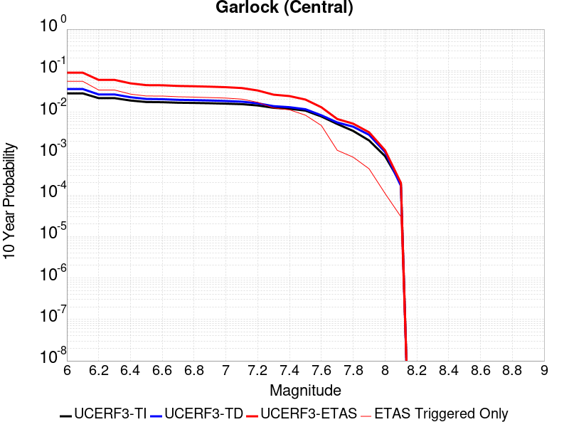 |

| Magnitude | 1 wk TI Prob | 1 wk TD Prob | 1 wk ETAS Prob | 1 wk ETAS/TD Gain | 1 wk ETAS Triggered Only | 1 mo TI Prob | 1 mo TD Prob | 1 mo ETAS Prob | 1 mo ETAS/TD Gain | 1 mo ETAS Triggered Only | 1 yr TI Prob | 1 yr TD Prob | 1 yr ETAS Prob | 1 yr ETAS/TD Gain | 1 yr ETAS Triggered Only | 10 yr TI Prob | 10 yr TD Prob | 10 yr ETAS Prob | 10 yr ETAS/TD Gain | 10 yr ETAS Triggered Only |
|-----|-----|-----|-----|-----|-----|-----|-----|-----|-----|-----|-----|-----|-----|-----|-----|-----|-----|-----|-----|-----|
| 6.0 | 5.5131142E-5 | 7.026513E-5 | 0.0027800747 | 39.565495 | 0.00271 | 2.3625491E-4 | 3.0110189E-4 | 0.009088455 | 30.183987 | 0.00879 | 0.0028726095 | 0.0036598188 | 0.033789147 | 9.232464 | 0.03024 | 0.028357591 | 0.03608902 | 0.08953788 | 2.4810283 | 0.05545 |
| 6.1 | 5.5131142E-5 | 7.026513E-5 | 0.0027800747 | 39.565495 | 0.00271 | 2.3625491E-4 | 3.0110189E-4 | 0.009088455 | 30.183987 | 0.00879 | 0.0028726095 | 0.0036598188 | 0.033789147 | 9.232464 | 0.03024 | 0.028357591 | 0.03608902 | 0.08953788 | 2.4810283 | 0.05545 |
| 6.2 | 4.216245E-5 | 5.167807E-5 | 0.0017115923 | 33.12028 | 0.00166 | 1.806837E-4 | 2.2145882E-4 | 0.005630261 | 25.423512 | 0.00541 | 0.0021976046 | 0.002692959 | 0.021003516 | 7.7994194 | 0.01836 | 0.021759989 | 0.026698196 | 0.059946187 | 2.2453272 | 0.03416 |
| 6.3 | 4.216245E-5 | 5.167807E-5 | 0.0017115923 | 33.12028 | 0.00166 | 1.806837E-4 | 2.2145882E-4 | 0.005630261 | 25.423512 | 0.00541 | 0.0021976046 | 0.002692959 | 0.021003516 | 7.7994194 | 0.01836 | 0.021759989 | 0.026698196 | 0.059946187 | 2.2453272 | 0.03416 |
| 6.4 | 3.6858168E-5 | 4.4126446E-5 | 0.0013540686 | 30.686104 | 0.00131 | 1.5795401E-4 | 1.8909977E-4 | 0.004528279 | 23.946508 | 0.00434 | 0.0019213937 | 0.0022998839 | 0.016796466 | 7.30318 | 0.01453 | 0.019048655 | 0.022857042 | 0.049464647 | 2.1640878 | 0.02723 |
| 6.5 | 3.39199E-5 | 4.0033694E-5 | 0.0012099869 | 30.224213 | 0.00117 | 1.453629E-4 | 1.7156181E-4 | 0.004050896 | 23.611876 | 0.00388 | 0.0017683565 | 0.0020867859 | 0.015219323 | 7.2931895 | 0.01316 | 0.017543508 | 0.020767836 | 0.044729646 | 2.1537943 | 0.02447 |
| 6.6 | 3.3571985E-5 | 3.948784E-5 | 0.0012094417 | 30.628204 | 0.00117 | 1.4387199E-4 | 1.6922275E-4 | 0.0040485663 | 23.924479 | 0.00388 | 0.0017502342 | 0.002058362 | 0.015181295 | 7.3754253 | 0.01315 | 0.017365133 | 0.020489132 | 0.04442838 | 2.1683877 | 0.02444 |
| 6.7 | 3.2580007E-5 | 3.810417E-5 | 0.0011780608 | 30.916847 | 0.00114 | 1.3962112E-4 | 1.6329347E-4 | 0.0039126812 | 23.961037 | 0.00375 | 0.0016985617 | 0.0019863066 | 0.01457126 | 7.3358555 | 0.01261 | 0.016856372 | 0.01978172 | 0.042816848 | 2.1644654 | 0.0235 |
| 6.8 | 3.2185937E-5 | 3.753133E-5 | 0.0011574893 | 30.840616 | 0.00112 | 1.3793244E-4 | 1.6083875E-4 | 0.003870242 | 24.06287 | 0.00371 | 0.0016780337 | 0.0019564745 | 0.014312253 | 7.315328 | 0.01238 | 0.016654192 | 0.019488493 | 0.042069674 | 2.158693 | 0.02303 |
| 6.9 | 3.165394E-5 | 3.673583E-5 | 0.0011266958 | 30.670216 | 0.00109 | 1.3565269E-4 | 1.5742988E-4 | 0.00377686 | 23.990744 | 0.00362 | 0.0016503202 | 0.0019150452 | 0.014011835 | 7.3167124 | 0.01212 | 0.01638118 | 0.019081086 | 0.041092906 | 2.1535938 | 0.02244 |
| 7.0 | 3.0903822E-5 | 3.5640976E-5 | 0.0010856036 | 30.459421 | 0.00105 | 1.3243823E-4 | 1.5273823E-4 | 0.0036522036 | 23.911524 | 0.0035 | 0.0016112428 | 0.001858023 | 0.013586191 | 7.312176 | 0.01175 | 0.015996104 | 0.0185202 | 0.039936088 | 2.156353 | 0.02182 |
| 7.1 | 3.0069863E-5 | 3.4407152E-5 | 9.943742E-4 | 28.900215 | 9.6E-4 | 1.2886449E-4 | 1.47451E-4 | 0.0034369659 | 23.309206 | 0.00329 | 0.0015677959 | 0.001793759 | 0.012813956 | 7.1436334 | 0.01104 | 0.01556781 | 0.017887801 | 0.03809967 | 2.1299248 | 0.02058 |
| 7.2 | 2.7957109E-5 | 3.1296197E-5 | 8.012721E-4 | 25.602858 | 7.7E-4 | 1.1981068E-4 | 1.3411978E-4 | 0.0029437428 | 21.948612 | 0.00281 | 0.0014577188 | 0.0016317047 | 0.010846644 | 6.6474304 | 0.00923 | 0.014481937 | 0.01629126 | 0.033270072 | 2.0422037 | 0.01726 |
| 7.3 | 2.4519275E-5 | 2.6728647E-5 | 5.8671366E-4 | 21.950745 | 5.6E-4 | 1.0507837E-4 | 1.145464E-4 | 0.0022343036 | 19.505665 | 0.00212 | 0.0012785783 | 0.0013937249 | 0.008054429 | 5.7790666 | 0.00667 | 0.012712469 | 0.013935179 | 0.026349736 | 1.8908788 | 0.01259 |
| 7.4 | 2.3225532E-5 | 2.5212968E-5 | 5.5519963E-4 | 22.020397 | 5.3E-4 | 9.95342E-5 | 1.0805119E-4 | 0.0020578406 | 19.045052 | 0.00195 | 0.0012111551 | 0.0013147438 | 0.007336816 | 5.5804152 | 0.00603 | 0.012045753 | 0.013152712 | 0.024373164 | 1.8530905 | 0.01137 |
| 7.5 | 2.097765E-5 | 2.2496582E-5 | 3.9248826E-4 | 17.446573 | 3.7E-4 | 8.9901114E-5 | 9.6410426E-5 | 0.0015962658 | 16.556984 | 0.0015 | 0.0010939965 | 0.0011731767 | 0.005657909 | 4.8227253 | 0.00449 | 0.010886264 | 0.011747014 | 0.02008787 | 1.7100405 | 0.00844 |
| 7.6 | 1.511254E-5 | 1.6003338E-5 | 2.060003E-4 | 12.872334 | 1.9E-4 | 6.476642E-5 | 6.858398E-5 | 8.385312E-4 | 12.226342 | 7.7E-4 | 7.882459E-4 | 8.3469786E-4 | 0.003302636 | 3.9566846 | 0.00247 | 0.007854558 | 0.00838977 | 0.013109835 | 1.5625976 | 0.00476 |
| 7.7 | 9.934069E-6 | 1.0689939E-5 | 9.0689085E-5 | 8.483592 | 8.0E-5 | 4.2573887E-5 | 4.5813224E-5 | 2.6580313E-4 | 5.801887 | 2.2E-4 | 5.182138E-4 | 5.5763364E-4 | 0.0011772879 | 2.111221 | 6.2E-4 | 0.00517007 | 0.0056334664 | 0.006826706 | 1.2118127 | 0.0012 |
| 7.8 | 6.7562896E-6 | 8.437533E-6 | 7.843694E-5 | 9.296194 | 7.0E-5 | 2.8955206E-5 | 3.6160356E-5 | 2.061542E-4 | 5.7011113 | 1.7E-4 | 3.5247262E-4 | 4.4016357E-4 | 9.399435E-4 | 2.1354413 | 5.0E-4 | 0.0035191406 | 0.004451369 | 0.005267719 | 1.183393 | 8.2E-4 |
| 7.9 | 3.975453E-6 | 5.3765793E-6 | 2.5376472E-5 | 4.719817 | 2.0E-5 | 1.7037546E-5 | 2.3042281E-5 | 9.304067E-5 | 4.0378237 | 7.0E-5 | 2.0741238E-4 | 2.8050374E-4 | 5.704224E-4 | 2.0335643 | 2.9E-4 | 0.002072189 | 0.0028365108 | 0.003265291 | 1.1511647 | 4.3E-4 |
| 8.0 | 1.6729537E-6 | 2.0794366E-6 | 1.2079416E-5 | 5.8089848 | 1.0E-5 | 7.169782E-6 | 8.911841E-6 | 1.8911753E-5 | 2.1220925 | 1.0E-5 | 8.7288594E-5 | 1.084963E-4 | 1.784887E-4 | 1.6451133 | 7.0E-5 | 8.7254314E-4 | 0.0010979337 | 0.0012078129 | 1.1000782 | 1.1E-4 |
| 8.1 | 3.6733252E-7 | 3.1517635E-7 | 3.1517635E-7 | 1.0 | 0.0 | 1.5742813E-6 | 1.3507553E-6 | 1.3507553E-6 | 1.0 | 0.0 | 1.9166706E-5 | 1.6445338E-5 | 2.6445172E-5 | 1.6080651 | 1.0E-5 | 1.9165053E-4 | 1.665326E-4 | 1.965276E-4 | 1.1801149 | 3.0E-5 |

## Tank Canyon
*[(top)](#table-of-contents)*

| 1 Week | 1 Month | 1 Year | 10 Year |
|-----|-----|-----|-----|
|  | 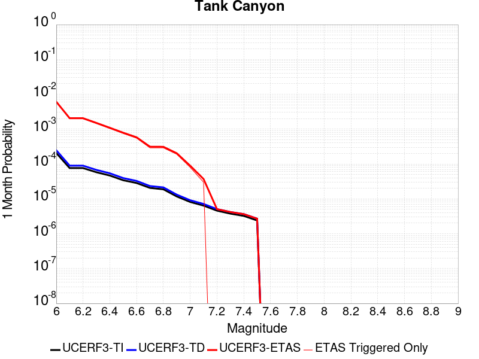 |  | 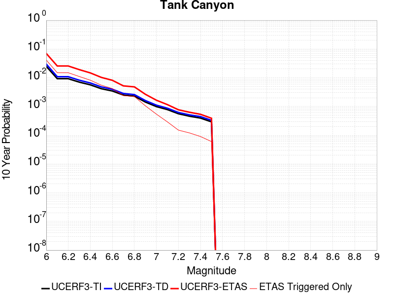 |

| Magnitude | 1 wk TI Prob | 1 wk TD Prob | 1 wk ETAS Prob | 1 wk ETAS/TD Gain | 1 wk ETAS Triggered Only | 1 mo TI Prob | 1 mo TD Prob | 1 mo ETAS Prob | 1 mo ETAS/TD Gain | 1 mo ETAS Triggered Only | 1 yr TI Prob | 1 yr TD Prob | 1 yr ETAS Prob | 1 yr ETAS/TD Gain | 1 yr ETAS Triggered Only | 10 yr TI Prob | 10 yr TD Prob | 10 yr ETAS Prob | 10 yr ETAS/TD Gain | 10 yr ETAS Triggered Only |
|-----|-----|-----|-----|-----|-----|-----|-----|-----|-----|-----|-----|-----|-----|-----|-----|-----|-----|-----|-----|-----|
| 6.0 | 4.8284557E-5 | 5.79694E-5 | 0.0018078679 | 31.186592 | 0.00175 | 2.0691741E-4 | 2.4842046E-4 | 0.00612696 | 24.663668 | 0.00588 | 0.0025163088 | 0.0030209913 | 0.024186855 | 8.006265 | 0.02123 | 0.02488006 | 0.02986594 | 0.06989367 | 2.340247 | 0.04126 |
| 6.1 | 1.7796336E-5 | 2.087466E-5 | 6.1086233E-4 | 29.263344 | 5.9E-4 | 7.626778E-5 | 8.945998E-5 | 0.0020592837 | 23.019049 | 0.00197 | 9.281647E-4 | 0.001088668 | 0.008630449 | 7.92753 | 0.00755 | 0.009242975 | 0.010837437 | 0.02558585 | 2.3608766 | 0.01491 |
| 6.2 | 1.7796336E-5 | 2.087466E-5 | 6.1086233E-4 | 29.263344 | 5.9E-4 | 7.626778E-5 | 8.945998E-5 | 0.0020592837 | 23.019049 | 0.00197 | 9.281647E-4 | 0.001088668 | 0.008630449 | 7.92753 | 0.00755 | 0.009242975 | 0.010837437 | 0.02558585 | 2.3608766 | 0.01491 |
| 6.3 | 1.3515912E-5 | 1.5760512E-5 | 4.157542E-4 | 26.379486 | 4.0E-4 | 5.792405E-5 | 6.754344E-5 | 0.0015074462 | 22.318172 | 0.00144 | 7.049971E-4 | 8.2205515E-4 | 0.0064374353 | 7.830904 | 0.00562 | 0.007027647 | 0.008192754 | 0.01912247 | 2.334071 | 0.01102 |
| 6.4 | 1.0870146E-5 | 1.2618734E-5 | 2.7261546E-4 | 21.604027 | 2.6E-4 | 4.658551E-5 | 5.4079268E-5 | 0.001094023 | 20.22999 | 0.00104 | 5.67031E-4 | 6.582341E-4 | 0.0048554693 | 7.3765087 | 0.0042 | 0.005655863 | 0.0065648598 | 0.014711028 | 2.2408745 | 0.0082 |
| 6.5 | 7.964826E-6 | 9.196566E-6 | 1.9919482E-4 | 21.659695 | 1.9E-4 | 3.4134522E-5 | 3.941332E-5 | 7.893838E-4 | 20.02835 | 7.5E-4 | 4.1550855E-4 | 4.7976218E-4 | 0.0033683756 | 7.020928 | 0.00289 | 0.0041473247 | 0.004788566 | 0.010262229 | 2.1430693 | 0.0055 |
| 6.6 | 6.6317E-6 | 7.6126576E-6 | 1.3761167E-4 | 18.076693 | 1.3E-4 | 2.8421264E-5 | 3.2625318E-5 | 5.8260735E-4 | 17.857523 | 5.5E-4 | 3.4597394E-4 | 3.9715E-4 | 0.0025662882 | 6.4617605 | 0.00217 | 0.0034543579 | 0.0039655543 | 0.008138939 | 2.052409 | 0.00419 |
| 6.7 | 4.793663E-6 | 5.4309917E-6 | 6.5430664E-5 | 12.0476465 | 6.0E-5 | 2.0544108E-5 | 2.3275496E-5 | 3.1326874E-4 | 13.459166 | 2.9E-4 | 2.500958E-4 | 2.833467E-4 | 0.0014730095 | 5.198612 | 0.00119 | 0.0024981452 | 0.0028305468 | 0.00520381 | 1.838447 | 0.00238 |
| 6.8 | 4.382823E-6 | 4.9694336E-6 | 6.4969136E-5 | 13.0737505 | 6.0E-5 | 1.8783392E-5 | 2.1297423E-5 | 3.1129125E-4 | 14.616381 | 2.9E-4 | 2.286638E-4 | 2.5926955E-4 | 0.0013689818 | 5.2801485 | 0.00111 | 0.0022842865 | 0.0025903448 | 0.0048045944 | 1.8548088 | 0.00222 |
| 6.9 | 2.729601E-6 | 3.0736246E-6 | 4.30735E-5 | 14.013911 | 4.0E-5 | 1.1698237E-5 | 1.31726165E-5 | 2.0317012E-4 | 15.423672 | 1.9E-4 | 1.4241673E-4 | 1.6036603E-4 | 6.9028104E-4 | 4.3044095 | 5.3E-4 | 0.001423255 | 0.0016026689 | 0.0026509862 | 1.6541071 | 0.00105 |
| 7.0 | 1.8987357E-6 | 2.1269839E-6 | 1.2126962E-5 | 5.701483 | 1.0E-5 | 8.137413E-6 | 9.115618E-6 | 8.911489E-5 | 9.776067 | 8.0E-5 | 9.90685E-5 | 1.1097769E-4 | 3.8094772E-4 | 3.4326515 | 2.7E-4 | 9.902435E-4 | 0.0011092913 | 0.0016486924 | 1.4862573 | 5.4E-4 |
| 7.1 | 1.4928986E-6 | 1.664158E-6 | 1.664158E-6 | 1.0 | 0.0 | 6.398121E-6 | 7.1320896E-6 | 3.7131875E-5 | 5.2063107 | 3.0E-5 | 7.789434E-5 | 8.6830325E-5 | 2.2681817E-4 | 2.6122 | 1.4E-4 | 7.786704E-4 | 8.6802186E-4 | 0.0011577702 | 1.3338029 | 2.9E-4 |
| 7.2 | 1.069082E-6 | 1.1828769E-6 | 1.1828769E-6 | 1.0 | 0.0 | 4.581772E-6 | 5.0694653E-6 | 5.0694653E-6 | 1.0 | 0.0 | 5.5781646E-5 | 6.1719526E-5 | 1.2171582E-4 | 1.9720796 | 6.0E-5 | 5.576765E-4 | 6.170761E-4 | 7.6698355E-4 | 1.2429318 | 1.5E-4 |
| 7.3 | 8.776551E-7 | 9.770148E-7 | 9.770148E-7 | 1.0 | 0.0 | 3.7613736E-6 | 4.187202E-6 | 4.187202E-6 | 1.0 | 0.0 | 4.579376E-5 | 5.0978513E-5 | 8.0976984E-5 | 1.5884532 | 3.0E-5 | 4.5784327E-4 | 5.0971925E-4 | 6.2965805E-4 | 1.2353038 | 1.2E-4 |
| 7.4 | 7.55721E-7 | 8.5103625E-7 | 8.5103625E-7 | 1.0 | 0.0 | 3.2388E-6 | 3.6472961E-6 | 3.6472961E-6 | 1.0 | 0.0 | 3.9431678E-5 | 4.4405442E-5 | 7.440411E-5 | 1.6755629 | 3.0E-5 | 3.942468E-4 | 4.4401656E-4 | 5.339766E-4 | 1.2026051 | 9.0E-5 |
| 7.5 | 5.587665E-7 | 6.3057047E-7 | 6.3057047E-7 | 1.0 | 0.0 | 2.3947114E-6 | 2.7024448E-6 | 2.7024448E-6 | 1.0 | 0.0 | 2.915522E-5 | 3.2902266E-5 | 6.290128E-5 | 1.9117613 | 3.0E-5 | 2.9151395E-4 | 3.2902267E-4 | 3.890029E-4 | 1.1822983 | 6.0E-5 |

## Little Lake
*[(top)](#table-of-contents)*

| 1 Week | 1 Month | 1 Year | 10 Year |
|-----|-----|-----|-----|
|  | 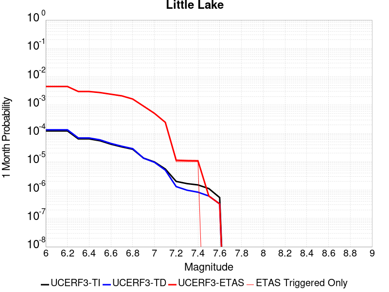 | 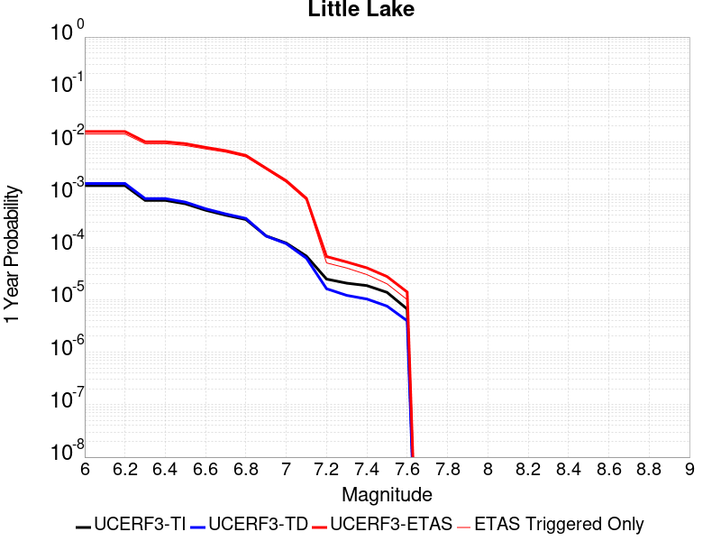 |  |

| Magnitude | 1 wk TI Prob | 1 wk TD Prob | 1 wk ETAS Prob | 1 wk ETAS/TD Gain | 1 wk ETAS Triggered Only | 1 mo TI Prob | 1 mo TD Prob | 1 mo ETAS Prob | 1 mo ETAS/TD Gain | 1 mo ETAS Triggered Only | 1 yr TI Prob | 1 yr TD Prob | 1 yr ETAS Prob | 1 yr ETAS/TD Gain | 1 yr ETAS Triggered Only | 10 yr TI Prob | 10 yr TD Prob | 10 yr ETAS Prob | 10 yr ETAS/TD Gain | 10 yr ETAS Triggered Only |
|-----|-----|-----|-----|-----|-----|-----|-----|-----|-----|-----|-----|-----|-----|-----|-----|-----|-----|-----|-----|-----|
| 6.0 | 2.8424427E-5 | 3.1207037E-5 | 0.0015911583 | 50.987164 | 0.00156 | 1.2181328E-4 | 1.3373834E-4 | 0.0045131524 | 33.74614 | 0.00438 | 0.0014820677 | 0.0016271813 | 0.015863977 | 9.74936 | 0.01426 | 0.014722223 | 0.016166078 | 0.0414998 | 2.5670915 | 0.02575 |
| 6.1 | 2.8424427E-5 | 3.1207037E-5 | 0.0015911583 | 50.987164 | 0.00156 | 1.2181328E-4 | 1.3373834E-4 | 0.0045131524 | 33.74614 | 0.00438 | 0.0014820677 | 0.0016271813 | 0.015863977 | 9.74936 | 0.01426 | 0.014722223 | 0.016166078 | 0.0414998 | 2.5670915 | 0.02575 |
| 6.2 | 2.8424427E-5 | 3.1207037E-5 | 0.0015911583 | 50.987164 | 0.00156 | 1.2181328E-4 | 1.3373834E-4 | 0.0045131524 | 33.74614 | 0.00438 | 0.0014820677 | 0.0016271813 | 0.015863977 | 9.74936 | 0.01426 | 0.014722223 | 0.016166078 | 0.0414998 | 2.5670915 | 0.02575 |
| 6.3 | 1.48860645E-5 | 1.6082002E-5 | 0.001016066 | 63.180317 | 0.001 | 6.379586E-5 | 6.89212E-5 | 0.0029987192 | 43.509388 | 0.00293 | 7.7643775E-4 | 8.3882076E-4 | 0.010141011 | 12.089604 | 0.00931 | 0.007737305 | 0.008359365 | 0.02489993 | 2.978687 | 0.01668 |
| 6.4 | 1.48860645E-5 | 1.6082002E-5 | 0.001016066 | 63.180317 | 0.001 | 6.379586E-5 | 6.89212E-5 | 0.0029987192 | 43.509388 | 0.00293 | 7.7643775E-4 | 8.3882076E-4 | 0.010141011 | 12.089604 | 0.00931 | 0.007737305 | 0.008359365 | 0.02489993 | 2.978687 | 0.01668 |
| 6.5 | 1.2797581E-5 | 1.3766076E-5 | 9.337534E-4 | 67.83003 | 9.2E-4 | 5.4845623E-5 | 5.899628E-5 | 0.0027488377 | 46.593403 | 0.00269 | 6.675408E-4 | 7.180687E-4 | 0.009311893 | 12.96797 | 0.0086 | 0.006655392 | 0.0071600354 | 0.022221418 | 3.1035347 | 0.01517 |
| 6.6 | 9.661896E-6 | 1.0289399E-5 | 7.802815E-4 | 75.833534 | 7.7E-4 | 4.1407468E-5 | 4.409677E-5 | 0.0024039927 | 54.5163 | 0.00236 | 5.040193E-4 | 5.367622E-4 | 0.007922796 | 14.760346 | 0.00739 | 0.005028777 | 0.005356262 | 0.018256791 | 3.408495 | 0.01297 |
| 6.7 | 7.767871E-6 | 8.199962E-6 | 6.881944E-4 | 83.92654 | 6.8E-4 | 3.329045E-5 | 3.5142297E-5 | 0.0021050696 | 59.901306 | 0.00207 | 4.0523586E-4 | 4.2778722E-4 | 0.0068550366 | 16.024406 | 0.00643 | 0.004044977 | 0.004270989 | 0.015632257 | 3.6601024 | 0.01141 |
| 6.8 | 6.4235196E-6 | 6.735968E-6 | 5.7673216E-4 | 85.61979 | 5.7E-4 | 2.752908E-5 | 2.8868186E-5 | 0.001628822 | 56.422733 | 0.0016 | 3.35115E-4 | 3.514263E-4 | 0.0055695917 | 15.848534 | 0.00522 | 0.003346101 | 0.0035099662 | 0.012737464 | 3.628942 | 0.00926 |
| 6.9 | 3.1283696E-6 | 3.1122595E-6 | 2.9311137E-4 | 94.1796 | 2.9E-4 | 1.3407229E-5 | 1.33381955E-5 | 9.1332616E-4 | 68.474495 | 9.0E-4 | 1.6322079E-4 | 1.6238193E-4 | 0.0031818915 | 19.595108 | 0.00302 | 0.0016310095 | 0.0016227812 | 0.0070339856 | 4.334525 | 0.00542 |
| 7.0 | 2.290603E-6 | 2.2287413E-6 | 1.9222831E-4 | 86.24972 | 1.9E-4 | 9.816834E-6 | 9.55172E-6 | 5.0954695E-4 | 53.346096 | 5.0E-4 | 1.19513395E-4 | 1.1628702E-4 | 0.001836087 | 15.7892685 | 0.00172 | 0.0011944914 | 0.0011623639 | 0.0044185747 | 3.8013694 | 0.00326 |
| 7.1 | 1.293693E-6 | 1.1777198E-6 | 9.1177615E-5 | 77.41876 | 9.0E-5 | 5.5443866E-6 | 5.047365E-6 | 2.4504616E-4 | 48.549324 | 2.4E-4 | 6.750081E-5 | 6.1450635E-5 | 8.5140206E-4 | 13.855058 | 7.9E-4 | 6.7480316E-4 | 6.144049E-4 | 0.0021034894 | 3.423621 | 0.00149 |
| 7.2 | 4.715842E-7 | 3.0919614E-7 | 3.0919614E-7 | 1.0 | 0.0 | 2.0210737E-6 | 1.3251256E-6 | 1.1325113E-5 | 8.546444 | 1.0E-5 | 2.4606294E-5 | 1.613329E-5 | 6.613248E-5 | 4.0991316 | 5.0E-5 | 2.460357E-4 | 1.6132173E-4 | 2.4130884E-4 | 1.4958234 | 8.0E-5 |
| 7.3 | 3.9430947E-7 | 2.30991E-7 | 2.30991E-7 | 1.0 | 0.0 | 1.6898966E-6 | 9.899611E-7 | 1.0989951E-5 | 11.1013975 | 1.0E-5 | 2.0574296E-5 | 1.205271E-5 | 5.205223E-5 | 4.3187156 | 4.0E-5 | 2.0572392E-4 | 1.2052064E-4 | 1.905122E-4 | 1.5807434 | 7.0E-5 |
| 7.4 | 3.547123E-7 | 1.9680634E-7 | 1.9680634E-7 | 1.0 | 0.0 | 1.5201948E-6 | 8.4345544E-7 | 1.0843447E-5 | 12.855981 | 1.0E-5 | 1.8508214E-5 | 1.0269022E-5 | 4.0268715E-5 | 3.9213777 | 3.0E-5 | 1.8506673E-4 | 1.0268554E-4 | 1.6267938E-4 | 1.5842482 | 6.0E-5 |
| 7.5 | 2.6354266E-7 | 1.4424187E-7 | 1.4424187E-7 | 1.0 | 0.0 | 1.129468E-6 | 6.181793E-7 | 6.181793E-7 | 1.0 | 0.0 | 1.3751187E-5 | 7.526307E-6 | 2.7526157E-5 | 3.6573257 | 2.0E-5 | 1.3750336E-4 | 7.526057E-5 | 1.15257564E-4 | 1.5314468 | 4.0E-5 |
| 7.6 | 1.269913E-7 | 7.573001E-8 | 7.573001E-8 | 1.0 | 0.0 | 5.4424834E-7 | 3.2455713E-7 | 3.2455713E-7 | 1.0 | 0.0 | 6.6262032E-6 | 3.951476E-6 | 1.3951437E-5 | 3.5306897 | 1.0E-5 | 6.626006E-5 | 3.9514096E-5 | 6.951291E-5 | 1.7591927 | 3.0E-5 |

## Airport Lake
*[(top)](#table-of-contents)*

| 1 Week | 1 Month | 1 Year | 10 Year |
|-----|-----|-----|-----|
| 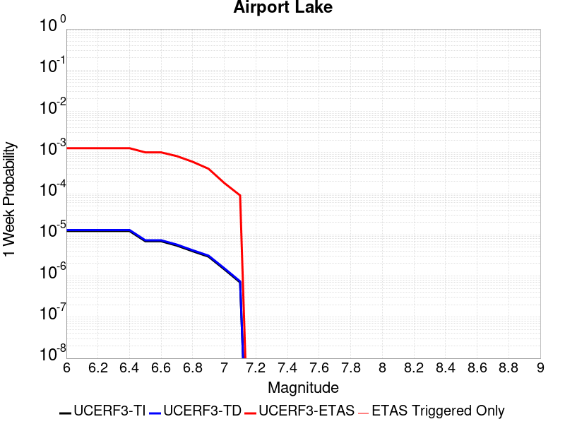 | 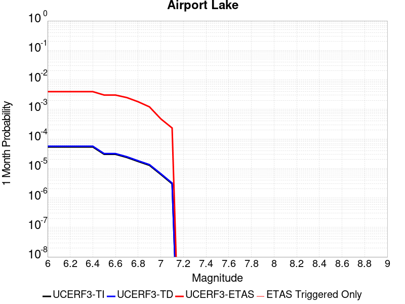 |  |  |

| Magnitude | 1 wk TI Prob | 1 wk TD Prob | 1 wk ETAS Prob | 1 wk ETAS/TD Gain | 1 wk ETAS Triggered Only | 1 mo TI Prob | 1 mo TD Prob | 1 mo ETAS Prob | 1 mo ETAS/TD Gain | 1 mo ETAS Triggered Only | 1 yr TI Prob | 1 yr TD Prob | 1 yr ETAS Prob | 1 yr ETAS/TD Gain | 1 yr ETAS Triggered Only | 10 yr TI Prob | 10 yr TD Prob | 10 yr ETAS Prob | 10 yr ETAS/TD Gain | 10 yr ETAS Triggered Only |
|-----|-----|-----|-----|-----|-----|-----|-----|-----|-----|-----|-----|-----|-----|-----|-----|-----|-----|-----|-----|-----|
| 6.0 | 1.2387061E-5 | 1.31034585E-5 | 0.001273087 | 97.15656 | 0.00126 | 5.3086325E-5 | 5.615663E-5 | 0.0039759367 | 70.80084 | 0.00392 | 6.461343E-4 | 6.835209E-4 | 0.012955127 | 18.95352 | 0.01228 | 0.0064425888 | 0.006816996 | 0.027554657 | 4.0420527 | 0.02088 |
| 6.1 | 1.2387061E-5 | 1.31034585E-5 | 0.001273087 | 97.15656 | 0.00126 | 5.3086325E-5 | 5.615663E-5 | 0.0039759367 | 70.80084 | 0.00392 | 6.461343E-4 | 6.835209E-4 | 0.012955127 | 18.95352 | 0.01228 | 0.0064425888 | 0.006816996 | 0.027554657 | 4.0420527 | 0.02088 |
| 6.2 | 1.2387061E-5 | 1.31034585E-5 | 0.001273087 | 97.15656 | 0.00126 | 5.3086325E-5 | 5.615663E-5 | 0.0039759367 | 70.80084 | 0.00392 | 6.461343E-4 | 6.835209E-4 | 0.012955127 | 18.95352 | 0.01228 | 0.0064425888 | 0.006816996 | 0.027554657 | 4.0420527 | 0.02088 |
| 6.3 | 1.2387061E-5 | 1.31034585E-5 | 0.001273087 | 97.15656 | 0.00126 | 5.3086325E-5 | 5.615663E-5 | 0.0039759367 | 70.80084 | 0.00392 | 6.461343E-4 | 6.835209E-4 | 0.012955127 | 18.95352 | 0.01228 | 0.0064425888 | 0.006816996 | 0.027554657 | 4.0420527 | 0.02088 |
| 6.4 | 1.2387061E-5 | 1.31034585E-5 | 0.001273087 | 97.15656 | 0.00126 | 5.3086325E-5 | 5.615663E-5 | 0.0039759367 | 70.80084 | 0.00392 | 6.461343E-4 | 6.835209E-4 | 0.012955127 | 18.95352 | 0.01228 | 0.0064425888 | 0.006816996 | 0.027554657 | 4.0420527 | 0.02088 |
| 6.5 | 6.9922594E-6 | 7.38509E-6 | 0.0010073778 | 136.40697 | 0.001 | 2.996648E-5 | 3.1650034E-5 | 0.0030515546 | 96.41552 | 0.00302 | 3.6478083E-4 | 3.8527645E-4 | 0.009631713 | 24.999485 | 0.00925 | 0.003641826 | 0.0038466225 | 0.019585846 | 5.0916996 | 0.0158 |
| 6.6 | 6.9922594E-6 | 7.38509E-6 | 0.0010073778 | 136.40697 | 0.001 | 2.996648E-5 | 3.1650034E-5 | 0.0030515546 | 96.41552 | 0.00302 | 3.6478083E-4 | 3.8527645E-4 | 0.009631713 | 24.999485 | 0.00925 | 0.003641826 | 0.0038466225 | 0.019585846 | 5.0916996 | 0.0158 |
| 6.7 | 5.477277E-6 | 5.7861985E-6 | 8.1578153E-4 | 140.98747 | 8.1E-4 | 2.3473833E-5 | 2.4797779E-5 | 0.0025047362 | 101.00648 | 0.00248 | 2.8575645E-4 | 3.0187503E-4 | 0.007929572 | 26.26773 | 0.00763 | 0.0028538927 | 0.0030150334 | 0.016085505 | 5.3351007 | 0.01311 |
| 6.8 | 3.9950432E-6 | 4.2191814E-6 | 5.942167E-4 | 140.83698 | 5.9E-4 | 1.7121502E-5 | 1.8082095E-5 | 0.0018080497 | 99.99116 | 0.00179 | 2.0843433E-4 | 2.2013002E-4 | 0.0059188753 | 26.888086 | 0.0057 | 0.0020823893 | 0.0021993907 | 0.012247243 | 5.5684705 | 0.01007 |
| 6.9 | 2.95695E-6 | 3.123094E-6 | 4.0312184E-4 | 129.07771 | 4.0E-4 | 1.2672582E-5 | 1.3384633E-5 | 0.0012133686 | 90.653854 | 0.0012 | 1.5427776E-4 | 1.6294798E-4 | 0.0042022895 | 25.789146 | 0.00404 | 0.001541707 | 0.0016285075 | 0.0088567175 | 5.4385486 | 0.00724 |
| 7.0 | 1.456072E-6 | 1.5408477E-6 | 1.8154057E-4 | 117.818634 | 1.8E-4 | 6.2402937E-6 | 6.603622E-6 | 4.7660051E-4 | 72.17259 | 4.7E-4 | 7.597293E-5 | 8.039714E-5 | 0.0016902677 | 21.02398 | 0.00161 | 7.594696E-4 | 8.037794E-4 | 0.0038813038 | 4.828817 | 0.00308 |
| 7.1 | 6.995192E-7 | 7.4091486E-7 | 9.074085E-5 | 122.47135 | 9.0E-5 | 2.997936E-6 | 3.1753495E-6 | 2.3317462E-4 | 73.43274 | 2.3E-4 | 3.649926E-5 | 3.865988E-5 | 7.6863164E-4 | 19.881895 | 7.3E-4 | 3.6493264E-4 | 3.865988E-4 | 0.0017760614 | 4.5940685 | 0.00139 |

## Owl Lake
*[(top)](#table-of-contents)*

| 1 Week | 1 Month | 1 Year | 10 Year |
|-----|-----|-----|-----|
| 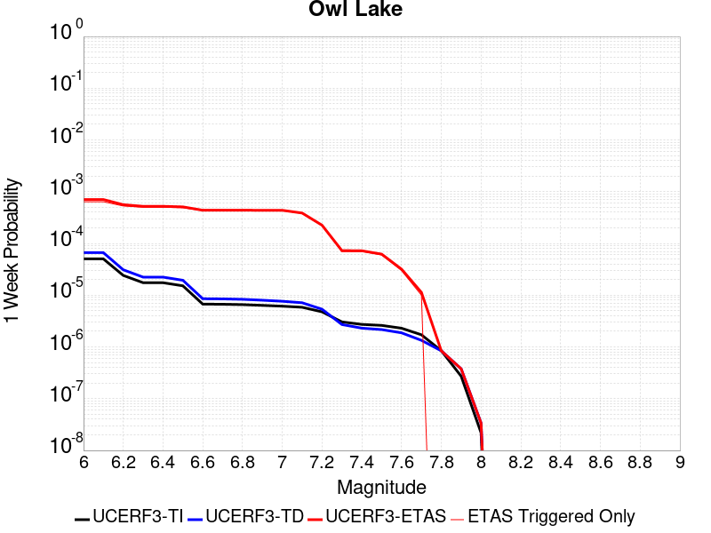 |  | 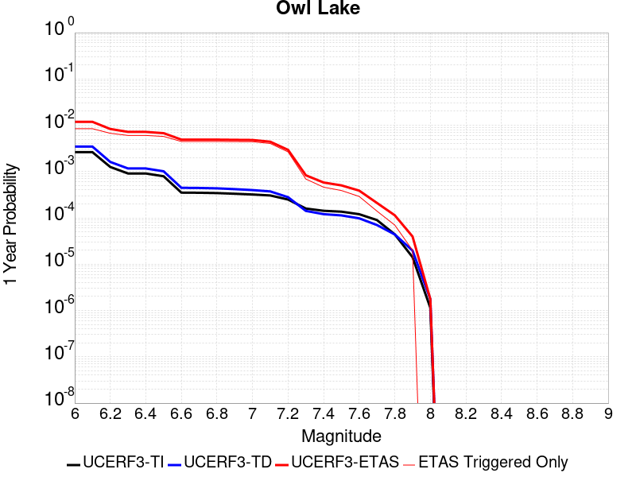 |  |

| Magnitude | 1 wk TI Prob | 1 wk TD Prob | 1 wk ETAS Prob | 1 wk ETAS/TD Gain | 1 wk ETAS Triggered Only | 1 mo TI Prob | 1 mo TD Prob | 1 mo ETAS Prob | 1 mo ETAS/TD Gain | 1 mo ETAS Triggered Only | 1 yr TI Prob | 1 yr TD Prob | 1 yr ETAS Prob | 1 yr ETAS/TD Gain | 1 yr ETAS Triggered Only | 10 yr TI Prob | 10 yr TD Prob | 10 yr ETAS Prob | 10 yr ETAS/TD Gain | 10 yr ETAS Triggered Only |
|-----|-----|-----|-----|-----|-----|-----|-----|-----|-----|-----|-----|-----|-----|-----|-----|-----|-----|-----|-----|-----|
| 6.0 | 5.0320643E-5 | 6.636817E-5 | 7.063257E-4 | 10.642536 | 6.4E-4 | 2.1564208E-4 | 2.844103E-4 | 0.0024238017 | 8.522201 | 0.00214 | 0.0026222812 | 0.0034582524 | 0.011859099 | 3.4292173 | 0.00843 | 0.02591553 | 0.034145463 | 0.05044909 | 1.4774755 | 0.01688 |
| 6.1 | 5.0320643E-5 | 6.636817E-5 | 7.063257E-4 | 10.642536 | 6.4E-4 | 2.1564208E-4 | 2.844103E-4 | 0.0024238017 | 8.522201 | 0.00214 | 0.0026222812 | 0.0034582524 | 0.011859099 | 3.4292173 | 0.00843 | 0.02591553 | 0.034145463 | 0.05044909 | 1.4774755 | 0.01688 |
| 6.2 | 2.4125871E-5 | 3.0986E-5 | 5.609696E-4 | 18.103968 | 5.3E-4 | 1.0339249E-4 | 1.3279155E-4 | 0.0018625618 | 14.026206 | 0.00173 | 0.0012580766 | 0.0016156904 | 0.008314849 | 5.146313 | 0.00671 | 0.012509781 | 0.016072964 | 0.028696747 | 1.7854048 | 0.01283 |
| 6.3 | 1.7433485E-5 | 2.235948E-5 | 5.223483E-4 | 23.36138 | 5.0E-4 | 7.471279E-5 | 9.5823714E-5 | 0.0017056694 | 17.800076 | 0.00161 | 9.0924866E-4 | 0.0011661794 | 0.007189147 | 6.164701 | 0.00603 | 0.009055373 | 0.011630917 | 0.022799488 | 1.9602485 | 0.0113 |
| 6.4 | 1.7433485E-5 | 2.235948E-5 | 5.223483E-4 | 23.36138 | 5.0E-4 | 7.471279E-5 | 9.5823714E-5 | 0.0017056694 | 17.800076 | 0.00161 | 9.0924866E-4 | 0.0011661794 | 0.007189147 | 6.164701 | 0.00603 | 0.009055373 | 0.011630917 | 0.022799488 | 1.9602485 | 0.0113 |
| 6.5 | 1.5182742E-5 | 1.9432768E-5 | 5.0942326E-4 | 26.214651 | 4.9E-4 | 6.506727E-5 | 8.328149E-5 | 0.0016231532 | 19.489964 | 0.00154 | 7.919061E-4 | 0.0010136318 | 0.0067478134 | 6.657066 | 0.00574 | 0.0078909 | 0.010120282 | 0.020711996 | 2.0465827 | 0.0107 |
| 6.6 | 6.7271576E-6 | 8.5497495E-6 | 4.3854606E-4 | 51.29344 | 4.3E-4 | 2.8830356E-5 | 3.66413E-5 | 0.0013365936 | 36.47779 | 0.0013 | 3.5095305E-4 | 4.4602217E-4 | 0.0049040327 | 10.995043 | 0.00446 | 0.0035039932 | 0.0044690524 | 0.012343702 | 2.7620401 | 0.00791 |
| 6.7 | 6.682835E-6 | 8.482191E-6 | 4.3847854E-4 | 51.69402 | 4.3E-4 | 2.8640408E-5 | 3.6351772E-5 | 0.0013363045 | 36.760365 | 0.0013 | 3.4864116E-4 | 4.4249863E-4 | 0.004900525 | 11.074667 | 0.00446 | 0.003480947 | 0.0044339765 | 0.012308904 | 2.7760417 | 0.00791 |
| 6.8 | 6.5774975E-6 | 8.328653E-6 | 4.3832508E-4 | 52.628563 | 4.3E-4 | 2.8188972E-5 | 3.569377E-5 | 0.0013356474 | 37.41962 | 0.0013 | 3.4314668E-4 | 4.3449068E-4 | 0.0048925527 | 11.260432 | 0.00446 | 0.0034261728 | 0.004354117 | 0.012209763 | 2.8041883 | 0.00789 |
| 6.9 | 6.363419E-6 | 8.001798E-6 | 4.3799836E-4 | 54.73749 | 4.3E-4 | 2.727151E-5 | 3.4293E-5 | 0.0013342485 | 38.90731 | 0.0013 | 3.3198006E-4 | 4.174429E-4 | 0.0048455936 | 11.6078005 | 0.00443 | 0.0033148455 | 0.004184094 | 0.01199129 | 2.865923 | 0.00784 |
| 7.0 | 6.1342453E-6 | 7.633961E-6 | 4.376307E-4 | 57.326817 | 4.3E-4 | 2.6289357E-5 | 3.2716594E-5 | 0.0013226744 | 40.428238 | 0.00129 | 3.2002592E-4 | 3.9825725E-4 | 0.004806501 | 12.068834 | 0.00441 | 0.0031956544 | 0.0039927685 | 0.011771585 | 2.9482262 | 0.00781 |
| 7.1 | 5.842926E-6 | 7.14446E-6 | 3.8714174E-4 | 54.187683 | 3.8E-4 | 2.504087E-5 | 3.0618787E-5 | 0.001200583 | 39.210663 | 0.00117 | 3.0482994E-4 | 3.727254E-4 | 0.0044112196 | 11.835039 | 0.00404 | 0.0030441214 | 0.0037382022 | 0.010981025 | 2.9375153 | 0.00727 |
| 7.2 | 4.77173E-6 | 5.3605236E-6 | 2.2535934E-4 | 42.040546 | 2.2E-4 | 2.045011E-5 | 2.2973494E-5 | 7.929558E-4 | 34.516117 | 7.7E-4 | 2.4895166E-4 | 2.7967044E-4 | 0.0029389265 | 10.508534 | 0.00266 | 0.0024867293 | 0.002809708 | 0.007446643 | 2.6503263 | 0.00465 |
| 7.3 | 3.0494948E-6 | 2.7119684E-6 | 7.271178E-5 | 26.81144 | 7.0E-5 | 1.3069198E-5 | 1.1622671E-5 | 2.2162023E-4 | 19.067926 | 2.1E-4 | 1.5910587E-4 | 1.4149699E-4 | 8.3139935E-4 | 5.8757386 | 6.9E-4 | 0.0015899199 | 0.0014240269 | 0.0027321614 | 1.9186164 | 0.00131 |
| 7.4 | 2.7263884E-6 | 2.3070897E-6 | 7.230693E-5 | 31.341185 | 7.0E-5 | 1.1684469E-5 | 9.887491E-6 | 1.4988611E-4 | 15.159164 | 1.4E-4 | 1.4224913E-4 | 1.20373654E-4 | 5.803183E-4 | 4.8209743 | 4.6E-4 | 0.0014215811 | 0.0012119616 | 0.0020409557 | 1.6840101 | 8.3E-4 |
| 7.5 | 2.6090431E-6 | 2.167001E-6 | 6.216687E-5 | 28.687977 | 6.0E-5 | 1.1181565E-5 | 9.287114E-6 | 1.29286E-4 | 13.921009 | 1.2E-4 | 1.3612706E-4 | 1.13064845E-4 | 5.0302077E-4 | 4.448958 | 3.9E-4 | 0.001360437 | 0.001138705 | 0.0018778623 | 1.649121 | 7.4E-4 |
| 7.6 | 2.3008756E-6 | 1.8741263E-6 | 3.187407E-5 | 17.00743 | 3.0E-5 | 9.860858E-6 | 8.031946E-6 | 8.80313E-5 | 10.960147 | 8.0E-5 | 1.20049335E-4 | 9.7784636E-5 | 3.8775627E-4 | 3.9654112 | 2.9E-4 | 0.001199845 | 9.85689E-4 | 0.0015051765 | 1.5270298 | 5.2E-4 |
| 7.7 | 1.7184348E-6 | 1.3431506E-6 | 1.1343137E-5 | 8.445171 | 1.0E-5 | 7.3646997E-6 | 5.7563475E-6 | 5.575606E-5 | 9.686013 | 5.0E-5 | 8.966153E-5 | 7.008132E-5 | 2.100715E-4 | 2.9975393 | 1.4E-4 | 8.962536E-4 | 7.084795E-4 | 9.782882E-4 | 1.3808278 | 2.7E-4 |
| 7.8 | 8.4612907E-7 | 8.414664E-7 | 8.414664E-7 | 1.0 | 0.0 | 3.6262625E-6 | 3.6062795E-6 | 2.3606208E-5 | 6.5458617 | 2.0E-5 | 4.4148852E-5 | 4.390559E-5 | 1.1390252E-4 | 2.59426 | 7.0E-5 | 4.414008E-4 | 4.4444422E-4 | 5.2440865E-4 | 1.1799201 | 8.0E-5 |
| 7.9 | 2.716738E-7 | 3.7719968E-7 | 3.7719968E-7 | 1.0 | 0.0 | 1.1643157E-6 | 1.6165692E-6 | 1.6165692E-6 | 1.0 | 0.0 | 1.4175452E-5 | 1.9681562E-5 | 3.968117E-5 | 2.0161595 | 2.0E-5 | 1.4174548E-4 | 1.9856969E-4 | 2.185657E-4 | 1.1007003 | 2.0E-5 |
| 8.0 | 2.1995428E-8 | 3.3882827E-8 | 3.3882827E-8 | 1.0 | 0.0 | 9.426611E-8 | 1.4521211E-7 | 1.4521211E-7 | 1.0 | 0.0 | 1.1476893E-6 | 1.7679567E-6 | 1.7679567E-6 | 1.0 | 0.0 | 1.14768345E-5 | 1.798076E-5 | 1.798076E-5 | 1.0 | 0.0 |

## Panamint Valley
*[(top)](#table-of-contents)*

| 1 Week | 1 Month | 1 Year | 10 Year |
|-----|-----|-----|-----|
|  | 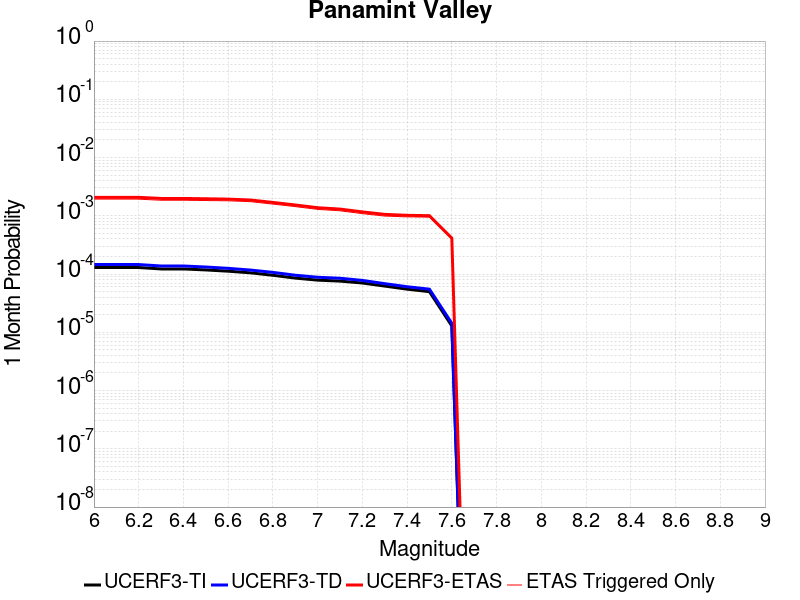 |  |  |

| Magnitude | 1 wk TI Prob | 1 wk TD Prob | 1 wk ETAS Prob | 1 wk ETAS/TD Gain | 1 wk ETAS Triggered Only | 1 mo TI Prob | 1 mo TD Prob | 1 mo ETAS Prob | 1 mo ETAS/TD Gain | 1 mo ETAS Triggered Only | 1 yr TI Prob | 1 yr TD Prob | 1 yr ETAS Prob | 1 yr ETAS/TD Gain | 1 yr ETAS Triggered Only | 10 yr TI Prob | 10 yr TD Prob | 10 yr ETAS Prob | 10 yr ETAS/TD Gain | 10 yr ETAS Triggered Only |
|-----|-----|-----|-----|-----|-----|-----|-----|-----|-----|-----|-----|-----|-----|-----|-----|-----|-----|-----|-----|-----|
| 6.0 | 3.0211835E-5 | 3.3987097E-5 | 4.7397215E-4 | 13.945649 | 4.4E-4 | 1.2947287E-4 | 1.4565102E-4 | 0.00207537 | 14.248921 | 0.00193 | 0.0015751923 | 0.0017718883 | 0.0085897865 | 4.8478146 | 0.00683 | 0.015640736 | 0.017584462 | 0.030660413 | 1.7436082 | 0.01331 |
| 6.1 | 3.0211835E-5 | 3.3987097E-5 | 4.7397215E-4 | 13.945649 | 4.4E-4 | 1.2947287E-4 | 1.4565102E-4 | 0.00207537 | 14.248921 | 0.00193 | 0.0015751923 | 0.0017718883 | 0.0085897865 | 4.8478146 | 0.00683 | 0.015640736 | 0.017584462 | 0.030660413 | 1.7436082 | 0.01331 |
| 6.2 | 3.0211835E-5 | 3.3987097E-5 | 4.7397215E-4 | 13.945649 | 4.4E-4 | 1.2947287E-4 | 1.4565102E-4 | 0.00207537 | 14.248921 | 0.00193 | 0.0015751923 | 0.0017718883 | 0.0085897865 | 4.8478146 | 0.00683 | 0.015640736 | 0.017584462 | 0.030660413 | 1.7436082 | 0.01331 |
| 6.3 | 2.8573924E-5 | 3.2105134E-5 | 4.5209166E-4 | 14.0816 | 4.2E-4 | 1.2245393E-4 | 1.3758632E-4 | 0.0019873318 | 14.444254 | 0.00185 | 0.001489857 | 0.0016738542 | 0.008172957 | 4.8827176 | 0.00651 | 0.01479908 | 0.01661906 | 0.028980158 | 1.7437905 | 0.01257 |
| 6.4 | 2.8573924E-5 | 3.2105134E-5 | 4.5209166E-4 | 14.0816 | 4.2E-4 | 1.2245393E-4 | 1.3758632E-4 | 0.0019873318 | 14.444254 | 0.00185 | 0.001489857 | 0.0016738542 | 0.008172957 | 4.8827176 | 0.00651 | 0.01479908 | 0.01661906 | 0.028980158 | 1.7437905 | 0.01257 |
| 6.5 | 2.7468774E-5 | 3.0830794E-5 | 4.5081784E-4 | 14.622323 | 4.2E-4 | 1.1771801E-4 | 1.3212544E-4 | 0.0019618836 | 14.848644 | 0.00183 | 0.0014322745 | 0.0016074677 | 0.008007164 | 4.981229 | 0.00641 | 0.014230782 | 0.015964888 | 0.027989797 | 1.7532097 | 0.01222 |
| 6.6 | 2.6135967E-5 | 2.9254741E-5 | 4.4924245E-4 | 15.356228 | 4.2E-4 | 1.1200648E-4 | 1.2537159E-4 | 0.0019351447 | 15.435273 | 0.00181 | 0.0013628257 | 0.0015253568 | 0.00769593 | 5.045331 | 0.00618 | 0.013544982 | 0.015155205 | 0.026766526 | 1.7661606 | 0.01179 |
| 6.7 | 2.4498746E-5 | 2.7343522E-5 | 4.4733204E-4 | 16.359709 | 4.2E-4 | 1.04990395E-4 | 1.171814E-4 | 0.0018669764 | 15.932361 | 0.00175 | 0.0012775084 | 0.0014257749 | 0.00727742 | 5.1041856 | 0.00586 | 0.012701893 | 0.014172399 | 0.025174236 | 1.776286 | 0.01116 |
| 6.8 | 2.2244329E-5 | 2.4937477E-5 | 3.849285E-4 | 15.435744 | 3.6E-4 | 9.532935E-5 | 1.0687064E-4 | 0.0016967007 | 15.876209 | 0.00159 | 0.0011600169 | 0.0013003952 | 0.0066634123 | 5.1241436 | 0.00537 | 0.011539802 | 0.012933576 | 0.023159584 | 1.7906559 | 0.01036 |
| 6.9 | 1.9902658E-5 | 2.2292168E-5 | 3.622846E-4 | 16.251654 | 3.4E-4 | 8.529431E-5 | 9.5534466E-5 | 0.0015353969 | 16.071653 | 0.00144 | 0.0010379635 | 0.00116253 | 0.005827101 | 5.0124307 | 0.00467 | 0.010331288 | 0.011569588 | 0.020505 | 1.7723188 | 0.00904 |
| 7.0 | 1.8353881E-5 | 2.0567984E-5 | 3.305616E-4 | 16.07166 | 3.1E-4 | 7.865712E-5 | 8.814562E-5 | 0.0013780319 | 15.633583 | 0.00129 | 9.5722964E-4 | 0.0010726623 | 0.005417996 | 5.0509806 | 0.00435 | 0.009531168 | 0.010679777 | 0.018920815 | 1.7716489 | 0.00833 |
| 7.1 | 1.7667631E-5 | 1.9774347E-5 | 3.097686E-4 | 15.665175 | 2.9E-4 | 7.571623E-5 | 8.474455E-5 | 0.0013046411 | 15.394986 | 0.00122 | 9.2145515E-4 | 0.0010312941 | 0.0051670247 | 5.010234 | 0.00414 | 0.009176437 | 0.010269969 | 0.018177912 | 1.7700065 | 0.00799 |
| 7.2 | 1.6381597E-5 | 1.8159873E-5 | 2.7815514E-4 | 15.317019 | 2.6E-4 | 7.020495E-5 | 7.782581E-5 | 0.001167741 | 15.004547 | 0.00109 | 8.544101E-4 | 9.471346E-4 | 0.0045736963 | 4.8289824 | 0.00363 | 0.008511325 | 0.009435632 | 0.01650826 | 1.7495661 | 0.00714 |
| 7.3 | 1.4520491E-5 | 1.5967777E-5 | 2.0596474E-4 | 12.898774 | 1.9E-4 | 6.222919E-5 | 6.843162E-5 | 0.0010583638 | 15.466006 | 9.9E-4 | 7.57377E-4 | 8.3285273E-4 | 0.0039402624 | 4.7310433 | 0.00311 | 0.0075480095 | 0.008300425 | 0.014230788 | 1.7144651 | 0.00598 |
| 7.4 | 1.2852287E-5 | 1.4146584E-5 | 2.041439E-4 | 14.430614 | 1.9E-4 | 5.5080065E-5 | 6.06269E-5 | 0.0010205687 | 16.833595 | 9.6E-4 | 6.7039346E-4 | 7.378983E-4 | 0.0037456772 | 5.076143 | 0.00301 | 0.0066837464 | 0.0073574027 | 0.013084951 | 1.7784741 | 0.00577 |
| 7.5 | 1.1637851E-5 | 1.2837853E-5 | 2.0283542E-4 | 15.799792 | 1.9E-4 | 4.987555E-5 | 5.50183E-5 | 0.001004966 | 18.266033 | 9.5E-4 | 6.070656E-4 | 6.696576E-4 | 0.0036276754 | 5.417209 | 0.00296 | 0.006054099 | 0.006679294 | 0.01227169 | 1.8372735 | 0.00563 |
| 7.6 | 3.0068115E-6 | 3.3334434E-6 | 6.3333246E-5 | 18.999346 | 6.0E-5 | 1.2886271E-5 | 1.4286148E-5 | 4.1428042E-4 | 28.998749 | 4.0E-4 | 1.5687906E-4 | 1.7392726E-4 | 0.0014836994 | 8.530575 | 0.00131 | 0.0015676835 | 0.0017393517 | 0.004294899 | 2.4692528 | 0.00256 |

## Garlock (East)
*[(top)](#table-of-contents)*

| 1 Week | 1 Month | 1 Year | 10 Year |
|-----|-----|-----|-----|
|  | 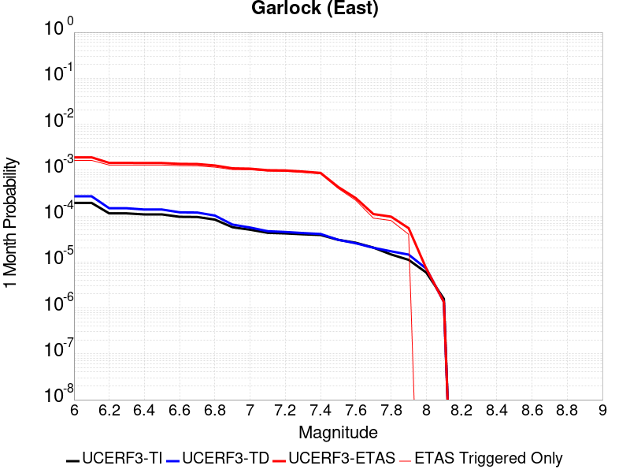 | 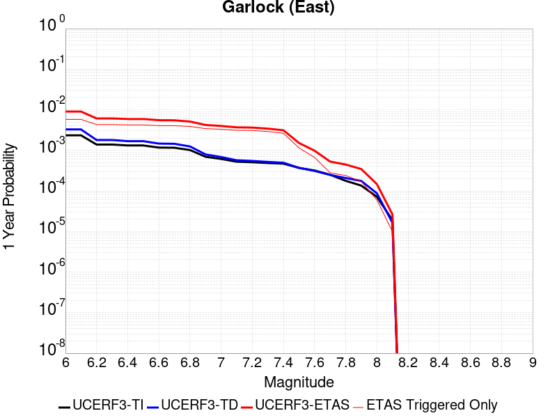 | 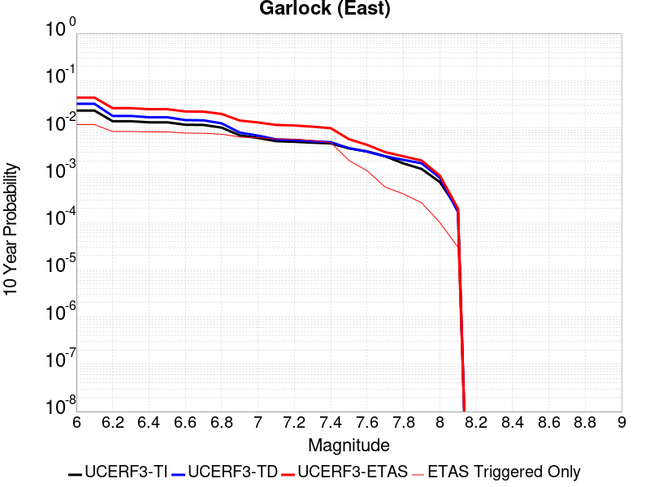 |

| Magnitude | 1 wk TI Prob | 1 wk TD Prob | 1 wk ETAS Prob | 1 wk ETAS/TD Gain | 1 wk ETAS Triggered Only | 1 mo TI Prob | 1 mo TD Prob | 1 mo ETAS Prob | 1 mo ETAS/TD Gain | 1 mo ETAS Triggered Only | 1 yr TI Prob | 1 yr TD Prob | 1 yr ETAS Prob | 1 yr ETAS/TD Gain | 1 yr ETAS Triggered Only | 10 yr TI Prob | 10 yr TD Prob | 10 yr ETAS Prob | 10 yr ETAS/TD Gain | 10 yr ETAS Triggered Only |
|-----|-----|-----|-----|-----|-----|-----|-----|-----|-----|-----|-----|-----|-----|-----|-----|-----|-----|-----|-----|-----|
| 6.0 | 4.5092507E-5 | 6.291388E-5 | 5.1288557E-4 | 8.1521845 | 4.5E-4 | 1.9323928E-4 | 2.6960557E-4 | 0.0018991661 | 7.044239 | 0.00163 | 0.0023501497 | 0.003277953 | 0.009048973 | 2.7605562 | 0.00579 | 0.023254504 | 0.032357235 | 0.04369801 | 1.3504865 | 0.01172 |
| 6.1 | 4.5092507E-5 | 6.291388E-5 | 5.1288557E-4 | 8.1521845 | 4.5E-4 | 1.9323928E-4 | 2.6960557E-4 | 0.0018991661 | 7.044239 | 0.00163 | 0.0023501497 | 0.003277953 | 0.009048973 | 2.7605562 | 0.00579 | 0.023254504 | 0.032357235 | 0.04369801 | 1.3504865 | 0.01172 |
| 6.2 | 2.6674514E-5 | 3.45181E-5 | 3.7450637E-4 | 10.8495655 | 3.4E-4 | 1.1431433E-4 | 1.479265E-4 | 0.0014377356 | 9.719256 | 0.00129 | 0.0013908884 | 0.0017995505 | 0.0061217584 | 3.4018264 | 0.00433 | 0.01382215 | 0.017894601 | 0.026144287 | 1.4610153 | 0.0084 |
| 6.3 | 2.6674514E-5 | 3.45181E-5 | 3.7450637E-4 | 10.8495655 | 3.4E-4 | 1.1431433E-4 | 1.479265E-4 | 0.0014377356 | 9.719256 | 0.00129 | 0.0013908884 | 0.0017995505 | 0.0061217584 | 3.4018264 | 0.00433 | 0.01382215 | 0.017894601 | 0.026144287 | 1.4610153 | 0.0084 |
| 6.4 | 2.5312667E-5 | 3.2347165E-5 | 3.7233616E-4 | 11.510628 | 3.4E-4 | 1.0847834E-4 | 1.3862351E-4 | 0.0014284446 | 10.304491 | 0.00129 | 0.0013199237 | 0.0016864641 | 0.0059193135 | 3.509896 | 0.00424 | 0.013121112 | 0.016782548 | 0.024874426 | 1.4821603 | 0.00823 |
| 6.5 | 2.5312667E-5 | 3.2347165E-5 | 3.7233616E-4 | 11.510628 | 3.4E-4 | 1.0847834E-4 | 1.3862351E-4 | 0.0014284446 | 10.304491 | 0.00129 | 0.0013199237 | 0.0016864641 | 0.0059193135 | 3.509896 | 0.00424 | 0.013121112 | 0.016782548 | 0.024874426 | 1.4821603 | 0.00823 |
| 6.6 | 2.246556E-5 | 2.8141703E-5 | 3.6813214E-4 | 13.081373 | 3.4E-4 | 9.627742E-5 | 1.2060186E-4 | 0.0013704511 | 11.363433 | 0.00125 | 0.0011715472 | 0.0014673622 | 0.00553139 | 3.7696147 | 0.00407 | 0.011653901 | 0.014622727 | 0.022259401 | 1.522247 | 0.00775 |
| 6.7 | 2.2241198E-5 | 2.7811424E-5 | 3.5780226E-4 | 12.865297 | 3.3E-4 | 9.531594E-5 | 1.191865E-4 | 0.0013590388 | 11.402622 | 0.00124 | 0.0011598538 | 0.0014501533 | 0.0054942803 | 3.7887583 | 0.00405 | 0.011538187 | 0.014452909 | 0.022051478 | 1.5257466 | 0.00771 |
| 6.8 | 1.9528685E-5 | 2.3905577E-5 | 3.3389818E-4 | 13.967376 | 3.1E-4 | 8.369167E-5 | 1.0244856E-4 | 0.0012623298 | 12.321596 | 0.00116 | 0.0010184698 | 0.0012466172 | 0.00512178 | 4.108543 | 0.00388 | 0.010138147 | 0.012440228 | 0.019688917 | 1.5826813 | 0.00734 |
| 6.9 | 1.3318621E-5 | 1.5205252E-5 | 3.0520084E-4 | 20.072067 | 2.9E-4 | 5.7078556E-5 | 6.516377E-5 | 0.0010950967 | 16.8053 | 0.00103 | 6.9470983E-4 | 7.9308584E-4 | 0.0042203655 | 5.321449 | 0.00343 | 0.0069254204 | 0.007943182 | 0.014292346 | 1.7993224 | 0.0064 |
| 7.0 | 1.1760853E-5 | 1.3113937E-5 | 3.0311014E-4 | 23.113588 | 2.9E-4 | 5.0402683E-5 | 5.6201403E-5 | 0.001076144 | 19.147993 | 0.00102 | 6.134799E-4 | 6.840423E-4 | 0.003991778 | 5.835572 | 0.00331 | 0.0061178906 | 0.0068597053 | 0.013007243 | 1.8961811 | 0.00619 |
| 7.1 | 1.0064758E-5 | 1.0908869E-5 | 2.9090582E-4 | 26.66691 | 2.8E-4 | 4.3133965E-5 | 4.6751476E-5 | 9.96707E-4 | 21.319265 | 9.5E-4 | 5.2502943E-4 | 5.6905404E-4 | 0.0036872786 | 6.479663 | 0.00312 | 0.005237907 | 0.0057160784 | 0.011542582 | 2.0193183 | 0.00586 |
| 7.2 | 9.768808E-6 | 1.0504704E-5 | 2.9050178E-4 | 27.654446 | 2.8E-4 | 4.186565E-5 | 4.5019402E-5 | 9.849771E-4 | 21.878946 | 9.4E-4 | 5.095951E-4 | 5.479769E-4 | 0.0036362836 | 6.635834 | 0.00309 | 0.0050842804 | 0.0055063237 | 0.011254497 | 2.0439222 | 0.00578 |
| 7.3 | 9.344516E-6 | 9.950252E-6 | 2.7994756E-4 | 28.134722 | 2.7E-4 | 4.004731E-5 | 4.264326E-5 | 9.326053E-4 | 21.869934 | 8.9E-4 | 4.8746695E-4 | 5.1906146E-4 | 0.003427551 | 6.6033626 | 0.00291 | 0.0048639905 | 0.0052179466 | 0.010609665 | 2.0333028 | 0.00542 |
| 7.4 | 9.023491E-6 | 9.496329E-6 | 2.6949387E-4 | 28.37874 | 2.6E-4 | 3.867153E-5 | 4.0697938E-5 | 8.7066414E-4 | 21.393324 | 8.3E-4 | 4.7072413E-4 | 4.9538806E-4 | 0.0031240853 | 6.3063393 | 0.00263 | 0.004697283 | 0.00498134 | 0.009846982 | 1.9767736 | 0.00489 |
| 7.5 | 7.081253E-6 | 7.092714E-6 | 1.07092004E-4 | 15.098876 | 1.0E-4 | 3.0347876E-5 | 3.0396995E-5 | 4.3038483E-4 | 14.158795 | 4.0E-4 | 3.6942272E-4 | 3.700213E-4 | 0.0015195957 | 4.106779 | 0.00115 | 0.003688092 | 0.003726936 | 0.0057692956 | 1.5479997 | 0.00205 |
| 7.6 | 6.116396E-6 | 5.9640365E-6 | 5.5963737E-5 | 9.3835335 | 5.0E-5 | 2.6212863E-5 | 2.5559908E-5 | 2.4555429E-4 | 9.60701 | 2.2E-4 | 3.1909486E-4 | 3.111477E-4 | 9.809393E-4 | 3.1526482 | 6.7E-4 | 0.0031863707 | 0.0031382483 | 0.004374357 | 1.3938849 | 0.00124 |
| 7.7 | 4.797145E-6 | 4.761815E-6 | 2.4761719E-5 | 5.200059 | 2.0E-5 | 2.055903E-5 | 2.040762E-5 | 1.1040578E-4 | 5.4100275 | 9.0E-5 | 2.5027743E-4 | 2.4843458E-4 | 5.28365E-4 | 2.1267772 | 2.8E-4 | 0.0024999576 | 0.0025117078 | 0.0030703011 | 1.2223959 | 5.6E-4 |
| 7.8 | 3.4028885E-6 | 3.9825054E-6 | 2.3982426E-5 | 6.0219445 | 2.0E-5 | 1.4583726E-5 | 1.7067769E-5 | 9.7066404E-5 | 5.687117 | 8.0E-5 | 1.775424E-4 | 2.0778035E-4 | 4.4773048E-4 | 2.154826 | 2.4E-4 | 0.0017740062 | 0.0021033278 | 0.0025024863 | 1.1897749 | 4.0E-4 |
| 7.9 | 2.5928412E-6 | 3.3758668E-6 | 3.3758668E-6 | 1.0 | 0.0 | 1.1112129E-5 | 1.4467921E-5 | 5.4467342E-5 | 3.7646973 | 4.0E-5 | 1.3528178E-4 | 1.7613276E-4 | 3.461028E-4 | 1.9650111 | 1.7E-4 | 0.0013519945 | 0.0017830189 | 0.0020425553 | 1.1455601 | 2.6E-4 |
| 8.0 | 1.3743648E-6 | 1.6750241E-6 | 1.6750241E-6 | 1.0 | 0.0 | 5.8901214E-6 | 7.1786553E-6 | 7.1786553E-6 | 1.0 | 0.0 | 7.1709874E-5 | 8.739666E-5 | 1.4739142E-4 | 1.6864651 | 6.0E-5 | 7.1686733E-4 | 8.8452996E-4 | 9.844415E-4 | 1.1129544 | 1.0E-4 |
| 8.1 | 3.6733252E-7 | 3.1517635E-7 | 3.1517635E-7 | 1.0 | 0.0 | 1.5742813E-6 | 1.3507553E-6 | 1.3507553E-6 | 1.0 | 0.0 | 1.9166706E-5 | 1.6445338E-5 | 2.6445172E-5 | 1.6080651 | 1.0E-5 | 1.9165053E-4 | 1.665326E-4 | 1.965276E-4 | 1.1801149 | 3.0E-5 |

## Ash Hill
*[(top)](#table-of-contents)*

| 1 Week | 1 Month | 1 Year | 10 Year |
|-----|-----|-----|-----|
| 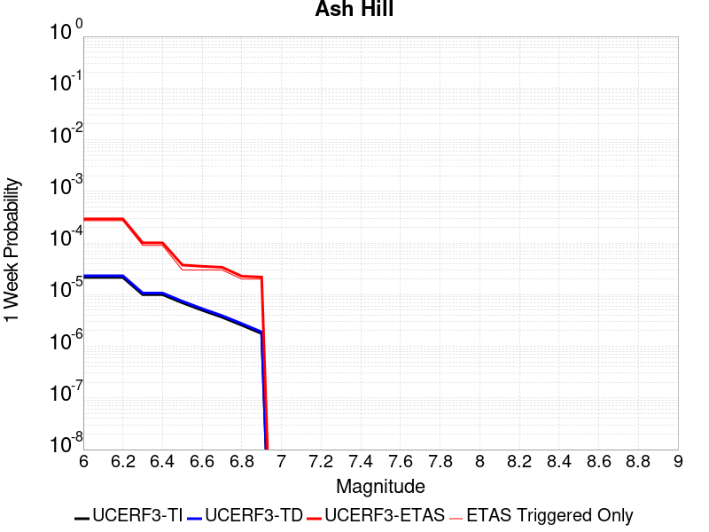 | 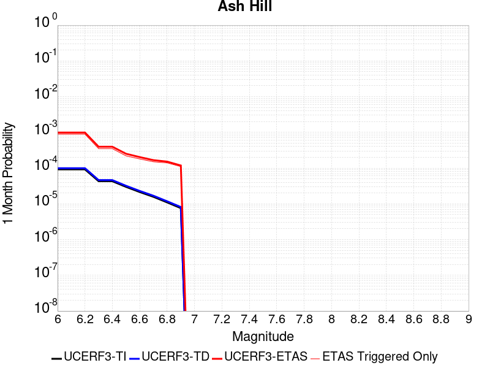 | 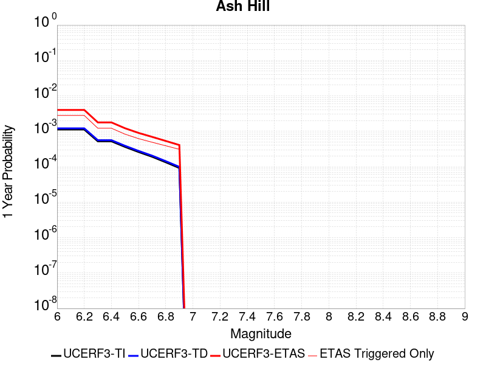 |  |

| Magnitude | 1 wk TI Prob | 1 wk TD Prob | 1 wk ETAS Prob | 1 wk ETAS/TD Gain | 1 wk ETAS Triggered Only | 1 mo TI Prob | 1 mo TD Prob | 1 mo ETAS Prob | 1 mo ETAS/TD Gain | 1 mo ETAS Triggered Only | 1 yr TI Prob | 1 yr TD Prob | 1 yr ETAS Prob | 1 yr ETAS/TD Gain | 1 yr ETAS Triggered Only | 10 yr TI Prob | 10 yr TD Prob | 10 yr ETAS Prob | 10 yr ETAS/TD Gain | 10 yr ETAS Triggered Only |
|-----|-----|-----|-----|-----|-----|-----|-----|-----|-----|-----|-----|-----|-----|-----|-----|-----|-----|-----|-----|-----|
| 6.0 | 2.1545662E-5 | 2.3195153E-5 | 2.931889E-4 | 12.640093 | 2.7E-4 | 9.2335285E-5 | 9.940446E-5 | 9.89316E-4 | 9.952431 | 8.9E-4 | 0.0011236023 | 0.0012096574 | 0.0040062703 | 3.311905 | 0.0028 | 0.011179381 | 0.012038713 | 0.018144315 | 1.5071639 | 0.00618 |
| 6.1 | 2.1545662E-5 | 2.3195153E-5 | 2.931889E-4 | 12.640093 | 2.7E-4 | 9.2335285E-5 | 9.940446E-5 | 9.89316E-4 | 9.952431 | 8.9E-4 | 0.0011236023 | 0.0012096574 | 0.0040062703 | 3.311905 | 0.0028 | 0.011179381 | 0.012038713 | 0.018144315 | 1.5071639 | 0.00618 |
| 6.2 | 2.1545662E-5 | 2.3195153E-5 | 2.931889E-4 | 12.640093 | 2.7E-4 | 9.2335285E-5 | 9.940446E-5 | 9.89316E-4 | 9.952431 | 8.9E-4 | 0.0011236023 | 0.0012096574 | 0.0040062703 | 3.311905 | 0.0028 | 0.011179381 | 0.012038713 | 0.018144315 | 1.5071639 | 0.00618 |
| 6.3 | 1.0025529E-5 | 1.0747242E-5 | 1.0074628E-4 | 9.374151 | 9.0E-5 | 4.2965847E-5 | 4.605887E-5 | 3.9604274E-4 | 8.59862 | 3.5E-4 | 5.229836E-4 | 5.606357E-4 | 0.0017799517 | 3.1748812 | 0.00122 | 0.005217545 | 0.005593526 | 0.008208815 | 1.4675565 | 0.00263 |
| 6.4 | 1.0025529E-5 | 1.0747242E-5 | 1.0074628E-4 | 9.374151 | 9.0E-5 | 4.2965847E-5 | 4.605887E-5 | 3.9604274E-4 | 8.59862 | 3.5E-4 | 5.229836E-4 | 5.606357E-4 | 0.0017799517 | 3.1748812 | 0.00122 | 0.005217545 | 0.005593526 | 0.008208815 | 1.4675565 | 0.00263 |
| 6.5 | 6.9617327E-6 | 7.456845E-6 | 3.7456623E-5 | 5.023119 | 3.0E-5 | 2.9835655E-5 | 3.1957563E-5 | 2.5195052E-4 | 7.883909 | 2.2E-4 | 3.6318856E-4 | 3.8902255E-4 | 0.0012186996 | 3.1327224 | 8.3E-4 | 0.0036259557 | 0.00388427 | 0.0056175115 | 1.4462206 | 0.00174 |
| 6.6 | 4.9919777E-6 | 5.3468393E-6 | 3.534668E-5 | 6.610761 | 3.0E-5 | 2.1394015E-5 | 2.2914863E-5 | 2.0291074E-4 | 8.854984 | 1.8E-4 | 2.60441E-4 | 2.7895943E-4 | 8.987865E-4 | 3.2219253 | 6.2E-4 | 0.0026013597 | 0.0027867514 | 0.004093101 | 1.4687715 | 0.00131 |
| 6.7 | 3.6630722E-6 | 3.924735E-6 | 3.3924618E-5 | 8.643798 | 3.0E-5 | 1.5698786E-5 | 1.6820217E-5 | 1.668177E-4 | 9.917689 | 1.5E-4 | 1.9111596E-4 | 2.0477264E-4 | 6.946723E-4 | 3.3924077 | 4.9E-4 | 0.0019095168 | 0.0020464025 | 0.0029944587 | 1.4632792 | 9.5E-4 |
| 6.8 | 2.5599613E-6 | 2.745004E-6 | 2.274495E-5 | 8.285944 | 2.0E-5 | 1.0971216E-5 | 1.1764278E-5 | 1.5176264E-4 | 12.900293 | 1.4E-4 | 1.3356637E-4 | 1.4322561E-4 | 5.331698E-4 | 3.7225866 | 3.9E-4 | 0.0013348613 | 0.001431818 | 0.0021707586 | 1.5160854 | 7.4E-4 |
| 6.9 | 1.7684905E-6 | 1.8969255E-6 | 2.1896887E-5 | 11.543357 | 2.0E-5 | 7.579223E-6 | 8.129681E-6 | 1.1812879E-4 | 14.530557 | 1.1E-4 | 9.2273134E-5 | 9.897886E-5 | 4.0894817E-4 | 4.131672 | 3.1E-4 | 9.223483E-4 | 9.897887E-4 | 0.0015891948 | 1.60559 | 6.0E-4 |

## Hunter Mountain-Saline Valley
*[(top)](#table-of-contents)*

| 1 Week | 1 Month | 1 Year | 10 Year |
|-----|-----|-----|-----|
|  |  |  |  |

| Magnitude | 1 wk TI Prob | 1 wk TD Prob | 1 wk ETAS Prob | 1 wk ETAS/TD Gain | 1 wk ETAS Triggered Only | 1 mo TI Prob | 1 mo TD Prob | 1 mo ETAS Prob | 1 mo ETAS/TD Gain | 1 mo ETAS Triggered Only | 1 yr TI Prob | 1 yr TD Prob | 1 yr ETAS Prob | 1 yr ETAS/TD Gain | 1 yr ETAS Triggered Only | 10 yr TI Prob | 10 yr TD Prob | 10 yr ETAS Prob | 10 yr ETAS/TD Gain | 10 yr ETAS Triggered Only |
|-----|-----|-----|-----|-----|-----|-----|-----|-----|-----|-----|-----|-----|-----|-----|-----|-----|-----|-----|-----|-----|
| 6.0 | 4.5103672E-5 | 5.457546E-5 | 2.5456454E-4 | 4.6644506 | 2.0E-4 | 1.9328714E-4 | 2.3387001E-4 | 0.0012136408 | 5.1893816 | 9.8E-4 | 0.002350731 | 0.0028437779 | 0.0059549054 | 2.094012 | 0.00312 | 0.023260195 | 0.028094506 | 0.033964816 | 1.2089486 | 0.00604 |
| 6.1 | 4.5103672E-5 | 5.457546E-5 | 2.5456454E-4 | 4.6644506 | 2.0E-4 | 1.9328714E-4 | 2.3387001E-4 | 0.0012136408 | 5.1893816 | 9.8E-4 | 0.002350731 | 0.0028437779 | 0.0059549054 | 2.094012 | 0.00312 | 0.023260195 | 0.028094506 | 0.033964816 | 1.2089486 | 0.00604 |
| 6.2 | 3.9363465E-5 | 4.7067726E-5 | 2.470583E-4 | 5.2489963 | 2.0E-4 | 1.6868966E-4 | 2.0169906E-4 | 0.0011815014 | 5.8577437 | 9.8E-4 | 0.002051862 | 0.0024530382 | 0.005545434 | 2.260639 | 0.0031 | 0.020330196 | 0.024275668 | 0.030149529 | 1.2419649 | 0.00602 |
| 6.3 | 3.9363465E-5 | 4.7067726E-5 | 2.470583E-4 | 5.2489963 | 2.0E-4 | 1.6868966E-4 | 2.0169906E-4 | 0.0011815014 | 5.8577437 | 9.8E-4 | 0.002051862 | 0.0024530382 | 0.005545434 | 2.260639 | 0.0031 | 0.020330196 | 0.024275668 | 0.030149529 | 1.2419649 | 0.00602 |
| 6.4 | 3.2311684E-5 | 3.7954276E-5 | 2.3794669E-4 | 6.2692986 | 2.0E-4 | 1.384713E-4 | 1.6265146E-4 | 0.001142492 | 7.0241737 | 9.8E-4 | 0.0016845843 | 0.0019785557 | 0.0050424812 | 2.548567 | 0.00307 | 0.016718714 | 0.019618152 | 0.02549064 | 1.2993395 | 0.00599 |
| 6.5 | 3.2311684E-5 | 3.7954276E-5 | 2.3794669E-4 | 6.2692986 | 2.0E-4 | 1.384713E-4 | 1.6265146E-4 | 0.001142492 | 7.0241737 | 9.8E-4 | 0.0016845843 | 0.0019785557 | 0.0050424812 | 2.548567 | 0.00307 | 0.016718714 | 0.019618152 | 0.02549064 | 1.2993395 | 0.00599 |
| 6.6 | 2.9305844E-5 | 3.4184737E-5 | 2.341779E-4 | 6.8503647 | 2.0E-4 | 1.2559042E-4 | 1.4649813E-4 | 0.0011263546 | 7.6885247 | 9.8E-4 | 0.0015279909 | 0.0017822183 | 0.004846747 | 2.7195024 | 0.00307 | 0.015175272 | 0.01768718 | 0.023531942 | 1.3304518 | 0.00595 |
| 6.7 | 2.7826512E-5 | 3.2347E-5 | 2.3234054E-4 | 7.182753 | 2.0E-4 | 1.19251024E-4 | 1.3862299E-4 | 0.0011184871 | 8.068555 | 9.8E-4 | 0.0014509142 | 0.0016864885 | 0.004741328 | 2.811361 | 0.00306 | 0.014414776 | 0.016744586 | 0.022585124 | 1.3488015 | 0.00594 |
| 6.8 | 2.3389874E-5 | 2.686893E-5 | 2.2686356E-4 | 8.443342 | 2.0E-4 | 1.0023846E-4 | 1.1514773E-4 | 0.0010950349 | 9.509826 | 9.8E-4 | 0.00121972 | 0.0014010693 | 0.00443681 | 3.1667314 | 0.00304 | 0.01213047 | 0.0139285745 | 0.019736536 | 1.4169817 | 0.00589 |
| 6.9 | 2.069209E-5 | 2.3571954E-5 | 2.2356724E-4 | 9.484459 | 2.0E-4 | 8.867737E-5 | 1.0101895E-4 | 0.00108092 | 10.70017 | 9.8E-4 | 0.0010791123 | 0.001229248 | 0.004265511 | 3.4700167 | 0.00304 | 0.010738871 | 0.012229515 | 0.018037606 | 1.474924 | 0.00588 |
| 7.0 | 1.7462342E-5 | 1.9635127E-5 | 2.196312E-4 | 11.185627 | 2.0E-4 | 7.483646E-5 | 8.4147956E-5 | 0.0010640655 | 12.645174 | 9.8E-4 | 9.1075303E-4 | 0.0010240425 | 0.004060929 | 3.965587 | 0.00304 | 0.009070295 | 0.010196869 | 0.016016912 | 1.5707675 | 0.00588 |
| 7.1 | 1.4807709E-5 | 1.6443073E-5 | 2.1643979E-4 | 13.162977 | 2.0E-4 | 6.3460066E-5 | 7.04685E-5 | 0.0010503994 | 14.905943 | 9.8E-4 | 7.723524E-4 | 8.576328E-4 | 0.0038850342 | 4.5299506 | 0.00303 | 0.007696735 | 0.008546217 | 0.0143363075 | 1.6775032 | 0.00584 |
| 7.2 | 1.4180048E-5 | 1.5699605E-5 | 2.0569662E-4 | 13.102025 | 1.9E-4 | 6.077022E-5 | 6.728237E-5 | 0.0010272178 | 15.267263 | 9.6E-4 | 7.396263E-4 | 8.188713E-4 | 0.0038264066 | 4.6727815 | 0.00301 | 0.0073716943 | 0.008161491 | 0.013933991 | 1.707285 | 0.00582 |
| 7.3 | 1.3730402E-5 | 1.5173308E-5 | 2.0517042E-4 | 13.521799 | 1.9E-4 | 5.8843252E-5 | 6.5026936E-5 | 0.0010249645 | 15.762154 | 9.6E-4 | 7.161811E-4 | 7.914314E-4 | 0.0037990492 | 4.8002253 | 0.00301 | 0.007138774 | 0.007889061 | 0.013643305 | 1.7293952 | 0.0058 |
| 7.4 | 1.2810095E-5 | 1.4110443E-5 | 2.0410777E-4 | 14.465014 | 1.9E-4 | 5.489925E-5 | 6.0472015E-5 | 0.0010204139 | 16.874151 | 9.6E-4 | 6.681934E-4 | 7.3601387E-4 | 0.0037437985 | 5.086587 | 0.00301 | 0.006661878 | 0.007338658 | 0.013066314 | 1.7804773 | 0.00577 |
| 7.5 | 1.1595659E-5 | 1.2801712E-5 | 2.0279927E-4 | 15.841575 | 1.9E-4 | 4.9694736E-5 | 5.4863416E-5 | 0.0010048113 | 18.31478 | 9.5E-4 | 6.0486543E-4 | 6.6777307E-4 | 0.0036257964 | 5.4296837 | 0.00296 | 0.006032217 | 0.0066605364 | 0.012253038 | 1.8396473 | 0.00563 |
| 7.6 | 2.997694E-6 | 3.3255683E-6 | 6.3325366E-5 | 19.04197 | 6.0E-5 | 1.28471975E-5 | 1.4252399E-5 | 4.142467E-4 | 29.065052 | 4.0E-4 | 1.564034E-4 | 1.7351641E-4 | 0.0014832891 | 8.548408 | 0.00131 | 0.0015629337 | 0.0017352457 | 0.0042908033 | 2.4727354 | 0.00256 |

## Blackwater
*[(top)](#table-of-contents)*

| 1 Week | 1 Month | 1 Year | 10 Year |
|-----|-----|-----|-----|
|  | 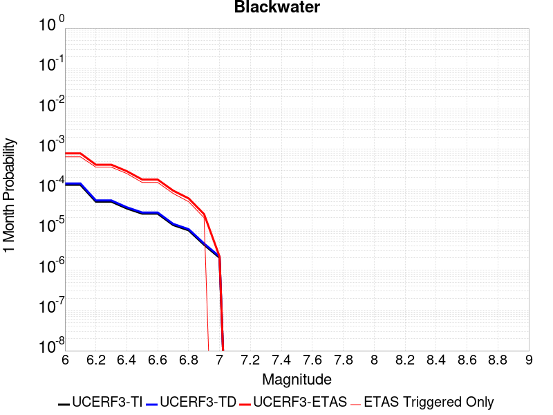 |  |  |

| Magnitude | 1 wk TI Prob | 1 wk TD Prob | 1 wk ETAS Prob | 1 wk ETAS/TD Gain | 1 wk ETAS Triggered Only | 1 mo TI Prob | 1 mo TD Prob | 1 mo ETAS Prob | 1 mo ETAS/TD Gain | 1 mo ETAS Triggered Only | 1 yr TI Prob | 1 yr TD Prob | 1 yr ETAS Prob | 1 yr ETAS/TD Gain | 1 yr ETAS Triggered Only | 10 yr TI Prob | 10 yr TD Prob | 10 yr ETAS Prob | 10 yr ETAS/TD Gain | 10 yr ETAS Triggered Only |
|-----|-----|-----|-----|-----|-----|-----|-----|-----|-----|-----|-----|-----|-----|-----|-----|-----|-----|-----|-----|-----|
| 6.0 | 3.0708583E-5 | 3.3096872E-5 | 2.4308992E-4 | 7.3448 | 2.1E-4 | 1.3160157E-4 | 1.418368E-4 | 7.917446E-4 | 5.582082 | 6.5E-4 | 0.0016010714 | 0.0017256319 | 0.004221318 | 2.4462447 | 0.0025 | 0.015895851 | 0.01713616 | 0.022433797 | 1.3091495 | 0.00539 |
| 6.1 | 3.0708583E-5 | 3.3096872E-5 | 2.4308992E-4 | 7.3448 | 2.1E-4 | 1.3160157E-4 | 1.418368E-4 | 7.917446E-4 | 5.582082 | 6.5E-4 | 0.0016010714 | 0.0017256319 | 0.004221318 | 2.4462447 | 0.0025 | 0.015895851 | 0.01713616 | 0.022433797 | 1.3091495 | 0.00539 |
| 6.2 | 1.1707779E-5 | 1.254548E-5 | 1.5254373E-4 | 12.159258 | 1.4E-4 | 5.017523E-5 | 5.3765285E-5 | 4.1374593E-4 | 7.6954103 | 3.6E-4 | 6.107122E-4 | 6.544054E-4 | 0.0017336986 | 2.6492732 | 0.00108 | 0.006090366 | 0.006525755 | 0.008502768 | 1.3029556 | 0.00199 |
| 6.3 | 1.1707779E-5 | 1.254548E-5 | 1.5254373E-4 | 12.159258 | 1.4E-4 | 5.017523E-5 | 5.3765285E-5 | 4.1374593E-4 | 7.6954103 | 3.6E-4 | 6.107122E-4 | 6.544054E-4 | 0.0017336986 | 2.6492732 | 0.00108 | 0.006090366 | 0.006525755 | 0.008502768 | 1.3029556 | 0.00199 |
| 6.4 | 7.929244E-6 | 8.480332E-6 | 1.184794E-4 | 13.97108 | 1.1E-4 | 3.3982033E-5 | 3.6343798E-5 | 2.8633472E-4 | 7.878503 | 2.5E-4 | 4.136527E-4 | 4.4239996E-4 | 0.0011520858 | 2.6041727 | 7.1E-4 | 0.0041288356 | 0.0044155978 | 0.005689946 | 1.2886015 | 0.00128 |
| 6.5 | 5.8832115E-6 | 6.2861623E-6 | 5.6285848E-5 | 8.953929 | 5.0E-5 | 2.521352E-5 | 2.6940432E-5 | 1.7693639E-4 | 6.5676894 | 1.5E-4 | 3.0693135E-4 | 3.2795293E-4 | 7.977988E-4 | 2.4326625 | 4.7E-4 | 0.0030650778 | 0.0032749427 | 0.0041022245 | 1.2526095 | 8.3E-4 |
| 6.6 | 5.8832115E-6 | 6.2861623E-6 | 5.6285848E-5 | 8.953929 | 5.0E-5 | 2.521352E-5 | 2.6940432E-5 | 1.7693639E-4 | 6.5676894 | 1.5E-4 | 3.0693135E-4 | 3.2795293E-4 | 7.977988E-4 | 2.4326625 | 4.7E-4 | 0.0030650778 | 0.0032749427 | 0.0041022245 | 1.2526095 | 8.3E-4 |
| 6.7 | 3.0715053E-6 | 3.2815553E-6 | 4.3281423E-5 | 13.1893015 | 4.0E-5 | 1.3163528E-5 | 1.4063739E-5 | 9.406261E-5 | 6.6883073 | 8.0E-5 | 1.6025416E-4 | 1.7121375E-4 | 3.3118634E-4 | 1.9343444 | 1.6E-4 | 0.0016013865 | 0.0017109329 | 0.0020204026 | 1.1808777 | 3.1E-4 |
| 6.8 | 2.2722281E-6 | 2.4288202E-6 | 3.2428747E-5 | 13.351645 | 3.0E-5 | 9.738084E-6 | 1.0409193E-5 | 6.0408674E-5 | 5.803396 | 5.0E-5 | 1.1855473E-4 | 1.2672547E-4 | 2.1671406E-4 | 1.7101066 | 9.0E-5 | 0.001184915 | 0.0012666223 | 0.0014563816 | 1.1498152 | 1.9E-4 |
| 6.9 | 9.952399E-7 | 1.0653787E-6 | 1.1065368E-5 | 10.386324 | 1.0E-5 | 4.265307E-6 | 4.5659035E-6 | 2.4565812E-5 | 5.380274 | 2.0E-5 | 5.1928873E-5 | 5.5588975E-5 | 1.05586194E-4 | 1.8994089 | 5.0E-5 | 5.191674E-4 | 5.558013E-4 | 6.2576245E-4 | 1.1258743 | 7.0E-5 |
| 7.0 | 4.7385504E-7 | 5.075703E-7 | 5.075703E-7 | 1.0 | 0.0 | 2.0308057E-6 | 2.1753012E-6 | 2.1753012E-6 | 1.0 | 0.0 | 2.4724779E-5 | 2.6484293E-5 | 4.6483765E-5 | 1.7551446 | 2.0E-5 | 2.4722028E-4 | 2.6484294E-4 | 2.8483765E-4 | 1.0754964 | 2.0E-5 |

## Garlock (West)
*[(top)](#table-of-contents)*

| 1 Week | 1 Month | 1 Year | 10 Year |
|-----|-----|-----|-----|
| 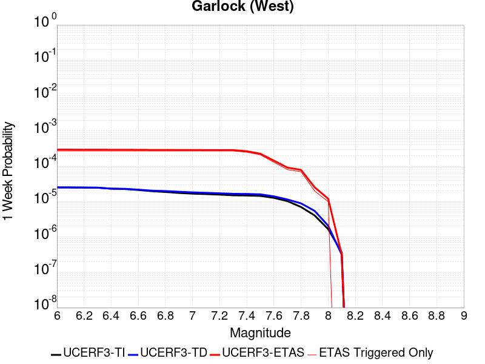 |  |  | 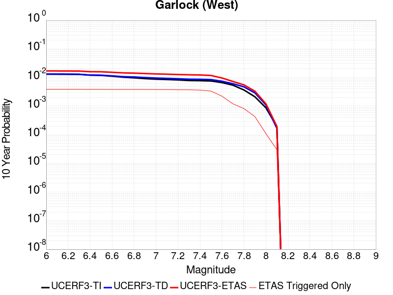 |

| Magnitude | 1 wk TI Prob | 1 wk TD Prob | 1 wk ETAS Prob | 1 wk ETAS/TD Gain | 1 wk ETAS Triggered Only | 1 mo TI Prob | 1 mo TD Prob | 1 mo ETAS Prob | 1 mo ETAS/TD Gain | 1 mo ETAS Triggered Only | 1 yr TI Prob | 1 yr TD Prob | 1 yr ETAS Prob | 1 yr ETAS/TD Gain | 1 yr ETAS Triggered Only | 10 yr TI Prob | 10 yr TD Prob | 10 yr ETAS Prob | 10 yr ETAS/TD Gain | 10 yr ETAS Triggered Only |
|-----|-----|-----|-----|-----|-----|-----|-----|-----|-----|-----|-----|-----|-----|-----|-----|-----|-----|-----|-----|-----|
| 6.0 | 2.5181727E-5 | 2.5211806E-5 | 2.95205E-4 | 11.708999 | 2.7E-4 | 1.0791722E-4 | 1.08046144E-4 | 8.77963E-4 | 8.125814 | 7.7E-4 | 0.0013131002 | 0.0013146715 | 0.003451858 | 2.6256433 | 0.00214 | 0.013053683 | 0.013149421 | 0.016938927 | 1.2881881 | 0.00384 |
| 6.1 | 2.5077732E-5 | 2.5112873E-5 | 2.951061E-4 | 11.751188 | 2.7E-4 | 1.0747157E-4 | 1.07622174E-4 | 8.775393E-4 | 8.15389 | 7.7E-4 | 0.001307681 | 0.0013095158 | 0.0034467136 | 2.6320517 | 0.00214 | 0.013000126 | 0.013098475 | 0.016888175 | 1.2893239 | 0.00384 |
| 6.2 | 2.494612E-5 | 2.499454E-5 | 2.9498778E-4 | 11.802089 | 2.7E-4 | 1.0690756E-4 | 1.0711508E-4 | 8.770326E-4 | 8.18776 | 7.7E-4 | 0.0013008224 | 0.0013033493 | 0.00344056 | 2.6397836 | 0.00214 | 0.012932341 | 0.0130375335 | 0.01682747 | 1.2906942 | 0.00384 |
| 6.3 | 2.4733758E-5 | 2.4813893E-5 | 2.948072E-4 | 11.880732 | 2.7E-4 | 1.0599751E-4 | 1.06340936E-4 | 8.7625906E-4 | 8.240091 | 7.7E-4 | 0.0012897556 | 0.0012939353 | 0.0034311663 | 2.6517293 | 0.00214 | 0.012822957 | 0.012944495 | 0.016734788 | 1.2928112 | 0.00384 |
| 6.4 | 2.3237335E-5 | 2.3193099E-5 | 2.9318684E-4 | 12.641124 | 2.7E-4 | 9.958477E-5 | 9.939523E-5 | 8.6931867E-4 | 8.746081 | 7.7E-4 | 0.0012117702 | 0.0012094679 | 0.0033368918 | 2.758975 | 0.00213 | 0.012051838 | 0.012109297 | 0.01588304 | 1.3116401 | 0.00382 |
| 6.5 | 2.2732203E-5 | 2.3007595E-5 | 2.930014E-4 | 12.734985 | 2.7E-4 | 9.742009E-5 | 9.860026E-5 | 8.6852437E-4 | 8.808539 | 7.7E-4 | 0.0011854442 | 0.0011997999 | 0.0033272444 | 2.773166 | 0.00213 | 0.011791403 | 0.012013667 | 0.015787775 | 1.3141512 | 0.00382 |
| 6.6 | 2.1319436E-5 | 2.1787671E-5 | 2.917818E-4 | 13.392059 | 2.7E-4 | 9.136581E-5 | 9.337241E-5 | 8.633005E-4 | 9.245777 | 7.7E-4 | 0.001111811 | 0.0011362185 | 0.0032538096 | 2.8637183 | 0.00212 | 0.011062649 | 0.011384512 | 0.0151511375 | 1.3308553 | 0.00381 |
| 6.7 | 1.970802E-5 | 2.0407419E-5 | 2.9040192E-4 | 14.230213 | 2.7E-4 | 8.446021E-5 | 8.745744E-5 | 8.573901E-4 | 9.803513 | 7.7E-4 | 0.001027818 | 0.001064276 | 0.0031820196 | 2.9898446 | 0.00212 | 0.010230771 | 0.010672178 | 0.014441517 | 1.353193 | 0.00381 |
| 6.8 | 1.8744462E-5 | 1.9914987E-5 | 2.899096E-4 | 14.557359 | 2.7E-4 | 8.033094E-5 | 8.534716E-5 | 8.552814E-4 | 10.021206 | 7.7E-4 | 9.775903E-4 | 0.001038608 | 0.003156406 | 3.0390735 | 0.00212 | 0.009733009 | 0.010417924 | 0.014188232 | 1.3619058 | 0.00381 |
| 6.9 | 1.7559682E-5 | 1.8967263E-5 | 2.8896215E-4 | 15.234784 | 2.7E-4 | 7.5253614E-5 | 8.128574E-5 | 8.512231E-4 | 10.471986 | 7.7E-4 | 9.158276E-4 | 9.89206E-4 | 0.0030971188 | 3.1309137 | 0.00211 | 0.0091206245 | 0.00992836 | 0.013690632 | 1.378942 | 0.0038 |
| 7.0 | 1.6794445E-5 | 1.8229983E-5 | 2.8822507E-4 | 15.810494 | 2.7E-4 | 7.197421E-5 | 7.812617E-5 | 8.48066E-4 | 10.8550825 | 7.7E-4 | 8.759337E-4 | 9.5077243E-4 | 0.0030487757 | 3.2066305 | 0.0021 | 0.008724891 | 0.00954722 | 0.013291132 | 1.3921468 | 0.00378 |
| 7.1 | 1.6337795E-5 | 1.7730717E-5 | 2.8772594E-4 | 16.227541 | 2.7E-4 | 7.0017246E-5 | 7.598658E-5 | 8.459281E-4 | 11.132598 | 7.7E-4 | 8.521265E-4 | 9.247453E-4 | 0.0030228032 | 3.2687955 | 0.0021 | 0.008488664 | 0.009289038 | 0.013014112 | 1.4010181 | 0.00376 |
| 7.2 | 1.5780008E-5 | 1.7179304E-5 | 2.8717465E-4 | 16.716316 | 2.7E-4 | 6.762685E-5 | 7.3623516E-5 | 8.335676E-4 | 11.322028 | 7.6E-4 | 8.2304585E-4 | 8.95999E-4 | 0.0029641443 | 3.3082004 | 0.00207 | 0.008200042 | 0.009003855 | 0.012690361 | 1.4094363 | 0.00372 |
| 7.3 | 1.5058865E-5 | 1.6632275E-5 | 2.866278E-4 | 17.233227 | 2.7E-4 | 6.45364E-5 | 7.127924E-5 | 8.312251E-4 | 11.6615305 | 7.6E-4 | 7.854473E-4 | 8.6748047E-4 | 0.0029356848 | 3.384151 | 0.00207 | 0.00782677 | 0.008720504 | 0.012398151 | 1.4217241 | 0.00371 |
| 7.4 | 1.4887923E-5 | 1.6468202E-5 | 2.6646408E-4 | 16.180521 | 2.5E-4 | 6.380382E-5 | 7.0576105E-5 | 8.005246E-4 | 11.342714 | 7.3E-4 | 7.7653467E-4 | 8.5892656E-4 | 0.0028771916 | 3.3497527 | 0.00202 | 0.0077382675 | 0.008635343 | 0.012224083 | 1.4155874 | 0.00362 |
| 7.5 | 1.4509299E-5 | 1.6060128E-5 | 2.2605676E-4 | 14.07565 | 2.1E-4 | 6.218123E-5 | 6.8827314E-5 | 7.087833E-4 | 10.297995 | 6.4E-4 | 7.567935E-4 | 8.3765155E-4 | 0.002656127 | 3.170921 | 0.00182 | 0.0075422134 | 0.008423603 | 0.011745384 | 1.3943421 | 0.00335 |
| 7.6 | 1.2756717E-5 | 1.4063694E-5 | 1.4406187E-4 | 10.24353 | 1.3E-4 | 5.4670498E-5 | 6.0271585E-5 | 4.4024867E-4 | 7.304415 | 3.8E-4 | 6.6541E-4 | 7.335601E-4 | 0.0019126945 | 2.6074133 | 0.00118 | 0.006634211 | 0.007388321 | 0.009591919 | 1.2982543 | 0.00222 |
| 7.7 | 1.0328985E-5 | 1.1472605E-5 | 9.147169E-5 | 7.9730525 | 8.0E-5 | 4.4266326E-5 | 4.9167385E-5 | 2.6915656E-4 | 5.474291 | 2.2E-4 | 5.388092E-4 | 5.984489E-4 | 0.0012180778 | 2.0353916 | 6.2E-4 | 0.0053750467 | 0.00604475 | 0.0072374963 | 1.1973194 | 0.0012 |
| 7.8 | 7.0306583E-6 | 8.909237E-6 | 7.890861E-5 | 8.856944 | 7.0E-5 | 3.0131043E-5 | 3.8181886E-5 | 2.0817539E-4 | 5.452203 | 1.7E-4 | 3.667837E-4 | 4.647655E-4 | 9.6453313E-4 | 2.0753114 | 5.0E-4 | 0.003661789 | 0.0047002696 | 0.005516415 | 1.1736381 | 8.2E-4 |
| 7.9 | 4.060633E-6 | 5.4710476E-6 | 2.5470938E-5 | 4.655587 | 2.0E-5 | 1.7402595E-5 | 2.3447137E-5 | 9.3445495E-5 | 3.9853692 | 7.0E-5 | 2.11856E-4 | 2.854316E-4 | 5.753488E-4 | 2.0157154 | 2.9E-4 | 0.0021165414 | 0.002887138 | 0.0033158965 | 1.1485064 | 4.3E-4 |
| 8.0 | 1.6729537E-6 | 2.0794366E-6 | 1.2079416E-5 | 5.8089848 | 1.0E-5 | 7.169782E-6 | 8.911841E-6 | 1.8911753E-5 | 2.1220925 | 1.0E-5 | 8.7288594E-5 | 1.084963E-4 | 1.784887E-4 | 1.6451133 | 7.0E-5 | 8.7254314E-4 | 0.0010979337 | 0.0012078129 | 1.1000782 | 1.1E-4 |
| 8.1 | 3.6733252E-7 | 3.1517635E-7 | 3.1517635E-7 | 1.0 | 0.0 | 1.5742813E-6 | 1.3507553E-6 | 1.3507553E-6 | 1.0 | 0.0 | 1.9166706E-5 | 1.6445338E-5 | 2.6445172E-5 | 1.6080651 | 1.0E-5 | 1.9165053E-4 | 1.665326E-4 | 1.965276E-4 | 1.1801149 | 3.0E-5 |

## McLean Lake
*[(top)](#table-of-contents)*

| 1 Week | 1 Month | 1 Year | 10 Year |
|-----|-----|-----|-----|
| 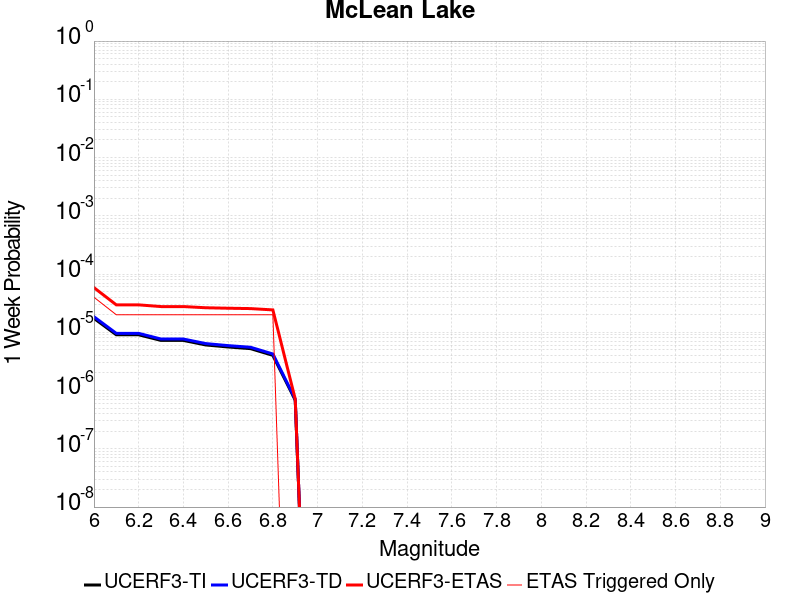 |  |  |  |

| Magnitude | 1 wk TI Prob | 1 wk TD Prob | 1 wk ETAS Prob | 1 wk ETAS/TD Gain | 1 wk ETAS Triggered Only | 1 mo TI Prob | 1 mo TD Prob | 1 mo ETAS Prob | 1 mo ETAS/TD Gain | 1 mo ETAS Triggered Only | 1 yr TI Prob | 1 yr TD Prob | 1 yr ETAS Prob | 1 yr ETAS/TD Gain | 1 yr ETAS Triggered Only | 10 yr TI Prob | 10 yr TD Prob | 10 yr ETAS Prob | 10 yr ETAS/TD Gain | 10 yr ETAS Triggered Only |
|-----|-----|-----|-----|-----|-----|-----|-----|-----|-----|-----|-----|-----|-----|-----|-----|-----|-----|-----|-----|-----|
| 6.0 | 1.7360222E-5 | 1.8502113E-5 | 5.8501373E-5 | 3.1618752 | 4.0E-5 | 7.439883E-5 | 7.929263E-5 | 3.9926727E-4 | 5.035364 | 3.2E-4 | 9.0542925E-4 | 9.6500886E-4 | 0.002393629 | 2.4804218 | 0.00143 | 0.009017491 | 0.009613025 | 0.012871399 | 1.338954 | 0.00329 |
| 6.1 | 9.062689E-6 | 9.592417E-6 | 2.9592225E-5 | 3.0849602 | 2.0E-5 | 3.8839516E-5 | 4.110976E-5 | 2.2110235E-4 | 5.378342 | 1.8E-4 | 4.727685E-4 | 5.0040527E-4 | 0.00123004 | 2.4580877 | 7.3E-4 | 0.0047176396 | 0.004993668 | 0.006724979 | 1.3467013 | 0.00174 |
| 6.2 | 9.062689E-6 | 9.592417E-6 | 2.9592225E-5 | 3.0849602 | 2.0E-5 | 3.8839516E-5 | 4.110976E-5 | 2.2110235E-4 | 5.378342 | 1.8E-4 | 4.727685E-4 | 5.0040527E-4 | 0.00123004 | 2.4580877 | 7.3E-4 | 0.0047176396 | 0.004993668 | 0.006724979 | 1.3467013 | 0.00174 |
| 6.3 | 7.2575485E-6 | 7.667882E-6 | 2.766773E-5 | 3.6082623 | 2.0E-5 | 3.110341E-5 | 3.286198E-5 | 1.9285672E-4 | 5.868689 | 1.6E-4 | 3.786182E-4 | 4.0002825E-4 | 9.598042E-4 | 2.399341 | 5.6E-4 | 0.0037797375 | 0.0039937864 | 0.0053085145 | 1.3291935 | 0.00132 |
| 6.4 | 7.2575485E-6 | 7.667882E-6 | 2.766773E-5 | 3.6082623 | 2.0E-5 | 3.110341E-5 | 3.286198E-5 | 1.9285672E-4 | 5.868689 | 1.6E-4 | 3.786182E-4 | 4.0002825E-4 | 9.598042E-4 | 2.399341 | 5.6E-4 | 0.0037797375 | 0.0039937864 | 0.0053085145 | 1.3291935 | 0.00132 |
| 6.5 | 6.06582E-6 | 6.404019E-6 | 2.6403892E-5 | 4.1230187 | 2.0E-5 | 2.5996113E-5 | 2.7445545E-5 | 1.674417E-4 | 6.10087 | 1.4E-4 | 3.164567E-4 | 3.3410476E-4 | 7.7395776E-4 | 2.3165123 | 4.4E-4 | 0.0031600643 | 0.0033366631 | 0.00438316 | 1.3136356 | 0.00105 |
| 6.6 | 5.598744E-6 | 5.910393E-6 | 2.5910274E-5 | 4.3838496 | 2.0E-5 | 2.3994397E-5 | 2.5330046E-5 | 1.653265E-4 | 6.5268927 | 1.4E-4 | 2.9209262E-4 | 3.0835607E-4 | 7.0823275E-4 | 2.2968016 | 4.0E-4 | 0.0029170897 | 0.0030799112 | 0.004046924 | 1.3139741 | 9.7E-4 |
| 6.7 | 5.246996E-6 | 5.5392848E-6 | 2.5539173E-5 | 4.610554 | 2.0E-5 | 2.2486933E-5 | 2.3739613E-5 | 1.6373629E-4 | 6.8971763 | 1.4E-4 | 2.73744E-4 | 2.8899778E-4 | 6.788851E-4 | 2.3491013 | 3.9E-4 | 0.0027340704 | 0.0028868436 | 0.0038141587 | 1.3212211 | 9.3E-4 |
| 6.8 | 4.02324E-6 | 4.2469983E-6 | 2.4246914E-5 | 5.709188 | 2.0E-5 | 1.7242342E-5 | 1.8201328E-5 | 1.2819933E-4 | 7.043405 | 1.1E-4 | 2.099053E-4 | 2.2158459E-4 | 5.315159E-4 | 2.3987043 | 3.1E-4 | 0.0020970714 | 0.002214221 | 0.0029226488 | 1.3199445 | 7.1E-4 |
| 6.9 | 6.835972E-7 | 7.1400547E-7 | 7.1400547E-7 | 1.0 | 0.0 | 2.9296991E-6 | 3.0600215E-6 | 3.0600215E-6 | 1.0 | 0.0 | 3.56685E-5 | 3.7255446E-5 | 6.7254325E-5 | 1.8052214 | 3.0E-5 | 3.5662777E-4 | 3.7252324E-4 | 4.72486E-4 | 1.2683396 | 1.0E-4 |

## Gravel Hills-Harper Lk
*[(top)](#table-of-contents)*

| 1 Week | 1 Month | 1 Year | 10 Year |
|-----|-----|-----|-----|
|  |  |  |  |

| Magnitude | 1 wk TI Prob | 1 wk TD Prob | 1 wk ETAS Prob | 1 wk ETAS/TD Gain | 1 wk ETAS Triggered Only | 1 mo TI Prob | 1 mo TD Prob | 1 mo ETAS Prob | 1 mo ETAS/TD Gain | 1 mo ETAS Triggered Only | 1 yr TI Prob | 1 yr TD Prob | 1 yr ETAS Prob | 1 yr ETAS/TD Gain | 1 yr ETAS Triggered Only | 10 yr TI Prob | 10 yr TD Prob | 10 yr ETAS Prob | 10 yr ETAS/TD Gain | 10 yr ETAS Triggered Only |
|-----|-----|-----|-----|-----|-----|-----|-----|-----|-----|-----|-----|-----|-----|-----|-----|-----|-----|-----|-----|-----|
| 6.0 | 3.0679566E-5 | 3.1466265E-5 | 1.414628E-4 | 4.4956975 | 1.1E-4 | 1.3147724E-4 | 1.3484967E-4 | 4.3480922E-4 | 3.2243996 | 3.0E-4 | 0.0015995599 | 0.0016407748 | 0.0030185105 | 1.839686 | 0.00138 | 0.015880952 | 0.016308172 | 0.01912153 | 1.1725122 | 0.00286 |
| 6.1 | 3.0679566E-5 | 3.1466265E-5 | 1.414628E-4 | 4.4956975 | 1.1E-4 | 1.3147724E-4 | 1.3484967E-4 | 4.3480922E-4 | 3.2243996 | 3.0E-4 | 0.0015995599 | 0.0016407748 | 0.0030185105 | 1.839686 | 0.00138 | 0.015880952 | 0.016308172 | 0.01912153 | 1.1725122 | 0.00286 |
| 6.2 | 1.514536E-5 | 1.3635765E-5 | 6.363508E-5 | 4.6667776 | 5.0E-5 | 6.490707E-5 | 5.8437752E-5 | 1.8843016E-4 | 3.2244594 | 1.3E-4 | 7.8995706E-4 | 7.1125926E-4 | 0.0011609392 | 1.6322308 | 4.5E-4 | 0.007871548 | 0.00709103 | 0.008034294 | 1.1330221 | 9.5E-4 |
| 6.3 | 1.514536E-5 | 1.3635765E-5 | 6.363508E-5 | 4.6667776 | 5.0E-5 | 6.490707E-5 | 5.8437752E-5 | 1.8843016E-4 | 3.2244594 | 1.3E-4 | 7.8995706E-4 | 7.1125926E-4 | 0.0011609392 | 1.6322308 | 4.5E-4 | 0.007871548 | 0.00709103 | 0.008034294 | 1.1330221 | 9.5E-4 |
| 6.4 | 1.2532521E-5 | 1.0690099E-5 | 4.0689778E-5 | 3.8063052 | 3.0E-5 | 5.37097E-5 | 4.5813937E-5 | 1.1581073E-4 | 2.5278492 | 7.0E-5 | 6.537194E-4 | 5.576478E-4 | 8.175028E-4 | 1.4659841 | 2.6E-4 | 0.0065179965 | 0.0055630747 | 0.0061299037 | 1.1018913 | 5.7E-4 |
| 6.5 | 1.1094058E-5 | 9.083997E-6 | 2.9083814E-5 | 3.201654 | 2.0E-5 | 4.7545094E-5 | 3.8930855E-5 | 8.892891E-5 | 2.2842784 | 5.0E-5 | 5.787078E-4 | 4.7388414E-4 | 6.7378936E-4 | 1.4218441 | 2.0E-4 | 0.0057720304 | 0.004729144 | 0.0050874413 | 1.0757637 | 3.6E-4 |
| 6.6 | 9.688328E-6 | 7.531964E-6 | 2.7531813E-5 | 3.65533 | 2.0E-5 | 4.1520743E-5 | 3.2279462E-5 | 6.2278494E-5 | 1.9293536 | 3.0E-5 | 5.053978E-4 | 3.929341E-4 | 5.22883E-4 | 1.3307142 | 1.3E-4 | 0.0050424994 | 0.00392265 | 0.004141787 | 1.0558646 | 2.2E-4 |
| 6.7 | 8.974824E-6 | 6.7496517E-6 | 2.6749516E-5 | 3.963096 | 2.0E-5 | 3.8462964E-5 | 2.892677E-5 | 5.8925903E-5 | 2.0370717 | 3.0E-5 | 4.6818596E-4 | 3.5212873E-4 | 4.6208999E-4 | 1.3122758 | 1.1E-4 | 0.004672008 | 0.0035159288 | 0.003685331 | 1.0481814 | 1.7E-4 |
| 6.8 | 7.4780046E-6 | 5.1163724E-6 | 1.5116321E-5 | 2.9544997 | 1.0E-5 | 3.20482E-5 | 2.1927135E-5 | 4.1926698E-5 | 1.9120919 | 2.0E-5 | 3.9011694E-4 | 2.6693154E-4 | 3.3691287E-4 | 1.2621695 | 7.0E-5 | 0.0038943281 | 0.0026662475 | 0.0027560075 | 1.0336653 | 9.0E-5 |
| 6.9 | 6.3409307E-6 | 3.907637E-6 | 3.907637E-6 | 1.0 | 0.0 | 2.7175134E-5 | 1.6746913E-5 | 2.6746746E-5 | 1.5971149 | 1.0E-5 | 3.3080703E-4 | 2.0387559E-4 | 2.2387151E-4 | 1.0980791 | 2.0E-5 | 0.0033031502 | 0.0020369836 | 0.0020769022 | 1.0195969 | 4.0E-5 |
| 7.0 | 5.1239335E-6 | 2.6059552E-6 | 2.6059552E-6 | 1.0 | 0.0 | 2.195953E-5 | 1.1168333E-5 | 2.1168222E-5 | 1.8953788 | 1.0E-5 | 2.6732447E-4 | 1.3596623E-4 | 1.559635E-4 | 1.1470754 | 2.0E-5 | 0.0026700313 | 0.0013588556 | 0.0013788284 | 1.0146983 | 2.0E-5 |
| 7.1 | 4.438899E-6 | 2.0985556E-6 | 2.0985556E-6 | 1.0 | 0.0 | 1.9023713E-5 | 8.993779E-6 | 8.993779E-6 | 1.0 | 0.0 | 2.315891E-4 | 1.0949399E-4 | 1.1949289E-4 | 1.0913192 | 1.0E-5 | 0.002313479 | 0.0010944223 | 0.0011044113 | 1.0091273 | 1.0E-5 |
| 7.2 | 3.50367E-6 | 1.2616329E-6 | 1.2616329E-6 | 1.0 | 0.0 | 1.5015643E-5 | 5.4069874E-6 | 5.4069874E-6 | 1.0 | 0.0 | 1.8280011E-4 | 6.5828164E-5 | 7.5827505E-5 | 1.1519006 | 1.0E-5 | 0.0018264982 | 6.580949E-4 | 6.680883E-4 | 1.0151854 | 1.0E-5 |
| 7.3 | 2.561638E-6 | 7.1196314E-7 | 7.1196314E-7 | 1.0 | 0.0 | 1.0978401E-5 | 3.051267E-6 | 3.051267E-6 | 1.0 | 0.0 | 1.3365384E-4 | 3.7148562E-5 | 4.714819E-5 | 1.2691795 | 1.0E-5 | 0.0013357349 | 3.7142553E-4 | 3.8142182E-4 | 1.0269133 | 1.0E-5 |
| 7.4 | 2.0368864E-6 | 5.3052185E-7 | 5.3052185E-7 | 1.0 | 0.0 | 8.729483E-6 | 2.2736633E-6 | 2.2736633E-6 | 1.0 | 0.0 | 1.06276275E-4 | 2.7681503E-5 | 3.7681228E-5 | 1.361242 | 1.0E-5 | 0.0010622547 | 2.767811E-4 | 2.8677832E-4 | 1.0361196 | 1.0E-5 |
| 7.5 | 1.1681728E-6 | 3.603269E-7 | 3.603269E-7 | 1.0 | 0.0 | 5.0064455E-6 | 1.5442573E-6 | 1.5442573E-6 | 1.0 | 0.0 | 6.0951766E-5 | 1.8801175E-5 | 2.8800987E-5 | 1.5318717 | 1.0E-5 | 6.093505E-4 | 1.8799631E-4 | 1.9799444E-4 | 1.0531825 | 1.0E-5 |
| 7.6 | 1.3154387E-7 | 7.120002E-8 | 7.120002E-8 | 1.0 | 0.0 | 5.6375933E-7 | 3.0514292E-7 | 3.0514292E-7 | 1.0 | 0.0 | 6.863748E-6 | 3.7151103E-6 | 3.7151103E-6 | 1.0 | 0.0 | 6.863536E-5 | 3.715064E-5 | 3.715064E-5 | 1.0 | 0.0 |

## Goldstone Lake
*[(top)](#table-of-contents)*

| 1 Week | 1 Month | 1 Year | 10 Year |
|-----|-----|-----|-----|
|  | 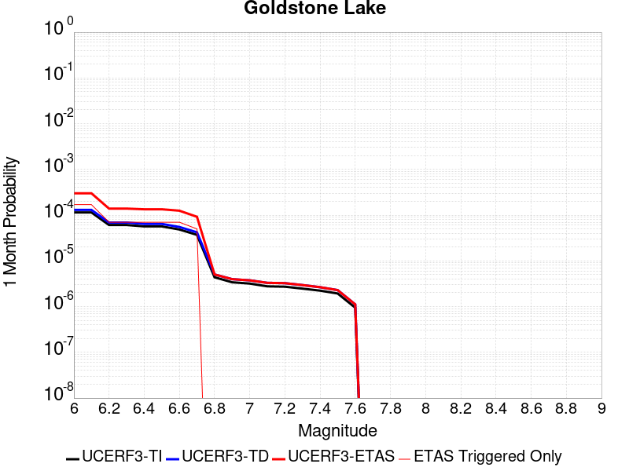 | 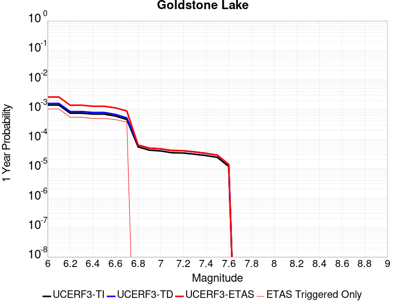 | 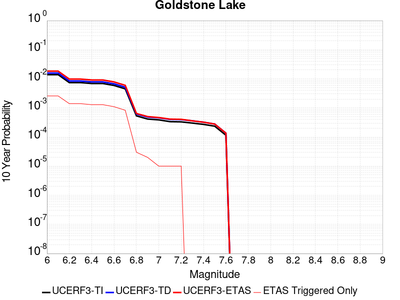 |

| Magnitude | 1 wk TI Prob | 1 wk TD Prob | 1 wk ETAS Prob | 1 wk ETAS/TD Gain | 1 wk ETAS Triggered Only | 1 mo TI Prob | 1 mo TD Prob | 1 mo ETAS Prob | 1 mo ETAS/TD Gain | 1 mo ETAS Triggered Only | 1 yr TI Prob | 1 yr TD Prob | 1 yr ETAS Prob | 1 yr ETAS/TD Gain | 1 yr ETAS Triggered Only | 10 yr TI Prob | 10 yr TD Prob | 10 yr ETAS Prob | 10 yr ETAS/TD Gain | 10 yr ETAS Triggered Only |
|-----|-----|-----|-----|-----|-----|-----|-----|-----|-----|-----|-----|-----|-----|-----|-----|-----|-----|-----|-----|-----|
| 6.0 | 2.671352E-5 | 3.0377705E-5 | 9.0375885E-5 | 2.9750729 | 6.0E-5 | 1.1448149E-4 | 1.3018477E-4 | 3.0016265E-4 | 2.3056662 | 1.7E-4 | 0.001392921 | 0.0015840436 | 0.002612412 | 1.6492046 | 0.00103 | 0.013842222 | 0.015747027 | 0.018276557 | 1.1606354 | 0.00257 |
| 6.1 | 2.671352E-5 | 3.0377705E-5 | 9.0375885E-5 | 2.9750729 | 6.0E-5 | 1.1448149E-4 | 1.3018477E-4 | 3.0016265E-4 | 2.3056662 | 1.7E-4 | 0.001392921 | 0.0015840436 | 0.002612412 | 1.6492046 | 0.00103 | 0.013842222 | 0.015747027 | 0.018276557 | 1.1606354 | 0.00257 |
| 6.2 | 1.4197047E-5 | 1.6097058E-5 | 4.6096575E-5 | 2.8636646 | 3.0E-5 | 6.0843064E-5 | 6.8986126E-5 | 1.389813E-4 | 2.0146267 | 7.0E-5 | 7.4051257E-4 | 8.396811E-4 | 0.0013792276 | 1.6425613 | 5.4E-4 | 0.007380498 | 0.008374781 | 0.009763056 | 1.1657685 | 0.0014 |
| 6.3 | 1.4197047E-5 | 1.6097058E-5 | 4.6096575E-5 | 2.8636646 | 3.0E-5 | 6.0843064E-5 | 6.8986126E-5 | 1.389813E-4 | 2.0146267 | 7.0E-5 | 7.4051257E-4 | 8.396811E-4 | 0.0013792276 | 1.6425613 | 5.4E-4 | 0.007380498 | 0.008374781 | 0.009763056 | 1.1657685 | 0.0014 |
| 6.4 | 1.3238931E-5 | 1.5009215E-5 | 4.5008765E-5 | 2.998742 | 3.0E-5 | 5.6737044E-5 | 6.432417E-5 | 1.3431966E-4 | 2.088168 | 7.0E-5 | 6.9055456E-4 | 7.829634E-4 | 0.0012725798 | 1.6253375 | 4.9E-4 | 0.006884126 | 0.0078116753 | 0.009091598 | 1.1638474 | 0.00129 |
| 6.5 | 1.3238931E-5 | 1.5009215E-5 | 4.5008765E-5 | 2.998742 | 3.0E-5 | 5.6737044E-5 | 6.432417E-5 | 1.3431966E-4 | 2.088168 | 7.0E-5 | 6.9055456E-4 | 7.829634E-4 | 0.0012725798 | 1.6253375 | 4.9E-4 | 0.006884126 | 0.0078116753 | 0.009091598 | 1.1638474 | 0.00129 |
| 6.6 | 1.1328278E-5 | 1.2855811E-5 | 4.2855427E-5 | 3.333545 | 3.0E-5 | 4.8548856E-5 | 5.5095712E-5 | 1.2509186E-4 | 2.2704463 | 7.0E-5 | 5.90922E-4 | 6.7067955E-4 | 0.0011203777 | 1.6705112 | 4.5E-4 | 0.0058935313 | 0.0066959444 | 0.007788579 | 1.1631786 | 0.0011 |
| 6.7 | 8.651175E-6 | 9.825051E-6 | 2.9824854E-5 | 3.0355928 | 2.0E-5 | 3.707594E-5 | 4.2107193E-5 | 9.210509E-5 | 2.1873956 | 5.0E-5 | 4.5130608E-4 | 5.1262503E-4 | 8.8243536E-4 | 1.7214051 | 3.7E-4 | 0.0045039062 | 0.005123305 | 0.0059490525 | 1.1611748 | 8.3E-4 |
| 6.8 | 1.0215377E-6 | 1.1754972E-6 | 1.1754972E-6 | 1.0 | 0.0 | 4.378012E-6 | 5.037836E-6 | 5.037836E-6 | 1.0 | 0.0 | 5.3300988E-5 | 6.1334045E-5 | 6.1334045E-5 | 1.0 | 0.0 | 5.3288206E-4 | 6.1318243E-4 | 6.4316404E-4 | 1.0488951 | 3.0E-5 |
| 6.9 | 7.9360774E-7 | 9.2835836E-7 | 9.2835836E-7 | 1.0 | 0.0 | 3.4011714E-6 | 3.978673E-6 | 3.978673E-6 | 1.0 | 0.0 | 4.1408475E-5 | 4.843934E-5 | 4.843934E-5 | 1.0 | 0.0 | 4.140076E-4 | 4.8429478E-4 | 5.042851E-4 | 1.0412772 | 2.0E-5 |
| 7.0 | 7.4382757E-7 | 8.747499E-7 | 8.747499E-7 | 1.0 | 0.0 | 3.1878285E-6 | 3.7489233E-6 | 3.7489233E-6 | 1.0 | 0.0 | 3.8811122E-5 | 4.5642253E-5 | 4.5642253E-5 | 1.0 | 0.0 | 3.8804344E-4 | 4.5633543E-4 | 4.6633085E-4 | 1.0219038 | 1.0E-5 |
| 7.1 | 6.4709513E-7 | 7.7114413E-7 | 7.7114413E-7 | 1.0 | 0.0 | 2.773262E-6 | 3.3048996E-6 | 3.3048996E-6 | 1.0 | 0.0 | 3.376394E-5 | 4.023647E-5 | 4.023647E-5 | 1.0 | 0.0 | 3.375881E-4 | 4.022978E-4 | 4.1229377E-4 | 1.0248471 | 1.0E-5 |
| 7.2 | 6.356704E-7 | 7.588497E-7 | 7.588497E-7 | 1.0 | 0.0 | 2.7242988E-6 | 3.2522094E-6 | 3.2522094E-6 | 1.0 | 0.0 | 3.3167835E-5 | 3.959499E-5 | 3.959499E-5 | 1.0 | 0.0 | 3.3162883E-4 | 3.958853E-4 | 4.0588132E-4 | 1.0252498 | 1.0E-5 |
| 7.3 | 5.7695723E-7 | 6.896692E-7 | 6.896692E-7 | 1.0 | 0.0 | 2.4726714E-6 | 2.9557223E-6 | 2.9557223E-6 | 1.0 | 0.0 | 3.0104358E-5 | 3.598538E-5 | 3.598538E-5 | 1.0 | 0.0 | 3.0100282E-4 | 3.5980128E-4 | 3.5980128E-4 | 1.0 | 0.0 |
| 7.4 | 5.209647E-7 | 6.193621E-7 | 6.193621E-7 | 1.0 | 0.0 | 2.232704E-6 | 2.6544064E-6 | 2.6544064E-6 | 1.0 | 0.0 | 2.718283E-5 | 3.2316977E-5 | 3.2316977E-5 | 1.0 | 0.0 | 2.7179506E-4 | 3.2312833E-4 | 3.2312833E-4 | 1.0 | 0.0 |
| 7.5 | 4.512955E-7 | 5.348973E-7 | 5.348973E-7 | 1.0 | 0.0 | 1.934122E-6 | 2.2924153E-6 | 2.2924153E-6 | 1.0 | 0.0 | 2.3547682E-5 | 2.7909853E-5 | 2.7909853E-5 | 1.0 | 0.0 | 2.3545188E-4 | 2.790688E-4 | 2.790688E-4 | 1.0 | 0.0 |
| 7.6 | 2.21172E-7 | 2.6039996E-7 | 2.6039996E-7 | 1.0 | 0.0 | 9.478797E-7 | 1.1159995E-6 | 1.1159995E-6 | 1.0 | 0.0 | 1.1540374E-5 | 1.3587238E-5 | 1.3587238E-5 | 1.0 | 0.0 | 1.1539775E-4 | 1.3586688E-4 | 1.3586688E-4 | 1.0 | 0.0 |

## So Sierra Nevada
*[(top)](#table-of-contents)*

| 1 Week | 1 Month | 1 Year | 10 Year |
|-----|-----|-----|-----|
| 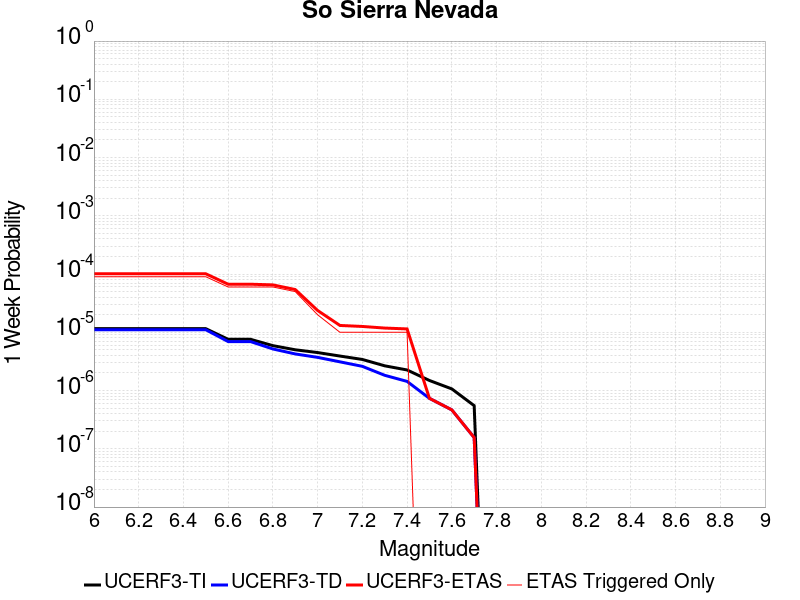 |  |  |  |

| Magnitude | 1 wk TI Prob | 1 wk TD Prob | 1 wk ETAS Prob | 1 wk ETAS/TD Gain | 1 wk ETAS Triggered Only | 1 mo TI Prob | 1 mo TD Prob | 1 mo ETAS Prob | 1 mo ETAS/TD Gain | 1 mo ETAS Triggered Only | 1 yr TI Prob | 1 yr TD Prob | 1 yr ETAS Prob | 1 yr ETAS/TD Gain | 1 yr ETAS Triggered Only | 10 yr TI Prob | 10 yr TD Prob | 10 yr ETAS Prob | 10 yr ETAS/TD Gain | 10 yr ETAS Triggered Only |
|-----|-----|-----|-----|-----|-----|-----|-----|-----|-----|-----|-----|-----|-----|-----|-----|-----|-----|-----|-----|-----|
| 6.0 | 1.15488665E-5 | 1.1079879E-5 | 1.01078884E-4 | 9.122742 | 9.0E-5 | 4.9494203E-5 | 4.7484406E-5 | 3.8746826E-4 | 8.159905 | 3.4E-4 | 6.024253E-4 | 5.7798205E-4 | 0.0018772307 | 3.2479048 | 0.0013 | 0.006007948 | 0.0057660574 | 0.008291411 | 1.437969 | 0.00254 |
| 6.1 | 1.15488665E-5 | 1.1079879E-5 | 1.01078884E-4 | 9.122742 | 9.0E-5 | 4.9494203E-5 | 4.7484406E-5 | 3.8746826E-4 | 8.159905 | 3.4E-4 | 6.024253E-4 | 5.7798205E-4 | 0.0018772307 | 3.2479048 | 0.0013 | 0.006007948 | 0.0057660574 | 0.008291411 | 1.437969 | 0.00254 |
| 6.2 | 1.15488665E-5 | 1.1079879E-5 | 1.01078884E-4 | 9.122742 | 9.0E-5 | 4.9494203E-5 | 4.7484406E-5 | 3.8746826E-4 | 8.159905 | 3.4E-4 | 6.024253E-4 | 5.7798205E-4 | 0.0018772307 | 3.2479048 | 0.0013 | 0.006007948 | 0.0057660574 | 0.008291411 | 1.437969 | 0.00254 |
| 6.3 | 1.15488665E-5 | 1.1079879E-5 | 1.01078884E-4 | 9.122742 | 9.0E-5 | 4.9494203E-5 | 4.7484406E-5 | 3.8746826E-4 | 8.159905 | 3.4E-4 | 6.024253E-4 | 5.7798205E-4 | 0.0018772307 | 3.2479048 | 0.0013 | 0.006007948 | 0.0057660574 | 0.008291411 | 1.437969 | 0.00254 |
| 6.4 | 1.15488665E-5 | 1.1079879E-5 | 1.01078884E-4 | 9.122742 | 9.0E-5 | 4.9494203E-5 | 4.7484406E-5 | 3.8746826E-4 | 8.159905 | 3.4E-4 | 6.024253E-4 | 5.7798205E-4 | 0.0018772307 | 3.2479048 | 0.0013 | 0.006007948 | 0.0057660574 | 0.008291411 | 1.437969 | 0.00254 |
| 6.5 | 1.15488665E-5 | 1.1079879E-5 | 1.01078884E-4 | 9.122742 | 9.0E-5 | 4.9494203E-5 | 4.7484406E-5 | 3.8746826E-4 | 8.159905 | 3.4E-4 | 6.024253E-4 | 5.7798205E-4 | 0.0018772307 | 3.2479048 | 0.0013 | 0.006007948 | 0.0057660574 | 0.008291411 | 1.437969 | 0.00254 |
| 6.6 | 7.587044E-6 | 6.9357966E-6 | 6.693538E-5 | 9.650713 | 6.0E-5 | 3.2515498E-5 | 2.9724519E-5 | 2.1971887E-4 | 7.3918395 | 1.9E-4 | 3.9580427E-4 | 3.6183884E-4 | 0.001071582 | 2.9614894 | 7.1E-4 | 0.003951 | 0.0036127886 | 0.004977839 | 1.3778385 | 0.00137 |
| 6.7 | 7.587044E-6 | 6.9357966E-6 | 6.693538E-5 | 9.650713 | 6.0E-5 | 3.2515498E-5 | 2.9724519E-5 | 2.1971887E-4 | 7.3918395 | 1.9E-4 | 3.9580427E-4 | 3.6183884E-4 | 0.001071582 | 2.9614894 | 7.1E-4 | 0.003951 | 0.0036127886 | 0.004977839 | 1.3778385 | 0.00137 |
| 6.8 | 5.9026956E-6 | 5.179524E-6 | 6.5179214E-5 | 12.584016 | 6.0E-5 | 2.5297022E-5 | 2.2197779E-5 | 1.92194E-4 | 8.658254 | 1.7E-4 | 3.0794772E-4 | 2.702256E-4 | 7.700905E-4 | 2.8498058 | 5.0E-4 | 0.0030752132 | 0.0026990864 | 0.0036764413 | 1.3621058 | 9.8E-4 |
| 6.9 | 5.0118915E-6 | 4.2525417E-6 | 5.425233E-5 | 12.757624 | 5.0E-5 | 2.1479358E-5 | 1.8225055E-5 | 1.5822251E-4 | 8.681592 | 1.4E-4 | 2.614798E-4 | 2.2186819E-4 | 6.317772E-4 | 2.847534 | 4.1E-4 | 0.0026117235 | 0.0022165393 | 0.0030247439 | 1.3646245 | 8.1E-4 |
| 7.0 | 4.4924795E-6 | 3.714026E-6 | 2.3713952E-5 | 6.3849716 | 2.0E-5 | 1.925334E-5 | 1.5917161E-5 | 1.1591557E-4 | 7.2824273 | 1.0E-4 | 2.3438422E-4 | 1.9377483E-4 | 5.537051E-4 | 2.8574665 | 3.6E-4 | 0.0023413717 | 0.0019361217 | 0.002644747 | 1.3660024 | 7.1E-4 |
| 7.1 | 3.9118436E-6 | 3.1120765E-6 | 1.3112045E-5 | 4.213279 | 1.0E-5 | 1.6764936E-5 | 1.3337406E-5 | 9.333634E-5 | 6.998088 | 8.0E-5 | 2.0409399E-4 | 1.6237138E-4 | 4.2232918E-4 | 2.6010075 | 2.6E-4 | 0.0020390663 | 0.0016225836 | 0.0021617073 | 1.3322626 | 5.4E-4 |
| 7.2 | 3.4200818E-6 | 2.6055457E-6 | 1.2605519E-5 | 4.837958 | 1.0E-5 | 1.4657411E-5 | 1.1166579E-5 | 7.116591E-5 | 6.3731165 | 6.0E-5 | 1.7843937E-4 | 1.3594513E-4 | 3.6591385E-4 | 2.6916292 | 2.3E-4 | 0.0017829615 | 0.0013586693 | 0.0017880851 | 1.3160561 | 4.3E-4 |
| 7.3 | 2.6593618E-6 | 1.8285E-6 | 1.1828482E-5 | 6.4689536 | 1.0E-5 | 1.13972155E-5 | 7.836406E-6 | 5.7836016E-5 | 7.3804255 | 5.0E-5 | 1.3875226E-4 | 9.5404364E-5 | 2.753872E-4 | 2.886526 | 1.8E-4 | 0.0013866565 | 9.53663E-4 | 0.0012833483 | 1.3457042 | 3.3E-4 |
| 7.4 | 2.2577992E-6 | 1.4365107E-6 | 1.1436497E-5 | 7.9613028 | 1.0E-5 | 9.676246E-6 | 6.156461E-6 | 5.6156154E-5 | 9.121499 | 5.0E-5 | 1.1780193E-4 | 7.495259E-5 | 2.349406E-4 | 3.1345227 | 1.6E-4 | 0.001177395 | 7.492982E-4 | 0.0010590659 | 1.4134104 | 3.1E-4 |
| 7.5 | 1.489319E-6 | 7.3545067E-7 | 7.3545067E-7 | 1.0 | 0.0 | 6.3827797E-6 | 3.1519278E-6 | 3.1519278E-6 | 1.0 | 0.0 | 7.770758E-5 | 3.8374048E-5 | 7.837251E-5 | 2.0423312 | 4.0E-5 | 7.7680405E-4 | 3.8367466E-4 | 5.1362475E-4 | 1.3386987 | 1.3E-4 |
| 7.6 | 1.0680322E-6 | 4.6600775E-7 | 4.6600775E-7 | 1.0 | 0.0 | 4.577273E-6 | 1.9971744E-6 | 1.9971744E-6 | 1.0 | 0.0 | 5.5726876E-5 | 2.4315332E-5 | 4.4314846E-5 | 1.8225063 | 2.0E-5 | 5.5712904E-4 | 2.4312697E-4 | 3.2310752E-4 | 1.3289661 | 8.0E-5 |
| 7.7 | 5.509146E-7 | 1.5582627E-7 | 1.5582627E-7 | 1.0 | 0.0 | 2.3610605E-6 | 6.678267E-7 | 6.678267E-7 | 1.0 | 0.0 | 2.8745531E-5 | 8.130761E-6 | 8.130761E-6 | 1.0 | 0.0 | 2.8741814E-4 | 8.130475E-5 | 9.130394E-5 | 1.122984 | 1.0E-5 |

## Coyote Canyon
*[(top)](#table-of-contents)*

| 1 Week | 1 Month | 1 Year | 10 Year |
|-----|-----|-----|-----|
| 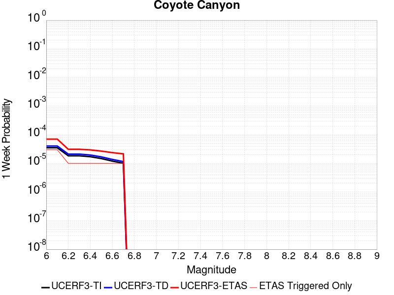 | 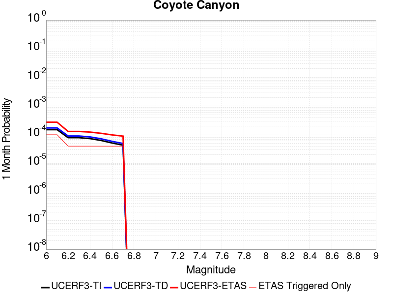 |  |  |

| Magnitude | 1 wk TI Prob | 1 wk TD Prob | 1 wk ETAS Prob | 1 wk ETAS/TD Gain | 1 wk ETAS Triggered Only | 1 mo TI Prob | 1 mo TD Prob | 1 mo ETAS Prob | 1 mo ETAS/TD Gain | 1 mo ETAS Triggered Only | 1 yr TI Prob | 1 yr TD Prob | 1 yr ETAS Prob | 1 yr ETAS/TD Gain | 1 yr ETAS Triggered Only | 10 yr TI Prob | 10 yr TD Prob | 10 yr ETAS Prob | 10 yr ETAS/TD Gain | 10 yr ETAS Triggered Only |
|-----|-----|-----|-----|-----|-----|-----|-----|-----|-----|-----|-----|-----|-----|-----|-----|-----|-----|-----|-----|-----|
| 6.0 | 3.5090034E-5 | 4.036674E-5 | 7.036553E-5 | 1.7431561 | 3.0E-5 | 1.503772E-4 | 1.729903E-4 | 2.72973E-4 | 1.577967 | 1.0E-4 | 0.0018293047 | 0.0021043785 | 0.002693137 | 1.2797778 | 5.9E-4 | 0.018143194 | 0.02087044 | 0.022437047 | 1.0750635 | 0.0016 |
| 6.1 | 3.5090034E-5 | 4.036674E-5 | 7.036553E-5 | 1.7431561 | 3.0E-5 | 1.503772E-4 | 1.729903E-4 | 2.72973E-4 | 1.577967 | 1.0E-4 | 0.0018293047 | 0.0021043785 | 0.002693137 | 1.2797778 | 5.9E-4 | 0.018143194 | 0.02087044 | 0.022437047 | 1.0750635 | 0.0016 |
| 6.2 | 1.841879E-5 | 2.1060996E-5 | 3.1060787E-5 | 1.4748014 | 1.0E-5 | 7.8935285E-5 | 9.025886E-5 | 1.3025526E-4 | 1.4431298 | 4.0E-5 | 9.606133E-4 | 0.0010984496 | 0.001348175 | 1.2273436 | 2.5E-4 | 0.0095647145 | 0.010940288 | 0.011761208 | 1.0750364 | 8.3E-4 |
| 6.3 | 1.841879E-5 | 2.1060996E-5 | 3.1060787E-5 | 1.4748014 | 1.0E-5 | 7.8935285E-5 | 9.025886E-5 | 1.3025526E-4 | 1.4431298 | 4.0E-5 | 9.606133E-4 | 0.0010984496 | 0.001348175 | 1.2273436 | 2.5E-4 | 0.0095647145 | 0.010940288 | 0.011761208 | 1.0750364 | 8.3E-4 |
| 6.4 | 1.712201E-5 | 1.9566323E-5 | 2.9566127E-5 | 1.5110723 | 1.0E-5 | 7.337798E-5 | 8.385354E-5 | 1.2385019E-4 | 1.4769822 | 4.0E-5 | 8.930107E-4 | 0.0010205392 | 0.0012503045 | 1.225141 | 2.3E-4 | 0.008894307 | 0.010168445 | 0.010950413 | 1.0769013 | 7.9E-4 |
| 6.5 | 1.4744935E-5 | 1.6837923E-5 | 2.6837753E-5 | 1.5938874 | 1.0E-5 | 6.3191044E-5 | 7.2161056E-5 | 1.12158166E-4 | 1.5542756 | 4.0E-5 | 7.6907943E-4 | 8.783002E-4 | 0.0010781246 | 1.2275126 | 2.0E-4 | 0.007664232 | 0.008757487 | 0.00946127 | 1.0803635 | 7.1E-4 |
| 6.6 | 1.2017839E-5 | 1.3724864E-5 | 2.3724728E-5 | 1.7285947 | 1.0E-5 | 5.150401E-5 | 5.8820024E-5 | 9.881767E-5 | 1.6800005 | 4.0E-5 | 6.268809E-4 | 7.1598706E-4 | 8.758725E-4 | 1.2233077 | 1.6E-4 | 0.0062511545 | 0.0071454966 | 0.007751138 | 1.0847584 | 6.1E-4 |
| 6.7 | 1.00956095E-5 | 1.1534171E-5 | 2.1534055E-5 | 1.8669791 | 1.0E-5 | 4.326618E-5 | 4.9431714E-5 | 8.942973E-5 | 1.8091571 | 4.0E-5 | 5.266384E-4 | 6.017519E-4 | 7.5166166E-4 | 1.2491221 | 1.5E-4 | 0.005253921 | 0.006009753 | 0.0065266276 | 1.086006 | 5.2E-4 |

## San Andreas (Mojave S)
*[(top)](#table-of-contents)*

| 1 Week | 1 Month | 1 Year | 10 Year |
|-----|-----|-----|-----|
|  |  |  |  |

| Magnitude | 1 wk TI Prob | 1 wk TD Prob | 1 wk ETAS Prob | 1 wk ETAS/TD Gain | 1 wk ETAS Triggered Only | 1 mo TI Prob | 1 mo TD Prob | 1 mo ETAS Prob | 1 mo ETAS/TD Gain | 1 mo ETAS Triggered Only | 1 yr TI Prob | 1 yr TD Prob | 1 yr ETAS Prob | 1 yr ETAS/TD Gain | 1 yr ETAS Triggered Only | 10 yr TI Prob | 10 yr TD Prob | 10 yr ETAS Prob | 10 yr ETAS/TD Gain | 10 yr ETAS Triggered Only |
|-----|-----|-----|-----|-----|-----|-----|-----|-----|-----|-----|-----|-----|-----|-----|-----|-----|-----|-----|-----|-----|
| 6.0 | 3.1064058E-4 | 6.7490037E-4 | 7.648396E-4 | 1.133263 | 9.0E-5 | 0.0013306376 | 0.0028893522 | 0.0031286587 | 1.0828236 | 2.4E-4 | 0.016080605 | 0.03463652 | 0.035428118 | 1.0228544 | 8.2E-4 | 0.1496549 | 0.2867042 | 0.28784546 | 1.0039806 | 0.0016 |
| 6.1 | 3.1064058E-4 | 6.7490037E-4 | 7.648396E-4 | 1.133263 | 9.0E-5 | 0.0013306376 | 0.0028893522 | 0.0031286587 | 1.0828236 | 2.4E-4 | 0.016080605 | 0.03463652 | 0.035428118 | 1.0228544 | 8.2E-4 | 0.1496549 | 0.2867042 | 0.28784546 | 1.0039806 | 0.0016 |
| 6.2 | 3.1064058E-4 | 6.7490037E-4 | 7.648396E-4 | 1.133263 | 9.0E-5 | 0.0013306376 | 0.0028893522 | 0.0031286587 | 1.0828236 | 2.4E-4 | 0.016080605 | 0.03463652 | 0.035428118 | 1.0228544 | 8.2E-4 | 0.1496549 | 0.2867042 | 0.28784546 | 1.0039806 | 0.0016 |
| 6.3 | 3.1064058E-4 | 6.7490037E-4 | 7.648396E-4 | 1.133263 | 9.0E-5 | 0.0013306376 | 0.0028893522 | 0.0031286587 | 1.0828236 | 2.4E-4 | 0.016080605 | 0.03463652 | 0.035428118 | 1.0228544 | 8.2E-4 | 0.1496549 | 0.2867042 | 0.28784546 | 1.0039806 | 0.0016 |
| 6.4 | 1.9872203E-4 | 4.3207142E-4 | 5.2203255E-4 | 1.2082089 | 9.0E-5 | 8.5138786E-4 | 0.0018504488 | 0.002080023 | 1.1240642 | 2.3E-4 | 0.010316478 | 0.022302622 | 0.023016341 | 1.0320016 | 7.3E-4 | 0.098504856 | 0.19710389 | 0.19819583 | 1.0055399 | 0.00136 |
| 6.5 | 1.291105E-4 | 2.8779032E-4 | 3.777644E-4 | 1.3126377 | 9.0E-5 | 5.5321335E-4 | 0.0012328068 | 0.0014525356 | 1.1782346 | 2.2E-4 | 0.006714592 | 0.014906954 | 0.015596519 | 1.046258 | 7.0E-4 | 0.065152965 | 0.13814355 | 0.13922086 | 1.0077986 | 0.00125 |
| 6.6 | 1.291105E-4 | 2.8779032E-4 | 3.777644E-4 | 1.3126377 | 9.0E-5 | 5.5321335E-4 | 0.0012328068 | 0.0014525356 | 1.1782346 | 2.2E-4 | 0.006714592 | 0.014906954 | 0.015596519 | 1.046258 | 7.0E-4 | 0.065152965 | 0.13814355 | 0.13922086 | 1.0077986 | 0.00125 |
| 6.7 | 1.08001186E-4 | 2.4359848E-4 | 3.3357655E-4 | 1.3693705 | 9.0E-5 | 4.6278012E-4 | 0.0010435764 | 0.0012633468 | 1.2105935 | 2.2E-4 | 0.0056198016 | 0.012631823 | 0.01329336 | 1.0523707 | 6.7E-4 | 0.054797906 | 0.11928695 | 0.1203438 | 1.0088598 | 0.0012 |
| 6.8 | 1.0624356E-4 | 2.3877439E-4 | 3.287529E-4 | 1.3768349 | 9.0E-5 | 4.5525006E-4 | 0.001022918 | 0.0012426929 | 1.214851 | 2.2E-4 | 0.0055285925 | 0.012383185 | 0.013044889 | 1.0534357 | 6.7E-4 | 0.053930566 | 0.1172361 | 0.118295416 | 1.0090357 | 0.0012 |
| 6.9 | 1.0393785E-4 | 2.3247684E-4 | 3.2245592E-4 | 1.3870454 | 9.0E-5 | 4.4537184E-4 | 9.959494E-4 | 0.0012157302 | 1.2206748 | 2.2E-4 | 0.0054089287 | 0.012058517 | 0.012720438 | 1.0548924 | 6.7E-4 | 0.05279156 | 0.11453352 | 0.11559608 | 1.0092772 | 0.0012 |
| 7.0 | 1.0155622E-4 | 2.2617097E-4 | 3.161506E-4 | 1.3978391 | 9.0E-5 | 4.3516833E-4 | 9.689445E-4 | 0.0011887313 | 1.2268312 | 2.2E-4 | 0.005285311 | 0.011733315 | 0.012385571 | 1.05559 | 6.6E-4 | 0.05161361 | 0.11179358 | 0.11285055 | 1.0094546 | 0.00119 |
| 7.1 | 9.885595E-5 | 2.190536E-4 | 3.0903387E-4 | 1.4107684 | 9.0E-5 | 4.2359953E-4 | 9.384637E-4 | 0.0011582572 | 1.2342057 | 2.2E-4 | 0.0051451353 | 0.011366136 | 0.012008749 | 1.0565374 | 6.5E-4 | 0.05027629 | 0.108677864 | 0.109729625 | 1.0096778 | 0.00118 |
| 7.2 | 9.6411415E-5 | 2.1268213E-4 | 3.02663E-4 | 1.4230767 | 9.0E-5 | 4.1312634E-4 | 9.111768E-4 | 0.0011309764 | 1.241226 | 2.2E-4 | 0.005018219 | 0.011037331 | 0.011670267 | 1.057345 | 6.4E-4 | 0.049064007 | 0.10586744 | 0.106913574 | 1.0098816 | 0.00117 |
| 7.3 | 9.1180635E-5 | 1.9495875E-4 | 2.849412E-4 | 1.4615461 | 9.0E-5 | 3.907156E-4 | 8.3527004E-4 | 0.0010550863 | 1.2631679 | 2.2E-4 | 0.004746591 | 0.010122107 | 0.010735831 | 1.0606321 | 6.2E-4 | 0.046464786 | 0.098058745 | 0.09907794 | 1.0103937 | 0.00113 |
| 7.4 | 8.887388E-5 | 1.874418E-4 | 2.7742493E-4 | 1.480059 | 9.0E-5 | 3.8083247E-4 | 8.0307474E-4 | 0.0010228981 | 1.273727 | 2.2E-4 | 0.0046267817 | 0.009733699 | 0.010347664 | 1.0630763 | 6.2E-4 | 0.045316286 | 0.09469285 | 0.09571584 | 1.0108033 | 0.00113 |
| 7.5 | 8.6750515E-5 | 1.8075487E-4 | 2.707386E-4 | 1.4978219 | 9.0E-5 | 3.7173493E-4 | 7.744338E-4 | 9.942634E-4 | 1.2838585 | 2.2E-4 | 0.004516484 | 0.009388055 | 0.010002234 | 1.0654213 | 6.2E-4 | 0.04425787 | 0.09165584 | 0.09268227 | 1.0111988 | 0.00113 |
| 7.6 | 8.453092E-5 | 1.7462787E-4 | 2.6461217E-4 | 1.5152917 | 9.0E-5 | 3.6222505E-4 | 7.4819056E-4 | 9.68026E-4 | 1.2938228 | 2.2E-4 | 0.0044011753 | 0.009071249 | 0.009685624 | 1.0677278 | 6.2E-4 | 0.04315024 | 0.088813946 | 0.089843586 | 1.0115932 | 0.00113 |
| 7.7 | 8.259102E-5 | 1.6984662E-4 | 2.5983134E-4 | 1.5297998 | 9.0E-5 | 3.539135E-4 | 7.277111E-4 | 9.47551E-4 | 1.3020978 | 2.2E-4 | 0.004300386 | 0.008823959 | 0.009438489 | 1.0696433 | 6.2E-4 | 0.042181134 | 0.08656387 | 0.08759605 | 1.0119239 | 0.00113 |
| 7.8 | 7.444844E-5 | 1.5304859E-4 | 2.3303635E-4 | 1.5226297 | 8.0E-5 | 3.1902574E-4 | 6.557577E-4 | 8.3563966E-4 | 1.2743117 | 1.8E-4 | 0.0038772223 | 0.007954673 | 0.008480457 | 1.0660975 | 5.3E-4 | 0.03810269 | 0.0783864 | 0.07919742 | 1.0103464 | 8.8E-4 |
| 7.9 | 5.2586525E-5 | 1.0020994E-4 | 1.2020793E-4 | 1.199561 | 2.0E-5 | 2.2535135E-4 | 4.2940048E-4 | 4.9937045E-4 | 1.162948 | 7.0E-5 | 0.0027402006 | 0.00521543 | 0.0055238134 | 1.059129 | 3.1E-4 | 0.027066574 | 0.05226804 | 0.052722953 | 1.0087035 | 4.8E-4 |
| 8.0 | 3.379877E-5 | 5.4158256E-5 | 6.415771E-5 | 1.1846341 | 1.0E-5 | 1.4484383E-4 | 2.3208618E-4 | 2.4208386E-4 | 1.0430775 | 1.0E-5 | 0.0017620471 | 0.0028219896 | 0.002901764 | 1.0282688 | 8.0E-5 | 0.017481409 | 0.028876077 | 0.029002324 | 1.004372 | 1.3E-4 |
| 8.1 | 1.8668277E-5 | 1.9349081E-5 | 1.9349081E-5 | 1.0 | 0.0 | 8.000444E-5 | 8.2922E-5 | 8.2922E-5 | 1.0 | 0.0 | 9.736188E-4 | 0.0010091084 | 0.0010290882 | 1.0197995 | 2.0E-5 | 0.009693642 | 0.01081964 | 0.010869099 | 1.0045712 | 5.0E-5 |
| 8.2 | 8.541571E-6 | 5.4760517E-6 | 5.4760517E-6 | 1.0 | 0.0 | 3.660622E-5 | 2.3468581E-5 | 2.3468581E-5 | 1.0 | 0.0 | 4.455896E-4 | 2.856926E-4 | 2.9568974E-4 | 1.0349927 | 1.0E-5 | 0.0044469717 | 0.0032491342 | 0.0032591016 | 1.0030677 | 1.0E-5 |
| 8.3 | 1.983087E-6 | 7.6850927E-7 | 7.6850927E-7 | 1.0 | 0.0 | 8.498917E-6 | 3.293607E-6 | 3.293607E-6 | 1.0 | 0.0 | 1.034694E-4 | 4.0098945E-5 | 4.0098945E-5 | 1.0 | 0.0 | 0.0010342124 | 4.7341356E-4 | 4.7341356E-4 | 1.0 | 0.0 |

## Death Valley (So)
*[(top)](#table-of-contents)*

| 1 Week | 1 Month | 1 Year | 10 Year |
|-----|-----|-----|-----|
|  | 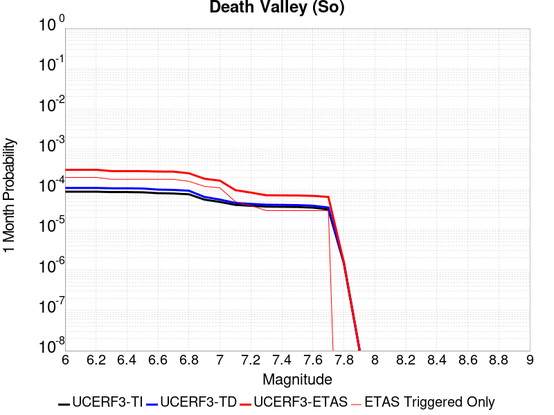 |  |  |

| Magnitude | 1 wk TI Prob | 1 wk TD Prob | 1 wk ETAS Prob | 1 wk ETAS/TD Gain | 1 wk ETAS Triggered Only | 1 mo TI Prob | 1 mo TD Prob | 1 mo ETAS Prob | 1 mo ETAS/TD Gain | 1 mo ETAS Triggered Only | 1 yr TI Prob | 1 yr TD Prob | 1 yr ETAS Prob | 1 yr ETAS/TD Gain | 1 yr ETAS Triggered Only | 10 yr TI Prob | 10 yr TD Prob | 10 yr ETAS Prob | 10 yr ETAS/TD Gain | 10 yr ETAS Triggered Only |
|-----|-----|-----|-----|-----|-----|-----|-----|-----|-----|-----|-----|-----|-----|-----|-----|-----|-----|-----|-----|-----|
| 6.0 | 2.0684236E-5 | 2.5619715E-5 | 6.561869E-5 | 2.5612576 | 4.0E-5 | 8.864371E-5 | 1.0979425E-4 | 3.097723E-4 | 2.821389 | 2.0E-4 | 0.0010787029 | 0.0013359422 | 0.00217482 | 1.6279297 | 8.4E-4 | 0.010734817 | 0.013282393 | 0.01496968 | 1.1270318 | 0.00171 |
| 6.1 | 2.0684236E-5 | 2.5619715E-5 | 6.561869E-5 | 2.5612576 | 4.0E-5 | 8.864371E-5 | 1.0979425E-4 | 3.097723E-4 | 2.821389 | 2.0E-4 | 0.0010787029 | 0.0013359422 | 0.00217482 | 1.6279297 | 8.4E-4 | 0.010734817 | 0.013282393 | 0.01496968 | 1.1270318 | 0.00171 |
| 6.2 | 2.0684236E-5 | 2.5619715E-5 | 6.561869E-5 | 2.5612576 | 4.0E-5 | 8.864371E-5 | 1.0979425E-4 | 3.097723E-4 | 2.821389 | 2.0E-4 | 0.0010787029 | 0.0013359422 | 0.00217482 | 1.6279297 | 8.4E-4 | 0.010734817 | 0.013282393 | 0.01496968 | 1.1270318 | 0.00171 |
| 6.3 | 2.0240292E-5 | 2.5119774E-5 | 4.511927E-5 | 1.7961655 | 2.0E-5 | 8.6741224E-5 | 1.07651824E-4 | 2.8763246E-4 | 2.6718771 | 1.8E-4 | 0.0010555626 | 0.0013098897 | 0.0020988549 | 1.6023142 | 7.9E-4 | 0.010505628 | 0.01302494 | 0.01463371 | 1.1235145 | 0.00163 |
| 6.4 | 2.0240292E-5 | 2.5119774E-5 | 4.511927E-5 | 1.7961655 | 2.0E-5 | 8.6741224E-5 | 1.07651824E-4 | 2.8763246E-4 | 2.6718771 | 1.8E-4 | 0.0010555626 | 0.0013098897 | 0.0020988549 | 1.6023142 | 7.9E-4 | 0.010505628 | 0.01302494 | 0.01463371 | 1.1235145 | 0.00163 |
| 6.5 | 1.9962767E-5 | 2.4809013E-5 | 4.4808516E-5 | 1.8061386 | 2.0E-5 | 8.55519E-5 | 1.063201E-4 | 2.8630096E-4 | 2.6928208 | 1.8E-4 | 0.0010410968 | 0.0012936953 | 0.002052712 | 1.5867045 | 7.6E-4 | 0.010362327 | 0.012864878 | 0.014424552 | 1.121235 | 0.00158 |
| 6.6 | 1.8937297E-5 | 2.3312776E-5 | 4.331231E-5 | 1.8578787 | 2.0E-5 | 8.115732E-5 | 9.990815E-5 | 2.7989017E-4 | 2.8014748 | 1.8E-4 | 9.876423E-4 | 0.0012157175 | 0.0018948909 | 1.5586604 | 6.8E-4 | 0.009832645 | 0.012093721 | 0.01346691 | 1.1135457 | 0.00139 |
| 6.7 | 1.8621096E-5 | 2.2913398E-5 | 4.291294E-5 | 1.8728318 | 2.0E-5 | 7.980225E-5 | 9.8196666E-5 | 2.7817898E-4 | 2.8328762 | 1.8E-4 | 9.711593E-4 | 0.0011949032 | 0.0018740906 | 1.5684037 | 6.8E-4 | 0.009669261 | 0.011887826 | 0.013261302 | 1.1155363 | 0.00139 |
| 6.8 | 1.7830353E-5 | 2.1807367E-5 | 3.180715E-5 | 1.4585506 | 1.0E-5 | 7.641356E-5 | 9.3456874E-5 | 2.5344192E-4 | 2.7118595 | 1.6E-4 | 9.29938E-4 | 0.0011372576 | 0.0017965069 | 1.5796834 | 6.6E-4 | 0.009260561 | 0.01131722 | 0.012642055 | 1.1170636 | 0.00134 |
| 6.9 | 1.3135183E-5 | 1.5304873E-5 | 2.530472E-5 | 1.6533766 | 1.0E-5 | 5.6292425E-5 | 6.5590706E-5 | 1.8558283E-4 | 2.8294075 | 1.2E-4 | 6.8514474E-4 | 7.982807E-4 | 0.0012579135 | 1.5757784 | 4.6E-4 | 0.006830362 | 0.0079551395 | 0.008748775 | 1.0997639 | 8.0E-4 |
| 7.0 | 1.1507512E-5 | 1.3154933E-5 | 2.3154802E-5 | 1.760161 | 1.0E-5 | 4.9316975E-5 | 5.63771E-5 | 1.663709E-4 | 2.951037 | 1.1E-4 | 6.002687E-4 | 6.861808E-4 | 0.0010059612 | 1.4660294 | 3.2E-4 | 0.0059864987 | 0.006841322 | 0.007407422 | 1.0827472 | 5.7E-4 |
| 7.1 | 9.715903E-6 | 1.0865805E-5 | 2.0865697E-5 | 1.9203084 | 1.0E-5 | 4.1638916E-5 | 4.656693E-5 | 9.65646E-5 | 2.0736732 | 5.0E-5 | 5.068359E-4 | 5.6680915E-4 | 7.067298E-4 | 1.2468567 | 1.4E-4 | 0.0050568148 | 0.005654088 | 0.0059225615 | 1.0474831 | 2.7E-4 |
| 7.2 | 9.233269E-6 | 1.0286798E-5 | 2.0286696E-5 | 1.9721098 | 1.0E-5 | 3.9570554E-5 | 4.408556E-5 | 8.40838E-5 | 1.9072866 | 4.0E-5 | 4.81665E-4 | 5.366137E-4 | 6.465547E-4 | 1.2048792 | 1.1E-4 | 0.0048062233 | 0.005353611 | 0.0055823796 | 1.0427316 | 2.3E-4 |
| 7.3 | 8.8041315E-6 | 9.808611E-6 | 1.9808513E-5 | 2.0195024 | 1.0E-5 | 3.7731446E-5 | 4.2036252E-5 | 7.203499E-5 | 1.7136397 | 3.0E-5 | 4.592835E-4 | 5.116754E-4 | 6.116242E-4 | 1.1953365 | 1.0E-4 | 0.0045833546 | 0.0051053995 | 0.0052944296 | 1.0370255 | 1.9E-4 |
| 7.4 | 8.708749E-6 | 9.70762E-6 | 1.9707522E-5 | 2.0301087 | 1.0E-5 | 3.7322676E-5 | 4.1603445E-5 | 7.16022E-5 | 1.7210641 | 3.0E-5 | 4.5430884E-4 | 5.0640845E-4 | 6.0635776E-4 | 1.1973691 | 1.0E-4 | 0.004533812 | 0.0050529707 | 0.0052420106 | 1.0374117 | 1.9E-4 |
| 7.5 | 8.612678E-6 | 9.605259E-6 | 1.9605164E-5 | 2.0410862 | 1.0E-5 | 3.6910955E-5 | 4.116477E-5 | 7.116354E-5 | 1.7287484 | 3.0E-5 | 4.492982E-4 | 5.0107006E-4 | 6.0101994E-4 | 1.1994729 | 1.0E-4 | 0.004483909 | 0.004999828 | 0.005188878 | 1.0378113 | 1.9E-4 |
| 7.6 | 8.319024E-6 | 9.284347E-6 | 1.9284254E-5 | 2.0770717 | 1.0E-5 | 3.5652476E-5 | 3.9789473E-5 | 6.978828E-5 | 1.7539383 | 3.0E-5 | 4.3398244E-4 | 4.8433334E-4 | 5.842849E-4 | 1.2063694 | 1.0E-4 | 0.0043313587 | 0.004833202 | 0.0050123315 | 1.0370624 | 1.8E-4 |
| 7.7 | 7.4718328E-6 | 8.345559E-6 | 1.8345476E-5 | 2.198232 | 1.0E-5 | 3.2021748E-5 | 3.5766214E-5 | 6.576514E-5 | 1.8387504 | 3.0E-5 | 3.8979502E-4 | 4.3537072E-4 | 5.153359E-4 | 1.1836715 | 8.0E-5 | 0.00389112 | 0.004345583 | 0.004494931 | 1.0343678 | 1.5E-4 |
| 7.8 | 3.4586725E-7 | 3.6483414E-7 | 3.6483414E-7 | 1.0 | 0.0 | 1.4822873E-6 | 1.563574E-6 | 1.563574E-6 | 1.0 | 0.0 | 1.80467E-5 | 1.9036352E-5 | 2.903616E-5 | 1.5253007 | 1.0E-5 | 1.8045233E-4 | 1.9034765E-4 | 2.0034573E-4 | 1.0525254 | 1.0E-5 |
| 7.9 | 2.5591178E-9 | 2.6697178E-9 | 2.6697178E-9 | 1.0 | 0.0 | 1.0967647E-8 | 1.1441647E-8 | 1.1441647E-8 | 1.0 | 0.0 | 1.335311E-7 | 1.3930206E-7 | 1.3930206E-7 | 1.0 | 0.0 | 1.3353102E-6 | 1.3930205E-6 | 1.3930205E-6 | 1.0 | 0.0 |

## Nelson Lake
*[(top)](#table-of-contents)*

| 1 Week | 1 Month | 1 Year | 10 Year |
|-----|-----|-----|-----|
| 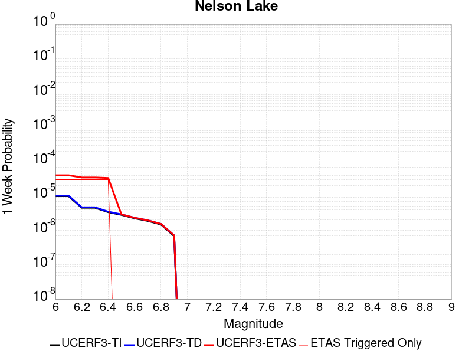 | 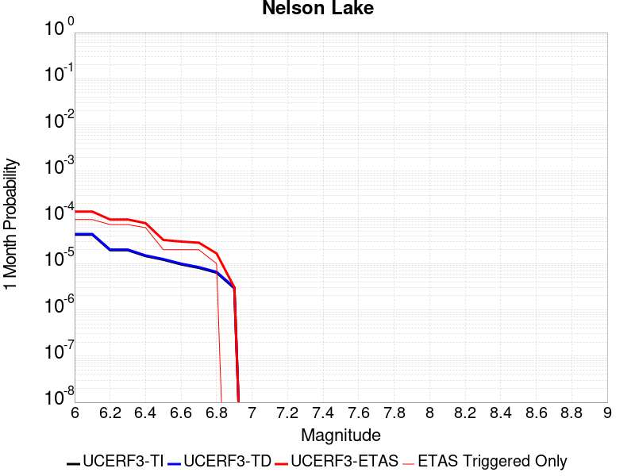 |  | 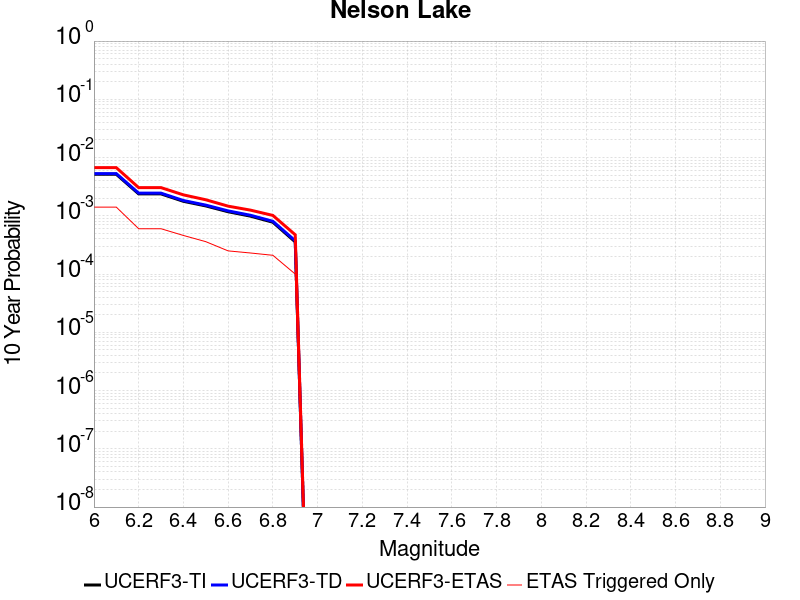 |

| Magnitude | 1 wk TI Prob | 1 wk TD Prob | 1 wk ETAS Prob | 1 wk ETAS/TD Gain | 1 wk ETAS Triggered Only | 1 mo TI Prob | 1 mo TD Prob | 1 mo ETAS Prob | 1 mo ETAS/TD Gain | 1 mo ETAS Triggered Only | 1 yr TI Prob | 1 yr TD Prob | 1 yr ETAS Prob | 1 yr ETAS/TD Gain | 1 yr ETAS Triggered Only | 10 yr TI Prob | 10 yr TD Prob | 10 yr ETAS Prob | 10 yr ETAS/TD Gain | 10 yr ETAS Triggered Only |
|-----|-----|-----|-----|-----|-----|-----|-----|-----|-----|-----|-----|-----|-----|-----|-----|-----|-----|-----|-----|-----|
| 6.0 | 9.913453E-6 | 1.019237E-5 | 4.0192062E-5 | 3.9433484 | 3.0E-5 | 4.2485535E-5 | 4.368091E-5 | 1.3367698E-4 | 3.0603065 | 9.0E-5 | 5.1713863E-4 | 5.3169567E-4 | 0.001121382 | 2.1090674 | 5.9E-4 | 0.0051593683 | 0.005305263 | 0.006707783 | 1.2643638 | 0.00141 |
| 6.1 | 9.913453E-6 | 1.019237E-5 | 4.0192062E-5 | 3.9433484 | 3.0E-5 | 4.2485535E-5 | 4.368091E-5 | 1.3367698E-4 | 3.0603065 | 9.0E-5 | 5.1713863E-4 | 5.3169567E-4 | 0.001121382 | 2.1090674 | 5.9E-4 | 0.0051593683 | 0.005305263 | 0.006707783 | 1.2643638 | 0.00141 |
| 6.2 | 4.5596407E-6 | 4.696369E-6 | 3.469623E-5 | 7.3878837 | 3.0E-5 | 1.954117E-5 | 2.0127149E-5 | 9.012574E-5 | 4.4778194 | 7.0E-5 | 2.3788778E-4 | 2.4502174E-4 | 4.6496783E-4 | 1.8976595 | 2.2E-4 | 0.0023763329 | 0.0024476422 | 0.0030461734 | 1.2445339 | 6.0E-4 |
| 6.3 | 4.5596407E-6 | 4.696369E-6 | 3.469623E-5 | 7.3878837 | 3.0E-5 | 1.954117E-5 | 2.0127149E-5 | 9.012574E-5 | 4.4778194 | 7.0E-5 | 2.3788778E-4 | 2.4502174E-4 | 4.6496783E-4 | 1.8976595 | 2.2E-4 | 0.0023763329 | 0.0024476422 | 0.0030461734 | 1.2445339 | 6.0E-4 |
| 6.4 | 3.4025713E-6 | 3.5099415E-6 | 3.3509838E-5 | 9.547121 | 3.0E-5 | 1.4582367E-5 | 1.5042524E-5 | 7.504162E-5 | 4.988632 | 6.0E-5 | 1.7752586E-4 | 1.8312818E-4 | 3.5309704E-4 | 1.9281416 | 1.7E-4 | 0.001773841 | 0.0018298556 | 0.002289014 | 1.2509259 | 4.6E-4 |
| 6.5 | 2.8352947E-6 | 2.9278942E-6 | 2.9278942E-6 | 1.0 | 0.0 | 1.2151207E-5 | 1.2548062E-5 | 3.254781E-5 | 2.5938516 | 2.0E-5 | 1.479309E-4 | 1.5276269E-4 | 2.7274436E-4 | 1.7854121 | 1.2E-4 | 0.0014783246 | 0.0015266507 | 0.0018861011 | 1.2354503 | 3.6E-4 |
| 6.6 | 2.251518E-6 | 2.3290995E-6 | 2.3290995E-6 | 1.0 | 0.0 | 9.649328E-6 | 9.981821E-6 | 2.998162E-5 | 3.0036225 | 2.0E-5 | 1.1747423E-4 | 1.2152251E-4 | 2.015128E-4 | 1.6582342 | 8.0E-5 | 0.0011741214 | 0.0012146224 | 0.0014643187 | 1.2055752 | 2.5E-4 |
| 6.7 | 1.8911853E-6 | 1.9591678E-6 | 1.9591678E-6 | 1.0 | 0.0 | 8.105055E-6 | 8.39641E-6 | 2.8396242E-5 | 3.3819506 | 2.0E-5 | 9.867457E-5 | 1.02222075E-4 | 1.822139E-4 | 1.7825298 | 8.0E-5 | 9.863076E-4 | 0.001021808 | 0.0012515731 | 1.2248611 | 2.3E-4 |
| 6.8 | 1.4874814E-6 | 1.5438538E-6 | 1.5438538E-6 | 1.0 | 0.0 | 6.374905E-6 | 6.6165026E-6 | 1.6616435E-5 | 2.5113626 | 1.0E-5 | 7.76117E-5 | 8.055346E-5 | 1.5054783E-4 | 1.8689182 | 7.0E-5 | 7.75846E-4 | 8.0529373E-4 | 0.0010151246 | 1.2605644 | 2.1E-4 |
| 6.9 | 6.835972E-7 | 7.1400547E-7 | 7.1400547E-7 | 1.0 | 0.0 | 2.9296991E-6 | 3.0600215E-6 | 3.0600215E-6 | 1.0 | 0.0 | 3.56685E-5 | 3.7255446E-5 | 6.7254325E-5 | 1.8052214 | 3.0E-5 | 3.5662777E-4 | 3.7252324E-4 | 4.72486E-4 | 1.2683396 | 1.0E-4 |

## Lenwood-Lockhart-Old Woman Springs
*[(top)](#table-of-contents)*

| 1 Week | 1 Month | 1 Year | 10 Year |
|-----|-----|-----|-----|
| 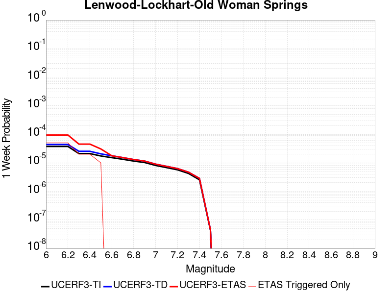 |  | 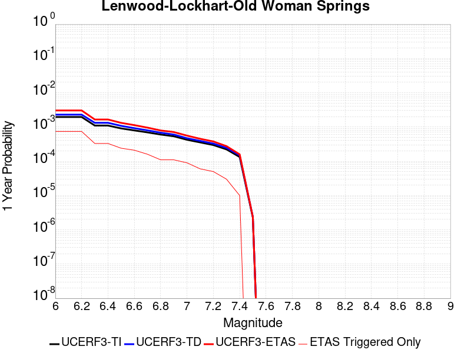 | 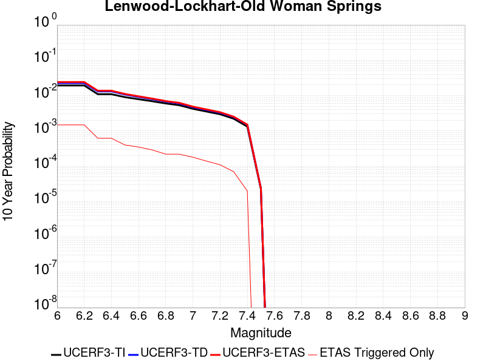 |

| Magnitude | 1 wk TI Prob | 1 wk TD Prob | 1 wk ETAS Prob | 1 wk ETAS/TD Gain | 1 wk ETAS Triggered Only | 1 mo TI Prob | 1 mo TD Prob | 1 mo ETAS Prob | 1 mo ETAS/TD Gain | 1 mo ETAS Triggered Only | 1 yr TI Prob | 1 yr TD Prob | 1 yr ETAS Prob | 1 yr ETAS/TD Gain | 1 yr ETAS Triggered Only | 10 yr TI Prob | 10 yr TD Prob | 10 yr ETAS Prob | 10 yr ETAS/TD Gain | 10 yr ETAS Triggered Only |
|-----|-----|-----|-----|-----|-----|-----|-----|-----|-----|-----|-----|-----|-----|-----|-----|-----|-----|-----|-----|-----|
| 6.0 | 3.744542E-5 | 4.396386E-5 | 9.396166E-5 | 2.1372478 | 5.0E-5 | 1.604705E-4 | 1.8840391E-4 | 3.6837E-4 | 1.9552143 | 1.8E-4 | 0.0019519776 | 0.0022915765 | 0.0030298808 | 1.3221818 | 7.4E-4 | 0.019349206 | 0.022697473 | 0.02414388 | 1.0637255 | 0.00148 |
| 6.1 | 3.744542E-5 | 4.396386E-5 | 9.396166E-5 | 2.1372478 | 5.0E-5 | 1.604705E-4 | 1.8840391E-4 | 3.6837E-4 | 1.9552143 | 1.8E-4 | 0.0019519776 | 0.0022915765 | 0.0030298808 | 1.3221818 | 7.4E-4 | 0.019349206 | 0.022697473 | 0.02414388 | 1.0637255 | 0.00148 |
| 6.2 | 3.744542E-5 | 4.396386E-5 | 9.396166E-5 | 2.1372478 | 5.0E-5 | 1.604705E-4 | 1.8840391E-4 | 3.6837E-4 | 1.9552143 | 1.8E-4 | 0.0019519776 | 0.0022915765 | 0.0030298808 | 1.3221818 | 7.4E-4 | 0.019349206 | 0.022697473 | 0.02414388 | 1.0637255 | 0.00148 |
| 6.3 | 2.1079984E-5 | 2.5353922E-5 | 4.5353416E-5 | 1.7888126 | 2.0E-5 | 9.0339665E-5 | 1.0865525E-4 | 1.8864656E-4 | 1.7361937 | 8.0E-5 | 0.0010993304 | 0.0013220949 | 0.0016516586 | 1.2492739 | 3.3E-4 | 0.010939079 | 0.013144509 | 0.013756359 | 1.046548 | 6.2E-4 |
| 6.4 | 2.1079984E-5 | 2.5353922E-5 | 4.5353416E-5 | 1.7888126 | 2.0E-5 | 9.0339665E-5 | 1.0865525E-4 | 1.8864656E-4 | 1.7361937 | 8.0E-5 | 0.0010993304 | 0.0013220949 | 0.0016516586 | 1.2492739 | 3.3E-4 | 0.010939079 | 0.013144509 | 0.013756359 | 1.046548 | 6.2E-4 |
| 6.5 | 1.7397282E-5 | 2.0662786E-5 | 3.066258E-5 | 1.4839518 | 1.0E-5 | 7.455765E-5 | 8.855186E-5 | 1.4854655E-4 | 1.6775091 | 6.0E-5 | 9.073613E-4 | 0.0010775975 | 0.0013173388 | 1.2224777 | 2.4E-4 | 0.009036654 | 0.010725016 | 0.011120725 | 1.036896 | 4.0E-4 |
| 6.6 | 1.52050325E-5 | 1.7680011E-5 | 1.7680011E-5 | 1.0 | 0.0 | 6.51628E-5 | 7.576932E-5 | 1.05767045E-4 | 1.3959086 | 3.0E-5 | 7.9306826E-4 | 9.221089E-4 | 0.0011319153 | 1.2275288 | 2.1E-4 | 0.007902439 | 0.00918369 | 0.009530475 | 1.0377611 | 3.5E-4 |
| 6.7 | 1.332523E-5 | 1.526427E-5 | 1.526427E-5 | 1.0 | 0.0 | 5.7106878E-5 | 6.541669E-5 | 9.5414725E-5 | 1.4585686 | 3.0E-5 | 6.950544E-4 | 7.96163E-4 | 9.560356E-4 | 1.2008039 | 1.6E-4 | 0.006928845 | 0.007933737 | 0.008221436 | 1.0362628 | 2.9E-4 |
| 6.8 | 1.1525329E-5 | 1.3031191E-5 | 1.3031191E-5 | 1.0 | 0.0 | 4.9393333E-5 | 5.584679E-5 | 7.584567E-5 | 1.3581027 | 2.0E-5 | 6.011979E-4 | 6.797268E-4 | 7.8965205E-4 | 1.1617197 | 1.1E-4 | 0.00599574 | 0.006776929 | 0.006995438 | 1.0322431 | 2.2E-4 |
| 6.9 | 1.0253909E-5 | 1.1514617E-5 | 1.1514617E-5 | 1.0 | 0.0 | 4.3944583E-5 | 4.9347444E-5 | 6.934645E-5 | 1.4052695 | 2.0E-5 | 5.3489394E-4 | 6.006431E-4 | 7.1057706E-4 | 1.183027 | 1.1E-4 | 0.0053360825 | 0.0059905765 | 0.0062092585 | 1.0365044 | 2.2E-4 |
| 7.0 | 8.104563E-6 | 8.991404E-6 | 8.991404E-6 | 1.0 | 0.0 | 3.4733377E-5 | 3.8534035E-5 | 3.8534035E-5 | 1.0 | 0.0 | 4.2279682E-4 | 4.6905328E-4 | 5.5901107E-4 | 1.1917858 | 9.0E-5 | 0.0042199334 | 0.004680881 | 0.004860038 | 1.0382743 | 1.8E-4 |
| 7.1 | 6.7986157E-6 | 7.5159132E-6 | 7.5159132E-6 | 1.0 | 0.0 | 2.91366E-5 | 3.221067E-5 | 3.221067E-5 | 1.0 | 0.0 | 3.5468035E-4 | 3.920965E-4 | 4.5207297E-4 | 1.1529635 | 6.0E-5 | 0.003541148 | 0.0039142636 | 0.004053715 | 1.0356266 | 1.4E-4 |
| 7.2 | 5.6893327E-6 | 6.28009E-6 | 6.28009E-6 | 1.0 | 0.0 | 2.4382627E-5 | 2.6914404E-5 | 2.6914404E-5 | 1.0 | 0.0 | 2.9681803E-4 | 3.276356E-4 | 3.776192E-4 | 1.1525586 | 5.0E-5 | 0.002964219 | 0.003271724 | 0.0033813643 | 1.0335114 | 1.1E-4 |
| 7.3 | 4.253348E-6 | 4.70696E-6 | 4.70696E-6 | 1.0 | 0.0 | 1.8228506E-5 | 2.0172542E-5 | 2.0172542E-5 | 1.0 | 0.0 | 2.2190946E-4 | 2.4557483E-4 | 2.7556746E-4 | 1.1221323 | 3.0E-5 | 0.00221688 | 0.0024532157 | 0.002523044 | 1.028464 | 7.0E-5 |
| 7.4 | 2.5448119E-6 | 2.85207E-6 | 2.85207E-6 | 1.0 | 0.0 | 1.0906291E-5 | 1.222311E-5 | 1.222311E-5 | 1.0 | 0.0 | 1.3277601E-4 | 1.4880786E-4 | 1.5880636E-4 | 1.0671908 | 1.0E-5 | 0.001326967 | 0.0014872443 | 0.0015072145 | 1.0134277 | 2.0E-5 |
| 7.5 | 4.3706837E-8 | 4.562989E-8 | 4.562989E-8 | 1.0 | 0.0 | 1.8731501E-7 | 1.9555667E-7 | 1.9555667E-7 | 1.0 | 0.0 | 2.2805577E-6 | 2.3809002E-6 | 2.3809002E-6 | 1.0 | 0.0 | 2.2805343E-5 | 2.3808803E-5 | 2.3808803E-5 | 1.0 | 0.0 |

## San Andreas (Mojave N)
*[(top)](#table-of-contents)*

| 1 Week | 1 Month | 1 Year | 10 Year |
|-----|-----|-----|-----|
|  |  |  |  |

| Magnitude | 1 wk TI Prob | 1 wk TD Prob | 1 wk ETAS Prob | 1 wk ETAS/TD Gain | 1 wk ETAS Triggered Only | 1 mo TI Prob | 1 mo TD Prob | 1 mo ETAS Prob | 1 mo ETAS/TD Gain | 1 mo ETAS Triggered Only | 1 yr TI Prob | 1 yr TD Prob | 1 yr ETAS Prob | 1 yr ETAS/TD Gain | 1 yr ETAS Triggered Only | 10 yr TI Prob | 10 yr TD Prob | 10 yr ETAS Prob | 10 yr ETAS/TD Gain | 10 yr ETAS Triggered Only |
|-----|-----|-----|-----|-----|-----|-----|-----|-----|-----|-----|-----|-----|-----|-----|-----|-----|-----|-----|-----|-----|
| 6.0 | 9.877682E-5 | 1.9426816E-4 | 2.9424872E-4 | 1.5146524 | 1.0E-4 | 4.2326056E-4 | 8.3231233E-4 | 0.001092096 | 1.3121227 | 2.6E-4 | 0.0051410277 | 0.010086447 | 0.010809084 | 1.0716443 | 7.3E-4 | 0.05023708 | 0.09842867 | 0.09977201 | 1.0136479 | 0.00149 |
| 6.1 | 9.877682E-5 | 1.9426816E-4 | 2.9424872E-4 | 1.5146524 | 1.0E-4 | 4.2326056E-4 | 8.3231233E-4 | 0.001092096 | 1.3121227 | 2.6E-4 | 0.0051410277 | 0.010086447 | 0.010809084 | 1.0716443 | 7.3E-4 | 0.05023708 | 0.09842867 | 0.09977201 | 1.0136479 | 0.00149 |
| 6.2 | 9.877682E-5 | 1.9426816E-4 | 2.9424872E-4 | 1.5146524 | 1.0E-4 | 4.2326056E-4 | 8.3231233E-4 | 0.001092096 | 1.3121227 | 2.6E-4 | 0.0051410277 | 0.010086447 | 0.010809084 | 1.0716443 | 7.3E-4 | 0.05023708 | 0.09842867 | 0.09977201 | 1.0136479 | 0.00149 |
| 6.3 | 9.877682E-5 | 1.9426816E-4 | 2.9424872E-4 | 1.5146524 | 1.0E-4 | 4.2326056E-4 | 8.3231233E-4 | 0.001092096 | 1.3121227 | 2.6E-4 | 0.0051410277 | 0.010086447 | 0.010809084 | 1.0716443 | 7.3E-4 | 0.05023708 | 0.09842867 | 0.09977201 | 1.0136479 | 0.00149 |
| 6.4 | 9.877682E-5 | 1.9426816E-4 | 2.9424872E-4 | 1.5146524 | 1.0E-4 | 4.2326056E-4 | 8.3231233E-4 | 0.001092096 | 1.3121227 | 2.6E-4 | 0.0051410277 | 0.010086447 | 0.010809084 | 1.0716443 | 7.3E-4 | 0.05023708 | 0.09842867 | 0.09977201 | 1.0136479 | 0.00149 |
| 6.5 | 9.861474E-5 | 1.9400574E-4 | 2.9398635E-4 | 1.5153487 | 1.0E-4 | 4.2256617E-4 | 8.311884E-4 | 0.0010909723 | 1.3125452 | 2.6E-4 | 0.0051326132 | 0.01007289 | 0.010795536 | 1.0717417 | 7.3E-4 | 0.050156746 | 0.09830645 | 0.09964997 | 1.0136666 | 0.00149 |
| 6.6 | 9.861474E-5 | 1.9400574E-4 | 2.9398635E-4 | 1.5153487 | 1.0E-4 | 4.2256617E-4 | 8.311884E-4 | 0.0010909723 | 1.3125452 | 2.6E-4 | 0.0051326132 | 0.01007289 | 0.010795536 | 1.0717417 | 7.3E-4 | 0.050156746 | 0.09830645 | 0.09964997 | 1.0136666 | 0.00149 |
| 6.7 | 9.8552715E-5 | 1.9390525E-4 | 2.9388585E-4 | 1.5156158 | 1.0E-4 | 4.223004E-4 | 8.3075796E-4 | 0.001090542 | 1.3127072 | 2.6E-4 | 0.0051293927 | 0.010067698 | 0.010790348 | 1.0717791 | 7.3E-4 | 0.050125998 | 0.09825963 | 0.09960322 | 1.0136739 | 0.00149 |
| 6.8 | 9.8464974E-5 | 1.9375679E-4 | 2.9373742E-4 | 1.5160109 | 1.0E-4 | 4.219245E-4 | 8.301222E-4 | 0.0010899063 | 1.3129469 | 2.6E-4 | 0.0051248376 | 0.010060028 | 0.010782685 | 1.0718344 | 7.3E-4 | 0.05008251 | 0.09818963 | 0.09953333 | 1.0136847 | 0.00149 |
| 6.9 | 9.825824E-5 | 1.9343675E-4 | 2.934174E-4 | 1.5168649 | 1.0E-4 | 4.2103877E-4 | 8.287514E-4 | 0.001088536 | 1.313465 | 2.6E-4 | 0.0051141046 | 0.0100434935 | 0.010766162 | 1.0719539 | 7.3E-4 | 0.049980022 | 0.09803868 | 0.0993826 | 1.0137081 | 0.00149 |
| 7.0 | 9.781462E-5 | 1.9275011E-4 | 2.9273084E-4 | 1.5187064 | 1.0E-4 | 4.1913814E-4 | 8.2581054E-4 | 0.0010855958 | 1.3145822 | 2.6E-4 | 0.005091073 | 0.0100080175 | 0.010730712 | 1.0722115 | 7.3E-4 | 0.04976007 | 0.097714975 | 0.09905036 | 1.013666 | 0.00148 |
| 7.1 | 9.7121134E-5 | 1.9176681E-4 | 2.9174765E-4 | 1.5213666 | 1.0E-4 | 4.1616702E-4 | 8.215991E-4 | 0.0010813855 | 1.3161961 | 2.6E-4 | 0.005055068 | 0.009957214 | 0.010679944 | 1.0725837 | 7.3E-4 | 0.04941613 | 0.097251356 | 0.09858742 | 1.0137383 | 0.00148 |
| 7.2 | 9.663819E-5 | 1.9107437E-4 | 2.9105527E-4 | 1.5232564 | 1.0E-4 | 4.1409794E-4 | 8.1863336E-4 | 0.0010684287 | 1.305137 | 2.5E-4 | 0.0050299936 | 0.009921435 | 0.010634292 | 1.0718502 | 7.2E-4 | 0.049176537 | 0.09692453 | 0.09825205 | 1.0136964 | 0.00147 |
| 7.3 | 9.6277574E-5 | 1.9059914E-4 | 2.9058006E-4 | 1.5245614 | 1.0E-4 | 4.125529E-4 | 8.165979E-4 | 0.0010663938 | 1.3058982 | 2.5E-4 | 0.0050112694 | 0.009896879 | 0.0106097525 | 1.0720302 | 7.2E-4 | 0.04899759 | 0.096697845 | 0.0980257 | 1.013732 | 0.00147 |
| 7.4 | 9.593308E-5 | 1.8999654E-4 | 2.8997753E-4 | 1.5262253 | 1.0E-4 | 4.1107697E-4 | 8.1401697E-4 | 0.0010638135 | 1.3068689 | 2.5E-4 | 0.0049933824 | 0.00986574 | 0.010578637 | 1.0722598 | 7.2E-4 | 0.04882661 | 0.096415885 | 0.09774415 | 1.0137764 | 0.00147 |
| 7.5 | 9.561707E-5 | 1.8945699E-4 | 2.8943803E-4 | 1.5277243 | 1.0E-4 | 4.0972308E-4 | 8.11706E-4 | 0.0010615031 | 1.3077433 | 2.5E-4 | 0.0049769743 | 0.009837859 | 0.0105507765 | 1.0724666 | 7.2E-4 | 0.048669744 | 0.09616193 | 0.09749058 | 1.0138167 | 0.00147 |
| 7.6 | 9.418194E-5 | 1.859775E-4 | 2.859589E-4 | 1.5375994 | 1.0E-4 | 4.0357444E-4 | 7.9680316E-4 | 0.0010466039 | 1.3135037 | 2.5E-4 | 0.004902454 | 0.009658039 | 0.010371085 | 1.0738293 | 7.2E-4 | 0.047957025 | 0.09454354 | 0.095874555 | 1.0140784 | 0.00147 |
| 7.7 | 8.202141E-5 | 1.6044732E-4 | 2.5043287E-4 | 1.5608418 | 9.0E-5 | 3.51473E-4 | 6.874502E-4 | 9.172921E-4 | 1.3343397 | 2.3E-4 | 0.00427079 | 0.008337644 | 0.008992141 | 1.0784991 | 6.6E-4 | 0.04189639 | 0.082336985 | 0.08352077 | 1.0143774 | 0.00129 |
| 7.8 | 7.2859846E-5 | 1.453752E-4 | 2.2536358E-4 | 1.5502201 | 8.0E-5 | 3.1221908E-4 | 6.2288786E-4 | 8.027757E-4 | 1.2887965 | 1.8E-4 | 0.003794643 | 0.007557331 | 0.008083326 | 1.0696006 | 5.3E-4 | 0.037304975 | 0.07481959 | 0.07563374 | 1.0108817 | 8.8E-4 |
| 7.9 | 5.3874453E-5 | 1.00604E-4 | 1.2060199E-4 | 1.1987792 | 2.0E-5 | 2.3087008E-4 | 4.3108876E-4 | 5.010586E-4 | 1.1623095 | 7.0E-5 | 0.0028072202 | 0.005235886 | 0.005544263 | 1.0588968 | 3.1E-4 | 0.02772022 | 0.05249322 | 0.05294802 | 1.008664 | 4.8E-4 |
| 8.0 | 3.468538E-5 | 5.434513E-5 | 6.434459E-5 | 1.1839992 | 1.0E-5 | 1.4864317E-4 | 2.3288692E-4 | 2.4288459E-4 | 1.0429293 | 1.0E-5 | 0.0018082283 | 0.0028317133 | 0.002911487 | 1.0281714 | 8.0E-5 | 0.017935853 | 0.028989118 | 0.029115349 | 1.0043545 | 1.3E-4 |
| 8.1 | 1.9152367E-5 | 1.9442694E-5 | 1.9442694E-5 | 1.0 | 0.0 | 8.207899E-5 | 8.3323175E-5 | 8.3323175E-5 | 1.0 | 0.0 | 9.988535E-4 | 0.0010139882 | 0.0010339678 | 1.0197041 | 2.0E-5 | 0.009943757 | 0.010877219 | 0.010926676 | 1.0045468 | 5.0E-5 |
| 8.2 | 8.643924E-6 | 5.4901475E-6 | 5.4901475E-6 | 1.0 | 0.0 | 3.704486E-5 | 2.3528992E-5 | 2.3528992E-5 | 1.0 | 0.0 | 4.5092785E-4 | 2.8642788E-4 | 2.9642502E-4 | 1.0349028 | 1.0E-5 | 0.0045001395 | 0.0032570646 | 0.003267032 | 1.0030602 | 1.0E-5 |
| 8.3 | 1.983087E-6 | 7.6850927E-7 | 7.6850927E-7 | 1.0 | 0.0 | 8.498917E-6 | 3.293607E-6 | 3.293607E-6 | 1.0 | 0.0 | 1.034694E-4 | 4.0098945E-5 | 4.0098945E-5 | 1.0 | 0.0 | 0.0010342124 | 4.7341356E-4 | 4.7341356E-4 | 1.0 | 0.0 |

## Towne Pass
*[(top)](#table-of-contents)*

| 1 Week | 1 Month | 1 Year | 10 Year |
|-----|-----|-----|-----|
| 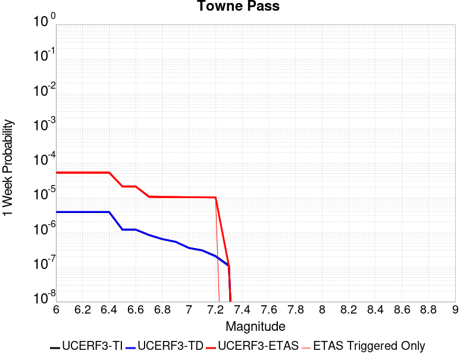 | 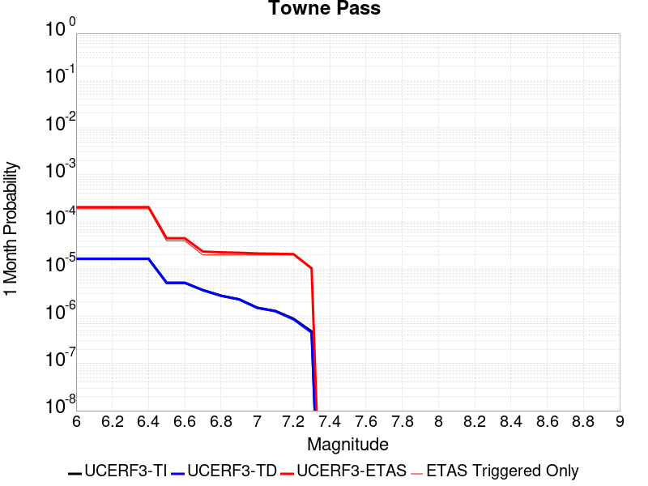 |  |  |

| Magnitude | 1 wk TI Prob | 1 wk TD Prob | 1 wk ETAS Prob | 1 wk ETAS/TD Gain | 1 wk ETAS Triggered Only | 1 mo TI Prob | 1 mo TD Prob | 1 mo ETAS Prob | 1 mo ETAS/TD Gain | 1 mo ETAS Triggered Only | 1 yr TI Prob | 1 yr TD Prob | 1 yr ETAS Prob | 1 yr ETAS/TD Gain | 1 yr ETAS Triggered Only | 10 yr TI Prob | 10 yr TD Prob | 10 yr ETAS Prob | 10 yr ETAS/TD Gain | 10 yr ETAS Triggered Only |
|-----|-----|-----|-----|-----|-----|-----|-----|-----|-----|-----|-----|-----|-----|-----|-----|-----|-----|-----|-----|-----|
| 6.0 | 3.849728E-6 | 3.894566E-6 | 5.389437E-5 | 13.83835 | 5.0E-5 | 1.649873E-5 | 1.6690916E-5 | 2.0668775E-4 | 12.383248 | 1.9E-4 | 2.0085352E-4 | 2.0319731E-4 | 7.730815E-4 | 3.8045852 | 5.7E-4 | 0.0020067208 | 0.0020305444 | 0.0033478641 | 1.648752 | 0.00132 |
| 6.1 | 3.849728E-6 | 3.894566E-6 | 5.389437E-5 | 13.83835 | 5.0E-5 | 1.649873E-5 | 1.6690916E-5 | 2.0668775E-4 | 12.383248 | 1.9E-4 | 2.0085352E-4 | 2.0319731E-4 | 7.730815E-4 | 3.8045852 | 5.7E-4 | 0.0020067208 | 0.0020305444 | 0.0033478641 | 1.648752 | 0.00132 |
| 6.2 | 3.849728E-6 | 3.894566E-6 | 5.389437E-5 | 13.83835 | 5.0E-5 | 1.649873E-5 | 1.6690916E-5 | 2.0668775E-4 | 12.383248 | 1.9E-4 | 2.0085352E-4 | 2.0319731E-4 | 7.730815E-4 | 3.8045852 | 5.7E-4 | 0.0020067208 | 0.0020305444 | 0.0033478641 | 1.648752 | 0.00132 |
| 6.3 | 3.849728E-6 | 3.894566E-6 | 5.389437E-5 | 13.83835 | 5.0E-5 | 1.649873E-5 | 1.6690916E-5 | 2.0668775E-4 | 12.383248 | 1.9E-4 | 2.0085352E-4 | 2.0319731E-4 | 7.730815E-4 | 3.8045852 | 5.7E-4 | 0.0020067208 | 0.0020305444 | 0.0033478641 | 1.648752 | 0.00132 |
| 6.4 | 3.849728E-6 | 3.894566E-6 | 5.389437E-5 | 13.83835 | 5.0E-5 | 1.649873E-5 | 1.6690916E-5 | 2.0668775E-4 | 12.383248 | 1.9E-4 | 2.0085352E-4 | 2.0319731E-4 | 7.730815E-4 | 3.8045852 | 5.7E-4 | 0.0020067208 | 0.0020305444 | 0.0033478641 | 1.648752 | 0.00132 |
| 6.5 | 1.1953545E-6 | 1.2030617E-6 | 2.1203037E-5 | 17.62423 | 2.0E-5 | 5.1229376E-6 | 5.1559696E-6 | 4.5155764E-5 | 8.757957 | 4.0E-5 | 6.236998E-5 | 6.277224E-5 | 1.6276597E-4 | 2.5929608 | 1.0E-4 | 6.235248E-4 | 6.275568E-4 | 8.4741873E-4 | 1.3503458 | 2.2E-4 |
| 6.6 | 1.1953545E-6 | 1.2030617E-6 | 2.1203037E-5 | 17.62423 | 2.0E-5 | 5.1229376E-6 | 5.1559696E-6 | 4.5155764E-5 | 8.757957 | 4.0E-5 | 6.236998E-5 | 6.277224E-5 | 1.6276597E-4 | 2.5929608 | 1.0E-4 | 6.235248E-4 | 6.275568E-4 | 8.4741873E-4 | 1.3503458 | 2.2E-4 |
| 6.7 | 8.375951E-7 | 8.410751E-7 | 1.0841067E-5 | 12.889535 | 1.0E-5 | 3.5896885E-6 | 3.6046029E-6 | 2.360453E-5 | 6.5484414 | 2.0E-5 | 4.370358E-5 | 4.3885215E-5 | 1.238817E-4 | 2.8228574 | 8.0E-5 | 4.3694986E-4 | 4.3877118E-4 | 6.086966E-4 | 1.3872757 | 1.7E-4 |
| 6.8 | 6.38041E-7 | 6.392228E-7 | 1.0639216E-5 | 16.643988 | 1.0E-5 | 2.7344586E-6 | 2.7395236E-6 | 2.2739468E-5 | 8.30052 | 2.0E-5 | 3.3291526E-5 | 3.3353226E-5 | 9.335123E-5 | 2.7988663 | 6.0E-5 | 3.3286537E-4 | 3.33486E-4 | 4.53446E-4 | 1.3597152 | 1.2E-4 |
| 6.9 | 5.3460053E-7 | 5.3453994E-7 | 1.0534534E-5 | 19.707666 | 1.0E-5 | 2.2911431E-6 | 2.2908837E-6 | 2.2290838E-5 | 9.730236 | 2.0E-5 | 2.789431E-5 | 2.7891185E-5 | 8.788951E-5 | 3.1511574 | 6.0E-5 | 2.789081E-4 | 2.7888015E-4 | 3.888495E-4 | 1.3943247 | 1.1E-4 |
| 7.0 | 3.557783E-7 | 3.5324788E-7 | 1.0353245E-5 | 29.308722 | 1.0E-5 | 1.5247632E-6 | 1.5139187E-6 | 2.1513888E-5 | 14.210729 | 2.0E-5 | 1.8563835E-5 | 1.8431812E-5 | 3.8431444E-5 | 2.0850604 | 2.0E-5 | 1.8562283E-4 | 1.8430369E-4 | 2.2429631E-4 | 1.2169931 | 4.0E-5 |
| 7.1 | 3.037942E-7 | 3.000273E-7 | 1.0300024E-5 | 34.330288 | 1.0E-5 | 1.3019744E-6 | 1.2858308E-6 | 2.1285805E-5 | 16.554127 | 2.0E-5 | 1.5851423E-5 | 1.5654885E-5 | 3.565457E-5 | 2.2775366 | 2.0E-5 | 1.5850292E-4 | 1.5653856E-4 | 1.965323E-4 | 1.255488 | 4.0E-5 |
| 7.2 | 2.0808248E-7 | 2.0218111E-7 | 1.02021795E-5 | 50.460594 | 1.0E-5 | 8.917818E-7 | 8.664902E-7 | 2.0866473E-5 | 24.081602 | 2.0E-5 | 1.0857389E-5 | 1.0549472E-5 | 3.054926E-5 | 2.8958094 | 2.0E-5 | 1.0856859E-4 | 1.0549017E-4 | 1.2548806E-4 | 1.1895711 | 2.0E-5 |
| 7.3 | 1.1162073E-7 | 1.06371616E-7 | 1.06371616E-7 | 1.0 | 0.0 | 4.7837443E-7 | 4.5587828E-7 | 1.0455874E-5 | 22.935669 | 1.0E-5 | 5.8241935E-6 | 5.550306E-6 | 1.5550251E-5 | 2.8016925 | 1.0E-5 | 5.8240406E-5 | 5.5501874E-5 | 6.550132E-5 | 1.1801641 | 1.0E-5 |

## Paradise
*[(top)](#table-of-contents)*

| 1 Week | 1 Month | 1 Year | 10 Year |
|-----|-----|-----|-----|
| 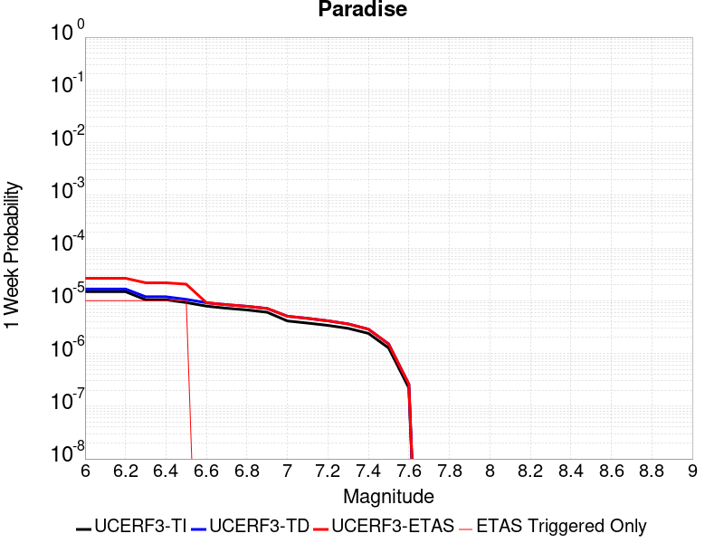 |  | 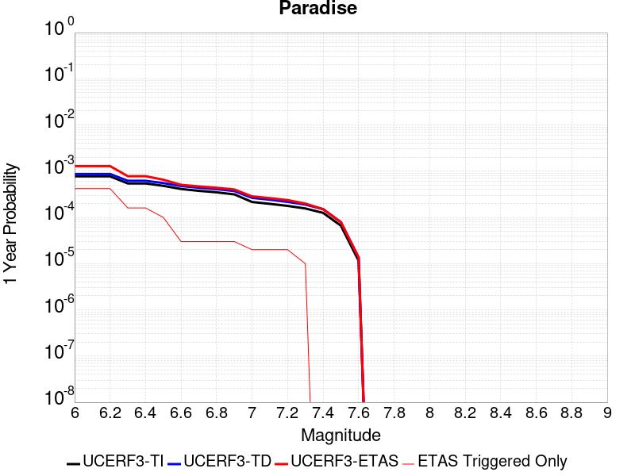 |  |

| Magnitude | 1 wk TI Prob | 1 wk TD Prob | 1 wk ETAS Prob | 1 wk ETAS/TD Gain | 1 wk ETAS Triggered Only | 1 mo TI Prob | 1 mo TD Prob | 1 mo ETAS Prob | 1 mo ETAS/TD Gain | 1 mo ETAS Triggered Only | 1 yr TI Prob | 1 yr TD Prob | 1 yr ETAS Prob | 1 yr ETAS/TD Gain | 1 yr ETAS Triggered Only | 10 yr TI Prob | 10 yr TD Prob | 10 yr ETAS Prob | 10 yr ETAS/TD Gain | 10 yr ETAS Triggered Only |
|-----|-----|-----|-----|-----|-----|-----|-----|-----|-----|-----|-----|-----|-----|-----|-----|-----|-----|-----|-----|-----|
| 6.0 | 1.4851273E-5 | 1.6695178E-5 | 2.6695012E-5 | 1.5989653 | 1.0E-5 | 6.364676E-5 | 7.154894E-5 | 1.615425E-4 | 2.2577903 | 9.0E-5 | 7.7462377E-4 | 8.7078376E-4 | 0.001290418 | 1.4819041 | 4.2E-4 | 0.0077192914 | 0.008676097 | 0.009598028 | 1.106261 | 9.3E-4 |
| 6.1 | 1.4851273E-5 | 1.6695178E-5 | 2.6695012E-5 | 1.5989653 | 1.0E-5 | 6.364676E-5 | 7.154894E-5 | 1.615425E-4 | 2.2577903 | 9.0E-5 | 7.7462377E-4 | 8.7078376E-4 | 0.001290418 | 1.4819041 | 4.2E-4 | 0.0077192914 | 0.008676097 | 0.009598028 | 1.106261 | 9.3E-4 |
| 6.2 | 1.4851273E-5 | 1.6695178E-5 | 2.6695012E-5 | 1.5989653 | 1.0E-5 | 6.364676E-5 | 7.154894E-5 | 1.615425E-4 | 2.2577903 | 9.0E-5 | 7.7462377E-4 | 8.7078376E-4 | 0.001290418 | 1.4819041 | 4.2E-4 | 0.0077192914 | 0.008676097 | 0.009598028 | 1.106261 | 9.3E-4 |
| 6.3 | 1.0426831E-5 | 1.1888942E-5 | 2.1888824E-5 | 1.8411077 | 1.0E-5 | 4.4685654E-5 | 5.0951647E-5 | 8.095012E-5 | 1.5887635 | 3.0E-5 | 5.43912E-4 | 6.2016567E-4 | 7.800665E-4 | 1.2578356 | 1.6E-4 | 0.0054258266 | 0.0061849584 | 0.00655267 | 1.0594525 | 3.7E-4 |
| 6.4 | 1.0426831E-5 | 1.1888942E-5 | 2.1888824E-5 | 1.8411077 | 1.0E-5 | 4.4685654E-5 | 5.0951647E-5 | 8.095012E-5 | 1.5887635 | 3.0E-5 | 5.43912E-4 | 6.2016567E-4 | 7.800665E-4 | 1.2578356 | 1.6E-4 | 0.0054258266 | 0.0061849584 | 0.00655267 | 1.0594525 | 3.7E-4 |
| 6.5 | 9.25027E-6 | 1.0620242E-5 | 2.0620137E-5 | 1.9415882 | 1.0E-5 | 3.964341E-5 | 4.5514556E-5 | 6.551365E-5 | 1.4393998 | 2.0E-5 | 4.8255164E-4 | 5.5400375E-4 | 6.5394834E-4 | 1.1804042 | 1.0E-4 | 0.0048150513 | 0.0055267257 | 0.0058051785 | 1.0503829 | 2.8E-4 |
| 6.6 | 7.904275E-6 | 9.159758E-6 | 9.159758E-6 | 1.0 | 0.0 | 3.3875025E-5 | 3.9255538E-5 | 3.9255538E-5 | 1.0 | 0.0 | 4.1235037E-4 | 4.7783527E-4 | 5.078209E-4 | 1.0627532 | 3.0E-5 | 0.0041158604 | 0.0047684754 | 0.004907808 | 1.0292195 | 1.4E-4 |
| 6.7 | 7.2061953E-6 | 8.407458E-6 | 8.407458E-6 | 1.0 | 0.0 | 3.088333E-5 | 3.6031484E-5 | 3.6031484E-5 | 1.0 | 0.0 | 3.7593965E-4 | 4.385987E-4 | 4.6858555E-4 | 1.0683696 | 3.0E-5 | 0.003753043 | 0.0043777 | 0.0044872183 | 1.0250174 | 1.1E-4 |
| 6.8 | 6.6948724E-6 | 7.842359E-6 | 7.842359E-6 | 1.0 | 0.0 | 2.8691995E-5 | 3.3609696E-5 | 3.3609696E-5 | 1.0 | 0.0 | 3.4926904E-4 | 4.091248E-4 | 4.391125E-4 | 1.0732973 | 3.0E-5 | 0.003487206 | 0.0040840735 | 0.0041637467 | 1.0195082 | 8.0E-5 |
| 6.9 | 6.0421025E-6 | 7.130793E-6 | 7.130793E-6 | 1.0 | 0.0 | 2.5894467E-5 | 3.0560204E-5 | 3.0560204E-5 | 1.0 | 0.0 | 3.1521954E-4 | 3.7201034E-4 | 4.019992E-4 | 1.0806129 | 3.0E-5 | 0.0031477278 | 0.0037142143 | 0.0037839543 | 1.0187765 | 7.0E-5 |
| 7.0 | 4.134091E-6 | 5.0804288E-6 | 5.0804288E-6 | 1.0 | 0.0 | 1.7717413E-5 | 2.1773092E-5 | 2.1773092E-5 | 1.0 | 0.0 | 2.1568815E-4 | 2.650567E-4 | 2.8505138E-4 | 1.0754355 | 2.0E-5 | 0.0021547892 | 0.0026475587 | 0.0026874528 | 1.0150683 | 4.0E-5 |
| 7.1 | 3.7674888E-6 | 4.6319774E-6 | 4.6319774E-6 | 1.0 | 0.0 | 1.6146281E-5 | 1.9851188E-5 | 1.9851188E-5 | 1.0 | 0.0 | 1.9656324E-4 | 2.4166294E-4 | 2.616581E-4 | 1.08274 | 2.0E-5 | 0.0019638946 | 0.002414152 | 0.0024540555 | 1.016529 | 4.0E-5 |
| 7.2 | 3.4065345E-6 | 4.1568196E-6 | 4.1568196E-6 | 1.0 | 0.0 | 1.4599351E-5 | 1.7814828E-5 | 1.7814828E-5 | 1.0 | 0.0 | 1.777326E-4 | 2.1687543E-4 | 2.368711E-4 | 1.0921988 | 2.0E-5 | 0.0017759053 | 0.002166786 | 0.0022066995 | 1.0184206 | 4.0E-5 |
| 7.3 | 2.9934936E-6 | 3.6293964E-6 | 3.6293964E-6 | 1.0 | 0.0 | 1.2829195E-5 | 1.5554471E-5 | 1.5554471E-5 | 1.0 | 0.0 | 1.5618425E-4 | 1.8936071E-4 | 1.9935881E-4 | 1.0527992 | 1.0E-5 | 0.0015607453 | 0.0018921389 | 0.001912101 | 1.01055 | 2.0E-5 |
| 7.4 | 2.4049796E-6 | 2.8890427E-6 | 2.8890427E-6 | 1.0 | 0.0 | 1.0307015E-5 | 1.2381561E-5 | 1.2381561E-5 | 1.0 | 0.0 | 1.2548068E-4 | 1.5073651E-4 | 1.5073651E-4 | 1.0 | 0.0 | 0.0012540985 | 0.0015064841 | 0.001516469 | 1.0066279 | 1.0E-5 |
| 7.5 | 1.2710091E-6 | 1.513496E-6 | 1.513496E-6 | 1.0 | 0.0 | 5.44717E-6 | 6.4864025E-6 | 6.4864025E-6 | 1.0 | 0.0 | 6.631728E-5 | 7.897034E-5 | 7.897034E-5 | 1.0 | 0.0 | 6.6297496E-4 | 7.895454E-4 | 7.995375E-4 | 1.0126555 | 1.0E-5 |
| 7.6 | 2.21172E-7 | 2.6039996E-7 | 2.6039996E-7 | 1.0 | 0.0 | 9.478797E-7 | 1.1159995E-6 | 1.1159995E-6 | 1.0 | 0.0 | 1.1540374E-5 | 1.3587238E-5 | 1.3587238E-5 | 1.0 | 0.0 | 1.1539775E-4 | 1.3586688E-4 | 1.3586688E-4 | 1.0 | 0.0 |

## Bicycle Lake
*[(top)](#table-of-contents)*

| 1 Week | 1 Month | 1 Year | 10 Year |
|-----|-----|-----|-----|
| 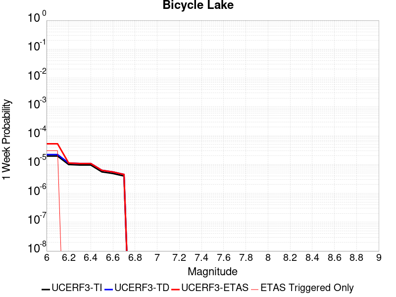 |  | 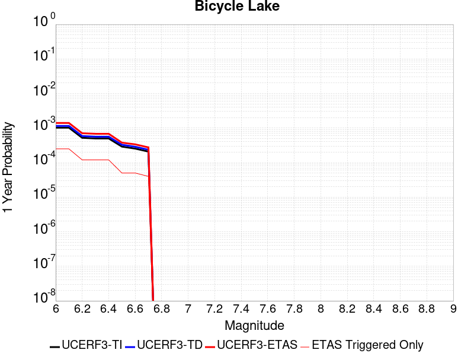 |  |

| Magnitude | 1 wk TI Prob | 1 wk TD Prob | 1 wk ETAS Prob | 1 wk ETAS/TD Gain | 1 wk ETAS Triggered Only | 1 mo TI Prob | 1 mo TD Prob | 1 mo ETAS Prob | 1 mo ETAS/TD Gain | 1 mo ETAS Triggered Only | 1 yr TI Prob | 1 yr TD Prob | 1 yr ETAS Prob | 1 yr ETAS/TD Gain | 1 yr ETAS Triggered Only | 10 yr TI Prob | 10 yr TD Prob | 10 yr ETAS Prob | 10 yr ETAS/TD Gain | 10 yr ETAS Triggered Only |
|-----|-----|-----|-----|-----|-----|-----|-----|-----|-----|-----|-----|-----|-----|-----|-----|-----|-----|-----|-----|-----|
| 6.0 | 1.9621975E-5 | 2.2098187E-5 | 5.2097526E-5 | 2.3575473 | 3.0E-5 | 8.4091465E-5 | 9.470384E-5 | 1.4469911E-4 | 1.5279117 | 5.0E-5 | 0.0010233327 | 0.0011525444 | 0.0014022563 | 1.2166613 | 2.5E-4 | 0.01018633 | 0.011478982 | 0.012299454 | 1.0714761 | 8.3E-4 |
| 6.1 | 1.9621975E-5 | 2.2098187E-5 | 5.2097526E-5 | 2.3575473 | 3.0E-5 | 8.4091465E-5 | 9.470384E-5 | 1.4469911E-4 | 1.5279117 | 5.0E-5 | 0.0010233327 | 0.0011525444 | 0.0014022563 | 1.2166613 | 2.5E-4 | 0.01018633 | 0.011478982 | 0.012299454 | 1.0714761 | 8.3E-4 |
| 6.2 | 9.9971285E-6 | 1.1256204E-5 | 1.1256204E-5 | 1.0 | 0.0 | 4.2844134E-5 | 4.8240272E-5 | 5.823979E-5 | 1.2072856 | 1.0E-5 | 5.2150246E-4 | 5.872191E-4 | 7.071486E-4 | 1.204233 | 1.2E-4 | 0.0052028033 | 0.0058617797 | 0.006358849 | 1.0847983 | 5.0E-4 |
| 6.3 | 9.589428E-6 | 1.0798888E-5 | 1.0798888E-5 | 1.0 | 0.0 | 4.10969E-5 | 4.628042E-5 | 5.6279958E-5 | 1.2160641 | 1.0E-5 | 5.002399E-4 | 5.633703E-4 | 6.833027E-4 | 1.2128838 | 1.2E-4 | 0.0049911533 | 0.0056245113 | 0.006111755 | 1.0866287 | 4.9E-4 |
| 6.4 | 9.589428E-6 | 1.0798888E-5 | 1.0798888E-5 | 1.0 | 0.0 | 4.10969E-5 | 4.628042E-5 | 5.6279958E-5 | 1.2160641 | 1.0E-5 | 5.002399E-4 | 5.633703E-4 | 6.833027E-4 | 1.2128838 | 1.2E-4 | 0.0049911533 | 0.0056245113 | 0.006111755 | 1.0866287 | 4.9E-4 |
| 6.5 | 5.557707E-6 | 6.285929E-6 | 6.285929E-6 | 1.0 | 0.0 | 2.3818526E-5 | 2.693957E-5 | 3.69393E-5 | 1.3711911 | 1.0E-5 | 2.8995197E-4 | 3.279668E-4 | 3.7795037E-4 | 1.1524044 | 5.0E-5 | 0.0028957394 | 0.003277464 | 0.0035764808 | 1.0912342 | 3.0E-4 |
| 6.6 | 4.8742945E-6 | 5.5135774E-6 | 5.5135774E-6 | 1.0 | 0.0 | 2.0889667E-5 | 2.3629551E-5 | 3.3629316E-5 | 1.4231889 | 1.0E-5 | 2.54302E-4 | 2.87678E-4 | 3.3766363E-4 | 1.1737554 | 5.0E-5 | 0.002540112 | 0.0028756252 | 0.0031647913 | 1.1005577 | 2.9E-4 |
| 6.7 | 3.991108E-6 | 4.5161464E-6 | 4.5161464E-6 | 1.0 | 0.0 | 1.7104636E-5 | 1.9354913E-5 | 2.935472E-5 | 1.5166546 | 1.0E-5 | 2.0822904E-4 | 2.3564608E-4 | 2.7563664E-4 | 1.1697061 | 4.0E-5 | 0.0020803404 | 0.0023564608 | 0.0025559894 | 1.084673 | 2.0E-4 |

## Garlic Springs
*[(top)](#table-of-contents)*

| 1 Week | 1 Month | 1 Year | 10 Year |
|-----|-----|-----|-----|
| 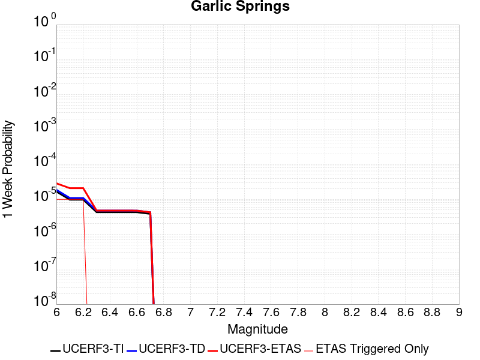 |  |  |  |

| Magnitude | 1 wk TI Prob | 1 wk TD Prob | 1 wk ETAS Prob | 1 wk ETAS/TD Gain | 1 wk ETAS Triggered Only | 1 mo TI Prob | 1 mo TD Prob | 1 mo ETAS Prob | 1 mo ETAS/TD Gain | 1 mo ETAS Triggered Only | 1 yr TI Prob | 1 yr TD Prob | 1 yr ETAS Prob | 1 yr ETAS/TD Gain | 1 yr ETAS Triggered Only | 10 yr TI Prob | 10 yr TD Prob | 10 yr ETAS Prob | 10 yr ETAS/TD Gain | 10 yr ETAS Triggered Only |
|-----|-----|-----|-----|-----|-----|-----|-----|-----|-----|-----|-----|-----|-----|-----|-----|-----|-----|-----|-----|-----|
| 6.0 | 1.6760017E-5 | 1.8777731E-5 | 2.8777544E-5 | 1.5325357 | 1.0E-5 | 7.182667E-5 | 8.047417E-5 | 1.20470955E-4 | 1.4970139 | 4.0E-5 | 8.7413884E-4 | 9.794501E-4 | 0.0012491856 | 1.2753949 | 2.7E-4 | 0.008707083 | 0.0097628785 | 0.010495654 | 1.0750573 | 7.4E-4 |
| 6.1 | 9.852767E-6 | 1.0974084E-5 | 2.0973974E-5 | 1.9112278 | 1.0E-5 | 4.222546E-5 | 4.703134E-5 | 5.703087E-5 | 1.2126142 | 1.0E-5 | 5.139737E-4 | 5.7252706E-4 | 6.9245836E-4 | 1.2094771 | 1.2E-4 | 0.005127866 | 0.0057174796 | 0.006085364 | 1.0643438 | 3.7E-4 |
| 6.2 | 9.852767E-6 | 1.0974084E-5 | 2.0973974E-5 | 1.9112278 | 1.0E-5 | 4.222546E-5 | 4.703134E-5 | 5.703087E-5 | 1.2126142 | 1.0E-5 | 5.139737E-4 | 5.7252706E-4 | 6.9245836E-4 | 1.2094771 | 1.2E-4 | 0.005127866 | 0.0057174796 | 0.006085364 | 1.0643438 | 3.7E-4 |
| 6.3 | 4.3167724E-6 | 4.778232E-6 | 4.778232E-6 | 1.0 | 0.0 | 1.8500323E-5 | 2.0478104E-5 | 2.0478104E-5 | 1.0 | 0.0 | 2.2521814E-4 | 2.4931543E-4 | 2.8930546E-4 | 1.1603993 | 4.0E-5 | 0.0022499003 | 0.002492616 | 0.0026023416 | 1.0440203 | 1.1E-4 |
| 6.4 | 4.3167724E-6 | 4.778232E-6 | 4.778232E-6 | 1.0 | 0.0 | 1.8500323E-5 | 2.0478104E-5 | 2.0478104E-5 | 1.0 | 0.0 | 2.2521814E-4 | 2.4931543E-4 | 2.8930546E-4 | 1.1603993 | 4.0E-5 | 0.0022499003 | 0.002492616 | 0.0026023416 | 1.0440203 | 1.1E-4 |
| 6.5 | 4.3167724E-6 | 4.778232E-6 | 4.778232E-6 | 1.0 | 0.0 | 1.8500323E-5 | 2.0478104E-5 | 2.0478104E-5 | 1.0 | 0.0 | 2.2521814E-4 | 2.4931543E-4 | 2.8930546E-4 | 1.1603993 | 4.0E-5 | 0.0022499003 | 0.002492616 | 0.0026023416 | 1.0440203 | 1.1E-4 |
| 6.6 | 4.301311E-6 | 4.7610993E-6 | 4.7610993E-6 | 1.0 | 0.0 | 1.8434059E-5 | 2.0404683E-5 | 2.0404683E-5 | 1.0 | 0.0 | 2.2441156E-4 | 2.484217E-4 | 2.8841177E-4 | 1.1609765 | 4.0E-5 | 0.0022418506 | 0.0024836985 | 0.0025934253 | 1.0441788 | 1.1E-4 |
| 6.7 | 3.8599724E-6 | 4.271241E-6 | 4.271241E-6 | 1.0 | 0.0 | 1.6542634E-5 | 1.8305318E-5 | 1.8305318E-5 | 1.0 | 0.0 | 2.0138794E-4 | 2.2286724E-4 | 2.5286057E-4 | 1.1345793 | 3.0E-5 | 0.0020120554 | 0.0022286724 | 0.0023284496 | 1.0447698 | 1.0E-4 |

## San Andreas (San Bernardino N)
*[(top)](#table-of-contents)*

| 1 Week | 1 Month | 1 Year | 10 Year |
|-----|-----|-----|-----|
|  |  |  |  |

| Magnitude | 1 wk TI Prob | 1 wk TD Prob | 1 wk ETAS Prob | 1 wk ETAS/TD Gain | 1 wk ETAS Triggered Only | 1 mo TI Prob | 1 mo TD Prob | 1 mo ETAS Prob | 1 mo ETAS/TD Gain | 1 mo ETAS Triggered Only | 1 yr TI Prob | 1 yr TD Prob | 1 yr ETAS Prob | 1 yr ETAS/TD Gain | 1 yr ETAS Triggered Only | 10 yr TI Prob | 10 yr TD Prob | 10 yr ETAS Prob | 10 yr ETAS/TD Gain | 10 yr ETAS Triggered Only |
|-----|-----|-----|-----|-----|-----|-----|-----|-----|-----|-----|-----|-----|-----|-----|-----|-----|-----|-----|-----|-----|
| 6.0 | 1.4273766E-4 | 3.1628655E-4 | 3.7626756E-4 | 1.1896414 | 6.0E-5 | 6.115894E-4 | 0.0013548156 | 0.0014746529 | 1.0884529 | 1.2E-4 | 0.0074207084 | 0.016371625 | 0.01678475 | 1.0252341 | 4.2E-4 | 0.07177748 | 0.15035743 | 0.15093519 | 1.0038426 | 6.8E-4 |
| 6.1 | 1.4273766E-4 | 3.1628655E-4 | 3.7626756E-4 | 1.1896414 | 6.0E-5 | 6.115894E-4 | 0.0013548156 | 0.0014746529 | 1.0884529 | 1.2E-4 | 0.0074207084 | 0.016371625 | 0.01678475 | 1.0252341 | 4.2E-4 | 0.07177748 | 0.15035743 | 0.15093519 | 1.0038426 | 6.8E-4 |
| 6.2 | 1.4273766E-4 | 3.1628655E-4 | 3.7626756E-4 | 1.1896414 | 6.0E-5 | 6.115894E-4 | 0.0013548156 | 0.0014746529 | 1.0884529 | 1.2E-4 | 0.0074207084 | 0.016371625 | 0.01678475 | 1.0252341 | 4.2E-4 | 0.07177748 | 0.15035743 | 0.15093519 | 1.0038426 | 6.8E-4 |
| 6.3 | 1.3730655E-4 | 3.0533396E-4 | 3.6531565E-4 | 1.1964462 | 6.0E-5 | 5.883239E-4 | 0.0013079235 | 0.0014277665 | 1.0916284 | 1.2E-4 | 0.0071393442 | 0.015809104 | 0.016222464 | 1.026147 | 4.2E-4 | 0.06914291 | 0.14565733 | 0.14623828 | 1.0039885 | 6.8E-4 |
| 6.4 | 1.3730655E-4 | 3.0533396E-4 | 3.6531565E-4 | 1.1964462 | 6.0E-5 | 5.883239E-4 | 0.0013079235 | 0.0014277665 | 1.0916284 | 1.2E-4 | 0.0071393442 | 0.015809104 | 0.016222464 | 1.026147 | 4.2E-4 | 0.06914291 | 0.14565733 | 0.14623828 | 1.0039885 | 6.8E-4 |
| 6.5 | 1.2942807E-4 | 2.89477E-4 | 3.4945962E-4 | 1.2072103 | 6.0E-5 | 5.545738E-4 | 0.001240031 | 0.0013598822 | 1.0966518 | 1.2E-4 | 0.0067310524 | 0.014994116 | 0.015407817 | 1.027591 | 4.2E-4 | 0.06530788 | 0.13880007 | 0.13938569 | 1.0042192 | 6.8E-4 |
| 6.6 | 1.1125901E-4 | 2.538618E-4 | 3.1384657E-4 | 1.236289 | 6.0E-5 | 4.767372E-4 | 0.0010875278 | 0.0012073973 | 1.110222 | 1.2E-4 | 0.005788839 | 0.013160901 | 0.013575373 | 1.0314927 | 4.2E-4 | 0.056403454 | 0.123089865 | 0.123686165 | 1.0048444 | 6.8E-4 |
| 6.7 | 1.02209575E-4 | 2.3521E-4 | 2.9519587E-4 | 1.2550312 | 6.0E-5 | 4.3796748E-4 | 0.0010076548 | 0.0011275338 | 1.1189684 | 1.2E-4 | 0.0053192247 | 0.01219961 | 0.012614486 | 1.0340073 | 4.2E-4 | 0.051936906 | 0.11488173 | 0.11548361 | 1.0052391 | 6.8E-4 |
| 6.8 | 9.610582E-5 | 2.2046523E-4 | 2.80452E-4 | 1.2720917 | 6.0E-5 | 4.1181705E-4 | 9.445095E-4 | 0.0010643962 | 1.1269301 | 1.2E-4 | 0.0050023515 | 0.0114390375 | 0.011854232 | 1.0362964 | 4.2E-4 | 0.048912346 | 0.10828324 | 0.1088896 | 1.0055999 | 6.8E-4 |
| 6.9 | 9.3877505E-5 | 2.150197E-4 | 2.7500678E-4 | 1.2789842 | 6.0E-5 | 4.0227012E-4 | 9.211882E-4 | 0.0010410777 | 1.1301465 | 1.2E-4 | 0.0048866454 | 0.011158038 | 0.011573351 | 1.0372211 | 4.2E-4 | 0.04780577 | 0.105873354 | 0.10648136 | 1.0057428 | 6.8E-4 |
| 7.0 | 9.1019785E-5 | 2.082873E-4 | 2.682748E-4 | 1.2880037 | 6.0E-5 | 3.900265E-4 | 8.9235505E-4 | 0.001012248 | 1.1343557 | 1.2E-4 | 0.0047382377 | 0.010810527 | 0.011216095 | 1.037516 | 4.1E-4 | 0.046384744 | 0.10284333 | 0.10344443 | 1.0058447 | 6.7E-4 |
| 7.1 | 8.771155E-5 | 2.0003127E-4 | 2.6001927E-4 | 1.2998931 | 6.0E-5 | 3.758525E-4 | 8.569957E-4 | 9.768929E-4 | 1.139904 | 1.2E-4 | 0.0045664064 | 0.010384204 | 0.0107800495 | 1.03812 | 4.0E-4 | 0.044737056 | 0.09915459 | 0.09974915 | 1.0059962 | 6.6E-4 |
| 7.2 | 8.0830236E-5 | 1.8408384E-4 | 2.4407278E-4 | 1.3258785 | 6.0E-5 | 3.4636928E-4 | 7.886923E-4 | 9.0859766E-4 | 1.1520306 | 1.2E-4 | 0.0042088944 | 0.0095601585 | 0.00994643 | 1.0404043 | 3.9E-4 | 0.041300658 | 0.09188464 | 0.09247492 | 1.0064241 | 6.5E-4 |
| 7.3 | 7.7668235E-5 | 1.7351557E-4 | 2.3350515E-4 | 1.3457303 | 6.0E-5 | 3.328214E-4 | 7.4342627E-4 | 8.633371E-4 | 1.1612948 | 1.2E-4 | 0.0040445733 | 0.009013731 | 0.009400216 | 1.0428773 | 3.9E-4 | 0.03971748 | 0.08715072 | 0.087734945 | 1.0067036 | 6.4E-4 |
| 7.4 | 7.520177E-5 | 1.6571383E-4 | 2.257039E-4 | 1.3620099 | 6.0E-5 | 3.2225347E-4 | 7.1000896E-4 | 8.299237E-4 | 1.1688919 | 1.2E-4 | 0.0039163795 | 0.008610164 | 0.008996805 | 1.0449053 | 3.9E-4 | 0.038480744 | 0.08360606 | 0.08419255 | 1.007015 | 6.4E-4 |
| 7.5 | 7.274697E-5 | 1.5858783E-4 | 2.1857832E-4 | 1.3782792 | 6.0E-5 | 3.1173544E-4 | 6.7948515E-4 | 7.9940364E-4 | 1.1764843 | 1.2E-4 | 0.003788775 | 0.008241409 | 0.008628195 | 1.046932 | 3.9E-4 | 0.03724827 | 0.08032202 | 0.080910616 | 1.0073279 | 6.4E-4 |
| 7.6 | 7.1185845E-5 | 1.542848E-4 | 2.1427555E-4 | 1.3888311 | 6.0E-5 | 3.0504653E-4 | 6.610531E-4 | 7.8097376E-4 | 1.1814085 | 1.2E-4 | 0.0037076178 | 0.008018673 | 0.008405546 | 1.0482465 | 3.9E-4 | 0.036463667 | 0.07831116 | 0.07890104 | 1.0075325 | 6.4E-4 |
| 7.7 | 6.709961E-5 | 1.43369E-4 | 2.033604E-4 | 1.4184405 | 6.0E-5 | 2.8753807E-4 | 6.142939E-4 | 7.342202E-4 | 1.1952262 | 1.2E-4 | 0.003495157 | 0.0074534197 | 0.007840513 | 1.051935 | 3.9E-4 | 0.034406938 | 0.073138334 | 0.07373153 | 1.0081105 | 6.4E-4 |
| 7.8 | 6.300812E-5 | 1.3220038E-4 | 1.9219244E-4 | 1.4537965 | 6.0E-5 | 2.7000686E-4 | 5.6645E-4 | 6.8638206E-4 | 1.2117257 | 1.2E-4 | 0.0032823787 | 0.0068747504 | 0.0072521376 | 1.0548947 | 3.8E-4 | 0.032343175 | 0.067793414 | 0.068371385 | 1.0085254 | 6.2E-4 |
| 7.9 | 4.983037E-5 | 9.7373806E-5 | 1.17371856E-4 | 1.205374 | 2.0E-5 | 2.1354125E-4 | 4.1724957E-4 | 4.8722036E-4 | 1.1676953 | 7.0E-5 | 0.0025967648 | 0.005068191 | 0.0053766198 | 1.0608559 | 3.1E-4 | 0.025666296 | 0.050713558 | 0.051169217 | 1.0089849 | 4.8E-4 |
| 8.0 | 3.2211527E-5 | 5.338591E-5 | 6.338538E-5 | 1.1873053 | 1.0E-5 | 1.380421E-4 | 2.287767E-4 | 2.3877442E-4 | 1.0437007 | 1.0E-5 | 0.0016793669 | 0.0027818005 | 0.0028615778 | 1.0286783 | 8.0E-5 | 0.016667323 | 0.028401019 | 0.028527327 | 1.0044473 | 1.3E-4 |
| 8.1 | 1.743376E-5 | 1.8862145E-5 | 1.8862145E-5 | 1.0 | 0.0 | 7.471398E-5 | 8.083526E-5 | 8.083526E-5 | 1.0 | 0.0 | 9.0926304E-4 | 9.837257E-4 | 0.0010037059 | 1.0203109 | 2.0E-5 | 0.009055517 | 0.010503711 | 0.010553186 | 1.0047102 | 5.0E-5 |
| 8.2 | 7.831616E-6 | 5.1691227E-6 | 5.1691227E-6 | 1.0 | 0.0 | 3.3563636E-5 | 2.2153195E-5 | 2.2153195E-5 | 1.0 | 0.0 | 4.0856065E-4 | 2.6968186E-4 | 2.7967917E-4 | 1.0370708 | 1.0E-5 | 0.004078103 | 0.0030494325 | 0.0030594019 | 1.0032693 | 1.0E-5 |
| 8.3 | 1.983087E-6 | 7.6850927E-7 | 7.6850927E-7 | 1.0 | 0.0 | 8.498917E-6 | 3.293607E-6 | 3.293607E-6 | 1.0 | 0.0 | 1.034694E-4 | 4.0098945E-5 | 4.0098945E-5 | 1.0 | 0.0 | 0.0010342124 | 4.7341356E-4 | 4.7341356E-4 | 1.0 | 0.0 |

## Death Valley (Black Mtns Frontal)
*[(top)](#table-of-contents)*

| 1 Week | 1 Month | 1 Year | 10 Year |
|-----|-----|-----|-----|
|  | 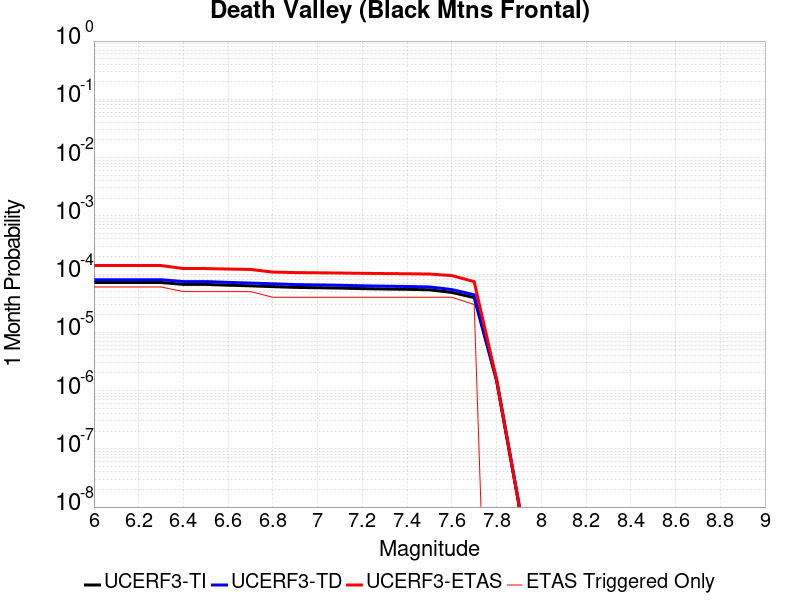 |  |  |

| Magnitude | 1 wk TI Prob | 1 wk TD Prob | 1 wk ETAS Prob | 1 wk ETAS/TD Gain | 1 wk ETAS Triggered Only | 1 mo TI Prob | 1 mo TD Prob | 1 mo ETAS Prob | 1 mo ETAS/TD Gain | 1 mo ETAS Triggered Only | 1 yr TI Prob | 1 yr TD Prob | 1 yr ETAS Prob | 1 yr ETAS/TD Gain | 1 yr ETAS Triggered Only | 10 yr TI Prob | 10 yr TD Prob | 10 yr ETAS Prob | 10 yr ETAS/TD Gain | 10 yr ETAS Triggered Only |
|-----|-----|-----|-----|-----|-----|-----|-----|-----|-----|-----|-----|-----|-----|-----|-----|-----|-----|-----|-----|-----|
| 6.0 | 1.6707214E-5 | 1.8671144E-5 | 3.867077E-5 | 2.0711517 | 2.0E-5 | 7.160038E-5 | 8.0016776E-5 | 1.4001198E-4 | 1.7497828 | 6.0E-5 | 8.71386E-4 | 9.7377645E-4 | 0.0011735817 | 1.2051859 | 2.0E-4 | 0.00867977 | 0.009695949 | 0.010111877 | 1.0428971 | 4.2E-4 |
| 6.1 | 1.6707214E-5 | 1.8671144E-5 | 3.867077E-5 | 2.0711517 | 2.0E-5 | 7.160038E-5 | 8.0016776E-5 | 1.4001198E-4 | 1.7497828 | 6.0E-5 | 8.71386E-4 | 9.7377645E-4 | 0.0011735817 | 1.2051859 | 2.0E-4 | 0.00867977 | 0.009695949 | 0.010111877 | 1.0428971 | 4.2E-4 |
| 6.2 | 1.6707214E-5 | 1.8671144E-5 | 3.867077E-5 | 2.0711517 | 2.0E-5 | 7.160038E-5 | 8.0016776E-5 | 1.4001198E-4 | 1.7497828 | 6.0E-5 | 8.71386E-4 | 9.7377645E-4 | 0.0011735817 | 1.2051859 | 2.0E-4 | 0.00867977 | 0.009695949 | 0.010111877 | 1.0428971 | 4.2E-4 |
| 6.3 | 1.6707214E-5 | 1.8671144E-5 | 3.867077E-5 | 2.0711517 | 2.0E-5 | 7.160038E-5 | 8.0016776E-5 | 1.4001198E-4 | 1.7497828 | 6.0E-5 | 8.71386E-4 | 9.7377645E-4 | 0.0011735817 | 1.2051859 | 2.0E-4 | 0.00867977 | 0.009695949 | 0.010111877 | 1.0428971 | 4.2E-4 |
| 6.4 | 1.5515609E-5 | 1.7339025E-5 | 3.733868E-5 | 2.1534474 | 2.0E-5 | 6.649377E-5 | 7.430803E-5 | 1.2430431E-4 | 1.6728247 | 5.0E-5 | 8.0926094E-4 | 9.0433087E-4 | 0.0010841681 | 1.1988622 | 1.8E-4 | 0.008063202 | 0.009007193 | 0.009383771 | 1.0418085 | 3.8E-4 |
| 6.5 | 1.5515609E-5 | 1.7339025E-5 | 3.733868E-5 | 2.1534474 | 2.0E-5 | 6.649377E-5 | 7.430803E-5 | 1.2430431E-4 | 1.6728247 | 5.0E-5 | 8.0926094E-4 | 9.0433087E-4 | 0.0010841681 | 1.1988622 | 1.8E-4 | 0.008063202 | 0.009007193 | 0.009383771 | 1.0418085 | 3.8E-4 |
| 6.6 | 1.5041828E-5 | 1.6809932E-5 | 3.6809597E-5 | 2.1897528 | 2.0E-5 | 6.4463384E-5 | 7.204061E-5 | 1.2203701E-4 | 1.694003 | 5.0E-5 | 7.8455906E-4 | 8.767474E-4 | 0.0010565897 | 1.2051243 | 1.8E-4 | 0.00781795 | 0.00873354 | 0.009110222 | 1.0431304 | 3.8E-4 |
| 6.7 | 1.4634985E-5 | 1.6356784E-5 | 3.6356458E-5 | 2.2227142 | 2.0E-5 | 6.271985E-5 | 7.009865E-5 | 1.20095145E-4 | 1.7132305 | 5.0E-5 | 7.6334673E-4 | 8.531227E-4 | 0.0010329691 | 1.2108096 | 1.8E-4 | 0.007607299 | 0.008499113 | 0.008875883 | 1.0443306 | 3.8E-4 |
| 6.8 | 1.4209158E-5 | 1.5882793E-5 | 3.5882476E-5 | 2.2592044 | 2.0E-5 | 6.089497E-5 | 6.806737E-5 | 1.0806465E-4 | 1.5876131 | 4.0E-5 | 7.4114406E-4 | 8.284108E-4 | 9.9827E-4 | 1.2050422 | 1.7E-4 | 0.007386771 | 0.008253843 | 0.008591036 | 1.0408529 | 3.4E-4 |
| 6.9 | 1.3780098E-5 | 1.5405318E-5 | 3.540501E-5 | 2.298233 | 2.0E-5 | 5.9056227E-5 | 6.602115E-5 | 1.0601851E-4 | 1.6058265 | 4.0E-5 | 7.1877235E-4 | 8.0351654E-4 | 9.4340404E-4 | 1.1740941 | 1.4E-4 | 0.0071645193 | 0.008006708 | 0.008294386 | 1.0359297 | 2.9E-4 |
| 7.0 | 1.3585064E-5 | 1.5188871E-5 | 3.518857E-5 | 2.3167336 | 2.0E-5 | 5.8220405E-5 | 6.509357E-5 | 1.0509096E-4 | 1.61446 | 4.0E-5 | 7.086029E-4 | 7.9223147E-4 | 9.3212054E-4 | 1.176576 | 1.4E-4 | 0.007063476 | 0.007894664 | 0.008172453 | 1.035187 | 2.8E-4 |
| 7.1 | 1.3398601E-5 | 1.4982046E-5 | 3.4981746E-5 | 2.334911 | 2.0E-5 | 5.742131E-5 | 6.420722E-5 | 1.0420465E-4 | 1.6229429 | 4.0E-5 | 6.9888023E-4 | 7.81448E-4 | 9.2133856E-4 | 1.1790146 | 1.4E-4 | 0.0069668638 | 0.00778759 | 0.008055488 | 1.0344006 | 2.7E-4 |
| 7.2 | 1.3126312E-5 | 1.4680254E-5 | 3.467996E-5 | 2.3623543 | 2.0E-5 | 5.6254412E-5 | 6.291389E-5 | 1.0291137E-4 | 1.6357497 | 4.0E-5 | 6.846822E-4 | 7.657128E-4 | 9.056056E-4 | 1.1826962 | 1.4E-4 | 0.006825765 | 0.0076313294 | 0.007889345 | 1.0338101 | 2.6E-4 |
| 7.3 | 1.2922429E-5 | 1.4454472E-5 | 3.4454184E-5 | 2.3836348 | 2.0E-5 | 5.5380664E-5 | 6.1946295E-5 | 1.0194382E-4 | 1.6456807 | 4.0E-5 | 6.74051E-4 | 7.539406E-4 | 8.9383504E-4 | 1.185551 | 1.4E-4 | 0.006720101 | 0.007514409 | 0.007772455 | 1.0343401 | 2.6E-4 |
| 7.4 | 1.2768878E-5 | 1.4284448E-5 | 3.4284163E-5 | 2.400104 | 2.0E-5 | 5.4722615E-5 | 6.121766E-5 | 1.01215206E-4 | 1.6533662 | 4.0E-5 | 6.660441E-4 | 7.450755E-4 | 8.8497123E-4 | 1.1877605 | 1.4E-4 | 0.0066405144 | 0.007426354 | 0.0076744976 | 1.0334139 | 2.5E-4 |
| 7.5 | 1.2521929E-5 | 1.401268E-5 | 3.40124E-5 | 2.4272587 | 2.0E-5 | 5.366431E-5 | 6.0052993E-5 | 1.00050594E-4 | 1.6660384 | 4.0E-5 | 6.531671E-4 | 7.3090533E-4 | 8.70803E-4 | 1.1914033 | 1.4E-4 | 0.006512506 | 0.0072855907 | 0.007523842 | 1.0327017 | 2.4E-4 |
| 7.6 | 1.1301089E-5 | 1.264875E-5 | 3.26485E-5 | 2.581164 | 2.0E-5 | 4.8432343E-5 | 5.4207834E-5 | 9.4205665E-5 | 1.7378607 | 4.0E-5 | 5.895042E-4 | 6.597858E-4 | 7.6971325E-4 | 1.1666107 | 1.1E-4 | 0.0058794282 | 0.006578822 | 0.0067775063 | 1.0302006 | 2.0E-4 |
| 7.7 | 9.189108E-6 | 1.0283847E-5 | 2.0283744E-5 | 1.9723887 | 1.0E-5 | 3.93813E-5 | 4.4072913E-5 | 7.407159E-5 | 1.6806601 | 3.0E-5 | 4.7936183E-4 | 5.3646066E-4 | 6.1641773E-4 | 1.1490456 | 8.0E-5 | 0.004783291 | 0.0053521674 | 0.0055113113 | 1.0297344 | 1.6E-4 |
| 7.8 | 3.4586725E-7 | 3.6483414E-7 | 3.6483414E-7 | 1.0 | 0.0 | 1.4822873E-6 | 1.563574E-6 | 1.563574E-6 | 1.0 | 0.0 | 1.80467E-5 | 1.9036352E-5 | 2.903616E-5 | 1.5253007 | 1.0E-5 | 1.8045233E-4 | 1.9034765E-4 | 2.0034573E-4 | 1.0525254 | 1.0E-5 |
| 7.9 | 2.5591178E-9 | 2.6697178E-9 | 2.6697178E-9 | 1.0 | 0.0 | 1.0967647E-8 | 1.1441647E-8 | 1.1441647E-8 | 1.0 | 0.0 | 1.335311E-7 | 1.3930206E-7 | 1.3930206E-7 | 1.0 | 0.0 | 1.3353102E-6 | 1.3930205E-6 | 1.3930205E-6 | 1.0 | 0.0 |

## Helendale-So Lockhart
*[(top)](#table-of-contents)*

| 1 Week | 1 Month | 1 Year | 10 Year |
|-----|-----|-----|-----|
|  | 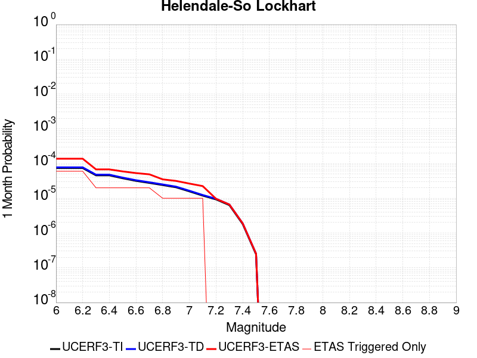 | 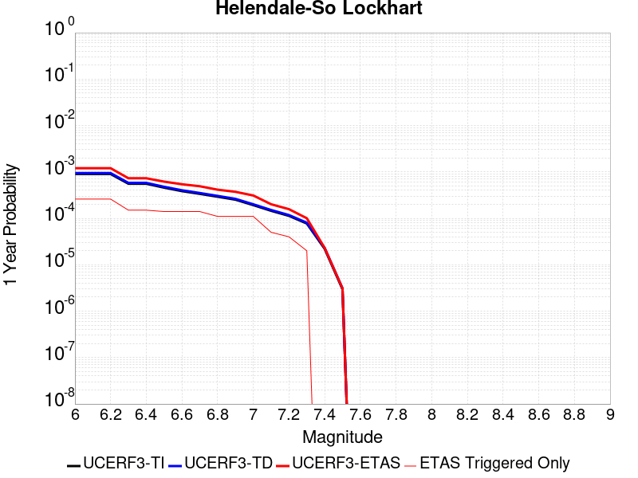 |  |

| Magnitude | 1 wk TI Prob | 1 wk TD Prob | 1 wk ETAS Prob | 1 wk ETAS/TD Gain | 1 wk ETAS Triggered Only | 1 mo TI Prob | 1 mo TD Prob | 1 mo ETAS Prob | 1 mo ETAS/TD Gain | 1 mo ETAS Triggered Only | 1 yr TI Prob | 1 yr TD Prob | 1 yr ETAS Prob | 1 yr ETAS/TD Gain | 1 yr ETAS Triggered Only | 10 yr TI Prob | 10 yr TD Prob | 10 yr ETAS Prob | 10 yr ETAS/TD Gain | 10 yr ETAS Triggered Only |
|-----|-----|-----|-----|-----|-----|-----|-----|-----|-----|-----|-----|-----|-----|-----|-----|-----|-----|-----|-----|-----|
| 6.0 | 1.7296055E-5 | 1.8104067E-5 | 2.8103885E-5 | 1.5523521 | 1.0E-5 | 7.412385E-5 | 7.7586665E-5 | 1.3758201E-4 | 1.7732688 | 6.0E-5 | 9.0208417E-4 | 9.44229E-4 | 0.0012039836 | 1.2750969 | 2.6E-4 | 0.008984311 | 0.0094042905 | 0.009800529 | 1.0421338 | 4.0E-4 |
| 6.1 | 1.7296055E-5 | 1.8104067E-5 | 2.8103885E-5 | 1.5523521 | 1.0E-5 | 7.412385E-5 | 7.7586665E-5 | 1.3758201E-4 | 1.7732688 | 6.0E-5 | 9.0208417E-4 | 9.44229E-4 | 0.0012039836 | 1.2750969 | 2.6E-4 | 0.008984311 | 0.0094042905 | 0.009800529 | 1.0421338 | 4.0E-4 |
| 6.2 | 1.7296055E-5 | 1.8104067E-5 | 2.8103885E-5 | 1.5523521 | 1.0E-5 | 7.412385E-5 | 7.7586665E-5 | 1.3758201E-4 | 1.7732688 | 6.0E-5 | 9.0208417E-4 | 9.44229E-4 | 0.0012039836 | 1.2750969 | 2.6E-4 | 0.008984311 | 0.0094042905 | 0.009800529 | 1.0421338 | 4.0E-4 |
| 6.3 | 1.0669118E-5 | 1.11356185E-5 | 1.11356185E-5 | 1.0 | 0.0 | 4.5723988E-5 | 4.772322E-5 | 6.772227E-5 | 1.4190632 | 2.0E-5 | 5.5654737E-4 | 5.808781E-4 | 7.30791E-4 | 1.2580798 | 1.5E-4 | 0.0055515557 | 0.005793894 | 0.0060325037 | 1.0411829 | 2.4E-4 |
| 6.4 | 1.0669118E-5 | 1.11356185E-5 | 1.11356185E-5 | 1.0 | 0.0 | 4.5723988E-5 | 4.772322E-5 | 6.772227E-5 | 1.4190632 | 2.0E-5 | 5.5654737E-4 | 5.808781E-4 | 7.30791E-4 | 1.2580798 | 1.5E-4 | 0.0055515557 | 0.005793894 | 0.0060325037 | 1.0411829 | 2.4E-4 |
| 6.5 | 8.790038E-6 | 9.170355E-6 | 9.170355E-6 | 1.0 | 0.0 | 3.767105E-5 | 3.9300936E-5 | 5.9300153E-5 | 1.5088737 | 2.0E-5 | 4.585485E-4 | 4.783854E-4 | 6.1831845E-4 | 1.2925111 | 1.4E-4 | 0.0045760344 | 0.0047737206 | 0.004982718 | 1.0437808 | 2.1E-4 |
| 6.6 | 7.396949E-6 | 7.715669E-6 | 7.715669E-6 | 1.0 | 0.0 | 3.1700827E-5 | 3.3066743E-5 | 5.306608E-5 | 1.6048174 | 2.0E-5 | 3.858892E-4 | 4.025142E-4 | 5.4245786E-4 | 1.3476738 | 1.4E-4 | 0.003852198 | 0.0040179584 | 0.004217155 | 1.0495765 | 2.0E-4 |
| 6.7 | 6.4600285E-6 | 6.7381466E-6 | 6.7381466E-6 | 1.0 | 0.0 | 2.7685543E-5 | 2.8877455E-5 | 4.887688E-5 | 1.6925617 | 2.0E-5 | 3.3701936E-4 | 3.515271E-4 | 4.914779E-4 | 1.3981223 | 1.4E-4 | 0.0033650869 | 0.003509792 | 0.0037090902 | 1.0567834 | 2.0E-4 |
| 6.8 | 5.600104E-6 | 5.8361074E-6 | 5.8361074E-6 | 1.0 | 0.0 | 2.4000226E-5 | 2.5011652E-5 | 3.5011402E-5 | 1.3998036 | 1.0E-5 | 2.9216358E-4 | 3.044749E-4 | 4.1444143E-4 | 1.3611677 | 1.1E-4 | 0.0029177975 | 0.003040639 | 0.0031901828 | 1.0491817 | 1.5E-4 |
| 6.9 | 4.839122E-6 | 5.0395925E-6 | 5.0395925E-6 | 1.0 | 0.0 | 2.0738931E-5 | 2.1598076E-5 | 3.159786E-5 | 1.4629942 | 1.0E-5 | 2.5246723E-4 | 2.629253E-4 | 3.728964E-4 | 1.4182597 | 1.1E-4 | 0.002521806 | 0.00262619 | 0.002775796 | 1.056967 | 1.5E-4 |
| 7.0 | 3.6937633E-6 | 3.845271E-6 | 3.845271E-6 | 1.0 | 0.0 | 1.5830317E-5 | 1.647963E-5 | 2.6479465E-5 | 1.6067997 | 1.0E-5 | 1.9271708E-4 | 2.0062133E-4 | 3.1059925E-4 | 1.5481867 | 1.1E-4 | 0.0019255003 | 0.0020044337 | 0.002154133 | 1.0746841 | 1.5E-4 |
| 7.1 | 2.7858857E-6 | 2.8979002E-6 | 2.8979002E-6 | 1.0 | 0.0 | 1.1939455E-5 | 1.2419514E-5 | 2.241939E-5 | 1.8051745 | 1.0E-5 | 1.4535317E-4 | 1.5119731E-4 | 2.0118974E-4 | 1.3306438 | 5.0E-5 | 0.0014525814 | 0.0015109659 | 0.0016008299 | 1.0594746 | 9.0E-5 |
| 7.2 | 2.1672065E-6 | 2.2540487E-6 | 2.2540487E-6 | 1.0 | 0.0 | 9.2879945E-6 | 9.660174E-6 | 9.660174E-6 | 1.0 | 0.0 | 1.1307546E-4 | 1.17606454E-4 | 1.5760175E-4 | 1.3400774 | 4.0E-5 | 0.0011301794 | 0.0011754604 | 0.001245378 | 1.0594811 | 7.0E-5 |
| 7.3 | 1.4823496E-6 | 1.5422349E-6 | 1.5422349E-6 | 1.0 | 0.0 | 6.3529114E-6 | 6.6095627E-6 | 6.6095627E-6 | 1.0 | 0.0 | 7.734395E-5 | 8.0468606E-5 | 1.00467E-4 | 1.2485242 | 2.0E-5 | 7.731704E-4 | 8.044098E-4 | 8.443776E-4 | 1.049686 | 4.0E-5 |
| 7.4 | 4.2321457E-7 | 4.4109507E-7 | 4.4109507E-7 | 1.0 | 0.0 | 1.8137755E-6 | 1.8904063E-6 | 1.8904063E-6 | 1.0 | 0.0 | 2.2082493E-5 | 2.30155E-5 | 2.30155E-5 | 1.0 | 0.0 | 2.2080299E-4 | 2.3013569E-4 | 2.3013569E-4 | 1.0 | 0.0 |
| 7.5 | 5.6942316E-8 | 5.9416674E-8 | 5.9416674E-8 | 1.0 | 0.0 | 2.440385E-7 | 2.5464286E-7 | 2.5464286E-7 | 1.0 | 0.0 | 2.9711643E-6 | 3.1002733E-6 | 3.1002733E-6 | 1.0 | 0.0 | 2.9711247E-5 | 3.100238E-5 | 3.100238E-5 | 1.0 | 0.0 |

## San Andreas (San Bernardino S)
*[(top)](#table-of-contents)*

| 1 Week | 1 Month | 1 Year | 10 Year |
|-----|-----|-----|-----|
|  | 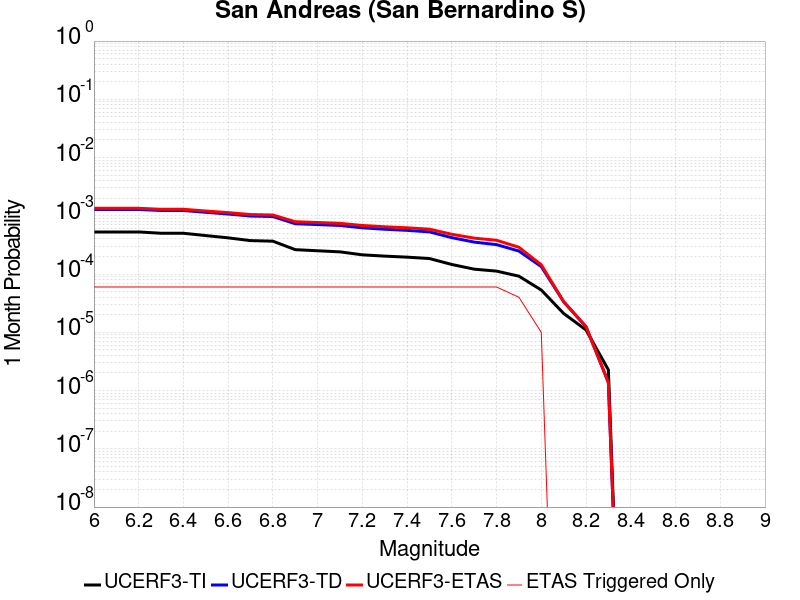 |  |  |

| Magnitude | 1 wk TI Prob | 1 wk TD Prob | 1 wk ETAS Prob | 1 wk ETAS/TD Gain | 1 wk ETAS Triggered Only | 1 mo TI Prob | 1 mo TD Prob | 1 mo ETAS Prob | 1 mo ETAS/TD Gain | 1 mo ETAS Triggered Only | 1 yr TI Prob | 1 yr TD Prob | 1 yr ETAS Prob | 1 yr ETAS/TD Gain | 1 yr ETAS Triggered Only | 10 yr TI Prob | 10 yr TD Prob | 10 yr ETAS Prob | 10 yr ETAS/TD Gain | 10 yr ETAS Triggered Only |
|-----|-----|-----|-----|-----|-----|-----|-----|-----|-----|-----|-----|-----|-----|-----|-----|-----|-----|-----|-----|-----|
| 6.0 | 1.2336002E-4 | 3.0018692E-4 | 3.3017792E-4 | 1.0999078 | 3.0E-5 | 5.2857865E-4 | 0.0012859071 | 0.00134583 | 1.0465996 | 6.0E-5 | 0.006416472 | 0.015548493 | 0.015784761 | 1.0151956 | 2.4E-4 | 0.06234337 | 0.14289467 | 0.14322038 | 1.0022793 | 3.8E-4 |
| 6.1 | 1.2336002E-4 | 3.0018692E-4 | 3.3017792E-4 | 1.0999078 | 3.0E-5 | 5.2857865E-4 | 0.0012859071 | 0.00134583 | 1.0465996 | 6.0E-5 | 0.006416472 | 0.015548493 | 0.015784761 | 1.0151956 | 2.4E-4 | 0.06234337 | 0.14289467 | 0.14322038 | 1.0022793 | 3.8E-4 |
| 6.2 | 1.2336002E-4 | 3.0018692E-4 | 3.3017792E-4 | 1.0999078 | 3.0E-5 | 5.2857865E-4 | 0.0012859071 | 0.00134583 | 1.0465996 | 6.0E-5 | 0.006416472 | 0.015548493 | 0.015784761 | 1.0151956 | 2.4E-4 | 0.06234337 | 0.14289467 | 0.14322038 | 1.0022793 | 3.8E-4 |
| 6.3 | 1.1712257E-4 | 2.8806846E-4 | 3.180598E-4 | 1.1041119 | 3.0E-5 | 5.018573E-4 | 0.0012340207 | 0.0012939466 | 1.0485616 | 6.0E-5 | 0.006093008 | 0.014925548 | 0.015161965 | 1.0158398 | 2.4E-4 | 0.059286322 | 0.13760296 | 0.13793068 | 1.0023816 | 3.8E-4 |
| 6.4 | 1.1712257E-4 | 2.8806846E-4 | 3.180598E-4 | 1.1041119 | 3.0E-5 | 5.018573E-4 | 0.0012340207 | 0.0012939466 | 1.0485616 | 6.0E-5 | 0.006093008 | 0.014925548 | 0.015161965 | 1.0158398 | 2.4E-4 | 0.059286322 | 0.13760296 | 0.13793068 | 1.0023816 | 3.8E-4 |
| 6.5 | 1.0689076E-4 | 2.6819456E-4 | 2.981865E-4 | 1.111829 | 3.0E-5 | 4.5802278E-4 | 0.0011489236 | 0.0012088547 | 1.0521628 | 6.0E-5 | 0.0055621783 | 0.013903049 | 0.014139712 | 1.0170224 | 2.4E-4 | 0.05425003 | 0.12884977 | 0.1291808 | 1.0025692 | 3.8E-4 |
| 6.6 | 9.7648895E-5 | 2.5064027E-4 | 2.8063275E-4 | 1.1196635 | 3.0E-5 | 4.1842813E-4 | 0.001073754 | 0.0011336897 | 1.0558187 | 6.0E-5 | 0.005082469 | 0.012998962 | 0.013235842 | 1.018223 | 2.4E-4 | 0.049677886 | 0.12100921 | 0.121343225 | 1.0027603 | 3.8E-4 |
| 6.7 | 8.757013E-5 | 2.3134585E-4 | 2.6133892E-4 | 1.129646 | 3.0E-5 | 3.7524657E-4 | 9.911278E-4 | 0.0010510683 | 1.0604771 | 6.0E-5 | 0.00455906 | 0.012004303 | 0.012241422 | 1.0197529 | 2.4E-4 | 0.04466656 | 0.11231719 | 0.11264563 | 1.0029242 | 3.7E-4 |
| 6.8 | 8.562978E-5 | 2.2694364E-4 | 2.5693682E-4 | 1.1321614 | 3.0E-5 | 3.6693315E-4 | 9.722753E-4 | 0.0010322169 | 1.0616509 | 6.0E-5 | 0.004458263 | 0.011777271 | 0.012004562 | 1.0192991 | 2.3E-4 | 0.043698758 | 0.11032718 | 0.110647455 | 1.002903 | 3.6E-4 |
| 6.9 | 6.124075E-5 | 1.7077985E-4 | 2.0077472E-4 | 1.1756347 | 3.0E-5 | 2.6243398E-4 | 7.317092E-4 | 7.916653E-4 | 1.0819398 | 6.0E-5 | 0.0031904527 | 0.008872379 | 0.009080515 | 1.023459 | 2.1E-4 | 0.031450346 | 0.08423472 | 0.08452777 | 1.0034789 | 3.2E-4 |
| 7.0 | 5.8598747E-5 | 1.6506873E-4 | 1.9506378E-4 | 1.1817125 | 3.0E-5 | 2.5111332E-4 | 7.072465E-4 | 7.6720404E-4 | 1.084776 | 6.0E-5 | 0.0030530186 | 0.008576925 | 0.008785124 | 1.0242743 | 2.1E-4 | 0.03011414 | 0.08155205 | 0.081845954 | 1.0036038 | 3.2E-4 |
| 7.1 | 5.613814E-5 | 1.5925305E-4 | 1.8924827E-4 | 1.1883495 | 3.0E-5 | 2.4056983E-4 | 6.823353E-4 | 7.422943E-4 | 1.0878733 | 6.0E-5 | 0.0029250039 | 0.00827597 | 0.008484231 | 1.0251647 | 2.1E-4 | 0.028868021 | 0.07885065 | 0.07913621 | 1.0036215 | 3.1E-4 |
| 7.2 | 4.991222E-5 | 1.4531487E-4 | 1.7531052E-4 | 1.2064183 | 3.0E-5 | 2.1389198E-4 | 6.2262977E-4 | 6.8259245E-4 | 1.0963055 | 6.0E-5 | 0.002601025 | 0.0075542727 | 0.007752762 | 1.026275 | 2.0E-4 | 0.025707912 | 0.072303556 | 0.072581865 | 1.0038491 | 3.0E-4 |
| 7.3 | 4.7410045E-5 | 1.3725436E-4 | 1.6725024E-4 | 1.2185423 | 3.0E-5 | 2.0317009E-4 | 5.881007E-4 | 6.480654E-4 | 1.1019634 | 6.0E-5 | 0.0024707897 | 0.0071367053 | 0.0073352777 | 1.0278242 | 2.0E-4 | 0.024434982 | 0.068585165 | 0.068864584 | 1.0040741 | 3.0E-4 |
| 7.4 | 4.5556746E-5 | 1.3133146E-4 | 1.6132752E-4 | 1.2283996 | 3.0E-5 | 1.952286E-4 | 5.6272803E-4 | 6.2269426E-4 | 1.1065634 | 6.0E-5 | 0.002374317 | 0.0068297703 | 0.0070284046 | 1.0290836 | 2.0E-4 | 0.023491086 | 0.0658369 | 0.06611715 | 1.0042567 | 3.0E-4 |
| 7.5 | 4.3084514E-5 | 1.2368243E-4 | 1.5367872E-4 | 1.2425267 | 3.0E-5 | 1.8463485E-4 | 5.2996015E-4 | 5.8992836E-4 | 1.1131561 | 6.0E-5 | 0.0022456115 | 0.006433248 | 0.0066319616 | 1.0308884 | 2.0E-4 | 0.022230545 | 0.062236864 | 0.062518194 | 1.0045203 | 3.0E-4 |
| 7.6 | 3.408608E-5 | 9.845616E-5 | 1.2845322E-4 | 1.3046741 | 3.0E-5 | 1.4607502E-4 | 4.2188686E-4 | 4.8186156E-4 | 1.1421583 | 6.0E-5 | 0.0017770125 | 0.0051244013 | 0.005323376 | 1.038829 | 2.0E-4 | 0.017628696 | 0.050064996 | 0.050340477 | 1.0055025 | 2.9E-4 |
| 7.7 | 2.8315713E-5 | 8.258164E-5 | 1.1257916E-4 | 1.3632469 | 3.0E-5 | 1.2134742E-4 | 3.5387333E-4 | 4.138521E-4 | 1.1694922 | 6.0E-5 | 0.0014764034 | 0.0042999056 | 0.0044990457 | 1.0463127 | 2.0E-4 | 0.01466633 | 0.042313736 | 0.042591464 | 1.0065635 | 2.9E-4 |
| 7.8 | 2.6222975E-5 | 7.4719595E-5 | 1.0471736E-4 | 1.4014711 | 3.0E-5 | 1.1237934E-4 | 3.2018757E-4 | 3.8016835E-4 | 1.1873301 | 6.0E-5 | 0.0013673597 | 0.0038913216 | 0.0040805824 | 1.0486366 | 1.9E-4 | 0.013589768 | 0.03847654 | 0.03874577 | 1.0069971 | 2.8E-4 |
| 7.9 | 2.1469694E-5 | 5.7952697E-5 | 7.795154E-5 | 1.3450891 | 2.0E-5 | 9.200973E-5 | 2.4834508E-4 | 2.8833514E-4 | 1.1610262 | 4.0E-5 | 0.0011196428 | 0.003019412 | 0.003178929 | 1.0528305 | 1.6E-4 | 0.011140184 | 0.03018578 | 0.030408837 | 1.0073894 | 2.3E-4 |
| 8.0 | 1.2420249E-5 | 3.1360105E-5 | 4.135979E-5 | 1.3188665 | 1.0E-5 | 5.322855E-5 | 1.3439353E-4 | 1.4439218E-4 | 1.0743984 | 1.0E-5 | 6.478649E-4 | 0.0016350142 | 0.0016849324 | 1.0305308 | 5.0E-5 | 0.0064597935 | 0.016541705 | 0.016610546 | 1.0041617 | 7.0E-5 |
| 8.1 | 4.9197724E-6 | 7.83736E-6 | 7.83736E-6 | 1.0 | 0.0 | 2.1084568E-5 | 3.3588254E-5 | 3.3588254E-5 | 1.0 | 0.0 | 2.566744E-4 | 4.0886036E-4 | 4.1885627E-4 | 1.0244483 | 1.0E-5 | 0.002563781 | 0.004391913 | 0.004401869 | 1.0022669 | 1.0E-5 |
| 8.2 | 2.5634774E-6 | 2.9136968E-6 | 2.9136968E-6 | 1.0 | 0.0 | 1.0986286E-5 | 1.2487212E-5 | 1.2487212E-5 | 1.0 | 0.0 | 1.3374983E-4 | 1.5202125E-4 | 1.6201973E-4 | 1.0657703 | 1.0E-5 | 0.0013366934 | 0.001708635 | 0.0017186179 | 1.0058426 | 1.0E-5 |
| 8.3 | 5.2850464E-7 | 3.2180878E-7 | 3.2180878E-7 | 1.0 | 0.0 | 2.2650179E-6 | 1.3791798E-6 | 1.3791798E-6 | 1.0 | 0.0 | 2.7576245E-5 | 1.6791397E-5 | 1.6791397E-5 | 1.0 | 0.0 | 2.7572823E-4 | 1.9922286E-4 | 1.9922286E-4 | 1.0 | 0.0 |

## Death Valley (No)
*[(top)](#table-of-contents)*

| 1 Week | 1 Month | 1 Year | 10 Year |
|-----|-----|-----|-----|
|  | 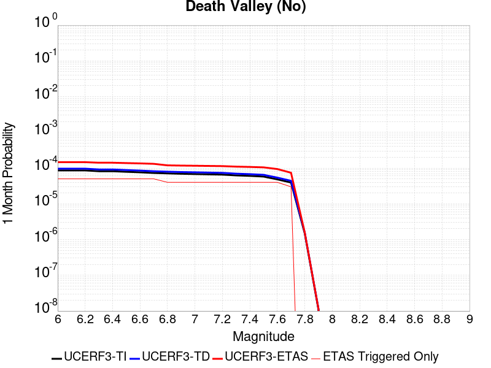 |  |  |

| Magnitude | 1 wk TI Prob | 1 wk TD Prob | 1 wk ETAS Prob | 1 wk ETAS/TD Gain | 1 wk ETAS Triggered Only | 1 mo TI Prob | 1 mo TD Prob | 1 mo ETAS Prob | 1 mo ETAS/TD Gain | 1 mo ETAS Triggered Only | 1 yr TI Prob | 1 yr TD Prob | 1 yr ETAS Prob | 1 yr ETAS/TD Gain | 1 yr ETAS Triggered Only | 10 yr TI Prob | 10 yr TD Prob | 10 yr ETAS Prob | 10 yr ETAS/TD Gain | 10 yr ETAS Triggered Only |
|-----|-----|-----|-----|-----|-----|-----|-----|-----|-----|-----|-----|-----|-----|-----|-----|-----|-----|-----|-----|-----|
| 6.0 | 2.0074807E-5 | 2.250117E-5 | 4.250072E-5 | 1.8888227 | 2.0E-5 | 8.603206E-5 | 9.643006E-5 | 1.4642524E-4 | 1.5184605 | 5.0E-5 | 0.001046937 | 0.0011734111 | 0.0013631881 | 1.1617311 | 1.9E-4 | 0.010420183 | 0.011673067 | 0.012038748 | 1.0313269 | 3.7E-4 |
| 6.1 | 2.0074807E-5 | 2.250117E-5 | 4.250072E-5 | 1.8888227 | 2.0E-5 | 8.603206E-5 | 9.643006E-5 | 1.4642524E-4 | 1.5184605 | 5.0E-5 | 0.001046937 | 0.0011734111 | 0.0013631881 | 1.1617311 | 1.9E-4 | 0.010420183 | 0.011673067 | 0.012038748 | 1.0313269 | 3.7E-4 |
| 6.2 | 2.0074807E-5 | 2.250117E-5 | 4.250072E-5 | 1.8888227 | 2.0E-5 | 8.603206E-5 | 9.643006E-5 | 1.4642524E-4 | 1.5184605 | 5.0E-5 | 0.001046937 | 0.0011734111 | 0.0013631881 | 1.1617311 | 1.9E-4 | 0.010420183 | 0.011673067 | 0.012038748 | 1.0313269 | 3.7E-4 |
| 6.3 | 1.9050609E-5 | 2.1337972E-5 | 4.1337546E-5 | 1.9372762 | 2.0E-5 | 8.164292E-5 | 9.144528E-5 | 1.414407E-4 | 1.546725 | 5.0E-5 | 9.935491E-4 | 0.0011127844 | 0.001302573 | 1.1705528 | 1.9E-4 | 0.009891188 | 0.011072947 | 0.01143885 | 1.0330448 | 3.7E-4 |
| 6.4 | 1.9050609E-5 | 2.1337972E-5 | 4.1337546E-5 | 1.9372762 | 2.0E-5 | 8.164292E-5 | 9.144528E-5 | 1.414407E-4 | 1.546725 | 5.0E-5 | 9.935491E-4 | 0.0011127844 | 0.001302573 | 1.1705528 | 1.9E-4 | 0.009891188 | 0.011072947 | 0.01143885 | 1.0330448 | 3.7E-4 |
| 6.5 | 1.8367004E-5 | 2.056199E-5 | 4.056158E-5 | 1.9726485 | 2.0E-5 | 7.8713354E-5 | 8.811988E-5 | 1.3811547E-4 | 1.5673589 | 5.0E-5 | 9.5791375E-4 | 0.001072338 | 0.0012621343 | 1.1769929 | 1.9E-4 | 0.009537951 | 0.010672422 | 0.011038474 | 1.0342988 | 3.7E-4 |
| 6.6 | 1.779439E-5 | 1.9911875E-5 | 3.9911476E-5 | 2.0044057 | 2.0E-5 | 7.625944E-5 | 8.533385E-5 | 1.3532958E-4 | 1.585884 | 5.0E-5 | 9.280632E-4 | 0.0010384509 | 0.0012282536 | 1.1827749 | 1.9E-4 | 0.009241969 | 0.010336742 | 0.010683124 | 1.0335099 | 3.5E-4 |
| 6.7 | 1.7025437E-5 | 1.9044328E-5 | 3.9043945E-5 | 2.0501614 | 2.0E-5 | 7.296412E-5 | 8.161603E-5 | 1.3161195E-4 | 1.6125747 | 5.0E-5 | 8.87976E-4 | 9.932284E-4 | 0.0011830396 | 1.1911054 | 1.9E-4 | 0.008844362 | 0.009888612 | 0.01023515 | 1.0350442 | 3.5E-4 |
| 6.8 | 1.6545107E-5 | 1.8513425E-5 | 3.8513055E-5 | 2.0802772 | 2.0E-5 | 7.090568E-5 | 7.9340876E-5 | 1.193377E-4 | 1.5041138 | 4.0E-5 | 8.629347E-4 | 9.6555316E-4 | 0.001135389 | 1.1758949 | 1.7E-4 | 0.008595915 | 0.009614283 | 0.009921303 | 1.0319337 | 3.1E-4 |
| 6.9 | 1.615478E-5 | 1.8088458E-5 | 3.8088096E-5 | 2.1056573 | 2.0E-5 | 6.9232934E-5 | 7.75197E-5 | 1.17516596E-4 | 1.515958 | 4.0E-5 | 8.4258494E-4 | 9.4339973E-4 | 0.0011132393 | 1.1800293 | 1.7E-4 | 0.008393973 | 0.009394643 | 0.00970173 | 1.0326875 | 3.1E-4 |
| 7.0 | 1.5894311E-5 | 1.7806406E-5 | 3.780605E-5 | 2.1231713 | 2.0E-5 | 6.81167E-5 | 7.6310964E-5 | 1.16307914E-4 | 1.5241311 | 4.0E-5 | 8.2900526E-4 | 9.2869607E-4 | 0.0010885475 | 1.1721246 | 1.6E-4 | 0.008259195 | 0.00924884 | 0.009546065 | 1.0321366 | 3.0E-4 |
| 7.1 | 1.5602263E-5 | 1.7484344E-5 | 3.7483995E-5 | 2.1438603 | 2.0E-5 | 6.6865134E-5 | 7.493079E-5 | 1.1492779E-4 | 1.5337859 | 4.0E-5 | 8.137789E-4 | 9.119066E-4 | 0.0010717607 | 1.1752965 | 1.6E-4 | 0.008108052 | 0.009082329 | 0.009379605 | 1.0327312 | 3.0E-4 |
| 7.2 | 1.5323829E-5 | 1.7171456E-5 | 3.7171114E-5 | 2.1647036 | 2.0E-5 | 6.56719E-5 | 7.3589916E-5 | 1.1358697E-4 | 1.5435127 | 4.0E-5 | 7.99262E-4 | 8.95595E-4 | 0.0010554517 | 1.1784922 | 1.6E-4 | 0.007963934 | 0.008920534 | 0.009198036 | 1.0311083 | 2.8E-4 |
| 7.3 | 1.4556212E-5 | 1.6303236E-5 | 3.630291E-5 | 2.2267303 | 2.0E-5 | 6.238227E-5 | 6.986917E-5 | 1.0986638E-4 | 1.5724585 | 4.0E-5 | 7.592395E-4 | 8.5033104E-4 | 0.001010195 | 1.188002 | 1.6E-4 | 0.0075665074 | 0.008471418 | 0.008749046 | 1.0327723 | 2.8E-4 |
| 7.4 | 1.411725E-5 | 1.5808715E-5 | 3.58084E-5 | 2.265105 | 2.0E-5 | 6.0501097E-5 | 6.774991E-5 | 1.07747204E-4 | 1.5903667 | 4.0E-5 | 7.363519E-4 | 8.245488E-4 | 9.844169E-4 | 1.1938856 | 1.6E-4 | 0.0073391674 | 0.00821553 | 0.008483311 | 1.0325946 | 2.7E-4 |
| 7.5 | 1.3503312E-5 | 1.5127015E-5 | 3.512671E-5 | 2.322118 | 2.0E-5 | 5.7870053E-5 | 6.4828484E-5 | 1.0482589E-4 | 1.6169727 | 4.0E-5 | 7.043401E-4 | 7.8900676E-4 | 9.388884E-4 | 1.1899624 | 1.5E-4 | 0.007021119 | 0.00786268 | 0.008110714 | 1.0315458 | 2.5E-4 |
| 7.6 | 1.1279839E-5 | 1.2626928E-5 | 3.2626675E-5 | 2.5838964 | 2.0E-5 | 4.834127E-5 | 5.4114313E-5 | 9.411215E-5 | 1.739136 | 4.0E-5 | 5.88396E-4 | 6.586479E-4 | 7.6857547E-4 | 1.1668988 | 1.1E-4 | 0.005868405 | 0.0065675103 | 0.006766197 | 1.0302529 | 2.0E-4 |
| 7.7 | 9.189108E-6 | 1.0283847E-5 | 2.0283744E-5 | 1.9723887 | 1.0E-5 | 3.93813E-5 | 4.4072913E-5 | 7.407159E-5 | 1.6806601 | 3.0E-5 | 4.7936183E-4 | 5.3646066E-4 | 6.1641773E-4 | 1.1490456 | 8.0E-5 | 0.004783291 | 0.0053521674 | 0.0055113113 | 1.0297344 | 1.6E-4 |
| 7.8 | 3.4586725E-7 | 3.6483414E-7 | 3.6483414E-7 | 1.0 | 0.0 | 1.4822873E-6 | 1.563574E-6 | 1.563574E-6 | 1.0 | 0.0 | 1.80467E-5 | 1.9036352E-5 | 2.903616E-5 | 1.5253007 | 1.0E-5 | 1.8045233E-4 | 1.9034765E-4 | 2.0034573E-4 | 1.0525254 | 1.0E-5 |
| 7.9 | 2.5591178E-9 | 2.6697178E-9 | 2.6697178E-9 | 1.0 | 0.0 | 1.0967647E-8 | 1.1441647E-8 | 1.1441647E-8 | 1.0 | 0.0 | 1.335311E-7 | 1.3930206E-7 | 1.3930206E-7 | 1.0 | 0.0 | 1.3353102E-6 | 1.3930205E-6 | 1.3930205E-6 | 1.0 | 0.0 |

## San Andreas (Big Bend)
*[(top)](#table-of-contents)*

| 1 Week | 1 Month | 1 Year | 10 Year |
|-----|-----|-----|-----|
|  | 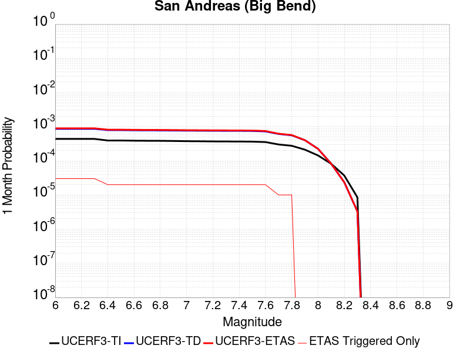 | 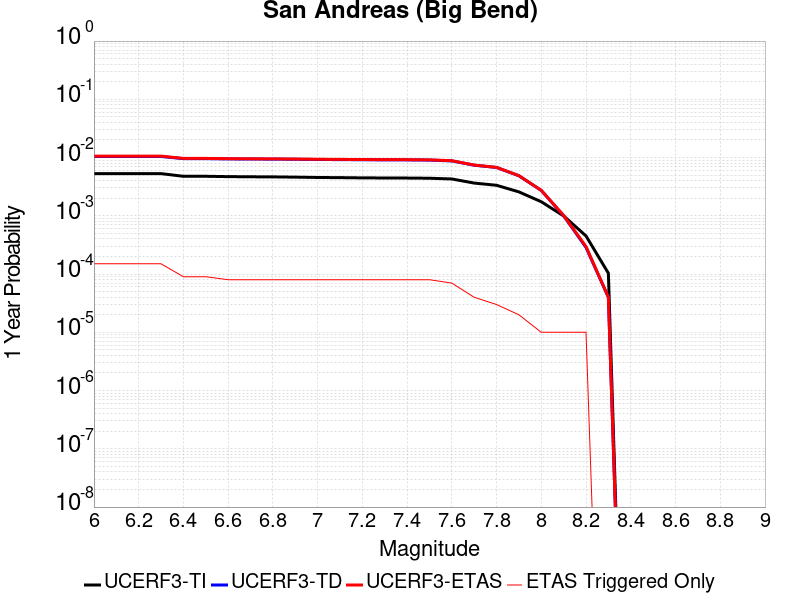 |  |

| Magnitude | 1 wk TI Prob | 1 wk TD Prob | 1 wk ETAS Prob | 1 wk ETAS/TD Gain | 1 wk ETAS Triggered Only | 1 mo TI Prob | 1 mo TD Prob | 1 mo ETAS Prob | 1 mo ETAS/TD Gain | 1 mo ETAS Triggered Only | 1 yr TI Prob | 1 yr TD Prob | 1 yr ETAS Prob | 1 yr ETAS/TD Gain | 1 yr ETAS Triggered Only | 10 yr TI Prob | 10 yr TD Prob | 10 yr ETAS Prob | 10 yr ETAS/TD Gain | 10 yr ETAS Triggered Only |
|-----|-----|-----|-----|-----|-----|-----|-----|-----|-----|-----|-----|-----|-----|-----|-----|-----|-----|-----|-----|-----|
| 6.0 | 1.0179969E-4 | 2.0097836E-4 | 2.1097634E-4 | 1.0497466 | 1.0E-5 | 4.362114E-4 | 8.6105254E-4 | 8.910267E-4 | 1.0348111 | 3.0E-5 | 0.0052979486 | 0.010433208 | 0.010581643 | 1.0142272 | 1.5E-4 | 0.051734097 | 0.101560324 | 0.10185681 | 1.0029193 | 3.3E-4 |
| 6.1 | 1.0179969E-4 | 2.0097836E-4 | 2.1097634E-4 | 1.0497466 | 1.0E-5 | 4.362114E-4 | 8.6105254E-4 | 8.910267E-4 | 1.0348111 | 3.0E-5 | 0.0052979486 | 0.010433208 | 0.010581643 | 1.0142272 | 1.5E-4 | 0.051734097 | 0.101560324 | 0.10185681 | 1.0029193 | 3.3E-4 |
| 6.2 | 1.0179969E-4 | 2.0097836E-4 | 2.1097634E-4 | 1.0497466 | 1.0E-5 | 4.362114E-4 | 8.6105254E-4 | 8.910267E-4 | 1.0348111 | 3.0E-5 | 0.0052979486 | 0.010433208 | 0.010581643 | 1.0142272 | 1.5E-4 | 0.051734097 | 0.101560324 | 0.10185681 | 1.0029193 | 3.3E-4 |
| 6.3 | 1.0179969E-4 | 2.0097836E-4 | 2.1097634E-4 | 1.0497466 | 1.0E-5 | 4.362114E-4 | 8.6105254E-4 | 8.910267E-4 | 1.0348111 | 3.0E-5 | 0.0052979486 | 0.010433208 | 0.010581643 | 1.0142272 | 1.5E-4 | 0.051734097 | 0.101560324 | 0.10185681 | 1.0029193 | 3.3E-4 |
| 6.4 | 9.1639464E-5 | 1.8454606E-4 | 1.9454422E-4 | 1.054177 | 1.0E-5 | 3.9268145E-4 | 7.906722E-4 | 8.1065635E-4 | 1.025275 | 2.0E-5 | 0.0047704205 | 0.009584063 | 0.0096732 | 1.0093006 | 9.0E-5 | 0.046693064 | 0.09388534 | 0.0940575 | 1.0018338 | 1.9E-4 |
| 6.5 | 9.1639464E-5 | 1.8454606E-4 | 1.9454422E-4 | 1.054177 | 1.0E-5 | 3.9268145E-4 | 7.906722E-4 | 8.1065635E-4 | 1.025275 | 2.0E-5 | 0.0047704205 | 0.009584063 | 0.0096732 | 1.0093006 | 9.0E-5 | 0.046693064 | 0.09388534 | 0.0940575 | 1.0018338 | 1.9E-4 |
| 6.6 | 9.042622E-5 | 1.8261602E-4 | 1.926142E-4 | 1.0547497 | 1.0E-5 | 3.8748336E-4 | 7.8240555E-4 | 8.0238987E-4 | 1.0255421 | 2.0E-5 | 0.0047074095 | 0.009484295 | 0.009563536 | 1.008355 | 8.0E-5 | 0.046089325 | 0.09297919 | 0.09313339 | 1.0016583 | 1.7E-4 |
| 6.7 | 8.9836685E-5 | 1.8175917E-4 | 1.9175735E-4 | 1.0550078 | 1.0E-5 | 3.8495753E-4 | 7.787355E-4 | 7.9871994E-4 | 1.0256627 | 2.0E-5 | 0.00467679 | 0.009439999 | 0.009519245 | 1.0083946 | 8.0E-5 | 0.045795817 | 0.09257342 | 0.092727676 | 1.0016664 | 1.7E-4 |
| 6.8 | 8.9471854E-5 | 1.8122676E-4 | 1.9122494E-4 | 1.0551695 | 1.0E-5 | 3.8339442E-4 | 7.764551E-4 | 7.964396E-4 | 1.0257381 | 2.0E-5 | 0.004657841 | 0.009412476 | 0.009491723 | 1.0084194 | 8.0E-5 | 0.04561414 | 0.09232055 | 0.092474855 | 1.0016714 | 1.7E-4 |
| 6.9 | 8.858234E-5 | 1.8004607E-4 | 1.9004427E-4 | 1.0555314 | 1.0E-5 | 3.7958333E-4 | 7.713981E-4 | 7.913826E-4 | 1.0259069 | 2.0E-5 | 0.004611638 | 0.009351436 | 0.009430688 | 1.0084748 | 8.0E-5 | 0.04517103 | 0.091760546 | 0.091914944 | 1.0016826 | 1.7E-4 |
| 7.0 | 8.7433385E-5 | 1.7843345E-4 | 1.8843166E-4 | 1.0560333 | 1.0E-5 | 3.746607E-4 | 7.6449086E-4 | 7.8447553E-4 | 1.0261412 | 2.0E-5 | 0.004551957 | 0.009268058 | 0.009347317 | 1.0085518 | 8.0E-5 | 0.044598386 | 0.09099478 | 0.091140226 | 1.0015984 | 1.6E-4 |
| 7.1 | 8.684964E-5 | 1.7755259E-4 | 1.8755082E-4 | 1.0563114 | 1.0E-5 | 3.7215967E-4 | 7.6071796E-4 | 7.8070274E-4 | 1.026271 | 2.0E-5 | 0.0045216335 | 0.009222513 | 0.009301775 | 1.0085944 | 8.0E-5 | 0.04430731 | 0.0905762 | 0.090721704 | 1.0016065 | 1.6E-4 |
| 7.2 | 8.606521E-5 | 1.7645834E-4 | 1.8645657E-4 | 1.0566607 | 1.0E-5 | 3.6879873E-4 | 7.56031E-4 | 7.760159E-4 | 1.026434 | 2.0E-5 | 0.0044808835 | 0.0091659315 | 0.009245198 | 1.0086479 | 8.0E-5 | 0.043916024 | 0.09005659 | 0.09019308 | 1.0015156 | 1.5E-4 |
| 7.3 | 8.568266E-5 | 1.7587794E-4 | 1.8587618E-4 | 1.0568476 | 1.0E-5 | 3.6715972E-4 | 7.53545E-4 | 7.7353E-4 | 1.0265212 | 2.0E-5 | 0.0044610105 | 0.009135919 | 0.009215188 | 1.0086766 | 8.0E-5 | 0.043725148 | 0.08977757 | 0.089914106 | 1.0015208 | 1.5E-4 |
| 7.4 | 8.5432206E-5 | 1.7550352E-4 | 1.8550176E-4 | 1.0569689 | 1.0E-5 | 3.6608664E-4 | 7.519413E-4 | 7.7192625E-4 | 1.0265778 | 2.0E-5 | 0.004447999 | 0.009116557 | 0.009195828 | 1.0086952 | 8.0E-5 | 0.043600157 | 0.089597635 | 0.0897342 | 1.0015242 | 1.5E-4 |
| 7.5 | 8.4791965E-5 | 1.7419578E-4 | 1.8419404E-4 | 1.0573967 | 1.0E-5 | 3.633435E-4 | 7.463399E-4 | 7.66325E-4 | 1.0267774 | 2.0E-5 | 0.0044147377 | 0.0090489285 | 0.009128205 | 1.0087608 | 8.0E-5 | 0.043280575 | 0.088974915 | 0.08911157 | 1.0015359 | 1.5E-4 |
| 7.6 | 8.241105E-5 | 1.6864591E-4 | 1.7864423E-4 | 1.0592859 | 1.0E-5 | 3.531424E-4 | 7.225682E-4 | 7.4255373E-4 | 1.027659 | 2.0E-5 | 0.0042910352 | 0.008761872 | 0.008831258 | 1.0079192 | 7.0E-5 | 0.042091176 | 0.08635045 | 0.08647835 | 1.0014813 | 1.4E-4 |
| 7.7 | 7.00432E-5 | 1.4226316E-4 | 1.5226174E-4 | 1.0702822 | 1.0E-5 | 3.001506E-4 | 6.0955685E-4 | 6.1955076E-4 | 1.0163953 | 1.0E-5 | 0.0036482112 | 0.007396141 | 0.007435845 | 1.0053682 | 4.0E-5 | 0.035888977 | 0.0736157 | 0.07369907 | 1.0011326 | 9.0E-5 |
| 7.8 | 6.415362E-5 | 1.298859E-4 | 1.3988459E-4 | 1.0769807 | 1.0E-5 | 2.749151E-4 | 5.5653515E-4 | 5.665296E-4 | 1.0179583 | 1.0E-5 | 0.0033419547 | 0.0067547937 | 0.006784591 | 1.0044113 | 3.0E-5 | 0.03292141 | 0.06734153 | 0.06739749 | 1.000831 | 6.0E-5 |
| 7.9 | 4.939911E-5 | 9.3552095E-5 | 9.3552095E-5 | 1.0 | 0.0 | 2.116933E-4 | 4.0087596E-4 | 4.0087596E-4 | 1.0 | 0.0 | 0.0025743195 | 0.004869751 | 0.004889654 | 1.004087 | 2.0E-5 | 0.025447013 | 0.04898025 | 0.049027804 | 1.0009708 | 5.0E-5 |
| 8.0 | 3.344983E-5 | 5.2310257E-5 | 5.2310257E-5 | 1.0 | 0.0 | 1.4334853E-4 | 2.2416755E-4 | 2.2416755E-4 | 1.0 | 0.0 | 0.0017438711 | 0.0027258259 | 0.0027357987 | 1.0036587 | 1.0E-5 | 0.017302496 | 0.027963154 | 0.027982594 | 1.0006952 | 2.0E-5 |
| 8.1 | 1.9104898E-5 | 1.9213225E-5 | 1.9213225E-5 | 1.0 | 0.0 | 8.1875565E-5 | 8.23398E-5 | 8.23398E-5 | 1.0 | 0.0 | 9.963791E-4 | 0.0010020266 | 0.0010120166 | 1.0099698 | 1.0E-5 | 0.009919235 | 0.010770857 | 0.010790642 | 1.0018369 | 2.0E-5 |
| 8.2 | 8.643924E-6 | 5.4901475E-6 | 5.4901475E-6 | 1.0 | 0.0 | 3.704486E-5 | 2.3528992E-5 | 2.3528992E-5 | 1.0 | 0.0 | 4.5092785E-4 | 2.8642788E-4 | 2.9642502E-4 | 1.0349028 | 1.0E-5 | 0.0045001395 | 0.0032570646 | 0.003267032 | 1.0030602 | 1.0E-5 |
| 8.3 | 1.983087E-6 | 7.6850927E-7 | 7.6850927E-7 | 1.0 | 0.0 | 8.498917E-6 | 3.293607E-6 | 3.293607E-6 | 1.0 | 0.0 | 1.034694E-4 | 4.0098945E-5 | 4.0098945E-5 | 1.0 | 0.0 | 0.0010342124 | 4.7341356E-4 | 4.7341356E-4 | 1.0 | 0.0 |

## San Andreas (Parkfield)
*[(top)](#table-of-contents)*

| 1 Week | 1 Month | 1 Year | 10 Year |
|-----|-----|-----|-----|
| 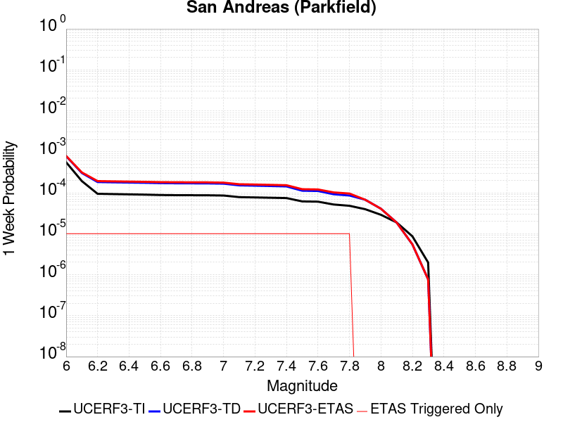 | 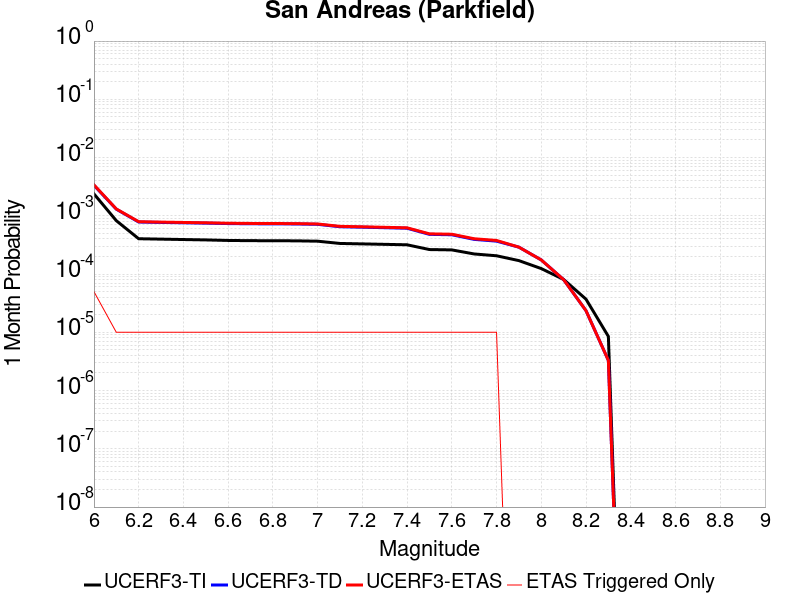 |  | 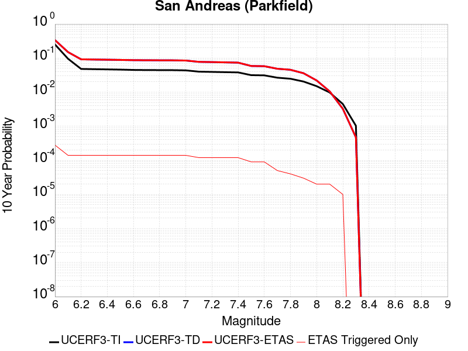 |

| Magnitude | 1 wk TI Prob | 1 wk TD Prob | 1 wk ETAS Prob | 1 wk ETAS/TD Gain | 1 wk ETAS Triggered Only | 1 mo TI Prob | 1 mo TD Prob | 1 mo ETAS Prob | 1 mo ETAS/TD Gain | 1 mo ETAS Triggered Only | 1 yr TI Prob | 1 yr TD Prob | 1 yr ETAS Prob | 1 yr ETAS/TD Gain | 1 yr ETAS Triggered Only | 10 yr TI Prob | 10 yr TD Prob | 10 yr ETAS Prob | 10 yr ETAS/TD Gain | 10 yr ETAS Triggered Only |
|-----|-----|-----|-----|-----|-----|-----|-----|-----|-----|-----|-----|-----|-----|-----|-----|-----|-----|-----|-----|-----|
| 6.0 | 5.556969E-4 | 7.808895E-4 | 7.908817E-4 | 1.0127959 | 1.0E-5 | 0.0023793848 | 0.00334293 | 0.003392763 | 1.0149069 | 5.0E-5 | 0.028586963 | 0.040337496 | 0.04046225 | 1.0030928 | 1.3E-4 | 0.25176284 | 0.33762243 | 0.3378079 | 1.0005493 | 2.8E-4 |
| 6.1 | 1.925858E-4 | 3.036184E-4 | 3.1361537E-4 | 1.0329261 | 1.0E-5 | 8.2510663E-4 | 0.0013006676 | 0.0013106547 | 1.0076784 | 1.0E-5 | 0.0099994885 | 0.015820578 | 0.015869787 | 1.0031104 | 5.0E-5 | 0.095613256 | 0.14993067 | 0.15004967 | 1.0007938 | 1.4E-4 |
| 6.2 | 9.4306815E-5 | 1.8265692E-4 | 1.9265509E-4 | 1.0547374 | 1.0E-5 | 4.0410945E-4 | 7.8258174E-4 | 7.925739E-4 | 1.0127683 | 1.0E-5 | 0.0049089384 | 0.009486516 | 0.009536042 | 1.0052207 | 5.0E-5 | 0.048019063 | 0.0919533 | 0.09208042 | 1.0013825 | 1.4E-4 |
| 6.3 | 9.283051E-5 | 1.7962146E-4 | 1.8961966E-4 | 1.0556626 | 1.0E-5 | 3.9778434E-4 | 7.6958037E-4 | 7.7957264E-4 | 1.012984 | 1.0E-5 | 0.0048322747 | 0.00932959 | 0.009379123 | 1.0053093 | 5.0E-5 | 0.047285385 | 0.09060615 | 0.09073347 | 1.0014051 | 1.4E-4 |
| 6.4 | 9.138826E-5 | 1.7724201E-4 | 1.8724024E-4 | 1.0564101 | 1.0E-5 | 3.916052E-4 | 7.593886E-4 | 7.6938106E-4 | 1.0131584 | 1.0E-5 | 0.0047573745 | 0.009206562 | 0.009256101 | 1.0053809 | 5.0E-5 | 0.046568092 | 0.08950791 | 0.08963537 | 1.0014241 | 1.4E-4 |
| 6.5 | 9.000255E-5 | 1.748211E-4 | 1.8481936E-4 | 1.0571914 | 1.0E-5 | 3.8566816E-4 | 7.490194E-4 | 7.590119E-4 | 1.0133408 | 1.0E-5 | 0.0046854047 | 0.009081386 | 0.009130932 | 1.0054557 | 5.0E-5 | 0.045878403 | 0.08839326 | 0.08852089 | 1.0014439 | 1.4E-4 |
| 6.6 | 8.8109264E-5 | 1.7162992E-4 | 1.8162819E-4 | 1.058255 | 1.0E-5 | 3.7755648E-4 | 7.3535054E-4 | 7.453432E-4 | 1.0135889 | 1.0E-5 | 0.0045870654 | 0.008916357 | 0.008965911 | 1.0055577 | 5.0E-5 | 0.04493529 | 0.08692391 | 0.08705174 | 1.0014706 | 1.4E-4 |
| 6.7 | 8.738073E-5 | 1.7030006E-4 | 1.8029836E-4 | 1.0587099 | 1.0E-5 | 3.7443507E-4 | 7.2965445E-4 | 7.3964713E-4 | 1.0136951 | 1.0E-5 | 0.0045492216 | 0.008847613 | 0.00889717 | 1.0056013 | 5.0E-5 | 0.04457213 | 0.08632409 | 0.08645201 | 1.0014818 | 1.4E-4 |
| 6.8 | 8.710195E-5 | 1.6975458E-4 | 1.7975288E-4 | 1.0588986 | 1.0E-5 | 3.7324068E-4 | 7.2731794E-4 | 7.373106E-4 | 1.0137391 | 1.0E-5 | 0.0045347405 | 0.008819405 | 0.008868964 | 1.0056193 | 5.0E-5 | 0.04443313 | 0.08607152 | 0.08619947 | 1.0014865 | 1.4E-4 |
| 6.9 | 8.6801556E-5 | 1.6916369E-4 | 1.79162E-4 | 1.0591043 | 1.0E-5 | 3.7195362E-4 | 7.2478695E-4 | 7.347797E-4 | 1.0137872 | 1.0E-5 | 0.0045191357 | 0.00878884 | 0.0088384 | 1.0056391 | 5.0E-5 | 0.044283327 | 0.08579744 | 0.08592542 | 1.0014918 | 1.4E-4 |
| 7.0 | 8.5571606E-5 | 1.6669027E-4 | 1.766886E-4 | 1.0599815 | 1.0E-5 | 3.6668387E-4 | 7.1419246E-4 | 7.241853E-4 | 1.0139918 | 1.0E-5 | 0.004455241 | 0.008660884 | 0.0087104505 | 1.0057231 | 5.0E-5 | 0.043669727 | 0.08464524 | 0.08477339 | 1.001514 | 1.4E-4 |
| 7.1 | 7.82589E-5 | 1.5149236E-4 | 1.6149085E-4 | 1.066 | 1.0E-5 | 3.3535215E-4 | 6.490922E-4 | 6.590857E-4 | 1.0153961 | 1.0E-5 | 0.0040752706 | 0.007874233 | 0.007923839 | 1.0062999 | 5.0E-5 | 0.040013418 | 0.07755474 | 0.07766543 | 1.0014273 | 1.2E-4 |
| 7.2 | 7.690929E-5 | 1.4886365E-4 | 1.5886217E-4 | 1.0671656 | 1.0E-5 | 3.2956956E-4 | 6.378318E-4 | 6.478254E-4 | 1.0156682 | 1.0E-5 | 0.004005129 | 0.007738119 | 0.007787732 | 1.0064116 | 5.0E-5 | 0.0393371 | 0.076327525 | 0.07643837 | 1.0014522 | 1.2E-4 |
| 7.3 | 7.5543794E-5 | 1.4582694E-4 | 1.5582549E-4 | 1.0685644 | 1.0E-5 | 3.2371894E-4 | 6.248237E-4 | 6.348174E-4 | 1.0159945 | 1.0E-5 | 0.003934157 | 0.007580857 | 0.0076304777 | 1.0065455 | 5.0E-5 | 0.038652334 | 0.0748897 | 0.07500071 | 1.0014824 | 1.2E-4 |
| 7.4 | 7.4214564E-5 | 1.4283395E-4 | 1.5283252E-4 | 1.0700014 | 1.0E-5 | 3.1802364E-4 | 6.120026E-4 | 6.2199647E-4 | 1.0163298 | 1.0E-5 | 0.003865065 | 0.0074258344 | 0.007475463 | 1.0066832 | 5.0E-5 | 0.03798529 | 0.07346256 | 0.073573746 | 1.0015135 | 1.2E-4 |
| 7.5 | 6.149578E-5 | 1.120832E-4 | 1.2208208E-4 | 1.0892094 | 1.0E-5 | 2.6352672E-4 | 4.8026824E-4 | 4.9026345E-4 | 1.0208117 | 1.0E-5 | 0.0032037178 | 0.005831621 | 0.0058713877 | 1.0068191 | 4.0E-5 | 0.03157923 | 0.0586385 | 0.05872322 | 1.0014448 | 9.0E-5 |
| 7.6 | 6.0643448E-5 | 1.1036816E-4 | 1.20367054E-4 | 1.0905958 | 1.0E-5 | 2.598746E-4 | 4.7292074E-4 | 4.8291602E-4 | 1.0211352 | 1.0E-5 | 0.0031593828 | 0.0057426402 | 0.0057824105 | 1.0069255 | 4.0E-5 | 0.031148417 | 0.05779889 | 0.057883687 | 1.0014671 | 9.0E-5 |
| 7.7 | 5.1652263E-5 | 9.190334E-5 | 1.0190243E-4 | 1.1087999 | 1.0E-5 | 2.2134806E-4 | 3.9381205E-4 | 4.038081E-4 | 1.0253829 | 1.0E-5 | 0.002691582 | 0.004784131 | 0.004804035 | 1.0041605 | 2.0E-5 | 0.026592141 | 0.048609342 | 0.04865691 | 1.0009786 | 5.0E-5 |
| 7.8 | 4.8090482E-5 | 8.574018E-5 | 9.573932E-5 | 1.1166214 | 1.0E-5 | 2.060858E-4 | 3.6740617E-4 | 3.7740252E-4 | 1.0272079 | 1.0E-5 | 0.0025062072 | 0.0044640037 | 0.0044839145 | 1.0044603 | 2.0E-5 | 0.024781305 | 0.045369923 | 0.045408107 | 1.0008416 | 4.0E-5 |
| 7.9 | 3.970278E-5 | 6.761595E-5 | 6.761595E-5 | 1.0 | 0.0 | 1.7014367E-4 | 2.8975046E-4 | 2.8975046E-4 | 1.0 | 0.0 | 0.002069531 | 0.0035220094 | 0.003531974 | 1.0028293 | 1.0E-5 | 0.020503636 | 0.035934802 | 0.03596372 | 1.0008049 | 3.0E-5 |
| 8.0 | 2.8982335E-5 | 4.0768486E-5 | 4.0768486E-5 | 1.0 | 0.0 | 1.2420409E-4 | 1.747104E-4 | 1.747104E-4 | 1.0 | 0.0 | 0.0015111357 | 0.002125025 | 0.002135004 | 1.0046958 | 1.0E-5 | 0.015009012 | 0.022045897 | 0.022065457 | 1.0008872 | 2.0E-5 |
| 8.1 | 1.8836186E-5 | 1.8720633E-5 | 1.8720633E-5 | 1.0 | 0.0 | 8.0724014E-5 | 8.022882E-5 | 8.022882E-5 | 1.0 | 0.0 | 9.823717E-4 | 9.7634876E-4 | 9.86339E-4 | 1.0102322 | 1.0E-5 | 0.009780403 | 0.010508843 | 0.010528632 | 1.0018831 | 2.0E-5 |
| 8.2 | 8.643924E-6 | 5.4901475E-6 | 5.4901475E-6 | 1.0 | 0.0 | 3.704486E-5 | 2.3528992E-5 | 2.3528992E-5 | 1.0 | 0.0 | 4.5092785E-4 | 2.8642788E-4 | 2.9642502E-4 | 1.0349028 | 1.0E-5 | 0.0045001395 | 0.0032570646 | 0.003267032 | 1.0030602 | 1.0E-5 |
| 8.3 | 1.983087E-6 | 7.6850927E-7 | 7.6850927E-7 | 1.0 | 0.0 | 8.498917E-6 | 3.293607E-6 | 3.293607E-6 | 1.0 | 0.0 | 1.034694E-4 | 4.0098945E-5 | 4.0098945E-5 | 1.0 | 0.0 | 0.0010342124 | 4.7341356E-4 | 4.7341356E-4 | 1.0 | 0.0 |

## Coyote Lake
*[(top)](#table-of-contents)*

| 1 Week | 1 Month | 1 Year | 10 Year |
|-----|-----|-----|-----|
|  |  |  |  |

| Magnitude | 1 wk TI Prob | 1 wk TD Prob | 1 wk ETAS Prob | 1 wk ETAS/TD Gain | 1 wk ETAS Triggered Only | 1 mo TI Prob | 1 mo TD Prob | 1 mo ETAS Prob | 1 mo ETAS/TD Gain | 1 mo ETAS Triggered Only | 1 yr TI Prob | 1 yr TD Prob | 1 yr ETAS Prob | 1 yr ETAS/TD Gain | 1 yr ETAS Triggered Only | 10 yr TI Prob | 10 yr TD Prob | 10 yr ETAS Prob | 10 yr ETAS/TD Gain | 10 yr ETAS Triggered Only |
|-----|-----|-----|-----|-----|-----|-----|-----|-----|-----|-----|-----|-----|-----|-----|-----|-----|-----|-----|-----|-----|
| 6.0 | 1.980352E-5 | 2.1707576E-5 | 2.1707576E-5 | 1.0 | 0.0 | 8.486947E-5 | 9.302955E-5 | 9.302955E-5 | 1.0 | 0.0 | 0.0010327959 | 0.0011321184 | 0.0012419939 | 1.0970529 | 1.1E-4 | 0.010280091 | 0.011270687 | 0.011567306 | 1.0263177 | 3.0E-4 |
| 6.1 | 1.980352E-5 | 2.1707576E-5 | 2.1707576E-5 | 1.0 | 0.0 | 8.486947E-5 | 9.302955E-5 | 9.302955E-5 | 1.0 | 0.0 | 0.0010327959 | 0.0011321184 | 0.0012419939 | 1.0970529 | 1.1E-4 | 0.010280091 | 0.011270687 | 0.011567306 | 1.0263177 | 3.0E-4 |
| 6.2 | 1.980352E-5 | 2.1707576E-5 | 2.1707576E-5 | 1.0 | 0.0 | 8.486947E-5 | 9.302955E-5 | 9.302955E-5 | 1.0 | 0.0 | 0.0010327959 | 0.0011321184 | 0.0012419939 | 1.0970529 | 1.1E-4 | 0.010280091 | 0.011270687 | 0.011567306 | 1.0263177 | 3.0E-4 |
| 6.3 | 1.5344787E-5 | 1.6821314E-5 | 1.6821314E-5 | 1.0 | 0.0 | 6.576172E-5 | 7.208969E-5 | 7.208969E-5 | 1.0 | 0.0 | 8.003548E-4 | 8.773998E-4 | 9.6732087E-4 | 1.1024858 | 9.0E-5 | 0.007974784 | 0.008745403 | 0.008963479 | 1.0249361 | 2.2E-4 |
| 6.4 | 1.5344787E-5 | 1.6821314E-5 | 1.6821314E-5 | 1.0 | 0.0 | 6.576172E-5 | 7.208969E-5 | 7.208969E-5 | 1.0 | 0.0 | 8.003548E-4 | 8.773998E-4 | 9.6732087E-4 | 1.1024858 | 9.0E-5 | 0.007974784 | 0.008745403 | 0.008963479 | 1.0249361 | 2.2E-4 |
| 6.5 | 1.4189697E-5 | 1.5558584E-5 | 1.5558584E-5 | 1.0 | 0.0 | 6.081157E-5 | 6.667828E-5 | 6.667828E-5 | 1.0 | 0.0 | 7.401293E-4 | 8.11566E-4 | 8.915011E-4 | 1.0984949 | 8.0E-5 | 0.0073766913 | 0.008091966 | 0.008290348 | 1.0245159 | 2.0E-4 |
| 6.6 | 1.3469301E-5 | 1.4772146E-5 | 1.4772146E-5 | 1.0 | 0.0 | 5.7724297E-5 | 6.3308E-5 | 6.3308E-5 | 1.0 | 0.0 | 7.025667E-4 | 7.7056227E-4 | 8.5050066E-4 | 1.1037403 | 8.0E-5 | 0.0070034964 | 0.007684809 | 0.007883272 | 1.0258254 | 2.0E-4 |
| 6.7 | 1.3027966E-5 | 1.4282292E-5 | 1.4282292E-5 | 1.0 | 0.0 | 5.5832945E-5 | 6.1208724E-5 | 6.1208724E-5 | 1.0 | 0.0 | 6.7955407E-4 | 7.4502116E-4 | 8.14969E-4 | 1.0938871 | 7.0E-5 | 0.006774798 | 0.0074311127 | 0.007619701 | 1.0253782 | 1.9E-4 |
| 6.8 | 5.695434E-6 | 6.2246477E-6 | 6.2246477E-6 | 1.0 | 0.0 | 2.4408775E-5 | 2.6676958E-5 | 2.6676958E-5 | 1.0 | 0.0 | 2.971363E-4 | 3.2477354E-4 | 3.6476055E-4 | 1.1231227 | 4.0E-5 | 0.0029673933 | 0.0032459302 | 0.003315703 | 1.0214955 | 7.0E-5 |
| 6.9 | 4.385688E-6 | 4.7932326E-6 | 4.7932326E-6 | 1.0 | 0.0 | 1.879567E-5 | 2.0542426E-5 | 2.0542426E-5 | 1.0 | 0.0 | 2.2881327E-4 | 2.5010403E-4 | 2.8009652E-4 | 1.1199201 | 3.0E-5 | 0.002285778 | 0.0025010402 | 0.0025608903 | 1.0239301 | 6.0E-5 |

## Cady
*[(top)](#table-of-contents)*

| 1 Week | 1 Month | 1 Year | 10 Year |
|-----|-----|-----|-----|
|  |  | 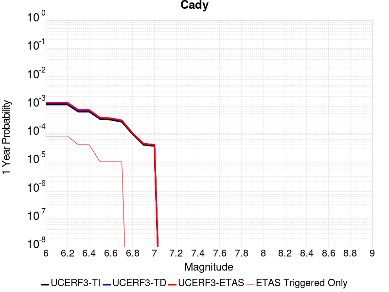 |  |

| Magnitude | 1 wk TI Prob | 1 wk TD Prob | 1 wk ETAS Prob | 1 wk ETAS/TD Gain | 1 wk ETAS Triggered Only | 1 mo TI Prob | 1 mo TD Prob | 1 mo ETAS Prob | 1 mo ETAS/TD Gain | 1 mo ETAS Triggered Only | 1 yr TI Prob | 1 yr TD Prob | 1 yr ETAS Prob | 1 yr ETAS/TD Gain | 1 yr ETAS Triggered Only | 10 yr TI Prob | 10 yr TD Prob | 10 yr ETAS Prob | 10 yr ETAS/TD Gain | 10 yr ETAS Triggered Only |
|-----|-----|-----|-----|-----|-----|-----|-----|-----|-----|-----|-----|-----|-----|-----|-----|-----|-----|-----|-----|-----|
| 6.0 | 1.9892565E-5 | 2.1859589E-5 | 3.185937E-5 | 1.4574552 | 1.0E-5 | 8.525106E-5 | 9.3681105E-5 | 1.0368017E-4 | 1.1067351 | 1.0E-5 | 0.0010374374 | 0.0011400615 | 0.0012199703 | 1.0700916 | 8.0E-5 | 0.010326075 | 0.011351145 | 0.011588421 | 1.0209032 | 2.4E-4 |
| 6.1 | 1.9892565E-5 | 2.1859589E-5 | 3.185937E-5 | 1.4574552 | 1.0E-5 | 8.525106E-5 | 9.3681105E-5 | 1.0368017E-4 | 1.1067351 | 1.0E-5 | 0.0010374374 | 0.0011400615 | 0.0012199703 | 1.0700916 | 8.0E-5 | 0.010326075 | 0.011351145 | 0.011588421 | 1.0209032 | 2.4E-4 |
| 6.2 | 1.9892565E-5 | 2.1859589E-5 | 3.185937E-5 | 1.4574552 | 1.0E-5 | 8.525106E-5 | 9.3681105E-5 | 1.0368017E-4 | 1.1067351 | 1.0E-5 | 0.0010374374 | 0.0011400615 | 0.0012199703 | 1.0700916 | 8.0E-5 | 0.010326075 | 0.011351145 | 0.011588421 | 1.0209032 | 2.4E-4 |
| 6.3 | 1.1117327E-5 | 1.2177045E-5 | 1.2177045E-5 | 1.0 | 0.0 | 4.764482E-5 | 5.218647E-5 | 5.218647E-5 | 1.0 | 0.0 | 5.7992124E-4 | 6.352166E-4 | 6.751912E-4 | 1.0629307 | 4.0E-5 | 0.0057841022 | 0.006337115 | 0.0064861644 | 1.0235201 | 1.5E-4 |
| 6.4 | 1.1117327E-5 | 1.2177045E-5 | 1.2177045E-5 | 1.0 | 0.0 | 4.764482E-5 | 5.218647E-5 | 5.218647E-5 | 1.0 | 0.0 | 5.7992124E-4 | 6.352166E-4 | 6.751912E-4 | 1.0629307 | 4.0E-5 | 0.0057841022 | 0.006337115 | 0.0064861644 | 1.0235201 | 1.5E-4 |
| 6.5 | 6.103093E-6 | 6.6722682E-6 | 6.6722682E-6 | 1.0 | 0.0 | 2.615585E-5 | 2.8595194E-5 | 2.8595194E-5 | 1.0 | 0.0 | 3.1840094E-4 | 3.481034E-4 | 3.5809993E-4 | 1.028717 | 1.0E-5 | 0.0031794512 | 0.0034768155 | 0.0035565374 | 1.0229295 | 8.0E-5 |
| 6.6 | 5.817237E-6 | 6.3658977E-6 | 6.3658977E-6 | 1.0 | 0.0 | 2.4930776E-5 | 2.7282204E-5 | 2.7282204E-5 | 1.0 | 0.0 | 3.034899E-4 | 3.3212264E-4 | 3.421193E-4 | 1.0300994 | 1.0E-5 | 0.0030307577 | 0.0033174849 | 0.0033972196 | 1.0240346 | 8.0E-5 |
| 6.7 | 4.8846314E-6 | 5.3407666E-6 | 5.3407666E-6 | 1.0 | 0.0 | 2.0933967E-5 | 2.2888866E-5 | 2.2888866E-5 | 1.0 | 0.0 | 2.5484123E-4 | 2.7864808E-4 | 2.886453E-4 | 1.0358776 | 1.0E-5 | 0.0025454918 | 0.0027841425 | 0.0028539477 | 1.0250723 | 7.0E-5 |
| 6.8 | 1.7788773E-6 | 1.939978E-6 | 1.939978E-6 | 1.0 | 0.0 | 7.6237375E-6 | 8.314173E-6 | 8.314173E-6 | 1.0 | 0.0 | 9.281505E-5 | 1.01221936E-4 | 1.01221936E-4 | 1.0 | 0.0 | 9.2776294E-4 | 0.001011913 | 0.0010219028 | 1.0098723 | 1.0E-5 |
| 6.9 | 7.5455404E-7 | 8.297421E-7 | 8.297421E-7 | 1.0 | 0.0 | 3.233799E-6 | 3.5560347E-6 | 3.5560347E-6 | 1.0 | 0.0 | 3.937079E-5 | 4.3294196E-5 | 4.3294196E-5 | 1.0 | 0.0 | 3.9363815E-4 | 4.3289058E-4 | 4.4288626E-4 | 1.0230905 | 1.0E-5 |
| 7.0 | 6.8578805E-7 | 7.5421156E-7 | 7.5421156E-7 | 1.0 | 0.0 | 2.9390883E-6 | 3.232333E-6 | 3.232333E-6 | 1.0 | 0.0 | 3.578281E-5 | 3.9353275E-5 | 3.9353275E-5 | 1.0 | 0.0 | 3.577705E-4 | 3.9349555E-4 | 4.034916E-4 | 1.0254033 | 1.0E-5 |

## Red Pass
*[(top)](#table-of-contents)*

| 1 Week | 1 Month | 1 Year | 10 Year |
|-----|-----|-----|-----|
|  |  |  |  |

| Magnitude | 1 wk TI Prob | 1 wk TD Prob | 1 wk ETAS Prob | 1 wk ETAS/TD Gain | 1 wk ETAS Triggered Only | 1 mo TI Prob | 1 mo TD Prob | 1 mo ETAS Prob | 1 mo ETAS/TD Gain | 1 mo ETAS Triggered Only | 1 yr TI Prob | 1 yr TD Prob | 1 yr ETAS Prob | 1 yr ETAS/TD Gain | 1 yr ETAS Triggered Only | 10 yr TI Prob | 10 yr TD Prob | 10 yr ETAS Prob | 10 yr ETAS/TD Gain | 10 yr ETAS Triggered Only |
|-----|-----|-----|-----|-----|-----|-----|-----|-----|-----|-----|-----|-----|-----|-----|-----|-----|-----|-----|-----|-----|
| 6.0 | 8.258278E-6 | 8.551386E-6 | 3.855113E-5 | 4.5081735 | 3.0E-5 | 3.539214E-5 | 3.664838E-5 | 8.664655E-5 | 2.3642666 | 5.0E-5 | 4.308141E-4 | 4.4612057E-4 | 5.6606706E-4 | 1.2688656 | 1.2E-4 | 0.0042997985 | 0.0044540074 | 0.0046431613 | 1.0424682 | 1.9E-4 |
| 6.1 | 3.649988E-6 | 3.7753678E-6 | 3.7753678E-6 | 1.0 | 0.0 | 1.5642712E-5 | 1.6180074E-5 | 2.6179912E-5 | 1.6180341 | 1.0E-5 | 1.9043336E-4 | 1.9697935E-4 | 2.3697148E-4 | 1.203027 | 4.0E-5 | 0.0019027026 | 0.0019685149 | 0.0020283968 | 1.0304198 | 6.0E-5 |
| 6.2 | 3.649988E-6 | 3.7753678E-6 | 3.7753678E-6 | 1.0 | 0.0 | 1.5642712E-5 | 1.6180074E-5 | 2.6179912E-5 | 1.6180341 | 1.0E-5 | 1.9043336E-4 | 1.9697935E-4 | 2.3697148E-4 | 1.203027 | 4.0E-5 | 0.0019027026 | 0.0019685149 | 0.0020283968 | 1.0304198 | 6.0E-5 |
| 6.3 | 1.3924937E-6 | 1.4411366E-6 | 1.4411366E-6 | 1.0 | 0.0 | 5.9678164E-6 | 6.1762935E-6 | 6.1762935E-6 | 1.0 | 0.0 | 7.265574E-5 | 7.519519E-5 | 8.519444E-5 | 1.1329772 | 1.0E-5 | 7.263199E-4 | 7.518362E-4 | 7.6182873E-4 | 1.0132908 | 1.0E-5 |
| 6.4 | 1.3924937E-6 | 1.4411366E-6 | 1.4411366E-6 | 1.0 | 0.0 | 5.9678164E-6 | 6.1762935E-6 | 6.1762935E-6 | 1.0 | 0.0 | 7.265574E-5 | 7.519519E-5 | 8.519444E-5 | 1.1329772 | 1.0E-5 | 7.263199E-4 | 7.518362E-4 | 7.6182873E-4 | 1.0132908 | 1.0E-5 |
| 6.5 | 9.876812E-7 | 1.0222054E-6 | 1.0222054E-6 | 1.0 | 0.0 | 4.2329125E-6 | 4.3808805E-6 | 4.3808805E-6 | 1.0 | 0.0 | 5.153449E-5 | 5.333722E-5 | 5.333722E-5 | 1.0 | 0.0 | 5.1522546E-4 | 5.3337216E-4 | 5.3337216E-4 | 1.0 | 0.0 |

## Sierra Nevada  (No Extension)
*[(top)](#table-of-contents)*

| 1 Week | 1 Month | 1 Year | 10 Year |
|-----|-----|-----|-----|
| 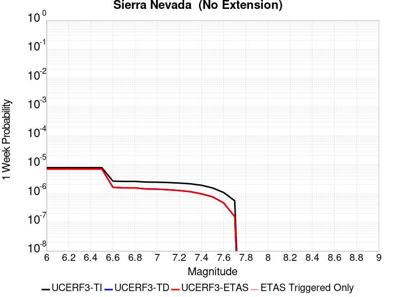 |  |  |  |

| Magnitude | 1 wk TI Prob | 1 wk TD Prob | 1 wk ETAS Prob | 1 wk ETAS/TD Gain | 1 wk ETAS Triggered Only | 1 mo TI Prob | 1 mo TD Prob | 1 mo ETAS Prob | 1 mo ETAS/TD Gain | 1 mo ETAS Triggered Only | 1 yr TI Prob | 1 yr TD Prob | 1 yr ETAS Prob | 1 yr ETAS/TD Gain | 1 yr ETAS Triggered Only | 10 yr TI Prob | 10 yr TD Prob | 10 yr ETAS Prob | 10 yr ETAS/TD Gain | 10 yr ETAS Triggered Only |
|-----|-----|-----|-----|-----|-----|-----|-----|-----|-----|-----|-----|-----|-----|-----|-----|-----|-----|-----|-----|-----|
| 6.0 | 7.7690465E-6 | 6.976506E-6 | 6.976506E-6 | 1.0 | 0.0 | 3.329549E-5 | 2.989917E-5 | 4.9898572E-5 | 1.6688949 | 2.0E-5 | 4.0529718E-4 | 3.6399745E-4 | 4.4396834E-4 | 1.2197018 | 8.0E-5 | 0.004045588 | 0.0036375287 | 0.0038368013 | 1.0547824 | 2.0E-4 |
| 6.1 | 7.7690465E-6 | 6.976506E-6 | 6.976506E-6 | 1.0 | 0.0 | 3.329549E-5 | 2.989917E-5 | 4.9898572E-5 | 1.6688949 | 2.0E-5 | 4.0529718E-4 | 3.6399745E-4 | 4.4396834E-4 | 1.2197018 | 8.0E-5 | 0.004045588 | 0.0036375287 | 0.0038368013 | 1.0547824 | 2.0E-4 |
| 6.2 | 7.7690465E-6 | 6.976506E-6 | 6.976506E-6 | 1.0 | 0.0 | 3.329549E-5 | 2.989917E-5 | 4.9898572E-5 | 1.6688949 | 2.0E-5 | 4.0529718E-4 | 3.6399745E-4 | 4.4396834E-4 | 1.2197018 | 8.0E-5 | 0.004045588 | 0.0036375287 | 0.0038368013 | 1.0547824 | 2.0E-4 |
| 6.3 | 7.7690465E-6 | 6.976506E-6 | 6.976506E-6 | 1.0 | 0.0 | 3.329549E-5 | 2.989917E-5 | 4.9898572E-5 | 1.6688949 | 2.0E-5 | 4.0529718E-4 | 3.6399745E-4 | 4.4396834E-4 | 1.2197018 | 8.0E-5 | 0.004045588 | 0.0036375287 | 0.0038368013 | 1.0547824 | 2.0E-4 |
| 6.4 | 7.7690465E-6 | 6.976506E-6 | 6.976506E-6 | 1.0 | 0.0 | 3.329549E-5 | 2.989917E-5 | 4.9898572E-5 | 1.6688949 | 2.0E-5 | 4.0529718E-4 | 3.6399745E-4 | 4.4396834E-4 | 1.2197018 | 8.0E-5 | 0.004045588 | 0.0036375287 | 0.0038368013 | 1.0547824 | 2.0E-4 |
| 6.5 | 7.7690465E-6 | 6.976506E-6 | 6.976506E-6 | 1.0 | 0.0 | 3.329549E-5 | 2.989917E-5 | 4.9898572E-5 | 1.6688949 | 2.0E-5 | 4.0529718E-4 | 3.6399745E-4 | 4.4396834E-4 | 1.2197018 | 8.0E-5 | 0.004045588 | 0.0036375287 | 0.0038368013 | 1.0547824 | 2.0E-4 |
| 6.6 | 2.653E-6 | 1.6149361E-6 | 1.6149361E-6 | 1.0 | 0.0 | 1.136995E-5 | 6.9211364E-6 | 2.6920998E-5 | 3.8896787 | 2.0E-5 | 1.3842035E-4 | 8.4261614E-5 | 1.6425487E-4 | 1.949344 | 8.0E-5 | 0.0013833415 | 8.4230007E-4 | 0.0010221484 | 1.2135205 | 1.8E-4 |
| 6.7 | 2.5902466E-6 | 1.5502688E-6 | 1.5502688E-6 | 1.0 | 0.0 | 1.11010095E-5 | 6.6439925E-6 | 2.664386E-5 | 4.010218 | 2.0E-5 | 1.351464E-4 | 8.0887636E-5 | 1.5088197E-4 | 1.865328 | 7.0E-5 | 0.0013506424 | 8.085849E-4 | 9.784475E-4 | 1.2100738 | 1.7E-4 |
| 6.8 | 2.5853892E-6 | 1.5470687E-6 | 1.5470687E-6 | 1.0 | 0.0 | 1.1080193E-5 | 6.6302778E-6 | 2.6630145E-5 | 4.0164447 | 2.0E-5 | 1.34893E-4 | 8.0720674E-5 | 1.5071502E-4 | 1.867118 | 7.0E-5 | 0.0013481114 | 8.069165E-4 | 9.767793E-4 | 1.2105086 | 1.7E-4 |
| 6.9 | 2.458257E-6 | 1.4221412E-6 | 1.4221412E-6 | 1.0 | 0.0 | 1.0535345E-5 | 6.0948764E-6 | 2.6094755E-5 | 4.2814245 | 2.0E-5 | 1.2826028E-4 | 7.420261E-5 | 1.4419742E-4 | 1.943293 | 7.0E-5 | 0.0012818627 | 7.417803E-4 | 9.116542E-4 | 1.2290083 | 1.7E-4 |
| 7.0 | 2.4341468E-6 | 1.3991046E-6 | 1.3991046E-6 | 1.0 | 0.0 | 1.0432016E-5 | 5.996149E-6 | 2.5996029E-5 | 4.3354545 | 2.0E-5 | 1.270024E-4 | 7.300069E-5 | 1.4299557E-4 | 1.9588251 | 7.0E-5 | 0.0012692984 | 7.2976894E-4 | 8.996449E-4 | 1.2327805 | 1.7E-4 |
| 7.1 | 2.3652476E-6 | 1.3340531E-6 | 1.3340531E-6 | 1.0 | 0.0 | 1.0136736E-5 | 5.717358E-6 | 2.5717243E-5 | 4.4980993 | 2.0E-5 | 1.2340778E-4 | 6.960663E-5 | 1.3960175E-4 | 2.0055814 | 7.0E-5 | 0.0012333926 | 6.9584994E-4 | 8.657316E-4 | 1.2441355 | 1.7E-4 |
| 7.2 | 2.272158E-6 | 1.250358E-6 | 1.250358E-6 | 1.0 | 0.0 | 9.737784E-6 | 5.358666E-6 | 2.5358559E-5 | 4.732252 | 2.0E-5 | 1.1855107E-4 | 6.523982E-5 | 1.3523526E-4 | 2.0728943 | 7.0E-5 | 0.0011848784 | 6.5220817E-4 | 8.220973E-4 | 1.260483 | 1.7E-4 |
| 7.3 | 2.1382127E-6 | 1.1420437E-6 | 1.1420437E-6 | 1.0 | 0.0 | 9.163737E-6 | 4.894464E-6 | 2.4894365E-5 | 5.0862293 | 2.0E-5 | 1.1156279E-4 | 5.958848E-5 | 1.2958431E-4 | 2.1746538 | 7.0E-5 | 0.001115068 | 5.957262E-4 | 7.656249E-4 | 1.285196 | 1.7E-4 |
| 7.4 | 1.9048055E-6 | 9.575938E-7 | 9.575938E-7 | 1.0 | 0.0 | 8.163426E-6 | 4.103967E-6 | 2.4103885E-5 | 5.873314 | 2.0E-5 | 9.9385186E-5 | 4.996466E-5 | 1.0996166E-4 | 2.2007887 | 6.0E-5 | 9.934074E-4 | 4.9953494E-4 | 6.59455E-4 | 1.320138 | 1.6E-4 |
| 7.5 | 1.5373403E-6 | 7.5606346E-7 | 7.5606346E-7 | 1.0 | 0.0 | 6.5885843E-6 | 3.240268E-6 | 3.240268E-6 | 1.0 | 0.0 | 8.021306E-5 | 3.944955E-5 | 7.944797E-5 | 2.0139132 | 4.0E-5 | 8.0184115E-4 | 3.9442597E-4 | 5.243747E-4 | 1.3294629 | 1.3E-4 |
| 7.6 | 1.0680322E-6 | 4.6600775E-7 | 4.6600775E-7 | 1.0 | 0.0 | 4.577273E-6 | 1.9971744E-6 | 1.9971744E-6 | 1.0 | 0.0 | 5.5726876E-5 | 2.4315332E-5 | 4.4314846E-5 | 1.8225063 | 2.0E-5 | 5.5712904E-4 | 2.4312697E-4 | 3.2310752E-4 | 1.3289661 | 8.0E-5 |
| 7.7 | 5.509146E-7 | 1.5582627E-7 | 1.5582627E-7 | 1.0 | 0.0 | 2.3610605E-6 | 6.678267E-7 | 6.678267E-7 | 1.0 | 0.0 | 2.8745531E-5 | 8.130761E-6 | 8.130761E-6 | 1.0 | 0.0 | 2.8741814E-4 | 8.130475E-5 | 9.130394E-5 | 1.122984 | 1.0E-5 |

## Death Valley (Fish Lake Valley)
*[(top)](#table-of-contents)*

| 1 Week | 1 Month | 1 Year | 10 Year |
|-----|-----|-----|-----|
|  | 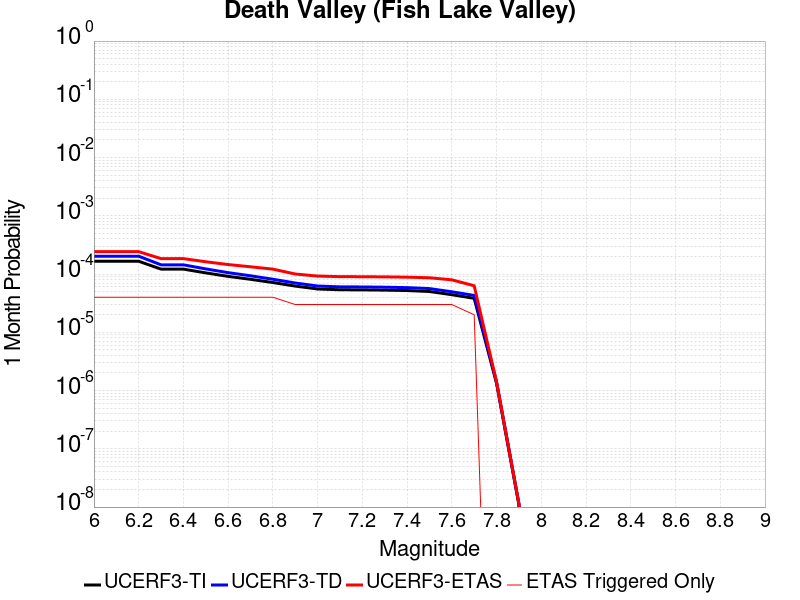 |  |  |

| Magnitude | 1 wk TI Prob | 1 wk TD Prob | 1 wk ETAS Prob | 1 wk ETAS/TD Gain | 1 wk ETAS Triggered Only | 1 mo TI Prob | 1 mo TD Prob | 1 mo ETAS Prob | 1 mo ETAS/TD Gain | 1 mo ETAS Triggered Only | 1 yr TI Prob | 1 yr TD Prob | 1 yr ETAS Prob | 1 yr ETAS/TD Gain | 1 yr ETAS Triggered Only | 10 yr TI Prob | 10 yr TD Prob | 10 yr ETAS Prob | 10 yr ETAS/TD Gain | 10 yr ETAS Triggered Only |
|-----|-----|-----|-----|-----|-----|-----|-----|-----|-----|-----|-----|-----|-----|-----|-----|-----|-----|-----|-----|-----|
| 6.0 | 3.872328E-5 | 4.7271737E-5 | 6.727079E-5 | 1.4230658 | 2.0E-5 | 1.6594635E-4 | 2.0257912E-4 | 2.4257103E-4 | 1.1974137 | 4.0E-5 | 0.0020185246 | 0.0024637436 | 0.0025734724 | 1.0445375 | 1.1E-4 | 0.02000288 | 0.024390284 | 0.02457565 | 1.0076 | 1.9E-4 |
| 6.1 | 3.872328E-5 | 4.7271737E-5 | 6.727079E-5 | 1.4230658 | 2.0E-5 | 1.6594635E-4 | 2.0257912E-4 | 2.4257103E-4 | 1.1974137 | 4.0E-5 | 0.0020185246 | 0.0024637436 | 0.0025734724 | 1.0445375 | 1.1E-4 | 0.02000288 | 0.024390284 | 0.02457565 | 1.0076 | 1.9E-4 |
| 6.2 | 3.872328E-5 | 4.7271737E-5 | 6.727079E-5 | 1.4230658 | 2.0E-5 | 1.6594635E-4 | 2.0257912E-4 | 2.4257103E-4 | 1.1974137 | 4.0E-5 | 0.0020185246 | 0.0024637436 | 0.0025734724 | 1.0445375 | 1.1E-4 | 0.02000288 | 0.024390284 | 0.02457565 | 1.0076 | 1.9E-4 |
| 6.3 | 2.8356371E-5 | 3.3612378E-5 | 5.3611708E-5 | 1.5949988 | 2.0E-5 | 1.2152165E-4 | 1.4404554E-4 | 1.8403979E-4 | 1.27765 | 4.0E-5 | 0.0014785219 | 0.0017524228 | 0.00186223 | 1.0626602 | 1.1E-4 | 0.014687235 | 0.017393066 | 0.01757976 | 1.0107338 | 1.9E-4 |
| 6.4 | 2.8356371E-5 | 3.3612378E-5 | 5.3611708E-5 | 1.5949988 | 2.0E-5 | 1.2152165E-4 | 1.4404554E-4 | 1.8403979E-4 | 1.27765 | 4.0E-5 | 0.0014785219 | 0.0017524228 | 0.00186223 | 1.0626602 | 1.1E-4 | 0.014687235 | 0.017393066 | 0.01757976 | 1.0107338 | 1.9E-4 |
| 6.5 | 2.4448687E-5 | 2.860952E-5 | 4.860895E-5 | 1.699048 | 2.0E-5 | 1.0477588E-4 | 1.2260675E-4 | 1.6260185E-4 | 1.3262063 | 4.0E-5 | 0.0012748998 | 0.0014917656 | 0.0016016015 | 1.0736281 | 1.1E-4 | 0.012676105 | 0.0148223825 | 0.015009566 | 1.0126284 | 1.9E-4 |
| 6.6 | 2.1298161E-5 | 2.4661653E-5 | 4.466116E-5 | 1.8109556 | 2.0E-5 | 9.127464E-5 | 1.05688705E-4 | 1.4568448E-4 | 1.37843 | 4.0E-5 | 0.0011107022 | 0.0012860342 | 0.0013958928 | 1.0854243 | 1.1E-4 | 0.011051672 | 0.012789332 | 0.012976903 | 1.0146661 | 1.9E-4 |
| 6.7 | 1.8959729E-5 | 2.1782329E-5 | 4.1781892E-5 | 1.9181554 | 2.0E-5 | 8.125345E-5 | 9.334964E-5 | 1.3334591E-4 | 1.4284565 | 4.0E-5 | 9.888117E-4 | 0.0011359649 | 0.0012458399 | 1.096724 | 1.1E-4 | 0.009844234 | 0.011304243 | 0.011492095 | 1.0166179 | 1.9E-4 |
| 6.8 | 1.6691629E-5 | 1.9019415E-5 | 3.9019036E-5 | 2.051537 | 2.0E-5 | 7.153359E-5 | 8.150933E-5 | 1.2150607E-4 | 1.4907014 | 4.0E-5 | 8.7057345E-4 | 9.919411E-4 | 0.001101832 | 1.1107837 | 1.1E-4 | 0.008671708 | 0.009876893 | 0.010065016 | 1.0190468 | 1.9E-4 |
| 6.9 | 1.450505E-5 | 1.6390391E-5 | 3.639006E-5 | 2.2202072 | 2.0E-5 | 6.216302E-5 | 7.024269E-5 | 1.00240584E-4 | 1.4270607 | 3.0E-5 | 7.5657194E-4 | 8.54878E-4 | 9.5479254E-4 | 1.1168758 | 1.0E-4 | 0.007540013 | 0.008516827 | 0.008695293 | 1.0209546 | 1.8E-4 |
| 7.0 | 1.2940855E-5 | 1.45386875E-5 | 3.4538396E-5 | 2.37562 | 2.0E-5 | 5.545963E-5 | 6.2307205E-5 | 9.230534E-5 | 1.4814552 | 3.0E-5 | 6.750118E-4 | 7.58332E-4 | 8.582562E-4 | 1.1317683 | 1.0E-4 | 0.006729651 | 0.007558061 | 0.0077367 | 1.0236356 | 1.8E-4 |
| 7.1 | 1.2544658E-5 | 1.4078894E-5 | 3.4078614E-5 | 2.420546 | 2.0E-5 | 5.3761712E-5 | 6.0336755E-5 | 9.033494E-5 | 1.4971794 | 3.0E-5 | 6.5435225E-4 | 7.34358E-4 | 8.342845E-4 | 1.1360734 | 1.0E-4 | 0.006524288 | 0.0073199067 | 0.007498589 | 1.0244105 | 1.8E-4 |
| 7.2 | 1.2489416E-5 | 1.4016357E-5 | 3.4016077E-5 | 2.4268842 | 2.0E-5 | 5.3524967E-5 | 6.0068753E-5 | 9.006695E-5 | 1.4993978 | 3.0E-5 | 6.514716E-4 | 7.3109724E-4 | 8.3102414E-4 | 1.1366807 | 1.0E-4 | 0.006495651 | 0.0072875135 | 0.0074662017 | 1.0245198 | 1.8E-4 |
| 7.3 | 1.2368307E-5 | 1.3880489E-5 | 3.3880213E-5 | 2.4408514 | 2.0E-5 | 5.3005948E-5 | 5.9486487E-5 | 8.94847E-5 | 1.5042862 | 3.0E-5 | 6.451563E-4 | 7.240129E-4 | 8.239405E-4 | 1.1380191 | 1.0E-4 | 0.0064328653 | 0.0072171325 | 0.0073958333 | 1.0247606 | 1.8E-4 |
| 7.4 | 1.2161707E-5 | 1.3648533E-5 | 3.364826E-5 | 2.465339 | 2.0E-5 | 5.212056E-5 | 5.8492435E-5 | 8.849068E-5 | 1.5128568 | 3.0E-5 | 6.3438306E-4 | 7.119183E-4 | 8.118471E-4 | 1.1403656 | 1.0E-4 | 0.006325751 | 0.0070969653 | 0.007275688 | 1.025183 | 1.8E-4 |
| 7.5 | 1.1707948E-5 | 1.3146158E-5 | 3.3145894E-5 | 2.521337 | 2.0E-5 | 5.0175953E-5 | 5.6339493E-5 | 8.63378E-5 | 1.5324562 | 3.0E-5 | 6.10721E-4 | 6.8572303E-4 | 7.756613E-4 | 1.1311584 | 9.0E-5 | 0.0060904534 | 0.0068366546 | 0.0070054927 | 1.024696 | 1.7E-4 |
| 7.6 | 1.0319538E-5 | 1.1580186E-5 | 3.1579955E-5 | 2.727068 | 2.0E-5 | 4.4225842E-5 | 4.9628452E-5 | 7.962697E-5 | 1.6044619 | 3.0E-5 | 5.383166E-4 | 6.040641E-4 | 6.8401574E-4 | 1.1323563 | 8.0E-5 | 0.0053701443 | 0.0060247527 | 0.0061837886 | 1.0263971 | 1.6E-4 |
| 7.7 | 8.937764E-6 | 1.0023264E-5 | 2.0023164E-5 | 1.997669 | 1.0E-5 | 3.830414E-5 | 4.2956166E-5 | 6.295531E-5 | 1.4655709 | 2.0E-5 | 4.6625308E-4 | 5.2287086E-4 | 5.9283426E-4 | 1.1338062 | 7.0E-5 | 0.0046527605 | 0.005216916 | 0.0053661335 | 1.0286026 | 1.5E-4 |
| 7.8 | 3.108007E-7 | 3.2847285E-7 | 3.2847285E-7 | 1.0 | 0.0 | 1.3320023E-6 | 1.4077401E-6 | 1.4077401E-6 | 1.0 | 0.0 | 1.6217007E-5 | 1.7139104E-5 | 2.7138933E-5 | 1.583451 | 1.0E-5 | 1.6215823E-4 | 1.7137821E-4 | 1.813765E-4 | 1.0583404 | 1.0E-5 |
| 7.9 | 2.5591178E-9 | 2.6697178E-9 | 2.6697178E-9 | 1.0 | 0.0 | 1.0967647E-8 | 1.1441647E-8 | 1.1441647E-8 | 1.0 | 0.0 | 1.335311E-7 | 1.3930206E-7 | 1.3930206E-7 | 1.0 | 0.0 | 1.3353102E-6 | 1.3930205E-6 | 1.3930205E-6 | 1.0 | 0.0 |

## San Andreas (Carrizo) rev
*[(top)](#table-of-contents)*

| 1 Week | 1 Month | 1 Year | 10 Year |
|-----|-----|-----|-----|
| 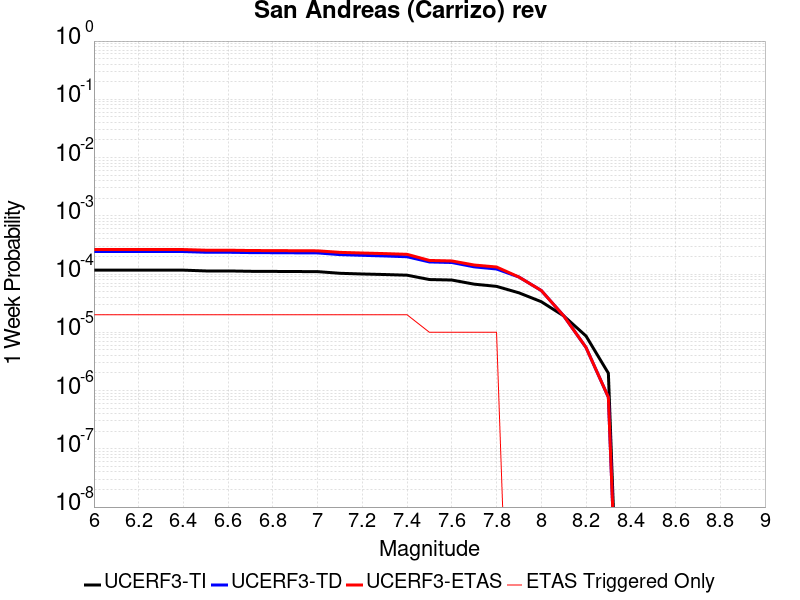 |  |  |  |

| Magnitude | 1 wk TI Prob | 1 wk TD Prob | 1 wk ETAS Prob | 1 wk ETAS/TD Gain | 1 wk ETAS Triggered Only | 1 mo TI Prob | 1 mo TD Prob | 1 mo ETAS Prob | 1 mo ETAS/TD Gain | 1 mo ETAS Triggered Only | 1 yr TI Prob | 1 yr TD Prob | 1 yr ETAS Prob | 1 yr ETAS/TD Gain | 1 yr ETAS Triggered Only | 10 yr TI Prob | 10 yr TD Prob | 10 yr ETAS Prob | 10 yr ETAS/TD Gain | 10 yr ETAS Triggered Only |
|-----|-----|-----|-----|-----|-----|-----|-----|-----|-----|-----|-----|-----|-----|-----|-----|-----|-----|-----|-----|-----|
| 6.0 | 1.1674632E-4 | 2.435176E-4 | 2.6351272E-4 | 1.0821096 | 2.0E-5 | 5.002454E-4 | 0.0010432311 | 0.0010731998 | 1.0287268 | 3.0E-5 | 0.006073493 | 0.012627853 | 0.012716717 | 1.007037 | 9.0E-5 | 0.0591016 | 0.12073501 | 0.120893285 | 1.0013108 | 1.8E-4 |
| 6.1 | 1.1674632E-4 | 2.435176E-4 | 2.6351272E-4 | 1.0821096 | 2.0E-5 | 5.002454E-4 | 0.0010432311 | 0.0010731998 | 1.0287268 | 3.0E-5 | 0.006073493 | 0.012627853 | 0.012716717 | 1.007037 | 9.0E-5 | 0.0591016 | 0.12073501 | 0.120893285 | 1.0013108 | 1.8E-4 |
| 6.2 | 1.1674632E-4 | 2.435176E-4 | 2.6351272E-4 | 1.0821096 | 2.0E-5 | 5.002454E-4 | 0.0010432311 | 0.0010731998 | 1.0287268 | 3.0E-5 | 0.006073493 | 0.012627853 | 0.012716717 | 1.007037 | 9.0E-5 | 0.0591016 | 0.12073501 | 0.120893285 | 1.0013108 | 1.8E-4 |
| 6.3 | 1.1674632E-4 | 2.435176E-4 | 2.6351272E-4 | 1.0821096 | 2.0E-5 | 5.002454E-4 | 0.0010432311 | 0.0010731998 | 1.0287268 | 3.0E-5 | 0.006073493 | 0.012627853 | 0.012716717 | 1.007037 | 9.0E-5 | 0.0591016 | 0.12073501 | 0.120893285 | 1.0013108 | 1.8E-4 |
| 6.4 | 1.1674632E-4 | 2.435176E-4 | 2.6351272E-4 | 1.0821096 | 2.0E-5 | 5.002454E-4 | 0.0010432311 | 0.0010731998 | 1.0287268 | 3.0E-5 | 0.006073493 | 0.012627853 | 0.012716717 | 1.007037 | 9.0E-5 | 0.0591016 | 0.12073501 | 0.120893285 | 1.0013108 | 1.8E-4 |
| 6.5 | 1.13136164E-4 | 2.3671643E-4 | 2.567117E-4 | 1.0844693 | 2.0E-5 | 4.847792E-4 | 0.0010141061 | 0.0010440757 | 1.0295527 | 3.0E-5 | 0.0058862255 | 0.012277294 | 0.012366189 | 1.0072407 | 9.0E-5 | 0.057327334 | 0.11770627 | 0.11786508 | 1.0013492 | 1.8E-4 |
| 6.6 | 1.13136164E-4 | 2.3671643E-4 | 2.567117E-4 | 1.0844693 | 2.0E-5 | 4.847792E-4 | 0.0010141061 | 0.0010440757 | 1.0295527 | 3.0E-5 | 0.0058862255 | 0.012277294 | 0.012366189 | 1.0072407 | 9.0E-5 | 0.057327334 | 0.11770627 | 0.11786508 | 1.0013492 | 1.8E-4 |
| 6.7 | 1.1149675E-4 | 2.3362806E-4 | 2.5362338E-4 | 1.0855862 | 2.0E-5 | 4.777557E-4 | 0.0010008804 | 0.0010308505 | 1.0299436 | 3.0E-5 | 0.0058011734 | 0.012118071 | 0.01220698 | 1.007337 | 9.0E-5 | 0.05652051 | 0.11632775 | 0.11648681 | 1.0013673 | 1.8E-4 |
| 6.8 | 1.1103589E-4 | 2.3264931E-4 | 2.5264465E-4 | 1.0859463 | 2.0E-5 | 4.7578133E-4 | 9.96689E-4 | 0.001026659 | 1.0300697 | 3.0E-5 | 0.005777263 | 0.012067606 | 0.01215652 | 1.007368 | 9.0E-5 | 0.056293584 | 0.11588798 | 0.116047114 | 1.0013732 | 1.8E-4 |
| 6.9 | 1.1053259E-4 | 2.3157275E-4 | 2.5156813E-4 | 1.0863459 | 2.0E-5 | 4.7362508E-4 | 9.920787E-4 | 0.0010220489 | 1.0302095 | 3.0E-5 | 0.0057511497 | 0.012012096 | 0.012101015 | 1.0074024 | 9.0E-5 | 0.05604569 | 0.115404084 | 0.11556331 | 1.0013797 | 1.8E-4 |
| 7.0 | 1.1005377E-4 | 2.3058082E-4 | 2.505762E-4 | 1.0867175 | 2.0E-5 | 4.7157376E-4 | 9.878307E-4 | 0.0010178011 | 1.0303396 | 3.0E-5 | 0.0057263062 | 0.011960947 | 0.012049871 | 1.0074345 | 9.0E-5 | 0.055809796 | 0.11495632 | 0.11511563 | 1.0013858 | 1.8E-4 |
| 7.1 | 1.0308142E-4 | 2.1567252E-4 | 2.3566821E-4 | 1.0927132 | 2.0E-5 | 4.417027E-4 | 9.2398445E-4 | 9.5395674E-4 | 1.032438 | 3.0E-5 | 0.0053644776 | 0.0111918 | 0.011280794 | 1.0079516 | 9.0E-5 | 0.052368138 | 0.108211435 | 0.10837196 | 1.0014834 | 1.8E-4 |
| 7.2 | 1.0027479E-4 | 2.0974928E-4 | 2.297451E-4 | 1.0953319 | 2.0E-5 | 4.296783E-4 | 8.9861685E-4 | 9.285899E-4 | 1.0333546 | 3.0E-5 | 0.0052187922 | 0.010886076 | 0.010975095 | 1.0081774 | 9.0E-5 | 0.050979212 | 0.105514884 | 0.10567589 | 1.0015259 | 1.8E-4 |
| 7.3 | 9.816942E-5 | 2.0449763E-4 | 2.2449355E-4 | 1.0977806 | 2.0E-5 | 4.2065824E-4 | 8.7612506E-4 | 9.0609875E-4 | 1.0342116 | 3.0E-5 | 0.005109493 | 0.010614938 | 0.010703983 | 1.0083886 | 9.0E-5 | 0.049935985 | 0.1030974 | 0.10325885 | 1.0015659 | 1.8E-4 |
| 7.4 | 9.5634205E-5 | 1.9818798E-4 | 2.1818401E-4 | 1.1008943 | 2.0E-5 | 4.0979648E-4 | 8.4910146E-4 | 8.7907596E-4 | 1.0353014 | 3.0E-5 | 0.0049778637 | 0.010289072 | 0.010378147 | 1.0086571 | 9.0E-5 | 0.048678253 | 0.10018211 | 0.10034407 | 1.0016167 | 1.8E-4 |
| 7.5 | 8.052417E-5 | 1.6136169E-4 | 1.7136008E-4 | 1.0619626 | 1.0E-5 | 3.4505792E-4 | 6.91367E-4 | 7.1135315E-4 | 1.0289083 | 2.0E-5 | 0.0041929903 | 0.008384988 | 0.008454401 | 1.0082783 | 7.0E-5 | 0.04114753 | 0.08291529 | 0.08304368 | 1.0015485 | 1.4E-4 |
| 7.6 | 7.897024E-5 | 1.5789122E-4 | 1.6788964E-4 | 1.0633247 | 1.0E-5 | 3.384E-4 | 6.7650137E-4 | 6.9648784E-4 | 1.0295439 | 2.0E-5 | 0.0041122385 | 0.008205376 | 0.008264883 | 1.0072523 | 6.0E-5 | 0.040369697 | 0.08125547 | 0.08137491 | 1.0014699 | 1.3E-4 |
| 7.7 | 6.707427E-5 | 1.3297053E-4 | 1.4296919E-4 | 1.0751946 | 1.0E-5 | 2.8742946E-4 | 5.697493E-4 | 5.797436E-4 | 1.0175415 | 1.0E-5 | 0.003493839 | 0.0069146673 | 0.00694446 | 1.0043086 | 3.0E-5 | 0.034394164 | 0.06914311 | 0.06921758 | 1.001077 | 8.0E-5 |
| 7.8 | 6.147705E-5 | 1.221643E-4 | 1.3216308E-4 | 1.081847 | 1.0E-5 | 2.6344648E-4 | 5.2345626E-4 | 5.3345104E-4 | 1.0190938 | 1.0E-5 | 0.0032027436 | 0.0063544824 | 0.0063842917 | 1.0046911 | 3.0E-5 | 0.031569764 | 0.06360102 | 0.0636572 | 1.0008833 | 6.0E-5 |
| 7.9 | 4.7636717E-5 | 8.893388E-5 | 8.893388E-5 | 1.0 | 0.0 | 2.0414138E-4 | 3.810895E-4 | 3.810895E-4 | 1.0 | 0.0 | 0.0024825884 | 0.004629902 | 0.004649809 | 1.0042998 | 2.0E-5 | 0.024550365 | 0.0466921 | 0.046739765 | 1.0010208 | 5.0E-5 |
| 8.0 | 3.3554235E-5 | 5.2220348E-5 | 5.2220348E-5 | 1.0 | 0.0 | 1.4379594E-4 | 2.237823E-4 | 2.237823E-4 | 1.0 | 0.0 | 0.0017493097 | 0.0027211471 | 0.00273112 | 1.003665 | 1.0E-5 | 0.017356034 | 0.02792196 | 0.027941402 | 1.0006963 | 2.0E-5 |
| 8.1 | 1.9175432E-5 | 1.9225194E-5 | 1.9225194E-5 | 1.0 | 0.0 | 8.217783E-5 | 8.239109E-5 | 8.239109E-5 | 1.0 | 0.0 | 0.0010000558 | 0.0010026505 | 0.0010126405 | 1.0099635 | 1.0E-5 | 0.009955673 | 0.010779119 | 0.010798903 | 1.0018355 | 2.0E-5 |
| 8.2 | 8.643924E-6 | 5.4901475E-6 | 5.4901475E-6 | 1.0 | 0.0 | 3.704486E-5 | 2.3528992E-5 | 2.3528992E-5 | 1.0 | 0.0 | 4.5092785E-4 | 2.8642788E-4 | 2.9642502E-4 | 1.0349028 | 1.0E-5 | 0.0045001395 | 0.0032570646 | 0.003267032 | 1.0030602 | 1.0E-5 |
| 8.3 | 1.983087E-6 | 7.6850927E-7 | 7.6850927E-7 | 1.0 | 0.0 | 8.498917E-6 | 3.293607E-6 | 3.293607E-6 | 1.0 | 0.0 | 1.034694E-4 | 4.0098945E-5 | 4.0098945E-5 | 1.0 | 0.0 | 0.0010342124 | 4.7341356E-4 | 4.7341356E-4 | 1.0 | 0.0 |

## Elsinore (Glen Ivy) rev
*[(top)](#table-of-contents)*

| 1 Week | 1 Month | 1 Year | 10 Year |
|-----|-----|-----|-----|
| 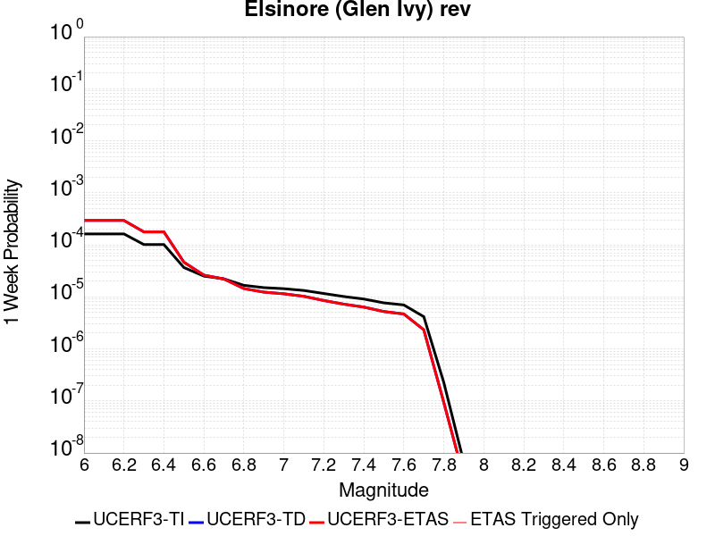 |  | 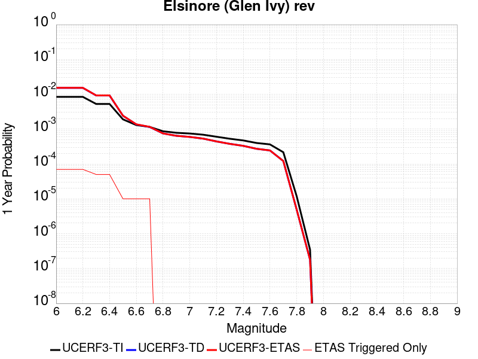 |  |

| Magnitude | 1 wk TI Prob | 1 wk TD Prob | 1 wk ETAS Prob | 1 wk ETAS/TD Gain | 1 wk ETAS Triggered Only | 1 mo TI Prob | 1 mo TD Prob | 1 mo ETAS Prob | 1 mo ETAS/TD Gain | 1 mo ETAS Triggered Only | 1 yr TI Prob | 1 yr TD Prob | 1 yr ETAS Prob | 1 yr ETAS/TD Gain | 1 yr ETAS Triggered Only | 10 yr TI Prob | 10 yr TD Prob | 10 yr ETAS Prob | 10 yr ETAS/TD Gain | 10 yr ETAS Triggered Only |
|-----|-----|-----|-----|-----|-----|-----|-----|-----|-----|-----|-----|-----|-----|-----|-----|-----|-----|-----|-----|-----|
| 6.0 | 1.6204086E-4 | 2.9364627E-4 | 2.9364627E-4 | 1.0 | 0.0 | 6.94276E-4 | 0.0012580318 | 0.0012680192 | 1.007939 | 1.0E-5 | 0.008420097 | 0.015236506 | 0.01530544 | 1.0045242 | 7.0E-5 | 0.081081145 | 0.13970193 | 0.13983098 | 1.0009238 | 1.5E-4 |
| 6.1 | 1.6204086E-4 | 2.9364627E-4 | 2.9364627E-4 | 1.0 | 0.0 | 6.94276E-4 | 0.0012580318 | 0.0012680192 | 1.007939 | 1.0E-5 | 0.008420097 | 0.015236506 | 0.01530544 | 1.0045242 | 7.0E-5 | 0.081081145 | 0.13970193 | 0.13983098 | 1.0009238 | 1.5E-4 |
| 6.2 | 1.6204086E-4 | 2.9364627E-4 | 2.9364627E-4 | 1.0 | 0.0 | 6.94276E-4 | 0.0012580318 | 0.0012680192 | 1.007939 | 1.0E-5 | 0.008420097 | 0.015236506 | 0.01530544 | 1.0045242 | 7.0E-5 | 0.081081145 | 0.13970193 | 0.13983098 | 1.0009238 | 1.5E-4 |
| 6.3 | 1.0111737E-4 | 1.7704519E-4 | 1.7704519E-4 | 1.0 | 0.0 | 4.332882E-4 | 7.586612E-4 | 7.686536E-4 | 1.0131711 | 1.0E-5 | 0.005262531 | 0.009218273 | 0.009267812 | 1.005374 | 5.0E-5 | 0.0513964 | 0.08702417 | 0.087097205 | 1.0008392 | 8.0E-5 |
| 6.4 | 1.0111737E-4 | 1.7704519E-4 | 1.7704519E-4 | 1.0 | 0.0 | 4.332882E-4 | 7.586612E-4 | 7.686536E-4 | 1.0131711 | 1.0E-5 | 0.005262531 | 0.009218273 | 0.009267812 | 1.005374 | 5.0E-5 | 0.0513964 | 0.08702417 | 0.087097205 | 1.0008392 | 8.0E-5 |
| 6.5 | 3.6624708E-5 | 4.639663E-5 | 4.639663E-5 | 1.0 | 0.0 | 1.569536E-4 | 1.988296E-4 | 1.988296E-4 | 1.0 | 0.0 | 0.001909235 | 0.0024184259 | 0.0024284017 | 1.0041249 | 1.0E-5 | 0.01892915 | 0.023742711 | 0.023762237 | 1.0008223 | 2.0E-5 |
| 6.6 | 2.5051324E-5 | 2.6151572E-5 | 2.6151572E-5 | 1.0 | 0.0 | 1.073584E-4 | 1.12073605E-4 | 1.12073605E-4 | 1.0 | 0.0 | 0.0013063047 | 0.0013636866 | 0.001373673 | 1.007323 | 1.0E-5 | 0.012986525 | 0.013566589 | 0.013586317 | 1.0014542 | 2.0E-5 |
| 6.7 | 2.2189772E-5 | 2.2076161E-5 | 2.2076161E-5 | 1.0 | 0.0 | 9.509556E-5 | 9.46089E-5 | 9.46089E-5 | 1.0 | 0.0 | 0.0011571734 | 0.0011512911 | 0.0011612795 | 1.0086759 | 1.0E-5 | 0.011511663 | 0.011467117 | 0.011486888 | 1.0017241 | 2.0E-5 |
| 6.8 | 1.6654378E-5 | 1.44396945E-5 | 1.44396945E-5 | 1.0 | 0.0 | 7.137396E-5 | 6.1882965E-5 | 6.1882965E-5 | 1.0 | 0.0 | 8.686314E-4 | 7.531698E-4 | 7.531698E-4 | 1.0 | 0.0 | 0.008652439 | 0.007511509 | 0.007511509 | 1.0 | 0.0 |
| 6.9 | 1.5042909E-5 | 1.2333749E-5 | 1.2333749E-5 | 1.0 | 0.0 | 6.446802E-5 | 5.2857868E-5 | 5.2857868E-5 | 1.0 | 0.0 | 7.8461546E-4 | 6.433577E-4 | 6.433577E-4 | 1.0 | 0.0 | 0.007818509 | 0.0064191744 | 0.0064191744 | 1.0 | 0.0 |
| 7.0 | 1.4361385E-5 | 1.1452951E-5 | 1.1452951E-5 | 1.0 | 0.0 | 6.154734E-5 | 4.908317E-5 | 4.908317E-5 | 1.0 | 0.0 | 7.490812E-4 | 5.9742667E-4 | 5.9742667E-4 | 1.0 | 0.0 | 0.007465612 | 0.0059621967 | 0.0059621967 | 1.0 | 0.0 |
| 7.1 | 1.3265571E-5 | 1.0246298E-5 | 1.0246298E-5 | 1.0 | 0.0 | 5.6851208E-5 | 4.3911983E-5 | 4.3911983E-5 | 1.0 | 0.0 | 6.919436E-4 | 5.3449976E-4 | 5.3449976E-4 | 1.0 | 0.0 | 0.006897931 | 0.0053354986 | 0.0053354986 | 1.0 | 0.0 |
| 7.2 | 1.1596403E-5 | 8.506182E-6 | 8.506182E-6 | 1.0 | 0.0 | 4.9697923E-5 | 3.6454567E-5 | 3.6454567E-5 | 1.0 | 0.0 | 6.049042E-4 | 4.4374567E-4 | 4.4374567E-4 | 1.0 | 0.0 | 0.006032603 | 0.004430011 | 0.004430011 | 1.0 | 0.0 |
| 7.3 | 1.0150827E-5 | 7.2396847E-6 | 7.2396847E-6 | 1.0 | 0.0 | 4.3502816E-5 | 3.102686E-5 | 3.102686E-5 | 1.0 | 0.0 | 5.2951806E-4 | 3.7768797E-4 | 3.7768797E-4 | 1.0 | 0.0 | 0.005282581 | 0.0037708473 | 0.0037708473 | 1.0 | 0.0 |
| 7.4 | 9.080705E-6 | 6.353312E-6 | 6.353312E-6 | 1.0 | 0.0 | 3.8916725E-5 | 2.7228205E-5 | 2.7228205E-5 | 1.0 | 0.0 | 4.7370812E-4 | 3.3145433E-4 | 3.3145433E-4 | 1.0 | 0.0 | 0.004726996 | 0.0033097507 | 0.0033097507 | 1.0 | 0.0 |
| 7.5 | 7.671649E-6 | 5.226278E-6 | 5.226278E-6 | 1.0 | 0.0 | 3.287808E-5 | 2.239815E-5 | 2.239815E-5 | 1.0 | 0.0 | 4.0021708E-4 | 2.726646E-4 | 2.726646E-4 | 1.0 | 0.0 | 0.0039949706 | 0.0027234256 | 0.0027234256 | 1.0 | 0.0 |
| 7.6 | 6.990086E-6 | 4.6881228E-6 | 4.6881228E-6 | 1.0 | 0.0 | 2.9957167E-5 | 2.0091806E-5 | 2.0091806E-5 | 1.0 | 0.0 | 3.6466747E-4 | 2.4459144E-4 | 2.4459144E-4 | 1.0 | 0.0 | 0.0036406964 | 0.0024433387 | 0.0024433387 | 1.0 | 0.0 |
| 7.7 | 4.163505E-6 | 2.3298742E-6 | 2.3298742E-6 | 1.0 | 0.0 | 1.7843471E-5 | 9.98514E-6 | 9.98514E-6 | 1.0 | 0.0 | 2.172226E-4 | 1.2156305E-4 | 1.2156305E-4 | 1.0 | 0.0 | 0.0021701038 | 0.0012150386 | 0.0012150386 | 1.0 | 0.0 |
| 7.8 | 2.2692414E-7 | 9.386889E-8 | 9.386889E-8 | 1.0 | 0.0 | 9.725317E-7 | 4.022952E-7 | 4.022952E-7 | 1.0 | 0.0 | 1.1840509E-5 | 4.8979364E-6 | 4.8979364E-6 | 1.0 | 0.0 | 1.1839878E-4 | 4.8978614E-5 | 4.8978614E-5 | 1.0 | 0.0 |
| 7.9 | 6.676829E-9 | 3.4402254E-9 | 3.4402254E-9 | 1.0 | 0.0 | 2.861498E-8 | 1.4743824E-8 | 1.4743824E-8 | 1.0 | 0.0 | 3.4838732E-7 | 1.7950605E-7 | 1.7950605E-7 | 1.0 | 0.0 | 3.4838679E-6 | 1.7950591E-6 | 1.7950591E-6 | 1.0 | 0.0 |

## San Andreas (Cholame) rev
*[(top)](#table-of-contents)*

| 1 Week | 1 Month | 1 Year | 10 Year |
|-----|-----|-----|-----|
|  |  |  |  |

| Magnitude | 1 wk TI Prob | 1 wk TD Prob | 1 wk ETAS Prob | 1 wk ETAS/TD Gain | 1 wk ETAS Triggered Only | 1 mo TI Prob | 1 mo TD Prob | 1 mo ETAS Prob | 1 mo ETAS/TD Gain | 1 mo ETAS Triggered Only | 1 yr TI Prob | 1 yr TD Prob | 1 yr ETAS Prob | 1 yr ETAS/TD Gain | 1 yr ETAS Triggered Only | 10 yr TI Prob | 10 yr TD Prob | 10 yr ETAS Prob | 10 yr ETAS/TD Gain | 10 yr ETAS Triggered Only |
|-----|-----|-----|-----|-----|-----|-----|-----|-----|-----|-----|-----|-----|-----|-----|-----|-----|-----|-----|-----|-----|
| 6.0 | 1.2302514E-4 | 2.5233312E-4 | 2.7232806E-4 | 1.0792403 | 2.0E-5 | 5.27144E-4 | 0.0010809811 | 0.0011109486 | 1.0277226 | 3.0E-5 | 0.0063991086 | 0.013082034 | 0.013170856 | 1.0067897 | 9.0E-5 | 0.06217949 | 0.12451157 | 0.12466916 | 1.0012656 | 1.8E-4 |
| 6.1 | 1.2302514E-4 | 2.5233312E-4 | 2.7232806E-4 | 1.0792403 | 2.0E-5 | 5.27144E-4 | 0.0010809811 | 0.0011109486 | 1.0277226 | 3.0E-5 | 0.0063991086 | 0.013082034 | 0.013170856 | 1.0067897 | 9.0E-5 | 0.06217949 | 0.12451157 | 0.12466916 | 1.0012656 | 1.8E-4 |
| 6.2 | 1.2203569E-4 | 2.505007E-4 | 2.7049572E-4 | 1.07982 | 2.0E-5 | 5.2290526E-4 | 0.0010731344 | 0.0011031022 | 1.0279255 | 3.0E-5 | 0.006347804 | 0.012987643 | 0.013076474 | 1.0068396 | 9.0E-5 | 0.061695136 | 0.12369772 | 0.12385545 | 1.0012752 | 1.8E-4 |
| 6.3 | 1.2142645E-4 | 2.4936022E-4 | 2.6935522E-4 | 1.0801853 | 2.0E-5 | 5.202953E-4 | 0.0010682505 | 0.0010982185 | 1.0280533 | 3.0E-5 | 0.006316212 | 0.012928889 | 0.013017726 | 1.0068711 | 9.0E-5 | 0.06139677 | 0.12319182 | 0.123349644 | 1.0012811 | 1.8E-4 |
| 6.4 | 1.1865206E-4 | 2.4441382E-4 | 2.6440894E-4 | 1.0818084 | 2.0E-5 | 5.0840975E-4 | 0.001047069 | 0.0010770375 | 1.0286214 | 3.0E-5 | 0.006172335 | 0.012674028 | 0.012762887 | 1.0070112 | 9.0E-5 | 0.060036868 | 0.12098421 | 0.12114243 | 1.0013078 | 1.8E-4 |
| 6.5 | 1.17443946E-4 | 2.4234578E-4 | 2.6234094E-4 | 1.0825067 | 2.0E-5 | 5.032341E-4 | 0.0010382129 | 0.0010681818 | 1.0288658 | 3.0E-5 | 0.006109677 | 0.012567452 | 0.012656322 | 1.0070714 | 9.0E-5 | 0.059444077 | 0.12005809 | 0.12021648 | 1.0013193 | 1.8E-4 |
| 6.6 | 1.13579066E-4 | 2.3543261E-4 | 2.554279E-4 | 1.08493 | 2.0E-5 | 4.866766E-4 | 0.0010086083 | 0.001038578 | 1.029714 | 3.0E-5 | 0.0059092017 | 0.012211109 | 0.01230001 | 1.0072803 | 9.0E-5 | 0.057545185 | 0.11697129 | 0.117130235 | 1.0013589 | 1.8E-4 |
| 6.7 | 1.1271412E-4 | 2.3387506E-4 | 2.5387038E-4 | 1.0854957 | 2.0E-5 | 4.829711E-4 | 0.0010019382 | 0.0010319082 | 1.029912 | 3.0E-5 | 0.005864331 | 0.012130808 | 0.012219717 | 1.0073291 | 9.0E-5 | 0.057119697 | 0.11627469 | 0.11643376 | 1.001368 | 1.8E-4 |
| 6.8 | 1.1217975E-4 | 2.3275864E-4 | 2.52754E-4 | 1.0859059 | 2.0E-5 | 4.8068175E-4 | 9.971572E-4 | 0.0010271273 | 1.0300555 | 3.0E-5 | 0.005836608 | 0.012073246 | 0.012162159 | 1.0073645 | 9.0E-5 | 0.056856725 | 0.11577275 | 0.115931906 | 1.0013747 | 1.8E-4 |
| 6.9 | 1.1146753E-4 | 2.3124537E-4 | 2.5124077E-4 | 1.0864682 | 2.0E-5 | 4.7763053E-4 | 9.906767E-4 | 0.001020647 | 1.0302523 | 3.0E-5 | 0.0057996577 | 0.011995218 | 0.012084139 | 1.007413 | 9.0E-5 | 0.056506127 | 0.11509296 | 0.11525225 | 1.0013839 | 1.8E-4 |
| 7.0 | 1.0965793E-4 | 2.2747654E-4 | 2.47472E-4 | 1.0879011 | 2.0E-5 | 4.698779E-4 | 9.7453676E-4 | 0.0010045075 | 1.0307539 | 3.0E-5 | 0.005705768 | 0.011800859 | 0.011889797 | 1.0075365 | 9.0E-5 | 0.055614736 | 0.11339389 | 0.11355347 | 1.0014074 | 1.8E-4 |
| 7.1 | 9.927982E-5 | 2.0565727E-4 | 2.2565316E-4 | 1.0972291 | 2.0E-5 | 4.2541555E-4 | 8.810916E-4 | 9.1106514E-4 | 1.0340186 | 3.0E-5 | 0.0051671406 | 0.010674821 | 0.01076386 | 1.0083411 | 9.0E-5 | 0.05048634 | 0.10348569 | 0.10362913 | 1.0013862 | 1.6E-4 |
| 7.2 | 9.696786E-5 | 2.0069796E-4 | 2.2069394E-4 | 1.0996323 | 2.0E-5 | 4.1551032E-4 | 8.5985154E-4 | 8.8982575E-4 | 1.0348598 | 3.0E-5 | 0.00504711 | 0.010418724 | 0.010507787 | 1.0085483 | 9.0E-5 | 0.04934009 | 0.10122319 | 0.101367 | 1.0014206 | 1.6E-4 |
| 7.3 | 9.4727984E-5 | 1.9498657E-4 | 2.1498268E-4 | 1.1025512 | 2.0E-5 | 4.0591392E-4 | 8.353901E-4 | 8.6536503E-4 | 1.0358814 | 3.0E-5 | 0.0049308087 | 0.010123712 | 0.010212801 | 1.0088 | 9.0E-5 | 0.048228268 | 0.09859277 | 0.098736994 | 1.0014628 | 1.6E-4 |
| 7.4 | 9.220358E-5 | 1.8868766E-4 | 2.0868388E-4 | 1.1059753 | 2.0E-5 | 3.9509835E-4 | 8.084117E-4 | 8.383874E-4 | 1.0370798 | 3.0E-5 | 0.004799717 | 0.009798243 | 0.009887361 | 1.0090953 | 9.0E-5 | 0.046973653 | 0.095669106 | 0.0958138 | 1.0015124 | 1.6E-4 |
| 7.5 | 7.71631E-5 | 1.5200424E-4 | 1.6200272E-4 | 1.0657777 | 1.0E-5 | 3.306571E-4 | 6.512843E-4 | 6.7127123E-4 | 1.0306885 | 2.0E-5 | 0.0040183207 | 0.007900629 | 0.007970076 | 1.00879 | 7.0E-5 | 0.03946433 | 0.078385815 | 0.078496404 | 1.0014108 | 1.2E-4 |
| 7.6 | 7.5634416E-5 | 1.4859608E-4 | 1.5859459E-4 | 1.0672865 | 1.0E-5 | 3.241072E-4 | 6.3668506E-4 | 6.5667235E-4 | 1.0313927 | 2.0E-5 | 0.0039388672 | 0.007724157 | 0.0077836937 | 1.0077078 | 6.0E-5 | 0.038697794 | 0.07674819 | 0.07684974 | 1.0013232 | 1.1E-4 |
| 7.7 | 6.3783E-5 | 1.2378578E-4 | 1.3378453E-4 | 1.0807748 | 1.0E-5 | 2.7332708E-4 | 5.3040264E-4 | 5.4039736E-4 | 1.0188437 | 1.0E-5 | 0.0033226798 | 0.0064385585 | 0.006468365 | 1.0046294 | 3.0E-5 | 0.032734364 | 0.06463097 | 0.06468709 | 1.0008683 | 6.0E-5 |
| 7.8 | 5.863422E-5 | 1.1434147E-4 | 1.2434032E-4 | 1.0874473 | 1.0E-5 | 2.512653E-4 | 4.8994285E-4 | 4.99938E-4 | 1.0204005 | 1.0E-5 | 0.003054864 | 0.0059487605 | 0.005978582 | 1.0050131 | 3.0E-5 | 0.030132094 | 0.059741944 | 0.059788957 | 1.0007869 | 5.0E-5 |
| 7.9 | 4.595283E-5 | 8.4394705E-5 | 8.4394705E-5 | 1.0 | 0.0 | 1.9692584E-4 | 3.6164146E-4 | 3.6164146E-4 | 1.0 | 0.0 | 0.0023949358 | 0.0043941024 | 0.0044140145 | 1.0045315 | 2.0E-5 | 0.023692891 | 0.044423994 | 0.04446222 | 1.0008605 | 4.0E-5 |
| 8.0 | 3.2950178E-5 | 5.08548E-5 | 5.08548E-5 | 1.0 | 0.0 | 1.412074E-4 | 2.1793095E-4 | 2.1793095E-4 | 1.0 | 0.0 | 0.0017178444 | 0.0026500826 | 0.002660056 | 1.0037634 | 1.0E-5 | 0.017046256 | 0.027220428 | 0.027239883 | 1.0007148 | 2.0E-5 |
| 8.1 | 1.9177472E-5 | 1.9225365E-5 | 1.9225365E-5 | 1.0 | 0.0 | 8.218658E-5 | 8.239182E-5 | 8.239182E-5 | 1.0 | 0.0 | 0.0010001622 | 0.0010026594 | 0.0010126494 | 1.0099635 | 1.0E-5 | 0.009956728 | 0.0107792355 | 0.01079902 | 1.0018355 | 2.0E-5 |
| 8.2 | 8.643924E-6 | 5.4901475E-6 | 5.4901475E-6 | 1.0 | 0.0 | 3.704486E-5 | 2.3528992E-5 | 2.3528992E-5 | 1.0 | 0.0 | 4.5092785E-4 | 2.8642788E-4 | 2.9642502E-4 | 1.0349028 | 1.0E-5 | 0.0045001395 | 0.0032570646 | 0.003267032 | 1.0030602 | 1.0E-5 |
| 8.3 | 1.983087E-6 | 7.6850927E-7 | 7.6850927E-7 | 1.0 | 0.0 | 8.498917E-6 | 3.293607E-6 | 3.293607E-6 | 1.0 | 0.0 | 1.034694E-4 | 4.0098945E-5 | 4.0098945E-5 | 1.0 | 0.0 | 0.0010342124 | 4.7341356E-4 | 4.7341356E-4 | 1.0 | 0.0 |

## Calico-Hidalgo
*[(top)](#table-of-contents)*

| 1 Week | 1 Month | 1 Year | 10 Year |
|-----|-----|-----|-----|
| 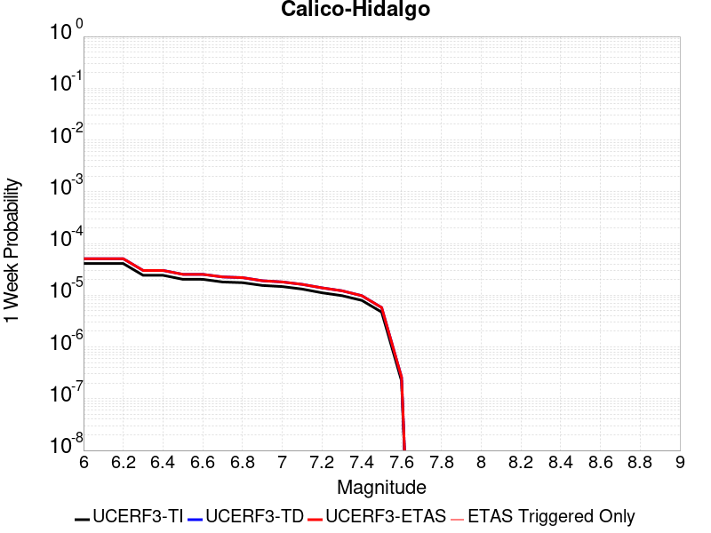 | 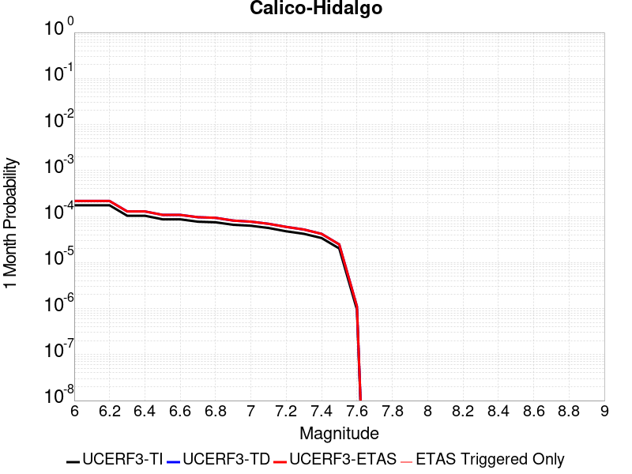 |  | 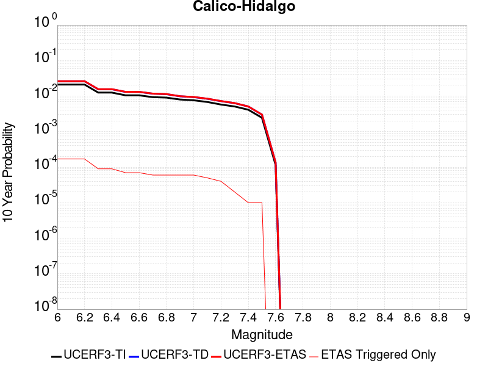 |

| Magnitude | 1 wk TI Prob | 1 wk TD Prob | 1 wk ETAS Prob | 1 wk ETAS/TD Gain | 1 wk ETAS Triggered Only | 1 mo TI Prob | 1 mo TD Prob | 1 mo ETAS Prob | 1 mo ETAS/TD Gain | 1 mo ETAS Triggered Only | 1 yr TI Prob | 1 yr TD Prob | 1 yr ETAS Prob | 1 yr ETAS/TD Gain | 1 yr ETAS Triggered Only | 10 yr TI Prob | 10 yr TD Prob | 10 yr ETAS Prob | 10 yr ETAS/TD Gain | 10 yr ETAS Triggered Only |
|-----|-----|-----|-----|-----|-----|-----|-----|-----|-----|-----|-----|-----|-----|-----|-----|-----|-----|-----|-----|-----|
| 6.0 | 4.0906612E-5 | 5.070658E-5 | 5.070658E-5 | 1.0 | 0.0 | 1.7530227E-4 | 2.172981E-4 | 2.172981E-4 | 1.0 | 0.0 | 0.0021322158 | 0.0026427985 | 0.0027225872 | 1.030191 | 8.0E-5 | 0.02111873 | 0.026154077 | 0.02631963 | 1.0063299 | 1.7E-4 |
| 6.1 | 4.0906612E-5 | 5.070658E-5 | 5.070658E-5 | 1.0 | 0.0 | 1.7530227E-4 | 2.172981E-4 | 2.172981E-4 | 1.0 | 0.0 | 0.0021322158 | 0.0026427985 | 0.0027225872 | 1.030191 | 8.0E-5 | 0.02111873 | 0.026154077 | 0.02631963 | 1.0063299 | 1.7E-4 |
| 6.2 | 4.0906612E-5 | 5.070658E-5 | 5.070658E-5 | 1.0 | 0.0 | 1.7530227E-4 | 2.172981E-4 | 2.172981E-4 | 1.0 | 0.0 | 0.0021322158 | 0.0026427985 | 0.0027225872 | 1.030191 | 8.0E-5 | 0.02111873 | 0.026154077 | 0.02631963 | 1.0063299 | 1.7E-4 |
| 6.3 | 2.4242801E-5 | 3.0091758E-5 | 3.0091758E-5 | 1.0 | 0.0 | 1.0389358E-4 | 1.2895849E-4 | 1.2895849E-4 | 1.0 | 0.0 | 0.0012641704 | 0.0015689717 | 0.0016089089 | 1.0254544 | 4.0E-5 | 0.01257003 | 0.015582619 | 0.015671218 | 1.0056857 | 9.0E-5 |
| 6.4 | 2.4242801E-5 | 3.0091758E-5 | 3.0091758E-5 | 1.0 | 0.0 | 1.0389358E-4 | 1.2895849E-4 | 1.2895849E-4 | 1.0 | 0.0 | 0.0012641704 | 0.0015689717 | 0.0016089089 | 1.0254544 | 4.0E-5 | 0.01257003 | 0.015582619 | 0.015671218 | 1.0056857 | 9.0E-5 |
| 6.5 | 2.0286952E-5 | 2.531648E-5 | 2.531648E-5 | 1.0 | 0.0 | 8.694118E-5 | 1.0849478E-4 | 1.0849478E-4 | 1.0 | 0.0 | 0.0010579949 | 0.0013201407 | 0.0013501011 | 1.0226948 | 3.0E-5 | 0.010529719 | 0.0131249195 | 0.013194001 | 1.0052633 | 7.0E-5 |
| 6.6 | 2.0269223E-5 | 2.5297428E-5 | 2.5297428E-5 | 1.0 | 0.0 | 8.6865206E-5 | 1.0841314E-4 | 1.0841314E-4 | 1.0 | 0.0 | 0.0010570707 | 0.0013191479 | 0.0013491083 | 1.022712 | 3.0E-5 | 0.010520565 | 0.013115109 | 0.013184192 | 1.0052674 | 7.0E-5 |
| 6.7 | 1.799852E-5 | 2.25412E-5 | 2.25412E-5 | 1.0 | 0.0 | 7.713423E-5 | 9.660165E-5 | 9.660165E-5 | 1.0 | 0.0 | 9.3870464E-4 | 0.0011755051 | 0.0011954816 | 1.016994 | 2.0E-5 | 0.009347493 | 0.011694483 | 0.011753782 | 1.0050706 | 6.0E-5 |
| 6.8 | 1.7458793E-5 | 2.18427E-5 | 2.18427E-5 | 1.0 | 0.0 | 7.4821255E-5 | 9.360829E-5 | 9.360829E-5 | 1.0 | 0.0 | 9.10568E-4 | 0.0011390996 | 0.0011590768 | 1.0175377 | 2.0E-5 | 0.009068459 | 0.011334192 | 0.011393512 | 1.0052338 | 6.0E-5 |
| 6.9 | 1.542884E-5 | 1.9026407E-5 | 1.9026407E-5 | 1.0 | 0.0 | 6.612192E-5 | 8.153927E-5 | 8.153927E-5 | 1.0 | 0.0 | 8.04737E-4 | 9.923016E-4 | 0.0010122817 | 1.0201352 | 2.0E-5 | 0.008018291 | 0.009880106 | 0.009939513 | 1.0060128 | 6.0E-5 |
| 7.0 | 1.468253E-5 | 1.8031044E-5 | 1.8031044E-5 | 1.0 | 0.0 | 6.292361E-5 | 7.727368E-5 | 7.727368E-5 | 1.0 | 0.0 | 7.658257E-4 | 9.4041403E-4 | 9.603952E-4 | 1.0212473 | 2.0E-5 | 0.0076319184 | 0.00936571 | 0.009425149 | 1.0063463 | 6.0E-5 |
| 7.1 | 1.3139281E-5 | 1.6201324E-5 | 1.6201324E-5 | 1.0 | 0.0 | 5.6309986E-5 | 6.943246E-5 | 6.943246E-5 | 1.0 | 0.0 | 6.853584E-4 | 8.45025E-4 | 8.650081E-4 | 1.0236479 | 2.0E-5 | 0.0068324856 | 0.008419416 | 0.008468995 | 1.0058887 | 5.0E-5 |
| 7.2 | 1.1127404E-5 | 1.3866914E-5 | 1.3866914E-5 | 1.0 | 0.0 | 4.7688E-5 | 5.9428337E-5 | 5.9428337E-5 | 1.0 | 0.0 | 5.8044674E-4 | 7.2331075E-4 | 7.4329623E-4 | 1.0276307 | 2.0E-5 | 0.0057893298 | 0.0072106724 | 0.007250384 | 1.0055073 | 4.0E-5 |
| 7.3 | 9.808154E-6 | 1.2176473E-5 | 1.2176473E-5 | 1.0 | 0.0 | 4.2034266E-5 | 5.2183903E-5 | 5.2183903E-5 | 1.0 | 0.0 | 5.11647E-4 | 6.351645E-4 | 6.451582E-4 | 1.015734 | 1.0E-5 | 0.0051047057 | 0.006334567 | 0.0063544405 | 1.0031372 | 2.0E-5 |
| 7.4 | 7.942452E-6 | 9.792337E-6 | 9.792337E-6 | 1.0 | 0.0 | 3.4038632E-5 | 4.1966534E-5 | 4.1966534E-5 | 1.0 | 0.0 | 4.1434157E-4 | 5.1083224E-4 | 5.1083224E-4 | 1.0 | 0.0 | 0.0041356985 | 0.005097521 | 0.0051074703 | 1.0019517 | 1.0E-5 |
| 7.5 | 4.7121216E-6 | 5.7729408E-6 | 5.7729408E-6 | 1.0 | 0.0 | 2.019465E-5 | 2.4740984E-5 | 2.4740984E-5 | 1.0 | 0.0 | 2.4584212E-4 | 3.011875E-4 | 3.011875E-4 | 1.0 | 0.0 | 0.0024557032 | 0.0030085456 | 0.0030185154 | 1.0033139 | 1.0E-5 |
| 7.6 | 2.21172E-7 | 2.6039996E-7 | 2.6039996E-7 | 1.0 | 0.0 | 9.478797E-7 | 1.1159995E-6 | 1.1159995E-6 | 1.0 | 0.0 | 1.1540374E-5 | 1.3587238E-5 | 1.3587238E-5 | 1.0 | 0.0 | 1.1539775E-4 | 1.3586688E-4 | 1.3586688E-4 | 1.0 | 0.0 |

## San Andreas (San Gorgonio Pass-Garnet HIll)
*[(top)](#table-of-contents)*

| 1 Week | 1 Month | 1 Year | 10 Year |
|-----|-----|-----|-----|
| 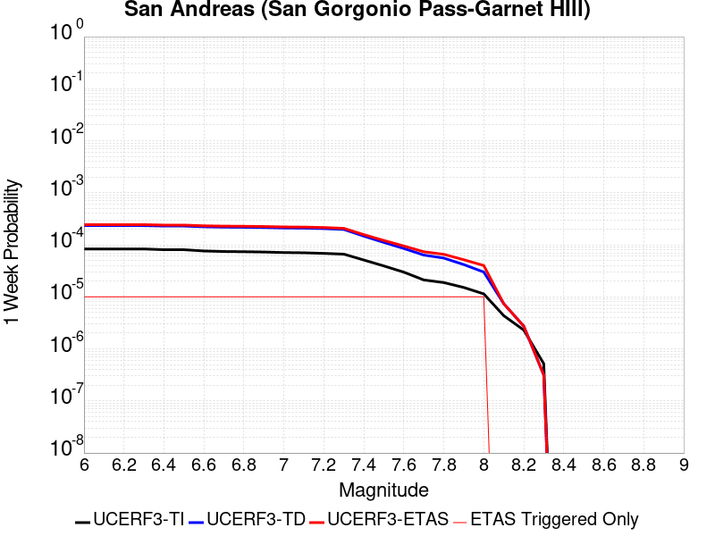 |  |  | 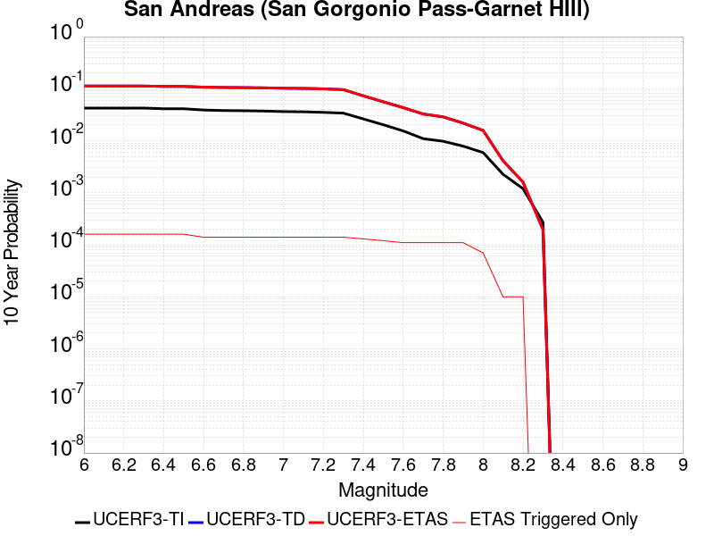 |

| Magnitude | 1 wk TI Prob | 1 wk TD Prob | 1 wk ETAS Prob | 1 wk ETAS/TD Gain | 1 wk ETAS Triggered Only | 1 mo TI Prob | 1 mo TD Prob | 1 mo ETAS Prob | 1 mo ETAS/TD Gain | 1 mo ETAS Triggered Only | 1 yr TI Prob | 1 yr TD Prob | 1 yr ETAS Prob | 1 yr ETAS/TD Gain | 1 yr ETAS Triggered Only | 10 yr TI Prob | 10 yr TD Prob | 10 yr ETAS Prob | 10 yr ETAS/TD Gain | 10 yr ETAS Triggered Only |
|-----|-----|-----|-----|-----|-----|-----|-----|-----|-----|-----|-----|-----|-----|-----|-----|-----|-----|-----|-----|-----|
| 6.0 | 8.31567E-5 | 2.3394417E-4 | 2.4394183E-4 | 1.0427352 | 1.0E-5 | 3.5633717E-4 | 0.0010022352 | 0.0010122252 | 1.0099677 | 1.0E-5 | 0.004329778 | 0.012133991 | 0.012232778 | 1.0081413 | 1.0E-4 | 0.042463828 | 0.11262734 | 0.11276932 | 1.0012606 | 1.6E-4 |
| 6.1 | 8.31567E-5 | 2.3394417E-4 | 2.4394183E-4 | 1.0427352 | 1.0E-5 | 3.5633717E-4 | 0.0010022352 | 0.0010122252 | 1.0099677 | 1.0E-5 | 0.004329778 | 0.012133991 | 0.012232778 | 1.0081413 | 1.0E-4 | 0.042463828 | 0.11262734 | 0.11276932 | 1.0012606 | 1.6E-4 |
| 6.2 | 8.31567E-5 | 2.3394417E-4 | 2.4394183E-4 | 1.0427352 | 1.0E-5 | 3.5633717E-4 | 0.0010022352 | 0.0010122252 | 1.0099677 | 1.0E-5 | 0.004329778 | 0.012133991 | 0.012232778 | 1.0081413 | 1.0E-4 | 0.042463828 | 0.11262734 | 0.11276932 | 1.0012606 | 1.6E-4 |
| 6.3 | 8.31567E-5 | 2.3394417E-4 | 2.4394183E-4 | 1.0427352 | 1.0E-5 | 3.5633717E-4 | 0.0010022352 | 0.0010122252 | 1.0099677 | 1.0E-5 | 0.004329778 | 0.012133991 | 0.012232778 | 1.0081413 | 1.0E-4 | 0.042463828 | 0.11262734 | 0.11276932 | 1.0012606 | 1.6E-4 |
| 6.4 | 8.059055E-5 | 2.2952615E-4 | 2.3952386E-4 | 1.043558 | 1.0E-5 | 3.4534236E-4 | 9.833152E-4 | 9.933054E-4 | 1.0101597 | 1.0E-5 | 0.0041964394 | 0.01190618 | 0.012004988 | 1.008299 | 1.0E-4 | 0.041180745 | 0.11060836 | 0.11075067 | 1.0012865 | 1.6E-4 |
| 6.5 | 8.059055E-5 | 2.2952615E-4 | 2.3952386E-4 | 1.043558 | 1.0E-5 | 3.4534236E-4 | 9.833152E-4 | 9.933054E-4 | 1.0101597 | 1.0E-5 | 0.0041964394 | 0.01190618 | 0.012004988 | 1.008299 | 1.0E-4 | 0.041180745 | 0.11060836 | 0.11075067 | 1.0012865 | 1.6E-4 |
| 6.6 | 7.619237E-5 | 2.2196783E-4 | 2.319656E-4 | 1.0450416 | 1.0E-5 | 3.2649786E-4 | 9.509462E-4 | 9.6093665E-4 | 1.0105058 | 1.0E-5 | 0.0039678677 | 0.011516861 | 0.011615709 | 1.008583 | 1.0E-4 | 0.03897764 | 0.107144795 | 0.107269794 | 1.0011667 | 1.4E-4 |
| 6.7 | 7.440636E-5 | 2.1872582E-4 | 2.2872363E-4 | 1.0457094 | 1.0E-5 | 3.188454E-4 | 9.370619E-4 | 9.470525E-4 | 1.0106616 | 1.0E-5 | 0.0038750346 | 0.011349586 | 0.011448451 | 1.0087109 | 1.0E-4 | 0.038081564 | 0.105653204 | 0.10577841 | 1.001185 | 1.4E-4 |
| 6.8 | 7.3735864E-5 | 2.1719738E-4 | 2.2719521E-4 | 1.0460311 | 1.0E-5 | 3.1597257E-4 | 9.305161E-4 | 9.405068E-4 | 1.0107367 | 1.0E-5 | 0.0038401815 | 0.01127072 | 0.0113695925 | 1.0087725 | 1.0E-4 | 0.03774495 | 0.10495473 | 0.10508003 | 1.0011939 | 1.4E-4 |
| 6.9 | 7.27575E-5 | 2.1488692E-4 | 2.2488477E-4 | 1.0465261 | 1.0E-5 | 3.117806E-4 | 9.206212E-4 | 9.30612E-4 | 1.0108522 | 1.0E-5 | 0.003789323 | 0.011151488 | 0.011250372 | 1.0088674 | 1.0E-4 | 0.037253562 | 0.103902616 | 0.104028076 | 1.0012075 | 1.4E-4 |
| 7.0 | 7.102591E-5 | 2.1072685E-4 | 2.2072475E-4 | 1.0474448 | 1.0E-5 | 3.0436125E-4 | 9.028047E-4 | 9.127957E-4 | 1.0110666 | 1.0E-5 | 0.003699303 | 0.010936768 | 0.011035674 | 1.0090435 | 1.0E-4 | 0.03638325 | 0.10200471 | 0.10213043 | 1.0012325 | 1.4E-4 |
| 7.1 | 7.028513E-5 | 2.0908308E-4 | 2.1908099E-4 | 1.0478178 | 1.0E-5 | 3.0118722E-4 | 8.9576485E-4 | 9.057559E-4 | 1.0111537 | 1.0E-5 | 0.0036607897 | 0.010851914 | 0.010950829 | 1.009115 | 1.0E-4 | 0.036010686 | 0.10124768 | 0.10137351 | 1.0012428 | 1.4E-4 |
| 7.2 | 6.8498244E-5 | 2.0516127E-4 | 2.1515922E-4 | 1.0487322 | 1.0E-5 | 2.9353087E-4 | 8.789685E-4 | 8.889597E-4 | 1.011367 | 1.0E-5 | 0.003567883 | 0.010649433 | 0.010748368 | 1.0092902 | 1.0E-4 | 0.035111405 | 0.09943957 | 0.09956565 | 1.0012679 | 1.4E-4 |
| 7.3 | 6.622592E-5 | 1.974328E-4 | 2.0743083E-4 | 1.0506401 | 1.0E-5 | 2.8379448E-4 | 8.458684E-4 | 8.558599E-4 | 1.0118122 | 1.0E-5 | 0.0034497243 | 0.010250299 | 0.010349275 | 1.0096558 | 1.0E-4 | 0.033966612 | 0.095935635 | 0.096062206 | 1.0013193 | 1.4E-4 |
| 7.4 | 5.1050705E-5 | 1.4698746E-4 | 1.5698597E-4 | 1.068023 | 1.0E-5 | 2.1877038E-4 | 6.29795E-4 | 6.3978875E-4 | 1.0158682 | 1.0E-5 | 0.002660276 | 0.0076409895 | 0.0077303015 | 1.0116886 | 9.0E-5 | 0.02628654 | 0.07290497 | 0.07302549 | 1.0016532 | 1.3E-4 |
| 7.5 | 3.9302922E-5 | 1.113829E-4 | 1.2138179E-4 | 1.0897704 | 1.0E-5 | 1.6843023E-4 | 4.7726827E-4 | 4.8726352E-4 | 1.0209426 | 1.0E-5 | 0.0020487092 | 0.0057953293 | 0.0058748657 | 1.0137242 | 8.0E-5 | 0.020299247 | 0.05604678 | 0.056160055 | 1.0020211 | 1.2E-4 |
| 7.6 | 2.9851626E-5 | 8.502489E-5 | 9.502404E-5 | 1.1176026 | 1.0E-5 | 1.2792926E-4 | 3.6434163E-4 | 3.7433798E-4 | 1.0274367 | 1.0E-5 | 0.0015564259 | 0.0044268626 | 0.0045065084 | 1.0179915 | 8.0E-5 | 0.0154556995 | 0.043227345 | 0.043332588 | 1.0024347 | 1.1E-4 |
| 7.7 | 2.1135214E-5 | 6.359575E-5 | 7.359511E-5 | 1.1572332 | 1.0E-5 | 9.0576345E-5 | 2.7252475E-4 | 2.8252203E-4 | 1.0366839 | 1.0E-5 | 0.0011022091 | 0.003312946 | 0.003392681 | 1.0240676 | 8.0E-5 | 0.010967582 | 0.03261264 | 0.032719053 | 1.0032629 | 1.1E-4 |
| 7.8 | 1.883379E-5 | 5.57015E-5 | 6.5700944E-5 | 1.1795183 | 1.0E-5 | 8.0713755E-5 | 2.3869889E-4 | 2.486965E-4 | 1.0418838 | 1.0E-5 | 9.822468E-4 | 0.0029022892 | 0.0029820572 | 1.0274844 | 8.0E-5 | 0.0097791655 | 0.028722912 | 0.028829752 | 1.0037197 | 1.1E-4 |
| 7.9 | 1.5156185E-5 | 4.170877E-5 | 5.170835E-5 | 1.2397478 | 1.0E-5 | 6.495346E-5 | 1.7873963E-4 | 1.8873783E-4 | 1.0559373 | 1.0E-5 | 7.9052144E-4 | 0.0021739844 | 0.0022538104 | 1.0367188 | 8.0E-5 | 0.007877152 | 0.021782532 | 0.021890135 | 1.0049399 | 1.1E-4 |
| 8.0 | 1.1405907E-5 | 3.0012186E-5 | 4.0011888E-5 | 1.3331879 | 1.0E-5 | 4.8881542E-5 | 1.2861732E-4 | 1.3861603E-4 | 1.0777401 | 1.0E-5 | 5.9497025E-4 | 0.0015647921 | 0.0016147138 | 1.0319031 | 5.0E-5 | 0.005933798 | 0.015790468 | 0.015859364 | 1.0043631 | 7.0E-5 |
| 8.1 | 4.3511436E-6 | 7.3828546E-6 | 7.3828546E-6 | 1.0 | 0.0 | 1.8647626E-5 | 3.1640422E-5 | 3.1640422E-5 | 1.0 | 0.0 | 2.2701119E-4 | 3.8515418E-4 | 3.9515033E-4 | 1.0259537 | 1.0E-5 | 0.0022677942 | 0.0041231336 | 0.0041330922 | 1.0024153 | 1.0E-5 |
| 8.2 | 2.3042528E-6 | 2.7393285E-6 | 2.7393285E-6 | 1.0 | 0.0 | 9.875332E-6 | 1.1739927E-5 | 1.1739927E-5 | 1.0 | 0.0 | 1.2022553E-4 | 1.4292428E-4 | 1.5292285E-4 | 1.0699571 | 1.0E-5 | 0.0012016051 | 0.001601312 | 0.001611296 | 1.0062349 | 1.0E-5 |
| 8.3 | 5.202968E-7 | 3.168897E-7 | 3.168897E-7 | 1.0 | 0.0 | 2.2298414E-6 | 1.3580981E-6 | 1.3580981E-6 | 1.0 | 0.0 | 2.714798E-5 | 1.6534732E-5 | 1.6534732E-5 | 1.0 | 0.0 | 2.7144665E-4 | 1.9614238E-4 | 1.9614238E-4 | 1.0 | 0.0 |

## White Wolf (Extension)
*[(top)](#table-of-contents)*

| 1 Week | 1 Month | 1 Year | 10 Year |
|-----|-----|-----|-----|
| 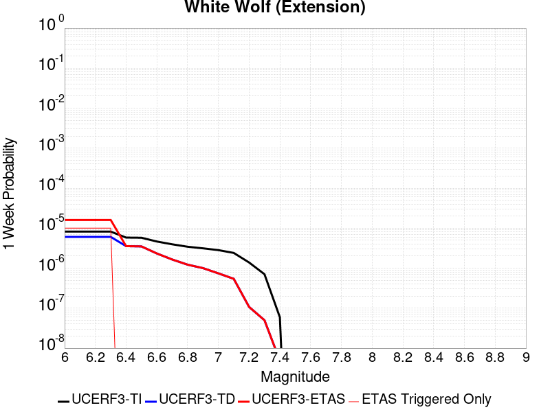 |  | 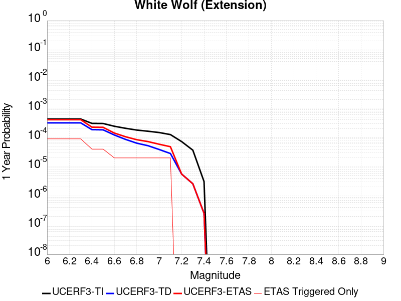 | 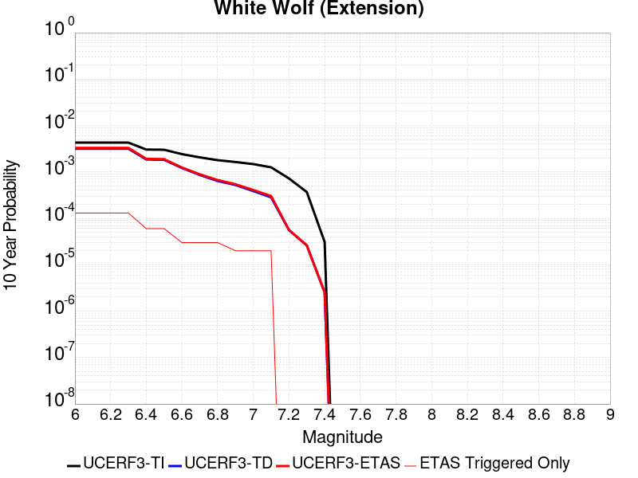 |

| Magnitude | 1 wk TI Prob | 1 wk TD Prob | 1 wk ETAS Prob | 1 wk ETAS/TD Gain | 1 wk ETAS Triggered Only | 1 mo TI Prob | 1 mo TD Prob | 1 mo ETAS Prob | 1 mo ETAS/TD Gain | 1 mo ETAS Triggered Only | 1 yr TI Prob | 1 yr TD Prob | 1 yr ETAS Prob | 1 yr ETAS/TD Gain | 1 yr ETAS Triggered Only | 10 yr TI Prob | 10 yr TD Prob | 10 yr ETAS Prob | 10 yr ETAS/TD Gain | 10 yr ETAS Triggered Only |
|-----|-----|-----|-----|-----|-----|-----|-----|-----|-----|-----|-----|-----|-----|-----|-----|-----|-----|-----|-----|-----|
| 6.0 | 8.222555E-6 | 6.066786E-6 | 1.6066726E-5 | 2.6483092 | 1.0E-5 | 3.5239045E-5 | 2.600029E-5 | 3.600003E-5 | 1.3846011 | 1.0E-5 | 4.289509E-4 | 3.165142E-4 | 4.064857E-4 | 1.2842574 | 9.0E-5 | 0.0042812387 | 0.0031612858 | 0.0032908749 | 1.0409925 | 1.3E-4 |
| 6.1 | 8.222555E-6 | 6.066786E-6 | 1.6066726E-5 | 2.6483092 | 1.0E-5 | 3.5239045E-5 | 2.600029E-5 | 3.600003E-5 | 1.3846011 | 1.0E-5 | 4.289509E-4 | 3.165142E-4 | 4.064857E-4 | 1.2842574 | 9.0E-5 | 0.0042812387 | 0.0031612858 | 0.0032908749 | 1.0409925 | 1.3E-4 |
| 6.2 | 8.222555E-6 | 6.066786E-6 | 1.6066726E-5 | 2.6483092 | 1.0E-5 | 3.5239045E-5 | 2.600029E-5 | 3.600003E-5 | 1.3846011 | 1.0E-5 | 4.289509E-4 | 3.165142E-4 | 4.064857E-4 | 1.2842574 | 9.0E-5 | 0.0042812387 | 0.0031612858 | 0.0032908749 | 1.0409925 | 1.3E-4 |
| 6.3 | 8.222555E-6 | 6.066786E-6 | 1.6066726E-5 | 2.6483092 | 1.0E-5 | 3.5239045E-5 | 2.600029E-5 | 3.600003E-5 | 1.3846011 | 1.0E-5 | 4.289509E-4 | 3.165142E-4 | 4.064857E-4 | 1.2842574 | 9.0E-5 | 0.0042812387 | 0.0031612858 | 0.0032908749 | 1.0409925 | 1.3E-4 |
| 6.4 | 5.821773E-6 | 3.5572518E-6 | 3.5572518E-6 | 1.0 | 0.0 | 2.4950215E-5 | 1.5245282E-5 | 1.5245282E-5 | 1.0 | 0.0 | 3.0372653E-4 | 1.855966E-4 | 2.2558917E-4 | 1.2154812 | 4.0E-5 | 0.0030331176 | 0.0018545244 | 0.0019144131 | 1.0322933 | 6.0E-5 |
| 6.5 | 5.766023E-6 | 3.499185E-6 | 3.499185E-6 | 1.0 | 0.0 | 2.4711293E-5 | 1.4996427E-5 | 1.4996427E-5 | 1.0 | 0.0 | 3.0081844E-4 | 1.825673E-4 | 2.2256E-4 | 1.2190573 | 4.0E-5 | 0.0030041158 | 0.0018242814 | 0.0018841719 | 1.0328296 | 6.0E-5 |
| 6.6 | 4.643576E-6 | 2.3326802E-6 | 2.3326802E-6 | 1.0 | 0.0 | 1.9900888E-5 | 9.997165E-6 | 9.997165E-6 | 1.0 | 0.0 | 2.4226638E-4 | 1.2170912E-4 | 1.4170668E-4 | 1.1643063 | 2.0E-5 | 0.0024200242 | 0.001216467 | 0.0012464306 | 1.0246316 | 3.0E-5 |
| 6.7 | 3.9529173E-6 | 1.648393E-6 | 1.648393E-6 | 1.0 | 0.0 | 1.6940963E-5 | 7.064523E-6 | 7.064523E-6 | 1.0 | 0.0 | 2.0623671E-4 | 8.600736E-5 | 1.0600564E-4 | 1.2325182 | 2.0E-5 | 0.002060454 | 8.597593E-4 | 8.897335E-4 | 1.0348635 | 3.0E-5 |
| 6.8 | 3.4377522E-6 | 1.2245611E-6 | 1.2245611E-6 | 1.0 | 0.0 | 1.473314E-5 | 5.2481087E-6 | 5.2481087E-6 | 1.0 | 0.0 | 1.7936122E-4 | 6.3893945E-5 | 8.3892664E-5 | 1.3129988 | 2.0E-5 | 0.0017921652 | 6.387648E-4 | 6.6874566E-4 | 1.0469357 | 3.0E-5 |
| 6.9 | 3.1367306E-6 | 1.0034112E-6 | 1.0034112E-6 | 1.0 | 0.0 | 1.3443062E-5 | 4.300327E-6 | 4.300327E-6 | 1.0 | 0.0 | 1.63657E-4 | 5.2355303E-5 | 7.2354254E-5 | 1.3819853 | 2.0E-5 | 0.0016353652 | 5.2343734E-4 | 5.4342684E-4 | 1.0381889 | 2.0E-5 |
| 7.0 | 2.8298145E-6 | 7.42895E-7 | 7.42895E-7 | 1.0 | 0.0 | 1.2127721E-5 | 3.1838322E-6 | 3.1838322E-6 | 1.0 | 0.0 | 1.47645E-4 | 3.876252E-5 | 5.8761743E-5 | 1.5159423 | 2.0E-5 | 0.0014754693 | 3.8756256E-4 | 4.075548E-4 | 1.0515846 | 2.0E-5 |
| 7.1 | 2.4091064E-6 | 5.4229815E-7 | 5.4229815E-7 | 1.0 | 0.0 | 1.03247E-5 | 2.324133E-6 | 2.324133E-6 | 1.0 | 0.0 | 1.2569598E-4 | 2.8295994E-5 | 4.8295427E-5 | 1.7067938 | 2.0E-5 | 0.001256249 | 2.8292794E-4 | 3.029223E-4 | 1.0706694 | 2.0E-5 |
| 7.2 | 1.3875518E-6 | 1.0744188E-7 | 1.0744188E-7 | 1.0 | 0.0 | 5.9466374E-6 | 4.6046512E-7 | 4.6046512E-7 | 1.0 | 0.0 | 7.23979E-5 | 5.6061494E-6 | 5.6061494E-6 | 1.0 | 0.0 | 7.2374323E-4 | 5.6060195E-5 | 5.6060195E-5 | 1.0 | 0.0 |
| 7.3 | 7.056077E-7 | 5.0026802E-8 | 5.0026802E-8 | 1.0 | 0.0 | 3.0240296E-6 | 2.1440057E-7 | 2.1440057E-7 | 1.0 | 0.0 | 3.681694E-5 | 2.6103241E-6 | 2.6103241E-6 | 1.0 | 0.0 | 3.681084E-4 | 2.6102982E-5 | 2.6102982E-5 | 1.0 | 0.0 |
| 7.4 | 5.9334678E-8 | 4.8689808E-9 | 4.8689808E-9 | 1.0 | 0.0 | 2.5429145E-7 | 2.0867061E-8 | 2.0867061E-8 | 1.0 | 0.0 | 3.095994E-6 | 2.5405646E-7 | 2.5405646E-7 | 1.0 | 0.0 | 3.095951E-5 | 2.5405627E-6 | 2.5405627E-6 | 1.0 | 0.0 |

## Independence rev 2011
*[(top)](#table-of-contents)*

| 1 Week | 1 Month | 1 Year | 10 Year |
|-----|-----|-----|-----|
|  |  |  | 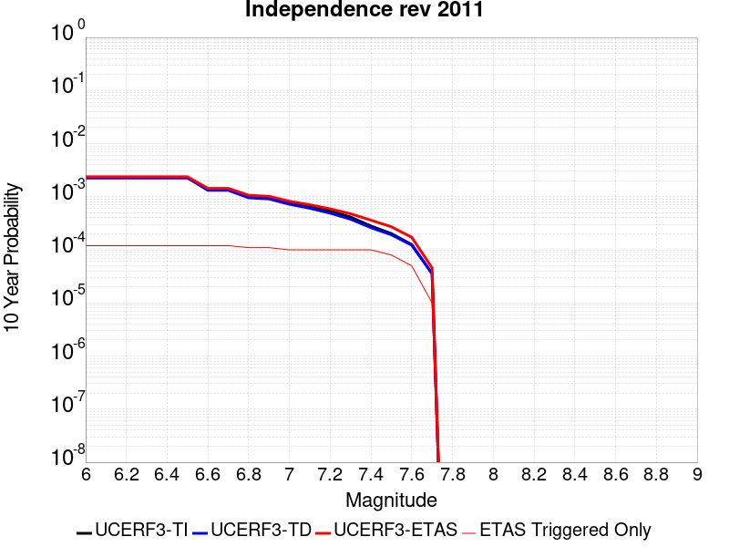 |

| Magnitude | 1 wk TI Prob | 1 wk TD Prob | 1 wk ETAS Prob | 1 wk ETAS/TD Gain | 1 wk ETAS Triggered Only | 1 mo TI Prob | 1 mo TD Prob | 1 mo ETAS Prob | 1 mo ETAS/TD Gain | 1 mo ETAS Triggered Only | 1 yr TI Prob | 1 yr TD Prob | 1 yr ETAS Prob | 1 yr ETAS/TD Gain | 1 yr ETAS Triggered Only | 10 yr TI Prob | 10 yr TD Prob | 10 yr ETAS Prob | 10 yr ETAS/TD Gain | 10 yr ETAS Triggered Only |
|-----|-----|-----|-----|-----|-----|-----|-----|-----|-----|-----|-----|-----|-----|-----|-----|-----|-----|-----|-----|-----|
| 6.0 | 4.422171E-6 | 4.3262817E-6 | 4.3262817E-6 | 1.0 | 0.0 | 1.8952025E-5 | 1.8541094E-5 | 2.8540908E-5 | 1.5393325 | 1.0E-5 | 2.3071647E-4 | 2.257174E-4 | 2.8570386E-4 | 1.2657591 | 6.0E-5 | 0.0023047708 | 0.002255175 | 0.0023749045 | 1.0530909 | 1.2E-4 |
| 6.1 | 4.422171E-6 | 4.3262817E-6 | 4.3262817E-6 | 1.0 | 0.0 | 1.8952025E-5 | 1.8541094E-5 | 2.8540908E-5 | 1.5393325 | 1.0E-5 | 2.3071647E-4 | 2.257174E-4 | 2.8570386E-4 | 1.2657591 | 6.0E-5 | 0.0023047708 | 0.002255175 | 0.0023749045 | 1.0530909 | 1.2E-4 |
| 6.2 | 4.422171E-6 | 4.3262817E-6 | 4.3262817E-6 | 1.0 | 0.0 | 1.8952025E-5 | 1.8541094E-5 | 2.8540908E-5 | 1.5393325 | 1.0E-5 | 2.3071647E-4 | 2.257174E-4 | 2.8570386E-4 | 1.2657591 | 6.0E-5 | 0.0023047708 | 0.002255175 | 0.0023749045 | 1.0530909 | 1.2E-4 |
| 6.3 | 4.422171E-6 | 4.3262817E-6 | 4.3262817E-6 | 1.0 | 0.0 | 1.8952025E-5 | 1.8541094E-5 | 2.8540908E-5 | 1.5393325 | 1.0E-5 | 2.3071647E-4 | 2.257174E-4 | 2.8570386E-4 | 1.2657591 | 6.0E-5 | 0.0023047708 | 0.002255175 | 0.0023749045 | 1.0530909 | 1.2E-4 |
| 6.4 | 4.422171E-6 | 4.3262817E-6 | 4.3262817E-6 | 1.0 | 0.0 | 1.8952025E-5 | 1.8541094E-5 | 2.8540908E-5 | 1.5393325 | 1.0E-5 | 2.3071647E-4 | 2.257174E-4 | 2.8570386E-4 | 1.2657591 | 6.0E-5 | 0.0023047708 | 0.002255175 | 0.0023749045 | 1.0530909 | 1.2E-4 |
| 6.5 | 4.422171E-6 | 4.3262817E-6 | 4.3262817E-6 | 1.0 | 0.0 | 1.8952025E-5 | 1.8541094E-5 | 2.8540908E-5 | 1.5393325 | 1.0E-5 | 2.3071647E-4 | 2.257174E-4 | 2.8570386E-4 | 1.2657591 | 6.0E-5 | 0.0023047708 | 0.002255175 | 0.0023749045 | 1.0530909 | 1.2E-4 |
| 6.6 | 2.663744E-6 | 2.5320264E-6 | 2.5320264E-6 | 1.0 | 0.0 | 1.1415996E-5 | 1.08515E-5 | 2.0851392E-5 | 1.9215215 | 1.0E-5 | 1.3898089E-4 | 1.3210949E-4 | 1.9210156E-4 | 1.4541087 | 6.0E-5 | 0.0013889399 | 0.0013203578 | 0.0014401993 | 1.0907644 | 1.2E-4 |
| 6.7 | 2.663744E-6 | 2.5320264E-6 | 2.5320264E-6 | 1.0 | 0.0 | 1.1415996E-5 | 1.08515E-5 | 2.0851392E-5 | 1.9215215 | 1.0E-5 | 1.3898089E-4 | 1.3210949E-4 | 1.9210156E-4 | 1.4541087 | 6.0E-5 | 0.0013889399 | 0.0013203578 | 0.0014401993 | 1.0907644 | 1.2E-4 |
| 6.8 | 1.9716529E-6 | 1.8322929E-6 | 1.8322929E-6 | 1.0 | 0.0 | 8.449913E-6 | 7.852661E-6 | 1.7852582E-5 | 2.2734437 | 1.0E-5 | 1.0287284E-4 | 9.560209E-5 | 1.4559731E-4 | 1.5229511 | 5.0E-5 | 0.0010282523 | 9.5562247E-4 | 0.0010655173 | 1.1149982 | 1.1E-4 |
| 6.9 | 1.8788617E-6 | 1.7430325E-6 | 1.7430325E-6 | 1.0 | 0.0 | 8.0522395E-6 | 7.4701184E-6 | 1.7470044E-5 | 2.338657 | 1.0E-5 | 9.80316E-5 | 9.094502E-5 | 1.4094046E-4 | 1.5497327 | 5.0E-5 | 9.798837E-4 | 9.0909004E-4 | 0.0010189901 | 1.1208901 | 1.1E-4 |
| 7.0 | 1.5045488E-6 | 1.3849778E-6 | 1.3849778E-6 | 1.0 | 0.0 | 6.44805E-6 | 5.935606E-6 | 1.5935546E-5 | 2.684738 | 1.0E-5 | 7.8502184E-5 | 7.226366E-5 | 1.2226004E-4 | 1.6918607 | 5.0E-5 | 7.8474457E-4 | 7.224067E-4 | 8.223345E-4 | 1.1383262 | 1.0E-4 |
| 7.1 | 1.272341E-6 | 1.1625336E-6 | 1.1625336E-6 | 1.0 | 0.0 | 5.4528787E-6 | 4.9822775E-6 | 1.4982228E-5 | 3.0071042 | 1.0E-5 | 6.6386776E-5 | 6.0657574E-5 | 1.1065454E-4 | 1.8242494 | 5.0E-5 | 6.636695E-4 | 6.0641335E-4 | 7.063527E-4 | 1.164804 | 1.0E-4 |
| 7.2 | 1.0416892E-6 | 9.4100864E-7 | 9.4100864E-7 | 1.0 | 0.0 | 4.464375E-6 | 4.0328882E-6 | 1.40328475E-5 | 3.4796026 | 1.0E-5 | 5.4352407E-5 | 4.9099326E-5 | 9.909687E-5 | 2.0182939 | 5.0E-5 | 5.4339116E-4 | 4.908866E-4 | 5.9083756E-4 | 1.203613 | 1.0E-4 |
| 7.3 | 7.9450155E-7 | 7.235156E-7 | 7.235156E-7 | 1.0 | 0.0 | 3.4050022E-6 | 3.1007776E-6 | 1.3100746E-5 | 4.2249875 | 1.0E-5 | 4.1455114E-5 | 3.7751324E-5 | 8.774944E-5 | 2.3244069 | 5.0E-5 | 4.144738E-4 | 3.7745023E-4 | 4.7741248E-4 | 1.2648356 | 1.0E-4 |
| 7.4 | 5.3893444E-7 | 5.019608E-7 | 5.019608E-7 | 1.0 | 0.0 | 2.309717E-6 | 2.151259E-6 | 1.2151238E-5 | 5.648431 | 1.0E-5 | 2.8120441E-5 | 2.6191266E-5 | 7.618996E-5 | 2.9089832 | 5.0E-5 | 2.8116882E-4 | 2.6188226E-4 | 3.6185607E-4 | 1.381751 | 1.0E-4 |
| 7.5 | 3.8852085E-7 | 3.6826168E-7 | 3.6826168E-7 | 1.0 | 0.0 | 1.6650882E-6 | 1.5782633E-6 | 1.5782633E-6 | 1.0 | 0.0 | 2.027226E-5 | 1.921519E-5 | 5.921442E-5 | 3.0816464 | 4.0E-5 | 2.0270412E-4 | 1.9213549E-4 | 2.7212012E-4 | 1.4162928 | 8.0E-5 |
| 7.6 | 2.414929E-7 | 2.3457878E-7 | 2.3457878E-7 | 1.0 | 0.0 | 1.0349692E-6 | 1.0053373E-6 | 1.0053373E-6 | 1.0 | 0.0 | 1.2600677E-5 | 1.2239913E-5 | 3.223967E-5 | 2.6339784 | 2.0E-5 | 1.2599962E-4 | 1.2239252E-4 | 1.723864E-4 | 1.4084717 | 5.0E-5 |
| 7.7 | 6.8298014E-8 | 6.859039E-8 | 6.859039E-8 | 1.0 | 0.0 | 2.9270575E-7 | 2.9395878E-7 | 2.9395878E-7 | 1.0 | 0.0 | 3.5636867E-6 | 3.5789426E-6 | 3.5789426E-6 | 1.0 | 0.0 | 3.5636294E-5 | 3.5788897E-5 | 4.578854E-5 | 1.2794063 | 1.0E-5 |

## Baker
*[(top)](#table-of-contents)*

| 1 Week | 1 Month | 1 Year | 10 Year |
|-----|-----|-----|-----|
|  |  | 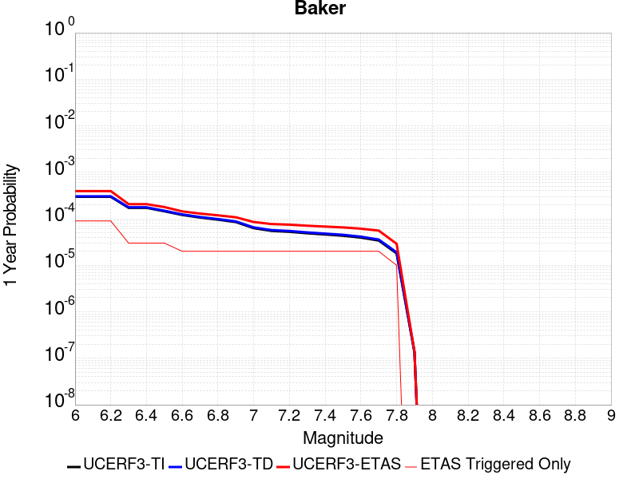 |  |

| Magnitude | 1 wk TI Prob | 1 wk TD Prob | 1 wk ETAS Prob | 1 wk ETAS/TD Gain | 1 wk ETAS Triggered Only | 1 mo TI Prob | 1 mo TD Prob | 1 mo ETAS Prob | 1 mo ETAS/TD Gain | 1 mo ETAS Triggered Only | 1 yr TI Prob | 1 yr TD Prob | 1 yr ETAS Prob | 1 yr ETAS/TD Gain | 1 yr ETAS Triggered Only | 10 yr TI Prob | 10 yr TD Prob | 10 yr ETAS Prob | 10 yr ETAS/TD Gain | 10 yr ETAS Triggered Only |
|-----|-----|-----|-----|-----|-----|-----|-----|-----|-----|-----|-----|-----|-----|-----|-----|-----|-----|-----|-----|-----|
| 6.0 | 5.695525E-6 | 5.834894E-6 | 1.5834836E-5 | 2.7138171 | 1.0E-5 | 2.4409164E-5 | 2.5006473E-5 | 5.5005723E-5 | 2.1996593 | 3.0E-5 | 2.9714106E-4 | 3.0441527E-4 | 3.9438787E-4 | 1.2955588 | 9.0E-5 | 0.0029674405 | 0.0030403784 | 0.0031600136 | 1.0393487 | 1.2E-4 |
| 6.1 | 5.695525E-6 | 5.834894E-6 | 1.5834836E-5 | 2.7138171 | 1.0E-5 | 2.4409164E-5 | 2.5006473E-5 | 5.5005723E-5 | 2.1996593 | 3.0E-5 | 2.9714106E-4 | 3.0441527E-4 | 3.9438787E-4 | 1.2955588 | 9.0E-5 | 0.0029674405 | 0.0030403784 | 0.0031600136 | 1.0393487 | 1.2E-4 |
| 6.2 | 5.695525E-6 | 5.834894E-6 | 1.5834836E-5 | 2.7138171 | 1.0E-5 | 2.4409164E-5 | 2.5006473E-5 | 5.5005723E-5 | 2.1996593 | 3.0E-5 | 2.9714106E-4 | 3.0441527E-4 | 3.9438787E-4 | 1.2955588 | 9.0E-5 | 0.0029674405 | 0.0030403784 | 0.0031600136 | 1.0393487 | 1.2E-4 |
| 6.3 | 3.2995713E-6 | 3.3837018E-6 | 1.33836675E-5 | 3.9553332 | 1.0E-5 | 1.4140943E-5 | 1.4501501E-5 | 3.4501212E-5 | 2.3791475 | 2.0E-5 | 1.7215237E-4 | 1.7654194E-4 | 2.0653664E-4 | 1.1699013 | 3.0E-5 | 0.0017201907 | 0.0017640641 | 0.0018039935 | 1.0226349 | 4.0E-5 |
| 6.4 | 3.2995713E-6 | 3.3837018E-6 | 1.33836675E-5 | 3.9553332 | 1.0E-5 | 1.4140943E-5 | 1.4501501E-5 | 3.4501212E-5 | 2.3791475 | 2.0E-5 | 1.7215237E-4 | 1.7654194E-4 | 2.0653664E-4 | 1.1699013 | 3.0E-5 | 0.0017201907 | 0.0017640641 | 0.0018039935 | 1.0226349 | 4.0E-5 |
| 6.5 | 2.782202E-6 | 2.855871E-6 | 1.2855842E-5 | 4.501549 | 1.0E-5 | 1.1923668E-5 | 1.223939E-5 | 3.2239146E-5 | 2.6340482 | 2.0E-5 | 1.4516099E-4 | 1.4900473E-4 | 1.7900026E-4 | 1.2013059 | 3.0E-5 | 0.001450662 | 0.001489081 | 0.0015190362 | 1.0201167 | 3.0E-5 |
| 6.6 | 2.3163404E-6 | 2.3809466E-6 | 2.3809466E-6 | 1.0 | 0.0 | 9.927136E-6 | 1.02040185E-5 | 2.0203915E-5 | 1.9799961 | 1.0E-5 | 1.20856166E-4 | 1.2422705E-4 | 1.4422456E-4 | 1.1609756 | 2.0E-5 | 0.0012079047 | 0.0012415962 | 0.0012615714 | 1.0160882 | 2.0E-5 |
| 6.7 | 2.037056E-6 | 2.0965251E-6 | 2.0965251E-6 | 1.0 | 0.0 | 8.7302105E-6 | 8.985077E-6 | 1.8984987E-5 | 2.1129465 | 1.0E-5 | 1.0628513E-4 | 1.0938799E-4 | 1.2938581E-4 | 1.1828154 | 2.0E-5 | 0.0010623431 | 0.0010933576 | 0.0011133357 | 1.0182723 | 2.0E-5 |
| 6.8 | 1.8356744E-6 | 1.8915518E-6 | 1.8915518E-6 | 1.0 | 0.0 | 7.867153E-6 | 8.106626E-6 | 1.8106546E-5 | 2.2335489 | 1.0E-5 | 9.577837E-5 | 9.869385E-5 | 1.18691874E-4 | 1.2026268 | 2.0E-5 | 9.57371E-4 | 9.865141E-4 | 0.0010064944 | 1.0202534 | 2.0E-5 |
| 6.9 | 1.6310546E-6 | 1.6832288E-6 | 1.6832288E-6 | 1.0 | 0.0 | 6.9902153E-6 | 7.2138187E-6 | 1.7213746E-5 | 2.3862183 | 1.0E-5 | 8.510255E-5 | 8.782482E-5 | 1.07823056E-4 | 1.2277061 | 2.0E-5 | 8.5069967E-4 | 8.7791233E-4 | 8.978948E-4 | 1.0227613 | 2.0E-5 |
| 7.0 | 1.2058036E-6 | 1.2508854E-6 | 1.2508854E-6 | 1.0 | 0.0 | 5.1677193E-6 | 5.3609265E-6 | 1.5360873E-5 | 2.8653393 | 1.0E-5 | 6.291517E-5 | 6.526735E-5 | 8.526604E-5 | 1.306412 | 2.0E-5 | 6.289736E-4 | 6.524841E-4 | 6.7247107E-4 | 1.0306321 | 2.0E-5 |
| 7.1 | 1.052382E-6 | 1.0951787E-6 | 1.0951787E-6 | 1.0 | 0.0 | 4.5102006E-6 | 4.6936148E-6 | 1.4693568E-5 | 3.1305442 | 1.0E-5 | 5.491031E-5 | 5.714327E-5 | 7.7142126E-5 | 1.3499775 | 2.0E-5 | 5.4896745E-4 | 5.7128666E-4 | 5.912752E-4 | 1.0349886 | 2.0E-5 |
| 7.2 | 1.0067454E-6 | 1.0487886E-6 | 1.0487886E-6 | 1.0 | 0.0 | 4.3146156E-6 | 4.4948006E-6 | 1.4494755E-5 | 3.2247827 | 1.0E-5 | 5.252918E-5 | 5.4722834E-5 | 7.4721735E-5 | 1.3654581 | 2.0E-5 | 5.251676E-4 | 5.4709445E-4 | 5.670835E-4 | 1.0365368 | 2.0E-5 |
| 7.3 | 9.3596316E-7 | 9.767894E-7 | 9.767894E-7 | 1.0 | 0.0 | 4.0112645E-6 | 4.1862336E-6 | 1.4186192E-5 | 3.388772 | 1.0E-5 | 4.8836053E-5 | 5.096621E-5 | 7.0965194E-5 | 1.3923968 | 2.0E-5 | 4.8825322E-4 | 5.09546E-4 | 5.295358E-4 | 1.0392306 | 2.0E-5 |
| 7.4 | 8.8117395E-7 | 9.207829E-7 | 9.207829E-7 | 1.0 | 0.0 | 3.7764542E-6 | 3.9462066E-6 | 1.3946167E-5 | 3.5340693 | 1.0E-5 | 4.5977362E-5 | 4.8044014E-5 | 6.804305E-5 | 1.416265 | 2.0E-5 | 4.596785E-4 | 4.80337E-4 | 5.0032744E-4 | 1.0416174 | 2.0E-5 |
| 7.5 | 8.292386E-7 | 8.674756E-7 | 8.674756E-7 | 1.0 | 0.0 | 3.5538749E-6 | 3.7177472E-6 | 1.371771E-5 | 3.689791 | 1.0E-5 | 4.326757E-5 | 4.526264E-5 | 6.526173E-5 | 1.4418455 | 2.0E-5 | 4.3259145E-4 | 4.5253494E-4 | 4.725259E-4 | 1.0441755 | 2.0E-5 |
| 7.6 | 7.553842E-7 | 7.914622E-7 | 7.914622E-7 | 1.0 | 0.0 | 3.2373566E-6 | 3.3919764E-6 | 1.3391942E-5 | 3.9481237 | 1.0E-5 | 3.9414106E-5 | 4.129654E-5 | 6.129571E-5 | 1.4842821 | 2.0E-5 | 3.9407116E-4 | 4.1288932E-4 | 4.328811E-4 | 1.0484191 | 2.0E-5 |
| 7.7 | 6.5285366E-7 | 6.852933E-7 | 6.852933E-7 | 1.0 | 0.0 | 2.797941E-6 | 2.936968E-6 | 1.2936938E-5 | 4.404862 | 1.0E-5 | 3.40644E-5 | 3.5757006E-5 | 5.575629E-5 | 1.5593109 | 2.0E-5 | 3.405918E-4 | 3.5751317E-4 | 3.7750602E-4 | 1.055922 | 2.0E-5 |
| 7.8 | 3.4586725E-7 | 3.6483414E-7 | 3.6483414E-7 | 1.0 | 0.0 | 1.4822873E-6 | 1.563574E-6 | 1.563574E-6 | 1.0 | 0.0 | 1.80467E-5 | 1.9036352E-5 | 2.903616E-5 | 1.5253007 | 1.0E-5 | 1.8045233E-4 | 1.9034765E-4 | 2.0034573E-4 | 1.0525254 | 1.0E-5 |
| 7.9 | 2.5591178E-9 | 2.6697178E-9 | 2.6697178E-9 | 1.0 | 0.0 | 1.0967647E-8 | 1.1441647E-8 | 1.1441647E-8 | 1.0 | 0.0 | 1.335311E-7 | 1.3930206E-7 | 1.3930206E-7 | 1.0 | 0.0 | 1.3353102E-6 | 1.3930205E-6 | 1.3930205E-6 | 1.0 | 0.0 |

## San Andreas (Creeping Section) 2011 CFM
*[(top)](#table-of-contents)*

| 1 Week | 1 Month | 1 Year | 10 Year |
|-----|-----|-----|-----|
|  |  |  |  |

| Magnitude | 1 wk TI Prob | 1 wk TD Prob | 1 wk ETAS Prob | 1 wk ETAS/TD Gain | 1 wk ETAS Triggered Only | 1 mo TI Prob | 1 mo TD Prob | 1 mo ETAS Prob | 1 mo ETAS/TD Gain | 1 mo ETAS Triggered Only | 1 yr TI Prob | 1 yr TD Prob | 1 yr ETAS Prob | 1 yr ETAS/TD Gain | 1 yr ETAS Triggered Only | 10 yr TI Prob | 10 yr TD Prob | 10 yr ETAS Prob | 10 yr ETAS/TD Gain | 10 yr ETAS Triggered Only |
|-----|-----|-----|-----|-----|-----|-----|-----|-----|-----|-----|-----|-----|-----|-----|-----|-----|-----|-----|-----|-----|
| 6.0 | 5.986481E-4 | 0.0012278574 | 0.0012278574 | 1.0 | 0.0 | 0.0025631124 | 0.005245485 | 0.005245485 | 1.0 | 0.0 | 0.030762846 | 0.061223123 | 0.061260674 | 1.0006133 | 4.0E-5 | 0.26835477 | 0.42603627 | 0.4260994 | 1.0001482 | 1.1E-4 |
| 6.1 | 5.015945E-4 | 0.0010219465 | 0.0010219465 | 1.0 | 0.0 | 0.00214792 | 0.0043674316 | 0.0043674316 | 1.0 | 0.0 | 0.025839351 | 0.051263794 | 0.051301744 | 1.0007403 | 4.0E-5 | 0.23032776 | 0.3729545 | 0.3730172 | 1.0001681 | 1.0E-4 |
| 6.2 | 4.073338E-4 | 8.110978E-4 | 8.110978E-4 | 1.0 | 0.0 | 0.0017445484 | 0.0034673344 | 0.0034673344 | 1.0 | 0.0 | 0.021034058 | 0.040948268 | 0.04098663 | 1.0009369 | 4.0E-5 | 0.19150782 | 0.31314042 | 0.31320912 | 1.0002193 | 1.0E-4 |
| 6.3 | 3.464099E-4 | 6.7400874E-4 | 6.7400874E-4 | 1.0 | 0.0 | 0.0014837692 | 0.0028833488 | 0.0028833488 | 1.0 | 0.0 | 0.017915873 | 0.03420438 | 0.03423335 | 1.0008471 | 3.0E-5 | 0.16538359 | 0.2714302 | 0.27149576 | 1.0002415 | 9.0E-5 |
| 6.4 | 2.935057E-4 | 5.543814E-4 | 5.543814E-4 | 1.0 | 0.0 | 0.0012572751 | 0.0023721198 | 0.0023721198 | 1.0 | 0.0 | 0.015200248 | 0.028279541 | 0.028308693 | 1.0010308 | 3.0E-5 | 0.14201577 | 0.23310506 | 0.23317409 | 1.0002961 | 9.0E-5 |
| 6.5 | 2.3409708E-4 | 4.2086263E-4 | 4.2086263E-4 | 1.0 | 0.0 | 0.0010028875 | 0.0018023523 | 0.0018023523 | 1.0 | 0.0 | 0.012141965 | 0.021603577 | 0.021632928 | 1.0013586 | 3.0E-5 | 0.11499573 | 0.18695107 | 0.18702425 | 1.0003914 | 9.0E-5 |
| 6.6 | 1.5842178E-4 | 2.5103867E-4 | 2.5103867E-4 | 1.0 | 0.0 | 6.7877385E-4 | 0.0010754365 | 0.0010754365 | 1.0 | 0.0 | 0.0082328 | 0.013013279 | 0.013042889 | 1.0022753 | 3.0E-5 | 0.07934396 | 0.12328419 | 0.12336309 | 1.00064 | 9.0E-5 |
| 6.7 | 1.5616413E-4 | 2.4640225E-4 | 2.4640225E-4 | 1.0 | 0.0 | 6.691031E-4 | 0.0010555823 | 0.0010555823 | 1.0 | 0.0 | 0.0081159435 | 0.012775105 | 0.0128047215 | 1.0023183 | 3.0E-5 | 0.0782586 | 0.12131134 | 0.12139042 | 1.0006518 | 9.0E-5 |
| 6.8 | 1.5538467E-4 | 2.4464016E-4 | 2.4464016E-4 | 1.0 | 0.0 | 6.6576427E-4 | 0.0010480366 | 0.0010480366 | 1.0 | 0.0 | 0.008075596 | 0.012684458 | 0.012714078 | 1.0023351 | 3.0E-5 | 0.07788358 | 0.12054211 | 0.12062126 | 1.0006566 | 9.0E-5 |
| 6.9 | 1.5153569E-4 | 2.3572966E-4 | 2.3572966E-4 | 1.0 | 0.0 | 6.49277E-4 | 0.0010098808 | 0.0010098808 | 1.0 | 0.0 | 0.007876333 | 0.012226513 | 0.012256146 | 1.0024236 | 3.0E-5 | 0.07602952 | 0.11661184 | 0.11669134 | 1.0006818 | 9.0E-5 |
| 7.0 | 1.4588932E-4 | 2.2429929E-4 | 2.2429929E-4 | 1.0 | 0.0 | 6.250901E-4 | 9.6093054E-4 | 9.6093054E-4 | 1.0 | 0.0 | 0.0075839474 | 0.011637069 | 0.01166672 | 1.002548 | 3.0E-5 | 0.073302895 | 0.11145784 | 0.11153781 | 1.0007175 | 9.0E-5 |
| 7.1 | 1.1565079E-4 | 1.6309424E-4 | 1.6309424E-4 | 1.0 | 0.0 | 4.955521E-4 | 6.987889E-4 | 6.987889E-4 | 1.0 | 0.0 | 0.006016669 | 0.008474769 | 0.0084946 | 1.00234 | 2.0E-5 | 0.058563538 | 0.083791174 | 0.08384615 | 1.000656 | 6.0E-5 |
| 7.2 | 1.0393792E-4 | 1.464163E-4 | 1.464163E-4 | 1.0 | 0.0 | 4.4537216E-4 | 6.273483E-4 | 6.273483E-4 | 1.0 | 0.0 | 0.005408933 | 0.007611387 | 0.007631235 | 1.0026076 | 2.0E-5 | 0.052791595 | 0.07573429 | 0.07578974 | 1.0007323 | 6.0E-5 |
| 7.3 | 9.332884E-5 | 1.2803692E-4 | 1.2803692E-4 | 1.0 | 0.0 | 3.999194E-4 | 5.486149E-4 | 5.486149E-4 | 1.0 | 0.0 | 0.0048581534 | 0.006659065 | 0.0066789314 | 1.0029835 | 2.0E-5 | 0.047533102 | 0.066586874 | 0.06664288 | 1.000841 | 6.0E-5 |
| 7.4 | 8.670252E-5 | 1.1722413E-4 | 1.1722413E-4 | 1.0 | 0.0 | 3.715293E-4 | 5.02293E-4 | 5.02293E-4 | 1.0 | 0.0 | 0.004513991 | 0.0060983906 | 0.0061182687 | 1.0032595 | 2.0E-5 | 0.044233937 | 0.0612394 | 0.061295725 | 1.0009198 | 6.0E-5 |
| 7.5 | 7.3036405E-5 | 9.021815E-5 | 9.021815E-5 | 1.0 | 0.0 | 3.129756E-4 | 3.86592E-4 | 3.86592E-4 | 1.0 | 0.0 | 0.0038038217 | 0.004696621 | 0.004706574 | 1.0021192 | 1.0E-5 | 0.03739367 | 0.047952913 | 0.047981475 | 1.0005956 | 3.0E-5 |
| 7.6 | 6.3935775E-5 | 8.294097E-5 | 8.294097E-5 | 1.0 | 0.0 | 2.7398168E-4 | 3.5541295E-4 | 3.5541295E-4 | 1.0 | 0.0 | 0.0033306254 | 0.004318586 | 0.004328543 | 1.0023056 | 1.0E-5 | 0.032811474 | 0.0440566 | 0.044085283 | 1.0006509 | 3.0E-5 |
| 7.7 | 5.5050095E-5 | 6.673972E-5 | 6.673972E-5 | 1.0 | 0.0 | 2.3590765E-4 | 2.85996E-4 | 2.85996E-4 | 1.0 | 0.0 | 0.0028683927 | 0.0034764463 | 0.0034864114 | 1.0028665 | 1.0E-5 | 0.0283165 | 0.035854563 | 0.035873845 | 1.0005378 | 2.0E-5 |
| 7.8 | 5.027131E-5 | 6.173937E-5 | 6.173937E-5 | 1.0 | 0.0 | 2.1543067E-4 | 2.6457047E-4 | 2.6457047E-4 | 1.0 | 0.0 | 0.0026197135 | 0.0032163912 | 0.003226359 | 1.0030991 | 1.0E-5 | 0.025890453 | 0.033180073 | 0.03319941 | 1.0005828 | 2.0E-5 |
| 7.9 | 3.7271806E-5 | 5.0313658E-5 | 5.0313658E-5 | 1.0 | 0.0 | 1.5972654E-4 | 2.1561215E-4 | 2.1561215E-4 | 1.0 | 0.0 | 0.0019429359 | 0.0026219198 | 0.0026318936 | 1.003804 | 1.0E-5 | 0.019260362 | 0.027110536 | 0.027129993 | 1.0007178 | 2.0E-5 |
| 8.0 | 2.7310243E-5 | 3.1487198E-5 | 3.1487198E-5 | 1.0 | 0.0 | 1.17038646E-4 | 1.3493816E-4 | 1.3493816E-4 | 1.0 | 0.0 | 0.0014240141 | 0.0016416349 | 0.0016516185 | 1.0060815 | 1.0E-5 | 0.014149235 | 0.017243734 | 0.017253561 | 1.0005699 | 1.0E-5 |
| 8.1 | 1.7940547E-5 | 1.7438255E-5 | 1.7438255E-5 | 1.0 | 0.0 | 7.688579E-5 | 7.4733245E-5 | 7.4733245E-5 | 1.0 | 0.0 | 9.3568244E-4 | 9.0949796E-4 | 9.1948884E-4 | 1.0109851 | 1.0E-5 | 0.009317525 | 0.009818762 | 0.009828663 | 1.0010085 | 1.0E-5 |
| 8.2 | 8.643924E-6 | 5.4901475E-6 | 5.4901475E-6 | 1.0 | 0.0 | 3.704486E-5 | 2.3528992E-5 | 2.3528992E-5 | 1.0 | 0.0 | 4.5092785E-4 | 2.8642788E-4 | 2.9642502E-4 | 1.0349028 | 1.0E-5 | 0.0045001395 | 0.0032570646 | 0.003267032 | 1.0030602 | 1.0E-5 |
| 8.3 | 1.983087E-6 | 7.6850927E-7 | 7.6850927E-7 | 1.0 | 0.0 | 8.498917E-6 | 3.293607E-6 | 3.293607E-6 | 1.0 | 0.0 | 1.034694E-4 | 4.0098945E-5 | 4.0098945E-5 | 1.0 | 0.0 | 0.0010342124 | 4.7341356E-4 | 4.7341356E-4 | 1.0 | 0.0 |

## San Jacinto (San Bernardino)
*[(top)](#table-of-contents)*

| 1 Week | 1 Month | 1 Year | 10 Year |
|-----|-----|-----|-----|
|  | 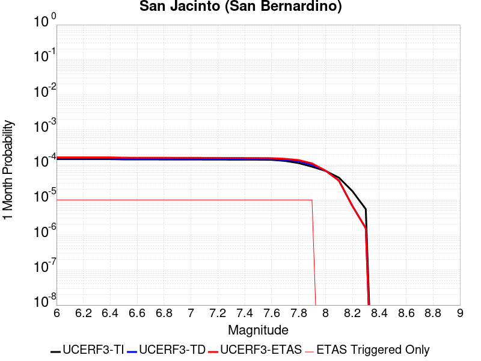 | 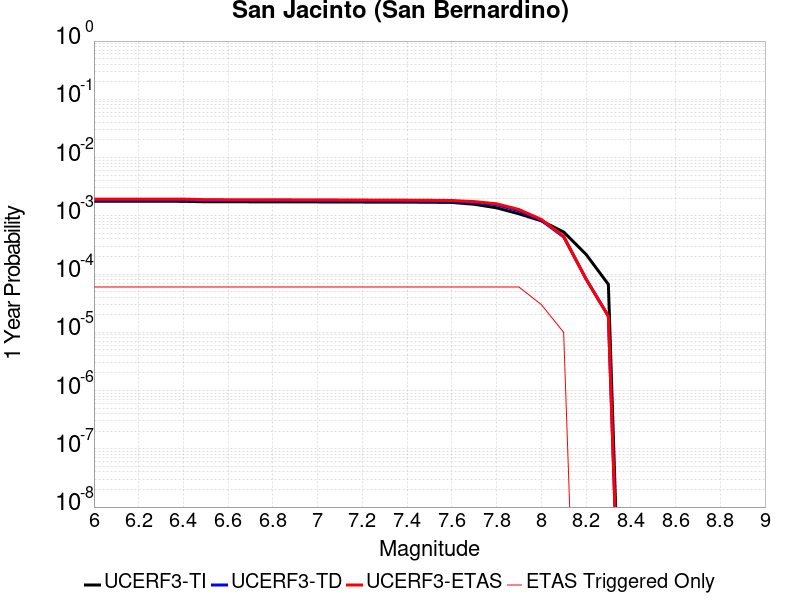 | 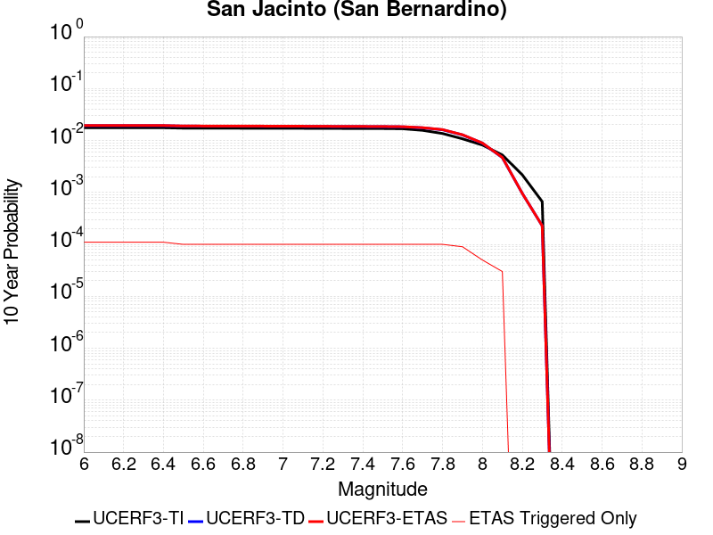 |

| Magnitude | 1 wk TI Prob | 1 wk TD Prob | 1 wk ETAS Prob | 1 wk ETAS/TD Gain | 1 wk ETAS Triggered Only | 1 mo TI Prob | 1 mo TD Prob | 1 mo ETAS Prob | 1 mo ETAS/TD Gain | 1 mo ETAS Triggered Only | 1 yr TI Prob | 1 yr TD Prob | 1 yr ETAS Prob | 1 yr ETAS/TD Gain | 1 yr ETAS Triggered Only | 10 yr TI Prob | 10 yr TD Prob | 10 yr ETAS Prob | 10 yr ETAS/TD Gain | 10 yr ETAS Triggered Only |
|-----|-----|-----|-----|-----|-----|-----|-----|-----|-----|-----|-----|-----|-----|-----|-----|-----|-----|-----|-----|-----|
| 6.0 | 3.409352E-5 | 3.60341E-5 | 3.60341E-5 | 1.0 | 0.0 | 1.461069E-4 | 1.5442273E-4 | 1.6442117E-4 | 1.0647473 | 1.0E-5 | 0.0017774 | 0.0018784772 | 0.0019383645 | 1.0318807 | 6.0E-5 | 0.01763251 | 0.01937425 | 0.019482119 | 1.0055677 | 1.1E-4 |
| 6.1 | 3.409352E-5 | 3.60341E-5 | 3.60341E-5 | 1.0 | 0.0 | 1.461069E-4 | 1.5442273E-4 | 1.6442117E-4 | 1.0647473 | 1.0E-5 | 0.0017774 | 0.0018784772 | 0.0019383645 | 1.0318807 | 6.0E-5 | 0.01763251 | 0.01937425 | 0.019482119 | 1.0055677 | 1.1E-4 |
| 6.2 | 3.409352E-5 | 3.60341E-5 | 3.60341E-5 | 1.0 | 0.0 | 1.461069E-4 | 1.5442273E-4 | 1.6442117E-4 | 1.0647473 | 1.0E-5 | 0.0017774 | 0.0018784772 | 0.0019383645 | 1.0318807 | 6.0E-5 | 0.01763251 | 0.01937425 | 0.019482119 | 1.0055677 | 1.1E-4 |
| 6.3 | 3.409352E-5 | 3.60341E-5 | 3.60341E-5 | 1.0 | 0.0 | 1.461069E-4 | 1.5442273E-4 | 1.6442117E-4 | 1.0647473 | 1.0E-5 | 0.0017774 | 0.0018784772 | 0.0019383645 | 1.0318807 | 6.0E-5 | 0.01763251 | 0.01937425 | 0.019482119 | 1.0055677 | 1.1E-4 |
| 6.4 | 3.400795E-5 | 3.592675E-5 | 3.592675E-5 | 1.0 | 0.0 | 1.4574021E-4 | 1.5396271E-4 | 1.6396117E-4 | 1.0649408 | 1.0E-5 | 0.0017729428 | 0.0018728863 | 0.001932774 | 1.0319761 | 6.0E-5 | 0.017588645 | 0.019319328 | 0.019427203 | 1.0055838 | 1.1E-4 |
| 6.5 | 3.341482E-5 | 3.5187317E-5 | 3.5187317E-5 | 1.0 | 0.0 | 1.4319851E-4 | 1.5079408E-4 | 1.6079257E-4 | 1.0663056 | 1.0E-5 | 0.0017420477 | 0.0018343732 | 0.0018942632 | 1.0326487 | 6.0E-5 | 0.017284546 | 0.018940842 | 0.019038947 | 1.0051796 | 1.0E-4 |
| 6.6 | 3.3364955E-5 | 3.512453E-5 | 3.512453E-5 | 1.0 | 0.0 | 1.4298483E-4 | 1.5052501E-4 | 1.6052352E-4 | 1.0664241 | 1.0E-5 | 0.0017394501 | 0.001831103 | 0.0018909931 | 1.0327071 | 6.0E-5 | 0.017258976 | 0.018908704 | 0.019006813 | 1.0051886 | 1.0E-4 |
| 6.7 | 3.335922E-5 | 3.5114303E-5 | 3.5114303E-5 | 1.0 | 0.0 | 1.4296026E-4 | 1.504812E-4 | 1.6047969E-4 | 1.0664434 | 1.0E-5 | 0.0017391514 | 0.0018305703 | 0.0018904605 | 1.0327166 | 6.0E-5 | 0.017256035 | 0.018903496 | 0.019001605 | 1.00519 | 1.0E-4 |
| 6.8 | 3.327683E-5 | 3.5008357E-5 | 3.5008357E-5 | 1.0 | 0.0 | 1.4260718E-4 | 1.5002719E-4 | 1.600257E-4 | 1.0666445 | 1.0E-5 | 0.0017348597 | 0.0018250522 | 0.0018849426 | 1.0328158 | 6.0E-5 | 0.017213784 | 0.018849263 | 0.018947378 | 1.0052053 | 1.0E-4 |
| 6.9 | 3.3235785E-5 | 3.4949302E-5 | 3.4949302E-5 | 1.0 | 0.0 | 1.4243131E-4 | 1.4977413E-4 | 1.5977264E-4 | 1.0667572 | 1.0E-5 | 0.0017327217 | 0.0018219764 | 0.0018818671 | 1.0328712 | 6.0E-5 | 0.017192734 | 0.018819127 | 0.018917246 | 1.0052137 | 1.0E-4 |
| 7.0 | 3.3197095E-5 | 3.4889224E-5 | 3.4889224E-5 | 1.0 | 0.0 | 1.422655E-4 | 1.4951668E-4 | 1.595152E-4 | 1.0668721 | 1.0E-5 | 0.0017307063 | 0.0018188471 | 0.001878738 | 1.0329279 | 6.0E-5 | 0.017172894 | 0.018788502 | 0.018886624 | 1.0052224 | 1.0E-4 |
| 7.1 | 3.3129716E-5 | 3.476942E-5 | 3.476942E-5 | 1.0 | 0.0 | 1.4197677E-4 | 1.4900329E-4 | 1.590018E-4 | 1.0671027 | 1.0E-5 | 0.0017271966 | 0.0018126069 | 0.0018724982 | 1.0330415 | 6.0E-5 | 0.017138338 | 0.018727574 | 0.0188257 | 1.0052397 | 1.0E-4 |
| 7.2 | 3.3034008E-5 | 3.463685E-5 | 3.463685E-5 | 1.0 | 0.0 | 1.4156665E-4 | 1.484352E-4 | 1.5843372E-4 | 1.0673594 | 1.0E-5 | 0.0017222111 | 0.001805702 | 0.0018655937 | 1.0331681 | 6.0E-5 | 0.017089253 | 0.01865996 | 0.018758094 | 1.005259 | 1.0E-4 |
| 7.3 | 3.2956614E-5 | 3.4504577E-5 | 3.4504577E-5 | 1.0 | 0.0 | 1.4123498E-4 | 1.478684E-4 | 1.5786692E-4 | 1.0676177 | 1.0E-5 | 0.0017181796 | 0.0017988125 | 0.0018587046 | 1.0332954 | 6.0E-5 | 0.017049557 | 0.018592697 | 0.018690838 | 1.0052785 | 1.0E-4 |
| 7.4 | 3.2915937E-5 | 3.442625E-5 | 3.442625E-5 | 1.0 | 0.0 | 1.4106068E-4 | 1.4753274E-4 | 1.5753126E-4 | 1.0677716 | 1.0E-5 | 0.0017160608 | 0.0017947328 | 0.0018546251 | 1.0333712 | 6.0E-5 | 0.017028693 | 0.018552953 | 0.018651098 | 1.00529 | 1.0E-4 |
| 7.5 | 3.281791E-5 | 3.4291133E-5 | 3.4291133E-5 | 1.0 | 0.0 | 1.406406E-4 | 1.4695372E-4 | 1.5695226E-4 | 1.0680386 | 1.0E-5 | 0.0017109542 | 0.0017876948 | 0.0018475875 | 1.0335028 | 6.0E-5 | 0.016978411 | 0.018483825 | 0.018581977 | 1.0053102 | 1.0E-4 |
| 7.6 | 3.2521442E-5 | 3.4015993E-5 | 3.4015993E-5 | 1.0 | 0.0 | 1.3937015E-4 | 1.457747E-4 | 1.5577323E-4 | 1.068589 | 1.0E-5 | 0.0016955109 | 0.0017733636 | 0.0018332571 | 1.033774 | 6.0E-5 | 0.016826328 | 0.01834141 | 0.018439576 | 1.0053521 | 1.0E-4 |
| 7.7 | 3.0287873E-5 | 3.2499476E-5 | 3.2499476E-5 | 1.0 | 0.0 | 1.297987E-4 | 1.3927603E-4 | 1.4927465E-4 | 1.0717899 | 1.0E-5 | 0.0015791537 | 0.0016943681 | 0.0017542663 | 1.0353514 | 6.0E-5 | 0.01567979 | 0.017552003 | 0.017650248 | 1.0055974 | 1.0E-4 |
| 7.8 | 2.6316151E-5 | 2.9708597E-5 | 2.9708597E-5 | 1.0 | 0.0 | 1.1277862E-4 | 1.2731635E-4 | 1.3731507E-4 | 1.0785345 | 1.0E-5 | 0.0013722149 | 0.0015489754 | 0.0016088824 | 1.0386753 | 6.0E-5 | 0.013637724 | 0.016092706 | 0.016191097 | 1.006114 | 1.0E-4 |
| 7.9 | 2.0761147E-5 | 2.3457338E-5 | 2.3457338E-5 | 1.0 | 0.0 | 8.897331E-5 | 1.00527584E-4 | 1.1052658E-4 | 1.0994651 | 1.0E-5 | 0.0010827117 | 0.0012232369 | 0.0012831636 | 1.0489901 | 6.0E-5 | 0.010774517 | 0.012813443 | 0.01290229 | 1.0069339 | 9.0E-5 |
| 8.0 | 1.5738568E-5 | 1.6063044E-5 | 1.6063044E-5 | 1.0 | 0.0 | 6.744926E-5 | 6.883981E-5 | 6.883981E-5 | 1.0 | 0.0 | 8.2088535E-4 | 8.3780306E-4 | 8.6777797E-4 | 1.0357779 | 3.0E-5 | 0.008178596 | 0.008881429 | 0.008930985 | 1.0055797 | 5.0E-5 |
| 8.1 | 1.0105832E-5 | 8.347589E-6 | 8.347589E-6 | 1.0 | 0.0 | 4.3309992E-5 | 3.5774894E-5 | 3.5774894E-5 | 1.0 | 0.0 | 5.2717153E-4 | 4.3547282E-4 | 4.4546844E-4 | 1.0229535 | 1.0E-5 | 0.005259227 | 0.0046864212 | 0.0047162804 | 1.0063715 | 3.0E-5 |
| 8.2 | 4.189207E-6 | 1.5834452E-6 | 1.5834452E-6 | 1.0 | 0.0 | 1.7953622E-5 | 6.7861756E-6 | 6.7861756E-6 | 1.0 | 0.0 | 2.1856341E-4 | 8.2618586E-5 | 8.2618586E-5 | 1.0 | 0.0 | 0.0021834858 | 9.5944887E-4 | 9.5944887E-4 | 1.0 | 0.0 |
| 8.3 | 1.2758221E-6 | 3.628456E-7 | 3.628456E-7 | 1.0 | 0.0 | 5.4677976E-6 | 1.5550517E-6 | 1.5550517E-6 | 1.0 | 0.0 | 6.65684E-5 | 1.8932595E-5 | 1.8932595E-5 | 1.0 | 0.0 | 6.6548464E-4 | 2.283039E-4 | 2.283039E-4 | 1.0 | 0.0 |

## Scodie Lineament
*[(top)](#table-of-contents)*

| 1 Week | 1 Month | 1 Year | 10 Year |
|-----|-----|-----|-----|
| 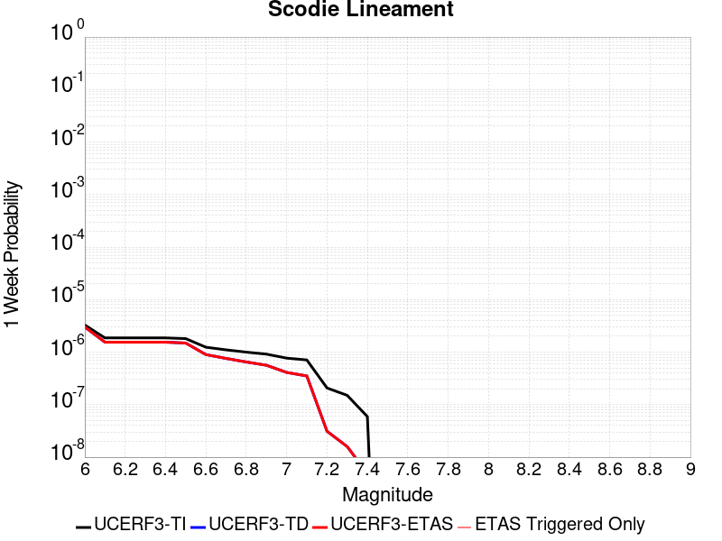 |  | 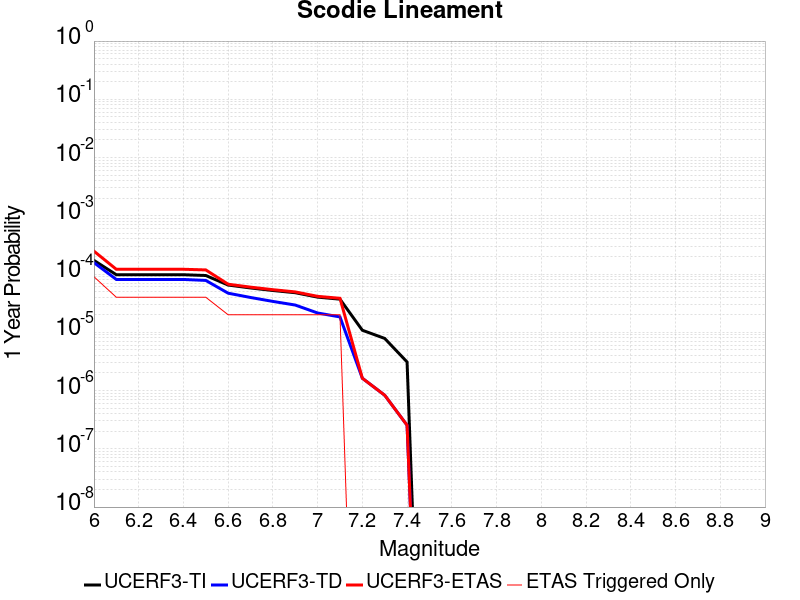 | 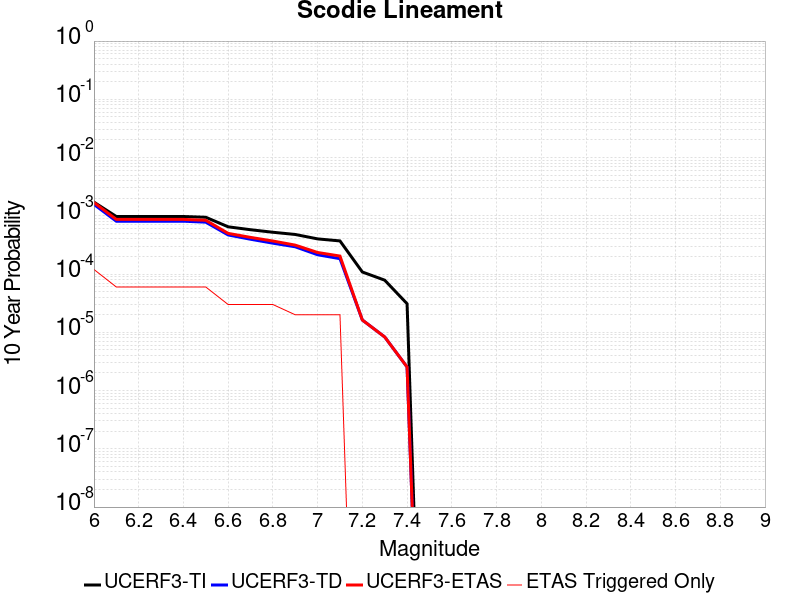 |

| Magnitude | 1 wk TI Prob | 1 wk TD Prob | 1 wk ETAS Prob | 1 wk ETAS/TD Gain | 1 wk ETAS Triggered Only | 1 mo TI Prob | 1 mo TD Prob | 1 mo ETAS Prob | 1 mo ETAS/TD Gain | 1 mo ETAS Triggered Only | 1 yr TI Prob | 1 yr TD Prob | 1 yr ETAS Prob | 1 yr ETAS/TD Gain | 1 yr ETAS Triggered Only | 10 yr TI Prob | 10 yr TD Prob | 10 yr ETAS Prob | 10 yr ETAS/TD Gain | 10 yr ETAS Triggered Only |
|-----|-----|-----|-----|-----|-----|-----|-----|-----|-----|-----|-----|-----|-----|-----|-----|-----|-----|-----|-----|-----|
| 6.0 | 3.2919327E-6 | 3.013385E-6 | 3.013385E-6 | 1.0 | 0.0 | 1.4108206E-5 | 1.2914461E-5 | 3.2914202E-5 | 2.5486314 | 2.0E-5 | 1.7175387E-4 | 1.572254E-4 | 2.4721125E-4 | 1.5723367 | 9.0E-5 | 0.0017162118 | 0.0015714532 | 0.0016912646 | 1.0762424 | 1.2E-4 |
| 6.1 | 1.8663811E-6 | 1.5490768E-6 | 1.5490768E-6 | 1.0 | 0.0 | 7.998751E-6 | 6.6388866E-6 | 6.6388866E-6 | 1.0 | 0.0 | 9.738045E-5 | 8.082594E-5 | 1.2082271E-4 | 1.4948506 | 4.0E-5 | 9.7337784E-4 | 8.080143E-4 | 8.679658E-4 | 1.0741961 | 6.0E-5 |
| 6.2 | 1.8663811E-6 | 1.5490768E-6 | 1.5490768E-6 | 1.0 | 0.0 | 7.998751E-6 | 6.6388866E-6 | 6.6388866E-6 | 1.0 | 0.0 | 9.738045E-5 | 8.082594E-5 | 1.2082271E-4 | 1.4948506 | 4.0E-5 | 9.7337784E-4 | 8.080143E-4 | 8.679658E-4 | 1.0741961 | 6.0E-5 |
| 6.3 | 1.8663811E-6 | 1.5490768E-6 | 1.5490768E-6 | 1.0 | 0.0 | 7.998751E-6 | 6.6388866E-6 | 6.6388866E-6 | 1.0 | 0.0 | 9.738045E-5 | 8.082594E-5 | 1.2082271E-4 | 1.4948506 | 4.0E-5 | 9.7337784E-4 | 8.080143E-4 | 8.679658E-4 | 1.0741961 | 6.0E-5 |
| 6.4 | 1.8663811E-6 | 1.5490768E-6 | 1.5490768E-6 | 1.0 | 0.0 | 7.998751E-6 | 6.6388866E-6 | 6.6388866E-6 | 1.0 | 0.0 | 9.738045E-5 | 8.082594E-5 | 1.2082271E-4 | 1.4948506 | 4.0E-5 | 9.7337784E-4 | 8.080143E-4 | 8.679658E-4 | 1.0741961 | 6.0E-5 |
| 6.5 | 1.8106311E-6 | 1.4910099E-6 | 1.4910099E-6 | 1.0 | 0.0 | 7.759824E-6 | 6.3900297E-6 | 6.3900297E-6 | 1.0 | 0.0 | 9.447177E-5 | 7.779633E-5 | 1.1779321E-4 | 1.5141231 | 4.0E-5 | 9.4431615E-4 | 7.777396E-4 | 8.3769293E-4 | 1.0770867 | 6.0E-5 |
| 6.6 | 1.2414679E-6 | 8.997726E-7 | 8.997726E-7 | 1.0 | 0.0 | 5.320566E-6 | 3.856163E-6 | 3.856163E-6 | 1.0 | 0.0 | 6.477596E-5 | 4.6947862E-5 | 6.694692E-5 | 1.4259845 | 2.0E-5 | 6.475708E-4 | 4.693881E-4 | 4.99374E-4 | 1.063883 | 3.0E-5 |
| 6.7 | 1.1062215E-6 | 7.594458E-7 | 7.594458E-7 | 1.0 | 0.0 | 4.7409408E-6 | 3.2547641E-6 | 3.2547641E-6 | 1.0 | 0.0 | 5.7719422E-5 | 3.9626106E-5 | 5.9625312E-5 | 1.5046978 | 2.0E-5 | 5.770443E-4 | 3.9619737E-4 | 4.261855E-4 | 1.0756898 | 3.0E-5 |
| 6.8 | 1.0006736E-6 | 6.500528E-7 | 6.500528E-7 | 1.0 | 0.0 | 4.288594E-6 | 2.785938E-6 | 2.785938E-6 | 1.0 | 0.0 | 5.221238E-5 | 3.3918328E-5 | 5.391765E-5 | 1.5896317 | 2.0E-5 | 5.220012E-4 | 3.391376E-4 | 3.6912743E-4 | 1.0884297 | 3.0E-5 |
| 6.9 | 9.167364E-7 | 5.631744E-7 | 5.631744E-7 | 1.0 | 0.0 | 3.9288643E-6 | 2.4136027E-6 | 2.4136027E-6 | 1.0 | 0.0 | 4.7832873E-5 | 2.9385274E-5 | 4.9384686E-5 | 1.680593 | 2.0E-5 | 4.782258E-4 | 2.9381955E-4 | 3.1381368E-4 | 1.068049 | 2.0E-5 |
| 7.0 | 7.6987664E-7 | 4.113482E-7 | 4.113482E-7 | 1.0 | 0.0 | 3.2994672E-6 | 1.7629199E-6 | 1.7629199E-6 | 1.0 | 0.0 | 4.0170275E-5 | 2.1463376E-5 | 4.1462947E-5 | 1.9317998 | 2.0E-5 | 4.0163012E-4 | 2.146169E-4 | 2.346126E-4 | 1.0931693 | 2.0E-5 |
| 7.1 | 7.1038727E-7 | 3.5212403E-7 | 3.5212403E-7 | 1.0 | 0.0 | 3.0445133E-6 | 1.5091023E-6 | 1.5091023E-6 | 1.0 | 0.0 | 3.706632E-5 | 1.83732E-5 | 3.8372833E-5 | 2.088522 | 2.0E-5 | 3.7060137E-4 | 1.8372032E-4 | 2.0371664E-4 | 1.1088412 | 2.0E-5 |
| 7.2 | 2.0799602E-7 | 3.1189355E-8 | 3.1189355E-8 | 1.0 | 0.0 | 8.914113E-7 | 1.3366865E-7 | 1.3366865E-7 | 1.0 | 0.0 | 1.0852878E-5 | 1.6274147E-6 | 1.6274147E-6 | 1.0 | 0.0 | 1.08523476E-4 | 1.6274034E-5 | 1.6274034E-5 | 1.0 | 0.0 |
| 7.3 | 1.5048182E-7 | 1.5947395E-8 | 1.5947395E-8 | 1.0 | 0.0 | 6.449219E-7 | 6.8345976E-8 | 6.8345976E-8 | 1.0 | 0.0 | 7.851896E-6 | 8.32112E-7 | 8.32112E-7 | 1.0 | 0.0 | 7.851618E-5 | 8.321092E-6 | 8.321092E-6 | 1.0 | 0.0 |
| 7.4 | 5.9334678E-8 | 4.8689808E-9 | 4.8689808E-9 | 1.0 | 0.0 | 2.5429145E-7 | 2.0867061E-8 | 2.0867061E-8 | 1.0 | 0.0 | 3.095994E-6 | 2.5405646E-7 | 2.5405646E-7 | 1.0 | 0.0 | 3.095951E-5 | 2.5405627E-6 | 2.5405627E-6 | 1.0 | 0.0 |

## San Andreas (Coachella) rev
*[(top)](#table-of-contents)*

| 1 Week | 1 Month | 1 Year | 10 Year |
|-----|-----|-----|-----|
|  | 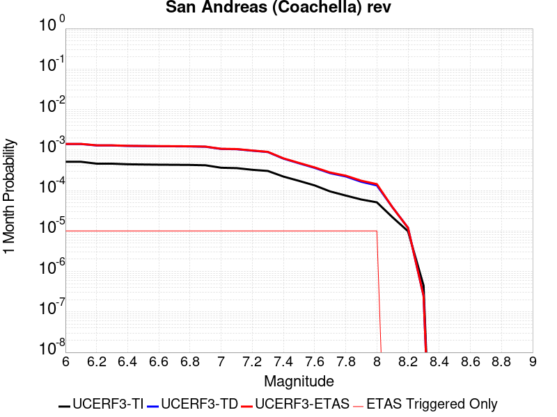 | 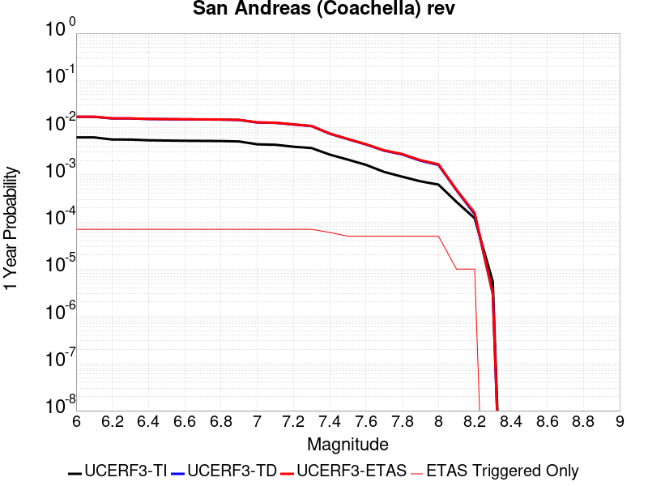 | 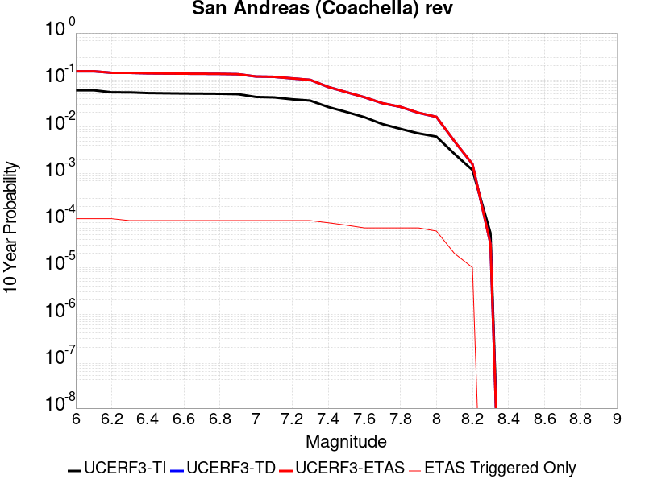 |

| Magnitude | 1 wk TI Prob | 1 wk TD Prob | 1 wk ETAS Prob | 1 wk ETAS/TD Gain | 1 wk ETAS Triggered Only | 1 mo TI Prob | 1 mo TD Prob | 1 mo ETAS Prob | 1 mo ETAS/TD Gain | 1 mo ETAS Triggered Only | 1 yr TI Prob | 1 yr TD Prob | 1 yr ETAS Prob | 1 yr ETAS/TD Gain | 1 yr ETAS Triggered Only | 10 yr TI Prob | 10 yr TD Prob | 10 yr ETAS Prob | 10 yr ETAS/TD Gain | 10 yr ETAS Triggered Only |
|-----|-----|-----|-----|-----|-----|-----|-----|-----|-----|-----|-----|-----|-----|-----|-----|-----|-----|-----|-----|-----|
| 6.0 | 1.1925945E-4 | 3.2742633E-4 | 3.3742306E-4 | 1.0305312 | 1.0E-5 | 5.110118E-4 | 0.0014025057 | 0.0014124917 | 1.0071201 | 1.0E-5 | 0.0062038354 | 0.016943153 | 0.017011967 | 1.0040615 | 7.0E-5 | 0.060334753 | 0.1527048 | 0.15279801 | 1.0006104 | 1.1E-4 |
| 6.1 | 1.1925945E-4 | 3.2742633E-4 | 3.3742306E-4 | 1.0305312 | 1.0E-5 | 5.110118E-4 | 0.0014025057 | 0.0014124917 | 1.0071201 | 1.0E-5 | 0.0062038354 | 0.016943153 | 0.017011967 | 1.0040615 | 7.0E-5 | 0.060334753 | 0.1527048 | 0.15279801 | 1.0006104 | 1.1E-4 |
| 6.2 | 1.07432395E-4 | 3.0243292E-4 | 3.1242988E-4 | 1.0330552 | 1.0E-5 | 4.603433E-4 | 0.0012955012 | 0.0013054883 | 1.007709 | 1.0E-5 | 0.005590286 | 0.015659757 | 0.015728662 | 1.0044 | 7.0E-5 | 0.05451731 | 0.14187601 | 0.1419704 | 1.0006653 | 1.1E-4 |
| 6.3 | 1.0718766E-4 | 3.0188597E-4 | 3.1188296E-4 | 1.0331151 | 1.0E-5 | 4.592948E-4 | 0.0012931596 | 0.0013031466 | 1.007723 | 1.0E-5 | 0.005577586 | 0.015631657 | 0.015700562 | 1.0044081 | 7.0E-5 | 0.054396555 | 0.14164428 | 0.14173011 | 1.000606 | 1.0E-4 |
| 6.4 | 1.0355944E-4 | 2.9396667E-4 | 3.0396375E-4 | 1.0340074 | 1.0E-5 | 4.4375064E-4 | 0.0012592529 | 0.0012692403 | 1.0079312 | 1.0E-5 | 0.0053892885 | 0.015224683 | 0.015293618 | 1.0045278 | 7.0E-5 | 0.052604496 | 0.13820446 | 0.13829063 | 1.0006236 | 1.0E-4 |
| 6.5 | 1.0227914E-4 | 2.9116095E-4 | 3.0115806E-4 | 1.0343353 | 1.0E-5 | 4.382655E-4 | 0.0012472399 | 0.0012572274 | 1.0080076 | 1.0E-5 | 0.0053228354 | 0.015080459 | 0.015149404 | 1.0045718 | 7.0E-5 | 0.051971316 | 0.13698368 | 0.13706997 | 1.00063 | 1.0E-4 |
| 6.6 | 1.0116757E-4 | 2.888184E-4 | 2.9881552E-4 | 1.0346138 | 1.0E-5 | 4.3350324E-4 | 0.00123721 | 0.0012471976 | 1.0080727 | 1.0E-5 | 0.0052651367 | 0.014960027 | 0.015028981 | 1.0046091 | 7.0E-5 | 0.051421247 | 0.13596189 | 0.13604829 | 1.0006355 | 1.0E-4 |
| 6.7 | 1.0050676E-4 | 2.8740402E-4 | 2.9740113E-4 | 1.0347842 | 1.0E-5 | 4.3067214E-4 | 0.001231154 | 0.0012411417 | 1.0081124 | 1.0E-5 | 0.005230834 | 0.014887306 | 0.014956264 | 1.004632 | 7.0E-5 | 0.051094085 | 0.13534662 | 0.1354331 | 1.0006388 | 1.0E-4 |
| 6.8 | 9.976819E-5 | 2.8544042E-4 | 2.9543758E-4 | 1.0350236 | 1.0E-5 | 4.2750788E-4 | 0.0012227466 | 0.0012327343 | 1.0081683 | 1.0E-5 | 0.0051924936 | 0.014786339 | 0.014855305 | 1.0046641 | 7.0E-5 | 0.050728295 | 0.13449831 | 0.13458486 | 1.0006435 | 1.0E-4 |
| 6.9 | 9.77719E-5 | 2.8040865E-4 | 2.9040585E-4 | 1.0356523 | 1.0E-5 | 4.1895514E-4 | 0.0012012018 | 0.0012111898 | 1.008315 | 1.0E-5 | 0.0050888555 | 0.01452756 | 0.014596543 | 1.0047485 | 7.0E-5 | 0.049738888 | 0.1323266 | 0.13241337 | 1.0006557 | 1.0E-4 |
| 7.0 | 8.500761E-5 | 2.4774752E-4 | 2.5774507E-4 | 1.0403537 | 1.0E-5 | 3.6426744E-4 | 0.0010613463 | 0.0010713357 | 1.009412 | 1.0E-5 | 0.0044259406 | 0.012846107 | 0.012915207 | 1.0053791 | 7.0E-5 | 0.04338823 | 0.118182674 | 0.11827085 | 1.0007461 | 1.0E-4 |
| 7.1 | 8.319876E-5 | 2.4377358E-4 | 2.5377114E-4 | 1.0410117 | 1.0E-5 | 3.5651738E-4 | 0.0010443288 | 0.0010543184 | 1.0095655 | 1.0E-5 | 0.004331963 | 0.012641341 | 0.012710457 | 1.0054674 | 7.0E-5 | 0.042484846 | 0.116402484 | 0.11649084 | 1.0007591 | 1.0E-4 |
| 7.2 | 7.563917E-5 | 2.2425436E-4 | 2.3425212E-4 | 1.0445822 | 1.0E-5 | 3.2412758E-4 | 9.607392E-4 | 9.7072957E-4 | 1.0103986 | 1.0E-5 | 0.0039391145 | 0.011634956 | 0.011704141 | 1.0059464 | 7.0E-5 | 0.03870018 | 0.10780776 | 0.10789698 | 1.0008276 | 1.0E-4 |
| 7.3 | 7.082985E-5 | 2.0741153E-4 | 2.1740946E-4 | 1.0482033 | 1.0E-5 | 3.0352117E-4 | 8.8860665E-4 | 8.9859776E-4 | 1.0112436 | 1.0E-5 | 0.0036891096 | 0.010765744 | 0.010834991 | 1.006432 | 7.0E-5 | 0.03628465 | 0.10032911 | 0.100419074 | 1.0008967 | 1.0E-4 |
| 7.4 | 5.146215E-5 | 1.4282999E-4 | 1.5282855E-4 | 1.0700033 | 1.0E-5 | 2.2053342E-4 | 6.119858E-4 | 6.2197965E-4 | 1.0163302 | 1.0E-5 | 0.0026816884 | 0.007425661 | 0.0074852156 | 1.00802 | 6.0E-5 | 0.02649557 | 0.07088973 | 0.07097335 | 1.0011796 | 9.0E-5 |
| 7.5 | 4.0285166E-5 | 1.09495864E-4 | 1.1949477E-4 | 1.0913177 | 1.0E-5 | 1.7263928E-4 | 4.6918393E-4 | 4.7917923E-4 | 1.0213037 | 1.0E-5 | 0.002099857 | 0.005697422 | 0.0057471376 | 1.0087259 | 5.0E-5 | 0.020801254 | 0.055046704 | 0.055122297 | 1.0013733 | 8.0E-5 |
| 7.6 | 3.1168736E-5 | 8.44601E-5 | 9.445926E-5 | 1.1183891 | 1.0E-5 | 1.3357346E-4 | 3.619218E-4 | 3.7191817E-4 | 1.0276203 | 1.0E-5 | 0.0016250437 | 0.0043975213 | 0.0044473014 | 1.01132 | 5.0E-5 | 0.016132116 | 0.04284206 | 0.042909063 | 1.0015639 | 7.0E-5 |
| 7.7 | 2.2100989E-5 | 6.245E-5 | 7.244938E-5 | 1.1601181 | 1.0E-5 | 9.4715084E-5 | 2.6761543E-4 | 2.7761277E-4 | 1.0373571 | 1.0E-5 | 0.001152546 | 0.0032533566 | 0.0033031937 | 1.0153188 | 5.0E-5 | 0.011465867 | 0.03192856 | 0.03199633 | 1.0021224 | 7.0E-5 |
| 7.8 | 1.7484861E-5 | 5.1851406E-5 | 6.1850886E-5 | 1.1928488 | 1.0E-5 | 7.493296E-5 | 2.222014E-4 | 2.3219918E-4 | 1.0449942 | 1.0E-5 | 9.1192697E-4 | 0.0027019489 | 0.0027518137 | 1.0184551 | 5.0E-5 | 0.009081938 | 0.026665483 | 0.026733616 | 1.0025551 | 7.0E-5 |
| 7.9 | 1.3967285E-5 | 3.826819E-5 | 4.8267808E-5 | 1.2613037 | 1.0E-5 | 5.985842E-5 | 1.6399623E-4 | 1.7399459E-4 | 1.060967 | 1.0E-5 | 7.2853256E-4 | 0.0019948268 | 0.002044727 | 1.0250149 | 5.0E-5 | 0.0072614877 | 0.019930542 | 0.019999146 | 1.0034422 | 7.0E-5 |
| 8.0 | 1.1887396E-5 | 3.1104424E-5 | 4.110411E-5 | 1.3214877 | 1.0E-5 | 5.094499E-5 | 1.3329786E-4 | 1.4329654E-4 | 1.07501 | 1.0E-5 | 6.200787E-4 | 0.0016216943 | 0.0016716132 | 1.030782 | 5.0E-5 | 0.006183513 | 0.016297547 | 0.016356569 | 1.0036216 | 6.0E-5 |
| 8.1 | 5.100864E-6 | 8.989363E-6 | 8.989363E-6 | 1.0 | 0.0 | 2.1860664E-5 | 3.8525275E-5 | 3.8525275E-5 | 1.0 | 0.0 | 2.6612106E-4 | 4.689444E-4 | 4.789397E-4 | 1.0213145 | 1.0E-5 | 0.002658026 | 0.0049256803 | 0.004945582 | 1.0040404 | 2.0E-5 |
| 8.2 | 2.3004484E-6 | 2.7928963E-6 | 2.7928963E-6 | 1.0 | 0.0 | 9.859027E-6 | 1.19695005E-5 | 1.19695005E-5 | 1.0 | 0.0 | 1.2002704E-4 | 1.4571895E-4 | 1.557175E-4 | 1.0686152 | 1.0E-5 | 0.0011996223 | 0.0016007201 | 0.0016107041 | 1.0062371 | 1.0E-5 |
| 8.3 | 1.0424446E-7 | 5.8335793E-8 | 5.8335793E-8 | 1.0 | 0.0 | 4.4676187E-7 | 2.5001052E-7 | 2.5001052E-7 | 1.0 | 0.0 | 5.439312E-6 | 3.0438741E-6 | 3.0438741E-6 | 1.0 | 0.0 | 5.4391792E-5 | 3.2000324E-5 | 3.2000324E-5 | 1.0 | 0.0 |

## Deep Springs
*[(top)](#table-of-contents)*

| 1 Week | 1 Month | 1 Year | 10 Year |
|-----|-----|-----|-----|
|  |  |  |  |

| Magnitude | 1 wk TI Prob | 1 wk TD Prob | 1 wk ETAS Prob | 1 wk ETAS/TD Gain | 1 wk ETAS Triggered Only | 1 mo TI Prob | 1 mo TD Prob | 1 mo ETAS Prob | 1 mo ETAS/TD Gain | 1 mo ETAS Triggered Only | 1 yr TI Prob | 1 yr TD Prob | 1 yr ETAS Prob | 1 yr ETAS/TD Gain | 1 yr ETAS Triggered Only | 10 yr TI Prob | 10 yr TD Prob | 10 yr ETAS Prob | 10 yr ETAS/TD Gain | 10 yr ETAS Triggered Only |
|-----|-----|-----|-----|-----|-----|-----|-----|-----|-----|-----|-----|-----|-----|-----|-----|-----|-----|-----|-----|-----|
| 6.0 | 1.9810619E-5 | 2.3114053E-5 | 2.3114053E-5 | 1.0 | 0.0 | 8.489989E-5 | 9.9059325E-5 | 1.0905834E-4 | 1.1009396 | 1.0E-5 | 0.001033166 | 0.0012058879 | 0.0012658155 | 1.0496958 | 6.0E-5 | 0.010283757 | 0.012043222 | 0.012151897 | 1.0090238 | 1.1E-4 |
| 6.1 | 1.9810619E-5 | 2.3114053E-5 | 2.3114053E-5 | 1.0 | 0.0 | 8.489989E-5 | 9.9059325E-5 | 1.0905834E-4 | 1.1009396 | 1.0E-5 | 0.001033166 | 0.0012058879 | 0.0012658155 | 1.0496958 | 6.0E-5 | 0.010283757 | 0.012043222 | 0.012151897 | 1.0090238 | 1.1E-4 |
| 6.2 | 1.9810619E-5 | 2.3114053E-5 | 2.3114053E-5 | 1.0 | 0.0 | 8.489989E-5 | 9.9059325E-5 | 1.0905834E-4 | 1.1009396 | 1.0E-5 | 0.001033166 | 0.0012058879 | 0.0012658155 | 1.0496958 | 6.0E-5 | 0.010283757 | 0.012043222 | 0.012151897 | 1.0090238 | 1.1E-4 |
| 6.3 | 1.9810619E-5 | 2.3114053E-5 | 2.3114053E-5 | 1.0 | 0.0 | 8.489989E-5 | 9.9059325E-5 | 1.0905834E-4 | 1.1009396 | 1.0E-5 | 0.001033166 | 0.0012058879 | 0.0012658155 | 1.0496958 | 6.0E-5 | 0.010283757 | 0.012043222 | 0.012151897 | 1.0090238 | 1.1E-4 |
| 6.4 | 1.9810619E-5 | 2.3114053E-5 | 2.3114053E-5 | 1.0 | 0.0 | 8.489989E-5 | 9.9059325E-5 | 1.0905834E-4 | 1.1009396 | 1.0E-5 | 0.001033166 | 0.0012058879 | 0.0012658155 | 1.0496958 | 6.0E-5 | 0.010283757 | 0.012043222 | 0.012151897 | 1.0090238 | 1.1E-4 |
| 6.5 | 1.7190405E-5 | 2.0051883E-5 | 2.0051883E-5 | 1.0 | 0.0 | 7.367108E-5 | 8.593664E-5 | 9.593578E-5 | 1.1163548 | 1.0E-5 | 8.9657627E-4 | 0.0010462786 | 0.0010862368 | 1.0381907 | 4.0E-5 | 0.008929676 | 0.010462748 | 0.010551807 | 1.0085119 | 9.0E-5 |
| 6.6 | 1.7190405E-5 | 2.0051883E-5 | 2.0051883E-5 | 1.0 | 0.0 | 7.367108E-5 | 8.593664E-5 | 9.593578E-5 | 1.1163548 | 1.0E-5 | 8.9657627E-4 | 0.0010462786 | 0.0010862368 | 1.0381907 | 4.0E-5 | 0.008929676 | 0.010462748 | 0.010551807 | 1.0085119 | 9.0E-5 |

## Ludlow
*[(top)](#table-of-contents)*

| 1 Week | 1 Month | 1 Year | 10 Year |
|-----|-----|-----|-----|
|  |  |  |  |

| Magnitude | 1 wk TI Prob | 1 wk TD Prob | 1 wk ETAS Prob | 1 wk ETAS/TD Gain | 1 wk ETAS Triggered Only | 1 mo TI Prob | 1 mo TD Prob | 1 mo ETAS Prob | 1 mo ETAS/TD Gain | 1 mo ETAS Triggered Only | 1 yr TI Prob | 1 yr TD Prob | 1 yr ETAS Prob | 1 yr ETAS/TD Gain | 1 yr ETAS Triggered Only | 10 yr TI Prob | 10 yr TD Prob | 10 yr ETAS Prob | 10 yr ETAS/TD Gain | 10 yr ETAS Triggered Only |
|-----|-----|-----|-----|-----|-----|-----|-----|-----|-----|-----|-----|-----|-----|-----|-----|-----|-----|-----|-----|-----|
| 6.0 | 2.2407607E-5 | 2.3657778E-5 | 2.3657778E-5 | 1.0 | 0.0 | 9.602906E-5 | 1.0138679E-4 | 1.0138679E-4 | 1.0 | 0.0 | 0.0011685267 | 0.0012337293 | 0.0012636923 | 1.0242865 | 3.0E-5 | 0.011624013 | 0.012273313 | 0.0123819625 | 1.0088525 | 1.1E-4 |
| 6.1 | 2.2407607E-5 | 2.3657778E-5 | 2.3657778E-5 | 1.0 | 0.0 | 9.602906E-5 | 1.0138679E-4 | 1.0138679E-4 | 1.0 | 0.0 | 0.0011685267 | 0.0012337293 | 0.0012636923 | 1.0242865 | 3.0E-5 | 0.011624013 | 0.012273313 | 0.0123819625 | 1.0088525 | 1.1E-4 |
| 6.2 | 1.0781252E-5 | 1.1365909E-5 | 1.1365909E-5 | 1.0 | 0.0 | 4.620455E-5 | 4.871015E-5 | 4.871015E-5 | 1.0 | 0.0 | 5.623952E-4 | 5.9288874E-4 | 6.22871E-4 | 1.0505697 | 3.0E-5 | 0.00560974 | 0.0059134886 | 0.0059731337 | 1.0100863 | 6.0E-5 |
| 6.3 | 1.0781252E-5 | 1.1365909E-5 | 1.1365909E-5 | 1.0 | 0.0 | 4.620455E-5 | 4.871015E-5 | 4.871015E-5 | 1.0 | 0.0 | 5.623952E-4 | 5.9288874E-4 | 6.22871E-4 | 1.0505697 | 3.0E-5 | 0.00560974 | 0.0059134886 | 0.0059731337 | 1.0100863 | 6.0E-5 |
| 6.4 | 7.814439E-6 | 8.2379065E-6 | 8.2379065E-6 | 1.0 | 0.0 | 3.3490025E-5 | 3.5304845E-5 | 3.5304845E-5 | 1.0 | 0.0 | 4.0766477E-4 | 4.297531E-4 | 4.597402E-4 | 1.0697775 | 3.0E-5 | 0.0040691774 | 0.004289367 | 0.0043491093 | 1.013928 | 6.0E-5 |
| 6.5 | 6.4986366E-6 | 6.8510676E-6 | 6.8510676E-6 | 1.0 | 0.0 | 2.7851002E-5 | 2.9361392E-5 | 2.9361392E-5 | 1.0 | 0.0 | 3.390332E-4 | 3.5741724E-4 | 3.774101E-4 | 1.055937 | 2.0E-5 | 0.003385164 | 0.00356852 | 0.0036183416 | 1.0139614 | 5.0E-5 |
| 6.6 | 5.582177E-6 | 5.8861333E-6 | 5.8861333E-6 | 1.0 | 0.0 | 2.3923398E-5 | 2.5226045E-5 | 2.5226045E-5 | 1.0 | 0.0 | 2.9122844E-4 | 3.0708453E-4 | 3.270784E-4 | 1.0651087 | 2.0E-5 | 0.0029084706 | 0.0030666753 | 0.0031065526 | 1.0130035 | 4.0E-5 |
| 6.7 | 4.6858763E-6 | 4.940534E-6 | 4.940534E-6 | 1.0 | 0.0 | 2.0082172E-5 | 2.117355E-5 | 2.117355E-5 | 1.0 | 0.0 | 2.4447302E-4 | 2.5775802E-4 | 2.6775544E-4 | 1.038786 | 1.0E-5 | 0.0024420423 | 0.0025746468 | 0.0026045698 | 1.0116221 | 3.0E-5 |
| 6.8 | 3.5584908E-6 | 3.7520995E-6 | 3.7520995E-6 | 1.0 | 0.0 | 1.5250586E-5 | 1.608033E-5 | 1.608033E-5 | 1.0 | 0.0 | 1.8566006E-4 | 1.9576083E-4 | 1.9576083E-4 | 1.0 | 0.0 | 0.0018550502 | 0.001955925 | 0.0019659055 | 1.0051026 | 1.0E-5 |
| 6.9 | 2.532834E-6 | 2.6710613E-6 | 2.6710613E-6 | 1.0 | 0.0 | 1.0854958E-5 | 1.1447358E-5 | 1.1447358E-5 | 1.0 | 0.0 | 1.3215111E-4 | 1.3936294E-4 | 1.3936294E-4 | 1.0 | 0.0 | 0.0013207254 | 0.001392783 | 0.0014027691 | 1.0071698 | 1.0E-5 |
| 7.0 | 1.7083285E-6 | 1.8019831E-6 | 1.8019831E-6 | 1.0 | 0.0 | 7.3213873E-6 | 7.722763E-6 | 7.722763E-6 | 1.0 | 0.0 | 8.913424E-5 | 9.402075E-5 | 9.402075E-5 | 1.0 | 0.0 | 8.9098496E-4 | 9.3982625E-4 | 9.4981684E-4 | 1.0106302 | 1.0E-5 |
| 7.1 | 1.0905424E-6 | 1.1497868E-6 | 1.1497868E-6 | 1.0 | 0.0 | 4.6737446E-6 | 4.927649E-6 | 4.927649E-6 | 1.0 | 0.0 | 5.6901354E-5 | 5.9992573E-5 | 5.9992573E-5 | 1.0 | 0.0 | 5.6886784E-4 | 5.997736E-4 | 6.0976757E-4 | 1.016663 | 1.0E-5 |
| 7.2 | 6.06668E-7 | 6.387412E-7 | 6.387412E-7 | 1.0 | 0.0 | 2.600003E-6 | 2.7374597E-6 | 2.7374597E-6 | 1.0 | 0.0 | 3.1654577E-5 | 3.332813E-5 | 3.332813E-5 | 1.0 | 0.0 | 3.1650066E-4 | 3.332382E-4 | 3.4323486E-4 | 1.0299985 | 1.0E-5 |

## Lake Isabella (Seismicity)
*[(top)](#table-of-contents)*

| 1 Week | 1 Month | 1 Year | 10 Year |
|-----|-----|-----|-----|
|  |  |  | 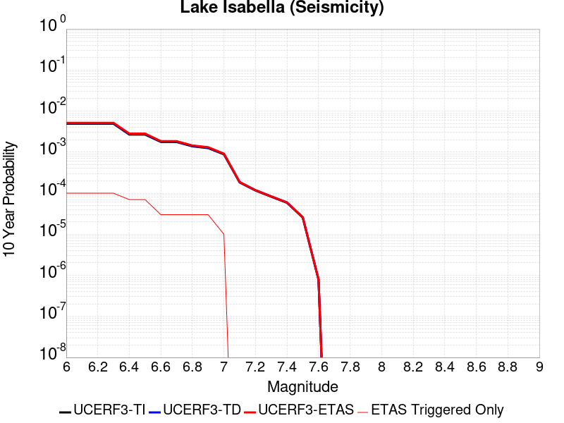 |

| Magnitude | 1 wk TI Prob | 1 wk TD Prob | 1 wk ETAS Prob | 1 wk ETAS/TD Gain | 1 wk ETAS Triggered Only | 1 mo TI Prob | 1 mo TD Prob | 1 mo ETAS Prob | 1 mo ETAS/TD Gain | 1 mo ETAS Triggered Only | 1 yr TI Prob | 1 yr TD Prob | 1 yr ETAS Prob | 1 yr ETAS/TD Gain | 1 yr ETAS Triggered Only | 10 yr TI Prob | 10 yr TD Prob | 10 yr ETAS Prob | 10 yr ETAS/TD Gain | 10 yr ETAS Triggered Only |
|-----|-----|-----|-----|-----|-----|-----|-----|-----|-----|-----|-----|-----|-----|-----|-----|-----|-----|-----|-----|-----|
| 6.0 | 9.431637E-6 | 9.741779E-6 | 9.741779E-6 | 1.0 | 0.0 | 4.0420677E-5 | 4.174989E-5 | 6.174905E-5 | 1.4790232 | 2.0E-5 | 4.920106E-4 | 5.081994E-4 | 5.481791E-4 | 1.0786693 | 4.0E-5 | 0.004909227 | 0.005071665 | 0.005171158 | 1.0196174 | 1.0E-4 |
| 6.1 | 9.431637E-6 | 9.741779E-6 | 9.741779E-6 | 1.0 | 0.0 | 4.0420677E-5 | 4.174989E-5 | 6.174905E-5 | 1.4790232 | 2.0E-5 | 4.920106E-4 | 5.081994E-4 | 5.481791E-4 | 1.0786693 | 4.0E-5 | 0.004909227 | 0.005071665 | 0.005171158 | 1.0196174 | 1.0E-4 |
| 6.2 | 9.431637E-6 | 9.741779E-6 | 9.741779E-6 | 1.0 | 0.0 | 4.0420677E-5 | 4.174989E-5 | 6.174905E-5 | 1.4790232 | 2.0E-5 | 4.920106E-4 | 5.081994E-4 | 5.481791E-4 | 1.0786693 | 4.0E-5 | 0.004909227 | 0.005071665 | 0.005171158 | 1.0196174 | 1.0E-4 |
| 6.3 | 9.431637E-6 | 9.741779E-6 | 9.741779E-6 | 1.0 | 0.0 | 4.0420677E-5 | 4.174989E-5 | 6.174905E-5 | 1.4790232 | 2.0E-5 | 4.920106E-4 | 5.081994E-4 | 5.481791E-4 | 1.0786693 | 4.0E-5 | 0.004909227 | 0.005071665 | 0.005171158 | 1.0196174 | 1.0E-4 |
| 6.4 | 5.144063E-6 | 5.30014E-6 | 5.30014E-6 | 1.0 | 0.0 | 2.2045799E-5 | 2.2714708E-5 | 3.271448E-5 | 1.4402333 | 1.0E-5 | 2.6837454E-4 | 2.7651992E-4 | 2.965144E-4 | 1.0723075 | 2.0E-5 | 0.0026805066 | 0.002762099 | 0.0028319056 | 1.0252731 | 7.0E-5 |
| 6.5 | 5.144063E-6 | 5.30014E-6 | 5.30014E-6 | 1.0 | 0.0 | 2.2045799E-5 | 2.2714708E-5 | 3.271448E-5 | 1.4402333 | 1.0E-5 | 2.6837454E-4 | 2.7651992E-4 | 2.965144E-4 | 1.0723075 | 2.0E-5 | 0.0026805066 | 0.002762099 | 0.0028319056 | 1.0252731 | 7.0E-5 |
| 6.6 | 3.4009804E-6 | 3.4988261E-6 | 3.4988261E-6 | 1.0 | 0.0 | 1.4575549E-5 | 1.4994892E-5 | 1.4994892E-5 | 1.0 | 0.0 | 1.7744285E-4 | 1.8254912E-4 | 1.8254912E-4 | 1.0 | 0.0 | 0.0017730123 | 0.0018241494 | 0.0018540947 | 1.0164161 | 3.0E-5 |
| 6.7 | 3.3880428E-6 | 3.4856928E-6 | 3.4856928E-6 | 1.0 | 0.0 | 1.4520103E-5 | 1.4938607E-5 | 1.4938607E-5 | 1.0 | 0.0 | 1.767679E-4 | 1.8186396E-4 | 1.8186396E-4 | 1.0 | 0.0 | 0.0017662736 | 0.0018173091 | 0.0018472545 | 1.016478 | 3.0E-5 |
| 6.8 | 2.6582E-6 | 2.7337312E-6 | 2.7337312E-6 | 1.0 | 0.0 | 1.1392236E-5 | 1.1715945E-5 | 1.1715945E-5 | 1.0 | 0.0 | 1.3869164E-4 | 1.4263364E-4 | 1.4263364E-4 | 1.0 | 0.0 | 0.0013860512 | 0.001425553 | 0.0014555103 | 1.0210145 | 3.0E-5 |
| 6.9 | 2.406011E-6 | 2.4743567E-6 | 2.4743567E-6 | 1.0 | 0.0 | 1.0311434E-5 | 1.0604351E-5 | 1.0604351E-5 | 1.0 | 0.0 | 1.2553448E-4 | 1.2910164E-4 | 1.2910164E-4 | 1.0 | 0.0 | 0.0012546359 | 0.001290396 | 0.0013203573 | 1.0232186 | 3.0E-5 |
| 7.0 | 1.6953097E-6 | 1.7429567E-6 | 1.7429567E-6 | 1.0 | 0.0 | 7.265593E-6 | 7.4697987E-6 | 7.4697987E-6 | 1.0 | 0.0 | 8.8455E-5 | 9.094205E-5 | 9.094205E-5 | 1.0 | 0.0 | 8.84198E-4 | 9.091511E-4 | 9.1914204E-4 | 1.0109893 | 1.0E-5 |
| 7.1 | 3.5013824E-7 | 3.5715107E-7 | 3.5715107E-7 | 1.0 | 0.0 | 1.5005916E-6 | 1.5306466E-6 | 1.5306466E-6 | 1.0 | 0.0 | 1.826955E-5 | 1.8635465E-5 | 1.8635465E-5 | 1.0 | 0.0 | 1.8268047E-4 | 1.8633928E-4 | 1.8633928E-4 | 1.0 | 0.0 |
| 7.2 | 2.2321095E-7 | 2.2750747E-7 | 2.2750747E-7 | 1.0 | 0.0 | 9.56618E-7 | 9.750316E-7 | 9.750316E-7 | 1.0 | 0.0 | 1.1646762E-5 | 1.1870947E-5 | 1.1870947E-5 | 1.0 | 0.0 | 1.1646151E-4 | 1.1870323E-4 | 1.1870323E-4 | 1.0 | 0.0 |
| 7.3 | 1.5760406E-7 | 1.6061044E-7 | 1.6061044E-7 | 1.0 | 0.0 | 6.7544585E-7 | 6.8833026E-7 | 6.8833026E-7 | 1.0 | 0.0 | 8.223522E-6 | 8.38039E-6 | 8.38039E-6 | 1.0 | 0.0 | 8.2232174E-5 | 8.38008E-5 | 8.38008E-5 | 1.0 | 0.0 |
| 7.4 | 1.1216497E-7 | 1.14317935E-7 | 1.14317935E-7 | 1.0 | 0.0 | 4.8070694E-7 | 4.8993394E-7 | 4.8993394E-7 | 1.0 | 0.0 | 5.852591E-6 | 5.9649296E-6 | 5.9649296E-6 | 1.0 | 0.0 | 5.8524372E-5 | 5.9647737E-5 | 5.9647737E-5 | 1.0 | 0.0 |
| 7.5 | 4.885185E-8 | 4.9788117E-8 | 4.9788117E-8 | 1.0 | 0.0 | 2.0936506E-7 | 2.1337763E-7 | 2.1337763E-7 | 1.0 | 0.0 | 2.5490165E-6 | 2.5978698E-6 | 2.5978698E-6 | 1.0 | 0.0 | 2.5489873E-5 | 2.5978412E-5 | 2.5978412E-5 | 1.0 | 0.0 |
| 7.6 | 1.504641E-9 | 1.5318012E-9 | 1.5318012E-9 | 1.0 | 0.0 | 6.4484613E-9 | 6.5648624E-9 | 6.5648624E-9 | 1.0 | 0.0 | 7.851001E-8 | 7.9927204E-8 | 7.9927204E-8 | 1.0 | 0.0 | 7.8509987E-7 | 7.99272E-7 | 7.99272E-7 | 1.0 | 0.0 |

## White Mountains
*[(top)](#table-of-contents)*

| 1 Week | 1 Month | 1 Year | 10 Year |
|-----|-----|-----|-----|
|  | 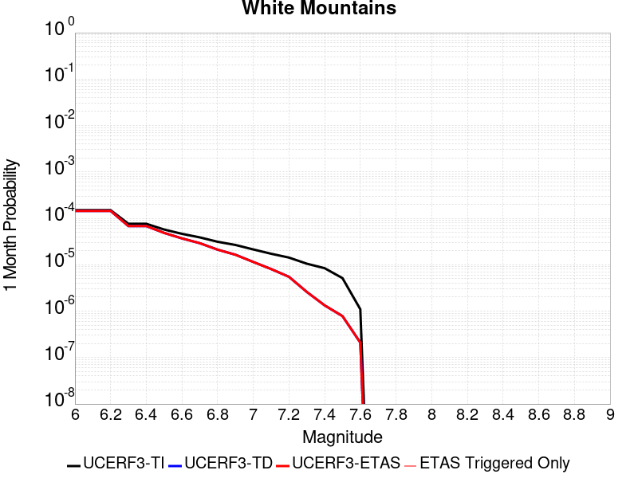 |  | 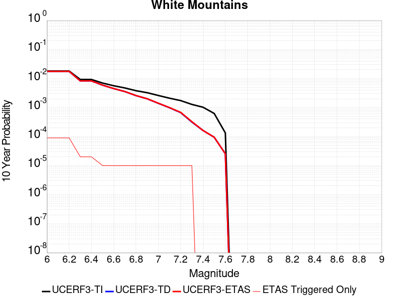 |

| Magnitude | 1 wk TI Prob | 1 wk TD Prob | 1 wk ETAS Prob | 1 wk ETAS/TD Gain | 1 wk ETAS Triggered Only | 1 mo TI Prob | 1 mo TD Prob | 1 mo ETAS Prob | 1 mo ETAS/TD Gain | 1 mo ETAS Triggered Only | 1 yr TI Prob | 1 yr TD Prob | 1 yr ETAS Prob | 1 yr ETAS/TD Gain | 1 yr ETAS Triggered Only | 10 yr TI Prob | 10 yr TD Prob | 10 yr ETAS Prob | 10 yr ETAS/TD Gain | 10 yr ETAS Triggered Only |
|-----|-----|-----|-----|-----|-----|-----|-----|-----|-----|-----|-----|-----|-----|-----|-----|-----|-----|-----|-----|-----|
| 6.0 | 3.503579E-5 | 3.3785294E-5 | 3.3785294E-5 | 1.0 | 0.0 | 1.5014476E-4 | 1.4478677E-4 | 1.4478677E-4 | 1.0 | 0.0 | 0.0018264796 | 0.0017614744 | 0.0017814392 | 1.0113342 | 2.0E-5 | 0.018115403 | 0.017487457 | 0.017575884 | 1.0050565 | 9.0E-5 |
| 6.1 | 3.503579E-5 | 3.3785294E-5 | 3.3785294E-5 | 1.0 | 0.0 | 1.5014476E-4 | 1.4478677E-4 | 1.4478677E-4 | 1.0 | 0.0 | 0.0018264796 | 0.0017614744 | 0.0017814392 | 1.0113342 | 2.0E-5 | 0.018115403 | 0.017487457 | 0.017575884 | 1.0050565 | 9.0E-5 |
| 6.2 | 3.503579E-5 | 3.3785294E-5 | 3.3785294E-5 | 1.0 | 0.0 | 1.5014476E-4 | 1.4478677E-4 | 1.4478677E-4 | 1.0 | 0.0 | 0.0018264796 | 0.0017614744 | 0.0017814392 | 1.0113342 | 2.0E-5 | 0.018115403 | 0.017487457 | 0.017575884 | 1.0050565 | 9.0E-5 |
| 6.3 | 1.7818425E-5 | 1.5916683E-5 | 1.5916683E-5 | 1.0 | 0.0 | 7.636245E-5 | 6.8212656E-5 | 6.8212656E-5 | 1.0 | 0.0 | 9.293162E-4 | 8.301869E-4 | 8.301869E-4 | 1.0 | 0.0 | 0.009254395 | 0.0082723135 | 0.008292149 | 1.0023977 | 2.0E-5 |
| 6.4 | 1.7818425E-5 | 1.5916683E-5 | 1.5916683E-5 | 1.0 | 0.0 | 7.636245E-5 | 6.8212656E-5 | 6.8212656E-5 | 1.0 | 0.0 | 9.293162E-4 | 8.301869E-4 | 8.301869E-4 | 1.0 | 0.0 | 0.009254395 | 0.0082723135 | 0.008292149 | 1.0023977 | 2.0E-5 |
| 6.5 | 1.3397557E-5 | 1.1336729E-5 | 1.1336729E-5 | 1.0 | 0.0 | 5.741684E-5 | 4.8585112E-5 | 4.8585112E-5 | 1.0 | 0.0 | 6.988258E-4 | 5.9137016E-4 | 5.9137016E-4 | 1.0 | 0.0 | 0.006966323 | 0.0058986708 | 0.0059086117 | 1.0016853 | 1.0E-5 |
| 6.6 | 1.0818695E-5 | 8.62567E-6 | 8.62567E-6 | 1.0 | 0.0 | 4.6365014E-5 | 3.6966656E-5 | 3.6966656E-5 | 1.0 | 0.0 | 5.6434784E-4 | 4.4998043E-4 | 4.4998043E-4 | 1.0 | 0.0 | 0.005629168 | 0.0044911294 | 0.004501085 | 1.0022166 | 1.0E-5 |
| 6.7 | 9.067908E-6 | 6.8026484E-6 | 6.8026484E-6 | 1.0 | 0.0 | 3.8861883E-5 | 2.91539E-5 | 2.91539E-5 | 1.0 | 0.0 | 4.7304068E-4 | 3.5489412E-4 | 3.5489412E-4 | 1.0 | 0.0 | 0.00472035 | 0.0035435907 | 0.0035535553 | 1.002812 | 1.0E-5 |
| 6.8 | 7.295947E-6 | 4.9365435E-6 | 4.9365435E-6 | 1.0 | 0.0 | 3.126797E-5 | 2.115645E-5 | 2.115645E-5 | 1.0 | 0.0 | 3.8062103E-4 | 2.5755048E-4 | 2.5755048E-4 | 1.0 | 0.0 | 0.0037996976 | 0.0025726326 | 0.002582607 | 1.003877 | 1.0E-5 |
| 6.9 | 6.2243444E-6 | 3.8323383E-6 | 3.8323383E-6 | 1.0 | 0.0 | 2.6675489E-5 | 1.6424206E-5 | 1.6424206E-5 | 1.0 | 0.0 | 3.2472567E-4 | 1.999469E-4 | 1.999469E-4 | 1.0 | 0.0 | 0.0032425157 | 0.0019977225 | 0.0020077026 | 1.0049957 | 1.0E-5 |
| 7.0 | 4.9878413E-6 | 2.6796408E-6 | 2.6796408E-6 | 1.0 | 0.0 | 2.1376287E-5 | 1.1484126E-5 | 1.1484126E-5 | 1.0 | 0.0 | 2.602252E-4 | 1.3981052E-4 | 1.3981052E-4 | 1.0 | 0.0 | 0.002599207 | 0.001397252 | 0.001407238 | 1.007147 | 1.0E-5 |
| 7.1 | 4.0252844E-6 | 1.8858552E-6 | 1.8858552E-6 | 1.0 | 0.0 | 1.7251105E-5 | 8.082212E-6 | 8.082212E-6 | 1.0 | 0.0 | 2.1001195E-4 | 9.839662E-5 | 9.839662E-5 | 1.0 | 0.0 | 0.0020981359 | 9.835433E-4 | 9.935335E-4 | 1.0101573 | 1.0E-5 |
| 7.2 | 3.3284066E-6 | 1.2820549E-6 | 1.2820549E-6 | 1.0 | 0.0 | 1.4264522E-5 | 5.49451E-6 | 5.49451E-6 | 1.0 | 0.0 | 1.736567E-4 | 6.689371E-5 | 6.689371E-5 | 1.0 | 0.0 | 0.0017352107 | 6.687458E-4 | 6.787391E-4 | 1.0149434 | 1.0E-5 |
| 7.3 | 2.458226E-6 | 6.058038E-7 | 6.058038E-7 | 1.0 | 0.0 | 1.0535211E-5 | 2.5962997E-6 | 2.5962997E-6 | 1.0 | 0.0 | 1.2825865E-4 | 3.160953E-5 | 3.160953E-5 | 1.0 | 0.0 | 0.0012818464 | 3.1605407E-4 | 3.260509E-4 | 1.0316302 | 1.0E-5 |
| 7.4 | 1.965953E-6 | 3.1096397E-7 | 3.1096397E-7 | 1.0 | 0.0 | 8.425486E-6 | 1.3327021E-6 | 1.3327021E-6 | 1.0 | 0.0 | 1.0257547E-4 | 1.622553E-5 | 1.622553E-5 | 1.0 | 0.0 | 0.0010252813 | 1.6224357E-4 | 1.6224357E-4 | 1.0 | 0.0 |
| 7.5 | 1.2014192E-6 | 1.8249165E-7 | 1.8249165E-7 | 1.0 | 0.0 | 5.148929E-6 | 7.821068E-7 | 7.821068E-7 | 1.0 | 0.0 | 6.2686406E-5 | 9.522109E-6 | 9.522109E-6 | 1.0 | 0.0 | 6.266873E-4 | 9.5217096E-5 | 9.5217096E-5 | 1.0 | 0.0 |
| 7.6 | 2.5612175E-7 | 4.8959436E-8 | 4.8959436E-8 | 1.0 | 0.0 | 1.0976642E-6 | 2.0982613E-7 | 2.0982613E-7 | 1.0 | 0.0 | 1.3363979E-5 | 2.5546306E-6 | 2.5546306E-6 | 1.0 | 0.0 | 1.3363175E-4 | 2.5546047E-5 | 2.5546047E-5 | 1.0 | 0.0 |

## Santa Ynez (East)
*[(top)](#table-of-contents)*

| 1 Week | 1 Month | 1 Year | 10 Year |
|-----|-----|-----|-----|
| 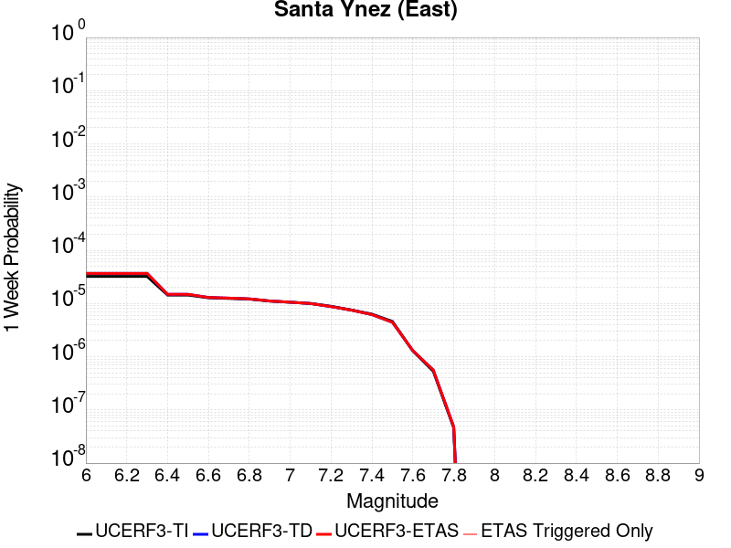 | 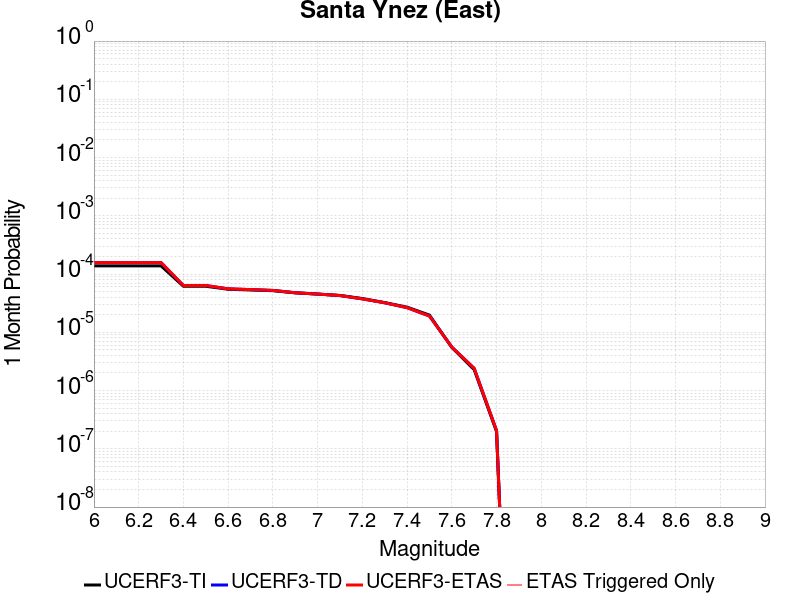 |  |  |

| Magnitude | 1 wk TI Prob | 1 wk TD Prob | 1 wk ETAS Prob | 1 wk ETAS/TD Gain | 1 wk ETAS Triggered Only | 1 mo TI Prob | 1 mo TD Prob | 1 mo ETAS Prob | 1 mo ETAS/TD Gain | 1 mo ETAS Triggered Only | 1 yr TI Prob | 1 yr TD Prob | 1 yr ETAS Prob | 1 yr ETAS/TD Gain | 1 yr ETAS Triggered Only | 10 yr TI Prob | 10 yr TD Prob | 10 yr ETAS Prob | 10 yr ETAS/TD Gain | 10 yr ETAS Triggered Only |
|-----|-----|-----|-----|-----|-----|-----|-----|-----|-----|-----|-----|-----|-----|-----|-----|-----|-----|-----|-----|-----|
| 6.0 | 3.2269712E-5 | 3.6753037E-5 | 3.6753037E-5 | 1.0 | 0.0 | 1.3829143E-4 | 1.5750683E-4 | 1.5750683E-4 | 1.0 | 0.0 | 0.0016823979 | 0.0019165487 | 0.0019464912 | 1.0156231 | 3.0E-5 | 0.016697178 | 0.019057743 | 0.019146027 | 1.0046325 | 9.0E-5 |
| 6.1 | 3.2269712E-5 | 3.6753037E-5 | 3.6753037E-5 | 1.0 | 0.0 | 1.3829143E-4 | 1.5750683E-4 | 1.5750683E-4 | 1.0 | 0.0 | 0.0016823979 | 0.0019165487 | 0.0019464912 | 1.0156231 | 3.0E-5 | 0.016697178 | 0.019057743 | 0.019146027 | 1.0046325 | 9.0E-5 |
| 6.2 | 3.2269712E-5 | 3.6753037E-5 | 3.6753037E-5 | 1.0 | 0.0 | 1.3829143E-4 | 1.5750683E-4 | 1.5750683E-4 | 1.0 | 0.0 | 0.0016823979 | 0.0019165487 | 0.0019464912 | 1.0156231 | 3.0E-5 | 0.016697178 | 0.019057743 | 0.019146027 | 1.0046325 | 9.0E-5 |
| 6.3 | 3.2269712E-5 | 3.6753037E-5 | 3.6753037E-5 | 1.0 | 0.0 | 1.3829143E-4 | 1.5750683E-4 | 1.5750683E-4 | 1.0 | 0.0 | 0.0016823979 | 0.0019165487 | 0.0019464912 | 1.0156231 | 3.0E-5 | 0.016697178 | 0.019057743 | 0.019146027 | 1.0046325 | 9.0E-5 |
| 6.4 | 1.4404779E-5 | 1.4849943E-5 | 1.4849943E-5 | 1.0 | 0.0 | 6.1733306E-5 | 6.364109E-5 | 6.364109E-5 | 1.0 | 0.0 | 7.513438E-4 | 7.7455986E-4 | 7.845521E-4 | 1.0129006 | 1.0E-5 | 0.0074880854 | 0.0077191526 | 0.007748921 | 1.0038564 | 3.0E-5 |
| 6.5 | 1.4404779E-5 | 1.4849943E-5 | 1.4849943E-5 | 1.0 | 0.0 | 6.1733306E-5 | 6.364109E-5 | 6.364109E-5 | 1.0 | 0.0 | 7.513438E-4 | 7.7455986E-4 | 7.845521E-4 | 1.0129006 | 1.0E-5 | 0.0074880854 | 0.0077191526 | 0.007748921 | 1.0038564 | 3.0E-5 |
| 6.6 | 1.280208E-5 | 1.3012401E-5 | 1.3012401E-5 | 1.0 | 0.0 | 5.4864904E-5 | 5.576625E-5 | 5.576625E-5 | 1.0 | 0.0 | 6.6777546E-4 | 6.7874434E-4 | 6.8873755E-4 | 1.0147231 | 1.0E-5 | 0.006657724 | 0.0067669237 | 0.006796721 | 1.0044034 | 3.0E-5 |
| 6.7 | 1.2457027E-5 | 1.2628904E-5 | 1.2628904E-5 | 1.0 | 0.0 | 5.3386164E-5 | 5.412276E-5 | 5.412276E-5 | 1.0 | 0.0 | 6.497827E-4 | 6.5874704E-4 | 6.687405E-4 | 1.0151703 | 1.0E-5 | 0.00647886 | 0.0065681413 | 0.006597944 | 1.0045375 | 3.0E-5 |
| 6.8 | 1.2095134E-5 | 1.2231336E-5 | 1.2231336E-5 | 1.0 | 0.0 | 5.1835254E-5 | 5.2418964E-5 | 5.2418964E-5 | 1.0 | 0.0 | 6.309115E-4 | 6.380156E-4 | 6.4800924E-4 | 1.0156636 | 1.0E-5 | 0.0062912325 | 0.0063620275 | 0.0063918363 | 1.0046855 | 3.0E-5 |
| 6.9 | 1.1104036E-5 | 1.1157732E-5 | 1.1157732E-5 | 1.0 | 0.0 | 4.758786E-5 | 4.7817983E-5 | 4.7817983E-5 | 1.0 | 0.0 | 5.7922816E-4 | 5.820297E-4 | 5.9202383E-4 | 1.0171713 | 1.0E-5 | 0.005777207 | 0.005805199 | 0.005815141 | 1.0017126 | 1.0E-5 |
| 7.0 | 1.0577444E-5 | 1.0582044E-5 | 1.0582044E-5 | 1.0 | 0.0 | 4.5331115E-5 | 4.5350833E-5 | 4.5350833E-5 | 1.0 | 0.0 | 5.5176654E-4 | 5.5200775E-4 | 5.6200224E-4 | 1.0181057 | 1.0E-5 | 0.0055039856 | 0.0055065043 | 0.005516449 | 1.001806 | 1.0E-5 |
| 7.1 | 1.0021775E-5 | 9.9813315E-6 | 9.9813315E-6 | 1.0 | 0.0 | 4.294976E-5 | 4.277644E-5 | 4.277644E-5 | 1.0 | 0.0 | 5.2278786E-4 | 5.2067987E-4 | 5.3067465E-4 | 1.0191957 | 1.0E-5 | 0.0052155964 | 0.005194732 | 0.00520468 | 1.001915 | 1.0E-5 |
| 7.2 | 8.874109E-6 | 8.749096E-6 | 8.749096E-6 | 1.0 | 0.0 | 3.8031343E-5 | 3.7495593E-5 | 3.7495593E-5 | 1.0 | 0.0 | 4.629332E-4 | 4.5641433E-4 | 4.6640975E-4 | 1.0218999 | 1.0E-5 | 0.0046197 | 0.0045548873 | 0.0045648417 | 1.0021855 | 1.0E-5 |
| 7.3 | 7.5504267E-6 | 7.5053617E-6 | 7.5053617E-6 | 1.0 | 0.0 | 3.235857E-5 | 3.2165444E-5 | 3.2165444E-5 | 1.0 | 0.0 | 3.9389438E-4 | 3.9154495E-4 | 3.9154495E-4 | 1.0 | 0.0 | 0.0039319694 | 0.003908658 | 0.003908658 | 1.0 | 0.0 |
| 7.4 | 6.309394E-6 | 6.183353E-6 | 6.183353E-6 | 1.0 | 0.0 | 2.703998E-5 | 2.6499822E-5 | 2.6499822E-5 | 1.0 | 0.0 | 3.2916202E-4 | 3.2258852E-4 | 3.2258852E-4 | 1.0 | 0.0 | 0.003286749 | 0.0032212997 | 0.0032212997 | 1.0 | 0.0 |
| 7.5 | 4.6103073E-6 | 4.441024E-6 | 4.441024E-6 | 1.0 | 0.0 | 1.975831E-5 | 1.9032826E-5 | 1.9032826E-5 | 1.0 | 0.0 | 2.4053088E-4 | 2.317007E-4 | 2.317007E-4 | 1.0 | 0.0 | 0.002402707 | 0.0023146607 | 0.0023146607 | 1.0 | 0.0 |
| 7.6 | 1.2858658E-6 | 1.3008458E-6 | 1.3008458E-6 | 1.0 | 0.0 | 5.5108417E-6 | 5.575042E-6 | 5.575042E-6 | 1.0 | 0.0 | 6.7092435E-5 | 6.787409E-5 | 6.787409E-5 | 1.0 | 0.0 | 6.707218E-4 | 6.785405E-4 | 6.785405E-4 | 1.0 | 0.0 |
| 7.7 | 5.3302307E-7 | 5.612257E-7 | 5.612257E-7 | 1.0 | 0.0 | 2.2843826E-6 | 2.405251E-6 | 2.405251E-6 | 1.0 | 0.0 | 2.7812002E-5 | 2.9283574E-5 | 2.9283574E-5 | 1.0 | 0.0 | 2.7808524E-4 | 2.9280072E-4 | 2.9280072E-4 | 1.0 | 0.0 |
| 7.8 | 4.613933E-8 | 4.803088E-8 | 4.803088E-8 | 1.0 | 0.0 | 1.9773998E-7 | 2.0584662E-7 | 2.0584662E-7 | 1.0 | 0.0 | 2.4074816E-6 | 2.5061797E-6 | 2.5061797E-6 | 1.0 | 0.0 | 2.4074554E-5 | 2.5061525E-5 | 2.5061525E-5 | 1.0 | 0.0 |

## Santa Ynez (West)
*[(top)](#table-of-contents)*

| 1 Week | 1 Month | 1 Year | 10 Year |
|-----|-----|-----|-----|
|  |  |  |  |

| Magnitude | 1 wk TI Prob | 1 wk TD Prob | 1 wk ETAS Prob | 1 wk ETAS/TD Gain | 1 wk ETAS Triggered Only | 1 mo TI Prob | 1 mo TD Prob | 1 mo ETAS Prob | 1 mo ETAS/TD Gain | 1 mo ETAS Triggered Only | 1 yr TI Prob | 1 yr TD Prob | 1 yr ETAS Prob | 1 yr ETAS/TD Gain | 1 yr ETAS Triggered Only | 10 yr TI Prob | 10 yr TD Prob | 10 yr ETAS Prob | 10 yr ETAS/TD Gain | 10 yr ETAS Triggered Only |
|-----|-----|-----|-----|-----|-----|-----|-----|-----|-----|-----|-----|-----|-----|-----|-----|-----|-----|-----|-----|-----|
| 6.0 | 4.7352758E-5 | 5.4976226E-5 | 5.4976226E-5 | 1.0 | 0.0 | 2.0292461E-4 | 2.3559279E-4 | 2.3559279E-4 | 1.0 | 0.0 | 0.0024678076 | 0.0028647326 | 0.0028946467 | 1.0104421 | 3.0E-5 | 0.024405818 | 0.028306454 | 0.028374473 | 1.0024029 | 7.0E-5 |
| 6.1 | 4.7352758E-5 | 5.4976226E-5 | 5.4976226E-5 | 1.0 | 0.0 | 2.0292461E-4 | 2.3559279E-4 | 2.3559279E-4 | 1.0 | 0.0 | 0.0024678076 | 0.0028647326 | 0.0028946467 | 1.0104421 | 3.0E-5 | 0.024405818 | 0.028306454 | 0.028364755 | 1.0020597 | 6.0E-5 |
| 6.2 | 3.0415853E-5 | 3.3927136E-5 | 3.3927136E-5 | 1.0 | 0.0 | 1.3034715E-4 | 1.4539414E-4 | 1.4539414E-4 | 1.0 | 0.0 | 0.0015858212 | 0.0017687713 | 0.0017987184 | 1.0169309 | 3.0E-5 | 0.015745522 | 0.017550841 | 0.017599963 | 1.0027989 | 5.0E-5 |
| 6.3 | 3.0415853E-5 | 3.3927136E-5 | 3.3927136E-5 | 1.0 | 0.0 | 1.3034715E-4 | 1.4539414E-4 | 1.4539414E-4 | 1.0 | 0.0 | 0.0015858212 | 0.0017687713 | 0.0017987184 | 1.0169309 | 3.0E-5 | 0.015745522 | 0.017550841 | 0.017599963 | 1.0027989 | 5.0E-5 |
| 6.4 | 2.5452082E-5 | 2.7913935E-5 | 2.7913935E-5 | 1.0 | 0.0 | 1.09075794E-4 | 1.1962578E-4 | 1.1962578E-4 | 1.0 | 0.0 | 0.0013271887 | 0.0014554873 | 0.0014754583 | 1.0137211 | 2.0E-5 | 0.013192902 | 0.014461728 | 0.014501149 | 1.002726 | 4.0E-5 |
| 6.5 | 2.3143784E-5 | 2.5129539E-5 | 2.5129539E-5 | 1.0 | 0.0 | 9.9183875E-5 | 1.0769366E-4 | 1.0769366E-4 | 1.0 | 0.0 | 0.0012068948 | 0.0013103933 | 0.0013203803 | 1.0076213 | 1.0E-5 | 0.012003611 | 0.0130283395 | 0.013057948 | 1.0022727 | 3.0E-5 |
| 6.6 | 1.9118515E-5 | 2.0355266E-5 | 2.0355266E-5 | 1.0 | 0.0 | 8.193392E-5 | 8.723398E-5 | 8.723398E-5 | 1.0 | 0.0 | 9.97089E-4 | 0.0010615642 | 0.0010615642 | 1.0 | 0.0 | 0.00992627 | 0.0105658425 | 0.010595526 | 1.0028093 | 3.0E-5 |
| 6.7 | 1.722807E-5 | 1.8147124E-5 | 1.8147124E-5 | 1.0 | 0.0 | 7.3832496E-5 | 7.77711E-5 | 7.77711E-5 | 1.0 | 0.0 | 8.985399E-4 | 9.4645744E-4 | 9.4645744E-4 | 1.0 | 0.0 | 0.008949154 | 0.009424911 | 0.009444723 | 1.002102 | 2.0E-5 |
| 6.8 | 1.5317364E-5 | 1.5927119E-5 | 1.5927119E-5 | 1.0 | 0.0 | 6.56442E-5 | 6.8257315E-5 | 6.8257315E-5 | 1.0 | 0.0 | 7.98925E-4 | 8.3072024E-4 | 8.3072024E-4 | 1.0 | 0.0 | 0.007960589 | 0.008276637 | 0.008296471 | 1.0023965 | 2.0E-5 |
| 6.9 | 1.3071226E-5 | 1.3330094E-5 | 1.3330094E-5 | 1.0 | 0.0 | 5.6018336E-5 | 5.7127738E-5 | 5.7127738E-5 | 1.0 | 0.0 | 6.8180985E-4 | 6.953105E-4 | 6.953105E-4 | 1.0 | 0.0 | 0.0067972173 | 0.006931611 | 0.0069415416 | 1.0014327 | 1.0E-5 |
| 7.0 | 1.1836986E-5 | 1.1933178E-5 | 1.1933178E-5 | 1.0 | 0.0 | 5.0728955E-5 | 5.1141196E-5 | 5.1141196E-5 | 1.0 | 0.0 | 6.1745E-4 | 6.224679E-4 | 6.224679E-4 | 1.0 | 0.0 | 0.006157372 | 0.006207437 | 0.0062173745 | 1.001601 | 1.0E-5 |
| 7.1 | 1.0597169E-5 | 1.054253E-5 | 1.054253E-5 | 1.0 | 0.0 | 4.541565E-5 | 4.5181492E-5 | 4.5181492E-5 | 1.0 | 0.0 | 5.5279525E-4 | 5.4994697E-4 | 5.4994697E-4 | 1.0 | 0.0 | 0.0055142213 | 0.0054859915 | 0.0054959366 | 1.0018128 | 1.0E-5 |
| 7.2 | 9.59113E-6 | 9.459439E-6 | 9.459439E-6 | 1.0 | 0.0 | 4.11042E-5 | 4.0539828E-5 | 4.0539828E-5 | 1.0 | 0.0 | 5.0032866E-4 | 4.934617E-4 | 4.934617E-4 | 1.0 | 0.0 | 0.004992037 | 0.0049237786 | 0.0049337293 | 1.002021 | 1.0E-5 |
| 7.3 | 8.586084E-6 | 8.379846E-6 | 8.379846E-6 | 1.0 | 0.0 | 3.679698E-5 | 3.5913137E-5 | 3.5913137E-5 | 1.0 | 0.0 | 4.4791115E-4 | 4.3715577E-4 | 4.3715577E-4 | 1.0 | 0.0 | 0.004470094 | 0.0043630693 | 0.0043730256 | 1.002282 | 1.0E-5 |
| 7.4 | 7.2622997E-6 | 6.9517596E-6 | 6.9517596E-6 | 1.0 | 0.0 | 3.112377E-5 | 2.979292E-5 | 2.979292E-5 | 1.0 | 0.0 | 3.78866E-4 | 3.6266938E-4 | 3.6266938E-4 | 1.0 | 0.0 | 0.0037822074 | 0.0036208755 | 0.0036308393 | 1.0027517 | 1.0E-5 |
| 7.5 | 5.627296E-6 | 5.251746E-6 | 5.251746E-6 | 1.0 | 0.0 | 2.411676E-5 | 2.2507293E-5 | 2.2507293E-5 | 1.0 | 0.0 | 2.9358198E-4 | 2.7399254E-4 | 2.7399254E-4 | 1.0 | 0.0 | 0.0029319443 | 0.0027366192 | 0.002746592 | 1.0036441 | 1.0E-5 |
| 7.6 | 2.265244E-6 | 2.0609152E-6 | 2.0609152E-6 | 1.0 | 0.0 | 9.708152E-6 | 8.832464E-6 | 8.832464E-6 | 1.0 | 0.0 | 1.18190335E-4 | 1.0753004E-4 | 1.0753004E-4 | 1.0 | 0.0 | 0.001181275 | 0.0010747886 | 0.0010847779 | 1.0092942 | 1.0E-5 |
| 7.7 | 1.3099874E-6 | 1.1016567E-6 | 1.1016567E-6 | 1.0 | 0.0 | 5.61422E-6 | 4.7213775E-6 | 4.7213775E-6 | 1.0 | 0.0 | 6.8350986E-5 | 5.7481277E-5 | 5.7481277E-5 | 1.0 | 0.0 | 6.832996E-4 | 5.746665E-4 | 5.746665E-4 | 1.0 | 0.0 |
| 7.8 | 7.903951E-7 | 6.0712887E-7 | 6.0712887E-7 | 1.0 | 0.0 | 3.3874032E-6 | 2.6019784E-6 | 2.6019784E-6 | 1.0 | 0.0 | 4.1240855E-5 | 3.167864E-5 | 3.167864E-5 | 1.0 | 0.0 | 4.12332E-4 | 3.1674257E-4 | 3.1674257E-4 | 1.0 | 0.0 |
| 7.9 | 7.0753297E-9 | 5.0900404E-9 | 5.0900404E-9 | 1.0 | 0.0 | 3.032284E-8 | 2.1814458E-8 | 2.1814458E-8 | 1.0 | 0.0 | 3.6918053E-7 | 2.65591E-7 | 2.65591E-7 | 1.0 | 0.0 | 3.691799E-6 | 2.6559078E-6 | 2.6559078E-6 | 1.0 | 0.0 |

## Santa Rosa Island
*[(top)](#table-of-contents)*

| 1 Week | 1 Month | 1 Year | 10 Year |
|-----|-----|-----|-----|
|  | 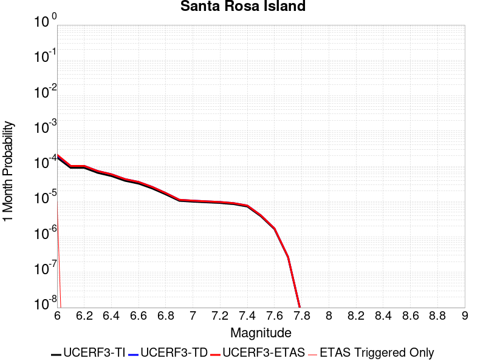 | 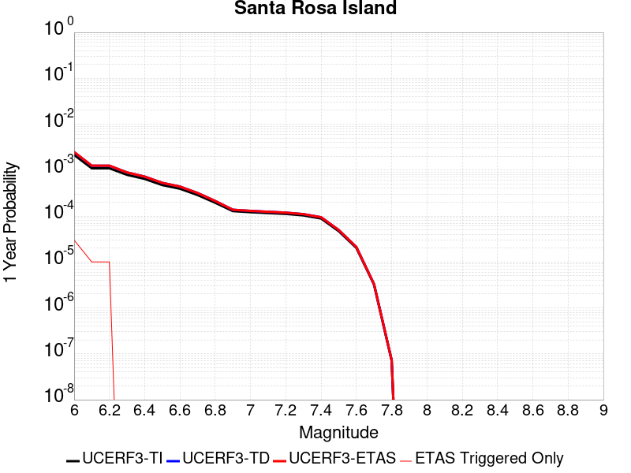 |  |

| Magnitude | 1 wk TI Prob | 1 wk TD Prob | 1 wk ETAS Prob | 1 wk ETAS/TD Gain | 1 wk ETAS Triggered Only | 1 mo TI Prob | 1 mo TD Prob | 1 mo ETAS Prob | 1 mo ETAS/TD Gain | 1 mo ETAS Triggered Only | 1 yr TI Prob | 1 yr TD Prob | 1 yr ETAS Prob | 1 yr ETAS/TD Gain | 1 yr ETAS Triggered Only | 10 yr TI Prob | 10 yr TD Prob | 10 yr ETAS Prob | 10 yr ETAS/TD Gain | 10 yr ETAS Triggered Only |
|-----|-----|-----|-----|-----|-----|-----|-----|-----|-----|-----|-----|-----|-----|-----|-----|-----|-----|-----|-----|-----|
| 6.0 | 4.1143165E-5 | 4.7093858E-5 | 4.7093858E-5 | 1.0 | 0.0 | 1.7631594E-4 | 2.0181632E-4 | 2.118143E-4 | 1.04954 | 1.0E-5 | 0.002144533 | 0.0024545419 | 0.0024844683 | 1.0121922 | 3.0E-5 | 0.021239553 | 0.02429494 | 0.024382753 | 1.0036144 | 9.0E-5 |
| 6.1 | 2.1061249E-5 | 2.386623E-5 | 2.386623E-5 | 1.0 | 0.0 | 9.0259375E-5 | 1.0228E-4 | 1.0228E-4 | 1.0 | 0.0 | 0.0010983539 | 0.0012445766 | 0.0012545642 | 1.0080248 | 1.0E-5 | 0.01092941 | 0.012379103 | 0.012418608 | 1.0031912 | 4.0E-5 |
| 6.2 | 2.1061249E-5 | 2.386623E-5 | 2.386623E-5 | 1.0 | 0.0 | 9.0259375E-5 | 1.0228E-4 | 1.0228E-4 | 1.0 | 0.0 | 0.0010983539 | 0.0012445766 | 0.0012545642 | 1.0080248 | 1.0E-5 | 0.01092941 | 0.012379103 | 0.012418608 | 1.0031912 | 4.0E-5 |
| 6.3 | 1.5158236E-5 | 1.7075283E-5 | 1.7075283E-5 | 1.0 | 0.0 | 6.496225E-5 | 7.31778E-5 | 7.31778E-5 | 1.0 | 0.0 | 7.906284E-4 | 8.9058746E-4 | 8.9058746E-4 | 1.0 | 0.0 | 0.007878214 | 0.008871436 | 0.008891259 | 1.0022345 | 2.0E-5 |
| 6.4 | 1.2341918E-5 | 1.3853596E-5 | 1.3853596E-5 | 1.0 | 0.0 | 5.2892858E-5 | 5.9371247E-5 | 5.9371247E-5 | 1.0 | 0.0 | 6.437803E-4 | 7.2261336E-4 | 7.2261336E-4 | 1.0 | 0.0 | 0.006419184 | 0.0072034732 | 0.007223329 | 1.0027565 | 2.0E-5 |
| 6.5 | 9.061158E-6 | 1.0117504E-5 | 1.0117504E-5 | 1.0 | 0.0 | 3.883296E-5 | 4.336004E-5 | 4.336004E-5 | 1.0 | 0.0 | 4.726887E-4 | 5.27786E-4 | 5.27786E-4 | 1.0 | 0.0 | 0.004716845 | 0.0052658627 | 0.0052857576 | 1.0037781 | 2.0E-5 |
| 6.6 | 7.5461685E-6 | 8.401115E-6 | 8.401115E-6 | 1.0 | 0.0 | 3.2340322E-5 | 3.600431E-5 | 3.600431E-5 | 1.0 | 0.0 | 3.936723E-4 | 4.382686E-4 | 4.382686E-4 | 1.0 | 0.0 | 0.003929756 | 0.0043744724 | 0.0043943846 | 1.004552 | 2.0E-5 |
| 6.7 | 5.5023775E-6 | 6.0876414E-6 | 6.0876414E-6 | 1.0 | 0.0 | 2.3581404E-5 | 2.6089649E-5 | 2.6089649E-5 | 1.0 | 0.0 | 2.8706578E-4 | 3.1759843E-4 | 3.1759843E-4 | 1.0 | 0.0 | 0.0028669522 | 0.003171767 | 0.0031817353 | 1.0031428 | 1.0E-5 |
| 6.8 | 3.7351679E-6 | 4.0832942E-6 | 4.0832942E-6 | 1.0 | 0.0 | 1.6007763E-5 | 1.749973E-5 | 1.749973E-5 | 1.0 | 0.0 | 1.948771E-4 | 2.1304085E-4 | 2.1304085E-4 | 1.0 | 0.0 | 0.0019470629 | 0.0021286116 | 0.0021385902 | 1.0046879 | 1.0E-5 |
| 6.9 | 2.456366E-6 | 2.629345E-6 | 2.629345E-6 | 1.0 | 0.0 | 1.0527241E-5 | 1.1268573E-5 | 1.1268573E-5 | 1.0 | 0.0 | 1.2816161E-4 | 1.3718626E-4 | 1.3718626E-4 | 1.0 | 0.0 | 0.0012808773 | 0.0013710187 | 0.0013710187 | 1.0 | 0.0 |
| 7.0 | 2.3245157E-6 | 2.4828464E-6 | 2.4828464E-6 | 1.0 | 0.0 | 9.962172E-6 | 1.0640727E-5 | 1.0640727E-5 | 1.0 | 0.0 | 1.2128269E-4 | 1.2954317E-4 | 1.2954317E-4 | 1.0 | 0.0 | 0.0012121652 | 0.0012946788 | 0.0012946788 | 1.0 | 0.0 |
| 7.1 | 2.2248344E-6 | 2.3733137E-6 | 2.3733137E-6 | 1.0 | 0.0 | 9.53497E-6 | 1.0171305E-5 | 1.0171305E-5 | 1.0 | 0.0 | 1.1608207E-4 | 1.2382862E-4 | 1.2382862E-4 | 1.0 | 0.0 | 0.0011602144 | 0.0012375981 | 0.0012375981 | 1.0 | 0.0 |
| 7.2 | 2.1350402E-6 | 2.2762144E-6 | 2.2762144E-6 | 1.0 | 0.0 | 9.150141E-6 | 9.755168E-6 | 9.755168E-6 | 1.0 | 0.0 | 1.1139726E-4 | 1.1876272E-4 | 1.1876272E-4 | 1.0 | 0.0 | 0.0011134144 | 0.0011869945 | 0.0011869945 | 1.0 | 0.0 |
| 7.3 | 1.9793572E-6 | 2.1087747E-6 | 2.1087747E-6 | 1.0 | 0.0 | 8.482932E-6 | 9.037574E-6 | 9.037574E-6 | 1.0 | 0.0 | 1.032748E-4 | 1.1002692E-4 | 1.1002692E-4 | 1.0 | 0.0 | 0.0010322682 | 0.0010997263 | 0.0010997263 | 1.0 | 0.0 |
| 7.4 | 1.6951194E-6 | 1.8046204E-6 | 1.8046204E-6 | 1.0 | 0.0 | 7.264777E-6 | 7.734065E-6 | 7.734065E-6 | 1.0 | 0.0 | 8.844508E-5 | 9.415818E-5 | 9.415818E-5 | 1.0 | 0.0 | 8.840988E-4 | 9.411845E-4 | 9.411845E-4 | 1.0 | 0.0 |
| 7.5 | 8.987207E-7 | 9.5124415E-7 | 9.5124415E-7 | 1.0 | 0.0 | 3.8516546E-6 | 4.0767545E-6 | 4.0767545E-6 | 1.0 | 0.0 | 4.6892885E-5 | 4.9633363E-5 | 4.9633363E-5 | 1.0 | 0.0 | 4.688299E-4 | 4.96224E-4 | 4.96224E-4 | 1.0 | 0.0 |
| 7.6 | 3.8783037E-7 | 4.0530097E-7 | 4.0530097E-7 | 1.0 | 0.0 | 1.6621291E-6 | 1.737003E-6 | 1.737003E-6 | 1.0 | 0.0 | 2.0236233E-5 | 2.1147813E-5 | 2.1147813E-5 | 1.0 | 0.0 | 2.023439E-4 | 2.1145865E-4 | 2.1145865E-4 | 1.0 | 0.0 |
| 7.7 | 6.181804E-8 | 6.339129E-8 | 6.339129E-8 | 1.0 | 0.0 | 2.6493444E-7 | 2.7167692E-7 | 2.7167692E-7 | 1.0 | 0.0 | 3.225572E-6 | 3.3076617E-6 | 3.3076617E-6 | 1.0 | 0.0 | 3.225525E-5 | 3.3076132E-5 | 3.3076132E-5 | 1.0 | 0.0 |
| 7.8 | 1.3704449E-9 | 1.3964258E-9 | 1.3964258E-9 | 1.0 | 0.0 | 5.873335E-9 | 5.984682E-9 | 5.984682E-9 | 1.0 | 0.0 | 7.1507856E-8 | 7.286351E-8 | 7.286351E-8 | 1.0 | 0.0 | 7.1507833E-7 | 7.2863486E-7 | 7.2863486E-7 | 1.0 | 0.0 |

## San Clemente
*[(top)](#table-of-contents)*

| 1 Week | 1 Month | 1 Year | 10 Year |
|-----|-----|-----|-----|
|  | 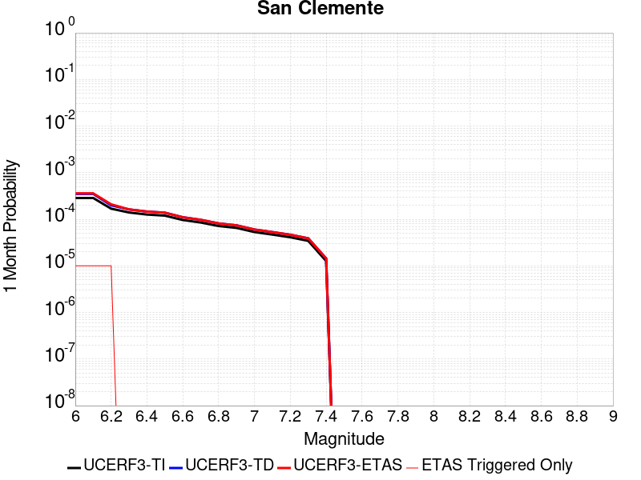 | 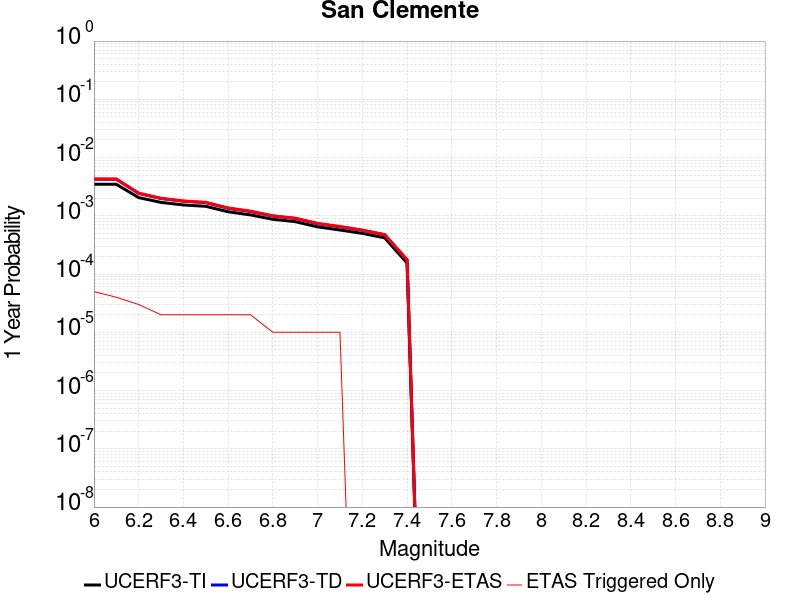 |  |

| Magnitude | 1 wk TI Prob | 1 wk TD Prob | 1 wk ETAS Prob | 1 wk ETAS/TD Gain | 1 wk ETAS Triggered Only | 1 mo TI Prob | 1 mo TD Prob | 1 mo ETAS Prob | 1 mo ETAS/TD Gain | 1 mo ETAS Triggered Only | 1 yr TI Prob | 1 yr TD Prob | 1 yr ETAS Prob | 1 yr ETAS/TD Gain | 1 yr ETAS Triggered Only | 10 yr TI Prob | 10 yr TD Prob | 10 yr ETAS Prob | 10 yr ETAS/TD Gain | 10 yr ETAS Triggered Only |
|-----|-----|-----|-----|-----|-----|-----|-----|-----|-----|-----|-----|-----|-----|-----|-----|-----|-----|-----|-----|-----|
| 6.0 | 6.681379E-5 | 8.164162E-5 | 9.16408E-5 | 1.1224766 | 1.0E-5 | 2.8631336E-4 | 3.49849E-4 | 3.598455E-4 | 1.0285738 | 1.0E-5 | 0.003480294 | 0.004251672 | 0.004301459 | 1.01171 | 5.0E-5 | 0.03426291 | 0.041759316 | 0.041826393 | 1.0016062 | 7.0E-5 |
| 6.1 | 6.681379E-5 | 8.164162E-5 | 9.16408E-5 | 1.1224766 | 1.0E-5 | 2.8631336E-4 | 3.49849E-4 | 3.598455E-4 | 1.0285738 | 1.0E-5 | 0.003480294 | 0.004251672 | 0.004291502 | 1.0093681 | 4.0E-5 | 0.03426291 | 0.041759316 | 0.041816812 | 1.0013767 | 6.0E-5 |
| 6.2 | 3.9400576E-5 | 4.6455338E-5 | 5.645487E-5 | 1.2152505 | 1.0E-5 | 1.6884868E-4 | 1.9907946E-4 | 2.0907747E-4 | 1.0502212 | 1.0E-5 | 0.0020537945 | 0.0024211593 | 0.0024510866 | 1.0123608 | 3.0E-5 | 0.020349167 | 0.023954555 | 0.023993596 | 1.0016298 | 4.0E-5 |
| 6.3 | 3.2590255E-5 | 3.7931575E-5 | 3.7931575E-5 | 1.0 | 0.0 | 1.3966505E-4 | 1.6255393E-4 | 1.6255393E-4 | 1.0 | 0.0 | 0.0016990956 | 0.001977328 | 0.0019972883 | 1.0100946 | 2.0E-5 | 0.01686163 | 0.019601138 | 0.01963055 | 1.0015005 | 3.0E-5 |
| 6.4 | 2.9454652E-5 | 3.409992E-5 | 3.409992E-5 | 1.0 | 0.0 | 1.2622811E-4 | 1.4613448E-4 | 1.4613448E-4 | 1.0 | 0.0 | 0.0015357438 | 0.0017777599 | 0.0017977244 | 1.0112301 | 2.0E-5 | 0.015251739 | 0.017638559 | 0.01766803 | 1.0016708 | 3.0E-5 |
| 6.5 | 2.790836E-5 | 3.224946E-5 | 3.224946E-5 | 1.0 | 0.0 | 1.1960178E-4 | 1.3820479E-4 | 1.3820479E-4 | 1.0 | 0.0 | 0.001455179 | 0.0016813694 | 0.0017013358 | 1.011875 | 2.0E-5 | 0.014456868 | 0.016689504 | 0.016719002 | 1.0017675 | 3.0E-5 |
| 6.6 | 2.2492153E-5 | 2.57642E-5 | 2.57642E-5 | 1.0 | 0.0 | 9.639138E-5 | 1.1041341E-4 | 1.1041341E-4 | 1.0 | 0.0 | 0.0011729331 | 0.0013434687 | 0.0013634418 | 1.0148668 | 2.0E-5 | 0.011667615 | 0.013355185 | 0.013374918 | 1.0014776 | 2.0E-5 |
| 6.7 | 1.9862755E-5 | 2.2667698E-5 | 2.2667698E-5 | 1.0 | 0.0 | 8.512331E-5 | 9.7143726E-5 | 9.7143726E-5 | 1.0 | 0.0 | 0.0010358836 | 0.0011820943 | 0.0012020707 | 1.0168991 | 2.0E-5 | 0.010310682 | 0.011759358 | 0.011779123 | 1.0016807 | 2.0E-5 |
| 6.8 | 1.6697575E-5 | 1.897874E-5 | 1.897874E-5 | 1.0 | 0.0 | 7.155907E-5 | 8.1334976E-5 | 8.1334976E-5 | 1.0 | 0.0 | 8.7088346E-4 | 9.898129E-4 | 9.99803E-4 | 1.010093 | 1.0E-5 | 0.008674784 | 0.00985507 | 0.009864972 | 1.0010047 | 1.0E-5 |
| 6.9 | 1.5218415E-5 | 1.7270328E-5 | 1.7270328E-5 | 1.0 | 0.0 | 6.522015E-5 | 7.401364E-5 | 7.401364E-5 | 1.0 | 0.0 | 7.93766E-4 | 9.007523E-4 | 9.107433E-4 | 1.0110918 | 1.0E-5 | 0.007909367 | 0.008971959 | 0.00898187 | 1.0011046 | 1.0E-5 |
| 7.0 | 1.2392958E-5 | 1.4033754E-5 | 1.4033754E-5 | 1.0 | 0.0 | 5.3111595E-5 | 6.0143317E-5 | 6.0143317E-5 | 1.0 | 0.0 | 6.4644177E-4 | 7.320065E-4 | 7.4199913E-4 | 1.0136511 | 1.0E-5 | 0.0064456454 | 0.0072967396 | 0.0073066666 | 1.0013604 | 1.0E-5 |
| 7.1 | 1.0934128E-5 | 1.2375787E-5 | 1.2375787E-5 | 1.0 | 0.0 | 4.6859706E-5 | 5.303805E-5 | 5.303805E-5 | 1.0 | 0.0 | 5.7036756E-4 | 6.455543E-4 | 6.5554783E-4 | 1.0154805 | 1.0E-5 | 0.0056890585 | 0.0064375363 | 0.006447472 | 1.0015434 | 1.0E-5 |
| 7.2 | 9.5798805E-6 | 1.0845505E-5 | 1.0845505E-5 | 1.0 | 0.0 | 4.1055984E-5 | 4.647995E-5 | 4.647995E-5 | 1.0 | 0.0 | 4.9974193E-4 | 5.657536E-4 | 5.657536E-4 | 1.0 | 0.0 | 0.0049861963 | 0.005643857 | 0.005643857 | 1.0 | 0.0 |
| 7.3 | 8.0167365E-6 | 9.084399E-6 | 9.084399E-6 | 1.0 | 0.0 | 3.4356988E-5 | 3.8932594E-5 | 3.8932594E-5 | 1.0 | 0.0 | 4.1821605E-4 | 4.7390832E-4 | 4.7390832E-4 | 1.0 | 0.0 | 0.0041742986 | 0.00472968 | 0.00472968 | 1.0 | 0.0 |
| 7.4 | 2.9581017E-6 | 3.362562E-6 | 3.362562E-6 | 1.0 | 0.0 | 1.2677518E-5 | 1.4410929E-5 | 1.4410929E-5 | 1.0 | 0.0 | 1.5433785E-4 | 1.7544399E-4 | 1.7544399E-4 | 1.0 | 0.0 | 0.001542307 | 0.0017535499 | 0.0017535499 | 1.0 | 0.0 |

## Owens Valley
*[(top)](#table-of-contents)*

| 1 Week | 1 Month | 1 Year | 10 Year |
|-----|-----|-----|-----|
|  |  |  |  |

| Magnitude | 1 wk TI Prob | 1 wk TD Prob | 1 wk ETAS Prob | 1 wk ETAS/TD Gain | 1 wk ETAS Triggered Only | 1 mo TI Prob | 1 mo TD Prob | 1 mo ETAS Prob | 1 mo ETAS/TD Gain | 1 mo ETAS Triggered Only | 1 yr TI Prob | 1 yr TD Prob | 1 yr ETAS Prob | 1 yr ETAS/TD Gain | 1 yr ETAS Triggered Only | 10 yr TI Prob | 10 yr TD Prob | 10 yr ETAS Prob | 10 yr ETAS/TD Gain | 10 yr ETAS Triggered Only |
|-----|-----|-----|-----|-----|-----|-----|-----|-----|-----|-----|-----|-----|-----|-----|-----|-----|-----|-----|-----|-----|
| 6.0 | 4.83821E-5 | 3.6290542E-6 | 3.6290542E-6 | 1.0 | 0.0 | 2.0733538E-4 | 1.5553002E-5 | 2.5552847E-5 | 1.6429527 | 1.0E-5 | 0.002521386 | 1.8934235E-4 | 2.0933856E-4 | 1.1056088 | 2.0E-5 | 0.024929691 | 0.0019262922 | 0.002006138 | 1.0414506 | 8.0E-5 |
| 6.1 | 4.83821E-5 | 3.6290542E-6 | 3.6290542E-6 | 1.0 | 0.0 | 2.0733538E-4 | 1.5553002E-5 | 2.5552847E-5 | 1.6429527 | 1.0E-5 | 0.002521386 | 1.8934235E-4 | 2.0933856E-4 | 1.1056088 | 2.0E-5 | 0.024929691 | 0.0019262922 | 0.002006138 | 1.0414506 | 8.0E-5 |
| 6.2 | 4.83821E-5 | 3.6290542E-6 | 3.6290542E-6 | 1.0 | 0.0 | 2.0733538E-4 | 1.5553002E-5 | 2.5552847E-5 | 1.6429527 | 1.0E-5 | 0.002521386 | 1.8934235E-4 | 2.0933856E-4 | 1.1056088 | 2.0E-5 | 0.024929691 | 0.0019262922 | 0.002006138 | 1.0414506 | 8.0E-5 |
| 6.3 | 3.953008E-5 | 3.1567445E-6 | 3.1567445E-6 | 1.0 | 0.0 | 1.6940363E-4 | 1.3528838E-5 | 2.3528703E-5 | 1.7391517 | 1.0E-5 | 0.002060538 | 1.647019E-4 | 1.846986E-4 | 1.1214116 | 2.0E-5 | 0.020415364 | 0.0016599183 | 0.0017298021 | 1.0421008 | 7.0E-5 |
| 6.4 | 3.953008E-5 | 3.1567445E-6 | 3.1567445E-6 | 1.0 | 0.0 | 1.6940363E-4 | 1.3528838E-5 | 2.3528703E-5 | 1.7391517 | 1.0E-5 | 0.002060538 | 1.647019E-4 | 1.846986E-4 | 1.1214116 | 2.0E-5 | 0.020415364 | 0.0016599183 | 0.0017298021 | 1.0421008 | 7.0E-5 |
| 6.5 | 3.457342E-5 | 2.9724706E-6 | 2.9724706E-6 | 1.0 | 0.0 | 1.4816338E-4 | 1.2739102E-5 | 2.2738974E-5 | 1.7849747 | 1.0E-5 | 0.0018023965 | 1.5508823E-4 | 1.7508512E-4 | 1.1289389 | 2.0E-5 | 0.017878477 | 0.0015561924 | 0.0016260835 | 1.0449116 | 7.0E-5 |
| 6.6 | 3.1127765E-5 | 2.8751072E-6 | 2.8751072E-6 | 1.0 | 0.0 | 1.3339789E-4 | 1.2321833E-5 | 2.232171E-5 | 1.8115575 | 1.0E-5 | 0.0016229092 | 1.5000868E-4 | 1.7000567E-4 | 1.1333057 | 2.0E-5 | 0.016111081 | 0.0015015831 | 0.001571478 | 1.0465474 | 7.0E-5 |
| 6.7 | 2.806885E-5 | 2.8108714E-6 | 2.8108714E-6 | 1.0 | 0.0 | 1.2028952E-4 | 1.204654E-5 | 2.2046419E-5 | 1.8301039 | 1.0E-5 | 0.001463541 | 1.4665743E-4 | 1.666545E-4 | 1.1363522 | 2.0E-5 | 0.014539397 | 0.0014659907 | 0.0015358881 | 1.0476793 | 7.0E-5 |
| 6.8 | 2.524524E-5 | 2.2357651E-6 | 2.2357651E-6 | 1.0 | 0.0 | 1.0818939E-4 | 9.581817E-6 | 1.9581721E-5 | 2.0436335 | 1.0E-5 | 0.0013164099 | 1.1665268E-4 | 1.3665034E-4 | 1.1714292 | 2.0E-5 | 0.01308639 | 0.001166188 | 0.0012361064 | 1.0599546 | 7.0E-5 |
| 6.9 | 2.2704568E-5 | 1.6084604E-6 | 1.6084604E-6 | 1.0 | 0.0 | 9.730166E-5 | 6.8933837E-6 | 1.6893315E-5 | 2.4506564 | 1.0E-5 | 0.0011840039 | 8.392373E-5 | 1.0392205E-4 | 1.2382916 | 2.0E-5 | 0.011777153 | 8.391327E-4 | 9.09074E-4 | 1.0833495 | 7.0E-5 |
| 7.0 | 2.0871712E-5 | 1.5398214E-6 | 1.5398214E-6 | 1.0 | 0.0 | 8.944713E-5 | 6.599218E-6 | 1.6599151E-5 | 2.515321 | 1.0E-5 | 0.0010884746 | 8.0342536E-5 | 1.0034093E-4 | 1.2489141 | 2.0E-5 | 0.010831586 | 8.033076E-4 | 8.7325135E-4 | 1.0870697 | 7.0E-5 |
| 7.1 | 1.944928E-5 | 1.3866538E-6 | 1.3866538E-6 | 1.0 | 0.0 | 8.335139E-5 | 5.9427884E-6 | 1.5942729E-5 | 2.6827018 | 1.0E-5 | 0.0010143308 | 7.235106E-5 | 9.234961E-5 | 1.27641 | 2.0E-5 | 0.010097133 | 7.234337E-4 | 7.9338305E-4 | 1.0966908 | 7.0E-5 |
| 7.2 | 1.7876306E-5 | 1.2491217E-6 | 1.2491217E-6 | 1.0 | 0.0 | 7.6610486E-5 | 5.353368E-6 | 1.5353315E-5 | 2.8679729 | 1.0E-5 | 9.3233347E-4 | 6.5175314E-5 | 8.517401E-5 | 1.3068446 | 2.0E-5 | 0.009284316 | 6.517001E-4 | 7.2165445E-4 | 1.1073414 | 7.0E-5 |
| 7.3 | 1.2618672E-5 | 1.1117137E-6 | 1.1117137E-6 | 1.0 | 0.0 | 5.40789E-5 | 4.7644785E-6 | 1.47644305E-5 | 3.0988555 | 1.0E-5 | 6.582117E-4 | 5.800599E-5 | 7.800483E-5 | 1.344772 | 2.0E-5 | 0.0065626553 | 5.800416E-4 | 6.5000105E-4 | 1.120611 | 7.0E-5 |
| 7.4 | 7.4874442E-6 | 8.5502654E-7 | 8.5502654E-7 | 1.0 | 0.0 | 3.208865E-5 | 3.6643942E-6 | 1.36643575E-5 | 3.728954 | 1.0E-5 | 3.906093E-4 | 4.461309E-5 | 5.4612647E-5 | 1.2241395 | 1.0E-5 | 0.003899234 | 4.461341E-4 | 4.961118E-4 | 1.112024 | 5.0E-5 |
| 7.5 | 2.4734156E-6 | 6.069695E-7 | 6.069695E-7 | 1.0 | 0.0 | 1.060031E-5 | 2.6012951E-6 | 2.6012951E-6 | 1.0 | 0.0 | 1.2905113E-4 | 3.167031E-5 | 3.167031E-5 | 1.0 | 0.0 | 0.0012897621 | 3.1665832E-4 | 3.5664564E-4 | 1.1262791 | 4.0E-5 |
| 7.6 | 1.1328841E-6 | 3.1970663E-7 | 3.1970663E-7 | 1.0 | 0.0 | 4.8552088E-6 | 1.3701706E-6 | 1.3701706E-6 | 1.0 | 0.0 | 5.9110564E-5 | 1.66817E-5 | 1.66817E-5 | 1.0 | 0.0 | 5.9094845E-4 | 1.6680468E-4 | 1.9679968E-4 | 1.179821 | 3.0E-5 |
| 7.7 | 4.8613185E-7 | 8.966774E-8 | 8.966774E-8 | 1.0 | 0.0 | 2.0834207E-6 | 3.8429027E-7 | 3.8429027E-7 | 1.0 | 0.0 | 2.536535E-5 | 4.678725E-6 | 4.678725E-6 | 1.0 | 0.0 | 2.5362454E-4 | 4.6786332E-5 | 4.6786332E-5 | 1.0 | 0.0 |

## San Andreas (North Branch Mill Creek)
*[(top)](#table-of-contents)*

| 1 Week | 1 Month | 1 Year | 10 Year |
|-----|-----|-----|-----|
|  |  |  |  |

| Magnitude | 1 wk TI Prob | 1 wk TD Prob | 1 wk ETAS Prob | 1 wk ETAS/TD Gain | 1 wk ETAS Triggered Only | 1 mo TI Prob | 1 mo TD Prob | 1 mo ETAS Prob | 1 mo ETAS/TD Gain | 1 mo ETAS Triggered Only | 1 yr TI Prob | 1 yr TD Prob | 1 yr ETAS Prob | 1 yr ETAS/TD Gain | 1 yr ETAS Triggered Only | 10 yr TI Prob | 10 yr TD Prob | 10 yr ETAS Prob | 10 yr ETAS/TD Gain | 10 yr ETAS Triggered Only |
|-----|-----|-----|-----|-----|-----|-----|-----|-----|-----|-----|-----|-----|-----|-----|-----|-----|-----|-----|-----|-----|
| 6.0 | 1.3461156E-5 | 2.3520532E-5 | 2.3520532E-5 | 1.0 | 0.0 | 5.7689394E-5 | 1.007984E-4 | 1.007984E-4 | 1.0 | 0.0 | 7.02142E-4 | 0.001226533 | 0.0012664839 | 1.0325723 | 4.0E-5 | 0.0069992766 | 0.012240136 | 0.012319157 | 1.0064559 | 8.0E-5 |
| 6.1 | 1.3461156E-5 | 2.3520532E-5 | 2.3520532E-5 | 1.0 | 0.0 | 5.7689394E-5 | 1.007984E-4 | 1.007984E-4 | 1.0 | 0.0 | 7.02142E-4 | 0.001226533 | 0.0012664839 | 1.0325723 | 4.0E-5 | 0.0069992766 | 0.012240136 | 0.012319157 | 1.0064559 | 8.0E-5 |
| 6.2 | 1.3461156E-5 | 2.3520532E-5 | 2.3520532E-5 | 1.0 | 0.0 | 5.7689394E-5 | 1.007984E-4 | 1.007984E-4 | 1.0 | 0.0 | 7.02142E-4 | 0.001226533 | 0.0012664839 | 1.0325723 | 4.0E-5 | 0.0069992766 | 0.012240136 | 0.012319157 | 1.0064559 | 8.0E-5 |
| 6.3 | 1.3461156E-5 | 2.3520532E-5 | 2.3520532E-5 | 1.0 | 0.0 | 5.7689394E-5 | 1.007984E-4 | 1.007984E-4 | 1.0 | 0.0 | 7.02142E-4 | 0.001226533 | 0.0012664839 | 1.0325723 | 4.0E-5 | 0.0069992766 | 0.012240136 | 0.012319157 | 1.0064559 | 8.0E-5 |
| 6.4 | 1.3461156E-5 | 2.3520532E-5 | 2.3520532E-5 | 1.0 | 0.0 | 5.7689394E-5 | 1.007984E-4 | 1.007984E-4 | 1.0 | 0.0 | 7.02142E-4 | 0.001226533 | 0.0012664839 | 1.0325723 | 4.0E-5 | 0.0069992766 | 0.012240136 | 0.012319157 | 1.0064559 | 8.0E-5 |
| 6.5 | 1.3450706E-5 | 2.3509492E-5 | 2.3509492E-5 | 1.0 | 0.0 | 5.764461E-5 | 1.00751095E-4 | 1.00751095E-4 | 1.0 | 0.0 | 7.0159714E-4 | 0.0012259576 | 0.0012659086 | 1.0325875 | 4.0E-5 | 0.006993862 | 0.012234446 | 0.012313467 | 1.0064589 | 8.0E-5 |
| 6.6 | 1.3074523E-5 | 2.3123766E-5 | 2.3123766E-5 | 1.0 | 0.0 | 5.6032466E-5 | 9.909811E-5 | 9.909811E-5 | 1.0 | 0.0 | 6.8198174E-4 | 0.0012058549 | 0.0012458067 | 1.0331315 | 4.0E-5 | 0.006798926 | 0.012035609 | 0.012114646 | 1.006567 | 8.0E-5 |
| 6.7 | 1.3050216E-5 | 2.3099063E-5 | 2.3099063E-5 | 1.0 | 0.0 | 5.59283E-5 | 9.899224E-5 | 9.899224E-5 | 1.0 | 0.0 | 6.8071426E-4 | 0.0012045674 | 0.0012445193 | 1.0331669 | 4.0E-5 | 0.0067863287 | 0.012022873 | 0.012101911 | 1.006574 | 8.0E-5 |
| 6.8 | 1.29049395E-5 | 2.2947466E-5 | 2.2947466E-5 | 1.0 | 0.0 | 5.530571E-5 | 9.83426E-5 | 9.83426E-5 | 1.0 | 0.0 | 6.73139E-4 | 0.0011966667 | 0.0012366188 | 1.0333862 | 4.0E-5 | 0.0067110364 | 0.011944717 | 0.012023761 | 1.0066175 | 8.0E-5 |
| 6.9 | 1.2867369E-5 | 2.2906866E-5 | 2.2906866E-5 | 1.0 | 0.0 | 5.51447E-5 | 9.816861E-5 | 9.816861E-5 | 1.0 | 0.0 | 6.711799E-4 | 0.0011945508 | 0.001234503 | 1.0334454 | 4.0E-5 | 0.006691564 | 0.011923785 | 0.012002831 | 1.0066292 | 8.0E-5 |
| 7.0 | 1.2495996E-5 | 2.2306804E-5 | 2.2306804E-5 | 1.0 | 0.0 | 5.3553173E-5 | 9.5597105E-5 | 9.5597105E-5 | 1.0 | 0.0 | 6.518148E-4 | 0.0011632761 | 0.0012032297 | 1.0343456 | 4.0E-5 | 0.0064990623 | 0.011614319 | 0.01169339 | 1.006808 | 8.0E-5 |
| 7.1 | 1.2452067E-5 | 2.2251872E-5 | 2.2251872E-5 | 1.0 | 0.0 | 5.3364907E-5 | 9.536169E-5 | 9.536169E-5 | 1.0 | 0.0 | 6.4952404E-4 | 0.001160413 | 0.0012003666 | 1.0344305 | 4.0E-5 | 0.0064762887 | 0.011585988 | 0.011665061 | 1.0068249 | 8.0E-5 |
| 7.2 | 1.2002777E-5 | 2.1630327E-5 | 2.1630327E-5 | 1.0 | 0.0 | 5.143946E-5 | 9.2698116E-5 | 9.2698116E-5 | 1.0 | 0.0 | 6.2609545E-4 | 0.0011280179 | 0.0011679728 | 1.0354204 | 4.0E-5 | 0.006243344 | 0.011265357 | 0.011344456 | 1.0070214 | 8.0E-5 |
| 7.3 | 1.1923425E-5 | 2.1500133E-5 | 2.1500133E-5 | 1.0 | 0.0 | 5.109939E-5 | 9.214019E-5 | 9.214019E-5 | 1.0 | 0.0 | 6.219575E-4 | 0.0011212322 | 0.0011611873 | 1.035635 | 4.0E-5 | 0.0062021962 | 0.011198212 | 0.011277317 | 1.007064 | 8.0E-5 |
| 7.4 | 1.16105175E-5 | 2.0873913E-5 | 2.0873913E-5 | 1.0 | 0.0 | 4.975841E-5 | 8.9456575E-5 | 8.9456575E-5 | 1.0 | 0.0 | 6.0564023E-4 | 0.0010885922 | 0.0011285486 | 1.0367047 | 4.0E-5 | 0.006039923 | 0.010875722 | 0.010954852 | 1.0072758 | 8.0E-5 |
| 7.5 | 1.1037265E-5 | 1.9573343E-5 | 1.9573343E-5 | 1.0 | 0.0 | 4.7301706E-5 | 8.3883075E-5 | 8.3883075E-5 | 1.0 | 0.0 | 5.757461E-4 | 0.0010208001 | 0.0010607593 | 1.039145 | 4.0E-5 | 0.005742567 | 0.01020487 | 0.010284054 | 1.0077595 | 8.0E-5 |
| 7.6 | 1.0720915E-5 | 1.9015013E-5 | 1.9015013E-5 | 1.0 | 0.0 | 4.5945973E-5 | 8.1490376E-5 | 8.1490376E-5 | 1.0 | 0.0 | 5.592486E-4 | 9.916959E-4 | 0.0010316563 | 1.0402949 | 4.0E-5 | 0.005578433 | 0.009916473 | 0.009995679 | 1.0079874 | 8.0E-5 |
| 7.7 | 9.276279E-6 | 1.6459926E-5 | 1.6459926E-5 | 1.0 | 0.0 | 3.9754876E-5 | 7.054064E-5 | 7.054064E-5 | 1.0 | 0.0 | 4.839081E-4 | 8.584956E-4 | 8.9846127E-4 | 1.0465531 | 4.0E-5 | 0.0048285574 | 0.008595431 | 0.008674744 | 1.0092273 | 8.0E-5 |
| 7.8 | 5.8346777E-6 | 1.1169856E-5 | 1.1169856E-5 | 1.0 | 0.0 | 2.5005522E-5 | 4.7869937E-5 | 4.7869937E-5 | 1.0 | 0.0 | 3.043997E-4 | 5.826607E-4 | 6.2263745E-4 | 1.0686105 | 4.0E-5 | 0.0030398308 | 0.005854561 | 0.0059340927 | 1.0135846 | 8.0E-5 |
| 7.9 | 4.690204E-6 | 8.52147E-6 | 8.52147E-6 | 1.0 | 0.0 | 2.0100719E-5 | 3.6520076E-5 | 3.6520076E-5 | 1.0 | 0.0 | 2.4469878E-4 | 4.4454128E-4 | 4.845235E-4 | 1.0899404 | 4.0E-5 | 0.002444295 | 0.004477119 | 0.0045567607 | 1.0177886 | 8.0E-5 |
| 8.0 | 2.9570454E-6 | 4.8545144E-6 | 4.8545144E-6 | 1.0 | 0.0 | 1.267299E-5 | 2.0804895E-5 | 2.0804895E-5 | 1.0 | 0.0 | 1.5428272E-4 | 2.5327018E-4 | 2.5327018E-4 | 1.0 | 0.0 | 0.0015417566 | 0.00255358 | 0.0025635546 | 1.003906 | 1.0E-5 |
| 8.1 | 1.6376824E-6 | 2.2008653E-6 | 2.2008653E-6 | 1.0 | 0.0 | 7.01862E-6 | 9.432246E-6 | 9.432246E-6 | 1.0 | 0.0 | 8.544835E-5 | 1.1483156E-4 | 1.1483156E-4 | 1.0 | 0.0 | 8.54155E-4 | 0.0011627364 | 0.0011727249 | 1.0085905 | 1.0E-5 |
| 8.2 | 6.9631557E-7 | 4.5484123E-7 | 4.5484123E-7 | 1.0 | 0.0 | 2.984206E-6 | 1.9493182E-6 | 1.9493182E-6 | 1.0 | 0.0 | 3.63321E-5 | 2.3732691E-5 | 2.3732691E-5 | 1.0 | 0.0 | 3.6326164E-4 | 2.4581427E-4 | 2.4581427E-4 | 1.0 | 0.0 |
| 8.3 | 1.7876137E-7 | 8.385507E-8 | 8.385507E-8 | 1.0 | 0.0 | 7.661199E-7 | 3.5937882E-7 | 3.5937882E-7 | 1.0 | 0.0 | 9.32747E-6 | 4.3754285E-6 | 4.3754285E-6 | 1.0 | 0.0 | 9.3270784E-5 | 4.5951914E-5 | 4.5951914E-5 | 1.0 | 0.0 |

## San Jacinto (San Jacinto Valley) rev
*[(top)](#table-of-contents)*

| 1 Week | 1 Month | 1 Year | 10 Year |
|-----|-----|-----|-----|
|  |  |  | 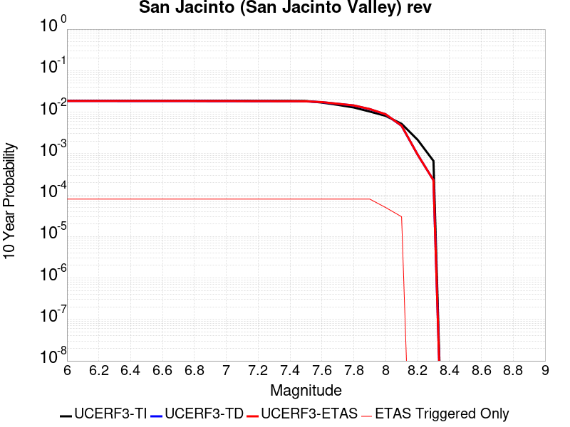 |

| Magnitude | 1 wk TI Prob | 1 wk TD Prob | 1 wk ETAS Prob | 1 wk ETAS/TD Gain | 1 wk ETAS Triggered Only | 1 mo TI Prob | 1 mo TD Prob | 1 mo ETAS Prob | 1 mo ETAS/TD Gain | 1 mo ETAS Triggered Only | 1 yr TI Prob | 1 yr TD Prob | 1 yr ETAS Prob | 1 yr ETAS/TD Gain | 1 yr ETAS Triggered Only | 10 yr TI Prob | 10 yr TD Prob | 10 yr ETAS Prob | 10 yr ETAS/TD Gain | 10 yr ETAS Triggered Only |
|-----|-----|-----|-----|-----|-----|-----|-----|-----|-----|-----|-----|-----|-----|-----|-----|-----|-----|-----|-----|-----|
| 6.0 | 3.652694E-5 | 3.4452973E-5 | 3.4452973E-5 | 1.0 | 0.0 | 1.5653463E-4 | 1.4764722E-4 | 1.5764574E-4 | 1.067719 | 1.0E-5 | 0.0019041431 | 0.0017961245 | 0.0018560167 | 1.0333452 | 6.0E-5 | 0.018879099 | 0.018552769 | 0.018631285 | 1.004232 | 8.0E-5 |
| 6.1 | 3.652694E-5 | 3.4452973E-5 | 3.4452973E-5 | 1.0 | 0.0 | 1.5653463E-4 | 1.4764722E-4 | 1.5764574E-4 | 1.067719 | 1.0E-5 | 0.0019041431 | 0.0017961245 | 0.0018560167 | 1.0333452 | 6.0E-5 | 0.018879099 | 0.018552769 | 0.018631285 | 1.004232 | 8.0E-5 |
| 6.2 | 3.652694E-5 | 3.4452973E-5 | 3.4452973E-5 | 1.0 | 0.0 | 1.5653463E-4 | 1.4764722E-4 | 1.5764574E-4 | 1.067719 | 1.0E-5 | 0.0019041431 | 0.0017961245 | 0.0018560167 | 1.0333452 | 6.0E-5 | 0.018879099 | 0.018552769 | 0.018631285 | 1.004232 | 8.0E-5 |
| 6.3 | 3.652694E-5 | 3.4452973E-5 | 3.4452973E-5 | 1.0 | 0.0 | 1.5653463E-4 | 1.4764722E-4 | 1.5764574E-4 | 1.067719 | 1.0E-5 | 0.0019041431 | 0.0017961245 | 0.0018560167 | 1.0333452 | 6.0E-5 | 0.018879099 | 0.018552769 | 0.018631285 | 1.004232 | 8.0E-5 |
| 6.4 | 3.646941E-5 | 3.4374538E-5 | 3.4374538E-5 | 1.0 | 0.0 | 1.5628811E-4 | 1.4731112E-4 | 1.5730964E-4 | 1.0678736 | 1.0E-5 | 0.0019011468 | 0.0017920396 | 0.0018519321 | 1.0334214 | 6.0E-5 | 0.018849645 | 0.018512646 | 0.018591166 | 1.0042413 | 8.0E-5 |
| 6.5 | 3.646941E-5 | 3.4374538E-5 | 3.4374538E-5 | 1.0 | 0.0 | 1.5628811E-4 | 1.4731112E-4 | 1.5730964E-4 | 1.0678736 | 1.0E-5 | 0.0019011468 | 0.0017920396 | 0.0018519321 | 1.0334214 | 6.0E-5 | 0.018849645 | 0.018512646 | 0.018591166 | 1.0042413 | 8.0E-5 |
| 6.6 | 3.6442503E-5 | 3.4337918E-5 | 3.4337918E-5 | 1.0 | 0.0 | 1.561728E-4 | 1.4715419E-4 | 1.5715272E-4 | 1.067946 | 1.0E-5 | 0.0018997455 | 0.0017901321 | 0.0018500248 | 1.033457 | 6.0E-5 | 0.018835869 | 0.018493913 | 0.018572433 | 1.0042458 | 8.0E-5 |
| 6.7 | 3.6432113E-5 | 3.432349E-5 | 3.432349E-5 | 1.0 | 0.0 | 1.5612828E-4 | 1.4709236E-4 | 1.5709088E-4 | 1.0679744 | 1.0E-5 | 0.0018992044 | 0.0017893809 | 0.0018492735 | 1.0334711 | 6.0E-5 | 0.018830549 | 0.018486535 | 0.018565057 | 1.0042474 | 8.0E-5 |
| 6.8 | 3.6409598E-5 | 3.4292538E-5 | 3.4292538E-5 | 1.0 | 0.0 | 1.560318E-4 | 1.4695973E-4 | 1.5695827E-4 | 1.0680358 | 1.0E-5 | 0.0018980318 | 0.0017877688 | 0.0018476616 | 1.0335014 | 6.0E-5 | 0.018819023 | 0.018470688 | 0.018549211 | 1.0042512 | 8.0E-5 |
| 6.9 | 3.638078E-5 | 3.4252957E-5 | 3.4252957E-5 | 1.0 | 0.0 | 1.5590832E-4 | 1.4679012E-4 | 1.5678865E-4 | 1.0681145 | 1.0E-5 | 0.0018965311 | 0.0017857072 | 0.0018456 | 1.0335401 | 6.0E-5 | 0.018804269 | 0.01845042 | 0.018528944 | 1.0042559 | 8.0E-5 |
| 7.0 | 3.6294874E-5 | 3.4134955E-5 | 3.4134955E-5 | 1.0 | 0.0 | 1.5554018E-4 | 1.4628447E-4 | 1.5628301E-4 | 1.06835 | 1.0E-5 | 0.0018920569 | 0.0017795612 | 0.0018394544 | 1.0336561 | 6.0E-5 | 0.018760284 | 0.018389994 | 0.018468523 | 1.0042702 | 8.0E-5 |
| 7.1 | 3.6260717E-5 | 3.409123E-5 | 3.409123E-5 | 1.0 | 0.0 | 1.5539382E-4 | 1.4609711E-4 | 1.5609566E-4 | 1.0684376 | 1.0E-5 | 0.001890278 | 0.0017772838 | 0.0018371772 | 1.0336994 | 6.0E-5 | 0.018742796 | 0.018367594 | 0.018446123 | 1.0042754 | 8.0E-5 |
| 7.2 | 3.6210204E-5 | 3.402536E-5 | 3.402536E-5 | 1.0 | 0.0 | 1.5517735E-4 | 1.4581485E-4 | 1.558134E-4 | 1.0685701 | 1.0E-5 | 0.001887647 | 0.0017738529 | 0.0018337464 | 1.0337647 | 6.0E-5 | 0.01871693 | 0.018333828 | 0.018412363 | 1.0042835 | 8.0E-5 |
| 7.3 | 3.6119454E-5 | 3.3913468E-5 | 3.3913468E-5 | 1.0 | 0.0 | 1.5478847E-4 | 1.4533535E-4 | 1.553339E-4 | 1.0687964 | 1.0E-5 | 0.0018829206 | 0.0017680244 | 0.0018279183 | 1.0338762 | 6.0E-5 | 0.018670462 | 0.01827629 | 0.018354828 | 1.0042973 | 8.0E-5 |
| 7.4 | 3.607848E-5 | 3.3860928E-5 | 3.3860928E-5 | 1.0 | 0.0 | 1.5461289E-4 | 1.451102E-4 | 1.5510875E-4 | 1.0689031 | 1.0E-5 | 0.0018807866 | 0.0017652877 | 0.0018251818 | 1.0339288 | 6.0E-5 | 0.018649481 | 0.018249264 | 0.018327804 | 1.0043037 | 8.0E-5 |
| 7.5 | 3.5856774E-5 | 3.3669792E-5 | 3.3669792E-5 | 1.0 | 0.0 | 1.5366284E-4 | 1.4429113E-4 | 1.542897E-4 | 1.0692943 | 1.0E-5 | 0.0018692396 | 0.0017553318 | 0.0018152264 | 1.0341216 | 6.0E-5 | 0.018535944 | 0.01814989 | 0.018228438 | 1.0043278 | 8.0E-5 |
| 7.6 | 3.286655E-5 | 3.2186246E-5 | 3.2186246E-5 | 1.0 | 0.0 | 1.4084904E-4 | 1.3793378E-4 | 1.479324E-4 | 1.0724885 | 1.0E-5 | 0.001713488 | 0.0016780521 | 0.0017379515 | 1.0356958 | 6.0E-5 | 0.017003361 | 0.017366141 | 0.017444752 | 1.0045266 | 8.0E-5 |
| 7.7 | 2.8882527E-5 | 2.9278188E-5 | 2.9278188E-5 | 1.0 | 0.0 | 1.237764E-4 | 1.2547191E-4 | 1.3547066E-4 | 1.0796891 | 1.0E-5 | 0.0015059357 | 0.0015265512 | 0.0015864596 | 1.0392443 | 6.0E-5 | 0.014957713 | 0.015852137 | 0.015930869 | 1.0049666 | 8.0E-5 |
| 7.8 | 2.4950225E-5 | 2.6567488E-5 | 2.6567488E-5 | 1.0 | 0.0 | 1.0692515E-4 | 1.13855705E-4 | 1.2385457E-4 | 1.0878205 | 1.0E-5 | 0.0013010362 | 0.0013853126 | 0.0014452295 | 1.0432515 | 6.0E-5 | 0.012934455 | 0.014432631 | 0.014511477 | 1.005463 | 8.0E-5 |
| 7.9 | 1.9881603E-5 | 2.1543647E-5 | 2.1543647E-5 | 1.0 | 0.0 | 8.520408E-5 | 9.232665E-5 | 1.0232573E-4 | 1.108301 | 1.0E-5 | 0.001036866 | 0.0011234981 | 0.0011834307 | 1.0533446 | 6.0E-5 | 0.010320415 | 0.011795865 | 0.011874922 | 1.0067021 | 8.0E-5 |
| 8.0 | 1.563292E-5 | 1.5966569E-5 | 1.5966569E-5 | 1.0 | 0.0 | 6.6996516E-5 | 6.8426365E-5 | 6.8426365E-5 | 1.0 | 0.0 | 8.153773E-4 | 8.327732E-4 | 8.6274825E-4 | 1.0359942 | 3.0E-5 | 0.00812392 | 0.008825883 | 0.008875443 | 1.0056151 | 5.0E-5 |
| 8.1 | 1.0045313E-5 | 8.318789E-6 | 8.318789E-6 | 1.0 | 0.0 | 4.305063E-5 | 3.5651465E-5 | 3.5651465E-5 | 1.0 | 0.0 | 5.2401534E-4 | 4.3397068E-4 | 4.4396633E-4 | 1.023033 | 1.0E-5 | 0.0052278144 | 0.0046682428 | 0.004698103 | 1.0063964 | 3.0E-5 |
| 8.2 | 4.1554413E-6 | 1.5705197E-6 | 1.5705197E-6 | 1.0 | 0.0 | 1.7808914E-5 | 6.7307815E-6 | 6.7307815E-6 | 1.0 | 0.0 | 2.1680194E-4 | 8.1944214E-5 | 8.1944214E-5 | 1.0 | 0.0 | 0.0021659054 | 9.511233E-4 | 9.511233E-4 | 1.0 | 0.0 |
| 8.3 | 1.2758221E-6 | 3.628456E-7 | 3.628456E-7 | 1.0 | 0.0 | 5.4677976E-6 | 1.5550517E-6 | 1.5550517E-6 | 1.0 | 0.0 | 6.65684E-5 | 1.8932595E-5 | 1.8932595E-5 | 1.0 | 0.0 | 6.6548464E-4 | 2.283039E-4 | 2.283039E-4 | 1.0 | 0.0 |

## Ortigalita (North)
*[(top)](#table-of-contents)*

| 1 Week | 1 Month | 1 Year | 10 Year |
|-----|-----|-----|-----|
|  |  | 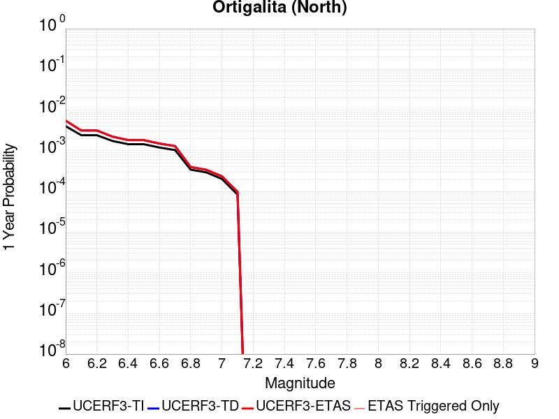 |  |

| Magnitude | 1 wk TI Prob | 1 wk TD Prob | 1 wk ETAS Prob | 1 wk ETAS/TD Gain | 1 wk ETAS Triggered Only | 1 mo TI Prob | 1 mo TD Prob | 1 mo ETAS Prob | 1 mo ETAS/TD Gain | 1 mo ETAS Triggered Only | 1 yr TI Prob | 1 yr TD Prob | 1 yr ETAS Prob | 1 yr ETAS/TD Gain | 1 yr ETAS Triggered Only | 10 yr TI Prob | 10 yr TD Prob | 10 yr ETAS Prob | 10 yr ETAS/TD Gain | 10 yr ETAS Triggered Only |
|-----|-----|-----|-----|-----|-----|-----|-----|-----|-----|-----|-----|-----|-----|-----|-----|-----|-----|-----|-----|-----|
| 6.0 | 7.711876E-5 | 1.05080755E-4 | 1.05080755E-4 | 1.0 | 0.0 | 3.3046713E-4 | 4.502792E-4 | 4.502792E-4 | 1.0 | 0.0 | 0.004016016 | 0.005468748 | 0.005468748 | 1.0 | 0.0 | 0.039442103 | 0.053461522 | 0.053518314 | 1.0010623 | 6.0E-5 |
| 6.1 | 4.607858E-5 | 6.0246814E-5 | 6.0246814E-5 | 1.0 | 0.0 | 1.9746469E-4 | 2.5817787E-4 | 2.5817787E-4 | 1.0 | 0.0 | 0.0024014818 | 0.003139129 | 0.003139129 | 1.0 | 0.0 | 0.023756953 | 0.030978661 | 0.031017423 | 1.0012512 | 4.0E-5 |
| 6.2 | 4.607858E-5 | 6.0246814E-5 | 6.0246814E-5 | 1.0 | 0.0 | 1.9746469E-4 | 2.5817787E-4 | 2.5817787E-4 | 1.0 | 0.0 | 0.0024014818 | 0.003139129 | 0.003139129 | 1.0 | 0.0 | 0.023756953 | 0.030978661 | 0.031017423 | 1.0012512 | 4.0E-5 |
| 6.3 | 3.327423E-5 | 4.2479955E-5 | 4.2479955E-5 | 1.0 | 0.0 | 1.4259605E-4 | 1.82046E-4 | 1.82046E-4 | 1.0 | 0.0 | 0.0017347244 | 0.002214445 | 0.002214445 | 1.0 | 0.0 | 0.017212452 | 0.021948025 | 0.021967584 | 1.0008912 | 2.0E-5 |
| 6.4 | 2.7732503E-5 | 3.5002373E-5 | 3.5002373E-5 | 1.0 | 0.0 | 1.1884817E-4 | 1.5000305E-4 | 1.5000305E-4 | 1.0 | 0.0 | 0.001446016 | 0.001825003 | 0.001825003 | 1.0 | 0.0 | 0.014366428 | 0.018123122 | 0.01813294 | 1.0005418 | 1.0E-5 |
| 6.5 | 2.7689714E-5 | 3.4952183E-5 | 3.4952183E-5 | 1.0 | 0.0 | 1.186648E-4 | 1.4978799E-4 | 1.4978799E-4 | 1.0 | 0.0 | 0.0014437864 | 0.0018223888 | 0.0018223888 | 1.0 | 0.0 | 0.014344421 | 0.018097406 | 0.018107224 | 1.0005425 | 1.0E-5 |
| 6.6 | 2.2976905E-5 | 2.8721237E-5 | 2.8721237E-5 | 1.0 | 0.0 | 9.846873E-5 | 1.2308663E-4 | 1.2308663E-4 | 1.0 | 0.0 | 0.0011981975 | 0.0014977884 | 0.0014977884 | 1.0 | 0.0 | 0.011917574 | 0.014900208 | 0.014910059 | 1.0006611 | 1.0E-5 |
| 6.7 | 1.9871539E-5 | 2.4907014E-5 | 2.4907014E-5 | 1.0 | 0.0 | 8.516096E-5 | 1.0674138E-4 | 1.0674138E-4 | 1.0 | 0.0 | 0.0010363415 | 0.0012990503 | 0.0012990503 | 1.0 | 0.0 | 0.010315218 | 0.012938257 | 0.012948127 | 1.0007629 | 1.0E-5 |
| 6.8 | 6.5640475E-6 | 7.605973E-6 | 7.605973E-6 | 1.0 | 0.0 | 2.813133E-5 | 3.259664E-5 | 3.259664E-5 | 1.0 | 0.0 | 3.424451E-4 | 3.9679464E-4 | 3.9679464E-4 | 1.0 | 0.0 | 0.0034191788 | 0.003961149 | 0.003971109 | 1.0025145 | 1.0E-5 |
| 6.9 | 5.6219683E-6 | 6.502243E-6 | 6.502243E-6 | 1.0 | 0.0 | 2.4093928E-5 | 2.7866474E-5 | 2.7866474E-5 | 1.0 | 0.0 | 2.933041E-4 | 3.3922406E-4 | 3.3922406E-4 | 1.0 | 0.0 | 0.0029291727 | 0.0033873196 | 0.003397286 | 1.0029422 | 1.0E-5 |
| 7.0 | 3.875591E-6 | 4.485036E-6 | 4.485036E-6 | 1.0 | 0.0 | 1.6609569E-5 | 1.9221452E-5 | 1.9221452E-5 | 1.0 | 0.0 | 2.0220275E-4 | 2.3399816E-4 | 2.3399816E-4 | 1.0 | 0.0 | 0.0020201886 | 0.002337726 | 0.0023477026 | 1.0042677 | 1.0E-5 |
| 7.1 | 1.6017933E-6 | 1.8571596E-6 | 1.8571596E-6 | 1.0 | 0.0 | 6.8648105E-6 | 7.959237E-6 | 7.959237E-6 | 1.0 | 0.0 | 8.357586E-5 | 9.6900476E-5 | 9.6900476E-5 | 1.0 | 0.0 | 8.3544437E-4 | 9.6868695E-4 | 9.6868695E-4 | 1.0 | 0.0 |

## Blue Cut
*[(top)](#table-of-contents)*

| 1 Week | 1 Month | 1 Year | 10 Year |
|-----|-----|-----|-----|
| 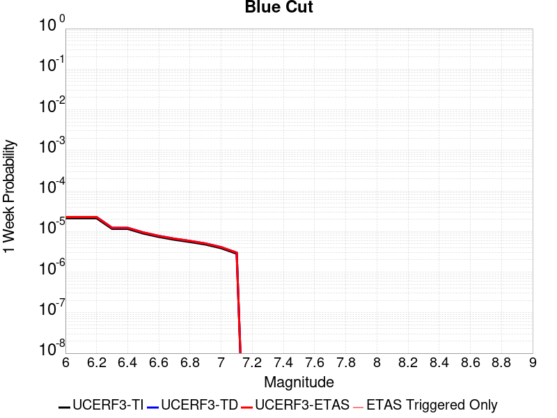 |  | 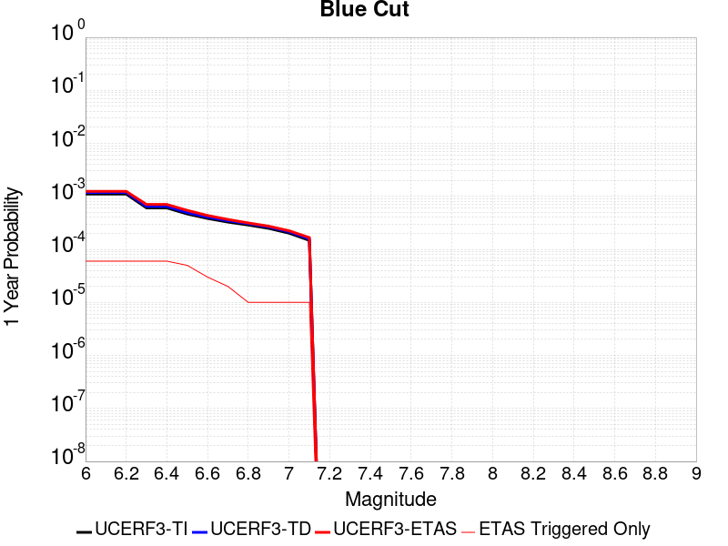 |  |

| Magnitude | 1 wk TI Prob | 1 wk TD Prob | 1 wk ETAS Prob | 1 wk ETAS/TD Gain | 1 wk ETAS Triggered Only | 1 mo TI Prob | 1 mo TD Prob | 1 mo ETAS Prob | 1 mo ETAS/TD Gain | 1 mo ETAS Triggered Only | 1 yr TI Prob | 1 yr TD Prob | 1 yr ETAS Prob | 1 yr ETAS/TD Gain | 1 yr ETAS Triggered Only | 10 yr TI Prob | 10 yr TD Prob | 10 yr ETAS Prob | 10 yr ETAS/TD Gain | 10 yr ETAS Triggered Only |
|-----|-----|-----|-----|-----|-----|-----|-----|-----|-----|-----|-----|-----|-----|-----|-----|-----|-----|-----|-----|-----|
| 6.0 | 2.1227985E-5 | 2.272021E-5 | 2.272021E-5 | 1.0 | 0.0 | 9.097391E-5 | 9.7369026E-5 | 9.7369026E-5 | 1.0 | 0.0 | 0.0011070445 | 0.0011848813 | 0.0012448102 | 1.050578 | 6.0E-5 | 0.011015458 | 0.01179148 | 0.011860655 | 1.0058665 | 7.0E-5 |
| 6.1 | 2.1227985E-5 | 2.272021E-5 | 2.272021E-5 | 1.0 | 0.0 | 9.097391E-5 | 9.7369026E-5 | 9.7369026E-5 | 1.0 | 0.0 | 0.0011070445 | 0.0011848813 | 0.0012448102 | 1.050578 | 6.0E-5 | 0.011015458 | 0.01179148 | 0.011860655 | 1.0058665 | 7.0E-5 |
| 6.2 | 2.1227985E-5 | 2.272021E-5 | 2.272021E-5 | 1.0 | 0.0 | 9.097391E-5 | 9.7369026E-5 | 9.7369026E-5 | 1.0 | 0.0 | 0.0011070445 | 0.0011848813 | 0.0012448102 | 1.050578 | 6.0E-5 | 0.011015458 | 0.01179148 | 0.011860655 | 1.0058665 | 7.0E-5 |
| 6.3 | 1.1613981E-5 | 1.2353855E-5 | 1.2353855E-5 | 1.0 | 0.0 | 4.9773254E-5 | 5.2944088E-5 | 5.2944088E-5 | 1.0 | 0.0 | 6.0582085E-4 | 6.444161E-4 | 7.043774E-4 | 1.0930475 | 6.0E-5 | 0.0060417196 | 0.006426722 | 0.0064962716 | 1.010822 | 7.0E-5 |
| 6.4 | 1.1613981E-5 | 1.2353855E-5 | 1.2353855E-5 | 1.0 | 0.0 | 4.9773254E-5 | 5.2944088E-5 | 5.2944088E-5 | 1.0 | 0.0 | 6.0582085E-4 | 6.444161E-4 | 7.043774E-4 | 1.0930475 | 6.0E-5 | 0.0060417196 | 0.006426722 | 0.0064962716 | 1.010822 | 7.0E-5 |
| 6.5 | 8.931326E-6 | 9.481832E-6 | 9.481832E-6 | 1.0 | 0.0 | 3.8276554E-5 | 4.063584E-5 | 4.063584E-5 | 1.0 | 0.0 | 4.6591737E-4 | 4.946382E-4 | 5.446135E-4 | 1.1010339 | 5.0E-5 | 0.0046494175 | 0.004936282 | 0.004995986 | 1.0120949 | 6.0E-5 |
| 6.6 | 7.345353E-6 | 7.790467E-6 | 7.790467E-6 | 1.0 | 0.0 | 3.1479703E-5 | 3.3387332E-5 | 3.3387332E-5 | 1.0 | 0.0 | 3.83198E-4 | 4.0642297E-4 | 4.3641077E-4 | 1.0737847 | 3.0E-5 | 0.0038253788 | 0.0040575885 | 0.0040974263 | 1.0098181 | 4.0E-5 |
| 6.7 | 6.2775666E-6 | 6.6553084E-6 | 6.6553084E-6 | 1.0 | 0.0 | 2.690358E-5 | 2.852248E-5 | 2.852248E-5 | 1.0 | 0.0 | 3.2750185E-4 | 3.4721338E-4 | 3.6720643E-4 | 1.0575814 | 2.0E-5 | 0.0032701963 | 0.00346745 | 0.0034973458 | 1.0086219 | 3.0E-5 |
| 6.8 | 5.5234095E-6 | 5.855251E-6 | 5.855251E-6 | 1.0 | 0.0 | 2.367154E-5 | 2.5093734E-5 | 2.5093734E-5 | 1.0 | 0.0 | 2.8816288E-4 | 3.0548064E-4 | 3.154776E-4 | 1.0327253 | 1.0E-5 | 0.002877895 | 0.0030513234 | 0.0030712623 | 1.0065346 | 2.0E-5 |
| 6.9 | 4.7780054E-6 | 5.0655417E-6 | 5.0655417E-6 | 1.0 | 0.0 | 2.0477004E-5 | 2.1709324E-5 | 2.1709324E-5 | 1.0 | 0.0 | 2.4927902E-4 | 2.64286E-4 | 2.7428337E-4 | 1.0378278 | 1.0E-5 | 0.0024899957 | 0.0026404092 | 0.0026603565 | 1.0075545 | 2.0E-5 |
| 7.0 | 3.883171E-6 | 4.1185863E-6 | 4.1185863E-6 | 1.0 | 0.0 | 1.6642054E-5 | 1.7651004E-5 | 1.7651004E-5 | 1.0 | 0.0 | 2.0259817E-4 | 2.1488666E-4 | 2.2488453E-4 | 1.0465262 | 1.0E-5 | 0.0020241356 | 0.0021474645 | 0.0021674216 | 1.0092933 | 2.0E-5 |
| 7.1 | 2.8358215E-6 | 3.0097892E-6 | 3.0097892E-6 | 1.0 | 0.0 | 1.2153464E-5 | 1.28990705E-5 | 1.28990705E-5 | 1.0 | 0.0 | 1.4795837E-4 | 1.5704145E-4 | 1.6703988E-4 | 1.0636674 | 1.0E-5 | 0.001478599 | 0.0015699499 | 0.0015899185 | 1.0127193 | 2.0E-5 |

## Big Pine (Central)
*[(top)](#table-of-contents)*

| 1 Week | 1 Month | 1 Year | 10 Year |
|-----|-----|-----|-----|
|  |  |  |  |

| Magnitude | 1 wk TI Prob | 1 wk TD Prob | 1 wk ETAS Prob | 1 wk ETAS/TD Gain | 1 wk ETAS Triggered Only | 1 mo TI Prob | 1 mo TD Prob | 1 mo ETAS Prob | 1 mo ETAS/TD Gain | 1 mo ETAS Triggered Only | 1 yr TI Prob | 1 yr TD Prob | 1 yr ETAS Prob | 1 yr ETAS/TD Gain | 1 yr ETAS Triggered Only | 10 yr TI Prob | 10 yr TD Prob | 10 yr ETAS Prob | 10 yr ETAS/TD Gain | 10 yr ETAS Triggered Only |
|-----|-----|-----|-----|-----|-----|-----|-----|-----|-----|-----|-----|-----|-----|-----|-----|-----|-----|-----|-----|-----|
| 6.0 | 1.2706755E-5 | 1.4251979E-5 | 1.4251979E-5 | 1.0 | 0.0 | 5.4456385E-5 | 6.107869E-5 | 6.107869E-5 | 1.0 | 0.0 | 6.628048E-4 | 7.434159E-4 | 7.733936E-4 | 1.0403242 | 3.0E-5 | 0.006608314 | 0.00741431 | 0.0074837906 | 1.0093712 | 7.0E-5 |
| 6.1 | 8.342579E-6 | 9.51205E-6 | 9.51205E-6 | 1.0 | 0.0 | 3.5753423E-5 | 4.0765415E-5 | 4.0765415E-5 | 1.0 | 0.0 | 4.3521097E-4 | 4.9622764E-4 | 5.062227E-4 | 1.0201421 | 1.0E-5 | 0.0043435963 | 0.0049547427 | 0.004994544 | 1.008033 | 4.0E-5 |
| 6.2 | 6.923899E-6 | 7.968382E-6 | 7.968382E-6 | 1.0 | 0.0 | 2.9673516E-5 | 3.414987E-5 | 3.414987E-5 | 1.0 | 0.0 | 3.6121515E-4 | 4.157146E-4 | 4.2571043E-4 | 1.024045 | 1.0E-5 | 0.003606286 | 0.0041526696 | 0.004192503 | 1.0095924 | 4.0E-5 |
| 6.3 | 2.728396E-6 | 3.425376E-6 | 3.425376E-6 | 1.0 | 0.0 | 1.1693074E-5 | 1.4680106E-5 | 1.4680106E-5 | 1.0 | 0.0 | 1.4235388E-4 | 1.787165E-4 | 1.8871471E-4 | 1.0559446 | 1.0E-5 | 0.0014226272 | 0.0017872264 | 0.0018071907 | 1.0111705 | 2.0E-5 |
| 6.4 | 2.7136944E-6 | 3.409669E-6 | 3.409669E-6 | 1.0 | 0.0 | 1.1630066E-5 | 1.461279E-5 | 1.461279E-5 | 1.0 | 0.0 | 1.4158686E-4 | 1.7789706E-4 | 1.8789529E-4 | 1.0562023 | 1.0E-5 | 0.0014149669 | 0.0017790453 | 0.0017990097 | 1.011222 | 2.0E-5 |
| 6.5 | 2.6971882E-6 | 3.3920137E-6 | 3.3920137E-6 | 1.0 | 0.0 | 1.1559327E-5 | 1.4537125E-5 | 1.4537125E-5 | 1.0 | 0.0 | 1.4072572E-4 | 1.76976E-4 | 1.8697423E-4 | 1.0564948 | 1.0E-5 | 0.0014063664 | 0.0017698492 | 0.0017898139 | 1.0112804 | 2.0E-5 |
| 6.6 | 2.669092E-6 | 3.3620333E-6 | 3.3620333E-6 | 1.0 | 0.0 | 1.1438916E-5 | 1.440864E-5 | 1.440864E-5 | 1.0 | 0.0 | 1.3925991E-4 | 1.7541193E-4 | 1.8541017E-4 | 1.0569986 | 1.0E-5 | 0.0013917267 | 0.0017542334 | 0.0017741983 | 1.011381 | 2.0E-5 |
| 6.7 | 2.6408059E-6 | 3.3320582E-6 | 3.3320582E-6 | 1.0 | 0.0 | 1.1317691E-5 | 1.4280176E-5 | 1.4280176E-5 | 1.0 | 0.0 | 1.3778417E-4 | 1.7384814E-4 | 1.8384641E-4 | 1.0575114 | 1.0E-5 | 0.0013769877 | 0.0017386201 | 0.0017585853 | 1.0114834 | 2.0E-5 |
| 6.8 | 2.1786943E-6 | 2.8555096E-6 | 2.8555096E-6 | 1.0 | 0.0 | 9.337228E-6 | 1.2237845E-5 | 1.2237845E-5 | 1.0 | 0.0 | 1.1367482E-4 | 1.489863E-4 | 1.5898481E-4 | 1.0671103 | 1.0E-5 | 0.0011361669 | 0.0014903494 | 0.0015103195 | 1.0133997 | 2.0E-5 |
| 6.9 | 1.4411696E-6 | 2.0695281E-6 | 2.0695281E-6 | 1.0 | 0.0 | 6.1764263E-6 | 8.869378E-6 | 8.869378E-6 | 1.0 | 0.0 | 7.51954E-5 | 1.079796E-4 | 1.1797852E-4 | 1.0926001 | 1.0E-5 | 7.5169955E-4 | 0.0010807118 | 0.0011006902 | 1.0184863 | 2.0E-5 |
| 7.0 | 1.0073411E-6 | 1.55518E-6 | 1.55518E-6 | 1.0 | 0.0 | 4.317169E-6 | 6.665041E-6 | 6.665041E-6 | 1.0 | 0.0 | 5.2560266E-5 | 8.1144004E-5 | 9.114319E-5 | 1.1232277 | 1.0E-5 | 5.2547833E-4 | 8.1257307E-4 | 8.325568E-4 | 1.0245931 | 2.0E-5 |
| 7.1 | 8.947104E-7 | 1.4311554E-6 | 1.4311554E-6 | 1.0 | 0.0 | 3.834468E-6 | 6.1335095E-6 | 6.1335095E-6 | 1.0 | 0.0 | 4.6683643E-5 | 7.4673066E-5 | 8.467232E-5 | 1.1339071 | 1.0E-5 | 4.6673836E-4 | 7.4790884E-4 | 7.6789386E-4 | 1.0267212 | 2.0E-5 |
| 7.2 | 5.215166E-7 | 1.0120133E-6 | 1.0120133E-6 | 1.0 | 0.0 | 2.2350691E-6 | 4.337193E-6 | 4.337193E-6 | 1.0 | 0.0 | 2.7211627E-5 | 5.2804087E-5 | 6.2803556E-5 | 1.1893693 | 1.0E-5 | 2.7208295E-4 | 5.293343E-4 | 5.39329E-4 | 1.0188817 | 1.0E-5 |
| 7.3 | 4.4024807E-7 | 9.2277924E-7 | 9.2277924E-7 | 1.0 | 0.0 | 1.8867761E-6 | 3.9547626E-6 | 3.9547626E-6 | 1.0 | 0.0 | 2.2971257E-5 | 4.814821E-5 | 5.814773E-5 | 1.207682 | 1.0E-5 | 2.2968883E-4 | 4.8279652E-4 | 4.927917E-4 | 1.0207026 | 1.0E-5 |
| 7.4 | 3.6130905E-7 | 8.366472E-7 | 8.366472E-7 | 1.0 | 0.0 | 1.5484665E-6 | 3.585626E-6 | 3.585626E-6 | 1.0 | 0.0 | 1.8852415E-5 | 4.3654163E-5 | 5.3653726E-5 | 1.2290633 | 1.0E-5 | 1.8850817E-4 | 4.3786503E-4 | 4.4786066E-4 | 1.0228281 | 1.0E-5 |
| 7.5 | 3.408184E-7 | 8.1159226E-7 | 8.1159226E-7 | 1.0 | 0.0 | 1.4606494E-6 | 3.4782481E-6 | 3.4782481E-6 | 1.0 | 0.0 | 1.7783263E-5 | 4.2346885E-5 | 5.2346462E-5 | 1.2361349 | 1.0E-5 | 1.778184E-4 | 4.247759E-4 | 4.3477165E-4 | 1.0235318 | 1.0E-5 |
| 7.6 | 3.1428627E-7 | 7.7390996E-7 | 7.7390996E-7 | 1.0 | 0.0 | 1.3469405E-6 | 3.316753E-6 | 3.316753E-6 | 1.0 | 0.0 | 1.6398877E-5 | 4.0380757E-5 | 5.0380353E-5 | 1.2476327 | 1.0E-5 | 1.6397667E-4 | 4.0509304E-4 | 4.15089E-4 | 1.0246757 | 1.0E-5 |
| 7.7 | 1.7972785E-7 | 5.0834836E-7 | 5.0834836E-7 | 1.0 | 0.0 | 7.70262E-7 | 2.178634E-6 | 2.178634E-6 | 1.0 | 0.0 | 9.377899E-6 | 2.6524556E-5 | 3.6524292E-5 | 1.3769991 | 1.0E-5 | 9.377503E-5 | 2.6658011E-4 | 2.7657746E-4 | 1.0375022 | 1.0E-5 |
| 7.8 | 4.9230927E-8 | 1.1994314E-7 | 1.1994314E-7 | 1.0 | 0.0 | 2.1098968E-7 | 5.140419E-7 | 5.140419E-7 | 1.0 | 0.0 | 2.5687964E-6 | 6.2584436E-6 | 6.2584436E-6 | 1.0 | 0.0 | 2.5687666E-5 | 6.302338E-5 | 6.302338E-5 | 1.0 | 0.0 |
| 7.9 | 3.6805972E-9 | 4.11062E-9 | 4.11062E-9 | 1.0 | 0.0 | 1.5773987E-8 | 1.7616943E-8 | 1.7616943E-8 | 1.0 | 0.0 | 1.9204828E-7 | 2.1448626E-7 | 2.1448626E-7 | 1.0 | 0.0 | 1.920481E-6 | 2.1928531E-6 | 2.1928531E-6 | 1.0 | 0.0 |

## Cleghorn Lake
*[(top)](#table-of-contents)*

| 1 Week | 1 Month | 1 Year | 10 Year |
|-----|-----|-----|-----|
|  |  |  |  |

| Magnitude | 1 wk TI Prob | 1 wk TD Prob | 1 wk ETAS Prob | 1 wk ETAS/TD Gain | 1 wk ETAS Triggered Only | 1 mo TI Prob | 1 mo TD Prob | 1 mo ETAS Prob | 1 mo ETAS/TD Gain | 1 mo ETAS Triggered Only | 1 yr TI Prob | 1 yr TD Prob | 1 yr ETAS Prob | 1 yr ETAS/TD Gain | 1 yr ETAS Triggered Only | 10 yr TI Prob | 10 yr TD Prob | 10 yr ETAS Prob | 10 yr ETAS/TD Gain | 10 yr ETAS Triggered Only |
|-----|-----|-----|-----|-----|-----|-----|-----|-----|-----|-----|-----|-----|-----|-----|-----|-----|-----|-----|-----|-----|
| 6.0 | 1.5467183E-5 | 1.6794778E-5 | 1.6794778E-5 | 1.0 | 0.0 | 6.6286244E-5 | 7.197595E-5 | 7.197595E-5 | 1.0 | 0.0 | 8.067362E-4 | 8.760097E-4 | 9.0598344E-4 | 1.0342162 | 3.0E-5 | 0.008038137 | 0.008730994 | 0.00879047 | 1.0068121 | 6.0E-5 |
| 6.1 | 1.5467183E-5 | 1.6794778E-5 | 1.6794778E-5 | 1.0 | 0.0 | 6.6286244E-5 | 7.197595E-5 | 7.197595E-5 | 1.0 | 0.0 | 8.067362E-4 | 8.760097E-4 | 9.0598344E-4 | 1.0342162 | 3.0E-5 | 0.008038137 | 0.008730994 | 0.00879047 | 1.0068121 | 6.0E-5 |
| 6.2 | 1.2624631E-5 | 1.3682002E-5 | 1.3682002E-5 | 1.0 | 0.0 | 5.410444E-5 | 5.863611E-5 | 5.863611E-5 | 1.0 | 0.0 | 6.585225E-4 | 7.1370945E-4 | 7.436881E-4 | 1.0420039 | 3.0E-5 | 0.0065657445 | 0.007118969 | 0.0071686134 | 1.0069735 | 5.0E-5 |
| 6.3 | 1.2624631E-5 | 1.3682002E-5 | 1.3682002E-5 | 1.0 | 0.0 | 5.410444E-5 | 5.863611E-5 | 5.863611E-5 | 1.0 | 0.0 | 6.585225E-4 | 7.1370945E-4 | 7.436881E-4 | 1.0420039 | 3.0E-5 | 0.0065657445 | 0.007118969 | 0.0071686134 | 1.0069735 | 5.0E-5 |
| 6.4 | 9.417684E-6 | 1.0170443E-5 | 1.0170443E-5 | 1.0 | 0.0 | 4.036088E-5 | 4.3587115E-5 | 4.3587115E-5 | 1.0 | 0.0 | 4.912829E-4 | 5.30585E-4 | 5.4057967E-4 | 1.0188371 | 1.0E-5 | 0.004901982 | 0.005297218 | 0.005327059 | 1.0056334 | 3.0E-5 |
| 6.5 | 9.368219E-6 | 1.01178675E-5 | 1.01178675E-5 | 1.0 | 0.0 | 4.014889E-5 | 4.33618E-5 | 4.33618E-5 | 1.0 | 0.0 | 4.8870314E-4 | 5.2784313E-4 | 5.3783786E-4 | 1.018935 | 1.0E-5 | 0.004876298 | 0.0052699298 | 0.0052997717 | 1.0056627 | 3.0E-5 |
| 6.6 | 7.803798E-6 | 8.442106E-6 | 8.442106E-6 | 1.0 | 0.0 | 3.3444423E-5 | 3.618018E-5 | 3.618018E-5 | 1.0 | 0.0 | 4.0710976E-4 | 4.404446E-4 | 4.404446E-4 | 1.0 | 0.0 | 0.0040636472 | 0.004399634 | 0.004419546 | 1.0045258 | 2.0E-5 |
| 6.7 | 2.3108669E-6 | 2.4438896E-6 | 2.4438896E-6 | 1.0 | 0.0 | 9.903678E-6 | 1.0473772E-5 | 1.0473772E-5 | 1.0 | 0.0 | 1.205706E-4 | 1.275109E-4 | 1.275109E-4 | 1.0 | 0.0 | 0.001205052 | 0.001274396 | 0.0012843832 | 1.0078368 | 1.0E-5 |
| 6.8 | 2.0882828E-6 | 2.2063318E-6 | 2.2063318E-6 | 1.0 | 0.0 | 8.949753E-6 | 9.455674E-6 | 9.455674E-6 | 1.0 | 0.0 | 1.08957785E-4 | 1.1511693E-4 | 1.1511693E-4 | 1.0 | 0.0 | 0.0010890438 | 0.0011505898 | 0.0011605783 | 1.0086812 | 1.0E-5 |
| 6.9 | 1.876935E-6 | 1.9810948E-6 | 1.9810948E-6 | 1.0 | 0.0 | 8.043982E-6 | 8.4903795E-6 | 8.4903795E-6 | 1.0 | 0.0 | 9.7931086E-5 | 1.0336562E-4 | 1.0336562E-4 | 1.0 | 0.0 | 9.788794E-4 | 0.0010331915 | 0.0010431812 | 1.0096687 | 1.0E-5 |
| 7.0 | 1.5357559E-6 | 1.6203162E-6 | 1.6203162E-6 | 1.0 | 0.0 | 6.5817944E-6 | 6.9441944E-6 | 6.9441944E-6 | 1.0 | 0.0 | 8.01304E-5 | 8.4542415E-5 | 8.4542415E-5 | 1.0 | 0.0 | 8.010151E-4 | 8.45115E-4 | 8.551065E-4 | 1.0118227 | 1.0E-5 |
| 7.1 | 1.0905424E-6 | 1.1497868E-6 | 1.1497868E-6 | 1.0 | 0.0 | 4.6737446E-6 | 4.927649E-6 | 4.927649E-6 | 1.0 | 0.0 | 5.6901354E-5 | 5.9992573E-5 | 5.9992573E-5 | 1.0 | 0.0 | 5.6886784E-4 | 5.997736E-4 | 6.0976757E-4 | 1.016663 | 1.0E-5 |
| 7.2 | 6.06668E-7 | 6.387412E-7 | 6.387412E-7 | 1.0 | 0.0 | 2.600003E-6 | 2.7374597E-6 | 2.7374597E-6 | 1.0 | 0.0 | 3.1654577E-5 | 3.332813E-5 | 3.332813E-5 | 1.0 | 0.0 | 3.1650066E-4 | 3.332382E-4 | 3.4323486E-4 | 1.0299985 | 1.0E-5 |

## Lost Hills
*[(top)](#table-of-contents)*

| 1 Week | 1 Month | 1 Year | 10 Year |
|-----|-----|-----|-----|
| 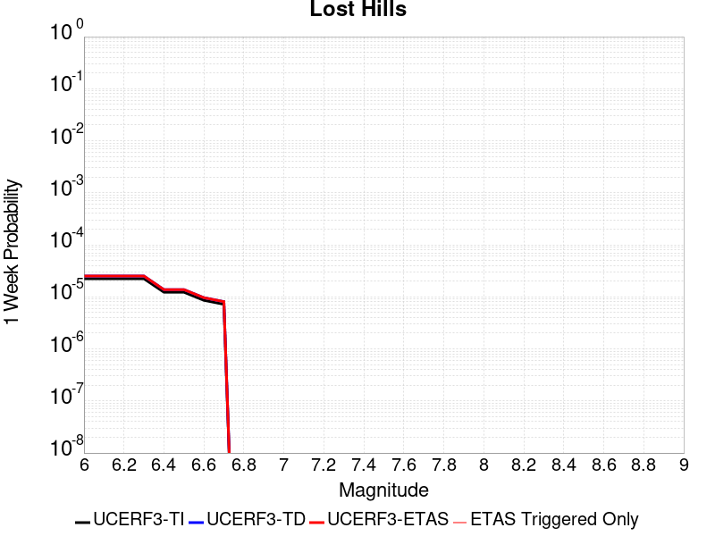 | 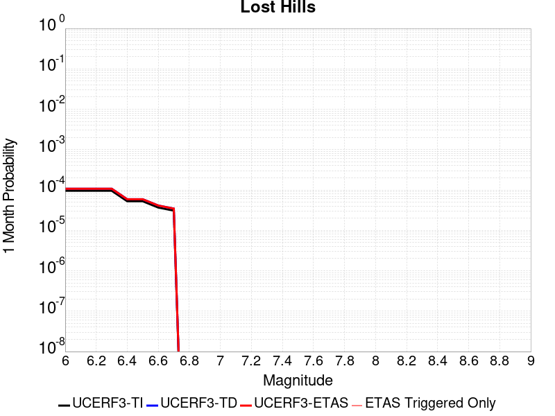 | 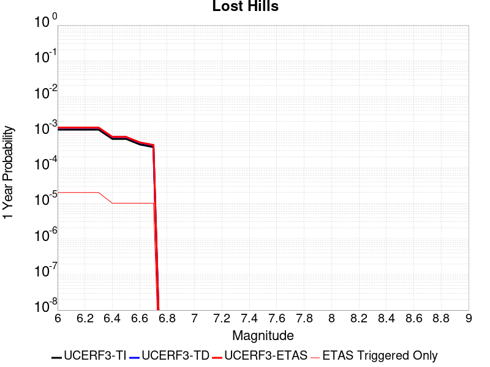 | 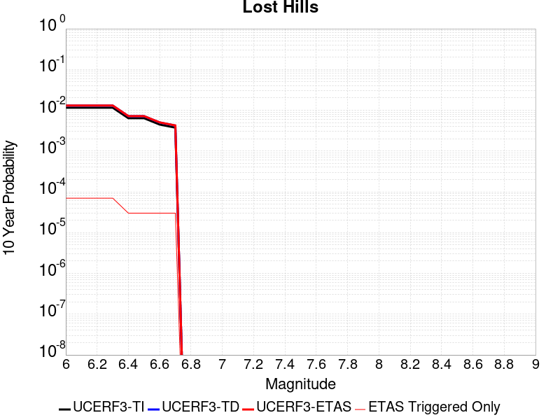 |

| Magnitude | 1 wk TI Prob | 1 wk TD Prob | 1 wk ETAS Prob | 1 wk ETAS/TD Gain | 1 wk ETAS Triggered Only | 1 mo TI Prob | 1 mo TD Prob | 1 mo ETAS Prob | 1 mo ETAS/TD Gain | 1 mo ETAS Triggered Only | 1 yr TI Prob | 1 yr TD Prob | 1 yr ETAS Prob | 1 yr ETAS/TD Gain | 1 yr ETAS Triggered Only | 10 yr TI Prob | 10 yr TD Prob | 10 yr ETAS Prob | 10 yr ETAS/TD Gain | 10 yr ETAS Triggered Only |
|-----|-----|-----|-----|-----|-----|-----|-----|-----|-----|-----|-----|-----|-----|-----|-----|-----|-----|-----|-----|-----|
| 6.0 | 2.233523E-5 | 2.5107822E-5 | 2.5107822E-5 | 1.0 | 0.0 | 9.571891E-5 | 1.0760146E-4 | 1.0760146E-4 | 1.0 | 0.0 | 0.0011647546 | 0.0013094286 | 0.0013294024 | 1.0152538 | 2.0E-5 | 0.011586686 | 0.013033731 | 0.013102818 | 1.0053006 | 7.0E-5 |
| 6.1 | 2.233523E-5 | 2.5107822E-5 | 2.5107822E-5 | 1.0 | 0.0 | 9.571891E-5 | 1.0760146E-4 | 1.0760146E-4 | 1.0 | 0.0 | 0.0011647546 | 0.0013094286 | 0.0013294024 | 1.0152538 | 2.0E-5 | 0.011586686 | 0.013033731 | 0.013102818 | 1.0053006 | 7.0E-5 |
| 6.2 | 2.233523E-5 | 2.5107822E-5 | 2.5107822E-5 | 1.0 | 0.0 | 9.571891E-5 | 1.0760146E-4 | 1.0760146E-4 | 1.0 | 0.0 | 0.0011647546 | 0.0013094286 | 0.0013294024 | 1.0152538 | 2.0E-5 | 0.011586686 | 0.013033731 | 0.013102818 | 1.0053006 | 7.0E-5 |
| 6.3 | 2.233523E-5 | 2.5107822E-5 | 2.5107822E-5 | 1.0 | 0.0 | 9.571891E-5 | 1.0760146E-4 | 1.0760146E-4 | 1.0 | 0.0 | 0.0011647546 | 0.0013094286 | 0.0013294024 | 1.0152538 | 2.0E-5 | 0.011586686 | 0.013033731 | 0.013102818 | 1.0053006 | 7.0E-5 |
| 6.4 | 1.2288092E-5 | 1.3781773E-5 | 1.3781773E-5 | 1.0 | 0.0 | 5.2662188E-5 | 5.9063936E-5 | 5.9063936E-5 | 1.0 | 0.0 | 6.409735E-4 | 7.1895996E-4 | 7.2895276E-4 | 1.013899 | 1.0E-5 | 0.006391279 | 0.007175547 | 0.0072053317 | 1.0041509 | 3.0E-5 |
| 6.5 | 1.2288092E-5 | 1.3781773E-5 | 1.3781773E-5 | 1.0 | 0.0 | 5.2662188E-5 | 5.9063936E-5 | 5.9063936E-5 | 1.0 | 0.0 | 6.409735E-4 | 7.1895996E-4 | 7.2895276E-4 | 1.013899 | 1.0E-5 | 0.006391279 | 0.007175547 | 0.0072053317 | 1.0041509 | 3.0E-5 |
| 6.6 | 8.58281E-6 | 9.634239E-6 | 9.634239E-6 | 1.0 | 0.0 | 3.6782953E-5 | 4.128941E-5 | 4.128941E-5 | 1.0 | 0.0 | 4.4774043E-4 | 5.026659E-4 | 5.1266083E-4 | 1.019884 | 1.0E-5 | 0.0044683935 | 0.0050234497 | 0.005053299 | 1.005942 | 3.0E-5 |
| 6.7 | 7.205685E-6 | 8.088696E-6 | 8.088696E-6 | 1.0 | 0.0 | 3.088114E-5 | 3.4665838E-5 | 3.4665838E-5 | 1.0 | 0.0 | 3.7591302E-4 | 4.220566E-4 | 4.320524E-4 | 1.0236835 | 1.0E-5 | 0.0037527776 | 0.004220566 | 0.0042504393 | 1.007078 | 3.0E-5 |

## Red Mountain
*[(top)](#table-of-contents)*

| 1 Week | 1 Month | 1 Year | 10 Year |
|-----|-----|-----|-----|
|  | 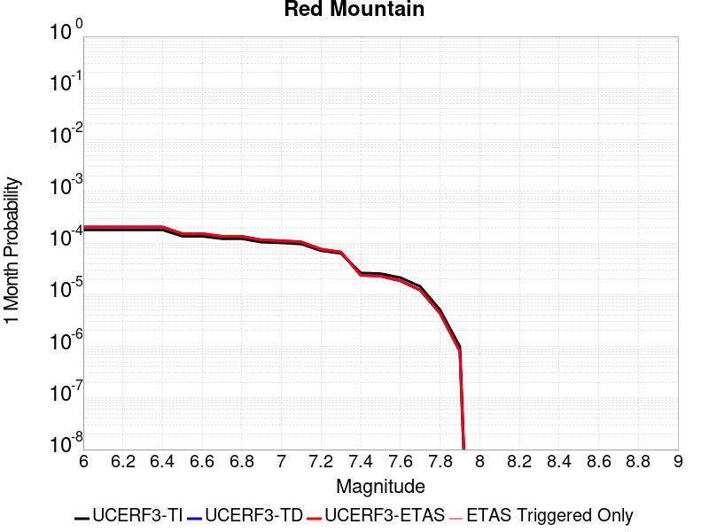 |  |  |

| Magnitude | 1 wk TI Prob | 1 wk TD Prob | 1 wk ETAS Prob | 1 wk ETAS/TD Gain | 1 wk ETAS Triggered Only | 1 mo TI Prob | 1 mo TD Prob | 1 mo ETAS Prob | 1 mo ETAS/TD Gain | 1 mo ETAS Triggered Only | 1 yr TI Prob | 1 yr TD Prob | 1 yr ETAS Prob | 1 yr ETAS/TD Gain | 1 yr ETAS Triggered Only | 10 yr TI Prob | 10 yr TD Prob | 10 yr ETAS Prob | 10 yr ETAS/TD Gain | 10 yr ETAS Triggered Only |
|-----|-----|-----|-----|-----|-----|-----|-----|-----|-----|-----|-----|-----|-----|-----|-----|-----|-----|-----|-----|-----|
| 6.0 | 4.1810763E-5 | 4.7593123E-5 | 4.7593123E-5 | 1.0 | 0.0 | 1.7917668E-4 | 2.0395551E-4 | 2.0395551E-4 | 1.0 | 0.0 | 0.0021792934 | 0.002480496 | 0.002480496 | 1.0 | 0.0 | 0.021580452 | 0.02454571 | 0.024594482 | 1.001987 | 5.0E-5 |
| 6.1 | 4.1810763E-5 | 4.7593123E-5 | 4.7593123E-5 | 1.0 | 0.0 | 1.7917668E-4 | 2.0395551E-4 | 2.0395551E-4 | 1.0 | 0.0 | 0.0021792934 | 0.002480496 | 0.002480496 | 1.0 | 0.0 | 0.021580452 | 0.02454571 | 0.024594482 | 1.001987 | 5.0E-5 |
| 6.2 | 4.1810763E-5 | 4.7593123E-5 | 4.7593123E-5 | 1.0 | 0.0 | 1.7917668E-4 | 2.0395551E-4 | 2.0395551E-4 | 1.0 | 0.0 | 0.0021792934 | 0.002480496 | 0.002480496 | 1.0 | 0.0 | 0.021580452 | 0.02454571 | 0.024594482 | 1.001987 | 5.0E-5 |
| 6.3 | 4.1810763E-5 | 4.7593123E-5 | 4.7593123E-5 | 1.0 | 0.0 | 1.7917668E-4 | 2.0395551E-4 | 2.0395551E-4 | 1.0 | 0.0 | 0.0021792934 | 0.002480496 | 0.002480496 | 1.0 | 0.0 | 0.021580452 | 0.02454571 | 0.024594482 | 1.001987 | 5.0E-5 |
| 6.4 | 4.1810763E-5 | 4.7593123E-5 | 4.7593123E-5 | 1.0 | 0.0 | 1.7917668E-4 | 2.0395551E-4 | 2.0395551E-4 | 1.0 | 0.0 | 0.0021792934 | 0.002480496 | 0.002480496 | 1.0 | 0.0 | 0.021580452 | 0.02454571 | 0.024594482 | 1.001987 | 5.0E-5 |
| 6.5 | 3.154503E-5 | 3.5361973E-5 | 3.5361973E-5 | 1.0 | 0.0 | 1.3518598E-4 | 1.5154302E-4 | 1.5154302E-4 | 1.0 | 0.0 | 0.0016446467 | 0.001843567 | 0.001843567 | 1.0 | 0.0 | 0.01632528 | 0.018292384 | 0.018321836 | 1.00161 | 3.0E-5 |
| 6.6 | 3.1535834E-5 | 3.5351353E-5 | 3.5351353E-5 | 1.0 | 0.0 | 1.3514658E-4 | 1.5149752E-4 | 1.5149752E-4 | 1.0 | 0.0 | 0.0016441676 | 0.0018430139 | 0.0018430139 | 1.0 | 0.0 | 0.01632056 | 0.018286945 | 0.018316397 | 1.0016105 | 3.0E-5 |
| 6.7 | 2.8267326E-5 | 3.1471296E-5 | 3.1471296E-5 | 1.0 | 0.0 | 1.2114006E-4 | 1.3487048E-4 | 1.3487048E-4 | 1.0 | 0.0 | 0.0014738824 | 0.0016408964 | 0.0016408964 | 1.0 | 0.0 | 0.014641452 | 0.01629657 | 0.01632608 | 1.0018109 | 3.0E-5 |
| 6.8 | 2.8212884E-5 | 3.1409178E-5 | 3.1409178E-5 | 1.0 | 0.0 | 1.20906756E-4 | 1.346043E-4 | 1.346043E-4 | 1.0 | 0.0 | 0.0014710457 | 0.0016376604 | 0.0016376604 | 1.0 | 0.0 | 0.014613459 | 0.016264683 | 0.016294194 | 1.0018145 | 3.0E-5 |
| 6.9 | 2.4227871E-5 | 2.6708594E-5 | 2.6708594E-5 | 1.0 | 0.0 | 1.03829596E-4 | 1.1446081E-4 | 1.1446081E-4 | 1.0 | 0.0 | 0.0012633923 | 0.0013927454 | 0.0013927454 | 1.0 | 0.0 | 0.012562336 | 0.013847859 | 0.013877443 | 1.0021363 | 3.0E-5 |
| 7.0 | 2.348524E-5 | 2.5837318E-5 | 2.5837318E-5 | 1.0 | 0.0 | 1.0064714E-4 | 1.10727095E-4 | 1.10727095E-4 | 1.0 | 0.0 | 0.0012246901 | 0.0013473443 | 0.0013473443 | 1.0 | 0.0 | 0.012179627 | 0.013399391 | 0.01342899 | 1.002209 | 3.0E-5 |
| 7.1 | 2.2311642E-5 | 2.446429E-5 | 2.446429E-5 | 1.0 | 0.0 | 9.561782E-5 | 1.0484317E-4 | 1.0484317E-4 | 1.0 | 0.0 | 0.0011635252 | 0.001275793 | 0.001275793 | 1.0 | 0.0 | 0.01157452 | 0.012692206 | 0.012721825 | 1.0023336 | 3.0E-5 |
| 7.2 | 1.6533986E-5 | 1.7671335E-5 | 1.7671335E-5 | 1.0 | 0.0 | 7.085802E-5 | 7.5732445E-5 | 7.5732445E-5 | 1.0 | 0.0 | 8.623549E-4 | 9.21716E-4 | 9.21716E-4 | 1.0 | 0.0 | 0.008590161 | 0.00918521 | 0.009214935 | 1.0032362 | 3.0E-5 |
| 7.3 | 1.4703092E-5 | 1.556038E-5 | 1.556038E-5 | 1.0 | 0.0 | 6.301173E-5 | 6.668598E-5 | 6.668598E-5 | 1.0 | 0.0 | 7.668978E-4 | 8.11661E-4 | 8.11661E-4 | 1.0 | 0.0 | 0.0076425658 | 0.00809304 | 0.008122798 | 1.0036769 | 3.0E-5 |
| 7.4 | 6.1331984E-6 | 5.5290475E-6 | 5.5290475E-6 | 1.0 | 0.0 | 2.6284872E-5 | 2.3695704E-5 | 2.3695704E-5 | 1.0 | 0.0 | 3.199713E-4 | 2.8845755E-4 | 2.8845755E-4 | 1.0 | 0.0 | 0.0031951098 | 0.0028808857 | 0.002910799 | 1.0103835 | 3.0E-5 |
| 7.5 | 5.954766E-6 | 5.3386707E-6 | 5.3386707E-6 | 1.0 | 0.0 | 2.5520176E-5 | 2.287982E-5 | 2.287982E-5 | 1.0 | 0.0 | 3.1066386E-4 | 2.785267E-4 | 2.785267E-4 | 1.0 | 0.0 | 0.003102299 | 0.0027818303 | 0.002811747 | 1.0107542 | 3.0E-5 |
| 7.6 | 4.9726646E-6 | 4.3154323E-6 | 4.3154323E-6 | 1.0 | 0.0 | 2.1311245E-5 | 1.849458E-5 | 1.849458E-5 | 1.0 | 0.0 | 2.5943352E-4 | 2.2514859E-4 | 2.2514859E-4 | 1.0 | 0.0 | 0.0025913084 | 0.0022492395 | 0.0022691945 | 1.0088719 | 2.0E-5 |
| 7.7 | 3.3613894E-6 | 2.8527543E-6 | 2.8527543E-6 | 1.0 | 0.0 | 1.4405875E-5 | 1.2226034E-5 | 1.2226034E-5 | 1.0 | 0.0 | 1.7537741E-4 | 1.4884207E-4 | 1.4884207E-4 | 1.0 | 0.0 | 0.0017523908 | 0.00148745 | 0.0014974352 | 1.0067129 | 1.0E-5 |
| 7.8 | 1.1828961E-6 | 1.0123023E-6 | 1.0123023E-6 | 1.0 | 0.0 | 5.069545E-6 | 4.338431E-6 | 4.338431E-6 | 1.0 | 0.0 | 6.171996E-5 | 5.281915E-5 | 5.281915E-5 | 1.0 | 0.0 | 6.170282E-4 | 5.2806886E-4 | 5.2806886E-4 | 1.0 | 0.0 |
| 7.9 | 2.2967266E-7 | 1.861945E-7 | 1.861945E-7 | 1.0 | 0.0 | 9.843111E-7 | 7.9797616E-7 | 7.9797616E-7 | 1.0 | 0.0 | 1.19839215E-5 | 9.71532E-6 | 9.71532E-6 | 1.0 | 0.0 | 1.1983275E-4 | 9.714923E-5 | 9.714923E-5 | 1.0 | 0.0 |

## Cleghorn Pass
*[(top)](#table-of-contents)*

| 1 Week | 1 Month | 1 Year | 10 Year |
|-----|-----|-----|-----|
| 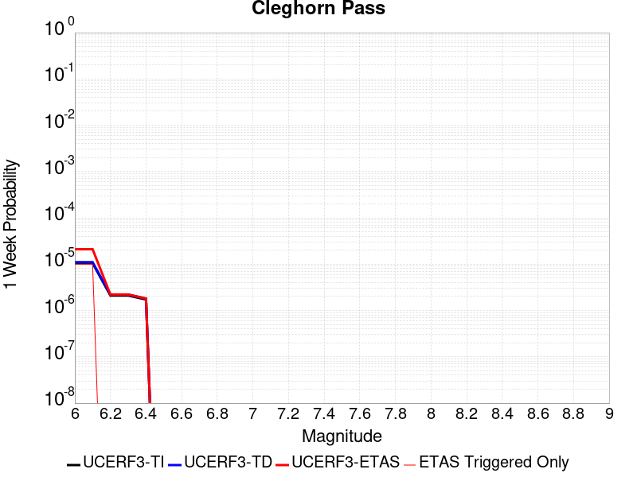 |  |  |  |

| Magnitude | 1 wk TI Prob | 1 wk TD Prob | 1 wk ETAS Prob | 1 wk ETAS/TD Gain | 1 wk ETAS Triggered Only | 1 mo TI Prob | 1 mo TD Prob | 1 mo ETAS Prob | 1 mo ETAS/TD Gain | 1 mo ETAS Triggered Only | 1 yr TI Prob | 1 yr TD Prob | 1 yr ETAS Prob | 1 yr ETAS/TD Gain | 1 yr ETAS Triggered Only | 10 yr TI Prob | 10 yr TD Prob | 10 yr ETAS Prob | 10 yr ETAS/TD Gain | 10 yr ETAS Triggered Only |
|-----|-----|-----|-----|-----|-----|-----|-----|-----|-----|-----|-----|-----|-----|-----|-----|-----|-----|-----|-----|-----|
| 6.0 | 1.0522846E-5 | 1.1040858E-5 | 2.1040747E-5 | 1.9057168 | 1.0E-5 | 4.509713E-5 | 4.73174E-5 | 5.7316927E-5 | 1.2113287 | 1.0E-5 | 5.4891926E-4 | 5.759897E-4 | 5.959782E-4 | 1.0347029 | 2.0E-5 | 0.0054756533 | 0.005750134 | 0.005809789 | 1.0103745 | 6.0E-5 |
| 6.1 | 1.0522846E-5 | 1.1040858E-5 | 2.1040747E-5 | 1.9057168 | 1.0E-5 | 4.509713E-5 | 4.73174E-5 | 5.7316927E-5 | 1.2113287 | 1.0E-5 | 5.4891926E-4 | 5.759897E-4 | 5.959782E-4 | 1.0347029 | 2.0E-5 | 0.0054756533 | 0.005750134 | 0.005809789 | 1.0103745 | 6.0E-5 |
| 6.2 | 2.1045846E-6 | 2.2082456E-6 | 2.2082456E-6 | 1.0 | 0.0 | 9.019617E-6 | 9.463899E-6 | 9.463899E-6 | 1.0 | 0.0 | 1.098083E-4 | 1.1522108E-4 | 1.1522108E-4 | 1.0 | 0.0 | 0.0010975406 | 0.0011520248 | 0.0011720018 | 1.0173408 | 2.0E-5 |
| 6.3 | 2.1045846E-6 | 2.2082456E-6 | 2.2082456E-6 | 1.0 | 0.0 | 9.019617E-6 | 9.463899E-6 | 9.463899E-6 | 1.0 | 0.0 | 1.098083E-4 | 1.1522108E-4 | 1.1522108E-4 | 1.0 | 0.0 | 0.0010975406 | 0.0011520248 | 0.0011720018 | 1.0173408 | 2.0E-5 |
| 6.4 | 1.7259927E-6 | 1.8109125E-6 | 1.8109125E-6 | 1.0 | 0.0 | 7.3970905E-6 | 7.761054E-6 | 7.761054E-6 | 1.0 | 0.0 | 9.005586E-5 | 9.449083E-5 | 9.449083E-5 | 1.0 | 0.0 | 9.001937E-4 | 9.449083E-4 | 9.5489883E-4 | 1.010573 | 1.0E-5 |

## Pine Mtn
*[(top)](#table-of-contents)*

| 1 Week | 1 Month | 1 Year | 10 Year |
|-----|-----|-----|-----|
| 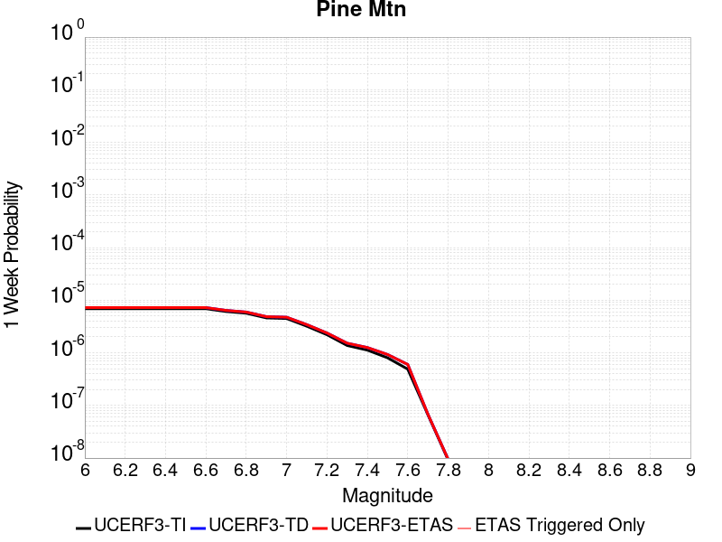 | 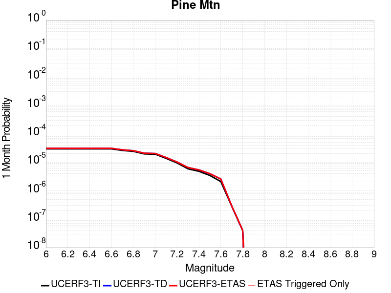 | 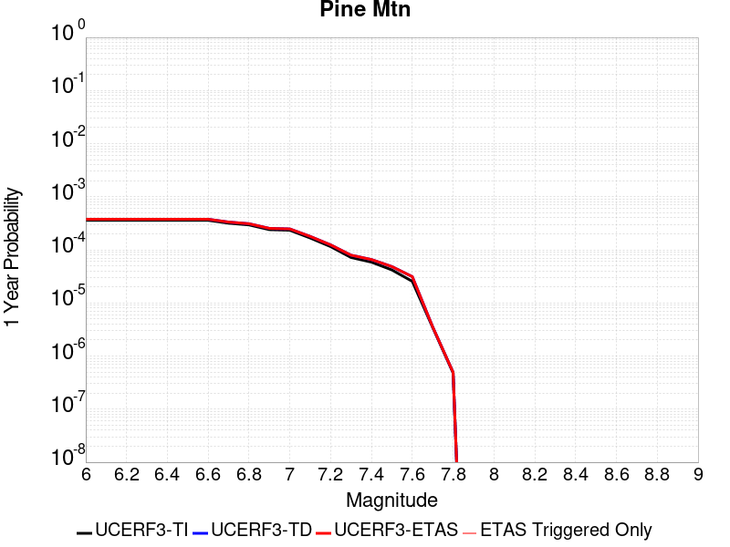 |  |

| Magnitude | 1 wk TI Prob | 1 wk TD Prob | 1 wk ETAS Prob | 1 wk ETAS/TD Gain | 1 wk ETAS Triggered Only | 1 mo TI Prob | 1 mo TD Prob | 1 mo ETAS Prob | 1 mo ETAS/TD Gain | 1 mo ETAS Triggered Only | 1 yr TI Prob | 1 yr TD Prob | 1 yr ETAS Prob | 1 yr ETAS/TD Gain | 1 yr ETAS Triggered Only | 10 yr TI Prob | 10 yr TD Prob | 10 yr ETAS Prob | 10 yr ETAS/TD Gain | 10 yr ETAS Triggered Only |
|-----|-----|-----|-----|-----|-----|-----|-----|-----|-----|-----|-----|-----|-----|-----|-----|-----|-----|-----|-----|-----|
| 6.0 | 6.894797E-6 | 7.225768E-6 | 7.225768E-6 | 1.0 | 0.0 | 2.9548795E-5 | 3.0967225E-5 | 3.0967225E-5 | 1.0 | 0.0 | 3.596972E-4 | 3.7696373E-4 | 3.7696373E-4 | 1.0 | 0.0 | 0.0035911554 | 0.0037635404 | 0.0038233146 | 1.0158825 | 6.0E-5 |
| 6.1 | 6.894797E-6 | 7.225768E-6 | 7.225768E-6 | 1.0 | 0.0 | 2.9548795E-5 | 3.0967225E-5 | 3.0967225E-5 | 1.0 | 0.0 | 3.596972E-4 | 3.7696373E-4 | 3.7696373E-4 | 1.0 | 0.0 | 0.0035911554 | 0.0037635404 | 0.0038233146 | 1.0158825 | 6.0E-5 |
| 6.2 | 6.894797E-6 | 7.225768E-6 | 7.225768E-6 | 1.0 | 0.0 | 2.9548795E-5 | 3.0967225E-5 | 3.0967225E-5 | 1.0 | 0.0 | 3.596972E-4 | 3.7696373E-4 | 3.7696373E-4 | 1.0 | 0.0 | 0.0035911554 | 0.0037635404 | 0.0038233146 | 1.0158825 | 6.0E-5 |
| 6.3 | 6.894797E-6 | 7.225768E-6 | 7.225768E-6 | 1.0 | 0.0 | 2.9548795E-5 | 3.0967225E-5 | 3.0967225E-5 | 1.0 | 0.0 | 3.596972E-4 | 3.7696373E-4 | 3.7696373E-4 | 1.0 | 0.0 | 0.0035911554 | 0.0037635404 | 0.0038233146 | 1.0158825 | 6.0E-5 |
| 6.4 | 6.894797E-6 | 7.225768E-6 | 7.225768E-6 | 1.0 | 0.0 | 2.9548795E-5 | 3.0967225E-5 | 3.0967225E-5 | 1.0 | 0.0 | 3.596972E-4 | 3.7696373E-4 | 3.7696373E-4 | 1.0 | 0.0 | 0.0035911554 | 0.0037635404 | 0.0038233146 | 1.0158825 | 6.0E-5 |
| 6.5 | 6.894797E-6 | 7.225768E-6 | 7.225768E-6 | 1.0 | 0.0 | 2.9548795E-5 | 3.0967225E-5 | 3.0967225E-5 | 1.0 | 0.0 | 3.596972E-4 | 3.7696373E-4 | 3.7696373E-4 | 1.0 | 0.0 | 0.0035911554 | 0.0037635404 | 0.0038233146 | 1.0158825 | 6.0E-5 |
| 6.6 | 6.894797E-6 | 7.225768E-6 | 7.225768E-6 | 1.0 | 0.0 | 2.9548795E-5 | 3.0967225E-5 | 3.0967225E-5 | 1.0 | 0.0 | 3.596972E-4 | 3.7696373E-4 | 3.7696373E-4 | 1.0 | 0.0 | 0.0035911554 | 0.0037635404 | 0.0038233146 | 1.0158825 | 6.0E-5 |
| 6.7 | 6.0867933E-6 | 6.3974117E-6 | 6.3974117E-6 | 1.0 | 0.0 | 2.6085996E-5 | 2.7417203E-5 | 2.7417203E-5 | 1.0 | 0.0 | 3.1755073E-4 | 3.337555E-4 | 3.337555E-4 | 1.0 | 0.0 | 0.0031709734 | 0.0033327616 | 0.003382595 | 1.0149525 | 5.0E-5 |
| 6.8 | 5.6530425E-6 | 5.950889E-6 | 5.950889E-6 | 1.0 | 0.0 | 2.42271E-5 | 2.5503572E-5 | 2.5503572E-5 | 1.0 | 0.0 | 2.94925E-4 | 3.104638E-4 | 3.104638E-4 | 1.0 | 0.0 | 0.002945339 | 0.0031005053 | 0.0031503504 | 1.0160764 | 5.0E-5 |
| 6.9 | 4.6015225E-6 | 4.8641127E-6 | 4.8641127E-6 | 1.0 | 0.0 | 1.9720663E-5 | 2.0846039E-5 | 2.0846039E-5 | 1.0 | 0.0 | 2.4007261E-4 | 2.5377242E-4 | 2.5377242E-4 | 1.0 | 0.0 | 0.0023981342 | 0.0025349704 | 0.0025648945 | 1.0118045 | 3.0E-5 |
| 7.0 | 4.4875965E-6 | 4.7477506E-6 | 4.7477506E-6 | 1.0 | 0.0 | 1.9232413E-5 | 2.0347354E-5 | 2.0347354E-5 | 1.0 | 0.0 | 2.3412947E-4 | 2.4770232E-4 | 2.4770232E-4 | 1.0 | 0.0 | 0.0023388295 | 0.002474406 | 0.0025043318 | 1.0120941 | 3.0E-5 |
| 7.1 | 3.203907E-6 | 3.4296731E-6 | 3.4296731E-6 | 1.0 | 0.0 | 1.3730958E-5 | 1.469852E-5 | 1.469852E-5 | 1.0 | 0.0 | 1.6716159E-4 | 1.7894046E-4 | 1.7894046E-4 | 1.0 | 0.0 | 0.0016703589 | 0.0017880299 | 0.0017980121 | 1.0055827 | 1.0E-5 |
| 7.2 | 2.2060601E-6 | 2.3786972E-6 | 2.3786972E-6 | 1.0 | 0.0 | 9.4545085E-6 | 1.019438E-5 | 1.019438E-5 | 1.0 | 0.0 | 1.15102564E-4 | 1.2410995E-4 | 1.2410995E-4 | 1.0 | 0.0 | 0.0011504296 | 0.0012404512 | 0.0012404512 | 1.0 | 0.0 |
| 7.3 | 1.3765207E-6 | 1.521842E-6 | 1.521842E-6 | 1.0 | 0.0 | 5.899361E-6 | 6.5221643E-6 | 6.5221643E-6 | 1.0 | 0.0 | 7.182235E-5 | 7.940455E-5 | 7.940455E-5 | 1.0 | 0.0 | 7.1799144E-4 | 7.937709E-4 | 7.937709E-4 | 1.0 | 0.0 |
| 7.4 | 1.1245983E-6 | 1.2588821E-6 | 1.2588821E-6 | 1.0 | 0.0 | 4.819698E-6 | 5.3951985E-6 | 5.3951985E-6 | 1.0 | 0.0 | 5.8678244E-5 | 6.5684646E-5 | 6.5684646E-5 | 1.0 | 0.0 | 5.866275E-4 | 6.5666065E-4 | 6.5666065E-4 | 1.0 | 0.0 |
| 7.5 | 8.031682E-7 | 9.278582E-7 | 9.278582E-7 | 1.0 | 0.0 | 3.4421448E-6 | 3.9765296E-6 | 3.9765296E-6 | 1.0 | 0.0 | 4.1907308E-5 | 4.841324E-5 | 4.841324E-5 | 1.0 | 0.0 | 4.1899405E-4 | 4.840337E-4 | 4.840337E-4 | 1.0 | 0.0 |
| 7.6 | 4.8953444E-7 | 6.004456E-7 | 6.004456E-7 | 1.0 | 0.0 | 2.098003E-6 | 2.5733361E-6 | 2.5733361E-6 | 1.0 | 0.0 | 2.5542888E-5 | 3.1329968E-5 | 3.1329968E-5 | 1.0 | 0.0 | 2.5539953E-4 | 3.1326036E-4 | 3.1326036E-4 | 1.0 | 0.0 |
| 7.7 | 6.634529E-8 | 6.788889E-8 | 6.788889E-8 | 1.0 | 0.0 | 2.843369E-7 | 2.9095236E-7 | 2.9095236E-7 | 1.0 | 0.0 | 3.4617963E-6 | 3.5423398E-6 | 3.5423398E-6 | 1.0 | 0.0 | 3.4617424E-5 | 3.542288E-5 | 3.542288E-5 | 1.0 | 0.0 |
| 7.8 | 9.235578E-9 | 9.488671E-9 | 9.488671E-9 | 1.0 | 0.0 | 3.9581046E-8 | 4.0665732E-8 | 4.0665732E-8 | 1.0 | 0.0 | 4.818991E-7 | 4.951052E-7 | 4.951052E-7 | 1.0 | 0.0 | 4.8189804E-6 | 4.9510427E-6 | 4.9510427E-6 | 1.0 | 0.0 |

## San Jacinto (Stepovers Combined)
*[(top)](#table-of-contents)*

| 1 Week | 1 Month | 1 Year | 10 Year |
|-----|-----|-----|-----|
|  |  | 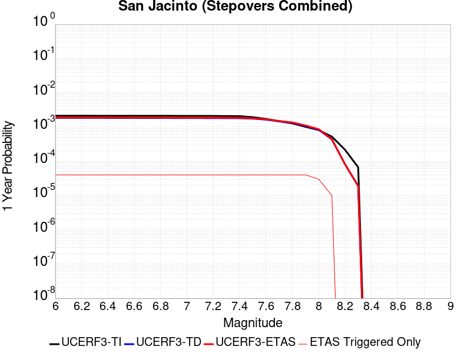 |  |

| Magnitude | 1 wk TI Prob | 1 wk TD Prob | 1 wk ETAS Prob | 1 wk ETAS/TD Gain | 1 wk ETAS Triggered Only | 1 mo TI Prob | 1 mo TD Prob | 1 mo ETAS Prob | 1 mo ETAS/TD Gain | 1 mo ETAS Triggered Only | 1 yr TI Prob | 1 yr TD Prob | 1 yr ETAS Prob | 1 yr ETAS/TD Gain | 1 yr ETAS Triggered Only | 10 yr TI Prob | 10 yr TD Prob | 10 yr ETAS Prob | 10 yr ETAS/TD Gain | 10 yr ETAS Triggered Only |
|-----|-----|-----|-----|-----|-----|-----|-----|-----|-----|-----|-----|-----|-----|-----|-----|-----|-----|-----|-----|-----|
| 6.0 | 4.0667746E-5 | 3.532269E-5 | 3.532269E-5 | 1.0 | 0.0 | 1.742787E-4 | 1.5137416E-4 | 1.5137416E-4 | 1.0 | 0.0 | 0.0021197782 | 0.0018414232 | 0.0018813496 | 1.0216824 | 4.0E-5 | 0.020996714 | 0.019012788 | 0.019071648 | 1.0030957 | 6.0E-5 |
| 6.1 | 4.0667746E-5 | 3.532269E-5 | 3.532269E-5 | 1.0 | 0.0 | 1.742787E-4 | 1.5137416E-4 | 1.5137416E-4 | 1.0 | 0.0 | 0.0021197782 | 0.0018414232 | 0.0018813496 | 1.0216824 | 4.0E-5 | 0.020996714 | 0.019012788 | 0.019071648 | 1.0030957 | 6.0E-5 |
| 6.2 | 4.0667746E-5 | 3.532269E-5 | 3.532269E-5 | 1.0 | 0.0 | 1.742787E-4 | 1.5137416E-4 | 1.5137416E-4 | 1.0 | 0.0 | 0.0021197782 | 0.0018414232 | 0.0018813496 | 1.0216824 | 4.0E-5 | 0.020996714 | 0.019012788 | 0.019071648 | 1.0030957 | 6.0E-5 |
| 6.3 | 4.0667746E-5 | 3.532269E-5 | 3.532269E-5 | 1.0 | 0.0 | 1.742787E-4 | 1.5137416E-4 | 1.5137416E-4 | 1.0 | 0.0 | 0.0021197782 | 0.0018414232 | 0.0018813496 | 1.0216824 | 4.0E-5 | 0.020996714 | 0.019012788 | 0.019071648 | 1.0030957 | 6.0E-5 |
| 6.4 | 4.0577226E-5 | 3.5194567E-5 | 3.5194567E-5 | 1.0 | 0.0 | 1.738908E-4 | 1.5082513E-4 | 1.5082513E-4 | 1.0 | 0.0 | 0.0021150648 | 0.0018347519 | 0.0018746785 | 1.0217613 | 4.0E-5 | 0.020950472 | 0.01894735 | 0.019006213 | 1.0031067 | 6.0E-5 |
| 6.5 | 4.0577226E-5 | 3.5194567E-5 | 3.5194567E-5 | 1.0 | 0.0 | 1.738908E-4 | 1.5082513E-4 | 1.5082513E-4 | 1.0 | 0.0 | 0.0021150648 | 0.0018347519 | 0.0018746785 | 1.0217613 | 4.0E-5 | 0.020950472 | 0.01894735 | 0.019006213 | 1.0031067 | 6.0E-5 |
| 6.6 | 4.053861E-5 | 3.5139907E-5 | 3.5139907E-5 | 1.0 | 0.0 | 1.7372532E-4 | 1.5059089E-4 | 1.5059089E-4 | 1.0 | 0.0 | 0.0021130538 | 0.0018319048 | 0.0018718315 | 1.0217952 | 4.0E-5 | 0.020930743 | 0.018919425 | 0.01897829 | 1.0031114 | 6.0E-5 |
| 6.7 | 4.0516545E-5 | 3.5108966E-5 | 3.5108966E-5 | 1.0 | 0.0 | 1.7363077E-4 | 1.5045832E-4 | 1.5045832E-4 | 1.0 | 0.0 | 0.002111905 | 0.001830294 | 0.0018702208 | 1.0218145 | 4.0E-5 | 0.020919468 | 0.01890362 | 0.018962486 | 1.003114 | 6.0E-5 |
| 6.8 | 4.049434E-5 | 3.5080524E-5 | 3.5080524E-5 | 1.0 | 0.0 | 1.7353562E-4 | 1.5033643E-4 | 1.5033643E-4 | 1.0 | 0.0 | 0.0021107488 | 0.0018288126 | 0.0018687395 | 1.0218321 | 4.0E-5 | 0.020908125 | 0.01888903 | 0.018947897 | 1.0031165 | 6.0E-5 |
| 6.9 | 4.046386E-5 | 3.5043082E-5 | 3.5043082E-5 | 1.0 | 0.0 | 1.73405E-4 | 1.5017597E-4 | 1.5017597E-4 | 1.0 | 0.0 | 0.0021091616 | 0.0018268622 | 0.0018667892 | 1.0218555 | 4.0E-5 | 0.020892553 | 0.018869802 | 0.01892867 | 1.0031197 | 6.0E-5 |
| 7.0 | 4.036382E-5 | 3.4923625E-5 | 3.4923625E-5 | 1.0 | 0.0 | 1.7297632E-4 | 1.496641E-4 | 1.496641E-4 | 1.0 | 0.0 | 0.0021039525 | 0.0018206409 | 0.0018605681 | 1.0219303 | 4.0E-5 | 0.02084144 | 0.018808406 | 0.018867278 | 1.0031301 | 6.0E-5 |
| 7.1 | 4.0343282E-5 | 3.4902085E-5 | 3.4902085E-5 | 1.0 | 0.0 | 1.7288832E-4 | 1.495718E-4 | 1.495718E-4 | 1.0 | 0.0 | 0.002102883 | 0.0018195189 | 0.0018594462 | 1.0219438 | 4.0E-5 | 0.020830948 | 0.018797282 | 0.018856155 | 1.003132 | 6.0E-5 |
| 7.2 | 4.0257353E-5 | 3.4806486E-5 | 3.4806486E-5 | 1.0 | 0.0 | 1.725201E-4 | 1.4916214E-4 | 1.4916214E-4 | 1.0 | 0.0 | 0.0020984085 | 0.0018145397 | 0.001854467 | 1.0220041 | 4.0E-5 | 0.020787042 | 0.01874797 | 0.018806847 | 1.0031403 | 6.0E-5 |
| 7.3 | 3.9940667E-5 | 3.4633875E-5 | 3.4633875E-5 | 1.0 | 0.0 | 1.7116306E-4 | 1.4842248E-4 | 1.4842248E-4 | 1.0 | 0.0 | 0.0020819185 | 0.0018055491 | 0.0018454769 | 1.0221139 | 4.0E-5 | 0.020625217 | 0.018656468 | 0.018715348 | 1.0031561 | 6.0E-5 |
| 7.4 | 3.9721202E-5 | 3.4519166E-5 | 3.4519166E-5 | 1.0 | 0.0 | 1.7022261E-4 | 1.4793091E-4 | 1.4793091E-4 | 1.0 | 0.0 | 0.0020704903 | 0.0017995742 | 0.0018395022 | 1.0221875 | 4.0E-5 | 0.020513052 | 0.018595539 | 0.018654423 | 1.0031666 | 6.0E-5 |
| 7.5 | 3.7036873E-5 | 3.3584995E-5 | 3.3584995E-5 | 1.0 | 0.0 | 1.5871979E-4 | 1.4392775E-4 | 1.4392775E-4 | 1.0 | 0.0 | 0.0019307006 | 0.0017509151 | 0.0017908451 | 1.0228052 | 4.0E-5 | 0.019140124 | 0.018096272 | 0.018155186 | 1.0032556 | 6.0E-5 |
| 7.6 | 3.2940967E-5 | 3.1359035E-5 | 3.1359035E-5 | 1.0 | 0.0 | 1.4116794E-4 | 1.3438896E-4 | 1.3438896E-4 | 1.0 | 0.0 | 0.0017173645 | 0.0016349598 | 0.0016748944 | 1.0244254 | 4.0E-5 | 0.01704153 | 0.016925627 | 0.016984612 | 1.003485 | 6.0E-5 |
| 7.7 | 2.8236149E-5 | 2.7923868E-5 | 2.7923868E-5 | 1.0 | 0.0 | 1.2100645E-4 | 1.19668235E-4 | 1.19668235E-4 | 1.0 | 0.0 | 0.0014722579 | 0.001455988 | 0.0014959298 | 1.0274328 | 4.0E-5 | 0.014625421 | 0.015135854 | 0.015194946 | 1.0039041 | 6.0E-5 |
| 7.8 | 2.4329287E-5 | 2.5245929E-5 | 2.5245929E-5 | 1.0 | 0.0 | 1.042642E-4 | 1.08192355E-4 | 1.08192355E-4 | 1.0 | 0.0 | 0.0012686774 | 0.0013164468 | 0.0013563941 | 1.0303448 | 4.0E-5 | 0.012614589 | 0.013732364 | 0.013791541 | 1.0043093 | 6.0E-5 |
| 7.9 | 1.9370926E-5 | 2.0456062E-5 | 2.0456062E-5 | 1.0 | 0.0 | 8.301561E-5 | 8.7665896E-5 | 8.7665896E-5 | 1.0 | 0.0 | 0.0010102465 | 0.0010668105 | 0.0011067678 | 1.037455 | 4.0E-5 | 0.0100566605 | 0.011217554 | 0.011276881 | 1.0052887 | 6.0E-5 |
| 8.0 | 1.5583017E-5 | 1.5915573E-5 | 1.5915573E-5 | 1.0 | 0.0 | 6.6782646E-5 | 6.820782E-5 | 6.820782E-5 | 1.0 | 0.0 | 8.127754E-4 | 8.3011447E-4 | 8.600896E-4 | 1.0361096 | 3.0E-5 | 0.008098091 | 0.008797125 | 0.008846684 | 1.0056337 | 5.0E-5 |
| 8.1 | 1.0024873E-5 | 8.309357E-6 | 8.309357E-6 | 1.0 | 0.0 | 4.2963035E-5 | 3.561105E-5 | 3.561105E-5 | 1.0 | 0.0 | 5.229494E-4 | 4.334788E-4 | 4.4347445E-4 | 1.0230591 | 1.0E-5 | 0.0052172043 | 0.0046625216 | 0.0046923817 | 1.0064043 | 3.0E-5 |
| 8.2 | 4.142796E-6 | 1.5659466E-6 | 1.5659466E-6 | 1.0 | 0.0 | 1.775472E-5 | 6.7111823E-6 | 6.7111823E-6 | 1.0 | 0.0 | 2.1614227E-4 | 8.170561E-5 | 8.170561E-5 | 1.0 | 0.0 | 0.0021593217 | 9.4828795E-4 | 9.4828795E-4 | 1.0 | 0.0 |
| 8.3 | 1.2750878E-6 | 3.6255858E-7 | 3.6255858E-7 | 1.0 | 0.0 | 5.4646503E-6 | 1.5538217E-6 | 1.5538217E-6 | 1.0 | 0.0 | 6.653009E-5 | 1.8917619E-5 | 1.8917619E-5 | 1.0 | 0.0 | 6.6510175E-4 | 2.2813301E-4 | 2.2813301E-4 | 1.0 | 0.0 |

## Brawley (Seismic Zone) alt 1
*[(top)](#table-of-contents)*

| 1 Week | 1 Month | 1 Year | 10 Year |
|-----|-----|-----|-----|
|  |  |  | 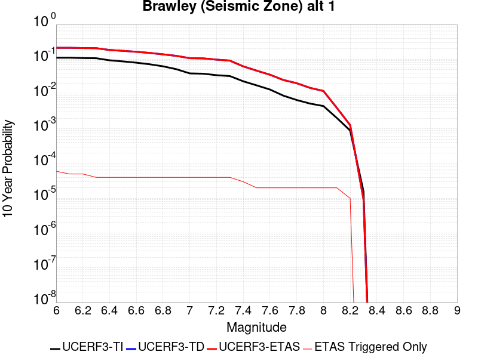 |

| Magnitude | 1 wk TI Prob | 1 wk TD Prob | 1 wk ETAS Prob | 1 wk ETAS/TD Gain | 1 wk ETAS Triggered Only | 1 mo TI Prob | 1 mo TD Prob | 1 mo ETAS Prob | 1 mo ETAS/TD Gain | 1 mo ETAS Triggered Only | 1 yr TI Prob | 1 yr TD Prob | 1 yr ETAS Prob | 1 yr ETAS/TD Gain | 1 yr ETAS Triggered Only | 10 yr TI Prob | 10 yr TD Prob | 10 yr ETAS Prob | 10 yr ETAS/TD Gain | 10 yr ETAS Triggered Only |
|-----|-----|-----|-----|-----|-----|-----|-----|-----|-----|-----|-----|-----|-----|-----|-----|-----|-----|-----|-----|-----|
| 6.0 | 2.2521618E-4 | 4.7658803E-4 | 4.7658803E-4 | 1.0 | 0.0 | 9.6485513E-4 | 0.0020409585 | 0.0020409585 | 1.0 | 0.0 | 0.011683988 | 0.024559606 | 0.024598625 | 1.0015887 | 4.0E-5 | 0.11088423 | 0.21359047 | 0.21363766 | 1.0002209 | 6.0E-5 |
| 6.1 | 2.2521618E-4 | 4.7658803E-4 | 4.7658803E-4 | 1.0 | 0.0 | 9.6485513E-4 | 0.0020409585 | 0.0020409585 | 1.0 | 0.0 | 0.011683988 | 0.024559606 | 0.02458887 | 1.0011915 | 3.0E-5 | 0.11088423 | 0.21359047 | 0.2136298 | 1.000184 | 5.0E-5 |
| 6.2 | 2.198148E-4 | 4.6742806E-4 | 4.6742806E-4 | 1.0 | 0.0 | 9.417233E-4 | 0.002001762 | 0.002001762 | 1.0 | 0.0 | 0.011405343 | 0.024093576 | 0.024122853 | 1.0012151 | 3.0E-5 | 0.10837428 | 0.21002577 | 0.21006528 | 1.0001881 | 5.0E-5 |
| 6.3 | 2.1704129E-4 | 4.6178396E-4 | 4.6178396E-4 | 1.0 | 0.0 | 9.298453E-4 | 0.0019776097 | 0.0019776097 | 1.0 | 0.0 | 0.011262234 | 0.023806687 | 0.023835974 | 1.0012301 | 3.0E-5 | 0.107082725 | 0.20791672 | 0.2079484 | 1.0001523 | 4.0E-5 |
| 6.4 | 1.876142E-4 | 4.0069764E-4 | 4.0069764E-4 | 1.0 | 0.0 | 8.038131E-4 | 0.0017161597 | 0.0017161597 | 1.0 | 0.0 | 0.00974259 | 0.0206931 | 0.020722479 | 1.0014198 | 3.0E-5 | 0.093263686 | 0.18466777 | 0.18470038 | 1.0001765 | 4.0E-5 |
| 6.5 | 1.7390939E-4 | 3.7501066E-4 | 3.7501066E-4 | 1.0 | 0.0 | 7.45113E-4 | 0.0016062107 | 0.0016062107 | 1.0 | 0.0 | 0.009034078 | 0.019381 | 0.019410418 | 1.0015179 | 3.0E-5 | 0.086755216 | 0.17448843 | 0.17452145 | 1.0001892 | 4.0E-5 |
| 6.6 | 1.591791E-4 | 3.4914745E-4 | 3.4914745E-4 | 1.0 | 0.0 | 6.8201777E-4 | 0.0014954982 | 0.0014954982 | 1.0 | 0.0 | 0.008271996 | 0.018057244 | 0.018086702 | 1.0016314 | 3.0E-5 | 0.07970774 | 0.16389398 | 0.16392742 | 1.0002041 | 4.0E-5 |
| 6.7 | 1.4268003E-4 | 3.2079607E-4 | 3.2079607E-4 | 1.0 | 0.0 | 6.1134255E-4 | 0.0013741241 | 0.0013741241 | 1.0 | 0.0 | 0.007417723 | 0.016603589 | 0.016633091 | 1.0017768 | 3.0E-5 | 0.07174956 | 0.1520153 | 0.15204921 | 1.0002232 | 4.0E-5 |
| 6.8 | 1.239713E-4 | 2.9071802E-4 | 2.9071802E-4 | 1.0 | 0.0 | 5.3119735E-4 | 0.0012453456 | 0.0012453456 | 1.0 | 0.0 | 0.0064481674 | 0.015058107 | 0.015087655 | 1.0019623 | 3.0E-5 | 0.06264243 | 0.13844965 | 0.13848412 | 1.0002489 | 4.0E-5 |
| 6.9 | 1.0180238E-4 | 2.6268454E-4 | 2.6268454E-4 | 1.0 | 0.0 | 4.3622297E-4 | 0.0011253095 | 0.0011253095 | 1.0 | 0.0 | 0.005298089 | 0.0136155775 | 0.013645169 | 1.0021733 | 3.0E-5 | 0.05173543 | 0.1250187 | 0.1250537 | 1.0002799 | 4.0E-5 |
| 7.0 | 7.6619996E-5 | 2.241004E-4 | 2.241004E-4 | 1.0 | 0.0 | 3.283301E-4 | 9.6007995E-4 | 9.6007995E-4 | 1.0 | 0.0 | 0.0039900932 | 0.011627035 | 0.011656687 | 1.0025502 | 3.0E-5 | 0.039192066 | 0.107310906 | 0.10734662 | 1.0003327 | 4.0E-5 |
| 7.1 | 7.5127435E-5 | 2.2093067E-4 | 2.2093067E-4 | 1.0 | 0.0 | 3.2193496E-4 | 9.465053E-4 | 9.465053E-4 | 1.0 | 0.0 | 0.0039125155 | 0.011463515 | 0.011493172 | 1.002587 | 3.0E-5 | 0.038443442 | 0.10587441 | 0.105910175 | 1.0003378 | 4.0E-5 |
| 7.2 | 6.788582E-5 | 2.0220429E-4 | 2.0220429E-4 | 1.0 | 0.0 | 2.9090676E-4 | 8.66305E-4 | 8.66305E-4 | 1.0 | 0.0 | 0.0035360386 | 0.010496897 | 0.010526582 | 1.002828 | 3.0E-5 | 0.034803 | 0.097543836 | 0.09757993 | 1.00037 | 4.0E-5 |
| 7.3 | 6.399602E-5 | 1.8850948E-4 | 1.8850948E-4 | 1.0 | 0.0 | 2.7423984E-4 | 8.076505E-4 | 8.076505E-4 | 1.0 | 0.0 | 0.0033337586 | 0.009789401 | 0.009819107 | 1.0030346 | 3.0E-5 | 0.03284188 | 0.09143733 | 0.091473676 | 1.0003974 | 4.0E-5 |
| 7.4 | 4.506759E-5 | 1.2536957E-4 | 1.2536957E-4 | 1.0 | 0.0 | 1.9313251E-4 | 5.371884E-4 | 5.371884E-4 | 1.0 | 0.0 | 0.0023488526 | 0.0065208306 | 0.0065407003 | 1.0030471 | 2.0E-5 | 0.023241805 | 0.062397704 | 0.06242583 | 1.0004507 | 3.0E-5 |
| 7.5 | 3.43289E-5 | 9.3419636E-5 | 9.3419636E-5 | 1.0 | 0.0 | 1.4711556E-4 | 4.0030875E-4 | 4.0030875E-4 | 1.0 | 0.0 | 0.0017896603 | 0.0048629297 | 0.004872881 | 1.0020463 | 1.0E-5 | 0.01775316 | 0.04708452 | 0.04710358 | 1.0004047 | 2.0E-5 |
| 7.6 | 2.5980507E-5 | 7.0588125E-5 | 7.0588125E-5 | 1.0 | 0.0 | 1.1134028E-4 | 3.024856E-4 | 3.024856E-4 | 1.0 | 0.0 | 0.001354725 | 0.0036765675 | 0.0036865307 | 1.00271 | 1.0E-5 | 0.013464959 | 0.035866685 | 0.035885967 | 1.0005376 | 2.0E-5 |
| 7.7 | 1.7292105E-5 | 4.945605E-5 | 4.945605E-5 | 1.0 | 0.0 | 7.4106916E-5 | 2.1193732E-4 | 2.1193732E-4 | 1.0 | 0.0 | 9.018782E-4 | 0.0025772892 | 0.0025872635 | 1.00387 | 1.0E-5 | 0.008982267 | 0.025312584 | 0.025332078 | 1.0007701 | 2.0E-5 |
| 7.8 | 1.2927471E-5 | 3.9735736E-5 | 3.9735736E-5 | 1.0 | 0.0 | 5.5402274E-5 | 1.7028491E-4 | 1.7028491E-4 | 1.0 | 0.0 | 6.743139E-4 | 0.00207125 | 0.0020812294 | 1.004818 | 1.0E-5 | 0.0067227143 | 0.020451074 | 0.020470666 | 1.000958 | 2.0E-5 |
| 7.9 | 1.0200774E-5 | 2.8780061E-5 | 2.8780061E-5 | 1.0 | 0.0 | 4.371687E-5 | 1.233373E-4 | 1.233373E-4 | 1.0 | 0.0 | 5.321229E-4 | 0.0015005984 | 0.0015105833 | 1.006654 | 1.0E-5 | 0.005308505 | 0.015007548 | 0.015027248 | 1.0013126 | 2.0E-5 |
| 8.0 | 8.650396E-6 | 2.3306868E-5 | 2.3306868E-5 | 1.0 | 0.0 | 3.70726E-5 | 9.988275E-5 | 9.988275E-5 | 1.0 | 0.0 | 4.5126543E-4 | 0.0012153949 | 0.0012253828 | 1.0082178 | 1.0E-5 | 0.0045035016 | 0.012224846 | 0.012244602 | 1.001616 | 2.0E-5 |
| 8.1 | 3.9368224E-6 | 7.340733E-6 | 7.340733E-6 | 1.0 | 0.0 | 1.6871985E-5 | 3.1459906E-5 | 3.1459906E-5 | 1.0 | 0.0 | 2.0539707E-4 | 3.8295717E-4 | 3.9295334E-4 | 1.0261025 | 1.0E-5 | 0.0020520731 | 0.00400751 | 0.0040274295 | 1.0049707 | 2.0E-5 |
| 8.2 | 1.7101195E-6 | 2.2229021E-6 | 2.2229021E-6 | 1.0 | 0.0 | 7.329063E-6 | 9.526689E-6 | 9.526689E-6 | 1.0 | 0.0 | 8.922769E-5 | 1.159813E-4 | 1.2598014E-4 | 1.0862108 | 1.0E-5 | 8.9191867E-4 | 0.0012692548 | 0.0012792422 | 1.0078686 | 1.0E-5 |
| 8.3 | 3.0346666E-8 | 1.7267567E-8 | 1.7267567E-8 | 1.0 | 0.0 | 1.3005713E-7 | 7.400386E-8 | 7.400386E-8 | 1.0 | 0.0 | 1.5834444E-6 | 9.0099684E-7 | 9.0099684E-7 | 1.0 | 0.0 | 1.5834332E-5 | 9.395309E-6 | 9.395309E-6 | 1.0 | 0.0 |

## Manix-Afton Hills
*[(top)](#table-of-contents)*

| 1 Week | 1 Month | 1 Year | 10 Year |
|-----|-----|-----|-----|
|  |  |  |  |

| Magnitude | 1 wk TI Prob | 1 wk TD Prob | 1 wk ETAS Prob | 1 wk ETAS/TD Gain | 1 wk ETAS Triggered Only | 1 mo TI Prob | 1 mo TD Prob | 1 mo ETAS Prob | 1 mo ETAS/TD Gain | 1 mo ETAS Triggered Only | 1 yr TI Prob | 1 yr TD Prob | 1 yr ETAS Prob | 1 yr ETAS/TD Gain | 1 yr ETAS Triggered Only | 10 yr TI Prob | 10 yr TD Prob | 10 yr ETAS Prob | 10 yr ETAS/TD Gain | 10 yr ETAS Triggered Only |
|-----|-----|-----|-----|-----|-----|-----|-----|-----|-----|-----|-----|-----|-----|-----|-----|-----|-----|-----|-----|-----|
| 6.0 | 1.3783202E-5 | 1.4711485E-5 | 1.4711485E-5 | 1.0 | 0.0 | 5.906953E-5 | 6.3047795E-5 | 6.3047795E-5 | 1.0 | 0.0 | 7.189342E-4 | 7.6735404E-4 | 7.6735404E-4 | 1.0 | 0.0 | 0.0071661277 | 0.0076488005 | 0.0077083413 | 1.0077844 | 6.0E-5 |
| 6.1 | 1.3783202E-5 | 1.4711485E-5 | 1.4711485E-5 | 1.0 | 0.0 | 5.906953E-5 | 6.3047795E-5 | 6.3047795E-5 | 1.0 | 0.0 | 7.189342E-4 | 7.6735404E-4 | 7.6735404E-4 | 1.0 | 0.0 | 0.0071661277 | 0.0076488005 | 0.0077083413 | 1.0077844 | 6.0E-5 |
| 6.2 | 1.3783202E-5 | 1.4711485E-5 | 1.4711485E-5 | 1.0 | 0.0 | 5.906953E-5 | 6.3047795E-5 | 6.3047795E-5 | 1.0 | 0.0 | 7.189342E-4 | 7.6735404E-4 | 7.6735404E-4 | 1.0 | 0.0 | 0.0071661277 | 0.0076488005 | 0.0077083413 | 1.0077844 | 6.0E-5 |
| 6.3 | 1.10494875E-5 | 1.1793452E-5 | 1.1793452E-5 | 1.0 | 0.0 | 4.7354086E-5 | 5.0542447E-5 | 5.0542447E-5 | 1.0 | 0.0 | 5.763835E-4 | 6.151909E-4 | 6.151909E-4 | 1.0 | 0.0 | 0.005748908 | 0.0061359196 | 0.006185613 | 1.0080987 | 5.0E-5 |
| 6.4 | 1.10494875E-5 | 1.1793452E-5 | 1.1793452E-5 | 1.0 | 0.0 | 4.7354086E-5 | 5.0542447E-5 | 5.0542447E-5 | 1.0 | 0.0 | 5.763835E-4 | 6.151909E-4 | 6.151909E-4 | 1.0 | 0.0 | 0.005748908 | 0.0061359196 | 0.006185613 | 1.0080987 | 5.0E-5 |
| 6.5 | 9.788949E-6 | 1.0454603E-5 | 1.0454603E-5 | 1.0 | 0.0 | 4.1951964E-5 | 4.4804725E-5 | 4.4804725E-5 | 1.0 | 0.0 | 5.1064545E-4 | 5.453703E-4 | 5.453703E-4 | 1.0 | 0.0 | 0.0050947363 | 0.0054412456 | 0.005481028 | 1.0073112 | 4.0E-5 |
| 6.6 | 8.810006E-6 | 9.413886E-6 | 9.413886E-6 | 1.0 | 0.0 | 3.775662E-5 | 4.034465E-5 | 4.034465E-5 | 1.0 | 0.0 | 4.5958988E-4 | 4.910943E-4 | 4.910943E-4 | 1.0 | 0.0 | 0.0045864056 | 0.004900973 | 0.0049407766 | 1.0081216 | 4.0E-5 |
| 6.7 | 8.80128E-6 | 9.404365E-6 | 9.404365E-6 | 1.0 | 0.0 | 3.7719226E-5 | 4.0303847E-5 | 4.0303847E-5 | 1.0 | 0.0 | 4.591348E-4 | 4.9059774E-4 | 4.9059774E-4 | 1.0 | 0.0 | 0.004581874 | 0.0048960294 | 0.0049358336 | 1.0081298 | 4.0E-5 |
| 6.8 | 6.8994877E-6 | 7.380281E-6 | 7.380281E-6 | 1.0 | 0.0 | 2.9568899E-5 | 3.162944E-5 | 3.162944E-5 | 1.0 | 0.0 | 3.5994186E-4 | 3.8502854E-4 | 3.8502854E-4 | 1.0 | 0.0 | 0.003593594 | 0.0038444195 | 0.0038643426 | 1.0051824 | 2.0E-5 |
| 6.9 | 4.9328037E-6 | 5.2711057E-6 | 5.2711057E-6 | 1.0 | 0.0 | 2.1140417E-5 | 2.2590291E-5 | 2.2590291E-5 | 1.0 | 0.0 | 2.5735417E-4 | 2.7500823E-4 | 2.7500823E-4 | 1.0 | 0.0 | 0.0025705635 | 0.0027472845 | 0.0027672297 | 1.00726 | 2.0E-5 |
| 7.0 | 3.347973E-6 | 3.5901335E-6 | 3.5901335E-6 | 1.0 | 0.0 | 1.4348378E-5 | 1.5386218E-5 | 1.5386218E-5 | 1.0 | 0.0 | 1.746775E-4 | 1.8731522E-4 | 1.8731522E-4 | 1.0 | 0.0 | 0.0017454025 | 0.001871976 | 0.0018919385 | 1.0106639 | 2.0E-5 |
| 7.1 | 1.2073567E-6 | 1.2935187E-6 | 1.2935187E-6 | 1.0 | 0.0 | 5.1743755E-6 | 5.5436494E-6 | 5.5436494E-6 | 1.0 | 0.0 | 6.29962E-5 | 6.749347E-5 | 6.749347E-5 | 1.0 | 0.0 | 6.297835E-4 | 6.748899E-4 | 6.8488315E-4 | 1.0148072 | 1.0E-5 |

## Pisgah-Bullion Mtn-Mesquite Lk
*[(top)](#table-of-contents)*

| 1 Week | 1 Month | 1 Year | 10 Year |
|-----|-----|-----|-----|
|  |  | 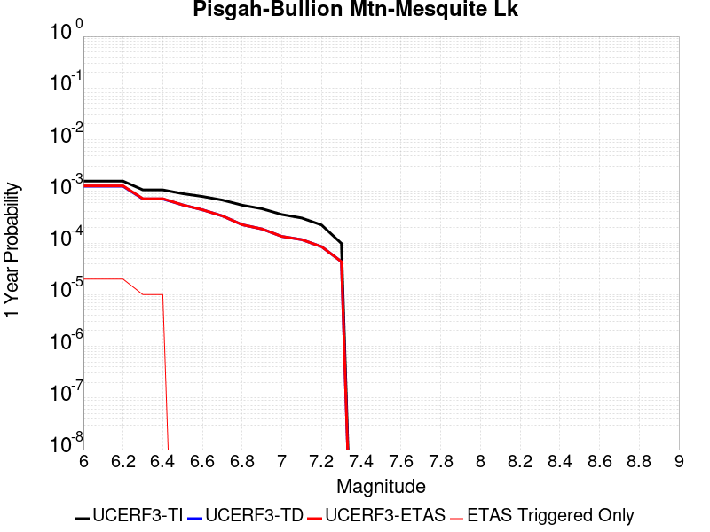 | 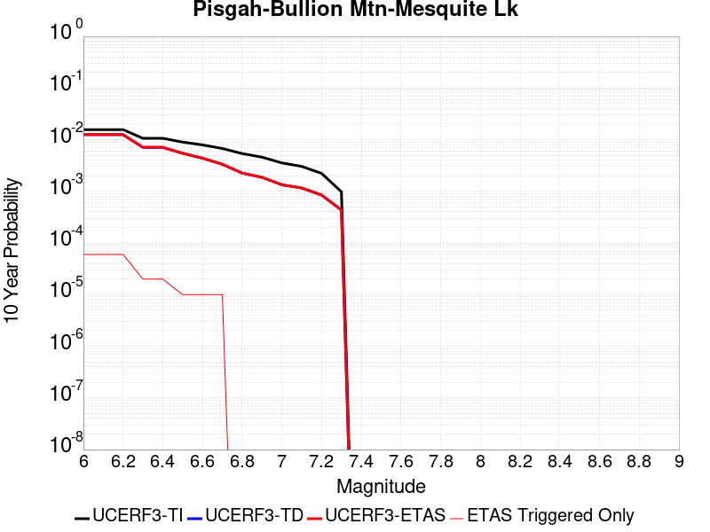 |

| Magnitude | 1 wk TI Prob | 1 wk TD Prob | 1 wk ETAS Prob | 1 wk ETAS/TD Gain | 1 wk ETAS Triggered Only | 1 mo TI Prob | 1 mo TD Prob | 1 mo ETAS Prob | 1 mo ETAS/TD Gain | 1 mo ETAS Triggered Only | 1 yr TI Prob | 1 yr TD Prob | 1 yr ETAS Prob | 1 yr ETAS/TD Gain | 1 yr ETAS Triggered Only | 10 yr TI Prob | 10 yr TD Prob | 10 yr ETAS Prob | 10 yr ETAS/TD Gain | 10 yr ETAS Triggered Only |
|-----|-----|-----|-----|-----|-----|-----|-----|-----|-----|-----|-----|-----|-----|-----|-----|-----|-----|-----|-----|-----|
| 6.0 | 3.0240792E-5 | 2.409226E-5 | 2.409226E-5 | 1.0 | 0.0 | 1.2959696E-4 | 1.0324902E-4 | 1.1324799E-4 | 1.0968432 | 1.0E-5 | 0.0015767008 | 0.0012564324 | 0.0012764073 | 1.0158981 | 2.0E-5 | 0.015655609 | 0.012503312 | 0.012562562 | 1.0047387 | 6.0E-5 |
| 6.1 | 3.0240792E-5 | 2.409226E-5 | 2.409226E-5 | 1.0 | 0.0 | 1.2959696E-4 | 1.0324902E-4 | 1.1324799E-4 | 1.0968432 | 1.0E-5 | 0.0015767008 | 0.0012564324 | 0.0012764073 | 1.0158981 | 2.0E-5 | 0.015655609 | 0.012503312 | 0.012562562 | 1.0047387 | 6.0E-5 |
| 6.2 | 3.0240792E-5 | 2.409226E-5 | 2.409226E-5 | 1.0 | 0.0 | 1.2959696E-4 | 1.0324902E-4 | 1.1324799E-4 | 1.0968432 | 1.0E-5 | 0.0015767008 | 0.0012564324 | 0.0012764073 | 1.0158981 | 2.0E-5 | 0.015655609 | 0.012503312 | 0.012562562 | 1.0047387 | 6.0E-5 |
| 6.3 | 2.0498217E-5 | 1.3638623E-5 | 1.3638623E-5 | 1.0 | 0.0 | 8.784654E-5 | 5.8450027E-5 | 6.8449444E-5 | 1.1710763 | 1.0E-5 | 0.0010690069 | 7.114129E-4 | 7.2140584E-4 | 1.0140465 | 1.0E-5 | 0.01063879 | 0.0070929816 | 0.00711284 | 1.0027996 | 2.0E-5 |
| 6.4 | 2.0498217E-5 | 1.3638623E-5 | 1.3638623E-5 | 1.0 | 0.0 | 8.784654E-5 | 5.8450027E-5 | 6.8449444E-5 | 1.1710763 | 1.0E-5 | 0.0010690069 | 7.114129E-4 | 7.2140584E-4 | 1.0140465 | 1.0E-5 | 0.01063879 | 0.0070929816 | 0.00711284 | 1.0027996 | 2.0E-5 |
| 6.5 | 1.7316182E-5 | 1.0477447E-5 | 1.0477447E-5 | 1.0 | 0.0 | 7.42101E-5 | 4.490263E-5 | 4.490263E-5 | 1.0 | 0.0 | 9.0313336E-4 | 5.4656237E-4 | 5.4656237E-4 | 1.0 | 0.0 | 0.008994718 | 0.0054531773 | 0.0054631224 | 1.0018238 | 1.0E-5 |
| 6.6 | 1.5251077E-5 | 8.414587E-6 | 8.414587E-6 | 1.0 | 0.0 | 6.536012E-5 | 3.6062058E-5 | 3.6062058E-5 | 1.0 | 0.0 | 7.9546886E-4 | 4.3897436E-4 | 4.3897436E-4 | 1.0 | 0.0 | 0.007926274 | 0.00438179 | 0.0043917457 | 1.0022721 | 1.0E-5 |
| 6.7 | 1.2997425E-5 | 6.4117266E-6 | 6.4117266E-6 | 1.0 | 0.0 | 5.570206E-5 | 2.7478565E-5 | 2.7478565E-5 | 1.0 | 0.0 | 6.7796157E-4 | 3.3450482E-4 | 3.3450482E-4 | 1.0 | 0.0 | 0.0067589693 | 0.0033404734 | 0.00335044 | 1.0029836 | 1.0E-5 |
| 6.8 | 1.035386E-5 | 4.33341E-6 | 4.33341E-6 | 1.0 | 0.0 | 4.437293E-5 | 1.8571629E-5 | 1.8571629E-5 | 1.0 | 0.0 | 5.401065E-4 | 2.26087E-4 | 2.26087E-4 | 1.0 | 0.0 | 0.0053879567 | 0.0022586568 | 0.0022586568 | 1.0 | 0.0 |
| 6.9 | 8.816252E-6 | 3.5808007E-6 | 3.5808007E-6 | 1.0 | 0.0 | 3.778339E-5 | 1.5346202E-5 | 1.5346202E-5 | 1.0 | 0.0 | 4.5991567E-4 | 1.8682457E-4 | 1.8682457E-4 | 1.0 | 0.0 | 0.00458965 | 0.0018667335 | 0.0018667335 | 1.0 | 0.0 |
| 7.0 | 6.8232207E-6 | 2.5677084E-6 | 2.5677084E-6 | 1.0 | 0.0 | 2.9242048E-5 | 1.100442E-5 | 1.100442E-5 | 1.0 | 0.0 | 3.5596377E-4 | 1.3397088E-4 | 1.3397088E-4 | 1.0 | 0.0 | 0.0035539411 | 0.0013389323 | 0.0013389323 | 1.0 | 0.0 |
| 7.1 | 5.837013E-6 | 2.227487E-6 | 2.227487E-6 | 1.0 | 0.0 | 2.501553E-5 | 9.546339E-6 | 9.546339E-6 | 1.0 | 0.0 | 3.045215E-4 | 1.1622078E-4 | 1.1622078E-4 | 1.0 | 0.0 | 0.0030410455 | 0.001161629 | 0.001161629 | 1.0 | 0.0 |
| 7.2 | 4.278052E-6 | 1.6276473E-6 | 1.6276473E-6 | 1.0 | 0.0 | 1.833438E-5 | 6.9756143E-6 | 6.9756143E-6 | 1.0 | 0.0 | 2.231982E-4 | 8.492503E-5 | 8.492503E-5 | 1.0 | 0.0 | 0.0022297418 | 8.4894896E-4 | 8.4894896E-4 | 1.0 | 0.0 |
| 7.3 | 1.8803692E-6 | 8.345264E-7 | 8.345264E-7 | 1.0 | 0.0 | 8.0587E-6 | 3.5765377E-6 | 3.5765377E-6 | 1.0 | 0.0 | 9.811026E-5 | 4.3543623E-5 | 4.3543623E-5 | 1.0 | 0.0 | 9.806695E-4 | 4.353654E-4 | 4.353654E-4 | 1.0 | 0.0 |

## San Diego Trough north alt1
*[(top)](#table-of-contents)*

| 1 Week | 1 Month | 1 Year | 10 Year |
|-----|-----|-----|-----|
| 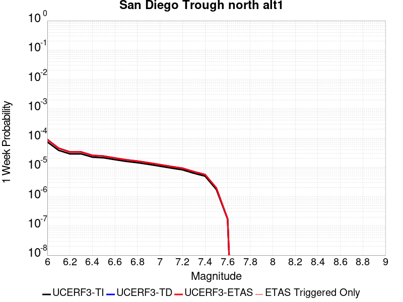 | 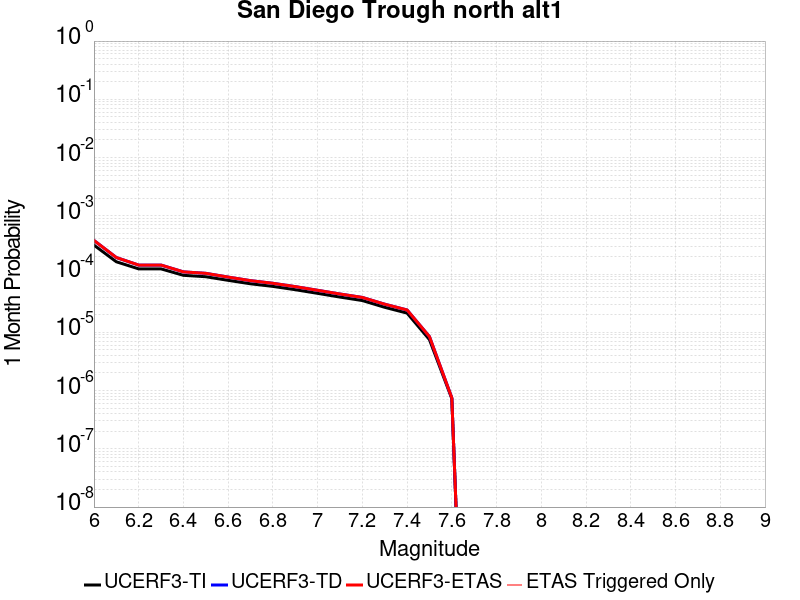 | 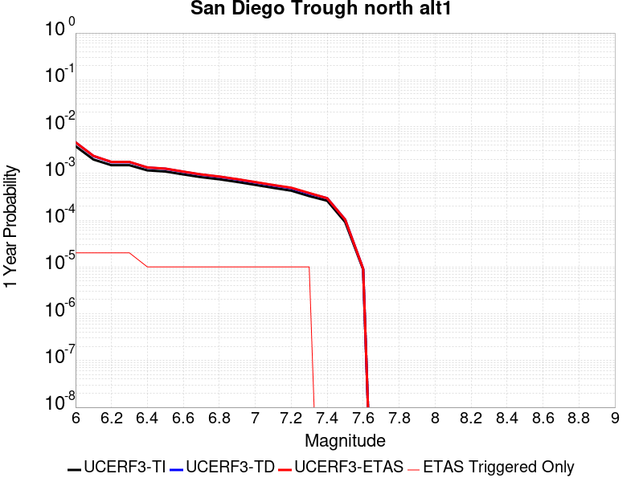 | 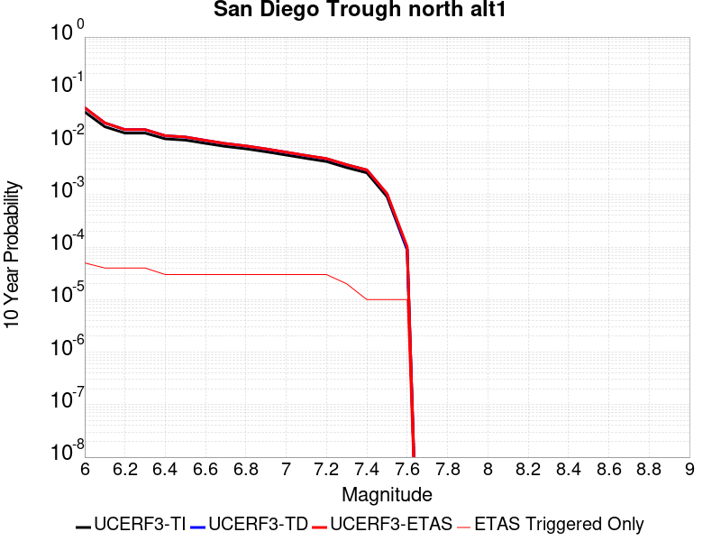 |

| Magnitude | 1 wk TI Prob | 1 wk TD Prob | 1 wk ETAS Prob | 1 wk ETAS/TD Gain | 1 wk ETAS Triggered Only | 1 mo TI Prob | 1 mo TD Prob | 1 mo ETAS Prob | 1 mo ETAS/TD Gain | 1 mo ETAS Triggered Only | 1 yr TI Prob | 1 yr TD Prob | 1 yr ETAS Prob | 1 yr ETAS/TD Gain | 1 yr ETAS Triggered Only | 10 yr TI Prob | 10 yr TD Prob | 10 yr ETAS Prob | 10 yr ETAS/TD Gain | 10 yr ETAS Triggered Only |
|-----|-----|-----|-----|-----|-----|-----|-----|-----|-----|-----|-----|-----|-----|-----|-----|-----|-----|-----|-----|-----|
| 6.0 | 7.329252E-5 | 8.821831E-5 | 8.821831E-5 | 1.0 | 0.0 | 3.14073E-4 | 3.7802733E-4 | 3.7802733E-4 | 1.0 | 0.0 | 0.0038171355 | 0.0045934087 | 0.004613317 | 1.0043341 | 2.0E-5 | 0.03752231 | 0.045048583 | 0.04509633 | 1.0010599 | 5.0E-5 |
| 6.1 | 3.7940346E-5 | 4.4888362E-5 | 4.4888362E-5 | 1.0 | 0.0 | 1.6259136E-4 | 1.9236506E-4 | 1.9236506E-4 | 1.0 | 0.0 | 0.0019777524 | 0.0023396167 | 0.0023595698 | 1.0085284 | 2.0E-5 | 0.019602431 | 0.023158373 | 0.023197446 | 1.0016873 | 4.0E-5 |
| 6.2 | 2.8645263E-5 | 3.3298973E-5 | 3.3298973E-5 | 1.0 | 0.0 | 1.2275964E-4 | 1.4270224E-4 | 1.4270224E-4 | 1.0 | 0.0 | 0.0014935739 | 0.0017360316 | 0.001755997 | 1.0115005 | 2.0E-5 | 0.0148357535 | 0.017227365 | 0.017266676 | 1.0022819 | 4.0E-5 |
| 6.3 | 2.8645263E-5 | 3.3298973E-5 | 3.3298973E-5 | 1.0 | 0.0 | 1.2275964E-4 | 1.4270224E-4 | 1.4270224E-4 | 1.0 | 0.0 | 0.0014935739 | 0.0017360316 | 0.001755997 | 1.0115005 | 2.0E-5 | 0.0148357535 | 0.017227365 | 0.017266676 | 1.0022819 | 4.0E-5 |
| 6.4 | 2.2204576E-5 | 2.5449815E-5 | 2.5449815E-5 | 1.0 | 0.0 | 9.5159E-5 | 1.0906613E-4 | 1.0906613E-4 | 1.0 | 0.0 | 0.001157945 | 0.0013270814 | 0.001337068 | 1.0075253 | 1.0E-5 | 0.011519298 | 0.013192724 | 0.013222328 | 1.002244 | 3.0E-5 |
| 6.5 | 2.1004838E-5 | 2.4026085E-5 | 2.4026085E-5 | 1.0 | 0.0 | 9.0017624E-5 | 1.0296492E-4 | 1.0296492E-4 | 1.0 | 0.0 | 0.0010954136 | 0.0012528863 | 0.0012628738 | 1.0079715 | 1.0E-5 | 0.010900296 | 0.012459304 | 0.0124889305 | 1.0023779 | 3.0E-5 |
| 6.6 | 1.820557E-5 | 2.0705927E-5 | 2.0705927E-5 | 1.0 | 0.0 | 7.802154E-5 | 8.8736706E-5 | 8.8736706E-5 | 1.0 | 0.0 | 9.4949827E-4 | 0.0010798394 | 0.0010898286 | 1.0092506 | 1.0E-5 | 0.009454516 | 0.010746594 | 0.010776271 | 1.0027616 | 3.0E-5 |
| 6.7 | 1.5884485E-5 | 1.7984601E-5 | 1.7984601E-5 | 1.0 | 0.0 | 6.807459E-5 | 7.70746E-5 | 7.70746E-5 | 1.0 | 0.0 | 8.284929E-4 | 9.37982E-4 | 9.479726E-4 | 1.0106512 | 1.0E-5 | 0.008254109 | 0.009340596 | 0.009370316 | 1.0031818 | 3.0E-5 |
| 6.8 | 1.4331171E-5 | 1.6201913E-5 | 1.6201913E-5 | 1.0 | 0.0 | 6.141786E-5 | 6.943493E-5 | 6.943493E-5 | 1.0 | 0.0 | 7.4750587E-4 | 8.450444E-4 | 8.5503596E-4 | 1.0118237 | 1.0E-5 | 0.0074499645 | 0.008418578 | 0.008448325 | 1.0035336 | 3.0E-5 |
| 6.9 | 1.2574203E-5 | 1.4206574E-5 | 1.4206574E-5 | 1.0 | 0.0 | 5.3888325E-5 | 6.08839E-5 | 6.08839E-5 | 1.0 | 0.0 | 6.558929E-4 | 7.410108E-4 | 7.510034E-4 | 1.0134851 | 1.0E-5 | 0.0065396037 | 0.007385586 | 0.007415364 | 1.004032 | 3.0E-5 |
| 7.0 | 1.0883844E-5 | 1.2289897E-5 | 1.2289897E-5 | 1.0 | 0.0 | 4.664421E-5 | 5.266993E-5 | 5.266993E-5 | 1.0 | 0.0 | 5.677453E-4 | 6.4106873E-4 | 6.510623E-4 | 1.015589 | 1.0E-5 | 0.00566297 | 0.0063923225 | 0.0064221304 | 1.0046631 | 3.0E-5 |
| 7.1 | 9.393088E-6 | 1.06075695E-5 | 1.06075695E-5 | 1.0 | 0.0 | 4.025547E-5 | 4.5460223E-5 | 4.5460223E-5 | 1.0 | 0.0 | 4.900001E-4 | 5.5333844E-4 | 5.633329E-4 | 1.0180621 | 1.0E-5 | 0.0048892107 | 0.005519703 | 0.0055495375 | 1.0054051 | 3.0E-5 |
| 7.2 | 8.190791E-6 | 9.25911E-6 | 9.25911E-6 | 1.0 | 0.0 | 3.510292E-5 | 3.9681297E-5 | 3.9681297E-5 | 1.0 | 0.0 | 4.2729423E-4 | 4.830134E-4 | 4.930086E-4 | 1.0206933 | 1.0E-5 | 0.0042647356 | 0.004819716 | 0.0048495713 | 1.0061945 | 3.0E-5 |
| 7.3 | 6.268162E-6 | 7.090088E-6 | 7.090088E-6 | 1.0 | 0.0 | 2.6863276E-5 | 3.038574E-5 | 3.038574E-5 | 1.0 | 0.0 | 3.2701128E-4 | 3.69884E-4 | 3.7988028E-4 | 1.0270255 | 1.0E-5 | 0.003265305 | 0.0036927296 | 0.0037126557 | 1.005396 | 2.0E-5 |
| 7.4 | 4.985186E-6 | 5.6429794E-6 | 5.6429794E-6 | 1.0 | 0.0 | 2.1364907E-5 | 2.4183977E-5 | 2.4183977E-5 | 1.0 | 0.0 | 2.600867E-4 | 2.9440052E-4 | 2.9440052E-4 | 1.0 | 0.0 | 0.002597825 | 0.0029401465 | 0.0029501172 | 1.0033911 | 1.0E-5 |
| 7.5 | 1.7489613E-6 | 1.9697782E-6 | 1.9697782E-6 | 1.0 | 0.0 | 7.495527E-6 | 8.44188E-6 | 8.44188E-6 | 1.0 | 0.0 | 9.125422E-5 | 1.02775266E-4 | 1.02775266E-4 | 1.0 | 0.0 | 9.1216754E-4 | 0.0010272993 | 0.001037289 | 1.0097243 | 1.0E-5 |
| 7.6 | 1.6988751E-7 | 1.7534047E-7 | 1.7534047E-7 | 1.0 | 0.0 | 7.2808916E-7 | 7.5145897E-7 | 7.5145897E-7 | 1.0 | 0.0 | 8.864449E-6 | 9.1489765E-6 | 9.1489765E-6 | 1.0 | 0.0 | 8.8640954E-5 | 9.1486196E-5 | 1.0148528E-4 | 1.1092961 | 1.0E-5 |

## Santa Cruz Island
*[(top)](#table-of-contents)*

| 1 Week | 1 Month | 1 Year | 10 Year |
|-----|-----|-----|-----|
| 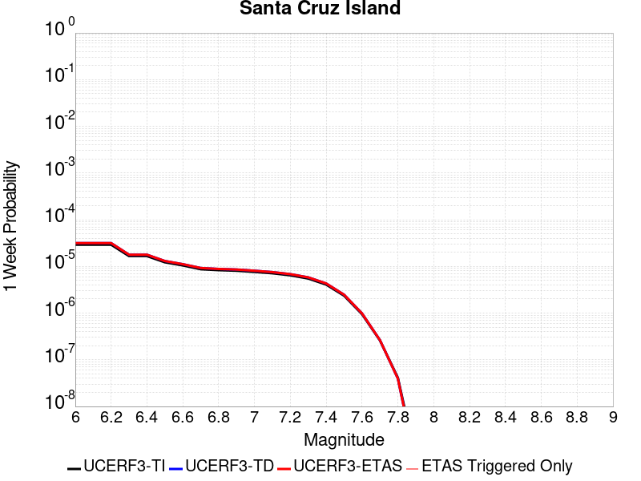 | 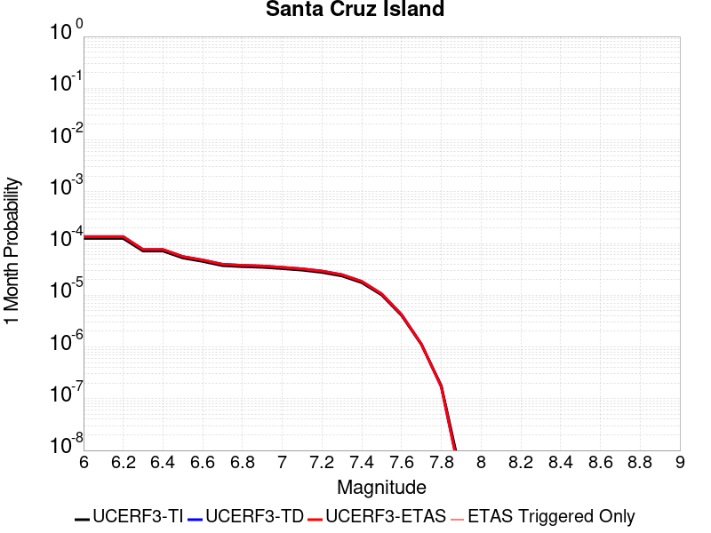 |  |  |

| Magnitude | 1 wk TI Prob | 1 wk TD Prob | 1 wk ETAS Prob | 1 wk ETAS/TD Gain | 1 wk ETAS Triggered Only | 1 mo TI Prob | 1 mo TD Prob | 1 mo ETAS Prob | 1 mo ETAS/TD Gain | 1 mo ETAS Triggered Only | 1 yr TI Prob | 1 yr TD Prob | 1 yr ETAS Prob | 1 yr ETAS/TD Gain | 1 yr ETAS Triggered Only | 10 yr TI Prob | 10 yr TD Prob | 10 yr ETAS Prob | 10 yr ETAS/TD Gain | 10 yr ETAS Triggered Only |
|-----|-----|-----|-----|-----|-----|-----|-----|-----|-----|-----|-----|-----|-----|-----|-----|-----|-----|-----|-----|-----|
| 6.0 | 2.9164563E-5 | 3.16008E-5 | 3.16008E-5 | 1.0 | 0.0 | 1.2498499E-4 | 1.3542574E-4 | 1.3542574E-4 | 1.0 | 0.0 | 0.0015206301 | 0.0016476976 | 0.0016676647 | 1.0121181 | 2.0E-5 | 0.015102667 | 0.016368544 | 0.016407888 | 1.0024037 | 4.0E-5 |
| 6.1 | 2.9164563E-5 | 3.16008E-5 | 3.16008E-5 | 1.0 | 0.0 | 1.2498499E-4 | 1.3542574E-4 | 1.3542574E-4 | 1.0 | 0.0 | 0.0015206301 | 0.0016476976 | 0.0016676647 | 1.0121181 | 2.0E-5 | 0.015102667 | 0.016368544 | 0.016407888 | 1.0024037 | 4.0E-5 |
| 6.2 | 2.9164563E-5 | 3.16008E-5 | 3.16008E-5 | 1.0 | 0.0 | 1.2498499E-4 | 1.3542574E-4 | 1.3542574E-4 | 1.0 | 0.0 | 0.0015206301 | 0.0016476976 | 0.0016676647 | 1.0121181 | 2.0E-5 | 0.015102667 | 0.016368544 | 0.016407888 | 1.0024037 | 4.0E-5 |
| 6.3 | 1.6635553E-5 | 1.7804861E-5 | 1.7804861E-5 | 1.0 | 0.0 | 7.1293274E-5 | 7.6304415E-5 | 7.6304415E-5 | 1.0 | 0.0 | 8.6765E-4 | 9.2862855E-4 | 9.4861E-4 | 1.0215172 | 2.0E-5 | 0.008642701 | 0.009249354 | 0.009288983 | 1.0042846 | 4.0E-5 |
| 6.4 | 1.6635553E-5 | 1.7804861E-5 | 1.7804861E-5 | 1.0 | 0.0 | 7.1293274E-5 | 7.6304415E-5 | 7.6304415E-5 | 1.0 | 0.0 | 8.6765E-4 | 9.2862855E-4 | 9.4861E-4 | 1.0215172 | 2.0E-5 | 0.008642701 | 0.009249354 | 0.009288983 | 1.0042846 | 4.0E-5 |
| 6.5 | 1.2238748E-5 | 1.3043341E-5 | 1.3043341E-5 | 1.0 | 0.0 | 5.2450723E-5 | 5.5898854E-5 | 5.5898854E-5 | 1.0 | 0.0 | 6.3840044E-4 | 6.803597E-4 | 6.803597E-4 | 1.0 | 0.0 | 0.0063656955 | 0.0067831664 | 0.006793099 | 1.0014642 | 1.0E-5 |
| 6.6 | 1.0489767E-5 | 1.1156922E-5 | 1.1156922E-5 | 1.0 | 0.0 | 4.495537E-5 | 4.7814516E-5 | 4.7814516E-5 | 1.0 | 0.0 | 5.4719415E-4 | 5.819885E-4 | 5.819885E-4 | 1.0 | 0.0 | 0.005458487 | 0.0058048842 | 0.005814826 | 1.0017127 | 1.0E-5 |
| 6.7 | 8.699222E-6 | 9.237013E-6 | 9.237013E-6 | 1.0 | 0.0 | 3.7281847E-5 | 3.95866E-5 | 3.95866E-5 | 1.0 | 0.0 | 4.5381195E-4 | 4.8186083E-4 | 4.8186083E-4 | 1.0 | 0.0 | 0.0045288634 | 0.0048082275 | 0.0048181796 | 1.0020697 | 1.0E-5 |
| 6.8 | 8.307732E-6 | 8.817123E-6 | 8.817123E-6 | 1.0 | 0.0 | 3.560408E-5 | 3.7787126E-5 | 3.7787126E-5 | 1.0 | 0.0 | 4.3339343E-4 | 4.5996153E-4 | 4.5996153E-4 | 1.0 | 0.0 | 0.004325492 | 0.004590149 | 0.004600103 | 1.0021685 | 1.0E-5 |
| 6.9 | 8.073121E-6 | 8.56515E-6 | 8.56515E-6 | 1.0 | 0.0 | 3.459863E-5 | 3.670727E-5 | 3.670727E-5 | 1.0 | 0.0 | 4.2115687E-4 | 4.4681982E-4 | 4.4681982E-4 | 1.0 | 0.0 | 0.004203596 | 0.0044592656 | 0.004469221 | 1.0022326 | 1.0E-5 |
| 7.0 | 7.617019E-6 | 8.0748605E-6 | 8.0748605E-6 | 1.0 | 0.0 | 3.264396E-5 | 3.4606088E-5 | 3.4606088E-5 | 1.0 | 0.0 | 3.9736772E-4 | 4.2124806E-4 | 4.2124806E-4 | 1.0 | 0.0 | 0.003966579 | 0.0042045433 | 0.004214501 | 1.0023683 | 1.0E-5 |
| 7.1 | 7.1224836E-6 | 7.5459693E-6 | 7.5459693E-6 | 1.0 | 0.0 | 3.052457E-5 | 3.233947E-5 | 3.233947E-5 | 1.0 | 0.0 | 3.715733E-4 | 3.9366228E-4 | 3.9366228E-4 | 1.0 | 0.0 | 0.003709526 | 0.0039296923 | 0.003939653 | 1.0025347 | 1.0E-5 |
| 7.2 | 6.441115E-6 | 6.8275494E-6 | 6.8275494E-6 | 1.0 | 0.0 | 2.7604487E-5 | 2.9260598E-5 | 2.9260598E-5 | 1.0 | 0.0 | 3.360328E-4 | 3.561898E-4 | 3.561898E-4 | 1.0 | 0.0 | 0.0033552512 | 0.0035562173 | 0.0035661818 | 1.002802 | 1.0E-5 |
| 7.3 | 5.494274E-6 | 5.8201344E-6 | 5.8201344E-6 | 1.0 | 0.0 | 2.3546674E-5 | 2.4943196E-5 | 2.4943196E-5 | 1.0 | 0.0 | 2.8664304E-4 | 3.036413E-4 | 3.036413E-4 | 1.0 | 0.0 | 0.002862736 | 0.0030322873 | 0.0030422572 | 1.0032878 | 1.0E-5 |
| 7.4 | 4.0802624E-6 | 4.312357E-6 | 4.312357E-6 | 1.0 | 0.0 | 1.7486722E-5 | 1.8481398E-5 | 1.8481398E-5 | 1.0 | 0.0 | 2.1288003E-4 | 2.2498786E-4 | 2.2498786E-4 | 1.0 | 0.0 | 0.0021267622 | 0.00224761 | 0.0022575874 | 1.0044391 | 1.0E-5 |
| 7.5 | 2.3584746E-6 | 2.475361E-6 | 2.475361E-6 | 1.0 | 0.0 | 1.0107709E-5 | 1.0608647E-5 | 1.0608647E-5 | 1.0 | 0.0 | 1.2305441E-4 | 1.2915267E-4 | 1.2915267E-4 | 1.0 | 0.0 | 0.0012298629 | 0.0012907812 | 0.0013007683 | 1.0077373 | 1.0E-5 |
| 7.6 | 9.4981914E-7 | 9.861103E-7 | 9.861103E-7 | 1.0 | 0.0 | 4.0706473E-6 | 4.2261804E-6 | 4.2261804E-6 | 1.0 | 0.0 | 4.9559E-5 | 5.1452545E-5 | 5.1452545E-5 | 1.0 | 0.0 | 4.954795E-4 | 5.1440764E-4 | 5.1440764E-4 | 1.0 | 0.0 |
| 7.7 | 2.6013532E-7 | 2.6416953E-7 | 2.6416953E-7 | 1.0 | 0.0 | 1.1148652E-6 | 1.1321546E-6 | 1.1321546E-6 | 1.0 | 0.0 | 1.3573399E-5 | 1.3783895E-5 | 1.3783895E-5 | 1.0 | 0.0 | 1.357257E-4 | 1.3783047E-4 | 1.3783047E-4 | 1.0 | 0.0 |
| 7.8 | 4.1522263E-8 | 3.9657174E-8 | 3.9657174E-8 | 1.0 | 0.0 | 1.7795254E-7 | 1.699593E-7 | 1.699593E-7 | 1.0 | 0.0 | 2.16657E-6 | 2.0692528E-6 | 2.0692528E-6 | 1.0 | 0.0 | 2.1665488E-5 | 2.0692358E-5 | 2.0692358E-5 | 1.0 | 0.0 |
| 7.9 | 7.7242046E-10 | 5.946914E-10 | 5.946914E-10 | 1.0 | 0.0 | 3.3103735E-9 | 2.5486773E-9 | 2.5486773E-9 | 1.0 | 0.0 | 4.0303796E-8 | 3.1030144E-8 | 3.1030144E-8 | 1.0 | 0.0 | 4.030379E-7 | 3.103014E-7 | 3.103014E-7 | 1.0 | 0.0 |

## Santa Cruz Catalina Ridge alt1
*[(top)](#table-of-contents)*

| 1 Week | 1 Month | 1 Year | 10 Year |
|-----|-----|-----|-----|
|  |  | 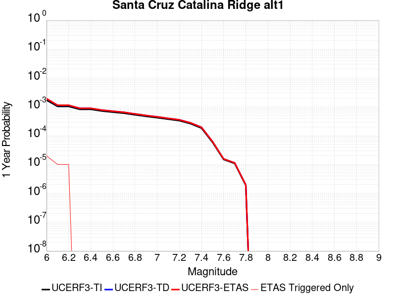 |  |

| Magnitude | 1 wk TI Prob | 1 wk TD Prob | 1 wk ETAS Prob | 1 wk ETAS/TD Gain | 1 wk ETAS Triggered Only | 1 mo TI Prob | 1 mo TD Prob | 1 mo ETAS Prob | 1 mo ETAS/TD Gain | 1 mo ETAS Triggered Only | 1 yr TI Prob | 1 yr TD Prob | 1 yr ETAS Prob | 1 yr ETAS/TD Gain | 1 yr ETAS Triggered Only | 10 yr TI Prob | 10 yr TD Prob | 10 yr ETAS Prob | 10 yr ETAS/TD Gain | 10 yr ETAS Triggered Only |
|-----|-----|-----|-----|-----|-----|-----|-----|-----|-----|-----|-----|-----|-----|-----|-----|-----|-----|-----|-----|-----|
| 6.0 | 3.2833184E-5 | 3.6560075E-5 | 3.6560075E-5 | 1.0 | 0.0 | 1.4070606E-4 | 1.5667756E-4 | 1.5667756E-4 | 1.0 | 0.0 | 0.00171175 | 0.0019060469 | 0.0019260087 | 1.0104729 | 2.0E-5 | 0.016986247 | 0.01891389 | 0.018962944 | 1.0025935 | 5.0E-5 |
| 6.1 | 1.9835548E-5 | 2.1660304E-5 | 2.1660304E-5 | 1.0 | 0.0 | 8.500672E-5 | 9.282668E-5 | 9.282668E-5 | 1.0 | 0.0 | 0.0010344655 | 0.0011295992 | 0.0011395878 | 1.0088427 | 1.0E-5 | 0.010296632 | 0.011240708 | 0.011250596 | 1.0008796 | 1.0E-5 |
| 6.2 | 1.9835548E-5 | 2.1660304E-5 | 2.1660304E-5 | 1.0 | 0.0 | 8.500672E-5 | 9.282668E-5 | 9.282668E-5 | 1.0 | 0.0 | 0.0010344655 | 0.0011295992 | 0.0011395878 | 1.0088427 | 1.0E-5 | 0.010296632 | 0.011240708 | 0.011250596 | 1.0008796 | 1.0E-5 |
| 6.3 | 1.5728183E-5 | 1.7034514E-5 | 1.7034514E-5 | 1.0 | 0.0 | 6.7404755E-5 | 7.300305E-5 | 7.300305E-5 | 1.0 | 0.0 | 8.2034385E-4 | 8.8845583E-4 | 8.8845583E-4 | 1.0 | 0.0 | 0.008173222 | 0.00884972 | 0.00884972 | 1.0 | 0.0 |
| 6.4 | 1.5728183E-5 | 1.7034514E-5 | 1.7034514E-5 | 1.0 | 0.0 | 6.7404755E-5 | 7.300305E-5 | 7.300305E-5 | 1.0 | 0.0 | 8.2034385E-4 | 8.8845583E-4 | 8.8845583E-4 | 1.0 | 0.0 | 0.008173222 | 0.00884972 | 0.00884972 | 1.0 | 0.0 |
| 6.5 | 1.3707734E-5 | 1.479499E-5 | 1.479499E-5 | 1.0 | 0.0 | 5.8746107E-5 | 6.3405576E-5 | 6.3405576E-5 | 1.0 | 0.0 | 7.1499916E-4 | 7.71693E-4 | 7.71693E-4 | 1.0 | 0.0 | 0.0071270303 | 0.007690532 | 0.007690532 | 1.0 | 0.0 |
| 6.6 | 1.2539813E-5 | 1.3510637E-5 | 1.3510637E-5 | 1.0 | 0.0 | 5.3740947E-5 | 5.7901456E-5 | 5.7901456E-5 | 1.0 | 0.0 | 6.540996E-4 | 7.047249E-4 | 7.047249E-4 | 1.0 | 0.0 | 0.0065217763 | 0.0070252046 | 0.0070252046 | 1.0 | 0.0 |
| 6.7 | 1.1504083E-5 | 1.237775E-5 | 1.237775E-5 | 1.0 | 0.0 | 4.930228E-5 | 5.304643E-5 | 5.304643E-5 | 1.0 | 0.0 | 6.0008996E-4 | 6.4565096E-4 | 6.4565096E-4 | 1.0 | 0.0 | 0.005984721 | 0.00643798 | 0.00643798 | 1.0 | 0.0 |
| 6.8 | 1.012739E-5 | 1.0877392E-5 | 1.0877392E-5 | 1.0 | 0.0 | 4.340238E-5 | 4.6616573E-5 | 4.6616573E-5 | 1.0 | 0.0 | 5.282958E-4 | 5.6741043E-4 | 5.6741043E-4 | 1.0 | 0.0 | 0.0052704164 | 0.005659786 | 0.005659786 | 1.0 | 0.0 |
| 6.9 | 8.9607865E-6 | 9.6093945E-6 | 9.6093945E-6 | 1.0 | 0.0 | 3.8402806E-5 | 4.1182477E-5 | 4.1182477E-5 | 1.0 | 0.0 | 4.6745385E-4 | 5.0128234E-4 | 5.0128234E-4 | 1.0 | 0.0 | 0.0046647177 | 0.0050016358 | 0.0050016358 | 1.0 | 0.0 |
| 7.0 | 8.046829E-6 | 8.619991E-6 | 8.619991E-6 | 1.0 | 0.0 | 3.4485955E-5 | 3.6942296E-5 | 3.6942296E-5 | 1.0 | 0.0 | 4.1978562E-4 | 4.4968046E-4 | 4.4968046E-4 | 1.0 | 0.0 | 0.004189935 | 0.0044877958 | 0.0044877958 | 1.0 | 0.0 |
| 7.1 | 7.136131E-6 | 7.63787E-6 | 7.63787E-6 | 1.0 | 0.0 | 3.0583058E-5 | 3.2733322E-5 | 3.2733322E-5 | 1.0 | 0.0 | 3.7228514E-4 | 3.9845603E-4 | 3.9845603E-4 | 1.0 | 0.0 | 0.0037166206 | 0.0039774925 | 0.0039774925 | 1.0 | 0.0 |
| 7.2 | 6.362014E-6 | 6.8051477E-6 | 6.8051477E-6 | 1.0 | 0.0 | 2.726549E-5 | 2.9164596E-5 | 2.9164596E-5 | 1.0 | 0.0 | 3.3190678E-4 | 3.5502174E-4 | 3.5502174E-4 | 1.0 | 0.0 | 0.0033141149 | 0.0035446142 | 0.0035446142 | 1.0 | 0.0 |
| 7.3 | 5.004101E-6 | 5.3518634E-6 | 5.3518634E-6 | 1.0 | 0.0 | 2.1445969E-5 | 2.2936358E-5 | 2.2936358E-5 | 1.0 | 0.0 | 2.6107338E-4 | 2.792149E-4 | 2.792149E-4 | 1.0 | 0.0 | 0.002607669 | 0.0027886957 | 0.0027886957 | 1.0 | 0.0 |
| 7.4 | 3.4901443E-6 | 3.7321556E-6 | 3.7321556E-6 | 1.0 | 0.0 | 1.4957676E-5 | 1.5994858E-5 | 1.5994858E-5 | 1.0 | 0.0 | 1.8209449E-4 | 1.9472037E-4 | 1.9472037E-4 | 1.0 | 0.0 | 0.0018194534 | 0.0019455361 | 0.0019455361 | 1.0 | 0.0 |
| 7.5 | 1.1215045E-6 | 1.1894158E-6 | 1.1894158E-6 | 1.0 | 0.0 | 4.806439E-6 | 5.0974863E-6 | 5.0974863E-6 | 1.0 | 0.0 | 5.851682E-5 | 6.2060164E-5 | 6.2060164E-5 | 1.0 | 0.0 | 5.850142E-4 | 6.204314E-4 | 6.204314E-4 | 1.0 | 0.0 |
| 7.6 | 2.8599047E-7 | 2.9952557E-7 | 2.9952557E-7 | 1.0 | 0.0 | 1.2256729E-6 | 1.2836804E-6 | 1.2836804E-6 | 1.0 | 0.0 | 1.4922465E-5 | 1.5628699E-5 | 1.5628699E-5 | 1.0 | 0.0 | 1.4921463E-4 | 1.5627613E-4 | 1.5627613E-4 | 1.0 | 0.0 |
| 7.7 | 2.0781519E-7 | 2.1744724E-7 | 2.1744724E-7 | 1.0 | 0.0 | 8.906362E-7 | 9.319164E-7 | 9.319164E-7 | 1.0 | 0.0 | 1.08434415E-5 | 1.1346025E-5 | 1.1346025E-5 | 1.0 | 0.0 | 1.0842913E-4 | 1.13454545E-4 | 1.13454545E-4 | 1.0 | 0.0 |
| 7.8 | 3.614776E-8 | 3.7641637E-8 | 3.7641637E-8 | 1.0 | 0.0 | 1.5491896E-7 | 1.613213E-7 | 1.613213E-7 | 1.0 | 0.0 | 1.8861368E-6 | 1.9640852E-6 | 1.9640852E-6 | 1.0 | 0.0 | 1.8861208E-5 | 1.9640689E-5 | 1.9640689E-5 | 1.0 | 0.0 |

## San Jacinto (Lytle Creek connector)
*[(top)](#table-of-contents)*

| 1 Week | 1 Month | 1 Year | 10 Year |
|-----|-----|-----|-----|
| 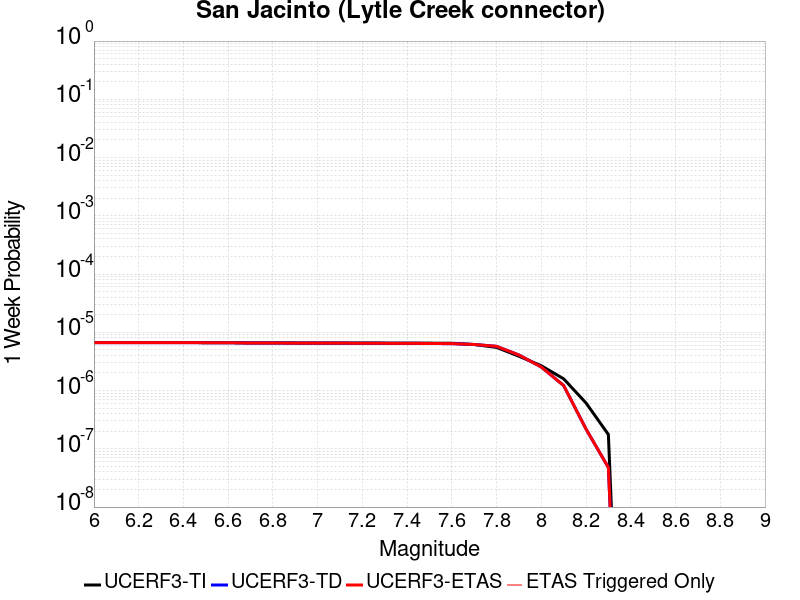 |  |  |  |

| Magnitude | 1 wk TI Prob | 1 wk TD Prob | 1 wk ETAS Prob | 1 wk ETAS/TD Gain | 1 wk ETAS Triggered Only | 1 mo TI Prob | 1 mo TD Prob | 1 mo ETAS Prob | 1 mo ETAS/TD Gain | 1 mo ETAS Triggered Only | 1 yr TI Prob | 1 yr TD Prob | 1 yr ETAS Prob | 1 yr ETAS/TD Gain | 1 yr ETAS Triggered Only | 10 yr TI Prob | 10 yr TD Prob | 10 yr ETAS Prob | 10 yr ETAS/TD Gain | 10 yr ETAS Triggered Only |
|-----|-----|-----|-----|-----|-----|-----|-----|-----|-----|-----|-----|-----|-----|-----|-----|-----|-----|-----|-----|-----|
| 6.0 | 6.693995E-6 | 6.668321E-6 | 6.668321E-6 | 1.0 | 0.0 | 2.8688235E-5 | 2.8578204E-5 | 2.8578204E-5 | 1.0 | 0.0 | 3.492233E-4 | 3.4788417E-4 | 3.6787722E-4 | 1.0574704 | 2.0E-5 | 0.00348675 | 0.0035535942 | 0.0036034165 | 1.0140202 | 5.0E-5 |
| 6.1 | 6.693995E-6 | 6.668321E-6 | 6.668321E-6 | 1.0 | 0.0 | 2.8688235E-5 | 2.8578204E-5 | 2.8578204E-5 | 1.0 | 0.0 | 3.492233E-4 | 3.4788417E-4 | 3.6787722E-4 | 1.0574704 | 2.0E-5 | 0.00348675 | 0.0035535942 | 0.0036034165 | 1.0140202 | 5.0E-5 |
| 6.2 | 6.693995E-6 | 6.668321E-6 | 6.668321E-6 | 1.0 | 0.0 | 2.8688235E-5 | 2.8578204E-5 | 2.8578204E-5 | 1.0 | 0.0 | 3.492233E-4 | 3.4788417E-4 | 3.6787722E-4 | 1.0574704 | 2.0E-5 | 0.00348675 | 0.0035535942 | 0.0036034165 | 1.0140202 | 5.0E-5 |
| 6.3 | 6.693995E-6 | 6.668321E-6 | 6.668321E-6 | 1.0 | 0.0 | 2.8688235E-5 | 2.8578204E-5 | 2.8578204E-5 | 1.0 | 0.0 | 3.492233E-4 | 3.4788417E-4 | 3.6787722E-4 | 1.0574704 | 2.0E-5 | 0.00348675 | 0.0035535942 | 0.0036034165 | 1.0140202 | 5.0E-5 |
| 6.4 | 6.693995E-6 | 6.668321E-6 | 6.668321E-6 | 1.0 | 0.0 | 2.8688235E-5 | 2.8578204E-5 | 2.8578204E-5 | 1.0 | 0.0 | 3.492233E-4 | 3.4788417E-4 | 3.6787722E-4 | 1.0574704 | 2.0E-5 | 0.00348675 | 0.0035535942 | 0.0036034165 | 1.0140202 | 5.0E-5 |
| 6.5 | 6.6561875E-6 | 6.628538E-6 | 6.628538E-6 | 1.0 | 0.0 | 2.8526205E-5 | 2.8407712E-5 | 2.8407712E-5 | 1.0 | 0.0 | 3.472512E-4 | 3.4580907E-4 | 3.6580217E-4 | 1.0578154 | 2.0E-5 | 0.0034670907 | 0.0035329093 | 0.0035827328 | 1.0141027 | 5.0E-5 |
| 6.6 | 6.6561875E-6 | 6.628538E-6 | 6.628538E-6 | 1.0 | 0.0 | 2.8526205E-5 | 2.8407712E-5 | 2.8407712E-5 | 1.0 | 0.0 | 3.472512E-4 | 3.4580907E-4 | 3.6580217E-4 | 1.0578154 | 2.0E-5 | 0.0034670907 | 0.0035329093 | 0.0035827328 | 1.0141027 | 5.0E-5 |
| 6.7 | 6.5802237E-6 | 6.547713E-6 | 6.547713E-6 | 1.0 | 0.0 | 2.8200653E-5 | 2.8061326E-5 | 2.8061326E-5 | 1.0 | 0.0 | 3.4328885E-4 | 3.4159314E-4 | 3.615863E-4 | 1.0585291 | 2.0E-5 | 0.0034275902 | 0.003490883 | 0.0035407085 | 1.014273 | 5.0E-5 |
| 6.8 | 6.575632E-6 | 6.5422023E-6 | 6.5422023E-6 | 1.0 | 0.0 | 2.8180975E-5 | 2.8037708E-5 | 2.8037708E-5 | 1.0 | 0.0 | 3.4304935E-4 | 3.413057E-4 | 3.6129888E-4 | 1.0585785 | 2.0E-5 | 0.0034252026 | 0.0034880175 | 0.003537843 | 1.0142848 | 5.0E-5 |
| 6.9 | 6.570433E-6 | 6.5335953E-6 | 6.5335953E-6 | 1.0 | 0.0 | 2.8158694E-5 | 2.800082E-5 | 2.800082E-5 | 1.0 | 0.0 | 3.4277816E-4 | 3.4085676E-4 | 3.6084992E-4 | 1.0586556 | 2.0E-5 | 0.0034224992 | 0.003483542 | 0.003533368 | 1.0143032 | 5.0E-5 |
| 7.0 | 6.5643826E-6 | 6.523715E-6 | 6.523715E-6 | 1.0 | 0.0 | 2.8132765E-5 | 2.7958478E-5 | 2.7958478E-5 | 1.0 | 0.0 | 3.424626E-4 | 3.403414E-4 | 3.6033458E-4 | 1.0587445 | 2.0E-5 | 0.0034193532 | 0.0034784046 | 0.0035282306 | 1.0143244 | 5.0E-5 |
| 7.1 | 6.557402E-6 | 6.5124254E-6 | 6.5124254E-6 | 1.0 | 0.0 | 2.8102848E-5 | 2.7910095E-5 | 2.7910095E-5 | 1.0 | 0.0 | 3.4209844E-4 | 3.397525E-4 | 3.597457E-4 | 1.0588464 | 2.0E-5 | 0.0034157229 | 0.0034725354 | 0.0035223616 | 1.0143487 | 5.0E-5 |
| 7.2 | 6.546394E-6 | 6.4943893E-6 | 6.4943893E-6 | 1.0 | 0.0 | 2.8055672E-5 | 2.78328E-5 | 2.78328E-5 | 1.0 | 0.0 | 3.4152428E-4 | 3.3881172E-4 | 3.5880494E-4 | 1.0590098 | 2.0E-5 | 0.0034099987 | 0.0034631612 | 0.003512988 | 1.0143877 | 5.0E-5 |
| 7.3 | 6.5364216E-6 | 6.47517E-6 | 6.47517E-6 | 1.0 | 0.0 | 2.8012933E-5 | 2.7750433E-5 | 2.7750433E-5 | 1.0 | 0.0 | 3.4100408E-4 | 3.378092E-4 | 3.5780246E-4 | 1.059185 | 2.0E-5 | 0.003404813 | 0.0034531802 | 0.0035030076 | 1.0144295 | 5.0E-5 |
| 7.4 | 6.5269523E-6 | 6.4562514E-6 | 6.4562514E-6 | 1.0 | 0.0 | 2.7972354E-5 | 2.7669355E-5 | 2.7669355E-5 | 1.0 | 0.0 | 3.4051016E-4 | 3.3682238E-4 | 3.5681567E-4 | 1.0593585 | 2.0E-5 | 0.0033998888 | 0.0034433594 | 0.0034931873 | 1.0144707 | 5.0E-5 |
| 7.5 | 6.5111835E-6 | 6.432519E-6 | 6.432519E-6 | 1.0 | 0.0 | 2.7904773E-5 | 2.7567648E-5 | 2.7567648E-5 | 1.0 | 0.0 | 3.3968766E-4 | 3.355845E-4 | 3.555778E-4 | 1.0595775 | 2.0E-5 | 0.0033916887 | 0.0034310294 | 0.0034808577 | 1.0145229 | 5.0E-5 |
| 7.6 | 6.4768806E-6 | 6.3916186E-6 | 6.3916186E-6 | 1.0 | 0.0 | 2.7757764E-5 | 2.7392365E-5 | 2.7392365E-5 | 1.0 | 0.0 | 3.3789838E-4 | 3.3345108E-4 | 3.534444E-4 | 1.0599588 | 2.0E-5 | 0.0033738504 | 0.0034097566 | 0.003459586 | 1.0146137 | 5.0E-5 |
| 7.7 | 6.1655364E-6 | 6.18404E-6 | 6.18404E-6 | 1.0 | 0.0 | 2.642346E-5 | 2.6502761E-5 | 2.6502761E-5 | 1.0 | 0.0 | 3.2165812E-4 | 3.2262338E-4 | 3.4261693E-4 | 1.0619718 | 2.0E-5 | 0.0032119295 | 0.0033013388 | 0.0033511738 | 1.0150954 | 5.0E-5 |
| 7.8 | 5.5043524E-6 | 5.7448756E-6 | 5.7448756E-6 | 1.0 | 0.0 | 2.3589868E-5 | 2.4620664E-5 | 2.4620664E-5 | 1.0 | 0.0 | 2.871688E-4 | 2.997154E-4 | 3.1970942E-4 | 1.06671 | 2.0E-5 | 0.0028679797 | 0.0030713242 | 0.0031211707 | 1.0162296 | 5.0E-5 |
| 7.9 | 3.889249E-6 | 4.0831014E-6 | 4.0831014E-6 | 1.0 | 0.0 | 1.6668104E-5 | 1.7498889E-5 | 1.7498889E-5 | 1.0 | 0.0 | 2.0291525E-4 | 2.130282E-4 | 2.3302394E-4 | 1.0938643 | 2.0E-5 | 0.0020273007 | 0.002197644 | 0.002247534 | 1.0227016 | 5.0E-5 |
| 8.0 | 2.668535E-6 | 2.5358918E-6 | 2.5358918E-6 | 1.0 | 0.0 | 1.1436528E-5 | 1.08680615E-5 | 1.08680615E-5 | 1.0 | 0.0 | 1.3923083E-4 | 1.3231064E-4 | 1.52308E-4 | 1.1511394 | 2.0E-5 | 0.0013914363 | 0.0013781126 | 0.0014180575 | 1.0289853 | 4.0E-5 |
| 8.1 | 1.5911459E-6 | 1.221014E-6 | 1.221014E-6 | 1.0 | 0.0 | 6.8191785E-6 | 5.232907E-6 | 5.232907E-6 | 1.0 | 0.0 | 8.3020335E-5 | 6.37088E-5 | 7.3708165E-5 | 1.1569542 | 1.0E-5 | 8.298933E-4 | 6.7058654E-4 | 7.005664E-4 | 1.044707 | 3.0E-5 |
| 8.2 | 6.1294963E-7 | 2.1881452E-7 | 2.1881452E-7 | 1.0 | 0.0 | 2.6269242E-6 | 9.377761E-7 | 9.377761E-7 | 1.0 | 0.0 | 3.1982334E-5 | 1.14173645E-5 | 1.14173645E-5 | 1.0 | 0.0 | 3.1977732E-4 | 1.2823407E-4 | 1.2823407E-4 | 1.0 | 0.0 |
| 8.3 | 1.762871E-7 | 4.772034E-8 | 4.772034E-8 | 1.0 | 0.0 | 7.5551594E-7 | 2.0451573E-7 | 2.0451573E-7 | 1.0 | 0.0 | 9.1983675E-6 | 2.4899762E-6 | 2.4899762E-6 | 1.0 | 0.0 | 9.197987E-5 | 2.8787132E-5 | 2.8787132E-5 | 1.0 | 0.0 |

## Palos Verdes
*[(top)](#table-of-contents)*

| 1 Week | 1 Month | 1 Year | 10 Year |
|-----|-----|-----|-----|
|  | 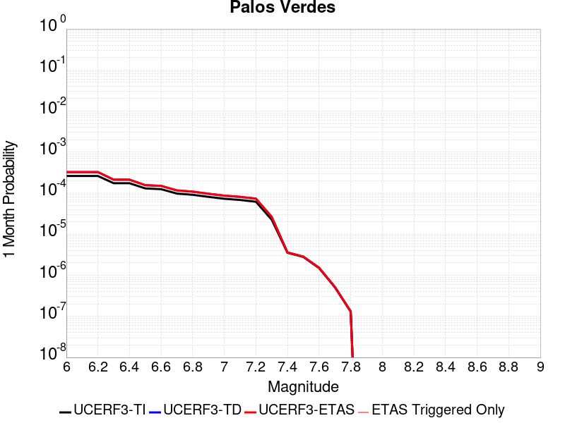 | 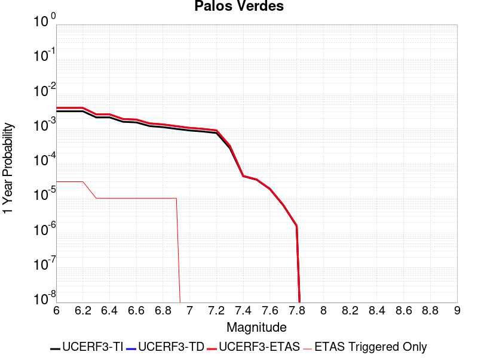 | 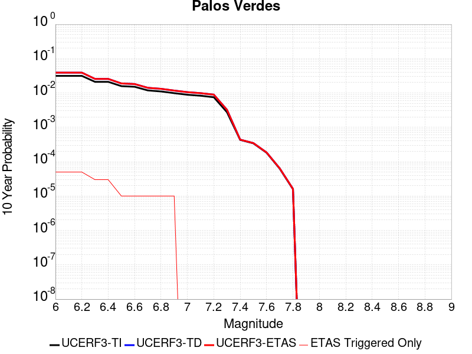 |

| Magnitude | 1 wk TI Prob | 1 wk TD Prob | 1 wk ETAS Prob | 1 wk ETAS/TD Gain | 1 wk ETAS Triggered Only | 1 mo TI Prob | 1 mo TD Prob | 1 mo ETAS Prob | 1 mo ETAS/TD Gain | 1 mo ETAS Triggered Only | 1 yr TI Prob | 1 yr TD Prob | 1 yr ETAS Prob | 1 yr ETAS/TD Gain | 1 yr ETAS Triggered Only | 10 yr TI Prob | 10 yr TD Prob | 10 yr ETAS Prob | 10 yr ETAS/TD Gain | 10 yr ETAS Triggered Only |
|-----|-----|-----|-----|-----|-----|-----|-----|-----|-----|-----|-----|-----|-----|-----|-----|-----|-----|-----|-----|-----|
| 6.0 | 6.126063E-5 | 7.6233635E-5 | 7.6233635E-5 | 1.0 | 0.0 | 2.6251914E-4 | 3.26678E-4 | 3.26678E-4 | 1.0 | 0.0 | 0.0031914865 | 0.0039705494 | 0.0040004305 | 1.0075257 | 3.0E-5 | 0.031460393 | 0.039052576 | 0.039100625 | 1.0012304 | 5.0E-5 |
| 6.1 | 6.126063E-5 | 7.6233635E-5 | 7.6233635E-5 | 1.0 | 0.0 | 2.6251914E-4 | 3.26678E-4 | 3.26678E-4 | 1.0 | 0.0 | 0.0031914865 | 0.0039705494 | 0.0040004305 | 1.0075257 | 3.0E-5 | 0.031460393 | 0.039052576 | 0.039100625 | 1.0012304 | 5.0E-5 |
| 6.2 | 6.126063E-5 | 7.6233635E-5 | 7.6233635E-5 | 1.0 | 0.0 | 2.6251914E-4 | 3.26678E-4 | 3.26678E-4 | 1.0 | 0.0 | 0.0031914865 | 0.0039705494 | 0.0040004305 | 1.0075257 | 3.0E-5 | 0.031460393 | 0.039052576 | 0.039100625 | 1.0012304 | 5.0E-5 |
| 6.3 | 4.0838047E-5 | 4.9753806E-5 | 4.9753806E-5 | 1.0 | 0.0 | 1.7500846E-4 | 2.1321444E-4 | 2.1321444E-4 | 1.0 | 0.0 | 0.0021286458 | 0.0025930025 | 0.0026029767 | 1.0038465 | 1.0E-5 | 0.021083709 | 0.02564888 | 0.025678111 | 1.0011396 | 3.0E-5 |
| 6.4 | 4.0838047E-5 | 4.9753806E-5 | 4.9753806E-5 | 1.0 | 0.0 | 1.7500846E-4 | 2.1321444E-4 | 2.1321444E-4 | 1.0 | 0.0 | 0.0021286458 | 0.0025930025 | 0.0026029767 | 1.0038465 | 1.0E-5 | 0.021083709 | 0.02564888 | 0.025678111 | 1.0011396 | 3.0E-5 |
| 6.5 | 3.0512005E-5 | 3.6564536E-5 | 3.6564536E-5 | 1.0 | 0.0 | 1.3075917E-4 | 1.566964E-4 | 1.566964E-4 | 1.0 | 0.0 | 0.0015908304 | 0.0019062276 | 0.0019162084 | 1.0052359 | 1.0E-5 | 0.015794903 | 0.01891064 | 0.018920451 | 1.0005188 | 1.0E-5 |
| 6.6 | 2.9255087E-5 | 3.5157267E-5 | 3.5157267E-5 | 1.0 | 0.0 | 1.2537291E-4 | 1.5066595E-4 | 1.5066595E-4 | 1.0 | 0.0 | 0.0015253464 | 0.0018329303 | 0.0018429119 | 1.0054457 | 1.0E-5 | 0.015149189 | 0.018189678 | 0.018199496 | 1.0005398 | 1.0E-5 |
| 6.7 | 2.287198E-5 | 2.725037E-5 | 2.725037E-5 | 1.0 | 0.0 | 9.801909E-5 | 1.1678259E-4 | 1.1678259E-4 | 1.0 | 0.0 | 0.001192729 | 0.0014209923 | 0.0014309782 | 1.0070274 | 1.0E-5 | 0.011863477 | 0.014128295 | 0.014138154 | 1.0006979 | 1.0E-5 |
| 6.8 | 2.1325764E-5 | 2.5433841E-5 | 2.5433841E-5 | 1.0 | 0.0 | 9.139293E-5 | 1.0899813E-4 | 1.0899813E-4 | 1.0 | 0.0 | 0.001112141 | 0.0013263347 | 0.0013363214 | 1.0075296 | 1.0E-5 | 0.011065915 | 0.013193224 | 0.013203092 | 1.0007479 | 1.0E-5 |
| 6.9 | 1.9009392E-5 | 2.2615268E-5 | 2.2615268E-5 | 1.0 | 0.0 | 8.1466285E-5 | 9.691947E-5 | 9.691947E-5 | 1.0 | 0.0 | 9.914007E-4 | 0.0011794432 | 0.0011894314 | 1.0084686 | 1.0E-5 | 0.009869894 | 0.0117405215 | 0.011750404 | 1.0008417 | 1.0E-5 |
| 7.0 | 1.7098473E-5 | 2.0320893E-5 | 2.0320893E-5 | 1.0 | 0.0 | 7.3277115E-5 | 8.7087115E-5 | 8.7087115E-5 | 1.0 | 0.0 | 8.917837E-4 | 0.0010598551 | 0.0010598551 | 1.0 | 0.0 | 0.008882134 | 0.010556442 | 0.010556442 | 1.0 | 0.0 |
| 7.1 | 1.5982785E-5 | 1.8996197E-5 | 1.8996197E-5 | 1.0 | 0.0 | 6.849585E-5 | 8.141022E-5 | 8.141022E-5 | 1.0 | 0.0 | 8.336179E-4 | 9.908034E-4 | 9.908034E-4 | 1.0 | 0.0 | 0.008304977 | 0.009872224 | 0.009872224 | 1.0 | 0.0 |
| 7.2 | 1.4468002E-5 | 1.719854E-5 | 1.719854E-5 | 1.0 | 0.0 | 6.200425E-5 | 7.370642E-5 | 7.370642E-5 | 1.0 | 0.0 | 7.546402E-4 | 8.970902E-4 | 8.970902E-4 | 1.0 | 0.0 | 0.007520827 | 0.00894296 | 0.00894296 | 1.0 | 0.0 |
| 7.3 | 5.288233E-6 | 6.204113E-6 | 6.204113E-6 | 1.0 | 0.0 | 2.2663658E-5 | 2.6588981E-5 | 2.6588981E-5 | 1.0 | 0.0 | 2.7589512E-4 | 3.2370767E-4 | 3.2370767E-4 | 1.0 | 0.0 | 0.0027555283 | 0.0032357846 | 0.0032357846 | 1.0 | 0.0 |
| 7.4 | 8.279556E-7 | 8.4083985E-7 | 8.4083985E-7 | 1.0 | 0.0 | 3.5483763E-6 | 3.603595E-6 | 3.603595E-6 | 1.0 | 0.0 | 4.3200624E-5 | 4.387296E-5 | 4.387296E-5 | 1.0 | 0.0 | 4.3192226E-4 | 4.3865017E-4 | 4.3865017E-4 | 1.0 | 0.0 |
| 7.5 | 6.559831E-7 | 6.667272E-7 | 6.667272E-7 | 1.0 | 0.0 | 2.8113532E-6 | 2.8573997E-6 | 2.8573997E-6 | 1.0 | 0.0 | 3.4227687E-5 | 3.4788354E-5 | 3.4788354E-5 | 1.0 | 0.0 | 3.4222414E-4 | 3.478357E-4 | 3.478357E-4 | 1.0 | 0.0 |
| 7.6 | 3.5018968E-7 | 3.5620272E-7 | 3.5620272E-7 | 1.0 | 0.0 | 1.500812E-6 | 1.5265824E-6 | 1.5265824E-6 | 1.0 | 0.0 | 1.8272232E-5 | 1.858603E-5 | 1.858603E-5 | 1.0 | 0.0 | 1.8270731E-4 | 1.8584935E-4 | 1.8584935E-4 | 1.0 | 0.0 |
| 7.7 | 1.1986104E-7 | 1.2198463E-7 | 1.2198463E-7 | 1.0 | 0.0 | 5.1369005E-7 | 5.2279114E-7 | 5.2279114E-7 | 1.0 | 0.0 | 6.2541585E-6 | 6.364964E-6 | 6.364964E-6 | 1.0 | 0.0 | 6.2539824E-5 | 6.364786E-5 | 6.364786E-5 | 1.0 | 0.0 |
| 7.8 | 3.0445005E-8 | 3.102782E-8 | 3.102782E-8 | 1.0 | 0.0 | 1.3047858E-7 | 1.3297637E-7 | 1.3297637E-7 | 1.0 | 0.0 | 1.5885756E-6 | 1.6189863E-6 | 1.6189863E-6 | 1.0 | 0.0 | 1.5885644E-5 | 1.6189766E-5 | 1.6189766E-5 | 1.0 | 0.0 |

## Kern Canyon (North Kern) 2011
*[(top)](#table-of-contents)*

| 1 Week | 1 Month | 1 Year | 10 Year |
|-----|-----|-----|-----|
|  |  |  |  |

| Magnitude | 1 wk TI Prob | 1 wk TD Prob | 1 wk ETAS Prob | 1 wk ETAS/TD Gain | 1 wk ETAS Triggered Only | 1 mo TI Prob | 1 mo TD Prob | 1 mo ETAS Prob | 1 mo ETAS/TD Gain | 1 mo ETAS Triggered Only | 1 yr TI Prob | 1 yr TD Prob | 1 yr ETAS Prob | 1 yr ETAS/TD Gain | 1 yr ETAS Triggered Only | 10 yr TI Prob | 10 yr TD Prob | 10 yr ETAS Prob | 10 yr ETAS/TD Gain | 10 yr ETAS Triggered Only |
|-----|-----|-----|-----|-----|-----|-----|-----|-----|-----|-----|-----|-----|-----|-----|-----|-----|-----|-----|-----|-----|
| 6.0 | 6.6264497E-6 | 6.757394E-6 | 6.757394E-6 | 1.0 | 0.0 | 2.8398761E-5 | 2.8959985E-5 | 2.8959985E-5 | 1.0 | 0.0 | 3.4570007E-4 | 3.5253877E-4 | 3.7253174E-4 | 1.0567113 | 2.0E-5 | 0.0034516277 | 0.0035205837 | 0.0035704076 | 1.0141522 | 5.0E-5 |
| 6.1 | 6.6264497E-6 | 6.757394E-6 | 6.757394E-6 | 1.0 | 0.0 | 2.8398761E-5 | 2.8959985E-5 | 2.8959985E-5 | 1.0 | 0.0 | 3.4570007E-4 | 3.5253877E-4 | 3.7253174E-4 | 1.0567113 | 2.0E-5 | 0.0034516277 | 0.0035205837 | 0.0035704076 | 1.0141522 | 5.0E-5 |
| 6.2 | 6.6264497E-6 | 6.757394E-6 | 6.757394E-6 | 1.0 | 0.0 | 2.8398761E-5 | 2.8959985E-5 | 2.8959985E-5 | 1.0 | 0.0 | 3.4570007E-4 | 3.5253877E-4 | 3.7253174E-4 | 1.0567113 | 2.0E-5 | 0.0034516277 | 0.0035205837 | 0.0035704076 | 1.0141522 | 5.0E-5 |
| 6.3 | 6.6264497E-6 | 6.757394E-6 | 6.757394E-6 | 1.0 | 0.0 | 2.8398761E-5 | 2.8959985E-5 | 2.8959985E-5 | 1.0 | 0.0 | 3.4570007E-4 | 3.5253877E-4 | 3.7253174E-4 | 1.0567113 | 2.0E-5 | 0.0034516277 | 0.0035205837 | 0.0035704076 | 1.0141522 | 5.0E-5 |
| 6.4 | 6.6264497E-6 | 6.757394E-6 | 6.757394E-6 | 1.0 | 0.0 | 2.8398761E-5 | 2.8959985E-5 | 2.8959985E-5 | 1.0 | 0.0 | 3.4570007E-4 | 3.5253877E-4 | 3.7253174E-4 | 1.0567113 | 2.0E-5 | 0.0034516277 | 0.0035205837 | 0.0035704076 | 1.0141522 | 5.0E-5 |
| 6.5 | 3.2162225E-6 | 3.257119E-6 | 3.257119E-6 | 1.0 | 0.0 | 1.3783738E-5 | 1.3959011E-5 | 1.3959011E-5 | 1.0 | 0.0 | 1.6780409E-4 | 1.6993852E-4 | 1.6993852E-4 | 1.0 | 0.0 | 0.0016767744 | 0.0016981653 | 0.0016981653 | 1.0 | 0.0 |
| 6.6 | 3.2162225E-6 | 3.257119E-6 | 3.257119E-6 | 1.0 | 0.0 | 1.3783738E-5 | 1.3959011E-5 | 1.3959011E-5 | 1.0 | 0.0 | 1.6780409E-4 | 1.6993852E-4 | 1.6993852E-4 | 1.0 | 0.0 | 0.0016767744 | 0.0016981653 | 0.0016981653 | 1.0 | 0.0 |
| 6.7 | 2.1908265E-6 | 2.2071397E-6 | 2.2071397E-6 | 1.0 | 0.0 | 9.389223E-6 | 9.459137E-6 | 9.459137E-6 | 1.0 | 0.0 | 1.1430779E-4 | 1.151591E-4 | 1.151591E-4 | 1.0 | 0.0 | 0.0011424901 | 0.0011510137 | 0.0011510137 | 1.0 | 0.0 |
| 6.8 | 1.7303895E-6 | 1.7365662E-6 | 1.7365662E-6 | 1.0 | 0.0 | 7.415934E-6 | 7.442406E-6 | 7.442406E-6 | 1.0 | 0.0 | 9.028525E-5 | 9.0607624E-5 | 9.0607624E-5 | 1.0 | 0.0 | 9.024858E-4 | 9.0571656E-4 | 9.0571656E-4 | 1.0 | 0.0 |
| 6.9 | 1.3700314E-6 | 1.3688726E-6 | 1.3688726E-6 | 1.0 | 0.0 | 5.87155E-6 | 5.866584E-6 | 5.866584E-6 | 1.0 | 0.0 | 7.148377E-5 | 7.142336E-5 | 7.142336E-5 | 1.0 | 0.0 | 7.146078E-4 | 7.1400864E-4 | 7.1400864E-4 | 1.0 | 0.0 |
| 7.0 | 1.1467797E-6 | 1.1413891E-6 | 1.1413891E-6 | 1.0 | 0.0 | 4.9147607E-6 | 4.8916586E-6 | 4.8916586E-6 | 1.0 | 0.0 | 5.983557E-5 | 5.9554346E-5 | 5.9554346E-5 | 1.0 | 0.0 | 5.981946E-4 | 5.95387E-4 | 5.95387E-4 | 1.0 | 0.0 |
| 7.1 | 9.3952065E-7 | 9.3027614E-7 | 9.3027614E-7 | 1.0 | 0.0 | 4.026511E-6 | 3.986892E-6 | 3.986892E-6 | 1.0 | 0.0 | 4.9021666E-5 | 4.8539343E-5 | 4.8539343E-5 | 1.0 | 0.0 | 4.901085E-4 | 4.852892E-4 | 4.852892E-4 | 1.0 | 0.0 |
| 7.2 | 6.858055E-7 | 6.7193525E-7 | 6.7193525E-7 | 1.0 | 0.0 | 2.939163E-6 | 2.8797194E-6 | 2.8797194E-6 | 1.0 | 0.0 | 3.5783723E-5 | 3.5060028E-5 | 3.5060028E-5 | 1.0 | 0.0 | 3.5777962E-4 | 3.5054586E-4 | 3.5054586E-4 | 1.0 | 0.0 |
| 7.3 | 5.1101983E-7 | 4.939339E-7 | 4.939339E-7 | 1.0 | 0.0 | 2.1900833E-6 | 2.1168578E-6 | 2.1168578E-6 | 1.0 | 0.0 | 2.6663936E-5 | 2.5772444E-5 | 2.5772444E-5 | 1.0 | 0.0 | 2.6660739E-4 | 2.5769504E-4 | 2.5769504E-4 | 1.0 | 0.0 |
| 7.4 | 3.4999414E-7 | 3.2996178E-7 | 3.2996178E-7 | 1.0 | 0.0 | 1.499974E-6 | 1.4141211E-6 | 1.4141211E-6 | 1.0 | 0.0 | 1.8262032E-5 | 1.7216791E-5 | 1.7216791E-5 | 1.0 | 0.0 | 1.826053E-4 | 1.7215482E-4 | 1.7215482E-4 | 1.0 | 0.0 |
| 7.5 | 1.7021522E-7 | 1.4750184E-7 | 1.4750184E-7 | 1.0 | 0.0 | 7.2949354E-7 | 6.321506E-7 | 6.321506E-7 | 1.0 | 0.0 | 8.881548E-6 | 7.696407E-6 | 7.696407E-6 | 1.0 | 0.0 | 8.8811925E-5 | 7.6961485E-5 | 7.6961485E-5 | 1.0 | 0.0 |
| 7.6 | 2.572245E-8 | 1.7352802E-8 | 1.7352802E-8 | 1.0 | 0.0 | 1.10239064E-7 | 7.436915E-8 | 7.436915E-8 | 1.0 | 0.0 | 1.3421597E-6 | 9.0544404E-7 | 9.0544404E-7 | 1.0 | 0.0 | 1.3421517E-5 | 9.054409E-6 | 9.054409E-6 | 1.0 | 0.0 |

## San Diego Trough south
*[(top)](#table-of-contents)*

| 1 Week | 1 Month | 1 Year | 10 Year |
|-----|-----|-----|-----|
|  | 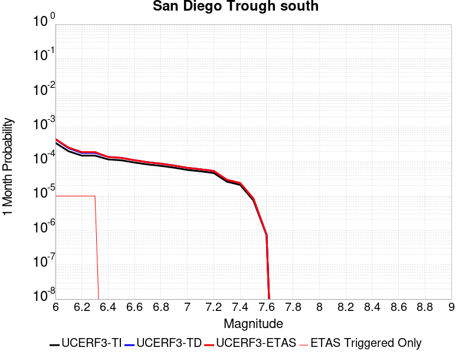 |  |  |

| Magnitude | 1 wk TI Prob | 1 wk TD Prob | 1 wk ETAS Prob | 1 wk ETAS/TD Gain | 1 wk ETAS Triggered Only | 1 mo TI Prob | 1 mo TD Prob | 1 mo ETAS Prob | 1 mo ETAS/TD Gain | 1 mo ETAS Triggered Only | 1 yr TI Prob | 1 yr TD Prob | 1 yr ETAS Prob | 1 yr ETAS/TD Gain | 1 yr ETAS Triggered Only | 10 yr TI Prob | 10 yr TD Prob | 10 yr ETAS Prob | 10 yr ETAS/TD Gain | 10 yr ETAS Triggered Only |
|-----|-----|-----|-----|-----|-----|-----|-----|-----|-----|-----|-----|-----|-----|-----|-----|-----|-----|-----|-----|-----|
| 6.0 | 8.279495E-5 | 1.0425265E-4 | 1.0425265E-4 | 1.0 | 0.0 | 3.5478722E-4 | 4.4672552E-4 | 4.5672106E-4 | 1.0223751 | 1.0E-5 | 0.004310982 | 0.0054261927 | 0.00545603 | 1.0054988 | 3.0E-5 | 0.042283054 | 0.052997332 | 0.053035215 | 1.0007148 | 4.0E-5 |
| 6.1 | 4.6961468E-5 | 5.773492E-5 | 5.773492E-5 | 1.0 | 0.0 | 2.0124791E-4 | 2.4741289E-4 | 2.574104E-4 | 1.0404083 | 1.0E-5 | 0.00244744 | 0.0030082476 | 0.0030281874 | 1.0066284 | 2.0E-5 | 0.024206603 | 0.02968209 | 0.0297112 | 1.0009807 | 3.0E-5 |
| 6.2 | 3.5079658E-5 | 4.2145E-5 | 4.2145E-5 | 1.0 | 0.0 | 1.5033272E-4 | 1.8060918E-4 | 1.9060737E-4 | 1.0553582 | 1.0E-5 | 0.0018287642 | 0.0021967427 | 0.0022166986 | 1.0090843 | 2.0E-5 | 0.018137876 | 0.021752845 | 0.021782193 | 1.0013491 | 3.0E-5 |
| 6.3 | 3.5079658E-5 | 4.2145E-5 | 4.2145E-5 | 1.0 | 0.0 | 1.5033272E-4 | 1.8060918E-4 | 1.9060737E-4 | 1.0553582 | 1.0E-5 | 0.0018287642 | 0.0021967427 | 0.0022166986 | 1.0090843 | 2.0E-5 | 0.018137876 | 0.021752845 | 0.021782193 | 1.0013491 | 3.0E-5 |
| 6.4 | 2.7196904E-5 | 3.2089487E-5 | 3.2089487E-5 | 1.0 | 0.0 | 1.16552954E-4 | 1.3751922E-4 | 1.3751922E-4 | 1.0 | 0.0 | 0.0014181085 | 0.0016730246 | 0.0016830079 | 1.0059671 | 1.0E-5 | 0.014090929 | 0.016605828 | 0.016625496 | 1.0011843 | 2.0E-5 |
| 6.5 | 2.5584688E-5 | 3.0103778E-5 | 3.0103778E-5 | 1.0 | 0.0 | 1.0964406E-4 | 1.290099E-4 | 1.290099E-4 | 1.0 | 0.0 | 0.0013340989 | 0.0015695763 | 0.0015795607 | 1.0063611 | 1.0E-5 | 0.013261181 | 0.015586407 | 0.015606095 | 1.0012631 | 2.0E-5 |
| 6.6 | 2.2034688E-5 | 2.5744477E-5 | 2.5744477E-5 | 1.0 | 0.0 | 9.443096E-5 | 1.1032885E-4 | 1.1032885E-4 | 1.0 | 0.0 | 0.0011490905 | 0.0013424325 | 0.001352419 | 1.0074391 | 1.0E-5 | 0.011431668 | 0.013344211 | 0.013363944 | 1.0014788 | 2.0E-5 |
| 6.7 | 1.9394853E-5 | 2.2543225E-5 | 2.2543225E-5 | 1.0 | 0.0 | 8.311815E-5 | 9.6610274E-5 | 9.6610274E-5 | 1.0 | 0.0 | 0.0010114936 | 0.0011756007 | 0.0011855889 | 1.0084963 | 1.0E-5 | 0.01006902 | 0.011694522 | 0.011714287 | 1.0016901 | 2.0E-5 |
| 6.8 | 1.7615313E-5 | 2.0404474E-5 | 2.0404474E-5 | 1.0 | 0.0 | 7.549201E-5 | 8.744484E-5 | 8.744484E-5 | 1.0 | 0.0 | 9.1872766E-4 | 0.0010641253 | 0.0010741147 | 1.0093874 | 1.0E-5 | 0.009149387 | 0.010590865 | 0.010610653 | 1.0018684 | 2.0E-5 |
| 6.9 | 1.5621423E-5 | 1.8027224E-5 | 1.8027224E-5 | 1.0 | 0.0 | 6.6947236E-5 | 7.725726E-5 | 7.725726E-5 | 1.0 | 0.0 | 8.147778E-4 | 9.4020483E-4 | 9.501954E-4 | 1.010626 | 1.0E-5 | 0.008117969 | 0.009362715 | 0.009382528 | 1.0021161 | 2.0E-5 |
| 7.0 | 1.3444376E-5 | 1.5449008E-5 | 1.5449008E-5 | 1.0 | 0.0 | 5.7617483E-5 | 6.620837E-5 | 6.620837E-5 | 1.0 | 0.0 | 7.0126704E-4 | 8.057916E-4 | 8.157835E-4 | 1.0124002 | 1.0E-5 | 0.006990582 | 0.008029031 | 0.008048871 | 1.002471 | 2.0E-5 |
| 7.1 | 1.2268361E-5 | 1.4073857E-5 | 1.4073857E-5 | 1.0 | 0.0 | 5.2577634E-5 | 6.031515E-5 | 6.031515E-5 | 1.0 | 0.0 | 6.399447E-4 | 7.3409214E-4 | 7.440848E-4 | 1.0136123 | 1.0E-5 | 0.0063810493 | 0.0073169773 | 0.007336831 | 1.0027133 | 2.0E-5 |
| 7.2 | 1.0922655E-5 | 1.25142915E-5 | 1.25142915E-5 | 1.0 | 0.0 | 4.681054E-5 | 5.363159E-5 | 5.363159E-5 | 1.0 | 0.0 | 5.697693E-4 | 6.527715E-4 | 6.6276494E-4 | 1.0153093 | 1.0E-5 | 0.0056831064 | 0.006508821 | 0.006528691 | 1.0030527 | 2.0E-5 |
| 7.3 | 6.1106753E-6 | 6.929296E-6 | 6.929296E-6 | 1.0 | 0.0 | 2.6188345E-5 | 2.9696646E-5 | 2.9696646E-5 | 1.0 | 0.0 | 3.1879646E-4 | 3.614971E-4 | 3.714935E-4 | 1.0276527 | 1.0E-5 | 0.0031833951 | 0.0036091357 | 0.0036290637 | 1.0055215 | 2.0E-5 |
| 7.4 | 4.933187E-6 | 5.5898504E-6 | 5.5898504E-6 | 1.0 | 0.0 | 2.114206E-5 | 2.3956283E-5 | 2.3956283E-5 | 1.0 | 0.0 | 2.5737417E-4 | 2.916291E-4 | 2.916291E-4 | 1.0 | 0.0 | 0.002570763 | 0.0029125053 | 0.002922476 | 1.0034235 | 1.0E-5 |
| 7.5 | 1.7489613E-6 | 1.9697782E-6 | 1.9697782E-6 | 1.0 | 0.0 | 7.495527E-6 | 8.44188E-6 | 8.44188E-6 | 1.0 | 0.0 | 9.125422E-5 | 1.02775266E-4 | 1.02775266E-4 | 1.0 | 0.0 | 9.1216754E-4 | 0.0010272993 | 0.001037289 | 1.0097243 | 1.0E-5 |
| 7.6 | 1.6988751E-7 | 1.7534047E-7 | 1.7534047E-7 | 1.0 | 0.0 | 7.2808916E-7 | 7.5145897E-7 | 7.5145897E-7 | 1.0 | 0.0 | 8.864449E-6 | 9.1489765E-6 | 9.1489765E-6 | 1.0 | 0.0 | 8.8640954E-5 | 9.1486196E-5 | 1.0148528E-4 | 1.1092961 | 1.0E-5 |

## Mission Ridge-Arroyo Parida-Santa Ana
*[(top)](#table-of-contents)*

| 1 Week | 1 Month | 1 Year | 10 Year |
|-----|-----|-----|-----|
| 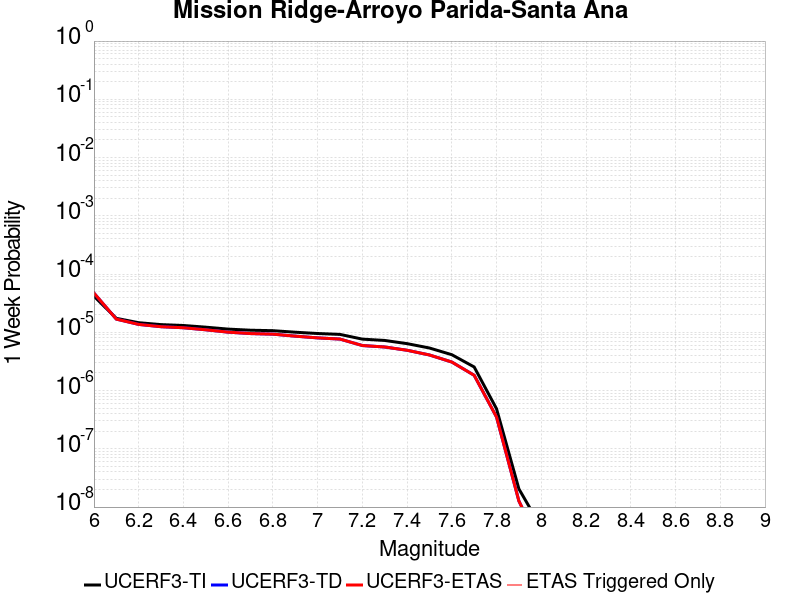 |  |  |  |

| Magnitude | 1 wk TI Prob | 1 wk TD Prob | 1 wk ETAS Prob | 1 wk ETAS/TD Gain | 1 wk ETAS Triggered Only | 1 mo TI Prob | 1 mo TD Prob | 1 mo ETAS Prob | 1 mo ETAS/TD Gain | 1 mo ETAS Triggered Only | 1 yr TI Prob | 1 yr TD Prob | 1 yr ETAS Prob | 1 yr ETAS/TD Gain | 1 yr ETAS Triggered Only | 10 yr TI Prob | 10 yr TD Prob | 10 yr ETAS Prob | 10 yr ETAS/TD Gain | 10 yr ETAS Triggered Only |
|-----|-----|-----|-----|-----|-----|-----|-----|-----|-----|-----|-----|-----|-----|-----|-----|-----|-----|-----|-----|-----|
| 6.0 | 4.169034E-5 | 4.7142177E-5 | 4.7142177E-5 | 1.0 | 0.0 | 1.7866064E-4 | 2.0202712E-4 | 2.0202712E-4 | 1.0 | 0.0 | 0.0021730233 | 0.002457642 | 0.0024676174 | 1.004059 | 1.0E-5 | 0.021518968 | 0.024386587 | 0.02442561 | 1.0016003 | 4.0E-5 |
| 6.1 | 1.73813E-5 | 1.6855114E-5 | 1.6855114E-5 | 1.0 | 0.0 | 7.4489166E-5 | 7.223427E-5 | 7.223427E-5 | 1.0 | 0.0 | 9.065282E-4 | 8.791081E-4 | 8.791081E-4 | 1.0 | 0.0 | 0.009028391 | 0.008757448 | 0.00876736 | 1.0011319 | 1.0E-5 |
| 6.2 | 1.4622182E-5 | 1.3673982E-5 | 1.3673982E-5 | 1.0 | 0.0 | 6.2664985E-5 | 5.8601483E-5 | 5.8601483E-5 | 1.0 | 0.0 | 7.6267915E-4 | 7.132434E-4 | 7.132434E-4 | 1.0 | 0.0 | 0.007600669 | 0.0071099857 | 0.0071199145 | 1.0013964 | 1.0E-5 |
| 6.3 | 1.3552434E-5 | 1.2482838E-5 | 1.2482838E-5 | 1.0 | 0.0 | 5.8080568E-5 | 5.34968E-5 | 5.34968E-5 | 1.0 | 0.0 | 7.069015E-4 | 6.51132E-4 | 6.51132E-4 | 1.0 | 0.0 | 0.00704657 | 0.0064926054 | 0.0064926054 | 1.0 | 0.0 |
| 6.4 | 1.30977305E-5 | 1.1979771E-5 | 1.1979771E-5 | 1.0 | 0.0 | 5.613192E-5 | 5.1340885E-5 | 5.1340885E-5 | 1.0 | 0.0 | 6.831918E-4 | 6.24899E-4 | 6.24899E-4 | 1.0 | 0.0 | 0.006810953 | 0.006231764 | 0.006231764 | 1.0 | 0.0 |
| 6.5 | 1.225205E-5 | 1.1049382E-5 | 1.1049382E-5 | 1.0 | 0.0 | 5.2507727E-5 | 4.735365E-5 | 4.735365E-5 | 1.0 | 0.0 | 6.3909404E-4 | 5.763809E-4 | 5.763809E-4 | 1.0 | 0.0 | 0.006372592 | 0.0057491693 | 0.0057491693 | 1.0 | 0.0 |
| 6.6 | 1.1352241E-5 | 1.0064076E-5 | 1.0064076E-5 | 1.0 | 0.0 | 4.8651553E-5 | 4.3131055E-5 | 4.3131055E-5 | 1.0 | 0.0 | 5.921717E-4 | 5.249962E-4 | 5.249962E-4 | 1.0 | 0.0 | 0.0059059616 | 0.005237805 | 0.005237805 | 1.0 | 0.0 |
| 6.7 | 1.0864116E-5 | 9.517542E-6 | 9.517542E-6 | 1.0 | 0.0 | 4.6559664E-5 | 4.078884E-5 | 4.078884E-5 | 1.0 | 0.0 | 5.667165E-4 | 4.9649295E-4 | 4.9649295E-4 | 1.0 | 0.0 | 0.005652734 | 0.0049540712 | 0.0049540712 | 1.0 | 0.0 |
| 6.8 | 1.0666365E-5 | 9.3002855E-6 | 9.3002855E-6 | 1.0 | 0.0 | 4.571219E-5 | 3.9857765E-5 | 3.9857765E-5 | 1.0 | 0.0 | 5.564038E-4 | 4.8516225E-4 | 4.8516225E-4 | 1.0 | 0.0 | 0.005550127 | 0.004841263 | 0.004841263 | 1.0 | 0.0 |
| 6.9 | 1.0038665E-5 | 8.592516E-6 | 8.592516E-6 | 1.0 | 0.0 | 4.302214E-5 | 3.6824556E-5 | 3.6824556E-5 | 1.0 | 0.0 | 5.236687E-4 | 4.4824858E-4 | 4.4824858E-4 | 1.0 | 0.0 | 0.005224364 | 0.004473655 | 0.004473655 | 1.0 | 0.0 |
| 7.0 | 9.5379955E-6 | 8.025512E-6 | 8.025512E-6 | 1.0 | 0.0 | 4.0876483E-5 | 3.439461E-5 | 3.439461E-5 | 1.0 | 0.0 | 4.975576E-4 | 4.186756E-4 | 4.186756E-4 | 1.0 | 0.0 | 0.00496445 | 0.004179068 | 0.004179068 | 1.0 | 0.0 |
| 7.1 | 9.207389E-6 | 7.652792E-6 | 7.652792E-6 | 1.0 | 0.0 | 3.945964E-5 | 3.279728E-5 | 3.279728E-5 | 1.0 | 0.0 | 4.803152E-4 | 3.992354E-4 | 3.992354E-4 | 1.0 | 0.0 | 0.004792784 | 0.003985378 | 0.003985378 | 1.0 | 0.0 |
| 7.2 | 7.638091E-6 | 5.931425E-6 | 5.931425E-6 | 1.0 | 0.0 | 3.2734264E-5 | 2.5420148E-5 | 2.5420148E-5 | 1.0 | 0.0 | 3.984668E-4 | 3.0944665E-4 | 3.0944665E-4 | 1.0 | 0.0 | 0.0039775306 | 0.0030902144 | 0.0030902144 | 1.0 | 0.0 |
| 7.3 | 7.2500147E-6 | 5.596439E-6 | 5.596439E-6 | 1.0 | 0.0 | 3.1071122E-5 | 2.3984521E-5 | 2.3984521E-5 | 1.0 | 0.0 | 3.7822526E-4 | 2.919727E-4 | 2.919727E-4 | 1.0 | 0.0 | 0.0037758215 | 0.0029159465 | 0.0029159465 | 1.0 | 0.0 |
| 7.4 | 6.3899715E-6 | 4.9187393E-6 | 4.9187393E-6 | 1.0 | 0.0 | 2.7385306E-5 | 2.108014E-5 | 2.108014E-5 | 1.0 | 0.0 | 3.3336508E-4 | 2.566207E-4 | 2.566207E-4 | 1.0 | 0.0 | 0.0033286542 | 0.0025632882 | 0.0025632882 | 1.0 | 0.0 |
| 7.5 | 5.379025E-6 | 4.0840523E-6 | 4.0840523E-6 | 1.0 | 0.0 | 2.305276E-5 | 1.7502964E-5 | 1.7502964E-5 | 1.0 | 0.0 | 2.806312E-4 | 2.1307784E-4 | 2.1307784E-4 | 1.0 | 0.0 | 0.0028027708 | 0.0021287468 | 0.0021287468 | 1.0 | 0.0 |
| 7.6 | 4.1270696E-6 | 3.0884958E-6 | 3.0884958E-6 | 1.0 | 0.0 | 1.768732E-5 | 1.3236344E-5 | 1.3236344E-5 | 1.0 | 0.0 | 2.1532185E-4 | 1.6114065E-4 | 1.6114065E-4 | 1.0 | 0.0 | 0.0021511333 | 0.0016102461 | 0.0016102461 | 1.0 | 0.0 |
| 7.7 | 2.5406805E-6 | 1.8282896E-6 | 1.8282896E-6 | 1.0 | 0.0 | 1.0888585E-5 | 7.835503E-6 | 7.835503E-6 | 1.0 | 0.0 | 1.3256045E-4 | 9.5393145E-5 | 9.5393145E-5 | 1.0 | 0.0 | 0.0013248142 | 9.535281E-4 | 9.535281E-4 | 1.0 | 0.0 |
| 7.8 | 4.8608285E-7 | 3.5100157E-7 | 3.5100157E-7 | 1.0 | 0.0 | 2.0832106E-6 | 1.5042916E-6 | 1.5042916E-6 | 1.0 | 0.0 | 2.5362791E-5 | 1.8314598E-5 | 1.8314598E-5 | 1.0 | 0.0 | 2.5359896E-4 | 1.8313101E-4 | 1.8313101E-4 | 1.0 | 0.0 |
| 7.9 | 2.0472514E-8 | 1.2689714E-8 | 1.2689714E-8 | 1.0 | 0.0 | 8.7739345E-8 | 5.4384486E-8 | 5.4384486E-8 | 1.0 | 0.0 | 1.068226E-6 | 6.6213096E-7 | 6.6213096E-7 | 1.0 | 0.0 | 1.0682209E-5 | 6.6212906E-6 | 6.6212906E-6 | 1.0 | 0.0 |
| 8.0 | 4.443582E-9 | 2.0325408E-9 | 2.0325408E-9 | 1.0 | 0.0 | 1.9043922E-8 | 8.710888E-9 | 8.710888E-9 | 1.0 | 0.0 | 2.3185973E-7 | 1.0605506E-7 | 1.0605506E-7 | 1.0 | 0.0 | 2.3185949E-6 | 1.0605502E-6 | 1.0605502E-6 | 1.0 | 0.0 |

## Rose Canyon
*[(top)](#table-of-contents)*

| 1 Week | 1 Month | 1 Year | 10 Year |
|-----|-----|-----|-----|
|  |  | 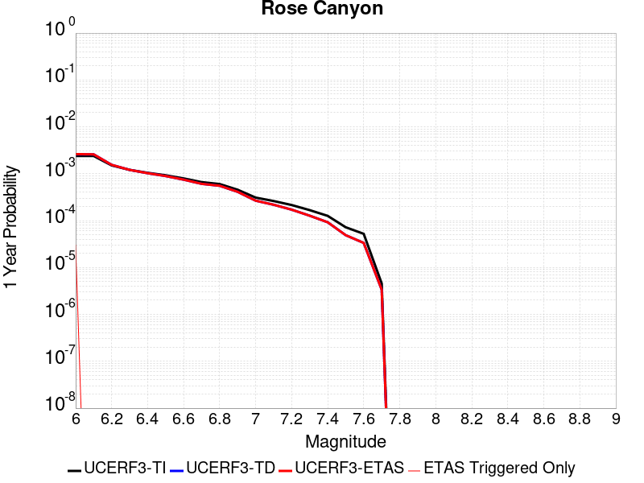 |  |

| Magnitude | 1 wk TI Prob | 1 wk TD Prob | 1 wk ETAS Prob | 1 wk ETAS/TD Gain | 1 wk ETAS Triggered Only | 1 mo TI Prob | 1 mo TD Prob | 1 mo ETAS Prob | 1 mo ETAS/TD Gain | 1 mo ETAS Triggered Only | 1 yr TI Prob | 1 yr TD Prob | 1 yr ETAS Prob | 1 yr ETAS/TD Gain | 1 yr ETAS Triggered Only | 10 yr TI Prob | 10 yr TD Prob | 10 yr ETAS Prob | 10 yr ETAS/TD Gain | 10 yr ETAS Triggered Only |
|-----|-----|-----|-----|-----|-----|-----|-----|-----|-----|-----|-----|-----|-----|-----|-----|-----|-----|-----|-----|-----|
| 6.0 | 4.5923203E-5 | 4.9719205E-5 | 4.9719205E-5 | 1.0 | 0.0 | 1.9679888E-4 | 2.1306408E-4 | 2.2306194E-4 | 1.0469242 | 1.0E-5 | 0.0023933933 | 0.0025911778 | 0.0026211 | 1.0115478 | 3.0E-5 | 0.023677798 | 0.025642432 | 0.025681406 | 1.0015199 | 4.0E-5 |
| 6.1 | 4.5923203E-5 | 4.9719205E-5 | 4.9719205E-5 | 1.0 | 0.0 | 1.9679888E-4 | 2.1306408E-4 | 2.1306408E-4 | 1.0 | 0.0 | 0.0023933933 | 0.0025911778 | 0.0025911778 | 1.0 | 0.0 | 0.023677798 | 0.025642432 | 0.025652176 | 1.0003799 | 1.0E-5 |
| 6.2 | 2.8844734E-5 | 2.9671075E-5 | 2.9671075E-5 | 1.0 | 0.0 | 1.2361443E-4 | 1.2715356E-4 | 1.2715356E-4 | 1.0 | 0.0 | 0.0015039665 | 0.0015470139 | 0.0015470139 | 1.0 | 0.0 | 0.0149382865 | 0.015375464 | 0.01538531 | 1.0006404 | 1.0E-5 |
| 6.3 | 2.3171577E-5 | 2.3162776E-5 | 2.3162776E-5 | 1.0 | 0.0 | 9.9302975E-5 | 9.926534E-5 | 9.926534E-5 | 1.0 | 0.0 | 0.0012083431 | 0.0012078988 | 0.0012078988 | 1.0 | 0.0 | 0.012017938 | 0.012023227 | 0.012033107 | 1.0008217 | 1.0E-5 |
| 6.4 | 2.0066604E-5 | 1.9668341E-5 | 1.9668341E-5 | 1.0 | 0.0 | 8.599689E-5 | 8.429022E-5 | 8.429022E-5 | 1.0 | 0.0 | 0.0010465092 | 0.0010257603 | 0.0010257603 | 1.0 | 0.0 | 0.010415946 | 0.010218238 | 0.010228136 | 1.0009687 | 1.0E-5 |
| 6.5 | 1.776989E-5 | 1.711494E-5 | 1.711494E-5 | 1.0 | 0.0 | 7.615444E-5 | 7.334772E-5 | 7.334772E-5 | 1.0 | 0.0 | 9.267859E-4 | 8.926496E-4 | 8.926496E-4 | 1.0 | 0.0 | 0.009229303 | 0.008896798 | 0.008906709 | 1.001114 | 1.0E-5 |
| 6.6 | 1.5227364E-5 | 1.4339996E-5 | 1.4339996E-5 | 1.0 | 0.0 | 6.52585E-5 | 6.145571E-5 | 6.145571E-5 | 1.0 | 0.0 | 7.942326E-4 | 7.479716E-4 | 7.479716E-4 | 1.0 | 0.0 | 0.007914 | 0.007458741 | 0.007468666 | 1.0013307 | 1.0E-5 |
| 6.7 | 1.2703898E-5 | 1.1673804E-5 | 1.1673804E-5 | 1.0 | 0.0 | 5.4444143E-5 | 5.0029652E-5 | 5.0029652E-5 | 1.0 | 0.0 | 6.626558E-4 | 6.0894503E-4 | 6.0894503E-4 | 1.0 | 0.0 | 0.006606833 | 0.0060753594 | 0.0060753594 | 1.0 | 0.0 |
| 6.8 | 1.1554917E-5 | 1.0609781E-5 | 1.0609781E-5 | 1.0 | 0.0 | 4.9520135E-5 | 4.5469722E-5 | 4.5469722E-5 | 1.0 | 0.0 | 6.0274085E-4 | 5.534573E-4 | 5.534573E-4 | 1.0 | 0.0 | 0.0060110865 | 0.0055227973 | 0.0055227973 | 1.0 | 0.0 |
| 6.9 | 8.732078E-6 | 7.881629E-6 | 7.881629E-6 | 1.0 | 0.0 | 3.7422655E-5 | 3.3777993E-5 | 3.3777993E-5 | 1.0 | 0.0 | 4.5552556E-4 | 4.1117237E-4 | 4.1117237E-4 | 1.0 | 0.0 | 0.0045459294 | 0.0041049495 | 0.0041049495 | 1.0 | 0.0 |
| 7.0 | 5.9337494E-6 | 5.107622E-6 | 5.107622E-6 | 1.0 | 0.0 | 2.5430107E-5 | 2.1889626E-5 | 2.1889626E-5 | 1.0 | 0.0 | 3.0956755E-4 | 2.6647374E-4 | 2.6647374E-4 | 1.0 | 0.0 | 0.0030913667 | 0.0026615579 | 0.0026615579 | 1.0 | 0.0 |
| 7.1 | 5.013409E-6 | 4.1774915E-6 | 4.1774915E-6 | 1.0 | 0.0 | 2.1485863E-5 | 1.7903414E-5 | 1.7903414E-5 | 1.0 | 0.0 | 2.6155898E-4 | 2.1795237E-4 | 2.1795237E-4 | 1.0 | 0.0 | 0.0026125133 | 0.0021773977 | 0.0021773977 | 1.0 | 0.0 |
| 7.2 | 4.120763E-6 | 3.2822263E-6 | 3.2822263E-6 | 1.0 | 0.0 | 1.7660293E-5 | 1.4066609E-5 | 1.4066609E-5 | 1.0 | 0.0 | 2.1499286E-4 | 1.712476E-4 | 1.712476E-4 | 1.0 | 0.0 | 0.0021478499 | 0.0017111659 | 0.0017111659 | 1.0 | 0.0 |
| 7.3 | 3.2081239E-6 | 2.4406042E-6 | 2.4406042E-6 | 1.0 | 0.0 | 1.374903E-5 | 1.0459691E-5 | 1.0459691E-5 | 1.0 | 0.0 | 1.6738157E-4 | 1.2733937E-4 | 1.2733937E-4 | 1.0 | 0.0 | 0.0016725556 | 0.001272671 | 0.001272671 | 1.0 | 0.0 |
| 7.4 | 2.4194755E-6 | 1.7681143E-6 | 1.7681143E-6 | 1.0 | 0.0 | 1.0369139E-5 | 7.577611E-6 | 7.577611E-6 | 1.0 | 0.0 | 1.2623696E-4 | 9.225356E-5 | 9.225356E-5 | 1.0 | 0.0 | 0.0012616527 | 9.22158E-4 | 9.22158E-4 | 1.0 | 0.0 |
| 7.5 | 1.3842889E-6 | 9.378957E-7 | 9.378957E-7 | 1.0 | 0.0 | 5.9326535E-6 | 4.0195473E-6 | 4.0195473E-6 | 1.0 | 0.0 | 7.222766E-5 | 4.8936923E-5 | 4.8936923E-5 | 1.0 | 0.0 | 7.220419E-4 | 4.89265E-4 | 4.89265E-4 | 1.0 | 0.0 |
| 7.6 | 1.0021575E-6 | 6.4117194E-7 | 6.4117194E-7 | 1.0 | 0.0 | 4.2949537E-6 | 2.747877E-6 | 2.747877E-6 | 1.0 | 0.0 | 5.2289808E-5 | 3.345491E-5 | 3.345491E-5 | 1.0 | 0.0 | 5.2277505E-4 | 3.345009E-4 | 3.345009E-4 | 1.0 | 0.0 |
| 7.7 | 8.7620116E-8 | 6.449371E-8 | 6.449371E-8 | 1.0 | 0.0 | 3.7551473E-7 | 2.7640158E-7 | 2.7640158E-7 | 1.0 | 0.0 | 4.5718825E-6 | 3.3651843E-6 | 3.3651843E-6 | 1.0 | 0.0 | 4.5717883E-5 | 3.3651362E-5 | 3.3651362E-5 | 1.0 | 0.0 |

## Elysian Park (Upper)
*[(top)](#table-of-contents)*

| 1 Week | 1 Month | 1 Year | 10 Year |
|-----|-----|-----|-----|
|  | 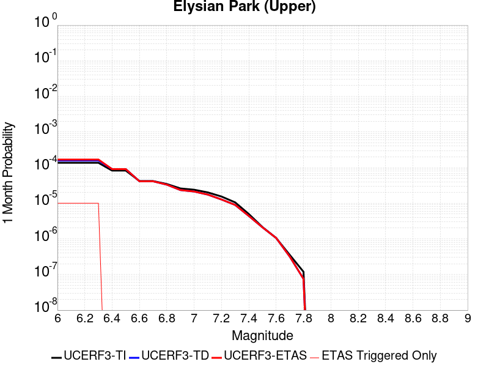 | 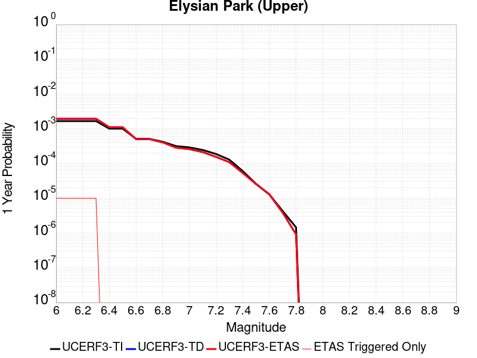 |  |

| Magnitude | 1 wk TI Prob | 1 wk TD Prob | 1 wk ETAS Prob | 1 wk ETAS/TD Gain | 1 wk ETAS Triggered Only | 1 mo TI Prob | 1 mo TD Prob | 1 mo ETAS Prob | 1 mo ETAS/TD Gain | 1 mo ETAS Triggered Only | 1 yr TI Prob | 1 yr TD Prob | 1 yr ETAS Prob | 1 yr ETAS/TD Gain | 1 yr ETAS Triggered Only | 10 yr TI Prob | 10 yr TD Prob | 10 yr ETAS Prob | 10 yr ETAS/TD Gain | 10 yr ETAS Triggered Only |
|-----|-----|-----|-----|-----|-----|-----|-----|-----|-----|-----|-----|-----|-----|-----|-----|-----|-----|-----|-----|-----|
| 6.0 | 3.1876025E-5 | 3.7038528E-5 | 3.7038528E-5 | 1.0 | 0.0 | 1.3660437E-4 | 1.5872963E-4 | 1.6872803E-4 | 1.0629902 | 1.0E-5 | 0.0016618895 | 0.0019312601 | 0.0019412409 | 1.005168 | 1.0E-5 | 0.016495159 | 0.019191317 | 0.019220741 | 1.0015332 | 3.0E-5 |
| 6.1 | 3.1876025E-5 | 3.7038528E-5 | 3.7038528E-5 | 1.0 | 0.0 | 1.3660437E-4 | 1.5872963E-4 | 1.6872803E-4 | 1.0629902 | 1.0E-5 | 0.0016618895 | 0.0019312601 | 0.0019412409 | 1.005168 | 1.0E-5 | 0.016495159 | 0.019191317 | 0.019220741 | 1.0015332 | 3.0E-5 |
| 6.2 | 3.1876025E-5 | 3.7038528E-5 | 3.7038528E-5 | 1.0 | 0.0 | 1.3660437E-4 | 1.5872963E-4 | 1.6872803E-4 | 1.0629902 | 1.0E-5 | 0.0016618895 | 0.0019312601 | 0.0019412409 | 1.005168 | 1.0E-5 | 0.016495159 | 0.019191317 | 0.019220741 | 1.0015332 | 3.0E-5 |
| 6.3 | 3.1876025E-5 | 3.7038528E-5 | 3.7038528E-5 | 1.0 | 0.0 | 1.3660437E-4 | 1.5872963E-4 | 1.6872803E-4 | 1.0629902 | 1.0E-5 | 0.0016618895 | 0.0019312601 | 0.0019412409 | 1.005168 | 1.0E-5 | 0.016495159 | 0.019191317 | 0.019220741 | 1.0015332 | 3.0E-5 |
| 6.4 | 1.9273462E-5 | 2.1203661E-5 | 2.1203661E-5 | 1.0 | 0.0 | 8.259794E-5 | 9.087065E-5 | 9.087065E-5 | 1.0 | 0.0 | 0.001005166 | 0.0011059621 | 0.0011059621 | 1.0 | 0.0 | 0.010006315 | 0.011021445 | 0.011031334 | 1.0008973 | 1.0E-5 |
| 6.5 | 1.9273462E-5 | 2.1203661E-5 | 2.1203661E-5 | 1.0 | 0.0 | 8.259794E-5 | 9.087065E-5 | 9.087065E-5 | 1.0 | 0.0 | 0.001005166 | 0.0011059621 | 0.0011059621 | 1.0 | 0.0 | 0.010006315 | 0.011021445 | 0.011031334 | 1.0008973 | 1.0E-5 |
| 6.6 | 9.813258E-6 | 9.665986E-6 | 9.665986E-6 | 1.0 | 0.0 | 4.205614E-5 | 4.142504E-5 | 4.142504E-5 | 1.0 | 0.0 | 5.119132E-4 | 5.042404E-4 | 5.042404E-4 | 1.0 | 0.0 | 0.005107356 | 0.0050316863 | 0.005041636 | 1.0019774 | 1.0E-5 |
| 6.7 | 9.801478E-6 | 9.653556E-6 | 9.653556E-6 | 1.0 | 0.0 | 4.2005657E-5 | 4.1371764E-5 | 4.1371764E-5 | 1.0 | 0.0 | 5.112989E-4 | 5.035921E-4 | 5.035921E-4 | 1.0 | 0.0 | 0.0051012407 | 0.0050252327 | 0.0050351825 | 1.00198 | 1.0E-5 |
| 6.8 | 8.102489E-6 | 7.773311E-6 | 7.773311E-6 | 1.0 | 0.0 | 3.4724493E-5 | 3.3313794E-5 | 3.3313794E-5 | 1.0 | 0.0 | 4.2268867E-4 | 4.0552494E-4 | 4.0552494E-4 | 1.0 | 0.0 | 0.004218856 | 0.0040483433 | 0.004058303 | 1.0024601 | 1.0E-5 |
| 6.9 | 6.08275E-6 | 5.481636E-6 | 5.481636E-6 | 1.0 | 0.0 | 2.6068668E-5 | 2.349252E-5 | 2.349252E-5 | 1.0 | 0.0 | 3.173398E-4 | 2.8598463E-4 | 2.8598463E-4 | 1.0 | 0.0 | 0.0031688702 | 0.0028562439 | 0.0028562439 | 1.0 | 0.0 |
| 7.0 | 5.5995934E-6 | 4.982947E-6 | 4.982947E-6 | 1.0 | 0.0 | 2.3998036E-5 | 2.1355316E-5 | 2.1355316E-5 | 1.0 | 0.0 | 2.9213692E-4 | 2.599706E-4 | 2.599706E-4 | 1.0 | 0.0 | 0.0029175316 | 0.0025967322 | 0.0025967322 | 1.0 | 0.0 |
| 7.1 | 4.709881E-6 | 4.087537E-6 | 4.087537E-6 | 1.0 | 0.0 | 2.0185047E-5 | 1.7517901E-5 | 1.7517901E-5 | 1.0 | 0.0 | 2.4572524E-4 | 2.1325999E-4 | 2.1325999E-4 | 1.0 | 0.0 | 0.002454537 | 0.0021305948 | 0.0021305948 | 1.0 | 0.0 |
| 7.2 | 3.6063436E-6 | 2.9780508E-6 | 2.9780508E-6 | 1.0 | 0.0 | 1.5455667E-5 | 1.2763013E-5 | 1.2763013E-5 | 1.0 | 0.0 | 1.881565E-4 | 1.5537872E-4 | 1.5537872E-4 | 1.0 | 0.0 | 0.0018799726 | 0.001552712 | 0.001552712 | 1.0 | 0.0 |
| 7.3 | 2.471135E-6 | 2.0955295E-6 | 2.0955295E-6 | 1.0 | 0.0 | 1.0590536E-5 | 8.98081E-6 | 8.98081E-6 | 1.0 | 0.0 | 1.2893214E-4 | 1.09335946E-4 | 1.09335946E-4 | 1.0 | 0.0 | 0.0012885736 | 0.0010928287 | 0.0010928287 | 1.0 | 0.0 |
| 7.4 | 1.163943E-6 | 1.0275454E-6 | 1.0275454E-6 | 1.0 | 0.0 | 4.988318E-6 | 4.4037583E-6 | 4.4037583E-6 | 1.0 | 0.0 | 6.0731076E-5 | 5.3614473E-5 | 5.3614473E-5 | 1.0 | 0.0 | 6.071448E-4 | 5.3601834E-4 | 5.3601834E-4 | 1.0 | 0.0 |
| 7.5 | 4.99459E-7 | 4.9177737E-7 | 4.9177737E-7 | 1.0 | 0.0 | 2.140537E-6 | 2.1076157E-6 | 2.1076157E-6 | 1.0 | 0.0 | 2.6060725E-5 | 2.5659936E-5 | 2.5659936E-5 | 1.0 | 0.0 | 2.605767E-4 | 2.565713E-4 | 2.565713E-4 | 1.0 | 0.0 |
| 7.6 | 2.4667852E-7 | 2.4779354E-7 | 2.4779354E-7 | 1.0 | 0.0 | 1.0571932E-6 | 1.0619718E-6 | 1.0619718E-6 | 1.0 | 0.0 | 1.2871251E-5 | 1.2929434E-5 | 1.2929434E-5 | 1.0 | 0.0 | 1.2870505E-4 | 1.2928719E-4 | 1.2928719E-4 | 1.0 | 0.0 |
| 7.7 | 8.2312795E-8 | 7.386996E-8 | 7.386996E-8 | 1.0 | 0.0 | 3.527691E-7 | 3.1658553E-7 | 3.1658553E-7 | 1.0 | 0.0 | 4.294955E-6 | 3.854423E-6 | 3.854423E-6 | 1.0 | 0.0 | 4.2948723E-5 | 3.854368E-5 | 3.854368E-5 | 1.0 | 0.0 |
| 7.8 | 2.7819295E-8 | 1.7569919E-8 | 1.7569919E-8 | 1.0 | 0.0 | 1.1922555E-7 | 7.529965E-8 | 7.529965E-8 | 1.0 | 0.0 | 1.45157E-6 | 9.16773E-7 | 9.16773E-7 | 1.0 | 0.0 | 1.45156055E-5 | 9.1677075E-6 | 9.1677075E-6 | 1.0 | 0.0 |

## Chino alt 1
*[(top)](#table-of-contents)*

| 1 Week | 1 Month | 1 Year | 10 Year |
|-----|-----|-----|-----|
|  | 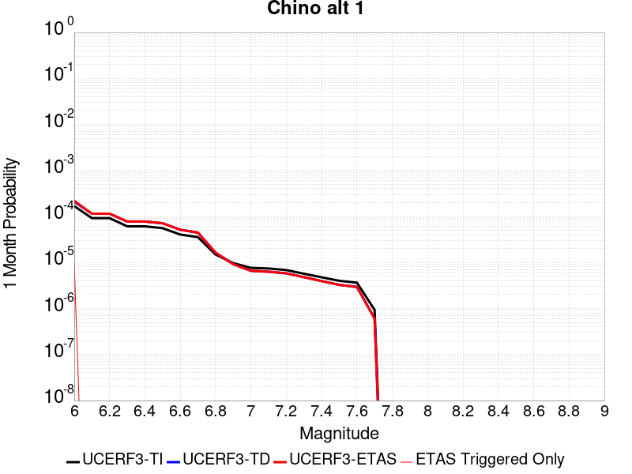 | 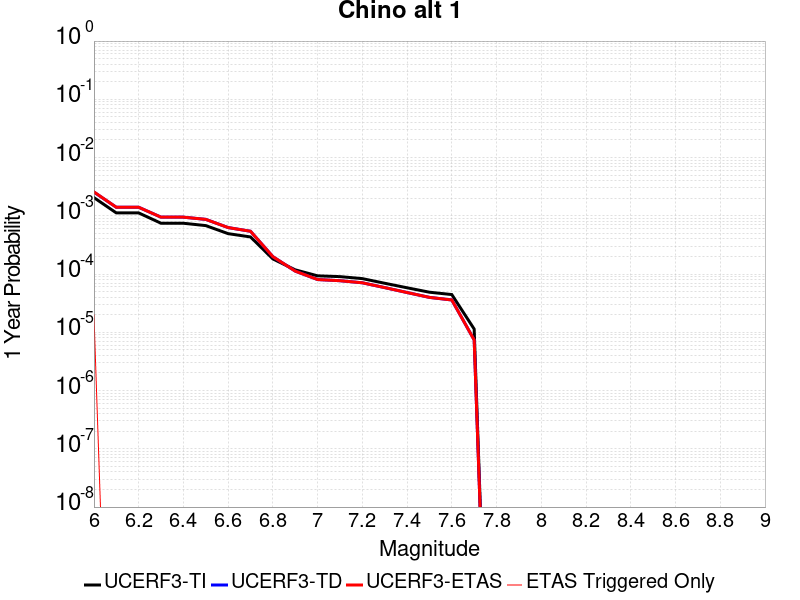 | 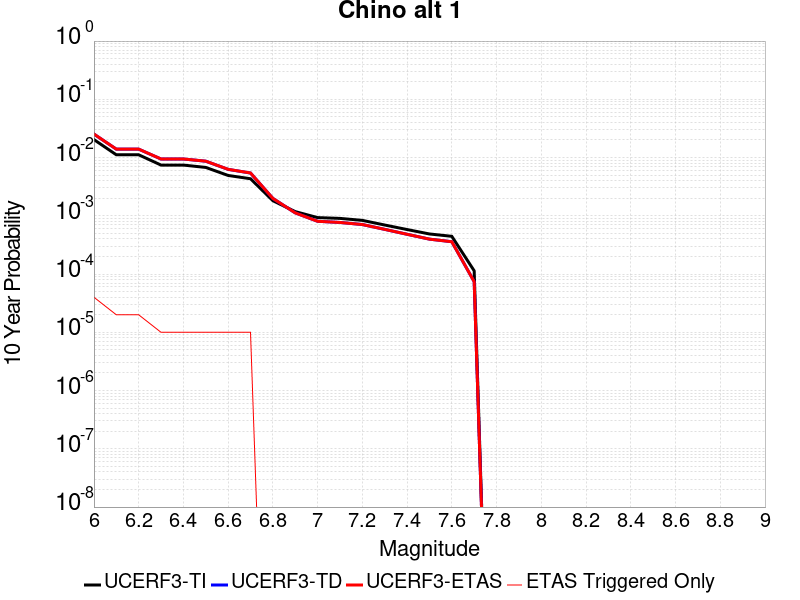 |

| Magnitude | 1 wk TI Prob | 1 wk TD Prob | 1 wk ETAS Prob | 1 wk ETAS/TD Gain | 1 wk ETAS Triggered Only | 1 mo TI Prob | 1 mo TD Prob | 1 mo ETAS Prob | 1 mo ETAS/TD Gain | 1 mo ETAS Triggered Only | 1 yr TI Prob | 1 yr TD Prob | 1 yr ETAS Prob | 1 yr ETAS/TD Gain | 1 yr ETAS Triggered Only | 10 yr TI Prob | 10 yr TD Prob | 10 yr ETAS Prob | 10 yr ETAS/TD Gain | 10 yr ETAS Triggered Only |
|-----|-----|-----|-----|-----|-----|-----|-----|-----|-----|-----|-----|-----|-----|-----|-----|-----|-----|-----|-----|-----|
| 6.0 | 3.939946E-5 | 4.895396E-5 | 4.895396E-5 | 1.0 | 0.0 | 1.6884391E-4 | 2.0978876E-4 | 2.1978666E-4 | 1.047657 | 1.0E-5 | 0.0020537362 | 0.002551672 | 0.002571621 | 1.007818 | 2.0E-5 | 0.020348595 | 0.025280576 | 0.025319565 | 1.0015422 | 4.0E-5 |
| 6.1 | 2.1505624E-5 | 2.6882371E-5 | 2.6882371E-5 | 1.0 | 0.0 | 9.2163704E-5 | 1.1520571E-4 | 1.1520571E-4 | 1.0 | 0.0 | 0.0011215154 | 0.0014018384 | 0.0014018384 | 1.0 | 0.0 | 0.011158722 | 0.01394685 | 0.013966571 | 1.0014141 | 2.0E-5 |
| 6.2 | 2.1505624E-5 | 2.6882371E-5 | 2.6882371E-5 | 1.0 | 0.0 | 9.2163704E-5 | 1.1520571E-4 | 1.1520571E-4 | 1.0 | 0.0 | 0.0011215154 | 0.0014018384 | 0.0014018384 | 1.0 | 0.0 | 0.011158722 | 0.01394685 | 0.013966571 | 1.0014141 | 2.0E-5 |
| 6.3 | 1.4290785E-5 | 1.8167751E-5 | 1.8167751E-5 | 1.0 | 0.0 | 6.1244784E-5 | 7.7859724E-5 | 7.7859724E-5 | 1.0 | 0.0 | 7.454001E-4 | 9.475753E-4 | 9.475753E-4 | 1.0 | 0.0 | 0.007429048 | 0.009445801 | 0.009455707 | 1.0010487 | 1.0E-5 |
| 6.4 | 1.4290785E-5 | 1.8167751E-5 | 1.8167751E-5 | 1.0 | 0.0 | 6.1244784E-5 | 7.7859724E-5 | 7.7859724E-5 | 1.0 | 0.0 | 7.454001E-4 | 9.475753E-4 | 9.475753E-4 | 1.0 | 0.0 | 0.007429048 | 0.009445801 | 0.009455707 | 1.0010487 | 1.0E-5 |
| 6.5 | 1.3017944E-5 | 1.6654598E-5 | 1.6654598E-5 | 1.0 | 0.0 | 5.5789995E-5 | 7.137514E-5 | 7.137514E-5 | 1.0 | 0.0 | 6.790315E-4 | 8.6868973E-4 | 8.6868973E-4 | 1.0 | 0.0 | 0.0067696036 | 0.008663235 | 0.008673148 | 1.0011443 | 1.0E-5 |
| 6.6 | 9.470016E-6 | 1.2041284E-5 | 1.2041284E-5 | 1.0 | 0.0 | 4.058515E-5 | 5.1604675E-5 | 5.1604675E-5 | 1.0 | 0.0 | 4.940122E-4 | 6.2813977E-4 | 6.2813977E-4 | 1.0 | 0.0 | 0.004929154 | 0.006272855 | 0.0062827924 | 1.0015842 | 1.0E-5 |
| 6.7 | 8.314155E-6 | 1.0409368E-5 | 1.0409368E-5 | 1.0 | 0.0 | 3.5631605E-5 | 4.4610995E-5 | 4.4610995E-5 | 1.0 | 0.0 | 4.3372845E-4 | 5.430358E-4 | 5.430358E-4 | 1.0 | 0.0 | 0.004328829 | 0.005426616 | 0.0054365615 | 1.0018327 | 1.0E-5 |
| 6.8 | 3.4856364E-6 | 3.8138326E-6 | 3.8138326E-6 | 1.0 | 0.0 | 1.4938357E-5 | 1.6344906E-5 | 1.6344906E-5 | 1.0 | 0.0 | 1.8185932E-4 | 1.9898314E-4 | 1.9898314E-4 | 1.0 | 0.0 | 0.0018171056 | 0.0019897264 | 0.0019897264 | 1.0 | 0.0 |
| 6.9 | 2.2645952E-6 | 2.1531548E-6 | 2.1531548E-6 | 1.0 | 0.0 | 9.705372E-6 | 9.227775E-6 | 9.227775E-6 | 1.0 | 0.0 | 1.18156495E-4 | 1.1234258E-4 | 1.1234258E-4 | 1.0 | 0.0 | 0.0011809369 | 0.001123474 | 0.001123474 | 1.0 | 0.0 |
| 7.0 | 1.7864003E-6 | 1.5432778E-6 | 1.5432778E-6 | 1.0 | 0.0 | 7.655979E-6 | 6.6140315E-6 | 6.6140315E-6 | 1.0 | 0.0 | 9.3207556E-5 | 8.0522914E-5 | 8.0522914E-5 | 1.0 | 0.0 | 9.316847E-4 | 8.053845E-4 | 8.053845E-4 | 1.0 | 0.0 |
| 7.1 | 1.7315456E-6 | 1.4735439E-6 | 1.4735439E-6 | 1.0 | 0.0 | 7.420889E-6 | 6.3151733E-6 | 6.3151733E-6 | 1.0 | 0.0 | 9.034557E-5 | 7.688458E-5 | 7.688458E-5 | 1.0 | 0.0 | 9.0308854E-4 | 7.690177E-4 | 7.690177E-4 | 1.0 | 0.0 |
| 7.2 | 1.6008337E-6 | 1.357583E-6 | 1.357583E-6 | 1.0 | 0.0 | 6.860698E-6 | 5.8182E-6 | 5.8182E-6 | 1.0 | 0.0 | 8.352579E-5 | 7.0834336E-5 | 7.0834336E-5 | 1.0 | 0.0 | 8.34944E-4 | 7.085418E-4 | 7.085418E-4 | 1.0 | 0.0 |
| 7.3 | 1.3320939E-6 | 1.1219114E-6 | 1.1219114E-6 | 1.0 | 0.0 | 5.7089615E-6 | 4.808183E-6 | 4.808183E-6 | 1.0 | 0.0 | 6.9504385E-5 | 5.8538102E-5 | 5.8538102E-5 | 1.0 | 0.0 | 6.9482654E-4 | 5.853714E-4 | 5.853714E-4 | 1.0 | 0.0 |
| 7.4 | 1.114294E-6 | 9.238135E-7 | 9.238135E-7 | 1.0 | 0.0 | 4.775537E-6 | 3.959195E-6 | 3.959195E-6 | 1.0 | 0.0 | 5.8140613E-5 | 4.820217E-5 | 4.820217E-5 | 1.0 | 0.0 | 5.81254E-4 | 4.8193397E-4 | 4.8193397E-4 | 1.0 | 0.0 |
| 7.5 | 9.354081E-7 | 7.6242407E-7 | 7.6242407E-7 | 1.0 | 0.0 | 4.0088858E-6 | 3.2675277E-6 | 3.2675277E-6 | 1.0 | 0.0 | 4.8807087E-5 | 3.978146E-5 | 3.978146E-5 | 1.0 | 0.0 | 4.879637E-4 | 3.9774677E-4 | 3.9774677E-4 | 1.0 | 0.0 |
| 7.6 | 8.521771E-7 | 6.881428E-7 | 6.881428E-7 | 1.0 | 0.0 | 3.6521824E-6 | 2.9491803E-6 | 2.9491803E-6 | 1.0 | 0.0 | 4.4464414E-5 | 3.5905712E-5 | 3.5905712E-5 | 1.0 | 0.0 | 4.4455516E-4 | 3.5900227E-4 | 3.5900227E-4 | 1.0 | 0.0 |
| 7.7 | 2.1803626E-7 | 1.4188473E-7 | 1.4188473E-7 | 1.0 | 0.0 | 9.344408E-7 | 6.080773E-7 | 6.080773E-7 | 1.0 | 0.0 | 1.1376757E-5 | 7.403326E-6 | 7.403326E-6 | 1.0 | 0.0 | 1.13761744E-4 | 7.4031756E-5 | 7.4031756E-5 | 1.0 | 0.0 |

## Coronado Bank alt1
*[(top)](#table-of-contents)*

| 1 Week | 1 Month | 1 Year | 10 Year |
|-----|-----|-----|-----|
|  | 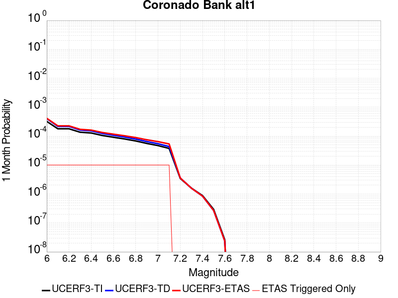 | 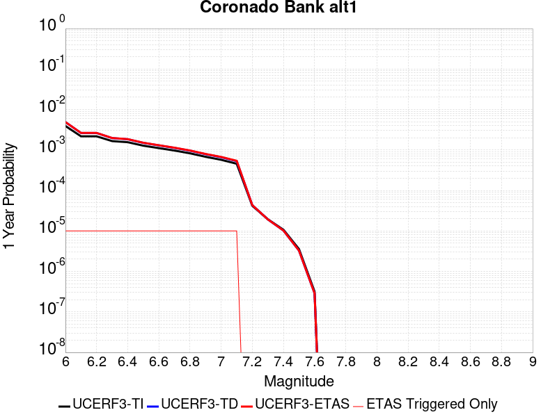 |  |

| Magnitude | 1 wk TI Prob | 1 wk TD Prob | 1 wk ETAS Prob | 1 wk ETAS/TD Gain | 1 wk ETAS Triggered Only | 1 mo TI Prob | 1 mo TD Prob | 1 mo ETAS Prob | 1 mo ETAS/TD Gain | 1 mo ETAS Triggered Only | 1 yr TI Prob | 1 yr TD Prob | 1 yr ETAS Prob | 1 yr ETAS/TD Gain | 1 yr ETAS Triggered Only | 10 yr TI Prob | 10 yr TD Prob | 10 yr ETAS Prob | 10 yr ETAS/TD Gain | 10 yr ETAS Triggered Only |
|-----|-----|-----|-----|-----|-----|-----|-----|-----|-----|-----|-----|-----|-----|-----|-----|-----|-----|-----|-----|-----|
| 6.0 | 7.533492E-5 | 9.3958624E-5 | 1.0395769E-4 | 1.1064198 | 1.0E-5 | 3.22824E-4 | 4.0262195E-4 | 4.1261793E-4 | 1.0248272 | 1.0E-5 | 0.0039233007 | 0.004891441 | 0.0049013924 | 1.0020344 | 1.0E-5 | 0.03854755 | 0.047908098 | 0.04794618 | 1.0007949 | 4.0E-5 |
| 6.1 | 4.1807285E-5 | 5.049709E-5 | 6.0496583E-5 | 1.1980212 | 1.0E-5 | 1.7916178E-4 | 2.1639874E-4 | 2.2639657E-4 | 1.046201 | 1.0E-5 | 0.0021791123 | 0.0026315681 | 0.0026415417 | 1.00379 | 1.0E-5 | 0.021578677 | 0.026013177 | 0.026022917 | 1.0003744 | 1.0E-5 |
| 6.2 | 4.1807285E-5 | 5.049709E-5 | 6.0496583E-5 | 1.1980212 | 1.0E-5 | 1.7916178E-4 | 2.1639874E-4 | 2.2639657E-4 | 1.046201 | 1.0E-5 | 0.0021791123 | 0.0026315681 | 0.0026415417 | 1.00379 | 1.0E-5 | 0.021578677 | 0.026013177 | 0.026022917 | 1.0003744 | 1.0E-5 |
| 6.3 | 3.1793104E-5 | 3.7713948E-5 | 4.7713573E-5 | 1.2651439 | 1.0E-5 | 1.3624904E-4 | 1.6162141E-4 | 1.7161979E-4 | 1.061863 | 1.0E-5 | 0.0016575698 | 0.0019659945 | 0.001975975 | 1.0050765 | 1.0E-5 | 0.016452603 | 0.019489907 | 0.019499712 | 1.0005031 | 1.0E-5 |
| 6.4 | 2.9878007E-5 | 3.53384E-5 | 4.5338045E-5 | 1.2829683 | 1.0E-5 | 1.2804232E-4 | 1.514417E-4 | 1.6144017E-4 | 1.066022 | 1.0E-5 | 0.0015578003 | 0.0018422735 | 0.0018522551 | 1.0054181 | 1.0E-5 | 0.015469253 | 0.018273769 | 0.018283587 | 1.0005373 | 1.0E-5 |
| 6.5 | 2.4512565E-5 | 2.8766055E-5 | 3.8765767E-5 | 1.3476219 | 1.0E-5 | 1.0504962E-4 | 1.2327742E-4 | 1.3327619E-4 | 1.0811079 | 1.0E-5 | 0.0012782287 | 0.0014998969 | 0.0015098818 | 1.0066571 | 1.0E-5 | 0.012709012 | 0.014900716 | 0.014910567 | 1.0006611 | 1.0E-5 |
| 6.6 | 2.1317413E-5 | 2.490836E-5 | 3.4908113E-5 | 1.4014616 | 1.0E-5 | 9.135714E-5 | 1.0674588E-4 | 1.16744806E-4 | 1.0936705 | 1.0E-5 | 0.0011117056 | 0.0012988786 | 0.0013088656 | 1.007689 | 1.0E-5 | 0.011061605 | 0.012915275 | 0.012925146 | 1.0007643 | 1.0E-5 |
| 6.7 | 1.8585655E-5 | 2.1636311E-5 | 3.1636097E-5 | 1.462176 | 1.0E-5 | 7.9650374E-5 | 9.272387E-5 | 1.02722945E-4 | 1.1078371 | 1.0E-5 | 9.6931186E-4 | 0.001128349 | 0.0011383377 | 1.0088525 | 1.0E-5 | 0.0096509475 | 0.011228361 | 0.011238249 | 1.0008806 | 1.0E-5 |
| 6.8 | 1.5862879E-5 | 1.8420675E-5 | 2.842049E-5 | 1.5428582 | 1.0E-5 | 6.798199E-5 | 7.894346E-5 | 8.8942674E-5 | 1.126663 | 1.0E-5 | 8.273665E-4 | 9.6073217E-4 | 9.707226E-4 | 1.0103987 | 1.0E-5 | 0.008242928 | 0.00956777 | 0.009577675 | 1.0010352 | 1.0E-5 |
| 6.9 | 1.3021509E-5 | 1.5096238E-5 | 2.5096087E-5 | 1.6624067 | 1.0E-5 | 5.5805274E-5 | 6.469666E-5 | 7.4696014E-5 | 1.1545575 | 1.0E-5 | 6.792174E-4 | 7.874153E-4 | 7.974074E-4 | 1.0126898 | 1.0E-5 | 0.006771452 | 0.0078480765 | 0.007857998 | 1.0012642 | 1.0E-5 |
| 7.0 | 1.0974371E-5 | 1.2720925E-5 | 2.2720798E-5 | 1.7860963 | 1.0E-5 | 4.7032172E-5 | 5.451721E-5 | 6.4516666E-5 | 1.1834183 | 1.0E-5 | 5.7246623E-4 | 6.635625E-4 | 6.735558E-4 | 1.0150602 | 1.0E-5 | 0.0057099373 | 0.006617561 | 0.0066274945 | 1.0015011 | 1.0E-5 |
| 7.1 | 8.766221E-6 | 1.0164493E-5 | 2.016439E-5 | 1.983807 | 1.0E-5 | 3.7568978E-5 | 4.3561482E-5 | 5.3561045E-5 | 1.2295506 | 1.0E-5 | 4.573063E-4 | 5.302492E-4 | 5.4024387E-4 | 1.018849 | 1.0E-5 | 0.0045636636 | 0.0052915397 | 0.0053014867 | 1.0018798 | 1.0E-5 |
| 7.2 | 8.026024E-7 | 8.3319816E-7 | 8.3319816E-7 | 1.0 | 0.0 | 3.43972E-6 | 3.5708445E-6 | 3.5708445E-6 | 1.0 | 0.0 | 4.1877785E-5 | 4.3474174E-5 | 4.3474174E-5 | 1.0 | 0.0 | 4.1869894E-4 | 4.346578E-4 | 4.346578E-4 | 1.0 | 0.0 |
| 7.3 | 3.7293114E-7 | 3.7001658E-7 | 3.7001658E-7 | 1.0 | 0.0 | 1.5982754E-6 | 1.5857844E-6 | 1.5857844E-6 | 1.0 | 0.0 | 1.9458828E-5 | 1.9306755E-5 | 1.9306755E-5 | 1.0 | 0.0 | 1.9457124E-4 | 1.9305084E-4 | 1.9305084E-4 | 1.0 | 0.0 |
| 7.4 | 2.0557036E-7 | 1.9674665E-7 | 1.9674665E-7 | 1.0 | 0.0 | 8.810155E-7 | 8.4319964E-7 | 8.4319964E-7 | 1.0 | 0.0 | 1.0726311E-5 | 1.0265908E-5 | 1.0265908E-5 | 1.0 | 0.0 | 1.0725793E-4 | 1.0265437E-4 | 1.0265437E-4 | 1.0 | 0.0 |
| 7.5 | 6.845446E-8 | 6.2794264E-8 | 6.2794264E-8 | 1.0 | 0.0 | 2.9337625E-7 | 2.6911823E-7 | 2.6911823E-7 | 1.0 | 0.0 | 3.5718497E-6 | 3.2765097E-6 | 3.2765097E-6 | 1.0 | 0.0 | 3.5717923E-5 | 3.2764623E-5 | 3.2764623E-5 | 1.0 | 0.0 |
| 7.6 | 6.0975145E-9 | 5.5318825E-9 | 5.5318825E-9 | 1.0 | 0.0 | 2.6132206E-8 | 2.3708068E-8 | 2.3708068E-8 | 1.0 | 0.0 | 3.1815955E-7 | 2.886457E-7 | 2.886457E-7 | 1.0 | 0.0 | 3.181591E-6 | 2.8864542E-6 | 2.8864542E-6 | 1.0 | 0.0 |

## Mission Creek
*[(top)](#table-of-contents)*

| 1 Week | 1 Month | 1 Year | 10 Year |
|-----|-----|-----|-----|
| 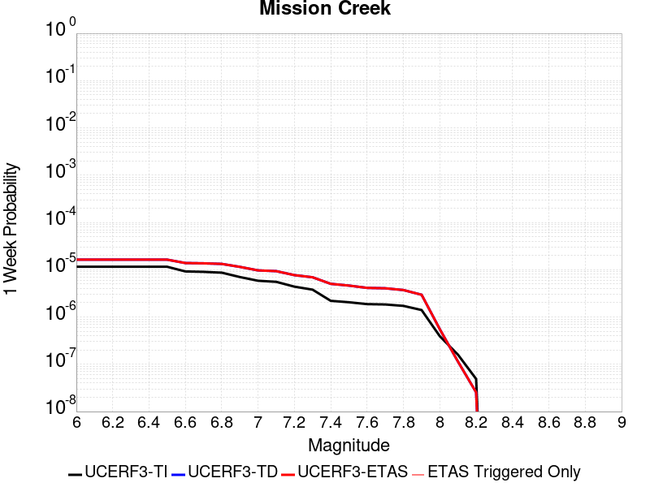 | 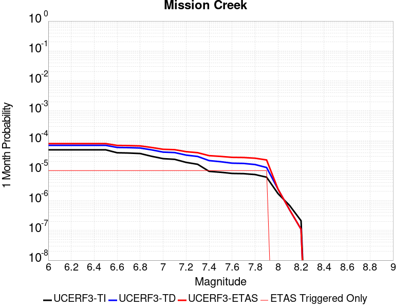 |  |  |

| Magnitude | 1 wk TI Prob | 1 wk TD Prob | 1 wk ETAS Prob | 1 wk ETAS/TD Gain | 1 wk ETAS Triggered Only | 1 mo TI Prob | 1 mo TD Prob | 1 mo ETAS Prob | 1 mo ETAS/TD Gain | 1 mo ETAS Triggered Only | 1 yr TI Prob | 1 yr TD Prob | 1 yr ETAS Prob | 1 yr ETAS/TD Gain | 1 yr ETAS Triggered Only | 10 yr TI Prob | 10 yr TD Prob | 10 yr ETAS Prob | 10 yr ETAS/TD Gain | 10 yr ETAS Triggered Only |
|-----|-----|-----|-----|-----|-----|-----|-----|-----|-----|-----|-----|-----|-----|-----|-----|-----|-----|-----|-----|-----|
| 6.0 | 1.1549387E-5 | 1.63294E-5 | 1.63294E-5 | 1.0 | 0.0 | 4.9496433E-5 | 6.998135E-5 | 7.998066E-5 | 1.1428852 | 1.0E-5 | 6.0245243E-4 | 8.51705E-4 | 8.816794E-4 | 1.0351934 | 3.0E-5 | 0.006008218 | 0.008513558 | 0.008553217 | 1.0046583 | 4.0E-5 |
| 6.1 | 1.1549387E-5 | 1.63294E-5 | 1.63294E-5 | 1.0 | 0.0 | 4.9496433E-5 | 6.998135E-5 | 7.998066E-5 | 1.1428852 | 1.0E-5 | 6.0245243E-4 | 8.51705E-4 | 8.816794E-4 | 1.0351934 | 3.0E-5 | 0.006008218 | 0.008513558 | 0.008553217 | 1.0046583 | 4.0E-5 |
| 6.2 | 1.1549387E-5 | 1.63294E-5 | 1.63294E-5 | 1.0 | 0.0 | 4.9496433E-5 | 6.998135E-5 | 7.998066E-5 | 1.1428852 | 1.0E-5 | 6.0245243E-4 | 8.51705E-4 | 8.816794E-4 | 1.0351934 | 3.0E-5 | 0.006008218 | 0.008513558 | 0.008553217 | 1.0046583 | 4.0E-5 |
| 6.3 | 1.1549387E-5 | 1.63294E-5 | 1.63294E-5 | 1.0 | 0.0 | 4.9496433E-5 | 6.998135E-5 | 7.998066E-5 | 1.1428852 | 1.0E-5 | 6.0245243E-4 | 8.51705E-4 | 8.816794E-4 | 1.0351934 | 3.0E-5 | 0.006008218 | 0.008513558 | 0.008553217 | 1.0046583 | 4.0E-5 |
| 6.4 | 1.1549387E-5 | 1.63294E-5 | 1.63294E-5 | 1.0 | 0.0 | 4.9496433E-5 | 6.998135E-5 | 7.998066E-5 | 1.1428852 | 1.0E-5 | 6.0245243E-4 | 8.51705E-4 | 8.816794E-4 | 1.0351934 | 3.0E-5 | 0.006008218 | 0.008513558 | 0.008553217 | 1.0046583 | 4.0E-5 |
| 6.5 | 1.1549387E-5 | 1.63294E-5 | 1.63294E-5 | 1.0 | 0.0 | 4.9496433E-5 | 6.998135E-5 | 7.998066E-5 | 1.1428852 | 1.0E-5 | 6.0245243E-4 | 8.51705E-4 | 8.816794E-4 | 1.0351934 | 3.0E-5 | 0.006008218 | 0.008513558 | 0.008553217 | 1.0046583 | 4.0E-5 |
| 6.6 | 9.202681E-6 | 1.3852624E-5 | 1.3852624E-5 | 1.0 | 0.0 | 3.9439463E-5 | 5.936709E-5 | 6.936649E-5 | 1.1684335 | 1.0E-5 | 4.800697E-4 | 7.225636E-4 | 7.5254194E-4 | 1.0414889 | 3.0E-5 | 0.004790339 | 0.007230717 | 0.007270428 | 1.005492 | 4.0E-5 |
| 6.7 | 9.019164E-6 | 1.36582885E-5 | 1.36582885E-5 | 1.0 | 0.0 | 3.8652986E-5 | 5.853426E-5 | 6.853367E-5 | 1.1708301 | 1.0E-5 | 4.7049852E-4 | 7.1243057E-4 | 7.424092E-4 | 1.0420793 | 3.0E-5 | 0.004695036 | 0.0071300394 | 0.0071697542 | 1.00557 | 4.0E-5 |
| 6.8 | 8.673558E-6 | 1.3280384E-5 | 1.3280384E-5 | 1.0 | 0.0 | 3.717186E-5 | 5.691474E-5 | 6.6914174E-5 | 1.1756914 | 1.0E-5 | 4.524734E-4 | 6.9272553E-4 | 7.2270475E-4 | 1.0432771 | 3.0E-5 | 0.0045155324 | 0.006934221 | 0.006973943 | 1.0057285 | 4.0E-5 |
| 6.9 | 7.002255E-6 | 1.1484561E-5 | 1.1484561E-5 | 1.0 | 0.0 | 3.000932E-5 | 4.9218655E-5 | 5.9218164E-5 | 1.203165 | 1.0E-5 | 3.653022E-4 | 5.990792E-4 | 6.190672E-4 | 1.0333645 | 2.0E-5 | 0.0036470229 | 0.0060030194 | 0.0060328394 | 1.0049675 | 3.0E-5 |
| 7.0 | 5.84644E-6 | 9.681532E-6 | 9.681532E-6 | 1.0 | 0.0 | 2.5055931E-5 | 4.1491643E-5 | 5.149123E-5 | 1.2410023 | 1.0E-5 | 3.0501327E-4 | 5.0504826E-4 | 5.2503817E-4 | 1.0395802 | 2.0E-5 | 0.0030459496 | 0.005067175 | 0.0050970227 | 1.0058905 | 3.0E-5 |
| 7.1 | 5.54703E-6 | 9.335984E-6 | 9.335984E-6 | 1.0 | 0.0 | 2.377277E-5 | 4.001077E-5 | 5.001037E-5 | 1.2499228 | 1.0E-5 | 2.8939504E-4 | 4.8702673E-4 | 5.0701696E-4 | 1.0410455 | 2.0E-5 | 0.0028901845 | 0.004887757 | 0.0049176104 | 1.0061078 | 3.0E-5 |
| 7.2 | 4.384709E-6 | 7.687808E-6 | 7.687808E-6 | 1.0 | 0.0 | 1.8791474E-5 | 3.2947355E-5 | 4.2947024E-5 | 1.3035045 | 1.0E-5 | 2.2876218E-4 | 4.0106385E-4 | 4.2105583E-4 | 1.0498474 | 2.0E-5 | 0.0022852682 | 0.0040315283 | 0.0040614074 | 1.0074114 | 3.0E-5 |
| 7.3 | 3.7888456E-6 | 6.9215666E-6 | 6.9215666E-6 | 1.0 | 0.0 | 1.623781E-5 | 2.9663537E-5 | 3.9663242E-5 | 1.3371042 | 1.0E-5 | 1.9767738E-4 | 3.6109707E-4 | 3.8108986E-4 | 1.0553668 | 2.0E-5 | 0.0019750162 | 0.003633215 | 0.0036631061 | 1.0082271 | 3.0E-5 |
| 7.4 | 2.1982462E-6 | 5.02971E-6 | 5.02971E-6 | 1.0 | 0.0 | 9.421021E-6 | 2.1555723E-5 | 3.1555508E-5 | 1.4639039 | 1.0E-5 | 1.1469489E-4 | 2.624095E-4 | 2.8240425E-4 | 1.0761968 | 2.0E-5 | 0.0011463572 | 0.0026488933 | 0.0026788139 | 1.0112954 | 3.0E-5 |
| 7.5 | 2.051923E-6 | 4.6207883E-6 | 4.6207883E-6 | 1.0 | 0.0 | 8.793926E-6 | 1.9803228E-5 | 2.980303E-5 | 1.5049582 | 1.0E-5 | 1.0706078E-4 | 2.4107777E-4 | 2.6107294E-4 | 1.0829408 | 2.0E-5 | 0.0010700922 | 0.0024364681 | 0.002466395 | 1.0122828 | 3.0E-5 |
| 7.6 | 1.8733427E-6 | 4.1289495E-6 | 4.1289495E-6 | 1.0 | 0.0 | 8.028587E-6 | 1.7695378E-5 | 2.7695201E-5 | 1.5651094 | 1.0E-5 | 9.774366E-5 | 2.1542002E-4 | 2.354157E-4 | 1.0928218 | 2.0E-5 | 9.770069E-4 | 0.0021809053 | 0.00221084 | 1.0137258 | 3.0E-5 |
| 7.7 | 1.8411953E-6 | 4.048587E-6 | 4.048587E-6 | 1.0 | 0.0 | 7.890813E-6 | 1.7350972E-5 | 2.73508E-5 | 1.5763266 | 1.0E-5 | 9.606641E-5 | 2.1122769E-4 | 2.3122347E-4 | 1.0946646 | 2.0E-5 | 9.6024893E-4 | 0.0021391714 | 0.0021691073 | 1.0139941 | 3.0E-5 |
| 7.8 | 1.7194251E-6 | 3.7155855E-6 | 3.7155855E-6 | 1.0 | 0.0 | 7.368944E-6 | 1.592384E-5 | 2.5923682E-5 | 1.6279792 | 1.0E-5 | 8.97132E-5 | 1.938556E-4 | 2.1385172E-4 | 1.1031495 | 2.0E-5 | 8.967699E-4 | 0.0019649656 | 0.0019949067 | 1.0152375 | 3.0E-5 |
| 7.9 | 1.4035052E-6 | 2.9542925E-6 | 2.9542925E-6 | 1.0 | 0.0 | 6.0150082E-6 | 1.2661193E-5 | 2.2661066E-5 | 1.789805 | 1.0E-5 | 7.3230265E-5 | 1.5413918E-4 | 1.6413764E-4 | 1.0648664 | 1.0E-5 | 7.3206134E-4 | 0.0015652508 | 0.0015852195 | 1.0127575 | 2.0E-5 |
| 8.0 | 3.9318823E-7 | 5.538855E-7 | 5.538855E-7 | 1.0 | 0.0 | 1.6850913E-6 | 2.373793E-6 | 2.373793E-6 | 1.0 | 0.0 | 2.0515794E-5 | 2.8900553E-5 | 2.8900553E-5 | 1.0 | 0.0 | 2.0513899E-4 | 2.9953057E-4 | 2.9953057E-4 | 1.0 | 0.0 |
| 8.1 | 1.596793E-7 | 1.1415719E-7 | 1.1415719E-7 | 1.0 | 0.0 | 6.8433974E-7 | 4.89245E-7 | 4.89245E-7 | 1.0 | 0.0 | 8.331805E-6 | 5.956542E-6 | 5.956542E-6 | 1.0 | 0.0 | 8.331492E-5 | 6.569376E-5 | 6.569376E-5 | 1.0 | 0.0 |
| 8.2 | 4.9003038E-8 | 2.553553E-8 | 2.553553E-8 | 1.0 | 0.0 | 2.10013E-7 | 1.0943798E-7 | 1.0943798E-7 | 1.0 | 0.0 | 2.5569052E-6 | 1.3324067E-6 | 1.3324067E-6 | 1.0 | 0.0 | 2.556876E-5 | 1.5006586E-5 | 1.5006586E-5 | 1.0 | 0.0 |

## Imperial
*[(top)](#table-of-contents)*

| 1 Week | 1 Month | 1 Year | 10 Year |
|-----|-----|-----|-----|
|  |  |  |  |

| Magnitude | 1 wk TI Prob | 1 wk TD Prob | 1 wk ETAS Prob | 1 wk ETAS/TD Gain | 1 wk ETAS Triggered Only | 1 mo TI Prob | 1 mo TD Prob | 1 mo ETAS Prob | 1 mo ETAS/TD Gain | 1 mo ETAS Triggered Only | 1 yr TI Prob | 1 yr TD Prob | 1 yr ETAS Prob | 1 yr ETAS/TD Gain | 1 yr ETAS Triggered Only | 10 yr TI Prob | 10 yr TD Prob | 10 yr ETAS Prob | 10 yr ETAS/TD Gain | 10 yr ETAS Triggered Only |
|-----|-----|-----|-----|-----|-----|-----|-----|-----|-----|-----|-----|-----|-----|-----|-----|-----|-----|-----|-----|-----|
| 6.0 | 2.7496446E-4 | 5.059103E-4 | 5.059103E-4 | 1.0 | 0.0 | 0.0011778869 | 0.0021664246 | 0.0021664246 | 1.0 | 0.0 | 0.0142467655 | 0.026058335 | 0.026087552 | 1.0011213 | 3.0E-5 | 0.13367249 | 0.22817156 | 0.22820243 | 1.0001353 | 4.0E-5 |
| 6.1 | 2.5356023E-4 | 4.8690088E-4 | 4.8690088E-4 | 1.0 | 0.0 | 0.001086234 | 0.0020850876 | 0.0020850876 | 1.0 | 0.0 | 0.013144928 | 0.025088267 | 0.025117515 | 1.0011657 | 3.0E-5 | 0.123940155 | 0.21959308 | 0.2196243 | 1.0001421 | 4.0E-5 |
| 6.2 | 2.4820742E-4 | 4.778491E-4 | 4.778491E-4 | 1.0 | 0.0 | 0.0010633124 | 0.0020463553 | 0.0020463553 | 1.0 | 0.0 | 0.01286919 | 0.024627993 | 0.024657253 | 1.0011882 | 3.0E-5 | 0.12148927 | 0.21609764 | 0.21612899 | 1.0001451 | 4.0E-5 |
| 6.3 | 2.3205351E-4 | 4.5919654E-4 | 4.5919654E-4 | 1.0 | 0.0 | 9.94136E-4 | 0.0019665377 | 0.0019665377 | 1.0 | 0.0 | 0.012036599 | 0.023676114 | 0.023705402 | 1.0012372 | 3.0E-5 | 0.11405133 | 0.20803669 | 0.20806837 | 1.0001522 | 4.0E-5 |
| 6.4 | 2.0304754E-4 | 3.9904937E-4 | 3.9904937E-4 | 1.0 | 0.0 | 8.6991355E-4 | 0.0017091052 | 0.0017091052 | 1.0 | 0.0 | 0.010539869 | 0.020610131 | 0.020639513 | 1.0014256 | 3.0E-5 | 0.100537635 | 0.18516974 | 0.18520233 | 1.0001761 | 4.0E-5 |
| 6.5 | 1.854992E-4 | 3.7015384E-4 | 3.7015384E-4 | 1.0 | 0.0 | 7.9475436E-4 | 0.0015854215 | 0.0015854215 | 1.0 | 0.0 | 0.009633281 | 0.019132987 | 0.019162413 | 1.0015379 | 3.0E-5 | 0.0922623 | 0.17339621 | 0.17342928 | 1.0001907 | 4.0E-5 |
| 6.6 | 1.6586106E-4 | 3.4059116E-4 | 3.4059116E-4 | 1.0 | 0.0 | 7.106394E-4 | 0.00145887 | 0.00145887 | 1.0 | 0.0 | 0.008617763 | 0.017618736 | 0.017648207 | 1.0016727 | 3.0E-5 | 0.08291132 | 0.16086683 | 0.16090038 | 1.0002086 | 4.0E-5 |
| 6.7 | 1.4224656E-4 | 3.0787918E-4 | 3.0787918E-4 | 1.0 | 0.0 | 6.094856E-4 | 0.0013188232 | 0.0013188232 | 1.0 | 0.0 | 0.0073952693 | 0.015940363 | 0.015969884 | 1.001852 | 3.0E-5 | 0.07153955 | 0.14656597 | 0.14660011 | 1.0002329 | 4.0E-5 |
| 6.8 | 1.2317259E-4 | 2.7808885E-4 | 2.7808885E-4 | 1.0 | 0.0 | 5.2777573E-4 | 0.0011912711 | 0.0011912711 | 1.0 | 0.0 | 0.0064067547 | 0.014408659 | 0.014438227 | 1.0020521 | 3.0E-5 | 0.06225166 | 0.13300794 | 0.13304263 | 1.0002607 | 4.0E-5 |
| 6.9 | 9.859898E-5 | 2.5027536E-4 | 2.5027536E-4 | 1.0 | 0.0 | 4.2249862E-4 | 0.0010721721 | 0.0010721721 | 1.0 | 0.0 | 0.0051317946 | 0.012976528 | 0.01300614 | 1.0022819 | 3.0E-5 | 0.05014893 | 0.11946037 | 0.119495586 | 1.0002948 | 4.0E-5 |
| 7.0 | 7.3191884E-5 | 2.1276638E-4 | 2.1276638E-4 | 1.0 | 0.0 | 3.136418E-4 | 9.115404E-4 | 9.115404E-4 | 1.0 | 0.0 | 0.003811904 | 0.011042218 | 0.011071887 | 1.0026869 | 3.0E-5 | 0.037471764 | 0.102105595 | 0.10214151 | 1.0003518 | 4.0E-5 |
| 7.1 | 7.1760296E-5 | 2.0977868E-4 | 2.0977868E-4 | 1.0 | 0.0 | 3.0750787E-4 | 8.987449E-4 | 8.987449E-4 | 1.0 | 0.0 | 0.003737482 | 0.010887999 | 0.010917673 | 1.0027254 | 3.0E-5 | 0.03675245 | 0.10074163 | 0.1007776 | 1.000357 | 4.0E-5 |
| 7.2 | 6.46614E-5 | 1.9146047E-4 | 1.9146047E-4 | 1.0 | 0.0 | 2.7709085E-4 | 8.2028983E-4 | 8.2028983E-4 | 1.0 | 0.0 | 0.0033683628 | 0.009941919 | 0.0099716205 | 1.0029875 | 3.0E-5 | 0.033177625 | 0.09254808 | 0.09258438 | 1.0003922 | 4.0E-5 |
| 7.3 | 6.088115E-5 | 1.781734E-4 | 1.781734E-4 | 1.0 | 0.0 | 2.6089314E-4 | 7.633797E-4 | 7.633797E-4 | 1.0 | 0.0 | 0.0031717476 | 0.009255117 | 0.009284839 | 1.0032115 | 3.0E-5 | 0.031268585 | 0.08659762 | 0.08663415 | 1.0004219 | 4.0E-5 |
| 7.4 | 4.199346E-5 | 1.1517247E-4 | 1.1517247E-4 | 1.0 | 0.0 | 1.7995955E-4 | 4.935038E-4 | 4.935038E-4 | 1.0 | 0.0 | 0.0021888057 | 0.0059920256 | 0.0060119056 | 1.0033177 | 2.0E-5 | 0.02167372 | 0.057470202 | 0.057498477 | 1.000492 | 3.0E-5 |
| 7.5 | 3.130448E-5 | 8.3389685E-5 | 8.3389685E-5 | 1.0 | 0.0 | 1.3415517E-4 | 3.5733572E-4 | 3.5733572E-4 | 1.0 | 0.0 | 0.0016321153 | 0.0043419437 | 0.0043519 | 1.0022931 | 1.0E-5 | 0.016201803 | 0.042157672 | 0.04217683 | 1.0004544 | 2.0E-5 |
| 7.6 | 2.3074248E-5 | 6.0893173E-5 | 6.0893173E-5 | 1.0 | 0.0 | 9.888588E-5 | 2.6094477E-4 | 2.6094477E-4 | 1.0 | 0.0 | 0.0012032706 | 0.0031723976 | 0.0031823658 | 1.0031422 | 1.0E-5 | 0.011967761 | 0.031048542 | 0.03106792 | 1.0006242 | 2.0E-5 |
| 7.7 | 1.45864815E-5 | 4.0164945E-5 | 4.0164945E-5 | 1.0 | 0.0 | 6.2511994E-5 | 1.7212414E-4 | 1.7212414E-4 | 1.0 | 0.0 | 7.608177E-4 | 0.002093603 | 0.0021035818 | 1.0047665 | 1.0E-5 | 0.007582182 | 0.020646222 | 0.020665808 | 1.0009487 | 2.0E-5 |
| 7.8 | 1.0352979E-5 | 3.099513E-5 | 3.099513E-5 | 1.0 | 0.0 | 4.4369157E-5 | 1.3282952E-4 | 1.3282952E-4 | 1.0 | 0.0 | 5.400606E-4 | 0.0016160021 | 0.001625986 | 1.0061781 | 1.0E-5 | 0.0053875 | 0.016032534 | 0.016052214 | 1.0012275 | 2.0E-5 |
| 7.9 | 8.137906E-6 | 2.2176602E-5 | 2.2176602E-5 | 1.0 | 0.0 | 3.4876273E-5 | 9.5039126E-5 | 9.5039126E-5 | 1.0 | 0.0 | 4.2453592E-4 | 0.0011564881 | 0.0011664765 | 1.0086368 | 1.0E-5 | 0.004237258 | 0.011630717 | 0.011650484 | 1.0016996 | 2.0E-5 |
| 8.0 | 6.93792E-6 | 1.8032419E-5 | 1.8032419E-5 | 1.0 | 0.0 | 2.9733603E-5 | 7.727951E-5 | 7.727951E-5 | 1.0 | 0.0 | 3.6194647E-4 | 9.4047264E-4 | 9.5046323E-4 | 1.010623 | 1.0E-5 | 0.0036135751 | 0.009512647 | 0.009532456 | 1.0020825 | 2.0E-5 |
| 8.1 | 3.4286315E-6 | 6.3908587E-6 | 6.3908587E-6 | 1.0 | 0.0 | 1.4694053E-5 | 2.7389107E-5 | 2.7389107E-5 | 1.0 | 0.0 | 1.7888541E-4 | 3.3341147E-4 | 3.4340814E-4 | 1.0299829 | 1.0E-5 | 0.0017874148 | 0.003491486 | 0.0035114163 | 1.0057082 | 2.0E-5 |
| 8.2 | 1.4906886E-6 | 1.9409742E-6 | 1.9409742E-6 | 1.0 | 0.0 | 6.3886496E-6 | 8.318435E-6 | 8.318435E-6 | 1.0 | 0.0 | 7.7779034E-5 | 1.0127227E-4 | 1.11271256E-4 | 1.0987337 | 1.0E-5 | 7.775182E-4 | 0.0011097434 | 0.0011197323 | 1.0090011 | 1.0E-5 |
| 8.3 | 2.5758007E-8 | 1.4543907E-8 | 1.4543907E-8 | 1.0 | 0.0 | 1.10391454E-7 | 6.233103E-8 | 6.233103E-8 | 1.0 | 0.0 | 1.3440151E-6 | 7.5888033E-7 | 7.5888033E-7 | 1.0 | 0.0 | 1.344007E-5 | 7.911129E-6 | 7.911129E-6 | 1.0 | 0.0 |

## Oceanic - West Huasna
*[(top)](#table-of-contents)*

| 1 Week | 1 Month | 1 Year | 10 Year |
|-----|-----|-----|-----|
| 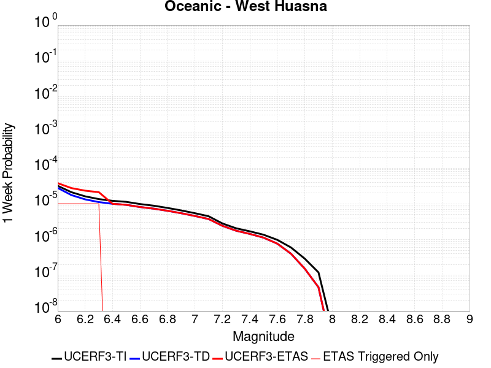 |  | 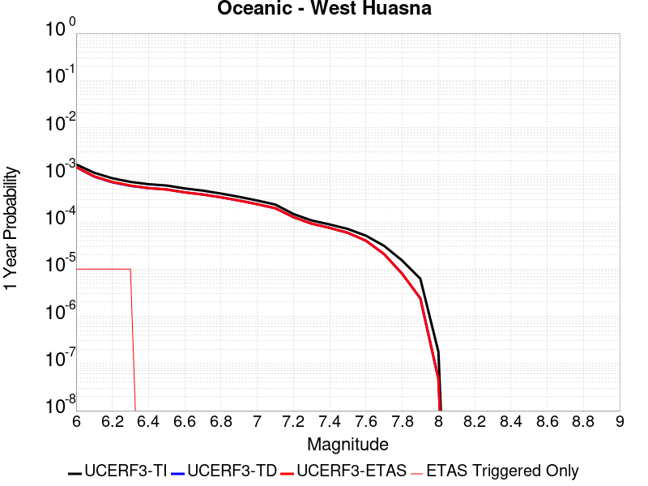 |  |

| Magnitude | 1 wk TI Prob | 1 wk TD Prob | 1 wk ETAS Prob | 1 wk ETAS/TD Gain | 1 wk ETAS Triggered Only | 1 mo TI Prob | 1 mo TD Prob | 1 mo ETAS Prob | 1 mo ETAS/TD Gain | 1 mo ETAS Triggered Only | 1 yr TI Prob | 1 yr TD Prob | 1 yr ETAS Prob | 1 yr ETAS/TD Gain | 1 yr ETAS Triggered Only | 10 yr TI Prob | 10 yr TD Prob | 10 yr ETAS Prob | 10 yr ETAS/TD Gain | 10 yr ETAS Triggered Only |
|-----|-----|-----|-----|-----|-----|-----|-----|-----|-----|-----|-----|-----|-----|-----|-----|-----|-----|-----|-----|-----|
| 6.0 | 3.195567E-5 | 2.7927726E-5 | 3.7927446E-5 | 1.3580571 | 1.0E-5 | 1.3694567E-4 | 1.19685006E-4 | 1.296838E-4 | 1.0835427 | 1.0E-5 | 0.0016660384 | 0.001456234 | 0.0014662195 | 1.006857 | 1.0E-5 | 0.016536033 | 0.014471469 | 0.0145108905 | 1.002724 | 4.0E-5 |
| 6.1 | 2.1156782E-5 | 1.7573991E-5 | 2.7573815E-5 | 1.5690128 | 1.0E-5 | 9.066878E-5 | 7.531498E-5 | 8.531423E-5 | 1.1327657 | 1.0E-5 | 0.0011033333 | 9.165835E-4 | 9.2657434E-4 | 1.0109001 | 1.0E-5 | 0.010978713 | 0.009129039 | 0.009138947 | 1.0010854 | 1.0E-5 |
| 6.2 | 1.6195117E-5 | 1.3327503E-5 | 2.3327371E-5 | 1.750318 | 1.0E-5 | 6.9405796E-5 | 5.711664E-5 | 6.711607E-5 | 1.1750703 | 1.0E-5 | 8.44688E-4 | 6.951758E-4 | 7.051688E-4 | 1.0143749 | 1.0E-5 | 0.008414844 | 0.006930305 | 0.006940236 | 1.0014329 | 1.0E-5 |
| 6.3 | 1.3559345E-5 | 1.1179418E-5 | 2.1179307E-5 | 1.894491 | 1.0E-5 | 5.811018E-5 | 4.791092E-5 | 5.7910438E-5 | 1.2087107 | 1.0E-5 | 7.072618E-4 | 5.8316026E-4 | 5.931544E-4 | 1.017138 | 1.0E-5 | 0.0070501505 | 0.005816418 | 0.0058263596 | 1.0017092 | 1.0E-5 |
| 6.4 | 1.2120619E-5 | 1.0001215E-5 | 1.0001215E-5 | 1.0 | 0.0 | 5.1944477E-5 | 4.2861648E-5 | 4.2861648E-5 | 1.0 | 0.0 | 6.322405E-4 | 5.217161E-4 | 5.217161E-4 | 1.0 | 0.0 | 0.006304447 | 0.0052049803 | 0.0052049803 | 1.0 | 0.0 |
| 6.5 | 1.13511915E-5 | 9.367693E-6 | 9.367693E-6 | 1.0 | 0.0 | 4.8647056E-5 | 4.014664E-5 | 4.014664E-5 | 1.0 | 0.0 | 5.9211696E-4 | 4.8867613E-4 | 4.8867613E-4 | 1.0 | 0.0 | 0.0059054173 | 0.004876075 | 0.004876075 | 1.0 | 0.0 |
| 6.6 | 9.850605E-6 | 8.135605E-6 | 8.135605E-6 | 1.0 | 0.0 | 4.2216197E-5 | 3.486641E-5 | 3.486641E-5 | 1.0 | 0.0 | 5.1386096E-4 | 4.244161E-4 | 4.244161E-4 | 1.0 | 0.0 | 0.0051267436 | 0.0042360877 | 0.0042360877 | 1.0 | 0.0 |
| 6.7 | 8.8558645E-6 | 7.3185993E-6 | 7.3185993E-6 | 1.0 | 0.0 | 3.7953152E-5 | 3.136505E-5 | 3.136505E-5 | 1.0 | 0.0 | 4.6198163E-4 | 3.8180273E-4 | 3.8180273E-4 | 1.0 | 0.0 | 0.004610224 | 0.0038114933 | 0.0038114933 | 1.0 | 0.0 |
| 6.8 | 7.67136E-6 | 6.391901E-6 | 6.391901E-6 | 1.0 | 0.0 | 3.2876844E-5 | 2.7393575E-5 | 2.7393575E-5 | 1.0 | 0.0 | 4.0020206E-4 | 3.334659E-4 | 3.334659E-4 | 1.0 | 0.0 | 0.003994821 | 0.003329676 | 0.003329676 | 1.0 | 0.0 |
| 6.9 | 6.534529E-6 | 5.458455E-6 | 5.458455E-6 | 1.0 | 0.0 | 2.8004823E-5 | 2.3393168E-5 | 2.3393168E-5 | 1.0 | 0.0 | 3.4090536E-4 | 2.8477472E-4 | 2.8477472E-4 | 1.0 | 0.0 | 0.0034038287 | 0.0028441148 | 0.0028441148 | 1.0 | 0.0 |
| 7.0 | 5.460525E-6 | 4.57006E-6 | 4.57006E-6 | 1.0 | 0.0 | 2.3402039E-5 | 1.9585825E-5 | 1.9585825E-5 | 1.0 | 0.0 | 2.8488258E-4 | 2.3843144E-4 | 2.3843144E-4 | 1.0 | 0.0 | 0.0028451765 | 0.0023817702 | 0.0023817702 | 1.0 | 0.0 |
| 7.1 | 4.4825083E-6 | 3.7525401E-6 | 3.7525401E-6 | 1.0 | 0.0 | 1.9210609E-5 | 1.6082216E-5 | 1.6082216E-5 | 1.0 | 0.0 | 2.3386406E-4 | 1.9578349E-4 | 1.9578349E-4 | 1.0 | 0.0 | 0.002336181 | 0.001956122 | 0.001956122 | 1.0 | 0.0 |
| 7.2 | 2.821708E-6 | 2.4250114E-6 | 2.4250114E-6 | 1.0 | 0.0 | 1.2092979E-5 | 1.0392865E-5 | 1.0392865E-5 | 1.0 | 0.0 | 1.4722206E-4 | 1.2652579E-4 | 1.2652579E-4 | 1.0 | 0.0 | 0.0014712457 | 0.00126454 | 0.00126454 | 1.0 | 0.0 |
| 7.3 | 2.0644757E-6 | 1.7688105E-6 | 1.7688105E-6 | 1.0 | 0.0 | 8.847723E-6 | 7.5805947E-6 | 7.5805947E-6 | 1.0 | 0.0 | 1.0771569E-4 | 9.228983E-5 | 9.228983E-5 | 1.0 | 0.0 | 0.001076635 | 9.225168E-4 | 9.225168E-4 | 1.0 | 0.0 |
| 7.4 | 1.6980367E-6 | 1.4380549E-6 | 1.4380549E-6 | 1.0 | 0.0 | 7.27728E-6 | 6.163078E-6 | 6.163078E-6 | 1.0 | 0.0 | 8.8597284E-5 | 7.503289E-5 | 7.503289E-5 | 1.0 | 0.0 | 8.8561967E-4 | 7.500772E-4 | 7.500772E-4 | 1.0 | 0.0 |
| 7.5 | 1.3637683E-6 | 1.1303263E-6 | 1.1303263E-6 | 1.0 | 0.0 | 5.844708E-6 | 4.844246E-6 | 4.844246E-6 | 1.0 | 0.0 | 7.1156996E-5 | 5.8977104E-5 | 5.8977104E-5 | 1.0 | 0.0 | 7.1134215E-4 | 5.89616E-4 | 5.89616E-4 | 1.0 | 0.0 |
| 7.6 | 9.802994E-7 | 7.677824E-7 | 7.677824E-7 | 1.0 | 0.0 | 4.2012766E-6 | 3.2904918E-6 | 3.2904918E-6 | 1.0 | 0.0 | 5.1149345E-5 | 4.0061004E-5 | 4.0061004E-5 | 1.0 | 0.0 | 5.113757E-4 | 4.0053923E-4 | 4.0053923E-4 | 1.0 | 0.0 |
| 7.7 | 5.986191E-7 | 4.0055843E-7 | 4.0055843E-7 | 1.0 | 0.0 | 2.5655079E-6 | 1.7166778E-6 | 1.7166778E-6 | 1.0 | 0.0 | 3.1234613E-5 | 2.0900354E-5 | 2.0900354E-5 | 1.0 | 0.0 | 3.123022E-4 | 2.0898522E-4 | 2.0898522E-4 | 1.0 | 0.0 |
| 7.8 | 2.9189815E-7 | 1.5290486E-7 | 1.5290486E-7 | 1.0 | 0.0 | 1.2509914E-6 | 6.5530634E-7 | 6.5530634E-7 | 1.0 | 0.0 | 1.5230714E-5 | 7.978326E-6 | 7.978326E-6 | 1.0 | 0.0 | 1.522967E-4 | 7.9781705E-5 | 7.9781705E-5 | 1.0 | 0.0 |
| 7.9 | 1.2057845E-7 | 4.6238533E-8 | 4.6238533E-8 | 1.0 | 0.0 | 5.1676466E-7 | 1.9816514E-7 | 1.9816514E-7 | 1.0 | 0.0 | 6.2915915E-6 | 2.4126578E-6 | 2.4126578E-6 | 1.0 | 0.0 | 6.2914136E-5 | 2.4127621E-5 | 2.4127621E-5 | 1.0 | 0.0 |
| 8.0 | 3.3806387E-9 | 9.021458E-10 | 9.021458E-10 | 1.0 | 0.0 | 1.4488451E-8 | 3.866339E-9 | 3.866339E-9 | 1.0 | 0.0 | 1.7639688E-7 | 4.7072675E-8 | 4.7072675E-8 | 1.0 | 0.0 | 1.7639674E-6 | 4.7182124E-7 | 4.7182124E-7 | 1.0 | 0.0 |

## San Gabriel
*[(top)](#table-of-contents)*

| 1 Week | 1 Month | 1 Year | 10 Year |
|-----|-----|-----|-----|
|  |  | 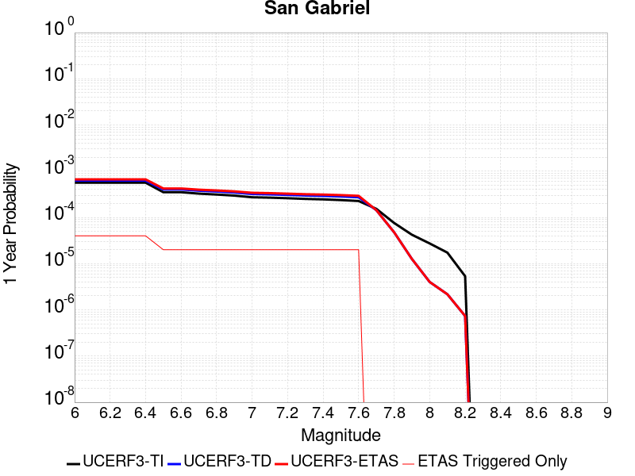 |  |

| Magnitude | 1 wk TI Prob | 1 wk TD Prob | 1 wk ETAS Prob | 1 wk ETAS/TD Gain | 1 wk ETAS Triggered Only | 1 mo TI Prob | 1 mo TD Prob | 1 mo ETAS Prob | 1 mo ETAS/TD Gain | 1 mo ETAS Triggered Only | 1 yr TI Prob | 1 yr TD Prob | 1 yr ETAS Prob | 1 yr ETAS/TD Gain | 1 yr ETAS Triggered Only | 10 yr TI Prob | 10 yr TD Prob | 10 yr ETAS Prob | 10 yr ETAS/TD Gain | 10 yr ETAS Triggered Only |
|-----|-----|-----|-----|-----|-----|-----|-----|-----|-----|-----|-----|-----|-----|-----|-----|-----|-----|-----|-----|-----|
| 6.0 | 1.083775E-5 | 1.1991604E-5 | 1.1991604E-5 | 1.0 | 0.0 | 4.6446676E-5 | 5.1391642E-5 | 5.1391642E-5 | 1.0 | 0.0 | 5.653415E-4 | 6.255249E-4 | 6.654999E-4 | 1.0639063 | 4.0E-5 | 0.0056390543 | 0.00624973 | 0.00628948 | 1.0063603 | 4.0E-5 |
| 6.1 | 1.083775E-5 | 1.1991604E-5 | 1.1991604E-5 | 1.0 | 0.0 | 4.6446676E-5 | 5.1391642E-5 | 5.1391642E-5 | 1.0 | 0.0 | 5.653415E-4 | 6.255249E-4 | 6.654999E-4 | 1.0639063 | 4.0E-5 | 0.0056390543 | 0.00624973 | 0.00628948 | 1.0063603 | 4.0E-5 |
| 6.2 | 1.083775E-5 | 1.1991604E-5 | 1.1991604E-5 | 1.0 | 0.0 | 4.6446676E-5 | 5.1391642E-5 | 5.1391642E-5 | 1.0 | 0.0 | 5.653415E-4 | 6.255249E-4 | 6.654999E-4 | 1.0639063 | 4.0E-5 | 0.0056390543 | 0.00624973 | 0.00628948 | 1.0063603 | 4.0E-5 |
| 6.3 | 1.083775E-5 | 1.1991604E-5 | 1.1991604E-5 | 1.0 | 0.0 | 4.6446676E-5 | 5.1391642E-5 | 5.1391642E-5 | 1.0 | 0.0 | 5.653415E-4 | 6.255249E-4 | 6.654999E-4 | 1.0639063 | 4.0E-5 | 0.0056390543 | 0.00624973 | 0.00628948 | 1.0063603 | 4.0E-5 |
| 6.4 | 1.083775E-5 | 1.1991604E-5 | 1.1991604E-5 | 1.0 | 0.0 | 4.6446676E-5 | 5.1391642E-5 | 5.1391642E-5 | 1.0 | 0.0 | 5.653415E-4 | 6.255249E-4 | 6.654999E-4 | 1.0639063 | 4.0E-5 | 0.0056390543 | 0.00624973 | 0.00628948 | 1.0063603 | 4.0E-5 |
| 6.5 | 6.7317824E-6 | 7.723294E-6 | 7.723294E-6 | 1.0 | 0.0 | 2.8850178E-5 | 3.309942E-5 | 3.309942E-5 | 1.0 | 0.0 | 3.511943E-4 | 4.0291194E-4 | 4.229039E-4 | 1.0496186 | 2.0E-5 | 0.003506398 | 0.004032903 | 0.0040528225 | 1.0049392 | 2.0E-5 |
| 6.6 | 6.7317824E-6 | 7.723294E-6 | 7.723294E-6 | 1.0 | 0.0 | 2.8850178E-5 | 3.309942E-5 | 3.309942E-5 | 1.0 | 0.0 | 3.511943E-4 | 4.0291194E-4 | 4.229039E-4 | 1.0496186 | 2.0E-5 | 0.003506398 | 0.004032903 | 0.0040528225 | 1.0049392 | 2.0E-5 |
| 6.7 | 6.274881E-6 | 7.2522084E-6 | 7.2522084E-6 | 1.0 | 0.0 | 2.6892068E-5 | 3.108053E-5 | 3.108053E-5 | 1.0 | 0.0 | 3.2736175E-4 | 3.7834072E-4 | 3.9833316E-4 | 1.0528424 | 2.0E-5 | 0.0032687993 | 0.0037880475 | 0.0038079717 | 1.0052598 | 2.0E-5 |
| 6.8 | 5.996209E-6 | 6.9649254E-6 | 6.9649254E-6 | 1.0 | 0.0 | 2.5697784E-5 | 2.9849343E-5 | 2.9849343E-5 | 1.0 | 0.0 | 3.128256E-4 | 3.6335608E-4 | 3.8334882E-4 | 1.0550225 | 2.0E-5 | 0.003123856 | 0.003638699 | 0.0036586262 | 1.0054765 | 2.0E-5 |
| 6.9 | 5.686331E-6 | 6.6299467E-6 | 6.6299467E-6 | 1.0 | 0.0 | 2.4369761E-5 | 2.8413753E-5 | 2.8413753E-5 | 1.0 | 0.0 | 2.9666146E-4 | 3.4588343E-4 | 3.658765E-4 | 1.0578029 | 2.0E-5 | 0.0029626573 | 0.0034645286 | 0.0034844594 | 1.0057528 | 2.0E-5 |
| 7.0 | 5.2329838E-6 | 6.153813E-6 | 6.153813E-6 | 1.0 | 0.0 | 2.242688E-5 | 2.6373222E-5 | 2.6373222E-5 | 1.0 | 0.0 | 2.7301308E-4 | 3.2104744E-4 | 3.41041E-4 | 1.0622761 | 2.0E-5 | 0.002726779 | 0.0032169018 | 0.0032368375 | 1.0061972 | 2.0E-5 |
| 7.1 | 5.135671E-6 | 6.0439224E-6 | 6.0439224E-6 | 1.0 | 0.0 | 2.2009834E-5 | 2.5902273E-5 | 2.5902273E-5 | 1.0 | 0.0 | 2.6793676E-4 | 3.153153E-4 | 3.3530899E-4 | 1.0634086 | 2.0E-5 | 0.0026761394 | 0.0031597447 | 0.0031796815 | 1.0063096 | 2.0E-5 |
| 7.2 | 4.989062E-6 | 5.8772744E-6 | 5.8772744E-6 | 1.0 | 0.0 | 2.1381518E-5 | 2.518808E-5 | 2.518808E-5 | 1.0 | 0.0 | 2.6028889E-4 | 3.0662247E-4 | 3.2661634E-4 | 1.0652068 | 2.0E-5 | 0.0025998424 | 0.0030730597 | 0.0030929982 | 1.0064882 | 2.0E-5 |
| 7.3 | 4.8219395E-6 | 5.708803E-6 | 5.708803E-6 | 1.0 | 0.0 | 2.0665291E-5 | 2.4466073E-5 | 2.4466073E-5 | 1.0 | 0.0 | 2.5157086E-4 | 2.978345E-4 | 3.1782853E-4 | 1.0671314 | 2.0E-5 | 0.0025128627 | 0.0029854192 | 0.0030053596 | 1.0066792 | 2.0E-5 |
| 7.4 | 4.7118383E-6 | 5.5973387E-6 | 5.5973387E-6 | 1.0 | 0.0 | 2.0193436E-5 | 2.398838E-5 | 2.398838E-5 | 1.0 | 0.0 | 2.4582737E-4 | 2.9202012E-4 | 3.1201428E-4 | 1.0684685 | 2.0E-5 | 0.002455556 | 0.0029274288 | 0.0029473703 | 1.006812 | 2.0E-5 |
| 7.5 | 4.5506545E-6 | 5.4426755E-6 | 5.4426755E-6 | 1.0 | 0.0 | 1.9502659E-5 | 2.3325549E-5 | 2.3325549E-5 | 1.0 | 0.0 | 2.37419E-4 | 2.839523E-4 | 3.039466E-4 | 1.0704144 | 2.0E-5 | 0.002371655 | 0.002846959 | 0.0028669022 | 1.0070051 | 2.0E-5 |
| 7.6 | 4.343636E-6 | 5.235504E-6 | 5.235504E-6 | 1.0 | 0.0 | 1.861545E-5 | 2.2437685E-5 | 2.2437685E-5 | 1.0 | 0.0 | 2.2661954E-4 | 2.7314533E-4 | 2.9313986E-4 | 1.0732011 | 2.0E-5 | 0.0022638857 | 0.0027391515 | 0.0027590967 | 1.0072815 | 2.0E-5 |
| 7.7 | 2.936235E-6 | 2.7481683E-6 | 2.7481683E-6 | 1.0 | 0.0 | 1.2583803E-5 | 1.1777811E-5 | 1.1777811E-5 | 1.0 | 0.0 | 1.5319703E-4 | 1.4338545E-4 | 1.4338545E-4 | 1.0 | 0.0 | 0.0015309147 | 0.0014402354 | 0.0014402354 | 1.0 | 0.0 |
| 7.8 | 1.4541639E-6 | 9.140398E-7 | 9.140398E-7 | 1.0 | 0.0 | 6.232116E-6 | 3.9173074E-6 | 3.9173074E-6 | 1.0 | 0.0 | 7.587337E-5 | 4.7692178E-5 | 4.7692178E-5 | 1.0 | 0.0 | 7.584747E-4 | 4.8173522E-4 | 4.8173522E-4 | 1.0 | 0.0 |
| 7.9 | 8.098958E-7 | 2.424074E-7 | 2.424074E-7 | 1.0 | 0.0 | 3.4709774E-6 | 1.0388884E-6 | 1.0388884E-6 | 1.0 | 0.0 | 4.225833E-5 | 1.2648392E-5 | 1.2648392E-5 | 1.0 | 0.0 | 4.2250296E-4 | 1.2957034E-4 | 1.2957034E-4 | 1.0 | 0.0 |
| 8.0 | 5.2473234E-7 | 7.709371E-8 | 7.709371E-8 | 1.0 | 0.0 | 2.248851E-6 | 3.3040158E-7 | 3.3040158E-7 | 1.0 | 0.0 | 2.7379416E-5 | 4.0226314E-6 | 4.0226314E-6 | 1.0 | 0.0 | 2.7376044E-4 | 4.235692E-5 | 4.235692E-5 | 1.0 | 0.0 |
| 8.1 | 3.3162388E-7 | 4.1664517E-8 | 4.1664517E-8 | 1.0 | 0.0 | 1.4212444E-6 | 1.785622E-7 | 1.785622E-7 | 1.0 | 0.0 | 1.7303513E-5 | 2.1739927E-6 | 2.1739927E-6 | 1.0 | 0.0 | 1.7302166E-4 | 2.3057932E-5 | 2.3057932E-5 | 1.0 | 0.0 |
| 8.2 | 1.0235345E-7 | 1.40959395E-8 | 1.40959395E-8 | 1.0 | 0.0 | 4.3865757E-7 | 6.041117E-8 | 6.041117E-8 | 1.0 | 0.0 | 5.340643E-6 | 7.3550575E-7 | 7.3550575E-7 | 1.0 | 0.0 | 5.3405143E-5 | 7.956415E-6 | 7.956415E-6 | 1.0 | 0.0 |

## San Cayetano
*[(top)](#table-of-contents)*

| 1 Week | 1 Month | 1 Year | 10 Year |
|-----|-----|-----|-----|
|  |  |  | 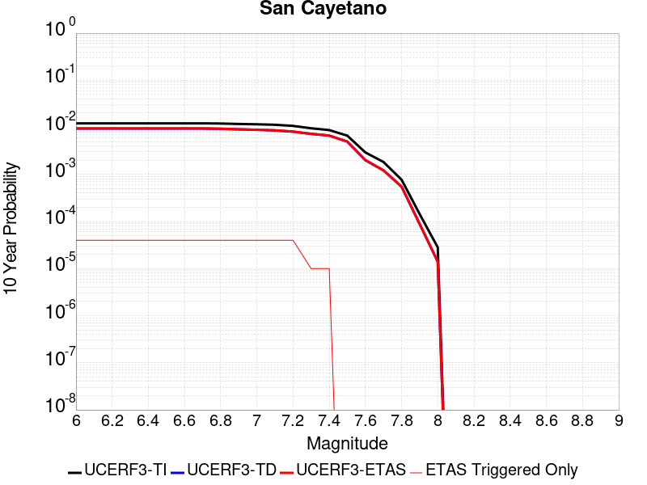 |

| Magnitude | 1 wk TI Prob | 1 wk TD Prob | 1 wk ETAS Prob | 1 wk ETAS/TD Gain | 1 wk ETAS Triggered Only | 1 mo TI Prob | 1 mo TD Prob | 1 mo ETAS Prob | 1 mo ETAS/TD Gain | 1 mo ETAS Triggered Only | 1 yr TI Prob | 1 yr TD Prob | 1 yr ETAS Prob | 1 yr ETAS/TD Gain | 1 yr ETAS Triggered Only | 10 yr TI Prob | 10 yr TD Prob | 10 yr ETAS Prob | 10 yr ETAS/TD Gain | 10 yr ETAS Triggered Only |
|-----|-----|-----|-----|-----|-----|-----|-----|-----|-----|-----|-----|-----|-----|-----|-----|-----|-----|-----|-----|-----|
| 6.0 | 2.3476267E-5 | 1.8171891E-5 | 1.8171891E-5 | 1.0 | 0.0 | 1.0060869E-4 | 7.787723E-5 | 7.787723E-5 | 1.0 | 0.0 | 0.0012242225 | 9.4774645E-4 | 9.677275E-4 | 1.0210826 | 2.0E-5 | 0.012175002 | 0.0094379345 | 0.009477557 | 1.0041982 | 4.0E-5 |
| 6.1 | 2.3476267E-5 | 1.8171891E-5 | 1.8171891E-5 | 1.0 | 0.0 | 1.0060869E-4 | 7.787723E-5 | 7.787723E-5 | 1.0 | 0.0 | 0.0012242225 | 9.4774645E-4 | 9.677275E-4 | 1.0210826 | 2.0E-5 | 0.012175002 | 0.0094379345 | 0.009477557 | 1.0041982 | 4.0E-5 |
| 6.2 | 2.3476267E-5 | 1.8171891E-5 | 1.8171891E-5 | 1.0 | 0.0 | 1.0060869E-4 | 7.787723E-5 | 7.787723E-5 | 1.0 | 0.0 | 0.0012242225 | 9.4774645E-4 | 9.677275E-4 | 1.0210826 | 2.0E-5 | 0.012175002 | 0.0094379345 | 0.009477557 | 1.0041982 | 4.0E-5 |
| 6.3 | 2.3476267E-5 | 1.8171891E-5 | 1.8171891E-5 | 1.0 | 0.0 | 1.0060869E-4 | 7.787723E-5 | 7.787723E-5 | 1.0 | 0.0 | 0.0012242225 | 9.4774645E-4 | 9.677275E-4 | 1.0210826 | 2.0E-5 | 0.012175002 | 0.0094379345 | 0.009477557 | 1.0041982 | 4.0E-5 |
| 6.4 | 2.3476267E-5 | 1.8171891E-5 | 1.8171891E-5 | 1.0 | 0.0 | 1.0060869E-4 | 7.787723E-5 | 7.787723E-5 | 1.0 | 0.0 | 0.0012242225 | 9.4774645E-4 | 9.677275E-4 | 1.0210826 | 2.0E-5 | 0.012175002 | 0.0094379345 | 0.009477557 | 1.0041982 | 4.0E-5 |
| 6.5 | 2.3476267E-5 | 1.8171891E-5 | 1.8171891E-5 | 1.0 | 0.0 | 1.0060869E-4 | 7.787723E-5 | 7.787723E-5 | 1.0 | 0.0 | 0.0012242225 | 9.4774645E-4 | 9.677275E-4 | 1.0210826 | 2.0E-5 | 0.012175002 | 0.0094379345 | 0.009477557 | 1.0041982 | 4.0E-5 |
| 6.6 | 2.3476267E-5 | 1.8171891E-5 | 1.8171891E-5 | 1.0 | 0.0 | 1.0060869E-4 | 7.787723E-5 | 7.787723E-5 | 1.0 | 0.0 | 0.0012242225 | 9.4774645E-4 | 9.677275E-4 | 1.0210826 | 2.0E-5 | 0.012175002 | 0.0094379345 | 0.009477557 | 1.0041982 | 4.0E-5 |
| 6.7 | 2.3476267E-5 | 1.8171891E-5 | 1.8171891E-5 | 1.0 | 0.0 | 1.0060869E-4 | 7.787723E-5 | 7.787723E-5 | 1.0 | 0.0 | 0.0012242225 | 9.4774645E-4 | 9.677275E-4 | 1.0210826 | 2.0E-5 | 0.012175002 | 0.0094379345 | 0.009477557 | 1.0041982 | 4.0E-5 |
| 6.8 | 2.3241924E-5 | 1.793958E-5 | 1.793958E-5 | 1.0 | 0.0 | 9.960445E-5 | 7.688167E-5 | 7.688167E-5 | 1.0 | 0.0 | 0.0012120095 | 9.3563594E-4 | 9.5561723E-4 | 1.0213559 | 2.0E-5 | 0.012054204 | 0.009317822 | 0.00935745 | 1.0042528 | 4.0E-5 |
| 6.9 | 2.2761007E-5 | 1.7434984E-5 | 1.7434984E-5 | 1.0 | 0.0 | 9.7543525E-5 | 7.4719246E-5 | 7.4719246E-5 | 1.0 | 0.0 | 0.0011869454 | 9.0933056E-4 | 9.293124E-4 | 1.0219742 | 2.0E-5 | 0.011806256 | 0.009056928 | 0.009096566 | 1.0043765 | 4.0E-5 |
| 7.0 | 2.240283E-5 | 1.706871E-5 | 1.706871E-5 | 1.0 | 0.0 | 9.600859E-5 | 7.314958E-5 | 7.314958E-5 | 1.0 | 0.0 | 0.0011682777 | 8.902357E-4 | 9.102179E-4 | 1.0224459 | 2.0E-5 | 0.011621549 | 0.00886751 | 0.008907155 | 1.0044708 | 4.0E-5 |
| 7.1 | 2.1871154E-5 | 1.6588527E-5 | 1.6588527E-5 | 1.0 | 0.0 | 9.373015E-5 | 7.109177E-5 | 7.109177E-5 | 1.0 | 0.0 | 0.0011405671 | 8.652019E-4 | 8.8518456E-4 | 1.023096 | 2.0E-5 | 0.011347309 | 0.008619136 | 0.008658791 | 1.0046009 | 4.0E-5 |
| 7.2 | 2.0714133E-5 | 1.5566999E-5 | 1.5566999E-5 | 1.0 | 0.0 | 8.8771834E-5 | 6.671402E-5 | 6.671402E-5 | 1.0 | 0.0 | 0.0010802611 | 8.119438E-4 | 8.319275E-4 | 1.0246122 | 2.0E-5 | 0.010750249 | 0.008090547 | 0.0081302235 | 1.004904 | 4.0E-5 |
| 7.3 | 1.8408395E-5 | 1.39977965E-5 | 1.39977965E-5 | 1.0 | 0.0 | 7.8890735E-5 | 5.9989194E-5 | 5.9989194E-5 | 1.0 | 0.0 | 9.600714E-4 | 7.3012663E-4 | 7.3012663E-4 | 1.0 | 0.0 | 0.009559342 | 0.007277998 | 0.007287925 | 1.001364 | 1.0E-5 |
| 7.4 | 1.6856795E-5 | 1.2850842E-5 | 1.2850842E-5 | 1.0 | 0.0 | 7.2241404E-5 | 5.507389E-5 | 5.507389E-5 | 1.0 | 0.0 | 8.7918417E-4 | 6.7032117E-4 | 6.7032117E-4 | 1.0 | 0.0 | 0.00875714 | 0.006683673 | 0.0066936063 | 1.0014862 | 1.0E-5 |
| 7.5 | 1.2822778E-5 | 9.578047E-6 | 9.578047E-6 | 1.0 | 0.0 | 5.495361E-5 | 4.1048133E-5 | 4.1048133E-5 | 1.0 | 0.0 | 6.688548E-4 | 4.9964804E-4 | 4.9964804E-4 | 1.0 | 0.0 | 0.006668452 | 0.0049854172 | 0.0049854172 | 1.0 | 0.0 |
| 7.6 | 5.6272684E-6 | 3.8551343E-6 | 3.8551343E-6 | 1.0 | 0.0 | 2.4116642E-5 | 1.65219E-5 | 1.65219E-5 | 1.0 | 0.0 | 2.9358055E-4 | 2.0113567E-4 | 2.0113567E-4 | 1.0 | 0.0 | 0.0029319301 | 0.002009547 | 0.002009547 | 1.0 | 0.0 |
| 7.7 | 3.5261346E-6 | 2.3408447E-6 | 2.3408447E-6 | 1.0 | 0.0 | 1.5111918E-5 | 1.0032153E-5 | 1.0032153E-5 | 1.0 | 0.0 | 1.8397206E-4 | 1.2213469E-4 | 1.2213469E-4 | 1.0 | 0.0 | 0.0018381984 | 0.0012206831 | 0.0012206831 | 1.0 | 0.0 |
| 7.8 | 1.4826929E-6 | 1.0564826E-6 | 1.0564826E-6 | 1.0 | 0.0 | 6.354383E-6 | 4.5277748E-6 | 4.5277748E-6 | 1.0 | 0.0 | 7.736187E-5 | 5.5124285E-5 | 5.5124285E-5 | 1.0 | 0.0 | 7.733494E-4 | 5.511081E-4 | 5.511081E-4 | 1.0 | 0.0 |
| 7.9 | 2.7568166E-7 | 1.6979526E-7 | 1.6979526E-7 | 1.0 | 0.0 | 1.1814923E-6 | 7.276937E-7 | 7.276937E-7 | 1.0 | 0.0 | 1.4384574E-5 | 8.859635E-6 | 8.859635E-6 | 1.0 | 0.0 | 1.4383643E-4 | 8.859285E-5 | 8.859285E-5 | 1.0 | 0.0 |
| 8.0 | 5.407832E-8 | 2.6892012E-8 | 2.6892012E-8 | 1.0 | 0.0 | 2.3176422E-7 | 1.15251474E-7 | 1.15251474E-7 | 1.0 | 0.0 | 2.8217257E-6 | 1.4031858E-6 | 1.4031858E-6 | 1.0 | 0.0 | 2.8216898E-5 | 1.4031774E-5 | 1.4031774E-5 | 1.0 | 0.0 |

## Ventura-Pitas Point
*[(top)](#table-of-contents)*

| 1 Week | 1 Month | 1 Year | 10 Year |
|-----|-----|-----|-----|
|  |  |  |  |

| Magnitude | 1 wk TI Prob | 1 wk TD Prob | 1 wk ETAS Prob | 1 wk ETAS/TD Gain | 1 wk ETAS Triggered Only | 1 mo TI Prob | 1 mo TD Prob | 1 mo ETAS Prob | 1 mo ETAS/TD Gain | 1 mo ETAS Triggered Only | 1 yr TI Prob | 1 yr TD Prob | 1 yr ETAS Prob | 1 yr ETAS/TD Gain | 1 yr ETAS Triggered Only | 10 yr TI Prob | 10 yr TD Prob | 10 yr ETAS Prob | 10 yr ETAS/TD Gain | 10 yr ETAS Triggered Only |
|-----|-----|-----|-----|-----|-----|-----|-----|-----|-----|-----|-----|-----|-----|-----|-----|-----|-----|-----|-----|-----|
| 6.0 | 3.3179622E-5 | 3.3738426E-5 | 3.3738426E-5 | 1.0 | 0.0 | 1.4219063E-4 | 1.4458668E-4 | 1.4458668E-4 | 1.0 | 0.0 | 0.0017297962 | 0.0017591785 | 0.0017791433 | 1.011349 | 2.0E-5 | 0.017163932 | 0.017478066 | 0.017517367 | 1.0022485 | 4.0E-5 |
| 6.1 | 3.3179622E-5 | 3.3738426E-5 | 3.3738426E-5 | 1.0 | 0.0 | 1.4219063E-4 | 1.4458668E-4 | 1.4458668E-4 | 1.0 | 0.0 | 0.0017297962 | 0.0017591785 | 0.0017791433 | 1.011349 | 2.0E-5 | 0.017163932 | 0.017478066 | 0.017517367 | 1.0022485 | 4.0E-5 |
| 6.2 | 3.3179622E-5 | 3.3738426E-5 | 3.3738426E-5 | 1.0 | 0.0 | 1.4219063E-4 | 1.4458668E-4 | 1.4458668E-4 | 1.0 | 0.0 | 0.0017297962 | 0.0017591785 | 0.0017791433 | 1.011349 | 2.0E-5 | 0.017163932 | 0.017478066 | 0.017517367 | 1.0022485 | 4.0E-5 |
| 6.3 | 3.3179622E-5 | 3.3738426E-5 | 3.3738426E-5 | 1.0 | 0.0 | 1.4219063E-4 | 1.4458668E-4 | 1.4458668E-4 | 1.0 | 0.0 | 0.0017297962 | 0.0017591785 | 0.0017791433 | 1.011349 | 2.0E-5 | 0.017163932 | 0.017478066 | 0.017517367 | 1.0022485 | 4.0E-5 |
| 6.4 | 1.8754668E-5 | 1.7021794E-5 | 1.7021794E-5 | 1.0 | 0.0 | 8.037467E-5 | 7.2948635E-5 | 7.2948635E-5 | 1.0 | 0.0 | 9.781223E-4 | 8.878108E-4 | 8.9780195E-4 | 1.0112537 | 1.0E-5 | 0.009738282 | 0.008844977 | 0.008874712 | 1.0033617 | 3.0E-5 |
| 6.5 | 1.8754668E-5 | 1.7021794E-5 | 1.7021794E-5 | 1.0 | 0.0 | 8.037467E-5 | 7.2948635E-5 | 7.2948635E-5 | 1.0 | 0.0 | 9.781223E-4 | 8.878108E-4 | 8.9780195E-4 | 1.0112537 | 1.0E-5 | 0.009738282 | 0.008844977 | 0.008874712 | 1.0033617 | 3.0E-5 |
| 6.6 | 1.4361558E-5 | 1.2124234E-5 | 1.2124234E-5 | 1.0 | 0.0 | 6.154808E-5 | 5.1959978E-5 | 5.1959978E-5 | 1.0 | 0.0 | 7.490902E-4 | 6.324314E-4 | 6.424251E-4 | 1.015802 | 1.0E-5 | 0.0074657016 | 0.0063065733 | 0.006336384 | 1.0047269 | 3.0E-5 |
| 6.7 | 1.4361558E-5 | 1.2124234E-5 | 1.2124234E-5 | 1.0 | 0.0 | 6.154808E-5 | 5.1959978E-5 | 5.1959978E-5 | 1.0 | 0.0 | 7.490902E-4 | 6.324314E-4 | 6.424251E-4 | 1.015802 | 1.0E-5 | 0.0074657016 | 0.0063065733 | 0.006336384 | 1.0047269 | 3.0E-5 |
| 6.8 | 1.3663846E-5 | 1.1346341E-5 | 1.1346341E-5 | 1.0 | 0.0 | 5.8558027E-5 | 4.862628E-5 | 4.862628E-5 | 1.0 | 0.0 | 7.127108E-4 | 5.918661E-4 | 6.0186017E-4 | 1.0168858 | 1.0E-5 | 0.007104293 | 0.0059031136 | 0.0059329364 | 1.0050521 | 3.0E-5 |
| 6.9 | 1.3644157E-5 | 1.13244405E-5 | 1.13244405E-5 | 1.0 | 0.0 | 5.8473648E-5 | 4.8532424E-5 | 4.8532424E-5 | 1.0 | 0.0 | 7.116841E-4 | 5.90724E-4 | 6.007181E-4 | 1.0169184 | 1.0E-5 | 0.007094092 | 0.005891754 | 0.005921577 | 1.0050619 | 3.0E-5 |
| 7.0 | 1.3568845E-5 | 1.1244003E-5 | 1.1244003E-5 | 1.0 | 0.0 | 5.8150898E-5 | 4.8187707E-5 | 4.8187707E-5 | 1.0 | 0.0 | 7.077572E-4 | 5.865293E-4 | 5.9652346E-4 | 1.0170394 | 1.0E-5 | 0.007055073 | 0.0058500282 | 0.005879853 | 1.0050982 | 3.0E-5 |
| 7.1 | 1.306572E-5 | 1.072243E-5 | 1.072243E-5 | 1.0 | 0.0 | 5.599474E-5 | 4.595247E-5 | 4.595247E-5 | 1.0 | 0.0 | 6.815227E-4 | 5.593296E-4 | 5.69324E-4 | 1.0178685 | 1.0E-5 | 0.0067943637 | 0.005579423 | 0.0056092557 | 1.0053469 | 3.0E-5 |
| 7.2 | 1.232604E-5 | 9.996984E-6 | 9.996984E-6 | 1.0 | 0.0 | 5.2824813E-5 | 4.284352E-5 | 4.284352E-5 | 1.0 | 0.0 | 6.429523E-4 | 5.214968E-4 | 5.314916E-4 | 1.0191655 | 1.0E-5 | 0.0064109527 | 0.005202922 | 0.0052327663 | 1.005736 | 3.0E-5 |
| 7.3 | 1.0917261E-5 | 8.844284E-6 | 8.844284E-6 | 1.0 | 0.0 | 4.678742E-5 | 3.7903534E-5 | 3.7903534E-5 | 1.0 | 0.0 | 5.69488E-4 | 4.6137936E-4 | 4.6137936E-4 | 1.0 | 0.0 | 0.0056803077 | 0.0046043806 | 0.0046143346 | 1.0021619 | 1.0E-5 |
| 7.4 | 1.039959E-5 | 8.423978E-6 | 8.423978E-6 | 1.0 | 0.0 | 4.456891E-5 | 3.6102272E-5 | 3.6102272E-5 | 1.0 | 0.0 | 5.424914E-4 | 4.3945803E-4 | 4.3945803E-4 | 1.0 | 0.0 | 0.0054116896 | 0.004386052 | 0.004396008 | 1.00227 | 1.0E-5 |
| 7.5 | 9.015877E-6 | 7.2978323E-6 | 7.2978323E-6 | 1.0 | 0.0 | 3.86389E-5 | 3.1276057E-5 | 3.1276057E-5 | 1.0 | 0.0 | 4.7032707E-4 | 3.8072086E-4 | 3.8072086E-4 | 1.0 | 0.0 | 0.004693329 | 0.0038008313 | 0.0038008313 | 1.0 | 0.0 |
| 7.6 | 4.900162E-6 | 3.8742282E-6 | 3.8742282E-6 | 1.0 | 0.0 | 2.1000526E-5 | 1.660373E-5 | 1.660373E-5 | 1.0 | 0.0 | 2.556514E-4 | 2.0213178E-4 | 2.0213178E-4 | 1.0 | 0.0 | 0.0025535747 | 0.002019493 | 0.002019493 | 1.0 | 0.0 |
| 7.7 | 3.8850626E-6 | 3.126818E-6 | 3.126818E-6 | 1.0 | 0.0 | 1.6650163E-5 | 1.340058E-5 | 1.340058E-5 | 1.0 | 0.0 | 2.0269687E-4 | 1.6313995E-4 | 1.6313995E-4 | 1.0 | 0.0 | 0.002025121 | 0.0016302111 | 0.0016302111 | 1.0 | 0.0 |
| 7.8 | 2.4654719E-6 | 2.0299256E-6 | 2.0299256E-6 | 1.0 | 0.0 | 1.0566265E-5 | 8.699652E-6 | 8.699652E-6 | 1.0 | 0.0 | 1.2863669E-4 | 1.0591316E-4 | 1.0591316E-4 | 1.0 | 0.0 | 0.0012856225 | 0.0010586316 | 0.0010586316 | 1.0 | 0.0 |
| 7.9 | 4.095894E-7 | 3.2765615E-7 | 3.2765615E-7 | 1.0 | 0.0 | 1.7553821E-6 | 1.4042399E-6 | 1.4042399E-6 | 1.0 | 0.0 | 2.1371567E-5 | 1.709649E-5 | 1.709649E-5 | 1.0 | 0.0 | 2.1369511E-4 | 1.7095206E-4 | 1.7095206E-4 | 1.0 | 0.0 |
| 8.0 | 7.791402E-9 | 5.6836655E-9 | 5.6836655E-9 | 1.0 | 0.0 | 3.3391725E-8 | 2.4358567E-8 | 2.4358567E-8 | 1.0 | 0.0 | 4.0654416E-7 | 2.9656553E-7 | 2.9656553E-7 | 1.0 | 0.0 | 4.065434E-6 | 2.9656533E-6 | 2.9656533E-6 | 1.0 | 0.0 |

## Channel Islands Thrust
*[(top)](#table-of-contents)*

| 1 Week | 1 Month | 1 Year | 10 Year |
|-----|-----|-----|-----|
|  |  |  | 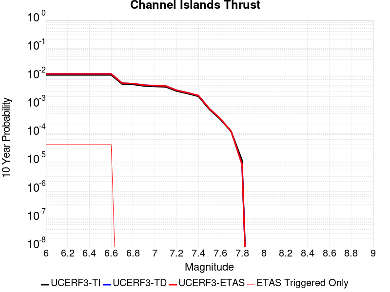 |

| Magnitude | 1 wk TI Prob | 1 wk TD Prob | 1 wk ETAS Prob | 1 wk ETAS/TD Gain | 1 wk ETAS Triggered Only | 1 mo TI Prob | 1 mo TD Prob | 1 mo ETAS Prob | 1 mo ETAS/TD Gain | 1 mo ETAS Triggered Only | 1 yr TI Prob | 1 yr TD Prob | 1 yr ETAS Prob | 1 yr ETAS/TD Gain | 1 yr ETAS Triggered Only | 10 yr TI Prob | 10 yr TD Prob | 10 yr ETAS Prob | 10 yr ETAS/TD Gain | 10 yr ETAS Triggered Only |
|-----|-----|-----|-----|-----|-----|-----|-----|-----|-----|-----|-----|-----|-----|-----|-----|-----|-----|-----|-----|-----|
| 6.0 | 2.2156251E-5 | 2.4092866E-5 | 2.4092866E-5 | 1.0 | 0.0 | 9.495191E-5 | 1.0325165E-4 | 1.0325165E-4 | 1.0 | 0.0 | 0.0011554264 | 0.0012564705 | 0.0012764453 | 1.0158976 | 2.0E-5 | 0.011494373 | 0.012504256 | 0.012543756 | 1.0031589 | 4.0E-5 |
| 6.1 | 2.2156251E-5 | 2.4092866E-5 | 2.4092866E-5 | 1.0 | 0.0 | 9.495191E-5 | 1.0325165E-4 | 1.0325165E-4 | 1.0 | 0.0 | 0.0011554264 | 0.0012564705 | 0.0012764453 | 1.0158976 | 2.0E-5 | 0.011494373 | 0.012504256 | 0.012543756 | 1.0031589 | 4.0E-5 |
| 6.2 | 2.2156251E-5 | 2.4092866E-5 | 2.4092866E-5 | 1.0 | 0.0 | 9.495191E-5 | 1.0325165E-4 | 1.0325165E-4 | 1.0 | 0.0 | 0.0011554264 | 0.0012564705 | 0.0012764453 | 1.0158976 | 2.0E-5 | 0.011494373 | 0.012504256 | 0.012543756 | 1.0031589 | 4.0E-5 |
| 6.3 | 2.2156251E-5 | 2.4092866E-5 | 2.4092866E-5 | 1.0 | 0.0 | 9.495191E-5 | 1.0325165E-4 | 1.0325165E-4 | 1.0 | 0.0 | 0.0011554264 | 0.0012564705 | 0.0012764453 | 1.0158976 | 2.0E-5 | 0.011494373 | 0.012504256 | 0.012543756 | 1.0031589 | 4.0E-5 |
| 6.4 | 2.2156251E-5 | 2.4092866E-5 | 2.4092866E-5 | 1.0 | 0.0 | 9.495191E-5 | 1.0325165E-4 | 1.0325165E-4 | 1.0 | 0.0 | 0.0011554264 | 0.0012564705 | 0.0012764453 | 1.0158976 | 2.0E-5 | 0.011494373 | 0.012504256 | 0.012543756 | 1.0031589 | 4.0E-5 |
| 6.5 | 2.2156251E-5 | 2.4092866E-5 | 2.4092866E-5 | 1.0 | 0.0 | 9.495191E-5 | 1.0325165E-4 | 1.0325165E-4 | 1.0 | 0.0 | 0.0011554264 | 0.0012564705 | 0.0012764453 | 1.0158976 | 2.0E-5 | 0.011494373 | 0.012504256 | 0.012543756 | 1.0031589 | 4.0E-5 |
| 6.6 | 2.2156251E-5 | 2.4092866E-5 | 2.4092866E-5 | 1.0 | 0.0 | 9.495191E-5 | 1.0325165E-4 | 1.0325165E-4 | 1.0 | 0.0 | 0.0011554264 | 0.0012564705 | 0.0012764453 | 1.0158976 | 2.0E-5 | 0.011494373 | 0.012504256 | 0.012543756 | 1.0031589 | 4.0E-5 |
| 6.7 | 1.0601296E-5 | 1.1379881E-5 | 1.1379881E-5 | 1.0 | 0.0 | 4.5433335E-5 | 4.877003E-5 | 4.877003E-5 | 1.0 | 0.0 | 5.5301044E-4 | 5.9361826E-4 | 5.9361826E-4 | 1.0 | 0.0 | 0.005516363 | 0.0059208283 | 0.0059208283 | 1.0 | 0.0 |
| 6.8 | 1.0246747E-5 | 1.0996993E-5 | 1.0996993E-5 | 1.0 | 0.0 | 4.391389E-5 | 4.712915E-5 | 4.712915E-5 | 1.0 | 0.0 | 5.345204E-4 | 5.736511E-4 | 5.736511E-4 | 1.0 | 0.0 | 0.0053323656 | 0.0057221935 | 0.0057221935 | 1.0 | 0.0 |
| 6.9 | 9.049551E-6 | 9.699926E-6 | 9.699926E-6 | 1.0 | 0.0 | 3.878322E-5 | 4.157047E-5 | 4.157047E-5 | 1.0 | 0.0 | 4.7208337E-4 | 5.0600705E-4 | 5.0600705E-4 | 1.0 | 0.0 | 0.0047108172 | 0.0050489665 | 0.0050489665 | 1.0 | 0.0 |
| 7.0 | 8.6542195E-6 | 9.274872E-6 | 9.274872E-6 | 1.0 | 0.0 | 3.7088983E-5 | 3.974887E-5 | 3.974887E-5 | 1.0 | 0.0 | 4.5146482E-4 | 4.838391E-4 | 4.838391E-4 | 1.0 | 0.0 | 0.004505487 | 0.0048282687 | 0.0048282687 | 1.0 | 0.0 |
| 7.1 | 8.391028E-6 | 8.993186E-6 | 8.993186E-6 | 1.0 | 0.0 | 3.5961057E-5 | 3.854168E-5 | 3.854168E-5 | 1.0 | 0.0 | 4.3773788E-4 | 4.6914798E-4 | 4.6914798E-4 | 1.0 | 0.0 | 0.004368766 | 0.004681986 | 0.004681986 | 1.0 | 0.0 |
| 7.2 | 5.965188E-6 | 6.371872E-6 | 6.371872E-6 | 1.0 | 0.0 | 2.556484E-5 | 2.730774E-5 | 2.730774E-5 | 1.0 | 0.0 | 3.1120746E-4 | 3.3242156E-4 | 3.3242156E-4 | 1.0 | 0.0 | 0.00310772 | 0.0033193014 | 0.0033193014 | 1.0 | 0.0 |
| 7.3 | 4.877518E-6 | 5.20615E-6 | 5.20615E-6 | 1.0 | 0.0 | 2.0903482E-5 | 2.2311884E-5 | 2.2311884E-5 | 1.0 | 0.0 | 2.5447016E-4 | 2.7161377E-4 | 2.7161377E-4 | 1.0 | 0.0 | 0.0025417898 | 0.0027128642 | 0.0027128642 | 1.0 | 0.0 |
| 7.4 | 3.8829853E-6 | 4.1419767E-6 | 4.1419767E-6 | 1.0 | 0.0 | 1.664126E-5 | 1.775121E-5 | 1.775121E-5 | 1.0 | 0.0 | 2.0258849E-4 | 2.1609997E-4 | 2.1609997E-4 | 1.0 | 0.0 | 0.002024039 | 0.00215894 | 0.00215894 | 1.0 | 0.0 |
| 7.5 | 1.3489616E-6 | 1.4278274E-6 | 1.4278274E-6 | 1.0 | 0.0 | 5.7812517E-6 | 6.1192463E-6 | 6.1192463E-6 | 1.0 | 0.0 | 7.038446E-5 | 7.4499316E-5 | 7.4499316E-5 | 1.0 | 0.0 | 7.036218E-4 | 7.447474E-4 | 7.447474E-4 | 1.0 | 0.0 |
| 7.6 | 6.058192E-7 | 6.35394E-7 | 6.35394E-7 | 1.0 | 0.0 | 2.5963652E-6 | 2.7231142E-6 | 2.7231142E-6 | 1.0 | 0.0 | 3.161029E-5 | 3.315343E-5 | 3.315343E-5 | 1.0 | 0.0 | 3.1605794E-4 | 3.3148643E-4 | 3.3148643E-4 | 1.0 | 0.0 |
| 7.7 | 2.2170494E-7 | 2.2608434E-7 | 2.2608434E-7 | 1.0 | 0.0 | 9.5016367E-7 | 9.689326E-7 | 9.689326E-7 | 1.0 | 0.0 | 1.1568181E-5 | 1.1796701E-5 | 1.1796701E-5 | 1.0 | 0.0 | 1.1567579E-4 | 1.1796186E-4 | 1.1796186E-4 | 1.0 | 0.0 |
| 7.8 | 2.1613102E-8 | 1.5467002E-8 | 1.5467002E-8 | 1.0 | 0.0 | 9.262757E-8 | 6.628714E-8 | 6.628714E-8 | 1.0 | 0.0 | 1.1277401E-6 | 8.070458E-7 | 8.070458E-7 | 1.0 | 0.0 | 1.1277344E-5 | 8.070436E-6 | 8.070436E-6 | 1.0 | 0.0 |

## Pitas Point (Lower West)
*[(top)](#table-of-contents)*

| 1 Week | 1 Month | 1 Year | 10 Year |
|-----|-----|-----|-----|
|  | 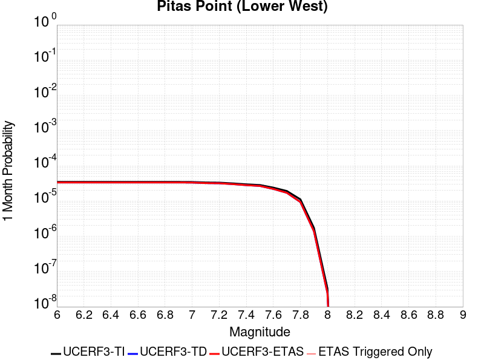 | 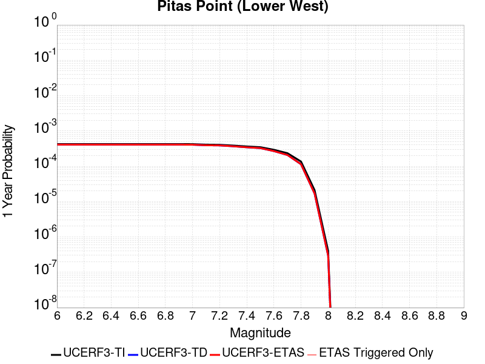 | 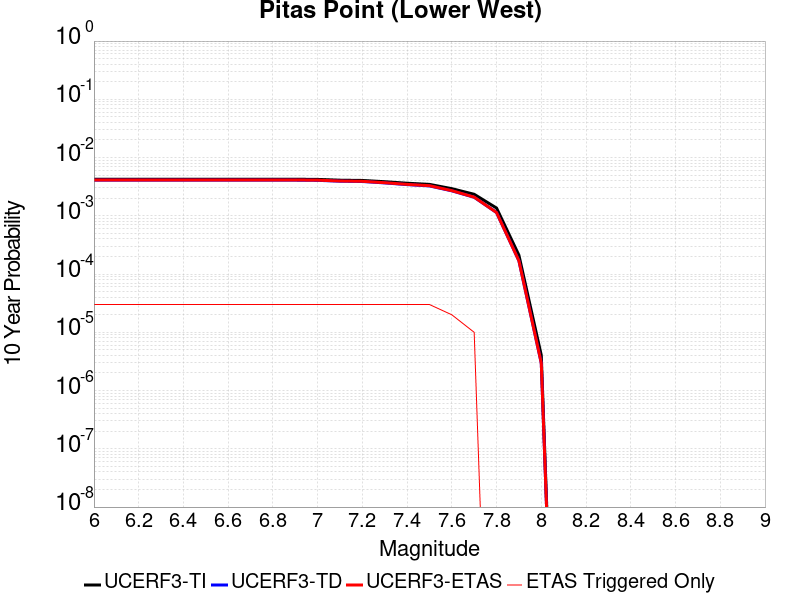 |

| Magnitude | 1 wk TI Prob | 1 wk TD Prob | 1 wk ETAS Prob | 1 wk ETAS/TD Gain | 1 wk ETAS Triggered Only | 1 mo TI Prob | 1 mo TD Prob | 1 mo ETAS Prob | 1 mo ETAS/TD Gain | 1 mo ETAS Triggered Only | 1 yr TI Prob | 1 yr TD Prob | 1 yr ETAS Prob | 1 yr ETAS/TD Gain | 1 yr ETAS Triggered Only | 10 yr TI Prob | 10 yr TD Prob | 10 yr ETAS Prob | 10 yr ETAS/TD Gain | 10 yr ETAS Triggered Only |
|-----|-----|-----|-----|-----|-----|-----|-----|-----|-----|-----|-----|-----|-----|-----|-----|-----|-----|-----|-----|-----|
| 6.0 | 8.151497E-6 | 7.855965E-6 | 7.855965E-6 | 1.0 | 0.0 | 3.493452E-5 | 3.366799E-5 | 3.366799E-5 | 1.0 | 0.0 | 4.252448E-4 | 4.0983147E-4 | 4.0983147E-4 | 1.0 | 0.0 | 0.0042443196 | 0.004090837 | 0.0041207145 | 1.0073035 | 3.0E-5 |
| 6.1 | 8.151497E-6 | 7.855965E-6 | 7.855965E-6 | 1.0 | 0.0 | 3.493452E-5 | 3.366799E-5 | 3.366799E-5 | 1.0 | 0.0 | 4.252448E-4 | 4.0983147E-4 | 4.0983147E-4 | 1.0 | 0.0 | 0.0042443196 | 0.004090837 | 0.0041207145 | 1.0073035 | 3.0E-5 |
| 6.2 | 8.151497E-6 | 7.855965E-6 | 7.855965E-6 | 1.0 | 0.0 | 3.493452E-5 | 3.366799E-5 | 3.366799E-5 | 1.0 | 0.0 | 4.252448E-4 | 4.0983147E-4 | 4.0983147E-4 | 1.0 | 0.0 | 0.0042443196 | 0.004090837 | 0.0041207145 | 1.0073035 | 3.0E-5 |
| 6.3 | 8.151497E-6 | 7.855965E-6 | 7.855965E-6 | 1.0 | 0.0 | 3.493452E-5 | 3.366799E-5 | 3.366799E-5 | 1.0 | 0.0 | 4.252448E-4 | 4.0983147E-4 | 4.0983147E-4 | 1.0 | 0.0 | 0.0042443196 | 0.004090837 | 0.0041207145 | 1.0073035 | 3.0E-5 |
| 6.4 | 8.151497E-6 | 7.855965E-6 | 7.855965E-6 | 1.0 | 0.0 | 3.493452E-5 | 3.366799E-5 | 3.366799E-5 | 1.0 | 0.0 | 4.252448E-4 | 4.0983147E-4 | 4.0983147E-4 | 1.0 | 0.0 | 0.0042443196 | 0.004090837 | 0.0041207145 | 1.0073035 | 3.0E-5 |
| 6.5 | 8.151497E-6 | 7.855965E-6 | 7.855965E-6 | 1.0 | 0.0 | 3.493452E-5 | 3.366799E-5 | 3.366799E-5 | 1.0 | 0.0 | 4.252448E-4 | 4.0983147E-4 | 4.0983147E-4 | 1.0 | 0.0 | 0.0042443196 | 0.004090837 | 0.0041207145 | 1.0073035 | 3.0E-5 |
| 6.6 | 8.151497E-6 | 7.855965E-6 | 7.855965E-6 | 1.0 | 0.0 | 3.493452E-5 | 3.366799E-5 | 3.366799E-5 | 1.0 | 0.0 | 4.252448E-4 | 4.0983147E-4 | 4.0983147E-4 | 1.0 | 0.0 | 0.0042443196 | 0.004090837 | 0.0041207145 | 1.0073035 | 3.0E-5 |
| 6.7 | 8.151497E-6 | 7.855965E-6 | 7.855965E-6 | 1.0 | 0.0 | 3.493452E-5 | 3.366799E-5 | 3.366799E-5 | 1.0 | 0.0 | 4.252448E-4 | 4.0983147E-4 | 4.0983147E-4 | 1.0 | 0.0 | 0.0042443196 | 0.004090837 | 0.0041207145 | 1.0073035 | 3.0E-5 |
| 6.8 | 8.151497E-6 | 7.855965E-6 | 7.855965E-6 | 1.0 | 0.0 | 3.493452E-5 | 3.366799E-5 | 3.366799E-5 | 1.0 | 0.0 | 4.252448E-4 | 4.0983147E-4 | 4.0983147E-4 | 1.0 | 0.0 | 0.0042443196 | 0.004090837 | 0.0041207145 | 1.0073035 | 3.0E-5 |
| 6.9 | 8.151497E-6 | 7.855965E-6 | 7.855965E-6 | 1.0 | 0.0 | 3.493452E-5 | 3.366799E-5 | 3.366799E-5 | 1.0 | 0.0 | 4.252448E-4 | 4.0983147E-4 | 4.0983147E-4 | 1.0 | 0.0 | 0.0042443196 | 0.004090837 | 0.0041207145 | 1.0073035 | 3.0E-5 |
| 7.0 | 8.103535E-6 | 7.8053945E-6 | 7.8053945E-6 | 1.0 | 0.0 | 3.4728975E-5 | 3.3451266E-5 | 3.3451266E-5 | 1.0 | 0.0 | 4.2274324E-4 | 4.0719376E-4 | 4.0719376E-4 | 1.0 | 0.0 | 0.0042193993 | 0.004064557 | 0.004094435 | 1.0073509 | 3.0E-5 |
| 7.1 | 7.853298E-6 | 7.5410794E-6 | 7.5410794E-6 | 1.0 | 0.0 | 3.3656554E-5 | 3.2318516E-5 | 3.2318516E-5 | 1.0 | 0.0 | 4.096915E-4 | 3.9340756E-4 | 3.9340756E-4 | 1.0 | 0.0 | 0.00408937 | 0.0039271875 | 0.0039570695 | 1.007609 | 3.0E-5 |
| 7.2 | 7.771102E-6 | 7.4533586E-6 | 7.4533586E-6 | 1.0 | 0.0 | 3.33043E-5 | 3.1942578E-5 | 3.1942578E-5 | 1.0 | 0.0 | 4.0540437E-4 | 3.888322E-4 | 3.888322E-4 | 1.0 | 0.0 | 0.0040466557 | 0.0038815944 | 0.003911478 | 1.0076988 | 3.0E-5 |
| 7.3 | 7.3945344E-6 | 7.0494516E-6 | 7.0494516E-6 | 1.0 | 0.0 | 3.1690477E-5 | 3.021159E-5 | 3.021159E-5 | 1.0 | 0.0 | 3.8576324E-4 | 3.6776465E-4 | 3.6776465E-4 | 1.0 | 0.0 | 0.0038509427 | 0.003671628 | 0.0037015178 | 1.0081408 | 3.0E-5 |
| 7.4 | 6.964645E-6 | 6.590288E-6 | 6.590288E-6 | 1.0 | 0.0 | 2.9848137E-5 | 2.824379E-5 | 2.824379E-5 | 1.0 | 0.0 | 3.6334046E-4 | 3.4381438E-4 | 3.4381438E-4 | 1.0 | 0.0 | 0.0036274698 | 0.0034328778 | 0.003462775 | 1.0087091 | 3.0E-5 |
| 7.5 | 6.6525035E-6 | 6.259319E-6 | 6.259319E-6 | 1.0 | 0.0 | 2.851042E-5 | 2.6825379E-5 | 2.6825379E-5 | 1.0 | 0.0 | 3.4705905E-4 | 3.2655054E-4 | 3.2655054E-4 | 1.0 | 0.0 | 0.0034651754 | 0.0032607585 | 0.0032906604 | 1.0091703 | 3.0E-5 |
| 7.6 | 5.613338E-6 | 5.151517E-6 | 5.151517E-6 | 1.0 | 0.0 | 2.405694E-5 | 2.2077746E-5 | 2.2077746E-5 | 1.0 | 0.0 | 2.928539E-4 | 2.687637E-4 | 2.687637E-4 | 1.0 | 0.0 | 0.0029246826 | 0.002684418 | 0.0027043645 | 1.0074304 | 2.0E-5 |
| 7.7 | 4.494704E-6 | 3.9970155E-6 | 3.9970155E-6 | 1.0 | 0.0 | 1.9262876E-5 | 1.7129954E-5 | 1.7129954E-5 | 1.0 | 0.0 | 2.3450027E-4 | 2.0853747E-4 | 2.0853747E-4 | 1.0 | 0.0 | 0.0023425296 | 0.002083442 | 0.002093421 | 1.0047897 | 1.0E-5 |
| 7.8 | 2.6075882E-6 | 2.1836913E-6 | 2.1836913E-6 | 1.0 | 0.0 | 1.117533E-5 | 9.358644E-6 | 9.358644E-6 | 1.0 | 0.0 | 1.3605114E-4 | 1.1393558E-4 | 1.1393558E-4 | 1.0 | 0.0 | 0.0013596788 | 0.0011387764 | 0.0011387764 | 1.0 | 0.0 |
| 7.9 | 4.045984E-7 | 3.2424586E-7 | 3.2424586E-7 | 1.0 | 0.0 | 1.733992E-6 | 1.3896245E-6 | 1.3896245E-6 | 1.0 | 0.0 | 2.1111147E-5 | 1.691855E-5 | 1.691855E-5 | 1.0 | 0.0 | 2.1109142E-4 | 1.6917293E-4 | 1.6917293E-4 | 1.0 | 0.0 |
| 8.0 | 7.791402E-9 | 5.6836655E-9 | 5.6836655E-9 | 1.0 | 0.0 | 3.3391725E-8 | 2.4358567E-8 | 2.4358567E-8 | 1.0 | 0.0 | 4.0654416E-7 | 2.9656553E-7 | 2.9656553E-7 | 1.0 | 0.0 | 4.065434E-6 | 2.9656533E-6 | 2.9656533E-6 | 1.0 | 0.0 |

## Oak Ridge (Onshore)
*[(top)](#table-of-contents)*

| 1 Week | 1 Month | 1 Year | 10 Year |
|-----|-----|-----|-----|
|  |  |  | 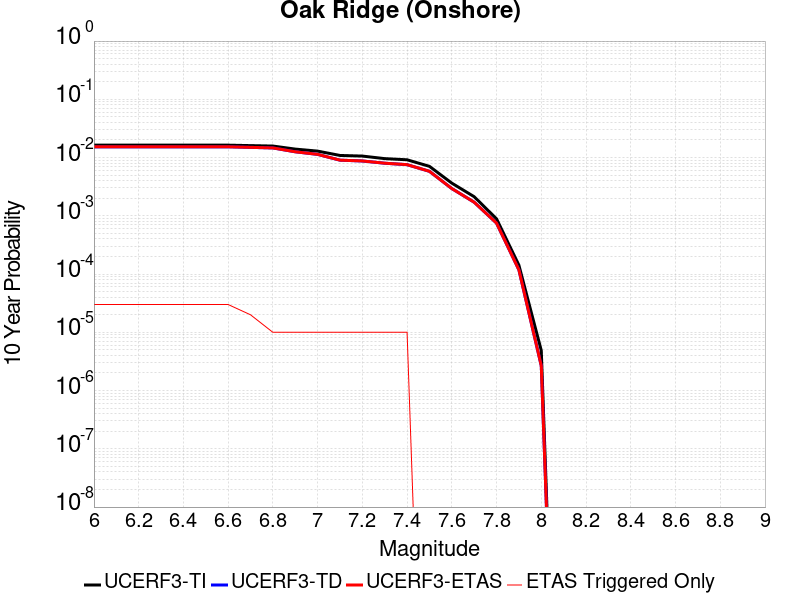 |

| Magnitude | 1 wk TI Prob | 1 wk TD Prob | 1 wk ETAS Prob | 1 wk ETAS/TD Gain | 1 wk ETAS Triggered Only | 1 mo TI Prob | 1 mo TD Prob | 1 mo ETAS Prob | 1 mo ETAS/TD Gain | 1 mo ETAS Triggered Only | 1 yr TI Prob | 1 yr TD Prob | 1 yr ETAS Prob | 1 yr ETAS/TD Gain | 1 yr ETAS Triggered Only | 10 yr TI Prob | 10 yr TD Prob | 10 yr ETAS Prob | 10 yr ETAS/TD Gain | 10 yr ETAS Triggered Only |
|-----|-----|-----|-----|-----|-----|-----|-----|-----|-----|-----|-----|-----|-----|-----|-----|-----|-----|-----|-----|-----|
| 6.0 | 3.155064E-5 | 2.9528966E-5 | 2.9528966E-5 | 1.0 | 0.0 | 1.3521002E-4 | 1.2654679E-4 | 1.3654552E-4 | 1.0790122 | 1.0E-5 | 0.001644939 | 0.0015396563 | 0.0015496409 | 1.006485 | 1.0E-5 | 0.01632816 | 0.015294396 | 0.015323938 | 1.0019315 | 3.0E-5 |
| 6.1 | 3.155064E-5 | 2.9528966E-5 | 2.9528966E-5 | 1.0 | 0.0 | 1.3521002E-4 | 1.2654679E-4 | 1.3654552E-4 | 1.0790122 | 1.0E-5 | 0.001644939 | 0.0015396563 | 0.0015496409 | 1.006485 | 1.0E-5 | 0.01632816 | 0.015294396 | 0.015323938 | 1.0019315 | 3.0E-5 |
| 6.2 | 3.155064E-5 | 2.9528966E-5 | 2.9528966E-5 | 1.0 | 0.0 | 1.3521002E-4 | 1.2654679E-4 | 1.3654552E-4 | 1.0790122 | 1.0E-5 | 0.001644939 | 0.0015396563 | 0.0015496409 | 1.006485 | 1.0E-5 | 0.01632816 | 0.015294396 | 0.015323938 | 1.0019315 | 3.0E-5 |
| 6.3 | 3.155064E-5 | 2.9528966E-5 | 2.9528966E-5 | 1.0 | 0.0 | 1.3521002E-4 | 1.2654679E-4 | 1.3654552E-4 | 1.0790122 | 1.0E-5 | 0.001644939 | 0.0015396563 | 0.0015496409 | 1.006485 | 1.0E-5 | 0.01632816 | 0.015294396 | 0.015323938 | 1.0019315 | 3.0E-5 |
| 6.4 | 3.155064E-5 | 2.9528966E-5 | 2.9528966E-5 | 1.0 | 0.0 | 1.3521002E-4 | 1.2654679E-4 | 1.3654552E-4 | 1.0790122 | 1.0E-5 | 0.001644939 | 0.0015396563 | 0.0015496409 | 1.006485 | 1.0E-5 | 0.01632816 | 0.015294396 | 0.015323938 | 1.0019315 | 3.0E-5 |
| 6.5 | 3.155064E-5 | 2.9528966E-5 | 2.9528966E-5 | 1.0 | 0.0 | 1.3521002E-4 | 1.2654679E-4 | 1.3654552E-4 | 1.0790122 | 1.0E-5 | 0.001644939 | 0.0015396563 | 0.0015496409 | 1.006485 | 1.0E-5 | 0.01632816 | 0.015294396 | 0.015323938 | 1.0019315 | 3.0E-5 |
| 6.6 | 3.155064E-5 | 2.9528966E-5 | 2.9528966E-5 | 1.0 | 0.0 | 1.3521002E-4 | 1.2654679E-4 | 1.3654552E-4 | 1.0790122 | 1.0E-5 | 0.001644939 | 0.0015396563 | 0.0015496409 | 1.006485 | 1.0E-5 | 0.01632816 | 0.015294396 | 0.015323938 | 1.0019315 | 3.0E-5 |
| 6.7 | 3.098897E-5 | 2.886712E-5 | 2.886712E-5 | 1.0 | 0.0 | 1.328031E-4 | 1.2371058E-4 | 1.3370934E-4 | 1.0808238 | 1.0E-5 | 0.0016156785 | 0.0015051733 | 0.0015151582 | 1.0066338 | 1.0E-5 | 0.016039822 | 0.014954228 | 0.014973929 | 1.0013174 | 2.0E-5 |
| 6.8 | 3.0449872E-5 | 2.8242279E-5 | 2.8242279E-5 | 1.0 | 0.0 | 1.3049292E-4 | 1.2103293E-4 | 1.2103293E-4 | 1.0 | 0.0 | 0.0015875935 | 0.001472617 | 0.001472617 | 1.0 | 0.0 | 0.015762992 | 0.014632956 | 0.0146428095 | 1.0006734 | 1.0E-5 |
| 6.9 | 2.697928E-5 | 2.4222425E-5 | 2.4222425E-5 | 1.0 | 0.0 | 1.15620365E-4 | 1.03806386E-4 | 1.03806386E-4 | 1.0 | 0.0 | 0.0014067689 | 0.0012631315 | 0.0012631315 | 1.0 | 0.0 | 0.0139789665 | 0.012562237 | 0.012572111 | 1.0007861 | 1.0E-5 |
| 7.0 | 2.4893961E-5 | 2.1864555E-5 | 2.1864555E-5 | 1.0 | 0.0 | 1.0668404E-4 | 9.370197E-5 | 9.370197E-5 | 1.0 | 0.0 | 0.0012981043 | 0.0011402421 | 0.0011402421 | 1.0 | 0.0 | 0.012905477 | 0.011346202 | 0.011356088 | 1.0008713 | 1.0E-5 |
| 7.1 | 2.0945363E-5 | 1.735674E-5 | 1.735674E-5 | 1.0 | 0.0 | 8.976275E-5 | 7.4383934E-5 | 7.4383934E-5 | 1.0 | 0.0 | 0.0010923136 | 9.052529E-4 | 9.052529E-4 | 1.0 | 0.0 | 0.0108696 | 0.009016588 | 0.009026498 | 1.0010991 | 1.0E-5 |
| 7.2 | 2.0439404E-5 | 1.6811648E-5 | 1.6811648E-5 | 1.0 | 0.0 | 8.7594504E-5 | 7.204796E-5 | 7.204796E-5 | 1.0 | 0.0 | 0.0010659413 | 8.7683555E-4 | 8.7683555E-4 | 1.0 | 0.0 | 0.010608427 | 0.008734677 | 0.008744589 | 1.0011349 | 1.0E-5 |
| 7.3 | 1.8463334E-5 | 1.5382584E-5 | 1.5382584E-5 | 1.0 | 0.0 | 7.912617E-5 | 6.592372E-5 | 6.592372E-5 | 1.0 | 0.0 | 9.6293533E-4 | 8.023301E-4 | 8.023301E-4 | 1.0 | 0.0 | 0.009587734 | 0.007995198 | 0.008005118 | 1.0012407 | 1.0E-5 |
| 7.4 | 1.763139E-5 | 1.4517471E-5 | 1.4517471E-5 | 1.0 | 0.0 | 7.556091E-5 | 6.221627E-5 | 6.221627E-5 | 1.0 | 0.0 | 9.1956573E-4 | 7.572238E-4 | 7.572238E-4 | 1.0 | 0.0 | 0.009157699 | 0.0075472407 | 0.007557165 | 1.001315 | 1.0E-5 |
| 7.5 | 1.3594944E-5 | 1.11637355E-5 | 1.11637355E-5 | 1.0 | 0.0 | 5.8262744E-5 | 4.7843714E-5 | 4.7843714E-5 | 1.0 | 0.0 | 7.0911803E-4 | 5.823441E-4 | 5.823441E-4 | 1.0 | 0.0 | 0.007068595 | 0.005808452 | 0.005808452 | 1.0 | 0.0 |
| 7.6 | 6.9889534E-6 | 5.6368717E-6 | 5.6368717E-6 | 1.0 | 0.0 | 2.9952313E-5 | 2.41578E-5 | 2.41578E-5 | 1.0 | 0.0 | 3.646084E-4 | 2.9408192E-4 | 2.9408192E-4 | 1.0 | 0.0 | 0.0036401073 | 0.0029369716 | 0.0029369716 | 1.0 | 0.0 |
| 7.7 | 4.0824193E-6 | 3.283348E-6 | 3.283348E-6 | 1.0 | 0.0 | 1.7495966E-5 | 1.40714155E-5 | 1.40714155E-5 | 1.0 | 0.0 | 2.1299256E-4 | 1.7130615E-4 | 1.7130615E-4 | 1.0 | 0.0 | 0.0021278851 | 0.0017117544 | 0.0017117544 | 1.0 | 0.0 |
| 7.8 | 1.7023609E-6 | 1.4370814E-6 | 1.4370814E-6 | 1.0 | 0.0 | 7.295812E-6 | 6.158906E-6 | 6.158906E-6 | 1.0 | 0.0 | 8.882289E-5 | 7.4982134E-5 | 7.4982134E-5 | 1.0 | 0.0 | 8.8787393E-4 | 7.4957113E-4 | 7.4957113E-4 | 1.0 | 0.0 |
| 7.9 | 2.721225E-7 | 2.261715E-7 | 2.261715E-7 | 1.0 | 0.0 | 1.1662388E-6 | 9.69306E-7 | 9.69306E-7 | 1.0 | 0.0 | 1.4198865E-5 | 1.180124E-5 | 1.180124E-5 | 1.0 | 0.0 | 1.4197957E-4 | 1.18006414E-4 | 1.18006414E-4 | 1.0 | 0.0 |
| 8.0 | 9.364255E-9 | 5.121437E-9 | 5.121437E-9 | 1.0 | 0.0 | 4.0132523E-8 | 2.1949015E-8 | 2.1949015E-8 | 1.0 | 0.0 | 4.8861335E-7 | 2.672292E-7 | 2.672292E-7 | 1.0 | 0.0 | 4.8861225E-6 | 2.6722894E-6 | 2.6722894E-6 | 1.0 | 0.0 |

## Calaveras (So) - Paicines extension 2011 CFM
*[(top)](#table-of-contents)*

| 1 Week | 1 Month | 1 Year | 10 Year |
|-----|-----|-----|-----|
|  | 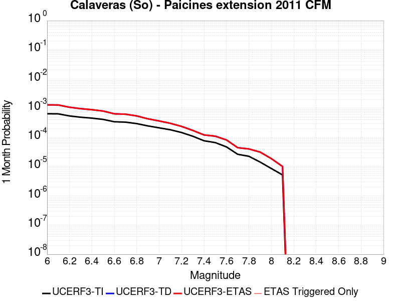 |  |  |

| Magnitude | 1 wk TI Prob | 1 wk TD Prob | 1 wk ETAS Prob | 1 wk ETAS/TD Gain | 1 wk ETAS Triggered Only | 1 mo TI Prob | 1 mo TD Prob | 1 mo ETAS Prob | 1 mo ETAS/TD Gain | 1 mo ETAS Triggered Only | 1 yr TI Prob | 1 yr TD Prob | 1 yr ETAS Prob | 1 yr ETAS/TD Gain | 1 yr ETAS Triggered Only | 10 yr TI Prob | 10 yr TD Prob | 10 yr ETAS Prob | 10 yr ETAS/TD Gain | 10 yr ETAS Triggered Only |
|-----|-----|-----|-----|-----|-----|-----|-----|-----|-----|-----|-----|-----|-----|-----|-----|-----|-----|-----|-----|-----|
| 6.0 | 1.5183659E-4 | 3.052938E-4 | 3.052938E-4 | 1.0 | 0.0 | 6.5056595E-4 | 0.0013076937 | 0.0013076937 | 1.0 | 0.0 | 0.007891912 | 0.015701806 | 0.015721492 | 1.0012537 | 2.0E-5 | 0.076174594 | 0.13853423 | 0.13856007 | 1.0001866 | 3.0E-5 |
| 6.1 | 1.5024997E-4 | 3.022334E-4 | 3.022334E-4 | 1.0 | 0.0 | 6.437695E-4 | 0.0012945911 | 0.0012945911 | 1.0 | 0.0 | 0.0078097614 | 0.0155451875 | 0.015564877 | 1.0012666 | 2.0E-5 | 0.075409345 | 0.13720377 | 0.13722965 | 1.0001887 | 3.0E-5 |
| 6.2 | 1.2743923E-4 | 2.5334288E-4 | 2.5334288E-4 | 1.0 | 0.0 | 5.460538E-4 | 0.0010852421 | 0.0010852421 | 1.0 | 0.0 | 0.0066279583 | 0.013052391 | 0.01307213 | 1.0015123 | 2.0E-5 | 0.064337276 | 0.11730213 | 0.11732861 | 1.0002258 | 3.0E-5 |
| 6.3 | 1.1525114E-4 | 2.2618659E-4 | 2.2618659E-4 | 1.0 | 0.0 | 4.9383997E-4 | 9.6896687E-4 | 9.6896687E-4 | 1.0 | 0.0 | 0.0059959386 | 0.011673578 | 0.011683461 | 1.0008466 | 1.0E-5 | 0.058367174 | 0.10641843 | 0.106436305 | 1.000168 | 2.0E-5 |
| 6.4 | 1.07200925E-4 | 2.0856703E-4 | 2.0856703E-4 | 1.0 | 0.0 | 4.5935164E-4 | 8.9350773E-4 | 8.9350773E-4 | 1.0 | 0.0 | 0.0055782744 | 0.010778376 | 0.010788268 | 1.0009178 | 1.0E-5 | 0.0544031 | 0.099241205 | 0.09925922 | 1.0001816 | 2.0E-5 |
| 6.5 | 9.69631E-5 | 1.874708E-4 | 1.874708E-4 | 1.0 | 0.0 | 4.1548995E-4 | 8.0318184E-4 | 8.0318184E-4 | 1.0 | 0.0 | 0.0050468626 | 0.0097001875 | 0.009710091 | 1.0010209 | 1.0E-5 | 0.04933773 | 0.09013285 | 0.09015104 | 1.000202 | 2.0E-5 |
| 6.6 | 8.0552316E-5 | 1.508223E-4 | 1.508223E-4 | 1.0 | 0.0 | 3.4517853E-4 | 6.461965E-4 | 6.461965E-4 | 1.0 | 0.0 | 0.0041944524 | 0.0078318585 | 0.00784178 | 1.0012668 | 1.0E-5 | 0.04116161 | 0.07490311 | 0.07492161 | 1.000247 | 2.0E-5 |
| 6.7 | 7.815757E-5 | 1.4622323E-4 | 1.4622323E-4 | 1.0 | 0.0 | 3.34918E-4 | 6.2651676E-4 | 6.2651676E-4 | 1.0 | 0.0 | 0.004070005 | 0.0075946692 | 0.0076045934 | 1.0013068 | 1.0E-5 | 0.039962657 | 0.07275255 | 0.072771095 | 1.0002549 | 2.0E-5 |
| 6.8 | 6.965264E-5 | 1.2732283E-4 | 1.2732283E-4 | 1.0 | 0.0 | 2.9847719E-4 | 5.4555334E-4 | 5.4555334E-4 | 1.0 | 0.0 | 0.0036279052 | 0.006618716 | 0.006618716 | 1.0 | 0.0 | 0.03569247 | 0.06384585 | 0.063855216 | 1.0001466 | 1.0E-5 |
| 6.9 | 5.8000453E-5 | 1.0152565E-4 | 1.0152565E-4 | 1.0 | 0.0 | 2.4854968E-4 | 4.3503795E-4 | 4.3503795E-4 | 1.0 | 0.0 | 0.0030218933 | 0.0052838284 | 0.0052838284 | 1.0 | 0.0 | 0.029811295 | 0.051543854 | 0.05155334 | 1.000184 | 1.0E-5 |
| 7.0 | 4.9865852E-5 | 8.57661E-5 | 8.57661E-5 | 1.0 | 0.0 | 2.1369329E-4 | 3.675177E-4 | 3.675177E-4 | 1.0 | 0.0 | 0.0025986114 | 0.004465437 | 0.004465437 | 1.0 | 0.0 | 0.025684336 | 0.043823678 | 0.04383324 | 1.0002182 | 1.0E-5 |
| 7.1 | 4.283875E-5 | 7.1188755E-5 | 7.1188755E-5 | 1.0 | 0.0 | 1.8358172E-4 | 3.050593E-4 | 3.050593E-4 | 1.0 | 0.0 | 0.0022328163 | 0.0037078282 | 0.0037078282 | 1.0 | 0.0 | 0.022105146 | 0.036768116 | 0.03677775 | 1.000262 | 1.0E-5 |
| 7.2 | 3.450115E-5 | 5.5841625E-5 | 5.5841625E-5 | 1.0 | 0.0 | 1.478537E-4 | 2.3929945E-4 | 2.3929945E-4 | 1.0 | 0.0 | 0.0017986323 | 0.0029096075 | 0.0029096075 | 1.0 | 0.0 | 0.017841442 | 0.029111 | 0.029120708 | 1.0003335 | 1.0E-5 |
| 7.3 | 2.5709045E-5 | 4.0646035E-5 | 4.0646035E-5 | 1.0 | 0.0 | 1.1017697E-4 | 1.7418576E-4 | 1.7418576E-4 | 1.0 | 0.0 | 0.0013405791 | 0.002118666 | 0.002118666 | 1.0 | 0.0 | 0.013325208 | 0.021325704 | 0.021335492 | 1.000459 | 1.0E-5 |
| 7.4 | 1.8003093E-5 | 2.8538429E-5 | 2.8538429E-5 | 1.0 | 0.0 | 7.715383E-5 | 1.2230183E-4 | 1.2230183E-4 | 1.0 | 0.0 | 9.3894306E-4 | 0.00148801 | 0.00148801 | 1.0 | 0.0 | 0.009349857 | 0.0150660565 | 0.015075905 | 1.0006537 | 1.0E-5 |
| 7.5 | 1.5595824E-5 | 2.584999E-5 | 2.584999E-5 | 1.0 | 0.0 | 6.683753E-5 | 1.1078098E-4 | 1.1078098E-4 | 1.0 | 0.0 | 8.134431E-4 | 0.0013479262 | 0.0013479262 | 1.0 | 0.0 | 0.008104719 | 0.013665511 | 0.013675374 | 1.0007218 | 1.0E-5 |
| 7.6 | 1.1110309E-5 | 1.9246372E-5 | 1.9246372E-5 | 1.0 | 0.0 | 4.761474E-5 | 8.2481856E-5 | 8.2481856E-5 | 1.0 | 0.0 | 5.795553E-4 | 0.0010037553 | 0.0010037553 | 1.0 | 0.0 | 0.0057804612 | 0.010215769 | 0.010225667 | 1.0009689 | 1.0E-5 |
| 7.7 | 6.2140443E-6 | 1.0454194E-5 | 1.0454194E-5 | 1.0 | 0.0 | 2.6631347E-5 | 4.4802917E-5 | 4.4802917E-5 | 1.0 | 0.0 | 3.241884E-4 | 5.4533913E-4 | 5.4533913E-4 | 1.0 | 0.0 | 0.0032371588 | 0.0056281975 | 0.005638141 | 1.0017668 | 1.0E-5 |
| 7.8 | 5.305533E-6 | 9.448307E-6 | 9.448307E-6 | 1.0 | 0.0 | 2.27378E-5 | 4.0492116E-5 | 4.0492116E-5 | 1.0 | 0.0 | 2.7679754E-4 | 4.928801E-4 | 4.928801E-4 | 1.0 | 0.0 | 0.0027645302 | 0.005081753 | 0.005091702 | 1.0019578 | 1.0E-5 |
| 7.9 | 3.363505E-6 | 7.396205E-6 | 7.396205E-6 | 1.0 | 0.0 | 1.4414942E-5 | 3.1697637E-5 | 3.1697637E-5 | 1.0 | 0.0 | 1.7548777E-4 | 3.8585046E-4 | 3.8585046E-4 | 1.0 | 0.0 | 0.0017534926 | 0.0039539887 | 0.003963949 | 1.0025191 | 1.0E-5 |
| 8.0 | 2.0271132E-6 | 4.419551E-6 | 4.419551E-6 | 1.0 | 0.0 | 8.687599E-6 | 1.8940793E-5 | 1.8940793E-5 | 1.0 | 0.0 | 1.05766376E-4 | 2.3057981E-4 | 2.3057981E-4 | 1.0 | 0.0 | 0.0010571606 | 0.0023542438 | 0.0023542438 | 1.0 | 0.0 |
| 8.1 | 1.2206116E-6 | 2.3786642E-6 | 2.3786642E-6 | 1.0 | 0.0 | 5.2311816E-6 | 1.0194235E-5 | 1.0194235E-5 | 1.0 | 0.0 | 6.3687774E-5 | 1.2410778E-4 | 1.2410778E-4 | 1.0 | 0.0 | 6.366953E-4 | 0.0012723072 | 0.0012723072 | 1.0 | 0.0 |

## Big Pine (East)
*[(top)](#table-of-contents)*

| 1 Week | 1 Month | 1 Year | 10 Year |
|-----|-----|-----|-----|
| 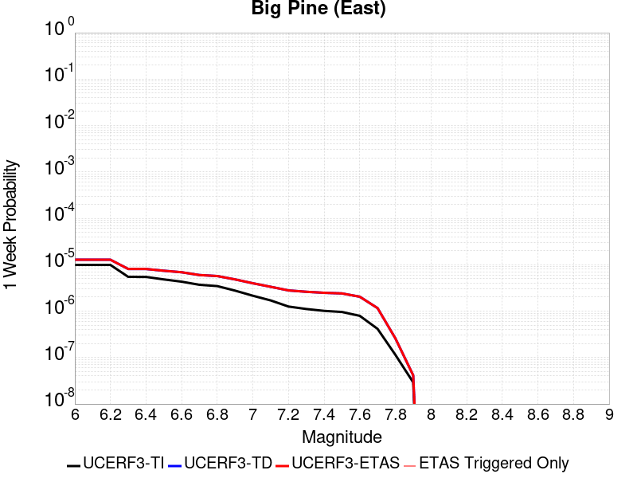 |  | 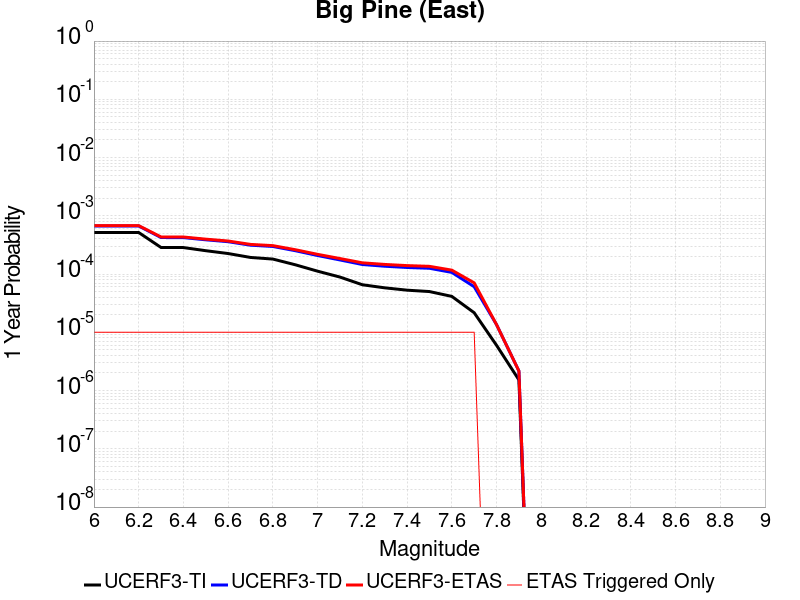 |  |

| Magnitude | 1 wk TI Prob | 1 wk TD Prob | 1 wk ETAS Prob | 1 wk ETAS/TD Gain | 1 wk ETAS Triggered Only | 1 mo TI Prob | 1 mo TD Prob | 1 mo ETAS Prob | 1 mo ETAS/TD Gain | 1 mo ETAS Triggered Only | 1 yr TI Prob | 1 yr TD Prob | 1 yr ETAS Prob | 1 yr ETAS/TD Gain | 1 yr ETAS Triggered Only | 10 yr TI Prob | 10 yr TD Prob | 10 yr ETAS Prob | 10 yr ETAS/TD Gain | 10 yr ETAS Triggered Only |
|-----|-----|-----|-----|-----|-----|-----|-----|-----|-----|-----|-----|-----|-----|-----|-----|-----|-----|-----|-----|-----|
| 6.0 | 9.916913E-6 | 1.2820724E-5 | 1.2820724E-5 | 1.0 | 0.0 | 4.250036E-5 | 5.4944925E-5 | 5.4944925E-5 | 1.0 | 0.0 | 5.173191E-4 | 6.687713E-4 | 6.787646E-4 | 1.0149428 | 1.0E-5 | 0.0051611643 | 0.0066723474 | 0.006702147 | 1.0044662 | 3.0E-5 |
| 6.1 | 9.916913E-6 | 1.2820724E-5 | 1.2820724E-5 | 1.0 | 0.0 | 4.250036E-5 | 5.4944925E-5 | 5.4944925E-5 | 1.0 | 0.0 | 5.173191E-4 | 6.687713E-4 | 6.787646E-4 | 1.0149428 | 1.0E-5 | 0.0051611643 | 0.0066723474 | 0.006702147 | 1.0044662 | 3.0E-5 |
| 6.2 | 9.916913E-6 | 1.2820724E-5 | 1.2820724E-5 | 1.0 | 0.0 | 4.250036E-5 | 5.4944925E-5 | 5.4944925E-5 | 1.0 | 0.0 | 5.173191E-4 | 6.687713E-4 | 6.787646E-4 | 1.0149428 | 1.0E-5 | 0.0051611643 | 0.0066723474 | 0.006702147 | 1.0044662 | 3.0E-5 |
| 6.3 | 5.479711E-6 | 8.116578E-6 | 8.116578E-6 | 1.0 | 0.0 | 2.3484265E-5 | 3.4784887E-5 | 3.4784887E-5 | 1.0 | 0.0 | 2.858834E-4 | 4.234269E-4 | 4.3342268E-4 | 1.0236068 | 1.0E-5 | 0.0028551589 | 0.0042290958 | 0.004258969 | 1.0070637 | 3.0E-5 |
| 6.4 | 5.465009E-6 | 8.100871E-6 | 8.100871E-6 | 1.0 | 0.0 | 2.3421257E-5 | 3.4717574E-5 | 3.4717574E-5 | 1.0 | 0.0 | 2.851165E-4 | 4.2260767E-4 | 4.3260347E-4 | 1.0236526 | 1.0E-5 | 0.0028475097 | 0.0042209346 | 0.004250808 | 1.0070775 | 3.0E-5 |
| 6.5 | 4.826767E-6 | 7.425912E-6 | 7.425912E-6 | 1.0 | 0.0 | 2.068598E-5 | 3.1824966E-5 | 3.1824966E-5 | 1.0 | 0.0 | 2.518227E-4 | 3.8740283E-4 | 3.9739895E-4 | 1.025803 | 1.0E-5 | 0.0025153751 | 0.0038701277 | 0.0039000115 | 1.0077217 | 3.0E-5 |
| 6.6 | 4.3146847E-6 | 6.8858362E-6 | 6.8858362E-6 | 1.0 | 0.0 | 1.8491375E-5 | 2.9510407E-5 | 2.9510407E-5 | 1.0 | 0.0 | 2.2510924E-4 | 3.5923242E-4 | 3.6922883E-4 | 1.0278271 | 1.0E-5 | 0.0022488134 | 0.0035893377 | 0.00361923 | 1.0083281 | 3.0E-5 |
| 6.7 | 3.6968106E-6 | 5.9988593E-6 | 5.9988593E-6 | 1.0 | 0.0 | 1.5843378E-5 | 2.5709152E-5 | 2.5709152E-5 | 1.0 | 0.0 | 1.9287605E-4 | 3.129655E-4 | 3.2296238E-4 | 1.0319424 | 1.0E-5 | 0.0019270873 | 0.0031279777 | 0.0031578839 | 1.0095608 | 3.0E-5 |
| 6.8 | 3.4671132E-6 | 5.705472E-6 | 5.705472E-6 | 1.0 | 0.0 | 1.4858972E-5 | 2.4451801E-5 | 2.4451801E-5 | 1.0 | 0.0 | 1.8089297E-4 | 2.9766146E-4 | 3.0765848E-4 | 1.0335852 | 1.0E-5 | 0.0018074579 | 0.0029753493 | 0.00300526 | 1.0100528 | 3.0E-5 |
| 6.9 | 2.7686972E-6 | 4.828265E-6 | 4.828265E-6 | 1.0 | 0.0 | 1.1865792E-5 | 2.0692405E-5 | 2.0692405E-5 | 1.0 | 0.0 | 1.4445644E-4 | 2.5190166E-4 | 2.6189914E-4 | 1.039688 | 1.0E-5 | 0.0014436257 | 0.0025188148 | 0.0025487393 | 1.0118804 | 3.0E-5 |
| 7.0 | 2.1472624E-6 | 3.987804E-6 | 3.987804E-6 | 1.0 | 0.0 | 9.20252E-6 | 1.709048E-5 | 1.709048E-5 | 1.0 | 0.0 | 1.12034926E-4 | 2.0805726E-4 | 2.1805518E-4 | 1.0480537 | 1.0E-5 | 0.0011197845 | 0.002081246 | 0.0021012046 | 1.0095897 | 2.0E-5 |
| 7.1 | 1.7018335E-6 | 3.3473907E-6 | 3.3473907E-6 | 1.0 | 0.0 | 7.293552E-6 | 1.4345884E-5 | 1.4345884E-5 | 1.0 | 0.0 | 8.879537E-5 | 1.7464749E-4 | 1.8464575E-4 | 1.0572482 | 1.0E-5 | 8.87599E-4 | 0.0017476922 | 0.0017676573 | 1.0114237 | 2.0E-5 |
| 7.2 | 1.25603E-6 | 2.7968597E-6 | 2.7968597E-6 | 1.0 | 0.0 | 5.3829745E-6 | 1.1986488E-5 | 1.1986488E-5 | 1.0 | 0.0 | 6.553574E-5 | 1.4592595E-4 | 1.5592448E-4 | 1.0685179 | 1.0E-5 | 6.551642E-4 | 0.0014608668 | 0.0014708522 | 1.0068352 | 1.0E-5 |
| 7.3 | 1.112297E-6 | 2.6125754E-6 | 2.6125754E-6 | 1.0 | 0.0 | 4.7669787E-6 | 1.1196705E-5 | 1.1196705E-5 | 1.0 | 0.0 | 5.803642E-5 | 1.3631157E-4 | 1.4631021E-4 | 1.0733514 | 1.0E-5 | 5.802127E-4 | 0.0013646771 | 0.0013746634 | 1.0073178 | 1.0E-5 |
| 7.4 | 1.0137181E-6 | 2.4856388E-6 | 2.4856388E-6 | 1.0 | 0.0 | 4.3444993E-6 | 1.0652695E-5 | 1.0652695E-5 | 1.0 | 0.0 | 5.2892992E-5 | 1.2968906E-4 | 1.3968776E-4 | 1.0770975 | 1.0E-5 | 5.288041E-4 | 0.0012983155 | 0.0013083024 | 1.0076923 | 1.0E-5 |
| 7.5 | 9.598608E-7 | 2.4092315E-6 | 2.4092315E-6 | 1.0 | 0.0 | 4.1136827E-6 | 1.0325238E-5 | 1.0325238E-5 | 1.0 | 0.0 | 5.0082934E-5 | 1.2570273E-4 | 1.3570147E-4 | 1.0795428 | 1.0E-5 | 5.007165E-4 | 0.0012583062 | 0.0012682936 | 1.0079372 | 1.0E-5 |
| 7.6 | 7.929459E-7 | 2.0466987E-6 | 2.0466987E-6 | 1.0 | 0.0 | 3.3983351E-6 | 8.771537E-6 | 8.771537E-6 | 1.0 | 0.0 | 4.1373947E-5 | 1.0678841E-4 | 1.1678734E-4 | 1.0936332 | 1.0E-5 | 4.1366243E-4 | 0.0010694525 | 0.0010794419 | 1.0093405 | 1.0E-5 |
| 7.7 | 4.155788E-7 | 1.1618632E-6 | 1.1618632E-6 | 1.0 | 0.0 | 1.7810507E-6 | 4.9794044E-6 | 4.9794044E-6 | 1.0 | 0.0 | 2.1684076E-5 | 6.0622606E-5 | 7.0622E-5 | 1.164945 | 1.0E-5 | 2.1681961E-4 | 6.0923153E-4 | 6.1922544E-4 | 1.0164042 | 1.0E-5 |
| 7.8 | 1.14666925E-7 | 2.5949444E-7 | 2.5949444E-7 | 1.0 | 0.0 | 4.914296E-7 | 1.1121186E-6 | 1.1121186E-6 | 1.0 | 0.0 | 5.9831386E-6 | 1.3539964E-5 | 1.3539964E-5 | 1.0 | 0.0 | 5.9829777E-5 | 1.3649135E-4 | 1.3649135E-4 | 1.0 | 0.0 |
| 7.9 | 2.9231824E-8 | 4.151281E-8 | 4.151281E-8 | 1.0 | 0.0 | 1.2527924E-7 | 1.7791203E-7 | 1.7791203E-7 | 1.0 | 0.0 | 1.5252737E-6 | 2.1660771E-6 | 2.1660771E-6 | 1.0 | 0.0 | 1.5252632E-5 | 2.1993306E-5 | 2.1993306E-5 | 1.0 | 0.0 |

## San Pedro Basin
*[(top)](#table-of-contents)*

| 1 Week | 1 Month | 1 Year | 10 Year |
|-----|-----|-----|-----|
|  |  |  | 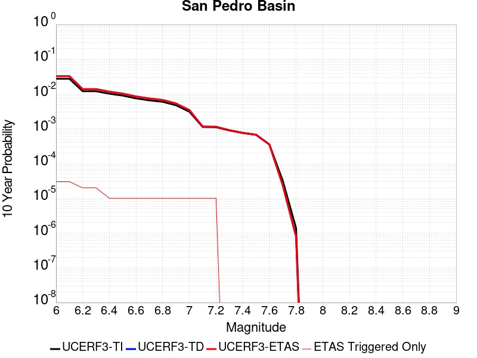 |

| Magnitude | 1 wk TI Prob | 1 wk TD Prob | 1 wk ETAS Prob | 1 wk ETAS/TD Gain | 1 wk ETAS Triggered Only | 1 mo TI Prob | 1 mo TD Prob | 1 mo ETAS Prob | 1 mo ETAS/TD Gain | 1 mo ETAS Triggered Only | 1 yr TI Prob | 1 yr TD Prob | 1 yr ETAS Prob | 1 yr ETAS/TD Gain | 1 yr ETAS Triggered Only | 10 yr TI Prob | 10 yr TD Prob | 10 yr ETAS Prob | 10 yr ETAS/TD Gain | 10 yr ETAS Triggered Only |
|-----|-----|-----|-----|-----|-----|-----|-----|-----|-----|-----|-----|-----|-----|-----|-----|-----|-----|-----|-----|-----|
| 6.0 | 5.3449043E-5 | 6.3374304E-5 | 6.3374304E-5 | 1.0 | 0.0 | 2.2904722E-4 | 2.7157934E-4 | 2.7157934E-4 | 1.0 | 0.0 | 0.0027850836 | 0.0033020729 | 0.00331204 | 1.0030184 | 1.0E-5 | 0.027504366 | 0.032591846 | 0.03262087 | 1.0008905 | 3.0E-5 |
| 6.1 | 5.3449043E-5 | 6.3374304E-5 | 6.3374304E-5 | 1.0 | 0.0 | 2.2904722E-4 | 2.7157934E-4 | 2.7157934E-4 | 1.0 | 0.0 | 0.0027850836 | 0.0033020729 | 0.00331204 | 1.0030184 | 1.0E-5 | 0.027504366 | 0.032591846 | 0.03262087 | 1.0008905 | 3.0E-5 |
| 6.2 | 2.3189454E-5 | 2.664441E-5 | 2.664441E-5 | 1.0 | 0.0 | 9.9379584E-5 | 1.141856E-4 | 1.141856E-4 | 1.0 | 0.0 | 0.0012092749 | 0.0013893704 | 0.0013893704 | 1.0 | 0.0 | 0.012027155 | 0.013811714 | 0.013831438 | 1.001428 | 2.0E-5 |
| 6.3 | 2.3189454E-5 | 2.664441E-5 | 2.664441E-5 | 1.0 | 0.0 | 9.9379584E-5 | 1.141856E-4 | 1.141856E-4 | 1.0 | 0.0 | 0.0012092749 | 0.0013893704 | 0.0013893704 | 1.0 | 0.0 | 0.012027155 | 0.013811714 | 0.013831438 | 1.001428 | 2.0E-5 |
| 6.4 | 1.966056E-5 | 2.246472E-5 | 2.246472E-5 | 1.0 | 0.0 | 8.425682E-5 | 9.627404E-5 | 9.627404E-5 | 1.0 | 0.0 | 0.001025344 | 0.0011715464 | 0.0011715464 | 1.0 | 0.0 | 0.010206259 | 0.01165779 | 0.0116676735 | 1.0008478 | 1.0E-5 |
| 6.5 | 1.7342953E-5 | 1.9746267E-5 | 1.9746267E-5 | 1.0 | 0.0 | 7.4324824E-5 | 8.462432E-5 | 8.462432E-5 | 1.0 | 0.0 | 9.04529E-4 | 0.001029851 | 0.001029851 | 1.0 | 0.0 | 0.009008561 | 0.010254509 | 0.010264407 | 1.0009652 | 1.0E-5 |
| 6.6 | 1.439804E-5 | 1.6323613E-5 | 1.6323613E-5 | 1.0 | 0.0 | 6.170443E-5 | 6.9956644E-5 | 6.9956644E-5 | 1.0 | 0.0 | 7.509924E-4 | 8.5142144E-4 | 8.5142144E-4 | 1.0 | 0.0 | 0.0074845953 | 0.008484797 | 0.0084947115 | 1.0011686 | 1.0E-5 |
| 6.7 | 1.2634884E-5 | 1.4286068E-5 | 1.4286068E-5 | 1.0 | 0.0 | 5.414838E-5 | 6.122474E-5 | 6.122474E-5 | 1.0 | 0.0 | 6.590571E-4 | 7.4518676E-4 | 7.4518676E-4 | 1.0 | 0.0 | 0.006571059 | 0.007429901 | 0.0074398266 | 1.0013359 | 1.0E-5 |
| 6.8 | 1.146091E-5 | 1.29338805E-5 | 1.29338805E-5 | 1.0 | 0.0 | 4.911726E-5 | 5.5429908E-5 | 5.5429908E-5 | 1.0 | 0.0 | 5.9783855E-4 | 6.7467993E-4 | 6.7467993E-4 | 1.0 | 0.0 | 0.0059623276 | 0.006729257 | 0.0067391894 | 1.001476 | 1.0E-5 |
| 6.9 | 9.109035E-6 | 1.02355425E-5 | 1.02355425E-5 | 1.0 | 0.0 | 3.9038136E-5 | 4.386603E-5 | 4.386603E-5 | 1.0 | 0.0 | 4.7518566E-4 | 5.3396606E-4 | 5.3396606E-4 | 1.0 | 0.0 | 0.0047417083 | 0.0053295847 | 0.0053395317 | 1.0018663 | 1.0E-5 |
| 7.0 | 5.9351028E-6 | 6.5842764E-6 | 6.5842764E-6 | 1.0 | 0.0 | 2.5435906E-5 | 2.8218155E-5 | 2.8218155E-5 | 1.0 | 0.0 | 3.0963816E-4 | 3.435255E-4 | 3.435255E-4 | 1.0 | 0.0 | 0.0030920706 | 0.003432262 | 0.0034422276 | 1.0029036 | 1.0E-5 |
| 7.1 | 2.1557585E-6 | 2.2096863E-6 | 2.2096863E-6 | 1.0 | 0.0 | 9.238933E-6 | 9.47005E-6 | 9.47005E-6 | 1.0 | 0.0 | 1.1247819E-4 | 1.15291914E-4 | 1.15291914E-4 | 1.0 | 0.0 | 0.0011242128 | 0.0011523364 | 0.0011623248 | 1.0086681 | 1.0E-5 |
| 7.2 | 2.1251979E-6 | 2.178032E-6 | 2.178032E-6 | 1.0 | 0.0 | 9.107958E-6 | 9.334391E-6 | 9.334391E-6 | 1.0 | 0.0 | 1.1088375E-4 | 1.1364043E-4 | 1.1364043E-4 | 1.0 | 0.0 | 0.0011082845 | 0.0011358385 | 0.0011458271 | 1.0087941 | 1.0E-5 |
| 7.3 | 1.7145798E-6 | 1.7443153E-6 | 1.7443153E-6 | 1.0 | 0.0 | 7.3481783E-6 | 7.4756163E-6 | 7.4756163E-6 | 1.0 | 0.0 | 8.94604E-5 | 9.101191E-5 | 9.101191E-5 | 1.0 | 0.0 | 8.9424395E-4 | 9.0975553E-4 | 9.0975553E-4 | 1.0 | 0.0 |
| 7.4 | 1.4467993E-6 | 1.4642094E-6 | 1.4642094E-6 | 1.0 | 0.0 | 6.200554E-6 | 6.2751687E-6 | 6.2751687E-6 | 1.0 | 0.0 | 7.548913E-5 | 7.639758E-5 | 7.639758E-5 | 1.0 | 0.0 | 7.546349E-4 | 7.6372037E-4 | 7.6372037E-4 | 1.0 | 0.0 |
| 7.5 | 1.2803735E-6 | 1.2931697E-6 | 1.2931697E-6 | 1.0 | 0.0 | 5.487303E-6 | 5.5421447E-6 | 5.5421447E-6 | 1.0 | 0.0 | 6.680587E-5 | 6.747359E-5 | 6.747359E-5 | 1.0 | 0.0 | 6.678579E-4 | 6.7453814E-4 | 6.7453814E-4 | 1.0 | 0.0 |
| 7.6 | 6.755009E-7 | 6.7695714E-7 | 6.7695714E-7 | 1.0 | 0.0 | 2.8950008E-6 | 2.901242E-6 | 2.901242E-6 | 1.0 | 0.0 | 3.5246063E-5 | 3.5322108E-5 | 3.5322108E-5 | 1.0 | 0.0 | 3.5240475E-4 | 3.5317065E-4 | 3.5317065E-4 | 1.0 | 0.0 |
| 7.7 | 6.211885E-8 | 4.5700524E-8 | 4.5700524E-8 | 1.0 | 0.0 | 2.6622362E-7 | 1.9585939E-7 | 1.9585939E-7 | 1.0 | 0.0 | 3.2412677E-6 | 2.3845855E-6 | 2.3845855E-6 | 1.0 | 0.0 | 3.2412205E-5 | 2.384562E-5 | 2.384562E-5 | 1.0 | 0.0 |
| 7.8 | 2.6580573E-9 | 1.5139718E-9 | 1.5139718E-9 | 1.0 | 0.0 | 1.1391674E-8 | 6.4884507E-9 | 6.4884507E-9 | 1.0 | 0.0 | 1.3869362E-7 | 7.8996884E-8 | 7.8996884E-8 | 1.0 | 0.0 | 1.3869354E-6 | 7.8996885E-7 | 7.8996885E-7 | 1.0 | 0.0 |

## San Jacinto (Borrego)
*[(top)](#table-of-contents)*

| 1 Week | 1 Month | 1 Year | 10 Year |
|-----|-----|-----|-----|
|  | 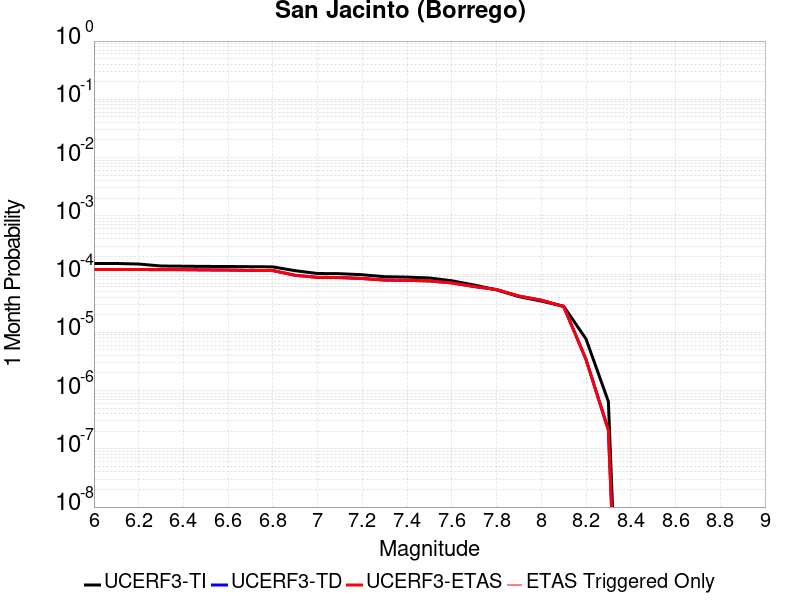 |  |  |

| Magnitude | 1 wk TI Prob | 1 wk TD Prob | 1 wk ETAS Prob | 1 wk ETAS/TD Gain | 1 wk ETAS Triggered Only | 1 mo TI Prob | 1 mo TD Prob | 1 mo ETAS Prob | 1 mo ETAS/TD Gain | 1 mo ETAS Triggered Only | 1 yr TI Prob | 1 yr TD Prob | 1 yr ETAS Prob | 1 yr ETAS/TD Gain | 1 yr ETAS Triggered Only | 10 yr TI Prob | 10 yr TD Prob | 10 yr ETAS Prob | 10 yr ETAS/TD Gain | 10 yr ETAS Triggered Only |
|-----|-----|-----|-----|-----|-----|-----|-----|-----|-----|-----|-----|-----|-----|-----|-----|-----|-----|-----|-----|-----|
| 6.0 | 3.543992E-5 | 2.7949114E-5 | 2.7949114E-5 | 1.0 | 0.0 | 1.5187653E-4 | 1.1977649E-4 | 1.1977649E-4 | 1.0 | 0.0 | 0.0018475284 | 0.0014573155 | 0.0014673009 | 1.0068519 | 1.0E-5 | 0.018322436 | 0.014881392 | 0.014910946 | 1.0019859 | 3.0E-5 |
| 6.1 | 3.542281E-5 | 2.7949114E-5 | 2.7949114E-5 | 1.0 | 0.0 | 1.5180321E-4 | 1.1977649E-4 | 1.1977649E-4 | 1.0 | 0.0 | 0.0018466372 | 0.0014573155 | 0.0014673009 | 1.0068519 | 1.0E-5 | 0.018313672 | 0.014881392 | 0.014910946 | 1.0019859 | 3.0E-5 |
| 6.2 | 3.4688688E-5 | 2.7949114E-5 | 2.7949114E-5 | 1.0 | 0.0 | 1.4865733E-4 | 1.1977649E-4 | 1.1977649E-4 | 1.0 | 0.0 | 0.0018084005 | 0.0014573155 | 0.0014673009 | 1.0068519 | 1.0E-5 | 0.017937548 | 0.014881392 | 0.014910945 | 1.0019859 | 3.0E-5 |
| 6.3 | 3.2087122E-5 | 2.7794453E-5 | 2.7794453E-5 | 1.0 | 0.0 | 1.3750899E-4 | 1.1911371E-4 | 1.1911371E-4 | 1.0 | 0.0 | 0.0016728862 | 0.001449257 | 0.0014592424 | 1.00689 | 1.0E-5 | 0.016603488 | 0.014802421 | 0.014831977 | 1.0019966 | 3.0E-5 |
| 6.4 | 3.1828724E-5 | 2.7761434E-5 | 2.7761434E-5 | 1.0 | 0.0 | 1.364017E-4 | 1.18972224E-4 | 1.18972224E-4 | 1.0 | 0.0 | 0.0016594254 | 0.0014475366 | 0.0014575222 | 1.0068983 | 1.0E-5 | 0.016470885 | 0.014785497 | 0.014815054 | 1.001999 | 3.0E-5 |
| 6.5 | 3.1563577E-5 | 2.7501117E-5 | 2.7501117E-5 | 1.0 | 0.0 | 1.3526545E-4 | 1.17856674E-4 | 1.17856674E-4 | 1.0 | 0.0 | 0.0016456128 | 0.0014339727 | 0.0014439584 | 1.0069636 | 1.0E-5 | 0.0163348 | 0.014652067 | 0.014681627 | 1.0020175 | 3.0E-5 |
| 6.6 | 3.1467625E-5 | 2.7345326E-5 | 2.7345326E-5 | 1.0 | 0.0 | 1.3485427E-4 | 1.17189054E-4 | 1.17189054E-4 | 1.0 | 0.0 | 0.0016406142 | 0.0014258551 | 0.0014358409 | 1.0070033 | 1.0E-5 | 0.016285548 | 0.014572306 | 0.014601869 | 1.0020287 | 3.0E-5 |
| 6.7 | 3.1223695E-5 | 2.6963311E-5 | 2.6963311E-5 | 1.0 | 0.0 | 1.3380898E-4 | 1.1555199E-4 | 1.1555199E-4 | 1.0 | 0.0 | 0.0016279068 | 0.0014059498 | 0.0014159357 | 1.0071026 | 1.0E-5 | 0.01616033 | 0.014376663 | 0.014406232 | 1.0020567 | 3.0E-5 |
| 6.8 | 3.1015585E-5 | 2.6784279E-5 | 2.6784279E-5 | 1.0 | 0.0 | 1.3291716E-4 | 1.1478479E-4 | 1.1478479E-4 | 1.0 | 0.0 | 0.001617065 | 0.001396621 | 0.001406607 | 1.0071502 | 1.0E-5 | 0.016053487 | 0.014283924 | 0.014313496 | 1.0020703 | 3.0E-5 |
| 6.9 | 2.6641965E-5 | 2.2205346E-5 | 2.2205346E-5 | 1.0 | 0.0 | 1.1417485E-4 | 9.516232E-5 | 9.516232E-5 | 1.0 | 0.0 | 0.0013891924 | 0.0011579894 | 0.0011679778 | 1.0086256 | 1.0E-5 | 0.0138054015 | 0.011893453 | 0.011923096 | 1.0024924 | 3.0E-5 |
| 7.0 | 2.3854353E-5 | 2.0499358E-5 | 2.0499358E-5 | 1.0 | 0.0 | 1.02228936E-4 | 8.785144E-5 | 8.785144E-5 | 1.0 | 0.0 | 0.0012439266 | 0.001069069 | 0.0010790584 | 1.009344 | 1.0E-5 | 0.012369866 | 0.010993419 | 0.011023089 | 1.0026989 | 3.0E-5 |
| 7.1 | 2.3672901E-5 | 2.0335823E-5 | 2.0335823E-5 | 1.0 | 0.0 | 1.0145135E-4 | 8.715063E-5 | 8.715063E-5 | 1.0 | 0.0 | 0.0012344702 | 0.001060545 | 0.0010705343 | 1.0094191 | 1.0E-5 | 0.0122763505 | 0.010908585 | 0.010938258 | 1.0027201 | 3.0E-5 |
| 7.2 | 2.2717244E-5 | 1.9563033E-5 | 1.9563033E-5 | 1.0 | 0.0 | 9.735599E-5 | 8.383889E-5 | 8.383889E-5 | 1.0 | 0.0 | 0.0011846646 | 0.0010202628 | 0.0010302527 | 1.0097914 | 1.0E-5 | 0.01178369 | 0.010505866 | 0.01053555 | 1.0028255 | 3.0E-5 |
| 7.3 | 2.1016205E-5 | 1.840438E-5 | 1.840438E-5 | 1.0 | 0.0 | 9.006634E-5 | 7.887354E-5 | 7.887354E-5 | 1.0 | 0.0 | 0.001096006 | 9.598644E-4 | 9.6985477E-4 | 1.0104082 | 1.0E-5 | 0.010906163 | 0.009901349 | 0.009931052 | 1.0029999 | 3.0E-5 |
| 7.4 | 2.0683625E-5 | 1.8206842E-5 | 1.8206842E-5 | 1.0 | 0.0 | 8.86411E-5 | 7.8027E-5 | 7.8027E-5 | 1.0 | 0.0 | 0.001078671 | 9.495668E-4 | 9.595573E-4 | 1.0105212 | 1.0E-5 | 0.010734501 | 0.009798044 | 0.009827751 | 1.0030318 | 3.0E-5 |
| 7.5 | 1.9993966E-5 | 1.7801693E-5 | 1.7801693E-5 | 1.0 | 0.0 | 8.568561E-5 | 7.629075E-5 | 7.629075E-5 | 1.0 | 0.0 | 0.001042723 | 9.284461E-4 | 9.3843683E-4 | 1.0107607 | 1.0E-5 | 0.010378438 | 0.009584877 | 0.00961459 | 1.0030999 | 3.0E-5 |
| 7.6 | 1.788966E-5 | 1.6454407E-5 | 1.6454407E-5 | 1.0 | 0.0 | 7.666772E-5 | 7.0516995E-5 | 7.0516995E-5 | 1.0 | 0.0 | 9.3302975E-4 | 8.58208E-4 | 8.681994E-4 | 1.0116422 | 1.0E-5 | 0.00929122 | 0.008876495 | 0.0089062285 | 1.0033497 | 3.0E-5 |
| 7.7 | 1.5125781E-5 | 1.4255901E-5 | 1.4255901E-5 | 1.0 | 0.0 | 6.4823165E-5 | 6.109529E-5 | 6.109529E-5 | 1.0 | 0.0 | 7.889362E-4 | 7.4358215E-4 | 7.535747E-4 | 1.0134385 | 1.0E-5 | 0.007861412 | 0.007723915 | 0.0077536833 | 1.003854 | 3.0E-5 |
| 7.8 | 1.250089E-5 | 1.264834E-5 | 1.264834E-5 | 1.0 | 0.0 | 5.3574146E-5 | 5.4206048E-5 | 5.4206048E-5 | 1.0 | 0.0 | 6.5207E-4 | 6.5975945E-4 | 6.6975283E-4 | 1.0151471 | 1.0E-5 | 0.006501599 | 0.006877127 | 0.0069069206 | 1.0043323 | 3.0E-5 |
| 7.9 | 9.561E-6 | 9.77041E-6 | 9.77041E-6 | 1.0 | 0.0 | 4.0975072E-5 | 4.1872514E-5 | 4.1872514E-5 | 1.0 | 0.0 | 4.987573E-4 | 5.0967914E-4 | 5.196741E-4 | 1.0196102 | 1.0E-5 | 0.0049763937 | 0.005360661 | 0.0053905 | 1.0055664 | 3.0E-5 |
| 8.0 | 8.01699E-6 | 8.307858E-6 | 8.307858E-6 | 1.0 | 0.0 | 3.4358076E-5 | 3.5604622E-5 | 3.5604622E-5 | 1.0 | 0.0 | 4.1822926E-4 | 4.3340056E-4 | 4.4339625E-4 | 1.0230633 | 1.0E-5 | 0.0041744304 | 0.0045809527 | 0.0046108156 | 1.0065188 | 3.0E-5 |
| 8.1 | 6.541947E-6 | 6.4739997E-6 | 6.4739997E-6 | 1.0 | 0.0 | 2.8036617E-5 | 2.774542E-5 | 2.774542E-5 | 1.0 | 0.0 | 3.4129233E-4 | 3.3774864E-4 | 3.4774526E-4 | 1.0295978 | 1.0E-5 | 0.0034076865 | 0.00358693 | 0.0036168224 | 1.0083337 | 3.0E-5 |
| 8.2 | 1.7968189E-6 | 7.9937615E-7 | 7.9937615E-7 | 1.0 | 0.0 | 7.70063E-6 | 3.4258935E-6 | 3.4258935E-6 | 1.0 | 0.0 | 9.3751136E-5 | 4.1709478E-5 | 4.1709478E-5 | 1.0 | 0.0 | 9.371159E-4 | 4.7246108E-4 | 4.7246108E-4 | 1.0 | 0.0 |
| 8.3 | 1.5167889E-7 | 4.9137434E-8 | 4.9137434E-8 | 1.0 | 0.0 | 6.500522E-7 | 2.10589E-7 | 2.10589E-7 | 1.0 | 0.0 | 7.9143565E-6 | 2.5639183E-6 | 2.5639183E-6 | 1.0 | 0.0 | 7.914075E-5 | 2.9786952E-5 | 2.9786952E-5 | 1.0 | 0.0 |

## San Jacinto (Anza) rev
*[(top)](#table-of-contents)*

| 1 Week | 1 Month | 1 Year | 10 Year |
|-----|-----|-----|-----|
|  |  |  | 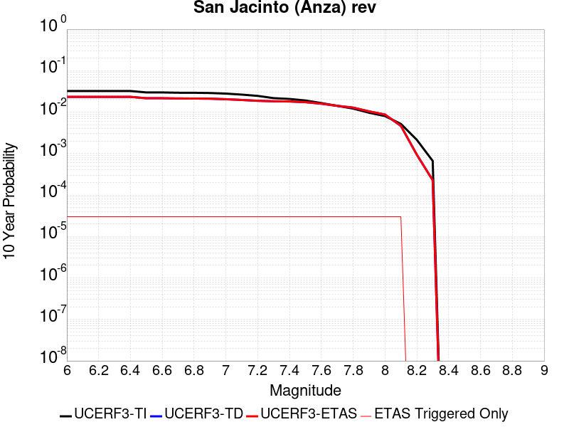 |

| Magnitude | 1 wk TI Prob | 1 wk TD Prob | 1 wk ETAS Prob | 1 wk ETAS/TD Gain | 1 wk ETAS Triggered Only | 1 mo TI Prob | 1 mo TD Prob | 1 mo ETAS Prob | 1 mo ETAS/TD Gain | 1 mo ETAS Triggered Only | 1 yr TI Prob | 1 yr TD Prob | 1 yr ETAS Prob | 1 yr ETAS/TD Gain | 1 yr ETAS Triggered Only | 10 yr TI Prob | 10 yr TD Prob | 10 yr ETAS Prob | 10 yr ETAS/TD Gain | 10 yr ETAS Triggered Only |
|-----|-----|-----|-----|-----|-----|-----|-----|-----|-----|-----|-----|-----|-----|-----|-----|-----|-----|-----|-----|-----|
| 6.0 | 6.3015636E-5 | 4.3360193E-5 | 4.3360193E-5 | 1.0 | 0.0 | 2.7003905E-4 | 1.8581623E-4 | 1.8581623E-4 | 1.0 | 0.0 | 0.0032827691 | 0.0022599772 | 0.0022699547 | 1.0044148 | 1.0E-5 | 0.032346968 | 0.02332597 | 0.02335527 | 1.0012561 | 3.0E-5 |
| 6.1 | 6.3015636E-5 | 4.3360193E-5 | 4.3360193E-5 | 1.0 | 0.0 | 2.7003905E-4 | 1.8581623E-4 | 1.8581623E-4 | 1.0 | 0.0 | 0.0032827691 | 0.0022599772 | 0.0022699547 | 1.0044148 | 1.0E-5 | 0.032346968 | 0.02332597 | 0.02335527 | 1.0012561 | 3.0E-5 |
| 6.2 | 6.3015636E-5 | 4.3360193E-5 | 4.3360193E-5 | 1.0 | 0.0 | 2.7003905E-4 | 1.8581623E-4 | 1.8581623E-4 | 1.0 | 0.0 | 0.0032827691 | 0.0022599772 | 0.0022699547 | 1.0044148 | 1.0E-5 | 0.032346968 | 0.02332597 | 0.02335527 | 1.0012561 | 3.0E-5 |
| 6.3 | 6.3015636E-5 | 4.3360193E-5 | 4.3360193E-5 | 1.0 | 0.0 | 2.7003905E-4 | 1.8581623E-4 | 1.8581623E-4 | 1.0 | 0.0 | 0.0032827691 | 0.0022599772 | 0.0022699547 | 1.0044148 | 1.0E-5 | 0.032346968 | 0.02332597 | 0.02335527 | 1.0012561 | 3.0E-5 |
| 6.4 | 6.3015636E-5 | 4.3360193E-5 | 4.3360193E-5 | 1.0 | 0.0 | 2.7003905E-4 | 1.8581623E-4 | 1.8581623E-4 | 1.0 | 0.0 | 0.0032827691 | 0.0022599772 | 0.0022699547 | 1.0044148 | 1.0E-5 | 0.032346968 | 0.02332597 | 0.02335527 | 1.0012561 | 3.0E-5 |
| 6.5 | 5.811017E-5 | 4.013748E-5 | 4.013748E-5 | 1.0 | 0.0 | 2.4901982E-4 | 1.7200646E-4 | 1.7200646E-4 | 1.0 | 0.0 | 0.0030276014 | 0.0020921729 | 0.002102152 | 1.0047697 | 1.0E-5 | 0.02986684 | 0.021622265 | 0.021651616 | 1.0013574 | 3.0E-5 |
| 6.6 | 5.811017E-5 | 4.013748E-5 | 4.013748E-5 | 1.0 | 0.0 | 2.4901982E-4 | 1.7200646E-4 | 1.7200646E-4 | 1.0 | 0.0 | 0.0030276014 | 0.0020921729 | 0.002102152 | 1.0047697 | 1.0E-5 | 0.02986684 | 0.021622265 | 0.021651616 | 1.0013574 | 3.0E-5 |
| 6.7 | 5.712442E-5 | 3.955964E-5 | 3.955964E-5 | 1.0 | 0.0 | 2.4479596E-4 | 1.6953034E-4 | 1.6953034E-4 | 1.0 | 0.0 | 0.0029763177 | 0.0020620835 | 0.0020720628 | 1.0048394 | 1.0E-5 | 0.029367693 | 0.021313822 | 0.021343183 | 1.0013776 | 3.0E-5 |
| 6.8 | 5.6967532E-5 | 3.9415965E-5 | 3.9415965E-5 | 1.0 | 0.0 | 2.4412372E-4 | 1.6891466E-4 | 1.6891466E-4 | 1.0 | 0.0 | 0.0029681553 | 0.0020546017 | 0.0020645813 | 1.0048572 | 1.0E-5 | 0.029288229 | 0.021238502 | 0.021267865 | 1.0013825 | 3.0E-5 |
| 6.9 | 5.6211324E-5 | 3.912042E-5 | 3.912042E-5 | 1.0 | 0.0 | 2.4088343E-4 | 1.676482E-4 | 1.676482E-4 | 1.0 | 0.0 | 0.0029288116 | 0.0020392116 | 0.0020491912 | 1.0048939 | 1.0E-5 | 0.028905109 | 0.021077758 | 0.021107126 | 1.0013933 | 3.0E-5 |
| 7.0 | 5.4383527E-5 | 3.797983E-5 | 3.797983E-5 | 1.0 | 0.0 | 2.3305144E-4 | 1.6276057E-4 | 1.6276057E-4 | 1.0 | 0.0 | 0.0028337094 | 0.0019798137 | 0.001989794 | 1.005041 | 1.0E-5 | 0.027978465 | 0.020468157 | 0.020497544 | 1.0014356 | 3.0E-5 |
| 7.1 | 5.1393665E-5 | 3.6441023E-5 | 3.6441023E-5 | 1.0 | 0.0 | 2.2023996E-4 | 1.5616648E-4 | 1.5616648E-4 | 1.0 | 0.0 | 0.0026781242 | 0.0018996731 | 0.0019096541 | 1.005254 | 1.0E-5 | 0.026460782 | 0.01964093 | 0.019670341 | 1.0014974 | 3.0E-5 |
| 7.2 | 4.785222E-5 | 3.4790966E-5 | 3.4790966E-5 | 1.0 | 0.0 | 2.0506482E-4 | 1.4909563E-4 | 1.4909563E-4 | 1.0 | 0.0 | 0.0024938055 | 0.0018137315 | 0.0018237133 | 1.0055035 | 1.0E-5 | 0.024660049 | 0.018754631 | 0.018784069 | 1.0015696 | 3.0E-5 |
| 7.3 | 4.2143256E-5 | 3.3884065E-5 | 3.3884065E-5 | 1.0 | 0.0 | 1.8060145E-4 | 1.4520936E-4 | 1.4520936E-4 | 1.0 | 0.0 | 0.002196605 | 0.0017664937 | 0.001776476 | 1.0056509 | 1.0E-5 | 0.02175019 | 0.018262124 | 0.018291576 | 1.0016128 | 3.0E-5 |
| 7.4 | 4.0264713E-5 | 3.352182E-5 | 3.352182E-5 | 1.0 | 0.0 | 1.7255165E-4 | 1.4365705E-4 | 1.4365705E-4 | 1.0 | 0.0 | 0.002098792 | 0.0017476248 | 0.0017576073 | 1.005712 | 1.0E-5 | 0.020790804 | 0.018066473 | 0.018095931 | 1.0016305 | 3.0E-5 |
| 7.5 | 3.694492E-5 | 3.2234075E-5 | 3.2234075E-5 | 1.0 | 0.0 | 1.5832575E-4 | 1.3813873E-4 | 1.3813873E-4 | 1.0 | 0.0 | 0.0019259118 | 0.0016805447 | 0.0016905279 | 1.0059404 | 1.0E-5 | 0.01909306 | 0.017382018 | 0.017411498 | 1.0016959 | 3.0E-5 |
| 7.6 | 3.200565E-5 | 2.9542738E-5 | 2.9542738E-5 | 1.0 | 0.0 | 1.3715986E-4 | 1.266056E-4 | 1.266056E-4 | 1.0 | 0.0 | 0.001668642 | 0.0015403356 | 0.0015503202 | 1.0064821 | 1.0E-5 | 0.01656168 | 0.015966404 | 0.015995925 | 1.0018489 | 3.0E-5 |
| 7.7 | 2.731642E-5 | 2.6130354E-5 | 2.6130354E-5 | 1.0 | 0.0 | 1.1706512E-4 | 1.1198243E-4 | 1.1198243E-4 | 1.0 | 0.0 | 0.001424336 | 0.0013625344 | 0.0013725208 | 1.0073292 | 1.0E-5 | 0.014152412 | 0.014186594 | 0.014216168 | 1.0020847 | 3.0E-5 |
| 7.8 | 2.3466424E-5 | 2.3540868E-5 | 2.3540868E-5 | 1.0 | 0.0 | 1.0056651E-4 | 1.0088553E-4 | 1.0088553E-4 | 1.0 | 0.0 | 0.0012237094 | 0.0012275901 | 0.0012375779 | 1.008136 | 1.0E-5 | 0.012169928 | 0.012827722 | 0.0128573375 | 1.0023087 | 3.0E-5 |
| 7.9 | 1.8611925E-5 | 1.8940606E-5 | 1.8940606E-5 | 1.0 | 0.0 | 7.9762955E-5 | 8.11715E-5 | 8.11715E-5 | 1.0 | 0.0 | 9.7068126E-4 | 9.878157E-4 | 9.978059E-4 | 1.0101134 | 1.0E-5 | 0.0096645225 | 0.010410862 | 0.01044055 | 1.0028516 | 3.0E-5 |
| 8.0 | 1.5460775E-5 | 1.5769832E-5 | 1.5769832E-5 | 1.0 | 0.0 | 6.6258784E-5 | 6.758325E-5 | 6.758325E-5 | 1.0 | 0.0 | 8.0640207E-4 | 8.2251616E-4 | 8.325079E-4 | 1.0121478 | 1.0E-5 | 0.008034821 | 0.008718076 | 0.008747815 | 1.0034112 | 3.0E-5 |
| 8.1 | 9.983884E-6 | 8.2868355E-6 | 8.2868355E-6 | 1.0 | 0.0 | 4.2787375E-5 | 3.551453E-5 | 3.551453E-5 | 1.0 | 0.0 | 5.2081177E-4 | 4.3230414E-4 | 4.4229982E-4 | 1.0231218 | 1.0E-5 | 0.0051959283 | 0.0046490943 | 0.004678955 | 1.0064229 | 3.0E-5 |
| 8.2 | 4.1226E-6 | 1.5578929E-6 | 1.5578929E-6 | 1.0 | 0.0 | 1.7668166E-5 | 6.6766665E-6 | 6.6766665E-6 | 1.0 | 0.0 | 2.1508869E-4 | 8.128541E-5 | 8.128541E-5 | 1.0 | 0.0 | 0.0021488064 | 9.4330835E-4 | 9.4330835E-4 | 1.0 | 0.0 |
| 8.3 | 1.2750878E-6 | 3.6255858E-7 | 3.6255858E-7 | 1.0 | 0.0 | 5.4646503E-6 | 1.5538217E-6 | 1.5538217E-6 | 1.0 | 0.0 | 6.653009E-5 | 1.8917619E-5 | 1.8917619E-5 | 1.0 | 0.0 | 6.6510175E-4 | 2.2813301E-4 | 2.2813301E-4 | 1.0 | 0.0 |

## San Jacinto (Coyote Creek)
*[(top)](#table-of-contents)*

| 1 Week | 1 Month | 1 Year | 10 Year |
|-----|-----|-----|-----|
|  |  |  |  |

| Magnitude | 1 wk TI Prob | 1 wk TD Prob | 1 wk ETAS Prob | 1 wk ETAS/TD Gain | 1 wk ETAS Triggered Only | 1 mo TI Prob | 1 mo TD Prob | 1 mo ETAS Prob | 1 mo ETAS/TD Gain | 1 mo ETAS Triggered Only | 1 yr TI Prob | 1 yr TD Prob | 1 yr ETAS Prob | 1 yr ETAS/TD Gain | 1 yr ETAS Triggered Only | 10 yr TI Prob | 10 yr TD Prob | 10 yr ETAS Prob | 10 yr ETAS/TD Gain | 10 yr ETAS Triggered Only |
|-----|-----|-----|-----|-----|-----|-----|-----|-----|-----|-----|-----|-----|-----|-----|-----|-----|-----|-----|-----|-----|
| 6.0 | 2.7374346E-5 | 2.416912E-5 | 2.416912E-5 | 1.0 | 0.0 | 1.1731335E-4 | 1.0357785E-4 | 1.0357785E-4 | 1.0 | 0.0 | 0.0014273542 | 0.0012603333 | 0.0012703207 | 1.0079244 | 1.0E-5 | 0.01418221 | 0.012940759 | 0.012970371 | 1.0022882 | 3.0E-5 |
| 6.1 | 2.7374346E-5 | 2.416912E-5 | 2.416912E-5 | 1.0 | 0.0 | 1.1731335E-4 | 1.0357785E-4 | 1.0357785E-4 | 1.0 | 0.0 | 0.0014273542 | 0.0012603333 | 0.0012703207 | 1.0079244 | 1.0E-5 | 0.01418221 | 0.012940759 | 0.012970371 | 1.0022882 | 3.0E-5 |
| 6.2 | 2.7374346E-5 | 2.416912E-5 | 2.416912E-5 | 1.0 | 0.0 | 1.1731335E-4 | 1.0357785E-4 | 1.0357785E-4 | 1.0 | 0.0 | 0.0014273542 | 0.0012603333 | 0.0012703207 | 1.0079244 | 1.0E-5 | 0.01418221 | 0.012940759 | 0.012970371 | 1.0022882 | 3.0E-5 |
| 6.3 | 2.7374346E-5 | 2.416912E-5 | 2.416912E-5 | 1.0 | 0.0 | 1.1731335E-4 | 1.0357785E-4 | 1.0357785E-4 | 1.0 | 0.0 | 0.0014273542 | 0.0012603333 | 0.0012703207 | 1.0079244 | 1.0E-5 | 0.01418221 | 0.012940759 | 0.012970371 | 1.0022882 | 3.0E-5 |
| 6.4 | 2.7374346E-5 | 2.416912E-5 | 2.416912E-5 | 1.0 | 0.0 | 1.1731335E-4 | 1.0357785E-4 | 1.0357785E-4 | 1.0 | 0.0 | 0.0014273542 | 0.0012603333 | 0.0012703207 | 1.0079244 | 1.0E-5 | 0.01418221 | 0.012940759 | 0.012970371 | 1.0022882 | 3.0E-5 |
| 6.5 | 2.7282445E-5 | 2.4055187E-5 | 2.4055187E-5 | 1.0 | 0.0 | 1.16919524E-4 | 1.030896E-4 | 1.030896E-4 | 1.0 | 0.0 | 0.0014225657 | 0.0012543958 | 0.0012643833 | 1.007962 | 1.0E-5 | 0.014134934 | 0.012882082 | 0.012911695 | 1.0022988 | 3.0E-5 |
| 6.6 | 2.7282445E-5 | 2.4055187E-5 | 2.4055187E-5 | 1.0 | 0.0 | 1.16919524E-4 | 1.030896E-4 | 1.030896E-4 | 1.0 | 0.0 | 0.0014225657 | 0.0012543958 | 0.0012643833 | 1.007962 | 1.0E-5 | 0.014134934 | 0.012882082 | 0.012911695 | 1.0022988 | 3.0E-5 |
| 6.7 | 2.7216198E-5 | 2.3980301E-5 | 2.3980301E-5 | 1.0 | 0.0 | 1.1663563E-4 | 1.0276869E-4 | 1.0276869E-4 | 1.0 | 0.0 | 0.0014191137 | 0.0012504932 | 0.0012604807 | 1.0079869 | 1.0E-5 | 0.014100855 | 0.01284349 | 0.012873105 | 1.0023059 | 3.0E-5 |
| 6.8 | 2.7078617E-5 | 2.3897504E-5 | 2.3897504E-5 | 1.0 | 0.0 | 1.1604605E-4 | 1.0241387E-4 | 1.0241387E-4 | 1.0 | 0.0 | 0.001411945 | 0.0012461783 | 0.0012561658 | 1.0080146 | 1.0E-5 | 0.014030075 | 0.012800625 | 0.012830241 | 1.0023136 | 3.0E-5 |
| 6.9 | 2.6982952E-5 | 2.3817E-5 | 2.3817E-5 | 1.0 | 0.0 | 1.15636096E-4 | 1.0206888E-4 | 1.0206888E-4 | 1.0 | 0.0 | 0.0014069602 | 0.0012419828 | 0.0012519704 | 1.0080416 | 1.0E-5 | 0.013980856 | 0.012758933 | 0.012788551 | 1.0023212 | 3.0E-5 |
| 7.0 | 2.6449972E-5 | 2.339397E-5 | 2.339397E-5 | 1.0 | 0.0 | 1.1335209E-4 | 1.0025603E-4 | 1.0025603E-4 | 1.0 | 0.0 | 0.001379188 | 0.0012199363 | 0.001229924 | 1.0081872 | 1.0E-5 | 0.0137065975 | 0.012540271 | 0.012569895 | 1.0023623 | 3.0E-5 |
| 7.1 | 2.6257849E-5 | 2.3219982E-5 | 2.3219982E-5 | 1.0 | 0.0 | 1.1252879E-4 | 9.951043E-5 | 9.951043E-5 | 1.0 | 0.0 | 0.0013691769 | 0.0012108687 | 0.0012208566 | 1.0082486 | 1.0E-5 | 0.013607717 | 0.012450124 | 0.01247975 | 1.0023797 | 3.0E-5 |
| 7.2 | 2.5270041E-5 | 2.2414566E-5 | 2.2414566E-5 | 1.0 | 0.0 | 1.0829568E-4 | 9.60589E-5 | 9.60589E-5 | 1.0 | 0.0 | 0.0013177024 | 0.001168892 | 0.0011788803 | 1.0085452 | 1.0E-5 | 0.013099162 | 0.012031072 | 0.012060711 | 1.0024636 | 3.0E-5 |
| 7.3 | 2.339701E-5 | 2.1146077E-5 | 2.1146077E-5 | 1.0 | 0.0 | 1.0026905E-4 | 9.062291E-5 | 9.062291E-5 | 1.0 | 0.0 | 0.001220092 | 0.0011027775 | 0.0011127666 | 1.009058 | 1.0E-5 | 0.012134149 | 0.011369824 | 0.011399483 | 1.0026085 | 3.0E-5 |
| 7.4 | 2.296333E-5 | 2.0876347E-5 | 2.0876347E-5 | 1.0 | 0.0 | 9.841056E-5 | 8.9467E-5 | 8.9467E-5 | 1.0 | 0.0 | 0.0011974899 | 0.0010887185 | 0.0010987077 | 1.0091751 | 1.0E-5 | 0.011910575 | 0.011228895 | 0.011258557 | 1.0026417 | 3.0E-5 |
| 7.5 | 2.2188895E-5 | 2.0399078E-5 | 2.0399078E-5 | 1.0 | 0.0 | 9.50918E-5 | 8.74217E-5 | 8.74217E-5 | 1.0 | 0.0 | 0.0011571277 | 0.0010638415 | 0.0010738309 | 1.0093899 | 1.0E-5 | 0.011511209 | 0.010978416 | 0.011008086 | 1.0027026 | 3.0E-5 |
| 7.6 | 2.0013189E-5 | 1.8984832E-5 | 1.8984832E-5 | 1.0 | 0.0 | 8.5767984E-5 | 8.1361046E-5 | 8.1361046E-5 | 1.0 | 0.0 | 0.001043725 | 9.901223E-4 | 0.0010001124 | 1.0100898 | 1.0E-5 | 0.010388365 | 0.010236162 | 0.010265854 | 1.0029008 | 3.0E-5 |
| 7.7 | 1.7230794E-5 | 1.6765578E-5 | 1.6765578E-5 | 1.0 | 0.0 | 7.384417E-5 | 7.18505E-5 | 7.18505E-5 | 1.0 | 0.0 | 8.986819E-4 | 8.7442965E-4 | 8.844209E-4 | 1.011426 | 1.0E-5 | 0.008950562 | 0.009074386 | 0.009104114 | 1.003276 | 3.0E-5 |
| 7.8 | 1.4478809E-5 | 1.5012078E-5 | 1.5012078E-5 | 1.0 | 0.0 | 6.205057E-5 | 6.4335894E-5 | 6.4335894E-5 | 1.0 | 0.0 | 7.552038E-4 | 7.8300864E-4 | 7.930008E-4 | 1.0127612 | 1.0E-5 | 0.0075264242 | 0.008152428 | 0.008182184 | 1.0036498 | 3.0E-5 |
| 7.9 | 1.1114467E-5 | 1.1663813E-5 | 1.1663813E-5 | 1.0 | 0.0 | 4.7632562E-5 | 4.9986815E-5 | 4.9986815E-5 | 1.0 | 0.0 | 5.797721E-4 | 6.084201E-4 | 6.18414E-4 | 1.016426 | 1.0E-5 | 0.0057826187 | 0.0063901483 | 0.0064199567 | 1.0046648 | 3.0E-5 |
| 8.0 | 9.327402E-6 | 9.916151E-6 | 9.916151E-6 | 1.0 | 0.0 | 3.9973966E-5 | 4.24971E-5 | 4.24971E-5 | 1.0 | 0.0 | 4.8657437E-4 | 5.172799E-4 | 5.2727474E-4 | 1.0193219 | 1.0E-5 | 0.0048551033 | 0.005458892 | 0.0054887277 | 1.0054656 | 3.0E-5 |
| 8.1 | 7.0235833E-6 | 6.8400664E-6 | 6.8400664E-6 | 1.0 | 0.0 | 3.0100724E-5 | 2.9314244E-5 | 2.9314244E-5 | 1.0 | 0.0 | 3.664147E-4 | 3.5684297E-4 | 3.668394E-4 | 1.0280136 | 1.0E-5 | 0.003658111 | 0.0037942685 | 0.0038241546 | 1.0078766 | 3.0E-5 |
| 8.2 | 2.0358202E-6 | 9.02004E-7 | 9.02004E-7 | 1.0 | 0.0 | 8.724915E-6 | 3.865726E-6 | 3.865726E-6 | 1.0 | 0.0 | 1.06220665E-4 | 4.706422E-5 | 4.706422E-5 | 1.0 | 0.0 | 0.001061699 | 5.3397205E-4 | 5.3397205E-4 | 1.0 | 0.0 |
| 8.3 | 2.0051264E-7 | 6.63892E-8 | 6.63892E-8 | 1.0 | 0.0 | 8.5933965E-7 | 2.845251E-7 | 2.845251E-7 | 1.0 | 0.0 | 1.046241E-5 | 3.4640882E-6 | 3.4640882E-6 | 1.0 | 0.0 | 1.0461917E-4 | 4.0262963E-5 | 4.0262963E-5 | 1.0 | 0.0 |

## Ortigalita (South)
*[(top)](#table-of-contents)*

| 1 Week | 1 Month | 1 Year | 10 Year |
|-----|-----|-----|-----|
|  |  |  |  |

| Magnitude | 1 wk TI Prob | 1 wk TD Prob | 1 wk ETAS Prob | 1 wk ETAS/TD Gain | 1 wk ETAS Triggered Only | 1 mo TI Prob | 1 mo TD Prob | 1 mo ETAS Prob | 1 mo ETAS/TD Gain | 1 mo ETAS Triggered Only | 1 yr TI Prob | 1 yr TD Prob | 1 yr ETAS Prob | 1 yr ETAS/TD Gain | 1 yr ETAS Triggered Only | 10 yr TI Prob | 10 yr TD Prob | 10 yr ETAS Prob | 10 yr ETAS/TD Gain | 10 yr ETAS Triggered Only |
|-----|-----|-----|-----|-----|-----|-----|-----|-----|-----|-----|-----|-----|-----|-----|-----|-----|-----|-----|-----|-----|
| 6.0 | 3.72394E-5 | 4.3258413E-5 | 4.3258413E-5 | 1.0 | 0.0 | 1.5958765E-4 | 1.8538091E-4 | 1.8538091E-4 | 1.0 | 0.0 | 0.0019412481 | 0.0022548328 | 0.0022648103 | 1.0044249 | 1.0E-5 | 0.019243775 | 0.022335922 | 0.022365253 | 1.0013131 | 3.0E-5 |
| 6.1 | 2.7299884E-5 | 3.149397E-5 | 3.149397E-5 | 1.0 | 0.0 | 1.16994255E-4 | 1.349675E-4 | 1.349675E-4 | 1.0 | 0.0 | 0.0014234743 | 0.0016420461 | 0.0016520298 | 1.0060799 | 1.0E-5 | 0.014143906 | 0.016305061 | 0.016334573 | 1.00181 | 3.0E-5 |
| 6.2 | 2.7299884E-5 | 3.149397E-5 | 3.149397E-5 | 1.0 | 0.0 | 1.16994255E-4 | 1.349675E-4 | 1.349675E-4 | 1.0 | 0.0 | 0.0014234743 | 0.0016420461 | 0.0016520298 | 1.0060799 | 1.0E-5 | 0.014143906 | 0.016305061 | 0.016334573 | 1.00181 | 3.0E-5 |
| 6.3 | 2.0546433E-5 | 2.3632867E-5 | 2.3632867E-5 | 1.0 | 0.0 | 8.805317E-5 | 1.0127989E-4 | 1.0127989E-4 | 1.0 | 0.0 | 0.00107152 | 0.0012324041 | 0.0012324041 | 1.0 | 0.0 | 0.010663681 | 0.01225776 | 0.012277516 | 1.0016116 | 2.0E-5 |
| 6.4 | 2.0546433E-5 | 2.3632867E-5 | 2.3632867E-5 | 1.0 | 0.0 | 8.805317E-5 | 1.0127989E-4 | 1.0127989E-4 | 1.0 | 0.0 | 0.00107152 | 0.0012324041 | 0.0012324041 | 1.0 | 0.0 | 0.010663681 | 0.01225776 | 0.012277516 | 1.0016116 | 2.0E-5 |
| 6.5 | 1.7779594E-5 | 2.0448198E-5 | 2.0448198E-5 | 1.0 | 0.0 | 7.619603E-5 | 8.763227E-5 | 8.763227E-5 | 1.0 | 0.0 | 9.272918E-4 | 0.0010664143 | 0.0010664143 | 1.0 | 0.0 | 0.009234319 | 0.010614435 | 0.010634223 | 1.0018642 | 2.0E-5 |
| 6.6 | 1.6272212E-5 | 1.871609E-5 | 1.871609E-5 | 1.0 | 0.0 | 6.973618E-5 | 8.0209415E-5 | 8.0209415E-5 | 1.0 | 0.0 | 8.487073E-4 | 9.761243E-4 | 9.761243E-4 | 1.0 | 0.0 | 0.008454733 | 0.00971967 | 0.009739475 | 1.0020376 | 2.0E-5 |
| 6.7 | 1.3051484E-5 | 1.5039673E-5 | 1.5039673E-5 | 1.0 | 0.0 | 5.593373E-5 | 6.44542E-5 | 6.44542E-5 | 1.0 | 0.0 | 6.807804E-4 | 7.8445685E-4 | 7.8445685E-4 | 1.0 | 0.0 | 0.006786986 | 0.007817862 | 0.007837705 | 1.0025382 | 2.0E-5 |
| 6.8 | 1.04277415E-5 | 1.198795E-5 | 1.198795E-5 | 1.0 | 0.0 | 4.4689557E-5 | 5.137596E-5 | 5.137596E-5 | 1.0 | 0.0 | 5.439595E-4 | 6.253302E-4 | 6.253302E-4 | 1.0 | 0.0 | 0.0054262993 | 0.0062364605 | 0.006256336 | 1.003187 | 2.0E-5 |
| 6.9 | 7.639968E-6 | 8.792032E-6 | 8.792032E-6 | 1.0 | 0.0 | 3.274231E-5 | 3.7679623E-5 | 3.7679623E-5 | 1.0 | 0.0 | 3.9856473E-4 | 4.5865873E-4 | 4.5865873E-4 | 1.0 | 0.0 | 0.003978506 | 0.0045777075 | 0.004597616 | 1.004349 | 2.0E-5 |
| 7.0 | 3.919831E-6 | 4.533684E-6 | 4.533684E-6 | 1.0 | 0.0 | 1.679917E-5 | 1.9429941E-5 | 1.9429941E-5 | 1.0 | 0.0 | 2.045107E-4 | 2.3653597E-4 | 2.3653597E-4 | 1.0 | 0.0 | 0.0020432258 | 0.0023630506 | 0.0023730271 | 1.0042218 | 1.0E-5 |
| 7.1 | 1.6017933E-6 | 1.8571596E-6 | 1.8571596E-6 | 1.0 | 0.0 | 6.8648105E-6 | 7.959237E-6 | 7.959237E-6 | 1.0 | 0.0 | 8.357586E-5 | 9.6900476E-5 | 9.6900476E-5 | 1.0 | 0.0 | 8.3544437E-4 | 9.6868695E-4 | 9.6868695E-4 | 1.0 | 0.0 |

## San Andreas (Santa Cruz Mts) 2011 CFM
*[(top)](#table-of-contents)*

| 1 Week | 1 Month | 1 Year | 10 Year |
|-----|-----|-----|-----|
| 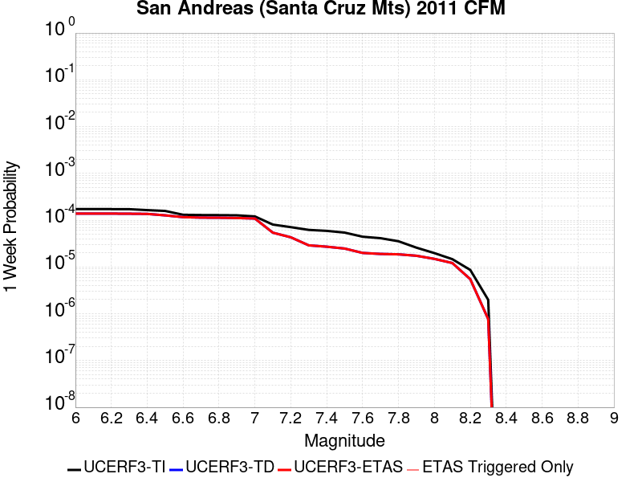 |  |  | 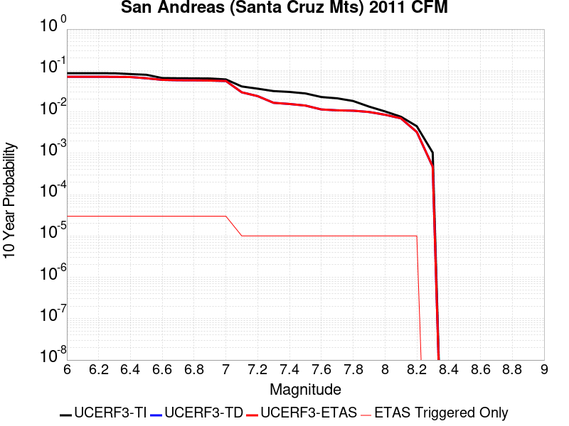 |

| Magnitude | 1 wk TI Prob | 1 wk TD Prob | 1 wk ETAS Prob | 1 wk ETAS/TD Gain | 1 wk ETAS Triggered Only | 1 mo TI Prob | 1 mo TD Prob | 1 mo ETAS Prob | 1 mo ETAS/TD Gain | 1 mo ETAS Triggered Only | 1 yr TI Prob | 1 yr TD Prob | 1 yr ETAS Prob | 1 yr ETAS/TD Gain | 1 yr ETAS Triggered Only | 10 yr TI Prob | 10 yr TD Prob | 10 yr ETAS Prob | 10 yr ETAS/TD Gain | 10 yr ETAS Triggered Only |
|-----|-----|-----|-----|-----|-----|-----|-----|-----|-----|-----|-----|-----|-----|-----|-----|-----|-----|-----|-----|-----|
| 6.0 | 1.7221631E-4 | 1.3815693E-4 | 1.3815693E-4 | 1.0 | 0.0 | 7.378611E-4 | 5.9196877E-4 | 5.9196877E-4 | 1.0 | 0.0 | 0.008946515 | 0.0071837935 | 0.0072036497 | 1.002764 | 2.0E-5 | 0.08594794 | 0.07066015 | 0.07068803 | 1.0003946 | 3.0E-5 |
| 6.1 | 1.7221631E-4 | 1.3815693E-4 | 1.3815693E-4 | 1.0 | 0.0 | 7.378611E-4 | 5.9196877E-4 | 5.9196877E-4 | 1.0 | 0.0 | 0.008946515 | 0.0071837935 | 0.0072036497 | 1.002764 | 2.0E-5 | 0.08594794 | 0.07066015 | 0.07068803 | 1.0003946 | 3.0E-5 |
| 6.2 | 1.7221631E-4 | 1.3815693E-4 | 1.3815693E-4 | 1.0 | 0.0 | 7.378611E-4 | 5.9196877E-4 | 5.9196877E-4 | 1.0 | 0.0 | 0.008946515 | 0.0071837935 | 0.0072036497 | 1.002764 | 2.0E-5 | 0.08594794 | 0.07066015 | 0.07068803 | 1.0003946 | 3.0E-5 |
| 6.3 | 1.716926E-4 | 1.373509E-4 | 1.373509E-4 | 1.0 | 0.0 | 7.3561794E-4 | 5.8851595E-4 | 5.8851595E-4 | 1.0 | 0.0 | 0.008919428 | 0.007142031 | 0.0071618883 | 1.0027803 | 2.0E-5 | 0.08569809 | 0.0702722 | 0.07030009 | 1.000397 | 3.0E-5 |
| 6.4 | 1.6392978E-4 | 1.3610568E-4 | 1.3610568E-4 | 1.0 | 0.0 | 7.02367E-4 | 5.8318174E-4 | 5.8318174E-4 | 1.0 | 0.0 | 0.008517839 | 0.007077509 | 0.007097367 | 1.0028058 | 2.0E-5 | 0.08198654 | 0.069503844 | 0.06953176 | 1.0004016 | 3.0E-5 |
| 6.5 | 1.5742714E-4 | 1.2669926E-4 | 1.2669926E-4 | 1.0 | 0.0 | 6.745133E-4 | 5.4288557E-4 | 5.4288557E-4 | 1.0 | 0.0 | 0.00818132 | 0.0065899263 | 0.006609794 | 1.0030149 | 2.0E-5 | 0.078865945 | 0.06496372 | 0.06499177 | 1.0004318 | 3.0E-5 |
| 6.6 | 1.3038084E-4 | 1.1608319E-4 | 1.1608319E-4 | 1.0 | 0.0 | 5.5865536E-4 | 4.974058E-4 | 4.974058E-4 | 1.0 | 0.0 | 0.006780438 | 0.0060393424 | 0.006059222 | 1.0032916 | 2.0E-5 | 0.0657725 | 0.059419725 | 0.059447944 | 1.0004749 | 3.0E-5 |
| 6.7 | 1.2867592E-4 | 1.1334692E-4 | 1.1334692E-4 | 1.0 | 0.0 | 5.5135164E-4 | 4.8568335E-4 | 4.8568335E-4 | 1.0 | 0.0 | 0.0066920654 | 0.005897402 | 0.0059172837 | 1.0033714 | 2.0E-5 | 0.06494093 | 0.05813039 | 0.058158647 | 1.0004861 | 3.0E-5 |
| 6.8 | 1.2801298E-4 | 1.1272226E-4 | 1.1272226E-4 | 1.0 | 0.0 | 5.485117E-4 | 4.8300723E-4 | 4.8300723E-4 | 1.0 | 0.0 | 0.0066577005 | 0.005864996 | 0.005884879 | 1.0033901 | 2.0E-5 | 0.06461738 | 0.05784416 | 0.057872426 | 1.0004886 | 3.0E-5 |
| 6.9 | 1.269149E-4 | 1.1114333E-4 | 1.1114333E-4 | 1.0 | 0.0 | 5.4380763E-4 | 4.762429E-4 | 4.762429E-4 | 1.0 | 0.0 | 0.006600777 | 0.00578308 | 0.005802965 | 1.0034384 | 2.0E-5 | 0.06408122 | 0.057115667 | 0.057143953 | 1.0004952 | 3.0E-5 |
| 7.0 | 1.2030331E-4 | 1.0844141E-4 | 1.0844141E-4 | 1.0 | 0.0 | 5.154837E-4 | 4.646674E-4 | 4.646674E-4 | 1.0 | 0.0 | 0.006257969 | 0.0056428867 | 0.005662774 | 1.0035243 | 2.0E-5 | 0.06084648 | 0.055786982 | 0.05581531 | 1.0005077 | 3.0E-5 |
| 7.1 | 8.049617E-5 | 5.4062773E-5 | 5.4062773E-5 | 1.0 | 0.0 | 3.4493793E-4 | 2.3167722E-4 | 2.3167722E-4 | 1.0 | 0.0 | 0.0041915346 | 0.0028170566 | 0.0028270285 | 1.0035398 | 1.0E-5 | 0.041133516 | 0.029685881 | 0.029695584 | 1.0003269 | 1.0E-5 |
| 7.2 | 7.093979E-5 | 4.3055956E-5 | 4.3055956E-5 | 1.0 | 0.0 | 3.0399222E-4 | 1.845126E-4 | 1.845126E-4 | 1.0 | 0.0 | 0.0036948253 | 0.0022441493 | 0.0022541268 | 1.004446 | 1.0E-5 | 0.03633994 | 0.024000475 | 0.024010235 | 1.0004066 | 1.0E-5 |
| 7.3 | 6.193693E-5 | 2.8982953E-5 | 2.8982953E-5 | 1.0 | 0.0 | 2.6541698E-4 | 1.2420675E-4 | 1.2420675E-4 | 1.0 | 0.0 | 0.0032266637 | 0.00151117 | 0.0015211549 | 1.0066074 | 1.0E-5 | 0.031802133 | 0.016545655 | 0.01655549 | 1.0005944 | 1.0E-5 |
| 7.4 | 5.906492E-5 | 2.7104776E-5 | 2.7104776E-5 | 1.0 | 0.0 | 2.5311083E-4 | 1.1615815E-4 | 1.1615815E-4 | 1.0 | 0.0 | 0.0030772698 | 0.0014133095 | 0.0014232954 | 1.0070655 | 1.0E-5 | 0.030350044 | 0.015513974 | 0.015523819 | 1.0006346 | 1.0E-5 |
| 7.5 | 5.424296E-5 | 2.4749135E-5 | 2.4749135E-5 | 1.0 | 0.0 | 2.324491E-4 | 1.0606342E-4 | 1.0606342E-4 | 1.0 | 0.0 | 0.002826395 | 0.0012905583 | 0.0013005454 | 1.0077386 | 1.0E-5 | 0.027907165 | 0.014200937 | 0.014210795 | 1.0006942 | 1.0E-5 |
| 7.6 | 4.43084E-5 | 1.9954232E-5 | 1.9954232E-5 | 1.0 | 0.0 | 1.8987931E-4 | 8.5515334E-5 | 8.5515334E-5 | 1.0 | 0.0 | 0.0023093296 | 0.0010406522 | 0.0010506418 | 1.0095993 | 1.0E-5 | 0.022854783 | 0.011439583 | 0.011449468 | 1.0008641 | 1.0E-5 |
| 7.7 | 4.118098E-5 | 1.898359E-5 | 1.898359E-5 | 1.0 | 0.0 | 1.7647797E-4 | 8.1355705E-5 | 8.1355705E-5 | 1.0 | 0.0 | 0.002146502 | 9.900559E-4 | 0.0010000459 | 1.0100905 | 1.0E-5 | 0.021258866 | 0.01089589 | 0.010905781 | 1.0009078 | 1.0E-5 |
| 7.8 | 3.5408906E-5 | 1.8610213E-5 | 1.8610213E-5 | 1.0 | 0.0 | 1.5174363E-4 | 7.975562E-5 | 7.975562E-5 | 1.0 | 0.0 | 0.0018459131 | 9.705923E-4 | 9.805827E-4 | 1.010293 | 1.0E-5 | 0.018306552 | 0.010676584 | 0.010686478 | 1.0009266 | 1.0E-5 |
| 7.9 | 2.5860836E-5 | 1.7357383E-5 | 1.7357383E-5 | 1.0 | 0.0 | 1.10827445E-4 | 7.438666E-5 | 7.438666E-5 | 1.0 | 0.0 | 0.001348489 | 9.052816E-4 | 9.152725E-4 | 1.0110363 | 1.0E-5 | 0.013403354 | 0.009929562 | 0.009939463 | 1.0009971 | 1.0E-5 |
| 8.0 | 1.9777332E-5 | 1.487508E-5 | 1.487508E-5 | 1.0 | 0.0 | 8.4757245E-5 | 6.374878E-5 | 6.374878E-5 | 1.0 | 0.0 | 0.0010314309 | 7.758652E-4 | 7.858575E-4 | 1.0128789 | 1.0E-5 | 0.010266567 | 0.008527785 | 0.0085376995 | 1.0011626 | 1.0E-5 |
| 8.1 | 1.468494E-5 | 1.2136566E-5 | 1.2136566E-5 | 1.0 | 0.0 | 6.293394E-5 | 5.2012816E-5 | 5.2012816E-5 | 1.0 | 0.0 | 7.6595135E-4 | 6.330722E-4 | 6.430659E-4 | 1.0157859 | 1.0E-5 | 0.0076331664 | 0.006984694 | 0.006994624 | 1.0014217 | 1.0E-5 |
| 8.2 | 8.63836E-6 | 5.484337E-6 | 5.484337E-6 | 1.0 | 0.0 | 3.7021015E-5 | 2.3504092E-5 | 2.3504092E-5 | 1.0 | 0.0 | 4.5063766E-4 | 2.8612482E-4 | 2.9612196E-4 | 1.0349398 | 1.0E-5 | 0.004497249 | 0.003254043 | 0.0032640104 | 1.0030631 | 1.0E-5 |
| 8.3 | 1.983087E-6 | 7.6850927E-7 | 7.6850927E-7 | 1.0 | 0.0 | 8.498917E-6 | 3.293607E-6 | 3.293607E-6 | 1.0 | 0.0 | 1.034694E-4 | 4.0098945E-5 | 4.0098945E-5 | 1.0 | 0.0 | 0.0010342124 | 4.7341356E-4 | 4.7341356E-4 | 1.0 | 0.0 |

## Channel Islands Western Deep Ramp
*[(top)](#table-of-contents)*

| 1 Week | 1 Month | 1 Year | 10 Year |
|-----|-----|-----|-----|
| 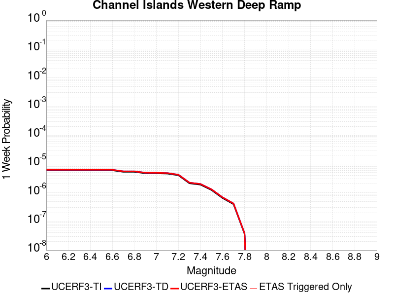 |  |  |  |

| Magnitude | 1 wk TI Prob | 1 wk TD Prob | 1 wk ETAS Prob | 1 wk ETAS/TD Gain | 1 wk ETAS Triggered Only | 1 mo TI Prob | 1 mo TD Prob | 1 mo ETAS Prob | 1 mo ETAS/TD Gain | 1 mo ETAS Triggered Only | 1 yr TI Prob | 1 yr TD Prob | 1 yr ETAS Prob | 1 yr ETAS/TD Gain | 1 yr ETAS Triggered Only | 10 yr TI Prob | 10 yr TD Prob | 10 yr ETAS Prob | 10 yr ETAS/TD Gain | 10 yr ETAS Triggered Only |
|-----|-----|-----|-----|-----|-----|-----|-----|-----|-----|-----|-----|-----|-----|-----|-----|-----|-----|-----|-----|-----|
| 6.0 | 6.0213506E-6 | 6.2549652E-6 | 6.2549652E-6 | 1.0 | 0.0 | 2.5805533E-5 | 2.6806743E-5 | 2.6806743E-5 | 1.0 | 0.0 | 3.1413708E-4 | 3.263277E-4 | 3.263277E-4 | 1.0 | 0.0 | 0.0031369338 | 0.0032589266 | 0.0032888288 | 1.0091755 | 3.0E-5 |
| 6.1 | 6.0213506E-6 | 6.2549652E-6 | 6.2549652E-6 | 1.0 | 0.0 | 2.5805533E-5 | 2.6806743E-5 | 2.6806743E-5 | 1.0 | 0.0 | 3.1413708E-4 | 3.263277E-4 | 3.263277E-4 | 1.0 | 0.0 | 0.0031369338 | 0.0032589266 | 0.0032888288 | 1.0091755 | 3.0E-5 |
| 6.2 | 6.0213506E-6 | 6.2549652E-6 | 6.2549652E-6 | 1.0 | 0.0 | 2.5805533E-5 | 2.6806743E-5 | 2.6806743E-5 | 1.0 | 0.0 | 3.1413708E-4 | 3.263277E-4 | 3.263277E-4 | 1.0 | 0.0 | 0.0031369338 | 0.0032589266 | 0.0032888288 | 1.0091755 | 3.0E-5 |
| 6.3 | 6.0213506E-6 | 6.2549652E-6 | 6.2549652E-6 | 1.0 | 0.0 | 2.5805533E-5 | 2.6806743E-5 | 2.6806743E-5 | 1.0 | 0.0 | 3.1413708E-4 | 3.263277E-4 | 3.263277E-4 | 1.0 | 0.0 | 0.0031369338 | 0.0032589266 | 0.0032888288 | 1.0091755 | 3.0E-5 |
| 6.4 | 6.0213506E-6 | 6.2549652E-6 | 6.2549652E-6 | 1.0 | 0.0 | 2.5805533E-5 | 2.6806743E-5 | 2.6806743E-5 | 1.0 | 0.0 | 3.1413708E-4 | 3.263277E-4 | 3.263277E-4 | 1.0 | 0.0 | 0.0031369338 | 0.0032589266 | 0.0032888288 | 1.0091755 | 3.0E-5 |
| 6.5 | 6.0213506E-6 | 6.2549652E-6 | 6.2549652E-6 | 1.0 | 0.0 | 2.5805533E-5 | 2.6806743E-5 | 2.6806743E-5 | 1.0 | 0.0 | 3.1413708E-4 | 3.263277E-4 | 3.263277E-4 | 1.0 | 0.0 | 0.0031369338 | 0.0032589266 | 0.0032888288 | 1.0091755 | 3.0E-5 |
| 6.6 | 6.0213506E-6 | 6.2549652E-6 | 6.2549652E-6 | 1.0 | 0.0 | 2.5805533E-5 | 2.6806743E-5 | 2.6806743E-5 | 1.0 | 0.0 | 3.1413708E-4 | 3.263277E-4 | 3.263277E-4 | 1.0 | 0.0 | 0.0031369338 | 0.0032589266 | 0.0032888288 | 1.0091755 | 3.0E-5 |
| 6.7 | 5.313309E-6 | 5.5253286E-6 | 5.5253286E-6 | 1.0 | 0.0 | 2.2771126E-5 | 2.3679786E-5 | 2.3679786E-5 | 1.0 | 0.0 | 2.772032E-4 | 2.8826736E-4 | 2.8826736E-4 | 1.0 | 0.0 | 0.0027685766 | 0.0028793374 | 0.0028992798 | 1.0069261 | 2.0E-5 |
| 6.8 | 5.313309E-6 | 5.5253286E-6 | 5.5253286E-6 | 1.0 | 0.0 | 2.2771126E-5 | 2.3679786E-5 | 2.3679786E-5 | 1.0 | 0.0 | 2.772032E-4 | 2.8826736E-4 | 2.8826736E-4 | 1.0 | 0.0 | 0.0027685766 | 0.0028793374 | 0.0028992798 | 1.0069261 | 2.0E-5 |
| 6.9 | 4.744377E-6 | 4.9395117E-6 | 4.9395117E-6 | 1.0 | 0.0 | 2.0332885E-5 | 2.1169184E-5 | 2.1169184E-5 | 1.0 | 0.0 | 2.4752476E-4 | 2.5770807E-4 | 2.5770807E-4 | 1.0 | 0.0 | 0.0024724922 | 0.0025744596 | 0.002594408 | 1.0077486 | 2.0E-5 |
| 7.0 | 4.722209E-6 | 4.9165537E-6 | 4.9165537E-6 | 1.0 | 0.0 | 2.0237881E-5 | 2.1070795E-5 | 2.1070795E-5 | 1.0 | 0.0 | 2.4636835E-4 | 2.5651048E-4 | 2.5651048E-4 | 1.0 | 0.0 | 0.002460954 | 0.0025625112 | 0.0025824602 | 1.0077848 | 2.0E-5 |
| 7.1 | 4.611174E-6 | 4.801488E-6 | 4.801488E-6 | 1.0 | 0.0 | 1.9762025E-5 | 2.0577665E-5 | 2.0577665E-5 | 1.0 | 0.0 | 2.4057609E-4 | 2.50508E-4 | 2.50508E-4 | 1.0 | 0.0 | 0.002403158 | 0.002502623 | 0.002522573 | 1.0079716 | 2.0E-5 |
| 7.2 | 4.043994E-6 | 4.2120964E-6 | 4.2120964E-6 | 1.0 | 0.0 | 1.7331287E-5 | 1.8051736E-5 | 1.8051736E-5 | 1.0 | 0.0 | 2.10988E-4 | 2.197613E-4 | 2.197613E-4 | 1.0 | 0.0 | 0.002107878 | 0.0021957906 | 0.0022157466 | 1.0090883 | 2.0E-5 |
| 7.3 | 2.1233036E-6 | 2.229832E-6 | 2.229832E-6 | 1.0 | 0.0 | 9.099841E-6 | 9.556388E-6 | 9.556388E-6 | 1.0 | 0.0 | 1.1078493E-4 | 1.1634287E-4 | 1.1634287E-4 | 1.0 | 0.0 | 0.0011072971 | 0.0011628252 | 0.0011728135 | 1.0085897 | 1.0E-5 |
| 7.4 | 1.9051884E-6 | 2.0015375E-6 | 2.0015375E-6 | 1.0 | 0.0 | 8.165067E-6 | 8.57799E-6 | 8.57799E-6 | 1.0 | 0.0 | 9.940516E-5 | 1.04432074E-4 | 1.04432074E-4 | 1.0 | 0.0 | 9.93607E-4 | 0.0010438353 | 0.0010538249 | 1.00957 | 1.0E-5 |
| 7.5 | 1.2408497E-6 | 1.3039103E-6 | 1.3039103E-6 | 1.0 | 0.0 | 5.317916E-6 | 5.588175E-6 | 5.588175E-6 | 1.0 | 0.0 | 6.4743705E-5 | 6.803393E-5 | 6.803393E-5 | 1.0 | 0.0 | 6.4724847E-4 | 6.801332E-4 | 6.901264E-4 | 1.014693 | 1.0E-5 |
| 7.6 | 6.5440025E-7 | 6.8868616E-7 | 6.8868616E-7 | 1.0 | 0.0 | 2.8045695E-6 | 2.9515088E-6 | 2.9515088E-6 | 1.0 | 0.0 | 3.4145098E-5 | 3.593404E-5 | 3.593404E-5 | 1.0 | 0.0 | 3.4139853E-4 | 3.5928373E-4 | 3.5928373E-4 | 1.0 | 0.0 |
| 7.7 | 3.985963E-7 | 4.1931656E-7 | 4.1931656E-7 | 1.0 | 0.0 | 1.7082689E-6 | 1.7970698E-6 | 1.7970698E-6 | 1.0 | 0.0 | 2.0797976E-5 | 2.1879117E-5 | 2.1879117E-5 | 1.0 | 0.0 | 2.0796029E-4 | 2.187708E-4 | 2.187708E-4 | 1.0 | 0.0 |
| 7.8 | 3.706329E-8 | 3.859243E-8 | 3.859243E-8 | 1.0 | 0.0 | 1.5884267E-7 | 1.6539612E-7 | 1.6539612E-7 | 1.0 | 0.0 | 1.9339077E-6 | 2.0136958E-6 | 2.0136958E-6 | 1.0 | 0.0 | 1.933891E-5 | 2.013679E-5 | 2.013679E-5 | 1.0 | 0.0 |

## Santa Ynez River
*[(top)](#table-of-contents)*

| 1 Week | 1 Month | 1 Year | 10 Year |
|-----|-----|-----|-----|
|  |  |  |  |

| Magnitude | 1 wk TI Prob | 1 wk TD Prob | 1 wk ETAS Prob | 1 wk ETAS/TD Gain | 1 wk ETAS Triggered Only | 1 mo TI Prob | 1 mo TD Prob | 1 mo ETAS Prob | 1 mo ETAS/TD Gain | 1 mo ETAS Triggered Only | 1 yr TI Prob | 1 yr TD Prob | 1 yr ETAS Prob | 1 yr ETAS/TD Gain | 1 yr ETAS Triggered Only | 10 yr TI Prob | 10 yr TD Prob | 10 yr ETAS Prob | 10 yr ETAS/TD Gain | 10 yr ETAS Triggered Only |
|-----|-----|-----|-----|-----|-----|-----|-----|-----|-----|-----|-----|-----|-----|-----|-----|-----|-----|-----|-----|-----|
| 6.0 | 1.6396456E-5 | 1.7209823E-5 | 1.7209823E-5 | 1.0 | 0.0 | 7.026863E-5 | 7.37545E-5 | 7.37545E-5 | 1.0 | 0.0 | 8.551848E-4 | 8.976266E-4 | 8.976266E-4 | 1.0 | 0.0 | 0.0085190125 | 0.008943559 | 0.00896338 | 1.0022162 | 2.0E-5 |
| 6.1 | 1.6396456E-5 | 1.7209823E-5 | 1.7209823E-5 | 1.0 | 0.0 | 7.026863E-5 | 7.37545E-5 | 7.37545E-5 | 1.0 | 0.0 | 8.551848E-4 | 8.976266E-4 | 8.976266E-4 | 1.0 | 0.0 | 0.0085190125 | 0.008943559 | 0.00896338 | 1.0022162 | 2.0E-5 |
| 6.2 | 1.6396456E-5 | 1.7209823E-5 | 1.7209823E-5 | 1.0 | 0.0 | 7.026863E-5 | 7.37545E-5 | 7.37545E-5 | 1.0 | 0.0 | 8.551848E-4 | 8.976266E-4 | 8.976266E-4 | 1.0 | 0.0 | 0.0085190125 | 0.008943559 | 0.00896338 | 1.0022162 | 2.0E-5 |
| 6.3 | 9.736976E-6 | 1.0122536E-5 | 1.0122536E-5 | 1.0 | 0.0 | 4.172923E-5 | 4.3381602E-5 | 4.3381602E-5 | 1.0 | 0.0 | 5.0793495E-4 | 5.28048E-4 | 5.28048E-4 | 1.0 | 0.0 | 0.005067755 | 0.0052684387 | 0.005288333 | 1.0037762 | 2.0E-5 |
| 6.4 | 9.736976E-6 | 1.0122536E-5 | 1.0122536E-5 | 1.0 | 0.0 | 4.172923E-5 | 4.3381602E-5 | 4.3381602E-5 | 1.0 | 0.0 | 5.0793495E-4 | 5.28048E-4 | 5.28048E-4 | 1.0 | 0.0 | 0.005067755 | 0.0052684387 | 0.005288333 | 1.0037762 | 2.0E-5 |
| 6.5 | 7.081964E-6 | 7.3300444E-6 | 7.3300444E-6 | 1.0 | 0.0 | 3.035092E-5 | 3.1414107E-5 | 3.1414107E-5 | 1.0 | 0.0 | 3.694598E-4 | 3.824012E-4 | 3.824012E-4 | 1.0 | 0.0 | 0.0036884616 | 0.0038175937 | 0.0038175937 | 1.0 | 0.0 |
| 6.6 | 5.873247E-6 | 6.0598654E-6 | 6.0598654E-6 | 1.0 | 0.0 | 2.5170815E-5 | 2.5970598E-5 | 2.5970598E-5 | 1.0 | 0.0 | 3.064116E-4 | 3.16147E-4 | 3.16147E-4 | 1.0 | 0.0 | 0.0030598943 | 0.00315706 | 0.00315706 | 1.0 | 0.0 |
| 6.7 | 4.973277E-6 | 5.116005E-6 | 5.116005E-6 | 1.0 | 0.0 | 2.1313872E-5 | 2.1925554E-5 | 2.1925554E-5 | 1.0 | 0.0 | 2.5946548E-4 | 2.669114E-4 | 2.669114E-4 | 1.0 | 0.0 | 0.0025916274 | 0.0026659572 | 0.0026659572 | 1.0 | 0.0 |
| 6.8 | 4.396492E-6 | 4.51107E-6 | 4.51107E-6 | 1.0 | 0.0 | 1.884197E-5 | 1.9333016E-5 | 1.9333016E-5 | 1.0 | 0.0 | 2.2937685E-4 | 2.3535438E-4 | 2.3535438E-4 | 1.0 | 0.0 | 0.0022914023 | 0.0023510866 | 0.0023510866 | 1.0 | 0.0 |
| 6.9 | 3.5255632E-6 | 3.6014094E-6 | 3.6014094E-6 | 1.0 | 0.0 | 1.5109469E-5 | 1.5434522E-5 | 1.5434522E-5 | 1.0 | 0.0 | 1.8394225E-4 | 1.8789925E-4 | 1.8789925E-4 | 1.0 | 0.0 | 0.0018379007 | 0.0018774199 | 0.0018774199 | 1.0 | 0.0 |
| 7.0 | 3.211603E-6 | 3.2737244E-6 | 3.2737244E-6 | 1.0 | 0.0 | 1.376394E-5 | 1.4030173E-5 | 1.4030173E-5 | 1.0 | 0.0 | 1.6756308E-4 | 1.708041E-4 | 1.708041E-4 | 1.0 | 0.0 | 0.0016743679 | 0.0017067424 | 0.0017067424 | 1.0 | 0.0 |
| 7.1 | 2.5094619E-6 | 2.5409781E-6 | 2.5409781E-6 | 1.0 | 0.0 | 1.0754793E-5 | 1.0889861E-5 | 1.0889861E-5 | 1.0 | 0.0 | 1.3093173E-4 | 1.3257605E-4 | 1.3257605E-4 | 1.0 | 0.0 | 0.0013085462 | 0.0013249756 | 0.0013249756 | 1.0 | 0.0 |
| 7.2 | 2.0515774E-6 | 2.0619864E-6 | 2.0619864E-6 | 1.0 | 0.0 | 8.792445E-6 | 8.837054E-6 | 8.837054E-6 | 1.0 | 0.0 | 1.0704277E-4 | 1.07585875E-4 | 1.07585875E-4 | 1.0 | 0.0 | 0.0010699122 | 0.0010753422 | 0.0010753422 | 1.0 | 0.0 |
| 7.3 | 1.6845745E-6 | 1.6774321E-6 | 1.6774321E-6 | 1.0 | 0.0 | 7.219585E-6 | 7.1889754E-6 | 7.1889754E-6 | 1.0 | 0.0 | 8.78949E-5 | 8.752228E-5 | 8.752228E-5 | 1.0 | 0.0 | 8.7860145E-4 | 8.7488105E-4 | 8.7488105E-4 | 1.0 | 0.0 |
| 7.4 | 1.3600285E-6 | 1.333369E-6 | 1.333369E-6 | 1.0 | 0.0 | 5.82868E-6 | 5.714426E-6 | 5.714426E-6 | 1.0 | 0.0 | 7.096187E-5 | 6.957094E-5 | 6.957094E-5 | 1.0 | 0.0 | 7.0939213E-4 | 6.954938E-4 | 6.954938E-4 | 1.0 | 0.0 |
| 7.5 | 9.735342E-7 | 9.290343E-7 | 9.290343E-7 | 1.0 | 0.0 | 4.172283E-6 | 3.9815695E-6 | 3.9815695E-6 | 1.0 | 0.0 | 5.079636E-5 | 4.847455E-5 | 4.847455E-5 | 1.0 | 0.0 | 5.0784746E-4 | 4.8464147E-4 | 4.8464147E-4 | 1.0 | 0.0 |
| 7.6 | 5.067187E-7 | 4.77868E-7 | 4.77868E-7 | 1.0 | 0.0 | 2.1716498E-6 | 2.0480043E-6 | 2.0480043E-6 | 1.0 | 0.0 | 2.6439517E-5 | 2.4934174E-5 | 2.4934174E-5 | 1.0 | 0.0 | 2.643637E-4 | 2.493145E-4 | 2.493145E-4 | 1.0 | 0.0 |
| 7.7 | 2.769089E-7 | 2.575968E-7 | 2.575968E-7 | 1.0 | 0.0 | 1.1867519E-6 | 1.1039858E-6 | 1.1039858E-6 | 1.0 | 0.0 | 1.4448608E-5 | 1.3440945E-5 | 1.3440945E-5 | 1.0 | 0.0 | 1.444767E-4 | 1.3440134E-4 | 1.3440134E-4 | 1.0 | 0.0 |
| 7.8 | 1.7044663E-7 | 1.5449349E-7 | 1.5449349E-7 | 1.0 | 0.0 | 7.3048534E-7 | 6.621148E-7 | 6.621148E-7 | 1.0 | 0.0 | 8.893623E-6 | 8.061218E-6 | 8.061218E-6 | 1.0 | 0.0 | 8.893267E-5 | 8.060928E-5 | 8.060928E-5 | 1.0 | 0.0 |
| 7.9 | 4.8344287E-8 | 4.0911864E-8 | 4.0911864E-8 | 1.0 | 0.0 | 2.0718979E-7 | 1.7533654E-7 | 1.7533654E-7 | 1.0 | 0.0 | 2.5225327E-6 | 2.1347205E-6 | 2.1347205E-6 | 1.0 | 0.0 | 2.5225041E-5 | 2.1347003E-5 | 2.1347003E-5 | 1.0 | 0.0 |

## Cerro Prieto
*[(top)](#table-of-contents)*

| 1 Week | 1 Month | 1 Year | 10 Year |
|-----|-----|-----|-----|
| 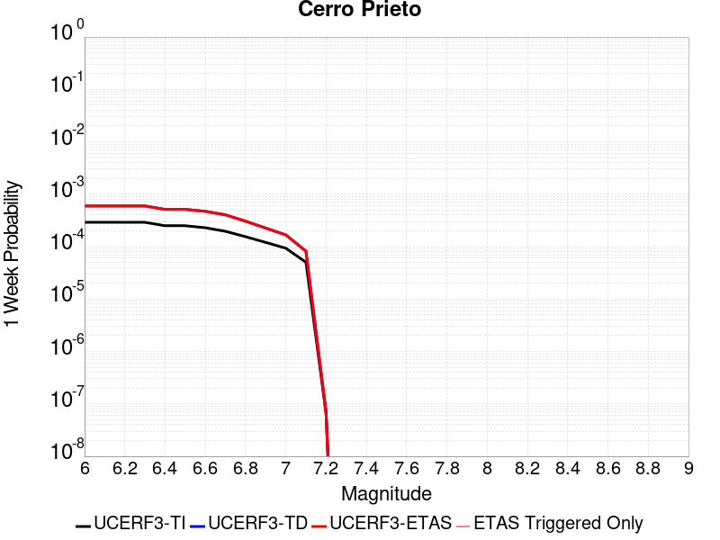 | 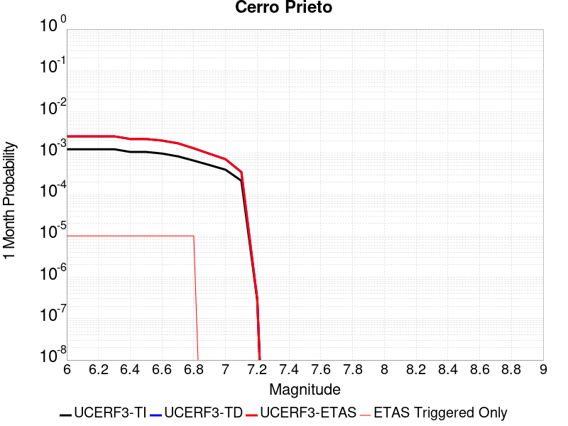 | 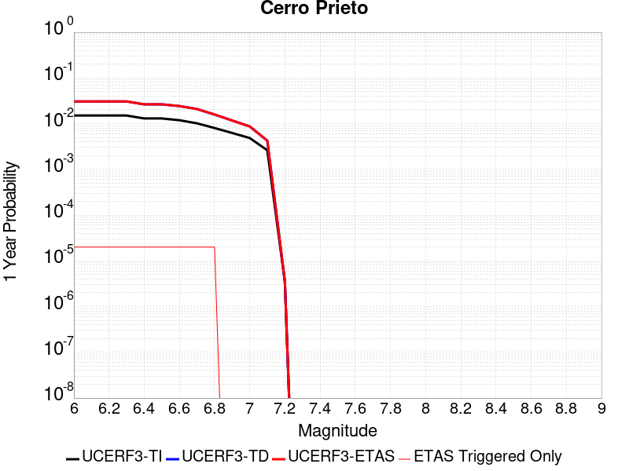 |  |

| Magnitude | 1 wk TI Prob | 1 wk TD Prob | 1 wk ETAS Prob | 1 wk ETAS/TD Gain | 1 wk ETAS Triggered Only | 1 mo TI Prob | 1 mo TD Prob | 1 mo ETAS Prob | 1 mo ETAS/TD Gain | 1 mo ETAS Triggered Only | 1 yr TI Prob | 1 yr TD Prob | 1 yr ETAS Prob | 1 yr ETAS/TD Gain | 1 yr ETAS Triggered Only | 10 yr TI Prob | 10 yr TD Prob | 10 yr ETAS Prob | 10 yr ETAS/TD Gain | 10 yr ETAS Triggered Only |
|-----|-----|-----|-----|-----|-----|-----|-----|-----|-----|-----|-----|-----|-----|-----|-----|-----|-----|-----|-----|-----|
| 6.0 | 2.9101528E-4 | 5.968108E-4 | 5.968108E-4 | 1.0 | 0.0 | 0.0012466122 | 0.0025554956 | 0.00256547 | 1.0039032 | 1.0E-5 | 0.015072231 | 0.03066412 | 0.030683506 | 1.0006323 | 2.0E-5 | 0.14089979 | 0.2540774 | 0.25409976 | 1.0000881 | 3.0E-5 |
| 6.1 | 2.9101528E-4 | 5.968108E-4 | 5.968108E-4 | 1.0 | 0.0 | 0.0012466122 | 0.0025554956 | 0.00256547 | 1.0039032 | 1.0E-5 | 0.015072231 | 0.03066412 | 0.030683506 | 1.0006323 | 2.0E-5 | 0.14089979 | 0.2540774 | 0.25409976 | 1.0000881 | 3.0E-5 |
| 6.2 | 2.9101528E-4 | 5.968108E-4 | 5.968108E-4 | 1.0 | 0.0 | 0.0012466122 | 0.0025554956 | 0.00256547 | 1.0039032 | 1.0E-5 | 0.015072231 | 0.03066412 | 0.030683506 | 1.0006323 | 2.0E-5 | 0.14089979 | 0.2540774 | 0.25409976 | 1.0000881 | 3.0E-5 |
| 6.3 | 2.9101528E-4 | 5.968108E-4 | 5.968108E-4 | 1.0 | 0.0 | 0.0012466122 | 0.0025554956 | 0.00256547 | 1.0039032 | 1.0E-5 | 0.015072231 | 0.03066412 | 0.030683506 | 1.0006323 | 2.0E-5 | 0.14089979 | 0.2540774 | 0.25409976 | 1.0000881 | 3.0E-5 |
| 6.4 | 2.508648E-4 | 5.1428843E-4 | 5.1428843E-4 | 1.0 | 0.0 | 0.0010746918 | 0.0022024303 | 0.0022124082 | 1.0045304 | 1.0E-5 | 0.013006088 | 0.026486263 | 0.026505733 | 1.0007352 | 2.0E-5 | 0.12270685 | 0.22450273 | 0.224526 | 1.0001036 | 3.0E-5 |
| 6.5 | 2.508648E-4 | 5.1428843E-4 | 5.1428843E-4 | 1.0 | 0.0 | 0.0010746918 | 0.0022024303 | 0.0022124082 | 1.0045304 | 1.0E-5 | 0.013006088 | 0.026486263 | 0.026505733 | 1.0007352 | 2.0E-5 | 0.12270685 | 0.22450273 | 0.224526 | 1.0001036 | 3.0E-5 |
| 6.6 | 2.294914E-4 | 4.7147204E-4 | 4.7147204E-4 | 1.0 | 0.0 | 9.831638E-4 | 0.0020192175 | 0.0020291973 | 1.0049424 | 1.0E-5 | 0.011904482 | 0.024312962 | 0.024332475 | 1.0008026 | 2.0E-5 | 0.11286586 | 0.20868346 | 0.2087072 | 1.0001137 | 3.0E-5 |
| 6.7 | 1.9621674E-4 | 4.044789E-4 | 4.044789E-4 | 1.0 | 0.0 | 8.4065786E-4 | 0.0017324879 | 0.0017424705 | 1.0057621 | 1.0E-5 | 0.010187071 | 0.020898996 | 0.020918578 | 1.000937 | 2.0E-5 | 0.09732539 | 0.1829988 | 0.18302332 | 1.000134 | 3.0E-5 |
| 6.8 | 1.5476145E-4 | 3.0588868E-4 | 3.0588868E-4 | 1.0 | 0.0 | 6.6309475E-4 | 0.0013103953 | 0.0013203822 | 1.0076213 | 1.0E-5 | 0.008043335 | 0.015849384 | 0.015869068 | 1.0012419 | 2.0E-5 | 0.07758363 | 0.1434489 | 0.1434746 | 1.0001792 | 3.0E-5 |
| 6.9 | 1.20509176E-4 | 2.2601841E-4 | 2.2601841E-4 | 1.0 | 0.0 | 5.1636563E-4 | 9.683541E-4 | 9.683541E-4 | 1.0 | 0.0 | 0.006268645 | 0.011736435 | 0.011736435 | 1.0 | 0.0 | 0.060947374 | 0.10952517 | 0.10952517 | 1.0 | 0.0 |
| 7.0 | 9.3269155E-5 | 1.6732134E-4 | 1.6732134E-4 | 1.0 | 0.0 | 3.9966372E-4 | 7.1693753E-4 | 7.1693753E-4 | 1.0 | 0.0 | 0.0048550544 | 0.0087014465 | 0.0087014465 | 1.0 | 0.0 | 0.04750344 | 0.08322148 | 0.08322148 | 1.0 | 0.0 |
| 7.1 | 5.029709E-5 | 8.180663E-5 | 8.180663E-5 | 1.0 | 0.0 | 2.1554115E-4 | 3.5057208E-4 | 3.5057208E-4 | 1.0 | 0.0 | 0.0026210553 | 0.0042632837 | 0.0042632837 | 1.0 | 0.0 | 0.025903556 | 0.04240377 | 0.04240377 | 1.0 | 0.0 |
| 7.2 | 6.5445185E-8 | 6.832676E-8 | 6.832676E-8 | 1.0 | 0.0 | 2.8047933E-7 | 2.92829E-7 | 2.92829E-7 | 1.0 | 0.0 | 3.4148304E-6 | 3.565193E-6 | 3.565193E-6 | 1.0 | 0.0 | 3.414778E-5 | 3.565193E-5 | 3.565193E-5 | 1.0 | 0.0 |

## Camp Rock 2011
*[(top)](#table-of-contents)*

| 1 Week | 1 Month | 1 Year | 10 Year |
|-----|-----|-----|-----|
|  |  | 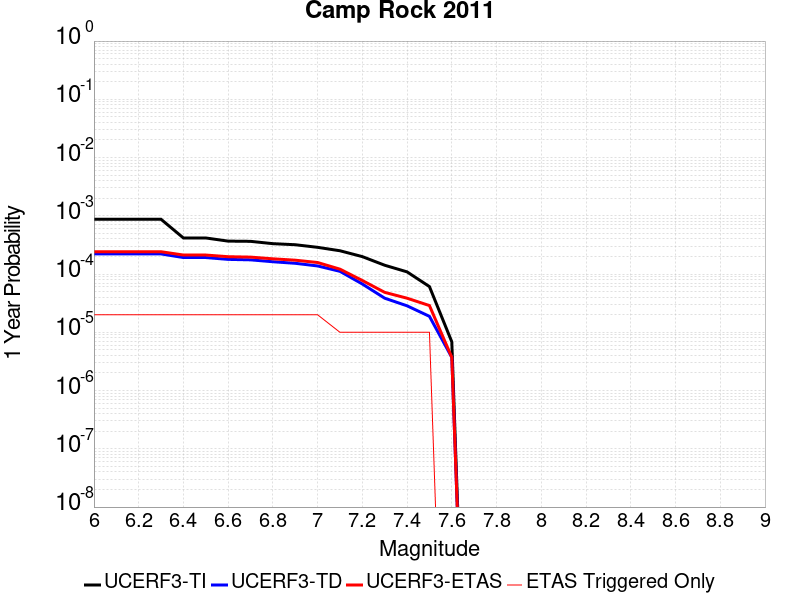 |  |

| Magnitude | 1 wk TI Prob | 1 wk TD Prob | 1 wk ETAS Prob | 1 wk ETAS/TD Gain | 1 wk ETAS Triggered Only | 1 mo TI Prob | 1 mo TD Prob | 1 mo ETAS Prob | 1 mo ETAS/TD Gain | 1 mo ETAS Triggered Only | 1 yr TI Prob | 1 yr TD Prob | 1 yr ETAS Prob | 1 yr ETAS/TD Gain | 1 yr ETAS Triggered Only | 10 yr TI Prob | 10 yr TD Prob | 10 yr ETAS Prob | 10 yr ETAS/TD Gain | 10 yr ETAS Triggered Only |
|-----|-----|-----|-----|-----|-----|-----|-----|-----|-----|-----|-----|-----|-----|-----|-----|-----|-----|-----|-----|-----|
| 6.0 | 1.6710783E-5 | 4.250414E-6 | 4.250414E-6 | 1.0 | 0.0 | 7.161568E-5 | 1.8215937E-5 | 2.8215754E-5 | 1.5489599 | 1.0E-5 | 8.7157206E-4 | 2.2175697E-4 | 2.4175254E-4 | 1.0901688 | 2.0E-5 | 0.008681616 | 0.00221541 | 0.0022453433 | 1.0135115 | 3.0E-5 |
| 6.1 | 1.6710783E-5 | 4.250414E-6 | 4.250414E-6 | 1.0 | 0.0 | 7.161568E-5 | 1.8215937E-5 | 2.8215754E-5 | 1.5489599 | 1.0E-5 | 8.7157206E-4 | 2.2175697E-4 | 2.4175254E-4 | 1.0901688 | 2.0E-5 | 0.008681616 | 0.00221541 | 0.0022453433 | 1.0135115 | 3.0E-5 |
| 6.2 | 1.6710783E-5 | 4.250414E-6 | 4.250414E-6 | 1.0 | 0.0 | 7.161568E-5 | 1.8215937E-5 | 2.8215754E-5 | 1.5489599 | 1.0E-5 | 8.7157206E-4 | 2.2175697E-4 | 2.4175254E-4 | 1.0901688 | 2.0E-5 | 0.008681616 | 0.00221541 | 0.0022453433 | 1.0135115 | 3.0E-5 |
| 6.3 | 1.6710783E-5 | 4.250414E-6 | 4.250414E-6 | 1.0 | 0.0 | 7.161568E-5 | 1.8215937E-5 | 2.8215754E-5 | 1.5489599 | 1.0E-5 | 8.7157206E-4 | 2.2175697E-4 | 2.4175254E-4 | 1.0901688 | 2.0E-5 | 0.008681616 | 0.00221541 | 0.0022453433 | 1.0135115 | 3.0E-5 |
| 6.4 | 7.982846E-6 | 3.6822241E-6 | 3.6822241E-6 | 1.0 | 0.0 | 3.421175E-5 | 1.5780866E-5 | 2.578071E-5 | 1.6336688 | 1.0E-5 | 4.1644843E-4 | 1.9211546E-4 | 2.1211163E-4 | 1.104084 | 2.0E-5 | 0.0041566887 | 0.0019195287 | 0.0019494711 | 1.0155989 | 3.0E-5 |
| 6.5 | 7.982846E-6 | 3.6822241E-6 | 3.6822241E-6 | 1.0 | 0.0 | 3.421175E-5 | 1.5780866E-5 | 2.578071E-5 | 1.6336688 | 1.0E-5 | 4.1644843E-4 | 1.9211546E-4 | 2.1211163E-4 | 1.104084 | 2.0E-5 | 0.0041566887 | 0.0019195287 | 0.0019494711 | 1.0155989 | 3.0E-5 |
| 6.6 | 7.048869E-6 | 3.424487E-6 | 3.424487E-6 | 1.0 | 0.0 | 3.0209088E-5 | 1.4676292E-5 | 2.4676146E-5 | 1.681361 | 1.0E-5 | 3.677336E-4 | 1.7866952E-4 | 1.9866595E-4 | 1.1119184 | 2.0E-5 | 0.0036712566 | 0.0017852904 | 0.0018152369 | 1.0167739 | 3.0E-5 |
| 6.7 | 6.987307E-6 | 3.362463E-6 | 3.362463E-6 | 1.0 | 0.0 | 2.9945259E-5 | 1.4410479E-5 | 2.4410334E-5 | 1.6939294 | 1.0E-5 | 3.6452254E-4 | 1.7543376E-4 | 1.9543026E-4 | 1.1139832 | 2.0E-5 | 0.0036392517 | 0.0017529839 | 0.0017829313 | 1.0170836 | 3.0E-5 |
| 6.8 | 6.3737602E-6 | 3.1180289E-6 | 3.1180289E-6 | 1.0 | 0.0 | 2.731583E-5 | 1.3362914E-5 | 2.336278E-5 | 1.7483298 | 1.0E-5 | 3.3251947E-4 | 1.6268162E-4 | 1.8267836E-4 | 1.1229196 | 2.0E-5 | 0.0033202237 | 0.0016256538 | 0.0016456214 | 1.0122827 | 2.0E-5 |
| 6.9 | 6.112211E-6 | 2.9332318E-6 | 2.9332318E-6 | 1.0 | 0.0 | 2.6194928E-5 | 1.2570935E-5 | 2.2570808E-5 | 1.7954758 | 1.0E-5 | 3.1887658E-4 | 1.5304066E-4 | 1.730376E-4 | 1.1306642 | 2.0E-5 | 0.003184194 | 0.0015293804 | 0.0015493499 | 1.0130572 | 2.0E-5 |
| 7.0 | 5.5140117E-6 | 2.6420257E-6 | 2.6420257E-6 | 1.0 | 0.0 | 2.3631264E-5 | 1.1322919E-5 | 2.1322807E-5 | 1.8831545 | 1.0E-5 | 2.8767265E-4 | 1.3784808E-4 | 1.5784532E-4 | 1.1450672 | 2.0E-5 | 0.0028730053 | 0.001377651 | 0.0013976234 | 1.0144975 | 2.0E-5 |
| 7.1 | 4.8151105E-6 | 2.1343571E-6 | 2.1343571E-6 | 1.0 | 0.0 | 2.0636026E-5 | 9.147214E-6 | 9.147214E-6 | 1.0 | 0.0 | 2.5121463E-4 | 1.1136186E-4 | 1.2136075E-4 | 1.0897874 | 1.0E-5 | 0.0025093083 | 0.0011130824 | 0.0011230713 | 1.0089741 | 1.0E-5 |
| 7.2 | 3.818335E-6 | 1.293807E-6 | 1.293807E-6 | 1.0 | 0.0 | 1.6364189E-5 | 5.544876E-6 | 5.544876E-6 | 1.0 | 0.0 | 1.9921579E-4 | 6.750686E-5 | 7.750618E-5 | 1.1481231 | 1.0E-5 | 0.0019903728 | 6.748717E-4 | 6.84865E-4 | 1.0148076 | 1.0E-5 |
| 7.3 | 2.7166698E-6 | 7.384074E-7 | 7.384074E-7 | 1.0 | 0.0 | 1.1642818E-5 | 3.1645993E-6 | 3.1645993E-6 | 1.0 | 0.0 | 1.4174209E-4 | 3.8528335E-5 | 4.852795E-5 | 1.2595392 | 1.0E-5 | 0.0014165172 | 3.8521856E-4 | 3.952147E-4 | 1.0259492 | 1.0E-5 |
| 7.4 | 2.0893426E-6 | 5.462232E-7 | 5.462232E-7 | 1.0 | 0.0 | 8.954295E-6 | 2.3409546E-6 | 2.3409546E-6 | 1.0 | 0.0 | 1.0901308E-4 | 2.8500754E-5 | 3.8500468E-5 | 1.350858 | 1.0E-5 | 0.0010895962 | 2.8497152E-4 | 2.9496866E-4 | 1.0350813 | 1.0E-5 |
| 7.5 | 1.1681728E-6 | 3.603269E-7 | 3.603269E-7 | 1.0 | 0.0 | 5.0064455E-6 | 1.5442573E-6 | 1.5442573E-6 | 1.0 | 0.0 | 6.0951766E-5 | 1.8801175E-5 | 2.8800987E-5 | 1.5318717 | 1.0E-5 | 6.093505E-4 | 1.8799631E-4 | 1.9799444E-4 | 1.0531825 | 1.0E-5 |
| 7.6 | 1.3154387E-7 | 7.120002E-8 | 7.120002E-8 | 1.0 | 0.0 | 5.6375933E-7 | 3.0514292E-7 | 3.0514292E-7 | 1.0 | 0.0 | 6.863748E-6 | 3.7151103E-6 | 3.7151103E-6 | 1.0 | 0.0 | 6.863536E-5 | 3.715064E-5 | 3.715064E-5 | 1.0 | 0.0 |

## Simi-Santa Rosa
*[(top)](#table-of-contents)*

| 1 Week | 1 Month | 1 Year | 10 Year |
|-----|-----|-----|-----|
| 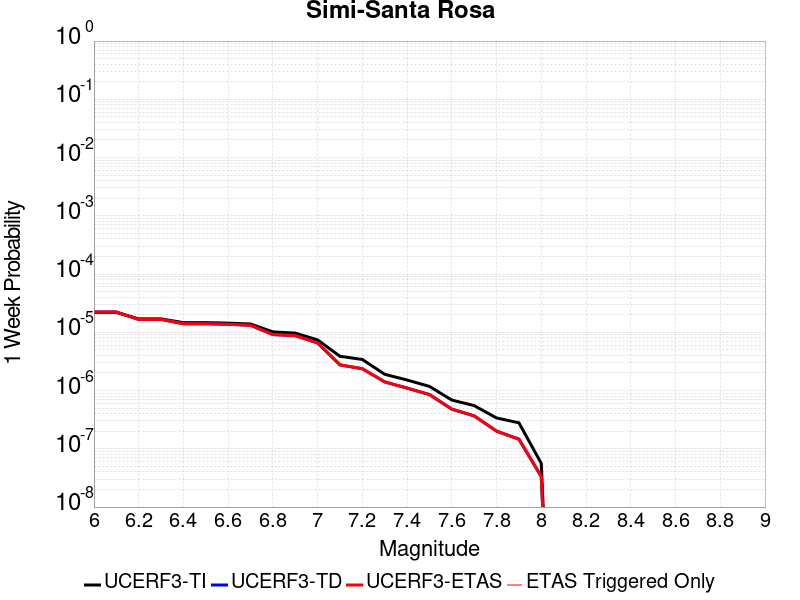 | 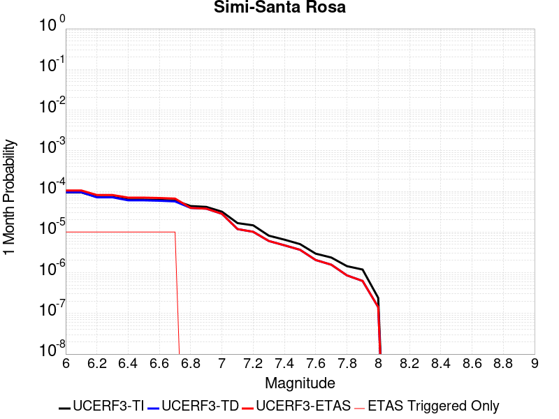 |  |  |

| Magnitude | 1 wk TI Prob | 1 wk TD Prob | 1 wk ETAS Prob | 1 wk ETAS/TD Gain | 1 wk ETAS Triggered Only | 1 mo TI Prob | 1 mo TD Prob | 1 mo ETAS Prob | 1 mo ETAS/TD Gain | 1 mo ETAS Triggered Only | 1 yr TI Prob | 1 yr TD Prob | 1 yr ETAS Prob | 1 yr ETAS/TD Gain | 1 yr ETAS Triggered Only | 10 yr TI Prob | 10 yr TD Prob | 10 yr ETAS Prob | 10 yr ETAS/TD Gain | 10 yr ETAS Triggered Only |
|-----|-----|-----|-----|-----|-----|-----|-----|-----|-----|-----|-----|-----|-----|-----|-----|-----|-----|-----|-----|-----|
| 6.0 | 2.198912E-5 | 2.2276658E-5 | 2.2276658E-5 | 1.0 | 0.0 | 9.4235686E-5 | 9.546814E-5 | 1.0546719E-4 | 1.104737 | 1.0E-5 | 0.0011467156 | 0.0011617487 | 0.0011717371 | 1.0085977 | 1.0E-5 | 0.011408163 | 0.011561202 | 0.011571087 | 1.000855 | 1.0E-5 |
| 6.1 | 2.198912E-5 | 2.2276658E-5 | 2.2276658E-5 | 1.0 | 0.0 | 9.4235686E-5 | 9.546814E-5 | 1.0546719E-4 | 1.104737 | 1.0E-5 | 0.0011467156 | 0.0011617487 | 0.0011717371 | 1.0085977 | 1.0E-5 | 0.011408163 | 0.011561202 | 0.011571087 | 1.000855 | 1.0E-5 |
| 6.2 | 1.69983E-5 | 1.6669499E-5 | 1.6669499E-5 | 1.0 | 0.0 | 7.284782E-5 | 7.143892E-5 | 8.14382E-5 | 1.1399697 | 1.0E-5 | 8.865613E-4 | 8.694509E-4 | 8.794422E-4 | 1.0114915 | 1.0E-5 | 0.008830327 | 0.008663414 | 0.008673327 | 1.0011443 | 1.0E-5 |
| 6.3 | 1.69983E-5 | 1.6669499E-5 | 1.6669499E-5 | 1.0 | 0.0 | 7.284782E-5 | 7.143892E-5 | 8.14382E-5 | 1.1399697 | 1.0E-5 | 8.865613E-4 | 8.694509E-4 | 8.794422E-4 | 1.0114915 | 1.0E-5 | 0.008830327 | 0.008663414 | 0.008673327 | 1.0011443 | 1.0E-5 |
| 6.4 | 1.4666188E-5 | 1.4053356E-5 | 1.4053356E-5 | 1.0 | 0.0 | 6.285358E-5 | 6.0227416E-5 | 7.0226815E-5 | 1.1660273 | 1.0E-5 | 7.6497364E-4 | 7.33047E-4 | 7.4303965E-4 | 1.0136317 | 1.0E-5 | 0.0076234564 | 0.0073087653 | 0.0073186923 | 1.0013583 | 1.0E-5 |
| 6.5 | 1.4666188E-5 | 1.4053356E-5 | 1.4053356E-5 | 1.0 | 0.0 | 6.285358E-5 | 6.0227416E-5 | 7.0226815E-5 | 1.1660273 | 1.0E-5 | 7.6497364E-4 | 7.33047E-4 | 7.4303965E-4 | 1.0136317 | 1.0E-5 | 0.0076234564 | 0.0073087653 | 0.0073186923 | 1.0013583 | 1.0E-5 |
| 6.6 | 1.4377586E-5 | 1.373038E-5 | 1.373038E-5 | 1.0 | 0.0 | 6.1616774E-5 | 5.88433E-5 | 6.884271E-5 | 1.1699328 | 1.0E-5 | 7.4992597E-4 | 7.162065E-4 | 7.2619936E-4 | 1.0139525 | 1.0E-5 | 0.007474003 | 0.007141452 | 0.00715138 | 1.0013902 | 1.0E-5 |
| 6.7 | 1.3881404E-5 | 1.3208322E-5 | 1.3208322E-5 | 1.0 | 0.0 | 5.9490372E-5 | 5.6606008E-5 | 6.660544E-5 | 1.1766497 | 1.0E-5 | 7.240546E-4 | 6.8898493E-4 | 6.98978E-4 | 1.0145041 | 1.0E-5 | 0.007217 | 0.0068709385 | 0.0068808696 | 1.0014454 | 1.0E-5 |
| 6.8 | 1.0176516E-5 | 9.154718E-6 | 9.154718E-6 | 1.0 | 0.0 | 4.3612912E-5 | 3.923401E-5 | 3.923401E-5 | 1.0 | 0.0 | 5.308578E-4 | 4.7758594E-4 | 4.7758594E-4 | 1.0 | 0.0 | 0.0052959146 | 0.0047672293 | 0.0047672293 | 1.0 | 0.0 |
| 6.9 | 9.699797E-6 | 8.775263E-6 | 8.775263E-6 | 1.0 | 0.0 | 4.15699E-5 | 3.760782E-5 | 3.760782E-5 | 1.0 | 0.0 | 5.05996E-4 | 4.5779545E-4 | 4.5779545E-4 | 1.0 | 0.0 | 0.005048454 | 0.004570142 | 0.004570142 | 1.0 | 0.0 |
| 7.0 | 7.4049476E-6 | 6.559746E-6 | 6.559746E-6 | 1.0 | 0.0 | 3.1735104E-5 | 2.8112965E-5 | 2.8112965E-5 | 1.0 | 0.0 | 3.8630638E-4 | 3.4223424E-4 | 3.4223424E-4 | 1.0 | 0.0 | 0.0038563553 | 0.0034183145 | 0.0034183145 | 1.0 | 0.0 |
| 7.1 | 3.873439E-6 | 2.7597077E-6 | 2.7597077E-6 | 1.0 | 0.0 | 1.6600346E-5 | 1.18272665E-5 | 1.18272665E-5 | 1.0 | 0.0 | 2.0209046E-4 | 1.439877E-4 | 1.439877E-4 | 1.0 | 0.0 | 0.0020190678 | 0.0014389675 | 0.0014389675 | 1.0 | 0.0 |
| 7.2 | 3.417706E-6 | 2.3678292E-6 | 2.3678292E-6 | 1.0 | 0.0 | 1.4647229E-5 | 1.0147802E-5 | 1.0147802E-5 | 1.0 | 0.0 | 1.7831543E-4 | 1.235427E-4 | 1.235427E-4 | 1.0 | 0.0 | 0.0017817242 | 0.0012347625 | 0.0012347625 | 1.0 | 0.0 |
| 7.3 | 1.90225E-6 | 1.4075127E-6 | 1.4075127E-6 | 1.0 | 0.0 | 8.152474E-6 | 6.032184E-6 | 6.032184E-6 | 1.0 | 0.0 | 9.9251854E-5 | 7.343938E-5 | 7.343938E-5 | 1.0 | 0.0 | 9.920754E-4 | 7.3415344E-4 | 7.3415344E-4 | 1.0 | 0.0 |
| 7.4 | 1.5170556E-6 | 1.1026052E-6 | 1.1026052E-6 | 1.0 | 0.0 | 6.5016507E-6 | 4.725442E-6 | 4.725442E-6 | 1.0 | 0.0 | 7.915472E-5 | 5.753075E-5 | 5.753075E-5 | 1.0 | 0.0 | 7.9126534E-4 | 5.751597E-4 | 5.751597E-4 | 1.0 | 0.0 |
| 7.5 | 1.178732E-6 | 8.5363195E-7 | 8.5363195E-7 | 1.0 | 0.0 | 5.0516987E-6 | 3.6584177E-6 | 3.6584177E-6 | 1.0 | 0.0 | 6.1502695E-5 | 4.4540335E-5 | 4.4540335E-5 | 1.0 | 0.0 | 6.148568E-4 | 4.4531503E-4 | 4.4531503E-4 | 1.0 | 0.0 |
| 7.6 | 6.8722386E-7 | 4.794324E-7 | 4.794324E-7 | 1.0 | 0.0 | 2.9452417E-6 | 2.0547086E-6 | 2.0547086E-6 | 1.0 | 0.0 | 3.5857727E-5 | 2.5015792E-5 | 2.5015792E-5 | 1.0 | 0.0 | 3.5851944E-4 | 2.5012987E-4 | 2.5012987E-4 | 1.0 | 0.0 |
| 7.7 | 5.5126515E-7 | 3.6742205E-7 | 3.6742205E-7 | 1.0 | 0.0 | 2.3625628E-6 | 1.574665E-6 | 1.574665E-6 | 1.0 | 0.0 | 2.8763823E-5 | 1.9171379E-5 | 1.9171379E-5 | 1.0 | 0.0 | 2.87601E-4 | 1.9169736E-4 | 1.9169736E-4 | 1.0 | 0.0 |
| 7.8 | 3.3860243E-7 | 2.0083583E-7 | 2.0083583E-7 | 1.0 | 0.0 | 1.4511525E-6 | 8.607247E-7 | 8.607247E-7 | 1.0 | 0.0 | 1.7667637E-5 | 1.0479273E-5 | 1.0479273E-5 | 1.0 | 0.0 | 1.7666233E-4 | 1.0478785E-4 | 1.0478785E-4 | 1.0 | 0.0 |
| 7.9 | 2.7955386E-7 | 1.4656291E-7 | 1.4656291E-7 | 1.0 | 0.0 | 1.1980875E-6 | 6.2812666E-7 | 6.2812666E-7 | 1.0 | 0.0 | 1.4586617E-5 | 7.647415E-6 | 7.647415E-6 | 1.0 | 0.0 | 1.458566E-4 | 7.6471566E-5 | 7.6471566E-5 | 1.0 | 0.0 |
| 8.0 | 5.6259015E-8 | 3.3360617E-8 | 3.3360617E-8 | 1.0 | 0.0 | 2.4111003E-7 | 1.4297407E-7 | 1.4297407E-7 | 1.0 | 0.0 | 2.9355108E-6 | 1.7407081E-6 | 1.7407081E-6 | 1.0 | 0.0 | 2.935472E-5 | 1.740696E-5 | 1.740696E-5 | 1.0 | 0.0 |

## Owens Valley Keough Hot Springs
*[(top)](#table-of-contents)*

| 1 Week | 1 Month | 1 Year | 10 Year |
|-----|-----|-----|-----|
| 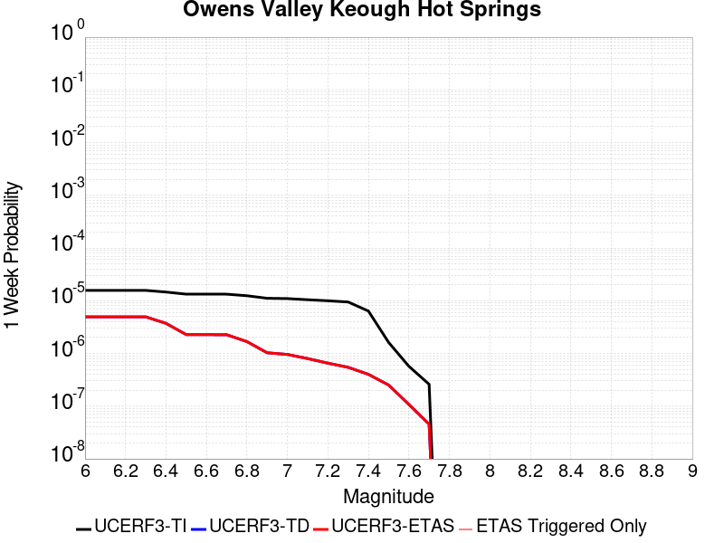 |  | 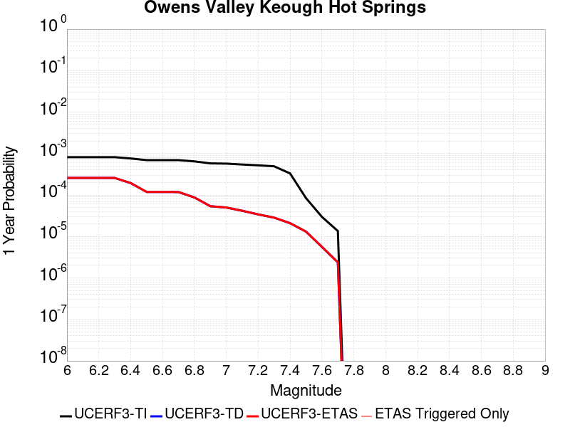 |  |

| Magnitude | 1 wk TI Prob | 1 wk TD Prob | 1 wk ETAS Prob | 1 wk ETAS/TD Gain | 1 wk ETAS Triggered Only | 1 mo TI Prob | 1 mo TD Prob | 1 mo ETAS Prob | 1 mo ETAS/TD Gain | 1 mo ETAS Triggered Only | 1 yr TI Prob | 1 yr TD Prob | 1 yr ETAS Prob | 1 yr ETAS/TD Gain | 1 yr ETAS Triggered Only | 10 yr TI Prob | 10 yr TD Prob | 10 yr ETAS Prob | 10 yr ETAS/TD Gain | 10 yr ETAS Triggered Only |
|-----|-----|-----|-----|-----|-----|-----|-----|-----|-----|-----|-----|-----|-----|-----|-----|-----|-----|-----|-----|-----|
| 6.0 | 1.5708529E-5 | 4.9511614E-6 | 4.9511614E-6 | 1.0 | 0.0 | 6.7320536E-5 | 2.121912E-5 | 2.121912E-5 | 1.0 | 0.0 | 8.193192E-4 | 2.5831728E-4 | 2.5831728E-4 | 1.0 | 0.0 | 0.008163051 | 0.002580829 | 0.0026007774 | 1.0077294 | 2.0E-5 |
| 6.1 | 1.5708529E-5 | 4.9511614E-6 | 4.9511614E-6 | 1.0 | 0.0 | 6.7320536E-5 | 2.121912E-5 | 2.121912E-5 | 1.0 | 0.0 | 8.193192E-4 | 2.5831728E-4 | 2.5831728E-4 | 1.0 | 0.0 | 0.008163051 | 0.002580829 | 0.0026007774 | 1.0077294 | 2.0E-5 |
| 6.2 | 1.5708529E-5 | 4.9511614E-6 | 4.9511614E-6 | 1.0 | 0.0 | 6.7320536E-5 | 2.121912E-5 | 2.121912E-5 | 1.0 | 0.0 | 8.193192E-4 | 2.5831728E-4 | 2.5831728E-4 | 1.0 | 0.0 | 0.008163051 | 0.002580829 | 0.0026007774 | 1.0077294 | 2.0E-5 |
| 6.3 | 1.5708529E-5 | 4.9511614E-6 | 4.9511614E-6 | 1.0 | 0.0 | 6.7320536E-5 | 2.121912E-5 | 2.121912E-5 | 1.0 | 0.0 | 8.193192E-4 | 2.5831728E-4 | 2.5831728E-4 | 1.0 | 0.0 | 0.008163051 | 0.002580829 | 0.0026007774 | 1.0077294 | 2.0E-5 |
| 6.4 | 1.4622509E-5 | 3.7269642E-6 | 3.7269642E-6 | 1.0 | 0.0 | 6.266639E-5 | 1.5972624E-5 | 1.5972624E-5 | 1.0 | 0.0 | 7.626962E-4 | 1.9445266E-4 | 1.9445266E-4 | 1.0 | 0.0 | 0.007600839 | 0.0019433049 | 0.0019632662 | 1.0102718 | 2.0E-5 |
| 6.5 | 1.3335527E-5 | 2.2780882E-6 | 2.2780882E-6 | 1.0 | 0.0 | 5.7151006E-5 | 9.763203E-6 | 9.763203E-6 | 1.0 | 0.0 | 6.955913E-4 | 1.1886119E-4 | 1.1886119E-4 | 1.0 | 0.0 | 0.0069341804 | 0.0011881988 | 0.0012081751 | 1.0168122 | 2.0E-5 |
| 6.6 | 1.3332855E-5 | 2.2752374E-6 | 2.2752374E-6 | 1.0 | 0.0 | 5.7139558E-5 | 9.750985E-6 | 9.750985E-6 | 1.0 | 0.0 | 6.9545204E-4 | 1.1871246E-4 | 1.1871246E-4 | 1.0 | 0.0 | 0.0069327964 | 0.001186713 | 0.0012066893 | 1.0168333 | 2.0E-5 |
| 6.7 | 1.3318214E-5 | 2.2644667E-6 | 2.2644667E-6 | 1.0 | 0.0 | 5.707681E-5 | 9.704825E-6 | 9.704825E-6 | 1.0 | 0.0 | 6.946886E-4 | 1.1815052E-4 | 1.1815052E-4 | 1.0 | 0.0 | 0.0069252094 | 0.0011810997 | 0.0012010761 | 1.0169134 | 2.0E-5 |
| 6.8 | 1.2441338E-5 | 1.6781016E-6 | 1.6781016E-6 | 1.0 | 0.0 | 5.331893E-5 | 7.191846E-6 | 7.191846E-6 | 1.0 | 0.0 | 6.489646E-4 | 8.7557506E-5 | 8.7557506E-5 | 1.0 | 0.0 | 0.0064707273 | 8.7541505E-4 | 8.9539756E-4 | 1.0228263 | 2.0E-5 |
| 6.9 | 1.1130476E-5 | 1.0306019E-6 | 1.0306019E-6 | 1.0 | 0.0 | 4.7701167E-5 | 4.416858E-6 | 4.416858E-6 | 1.0 | 0.0 | 5.806069E-4 | 5.377393E-5 | 5.377393E-5 | 1.0 | 0.0 | 0.0057909233 | 5.377639E-4 | 5.5775314E-4 | 1.037171 | 2.0E-5 |
| 7.0 | 1.0986073E-5 | 9.581476E-7 | 9.581476E-7 | 1.0 | 0.0 | 4.7082318E-5 | 4.1063404E-6 | 4.1063404E-6 | 1.0 | 0.0 | 5.730765E-4 | 4.999356E-5 | 4.999356E-5 | 1.0 | 0.0 | 0.0057160086 | 4.9997686E-4 | 5.199668E-4 | 1.0399818 | 2.0E-5 |
| 7.1 | 1.0451338E-5 | 8.0019623E-7 | 8.0019623E-7 | 1.0 | 0.0 | 4.4790682E-5 | 3.4294078E-6 | 3.4294078E-6 | 1.0 | 0.0 | 5.451901E-4 | 4.1752246E-5 | 4.1752246E-5 | 1.0 | 0.0 | 0.005438545 | 4.175938E-4 | 4.3758546E-4 | 1.0478734 | 2.0E-5 |
| 7.2 | 9.989061E-6 | 6.546405E-7 | 6.546405E-7 | 1.0 | 0.0 | 4.280956E-5 | 2.805599E-6 | 2.805599E-6 | 1.0 | 0.0 | 5.2108173E-4 | 3.4157638E-5 | 3.4157638E-5 | 1.0 | 0.0 | 0.0051986156 | 3.4166142E-4 | 3.616546E-4 | 1.0585175 | 2.0E-5 |
| 7.3 | 9.465365E-6 | 5.4613974E-7 | 5.4613974E-7 | 1.0 | 0.0 | 4.056522E-5 | 2.340597E-6 | 2.340597E-6 | 1.0 | 0.0 | 4.937696E-4 | 2.8496397E-5 | 2.8496397E-5 | 1.0 | 0.0 | 0.0049267393 | 2.8506012E-4 | 3.0505442E-4 | 1.0701406 | 2.0E-5 |
| 7.4 | 6.3824805E-6 | 4.0174507E-7 | 4.0174507E-7 | 1.0 | 0.0 | 2.73532E-5 | 1.7217634E-6 | 1.7217634E-6 | 1.0 | 0.0 | 3.3297433E-4 | 2.096227E-5 | 2.096227E-5 | 1.0 | 0.0 | 0.0033247585 | 2.0969543E-4 | 2.1969332E-4 | 1.0476782 | 1.0E-5 |
| 7.5 | 1.6192645E-6 | 2.5168E-7 | 2.5168E-7 | 1.0 | 0.0 | 6.9396865E-6 | 1.0786281E-6 | 1.0786281E-6 | 1.0 | 0.0 | 8.448741E-5 | 1.31322195E-5 | 1.31322195E-5 | 1.0 | 0.0 | 8.4455294E-4 | 1.3131456E-4 | 1.4131326E-4 | 1.076143 | 1.0E-5 |
| 7.6 | 5.7062545E-7 | 1.079512E-7 | 1.079512E-7 | 1.0 | 0.0 | 2.4455355E-6 | 4.6264793E-7 | 4.6264793E-7 | 1.0 | 0.0 | 2.9773988E-5 | 5.632725E-6 | 5.632725E-6 | 1.0 | 0.0 | 2.977E-4 | 5.6325902E-5 | 6.632534E-5 | 1.1775283 | 1.0E-5 |
| 7.7 | 2.5988817E-7 | 4.5469047E-8 | 4.5469047E-8 | 1.0 | 0.0 | 1.113806E-6 | 1.9486734E-7 | 1.9486734E-7 | 1.0 | 0.0 | 1.3560503E-5 | 2.3725077E-6 | 2.3725077E-6 | 1.0 | 0.0 | 1.3559677E-4 | 2.3724866E-5 | 2.3724866E-5 | 1.0 | 0.0 |

## Raymond
*[(top)](#table-of-contents)*

| 1 Week | 1 Month | 1 Year | 10 Year |
|-----|-----|-----|-----|
| 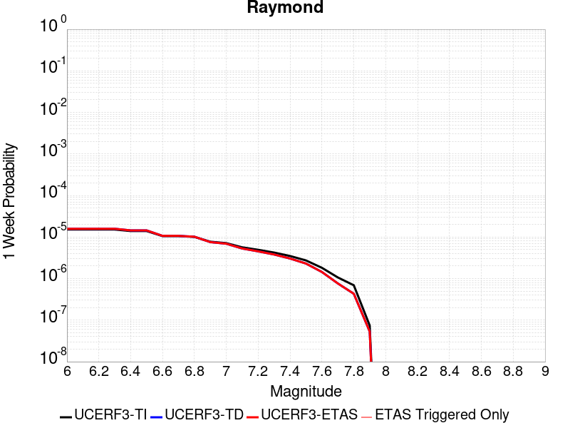 |  |  | 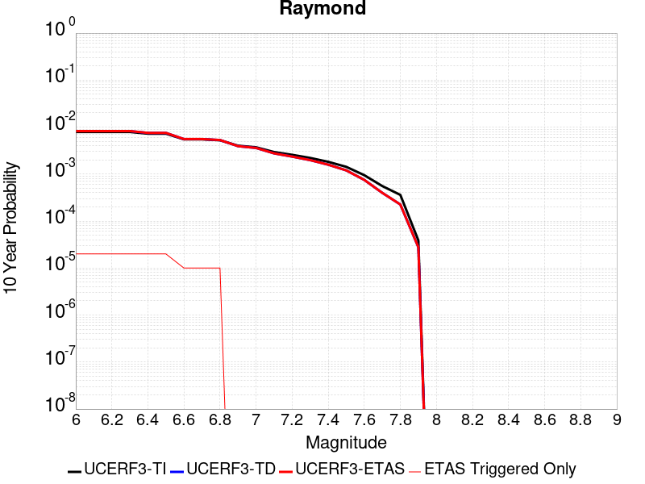 |

| Magnitude | 1 wk TI Prob | 1 wk TD Prob | 1 wk ETAS Prob | 1 wk ETAS/TD Gain | 1 wk ETAS Triggered Only | 1 mo TI Prob | 1 mo TD Prob | 1 mo ETAS Prob | 1 mo ETAS/TD Gain | 1 mo ETAS Triggered Only | 1 yr TI Prob | 1 yr TD Prob | 1 yr ETAS Prob | 1 yr ETAS/TD Gain | 1 yr ETAS Triggered Only | 10 yr TI Prob | 10 yr TD Prob | 10 yr ETAS Prob | 10 yr ETAS/TD Gain | 10 yr ETAS Triggered Only |
|-----|-----|-----|-----|-----|-----|-----|-----|-----|-----|-----|-----|-----|-----|-----|-----|-----|-----|-----|-----|-----|
| 6.0 | 1.5157413E-5 | 1.5810965E-5 | 1.5810965E-5 | 1.0 | 0.0 | 6.4958724E-5 | 6.775966E-5 | 7.775899E-5 | 1.1475704 | 1.0E-5 | 7.905855E-4 | 8.246867E-4 | 8.346785E-4 | 1.0121158 | 1.0E-5 | 0.007877788 | 0.008218782 | 0.008238617 | 1.0024134 | 2.0E-5 |
| 6.1 | 1.5157413E-5 | 1.5810965E-5 | 1.5810965E-5 | 1.0 | 0.0 | 6.4958724E-5 | 6.775966E-5 | 7.775899E-5 | 1.1475704 | 1.0E-5 | 7.905855E-4 | 8.246867E-4 | 8.346785E-4 | 1.0121158 | 1.0E-5 | 0.007877788 | 0.008218782 | 0.008238617 | 1.0024134 | 2.0E-5 |
| 6.2 | 1.5157413E-5 | 1.5810965E-5 | 1.5810965E-5 | 1.0 | 0.0 | 6.4958724E-5 | 6.775966E-5 | 7.775899E-5 | 1.1475704 | 1.0E-5 | 7.905855E-4 | 8.246867E-4 | 8.346785E-4 | 1.0121158 | 1.0E-5 | 0.007877788 | 0.008218782 | 0.008238617 | 1.0024134 | 2.0E-5 |
| 6.3 | 1.5157413E-5 | 1.5810965E-5 | 1.5810965E-5 | 1.0 | 0.0 | 6.4958724E-5 | 6.775966E-5 | 7.775899E-5 | 1.1475704 | 1.0E-5 | 7.905855E-4 | 8.246867E-4 | 8.346785E-4 | 1.0121158 | 1.0E-5 | 0.007877788 | 0.008218782 | 0.008238617 | 1.0024134 | 2.0E-5 |
| 6.4 | 1.3941944E-5 | 1.4455467E-5 | 1.4455467E-5 | 1.0 | 0.0 | 5.9749822E-5 | 6.195066E-5 | 7.195004E-5 | 1.1614088 | 1.0E-5 | 7.2721124E-4 | 7.540116E-4 | 7.640041E-4 | 1.0132524 | 1.0E-5 | 0.007248361 | 0.007516867 | 0.0075367163 | 1.0026407 | 2.0E-5 |
| 6.5 | 1.3941944E-5 | 1.4455467E-5 | 1.4455467E-5 | 1.0 | 0.0 | 5.9749822E-5 | 6.195066E-5 | 7.195004E-5 | 1.1614088 | 1.0E-5 | 7.2721124E-4 | 7.540116E-4 | 7.640041E-4 | 1.0132524 | 1.0E-5 | 0.007248361 | 0.007516867 | 0.0075367163 | 1.0026407 | 2.0E-5 |
| 6.6 | 1.0542609E-5 | 1.0671719E-5 | 1.0671719E-5 | 1.0 | 0.0 | 4.5181827E-5 | 4.5735167E-5 | 4.5735167E-5 | 1.0 | 0.0 | 5.499499E-4 | 5.566888E-4 | 5.566888E-4 | 1.0 | 0.0 | 0.005485909 | 0.0055535045 | 0.005563449 | 1.0017906 | 1.0E-5 |
| 6.7 | 1.0542609E-5 | 1.0671719E-5 | 1.0671719E-5 | 1.0 | 0.0 | 4.5181827E-5 | 4.5735167E-5 | 4.5735167E-5 | 1.0 | 0.0 | 5.499499E-4 | 5.566888E-4 | 5.566888E-4 | 1.0 | 0.0 | 0.005485909 | 0.0055535045 | 0.005563449 | 1.0017906 | 1.0E-5 |
| 6.8 | 1.0079132E-5 | 1.0177238E-5 | 1.0177238E-5 | 1.0 | 0.0 | 4.3195567E-5 | 4.3616037E-5 | 4.3616037E-5 | 1.0 | 0.0 | 5.257791E-4 | 5.3090125E-4 | 5.3090125E-4 | 1.0 | 0.0 | 0.0052453685 | 0.0052968785 | 0.005306826 | 1.0018779 | 1.0E-5 |
| 6.9 | 7.721598E-6 | 7.549376E-6 | 7.549376E-6 | 1.0 | 0.0 | 3.3092143E-5 | 3.2354073E-5 | 3.2354073E-5 | 1.0 | 0.0 | 4.0282236E-4 | 3.9384086E-4 | 3.9384086E-4 | 1.0 | 0.0 | 0.0040209293 | 0.0039315624 | 0.0039315624 | 1.0 | 0.0 |
| 7.0 | 7.137566E-6 | 6.911753E-6 | 6.911753E-6 | 1.0 | 0.0 | 3.058921E-5 | 2.962147E-5 | 2.962147E-5 | 1.0 | 0.0 | 3.7236E-4 | 3.6058278E-4 | 3.6058278E-4 | 1.0 | 0.0 | 0.0037173668 | 0.0036000956 | 0.0036000956 | 1.0 | 0.0 |
| 7.1 | 5.654976E-6 | 5.299932E-6 | 5.299932E-6 | 1.0 | 0.0 | 2.4235387E-5 | 2.2713797E-5 | 2.2713797E-5 | 1.0 | 0.0 | 2.9502588E-4 | 2.765056E-4 | 2.765056E-4 | 1.0 | 0.0 | 0.0029463451 | 0.0027616466 | 0.0027616466 | 1.0 | 0.0 |
| 7.2 | 4.9358455E-6 | 4.5270235E-6 | 4.5270235E-6 | 1.0 | 0.0 | 2.1153453E-5 | 1.9401386E-5 | 1.9401386E-5 | 1.0 | 0.0 | 2.5751285E-4 | 2.361864E-4 | 2.361864E-4 | 1.0 | 0.0 | 0.0025721465 | 0.002359376 | 0.002359376 | 1.0 | 0.0 |
| 7.3 | 4.2368597E-6 | 3.8059604E-6 | 3.8059604E-6 | 1.0 | 0.0 | 1.8157843E-5 | 1.6311158E-5 | 1.6311158E-5 | 1.0 | 0.0 | 2.2104931E-4 | 1.9857036E-4 | 1.9857036E-4 | 1.0 | 0.0 | 0.0022082955 | 0.001983948 | 0.001983948 | 1.0 | 0.0 |
| 7.4 | 3.4999923E-6 | 3.0440608E-6 | 3.0440608E-6 | 1.0 | 0.0 | 1.49998805E-5 | 1.304591E-5 | 1.304591E-5 | 1.0 | 0.0 | 1.8260824E-4 | 1.5882247E-4 | 1.5882247E-4 | 1.0 | 0.0 | 0.0018245826 | 0.0015871053 | 0.0015871053 | 1.0 | 0.0 |
| 7.5 | 2.738017E-6 | 2.3022376E-6 | 2.3022376E-6 | 1.0 | 0.0 | 1.1734306E-5 | 9.866695E-6 | 9.866695E-6 | 1.0 | 0.0 | 1.428558E-4 | 1.20120465E-4 | 1.20120465E-4 | 1.0 | 0.0 | 0.0014276401 | 0.0012005697 | 0.0012005697 | 1.0 | 0.0 |
| 7.6 | 1.8186392E-6 | 1.4424458E-6 | 1.4424458E-6 | 1.0 | 0.0 | 7.794145E-6 | 6.181896E-6 | 6.181896E-6 | 1.0 | 0.0 | 9.488958E-5 | 7.5262025E-5 | 7.5262025E-5 | 1.0 | 0.0 | 9.4849075E-4 | 7.5237686E-4 | 7.5237686E-4 | 1.0 | 0.0 |
| 7.7 | 1.0660348E-6 | 7.6448845E-7 | 7.6448845E-7 | 1.0 | 0.0 | 4.5687125E-6 | 3.276375E-6 | 3.276375E-6 | 1.0 | 0.0 | 5.5622655E-5 | 3.9889153E-5 | 3.9889153E-5 | 1.0 | 0.0 | 5.5608735E-4 | 3.9882906E-4 | 3.9882906E-4 | 1.0 | 0.0 |
| 7.8 | 6.913602E-7 | 4.3213157E-7 | 4.3213157E-7 | 1.0 | 0.0 | 2.962969E-6 | 1.8519911E-6 | 1.8519911E-6 | 1.0 | 0.0 | 3.607355E-5 | 2.2547765E-5 | 2.2547765E-5 | 1.0 | 0.0 | 3.6067693E-4 | 2.2546263E-4 | 2.2546263E-4 | 1.0 | 0.0 |
| 7.9 | 7.425201E-8 | 5.3231258E-8 | 5.3231258E-8 | 1.0 | 0.0 | 3.1822285E-7 | 2.2813394E-7 | 2.2813394E-7 | 1.0 | 0.0 | 3.874356E-6 | 2.7775286E-6 | 2.7775286E-6 | 1.0 | 0.0 | 3.8742884E-5 | 2.7775068E-5 | 2.7775068E-5 | 1.0 | 0.0 |

## Tin Mountain
*[(top)](#table-of-contents)*

| 1 Week | 1 Month | 1 Year | 10 Year |
|-----|-----|-----|-----|
| 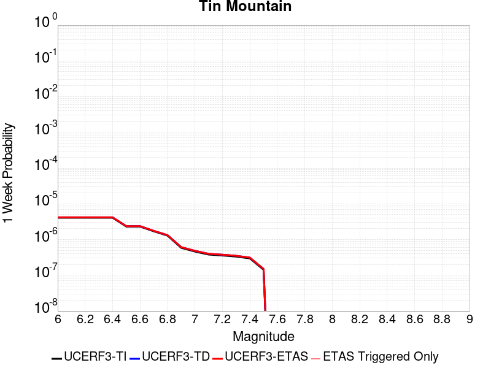 | 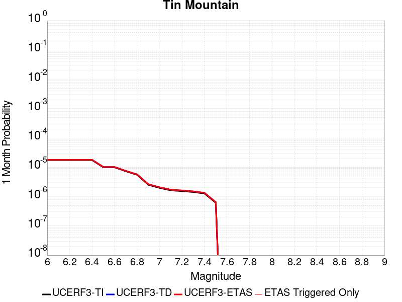 |  | 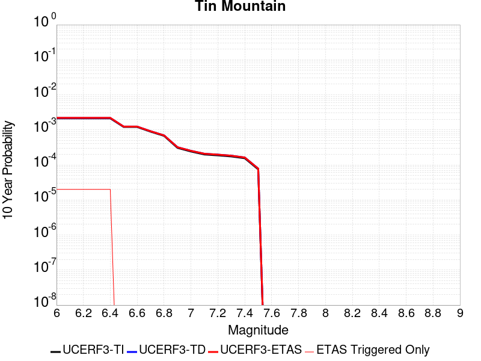 |

| Magnitude | 1 wk TI Prob | 1 wk TD Prob | 1 wk ETAS Prob | 1 wk ETAS/TD Gain | 1 wk ETAS Triggered Only | 1 mo TI Prob | 1 mo TD Prob | 1 mo ETAS Prob | 1 mo ETAS/TD Gain | 1 mo ETAS Triggered Only | 1 yr TI Prob | 1 yr TD Prob | 1 yr ETAS Prob | 1 yr ETAS/TD Gain | 1 yr ETAS Triggered Only | 10 yr TI Prob | 10 yr TD Prob | 10 yr ETAS Prob | 10 yr ETAS/TD Gain | 10 yr ETAS Triggered Only |
|-----|-----|-----|-----|-----|-----|-----|-----|-----|-----|-----|-----|-----|-----|-----|-----|-----|-----|-----|-----|-----|
| 6.0 | 4.083776E-6 | 4.1815765E-6 | 4.1815765E-6 | 1.0 | 0.0 | 1.750178E-5 | 1.792094E-5 | 1.792094E-5 | 1.0 | 0.0 | 2.1306332E-4 | 2.1816933E-4 | 2.2816715E-4 | 1.045826 | 1.0E-5 | 0.0021285915 | 0.0021799172 | 0.0021998736 | 1.0091547 | 2.0E-5 |
| 6.1 | 4.083776E-6 | 4.1815765E-6 | 4.1815765E-6 | 1.0 | 0.0 | 1.750178E-5 | 1.792094E-5 | 1.792094E-5 | 1.0 | 0.0 | 2.1306332E-4 | 2.1816933E-4 | 2.2816715E-4 | 1.045826 | 1.0E-5 | 0.0021285915 | 0.0021799172 | 0.0021998736 | 1.0091547 | 2.0E-5 |
| 6.2 | 4.083776E-6 | 4.1815765E-6 | 4.1815765E-6 | 1.0 | 0.0 | 1.750178E-5 | 1.792094E-5 | 1.792094E-5 | 1.0 | 0.0 | 2.1306332E-4 | 2.1816933E-4 | 2.2816715E-4 | 1.045826 | 1.0E-5 | 0.0021285915 | 0.0021799172 | 0.0021998736 | 1.0091547 | 2.0E-5 |
| 6.3 | 4.083776E-6 | 4.1815765E-6 | 4.1815765E-6 | 1.0 | 0.0 | 1.750178E-5 | 1.792094E-5 | 1.792094E-5 | 1.0 | 0.0 | 2.1306332E-4 | 2.1816933E-4 | 2.2816715E-4 | 1.045826 | 1.0E-5 | 0.0021285915 | 0.0021799172 | 0.0021998736 | 1.0091547 | 2.0E-5 |
| 6.4 | 4.083776E-6 | 4.1815765E-6 | 4.1815765E-6 | 1.0 | 0.0 | 1.750178E-5 | 1.792094E-5 | 1.792094E-5 | 1.0 | 0.0 | 2.1306332E-4 | 2.1816933E-4 | 2.2816715E-4 | 1.045826 | 1.0E-5 | 0.0021285915 | 0.0021799172 | 0.0021998736 | 1.0091547 | 2.0E-5 |
| 6.5 | 2.3143427E-6 | 2.3731814E-6 | 2.3731814E-6 | 1.0 | 0.0 | 9.9185745E-6 | 1.0170742E-5 | 1.0170742E-5 | 1.0 | 0.0 | 1.2075195E-4 | 1.2382251E-4 | 1.2382251E-4 | 1.0 | 0.0 | 0.0012068636 | 0.0012376112 | 0.0012376112 | 1.0 | 0.0 |
| 6.6 | 2.3143427E-6 | 2.3731814E-6 | 2.3731814E-6 | 1.0 | 0.0 | 9.9185745E-6 | 1.0170742E-5 | 1.0170742E-5 | 1.0 | 0.0 | 1.2075195E-4 | 1.2382251E-4 | 1.2382251E-4 | 1.0 | 0.0 | 0.0012068636 | 0.0012376112 | 0.0012376112 | 1.0 | 0.0 |
| 6.7 | 1.7029532E-6 | 1.7498107E-6 | 1.7498107E-6 | 1.0 | 0.0 | 7.2983503E-6 | 7.4991704E-6 | 7.4991704E-6 | 1.0 | 0.0 | 8.885379E-5 | 9.129911E-5 | 9.129911E-5 | 1.0 | 0.0 | 8.881827E-4 | 9.1266865E-4 | 9.1266865E-4 | 1.0 | 0.0 |
| 6.8 | 1.2914646E-6 | 1.3299538E-6 | 1.3299538E-6 | 1.0 | 0.0 | 5.534837E-6 | 5.6997915E-6 | 5.6997915E-6 | 1.0 | 0.0 | 6.738455E-5 | 6.9393194E-5 | 6.9393194E-5 | 1.0 | 0.0 | 6.736412E-4 | 6.937586E-4 | 6.937586E-4 | 1.0 | 0.0 |
| 6.9 | 5.8708974E-7 | 6.117096E-7 | 6.117096E-7 | 1.0 | 0.0 | 2.5160964E-6 | 2.62161E-6 | 2.62161E-6 | 1.0 | 0.0 | 3.0633044E-5 | 3.1917676E-5 | 3.1917676E-5 | 1.0 | 0.0 | 3.0628822E-4 | 3.1913506E-4 | 3.1913506E-4 | 1.0 | 0.0 |
| 7.0 | 4.6248786E-7 | 4.8321016E-7 | 4.8321016E-7 | 1.0 | 0.0 | 1.9820893E-6 | 2.0708992E-6 | 2.0708992E-6 | 1.0 | 0.0 | 2.413167E-5 | 2.5212945E-5 | 2.5212945E-5 | 1.0 | 0.0 | 2.412905E-4 | 2.5210454E-4 | 2.5210454E-4 | 1.0 | 0.0 |
| 7.1 | 3.804606E-7 | 3.987223E-7 | 3.987223E-7 | 1.0 | 0.0 | 1.6305444E-6 | 1.708809E-6 | 1.708809E-6 | 1.0 | 0.0 | 1.9851697E-5 | 2.0804586E-5 | 2.0804586E-5 | 1.0 | 0.0 | 1.9849923E-4 | 2.0802974E-4 | 2.0802974E-4 | 1.0 | 0.0 |
| 7.2 | 3.5864858E-7 | 3.7617593E-7 | 3.7617593E-7 | 1.0 | 0.0 | 1.5370645E-6 | 1.6121818E-6 | 1.6121818E-6 | 1.0 | 0.0 | 1.87136E-5 | 1.962817E-5 | 1.962817E-5 | 1.0 | 0.0 | 1.8712023E-4 | 1.9626768E-4 | 1.9626768E-4 | 1.0 | 0.0 |
| 7.3 | 3.342063E-7 | 3.5064159E-7 | 3.5064159E-7 | 1.0 | 0.0 | 1.4323119E-6 | 1.502749E-6 | 1.502749E-6 | 1.0 | 0.0 | 1.7438259E-5 | 1.8295848E-5 | 1.8295848E-5 | 1.0 | 0.0 | 1.743689E-4 | 1.8294672E-4 | 1.8294672E-4 | 1.0 | 0.0 |
| 7.4 | 2.971242E-7 | 3.1166425E-7 | 3.1166425E-7 | 1.0 | 0.0 | 1.2733886E-6 | 1.3357035E-6 | 1.3357035E-6 | 1.0 | 0.0 | 1.5503398E-5 | 1.6262102E-5 | 1.6262102E-5 | 1.0 | 0.0 | 1.5502315E-4 | 1.626124E-4 | 1.626124E-4 | 1.0 | 0.0 |
| 7.5 | 1.4326713E-7 | 1.501281E-7 | 1.501281E-7 | 1.0 | 0.0 | 6.140018E-7 | 6.4340617E-7 | 6.4340617E-7 | 1.0 | 0.0 | 7.4754466E-6 | 7.83347E-6 | 7.83347E-6 | 1.0 | 0.0 | 7.475195E-5 | 7.83347E-5 | 7.83347E-5 | 1.0 | 0.0 |

## Surprise Valley 2011 CFM
*[(top)](#table-of-contents)*

| 1 Week | 1 Month | 1 Year | 10 Year |
|-----|-----|-----|-----|
|  |  |  |  |

| Magnitude | 1 wk TI Prob | 1 wk TD Prob | 1 wk ETAS Prob | 1 wk ETAS/TD Gain | 1 wk ETAS Triggered Only | 1 mo TI Prob | 1 mo TD Prob | 1 mo ETAS Prob | 1 mo ETAS/TD Gain | 1 mo ETAS Triggered Only | 1 yr TI Prob | 1 yr TD Prob | 1 yr ETAS Prob | 1 yr ETAS/TD Gain | 1 yr ETAS Triggered Only | 10 yr TI Prob | 10 yr TD Prob | 10 yr ETAS Prob | 10 yr ETAS/TD Gain | 10 yr ETAS Triggered Only |
|-----|-----|-----|-----|-----|-----|-----|-----|-----|-----|-----|-----|-----|-----|-----|-----|-----|-----|-----|-----|-----|
| 6.0 | 4.0396248E-5 | 4.4853292E-5 | 4.4853292E-5 | 1.0 | 0.0 | 1.7311527E-4 | 1.922154E-4 | 1.922154E-4 | 1.0 | 0.0 | 0.002105641 | 0.0023379207 | 0.0023478975 | 1.0042673 | 1.0E-5 | 0.020858008 | 0.023154978 | 0.023174515 | 1.0008438 | 2.0E-5 |
| 6.1 | 4.0396248E-5 | 4.4853292E-5 | 4.4853292E-5 | 1.0 | 0.0 | 1.7311527E-4 | 1.922154E-4 | 1.922154E-4 | 1.0 | 0.0 | 0.002105641 | 0.0023379207 | 0.0023478975 | 1.0042673 | 1.0E-5 | 0.020858008 | 0.023154978 | 0.023174515 | 1.0008438 | 2.0E-5 |
| 6.2 | 2.2295266E-5 | 2.440217E-5 | 2.440217E-5 | 1.0 | 0.0 | 9.554764E-5 | 1.0457671E-4 | 1.0457671E-4 | 1.0 | 0.0 | 0.0011626717 | 0.0012725085 | 0.0012725085 | 1.0 | 0.0 | 0.011566074 | 0.012655456 | 0.012655456 | 1.0 | 0.0 |
| 6.3 | 1.572643E-5 | 1.7097402E-5 | 1.7097402E-5 | 1.0 | 0.0 | 6.7397246E-5 | 7.327258E-5 | 7.327258E-5 | 1.0 | 0.0 | 8.202525E-4 | 8.9173904E-4 | 8.9173904E-4 | 1.0 | 0.0 | 0.008172315 | 0.008882714 | 0.008882714 | 1.0 | 0.0 |
| 6.4 | 1.5714395E-5 | 1.7085224E-5 | 1.7085224E-5 | 1.0 | 0.0 | 6.734567E-5 | 7.322039E-5 | 7.322039E-5 | 1.0 | 0.0 | 8.1962504E-4 | 8.9110417E-4 | 8.9110417E-4 | 1.0 | 0.0 | 0.008166086 | 0.008876416 | 0.008876416 | 1.0 | 0.0 |
| 6.5 | 1.2733495E-5 | 1.3802062E-5 | 1.3802062E-5 | 1.0 | 0.0 | 5.457098E-5 | 5.9150392E-5 | 5.9150392E-5 | 1.0 | 0.0 | 6.641992E-4 | 7.1992475E-4 | 7.1992475E-4 | 1.0 | 0.0 | 0.0066221743 | 0.007176619 | 0.007176619 | 1.0 | 0.0 |
| 6.6 | 1.0983784E-5 | 1.1886944E-5 | 1.1886944E-5 | 1.0 | 0.0 | 4.7072506E-5 | 5.094308E-5 | 5.094308E-5 | 1.0 | 0.0 | 5.7295704E-4 | 6.2006083E-4 | 6.2006083E-4 | 1.0 | 0.0 | 0.0057148207 | 0.0061838566 | 0.0061838566 | 1.0 | 0.0 |
| 6.7 | 9.104806E-6 | 9.839808E-6 | 9.839808E-6 | 1.0 | 0.0 | 3.902001E-5 | 4.2169948E-5 | 4.2169948E-5 | 1.0 | 0.0 | 4.7496508E-4 | 5.1330205E-4 | 5.1330205E-4 | 1.0 | 0.0 | 0.004739512 | 0.0051215612 | 0.0051215612 | 1.0 | 0.0 |
| 6.8 | 6.2162403E-6 | 6.704344E-6 | 6.704344E-6 | 1.0 | 0.0 | 2.6640759E-5 | 2.8732598E-5 | 2.8732598E-5 | 1.0 | 0.0 | 3.2430296E-4 | 3.4976547E-4 | 3.4976547E-4 | 1.0 | 0.0 | 0.003238301 | 0.003492373 | 0.003492373 | 1.0 | 0.0 |
| 6.9 | 4.1792696E-6 | 4.5033694E-6 | 4.5033694E-6 | 1.0 | 0.0 | 1.7911032E-5 | 1.9300021E-5 | 1.9300021E-5 | 1.0 | 0.0 | 2.1804498E-4 | 2.3495397E-4 | 2.3495397E-4 | 1.0 | 0.0 | 0.0021783116 | 0.0023472088 | 0.0023472088 | 1.0 | 0.0 |
| 7.0 | 2.7478413E-6 | 2.962335E-6 | 2.962335E-6 | 1.0 | 0.0 | 1.177641E-5 | 1.2695667E-5 | 1.2695667E-5 | 1.0 | 0.0 | 1.4336836E-4 | 1.5456002E-4 | 1.5456002E-4 | 1.0 | 0.0 | 0.001432759 | 0.0015446477 | 0.0015446477 | 1.0 | 0.0 |
| 7.1 | 8.128648E-7 | 8.725179E-7 | 8.725179E-7 | 1.0 | 0.0 | 3.4837017E-6 | 3.7393604E-6 | 3.7393604E-6 | 1.0 | 0.0 | 4.2413245E-5 | 4.552636E-5 | 4.552636E-5 | 1.0 | 0.0 | 4.2405148E-4 | 4.5522916E-4 | 4.5522916E-4 | 1.0 | 0.0 |
| 7.2 | 4.8641045E-8 | 4.9402374E-8 | 4.9402374E-8 | 1.0 | 0.0 | 2.084616E-7 | 2.1172444E-7 | 2.1172444E-7 | 1.0 | 0.0 | 2.538017E-6 | 2.5777422E-6 | 2.5777422E-6 | 1.0 | 0.0 | 2.537988E-5 | 2.5777133E-5 | 2.5777133E-5 | 1.0 | 0.0 |
| 7.3 | 5.3911844E-9 | 5.475848E-9 | 5.475848E-9 | 1.0 | 0.0 | 2.3105075E-8 | 2.3467923E-8 | 2.3467923E-8 | 1.0 | 0.0 | 2.8130427E-7 | 2.8572194E-7 | 2.8572194E-7 | 1.0 | 0.0 | 2.8130391E-6 | 2.8572172E-6 | 2.8572172E-6 | 1.0 | 0.0 |

## Hartley Springs 2011 CFM
*[(top)](#table-of-contents)*

| 1 Week | 1 Month | 1 Year | 10 Year |
|-----|-----|-----|-----|
|  | 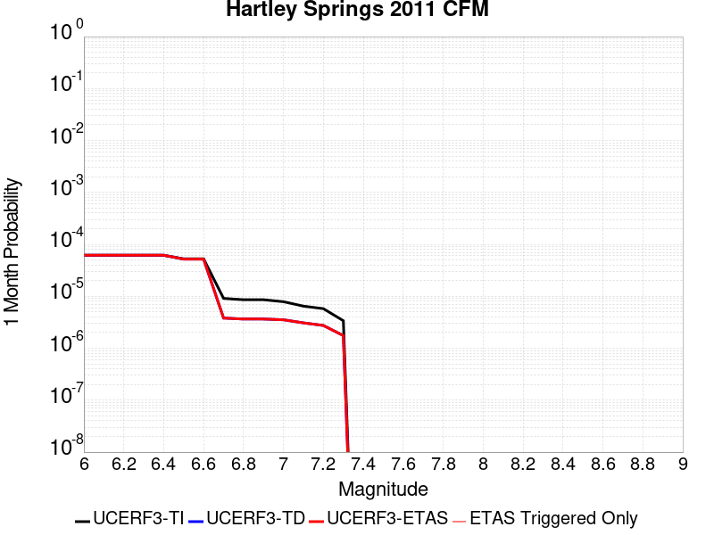 |  |  |

| Magnitude | 1 wk TI Prob | 1 wk TD Prob | 1 wk ETAS Prob | 1 wk ETAS/TD Gain | 1 wk ETAS Triggered Only | 1 mo TI Prob | 1 mo TD Prob | 1 mo ETAS Prob | 1 mo ETAS/TD Gain | 1 mo ETAS Triggered Only | 1 yr TI Prob | 1 yr TD Prob | 1 yr ETAS Prob | 1 yr ETAS/TD Gain | 1 yr ETAS Triggered Only | 10 yr TI Prob | 10 yr TD Prob | 10 yr ETAS Prob | 10 yr ETAS/TD Gain | 10 yr ETAS Triggered Only |
|-----|-----|-----|-----|-----|-----|-----|-----|-----|-----|-----|-----|-----|-----|-----|-----|-----|-----|-----|-----|-----|
| 6.0 | 1.4352418E-5 | 1.4434867E-5 | 1.4434867E-5 | 1.0 | 0.0 | 6.1508916E-5 | 6.1863175E-5 | 6.1863175E-5 | 1.0 | 0.0 | 7.486137E-4 | 7.530883E-4 | 7.630807E-4 | 1.0132687 | 1.0E-5 | 0.007460968 | 0.0075214845 | 0.0075413343 | 1.002639 | 2.0E-5 |
| 6.1 | 1.4352418E-5 | 1.4434867E-5 | 1.4434867E-5 | 1.0 | 0.0 | 6.1508916E-5 | 6.1863175E-5 | 6.1863175E-5 | 1.0 | 0.0 | 7.486137E-4 | 7.530883E-4 | 7.630807E-4 | 1.0132687 | 1.0E-5 | 0.007460968 | 0.0075214845 | 0.0075413343 | 1.002639 | 2.0E-5 |
| 6.2 | 1.4352418E-5 | 1.4434867E-5 | 1.4434867E-5 | 1.0 | 0.0 | 6.1508916E-5 | 6.1863175E-5 | 6.1863175E-5 | 1.0 | 0.0 | 7.486137E-4 | 7.530883E-4 | 7.630807E-4 | 1.0132687 | 1.0E-5 | 0.007460968 | 0.0075214845 | 0.0075413343 | 1.002639 | 2.0E-5 |
| 6.3 | 1.4352418E-5 | 1.4434867E-5 | 1.4434867E-5 | 1.0 | 0.0 | 6.1508916E-5 | 6.1863175E-5 | 6.1863175E-5 | 1.0 | 0.0 | 7.486137E-4 | 7.530883E-4 | 7.630807E-4 | 1.0132687 | 1.0E-5 | 0.007460968 | 0.0075214845 | 0.0075413343 | 1.002639 | 2.0E-5 |
| 6.4 | 1.4352418E-5 | 1.4434867E-5 | 1.4434867E-5 | 1.0 | 0.0 | 6.1508916E-5 | 6.1863175E-5 | 6.1863175E-5 | 1.0 | 0.0 | 7.486137E-4 | 7.530883E-4 | 7.630807E-4 | 1.0132687 | 1.0E-5 | 0.007460968 | 0.0075214845 | 0.0075413343 | 1.002639 | 2.0E-5 |
| 6.5 | 1.2279858E-5 | 1.213369E-5 | 1.213369E-5 | 1.0 | 0.0 | 5.26269E-5 | 5.2001382E-5 | 5.2001382E-5 | 1.0 | 0.0 | 6.4054417E-4 | 6.3309114E-4 | 6.430848E-4 | 1.0157855 | 1.0E-5 | 0.0063870098 | 0.006328389 | 0.0063482625 | 1.0031403 | 2.0E-5 |
| 6.6 | 1.2279858E-5 | 1.213369E-5 | 1.213369E-5 | 1.0 | 0.0 | 5.26269E-5 | 5.2001382E-5 | 5.2001382E-5 | 1.0 | 0.0 | 6.4054417E-4 | 6.3309114E-4 | 6.430848E-4 | 1.0157855 | 1.0E-5 | 0.0063870098 | 0.006328389 | 0.0063482625 | 1.0031403 | 2.0E-5 |
| 6.7 | 2.1282601E-6 | 8.895858E-7 | 8.895858E-7 | 1.0 | 0.0 | 9.121083E-6 | 3.8125065E-6 | 3.8125065E-6 | 1.0 | 0.0 | 1.11043526E-4 | 4.6416535E-5 | 4.6416535E-5 | 1.0 | 0.0 | 0.0011098806 | 4.6409375E-4 | 4.6409375E-4 | 1.0 | 0.0 |
| 6.8 | 2.00516E-6 | 8.5185525E-7 | 8.5185525E-7 | 1.0 | 0.0 | 8.593515E-6 | 3.6508045E-6 | 3.6508045E-6 | 1.0 | 0.0 | 1.04621024E-4 | 4.4447894E-5 | 4.4447894E-5 | 1.0 | 0.0 | 0.0010457177 | 4.444152E-4 | 4.444152E-4 | 1.0 | 0.0 |
| 6.9 | 2.00516E-6 | 8.5185525E-7 | 8.5185525E-7 | 1.0 | 0.0 | 8.593515E-6 | 3.6508045E-6 | 3.6508045E-6 | 1.0 | 0.0 | 1.04621024E-4 | 4.4447894E-5 | 4.4447894E-5 | 1.0 | 0.0 | 0.0010457177 | 4.444152E-4 | 4.444152E-4 | 1.0 | 0.0 |
| 7.0 | 1.8366732E-6 | 8.238179E-7 | 8.238179E-7 | 1.0 | 0.0 | 7.871433E-6 | 3.5306448E-6 | 3.5306448E-6 | 1.0 | 0.0 | 9.583048E-5 | 4.2985008E-5 | 4.2985008E-5 | 1.0 | 0.0 | 9.5789164E-4 | 4.29792E-4 | 4.29792E-4 | 1.0 | 0.0 |
| 7.1 | 1.5097997E-6 | 7.1909415E-7 | 7.1909415E-7 | 1.0 | 0.0 | 6.470554E-6 | 3.0818298E-6 | 3.0818298E-6 | 1.0 | 0.0 | 7.877615E-5 | 3.7520873E-5 | 3.7520873E-5 | 1.0 | 0.0 | 7.874823E-4 | 3.751691E-4 | 3.751691E-4 | 1.0 | 0.0 |
| 7.2 | 1.3490993E-6 | 6.405848E-7 | 6.405848E-7 | 1.0 | 0.0 | 5.7818415E-6 | 2.745362E-6 | 2.745362E-6 | 1.0 | 0.0 | 7.0391645E-5 | 3.3424505E-5 | 3.3424505E-5 | 1.0 | 0.0 | 7.0369354E-4 | 3.342177E-4 | 3.342177E-4 | 1.0 | 0.0 |
| 7.3 | 7.900015E-7 | 4.0892894E-7 | 4.0892894E-7 | 1.0 | 0.0 | 3.3857161E-6 | 1.7525526E-6 | 1.7525526E-6 | 1.0 | 0.0 | 4.1220315E-5 | 2.1337328E-5 | 2.1337328E-5 | 1.0 | 0.0 | 4.121267E-4 | 2.1337328E-4 | 2.1337328E-4 | 1.0 | 0.0 |

## Calaveras (So) 2011 CFM
*[(top)](#table-of-contents)*

| 1 Week | 1 Month | 1 Year | 10 Year |
|-----|-----|-----|-----|
| 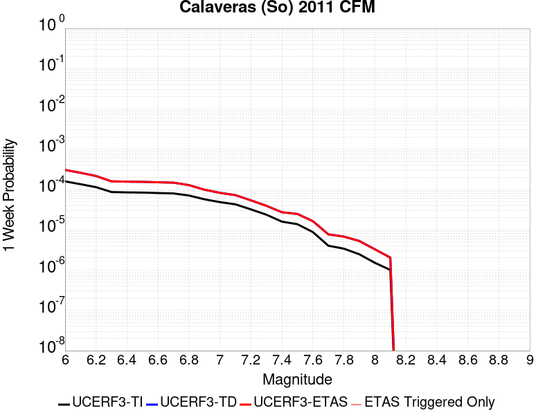 |  |  | 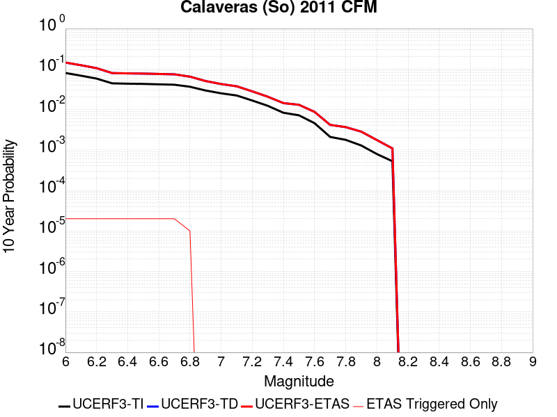 |

| Magnitude | 1 wk TI Prob | 1 wk TD Prob | 1 wk ETAS Prob | 1 wk ETAS/TD Gain | 1 wk ETAS Triggered Only | 1 mo TI Prob | 1 mo TD Prob | 1 mo ETAS Prob | 1 mo ETAS/TD Gain | 1 mo ETAS Triggered Only | 1 yr TI Prob | 1 yr TD Prob | 1 yr ETAS Prob | 1 yr ETAS/TD Gain | 1 yr ETAS Triggered Only | 10 yr TI Prob | 10 yr TD Prob | 10 yr ETAS Prob | 10 yr ETAS/TD Gain | 10 yr ETAS Triggered Only |
|-----|-----|-----|-----|-----|-----|-----|-----|-----|-----|-----|-----|-----|-----|-----|-----|-----|-----|-----|-----|-----|
| 6.0 | 1.5950744E-4 | 3.0734076E-4 | 3.0734076E-4 | 1.0 | 0.0 | 6.834242E-4 | 0.0013165302 | 0.0013165302 | 1.0 | 0.0 | 0.00828899 | 0.015864678 | 0.01587452 | 1.0006204 | 1.0E-5 | 0.079865426 | 0.1444508 | 0.1444679 | 1.0001185 | 2.0E-5 |
| 6.1 | 1.3584697E-4 | 2.6056703E-4 | 2.6056703E-4 | 1.0 | 0.0 | 5.8207137E-4 | 0.0011162513 | 0.0011162513 | 1.0 | 0.0 | 0.007063716 | 0.013467406 | 0.013477271 | 1.0007325 | 1.0E-5 | 0.06843361 | 0.12407744 | 0.124094956 | 1.0001411 | 2.0E-5 |
| 6.2 | 1.14676266E-4 | 2.1742922E-4 | 2.1742922E-4 | 1.0 | 0.0 | 4.9137714E-4 | 9.315166E-4 | 9.315166E-4 | 1.0 | 0.0 | 0.0059661185 | 0.011250457 | 0.011260345 | 1.0008788 | 1.0E-5 | 0.058084648 | 0.10506712 | 0.10508502 | 1.0001704 | 2.0E-5 |
| 6.3 | 8.691518E-5 | 1.5998913E-4 | 1.5998913E-4 | 1.0 | 0.0 | 3.7244044E-4 | 6.854777E-4 | 6.854777E-4 | 1.0 | 0.0 | 0.004525038 | 0.008306371 | 0.008316288 | 1.0011939 | 1.0E-5 | 0.044339992 | 0.079382546 | 0.07940096 | 1.000232 | 2.0E-5 |
| 6.4 | 8.50982E-5 | 1.5705277E-4 | 1.5705277E-4 | 1.0 | 0.0 | 3.646556E-4 | 6.7289977E-4 | 6.7289977E-4 | 1.0 | 0.0 | 0.0044306475 | 0.008154388 | 0.008164306 | 1.0012163 | 1.0E-5 | 0.04343345 | 0.07798859 | 0.07800703 | 1.0002364 | 2.0E-5 |
| 6.5 | 8.4062965E-5 | 1.55298E-4 | 1.55298E-4 | 1.0 | 0.0 | 3.602201E-4 | 6.653832E-4 | 6.653832E-4 | 1.0 | 0.0 | 0.004376863 | 0.008063581 | 0.0080735 | 1.0012301 | 1.0E-5 | 0.042916555 | 0.07715981 | 0.07717826 | 1.0002393 | 2.0E-5 |
| 6.6 | 8.194716E-5 | 1.5165613E-4 | 1.5165613E-4 | 1.0 | 0.0 | 3.5115483E-4 | 6.4978306E-4 | 6.4978306E-4 | 1.0 | 0.0 | 0.0042669317 | 0.007875401 | 0.007885322 | 1.0012598 | 1.0E-5 | 0.04185927 | 0.075444944 | 0.07546343 | 1.0002451 | 2.0E-5 |
| 6.7 | 8.012326E-5 | 1.4833205E-4 | 1.4833205E-4 | 1.0 | 0.0 | 3.433402E-4 | 6.355501E-4 | 6.355501E-4 | 1.0 | 0.0 | 0.004172157 | 0.0077038775 | 0.0077138003 | 1.001288 | 1.0E-5 | 0.040946912 | 0.07388698 | 0.073905505 | 1.0002507 | 2.0E-5 |
| 6.8 | 7.119773E-5 | 1.2891035E-4 | 1.2891035E-4 | 1.0 | 0.0 | 3.0509746E-4 | 5.523541E-4 | 5.523541E-4 | 1.0 | 0.0 | 0.0037082357 | 0.006700996 | 0.006700996 | 1.0 | 0.0 | 0.036469642 | 0.06472934 | 0.06473869 | 1.0001445 | 1.0E-5 |
| 6.9 | 5.7343088E-5 | 9.927501E-5 | 9.927501E-5 | 1.0 | 0.0 | 2.4573295E-4 | 4.2539535E-4 | 4.2539535E-4 | 1.0 | 0.0 | 0.0029876942 | 0.005166971 | 0.005166971 | 1.0 | 0.0 | 0.02947844 | 0.050549388 | 0.050549388 | 1.0 | 0.0 |
| 7.0 | 4.8746577E-5 | 8.29317E-5 | 8.29317E-5 | 1.0 | 0.0 | 2.0889717E-4 | 3.553735E-4 | 3.553735E-4 | 1.0 | 0.0 | 0.0025403565 | 0.0043181553 | 0.0043181553 | 1.0 | 0.0 | 0.025115121 | 0.04252484 | 0.04252484 | 1.0 | 0.0 |
| 7.1 | 4.2998014E-5 | 7.271136E-5 | 7.271136E-5 | 1.0 | 0.0 | 1.8426418E-4 | 3.1158322E-4 | 3.1158322E-4 | 1.0 | 0.0 | 0.002241108 | 0.0037869874 | 0.0037869874 | 1.0 | 0.0 | 0.022186412 | 0.037453186 | 0.037453186 | 1.0 | 0.0 |
| 7.2 | 3.221292E-5 | 5.396577E-5 | 5.396577E-5 | 1.0 | 0.0 | 1.3804805E-4 | 2.3126153E-4 | 2.3126153E-4 | 1.0 | 0.0 | 0.0016794393 | 0.0028120016 | 0.0028120016 | 1.0 | 0.0 | 0.016668037 | 0.028065233 | 0.028065233 | 1.0 | 0.0 |
| 7.3 | 2.3756531E-5 | 3.9524686E-5 | 3.9524686E-5 | 1.0 | 0.0 | 1.0180973E-4 | 1.6938061E-4 | 1.6938061E-4 | 1.0 | 0.0 | 0.0012388286 | 0.0020602755 | 0.0020602755 | 1.0 | 0.0 | 0.012319452 | 0.020669539 | 0.020669539 | 1.0 | 0.0 |
| 7.4 | 1.5997684E-5 | 2.7364662E-5 | 2.7364662E-5 | 1.0 | 0.0 | 6.8559704E-5 | 1.1727187E-4 | 1.1727187E-4 | 1.0 | 0.0 | 8.343947E-4 | 0.0014268523 | 0.0014268523 | 1.0 | 0.0 | 0.008312687 | 0.014388118 | 0.014388118 | 1.0 | 0.0 |
| 7.5 | 1.3814293E-5 | 2.4805739E-5 | 2.4805739E-5 | 1.0 | 0.0 | 5.9202768E-5 | 1.0630599E-4 | 1.0630599E-4 | 1.0 | 0.0 | 7.205553E-4 | 0.0012935094 | 0.0012935094 | 1.0 | 0.0 | 0.007182234 | 0.013067017 | 0.013067017 | 1.0 | 0.0 |
| 7.6 | 8.817309E-6 | 1.644973E-5 | 1.644973E-5 | 1.0 | 0.0 | 3.7787922E-5 | 7.049695E-5 | 7.049695E-5 | 1.0 | 0.0 | 4.5997082E-4 | 8.579637E-4 | 8.579637E-4 | 1.0 | 0.0 | 0.004590199 | 0.008729586 | 0.008729586 | 1.0 | 0.0 |
| 7.7 | 4.0352206E-6 | 7.719744E-6 | 7.719744E-6 | 1.0 | 0.0 | 1.7293689E-5 | 3.3084198E-5 | 3.3084198E-5 | 1.0 | 0.0 | 2.1053031E-4 | 4.027257E-4 | 4.027257E-4 | 1.0 | 0.0 | 0.0021033096 | 0.004171297 | 0.004171297 | 1.0 | 0.0 |
| 7.8 | 3.413169E-6 | 6.7980895E-6 | 6.7980895E-6 | 1.0 | 0.0 | 1.4627784E-5 | 2.9134346E-5 | 2.9134346E-5 | 1.0 | 0.0 | 1.7807873E-4 | 3.54653E-4 | 3.54653E-4 | 1.0 | 0.0 | 0.0017793609 | 0.0036717951 | 0.0036717951 | 1.0 | 0.0 |
| 7.9 | 2.4740732E-6 | 5.287081E-6 | 5.287081E-6 | 1.0 | 0.0 | 1.06031275E-5 | 2.2658722E-5 | 2.2658722E-5 | 1.0 | 0.0 | 1.2908543E-4 | 2.7583507E-4 | 2.7583507E-4 | 1.0 | 0.0 | 0.0012901047 | 0.0028386547 | 0.0028386547 | 1.0 | 0.0 |
| 8.0 | 1.5231818E-6 | 3.2935804E-6 | 3.2935804E-6 | 1.0 | 0.0 | 6.527906E-6 | 1.4115269E-5 | 1.4115269E-5 | 1.0 | 0.0 | 7.9474354E-5 | 1.7183989E-4 | 1.7183989E-4 | 1.0 | 0.0 | 7.944594E-4 | 0.0017587533 | 0.0017587533 | 1.0 | 0.0 |
| 8.1 | 1.0104524E-6 | 2.048666E-6 | 2.048666E-6 | 1.0 | 0.0 | 4.330503E-6 | 8.779967E-6 | 8.779967E-6 | 1.0 | 0.0 | 5.2722597E-5 | 1.0689089E-4 | 1.0689089E-4 | 1.0 | 0.0 | 5.271009E-4 | 0.0010944129 | 0.0010944129 | 1.0 | 0.0 |

## Greenville (So) 2011 CFM
*[(top)](#table-of-contents)*

| 1 Week | 1 Month | 1 Year | 10 Year |
|-----|-----|-----|-----|
|  |  | 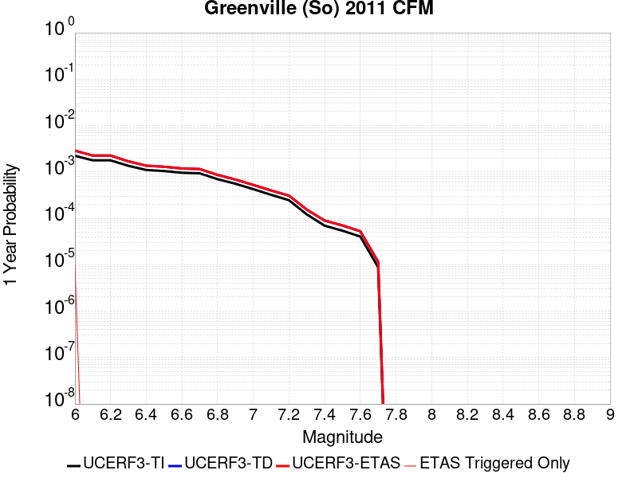 | 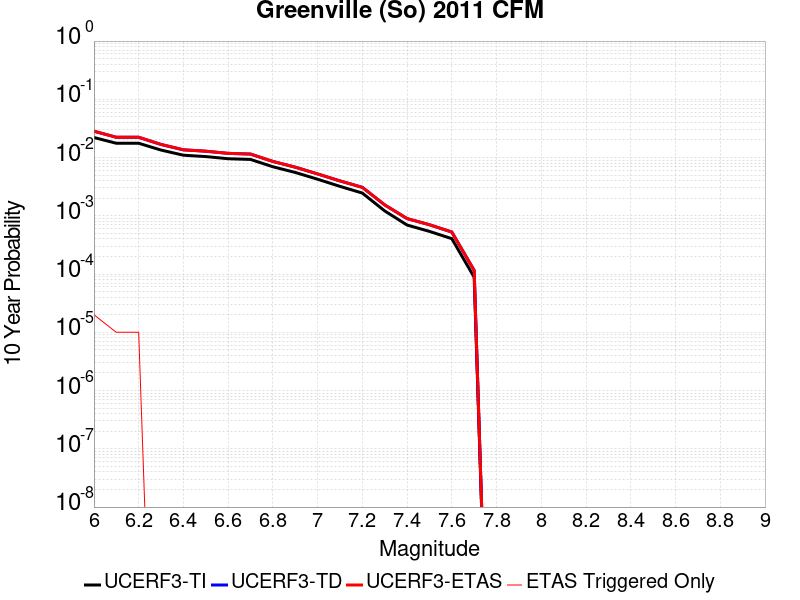 |

| Magnitude | 1 wk TI Prob | 1 wk TD Prob | 1 wk ETAS Prob | 1 wk ETAS/TD Gain | 1 wk ETAS Triggered Only | 1 mo TI Prob | 1 mo TD Prob | 1 mo ETAS Prob | 1 mo ETAS/TD Gain | 1 mo ETAS Triggered Only | 1 yr TI Prob | 1 yr TD Prob | 1 yr ETAS Prob | 1 yr ETAS/TD Gain | 1 yr ETAS Triggered Only | 10 yr TI Prob | 10 yr TD Prob | 10 yr ETAS Prob | 10 yr ETAS/TD Gain | 10 yr ETAS Triggered Only |
|-----|-----|-----|-----|-----|-----|-----|-----|-----|-----|-----|-----|-----|-----|-----|-----|-----|-----|-----|-----|-----|
| 6.0 | 4.279693E-5 | 5.5046068E-5 | 5.5046068E-5 | 1.0 | 0.0 | 1.8340252E-4 | 2.358924E-4 | 2.358924E-4 | 1.0 | 0.0 | 0.0022306389 | 0.00286854 | 0.002878511 | 1.0034761 | 1.0E-5 | 0.022083808 | 0.028341018 | 0.02836045 | 1.0006857 | 2.0E-5 |
| 6.1 | 3.4037297E-5 | 4.3196684E-5 | 4.3196684E-5 | 1.0 | 0.0 | 1.4586597E-4 | 1.8511667E-4 | 1.8511667E-4 | 1.0 | 0.0 | 0.0017744715 | 0.0022516488 | 0.0022516488 | 1.0 | 0.0 | 0.01760369 | 0.022304686 | 0.022314463 | 1.0004383 | 1.0E-5 |
| 6.2 | 3.4037297E-5 | 4.3196684E-5 | 4.3196684E-5 | 1.0 | 0.0 | 1.4586597E-4 | 1.8511667E-4 | 1.8511667E-4 | 1.0 | 0.0 | 0.0017744715 | 0.0022516488 | 0.0022516488 | 1.0 | 0.0 | 0.01760369 | 0.022304686 | 0.022314463 | 1.0004383 | 1.0E-5 |
| 6.3 | 2.5956324E-5 | 3.2431766E-5 | 3.2431766E-5 | 1.0 | 0.0 | 1.11236644E-4 | 1.3898629E-4 | 1.3898629E-4 | 1.0 | 0.0 | 0.0013534647 | 0.0016909195 | 0.0016909195 | 1.0 | 0.0 | 0.013452509 | 0.016787333 | 0.016787333 | 1.0 | 0.0 |
| 6.4 | 2.1145053E-5 | 2.6199805E-5 | 2.6199805E-5 | 1.0 | 0.0 | 9.061851E-5 | 1.12280206E-4 | 1.12280206E-4 | 1.0 | 0.0 | 0.0011027219 | 0.0013661856 | 0.0013661856 | 1.0 | 0.0 | 0.01097266 | 0.013581271 | 0.013581271 | 1.0 | 0.0 |
| 6.5 | 2.0030959E-5 | 2.4797762E-5 | 2.4797762E-5 | 1.0 | 0.0 | 8.584414E-5 | 1.0627195E-4 | 1.0627195E-4 | 1.0 | 0.0 | 0.0010446513 | 0.0012931254 | 0.0012931254 | 1.0 | 0.0 | 0.010397541 | 0.0128593575 | 0.0128593575 | 1.0 | 0.0 |
| 6.6 | 1.8395405E-5 | 2.2756247E-5 | 2.2756247E-5 | 1.0 | 0.0 | 7.8835066E-5 | 9.752326E-5 | 9.752326E-5 | 1.0 | 0.0 | 9.5939427E-4 | 0.0011867275 | 0.0011867275 | 1.0 | 0.0 | 0.009552629 | 0.011806959 | 0.011806959 | 1.0 | 0.0 |
| 6.7 | 1.7883482E-5 | 2.2127235E-5 | 2.2127235E-5 | 1.0 | 0.0 | 7.664124E-5 | 9.4827694E-5 | 9.4827694E-5 | 1.0 | 0.0 | 9.3270757E-4 | 0.0011539443 | 0.0011539443 | 1.0 | 0.0 | 0.009288026 | 0.011482578 | 0.011482578 | 1.0 | 0.0 |
| 6.8 | 1.3373564E-5 | 1.650714E-5 | 1.650714E-5 | 1.0 | 0.0 | 5.7314013E-5 | 7.0743044E-5 | 7.0743044E-5 | 1.0 | 0.0 | 6.975747E-4 | 8.60971E-4 | 8.60971E-4 | 1.0 | 0.0 | 0.0069538904 | 0.008577964 | 0.008577964 | 1.0 | 0.0 |
| 6.9 | 1.06692905E-5 | 1.3153434E-5 | 1.3153434E-5 | 1.0 | 0.0 | 4.5724726E-5 | 5.6370704E-5 | 5.6370704E-5 | 1.0 | 0.0 | 5.5655633E-4 | 6.861085E-4 | 6.861085E-4 | 1.0 | 0.0 | 0.005551645 | 0.006841135 | 0.006841135 | 1.0 | 0.0 |
| 7.0 | 8.157512E-6 | 1.0063209E-5 | 1.0063209E-5 | 1.0 | 0.0 | 3.4960296E-5 | 4.312734E-5 | 4.312734E-5 | 1.0 | 0.0 | 4.2555845E-4 | 5.249526E-4 | 5.249526E-4 | 1.0 | 0.0 | 0.004247444 | 0.005237603 | 0.005237603 | 1.0 | 0.0 |
| 7.1 | 6.1467113E-6 | 7.6277956E-6 | 7.6277956E-6 | 1.0 | 0.0 | 2.6342783E-5 | 3.269015E-5 | 3.269015E-5 | 1.0 | 0.0 | 3.206762E-4 | 3.979307E-4 | 3.979307E-4 | 1.0 | 0.0 | 0.0032021382 | 0.0039723697 | 0.0039723697 | 1.0 | 0.0 |
| 7.2 | 4.713467E-6 | 5.9144263E-6 | 5.9144263E-6 | 1.0 | 0.0 | 2.0200418E-5 | 2.5347297E-5 | 2.5347297E-5 | 1.0 | 0.0 | 2.4591232E-4 | 3.0856024E-4 | 3.0856024E-4 | 1.0 | 0.0 | 0.0024564038 | 0.0030814714 | 0.0030814714 | 1.0 | 0.0 |
| 7.3 | 2.3266216E-6 | 2.954169E-6 | 2.954169E-6 | 1.0 | 0.0 | 9.971197E-6 | 1.2660664E-5 | 1.2660664E-5 | 1.0 | 0.0 | 1.2139256E-4 | 1.5413282E-4 | 1.5413282E-4 | 1.0 | 0.0 | 0.0012132627 | 0.0015403287 | 0.0015403287 | 1.0 | 0.0 |
| 7.4 | 1.3314E-6 | 1.7180804E-6 | 1.7180804E-6 | 1.0 | 0.0 | 5.7059874E-6 | 7.363181E-6 | 7.363181E-6 | 1.0 | 0.0 | 6.946818E-5 | 8.9643094E-5 | 8.9643094E-5 | 1.0 | 0.0 | 6.9446466E-4 | 8.961081E-4 | 8.961081E-4 | 1.0 | 0.0 |
| 7.5 | 1.0362941E-6 | 1.3469987E-6 | 1.3469987E-6 | 1.0 | 0.0 | 4.4412527E-6 | 5.772839E-6 | 5.772839E-6 | 1.0 | 0.0 | 5.407091E-5 | 7.02821E-5 | 7.02821E-5 | 1.0 | 0.0 | 5.405776E-4 | 7.0262887E-4 | 7.0262887E-4 | 1.0 | 0.0 |
| 7.6 | 7.764784E-7 | 1.008972E-6 | 1.008972E-6 | 1.0 | 0.0 | 3.3277602E-6 | 4.324159E-6 | 4.324159E-6 | 1.0 | 0.0 | 4.0514726E-5 | 5.2645402E-5 | 5.2645402E-5 | 1.0 | 0.0 | 4.050734E-4 | 5.263507E-4 | 5.263507E-4 | 1.0 | 0.0 |
| 7.7 | 1.6927763E-7 | 2.213949E-7 | 2.213949E-7 | 1.0 | 0.0 | 7.2547533E-7 | 9.4883495E-7 | 9.4883495E-7 | 1.0 | 0.0 | 8.832627E-6 | 1.1552008E-5 | 1.1552008E-5 | 1.0 | 0.0 | 8.8322755E-5 | 1.1551679E-4 | 1.1551679E-4 | 1.0 | 0.0 |

## Round Valley
*[(top)](#table-of-contents)*

| 1 Week | 1 Month | 1 Year | 10 Year |
|-----|-----|-----|-----|
|  | 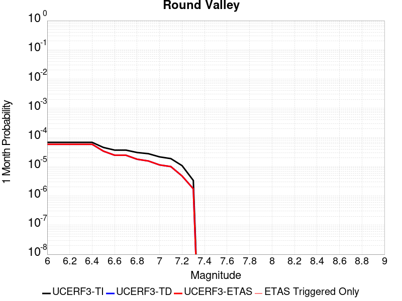 |  | 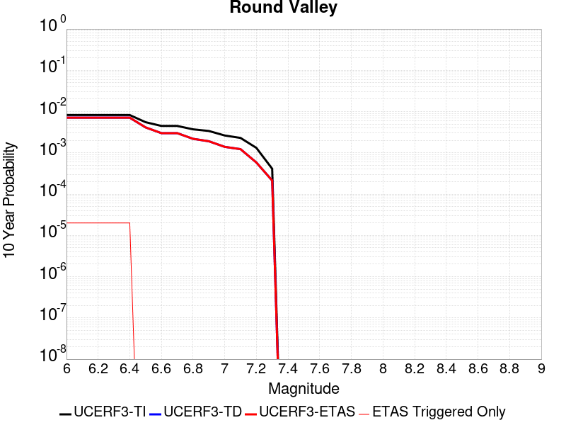 |

| Magnitude | 1 wk TI Prob | 1 wk TD Prob | 1 wk ETAS Prob | 1 wk ETAS/TD Gain | 1 wk ETAS Triggered Only | 1 mo TI Prob | 1 mo TD Prob | 1 mo ETAS Prob | 1 mo ETAS/TD Gain | 1 mo ETAS Triggered Only | 1 yr TI Prob | 1 yr TD Prob | 1 yr ETAS Prob | 1 yr ETAS/TD Gain | 1 yr ETAS Triggered Only | 10 yr TI Prob | 10 yr TD Prob | 10 yr ETAS Prob | 10 yr ETAS/TD Gain | 10 yr ETAS Triggered Only |
|-----|-----|-----|-----|-----|-----|-----|-----|-----|-----|-----|-----|-----|-----|-----|-----|-----|-----|-----|-----|-----|
| 6.0 | 1.588152E-5 | 1.3671358E-5 | 1.3671358E-5 | 1.0 | 0.0 | 6.806188E-5 | 5.8590438E-5 | 5.8590438E-5 | 1.0 | 0.0 | 8.283384E-4 | 7.1314455E-4 | 7.231374E-4 | 1.0140125 | 1.0E-5 | 0.008252576 | 0.007112448 | 0.0071323058 | 1.002792 | 2.0E-5 |
| 6.1 | 1.588152E-5 | 1.3671358E-5 | 1.3671358E-5 | 1.0 | 0.0 | 6.806188E-5 | 5.8590438E-5 | 5.8590438E-5 | 1.0 | 0.0 | 8.283384E-4 | 7.1314455E-4 | 7.231374E-4 | 1.0140125 | 1.0E-5 | 0.008252576 | 0.007112448 | 0.0071323058 | 1.002792 | 2.0E-5 |
| 6.2 | 1.588152E-5 | 1.3671358E-5 | 1.3671358E-5 | 1.0 | 0.0 | 6.806188E-5 | 5.8590438E-5 | 5.8590438E-5 | 1.0 | 0.0 | 8.283384E-4 | 7.1314455E-4 | 7.231374E-4 | 1.0140125 | 1.0E-5 | 0.008252576 | 0.007112448 | 0.0071323058 | 1.002792 | 2.0E-5 |
| 6.3 | 1.588152E-5 | 1.3671358E-5 | 1.3671358E-5 | 1.0 | 0.0 | 6.806188E-5 | 5.8590438E-5 | 5.8590438E-5 | 1.0 | 0.0 | 8.283384E-4 | 7.1314455E-4 | 7.231374E-4 | 1.0140125 | 1.0E-5 | 0.008252576 | 0.007112448 | 0.0071323058 | 1.002792 | 2.0E-5 |
| 6.4 | 1.588152E-5 | 1.3671358E-5 | 1.3671358E-5 | 1.0 | 0.0 | 6.806188E-5 | 5.8590438E-5 | 5.8590438E-5 | 1.0 | 0.0 | 8.283384E-4 | 7.1314455E-4 | 7.231374E-4 | 1.0140125 | 1.0E-5 | 0.008252576 | 0.007112448 | 0.0071323058 | 1.002792 | 2.0E-5 |
| 6.5 | 1.0646776E-5 | 7.95347E-6 | 7.95347E-6 | 1.0 | 0.0 | 4.5628243E-5 | 3.40859E-5 | 3.40859E-5 | 1.0 | 0.0 | 5.553823E-4 | 4.1492522E-4 | 4.1492522E-4 | 1.0 | 0.0 | 0.005539963 | 0.0041423338 | 0.0041423338 | 1.0 | 0.0 |
| 6.6 | 8.632956E-6 | 5.769101E-6 | 5.769101E-6 | 1.0 | 0.0 | 3.6997862E-5 | 2.4724506E-5 | 2.4724506E-5 | 1.0 | 0.0 | 4.5035584E-4 | 3.009831E-4 | 3.009831E-4 | 1.0 | 0.0 | 0.0044944426 | 0.0030061326 | 0.0030061326 | 1.0 | 0.0 |
| 6.7 | 8.632956E-6 | 5.769101E-6 | 5.769101E-6 | 1.0 | 0.0 | 3.6997862E-5 | 2.4724506E-5 | 2.4724506E-5 | 1.0 | 0.0 | 4.5035584E-4 | 3.009831E-4 | 3.009831E-4 | 1.0 | 0.0 | 0.0044944426 | 0.0030061326 | 0.0030061326 | 1.0 | 0.0 |
| 6.8 | 7.143895E-6 | 4.202142E-6 | 4.202142E-6 | 1.0 | 0.0 | 3.0616335E-5 | 1.8009065E-5 | 1.8009065E-5 | 1.0 | 0.0 | 3.726901E-4 | 2.1923998E-4 | 2.1923998E-4 | 1.0 | 0.0 | 0.0037206567 | 0.0021904018 | 0.0021904018 | 1.0 | 0.0 |
| 6.9 | 6.5120694E-6 | 3.6647516E-6 | 3.6647516E-6 | 1.0 | 0.0 | 2.790857E-5 | 1.5705993E-5 | 1.5705993E-5 | 1.0 | 0.0 | 3.3973387E-4 | 1.912052E-4 | 1.912052E-4 | 1.0 | 0.0 | 0.0033921495 | 0.0019105559 | 0.0019105559 | 1.0 | 0.0 |
| 7.0 | 5.0614435E-6 | 2.6838895E-6 | 2.6838895E-6 | 1.0 | 0.0 | 2.169172E-5 | 1.15023395E-5 | 1.15023395E-5 | 1.0 | 0.0 | 2.6406467E-4 | 1.4003301E-4 | 1.4003301E-4 | 1.0 | 0.0 | 0.0026375111 | 0.0013995491 | 0.0013995491 | 1.0 | 0.0 |
| 7.1 | 4.41728E-6 | 2.357698E-6 | 2.357698E-6 | 1.0 | 0.0 | 1.8931061E-5 | 1.0104385E-5 | 1.0104385E-5 | 1.0 | 0.0 | 2.304613E-4 | 1.2301494E-4 | 1.2301494E-4 | 1.0 | 0.0 | 0.0023022245 | 0.0012295649 | 0.0012295649 | 1.0 | 0.0 |
| 7.2 | 2.535495E-6 | 1.1209531E-6 | 1.1209531E-6 | 1.0 | 0.0 | 1.0866362E-5 | 4.804079E-6 | 4.804079E-6 | 1.0 | 0.0 | 1.3228992E-4 | 5.8488615E-5 | 5.8488615E-5 | 1.0 | 0.0 | 0.0013221119 | 5.8478344E-4 | 5.8478344E-4 | 1.0 | 0.0 |
| 7.3 | 7.900015E-7 | 4.0892894E-7 | 4.0892894E-7 | 1.0 | 0.0 | 3.3857161E-6 | 1.7525526E-6 | 1.7525526E-6 | 1.0 | 0.0 | 4.1220315E-5 | 2.1337328E-5 | 2.1337328E-5 | 1.0 | 0.0 | 4.121267E-4 | 2.1337328E-4 | 2.1337328E-4 | 1.0 | 0.0 |

## Newport-Inglewood alt 1
*[(top)](#table-of-contents)*

| 1 Week | 1 Month | 1 Year | 10 Year |
|-----|-----|-----|-----|
|  | 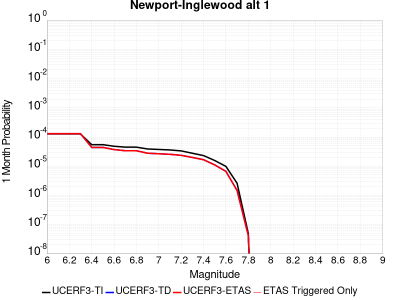 |  | 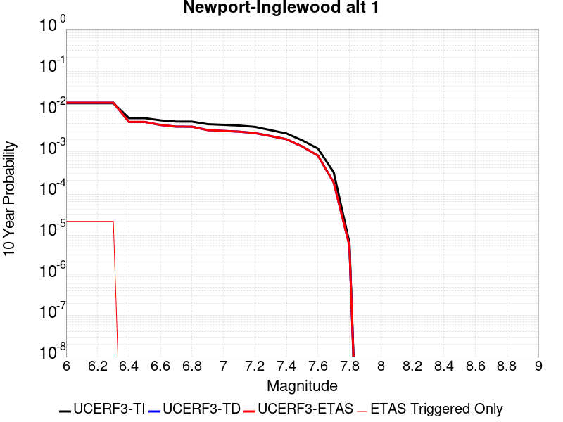 |

| Magnitude | 1 wk TI Prob | 1 wk TD Prob | 1 wk ETAS Prob | 1 wk ETAS/TD Gain | 1 wk ETAS Triggered Only | 1 mo TI Prob | 1 mo TD Prob | 1 mo ETAS Prob | 1 mo ETAS/TD Gain | 1 mo ETAS Triggered Only | 1 yr TI Prob | 1 yr TD Prob | 1 yr ETAS Prob | 1 yr ETAS/TD Gain | 1 yr ETAS Triggered Only | 10 yr TI Prob | 10 yr TD Prob | 10 yr ETAS Prob | 10 yr ETAS/TD Gain | 10 yr ETAS Triggered Only |
|-----|-----|-----|-----|-----|-----|-----|-----|-----|-----|-----|-----|-----|-----|-----|-----|-----|-----|-----|-----|-----|
| 6.0 | 2.9668912E-5 | 3.0406803E-5 | 3.0406803E-5 | 1.0 | 0.0 | 1.2714628E-4 | 1.303111E-4 | 1.303111E-4 | 1.0 | 0.0 | 0.0015469068 | 0.001585865 | 0.0015958492 | 1.0062957 | 1.0E-5 | 0.015361829 | 0.015793068 | 0.01581275 | 1.0012463 | 2.0E-5 |
| 6.1 | 2.9668912E-5 | 3.0406803E-5 | 3.0406803E-5 | 1.0 | 0.0 | 1.2714628E-4 | 1.303111E-4 | 1.303111E-4 | 1.0 | 0.0 | 0.0015469068 | 0.001585865 | 0.0015958492 | 1.0062957 | 1.0E-5 | 0.015361829 | 0.015793068 | 0.01581275 | 1.0012463 | 2.0E-5 |
| 6.2 | 2.9668912E-5 | 3.0406803E-5 | 3.0406803E-5 | 1.0 | 0.0 | 1.2714628E-4 | 1.303111E-4 | 1.303111E-4 | 1.0 | 0.0 | 0.0015469068 | 0.001585865 | 0.0015958492 | 1.0062957 | 1.0E-5 | 0.015361829 | 0.015793068 | 0.01581275 | 1.0012463 | 2.0E-5 |
| 6.3 | 2.9668912E-5 | 3.0406803E-5 | 3.0406803E-5 | 1.0 | 0.0 | 1.2714628E-4 | 1.303111E-4 | 1.303111E-4 | 1.0 | 0.0 | 0.0015469068 | 0.001585865 | 0.0015958492 | 1.0062957 | 1.0E-5 | 0.015361829 | 0.015793068 | 0.01581275 | 1.0012463 | 2.0E-5 |
| 6.4 | 1.275942E-5 | 1.0272882E-5 | 1.0272882E-5 | 1.0 | 0.0 | 5.4682085E-5 | 4.4025917E-5 | 4.4025917E-5 | 1.0 | 0.0 | 6.65551E-4 | 5.3588784E-4 | 5.3588784E-4 | 1.0 | 0.0 | 0.0066356123 | 0.005346381 | 0.005346381 | 1.0 | 0.0 |
| 6.5 | 1.275942E-5 | 1.0272882E-5 | 1.0272882E-5 | 1.0 | 0.0 | 5.4682085E-5 | 4.4025917E-5 | 4.4025917E-5 | 1.0 | 0.0 | 6.65551E-4 | 5.3588784E-4 | 5.3588784E-4 | 1.0 | 0.0 | 0.0066356123 | 0.005346381 | 0.005346381 | 1.0 | 0.0 |
| 6.6 | 1.1255358E-5 | 8.662179E-6 | 8.662179E-6 | 1.0 | 0.0 | 4.8236358E-5 | 3.7123107E-5 | 3.7123107E-5 | 1.0 | 0.0 | 5.871194E-4 | 4.5188182E-4 | 4.5188182E-4 | 1.0 | 0.0 | 0.005855706 | 0.0045098066 | 0.0045098066 | 1.0 | 0.0 |
| 6.7 | 1.0504745E-5 | 7.90006E-6 | 7.90006E-6 | 1.0 | 0.0 | 4.5019555E-5 | 3.385697E-5 | 3.385697E-5 | 1.0 | 0.0 | 5.4797524E-4 | 4.1213186E-4 | 4.1213186E-4 | 1.0 | 0.0 | 0.0054662596 | 0.0041138055 | 0.0041138055 | 1.0 | 0.0 |
| 6.8 | 1.0476007E-5 | 7.881441E-6 | 7.881441E-6 | 1.0 | 0.0 | 4.4896402E-5 | 3.3777174E-5 | 3.3777174E-5 | 1.0 | 0.0 | 5.464766E-4 | 4.1116073E-4 | 4.1116073E-4 | 1.0 | 0.0 | 0.005451347 | 0.00410413 | 0.00410413 | 1.0 | 0.0 |
| 6.9 | 9.076797E-6 | 6.4898445E-6 | 6.4898445E-6 | 1.0 | 0.0 | 3.889998E-5 | 2.7813325E-5 | 2.7813325E-5 | 1.0 | 0.0 | 4.7350433E-4 | 3.3857493E-4 | 3.3857493E-4 | 1.0 | 0.0 | 0.004724967 | 0.0033806285 | 0.0033806285 | 1.0 | 0.0 |
| 7.0 | 8.73795E-6 | 6.2122226E-6 | 6.2122226E-6 | 1.0 | 0.0 | 3.7447822E-5 | 2.662354E-5 | 2.662354E-5 | 1.0 | 0.0 | 4.5583185E-4 | 3.2409368E-4 | 3.2409368E-4 | 1.0 | 0.0 | 0.0045489795 | 0.0032362419 | 0.0032362419 | 1.0 | 0.0 |
| 7.1 | 8.391299E-6 | 5.955994E-6 | 5.955994E-6 | 1.0 | 0.0 | 3.5962214E-5 | 2.552544E-5 | 2.552544E-5 | 1.0 | 0.0 | 4.37752E-4 | 3.1072818E-4 | 3.1072818E-4 | 1.0 | 0.0 | 0.004368907 | 0.0031029668 | 0.0031029668 | 1.0 | 0.0 |
| 7.2 | 7.796882E-6 | 5.4967295E-6 | 5.4967295E-6 | 1.0 | 0.0 | 3.341478E-5 | 2.35572E-5 | 2.35572E-5 | 1.0 | 0.0 | 4.06749E-4 | 2.867714E-4 | 2.867714E-4 | 1.0 | 0.0 | 0.0040600533 | 0.0028640372 | 0.0028640372 | 1.0 | 0.0 |
| 7.3 | 6.4738833E-6 | 4.647932E-6 | 4.647932E-6 | 1.0 | 0.0 | 2.774492E-5 | 1.9919558E-5 | 1.9919558E-5 | 1.0 | 0.0 | 3.3774204E-4 | 2.424938E-4 | 2.424938E-4 | 1.0 | 0.0 | 0.0033722918 | 0.0024223085 | 0.0024223085 | 1.0 | 0.0 |
| 7.4 | 5.382145E-6 | 3.8858548E-6 | 3.8858548E-6 | 1.0 | 0.0 | 2.3066134E-5 | 1.6653557E-5 | 1.6653557E-5 | 1.0 | 0.0 | 2.8079396E-4 | 2.0273833E-4 | 2.0273833E-4 | 1.0 | 0.0 | 0.0028043943 | 0.0020255484 | 0.0020255484 | 1.0 | 0.0 |
| 7.5 | 3.648244E-6 | 2.5738461E-6 | 2.5738461E-6 | 1.0 | 0.0 | 1.5635238E-5 | 1.1030723E-5 | 1.1030723E-5 | 1.0 | 0.0 | 1.9034238E-4 | 1.3429088E-4 | 1.3429088E-4 | 1.0 | 0.0 | 0.0019017943 | 0.0013421077 | 0.0013421077 | 1.0 | 0.0 |
| 7.6 | 2.2906888E-6 | 1.5480265E-6 | 1.5480265E-6 | 1.0 | 0.0 | 9.817201E-6 | 6.6343828E-6 | 6.6343828E-6 | 1.0 | 0.0 | 1.1951787E-4 | 8.077069E-5 | 8.077069E-5 | 1.0 | 0.0 | 0.0011945361 | 8.0742E-4 | 8.0742E-4 | 1.0 | 0.0 |
| 7.7 | 6.0479874E-7 | 3.3976187E-7 | 3.3976187E-7 | 1.0 | 0.0 | 2.5919921E-6 | 1.4561215E-6 | 1.4561215E-6 | 1.0 | 0.0 | 3.1557047E-5 | 1.7728149E-5 | 1.7728149E-5 | 1.0 | 0.0 | 3.1552566E-4 | 1.7726872E-4 | 1.7726872E-4 | 1.0 | 0.0 |
| 7.8 | 1.16056995E-8 | 9.78243E-9 | 9.78243E-9 | 1.0 | 0.0 | 4.9738713E-8 | 4.19247E-8 | 4.19247E-8 | 1.0 | 0.0 | 6.0556863E-7 | 5.104332E-7 | 5.104332E-7 | 1.0 | 0.0 | 6.05567E-6 | 5.104332E-6 | 5.104332E-6 | 1.0 | 0.0 |

## North Frontal  (East)
*[(top)](#table-of-contents)*

| 1 Week | 1 Month | 1 Year | 10 Year |
|-----|-----|-----|-----|
|  |  | 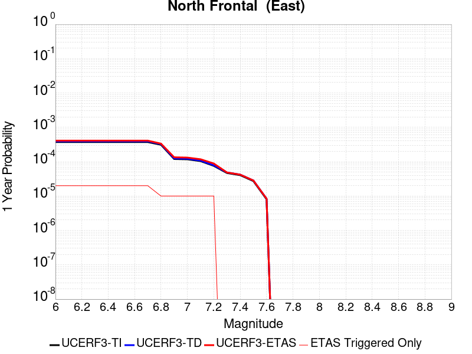 |  |

| Magnitude | 1 wk TI Prob | 1 wk TD Prob | 1 wk ETAS Prob | 1 wk ETAS/TD Gain | 1 wk ETAS Triggered Only | 1 mo TI Prob | 1 mo TD Prob | 1 mo ETAS Prob | 1 mo ETAS/TD Gain | 1 mo ETAS Triggered Only | 1 yr TI Prob | 1 yr TD Prob | 1 yr ETAS Prob | 1 yr ETAS/TD Gain | 1 yr ETAS Triggered Only | 10 yr TI Prob | 10 yr TD Prob | 10 yr ETAS Prob | 10 yr ETAS/TD Gain | 10 yr ETAS Triggered Only |
|-----|-----|-----|-----|-----|-----|-----|-----|-----|-----|-----|-----|-----|-----|-----|-----|-----|-----|-----|-----|-----|
| 6.0 | 7.135738E-6 | 7.4773193E-6 | 7.4773193E-6 | 1.0 | 0.0 | 3.0581377E-5 | 3.2045373E-5 | 3.2045373E-5 | 1.0 | 0.0 | 3.7226462E-4 | 3.901025E-4 | 4.1009468E-4 | 1.0512486 | 2.0E-5 | 0.0037164164 | 0.003896135 | 0.003916057 | 1.0051132 | 2.0E-5 |
| 6.1 | 7.135738E-6 | 7.4773193E-6 | 7.4773193E-6 | 1.0 | 0.0 | 3.0581377E-5 | 3.2045373E-5 | 3.2045373E-5 | 1.0 | 0.0 | 3.7226462E-4 | 3.901025E-4 | 4.1009468E-4 | 1.0512486 | 2.0E-5 | 0.0037164164 | 0.003896135 | 0.003916057 | 1.0051132 | 2.0E-5 |
| 6.2 | 7.135738E-6 | 7.4773193E-6 | 7.4773193E-6 | 1.0 | 0.0 | 3.0581377E-5 | 3.2045373E-5 | 3.2045373E-5 | 1.0 | 0.0 | 3.7226462E-4 | 3.901025E-4 | 4.1009468E-4 | 1.0512486 | 2.0E-5 | 0.0037164164 | 0.003896135 | 0.003916057 | 1.0051132 | 2.0E-5 |
| 6.3 | 7.135738E-6 | 7.4773193E-6 | 7.4773193E-6 | 1.0 | 0.0 | 3.0581377E-5 | 3.2045373E-5 | 3.2045373E-5 | 1.0 | 0.0 | 3.7226462E-4 | 3.901025E-4 | 4.1009468E-4 | 1.0512486 | 2.0E-5 | 0.0037164164 | 0.003896135 | 0.003916057 | 1.0051132 | 2.0E-5 |
| 6.4 | 7.135738E-6 | 7.4773193E-6 | 7.4773193E-6 | 1.0 | 0.0 | 3.0581377E-5 | 3.2045373E-5 | 3.2045373E-5 | 1.0 | 0.0 | 3.7226462E-4 | 3.901025E-4 | 4.1009468E-4 | 1.0512486 | 2.0E-5 | 0.0037164164 | 0.003896135 | 0.003916057 | 1.0051132 | 2.0E-5 |
| 6.5 | 7.135738E-6 | 7.4773193E-6 | 7.4773193E-6 | 1.0 | 0.0 | 3.0581377E-5 | 3.2045373E-5 | 3.2045373E-5 | 1.0 | 0.0 | 3.7226462E-4 | 3.901025E-4 | 4.1009468E-4 | 1.0512486 | 2.0E-5 | 0.0037164164 | 0.003896135 | 0.003916057 | 1.0051132 | 2.0E-5 |
| 6.6 | 7.135738E-6 | 7.4773193E-6 | 7.4773193E-6 | 1.0 | 0.0 | 3.0581377E-5 | 3.2045373E-5 | 3.2045373E-5 | 1.0 | 0.0 | 3.7226462E-4 | 3.901025E-4 | 4.1009468E-4 | 1.0512486 | 2.0E-5 | 0.0037164164 | 0.003896135 | 0.003916057 | 1.0051132 | 2.0E-5 |
| 6.7 | 7.135738E-6 | 7.4773193E-6 | 7.4773193E-6 | 1.0 | 0.0 | 3.0581377E-5 | 3.2045373E-5 | 3.2045373E-5 | 1.0 | 0.0 | 3.7226462E-4 | 3.901025E-4 | 4.1009468E-4 | 1.0512486 | 2.0E-5 | 0.0037164164 | 0.003896135 | 0.003916057 | 1.0051132 | 2.0E-5 |
| 6.8 | 5.959142E-6 | 6.2367985E-6 | 6.2367985E-6 | 1.0 | 0.0 | 2.553893E-5 | 2.6728965E-5 | 2.6728965E-5 | 1.0 | 0.0 | 3.108921E-4 | 3.2539462E-4 | 3.3539138E-4 | 1.0307219 | 1.0E-5 | 0.0031045752 | 0.003250955 | 0.0032609224 | 1.0030661 | 1.0E-5 |
| 6.9 | 2.2946929E-6 | 2.3824969E-6 | 2.3824969E-6 | 1.0 | 0.0 | 9.834361E-6 | 1.0210663E-5 | 1.0210663E-5 | 1.0 | 0.0 | 1.1972676E-4 | 1.2430821E-4 | 1.3430696E-4 | 1.0804352 | 1.0E-5 | 0.0011966228 | 0.0012424332 | 0.0012524208 | 1.0080388 | 1.0E-5 |
| 7.0 | 2.2468673E-6 | 2.332189E-6 | 2.332189E-6 | 1.0 | 0.0 | 9.629396E-6 | 9.99506E-6 | 9.99506E-6 | 1.0 | 0.0 | 1.1723159E-4 | 1.2168353E-4 | 1.3168232E-4 | 1.0821704 | 1.0E-5 | 0.0011716976 | 0.0012162153 | 0.0012262032 | 1.0082122 | 1.0E-5 |
| 7.1 | 1.9921076E-6 | 2.0646332E-6 | 2.0646332E-6 | 1.0 | 0.0 | 8.537577E-6 | 8.8484E-6 | 8.8484E-6 | 1.0 | 0.0 | 1.0394004E-4 | 1.0772438E-4 | 1.17723306E-4 | 1.0928195 | 1.0E-5 | 0.0010389143 | 0.0010767643 | 0.0010867536 | 1.0092771 | 1.0E-5 |
| 7.2 | 1.4524545E-6 | 1.5045363E-6 | 1.5045363E-6 | 1.0 | 0.0 | 6.2247905E-6 | 6.447998E-6 | 6.447998E-6 | 1.0 | 0.0 | 7.5784184E-5 | 7.85018E-5 | 8.850101E-5 | 1.1273756 | 1.0E-5 | 7.575835E-4 | 7.847651E-4 | 7.947573E-4 | 1.0127326 | 1.0E-5 |
| 7.3 | 8.9802575E-7 | 9.3088636E-7 | 9.3088636E-7 | 1.0 | 0.0 | 3.848676E-6 | 3.9895076E-6 | 3.9895076E-6 | 1.0 | 0.0 | 4.685662E-5 | 4.8571288E-5 | 4.8571288E-5 | 1.0 | 0.0 | 4.6846745E-4 | 4.8561802E-4 | 4.8561802E-4 | 1.0 | 0.0 |
| 7.4 | 7.776139E-7 | 8.0605923E-7 | 8.0605923E-7 | 1.0 | 0.0 | 3.3326266E-6 | 3.4545355E-6 | 3.4545355E-6 | 1.0 | 0.0 | 4.0573974E-5 | 4.205827E-5 | 4.205827E-5 | 1.0 | 0.0 | 4.0566566E-4 | 4.2051385E-4 | 4.2051385E-4 | 1.0 | 0.0 |
| 7.5 | 5.244417E-7 | 5.4413005E-7 | 5.4413005E-7 | 1.0 | 0.0 | 2.2476054E-6 | 2.3319842E-6 | 2.3319842E-6 | 1.0 | 0.0 | 2.7364253E-5 | 2.8391605E-5 | 2.8391605E-5 | 1.0 | 0.0 | 2.7360884E-4 | 2.838863E-4 | 2.838863E-4 | 1.0 | 0.0 |
| 7.6 | 1.5489647E-7 | 1.6089751E-7 | 1.6089751E-7 | 1.0 | 0.0 | 6.6384183E-7 | 6.8956075E-7 | 6.8956075E-7 | 1.0 | 0.0 | 8.082245E-6 | 8.39539E-6 | 8.39539E-6 | 1.0 | 0.0 | 8.08195E-5 | 8.395272E-5 | 8.395272E-5 | 1.0 | 0.0 |

## Dry Mountain
*[(top)](#table-of-contents)*

| 1 Week | 1 Month | 1 Year | 10 Year |
|-----|-----|-----|-----|
|  | 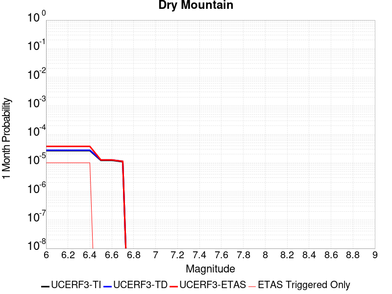 |  |  |

| Magnitude | 1 wk TI Prob | 1 wk TD Prob | 1 wk ETAS Prob | 1 wk ETAS/TD Gain | 1 wk ETAS Triggered Only | 1 mo TI Prob | 1 mo TD Prob | 1 mo ETAS Prob | 1 mo ETAS/TD Gain | 1 mo ETAS Triggered Only | 1 yr TI Prob | 1 yr TD Prob | 1 yr ETAS Prob | 1 yr ETAS/TD Gain | 1 yr ETAS Triggered Only | 10 yr TI Prob | 10 yr TD Prob | 10 yr ETAS Prob | 10 yr ETAS/TD Gain | 10 yr ETAS Triggered Only |
|-----|-----|-----|-----|-----|-----|-----|-----|-----|-----|-----|-----|-----|-----|-----|-----|-----|-----|-----|-----|-----|
| 6.0 | 6.222801E-6 | 6.4394703E-6 | 6.4394703E-6 | 1.0 | 0.0 | 2.6668875E-5 | 2.7597529E-5 | 3.7597252E-5 | 1.3623413 | 1.0E-5 | 3.2464517E-4 | 3.3596402E-4 | 3.559573E-4 | 1.0595102 | 2.0E-5 | 0.0032417132 | 0.0033561233 | 0.0033760562 | 1.0059392 | 2.0E-5 |
| 6.1 | 6.222801E-6 | 6.4394703E-6 | 6.4394703E-6 | 1.0 | 0.0 | 2.6668875E-5 | 2.7597529E-5 | 3.7597252E-5 | 1.3623413 | 1.0E-5 | 3.2464517E-4 | 3.3596402E-4 | 3.559573E-4 | 1.0595102 | 2.0E-5 | 0.0032417132 | 0.0033561233 | 0.0033760562 | 1.0059392 | 2.0E-5 |
| 6.2 | 6.222801E-6 | 6.4394703E-6 | 6.4394703E-6 | 1.0 | 0.0 | 2.6668875E-5 | 2.7597529E-5 | 3.7597252E-5 | 1.3623413 | 1.0E-5 | 3.2464517E-4 | 3.3596402E-4 | 3.559573E-4 | 1.0595102 | 2.0E-5 | 0.0032417132 | 0.0033561233 | 0.0033760562 | 1.0059392 | 2.0E-5 |
| 6.3 | 6.222801E-6 | 6.4394703E-6 | 6.4394703E-6 | 1.0 | 0.0 | 2.6668875E-5 | 2.7597529E-5 | 3.7597252E-5 | 1.3623413 | 1.0E-5 | 3.2464517E-4 | 3.3596402E-4 | 3.559573E-4 | 1.0595102 | 2.0E-5 | 0.0032417132 | 0.0033561233 | 0.0033760562 | 1.0059392 | 2.0E-5 |
| 6.4 | 6.222801E-6 | 6.4394703E-6 | 6.4394703E-6 | 1.0 | 0.0 | 2.6668875E-5 | 2.7597529E-5 | 3.7597252E-5 | 1.3623413 | 1.0E-5 | 3.2464517E-4 | 3.3596402E-4 | 3.559573E-4 | 1.0595102 | 2.0E-5 | 0.0032417132 | 0.0033561233 | 0.0033760562 | 1.0059392 | 2.0E-5 |
| 6.5 | 2.8528623E-6 | 2.9522093E-6 | 2.9522093E-6 | 1.0 | 0.0 | 1.22264955E-5 | 1.2652313E-5 | 1.2652313E-5 | 1.0 | 0.0 | 1.4884741E-4 | 1.5403972E-4 | 1.5403972E-4 | 1.0 | 0.0 | 0.0014874774 | 0.001540183 | 0.001540183 | 1.0 | 0.0 |
| 6.6 | 2.8528623E-6 | 2.9522093E-6 | 2.9522093E-6 | 1.0 | 0.0 | 1.22264955E-5 | 1.2652313E-5 | 1.2652313E-5 | 1.0 | 0.0 | 1.4884741E-4 | 1.5403972E-4 | 1.5403972E-4 | 1.0 | 0.0 | 0.0014874774 | 0.001540183 | 0.001540183 | 1.0 | 0.0 |
| 6.7 | 2.541E-6 | 2.6293942E-6 | 2.6293942E-6 | 1.0 | 0.0 | 1.0889954E-5 | 1.1268832E-5 | 1.1268832E-5 | 1.0 | 0.0 | 1.3257713E-4 | 1.3719803E-4 | 1.3719803E-4 | 1.0 | 0.0 | 0.0013249806 | 0.0013719804 | 0.0013719804 | 1.0 | 0.0 |

## Whittier alt 1
*[(top)](#table-of-contents)*

| 1 Week | 1 Month | 1 Year | 10 Year |
|-----|-----|-----|-----|
| 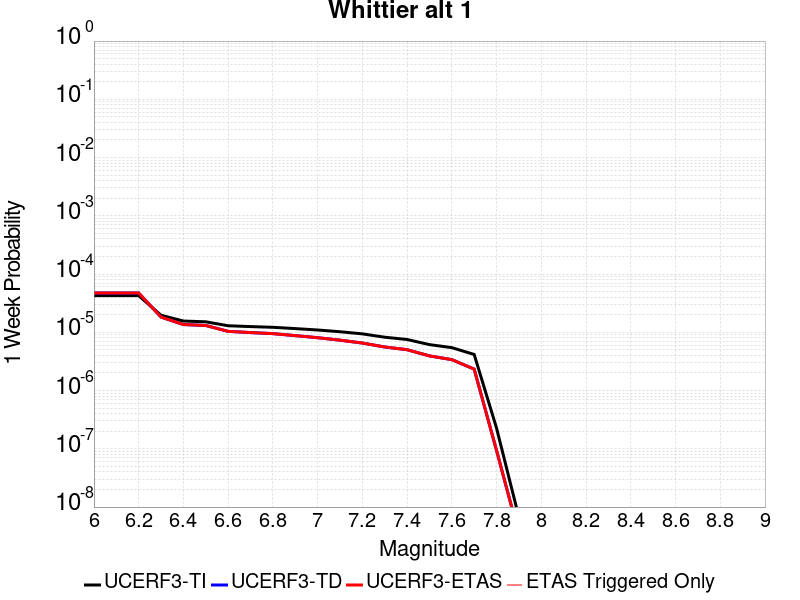 | 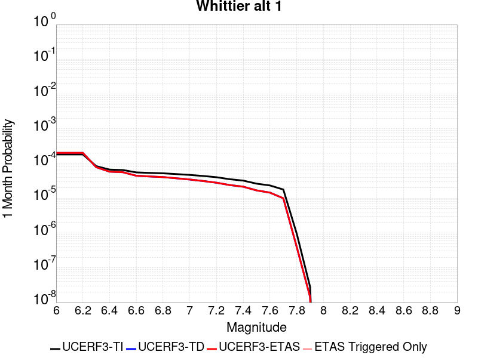 |  | 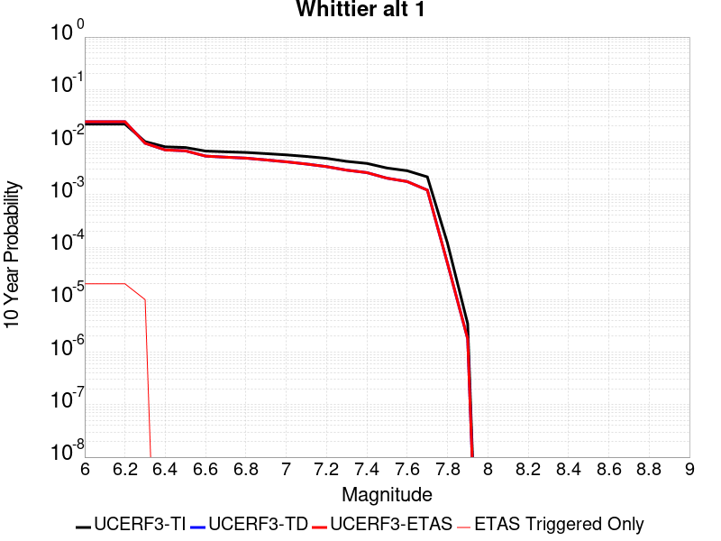 |

| Magnitude | 1 wk TI Prob | 1 wk TD Prob | 1 wk ETAS Prob | 1 wk ETAS/TD Gain | 1 wk ETAS Triggered Only | 1 mo TI Prob | 1 mo TD Prob | 1 mo ETAS Prob | 1 mo ETAS/TD Gain | 1 mo ETAS Triggered Only | 1 yr TI Prob | 1 yr TD Prob | 1 yr ETAS Prob | 1 yr ETAS/TD Gain | 1 yr ETAS Triggered Only | 10 yr TI Prob | 10 yr TD Prob | 10 yr ETAS Prob | 10 yr ETAS/TD Gain | 10 yr ETAS Triggered Only |
|-----|-----|-----|-----|-----|-----|-----|-----|-----|-----|-----|-----|-----|-----|-----|-----|-----|-----|-----|-----|-----|
| 6.0 | 4.2554693E-5 | 4.72558E-5 | 4.72558E-5 | 1.0 | 0.0 | 1.8236451E-4 | 2.0251096E-4 | 2.0251096E-4 | 1.0 | 0.0 | 0.002218027 | 0.0024631037 | 0.0024631037 | 1.0 | 0.0 | 0.02196019 | 0.02439208 | 0.02441159 | 1.0007999 | 2.0E-5 |
| 6.1 | 4.2554693E-5 | 4.72558E-5 | 4.72558E-5 | 1.0 | 0.0 | 1.8236451E-4 | 2.0251096E-4 | 2.0251096E-4 | 1.0 | 0.0 | 0.002218027 | 0.0024631037 | 0.0024631037 | 1.0 | 0.0 | 0.02196019 | 0.02439208 | 0.02441159 | 1.0007999 | 2.0E-5 |
| 6.2 | 4.2554693E-5 | 4.72558E-5 | 4.72558E-5 | 1.0 | 0.0 | 1.8236451E-4 | 2.0251096E-4 | 2.0251096E-4 | 1.0 | 0.0 | 0.002218027 | 0.0024631037 | 0.0024631037 | 1.0 | 0.0 | 0.02196019 | 0.02439208 | 0.02441159 | 1.0007999 | 2.0E-5 |
| 6.3 | 1.9617712E-5 | 1.8270526E-5 | 1.8270526E-5 | 1.0 | 0.0 | 8.40732E-5 | 7.8300014E-5 | 7.8300014E-5 | 1.0 | 0.0 | 0.0010231105 | 9.529048E-4 | 9.529048E-4 | 1.0 | 0.0 | 0.01018413 | 0.0094914725 | 0.009501378 | 1.0010436 | 1.0E-5 |
| 6.4 | 1.5611336E-5 | 1.3605907E-5 | 1.3605907E-5 | 1.0 | 0.0 | 6.690401E-5 | 5.830976E-5 | 5.830976E-5 | 1.0 | 0.0 | 8.142519E-4 | 7.096961E-4 | 7.096961E-4 | 1.0 | 0.0 | 0.008112748 | 0.0070762606 | 0.0070762606 | 1.0 | 0.0 |
| 6.5 | 1.5150166E-5 | 1.3102543E-5 | 1.3102543E-5 | 1.0 | 0.0 | 6.492767E-5 | 5.6152578E-5 | 5.6152578E-5 | 1.0 | 0.0 | 7.9020765E-4 | 6.834491E-4 | 6.834491E-4 | 1.0 | 0.0 | 0.007874036 | 0.0068154214 | 0.0068154214 | 1.0 | 0.0 |
| 6.6 | 1.295588E-5 | 1.0382066E-5 | 1.0382066E-5 | 1.0 | 0.0 | 5.552402E-5 | 4.449382E-5 | 4.449382E-5 | 1.0 | 0.0 | 6.7579525E-4 | 5.4157956E-4 | 5.4157956E-4 | 1.0 | 0.0 | 0.006737438 | 0.005404031 | 0.005404031 | 1.0 | 0.0 |
| 6.7 | 1.2542085E-5 | 9.900677E-6 | 9.900677E-6 | 1.0 | 0.0 | 5.3750682E-5 | 4.243079E-5 | 4.243079E-5 | 1.0 | 0.0 | 6.542181E-4 | 5.164743E-4 | 5.164743E-4 | 1.0 | 0.0 | 0.006522954 | 0.005154158 | 0.005154158 | 1.0 | 0.0 |
| 6.8 | 1.2195878E-5 | 9.496678E-6 | 9.496678E-6 | 1.0 | 0.0 | 5.2267E-5 | 4.0699422E-5 | 4.0699422E-5 | 1.0 | 0.0 | 6.36165E-4 | 4.9540465E-4 | 4.9540465E-4 | 1.0 | 0.0 | 0.0063434686 | 0.004944344 | 0.004944344 | 1.0 | 0.0 |
| 6.9 | 1.1580298E-5 | 8.774126E-6 | 8.774126E-6 | 1.0 | 0.0 | 4.9628903E-5 | 3.7602866E-5 | 3.7602866E-5 | 1.0 | 0.0 | 6.040644E-4 | 4.5772037E-4 | 4.5772037E-4 | 1.0 | 0.0 | 0.00602425 | 0.0045690355 | 0.0045690355 | 1.0 | 0.0 |
| 7.0 | 1.0964795E-5 | 8.085127E-6 | 8.085127E-6 | 1.0 | 0.0 | 4.6991136E-5 | 3.4650093E-5 | 3.4650093E-5 | 1.0 | 0.0 | 5.7196687E-4 | 4.2178473E-4 | 4.2178473E-4 | 1.0 | 0.0 | 0.0057049696 | 0.0042110505 | 0.0042110505 | 1.0 | 0.0 |
| 7.1 | 1.0230601E-5 | 7.327614E-6 | 7.327614E-6 | 1.0 | 0.0 | 4.3844695E-5 | 3.1403688E-5 | 3.1403688E-5 | 1.0 | 0.0 | 5.336784E-4 | 3.8227416E-4 | 3.8227416E-4 | 1.0 | 0.0 | 0.005323986 | 0.0038173292 | 0.0038173292 | 1.0 | 0.0 |
| 7.2 | 9.40865E-6 | 6.5441345E-6 | 6.5441345E-6 | 1.0 | 0.0 | 4.032216E-5 | 2.8045995E-5 | 2.8045995E-5 | 1.0 | 0.0 | 4.908117E-4 | 3.4140772E-4 | 3.4140772E-4 | 1.0 | 0.0 | 0.0048972913 | 0.0034099247 | 0.0034099247 | 1.0 | 0.0 |
| 7.3 | 8.237384E-6 | 5.5984738E-6 | 5.5984738E-6 | 1.0 | 0.0 | 3.5302593E-5 | 2.3993243E-5 | 2.3993243E-5 | 1.0 | 0.0 | 4.2972428E-4 | 2.9207964E-4 | 2.9207964E-4 | 1.0 | 0.0 | 0.0042889426 | 0.0029172783 | 0.0029172783 | 1.0 | 0.0 |
| 7.4 | 7.5316966E-6 | 5.028471E-6 | 5.028471E-6 | 1.0 | 0.0 | 3.2278298E-5 | 2.1550419E-5 | 2.1550419E-5 | 1.0 | 0.0 | 3.9291743E-4 | 2.6234577E-4 | 2.6234577E-4 | 1.0 | 0.0 | 0.0039222343 | 0.0026204726 | 0.0026204726 | 1.0 | 0.0 |
| 7.5 | 6.149649E-6 | 3.934352E-6 | 3.934352E-6 | 1.0 | 0.0 | 2.6355372E-5 | 1.6861404E-5 | 1.6861404E-5 | 1.0 | 0.0 | 3.208294E-4 | 2.0526917E-4 | 2.0526917E-4 | 1.0 | 0.0 | 0.003203666 | 0.0020508848 | 0.0020508848 | 1.0 | 0.0 |
| 7.6 | 5.457711E-6 | 3.3958245E-6 | 3.3958245E-6 | 1.0 | 0.0 | 2.338998E-5 | 1.4553457E-5 | 1.4553457E-5 | 1.0 | 0.0 | 2.8473578E-4 | 1.7717475E-4 | 1.7717475E-4 | 1.0 | 0.0 | 0.0028437122 | 0.0017704157 | 0.0017704157 | 1.0 | 0.0 |
| 7.7 | 4.1676276E-6 | 2.3335351E-6 | 2.3335351E-6 | 1.0 | 0.0 | 1.7861139E-5 | 1.0000831E-5 | 1.0000831E-5 | 1.0 | 0.0 | 2.1743766E-4 | 1.21754056E-4 | 1.21754056E-4 | 1.0 | 0.0 | 0.0021722503 | 0.0012169465 | 0.0012169465 | 1.0 | 0.0 |
| 7.8 | 2.2692414E-7 | 9.386889E-8 | 9.386889E-8 | 1.0 | 0.0 | 9.725317E-7 | 4.022952E-7 | 4.022952E-7 | 1.0 | 0.0 | 1.1840509E-5 | 4.8979364E-6 | 4.8979364E-6 | 1.0 | 0.0 | 1.1839878E-4 | 4.8978614E-5 | 4.8978614E-5 | 1.0 | 0.0 |
| 7.9 | 6.676829E-9 | 3.4402254E-9 | 3.4402254E-9 | 1.0 | 0.0 | 2.861498E-8 | 1.4743824E-8 | 1.4743824E-8 | 1.0 | 0.0 | 3.4838732E-7 | 1.7950605E-7 | 1.7950605E-7 | 1.0 | 0.0 | 3.4838679E-6 | 1.7950591E-6 | 1.7950591E-6 | 1.0 | 0.0 |

## Goose Lake 2011 CFM
*[(top)](#table-of-contents)*

| 1 Week | 1 Month | 1 Year | 10 Year |
|-----|-----|-----|-----|
|  |  |  |  |

| Magnitude | 1 wk TI Prob | 1 wk TD Prob | 1 wk ETAS Prob | 1 wk ETAS/TD Gain | 1 wk ETAS Triggered Only | 1 mo TI Prob | 1 mo TD Prob | 1 mo ETAS Prob | 1 mo ETAS/TD Gain | 1 mo ETAS Triggered Only | 1 yr TI Prob | 1 yr TD Prob | 1 yr ETAS Prob | 1 yr ETAS/TD Gain | 1 yr ETAS Triggered Only | 10 yr TI Prob | 10 yr TD Prob | 10 yr ETAS Prob | 10 yr ETAS/TD Gain | 10 yr ETAS Triggered Only |
|-----|-----|-----|-----|-----|-----|-----|-----|-----|-----|-----|-----|-----|-----|-----|-----|-----|-----|-----|-----|-----|
| 6.0 | 3.780968E-6 | 3.823039E-6 | 3.823039E-6 | 1.0 | 0.0 | 1.6204049E-5 | 1.6384358E-5 | 1.6384358E-5 | 1.0 | 0.0 | 1.9726643E-4 | 1.9946239E-4 | 2.0946038E-4 | 1.0501248 | 1.0E-5 | 0.001970914 | 0.0019929418 | 0.002002922 | 1.0050077 | 1.0E-5 |
| 6.1 | 2.2035124E-6 | 2.2298118E-6 | 2.2298118E-6 | 1.0 | 0.0 | 9.443591E-6 | 9.556303E-6 | 9.556303E-6 | 1.0 | 0.0 | 1.1496965E-4 | 1.1634195E-4 | 1.2634079E-4 | 1.0859435 | 1.0E-5 | 0.0011491019 | 0.0011628288 | 0.0011728172 | 1.0085897 | 1.0E-5 |
| 6.2 | 1.5624689E-6 | 1.5827005E-6 | 1.5827005E-6 | 1.0 | 0.0 | 6.6962784E-6 | 6.7829847E-6 | 6.7829847E-6 | 1.0 | 0.0 | 8.152414E-5 | 8.2579754E-5 | 9.257893E-5 | 1.121085 | 1.0E-5 | 8.1494235E-4 | 8.254951E-4 | 8.3548686E-4 | 1.0121039 | 1.0E-5 |
| 6.3 | 1.5624689E-6 | 1.5827005E-6 | 1.5827005E-6 | 1.0 | 0.0 | 6.6962784E-6 | 6.7829847E-6 | 6.7829847E-6 | 1.0 | 0.0 | 8.152414E-5 | 8.2579754E-5 | 9.257893E-5 | 1.121085 | 1.0E-5 | 8.1494235E-4 | 8.254951E-4 | 8.3548686E-4 | 1.0121039 | 1.0E-5 |
| 6.4 | 1.256464E-6 | 1.2738766E-6 | 1.2738766E-6 | 1.0 | 0.0 | 5.3848344E-6 | 5.4594598E-6 | 5.4594598E-6 | 1.0 | 0.0 | 6.5558386E-5 | 6.646691E-5 | 6.646691E-5 | 1.0 | 0.0 | 6.553905E-4 | 6.6447235E-4 | 6.6447235E-4 | 1.0 | 0.0 |
| 6.5 | 1.0910911E-6 | 1.1069468E-6 | 1.1069468E-6 | 1.0 | 0.0 | 4.6760965E-6 | 4.7440494E-6 | 4.7440494E-6 | 1.0 | 0.0 | 5.692999E-5 | 5.7757283E-5 | 5.7757283E-5 | 1.0 | 0.0 | 5.6915404E-4 | 5.7742395E-4 | 5.7742395E-4 | 1.0 | 0.0 |
| 6.6 | 9.546601E-7 | 9.691304E-7 | 9.691304E-7 | 1.0 | 0.0 | 4.091394E-6 | 4.1534095E-6 | 4.1534095E-6 | 1.0 | 0.0 | 4.9811584E-5 | 5.0566596E-5 | 5.0566596E-5 | 1.0 | 0.0 | 4.980042E-4 | 5.055518E-4 | 5.055518E-4 | 1.0 | 0.0 |
| 6.7 | 7.790316E-7 | 7.9160145E-7 | 7.9160145E-7 | 1.0 | 0.0 | 3.3387028E-6 | 3.3925733E-6 | 3.3925733E-6 | 1.0 | 0.0 | 4.0647945E-5 | 4.1303803E-5 | 4.1303803E-5 | 1.0 | 0.0 | 4.0640513E-4 | 4.1296185E-4 | 4.1296185E-4 | 1.0 | 0.0 |
| 6.8 | 6.3714384E-7 | 6.478783E-7 | 6.478783E-7 | 1.0 | 0.0 | 2.7306137E-6 | 2.7766184E-6 | 2.7766184E-6 | 1.0 | 0.0 | 3.3244716E-5 | 3.380481E-5 | 3.380481E-5 | 1.0 | 0.0 | 3.323974E-4 | 3.3799716E-4 | 3.3799716E-4 | 1.0 | 0.0 |
| 6.9 | 4.92586E-7 | 5.0139505E-7 | 5.0139505E-7 | 1.0 | 0.0 | 2.1110811E-6 | 2.1488343E-6 | 2.1488343E-6 | 1.0 | 0.0 | 2.5702111E-5 | 2.6161746E-5 | 2.6161746E-5 | 1.0 | 0.0 | 2.569914E-4 | 2.6158703E-4 | 2.6158703E-4 | 1.0 | 0.0 |
| 7.0 | 3.130245E-7 | 3.1903784E-7 | 3.1903784E-7 | 1.0 | 0.0 | 1.3415328E-6 | 1.3673043E-6 | 1.3673043E-6 | 1.0 | 0.0 | 1.6333039E-5 | 1.6646805E-5 | 1.6646805E-5 | 1.0 | 0.0 | 1.6331839E-4 | 1.6645578E-4 | 1.6645578E-4 | 1.0 | 0.0 |
| 7.1 | 1.7680084E-7 | 1.8024062E-7 | 1.8024062E-7 | 1.0 | 0.0 | 7.5771766E-7 | 7.7245954E-7 | 7.7245954E-7 | 1.0 | 0.0 | 9.225173E-6 | 9.404655E-6 | 9.404655E-6 | 1.0 | 0.0 | 9.22479E-5 | 9.404268E-5 | 9.404268E-5 | 1.0 | 0.0 |
| 7.2 | 4.8641045E-8 | 4.9402374E-8 | 4.9402374E-8 | 1.0 | 0.0 | 2.084616E-7 | 2.1172444E-7 | 2.1172444E-7 | 1.0 | 0.0 | 2.538017E-6 | 2.5777422E-6 | 2.5777422E-6 | 1.0 | 0.0 | 2.537988E-5 | 2.5777133E-5 | 2.5777133E-5 | 1.0 | 0.0 |
| 7.3 | 5.3911844E-9 | 5.475848E-9 | 5.475848E-9 | 1.0 | 0.0 | 2.3105075E-8 | 2.3467923E-8 | 2.3467923E-8 | 1.0 | 0.0 | 2.8130427E-7 | 2.8572194E-7 | 2.8572194E-7 | 1.0 | 0.0 | 2.8130391E-6 | 2.8572172E-6 | 2.8572172E-6 | 1.0 | 0.0 |

## White Wolf
*[(top)](#table-of-contents)*

| 1 Week | 1 Month | 1 Year | 10 Year |
|-----|-----|-----|-----|
|  |  |  |  |

| Magnitude | 1 wk TI Prob | 1 wk TD Prob | 1 wk ETAS Prob | 1 wk ETAS/TD Gain | 1 wk ETAS Triggered Only | 1 mo TI Prob | 1 mo TD Prob | 1 mo ETAS Prob | 1 mo ETAS/TD Gain | 1 mo ETAS Triggered Only | 1 yr TI Prob | 1 yr TD Prob | 1 yr ETAS Prob | 1 yr ETAS/TD Gain | 1 yr ETAS Triggered Only | 10 yr TI Prob | 10 yr TD Prob | 10 yr ETAS Prob | 10 yr ETAS/TD Gain | 10 yr ETAS Triggered Only |
|-----|-----|-----|-----|-----|-----|-----|-----|-----|-----|-----|-----|-----|-----|-----|-----|-----|-----|-----|-----|-----|
| 6.0 | 2.0037822E-5 | 1.0469587E-6 | 1.0469587E-6 | 1.0 | 0.0 | 8.587355E-5 | 4.4869585E-6 | 4.4869585E-6 | 1.0 | 0.0 | 0.001045009 | 5.4627402E-5 | 7.462631E-5 | 1.3660966 | 2.0E-5 | 0.010401085 | 5.461448E-4 | 5.661339E-4 | 1.0366004 | 2.0E-5 |
| 6.1 | 2.0037822E-5 | 1.0469587E-6 | 1.0469587E-6 | 1.0 | 0.0 | 8.587355E-5 | 4.4869585E-6 | 4.4869585E-6 | 1.0 | 0.0 | 0.001045009 | 5.4627402E-5 | 7.462631E-5 | 1.3660966 | 2.0E-5 | 0.010401085 | 5.461448E-4 | 5.661339E-4 | 1.0366004 | 2.0E-5 |
| 6.2 | 2.0037822E-5 | 1.0469587E-6 | 1.0469587E-6 | 1.0 | 0.0 | 8.587355E-5 | 4.4869585E-6 | 4.4869585E-6 | 1.0 | 0.0 | 0.001045009 | 5.4627402E-5 | 7.462631E-5 | 1.3660966 | 2.0E-5 | 0.010401085 | 5.461448E-4 | 5.661339E-4 | 1.0366004 | 2.0E-5 |
| 6.3 | 2.0037822E-5 | 1.0469587E-6 | 1.0469587E-6 | 1.0 | 0.0 | 8.587355E-5 | 4.4869585E-6 | 4.4869585E-6 | 1.0 | 0.0 | 0.001045009 | 5.4627402E-5 | 7.462631E-5 | 1.3660966 | 2.0E-5 | 0.010401085 | 5.461448E-4 | 5.661339E-4 | 1.0366004 | 2.0E-5 |
| 6.4 | 1.132487E-5 | 1.0469587E-6 | 1.0469587E-6 | 1.0 | 0.0 | 4.8534253E-5 | 4.4869585E-6 | 4.4869585E-6 | 1.0 | 0.0 | 5.907443E-4 | 5.4627402E-5 | 7.462631E-5 | 1.3660966 | 2.0E-5 | 0.005891764 | 5.461448E-4 | 5.661339E-4 | 1.0366004 | 2.0E-5 |
| 6.5 | 1.132487E-5 | 1.0469587E-6 | 1.0469587E-6 | 1.0 | 0.0 | 4.8534253E-5 | 4.4869585E-6 | 4.4869585E-6 | 1.0 | 0.0 | 5.907443E-4 | 5.4627402E-5 | 7.462631E-5 | 1.3660966 | 2.0E-5 | 0.005891764 | 5.461448E-4 | 5.661339E-4 | 1.0366004 | 2.0E-5 |
| 6.6 | 9.347473E-6 | 1.0469587E-6 | 1.0469587E-6 | 1.0 | 0.0 | 4.0059982E-5 | 4.4869585E-6 | 4.4869585E-6 | 1.0 | 0.0 | 4.8762115E-4 | 5.4627402E-5 | 7.462631E-5 | 1.3660966 | 2.0E-5 | 0.0048655253 | 5.461448E-4 | 5.661339E-4 | 1.0366004 | 2.0E-5 |
| 6.7 | 7.842647E-6 | 1.0048745E-6 | 1.0048745E-6 | 1.0 | 0.0 | 3.361091E-5 | 4.306598E-6 | 4.306598E-6 | 1.0 | 0.0 | 4.0913603E-4 | 5.243162E-5 | 7.243057E-5 | 1.3814292 | 2.0E-5 | 0.004083836 | 5.241975E-4 | 5.44187E-4 | 1.0381335 | 2.0E-5 |
| 6.8 | 6.26597E-6 | 9.735201E-7 | 9.735201E-7 | 1.0 | 0.0 | 2.685388E-5 | 4.1722224E-6 | 4.1722224E-6 | 1.0 | 0.0 | 3.2689696E-4 | 5.0795676E-5 | 7.079466E-5 | 1.3937143 | 2.0E-5 | 0.003264165 | 5.0784554E-4 | 5.278354E-4 | 1.0393621 | 2.0E-5 |
| 6.9 | 5.258436E-6 | 9.1836057E-7 | 9.1836057E-7 | 1.0 | 0.0 | 2.2535958E-5 | 3.9358256E-6 | 3.9358256E-6 | 1.0 | 0.0 | 2.7434074E-4 | 4.791767E-5 | 6.791671E-5 | 1.4173626 | 2.0E-5 | 0.0027400232 | 4.7907815E-4 | 4.990686E-4 | 1.0417268 | 2.0E-5 |
| 7.0 | 4.675028E-6 | 8.6615114E-7 | 8.6615114E-7 | 1.0 | 0.0 | 2.003568E-5 | 3.7120712E-6 | 3.7120712E-6 | 1.0 | 0.0 | 2.4390711E-4 | 4.5193578E-5 | 6.5192675E-5 | 1.4425207 | 2.0E-5 | 0.0024363957 | 4.5184858E-4 | 4.7183956E-4 | 1.0442426 | 2.0E-5 |
| 7.1 | 2.8270078E-6 | 6.8744396E-7 | 6.8744396E-7 | 1.0 | 0.0 | 1.2115692E-5 | 2.946185E-6 | 2.946185E-6 | 1.0 | 0.0 | 1.4749856E-4 | 3.5869256E-5 | 5.586854E-5 | 1.5575606 | 2.0E-5 | 0.001474007 | 3.5863876E-4 | 3.7863158E-4 | 1.0557464 | 2.0E-5 |
| 7.2 | 1.6881406E-6 | 2.2707798E-7 | 2.2707798E-7 | 1.0 | 0.0 | 7.2348685E-6 | 9.731909E-7 | 9.731909E-7 | 1.0 | 0.0 | 8.808096E-5 | 1.1848538E-5 | 1.1848538E-5 | 1.0 | 0.0 | 8.8046055E-4 | 1.1847921E-4 | 1.1847921E-4 | 1.0 | 0.0 |
| 7.3 | 9.086107E-7 | 1.5267236E-7 | 1.5267236E-7 | 1.0 | 0.0 | 3.8940398E-6 | 6.5430993E-7 | 6.5430993E-7 | 1.0 | 0.0 | 4.7408903E-5 | 7.966195E-6 | 7.966195E-6 | 1.0 | 0.0 | 4.739879E-4 | 7.965918E-5 | 7.965918E-5 | 1.0 | 0.0 |
| 7.4 | 1.9717383E-7 | 9.0041176E-8 | 9.0041176E-8 | 1.0 | 0.0 | 8.450304E-7 | 3.858907E-7 | 3.858907E-7 | 1.0 | 0.0 | 1.0288197E-5 | 4.6982095E-6 | 4.6982095E-6 | 1.0 | 0.0 | 1.028772E-4 | 4.698113E-5 | 4.698113E-5 | 1.0 | 0.0 |
| 7.5 | 1.086975E-7 | 6.6598325E-8 | 6.6598325E-8 | 1.0 | 0.0 | 4.6584634E-7 | 2.8542135E-7 | 2.8542135E-7 | 1.0 | 0.0 | 5.6716644E-6 | 3.4749996E-6 | 3.4749996E-6 | 1.0 | 0.0 | 5.6715195E-5 | 3.4749475E-5 | 3.4749475E-5 | 1.0 | 0.0 |
| 7.6 | 2.4217808E-8 | 1.5821E-8 | 1.5821E-8 | 1.0 | 0.0 | 1.03790605E-7 | 6.780429E-8 | 6.780429E-8 | 1.0 | 0.0 | 1.2636499E-6 | 8.255169E-7 | 8.255169E-7 | 1.0 | 0.0 | 1.2636427E-5 | 8.255143E-6 | 8.255143E-6 | 1.0 | 0.0 |

## Pinto Mtn
*[(top)](#table-of-contents)*

| 1 Week | 1 Month | 1 Year | 10 Year |
|-----|-----|-----|-----|
| 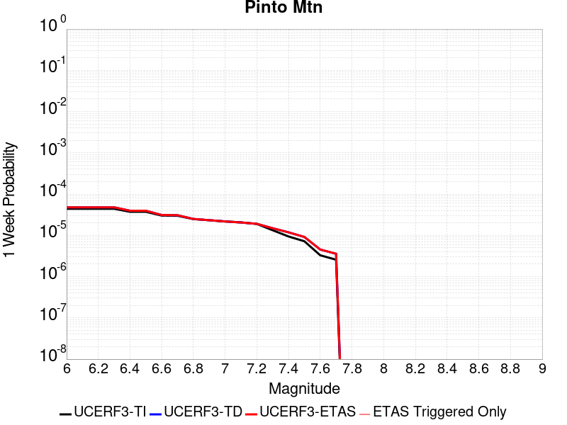 |  |  |  |

| Magnitude | 1 wk TI Prob | 1 wk TD Prob | 1 wk ETAS Prob | 1 wk ETAS/TD Gain | 1 wk ETAS Triggered Only | 1 mo TI Prob | 1 mo TD Prob | 1 mo ETAS Prob | 1 mo ETAS/TD Gain | 1 mo ETAS Triggered Only | 1 yr TI Prob | 1 yr TD Prob | 1 yr ETAS Prob | 1 yr ETAS/TD Gain | 1 yr ETAS Triggered Only | 10 yr TI Prob | 10 yr TD Prob | 10 yr ETAS Prob | 10 yr ETAS/TD Gain | 10 yr ETAS Triggered Only |
|-----|-----|-----|-----|-----|-----|-----|-----|-----|-----|-----|-----|-----|-----|-----|-----|-----|-----|-----|-----|-----|
| 6.0 | 4.4194956E-5 | 4.7858448E-5 | 4.7858448E-5 | 1.0 | 0.0 | 1.893932E-4 | 2.0509244E-4 | 2.0509244E-4 | 1.0 | 0.0 | 0.0023034236 | 0.0024943056 | 0.0024943056 | 1.0 | 0.0 | 0.022796938 | 0.024680603 | 0.02470011 | 1.0007904 | 2.0E-5 |
| 6.1 | 4.4194956E-5 | 4.7858448E-5 | 4.7858448E-5 | 1.0 | 0.0 | 1.893932E-4 | 2.0509244E-4 | 2.0509244E-4 | 1.0 | 0.0 | 0.0023034236 | 0.0024943056 | 0.0024943056 | 1.0 | 0.0 | 0.022796938 | 0.024680603 | 0.02470011 | 1.0007904 | 2.0E-5 |
| 6.2 | 4.4194956E-5 | 4.7858448E-5 | 4.7858448E-5 | 1.0 | 0.0 | 1.893932E-4 | 2.0509244E-4 | 2.0509244E-4 | 1.0 | 0.0 | 0.0023034236 | 0.0024943056 | 0.0024943056 | 1.0 | 0.0 | 0.022796938 | 0.024680603 | 0.02470011 | 1.0007904 | 2.0E-5 |
| 6.3 | 4.4194956E-5 | 4.7858448E-5 | 4.7858448E-5 | 1.0 | 0.0 | 1.893932E-4 | 2.0509244E-4 | 2.0509244E-4 | 1.0 | 0.0 | 0.0023034236 | 0.0024943056 | 0.0024943056 | 1.0 | 0.0 | 0.022796938 | 0.024680603 | 0.02470011 | 1.0007904 | 2.0E-5 |
| 6.4 | 3.729929E-5 | 3.960737E-5 | 3.960737E-5 | 1.0 | 0.0 | 1.5984432E-4 | 1.6973534E-4 | 1.6973534E-4 | 1.0 | 0.0 | 0.0019443673 | 0.0020646628 | 0.0020646628 | 1.0 | 0.0 | 0.019274427 | 0.02046483 | 0.020474624 | 1.0004786 | 1.0E-5 |
| 6.5 | 3.729929E-5 | 3.960737E-5 | 3.960737E-5 | 1.0 | 0.0 | 1.5984432E-4 | 1.6973534E-4 | 1.6973534E-4 | 1.0 | 0.0 | 0.0019443673 | 0.0020646628 | 0.0020646628 | 1.0 | 0.0 | 0.019274427 | 0.02046483 | 0.020474624 | 1.0004786 | 1.0E-5 |
| 6.6 | 3.0204548E-5 | 3.1208867E-5 | 3.1208867E-5 | 1.0 | 0.0 | 1.2944164E-4 | 1.3374562E-4 | 1.3374562E-4 | 1.0 | 0.0 | 0.0015748127 | 0.0016271713 | 0.0016271713 | 1.0 | 0.0 | 0.015636992 | 0.01615644 | 0.01615644 | 1.0 | 0.0 |
| 6.7 | 2.9857754E-5 | 3.081823E-5 | 3.081823E-5 | 1.0 | 0.0 | 1.2795553E-4 | 1.3207164E-4 | 1.3207164E-4 | 1.0 | 0.0 | 0.0015567453 | 0.0016068208 | 0.0016068208 | 1.0 | 0.0 | 0.015458848 | 0.015955871 | 0.015955871 | 1.0 | 0.0 |
| 6.8 | 2.4819734E-5 | 2.5012558E-5 | 2.5012558E-5 | 1.0 | 0.0 | 1.0636595E-4 | 1.071924E-4 | 1.071924E-4 | 1.0 | 0.0 | 0.0012942362 | 0.0013043077 | 0.0013043077 | 1.0 | 0.0 | 0.012867244 | 0.012968893 | 0.012968893 | 1.0 | 0.0 |
| 6.9 | 2.331124E-5 | 2.3340765E-5 | 2.3340765E-5 | 1.0 | 0.0 | 9.990149E-5 | 1.0002813E-4 | 1.0002813E-4 | 1.0 | 0.0 | 0.001215622 | 0.0012171825 | 0.0012171825 | 1.0 | 0.0 | 0.012089936 | 0.012107351 | 0.012107351 | 1.0 | 0.0 |
| 7.0 | 2.1818534E-5 | 2.1763835E-5 | 2.1763835E-5 | 1.0 | 0.0 | 9.3504656E-5 | 9.3270355E-5 | 9.3270355E-5 | 1.0 | 0.0 | 0.0011378246 | 0.0011349948 | 0.0011349948 | 1.0 | 0.0 | 0.011320163 | 0.011294084 | 0.011294084 | 1.0 | 0.0 |
| 7.1 | 2.066081E-5 | 2.0543423E-5 | 2.0543423E-5 | 1.0 | 0.0 | 8.854332E-5 | 8.804038E-5 | 8.804038E-5 | 1.0 | 0.0 | 0.0010774818 | 0.0010713841 | 0.0010713841 | 1.0 | 0.0 | 0.010722724 | 0.01066424 | 0.01066424 | 1.0 | 0.0 |
| 7.2 | 1.8990233E-5 | 1.9056648E-5 | 1.9056648E-5 | 1.0 | 0.0 | 8.138417E-5 | 8.1668906E-5 | 8.1668906E-5 | 1.0 | 0.0 | 9.904018E-4 | 9.938846E-4 | 9.938846E-4 | 1.0 | 0.0 | 0.009859995 | 0.009896397 | 0.009896397 | 1.0 | 0.0 |
| 7.3 | 1.3335872E-5 | 1.4909084E-5 | 1.4909084E-5 | 1.0 | 0.0 | 5.7152483E-5 | 6.389458E-5 | 6.389458E-5 | 1.0 | 0.0 | 6.956093E-4 | 7.776517E-4 | 7.776517E-4 | 1.0 | 0.0 | 0.006934359 | 0.007750604 | 0.007750604 | 1.0 | 0.0 |
| 7.4 | 9.414066E-6 | 1.1863189E-5 | 1.1863189E-5 | 1.0 | 0.0 | 4.0345374E-5 | 5.08413E-5 | 5.08413E-5 | 1.0 | 0.0 | 4.910942E-4 | 6.188265E-4 | 6.188265E-4 | 1.0 | 0.0 | 0.0049001034 | 0.0061719813 | 0.0061719813 | 1.0 | 0.0 |
| 7.5 | 7.2101157E-6 | 9.160411E-6 | 9.160411E-6 | 1.0 | 0.0 | 3.090013E-5 | 3.9258357E-5 | 3.9258357E-5 | 1.0 | 0.0 | 3.7614413E-4 | 4.7787346E-4 | 4.7787346E-4 | 1.0 | 0.0 | 0.0037550807 | 0.004769234 | 0.004769234 | 1.0 | 0.0 |
| 7.6 | 3.296375E-6 | 4.54773E-6 | 4.54773E-6 | 1.0 | 0.0 | 1.4127245E-5 | 1.9490135E-5 | 1.9490135E-5 | 1.0 | 0.0 | 1.7198564E-4 | 2.3726793E-4 | 2.3726793E-4 | 1.0 | 0.0 | 0.0017185259 | 0.0023702837 | 0.0023702837 | 1.0 | 0.0 |
| 7.7 | 2.5741092E-6 | 3.5865237E-6 | 3.5865237E-6 | 1.0 | 0.0 | 1.103185E-5 | 1.5370733E-5 | 1.5370733E-5 | 1.0 | 0.0 | 1.3430449E-4 | 1.8712392E-4 | 1.8712392E-4 | 1.0 | 0.0 | 0.0013422335 | 0.0018697936 | 0.0018697936 | 1.0 | 0.0 |

## Robinson Creek
*[(top)](#table-of-contents)*

| 1 Week | 1 Month | 1 Year | 10 Year |
|-----|-----|-----|-----|
| 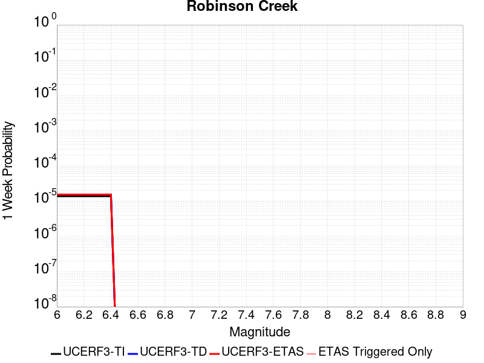 |  |  | 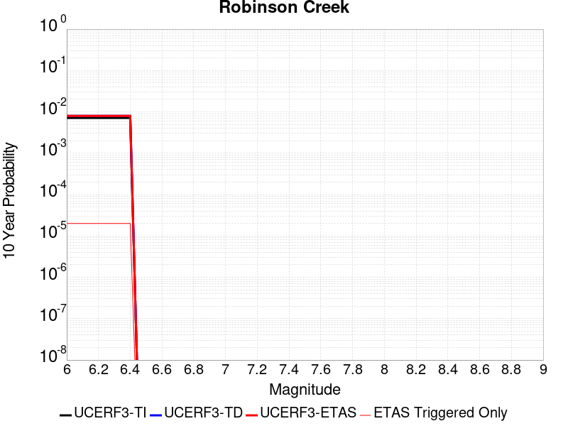 |

| Magnitude | 1 wk TI Prob | 1 wk TD Prob | 1 wk ETAS Prob | 1 wk ETAS/TD Gain | 1 wk ETAS Triggered Only | 1 mo TI Prob | 1 mo TD Prob | 1 mo ETAS Prob | 1 mo ETAS/TD Gain | 1 mo ETAS Triggered Only | 1 yr TI Prob | 1 yr TD Prob | 1 yr ETAS Prob | 1 yr ETAS/TD Gain | 1 yr ETAS Triggered Only | 10 yr TI Prob | 10 yr TD Prob | 10 yr ETAS Prob | 10 yr ETAS/TD Gain | 10 yr ETAS Triggered Only |
|-----|-----|-----|-----|-----|-----|-----|-----|-----|-----|-----|-----|-----|-----|-----|-----|-----|-----|-----|-----|-----|
| 6.0 | 1.3705327E-5 | 1.5285714E-5 | 1.5285714E-5 | 1.0 | 0.0 | 5.8735794E-5 | 6.5510205E-5 | 7.5509546E-5 | 1.152638 | 1.0E-5 | 7.1487366E-4 | 7.9758675E-4 | 8.175708E-4 | 1.0250556 | 2.0E-5 | 0.0071257832 | 0.007975867 | 0.007995708 | 1.0024875 | 2.0E-5 |
| 6.1 | 1.3705327E-5 | 1.5285714E-5 | 1.5285714E-5 | 1.0 | 0.0 | 5.8735794E-5 | 6.5510205E-5 | 7.5509546E-5 | 1.152638 | 1.0E-5 | 7.1487366E-4 | 7.9758675E-4 | 8.175708E-4 | 1.0250556 | 2.0E-5 | 0.0071257832 | 0.007975867 | 0.007995708 | 1.0024875 | 2.0E-5 |
| 6.2 | 1.3705327E-5 | 1.5285714E-5 | 1.5285714E-5 | 1.0 | 0.0 | 5.8735794E-5 | 6.5510205E-5 | 7.5509546E-5 | 1.152638 | 1.0E-5 | 7.1487366E-4 | 7.9758675E-4 | 8.175708E-4 | 1.0250556 | 2.0E-5 | 0.0071257832 | 0.007975867 | 0.007995708 | 1.0024875 | 2.0E-5 |
| 6.3 | 1.3705327E-5 | 1.5285714E-5 | 1.5285714E-5 | 1.0 | 0.0 | 5.8735794E-5 | 6.5510205E-5 | 7.5509546E-5 | 1.152638 | 1.0E-5 | 7.1487366E-4 | 7.9758675E-4 | 8.175708E-4 | 1.0250556 | 2.0E-5 | 0.0071257832 | 0.007975867 | 0.007995708 | 1.0024875 | 2.0E-5 |
| 6.4 | 1.3705327E-5 | 1.5285714E-5 | 1.5285714E-5 | 1.0 | 0.0 | 5.8735794E-5 | 6.5510205E-5 | 7.5509546E-5 | 1.152638 | 1.0E-5 | 7.1487366E-4 | 7.9758675E-4 | 8.175708E-4 | 1.0250556 | 2.0E-5 | 0.0071257832 | 0.007975867 | 0.007995708 | 1.0024875 | 2.0E-5 |

## Pitas Point (Lower)-Montalvo
*[(top)](#table-of-contents)*

| 1 Week | 1 Month | 1 Year | 10 Year |
|-----|-----|-----|-----|
| 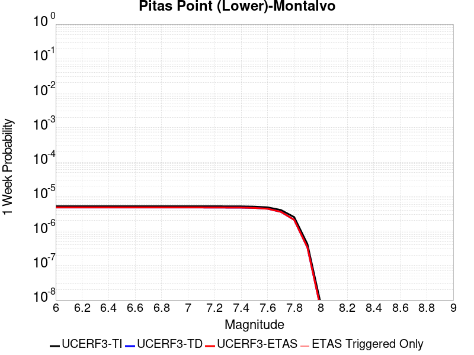 |  | 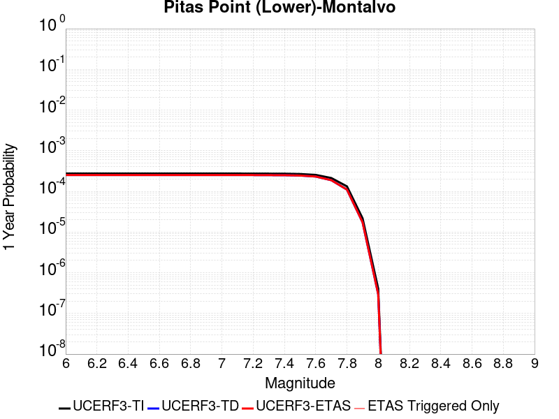 |  |

| Magnitude | 1 wk TI Prob | 1 wk TD Prob | 1 wk ETAS Prob | 1 wk ETAS/TD Gain | 1 wk ETAS Triggered Only | 1 mo TI Prob | 1 mo TD Prob | 1 mo ETAS Prob | 1 mo ETAS/TD Gain | 1 mo ETAS Triggered Only | 1 yr TI Prob | 1 yr TD Prob | 1 yr ETAS Prob | 1 yr ETAS/TD Gain | 1 yr ETAS Triggered Only | 10 yr TI Prob | 10 yr TD Prob | 10 yr ETAS Prob | 10 yr ETAS/TD Gain | 10 yr ETAS Triggered Only |
|-----|-----|-----|-----|-----|-----|-----|-----|-----|-----|-----|-----|-----|-----|-----|-----|-----|-----|-----|-----|-----|
| 6.0 | 5.2543637E-6 | 4.8379916E-6 | 4.8379916E-6 | 1.0 | 0.0 | 2.2518509E-5 | 2.0734087E-5 | 2.0734087E-5 | 1.0 | 0.0 | 2.7412834E-4 | 2.524086E-4 | 2.524086E-4 | 1.0 | 0.0 | 0.0027379042 | 0.0025212513 | 0.002541201 | 1.0079125 | 2.0E-5 |
| 6.1 | 5.2543637E-6 | 4.8379916E-6 | 4.8379916E-6 | 1.0 | 0.0 | 2.2518509E-5 | 2.0734087E-5 | 2.0734087E-5 | 1.0 | 0.0 | 2.7412834E-4 | 2.524086E-4 | 2.524086E-4 | 1.0 | 0.0 | 0.0027379042 | 0.0025212513 | 0.002541201 | 1.0079125 | 2.0E-5 |
| 6.2 | 5.2543637E-6 | 4.8379916E-6 | 4.8379916E-6 | 1.0 | 0.0 | 2.2518509E-5 | 2.0734087E-5 | 2.0734087E-5 | 1.0 | 0.0 | 2.7412834E-4 | 2.524086E-4 | 2.524086E-4 | 1.0 | 0.0 | 0.0027379042 | 0.0025212513 | 0.002541201 | 1.0079125 | 2.0E-5 |
| 6.3 | 5.2543637E-6 | 4.8379916E-6 | 4.8379916E-6 | 1.0 | 0.0 | 2.2518509E-5 | 2.0734087E-5 | 2.0734087E-5 | 1.0 | 0.0 | 2.7412834E-4 | 2.524086E-4 | 2.524086E-4 | 1.0 | 0.0 | 0.0027379042 | 0.0025212513 | 0.002541201 | 1.0079125 | 2.0E-5 |
| 6.4 | 5.2543637E-6 | 4.8379916E-6 | 4.8379916E-6 | 1.0 | 0.0 | 2.2518509E-5 | 2.0734087E-5 | 2.0734087E-5 | 1.0 | 0.0 | 2.7412834E-4 | 2.524086E-4 | 2.524086E-4 | 1.0 | 0.0 | 0.0027379042 | 0.0025212513 | 0.002541201 | 1.0079125 | 2.0E-5 |
| 6.5 | 5.2543637E-6 | 4.8379916E-6 | 4.8379916E-6 | 1.0 | 0.0 | 2.2518509E-5 | 2.0734087E-5 | 2.0734087E-5 | 1.0 | 0.0 | 2.7412834E-4 | 2.524086E-4 | 2.524086E-4 | 1.0 | 0.0 | 0.0027379042 | 0.0025212513 | 0.002541201 | 1.0079125 | 2.0E-5 |
| 6.6 | 5.2543637E-6 | 4.8379916E-6 | 4.8379916E-6 | 1.0 | 0.0 | 2.2518509E-5 | 2.0734087E-5 | 2.0734087E-5 | 1.0 | 0.0 | 2.7412834E-4 | 2.524086E-4 | 2.524086E-4 | 1.0 | 0.0 | 0.0027379042 | 0.0025212513 | 0.002541201 | 1.0079125 | 2.0E-5 |
| 6.7 | 5.2543637E-6 | 4.8379916E-6 | 4.8379916E-6 | 1.0 | 0.0 | 2.2518509E-5 | 2.0734087E-5 | 2.0734087E-5 | 1.0 | 0.0 | 2.7412834E-4 | 2.524086E-4 | 2.524086E-4 | 1.0 | 0.0 | 0.0027379042 | 0.0025212513 | 0.002541201 | 1.0079125 | 2.0E-5 |
| 6.8 | 5.2543637E-6 | 4.8379916E-6 | 4.8379916E-6 | 1.0 | 0.0 | 2.2518509E-5 | 2.0734087E-5 | 2.0734087E-5 | 1.0 | 0.0 | 2.7412834E-4 | 2.524086E-4 | 2.524086E-4 | 1.0 | 0.0 | 0.0027379042 | 0.0025212513 | 0.002541201 | 1.0079125 | 2.0E-5 |
| 6.9 | 5.2543637E-6 | 4.8379916E-6 | 4.8379916E-6 | 1.0 | 0.0 | 2.2518509E-5 | 2.0734087E-5 | 2.0734087E-5 | 1.0 | 0.0 | 2.7412834E-4 | 2.524086E-4 | 2.524086E-4 | 1.0 | 0.0 | 0.0027379042 | 0.0025212513 | 0.002541201 | 1.0079125 | 2.0E-5 |
| 7.0 | 5.2543637E-6 | 4.8379916E-6 | 4.8379916E-6 | 1.0 | 0.0 | 2.2518509E-5 | 2.0734087E-5 | 2.0734087E-5 | 1.0 | 0.0 | 2.7412834E-4 | 2.524086E-4 | 2.524086E-4 | 1.0 | 0.0 | 0.0027379042 | 0.0025212513 | 0.002541201 | 1.0079125 | 2.0E-5 |
| 7.1 | 5.2543637E-6 | 4.8379916E-6 | 4.8379916E-6 | 1.0 | 0.0 | 2.2518509E-5 | 2.0734087E-5 | 2.0734087E-5 | 1.0 | 0.0 | 2.7412834E-4 | 2.524086E-4 | 2.524086E-4 | 1.0 | 0.0 | 0.0027379042 | 0.0025212513 | 0.002541201 | 1.0079125 | 2.0E-5 |
| 7.2 | 5.2458695E-6 | 4.8291454E-6 | 4.8291454E-6 | 1.0 | 0.0 | 2.2482105E-5 | 2.0696174E-5 | 2.0696174E-5 | 1.0 | 0.0 | 2.7368523E-4 | 2.519471E-4 | 2.519471E-4 | 1.0 | 0.0 | 0.0027334841 | 0.002516647 | 0.0025365967 | 1.0079271 | 2.0E-5 |
| 7.3 | 5.22665E-6 | 4.8090624E-6 | 4.8090624E-6 | 1.0 | 0.0 | 2.2399736E-5 | 2.0610105E-5 | 2.0610105E-5 | 1.0 | 0.0 | 2.7268266E-4 | 2.5089947E-4 | 2.5089947E-4 | 1.0 | 0.0 | 0.002723483 | 0.0025061944 | 0.0025261443 | 1.0079602 | 2.0E-5 |
| 7.4 | 5.210642E-6 | 4.792274E-6 | 4.792274E-6 | 1.0 | 0.0 | 2.233113E-5 | 2.0538158E-5 | 2.0538158E-5 | 1.0 | 0.0 | 2.718476E-4 | 2.500237E-4 | 2.500237E-4 | 1.0 | 0.0 | 0.002715153 | 0.0024974565 | 0.0025174066 | 1.0079881 | 2.0E-5 |
| 7.5 | 5.1226016E-6 | 4.700159E-6 | 4.700159E-6 | 1.0 | 0.0 | 2.1953823E-5 | 2.0143385E-5 | 2.0143385E-5 | 1.0 | 0.0 | 2.67255E-4 | 2.4521843E-4 | 2.4521843E-4 | 1.0 | 0.0 | 0.0026693381 | 0.0024495102 | 0.0024694612 | 1.0081449 | 2.0E-5 |
| 7.6 | 4.8796987E-6 | 4.445054E-6 | 4.445054E-6 | 1.0 | 0.0 | 2.0912828E-5 | 1.9050092E-5 | 1.9050092E-5 | 1.0 | 0.0 | 2.5458392E-4 | 2.319105E-4 | 2.319105E-4 | 1.0 | 0.0 | 0.0025429246 | 0.0023167154 | 0.002336669 | 1.0086129 | 2.0E-5 |
| 7.7 | 4.0834398E-6 | 3.609207E-6 | 3.609207E-6 | 1.0 | 0.0 | 1.7500339E-5 | 1.546794E-5 | 1.546794E-5 | 1.0 | 0.0 | 2.1304579E-4 | 1.8830612E-4 | 1.8830612E-4 | 1.0 | 0.0 | 0.0021284167 | 0.0018814894 | 0.0018914705 | 1.0053049 | 1.0E-5 |
| 7.8 | 2.5445438E-6 | 2.12128E-6 | 2.12128E-6 | 1.0 | 0.0 | 1.0905142E-5 | 9.091168E-6 | 9.091168E-6 | 1.0 | 0.0 | 1.3276201E-4 | 1.106794E-4 | 1.106794E-4 | 1.0 | 0.0 | 0.0013268272 | 0.0011062474 | 0.0011062474 | 1.0 | 0.0 |
| 7.9 | 4.1677114E-7 | 3.3294558E-7 | 3.3294558E-7 | 1.0 | 0.0 | 1.7861609E-6 | 1.4269089E-6 | 1.4269089E-6 | 1.0 | 0.0 | 2.1746291E-5 | 1.737248E-5 | 1.737248E-5 | 1.0 | 0.0 | 2.1744163E-4 | 1.7371152E-4 | 1.7371152E-4 | 1.0 | 0.0 |
| 8.0 | 7.791402E-9 | 5.6836655E-9 | 5.6836655E-9 | 1.0 | 0.0 | 3.3391725E-8 | 2.4358567E-8 | 2.4358567E-8 | 1.0 | 0.0 | 4.0654416E-7 | 2.9656553E-7 | 2.9656553E-7 | 1.0 | 0.0 | 4.065434E-6 | 2.9656533E-6 | 2.9656533E-6 | 1.0 | 0.0 |

## Rodgers Creek - Healdsburg 2011 CFM
*[(top)](#table-of-contents)*

| 1 Week | 1 Month | 1 Year | 10 Year |
|-----|-----|-----|-----|
|  | 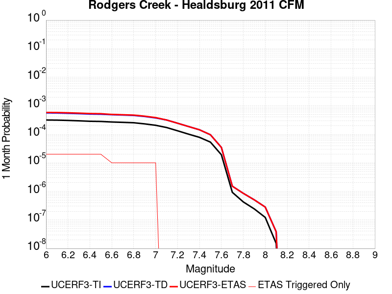 |  |  |

| Magnitude | 1 wk TI Prob | 1 wk TD Prob | 1 wk ETAS Prob | 1 wk ETAS/TD Gain | 1 wk ETAS Triggered Only | 1 mo TI Prob | 1 mo TD Prob | 1 mo ETAS Prob | 1 mo ETAS/TD Gain | 1 mo ETAS Triggered Only | 1 yr TI Prob | 1 yr TD Prob | 1 yr ETAS Prob | 1 yr ETAS/TD Gain | 1 yr ETAS Triggered Only | 10 yr TI Prob | 10 yr TD Prob | 10 yr ETAS Prob | 10 yr ETAS/TD Gain | 10 yr ETAS Triggered Only |
|-----|-----|-----|-----|-----|-----|-----|-----|-----|-----|-----|-----|-----|-----|-----|-----|-----|-----|-----|-----|-----|
| 6.0 | 7.390182E-5 | 1.3142005E-4 | 1.4141874E-4 | 1.0760819 | 1.0E-5 | 3.1668364E-4 | 5.6310603E-4 | 5.830948E-4 | 1.0354973 | 2.0E-5 | 0.0038488081 | 0.0068342923 | 0.0068541556 | 1.0029064 | 2.0E-5 | 0.037828278 | 0.06621686 | 0.066235535 | 1.000282 | 2.0E-5 |
| 6.1 | 7.318768E-5 | 1.3040019E-4 | 1.4039889E-4 | 1.076677 | 1.0E-5 | 3.1362378E-4 | 5.587387E-4 | 5.787276E-4 | 1.035775 | 2.0E-5 | 0.0038116854 | 0.0067814584 | 0.0068013226 | 1.0029292 | 2.0E-5 | 0.037469655 | 0.06572142 | 0.06574011 | 1.0002843 | 2.0E-5 |
| 6.2 | 7.1379836E-5 | 1.2732844E-4 | 1.3732718E-4 | 1.0785271 | 1.0E-5 | 3.058777E-4 | 5.455797E-4 | 5.655688E-4 | 1.0366383 | 2.0E-5 | 0.003717703 | 0.00662223 | 0.0066420976 | 1.0030001 | 2.0E-5 | 0.0365612 | 0.06423952 | 0.06425823 | 1.0002913 | 2.0E-5 |
| 6.3 | 6.9255926E-5 | 1.2387348E-4 | 1.3387225E-4 | 1.0807176 | 1.0E-5 | 2.9677735E-4 | 5.307788E-4 | 5.5076816E-4 | 1.0376605 | 2.0E-5 | 0.0036072785 | 0.0064431103 | 0.0064629815 | 1.0030841 | 2.0E-5 | 0.035492823 | 0.06256571 | 0.06258445 | 1.0002997 | 2.0E-5 |
| 6.4 | 6.6757144E-5 | 1.1963984E-4 | 1.2963865E-4 | 1.0835742 | 1.0E-5 | 2.8607066E-4 | 5.1264185E-4 | 5.326316E-4 | 1.0389936 | 2.0E-5 | 0.0034773487 | 0.006223622 | 0.0062434976 | 1.0031936 | 2.0E-5 | 0.034234364 | 0.06051481 | 0.0605336 | 1.0003105 | 2.0E-5 |
| 6.5 | 6.5735134E-5 | 1.1813017E-4 | 1.2812899E-4 | 1.0846424 | 1.0E-5 | 2.8169158E-4 | 5.0617434E-4 | 5.261642E-4 | 1.0394921 | 2.0E-5 | 0.003424202 | 0.006145345 | 0.0061652223 | 1.0032345 | 2.0E-5 | 0.03371918 | 0.059778538 | 0.059797343 | 1.0003146 | 2.0E-5 |
| 6.6 | 6.289601E-5 | 1.1348339E-4 | 1.1348339E-4 | 1.0 | 0.0 | 2.6952647E-4 | 4.8626712E-4 | 4.962623E-4 | 1.0205548 | 1.0E-5 | 0.0032765474 | 0.005904312 | 0.0059142527 | 1.0016837 | 1.0E-5 | 0.032286562 | 0.057515934 | 0.05752536 | 1.0001639 | 1.0E-5 |
| 6.7 | 6.115274E-5 | 1.1065277E-4 | 1.1065277E-4 | 1.0 | 0.0 | 2.6205686E-4 | 4.7414034E-4 | 4.841356E-4 | 1.0210809 | 1.0E-5 | 0.0031858748 | 0.005757458 | 0.0057674004 | 1.0017269 | 1.0E-5 | 0.031405866 | 0.056133747 | 0.056143187 | 1.0001682 | 1.0E-5 |
| 6.8 | 5.9232367E-5 | 1.07325905E-4 | 1.07325905E-4 | 1.0 | 0.0 | 2.538283E-4 | 4.5988744E-4 | 4.6988286E-4 | 1.0217345 | 1.0E-5 | 0.0030859804 | 0.005584832 | 0.005594776 | 1.0017805 | 1.0E-5 | 0.030434765 | 0.05450038 | 0.054509833 | 1.0001734 | 1.0E-5 |
| 6.9 | 5.4030377E-5 | 9.8267046E-5 | 9.8267046E-5 | 1.0 | 0.0 | 2.315382E-4 | 4.2107684E-4 | 4.3107264E-4 | 1.0237386 | 1.0E-5 | 0.0028153337 | 0.0051146257 | 0.0051245745 | 1.0019451 | 1.0E-5 | 0.027799325 | 0.05003549 | 0.05004499 | 1.0001899 | 1.0E-5 |
| 7.0 | 4.8260714E-5 | 8.7446875E-5 | 8.7446875E-5 | 1.0 | 0.0 | 2.0681522E-4 | 3.7471877E-4 | 3.84715E-4 | 1.0266767 | 1.0E-5 | 0.0025150678 | 0.0045527117 | 0.004562666 | 1.0021865 | 1.0E-5 | 0.024867928 | 0.044687644 | 0.044697195 | 1.0002137 | 1.0E-5 |
| 7.1 | 4.0294493E-5 | 7.392516E-5 | 7.392516E-5 | 1.0 | 0.0 | 1.7267925E-4 | 3.1678384E-4 | 3.1678384E-4 | 1.0 | 0.0 | 0.0021003427 | 0.003850061 | 0.003850061 | 1.0 | 0.0 | 0.02080602 | 0.037940174 | 0.037940174 | 1.0 | 0.0 |
| 7.2 | 3.096388E-5 | 5.701093E-5 | 5.701093E-5 | 1.0 | 0.0 | 1.326956E-4 | 2.443098E-4 | 2.443098E-4 | 1.0 | 0.0 | 0.0016143717 | 0.0029704366 | 0.0029704366 | 1.0 | 0.0 | 0.01602694 | 0.029453278 | 0.029453278 | 1.0 | 0.0 |
| 7.3 | 2.3615226E-5 | 4.3659267E-5 | 4.3659267E-5 | 1.0 | 0.0 | 1.0120418E-4 | 1.870978E-4 | 1.870978E-4 | 1.0 | 0.0 | 0.0012314644 | 0.0022755498 | 0.0022755498 | 1.0 | 0.0 | 0.0122466255 | 0.02265234 | 0.02265234 | 1.0 | 0.0 |
| 7.4 | 1.8251132E-5 | 3.3569508E-5 | 3.3569508E-5 | 1.0 | 0.0 | 7.821679E-5 | 1.4386144E-4 | 1.4386144E-4 | 1.0 | 0.0 | 9.518733E-4 | 0.0017501158 | 0.0017501158 | 1.0 | 0.0 | 0.009478063 | 0.017479602 | 0.017479602 | 1.0 | 0.0 |
| 7.5 | 1.2411432E-5 | 2.2482443E-5 | 2.2482443E-5 | 1.0 | 0.0 | 5.3190768E-5 | 9.63498E-5 | 9.63498E-5 | 1.0 | 0.0 | 6.4740516E-4 | 0.0011724334 | 0.0011724334 | 1.0 | 0.0 | 0.006455223 | 0.011754448 | 0.011754448 | 1.0 | 0.0 |
| 7.6 | 4.4771446E-6 | 8.0904565E-6 | 8.0904565E-6 | 1.0 | 0.0 | 1.918762E-5 | 3.467293E-5 | 3.467293E-5 | 1.0 | 0.0 | 2.3358424E-4 | 4.2206238E-4 | 4.2206238E-4 | 1.0 | 0.0 | 0.0023333887 | 0.0042492603 | 0.0042492603 | 1.0 | 0.0 |
| 7.7 | 2.157941E-7 | 3.5385725E-7 | 3.5385725E-7 | 1.0 | 0.0 | 9.248315E-7 | 1.51653E-6 | 1.51653E-6 | 1.0 | 0.0 | 1.1259765E-5 | 1.8463597E-5 | 1.8463597E-5 | 1.0 | 0.0 | 1.1259195E-4 | 1.9087167E-4 | 1.9087167E-4 | 1.0 | 0.0 |
| 7.8 | 9.9623286E-8 | 1.9927303E-7 | 1.9927303E-7 | 1.0 | 0.0 | 4.269569E-7 | 8.5402695E-7 | 8.5402695E-7 | 1.0 | 0.0 | 5.1981874E-6 | 1.0397729E-5 | 1.0397729E-5 | 1.0 | 0.0 | 5.198066E-5 | 1.0915362E-4 | 1.0915362E-4 | 1.0 | 0.0 |
| 7.9 | 5.6745257E-8 | 1.1791176E-7 | 1.1791176E-7 | 1.0 | 0.0 | 2.4319394E-7 | 5.05336E-7 | 5.05336E-7 | 1.0 | 0.0 | 2.960882E-6 | 6.1524483E-6 | 6.1524483E-6 | 1.0 | 0.0 | 2.9608427E-5 | 6.479334E-5 | 6.479334E-5 | 1.0 | 0.0 |
| 8.0 | 2.8614323E-8 | 6.5877394E-8 | 6.5877394E-8 | 1.0 | 0.0 | 1.2263281E-7 | 2.8233165E-7 | 2.8233165E-7 | 1.0 | 0.0 | 1.4930534E-6 | 3.4373825E-6 | 3.4373825E-6 | 1.0 | 0.0 | 1.4930434E-5 | 3.5870475E-5 | 3.5870475E-5 | 1.0 | 0.0 |
| 8.1 | 3.5045191E-9 | 8.977517E-9 | 8.977517E-9 | 1.0 | 0.0 | 1.5019367E-8 | 3.8475072E-8 | 3.8475072E-8 | 1.0 | 0.0 | 1.8286079E-7 | 4.6843394E-7 | 4.6843394E-7 | 1.0 | 0.0 | 1.8286064E-6 | 4.8383417E-6 | 4.8383417E-6 | 1.0 | 0.0 |

## Cleghorn
*[(top)](#table-of-contents)*

| 1 Week | 1 Month | 1 Year | 10 Year |
|-----|-----|-----|-----|
|  |  |  | 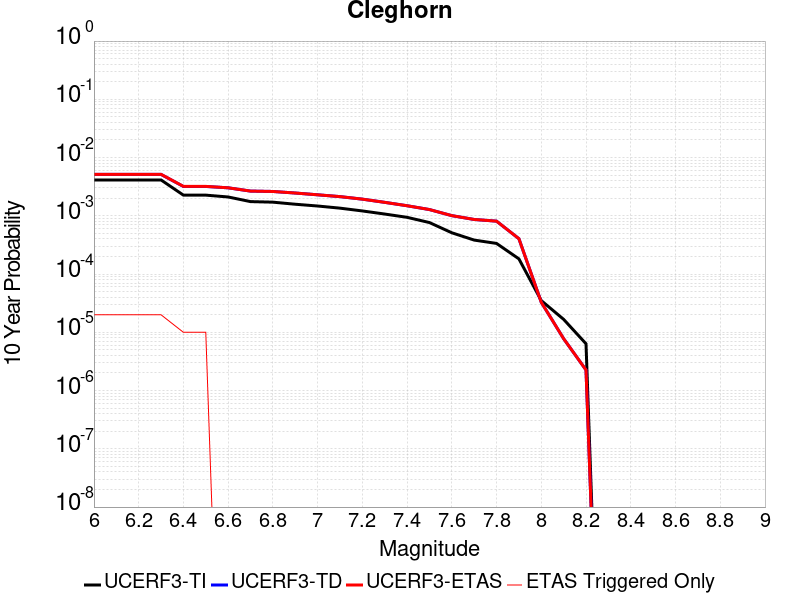 |

| Magnitude | 1 wk TI Prob | 1 wk TD Prob | 1 wk ETAS Prob | 1 wk ETAS/TD Gain | 1 wk ETAS Triggered Only | 1 mo TI Prob | 1 mo TD Prob | 1 mo ETAS Prob | 1 mo ETAS/TD Gain | 1 mo ETAS Triggered Only | 1 yr TI Prob | 1 yr TD Prob | 1 yr ETAS Prob | 1 yr ETAS/TD Gain | 1 yr ETAS Triggered Only | 10 yr TI Prob | 10 yr TD Prob | 10 yr ETAS Prob | 10 yr ETAS/TD Gain | 10 yr ETAS Triggered Only |
|-----|-----|-----|-----|-----|-----|-----|-----|-----|-----|-----|-----|-----|-----|-----|-----|-----|-----|-----|-----|-----|
| 6.0 | 7.9267165E-6 | 9.837375E-6 | 9.837375E-6 | 1.0 | 0.0 | 3.39712E-5 | 4.2159554E-5 | 4.2159554E-5 | 1.0 | 0.0 | 4.1352084E-4 | 5.131823E-4 | 5.231772E-4 | 1.0194763 | 1.0E-5 | 0.004127522 | 0.0051350263 | 0.0051549235 | 1.0038748 | 2.0E-5 |
| 6.1 | 7.9267165E-6 | 9.837375E-6 | 9.837375E-6 | 1.0 | 0.0 | 3.39712E-5 | 4.2159554E-5 | 4.2159554E-5 | 1.0 | 0.0 | 4.1352084E-4 | 5.131823E-4 | 5.231772E-4 | 1.0194763 | 1.0E-5 | 0.004127522 | 0.0051350263 | 0.0051549235 | 1.0038748 | 2.0E-5 |
| 6.2 | 7.9267165E-6 | 9.837375E-6 | 9.837375E-6 | 1.0 | 0.0 | 3.39712E-5 | 4.2159554E-5 | 4.2159554E-5 | 1.0 | 0.0 | 4.1352084E-4 | 5.131823E-4 | 5.231772E-4 | 1.0194763 | 1.0E-5 | 0.004127522 | 0.0051350263 | 0.0051549235 | 1.0038748 | 2.0E-5 |
| 6.3 | 7.9267165E-6 | 9.837375E-6 | 9.837375E-6 | 1.0 | 0.0 | 3.39712E-5 | 4.2159554E-5 | 4.2159554E-5 | 1.0 | 0.0 | 4.1352084E-4 | 5.131823E-4 | 5.231772E-4 | 1.0194763 | 1.0E-5 | 0.004127522 | 0.0051350263 | 0.0051549235 | 1.0038748 | 2.0E-5 |
| 6.4 | 4.3445207E-6 | 6.0971697E-6 | 6.0971697E-6 | 1.0 | 0.0 | 1.8619241E-5 | 2.613047E-5 | 2.613047E-5 | 1.0 | 0.0 | 2.2666567E-4 | 3.1809305E-4 | 3.1809305E-4 | 1.0 | 0.0 | 0.0022643462 | 0.0031905079 | 0.003200476 | 1.0031244 | 1.0E-5 |
| 6.5 | 4.3445207E-6 | 6.0971697E-6 | 6.0971697E-6 | 1.0 | 0.0 | 1.8619241E-5 | 2.613047E-5 | 2.613047E-5 | 1.0 | 0.0 | 2.2666567E-4 | 3.1809305E-4 | 3.1809305E-4 | 1.0 | 0.0 | 0.0022643462 | 0.0031905079 | 0.003200476 | 1.0031244 | 1.0E-5 |
| 6.6 | 4.040109E-6 | 5.779572E-6 | 5.779572E-6 | 1.0 | 0.0 | 1.7314638E-5 | 2.4769364E-5 | 2.4769364E-5 | 1.0 | 0.0 | 2.1078532E-4 | 3.0152622E-4 | 3.0152622E-4 | 1.0 | 0.0 | 0.002105855 | 0.0030252952 | 0.0030252952 | 1.0 | 0.0 |
| 6.7 | 3.3632055E-6 | 5.0730564E-6 | 5.0730564E-6 | 1.0 | 0.0 | 1.4413658E-5 | 2.174149E-5 | 2.174149E-5 | 1.0 | 0.0 | 1.7547216E-4 | 2.6467082E-4 | 2.6467082E-4 | 1.0 | 0.0 | 0.0017533366 | 0.0026576242 | 0.0026576242 | 1.0 | 0.0 |
| 6.8 | 3.2902772E-6 | 4.994962E-6 | 4.994962E-6 | 1.0 | 0.0 | 1.4101111E-5 | 2.1406806E-5 | 2.1406806E-5 | 1.0 | 0.0 | 1.716675E-4 | 2.60597E-4 | 2.60597E-4 | 1.0 | 0.0 | 0.0017153495 | 0.0026169822 | 0.0026169822 | 1.0 | 0.0 |
| 6.9 | 3.031547E-6 | 4.696504E-6 | 4.696504E-6 | 1.0 | 0.0 | 1.299228E-5 | 2.0127722E-5 | 2.0127722E-5 | 1.0 | 0.0 | 1.5816953E-4 | 2.4502774E-4 | 2.4502774E-4 | 1.0 | 0.0 | 0.00158057 | 0.0024616416 | 0.0024616416 | 1.0 | 0.0 |
| 7.0 | 2.8259715E-6 | 4.375521E-6 | 4.375521E-6 | 1.0 | 0.0 | 1.211125E-5 | 1.8752098E-5 | 1.8752098E-5 | 1.0 | 0.0 | 1.4744449E-4 | 2.2828311E-4 | 2.2828311E-4 | 1.0 | 0.0 | 0.001473467 | 0.0022945506 | 0.0022945506 | 1.0 | 0.0 |
| 7.1 | 2.5962665E-6 | 4.070517E-6 | 4.070517E-6 | 1.0 | 0.0 | 1.1126809E-5 | 1.7444958E-5 | 1.7444958E-5 | 1.0 | 0.0 | 1.3546048E-4 | 2.1237187E-4 | 2.1237187E-4 | 1.0 | 0.0 | 0.0013537793 | 0.0021357588 | 0.0021357588 | 1.0 | 0.0 |
| 7.2 | 2.3247253E-6 | 3.6808196E-6 | 3.6808196E-6 | 1.0 | 0.0 | 9.96307E-6 | 1.5774847E-5 | 1.5774847E-5 | 1.0 | 0.0 | 1.21293626E-4 | 1.9204203E-4 | 1.9204203E-4 | 1.0 | 0.0 | 0.0012122744 | 0.0019328516 | 0.0019328516 | 1.0 | 0.0 |
| 7.3 | 2.056928E-6 | 3.2390503E-6 | 3.2390503E-6 | 1.0 | 0.0 | 8.815376E-6 | 1.3881572E-5 | 1.3881572E-5 | 1.0 | 0.0 | 1.0732192E-4 | 1.6899519E-4 | 1.6899519E-4 | 1.0 | 0.0 | 0.001072701 | 0.001702824 | 0.001702824 | 1.0 | 0.0 |
| 7.4 | 1.8055999E-6 | 2.8290372E-6 | 2.8290372E-6 | 1.0 | 0.0 | 7.738263E-6 | 1.2124389E-5 | 1.2124389E-5 | 1.0 | 0.0 | 9.4209274E-5 | 1.4760459E-4 | 1.4760459E-4 | 1.0 | 0.0 | 9.4169343E-4 | 0.0014893602 | 0.0014893602 | 1.0 | 0.0 |
| 7.5 | 1.4683443E-6 | 2.4280946E-6 | 2.4280946E-6 | 1.0 | 0.0 | 6.292889E-6 | 1.0406078E-5 | 1.0406078E-5 | 1.0 | 0.0 | 7.661323E-5 | 1.2668673E-4 | 1.2668673E-4 | 1.0 | 0.0 | 7.658682E-4 | 0.0012804826 | 0.0012804826 | 1.0 | 0.0 |
| 7.6 | 9.804088E-7 | 1.9035307E-6 | 1.9035307E-6 | 1.0 | 0.0 | 4.201745E-6 | 8.157963E-6 | 8.157963E-6 | 1.0 | 0.0 | 5.1155046E-5 | 9.931872E-5 | 9.931872E-5 | 1.0 | 0.0 | 5.114327E-4 | 0.0010071159 | 0.0010071159 | 1.0 | 0.0 |
| 7.7 | 7.3434086E-7 | 1.6316088E-6 | 1.6316088E-6 | 1.0 | 0.0 | 3.1471714E-6 | 6.992591E-6 | 6.992591E-6 | 1.0 | 0.0 | 3.831614E-5 | 8.513149E-5 | 8.513149E-5 | 1.0 | 0.0 | 3.8309532E-4 | 8.6539594E-4 | 8.6539594E-4 | 1.0 | 0.0 |
| 7.8 | 6.434184E-7 | 1.5250017E-6 | 1.5250017E-6 | 1.0 | 0.0 | 2.7575045E-6 | 6.5357053E-6 | 6.5357053E-6 | 1.0 | 0.0 | 3.35721E-5 | 7.9569334E-5 | 7.9569334E-5 | 1.0 | 0.0 | 3.3567028E-4 | 8.0947625E-4 | 8.0947625E-4 | 1.0 | 0.0 |
| 7.9 | 3.4943926E-7 | 7.589957E-7 | 7.589957E-7 | 1.0 | 0.0 | 1.497596E-6 | 3.2528349E-6 | 3.2528349E-6 | 1.0 | 0.0 | 1.8233079E-5 | 3.9602553E-5 | 3.9602553E-5 | 1.0 | 0.0 | 1.8231584E-4 | 4.047951E-4 | 4.047951E-4 | 1.0 | 0.0 |
| 8.0 | 6.717524E-8 | 5.854611E-8 | 5.854611E-8 | 1.0 | 0.0 | 2.8789387E-7 | 2.5091188E-7 | 2.5091188E-7 | 1.0 | 0.0 | 3.505102E-6 | 3.0548479E-6 | 3.0548479E-6 | 1.0 | 0.0 | 3.5050467E-5 | 3.2819808E-5 | 3.2819808E-5 | 1.0 | 0.0 |
| 8.1 | 3.1984914E-8 | 1.3007495E-8 | 1.3007495E-8 | 1.0 | 0.0 | 1.370782E-7 | 5.5746405E-8 | 5.5746405E-8 | 1.0 | 0.0 | 1.6689258E-6 | 6.7871224E-7 | 6.7871224E-7 | 1.0 | 0.0 | 1.6689133E-5 | 7.773555E-6 | 7.773555E-6 | 1.0 | 0.0 |
| 8.2 | 1.21887656E-8 | 3.66538E-9 | 3.66538E-9 | 1.0 | 0.0 | 5.2237567E-8 | 1.5708771E-8 | 1.5708771E-8 | 1.0 | 0.0 | 6.359922E-7 | 1.9125427E-7 | 1.9125427E-7 | 1.0 | 0.0 | 6.3599036E-6 | 2.256248E-6 | 2.256248E-6 | 1.0 | 0.0 |

## Anaheim
*[(top)](#table-of-contents)*

| 1 Week | 1 Month | 1 Year | 10 Year |
|-----|-----|-----|-----|
|  | 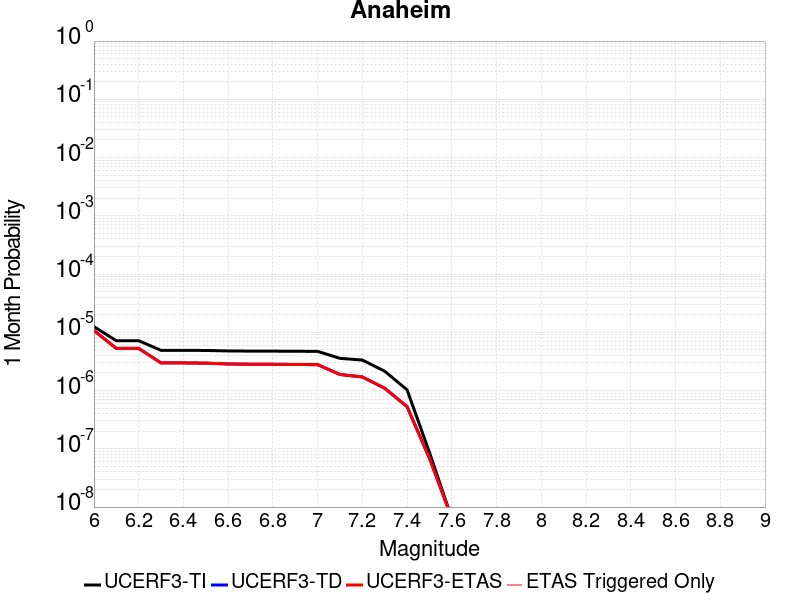 |  | 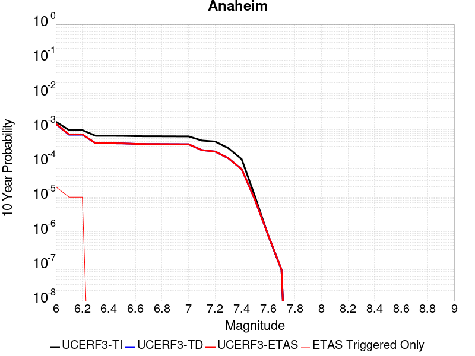 |

| Magnitude | 1 wk TI Prob | 1 wk TD Prob | 1 wk ETAS Prob | 1 wk ETAS/TD Gain | 1 wk ETAS Triggered Only | 1 mo TI Prob | 1 mo TD Prob | 1 mo ETAS Prob | 1 mo ETAS/TD Gain | 1 mo ETAS Triggered Only | 1 yr TI Prob | 1 yr TD Prob | 1 yr ETAS Prob | 1 yr ETAS/TD Gain | 1 yr ETAS Triggered Only | 10 yr TI Prob | 10 yr TD Prob | 10 yr ETAS Prob | 10 yr ETAS/TD Gain | 10 yr ETAS Triggered Only |
|-----|-----|-----|-----|-----|-----|-----|-----|-----|-----|-----|-----|-----|-----|-----|-----|-----|-----|-----|-----|-----|
| 6.0 | 2.9254998E-6 | 2.5123354E-6 | 2.5123354E-6 | 1.0 | 0.0 | 1.25377965E-5 | 1.076712E-5 | 1.076712E-5 | 1.0 | 0.0 | 1.5263697E-4 | 1.3108415E-4 | 1.4108284E-4 | 1.0762769 | 1.0E-5 | 0.0015253217 | 0.0013102985 | 0.0013302723 | 1.0152436 | 2.0E-5 |
| 6.1 | 1.6729715E-6 | 1.2337733E-6 | 1.2337733E-6 | 1.0 | 0.0 | 7.1698582E-6 | 5.2875916E-6 | 5.2875916E-6 | 1.0 | 0.0 | 8.7289525E-5 | 6.4374944E-5 | 7.43743E-5 | 1.15533 | 1.0E-5 | 8.7255245E-4 | 6.436039E-4 | 6.5359747E-4 | 1.0155275 | 1.0E-5 |
| 6.2 | 1.6729715E-6 | 1.2337733E-6 | 1.2337733E-6 | 1.0 | 0.0 | 7.1698582E-6 | 5.2875916E-6 | 5.2875916E-6 | 1.0 | 0.0 | 8.7289525E-5 | 6.4374944E-5 | 7.43743E-5 | 1.15533 | 1.0E-5 | 8.7255245E-4 | 6.436039E-4 | 6.5359747E-4 | 1.0155275 | 1.0E-5 |
| 6.3 | 1.1444064E-6 | 6.9600156E-7 | 6.9600156E-7 | 1.0 | 0.0 | 4.9045893E-6 | 2.9828607E-6 | 2.9828607E-6 | 1.0 | 0.0 | 5.971174E-5 | 3.631578E-5 | 3.631578E-5 | 1.0 | 0.0 | 5.96957E-4 | 3.6310396E-4 | 3.6310396E-4 | 1.0 | 0.0 |
| 6.4 | 1.1444064E-6 | 6.9600156E-7 | 6.9600156E-7 | 1.0 | 0.0 | 4.9045893E-6 | 2.9828607E-6 | 2.9828607E-6 | 1.0 | 0.0 | 5.971174E-5 | 3.631578E-5 | 3.631578E-5 | 1.0 | 0.0 | 5.96957E-4 | 3.6310396E-4 | 3.6310396E-4 | 1.0 | 0.0 |
| 6.5 | 1.1385318E-6 | 6.900699E-7 | 6.900699E-7 | 1.0 | 0.0 | 4.879413E-6 | 2.9574394E-6 | 2.9574394E-6 | 1.0 | 0.0 | 5.9405233E-5 | 3.6006284E-5 | 3.6006284E-5 | 1.0 | 0.0 | 5.938936E-4 | 3.6001002E-4 | 3.6001002E-4 | 1.0 | 0.0 |
| 6.6 | 1.1165511E-6 | 6.678569E-7 | 6.678569E-7 | 1.0 | 0.0 | 4.78521E-6 | 2.862241E-6 | 2.862241E-6 | 1.0 | 0.0 | 5.8258374E-5 | 3.4847282E-5 | 3.4847282E-5 | 1.0 | 0.0 | 5.8243104E-4 | 3.4842364E-4 | 3.4842364E-4 | 1.0 | 0.0 |
| 6.7 | 1.1098243E-6 | 6.6107634E-7 | 6.6107634E-7 | 1.0 | 0.0 | 4.7563813E-6 | 2.8331815E-6 | 2.8331815E-6 | 1.0 | 0.0 | 5.7907404E-5 | 3.4493492E-5 | 3.4493492E-5 | 1.0 | 0.0 | 5.7892315E-4 | 3.4488685E-4 | 3.4488685E-4 | 1.0 | 0.0 |
| 6.8 | 1.1077587E-6 | 6.589966E-7 | 6.589966E-7 | 1.0 | 0.0 | 4.7475287E-6 | 2.8242684E-6 | 2.8242684E-6 | 1.0 | 0.0 | 5.779963E-5 | 3.4384982E-5 | 3.4384982E-5 | 1.0 | 0.0 | 5.77846E-4 | 3.4380204E-4 | 3.4380204E-4 | 1.0 | 0.0 |
| 6.9 | 1.1024468E-6 | 6.536543E-7 | 6.536543E-7 | 1.0 | 0.0 | 4.7247636E-6 | 2.8013728E-6 | 2.8013728E-6 | 1.0 | 0.0 | 5.752248E-5 | 3.4106237E-5 | 3.4106237E-5 | 1.0 | 0.0 | 5.750759E-4 | 3.4101546E-4 | 3.4101546E-4 | 1.0 | 0.0 |
| 7.0 | 1.0993066E-6 | 6.5106497E-7 | 6.5106497E-7 | 1.0 | 0.0 | 4.7113053E-6 | 2.7902759E-6 | 2.7902759E-6 | 1.0 | 0.0 | 5.7358633E-5 | 3.3971133E-5 | 3.3971133E-5 | 1.0 | 0.0 | 5.734383E-4 | 3.3966484E-4 | 3.3966484E-4 | 1.0 | 0.0 |
| 7.1 | 8.334877E-7 | 4.405205E-7 | 4.405205E-7 | 1.0 | 0.0 | 3.5720855E-6 | 1.8879438E-6 | 1.8879438E-6 | 1.0 | 0.0 | 4.348927E-5 | 2.2985496E-5 | 2.2985496E-5 | 1.0 | 0.0 | 4.3480762E-4 | 2.2983341E-4 | 2.2983341E-4 | 1.0 | 0.0 |
| 7.2 | 7.794411E-7 | 3.9979125E-7 | 3.9979125E-7 | 1.0 | 0.0 | 3.3404576E-6 | 1.71339E-6 | 1.71339E-6 | 1.0 | 0.0 | 4.0669314E-5 | 2.0860345E-5 | 2.0860345E-5 | 1.0 | 0.0 | 4.066187E-4 | 2.085859E-4 | 2.085859E-4 | 1.0 | 0.0 |
| 7.3 | 5.01704E-7 | 2.5575073E-7 | 2.5575073E-7 | 1.0 | 0.0 | 2.150158E-6 | 1.0960742E-6 | 1.0960742E-6 | 1.0 | 0.0 | 2.617786E-5 | 1.3344635E-5 | 1.3344635E-5 | 1.0 | 0.0 | 2.6174777E-4 | 1.3343958E-4 | 1.3343958E-4 | 1.0 | 0.0 |
| 7.4 | 2.4008182E-7 | 1.2368638E-7 | 1.2368638E-7 | 1.0 | 0.0 | 1.0289217E-6 | 5.3008444E-7 | 5.3008444E-7 | 1.0 | 0.0 | 1.252705E-5 | 6.453766E-6 | 6.453766E-6 | 1.0 | 0.0 | 1.2526344E-4 | 6.453655E-5 | 6.453655E-5 | 1.0 | 0.0 |
| 7.5 | 2.0263876E-8 | 1.6121197E-8 | 1.6121197E-8 | 1.0 | 0.0 | 8.684518E-8 | 6.9090845E-8 | 6.9090845E-8 | 1.0 | 0.0 | 1.0573395E-6 | 8.4118074E-7 | 8.4118074E-7 | 1.0 | 0.0 | 1.0573345E-5 | 8.411785E-6 | 8.411785E-6 | 1.0 | 0.0 |
| 7.6 | 1.4871431E-9 | 1.5084262E-9 | 1.5084262E-9 | 1.0 | 0.0 | 6.37347E-9 | 6.464685E-9 | 6.464685E-9 | 1.0 | 0.0 | 7.7596994E-8 | 7.870754E-8 | 7.870754E-8 | 1.0 | 0.0 | 7.759697E-7 | 7.870751E-7 | 7.870751E-7 | 1.0 | 0.0 |
| 7.7 | 1.5093293E-10 | 1.5333601E-10 | 1.5333601E-10 | 1.0 | 0.0 | 6.4685546E-10 | 6.57155E-10 | 6.57155E-10 | 1.0 | 0.0 | 7.875465E-9 | 8.000863E-9 | 8.000863E-9 | 1.0 | 0.0 | 7.8754645E-8 | 8.000863E-8 | 8.000863E-8 | 1.0 | 0.0 |

## Davis Creek
*[(top)](#table-of-contents)*

| 1 Week | 1 Month | 1 Year | 10 Year |
|-----|-----|-----|-----|
| 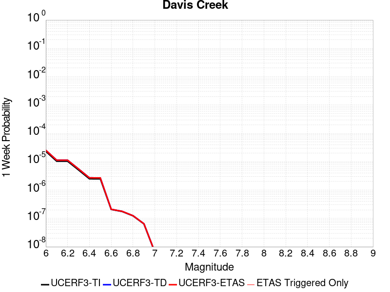 |  |  | 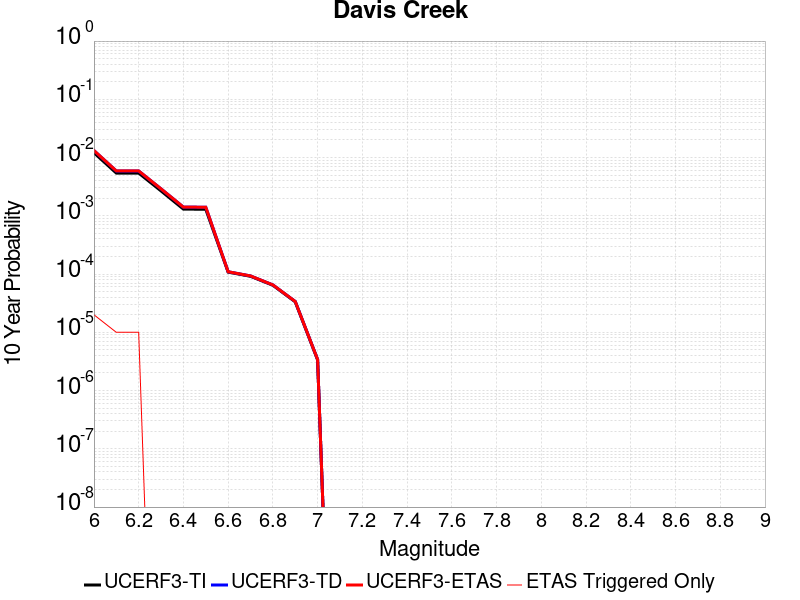 |

| Magnitude | 1 wk TI Prob | 1 wk TD Prob | 1 wk ETAS Prob | 1 wk ETAS/TD Gain | 1 wk ETAS Triggered Only | 1 mo TI Prob | 1 mo TD Prob | 1 mo ETAS Prob | 1 mo ETAS/TD Gain | 1 mo ETAS Triggered Only | 1 yr TI Prob | 1 yr TD Prob | 1 yr ETAS Prob | 1 yr ETAS/TD Gain | 1 yr ETAS Triggered Only | 10 yr TI Prob | 10 yr TD Prob | 10 yr ETAS Prob | 10 yr ETAS/TD Gain | 10 yr ETAS Triggered Only |
|-----|-----|-----|-----|-----|-----|-----|-----|-----|-----|-----|-----|-----|-----|-----|-----|-----|-----|-----|-----|-----|
| 6.0 | 2.331472E-5 | 2.5418127E-5 | 2.5418127E-5 | 1.0 | 0.0 | 9.99164E-5 | 1.08930944E-4 | 1.08930944E-4 | 1.0 | 0.0 | 0.0012158032 | 0.001325546 | 0.0013455194 | 1.0150682 | 2.0E-5 | 0.01209173 | 0.013188175 | 0.0132079115 | 1.0014966 | 2.0E-5 |
| 6.1 | 1.0407654E-5 | 1.1317381E-5 | 1.1317381E-5 | 1.0 | 0.0 | 4.4603472E-5 | 4.8502312E-5 | 4.8502312E-5 | 1.0 | 0.0 | 5.4291193E-4 | 5.903828E-4 | 6.0037686E-4 | 1.0169282 | 1.0E-5 | 0.0054158745 | 0.0058908155 | 0.005900757 | 1.0016875 | 1.0E-5 |
| 6.2 | 1.0407654E-5 | 1.1317381E-5 | 1.1317381E-5 | 1.0 | 0.0 | 4.4603472E-5 | 4.8502312E-5 | 4.8502312E-5 | 1.0 | 0.0 | 5.4291193E-4 | 5.903828E-4 | 6.0037686E-4 | 1.0169282 | 1.0E-5 | 0.0054158745 | 0.0058908155 | 0.005900757 | 1.0016875 | 1.0E-5 |
| 6.3 | 5.1323277E-6 | 5.5687447E-6 | 5.5687447E-6 | 1.0 | 0.0 | 2.1995505E-5 | 2.386588E-5 | 2.386588E-5 | 1.0 | 0.0 | 2.6776237E-4 | 2.9053696E-4 | 2.9053696E-4 | 1.0 | 0.0 | 0.0026743996 | 0.0029024174 | 0.0029024174 | 1.0 | 0.0 |
| 6.4 | 2.4985154E-6 | 2.7046274E-6 | 2.7046274E-6 | 1.0 | 0.0 | 1.07078795E-5 | 1.1591229E-5 | 1.1591229E-5 | 1.0 | 0.0 | 1.3036063E-4 | 1.4111769E-4 | 1.4111769E-4 | 1.0 | 0.0 | 0.0013028418 | 0.0014106355 | 0.0014106355 | 1.0 | 0.0 |
| 6.5 | 2.4846438E-6 | 2.6905614E-6 | 2.6905614E-6 | 1.0 | 0.0 | 1.064843E-5 | 1.1530947E-5 | 1.1530947E-5 | 1.0 | 0.0 | 1.2963692E-4 | 1.4038385E-4 | 1.4038385E-4 | 1.0 | 0.0 | 0.0012956132 | 0.0014033065 | 0.0014033065 | 1.0 | 0.0 |
| 6.6 | 2.072566E-7 | 2.1018205E-7 | 2.1018205E-7 | 1.0 | 0.0 | 8.882423E-7 | 9.007799E-7 | 9.007799E-7 | 1.0 | 0.0 | 1.0814296E-5 | 1.0966943E-5 | 1.0966943E-5 | 1.0 | 0.0 | 1.081377E-4 | 1.0966419E-4 | 1.0966419E-4 | 1.0 | 0.0 |
| 6.7 | 1.7544528E-7 | 1.7790926E-7 | 1.7790926E-7 | 1.0 | 0.0 | 7.5190815E-7 | 7.62468E-7 | 7.62468E-7 | 1.0 | 0.0 | 9.154443E-6 | 9.28301E-6 | 9.28301E-6 | 1.0 | 0.0 | 9.1540656E-5 | 9.2826376E-5 | 9.2826376E-5 | 1.0 | 0.0 |
| 6.8 | 1.2320395E-7 | 1.2481202E-7 | 1.2481202E-7 | 1.0 | 0.0 | 5.280168E-7 | 5.3490857E-7 | 5.3490857E-7 | 1.0 | 0.0 | 6.428586E-6 | 6.5124937E-6 | 6.5124937E-6 | 1.0 | 0.0 | 6.4284E-5 | 6.512314E-5 | 6.512314E-5 | 1.0 | 0.0 |
| 6.9 | 6.399997E-8 | 6.486093E-8 | 6.486093E-8 | 1.0 | 0.0 | 2.7428555E-7 | 2.7797537E-7 | 2.7797537E-7 | 1.0 | 0.0 | 3.3394215E-6 | 3.3843455E-6 | 3.3843455E-6 | 1.0 | 0.0 | 3.3393713E-5 | 3.3843004E-5 | 3.3843004E-5 | 1.0 | 0.0 |
| 7.0 | 6.4455685E-9 | 6.5353003E-9 | 6.5353003E-9 | 1.0 | 0.0 | 2.7623864E-8 | 2.800843E-8 | 2.800843E-8 | 1.0 | 0.0 | 3.3632048E-7 | 3.4100265E-7 | 3.4100265E-7 | 1.0 | 0.0 | 3.3631998E-6 | 3.4100262E-6 | 3.4100262E-6 | 1.0 | 0.0 |

## Redondo Canyon alt 1
*[(top)](#table-of-contents)*

| 1 Week | 1 Month | 1 Year | 10 Year |
|-----|-----|-----|-----|
| 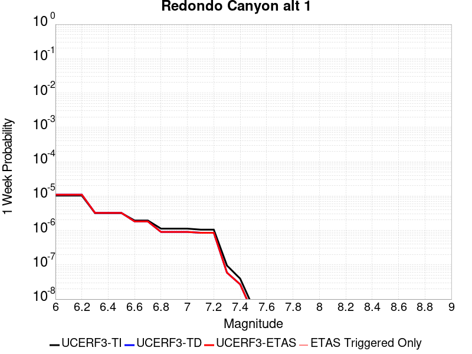 |  | 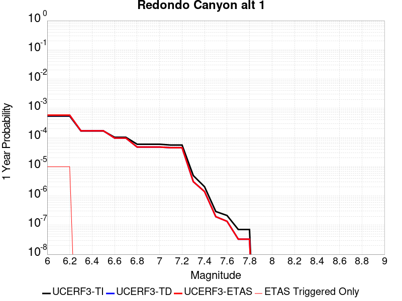 | 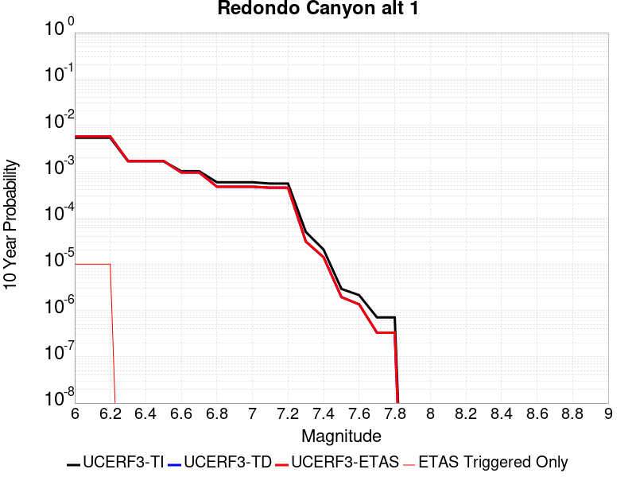 |

| Magnitude | 1 wk TI Prob | 1 wk TD Prob | 1 wk ETAS Prob | 1 wk ETAS/TD Gain | 1 wk ETAS Triggered Only | 1 mo TI Prob | 1 mo TD Prob | 1 mo ETAS Prob | 1 mo ETAS/TD Gain | 1 mo ETAS Triggered Only | 1 yr TI Prob | 1 yr TD Prob | 1 yr ETAS Prob | 1 yr ETAS/TD Gain | 1 yr ETAS Triggered Only | 10 yr TI Prob | 10 yr TD Prob | 10 yr ETAS Prob | 10 yr ETAS/TD Gain | 10 yr ETAS Triggered Only |
|-----|-----|-----|-----|-----|-----|-----|-----|-----|-----|-----|-----|-----|-----|-----|-----|-----|-----|-----|-----|-----|
| 6.0 | 1.0346246E-5 | 1.0981783E-5 | 1.0981783E-5 | 1.0 | 0.0 | 4.43403E-5 | 4.7064383E-5 | 4.7064383E-5 | 1.0 | 0.0 | 5.3970946E-4 | 5.729371E-4 | 5.829314E-4 | 1.0174439 | 1.0E-5 | 0.0053840056 | 0.0057223393 | 0.005732282 | 1.0017376 | 1.0E-5 |
| 6.1 | 1.0346246E-5 | 1.0981783E-5 | 1.0981783E-5 | 1.0 | 0.0 | 4.43403E-5 | 4.7064383E-5 | 4.7064383E-5 | 1.0 | 0.0 | 5.3970946E-4 | 5.729371E-4 | 5.829314E-4 | 1.0174439 | 1.0E-5 | 0.0053840056 | 0.0057223393 | 0.005732282 | 1.0017376 | 1.0E-5 |
| 6.2 | 1.0346246E-5 | 1.0981783E-5 | 1.0981783E-5 | 1.0 | 0.0 | 4.43403E-5 | 4.7064383E-5 | 4.7064383E-5 | 1.0 | 0.0 | 5.3970946E-4 | 5.729371E-4 | 5.829314E-4 | 1.0174439 | 1.0E-5 | 0.0053840056 | 0.0057223393 | 0.005732282 | 1.0017376 | 1.0E-5 |
| 6.3 | 3.2052794E-6 | 3.2362952E-6 | 3.2362952E-6 | 1.0 | 0.0 | 1.373684E-5 | 1.3869785E-5 | 1.3869785E-5 | 1.0 | 0.0 | 1.6723319E-4 | 1.6885552E-4 | 1.6885552E-4 | 1.0 | 0.0 | 0.001671074 | 0.001687662 | 0.001687662 | 1.0 | 0.0 |
| 6.4 | 3.2052794E-6 | 3.2362952E-6 | 3.2362952E-6 | 1.0 | 0.0 | 1.373684E-5 | 1.3869785E-5 | 1.3869785E-5 | 1.0 | 0.0 | 1.6723319E-4 | 1.6885552E-4 | 1.6885552E-4 | 1.0 | 0.0 | 0.001671074 | 0.001687662 | 0.001687662 | 1.0 | 0.0 |
| 6.5 | 3.2052794E-6 | 3.2362952E-6 | 3.2362952E-6 | 1.0 | 0.0 | 1.373684E-5 | 1.3869785E-5 | 1.3869785E-5 | 1.0 | 0.0 | 1.6723319E-4 | 1.6885552E-4 | 1.6885552E-4 | 1.0 | 0.0 | 0.001671074 | 0.001687662 | 0.001687662 | 1.0 | 0.0 |
| 6.6 | 1.948328E-6 | 1.828979E-6 | 1.828979E-6 | 1.0 | 0.0 | 8.349951E-6 | 7.838466E-6 | 7.838466E-6 | 1.0 | 0.0 | 1.016559E-4 | 9.5430645E-5 | 9.5430645E-5 | 1.0 | 0.0 | 0.0010160941 | 9.5404364E-4 | 9.5404364E-4 | 1.0 | 0.0 |
| 6.7 | 1.948328E-6 | 1.828979E-6 | 1.828979E-6 | 1.0 | 0.0 | 8.349951E-6 | 7.838466E-6 | 7.838466E-6 | 1.0 | 0.0 | 1.016559E-4 | 9.5430645E-5 | 9.5430645E-5 | 1.0 | 0.0 | 0.0010160941 | 9.5404364E-4 | 9.5404364E-4 | 1.0 | 0.0 |
| 6.8 | 1.1278219E-6 | 9.0337136E-7 | 9.0337136E-7 | 1.0 | 0.0 | 4.8335132E-6 | 3.8715884E-6 | 3.8715884E-6 | 1.0 | 0.0 | 5.8846435E-5 | 4.7135996E-5 | 4.7135996E-5 | 1.0 | 0.0 | 5.8830855E-4 | 4.71302E-4 | 4.71302E-4 | 1.0 | 0.0 |
| 6.9 | 1.1278219E-6 | 9.0337136E-7 | 9.0337136E-7 | 1.0 | 0.0 | 4.8335132E-6 | 3.8715884E-6 | 3.8715884E-6 | 1.0 | 0.0 | 5.8846435E-5 | 4.7135996E-5 | 4.7135996E-5 | 1.0 | 0.0 | 5.8830855E-4 | 4.71302E-4 | 4.71302E-4 | 1.0 | 0.0 |
| 7.0 | 1.1278219E-6 | 9.0337136E-7 | 9.0337136E-7 | 1.0 | 0.0 | 4.8335132E-6 | 3.8715884E-6 | 3.8715884E-6 | 1.0 | 0.0 | 5.8846435E-5 | 4.7135996E-5 | 4.7135996E-5 | 1.0 | 0.0 | 5.8830855E-4 | 4.71302E-4 | 4.71302E-4 | 1.0 | 0.0 |
| 7.1 | 1.0545139E-6 | 8.569858E-7 | 8.569858E-7 | 1.0 | 0.0 | 4.5193374E-6 | 3.6727936E-6 | 3.6727936E-6 | 1.0 | 0.0 | 5.5021545E-5 | 4.4715773E-5 | 4.4715773E-5 | 1.0 | 0.0 | 5.500792E-4 | 4.471095E-4 | 4.471095E-4 | 1.0 | 0.0 |
| 7.2 | 1.0545139E-6 | 8.569858E-7 | 8.569858E-7 | 1.0 | 0.0 | 4.5193374E-6 | 3.6727936E-6 | 3.6727936E-6 | 1.0 | 0.0 | 5.5021545E-5 | 4.4715773E-5 | 4.4715773E-5 | 1.0 | 0.0 | 5.500792E-4 | 4.471095E-4 | 4.471095E-4 | 1.0 | 0.0 |
| 7.3 | 9.505161E-8 | 5.896244E-8 | 5.896244E-8 | 1.0 | 0.0 | 4.0736398E-7 | 2.5269614E-7 | 2.5269614E-7 | 1.0 | 0.0 | 4.959645E-6 | 3.0765725E-6 | 3.0765725E-6 | 1.0 | 0.0 | 4.9595343E-5 | 3.076542E-5 | 3.076542E-5 | 1.0 | 0.0 |
| 7.4 | 3.9520785E-8 | 2.6990278E-8 | 2.6990278E-8 | 1.0 | 0.0 | 1.6937479E-7 | 1.1567262E-7 | 1.1567262E-7 | 1.0 | 0.0 | 2.062136E-6 | 1.4083136E-6 | 1.4083136E-6 | 1.0 | 0.0 | 2.062117E-5 | 1.40830725E-5 | 1.40830725E-5 | 1.0 | 0.0 |
| 7.5 | 5.6133214E-9 | 3.737203E-9 | 3.737203E-9 | 1.0 | 0.0 | 2.4057092E-8 | 1.6016584E-8 | 1.6016584E-8 | 1.0 | 0.0 | 2.9289507E-7 | 1.950019E-7 | 1.950019E-7 | 1.0 | 0.0 | 2.9289467E-6 | 1.9500176E-6 | 1.9500176E-6 | 1.0 | 0.0 |
| 7.6 | 4.1064334E-9 | 2.5960458E-9 | 2.5960458E-9 | 1.0 | 0.0 | 1.7599E-8 | 1.1125911E-8 | 1.1125911E-8 | 1.0 | 0.0 | 2.142678E-7 | 1.3545795E-7 | 1.3545795E-7 | 1.0 | 0.0 | 2.1426758E-6 | 1.3545789E-6 | 1.3545789E-6 | 1.0 | 0.0 |
| 7.7 | 1.361975E-9 | 6.3617056E-10 | 6.3617056E-10 | 1.0 | 0.0 | 5.8370353E-9 | 2.7264453E-9 | 2.7264453E-9 | 1.0 | 0.0 | 7.1065905E-8 | 3.319447E-8 | 3.319447E-8 | 1.0 | 0.0 | 7.106588E-7 | 3.3194468E-7 | 3.3194468E-7 | 1.0 | 0.0 |
| 7.8 | 1.361975E-9 | 6.3617056E-10 | 6.3617056E-10 | 1.0 | 0.0 | 5.8370353E-9 | 2.7264453E-9 | 2.7264453E-9 | 1.0 | 0.0 | 7.1065905E-8 | 3.319447E-8 | 3.319447E-8 | 1.0 | 0.0 | 7.106588E-7 | 3.3194468E-7 | 3.3194468E-7 | 1.0 | 0.0 |

## Quien Sabe 2011 CFM
*[(top)](#table-of-contents)*

| 1 Week | 1 Month | 1 Year | 10 Year |
|-----|-----|-----|-----|
| 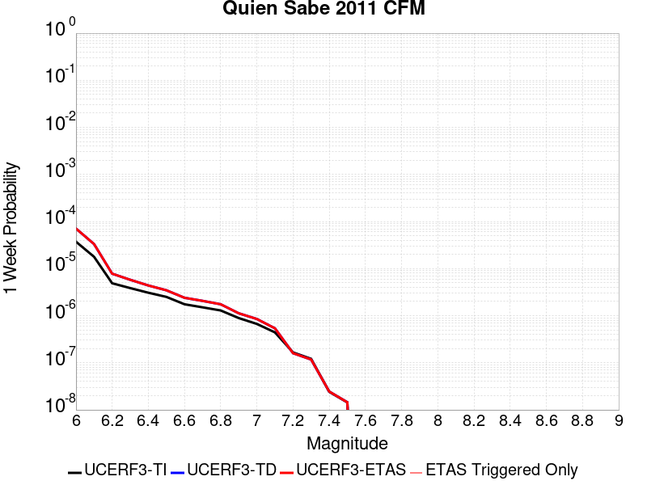 |  | 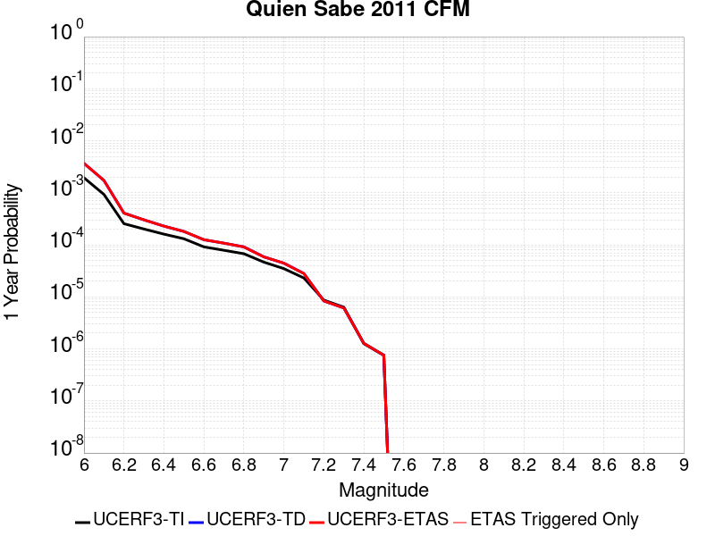 |  |

| Magnitude | 1 wk TI Prob | 1 wk TD Prob | 1 wk ETAS Prob | 1 wk ETAS/TD Gain | 1 wk ETAS Triggered Only | 1 mo TI Prob | 1 mo TD Prob | 1 mo ETAS Prob | 1 mo ETAS/TD Gain | 1 mo ETAS Triggered Only | 1 yr TI Prob | 1 yr TD Prob | 1 yr ETAS Prob | 1 yr ETAS/TD Gain | 1 yr ETAS Triggered Only | 10 yr TI Prob | 10 yr TD Prob | 10 yr ETAS Prob | 10 yr ETAS/TD Gain | 10 yr ETAS Triggered Only |
|-----|-----|-----|-----|-----|-----|-----|-----|-----|-----|-----|-----|-----|-----|-----|-----|-----|-----|-----|-----|-----|
| 6.0 | 3.729899E-5 | 7.091154E-5 | 7.091154E-5 | 1.0 | 0.0 | 1.5984301E-4 | 3.0388034E-4 | 3.0388034E-4 | 1.0 | 0.0 | 0.0019443515 | 0.0036856337 | 0.0036856337 | 1.0 | 0.0 | 0.019274272 | 0.035354573 | 0.03536422 | 1.0002729 | 1.0E-5 |
| 6.1 | 1.7825725E-5 | 3.3161108E-5 | 3.3161108E-5 | 1.0 | 0.0 | 7.639373E-5 | 1.4211383E-4 | 1.4211383E-4 | 1.0 | 0.0 | 9.296967E-4 | 0.0017269376 | 0.0017269376 | 1.0 | 0.0 | 0.009258169 | 0.016701052 | 0.016710885 | 1.0005888 | 1.0E-5 |
| 6.2 | 4.8865336E-6 | 7.807277E-6 | 7.807277E-6 | 1.0 | 0.0 | 2.0942118E-5 | 3.3459386E-5 | 3.3459386E-5 | 1.0 | 0.0 | 2.5494045E-4 | 4.069898E-4 | 4.069898E-4 | 1.0 | 0.0 | 0.0025464818 | 0.0040142825 | 0.0040242425 | 1.0024811 | 1.0E-5 |
| 6.3 | 3.858491E-6 | 5.7907946E-6 | 5.7907946E-6 | 1.0 | 0.0 | 1.6536285E-5 | 2.481748E-5 | 2.481748E-5 | 1.0 | 0.0 | 2.0131067E-4 | 3.0211563E-4 | 3.0211563E-4 | 1.0 | 0.0 | 0.002011284 | 0.0030025828 | 0.0030125526 | 1.0033205 | 1.0E-5 |
| 6.4 | 3.0771805E-6 | 4.3859736E-6 | 4.3859736E-6 | 1.0 | 0.0 | 1.318785E-5 | 1.8796907E-5 | 1.8796907E-5 | 1.0 | 0.0 | 1.6055023E-4 | 2.2883074E-4 | 2.2883074E-4 | 1.0 | 0.0 | 0.001604343 | 0.002287054 | 0.002297031 | 1.0043625 | 1.0E-5 |
| 6.5 | 2.5081235E-6 | 3.4645814E-6 | 3.4645814E-6 | 1.0 | 0.0 | 1.0749056E-5 | 1.48481295E-5 | 1.48481295E-5 | 1.0 | 0.0 | 1.308619E-4 | 1.8076245E-4 | 1.8076245E-4 | 1.0 | 0.0 | 0.0013078486 | 0.0018128433 | 0.0018228252 | 1.0055062 | 1.0E-5 |
| 6.6 | 1.7505364E-6 | 2.4031558E-6 | 2.4031558E-6 | 1.0 | 0.0 | 7.502277E-6 | 1.0299203E-5 | 1.0299203E-5 | 1.0 | 0.0 | 9.13364E-5 | 1.2538629E-4 | 1.2538629E-4 | 1.0 | 0.0 | 9.129886E-4 | 0.001258714 | 0.0012687014 | 1.0079346 | 1.0E-5 |
| 6.7 | 1.505737E-6 | 2.0645095E-6 | 2.0645095E-6 | 1.0 | 0.0 | 6.4531428E-6 | 8.847872E-6 | 8.847872E-6 | 1.0 | 0.0 | 7.8564175E-5 | 1.07718115E-4 | 1.07718115E-4 | 1.0 | 0.0 | 7.853641E-4 | 0.0010822058 | 0.001092195 | 1.0092304 | 1.0E-5 |
| 6.8 | 1.2924105E-6 | 1.7491076E-6 | 1.7491076E-6 | 1.0 | 0.0 | 5.5388905E-6 | 7.4961567E-6 | 7.4961567E-6 | 1.0 | 0.0 | 6.74339E-5 | 9.126243E-5 | 9.126243E-5 | 1.0 | 0.0 | 6.741344E-4 | 9.164543E-4 | 9.264451E-4 | 1.0109016 | 1.0E-5 |
| 6.9 | 8.9075286E-7 | 1.1252689E-6 | 1.1252689E-6 | 1.0 | 0.0 | 3.8175067E-6 | 4.8225734E-6 | 4.8225734E-6 | 1.0 | 0.0 | 4.6477155E-5 | 5.871347E-5 | 5.871347E-5 | 1.0 | 0.0 | 4.6467435E-4 | 5.905342E-4 | 5.905342E-4 | 1.0 | 0.0 |
| 7.0 | 6.6891175E-7 | 8.518663E-7 | 8.518663E-7 | 1.0 | 0.0 | 2.8667614E-6 | 3.6508513E-6 | 3.6508513E-6 | 1.0 | 0.0 | 3.4902263E-5 | 4.4448407E-5 | 4.4448407E-5 | 1.0 | 0.0 | 3.4896782E-4 | 4.4689028E-4 | 4.4689028E-4 | 1.0 | 0.0 |
| 7.1 | 4.4205015E-7 | 5.3933934E-7 | 5.3933934E-7 | 1.0 | 0.0 | 1.8944993E-6 | 2.311453E-6 | 2.311453E-6 | 1.0 | 0.0 | 2.3065284E-5 | 2.8141749E-5 | 2.8141749E-5 | 1.0 | 0.0 | 2.3062891E-4 | 2.8276604E-4 | 2.8276604E-4 | 1.0 | 0.0 |
| 7.2 | 1.6620965E-7 | 1.5996773E-7 | 1.5996773E-7 | 1.0 | 0.0 | 7.123269E-7 | 6.8557586E-7 | 6.8557586E-7 | 1.0 | 0.0 | 8.672545E-6 | 8.346858E-6 | 8.346858E-6 | 1.0 | 0.0 | 8.6722066E-5 | 8.36211E-5 | 8.36211E-5 | 1.0 | 0.0 |
| 7.3 | 1.2142488E-7 | 1.1728216E-7 | 1.1728216E-7 | 1.0 | 0.0 | 5.2039223E-7 | 5.0263776E-7 | 5.0263776E-7 | 1.0 | 0.0 | 6.335757E-6 | 6.119601E-6 | 6.119601E-6 | 1.0 | 0.0 | 6.3355765E-5 | 6.1257415E-5 | 6.1257415E-5 | 1.0 | 0.0 |
| 7.4 | 2.4192937E-8 | 2.4546386E-8 | 2.4546386E-8 | 1.0 | 0.0 | 1.0368401E-7 | 1.05198794E-7 | 1.05198794E-7 | 1.0 | 0.0 | 1.2623522E-6 | 1.2807947E-6 | 1.2807947E-6 | 1.0 | 0.0 | 1.2623449E-5 | 1.2814217E-5 | 1.2814217E-5 | 1.0 | 0.0 |
| 7.5 | 1.4432802E-8 | 1.4507607E-8 | 1.4507607E-8 | 1.0 | 0.0 | 6.185486E-8 | 6.217546E-8 | 6.217546E-8 | 1.0 | 0.0 | 7.530827E-7 | 7.56986E-7 | 7.56986E-7 | 1.0 | 0.0 | 7.530801E-6 | 7.5741104E-6 | 7.5741104E-6 | 1.0 | 0.0 |

## Calaveras (Central) 2011 CFM
*[(top)](#table-of-contents)*

| 1 Week | 1 Month | 1 Year | 10 Year |
|-----|-----|-----|-----|
|  |  | 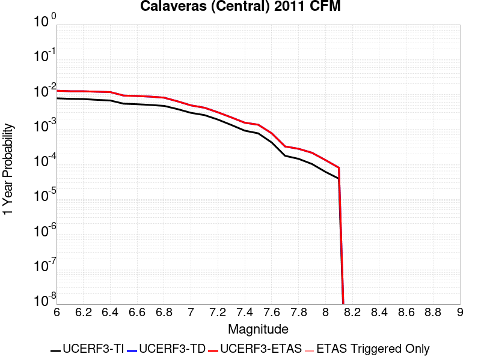 | 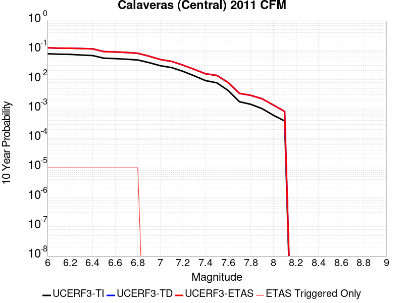 |

| Magnitude | 1 wk TI Prob | 1 wk TD Prob | 1 wk ETAS Prob | 1 wk ETAS/TD Gain | 1 wk ETAS Triggered Only | 1 mo TI Prob | 1 mo TD Prob | 1 mo ETAS Prob | 1 mo ETAS/TD Gain | 1 mo ETAS Triggered Only | 1 yr TI Prob | 1 yr TD Prob | 1 yr ETAS Prob | 1 yr ETAS/TD Gain | 1 yr ETAS Triggered Only | 10 yr TI Prob | 10 yr TD Prob | 10 yr ETAS Prob | 10 yr ETAS/TD Gain | 10 yr ETAS Triggered Only |
|-----|-----|-----|-----|-----|-----|-----|-----|-----|-----|-----|-----|-----|-----|-----|-----|-----|-----|-----|-----|-----|
| 6.0 | 1.5010907E-4 | 2.479724E-4 | 2.479724E-4 | 1.0 | 0.0 | 6.4316596E-4 | 0.0010623166 | 0.0010623166 | 1.0 | 0.0 | 0.0078024664 | 0.012856156 | 0.012856156 | 1.0 | 0.0 | 0.07534136 | 0.12045552 | 0.12046431 | 1.0000731 | 1.0E-5 |
| 6.1 | 1.4521465E-4 | 2.3960919E-4 | 2.3960919E-4 | 1.0 | 0.0 | 6.222001E-4 | 0.0010265043 | 0.0010265043 | 1.0 | 0.0 | 0.0075490056 | 0.012425376 | 0.012425376 | 1.0 | 0.0 | 0.07297657 | 0.11672699 | 0.11673582 | 1.0000757 | 1.0E-5 |
| 6.2 | 1.429998E-4 | 2.3892071E-4 | 2.3892071E-4 | 1.0 | 0.0 | 6.127123E-4 | 0.0010235561 | 0.0010235561 | 1.0 | 0.0 | 0.007434286 | 0.012389925 | 0.012389925 | 1.0 | 0.0 | 0.07190444 | 0.11638047 | 0.116389304 | 1.0000759 | 1.0E-5 |
| 6.3 | 1.3536277E-4 | 2.3223054E-4 | 2.3223054E-4 | 1.0 | 0.0 | 5.799972E-4 | 9.949061E-4 | 9.949061E-4 | 1.0 | 0.0 | 0.0070386264 | 0.012045962 | 0.012045962 | 1.0 | 0.0 | 0.0681982 | 0.113291755 | 0.11330062 | 1.0000783 | 1.0E-5 |
| 6.4 | 1.2993296E-4 | 2.2646323E-4 | 2.2646323E-4 | 1.0 | 0.0 | 5.5673666E-4 | 9.7020756E-4 | 9.7020756E-4 | 1.0 | 0.0 | 0.006757223 | 0.011748633 | 0.011748633 | 1.0 | 0.0 | 0.06555412 | 0.11056867 | 0.11057757 | 1.0000805 | 1.0E-5 |
| 6.5 | 1.0498927E-4 | 1.7992841E-4 | 1.7992841E-4 | 1.0 | 0.0 | 4.498764E-4 | 7.708946E-4 | 7.708946E-4 | 1.0 | 0.0 | 0.005463498 | 0.0093449885 | 0.0093449885 | 1.0 | 0.0 | 0.053311124 | 0.08924859 | 0.089257695 | 1.000102 | 1.0E-5 |
| 6.6 | 1.0157505E-4 | 1.7480261E-4 | 1.7480261E-4 | 1.0 | 0.0 | 4.35249E-4 | 7.4893964E-4 | 7.4893964E-4 | 1.0 | 0.0 | 0.0052862884 | 0.009080006 | 0.009080006 | 1.0 | 0.0 | 0.05162293 | 0.08682587 | 0.086835004 | 1.0001051 | 1.0E-5 |
| 6.7 | 9.660386E-5 | 1.6739468E-4 | 1.6739468E-4 | 1.0 | 0.0 | 4.1395082E-4 | 7.172092E-4 | 7.172092E-4 | 1.0 | 0.0 | 0.0050282106 | 0.008696867 | 0.008696867 | 1.0 | 0.0 | 0.049159497 | 0.08331496 | 0.08332413 | 1.00011 | 1.0E-5 |
| 6.8 | 9.089927E-5 | 1.5653599E-4 | 1.5653599E-4 | 1.0 | 0.0 | 3.8951015E-4 | 6.7069643E-4 | 6.7069643E-4 | 1.0 | 0.0 | 0.0047319788 | 0.008134919 | 0.008134919 | 1.0 | 0.0 | 0.046324775 | 0.078206785 | 0.078216 | 1.0001179 | 1.0E-5 |
| 6.9 | 7.353187E-5 | 1.2304368E-4 | 1.2304368E-4 | 1.0 | 0.0 | 3.150985E-4 | 5.2722404E-4 | 5.2722404E-4 | 1.0 | 0.0 | 0.0038295772 | 0.006400181 | 0.006400181 | 1.0 | 0.0 | 0.037642512 | 0.062229495 | 0.062229495 | 1.0 | 0.0 |
| 7.0 | 5.746064E-5 | 9.3972434E-5 | 9.3972434E-5 | 1.0 | 0.0 | 2.4623662E-4 | 4.026772E-4 | 4.026772E-4 | 1.0 | 0.0 | 0.0029938098 | 0.004891645 | 0.004891645 | 1.0 | 0.0 | 0.02953797 | 0.048026823 | 0.048026823 | 1.0 | 0.0 |
| 7.1 | 4.9557195E-5 | 8.058681E-5 | 8.058681E-5 | 1.0 | 0.0 | 2.123707E-4 | 3.4532667E-4 | 3.4532667E-4 | 1.0 | 0.0 | 0.0025825473 | 0.00419631 | 0.00419631 | 1.0 | 0.0 | 0.0255274 | 0.04140294 | 0.04140294 | 1.0 | 0.0 |
| 7.2 | 3.687595E-5 | 5.958438E-5 | 5.958438E-5 | 1.0 | 0.0 | 1.5803022E-4 | 2.553368E-4 | 2.553368E-4 | 1.0 | 0.0 | 0.0019223199 | 0.003104323 | 0.003104323 | 1.0 | 0.0 | 0.01905776 | 0.030912792 | 0.030912792 | 1.0 | 0.0 |
| 7.3 | 2.5846984E-5 | 4.2524527E-5 | 4.2524527E-5 | 1.0 | 0.0 | 1.1076809E-4 | 1.8223534E-4 | 1.8223534E-4 | 1.0 | 0.0 | 0.0013477671 | 0.002216475 | 0.002216475 | 1.0 | 0.0 | 0.013396223 | 0.022201346 | 0.022201346 | 1.0 | 0.0 |
| 7.4 | 1.7747854E-5 | 2.9959308E-5 | 2.9959308E-5 | 1.0 | 0.0 | 7.6060016E-5 | 1.2839073E-4 | 1.2839073E-4 | 1.0 | 0.0 | 9.2563726E-4 | 0.0015620393 | 0.0015620393 | 1.0 | 0.0 | 0.009217911 | 0.015720487 | 0.015720487 | 1.0 | 0.0 |
| 7.5 | 1.4883479E-5 | 2.626538E-5 | 2.626538E-5 | 1.0 | 0.0 | 6.378478E-5 | 1.1256107E-4 | 1.1256107E-4 | 1.0 | 0.0 | 7.76303E-4 | 0.0013695724 | 0.0013695724 | 1.0 | 0.0 | 0.0077359667 | 0.013813157 | 0.013813157 | 1.0 | 0.0 |
| 7.6 | 8.166975E-6 | 1.4981131E-5 | 1.4981131E-5 | 1.0 | 0.0 | 3.5000852E-5 | 6.4203276E-5 | 6.4203276E-5 | 1.0 | 0.0 | 4.2605202E-4 | 7.813959E-4 | 7.813959E-4 | 1.0 | 0.0 | 0.004252361 | 0.007948495 | 0.007948495 | 1.0 | 0.0 |
| 7.7 | 3.3858064E-6 | 6.2645495E-6 | 6.2645495E-6 | 1.0 | 0.0 | 1.4510518E-5 | 2.6847794E-5 | 2.6847794E-5 | 1.0 | 0.0 | 1.7665124E-4 | 3.2682292E-4 | 3.2682292E-4 | 1.0 | 0.0 | 0.0017651088 | 0.0033934722 | 0.0033934722 | 1.0 | 0.0 |
| 7.8 | 2.7721615E-6 | 5.375476E-6 | 5.375476E-6 | 1.0 | 0.0 | 1.1880637E-5 | 2.3037552E-5 | 2.3037552E-5 | 1.0 | 0.0 | 1.4463716E-4 | 2.8044614E-4 | 2.8044614E-4 | 1.0 | 0.0 | 0.0014454306 | 0.0029119286 | 0.0029119286 | 1.0 | 0.0 |
| 7.9 | 1.9736292E-6 | 4.135035E-6 | 4.135035E-6 | 1.0 | 0.0 | 8.4583835E-6 | 1.7721457E-5 | 1.7721457E-5 | 1.0 | 0.0 | 1.0297595E-4 | 2.1573743E-4 | 2.1573743E-4 | 1.0 | 0.0 | 0.0010292825 | 0.002226836 | 0.002226836 | 1.0 | 0.0 |
| 8.0 | 1.1767289E-6 | 2.5583681E-6 | 2.5583681E-6 | 1.0 | 0.0 | 5.0431145E-6 | 1.0964389E-5 | 1.0964389E-5 | 1.0 | 0.0 | 6.139818E-5 | 1.3348329E-4 | 1.3348329E-4 | 1.0 | 0.0 | 6.1381224E-4 | 0.0013679878 | 0.0013679878 | 1.0 | 0.0 |
| 8.1 | 7.5112825E-7 | 1.5432998E-6 | 1.5432998E-6 | 1.0 | 0.0 | 3.2191172E-6 | 6.6141256E-6 | 6.6141256E-6 | 1.0 | 0.0 | 3.9192048E-5 | 8.052403E-5 | 8.052403E-5 | 1.0 | 0.0 | 3.9185135E-4 | 8.24705E-4 | 8.24705E-4 | 1.0 | 0.0 |

## Pleito
*[(top)](#table-of-contents)*

| 1 Week | 1 Month | 1 Year | 10 Year |
|-----|-----|-----|-----|
|  |  |  |  |

| Magnitude | 1 wk TI Prob | 1 wk TD Prob | 1 wk ETAS Prob | 1 wk ETAS/TD Gain | 1 wk ETAS Triggered Only | 1 mo TI Prob | 1 mo TD Prob | 1 mo ETAS Prob | 1 mo ETAS/TD Gain | 1 mo ETAS Triggered Only | 1 yr TI Prob | 1 yr TD Prob | 1 yr ETAS Prob | 1 yr ETAS/TD Gain | 1 yr ETAS Triggered Only | 10 yr TI Prob | 10 yr TD Prob | 10 yr ETAS Prob | 10 yr ETAS/TD Gain | 10 yr ETAS Triggered Only |
|-----|-----|-----|-----|-----|-----|-----|-----|-----|-----|-----|-----|-----|-----|-----|-----|-----|-----|-----|-----|-----|
| 6.0 | 1.6763008E-5 | 2.4783867E-5 | 2.4783867E-5 | 1.0 | 0.0 | 7.183948E-5 | 1.06212654E-4 | 1.06212654E-4 | 1.0 | 0.0 | 8.742947E-4 | 0.0012924441 | 0.0013024311 | 1.0077273 | 1.0E-5 | 0.00870863 | 0.012964 | 0.01297387 | 1.0007614 | 1.0E-5 |
| 6.1 | 1.6763008E-5 | 2.4783867E-5 | 2.4783867E-5 | 1.0 | 0.0 | 7.183948E-5 | 1.06212654E-4 | 1.06212654E-4 | 1.0 | 0.0 | 8.742947E-4 | 0.0012924441 | 0.0013024311 | 1.0077273 | 1.0E-5 | 0.00870863 | 0.012964 | 0.01297387 | 1.0007614 | 1.0E-5 |
| 6.2 | 1.6763008E-5 | 2.4783867E-5 | 2.4783867E-5 | 1.0 | 0.0 | 7.183948E-5 | 1.06212654E-4 | 1.06212654E-4 | 1.0 | 0.0 | 8.742947E-4 | 0.0012924441 | 0.0013024311 | 1.0077273 | 1.0E-5 | 0.00870863 | 0.012964 | 0.01297387 | 1.0007614 | 1.0E-5 |
| 6.3 | 1.6763008E-5 | 2.4783867E-5 | 2.4783867E-5 | 1.0 | 0.0 | 7.183948E-5 | 1.06212654E-4 | 1.06212654E-4 | 1.0 | 0.0 | 8.742947E-4 | 0.0012924441 | 0.0013024311 | 1.0077273 | 1.0E-5 | 0.00870863 | 0.012964 | 0.01297387 | 1.0007614 | 1.0E-5 |
| 6.4 | 1.6763008E-5 | 2.4783867E-5 | 2.4783867E-5 | 1.0 | 0.0 | 7.183948E-5 | 1.06212654E-4 | 1.06212654E-4 | 1.0 | 0.0 | 8.742947E-4 | 0.0012924441 | 0.0013024311 | 1.0077273 | 1.0E-5 | 0.00870863 | 0.012964 | 0.01297387 | 1.0007614 | 1.0E-5 |
| 6.5 | 1.6763008E-5 | 2.4783867E-5 | 2.4783867E-5 | 1.0 | 0.0 | 7.183948E-5 | 1.06212654E-4 | 1.06212654E-4 | 1.0 | 0.0 | 8.742947E-4 | 0.0012924441 | 0.0013024311 | 1.0077273 | 1.0E-5 | 0.00870863 | 0.012964 | 0.01297387 | 1.0007614 | 1.0E-5 |
| 6.6 | 9.910213E-6 | 1.7234346E-5 | 1.7234346E-5 | 1.0 | 0.0 | 4.247165E-5 | 7.385942E-5 | 7.385942E-5 | 1.0 | 0.0 | 5.169696E-4 | 8.988711E-4 | 8.988711E-4 | 1.0 | 0.0 | 0.0051576863 | 0.009060693 | 0.009060693 | 1.0 | 0.0 |
| 6.7 | 9.910213E-6 | 1.7234346E-5 | 1.7234346E-5 | 1.0 | 0.0 | 4.247165E-5 | 7.385942E-5 | 7.385942E-5 | 1.0 | 0.0 | 5.169696E-4 | 8.988711E-4 | 8.988711E-4 | 1.0 | 0.0 | 0.0051576863 | 0.009060693 | 0.009060693 | 1.0 | 0.0 |
| 6.8 | 8.300162E-6 | 1.5493899E-5 | 1.5493899E-5 | 1.0 | 0.0 | 3.557164E-5 | 6.6400746E-5 | 6.6400746E-5 | 1.0 | 0.0 | 4.3299864E-4 | 8.0813066E-4 | 8.0813066E-4 | 1.0 | 0.0 | 0.004321559 | 0.008160111 | 0.008160111 | 1.0 | 0.0 |
| 6.9 | 8.183114E-6 | 1.5365105E-5 | 1.5365105E-5 | 1.0 | 0.0 | 3.5070017E-5 | 6.58488E-5 | 6.58488E-5 | 1.0 | 0.0 | 4.2689382E-4 | 8.0141565E-4 | 8.0141565E-4 | 1.0 | 0.0 | 0.0042607468 | 0.008093451 | 0.008093451 | 1.0 | 0.0 |
| 7.0 | 7.1748823E-6 | 1.415185E-5 | 1.415185E-5 | 1.0 | 0.0 | 3.0749135E-5 | 6.064938E-5 | 6.064938E-5 | 1.0 | 0.0 | 3.743064E-4 | 7.3815655E-4 | 7.3815655E-4 | 1.0 | 0.0 | 0.0037367654 | 0.007464785 | 0.007464785 | 1.0 | 0.0 |
| 7.1 | 7.1671807E-6 | 1.4142218E-5 | 1.4142218E-5 | 1.0 | 0.0 | 3.0716128E-5 | 6.06081E-5 | 6.06081E-5 | 1.0 | 0.0 | 3.7390468E-4 | 7.3765434E-4 | 7.3765434E-4 | 1.0 | 0.0 | 0.0037327618 | 0.0074597965 | 0.0074597965 | 1.0 | 0.0 |
| 7.2 | 7.0649667E-6 | 1.39894455E-5 | 1.39894455E-5 | 1.0 | 0.0 | 3.0278077E-5 | 5.995339E-5 | 5.995339E-5 | 1.0 | 0.0 | 3.6857324E-4 | 7.2968856E-4 | 7.2968856E-4 | 1.0 | 0.0 | 0.0036796255 | 0.007380522 | 0.007380522 | 1.0 | 0.0 |
| 7.3 | 7.02082E-6 | 1.3932863E-5 | 1.3932863E-5 | 1.0 | 0.0 | 3.008888E-5 | 5.9710906E-5 | 5.9710906E-5 | 1.0 | 0.0 | 3.6627054E-4 | 7.267383E-4 | 7.267383E-4 | 1.0 | 0.0 | 0.0036566744 | 0.007351002 | 0.007351002 | 1.0 | 0.0 |
| 7.4 | 6.987146E-6 | 1.3892403E-5 | 1.3892403E-5 | 1.0 | 0.0 | 2.9944567E-5 | 5.9537517E-5 | 5.9537517E-5 | 1.0 | 0.0 | 3.6451413E-4 | 7.246287E-4 | 7.246287E-4 | 1.0 | 0.0 | 0.0036391679 | 0.007329927 | 0.007329927 | 1.0 | 0.0 |
| 7.5 | 6.9494554E-6 | 1.3849292E-5 | 1.3849292E-5 | 1.0 | 0.0 | 2.9783041E-5 | 5.9352766E-5 | 5.9352766E-5 | 1.0 | 0.0 | 3.625482E-4 | 7.223808E-4 | 7.223808E-4 | 1.0 | 0.0 | 0.0036195726 | 0.007307547 | 0.007307547 | 1.0 | 0.0 |
| 7.6 | 6.92694E-6 | 1.3808377E-5 | 1.3808377E-5 | 1.0 | 0.0 | 2.9686547E-5 | 5.917742E-5 | 5.917742E-5 | 1.0 | 0.0 | 3.6137376E-4 | 7.202474E-4 | 7.202474E-4 | 1.0 | 0.0 | 0.0036078666 | 0.0072862855 | 0.0072862855 | 1.0 | 0.0 |
| 7.7 | 6.395867E-6 | 1.268664E-5 | 1.268664E-5 | 1.0 | 0.0 | 2.741057E-5 | 5.4370183E-5 | 5.4370183E-5 | 1.0 | 0.0 | 3.336726E-4 | 6.6175626E-4 | 6.6175626E-4 | 1.0 | 0.0 | 0.0033317201 | 0.006704538 | 0.006704538 | 1.0 | 0.0 |
| 7.8 | 5.8664327E-6 | 1.1552685E-5 | 1.1552685E-5 | 1.0 | 0.0 | 2.5141611E-5 | 4.9510567E-5 | 4.9510567E-5 | 1.0 | 0.0 | 3.060561E-4 | 6.0262467E-4 | 6.0262467E-4 | 1.0 | 0.0 | 0.0030563495 | 0.0061092163 | 0.0061092163 | 1.0 | 0.0 |
| 7.9 | 3.7167474E-6 | 7.124247E-6 | 7.124247E-6 | 1.0 | 0.0 | 1.592882E-5 | 3.053213E-5 | 3.053213E-5 | 1.0 | 0.0 | 1.9391612E-4 | 3.7166546E-4 | 3.7166546E-4 | 1.0 | 0.0 | 0.0019374699 | 0.0037726604 | 0.0037726604 | 1.0 | 0.0 |
| 8.0 | 1.0903841E-6 | 1.2901718E-6 | 1.2901718E-6 | 1.0 | 0.0 | 4.6730665E-6 | 5.529296E-6 | 5.529296E-6 | 1.0 | 0.0 | 5.68931E-5 | 6.731711E-5 | 6.731711E-5 | 1.0 | 0.0 | 5.6878536E-4 | 6.9536746E-4 | 6.9536746E-4 | 1.0 | 0.0 |
| 8.1 | 2.6894583E-7 | 1.1098067E-7 | 1.1098067E-7 | 1.0 | 0.0 | 1.1526245E-6 | 4.7563137E-7 | 4.7563137E-7 | 1.0 | 0.0 | 1.4033113E-5 | 5.790797E-6 | 5.790797E-6 | 1.0 | 0.0 | 1.4032227E-4 | 6.477978E-5 | 6.477978E-5 | 1.0 | 0.0 |
| 8.2 | 5.2967013E-9 | 2.4668478E-9 | 2.4668478E-9 | 1.0 | 0.0 | 2.2700148E-8 | 1.05722044E-8 | 1.05722044E-8 | 1.0 | 0.0 | 2.7637427E-7 | 1.2871658E-7 | 1.2871658E-7 | 1.0 | 0.0 | 2.7637393E-6 | 1.4643236E-6 | 1.4643236E-6 | 1.0 | 0.0 |

## Earthquake Valley (So Extension)
*[(top)](#table-of-contents)*

| 1 Week | 1 Month | 1 Year | 10 Year |
|-----|-----|-----|-----|
|  |  |  | 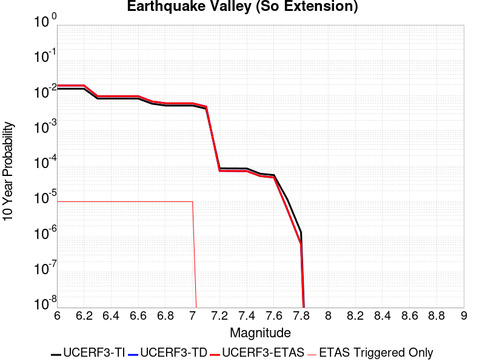 |

| Magnitude | 1 wk TI Prob | 1 wk TD Prob | 1 wk ETAS Prob | 1 wk ETAS/TD Gain | 1 wk ETAS Triggered Only | 1 mo TI Prob | 1 mo TD Prob | 1 mo ETAS Prob | 1 mo ETAS/TD Gain | 1 mo ETAS Triggered Only | 1 yr TI Prob | 1 yr TD Prob | 1 yr ETAS Prob | 1 yr ETAS/TD Gain | 1 yr ETAS Triggered Only | 10 yr TI Prob | 10 yr TD Prob | 10 yr ETAS Prob | 10 yr ETAS/TD Gain | 10 yr ETAS Triggered Only |
|-----|-----|-----|-----|-----|-----|-----|-----|-----|-----|-----|-----|-----|-----|-----|-----|-----|-----|-----|-----|-----|
| 6.0 | 3.0194888E-5 | 3.7075555E-5 | 3.7075555E-5 | 1.0 | 0.0 | 1.2940024E-4 | 1.5888864E-4 | 1.5888864E-4 | 1.0 | 0.0 | 0.0015743093 | 0.0019332969 | 0.0019332969 | 1.0 | 0.0 | 0.01563203 | 0.019214753 | 0.01922456 | 1.0005105 | 1.0E-5 |
| 6.1 | 3.0194888E-5 | 3.7075555E-5 | 3.7075555E-5 | 1.0 | 0.0 | 1.2940024E-4 | 1.5888864E-4 | 1.5888864E-4 | 1.0 | 0.0 | 0.0015743093 | 0.0019332969 | 0.0019332969 | 1.0 | 0.0 | 0.01563203 | 0.019214753 | 0.01922456 | 1.0005105 | 1.0E-5 |
| 6.2 | 3.0194888E-5 | 3.7075555E-5 | 3.7075555E-5 | 1.0 | 0.0 | 1.2940024E-4 | 1.5888864E-4 | 1.5888864E-4 | 1.0 | 0.0 | 0.0015743093 | 0.0019332969 | 0.0019332969 | 1.0 | 0.0 | 0.01563203 | 0.019214753 | 0.01922456 | 1.0005105 | 1.0E-5 |
| 6.3 | 1.5795305E-5 | 1.8447843E-5 | 1.8447843E-5 | 1.0 | 0.0 | 6.769241E-5 | 7.906041E-5 | 7.906041E-5 | 1.0 | 0.0 | 8.238434E-4 | 9.6224673E-4 | 9.6224673E-4 | 1.0 | 0.0 | 0.008207959 | 0.009591714 | 0.009601618 | 1.0010326 | 1.0E-5 |
| 6.4 | 1.5795305E-5 | 1.8447843E-5 | 1.8447843E-5 | 1.0 | 0.0 | 6.769241E-5 | 7.906041E-5 | 7.906041E-5 | 1.0 | 0.0 | 8.238434E-4 | 9.6224673E-4 | 9.6224673E-4 | 1.0 | 0.0 | 0.008207959 | 0.009591714 | 0.009601618 | 1.0010326 | 1.0E-5 |
| 6.5 | 1.5795305E-5 | 1.8447843E-5 | 1.8447843E-5 | 1.0 | 0.0 | 6.769241E-5 | 7.906041E-5 | 7.906041E-5 | 1.0 | 0.0 | 8.238434E-4 | 9.6224673E-4 | 9.6224673E-4 | 1.0 | 0.0 | 0.008207959 | 0.009591714 | 0.009601618 | 1.0010326 | 1.0E-5 |
| 6.6 | 1.5795305E-5 | 1.8447843E-5 | 1.8447843E-5 | 1.0 | 0.0 | 6.769241E-5 | 7.906041E-5 | 7.906041E-5 | 1.0 | 0.0 | 8.238434E-4 | 9.6224673E-4 | 9.6224673E-4 | 1.0 | 0.0 | 0.008207959 | 0.009591714 | 0.009601618 | 1.0010326 | 1.0E-5 |
| 6.7 | 1.1363076E-5 | 1.3139138E-5 | 1.3139138E-5 | 1.0 | 0.0 | 4.8697988E-5 | 5.6309807E-5 | 5.6309807E-5 | 1.0 | 0.0 | 5.927367E-4 | 6.854324E-4 | 6.854324E-4 | 1.0 | 0.0 | 0.0059115817 | 0.006840657 | 0.0068505886 | 1.0014518 | 1.0E-5 |
| 6.8 | 1.0049611E-5 | 1.159507E-5 | 1.159507E-5 | 1.0 | 0.0 | 4.306905E-5 | 4.9692622E-5 | 4.9692622E-5 | 1.0 | 0.0 | 5.242395E-4 | 6.0491293E-4 | 6.0491293E-4 | 1.0 | 0.0 | 0.0052300454 | 0.006039841 | 0.0060497806 | 1.0016457 | 1.0E-5 |
| 6.9 | 1.0049611E-5 | 1.159507E-5 | 1.159507E-5 | 1.0 | 0.0 | 4.306905E-5 | 4.9692622E-5 | 4.9692622E-5 | 1.0 | 0.0 | 5.242395E-4 | 6.0491293E-4 | 6.0491293E-4 | 1.0 | 0.0 | 0.0052300454 | 0.006039841 | 0.0060497806 | 1.0016457 | 1.0E-5 |
| 7.0 | 1.0049611E-5 | 1.159507E-5 | 1.159507E-5 | 1.0 | 0.0 | 4.306905E-5 | 4.9692622E-5 | 4.9692622E-5 | 1.0 | 0.0 | 5.242395E-4 | 6.0491293E-4 | 6.0491293E-4 | 1.0 | 0.0 | 0.0052300454 | 0.006039841 | 0.0060497806 | 1.0016457 | 1.0E-5 |
| 7.1 | 8.140254E-6 | 9.384055E-6 | 9.384055E-6 | 1.0 | 0.0 | 3.4886336E-5 | 4.0217135E-5 | 4.0217135E-5 | 1.0 | 0.0 | 4.2465836E-4 | 4.896007E-4 | 4.896007E-4 | 1.0 | 0.0 | 0.0042384774 | 0.004891798 | 0.004891798 | 1.0 | 0.0 |
| 7.2 | 1.673835E-7 | 1.4155347E-7 | 1.4155347E-7 | 1.0 | 0.0 | 7.173577E-7 | 6.0665764E-7 | 6.0665764E-7 | 1.0 | 0.0 | 8.733795E-6 | 7.386035E-6 | 7.386035E-6 | 1.0 | 0.0 | 8.733451E-5 | 7.385825E-5 | 7.385825E-5 | 1.0 | 0.0 |
| 7.3 | 1.6632116E-7 | 1.4053572E-7 | 1.4053572E-7 | 1.0 | 0.0 | 7.1280476E-7 | 6.022958E-7 | 6.022958E-7 | 1.0 | 0.0 | 8.678364E-6 | 7.3329306E-6 | 7.3329306E-6 | 1.0 | 0.0 | 8.6780245E-5 | 7.332724E-5 | 7.332724E-5 | 1.0 | 0.0 |
| 7.4 | 1.6569169E-7 | 1.3998198E-7 | 1.3998198E-7 | 1.0 | 0.0 | 7.1010703E-7 | 5.999226E-7 | 5.999226E-7 | 1.0 | 0.0 | 8.645519E-6 | 7.304037E-6 | 7.304037E-6 | 1.0 | 0.0 | 8.645182E-5 | 7.3038325E-5 | 7.3038325E-5 | 1.0 | 0.0 |
| 7.5 | 1.1764555E-7 | 1.0096861E-7 | 1.0096861E-7 | 1.0 | 0.0 | 5.041951E-7 | 4.3272254E-7 | 4.3272254E-7 | 1.0 | 0.0 | 6.138558E-6 | 5.2683868E-6 | 5.2683868E-6 | 1.0 | 0.0 | 6.1383886E-5 | 5.268283E-5 | 5.268283E-5 | 1.0 | 0.0 |
| 7.6 | 1.07927605E-7 | 9.261624E-8 | 9.261624E-8 | 1.0 | 0.0 | 4.6254678E-7 | 3.9692668E-7 | 3.9692668E-7 | 1.0 | 0.0 | 5.6314925E-6 | 4.8325737E-6 | 4.8325737E-6 | 1.0 | 0.0 | 5.63135E-5 | 4.83249E-5 | 4.83249E-5 | 1.0 | 0.0 |
| 7.7 | 2.1826905E-8 | 1.1182194E-8 | 1.1182194E-8 | 1.0 | 0.0 | 9.3543875E-8 | 4.7923688E-8 | 4.7923688E-8 | 1.0 | 0.0 | 1.1388961E-6 | 5.834708E-7 | 5.834708E-7 | 1.0 | 0.0 | 1.1388902E-5 | 5.834698E-6 | 5.834698E-6 | 1.0 | 0.0 |
| 7.8 | 2.6169649E-9 | 1.1971231E-9 | 1.1971231E-9 | 1.0 | 0.0 | 1.1215564E-8 | 5.130527E-9 | 5.130527E-9 | 1.0 | 0.0 | 1.3654947E-7 | 6.246417E-8 | 6.246417E-8 | 1.0 | 0.0 | 1.365494E-6 | 6.2464164E-7 | 6.2464164E-7 | 1.0 | 0.0 |

## Emerson-Copper Mtn 2011
*[(top)](#table-of-contents)*

| 1 Week | 1 Month | 1 Year | 10 Year |
|-----|-----|-----|-----|
| 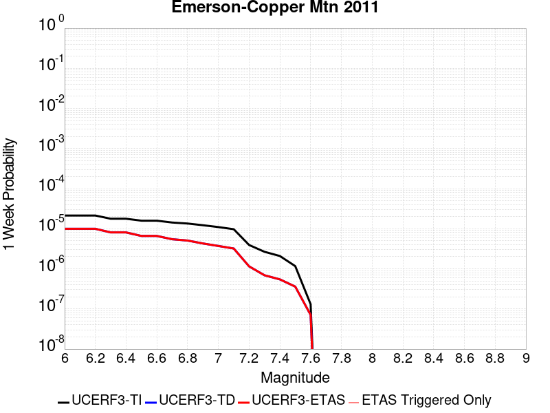 |  | 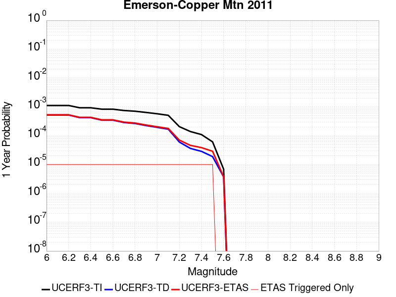 |  |

| Magnitude | 1 wk TI Prob | 1 wk TD Prob | 1 wk ETAS Prob | 1 wk ETAS/TD Gain | 1 wk ETAS Triggered Only | 1 mo TI Prob | 1 mo TD Prob | 1 mo ETAS Prob | 1 mo ETAS/TD Gain | 1 mo ETAS Triggered Only | 1 yr TI Prob | 1 yr TD Prob | 1 yr ETAS Prob | 1 yr ETAS/TD Gain | 1 yr ETAS Triggered Only | 10 yr TI Prob | 10 yr TD Prob | 10 yr ETAS Prob | 10 yr ETAS/TD Gain | 10 yr ETAS Triggered Only |
|-----|-----|-----|-----|-----|-----|-----|-----|-----|-----|-----|-----|-----|-----|-----|-----|-----|-----|-----|-----|-----|
| 6.0 | 2.1364202E-5 | 9.968607E-6 | 9.968607E-6 | 1.0 | 0.0 | 9.1557646E-5 | 4.272195E-5 | 4.272195E-5 | 1.0 | 0.0 | 0.0011141442 | 5.2002433E-4 | 5.300191E-4 | 1.0192199 | 1.0E-5 | 0.011085749 | 0.0051889443 | 0.005198892 | 1.0019171 | 1.0E-5 |
| 6.1 | 2.1364202E-5 | 9.968607E-6 | 9.968607E-6 | 1.0 | 0.0 | 9.1557646E-5 | 4.272195E-5 | 4.272195E-5 | 1.0 | 0.0 | 0.0011141442 | 5.2002433E-4 | 5.300191E-4 | 1.0192199 | 1.0E-5 | 0.011085749 | 0.0051889443 | 0.005198892 | 1.0019171 | 1.0E-5 |
| 6.2 | 2.1364202E-5 | 9.968607E-6 | 9.968607E-6 | 1.0 | 0.0 | 9.1557646E-5 | 4.272195E-5 | 4.272195E-5 | 1.0 | 0.0 | 0.0011141442 | 5.2002433E-4 | 5.300191E-4 | 1.0192199 | 1.0E-5 | 0.011085749 | 0.0051889443 | 0.005198892 | 1.0019171 | 1.0E-5 |
| 6.3 | 1.7751237E-5 | 8.089644E-6 | 8.089644E-6 | 1.0 | 0.0 | 7.607452E-5 | 3.466948E-5 | 3.466948E-5 | 1.0 | 0.0 | 9.258136E-4 | 4.2202545E-4 | 4.3202122E-4 | 1.0236852 | 1.0E-5 | 0.00921966 | 0.004212863 | 0.0042228205 | 1.0023637 | 1.0E-5 |
| 6.4 | 1.7751237E-5 | 8.089644E-6 | 8.089644E-6 | 1.0 | 0.0 | 7.607452E-5 | 3.466948E-5 | 3.466948E-5 | 1.0 | 0.0 | 9.258136E-4 | 4.2202545E-4 | 4.3202122E-4 | 1.0236852 | 1.0E-5 | 0.00921966 | 0.004212863 | 0.0042228205 | 1.0023637 | 1.0E-5 |
| 6.5 | 1.5886664E-5 | 6.6041707E-6 | 6.6041707E-6 | 1.0 | 0.0 | 6.808392E-5 | 2.830331E-5 | 2.830331E-5 | 1.0 | 0.0 | 8.286065E-4 | 3.44543E-4 | 3.5453954E-4 | 1.029014 | 1.0E-5 | 0.008255237 | 0.0034405524 | 0.003450518 | 1.0028965 | 1.0E-5 |
| 6.6 | 1.5886664E-5 | 6.6041707E-6 | 6.6041707E-6 | 1.0 | 0.0 | 6.808392E-5 | 2.830331E-5 | 2.830331E-5 | 1.0 | 0.0 | 8.286065E-4 | 3.44543E-4 | 3.5453954E-4 | 1.029014 | 1.0E-5 | 0.008255237 | 0.0034405524 | 0.003450518 | 1.0028965 | 1.0E-5 |
| 6.7 | 1.428471E-5 | 5.470706E-6 | 5.470706E-6 | 1.0 | 0.0 | 6.121875E-5 | 2.3445695E-5 | 2.3445695E-5 | 1.0 | 0.0 | 7.450834E-4 | 2.854179E-4 | 2.9541503E-4 | 1.0350263 | 1.0E-5 | 0.007425902 | 0.002850901 | 0.0028608725 | 1.0034977 | 1.0E-5 |
| 6.8 | 1.3490684E-5 | 5.0739836E-6 | 5.0739836E-6 | 1.0 | 0.0 | 5.7815934E-5 | 2.1745485E-5 | 2.1745485E-5 | 1.0 | 0.0 | 7.0368167E-4 | 2.64723E-4 | 2.7472034E-4 | 1.0377654 | 1.0E-5 | 0.007014576 | 0.0026444574 | 0.002654431 | 1.0037715 | 1.0E-5 |
| 6.9 | 1.2235421E-5 | 4.289937E-6 | 4.289937E-6 | 1.0 | 0.0 | 5.2436466E-5 | 1.8385334E-5 | 1.8385334E-5 | 1.0 | 0.0 | 6.38227E-4 | 2.2382206E-4 | 2.3381981E-4 | 1.0446683 | 1.0E-5 | 0.0063639707 | 0.0022363206 | 0.0022462984 | 1.0044616 | 1.0E-5 |
| 7.0 | 1.1009851E-5 | 3.7192265E-6 | 3.7192265E-6 | 1.0 | 0.0 | 4.7184225E-5 | 1.5939464E-5 | 1.5939464E-5 | 1.0 | 0.0 | 5.743165E-4 | 1.9404913E-4 | 2.0404719E-4 | 1.0515233 | 1.0E-5 | 0.005728345 | 0.0019391348 | 0.0019491154 | 1.005147 | 1.0E-5 |
| 7.1 | 9.726373E-6 | 3.2120045E-6 | 3.2120045E-6 | 1.0 | 0.0 | 4.168379E-5 | 1.376568E-5 | 1.376568E-5 | 1.0 | 0.0 | 5.07382E-4 | 1.6758764E-4 | 1.7758597E-4 | 1.0596603 | 1.0E-5 | 0.0050622504 | 0.001674944 | 0.0016849271 | 1.0059603 | 1.0E-5 |
| 7.2 | 3.9335127E-6 | 1.1525543E-6 | 1.1525543E-6 | 1.0 | 0.0 | 1.6857803E-5 | 4.9395094E-6 | 4.9395094E-6 | 1.0 | 0.0 | 2.0522442E-4 | 6.013693E-5 | 7.0136324E-5 | 1.1662772 | 1.0E-5 | 0.00205035 | 6.012125E-4 | 6.1120646E-4 | 1.016623 | 1.0E-5 |
| 7.3 | 2.661632E-6 | 6.9119994E-7 | 6.9119994E-7 | 1.0 | 0.0 | 1.14069435E-5 | 2.9622822E-6 | 2.9622822E-6 | 1.0 | 0.0 | 1.3887069E-4 | 3.60652E-5 | 4.6064837E-5 | 1.2772655 | 1.0E-5 | 0.0013878393 | 3.605945E-4 | 3.705909E-4 | 1.027722 | 1.0E-5 |
| 7.4 | 2.0893426E-6 | 5.462232E-7 | 5.462232E-7 | 1.0 | 0.0 | 8.954295E-6 | 2.3409546E-6 | 2.3409546E-6 | 1.0 | 0.0 | 1.0901308E-4 | 2.8500754E-5 | 3.8500468E-5 | 1.350858 | 1.0E-5 | 0.0010895962 | 2.8497152E-4 | 2.9496866E-4 | 1.0350813 | 1.0E-5 |
| 7.5 | 1.1681728E-6 | 3.603269E-7 | 3.603269E-7 | 1.0 | 0.0 | 5.0064455E-6 | 1.5442573E-6 | 1.5442573E-6 | 1.0 | 0.0 | 6.0951766E-5 | 1.8801175E-5 | 2.8800987E-5 | 1.5318717 | 1.0E-5 | 6.093505E-4 | 1.8799631E-4 | 1.9799444E-4 | 1.0531825 | 1.0E-5 |
| 7.6 | 1.3154387E-7 | 7.120002E-8 | 7.120002E-8 | 1.0 | 0.0 | 5.6375933E-7 | 3.0514292E-7 | 3.0514292E-7 | 1.0 | 0.0 | 6.863748E-6 | 3.7151103E-6 | 3.7151103E-6 | 1.0 | 0.0 | 6.863536E-5 | 3.715064E-5 | 3.715064E-5 | 1.0 | 0.0 |

## Fish Slough 2011 CFM
*[(top)](#table-of-contents)*

| 1 Week | 1 Month | 1 Year | 10 Year |
|-----|-----|-----|-----|
|  | 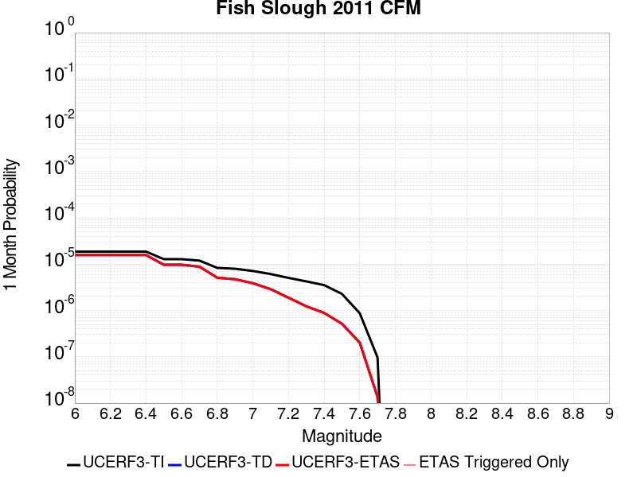 | 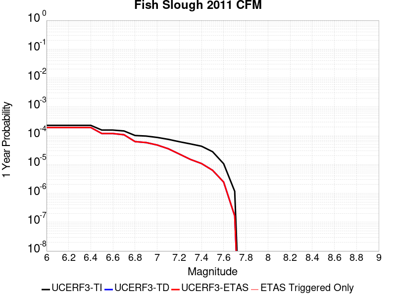 |  |

| Magnitude | 1 wk TI Prob | 1 wk TD Prob | 1 wk ETAS Prob | 1 wk ETAS/TD Gain | 1 wk ETAS Triggered Only | 1 mo TI Prob | 1 mo TD Prob | 1 mo ETAS Prob | 1 mo ETAS/TD Gain | 1 mo ETAS Triggered Only | 1 yr TI Prob | 1 yr TD Prob | 1 yr ETAS Prob | 1 yr ETAS/TD Gain | 1 yr ETAS Triggered Only | 10 yr TI Prob | 10 yr TD Prob | 10 yr ETAS Prob | 10 yr ETAS/TD Gain | 10 yr ETAS Triggered Only |
|-----|-----|-----|-----|-----|-----|-----|-----|-----|-----|-----|-----|-----|-----|-----|-----|-----|-----|-----|-----|-----|
| 6.0 | 4.3629925E-6 | 3.6773613E-6 | 3.6773613E-6 | 1.0 | 0.0 | 1.8698405E-5 | 1.5760037E-5 | 1.5760037E-5 | 1.0 | 0.0 | 2.276293E-4 | 1.9186367E-4 | 1.9186367E-4 | 1.0 | 0.0 | 0.0022739628 | 0.0019171892 | 0.00192717 | 1.005206 | 1.0E-5 |
| 6.1 | 4.3629925E-6 | 3.6773613E-6 | 3.6773613E-6 | 1.0 | 0.0 | 1.8698405E-5 | 1.5760037E-5 | 1.5760037E-5 | 1.0 | 0.0 | 2.276293E-4 | 1.9186367E-4 | 1.9186367E-4 | 1.0 | 0.0 | 0.0022739628 | 0.0019171892 | 0.00192717 | 1.005206 | 1.0E-5 |
| 6.2 | 4.3629925E-6 | 3.6773613E-6 | 3.6773613E-6 | 1.0 | 0.0 | 1.8698405E-5 | 1.5760037E-5 | 1.5760037E-5 | 1.0 | 0.0 | 2.276293E-4 | 1.9186367E-4 | 1.9186367E-4 | 1.0 | 0.0 | 0.0022739628 | 0.0019171892 | 0.00192717 | 1.005206 | 1.0E-5 |
| 6.3 | 4.3629925E-6 | 3.6773613E-6 | 3.6773613E-6 | 1.0 | 0.0 | 1.8698405E-5 | 1.5760037E-5 | 1.5760037E-5 | 1.0 | 0.0 | 2.276293E-4 | 1.9186367E-4 | 1.9186367E-4 | 1.0 | 0.0 | 0.0022739628 | 0.0019171892 | 0.00192717 | 1.005206 | 1.0E-5 |
| 6.4 | 4.3629925E-6 | 3.6773613E-6 | 3.6773613E-6 | 1.0 | 0.0 | 1.8698405E-5 | 1.5760037E-5 | 1.5760037E-5 | 1.0 | 0.0 | 2.276293E-4 | 1.9186367E-4 | 1.9186367E-4 | 1.0 | 0.0 | 0.0022739628 | 0.0019171892 | 0.00192717 | 1.005206 | 1.0E-5 |
| 6.5 | 2.991715E-6 | 2.2704667E-6 | 2.2704667E-6 | 1.0 | 0.0 | 1.2821573E-5 | 9.73054E-6 | 9.73054E-6 | 1.0 | 0.0 | 1.5609147E-4 | 1.184638E-4 | 1.184638E-4 | 1.0 | 0.0 | 0.0015598187 | 0.0011840967 | 0.0011940849 | 1.0084352 | 1.0E-5 |
| 6.6 | 2.991715E-6 | 2.2704667E-6 | 2.2704667E-6 | 1.0 | 0.0 | 1.2821573E-5 | 9.73054E-6 | 9.73054E-6 | 1.0 | 0.0 | 1.5609147E-4 | 1.184638E-4 | 1.184638E-4 | 1.0 | 0.0 | 0.0015598187 | 0.0011840967 | 0.0011940849 | 1.0084352 | 1.0E-5 |
| 6.7 | 2.7890346E-6 | 2.06226E-6 | 2.06226E-6 | 1.0 | 0.0 | 1.1952951E-5 | 8.838232E-6 | 8.838232E-6 | 1.0 | 0.0 | 1.4551746E-4 | 1.0760106E-4 | 1.0760106E-4 | 1.0 | 0.0 | 0.0014542221 | 0.0010755779 | 0.0010855672 | 1.0092874 | 1.0E-5 |
| 6.8 | 1.9416723E-6 | 1.1926206E-6 | 1.1926206E-6 | 1.0 | 0.0 | 8.321425E-6 | 5.1112215E-6 | 5.1112215E-6 | 1.0 | 0.0 | 1.01308644E-4 | 6.222739E-5 | 6.222739E-5 | 1.0 | 0.0 | 0.0010126247 | 6.221037E-4 | 6.320975E-4 | 1.0160645 | 1.0E-5 |
| 6.9 | 1.8567416E-6 | 1.1047609E-6 | 1.1047609E-6 | 1.0 | 0.0 | 7.957439E-6 | 4.734681E-6 | 4.734681E-6 | 1.0 | 0.0 | 9.687752E-5 | 5.764326E-5 | 5.764326E-5 | 1.0 | 0.0 | 9.6835295E-4 | 5.762869E-4 | 5.862812E-4 | 1.0173424 | 1.0E-5 |
| 7.0 | 1.6634067E-6 | 9.0745823E-7 | 9.0745823E-7 | 1.0 | 0.0 | 7.1288664E-6 | 3.889101E-6 | 3.889101E-6 | 1.0 | 0.0 | 8.679049E-5 | 4.7348803E-5 | 4.7348803E-5 | 1.0 | 0.0 | 8.6756604E-4 | 4.7339004E-4 | 4.8338532E-4 | 1.0211142 | 1.0E-5 |
| 7.1 | 1.4281054E-6 | 6.737194E-7 | 6.737194E-7 | 1.0 | 0.0 | 6.1204373E-6 | 2.8873658E-6 | 2.8873658E-6 | 1.0 | 0.0 | 7.451377E-5 | 3.5153127E-5 | 3.5153127E-5 | 1.0 | 0.0 | 7.44888E-4 | 3.5147747E-4 | 3.6147394E-4 | 1.0284413 | 1.0E-5 |
| 7.2 | 1.1810387E-6 | 4.4088682E-7 | 4.4088682E-7 | 1.0 | 0.0 | 5.0615845E-6 | 1.8895137E-6 | 1.8895137E-6 | 1.0 | 0.0 | 6.1623046E-5 | 2.3004595E-5 | 2.3004595E-5 | 1.0 | 0.0 | 6.160596E-4 | 2.3002304E-4 | 2.4002074E-4 | 1.043464 | 1.0E-5 |
| 7.3 | 9.918052E-7 | 2.8738086E-7 | 2.8738086E-7 | 1.0 | 0.0 | 4.2505867E-6 | 1.2316317E-6 | 1.2316317E-6 | 1.0 | 0.0 | 5.1749663E-5 | 1.4995014E-5 | 1.4995014E-5 | 1.0 | 0.0 | 5.173762E-4 | 1.4994014E-4 | 1.5993863E-4 | 1.0666833 | 1.0E-5 |
| 7.4 | 8.25252E-7 | 2.069876E-7 | 2.069876E-7 | 1.0 | 0.0 | 3.5367896E-6 | 8.8708936E-7 | 8.8708936E-7 | 1.0 | 0.0 | 4.3059565E-5 | 1.08002605E-5 | 1.08002605E-5 | 1.0 | 0.0 | 4.305122E-4 | 1.07997424E-4 | 1.17996344E-4 | 1.0925848 | 1.0E-5 |
| 7.5 | 5.3248567E-7 | 1.2075475E-7 | 1.2075475E-7 | 1.0 | 0.0 | 2.2820795E-6 | 5.175203E-7 | 5.175203E-7 | 1.0 | 0.0 | 2.7783964E-5 | 6.3007915E-6 | 6.3007915E-6 | 1.0 | 0.0 | 2.778049E-4 | 6.300617E-5 | 7.300554E-5 | 1.1587046 | 1.0E-5 |
| 7.6 | 2.037542E-7 | 4.7140333E-8 | 4.7140333E-8 | 1.0 | 0.0 | 8.73232E-7 | 2.0202998E-7 | 2.0202998E-7 | 1.0 | 0.0 | 1.0631547E-5 | 2.4597125E-6 | 2.4597125E-6 | 1.0 | 0.0 | 1.0631039E-4 | 2.4596873E-5 | 3.4596625E-5 | 1.4065458 | 1.0E-5 |
| 7.7 | 2.2501226E-8 | 3.152311E-9 | 3.152311E-9 | 1.0 | 0.0 | 9.6433816E-8 | 1.3509904E-8 | 1.3509904E-8 | 1.0 | 0.0 | 1.1740811E-6 | 1.6448307E-7 | 1.6448307E-7 | 1.0 | 0.0 | 1.1740749E-5 | 1.6448297E-6 | 1.6448297E-6 | 1.0 | 0.0 |

## Hayward (No) 2011 CFM
*[(top)](#table-of-contents)*

| 1 Week | 1 Month | 1 Year | 10 Year |
|-----|-----|-----|-----|
|  |  |  | 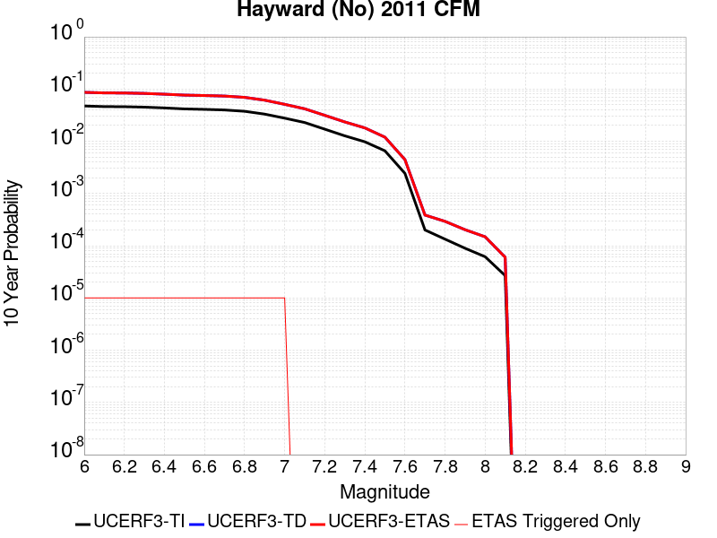 |

| Magnitude | 1 wk TI Prob | 1 wk TD Prob | 1 wk ETAS Prob | 1 wk ETAS/TD Gain | 1 wk ETAS Triggered Only | 1 mo TI Prob | 1 mo TD Prob | 1 mo ETAS Prob | 1 mo ETAS/TD Gain | 1 mo ETAS Triggered Only | 1 yr TI Prob | 1 yr TD Prob | 1 yr ETAS Prob | 1 yr ETAS/TD Gain | 1 yr ETAS Triggered Only | 10 yr TI Prob | 10 yr TD Prob | 10 yr ETAS Prob | 10 yr ETAS/TD Gain | 10 yr ETAS Triggered Only |
|-----|-----|-----|-----|-----|-----|-----|-----|-----|-----|-----|-----|-----|-----|-----|-----|-----|-----|-----|-----|-----|
| 6.0 | 9.3068506E-5 | 1.7401626E-4 | 1.7401626E-4 | 1.0 | 0.0 | 3.9880406E-4 | 7.45564E-4 | 7.5555657E-4 | 1.0134027 | 1.0E-5 | 0.0048446343 | 0.0090394905 | 0.0090494 | 1.0010962 | 1.0E-5 | 0.047403704 | 0.086401954 | 0.086411096 | 1.0001057 | 1.0E-5 |
| 6.1 | 9.055486E-5 | 1.6952872E-4 | 1.6952872E-4 | 1.0 | 0.0 | 3.880345E-4 | 7.263499E-4 | 7.363426E-4 | 1.0137575 | 1.0E-5 | 0.0047140904 | 0.0088075595 | 0.008817472 | 1.0011253 | 1.0E-5 | 0.046153355 | 0.08429499 | 0.08430415 | 1.0001086 | 1.0E-5 |
| 6.2 | 9.006742E-5 | 1.6873449E-4 | 1.6873449E-4 | 1.0 | 0.0 | 3.859461E-4 | 7.2294794E-4 | 7.329407E-4 | 1.0138222 | 1.0E-5 | 0.0046887742 | 0.008766527 | 0.008776439 | 1.0011307 | 1.0E-5 | 0.0459107 | 0.08391918 | 0.08392835 | 1.0001092 | 1.0E-5 |
| 6.3 | 8.8336754E-5 | 1.6553058E-4 | 1.6553058E-4 | 1.0 | 0.0 | 3.7853114E-4 | 7.092247E-4 | 7.1921764E-4 | 1.01409 | 1.0E-5 | 0.004598882 | 0.008600791 | 0.008610705 | 1.0011526 | 1.0E-5 | 0.04504866 | 0.08241233 | 0.08242151 | 1.0001113 | 1.0E-5 |
| 6.4 | 8.526157E-5 | 1.5980033E-4 | 1.5980033E-4 | 1.0 | 0.0 | 3.6535555E-4 | 6.8467954E-4 | 6.946727E-4 | 1.0145954 | 1.0E-5 | 0.0044391346 | 0.008304268 | 0.008314185 | 1.0011942 | 1.0E-5 | 0.043514993 | 0.079709165 | 0.079718366 | 1.0001155 | 1.0E-5 |
| 6.5 | 8.152396E-5 | 1.5312375E-4 | 1.5312375E-4 | 1.0 | 0.0 | 3.493416E-4 | 6.560803E-4 | 6.6607376E-4 | 1.0152321 | 1.0E-5 | 0.0042449418 | 0.00795867 | 0.007968591 | 1.0012465 | 1.0E-5 | 0.04164765 | 0.07653994 | 0.07654917 | 1.0001206 | 1.0E-5 |
| 6.6 | 7.987405E-5 | 1.5016572E-4 | 1.5016572E-4 | 1.0 | 0.0 | 3.4227243E-4 | 6.434093E-4 | 6.534029E-4 | 1.0155323 | 1.0E-5 | 0.0041592065 | 0.007805528 | 0.00781545 | 1.0012711 | 1.0E-5 | 0.04082218 | 0.07513245 | 0.0751417 | 1.0001231 | 1.0E-5 |
| 6.7 | 7.777665E-5 | 1.4655801E-4 | 1.4655801E-4 | 1.0 | 0.0 | 3.332859E-4 | 6.2795525E-4 | 6.37949E-4 | 1.0159147 | 1.0E-5 | 0.004050208 | 0.0076187095 | 0.007628633 | 1.0013026 | 1.0E-5 | 0.039771806 | 0.073408745 | 0.073418014 | 1.0001262 | 1.0E-5 |
| 6.8 | 7.3284005E-5 | 1.3806265E-4 | 1.3806265E-4 | 1.0 | 0.0 | 3.140365E-4 | 5.9156347E-4 | 6.0155755E-4 | 1.0168943 | 1.0E-5 | 0.0038166929 | 0.007178638 | 0.0071885665 | 1.0013831 | 1.0E-5 | 0.037518036 | 0.06932164 | 0.069330946 | 1.0001342 | 1.0E-5 |
| 6.9 | 6.458263E-5 | 1.213658E-4 | 1.213658E-4 | 1.0 | 0.0 | 2.7675333E-4 | 5.20036E-4 | 5.3003075E-4 | 1.0192194 | 1.0E-5 | 0.0033642664 | 0.006313158 | 0.006323095 | 1.001574 | 1.0E-5 | 0.033137884 | 0.061249014 | 0.0612584 | 1.0001533 | 1.0E-5 |
| 7.0 | 5.3853604E-5 | 1.00297824E-4 | 1.00297824E-4 | 1.0 | 0.0 | 2.3078074E-4 | 4.297773E-4 | 4.3977302E-4 | 1.0232579 | 1.0E-5 | 0.0028061352 | 0.005220049 | 0.005229997 | 1.0019057 | 1.0E-5 | 0.027709642 | 0.050980244 | 0.050989736 | 1.0001862 | 1.0E-5 |
| 7.1 | 4.4308683E-5 | 8.174458E-5 | 8.174458E-5 | 1.0 | 0.0 | 1.8988053E-4 | 3.502871E-4 | 3.502871E-4 | 1.0 | 0.0 | 0.0023093442 | 0.0042564473 | 0.0042564473 | 1.0 | 0.0 | 0.022854926 | 0.041843094 | 0.041843094 | 1.0 | 0.0 |
| 7.2 | 3.295973E-5 | 6.080696E-5 | 6.080696E-5 | 1.0 | 0.0 | 1.4124835E-4 | 2.6057535E-4 | 2.6057535E-4 | 1.0 | 0.0 | 0.0017183421 | 0.0031679126 | 0.0031679126 | 1.0 | 0.0 | 0.017051157 | 0.031387255 | 0.031387255 | 1.0 | 0.0 |
| 7.3 | 2.452256E-5 | 4.5212975E-5 | 4.5212975E-5 | 1.0 | 0.0 | 1.05092455E-4 | 1.9375558E-4 | 1.9375558E-4 | 1.0 | 0.0 | 0.0012787496 | 0.0023564359 | 0.0023564359 | 1.0 | 0.0 | 0.0127141625 | 0.023457095 | 0.023457095 | 1.0 | 0.0 |
| 7.4 | 1.8829967E-5 | 3.4632078E-5 | 3.4632078E-5 | 1.0 | 0.0 | 8.069736E-5 | 1.484148E-4 | 1.484148E-4 | 1.0 | 0.0 | 9.820475E-4 | 0.0018054624 | 0.0018054624 | 1.0 | 0.0 | 0.009777189 | 0.018034063 | 0.018034063 | 1.0 | 0.0 |
| 7.5 | 1.26374125E-5 | 2.294429E-5 | 2.294429E-5 | 1.0 | 0.0 | 5.4159216E-5 | 9.8328994E-5 | 9.8328994E-5 | 1.0 | 0.0 | 6.5918895E-4 | 0.0011965039 | 0.0011965039 | 1.0 | 0.0 | 0.00657237 | 0.012000361 | 0.012000361 | 1.0 | 0.0 |
| 7.6 | 4.666429E-6 | 8.4863195E-6 | 8.4863195E-6 | 1.0 | 0.0 | 1.9998828E-5 | 3.636944E-5 | 3.636944E-5 | 1.0 | 0.0 | 2.4345852E-4 | 4.4270922E-4 | 4.4270922E-4 | 1.0 | 0.0 | 0.0024319198 | 0.004462627 | 0.004462627 | 1.0 | 0.0 |
| 7.7 | 3.8399318E-7 | 7.1439723E-7 | 7.1439723E-7 | 1.0 | 0.0 | 1.6456839E-6 | 3.0616989E-6 | 3.0616989E-6 | 1.0 | 0.0 | 2.003602E-5 | 3.7275546E-5 | 3.7275546E-5 | 1.0 | 0.0 | 2.0034213E-4 | 3.8664218E-4 | 3.8664218E-4 | 1.0 | 0.0 |
| 7.8 | 2.5637698E-7 | 5.3749284E-7 | 5.3749284E-7 | 1.0 | 0.0 | 1.098758E-6 | 2.3035386E-6 | 2.3035386E-6 | 1.0 | 0.0 | 1.3377297E-5 | 2.8045222E-5 | 2.8045222E-5 | 1.0 | 0.0 | 1.3376492E-4 | 2.928668E-4 | 2.928668E-4 | 1.0 | 0.0 |
| 7.9 | 1.7141245E-7 | 3.7350853E-7 | 3.7350853E-7 | 1.0 | 0.0 | 7.3462456E-7 | 1.6007498E-6 | 1.6007498E-6 | 1.0 | 0.0 | 8.944017E-6 | 1.9488954E-5 | 1.9488954E-5 | 1.0 | 0.0 | 8.943657E-5 | 2.0274607E-4 | 2.0274607E-4 | 1.0 | 0.0 |
| 8.0 | 1.1808895E-7 | 2.7550982E-7 | 2.7550982E-7 | 1.0 | 0.0 | 5.060954E-7 | 1.1807558E-6 | 1.1807558E-6 | 1.0 | 0.0 | 6.161694E-6 | 1.4375608E-5 | 1.4375608E-5 | 1.0 | 0.0 | 6.161523E-5 | 1.4836188E-4 | 1.4836188E-4 | 1.0 | 0.0 |
| 8.1 | 5.138535E-8 | 1.12452604E-7 | 1.12452604E-7 | 1.0 | 0.0 | 2.2022292E-7 | 4.8193965E-7 | 4.8193965E-7 | 1.0 | 0.0 | 2.6812106E-6 | 5.8675996E-6 | 5.8675996E-6 | 1.0 | 0.0 | 2.6811784E-5 | 6.0233873E-5 | 6.0233873E-5 | 1.0 | 0.0 |

## Sierra Madre
*[(top)](#table-of-contents)*

| 1 Week | 1 Month | 1 Year | 10 Year |
|-----|-----|-----|-----|
|  |  | 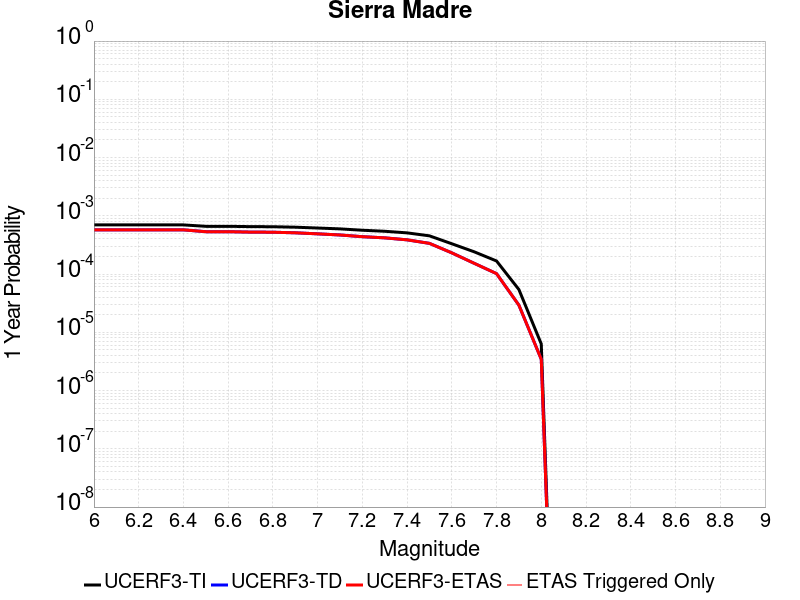 |  |

| Magnitude | 1 wk TI Prob | 1 wk TD Prob | 1 wk ETAS Prob | 1 wk ETAS/TD Gain | 1 wk ETAS Triggered Only | 1 mo TI Prob | 1 mo TD Prob | 1 mo ETAS Prob | 1 mo ETAS/TD Gain | 1 mo ETAS Triggered Only | 1 yr TI Prob | 1 yr TD Prob | 1 yr ETAS Prob | 1 yr ETAS/TD Gain | 1 yr ETAS Triggered Only | 10 yr TI Prob | 10 yr TD Prob | 10 yr ETAS Prob | 10 yr ETAS/TD Gain | 10 yr ETAS Triggered Only |
|-----|-----|-----|-----|-----|-----|-----|-----|-----|-----|-----|-----|-----|-----|-----|-----|-----|-----|-----|-----|-----|
| 6.0 | 1.3379373E-5 | 1.1001808E-5 | 1.1001808E-5 | 1.0 | 0.0 | 5.7338908E-5 | 4.7149762E-5 | 4.7149762E-5 | 1.0 | 0.0 | 6.978776E-4 | 5.738986E-4 | 5.738986E-4 | 1.0 | 0.0 | 0.0069569005 | 0.0057245297 | 0.0057344725 | 1.0017369 | 1.0E-5 |
| 6.1 | 1.3379373E-5 | 1.1001808E-5 | 1.1001808E-5 | 1.0 | 0.0 | 5.7338908E-5 | 4.7149762E-5 | 4.7149762E-5 | 1.0 | 0.0 | 6.978776E-4 | 5.738986E-4 | 5.738986E-4 | 1.0 | 0.0 | 0.0069569005 | 0.0057245297 | 0.0057344725 | 1.0017369 | 1.0E-5 |
| 6.2 | 1.3379373E-5 | 1.1001808E-5 | 1.1001808E-5 | 1.0 | 0.0 | 5.7338908E-5 | 4.7149762E-5 | 4.7149762E-5 | 1.0 | 0.0 | 6.978776E-4 | 5.738986E-4 | 5.738986E-4 | 1.0 | 0.0 | 0.0069569005 | 0.0057245297 | 0.0057344725 | 1.0017369 | 1.0E-5 |
| 6.3 | 1.3379373E-5 | 1.1001808E-5 | 1.1001808E-5 | 1.0 | 0.0 | 5.7338908E-5 | 4.7149762E-5 | 4.7149762E-5 | 1.0 | 0.0 | 6.978776E-4 | 5.738986E-4 | 5.738986E-4 | 1.0 | 0.0 | 0.0069569005 | 0.0057245297 | 0.0057344725 | 1.0017369 | 1.0E-5 |
| 6.4 | 1.3379373E-5 | 1.1001808E-5 | 1.1001808E-5 | 1.0 | 0.0 | 5.7338908E-5 | 4.7149762E-5 | 4.7149762E-5 | 1.0 | 0.0 | 6.978776E-4 | 5.738986E-4 | 5.738986E-4 | 1.0 | 0.0 | 0.0069569005 | 0.0057245297 | 0.0057344725 | 1.0017369 | 1.0E-5 |
| 6.5 | 1.26563245E-5 | 1.0231244E-5 | 1.0231244E-5 | 1.0 | 0.0 | 5.4240263E-5 | 4.3847456E-5 | 4.3847456E-5 | 1.0 | 0.0 | 6.601751E-4 | 5.337131E-4 | 5.337131E-4 | 1.0 | 0.0 | 0.006582173 | 0.005324635 | 0.005324635 | 1.0 | 0.0 |
| 6.6 | 1.26563245E-5 | 1.0231244E-5 | 1.0231244E-5 | 1.0 | 0.0 | 5.4240263E-5 | 4.3847456E-5 | 4.3847456E-5 | 1.0 | 0.0 | 6.601751E-4 | 5.337131E-4 | 5.337131E-4 | 1.0 | 0.0 | 0.006582173 | 0.005324635 | 0.005324635 | 1.0 | 0.0 |
| 6.7 | 1.2502474E-5 | 1.0067383E-5 | 1.0067383E-5 | 1.0 | 0.0 | 5.3580934E-5 | 4.314522E-5 | 4.314522E-5 | 1.0 | 0.0 | 6.521526E-4 | 5.2516756E-4 | 5.2516756E-4 | 1.0 | 0.0 | 0.0065024206 | 0.005239584 | 0.005239584 | 1.0 | 0.0 |
| 6.8 | 1.2454966E-5 | 1.0019668E-5 | 1.0019668E-5 | 1.0 | 0.0 | 5.3377335E-5 | 4.2940734E-5 | 4.2940734E-5 | 1.0 | 0.0 | 6.4967526E-4 | 5.2267907E-4 | 5.2267907E-4 | 1.0 | 0.0 | 0.006477792 | 0.0052148164 | 0.0052148164 | 1.0 | 0.0 |
| 6.9 | 1.2225574E-5 | 9.793639E-6 | 9.793639E-6 | 1.0 | 0.0 | 5.2394265E-5 | 4.1972067E-5 | 4.1972067E-5 | 1.0 | 0.0 | 6.3771347E-4 | 5.1089114E-4 | 5.1089114E-4 | 1.0 | 0.0 | 0.006358865 | 0.005097483 | 0.005097483 | 1.0 | 0.0 |
| 7.0 | 1.182946E-5 | 9.40017E-6 | 9.40017E-6 | 1.0 | 0.0 | 5.06967E-5 | 4.0285828E-5 | 4.0285828E-5 | 1.0 | 0.0 | 6.1705755E-4 | 4.9037056E-4 | 4.9037056E-4 | 1.0 | 0.0 | 0.006153469 | 0.0048931967 | 0.0048931967 | 1.0 | 0.0 |
| 7.1 | 1.14369095E-5 | 8.987161E-6 | 8.987161E-6 | 1.0 | 0.0 | 4.9014405E-5 | 3.851584E-5 | 3.851584E-5 | 1.0 | 0.0 | 5.9658696E-4 | 4.6883043E-4 | 4.6883043E-4 | 1.0 | 0.0 | 0.005949879 | 0.004678719 | 0.004678719 | 1.0 | 0.0 |
| 7.2 | 1.0836419E-5 | 8.400531E-6 | 8.400531E-6 | 1.0 | 0.0 | 4.644097E-5 | 3.6001784E-5 | 3.6001784E-5 | 1.0 | 0.0 | 5.652721E-4 | 4.3823448E-4 | 4.3823448E-4 | 1.0 | 0.0 | 0.0056383642 | 0.0043740002 | 0.0043740002 | 1.0 | 0.0 |
| 7.3 | 1.0403439E-5 | 8.021779E-6 | 8.021779E-6 | 1.0 | 0.0 | 4.4585406E-5 | 3.43786E-5 | 3.43786E-5 | 1.0 | 0.0 | 5.426921E-4 | 4.1848002E-4 | 4.1848002E-4 | 1.0 | 0.0 | 0.005413687 | 0.004177215 | 0.004177215 | 1.0 | 0.0 |
| 7.4 | 9.768864E-6 | 7.41538E-6 | 7.41538E-6 | 1.0 | 0.0 | 4.186589E-5 | 3.177982E-5 | 3.177982E-5 | 1.0 | 0.0 | 5.09598E-4 | 3.868515E-4 | 3.868515E-4 | 1.0 | 0.0 | 0.0050843097 | 0.0038620725 | 0.0038620725 | 1.0 | 0.0 |
| 7.5 | 8.687089E-6 | 6.4509545E-6 | 6.4509545E-6 | 1.0 | 0.0 | 3.722985E-5 | 2.764666E-5 | 2.764666E-5 | 1.0 | 0.0 | 4.5317915E-4 | 3.3654697E-4 | 3.3654697E-4 | 1.0 | 0.0 | 0.004522561 | 0.00336066 | 0.00336066 | 1.0 | 0.0 |
| 7.6 | 6.3506063E-6 | 4.43104E-6 | 4.43104E-6 | 1.0 | 0.0 | 2.72166E-5 | 1.8990035E-5 | 1.8990035E-5 | 1.0 | 0.0 | 3.3131172E-4 | 2.3117941E-4 | 2.3117941E-4 | 1.0 | 0.0 | 0.003308182 | 0.002309614 | 0.002309614 | 1.0 | 0.0 |
| 7.7 | 4.62223E-6 | 2.933639E-6 | 2.933639E-6 | 1.0 | 0.0 | 1.9809406E-5 | 1.2572678E-5 | 1.2572678E-5 | 1.0 | 0.0 | 2.4115283E-4 | 1.5306163E-4 | 1.5306163E-4 | 1.0 | 0.0 | 0.0024089129 | 0.0015297631 | 0.0015297631 | 1.0 | 0.0 |
| 7.8 | 3.2145008E-6 | 1.949923E-6 | 1.949923E-6 | 1.0 | 0.0 | 1.3776359E-5 | 8.356786E-6 | 8.356786E-6 | 1.0 | 0.0 | 1.6771426E-4 | 1.0173913E-4 | 1.0173913E-4 | 1.0 | 0.0 | 0.0016758774 | 0.0010170699 | 0.0010170699 | 1.0 | 0.0 |
| 7.9 | 1.0391769E-6 | 5.604062E-7 | 5.604062E-7 | 1.0 | 0.0 | 4.4536077E-6 | 2.4017386E-6 | 2.4017386E-6 | 1.0 | 0.0 | 5.4221324E-5 | 2.9240779E-5 | 2.9240779E-5 | 1.0 | 0.0 | 5.4208096E-4 | 2.9236975E-4 | 2.9236975E-4 | 1.0 | 0.0 |
| 8.0 | 1.210983E-7 | 6.614873E-8 | 6.614873E-8 | 1.0 | 0.0 | 5.1899264E-7 | 2.8349453E-7 | 2.8349453E-7 | 1.0 | 0.0 | 6.3187167E-6 | 3.4515406E-6 | 3.4515406E-6 | 1.0 | 0.0 | 6.318537E-5 | 3.4514887E-5 | 3.4514887E-5 | 1.0 | 0.0 |

## Sheephole
*[(top)](#table-of-contents)*

| 1 Week | 1 Month | 1 Year | 10 Year |
|-----|-----|-----|-----|
|  |  |  |  |

| Magnitude | 1 wk TI Prob | 1 wk TD Prob | 1 wk ETAS Prob | 1 wk ETAS/TD Gain | 1 wk ETAS Triggered Only | 1 mo TI Prob | 1 mo TD Prob | 1 mo ETAS Prob | 1 mo ETAS/TD Gain | 1 mo ETAS Triggered Only | 1 yr TI Prob | 1 yr TD Prob | 1 yr ETAS Prob | 1 yr ETAS/TD Gain | 1 yr ETAS Triggered Only | 10 yr TI Prob | 10 yr TD Prob | 10 yr ETAS Prob | 10 yr ETAS/TD Gain | 10 yr ETAS Triggered Only |
|-----|-----|-----|-----|-----|-----|-----|-----|-----|-----|-----|-----|-----|-----|-----|-----|-----|-----|-----|-----|-----|
| 6.0 | 4.5579695E-6 | 4.7413387E-6 | 4.7413387E-6 | 1.0 | 0.0 | 1.9534009E-5 | 2.0319896E-5 | 2.0319896E-5 | 1.0 | 0.0 | 2.3780059E-4 | 2.473722E-4 | 2.473722E-4 | 1.0 | 0.0 | 0.0023754628 | 0.0024715126 | 0.002481488 | 1.0040361 | 1.0E-5 |
| 6.1 | 4.5579695E-6 | 4.7413387E-6 | 4.7413387E-6 | 1.0 | 0.0 | 1.9534009E-5 | 2.0319896E-5 | 2.0319896E-5 | 1.0 | 0.0 | 2.3780059E-4 | 2.473722E-4 | 2.473722E-4 | 1.0 | 0.0 | 0.0023754628 | 0.0024715126 | 0.002481488 | 1.0040361 | 1.0E-5 |
| 6.2 | 2.6677674E-6 | 2.7874441E-6 | 2.7874441E-6 | 1.0 | 0.0 | 1.1433239E-5 | 1.194614E-5 | 1.194614E-5 | 1.0 | 0.0 | 1.3919079E-4 | 1.4543562E-4 | 1.4543562E-4 | 1.0 | 0.0 | 0.0013910364 | 0.0014535104 | 0.0014634958 | 1.0068699 | 1.0E-5 |
| 6.3 | 2.6677674E-6 | 2.7874441E-6 | 2.7874441E-6 | 1.0 | 0.0 | 1.1433239E-5 | 1.194614E-5 | 1.194614E-5 | 1.0 | 0.0 | 1.3919079E-4 | 1.4543562E-4 | 1.4543562E-4 | 1.0 | 0.0 | 0.0013910364 | 0.0014535104 | 0.0014634958 | 1.0068699 | 1.0E-5 |
| 6.4 | 2.2159759E-6 | 2.3229234E-6 | 2.3229234E-6 | 1.0 | 0.0 | 9.497005E-6 | 9.955353E-6 | 9.955353E-6 | 1.0 | 0.0 | 1.156199E-4 | 1.2120048E-4 | 1.2120048E-4 | 1.0 | 0.0 | 0.0011555976 | 0.0012114232 | 0.001221411 | 1.0082448 | 1.0E-5 |
| 6.5 | 2.1986082E-6 | 2.3048033E-6 | 2.3048033E-6 | 1.0 | 0.0 | 9.4225725E-6 | 9.877695E-6 | 9.877695E-6 | 1.0 | 0.0 | 1.1471378E-4 | 1.20255114E-4 | 1.20255114E-4 | 1.0 | 0.0 | 0.0011465458 | 0.0012019797 | 0.0012119677 | 1.0083096 | 1.0E-5 |
| 6.6 | 1.5232331E-6 | 1.6019247E-6 | 1.6019247E-6 | 1.0 | 0.0 | 6.5281256E-6 | 6.865375E-6 | 6.865375E-6 | 1.0 | 0.0 | 7.947703E-5 | 8.358292E-5 | 8.358292E-5 | 1.0 | 0.0 | 7.9448614E-4 | 8.355336E-4 | 8.4552524E-4 | 1.0119584 | 1.0E-5 |
| 6.7 | 1.3137362E-6 | 1.3828479E-6 | 1.3828479E-6 | 1.0 | 0.0 | 5.6302856E-6 | 5.9264785E-6 | 5.9264785E-6 | 1.0 | 0.0 | 6.854657E-5 | 7.215263E-5 | 7.215263E-5 | 1.0 | 0.0 | 6.8525434E-4 | 7.2130596E-4 | 7.312987E-4 | 1.0138538 | 1.0E-5 |
| 6.8 | 1.2275751E-6 | 1.2923117E-6 | 1.2923117E-6 | 1.0 | 0.0 | 5.2610258E-6 | 5.538468E-6 | 5.538468E-6 | 1.0 | 0.0 | 6.4051106E-5 | 6.74289E-5 | 6.74289E-5 | 1.0 | 0.0 | 6.4032647E-4 | 6.7409774E-4 | 6.84091E-4 | 1.0148246 | 1.0E-5 |
| 6.9 | 1.1837088E-6 | 1.2461281E-6 | 1.2461281E-6 | 1.0 | 0.0 | 5.0730278E-6 | 5.340539E-6 | 5.340539E-6 | 1.0 | 0.0 | 6.176237E-5 | 6.501925E-5 | 6.501925E-5 | 1.0 | 0.0 | 6.17452E-4 | 6.500155E-4 | 6.60009E-4 | 1.0153743 | 1.0E-5 |
| 7.0 | 9.849371E-7 | 1.0366505E-6 | 1.0366505E-6 | 1.0 | 0.0 | 4.2211523E-6 | 4.4427807E-6 | 4.4427807E-6 | 1.0 | 0.0 | 5.1391315E-5 | 5.4089614E-5 | 5.4089614E-5 | 1.0 | 0.0 | 5.137943E-4 | 5.407746E-4 | 5.5076915E-4 | 1.018482 | 1.0E-5 |
| 7.1 | 8.1643645E-7 | 8.591848E-7 | 8.591848E-7 | 1.0 | 0.0 | 3.4990085E-6 | 3.6822157E-6 | 3.6822157E-6 | 1.0 | 0.0 | 4.2599597E-5 | 4.4830143E-5 | 4.4830143E-5 | 1.0 | 0.0 | 4.259143E-4 | 4.4821962E-4 | 4.5821513E-4 | 1.0223005 | 1.0E-5 |
| 7.2 | 5.7295756E-7 | 6.0296276E-7 | 6.0296276E-7 | 1.0 | 0.0 | 2.45553E-6 | 2.5841239E-6 | 2.5841239E-6 | 1.0 | 0.0 | 2.9895667E-5 | 3.146132E-5 | 3.146132E-5 | 1.0 | 0.0 | 2.9891645E-4 | 3.1457536E-4 | 3.2457223E-4 | 1.0317789 | 1.0E-5 |

## Earthquake Valley (No  Extension)
*[(top)](#table-of-contents)*

| 1 Week | 1 Month | 1 Year | 10 Year |
|-----|-----|-----|-----|
|  | 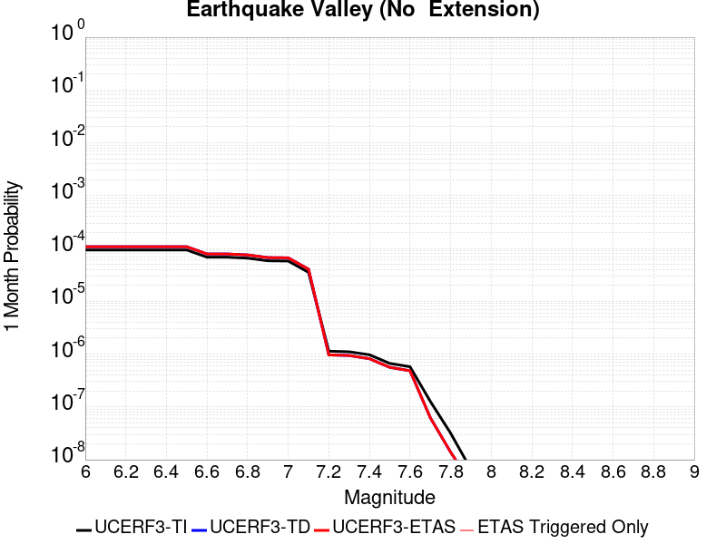 | 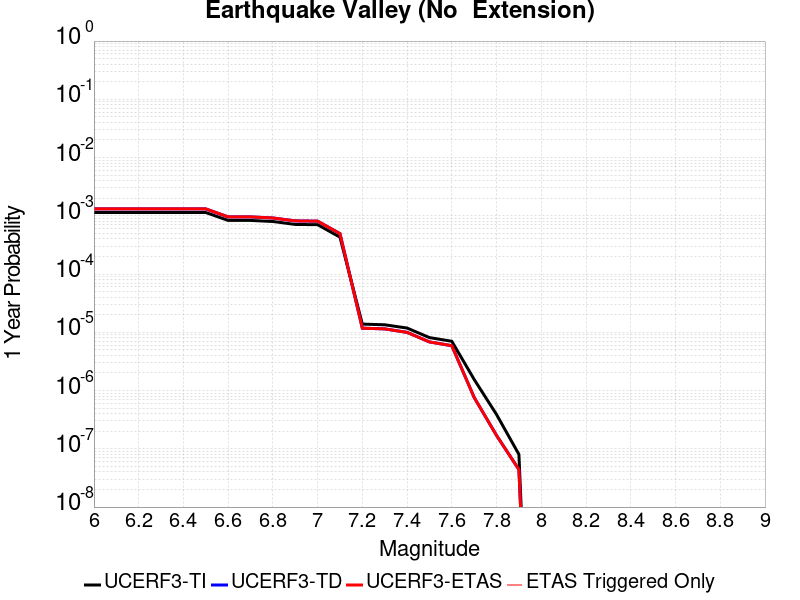 | 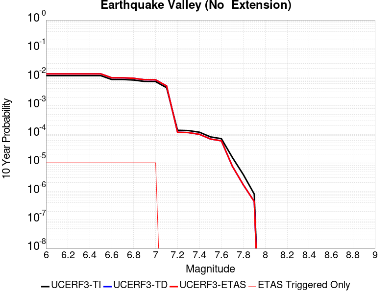 |

| Magnitude | 1 wk TI Prob | 1 wk TD Prob | 1 wk ETAS Prob | 1 wk ETAS/TD Gain | 1 wk ETAS Triggered Only | 1 mo TI Prob | 1 mo TD Prob | 1 mo ETAS Prob | 1 mo ETAS/TD Gain | 1 mo ETAS Triggered Only | 1 yr TI Prob | 1 yr TD Prob | 1 yr ETAS Prob | 1 yr ETAS/TD Gain | 1 yr ETAS Triggered Only | 10 yr TI Prob | 10 yr TD Prob | 10 yr ETAS Prob | 10 yr ETAS/TD Gain | 10 yr ETAS Triggered Only |
|-----|-----|-----|-----|-----|-----|-----|-----|-----|-----|-----|-----|-----|-----|-----|-----|-----|-----|-----|-----|-----|
| 6.0 | 2.1859703E-5 | 2.5199935E-5 | 2.5199935E-5 | 1.0 | 0.0 | 9.3681076E-5 | 1.0799607E-4 | 1.0799607E-4 | 1.0 | 0.0 | 0.0011399703 | 0.0013142041 | 0.0013142041 | 1.0 | 0.0 | 0.011341401 | 0.013078684 | 0.013088553 | 1.0007546 | 1.0E-5 |
| 6.1 | 2.1859703E-5 | 2.5199935E-5 | 2.5199935E-5 | 1.0 | 0.0 | 9.3681076E-5 | 1.0799607E-4 | 1.0799607E-4 | 1.0 | 0.0 | 0.0011399703 | 0.0013142041 | 0.0013142041 | 1.0 | 0.0 | 0.011341401 | 0.013078684 | 0.013088553 | 1.0007546 | 1.0E-5 |
| 6.2 | 2.1859703E-5 | 2.5199935E-5 | 2.5199935E-5 | 1.0 | 0.0 | 9.3681076E-5 | 1.0799607E-4 | 1.0799607E-4 | 1.0 | 0.0 | 0.0011399703 | 0.0013142041 | 0.0013142041 | 1.0 | 0.0 | 0.011341401 | 0.013078684 | 0.013088553 | 1.0007546 | 1.0E-5 |
| 6.3 | 2.1859703E-5 | 2.5199935E-5 | 2.5199935E-5 | 1.0 | 0.0 | 9.3681076E-5 | 1.0799607E-4 | 1.0799607E-4 | 1.0 | 0.0 | 0.0011399703 | 0.0013142041 | 0.0013142041 | 1.0 | 0.0 | 0.011341401 | 0.013078684 | 0.013088553 | 1.0007546 | 1.0E-5 |
| 6.4 | 2.1859703E-5 | 2.5199935E-5 | 2.5199935E-5 | 1.0 | 0.0 | 9.3681076E-5 | 1.0799607E-4 | 1.0799607E-4 | 1.0 | 0.0 | 0.0011399703 | 0.0013142041 | 0.0013142041 | 1.0 | 0.0 | 0.011341401 | 0.013078684 | 0.013088553 | 1.0007546 | 1.0E-5 |
| 6.5 | 2.1859703E-5 | 2.5199935E-5 | 2.5199935E-5 | 1.0 | 0.0 | 9.3681076E-5 | 1.0799607E-4 | 1.0799607E-4 | 1.0 | 0.0 | 0.0011399703 | 0.0013142041 | 0.0013142041 | 1.0 | 0.0 | 0.011341401 | 0.013078684 | 0.013088553 | 1.0007546 | 1.0E-5 |
| 6.6 | 1.597E-5 | 1.835741E-5 | 1.835741E-5 | 1.0 | 0.0 | 6.8441055E-5 | 7.867273E-5 | 7.867273E-5 | 1.0 | 0.0 | 8.329513E-4 | 9.5750694E-4 | 9.5750694E-4 | 1.0 | 0.0 | 0.008298361 | 0.009542423 | 0.009552328 | 1.001038 | 1.0E-5 |
| 6.7 | 1.597E-5 | 1.835741E-5 | 1.835741E-5 | 1.0 | 0.0 | 6.8441055E-5 | 7.867273E-5 | 7.867273E-5 | 1.0 | 0.0 | 8.329513E-4 | 9.5750694E-4 | 9.5750694E-4 | 1.0 | 0.0 | 0.008298361 | 0.009542423 | 0.009552328 | 1.001038 | 1.0E-5 |
| 6.8 | 1.5315149E-5 | 1.760318E-5 | 1.760318E-5 | 1.0 | 0.0 | 6.5634704E-5 | 7.544051E-5 | 7.544051E-5 | 1.0 | 0.0 | 7.988095E-4 | 9.181879E-4 | 9.181879E-4 | 1.0 | 0.0 | 0.007959441 | 0.009152483 | 0.009162392 | 1.0010827 | 1.0E-5 |
| 6.9 | 1.3634728E-5 | 1.5676798E-5 | 1.5676798E-5 | 1.0 | 0.0 | 5.8433237E-5 | 6.7185014E-5 | 6.7185014E-5 | 1.0 | 0.0 | 7.1119244E-4 | 8.177526E-4 | 8.177526E-4 | 1.0 | 0.0 | 0.007089207 | 0.008155507 | 0.008165426 | 1.0012162 | 1.0E-5 |
| 7.0 | 1.3496271E-5 | 1.551882E-5 | 1.551882E-5 | 1.0 | 0.0 | 5.783988E-5 | 6.6508E-5 | 6.6508E-5 | 1.0 | 0.0 | 7.03973E-4 | 8.095162E-4 | 8.095162E-4 | 1.0 | 0.0 | 0.007017471 | 0.0080737425 | 0.008083662 | 1.0012286 | 1.0E-5 |
| 7.1 | 8.242798E-6 | 9.473205E-6 | 9.473205E-6 | 1.0 | 0.0 | 3.53258E-5 | 4.0599196E-5 | 4.0599196E-5 | 1.0 | 0.0 | 4.300067E-4 | 4.942502E-4 | 4.942502E-4 | 1.0 | 0.0 | 0.004291756 | 0.004938087 | 0.004938087 | 1.0 | 0.0 |
| 7.2 | 2.6506527E-7 | 2.2562271E-7 | 2.2562271E-7 | 1.0 | 0.0 | 1.1359936E-6 | 9.669541E-7 | 9.669541E-7 | 1.0 | 0.0 | 1.3830633E-5 | 1.1772607E-5 | 1.1772607E-5 | 1.0 | 0.0 | 1.3829772E-4 | 1.1772025E-4 | 1.1772025E-4 | 1.0 | 0.0 |
| 7.3 | 2.5810488E-7 | 2.1957378E-7 | 2.1957378E-7 | 1.0 | 0.0 | 1.1061633E-6 | 9.410302E-7 | 9.410302E-7 | 1.0 | 0.0 | 1.3467455E-5 | 1.1456986E-5 | 1.1456986E-5 | 1.0 | 0.0 | 1.3466639E-4 | 1.1456437E-4 | 1.1456437E-4 | 1.0 | 0.0 |
| 7.4 | 2.2676066E-7 | 1.9112461E-7 | 1.9112461E-7 | 1.0 | 0.0 | 9.71831E-7 | 8.1910525E-7 | 8.1910525E-7 | 1.0 | 0.0 | 1.1831979E-5 | 9.972565E-6 | 9.972565E-6 | 1.0 | 0.0 | 1.1831349E-4 | 9.972156E-5 | 9.972156E-5 | 1.0 | 0.0 |
| 7.5 | 1.5553917E-7 | 1.3113615E-7 | 1.3113615E-7 | 1.0 | 0.0 | 6.6659624E-7 | 5.6201196E-7 | 5.6201196E-7 | 1.0 | 0.0 | 8.115779E-6 | 6.8424765E-6 | 6.8424765E-6 | 1.0 | 0.0 | 8.115482E-5 | 6.842287E-5 | 6.842287E-5 | 1.0 | 0.0 |
| 7.6 | 1.3448629E-7 | 1.1289769E-7 | 1.1289769E-7 | 1.0 | 0.0 | 5.7636964E-7 | 4.8384715E-7 | 4.8384715E-7 | 1.0 | 0.0 | 7.017278E-6 | 5.8908254E-6 | 5.8908254E-6 | 1.0 | 0.0 | 7.0170565E-5 | 5.8906906E-5 | 5.8906906E-5 | 1.0 | 0.0 |
| 7.7 | 2.9719402E-8 | 1.4584255E-8 | 1.4584255E-8 | 1.0 | 0.0 | 1.2736886E-7 | 6.250395E-8 | 6.250395E-8 | 1.0 | 0.0 | 1.5507147E-6 | 7.6098536E-7 | 7.6098536E-7 | 1.0 | 0.0 | 1.550704E-5 | 7.609833E-6 | 7.609833E-6 | 1.0 | 0.0 |
| 7.8 | 7.4390196E-9 | 3.2506848E-9 | 3.2506848E-9 | 1.0 | 0.0 | 3.1881513E-8 | 1.3931507E-8 | 1.3931507E-8 | 1.0 | 0.0 | 3.8815733E-7 | 1.6961607E-7 | 1.6961607E-7 | 1.0 | 0.0 | 3.8815665E-6 | 1.6961598E-6 | 1.6961598E-6 | 1.0 | 0.0 |
| 7.9 | 1.5373532E-9 | 8.441028E-10 | 8.441028E-10 | 1.0 | 0.0 | 6.5886567E-9 | 3.6175836E-9 | 3.6175836E-9 | 1.0 | 0.0 | 8.021689E-8 | 4.404408E-8 | 4.404408E-8 | 1.0 | 0.0 | 8.0216864E-7 | 4.4044077E-7 | 4.4044077E-7 | 1.0 | 0.0 |

## San Gregorio (South) 2011 CFM
*[(top)](#table-of-contents)*

| 1 Week | 1 Month | 1 Year | 10 Year |
|-----|-----|-----|-----|
|  |  |  |  |

| Magnitude | 1 wk TI Prob | 1 wk TD Prob | 1 wk ETAS Prob | 1 wk ETAS/TD Gain | 1 wk ETAS Triggered Only | 1 mo TI Prob | 1 mo TD Prob | 1 mo ETAS Prob | 1 mo ETAS/TD Gain | 1 mo ETAS Triggered Only | 1 yr TI Prob | 1 yr TD Prob | 1 yr ETAS Prob | 1 yr ETAS/TD Gain | 1 yr ETAS Triggered Only | 10 yr TI Prob | 10 yr TD Prob | 10 yr ETAS Prob | 10 yr ETAS/TD Gain | 10 yr ETAS Triggered Only |
|-----|-----|-----|-----|-----|-----|-----|-----|-----|-----|-----|-----|-----|-----|-----|-----|-----|-----|-----|-----|-----|
| 6.0 | 1.8770423E-5 | 1.6281734E-5 | 1.6281734E-5 | 1.0 | 0.0 | 8.044219E-5 | 6.9777016E-5 | 6.9777016E-5 | 1.0 | 0.0 | 9.789435E-4 | 8.4920786E-4 | 8.591994E-4 | 1.0117657 | 1.0E-5 | 0.009746423 | 0.008472349 | 0.008482263 | 1.0011703 | 1.0E-5 |
| 6.1 | 1.8770423E-5 | 1.6281734E-5 | 1.6281734E-5 | 1.0 | 0.0 | 8.044219E-5 | 6.9777016E-5 | 6.9777016E-5 | 1.0 | 0.0 | 9.789435E-4 | 8.4920786E-4 | 8.591994E-4 | 1.0117657 | 1.0E-5 | 0.009746423 | 0.008472349 | 0.008482263 | 1.0011703 | 1.0E-5 |
| 6.2 | 1.7508692E-5 | 1.49011885E-5 | 1.49011885E-5 | 1.0 | 0.0 | 7.5035096E-5 | 6.386069E-5 | 6.386069E-5 | 1.0 | 0.0 | 9.1316935E-4 | 7.7722955E-4 | 7.7722955E-4 | 1.0 | 0.0 | 0.00909426 | 0.0077577503 | 0.0077577503 | 1.0 | 0.0 |
| 6.3 | 1.7508692E-5 | 1.49011885E-5 | 1.49011885E-5 | 1.0 | 0.0 | 7.5035096E-5 | 6.386069E-5 | 6.386069E-5 | 1.0 | 0.0 | 9.1316935E-4 | 7.7722955E-4 | 7.7722955E-4 | 1.0 | 0.0 | 0.00909426 | 0.0077577503 | 0.0077577503 | 1.0 | 0.0 |
| 6.4 | 1.6004591E-5 | 1.3250962E-5 | 1.3250962E-5 | 1.0 | 0.0 | 6.85893E-5 | 5.6788605E-5 | 5.6788605E-5 | 1.0 | 0.0 | 8.347548E-4 | 6.9118297E-4 | 6.9118297E-4 | 1.0 | 0.0 | 0.008316261 | 0.006902769 | 0.006902769 | 1.0 | 0.0 |
| 6.5 | 1.6004591E-5 | 1.3250962E-5 | 1.3250962E-5 | 1.0 | 0.0 | 6.85893E-5 | 5.6788605E-5 | 5.6788605E-5 | 1.0 | 0.0 | 8.347548E-4 | 6.9118297E-4 | 6.9118297E-4 | 1.0 | 0.0 | 0.008316261 | 0.006902769 | 0.006902769 | 1.0 | 0.0 |
| 6.6 | 1.5442201E-5 | 1.263557E-5 | 1.263557E-5 | 1.0 | 0.0 | 6.617918E-5 | 5.4151322E-5 | 5.4151322E-5 | 1.0 | 0.0 | 8.0543366E-4 | 6.590938E-4 | 6.590938E-4 | 1.0 | 0.0 | 0.008025207 | 0.006583809 | 0.006583809 | 1.0 | 0.0 |
| 6.7 | 1.489921E-5 | 1.2044058E-5 | 1.2044058E-5 | 1.0 | 0.0 | 6.3852196E-5 | 5.1616375E-5 | 5.1616375E-5 | 1.0 | 0.0 | 7.7712315E-4 | 6.2824885E-4 | 6.2824885E-4 | 1.0 | 0.0 | 0.0077441116 | 0.006277132 | 0.006277132 | 1.0 | 0.0 |
| 6.8 | 1.3876024E-5 | 1.0922966E-5 | 1.0922966E-5 | 1.0 | 0.0 | 5.9467322E-5 | 4.681187E-5 | 4.681187E-5 | 1.0 | 0.0 | 7.237741E-4 | 5.697858E-4 | 5.697858E-4 | 1.0 | 0.0 | 0.0072142133 | 0.0056956187 | 0.0056956187 | 1.0 | 0.0 |
| 6.9 | 1.33922495E-5 | 1.03944485E-5 | 1.03944485E-5 | 1.0 | 0.0 | 5.7394092E-5 | 4.4546876E-5 | 4.4546876E-5 | 1.0 | 0.0 | 6.9854903E-4 | 5.422235E-4 | 5.422235E-4 | 1.0 | 0.0 | 0.0069635725 | 0.0054213665 | 0.0054213665 | 1.0 | 0.0 |
| 7.0 | 1.2807324E-5 | 9.754385E-6 | 9.754385E-6 | 1.0 | 0.0 | 5.4887376E-5 | 4.180384E-5 | 4.180384E-5 | 1.0 | 0.0 | 6.680489E-4 | 5.088431E-4 | 5.088431E-4 | 1.0 | 0.0 | 0.006660442 | 0.0050891326 | 0.0050891326 | 1.0 | 0.0 |
| 7.1 | 1.2191438E-5 | 9.063239E-6 | 9.063239E-6 | 1.0 | 0.0 | 5.224797E-5 | 3.8841874E-5 | 3.8841874E-5 | 1.0 | 0.0 | 6.3593336E-4 | 4.727973E-4 | 4.727973E-4 | 1.0 | 0.0 | 0.0063411663 | 0.004730259 | 0.004730259 | 1.0 | 0.0 |
| 7.2 | 1.1769438E-5 | 8.583407E-6 | 8.583407E-6 | 1.0 | 0.0 | 5.0439474E-5 | 3.678551E-5 | 3.678551E-5 | 1.0 | 0.0 | 6.1392755E-4 | 4.4777163E-4 | 4.4777163E-4 | 1.0 | 0.0 | 0.0061223423 | 0.004481038 | 0.004481038 | 1.0 | 0.0 |
| 7.3 | 1.150374E-5 | 8.298827E-6 | 8.298827E-6 | 1.0 | 0.0 | 4.9300812E-5 | 3.5565918E-5 | 3.5565918E-5 | 1.0 | 0.0 | 6.0007203E-4 | 4.3292905E-4 | 4.3292905E-4 | 1.0 | 0.0 | 0.0059845424 | 0.0043331822 | 0.0043331822 | 1.0 | 0.0 |
| 7.4 | 1.12514E-5 | 8.044539E-6 | 8.044539E-6 | 1.0 | 0.0 | 4.8219394E-5 | 3.447614E-5 | 3.447614E-5 | 1.0 | 0.0 | 5.8691297E-4 | 4.196662E-4 | 4.196662E-4 | 1.0 | 0.0 | 0.005853653 | 0.0042010495 | 0.0042010495 | 1.0 | 0.0 |
| 7.5 | 1.059696E-5 | 7.394808E-6 | 7.394808E-6 | 1.0 | 0.0 | 4.5414752E-5 | 3.169165E-5 | 3.169165E-5 | 1.0 | 0.0 | 5.5278436E-4 | 3.857776E-4 | 3.857776E-4 | 1.0 | 0.0 | 0.0055141128 | 0.0038633267 | 0.0038633267 | 1.0 | 0.0 |
| 7.6 | 9.018592E-6 | 5.8384994E-6 | 5.8384994E-6 | 1.0 | 0.0 | 3.8650534E-5 | 2.5021902E-5 | 2.5021902E-5 | 1.0 | 0.0 | 4.7046866E-4 | 3.045991E-4 | 3.045991E-4 | 1.0 | 0.0 | 0.004694739 | 0.0030536854 | 0.0030536854 | 1.0 | 0.0 |
| 7.7 | 6.243489E-6 | 3.240805E-6 | 3.240805E-6 | 1.0 | 0.0 | 2.6757538E-5 | 1.388909E-5 | 1.388909E-5 | 1.0 | 0.0 | 3.257243E-4 | 1.6908656E-4 | 1.6908656E-4 | 1.0 | 0.0 | 0.003252473 | 0.0016997742 | 0.0016997742 | 1.0 | 0.0 |
| 7.8 | 3.1941963E-6 | 1.381781E-6 | 1.381781E-6 | 1.0 | 0.0 | 1.368934E-5 | 5.921905E-6 | 5.921905E-6 | 1.0 | 0.0 | 1.6665498E-4 | 7.209681E-5 | 7.209681E-5 | 1.0 | 0.0 | 0.0016653005 | 7.267328E-4 | 7.267328E-4 | 1.0 | 0.0 |
| 7.9 | 2.0098398E-6 | 6.922003E-7 | 6.922003E-7 | 1.0 | 0.0 | 8.6135715E-6 | 2.966569E-6 | 2.966569E-6 | 1.0 | 0.0 | 1.0486518E-4 | 3.611738E-5 | 3.611738E-5 | 1.0 | 0.0 | 0.0010481571 | 3.6603567E-4 | 3.6603567E-4 | 1.0 | 0.0 |
| 8.0 | 8.353119E-7 | 3.16504E-7 | 3.16504E-7 | 1.0 | 0.0 | 3.579903E-6 | 1.3564451E-6 | 1.3564451E-6 | 1.0 | 0.0 | 4.358445E-5 | 1.6514594E-5 | 1.6514594E-5 | 1.0 | 0.0 | 4.3575902E-4 | 1.6633431E-4 | 1.6633431E-4 | 1.0 | 0.0 |
| 8.1 | 1.5033264E-7 | 6.532317E-8 | 6.532317E-8 | 1.0 | 0.0 | 6.442826E-7 | 2.7995642E-7 | 2.7995642E-7 | 1.0 | 0.0 | 7.844113E-6 | 3.4084642E-6 | 3.4084642E-6 | 1.0 | 0.0 | 7.843835E-5 | 3.4101427E-5 | 3.4101427E-5 | 1.0 | 0.0 |

## Mission (connected) 2011 CFM
*[(top)](#table-of-contents)*

| 1 Week | 1 Month | 1 Year | 10 Year |
|-----|-----|-----|-----|
| 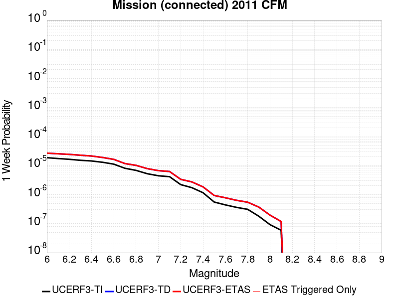 |  | 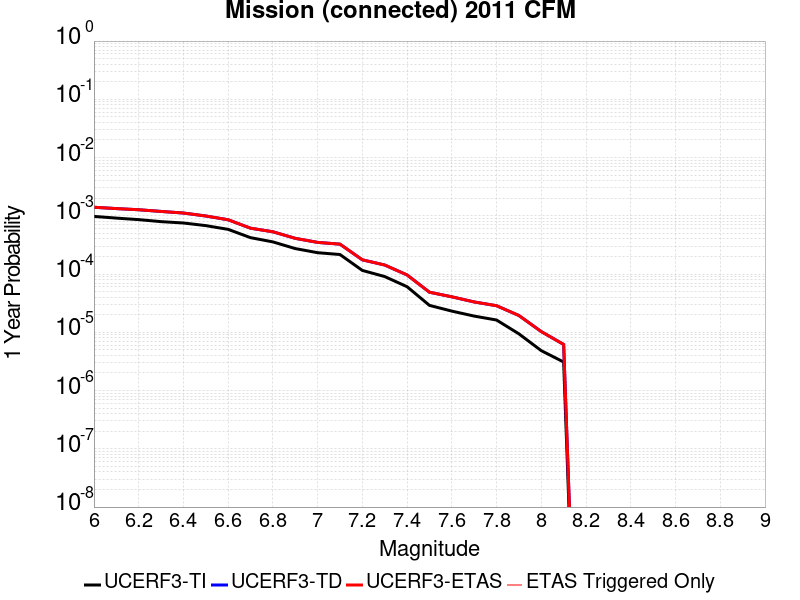 |  |

| Magnitude | 1 wk TI Prob | 1 wk TD Prob | 1 wk ETAS Prob | 1 wk ETAS/TD Gain | 1 wk ETAS Triggered Only | 1 mo TI Prob | 1 mo TD Prob | 1 mo ETAS Prob | 1 mo ETAS/TD Gain | 1 mo ETAS Triggered Only | 1 yr TI Prob | 1 yr TD Prob | 1 yr ETAS Prob | 1 yr ETAS/TD Gain | 1 yr ETAS Triggered Only | 10 yr TI Prob | 10 yr TD Prob | 10 yr ETAS Prob | 10 yr ETAS/TD Gain | 10 yr ETAS Triggered Only |
|-----|-----|-----|-----|-----|-----|-----|-----|-----|-----|-----|-----|-----|-----|-----|-----|-----|-----|-----|-----|-----|
| 6.0 | 1.8735573E-5 | 2.6889906E-5 | 2.6889906E-5 | 1.0 | 0.0 | 8.029284E-5 | 1.1523693E-4 | 1.1523693E-4 | 1.0 | 0.0 | 9.771269E-4 | 0.0014020399 | 0.0014020399 | 1.0 | 0.0 | 0.009728416 | 0.013941155 | 0.013951016 | 1.0007073 | 1.0E-5 |
| 6.1 | 1.7515964E-5 | 2.553112E-5 | 2.553112E-5 | 1.0 | 0.0 | 7.506625E-5 | 1.0941406E-4 | 1.0941406E-4 | 1.0 | 0.0 | 9.135484E-4 | 0.0013312349 | 0.0013312349 | 1.0 | 0.0 | 0.009098019 | 0.013241731 | 0.013251598 | 1.0007452 | 1.0E-5 |
| 6.2 | 1.6486343E-5 | 2.437572E-5 | 2.437572E-5 | 1.0 | 0.0 | 7.065384E-5 | 1.0446274E-4 | 1.0446274E-4 | 1.0 | 0.0 | 8.5987104E-4 | 0.0012710263 | 0.0012710263 | 1.0 | 0.0 | 0.008565514 | 0.01264668 | 0.012656554 | 1.0007807 | 1.0E-5 |
| 6.3 | 1.5229385E-5 | 2.2805043E-5 | 2.2805043E-5 | 1.0 | 0.0 | 6.526716E-5 | 9.773179E-5 | 9.773179E-5 | 1.0 | 0.0 | 7.9433795E-4 | 0.0011891696 | 0.0011891696 | 1.0 | 0.0 | 0.007915046 | 0.011839825 | 0.011849707 | 1.0008346 | 1.0E-5 |
| 6.4 | 1.4435828E-5 | 2.1404865E-5 | 2.1404865E-5 | 1.0 | 0.0 | 6.186637E-5 | 9.173146E-5 | 9.173146E-5 | 1.0 | 0.0 | 7.529627E-4 | 0.0011161945 | 0.0011161945 | 1.0 | 0.0 | 0.007504165 | 0.011122708 | 0.011132597 | 1.0008891 | 1.0E-5 |
| 6.5 | 1.30127955E-5 | 1.9043415E-5 | 1.9043415E-5 | 1.0 | 0.0 | 5.576793E-5 | 8.16121E-5 | 8.16121E-5 | 1.0 | 0.0 | 6.78763E-4 | 9.931134E-4 | 9.931134E-4 | 1.0 | 0.0 | 0.0067669353 | 0.009914661 | 0.009924562 | 1.0009986 | 1.0E-5 |
| 6.6 | 1.1220718E-5 | 1.6399235E-5 | 1.6399235E-5 | 1.0 | 0.0 | 4.8087906E-5 | 7.0280556E-5 | 7.0280556E-5 | 1.0 | 0.0 | 5.8531296E-4 | 8.553277E-4 | 8.553277E-4 | 1.0 | 0.0 | 0.005837737 | 0.008552561 | 0.008562475 | 1.0011592 | 1.0E-5 |
| 6.7 | 8.086152E-6 | 1.1755167E-5 | 1.1755167E-5 | 1.0 | 0.0 | 3.4654473E-5 | 5.037832E-5 | 5.037832E-5 | 1.0 | 0.0 | 4.2183654E-4 | 6.1318424E-4 | 6.1318424E-4 | 1.0 | 0.0 | 0.004210367 | 0.0061522066 | 0.006162145 | 1.0016154 | 1.0E-5 |
| 6.8 | 6.8361655E-6 | 1.0199722E-5 | 1.0199722E-5 | 1.0 | 0.0 | 2.9297524E-5 | 4.3712364E-5 | 4.3712364E-5 | 1.0 | 0.0 | 3.5663895E-4 | 5.320687E-4 | 5.320687E-4 | 1.0 | 0.0 | 0.0035606713 | 0.0053409 | 0.0053508463 | 1.0018623 | 1.0E-5 |
| 6.9 | 5.2517353E-6 | 7.872392E-6 | 7.872392E-6 | 1.0 | 0.0 | 2.2507242E-5 | 3.373839E-5 | 3.373839E-5 | 1.0 | 0.0 | 2.739912E-4 | 4.1068773E-4 | 4.1068773E-4 | 1.0 | 0.0 | 0.0027365363 | 0.004131531 | 0.004131531 | 1.0 | 0.0 |
| 7.0 | 4.4602784E-6 | 6.704613E-6 | 6.704613E-6 | 1.0 | 0.0 | 1.911534E-5 | 2.873374E-5 | 2.873374E-5 | 1.0 | 0.0 | 2.327044E-4 | 3.4977729E-4 | 3.4977729E-4 | 1.0 | 0.0 | 0.0023246086 | 0.0035236846 | 0.0035236846 | 1.0 | 0.0 |
| 7.1 | 4.1492594E-6 | 6.253256E-6 | 6.253256E-6 | 1.0 | 0.0 | 1.7782419E-5 | 2.6799393E-5 | 2.6799393E-5 | 1.0 | 0.0 | 2.1647944E-4 | 3.2623392E-4 | 3.2623392E-4 | 1.0 | 0.0 | 0.0021626868 | 0.0032884376 | 0.0032884376 | 1.0 | 0.0 |
| 7.2 | 2.213247E-6 | 3.3650883E-6 | 3.3650883E-6 | 1.0 | 0.0 | 9.485309E-6 | 1.4421727E-5 | 1.4421727E-5 | 1.0 | 0.0 | 1.15477524E-4 | 1.7557041E-4 | 1.7557041E-4 | 1.0 | 0.0 | 0.0011541754 | 0.0017829635 | 0.0017829635 | 1.0 | 0.0 |
| 7.3 | 1.7362703E-6 | 2.7403512E-6 | 2.7403512E-6 | 1.0 | 0.0 | 7.4411373E-6 | 1.174431E-5 | 1.174431E-5 | 1.0 | 0.0 | 9.0592075E-5 | 1.4297762E-4 | 1.4297762E-4 | 1.0 | 0.0 | 9.0555154E-4 | 0.0014541621 | 0.0014541621 | 1.0 | 0.0 |
| 7.4 | 1.1628409E-6 | 1.850848E-6 | 1.850848E-6 | 1.0 | 0.0 | 4.9835944E-6 | 7.932182E-6 | 7.932182E-6 | 1.0 | 0.0 | 6.0673574E-5 | 9.6570046E-5 | 9.6570046E-5 | 1.0 | 0.0 | 6.065701E-4 | 9.860542E-4 | 9.860542E-4 | 1.0 | 0.0 |
| 7.5 | 5.5610667E-7 | 9.356154E-7 | 9.356154E-7 | 1.0 | 0.0 | 2.3833122E-6 | 4.009774E-6 | 4.009774E-6 | 1.0 | 0.0 | 2.9016439E-5 | 4.881791E-5 | 4.881791E-5 | 1.0 | 0.0 | 2.901265E-4 | 5.047274E-4 | 5.047274E-4 | 1.0 | 0.0 |
| 7.6 | 4.4307663E-7 | 7.796433E-7 | 7.796433E-7 | 1.0 | 0.0 | 1.8988985E-6 | 3.3413241E-6 | 3.3413241E-6 | 1.0 | 0.0 | 2.3118844E-5 | 4.0679864E-5 | 4.0679864E-5 | 1.0 | 0.0 | 2.3116439E-4 | 4.2269463E-4 | 4.2269463E-4 | 1.0 | 0.0 |
| 7.7 | 3.639119E-7 | 6.365545E-7 | 6.365545E-7 | 1.0 | 0.0 | 1.5596215E-6 | 2.7280878E-6 | 2.7280878E-6 | 1.0 | 0.0 | 1.8988227E-5 | 3.3213964E-5 | 3.3213964E-5 | 1.0 | 0.0 | 1.8986604E-4 | 3.4742974E-4 | 3.4742974E-4 | 1.0 | 0.0 |
| 7.8 | 3.1152942E-7 | 5.48381E-7 | 5.48381E-7 | 1.0 | 0.0 | 1.3351254E-6 | 2.350202E-6 | 2.350202E-6 | 1.0 | 0.0 | 1.6255031E-5 | 2.8613336E-5 | 2.8613336E-5 | 1.0 | 0.0 | 1.6253842E-4 | 2.9815867E-4 | 2.9815867E-4 | 1.0 | 0.0 |
| 7.9 | 1.8035962E-7 | 3.7240613E-7 | 3.7240613E-7 | 1.0 | 0.0 | 7.729696E-7 | 1.5960253E-6 | 1.5960253E-6 | 1.0 | 0.0 | 9.410865E-6 | 1.9431436E-5 | 1.9431436E-5 | 1.0 | 0.0 | 9.410465E-5 | 2.0098689E-4 | 2.0098689E-4 | 1.0 | 0.0 |
| 8.0 | 9.279334E-8 | 1.9723038E-7 | 1.9723038E-7 | 1.0 | 0.0 | 3.976857E-7 | 8.452728E-7 | 8.452728E-7 | 1.0 | 0.0 | 4.841813E-6 | 1.0291148E-5 | 1.0291148E-5 | 1.0 | 0.0 | 4.841707E-5 | 1.0542491E-4 | 1.0542491E-4 | 1.0 | 0.0 |
| 8.1 | 5.9253985E-8 | 1.18667316E-7 | 1.18667316E-7 | 1.0 | 0.0 | 2.5394561E-7 | 5.085741E-7 | 5.085741E-7 | 1.0 | 0.0 | 3.0917836E-6 | 6.1918727E-6 | 6.1918727E-6 | 1.0 | 0.0 | 3.0917407E-5 | 6.330162E-5 | 6.330162E-5 | 1.0 | 0.0 |

## Cucamonga
*[(top)](#table-of-contents)*

| 1 Week | 1 Month | 1 Year | 10 Year |
|-----|-----|-----|-----|
|  |  |  | 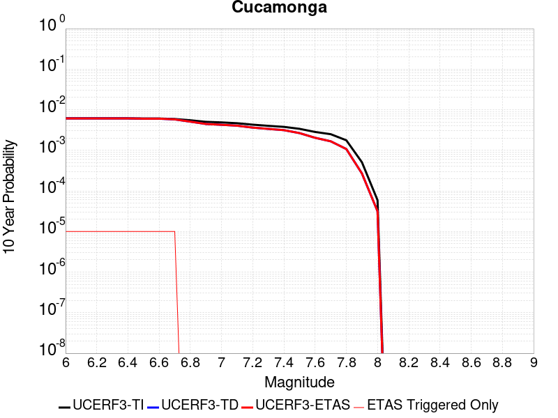 |

| Magnitude | 1 wk TI Prob | 1 wk TD Prob | 1 wk ETAS Prob | 1 wk ETAS/TD Gain | 1 wk ETAS Triggered Only | 1 mo TI Prob | 1 mo TD Prob | 1 mo ETAS Prob | 1 mo ETAS/TD Gain | 1 mo ETAS Triggered Only | 1 yr TI Prob | 1 yr TD Prob | 1 yr ETAS Prob | 1 yr ETAS/TD Gain | 1 yr ETAS Triggered Only | 10 yr TI Prob | 10 yr TD Prob | 10 yr ETAS Prob | 10 yr ETAS/TD Gain | 10 yr ETAS Triggered Only |
|-----|-----|-----|-----|-----|-----|-----|-----|-----|-----|-----|-----|-----|-----|-----|-----|-----|-----|-----|-----|-----|
| 6.0 | 1.1848348E-5 | 1.1739044E-5 | 1.1739044E-5 | 1.0 | 0.0 | 5.0777642E-5 | 5.0309234E-5 | 5.0309234E-5 | 1.0 | 0.0 | 6.180424E-4 | 6.1234547E-4 | 6.223394E-4 | 1.0163207 | 1.0E-5 | 0.0061632637 | 0.006107754 | 0.006117693 | 1.0016272 | 1.0E-5 |
| 6.1 | 1.1848348E-5 | 1.1739044E-5 | 1.1739044E-5 | 1.0 | 0.0 | 5.0777642E-5 | 5.0309234E-5 | 5.0309234E-5 | 1.0 | 0.0 | 6.180424E-4 | 6.1234547E-4 | 6.223394E-4 | 1.0163207 | 1.0E-5 | 0.0061632637 | 0.006107754 | 0.006117693 | 1.0016272 | 1.0E-5 |
| 6.2 | 1.1848348E-5 | 1.1739044E-5 | 1.1739044E-5 | 1.0 | 0.0 | 5.0777642E-5 | 5.0309234E-5 | 5.0309234E-5 | 1.0 | 0.0 | 6.180424E-4 | 6.1234547E-4 | 6.223394E-4 | 1.0163207 | 1.0E-5 | 0.0061632637 | 0.006107754 | 0.006117693 | 1.0016272 | 1.0E-5 |
| 6.3 | 1.1848348E-5 | 1.1739044E-5 | 1.1739044E-5 | 1.0 | 0.0 | 5.0777642E-5 | 5.0309234E-5 | 5.0309234E-5 | 1.0 | 0.0 | 6.180424E-4 | 6.1234547E-4 | 6.223394E-4 | 1.0163207 | 1.0E-5 | 0.0061632637 | 0.006107754 | 0.006117693 | 1.0016272 | 1.0E-5 |
| 6.4 | 1.1848348E-5 | 1.1739044E-5 | 1.1739044E-5 | 1.0 | 0.0 | 5.0777642E-5 | 5.0309234E-5 | 5.0309234E-5 | 1.0 | 0.0 | 6.180424E-4 | 6.1234547E-4 | 6.223394E-4 | 1.0163207 | 1.0E-5 | 0.0061632637 | 0.006107754 | 0.006117693 | 1.0016272 | 1.0E-5 |
| 6.5 | 1.16988695E-5 | 1.15780695E-5 | 1.15780695E-5 | 1.0 | 0.0 | 5.013705E-5 | 4.961937E-5 | 4.961937E-5 | 1.0 | 0.0 | 6.102476E-4 | 6.0395105E-4 | 6.13945E-4 | 1.0165477 | 1.0E-5 | 0.006085745 | 0.0060242657 | 0.0060342057 | 1.00165 | 1.0E-5 |
| 6.6 | 1.16988695E-5 | 1.15780695E-5 | 1.15780695E-5 | 1.0 | 0.0 | 5.013705E-5 | 4.961937E-5 | 4.961937E-5 | 1.0 | 0.0 | 6.102476E-4 | 6.0395105E-4 | 6.13945E-4 | 1.0165477 | 1.0E-5 | 0.006085745 | 0.0060242657 | 0.0060342057 | 1.00165 | 1.0E-5 |
| 6.7 | 1.1397107E-5 | 1.11169265E-5 | 1.11169265E-5 | 1.0 | 0.0 | 4.884383E-5 | 4.7643116E-5 | 4.7643116E-5 | 1.0 | 0.0 | 5.9451134E-4 | 5.79903E-4 | 5.898973E-4 | 1.0172342 | 1.0E-5 | 0.005929234 | 0.005785046 | 0.005794988 | 1.0017186 | 1.0E-5 |
| 6.8 | 1.058387E-5 | 9.786732E-6 | 9.786732E-6 | 1.0 | 0.0 | 4.5358654E-5 | 4.1942472E-5 | 4.1942472E-5 | 1.0 | 0.0 | 5.521017E-4 | 5.1053107E-4 | 5.1053107E-4 | 1.0 | 0.0 | 0.00550732 | 0.005094588 | 0.005094588 | 1.0 | 0.0 |
| 6.9 | 9.690046E-6 | 8.581065E-6 | 8.581065E-6 | 1.0 | 0.0 | 4.1528107E-5 | 3.677548E-5 | 3.677548E-5 | 1.0 | 0.0 | 5.054874E-4 | 4.4764986E-4 | 4.4764986E-4 | 1.0 | 0.0 | 0.005043391 | 0.004468414 | 0.004468414 | 1.0 | 0.0 |
| 7.0 | 9.381461E-6 | 8.188645E-6 | 8.188645E-6 | 1.0 | 0.0 | 4.020564E-5 | 3.5093723E-5 | 3.5093723E-5 | 1.0 | 0.0 | 4.893937E-4 | 4.2718265E-4 | 4.2718265E-4 | 1.0 | 0.0 | 0.0048831734 | 0.004264546 | 0.004264546 | 1.0 | 0.0 |
| 7.1 | 8.946492E-6 | 7.783399E-6 | 7.783399E-6 | 1.0 | 0.0 | 3.8341543E-5 | 3.3357E-5 | 3.3357E-5 | 1.0 | 0.0 | 4.667083E-4 | 4.060461E-4 | 4.060461E-4 | 1.0 | 0.0 | 0.0046572937 | 0.004053975 | 0.004053975 | 1.0 | 0.0 |
| 7.2 | 8.251016E-6 | 6.976691E-6 | 6.976691E-6 | 1.0 | 0.0 | 3.5361016E-5 | 2.9899764E-5 | 2.9899764E-5 | 1.0 | 0.0 | 4.3043532E-4 | 3.6396904E-4 | 3.6396904E-4 | 1.0 | 0.0 | 0.0042960253 | 0.0036346593 | 0.0036346593 | 1.0 | 0.0 |
| 7.3 | 7.717881E-6 | 6.4877167E-6 | 6.4877167E-6 | 1.0 | 0.0 | 3.3076216E-5 | 2.7804204E-5 | 2.7804204E-5 | 1.0 | 0.0 | 4.026285E-4 | 3.3846384E-4 | 3.3846384E-4 | 1.0 | 0.0 | 0.004018998 | 0.0033804171 | 0.0033804171 | 1.0 | 0.0 |
| 7.4 | 7.275623E-6 | 6.033309E-6 | 6.033309E-6 | 1.0 | 0.0 | 3.118087E-5 | 2.5856783E-5 | 2.5856783E-5 | 1.0 | 0.0 | 3.7956095E-4 | 3.147611E-4 | 3.147611E-4 | 1.0 | 0.0 | 0.0037891332 | 0.0031440852 | 0.0031440852 | 1.0 | 0.0 |
| 7.5 | 6.5109502E-6 | 5.1017664E-6 | 5.1017664E-6 | 1.0 | 0.0 | 2.7903774E-5 | 2.1864531E-5 | 2.1864531E-5 | 1.0 | 0.0 | 3.3967546E-4 | 2.661683E-4 | 2.661683E-4 | 1.0 | 0.0 | 0.0033915674 | 0.0026594158 | 0.0026594158 | 1.0 | 0.0 |
| 7.6 | 5.4495326E-6 | 3.9096053E-6 | 3.9096053E-6 | 1.0 | 0.0 | 2.335493E-5 | 1.6755344E-5 | 1.6755344E-5 | 1.0 | 0.0 | 2.8430918E-4 | 2.039773E-4 | 2.039773E-4 | 1.0 | 0.0 | 0.0028394572 | 0.002038818 | 0.002038818 | 1.0 | 0.0 |
| 7.7 | 4.7997164E-6 | 3.2011878E-6 | 3.2011878E-6 | 1.0 | 0.0 | 2.057005E-5 | 1.3719305E-5 | 1.3719305E-5 | 1.0 | 0.0 | 2.504116E-4 | 1.6701977E-4 | 1.6701977E-4 | 1.0 | 0.0 | 0.002501296 | 0.0016698706 | 0.0016698706 | 1.0 | 0.0 |
| 7.8 | 3.3941733E-6 | 2.0647374E-6 | 2.0647374E-6 | 1.0 | 0.0 | 1.4546376E-5 | 8.848844E-6 | 8.848844E-6 | 1.0 | 0.0 | 1.7708774E-4 | 1.07729364E-4 | 1.07729364E-4 | 1.0 | 0.0 | 0.0017694668 | 0.0010770084 | 0.0010770084 | 1.0 | 0.0 |
| 7.9 | 9.750552E-7 | 5.1573596E-7 | 5.1573596E-7 | 1.0 | 0.0 | 4.178801E-6 | 2.2102952E-6 | 2.2102952E-6 | 1.0 | 0.0 | 5.0875715E-5 | 2.6910016E-5 | 2.6910016E-5 | 1.0 | 0.0 | 5.086407E-4 | 2.69068E-4 | 2.69068E-4 | 1.0 | 0.0 |
| 8.0 | 1.133857E-7 | 6.054742E-8 | 6.054742E-8 | 1.0 | 0.0 | 4.8593864E-7 | 2.594889E-7 | 2.594889E-7 | 1.0 | 0.0 | 5.9162867E-6 | 3.159273E-6 | 3.159273E-6 | 1.0 | 0.0 | 5.916129E-5 | 3.15923E-5 | 3.15923E-5 | 1.0 | 0.0 |

## North Frontal  (West)
*[(top)](#table-of-contents)*

| 1 Week | 1 Month | 1 Year | 10 Year |
|-----|-----|-----|-----|
| 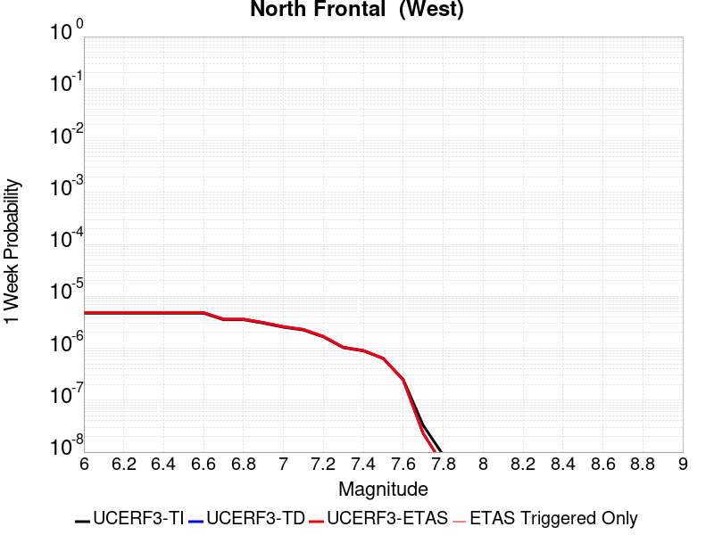 | 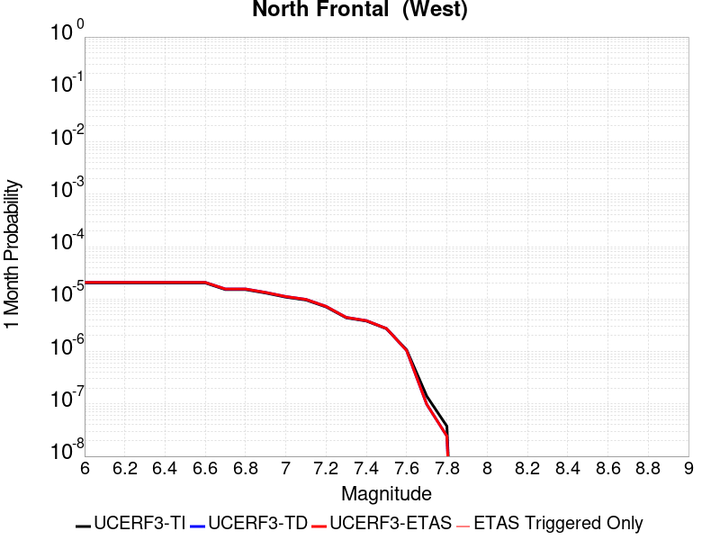 | 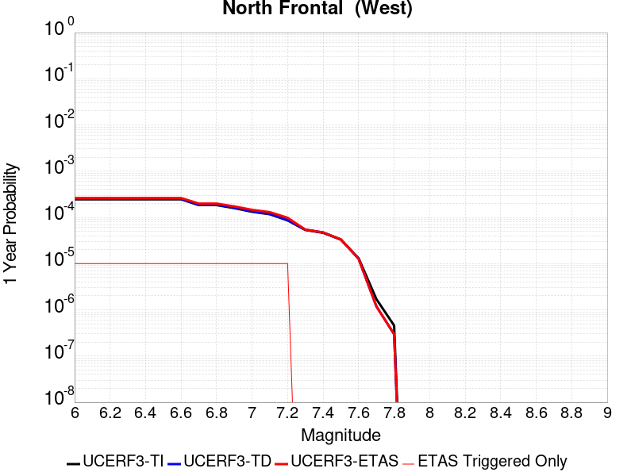 | 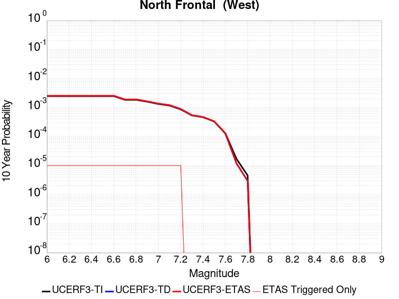 |

| Magnitude | 1 wk TI Prob | 1 wk TD Prob | 1 wk ETAS Prob | 1 wk ETAS/TD Gain | 1 wk ETAS Triggered Only | 1 mo TI Prob | 1 mo TD Prob | 1 mo ETAS Prob | 1 mo ETAS/TD Gain | 1 mo ETAS Triggered Only | 1 yr TI Prob | 1 yr TD Prob | 1 yr ETAS Prob | 1 yr ETAS/TD Gain | 1 yr ETAS Triggered Only | 10 yr TI Prob | 10 yr TD Prob | 10 yr ETAS Prob | 10 yr ETAS/TD Gain | 10 yr ETAS Triggered Only |
|-----|-----|-----|-----|-----|-----|-----|-----|-----|-----|-----|-----|-----|-----|-----|-----|-----|-----|-----|-----|-----|
| 6.0 | 4.7316266E-6 | 4.852729E-6 | 4.852729E-6 | 1.0 | 0.0 | 2.0278241E-5 | 2.0797252E-5 | 2.0797252E-5 | 1.0 | 0.0 | 2.4685962E-4 | 2.531786E-4 | 2.6317607E-4 | 1.0394878 | 1.0E-5 | 0.0024658558 | 0.0025290477 | 0.0025390224 | 1.003944 | 1.0E-5 |
| 6.1 | 4.7316266E-6 | 4.852729E-6 | 4.852729E-6 | 1.0 | 0.0 | 2.0278241E-5 | 2.0797252E-5 | 2.0797252E-5 | 1.0 | 0.0 | 2.4685962E-4 | 2.531786E-4 | 2.6317607E-4 | 1.0394878 | 1.0E-5 | 0.0024658558 | 0.0025290477 | 0.0025390224 | 1.003944 | 1.0E-5 |
| 6.2 | 4.7316266E-6 | 4.852729E-6 | 4.852729E-6 | 1.0 | 0.0 | 2.0278241E-5 | 2.0797252E-5 | 2.0797252E-5 | 1.0 | 0.0 | 2.4685962E-4 | 2.531786E-4 | 2.6317607E-4 | 1.0394878 | 1.0E-5 | 0.0024658558 | 0.0025290477 | 0.0025390224 | 1.003944 | 1.0E-5 |
| 6.3 | 4.7316266E-6 | 4.852729E-6 | 4.852729E-6 | 1.0 | 0.0 | 2.0278241E-5 | 2.0797252E-5 | 2.0797252E-5 | 1.0 | 0.0 | 2.4685962E-4 | 2.531786E-4 | 2.6317607E-4 | 1.0394878 | 1.0E-5 | 0.0024658558 | 0.0025290477 | 0.0025390224 | 1.003944 | 1.0E-5 |
| 6.4 | 4.7316266E-6 | 4.852729E-6 | 4.852729E-6 | 1.0 | 0.0 | 2.0278241E-5 | 2.0797252E-5 | 2.0797252E-5 | 1.0 | 0.0 | 2.4685962E-4 | 2.531786E-4 | 2.6317607E-4 | 1.0394878 | 1.0E-5 | 0.0024658558 | 0.0025290477 | 0.0025390224 | 1.003944 | 1.0E-5 |
| 6.5 | 4.7316266E-6 | 4.852729E-6 | 4.852729E-6 | 1.0 | 0.0 | 2.0278241E-5 | 2.0797252E-5 | 2.0797252E-5 | 1.0 | 0.0 | 2.4685962E-4 | 2.531786E-4 | 2.6317607E-4 | 1.0394878 | 1.0E-5 | 0.0024658558 | 0.0025290477 | 0.0025390224 | 1.003944 | 1.0E-5 |
| 6.6 | 4.7316266E-6 | 4.852729E-6 | 4.852729E-6 | 1.0 | 0.0 | 2.0278241E-5 | 2.0797252E-5 | 2.0797252E-5 | 1.0 | 0.0 | 2.4685962E-4 | 2.531786E-4 | 2.6317607E-4 | 1.0394878 | 1.0E-5 | 0.0024658558 | 0.0025290477 | 0.0025390224 | 1.003944 | 1.0E-5 |
| 6.7 | 3.5382777E-6 | 3.6309307E-6 | 3.6309307E-6 | 1.0 | 0.0 | 1.516396E-5 | 1.5561043E-5 | 1.5561043E-5 | 1.0 | 0.0 | 1.8460557E-4 | 1.8944E-4 | 1.9943812E-4 | 1.0527772 | 1.0E-5 | 0.0018445229 | 0.0018928621 | 0.0019028432 | 1.005273 | 1.0E-5 |
| 6.8 | 3.5382777E-6 | 3.6309307E-6 | 3.6309307E-6 | 1.0 | 0.0 | 1.516396E-5 | 1.5561043E-5 | 1.5561043E-5 | 1.0 | 0.0 | 1.8460557E-4 | 1.8944E-4 | 1.9943812E-4 | 1.0527772 | 1.0E-5 | 0.0018445229 | 0.0018928621 | 0.0019028432 | 1.005273 | 1.0E-5 |
| 6.9 | 3.0428037E-6 | 3.1228E-6 | 3.1228E-6 | 1.0 | 0.0 | 1.30405215E-5 | 1.3383364E-5 | 1.3383364E-5 | 1.0 | 0.0 | 1.5875678E-4 | 1.6293096E-4 | 1.7292933E-4 | 1.0613657 | 1.0E-5 | 0.0015864341 | 0.0016281821 | 0.0016381659 | 1.0061318 | 1.0E-5 |
| 7.0 | 2.538778E-6 | 2.6061248E-6 | 2.6061248E-6 | 1.0 | 0.0 | 1.0880432E-5 | 1.1169061E-5 | 1.1169061E-5 | 1.0 | 0.0 | 1.324612E-4 | 1.3597531E-4 | 1.4597394E-4 | 1.0735328 | 1.0E-5 | 0.0013238228 | 0.0013589679 | 0.0013689542 | 1.0073485 | 1.0E-5 |
| 7.1 | 2.2418935E-6 | 2.3012383E-6 | 2.3012383E-6 | 1.0 | 0.0 | 9.60808E-6 | 9.862415E-6 | 9.862415E-6 | 1.0 | 0.0 | 1.1697209E-4 | 1.2006874E-4 | 1.3006754E-4 | 1.0832757 | 1.0E-5 | 0.0011691054 | 0.0012000826 | 0.0012100706 | 1.0083227 | 1.0E-5 |
| 7.2 | 1.6526745E-6 | 1.6925081E-6 | 1.6925081E-6 | 1.0 | 0.0 | 7.082872E-6 | 7.2535877E-6 | 7.2535877E-6 | 1.0 | 0.0 | 8.623055E-5 | 8.8309105E-5 | 9.830822E-5 | 1.1132286 | 1.0E-5 | 8.61971E-4 | 8.827652E-4 | 8.927564E-4 | 1.0113181 | 1.0E-5 |
| 7.3 | 1.0246019E-6 | 1.0442408E-6 | 1.0442408E-6 | 1.0 | 0.0 | 4.391144E-6 | 4.475311E-6 | 4.475311E-6 | 1.0 | 0.0 | 5.3460866E-5 | 5.4485663E-5 | 5.4485663E-5 | 1.0 | 0.0 | 5.344801E-4 | 5.4473453E-4 | 5.4473453E-4 | 1.0 | 0.0 |
| 7.4 | 8.9045164E-7 | 9.056688E-7 | 9.056688E-7 | 1.0 | 0.0 | 3.8162157E-6 | 3.881433E-6 | 3.881433E-6 | 1.0 | 0.0 | 4.646144E-5 | 4.725553E-5 | 4.725553E-5 | 1.0 | 0.0 | 4.6451724E-4 | 4.7246568E-4 | 4.7246568E-4 | 1.0 | 0.0 |
| 7.5 | 6.3357E-7 | 6.402795E-7 | 6.402795E-7 | 1.0 | 0.0 | 2.7152971E-6 | 2.7440524E-6 | 2.7440524E-6 | 1.0 | 0.0 | 3.305824E-5 | 3.3408392E-5 | 3.3408392E-5 | 1.0 | 0.0 | 3.3053322E-4 | 3.340403E-4 | 3.340403E-4 | 1.0 | 0.0 |
| 7.6 | 2.5087024E-7 | 2.4361466E-7 | 2.4361466E-7 | 1.0 | 0.0 | 1.0751578E-6 | 1.0440626E-6 | 1.0440626E-6 | 1.0 | 0.0 | 1.3089967E-5 | 1.2711409E-5 | 1.2711409E-5 | 1.0 | 0.0 | 1.3089196E-4 | 1.2710888E-4 | 1.2710888E-4 | 1.0 | 0.0 |
| 7.7 | 3.282987E-8 | 2.2874636E-8 | 2.2874636E-8 | 1.0 | 0.0 | 1.4069944E-7 | 9.803415E-8 | 9.803415E-8 | 1.0 | 0.0 | 1.7130144E-6 | 1.1935651E-6 | 1.1935651E-6 | 1.0 | 0.0 | 1.7130013E-5 | 1.1935596E-5 | 1.1935596E-5 | 1.0 | 0.0 |
| 7.8 | 8.77499E-9 | 5.6817857E-9 | 5.6817857E-9 | 1.0 | 0.0 | 3.7607098E-8 | 2.435051E-8 | 2.435051E-8 | 1.0 | 0.0 | 4.578663E-7 | 2.9646742E-7 | 2.9646742E-7 | 1.0 | 0.0 | 4.5786537E-6 | 2.9646717E-6 | 2.9646717E-6 | 1.0 | 0.0 |

## Mono Lake 2011 CFM
*[(top)](#table-of-contents)*

| 1 Week | 1 Month | 1 Year | 10 Year |
|-----|-----|-----|-----|
|  |  |  |  |

| Magnitude | 1 wk TI Prob | 1 wk TD Prob | 1 wk ETAS Prob | 1 wk ETAS/TD Gain | 1 wk ETAS Triggered Only | 1 mo TI Prob | 1 mo TD Prob | 1 mo ETAS Prob | 1 mo ETAS/TD Gain | 1 mo ETAS Triggered Only | 1 yr TI Prob | 1 yr TD Prob | 1 yr ETAS Prob | 1 yr ETAS/TD Gain | 1 yr ETAS Triggered Only | 10 yr TI Prob | 10 yr TD Prob | 10 yr ETAS Prob | 10 yr ETAS/TD Gain | 10 yr ETAS Triggered Only |
|-----|-----|-----|-----|-----|-----|-----|-----|-----|-----|-----|-----|-----|-----|-----|-----|-----|-----|-----|-----|-----|
| 6.0 | 2.0341662E-5 | 2.382979E-5 | 2.382979E-5 | 1.0 | 0.0 | 8.717564E-5 | 1.0212668E-4 | 1.0212668E-4 | 1.0 | 0.0 | 0.0010608466 | 0.0012432146 | 0.0012432146 | 1.0 | 0.0 | 0.010557966 | 0.01241468 | 0.012424556 | 1.0007955 | 1.0E-5 |
| 6.1 | 2.0341662E-5 | 2.382979E-5 | 2.382979E-5 | 1.0 | 0.0 | 8.717564E-5 | 1.0212668E-4 | 1.0212668E-4 | 1.0 | 0.0 | 0.0010608466 | 0.0012432146 | 0.0012432146 | 1.0 | 0.0 | 0.010557966 | 0.01241468 | 0.012424556 | 1.0007955 | 1.0E-5 |
| 6.2 | 2.0341662E-5 | 2.382979E-5 | 2.382979E-5 | 1.0 | 0.0 | 8.717564E-5 | 1.0212668E-4 | 1.0212668E-4 | 1.0 | 0.0 | 0.0010608466 | 0.0012432146 | 0.0012432146 | 1.0 | 0.0 | 0.010557966 | 0.01241468 | 0.012424556 | 1.0007955 | 1.0E-5 |
| 6.3 | 2.0341662E-5 | 2.382979E-5 | 2.382979E-5 | 1.0 | 0.0 | 8.717564E-5 | 1.0212668E-4 | 1.0212668E-4 | 1.0 | 0.0 | 0.0010608466 | 0.0012432146 | 0.0012432146 | 1.0 | 0.0 | 0.010557966 | 0.01241468 | 0.012424556 | 1.0007955 | 1.0E-5 |
| 6.4 | 1.749821E-5 | 2.049238E-5 | 2.049238E-5 | 1.0 | 0.0 | 7.499018E-5 | 8.782448E-5 | 8.782448E-5 | 1.0 | 0.0 | 9.1262296E-4 | 0.0010692631 | 0.0010692631 | 1.0 | 0.0 | 0.009088841 | 0.010692592 | 0.010692592 | 1.0 | 0.0 |
| 6.5 | 1.749821E-5 | 2.049238E-5 | 2.049238E-5 | 1.0 | 0.0 | 7.499018E-5 | 8.782448E-5 | 8.782448E-5 | 1.0 | 0.0 | 9.1262296E-4 | 0.0010692631 | 0.0010692631 | 1.0 | 0.0 | 0.009088841 | 0.010692592 | 0.010692592 | 1.0 | 0.0 |

## San Andreas (North Coast) 2011 CFM
*[(top)](#table-of-contents)*

| 1 Week | 1 Month | 1 Year | 10 Year |
|-----|-----|-----|-----|
| 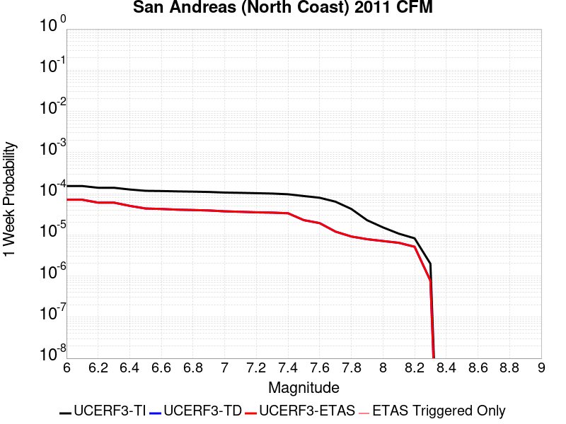 |  |  |  |

| Magnitude | 1 wk TI Prob | 1 wk TD Prob | 1 wk ETAS Prob | 1 wk ETAS/TD Gain | 1 wk ETAS Triggered Only | 1 mo TI Prob | 1 mo TD Prob | 1 mo ETAS Prob | 1 mo ETAS/TD Gain | 1 mo ETAS Triggered Only | 1 yr TI Prob | 1 yr TD Prob | 1 yr ETAS Prob | 1 yr ETAS/TD Gain | 1 yr ETAS Triggered Only | 10 yr TI Prob | 10 yr TD Prob | 10 yr ETAS Prob | 10 yr ETAS/TD Gain | 10 yr ETAS Triggered Only |
|-----|-----|-----|-----|-----|-----|-----|-----|-----|-----|-----|-----|-----|-----|-----|-----|-----|-----|-----|-----|-----|
| 6.0 | 1.5333705E-4 | 7.121477E-5 | 7.121477E-5 | 1.0 | 0.0 | 6.5699324E-4 | 3.051706E-4 | 3.051706E-4 | 1.0 | 0.0 | 0.007969595 | 0.0037091563 | 0.0037191191 | 1.002686 | 1.0E-5 | 0.0768977 | 0.039409123 | 0.039418727 | 1.0002438 | 1.0E-5 |
| 6.1 | 1.5333705E-4 | 7.121477E-5 | 7.121477E-5 | 1.0 | 0.0 | 6.5699324E-4 | 3.051706E-4 | 3.051706E-4 | 1.0 | 0.0 | 0.007969595 | 0.0037091563 | 0.0037191191 | 1.002686 | 1.0E-5 | 0.0768977 | 0.039409123 | 0.039418727 | 1.0002438 | 1.0E-5 |
| 6.2 | 1.3912938E-4 | 6.0597988E-5 | 6.0597988E-5 | 1.0 | 0.0 | 5.961325E-4 | 2.5967995E-4 | 2.5967995E-4 | 1.0 | 0.0 | 0.007233787 | 0.0031570469 | 0.0031670155 | 1.0031575 | 1.0E-5 | 0.07002798 | 0.033742934 | 0.033752598 | 1.0002863 | 1.0E-5 |
| 6.3 | 1.3912938E-4 | 6.0597988E-5 | 6.0597988E-5 | 1.0 | 0.0 | 5.961325E-4 | 2.5967995E-4 | 2.5967995E-4 | 1.0 | 0.0 | 0.007233787 | 0.0031570469 | 0.0031670155 | 1.0031575 | 1.0E-5 | 0.07002798 | 0.033742934 | 0.033752598 | 1.0002863 | 1.0E-5 |
| 6.4 | 1.2623647E-4 | 5.0526553E-5 | 5.0526553E-5 | 1.0 | 0.0 | 5.4090127E-4 | 2.165245E-4 | 2.165245E-4 | 1.0 | 0.0 | 0.0065656058 | 0.002633019 | 0.0026429924 | 1.0037879 | 1.0E-5 | 0.06374981 | 0.028348682 | 0.028358398 | 1.0003427 | 1.0E-5 |
| 6.5 | 1.1736096E-4 | 4.3600463E-5 | 4.3600463E-5 | 1.0 | 0.0 | 5.028786E-4 | 1.8684583E-4 | 1.8684583E-4 | 1.0 | 0.0 | 0.006105373 | 0.0022724909 | 0.0022824684 | 1.0043905 | 1.0E-5 | 0.05940335 | 0.024621103 | 0.024630858 | 1.0003961 | 1.0E-5 |
| 6.6 | 1.1586959E-4 | 4.2499043E-5 | 4.2499043E-5 | 1.0 | 0.0 | 4.964894E-4 | 1.8212614E-4 | 1.8212614E-4 | 1.0 | 0.0 | 0.006028018 | 0.0022151468 | 0.0022251247 | 1.0045043 | 1.0E-5 | 0.058671024 | 0.024026167 | 0.024035927 | 1.0004063 | 1.0E-5 |
| 6.7 | 1.13693764E-4 | 4.0809453E-5 | 4.0809453E-5 | 1.0 | 0.0 | 4.87168E-4 | 1.7488602E-4 | 1.7488602E-4 | 1.0 | 0.0 | 0.005915152 | 0.002127174 | 0.0021371527 | 1.0046911 | 1.0E-5 | 0.057601593 | 0.023116693 | 0.02312646 | 1.0004226 | 1.0E-5 |
| 6.8 | 1.1204889E-4 | 4.0025658E-5 | 4.0025658E-5 | 1.0 | 0.0 | 4.8012115E-4 | 1.7152735E-4 | 1.7152735E-4 | 1.0 | 0.0 | 0.005829819 | 0.0020863612 | 0.0020963403 | 1.004783 | 1.0E-5 | 0.05679232 | 0.022676276 | 0.02268605 | 1.000431 | 1.0E-5 |
| 6.9 | 1.1005794E-4 | 3.908009E-5 | 3.908009E-5 | 1.0 | 0.0 | 4.7159163E-4 | 1.6747543E-4 | 1.6747543E-4 | 1.0 | 0.0 | 0.0057265228 | 0.0020371224 | 0.002047102 | 1.0048989 | 1.0E-5 | 0.055811852 | 0.022141304 | 0.022151083 | 1.0004417 | 1.0E-5 |
| 7.0 | 1.0647948E-4 | 3.7232006E-5 | 3.7232006E-5 | 1.0 | 0.0 | 4.562608E-4 | 1.5955608E-4 | 1.5955608E-4 | 1.0 | 0.0 | 0.0055408357 | 0.00194088 | 0.0019508606 | 1.0051423 | 1.0E-5 | 0.054047033 | 0.021098582 | 0.02110837 | 1.000464 | 1.0E-5 |
| 7.1 | 1.04795035E-4 | 3.6279678E-5 | 3.6279678E-5 | 1.0 | 0.0 | 4.4904428E-4 | 1.5547515E-4 | 1.5547515E-4 | 1.0 | 0.0 | 0.0054534175 | 0.0018912819 | 0.001901263 | 1.0052774 | 1.0E-5 | 0.053215165 | 0.020565644 | 0.020575438 | 1.0004762 | 1.0E-5 |
| 7.2 | 1.02724036E-4 | 3.5186124E-5 | 3.5186124E-5 | 1.0 | 0.0 | 4.401716E-4 | 1.5078906E-4 | 1.5078906E-4 | 1.0 | 0.0 | 0.0053459285 | 0.0018343262 | 0.0018443079 | 1.0054415 | 1.0E-5 | 0.052191395 | 0.019953497 | 0.019963298 | 1.0004911 | 1.0E-5 |
| 7.3 | 1.00650694E-4 | 3.4652E-5 | 3.4652E-5 | 1.0 | 0.0 | 4.312888E-4 | 1.485002E-4 | 1.485002E-4 | 1.0 | 0.0 | 0.005238306 | 0.001806506 | 0.0018164879 | 1.0055256 | 1.0E-5 | 0.051165357 | 0.019629821 | 0.019639626 | 1.0004995 | 1.0E-5 |
| 7.4 | 9.672919E-5 | 3.3437853E-5 | 3.3437853E-5 | 1.0 | 0.0 | 4.144878E-4 | 1.432973E-4 | 1.432973E-4 | 1.0 | 0.0 | 0.005034718 | 0.0017432636 | 0.0017532462 | 1.0057263 | 1.0E-5 | 0.049221683 | 0.018901296 | 0.018911107 | 1.000519 | 1.0E-5 |
| 7.5 | 8.7600405E-5 | 2.2747725E-5 | 2.2747725E-5 | 1.0 | 0.0 | 3.753763E-4 | 9.748661E-5 | 9.748661E-5 | 1.0 | 0.0 | 0.0045606326 | 0.001186255 | 0.0011962432 | 1.0084199 | 1.0E-5 | 0.04468165 | 0.013157112 | 0.01316698 | 1.0007501 | 1.0E-5 |
| 7.6 | 7.9562284E-5 | 1.9268897E-5 | 1.9268897E-5 | 1.0 | 0.0 | 3.4093665E-4 | 8.257838E-5 | 8.257838E-5 | 1.0 | 0.0 | 0.0041430052 | 0.0010049295 | 0.0010149195 | 1.009941 | 1.0E-5 | 0.040666126 | 0.011246317 | 0.011256205 | 1.0008792 | 1.0E-5 |
| 7.7 | 6.3866544E-5 | 1.1975114E-5 | 1.1975114E-5 | 1.0 | 0.0 | 2.7368503E-4 | 5.132091E-5 | 5.132091E-5 | 1.0 | 0.0 | 0.0033270244 | 6.246532E-4 | 6.346469E-4 | 1.0159988 | 1.0E-5 | 0.032776527 | 0.007230069 | 0.007239997 | 1.0013732 | 1.0E-5 |
| 7.8 | 4.2543215E-5 | 9.103618E-6 | 9.103618E-6 | 1.0 | 0.0 | 1.8231533E-4 | 3.901492E-5 | 3.901492E-5 | 1.0 | 0.0 | 0.0022174292 | 4.7490324E-4 | 4.8489848E-4 | 1.0210469 | 1.0E-5 | 0.021954332 | 0.0055063507 | 0.005516296 | 1.0018061 | 1.0E-5 |
| 7.9 | 2.2636612E-5 | 7.837012E-6 | 7.837012E-6 | 1.0 | 0.0 | 9.7010445E-5 | 3.3586763E-5 | 3.3586763E-5 | 1.0 | 0.0 | 0.0011804621 | 4.088422E-4 | 4.188381E-4 | 1.0244493 | 1.0E-5 | 0.011742111 | 0.004696075 | 0.004706028 | 1.0021194 | 1.0E-5 |
| 8.0 | 1.5167874E-5 | 7.069798E-6 | 7.069798E-6 | 1.0 | 0.0 | 6.500356E-5 | 3.0298783E-5 | 3.0298783E-5 | 1.0 | 0.0 | 7.9113094E-4 | 3.6882533E-4 | 3.7882163E-4 | 1.0271031 | 1.0E-5 | 0.007883203 | 0.0042268736 | 0.0042368313 | 1.0023558 | 1.0E-5 |
| 8.1 | 1.0681047E-5 | 6.4054443E-6 | 6.4054443E-6 | 1.0 | 0.0 | 4.5775112E-5 | 2.7451615E-5 | 2.7451615E-5 | 1.0 | 0.0 | 5.5716943E-4 | 3.3417225E-4 | 3.441689E-4 | 1.0299147 | 1.0E-5 | 0.0055577457 | 0.0038275532 | 0.0038375151 | 1.0026026 | 1.0E-5 |
| 8.2 | 8.226114E-6 | 5.1295215E-6 | 5.1295215E-6 | 1.0 | 0.0 | 3.52543E-5 | 2.1983478E-5 | 2.1983478E-5 | 1.0 | 0.0 | 4.2913653E-4 | 2.6761607E-4 | 2.7761338E-4 | 1.037357 | 1.0E-5 | 0.004283088 | 0.0030530184 | 0.0030629877 | 1.0032655 | 1.0E-5 |
| 8.3 | 1.983087E-6 | 7.6850927E-7 | 7.6850927E-7 | 1.0 | 0.0 | 8.498917E-6 | 3.293607E-6 | 3.293607E-6 | 1.0 | 0.0 | 1.034694E-4 | 4.0098945E-5 | 4.0098945E-5 | 1.0 | 0.0 | 0.0010342124 | 4.7341356E-4 | 4.7341356E-4 | 1.0 | 0.0 |

## Thirty Mile Bank
*[(top)](#table-of-contents)*

| 1 Week | 1 Month | 1 Year | 10 Year |
|-----|-----|-----|-----|
|  |  | 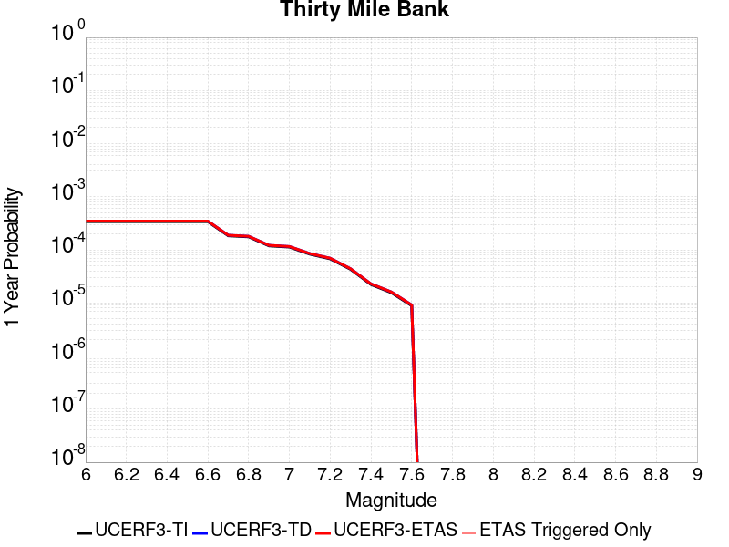 | 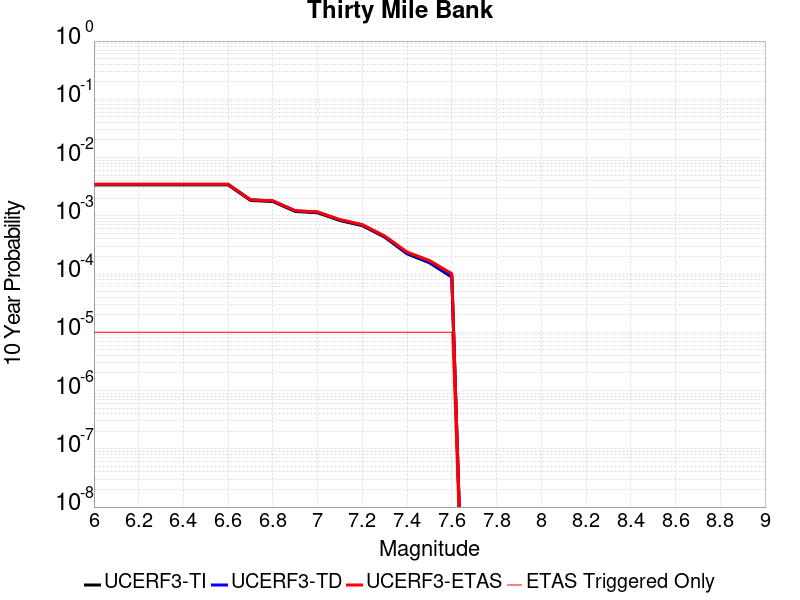 |

| Magnitude | 1 wk TI Prob | 1 wk TD Prob | 1 wk ETAS Prob | 1 wk ETAS/TD Gain | 1 wk ETAS Triggered Only | 1 mo TI Prob | 1 mo TD Prob | 1 mo ETAS Prob | 1 mo ETAS/TD Gain | 1 mo ETAS Triggered Only | 1 yr TI Prob | 1 yr TD Prob | 1 yr ETAS Prob | 1 yr ETAS/TD Gain | 1 yr ETAS Triggered Only | 10 yr TI Prob | 10 yr TD Prob | 10 yr ETAS Prob | 10 yr ETAS/TD Gain | 10 yr ETAS Triggered Only |
|-----|-----|-----|-----|-----|-----|-----|-----|-----|-----|-----|-----|-----|-----|-----|-----|-----|-----|-----|-----|-----|
| 6.0 | 6.5124755E-6 | 6.6593243E-6 | 6.6593243E-6 | 1.0 | 0.0 | 2.791031E-5 | 2.8539673E-5 | 2.8539673E-5 | 1.0 | 0.0 | 3.3975503E-4 | 3.4741947E-4 | 3.4741947E-4 | 1.0 | 0.0 | 0.0033923604 | 0.0034691952 | 0.0034791604 | 1.0028725 | 1.0E-5 |
| 6.1 | 6.5124755E-6 | 6.6593243E-6 | 6.6593243E-6 | 1.0 | 0.0 | 2.791031E-5 | 2.8539673E-5 | 2.8539673E-5 | 1.0 | 0.0 | 3.3975503E-4 | 3.4741947E-4 | 3.4741947E-4 | 1.0 | 0.0 | 0.0033923604 | 0.0034691952 | 0.0034791604 | 1.0028725 | 1.0E-5 |
| 6.2 | 6.5124755E-6 | 6.6593243E-6 | 6.6593243E-6 | 1.0 | 0.0 | 2.791031E-5 | 2.8539673E-5 | 2.8539673E-5 | 1.0 | 0.0 | 3.3975503E-4 | 3.4741947E-4 | 3.4741947E-4 | 1.0 | 0.0 | 0.0033923604 | 0.0034691952 | 0.0034791604 | 1.0028725 | 1.0E-5 |
| 6.3 | 6.5124755E-6 | 6.6593243E-6 | 6.6593243E-6 | 1.0 | 0.0 | 2.791031E-5 | 2.8539673E-5 | 2.8539673E-5 | 1.0 | 0.0 | 3.3975503E-4 | 3.4741947E-4 | 3.4741947E-4 | 1.0 | 0.0 | 0.0033923604 | 0.0034691952 | 0.0034791604 | 1.0028725 | 1.0E-5 |
| 6.4 | 6.5124755E-6 | 6.6593243E-6 | 6.6593243E-6 | 1.0 | 0.0 | 2.791031E-5 | 2.8539673E-5 | 2.8539673E-5 | 1.0 | 0.0 | 3.3975503E-4 | 3.4741947E-4 | 3.4741947E-4 | 1.0 | 0.0 | 0.0033923604 | 0.0034691952 | 0.0034791604 | 1.0028725 | 1.0E-5 |
| 6.5 | 6.5124755E-6 | 6.6593243E-6 | 6.6593243E-6 | 1.0 | 0.0 | 2.791031E-5 | 2.8539673E-5 | 2.8539673E-5 | 1.0 | 0.0 | 3.3975503E-4 | 3.4741947E-4 | 3.4741947E-4 | 1.0 | 0.0 | 0.0033923604 | 0.0034691952 | 0.0034791604 | 1.0028725 | 1.0E-5 |
| 6.6 | 6.5124755E-6 | 6.6593243E-6 | 6.6593243E-6 | 1.0 | 0.0 | 2.791031E-5 | 2.8539673E-5 | 2.8539673E-5 | 1.0 | 0.0 | 3.3975503E-4 | 3.4741947E-4 | 3.4741947E-4 | 1.0 | 0.0 | 0.0033923604 | 0.0034691952 | 0.0034791604 | 1.0028725 | 1.0E-5 |
| 6.7 | 3.5261137E-6 | 3.6099339E-6 | 3.6099339E-6 | 1.0 | 0.0 | 1.5111828E-5 | 1.5471056E-5 | 1.5471056E-5 | 1.0 | 0.0 | 1.8397097E-4 | 1.883445E-4 | 1.883445E-4 | 1.0 | 0.0 | 0.0018381875 | 0.0018819136 | 0.0018918948 | 1.0053037 | 1.0E-5 |
| 6.8 | 3.370743E-6 | 3.4509683E-6 | 3.4509683E-6 | 1.0 | 0.0 | 1.4445961E-5 | 1.4789784E-5 | 1.4789784E-5 | 1.0 | 0.0 | 1.7586538E-4 | 1.8005136E-4 | 1.8005136E-4 | 1.0 | 0.0 | 0.0017572626 | 0.0017991167 | 0.0018090986 | 1.0055482 | 1.0E-5 |
| 6.9 | 2.2756835E-6 | 2.3331845E-6 | 2.3331845E-6 | 1.0 | 0.0 | 9.752893E-6 | 9.999326E-6 | 9.999326E-6 | 1.0 | 0.0 | 1.18735006E-4 | 1.2173524E-4 | 1.2173524E-4 | 1.0 | 0.0 | 0.0011867158 | 0.0012167101 | 0.0012266979 | 1.0082089 | 1.0E-5 |
| 7.0 | 2.1617404E-6 | 2.2160023E-6 | 2.2160023E-6 | 1.0 | 0.0 | 9.264569E-6 | 9.497119E-6 | 9.497119E-6 | 1.0 | 0.0 | 1.1279029E-4 | 1.1562153E-4 | 1.1562153E-4 | 1.0 | 0.0 | 0.0011273306 | 0.0011556379 | 0.0011656263 | 1.0086433 | 1.0E-5 |
| 7.1 | 1.5900777E-6 | 1.6327189E-6 | 1.6327189E-6 | 1.0 | 0.0 | 6.814601E-6 | 6.9973485E-6 | 6.9973485E-6 | 1.0 | 0.0 | 8.296461E-5 | 8.518952E-5 | 8.518952E-5 | 1.0 | 0.0 | 8.293364E-4 | 8.515814E-4 | 8.6157286E-4 | 1.0117328 | 1.0E-5 |
| 7.2 | 1.2971728E-6 | 1.3329138E-6 | 1.3329138E-6 | 1.0 | 0.0 | 5.5593005E-6 | 5.7124757E-6 | 5.7124757E-6 | 1.0 | 0.0 | 6.768238E-5 | 6.954728E-5 | 6.954728E-5 | 1.0 | 0.0 | 6.7661767E-4 | 6.952655E-4 | 7.052585E-4 | 1.014373 | 1.0E-5 |
| 7.3 | 8.2454284E-7 | 8.448974E-7 | 8.448974E-7 | 1.0 | 0.0 | 3.5337503E-6 | 3.6209842E-6 | 3.6209842E-6 | 1.0 | 0.0 | 4.302256E-5 | 4.4084652E-5 | 4.4084652E-5 | 1.0 | 0.0 | 4.301423E-4 | 4.407651E-4 | 4.507607E-4 | 1.0226778 | 1.0E-5 |
| 7.4 | 4.2619024E-7 | 4.3863977E-7 | 4.3863977E-7 | 1.0 | 0.0 | 1.8265283E-6 | 1.8798834E-6 | 1.8798834E-6 | 1.0 | 0.0 | 2.2237757E-5 | 2.2887343E-5 | 2.2887343E-5 | 1.0 | 0.0 | 2.223553E-4 | 2.2885026E-4 | 2.3884796E-4 | 1.0436867 | 1.0E-5 |
| 7.5 | 2.993922E-7 | 3.086491E-7 | 3.086491E-7 | 1.0 | 0.0 | 1.2831089E-6 | 1.3227811E-6 | 1.3227811E-6 | 1.0 | 0.0 | 1.5621737E-5 | 1.6104745E-5 | 1.6104745E-5 | 1.0 | 0.0 | 1.562064E-4 | 1.6103603E-4 | 1.7103442E-4 | 1.0620879 | 1.0E-5 |
| 7.6 | 1.6988751E-7 | 1.7534047E-7 | 1.7534047E-7 | 1.0 | 0.0 | 7.2808916E-7 | 7.5145897E-7 | 7.5145897E-7 | 1.0 | 0.0 | 8.864449E-6 | 9.1489765E-6 | 9.1489765E-6 | 1.0 | 0.0 | 8.8640954E-5 | 9.1486196E-5 | 1.0148528E-4 | 1.1092961 | 1.0E-5 |

## Monte Vista - Shannon 2011 CFM
*[(top)](#table-of-contents)*

| 1 Week | 1 Month | 1 Year | 10 Year |
|-----|-----|-----|-----|
| 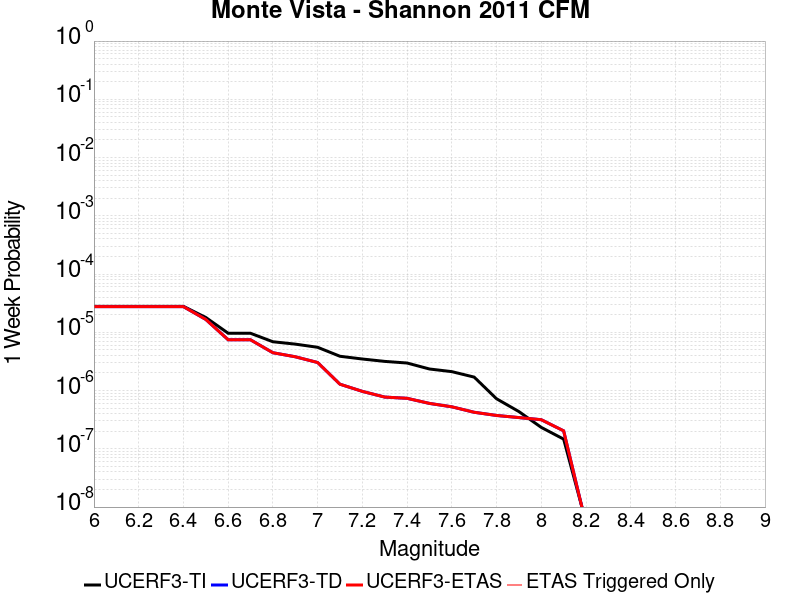 |  | 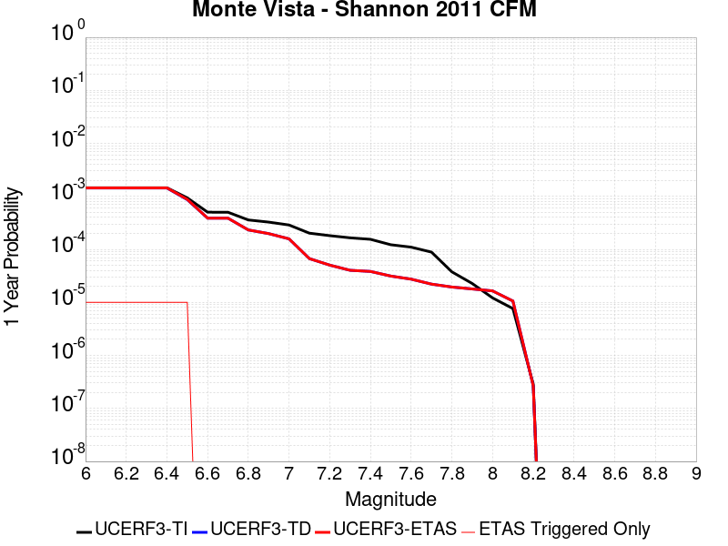 |  |

| Magnitude | 1 wk TI Prob | 1 wk TD Prob | 1 wk ETAS Prob | 1 wk ETAS/TD Gain | 1 wk ETAS Triggered Only | 1 mo TI Prob | 1 mo TD Prob | 1 mo ETAS Prob | 1 mo ETAS/TD Gain | 1 mo ETAS Triggered Only | 1 yr TI Prob | 1 yr TD Prob | 1 yr ETAS Prob | 1 yr ETAS/TD Gain | 1 yr ETAS Triggered Only | 10 yr TI Prob | 10 yr TD Prob | 10 yr ETAS Prob | 10 yr ETAS/TD Gain | 10 yr ETAS Triggered Only |
|-----|-----|-----|-----|-----|-----|-----|-----|-----|-----|-----|-----|-----|-----|-----|-----|-----|-----|-----|-----|-----|
| 6.0 | 2.7907707E-5 | 2.758683E-5 | 2.758683E-5 | 1.0 | 0.0 | 1.19598975E-4 | 1.1822461E-4 | 1.1822461E-4 | 1.0 | 0.0 | 0.0014551448 | 0.001438558 | 0.0014485436 | 1.0069414 | 1.0E-5 | 0.014456532 | 0.014321556 | 0.014331413 | 1.0006882 | 1.0E-5 |
| 6.1 | 2.7907707E-5 | 2.758683E-5 | 2.758683E-5 | 1.0 | 0.0 | 1.19598975E-4 | 1.1822461E-4 | 1.1822461E-4 | 1.0 | 0.0 | 0.0014551448 | 0.001438558 | 0.0014485436 | 1.0069414 | 1.0E-5 | 0.014456532 | 0.014321556 | 0.014331413 | 1.0006882 | 1.0E-5 |
| 6.2 | 2.7907707E-5 | 2.758683E-5 | 2.758683E-5 | 1.0 | 0.0 | 1.19598975E-4 | 1.1822461E-4 | 1.1822461E-4 | 1.0 | 0.0 | 0.0014551448 | 0.001438558 | 0.0014485436 | 1.0069414 | 1.0E-5 | 0.014456532 | 0.014321556 | 0.014331413 | 1.0006882 | 1.0E-5 |
| 6.3 | 2.7907707E-5 | 2.758683E-5 | 2.758683E-5 | 1.0 | 0.0 | 1.19598975E-4 | 1.1822461E-4 | 1.1822461E-4 | 1.0 | 0.0 | 0.0014551448 | 0.001438558 | 0.0014485436 | 1.0069414 | 1.0E-5 | 0.014456532 | 0.014321556 | 0.014331413 | 1.0006882 | 1.0E-5 |
| 6.4 | 2.7907707E-5 | 2.758683E-5 | 2.758683E-5 | 1.0 | 0.0 | 1.19598975E-4 | 1.1822461E-4 | 1.1822461E-4 | 1.0 | 0.0 | 0.0014551448 | 0.001438558 | 0.0014485436 | 1.0069414 | 1.0E-5 | 0.014456532 | 0.014321556 | 0.014331413 | 1.0006882 | 1.0E-5 |
| 6.5 | 1.7990213E-5 | 1.6642054E-5 | 1.6642054E-5 | 1.0 | 0.0 | 7.709863E-5 | 7.132151E-5 | 7.132151E-5 | 1.0 | 0.0 | 9.382716E-4 | 8.680598E-4 | 8.7805116E-4 | 1.0115099 | 1.0E-5 | 0.0093431985 | 0.008670077 | 0.00867999 | 1.0011433 | 1.0E-5 |
| 6.6 | 9.650407E-6 | 7.4589434E-6 | 7.4589434E-6 | 1.0 | 0.0 | 4.135823E-5 | 3.1966552E-5 | 3.1966552E-5 | 1.0 | 0.0 | 5.0342013E-4 | 3.891311E-4 | 3.891311E-4 | 1.0 | 0.0 | 0.005022812 | 0.0039021901 | 0.0039021901 | 1.0 | 0.0 |
| 6.7 | 9.62828E-6 | 7.4368563E-6 | 7.4368563E-6 | 1.0 | 0.0 | 4.1263404E-5 | 3.1871896E-5 | 3.1871896E-5 | 1.0 | 0.0 | 5.022661E-4 | 3.879791E-4 | 3.879791E-4 | 1.0 | 0.0 | 0.0050113243 | 0.0038907102 | 0.0038907102 | 1.0 | 0.0 |
| 6.8 | 6.887523E-6 | 4.463261E-6 | 4.463261E-6 | 1.0 | 0.0 | 2.9517621E-5 | 1.9128134E-5 | 1.9128134E-5 | 1.0 | 0.0 | 3.5931775E-4 | 2.3286237E-4 | 2.3286237E-4 | 1.0 | 0.0 | 0.0035873733 | 0.0023433496 | 0.0023433496 | 1.0 | 0.0 |
| 6.9 | 6.2722347E-6 | 3.8051073E-6 | 3.8051073E-6 | 1.0 | 0.0 | 2.6880729E-5 | 1.6307513E-5 | 1.6307513E-5 | 1.0 | 0.0 | 3.2722374E-4 | 1.985279E-4 | 1.985279E-4 | 1.0 | 0.0 | 0.003267423 | 0.0020006574 | 0.0020006574 | 1.0 | 0.0 |
| 7.0 | 5.5320347E-6 | 3.0322212E-6 | 3.0322212E-6 | 1.0 | 0.0 | 2.3708504E-5 | 1.29951795E-5 | 1.29951795E-5 | 1.0 | 0.0 | 2.8861282E-4 | 1.5820666E-4 | 1.5820666E-4 | 1.0 | 0.0 | 0.0028823826 | 0.0015980783 | 0.0015980783 | 1.0 | 0.0 |
| 7.1 | 3.8794055E-6 | 1.2853392E-6 | 1.2853392E-6 | 1.0 | 0.0 | 1.6625918E-5 | 5.508585E-6 | 5.508585E-6 | 1.0 | 0.0 | 2.0240174E-4 | 6.7064975E-5 | 6.7064975E-5 | 1.0 | 0.0 | 0.002022175 | 6.8741076E-4 | 6.8741076E-4 | 1.0 | 0.0 |
| 7.2 | 3.4813652E-6 | 9.685839E-7 | 9.685839E-7 | 1.0 | 0.0 | 1.49200505E-5 | 4.151067E-6 | 4.151067E-6 | 1.0 | 0.0 | 1.8163648E-4 | 5.053808E-5 | 5.053808E-5 | 1.0 | 0.0 | 0.0018148809 | 5.22217E-4 | 5.22217E-4 | 1.0 | 0.0 |
| 7.3 | 3.1682148E-6 | 7.7334255E-7 | 7.7334255E-7 | 1.0 | 0.0 | 1.3577992E-5 | 3.314321E-6 | 3.314321E-6 | 1.0 | 0.0 | 1.6529951E-4 | 4.0351115E-5 | 4.0351115E-5 | 1.0 | 0.0 | 0.0016517661 | 4.2036411E-4 | 4.2036411E-4 | 1.0 | 0.0 |
| 7.4 | 2.9707667E-6 | 7.359625E-7 | 7.359625E-7 | 1.0 | 0.0 | 1.2731795E-5 | 3.154121E-6 | 3.154121E-6 | 1.0 | 0.0 | 1.5499859E-4 | 3.840075E-5 | 3.840075E-5 | 1.0 | 0.0 | 0.0015489052 | 4.0065896E-4 | 4.0065896E-4 | 1.0 | 0.0 |
| 7.5 | 2.3462758E-6 | 6.0197624E-7 | 6.0197624E-7 | 1.0 | 0.0 | 1.0055429E-5 | 2.5798956E-6 | 2.5798956E-6 | 1.0 | 0.0 | 1.2241797E-4 | 3.1409778E-5 | 3.1409778E-5 | 1.0 | 0.0 | 0.0012235056 | 3.2902436E-4 | 3.2902436E-4 | 1.0 | 0.0 |
| 7.6 | 2.112783E-6 | 5.262735E-7 | 5.262735E-7 | 1.0 | 0.0 | 9.054753E-6 | 2.255456E-6 | 2.255456E-6 | 1.0 | 0.0 | 1.1023604E-4 | 2.745983E-5 | 2.745983E-5 | 1.0 | 0.0 | 0.0011018137 | 2.8910453E-4 | 2.8910453E-4 | 1.0 | 0.0 |
| 7.7 | 1.7022471E-6 | 4.241307E-7 | 4.241307E-7 | 1.0 | 0.0 | 7.2953244E-6 | 1.8177017E-6 | 1.8177017E-6 | 1.0 | 0.0 | 8.881695E-5 | 2.2130294E-5 | 2.2130294E-5 | 1.0 | 0.0 | 8.878146E-4 | 2.3450008E-4 | 2.3450008E-4 | 1.0 | 0.0 |
| 7.8 | 7.230914E-7 | 3.7373613E-7 | 3.7373613E-7 | 1.0 | 0.0 | 3.0989595E-6 | 1.6017252E-6 | 1.6017252E-6 | 1.0 | 0.0 | 3.772918E-5 | 1.9500832E-5 | 1.9500832E-5 | 1.0 | 0.0 | 3.7722773E-4 | 2.077314E-4 | 2.077314E-4 | 1.0 | 0.0 |
| 7.9 | 4.3588446E-7 | 3.4382188E-7 | 3.4382188E-7 | 1.0 | 0.0 | 1.868075E-6 | 1.4735215E-6 | 1.4735215E-6 | 1.0 | 0.0 | 2.2743576E-5 | 1.7939978E-5 | 1.7939978E-5 | 1.0 | 0.0 | 2.2741247E-4 | 1.9035157E-4 | 1.9035157E-4 | 1.0 | 0.0 |
| 8.0 | 2.3317523E-7 | 3.158049E-7 | 3.158049E-7 | 1.0 | 0.0 | 9.99322E-7 | 1.3534489E-6 | 1.3534489E-6 | 1.0 | 0.0 | 1.2166677E-5 | 1.6478118E-5 | 1.6478118E-5 | 1.0 | 0.0 | 1.21660116E-4 | 1.7434025E-4 | 1.7434025E-4 | 1.0 | 0.0 |
| 8.1 | 1.4662456E-7 | 2.0347743E-7 | 2.0347743E-7 | 1.0 | 0.0 | 6.283908E-7 | 8.720458E-7 | 8.720458E-7 | 1.0 | 0.0 | 7.650631E-6 | 1.0617107E-5 | 1.0617107E-5 | 1.0 | 0.0 | 7.650368E-5 | 1.1152913E-4 | 1.1152913E-4 | 1.0 | 0.0 |
| 8.2 | 5.4931775E-9 | 5.0861146E-9 | 5.0861146E-9 | 1.0 | 0.0 | 2.3542189E-8 | 2.1797634E-8 | 2.1797634E-8 | 1.0 | 0.0 | 2.8662612E-7 | 2.6538618E-7 | 2.6538618E-7 | 1.0 | 0.0 | 2.8662573E-6 | 2.759429E-6 | 2.759429E-6 | 1.0 | 0.0 |

## Anacapa-Dume alt 1
*[(top)](#table-of-contents)*

| 1 Week | 1 Month | 1 Year | 10 Year |
|-----|-----|-----|-----|
|  | 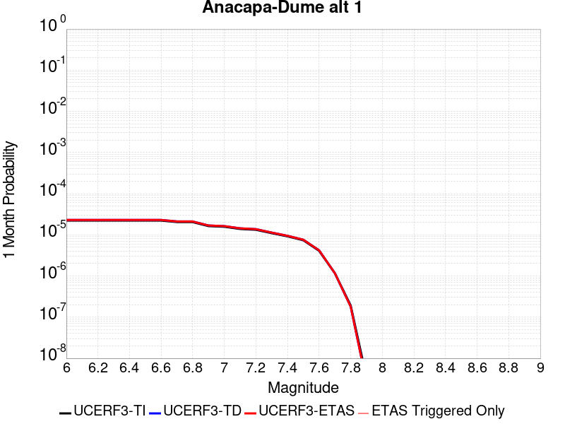 |  |  |

| Magnitude | 1 wk TI Prob | 1 wk TD Prob | 1 wk ETAS Prob | 1 wk ETAS/TD Gain | 1 wk ETAS Triggered Only | 1 mo TI Prob | 1 mo TD Prob | 1 mo ETAS Prob | 1 mo ETAS/TD Gain | 1 mo ETAS Triggered Only | 1 yr TI Prob | 1 yr TD Prob | 1 yr ETAS Prob | 1 yr ETAS/TD Gain | 1 yr ETAS Triggered Only | 10 yr TI Prob | 10 yr TD Prob | 10 yr ETAS Prob | 10 yr ETAS/TD Gain | 10 yr ETAS Triggered Only |
|-----|-----|-----|-----|-----|-----|-----|-----|-----|-----|-----|-----|-----|-----|-----|-----|-----|-----|-----|-----|-----|
| 6.0 | 5.1871802E-6 | 5.367475E-6 | 5.367475E-6 | 1.0 | 0.0 | 2.2230583E-5 | 2.3003266E-5 | 2.3003266E-5 | 1.0 | 0.0 | 2.7062374E-4 | 2.800296E-4 | 2.800296E-4 | 1.0 | 0.0 | 0.002702944 | 0.002796853 | 0.0028068249 | 1.0035654 | 1.0E-5 |
| 6.1 | 5.1871802E-6 | 5.367475E-6 | 5.367475E-6 | 1.0 | 0.0 | 2.2230583E-5 | 2.3003266E-5 | 2.3003266E-5 | 1.0 | 0.0 | 2.7062374E-4 | 2.800296E-4 | 2.800296E-4 | 1.0 | 0.0 | 0.002702944 | 0.002796853 | 0.0028068249 | 1.0035654 | 1.0E-5 |
| 6.2 | 5.1871802E-6 | 5.367475E-6 | 5.367475E-6 | 1.0 | 0.0 | 2.2230583E-5 | 2.3003266E-5 | 2.3003266E-5 | 1.0 | 0.0 | 2.7062374E-4 | 2.800296E-4 | 2.800296E-4 | 1.0 | 0.0 | 0.002702944 | 0.002796853 | 0.0028068249 | 1.0035654 | 1.0E-5 |
| 6.3 | 5.1871802E-6 | 5.367475E-6 | 5.367475E-6 | 1.0 | 0.0 | 2.2230583E-5 | 2.3003266E-5 | 2.3003266E-5 | 1.0 | 0.0 | 2.7062374E-4 | 2.800296E-4 | 2.800296E-4 | 1.0 | 0.0 | 0.002702944 | 0.002796853 | 0.0028068249 | 1.0035654 | 1.0E-5 |
| 6.4 | 5.1871802E-6 | 5.367475E-6 | 5.367475E-6 | 1.0 | 0.0 | 2.2230583E-5 | 2.3003266E-5 | 2.3003266E-5 | 1.0 | 0.0 | 2.7062374E-4 | 2.800296E-4 | 2.800296E-4 | 1.0 | 0.0 | 0.002702944 | 0.002796853 | 0.0028068249 | 1.0035654 | 1.0E-5 |
| 6.5 | 5.1871802E-6 | 5.367475E-6 | 5.367475E-6 | 1.0 | 0.0 | 2.2230583E-5 | 2.3003266E-5 | 2.3003266E-5 | 1.0 | 0.0 | 2.7062374E-4 | 2.800296E-4 | 2.800296E-4 | 1.0 | 0.0 | 0.002702944 | 0.002796853 | 0.0028068249 | 1.0035654 | 1.0E-5 |
| 6.6 | 5.1871802E-6 | 5.367475E-6 | 5.367475E-6 | 1.0 | 0.0 | 2.2230583E-5 | 2.3003266E-5 | 2.3003266E-5 | 1.0 | 0.0 | 2.7062374E-4 | 2.800296E-4 | 2.800296E-4 | 1.0 | 0.0 | 0.002702944 | 0.002796853 | 0.0028068249 | 1.0035654 | 1.0E-5 |
| 6.7 | 4.7693475E-6 | 4.9367704E-6 | 4.9367704E-6 | 1.0 | 0.0 | 2.04399E-5 | 2.115742E-5 | 2.115742E-5 | 1.0 | 0.0 | 2.4882736E-4 | 2.5756191E-4 | 2.5756191E-4 | 1.0 | 0.0 | 0.0024854892 | 0.00257271 | 0.0025826842 | 1.0038769 | 1.0E-5 |
| 6.8 | 4.753408E-6 | 4.9203186E-6 | 4.9203186E-6 | 1.0 | 0.0 | 2.037159E-5 | 2.1086913E-5 | 2.1086913E-5 | 1.0 | 0.0 | 2.4799586E-4 | 2.5670367E-4 | 2.5670367E-4 | 1.0 | 0.0 | 0.002477193 | 0.0025641476 | 0.0025741218 | 1.0038899 | 1.0E-5 |
| 6.9 | 3.800069E-6 | 3.9371926E-6 | 3.9371926E-6 | 1.0 | 0.0 | 1.6285909E-5 | 1.6873575E-5 | 1.6873575E-5 | 1.0 | 0.0 | 1.9826289E-4 | 2.0541664E-4 | 2.0541664E-4 | 1.0 | 0.0 | 0.001980861 | 0.0020522913 | 0.0020622709 | 1.0048625 | 1.0E-5 |
| 7.0 | 3.6671938E-6 | 3.799983E-6 | 3.799983E-6 | 1.0 | 0.0 | 1.571645E-5 | 1.6285541E-5 | 1.6285541E-5 | 1.0 | 0.0 | 1.9133097E-4 | 1.9825864E-4 | 1.9825864E-4 | 1.0 | 0.0 | 0.0019116632 | 0.001980841 | 0.0019908212 | 1.0050384 | 1.0E-5 |
| 7.1 | 3.2394885E-6 | 3.3588524E-6 | 3.3588524E-6 | 1.0 | 0.0 | 1.3883448E-5 | 1.4395003E-5 | 1.4395003E-5 | 1.0 | 0.0 | 1.6901788E-4 | 1.7524516E-4 | 1.7524516E-4 | 1.0 | 0.0 | 0.0016888938 | 0.001751081 | 0.0017610635 | 1.0057007 | 1.0E-5 |
| 7.2 | 3.0935948E-6 | 3.2079831E-6 | 3.2079831E-6 | 1.0 | 0.0 | 1.3258196E-5 | 1.3748427E-5 | 1.3748427E-5 | 1.0 | 0.0 | 1.6140658E-4 | 1.6737434E-4 | 1.6737434E-4 | 1.0 | 0.0 | 0.001612894 | 0.0016724939 | 0.0016824772 | 1.005969 | 1.0E-5 |
| 7.3 | 2.5604163E-6 | 2.6471184E-6 | 2.6471184E-6 | 1.0 | 0.0 | 1.0973167E-5 | 1.1344745E-5 | 1.1344745E-5 | 1.0 | 0.0 | 1.3359012E-4 | 1.3811355E-4 | 1.3811355E-4 | 1.0 | 0.0 | 0.0013350984 | 0.0013802818 | 0.0013802818 | 1.0 | 0.0 |
| 7.4 | 2.1429005E-6 | 2.2106403E-6 | 2.2106403E-6 | 1.0 | 0.0 | 9.1838265E-6 | 9.474138E-6 | 9.474138E-6 | 1.0 | 0.0 | 1.11807356E-4 | 1.1534156E-4 | 1.1534156E-4 | 1.0 | 0.0 | 0.0011175112 | 0.0011528196 | 0.0011528196 | 1.0 | 0.0 |
| 7.5 | 1.7237151E-6 | 1.7761753E-6 | 1.7761753E-6 | 1.0 | 0.0 | 7.3873293E-6 | 7.612158E-6 | 7.612158E-6 | 1.0 | 0.0 | 8.993702E-5 | 9.2674105E-5 | 9.2674105E-5 | 1.0 | 0.0 | 8.990063E-4 | 9.263569E-4 | 9.263569E-4 | 1.0 | 0.0 |
| 7.6 | 9.541696E-7 | 9.823373E-7 | 9.823373E-7 | 1.0 | 0.0 | 4.089292E-6 | 4.2100105E-6 | 4.2100105E-6 | 1.0 | 0.0 | 4.9785995E-5 | 5.1255684E-5 | 5.1255684E-5 | 1.0 | 0.0 | 4.9774844E-4 | 5.124399E-4 | 5.124399E-4 | 1.0 | 0.0 |
| 7.7 | 2.7226676E-7 | 2.7172788E-7 | 2.7172788E-7 | 1.0 | 0.0 | 1.166857E-6 | 1.1645476E-6 | 1.1645476E-6 | 1.0 | 0.0 | 1.4206392E-5 | 1.4178276E-5 | 1.4178276E-5 | 1.0 | 0.0 | 1.4205484E-4 | 1.4177378E-4 | 1.4177378E-4 | 1.0 | 0.0 |
| 7.8 | 4.5017995E-8 | 4.2158174E-8 | 4.2158174E-8 | 1.0 | 0.0 | 1.9293425E-7 | 1.8067787E-7 | 1.8067787E-7 | 1.0 | 0.0 | 2.348972E-6 | 2.1997512E-6 | 2.1997512E-6 | 1.0 | 0.0 | 2.348947E-5 | 2.1997315E-5 | 2.1997315E-5 | 1.0 | 0.0 |
| 7.9 | 8.007447E-10 | 6.1609906E-10 | 6.1609906E-10 | 1.0 | 0.0 | 3.4317629E-9 | 2.6404243E-9 | 2.6404243E-9 | 1.0 | 0.0 | 4.1781714E-8 | 3.2147163E-8 | 3.2147163E-8 | 1.0 | 0.0 | 4.1781706E-7 | 3.2147162E-7 | 3.2147162E-7 | 1.0 | 0.0 |

## San Andreas (Peninsula) 2011 CFM
*[(top)](#table-of-contents)*

| 1 Week | 1 Month | 1 Year | 10 Year |
|-----|-----|-----|-----|
|  |  |  |  |

| Magnitude | 1 wk TI Prob | 1 wk TD Prob | 1 wk ETAS Prob | 1 wk ETAS/TD Gain | 1 wk ETAS Triggered Only | 1 mo TI Prob | 1 mo TD Prob | 1 mo ETAS Prob | 1 mo ETAS/TD Gain | 1 mo ETAS Triggered Only | 1 yr TI Prob | 1 yr TD Prob | 1 yr ETAS Prob | 1 yr ETAS/TD Gain | 1 yr ETAS Triggered Only | 10 yr TI Prob | 10 yr TD Prob | 10 yr ETAS Prob | 10 yr ETAS/TD Gain | 10 yr ETAS Triggered Only |
|-----|-----|-----|-----|-----|-----|-----|-----|-----|-----|-----|-----|-----|-----|-----|-----|-----|-----|-----|-----|-----|
| 6.0 | 8.6200685E-5 | 2.5299323E-5 | 2.5299323E-5 | 1.0 | 0.0 | 3.6937918E-4 | 1.0842117E-4 | 1.0842117E-4 | 1.0 | 0.0 | 0.0044879215 | 0.0013192301 | 0.0013292169 | 1.0075701 | 1.0E-5 | 0.043983612 | 0.014820632 | 0.014830484 | 1.0006647 | 1.0E-5 |
| 6.1 | 8.6200685E-5 | 2.5299323E-5 | 2.5299323E-5 | 1.0 | 0.0 | 3.6937918E-4 | 1.0842117E-4 | 1.0842117E-4 | 1.0 | 0.0 | 0.0044879215 | 0.0013192301 | 0.0013292169 | 1.0075701 | 1.0E-5 | 0.043983612 | 0.014820632 | 0.014830484 | 1.0006647 | 1.0E-5 |
| 6.2 | 8.6200685E-5 | 2.5299323E-5 | 2.5299323E-5 | 1.0 | 0.0 | 3.6937918E-4 | 1.0842117E-4 | 1.0842117E-4 | 1.0 | 0.0 | 0.0044879215 | 0.0013192301 | 0.0013292169 | 1.0075701 | 1.0E-5 | 0.043983612 | 0.014820632 | 0.014830484 | 1.0006647 | 1.0E-5 |
| 6.3 | 8.551163E-5 | 2.4990744E-5 | 2.4990744E-5 | 1.0 | 0.0 | 3.6642692E-4 | 1.070988E-4 | 1.070988E-4 | 1.0 | 0.0 | 0.004452125 | 0.0013031496 | 0.0013131365 | 1.0076637 | 1.0E-5 | 0.043639794 | 0.0146473665 | 0.01465722 | 1.0006727 | 1.0E-5 |
| 6.4 | 8.551163E-5 | 2.4990744E-5 | 2.4990744E-5 | 1.0 | 0.0 | 3.6642692E-4 | 1.070988E-4 | 1.070988E-4 | 1.0 | 0.0 | 0.004452125 | 0.0013031496 | 0.0013131365 | 1.0076637 | 1.0E-5 | 0.043639794 | 0.0146473665 | 0.01465722 | 1.0006727 | 1.0E-5 |
| 6.5 | 8.511146E-5 | 2.481191E-5 | 2.481191E-5 | 1.0 | 0.0 | 3.647124E-4 | 1.0633243E-4 | 1.0633243E-4 | 1.0 | 0.0 | 0.004431336 | 0.0012938301 | 0.0013038173 | 1.007719 | 1.0E-5 | 0.04344007 | 0.014547001 | 0.014556856 | 1.0006775 | 1.0E-5 |
| 6.6 | 8.4985084E-5 | 2.4742458E-5 | 2.4742458E-5 | 1.0 | 0.0 | 3.6417096E-4 | 1.060348E-4 | 1.060348E-4 | 1.0 | 0.0 | 0.0044247704 | 0.0012902108 | 0.0013001979 | 1.0077406 | 1.0E-5 | 0.043376986 | 0.014509025 | 0.01451888 | 1.0006793 | 1.0E-5 |
| 6.7 | 8.462618E-5 | 2.4570716E-5 | 2.4570716E-5 | 1.0 | 0.0 | 3.6263323E-4 | 1.0529883E-4 | 1.0529883E-4 | 1.0 | 0.0 | 0.004406125 | 0.0012812609 | 0.0012912481 | 1.0077949 | 1.0E-5 | 0.043197807 | 0.014413709 | 0.014423565 | 1.0006838 | 1.0E-5 |
| 6.8 | 8.42337E-5 | 2.4466328E-5 | 2.4466328E-5 | 1.0 | 0.0 | 3.6095164E-4 | 1.0485148E-4 | 1.0485148E-4 | 1.0 | 0.0 | 0.004385734 | 0.0012758209 | 0.0012858082 | 1.0078281 | 1.0E-5 | 0.043001823 | 0.0143542895 | 0.014364146 | 1.0006866 | 1.0E-5 |
| 6.9 | 8.365989E-5 | 2.4270661E-5 | 2.4270661E-5 | 1.0 | 0.0 | 3.5849313E-4 | 1.0401298E-4 | 1.0401298E-4 | 1.0 | 0.0 | 0.004355922 | 0.0012656241 | 0.0012756113 | 1.0078913 | 1.0E-5 | 0.04271523 | 0.014246636 | 0.014256493 | 1.0006919 | 1.0E-5 |
| 7.0 | 8.30936E-5 | 2.4031906E-5 | 2.4031906E-5 | 1.0 | 0.0 | 3.560668E-4 | 1.0298983E-4 | 1.0298983E-4 | 1.0 | 0.0 | 0.004326499 | 0.0012531815 | 0.001263169 | 1.0079697 | 1.0E-5 | 0.042432297 | 0.014117494 | 0.014127353 | 1.0006983 | 1.0E-5 |
| 7.1 | 8.041264E-5 | 2.371773E-5 | 2.371773E-5 | 1.0 | 0.0 | 3.4458007E-4 | 1.0164346E-4 | 1.0164346E-4 | 1.0 | 0.0 | 0.0041871946 | 0.0012368083 | 0.0012467959 | 1.0080754 | 1.0E-5 | 0.041091725 | 0.013939961 | 0.013949821 | 1.0007074 | 1.0E-5 |
| 7.2 | 7.8427016E-5 | 2.3140641E-5 | 2.3140641E-5 | 1.0 | 0.0 | 3.3607247E-4 | 9.9170415E-5 | 9.9170415E-5 | 1.0 | 0.0 | 0.004084008 | 0.0012067326 | 0.0012167206 | 1.0082768 | 1.0E-5 | 0.040097635 | 0.013623629 | 0.013633492 | 1.0007241 | 1.0E-5 |
| 7.3 | 7.721087E-5 | 2.2925187E-5 | 2.2925187E-5 | 1.0 | 0.0 | 3.3086175E-4 | 9.824711E-5 | 9.824711E-5 | 1.0 | 0.0 | 0.004020803 | 0.0011955039 | 0.0012054918 | 1.0083547 | 1.0E-5 | 0.03948827 | 0.01350719 | 0.013517056 | 1.0007304 | 1.0E-5 |
| 7.4 | 7.3536525E-5 | 2.1035192E-5 | 2.1035192E-5 | 1.0 | 0.0 | 3.1511846E-4 | 9.014771E-5 | 9.014771E-5 | 1.0 | 0.0 | 0.0038298194 | 0.0010969971 | 0.0011069861 | 1.0091058 | 1.0E-5 | 0.037644852 | 0.012460326 | 0.012470202 | 1.0007925 | 1.0E-5 |
| 7.5 | 6.806207E-5 | 1.883094E-5 | 1.883094E-5 | 1.0 | 0.0 | 2.9166197E-4 | 8.070154E-5 | 8.070154E-5 | 1.0 | 0.0 | 0.0035452035 | 9.820994E-4 | 9.920896E-4 | 1.0101722 | 1.0E-5 | 0.034891766 | 0.011207985 | 0.011217873 | 1.0008823 | 1.0E-5 |
| 7.6 | 5.6731416E-5 | 1.42207355E-5 | 1.42207355E-5 | 1.0 | 0.0 | 2.43112E-4 | 6.0944585E-5 | 6.0944585E-5 | 1.0 | 0.0 | 0.0029558712 | 7.417479E-4 | 7.517405E-4 | 1.0134717 | 1.0E-5 | 0.02916862 | 0.008509871 | 0.0085197855 | 1.0011652 | 1.0E-5 |
| 7.7 | 4.946994E-5 | 1.3285227E-5 | 1.3285227E-5 | 1.0 | 0.0 | 2.1199681E-4 | 5.6935445E-5 | 5.6935445E-5 | 1.0 | 0.0 | 0.002578006 | 6.929687E-4 | 7.029618E-4 | 1.0144206 | 1.0E-5 | 0.02548303 | 0.007929963 | 0.0079398835 | 1.001251 | 1.0E-5 |
| 7.8 | 3.9718198E-5 | 1.3019907E-5 | 1.3019907E-5 | 1.0 | 0.0 | 1.7020974E-4 | 5.5798406E-5 | 5.5798406E-5 | 1.0 | 0.0 | 0.0020703338 | 6.79134E-4 | 6.891272E-4 | 1.0147146 | 1.0E-5 | 0.020511515 | 0.0077394047 | 0.0077493275 | 1.0012821 | 1.0E-5 |
| 7.9 | 2.4115114E-5 | 1.2218613E-5 | 1.2218613E-5 | 1.0 | 0.0 | 1.0334639E-4 | 5.2364434E-5 | 5.2364434E-5 | 1.0 | 0.0 | 0.001257516 | 6.373506E-4 | 6.473443E-4 | 1.01568 | 1.0E-5 | 0.012504238 | 0.0071770544 | 0.007186983 | 1.0013833 | 1.0E-5 |
| 8.0 | 1.7756569E-5 | 1.1439783E-5 | 1.1439783E-5 | 1.0 | 0.0 | 7.6097356E-5 | 4.902672E-5 | 4.902672E-5 | 1.0 | 0.0 | 9.260915E-4 | 5.9673697E-4 | 6.06731E-4 | 1.0167478 | 1.0E-5 | 0.009222416 | 0.0066755274 | 0.006685461 | 1.001488 | 1.0E-5 |
| 8.1 | 1.3159258E-5 | 9.7714465E-6 | 9.7714465E-6 | 1.0 | 0.0 | 5.6395602E-5 | 4.1876956E-5 | 4.1876956E-5 | 1.0 | 0.0 | 6.864001E-4 | 5.097328E-4 | 5.197277E-4 | 1.0196081 | 1.0E-5 | 0.0068428386 | 0.005703134 | 0.005713077 | 1.0017434 | 1.0E-5 |
| 8.2 | 8.635426E-6 | 5.4821826E-6 | 5.4821826E-6 | 1.0 | 0.0 | 3.700844E-5 | 2.3494857E-5 | 2.3494857E-5 | 1.0 | 0.0 | 4.5048463E-4 | 2.860124E-4 | 2.9600956E-4 | 1.0349535 | 1.0E-5 | 0.004495725 | 0.0032528515 | 0.003262819 | 1.0030643 | 1.0E-5 |
| 8.3 | 1.983087E-6 | 7.6850927E-7 | 7.6850927E-7 | 1.0 | 0.0 | 8.498917E-6 | 3.293607E-6 | 3.293607E-6 | 1.0 | 0.0 | 1.034694E-4 | 4.0098945E-5 | 4.0098945E-5 | 1.0 | 0.0 | 0.0010342124 | 4.7341356E-4 | 4.7341356E-4 | 1.0 | 0.0 |

## San Gorgonio Pass
*[(top)](#table-of-contents)*

| 1 Week | 1 Month | 1 Year | 10 Year |
|-----|-----|-----|-----|
|  |  |  |  |

| Magnitude | 1 wk TI Prob | 1 wk TD Prob | 1 wk ETAS Prob | 1 wk ETAS/TD Gain | 1 wk ETAS Triggered Only | 1 mo TI Prob | 1 mo TD Prob | 1 mo ETAS Prob | 1 mo ETAS/TD Gain | 1 mo ETAS Triggered Only | 1 yr TI Prob | 1 yr TD Prob | 1 yr ETAS Prob | 1 yr ETAS/TD Gain | 1 yr ETAS Triggered Only | 10 yr TI Prob | 10 yr TD Prob | 10 yr ETAS Prob | 10 yr ETAS/TD Gain | 10 yr ETAS Triggered Only |
|-----|-----|-----|-----|-----|-----|-----|-----|-----|-----|-----|-----|-----|-----|-----|-----|-----|-----|-----|-----|-----|
| 6.0 | 7.644328E-6 | 1.3320437E-5 | 1.3320437E-5 | 1.0 | 0.0 | 3.2760996E-5 | 5.708638E-5 | 5.708638E-5 | 1.0 | 0.0 | 3.987921E-4 | 6.948137E-4 | 7.048067E-4 | 1.0143824 | 1.0E-5 | 0.003980772 | 0.006933179 | 0.00694311 | 1.0014323 | 1.0E-5 |
| 6.1 | 7.644328E-6 | 1.3320437E-5 | 1.3320437E-5 | 1.0 | 0.0 | 3.2760996E-5 | 5.708638E-5 | 5.708638E-5 | 1.0 | 0.0 | 3.987921E-4 | 6.948137E-4 | 7.048067E-4 | 1.0143824 | 1.0E-5 | 0.003980772 | 0.006933179 | 0.00694311 | 1.0014323 | 1.0E-5 |
| 6.2 | 7.644328E-6 | 1.3320437E-5 | 1.3320437E-5 | 1.0 | 0.0 | 3.2760996E-5 | 5.708638E-5 | 5.708638E-5 | 1.0 | 0.0 | 3.987921E-4 | 6.948137E-4 | 7.048067E-4 | 1.0143824 | 1.0E-5 | 0.003980772 | 0.006933179 | 0.00694311 | 1.0014323 | 1.0E-5 |
| 6.3 | 7.644328E-6 | 1.3320437E-5 | 1.3320437E-5 | 1.0 | 0.0 | 3.2760996E-5 | 5.708638E-5 | 5.708638E-5 | 1.0 | 0.0 | 3.987921E-4 | 6.948137E-4 | 7.048067E-4 | 1.0143824 | 1.0E-5 | 0.003980772 | 0.006933179 | 0.00694311 | 1.0014323 | 1.0E-5 |
| 6.4 | 7.644328E-6 | 1.3320437E-5 | 1.3320437E-5 | 1.0 | 0.0 | 3.2760996E-5 | 5.708638E-5 | 5.708638E-5 | 1.0 | 0.0 | 3.987921E-4 | 6.948137E-4 | 7.048067E-4 | 1.0143824 | 1.0E-5 | 0.003980772 | 0.006933179 | 0.00694311 | 1.0014323 | 1.0E-5 |
| 6.5 | 7.644328E-6 | 1.3320437E-5 | 1.3320437E-5 | 1.0 | 0.0 | 3.2760996E-5 | 5.708638E-5 | 5.708638E-5 | 1.0 | 0.0 | 3.987921E-4 | 6.948137E-4 | 7.048067E-4 | 1.0143824 | 1.0E-5 | 0.003980772 | 0.006933179 | 0.00694311 | 1.0014323 | 1.0E-5 |
| 6.6 | 7.644328E-6 | 1.3320437E-5 | 1.3320437E-5 | 1.0 | 0.0 | 3.2760996E-5 | 5.708638E-5 | 5.708638E-5 | 1.0 | 0.0 | 3.987921E-4 | 6.948137E-4 | 7.048067E-4 | 1.0143824 | 1.0E-5 | 0.003980772 | 0.006933179 | 0.00694311 | 1.0014323 | 1.0E-5 |
| 6.7 | 6.987586E-6 | 1.2624694E-5 | 1.2624694E-5 | 1.0 | 0.0 | 2.9946454E-5 | 5.4104756E-5 | 5.4104756E-5 | 1.0 | 0.0 | 3.645371E-4 | 6.585344E-4 | 6.585344E-4 | 1.0 | 0.0 | 0.0036393967 | 0.006572548 | 0.006572548 | 1.0 | 0.0 |
| 6.8 | 6.987586E-6 | 1.2624694E-5 | 1.2624694E-5 | 1.0 | 0.0 | 2.9946454E-5 | 5.4104756E-5 | 5.4104756E-5 | 1.0 | 0.0 | 3.645371E-4 | 6.585344E-4 | 6.585344E-4 | 1.0 | 0.0 | 0.0036393967 | 0.006572548 | 0.006572548 | 1.0 | 0.0 |
| 6.9 | 5.504702E-6 | 1.1055521E-5 | 1.1055521E-5 | 1.0 | 0.0 | 2.3591367E-5 | 4.7379974E-5 | 4.7379974E-5 | 1.0 | 0.0 | 2.8718702E-4 | 5.767035E-4 | 5.767035E-4 | 1.0 | 0.0 | 0.0028681618 | 0.005758484 | 0.005758484 | 1.0 | 0.0 |
| 7.0 | 5.4825764E-6 | 1.10318615E-5 | 1.10318615E-5 | 1.0 | 0.0 | 2.3496545E-5 | 4.7278576E-5 | 4.7278576E-5 | 1.0 | 0.0 | 2.8603288E-4 | 5.754697E-4 | 5.754697E-4 | 1.0 | 0.0 | 0.00285665 | 0.0057462095 | 0.0057462095 | 1.0 | 0.0 |
| 7.1 | 5.4692787E-6 | 1.1017571E-5 | 1.1017571E-5 | 1.0 | 0.0 | 2.3439556E-5 | 4.7217334E-5 | 4.7217334E-5 | 1.0 | 0.0 | 2.8533922E-4 | 5.7472446E-4 | 5.7472446E-4 | 1.0 | 0.0 | 0.0028497311 | 0.0057387957 | 0.0057387957 | 1.0 | 0.0 |
| 7.2 | 5.453661E-6 | 1.1000597E-5 | 1.1000597E-5 | 1.0 | 0.0 | 2.3372622E-5 | 4.714459E-5 | 4.714459E-5 | 1.0 | 0.0 | 2.8452452E-4 | 5.738393E-4 | 5.738393E-4 | 1.0 | 0.0 | 0.002841605 | 0.0057299896 | 0.0057299896 | 1.0 | 0.0 |
| 7.3 | 5.4422303E-6 | 1.0987519E-5 | 1.0987519E-5 | 1.0 | 0.0 | 2.3323635E-5 | 4.7088546E-5 | 4.7088546E-5 | 1.0 | 0.0 | 2.8392827E-4 | 5.731573E-4 | 5.731573E-4 | 1.0 | 0.0 | 0.0028356577 | 0.005723205 | 0.005723205 | 1.0 | 0.0 |
| 7.4 | 5.398595E-6 | 1.093488E-5 | 1.093488E-5 | 1.0 | 0.0 | 2.313663E-5 | 4.686296E-5 | 4.686296E-5 | 1.0 | 0.0 | 2.8165206E-4 | 5.704122E-4 | 5.704122E-4 | 1.0 | 0.0 | 0.0028129534 | 0.0056958953 | 0.0056958953 | 1.0 | 0.0 |
| 7.5 | 5.3578788E-6 | 1.0861415E-5 | 1.0861415E-5 | 1.0 | 0.0 | 2.2962136E-5 | 4.654812E-5 | 4.654812E-5 | 1.0 | 0.0 | 2.7952815E-4 | 5.6658103E-4 | 5.6658103E-4 | 1.0 | 0.0 | 0.002791768 | 0.0056578033 | 0.0056578033 | 1.0 | 0.0 |
| 7.6 | 4.8091474E-6 | 9.609473E-6 | 9.609473E-6 | 1.0 | 0.0 | 2.0610469E-5 | 4.118283E-5 | 4.118283E-5 | 1.0 | 0.0 | 2.5090357E-4 | 5.0129043E-4 | 5.0129043E-4 | 1.0 | 0.0 | 0.0025062046 | 0.0050082947 | 0.0050082947 | 1.0 | 0.0 |
| 7.7 | 1.5991155E-6 | 3.3560002E-6 | 3.3560002E-6 | 1.0 | 0.0 | 6.853334E-6 | 1.438278E-5 | 1.438278E-5 | 1.0 | 0.0 | 8.343615E-5 | 1.7509653E-4 | 1.7509653E-4 | 1.0 | 0.0 | 8.340483E-4 | 0.0017550315 | 0.0017550315 | 1.0 | 0.0 |
| 7.8 | 9.258398E-7 | 2.0603331E-6 | 2.0603331E-6 | 1.0 | 0.0 | 3.967879E-6 | 8.829969E-6 | 8.829969E-6 | 1.0 | 0.0 | 4.8307855E-5 | 1.07499596E-4 | 1.07499596E-4 | 1.0 | 0.0 | 4.8297356E-4 | 0.0010798977 | 0.0010798977 | 1.0 | 0.0 |
| 7.9 | 5.975575E-7 | 1.2308726E-6 | 1.2308726E-6 | 1.0 | 0.0 | 2.5609581E-6 | 5.275158E-6 | 5.275158E-6 | 1.0 | 0.0 | 3.117922E-5 | 6.422316E-5 | 6.422316E-5 | 1.0 | 0.0 | 3.1174847E-4 | 6.471855E-4 | 6.471855E-4 | 1.0 | 0.0 |
| 8.0 | 3.4413725E-7 | 6.724987E-7 | 6.724987E-7 | 1.0 | 0.0 | 1.4748731E-6 | 2.882134E-6 | 2.882134E-6 | 1.0 | 0.0 | 1.7956432E-5 | 3.5089422E-5 | 3.5089422E-5 | 1.0 | 0.0 | 1.7954981E-4 | 3.5426387E-4 | 3.5426387E-4 | 1.0 | 0.0 |
| 8.1 | 1.1787731E-8 | 9.66029E-9 | 9.66029E-9 | 1.0 | 0.0 | 5.0518846E-8 | 4.1401243E-8 | 4.1401243E-8 | 1.0 | 0.0 | 6.1506677E-7 | 5.0406004E-7 | 5.0406004E-7 | 1.0 | 0.0 | 6.1506507E-6 | 5.2562696E-6 | 5.2562696E-6 | 1.0 | 0.0 |

## Homestead Valley 2011
*[(top)](#table-of-contents)*

| 1 Week | 1 Month | 1 Year | 10 Year |
|-----|-----|-----|-----|
|  |  |  |  |

| Magnitude | 1 wk TI Prob | 1 wk TD Prob | 1 wk ETAS Prob | 1 wk ETAS/TD Gain | 1 wk ETAS Triggered Only | 1 mo TI Prob | 1 mo TD Prob | 1 mo ETAS Prob | 1 mo ETAS/TD Gain | 1 mo ETAS Triggered Only | 1 yr TI Prob | 1 yr TD Prob | 1 yr ETAS Prob | 1 yr ETAS/TD Gain | 1 yr ETAS Triggered Only | 10 yr TI Prob | 10 yr TD Prob | 10 yr ETAS Prob | 10 yr ETAS/TD Gain | 10 yr ETAS Triggered Only |
|-----|-----|-----|-----|-----|-----|-----|-----|-----|-----|-----|-----|-----|-----|-----|-----|-----|-----|-----|-----|-----|
| 6.0 | 1.539795E-5 | 6.286808E-6 | 6.286808E-6 | 1.0 | 0.0 | 6.5989545E-5 | 2.69433E-5 | 2.69433E-5 | 1.0 | 0.0 | 8.0312655E-4 | 3.2800593E-4 | 3.3800263E-4 | 1.0304773 | 1.0E-5 | 0.008002302 | 0.003277239 | 0.0032872062 | 1.0030414 | 1.0E-5 |
| 6.1 | 1.539795E-5 | 6.286808E-6 | 6.286808E-6 | 1.0 | 0.0 | 6.5989545E-5 | 2.69433E-5 | 2.69433E-5 | 1.0 | 0.0 | 8.0312655E-4 | 3.2800593E-4 | 3.3800263E-4 | 1.0304773 | 1.0E-5 | 0.008002302 | 0.003277239 | 0.0032872062 | 1.0030414 | 1.0E-5 |
| 6.2 | 1.539795E-5 | 6.286808E-6 | 6.286808E-6 | 1.0 | 0.0 | 6.5989545E-5 | 2.69433E-5 | 2.69433E-5 | 1.0 | 0.0 | 8.0312655E-4 | 3.2800593E-4 | 3.3800263E-4 | 1.0304773 | 1.0E-5 | 0.008002302 | 0.003277239 | 0.0032872062 | 1.0030414 | 1.0E-5 |
| 6.3 | 1.539795E-5 | 6.286808E-6 | 6.286808E-6 | 1.0 | 0.0 | 6.5989545E-5 | 2.69433E-5 | 2.69433E-5 | 1.0 | 0.0 | 8.0312655E-4 | 3.2800593E-4 | 3.3800263E-4 | 1.0304773 | 1.0E-5 | 0.008002302 | 0.003277239 | 0.0032872062 | 1.0030414 | 1.0E-5 |
| 6.4 | 1.539795E-5 | 6.286808E-6 | 6.286808E-6 | 1.0 | 0.0 | 6.5989545E-5 | 2.69433E-5 | 2.69433E-5 | 1.0 | 0.0 | 8.0312655E-4 | 3.2800593E-4 | 3.3800263E-4 | 1.0304773 | 1.0E-5 | 0.008002302 | 0.003277239 | 0.0032872062 | 1.0030414 | 1.0E-5 |
| 6.5 | 1.0265258E-5 | 2.8789477E-6 | 2.8789477E-6 | 1.0 | 0.0 | 4.3993223E-5 | 1.2338328E-5 | 1.2338328E-5 | 1.0 | 0.0 | 5.3548586E-4 | 1.5021574E-4 | 1.6021424E-4 | 1.0665609 | 1.0E-5 | 0.005341973 | 0.001501824 | 0.001511809 | 1.0066485 | 1.0E-5 |
| 6.6 | 6.664671E-6 | 5.3486906E-7 | 5.3486906E-7 | 1.0 | 0.0 | 2.8562565E-5 | 2.2922945E-6 | 2.2922945E-6 | 1.0 | 0.0 | 3.476937E-4 | 2.7908449E-5 | 3.790817E-5 | 1.3583044 | 1.0E-5 | 0.003471502 | 2.790611E-4 | 2.8905828E-4 | 1.0358244 | 1.0E-5 |
| 6.7 | 6.5954046E-6 | 5.3486906E-7 | 5.3486906E-7 | 1.0 | 0.0 | 2.8265715E-5 | 2.2922945E-6 | 2.2922945E-6 | 1.0 | 0.0 | 3.4408073E-4 | 2.7908449E-5 | 3.790817E-5 | 1.3583044 | 1.0E-5 | 0.0034354846 | 2.790611E-4 | 2.8905828E-4 | 1.0358244 | 1.0E-5 |
| 6.8 | 4.648189E-6 | 2.3268706E-7 | 2.3268706E-7 | 1.0 | 0.0 | 1.9920659E-5 | 9.972299E-7 | 9.972299E-7 | 1.0 | 0.0 | 2.4250703E-4 | 1.214121E-5 | 2.214109E-5 | 1.823631 | 1.0E-5 | 0.0024224254 | 1.2140595E-4 | 1.3140474E-4 | 1.0823582 | 1.0E-5 |
| 6.9 | 4.1428534E-6 | 1.9347326E-7 | 1.9347326E-7 | 1.0 | 0.0 | 1.7754966E-5 | 8.2917086E-7 | 8.2917086E-7 | 1.0 | 0.0 | 2.1614527E-4 | 1.0095111E-5 | 2.009501E-5 | 1.9905685 | 1.0E-5 | 0.0021593515 | 1.00946825E-4 | 1.1094582E-4 | 1.0990521 | 1.0E-5 |
| 7.0 | 3.0673707E-6 | 1.5369882E-7 | 1.5369882E-7 | 1.0 | 0.0 | 1.3145808E-5 | 6.587091E-7 | 6.587091E-7 | 1.0 | 0.0 | 1.6003846E-4 | 8.019754E-6 | 1.8019675E-5 | 2.246911 | 1.0E-5 | 0.0015992324 | 8.019475E-5 | 9.019396E-5 | 1.1246865 | 1.0E-5 |
| 7.1 | 2.340854E-6 | 1.4689793E-7 | 1.4689793E-7 | 1.0 | 0.0 | 1.0032193E-5 | 6.295624E-7 | 6.295624E-7 | 1.0 | 0.0 | 1.221351E-4 | 7.664897E-6 | 1.766482E-5 | 2.304639 | 1.0E-5 | 0.00122068 | 7.664642E-5 | 8.6645654E-5 | 1.1304592 | 1.0E-5 |
| 7.2 | 1.3754182E-6 | 1.3924571E-7 | 1.3924571E-7 | 1.0 | 0.0 | 5.8946357E-6 | 5.967672E-7 | 5.967672E-7 | 1.0 | 0.0 | 7.176483E-5 | 7.2656176E-6 | 1.7265545E-5 | 2.3763356 | 1.0E-5 | 7.174166E-4 | 7.265389E-5 | 8.265317E-5 | 1.1376289 | 1.0E-5 |
| 7.3 | 1.2573237E-6 | 1.3829064E-7 | 1.3829064E-7 | 1.0 | 0.0 | 5.388519E-6 | 5.9267404E-7 | 5.9267404E-7 | 1.0 | 0.0 | 6.560324E-5 | 7.2157836E-6 | 1.721571E-5 | 2.385841 | 1.0E-5 | 6.558388E-4 | 7.2155584E-5 | 8.215486E-5 | 1.1385794 | 1.0E-5 |
| 7.4 | 1.0994207E-6 | 1.310791E-7 | 1.310791E-7 | 1.0 | 0.0 | 4.7117946E-6 | 5.617675E-7 | 5.617675E-7 | 1.0 | 0.0 | 5.736459E-5 | 6.839499E-6 | 1.683943E-5 | 2.4620855 | 1.0E-5 | 5.734978E-4 | 6.8392976E-5 | 7.839229E-5 | 1.1462039 | 1.0E-5 |
| 7.5 | 5.5569126E-7 | 6.773804E-8 | 6.773804E-8 | 1.0 | 0.0 | 2.3815317E-6 | 2.9030588E-7 | 2.9030588E-7 | 1.0 | 0.0 | 2.8994764E-5 | 3.534469E-6 | 1.35344335E-5 | 3.8292694 | 1.0E-5 | 2.899098E-4 | 3.534419E-5 | 4.5343837E-5 | 1.2829219 | 1.0E-5 |

## Big Pine (West)
*[(top)](#table-of-contents)*

| 1 Week | 1 Month | 1 Year | 10 Year |
|-----|-----|-----|-----|
|  |  |  |  |

| Magnitude | 1 wk TI Prob | 1 wk TD Prob | 1 wk ETAS Prob | 1 wk ETAS/TD Gain | 1 wk ETAS Triggered Only | 1 mo TI Prob | 1 mo TD Prob | 1 mo ETAS Prob | 1 mo ETAS/TD Gain | 1 mo ETAS Triggered Only | 1 yr TI Prob | 1 yr TD Prob | 1 yr ETAS Prob | 1 yr ETAS/TD Gain | 1 yr ETAS Triggered Only | 10 yr TI Prob | 10 yr TD Prob | 10 yr ETAS Prob | 10 yr ETAS/TD Gain | 10 yr ETAS Triggered Only |
|-----|-----|-----|-----|-----|-----|-----|-----|-----|-----|-----|-----|-----|-----|-----|-----|-----|-----|-----|-----|-----|
| 6.0 | 6.8306974E-7 | 6.881851E-7 | 6.881851E-7 | 1.0 | 0.0 | 2.9274386E-6 | 2.9493617E-6 | 2.9493617E-6 | 1.0 | 0.0 | 3.564098E-5 | 3.5907982E-5 | 3.5907982E-5 | 1.0 | 0.0 | 3.5635266E-4 | 3.590312E-4 | 3.690276E-4 | 1.0278428 | 1.0E-5 |
| 6.1 | 6.8306974E-7 | 6.881851E-7 | 6.881851E-7 | 1.0 | 0.0 | 2.9274386E-6 | 2.9493617E-6 | 2.9493617E-6 | 1.0 | 0.0 | 3.564098E-5 | 3.5907982E-5 | 3.5907982E-5 | 1.0 | 0.0 | 3.5635266E-4 | 3.590312E-4 | 3.690276E-4 | 1.0278428 | 1.0E-5 |
| 6.2 | 6.8306974E-7 | 6.881851E-7 | 6.881851E-7 | 1.0 | 0.0 | 2.9274386E-6 | 2.9493617E-6 | 2.9493617E-6 | 1.0 | 0.0 | 3.564098E-5 | 3.5907982E-5 | 3.5907982E-5 | 1.0 | 0.0 | 3.5635266E-4 | 3.590312E-4 | 3.690276E-4 | 1.0278428 | 1.0E-5 |
| 6.3 | 4.227652E-7 | 4.266576E-7 | 4.266576E-7 | 1.0 | 0.0 | 1.8118495E-6 | 1.8285314E-6 | 1.8285314E-6 | 1.0 | 0.0 | 2.2059045E-5 | 2.2262162E-5 | 2.2262162E-5 | 1.0 | 0.0 | 2.2056856E-4 | 2.2260113E-4 | 2.325989E-4 | 1.0449134 | 1.0E-5 |
| 6.4 | 4.227652E-7 | 4.266576E-7 | 4.266576E-7 | 1.0 | 0.0 | 1.8118495E-6 | 1.8285314E-6 | 1.8285314E-6 | 1.0 | 0.0 | 2.2059045E-5 | 2.2262162E-5 | 2.2262162E-5 | 1.0 | 0.0 | 2.2056856E-4 | 2.2260113E-4 | 2.325989E-4 | 1.0449134 | 1.0E-5 |
| 6.5 | 3.1538403E-7 | 3.1884667E-7 | 3.1884667E-7 | 1.0 | 0.0 | 1.3516451E-6 | 1.366485E-6 | 1.366485E-6 | 1.0 | 0.0 | 1.6456155E-5 | 1.6636832E-5 | 1.6636832E-5 | 1.0 | 0.0 | 1.6454936E-4 | 1.6635627E-4 | 1.6635627E-4 | 1.0 | 0.0 |
| 6.6 | 3.1538403E-7 | 3.1884667E-7 | 3.1884667E-7 | 1.0 | 0.0 | 1.3516451E-6 | 1.366485E-6 | 1.366485E-6 | 1.0 | 0.0 | 1.6456155E-5 | 1.6636832E-5 | 1.6636832E-5 | 1.0 | 0.0 | 1.6454936E-4 | 1.6635627E-4 | 1.6635627E-4 | 1.0 | 0.0 |
| 6.7 | 3.1538403E-7 | 3.1884667E-7 | 3.1884667E-7 | 1.0 | 0.0 | 1.3516451E-6 | 1.366485E-6 | 1.366485E-6 | 1.0 | 0.0 | 1.6456155E-5 | 1.6636832E-5 | 1.6636832E-5 | 1.0 | 0.0 | 1.6454936E-4 | 1.6635627E-4 | 1.6635627E-4 | 1.0 | 0.0 |
| 6.8 | 3.1538403E-7 | 3.1884667E-7 | 3.1884667E-7 | 1.0 | 0.0 | 1.3516451E-6 | 1.366485E-6 | 1.366485E-6 | 1.0 | 0.0 | 1.6456155E-5 | 1.6636832E-5 | 1.6636832E-5 | 1.0 | 0.0 | 1.6454936E-4 | 1.6635627E-4 | 1.6635627E-4 | 1.0 | 0.0 |
| 6.9 | 3.0402092E-7 | 3.0739935E-7 | 3.0739935E-7 | 1.0 | 0.0 | 1.3029462E-6 | 1.3174251E-6 | 1.3174251E-6 | 1.0 | 0.0 | 1.5863254E-5 | 1.6039536E-5 | 1.6039536E-5 | 1.0 | 0.0 | 1.5862122E-4 | 1.6038418E-4 | 1.6038418E-4 | 1.0 | 0.0 |
| 7.0 | 2.3673063E-7 | 2.3944423E-7 | 2.3944423E-7 | 1.0 | 0.0 | 1.0145594E-6 | 1.0261892E-6 | 1.0261892E-6 | 1.0 | 0.0 | 1.235219E-5 | 1.2493784E-5 | 1.2493784E-5 | 1.0 | 0.0 | 1.2351504E-4 | 1.249311E-4 | 1.249311E-4 | 1.0 | 0.0 |
| 7.1 | 1.632138E-7 | 1.6514589E-7 | 1.6514589E-7 | 1.0 | 0.0 | 6.9948754E-7 | 7.077679E-7 | 7.077679E-7 | 1.0 | 0.0 | 8.516227E-6 | 8.617042E-6 | 8.617042E-6 | 1.0 | 0.0 | 8.5159016E-5 | 8.616725E-5 | 8.616725E-5 | 1.0 | 0.0 |
| 7.2 | 1.1523723E-7 | 1.1657219E-7 | 1.1657219E-7 | 1.0 | 0.0 | 4.9387376E-7 | 4.99595E-7 | 4.99595E-7 | 1.0 | 0.0 | 6.0128964E-6 | 6.082553E-6 | 6.082553E-6 | 1.0 | 0.0 | 6.0127335E-5 | 6.0823975E-5 | 6.0823975E-5 | 1.0 | 0.0 |
| 7.3 | 7.777805E-8 | 7.86248E-8 | 7.86248E-8 | 1.0 | 0.0 | 3.3333444E-7 | 3.3696338E-7 | 3.3696338E-7 | 1.0 | 0.0 | 4.0583395E-6 | 4.102522E-6 | 4.102522E-6 | 1.0 | 0.0 | 4.0582654E-5 | 4.102452E-5 | 4.102452E-5 | 1.0 | 0.0 |
| 7.4 | 4.609946E-8 | 4.6522302E-8 | 4.6522302E-8 | 1.0 | 0.0 | 1.975691E-7 | 1.9938129E-7 | 1.9938129E-7 | 1.0 | 0.0 | 2.4054011E-6 | 2.4274646E-6 | 2.4274646E-6 | 1.0 | 0.0 | 2.405375E-5 | 2.4274399E-5 | 2.4274399E-5 | 1.0 | 0.0 |
| 7.5 | 2.3439137E-8 | 2.3608353E-8 | 2.3608353E-8 | 1.0 | 0.0 | 1.00453434E-7 | 1.0117865E-7 | 1.0117865E-7 | 1.0 | 0.0 | 1.2230199E-6 | 1.2318493E-6 | 1.2318493E-6 | 1.0 | 0.0 | 1.2230132E-5 | 1.2318428E-5 | 1.2318428E-5 | 1.0 | 0.0 |
| 7.6 | 1.6699769E-8 | 1.681712E-8 | 1.681712E-8 | 1.0 | 0.0 | 7.157044E-8 | 7.207336E-8 | 7.207336E-8 | 1.0 | 0.0 | 8.713697E-7 | 8.774929E-7 | 8.774929E-7 | 1.0 | 0.0 | 8.713663E-6 | 8.774896E-6 | 8.774896E-6 | 1.0 | 0.0 |
| 7.7 | 7.4061512E-9 | 7.454183E-9 | 7.454183E-9 | 1.0 | 0.0 | 3.1740647E-8 | 3.19465E-8 | 3.19465E-8 | 1.0 | 0.0 | 3.864423E-7 | 3.8894856E-7 | 3.8894856E-7 | 1.0 | 0.0 | 3.8644166E-6 | 3.8894796E-6 | 3.8894796E-6 | 1.0 | 0.0 |
| 7.8 | 1.2189427E-9 | 1.2270795E-9 | 1.2270795E-9 | 1.0 | 0.0 | 5.2240403E-9 | 5.2589124E-9 | 5.2589124E-9 | 1.0 | 0.0 | 6.3602684E-8 | 6.4027255E-8 | 6.4027255E-8 | 1.0 | 0.0 | 6.360267E-7 | 6.4027245E-7 | 6.4027245E-7 | 1.0 | 0.0 |

## Del Valle
*[(top)](#table-of-contents)*

| 1 Week | 1 Month | 1 Year | 10 Year |
|-----|-----|-----|-----|
|  |  | 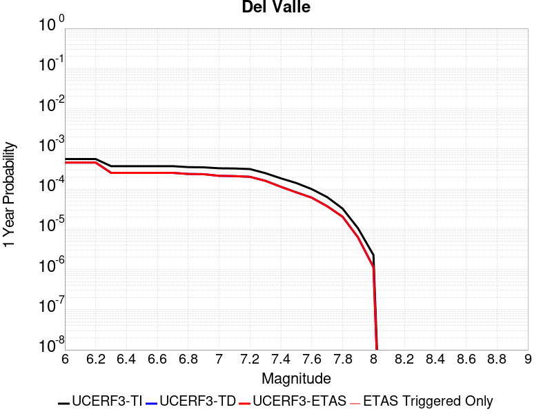 | 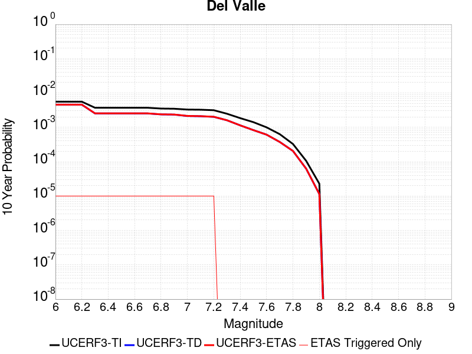 |

| Magnitude | 1 wk TI Prob | 1 wk TD Prob | 1 wk ETAS Prob | 1 wk ETAS/TD Gain | 1 wk ETAS Triggered Only | 1 mo TI Prob | 1 mo TD Prob | 1 mo ETAS Prob | 1 mo ETAS/TD Gain | 1 mo ETAS Triggered Only | 1 yr TI Prob | 1 yr TD Prob | 1 yr ETAS Prob | 1 yr ETAS/TD Gain | 1 yr ETAS Triggered Only | 10 yr TI Prob | 10 yr TD Prob | 10 yr ETAS Prob | 10 yr ETAS/TD Gain | 10 yr ETAS Triggered Only |
|-----|-----|-----|-----|-----|-----|-----|-----|-----|-----|-----|-----|-----|-----|-----|-----|-----|-----|-----|-----|-----|
| 6.0 | 1.0716125E-5 | 8.7684E-6 | 8.7684E-6 | 1.0 | 0.0 | 4.592544E-5 | 3.757843E-5 | 3.757843E-5 | 1.0 | 0.0 | 5.589988E-4 | 4.5744106E-4 | 4.5744106E-4 | 1.0 | 0.0 | 0.0055759475 | 0.00456695 | 0.004576904 | 1.0021796 | 1.0E-5 |
| 6.1 | 1.0716125E-5 | 8.7684E-6 | 8.7684E-6 | 1.0 | 0.0 | 4.592544E-5 | 3.757843E-5 | 3.757843E-5 | 1.0 | 0.0 | 5.589988E-4 | 4.5744106E-4 | 4.5744106E-4 | 1.0 | 0.0 | 0.0055759475 | 0.00456695 | 0.004576904 | 1.0021796 | 1.0E-5 |
| 6.2 | 1.0716125E-5 | 8.7684E-6 | 8.7684E-6 | 1.0 | 0.0 | 4.592544E-5 | 3.757843E-5 | 3.757843E-5 | 1.0 | 0.0 | 5.589988E-4 | 4.5744106E-4 | 4.5744106E-4 | 1.0 | 0.0 | 0.0055759475 | 0.00456695 | 0.004576904 | 1.0021796 | 1.0E-5 |
| 6.3 | 7.1293784E-6 | 4.8662046E-6 | 4.8662046E-6 | 1.0 | 0.0 | 3.055412E-5 | 2.0855001E-5 | 2.0855001E-5 | 1.0 | 0.0 | 3.7193293E-4 | 2.5388077E-4 | 2.5388077E-4 | 1.0 | 0.0 | 0.0037131102 | 0.0025359935 | 0.002545968 | 1.0039332 | 1.0E-5 |
| 6.4 | 7.1293784E-6 | 4.8662046E-6 | 4.8662046E-6 | 1.0 | 0.0 | 3.055412E-5 | 2.0855001E-5 | 2.0855001E-5 | 1.0 | 0.0 | 3.7193293E-4 | 2.5388077E-4 | 2.5388077E-4 | 1.0 | 0.0 | 0.0037131102 | 0.0025359935 | 0.002545968 | 1.0039332 | 1.0E-5 |
| 6.5 | 7.1293784E-6 | 4.8662046E-6 | 4.8662046E-6 | 1.0 | 0.0 | 3.055412E-5 | 2.0855001E-5 | 2.0855001E-5 | 1.0 | 0.0 | 3.7193293E-4 | 2.5388077E-4 | 2.5388077E-4 | 1.0 | 0.0 | 0.0037131102 | 0.0025359935 | 0.002545968 | 1.0039332 | 1.0E-5 |
| 6.6 | 7.1293784E-6 | 4.8662046E-6 | 4.8662046E-6 | 1.0 | 0.0 | 3.055412E-5 | 2.0855001E-5 | 2.0855001E-5 | 1.0 | 0.0 | 3.7193293E-4 | 2.5388077E-4 | 2.5388077E-4 | 1.0 | 0.0 | 0.0037131102 | 0.0025359935 | 0.002545968 | 1.0039332 | 1.0E-5 |
| 6.7 | 7.12272E-6 | 4.86358E-6 | 4.86358E-6 | 1.0 | 0.0 | 3.0525585E-5 | 2.0843752E-5 | 2.0843752E-5 | 1.0 | 0.0 | 3.7158563E-4 | 2.5374387E-4 | 2.5374387E-4 | 1.0 | 0.0 | 0.003709649 | 0.0025346274 | 0.002544602 | 1.0039353 | 1.0E-5 |
| 6.8 | 6.7558703E-6 | 4.5597644E-6 | 4.5597644E-6 | 1.0 | 0.0 | 2.895341E-5 | 1.9541703E-5 | 1.9541703E-5 | 1.0 | 0.0 | 3.5245073E-4 | 2.378949E-4 | 2.378949E-4 | 1.0 | 0.0 | 0.0035189227 | 0.0023764777 | 0.002386454 | 1.004198 | 1.0E-5 |
| 6.9 | 6.6700386E-6 | 4.5028937E-6 | 4.5028937E-6 | 1.0 | 0.0 | 2.8585566E-5 | 1.9297977E-5 | 1.9297977E-5 | 1.0 | 0.0 | 3.479737E-4 | 2.3492816E-4 | 2.3492816E-4 | 1.0 | 0.0 | 0.003474293 | 0.002346873 | 0.0023568496 | 1.004251 | 1.0E-5 |
| 7.0 | 6.3181424E-6 | 4.0990326E-6 | 4.0990326E-6 | 1.0 | 0.0 | 2.7077473E-5 | 1.7567167E-5 | 1.7567167E-5 | 1.0 | 0.0 | 3.2961834E-4 | 2.1385969E-4 | 2.1385969E-4 | 1.0 | 0.0 | 0.0032912986 | 0.0021365937 | 0.0021465723 | 1.0046704 | 1.0E-5 |
| 7.1 | 6.248759E-6 | 4.034219E-6 | 4.034219E-6 | 1.0 | 0.0 | 2.678012E-5 | 1.7289398E-5 | 1.7289398E-5 | 1.0 | 0.0 | 3.2599916E-4 | 2.1047851E-4 | 2.1047851E-4 | 1.0 | 0.0 | 0.0032552136 | 0.002102846 | 0.002112825 | 1.0047455 | 1.0E-5 |
| 7.2 | 6.0411944E-6 | 3.870198E-6 | 3.870198E-6 | 1.0 | 0.0 | 2.5890577E-5 | 1.6586459E-5 | 1.6586459E-5 | 1.0 | 0.0 | 3.1517216E-4 | 2.0192184E-4 | 2.0192184E-4 | 1.0 | 0.0 | 0.0031472554 | 0.002017437 | 0.0020274168 | 1.0049468 | 1.0E-5 |
| 7.3 | 4.7691183E-6 | 3.078347E-6 | 3.078347E-6 | 1.0 | 0.0 | 2.0438918E-5 | 1.319285E-5 | 1.319285E-5 | 1.0 | 0.0 | 2.488154E-4 | 1.6061132E-4 | 1.6061132E-4 | 1.0 | 0.0 | 0.00248537 | 0.0016049783 | 0.0016049783 | 1.0 | 0.0 |
| 7.4 | 3.5524722E-6 | 2.1894964E-6 | 2.1894964E-6 | 1.0 | 0.0 | 1.5224792E-5 | 9.383522E-6 | 9.383522E-6 | 1.0 | 0.0 | 1.8534607E-4 | 1.1423848E-4 | 1.1423848E-4 | 1.0 | 0.0 | 0.0018519156 | 0.0011418058 | 0.0011418058 | 1.0 | 0.0 |
| 7.5 | 2.7133442E-6 | 1.5917302E-6 | 1.5917302E-6 | 1.0 | 0.0 | 1.1628566E-5 | 6.821683E-6 | 6.821683E-6 | 1.0 | 0.0 | 1.415686E-4 | 8.305084E-5 | 8.305084E-5 | 1.0 | 0.0 | 0.0014147845 | 8.3020004E-4 | 8.3020004E-4 | 1.0 | 0.0 |
| 7.6 | 1.915338E-6 | 1.1740011E-6 | 1.1740011E-6 | 1.0 | 0.0 | 8.208566E-6 | 5.031424E-6 | 5.031424E-6 | 1.0 | 0.0 | 9.993471E-5 | 6.125587E-5 | 6.125587E-5 | 1.0 | 0.0 | 9.988978E-4 | 6.123908E-4 | 6.123908E-4 | 1.0 | 0.0 |
| 7.7 | 1.2120448E-6 | 7.180927E-7 | 7.180927E-7 | 1.0 | 0.0 | 5.194467E-6 | 3.0775366E-6 | 3.0775366E-6 | 1.0 | 0.0 | 6.3240805E-5 | 3.7468366E-5 | 3.7468366E-5 | 1.0 | 0.0 | 6.322281E-4 | 3.7462087E-4 | 3.7462087E-4 | 1.0 | 0.0 |
| 7.8 | 6.272381E-7 | 3.9328845E-7 | 3.9328845E-7 | 1.0 | 0.0 | 2.6881603E-6 | 1.6855208E-6 | 1.6855208E-6 | 1.0 | 0.0 | 3.272786E-5 | 2.0521024E-5 | 2.0521024E-5 | 1.0 | 0.0 | 3.272304E-4 | 2.0519145E-4 | 2.0519145E-4 | 1.0 | 0.0 |
| 7.9 | 2.0292627E-7 | 1.200579E-7 | 1.200579E-7 | 1.0 | 0.0 | 8.6968373E-7 | 5.145338E-7 | 5.145338E-7 | 1.0 | 0.0 | 1.0588348E-5 | 6.264431E-6 | 6.264431E-6 | 1.0 | 0.0 | 1.0587843E-4 | 6.264257E-5 | 6.264257E-5 | 1.0 | 0.0 |
| 8.0 | 4.374492E-8 | 2.1903116E-8 | 2.1903116E-8 | 1.0 | 0.0 | 1.8747821E-7 | 9.387049E-8 | 9.387049E-8 | 1.0 | 0.0 | 2.2825448E-6 | 1.1428726E-6 | 1.1428726E-6 | 1.0 | 0.0 | 2.2825214E-5 | 1.1428672E-5 | 1.1428672E-5 | 1.0 | 0.0 |

## Earthquake Valley
*[(top)](#table-of-contents)*

| 1 Week | 1 Month | 1 Year | 10 Year |
|-----|-----|-----|-----|
|  | 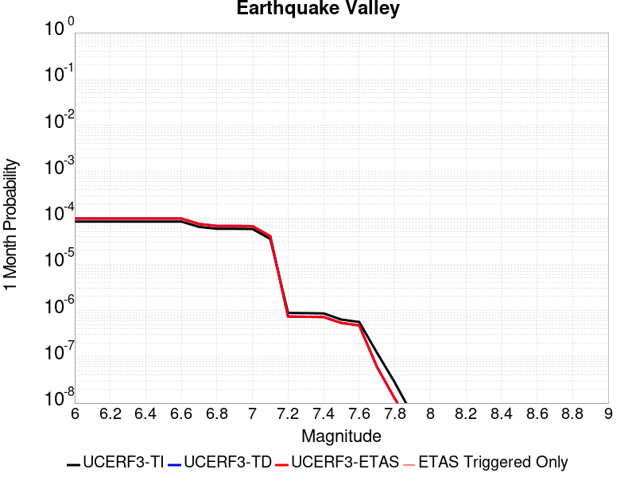 |  |  |

| Magnitude | 1 wk TI Prob | 1 wk TD Prob | 1 wk ETAS Prob | 1 wk ETAS/TD Gain | 1 wk ETAS Triggered Only | 1 mo TI Prob | 1 mo TD Prob | 1 mo ETAS Prob | 1 mo ETAS/TD Gain | 1 mo ETAS Triggered Only | 1 yr TI Prob | 1 yr TD Prob | 1 yr ETAS Prob | 1 yr ETAS/TD Gain | 1 yr ETAS Triggered Only | 10 yr TI Prob | 10 yr TD Prob | 10 yr ETAS Prob | 10 yr ETAS/TD Gain | 10 yr ETAS Triggered Only |
|-----|-----|-----|-----|-----|-----|-----|-----|-----|-----|-----|-----|-----|-----|-----|-----|-----|-----|-----|-----|-----|
| 6.0 | 1.9416384E-5 | 2.2585586E-5 | 2.2585586E-5 | 1.0 | 0.0 | 8.321042E-5 | 9.679246E-5 | 9.679246E-5 | 1.0 | 0.0 | 0.001012616 | 0.0011779312 | 0.0011779312 | 1.0 | 0.0 | 0.010080142 | 0.011728721 | 0.011738604 | 1.0008426 | 1.0E-5 |
| 6.1 | 1.9416384E-5 | 2.2585586E-5 | 2.2585586E-5 | 1.0 | 0.0 | 8.321042E-5 | 9.679246E-5 | 9.679246E-5 | 1.0 | 0.0 | 0.001012616 | 0.0011779312 | 0.0011779312 | 1.0 | 0.0 | 0.010080142 | 0.011728721 | 0.011738604 | 1.0008426 | 1.0E-5 |
| 6.2 | 1.9416384E-5 | 2.2585586E-5 | 2.2585586E-5 | 1.0 | 0.0 | 8.321042E-5 | 9.679246E-5 | 9.679246E-5 | 1.0 | 0.0 | 0.001012616 | 0.0011779312 | 0.0011779312 | 1.0 | 0.0 | 0.010080142 | 0.011728721 | 0.011738604 | 1.0008426 | 1.0E-5 |
| 6.3 | 1.9416384E-5 | 2.2585586E-5 | 2.2585586E-5 | 1.0 | 0.0 | 8.321042E-5 | 9.679246E-5 | 9.679246E-5 | 1.0 | 0.0 | 0.001012616 | 0.0011779312 | 0.0011779312 | 1.0 | 0.0 | 0.010080142 | 0.011728721 | 0.011738604 | 1.0008426 | 1.0E-5 |
| 6.4 | 1.9416384E-5 | 2.2585586E-5 | 2.2585586E-5 | 1.0 | 0.0 | 8.321042E-5 | 9.679246E-5 | 9.679246E-5 | 1.0 | 0.0 | 0.001012616 | 0.0011779312 | 0.0011779312 | 1.0 | 0.0 | 0.010080142 | 0.011728721 | 0.011738604 | 1.0008426 | 1.0E-5 |
| 6.5 | 1.9389157E-5 | 2.2554173E-5 | 2.2554173E-5 | 1.0 | 0.0 | 8.309374E-5 | 9.665784E-5 | 9.665784E-5 | 1.0 | 0.0 | 0.0010111968 | 0.001176294 | 0.001176294 | 1.0 | 0.0 | 0.010066078 | 0.011712522 | 0.0117224045 | 1.0008438 | 1.0E-5 |
| 6.6 | 1.9389157E-5 | 2.2554173E-5 | 2.2554173E-5 | 1.0 | 0.0 | 8.309374E-5 | 9.665784E-5 | 9.665784E-5 | 1.0 | 0.0 | 0.0010111968 | 0.001176294 | 0.001176294 | 1.0 | 0.0 | 0.010066078 | 0.011712522 | 0.0117224045 | 1.0008438 | 1.0E-5 |
| 6.7 | 1.4925434E-5 | 1.7209313E-5 | 1.7209313E-5 | 1.0 | 0.0 | 6.396457E-5 | 7.375259E-5 | 7.375259E-5 | 1.0 | 0.0 | 7.7849044E-4 | 8.9765294E-4 | 8.9765294E-4 | 1.0 | 0.0 | 0.007757689 | 0.008948647 | 0.008958558 | 1.0011075 | 1.0E-5 |
| 6.8 | 1.3570335E-5 | 1.5617818E-5 | 1.5617818E-5 | 1.0 | 0.0 | 5.8157282E-5 | 6.693225E-5 | 6.693225E-5 | 1.0 | 0.0 | 7.0783484E-4 | 8.1467757E-4 | 8.1467757E-4 | 1.0 | 0.0 | 0.0070558446 | 0.008124982 | 0.008134901 | 1.0012208 | 1.0E-5 |
| 6.9 | 1.3570335E-5 | 1.5617818E-5 | 1.5617818E-5 | 1.0 | 0.0 | 5.8157282E-5 | 6.693225E-5 | 6.693225E-5 | 1.0 | 0.0 | 7.0783484E-4 | 8.1467757E-4 | 8.1467757E-4 | 1.0 | 0.0 | 0.0070558446 | 0.008124982 | 0.008134901 | 1.0012208 | 1.0E-5 |
| 7.0 | 1.3433392E-5 | 1.5461352E-5 | 1.5461352E-5 | 1.0 | 0.0 | 5.757041E-5 | 6.626172E-5 | 6.626172E-5 | 1.0 | 0.0 | 7.0069433E-4 | 8.065199E-4 | 8.065199E-4 | 1.0 | 0.0 | 0.006984891 | 0.008043998 | 0.008053917 | 1.0012332 | 1.0E-5 |
| 7.1 | 8.181609E-6 | 9.417454E-6 | 9.417454E-6 | 1.0 | 0.0 | 3.5063567E-5 | 4.036027E-5 | 4.036027E-5 | 1.0 | 0.0 | 4.268153E-4 | 4.9134257E-4 | 4.9134257E-4 | 1.0 | 0.0 | 0.0042599645 | 0.0049091396 | 0.0049091396 | 1.0 | 0.0 |
| 7.2 | 2.0663983E-7 | 1.7264723E-7 | 1.7264723E-7 | 1.0 | 0.0 | 8.855989E-7 | 7.399165E-7 | 7.399165E-7 | 1.0 | 0.0 | 1.0782113E-5 | 9.00845E-6 | 9.00845E-6 | 1.0 | 0.0 | 1.07815904E-4 | 9.008121E-5 | 9.008121E-5 | 1.0 | 0.0 |
| 7.3 | 2.0462376E-7 | 1.7080207E-7 | 1.7080207E-7 | 1.0 | 0.0 | 8.7695867E-7 | 7.320087E-7 | 7.320087E-7 | 1.0 | 0.0 | 1.0676919E-5 | 8.912173E-6 | 8.912173E-6 | 1.0 | 0.0 | 1.0676406E-4 | 8.911852E-5 | 8.911852E-5 | 1.0 | 0.0 |
| 7.4 | 2.0171088E-7 | 1.6862668E-7 | 1.6862668E-7 | 1.0 | 0.0 | 8.644749E-7 | 7.2268557E-7 | 7.2268557E-7 | 1.0 | 0.0 | 1.0524931E-5 | 8.7986655E-6 | 8.7986655E-6 | 1.0 | 0.0 | 1.05244326E-4 | 8.798353E-5 | 8.798353E-5 | 1.0 | 0.0 |
| 7.5 | 1.4847944E-7 | 1.2560726E-7 | 1.2560726E-7 | 1.0 | 0.0 | 6.363403E-7 | 5.383167E-7 | 5.383167E-7 | 1.0 | 0.0 | 7.747416E-6 | 6.553989E-6 | 6.553989E-6 | 1.0 | 0.0 | 7.747146E-5 | 6.5538174E-5 | 6.5538174E-5 | 1.0 | 0.0 |
| 7.6 | 1.3185847E-7 | 1.1124543E-7 | 1.1124543E-7 | 1.0 | 0.0 | 5.6510765E-7 | 4.7676605E-7 | 4.7676605E-7 | 1.0 | 0.0 | 6.8801637E-6 | 5.8046135E-6 | 5.8046135E-6 | 1.0 | 0.0 | 6.8799505E-5 | 5.804483E-5 | 5.804483E-5 | 1.0 | 0.0 |
| 7.7 | 2.8609954E-8 | 1.4173083E-8 | 1.4173083E-8 | 1.0 | 0.0 | 1.2261408E-7 | 6.074178E-8 | 6.074178E-8 | 1.0 | 0.0 | 1.4928254E-6 | 7.39531E-7 | 7.39531E-7 | 1.0 | 0.0 | 1.4928154E-5 | 7.3952906E-6 | 7.3952906E-6 | 1.0 | 0.0 |
| 7.8 | 6.527266E-9 | 2.9238318E-9 | 2.9238318E-9 | 1.0 | 0.0 | 2.7973995E-8 | 1.2530707E-8 | 1.2530707E-8 | 1.0 | 0.0 | 3.4058334E-7 | 1.5256134E-7 | 1.5256134E-7 | 1.0 | 0.0 | 3.4058282E-6 | 1.5256127E-6 | 1.5256127E-6 | 1.0 | 0.0 |
| 7.9 | 1.2898267E-9 | 7.128408E-10 | 7.128408E-10 | 1.0 | 0.0 | 5.527829E-9 | 3.055032E-9 | 3.055032E-9 | 1.0 | 0.0 | 6.7301315E-8 | 3.7195015E-8 | 3.7195015E-8 | 1.0 | 0.0 | 6.7301295E-7 | 3.7195014E-7 | 3.7195014E-7 | 1.0 | 0.0 |

## Bennett Valley 2011 CFM
*[(top)](#table-of-contents)*

| 1 Week | 1 Month | 1 Year | 10 Year |
|-----|-----|-----|-----|
|  | 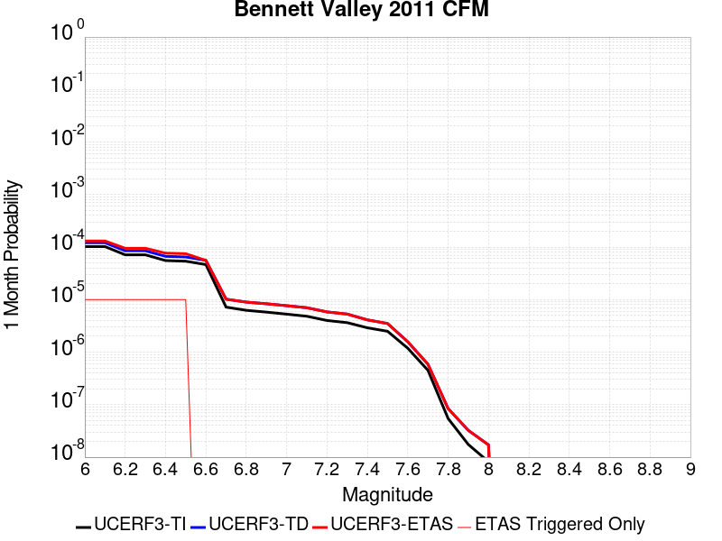 | 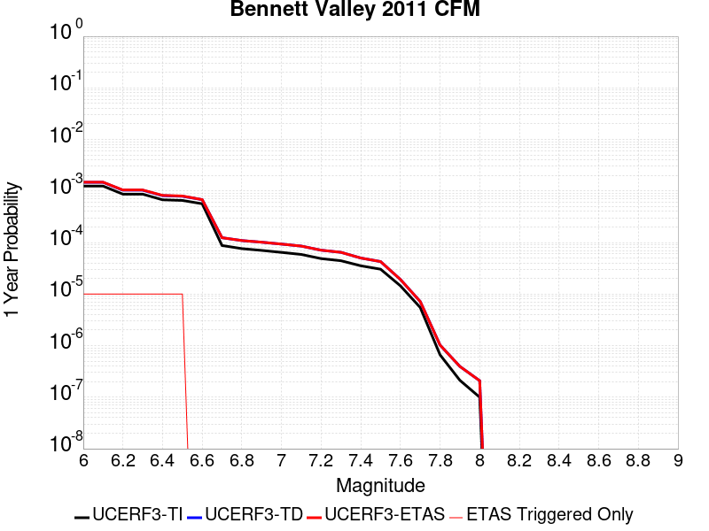 |  |

| Magnitude | 1 wk TI Prob | 1 wk TD Prob | 1 wk ETAS Prob | 1 wk ETAS/TD Gain | 1 wk ETAS Triggered Only | 1 mo TI Prob | 1 mo TD Prob | 1 mo ETAS Prob | 1 mo ETAS/TD Gain | 1 mo ETAS Triggered Only | 1 yr TI Prob | 1 yr TD Prob | 1 yr ETAS Prob | 1 yr ETAS/TD Gain | 1 yr ETAS Triggered Only | 10 yr TI Prob | 10 yr TD Prob | 10 yr ETAS Prob | 10 yr ETAS/TD Gain | 10 yr ETAS Triggered Only |
|-----|-----|-----|-----|-----|-----|-----|-----|-----|-----|-----|-----|-----|-----|-----|-----|-----|-----|-----|-----|-----|
| 6.0 | 2.3893934E-5 | 2.8240995E-5 | 3.8240712E-5 | 1.3540852 | 1.0E-5 | 1.0239855E-4 | 1.21028264E-4 | 1.3102706E-4 | 1.0826154 | 1.0E-5 | 0.0012459893 | 0.0014727081 | 0.0014826934 | 1.0067803 | 1.0E-5 | 0.012390262 | 0.0146521395 | 0.014661994 | 1.0006725 | 1.0E-5 |
| 6.1 | 2.3893934E-5 | 2.8240995E-5 | 3.8240712E-5 | 1.3540852 | 1.0E-5 | 1.0239855E-4 | 1.21028264E-4 | 1.3102706E-4 | 1.0826154 | 1.0E-5 | 0.0012459893 | 0.0014727081 | 0.0014826934 | 1.0067803 | 1.0E-5 | 0.012390262 | 0.0146521395 | 0.014661994 | 1.0006725 | 1.0E-5 |
| 6.2 | 1.6657146E-5 | 1.9855352E-5 | 2.9855151E-5 | 1.5036325 | 1.0E-5 | 7.138582E-5 | 8.509238E-5 | 9.5091535E-5 | 1.1175094 | 1.0E-5 | 8.6877577E-4 | 0.001035649 | 0.0010456386 | 1.0096458 | 1.0E-5 | 0.008653872 | 0.010326497 | 0.010336394 | 1.0009583 | 1.0E-5 |
| 6.3 | 1.6657146E-5 | 1.9855352E-5 | 2.9855151E-5 | 1.5036325 | 1.0E-5 | 7.138582E-5 | 8.509238E-5 | 9.5091535E-5 | 1.1175094 | 1.0E-5 | 8.6877577E-4 | 0.001035649 | 0.0010456386 | 1.0096458 | 1.0E-5 | 0.008653872 | 0.010326497 | 0.010336394 | 1.0009583 | 1.0E-5 |
| 6.4 | 1.29418495E-5 | 1.5568809E-5 | 2.5568652E-5 | 1.6422999 | 1.0E-5 | 5.546389E-5 | 6.6722496E-5 | 7.672182E-5 | 1.1498646 | 1.0E-5 | 6.7506364E-4 | 8.121739E-4 | 8.2216575E-4 | 1.0123026 | 1.0E-5 | 0.0067301663 | 0.008109204 | 0.008119122 | 1.0012232 | 1.0E-5 |
| 6.5 | 1.2582504E-5 | 1.5135812E-5 | 2.513566E-5 | 1.6606748 | 1.0E-5 | 5.39239E-5 | 6.486689E-5 | 7.4866235E-5 | 1.1541519 | 1.0E-5 | 6.563257E-4 | 7.895984E-4 | 7.995905E-4 | 1.0126547 | 1.0E-5 | 0.006543907 | 0.007885092 | 0.007895013 | 1.0012583 | 1.0E-5 |
| 6.6 | 1.0846706E-5 | 1.3037927E-5 | 1.3037927E-5 | 1.0 | 0.0 | 4.6485053E-5 | 5.5876353E-5 | 5.5876353E-5 | 1.0 | 0.0 | 5.6580856E-4 | 6.8021065E-4 | 6.8021065E-4 | 1.0 | 0.0 | 0.005643701 | 0.0067982795 | 0.0067982795 | 1.0 | 0.0 |
| 6.7 | 1.6803231E-6 | 2.3783507E-6 | 2.3783507E-6 | 1.0 | 0.0 | 7.2013645E-6 | 1.0192893E-5 | 1.0192893E-5 | 1.0 | 0.0 | 8.7673085E-5 | 1.2409153E-4 | 1.2409153E-4 | 1.0 | 0.0 | 8.76385E-4 | 0.0012446587 | 0.0012446587 | 1.0 | 0.0 |
| 6.8 | 1.4609833E-6 | 2.094406E-6 | 2.094406E-6 | 1.0 | 0.0 | 6.261342E-6 | 8.975995E-6 | 8.975995E-6 | 1.0 | 0.0 | 7.6229175E-5 | 1.0927734E-4 | 1.0927734E-4 | 1.0 | 0.0 | 7.620303E-4 | 0.001096629 | 0.001096629 | 1.0 | 0.0 |
| 6.9 | 1.3492396E-6 | 1.94634E-6 | 1.94634E-6 | 1.0 | 0.0 | 5.7824427E-6 | 8.341431E-6 | 8.341431E-6 | 1.0 | 0.0 | 7.0398964E-5 | 1.0155225E-4 | 1.0155225E-4 | 1.0 | 0.0 | 7.037667E-4 | 0.0010194217 | 0.0010194217 | 1.0 | 0.0 |
| 7.0 | 1.2347921E-6 | 1.7893217E-6 | 1.7893217E-6 | 1.0 | 0.0 | 5.291955E-6 | 7.668499E-6 | 7.668499E-6 | 1.0 | 0.0 | 6.442765E-5 | 9.336003E-5 | 9.336003E-5 | 1.0 | 0.0 | 6.440897E-4 | 9.375563E-4 | 9.375563E-4 | 1.0 | 0.0 |
| 7.1 | 1.1262973E-6 | 1.6363339E-6 | 1.6363339E-6 | 1.0 | 0.0 | 4.8269794E-6 | 7.0128413E-6 | 7.0128413E-6 | 1.0 | 0.0 | 5.876689E-5 | 8.5378044E-5 | 8.5378044E-5 | 1.0 | 0.0 | 5.875135E-4 | 8.5777754E-4 | 8.5777754E-4 | 1.0 | 0.0 |
| 7.2 | 9.351744E-7 | 1.36158E-6 | 1.36158E-6 | 1.0 | 0.0 | 4.007884E-6 | 5.8353294E-6 | 5.8353294E-6 | 1.0 | 0.0 | 4.8794896E-5 | 7.104284E-5 | 7.104284E-5 | 1.0 | 0.0 | 4.878418E-4 | 7.144736E-4 | 7.144736E-4 | 1.0 | 0.0 |
| 7.3 | 8.5039534E-7 | 1.2390515E-6 | 1.2390515E-6 | 1.0 | 0.0 | 3.6445463E-6 | 5.31021E-6 | 5.31021E-6 | 1.0 | 0.0 | 4.437145E-5 | 6.464991E-5 | 6.464991E-5 | 1.0 | 0.0 | 4.436259E-4 | 6.502941E-4 | 6.502941E-4 | 1.0 | 0.0 |
| 7.4 | 6.7875015E-7 | 9.603481E-7 | 9.603481E-7 | 1.0 | 0.0 | 2.908926E-6 | 4.115771E-6 | 4.115771E-6 | 1.0 | 0.0 | 3.54156E-5 | 5.0108367E-5 | 5.0108367E-5 | 1.0 | 0.0 | 3.5409955E-4 | 5.042557E-4 | 5.042557E-4 | 1.0 | 0.0 |
| 7.5 | 5.826867E-7 | 8.19076E-7 | 8.19076E-7 | 1.0 | 0.0 | 2.4972264E-6 | 3.5103208E-6 | 3.5103208E-6 | 1.0 | 0.0 | 3.0403306E-5 | 4.2737327E-5 | 4.2737327E-5 | 1.0 | 0.0 | 3.0399146E-4 | 4.301521E-4 | 4.301521E-4 | 1.0 | 0.0 |
| 7.6 | 2.7734902E-7 | 3.6833805E-7 | 3.6833805E-7 | 1.0 | 0.0 | 1.1886381E-6 | 1.5785906E-6 | 1.5785906E-6 | 1.0 | 0.0 | 1.4471572E-5 | 1.9219173E-5 | 1.9219173E-5 | 1.0 | 0.0 | 1.447063E-4 | 1.9318343E-4 | 1.9318343E-4 | 1.0 | 0.0 |
| 7.7 | 1.0530888E-7 | 1.3755624E-7 | 1.3755624E-7 | 1.0 | 0.0 | 4.513237E-7 | 5.8952656E-7 | 5.8952656E-7 | 1.0 | 0.0 | 5.4948523E-6 | 7.1774625E-6 | 7.1774625E-6 | 1.0 | 0.0 | 5.4947162E-5 | 7.259742E-5 | 7.259742E-5 | 1.0 | 0.0 |
| 7.8 | 1.2714258E-8 | 1.9654097E-8 | 1.9654097E-8 | 1.0 | 0.0 | 5.448968E-8 | 8.423184E-8 | 8.423184E-8 | 1.0 | 0.0 | 6.6341164E-7 | 1.0255222E-6 | 1.0255222E-6 | 1.0 | 0.0 | 6.6340967E-6 | 1.0668873E-5 | 1.0668873E-5 | 1.0 | 0.0 |
| 7.9 | 4.075888E-9 | 7.571983E-9 | 7.571983E-9 | 1.0 | 0.0 | 1.7468091E-8 | 3.2451357E-8 | 3.2451357E-8 | 1.0 | 0.0 | 2.12674E-7 | 3.9509519E-7 | 3.9509519E-7 | 1.0 | 0.0 | 2.1267379E-6 | 4.2009265E-6 | 4.2009265E-6 | 1.0 | 0.0 |
| 8.0 | 1.9126138E-9 | 4.001738E-9 | 4.001738E-9 | 1.0 | 0.0 | 8.196917E-9 | 1.7150308E-8 | 1.7150308E-8 | 1.0 | 0.0 | 9.9797454E-8 | 2.0880496E-7 | 2.0880496E-7 | 1.0 | 0.0 | 9.979741E-7 | 2.2010274E-6 | 2.2010274E-6 | 1.0 | 0.0 |

## Elsinore (Stepovers Combined)
*[(top)](#table-of-contents)*

| 1 Week | 1 Month | 1 Year | 10 Year |
|-----|-----|-----|-----|
|  |  |  | 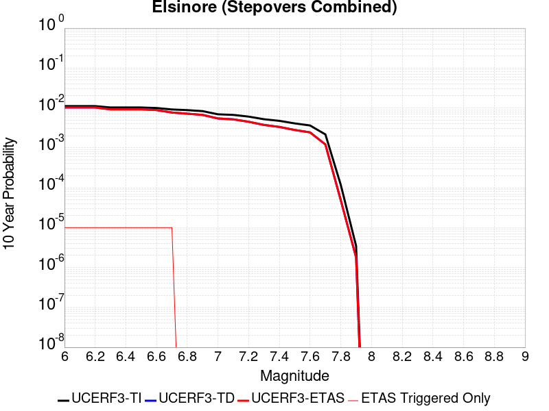 |

| Magnitude | 1 wk TI Prob | 1 wk TD Prob | 1 wk ETAS Prob | 1 wk ETAS/TD Gain | 1 wk ETAS Triggered Only | 1 mo TI Prob | 1 mo TD Prob | 1 mo ETAS Prob | 1 mo ETAS/TD Gain | 1 mo ETAS Triggered Only | 1 yr TI Prob | 1 yr TD Prob | 1 yr ETAS Prob | 1 yr ETAS/TD Gain | 1 yr ETAS Triggered Only | 10 yr TI Prob | 10 yr TD Prob | 10 yr ETAS Prob | 10 yr ETAS/TD Gain | 10 yr ETAS Triggered Only |
|-----|-----|-----|-----|-----|-----|-----|-----|-----|-----|-----|-----|-----|-----|-----|-----|-----|-----|-----|-----|-----|
| 6.0 | 2.144392E-5 | 1.9762627E-5 | 1.9762627E-5 | 1.0 | 0.0 | 9.189928E-5 | 8.4694344E-5 | 8.4694344E-5 | 1.0 | 0.0 | 0.0011182994 | 0.0010306875 | 0.0010406772 | 1.0096923 | 1.0E-5 | 0.011126885 | 0.010266166 | 0.010276063 | 1.000964 | 1.0E-5 |
| 6.1 | 2.144392E-5 | 1.9762627E-5 | 1.9762627E-5 | 1.0 | 0.0 | 9.189928E-5 | 8.4694344E-5 | 8.4694344E-5 | 1.0 | 0.0 | 0.0011182994 | 0.0010306875 | 0.0010406772 | 1.0096923 | 1.0E-5 | 0.011126885 | 0.010266166 | 0.010276063 | 1.000964 | 1.0E-5 |
| 6.2 | 2.144392E-5 | 1.9762627E-5 | 1.9762627E-5 | 1.0 | 0.0 | 9.189928E-5 | 8.4694344E-5 | 8.4694344E-5 | 1.0 | 0.0 | 0.0011182994 | 0.0010306875 | 0.0010406772 | 1.0096923 | 1.0E-5 | 0.011126885 | 0.010266166 | 0.010276063 | 1.000964 | 1.0E-5 |
| 6.3 | 1.9751555E-5 | 1.774373E-5 | 1.774373E-5 | 1.0 | 0.0 | 8.4646774E-5 | 7.604244E-5 | 7.604244E-5 | 1.0 | 0.0 | 0.0010300872 | 9.2544005E-4 | 9.354308E-4 | 1.0107957 | 1.0E-5 | 0.010253254 | 0.009222447 | 0.009232354 | 1.0010743 | 1.0E-5 |
| 6.4 | 1.9751555E-5 | 1.774373E-5 | 1.774373E-5 | 1.0 | 0.0 | 8.4646774E-5 | 7.604244E-5 | 7.604244E-5 | 1.0 | 0.0 | 0.0010300872 | 9.2544005E-4 | 9.354308E-4 | 1.0107957 | 1.0E-5 | 0.010253254 | 0.009222447 | 0.009232354 | 1.0010743 | 1.0E-5 |
| 6.5 | 1.9751555E-5 | 1.774373E-5 | 1.774373E-5 | 1.0 | 0.0 | 8.4646774E-5 | 7.604244E-5 | 7.604244E-5 | 1.0 | 0.0 | 0.0010300872 | 9.2544005E-4 | 9.354308E-4 | 1.0107957 | 1.0E-5 | 0.010253254 | 0.009222447 | 0.009232354 | 1.0010743 | 1.0E-5 |
| 6.6 | 1.9188685E-5 | 1.7005577E-5 | 1.7005577E-5 | 1.0 | 0.0 | 8.2234634E-5 | 7.2879106E-5 | 7.2879106E-5 | 1.0 | 0.0 | 0.0010007467 | 8.869581E-4 | 8.969492E-4 | 1.0112644 | 1.0E-5 | 0.00996252 | 0.0088409735 | 0.008850886 | 1.001121 | 1.0E-5 |
| 6.7 | 1.7608272E-5 | 1.4734516E-5 | 1.4734516E-5 | 1.0 | 0.0 | 7.546184E-5 | 6.314646E-5 | 6.314646E-5 | 1.0 | 0.0 | 9.183606E-4 | 7.6854666E-4 | 7.78539E-4 | 1.0130016 | 1.0E-5 | 0.009145746 | 0.0076658935 | 0.007675817 | 1.0012945 | 1.0E-5 |
| 6.8 | 1.697165E-5 | 1.3785129E-5 | 1.3785129E-5 | 1.0 | 0.0 | 7.273361E-5 | 5.9077836E-5 | 5.9077836E-5 | 1.0 | 0.0 | 8.8517193E-4 | 7.1904395E-4 | 7.1904395E-4 | 1.0 | 0.0 | 0.008816543 | 0.00717359 | 0.00717359 | 1.0 | 0.0 |
| 6.9 | 1.600365E-5 | 1.2848374E-5 | 1.2848374E-5 | 1.0 | 0.0 | 6.858527E-5 | 5.5063345E-5 | 5.5063345E-5 | 1.0 | 0.0 | 8.347058E-4 | 6.7019777E-4 | 6.7019777E-4 | 1.0 | 0.0 | 0.008315775 | 0.0066876495 | 0.0066876495 | 1.0 | 0.0 |
| 7.0 | 1.3314581E-5 | 1.0449027E-5 | 1.0449027E-5 | 1.0 | 0.0 | 5.7061243E-5 | 4.478079E-5 | 4.478079E-5 | 1.0 | 0.0 | 6.944992E-4 | 5.450724E-4 | 5.450724E-4 | 1.0 | 0.0 | 0.006923327 | 0.0054412824 | 0.0054412824 | 1.0 | 0.0 |
| 7.1 | 1.2865345E-5 | 9.938851E-6 | 9.938851E-6 | 1.0 | 0.0 | 5.5136024E-5 | 4.2594394E-5 | 4.2594394E-5 | 1.0 | 0.0 | 6.710743E-4 | 5.184659E-4 | 5.184659E-4 | 1.0 | 0.0 | 0.0066905143 | 0.0051758955 | 0.0051758955 | 1.0 | 0.0 |
| 7.2 | 1.1650051E-5 | 8.634924E-6 | 8.634924E-6 | 1.0 | 0.0 | 4.9927836E-5 | 3.7006303E-5 | 3.7006303E-5 | 1.0 | 0.0 | 6.0770183E-4 | 4.5046036E-4 | 4.5046036E-4 | 1.0 | 0.0 | 0.0060604266 | 0.004496896 | 0.004496896 | 1.0 | 0.0 |
| 7.3 | 1.0008533E-5 | 7.2019507E-6 | 7.2019507E-6 | 1.0 | 0.0 | 4.2893007E-5 | 3.0865143E-5 | 3.0865143E-5 | 1.0 | 0.0 | 5.220972E-4 | 3.757198E-4 | 3.757198E-4 | 1.0 | 0.0 | 0.005208723 | 0.003751233 | 0.003751233 | 1.0 | 0.0 |
| 7.4 | 9.116759E-6 | 6.410859E-6 | 6.410859E-6 | 1.0 | 0.0 | 3.907124E-5 | 2.7474829E-5 | 2.7474829E-5 | 1.0 | 0.0 | 4.7558855E-4 | 3.3445607E-4 | 3.3445607E-4 | 1.0 | 0.0 | 0.00474572 | 0.0033396792 | 0.0033396792 | 1.0 | 0.0 |
| 7.5 | 7.870524E-6 | 5.383192E-6 | 5.383192E-6 | 1.0 | 0.0 | 3.3730383E-5 | 2.3070625E-5 | 2.3070625E-5 | 1.0 | 0.0 | 4.1059E-4 | 2.8084993E-4 | 2.8084993E-4 | 1.0 | 0.0 | 0.0040983222 | 0.0028050765 | 0.0028050765 | 1.0 | 0.0 |
| 7.6 | 6.9774537E-6 | 4.6781843E-6 | 4.6781843E-6 | 1.0 | 0.0 | 2.990303E-5 | 2.0049214E-5 | 2.0049214E-5 | 1.0 | 0.0 | 3.640086E-4 | 2.44073E-4 | 2.44073E-4 | 1.0 | 0.0 | 0.003634129 | 0.0024381657 | 0.0024381657 | 1.0 | 0.0 |
| 7.7 | 4.1616954E-6 | 2.32868E-6 | 2.32868E-6 | 1.0 | 0.0 | 1.7835715E-5 | 9.980024E-6 | 9.980024E-6 | 1.0 | 0.0 | 2.171282E-4 | 1.2150075E-4 | 1.2150075E-4 | 1.0 | 0.0 | 0.0021691616 | 0.0012144163 | 0.0012144163 | 1.0 | 0.0 |
| 7.8 | 2.2692414E-7 | 9.386889E-8 | 9.386889E-8 | 1.0 | 0.0 | 9.725317E-7 | 4.022952E-7 | 4.022952E-7 | 1.0 | 0.0 | 1.1840509E-5 | 4.8979364E-6 | 4.8979364E-6 | 1.0 | 0.0 | 1.1839878E-4 | 4.8978614E-5 | 4.8978614E-5 | 1.0 | 0.0 |
| 7.9 | 6.676829E-9 | 3.4402254E-9 | 3.4402254E-9 | 1.0 | 0.0 | 2.861498E-8 | 1.4743824E-8 | 1.4743824E-8 | 1.0 | 0.0 | 3.4838732E-7 | 1.7950605E-7 | 1.7950605E-7 | 1.0 | 0.0 | 3.4838679E-6 | 1.7950591E-6 | 1.7950591E-6 | 1.0 | 0.0 |

## Hosgri
*[(top)](#table-of-contents)*

| 1 Week | 1 Month | 1 Year | 10 Year |
|-----|-----|-----|-----|
|  | 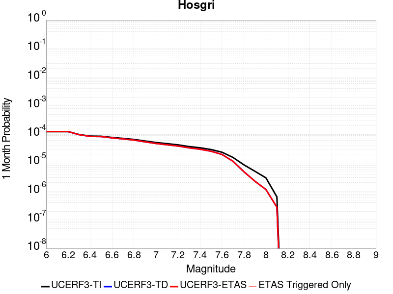 |  |  |

| Magnitude | 1 wk TI Prob | 1 wk TD Prob | 1 wk ETAS Prob | 1 wk ETAS/TD Gain | 1 wk ETAS Triggered Only | 1 mo TI Prob | 1 mo TD Prob | 1 mo ETAS Prob | 1 mo ETAS/TD Gain | 1 mo ETAS Triggered Only | 1 yr TI Prob | 1 yr TD Prob | 1 yr ETAS Prob | 1 yr ETAS/TD Gain | 1 yr ETAS Triggered Only | 10 yr TI Prob | 10 yr TD Prob | 10 yr ETAS Prob | 10 yr ETAS/TD Gain | 10 yr ETAS Triggered Only |
|-----|-----|-----|-----|-----|-----|-----|-----|-----|-----|-----|-----|-----|-----|-----|-----|-----|-----|-----|-----|-----|
| 6.0 | 2.883978E-5 | 2.9129644E-5 | 2.9129644E-5 | 1.0 | 0.0 | 1.235932E-4 | 1.2483551E-4 | 1.2483551E-4 | 1.0 | 0.0 | 0.0015037085 | 0.0015188399 | 0.0015188399 | 1.0 | 0.0 | 0.01493574 | 0.015088371 | 0.015098221 | 1.0006528 | 1.0E-5 |
| 6.1 | 2.883978E-5 | 2.9129644E-5 | 2.9129644E-5 | 1.0 | 0.0 | 1.235932E-4 | 1.2483551E-4 | 1.2483551E-4 | 1.0 | 0.0 | 0.0015037085 | 0.0015188399 | 0.0015188399 | 1.0 | 0.0 | 0.01493574 | 0.015088371 | 0.015098221 | 1.0006528 | 1.0E-5 |
| 6.2 | 2.883978E-5 | 2.9129644E-5 | 2.9129644E-5 | 1.0 | 0.0 | 1.235932E-4 | 1.2483551E-4 | 1.2483551E-4 | 1.0 | 0.0 | 0.0015037085 | 0.0015188399 | 0.0015188399 | 1.0 | 0.0 | 0.01493574 | 0.015088371 | 0.015098221 | 1.0006528 | 1.0E-5 |
| 6.3 | 2.2914428E-5 | 2.2642951E-5 | 2.2642951E-5 | 1.0 | 0.0 | 9.8200995E-5 | 9.703764E-5 | 9.703764E-5 | 1.0 | 0.0 | 0.0011949413 | 0.0011807979 | 0.0011807979 | 1.0 | 0.0 | 0.011885363 | 0.01174664 | 0.01174664 | 1.0 | 0.0 |
| 6.4 | 2.0195741E-5 | 1.9697445E-5 | 1.9697445E-5 | 1.0 | 0.0 | 8.65503E-5 | 8.4414896E-5 | 8.4414896E-5 | 1.0 | 0.0 | 0.0010532405 | 0.0010272688 | 0.0010272688 | 1.0 | 0.0 | 0.010482626 | 0.01022625 | 0.01022625 | 1.0 | 0.0 |
| 6.5 | 1.9924333E-5 | 1.9409857E-5 | 1.9409857E-5 | 1.0 | 0.0 | 8.53872E-5 | 8.3182465E-5 | 8.3182465E-5 | 1.0 | 0.0 | 0.0010390934 | 0.0010122779 | 0.0010122779 | 1.0 | 0.0 | 0.010342481 | 0.010077707 | 0.010077707 | 1.0 | 0.0 |
| 6.6 | 1.809694E-5 | 1.7459122E-5 | 1.7459122E-5 | 1.0 | 0.0 | 7.7556004E-5 | 7.482267E-5 | 7.482267E-5 | 1.0 | 0.0 | 9.438353E-4 | 9.1058656E-4 | 9.1058656E-4 | 1.0 | 0.0 | 0.009398366 | 0.009069499 | 0.009069499 | 1.0 | 0.0 |
| 6.7 | 1.675989E-5 | 1.6043548E-5 | 1.6043548E-5 | 1.0 | 0.0 | 7.182612E-5 | 6.875626E-5 | 6.875626E-5 | 1.0 | 0.0 | 8.7413215E-4 | 8.3678705E-4 | 8.3678705E-4 | 1.0 | 0.0 | 0.008707017 | 0.008337269 | 0.008337269 | 1.0 | 0.0 |
| 6.8 | 1.5401129E-5 | 1.4614828E-5 | 1.4614828E-5 | 1.0 | 0.0 | 6.6003166E-5 | 6.263348E-5 | 6.263348E-5 | 1.0 | 0.0 | 8.032922E-4 | 7.6229667E-4 | 7.6229667E-4 | 1.0 | 0.0 | 0.008003947 | 0.007597683 | 0.007597683 | 1.0 | 0.0 |
| 6.9 | 1.356559E-5 | 1.26906625E-5 | 1.26906625E-5 | 1.0 | 0.0 | 5.8136946E-5 | 5.4387423E-5 | 5.4387423E-5 | 1.0 | 0.0 | 7.0758746E-4 | 6.6196616E-4 | 6.6196616E-4 | 1.0 | 0.0 | 0.007053386 | 0.0066007487 | 0.0066007487 | 1.0 | 0.0 |
| 7.0 | 1.2030819E-5 | 1.1096617E-5 | 1.1096617E-5 | 1.0 | 0.0 | 5.155963E-5 | 4.7556063E-5 | 4.7556063E-5 | 1.0 | 0.0 | 6.275577E-4 | 5.788413E-4 | 5.788413E-4 | 1.0 | 0.0 | 0.006257884 | 0.0057740975 | 0.0057740975 | 1.0 | 0.0 |
| 7.1 | 1.0972698E-5 | 1.002281E-5 | 1.002281E-5 | 1.0 | 0.0 | 4.7025E-5 | 4.2954194E-5 | 4.2954194E-5 | 1.0 | 0.0 | 5.72379E-4 | 5.228419E-4 | 5.228419E-4 | 1.0 | 0.0 | 0.0057090693 | 0.0052168705 | 0.0052168705 | 1.0 | 0.0 |
| 7.2 | 9.961926E-6 | 9.035357E-6 | 9.035357E-6 | 1.0 | 0.0 | 4.2693267E-5 | 3.872238E-5 | 3.872238E-5 | 1.0 | 0.0 | 5.1966653E-4 | 4.7134308E-4 | 4.7134308E-4 | 1.0 | 0.0 | 0.00518453 | 0.00470418 | 0.00470418 | 1.0 | 0.0 |
| 7.3 | 8.700929E-6 | 7.828688E-6 | 7.828688E-6 | 1.0 | 0.0 | 3.7289166E-5 | 3.3551085E-5 | 3.3551085E-5 | 1.0 | 0.0 | 4.53901E-4 | 4.0840794E-4 | 4.0840794E-4 | 1.0 | 0.0 | 0.00452975 | 0.004077314 | 0.004077314 | 1.0 | 0.0 |
| 7.4 | 7.866285E-6 | 6.9993116E-6 | 6.9993116E-6 | 1.0 | 0.0 | 3.3712215E-5 | 2.9996705E-5 | 2.9996705E-5 | 1.0 | 0.0 | 4.103689E-4 | 3.651487E-4 | 3.651487E-4 | 1.0 | 0.0 | 0.004096119 | 0.003646225 | 0.003646225 | 1.0 | 0.0 |
| 7.5 | 6.8381305E-6 | 5.9602494E-6 | 5.9602494E-6 | 1.0 | 0.0 | 2.9305946E-5 | 2.5543675E-5 | 2.5543675E-5 | 1.0 | 0.0 | 3.5674145E-4 | 3.109499E-4 | 3.109499E-4 | 1.0 | 0.0 | 0.0035616932 | 0.0031058835 | 0.0031058835 | 1.0 | 0.0 |
| 7.6 | 5.503376E-6 | 4.5957713E-6 | 4.5957713E-6 | 1.0 | 0.0 | 2.3585684E-5 | 1.9696014E-5 | 1.9696014E-5 | 1.0 | 0.0 | 2.8711787E-4 | 2.397726E-4 | 2.397726E-4 | 1.0 | 0.0 | 0.002867472 | 0.0023958725 | 0.0023958725 | 1.0 | 0.0 |
| 7.7 | 3.6144982E-6 | 2.652698E-6 | 2.652698E-6 | 1.0 | 0.0 | 1.5490614E-5 | 1.1368656E-5 | 1.1368656E-5 | 1.0 | 0.0 | 1.8858191E-4 | 1.384046E-4 | 1.384046E-4 | 1.0 | 0.0 | 0.0018842196 | 0.0013839155 | 0.0013839155 | 1.0 | 0.0 |
| 7.8 | 1.9853494E-6 | 1.1365231E-6 | 1.1365231E-6 | 1.0 | 0.0 | 8.508612E-6 | 4.870804E-6 | 4.870804E-6 | 1.0 | 0.0 | 1.0358743E-4 | 5.9300426E-5 | 5.9300426E-5 | 1.0 | 0.0 | 0.0010353916 | 5.935763E-4 | 5.935763E-4 | 1.0 | 0.0 |
| 7.9 | 1.1818757E-6 | 5.2984063E-7 | 5.2984063E-7 | 1.0 | 0.0 | 5.0651715E-6 | 2.2707436E-6 | 2.2707436E-6 | 1.0 | 0.0 | 6.1666724E-5 | 2.7645952E-5 | 2.7645952E-5 | 1.0 | 0.0 | 6.1649614E-4 | 2.7711372E-4 | 2.7711372E-4 | 1.0 | 0.0 |
| 8.0 | 6.962958E-7 | 2.7161929E-7 | 2.7161929E-7 | 1.0 | 0.0 | 2.9841215E-6 | 1.164082E-6 | 1.164082E-6 | 1.0 | 0.0 | 3.6331072E-5 | 1.4172607E-5 | 1.4172607E-5 | 1.0 | 0.0 | 3.6325134E-4 | 1.4228775E-4 | 1.4228775E-4 | 1.0 | 0.0 |
| 8.1 | 1.5033264E-7 | 6.532317E-8 | 6.532317E-8 | 1.0 | 0.0 | 6.442826E-7 | 2.7995642E-7 | 2.7995642E-7 | 1.0 | 0.0 | 7.844113E-6 | 3.4084642E-6 | 3.4084642E-6 | 1.0 | 0.0 | 7.843835E-5 | 3.4101427E-5 | 3.4101427E-5 | 1.0 | 0.0 |

## Monterey Bay-Tularcitos
*[(top)](#table-of-contents)*

| 1 Week | 1 Month | 1 Year | 10 Year |
|-----|-----|-----|-----|
| 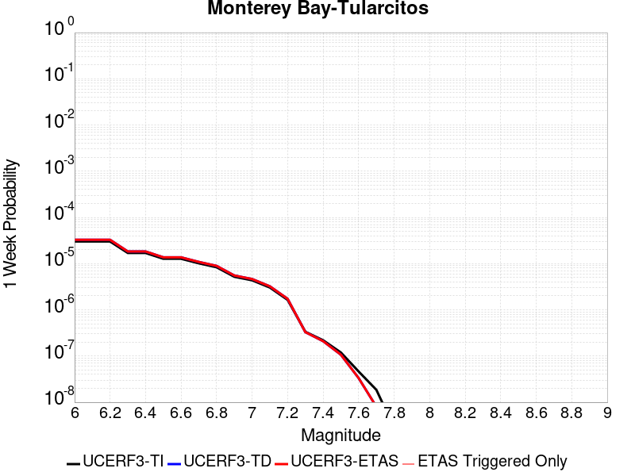 |  |  | 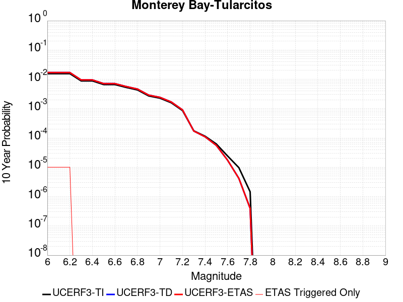 |

| Magnitude | 1 wk TI Prob | 1 wk TD Prob | 1 wk ETAS Prob | 1 wk ETAS/TD Gain | 1 wk ETAS Triggered Only | 1 mo TI Prob | 1 mo TD Prob | 1 mo ETAS Prob | 1 mo ETAS/TD Gain | 1 mo ETAS Triggered Only | 1 yr TI Prob | 1 yr TD Prob | 1 yr ETAS Prob | 1 yr ETAS/TD Gain | 1 yr ETAS Triggered Only | 10 yr TI Prob | 10 yr TD Prob | 10 yr ETAS Prob | 10 yr ETAS/TD Gain | 10 yr ETAS Triggered Only |
|-----|-----|-----|-----|-----|-----|-----|-----|-----|-----|-----|-----|-----|-----|-----|-----|-----|-----|-----|-----|-----|
| 6.0 | 3.0131365E-5 | 3.2799944E-5 | 3.2799944E-5 | 1.0 | 0.0 | 1.2912804E-4 | 1.4056421E-4 | 1.4056421E-4 | 1.0 | 0.0 | 0.001571 | 0.0017101313 | 0.0017101313 | 1.0 | 0.0 | 0.015599402 | 0.01698052 | 0.016990349 | 1.0005789 | 1.0E-5 |
| 6.1 | 3.0131365E-5 | 3.2799944E-5 | 3.2799944E-5 | 1.0 | 0.0 | 1.2912804E-4 | 1.4056421E-4 | 1.4056421E-4 | 1.0 | 0.0 | 0.001571 | 0.0017101313 | 0.0017101313 | 1.0 | 0.0 | 0.015599402 | 0.01698052 | 0.016990349 | 1.0005789 | 1.0E-5 |
| 6.2 | 3.0131365E-5 | 3.2799944E-5 | 3.2799944E-5 | 1.0 | 0.0 | 1.2912804E-4 | 1.4056421E-4 | 1.4056421E-4 | 1.0 | 0.0 | 0.001571 | 0.0017101313 | 0.0017101313 | 1.0 | 0.0 | 0.015599402 | 0.01698052 | 0.016990349 | 1.0005789 | 1.0E-5 |
| 6.3 | 1.6998249E-5 | 1.8331384E-5 | 1.8331384E-5 | 1.0 | 0.0 | 7.28476E-5 | 7.856081E-5 | 7.856081E-5 | 1.0 | 0.0 | 8.865586E-4 | 9.560769E-4 | 9.560769E-4 | 1.0 | 0.0 | 0.0088303005 | 0.009521562 | 0.009521562 | 1.0 | 0.0 |
| 6.4 | 1.6998249E-5 | 1.8331384E-5 | 1.8331384E-5 | 1.0 | 0.0 | 7.28476E-5 | 7.856081E-5 | 7.856081E-5 | 1.0 | 0.0 | 8.865586E-4 | 9.560769E-4 | 9.560769E-4 | 1.0 | 0.0 | 0.0088303005 | 0.009521562 | 0.009521562 | 1.0 | 0.0 |
| 6.5 | 1.27470785E-5 | 1.36937315E-5 | 1.36937315E-5 | 1.0 | 0.0 | 5.4629192E-5 | 5.8686157E-5 | 5.8686157E-5 | 1.0 | 0.0 | 6.649074E-4 | 7.1428006E-4 | 7.1428006E-4 | 1.0 | 0.0 | 0.0066292146 | 0.007120895 | 0.007120895 | 1.0 | 0.0 |
| 6.6 | 1.2739422E-5 | 1.3685818E-5 | 1.3685818E-5 | 1.0 | 0.0 | 5.4596385E-5 | 5.8652247E-5 | 5.8652247E-5 | 1.0 | 0.0 | 6.645082E-4 | 7.138675E-4 | 7.138675E-4 | 1.0 | 0.0 | 0.0066252467 | 0.0071167955 | 0.0071167955 | 1.0 | 0.0 |
| 6.7 | 1.0160109E-5 | 1.0886078E-5 | 1.0886078E-5 | 1.0 | 0.0 | 4.35426E-5 | 4.6653826E-5 | 4.6653826E-5 | 1.0 | 0.0 | 5.300022E-4 | 5.6786934E-4 | 5.6786934E-4 | 1.0 | 0.0 | 0.005287399 | 0.005664894 | 0.005664894 | 1.0 | 0.0 |
| 6.8 | 8.349859E-6 | 8.932849E-6 | 8.932849E-6 | 1.0 | 0.0 | 3.578462E-5 | 3.8283106E-5 | 3.8283106E-5 | 1.0 | 0.0 | 4.3559066E-4 | 4.6600282E-4 | 4.6600282E-4 | 1.0 | 0.0 | 0.004347378 | 0.0046508214 | 0.0046508214 | 1.0 | 0.0 |
| 6.9 | 5.193639E-6 | 5.536589E-6 | 5.536589E-6 | 1.0 | 0.0 | 2.2258262E-5 | 2.3728042E-5 | 2.3728042E-5 | 1.0 | 0.0 | 2.7096065E-4 | 2.8885386E-4 | 2.8885386E-4 | 1.0 | 0.0 | 0.0027063051 | 0.002885105 | 0.002885105 | 1.0 | 0.0 |
| 7.0 | 4.359381E-6 | 4.6435E-6 | 4.6435E-6 | 1.0 | 0.0 | 1.8682927E-5 | 1.9900579E-5 | 1.9900579E-5 | 1.0 | 0.0 | 2.274409E-4 | 2.4226558E-4 | 2.4226558E-4 | 1.0 | 0.0 | 0.0022720827 | 0.0024203076 | 0.0024203076 | 1.0 | 0.0 |
| 7.1 | 3.0398533E-6 | 3.231137E-6 | 3.231137E-6 | 1.0 | 0.0 | 1.3027877E-5 | 1.3847671E-5 | 1.3847671E-5 | 1.0 | 0.0 | 1.5860285E-4 | 1.6858497E-4 | 1.6858497E-4 | 1.0 | 0.0 | 0.001584897 | 0.0016848285 | 0.0016848285 | 1.0 | 0.0 |
| 7.2 | 1.642335E-6 | 1.733367E-6 | 1.733367E-6 | 1.0 | 0.0 | 7.0385595E-6 | 7.428706E-6 | 7.428706E-6 | 1.0 | 0.0 | 8.569109E-5 | 9.044281E-5 | 9.044281E-5 | 1.0 | 0.0 | 8.5658056E-4 | 9.042627E-4 | 9.042627E-4 | 1.0 | 0.0 |
| 7.3 | 3.356842E-7 | 3.2953386E-7 | 3.2953386E-7 | 1.0 | 0.0 | 1.4386458E-6 | 1.4122871E-6 | 1.4122871E-6 | 1.0 | 0.0 | 1.7515373E-5 | 1.7194461E-5 | 1.7194461E-5 | 1.0 | 0.0 | 1.7513991E-4 | 1.719314E-4 | 1.719314E-4 | 1.0 | 0.0 |
| 7.4 | 2.1973483E-7 | 2.1007266E-7 | 2.1007266E-7 | 1.0 | 0.0 | 9.417204E-7 | 9.003111E-7 | 9.003111E-7 | 1.0 | 0.0 | 1.1465385E-5 | 1.0961233E-5 | 1.0961233E-5 | 1.0 | 0.0 | 1.1464794E-4 | 1.0960695E-4 | 1.0960695E-4 | 1.0 | 0.0 |
| 7.5 | 1.1944135E-7 | 1.0696764E-7 | 1.0696764E-7 | 1.0 | 0.0 | 5.118914E-7 | 4.5843265E-7 | 4.5843265E-7 | 1.0 | 0.0 | 6.23226E-6 | 5.5814035E-6 | 5.5814035E-6 | 1.0 | 0.0 | 6.2320854E-5 | 5.5812645E-5 | 5.5812645E-5 | 1.0 | 0.0 |
| 7.6 | 4.636058E-8 | 3.337106E-8 | 3.337106E-8 | 1.0 | 0.0 | 1.9868818E-7 | 1.4301882E-7 | 1.4301882E-7 | 1.0 | 0.0 | 2.419026E-6 | 1.7412527E-6 | 1.7412527E-6 | 1.0 | 0.0 | 2.4189996E-5 | 1.7412392E-5 | 1.7412392E-5 | 1.0 | 0.0 |
| 7.7 | 1.8588572E-8 | 8.007949E-9 | 8.007949E-9 | 1.0 | 0.0 | 7.9665305E-8 | 3.4319783E-8 | 3.4319783E-8 | 1.0 | 0.0 | 9.699246E-7 | 4.1784327E-7 | 4.1784327E-7 | 1.0 | 0.0 | 9.699204E-6 | 4.178425E-6 | 4.178425E-6 | 1.0 | 0.0 |
| 7.8 | 2.7960154E-9 | 7.6170326E-10 | 7.6170326E-10 | 1.0 | 0.0 | 1.1982923E-8 | 3.264442E-9 | 3.264442E-9 | 1.0 | 0.0 | 1.4589209E-7 | 3.974458E-8 | 3.974458E-8 | 1.0 | 0.0 | 1.4589199E-6 | 3.9744577E-7 | 3.9744577E-7 | 1.0 | 0.0 |

## Great Valley 09 (Laguna Seca)
*[(top)](#table-of-contents)*

| 1 Week | 1 Month | 1 Year | 10 Year |
|-----|-----|-----|-----|
|  |  | 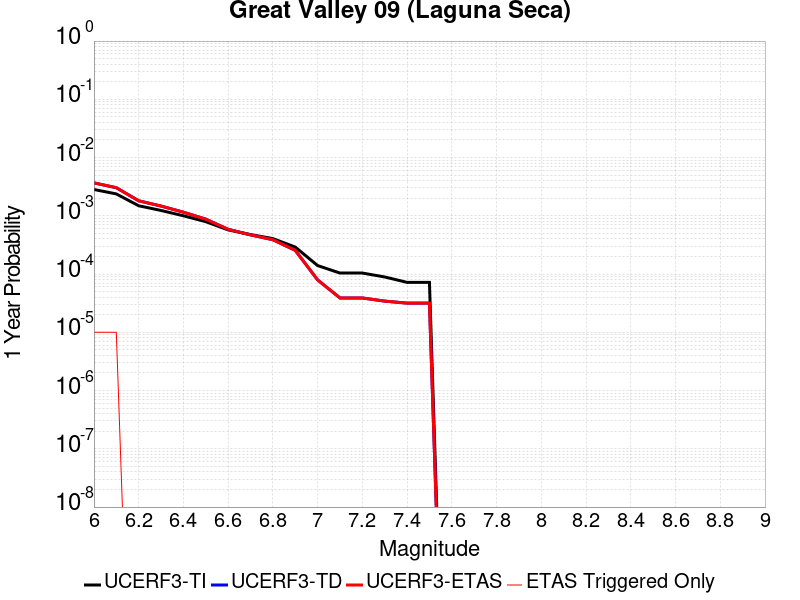 | 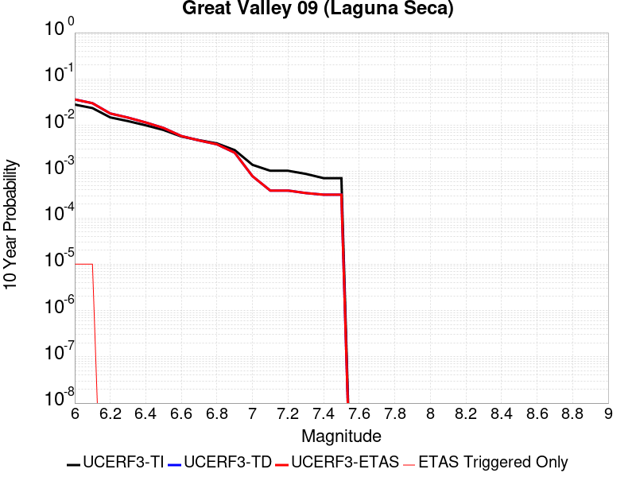 |

| Magnitude | 1 wk TI Prob | 1 wk TD Prob | 1 wk ETAS Prob | 1 wk ETAS/TD Gain | 1 wk ETAS Triggered Only | 1 mo TI Prob | 1 mo TD Prob | 1 mo ETAS Prob | 1 mo ETAS/TD Gain | 1 mo ETAS Triggered Only | 1 yr TI Prob | 1 yr TD Prob | 1 yr ETAS Prob | 1 yr ETAS/TD Gain | 1 yr ETAS Triggered Only | 10 yr TI Prob | 10 yr TD Prob | 10 yr ETAS Prob | 10 yr ETAS/TD Gain | 10 yr ETAS Triggered Only |
|-----|-----|-----|-----|-----|-----|-----|-----|-----|-----|-----|-----|-----|-----|-----|-----|-----|-----|-----|-----|-----|
| 6.0 | 5.4353277E-5 | 7.0509675E-5 | 7.0509675E-5 | 1.0 | 0.0 | 2.3292181E-4 | 3.0215143E-4 | 3.0215143E-4 | 1.0 | 0.0 | 0.0028321352 | 0.003672619 | 0.0036825822 | 1.0027128 | 1.0E-5 | 0.02796312 | 0.036119793 | 0.03612943 | 1.0002669 | 1.0E-5 |
| 6.1 | 4.5578287E-5 | 5.8226666E-5 | 5.8226666E-5 | 1.0 | 0.0 | 1.953209E-4 | 2.4952047E-4 | 2.4952047E-4 | 1.0 | 0.0 | 0.0023754383 | 0.0030337851 | 0.0030437547 | 1.0032862 | 1.0E-5 | 0.023502063 | 0.029923022 | 0.029932722 | 1.0003242 | 1.0E-5 |
| 6.2 | 2.8536782E-5 | 3.473914E-5 | 3.473914E-5 | 1.0 | 0.0 | 1.2229476E-4 | 1.4887394E-4 | 1.4887394E-4 | 1.0 | 0.0 | 0.0014879217 | 0.001811005 | 0.001811005 | 1.0 | 0.0 | 0.014779986 | 0.017960006 | 0.017960006 | 1.0 | 0.0 |
| 6.3 | 2.3698774E-5 | 2.8214235E-5 | 2.8214235E-5 | 1.0 | 0.0 | 1.01562226E-4 | 1.2091281E-4 | 1.2091281E-4 | 1.0 | 0.0 | 0.0012358186 | 0.001471175 | 0.001471175 | 1.0 | 0.0 | 0.012289686 | 0.01461281 | 0.01461281 | 1.0 | 0.0 |
| 6.4 | 1.9191197E-5 | 2.2123255E-5 | 2.2123255E-5 | 1.0 | 0.0 | 8.2245395E-5 | 9.4810675E-5 | 9.4810675E-5 | 1.0 | 0.0 | 0.0010008777 | 0.0011537512 | 0.0011537512 | 1.0 | 0.0 | 0.009963818 | 0.011478019 | 0.011478019 | 1.0 | 0.0 |
| 6.5 | 1.5203241E-5 | 1.6801554E-5 | 1.6801554E-5 | 1.0 | 0.0 | 6.5155116E-5 | 7.2004776E-5 | 7.2004776E-5 | 1.0 | 0.0 | 7.9297484E-4 | 8.7633665E-4 | 8.7633665E-4 | 1.0 | 0.0 | 0.007901512 | 0.008730245 | 0.008730245 | 1.0 | 0.0 |
| 6.6 | 1.0984925E-5 | 1.1243342E-5 | 1.1243342E-5 | 1.0 | 0.0 | 4.70774E-5 | 4.8184807E-5 | 4.8184807E-5 | 1.0 | 0.0 | 5.730166E-4 | 5.864954E-4 | 5.864954E-4 | 1.0 | 0.0 | 0.005715413 | 0.0058498723 | 0.0058498723 | 1.0 | 0.0 |
| 6.7 | 9.134616E-6 | 9.020462E-6 | 9.020462E-6 | 1.0 | 0.0 | 3.9147766E-5 | 3.8658563E-5 | 3.8658563E-5 | 1.0 | 0.0 | 4.7651984E-4 | 4.7056875E-4 | 4.7056875E-4 | 1.0 | 0.0 | 0.004754993 | 0.0046959682 | 0.0046959682 | 1.0 | 0.0 |
| 6.8 | 7.785589E-6 | 7.452411E-6 | 7.452411E-6 | 1.0 | 0.0 | 3.3366385E-5 | 3.1938525E-5 | 3.1938525E-5 | 1.0 | 0.0 | 4.0616E-4 | 3.8878416E-4 | 3.8878416E-4 | 1.0 | 0.0 | 0.0040541845 | 0.003881244 | 0.003881244 | 1.0 | 0.0 |
| 6.9 | 5.579095E-6 | 4.898799E-6 | 4.898799E-6 | 1.0 | 0.0 | 2.3910188E-5 | 2.0994692E-5 | 2.0994692E-5 | 1.0 | 0.0 | 2.9106764E-4 | 2.5558178E-4 | 2.5558178E-4 | 1.0 | 0.0 | 0.002906867 | 0.0025530157 | 0.0025530157 | 1.0 | 0.0 |
| 7.0 | 2.6816688E-6 | 1.5216968E-6 | 1.5216968E-6 | 1.0 | 0.0 | 1.1492816E-5 | 6.5215418E-6 | 6.5215418E-6 | 1.0 | 0.0 | 1.3991605E-4 | 7.939697E-5 | 7.939697E-5 | 1.0 | 0.0 | 0.0013982799 | 7.9369475E-4 | 7.9369475E-4 | 1.0 | 0.0 |
| 7.1 | 1.9951021E-6 | 7.4542646E-7 | 7.4542646E-7 | 1.0 | 0.0 | 8.55041E-6 | 3.194681E-6 | 3.194681E-6 | 1.0 | 0.0 | 1.0409627E-4 | 3.8894592E-5 | 3.8894592E-5 | 1.0 | 0.0 | 0.0010404752 | 3.8888198E-4 | 3.8888198E-4 | 1.0 | 0.0 |
| 7.2 | 1.9951021E-6 | 7.4542646E-7 | 7.4542646E-7 | 1.0 | 0.0 | 8.55041E-6 | 3.194681E-6 | 3.194681E-6 | 1.0 | 0.0 | 1.0409627E-4 | 3.8894592E-5 | 3.8894592E-5 | 1.0 | 0.0 | 0.0010404752 | 3.8888198E-4 | 3.8888198E-4 | 1.0 | 0.0 |
| 7.3 | 1.7087556E-6 | 6.5792466E-7 | 6.5792466E-7 | 1.0 | 0.0 | 7.3232177E-6 | 2.8196744E-6 | 2.8196744E-6 | 1.0 | 0.0 | 8.915652E-5 | 3.4329038E-5 | 3.4329038E-5 | 1.0 | 0.0 | 8.9120766E-4 | 3.4324138E-4 | 3.4324138E-4 | 1.0 | 0.0 |
| 7.4 | 1.3804846E-6 | 6.0741536E-7 | 6.0741536E-7 | 1.0 | 0.0 | 5.916349E-6 | 2.6032064E-6 | 2.6032064E-6 | 1.0 | 0.0 | 7.2029165E-5 | 3.1693617E-5 | 3.1693617E-5 | 1.0 | 0.0 | 7.200583E-4 | 3.16895E-4 | 3.16895E-4 | 1.0 | 0.0 |
| 7.5 | 1.3804846E-6 | 6.0741536E-7 | 6.0741536E-7 | 1.0 | 0.0 | 5.916349E-6 | 2.6032064E-6 | 2.6032064E-6 | 1.0 | 0.0 | 7.2029165E-5 | 3.1693617E-5 | 3.1693617E-5 | 1.0 | 0.0 | 7.200583E-4 | 3.16895E-4 | 3.16895E-4 | 1.0 | 0.0 |

## Los Alamos 2011 CFM
*[(top)](#table-of-contents)*

| 1 Week | 1 Month | 1 Year | 10 Year |
|-----|-----|-----|-----|
|  |  | 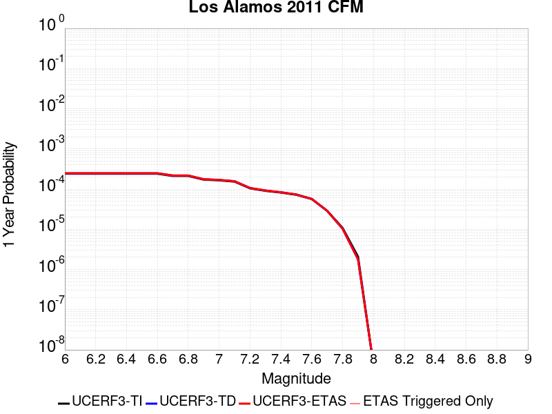 |  |

| Magnitude | 1 wk TI Prob | 1 wk TD Prob | 1 wk ETAS Prob | 1 wk ETAS/TD Gain | 1 wk ETAS Triggered Only | 1 mo TI Prob | 1 mo TD Prob | 1 mo ETAS Prob | 1 mo ETAS/TD Gain | 1 mo ETAS Triggered Only | 1 yr TI Prob | 1 yr TD Prob | 1 yr ETAS Prob | 1 yr ETAS/TD Gain | 1 yr ETAS Triggered Only | 10 yr TI Prob | 10 yr TD Prob | 10 yr ETAS Prob | 10 yr ETAS/TD Gain | 10 yr ETAS Triggered Only |
|-----|-----|-----|-----|-----|-----|-----|-----|-----|-----|-----|-----|-----|-----|-----|-----|-----|-----|-----|-----|-----|
| 6.0 | 4.6284417E-6 | 4.7517965E-6 | 4.7517965E-6 | 1.0 | 0.0 | 1.9836029E-5 | 2.0364694E-5 | 2.0364694E-5 | 1.0 | 0.0 | 2.4147688E-4 | 2.479137E-4 | 2.479137E-4 | 1.0 | 0.0 | 0.0024121467 | 0.0024765455 | 0.0024865207 | 1.0040278 | 1.0E-5 |
| 6.1 | 4.6284417E-6 | 4.7517965E-6 | 4.7517965E-6 | 1.0 | 0.0 | 1.9836029E-5 | 2.0364694E-5 | 2.0364694E-5 | 1.0 | 0.0 | 2.4147688E-4 | 2.479137E-4 | 2.479137E-4 | 1.0 | 0.0 | 0.0024121467 | 0.0024765455 | 0.0024865207 | 1.0040278 | 1.0E-5 |
| 6.2 | 4.6284417E-6 | 4.7517965E-6 | 4.7517965E-6 | 1.0 | 0.0 | 1.9836029E-5 | 2.0364694E-5 | 2.0364694E-5 | 1.0 | 0.0 | 2.4147688E-4 | 2.479137E-4 | 2.479137E-4 | 1.0 | 0.0 | 0.0024121467 | 0.0024765455 | 0.0024865207 | 1.0040278 | 1.0E-5 |
| 6.3 | 4.6284417E-6 | 4.7517965E-6 | 4.7517965E-6 | 1.0 | 0.0 | 1.9836029E-5 | 2.0364694E-5 | 2.0364694E-5 | 1.0 | 0.0 | 2.4147688E-4 | 2.479137E-4 | 2.479137E-4 | 1.0 | 0.0 | 0.0024121467 | 0.0024765455 | 0.0024865207 | 1.0040278 | 1.0E-5 |
| 6.4 | 4.6284417E-6 | 4.7517965E-6 | 4.7517965E-6 | 1.0 | 0.0 | 1.9836029E-5 | 2.0364694E-5 | 2.0364694E-5 | 1.0 | 0.0 | 2.4147688E-4 | 2.479137E-4 | 2.479137E-4 | 1.0 | 0.0 | 0.0024121467 | 0.0024765455 | 0.0024865207 | 1.0040278 | 1.0E-5 |
| 6.5 | 4.6284417E-6 | 4.7517965E-6 | 4.7517965E-6 | 1.0 | 0.0 | 1.9836029E-5 | 2.0364694E-5 | 2.0364694E-5 | 1.0 | 0.0 | 2.4147688E-4 | 2.479137E-4 | 2.479137E-4 | 1.0 | 0.0 | 0.0024121467 | 0.0024765455 | 0.0024865207 | 1.0040278 | 1.0E-5 |
| 6.6 | 4.6284417E-6 | 4.7517965E-6 | 4.7517965E-6 | 1.0 | 0.0 | 1.9836029E-5 | 2.0364694E-5 | 2.0364694E-5 | 1.0 | 0.0 | 2.4147688E-4 | 2.479137E-4 | 2.479137E-4 | 1.0 | 0.0 | 0.0024121467 | 0.0024765455 | 0.0024865207 | 1.0040278 | 1.0E-5 |
| 6.7 | 4.062321E-6 | 4.166406E-6 | 4.166406E-6 | 1.0 | 0.0 | 1.7409831E-5 | 1.7855913E-5 | 1.7855913E-5 | 1.0 | 0.0 | 2.1194408E-4 | 2.1737558E-4 | 2.1737558E-4 | 1.0 | 0.0 | 0.0021174205 | 0.002171779 | 0.0021817575 | 1.0045946 | 1.0E-5 |
| 6.8 | 4.062321E-6 | 4.166406E-6 | 4.166406E-6 | 1.0 | 0.0 | 1.7409831E-5 | 1.7855913E-5 | 1.7855913E-5 | 1.0 | 0.0 | 2.1194408E-4 | 2.1737558E-4 | 2.1737558E-4 | 1.0 | 0.0 | 0.0021174205 | 0.002171779 | 0.0021817575 | 1.0045946 | 1.0E-5 |
| 6.9 | 3.2936077E-6 | 3.3730053E-6 | 3.3730053E-6 | 1.0 | 0.0 | 1.4115385E-5 | 1.44556625E-5 | 1.44556625E-5 | 1.0 | 0.0 | 1.7184127E-4 | 1.7598442E-4 | 1.7598442E-4 | 1.0 | 0.0 | 0.0017170844 | 0.0017585431 | 0.0017685256 | 1.0056765 | 1.0E-5 |
| 7.0 | 3.1687898E-6 | 3.2448615E-6 | 3.2448615E-6 | 1.0 | 0.0 | 1.3580457E-5 | 1.39064805E-5 | 1.39064805E-5 | 1.0 | 0.0 | 1.6532952E-4 | 1.6929918E-4 | 1.6929918E-4 | 1.0 | 0.0 | 0.0016520657 | 0.0016917936 | 0.0017017766 | 1.0059009 | 1.0E-5 |
| 7.1 | 2.9379228E-6 | 3.007369E-6 | 3.007369E-6 | 1.0 | 0.0 | 1.25910365E-5 | 1.2888667E-5 | 1.2888667E-5 | 1.0 | 0.0 | 1.5328509E-4 | 1.5690913E-4 | 1.5690913E-4 | 1.0 | 0.0 | 0.001531794 | 0.0015680725 | 0.0015780568 | 1.0063672 | 1.0E-5 |
| 7.2 | 2.0020686E-6 | 2.041661E-6 | 2.041661E-6 | 1.0 | 0.0 | 8.580266E-6 | 8.749946E-6 | 8.749946E-6 | 1.0 | 0.0 | 1.0445973E-4 | 1.0652543E-4 | 1.0652543E-4 | 1.0 | 0.0 | 0.0010441064 | 0.0010647482 | 0.0010647482 | 1.0 | 0.0 |
| 7.3 | 1.7364243E-6 | 1.767908E-6 | 1.767908E-6 | 1.0 | 0.0 | 7.441797E-6 | 7.5767266E-6 | 7.5767266E-6 | 1.0 | 0.0 | 9.0600115E-5 | 9.224277E-5 | 9.224277E-5 | 1.0 | 0.0 | 9.0563187E-4 | 9.22048E-4 | 9.22048E-4 | 1.0 | 0.0 |
| 7.4 | 1.5718434E-6 | 1.5983434E-6 | 1.5983434E-6 | 1.0 | 0.0 | 6.7364545E-6 | 6.8500253E-6 | 6.8500253E-6 | 1.0 | 0.0 | 8.201325E-5 | 8.339589E-5 | 8.339589E-5 | 1.0 | 0.0 | 8.198299E-4 | 8.33649E-4 | 8.33649E-4 | 1.0 | 0.0 |
| 7.5 | 1.3841119E-6 | 1.4043023E-6 | 1.4043023E-6 | 1.0 | 0.0 | 5.9318945E-6 | 6.0184248E-6 | 6.0184248E-6 | 1.0 | 0.0 | 7.221842E-5 | 7.327189E-5 | 7.327189E-5 | 1.0 | 0.0 | 7.2194956E-4 | 7.324802E-4 | 7.324802E-4 | 1.0 | 0.0 |
| 7.6 | 1.0843726E-6 | 1.0934606E-6 | 1.0934606E-6 | 1.0 | 0.0 | 4.647303E-6 | 4.6862515E-6 | 4.6862515E-6 | 1.0 | 0.0 | 5.6579443E-5 | 5.7053647E-5 | 5.7053647E-5 | 1.0 | 0.0 | 5.656504E-4 | 5.703926E-4 | 5.703926E-4 | 1.0 | 0.0 |
| 7.7 | 5.544814E-7 | 5.501968E-7 | 5.501968E-7 | 1.0 | 0.0 | 2.3763469E-6 | 2.357984E-6 | 2.357984E-6 | 1.0 | 0.0 | 2.8931638E-5 | 2.8708078E-5 | 2.8708078E-5 | 1.0 | 0.0 | 2.8927872E-4 | 2.8704386E-4 | 2.8704386E-4 | 1.0 | 0.0 |
| 7.8 | 2.0707465E-7 | 1.977884E-7 | 1.977884E-7 | 1.0 | 0.0 | 8.874625E-7 | 8.476643E-7 | 8.476643E-7 | 1.0 | 0.0 | 1.08048025E-5 | 1.0320265E-5 | 1.0320265E-5 | 1.0 | 0.0 | 1.0804277E-4 | 1.031979E-4 | 1.031979E-4 | 1.0 | 0.0 |
| 7.9 | 3.9821284E-8 | 3.433179E-8 | 3.433179E-8 | 1.0 | 0.0 | 1.7066264E-7 | 1.4713623E-7 | 1.4713623E-7 | 1.0 | 0.0 | 2.0778157E-6 | 1.7913823E-6 | 1.7913823E-6 | 1.0 | 0.0 | 2.0777963E-5 | 1.7913684E-5 | 1.7913684E-5 | 1.0 | 0.0 |
| 8.0 | 7.880441E-11 | 8.235457E-11 | 8.235457E-11 | 1.0 | 0.0 | 3.3773329E-10 | 3.5294834E-10 | 3.5294834E-10 | 1.0 | 0.0 | 4.1119033E-9 | 4.2971466E-9 | 4.2971466E-9 | 1.0 | 0.0 | 4.1119034E-8 | 4.2971465E-8 | 4.2971465E-8 | 1.0 | 0.0 |

## Los Alamos extension
*[(top)](#table-of-contents)*

| 1 Week | 1 Month | 1 Year | 10 Year |
|-----|-----|-----|-----|
| 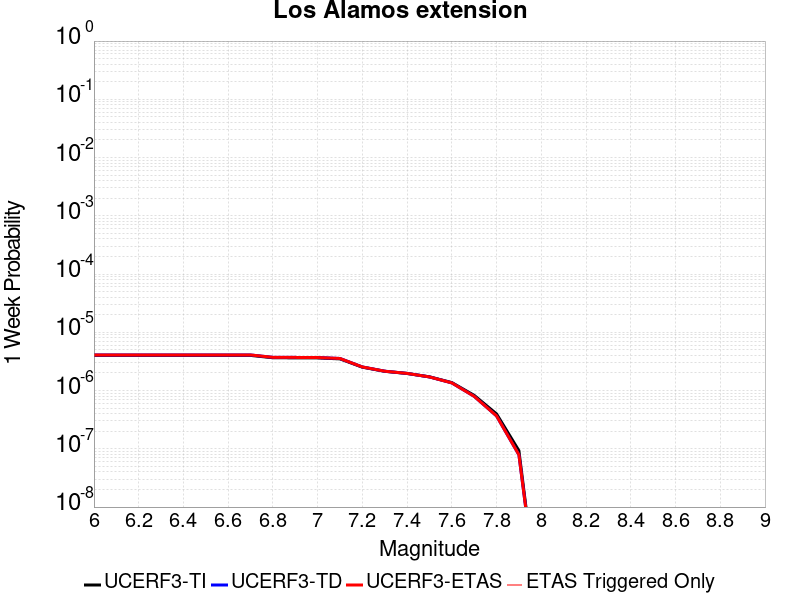 |  | 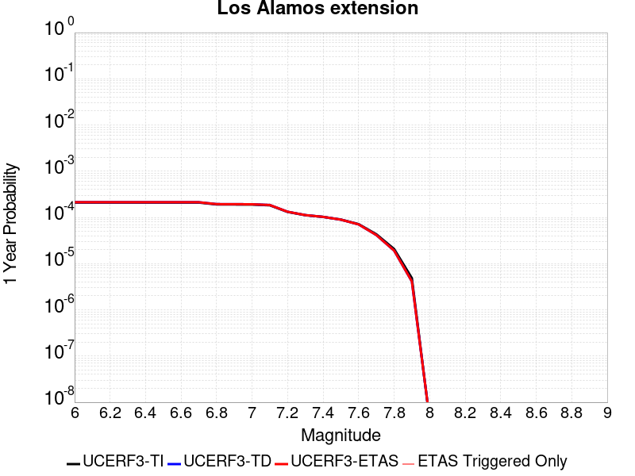 |  |

| Magnitude | 1 wk TI Prob | 1 wk TD Prob | 1 wk ETAS Prob | 1 wk ETAS/TD Gain | 1 wk ETAS Triggered Only | 1 mo TI Prob | 1 mo TD Prob | 1 mo ETAS Prob | 1 mo ETAS/TD Gain | 1 mo ETAS Triggered Only | 1 yr TI Prob | 1 yr TD Prob | 1 yr ETAS Prob | 1 yr ETAS/TD Gain | 1 yr ETAS Triggered Only | 10 yr TI Prob | 10 yr TD Prob | 10 yr ETAS Prob | 10 yr ETAS/TD Gain | 10 yr ETAS Triggered Only |
|-----|-----|-----|-----|-----|-----|-----|-----|-----|-----|-----|-----|-----|-----|-----|-----|-----|-----|-----|-----|-----|
| 6.0 | 4.0146506E-6 | 4.086222E-6 | 4.086222E-6 | 1.0 | 0.0 | 1.7205533E-5 | 1.7512268E-5 | 1.7512268E-5 | 1.0 | 0.0 | 2.0945723E-4 | 2.131921E-4 | 2.131921E-4 | 1.0 | 0.0 | 0.0020925992 | 0.002129985 | 0.0021399637 | 1.0046849 | 1.0E-5 |
| 6.1 | 4.0146506E-6 | 4.086222E-6 | 4.086222E-6 | 1.0 | 0.0 | 1.7205533E-5 | 1.7512268E-5 | 1.7512268E-5 | 1.0 | 0.0 | 2.0945723E-4 | 2.131921E-4 | 2.131921E-4 | 1.0 | 0.0 | 0.0020925992 | 0.002129985 | 0.0021399637 | 1.0046849 | 1.0E-5 |
| 6.2 | 4.0146506E-6 | 4.086222E-6 | 4.086222E-6 | 1.0 | 0.0 | 1.7205533E-5 | 1.7512268E-5 | 1.7512268E-5 | 1.0 | 0.0 | 2.0945723E-4 | 2.131921E-4 | 2.131921E-4 | 1.0 | 0.0 | 0.0020925992 | 0.002129985 | 0.0021399637 | 1.0046849 | 1.0E-5 |
| 6.3 | 4.0146506E-6 | 4.086222E-6 | 4.086222E-6 | 1.0 | 0.0 | 1.7205533E-5 | 1.7512268E-5 | 1.7512268E-5 | 1.0 | 0.0 | 2.0945723E-4 | 2.131921E-4 | 2.131921E-4 | 1.0 | 0.0 | 0.0020925992 | 0.002129985 | 0.0021399637 | 1.0046849 | 1.0E-5 |
| 6.4 | 4.0146506E-6 | 4.086222E-6 | 4.086222E-6 | 1.0 | 0.0 | 1.7205533E-5 | 1.7512268E-5 | 1.7512268E-5 | 1.0 | 0.0 | 2.0945723E-4 | 2.131921E-4 | 2.131921E-4 | 1.0 | 0.0 | 0.0020925992 | 0.002129985 | 0.0021399637 | 1.0046849 | 1.0E-5 |
| 6.5 | 4.0146506E-6 | 4.086222E-6 | 4.086222E-6 | 1.0 | 0.0 | 1.7205533E-5 | 1.7512268E-5 | 1.7512268E-5 | 1.0 | 0.0 | 2.0945723E-4 | 2.131921E-4 | 2.131921E-4 | 1.0 | 0.0 | 0.0020925992 | 0.002129985 | 0.0021399637 | 1.0046849 | 1.0E-5 |
| 6.6 | 4.0146506E-6 | 4.086222E-6 | 4.086222E-6 | 1.0 | 0.0 | 1.7205533E-5 | 1.7512268E-5 | 1.7512268E-5 | 1.0 | 0.0 | 2.0945723E-4 | 2.131921E-4 | 2.131921E-4 | 1.0 | 0.0 | 0.0020925992 | 0.002129985 | 0.0021399637 | 1.0046849 | 1.0E-5 |
| 6.7 | 4.0146506E-6 | 4.086222E-6 | 4.086222E-6 | 1.0 | 0.0 | 1.7205533E-5 | 1.7512268E-5 | 1.7512268E-5 | 1.0 | 0.0 | 2.0945723E-4 | 2.131921E-4 | 2.131921E-4 | 1.0 | 0.0 | 0.0020925992 | 0.002129985 | 0.0021399637 | 1.0046849 | 1.0E-5 |
| 6.8 | 3.6584688E-6 | 3.7189166E-6 | 3.7189166E-6 | 1.0 | 0.0 | 1.5679057E-5 | 1.5938122E-5 | 1.5938122E-5 | 1.0 | 0.0 | 1.9087581E-4 | 1.9403028E-4 | 1.9403028E-4 | 1.0 | 0.0 | 0.0019071194 | 0.0019387011 | 0.0019486818 | 1.005148 | 1.0E-5 |
| 6.9 | 3.644631E-6 | 3.7046261E-6 | 3.7046261E-6 | 1.0 | 0.0 | 1.5619753E-5 | 1.5876878E-5 | 1.5876878E-5 | 1.0 | 0.0 | 1.901539E-4 | 1.9328478E-4 | 1.9328478E-4 | 1.0 | 0.0 | 0.0018999127 | 0.0019312591 | 0.0019412398 | 1.005168 | 1.0E-5 |
| 7.0 | 3.6318522E-6 | 3.6913866E-6 | 3.6913866E-6 | 1.0 | 0.0 | 1.5564989E-5 | 1.5820138E-5 | 1.5820138E-5 | 1.0 | 0.0 | 1.8948725E-4 | 1.9259409E-4 | 1.9259409E-4 | 1.0 | 0.0 | 0.0018932576 | 0.0019243641 | 0.0019343449 | 1.0051866 | 1.0E-5 |
| 7.1 | 3.5001724E-6 | 3.5554556E-6 | 3.5554556E-6 | 1.0 | 0.0 | 1.5000653E-5 | 1.5237582E-5 | 1.5237582E-5 | 1.0 | 0.0 | 1.8261763E-4 | 1.855027E-4 | 1.855027E-4 | 1.0 | 0.0 | 0.0018246764 | 0.0018535691 | 0.0018635506 | 1.005385 | 1.0E-5 |
| 7.2 | 2.5204702E-6 | 2.5437366E-6 | 2.5437366E-6 | 1.0 | 0.0 | 1.080197E-5 | 1.0901683E-5 | 1.0901683E-5 | 1.0 | 0.0 | 1.3150605E-4 | 1.3271996E-4 | 1.3271996E-4 | 1.0 | 0.0 | 0.0013142825 | 0.0013264125 | 0.0013264125 | 1.0 | 0.0 |
| 7.3 | 2.1399692E-6 | 2.1501685E-6 | 2.1501685E-6 | 1.0 | 0.0 | 9.1712645E-6 | 9.214976E-6 | 9.214976E-6 | 1.0 | 0.0 | 1.1165442E-4 | 1.1218658E-4 | 1.1218658E-4 | 1.0 | 0.0 | 0.0011159834 | 0.0011213027 | 0.0011213027 | 1.0 | 0.0 |
| 7.4 | 1.9660122E-6 | 1.970271E-6 | 1.970271E-6 | 1.0 | 0.0 | 8.42574E-6 | 8.443991E-6 | 8.443991E-6 | 1.0 | 0.0 | 1.0257855E-4 | 1.0280077E-4 | 1.0280077E-4 | 1.0 | 0.0 | 0.0010253121 | 0.0010275353 | 0.0010275353 | 1.0 | 0.0 |
| 7.5 | 1.7204633E-6 | 1.7151287E-6 | 1.7151287E-6 | 1.0 | 0.0 | 7.373393E-6 | 7.350531E-6 | 7.350531E-6 | 1.0 | 0.0 | 8.976737E-5 | 8.9489076E-5 | 8.9489076E-5 | 1.0 | 0.0 | 8.9731114E-4 | 8.9453335E-4 | 8.9453335E-4 | 1.0 | 0.0 |
| 7.6 | 1.3717638E-6 | 1.3536072E-6 | 1.3536072E-6 | 1.0 | 0.0 | 5.878974E-6 | 5.801161E-6 | 5.801161E-6 | 1.0 | 0.0 | 7.157416E-5 | 7.062687E-5 | 7.062687E-5 | 1.0 | 0.0 | 7.1551115E-4 | 7.060469E-4 | 7.060469E-4 | 1.0 | 0.0 |
| 7.7 | 8.272564E-7 | 7.9577893E-7 | 7.9577893E-7 | 1.0 | 0.0 | 3.5453797E-6 | 3.4104767E-6 | 3.4104767E-6 | 1.0 | 0.0 | 4.3164142E-5 | 4.1521766E-5 | 4.1521766E-5 | 1.0 | 0.0 | 4.315576E-4 | 4.1514027E-4 | 4.1514027E-4 | 1.0 | 0.0 |
| 7.8 | 3.9708277E-7 | 3.6719786E-7 | 3.6719786E-7 | 1.0 | 0.0 | 1.7017821E-6 | 1.573704E-6 | 1.573704E-6 | 1.0 | 0.0 | 2.0719E-5 | 1.915968E-5 | 1.915968E-5 | 1.0 | 0.0 | 2.071707E-4 | 1.9158034E-4 | 1.9158034E-4 | 1.0 | 0.0 |
| 7.9 | 9.292528E-8 | 7.88926E-8 | 7.88926E-8 | 1.0 | 0.0 | 3.9825116E-7 | 3.3811108E-7 | 3.3811108E-7 | 1.0 | 0.0 | 4.848697E-6 | 4.116495E-6 | 4.116495E-6 | 1.0 | 0.0 | 4.8485912E-5 | 4.1164196E-5 | 4.1164196E-5 | 1.0 | 0.0 |
| 8.0 | 7.880441E-11 | 8.235457E-11 | 8.235457E-11 | 1.0 | 0.0 | 3.3773329E-10 | 3.5294834E-10 | 3.5294834E-10 | 1.0 | 0.0 | 4.1119033E-9 | 4.2971466E-9 | 4.2971466E-9 | 1.0 | 0.0 | 4.1119034E-8 | 4.2971465E-8 | 4.2971465E-8 | 1.0 | 0.0 |

## Fontana (Seismicity)
*[(top)](#table-of-contents)*

| 1 Week | 1 Month | 1 Year | 10 Year |
|-----|-----|-----|-----|
|  |  | 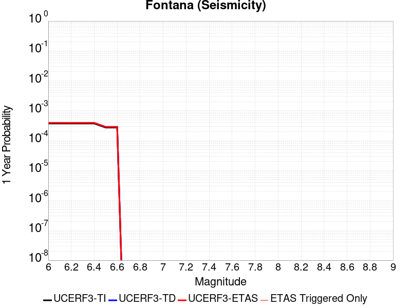 | 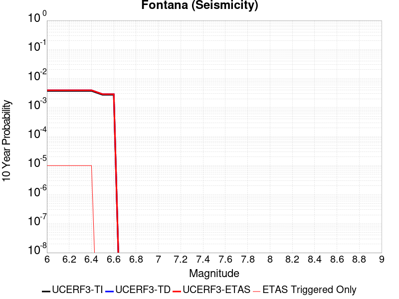 |

| Magnitude | 1 wk TI Prob | 1 wk TD Prob | 1 wk ETAS Prob | 1 wk ETAS/TD Gain | 1 wk ETAS Triggered Only | 1 mo TI Prob | 1 mo TD Prob | 1 mo ETAS Prob | 1 mo ETAS/TD Gain | 1 mo ETAS Triggered Only | 1 yr TI Prob | 1 yr TD Prob | 1 yr ETAS Prob | 1 yr ETAS/TD Gain | 1 yr ETAS Triggered Only | 10 yr TI Prob | 10 yr TD Prob | 10 yr ETAS Prob | 10 yr ETAS/TD Gain | 10 yr ETAS Triggered Only |
|-----|-----|-----|-----|-----|-----|-----|-----|-----|-----|-----|-----|-----|-----|-----|-----|-----|-----|-----|-----|-----|
| 6.0 | 7.1789214E-6 | 7.552157E-6 | 7.552157E-6 | 1.0 | 0.0 | 3.076644E-5 | 3.2366213E-5 | 3.2366213E-5 | 1.0 | 0.0 | 3.7451705E-4 | 3.940282E-4 | 3.940282E-4 | 1.0 | 0.0 | 0.003738865 | 0.0039372956 | 0.003947256 | 1.0025299 | 1.0E-5 |
| 6.1 | 7.1789214E-6 | 7.552157E-6 | 7.552157E-6 | 1.0 | 0.0 | 3.076644E-5 | 3.2366213E-5 | 3.2366213E-5 | 1.0 | 0.0 | 3.7451705E-4 | 3.940282E-4 | 3.940282E-4 | 1.0 | 0.0 | 0.003738865 | 0.0039372956 | 0.003947256 | 1.0025299 | 1.0E-5 |
| 6.2 | 7.1789214E-6 | 7.552157E-6 | 7.552157E-6 | 1.0 | 0.0 | 3.076644E-5 | 3.2366213E-5 | 3.2366213E-5 | 1.0 | 0.0 | 3.7451705E-4 | 3.940282E-4 | 3.940282E-4 | 1.0 | 0.0 | 0.003738865 | 0.0039372956 | 0.003947256 | 1.0025299 | 1.0E-5 |
| 6.3 | 7.1789214E-6 | 7.552157E-6 | 7.552157E-6 | 1.0 | 0.0 | 3.076644E-5 | 3.2366213E-5 | 3.2366213E-5 | 1.0 | 0.0 | 3.7451705E-4 | 3.940282E-4 | 3.940282E-4 | 1.0 | 0.0 | 0.003738865 | 0.0039372956 | 0.003947256 | 1.0025299 | 1.0E-5 |
| 6.4 | 7.1789214E-6 | 7.552157E-6 | 7.552157E-6 | 1.0 | 0.0 | 3.076644E-5 | 3.2366213E-5 | 3.2366213E-5 | 1.0 | 0.0 | 3.7451705E-4 | 3.940282E-4 | 3.940282E-4 | 1.0 | 0.0 | 0.003738865 | 0.0039372956 | 0.003947256 | 1.0025299 | 1.0E-5 |
| 6.5 | 5.2611317E-6 | 5.5328396E-6 | 5.5328396E-6 | 1.0 | 0.0 | 2.2547512E-5 | 2.371217E-5 | 2.371217E-5 | 1.0 | 0.0 | 2.744814E-4 | 2.8869565E-4 | 2.8869565E-4 | 1.0 | 0.0 | 0.002741426 | 0.0028869566 | 0.0028869566 | 1.0 | 0.0 |
| 6.6 | 5.2611317E-6 | 5.5328396E-6 | 5.5328396E-6 | 1.0 | 0.0 | 2.2547512E-5 | 2.371217E-5 | 2.371217E-5 | 1.0 | 0.0 | 2.744814E-4 | 2.8869565E-4 | 2.8869565E-4 | 1.0 | 0.0 | 0.002741426 | 0.0028869566 | 0.0028869566 | 1.0 | 0.0 |

