# Parent Section Magnitude-Probability Distributions

Only fault sections with at least one triggered aftershock are plotted. Sections are sorted by total supraseismogenic trigger rate (decreasing)

## Table Of Contents

* [Garlock (Central)](#garlock-central)
* [Tank Canyon](#tank-canyon)
* [Little Lake](#little-lake)
* [Airport Lake](#airport-lake)
* [Garlock (East)](#garlock-east)
* [Owl Lake](#owl-lake)
* [Ash Hill](#ash-hill)
* [Panamint Valley](#panamint-valley)
* [Blackwater](#blackwater)
* [Hunter Mountain-Saline Valley](#hunter-mountain-saline-valley)
* [Santa Rosa Island](#santa-rosa-island)
* [So Sierra Nevada](#so-sierra-nevada)
* [Garlock (West)](#garlock-west)
* [Goldstone Lake](#goldstone-lake)
* [Likely 2011 CFM](#likely-2011-cfm)
* [Nelson Lake](#nelson-lake)
* [McLean Lake](#mclean-lake)
* [Death Valley (So)](#death-valley-so)
* [Gravel Hills-Harper Lk](#gravel-hills-harper-lk)

## Garlock (Central)
*[(top)](#table-of-contents)*

| 1 Week | 1 Month | 1 Year | 10 Year |
|-----|-----|-----|-----|
|  |  |  | 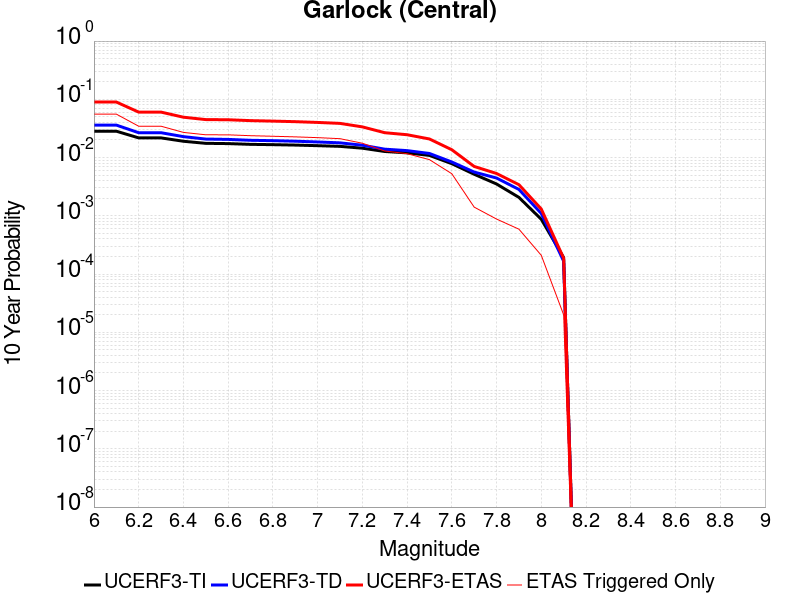 |

| Magnitude | 1 wk TI Prob | 1 wk TD Prob | 1 wk ETAS Prob | 1 wk ETAS/TD Gain | 1 wk ETAS Triggered Only | 1 mo TI Prob | 1 mo TD Prob | 1 mo ETAS Prob | 1 mo ETAS/TD Gain | 1 mo ETAS Triggered Only | 1 yr TI Prob | 1 yr TD Prob | 1 yr ETAS Prob | 1 yr ETAS/TD Gain | 1 yr ETAS Triggered Only | 10 yr TI Prob | 10 yr TD Prob | 10 yr ETAS Prob | 10 yr ETAS/TD Gain | 10 yr ETAS Triggered Only |
|-----|-----|-----|-----|-----|-----|-----|-----|-----|-----|-----|-----|-----|-----|-----|-----|-----|-----|-----|-----|-----|
| 6.0 | 5.5131142E-5 | 7.027124E-5 | 7.027124E-5 | 1.0 | 0.0 | 2.3625491E-4 | 3.0112805E-4 | 0.0032544483 | 10.807522 | 0.0029542097 | 0.0028726095 | 0.0036601364 | 0.021320518 | 5.825061 | 0.017725259 | 0.028357591 | 0.036092084 | 0.07880588 | 2.183467 | 0.044313148 |
| 6.1 | 5.5131142E-5 | 7.027124E-5 | 7.027124E-5 | 1.0 | 0.0 | 2.3625491E-4 | 3.0112805E-4 | 0.0032544483 | 10.807522 | 0.0029542097 | 0.0028726095 | 0.0036601364 | 0.021320518 | 5.825061 | 0.017725259 | 0.028357591 | 0.036092084 | 0.07880588 | 2.183467 | 0.044313148 |
| 6.2 | 4.216245E-5 | 5.1683597E-5 | 5.1683597E-5 | 1.0 | 0.0 | 1.806837E-4 | 2.214825E-4 | 0.0016982602 | 7.6676946 | 0.0014771048 | 0.0021976046 | 0.0026932466 | 0.011532007 | 4.2818236 | 0.0088626295 | 0.021759989 | 0.026701005 | 0.048265975 | 1.8076464 | 0.022156574 |
| 6.3 | 4.216245E-5 | 5.1683597E-5 | 5.1683597E-5 | 1.0 | 0.0 | 1.806837E-4 | 2.214825E-4 | 0.0016982602 | 7.6676946 | 0.0014771048 | 0.0021976046 | 0.0026932466 | 0.011532007 | 4.2818236 | 0.0088626295 | 0.021759989 | 0.026701005 | 0.048265975 | 1.8076464 | 0.022156574 |
| 6.4 | 3.6858168E-5 | 4.4131746E-5 | 4.4131746E-5 | 1.0 | 0.0 | 1.5795401E-4 | 1.8912248E-4 | 0.001665948 | 8.808831 | 0.0014771048 | 0.0019213937 | 0.00230016 | 0.0081949895 | 3.562791 | 0.0059084194 | 0.019048655 | 0.022859743 | 0.038736466 | 1.6945277 | 0.016248154 |
| 6.5 | 3.39199E-5 | 4.0038896E-5 | 4.0038896E-5 | 1.0 | 0.0 | 1.453629E-4 | 1.715841E-4 | 0.0016484355 | 9.607158 | 0.0014771048 | 0.0017683565 | 0.0020870569 | 0.007983145 | 3.8250732 | 0.0059084194 | 0.017543508 | 0.020770492 | 0.03523474 | 1.6963844 | 0.014771049 |
| 6.6 | 3.3571985E-5 | 3.9493032E-5 | 3.9493032E-5 | 1.0 | 0.0 | 1.4387199E-4 | 1.6924499E-4 | 0.0016460998 | 9.726136 | 0.0014771048 | 0.0017502342 | 0.0020586322 | 0.007954888 | 3.8641622 | 0.0059084194 | 0.017365133 | 0.020491783 | 0.034960147 | 1.7060568 | 0.014771049 |
| 6.7 | 3.2580007E-5 | 3.8109323E-5 | 3.8109323E-5 | 1.0 | 0.0 | 1.3962112E-4 | 1.6331558E-4 | 0.0016401792 | 10.043006 | 0.0014771048 | 0.0016985617 | 0.0019865753 | 0.007883257 | 3.968265 | 0.0059084194 | 0.016856372 | 0.019784356 | 0.032815285 | 1.6586483 | 0.013293944 |
| 6.8 | 3.2185937E-5 | 3.7536465E-5 | 3.7536465E-5 | 1.0 | 0.0 | 1.3793244E-4 | 1.6086077E-4 | 0.0016377281 | 10.181028 | 0.0014771048 | 0.0016780337 | 0.001956742 | 0.0078536 | 4.0136104 | 0.0059084194 | 0.016654192 | 0.01949112 | 0.03252595 | 1.6687573 | 0.013293944 |
| 6.9 | 3.165394E-5 | 3.6740938E-5 | 3.6740938E-5 | 1.0 | 0.0 | 1.3565269E-4 | 1.5745178E-4 | 0.0016343241 | 10.379839 | 0.0014771048 | 0.0016503202 | 0.0019153113 | 0.0078124143 | 4.0789266 | 0.0059084194 | 0.01638118 | 0.0190837 | 0.032123946 | 1.6833186 | 0.013293944 |
| 7.0 | 3.0903822E-5 | 3.564605E-5 | 3.564605E-5 | 1.0 | 0.0 | 1.3243823E-4 | 1.5275997E-4 | 0.0016296392 | 10.6679735 | 0.0014771048 | 0.0016112428 | 0.0018582871 | 0.007755727 | 4.173589 | 0.0059084194 | 0.015996104 | 0.018522795 | 0.030120755 | 1.6261451 | 0.011816839 |
| 7.1 | 3.0069863E-5 | 3.441218E-5 | 3.441218E-5 | 1.0 | 0.0 | 1.2886449E-4 | 1.4747256E-4 | 0.0016243596 | 11.014657 | 0.0014771048 | 0.0015677959 | 0.0017940209 | 0.0076918406 | 4.2874866 | 0.0059084194 | 0.01556781 | 0.017890377 | 0.029495807 | 1.6486969 | 0.011816839 |
| 7.2 | 2.7957109E-5 | 3.1301115E-5 | 3.1301115E-5 | 1.0 | 0.0 | 1.1981068E-4 | 1.3414085E-4 | 0.0016110475 | 12.010119 | 0.0014771048 | 0.0014577188 | 0.0016319609 | 0.007530738 | 4.6145334 | 0.0059084194 | 0.014481937 | 0.016293783 | 0.027918082 | 1.7134192 | 0.011816839 |
| 7.3 | 2.4519275E-5 | 2.6733265E-5 | 2.6733265E-5 | 1.0 | 0.0 | 1.0507837E-4 | 1.1456619E-4 | 0.0015915019 | 13.891549 | 0.0014771048 | 0.0012785783 | 0.0013939656 | 0.005819103 | 4.1744957 | 0.0044313148 | 0.012712469 | 0.013937555 | 0.022676662 | 1.6270186 | 0.0088626295 |
| 7.4 | 2.3225532E-5 | 2.5217494E-5 | 2.5217494E-5 | 1.0 | 0.0 | 9.95342E-5 | 1.0807058E-4 | 0.0015850158 | 14.666488 | 0.0014771048 | 0.0012111551 | 0.0013149795 | 0.005740467 | 4.3654423 | 0.0044313148 | 0.012045753 | 0.01315504 | 0.021901082 | 1.6648433 | 0.0088626295 |
| 7.5 | 2.097765E-5 | 2.250088E-5 | 2.250088E-5 | 1.0 | 0.0 | 8.9901114E-5 | 9.6428856E-5 | 0.0015733913 | 16.316603 | 0.0014771048 | 0.0010939965 | 0.0011734008 | 0.0055995155 | 4.7720404 | 0.0044313148 | 0.010886264 | 0.01174923 | 0.01758823 | 1.4969687 | 0.0059084194 |
| 7.6 | 1.511254E-5 | 1.6007341E-5 | 1.6007341E-5 | 1.0 | 0.0 | 6.476642E-5 | 6.860113E-5 | 0.0015456047 | 22.53031 | 0.0014771048 | 7.882459E-4 | 8.3490653E-4 | 0.0023107782 | 2.7677088 | 0.0014771048 | 0.007854558 | 0.00839184 | 0.00985655 | 1.1745397 | 0.0014771048 |
| 7.7 | 9.934069E-6 | 1.0693656E-5 | 1.0693656E-5 | 1.0 | 0.0 | 4.2573887E-5 | 4.582915E-5 | 4.582915E-5 | 1.0 | 0.0 | 5.182138E-4 | 5.578274E-4 | 5.578274E-4 | 1.0 | 0.0 | 0.00517007 | 0.005635394 | 0.005635394 | 1.0 | 0.0 |
| 7.8 | 6.7562896E-6 | 8.440562E-6 | 8.440562E-6 | 1.0 | 0.0 | 2.8955206E-5 | 3.6173336E-5 | 3.6173336E-5 | 1.0 | 0.0 | 3.5247262E-4 | 4.4032154E-4 | 4.4032154E-4 | 1.0 | 0.0 | 0.0035191406 | 0.0044529405 | 0.0044529405 | 1.0 | 0.0 |
| 7.9 | 3.975453E-6 | 5.3784297E-6 | 5.3784297E-6 | 1.0 | 0.0 | 1.7037546E-5 | 2.305021E-5 | 2.305021E-5 | 1.0 | 0.0 | 2.0741238E-4 | 2.8060027E-4 | 2.8060027E-4 | 1.0 | 0.0 | 0.002072189 | 0.0028374717 | 0.0028374717 | 1.0 | 0.0 |
| 8.0 | 1.6729537E-6 | 2.0800776E-6 | 2.0800776E-6 | 1.0 | 0.0 | 7.169782E-6 | 8.914588E-6 | 8.914588E-6 | 1.0 | 0.0 | 8.7288594E-5 | 1.0852974E-4 | 1.0852974E-4 | 1.0 | 0.0 | 8.7254314E-4 | 0.0010982669 | 0.0010982669 | 1.0 | 0.0 |
| 8.1 | 3.6733252E-7 | 3.1526864E-7 | 3.1526864E-7 | 1.0 | 0.0 | 1.5742813E-6 | 1.3511507E-6 | 1.3511507E-6 | 1.0 | 0.0 | 1.9166706E-5 | 1.645015E-5 | 1.645015E-5 | 1.0 | 0.0 | 1.9165053E-4 | 1.6658098E-4 | 1.6658098E-4 | 1.0 | 0.0 |

## Tank Canyon
*[(top)](#table-of-contents)*

| 1 Week | 1 Month | 1 Year | 10 Year |
|-----|-----|-----|-----|
|  |  |  |  |

| Magnitude | 1 wk TI Prob | 1 wk TD Prob | 1 wk ETAS Prob | 1 wk ETAS/TD Gain | 1 wk ETAS Triggered Only | 1 mo TI Prob | 1 mo TD Prob | 1 mo ETAS Prob | 1 mo ETAS/TD Gain | 1 mo ETAS Triggered Only | 1 yr TI Prob | 1 yr TD Prob | 1 yr ETAS Prob | 1 yr ETAS/TD Gain | 1 yr ETAS Triggered Only | 10 yr TI Prob | 10 yr TD Prob | 10 yr ETAS Prob | 10 yr ETAS/TD Gain | 10 yr ETAS Triggered Only |
|-----|-----|-----|-----|-----|-----|-----|-----|-----|-----|-----|-----|-----|-----|-----|-----|-----|-----|-----|-----|-----|
| 6.0 | 4.8284557E-5 | 5.7970923E-5 | 0.004489029 | 77.43587 | 0.0044313148 | 2.0691741E-4 | 2.48427E-4 | 0.007632117 | 30.721767 | 0.0073855245 | 0.0025163088 | 0.0030210684 | 0.017747493 | 5.8745747 | 0.014771049 | 0.02488006 | 0.029866708 | 0.064258434 | 2.1515071 | 0.035450518 |
| 6.1 | 1.7796336E-5 | 2.0875108E-5 | 0.0014979491 | 71.75767 | 0.0014771048 | 7.626778E-5 | 8.946191E-5 | 0.0030434073 | 34.01903 | 0.0029542097 | 9.281647E-4 | 0.0010886913 | 0.0069906786 | 6.4211755 | 0.0059084194 | 0.009242975 | 0.010837668 | 0.02252644 | 2.078532 | 0.011816839 |
| 6.2 | 1.7796336E-5 | 2.0875108E-5 | 0.0014979491 | 71.75767 | 0.0014771048 | 7.626778E-5 | 8.946191E-5 | 0.0030434073 | 34.01903 | 0.0029542097 | 9.281647E-4 | 0.0010886913 | 0.0069906786 | 6.4211755 | 0.0059084194 | 0.009242975 | 0.010837668 | 0.02252644 | 2.078532 | 0.011816839 |
| 6.3 | 1.3515912E-5 | 1.5760828E-5 | 0.0014928424 | 94.71852 | 0.0014771048 | 5.792405E-5 | 6.7544795E-5 | 0.003021555 | 44.734093 | 0.0029542097 | 7.049971E-4 | 8.220716E-4 | 0.006725634 | 8.181323 | 0.0059084194 | 0.007027647 | 0.008192917 | 0.019912941 | 2.4305067 | 0.011816839 |
| 6.4 | 1.0870146E-5 | 1.2618972E-5 | 0.0014897052 | 118.052826 | 0.0014771048 | 4.658551E-5 | 5.4080287E-5 | 0.0030081302 | 55.623417 | 0.0029542097 | 5.67031E-4 | 6.582465E-4 | 0.005086644 | 7.7275677 | 0.0044313148 | 0.005655863 | 0.006564983 | 0.016836837 | 2.564643 | 0.010339734 |
| 6.5 | 7.964826E-6 | 9.196723E-6 | 0.001486288 | 161.6106 | 0.0014771048 | 3.4134522E-5 | 3.9413993E-5 | 0.0015164607 | 38.47518 | 0.0014771048 | 4.1550855E-4 | 4.797704E-4 | 0.0034325628 | 7.154595 | 0.0029542097 | 0.0041473247 | 0.0047886474 | 0.012138805 | 2.534913 | 0.0073855245 |
| 6.6 | 6.6317E-6 | 7.612777E-6 | 0.0014847064 | 195.02823 | 0.0014771048 | 2.8421264E-5 | 3.262583E-5 | 0.0015096825 | 46.272614 | 0.0014771048 | 3.4597394E-4 | 3.9715623E-4 | 0.0033501927 | 8.435453 | 0.0029542097 | 0.0034543579 | 0.003965616 | 0.008379358 | 2.1130028 | 0.0044313148 |
| 6.7 | 4.793663E-6 | 5.4310603E-6 | 0.0014825279 | 272.97208 | 0.0014771048 | 2.0544108E-5 | 2.327579E-5 | 0.0015003462 | 64.45952 | 0.0014771048 | 2.500958E-4 | 2.8335027E-4 | 0.0017600366 | 6.2115226 | 0.0014771048 | 0.0024981452 | 0.0028305824 | 0.004303506 | 1.5203607 | 0.0014771048 |
| 6.8 | 4.382823E-6 | 4.9694927E-6 | 0.001482067 | 298.23306 | 0.0014771048 | 1.8783392E-5 | 2.1297676E-5 | 0.0014983711 | 70.35374 | 0.0014771048 | 2.286638E-4 | 2.592726E-4 | 0.0017359945 | 6.695634 | 0.0014771048 | 0.0022842865 | 0.0025903755 | 0.004063654 | 1.568751 | 0.0014771048 |
| 6.9 | 2.729601E-6 | 3.0736521E-6 | 0.001480174 | 481.56848 | 0.0014771048 | 1.1698237E-5 | 1.3172735E-5 | 0.0014902581 | 113.13202 | 0.0014771048 | 1.4241673E-4 | 1.6036748E-4 | 0.0016372355 | 10.209274 | 0.0014771048 | 0.001423255 | 0.0016026833 | 0.0030774209 | 1.9201678 | 0.0014771048 |
| 7.0 | 1.8987357E-6 | 2.1269989E-6 | 2.1269989E-6 | 1.0 | 0.0 | 8.137413E-6 | 9.115682E-6 | 9.115682E-6 | 1.0 | 0.0 | 9.90685E-5 | 1.1097847E-4 | 1.1097847E-4 | 1.0 | 0.0 | 9.902435E-4 | 0.0011092991 | 0.0011092991 | 1.0 | 0.0 |
| 7.1 | 1.4928986E-6 | 1.6641684E-6 | 1.6641684E-6 | 1.0 | 0.0 | 6.398121E-6 | 7.1321338E-6 | 7.1321338E-6 | 1.0 | 0.0 | 7.789434E-5 | 8.683086E-5 | 8.683086E-5 | 1.0 | 0.0 | 7.786704E-4 | 8.680272E-4 | 8.680272E-4 | 1.0 | 0.0 |
| 7.2 | 1.069082E-6 | 1.1828834E-6 | 1.1828834E-6 | 1.0 | 0.0 | 4.581772E-6 | 5.0694935E-6 | 5.0694935E-6 | 1.0 | 0.0 | 5.5781646E-5 | 6.171987E-5 | 6.171987E-5 | 1.0 | 0.0 | 5.576765E-4 | 6.170795E-4 | 6.170795E-4 | 1.0 | 0.0 |
| 7.3 | 8.776551E-7 | 9.770195E-7 | 9.770195E-7 | 1.0 | 0.0 | 3.7613736E-6 | 4.1872227E-6 | 4.1872227E-6 | 1.0 | 0.0 | 4.579376E-5 | 5.0978764E-5 | 5.0978764E-5 | 1.0 | 0.0 | 4.5784327E-4 | 5.097217E-4 | 5.097217E-4 | 1.0 | 0.0 |
| 7.4 | 7.55721E-7 | 8.510402E-7 | 8.510402E-7 | 1.0 | 0.0 | 3.2388E-6 | 3.647313E-6 | 3.647313E-6 | 1.0 | 0.0 | 3.9431678E-5 | 4.440565E-5 | 4.440565E-5 | 1.0 | 0.0 | 3.942468E-4 | 4.440186E-4 | 4.440186E-4 | 1.0 | 0.0 |
| 7.5 | 5.587665E-7 | 6.305733E-7 | 6.305733E-7 | 1.0 | 0.0 | 2.3947114E-6 | 2.702457E-6 | 2.702457E-6 | 1.0 | 0.0 | 2.915522E-5 | 3.2902415E-5 | 3.2902415E-5 | 1.0 | 0.0 | 2.9151395E-4 | 3.2902416E-4 | 3.2902416E-4 | 1.0 | 0.0 |

## Little Lake
*[(top)](#table-of-contents)*

| 1 Week | 1 Month | 1 Year | 10 Year |
|-----|-----|-----|-----|
|  |  |  |  |

| Magnitude | 1 wk TI Prob | 1 wk TD Prob | 1 wk ETAS Prob | 1 wk ETAS/TD Gain | 1 wk ETAS Triggered Only | 1 mo TI Prob | 1 mo TD Prob | 1 mo ETAS Prob | 1 mo ETAS/TD Gain | 1 mo ETAS Triggered Only | 1 yr TI Prob | 1 yr TD Prob | 1 yr ETAS Prob | 1 yr ETAS/TD Gain | 1 yr ETAS Triggered Only | 10 yr TI Prob | 10 yr TD Prob | 10 yr ETAS Prob | 10 yr ETAS/TD Gain | 10 yr ETAS Triggered Only |
|-----|-----|-----|-----|-----|-----|-----|-----|-----|-----|-----|-----|-----|-----|-----|-----|-----|-----|-----|-----|-----|
| 6.0 | 2.8424427E-5 | 3.1207477E-5 | 3.1207477E-5 | 1.0 | 0.0 | 1.2181328E-4 | 1.3374022E-4 | 0.0016106475 | 12.043105 | 0.0014771048 | 0.0014820677 | 0.0016272042 | 0.0075260093 | 4.625117 | 0.0059084194 | 0.014722223 | 0.016166303 | 0.032151785 | 1.9888148 | 0.016248154 |
| 6.1 | 2.8424427E-5 | 3.1207477E-5 | 3.1207477E-5 | 1.0 | 0.0 | 1.2181328E-4 | 1.3374022E-4 | 0.0016106475 | 12.043105 | 0.0014771048 | 0.0014820677 | 0.0016272042 | 0.0075260093 | 4.625117 | 0.0059084194 | 0.014722223 | 0.016166303 | 0.032151785 | 1.9888148 | 0.016248154 |
| 6.2 | 2.8424427E-5 | 3.1207477E-5 | 3.1207477E-5 | 1.0 | 0.0 | 1.2181328E-4 | 1.3374022E-4 | 0.0016106475 | 12.043105 | 0.0014771048 | 0.0014820677 | 0.0016272042 | 0.0075260093 | 4.625117 | 0.0059084194 | 0.014722223 | 0.016166303 | 0.032151785 | 1.9888148 | 0.016248154 |
| 6.3 | 1.48860645E-5 | 1.6082206E-5 | 1.6082206E-5 | 1.0 | 0.0 | 6.379586E-5 | 6.8922076E-5 | 0.0015459252 | 22.430044 | 0.0014771048 | 7.7643775E-4 | 8.388314E-4 | 0.005266429 | 6.278292 | 0.0044313148 | 0.007737305 | 0.00835947 | 0.01861277 | 2.226549 | 0.010339734 |
| 6.4 | 1.48860645E-5 | 1.6082206E-5 | 1.6082206E-5 | 1.0 | 0.0 | 6.379586E-5 | 6.8922076E-5 | 0.0015459252 | 22.430044 | 0.0014771048 | 7.7643775E-4 | 8.388314E-4 | 0.005266429 | 6.278292 | 0.0044313148 | 0.007737305 | 0.00835947 | 0.01861277 | 2.226549 | 0.010339734 |
| 6.5 | 1.2797581E-5 | 1.3766247E-5 | 1.3766247E-5 | 1.0 | 0.0 | 5.4845623E-5 | 5.899701E-5 | 0.0015360147 | 26.035467 | 0.0014771048 | 6.675408E-4 | 7.180776E-4 | 0.00514621 | 7.1666493 | 0.0044313148 | 0.006655392 | 0.007160124 | 0.015959295 | 2.2289133 | 0.0088626295 |
| 6.6 | 9.661896E-6 | 1.0289519E-5 | 1.0289519E-5 | 1.0 | 0.0 | 4.1407468E-5 | 4.4097287E-5 | 0.0015211371 | 34.495026 | 0.0014771048 | 5.040193E-4 | 5.3676846E-4 | 0.0049657044 | 9.251111 | 0.0044313148 | 0.005028777 | 0.0053563244 | 0.014171483 | 2.6457477 | 0.0088626295 |
| 6.7 | 7.767871E-6 | 8.200053E-6 | 8.200053E-6 | 1.0 | 0.0 | 3.329045E-5 | 3.514269E-5 | 0.0015121957 | 43.03016 | 0.0014771048 | 4.0523586E-4 | 4.27792E-4 | 0.004857211 | 11.354141 | 0.0044313148 | 0.004044977 | 0.004271037 | 0.013095814 | 3.0661907 | 0.0088626295 |
| 6.8 | 6.4235196E-6 | 6.736042E-6 | 6.736042E-6 | 1.0 | 0.0 | 2.752908E-5 | 2.8868506E-5 | 0.0015059308 | 52.16518 | 0.0014771048 | 3.35115E-4 | 3.514302E-4 | 0.0033046016 | 9.403295 | 0.0029542097 | 0.003346101 | 0.0035100048 | 0.0093976855 | 2.6773996 | 0.0059084194 |
| 6.9 | 3.1283696E-6 | 3.1122859E-6 | 3.1122859E-6 | 1.0 | 0.0 | 1.3407229E-5 | 1.3338308E-5 | 0.0014904235 | 111.740074 | 0.0014771048 | 1.6322079E-4 | 1.6238331E-4 | 0.0016392483 | 10.094932 | 0.0014771048 | 0.0016310095 | 0.0016227949 | 0.006046918 | 3.726237 | 0.0044313148 |
| 7.0 | 2.290603E-6 | 2.2287613E-6 | 2.2287613E-6 | 1.0 | 0.0 | 9.816834E-6 | 9.551805E-6 | 9.551805E-6 | 1.0 | 0.0 | 1.19513395E-4 | 1.1628806E-4 | 1.1628806E-4 | 1.0 | 0.0 | 0.0011944914 | 0.0011623743 | 0.002637762 | 2.2692883 | 0.0014771048 |
| 7.1 | 1.293693E-6 | 1.1777322E-6 | 1.1777322E-6 | 1.0 | 0.0 | 5.5443866E-6 | 5.0474177E-6 | 5.0474177E-6 | 1.0 | 0.0 | 6.750081E-5 | 6.1451276E-5 | 6.1451276E-5 | 1.0 | 0.0 | 6.7480316E-4 | 6.144114E-4 | 6.144114E-4 | 1.0 | 0.0 |
| 7.2 | 4.715842E-7 | 3.09202E-7 | 3.09202E-7 | 1.0 | 0.0 | 2.0210737E-6 | 1.3251507E-6 | 1.3251507E-6 | 1.0 | 0.0 | 2.4606294E-5 | 1.6133596E-5 | 1.6133596E-5 | 1.0 | 0.0 | 2.460357E-4 | 1.6132479E-4 | 1.6132479E-4 | 1.0 | 0.0 |
| 7.3 | 3.9430947E-7 | 2.3099639E-7 | 2.3099639E-7 | 1.0 | 0.0 | 1.6898966E-6 | 9.899842E-7 | 9.899842E-7 | 1.0 | 0.0 | 2.0574296E-5 | 1.2052991E-5 | 1.2052991E-5 | 1.0 | 0.0 | 2.0572392E-4 | 1.20523444E-4 | 1.20523444E-4 | 1.0 | 0.0 |
| 7.4 | 3.547123E-7 | 1.9681133E-7 | 1.9681133E-7 | 1.0 | 0.0 | 1.5201948E-6 | 8.4347687E-7 | 8.4347687E-7 | 1.0 | 0.0 | 1.8508214E-5 | 1.0269283E-5 | 1.0269283E-5 | 1.0 | 0.0 | 1.8506673E-4 | 1.02688144E-4 | 1.02688144E-4 | 1.0 | 0.0 |
| 7.5 | 2.6354266E-7 | 1.4424535E-7 | 1.4424535E-7 | 1.0 | 0.0 | 1.129468E-6 | 6.1819424E-7 | 6.1819424E-7 | 1.0 | 0.0 | 1.3751187E-5 | 7.5264893E-6 | 7.5264893E-6 | 1.0 | 0.0 | 1.3750336E-4 | 7.52624E-5 | 7.52624E-5 | 1.0 | 0.0 |
| 7.6 | 1.269913E-7 | 7.573149E-8 | 7.573149E-8 | 1.0 | 0.0 | 5.4424834E-7 | 3.245635E-7 | 3.245635E-7 | 1.0 | 0.0 | 6.6262032E-6 | 3.951554E-6 | 3.951554E-6 | 1.0 | 0.0 | 6.626006E-5 | 3.951487E-5 | 3.951487E-5 | 1.0 | 0.0 |

## Airport Lake
*[(top)](#table-of-contents)*

| 1 Week | 1 Month | 1 Year | 10 Year |
|-----|-----|-----|-----|
|  |  | 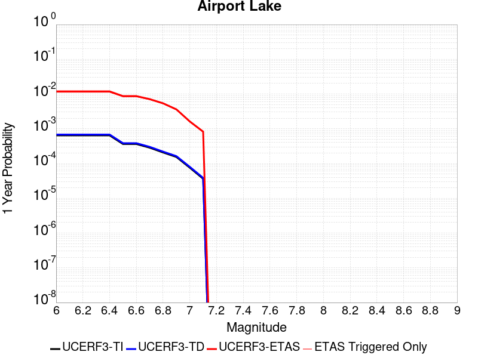 |  |

| Magnitude | 1 wk TI Prob | 1 wk TD Prob | 1 wk ETAS Prob | 1 wk ETAS/TD Gain | 1 wk ETAS Triggered Only | 1 mo TI Prob | 1 mo TD Prob | 1 mo ETAS Prob | 1 mo ETAS/TD Gain | 1 mo ETAS Triggered Only | 1 yr TI Prob | 1 yr TD Prob | 1 yr ETAS Prob | 1 yr ETAS/TD Gain | 1 yr ETAS Triggered Only | 10 yr TI Prob | 10 yr TD Prob | 10 yr ETAS Prob | 10 yr ETAS/TD Gain | 10 yr ETAS Triggered Only |
|-----|-----|-----|-----|-----|-----|-----|-----|-----|-----|-----|-----|-----|-----|-----|-----|-----|-----|-----|-----|-----|
| 6.0 | 1.2387061E-5 | 1.3103559E-5 | 1.3103559E-5 | 1.0 | 0.0 | 5.3086325E-5 | 5.615706E-5 | 0.001533179 | 27.301624 | 0.0014771048 | 6.461343E-4 | 6.8352616E-4 | 0.006587907 | 9.63812 | 0.0059084194 | 0.0064425888 | 0.006817048 | 0.020020366 | 2.9368088 | 0.013293944 |
| 6.1 | 1.2387061E-5 | 1.3103559E-5 | 1.3103559E-5 | 1.0 | 0.0 | 5.3086325E-5 | 5.615706E-5 | 0.001533179 | 27.301624 | 0.0014771048 | 6.461343E-4 | 6.8352616E-4 | 0.006587907 | 9.63812 | 0.0059084194 | 0.0064425888 | 0.006817048 | 0.020020366 | 2.9368088 | 0.013293944 |
| 6.2 | 1.2387061E-5 | 1.3103559E-5 | 1.3103559E-5 | 1.0 | 0.0 | 5.3086325E-5 | 5.615706E-5 | 0.001533179 | 27.301624 | 0.0014771048 | 6.461343E-4 | 6.8352616E-4 | 0.006587907 | 9.63812 | 0.0059084194 | 0.0064425888 | 0.006817048 | 0.020020366 | 2.9368088 | 0.013293944 |
| 6.3 | 1.2387061E-5 | 1.3103559E-5 | 1.3103559E-5 | 1.0 | 0.0 | 5.3086325E-5 | 5.615706E-5 | 0.001533179 | 27.301624 | 0.0014771048 | 6.461343E-4 | 6.8352616E-4 | 0.006587907 | 9.63812 | 0.0059084194 | 0.0064425888 | 0.006817048 | 0.020020366 | 2.9368088 | 0.013293944 |
| 6.4 | 1.2387061E-5 | 1.3103559E-5 | 1.3103559E-5 | 1.0 | 0.0 | 5.3086325E-5 | 5.615706E-5 | 0.001533179 | 27.301624 | 0.0014771048 | 6.461343E-4 | 6.8352616E-4 | 0.006587907 | 9.63812 | 0.0059084194 | 0.0064425888 | 0.006817048 | 0.020020366 | 2.9368088 | 0.013293944 |
| 6.5 | 6.9922594E-6 | 7.385145E-6 | 7.385145E-6 | 1.0 | 0.0 | 2.996648E-5 | 3.165027E-5 | 0.0015087083 | 47.668106 | 0.0014771048 | 3.6478083E-4 | 3.8527933E-4 | 0.0062914225 | 16.32951 | 0.0059084194 | 0.003641826 | 0.003846651 | 0.015618035 | 4.060164 | 0.011816839 |
| 6.6 | 6.9922594E-6 | 7.385145E-6 | 7.385145E-6 | 1.0 | 0.0 | 2.996648E-5 | 3.165027E-5 | 0.0015087083 | 47.668106 | 0.0014771048 | 3.6478083E-4 | 3.8527933E-4 | 0.0062914225 | 16.32951 | 0.0059084194 | 0.003641826 | 0.003846651 | 0.015618035 | 4.060164 | 0.011816839 |
| 6.7 | 5.477277E-6 | 5.7862417E-6 | 5.7862417E-6 | 1.0 | 0.0 | 2.3473833E-5 | 2.4797964E-5 | 0.0015018663 | 60.564095 | 0.0014771048 | 2.8575645E-4 | 3.0187727E-4 | 0.004731854 | 15.674761 | 0.0044313148 | 0.0028538927 | 0.003015056 | 0.010378312 | 3.4421625 | 0.0073855245 |
| 6.8 | 3.9950432E-6 | 4.2192128E-6 | 4.2192128E-6 | 1.0 | 0.0 | 1.7121502E-5 | 1.808223E-5 | 0.0014951604 | 82.68673 | 0.0014771048 | 2.0843433E-4 | 2.2013167E-4 | 0.003173691 | 14.41724 | 0.0029542097 | 0.0020823893 | 0.0021994072 | 0.008094831 | 3.6804607 | 0.0059084194 |
| 6.9 | 2.95695E-6 | 3.1231173E-6 | 3.1231173E-6 | 1.0 | 0.0 | 1.2672582E-5 | 1.33847325E-5 | 0.0014904698 | 111.355965 | 0.0014771048 | 1.5427776E-4 | 1.629492E-4 | 0.0016398134 | 10.063341 | 0.0014771048 | 0.001541707 | 0.0016285196 | 0.006052618 | 3.7166378 | 0.0044313148 |
| 7.0 | 1.456072E-6 | 1.5408596E-6 | 1.5408596E-6 | 1.0 | 0.0 | 6.2402937E-6 | 6.603673E-6 | 6.603673E-6 | 1.0 | 0.0 | 7.597293E-5 | 8.039776E-5 | 8.039776E-5 | 1.0 | 0.0 | 7.594696E-4 | 8.0378563E-4 | 0.0022797033 | 2.836208 | 0.0014771048 |
| 7.1 | 6.995192E-7 | 7.409207E-7 | 7.409207E-7 | 1.0 | 0.0 | 2.997936E-6 | 3.1753743E-6 | 3.1753743E-6 | 1.0 | 0.0 | 3.649926E-5 | 3.8660182E-5 | 3.8660182E-5 | 1.0 | 0.0 | 3.6493264E-4 | 3.8660184E-4 | 3.8660184E-4 | 1.0 | 0.0 |

## Garlock (East)
*[(top)](#table-of-contents)*

| 1 Week | 1 Month | 1 Year | 10 Year |
|-----|-----|-----|-----|
|  |  |  |  |

| Magnitude | 1 wk TI Prob | 1 wk TD Prob | 1 wk ETAS Prob | 1 wk ETAS/TD Gain | 1 wk ETAS Triggered Only | 1 mo TI Prob | 1 mo TD Prob | 1 mo ETAS Prob | 1 mo ETAS/TD Gain | 1 mo ETAS Triggered Only | 1 yr TI Prob | 1 yr TD Prob | 1 yr ETAS Prob | 1 yr ETAS/TD Gain | 1 yr ETAS Triggered Only | 10 yr TI Prob | 10 yr TD Prob | 10 yr ETAS Prob | 10 yr ETAS/TD Gain | 10 yr ETAS Triggered Only |
|-----|-----|-----|-----|-----|-----|-----|-----|-----|-----|-----|-----|-----|-----|-----|-----|-----|-----|-----|-----|-----|
| 6.0 | 4.5092507E-5 | 6.2917425E-5 | 6.2917425E-5 | 1.0 | 0.0 | 1.9323928E-4 | 2.6962077E-4 | 2.6962077E-4 | 1.0 | 0.0 | 0.0023501497 | 0.0032781374 | 0.0032781374 | 1.0 | 0.0 | 0.023254504 | 0.03235903 | 0.040934876 | 1.2650217 | 0.0088626295 |
| 6.1 | 4.5092507E-5 | 6.2917425E-5 | 6.2917425E-5 | 1.0 | 0.0 | 1.9323928E-4 | 2.6962077E-4 | 2.6962077E-4 | 1.0 | 0.0 | 0.0023501497 | 0.0032781374 | 0.0032781374 | 1.0 | 0.0 | 0.023254504 | 0.03235903 | 0.040934876 | 1.2650217 | 0.0088626295 |
| 6.2 | 2.6674514E-5 | 3.452091E-5 | 3.452091E-5 | 1.0 | 0.0 | 1.1431433E-4 | 1.4793854E-4 | 1.4793854E-4 | 1.0 | 0.0 | 0.0013908884 | 0.0017996968 | 0.0017996968 | 1.0 | 0.0 | 0.01382215 | 0.017896036 | 0.02660006 | 1.486366 | 0.0088626295 |
| 6.3 | 2.6674514E-5 | 3.452091E-5 | 3.452091E-5 | 1.0 | 0.0 | 1.1431433E-4 | 1.4793854E-4 | 1.4793854E-4 | 1.0 | 0.0 | 0.0013908884 | 0.0017996968 | 0.0017996968 | 1.0 | 0.0 | 0.01382215 | 0.017896036 | 0.02660006 | 1.486366 | 0.0088626295 |
| 6.4 | 2.5312667E-5 | 3.234991E-5 | 3.234991E-5 | 1.0 | 0.0 | 1.0847834E-4 | 1.3863528E-4 | 1.3863528E-4 | 1.0 | 0.0 | 0.0013199237 | 0.0016866071 | 0.0016866071 | 1.0 | 0.0 | 0.013121112 | 0.016783953 | 0.024045518 | 1.4326494 | 0.0073855245 |
| 6.5 | 2.5312667E-5 | 3.234991E-5 | 3.234991E-5 | 1.0 | 0.0 | 1.0847834E-4 | 1.3863528E-4 | 1.3863528E-4 | 1.0 | 0.0 | 0.0013199237 | 0.0016866071 | 0.0016866071 | 1.0 | 0.0 | 0.013121112 | 0.016783953 | 0.024045518 | 1.4326494 | 0.0073855245 |
| 6.6 | 2.246556E-5 | 2.8144346E-5 | 2.8144346E-5 | 1.0 | 0.0 | 9.627742E-5 | 1.20613186E-4 | 1.20613186E-4 | 1.0 | 0.0 | 0.0011715472 | 0.0014674999 | 0.0014674999 | 1.0 | 0.0 | 0.011653901 | 0.0146240825 | 0.020446097 | 1.3981115 | 0.0059084194 |
| 6.7 | 2.2241198E-5 | 2.781406E-5 | 2.781406E-5 | 1.0 | 0.0 | 9.531594E-5 | 1.1919779E-4 | 1.1919779E-4 | 1.0 | 0.0 | 0.0011598538 | 0.0014502906 | 0.0014502906 | 1.0 | 0.0 | 0.011538187 | 0.014454261 | 0.020277278 | 1.4028583 | 0.0059084194 |
| 6.8 | 1.9528685E-5 | 2.3908038E-5 | 2.3908038E-5 | 1.0 | 0.0 | 8.369167E-5 | 1.0245911E-4 | 1.0245911E-4 | 1.0 | 0.0 | 0.0010184698 | 0.0012467455 | 0.0012467455 | 1.0 | 0.0 | 0.010138147 | 0.012441495 | 0.018276405 | 1.4689878 | 0.0059084194 |
| 6.9 | 1.3318621E-5 | 1.5207374E-5 | 1.5207374E-5 | 1.0 | 0.0 | 5.7078556E-5 | 6.517287E-5 | 6.517287E-5 | 1.0 | 0.0 | 6.9470983E-4 | 7.931965E-4 | 7.931965E-4 | 1.0 | 0.0 | 0.0069254204 | 0.007944281 | 0.012340392 | 1.553368 | 0.0044313148 |
| 7.0 | 1.1760853E-5 | 1.3115987E-5 | 1.3115987E-5 | 1.0 | 0.0 | 5.0402683E-5 | 5.621019E-5 | 5.621019E-5 | 1.0 | 0.0 | 6.134799E-4 | 6.841492E-4 | 6.841492E-4 | 1.0 | 0.0 | 0.0061178906 | 0.006860767 | 0.011261679 | 1.6414607 | 0.0044313148 |
| 7.1 | 1.0064758E-5 | 1.0910848E-5 | 1.0910848E-5 | 1.0 | 0.0 | 4.3133965E-5 | 4.675996E-5 | 4.675996E-5 | 1.0 | 0.0 | 5.2502943E-4 | 5.691573E-4 | 5.691573E-4 | 1.0 | 0.0 | 0.005237907 | 0.005717105 | 0.010123085 | 1.7706664 | 0.0044313148 |
| 7.2 | 9.768808E-6 | 1.0506669E-5 | 1.0506669E-5 | 1.0 | 0.0 | 4.186565E-5 | 4.5027828E-5 | 4.5027828E-5 | 1.0 | 0.0 | 5.095951E-4 | 5.480794E-4 | 5.480794E-4 | 1.0 | 0.0 | 0.0050842804 | 0.0055073434 | 0.009914253 | 1.800188 | 0.0044313148 |
| 7.3 | 9.344516E-6 | 9.95218E-6 | 9.95218E-6 | 1.0 | 0.0 | 4.004731E-5 | 4.2651525E-5 | 4.2651525E-5 | 1.0 | 0.0 | 4.8746695E-4 | 5.1916204E-4 | 5.1916204E-4 | 1.0 | 0.0 | 0.0048639905 | 0.0052189473 | 0.0096271355 | 1.8446507 | 0.0044313148 |
| 7.4 | 9.023491E-6 | 9.498219E-6 | 9.498219E-6 | 1.0 | 0.0 | 3.867153E-5 | 4.0706036E-5 | 4.0706036E-5 | 1.0 | 0.0 | 4.7072413E-4 | 4.9548666E-4 | 4.9548666E-4 | 1.0 | 0.0 | 0.004697283 | 0.004982321 | 0.009391557 | 1.8849764 | 0.0044313148 |
| 7.5 | 7.081253E-6 | 7.0943947E-6 | 7.0943947E-6 | 1.0 | 0.0 | 3.0347876E-5 | 3.0404199E-5 | 3.0404199E-5 | 1.0 | 0.0 | 3.6942272E-4 | 3.70109E-4 | 3.70109E-4 | 1.0 | 0.0 | 0.003688092 | 0.00372781 | 0.0051994086 | 1.3947622 | 0.0014771048 |
| 7.6 | 6.116396E-6 | 5.9656345E-6 | 5.9656345E-6 | 1.0 | 0.0 | 2.6212863E-5 | 2.5566756E-5 | 2.5566756E-5 | 1.0 | 0.0 | 3.1909486E-4 | 3.1123104E-4 | 3.1123104E-4 | 1.0 | 0.0 | 0.0031863707 | 0.0031390795 | 0.0031390795 | 1.0 | 0.0 |
| 7.7 | 4.797145E-6 | 4.763327E-6 | 4.763327E-6 | 1.0 | 0.0 | 2.055903E-5 | 2.04141E-5 | 2.04141E-5 | 1.0 | 0.0 | 2.5027743E-4 | 2.4851345E-4 | 2.4851345E-4 | 1.0 | 0.0 | 0.0024999576 | 0.0025124948 | 0.0025124948 | 1.0 | 0.0 |
| 7.8 | 3.4028885E-6 | 3.9838537E-6 | 3.9838537E-6 | 1.0 | 0.0 | 1.4583726E-5 | 1.7073547E-5 | 1.7073547E-5 | 1.0 | 0.0 | 1.775424E-4 | 2.0785068E-4 | 2.0785068E-4 | 1.0 | 0.0 | 0.0017740062 | 0.0021040295 | 0.0021040295 | 1.0 | 0.0 |
| 7.9 | 2.5928412E-6 | 3.3770064E-6 | 3.3770064E-6 | 1.0 | 0.0 | 1.1112129E-5 | 1.4472805E-5 | 1.4472805E-5 | 1.0 | 0.0 | 1.3528178E-4 | 1.7619222E-4 | 1.7619222E-4 | 1.0 | 0.0 | 0.0013519945 | 0.0017836117 | 0.0017836117 | 1.0 | 0.0 |
| 8.0 | 1.3743648E-6 | 1.6755408E-6 | 1.6755408E-6 | 1.0 | 0.0 | 5.8901214E-6 | 7.1808695E-6 | 7.1808695E-6 | 1.0 | 0.0 | 7.1709874E-5 | 8.742361E-5 | 8.742361E-5 | 1.0 | 0.0 | 7.1686733E-4 | 8.847989E-4 | 8.847989E-4 | 1.0 | 0.0 |
| 8.1 | 3.6733252E-7 | 3.1526864E-7 | 3.1526864E-7 | 1.0 | 0.0 | 1.5742813E-6 | 1.3511507E-6 | 1.3511507E-6 | 1.0 | 0.0 | 1.9166706E-5 | 1.645015E-5 | 1.645015E-5 | 1.0 | 0.0 | 1.9165053E-4 | 1.6658098E-4 | 1.6658098E-4 | 1.0 | 0.0 |

## Owl Lake
*[(top)](#table-of-contents)*

| 1 Week | 1 Month | 1 Year | 10 Year |
|-----|-----|-----|-----|
|  |  |  |  |

| Magnitude | 1 wk TI Prob | 1 wk TD Prob | 1 wk ETAS Prob | 1 wk ETAS/TD Gain | 1 wk ETAS Triggered Only | 1 mo TI Prob | 1 mo TD Prob | 1 mo ETAS Prob | 1 mo ETAS/TD Gain | 1 mo ETAS Triggered Only | 1 yr TI Prob | 1 yr TD Prob | 1 yr ETAS Prob | 1 yr ETAS/TD Gain | 1 yr ETAS Triggered Only | 10 yr TI Prob | 10 yr TD Prob | 10 yr ETAS Prob | 10 yr ETAS/TD Gain | 10 yr ETAS Triggered Only |
|-----|-----|-----|-----|-----|-----|-----|-----|-----|-----|-----|-----|-----|-----|-----|-----|-----|-----|-----|-----|-----|
| 6.0 | 5.0320643E-5 | 6.637151E-5 | 6.637151E-5 | 1.0 | 0.0 | 2.1564208E-4 | 2.844246E-4 | 2.844246E-4 | 1.0 | 0.0 | 0.0026222812 | 0.0034584238 | 0.0049304203 | 1.4256264 | 0.0014771048 | 0.02591553 | 0.034147043 | 0.041280374 | 1.2089003 | 0.0073855245 |
| 6.1 | 5.0320643E-5 | 6.637151E-5 | 6.637151E-5 | 1.0 | 0.0 | 2.1564208E-4 | 2.844246E-4 | 2.844246E-4 | 1.0 | 0.0 | 0.0026222812 | 0.0034584238 | 0.0049304203 | 1.4256264 | 0.0014771048 | 0.02591553 | 0.034147043 | 0.041280374 | 1.2089003 | 0.0073855245 |
| 6.2 | 2.4125871E-5 | 3.098766E-5 | 3.098766E-5 | 1.0 | 0.0 | 1.0339249E-4 | 1.3279865E-4 | 1.3279865E-4 | 1.0 | 0.0 | 0.0012580766 | 0.0016157742 | 0.0030904924 | 1.9127007 | 0.0014771048 | 0.012509781 | 0.016073797 | 0.023340607 | 1.4520905 | 0.0073855245 |
| 6.3 | 1.7433485E-5 | 2.2360802E-5 | 2.2360802E-5 | 1.0 | 0.0 | 7.471279E-5 | 9.582938E-5 | 9.582938E-5 | 1.0 | 0.0 | 9.0924866E-4 | 0.0011662478 | 0.0011662478 | 1.0 | 0.0 | 0.009055373 | 0.01163159 | 0.016011361 | 1.376541 | 0.0044313148 |
| 6.4 | 1.7433485E-5 | 2.2360802E-5 | 2.2360802E-5 | 1.0 | 0.0 | 7.471279E-5 | 9.582938E-5 | 9.582938E-5 | 1.0 | 0.0 | 9.0924866E-4 | 0.0011662478 | 0.0011662478 | 1.0 | 0.0 | 0.009055373 | 0.01163159 | 0.016011361 | 1.376541 | 0.0044313148 |
| 6.5 | 1.5182742E-5 | 1.9433977E-5 | 1.9433977E-5 | 1.0 | 0.0 | 6.506727E-5 | 8.3286664E-5 | 8.3286664E-5 | 1.0 | 0.0 | 7.919061E-4 | 0.0010136948 | 0.0010136948 | 1.0 | 0.0 | 0.0078909 | 0.0101209 | 0.014507366 | 1.4334067 | 0.0044313148 |
| 6.6 | 6.7271576E-6 | 8.550545E-6 | 8.550545E-6 | 1.0 | 0.0 | 2.8830356E-5 | 3.6644713E-5 | 3.6644713E-5 | 1.0 | 0.0 | 3.5095305E-4 | 4.460637E-4 | 4.460637E-4 | 1.0 | 0.0 | 0.0035039932 | 0.0044694655 | 0.0059399684 | 1.329011 | 0.0014771048 |
| 6.7 | 6.682835E-6 | 8.482986E-6 | 8.482986E-6 | 1.0 | 0.0 | 2.8640408E-5 | 3.635518E-5 | 3.635518E-5 | 1.0 | 0.0 | 3.4864116E-4 | 4.4254007E-4 | 4.4254007E-4 | 1.0 | 0.0 | 0.003480947 | 0.004434389 | 0.005904944 | 1.3316251 | 0.0014771048 |
| 6.8 | 6.5774975E-6 | 8.329444E-6 | 8.329444E-6 | 1.0 | 0.0 | 2.8188972E-5 | 3.569716E-5 | 3.569716E-5 | 1.0 | 0.0 | 3.4314668E-4 | 4.3453192E-4 | 4.3453192E-4 | 1.0 | 0.0 | 0.0034261728 | 0.004354527 | 0.0058252 | 1.3377342 | 0.0014771048 |
| 6.9 | 6.363419E-6 | 8.002579E-6 | 8.002579E-6 | 1.0 | 0.0 | 2.727151E-5 | 3.429635E-5 | 3.429635E-5 | 1.0 | 0.0 | 3.3198006E-4 | 4.1748365E-4 | 4.1748365E-4 | 1.0 | 0.0 | 0.0033148455 | 0.0041844994 | 0.0056554233 | 1.3515173 | 0.0014771048 |
| 7.0 | 6.1342453E-6 | 7.63473E-6 | 7.63473E-6 | 1.0 | 0.0 | 2.6289357E-5 | 3.271989E-5 | 3.271989E-5 | 1.0 | 0.0 | 3.2002592E-4 | 3.9829736E-4 | 3.9829736E-4 | 1.0 | 0.0 | 0.0031956544 | 0.0039931675 | 0.005464374 | 1.368431 | 0.0014771048 |
| 7.1 | 5.842926E-6 | 7.14521E-6 | 7.14521E-6 | 1.0 | 0.0 | 2.504087E-5 | 3.0622E-5 | 3.0622E-5 | 1.0 | 0.0 | 3.0482994E-4 | 3.7276448E-4 | 3.7276448E-4 | 1.0 | 0.0 | 0.0030441214 | 0.0037385917 | 0.0052101742 | 1.3936195 | 0.0014771048 |
| 7.2 | 4.77173E-6 | 5.361204E-6 | 5.361204E-6 | 1.0 | 0.0 | 2.045011E-5 | 2.297641E-5 | 2.297641E-5 | 1.0 | 0.0 | 2.4895166E-4 | 2.7970594E-4 | 2.7970594E-4 | 1.0 | 0.0 | 0.0024867293 | 0.0028100624 | 0.0042830165 | 1.5241714 | 0.0014771048 |
| 7.3 | 3.0494948E-6 | 2.7124704E-6 | 2.7124704E-6 | 1.0 | 0.0 | 1.3069198E-5 | 1.1624823E-5 | 1.1624823E-5 | 1.0 | 0.0 | 1.5910587E-4 | 1.4152318E-4 | 1.4152318E-4 | 1.0 | 0.0 | 0.0015899199 | 0.0014242887 | 0.0014242887 | 1.0 | 0.0 |
| 7.4 | 2.7263884E-6 | 2.3075613E-6 | 2.3075613E-6 | 1.0 | 0.0 | 1.1684469E-5 | 9.889511E-6 | 9.889511E-6 | 1.0 | 0.0 | 1.4224913E-4 | 1.2039825E-4 | 1.2039825E-4 | 1.0 | 0.0 | 0.0014215811 | 0.0012122075 | 0.0012122075 | 1.0 | 0.0 |
| 7.5 | 2.6090431E-6 | 2.1674637E-6 | 2.1674637E-6 | 1.0 | 0.0 | 1.1181565E-5 | 9.289097E-6 | 9.289097E-6 | 1.0 | 0.0 | 1.3612706E-4 | 1.1308899E-4 | 1.1308899E-4 | 1.0 | 0.0 | 0.001360437 | 0.0011389464 | 0.0011389464 | 1.0 | 0.0 |
| 7.6 | 2.3008756E-6 | 1.8745708E-6 | 1.8745708E-6 | 1.0 | 0.0 | 9.860858E-6 | 8.0338505E-6 | 8.0338505E-6 | 1.0 | 0.0 | 1.20049335E-4 | 9.7807824E-5 | 9.7807824E-5 | 1.0 | 0.0 | 0.001199845 | 9.85921E-4 | 9.85921E-4 | 1.0 | 0.0 |
| 7.7 | 1.7184348E-6 | 1.343562E-6 | 1.343562E-6 | 1.0 | 0.0 | 7.3646997E-6 | 5.7581105E-6 | 5.7581105E-6 | 1.0 | 0.0 | 8.966153E-5 | 7.010278E-5 | 7.010278E-5 | 1.0 | 0.0 | 8.962536E-4 | 7.086945E-4 | 7.086945E-4 | 1.0 | 0.0 |
| 7.8 | 8.4612907E-7 | 8.4176E-7 | 8.4176E-7 | 1.0 | 0.0 | 3.6262625E-6 | 3.607538E-6 | 3.607538E-6 | 1.0 | 0.0 | 4.4148852E-5 | 4.392091E-5 | 4.392091E-5 | 1.0 | 0.0 | 4.414008E-4 | 4.4459777E-4 | 4.4459777E-4 | 1.0 | 0.0 |
| 7.9 | 2.716738E-7 | 3.7732943E-7 | 3.7732943E-7 | 1.0 | 0.0 | 1.1643157E-6 | 1.6171252E-6 | 1.6171252E-6 | 1.0 | 0.0 | 1.4175452E-5 | 1.9688332E-5 | 1.9688332E-5 | 1.0 | 0.0 | 1.4174548E-4 | 1.9863734E-4 | 1.9863734E-4 | 1.0 | 0.0 |
| 8.0 | 2.1995428E-8 | 3.389418E-8 | 3.389418E-8 | 1.0 | 0.0 | 9.426611E-8 | 1.4526077E-7 | 1.4526077E-7 | 1.0 | 0.0 | 1.1476893E-6 | 1.768549E-6 | 1.768549E-6 | 1.0 | 0.0 | 1.14768345E-5 | 1.798665E-5 | 1.798665E-5 | 1.0 | 0.0 |

## Ash Hill
*[(top)](#table-of-contents)*

| 1 Week | 1 Month | 1 Year | 10 Year |
|-----|-----|-----|-----|
|  |  |  |  |

| Magnitude | 1 wk TI Prob | 1 wk TD Prob | 1 wk ETAS Prob | 1 wk ETAS/TD Gain | 1 wk ETAS Triggered Only | 1 mo TI Prob | 1 mo TD Prob | 1 mo ETAS Prob | 1 mo ETAS/TD Gain | 1 mo ETAS Triggered Only | 1 yr TI Prob | 1 yr TD Prob | 1 yr ETAS Prob | 1 yr ETAS/TD Gain | 1 yr ETAS Triggered Only | 10 yr TI Prob | 10 yr TD Prob | 10 yr ETAS Prob | 10 yr ETAS/TD Gain | 10 yr ETAS Triggered Only |
|-----|-----|-----|-----|-----|-----|-----|-----|-----|-----|-----|-----|-----|-----|-----|-----|-----|-----|-----|-----|-----|
| 6.0 | 2.1545662E-5 | 2.3195389E-5 | 2.3195389E-5 | 1.0 | 0.0 | 9.2335285E-5 | 9.940547E-5 | 9.940547E-5 | 1.0 | 0.0 | 0.0011236023 | 0.0012096697 | 0.004160306 | 3.439208 | 0.0029542097 | 0.011179381 | 0.012038835 | 0.019335447 | 1.6060895 | 0.0073855245 |
| 6.1 | 2.1545662E-5 | 2.3195389E-5 | 2.3195389E-5 | 1.0 | 0.0 | 9.2335285E-5 | 9.940547E-5 | 9.940547E-5 | 1.0 | 0.0 | 0.0011236023 | 0.0012096697 | 0.004160306 | 3.439208 | 0.0029542097 | 0.011179381 | 0.012038835 | 0.019335447 | 1.6060895 | 0.0073855245 |
| 6.2 | 2.1545662E-5 | 2.3195389E-5 | 2.3195389E-5 | 1.0 | 0.0 | 9.2335285E-5 | 9.940547E-5 | 9.940547E-5 | 1.0 | 0.0 | 0.0011236023 | 0.0012096697 | 0.004160306 | 3.439208 | 0.0029542097 | 0.011179381 | 0.012038835 | 0.019335447 | 1.6060895 | 0.0073855245 |
| 6.3 | 1.0025529E-5 | 1.0747344E-5 | 1.0747344E-5 | 1.0 | 0.0 | 4.2965847E-5 | 4.605931E-5 | 4.605931E-5 | 1.0 | 0.0 | 5.229836E-4 | 5.6064106E-4 | 5.6064106E-4 | 1.0 | 0.0 | 0.005217545 | 0.0055935793 | 0.0055935793 | 1.0 | 0.0 |
| 6.4 | 1.0025529E-5 | 1.0747344E-5 | 1.0747344E-5 | 1.0 | 0.0 | 4.2965847E-5 | 4.605931E-5 | 4.605931E-5 | 1.0 | 0.0 | 5.229836E-4 | 5.6064106E-4 | 5.6064106E-4 | 1.0 | 0.0 | 0.005217545 | 0.0055935793 | 0.0055935793 | 1.0 | 0.0 |
| 6.5 | 6.9617327E-6 | 7.4569152E-6 | 7.4569152E-6 | 1.0 | 0.0 | 2.9835655E-5 | 3.1957865E-5 | 3.1957865E-5 | 1.0 | 0.0 | 3.6318856E-4 | 3.8902622E-4 | 3.8902622E-4 | 1.0 | 0.0 | 0.0036259557 | 0.0038843066 | 0.0038843066 | 1.0 | 0.0 |
| 6.6 | 4.9919777E-6 | 5.34689E-6 | 5.34689E-6 | 1.0 | 0.0 | 2.1394015E-5 | 2.291508E-5 | 2.291508E-5 | 1.0 | 0.0 | 2.60441E-4 | 2.7896208E-4 | 2.7896208E-4 | 1.0 | 0.0 | 0.0026013597 | 0.0027867774 | 0.0027867774 | 1.0 | 0.0 |
| 6.7 | 3.6630722E-6 | 3.9247725E-6 | 3.9247725E-6 | 1.0 | 0.0 | 1.5698786E-5 | 1.6820377E-5 | 1.6820377E-5 | 1.0 | 0.0 | 1.9111596E-4 | 2.0477458E-4 | 2.0477458E-4 | 1.0 | 0.0 | 0.0019095168 | 0.002046422 | 0.002046422 | 1.0 | 0.0 |
| 6.8 | 2.5599613E-6 | 2.7450303E-6 | 2.7450303E-6 | 1.0 | 0.0 | 1.0971216E-5 | 1.176439E-5 | 1.176439E-5 | 1.0 | 0.0 | 1.3356637E-4 | 1.4322698E-4 | 1.4322698E-4 | 1.0 | 0.0 | 0.0013348613 | 0.0014318317 | 0.0014318317 | 1.0 | 0.0 |
| 6.9 | 1.7684905E-6 | 1.8969438E-6 | 1.8969438E-6 | 1.0 | 0.0 | 7.579223E-6 | 8.129759E-6 | 8.129759E-6 | 1.0 | 0.0 | 9.2273134E-5 | 9.897981E-5 | 9.897981E-5 | 1.0 | 0.0 | 9.223483E-4 | 9.897981E-4 | 9.897981E-4 | 1.0 | 0.0 |

## Panamint Valley
*[(top)](#table-of-contents)*

| 1 Week | 1 Month | 1 Year | 10 Year |
|-----|-----|-----|-----|
| 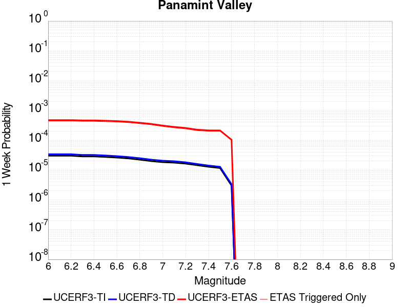 | 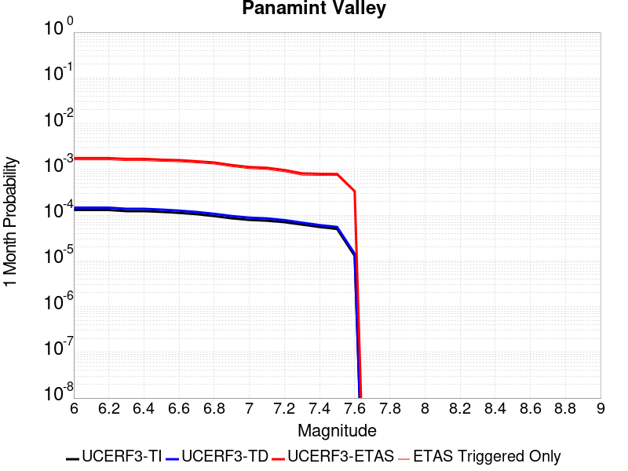 |  |  |

| Magnitude | 1 wk TI Prob | 1 wk TD Prob | 1 wk ETAS Prob | 1 wk ETAS/TD Gain | 1 wk ETAS Triggered Only | 1 mo TI Prob | 1 mo TD Prob | 1 mo ETAS Prob | 1 mo ETAS/TD Gain | 1 mo ETAS Triggered Only | 1 yr TI Prob | 1 yr TD Prob | 1 yr ETAS Prob | 1 yr ETAS/TD Gain | 1 yr ETAS Triggered Only | 10 yr TI Prob | 10 yr TD Prob | 10 yr ETAS Prob | 10 yr ETAS/TD Gain | 10 yr ETAS Triggered Only |
|-----|-----|-----|-----|-----|-----|-----|-----|-----|-----|-----|-----|-----|-----|-----|-----|-----|-----|-----|-----|-----|
| 6.0 | 3.0211835E-5 | 3.39879E-5 | 0.0015110426 | 44.45825 | 0.0014771048 | 1.2947287E-4 | 1.4565447E-4 | 0.0030994338 | 21.27936 | 0.0029542097 | 0.0015751923 | 0.0017719301 | 0.009144368 | 5.1606817 | 0.0073855245 | 0.015640736 | 0.017584875 | 0.024840524 | 1.4126074 | 0.0073855245 |
| 6.1 | 3.0211835E-5 | 3.39879E-5 | 0.0015110426 | 44.45825 | 0.0014771048 | 1.2947287E-4 | 1.4565447E-4 | 0.0030994338 | 21.27936 | 0.0029542097 | 0.0015751923 | 0.0017719301 | 0.009144368 | 5.1606817 | 0.0073855245 | 0.015640736 | 0.017584875 | 0.024840524 | 1.4126074 | 0.0073855245 |
| 6.2 | 3.0211835E-5 | 3.39879E-5 | 0.0015110426 | 44.45825 | 0.0014771048 | 1.2947287E-4 | 1.4565447E-4 | 0.0030994338 | 21.27936 | 0.0029542097 | 0.0015751923 | 0.0017719301 | 0.009144368 | 5.1606817 | 0.0073855245 | 0.015640736 | 0.017584875 | 0.024840524 | 1.4126074 | 0.0073855245 |
| 6.3 | 2.8573924E-5 | 3.210589E-5 | 0.0015091633 | 47.005806 | 0.0014771048 | 1.2245393E-4 | 1.3758958E-4 | 0.0030913928 | 22.46822 | 0.0029542097 | 0.001489857 | 0.0016738938 | 0.009047056 | 5.4047966 | 0.0073855245 | 0.01479908 | 0.01661945 | 0.02388223 | 1.4370049 | 0.0073855245 |
| 6.4 | 2.8573924E-5 | 3.210589E-5 | 0.0015091633 | 47.005806 | 0.0014771048 | 1.2245393E-4 | 1.3758958E-4 | 0.0030913928 | 22.46822 | 0.0029542097 | 0.001489857 | 0.0016738938 | 0.009047056 | 5.4047966 | 0.0073855245 | 0.01479908 | 0.01661945 | 0.02388223 | 1.4370049 | 0.0073855245 |
| 6.5 | 2.7468774E-5 | 3.0831525E-5 | 0.0015078909 | 48.90744 | 0.0014771048 | 1.1771801E-4 | 1.3212857E-4 | 0.003085948 | 23.355646 | 0.0029542097 | 0.0014322745 | 0.0016075056 | 0.008981158 | 5.5870147 | 0.0073855245 | 0.014230782 | 0.015965264 | 0.023232875 | 1.455214 | 0.0073855245 |
| 6.6 | 2.6135967E-5 | 2.9255436E-5 | 0.001506317 | 51.488453 | 0.0014771048 | 1.1200648E-4 | 1.2537456E-4 | 0.003079214 | 24.560118 | 0.0029542097 | 0.0013628257 | 0.001525393 | 0.0088996515 | 5.8343334 | 0.0073855245 | 0.013544982 | 0.015155562 | 0.022429155 | 1.479929 | 0.0073855245 |
| 6.7 | 2.4498746E-5 | 2.7344193E-5 | 0.0015044087 | 55.017487 | 0.0014771048 | 1.04990395E-4 | 1.17184274E-4 | 0.0030710478 | 26.206997 | 0.0029542097 | 0.0012775084 | 0.0014258098 | 0.008800804 | 6.172495 | 0.0073855245 | 0.012701893 | 0.014172745 | 0.021453597 | 1.5137221 | 0.0073855245 |
| 6.8 | 2.2244329E-5 | 2.4938103E-5 | 0.0015020062 | 60.229366 | 0.0014771048 | 9.532935E-5 | 1.06873325E-4 | 0.0030607674 | 28.639208 | 0.0029542097 | 0.0011600169 | 0.0013004278 | 0.008676348 | 6.671918 | 0.0073855245 | 0.011539802 | 0.012933899 | 0.020223899 | 1.5636352 | 0.0073855245 |
| 6.9 | 1.9902658E-5 | 2.2292743E-5 | 0.0014993647 | 67.25797 | 0.0014771048 | 8.529431E-5 | 9.553693E-5 | 0.0030494644 | 31.91922 | 0.0029542097 | 0.0010379635 | 0.00116256 | 0.008539498 | 7.345426 | 0.0073855245 | 0.010331288 | 0.011569886 | 0.01886996 | 1.6309549 | 0.0073855245 |
| 7.0 | 1.8353881E-5 | 2.0568525E-5 | 2.0568525E-5 | 1.0 | 0.0 | 7.865712E-5 | 8.814794E-5 | 0.0015651226 | 17.755634 | 0.0014771048 | 9.5722964E-4 | 0.0010726905 | 0.006974772 | 6.502129 | 0.0059084194 | 0.009531168 | 0.010680057 | 0.016525375 | 1.5473114 | 0.0059084194 |
| 7.1 | 1.7667631E-5 | 1.9774876E-5 | 1.9774876E-5 | 1.0 | 0.0 | 7.571623E-5 | 8.474681E-5 | 0.0015617266 | 18.428144 | 0.0014771048 | 9.2145515E-4 | 0.0010313216 | 0.0069336477 | 6.72307 | 0.0059084194 | 0.009176437 | 0.010270242 | 0.01611798 | 1.5693866 | 0.0059084194 |
| 7.2 | 1.6381597E-5 | 1.8160366E-5 | 1.8160366E-5 | 1.0 | 0.0 | 7.020495E-5 | 7.782792E-5 | 0.0015548178 | 19.977636 | 0.0014771048 | 8.544101E-4 | 9.471603E-4 | 0.0068499837 | 7.232127 | 0.0059084194 | 0.008511325 | 0.0094358865 | 0.015288555 | 1.6202563 | 0.0059084194 |
| 7.3 | 1.4520491E-5 | 1.5968182E-5 | 1.5968182E-5 | 1.0 | 0.0 | 6.222919E-5 | 6.8433365E-5 | 0.0015454371 | 22.583096 | 0.0014771048 | 7.57377E-4 | 8.328739E-4 | 0.005260498 | 6.3160796 | 0.0044313148 | 0.0075480095 | 0.008300635 | 0.012695167 | 1.5294212 | 0.0044313148 |
| 7.4 | 1.2852287E-5 | 1.4146948E-5 | 1.4146948E-5 | 1.0 | 0.0 | 5.5080065E-5 | 6.0628456E-5 | 0.0015376437 | 25.36175 | 0.0014771048 | 6.7039346E-4 | 7.379173E-4 | 0.005165962 | 7.000733 | 0.0044313148 | 0.0066837464 | 0.0073575918 | 0.011756303 | 1.5978465 | 0.0044313148 |
| 7.5 | 1.1637851E-5 | 1.2838205E-5 | 1.2838205E-5 | 1.0 | 0.0 | 4.987555E-5 | 5.5019806E-5 | 0.0015320434 | 27.845306 | 0.0014771048 | 6.070656E-4 | 6.6967594E-4 | 0.005098023 | 7.6126714 | 0.0044313148 | 0.006054099 | 0.006679477 | 0.011081193 | 1.6589911 | 0.0044313148 |
| 7.6 | 3.0068115E-6 | 3.3335807E-6 | 3.3335807E-6 | 1.0 | 0.0 | 1.2886271E-5 | 1.4286737E-5 | 0.0014913705 | 104.388466 | 0.0014771048 | 1.5687906E-4 | 1.7393442E-4 | 0.0016507824 | 9.490832 | 0.0014771048 | 0.0015676835 | 0.0017394236 | 0.0032139593 | 1.847715 | 0.0014771048 |

## Blackwater
*[(top)](#table-of-contents)*

| 1 Week | 1 Month | 1 Year | 10 Year |
|-----|-----|-----|-----|
|  |  |  |  |

| Magnitude | 1 wk TI Prob | 1 wk TD Prob | 1 wk ETAS Prob | 1 wk ETAS/TD Gain | 1 wk ETAS Triggered Only | 1 mo TI Prob | 1 mo TD Prob | 1 mo ETAS Prob | 1 mo ETAS/TD Gain | 1 mo ETAS Triggered Only | 1 yr TI Prob | 1 yr TD Prob | 1 yr ETAS Prob | 1 yr ETAS/TD Gain | 1 yr ETAS Triggered Only | 10 yr TI Prob | 10 yr TD Prob | 10 yr ETAS Prob | 10 yr ETAS/TD Gain | 10 yr ETAS Triggered Only |
|-----|-----|-----|-----|-----|-----|-----|-----|-----|-----|-----|-----|-----|-----|-----|-----|-----|-----|-----|-----|-----|
| 6.0 | 3.0708583E-5 | 3.3097214E-5 | 3.3097214E-5 | 1.0 | 0.0 | 1.3160157E-4 | 1.4183826E-4 | 1.4183826E-4 | 1.0 | 0.0 | 0.0016010714 | 0.0017256497 | 0.0032002055 | 1.8544931 | 0.0014771048 | 0.015895851 | 0.017136335 | 0.022943506 | 1.3388805 | 0.0059084194 |
| 6.1 | 3.0708583E-5 | 3.3097214E-5 | 3.3097214E-5 | 1.0 | 0.0 | 1.3160157E-4 | 1.4183826E-4 | 1.4183826E-4 | 1.0 | 0.0 | 0.0016010714 | 0.0017256497 | 0.0032002055 | 1.8544931 | 0.0014771048 | 0.015895851 | 0.017136335 | 0.022943506 | 1.3388805 | 0.0059084194 |
| 6.2 | 1.1707779E-5 | 1.2545598E-5 | 1.2545598E-5 | 1.0 | 0.0 | 5.017523E-5 | 5.3765798E-5 | 5.3765798E-5 | 1.0 | 0.0 | 6.107122E-4 | 6.5441156E-4 | 6.5441156E-4 | 1.0 | 0.0 | 0.006090366 | 0.0065258164 | 0.010928214 | 1.6746124 | 0.0044313148 |
| 6.3 | 1.1707779E-5 | 1.2545598E-5 | 1.2545598E-5 | 1.0 | 0.0 | 5.017523E-5 | 5.3765798E-5 | 5.3765798E-5 | 1.0 | 0.0 | 6.107122E-4 | 6.5441156E-4 | 6.5441156E-4 | 1.0 | 0.0 | 0.006090366 | 0.0065258164 | 0.010928214 | 1.6746124 | 0.0044313148 |
| 6.4 | 7.929244E-6 | 8.4804105E-6 | 8.4804105E-6 | 1.0 | 0.0 | 3.3982033E-5 | 3.6344132E-5 | 3.6344132E-5 | 1.0 | 0.0 | 4.136527E-4 | 4.4240404E-4 | 4.4240404E-4 | 1.0 | 0.0 | 0.0041288356 | 0.0044156383 | 0.008827386 | 1.9991188 | 0.0044313148 |
| 6.5 | 5.8832115E-6 | 6.286219E-6 | 6.286219E-6 | 1.0 | 0.0 | 2.521352E-5 | 2.6940676E-5 | 2.6940676E-5 | 1.0 | 0.0 | 3.0693135E-4 | 3.279559E-4 | 3.279559E-4 | 1.0 | 0.0 | 0.0030650778 | 0.0032749726 | 0.006219507 | 1.8991021 | 0.0029542097 |
| 6.6 | 5.8832115E-6 | 6.286219E-6 | 6.286219E-6 | 1.0 | 0.0 | 2.521352E-5 | 2.6940676E-5 | 2.6940676E-5 | 1.0 | 0.0 | 3.0693135E-4 | 3.279559E-4 | 3.279559E-4 | 1.0 | 0.0 | 0.0030650778 | 0.0032749726 | 0.006219507 | 1.8991021 | 0.0029542097 |
| 6.7 | 3.0715053E-6 | 3.2815851E-6 | 3.2815851E-6 | 1.0 | 0.0 | 1.3163528E-5 | 1.4063868E-5 | 1.4063868E-5 | 1.0 | 0.0 | 1.6025416E-4 | 1.7121529E-4 | 1.7121529E-4 | 1.0 | 0.0 | 0.0016013865 | 0.0017109484 | 0.003185526 | 1.8618481 | 0.0014771048 |
| 6.8 | 2.2722281E-6 | 2.4288424E-6 | 2.4288424E-6 | 1.0 | 0.0 | 9.738084E-6 | 1.0409289E-5 | 1.0409289E-5 | 1.0 | 0.0 | 1.1855473E-4 | 1.2672663E-4 | 1.2672663E-4 | 1.0 | 0.0 | 0.001184915 | 0.0012666339 | 0.0012666339 | 1.0 | 0.0 |
| 6.9 | 9.952399E-7 | 1.0653887E-6 | 1.0653887E-6 | 1.0 | 0.0 | 4.265307E-6 | 4.5659463E-6 | 4.5659463E-6 | 1.0 | 0.0 | 5.1928873E-5 | 5.5589495E-5 | 5.5589495E-5 | 1.0 | 0.0 | 5.191674E-4 | 5.558065E-4 | 5.558065E-4 | 1.0 | 0.0 |
| 7.0 | 4.7385504E-7 | 5.075751E-7 | 5.075751E-7 | 1.0 | 0.0 | 2.0308057E-6 | 2.175322E-6 | 2.175322E-6 | 1.0 | 0.0 | 2.4724779E-5 | 2.6484544E-5 | 2.6484544E-5 | 1.0 | 0.0 | 2.4722028E-4 | 2.6484544E-4 | 2.6484544E-4 | 1.0 | 0.0 |

## Hunter Mountain-Saline Valley
*[(top)](#table-of-contents)*

| 1 Week | 1 Month | 1 Year | 10 Year |
|-----|-----|-----|-----|
|  | 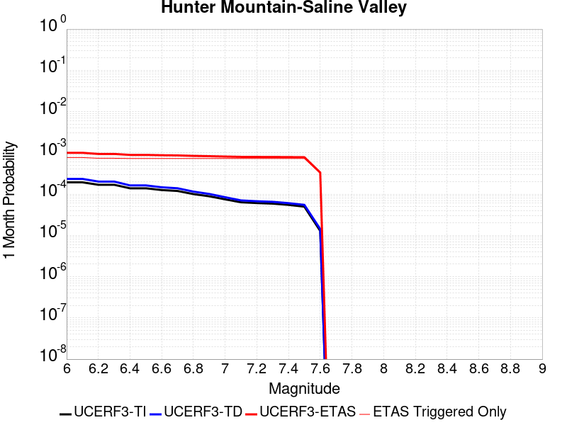 |  |  |

| Magnitude | 1 wk TI Prob | 1 wk TD Prob | 1 wk ETAS Prob | 1 wk ETAS/TD Gain | 1 wk ETAS Triggered Only | 1 mo TI Prob | 1 mo TD Prob | 1 mo ETAS Prob | 1 mo ETAS/TD Gain | 1 mo ETAS Triggered Only | 1 yr TI Prob | 1 yr TD Prob | 1 yr ETAS Prob | 1 yr ETAS/TD Gain | 1 yr ETAS Triggered Only | 10 yr TI Prob | 10 yr TD Prob | 10 yr ETAS Prob | 10 yr ETAS/TD Gain | 10 yr ETAS Triggered Only |
|-----|-----|-----|-----|-----|-----|-----|-----|-----|-----|-----|-----|-----|-----|-----|-----|-----|-----|-----|-----|-----|
| 6.0 | 4.5103672E-5 | 5.4576634E-5 | 5.4576634E-5 | 1.0 | 0.0 | 1.9328714E-4 | 2.3387549E-4 | 0.0017106349 | 7.3142977 | 0.0014771048 | 0.002350731 | 0.002843864 | 0.0072625764 | 2.5537708 | 0.0044313148 | 0.023260195 | 0.028095365 | 0.03240218 | 1.1532928 | 0.0044313148 |
| 6.1 | 4.5103672E-5 | 5.4576634E-5 | 5.4576634E-5 | 1.0 | 0.0 | 1.9328714E-4 | 2.3387549E-4 | 0.0017106349 | 7.3142977 | 0.0014771048 | 0.002350731 | 0.002843864 | 0.0072625764 | 2.5537708 | 0.0044313148 | 0.023260195 | 0.028095365 | 0.03240218 | 1.1532928 | 0.0044313148 |
| 6.2 | 3.9363465E-5 | 4.706859E-5 | 4.706859E-5 | 1.0 | 0.0 | 1.6868966E-4 | 2.017032E-4 | 0.0016785101 | 8.321683 | 0.0014771048 | 0.002051862 | 0.0024531104 | 0.0068735546 | 2.8019753 | 0.0044313148 | 0.020330196 | 0.024276383 | 0.02860012 | 1.1781048 | 0.0044313148 |
| 6.3 | 3.9363465E-5 | 4.706859E-5 | 4.706859E-5 | 1.0 | 0.0 | 1.6868966E-4 | 2.017032E-4 | 0.0016785101 | 8.321683 | 0.0014771048 | 0.002051862 | 0.0024531104 | 0.0068735546 | 2.8019753 | 0.0044313148 | 0.020330196 | 0.024276383 | 0.02860012 | 1.1781048 | 0.0044313148 |
| 6.4 | 3.2311684E-5 | 3.7955346E-5 | 3.7955346E-5 | 1.0 | 0.0 | 1.384713E-4 | 1.6265604E-4 | 0.0016395206 | 10.0796795 | 0.0014771048 | 0.0016845843 | 0.0019786113 | 0.006401158 | 3.2351773 | 0.0044313148 | 0.016718714 | 0.019618697 | 0.023963075 | 1.2214407 | 0.0044313148 |
| 6.5 | 3.2311684E-5 | 3.7955346E-5 | 3.7955346E-5 | 1.0 | 0.0 | 1.384713E-4 | 1.6265604E-4 | 0.0016395206 | 10.0796795 | 0.0014771048 | 0.0016845843 | 0.0019786113 | 0.006401158 | 3.2351773 | 0.0044313148 | 0.016718714 | 0.019618697 | 0.023963075 | 1.2214407 | 0.0044313148 |
| 6.6 | 2.9305844E-5 | 3.4185676E-5 | 3.4185676E-5 | 1.0 | 0.0 | 1.2559042E-4 | 1.4650216E-4 | 0.0016233906 | 11.081 | 0.0014771048 | 0.0015279909 | 0.0017822674 | 0.006205684 | 3.4819043 | 0.0044313148 | 0.015175272 | 0.017687662 | 0.022040598 | 1.2461001 | 0.0044313148 |
| 6.7 | 2.7826512E-5 | 3.234788E-5 | 3.234788E-5 | 1.0 | 0.0 | 1.19251024E-4 | 1.3862675E-4 | 0.0016155269 | 11.653788 | 0.0014771048 | 0.0014509142 | 0.0016865344 | 0.0061103753 | 3.6230364 | 0.0044313148 | 0.014414776 | 0.01674504 | 0.02110215 | 1.2602031 | 0.0044313148 |
| 6.8 | 2.3389874E-5 | 2.686964E-5 | 2.686964E-5 | 1.0 | 0.0 | 1.0023846E-4 | 1.1515078E-4 | 0.0015920856 | 13.826095 | 0.0014771048 | 0.00121972 | 0.0014011064 | 0.0058262125 | 4.1582937 | 0.0044313148 | 0.01213047 | 0.013928941 | 0.018298533 | 1.3137059 | 0.0044313148 |
| 6.9 | 2.069209E-5 | 2.3572567E-5 | 2.3572567E-5 | 1.0 | 0.0 | 8.867737E-5 | 1.01021586E-4 | 0.0015779772 | 15.620199 | 0.0014771048 | 0.0010791123 | 0.00122928 | 0.005655147 | 4.6003737 | 0.0044313148 | 0.010738871 | 0.012229833 | 0.016606953 | 1.3579051 | 0.0044313148 |
| 7.0 | 1.7462342E-5 | 1.9635625E-5 | 1.9635625E-5 | 1.0 | 0.0 | 7.483646E-5 | 8.4150095E-5 | 0.0015611306 | 18.55174 | 0.0014771048 | 9.1075303E-4 | 0.0010240684 | 0.005450845 | 5.322735 | 0.0044313148 | 0.009070295 | 0.010197128 | 0.014583256 | 1.4301337 | 0.0044313148 |
| 7.1 | 1.4807709E-5 | 1.6443486E-5 | 1.6443486E-5 | 1.0 | 0.0 | 6.3460066E-5 | 7.0470276E-5 | 0.001547471 | 21.959204 | 0.0014771048 | 7.723524E-4 | 8.576544E-4 | 0.0052851685 | 6.1623526 | 0.0044313148 | 0.007696735 | 0.008546432 | 0.012939874 | 1.5140675 | 0.0044313148 |
| 7.2 | 1.4180048E-5 | 1.5700001E-5 | 1.5700001E-5 | 1.0 | 0.0 | 6.077022E-5 | 6.7284076E-5 | 0.0015442895 | 22.951784 | 0.0014771048 | 7.396263E-4 | 8.188919E-4 | 0.005246578 | 6.4069233 | 0.0044313148 | 0.0073716943 | 0.008161696 | 0.012556843 | 1.5385091 | 0.0044313148 |
| 7.3 | 1.3730402E-5 | 1.5173691E-5 | 1.5173691E-5 | 1.0 | 0.0 | 5.8843252E-5 | 6.502858E-5 | 0.0015420374 | 23.713226 | 0.0014771048 | 7.161811E-4 | 7.914514E-4 | 0.005219259 | 6.594541 | 0.0044313148 | 0.007138774 | 0.007889261 | 0.012285615 | 1.5572581 | 0.0044313148 |
| 7.4 | 1.2810095E-5 | 1.4110805E-5 | 1.4110805E-5 | 1.0 | 0.0 | 5.489925E-5 | 6.0473565E-5 | 0.0015374891 | 25.424152 | 0.0014771048 | 6.681934E-4 | 7.360327E-4 | 0.005164086 | 7.016109 | 0.0044313148 | 0.006661878 | 0.0073388456 | 0.01173764 | 1.599385 | 0.0044313148 |
| 7.5 | 1.1595659E-5 | 1.2802062E-5 | 1.2802062E-5 | 1.0 | 0.0 | 4.9694736E-5 | 5.486491E-5 | 0.0015318887 | 27.9211 | 0.0014771048 | 6.0486543E-4 | 6.677913E-4 | 0.005096147 | 7.6313467 | 0.0044313148 | 0.006032217 | 0.006660718 | 0.011062517 | 1.6608595 | 0.0044313148 |
| 7.6 | 2.997694E-6 | 3.325705E-6 | 3.325705E-6 | 1.0 | 0.0 | 1.28471975E-5 | 1.4252984E-5 | 0.0014913369 | 104.6333 | 0.0014771048 | 1.564034E-4 | 1.7352356E-4 | 0.0016503722 | 9.510941 | 0.0014771048 | 0.0015629337 | 0.0017353174 | 0.003209859 | 1.8497244 | 0.0014771048 |

## Santa Rosa Island
*[(top)](#table-of-contents)*

| 1 Week | 1 Month | 1 Year | 10 Year |
|-----|-----|-----|-----|
|  |  |  |  |

| Magnitude | 1 wk TI Prob | 1 wk TD Prob | 1 wk ETAS Prob | 1 wk ETAS/TD Gain | 1 wk ETAS Triggered Only | 1 mo TI Prob | 1 mo TD Prob | 1 mo ETAS Prob | 1 mo ETAS/TD Gain | 1 mo ETAS Triggered Only | 1 yr TI Prob | 1 yr TD Prob | 1 yr ETAS Prob | 1 yr ETAS/TD Gain | 1 yr ETAS Triggered Only | 10 yr TI Prob | 10 yr TD Prob | 10 yr ETAS Prob | 10 yr ETAS/TD Gain | 10 yr ETAS Triggered Only |
|-----|-----|-----|-----|-----|-----|-----|-----|-----|-----|-----|-----|-----|-----|-----|-----|-----|-----|-----|-----|-----|
| 6.0 | 4.1143165E-5 | 4.7094767E-5 | 4.7094767E-5 | 1.0 | 0.0 | 1.7631594E-4 | 2.018202E-4 | 2.018202E-4 | 1.0 | 0.0 | 0.002144533 | 0.0024545891 | 0.003928068 | 1.6002957 | 0.0014771048 | 0.021239553 | 0.024295403 | 0.02573662 | 1.0593206 | 0.0014771048 |
| 6.1 | 2.1061249E-5 | 2.3866654E-5 | 2.3866654E-5 | 1.0 | 0.0 | 9.0259375E-5 | 1.0228182E-4 | 1.0228182E-4 | 1.0 | 0.0 | 0.0010983539 | 0.0012445987 | 0.0027198652 | 2.1853352 | 0.0014771048 | 0.01092941 | 0.012379322 | 0.013838141 | 1.1178433 | 0.0014771048 |
| 6.2 | 2.1061249E-5 | 2.3866654E-5 | 2.3866654E-5 | 1.0 | 0.0 | 9.0259375E-5 | 1.0228182E-4 | 1.0228182E-4 | 1.0 | 0.0 | 0.0010983539 | 0.0012445987 | 0.0027198652 | 2.1853352 | 0.0014771048 | 0.01092941 | 0.012379322 | 0.013838141 | 1.1178433 | 0.0014771048 |
| 6.3 | 1.5158236E-5 | 1.7075572E-5 | 1.7075572E-5 | 1.0 | 0.0 | 6.496225E-5 | 7.3179035E-5 | 7.3179035E-5 | 1.0 | 0.0 | 7.906284E-4 | 8.906025E-4 | 0.002366392 | 2.6570685 | 0.0014771048 | 0.007878214 | 0.008871585 | 0.010335586 | 1.1650213 | 0.0014771048 |
| 6.4 | 1.2341918E-5 | 1.3853823E-5 | 1.3853823E-5 | 1.0 | 0.0 | 5.2892858E-5 | 5.9372218E-5 | 5.9372218E-5 | 1.0 | 0.0 | 6.437803E-4 | 7.226252E-4 | 0.0021986626 | 3.0426047 | 0.0014771048 | 0.006419184 | 0.0072035906 | 0.008670055 | 1.2035741 | 0.0014771048 |
| 6.5 | 9.061158E-6 | 1.0117661E-5 | 1.0117661E-5 | 1.0 | 0.0 | 3.883296E-5 | 4.3360717E-5 | 4.3360717E-5 | 1.0 | 0.0 | 4.726887E-4 | 5.277942E-4 | 0.0020041193 | 3.797161 | 0.0014771048 | 0.004716845 | 0.0052659446 | 0.0067352713 | 1.2790242 | 0.0014771048 |
| 6.6 | 7.5461685E-6 | 8.401243E-6 | 8.401243E-6 | 1.0 | 0.0 | 3.2340322E-5 | 3.6004854E-5 | 3.6004854E-5 | 1.0 | 0.0 | 3.936723E-4 | 4.3827522E-4 | 0.0019147327 | 4.3687906 | 0.0014771048 | 0.003929756 | 0.0043745385 | 0.0058451816 | 1.3361825 | 0.0014771048 |
| 6.7 | 5.5023775E-6 | 6.0877283E-6 | 6.0877283E-6 | 1.0 | 0.0 | 2.3581404E-5 | 2.6090021E-5 | 2.6090021E-5 | 1.0 | 0.0 | 2.8706578E-4 | 3.1760297E-4 | 0.0017942387 | 5.6493134 | 0.0014771048 | 0.0028669522 | 0.0031718123 | 0.004644232 | 1.4642203 | 0.0014771048 |
| 6.8 | 3.7351679E-6 | 4.083345E-6 | 4.083345E-6 | 1.0 | 0.0 | 1.6007763E-5 | 1.7499948E-5 | 1.7499948E-5 | 1.0 | 0.0 | 1.948771E-4 | 2.1304353E-4 | 0.0016898337 | 7.9318705 | 0.0014771048 | 0.0019470629 | 0.002128638 | 0.0036025988 | 1.692443 | 0.0014771048 |
| 6.9 | 2.456366E-6 | 2.6293699E-6 | 2.6293699E-6 | 1.0 | 0.0 | 1.0527241E-5 | 1.1268679E-5 | 1.1268679E-5 | 1.0 | 0.0 | 1.2816161E-4 | 1.3718756E-4 | 1.3718756E-4 | 1.0 | 0.0 | 0.0012808773 | 0.0013710316 | 0.0013710316 | 1.0 | 0.0 |
| 7.0 | 2.3245157E-6 | 2.482869E-6 | 2.482869E-6 | 1.0 | 0.0 | 9.962172E-6 | 1.0640823E-5 | 1.0640823E-5 | 1.0 | 0.0 | 1.2128269E-4 | 1.2954435E-4 | 1.2954435E-4 | 1.0 | 0.0 | 0.0012121652 | 0.0012946905 | 0.0012946905 | 1.0 | 0.0 |
| 7.1 | 2.2248344E-6 | 2.3733348E-6 | 2.3733348E-6 | 1.0 | 0.0 | 9.53497E-6 | 1.0171396E-5 | 1.0171396E-5 | 1.0 | 0.0 | 1.1608207E-4 | 1.2382973E-4 | 1.2382973E-4 | 1.0 | 0.0 | 0.0011602144 | 0.0012376092 | 0.0012376092 | 1.0 | 0.0 |
| 7.2 | 2.1350402E-6 | 2.2762347E-6 | 2.2762347E-6 | 1.0 | 0.0 | 9.150141E-6 | 9.755255E-6 | 9.755255E-6 | 1.0 | 0.0 | 1.1139726E-4 | 1.18763775E-4 | 1.18763775E-4 | 1.0 | 0.0 | 0.0011134144 | 0.001187005 | 0.001187005 | 1.0 | 0.0 |
| 7.3 | 1.9793572E-6 | 2.108793E-6 | 2.108793E-6 | 1.0 | 0.0 | 8.482932E-6 | 9.037653E-6 | 9.037653E-6 | 1.0 | 0.0 | 1.032748E-4 | 1.1002789E-4 | 1.1002789E-4 | 1.0 | 0.0 | 0.0010322682 | 0.001099736 | 0.001099736 | 1.0 | 0.0 |
| 7.4 | 1.6951194E-6 | 1.804636E-6 | 1.804636E-6 | 1.0 | 0.0 | 7.264777E-6 | 7.734132E-6 | 7.734132E-6 | 1.0 | 0.0 | 8.844508E-5 | 9.4159E-5 | 9.4159E-5 | 1.0 | 0.0 | 8.840988E-4 | 9.4119273E-4 | 9.4119273E-4 | 1.0 | 0.0 |
| 7.5 | 8.987207E-7 | 9.512517E-7 | 9.512517E-7 | 1.0 | 0.0 | 3.8516546E-6 | 4.076787E-6 | 4.076787E-6 | 1.0 | 0.0 | 4.6892885E-5 | 4.963376E-5 | 4.963376E-5 | 1.0 | 0.0 | 4.688299E-4 | 4.9622793E-4 | 4.9622793E-4 | 1.0 | 0.0 |
| 7.6 | 3.8783037E-7 | 4.0530355E-7 | 4.0530355E-7 | 1.0 | 0.0 | 1.6621291E-6 | 1.737014E-6 | 1.737014E-6 | 1.0 | 0.0 | 2.0236233E-5 | 2.1147947E-5 | 2.1147947E-5 | 1.0 | 0.0 | 2.023439E-4 | 2.1146E-4 | 2.1146E-4 | 1.0 | 0.0 |
| 7.7 | 6.181804E-8 | 6.33916E-8 | 6.33916E-8 | 1.0 | 0.0 | 2.6493444E-7 | 2.7167826E-7 | 2.7167826E-7 | 1.0 | 0.0 | 3.225572E-6 | 3.3076778E-6 | 3.3076778E-6 | 1.0 | 0.0 | 3.225525E-5 | 3.3076292E-5 | 3.3076292E-5 | 1.0 | 0.0 |
| 7.8 | 1.3704449E-9 | 1.3964294E-9 | 1.3964294E-9 | 1.0 | 0.0 | 5.873335E-9 | 5.984697E-9 | 5.984697E-9 | 1.0 | 0.0 | 7.1507856E-8 | 7.2863685E-8 | 7.2863685E-8 | 1.0 | 0.0 | 7.1507833E-7 | 7.2863673E-7 | 7.2863673E-7 | 1.0 | 0.0 |

## So Sierra Nevada
*[(top)](#table-of-contents)*

| 1 Week | 1 Month | 1 Year | 10 Year |
|-----|-----|-----|-----|
|  |  | 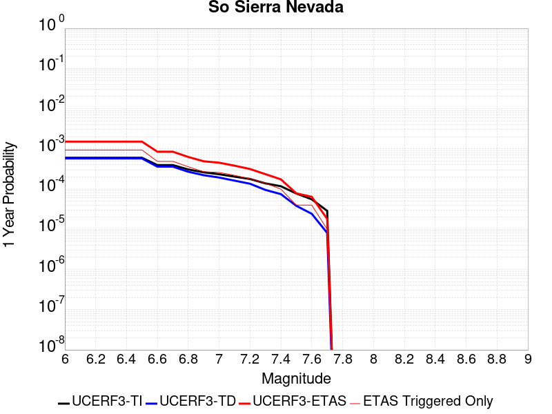 |  |

| Magnitude | 1 wk TI Prob | 1 wk TD Prob | 1 wk ETAS Prob | 1 wk ETAS/TD Gain | 1 wk ETAS Triggered Only | 1 mo TI Prob | 1 mo TD Prob | 1 mo ETAS Prob | 1 mo ETAS/TD Gain | 1 mo ETAS Triggered Only | 1 yr TI Prob | 1 yr TD Prob | 1 yr ETAS Prob | 1 yr ETAS/TD Gain | 1 yr ETAS Triggered Only | 10 yr TI Prob | 10 yr TD Prob | 10 yr ETAS Prob | 10 yr ETAS/TD Gain | 10 yr ETAS Triggered Only |
|-----|-----|-----|-----|-----|-----|-----|-----|-----|-----|-----|-----|-----|-----|-----|-----|-----|-----|-----|-----|-----|
| 6.0 | 1.15488665E-5 | 1.1079958E-5 | 1.1079958E-5 | 1.0 | 0.0 | 4.9494203E-5 | 4.7484744E-5 | 4.7484744E-5 | 1.0 | 0.0 | 6.024253E-4 | 5.779862E-4 | 5.779862E-4 | 1.0 | 0.0 | 0.006007948 | 0.0057660984 | 0.007234686 | 1.2546935 | 0.0014771048 |
| 6.1 | 1.15488665E-5 | 1.1079958E-5 | 1.1079958E-5 | 1.0 | 0.0 | 4.9494203E-5 | 4.7484744E-5 | 4.7484744E-5 | 1.0 | 0.0 | 6.024253E-4 | 5.779862E-4 | 5.779862E-4 | 1.0 | 0.0 | 0.006007948 | 0.0057660984 | 0.007234686 | 1.2546935 | 0.0014771048 |
| 6.2 | 1.15488665E-5 | 1.1079958E-5 | 1.1079958E-5 | 1.0 | 0.0 | 4.9494203E-5 | 4.7484744E-5 | 4.7484744E-5 | 1.0 | 0.0 | 6.024253E-4 | 5.779862E-4 | 5.779862E-4 | 1.0 | 0.0 | 0.006007948 | 0.0057660984 | 0.007234686 | 1.2546935 | 0.0014771048 |
| 6.3 | 1.15488665E-5 | 1.1079958E-5 | 1.1079958E-5 | 1.0 | 0.0 | 4.9494203E-5 | 4.7484744E-5 | 4.7484744E-5 | 1.0 | 0.0 | 6.024253E-4 | 5.779862E-4 | 5.779862E-4 | 1.0 | 0.0 | 0.006007948 | 0.0057660984 | 0.007234686 | 1.2546935 | 0.0014771048 |
| 6.4 | 1.15488665E-5 | 1.1079958E-5 | 1.1079958E-5 | 1.0 | 0.0 | 4.9494203E-5 | 4.7484744E-5 | 4.7484744E-5 | 1.0 | 0.0 | 6.024253E-4 | 5.779862E-4 | 5.779862E-4 | 1.0 | 0.0 | 0.006007948 | 0.0057660984 | 0.007234686 | 1.2546935 | 0.0014771048 |
| 6.5 | 1.15488665E-5 | 1.1079958E-5 | 1.1079958E-5 | 1.0 | 0.0 | 4.9494203E-5 | 4.7484744E-5 | 4.7484744E-5 | 1.0 | 0.0 | 6.024253E-4 | 5.779862E-4 | 5.779862E-4 | 1.0 | 0.0 | 0.006007948 | 0.0057660984 | 0.007234686 | 1.2546935 | 0.0014771048 |
| 6.6 | 7.587044E-6 | 6.9358503E-6 | 6.9358503E-6 | 1.0 | 0.0 | 3.2515498E-5 | 2.972475E-5 | 2.972475E-5 | 1.0 | 0.0 | 3.9580427E-4 | 3.6184167E-4 | 3.6184167E-4 | 1.0 | 0.0 | 0.003951 | 0.0036128166 | 0.005084585 | 1.4073743 | 0.0014771048 |
| 6.7 | 7.587044E-6 | 6.9358503E-6 | 6.9358503E-6 | 1.0 | 0.0 | 3.2515498E-5 | 2.972475E-5 | 2.972475E-5 | 1.0 | 0.0 | 3.9580427E-4 | 3.6184167E-4 | 3.6184167E-4 | 1.0 | 0.0 | 0.003951 | 0.0036128166 | 0.005084585 | 1.4073743 | 0.0014771048 |
| 6.8 | 5.9026956E-6 | 5.179568E-6 | 5.179568E-6 | 1.0 | 0.0 | 2.5297022E-5 | 2.2197966E-5 | 2.2197966E-5 | 1.0 | 0.0 | 3.0794772E-4 | 2.7022787E-4 | 2.7022787E-4 | 1.0 | 0.0 | 0.0030752132 | 0.0026991093 | 0.0026991093 | 1.0 | 0.0 |
| 6.9 | 5.0118915E-6 | 4.2525808E-6 | 4.2525808E-6 | 1.0 | 0.0 | 2.1479358E-5 | 1.8225222E-5 | 1.8225222E-5 | 1.0 | 0.0 | 2.614798E-4 | 2.2187021E-4 | 2.2187021E-4 | 1.0 | 0.0 | 0.0026117235 | 0.0022165596 | 0.0022165596 | 1.0 | 0.0 |
| 7.0 | 4.4924795E-6 | 3.7140621E-6 | 3.7140621E-6 | 1.0 | 0.0 | 1.925334E-5 | 1.5917316E-5 | 1.5917316E-5 | 1.0 | 0.0 | 2.3438422E-4 | 1.9377672E-4 | 1.9377672E-4 | 1.0 | 0.0 | 0.0023413717 | 0.0019361405 | 0.0019361405 | 1.0 | 0.0 |
| 7.1 | 3.9118436E-6 | 3.1121094E-6 | 3.1121094E-6 | 1.0 | 0.0 | 1.6764936E-5 | 1.3337547E-5 | 1.3337547E-5 | 1.0 | 0.0 | 2.0409399E-4 | 1.6237311E-4 | 1.6237311E-4 | 1.0 | 0.0 | 0.0020390663 | 0.0016226007 | 0.0016226007 | 1.0 | 0.0 |
| 7.2 | 3.4200818E-6 | 2.605576E-6 | 2.605576E-6 | 1.0 | 0.0 | 1.4657411E-5 | 1.116671E-5 | 1.116671E-5 | 1.0 | 0.0 | 1.7843937E-4 | 1.3594671E-4 | 1.3594671E-4 | 1.0 | 0.0 | 0.0017829615 | 0.0013586852 | 0.0013586852 | 1.0 | 0.0 |
| 7.3 | 2.6593618E-6 | 1.8285265E-6 | 1.8285265E-6 | 1.0 | 0.0 | 1.13972155E-5 | 7.83652E-6 | 7.83652E-6 | 1.0 | 0.0 | 1.3875226E-4 | 9.5405754E-5 | 9.5405754E-5 | 1.0 | 0.0 | 0.0013866565 | 9.536769E-4 | 9.536769E-4 | 1.0 | 0.0 |
| 7.4 | 2.2577992E-6 | 1.436535E-6 | 1.436535E-6 | 1.0 | 0.0 | 9.676246E-6 | 6.156565E-6 | 6.156565E-6 | 1.0 | 0.0 | 1.1780193E-4 | 7.495386E-5 | 7.495386E-5 | 1.0 | 0.0 | 0.001177395 | 7.493108E-4 | 7.493108E-4 | 1.0 | 0.0 |
| 7.5 | 1.489319E-6 | 7.354697E-7 | 7.354697E-7 | 1.0 | 0.0 | 6.3827797E-6 | 3.1520092E-6 | 3.1520092E-6 | 1.0 | 0.0 | 7.770758E-5 | 3.837504E-5 | 3.837504E-5 | 1.0 | 0.0 | 7.7680405E-4 | 3.836846E-4 | 3.836846E-4 | 1.0 | 0.0 |
| 7.6 | 1.0680322E-6 | 4.6602182E-7 | 4.6602182E-7 | 1.0 | 0.0 | 4.577273E-6 | 1.997235E-6 | 1.997235E-6 | 1.0 | 0.0 | 5.5726876E-5 | 2.4316065E-5 | 2.4316065E-5 | 1.0 | 0.0 | 5.5712904E-4 | 2.431343E-4 | 2.431343E-4 | 1.0 | 0.0 |
| 7.7 | 5.509146E-7 | 1.558334E-7 | 1.558334E-7 | 1.0 | 0.0 | 2.3610605E-6 | 6.678573E-7 | 6.678573E-7 | 1.0 | 0.0 | 2.8745531E-5 | 8.131134E-6 | 8.131134E-6 | 1.0 | 0.0 | 2.8741814E-4 | 8.130848E-5 | 8.130848E-5 | 1.0 | 0.0 |

## Garlock (West)
*[(top)](#table-of-contents)*

| 1 Week | 1 Month | 1 Year | 10 Year |
|-----|-----|-----|-----|
|  |  |  |  |

| Magnitude | 1 wk TI Prob | 1 wk TD Prob | 1 wk ETAS Prob | 1 wk ETAS/TD Gain | 1 wk ETAS Triggered Only | 1 mo TI Prob | 1 mo TD Prob | 1 mo ETAS Prob | 1 mo ETAS/TD Gain | 1 mo ETAS Triggered Only | 1 yr TI Prob | 1 yr TD Prob | 1 yr ETAS Prob | 1 yr ETAS/TD Gain | 1 yr ETAS Triggered Only | 10 yr TI Prob | 10 yr TD Prob | 10 yr ETAS Prob | 10 yr ETAS/TD Gain | 10 yr ETAS Triggered Only |
|-----|-----|-----|-----|-----|-----|-----|-----|-----|-----|-----|-----|-----|-----|-----|-----|-----|-----|-----|-----|-----|
| 6.0 | 2.5181727E-5 | 2.5216661E-5 | 2.5216661E-5 | 1.0 | 0.0 | 1.0791722E-4 | 1.08066946E-4 | 1.08066946E-4 | 1.0 | 0.0 | 0.0013131002 | 0.0013149243 | 0.0013149243 | 1.0 | 0.0 | 0.013053683 | 0.013151911 | 0.014609589 | 1.1108339 | 0.0014771048 |
| 6.1 | 2.5077732E-5 | 2.5117724E-5 | 2.5117724E-5 | 1.0 | 0.0 | 1.0747157E-4 | 1.0764297E-4 | 1.0764297E-4 | 1.0 | 0.0 | 0.001307681 | 0.0013097686 | 0.0013097686 | 1.0 | 0.0 | 0.013000126 | 0.013100963 | 0.014558717 | 1.1112707 | 0.0014771048 |
| 6.2 | 2.494612E-5 | 2.4999388E-5 | 2.4999388E-5 | 1.0 | 0.0 | 1.0690756E-4 | 1.0713586E-4 | 1.0713586E-4 | 1.0 | 0.0 | 0.0013008224 | 0.001303602 | 0.001303602 | 1.0 | 0.0 | 0.012932341 | 0.013040021 | 0.014497864 | 1.1117976 | 0.0014771048 |
| 6.3 | 2.4733758E-5 | 2.4818735E-5 | 2.4818735E-5 | 1.0 | 0.0 | 1.0599751E-4 | 1.0636169E-4 | 1.0636169E-4 | 1.0 | 0.0 | 0.0012897556 | 0.0012941877 | 0.0012941877 | 1.0 | 0.0 | 0.012822957 | 0.01294698 | 0.014404961 | 1.1126117 | 0.0014771048 |
| 6.4 | 2.3237335E-5 | 2.3197908E-5 | 2.3197908E-5 | 1.0 | 0.0 | 9.958477E-5 | 9.941583E-5 | 9.941583E-5 | 1.0 | 0.0 | 0.0012117702 | 0.0012097185 | 0.0012097185 | 1.0 | 0.0 | 0.012051838 | 0.012111766 | 0.01357098 | 1.1204791 | 0.0014771048 |
| 6.5 | 2.2732203E-5 | 2.3012379E-5 | 2.3012379E-5 | 1.0 | 0.0 | 9.742009E-5 | 9.862077E-5 | 9.862077E-5 | 1.0 | 0.0 | 0.0011854442 | 0.0012000492 | 0.0012000492 | 1.0 | 0.0 | 0.011791403 | 0.012016123 | 0.01347548 | 1.1214498 | 0.0014771048 |
| 6.6 | 2.1319436E-5 | 2.1792415E-5 | 2.1792415E-5 | 1.0 | 0.0 | 9.136581E-5 | 9.339274E-5 | 9.339274E-5 | 1.0 | 0.0 | 0.001111811 | 0.0011364657 | 0.0011364657 | 1.0 | 0.0 | 0.011062649 | 0.011386949 | 0.0128472345 | 1.128242 | 0.0014771048 |
| 6.7 | 1.970802E-5 | 2.0412112E-5 | 2.0412112E-5 | 1.0 | 0.0 | 8.446021E-5 | 8.747755E-5 | 8.747755E-5 | 1.0 | 0.0 | 0.001027818 | 0.0010645206 | 0.0010645206 | 1.0 | 0.0 | 0.010230771 | 0.01067459 | 0.012135928 | 1.1368986 | 0.0014771048 |
| 6.8 | 1.8744462E-5 | 1.9919653E-5 | 1.9919653E-5 | 1.0 | 0.0 | 8.033094E-5 | 8.536715E-5 | 8.536715E-5 | 1.0 | 0.0 | 9.775903E-4 | 0.0010388512 | 0.0010388512 | 1.0 | 0.0 | 0.009733009 | 0.010420324 | 0.011882037 | 1.1402752 | 0.0014771048 |
| 6.9 | 1.7559682E-5 | 1.8971898E-5 | 1.8971898E-5 | 1.0 | 0.0 | 7.5253614E-5 | 8.13056E-5 | 8.13056E-5 | 1.0 | 0.0 | 9.158276E-4 | 9.894476E-4 | 9.894476E-4 | 1.0 | 0.0 | 0.0091206245 | 0.009930745 | 0.011393181 | 1.1472635 | 0.0014771048 |
| 7.0 | 1.6794445E-5 | 1.8234585E-5 | 1.8234585E-5 | 1.0 | 0.0 | 7.197421E-5 | 7.814589E-5 | 7.814589E-5 | 1.0 | 0.0 | 8.759337E-4 | 9.5101225E-4 | 9.5101225E-4 | 1.0 | 0.0 | 0.008724891 | 0.009549588 | 0.011012587 | 1.1532003 | 0.0014771048 |
| 7.1 | 1.6337795E-5 | 1.7735292E-5 | 1.7735292E-5 | 1.0 | 0.0 | 7.0017246E-5 | 7.600619E-5 | 7.600619E-5 | 1.0 | 0.0 | 8.521265E-4 | 9.249838E-4 | 9.249838E-4 | 1.0 | 0.0 | 0.008488664 | 0.009291395 | 0.010754775 | 1.1574985 | 0.0014771048 |
| 7.2 | 1.5780008E-5 | 1.7183862E-5 | 1.7183862E-5 | 1.0 | 0.0 | 6.762685E-5 | 7.364305E-5 | 7.364305E-5 | 1.0 | 0.0 | 8.2304585E-4 | 8.962366E-4 | 8.962366E-4 | 1.0 | 0.0 | 0.008200042 | 0.009006202 | 0.010470004 | 1.1625327 | 0.0014771048 |
| 7.3 | 1.5058865E-5 | 1.6636799E-5 | 1.6636799E-5 | 1.0 | 0.0 | 6.45364E-5 | 7.129862E-5 | 7.129862E-5 | 1.0 | 0.0 | 7.854473E-4 | 8.6771627E-4 | 8.6771627E-4 | 1.0 | 0.0 | 0.00782677 | 0.008722834 | 0.010187054 | 1.1678606 | 0.0014771048 |
| 7.4 | 1.4887923E-5 | 1.647271E-5 | 1.647271E-5 | 1.0 | 0.0 | 6.380382E-5 | 7.059543E-5 | 7.059543E-5 | 1.0 | 0.0 | 7.7653467E-4 | 8.591616E-4 | 8.591616E-4 | 1.0 | 0.0 | 0.0077382675 | 0.008637666 | 0.010102011 | 1.1695303 | 0.0014771048 |
| 7.5 | 1.4509299E-5 | 1.6064607E-5 | 1.6064607E-5 | 1.0 | 0.0 | 6.218123E-5 | 6.884651E-5 | 6.884651E-5 | 1.0 | 0.0 | 7.567935E-4 | 8.37885E-4 | 8.37885E-4 | 1.0 | 0.0 | 0.0075422134 | 0.008425911 | 0.009890569 | 1.173828 | 0.0014771048 |
| 7.6 | 1.2756717E-5 | 1.4067994E-5 | 1.4067994E-5 | 1.0 | 0.0 | 5.4670498E-5 | 6.029001E-5 | 6.029001E-5 | 1.0 | 0.0 | 6.6541E-4 | 7.3378434E-4 | 7.3378434E-4 | 1.0 | 0.0 | 0.006634211 | 0.0073905406 | 0.0073905406 | 1.0 | 0.0 |
| 7.7 | 1.0328985E-5 | 1.147664E-5 | 1.147664E-5 | 1.0 | 0.0 | 4.4266326E-5 | 4.9184677E-5 | 4.9184677E-5 | 1.0 | 0.0 | 5.388092E-4 | 5.986593E-4 | 5.986593E-4 | 1.0 | 0.0 | 0.0053750467 | 0.006046838 | 0.006046838 | 1.0 | 0.0 |
| 7.8 | 7.0306583E-6 | 8.912468E-6 | 8.912468E-6 | 1.0 | 0.0 | 3.0131043E-5 | 3.8195732E-5 | 3.8195732E-5 | 1.0 | 0.0 | 3.667837E-4 | 4.6493395E-4 | 4.6493395E-4 | 1.0 | 0.0 | 0.003661789 | 0.0047019436 | 0.0047019436 | 1.0 | 0.0 |
| 7.9 | 4.060633E-6 | 5.4729326E-6 | 5.4729326E-6 | 1.0 | 0.0 | 1.7402595E-5 | 2.3455215E-5 | 2.3455215E-5 | 1.0 | 0.0 | 2.11856E-4 | 2.8552994E-4 | 2.8552994E-4 | 1.0 | 0.0 | 0.0021165414 | 0.0028881172 | 0.0028881172 | 1.0 | 0.0 |
| 8.0 | 1.6729537E-6 | 2.0800776E-6 | 2.0800776E-6 | 1.0 | 0.0 | 7.169782E-6 | 8.914588E-6 | 8.914588E-6 | 1.0 | 0.0 | 8.7288594E-5 | 1.0852974E-4 | 1.0852974E-4 | 1.0 | 0.0 | 8.7254314E-4 | 0.0010982669 | 0.0010982669 | 1.0 | 0.0 |
| 8.1 | 3.6733252E-7 | 3.1526864E-7 | 3.1526864E-7 | 1.0 | 0.0 | 1.5742813E-6 | 1.3511507E-6 | 1.3511507E-6 | 1.0 | 0.0 | 1.9166706E-5 | 1.645015E-5 | 1.645015E-5 | 1.0 | 0.0 | 1.9165053E-4 | 1.6658098E-4 | 1.6658098E-4 | 1.0 | 0.0 |

## Goldstone Lake
*[(top)](#table-of-contents)*

| 1 Week | 1 Month | 1 Year | 10 Year |
|-----|-----|-----|-----|
|  | 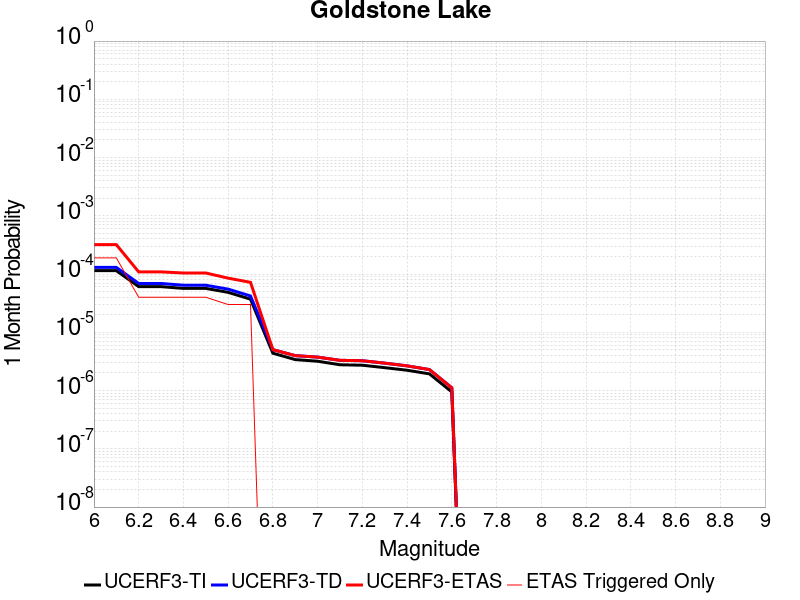 |  |  |

| Magnitude | 1 wk TI Prob | 1 wk TD Prob | 1 wk ETAS Prob | 1 wk ETAS/TD Gain | 1 wk ETAS Triggered Only | 1 mo TI Prob | 1 mo TD Prob | 1 mo ETAS Prob | 1 mo ETAS/TD Gain | 1 mo ETAS Triggered Only | 1 yr TI Prob | 1 yr TD Prob | 1 yr ETAS Prob | 1 yr ETAS/TD Gain | 1 yr ETAS Triggered Only | 10 yr TI Prob | 10 yr TD Prob | 10 yr ETAS Prob | 10 yr ETAS/TD Gain | 10 yr ETAS Triggered Only |
|-----|-----|-----|-----|-----|-----|-----|-----|-----|-----|-----|-----|-----|-----|-----|-----|-----|-----|-----|-----|-----|
| 6.0 | 2.671352E-5 | 3.0378242E-5 | 3.0378242E-5 | 1.0 | 0.0 | 1.1448149E-4 | 1.3018708E-4 | 1.3018708E-4 | 1.0 | 0.0 | 0.001392921 | 0.0015840717 | 0.0015840717 | 1.0 | 0.0 | 0.013842222 | 0.015747305 | 0.01720115 | 1.0923234 | 0.0014771048 |
| 6.1 | 2.671352E-5 | 3.0378242E-5 | 3.0378242E-5 | 1.0 | 0.0 | 1.1448149E-4 | 1.3018708E-4 | 1.3018708E-4 | 1.0 | 0.0 | 0.001392921 | 0.0015840717 | 0.0015840717 | 1.0 | 0.0 | 0.013842222 | 0.015747305 | 0.01720115 | 1.0923234 | 0.0014771048 |
| 6.2 | 1.4197047E-5 | 1.6097329E-5 | 1.6097329E-5 | 1.0 | 0.0 | 6.0843064E-5 | 6.898728E-5 | 6.898728E-5 | 1.0 | 0.0 | 7.4051257E-4 | 8.396952E-4 | 8.396952E-4 | 1.0 | 0.0 | 0.007380498 | 0.008374922 | 0.009839656 | 1.1748953 | 0.0014771048 |
| 6.3 | 1.4197047E-5 | 1.6097329E-5 | 1.6097329E-5 | 1.0 | 0.0 | 6.0843064E-5 | 6.898728E-5 | 6.898728E-5 | 1.0 | 0.0 | 7.4051257E-4 | 8.396952E-4 | 8.396952E-4 | 1.0 | 0.0 | 0.007380498 | 0.008374922 | 0.009839656 | 1.1748953 | 0.0014771048 |
| 6.4 | 1.3238931E-5 | 1.5009467E-5 | 1.5009467E-5 | 1.0 | 0.0 | 5.6737044E-5 | 6.432525E-5 | 6.432525E-5 | 1.0 | 0.0 | 6.9055456E-4 | 7.829765E-4 | 7.829765E-4 | 1.0 | 0.0 | 0.006884126 | 0.007811806 | 0.009277373 | 1.1876091 | 0.0014771048 |
| 6.5 | 1.3238931E-5 | 1.5009467E-5 | 1.5009467E-5 | 1.0 | 0.0 | 5.6737044E-5 | 6.432525E-5 | 6.432525E-5 | 1.0 | 0.0 | 6.9055456E-4 | 7.829765E-4 | 7.829765E-4 | 1.0 | 0.0 | 0.006884126 | 0.007811806 | 0.009277373 | 1.1876091 | 0.0014771048 |
| 6.6 | 1.1328278E-5 | 1.2856027E-5 | 1.2856027E-5 | 1.0 | 0.0 | 4.8548856E-5 | 5.5096636E-5 | 5.5096636E-5 | 1.0 | 0.0 | 5.90922E-4 | 6.706908E-4 | 6.706908E-4 | 1.0 | 0.0 | 0.0058935313 | 0.0066960566 | 0.008163271 | 1.2191161 | 0.0014771048 |
| 6.7 | 8.651175E-6 | 9.825214E-6 | 9.825214E-6 | 1.0 | 0.0 | 3.707594E-5 | 4.2107888E-5 | 4.2107888E-5 | 1.0 | 0.0 | 4.5130608E-4 | 5.1263353E-4 | 5.1263353E-4 | 1.0 | 0.0 | 0.0045039062 | 0.0051233894 | 0.0065929266 | 1.2868291 | 0.0014771048 |
| 6.8 | 1.0215377E-6 | 1.1755062E-6 | 1.1755062E-6 | 1.0 | 0.0 | 4.378012E-6 | 5.037875E-6 | 5.037875E-6 | 1.0 | 0.0 | 5.3300988E-5 | 6.133451E-5 | 6.133451E-5 | 1.0 | 0.0 | 5.3288206E-4 | 6.131871E-4 | 6.131871E-4 | 1.0 | 0.0 |
| 6.9 | 7.9360774E-7 | 9.2836456E-7 | 9.2836456E-7 | 1.0 | 0.0 | 3.4011714E-6 | 3.9786996E-6 | 3.9786996E-6 | 1.0 | 0.0 | 4.1408475E-5 | 4.8439662E-5 | 4.8439662E-5 | 1.0 | 0.0 | 4.140076E-4 | 4.8429804E-4 | 4.8429804E-4 | 1.0 | 0.0 |
| 7.0 | 7.4382757E-7 | 8.747556E-7 | 8.747556E-7 | 1.0 | 0.0 | 3.1878285E-6 | 3.7489476E-6 | 3.7489476E-6 | 1.0 | 0.0 | 3.8811122E-5 | 4.5642548E-5 | 4.5642548E-5 | 1.0 | 0.0 | 3.8804344E-4 | 4.5633837E-4 | 4.5633837E-4 | 1.0 | 0.0 |
| 7.1 | 6.4709513E-7 | 7.7114885E-7 | 7.7114885E-7 | 1.0 | 0.0 | 2.773262E-6 | 3.3049198E-6 | 3.3049198E-6 | 1.0 | 0.0 | 3.376394E-5 | 4.0236715E-5 | 4.0236715E-5 | 1.0 | 0.0 | 3.375881E-4 | 4.0230027E-4 | 4.0230027E-4 | 1.0 | 0.0 |
| 7.2 | 6.356704E-7 | 7.588543E-7 | 7.588543E-7 | 1.0 | 0.0 | 2.7242988E-6 | 3.2522291E-6 | 3.2522291E-6 | 1.0 | 0.0 | 3.3167835E-5 | 3.959523E-5 | 3.959523E-5 | 1.0 | 0.0 | 3.3162883E-4 | 3.9588768E-4 | 3.9588768E-4 | 1.0 | 0.0 |
| 7.3 | 5.7695723E-7 | 6.8967347E-7 | 6.8967347E-7 | 1.0 | 0.0 | 2.4726714E-6 | 2.9557402E-6 | 2.9557402E-6 | 1.0 | 0.0 | 3.0104358E-5 | 3.5985602E-5 | 3.5985602E-5 | 1.0 | 0.0 | 3.0100282E-4 | 3.5980347E-4 | 3.5980347E-4 | 1.0 | 0.0 |
| 7.4 | 5.209647E-7 | 6.1936566E-7 | 6.1936566E-7 | 1.0 | 0.0 | 2.232704E-6 | 2.654422E-6 | 2.654422E-6 | 1.0 | 0.0 | 2.718283E-5 | 3.2317163E-5 | 3.2317163E-5 | 1.0 | 0.0 | 2.7179506E-4 | 3.231302E-4 | 3.231302E-4 | 1.0 | 0.0 |
| 7.5 | 4.512955E-7 | 5.3490027E-7 | 5.3490027E-7 | 1.0 | 0.0 | 1.934122E-6 | 2.292428E-6 | 2.292428E-6 | 1.0 | 0.0 | 2.3547682E-5 | 2.7910008E-5 | 2.7910008E-5 | 1.0 | 0.0 | 2.3545188E-4 | 2.7907031E-4 | 2.7907031E-4 | 1.0 | 0.0 |
| 7.6 | 2.21172E-7 | 2.6040124E-7 | 2.6040124E-7 | 1.0 | 0.0 | 9.478797E-7 | 1.116005E-6 | 1.116005E-6 | 1.0 | 0.0 | 1.1540374E-5 | 1.3587305E-5 | 1.3587305E-5 | 1.0 | 0.0 | 1.1539775E-4 | 1.3586757E-4 | 1.3586757E-4 | 1.0 | 0.0 |

## Likely 2011 CFM
*[(top)](#table-of-contents)*

| 1 Week | 1 Month | 1 Year | 10 Year |
|-----|-----|-----|-----|
|  | 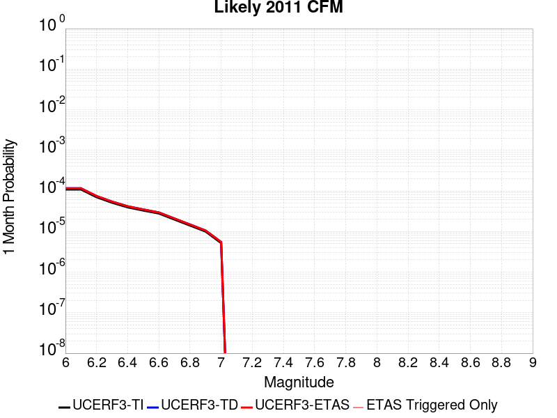 |  |  |

| Magnitude | 1 wk TI Prob | 1 wk TD Prob | 1 wk ETAS Prob | 1 wk ETAS/TD Gain | 1 wk ETAS Triggered Only | 1 mo TI Prob | 1 mo TD Prob | 1 mo ETAS Prob | 1 mo ETAS/TD Gain | 1 mo ETAS Triggered Only | 1 yr TI Prob | 1 yr TD Prob | 1 yr ETAS Prob | 1 yr ETAS/TD Gain | 1 yr ETAS Triggered Only | 10 yr TI Prob | 10 yr TD Prob | 10 yr ETAS Prob | 10 yr ETAS/TD Gain | 10 yr ETAS Triggered Only |
|-----|-----|-----|-----|-----|-----|-----|-----|-----|-----|-----|-----|-----|-----|-----|-----|-----|-----|-----|-----|-----|
| 6.0 | 2.5315949E-5 | 2.7105765E-5 | 2.7105765E-5 | 1.0 | 0.0 | 1.0849241E-4 | 1.1616265E-4 | 1.1616265E-4 | 1.0 | 0.0 | 0.0013200947 | 0.0014134073 | 0.0014134073 | 1.0 | 0.0 | 0.013122803 | 0.014048834 | 0.015505188 | 1.1036637 | 0.0014771048 |
| 6.1 | 2.5315949E-5 | 2.7105765E-5 | 2.7105765E-5 | 1.0 | 0.0 | 1.0849241E-4 | 1.1616265E-4 | 1.1616265E-4 | 1.0 | 0.0 | 0.0013200947 | 0.0014134073 | 0.0014134073 | 1.0 | 0.0 | 0.013122803 | 0.014048834 | 0.015505188 | 1.1036637 | 0.0014771048 |
| 6.2 | 1.6375941E-5 | 1.746646E-5 | 1.746646E-5 | 1.0 | 0.0 | 7.0180715E-5 | 7.485418E-5 | 7.485418E-5 | 1.0 | 0.0 | 8.5411523E-4 | 9.109808E-4 | 9.109808E-4 | 1.0 | 0.0 | 0.008508399 | 0.009073752 | 0.010537454 | 1.1613116 | 0.0014771048 |
| 6.3 | 1.1945543E-5 | 1.271302E-5 | 1.271302E-5 | 1.0 | 0.0 | 5.119418E-5 | 5.4483266E-5 | 5.4483266E-5 | 1.0 | 0.0 | 6.2311086E-4 | 6.631372E-4 | 6.631372E-4 | 1.0 | 0.0 | 0.0062136655 | 0.0066121393 | 0.0066121393 | 1.0 | 0.0 |
| 6.4 | 9.192729E-6 | 9.768813E-6 | 9.768813E-6 | 1.0 | 0.0 | 3.939681E-5 | 4.1865682E-5 | 4.1865682E-5 | 1.0 | 0.0 | 4.7955062E-4 | 5.095982E-4 | 5.095982E-4 | 1.0 | 0.0 | 0.004785171 | 0.005084578 | 0.005084578 | 1.0 | 0.0 |
| 6.5 | 7.67906E-6 | 8.152889E-6 | 8.152889E-6 | 1.0 | 0.0 | 3.2909844E-5 | 3.4940495E-5 | 3.4940495E-5 | 1.0 | 0.0 | 4.006037E-4 | 4.253194E-4 | 4.253194E-4 | 1.0 | 0.0 | 0.0039988225 | 0.0042452468 | 0.0042452468 | 1.0 | 0.0 |
| 6.6 | 6.4884057E-6 | 6.8849736E-6 | 6.8849736E-6 | 1.0 | 0.0 | 2.7807157E-5 | 2.9506704E-5 | 2.9506704E-5 | 1.0 | 0.0 | 3.3849955E-4 | 3.5918635E-4 | 3.5918635E-4 | 1.0 | 0.0 | 0.003379844 | 0.0035862029 | 0.0035862029 | 1.0 | 0.0 |
| 6.7 | 4.6060636E-6 | 4.8841976E-6 | 4.8841976E-6 | 1.0 | 0.0 | 1.9740122E-5 | 2.0932112E-5 | 2.0932112E-5 | 1.0 | 0.0 | 2.403095E-4 | 2.548195E-4 | 2.548195E-4 | 1.0 | 0.0 | 0.002400498 | 0.002545356 | 0.002545356 | 1.0 | 0.0 |
| 6.8 | 3.2795615E-6 | 3.4774844E-6 | 3.4774844E-6 | 1.0 | 0.0 | 1.4055187E-5 | 1.4903422E-5 | 1.4903422E-5 | 1.0 | 0.0 | 1.7110848E-4 | 1.8143462E-4 | 1.8143462E-4 | 1.0 | 0.0 | 0.0017097679 | 0.0018129202 | 0.0018129202 | 1.0 | 0.0 |
| 6.9 | 2.3289967E-6 | 2.4706364E-6 | 2.4706364E-6 | 1.0 | 0.0 | 9.981376E-6 | 1.0588402E-5 | 1.0588402E-5 | 1.0 | 0.0 | 1.2151648E-4 | 1.289066E-4 | 1.289066E-4 | 1.0 | 0.0 | 0.0012145005 | 0.0012883613 | 0.0012883613 | 1.0 | 0.0 |
| 7.0 | 1.211292E-6 | 1.2864381E-6 | 1.2864381E-6 | 1.0 | 0.0 | 5.1912407E-6 | 5.513296E-6 | 5.513296E-6 | 1.0 | 0.0 | 6.320152E-5 | 6.7122615E-5 | 6.7122615E-5 | 1.0 | 0.0 | 6.3183554E-4 | 6.7105325E-4 | 6.7105325E-4 | 1.0 | 0.0 |

## Nelson Lake
*[(top)](#table-of-contents)*

| 1 Week | 1 Month | 1 Year | 10 Year |
|-----|-----|-----|-----|
|  |  |  | 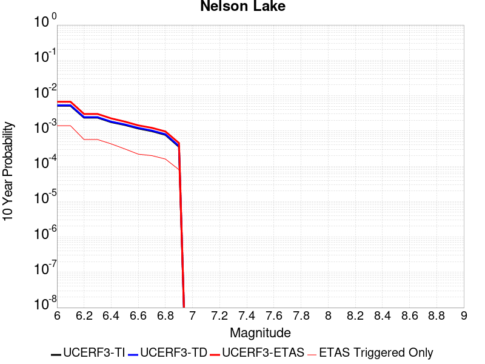 |

| Magnitude | 1 wk TI Prob | 1 wk TD Prob | 1 wk ETAS Prob | 1 wk ETAS/TD Gain | 1 wk ETAS Triggered Only | 1 mo TI Prob | 1 mo TD Prob | 1 mo ETAS Prob | 1 mo ETAS/TD Gain | 1 mo ETAS Triggered Only | 1 yr TI Prob | 1 yr TD Prob | 1 yr ETAS Prob | 1 yr ETAS/TD Gain | 1 yr ETAS Triggered Only | 10 yr TI Prob | 10 yr TD Prob | 10 yr ETAS Prob | 10 yr ETAS/TD Gain | 10 yr ETAS Triggered Only |
|-----|-----|-----|-----|-----|-----|-----|-----|-----|-----|-----|-----|-----|-----|-----|-----|-----|-----|-----|-----|-----|
| 6.0 | 9.913453E-6 | 1.0192408E-5 | 1.0192408E-5 | 1.0 | 0.0 | 4.2485535E-5 | 4.3681073E-5 | 4.3681073E-5 | 1.0 | 0.0 | 5.1713863E-4 | 5.3169765E-4 | 5.3169765E-4 | 1.0 | 0.0 | 0.0051593683 | 0.0053052832 | 0.0067745512 | 1.2769444 | 0.0014771048 |
| 6.1 | 9.913453E-6 | 1.0192408E-5 | 1.0192408E-5 | 1.0 | 0.0 | 4.2485535E-5 | 4.3681073E-5 | 4.3681073E-5 | 1.0 | 0.0 | 5.1713863E-4 | 5.3169765E-4 | 5.3169765E-4 | 1.0 | 0.0 | 0.0051593683 | 0.0053052832 | 0.0067745512 | 1.2769444 | 0.0014771048 |
| 6.2 | 4.5596407E-6 | 4.696388E-6 | 4.696388E-6 | 1.0 | 0.0 | 1.954117E-5 | 2.0127229E-5 | 2.0127229E-5 | 1.0 | 0.0 | 2.3788778E-4 | 2.4502273E-4 | 2.4502273E-4 | 1.0 | 0.0 | 0.0023763329 | 0.0024476517 | 0.0039211414 | 1.6020013 | 0.0014771048 |
| 6.3 | 4.5596407E-6 | 4.696388E-6 | 4.696388E-6 | 1.0 | 0.0 | 1.954117E-5 | 2.0127229E-5 | 2.0127229E-5 | 1.0 | 0.0 | 2.3788778E-4 | 2.4502273E-4 | 2.4502273E-4 | 1.0 | 0.0 | 0.0023763329 | 0.0024476517 | 0.0039211414 | 1.6020013 | 0.0014771048 |
| 6.4 | 3.4025713E-6 | 3.509956E-6 | 3.509956E-6 | 1.0 | 0.0 | 1.4582367E-5 | 1.5042587E-5 | 1.5042587E-5 | 1.0 | 0.0 | 1.7752586E-4 | 1.8312894E-4 | 1.8312894E-4 | 1.0 | 0.0 | 0.001773841 | 0.0018298633 | 0.0018298633 | 1.0 | 0.0 |
| 6.5 | 2.8352947E-6 | 2.927907E-6 | 2.927907E-6 | 1.0 | 0.0 | 1.2151207E-5 | 1.25481165E-5 | 1.25481165E-5 | 1.0 | 0.0 | 1.479309E-4 | 1.5276336E-4 | 1.5276336E-4 | 1.0 | 0.0 | 0.0014783246 | 0.0015266574 | 0.0015266574 | 1.0 | 0.0 |
| 6.6 | 2.251518E-6 | 2.3291102E-6 | 2.3291102E-6 | 1.0 | 0.0 | 9.649328E-6 | 9.981866E-6 | 9.981866E-6 | 1.0 | 0.0 | 1.1747423E-4 | 1.2152307E-4 | 1.2152307E-4 | 1.0 | 0.0 | 0.0011741214 | 0.001214628 | 0.001214628 | 1.0 | 0.0 |
| 6.7 | 1.8911853E-6 | 1.959177E-6 | 1.959177E-6 | 1.0 | 0.0 | 8.105055E-6 | 8.39645E-6 | 8.39645E-6 | 1.0 | 0.0 | 9.867457E-5 | 1.0222256E-4 | 1.0222256E-4 | 1.0 | 0.0 | 9.863076E-4 | 0.0010218129 | 0.0010218129 | 1.0 | 0.0 |
| 6.8 | 1.4874814E-6 | 1.5438616E-6 | 1.5438616E-6 | 1.0 | 0.0 | 6.374905E-6 | 6.6165358E-6 | 6.6165358E-6 | 1.0 | 0.0 | 7.76117E-5 | 8.0553866E-5 | 8.0553866E-5 | 1.0 | 0.0 | 7.75846E-4 | 8.0529775E-4 | 8.0529775E-4 | 1.0 | 0.0 |
| 6.9 | 6.835972E-7 | 7.140097E-7 | 7.140097E-7 | 1.0 | 0.0 | 2.9296991E-6 | 3.0600397E-6 | 3.0600397E-6 | 1.0 | 0.0 | 3.56685E-5 | 3.7255664E-5 | 3.7255664E-5 | 1.0 | 0.0 | 3.5662777E-4 | 3.7252545E-4 | 3.7252545E-4 | 1.0 | 0.0 |

## McLean Lake
*[(top)](#table-of-contents)*

| 1 Week | 1 Month | 1 Year | 10 Year |
|-----|-----|-----|-----|
|  |  |  | 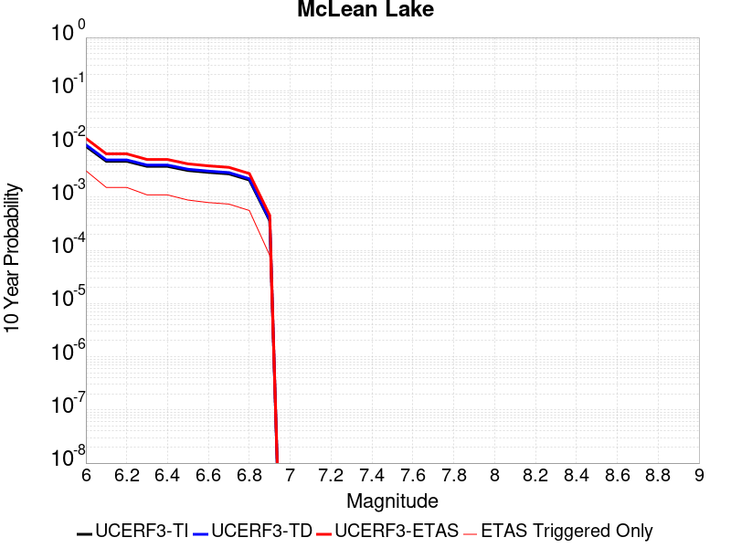 |

| Magnitude | 1 wk TI Prob | 1 wk TD Prob | 1 wk ETAS Prob | 1 wk ETAS/TD Gain | 1 wk ETAS Triggered Only | 1 mo TI Prob | 1 mo TD Prob | 1 mo ETAS Prob | 1 mo ETAS/TD Gain | 1 mo ETAS Triggered Only | 1 yr TI Prob | 1 yr TD Prob | 1 yr ETAS Prob | 1 yr ETAS/TD Gain | 1 yr ETAS Triggered Only | 10 yr TI Prob | 10 yr TD Prob | 10 yr ETAS Prob | 10 yr ETAS/TD Gain | 10 yr ETAS Triggered Only |
|-----|-----|-----|-----|-----|-----|-----|-----|-----|-----|-----|-----|-----|-----|-----|-----|-----|-----|-----|-----|-----|
| 6.0 | 1.7360222E-5 | 1.8502275E-5 | 1.8502275E-5 | 1.0 | 0.0 | 7.439883E-5 | 7.929332E-5 | 7.929332E-5 | 1.0 | 0.0 | 9.0542925E-4 | 9.6501724E-4 | 9.6501724E-4 | 1.0 | 0.0 | 0.009017491 | 0.009613109 | 0.0110760145 | 1.1521782 | 0.0014771048 |
| 6.1 | 9.062689E-6 | 9.592492E-6 | 9.592492E-6 | 1.0 | 0.0 | 3.8839516E-5 | 4.1110077E-5 | 4.1110077E-5 | 1.0 | 0.0 | 4.727685E-4 | 5.0040917E-4 | 5.0040917E-4 | 1.0 | 0.0 | 0.0047176396 | 0.0049937065 | 0.006463435 | 1.2943162 | 0.0014771048 |
| 6.2 | 9.062689E-6 | 9.592492E-6 | 9.592492E-6 | 1.0 | 0.0 | 3.8839516E-5 | 4.1110077E-5 | 4.1110077E-5 | 1.0 | 0.0 | 4.727685E-4 | 5.0040917E-4 | 5.0040917E-4 | 1.0 | 0.0 | 0.0047176396 | 0.0049937065 | 0.006463435 | 1.2943162 | 0.0014771048 |
| 6.3 | 7.2575485E-6 | 7.66794E-6 | 7.66794E-6 | 1.0 | 0.0 | 3.110341E-5 | 3.2862223E-5 | 3.2862223E-5 | 1.0 | 0.0 | 3.786182E-4 | 4.0003125E-4 | 4.0003125E-4 | 1.0 | 0.0 | 0.0037797375 | 0.003993816 | 0.005465022 | 1.3683709 | 0.0014771048 |
| 6.4 | 7.2575485E-6 | 7.66794E-6 | 7.66794E-6 | 1.0 | 0.0 | 3.110341E-5 | 3.2862223E-5 | 3.2862223E-5 | 1.0 | 0.0 | 3.786182E-4 | 4.0003125E-4 | 4.0003125E-4 | 1.0 | 0.0 | 0.0037797375 | 0.003993816 | 0.005465022 | 1.3683709 | 0.0014771048 |
| 6.5 | 6.06582E-6 | 6.4040664E-6 | 6.4040664E-6 | 1.0 | 0.0 | 2.5996113E-5 | 2.7445747E-5 | 2.7445747E-5 | 1.0 | 0.0 | 3.164567E-4 | 3.3410723E-4 | 3.3410723E-4 | 1.0 | 0.0 | 0.0031600643 | 0.0033366878 | 0.0033366878 | 1.0 | 0.0 |
| 6.6 | 5.598744E-6 | 5.910437E-6 | 5.910437E-6 | 1.0 | 0.0 | 2.3994397E-5 | 2.5330233E-5 | 2.5330233E-5 | 1.0 | 0.0 | 2.9209262E-4 | 3.0835834E-4 | 3.0835834E-4 | 1.0 | 0.0 | 0.0029170897 | 0.003079934 | 0.003079934 | 1.0 | 0.0 |
| 6.7 | 5.246996E-6 | 5.5393257E-6 | 5.5393257E-6 | 1.0 | 0.0 | 2.2486933E-5 | 2.3739787E-5 | 2.3739787E-5 | 1.0 | 0.0 | 2.73744E-4 | 2.8899993E-4 | 2.8899993E-4 | 1.0 | 0.0 | 0.0027340704 | 0.0028868648 | 0.0028868648 | 1.0 | 0.0 |
| 6.8 | 4.02324E-6 | 4.2470297E-6 | 4.2470297E-6 | 1.0 | 0.0 | 1.7242342E-5 | 1.8201463E-5 | 1.8201463E-5 | 1.0 | 0.0 | 2.099053E-4 | 2.2158623E-4 | 2.2158623E-4 | 1.0 | 0.0 | 0.0020970714 | 0.0022142373 | 0.0022142373 | 1.0 | 0.0 |
| 6.9 | 6.835972E-7 | 7.140097E-7 | 7.140097E-7 | 1.0 | 0.0 | 2.9296991E-6 | 3.0600397E-6 | 3.0600397E-6 | 1.0 | 0.0 | 3.56685E-5 | 3.7255664E-5 | 3.7255664E-5 | 1.0 | 0.0 | 3.5662777E-4 | 3.7252545E-4 | 3.7252545E-4 | 1.0 | 0.0 |

## Death Valley (So)
*[(top)](#table-of-contents)*

| 1 Week | 1 Month | 1 Year | 10 Year |
|-----|-----|-----|-----|
|  | 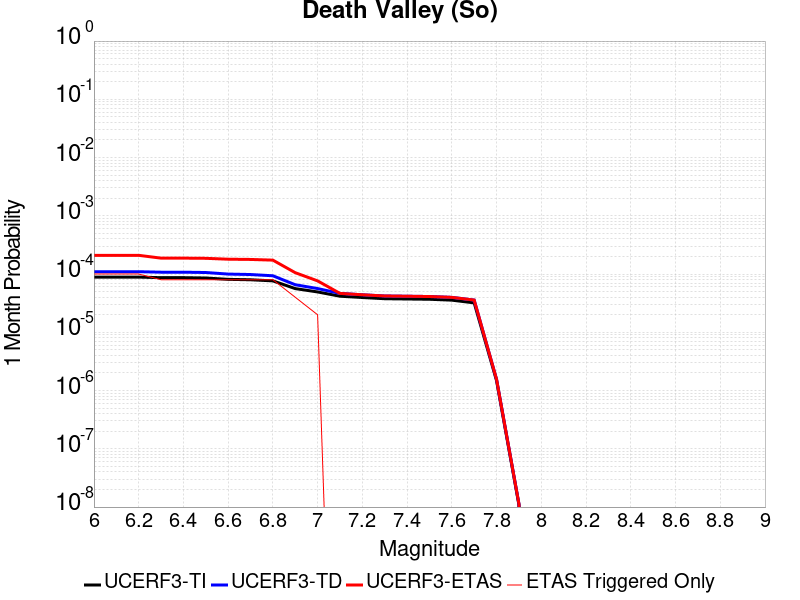 |  |  |

| Magnitude | 1 wk TI Prob | 1 wk TD Prob | 1 wk ETAS Prob | 1 wk ETAS/TD Gain | 1 wk ETAS Triggered Only | 1 mo TI Prob | 1 mo TD Prob | 1 mo ETAS Prob | 1 mo ETAS/TD Gain | 1 mo ETAS Triggered Only | 1 yr TI Prob | 1 yr TD Prob | 1 yr ETAS Prob | 1 yr ETAS/TD Gain | 1 yr ETAS Triggered Only | 10 yr TI Prob | 10 yr TD Prob | 10 yr ETAS Prob | 10 yr ETAS/TD Gain | 10 yr ETAS Triggered Only |
|-----|-----|-----|-----|-----|-----|-----|-----|-----|-----|-----|-----|-----|-----|-----|-----|-----|-----|-----|-----|-----|
| 6.0 | 2.0684236E-5 | 2.562036E-5 | 2.562036E-5 | 1.0 | 0.0 | 8.864371E-5 | 1.0979702E-4 | 1.0979702E-4 | 1.0 | 0.0 | 0.0010787029 | 0.0013359758 | 0.0013359758 | 1.0 | 0.0 | 0.010734817 | 0.013282726 | 0.01474021 | 1.1097279 | 0.0014771048 |
| 6.1 | 2.0684236E-5 | 2.562036E-5 | 2.562036E-5 | 1.0 | 0.0 | 8.864371E-5 | 1.0979702E-4 | 1.0979702E-4 | 1.0 | 0.0 | 0.0010787029 | 0.0013359758 | 0.0013359758 | 1.0 | 0.0 | 0.010734817 | 0.013282726 | 0.01474021 | 1.1097279 | 0.0014771048 |
| 6.2 | 2.0684236E-5 | 2.562036E-5 | 2.562036E-5 | 1.0 | 0.0 | 8.864371E-5 | 1.0979702E-4 | 1.0979702E-4 | 1.0 | 0.0 | 0.0010787029 | 0.0013359758 | 0.0013359758 | 1.0 | 0.0 | 0.010734817 | 0.013282726 | 0.01474021 | 1.1097279 | 0.0014771048 |
| 6.3 | 2.0240292E-5 | 2.5120411E-5 | 2.5120411E-5 | 1.0 | 0.0 | 8.6741224E-5 | 1.0765456E-4 | 1.0765456E-4 | 1.0 | 0.0 | 0.0010555626 | 0.0013099229 | 0.0013099229 | 1.0 | 0.0 | 0.010505628 | 0.013025268 | 0.014483133 | 1.111926 | 0.0014771048 |
| 6.4 | 2.0240292E-5 | 2.5120411E-5 | 2.5120411E-5 | 1.0 | 0.0 | 8.6741224E-5 | 1.0765456E-4 | 1.0765456E-4 | 1.0 | 0.0 | 0.0010555626 | 0.0013099229 | 0.0013099229 | 1.0 | 0.0 | 0.010505628 | 0.013025268 | 0.014483133 | 1.111926 | 0.0014771048 |
| 6.5 | 1.9962767E-5 | 2.4809646E-5 | 2.4809646E-5 | 1.0 | 0.0 | 8.55519E-5 | 1.0632281E-4 | 1.0632281E-4 | 1.0 | 0.0 | 0.0010410968 | 0.0012937282 | 0.0012937282 | 1.0 | 0.0 | 0.010362327 | 0.012865204 | 0.014323306 | 1.1133368 | 0.0014771048 |
| 6.6 | 1.8937297E-5 | 2.331338E-5 | 2.331338E-5 | 1.0 | 0.0 | 8.115732E-5 | 9.991074E-5 | 9.991074E-5 | 1.0 | 0.0 | 9.876423E-4 | 0.0012157491 | 0.0012157491 | 1.0 | 0.0 | 0.009832645 | 0.012094032 | 0.013553273 | 1.1206579 | 0.0014771048 |
| 6.7 | 1.8621096E-5 | 2.2913995E-5 | 2.2913995E-5 | 1.0 | 0.0 | 7.980225E-5 | 9.819922E-5 | 9.819922E-5 | 1.0 | 0.0 | 9.711593E-4 | 0.0011949344 | 0.0011949344 | 1.0 | 0.0 | 0.009669261 | 0.011888134 | 0.013347679 | 1.1227733 | 0.0014771048 |
| 6.8 | 1.7830353E-5 | 2.1807928E-5 | 2.1807928E-5 | 1.0 | 0.0 | 7.641356E-5 | 9.3459275E-5 | 9.3459275E-5 | 1.0 | 0.0 | 9.29938E-4 | 0.0011372868 | 0.0011372868 | 1.0 | 0.0 | 0.009260561 | 0.011317508 | 0.012777896 | 1.129038 | 0.0014771048 |
| 6.9 | 1.3135183E-5 | 1.530519E-5 | 1.530519E-5 | 1.0 | 0.0 | 5.6292425E-5 | 6.559206E-5 | 6.559206E-5 | 1.0 | 0.0 | 6.8514474E-4 | 7.9829723E-4 | 7.9829723E-4 | 1.0 | 0.0 | 0.006830362 | 0.007955303 | 0.007955303 | 1.0 | 0.0 |
| 7.0 | 1.1507512E-5 | 1.3155178E-5 | 1.3155178E-5 | 1.0 | 0.0 | 4.9316975E-5 | 5.6378147E-5 | 5.6378147E-5 | 1.0 | 0.0 | 6.002687E-4 | 6.861935E-4 | 6.861935E-4 | 1.0 | 0.0 | 0.0059864987 | 0.0068414486 | 0.0068414486 | 1.0 | 0.0 |
| 7.1 | 9.715903E-6 | 1.08659815E-5 | 1.08659815E-5 | 1.0 | 0.0 | 4.1638916E-5 | 4.6567682E-5 | 4.6567682E-5 | 1.0 | 0.0 | 5.068359E-4 | 5.6681834E-4 | 5.6681834E-4 | 1.0 | 0.0 | 0.0050568148 | 0.0056541795 | 0.0056541795 | 1.0 | 0.0 |
| 7.2 | 9.233269E-6 | 1.0286961E-5 | 1.0286961E-5 | 1.0 | 0.0 | 3.9570554E-5 | 4.4086253E-5 | 4.4086253E-5 | 1.0 | 0.0 | 4.81665E-4 | 5.366222E-4 | 5.366222E-4 | 1.0 | 0.0 | 0.0048062233 | 0.0053536952 | 0.0053536952 | 1.0 | 0.0 |
| 7.3 | 8.8041315E-6 | 9.80876E-6 | 9.80876E-6 | 1.0 | 0.0 | 3.7731446E-5 | 4.203689E-5 | 4.203689E-5 | 1.0 | 0.0 | 4.592835E-4 | 5.116832E-4 | 5.116832E-4 | 1.0 | 0.0 | 0.0045833546 | 0.005105477 | 0.005105477 | 1.0 | 0.0 |
| 7.4 | 8.708749E-6 | 9.707768E-6 | 9.707768E-6 | 1.0 | 0.0 | 3.7322676E-5 | 4.1604082E-5 | 4.1604082E-5 | 1.0 | 0.0 | 4.5430884E-4 | 5.0641614E-4 | 5.0641614E-4 | 1.0 | 0.0 | 0.004533812 | 0.0050530476 | 0.0050530476 | 1.0 | 0.0 |
| 7.5 | 8.612678E-6 | 9.605406E-6 | 9.605406E-6 | 1.0 | 0.0 | 3.6910955E-5 | 4.1165404E-5 | 4.1165404E-5 | 1.0 | 0.0 | 4.492982E-4 | 5.0107774E-4 | 5.0107774E-4 | 1.0 | 0.0 | 0.004483909 | 0.004999905 | 0.004999905 | 1.0 | 0.0 |
| 7.6 | 8.319024E-6 | 9.28449E-6 | 9.28449E-6 | 1.0 | 0.0 | 3.5652476E-5 | 3.9790088E-5 | 3.9790088E-5 | 1.0 | 0.0 | 4.3398244E-4 | 4.8434082E-4 | 4.8434082E-4 | 1.0 | 0.0 | 0.0043313587 | 0.0048332764 | 0.0048332764 | 1.0 | 0.0 |
| 7.7 | 7.4718328E-6 | 8.345689E-6 | 8.345689E-6 | 1.0 | 0.0 | 3.2021748E-5 | 3.576677E-5 | 3.576677E-5 | 1.0 | 0.0 | 3.8979502E-4 | 4.3537747E-4 | 4.3537747E-4 | 1.0 | 0.0 | 0.00389112 | 0.0043456503 | 0.0043456503 | 1.0 | 0.0 |
| 7.8 | 3.4586725E-7 | 3.648368E-7 | 3.648368E-7 | 1.0 | 0.0 | 1.4822873E-6 | 1.5635853E-6 | 1.5635853E-6 | 1.0 | 0.0 | 1.80467E-5 | 1.903649E-5 | 1.903649E-5 | 1.0 | 0.0 | 1.8045233E-4 | 1.9034903E-4 | 1.9034903E-4 | 1.0 | 0.0 |
| 7.9 | 2.5591178E-9 | 2.6697329E-9 | 2.6697329E-9 | 1.0 | 0.0 | 1.0967647E-8 | 1.14417125E-8 | 1.14417125E-8 | 1.0 | 0.0 | 1.335311E-7 | 1.3930286E-7 | 1.3930286E-7 | 1.0 | 0.0 | 1.3353102E-6 | 1.3930285E-6 | 1.3930285E-6 | 1.0 | 0.0 |

## Gravel Hills-Harper Lk
*[(top)](#table-of-contents)*

| 1 Week | 1 Month | 1 Year | 10 Year |
|-----|-----|-----|-----|
|  |  | 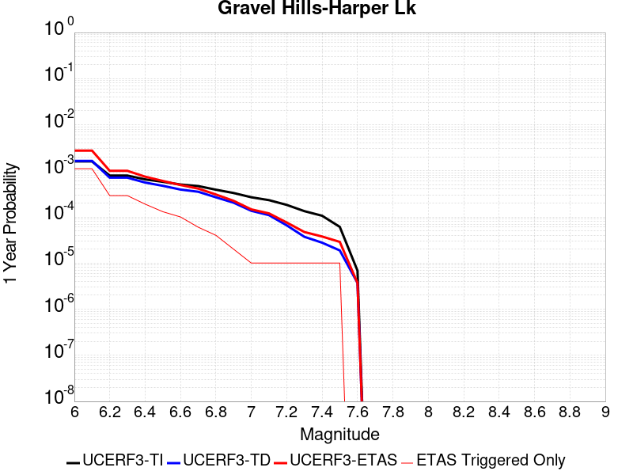 |  |

| Magnitude | 1 wk TI Prob | 1 wk TD Prob | 1 wk ETAS Prob | 1 wk ETAS/TD Gain | 1 wk ETAS Triggered Only | 1 mo TI Prob | 1 mo TD Prob | 1 mo ETAS Prob | 1 mo ETAS/TD Gain | 1 mo ETAS Triggered Only | 1 yr TI Prob | 1 yr TD Prob | 1 yr ETAS Prob | 1 yr ETAS/TD Gain | 1 yr ETAS Triggered Only | 10 yr TI Prob | 10 yr TD Prob | 10 yr ETAS Prob | 10 yr ETAS/TD Gain | 10 yr ETAS Triggered Only |
|-----|-----|-----|-----|-----|-----|-----|-----|-----|-----|-----|-----|-----|-----|-----|-----|-----|-----|-----|-----|-----|
| 6.0 | 3.0679566E-5 | 3.1466803E-5 | 3.1466803E-5 | 1.0 | 0.0 | 1.3147724E-4 | 1.3485197E-4 | 1.3485197E-4 | 1.0 | 0.0 | 0.0015995599 | 0.0016408027 | 0.0016408027 | 1.0 | 0.0 | 0.015880952 | 0.01630845 | 0.017761463 | 1.0890958 | 0.0014771048 |
| 6.1 | 3.0679566E-5 | 3.1466803E-5 | 3.1466803E-5 | 1.0 | 0.0 | 1.3147724E-4 | 1.3485197E-4 | 1.3485197E-4 | 1.0 | 0.0 | 0.0015995599 | 0.0016408027 | 0.0016408027 | 1.0 | 0.0 | 0.015880952 | 0.01630845 | 0.017761463 | 1.0890958 | 0.0014771048 |
| 6.2 | 1.514536E-5 | 1.363595E-5 | 1.363595E-5 | 1.0 | 0.0 | 6.490707E-5 | 5.8438545E-5 | 5.8438545E-5 | 1.0 | 0.0 | 7.8995706E-4 | 7.112689E-4 | 7.112689E-4 | 1.0 | 0.0 | 0.007871548 | 0.007091126 | 0.007091126 | 1.0 | 0.0 |
| 6.3 | 1.514536E-5 | 1.363595E-5 | 1.363595E-5 | 1.0 | 0.0 | 6.490707E-5 | 5.8438545E-5 | 5.8438545E-5 | 1.0 | 0.0 | 7.8995706E-4 | 7.112689E-4 | 7.112689E-4 | 1.0 | 0.0 | 0.007871548 | 0.007091126 | 0.007091126 | 1.0 | 0.0 |
| 6.4 | 1.2532521E-5 | 1.0690234E-5 | 1.0690234E-5 | 1.0 | 0.0 | 5.37097E-5 | 4.5814515E-5 | 4.5814515E-5 | 1.0 | 0.0 | 6.537194E-4 | 5.576548E-4 | 5.576548E-4 | 1.0 | 0.0 | 0.0065179965 | 0.0055631446 | 0.0055631446 | 1.0 | 0.0 |
| 6.5 | 1.1094058E-5 | 9.084107E-6 | 9.084107E-6 | 1.0 | 0.0 | 4.7545094E-5 | 3.8931328E-5 | 3.8931328E-5 | 1.0 | 0.0 | 5.787078E-4 | 4.7388987E-4 | 4.7388987E-4 | 1.0 | 0.0 | 0.0057720304 | 0.004729201 | 0.004729201 | 1.0 | 0.0 |
| 6.6 | 9.688328E-6 | 7.5320527E-6 | 7.5320527E-6 | 1.0 | 0.0 | 4.1520743E-5 | 3.227984E-5 | 3.227984E-5 | 1.0 | 0.0 | 5.053978E-4 | 3.9293873E-4 | 3.9293873E-4 | 1.0 | 0.0 | 0.0050424994 | 0.003922696 | 0.003922696 | 1.0 | 0.0 |
| 6.7 | 8.974824E-6 | 6.7497303E-6 | 6.7497303E-6 | 1.0 | 0.0 | 3.8462964E-5 | 2.8927108E-5 | 2.8927108E-5 | 1.0 | 0.0 | 4.6818596E-4 | 3.5213283E-4 | 3.5213283E-4 | 1.0 | 0.0 | 0.004672008 | 0.0035159695 | 0.0035159695 | 1.0 | 0.0 |
| 6.8 | 7.4780046E-6 | 5.1164316E-6 | 5.1164316E-6 | 1.0 | 0.0 | 3.20482E-5 | 2.1927388E-5 | 2.1927388E-5 | 1.0 | 0.0 | 3.9011694E-4 | 2.6693463E-4 | 2.6693463E-4 | 1.0 | 0.0 | 0.0038943281 | 0.0026662783 | 0.0026662783 | 1.0 | 0.0 |
| 6.9 | 6.3409307E-6 | 3.907683E-6 | 3.907683E-6 | 1.0 | 0.0 | 2.7175134E-5 | 1.674711E-5 | 1.674711E-5 | 1.0 | 0.0 | 3.3080703E-4 | 2.0387798E-4 | 2.0387798E-4 | 1.0 | 0.0 | 0.0033031502 | 0.0020370076 | 0.0020370076 | 1.0 | 0.0 |
| 7.0 | 5.1239335E-6 | 2.6059872E-6 | 2.6059872E-6 | 1.0 | 0.0 | 2.195953E-5 | 1.116847E-5 | 1.116847E-5 | 1.0 | 0.0 | 2.6732447E-4 | 1.3596789E-4 | 1.3596789E-4 | 1.0 | 0.0 | 0.0026700313 | 0.0013588723 | 0.0013588723 | 1.0 | 0.0 |
| 7.1 | 4.438899E-6 | 2.0985822E-6 | 2.0985822E-6 | 1.0 | 0.0 | 1.9023713E-5 | 8.993894E-6 | 8.993894E-6 | 1.0 | 0.0 | 2.315891E-4 | 1.0949538E-4 | 1.0949538E-4 | 1.0 | 0.0 | 0.002313479 | 0.0010944362 | 0.0010944362 | 1.0 | 0.0 |
| 7.2 | 3.50367E-6 | 1.2616524E-6 | 1.2616524E-6 | 1.0 | 0.0 | 1.5015643E-5 | 5.407071E-6 | 5.407071E-6 | 1.0 | 0.0 | 1.8280011E-4 | 6.582918E-5 | 6.582918E-5 | 1.0 | 0.0 | 0.0018264982 | 6.5810507E-4 | 6.5810507E-4 | 1.0 | 0.0 |
| 7.3 | 2.561638E-6 | 7.11978E-7 | 7.11978E-7 | 1.0 | 0.0 | 1.0978401E-5 | 3.0513306E-6 | 3.0513306E-6 | 1.0 | 0.0 | 1.3365384E-4 | 3.7149337E-5 | 3.7149337E-5 | 1.0 | 0.0 | 0.0013357349 | 3.7143327E-4 | 3.7143327E-4 | 1.0 | 0.0 |
| 7.4 | 2.0368864E-6 | 5.3053367E-7 | 5.3053367E-7 | 1.0 | 0.0 | 8.729483E-6 | 2.2737138E-6 | 2.2737138E-6 | 1.0 | 0.0 | 1.06276275E-4 | 2.768212E-5 | 2.768212E-5 | 1.0 | 0.0 | 0.0010622547 | 2.7678726E-4 | 2.7678726E-4 | 1.0 | 0.0 |
| 7.5 | 1.1681728E-6 | 3.6033393E-7 | 3.6033393E-7 | 1.0 | 0.0 | 5.0064455E-6 | 1.5442874E-6 | 1.5442874E-6 | 1.0 | 0.0 | 6.0951766E-5 | 1.8801542E-5 | 1.8801542E-5 | 1.0 | 0.0 | 6.093505E-4 | 1.8799998E-4 | 1.8799998E-4 | 1.0 | 0.0 |
| 7.6 | 1.3154387E-7 | 7.12009E-8 | 7.12009E-8 | 1.0 | 0.0 | 5.6375933E-7 | 3.051467E-7 | 3.051467E-7 | 1.0 | 0.0 | 6.863748E-6 | 3.7151563E-6 | 3.7151563E-6 | 1.0 | 0.0 | 6.863536E-5 | 3.7151098E-5 | 3.7151098E-5 | 1.0 | 0.0 |

