# Parent Section Magnitude-Probability Distributions

Only fault sections with at least one triggered aftershock are plotted. Sections are sorted by total supraseismogenic trigger rate (decreasing)

## Table Of Contents

* [Garlock (Central)](#garlock-central)
* [Tank Canyon](#tank-canyon)
* [Little Lake](#little-lake)
* [Airport Lake](#airport-lake)
* [Owl Lake](#owl-lake)
* [Panamint Valley](#panamint-valley)
* [Garlock (East)](#garlock-east)
* [Ash Hill](#ash-hill)
* [Hunter Mountain-Saline Valley](#hunter-mountain-saline-valley)
* [Blackwater](#blackwater)
* [Garlock (West)](#garlock-west)
* [McLean Lake](#mclean-lake)
* [Gravel Hills-Harper Lk](#gravel-hills-harper-lk)
* [Goldstone Lake](#goldstone-lake)
* [So Sierra Nevada](#so-sierra-nevada)
* [Coyote Canyon](#coyote-canyon)
* [San Andreas (Mojave S)](#san-andreas-mojave-s)
* [San Andreas (Mojave N)](#san-andreas-mojave-n)
* [Death Valley (So)](#death-valley-so)
* [Nelson Lake](#nelson-lake)
* [Towne Pass](#towne-pass)
* [Lenwood-Lockhart-Old Woman Springs](#lenwood-lockhart-old-woman-springs)
* [San Andreas (San Bernardino N)](#san-andreas-san-bernardino-n)
* [Bicycle Lake](#bicycle-lake)
* [Paradise](#paradise)
* [Garlic Springs](#garlic-springs)
* [San Andreas (San Bernardino S)](#san-andreas-san-bernardino-s)
* [Death Valley (Black Mtns Frontal)](#death-valley-black-mtns-frontal)
* [Helendale-So Lockhart](#helendale-so-lockhart)
* [San Andreas (Big Bend)](#san-andreas-big-bend)
* [Cady](#cady)
* [Coyote Lake](#coyote-lake)
* [Death Valley (No)](#death-valley-no)
* [San Andreas (San Gorgonio Pass-Garnet HIll)](#san-andreas-san-gorgonio-pass-garnet-hill)
* [San Andreas (Carrizo) rev](#san-andreas-carrizo-rev)
* [Calico-Hidalgo](#calico-hidalgo)
* [San Andreas (Parkfield)](#san-andreas-parkfield)
* [Sierra Nevada  (No Extension)](#sierra-nevada--no-extension)
* [Lake Isabella (Seismicity)](#lake-isabella-seismicity)
* [San Jacinto (San Bernardino)](#san-jacinto-san-bernardino)
* [San Andreas (Cholame) rev](#san-andreas-cholame-rev)
* [San Andreas (Coachella) rev](#san-andreas-coachella-rev)
* [Manix-Afton Hills](#manix-afton-hills)
* [Santa Ynez (West)](#santa-ynez-west)
* [Red Pass](#red-pass)
* [San Andreas (Creeping Section) 2011 CFM](#san-andreas-creeping-section-2011-cfm)
* [White Wolf (Extension)](#white-wolf-extension)
* [San Jacinto (San Jacinto Valley) rev](#san-jacinto-san-jacinto-valley-rev)
* [Baker](#baker)
* [Death Valley (Fish Lake Valley)](#death-valley-fish-lake-valley)
* [Elsinore (Glen Ivy) rev](#elsinore-glen-ivy-rev)
* [San Jacinto (Stepovers Combined)](#san-jacinto-stepovers-combined)
* [Cleghorn](#cleghorn)
* [Deep Springs](#deep-springs)
* [San Jacinto (Anza) rev](#san-jacinto-anza-rev)
* [Ludlow](#ludlow)
* [Cleghorn Lake](#cleghorn-lake)
* [Santa Rosa Island](#santa-rosa-island)
* [Mission Ridge-Arroyo Parida-Santa Ana](#mission-ridge-arroyo-parida-santa-ana)
* [Brawley (Seismic Zone) alt 1](#brawley-seismic-zone-alt-1)
* [Kern Canyon (South Kern) 2011](#kern-canyon-south-kern-2011)
* [Scodie Lineament](#scodie-lineament)
* [Owens Valley](#owens-valley)
* [Oceanic - West Huasna](#oceanic---west-huasna)
* [Imperial](#imperial)
* [Big Pine (Central)](#big-pine-central)
* [Big Pine (East)](#big-pine-east)
* [Pisgah-Bullion Mtn-Mesquite Lk](#pisgah-bullion-mtn-mesquite-lk)
* [Chino alt 1](#chino-alt-1)
* [San Andreas (North Branch Mill Creek)](#san-andreas-north-branch-mill-creek)
* [Santa Ynez (East)](#santa-ynez-east)
* [White Mountains](#white-mountains)
* [Kern Canyon (Lake Isabella) 2011](#kern-canyon-lake-isabella-2011)
* [Channel Islands Thrust](#channel-islands-thrust)
* [Pleito](#pleito)
* [Elysian Park (Upper)](#elysian-park-upper)
* [Lost Hills](#lost-hills)
* [Santa Cruz Island](#santa-cruz-island)
* [Red Mountain](#red-mountain)
* [Mission Creek](#mission-creek)
* [Whittier alt 1](#whittier-alt-1)
* [Blue Cut](#blue-cut)
* [Independence rev 2011](#independence-rev-2011)
* [Kern Canyon (North Kern) 2011](#kern-canyon-north-kern-2011)
* [San Jacinto (Lytle Creek connector)](#san-jacinto-lytle-creek-connector)
* [San Jacinto (Coyote Creek)](#san-jacinto-coyote-creek)
* [Cleghorn Pass](#cleghorn-pass)
* [San Jacinto (Borrego)](#san-jacinto-borrego)
* [Pinto Mtn](#pinto-mtn)
* [Calaveras (So) 2011 CFM](#calaveras-so-2011-cfm)
* [Ventura-Pitas Point](#ventura-pitas-point)
* [Calaveras (So) - Paicines extension 2011 CFM](#calaveras-so---paicines-extension-2011-cfm)
* [Raymond](#raymond)
* [Ortigalita (South)](#ortigalita-south)
* [San Jacinto (Clark) rev](#san-jacinto-clark-rev)
* [Palos Verdes](#palos-verdes)
* [Earthquake Valley (So Extension)](#earthquake-valley-so-extension)
* [Camp Rock 2011](#camp-rock-2011)
* [San Clemente](#san-clemente)
* [Sheephole](#sheephole)
* [San Jacinto (Superstition Mtn)](#san-jacinto-superstition-mtn)
* [Pine Mtn](#pine-mtn)
* [Ortigalita (North)](#ortigalita-north)
* [San Luis Range 2011 CFM](#san-luis-range-2011-cfm)
* [Green Valley 2011 CFM](#green-valley-2011-cfm)
* [Dry Mountain](#dry-mountain)
* [Elsinore (Coyote Mountains)](#elsinore-coyote-mountains)
* [Clamshell-Sawpit](#clamshell-sawpit)
* [San Cayetano](#san-cayetano)
* [Coronado Bank alt1](#coronado-bank-alt1)
* [Calaveras (Central) 2011 CFM](#calaveras-central-2011-cfm)
* [North Frontal  (West)](#north-frontal--west)
* [Rose Canyon](#rose-canyon)
* [Verdugo](#verdugo)
* [Sierra Madre](#sierra-madre)
* [Hosgri](#hosgri)
* [Pitas Point (Lower West)](#pitas-point-lower-west)
* [Earthquake Valley (No  Extension)](#earthquake-valley-no--extension)
* [Breckenridge 2011](#breckenridge-2011)
* [Cucamonga](#cucamonga)
* [Santa Ynez River](#santa-ynez-river)
* [Hayward (So) 2011 CFM](#hayward-so-2011-cfm)
* [Great Valley 07 (Orestimba)](#great-valley-07-orestimba)
* [Earthquake Valley](#earthquake-valley)
* [San Gabriel](#san-gabriel)
* [Pitas Point (Lower)-Montalvo](#pitas-point-lower-montalvo)
* [Emerson-Copper Mtn 2011](#emerson-copper-mtn-2011)
* [Goose Lake 2011 CFM](#goose-lake-2011-cfm)
* [Peralta Hills](#peralta-hills)
* [Sargent 2011 CFM](#sargent-2011-cfm)
* [Tin Mountain](#tin-mountain)
* [North Frontal  (East)](#north-frontal--east)
* [Oak Ridge (Onshore)](#oak-ridge-onshore)
* [Rodgers Creek - Healdsburg 2011 CFM](#rodgers-creek---healdsburg-2011-cfm)
* [Elmore Ranch](#elmore-ranch)
* [Los Alamos 2011 CFM](#los-alamos-2011-cfm)
* [San Andreas (Offshore) 2011 CFM](#san-andreas-offshore-2011-cfm)
* [Simi-Santa Rosa](#simi-santa-rosa)
* [Newport-Inglewood alt 1](#newport-inglewood-alt-1)
* [Santa Cruz Catalina Ridge alt1](#santa-cruz-catalina-ridge-alt1)
* [Puente Hills](#puente-hills)
* [San Diego Trough south](#san-diego-trough-south)
* [White Wolf](#white-wolf)
* [Homestead Valley 2011](#homestead-valley-2011)
* [Bennett Valley 2011 CFM](#bennett-valley-2011-cfm)
* [Casmalia 2011 CFM](#casmalia-2011-cfm)
* [Great Valley 09 (Laguna Seca)](#great-valley-09-laguna-seca)
* [Anacapa-Dume alt 1](#anacapa-dume-alt-1)
* [Mission (connected) 2011 CFM](#mission-connected-2011-cfm)
* [San Andreas (Peninsula) 2011 CFM](#san-andreas-peninsula-2011-cfm)
* [Bullion Mountains](#bullion-mountains)
* [Channel Islands Western Deep Ramp](#channel-islands-western-deep-ramp)
* [Point Reyes 2011 CFM](#point-reyes-2011-cfm)
* [Hunting Creek - Berryessa 2011 CFM](#hunting-creek---berryessa-2011-cfm)
* [Santa Susana East (connector)](#santa-susana-east-connector)
* [Monte Vista - Shannon 2011 CFM](#monte-vista---shannon-2011-cfm)
* [Elsinore (Julian)](#elsinore-julian)
* [South Klamath Lake West](#south-klamath-lake-west)
* [San Andreas (Santa Cruz Mts) 2011 CFM](#san-andreas-santa-cruz-mts-2011-cfm)
* [South Klamath Lake East](#south-klamath-lake-east)
* [San Jose](#san-jose)
* [Great Valley 03a Dunnigan Hills](#great-valley-03a-dunnigan-hills)
* [Elsinore (Temecula) rev](#elsinore-temecula-rev)
* [Hayward (No) 2011 CFM](#hayward-no-2011-cfm)
* [Santa Susana alt 1](#santa-susana-alt-1)
* [Los Alamos extension](#los-alamos-extension)
* [Malibu Coast alt 1](#malibu-coast-alt-1)
* [Greenville (So) 2011 CFM](#greenville-so-2011-cfm)
* [Newport-Inglewood (Offshore)](#newport-inglewood-offshore)
* [Hayward (So) extension 2011 CFM](#hayward-so-extension-2011-cfm)
* [Hat Creek-McArthur-Mayfield](#hat-creek-mcarthur-mayfield)
* [Likely 2011 CFM](#likely-2011-cfm)
* [Concord 2011 CFM](#concord-2011-cfm)
* [Quien Sabe 2011 CFM](#quien-sabe-2011-cfm)
* [Carson Range (Genoa)](#carson-range-genoa)
* [Elsinore (Stepovers Combined)](#elsinore-stepovers-combined)
* [San Diego Trough north alt1](#san-diego-trough-north-alt1)
* [Elysian Park (Lower CFM)](#elysian-park-lower-cfm)
* [Mono Lake 2011 CFM](#mono-lake-2011-cfm)
* [San Pedro Basin](#san-pedro-basin)

## Garlock (Central)
*[(top)](#table-of-contents)*

| 1 Week | 1 Month | 1 Year | 10 Year |
|-----|-----|-----|-----|
|  |  |  |  |

| Magnitude | 1 wk TI Prob | 1 wk TD Prob | 1 wk ETAS Prob | 1 wk ETAS/TD Gain | 1 wk ETAS Triggered Only | 1 mo TI Prob | 1 mo TD Prob | 1 mo ETAS Prob | 1 mo ETAS/TD Gain | 1 mo ETAS Triggered Only | 1 yr TI Prob | 1 yr TD Prob | 1 yr ETAS Prob | 1 yr ETAS/TD Gain | 1 yr ETAS Triggered Only | 10 yr TI Prob | 10 yr TD Prob | 10 yr ETAS Prob | 10 yr ETAS/TD Gain | 10 yr ETAS Triggered Only |
|-----|-----|-----|-----|-----|-----|-----|-----|-----|-----|-----|-----|-----|-----|-----|-----|-----|-----|-----|-----|-----|
| 6.0 | 5.5131142E-5 | 7.027124E-5 | 0.0020201341 | 28.747667 | 0.00195 | 2.3625491E-4 | 3.0112805E-4 | 0.0076689087 | 25.467268 | 0.00737 | 0.0028726095 | 0.0036601364 | 0.032972455 | 9.008532 | 0.02942 | 0.028357591 | 0.036092084 | 0.08981068 | 2.488376 | 0.05573 |
| 6.1 | 5.5131142E-5 | 7.027124E-5 | 0.0020201341 | 28.747667 | 0.00195 | 2.3625491E-4 | 3.0112805E-4 | 0.0076689087 | 25.467268 | 0.00737 | 0.0028726095 | 0.0036601364 | 0.032972455 | 9.008532 | 0.02942 | 0.028357591 | 0.036092084 | 0.08981068 | 2.488376 | 0.05573 |
| 6.2 | 4.216245E-5 | 5.1683597E-5 | 0.0012216232 | 23.636574 | 0.00117 | 1.806837E-4 | 2.214825E-4 | 0.0046505015 | 20.99715 | 0.00443 | 0.0021976046 | 0.0026932466 | 0.020704607 | 7.6876016 | 0.01806 | 0.021759989 | 0.026701005 | 0.06030902 | 2.2586799 | 0.03453 |
| 6.3 | 4.216245E-5 | 5.1683597E-5 | 0.0012216232 | 23.636574 | 0.00117 | 1.806837E-4 | 2.214825E-4 | 0.0046505015 | 20.99715 | 0.00443 | 0.0021976046 | 0.0026932466 | 0.020704607 | 7.6876016 | 0.01806 | 0.021759989 | 0.026701005 | 0.06030902 | 2.2586799 | 0.03453 |
| 6.4 | 3.6858168E-5 | 4.4131746E-5 | 9.540916E-4 | 21.619167 | 9.1E-4 | 1.5795401E-4 | 1.8912248E-4 | 0.0035884795 | 18.974367 | 0.0034 | 0.0019213937 | 0.00230016 | 0.016248005 | 7.0638585 | 0.01398 | 0.019048655 | 0.022859743 | 0.049281616 | 2.1558254 | 0.02704 |
| 6.5 | 3.39199E-5 | 4.0038896E-5 | 8.100081E-4 | 20.23053 | 7.7E-4 | 1.453629E-4 | 1.715841E-4 | 0.0031010814 | 18.073244 | 0.00293 | 0.0017683565 | 0.0020870569 | 0.014650781 | 7.019829 | 0.01259 | 0.017543508 | 0.020770492 | 0.04485954 | 2.1597724 | 0.0246 |
| 6.6 | 3.3571985E-5 | 3.9493032E-5 | 8.094626E-4 | 20.49634 | 7.7E-4 | 1.4387199E-4 | 1.6924499E-4 | 0.003098749 | 18.309252 | 0.00293 | 0.0017502342 | 0.0020586322 | 0.014612734 | 7.0982738 | 0.01258 | 0.017365133 | 0.020491783 | 0.044548504 | 2.1739693 | 0.02456 |
| 6.7 | 3.2580007E-5 | 3.8109323E-5 | 7.8808074E-4 | 20.679472 | 7.5E-4 | 1.3962112E-4 | 1.6331558E-4 | 0.0029428615 | 18.01948 | 0.00278 | 0.0016985617 | 0.0019865753 | 0.014042578 | 7.0687366 | 0.01208 | 0.016856372 | 0.019784356 | 0.043054674 | 2.176198 | 0.02374 |
| 6.8 | 3.2185937E-5 | 3.7536465E-5 | 7.775087E-4 | 20.713423 | 7.4E-4 | 1.3793244E-4 | 1.6086077E-4 | 0.0029104184 | 18.09278 | 0.00275 | 0.0016780337 | 0.001956742 | 0.0137935355 | 7.0492353 | 0.01186 | 0.016654192 | 0.01949112 | 0.04224873 | 2.1675887 | 0.02321 |
| 6.9 | 3.165394E-5 | 3.6740938E-5 | 7.567145E-4 | 20.59595 | 7.2E-4 | 1.3565269E-4 | 1.5745178E-4 | 0.0028170329 | 17.891401 | 0.00266 | 0.0016503202 | 0.0019153113 | 0.013383305 | 6.9875345 | 0.01149 | 0.01638118 | 0.0190837 | 0.041311264 | 2.1647408 | 0.02266 |
| 7.0 | 3.0903822E-5 | 3.564605E-5 | 7.256215E-4 | 20.356293 | 6.9E-4 | 1.3243823E-4 | 1.5275997E-4 | 0.0027623612 | 18.08302 | 0.00261 | 0.0016112428 | 0.0018582871 | 0.013057437 | 7.026598 | 0.01122 | 0.015996104 | 0.018522795 | 0.040095665 | 2.164666 | 0.02198 |
| 7.1 | 3.0069863E-5 | 3.441218E-5 | 7.143888E-4 | 20.759764 | 6.8E-4 | 1.2886449E-4 | 1.4747256E-4 | 0.0026970964 | 18.288803 | 0.00255 | 0.0015677959 | 0.0017940209 | 0.012584628 | 7.014761 | 0.01081 | 0.01556781 | 0.017890377 | 0.03861289 | 2.1583052 | 0.0211 |
| 7.2 | 2.7957109E-5 | 3.1301115E-5 | 5.912836E-4 | 18.890177 | 5.6E-4 | 1.1981068E-4 | 1.3414085E-4 | 0.0021938644 | 16.354933 | 0.00206 | 0.0014577188 | 0.0016319609 | 0.010607289 | 6.4997206 | 0.00899 | 0.014481937 | 0.016293783 | 0.033636525 | 2.0643778 | 0.01763 |
| 7.3 | 2.4519275E-5 | 2.6733265E-5 | 3.767239E-4 | 14.091952 | 3.5E-4 | 1.0507837E-4 | 1.1456619E-4 | 0.0015244046 | 13.305886 | 0.00141 | 0.0012785783 | 0.0013939656 | 0.007834975 | 5.620637 | 0.00645 | 0.012712469 | 0.013937555 | 0.026716923 | 1.9169018 | 0.01296 |
| 7.4 | 2.3225532E-5 | 2.5217494E-5 | 3.3520968E-4 | 13.292744 | 3.1E-4 | 9.95342E-5 | 1.0807058E-4 | 0.00140793 | 13.027876 | 0.0013 | 0.0012111551 | 0.0013149795 | 0.0071672737 | 5.4504833 | 0.00586 | 0.012045753 | 0.01315504 | 0.024661653 | 1.8746923 | 0.01166 |
| 7.5 | 2.097765E-5 | 2.250088E-5 | 2.924948E-4 | 12.99926 | 2.7E-4 | 8.9901114E-5 | 9.6428856E-5 | 0.0011563266 | 11.991501 | 0.00106 | 0.0010939965 | 0.0011734008 | 0.0058279326 | 4.9667025 | 0.00466 | 0.010886264 | 0.01174923 | 0.02085102 | 1.7746711 | 0.00921 |
| 7.6 | 1.511254E-5 | 1.6007341E-5 | 1.6600495E-4 | 10.370551 | 1.5E-4 | 6.476642E-5 | 6.860113E-5 | 6.785593E-4 | 9.891372 | 6.1E-4 | 7.882459E-4 | 8.3490653E-4 | 0.0035226606 | 4.2192273 | 0.00269 | 0.007854558 | 0.00839184 | 0.013627532 | 1.6239026 | 0.00528 |
| 7.7 | 9.934069E-6 | 1.0693656E-5 | 4.0693336E-5 | 3.8053718 | 3.0E-5 | 4.2573887E-5 | 4.582915E-5 | 1.758232E-4 | 3.8364925 | 1.3E-4 | 5.182138E-4 | 5.578274E-4 | 0.0012874202 | 2.3079185 | 7.3E-4 | 0.00517007 | 0.005635394 | 0.0070374478 | 1.2487943 | 0.00141 |
| 7.8 | 6.7562896E-6 | 8.440562E-6 | 1.8440478E-5 | 2.184745 | 1.0E-5 | 2.8955206E-5 | 3.6173336E-5 | 1.2617008E-4 | 3.4879303 | 9.0E-5 | 3.5247262E-4 | 4.4032154E-4 | 9.00119E-4 | 2.0442312 | 4.6E-4 | 0.0035191406 | 0.0044529405 | 0.005329022 | 1.1967422 | 8.8E-4 |
| 7.9 | 3.975453E-6 | 5.3784297E-6 | 5.3784297E-6 | 1.0 | 0.0 | 1.7037546E-5 | 2.305021E-5 | 6.304929E-5 | 2.7353022 | 4.0E-5 | 2.0741238E-4 | 2.8060027E-4 | 6.0051045E-4 | 2.1400924 | 3.2E-4 | 0.002072189 | 0.0028374717 | 0.0034257977 | 1.2073416 | 5.9E-4 |
| 8.0 | 1.6729537E-6 | 2.0800776E-6 | 2.0800776E-6 | 1.0 | 0.0 | 7.169782E-6 | 8.914588E-6 | 2.891441E-5 | 3.2434936 | 2.0E-5 | 8.7288594E-5 | 1.0852974E-4 | 2.0851889E-4 | 1.9213065 | 1.0E-4 | 8.7254314E-4 | 0.0010982669 | 0.0013080364 | 1.1910003 | 2.1E-4 |
| 8.1 | 3.6733252E-7 | 3.1526864E-7 | 3.1526864E-7 | 1.0 | 0.0 | 1.5742813E-6 | 1.3511507E-6 | 1.3511507E-6 | 1.0 | 0.0 | 1.9166706E-5 | 1.645015E-5 | 1.645015E-5 | 1.0 | 0.0 | 1.9165053E-4 | 1.6658098E-4 | 1.8657764E-4 | 1.1200417 | 2.0E-5 |

## Tank Canyon
*[(top)](#table-of-contents)*

| 1 Week | 1 Month | 1 Year | 10 Year |
|-----|-----|-----|-----|
|  |  | 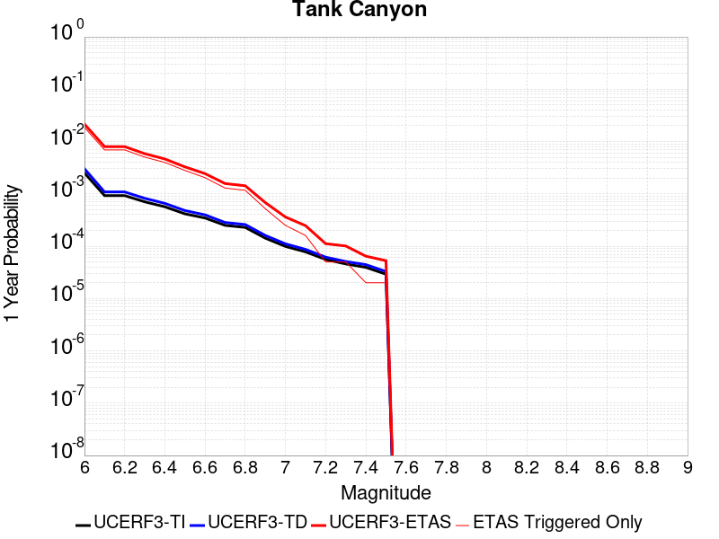 |  |

| Magnitude | 1 wk TI Prob | 1 wk TD Prob | 1 wk ETAS Prob | 1 wk ETAS/TD Gain | 1 wk ETAS Triggered Only | 1 mo TI Prob | 1 mo TD Prob | 1 mo ETAS Prob | 1 mo ETAS/TD Gain | 1 mo ETAS Triggered Only | 1 yr TI Prob | 1 yr TD Prob | 1 yr ETAS Prob | 1 yr ETAS/TD Gain | 1 yr ETAS Triggered Only | 10 yr TI Prob | 10 yr TD Prob | 10 yr ETAS Prob | 10 yr ETAS/TD Gain | 10 yr ETAS Triggered Only |
|-----|-----|-----|-----|-----|-----|-----|-----|-----|-----|-----|-----|-----|-----|-----|-----|-----|-----|-----|-----|-----|
| 6.0 | 4.8284557E-5 | 5.7970923E-5 | 0.0013478962 | 23.251245 | 0.00129 | 2.0691741E-4 | 2.48427E-4 | 0.0048072943 | 19.350933 | 0.00456 | 0.0025163088 | 0.0030210684 | 0.021554906 | 7.134862 | 0.01859 | 0.02488006 | 0.029866708 | 0.06787653 | 2.2726486 | 0.03918 |
| 6.1 | 1.7796336E-5 | 2.0875108E-5 | 6.208626E-4 | 29.741766 | 6.0E-4 | 7.626778E-5 | 8.946191E-5 | 0.001909299 | 21.342035 | 0.00182 | 9.281647E-4 | 0.0010886913 | 0.008001158 | 7.349335 | 0.00692 | 0.009242975 | 0.010837668 | 0.02505193 | 2.311561 | 0.01437 |
| 6.2 | 1.7796336E-5 | 2.0875108E-5 | 6.208626E-4 | 29.741766 | 6.0E-4 | 7.626778E-5 | 8.946191E-5 | 0.001909299 | 21.342035 | 0.00182 | 9.281647E-4 | 0.0010886913 | 0.008001158 | 7.349335 | 0.00692 | 0.009242975 | 0.010837668 | 0.02505193 | 2.311561 | 0.01437 |
| 6.3 | 1.3515912E-5 | 1.5760828E-5 | 4.3575422E-4 | 27.647924 | 4.2E-4 | 5.792405E-5 | 6.7544795E-5 | 0.0013874556 | 20.541267 | 0.00132 | 7.049971E-4 | 8.220716E-4 | 0.005857928 | 7.1258125 | 0.00504 | 0.007027647 | 0.008192917 | 0.018656483 | 2.2771475 | 0.01055 |
| 6.4 | 1.0870146E-5 | 1.2618972E-5 | 3.426148E-4 | 27.15077 | 3.3E-4 | 4.658551E-5 | 5.4080287E-5 | 0.001094024 | 20.229628 | 0.00104 | 5.67031E-4 | 6.582465E-4 | 0.00464562 | 7.057569 | 0.00399 | 0.005655863 | 0.006564983 | 0.014681347 | 2.2363114 | 0.00817 |
| 6.5 | 7.964826E-6 | 9.196723E-6 | 2.491945E-4 | 27.09601 | 2.4E-4 | 3.4134522E-5 | 3.9413993E-5 | 7.793848E-4 | 19.774317 | 7.4E-4 | 4.1550855E-4 | 4.797704E-4 | 0.003278427 | 6.833325 | 0.0028 | 0.0041473247 | 0.0047886474 | 0.01021255 | 2.1326585 | 0.00545 |
| 6.6 | 6.6317E-6 | 7.612777E-6 | 1.8761141E-4 | 24.64428 | 1.8E-4 | 2.8421264E-5 | 3.262583E-5 | 5.6260853E-4 | 17.244267 | 5.3E-4 | 3.4597394E-4 | 3.9715623E-4 | 0.0024363461 | 6.1344776 | 0.00204 | 0.0034543579 | 0.003965616 | 0.008019476 | 2.022252 | 0.00407 |
| 6.7 | 4.793663E-6 | 5.4310603E-6 | 1.0543052E-4 | 19.41251 | 1.0E-4 | 2.0544108E-5 | 2.327579E-5 | 3.5326811E-4 | 15.177491 | 3.3E-4 | 2.500958E-4 | 2.8335027E-4 | 0.0015729847 | 5.551379 | 0.00129 | 0.0024981452 | 0.0028305824 | 0.005183902 | 1.8313906 | 0.00236 |
| 6.8 | 4.382823E-6 | 4.9694927E-6 | 9.4969044E-5 | 19.11041 | 9.0E-5 | 1.8783392E-5 | 2.1297676E-5 | 3.212913E-4 | 15.085744 | 3.0E-4 | 2.286638E-4 | 2.592726E-4 | 0.0014289693 | 5.5114546 | 0.00117 | 0.0022842865 | 0.0025903755 | 0.004704884 | 1.8162942 | 0.00212 |
| 6.9 | 2.729601E-6 | 3.0736521E-6 | 6.3073465E-5 | 20.520693 | 6.0E-5 | 1.1698237E-5 | 1.3172735E-5 | 1.831705E-4 | 13.905274 | 1.7E-4 | 1.4241673E-4 | 1.6036748E-4 | 6.802841E-4 | 4.242033 | 5.2E-4 | 0.001423255 | 0.0016026833 | 0.0025811126 | 1.6104945 | 9.8E-4 |
| 7.0 | 1.8987357E-6 | 2.1269989E-6 | 3.2126936E-5 | 15.104349 | 3.0E-5 | 8.137413E-6 | 9.115682E-6 | 7.9115045E-5 | 8.679005 | 7.0E-5 | 9.90685E-5 | 1.1097847E-4 | 3.6095074E-4 | 3.2524393 | 2.5E-4 | 9.902435E-4 | 0.0011092991 | 0.0015488111 | 1.3962069 | 4.4E-4 |
| 7.1 | 1.4928986E-6 | 1.6641684E-6 | 1.1664151E-5 | 7.0089974 | 1.0E-5 | 6.398121E-6 | 7.1321338E-6 | 5.7131776E-5 | 8.010474 | 5.0E-5 | 7.789434E-5 | 8.683086E-5 | 2.4681696E-4 | 2.8425028 | 1.6E-4 | 7.786704E-4 | 8.680272E-4 | 0.0011477842 | 1.3222905 | 2.8E-4 |
| 7.2 | 1.069082E-6 | 1.1828834E-6 | 1.1182871E-5 | 9.453909 | 1.0E-5 | 4.581772E-6 | 5.0694935E-6 | 2.5069392E-5 | 4.9451475 | 2.0E-5 | 5.5781646E-5 | 6.171987E-5 | 1.1171678E-4 | 1.8100619 | 5.0E-5 | 5.576765E-4 | 6.170795E-4 | 7.0702395E-4 | 1.1457583 | 9.0E-5 |
| 7.3 | 8.776551E-7 | 9.770195E-7 | 1.097701E-5 | 11.2352 | 1.0E-5 | 3.7613736E-6 | 4.1872227E-6 | 2.4187138E-5 | 5.776416 | 2.0E-5 | 4.579376E-5 | 5.0978764E-5 | 1.0097621E-4 | 1.9807506 | 5.0E-5 | 4.5784327E-4 | 5.097217E-4 | 5.896809E-4 | 1.1568683 | 8.0E-5 |
| 7.4 | 7.55721E-7 | 8.510402E-7 | 1.0851032E-5 | 12.750317 | 1.0E-5 | 3.2388E-6 | 3.647313E-6 | 2.364724E-5 | 6.483469 | 2.0E-5 | 3.9431678E-5 | 4.440565E-5 | 6.440476E-5 | 1.4503732 | 2.0E-5 | 3.942468E-4 | 4.440186E-4 | 4.939964E-4 | 1.1125579 | 5.0E-5 |
| 7.5 | 5.587665E-7 | 6.305733E-7 | 1.0630567E-5 | 16.858574 | 1.0E-5 | 2.3947114E-6 | 2.702457E-6 | 2.2702403E-5 | 8.400653 | 2.0E-5 | 2.915522E-5 | 3.2902415E-5 | 5.2901756E-5 | 1.6078382 | 2.0E-5 | 2.9151395E-4 | 3.2902416E-4 | 3.590143E-4 | 1.0911487 | 3.0E-5 |

## Little Lake
*[(top)](#table-of-contents)*

| 1 Week | 1 Month | 1 Year | 10 Year |
|-----|-----|-----|-----|
|  |  |  |  |

| Magnitude | 1 wk TI Prob | 1 wk TD Prob | 1 wk ETAS Prob | 1 wk ETAS/TD Gain | 1 wk ETAS Triggered Only | 1 mo TI Prob | 1 mo TD Prob | 1 mo ETAS Prob | 1 mo ETAS/TD Gain | 1 mo ETAS Triggered Only | 1 yr TI Prob | 1 yr TD Prob | 1 yr ETAS Prob | 1 yr ETAS/TD Gain | 1 yr ETAS Triggered Only | 10 yr TI Prob | 10 yr TD Prob | 10 yr ETAS Prob | 10 yr ETAS/TD Gain | 10 yr ETAS Triggered Only |
|-----|-----|-----|-----|-----|-----|-----|-----|-----|-----|-----|-----|-----|-----|-----|-----|-----|-----|-----|-----|-----|
| 6.0 | 2.8424427E-5 | 3.1207477E-5 | 0.0010811747 | 34.644733 | 0.00105 | 1.2181328E-4 | 1.3374022E-4 | 0.0037932508 | 28.362825 | 0.00366 | 0.0014820677 | 0.0016272042 | 0.014855644 | 9.129551 | 0.01325 | 0.014722223 | 0.016166303 | 0.04045716 | 2.5025609 | 0.02469 |
| 6.1 | 2.8424427E-5 | 3.1207477E-5 | 0.0010811747 | 34.644733 | 0.00105 | 1.2181328E-4 | 1.3374022E-4 | 0.0037932508 | 28.362825 | 0.00366 | 0.0014820677 | 0.0016272042 | 0.014855644 | 9.129551 | 0.01325 | 0.014722223 | 0.016166303 | 0.04045716 | 2.5025609 | 0.02469 |
| 6.2 | 2.8424427E-5 | 3.1207477E-5 | 0.0010811747 | 34.644733 | 0.00105 | 1.2181328E-4 | 1.3374022E-4 | 0.0037932508 | 28.362825 | 0.00366 | 0.0014820677 | 0.0016272042 | 0.014855644 | 9.129551 | 0.01325 | 0.014722223 | 0.016166303 | 0.04045716 | 2.5025609 | 0.02469 |
| 6.3 | 1.48860645E-5 | 1.6082206E-5 | 6.9607125E-4 | 43.282078 | 6.8E-4 | 6.379586E-5 | 6.8922076E-5 | 0.002478756 | 35.964615 | 0.00241 | 7.7643775E-4 | 8.388314E-4 | 0.009431617 | 11.243758 | 0.0086 | 0.007737305 | 0.00835947 | 0.024076972 | 2.8802032 | 0.01585 |
| 6.4 | 1.48860645E-5 | 1.6082206E-5 | 6.9607125E-4 | 43.282078 | 6.8E-4 | 6.379586E-5 | 6.8922076E-5 | 0.002478756 | 35.964615 | 0.00241 | 7.7643775E-4 | 8.388314E-4 | 0.009431617 | 11.243758 | 0.0086 | 0.007737305 | 0.00835947 | 0.024076972 | 2.8802032 | 0.01585 |
| 6.5 | 1.2797581E-5 | 1.3766247E-5 | 6.2375783E-4 | 45.31067 | 6.1E-4 | 5.4845623E-5 | 5.899701E-5 | 0.0022388685 | 37.948845 | 0.00218 | 6.675408E-4 | 7.180776E-4 | 0.00838257 | 11.673627 | 0.00767 | 0.006655392 | 0.007160124 | 0.021119453 | 2.9495933 | 0.01406 |
| 6.6 | 9.661896E-6 | 1.0289519E-5 | 5.302842E-4 | 51.536343 | 5.2E-4 | 4.1407468E-5 | 4.4097287E-5 | 0.0018440179 | 41.81704 | 0.0018 | 5.040193E-4 | 5.3676846E-4 | 0.0070832525 | 13.196105 | 0.00655 | 0.005028777 | 0.0053563244 | 0.017252263 | 3.2209144 | 0.01196 |
| 6.7 | 7.767871E-6 | 8.200053E-6 | 4.5819636E-4 | 55.87724 | 4.5E-4 | 3.329045E-5 | 3.514269E-5 | 0.0016150872 | 45.95798 | 0.00158 | 4.0523586E-4 | 4.27792E-4 | 0.0060953666 | 14.248435 | 0.00567 | 0.004044977 | 0.004271037 | 0.014537003 | 3.4036238 | 0.01031 |
| 6.8 | 6.4235196E-6 | 6.736042E-6 | 3.8673347E-4 | 57.412567 | 3.8E-4 | 2.752908E-5 | 2.8868506E-5 | 0.0013488304 | 46.72325 | 0.00132 | 3.35115E-4 | 3.514302E-4 | 0.0047198944 | 13.4305315 | 0.00437 | 0.003346101 | 0.0035100048 | 0.011561644 | 3.293911 | 0.00808 |
| 6.9 | 3.1283696E-6 | 3.1122859E-6 | 2.1311163E-4 | 68.47431 | 2.1E-4 | 1.3407229E-5 | 1.3338308E-5 | 7.1332895E-4 | 53.47972 | 7.0E-4 | 1.6322079E-4 | 1.6238331E-4 | 0.0026319823 | 16.208454 | 0.00247 | 0.0016310095 | 0.0016227949 | 0.006345119 | 3.9099946 | 0.00473 |
| 7.0 | 2.290603E-6 | 2.2287613E-6 | 1.2222849E-4 | 54.841446 | 1.2E-4 | 9.816834E-6 | 9.551805E-6 | 4.395477E-4 | 46.01724 | 4.3E-4 | 1.19513395E-4 | 1.1628806E-4 | 0.0017261008 | 14.84332 | 0.00161 | 0.0011944914 | 0.0011623743 | 0.0041089454 | 3.5349588 | 0.00295 |
| 7.1 | 1.293693E-6 | 1.1777322E-6 | 8.117764E-5 | 68.92708 | 8.0E-5 | 5.5443866E-6 | 5.0474177E-6 | 2.1504636E-4 | 42.60522 | 2.1E-4 | 6.750081E-5 | 6.1451276E-5 | 9.0139965E-4 | 14.668526 | 8.4E-4 | 6.7480316E-4 | 6.144114E-4 | 0.0021034959 | 3.4235954 | 0.00149 |
| 7.2 | 4.715842E-7 | 3.09202E-7 | 3.09202E-7 | 1.0 | 0.0 | 2.0210737E-6 | 1.3251507E-6 | 1.3251507E-6 | 1.0 | 0.0 | 2.4606294E-5 | 1.6133596E-5 | 4.613311E-5 | 2.859444 | 3.0E-5 | 2.460357E-4 | 1.6132479E-4 | 2.5131027E-4 | 1.5577908 | 9.0E-5 |
| 7.3 | 3.9430947E-7 | 2.3099639E-7 | 2.3099639E-7 | 1.0 | 0.0 | 1.6898966E-6 | 9.899842E-7 | 9.899842E-7 | 1.0 | 0.0 | 2.0574296E-5 | 1.2052991E-5 | 3.205275E-5 | 2.6593192 | 2.0E-5 | 2.0572392E-4 | 1.20523444E-4 | 1.6051863E-4 | 1.3318456 | 4.0E-5 |
| 7.4 | 3.547123E-7 | 1.9681133E-7 | 1.9681133E-7 | 1.0 | 0.0 | 1.5201948E-6 | 8.4347687E-7 | 8.4347687E-7 | 1.0 | 0.0 | 1.8508214E-5 | 1.0269283E-5 | 2.026918E-5 | 1.9737679 | 1.0E-5 | 1.8506673E-4 | 1.02688144E-4 | 1.2268609E-4 | 1.1947445 | 2.0E-5 |
| 7.5 | 2.6354266E-7 | 1.4424535E-7 | 1.4424535E-7 | 1.0 | 0.0 | 1.129468E-6 | 6.1819424E-7 | 6.1819424E-7 | 1.0 | 0.0 | 1.3751187E-5 | 7.5264893E-6 | 1.7526414E-5 | 2.3286307 | 1.0E-5 | 1.3750336E-4 | 7.52624E-5 | 9.526089E-5 | 1.2657169 | 2.0E-5 |
| 7.6 | 1.269913E-7 | 7.573149E-8 | 7.573149E-8 | 1.0 | 0.0 | 5.4424834E-7 | 3.245635E-7 | 3.245635E-7 | 1.0 | 0.0 | 6.6262032E-6 | 3.951554E-6 | 1.3951514E-5 | 3.5306401 | 1.0E-5 | 6.626006E-5 | 3.951487E-5 | 5.951408E-5 | 1.5061185 | 2.0E-5 |

## Airport Lake
*[(top)](#table-of-contents)*

| 1 Week | 1 Month | 1 Year | 10 Year |
|-----|-----|-----|-----|
|  |  |  |  |

| Magnitude | 1 wk TI Prob | 1 wk TD Prob | 1 wk ETAS Prob | 1 wk ETAS/TD Gain | 1 wk ETAS Triggered Only | 1 mo TI Prob | 1 mo TD Prob | 1 mo ETAS Prob | 1 mo ETAS/TD Gain | 1 mo ETAS Triggered Only | 1 yr TI Prob | 1 yr TD Prob | 1 yr ETAS Prob | 1 yr ETAS/TD Gain | 1 yr ETAS Triggered Only | 10 yr TI Prob | 10 yr TD Prob | 10 yr ETAS Prob | 10 yr ETAS/TD Gain | 10 yr ETAS Triggered Only |
|-----|-----|-----|-----|-----|-----|-----|-----|-----|-----|-----|-----|-----|-----|-----|-----|-----|-----|-----|-----|-----|
| 6.0 | 1.2387061E-5 | 1.3103559E-5 | 9.330915E-4 | 71.209015 | 9.2E-4 | 5.3086325E-5 | 5.615706E-5 | 0.0033559718 | 59.76046 | 0.0033 | 6.461343E-4 | 6.8352616E-4 | 0.01190585 | 17.418282 | 0.01123 | 0.0064425888 | 0.006817048 | 0.026293365 | 3.8570018 | 0.01961 |
| 6.1 | 1.2387061E-5 | 1.3103559E-5 | 9.330915E-4 | 71.209015 | 9.2E-4 | 5.3086325E-5 | 5.615706E-5 | 0.0033559718 | 59.76046 | 0.0033 | 6.461343E-4 | 6.8352616E-4 | 0.01190585 | 17.418282 | 0.01123 | 0.0064425888 | 0.006817048 | 0.026293365 | 3.8570018 | 0.01961 |
| 6.2 | 1.2387061E-5 | 1.3103559E-5 | 9.330915E-4 | 71.209015 | 9.2E-4 | 5.3086325E-5 | 5.615706E-5 | 0.0033559718 | 59.76046 | 0.0033 | 6.461343E-4 | 6.8352616E-4 | 0.01190585 | 17.418282 | 0.01123 | 0.0064425888 | 0.006817048 | 0.026293365 | 3.8570018 | 0.01961 |
| 6.3 | 1.2387061E-5 | 1.3103559E-5 | 9.330915E-4 | 71.209015 | 9.2E-4 | 5.3086325E-5 | 5.615706E-5 | 0.0033559718 | 59.76046 | 0.0033 | 6.461343E-4 | 6.8352616E-4 | 0.01190585 | 17.418282 | 0.01123 | 0.0064425888 | 0.006817048 | 0.026293365 | 3.8570018 | 0.01961 |
| 6.4 | 1.2387061E-5 | 1.3103559E-5 | 9.330915E-4 | 71.209015 | 9.2E-4 | 5.3086325E-5 | 5.615706E-5 | 0.0033559718 | 59.76046 | 0.0033 | 6.461343E-4 | 6.8352616E-4 | 0.01190585 | 17.418282 | 0.01123 | 0.0064425888 | 0.006817048 | 0.026293365 | 3.8570018 | 0.01961 |
| 6.5 | 6.9922594E-6 | 7.385145E-6 | 7.0737995E-4 | 95.784164 | 7.0E-4 | 2.996648E-5 | 3.165027E-5 | 0.0024015752 | 75.87851 | 0.00237 | 3.6478083E-4 | 3.8527933E-4 | 0.00871207 | 22.612349 | 0.00833 | 0.003641826 | 0.003846651 | 0.018460222 | 4.799037 | 0.01467 |
| 6.6 | 6.9922594E-6 | 7.385145E-6 | 7.0737995E-4 | 95.784164 | 7.0E-4 | 2.996648E-5 | 3.165027E-5 | 0.0024015752 | 75.87851 | 0.00237 | 3.6478083E-4 | 3.8527933E-4 | 0.00871207 | 22.612349 | 0.00833 | 0.003641826 | 0.003846651 | 0.018460222 | 4.799037 | 0.01467 |
| 6.7 | 5.477277E-6 | 5.7862417E-6 | 6.057828E-4 | 104.69366 | 6.0E-4 | 2.3473833E-5 | 2.4797964E-5 | 0.001994749 | 80.44003 | 0.00197 | 2.8575645E-4 | 3.0187727E-4 | 0.007139812 | 23.651375 | 0.00684 | 0.0028538927 | 0.003015056 | 0.0151782725 | 5.034159 | 0.0122 |
| 6.8 | 3.9950432E-6 | 4.2192128E-6 | 4.542173E-4 | 107.65452 | 4.5E-4 | 1.7121502E-5 | 1.808223E-5 | 0.001578054 | 87.27099 | 0.00156 | 2.0843433E-4 | 2.2013167E-4 | 0.005418987 | 24.617025 | 0.0052 | 0.0020823893 | 0.0021994072 | 0.0113991285 | 5.182819 | 0.00922 |
| 6.9 | 2.95695E-6 | 3.1231173E-6 | 2.8312224E-4 | 90.65373 | 2.8E-4 | 1.2672582E-5 | 1.33847325E-5 | 9.833717E-4 | 73.46966 | 9.7E-4 | 1.5427776E-4 | 1.629492E-4 | 0.0036223854 | 22.23015 | 0.00346 | 0.001541707 | 0.0016285196 | 0.008058032 | 4.948072 | 0.00644 |
| 7.0 | 1.456072E-6 | 1.5408596E-6 | 1.21540674E-4 | 78.87849 | 1.2E-4 | 6.2402937E-6 | 6.603673E-6 | 4.3660082E-4 | 66.114845 | 4.3E-4 | 7.597293E-5 | 8.039776E-5 | 0.0016302732 | 20.277594 | 0.00155 | 7.594696E-4 | 8.0378563E-4 | 0.0035615673 | 4.430991 | 0.00276 |
| 7.1 | 6.995192E-7 | 7.409207E-7 | 8.074086E-5 | 108.97369 | 8.0E-5 | 2.997936E-6 | 3.1753743E-6 | 2.131747E-4 | 67.13372 | 2.1E-4 | 3.649926E-5 | 3.8660182E-5 | 8.2862965E-4 | 21.43367 | 7.9E-4 | 3.6493264E-4 | 3.8660184E-4 | 0.0017560722 | 4.542328 | 0.00137 |

## Owl Lake
*[(top)](#table-of-contents)*

| 1 Week | 1 Month | 1 Year | 10 Year |
|-----|-----|-----|-----|
|  |  | 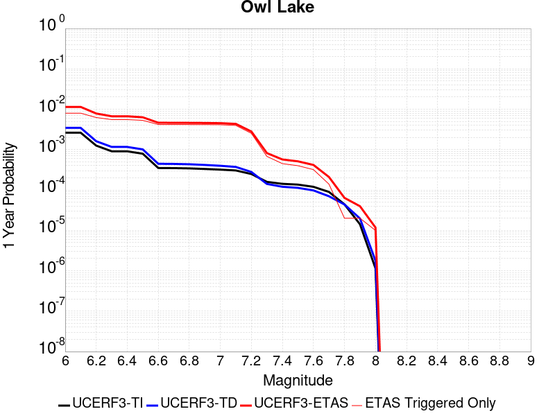 |  |

| Magnitude | 1 wk TI Prob | 1 wk TD Prob | 1 wk ETAS Prob | 1 wk ETAS/TD Gain | 1 wk ETAS Triggered Only | 1 mo TI Prob | 1 mo TD Prob | 1 mo ETAS Prob | 1 mo ETAS/TD Gain | 1 mo ETAS Triggered Only | 1 yr TI Prob | 1 yr TD Prob | 1 yr ETAS Prob | 1 yr ETAS/TD Gain | 1 yr ETAS Triggered Only | 10 yr TI Prob | 10 yr TD Prob | 10 yr ETAS Prob | 10 yr ETAS/TD Gain | 10 yr ETAS Triggered Only |
|-----|-----|-----|-----|-----|-----|-----|-----|-----|-----|-----|-----|-----|-----|-----|-----|-----|-----|-----|-----|-----|
| 6.0 | 5.0320643E-5 | 6.637151E-5 | 4.6634497E-4 | 7.0262823 | 4.0E-4 | 2.1564208E-4 | 2.844246E-4 | 0.0019939383 | 7.010428 | 0.00171 | 0.0026222812 | 0.0034584238 | 0.011420791 | 3.3023112 | 0.00799 | 0.02591553 | 0.034147043 | 0.05027679 | 1.4723613 | 0.0167 |
| 6.1 | 5.0320643E-5 | 6.637151E-5 | 4.6634497E-4 | 7.0262823 | 4.0E-4 | 2.1564208E-4 | 2.844246E-4 | 0.0019939383 | 7.010428 | 0.00171 | 0.0026222812 | 0.0034584238 | 0.011420791 | 3.3023112 | 0.00799 | 0.02591553 | 0.034147043 | 0.05027679 | 1.4723613 | 0.0167 |
| 6.2 | 2.4125871E-5 | 3.098766E-5 | 3.909765E-4 | 12.617168 | 3.6E-4 | 1.0339249E-4 | 1.3279865E-4 | 0.0015426114 | 11.616167 | 0.00141 | 0.0012580766 | 0.0016157742 | 0.007845691 | 4.8556857 | 0.00624 | 0.012509781 | 0.016073797 | 0.02869757 | 1.7853634 | 0.01283 |
| 6.3 | 1.7433485E-5 | 2.2360802E-5 | 3.7235298E-4 | 16.65204 | 3.5E-4 | 7.471279E-5 | 9.582938E-5 | 0.0013857058 | 14.4601345 | 0.00129 | 9.0924866E-4 | 0.0011662478 | 0.006699787 | 5.7447367 | 0.00554 | 0.009055373 | 0.01163159 | 0.02263213 | 1.9457469 | 0.01113 |
| 6.4 | 1.7433485E-5 | 2.2360802E-5 | 3.7235298E-4 | 16.65204 | 3.5E-4 | 7.471279E-5 | 9.582938E-5 | 0.0013857058 | 14.4601345 | 0.00129 | 9.0924866E-4 | 0.0011662478 | 0.006699787 | 5.7447367 | 0.00554 | 0.009055373 | 0.01163159 | 0.02263213 | 1.9457469 | 0.01113 |
| 6.5 | 1.5182742E-5 | 1.9433977E-5 | 3.5942736E-4 | 18.494793 | 3.4E-4 | 6.506727E-5 | 8.3286664E-5 | 0.0013431817 | 16.127213 | 0.00126 | 7.919061E-4 | 0.0010136948 | 0.006318312 | 6.232953 | 0.00531 | 0.0078909 | 0.0101209 | 0.02068291 | 2.043584 | 0.01067 |
| 6.6 | 6.7271576E-6 | 8.550545E-6 | 2.9854805E-4 | 34.915676 | 2.9E-4 | 2.8830356E-5 | 3.6644713E-5 | 0.0011166051 | 30.471113 | 0.00108 | 3.5095305E-4 | 4.460637E-4 | 0.0046341945 | 10.389088 | 0.00419 | 0.0035039932 | 0.0044694655 | 0.012443665 | 2.7841506 | 0.00801 |
| 6.7 | 6.682835E-6 | 8.482986E-6 | 2.9848053E-4 | 35.185783 | 2.9E-4 | 2.8640408E-5 | 3.635518E-5 | 0.001116316 | 30.705828 | 0.00108 | 3.4864116E-4 | 4.4254007E-4 | 0.0046206904 | 10.441292 | 0.00418 | 0.003480947 | 0.004434389 | 0.012398914 | 2.7960815 | 0.008 |
| 6.8 | 6.5774975E-6 | 8.329444E-6 | 2.9832704E-4 | 35.815956 | 2.9E-4 | 2.8188972E-5 | 3.569716E-5 | 0.0011156586 | 31.253426 | 0.00108 | 3.4314668E-4 | 4.3453192E-4 | 0.00460272 | 10.592363 | 0.00417 | 0.0034261728 | 0.004354527 | 0.012299778 | 2.8245955 | 0.00798 |
| 6.9 | 6.363419E-6 | 8.002579E-6 | 2.9800026E-4 | 37.238026 | 2.9E-4 | 2.727151E-5 | 3.429635E-5 | 0.0011142594 | 32.48915 | 0.00108 | 3.3198006E-4 | 4.1748365E-4 | 0.004575747 | 10.960302 | 0.00416 | 0.0033148455 | 0.0041844994 | 0.012101232 | 2.891919 | 0.00795 |
| 7.0 | 6.1342453E-6 | 7.63473E-6 | 2.976325E-4 | 38.984028 | 2.9E-4 | 2.6289357E-5 | 3.271989E-5 | 0.0011126846 | 34.006367 | 0.00108 | 3.2002592E-4 | 3.9829736E-4 | 0.0045266524 | 11.365007 | 0.00413 | 0.0031956544 | 0.0039931675 | 0.011801861 | 2.9555137 | 0.00784 |
| 7.1 | 5.842926E-6 | 7.14521E-6 | 2.9714312E-4 | 41.586338 | 2.9E-4 | 2.504087E-5 | 3.0622E-5 | 0.0010905896 | 35.614574 | 0.00106 | 3.0482994E-4 | 3.7276448E-4 | 0.0043412847 | 11.646186 | 0.00397 | 0.0030441214 | 0.0037385917 | 0.011230477 | 3.0039325 | 0.00752 |
| 7.2 | 4.77173E-6 | 5.361204E-6 | 1.9536019E-4 | 36.43961 | 1.9E-4 | 2.045011E-5 | 2.297641E-5 | 7.0296077E-4 | 30.594893 | 6.8E-4 | 2.4895166E-4 | 2.7970594E-4 | 0.0028089983 | 10.042684 | 0.00253 | 0.0024867293 | 0.0028100624 | 0.007506827 | 2.6714094 | 0.00471 |
| 7.3 | 3.0494948E-6 | 2.7124704E-6 | 1.2712443E-5 | 4.686666 | 1.0E-5 | 1.3069198E-5 | 1.1624823E-5 | 2.116225E-4 | 18.204363 | 2.0E-4 | 1.5910587E-4 | 1.4152318E-4 | 8.21427E-4 | 5.8041863 | 6.8E-4 | 0.0015899199 | 0.0014242887 | 0.0026924799 | 1.8904032 | 0.00127 |
| 7.4 | 2.7263884E-6 | 2.3075613E-6 | 2.3075613E-6 | 1.0 | 0.0 | 1.1684469E-5 | 9.889511E-6 | 1.4988813E-4 | 15.156273 | 1.4E-4 | 1.4224913E-4 | 1.2039825E-4 | 5.703441E-4 | 4.737146 | 4.5E-4 | 0.0014215811 | 0.0012122075 | 0.0020312136 | 1.6756319 | 8.2E-4 |
| 7.5 | 2.6090431E-6 | 2.1674637E-6 | 2.1674637E-6 | 1.0 | 0.0 | 1.1181565E-5 | 9.289097E-6 | 1.3928789E-4 | 14.994772 | 1.3E-4 | 1.3612706E-4 | 1.1308899E-4 | 5.130437E-4 | 4.536638 | 4.0E-4 | 0.001360437 | 0.0011389464 | 0.0018581264 | 1.6314433 | 7.2E-4 |
| 7.6 | 2.3008756E-6 | 1.8745708E-6 | 1.8745708E-6 | 1.0 | 0.0 | 9.860858E-6 | 8.0338505E-6 | 1.2803289E-4 | 15.936678 | 1.2E-4 | 1.20049335E-4 | 9.7807824E-5 | 4.1777652E-4 | 4.271402 | 3.2E-4 | 0.001199845 | 9.85921E-4 | 0.0015253886 | 1.5471712 | 5.4E-4 |
| 7.7 | 1.7184348E-6 | 1.343562E-6 | 1.343562E-6 | 1.0 | 0.0 | 7.3646997E-6 | 5.7581105E-6 | 2.5757996E-5 | 4.4733415 | 2.0E-5 | 8.966153E-5 | 7.010278E-5 | 2.1009297E-4 | 2.9969277 | 1.4E-4 | 8.962536E-4 | 7.086945E-4 | 9.5851737E-4 | 1.3525113 | 2.5E-4 |
| 7.8 | 8.4612907E-7 | 8.4176E-7 | 8.4176E-7 | 1.0 | 0.0 | 3.6262625E-6 | 3.607538E-6 | 1.3607502E-5 | 3.7719636 | 1.0E-5 | 4.4148852E-5 | 4.392091E-5 | 6.392004E-5 | 1.455344 | 2.0E-5 | 4.414008E-4 | 4.4459777E-4 | 4.9457554E-4 | 1.1124113 | 5.0E-5 |
| 7.9 | 2.716738E-7 | 3.7732943E-7 | 3.7732943E-7 | 1.0 | 0.0 | 1.1643157E-6 | 1.6171252E-6 | 1.1617109E-5 | 7.183803 | 1.0E-5 | 1.4175452E-5 | 1.9688332E-5 | 3.9687937E-5 | 2.01581 | 2.0E-5 | 1.4174548E-4 | 1.9863734E-4 | 2.2863138E-4 | 1.150999 | 3.0E-5 |
| 8.0 | 2.1995428E-8 | 3.389418E-8 | 3.389418E-8 | 1.0 | 0.0 | 9.426611E-8 | 1.4526077E-7 | 1.4526077E-7 | 1.0 | 0.0 | 1.1476893E-6 | 1.768549E-6 | 1.1768531E-5 | 6.6543427 | 1.0E-5 | 1.14768345E-5 | 1.798665E-5 | 2.7986469E-5 | 1.5559579 | 1.0E-5 |

## Panamint Valley
*[(top)](#table-of-contents)*

| 1 Week | 1 Month | 1 Year | 10 Year |
|-----|-----|-----|-----|
|  |  |  |  |

| Magnitude | 1 wk TI Prob | 1 wk TD Prob | 1 wk ETAS Prob | 1 wk ETAS/TD Gain | 1 wk ETAS Triggered Only | 1 mo TI Prob | 1 mo TD Prob | 1 mo ETAS Prob | 1 mo ETAS/TD Gain | 1 mo ETAS Triggered Only | 1 yr TI Prob | 1 yr TD Prob | 1 yr ETAS Prob | 1 yr ETAS/TD Gain | 1 yr ETAS Triggered Only | 10 yr TI Prob | 10 yr TD Prob | 10 yr ETAS Prob | 10 yr ETAS/TD Gain | 10 yr ETAS Triggered Only |
|-----|-----|-----|-----|-----|-----|-----|-----|-----|-----|-----|-----|-----|-----|-----|-----|-----|-----|-----|-----|-----|
| 6.0 | 3.0211835E-5 | 3.39879E-5 | 4.7397293E-4 | 13.945343 | 4.4E-4 | 1.2947287E-4 | 1.4565447E-4 | 0.0017654184 | 12.120593 | 0.00162 | 0.0015751923 | 0.0017719301 | 0.008509969 | 4.802655 | 0.00675 | 0.015640736 | 0.017584875 | 0.030739414 | 1.7480599 | 0.01339 |
| 6.1 | 3.0211835E-5 | 3.39879E-5 | 4.7397293E-4 | 13.945343 | 4.4E-4 | 1.2947287E-4 | 1.4565447E-4 | 0.0017654184 | 12.120593 | 0.00162 | 0.0015751923 | 0.0017719301 | 0.008509969 | 4.802655 | 0.00675 | 0.015640736 | 0.017584875 | 0.030739414 | 1.7480599 | 0.01339 |
| 6.2 | 3.0211835E-5 | 3.39879E-5 | 4.7397293E-4 | 13.945343 | 4.4E-4 | 1.2947287E-4 | 1.4565447E-4 | 0.0017654184 | 12.120593 | 0.00162 | 0.0015751923 | 0.0017719301 | 0.008509969 | 4.802655 | 0.00675 | 0.015640736 | 0.017584875 | 0.030739414 | 1.7480599 | 0.01339 |
| 6.3 | 2.8573924E-5 | 3.210589E-5 | 4.6209208E-4 | 14.392751 | 4.3E-4 | 1.2245393E-4 | 1.3758958E-4 | 0.001697375 | 12.336508 | 0.00156 | 0.001489857 | 0.0016738938 | 0.00812308 | 4.852805 | 0.00646 | 0.01479908 | 0.01661945 | 0.029157551 | 1.7544234 | 0.01275 |
| 6.4 | 2.8573924E-5 | 3.210589E-5 | 4.6209208E-4 | 14.392751 | 4.3E-4 | 1.2245393E-4 | 1.3758958E-4 | 0.001697375 | 12.336508 | 0.00156 | 0.001489857 | 0.0016738938 | 0.00812308 | 4.852805 | 0.00646 | 0.01479908 | 0.01661945 | 0.029157551 | 1.7544234 | 0.01275 |
| 6.5 | 2.7468774E-5 | 3.0831525E-5 | 4.5081857E-4 | 14.622001 | 4.2E-4 | 1.1771801E-4 | 1.3212857E-4 | 0.0016319304 | 12.351079 | 0.0015 | 0.0014322745 | 0.0016075056 | 0.00792733 | 4.931448 | 0.00633 | 0.014230782 | 0.015965264 | 0.028167294 | 1.7642862 | 0.0124 |
| 6.6 | 2.6135967E-5 | 2.9255436E-5 | 4.3924345E-4 | 15.01408 | 4.1E-4 | 1.1200648E-4 | 1.2537456E-4 | 0.0015951903 | 12.723396 | 0.00147 | 0.0013628257 | 0.001525393 | 0.0076460424 | 5.0125065 | 0.00613 | 0.013544982 | 0.015155562 | 0.026894908 | 1.7745899 | 0.01192 |
| 6.7 | 2.4498746E-5 | 2.7344193E-5 | 4.1733353E-4 | 15.262237 | 3.9E-4 | 1.04990395E-4 | 1.17184274E-4 | 0.0015070214 | 12.86027 | 0.00139 | 0.0012775084 | 0.0014258098 | 0.0073074116 | 5.125096 | 0.00589 | 0.012701893 | 0.014172745 | 0.0253816 | 1.790874 | 0.01137 |
| 6.8 | 2.2244329E-5 | 2.4938103E-5 | 3.8492912E-4 | 15.435382 | 3.6E-4 | 9.532935E-5 | 1.06873325E-4 | 0.0014167334 | 13.256192 | 0.00131 | 0.0011600169 | 0.0013004278 | 0.0067433408 | 5.185478 | 0.00545 | 0.011539802 | 0.012933899 | 0.023317834 | 1.8028466 | 0.01052 |
| 6.9 | 1.9902658E-5 | 2.2292743E-5 | 3.522854E-4 | 15.802693 | 3.3E-4 | 8.529431E-5 | 9.553693E-5 | 0.0012454271 | 13.036079 | 0.00115 | 0.0010379635 | 0.00116256 | 0.005887061 | 5.063877 | 0.00473 | 0.010331288 | 0.011569886 | 0.02070298 | 1.7893851 | 0.00924 |
| 7.0 | 1.8353881E-5 | 2.0568525E-5 | 3.1056255E-4 | 15.098923 | 2.9E-4 | 7.865712E-5 | 8.814794E-5 | 0.0011280563 | 12.797307 | 0.00104 | 9.5722964E-4 | 0.0010726905 | 0.0054180245 | 5.0508738 | 0.00435 | 0.009531168 | 0.010680057 | 0.019118955 | 1.7901549 | 0.00853 |
| 7.1 | 1.7667631E-5 | 1.9774876E-5 | 2.7976974E-4 | 14.147737 | 2.6E-4 | 7.571623E-5 | 8.474681E-5 | 0.001084662 | 12.798854 | 0.001 | 9.2145515E-4 | 0.0010313216 | 0.00522699 | 5.0682445 | 0.0042 | 0.009176437 | 0.010270242 | 0.01844541 | 1.7960054 | 0.00826 |
| 7.2 | 1.6381597E-5 | 1.8160366E-5 | 2.58156E-4 | 14.215352 | 2.4E-4 | 7.020495E-5 | 7.782792E-5 | 9.6775865E-4 | 12.434595 | 8.9E-4 | 8.544101E-4 | 9.471603E-4 | 0.004663637 | 4.9238095 | 0.00372 | 0.008511325 | 0.0094358865 | 0.016805684 | 1.7810391 | 0.00744 |
| 7.3 | 1.4520491E-5 | 1.5968182E-5 | 2.2596483E-4 | 14.150943 | 2.1E-4 | 6.222919E-5 | 6.8433365E-5 | 8.18382E-4 | 11.958817 | 7.5E-4 | 7.57377E-4 | 8.328739E-4 | 0.004010225 | 4.8149247 | 0.00318 | 0.0075480095 | 0.008300635 | 0.014637594 | 1.7634306 | 0.00639 |
| 7.4 | 1.2852287E-5 | 1.4146948E-5 | 2.1414412E-4 | 15.137125 | 2.0E-4 | 5.5080065E-5 | 6.0628456E-5 | 8.0058357E-4 | 13.204749 | 7.4E-4 | 6.7039346E-4 | 7.379173E-4 | 0.0037656813 | 5.1031213 | 0.00303 | 0.0066837464 | 0.0073575918 | 0.013402784 | 1.8216264 | 0.00609 |
| 7.5 | 1.1637851E-5 | 1.2838205E-5 | 2.1283564E-4 | 16.578302 | 2.0E-4 | 4.987555E-5 | 5.5019806E-5 | 7.949791E-4 | 14.448962 | 7.4E-4 | 6.070656E-4 | 6.6967594E-4 | 0.0036576737 | 5.461856 | 0.00299 | 0.006054099 | 0.006679477 | 0.012619534 | 1.8892996 | 0.00598 |
| 7.6 | 3.0068115E-6 | 3.3335807E-6 | 1.03333245E-4 | 30.997675 | 1.0E-4 | 1.2886271E-5 | 1.4286737E-5 | 3.3428217E-4 | 23.398077 | 3.2E-4 | 1.5687906E-4 | 1.7393442E-4 | 0.0016036857 | 9.220059 | 0.00143 | 0.0015676835 | 0.0017394236 | 0.0045744837 | 2.6298847 | 0.00284 |

## Garlock (East)
*[(top)](#table-of-contents)*

| 1 Week | 1 Month | 1 Year | 10 Year |
|-----|-----|-----|-----|
|  |  |  |  |

| Magnitude | 1 wk TI Prob | 1 wk TD Prob | 1 wk ETAS Prob | 1 wk ETAS/TD Gain | 1 wk ETAS Triggered Only | 1 mo TI Prob | 1 mo TD Prob | 1 mo ETAS Prob | 1 mo ETAS/TD Gain | 1 mo ETAS Triggered Only | 1 yr TI Prob | 1 yr TD Prob | 1 yr ETAS Prob | 1 yr ETAS/TD Gain | 1 yr ETAS Triggered Only | 10 yr TI Prob | 10 yr TD Prob | 10 yr ETAS Prob | 10 yr ETAS/TD Gain | 10 yr ETAS Triggered Only |
|-----|-----|-----|-----|-----|-----|-----|-----|-----|-----|-----|-----|-----|-----|-----|-----|-----|-----|-----|-----|-----|
| 6.0 | 4.5092507E-5 | 6.2917425E-5 | 2.9290296E-4 | 4.655355 | 2.3E-4 | 1.9323928E-4 | 2.6962077E-4 | 0.0012293619 | 4.5595965 | 9.6E-4 | 0.0023501497 | 0.0032781374 | 0.008660436 | 2.641877 | 0.0054 | 0.023254504 | 0.03235903 | 0.043535285 | 1.3453828 | 0.01155 |
| 6.1 | 4.5092507E-5 | 6.2917425E-5 | 2.9290296E-4 | 4.655355 | 2.3E-4 | 1.9323928E-4 | 2.6962077E-4 | 0.0012293619 | 4.5595965 | 9.6E-4 | 0.0023501497 | 0.0032781374 | 0.008660436 | 2.641877 | 0.0054 | 0.023254504 | 0.03235903 | 0.043535285 | 1.3453828 | 0.01155 |
| 6.2 | 2.6674514E-5 | 3.452091E-5 | 2.2451436E-4 | 6.5037208 | 1.9E-4 | 1.1431433E-4 | 1.4793854E-4 | 9.178246E-4 | 6.204094 | 7.7E-4 | 0.0013908884 | 0.0017996968 | 0.005892318 | 3.2740614 | 0.0041 | 0.01382215 | 0.017896036 | 0.026126066 | 1.4598801 | 0.00838 |
| 6.3 | 2.6674514E-5 | 3.452091E-5 | 2.2451436E-4 | 6.5037208 | 1.9E-4 | 1.1431433E-4 | 1.4793854E-4 | 9.178246E-4 | 6.204094 | 7.7E-4 | 0.0013908884 | 0.0017996968 | 0.005892318 | 3.2740614 | 0.0041 | 0.01382215 | 0.017896036 | 0.026126066 | 1.4598801 | 0.00838 |
| 6.4 | 2.5312667E-5 | 3.234991E-5 | 2.2234376E-4 | 6.8730874 | 1.9E-4 | 1.0847834E-4 | 1.3863528E-4 | 9.085285E-4 | 6.553372 | 7.7E-4 | 0.0013199237 | 0.0016866071 | 0.0056798607 | 3.3676252 | 0.004 | 0.013121112 | 0.016783953 | 0.024846323 | 1.4803619 | 0.0082 |
| 6.5 | 2.5312667E-5 | 3.234991E-5 | 2.2234376E-4 | 6.8730874 | 1.9E-4 | 1.0847834E-4 | 1.3863528E-4 | 9.085285E-4 | 6.553372 | 7.7E-4 | 0.0013199237 | 0.0016866071 | 0.0056798607 | 3.3676252 | 0.004 | 0.013121112 | 0.016783953 | 0.024846323 | 1.4803619 | 0.0082 |
| 6.6 | 2.246556E-5 | 2.8144346E-5 | 2.0813927E-4 | 7.3954206 | 1.8E-4 | 9.627742E-5 | 1.20613186E-4 | 8.3052757E-4 | 6.8858767 | 7.1E-4 | 0.0011715472 | 0.0014674999 | 0.005221982 | 3.5584207 | 0.00376 | 0.011653901 | 0.0146240825 | 0.02224104 | 1.5208502 | 0.00773 |
| 6.7 | 2.2241198E-5 | 2.781406E-5 | 2.0780905E-4 | 7.4713674 | 1.8E-4 | 9.531594E-5 | 1.1919779E-4 | 8.291132E-4 | 6.9557757 | 7.1E-4 | 0.0011598538 | 0.0014502906 | 0.0051848665 | 3.5750535 | 0.00374 | 0.011538187 | 0.014454261 | 0.022052819 | 1.5256968 | 0.00771 |
| 6.8 | 1.9528685E-5 | 2.3908038E-5 | 1.8390421E-4 | 7.6921496 | 1.6E-4 | 8.369167E-5 | 1.0245911E-4 | 7.7239046E-4 | 7.538524 | 6.7E-4 | 0.0010184698 | 0.0012467455 | 0.004802307 | 3.8518746 | 0.00356 | 0.010138147 | 0.012441495 | 0.01961117 | 1.5762712 | 0.00726 |
| 6.9 | 1.3318621E-5 | 1.5207374E-5 | 1.3520556E-4 | 8.890788 | 1.2E-4 | 5.7078556E-5 | 6.517287E-5 | 6.2513637E-4 | 9.591972 | 5.6E-4 | 6.9470983E-4 | 7.931965E-4 | 0.003930706 | 4.955526 | 0.00314 | 0.0069254204 | 0.007944281 | 0.014263676 | 1.7954646 | 0.00637 |
| 7.0 | 1.1760853E-5 | 1.3115987E-5 | 1.3311442E-4 | 10.14902 | 1.2E-4 | 5.0402683E-5 | 5.621019E-5 | 6.061793E-4 | 10.784153 | 5.5E-4 | 6.134799E-4 | 6.841492E-4 | 0.0037420557 | 5.469649 | 0.00306 | 0.0061178906 | 0.006860767 | 0.012968573 | 1.8902513 | 0.00615 |
| 7.1 | 1.0064758E-5 | 1.0910848E-5 | 1.3090954E-4 | 11.998109 | 1.2E-4 | 4.3133965E-5 | 4.675996E-5 | 5.767352E-4 | 12.333954 | 5.3E-4 | 5.2502943E-4 | 5.691573E-4 | 0.003507484 | 6.1625915 | 0.00294 | 0.005237907 | 0.005717105 | 0.011583374 | 2.0260909 | 0.0059 |
| 7.2 | 9.768808E-6 | 1.0506669E-5 | 1.305054E-4 | 12.421197 | 1.2E-4 | 4.186565E-5 | 4.5027828E-5 | 5.5500487E-4 | 12.32582 | 5.1E-4 | 5.095951E-4 | 5.480794E-4 | 0.0034564845 | 6.30654 | 0.00291 | 0.0050842804 | 0.0055073434 | 0.011305235 | 2.0527565 | 0.00583 |
| 7.3 | 9.344516E-6 | 9.95218E-6 | 1.2995099E-4 | 13.057539 | 1.2E-4 | 4.004731E-5 | 4.2651525E-5 | 5.2263105E-4 | 12.253513 | 4.8E-4 | 4.8746695E-4 | 5.1916204E-4 | 0.0031777811 | 6.120981 | 0.00266 | 0.0048639905 | 0.0052189473 | 0.010580817 | 2.0273852 | 0.00539 |
| 7.4 | 9.023491E-6 | 9.498219E-6 | 1.0949727E-4 | 11.52819 | 1.0E-4 | 3.867153E-5 | 4.0706036E-5 | 4.8068812E-4 | 11.808768 | 4.4E-4 | 4.7072413E-4 | 4.9548666E-4 | 0.0028843025 | 5.821151 | 0.00239 | 0.004697283 | 0.004982321 | 0.009768356 | 1.9606035 | 0.00481 |
| 7.5 | 7.081253E-6 | 7.0943947E-6 | 6.709397E-5 | 9.457321 | 6.0E-5 | 3.0347876E-5 | 3.0404199E-5 | 2.4039781E-4 | 7.9067307 | 2.1E-4 | 3.6942272E-4 | 3.70109E-4 | 0.0016296427 | 4.4031425 | 0.00126 | 0.003688092 | 0.00372781 | 0.006168677 | 1.6547724 | 0.00245 |
| 7.6 | 6.116396E-6 | 5.9656345E-6 | 3.5965455E-5 | 6.028773 | 3.0E-5 | 2.6212863E-5 | 2.5566756E-5 | 1.6556318E-4 | 6.475721 | 1.4E-4 | 3.1909486E-4 | 3.1123104E-4 | 0.0010809914 | 3.4732761 | 7.7E-4 | 0.0031863707 | 0.0031390795 | 0.0046642767 | 1.485874 | 0.00153 |
| 7.7 | 4.797145E-6 | 4.763327E-6 | 1.4763279E-5 | 3.099363 | 1.0E-5 | 2.055903E-5 | 2.04141E-5 | 1.00412464E-4 | 4.91878 | 8.0E-5 | 2.5027743E-4 | 2.4851345E-4 | 6.7840656E-4 | 2.7298586 | 4.3E-4 | 0.0024999576 | 0.0025124948 | 0.0033503843 | 1.3334891 | 8.4E-4 |
| 7.8 | 3.4028885E-6 | 3.9838537E-6 | 3.9838537E-6 | 1.0 | 0.0 | 1.4583726E-5 | 1.7073547E-5 | 7.7072524E-5 | 4.514148 | 6.0E-5 | 1.775424E-4 | 2.0785068E-4 | 5.077883E-4 | 2.4430437 | 3.0E-4 | 0.0017740062 | 0.0021040295 | 0.0026828093 | 1.2750815 | 5.8E-4 |
| 7.9 | 2.5928412E-6 | 3.3770064E-6 | 3.3770064E-6 | 1.0 | 0.0 | 1.1112129E-5 | 1.4472805E-5 | 4.447237E-5 | 3.0728233 | 3.0E-5 | 1.3528178E-4 | 1.7619222E-4 | 3.861552E-4 | 2.1916702 | 2.1E-4 | 0.0013519945 | 0.0017836117 | 0.0021928805 | 1.2294607 | 4.1E-4 |
| 8.0 | 1.3743648E-6 | 1.6755408E-6 | 1.6755408E-6 | 1.0 | 0.0 | 5.8901214E-6 | 7.1808695E-6 | 2.7180726E-5 | 3.785158 | 2.0E-5 | 7.1709874E-5 | 8.742361E-5 | 1.7741574E-4 | 2.02938 | 9.0E-5 | 7.1686733E-4 | 8.847989E-4 | 0.0010746308 | 1.2145481 | 1.9E-4 |
| 8.1 | 3.6733252E-7 | 3.1526864E-7 | 3.1526864E-7 | 1.0 | 0.0 | 1.5742813E-6 | 1.3511507E-6 | 1.3511507E-6 | 1.0 | 0.0 | 1.9166706E-5 | 1.645015E-5 | 1.645015E-5 | 1.0 | 0.0 | 1.9165053E-4 | 1.6658098E-4 | 1.8657764E-4 | 1.1200417 | 2.0E-5 |

## Ash Hill
*[(top)](#table-of-contents)*

| 1 Week | 1 Month | 1 Year | 10 Year |
|-----|-----|-----|-----|
|  |  |  | 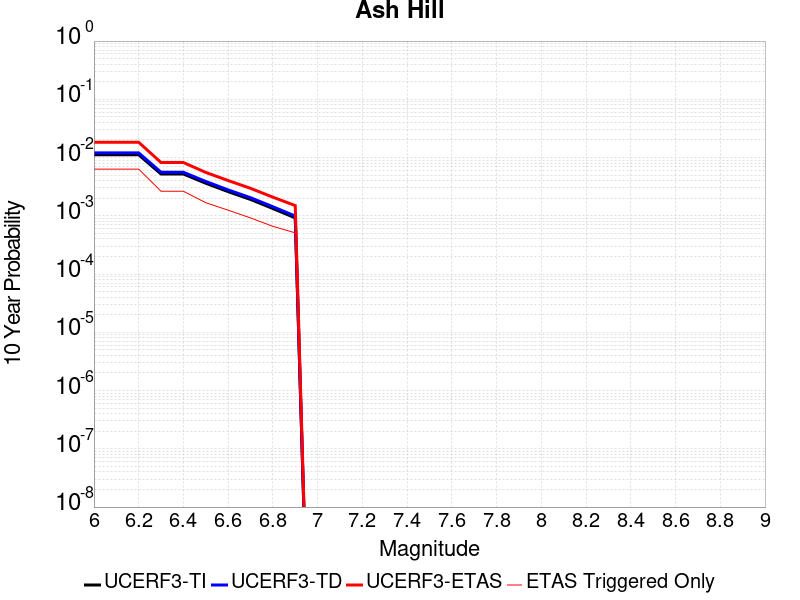 |

| Magnitude | 1 wk TI Prob | 1 wk TD Prob | 1 wk ETAS Prob | 1 wk ETAS/TD Gain | 1 wk ETAS Triggered Only | 1 mo TI Prob | 1 mo TD Prob | 1 mo ETAS Prob | 1 mo ETAS/TD Gain | 1 mo ETAS Triggered Only | 1 yr TI Prob | 1 yr TD Prob | 1 yr ETAS Prob | 1 yr ETAS/TD Gain | 1 yr ETAS Triggered Only | 10 yr TI Prob | 10 yr TD Prob | 10 yr ETAS Prob | 10 yr ETAS/TD Gain | 10 yr ETAS Triggered Only |
|-----|-----|-----|-----|-----|-----|-----|-----|-----|-----|-----|-----|-----|-----|-----|-----|-----|-----|-----|-----|-----|
| 6.0 | 2.1545662E-5 | 2.3195389E-5 | 2.4319028E-4 | 10.484424 | 2.2E-4 | 9.2335285E-5 | 9.940547E-5 | 8.693289E-4 | 8.745282 | 7.7E-4 | 0.0011236023 | 0.0012096697 | 0.0040462343 | 3.3449082 | 0.00284 | 0.011179381 | 0.012038835 | 0.01830251 | 1.5202891 | 0.00634 |
| 6.1 | 2.1545662E-5 | 2.3195389E-5 | 2.4319028E-4 | 10.484424 | 2.2E-4 | 9.2335285E-5 | 9.940547E-5 | 8.693289E-4 | 8.745282 | 7.7E-4 | 0.0011236023 | 0.0012096697 | 0.0040462343 | 3.3449082 | 0.00284 | 0.011179381 | 0.012038835 | 0.01830251 | 1.5202891 | 0.00634 |
| 6.2 | 2.1545662E-5 | 2.3195389E-5 | 2.4319028E-4 | 10.484424 | 2.2E-4 | 9.2335285E-5 | 9.940547E-5 | 8.693289E-4 | 8.745282 | 7.7E-4 | 0.0011236023 | 0.0012096697 | 0.0040462343 | 3.3449082 | 0.00284 | 0.011179381 | 0.012038835 | 0.01830251 | 1.5202891 | 0.00634 |
| 6.3 | 1.0025529E-5 | 1.0747344E-5 | 1.2074616E-4 | 11.234977 | 1.1E-4 | 4.2965847E-5 | 4.605931E-5 | 3.1604688E-4 | 6.8617373 | 2.7E-4 | 5.229836E-4 | 5.6064106E-4 | 0.0017999458 | 3.2105138 | 0.00124 | 0.005217545 | 0.0055935793 | 0.008218813 | 1.4693297 | 0.00264 |
| 6.4 | 1.0025529E-5 | 1.0747344E-5 | 1.2074616E-4 | 11.234977 | 1.1E-4 | 4.2965847E-5 | 4.605931E-5 | 3.1604688E-4 | 6.8617373 | 2.7E-4 | 5.229836E-4 | 5.6064106E-4 | 0.0017999458 | 3.2105138 | 0.00124 | 0.005217545 | 0.0055935793 | 0.008218813 | 1.4693297 | 0.00264 |
| 6.5 | 6.9617327E-6 | 7.4569152E-6 | 7.7456396E-5 | 10.38719 | 7.0E-5 | 2.9835655E-5 | 3.1957865E-5 | 1.8195307E-4 | 5.69353 | 1.5E-4 | 3.6318856E-4 | 3.8902622E-4 | 0.001188715 | 3.0556166 | 8.0E-4 | 0.0036259557 | 0.0038843066 | 0.005557781 | 1.4308296 | 0.00168 |
| 6.6 | 4.9919777E-6 | 5.34689E-6 | 4.5346675E-5 | 8.480945 | 4.0E-5 | 2.1394015E-5 | 2.291508E-5 | 1.1291302E-4 | 4.927455 | 9.0E-5 | 2.60441E-4 | 2.7896208E-4 | 8.2880864E-4 | 2.9710443 | 5.5E-4 | 0.0026013597 | 0.0027867774 | 0.004033294 | 1.4472967 | 0.00125 |
| 6.7 | 3.6630722E-6 | 3.9247725E-6 | 3.3924654E-5 | 8.643725 | 3.0E-5 | 1.5698786E-5 | 1.6820377E-5 | 8.68192E-5 | 5.161549 | 7.0E-5 | 1.9111596E-4 | 2.0477458E-4 | 5.8469677E-4 | 2.855319 | 3.8E-4 | 0.0019095168 | 0.002046422 | 0.0029645392 | 1.4486451 | 9.2E-4 |
| 6.8 | 2.5599613E-6 | 2.7450303E-6 | 1.2745003E-5 | 4.642937 | 1.0E-5 | 1.0971216E-5 | 1.176439E-5 | 4.1764037E-5 | 3.5500383 | 3.0E-5 | 1.3356637E-4 | 1.4322698E-4 | 4.231869E-4 | 2.9546587 | 2.8E-4 | 0.0013348613 | 0.0014318317 | 0.0020908867 | 1.460288 | 6.6E-4 |
| 6.9 | 1.7684905E-6 | 1.8969438E-6 | 1.1896925E-5 | 6.2716274 | 1.0E-5 | 7.579223E-6 | 8.129759E-6 | 3.8129514E-5 | 4.6901164 | 3.0E-5 | 9.2273134E-5 | 9.897981E-5 | 3.1895805E-4 | 3.2224553 | 2.2E-4 | 9.223483E-4 | 9.897981E-4 | 0.0014992934 | 1.5147465 | 5.1E-4 |

## Hunter Mountain-Saline Valley
*[(top)](#table-of-contents)*

| 1 Week | 1 Month | 1 Year | 10 Year |
|-----|-----|-----|-----|
|  |  |  | 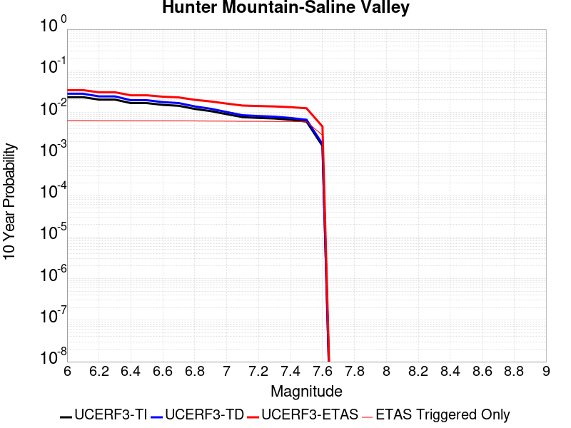 |

| Magnitude | 1 wk TI Prob | 1 wk TD Prob | 1 wk ETAS Prob | 1 wk ETAS/TD Gain | 1 wk ETAS Triggered Only | 1 mo TI Prob | 1 mo TD Prob | 1 mo ETAS Prob | 1 mo ETAS/TD Gain | 1 mo ETAS Triggered Only | 1 yr TI Prob | 1 yr TD Prob | 1 yr ETAS Prob | 1 yr ETAS/TD Gain | 1 yr ETAS Triggered Only | 10 yr TI Prob | 10 yr TD Prob | 10 yr ETAS Prob | 10 yr ETAS/TD Gain | 10 yr ETAS Triggered Only |
|-----|-----|-----|-----|-----|-----|-----|-----|-----|-----|-----|-----|-----|-----|-----|-----|-----|-----|-----|-----|-----|
| 6.0 | 4.5103672E-5 | 5.4576634E-5 | 2.7456463E-4 | 5.030809 | 2.2E-4 | 1.9328714E-4 | 2.3387549E-4 | 0.0010036954 | 4.29158 | 7.7E-4 | 0.002350731 | 0.002843864 | 0.0059649628 | 2.0974853 | 0.00313 | 0.023260195 | 0.028095365 | 0.034325276 | 1.2217416 | 0.00641 |
| 6.1 | 4.5103672E-5 | 5.4576634E-5 | 2.7456463E-4 | 5.030809 | 2.2E-4 | 1.9328714E-4 | 2.3387549E-4 | 0.0010036954 | 4.29158 | 7.7E-4 | 0.002350731 | 0.002843864 | 0.0059649628 | 2.0974853 | 0.00313 | 0.023260195 | 0.028095365 | 0.034325276 | 1.2217416 | 0.00641 |
| 6.2 | 3.9363465E-5 | 4.706859E-5 | 2.470592E-4 | 5.248918 | 2.0E-4 | 1.6868966E-4 | 2.017032E-4 | 9.415539E-4 | 4.668017 | 7.4E-4 | 0.002051862 | 0.0024531104 | 0.005545506 | 2.2606018 | 0.0031 | 0.020330196 | 0.024276383 | 0.03046247 | 1.2548192 | 0.00634 |
| 6.3 | 3.9363465E-5 | 4.706859E-5 | 2.470592E-4 | 5.248918 | 2.0E-4 | 1.6868966E-4 | 2.017032E-4 | 9.415539E-4 | 4.668017 | 7.4E-4 | 0.002051862 | 0.0024531104 | 0.005545506 | 2.2606018 | 0.0031 | 0.020330196 | 0.024276383 | 0.03046247 | 1.2548192 | 0.00634 |
| 6.4 | 3.2311684E-5 | 3.7955346E-5 | 2.3794775E-4 | 6.26915 | 2.0E-4 | 1.384713E-4 | 1.6265604E-4 | 8.925373E-4 | 5.487268 | 7.3E-4 | 0.0016845843 | 0.0019786113 | 0.005062497 | 2.5586114 | 0.00309 | 0.016718714 | 0.019618697 | 0.0257951 | 1.3148222 | 0.0063 |
| 6.5 | 3.2311684E-5 | 3.7955346E-5 | 2.3794775E-4 | 6.26915 | 2.0E-4 | 1.384713E-4 | 1.6265604E-4 | 8.925373E-4 | 5.487268 | 7.3E-4 | 0.0016845843 | 0.0019786113 | 0.005062497 | 2.5586114 | 0.00309 | 0.016718714 | 0.019618697 | 0.0257951 | 1.3148222 | 0.0063 |
| 6.6 | 2.9305844E-5 | 3.4185676E-5 | 2.3417883E-4 | 6.8502035 | 2.0E-4 | 1.2559042E-4 | 1.4650216E-4 | 8.763952E-4 | 5.9821315 | 7.3E-4 | 0.0015279909 | 0.0017822674 | 0.004856778 | 2.725056 | 0.00308 | 0.015175272 | 0.017687662 | 0.023866408 | 1.3493251 | 0.00629 |
| 6.7 | 2.7826512E-5 | 3.234788E-5 | 2.3234141E-4 | 7.182585 | 2.0E-4 | 1.19251024E-4 | 1.3862675E-4 | 8.685256E-4 | 6.2652087 | 7.3E-4 | 0.0014509142 | 0.0016865344 | 0.004751357 | 2.817231 | 0.00307 | 0.014414776 | 0.01674504 | 0.02291988 | 1.3687564 | 0.00628 |
| 6.8 | 2.3389874E-5 | 2.686964E-5 | 2.2686427E-4 | 8.443145 | 2.0E-4 | 1.0023846E-4 | 1.1515078E-4 | 8.4506674E-4 | 7.338784 | 7.3E-4 | 0.00121972 | 0.0014011064 | 0.004446833 | 3.1738012 | 0.00305 | 0.01213047 | 0.013928941 | 0.020072164 | 1.4410402 | 0.00623 |
| 6.9 | 2.069209E-5 | 2.3572567E-5 | 2.2356785E-4 | 9.484239 | 2.0E-4 | 8.867737E-5 | 1.01021586E-4 | 8.309478E-4 | 8.225449 | 7.3E-4 | 0.0010791123 | 0.00122928 | 0.004265543 | 3.4699523 | 0.00304 | 0.010738871 | 0.012229833 | 0.018334253 | 1.4991417 | 0.00618 |
| 7.0 | 1.7462342E-5 | 1.9635625E-5 | 2.196317E-4 | 11.185369 | 2.0E-4 | 7.483646E-5 | 8.4150095E-5 | 8.140887E-4 | 9.674246 | 7.3E-4 | 9.1075303E-4 | 0.0010240684 | 0.0040509654 | 3.9557564 | 0.00303 | 0.009070295 | 0.010197128 | 0.016294314 | 1.5979316 | 0.00616 |
| 7.1 | 1.4807709E-5 | 1.6443486E-5 | 2.164402E-4 | 13.162671 | 2.0E-4 | 6.3460066E-5 | 7.0470276E-5 | 8.0041884E-4 | 11.358248 | 7.3E-4 | 7.723524E-4 | 8.576544E-4 | 0.0038750642 | 4.518212 | 0.00302 | 0.007696735 | 0.008546432 | 0.014604213 | 1.7088083 | 0.00611 |
| 7.2 | 1.4180048E-5 | 1.5700001E-5 | 2.1569685E-4 | 13.738653 | 2.0E-4 | 6.077022E-5 | 6.7284076E-5 | 7.9723494E-4 | 11.848791 | 7.3E-4 | 7.396263E-4 | 8.188919E-4 | 0.003836419 | 4.6848903 | 0.00302 | 0.0073716943 | 0.008161696 | 0.014221828 | 1.7425089 | 0.00611 |
| 7.3 | 1.3730402E-5 | 1.5173691E-5 | 2.1517066E-4 | 14.180508 | 2.0E-4 | 5.8843252E-5 | 6.502858E-5 | 7.949811E-4 | 12.225103 | 7.3E-4 | 7.161811E-4 | 7.914514E-4 | 0.0038090611 | 4.812754 | 0.00302 | 0.007138774 | 0.007889261 | 0.013911373 | 1.7633303 | 0.00607 |
| 7.4 | 1.2810095E-5 | 1.4110805E-5 | 2.1410799E-4 | 15.173336 | 2.0E-4 | 5.489925E-5 | 6.0473565E-5 | 7.904294E-4 | 13.070661 | 7.3E-4 | 6.681934E-4 | 7.360327E-4 | 0.00375381 | 5.1000586 | 0.00302 | 0.006661878 | 0.0073388456 | 0.013354372 | 1.819683 | 0.00606 |
| 7.5 | 1.1595659E-5 | 1.2802062E-5 | 2.127995E-4 | 16.622284 | 2.0E-4 | 4.9694736E-5 | 5.486491E-5 | 7.8482484E-4 | 14.304677 | 7.3E-4 | 6.0486543E-4 | 6.677913E-4 | 0.0036458012 | 5.459492 | 0.00298 | 0.006032217 | 0.006660718 | 0.012571087 | 1.8873471 | 0.00595 |
| 7.6 | 2.997694E-6 | 3.325705E-6 | 1.0332537E-4 | 31.068712 | 1.0E-4 | 1.28471975E-5 | 1.4252984E-5 | 3.342484E-4 | 23.451118 | 3.2E-4 | 1.564034E-4 | 1.7352356E-4 | 0.0016032754 | 9.239526 | 0.00143 | 0.0015629337 | 0.0017353174 | 0.004570389 | 2.6337483 | 0.00284 |

## Blackwater
*[(top)](#table-of-contents)*

| 1 Week | 1 Month | 1 Year | 10 Year |
|-----|-----|-----|-----|
|  |  |  | 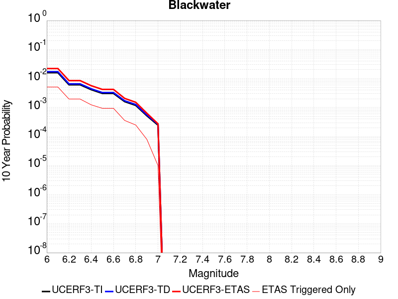 |

| Magnitude | 1 wk TI Prob | 1 wk TD Prob | 1 wk ETAS Prob | 1 wk ETAS/TD Gain | 1 wk ETAS Triggered Only | 1 mo TI Prob | 1 mo TD Prob | 1 mo ETAS Prob | 1 mo ETAS/TD Gain | 1 mo ETAS Triggered Only | 1 yr TI Prob | 1 yr TD Prob | 1 yr ETAS Prob | 1 yr ETAS/TD Gain | 1 yr ETAS Triggered Only | 10 yr TI Prob | 10 yr TD Prob | 10 yr ETAS Prob | 10 yr ETAS/TD Gain | 10 yr ETAS Triggered Only |
|-----|-----|-----|-----|-----|-----|-----|-----|-----|-----|-----|-----|-----|-----|-----|-----|-----|-----|-----|-----|-----|
| 6.0 | 3.0708583E-5 | 3.3097214E-5 | 2.2309093E-4 | 6.740474 | 1.9E-4 | 1.3160157E-4 | 1.4183826E-4 | 5.917744E-4 | 4.172178 | 4.5E-4 | 0.0016010714 | 0.0017256497 | 0.0037920775 | 2.1974783 | 0.00207 | 0.015895851 | 0.017136335 | 0.02214894 | 1.2925133 | 0.0051 |
| 6.1 | 3.0708583E-5 | 3.3097214E-5 | 2.2309093E-4 | 6.740474 | 1.9E-4 | 1.3160157E-4 | 1.4183826E-4 | 5.917744E-4 | 4.172178 | 4.5E-4 | 0.0016010714 | 0.0017256497 | 0.0037920775 | 2.1974783 | 0.00207 | 0.015895851 | 0.017136335 | 0.02214894 | 1.2925133 | 0.0051 |
| 6.2 | 1.1707779E-5 | 1.2545598E-5 | 5.2545096E-5 | 4.188329 | 4.0E-5 | 5.017523E-5 | 5.3765798E-5 | 2.2375665E-4 | 4.1616917 | 1.7E-4 | 6.107122E-4 | 6.5441156E-4 | 0.0014938619 | 2.2827559 | 8.4E-4 | 0.006090366 | 0.0065258164 | 0.008473026 | 1.2983855 | 0.00196 |
| 6.3 | 1.1707779E-5 | 1.2545598E-5 | 5.2545096E-5 | 4.188329 | 4.0E-5 | 5.017523E-5 | 5.3765798E-5 | 2.2375665E-4 | 4.1616917 | 1.7E-4 | 6.107122E-4 | 6.5441156E-4 | 0.0014938619 | 2.2827559 | 8.4E-4 | 0.006090366 | 0.0065258164 | 0.008473026 | 1.2983855 | 0.00196 |
| 6.4 | 7.929244E-6 | 8.4804105E-6 | 3.8480157E-5 | 4.5375347 | 3.0E-5 | 3.3982033E-5 | 3.6344132E-5 | 1.7633905E-4 | 4.851926 | 1.4E-4 | 4.136527E-4 | 4.4240404E-4 | 0.0010021563 | 2.2652512 | 5.6E-4 | 0.0041288356 | 0.0044156383 | 0.005650163 | 1.2795801 | 0.00124 |
| 6.5 | 5.8832115E-6 | 6.286219E-6 | 1.6286156E-5 | 2.5907712 | 1.0E-5 | 2.521352E-5 | 2.6940676E-5 | 1.0693852E-4 | 3.9694076 | 8.0E-5 | 3.0693135E-4 | 3.279559E-4 | 7.3782145E-4 | 2.249758 | 4.1E-4 | 0.0030650778 | 0.0032749726 | 0.0042118942 | 1.2860852 | 9.4E-4 |
| 6.6 | 5.8832115E-6 | 6.286219E-6 | 1.6286156E-5 | 2.5907712 | 1.0E-5 | 2.521352E-5 | 2.6940676E-5 | 1.0693852E-4 | 3.9694076 | 8.0E-5 | 3.0693135E-4 | 3.279559E-4 | 7.3782145E-4 | 2.249758 | 4.1E-4 | 0.0030650778 | 0.0032749726 | 0.0042118942 | 1.2860852 | 9.4E-4 |
| 6.7 | 3.0715053E-6 | 3.2815851E-6 | 3.2815851E-6 | 1.0 | 0.0 | 1.3163528E-5 | 1.4063868E-5 | 4.4063447E-5 | 3.133096 | 3.0E-5 | 1.6025416E-4 | 1.7121529E-4 | 3.0119304E-4 | 1.759148 | 1.3E-4 | 0.0016013865 | 0.0017109484 | 0.0020703324 | 1.2100496 | 3.6E-4 |
| 6.8 | 2.2722281E-6 | 2.4288424E-6 | 2.4288424E-6 | 1.0 | 0.0 | 9.738084E-6 | 1.0409289E-5 | 3.040908E-5 | 2.921341 | 2.0E-5 | 1.1855473E-4 | 1.2672663E-4 | 2.1671523E-4 | 1.7101 | 9.0E-5 | 0.001184915 | 0.0012666339 | 0.0015163171 | 1.1971235 | 2.5E-4 |
| 6.9 | 9.952399E-7 | 1.0653887E-6 | 1.0653887E-6 | 1.0 | 0.0 | 4.265307E-6 | 4.5659463E-6 | 1.45659005E-5 | 3.1901164 | 1.0E-5 | 5.1928873E-5 | 5.5589495E-5 | 7.558838E-5 | 1.3597602 | 2.0E-5 | 5.191674E-4 | 5.558065E-4 | 6.3576206E-4 | 1.143855 | 8.0E-5 |
| 7.0 | 4.7385504E-7 | 5.075751E-7 | 5.075751E-7 | 1.0 | 0.0 | 2.0308057E-6 | 2.175322E-6 | 2.175322E-6 | 1.0 | 0.0 | 2.4724779E-5 | 2.6484544E-5 | 2.6484544E-5 | 1.0 | 0.0 | 2.4722028E-4 | 2.6484544E-4 | 2.7484278E-4 | 1.0377479 | 1.0E-5 |

## Garlock (West)
*[(top)](#table-of-contents)*

| 1 Week | 1 Month | 1 Year | 10 Year |
|-----|-----|-----|-----|
|  |  | 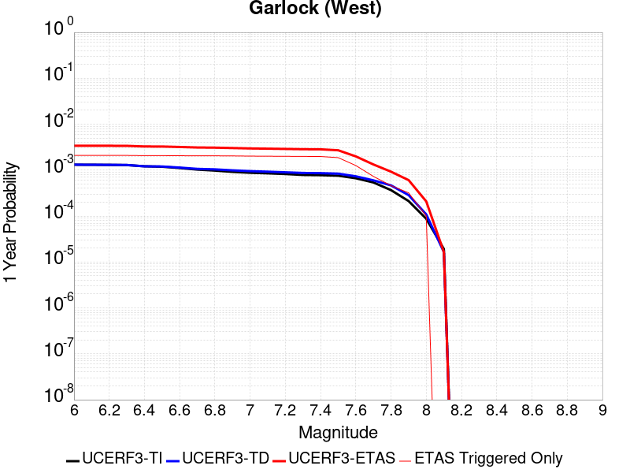 |  |

| Magnitude | 1 wk TI Prob | 1 wk TD Prob | 1 wk ETAS Prob | 1 wk ETAS/TD Gain | 1 wk ETAS Triggered Only | 1 mo TI Prob | 1 mo TD Prob | 1 mo ETAS Prob | 1 mo ETAS/TD Gain | 1 mo ETAS Triggered Only | 1 yr TI Prob | 1 yr TD Prob | 1 yr ETAS Prob | 1 yr ETAS/TD Gain | 1 yr ETAS Triggered Only | 10 yr TI Prob | 10 yr TD Prob | 10 yr ETAS Prob | 10 yr ETAS/TD Gain | 10 yr ETAS Triggered Only |
|-----|-----|-----|-----|-----|-----|-----|-----|-----|-----|-----|-----|-----|-----|-----|-----|-----|-----|-----|-----|-----|
| 6.0 | 2.5181727E-5 | 2.5216661E-5 | 1.0521464E-4 | 4.1724257 | 8.0E-5 | 1.0791722E-4 | 1.08066946E-4 | 5.180226E-4 | 4.7935348 | 4.1E-4 | 0.0013131002 | 0.0013149243 | 0.003402176 | 2.587355 | 0.00209 | 0.013053683 | 0.013151911 | 0.017306542 | 1.3158956 | 0.00421 |
| 6.1 | 2.5077732E-5 | 2.5117724E-5 | 1.05115716E-4 | 4.1849217 | 8.0E-5 | 1.0747157E-4 | 1.0764297E-4 | 5.175988E-4 | 4.808478 | 4.1E-4 | 0.001307681 | 0.0013097686 | 0.0033970312 | 2.5936117 | 0.00209 | 0.013000126 | 0.013100963 | 0.017255807 | 1.3171405 | 0.00421 |
| 6.2 | 2.494612E-5 | 2.4999388E-5 | 1.0499739E-4 | 4.1999984 | 8.0E-5 | 1.0690756E-4 | 1.0713586E-4 | 5.1709195E-4 | 4.8265066 | 4.1E-4 | 0.0013008224 | 0.001303602 | 0.0033908775 | 2.60116 | 0.00209 | 0.012932341 | 0.013040021 | 0.017195122 | 1.3186423 | 0.00421 |
| 6.3 | 2.4733758E-5 | 2.4818735E-5 | 1.0481675E-4 | 4.2232914 | 8.0E-5 | 1.0599751E-4 | 1.0636169E-4 | 5.163181E-4 | 4.8543615 | 4.1E-4 | 0.0012897556 | 0.0012941877 | 0.0033814828 | 2.6128225 | 0.00209 | 0.012822957 | 0.01294698 | 0.017102472 | 1.3209623 | 0.00421 |
| 6.4 | 2.3237335E-5 | 2.3197908E-5 | 1.0319605E-4 | 4.448507 | 8.0E-5 | 9.958477E-5 | 9.941583E-5 | 4.9937604E-4 | 5.023104 | 4.0E-4 | 0.0012117702 | 0.0012097185 | 0.0032772142 | 2.7090719 | 0.00207 | 0.012051838 | 0.012111766 | 0.016221382 | 1.3393077 | 0.00416 |
| 6.5 | 2.2732203E-5 | 2.3012379E-5 | 1.03010534E-4 | 4.47631 | 8.0E-5 | 9.742009E-5 | 9.862077E-5 | 4.985813E-4 | 5.055541 | 4.0E-4 | 0.0011854442 | 0.0012000492 | 0.003267565 | 2.7228591 | 0.00207 | 0.011791403 | 0.012016123 | 0.016126137 | 1.3420415 | 0.00416 |
| 6.6 | 2.1319436E-5 | 2.1792415E-5 | 1.0179067E-4 | 4.6709223 | 8.0E-5 | 9.136581E-5 | 9.339274E-5 | 4.933554E-4 | 5.2825885 | 4.0E-4 | 0.001111811 | 0.0011364657 | 0.0031941247 | 2.8105772 | 0.00206 | 0.011062649 | 0.011386949 | 0.015489693 | 1.3603023 | 0.00415 |
| 6.7 | 1.970802E-5 | 2.0412112E-5 | 1.0041048E-4 | 4.919162 | 8.0E-5 | 8.446021E-5 | 8.747755E-5 | 4.8744256E-4 | 5.5722017 | 4.0E-4 | 0.001027818 | 0.0010645206 | 0.0031123383 | 2.9236996 | 0.00205 | 0.010230771 | 0.01067459 | 0.014770398 | 1.3836969 | 0.00414 |
| 6.8 | 1.8744462E-5 | 1.9919653E-5 | 9.9918056E-5 | 5.016054 | 8.0E-5 | 8.033094E-5 | 8.536715E-5 | 4.85333E-4 | 5.6852427 | 4.0E-4 | 9.775903E-4 | 0.0010388512 | 0.0030867215 | 2.9712837 | 0.00205 | 0.009733009 | 0.010420324 | 0.014517183 | 1.3931605 | 0.00414 |
| 6.9 | 1.7559682E-5 | 1.8971898E-5 | 9.897038E-5 | 5.2166834 | 8.0E-5 | 7.5253614E-5 | 8.13056E-5 | 4.8127308E-4 | 5.91931 | 4.0E-4 | 9.158276E-4 | 9.894476E-4 | 0.003027429 | 3.0597165 | 0.00204 | 0.0091206245 | 0.009930745 | 0.01400983 | 1.4107533 | 0.00412 |
| 7.0 | 1.6794445E-5 | 1.8234585E-5 | 9.8233126E-5 | 5.3871875 | 8.0E-5 | 7.197421E-5 | 7.814589E-5 | 4.781146E-4 | 6.118232 | 4.0E-4 | 8.759337E-4 | 9.5101225E-4 | 0.0029690913 | 3.1220326 | 0.00202 | 0.008724891 | 0.009549588 | 0.01360053 | 1.4242008 | 0.00409 |
| 7.1 | 1.6337795E-5 | 1.7735292E-5 | 9.773387E-5 | 5.5106997 | 8.0E-5 | 7.0017246E-5 | 7.600619E-5 | 4.7597577E-4 | 6.2623296 | 4.0E-4 | 8.521265E-4 | 9.249838E-4 | 0.0029331245 | 3.171001 | 0.00201 | 0.008488664 | 0.009291395 | 0.013303764 | 1.4318372 | 0.00405 |
| 7.2 | 1.5780008E-5 | 1.7183862E-5 | 9.7182485E-5 | 5.655451 | 8.0E-5 | 6.762685E-5 | 7.364305E-5 | 4.736136E-4 | 6.4312057 | 4.0E-4 | 8.2304585E-4 | 8.962366E-4 | 0.0028944442 | 3.2295535 | 0.002 | 0.008200042 | 0.009006202 | 0.012999907 | 1.4434394 | 0.00403 |
| 7.3 | 1.5058865E-5 | 1.6636799E-5 | 9.663547E-5 | 5.8085375 | 8.0E-5 | 6.45364E-5 | 7.129862E-5 | 4.7127012E-4 | 6.6098065 | 4.0E-4 | 7.854473E-4 | 8.6771627E-4 | 0.0028559894 | 3.2913864 | 0.00199 | 0.00782677 | 0.008722834 | 0.012707768 | 1.4568394 | 0.00402 |
| 7.4 | 1.4887923E-5 | 1.647271E-5 | 9.647139E-5 | 5.856437 | 8.0E-5 | 6.380382E-5 | 7.059543E-5 | 4.705672E-4 | 6.6656895 | 4.0E-4 | 7.7653467E-4 | 8.591616E-4 | 0.0028374605 | 3.3025923 | 0.00198 | 0.0077382675 | 0.008637666 | 0.012523806 | 1.4499063 | 0.00392 |
| 7.5 | 1.4509299E-5 | 1.6064607E-5 | 9.606332E-5 | 5.9798117 | 8.0E-5 | 6.218123E-5 | 6.884651E-5 | 4.4882036E-4 | 6.519145 | 3.8E-4 | 7.567935E-4 | 8.37885E-4 | 0.0027063182 | 3.2299397 | 0.00187 | 0.0075422134 | 0.008425911 | 0.012064988 | 1.4318912 | 0.00367 |
| 7.6 | 1.2756717E-5 | 1.4067994E-5 | 6.406729E-5 | 4.554117 | 5.0E-5 | 5.4670498E-5 | 6.029001E-5 | 3.5027252E-4 | 5.8097935 | 2.9E-4 | 6.6541E-4 | 7.3378434E-4 | 0.0019928599 | 2.7158659 | 0.00126 | 0.006634211 | 0.0073905406 | 0.009812508 | 1.3277117 | 0.00244 |
| 7.7 | 1.0328985E-5 | 1.147664E-5 | 4.1476294E-5 | 3.6139755 | 3.0E-5 | 4.4266326E-5 | 4.9184677E-5 | 1.7917829E-4 | 3.6429696 | 1.3E-4 | 5.388092E-4 | 5.986593E-4 | 0.0013282222 | 2.2186615 | 7.3E-4 | 0.0053750467 | 0.006046838 | 0.0074483124 | 1.2317697 | 0.00141 |
| 7.8 | 7.0306583E-6 | 8.912468E-6 | 1.8912378E-5 | 2.1220138 | 1.0E-5 | 3.0131043E-5 | 3.8195732E-5 | 1.2819229E-4 | 3.3561943 | 9.0E-5 | 3.667837E-4 | 4.6493395E-4 | 9.247201E-4 | 1.9889278 | 4.6E-4 | 0.003661789 | 0.0047019436 | 0.005577806 | 1.1862767 | 8.8E-4 |
| 7.9 | 4.060633E-6 | 5.4729326E-6 | 5.4729326E-6 | 1.0 | 0.0 | 1.7402595E-5 | 2.3455215E-5 | 6.345428E-5 | 2.7053375 | 4.0E-5 | 2.11856E-4 | 2.8552994E-4 | 6.0543854E-4 | 2.120403 | 3.2E-4 | 0.0021165414 | 0.0028881172 | 0.0034764132 | 1.2036953 | 5.9E-4 |
| 8.0 | 1.6729537E-6 | 2.0800776E-6 | 2.0800776E-6 | 1.0 | 0.0 | 7.169782E-6 | 8.914588E-6 | 2.891441E-5 | 3.2434936 | 2.0E-5 | 8.7288594E-5 | 1.0852974E-4 | 2.0851889E-4 | 1.9213065 | 1.0E-4 | 8.7254314E-4 | 0.0010982669 | 0.0013080364 | 1.1910003 | 2.1E-4 |
| 8.1 | 3.6733252E-7 | 3.1526864E-7 | 3.1526864E-7 | 1.0 | 0.0 | 1.5742813E-6 | 1.3511507E-6 | 1.3511507E-6 | 1.0 | 0.0 | 1.9166706E-5 | 1.645015E-5 | 1.645015E-5 | 1.0 | 0.0 | 1.9165053E-4 | 1.6658098E-4 | 1.8657764E-4 | 1.1200417 | 2.0E-5 |

## McLean Lake
*[(top)](#table-of-contents)*

| 1 Week | 1 Month | 1 Year | 10 Year |
|-----|-----|-----|-----|
|  |  |  |  |

| Magnitude | 1 wk TI Prob | 1 wk TD Prob | 1 wk ETAS Prob | 1 wk ETAS/TD Gain | 1 wk ETAS Triggered Only | 1 mo TI Prob | 1 mo TD Prob | 1 mo ETAS Prob | 1 mo ETAS/TD Gain | 1 mo ETAS Triggered Only | 1 yr TI Prob | 1 yr TD Prob | 1 yr ETAS Prob | 1 yr ETAS/TD Gain | 1 yr ETAS Triggered Only | 10 yr TI Prob | 10 yr TD Prob | 10 yr ETAS Prob | 10 yr ETAS/TD Gain | 10 yr ETAS Triggered Only |
|-----|-----|-----|-----|-----|-----|-----|-----|-----|-----|-----|-----|-----|-----|-----|-----|-----|-----|-----|-----|-----|
| 6.0 | 1.7360222E-5 | 1.8502275E-5 | 5.8501533E-5 | 3.1618564 | 4.0E-5 | 7.439883E-5 | 7.929332E-5 | 3.192743E-4 | 4.0264964 | 2.4E-4 | 9.0542925E-4 | 9.6501724E-4 | 0.0022337916 | 2.3147686 | 0.00127 | 0.009017491 | 0.009613109 | 0.012722923 | 1.3234973 | 0.00314 |
| 6.1 | 9.062689E-6 | 9.592492E-6 | 1.9592395E-5 | 2.0424721 | 1.0E-5 | 3.8839516E-5 | 4.1110077E-5 | 1.5110556E-4 | 3.675633 | 1.1E-4 | 4.727685E-4 | 5.0040917E-4 | 0.0010801189 | 2.1584716 | 5.8E-4 | 0.0047176396 | 0.0049937065 | 0.0065061157 | 1.3028631 | 0.00152 |
| 6.2 | 9.062689E-6 | 9.592492E-6 | 1.9592395E-5 | 2.0424721 | 1.0E-5 | 3.8839516E-5 | 4.1110077E-5 | 1.5110556E-4 | 3.675633 | 1.1E-4 | 4.727685E-4 | 5.0040917E-4 | 0.0010801189 | 2.1584716 | 5.8E-4 | 0.0047176396 | 0.0049937065 | 0.0065061157 | 1.3028631 | 0.00152 |
| 6.3 | 7.2575485E-6 | 7.66794E-6 | 1.7667862E-5 | 2.3041213 | 1.0E-5 | 3.110341E-5 | 3.2862223E-5 | 1.128596E-4 | 3.4343262 | 8.0E-5 | 3.786182E-4 | 4.0003125E-4 | 8.098672E-4 | 2.02451 | 4.1E-4 | 0.0037797375 | 0.003993816 | 0.005089423 | 1.2743257 | 0.0011 |
| 6.4 | 7.2575485E-6 | 7.66794E-6 | 1.7667862E-5 | 2.3041213 | 1.0E-5 | 3.110341E-5 | 3.2862223E-5 | 1.128596E-4 | 3.4343262 | 8.0E-5 | 3.786182E-4 | 4.0003125E-4 | 8.098672E-4 | 2.02451 | 4.1E-4 | 0.0037797375 | 0.003993816 | 0.005089423 | 1.2743257 | 0.0011 |
| 6.5 | 6.06582E-6 | 6.4040664E-6 | 1.6404003E-5 | 2.5614977 | 1.0E-5 | 2.5996113E-5 | 2.7445747E-5 | 9.744383E-5 | 3.5504162 | 7.0E-5 | 3.164567E-4 | 3.3410723E-4 | 6.6399697E-4 | 1.9873769 | 3.3E-4 | 0.0031600643 | 0.0033366878 | 0.0042137513 | 1.2628546 | 8.8E-4 |
| 6.6 | 5.598744E-6 | 5.910437E-6 | 1.5910378E-5 | 2.6919124 | 1.0E-5 | 2.3994397E-5 | 2.5330233E-5 | 9.532846E-5 | 3.763426 | 7.0E-5 | 2.9209262E-4 | 3.0835834E-4 | 5.88272E-4 | 1.9077544 | 2.8E-4 | 0.0029170897 | 0.003079934 | 0.0038675007 | 1.255709 | 7.9E-4 |
| 6.7 | 5.246996E-6 | 5.5393257E-6 | 1.553927E-5 | 2.8052638 | 1.0E-5 | 2.2486933E-5 | 2.3739787E-5 | 8.373836E-5 | 3.5273426 | 6.0E-5 | 2.73744E-4 | 2.8899993E-4 | 5.2893057E-4 | 1.8302101 | 2.4E-4 | 0.0027340704 | 0.0028868648 | 0.0036247286 | 1.2555934 | 7.4E-4 |
| 6.8 | 4.02324E-6 | 4.2470297E-6 | 1.4246987E-5 | 3.3545768 | 1.0E-5 | 1.7242342E-5 | 1.8201463E-5 | 5.8200734E-5 | 3.1975856 | 4.0E-5 | 2.099053E-4 | 2.2158623E-4 | 4.1154414E-4 | 1.857264 | 1.9E-4 | 0.0020970714 | 0.0022142373 | 0.0027729974 | 1.2523488 | 5.6E-4 |
| 6.9 | 6.835972E-7 | 7.140097E-7 | 7.140097E-7 | 1.0 | 0.0 | 2.9296991E-6 | 3.0600397E-6 | 1.3060009E-5 | 4.2679214 | 1.0E-5 | 3.56685E-5 | 3.7255664E-5 | 9.725343E-5 | 2.6104333 | 6.0E-5 | 3.5662777E-4 | 3.7252545E-4 | 4.5249565E-4 | 1.2146704 | 8.0E-5 |

## Gravel Hills-Harper Lk
*[(top)](#table-of-contents)*

| 1 Week | 1 Month | 1 Year | 10 Year |
|-----|-----|-----|-----|
|  |  |  |  |

| Magnitude | 1 wk TI Prob | 1 wk TD Prob | 1 wk ETAS Prob | 1 wk ETAS/TD Gain | 1 wk ETAS Triggered Only | 1 mo TI Prob | 1 mo TD Prob | 1 mo ETAS Prob | 1 mo ETAS/TD Gain | 1 mo ETAS Triggered Only | 1 yr TI Prob | 1 yr TD Prob | 1 yr ETAS Prob | 1 yr ETAS/TD Gain | 1 yr ETAS Triggered Only | 10 yr TI Prob | 10 yr TD Prob | 10 yr ETAS Prob | 10 yr ETAS/TD Gain | 10 yr ETAS Triggered Only |
|-----|-----|-----|-----|-----|-----|-----|-----|-----|-----|-----|-----|-----|-----|-----|-----|-----|-----|-----|-----|-----|
| 6.0 | 3.0679566E-5 | 3.1466803E-5 | 9.146491E-5 | 2.9067116 | 6.0E-5 | 1.3147724E-4 | 1.3485197E-4 | 3.8481827E-4 | 2.8536346 | 2.5E-4 | 0.0015995599 | 0.0016408027 | 0.0027489814 | 1.6753881 | 0.00111 | 0.015880952 | 0.01630845 | 0.018954579 | 1.1622552 | 0.00269 |
| 6.1 | 3.0679566E-5 | 3.1466803E-5 | 9.146491E-5 | 2.9067116 | 6.0E-5 | 1.3147724E-4 | 1.3485197E-4 | 3.8481827E-4 | 2.8536346 | 2.5E-4 | 0.0015995599 | 0.0016408027 | 0.0027489814 | 1.6753881 | 0.00111 | 0.015880952 | 0.01630845 | 0.018954579 | 1.1622552 | 0.00269 |
| 6.2 | 1.514536E-5 | 1.363595E-5 | 3.363568E-5 | 2.4666913 | 2.0E-5 | 6.490707E-5 | 5.8438545E-5 | 1.0843562E-4 | 1.8555497 | 5.0E-5 | 7.8995706E-4 | 7.112689E-4 | 0.0010010627 | 1.4074321 | 2.9E-4 | 0.007871548 | 0.007091126 | 0.007835807 | 1.105016 | 7.5E-4 |
| 6.3 | 1.514536E-5 | 1.363595E-5 | 3.363568E-5 | 2.4666913 | 2.0E-5 | 6.490707E-5 | 5.8438545E-5 | 1.0843562E-4 | 1.8555497 | 5.0E-5 | 7.8995706E-4 | 7.112689E-4 | 0.0010010627 | 1.4074321 | 2.9E-4 | 0.007871548 | 0.007091126 | 0.007835807 | 1.105016 | 7.5E-4 |
| 6.4 | 1.2532521E-5 | 1.0690234E-5 | 1.0690234E-5 | 1.0 | 0.0 | 5.37097E-5 | 4.5814515E-5 | 6.58136E-5 | 1.4365228 | 2.0E-5 | 6.537194E-4 | 5.576548E-4 | 7.475489E-4 | 1.3405225 | 1.9E-4 | 0.0065179965 | 0.0055631446 | 0.0060404744 | 1.0858021 | 4.8E-4 |
| 6.5 | 1.1094058E-5 | 9.084107E-6 | 9.084107E-6 | 1.0 | 0.0 | 4.7545094E-5 | 3.8931328E-5 | 5.893055E-5 | 1.5137051 | 2.0E-5 | 5.787078E-4 | 4.7388987E-4 | 6.038283E-4 | 1.2741953 | 1.3E-4 | 0.0057720304 | 0.004729201 | 0.005067593 | 1.0715537 | 3.4E-4 |
| 6.6 | 9.688328E-6 | 7.5320527E-6 | 7.5320527E-6 | 1.0 | 0.0 | 4.1520743E-5 | 3.227984E-5 | 3.227984E-5 | 1.0 | 0.0 | 5.053978E-4 | 3.9293873E-4 | 4.9289945E-4 | 1.2543926 | 1.0E-4 | 0.0050424994 | 0.003922696 | 0.004151794 | 1.0584031 | 2.3E-4 |
| 6.7 | 8.974824E-6 | 6.7497303E-6 | 6.7497303E-6 | 1.0 | 0.0 | 3.8462964E-5 | 2.8927108E-5 | 2.8927108E-5 | 1.0 | 0.0 | 4.6818596E-4 | 3.5213283E-4 | 4.121117E-4 | 1.1703303 | 6.0E-5 | 0.004672008 | 0.0035159695 | 0.003685372 | 1.0481808 | 1.7E-4 |
| 6.8 | 7.4780046E-6 | 5.1164316E-6 | 5.1164316E-6 | 1.0 | 0.0 | 3.20482E-5 | 2.1927388E-5 | 2.1927388E-5 | 1.0 | 0.0 | 3.9011694E-4 | 2.6693463E-4 | 3.0692396E-4 | 1.1498095 | 4.0E-5 | 0.0038943281 | 0.0026662783 | 0.0027759848 | 1.041146 | 1.1E-4 |
| 6.9 | 6.3409307E-6 | 3.907683E-6 | 3.907683E-6 | 1.0 | 0.0 | 2.7175134E-5 | 1.674711E-5 | 1.674711E-5 | 1.0 | 0.0 | 3.3080703E-4 | 2.0387798E-4 | 2.2387391E-4 | 1.0980779 | 2.0E-5 | 0.0033031502 | 0.0020370076 | 0.0021168448 | 1.0391933 | 8.0E-5 |
| 7.0 | 5.1239335E-6 | 2.6059872E-6 | 2.6059872E-6 | 1.0 | 0.0 | 2.195953E-5 | 1.116847E-5 | 1.116847E-5 | 1.0 | 0.0 | 2.6732447E-4 | 1.3596789E-4 | 1.4596654E-4 | 1.0735368 | 1.0E-5 | 0.0026700313 | 0.0013588723 | 0.0013888315 | 1.0220472 | 3.0E-5 |
| 7.1 | 4.438899E-6 | 2.0985822E-6 | 2.0985822E-6 | 1.0 | 0.0 | 1.9023713E-5 | 8.993894E-6 | 8.993894E-6 | 1.0 | 0.0 | 2.315891E-4 | 1.0949538E-4 | 1.1949428E-4 | 1.091318 | 1.0E-5 | 0.002313479 | 0.0010944362 | 0.0011244033 | 1.0273814 | 3.0E-5 |
| 7.2 | 3.50367E-6 | 1.2616524E-6 | 1.2616524E-6 | 1.0 | 0.0 | 1.5015643E-5 | 5.407071E-6 | 5.407071E-6 | 1.0 | 0.0 | 1.8280011E-4 | 6.582918E-5 | 7.5828524E-5 | 1.1518983 | 1.0E-5 | 0.0018264982 | 6.5810507E-4 | 6.8808533E-4 | 1.0455555 | 3.0E-5 |
| 7.3 | 2.561638E-6 | 7.11978E-7 | 7.11978E-7 | 1.0 | 0.0 | 1.0978401E-5 | 3.0513306E-6 | 3.0513306E-6 | 1.0 | 0.0 | 1.3365384E-4 | 3.7149337E-5 | 4.7148966E-5 | 1.2691739 | 1.0E-5 | 0.0013357349 | 3.7143327E-4 | 3.8142956E-4 | 1.0269127 | 1.0E-5 |
| 7.4 | 2.0368864E-6 | 5.3053367E-7 | 5.3053367E-7 | 1.0 | 0.0 | 8.729483E-6 | 2.2737138E-6 | 2.2737138E-6 | 1.0 | 0.0 | 1.06276275E-4 | 2.768212E-5 | 3.7681843E-5 | 1.3612341 | 1.0E-5 | 0.0010622547 | 2.7678726E-4 | 2.867845E-4 | 1.0361189 | 1.0E-5 |
| 7.5 | 1.1681728E-6 | 3.6033393E-7 | 3.6033393E-7 | 1.0 | 0.0 | 5.0064455E-6 | 1.5442874E-6 | 1.5442874E-6 | 1.0 | 0.0 | 6.0951766E-5 | 1.8801542E-5 | 2.8801354E-5 | 1.5318613 | 1.0E-5 | 6.093505E-4 | 1.8799998E-4 | 1.979981E-4 | 1.0531815 | 1.0E-5 |
| 7.6 | 1.3154387E-7 | 7.12009E-8 | 7.12009E-8 | 1.0 | 0.0 | 5.6375933E-7 | 3.051467E-7 | 3.051467E-7 | 1.0 | 0.0 | 6.863748E-6 | 3.7151563E-6 | 3.7151563E-6 | 1.0 | 0.0 | 6.863536E-5 | 3.7151098E-5 | 3.7151098E-5 | 1.0 | 0.0 |

## Goldstone Lake
*[(top)](#table-of-contents)*

| 1 Week | 1 Month | 1 Year | 10 Year |
|-----|-----|-----|-----|
|  |  |  |  |

| Magnitude | 1 wk TI Prob | 1 wk TD Prob | 1 wk ETAS Prob | 1 wk ETAS/TD Gain | 1 wk ETAS Triggered Only | 1 mo TI Prob | 1 mo TD Prob | 1 mo ETAS Prob | 1 mo ETAS/TD Gain | 1 mo ETAS Triggered Only | 1 yr TI Prob | 1 yr TD Prob | 1 yr ETAS Prob | 1 yr ETAS/TD Gain | 1 yr ETAS Triggered Only | 10 yr TI Prob | 10 yr TD Prob | 10 yr ETAS Prob | 10 yr ETAS/TD Gain | 10 yr ETAS Triggered Only |
|-----|-----|-----|-----|-----|-----|-----|-----|-----|-----|-----|-----|-----|-----|-----|-----|-----|-----|-----|-----|-----|
| 6.0 | 2.671352E-5 | 3.0378242E-5 | 4.0377938E-5 | 1.329173 | 1.0E-5 | 1.1448149E-4 | 1.3018708E-4 | 3.2016233E-4 | 2.4592483 | 1.9E-4 | 0.001392921 | 0.0015840717 | 0.0025824877 | 1.6302845 | 0.001 | 0.013842222 | 0.015747305 | 0.018257149 | 1.1593825 | 0.00255 |
| 6.1 | 2.671352E-5 | 3.0378242E-5 | 4.0377938E-5 | 1.329173 | 1.0E-5 | 1.1448149E-4 | 1.3018708E-4 | 3.2016233E-4 | 2.4592483 | 1.9E-4 | 0.001392921 | 0.0015840717 | 0.0025824877 | 1.6302845 | 0.001 | 0.013842222 | 0.015747305 | 0.018257149 | 1.1593825 | 0.00255 |
| 6.2 | 1.4197047E-5 | 1.6097329E-5 | 1.6097329E-5 | 1.0 | 0.0 | 6.0843064E-5 | 6.898728E-5 | 1.08984525E-4 | 1.579777 | 4.0E-5 | 7.4051257E-4 | 8.396952E-4 | 0.0013192921 | 1.571156 | 4.8E-4 | 0.007380498 | 0.008374922 | 0.009584704 | 1.144453 | 0.00122 |
| 6.3 | 1.4197047E-5 | 1.6097329E-5 | 1.6097329E-5 | 1.0 | 0.0 | 6.0843064E-5 | 6.898728E-5 | 1.08984525E-4 | 1.579777 | 4.0E-5 | 7.4051257E-4 | 8.396952E-4 | 0.0013192921 | 1.571156 | 4.8E-4 | 0.007380498 | 0.008374922 | 0.009584704 | 1.144453 | 0.00122 |
| 6.4 | 1.3238931E-5 | 1.5009467E-5 | 1.5009467E-5 | 1.0 | 0.0 | 5.6737044E-5 | 6.432525E-5 | 1.0432268E-4 | 1.6217998 | 4.0E-5 | 6.9055456E-4 | 7.829765E-4 | 0.0012526085 | 1.5998034 | 4.7E-4 | 0.006884126 | 0.007811806 | 0.008972666 | 1.1486033 | 0.00117 |
| 6.5 | 1.3238931E-5 | 1.5009467E-5 | 1.5009467E-5 | 1.0 | 0.0 | 5.6737044E-5 | 6.432525E-5 | 1.0432268E-4 | 1.6217998 | 4.0E-5 | 6.9055456E-4 | 7.829765E-4 | 0.0012526085 | 1.5998034 | 4.7E-4 | 0.006884126 | 0.007811806 | 0.008972666 | 1.1486033 | 0.00117 |
| 6.6 | 1.1328278E-5 | 1.2856027E-5 | 1.2856027E-5 | 1.0 | 0.0 | 4.8548856E-5 | 5.5096636E-5 | 8.509498E-5 | 1.5444678 | 3.0E-5 | 5.90922E-4 | 6.706908E-4 | 0.0010504359 | 1.5662 | 3.8E-4 | 0.0058935313 | 0.0066960566 | 0.0076893605 | 1.1483417 | 0.001 |
| 6.7 | 8.651175E-6 | 9.825214E-6 | 9.825214E-6 | 1.0 | 0.0 | 3.707594E-5 | 4.2107888E-5 | 7.2106624E-5 | 1.7124256 | 3.0E-5 | 4.5130608E-4 | 5.1263353E-4 | 7.7250024E-4 | 1.506925 | 2.6E-4 | 0.0045039062 | 0.0051233894 | 0.0058496497 | 1.1417538 | 7.3E-4 |
| 6.8 | 1.0215377E-6 | 1.1755062E-6 | 1.1755062E-6 | 1.0 | 0.0 | 4.378012E-6 | 5.037875E-6 | 5.037875E-6 | 1.0 | 0.0 | 5.3300988E-5 | 6.133451E-5 | 8.133329E-5 | 1.3260607 | 2.0E-5 | 5.3288206E-4 | 6.131871E-4 | 6.531626E-4 | 1.0651929 | 4.0E-5 |
| 6.9 | 7.9360774E-7 | 9.2836456E-7 | 9.2836456E-7 | 1.0 | 0.0 | 3.4011714E-6 | 3.9786996E-6 | 3.9786996E-6 | 1.0 | 0.0 | 4.1408475E-5 | 4.8439662E-5 | 5.843918E-5 | 1.2064323 | 1.0E-5 | 4.140076E-4 | 4.8429804E-4 | 5.0428836E-4 | 1.0412769 | 2.0E-5 |
| 7.0 | 7.4382757E-7 | 8.747556E-7 | 8.747556E-7 | 1.0 | 0.0 | 3.1878285E-6 | 3.7489476E-6 | 3.7489476E-6 | 1.0 | 0.0 | 3.8811122E-5 | 4.5642548E-5 | 5.5642093E-5 | 1.2190838 | 1.0E-5 | 3.8804344E-4 | 4.5633837E-4 | 4.7632927E-4 | 1.0438071 | 2.0E-5 |
| 7.1 | 6.4709513E-7 | 7.7114885E-7 | 7.7114885E-7 | 1.0 | 0.0 | 2.773262E-6 | 3.3049198E-6 | 3.3049198E-6 | 1.0 | 0.0 | 3.376394E-5 | 4.0236715E-5 | 5.0236315E-5 | 1.2485192 | 1.0E-5 | 3.375881E-4 | 4.0230027E-4 | 4.222922E-4 | 1.0496941 | 2.0E-5 |
| 7.2 | 6.356704E-7 | 7.588543E-7 | 7.588543E-7 | 1.0 | 0.0 | 2.7242988E-6 | 3.2522291E-6 | 3.2522291E-6 | 1.0 | 0.0 | 3.3167835E-5 | 3.959523E-5 | 4.9594833E-5 | 1.2525457 | 1.0E-5 | 3.3162883E-4 | 3.9588768E-4 | 4.1587977E-4 | 1.0504993 | 2.0E-5 |
| 7.3 | 5.7695723E-7 | 6.8967347E-7 | 6.8967347E-7 | 1.0 | 0.0 | 2.4726714E-6 | 2.9557402E-6 | 2.9557402E-6 | 1.0 | 0.0 | 3.0104358E-5 | 3.5985602E-5 | 3.5985602E-5 | 1.0 | 0.0 | 3.0100282E-4 | 3.5980347E-4 | 3.6979988E-4 | 1.0277829 | 1.0E-5 |
| 7.4 | 5.209647E-7 | 6.1936566E-7 | 6.1936566E-7 | 1.0 | 0.0 | 2.232704E-6 | 2.654422E-6 | 2.654422E-6 | 1.0 | 0.0 | 2.718283E-5 | 3.2317163E-5 | 3.2317163E-5 | 1.0 | 0.0 | 2.7179506E-4 | 3.231302E-4 | 3.3312695E-4 | 1.0309373 | 1.0E-5 |
| 7.5 | 4.512955E-7 | 5.3490027E-7 | 5.3490027E-7 | 1.0 | 0.0 | 1.934122E-6 | 2.292428E-6 | 2.292428E-6 | 1.0 | 0.0 | 2.3547682E-5 | 2.7910008E-5 | 2.7910008E-5 | 1.0 | 0.0 | 2.3545188E-4 | 2.7907031E-4 | 2.7907031E-4 | 1.0 | 0.0 |
| 7.6 | 2.21172E-7 | 2.6040124E-7 | 2.6040124E-7 | 1.0 | 0.0 | 9.478797E-7 | 1.116005E-6 | 1.116005E-6 | 1.0 | 0.0 | 1.1540374E-5 | 1.3587305E-5 | 1.3587305E-5 | 1.0 | 0.0 | 1.1539775E-4 | 1.3586757E-4 | 1.3586757E-4 | 1.0 | 0.0 |

## So Sierra Nevada
*[(top)](#table-of-contents)*

| 1 Week | 1 Month | 1 Year | 10 Year |
|-----|-----|-----|-----|
|  |  |  |  |

| Magnitude | 1 wk TI Prob | 1 wk TD Prob | 1 wk ETAS Prob | 1 wk ETAS/TD Gain | 1 wk ETAS Triggered Only | 1 mo TI Prob | 1 mo TD Prob | 1 mo ETAS Prob | 1 mo ETAS/TD Gain | 1 mo ETAS Triggered Only | 1 yr TI Prob | 1 yr TD Prob | 1 yr ETAS Prob | 1 yr ETAS/TD Gain | 1 yr ETAS Triggered Only | 10 yr TI Prob | 10 yr TD Prob | 10 yr ETAS Prob | 10 yr ETAS/TD Gain | 10 yr ETAS Triggered Only |
|-----|-----|-----|-----|-----|-----|-----|-----|-----|-----|-----|-----|-----|-----|-----|-----|-----|-----|-----|-----|-----|
| 6.0 | 1.15488665E-5 | 1.1079958E-5 | 2.1079848E-5 | 1.9025204 | 1.0E-5 | 4.9494203E-5 | 4.7484744E-5 | 1.6747904E-4 | 3.5270073 | 1.2E-4 | 6.024253E-4 | 5.779862E-4 | 0.0015174429 | 2.6253965 | 9.4E-4 | 0.006007948 | 0.0057660984 | 0.008231798 | 1.4276202 | 0.00248 |
| 6.1 | 1.15488665E-5 | 1.1079958E-5 | 2.1079848E-5 | 1.9025204 | 1.0E-5 | 4.9494203E-5 | 4.7484744E-5 | 1.6747904E-4 | 3.5270073 | 1.2E-4 | 6.024253E-4 | 5.779862E-4 | 0.0015174429 | 2.6253965 | 9.4E-4 | 0.006007948 | 0.0057660984 | 0.008231798 | 1.4276202 | 0.00248 |
| 6.2 | 1.15488665E-5 | 1.1079958E-5 | 2.1079848E-5 | 1.9025204 | 1.0E-5 | 4.9494203E-5 | 4.7484744E-5 | 1.6747904E-4 | 3.5270073 | 1.2E-4 | 6.024253E-4 | 5.779862E-4 | 0.0015174429 | 2.6253965 | 9.4E-4 | 0.006007948 | 0.0057660984 | 0.008231798 | 1.4276202 | 0.00248 |
| 6.3 | 1.15488665E-5 | 1.1079958E-5 | 2.1079848E-5 | 1.9025204 | 1.0E-5 | 4.9494203E-5 | 4.7484744E-5 | 1.6747904E-4 | 3.5270073 | 1.2E-4 | 6.024253E-4 | 5.779862E-4 | 0.0015174429 | 2.6253965 | 9.4E-4 | 0.006007948 | 0.0057660984 | 0.008231798 | 1.4276202 | 0.00248 |
| 6.4 | 1.15488665E-5 | 1.1079958E-5 | 2.1079848E-5 | 1.9025204 | 1.0E-5 | 4.9494203E-5 | 4.7484744E-5 | 1.6747904E-4 | 3.5270073 | 1.2E-4 | 6.024253E-4 | 5.779862E-4 | 0.0015174429 | 2.6253965 | 9.4E-4 | 0.006007948 | 0.0057660984 | 0.008231798 | 1.4276202 | 0.00248 |
| 6.5 | 1.15488665E-5 | 1.1079958E-5 | 2.1079848E-5 | 1.9025204 | 1.0E-5 | 4.9494203E-5 | 4.7484744E-5 | 1.6747904E-4 | 3.5270073 | 1.2E-4 | 6.024253E-4 | 5.779862E-4 | 0.0015174429 | 2.6253965 | 9.4E-4 | 0.006007948 | 0.0057660984 | 0.008231798 | 1.4276202 | 0.00248 |
| 6.6 | 7.587044E-6 | 6.9358503E-6 | 1.693578E-5 | 2.4417744 | 1.0E-5 | 3.2515498E-5 | 2.972475E-5 | 9.972267E-5 | 3.3548698 | 7.0E-5 | 3.9580427E-4 | 3.6184167E-4 | 8.5166434E-4 | 2.3536935 | 4.9E-4 | 0.003951 | 0.0036128166 | 0.0048782285 | 1.3502563 | 0.00127 |
| 6.7 | 7.587044E-6 | 6.9358503E-6 | 1.693578E-5 | 2.4417744 | 1.0E-5 | 3.2515498E-5 | 2.972475E-5 | 9.972267E-5 | 3.3548698 | 7.0E-5 | 3.9580427E-4 | 3.6184167E-4 | 8.5166434E-4 | 2.3536935 | 4.9E-4 | 0.003951 | 0.0036128166 | 0.0048782285 | 1.3502563 | 0.00127 |
| 6.8 | 5.9026956E-6 | 5.179568E-6 | 1.5179517E-5 | 2.9306529 | 1.0E-5 | 2.5297022E-5 | 2.2197966E-5 | 8.219663E-5 | 3.7028904 | 6.0E-5 | 3.0794772E-4 | 2.7022787E-4 | 6.301306E-4 | 2.3318489 | 3.6E-4 | 0.0030752132 | 0.0026991093 | 0.003616626 | 1.3399332 | 9.2E-4 |
| 6.9 | 5.0118915E-6 | 4.2525808E-6 | 1.4252538E-5 | 3.3515034 | 1.0E-5 | 2.1479358E-5 | 1.8225222E-5 | 5.8224494E-5 | 3.1947207 | 4.0E-5 | 2.614798E-4 | 2.2187021E-4 | 4.918103E-4 | 2.2166576 | 2.7E-4 | 0.0026117235 | 0.0022165596 | 0.0030048084 | 1.3556182 | 7.9E-4 |
| 7.0 | 4.4924795E-6 | 3.7140621E-6 | 1.3714025E-5 | 3.6924596 | 1.0E-5 | 1.925334E-5 | 1.5917316E-5 | 5.591668E-5 | 3.5129464 | 4.0E-5 | 2.3438422E-4 | 1.9377672E-4 | 4.5372633E-4 | 2.3414905 | 2.6E-4 | 0.0023413717 | 0.0019361405 | 0.0026347851 | 1.360844 | 7.0E-4 |
| 7.1 | 3.9118436E-6 | 3.1121094E-6 | 3.1121094E-6 | 1.0 | 0.0 | 1.6764936E-5 | 1.3337547E-5 | 4.3337146E-5 | 3.2492592 | 3.0E-5 | 2.0409399E-4 | 1.6237311E-4 | 3.8233737E-4 | 2.354684 | 2.2E-4 | 0.0020390663 | 0.0016226007 | 0.0022116434 | 1.3630238 | 5.9E-4 |
| 7.2 | 3.4200818E-6 | 2.605576E-6 | 2.605576E-6 | 1.0 | 0.0 | 1.4657411E-5 | 1.116671E-5 | 3.1166484E-5 | 2.791018 | 2.0E-5 | 1.7843937E-4 | 1.3594671E-4 | 3.1592223E-4 | 2.3238683 | 1.8E-4 | 0.0017829615 | 0.0013586852 | 0.001838033 | 1.3528028 | 4.8E-4 |
| 7.3 | 2.6593618E-6 | 1.8285265E-6 | 1.8285265E-6 | 1.0 | 0.0 | 1.13972155E-5 | 7.83652E-6 | 2.7836364E-5 | 3.552133 | 2.0E-5 | 1.3875226E-4 | 9.5405754E-5 | 2.3539239E-4 | 2.4672768 | 1.4E-4 | 0.0013866565 | 9.536769E-4 | 0.0012733716 | 1.3352234 | 3.2E-4 |
| 7.4 | 2.2577992E-6 | 1.436535E-6 | 1.436535E-6 | 1.0 | 0.0 | 9.676246E-6 | 6.156565E-6 | 1.6156504E-5 | 2.6242723 | 1.0E-5 | 1.1780193E-4 | 7.495386E-5 | 1.7494636E-4 | 2.3340542 | 1.0E-4 | 0.001177395 | 7.493108E-4 | 9.6914597E-4 | 1.2933831 | 2.2E-4 |
| 7.5 | 1.489319E-6 | 7.354697E-7 | 7.354697E-7 | 1.0 | 0.0 | 6.3827797E-6 | 3.1520092E-6 | 3.1520092E-6 | 1.0 | 0.0 | 7.770758E-5 | 3.837504E-5 | 7.837351E-5 | 2.0423043 | 4.0E-5 | 7.7680405E-4 | 3.836846E-4 | 4.536577E-4 | 1.1823715 | 7.0E-5 |
| 7.6 | 1.0680322E-6 | 4.6602182E-7 | 4.6602182E-7 | 1.0 | 0.0 | 4.577273E-6 | 1.997235E-6 | 1.997235E-6 | 1.0 | 0.0 | 5.5726876E-5 | 2.4316065E-5 | 6.431509E-5 | 2.644963 | 4.0E-5 | 5.5712904E-4 | 2.431343E-4 | 3.031197E-4 | 1.2467172 | 6.0E-5 |
| 7.7 | 5.509146E-7 | 1.558334E-7 | 1.558334E-7 | 1.0 | 0.0 | 2.3610605E-6 | 6.678573E-7 | 6.678573E-7 | 1.0 | 0.0 | 2.8745531E-5 | 8.131134E-6 | 1.8131052E-5 | 2.2298307 | 1.0E-5 | 2.8741814E-4 | 8.130848E-5 | 9.130766E-5 | 1.1229784 | 1.0E-5 |

## Coyote Canyon
*[(top)](#table-of-contents)*

| 1 Week | 1 Month | 1 Year | 10 Year |
|-----|-----|-----|-----|
|  |  |  |  |

| Magnitude | 1 wk TI Prob | 1 wk TD Prob | 1 wk ETAS Prob | 1 wk ETAS/TD Gain | 1 wk ETAS Triggered Only | 1 mo TI Prob | 1 mo TD Prob | 1 mo ETAS Prob | 1 mo ETAS/TD Gain | 1 mo ETAS Triggered Only | 1 yr TI Prob | 1 yr TD Prob | 1 yr ETAS Prob | 1 yr ETAS/TD Gain | 1 yr ETAS Triggered Only | 10 yr TI Prob | 10 yr TD Prob | 10 yr ETAS Prob | 10 yr ETAS/TD Gain | 10 yr ETAS Triggered Only |
|-----|-----|-----|-----|-----|-----|-----|-----|-----|-----|-----|-----|-----|-----|-----|-----|-----|-----|-----|-----|-----|
| 6.0 | 3.5090034E-5 | 4.0367544E-5 | 1.0036513E-4 | 2.4862826 | 6.0E-5 | 1.503772E-4 | 1.7299375E-4 | 2.7297644E-4 | 1.5779556 | 1.0E-4 | 0.0018293047 | 0.0021044204 | 0.0027730104 | 1.3177074 | 6.7E-4 | 0.018143194 | 0.020870851 | 0.022515789 | 1.078815 | 0.00168 |
| 6.1 | 3.5090034E-5 | 4.0367544E-5 | 1.0036513E-4 | 2.4862826 | 6.0E-5 | 1.503772E-4 | 1.7299375E-4 | 2.7297644E-4 | 1.5779556 | 1.0E-4 | 0.0018293047 | 0.0021044204 | 0.0027730104 | 1.3177074 | 6.7E-4 | 0.018143194 | 0.020870851 | 0.022515789 | 1.078815 | 0.00168 |
| 6.2 | 1.841879E-5 | 2.1061396E-5 | 4.1060975E-5 | 1.9495847 | 2.0E-5 | 7.8935285E-5 | 9.026058E-5 | 1.2025787E-4 | 1.332341 | 3.0E-5 | 9.606133E-4 | 0.0010984705 | 0.001478053 | 1.3455555 | 3.8E-4 | 0.0095647145 | 0.010940496 | 0.011820759 | 1.0804591 | 8.9E-4 |
| 6.3 | 1.841879E-5 | 2.1061396E-5 | 4.1060975E-5 | 1.9495847 | 2.0E-5 | 7.8935285E-5 | 9.026058E-5 | 1.2025787E-4 | 1.332341 | 3.0E-5 | 9.606133E-4 | 0.0010984705 | 0.001478053 | 1.3455555 | 3.8E-4 | 0.0095647145 | 0.010940496 | 0.011820759 | 1.0804591 | 8.9E-4 |
| 6.4 | 1.712201E-5 | 1.9566693E-5 | 3.95663E-5 | 2.022125 | 2.0E-5 | 7.337798E-5 | 8.385513E-5 | 1.1385261E-4 | 1.3577299 | 3.0E-5 | 8.930107E-4 | 0.0010205585 | 0.0013801912 | 1.352388 | 3.6E-4 | 0.008894307 | 0.010168637 | 0.011000096 | 1.081767 | 8.4E-4 |
| 6.5 | 1.4744935E-5 | 1.683824E-5 | 2.6838072E-5 | 1.5938764 | 1.0E-5 | 6.3191044E-5 | 7.216242E-5 | 9.216097E-5 | 1.2771326 | 2.0E-5 | 7.6907943E-4 | 8.7831676E-4 | 0.0011880444 | 1.3526379 | 3.1E-4 | 0.007664232 | 0.008757652 | 0.009510996 | 1.0860213 | 7.6E-4 |
| 6.6 | 1.2017839E-5 | 1.3725124E-5 | 2.3724986E-5 | 1.728581 | 1.0E-5 | 5.150401E-5 | 5.882113E-5 | 7.8819954E-5 | 1.3399938 | 2.0E-5 | 6.268809E-4 | 7.1600056E-4 | 9.158573E-4 | 1.2791294 | 2.0E-4 | 0.0062511545 | 0.007145631 | 0.007711558 | 1.0791991 | 5.7E-4 |
| 6.7 | 1.00956095E-5 | 1.1534388E-5 | 2.1534273E-5 | 1.8669627 | 1.0E-5 | 4.326618E-5 | 4.943265E-5 | 5.9432154E-5 | 1.2022854 | 1.0E-5 | 5.266384E-4 | 6.0176325E-4 | 7.51673E-4 | 1.2491175 | 1.5E-4 | 0.005253921 | 0.006009866 | 0.0064571616 | 1.0744269 | 4.5E-4 |

## San Andreas (Mojave S)
*[(top)](#table-of-contents)*

| 1 Week | 1 Month | 1 Year | 10 Year |
|-----|-----|-----|-----|
|  |  |  |  |

| Magnitude | 1 wk TI Prob | 1 wk TD Prob | 1 wk ETAS Prob | 1 wk ETAS/TD Gain | 1 wk ETAS Triggered Only | 1 mo TI Prob | 1 mo TD Prob | 1 mo ETAS Prob | 1 mo ETAS/TD Gain | 1 mo ETAS Triggered Only | 1 yr TI Prob | 1 yr TD Prob | 1 yr ETAS Prob | 1 yr ETAS/TD Gain | 1 yr ETAS Triggered Only | 10 yr TI Prob | 10 yr TD Prob | 10 yr ETAS Prob | 10 yr ETAS/TD Gain | 10 yr ETAS Triggered Only |
|-----|-----|-----|-----|-----|-----|-----|-----|-----|-----|-----|-----|-----|-----|-----|-----|-----|-----|-----|-----|-----|
| 6.0 | 3.1064058E-4 | 6.7499664E-4 | 6.949831E-4 | 1.0296098 | 2.0E-5 | 0.0013306376 | 0.0028897638 | 0.0030293593 | 1.0483068 | 1.4E-4 | 0.016080605 | 0.034641396 | 0.03543299 | 1.0228511 | 8.2E-4 | 0.1496549 | 0.2867374 | 0.2878715 | 1.0039551 | 0.00159 |
| 6.1 | 3.1064058E-4 | 6.7499664E-4 | 6.949831E-4 | 1.0296098 | 2.0E-5 | 0.0013306376 | 0.0028897638 | 0.0030293593 | 1.0483068 | 1.4E-4 | 0.016080605 | 0.034641396 | 0.03543299 | 1.0228511 | 8.2E-4 | 0.1496549 | 0.2867374 | 0.2878715 | 1.0039551 | 0.00159 |
| 6.2 | 3.1064058E-4 | 6.7499664E-4 | 6.949831E-4 | 1.0296098 | 2.0E-5 | 0.0013306376 | 0.0028897638 | 0.0030293593 | 1.0483068 | 1.4E-4 | 0.016080605 | 0.034641396 | 0.03543299 | 1.0228511 | 8.2E-4 | 0.1496549 | 0.2867374 | 0.2878715 | 1.0039551 | 0.00159 |
| 6.3 | 3.1064058E-4 | 6.7499664E-4 | 6.949831E-4 | 1.0296098 | 2.0E-5 | 0.0013306376 | 0.0028897638 | 0.0030293593 | 1.0483068 | 1.4E-4 | 0.016080605 | 0.034641396 | 0.03543299 | 1.0228511 | 8.2E-4 | 0.1496549 | 0.2867374 | 0.2878715 | 1.0039551 | 0.00159 |
| 6.4 | 1.9872203E-4 | 4.3216298E-4 | 4.5215435E-4 | 1.0462588 | 2.0E-5 | 8.5138786E-4 | 0.0018508406 | 0.0019905814 | 1.0755013 | 1.4E-4 | 0.010316478 | 0.022307295 | 0.023060119 | 1.0337479 | 7.7E-4 | 0.098504856 | 0.19713911 | 0.19835947 | 1.0061903 | 0.00152 |
| 6.5 | 1.291105E-4 | 2.8787713E-4 | 3.0787138E-4 | 1.0694541 | 2.0E-5 | 5.5321335E-4 | 0.0012331787 | 0.0013730059 | 1.1133877 | 1.4E-4 | 0.006714592 | 0.014911419 | 0.015630534 | 1.0482258 | 7.3E-4 | 0.065152965 | 0.13817947 | 0.13936016 | 1.0085447 | 0.00137 |
| 6.6 | 1.291105E-4 | 2.8787713E-4 | 3.0787138E-4 | 1.0694541 | 2.0E-5 | 5.5321335E-4 | 0.0012331787 | 0.0013730059 | 1.1133877 | 1.4E-4 | 0.006714592 | 0.014911419 | 0.015630534 | 1.0482258 | 7.3E-4 | 0.065152965 | 0.13817947 | 0.13936016 | 1.0085447 | 0.00137 |
| 6.7 | 1.08001186E-4 | 2.4368397E-4 | 2.636791E-4 | 1.0820535 | 2.0E-5 | 4.6278012E-4 | 0.0010439424 | 0.0011837963 | 1.133967 | 1.4E-4 | 0.0056198016 | 0.012636229 | 0.013307637 | 1.0531335 | 6.8E-4 | 0.054797906 | 0.119323194 | 0.12046807 | 1.0095948 | 0.0013 |
| 6.8 | 1.0624356E-4 | 2.3885963E-4 | 2.5885485E-4 | 1.0837111 | 2.0E-5 | 4.5525006E-4 | 0.001023283 | 0.0011631398 | 1.1366745 | 1.4E-4 | 0.0055285925 | 0.012387579 | 0.013059155 | 1.0542136 | 6.8E-4 | 0.053930566 | 0.11727233 | 0.11841988 | 1.0097853 | 0.0013 |
| 6.9 | 1.0393785E-4 | 2.3256175E-4 | 2.525571E-4 | 1.0859786 | 2.0E-5 | 4.4537184E-4 | 9.963129E-4 | 0.0011361735 | 1.1403781 | 1.4E-4 | 0.0054089287 | 0.012062895 | 0.012734692 | 1.0556912 | 6.8E-4 | 0.05279156 | 0.114569746 | 0.11571196 | 1.0099695 | 0.00129 |
| 7.0 | 1.0155622E-4 | 2.262555E-4 | 2.4625097E-4 | 1.0883757 | 2.0E-5 | 4.3516833E-4 | 9.693065E-4 | 0.0011091708 | 1.1442932 | 1.4E-4 | 0.005285311 | 0.011737675 | 0.012409694 | 1.0572531 | 6.8E-4 | 0.05161361 | 0.11182977 | 0.112975515 | 1.0102454 | 0.00129 |
| 7.1 | 9.885595E-5 | 2.191377E-4 | 2.3913333E-4 | 1.0912468 | 2.0E-5 | 4.2359953E-4 | 9.388239E-4 | 0.0010786925 | 1.1489828 | 1.4E-4 | 0.0051451353 | 0.011370476 | 0.012032858 | 1.0582545 | 6.7E-4 | 0.05027629 | 0.10871404 | 0.10985488 | 1.010494 | 0.00128 |
| 7.2 | 9.6411415E-5 | 2.1276584E-4 | 2.327616E-4 | 1.0939801 | 2.0E-5 | 4.1312634E-4 | 9.115353E-4 | 0.0010414168 | 1.1424866 | 1.3E-4 | 0.005018219 | 0.0110416515 | 0.011694364 | 1.0591136 | 6.6E-4 | 0.049064007 | 0.10590357 | 0.10703907 | 1.010722 | 0.00127 |
| 7.3 | 9.1180635E-5 | 1.950402E-4 | 2.150363E-4 | 1.102523 | 2.0E-5 | 3.907156E-4 | 8.356189E-4 | 9.6551026E-4 | 1.1554433 | 1.3E-4 | 0.004746591 | 0.010126315 | 0.010769733 | 1.0635391 | 6.5E-4 | 0.046464786 | 0.09809433 | 0.09923073 | 1.0115848 | 0.00126 |
| 7.4 | 8.887388E-5 | 1.8752231E-4 | 2.0751855E-4 | 1.106634 | 2.0E-5 | 3.8083247E-4 | 8.0341956E-4 | 9.2332315E-4 | 1.1492416 | 1.2E-4 | 0.0046267817 | 0.00973786 | 0.010361725 | 1.0640659 | 6.3E-4 | 0.045316286 | 0.09472819 | 0.09585072 | 1.0118501 | 0.00124 |
| 7.5 | 8.6750515E-5 | 1.8083451E-4 | 2.008309E-4 | 1.1105783 | 2.0E-5 | 3.7173493E-4 | 7.7477493E-4 | 8.9468196E-4 | 1.1547637 | 1.2E-4 | 0.004516484 | 0.009392173 | 0.010016256 | 1.0664471 | 6.3E-4 | 0.04425787 | 0.09169095 | 0.092817254 | 1.0122837 | 0.00124 |
| 7.6 | 8.453092E-5 | 1.747065E-4 | 1.94703E-4 | 1.1144577 | 2.0E-5 | 3.6222505E-4 | 7.485273E-4 | 8.684375E-4 | 1.1601948 | 1.2E-4 | 0.0044011753 | 0.009075315 | 0.009699597 | 1.0687891 | 6.3E-4 | 0.04315024 | 0.08884873 | 0.08997856 | 1.0127163 | 0.00124 |
| 7.7 | 8.259102E-5 | 1.6992437E-4 | 1.8992097E-4 | 1.1176795 | 2.0E-5 | 3.539135E-4 | 7.280441E-4 | 8.4795675E-4 | 1.1647052 | 1.2E-4 | 0.004300386 | 0.008827981 | 0.009452418 | 1.070734 | 6.3E-4 | 0.042181134 | 0.08659836 | 0.087730974 | 1.0130789 | 0.00124 |
| 7.8 | 7.444844E-5 | 1.531194E-4 | 1.6311787E-4 | 1.0652986 | 1.0E-5 | 3.1902574E-4 | 6.56061E-4 | 7.559954E-4 | 1.1523248 | 1.0E-4 | 0.0038772223 | 0.007958339 | 0.008454359 | 1.0623271 | 5.0E-4 | 0.03810269 | 0.07841811 | 0.0793397 | 1.0117521 | 0.001 |
| 7.9 | 5.2586525E-5 | 1.0025827E-4 | 1.0025827E-4 | 1.0 | 0.0 | 2.2535135E-4 | 4.2960755E-4 | 4.6959036E-4 | 1.0930682 | 4.0E-5 | 0.0027402006 | 0.005217939 | 0.0055661127 | 1.0667263 | 3.5E-4 | 0.027066574 | 0.052290585 | 0.052935027 | 1.0123242 | 6.8E-4 |
| 8.0 | 3.379877E-5 | 5.418614E-5 | 5.418614E-5 | 1.0 | 0.0 | 1.4484383E-4 | 2.3220567E-4 | 2.5220102E-4 | 1.0861106 | 2.0E-5 | 0.0017620471 | 0.0028234406 | 0.0029431018 | 1.0423813 | 1.2E-4 | 0.017481409 | 0.028889727 | 0.029122792 | 1.0080675 | 2.4E-4 |
| 8.1 | 1.8668277E-5 | 1.936222E-5 | 1.936222E-5 | 1.0 | 0.0 | 8.000444E-5 | 8.29783E-5 | 8.29783E-5 | 1.0 | 0.0 | 9.736188E-4 | 0.0010097933 | 0.0010197832 | 1.0098931 | 1.0E-5 | 0.009693642 | 0.010826511 | 0.010856186 | 1.002741 | 3.0E-5 |
| 8.2 | 8.541571E-6 | 5.4811067E-6 | 5.4811067E-6 | 1.0 | 0.0 | 3.660622E-5 | 2.3490245E-5 | 2.3490245E-5 | 1.0 | 0.0 | 4.455896E-4 | 2.8595628E-4 | 2.8595628E-4 | 1.0 | 0.0 | 0.0044469717 | 0.0032518986 | 0.0032518986 | 1.0 | 0.0 |
| 8.3 | 1.983087E-6 | 7.693574E-7 | 7.693574E-7 | 1.0 | 0.0 | 8.498917E-6 | 3.297242E-6 | 3.297242E-6 | 1.0 | 0.0 | 1.034694E-4 | 4.01432E-5 | 4.01432E-5 | 1.0 | 0.0 | 0.0010342124 | 4.7390026E-4 | 4.7390026E-4 | 1.0 | 0.0 |

## San Andreas (Mojave N)
*[(top)](#table-of-contents)*

| 1 Week | 1 Month | 1 Year | 10 Year |
|-----|-----|-----|-----|
|  |  |  |  |

| Magnitude | 1 wk TI Prob | 1 wk TD Prob | 1 wk ETAS Prob | 1 wk ETAS/TD Gain | 1 wk ETAS Triggered Only | 1 mo TI Prob | 1 mo TD Prob | 1 mo ETAS Prob | 1 mo ETAS/TD Gain | 1 mo ETAS Triggered Only | 1 yr TI Prob | 1 yr TD Prob | 1 yr ETAS Prob | 1 yr ETAS/TD Gain | 1 yr ETAS Triggered Only | 10 yr TI Prob | 10 yr TD Prob | 10 yr ETAS Prob | 10 yr ETAS/TD Gain | 10 yr ETAS Triggered Only |
|-----|-----|-----|-----|-----|-----|-----|-----|-----|-----|-----|-----|-----|-----|-----|-----|-----|-----|-----|-----|-----|
| 6.0 | 9.877682E-5 | 1.9435467E-4 | 2.2434883E-4 | 1.154327 | 3.0E-5 | 4.2326056E-4 | 8.326828E-4 | 9.925496E-4 | 1.19199 | 1.6E-4 | 0.0051410277 | 0.010090916 | 0.01091254 | 1.0814222 | 8.3E-4 | 0.05023708 | 0.09846656 | 0.09997212 | 1.01529 | 0.00167 |
| 6.1 | 9.877682E-5 | 1.9435467E-4 | 2.2434883E-4 | 1.154327 | 3.0E-5 | 4.2326056E-4 | 8.326828E-4 | 9.925496E-4 | 1.19199 | 1.6E-4 | 0.0051410277 | 0.010090916 | 0.01091254 | 1.0814222 | 8.3E-4 | 0.05023708 | 0.09846656 | 0.09997212 | 1.01529 | 0.00167 |
| 6.2 | 9.877682E-5 | 1.9435467E-4 | 2.2434883E-4 | 1.154327 | 3.0E-5 | 4.2326056E-4 | 8.326828E-4 | 9.925496E-4 | 1.19199 | 1.6E-4 | 0.0051410277 | 0.010090916 | 0.01091254 | 1.0814222 | 8.3E-4 | 0.05023708 | 0.09846656 | 0.09997212 | 1.01529 | 0.00167 |
| 6.3 | 9.877682E-5 | 1.9435467E-4 | 2.2434883E-4 | 1.154327 | 3.0E-5 | 4.2326056E-4 | 8.326828E-4 | 9.925496E-4 | 1.19199 | 1.6E-4 | 0.0051410277 | 0.010090916 | 0.01091254 | 1.0814222 | 8.3E-4 | 0.05023708 | 0.09846656 | 0.09997212 | 1.01529 | 0.00167 |
| 6.4 | 9.877682E-5 | 1.9435467E-4 | 2.2434883E-4 | 1.154327 | 3.0E-5 | 4.2326056E-4 | 8.326828E-4 | 9.925496E-4 | 1.19199 | 1.6E-4 | 0.0051410277 | 0.010090916 | 0.01091254 | 1.0814222 | 8.3E-4 | 0.05023708 | 0.09846656 | 0.09997212 | 1.01529 | 0.00167 |
| 6.5 | 9.861474E-5 | 1.9409222E-4 | 2.240864E-4 | 1.1545357 | 3.0E-5 | 4.2256617E-4 | 8.3155883E-4 | 9.914257E-4 | 1.1922498 | 1.6E-4 | 0.0051326132 | 0.010077358 | 0.010898993 | 1.0815328 | 8.3E-4 | 0.050156746 | 0.09834433 | 0.099850096 | 1.0153111 | 0.00167 |
| 6.6 | 9.861474E-5 | 1.9409222E-4 | 2.240864E-4 | 1.1545357 | 3.0E-5 | 4.2256617E-4 | 8.3155883E-4 | 9.914257E-4 | 1.1922498 | 1.6E-4 | 0.0051326132 | 0.010077358 | 0.010898993 | 1.0815328 | 8.3E-4 | 0.050156746 | 0.09834433 | 0.099850096 | 1.0153111 | 0.00167 |
| 6.7 | 9.8552715E-5 | 1.9399171E-4 | 2.2398589E-4 | 1.1546158 | 3.0E-5 | 4.223004E-4 | 8.3112833E-4 | 9.909953E-4 | 1.1923494 | 1.6E-4 | 0.0051293927 | 0.010072165 | 0.010893805 | 1.0815753 | 8.3E-4 | 0.050125998 | 0.09829751 | 0.09980335 | 1.0153192 | 0.00167 |
| 6.8 | 9.8464974E-5 | 1.9384324E-4 | 2.2383741E-4 | 1.1547343 | 3.0E-5 | 4.219245E-4 | 8.304924E-4 | 9.903596E-4 | 1.1924968 | 1.6E-4 | 0.0051248376 | 0.010064495 | 0.010886141 | 1.0816381 | 8.3E-4 | 0.05008251 | 0.0982275 | 0.099733464 | 1.0153314 | 0.00167 |
| 6.9 | 9.825824E-5 | 1.9352314E-4 | 2.2351735E-4 | 1.1549902 | 3.0E-5 | 4.2103877E-4 | 8.2912145E-4 | 9.889888E-4 | 1.1928153 | 1.6E-4 | 0.0051141046 | 0.010047957 | 0.010869618 | 1.0817739 | 8.3E-4 | 0.049980022 | 0.098076545 | 0.099582754 | 1.0153575 | 0.00167 |
| 7.0 | 9.781462E-5 | 1.928364E-4 | 2.2283061E-4 | 1.1555423 | 3.0E-5 | 4.1913814E-4 | 8.2618016E-4 | 9.86048E-4 | 1.1935023 | 1.6E-4 | 0.005091073 | 0.010012477 | 0.010834166 | 1.0820665 | 8.3E-4 | 0.04976007 | 0.0977528 | 0.099259555 | 1.0154139 | 0.00167 |
| 7.1 | 9.7121134E-5 | 1.9185297E-4 | 2.2184722E-4 | 1.1563398 | 3.0E-5 | 4.1616702E-4 | 8.2196813E-4 | 9.818366E-4 | 1.1944947 | 1.6E-4 | 0.005055068 | 0.009961666 | 0.010773497 | 1.0814955 | 8.2E-4 | 0.04941613 | 0.09728914 | 0.09877861 | 1.0153098 | 0.00165 |
| 7.2 | 9.663819E-5 | 1.9116043E-4 | 2.211547E-4 | 1.1569062 | 3.0E-5 | 4.1409794E-4 | 8.19002E-4 | 9.788709E-4 | 1.1951997 | 1.6E-4 | 0.0050299936 | 0.009925882 | 0.010737742 | 1.0817924 | 8.2E-4 | 0.049176537 | 0.09696228 | 0.09845229 | 1.0153669 | 0.00165 |
| 7.3 | 9.6277574E-5 | 1.9068507E-4 | 2.2067936E-4 | 1.1572975 | 3.0E-5 | 4.125529E-4 | 8.16966E-4 | 9.768353E-4 | 1.1956866 | 1.6E-4 | 0.0050112694 | 0.00990132 | 0.0107132 | 1.0819973 | 8.2E-4 | 0.04899759 | 0.09673555 | 0.09822594 | 1.0154068 | 0.00165 |
| 7.4 | 9.593308E-5 | 1.9008234E-4 | 2.2007663E-4 | 1.1577964 | 3.0E-5 | 4.1107697E-4 | 8.1438443E-4 | 9.7425416E-4 | 1.1963074 | 1.6E-4 | 0.0049933824 | 0.009870174 | 0.010682081 | 1.0822586 | 8.2E-4 | 0.04882661 | 0.09645354 | 0.097944394 | 1.0154567 | 0.00165 |
| 7.5 | 9.561707E-5 | 1.8954265E-4 | 2.1953697E-4 | 1.1582457 | 3.0E-5 | 4.0972308E-4 | 8.12073E-4 | 9.719431E-4 | 1.1968666 | 1.6E-4 | 0.0049769743 | 0.009842287 | 0.010654217 | 1.082494 | 8.2E-4 | 0.048669744 | 0.09619955 | 0.09769082 | 1.0155019 | 0.00165 |
| 7.6 | 9.418194E-5 | 1.8606246E-4 | 2.1605688E-4 | 1.1612061 | 3.0E-5 | 4.0357444E-4 | 7.97167E-4 | 9.570395E-4 | 1.2005508 | 1.6E-4 | 0.004902454 | 0.00966243 | 0.010474507 | 1.0840448 | 8.2E-4 | 0.047957025 | 0.09458092 | 0.096074864 | 1.0157954 | 0.00165 |
| 7.7 | 8.202141E-5 | 1.6052493E-4 | 1.905201E-4 | 1.1868569 | 3.0E-5 | 3.51473E-4 | 6.877826E-4 | 8.2768634E-4 | 1.2034127 | 1.4E-4 | 0.00427079 | 0.00834166 | 0.009115153 | 1.0927266 | 7.8E-4 | 0.04189639 | 0.082371704 | 0.083784856 | 1.0171558 | 0.00154 |
| 7.8 | 7.2859846E-5 | 1.4544492E-4 | 1.5544347E-4 | 1.0687445 | 1.0E-5 | 3.1221908E-4 | 6.231865E-4 | 7.2312425E-4 | 1.1603656 | 1.0E-4 | 0.003794643 | 0.0075609423 | 0.008057162 | 1.0656294 | 5.0E-4 | 0.037304975 | 0.07485102 | 0.07577617 | 1.0123599 | 0.001 |
| 7.9 | 5.3874453E-5 | 1.0065284E-4 | 1.0065284E-4 | 1.0 | 0.0 | 2.3087008E-4 | 4.3129802E-4 | 4.7128074E-4 | 1.0927033 | 4.0E-5 | 0.0028072202 | 0.0052384217 | 0.0055865883 | 1.0664641 | 3.5E-4 | 0.02772022 | 0.05251603 | 0.053160317 | 1.0122684 | 6.8E-4 |
| 8.0 | 3.468538E-5 | 5.4373286E-5 | 5.4373286E-5 | 1.0 | 0.0 | 1.4864317E-4 | 2.3300757E-4 | 2.5300292E-4 | 1.0858141 | 2.0E-5 | 0.0018082283 | 0.0028331785 | 0.0029528385 | 1.0422353 | 1.2E-4 | 0.017935853 | 0.02900292 | 0.029235959 | 1.0080351 | 2.4E-4 |
| 8.1 | 1.9152367E-5 | 1.9455974E-5 | 1.9455974E-5 | 1.0 | 0.0 | 8.207899E-5 | 8.338009E-5 | 8.338009E-5 | 1.0 | 0.0 | 9.988535E-4 | 0.0010146805 | 0.0010246703 | 1.0098454 | 1.0E-5 | 0.009943757 | 0.010884172 | 0.010913846 | 1.0027263 | 3.0E-5 |
| 8.2 | 8.643924E-6 | 5.49522E-6 | 5.49522E-6 | 1.0 | 0.0 | 3.704486E-5 | 2.355073E-5 | 2.355073E-5 | 1.0 | 0.0 | 4.5092785E-4 | 2.866925E-4 | 2.866925E-4 | 1.0 | 0.0 | 0.0045001395 | 0.0032598388 | 0.0032598388 | 1.0 | 0.0 |
| 8.3 | 1.983087E-6 | 7.693574E-7 | 7.693574E-7 | 1.0 | 0.0 | 8.498917E-6 | 3.297242E-6 | 3.297242E-6 | 1.0 | 0.0 | 1.034694E-4 | 4.01432E-5 | 4.01432E-5 | 1.0 | 0.0 | 0.0010342124 | 4.7390026E-4 | 4.7390026E-4 | 1.0 | 0.0 |

## Death Valley (So)
*[(top)](#table-of-contents)*

| 1 Week | 1 Month | 1 Year | 10 Year |
|-----|-----|-----|-----|
|  |  |  |  |

| Magnitude | 1 wk TI Prob | 1 wk TD Prob | 1 wk ETAS Prob | 1 wk ETAS/TD Gain | 1 wk ETAS Triggered Only | 1 mo TI Prob | 1 mo TD Prob | 1 mo ETAS Prob | 1 mo ETAS/TD Gain | 1 mo ETAS Triggered Only | 1 yr TI Prob | 1 yr TD Prob | 1 yr ETAS Prob | 1 yr ETAS/TD Gain | 1 yr ETAS Triggered Only | 10 yr TI Prob | 10 yr TD Prob | 10 yr ETAS Prob | 10 yr ETAS/TD Gain | 10 yr ETAS Triggered Only |
|-----|-----|-----|-----|-----|-----|-----|-----|-----|-----|-----|-----|-----|-----|-----|-----|-----|-----|-----|-----|-----|
| 6.0 | 2.0684236E-5 | 2.562036E-5 | 3.5620105E-5 | 1.3903046 | 1.0E-5 | 8.864371E-5 | 1.0979702E-4 | 2.0978604E-4 | 1.9106715 | 1.0E-4 | 0.0010787029 | 0.0013359758 | 0.0020450272 | 1.5307367 | 7.1E-4 | 0.010734817 | 0.013282726 | 0.014881208 | 1.120343 | 0.00162 |
| 6.1 | 2.0684236E-5 | 2.562036E-5 | 3.5620105E-5 | 1.3903046 | 1.0E-5 | 8.864371E-5 | 1.0979702E-4 | 2.0978604E-4 | 1.9106715 | 1.0E-4 | 0.0010787029 | 0.0013359758 | 0.0020450272 | 1.5307367 | 7.1E-4 | 0.010734817 | 0.013282726 | 0.014881208 | 1.120343 | 0.00162 |
| 6.2 | 2.0684236E-5 | 2.562036E-5 | 3.5620105E-5 | 1.3903046 | 1.0E-5 | 8.864371E-5 | 1.0979702E-4 | 2.0978604E-4 | 1.9106715 | 1.0E-4 | 0.0010787029 | 0.0013359758 | 0.0020450272 | 1.5307367 | 7.1E-4 | 0.010734817 | 0.013282726 | 0.014881208 | 1.120343 | 0.00162 |
| 6.3 | 2.0240292E-5 | 2.5120411E-5 | 2.5120411E-5 | 1.0 | 0.0 | 8.6741224E-5 | 1.0765456E-4 | 1.8764594E-4 | 1.7430376 | 8.0E-5 | 0.0010555626 | 0.0013099229 | 0.0019490846 | 1.4879384 | 6.4E-4 | 0.010505628 | 0.013025268 | 0.014545209 | 1.1166917 | 0.00154 |
| 6.4 | 2.0240292E-5 | 2.5120411E-5 | 2.5120411E-5 | 1.0 | 0.0 | 8.6741224E-5 | 1.0765456E-4 | 1.8764594E-4 | 1.7430376 | 8.0E-5 | 0.0010555626 | 0.0013099229 | 0.0019490846 | 1.4879384 | 6.4E-4 | 0.010505628 | 0.013025268 | 0.014545209 | 1.1166917 | 0.00154 |
| 6.5 | 1.9962767E-5 | 2.4809646E-5 | 2.4809646E-5 | 1.0 | 0.0 | 8.55519E-5 | 1.0632281E-4 | 1.8631431E-4 | 1.7523456 | 8.0E-5 | 0.0010410968 | 0.0012937282 | 0.0019229131 | 1.4863347 | 6.3E-4 | 0.010362327 | 0.012865204 | 0.014345907 | 1.1150936 | 0.0015 |
| 6.6 | 1.8937297E-5 | 2.331338E-5 | 2.331338E-5 | 1.0 | 0.0 | 8.115732E-5 | 9.991074E-5 | 1.7990275E-4 | 1.8006347 | 8.0E-5 | 9.876423E-4 | 0.0012157491 | 0.0018050318 | 1.4847075 | 5.9E-4 | 0.009832645 | 0.012094032 | 0.0134079475 | 1.1086416 | 0.00133 |
| 6.7 | 1.8621096E-5 | 2.2913995E-5 | 2.2913995E-5 | 1.0 | 0.0 | 7.980225E-5 | 9.819922E-5 | 1.7819136E-4 | 1.8145905 | 8.0E-5 | 9.711593E-4 | 0.0011949344 | 0.0017742412 | 1.4848024 | 5.8E-4 | 0.009669261 | 0.011888134 | 0.013152917 | 1.1063904 | 0.00128 |
| 6.8 | 1.7830353E-5 | 2.1807928E-5 | 2.1807928E-5 | 1.0 | 0.0 | 7.641356E-5 | 9.3459275E-5 | 1.734518E-4 | 1.8559078 | 8.0E-5 | 9.29938E-4 | 0.0011372868 | 0.0016866613 | 1.4830571 | 5.5E-4 | 0.009260561 | 0.011317508 | 0.012503927 | 1.1048304 | 0.0012 |
| 6.9 | 1.3135183E-5 | 1.530519E-5 | 1.530519E-5 | 1.0 | 0.0 | 5.6292425E-5 | 6.559206E-5 | 1.0558944E-4 | 1.6097898 | 4.0E-5 | 6.8514474E-4 | 7.9829723E-4 | 0.0011280337 | 1.4130498 | 3.3E-4 | 0.006830362 | 0.007955303 | 0.0087092575 | 1.0947738 | 7.6E-4 |
| 7.0 | 1.1507512E-5 | 1.3155178E-5 | 1.3155178E-5 | 1.0 | 0.0 | 4.9316975E-5 | 5.6378147E-5 | 7.637702E-5 | 1.3547274 | 2.0E-5 | 6.002687E-4 | 6.861935E-4 | 9.3602197E-4 | 1.3640786 | 2.5E-4 | 0.0059864987 | 0.0068414486 | 0.007377754 | 1.0783906 | 5.4E-4 |
| 7.1 | 9.715903E-6 | 1.08659815E-5 | 1.08659815E-5 | 1.0 | 0.0 | 4.1638916E-5 | 4.6567682E-5 | 4.6567682E-5 | 1.0 | 0.0 | 5.068359E-4 | 5.6681834E-4 | 6.567673E-4 | 1.158691 | 9.0E-5 | 0.0050568148 | 0.0056541795 | 0.0058729355 | 1.0386893 | 2.2E-4 |
| 7.2 | 9.233269E-6 | 1.0286961E-5 | 1.0286961E-5 | 1.0 | 0.0 | 3.9570554E-5 | 4.4086253E-5 | 4.4086253E-5 | 1.0 | 0.0 | 4.81665E-4 | 5.366222E-4 | 6.065846E-4 | 1.1303756 | 7.0E-5 | 0.0048062233 | 0.0053536952 | 0.0055426783 | 1.0352995 | 1.9E-4 |
| 7.3 | 8.8041315E-6 | 9.80876E-6 | 9.80876E-6 | 1.0 | 0.0 | 3.7731446E-5 | 4.203689E-5 | 4.203689E-5 | 1.0 | 0.0 | 4.592835E-4 | 5.116832E-4 | 5.7165243E-4 | 1.1172 | 6.0E-5 | 0.0045833546 | 0.005105477 | 0.00526466 | 1.031179 | 1.6E-4 |
| 7.4 | 8.708749E-6 | 9.707768E-6 | 9.707768E-6 | 1.0 | 0.0 | 3.7322676E-5 | 4.1604082E-5 | 4.1604082E-5 | 1.0 | 0.0 | 4.5430884E-4 | 5.0641614E-4 | 5.663858E-4 | 1.1184196 | 6.0E-5 | 0.004533812 | 0.0050530476 | 0.005212239 | 1.031504 | 1.6E-4 |
| 7.5 | 8.612678E-6 | 9.605406E-6 | 9.605406E-6 | 1.0 | 0.0 | 3.6910955E-5 | 4.1165404E-5 | 4.1165404E-5 | 1.0 | 0.0 | 4.492982E-4 | 5.0107774E-4 | 5.6104764E-4 | 1.119682 | 6.0E-5 | 0.004483909 | 0.004999905 | 0.0051591047 | 1.0318406 | 1.6E-4 |
| 7.6 | 8.319024E-6 | 9.28449E-6 | 9.28449E-6 | 1.0 | 0.0 | 3.5652476E-5 | 3.9790088E-5 | 3.9790088E-5 | 1.0 | 0.0 | 4.3398244E-4 | 4.8434082E-4 | 5.4431177E-4 | 1.1238197 | 6.0E-5 | 0.0043313587 | 0.0048332764 | 0.0049725994 | 1.0288259 | 1.4E-4 |
| 7.7 | 7.4718328E-6 | 8.345689E-6 | 8.345689E-6 | 1.0 | 0.0 | 3.2021748E-5 | 3.576677E-5 | 3.576677E-5 | 1.0 | 0.0 | 3.8979502E-4 | 4.3537747E-4 | 4.7536005E-4 | 1.0918343 | 4.0E-5 | 0.00389112 | 0.0043456503 | 0.0044452157 | 1.0229115 | 1.0E-4 |
| 7.8 | 3.4586725E-7 | 3.648368E-7 | 3.648368E-7 | 1.0 | 0.0 | 1.4822873E-6 | 1.5635853E-6 | 1.5635853E-6 | 1.0 | 0.0 | 1.80467E-5 | 1.903649E-5 | 1.903649E-5 | 1.0 | 0.0 | 1.8045233E-4 | 1.9034903E-4 | 1.9034903E-4 | 1.0 | 0.0 |
| 7.9 | 2.5591178E-9 | 2.6697329E-9 | 2.6697329E-9 | 1.0 | 0.0 | 1.0967647E-8 | 1.14417125E-8 | 1.14417125E-8 | 1.0 | 0.0 | 1.335311E-7 | 1.3930286E-7 | 1.3930286E-7 | 1.0 | 0.0 | 1.3353102E-6 | 1.3930285E-6 | 1.3930285E-6 | 1.0 | 0.0 |

## Nelson Lake
*[(top)](#table-of-contents)*

| 1 Week | 1 Month | 1 Year | 10 Year |
|-----|-----|-----|-----|
|  |  |  |  |

| Magnitude | 1 wk TI Prob | 1 wk TD Prob | 1 wk ETAS Prob | 1 wk ETAS/TD Gain | 1 wk ETAS Triggered Only | 1 mo TI Prob | 1 mo TD Prob | 1 mo ETAS Prob | 1 mo ETAS/TD Gain | 1 mo ETAS Triggered Only | 1 yr TI Prob | 1 yr TD Prob | 1 yr ETAS Prob | 1 yr ETAS/TD Gain | 1 yr ETAS Triggered Only | 10 yr TI Prob | 10 yr TD Prob | 10 yr ETAS Prob | 10 yr ETAS/TD Gain | 10 yr ETAS Triggered Only |
|-----|-----|-----|-----|-----|-----|-----|-----|-----|-----|-----|-----|-----|-----|-----|-----|-----|-----|-----|-----|-----|
| 6.0 | 9.913453E-6 | 1.0192408E-5 | 1.0192408E-5 | 1.0 | 0.0 | 4.2485535E-5 | 4.3681073E-5 | 1.6367584E-4 | 3.7470653 | 1.2E-4 | 5.1713863E-4 | 5.3169765E-4 | 0.0010014478 | 1.883491 | 4.7E-4 | 0.0051593683 | 0.0053052832 | 0.0066978554 | 1.2624879 | 0.0014 |
| 6.1 | 9.913453E-6 | 1.0192408E-5 | 1.0192408E-5 | 1.0 | 0.0 | 4.2485535E-5 | 4.3681073E-5 | 1.6367584E-4 | 3.7470653 | 1.2E-4 | 5.1713863E-4 | 5.3169765E-4 | 0.0010014478 | 1.883491 | 4.7E-4 | 0.0051593683 | 0.0053052832 | 0.0066978554 | 1.2624879 | 0.0014 |
| 6.2 | 4.5596407E-6 | 4.696388E-6 | 4.696388E-6 | 1.0 | 0.0 | 1.954117E-5 | 2.0127229E-5 | 7.0126225E-5 | 3.484147 | 5.0E-5 | 2.3788778E-4 | 2.4502273E-4 | 4.5497128E-4 | 1.8568534 | 2.1E-4 | 0.0023763329 | 0.0024476517 | 0.0030162567 | 1.2323062 | 5.7E-4 |
| 6.3 | 4.5596407E-6 | 4.696388E-6 | 4.696388E-6 | 1.0 | 0.0 | 1.954117E-5 | 2.0127229E-5 | 7.0126225E-5 | 3.484147 | 5.0E-5 | 2.3788778E-4 | 2.4502273E-4 | 4.5497128E-4 | 1.8568534 | 2.1E-4 | 0.0023763329 | 0.0024476517 | 0.0030162567 | 1.2323062 | 5.7E-4 |
| 6.4 | 3.4025713E-6 | 3.509956E-6 | 3.509956E-6 | 1.0 | 0.0 | 1.4582367E-5 | 1.5042587E-5 | 4.5042136E-5 | 2.9943078 | 3.0E-5 | 1.7752586E-4 | 1.8312894E-4 | 3.231033E-4 | 1.7643486 | 1.4E-4 | 0.001773841 | 0.0018298633 | 0.0022590766 | 1.2345603 | 4.3E-4 |
| 6.5 | 2.8352947E-6 | 2.927907E-6 | 2.927907E-6 | 1.0 | 0.0 | 1.2151207E-5 | 1.25481165E-5 | 3.2547865E-5 | 2.5938447 | 2.0E-5 | 1.479309E-4 | 1.5276336E-4 | 2.7274503E-4 | 1.7854087 | 1.2E-4 | 0.0014783246 | 0.0015266574 | 0.0018361841 | 1.2027481 | 3.1E-4 |
| 6.6 | 2.251518E-6 | 2.3291102E-6 | 2.3291102E-6 | 1.0 | 0.0 | 9.649328E-6 | 9.981866E-6 | 2.9981667E-5 | 3.0036132 | 2.0E-5 | 1.1747423E-4 | 1.2152307E-4 | 2.2151093E-4 | 1.822789 | 1.0E-4 | 0.0011741214 | 0.001214628 | 0.0014343607 | 1.1809055 | 2.2E-4 |
| 6.7 | 1.8911853E-6 | 1.959177E-6 | 1.959177E-6 | 1.0 | 0.0 | 8.105055E-6 | 8.39645E-6 | 2.8396282E-5 | 3.3819392 | 2.0E-5 | 9.867457E-5 | 1.0222256E-4 | 2.0221234E-4 | 1.9781576 | 1.0E-4 | 9.863076E-4 | 0.0010218129 | 0.0012216086 | 1.1955305 | 2.0E-4 |
| 6.8 | 1.4874814E-6 | 1.5438616E-6 | 1.5438616E-6 | 1.0 | 0.0 | 6.374905E-6 | 6.6165358E-6 | 2.6616404E-5 | 4.02271 | 2.0E-5 | 7.76117E-5 | 8.0553866E-5 | 1.7054661E-4 | 2.1171749 | 9.0E-5 | 7.75846E-4 | 8.0529775E-4 | 9.6516893E-4 | 1.1985242 | 1.6E-4 |
| 6.9 | 6.835972E-7 | 7.140097E-7 | 7.140097E-7 | 1.0 | 0.0 | 2.9296991E-6 | 3.0600397E-6 | 1.3060009E-5 | 4.2679214 | 1.0E-5 | 3.56685E-5 | 3.7255664E-5 | 9.725343E-5 | 2.6104333 | 6.0E-5 | 3.5662777E-4 | 3.7252545E-4 | 4.5249565E-4 | 1.2146704 | 8.0E-5 |

## Towne Pass
*[(top)](#table-of-contents)*

| 1 Week | 1 Month | 1 Year | 10 Year |
|-----|-----|-----|-----|
|  |  |  |  |

| Magnitude | 1 wk TI Prob | 1 wk TD Prob | 1 wk ETAS Prob | 1 wk ETAS/TD Gain | 1 wk ETAS Triggered Only | 1 mo TI Prob | 1 mo TD Prob | 1 mo ETAS Prob | 1 mo ETAS/TD Gain | 1 mo ETAS Triggered Only | 1 yr TI Prob | 1 yr TD Prob | 1 yr ETAS Prob | 1 yr ETAS/TD Gain | 1 yr ETAS Triggered Only | 10 yr TI Prob | 10 yr TD Prob | 10 yr ETAS Prob | 10 yr ETAS/TD Gain | 10 yr ETAS Triggered Only |
|-----|-----|-----|-----|-----|-----|-----|-----|-----|-----|-----|-----|-----|-----|-----|-----|-----|-----|-----|-----|-----|
| 6.0 | 3.849728E-6 | 3.8945745E-6 | 3.389446E-5 | 8.702994 | 3.0E-5 | 1.649873E-5 | 1.669095E-5 | 9.668962E-5 | 5.7929363 | 8.0E-5 | 2.0085352E-4 | 2.0319775E-4 | 8.0307585E-4 | 3.9521887 | 6.0E-4 | 0.0020067208 | 0.0020305486 | 0.0034975638 | 1.7224723 | 0.00147 |
| 6.1 | 3.849728E-6 | 3.8945745E-6 | 3.389446E-5 | 8.702994 | 3.0E-5 | 1.649873E-5 | 1.669095E-5 | 9.668962E-5 | 5.7929363 | 8.0E-5 | 2.0085352E-4 | 2.0319775E-4 | 8.0307585E-4 | 3.9521887 | 6.0E-4 | 0.0020067208 | 0.0020305486 | 0.0034975638 | 1.7224723 | 0.00147 |
| 6.2 | 3.849728E-6 | 3.8945745E-6 | 3.389446E-5 | 8.702994 | 3.0E-5 | 1.649873E-5 | 1.669095E-5 | 9.668962E-5 | 5.7929363 | 8.0E-5 | 2.0085352E-4 | 2.0319775E-4 | 8.0307585E-4 | 3.9521887 | 6.0E-4 | 0.0020067208 | 0.0020305486 | 0.0034975638 | 1.7224723 | 0.00147 |
| 6.3 | 3.849728E-6 | 3.8945745E-6 | 3.389446E-5 | 8.702994 | 3.0E-5 | 1.649873E-5 | 1.669095E-5 | 9.668962E-5 | 5.7929363 | 8.0E-5 | 2.0085352E-4 | 2.0319775E-4 | 8.0307585E-4 | 3.9521887 | 6.0E-4 | 0.0020067208 | 0.0020305486 | 0.0034975638 | 1.7224723 | 0.00147 |
| 6.4 | 3.849728E-6 | 3.8945745E-6 | 3.389446E-5 | 8.702994 | 3.0E-5 | 1.649873E-5 | 1.669095E-5 | 9.668962E-5 | 5.7929363 | 8.0E-5 | 2.0085352E-4 | 2.0319775E-4 | 8.0307585E-4 | 3.9521887 | 6.0E-4 | 0.0020067208 | 0.0020305486 | 0.0034975638 | 1.7224723 | 0.00147 |
| 6.5 | 1.1953545E-6 | 1.203065E-6 | 1.203065E-6 | 1.0 | 0.0 | 5.1229376E-6 | 5.1559837E-6 | 5.1559837E-6 | 1.0 | 0.0 | 6.236998E-5 | 6.277241E-5 | 1.6276613E-4 | 2.5929565 | 1.0E-4 | 6.235248E-4 | 6.275585E-4 | 8.474204E-4 | 1.3503449 | 2.2E-4 |
| 6.6 | 1.1953545E-6 | 1.203065E-6 | 1.203065E-6 | 1.0 | 0.0 | 5.1229376E-6 | 5.1559837E-6 | 5.1559837E-6 | 1.0 | 0.0 | 6.236998E-5 | 6.277241E-5 | 1.6276613E-4 | 2.5929565 | 1.0E-4 | 6.235248E-4 | 6.275585E-4 | 8.474204E-4 | 1.3503449 | 2.2E-4 |
| 6.7 | 8.375951E-7 | 8.410778E-7 | 8.410778E-7 | 1.0 | 0.0 | 3.5896885E-6 | 3.6046144E-6 | 3.6046144E-6 | 1.0 | 0.0 | 4.370358E-5 | 4.3885353E-5 | 1.13882284E-4 | 2.5949953 | 7.0E-5 | 4.3694986E-4 | 4.387726E-4 | 5.6871556E-4 | 1.296151 | 1.3E-4 |
| 6.8 | 6.38041E-7 | 6.3922516E-7 | 6.3922516E-7 | 1.0 | 0.0 | 2.7344586E-6 | 2.7395338E-6 | 2.7395338E-6 | 1.0 | 0.0 | 3.3291526E-5 | 3.335335E-5 | 9.335135E-5 | 2.7988596 | 6.0E-5 | 3.3286537E-4 | 3.3348726E-4 | 4.2345724E-4 | 1.2697854 | 9.0E-5 |
| 6.9 | 5.3460053E-7 | 5.3454215E-7 | 5.3454215E-7 | 1.0 | 0.0 | 2.2911431E-6 | 2.290893E-6 | 2.290893E-6 | 1.0 | 0.0 | 2.789431E-5 | 2.78913E-5 | 8.7889624E-5 | 3.1511483 | 6.0E-5 | 2.789081E-4 | 2.788813E-4 | 3.688562E-4 | 1.3226279 | 9.0E-5 |
| 7.0 | 3.557783E-7 | 3.5324976E-7 | 3.5324976E-7 | 1.0 | 0.0 | 1.5247632E-6 | 1.5139268E-6 | 1.5139268E-6 | 1.0 | 0.0 | 1.8563835E-5 | 1.843191E-5 | 6.843099E-5 | 3.7126367 | 5.0E-5 | 1.8562283E-4 | 1.8430466E-4 | 2.442936E-4 | 1.325488 | 6.0E-5 |
| 7.1 | 3.037942E-7 | 3.0002903E-7 | 3.0002903E-7 | 1.0 | 0.0 | 1.3019744E-6 | 1.285838E-6 | 1.285838E-6 | 1.0 | 0.0 | 1.5851423E-5 | 1.5654974E-5 | 6.565419E-5 | 4.1938233 | 5.0E-5 | 1.5850292E-4 | 1.5653945E-4 | 2.1653007E-4 | 1.38323 | 6.0E-5 |
| 7.2 | 2.0808248E-7 | 2.0218252E-7 | 2.0218252E-7 | 1.0 | 0.0 | 8.917818E-7 | 8.6649624E-7 | 8.6649624E-7 | 1.0 | 0.0 | 1.0857389E-5 | 1.0549546E-5 | 6.0549017E-5 | 5.739491 | 5.0E-5 | 1.0856859E-4 | 1.0549091E-4 | 1.6548458E-4 | 1.5687094 | 6.0E-5 |
| 7.3 | 1.1162073E-7 | 1.0637251E-7 | 1.0637251E-7 | 1.0 | 0.0 | 4.7837443E-7 | 4.5588212E-7 | 4.5588212E-7 | 1.0 | 0.0 | 5.8241935E-6 | 5.5503524E-6 | 4.5550132E-5 | 8.20671 | 4.0E-5 | 5.8240406E-5 | 5.550234E-5 | 9.5500116E-5 | 1.7206503 | 4.0E-5 |

## Lenwood-Lockhart-Old Woman Springs
*[(top)](#table-of-contents)*

| 1 Week | 1 Month | 1 Year | 10 Year |
|-----|-----|-----|-----|
|  |  |  | 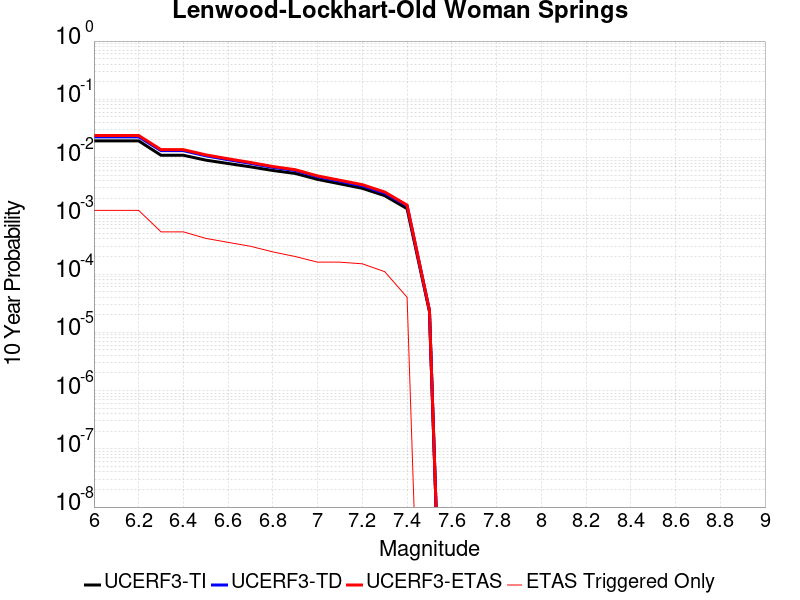 |

| Magnitude | 1 wk TI Prob | 1 wk TD Prob | 1 wk ETAS Prob | 1 wk ETAS/TD Gain | 1 wk ETAS Triggered Only | 1 mo TI Prob | 1 mo TD Prob | 1 mo ETAS Prob | 1 mo ETAS/TD Gain | 1 mo ETAS Triggered Only | 1 yr TI Prob | 1 yr TD Prob | 1 yr ETAS Prob | 1 yr ETAS/TD Gain | 1 yr ETAS Triggered Only | 10 yr TI Prob | 10 yr TD Prob | 10 yr ETAS Prob | 10 yr ETAS/TD Gain | 10 yr ETAS Triggered Only |
|-----|-----|-----|-----|-----|-----|-----|-----|-----|-----|-----|-----|-----|-----|-----|-----|-----|-----|-----|-----|-----|
| 6.0 | 3.744542E-5 | 4.3964304E-5 | 7.396299E-5 | 1.6823417 | 3.0E-5 | 1.604705E-4 | 1.8840581E-4 | 3.4837567E-4 | 1.8490707 | 1.6E-4 | 0.0019519776 | 0.0022915998 | 0.0029002018 | 1.2655796 | 6.1E-4 | 0.019349206 | 0.0226977 | 0.023909556 | 1.0533911 | 0.00124 |
| 6.1 | 3.744542E-5 | 4.3964304E-5 | 7.396299E-5 | 1.6823417 | 3.0E-5 | 1.604705E-4 | 1.8840581E-4 | 3.4837567E-4 | 1.8490707 | 1.6E-4 | 0.0019519776 | 0.0022915998 | 0.0029002018 | 1.2655796 | 6.1E-4 | 0.019349206 | 0.0226977 | 0.023909556 | 1.0533911 | 0.00124 |
| 6.2 | 3.744542E-5 | 4.3964304E-5 | 7.396299E-5 | 1.6823417 | 3.0E-5 | 1.604705E-4 | 1.8840581E-4 | 3.4837567E-4 | 1.8490707 | 1.6E-4 | 0.0019519776 | 0.0022915998 | 0.0029002018 | 1.2655796 | 6.1E-4 | 0.019349206 | 0.0226977 | 0.023909556 | 1.0533911 | 0.00124 |
| 6.3 | 2.1079984E-5 | 2.5354084E-5 | 4.5353576E-5 | 1.7888075 | 2.0E-5 | 9.0339665E-5 | 1.0865595E-4 | 1.7864835E-4 | 1.6441653 | 7.0E-5 | 0.0010993304 | 0.0013221033 | 0.0016017332 | 1.2115037 | 2.8E-4 | 0.010939079 | 0.013144593 | 0.013667626 | 1.0397907 | 5.3E-4 |
| 6.4 | 2.1079984E-5 | 2.5354084E-5 | 4.5353576E-5 | 1.7888075 | 2.0E-5 | 9.0339665E-5 | 1.0865595E-4 | 1.7864835E-4 | 1.6441653 | 7.0E-5 | 0.0010993304 | 0.0013221033 | 0.0016017332 | 1.2115037 | 2.8E-4 | 0.010939079 | 0.013144593 | 0.013667626 | 1.0397907 | 5.3E-4 |
| 6.5 | 1.7397282E-5 | 2.0662914E-5 | 4.06625E-5 | 1.9678978 | 2.0E-5 | 7.455765E-5 | 8.8552406E-5 | 1.3854797E-4 | 1.5645875 | 5.0E-5 | 9.073613E-4 | 0.001077604 | 0.0013073562 | 1.2132065 | 2.3E-4 | 0.009036654 | 0.010725081 | 0.011130683 | 1.0378182 | 4.1E-4 |
| 6.6 | 1.52050325E-5 | 1.7680117E-5 | 3.767976E-5 | 2.1311944 | 2.0E-5 | 6.51628E-5 | 7.576977E-5 | 1.2576598E-4 | 1.6598438 | 5.0E-5 | 7.9306826E-4 | 9.221144E-4 | 0.0011119392 | 1.2058582 | 1.9E-4 | 0.007902439 | 0.009183745 | 0.00953053 | 1.0377609 | 3.5E-4 |
| 6.7 | 1.332523E-5 | 1.5264359E-5 | 2.5264206E-5 | 1.655111 | 1.0E-5 | 5.7106878E-5 | 6.541707E-5 | 9.541511E-5 | 1.458566 | 3.0E-5 | 6.950544E-4 | 7.9616765E-4 | 9.360562E-4 | 1.1757023 | 1.4E-4 | 0.006928845 | 0.007933783 | 0.008231402 | 1.037513 | 3.0E-4 |
| 6.8 | 1.1525329E-5 | 1.3031262E-5 | 2.303113E-5 | 1.7673753 | 1.0E-5 | 4.9393333E-5 | 5.5847093E-5 | 6.5846536E-5 | 1.1790503 | 1.0E-5 | 6.011979E-4 | 6.797305E-4 | 7.696693E-4 | 1.1323154 | 9.0E-5 | 0.00599574 | 0.0067769657 | 0.007015339 | 1.0351741 | 2.4E-4 |
| 6.9 | 1.0253909E-5 | 1.1514676E-5 | 2.1514561E-5 | 1.868447 | 1.0E-5 | 4.3944583E-5 | 4.93477E-5 | 5.9347203E-5 | 1.2026337 | 1.0E-5 | 5.3489394E-4 | 6.006462E-4 | 6.6061015E-4 | 1.0998324 | 6.0E-5 | 0.0053360825 | 0.005990607 | 0.006189409 | 1.0331856 | 2.0E-4 |
| 7.0 | 8.104563E-6 | 8.991446E-6 | 1.8991355E-5 | 2.112158 | 1.0E-5 | 3.4733377E-5 | 3.8534214E-5 | 4.8533828E-5 | 1.2594997 | 1.0E-5 | 4.2279682E-4 | 4.6905546E-4 | 5.19032E-4 | 1.1065472 | 5.0E-5 | 0.0042199334 | 0.004680902 | 0.0048401533 | 1.0340215 | 1.6E-4 |
| 7.1 | 6.7986157E-6 | 7.515946E-6 | 1.7515871E-5 | 2.3304944 | 1.0E-5 | 2.91366E-5 | 3.221081E-5 | 4.221049E-5 | 1.3104447 | 1.0E-5 | 3.5468035E-4 | 3.9209818E-4 | 4.420786E-4 | 1.1274691 | 5.0E-5 | 0.003541148 | 0.0039142803 | 0.004073654 | 1.0407159 | 1.6E-4 |
| 7.2 | 5.6893327E-6 | 6.280115E-6 | 1.6280052E-5 | 2.5923176 | 1.0E-5 | 2.4382627E-5 | 2.6914513E-5 | 3.6914244E-5 | 1.3715367 | 1.0E-5 | 2.9681803E-4 | 3.2763692E-4 | 3.7762054E-4 | 1.152558 | 5.0E-5 | 0.002964219 | 0.0032717374 | 0.0034212465 | 1.0456972 | 1.5E-4 |
| 7.3 | 4.253348E-6 | 4.7069766E-6 | 4.7069766E-6 | 1.0 | 0.0 | 1.8228506E-5 | 2.0172612E-5 | 2.0172612E-5 | 1.0 | 0.0 | 2.2190946E-4 | 2.455757E-4 | 2.7556834E-4 | 1.122132 | 3.0E-5 | 0.00221688 | 0.0024532243 | 0.0025629543 | 1.044729 | 1.1E-4 |
| 7.4 | 2.5448119E-6 | 2.8520785E-6 | 2.8520785E-6 | 1.0 | 0.0 | 1.0906291E-5 | 1.2223146E-5 | 1.2223146E-5 | 1.0 | 0.0 | 1.3277601E-4 | 1.4880829E-4 | 1.4880829E-4 | 1.0 | 0.0 | 0.001326967 | 0.0014872487 | 0.0015271892 | 1.0268553 | 4.0E-5 |
| 7.5 | 4.3706837E-8 | 4.5630156E-8 | 4.5630156E-8 | 1.0 | 0.0 | 1.8731501E-7 | 1.955578E-7 | 1.955578E-7 | 1.0 | 0.0 | 2.2805577E-6 | 2.380914E-6 | 2.380914E-6 | 1.0 | 0.0 | 2.2805343E-5 | 2.3808941E-5 | 2.3808941E-5 | 1.0 | 0.0 |

## San Andreas (San Bernardino N)
*[(top)](#table-of-contents)*

| 1 Week | 1 Month | 1 Year | 10 Year |
|-----|-----|-----|-----|
|  | 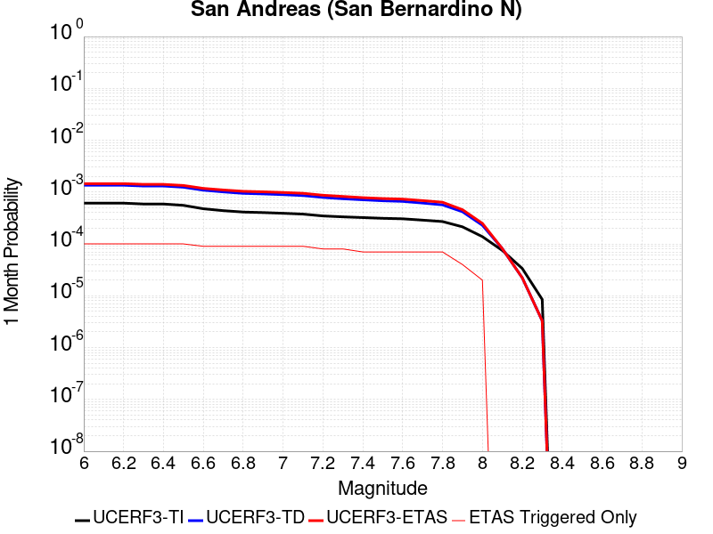 | 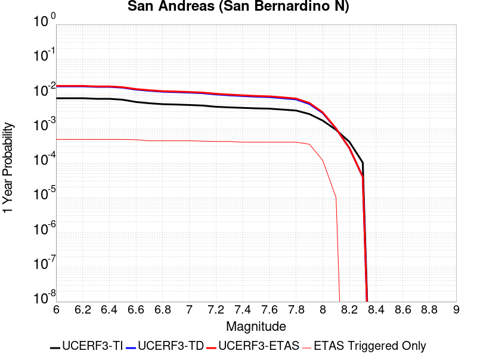 |  |

| Magnitude | 1 wk TI Prob | 1 wk TD Prob | 1 wk ETAS Prob | 1 wk ETAS/TD Gain | 1 wk ETAS Triggered Only | 1 mo TI Prob | 1 mo TD Prob | 1 mo ETAS Prob | 1 mo ETAS/TD Gain | 1 mo ETAS Triggered Only | 1 yr TI Prob | 1 yr TD Prob | 1 yr ETAS Prob | 1 yr ETAS/TD Gain | 1 yr ETAS Triggered Only | 10 yr TI Prob | 10 yr TD Prob | 10 yr ETAS Prob | 10 yr ETAS/TD Gain | 10 yr ETAS Triggered Only |
|-----|-----|-----|-----|-----|-----|-----|-----|-----|-----|-----|-----|-----|-----|-----|-----|-----|-----|-----|-----|-----|
| 6.0 | 1.4273766E-4 | 3.1635934E-4 | 3.2635615E-4 | 1.0315996 | 1.0E-5 | 6.115894E-4 | 0.0013551271 | 0.0014549916 | 1.0736939 | 1.0E-4 | 0.0074207084 | 0.016375363 | 0.016847502 | 1.0288323 | 4.8E-4 | 0.07177748 | 0.15038711 | 0.15115176 | 1.0050845 | 9.0E-4 |
| 6.1 | 1.4273766E-4 | 3.1635934E-4 | 3.2635615E-4 | 1.0315996 | 1.0E-5 | 6.115894E-4 | 0.0013551271 | 0.0014549916 | 1.0736939 | 1.0E-4 | 0.0074207084 | 0.016375363 | 0.016847502 | 1.0288323 | 4.8E-4 | 0.07177748 | 0.15038711 | 0.15115176 | 1.0050845 | 9.0E-4 |
| 6.2 | 1.4273766E-4 | 3.1635934E-4 | 3.2635615E-4 | 1.0315996 | 1.0E-5 | 6.115894E-4 | 0.0013551271 | 0.0014549916 | 1.0736939 | 1.0E-4 | 0.0074207084 | 0.016375363 | 0.016847502 | 1.0288323 | 4.8E-4 | 0.07177748 | 0.15038711 | 0.15115176 | 1.0050845 | 9.0E-4 |
| 6.3 | 1.3730655E-4 | 3.0540637E-4 | 3.154033E-4 | 1.0327332 | 1.0E-5 | 5.883239E-4 | 0.0013082335 | 0.0014081027 | 1.076339 | 1.0E-4 | 0.0071393442 | 0.015812824 | 0.016285233 | 1.0298752 | 4.8E-4 | 0.06914291 | 0.14568701 | 0.14644735 | 1.005219 | 8.9E-4 |
| 6.4 | 1.3730655E-4 | 3.0540637E-4 | 3.154033E-4 | 1.0327332 | 1.0E-5 | 5.883239E-4 | 0.0013082335 | 0.0014081027 | 1.076339 | 1.0E-4 | 0.0071393442 | 0.015812824 | 0.016285233 | 1.0298752 | 4.8E-4 | 0.06914291 | 0.14568701 | 0.14644735 | 1.005219 | 8.9E-4 |
| 6.5 | 1.2942807E-4 | 2.8954886E-4 | 2.9954597E-4 | 1.0345265 | 1.0E-5 | 5.545738E-4 | 0.0012403387 | 0.0013402146 | 1.0805231 | 1.0E-4 | 0.0067310524 | 0.014997809 | 0.015470611 | 1.0315247 | 4.8E-4 | 0.06530788 | 0.13882978 | 0.13959622 | 1.0055207 | 8.9E-4 |
| 6.6 | 1.1125901E-4 | 2.5393223E-4 | 2.639297E-4 | 1.0393705 | 1.0E-5 | 4.767372E-4 | 0.0010878295 | 0.0011777316 | 1.0826435 | 9.0E-5 | 0.005788839 | 0.013164529 | 0.013628341 | 1.035232 | 4.7E-4 | 0.056403454 | 0.12311955 | 0.1238912 | 1.0062675 | 8.8E-4 |
| 6.7 | 1.02209575E-4 | 2.3527986E-4 | 2.452775E-4 | 1.0424926 | 1.0E-5 | 4.3796748E-4 | 0.001007954 | 0.0010978633 | 1.0891998 | 9.0E-5 | 0.0053192247 | 0.012203212 | 0.012637842 | 1.035616 | 4.4E-4 | 0.051936906 | 0.11491149 | 0.11566381 | 1.006547 | 8.5E-4 |
| 6.8 | 9.610582E-5 | 2.2053412E-4 | 2.305319E-4 | 1.0453345 | 1.0E-5 | 4.1181705E-4 | 9.448046E-4 | 0.0010347195 | 1.0951678 | 9.0E-5 | 0.0050023515 | 0.011442591 | 0.011877556 | 1.0380129 | 4.4E-4 | 0.048912346 | 0.10831282 | 0.109070756 | 1.0069976 | 8.5E-4 |
| 6.9 | 9.3877505E-5 | 2.150883E-4 | 2.2508614E-4 | 1.0464826 | 1.0E-5 | 4.0227012E-4 | 9.2148193E-4 | 0.001011399 | 1.0975788 | 9.0E-5 | 0.0048866454 | 0.011161577 | 0.011596667 | 1.038981 | 4.4E-4 | 0.04780577 | 0.1059029 | 0.10665394 | 1.0070918 | 8.4E-4 |
| 7.0 | 9.1019785E-5 | 2.0835544E-4 | 2.1835337E-4 | 1.047985 | 1.0E-5 | 3.900265E-4 | 8.926469E-4 | 9.825666E-4 | 1.1007338 | 9.0E-5 | 0.0047382377 | 0.010814046 | 0.011249287 | 1.0402478 | 4.4E-4 | 0.046384744 | 0.10287278 | 0.10362637 | 1.0073254 | 8.4E-4 |
| 7.1 | 8.771155E-5 | 2.0009889E-4 | 2.1009688E-4 | 1.0499653 | 1.0E-5 | 3.758525E-4 | 8.5728534E-4 | 9.472082E-4 | 1.1048925 | 9.0E-5 | 0.0045664064 | 0.010387696 | 0.01081323 | 1.0409651 | 4.3E-4 | 0.044737056 | 0.09918398 | 0.09993166 | 1.0075383 | 8.3E-4 |
| 7.2 | 8.0830236E-5 | 1.8415037E-4 | 1.9414854E-4 | 1.0542934 | 1.0E-5 | 3.4636928E-4 | 7.8897737E-4 | 8.6891424E-4 | 1.101317 | 8.0E-5 | 0.0042088944 | 0.009563598 | 0.009979581 | 1.0434965 | 4.2E-4 | 0.041300658 | 0.09191379 | 0.09264934 | 1.0080026 | 8.1E-4 |
| 7.3 | 7.7668235E-5 | 1.7358093E-4 | 1.835792E-4 | 1.0576 | 1.0E-5 | 3.328214E-4 | 7.437063E-4 | 8.236468E-4 | 1.1074893 | 8.0E-5 | 0.0040445733 | 0.009017113 | 0.009433325 | 1.0461581 | 4.2E-4 | 0.03971748 | 0.08717959 | 0.087918974 | 1.0084811 | 8.1E-4 |
| 7.4 | 7.520177E-5 | 1.657783E-4 | 1.7577664E-4 | 1.0603116 | 1.0E-5 | 3.2225347E-4 | 7.1028504E-4 | 7.8023534E-4 | 1.098482 | 7.0E-5 | 0.0039163795 | 0.008613498 | 0.009010053 | 1.0460387 | 4.0E-4 | 0.038480744 | 0.08363466 | 0.08434942 | 1.0085462 | 7.8E-4 |
| 7.5 | 7.274697E-5 | 1.5865144E-4 | 1.6864986E-4 | 1.0630213 | 1.0E-5 | 3.1173544E-4 | 6.797576E-4 | 7.497101E-4 | 1.1029079 | 7.0E-5 | 0.003788775 | 0.008244702 | 0.008641404 | 1.048116 | 4.0E-4 | 0.03724827 | 0.08035038 | 0.0810677 | 1.0089275 | 7.8E-4 |
| 7.6 | 7.1185845E-5 | 1.5434787E-4 | 1.6434633E-4 | 1.0647787 | 1.0E-5 | 3.0504653E-4 | 6.6132325E-4 | 7.3127693E-4 | 1.1057783 | 7.0E-5 | 0.0037076178 | 0.008021939 | 0.0084187295 | 1.0494633 | 4.0E-4 | 0.036463667 | 0.078339346 | 0.079058245 | 1.0091767 | 7.8E-4 |
| 7.7 | 6.709961E-5 | 1.4343053E-4 | 1.5342911E-4 | 1.0697101 | 1.0E-5 | 2.8753807E-4 | 6.1455753E-4 | 6.8451447E-4 | 1.1138331 | 7.0E-5 | 0.003495157 | 0.007456607 | 0.007853624 | 1.0532438 | 4.0E-4 | 0.034406938 | 0.07316601 | 0.07388894 | 1.0098807 | 7.8E-4 |
| 7.8 | 6.300812E-5 | 1.3225875E-4 | 1.4225741E-4 | 1.0755993 | 1.0E-5 | 2.7000686E-4 | 5.6670007E-4 | 6.366604E-4 | 1.1234522 | 7.0E-5 | 0.0032823787 | 0.0068777753 | 0.007275024 | 1.0577583 | 4.0E-4 | 0.032343175 | 0.06781986 | 0.06853764 | 1.0105836 | 7.7E-4 |
| 7.9 | 4.983037E-5 | 9.7419856E-5 | 9.7419856E-5 | 1.0 | 0.0 | 2.1354125E-4 | 4.1744686E-4 | 4.5743017E-4 | 1.0957806 | 4.0E-5 | 0.0025967648 | 0.005070582 | 0.0054188073 | 1.0686756 | 3.5E-4 | 0.025666296 | 0.050735 | 0.0513805 | 1.012723 | 6.8E-4 |
| 8.0 | 3.2211527E-5 | 5.341288E-5 | 5.341288E-5 | 1.0 | 0.0 | 1.380421E-4 | 2.2889227E-4 | 2.488877E-4 | 1.0873574 | 2.0E-5 | 0.0016793669 | 0.002783204 | 0.0029028698 | 1.0429958 | 1.2E-4 | 0.016667323 | 0.028414162 | 0.028647343 | 1.0082065 | 2.4E-4 |
| 8.1 | 1.743376E-5 | 1.8874636E-5 | 1.8874636E-5 | 1.0 | 0.0 | 7.471398E-5 | 8.088879E-5 | 8.088879E-5 | 1.0 | 0.0 | 9.0926304E-4 | 9.843768E-4 | 9.943668E-4 | 1.0101488 | 1.0E-5 | 0.009055517 | 0.010510205 | 0.010539889 | 1.0028244 | 3.0E-5 |
| 8.2 | 7.831616E-6 | 5.1737816E-6 | 5.1737816E-6 | 1.0 | 0.0 | 3.3563636E-5 | 2.217316E-5 | 2.217316E-5 | 1.0 | 0.0 | 4.0856065E-4 | 2.6992487E-4 | 2.6992487E-4 | 1.0 | 0.0 | 0.004078103 | 0.0030519657 | 0.0030519657 | 1.0 | 0.0 |
| 8.3 | 1.983087E-6 | 7.693574E-7 | 7.693574E-7 | 1.0 | 0.0 | 8.498917E-6 | 3.297242E-6 | 3.297242E-6 | 1.0 | 0.0 | 1.034694E-4 | 4.01432E-5 | 4.01432E-5 | 1.0 | 0.0 | 0.0010342124 | 4.7390026E-4 | 4.7390026E-4 | 1.0 | 0.0 |

## Bicycle Lake
*[(top)](#table-of-contents)*

| 1 Week | 1 Month | 1 Year | 10 Year |
|-----|-----|-----|-----|
|  | 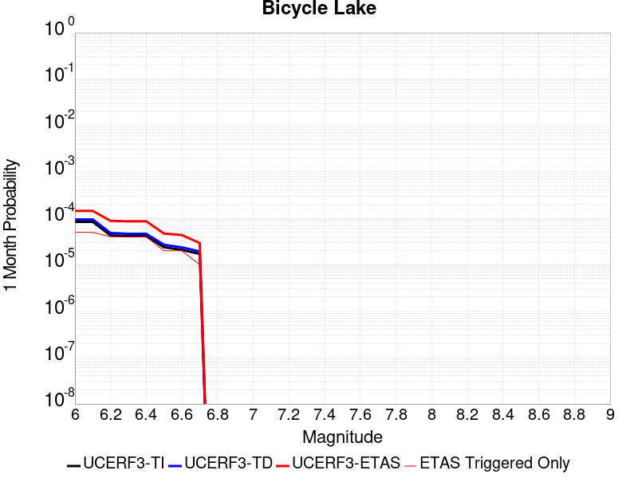 |  |  |

| Magnitude | 1 wk TI Prob | 1 wk TD Prob | 1 wk ETAS Prob | 1 wk ETAS/TD Gain | 1 wk ETAS Triggered Only | 1 mo TI Prob | 1 mo TD Prob | 1 mo ETAS Prob | 1 mo ETAS/TD Gain | 1 mo ETAS Triggered Only | 1 yr TI Prob | 1 yr TD Prob | 1 yr ETAS Prob | 1 yr ETAS/TD Gain | 1 yr ETAS Triggered Only | 10 yr TI Prob | 10 yr TD Prob | 10 yr ETAS Prob | 10 yr ETAS/TD Gain | 10 yr ETAS Triggered Only |
|-----|-----|-----|-----|-----|-----|-----|-----|-----|-----|-----|-----|-----|-----|-----|-----|-----|-----|-----|-----|-----|
| 6.0 | 1.9621975E-5 | 2.2098558E-5 | 5.2097894E-5 | 2.3575246 | 3.0E-5 | 8.4091465E-5 | 9.470543E-5 | 1.447007E-4 | 1.5279028 | 5.0E-5 | 0.0010233327 | 0.0011525637 | 0.0014721949 | 1.2773219 | 3.2E-4 | 0.01018633 | 0.011479173 | 0.012329301 | 1.0740583 | 8.6E-4 |
| 6.1 | 1.9621975E-5 | 2.2098558E-5 | 5.2097894E-5 | 2.3575246 | 3.0E-5 | 8.4091465E-5 | 9.470543E-5 | 1.447007E-4 | 1.5279028 | 5.0E-5 | 0.0010233327 | 0.0011525637 | 0.0014721949 | 1.2773219 | 3.2E-4 | 0.01018633 | 0.011479173 | 0.012329301 | 1.0740583 | 8.6E-4 |
| 6.2 | 9.9971285E-6 | 1.1256391E-5 | 4.1256055E-5 | 3.6651225 | 3.0E-5 | 4.2844134E-5 | 4.824108E-5 | 8.823915E-5 | 1.8291289 | 4.0E-5 | 5.2150246E-4 | 5.8722886E-4 | 8.170938E-4 | 1.3914402 | 2.3E-4 | 0.0052028033 | 0.0058618775 | 0.0064384774 | 1.0983644 | 5.8E-4 |
| 6.3 | 9.589428E-6 | 1.0799068E-5 | 4.0798743E-5 | 3.7779875 | 3.0E-5 | 4.10969E-5 | 4.628119E-5 | 8.627934E-5 | 1.864242 | 4.0E-5 | 5.002399E-4 | 5.633797E-4 | 7.9325016E-4 | 1.4080204 | 2.3E-4 | 0.0049911533 | 0.0056246053 | 0.006191399 | 1.1007705 | 5.7E-4 |
| 6.4 | 9.589428E-6 | 1.0799068E-5 | 4.0798743E-5 | 3.7779875 | 3.0E-5 | 4.10969E-5 | 4.628119E-5 | 8.627934E-5 | 1.864242 | 4.0E-5 | 5.002399E-4 | 5.633797E-4 | 7.9325016E-4 | 1.4080204 | 2.3E-4 | 0.0049911533 | 0.0056246053 | 0.006191399 | 1.1007705 | 5.7E-4 |
| 6.5 | 5.557707E-6 | 6.286038E-6 | 1.6285976E-5 | 2.5908172 | 1.0E-5 | 2.3818526E-5 | 2.6940037E-5 | 4.6939498E-5 | 1.7423695 | 2.0E-5 | 2.8995197E-4 | 3.2797246E-4 | 4.8791998E-4 | 1.4876858 | 1.6E-4 | 0.0028957394 | 0.0032775209 | 0.003636341 | 1.1094791 | 3.6E-4 |
| 6.6 | 4.8742945E-6 | 5.5136734E-6 | 1.5513619E-5 | 2.813663 | 1.0E-5 | 2.0889667E-5 | 2.3629962E-5 | 4.362949E-5 | 1.8463631 | 2.0E-5 | 2.54302E-4 | 2.87683E-4 | 4.0764848E-4 | 1.4170058 | 1.2E-4 | 0.002540112 | 0.0028756752 | 0.0031448987 | 1.093621 | 2.7E-4 |
| 6.7 | 3.991108E-6 | 4.5162255E-6 | 1.451618E-5 | 3.2142284 | 1.0E-5 | 1.7104636E-5 | 1.9355251E-5 | 2.9355058E-5 | 1.5166457 | 1.0E-5 | 2.0822904E-4 | 2.3565018E-4 | 3.2562896E-4 | 1.381832 | 9.0E-5 | 0.0020803404 | 0.0023565018 | 0.002546054 | 1.080438 | 1.9E-4 |

## Paradise
*[(top)](#table-of-contents)*

| 1 Week | 1 Month | 1 Year | 10 Year |
|-----|-----|-----|-----|
| 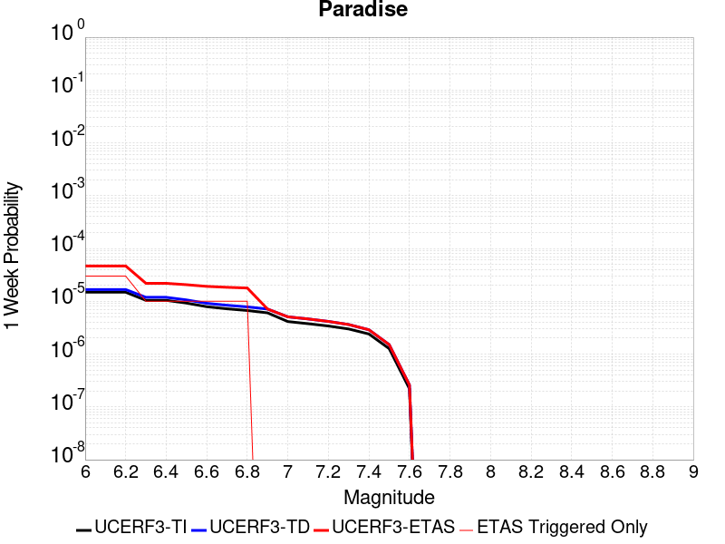 |  | 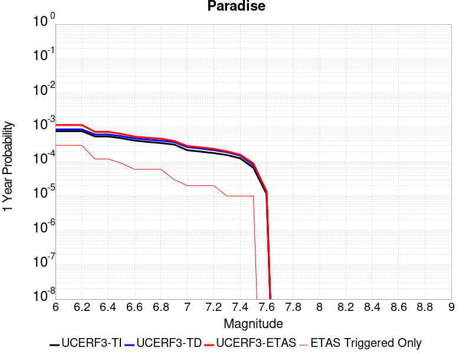 |  |

| Magnitude | 1 wk TI Prob | 1 wk TD Prob | 1 wk ETAS Prob | 1 wk ETAS/TD Gain | 1 wk ETAS Triggered Only | 1 mo TI Prob | 1 mo TD Prob | 1 mo ETAS Prob | 1 mo ETAS/TD Gain | 1 mo ETAS Triggered Only | 1 yr TI Prob | 1 yr TD Prob | 1 yr ETAS Prob | 1 yr ETAS/TD Gain | 1 yr ETAS Triggered Only | 10 yr TI Prob | 10 yr TD Prob | 10 yr ETAS Prob | 10 yr ETAS/TD Gain | 10 yr ETAS Triggered Only |
|-----|-----|-----|-----|-----|-----|-----|-----|-----|-----|-----|-----|-----|-----|-----|-----|-----|-----|-----|-----|-----|
| 6.0 | 1.4851273E-5 | 1.6695341E-5 | 4.669484E-5 | 2.7968786 | 3.0E-5 | 6.364676E-5 | 7.154963E-5 | 1.7154247E-4 | 2.3975313 | 1.0E-4 | 7.7462377E-4 | 8.707922E-4 | 0.001170531 | 1.3442138 | 3.0E-4 | 0.0077192914 | 0.008676181 | 0.0094395 | 1.0879787 | 7.7E-4 |
| 6.1 | 1.4851273E-5 | 1.6695341E-5 | 4.669484E-5 | 2.7968786 | 3.0E-5 | 6.364676E-5 | 7.154963E-5 | 1.7154247E-4 | 2.3975313 | 1.0E-4 | 7.7462377E-4 | 8.707922E-4 | 0.001170531 | 1.3442138 | 3.0E-4 | 0.0077192914 | 0.008676181 | 0.0094395 | 1.0879787 | 7.7E-4 |
| 6.2 | 1.4851273E-5 | 1.6695341E-5 | 4.669484E-5 | 2.7968786 | 3.0E-5 | 6.364676E-5 | 7.154963E-5 | 1.7154247E-4 | 2.3975313 | 1.0E-4 | 7.7462377E-4 | 8.707922E-4 | 0.001170531 | 1.3442138 | 3.0E-4 | 0.0077192914 | 0.008676181 | 0.0094395 | 1.0879787 | 7.7E-4 |
| 6.3 | 1.0426831E-5 | 1.1889049E-5 | 2.188893E-5 | 1.8411001 | 1.0E-5 | 4.4685654E-5 | 5.095211E-5 | 9.095007E-5 | 1.7850109 | 4.0E-5 | 5.43912E-4 | 6.2017125E-4 | 7.4009685E-4 | 1.193375 | 1.2E-4 | 0.0054258266 | 0.0061850143 | 0.0065626637 | 1.0610589 | 3.8E-4 |
| 6.4 | 1.0426831E-5 | 1.1889049E-5 | 2.188893E-5 | 1.8411001 | 1.0E-5 | 4.4685654E-5 | 5.095211E-5 | 9.095007E-5 | 1.7850109 | 4.0E-5 | 5.43912E-4 | 6.2017125E-4 | 7.4009685E-4 | 1.193375 | 1.2E-4 | 0.0054258266 | 0.0061850143 | 0.0065626637 | 1.0610589 | 3.8E-4 |
| 6.5 | 9.25027E-6 | 1.0620336E-5 | 2.062023E-5 | 1.9415798 | 1.0E-5 | 3.964341E-5 | 4.551496E-5 | 6.551405E-5 | 1.4393959 | 2.0E-5 | 4.8255164E-4 | 5.5400864E-4 | 6.439588E-4 | 1.1623623 | 9.0E-5 | 0.0048150513 | 0.0055267746 | 0.0057952823 | 1.048583 | 2.7E-4 |
| 6.6 | 7.904275E-6 | 9.159836E-6 | 1.9159745E-5 | 2.0917127 | 1.0E-5 | 3.3875025E-5 | 3.925587E-5 | 5.9255082E-5 | 1.509458 | 2.0E-5 | 4.1235037E-4 | 4.7783932E-4 | 5.378107E-4 | 1.1255052 | 6.0E-5 | 0.0041158604 | 0.0047685155 | 0.004937705 | 1.0354805 | 1.7E-4 |
| 6.7 | 7.2061953E-6 | 8.407527E-6 | 1.8407443E-5 | 2.1894002 | 1.0E-5 | 3.088333E-5 | 3.6031786E-5 | 5.6031065E-5 | 1.5550455 | 2.0E-5 | 3.7593965E-4 | 4.3860235E-4 | 4.9857603E-4 | 1.1367382 | 6.0E-5 | 0.003753043 | 0.0043777362 | 0.004507167 | 1.0295657 | 1.3E-4 |
| 6.8 | 6.6948724E-6 | 7.842423E-6 | 1.7842345E-5 | 2.2751062 | 1.0E-5 | 2.8691995E-5 | 3.3609973E-5 | 5.36093E-5 | 1.5950415 | 2.0E-5 | 3.4926904E-4 | 4.0912814E-4 | 4.691036E-4 | 1.1465933 | 6.0E-5 | 0.003487206 | 0.004084107 | 0.0041936575 | 1.0268236 | 1.1E-4 |
| 6.9 | 6.0421025E-6 | 7.1308505E-6 | 7.1308505E-6 | 1.0 | 0.0 | 2.5894467E-5 | 3.0560448E-5 | 4.0560142E-5 | 1.3272103 | 1.0E-5 | 3.1521954E-4 | 3.7201334E-4 | 4.020022E-4 | 1.0806123 | 3.0E-5 | 0.0031477278 | 0.003714244 | 0.003783984 | 1.0187764 | 7.0E-5 |
| 7.0 | 4.134091E-6 | 5.080469E-6 | 5.080469E-6 | 1.0 | 0.0 | 1.7717413E-5 | 2.1773263E-5 | 2.1773263E-5 | 1.0 | 0.0 | 2.1568815E-4 | 2.6505877E-4 | 2.8505348E-4 | 1.0754349 | 2.0E-5 | 0.0021547892 | 0.0026475794 | 0.0026775 | 1.0113012 | 3.0E-5 |
| 7.1 | 3.7674888E-6 | 4.6320133E-6 | 4.6320133E-6 | 1.0 | 0.0 | 1.6146281E-5 | 1.9851343E-5 | 1.9851343E-5 | 1.0 | 0.0 | 1.9656324E-4 | 2.4166482E-4 | 2.6166E-4 | 1.0827392 | 2.0E-5 | 0.0019638946 | 0.002414171 | 0.0024440982 | 1.0123966 | 3.0E-5 |
| 7.2 | 3.4065345E-6 | 4.1568514E-6 | 4.1568514E-6 | 1.0 | 0.0 | 1.4599351E-5 | 1.7814966E-5 | 1.7814966E-5 | 1.0 | 0.0 | 1.777326E-4 | 2.1687712E-4 | 2.3687277E-4 | 1.0921981 | 2.0E-5 | 0.0017759053 | 0.0021668028 | 0.0021967378 | 1.0138153 | 3.0E-5 |
| 7.3 | 2.9934936E-6 | 3.629423E-6 | 3.629423E-6 | 1.0 | 0.0 | 1.2829195E-5 | 1.5554586E-5 | 1.5554586E-5 | 1.0 | 0.0 | 1.5618425E-4 | 1.893621E-4 | 1.993602E-4 | 1.0527989 | 1.0E-5 | 0.0015607453 | 0.0018921527 | 0.0019121149 | 1.01055 | 2.0E-5 |
| 7.4 | 2.4049796E-6 | 2.889062E-6 | 2.889062E-6 | 1.0 | 0.0 | 1.0307015E-5 | 1.23816435E-5 | 1.23816435E-5 | 1.0 | 0.0 | 1.2548068E-4 | 1.5073753E-4 | 1.6073602E-4 | 1.0663304 | 1.0E-5 | 0.0012540985 | 0.0015064942 | 0.0015264641 | 1.0132558 | 2.0E-5 |
| 7.5 | 1.2710091E-6 | 1.5135054E-6 | 1.5135054E-6 | 1.0 | 0.0 | 5.44717E-6 | 6.4864425E-6 | 6.4864425E-6 | 1.0 | 0.0 | 6.631728E-5 | 7.897083E-5 | 8.897004E-5 | 1.126619 | 1.0E-5 | 6.6297496E-4 | 7.8955025E-4 | 7.9954235E-4 | 1.0126555 | 1.0E-5 |
| 7.6 | 2.21172E-7 | 2.6040124E-7 | 2.6040124E-7 | 1.0 | 0.0 | 9.478797E-7 | 1.116005E-6 | 1.116005E-6 | 1.0 | 0.0 | 1.1540374E-5 | 1.3587305E-5 | 1.3587305E-5 | 1.0 | 0.0 | 1.1539775E-4 | 1.3586757E-4 | 1.3586757E-4 | 1.0 | 0.0 |

## Garlic Springs
*[(top)](#table-of-contents)*

| 1 Week | 1 Month | 1 Year | 10 Year |
|-----|-----|-----|-----|
|  |  | 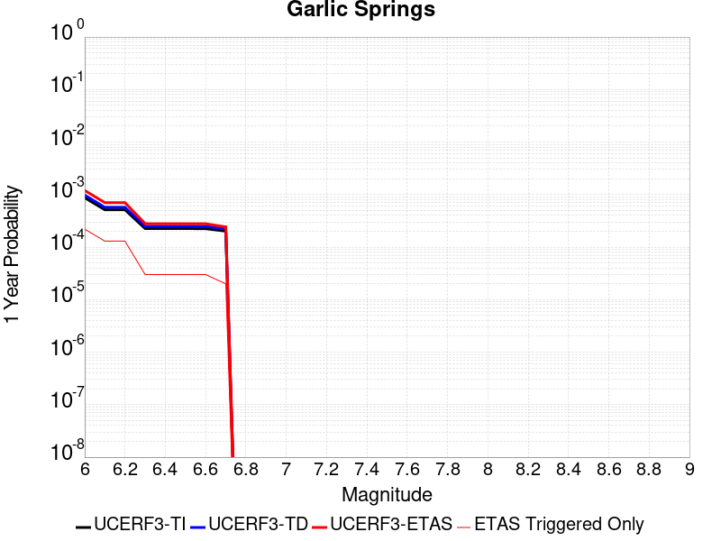 |  |

| Magnitude | 1 wk TI Prob | 1 wk TD Prob | 1 wk ETAS Prob | 1 wk ETAS/TD Gain | 1 wk ETAS Triggered Only | 1 mo TI Prob | 1 mo TD Prob | 1 mo ETAS Prob | 1 mo ETAS/TD Gain | 1 mo ETAS Triggered Only | 1 yr TI Prob | 1 yr TD Prob | 1 yr ETAS Prob | 1 yr ETAS/TD Gain | 1 yr ETAS Triggered Only | 10 yr TI Prob | 10 yr TD Prob | 10 yr ETAS Prob | 10 yr ETAS/TD Gain | 10 yr ETAS Triggered Only |
|-----|-----|-----|-----|-----|-----|-----|-----|-----|-----|-----|-----|-----|-----|-----|-----|-----|-----|-----|-----|-----|
| 6.0 | 1.6760017E-5 | 1.8778032E-5 | 2.8777844E-5 | 1.5325272 | 1.0E-5 | 7.182667E-5 | 8.047546E-5 | 1.2047224E-4 | 1.4970059 | 4.0E-5 | 8.7413884E-4 | 9.794658E-4 | 0.0011992502 | 1.2243923 | 2.2E-4 | 0.008707083 | 0.009763034 | 0.010297762 | 1.0547707 | 5.4E-4 |
| 6.1 | 9.852767E-6 | 1.097425E-5 | 2.097414E-5 | 1.9112141 | 1.0E-5 | 4.222546E-5 | 4.703205E-5 | 6.7031106E-5 | 1.4252219 | 2.0E-5 | 5.139737E-4 | 5.7253573E-4 | 7.024613E-4 | 1.22693 | 1.3E-4 | 0.005127866 | 0.005717566 | 0.005995965 | 1.0486919 | 2.8E-4 |
| 6.2 | 9.852767E-6 | 1.097425E-5 | 2.097414E-5 | 1.9112141 | 1.0E-5 | 4.222546E-5 | 4.703205E-5 | 6.7031106E-5 | 1.4252219 | 2.0E-5 | 5.139737E-4 | 5.7253573E-4 | 7.024613E-4 | 1.22693 | 1.3E-4 | 0.005127866 | 0.005717566 | 0.005995965 | 1.0486919 | 2.8E-4 |
| 6.3 | 4.3167724E-6 | 4.7782996E-6 | 4.7782996E-6 | 1.0 | 0.0 | 1.8500323E-5 | 2.0478396E-5 | 2.0478396E-5 | 1.0 | 0.0 | 2.2521814E-4 | 2.4931898E-4 | 2.793115E-4 | 1.1202978 | 3.0E-5 | 0.0022499003 | 0.002492651 | 0.0025824269 | 1.0360161 | 9.0E-5 |
| 6.4 | 4.3167724E-6 | 4.7782996E-6 | 4.7782996E-6 | 1.0 | 0.0 | 1.8500323E-5 | 2.0478396E-5 | 2.0478396E-5 | 1.0 | 0.0 | 2.2521814E-4 | 2.4931898E-4 | 2.793115E-4 | 1.1202978 | 3.0E-5 | 0.0022499003 | 0.002492651 | 0.0025824269 | 1.0360161 | 9.0E-5 |
| 6.5 | 4.3167724E-6 | 4.7782996E-6 | 4.7782996E-6 | 1.0 | 0.0 | 1.8500323E-5 | 2.0478396E-5 | 2.0478396E-5 | 1.0 | 0.0 | 2.2521814E-4 | 2.4931898E-4 | 2.793115E-4 | 1.1202978 | 3.0E-5 | 0.0022499003 | 0.002492651 | 0.0025824269 | 1.0360161 | 9.0E-5 |
| 6.6 | 4.301311E-6 | 4.761167E-6 | 4.761167E-6 | 1.0 | 0.0 | 1.8434059E-5 | 2.0404972E-5 | 2.0404972E-5 | 1.0 | 0.0 | 2.2441156E-4 | 2.4842523E-4 | 2.7841778E-4 | 1.1207306 | 3.0E-5 | 0.0022418506 | 0.002483734 | 0.0025735104 | 1.0361458 | 9.0E-5 |
| 6.7 | 3.8599724E-6 | 4.2713013E-6 | 4.2713013E-6 | 1.0 | 0.0 | 1.6542634E-5 | 1.8305576E-5 | 1.8305576E-5 | 1.0 | 0.0 | 2.0138794E-4 | 2.228704E-4 | 2.4286594E-4 | 1.0897182 | 2.0E-5 | 0.0020120554 | 0.0022287038 | 0.002298548 | 1.0313383 | 7.0E-5 |

## San Andreas (San Bernardino S)
*[(top)](#table-of-contents)*

| 1 Week | 1 Month | 1 Year | 10 Year |
|-----|-----|-----|-----|
|  |  |  | 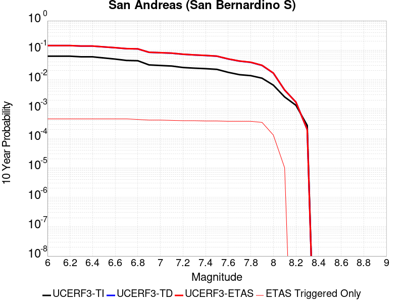 |

| Magnitude | 1 wk TI Prob | 1 wk TD Prob | 1 wk ETAS Prob | 1 wk ETAS/TD Gain | 1 wk ETAS Triggered Only | 1 mo TI Prob | 1 mo TD Prob | 1 mo ETAS Prob | 1 mo ETAS/TD Gain | 1 mo ETAS Triggered Only | 1 yr TI Prob | 1 yr TD Prob | 1 yr ETAS Prob | 1 yr ETAS/TD Gain | 1 yr ETAS Triggered Only | 10 yr TI Prob | 10 yr TD Prob | 10 yr ETAS Prob | 10 yr ETAS/TD Gain | 10 yr ETAS Triggered Only |
|-----|-----|-----|-----|-----|-----|-----|-----|-----|-----|-----|-----|-----|-----|-----|-----|-----|-----|-----|-----|-----|
| 6.0 | 1.2336002E-4 | 3.0023555E-4 | 3.0023555E-4 | 1.0 | 0.0 | 5.2857865E-4 | 0.0012861154 | 0.0013160767 | 1.023296 | 3.0E-5 | 0.006416472 | 0.015550992 | 0.015797105 | 1.0158261 | 2.5E-4 | 0.06234337 | 0.14291383 | 0.1433081 | 1.0027587 | 4.6E-4 |
| 6.1 | 1.2336002E-4 | 3.0023555E-4 | 3.0023555E-4 | 1.0 | 0.0 | 5.2857865E-4 | 0.0012861154 | 0.0013160767 | 1.023296 | 3.0E-5 | 0.006416472 | 0.015550992 | 0.015797105 | 1.0158261 | 2.5E-4 | 0.06234337 | 0.14291383 | 0.1433081 | 1.0027587 | 4.6E-4 |
| 6.2 | 1.2336002E-4 | 3.0023555E-4 | 3.0023555E-4 | 1.0 | 0.0 | 5.2857865E-4 | 0.0012861154 | 0.0013160767 | 1.023296 | 3.0E-5 | 0.006416472 | 0.015550992 | 0.015797105 | 1.0158261 | 2.5E-4 | 0.06234337 | 0.14291383 | 0.1433081 | 1.0027587 | 4.6E-4 |
| 6.3 | 1.1712257E-4 | 2.8811657E-4 | 2.8811657E-4 | 1.0 | 0.0 | 5.018573E-4 | 0.0012342266 | 0.0012641896 | 1.0242767 | 3.0E-5 | 0.006093008 | 0.0149280215 | 0.015174289 | 1.016497 | 2.5E-4 | 0.059286322 | 0.13762207 | 0.13801877 | 1.0028825 | 4.6E-4 |
| 6.4 | 1.1712257E-4 | 2.8811657E-4 | 2.8811657E-4 | 1.0 | 0.0 | 5.018573E-4 | 0.0012342266 | 0.0012641896 | 1.0242767 | 3.0E-5 | 0.006093008 | 0.0149280215 | 0.015174289 | 1.016497 | 2.5E-4 | 0.059286322 | 0.13762207 | 0.13801877 | 1.0028825 | 4.6E-4 |
| 6.5 | 1.0689076E-4 | 2.682418E-4 | 2.682418E-4 | 1.0 | 0.0 | 4.5802278E-4 | 0.001149126 | 0.0011790915 | 1.0260768 | 3.0E-5 | 0.0055621783 | 0.013905481 | 0.014152004 | 1.0177286 | 2.5E-4 | 0.05425003 | 0.12886871 | 0.12926944 | 1.0031096 | 4.6E-4 |
| 6.6 | 9.7648895E-5 | 2.506867E-4 | 2.506867E-4 | 1.0 | 0.0 | 4.1842813E-4 | 0.0010739529 | 0.0011039206 | 1.0279042 | 3.0E-5 | 0.005082469 | 0.0130013535 | 0.013248103 | 1.0189787 | 2.5E-4 | 0.049677886 | 0.12102797 | 0.1214323 | 1.0033407 | 4.6E-4 |
| 6.7 | 8.757013E-5 | 2.3139146E-4 | 2.3139146E-4 | 1.0 | 0.0 | 3.7524657E-4 | 9.913231E-4 | 0.0010212933 | 1.0302325 | 3.0E-5 | 0.00455906 | 0.012006655 | 0.012253653 | 1.0205718 | 2.5E-4 | 0.04466656 | 0.112335846 | 0.11274417 | 1.0036348 | 4.6E-4 |
| 6.8 | 8.562978E-5 | 2.2698891E-4 | 2.2698891E-4 | 1.0 | 0.0 | 3.6693315E-4 | 9.7246916E-4 | 0.00100244 | 1.0308193 | 3.0E-5 | 0.004458263 | 0.011779605 | 0.012016779 | 1.0201342 | 2.4E-4 | 0.043698758 | 0.11034572 | 0.11073717 | 1.0035474 | 4.4E-4 |
| 6.9 | 6.124075E-5 | 1.7082063E-4 | 1.7082063E-4 | 1.0 | 0.0 | 2.6243398E-4 | 7.318838E-4 | 7.6186185E-4 | 1.0409601 | 3.0E-5 | 0.0031904527 | 0.008874487 | 0.009112357 | 1.0268039 | 2.4E-4 | 0.031450346 | 0.08425208 | 0.084636696 | 1.004565 | 4.2E-4 |
| 7.0 | 5.8598747E-5 | 1.6510907E-4 | 1.6510907E-4 | 1.0 | 0.0 | 2.5111332E-4 | 7.0741924E-4 | 7.3739805E-4 | 1.0423777 | 3.0E-5 | 0.0030530186 | 0.008579012 | 0.008816953 | 1.0277352 | 2.4E-4 | 0.03011414 | 0.08156926 | 0.08195501 | 1.004729 | 4.2E-4 |
| 7.1 | 5.613814E-5 | 1.5929298E-4 | 1.5929298E-4 | 1.0 | 0.0 | 2.4056983E-4 | 6.825063E-4 | 7.124858E-4 | 1.0439256 | 3.0E-5 | 0.0029250039 | 0.0082780365 | 0.008506132 | 1.0275544 | 2.3E-4 | 0.028868021 | 0.078867756 | 0.07924542 | 1.0047885 | 4.1E-4 |
| 7.2 | 4.991222E-5 | 1.4535384E-4 | 1.4535384E-4 | 1.0 | 0.0 | 2.1389198E-4 | 6.227967E-4 | 6.52778E-4 | 1.0481398 | 3.0E-5 | 0.002601025 | 0.0075562913 | 0.0077845533 | 1.0302082 | 2.3E-4 | 0.025707912 | 0.072320335 | 0.0726914 | 1.005131 | 4.0E-4 |
| 7.3 | 4.7410045E-5 | 1.3729246E-4 | 1.3729246E-4 | 1.0 | 0.0 | 2.0317009E-4 | 5.882639E-4 | 6.1824627E-4 | 1.0509676 | 3.0E-5 | 0.0024707897 | 0.0071386793 | 0.0073670377 | 1.0319889 | 2.3E-4 | 0.024434982 | 0.06860168 | 0.06897424 | 1.0054308 | 4.0E-4 |
| 7.4 | 4.5556746E-5 | 1.313689E-4 | 1.313689E-4 | 1.0 | 0.0 | 1.952286E-4 | 5.628884E-4 | 5.8287714E-4 | 1.035511 | 2.0E-5 | 0.002374317 | 0.006831711 | 0.007050208 | 1.0319828 | 2.2E-4 | 0.023491086 | 0.06585319 | 0.06621751 | 1.0055323 | 3.9E-4 |
| 7.5 | 4.3084514E-5 | 1.2371907E-4 | 1.2371907E-4 | 1.0 | 0.0 | 1.8463485E-4 | 5.3011713E-4 | 5.501066E-4 | 1.0377076 | 2.0E-5 | 0.0022456115 | 0.0064351484 | 0.0066537326 | 1.0339673 | 2.2E-4 | 0.022230545 | 0.062252887 | 0.06261861 | 1.0058748 | 3.9E-4 |
| 7.6 | 3.408608E-5 | 9.8489814E-5 | 9.8489814E-5 | 1.0 | 0.0 | 1.4607502E-4 | 4.2203104E-4 | 4.420226E-4 | 1.0473698 | 2.0E-5 | 0.0017770125 | 0.005126148 | 0.0053350716 | 1.0407565 | 2.1E-4 | 0.017628696 | 0.050079897 | 0.050440867 | 1.0072079 | 3.8E-4 |
| 7.7 | 2.8315713E-5 | 8.261325E-5 | 8.261325E-5 | 1.0 | 0.0 | 1.2134742E-4 | 3.5400878E-4 | 3.740017E-4 | 1.0564758 | 2.0E-5 | 0.0014764034 | 0.004301548 | 0.004510645 | 1.0486096 | 2.1E-4 | 0.01466633 | 0.042327844 | 0.042691756 | 1.0085975 | 3.8E-4 |
| 7.8 | 2.6222975E-5 | 7.4749165E-5 | 7.4749165E-5 | 1.0 | 0.0 | 1.1237934E-4 | 3.2031426E-4 | 3.4030783E-4 | 1.0624187 | 2.0E-5 | 0.0013673597 | 0.0038928585 | 0.004102041 | 1.0537349 | 2.1E-4 | 0.013589768 | 0.038489804 | 0.03885518 | 1.0094928 | 3.8E-4 |
| 7.9 | 2.1469694E-5 | 5.7977377E-5 | 5.7977377E-5 | 1.0 | 0.0 | 9.200973E-5 | 2.4845081E-4 | 2.5844833E-4 | 1.0402395 | 1.0E-5 | 0.0011196428 | 0.003020696 | 0.0032200918 | 1.0660099 | 2.0E-4 | 0.011140184 | 0.030197 | 0.030536432 | 1.0112406 | 3.5E-4 |
| 8.0 | 1.2420249E-5 | 3.1373827E-5 | 3.1373827E-5 | 1.0 | 0.0 | 5.322855E-5 | 1.3445233E-4 | 1.4445098E-4 | 1.0743659 | 1.0E-5 | 6.478649E-4 | 0.001635729 | 0.0017255818 | 1.0549313 | 9.0E-5 | 0.0064597935 | 0.016548108 | 0.016675957 | 1.0077258 | 1.3E-4 |
| 8.1 | 4.9197724E-6 | 7.842378E-6 | 7.842378E-6 | 1.0 | 0.0 | 2.1084568E-5 | 3.360976E-5 | 3.360976E-5 | 1.0 | 0.0 | 2.566744E-4 | 4.0912212E-4 | 4.1911803E-4 | 1.0244325 | 1.0E-5 | 0.002563781 | 0.004394436 | 0.0044043916 | 1.0022656 | 1.0E-5 |
| 8.2 | 2.5634774E-6 | 2.9160003E-6 | 2.9160003E-6 | 1.0 | 0.0 | 1.0986286E-5 | 1.2497085E-5 | 1.2497085E-5 | 1.0 | 0.0 | 1.3374983E-4 | 1.5214144E-4 | 1.5214144E-4 | 1.0 | 0.0 | 0.0013366934 | 0.0017098442 | 0.0017098442 | 1.0 | 0.0 |
| 8.3 | 5.2850464E-7 | 3.2211614E-7 | 3.2211614E-7 | 1.0 | 0.0 | 2.2650179E-6 | 1.380497E-6 | 1.380497E-6 | 1.0 | 0.0 | 2.7576245E-5 | 1.6807435E-5 | 1.6807435E-5 | 1.0 | 0.0 | 2.7572823E-4 | 1.9939634E-4 | 1.9939634E-4 | 1.0 | 0.0 |

## Death Valley (Black Mtns Frontal)
*[(top)](#table-of-contents)*

| 1 Week | 1 Month | 1 Year | 10 Year |
|-----|-----|-----|-----|
|  |  | 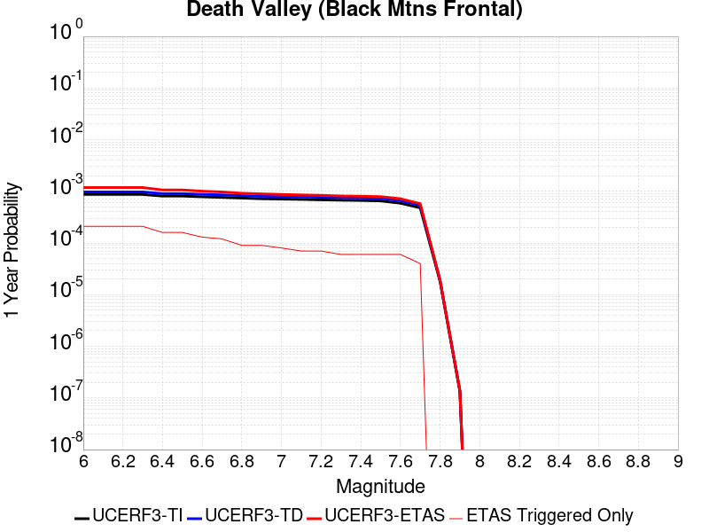 |  |

| Magnitude | 1 wk TI Prob | 1 wk TD Prob | 1 wk ETAS Prob | 1 wk ETAS/TD Gain | 1 wk ETAS Triggered Only | 1 mo TI Prob | 1 mo TD Prob | 1 mo ETAS Prob | 1 mo ETAS/TD Gain | 1 mo ETAS Triggered Only | 1 yr TI Prob | 1 yr TD Prob | 1 yr ETAS Prob | 1 yr ETAS/TD Gain | 1 yr ETAS Triggered Only | 10 yr TI Prob | 10 yr TD Prob | 10 yr ETAS Prob | 10 yr ETAS/TD Gain | 10 yr ETAS Triggered Only |
|-----|-----|-----|-----|-----|-----|-----|-----|-----|-----|-----|-----|-----|-----|-----|-----|-----|-----|-----|-----|-----|
| 6.0 | 1.6707214E-5 | 1.8671435E-5 | 2.867125E-5 | 1.5355674 | 1.0E-5 | 7.160038E-5 | 8.001803E-5 | 9.001722E-5 | 1.1249619 | 1.0E-5 | 8.71386E-4 | 9.737917E-4 | 0.0011835871 | 1.2154418 | 2.1E-4 | 0.00867977 | 0.0096961 | 0.010131834 | 1.044939 | 4.4E-4 |
| 6.1 | 1.6707214E-5 | 1.8671435E-5 | 2.867125E-5 | 1.5355674 | 1.0E-5 | 7.160038E-5 | 8.001803E-5 | 9.001722E-5 | 1.1249619 | 1.0E-5 | 8.71386E-4 | 9.737917E-4 | 0.0011835871 | 1.2154418 | 2.1E-4 | 0.00867977 | 0.0096961 | 0.010131834 | 1.044939 | 4.4E-4 |
| 6.2 | 1.6707214E-5 | 1.8671435E-5 | 2.867125E-5 | 1.5355674 | 1.0E-5 | 7.160038E-5 | 8.001803E-5 | 9.001722E-5 | 1.1249619 | 1.0E-5 | 8.71386E-4 | 9.737917E-4 | 0.0011835871 | 1.2154418 | 2.1E-4 | 0.00867977 | 0.0096961 | 0.010131834 | 1.044939 | 4.4E-4 |
| 6.3 | 1.6707214E-5 | 1.8671435E-5 | 2.867125E-5 | 1.5355674 | 1.0E-5 | 7.160038E-5 | 8.001803E-5 | 9.001722E-5 | 1.1249619 | 1.0E-5 | 8.71386E-4 | 9.737917E-4 | 0.0011835871 | 1.2154418 | 2.1E-4 | 0.00867977 | 0.0096961 | 0.010131834 | 1.044939 | 4.4E-4 |
| 6.4 | 1.5515609E-5 | 1.7339296E-5 | 1.7339296E-5 | 1.0 | 0.0 | 6.649377E-5 | 7.430919E-5 | 7.430919E-5 | 1.0 | 0.0 | 8.0926094E-4 | 9.04345E-4 | 0.0010642003 | 1.1767637 | 1.6E-4 | 0.008063202 | 0.009007333 | 0.009364091 | 1.0396074 | 3.6E-4 |
| 6.5 | 1.5515609E-5 | 1.7339296E-5 | 1.7339296E-5 | 1.0 | 0.0 | 6.649377E-5 | 7.430919E-5 | 7.430919E-5 | 1.0 | 0.0 | 8.0926094E-4 | 9.04345E-4 | 0.0010642003 | 1.1767637 | 1.6E-4 | 0.008063202 | 0.009007333 | 0.009364091 | 1.0396074 | 3.6E-4 |
| 6.6 | 1.5041828E-5 | 1.6810196E-5 | 1.6810196E-5 | 1.0 | 0.0 | 6.4463384E-5 | 7.204174E-5 | 7.204174E-5 | 1.0 | 0.0 | 7.8455906E-4 | 8.767611E-4 | 0.0010066471 | 1.148143 | 1.3E-4 | 0.00781795 | 0.008733676 | 0.009031056 | 1.0340497 | 3.0E-4 |
| 6.7 | 1.4634985E-5 | 1.635704E-5 | 1.635704E-5 | 1.0 | 0.0 | 6.271985E-5 | 7.009975E-5 | 7.009975E-5 | 1.0 | 0.0 | 7.6334673E-4 | 8.53136E-4 | 9.7303366E-4 | 1.1405375 | 1.2E-4 | 0.007607299 | 0.008499245 | 0.008776866 | 1.0326641 | 2.8E-4 |
| 6.8 | 1.4209158E-5 | 1.5883043E-5 | 1.5883043E-5 | 1.0 | 0.0 | 6.089497E-5 | 6.806844E-5 | 6.806844E-5 | 1.0 | 0.0 | 7.4114406E-4 | 8.2842377E-4 | 9.183492E-4 | 1.1085501 | 9.0E-5 | 0.007386771 | 0.008253971 | 0.008501908 | 1.0300385 | 2.5E-4 |
| 6.9 | 1.3780098E-5 | 1.540556E-5 | 1.540556E-5 | 1.0 | 0.0 | 5.9056227E-5 | 6.6022185E-5 | 6.6022185E-5 | 1.0 | 0.0 | 7.1877235E-4 | 8.0352917E-4 | 8.934568E-4 | 1.111916 | 9.0E-5 | 0.0071645193 | 0.0080068335 | 0.008234992 | 1.0284954 | 2.3E-4 |
| 7.0 | 1.3585064E-5 | 1.5189109E-5 | 1.5189109E-5 | 1.0 | 0.0 | 5.8220405E-5 | 6.509459E-5 | 6.509459E-5 | 1.0 | 0.0 | 7.086029E-4 | 7.922439E-4 | 8.721805E-4 | 1.100899 | 8.0E-5 | 0.007063476 | 0.007894788 | 0.008103129 | 1.0263898 | 2.1E-4 |
| 7.1 | 1.3398601E-5 | 1.4982282E-5 | 1.4982282E-5 | 1.0 | 0.0 | 5.742131E-5 | 6.420823E-5 | 6.420823E-5 | 1.0 | 0.0 | 6.9888023E-4 | 7.8146026E-4 | 8.5140555E-4 | 1.0895059 | 7.0E-5 | 0.0069668638 | 0.007787712 | 0.007986154 | 1.0254815 | 2.0E-4 |
| 7.2 | 1.3126312E-5 | 1.4680485E-5 | 1.4680485E-5 | 1.0 | 0.0 | 5.6254412E-5 | 6.291488E-5 | 6.291488E-5 | 1.0 | 0.0 | 6.846822E-4 | 7.6572486E-4 | 8.3567126E-4 | 1.0913466 | 7.0E-5 | 0.006825765 | 0.007631449 | 0.007829922 | 1.0260073 | 2.0E-4 |
| 7.3 | 1.2922429E-5 | 1.4454699E-5 | 1.4454699E-5 | 1.0 | 0.0 | 5.5380664E-5 | 6.194727E-5 | 6.194727E-5 | 1.0 | 0.0 | 6.74051E-4 | 7.539525E-4 | 8.1390725E-4 | 1.0795206 | 6.0E-5 | 0.006720101 | 0.007514527 | 0.0076733246 | 1.0211321 | 1.6E-4 |
| 7.4 | 1.2768878E-5 | 1.4284673E-5 | 1.4284673E-5 | 1.0 | 0.0 | 5.4722615E-5 | 6.121862E-5 | 6.121862E-5 | 1.0 | 0.0 | 6.660441E-4 | 7.450873E-4 | 8.0504257E-4 | 1.0804675 | 6.0E-5 | 0.0066405144 | 0.007426471 | 0.0075852824 | 1.0213846 | 1.6E-4 |
| 7.5 | 1.2521929E-5 | 1.4012902E-5 | 1.4012902E-5 | 1.0 | 0.0 | 5.366431E-5 | 6.0053942E-5 | 6.0053942E-5 | 1.0 | 0.0 | 6.531671E-4 | 7.309169E-4 | 7.908731E-4 | 1.0820286 | 6.0E-5 | 0.006512506 | 0.0072857053 | 0.0074445396 | 1.0218008 | 1.6E-4 |
| 7.6 | 1.1301089E-5 | 1.2648951E-5 | 1.2648951E-5 | 1.0 | 0.0 | 4.8432343E-5 | 5.4208693E-5 | 5.4208693E-5 | 1.0 | 0.0 | 5.895042E-4 | 6.597963E-4 | 7.197567E-4 | 1.0908772 | 6.0E-5 | 0.0058794282 | 0.006578926 | 0.006718005 | 1.0211401 | 1.4E-4 |
| 7.7 | 9.189108E-6 | 1.02840095E-5 | 1.02840095E-5 | 1.0 | 0.0 | 3.93813E-5 | 4.407361E-5 | 4.407361E-5 | 1.0 | 0.0 | 4.7936183E-4 | 5.3646916E-4 | 5.764477E-4 | 1.0745217 | 4.0E-5 | 0.004783291 | 0.005352252 | 0.005451717 | 1.0185838 | 1.0E-4 |
| 7.8 | 3.4586725E-7 | 3.648368E-7 | 3.648368E-7 | 1.0 | 0.0 | 1.4822873E-6 | 1.5635853E-6 | 1.5635853E-6 | 1.0 | 0.0 | 1.80467E-5 | 1.903649E-5 | 1.903649E-5 | 1.0 | 0.0 | 1.8045233E-4 | 1.9034903E-4 | 1.9034903E-4 | 1.0 | 0.0 |
| 7.9 | 2.5591178E-9 | 2.6697329E-9 | 2.6697329E-9 | 1.0 | 0.0 | 1.0967647E-8 | 1.14417125E-8 | 1.14417125E-8 | 1.0 | 0.0 | 1.335311E-7 | 1.3930286E-7 | 1.3930286E-7 | 1.0 | 0.0 | 1.3353102E-6 | 1.3930285E-6 | 1.3930285E-6 | 1.0 | 0.0 |

## Helendale-So Lockhart
*[(top)](#table-of-contents)*

| 1 Week | 1 Month | 1 Year | 10 Year |
|-----|-----|-----|-----|
|  |  |  | 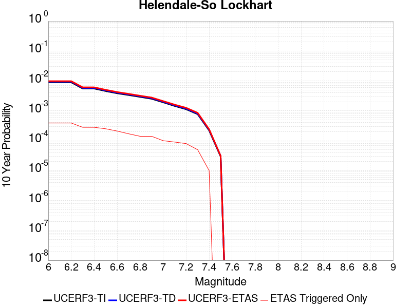 |

| Magnitude | 1 wk TI Prob | 1 wk TD Prob | 1 wk ETAS Prob | 1 wk ETAS/TD Gain | 1 wk ETAS Triggered Only | 1 mo TI Prob | 1 mo TD Prob | 1 mo ETAS Prob | 1 mo ETAS/TD Gain | 1 mo ETAS Triggered Only | 1 yr TI Prob | 1 yr TD Prob | 1 yr ETAS Prob | 1 yr ETAS/TD Gain | 1 yr ETAS Triggered Only | 10 yr TI Prob | 10 yr TD Prob | 10 yr ETAS Prob | 10 yr ETAS/TD Gain | 10 yr ETAS Triggered Only |
|-----|-----|-----|-----|-----|-----|-----|-----|-----|-----|-----|-----|-----|-----|-----|-----|-----|-----|-----|-----|-----|
| 6.0 | 1.7296055E-5 | 1.810418E-5 | 2.8103997E-5 | 1.5523486 | 1.0E-5 | 7.412385E-5 | 7.7587145E-5 | 1.0758482E-4 | 1.386632 | 3.0E-5 | 9.0208417E-4 | 9.442349E-4 | 0.0010741121 | 1.1375476 | 1.3E-4 | 0.008984311 | 0.009404349 | 0.009790681 | 1.0410801 | 3.9E-4 |
| 6.1 | 1.7296055E-5 | 1.810418E-5 | 2.8103997E-5 | 1.5523486 | 1.0E-5 | 7.412385E-5 | 7.7587145E-5 | 1.0758482E-4 | 1.386632 | 3.0E-5 | 9.0208417E-4 | 9.442349E-4 | 0.0010741121 | 1.1375476 | 1.3E-4 | 0.008984311 | 0.009404349 | 0.009790681 | 1.0410801 | 3.9E-4 |
| 6.2 | 1.7296055E-5 | 1.810418E-5 | 2.8103997E-5 | 1.5523486 | 1.0E-5 | 7.412385E-5 | 7.7587145E-5 | 1.0758482E-4 | 1.386632 | 3.0E-5 | 9.0208417E-4 | 9.442349E-4 | 0.0010741121 | 1.1375476 | 1.3E-4 | 0.008984311 | 0.009404349 | 0.009790681 | 1.0410801 | 3.9E-4 |
| 6.3 | 1.0669118E-5 | 1.1135683E-5 | 2.1135571E-5 | 1.898004 | 1.0E-5 | 4.5723988E-5 | 4.7723497E-5 | 7.772207E-5 | 1.6285912 | 3.0E-5 | 5.5654737E-4 | 5.808815E-4 | 7.008118E-4 | 1.2064626 | 1.2E-4 | 0.0055515557 | 0.0057939277 | 0.0060723056 | 1.0480465 | 2.8E-4 |
| 6.4 | 1.0669118E-5 | 1.1135683E-5 | 2.1135571E-5 | 1.898004 | 1.0E-5 | 4.5723988E-5 | 4.7723497E-5 | 7.772207E-5 | 1.6285912 | 3.0E-5 | 5.5654737E-4 | 5.808815E-4 | 7.008118E-4 | 1.2064626 | 1.2E-4 | 0.0055515557 | 0.0057939277 | 0.0060723056 | 1.0480465 | 2.8E-4 |
| 6.5 | 8.790038E-6 | 9.170408E-6 | 1.9170317E-5 | 2.090454 | 1.0E-5 | 3.767105E-5 | 3.930116E-5 | 6.929998E-5 | 1.7633061 | 3.0E-5 | 4.585485E-4 | 4.7838816E-4 | 5.9833075E-4 | 1.2507223 | 1.2E-4 | 0.0045760344 | 0.0047737476 | 0.005022554 | 1.0521197 | 2.5E-4 |
| 6.6 | 7.396949E-6 | 7.715714E-6 | 1.7715636E-5 | 2.2960465 | 1.0E-5 | 3.1700827E-5 | 3.306693E-5 | 6.306594E-5 | 1.9072208 | 3.0E-5 | 3.858892E-4 | 4.025165E-4 | 5.024763E-4 | 1.248337 | 1.0E-4 | 0.003852198 | 0.0040179817 | 0.0042271377 | 1.052055 | 2.1E-4 |
| 6.7 | 6.4600285E-6 | 6.738185E-6 | 1.6738119E-5 | 2.484069 | 1.0E-5 | 2.7685543E-5 | 2.8877621E-5 | 5.8876754E-5 | 2.0388367 | 3.0E-5 | 3.3701936E-4 | 3.515291E-4 | 4.3150096E-4 | 1.2274972 | 8.0E-5 | 0.0033650869 | 0.003509812 | 0.0036792154 | 1.0482657 | 1.7E-4 |
| 6.8 | 5.600104E-6 | 5.8361397E-6 | 1.5836082E-5 | 2.7134514 | 1.0E-5 | 2.4000226E-5 | 2.5011792E-5 | 4.5011293E-5 | 1.7996029 | 2.0E-5 | 2.9216358E-4 | 3.0447662E-4 | 3.5446137E-4 | 1.1641662 | 5.0E-5 | 0.0029177975 | 0.003040656 | 0.0031802303 | 1.0459027 | 1.4E-4 |
| 6.9 | 4.839122E-6 | 5.03962E-6 | 1.503957E-5 | 2.9842665 | 1.0E-5 | 2.0738931E-5 | 2.1598196E-5 | 4.1597763E-5 | 1.9259833 | 2.0E-5 | 2.5246723E-4 | 2.6292677E-4 | 3.1291362E-4 | 1.190117 | 5.0E-5 | 0.002521806 | 0.0026262044 | 0.0027658367 | 1.0531689 | 1.4E-4 |
| 7.0 | 3.6937633E-6 | 3.8452918E-6 | 1.3845253E-5 | 3.600573 | 1.0E-5 | 1.5830317E-5 | 1.6479718E-5 | 2.6479554E-5 | 1.6067965 | 1.0E-5 | 1.9271708E-4 | 2.0062242E-4 | 2.306164E-4 | 1.1495047 | 3.0E-5 | 0.0019255003 | 0.0020044446 | 0.0021042442 | 1.0497892 | 1.0E-4 |
| 7.1 | 2.7858857E-6 | 2.8979157E-6 | 1.2897886E-5 | 4.450746 | 1.0E-5 | 1.1939455E-5 | 1.241958E-5 | 2.2419455E-5 | 1.8051702 | 1.0E-5 | 1.4535317E-4 | 1.5119811E-4 | 1.8119358E-4 | 1.1983851 | 3.0E-5 | 0.0014525814 | 0.0015109739 | 0.0016008379 | 1.0594742 | 9.0E-5 |
| 7.2 | 2.1672065E-6 | 2.2540607E-6 | 1.2254038E-5 | 5.4364276 | 1.0E-5 | 9.2879945E-6 | 9.660225E-6 | 1.9660129E-5 | 2.0351624 | 1.0E-5 | 1.1307546E-4 | 1.1760708E-4 | 1.4760355E-4 | 1.2550567 | 3.0E-5 | 0.0011301794 | 0.0011754666 | 0.0012553725 | 1.067978 | 8.0E-5 |
| 7.3 | 1.4823496E-6 | 1.5422432E-6 | 1.5422432E-6 | 1.0 | 0.0 | 6.3529114E-6 | 6.609598E-6 | 6.609598E-6 | 1.0 | 0.0 | 7.734395E-5 | 8.0469035E-5 | 1.0046743E-4 | 1.2485228 | 2.0E-5 | 7.731704E-4 | 8.044141E-4 | 8.543739E-4 | 1.0621071 | 5.0E-5 |
| 7.4 | 4.2321457E-7 | 4.4109754E-7 | 4.4109754E-7 | 1.0 | 0.0 | 1.8137755E-6 | 1.8904169E-6 | 1.8904169E-6 | 1.0 | 0.0 | 2.2082493E-5 | 2.301563E-5 | 2.301563E-5 | 1.0 | 0.0 | 2.2080299E-4 | 2.3013698E-4 | 2.4013467E-4 | 1.0434424 | 1.0E-5 |
| 7.5 | 5.6942316E-8 | 5.9417015E-8 | 5.9417015E-8 | 1.0 | 0.0 | 2.440385E-7 | 2.5464433E-7 | 2.5464433E-7 | 1.0 | 0.0 | 2.9711643E-6 | 3.100291E-6 | 3.100291E-6 | 1.0 | 0.0 | 2.9711247E-5 | 3.1002557E-5 | 3.1002557E-5 | 1.0 | 0.0 |

## San Andreas (Big Bend)
*[(top)](#table-of-contents)*

| 1 Week | 1 Month | 1 Year | 10 Year |
|-----|-----|-----|-----|
|  |  |  | 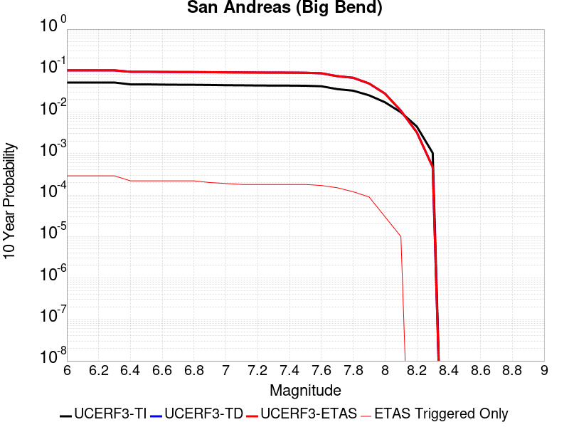 |

| Magnitude | 1 wk TI Prob | 1 wk TD Prob | 1 wk ETAS Prob | 1 wk ETAS/TD Gain | 1 wk ETAS Triggered Only | 1 mo TI Prob | 1 mo TD Prob | 1 mo ETAS Prob | 1 mo ETAS/TD Gain | 1 mo ETAS Triggered Only | 1 yr TI Prob | 1 yr TD Prob | 1 yr ETAS Prob | 1 yr ETAS/TD Gain | 1 yr ETAS Triggered Only | 10 yr TI Prob | 10 yr TD Prob | 10 yr ETAS Prob | 10 yr ETAS/TD Gain | 10 yr ETAS Triggered Only |
|-----|-----|-----|-----|-----|-----|-----|-----|-----|-----|-----|-----|-----|-----|-----|-----|-----|-----|-----|-----|-----|
| 6.0 | 1.0179969E-4 | 2.0106303E-4 | 2.0106303E-4 | 1.0 | 0.0 | 4.362114E-4 | 8.614151E-4 | 8.714065E-4 | 1.0115988 | 1.0E-5 | 0.0052979486 | 0.010437581 | 0.010536537 | 1.0094807 | 1.0E-4 | 0.051734097 | 0.10159716 | 0.1018577 | 1.0025644 | 2.9E-4 |
| 6.1 | 1.0179969E-4 | 2.0106303E-4 | 2.0106303E-4 | 1.0 | 0.0 | 4.362114E-4 | 8.614151E-4 | 8.714065E-4 | 1.0115988 | 1.0E-5 | 0.0052979486 | 0.010437581 | 0.010536537 | 1.0094807 | 1.0E-4 | 0.051734097 | 0.10159716 | 0.1018577 | 1.0025644 | 2.9E-4 |
| 6.2 | 1.0179969E-4 | 2.0106303E-4 | 2.0106303E-4 | 1.0 | 0.0 | 4.362114E-4 | 8.614151E-4 | 8.714065E-4 | 1.0115988 | 1.0E-5 | 0.0052979486 | 0.010437581 | 0.010536537 | 1.0094807 | 1.0E-4 | 0.051734097 | 0.10159716 | 0.1018577 | 1.0025644 | 2.9E-4 |
| 6.3 | 1.0179969E-4 | 2.0106303E-4 | 2.0106303E-4 | 1.0 | 0.0 | 4.362114E-4 | 8.614151E-4 | 8.714065E-4 | 1.0115988 | 1.0E-5 | 0.0052979486 | 0.010437581 | 0.010536537 | 1.0094807 | 1.0E-4 | 0.051734097 | 0.10159716 | 0.1018577 | 1.0025644 | 2.9E-4 |
| 6.4 | 9.1639464E-5 | 1.8462905E-4 | 1.8462905E-4 | 1.0 | 0.0 | 3.9268145E-4 | 7.910276E-4 | 8.010197E-4 | 1.0126318 | 1.0E-5 | 0.0047704205 | 0.009588352 | 0.009677489 | 1.0092964 | 9.0E-5 | 0.046693064 | 0.093921766 | 0.0941211 | 1.0021224 | 2.2E-4 |
| 6.5 | 9.1639464E-5 | 1.8462905E-4 | 1.8462905E-4 | 1.0 | 0.0 | 3.9268145E-4 | 7.910276E-4 | 8.010197E-4 | 1.0126318 | 1.0E-5 | 0.0047704205 | 0.009588352 | 0.009677489 | 1.0092964 | 9.0E-5 | 0.046693064 | 0.093921766 | 0.0941211 | 1.0021224 | 2.2E-4 |
| 6.6 | 9.042622E-5 | 1.826988E-4 | 1.826988E-4 | 1.0 | 0.0 | 3.8748336E-4 | 7.827601E-4 | 7.927523E-4 | 1.0127653 | 1.0E-5 | 0.0047074095 | 0.009488574 | 0.00957772 | 1.0093951 | 9.0E-5 | 0.046089325 | 0.093015574 | 0.09321511 | 1.0021452 | 2.2E-4 |
| 6.7 | 8.9836685E-5 | 1.8184188E-4 | 1.8184188E-4 | 1.0 | 0.0 | 3.8495753E-4 | 7.790898E-4 | 7.8908197E-4 | 1.0128255 | 1.0E-5 | 0.00467679 | 0.009444275 | 0.009533425 | 1.0094396 | 9.0E-5 | 0.045795817 | 0.09260978 | 0.0928094 | 1.0021555 | 2.2E-4 |
| 6.8 | 8.9471854E-5 | 1.8130938E-4 | 1.8130938E-4 | 1.0 | 0.0 | 3.8339442E-4 | 7.7680906E-4 | 7.868013E-4 | 1.0128632 | 1.0E-5 | 0.004657841 | 0.009416748 | 0.0095059 | 1.0094675 | 9.0E-5 | 0.04561414 | 0.09235688 | 0.092556566 | 1.0021621 | 2.2E-4 |
| 6.9 | 8.858234E-5 | 1.8012857E-4 | 1.8012857E-4 | 1.0 | 0.0 | 3.7958333E-4 | 7.717514E-4 | 7.8174367E-4 | 1.0129476 | 1.0E-5 | 0.004611638 | 0.009355701 | 0.009425046 | 1.0074121 | 7.0E-5 | 0.04517103 | 0.09179684 | 0.091978475 | 1.0019788 | 2.0E-4 |
| 7.0 | 8.7433385E-5 | 1.7851574E-4 | 1.7851574E-4 | 1.0 | 0.0 | 3.746607E-4 | 7.648433E-4 | 7.7483564E-4 | 1.0130646 | 1.0E-5 | 0.004551957 | 0.009272313 | 0.009341664 | 1.0074793 | 7.0E-5 | 0.044598386 | 0.091031015 | 0.09120372 | 1.0018972 | 1.9E-4 |
| 7.1 | 8.684964E-5 | 1.7763473E-4 | 1.7763473E-4 | 1.0 | 0.0 | 3.7215967E-4 | 7.610698E-4 | 7.710622E-4 | 1.0131294 | 1.0E-5 | 0.0045216335 | 0.009226761 | 0.0092961155 | 1.0075166 | 7.0E-5 | 0.04430731 | 0.09061238 | 0.09077607 | 1.0018065 | 1.8E-4 |
| 7.2 | 8.606521E-5 | 1.7654036E-4 | 1.7654036E-4 | 1.0 | 0.0 | 3.6879873E-4 | 7.5638236E-4 | 7.663748E-4 | 1.0132108 | 1.0E-5 | 0.0044808835 | 0.009170174 | 0.009239531 | 1.0075635 | 7.0E-5 | 0.043916024 | 0.09009273 | 0.09025652 | 1.001818 | 1.8E-4 |
| 7.3 | 8.568266E-5 | 1.7595981E-4 | 1.7595981E-4 | 1.0 | 0.0 | 3.6715972E-4 | 7.5389567E-4 | 7.638882E-4 | 1.0132544 | 1.0E-5 | 0.0044610105 | 0.0091401525 | 0.009209513 | 1.0075885 | 7.0E-5 | 0.043725148 | 0.08981366 | 0.08997749 | 1.0018241 | 1.8E-4 |
| 7.4 | 8.5432206E-5 | 1.7558529E-4 | 1.7558529E-4 | 1.0 | 0.0 | 3.6608664E-4 | 7.522915E-4 | 7.62284E-4 | 1.0132828 | 1.0E-5 | 0.004447999 | 0.009120786 | 0.009190147 | 1.0076047 | 7.0E-5 | 0.043600157 | 0.08963369 | 0.08979755 | 1.0018282 | 1.8E-4 |
| 7.5 | 8.4791965E-5 | 1.742772E-4 | 1.742772E-4 | 1.0 | 0.0 | 3.633435E-4 | 7.466887E-4 | 7.566812E-4 | 1.0133824 | 1.0E-5 | 0.0044147377 | 0.00905314 | 0.009122506 | 1.0076622 | 7.0E-5 | 0.043280575 | 0.08901084 | 0.08917482 | 1.0018423 | 1.8E-4 |
| 7.6 | 8.241105E-5 | 1.6872598E-4 | 1.6872598E-4 | 1.0 | 0.0 | 3.531424E-4 | 7.229111E-4 | 7.329039E-4 | 1.0138229 | 1.0E-5 | 0.0042910352 | 0.008766012 | 0.0088254865 | 1.0067846 | 6.0E-5 | 0.042091176 | 0.086385906 | 0.08654122 | 1.0017979 | 1.7E-4 |
| 7.7 | 7.00432E-5 | 1.4233537E-4 | 1.4233537E-4 | 1.0 | 0.0 | 3.001506E-4 | 6.0986617E-4 | 6.1986E-4 | 1.016387 | 1.0E-5 | 0.0036482112 | 0.0073998813 | 0.007449511 | 1.0067068 | 5.0E-5 | 0.035888977 | 0.07364825 | 0.073787205 | 1.0018867 | 1.5E-4 |
| 7.8 | 6.415362E-5 | 1.2995097E-4 | 1.2995097E-4 | 1.0 | 0.0 | 2.749151E-4 | 5.568139E-4 | 5.6680833E-4 | 1.0179493 | 1.0E-5 | 0.0033419547 | 0.006758167 | 0.0067978967 | 1.0058788 | 4.0E-5 | 0.03292141 | 0.06737108 | 0.06748299 | 1.0016612 | 1.2E-4 |
| 7.9 | 4.939911E-5 | 9.359872E-5 | 9.359872E-5 | 1.0 | 0.0 | 2.116933E-4 | 4.0107573E-4 | 4.0107573E-4 | 1.0 | 0.0 | 0.0025743195 | 0.0048721726 | 0.0049020266 | 1.0061275 | 3.0E-5 | 0.025447013 | 0.04900208 | 0.04908767 | 1.0017467 | 9.0E-5 |
| 8.0 | 3.344983E-5 | 5.2337946E-5 | 5.2337946E-5 | 1.0 | 0.0 | 1.4334853E-4 | 2.2428621E-4 | 2.2428621E-4 | 1.0 | 0.0 | 0.0017438711 | 0.0027272669 | 0.0027472123 | 1.0073134 | 2.0E-5 | 0.017302496 | 0.027976755 | 0.028005915 | 1.0010424 | 3.0E-5 |
| 8.1 | 1.9104898E-5 | 1.9226556E-5 | 1.9226556E-5 | 1.0 | 0.0 | 8.1875565E-5 | 8.2396924E-5 | 8.2396924E-5 | 1.0 | 0.0 | 9.963791E-4 | 0.0010027215 | 0.0010127114 | 1.0099629 | 1.0E-5 | 0.009919235 | 0.01077785 | 0.010787742 | 1.0009178 | 1.0E-5 |
| 8.2 | 8.643924E-6 | 5.49522E-6 | 5.49522E-6 | 1.0 | 0.0 | 3.704486E-5 | 2.355073E-5 | 2.355073E-5 | 1.0 | 0.0 | 4.5092785E-4 | 2.866925E-4 | 2.866925E-4 | 1.0 | 0.0 | 0.0045001395 | 0.0032598388 | 0.0032598388 | 1.0 | 0.0 |
| 8.3 | 1.983087E-6 | 7.693574E-7 | 7.693574E-7 | 1.0 | 0.0 | 8.498917E-6 | 3.297242E-6 | 3.297242E-6 | 1.0 | 0.0 | 1.034694E-4 | 4.01432E-5 | 4.01432E-5 | 1.0 | 0.0 | 0.0010342124 | 4.7390026E-4 | 4.7390026E-4 | 1.0 | 0.0 |

## Cady
*[(top)](#table-of-contents)*

| 1 Week | 1 Month | 1 Year | 10 Year |
|-----|-----|-----|-----|
|  | 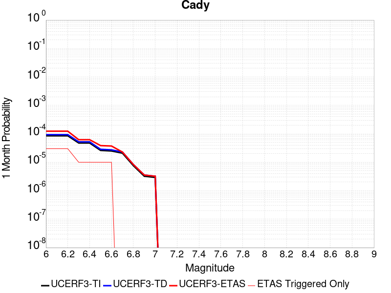 |  | 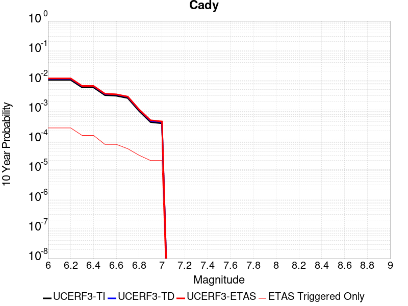 |

| Magnitude | 1 wk TI Prob | 1 wk TD Prob | 1 wk ETAS Prob | 1 wk ETAS/TD Gain | 1 wk ETAS Triggered Only | 1 mo TI Prob | 1 mo TD Prob | 1 mo ETAS Prob | 1 mo ETAS/TD Gain | 1 mo ETAS Triggered Only | 1 yr TI Prob | 1 yr TD Prob | 1 yr ETAS Prob | 1 yr ETAS/TD Gain | 1 yr ETAS Triggered Only | 10 yr TI Prob | 10 yr TD Prob | 10 yr ETAS Prob | 10 yr ETAS/TD Gain | 10 yr ETAS Triggered Only |
|-----|-----|-----|-----|-----|-----|-----|-----|-----|-----|-----|-----|-----|-----|-----|-----|-----|-----|-----|-----|-----|
| 6.0 | 1.9892565E-5 | 2.1859876E-5 | 4.185944E-5 | 1.9148983 | 2.0E-5 | 8.525106E-5 | 9.3682334E-5 | 1.2367952E-4 | 1.3202012 | 3.0E-5 | 0.0010374374 | 0.0011400766 | 0.0012998941 | 1.1401814 | 1.6E-4 | 0.010326075 | 0.011351293 | 0.011598456 | 1.0217739 | 2.5E-4 |
| 6.1 | 1.9892565E-5 | 2.1859876E-5 | 4.185944E-5 | 1.9148983 | 2.0E-5 | 8.525106E-5 | 9.3682334E-5 | 1.2367952E-4 | 1.3202012 | 3.0E-5 | 0.0010374374 | 0.0011400766 | 0.0012998941 | 1.1401814 | 1.6E-4 | 0.010326075 | 0.011351293 | 0.011598456 | 1.0217739 | 2.5E-4 |
| 6.2 | 1.9892565E-5 | 2.1859876E-5 | 4.185944E-5 | 1.9148983 | 2.0E-5 | 8.525106E-5 | 9.3682334E-5 | 1.2367952E-4 | 1.3202012 | 3.0E-5 | 0.0010374374 | 0.0011400766 | 0.0012998941 | 1.1401814 | 1.6E-4 | 0.010326075 | 0.011351293 | 0.011598456 | 1.0217739 | 2.5E-4 |
| 6.3 | 1.1117327E-5 | 1.2177199E-5 | 1.2177199E-5 | 1.0 | 0.0 | 4.764482E-5 | 5.218713E-5 | 6.218661E-5 | 1.1916081 | 1.0E-5 | 5.7992124E-4 | 6.352246E-4 | 7.2516745E-4 | 1.1415921 | 9.0E-5 | 0.0057841022 | 0.006337195 | 0.0064763078 | 1.0219518 | 1.4E-4 |
| 6.4 | 1.1117327E-5 | 1.2177199E-5 | 1.2177199E-5 | 1.0 | 0.0 | 4.764482E-5 | 5.218713E-5 | 6.218661E-5 | 1.1916081 | 1.0E-5 | 5.7992124E-4 | 6.352246E-4 | 7.2516745E-4 | 1.1415921 | 9.0E-5 | 0.0057841022 | 0.006337195 | 0.0064763078 | 1.0219518 | 1.4E-4 |
| 6.5 | 6.103093E-6 | 6.672351E-6 | 6.672351E-6 | 1.0 | 0.0 | 2.615585E-5 | 2.8595547E-5 | 3.8595263E-5 | 1.3496948 | 1.0E-5 | 3.1840094E-4 | 3.4810771E-4 | 3.8809382E-4 | 1.114867 | 4.0E-5 | 0.0031794512 | 0.0034768586 | 0.0035466151 | 1.0200632 | 7.0E-5 |
| 6.6 | 5.817237E-6 | 6.3659772E-6 | 6.3659772E-6 | 1.0 | 0.0 | 2.4930776E-5 | 2.7282544E-5 | 3.7282272E-5 | 1.3665247 | 1.0E-5 | 3.034899E-4 | 3.321268E-4 | 3.721135E-4 | 1.1203959 | 4.0E-5 | 0.0030307577 | 0.0033175263 | 0.0033872942 | 1.0210301 | 7.0E-5 |
| 6.7 | 4.8846314E-6 | 5.340833E-6 | 5.340833E-6 | 1.0 | 0.0 | 2.0933967E-5 | 2.288915E-5 | 2.288915E-5 | 1.0 | 0.0 | 2.5484123E-4 | 2.7865154E-4 | 3.0864318E-4 | 1.1076313 | 3.0E-5 | 0.0025454918 | 0.002784177 | 0.0028340376 | 1.0179086 | 5.0E-5 |
| 6.8 | 1.7788773E-6 | 1.940001E-6 | 1.940001E-6 | 1.0 | 0.0 | 7.6237375E-6 | 8.314273E-6 | 8.314273E-6 | 1.0 | 0.0 | 9.281505E-5 | 1.0122315E-4 | 1.11222136E-4 | 1.0987816 | 1.0E-5 | 9.2776294E-4 | 0.001011925 | 0.0010418948 | 1.0296165 | 3.0E-5 |
| 6.9 | 7.5455404E-7 | 8.2975305E-7 | 8.2975305E-7 | 1.0 | 0.0 | 3.233799E-6 | 3.5560815E-6 | 3.5560815E-6 | 1.0 | 0.0 | 3.937079E-5 | 4.329477E-5 | 5.3294338E-5 | 1.2309648 | 1.0E-5 | 3.9363815E-4 | 4.3289628E-4 | 4.5288765E-4 | 1.0461805 | 2.0E-5 |
| 7.0 | 6.8578805E-7 | 7.542215E-7 | 7.542215E-7 | 1.0 | 0.0 | 2.9390883E-6 | 3.2323758E-6 | 3.2323758E-6 | 1.0 | 0.0 | 3.578281E-5 | 3.9353796E-5 | 4.9353403E-5 | 1.2540951 | 1.0E-5 | 3.577705E-4 | 3.9350073E-4 | 4.1349287E-4 | 1.0508058 | 2.0E-5 |

## Coyote Lake
*[(top)](#table-of-contents)*

| 1 Week | 1 Month | 1 Year | 10 Year |
|-----|-----|-----|-----|
|  |  |  |  |

| Magnitude | 1 wk TI Prob | 1 wk TD Prob | 1 wk ETAS Prob | 1 wk ETAS/TD Gain | 1 wk ETAS Triggered Only | 1 mo TI Prob | 1 mo TD Prob | 1 mo ETAS Prob | 1 mo ETAS/TD Gain | 1 mo ETAS Triggered Only | 1 yr TI Prob | 1 yr TD Prob | 1 yr ETAS Prob | 1 yr ETAS/TD Gain | 1 yr ETAS Triggered Only | 10 yr TI Prob | 10 yr TD Prob | 10 yr ETAS Prob | 10 yr ETAS/TD Gain | 10 yr ETAS Triggered Only |
|-----|-----|-----|-----|-----|-----|-----|-----|-----|-----|-----|-----|-----|-----|-----|-----|-----|-----|-----|-----|-----|
| 6.0 | 1.980352E-5 | 2.1707852E-5 | 2.1707852E-5 | 1.0 | 0.0 | 8.486947E-5 | 9.303074E-5 | 1.0302981E-4 | 1.1074814 | 1.0E-5 | 0.0010327959 | 0.0011321327 | 0.0012020535 | 1.0617602 | 7.0E-5 | 0.010280091 | 0.01127083 | 0.011498238 | 1.0201766 | 2.3E-4 |
| 6.1 | 1.980352E-5 | 2.1707852E-5 | 2.1707852E-5 | 1.0 | 0.0 | 8.486947E-5 | 9.303074E-5 | 1.0302981E-4 | 1.1074814 | 1.0E-5 | 0.0010327959 | 0.0011321327 | 0.0012020535 | 1.0617602 | 7.0E-5 | 0.010280091 | 0.01127083 | 0.011498238 | 1.0201766 | 2.3E-4 |
| 6.2 | 1.980352E-5 | 2.1707852E-5 | 2.1707852E-5 | 1.0 | 0.0 | 8.486947E-5 | 9.303074E-5 | 1.0302981E-4 | 1.1074814 | 1.0E-5 | 0.0010327959 | 0.0011321327 | 0.0012020535 | 1.0617602 | 7.0E-5 | 0.010280091 | 0.01127083 | 0.011498238 | 1.0201766 | 2.3E-4 |
| 6.3 | 1.5344787E-5 | 1.6821528E-5 | 1.6821528E-5 | 1.0 | 0.0 | 6.576172E-5 | 7.209062E-5 | 8.208989E-5 | 1.1387043 | 1.0E-5 | 8.003548E-4 | 8.7741105E-4 | 9.2736713E-4 | 1.0569358 | 5.0E-5 | 0.007974784 | 0.008745514 | 0.0089536775 | 1.0238023 | 2.1E-4 |
| 6.4 | 1.5344787E-5 | 1.6821528E-5 | 1.6821528E-5 | 1.0 | 0.0 | 6.576172E-5 | 7.209062E-5 | 8.208989E-5 | 1.1387043 | 1.0E-5 | 8.003548E-4 | 8.7741105E-4 | 9.2736713E-4 | 1.0569358 | 5.0E-5 | 0.007974784 | 0.008745514 | 0.0089536775 | 1.0238023 | 2.1E-4 |
| 6.5 | 1.4189697E-5 | 1.5558782E-5 | 1.5558782E-5 | 1.0 | 0.0 | 6.081157E-5 | 6.667913E-5 | 7.6678465E-5 | 1.149962 | 1.0E-5 | 7.401293E-4 | 8.115764E-4 | 8.6153584E-4 | 1.0615585 | 5.0E-5 | 0.0073766913 | 0.008092069 | 0.00830037 | 1.0257413 | 2.1E-4 |
| 6.6 | 1.3469301E-5 | 1.4772335E-5 | 1.4772335E-5 | 1.0 | 0.0 | 5.7724297E-5 | 6.330881E-5 | 7.3308176E-5 | 1.1579459 | 1.0E-5 | 7.025667E-4 | 7.7057217E-4 | 8.105413E-4 | 1.0518695 | 4.0E-5 | 0.0070034964 | 0.0076849074 | 0.007883371 | 1.025825 | 2.0E-4 |
| 6.7 | 1.3027966E-5 | 1.4282475E-5 | 1.4282475E-5 | 1.0 | 0.0 | 5.5832945E-5 | 6.12095E-5 | 7.1208895E-5 | 1.1633633 | 1.0E-5 | 6.7955407E-4 | 7.450307E-4 | 7.7500835E-4 | 1.0402368 | 3.0E-5 | 0.006774798 | 0.007431207 | 0.00760987 | 1.0240421 | 1.8E-4 |
| 6.8 | 5.695434E-6 | 6.2247245E-6 | 6.2247245E-6 | 1.0 | 0.0 | 2.4408775E-5 | 2.6677288E-5 | 3.6677022E-5 | 1.3748407 | 1.0E-5 | 2.971363E-4 | 3.2477756E-4 | 3.3477432E-4 | 1.0307803 | 1.0E-5 | 0.0029673933 | 0.0032459702 | 0.003335678 | 1.0276366 | 9.0E-5 |
| 6.9 | 4.385688E-6 | 4.7932917E-6 | 4.7932917E-6 | 1.0 | 0.0 | 1.879567E-5 | 2.0542679E-5 | 3.0542473E-5 | 1.4867815 | 1.0E-5 | 2.2881327E-4 | 2.501071E-4 | 2.601046E-4 | 1.0399729 | 1.0E-5 | 0.002285778 | 0.002501071 | 0.002570896 | 1.027918 | 7.0E-5 |

## Death Valley (No)
*[(top)](#table-of-contents)*

| 1 Week | 1 Month | 1 Year | 10 Year |
|-----|-----|-----|-----|
|  |  |  |  |

| Magnitude | 1 wk TI Prob | 1 wk TD Prob | 1 wk ETAS Prob | 1 wk ETAS/TD Gain | 1 wk ETAS Triggered Only | 1 mo TI Prob | 1 mo TD Prob | 1 mo ETAS Prob | 1 mo ETAS/TD Gain | 1 mo ETAS Triggered Only | 1 yr TI Prob | 1 yr TD Prob | 1 yr ETAS Prob | 1 yr ETAS/TD Gain | 1 yr ETAS Triggered Only | 10 yr TI Prob | 10 yr TD Prob | 10 yr ETAS Prob | 10 yr ETAS/TD Gain | 10 yr ETAS Triggered Only |
|-----|-----|-----|-----|-----|-----|-----|-----|-----|-----|-----|-----|-----|-----|-----|-----|-----|-----|-----|-----|-----|
| 6.0 | 2.0074807E-5 | 2.2501532E-5 | 2.2501532E-5 | 1.0 | 0.0 | 8.603206E-5 | 9.643161E-5 | 9.643161E-5 | 1.0 | 0.0 | 0.001046937 | 0.00117343 | 0.0012633244 | 1.0766082 | 9.0E-5 | 0.010420183 | 0.011673254 | 0.011890686 | 1.0186265 | 2.2E-4 |
| 6.1 | 2.0074807E-5 | 2.2501532E-5 | 2.2501532E-5 | 1.0 | 0.0 | 8.603206E-5 | 9.643161E-5 | 9.643161E-5 | 1.0 | 0.0 | 0.001046937 | 0.00117343 | 0.0012633244 | 1.0766082 | 9.0E-5 | 0.010420183 | 0.011673254 | 0.011890686 | 1.0186265 | 2.2E-4 |
| 6.2 | 2.0074807E-5 | 2.2501532E-5 | 2.2501532E-5 | 1.0 | 0.0 | 8.603206E-5 | 9.643161E-5 | 9.643161E-5 | 1.0 | 0.0 | 0.001046937 | 0.00117343 | 0.0012633244 | 1.0766082 | 9.0E-5 | 0.010420183 | 0.011673254 | 0.011890686 | 1.0186265 | 2.2E-4 |
| 6.3 | 1.9050609E-5 | 2.1338312E-5 | 2.1338312E-5 | 1.0 | 0.0 | 8.164292E-5 | 9.1446746E-5 | 9.1446746E-5 | 1.0 | 0.0 | 9.935491E-4 | 0.0011128022 | 0.001202702 | 1.080787 | 9.0E-5 | 0.009891188 | 0.011073124 | 0.011290687 | 1.019648 | 2.2E-4 |
| 6.4 | 1.9050609E-5 | 2.1338312E-5 | 2.1338312E-5 | 1.0 | 0.0 | 8.164292E-5 | 9.1446746E-5 | 9.1446746E-5 | 1.0 | 0.0 | 9.935491E-4 | 0.0011128022 | 0.001202702 | 1.080787 | 9.0E-5 | 0.009891188 | 0.011073124 | 0.011290687 | 1.019648 | 2.2E-4 |
| 6.5 | 1.8367004E-5 | 2.0562318E-5 | 2.0562318E-5 | 1.0 | 0.0 | 7.8713354E-5 | 8.8121276E-5 | 8.8121276E-5 | 1.0 | 0.0 | 9.5791375E-4 | 0.0010723551 | 0.0011622586 | 1.0838374 | 9.0E-5 | 0.009537951 | 0.010672592 | 0.010890244 | 1.0203935 | 2.2E-4 |
| 6.6 | 1.779439E-5 | 1.9912191E-5 | 1.9912191E-5 | 1.0 | 0.0 | 7.625944E-5 | 8.53352E-5 | 8.53352E-5 | 1.0 | 0.0 | 9.280632E-4 | 0.0010384673 | 0.0011183843 | 1.0769566 | 8.0E-5 | 0.009241969 | 0.010336905 | 0.010544734 | 1.0201056 | 2.1E-4 |
| 6.7 | 1.7025437E-5 | 1.904463E-5 | 1.904463E-5 | 1.0 | 0.0 | 7.296412E-5 | 8.161732E-5 | 8.161732E-5 | 1.0 | 0.0 | 8.87976E-4 | 9.93244E-4 | 0.0010731646 | 1.0804641 | 8.0E-5 | 0.008844362 | 0.009888767 | 0.010096691 | 1.0210263 | 2.1E-4 |
| 6.8 | 1.6545107E-5 | 1.851372E-5 | 1.851372E-5 | 1.0 | 0.0 | 7.090568E-5 | 7.934213E-5 | 7.934213E-5 | 1.0 | 0.0 | 8.629347E-4 | 9.6556847E-4 | 0.0010454912 | 1.0827727 | 8.0E-5 | 0.008595915 | 0.009614435 | 0.009822416 | 1.0216322 | 2.1E-4 |
| 6.9 | 1.615478E-5 | 1.8088747E-5 | 1.8088747E-5 | 1.0 | 0.0 | 6.9232934E-5 | 7.7520934E-5 | 7.7520934E-5 | 1.0 | 0.0 | 8.4258494E-4 | 9.4341475E-4 | 0.0010233392 | 1.0847183 | 8.0E-5 | 0.008393973 | 0.009394792 | 0.009602819 | 1.0221428 | 2.1E-4 |
| 7.0 | 1.5894311E-5 | 1.780669E-5 | 1.780669E-5 | 1.0 | 0.0 | 6.81167E-5 | 7.6312186E-5 | 7.6312186E-5 | 1.0 | 0.0 | 8.2900526E-4 | 9.287109E-4 | 0.0010086367 | 1.0860609 | 8.0E-5 | 0.008259195 | 0.009248987 | 0.009457044 | 1.0224952 | 2.1E-4 |
| 7.1 | 1.5602263E-5 | 1.7484625E-5 | 1.7484625E-5 | 1.0 | 0.0 | 6.6865134E-5 | 7.493199E-5 | 7.493199E-5 | 1.0 | 0.0 | 8.137789E-4 | 9.119212E-4 | 9.918483E-4 | 1.0876468 | 8.0E-5 | 0.008108052 | 0.009082474 | 0.009290567 | 1.0229114 | 2.1E-4 |
| 7.2 | 1.5323829E-5 | 1.7171731E-5 | 1.7171731E-5 | 1.0 | 0.0 | 6.56719E-5 | 7.3591094E-5 | 7.3591094E-5 | 1.0 | 0.0 | 7.99262E-4 | 8.956093E-4 | 9.755377E-4 | 1.0892446 | 8.0E-5 | 0.007963934 | 0.008920676 | 0.009108981 | 1.0211089 | 1.9E-4 |
| 7.3 | 1.4556212E-5 | 1.6303497E-5 | 1.6303497E-5 | 1.0 | 0.0 | 6.238227E-5 | 6.9870286E-5 | 6.9870286E-5 | 1.0 | 0.0 | 7.592395E-4 | 8.503446E-4 | 9.202851E-4 | 1.0822495 | 7.0E-5 | 0.0075665074 | 0.008471553 | 0.008640113 | 1.0198971 | 1.7E-4 |
| 7.4 | 1.411725E-5 | 1.5808968E-5 | 1.5808968E-5 | 1.0 | 0.0 | 6.0501097E-5 | 6.775099E-5 | 6.775099E-5 | 1.0 | 0.0 | 7.363519E-4 | 8.24562E-4 | 8.845125E-4 | 1.0727059 | 6.0E-5 | 0.0073391674 | 0.00821566 | 0.0083743455 | 1.019315 | 1.6E-4 |
| 7.5 | 1.3503312E-5 | 1.5127256E-5 | 1.5127256E-5 | 1.0 | 0.0 | 5.7870053E-5 | 6.4829524E-5 | 6.4829524E-5 | 1.0 | 0.0 | 7.043401E-4 | 7.890194E-4 | 8.4897206E-4 | 1.0759838 | 6.0E-5 | 0.007021119 | 0.007862805 | 0.008021547 | 1.0201889 | 1.6E-4 |
| 7.6 | 1.1279839E-5 | 1.2627129E-5 | 1.2627129E-5 | 1.0 | 0.0 | 4.834127E-5 | 5.4115175E-5 | 5.4115175E-5 | 1.0 | 0.0 | 5.88396E-4 | 6.586584E-4 | 7.1861886E-4 | 1.0910343 | 6.0E-5 | 0.005868405 | 0.006567614 | 0.006706695 | 1.0211767 | 1.4E-4 |
| 7.7 | 9.189108E-6 | 1.02840095E-5 | 1.02840095E-5 | 1.0 | 0.0 | 3.93813E-5 | 4.407361E-5 | 4.407361E-5 | 1.0 | 0.0 | 4.7936183E-4 | 5.3646916E-4 | 5.764477E-4 | 1.0745217 | 4.0E-5 | 0.004783291 | 0.005352252 | 0.005451717 | 1.0185838 | 1.0E-4 |
| 7.8 | 3.4586725E-7 | 3.648368E-7 | 3.648368E-7 | 1.0 | 0.0 | 1.4822873E-6 | 1.5635853E-6 | 1.5635853E-6 | 1.0 | 0.0 | 1.80467E-5 | 1.903649E-5 | 1.903649E-5 | 1.0 | 0.0 | 1.8045233E-4 | 1.9034903E-4 | 1.9034903E-4 | 1.0 | 0.0 |
| 7.9 | 2.5591178E-9 | 2.6697329E-9 | 2.6697329E-9 | 1.0 | 0.0 | 1.0967647E-8 | 1.14417125E-8 | 1.14417125E-8 | 1.0 | 0.0 | 1.335311E-7 | 1.3930286E-7 | 1.3930286E-7 | 1.0 | 0.0 | 1.3353102E-6 | 1.3930285E-6 | 1.3930285E-6 | 1.0 | 0.0 |

## San Andreas (San Gorgonio Pass-Garnet HIll)
*[(top)](#table-of-contents)*

| 1 Week | 1 Month | 1 Year | 10 Year |
|-----|-----|-----|-----|
|  |  |  |  |

| Magnitude | 1 wk TI Prob | 1 wk TD Prob | 1 wk ETAS Prob | 1 wk ETAS/TD Gain | 1 wk ETAS Triggered Only | 1 mo TI Prob | 1 mo TD Prob | 1 mo ETAS Prob | 1 mo ETAS/TD Gain | 1 mo ETAS Triggered Only | 1 yr TI Prob | 1 yr TD Prob | 1 yr ETAS Prob | 1 yr ETAS/TD Gain | 1 yr ETAS Triggered Only | 10 yr TI Prob | 10 yr TD Prob | 10 yr ETAS Prob | 10 yr ETAS/TD Gain | 10 yr ETAS Triggered Only |
|-----|-----|-----|-----|-----|-----|-----|-----|-----|-----|-----|-----|-----|-----|-----|-----|-----|-----|-----|-----|-----|
| 6.0 | 8.31567E-5 | 2.3398406E-4 | 2.3398406E-4 | 1.0 | 0.0 | 3.5633717E-4 | 0.001002406 | 0.0010223859 | 1.019932 | 2.0E-5 | 0.004329778 | 0.012136027 | 0.012264449 | 1.0105819 | 1.3E-4 | 0.042463828 | 0.11264349 | 0.11283871 | 1.0017331 | 2.2E-4 |
| 6.1 | 8.31567E-5 | 2.3398406E-4 | 2.3398406E-4 | 1.0 | 0.0 | 3.5633717E-4 | 0.001002406 | 0.0010223859 | 1.019932 | 2.0E-5 | 0.004329778 | 0.012136027 | 0.012264449 | 1.0105819 | 1.3E-4 | 0.042463828 | 0.11264349 | 0.11283871 | 1.0017331 | 2.2E-4 |
| 6.2 | 8.31567E-5 | 2.3398406E-4 | 2.3398406E-4 | 1.0 | 0.0 | 3.5633717E-4 | 0.001002406 | 0.0010223859 | 1.019932 | 2.0E-5 | 0.004329778 | 0.012136027 | 0.012264449 | 1.0105819 | 1.3E-4 | 0.042463828 | 0.11264349 | 0.11283871 | 1.0017331 | 2.2E-4 |
| 6.3 | 8.31567E-5 | 2.3398406E-4 | 2.3398406E-4 | 1.0 | 0.0 | 3.5633717E-4 | 0.001002406 | 0.0010223859 | 1.019932 | 2.0E-5 | 0.004329778 | 0.012136027 | 0.012264449 | 1.0105819 | 1.3E-4 | 0.042463828 | 0.11264349 | 0.11283871 | 1.0017331 | 2.2E-4 |
| 6.4 | 8.059055E-5 | 2.2956554E-4 | 2.2956554E-4 | 1.0 | 0.0 | 3.4534236E-4 | 9.834839E-4 | 9.93474E-4 | 1.010158 | 1.0E-5 | 0.0041964394 | 0.011908189 | 0.012026761 | 1.0099571 | 1.2E-4 | 0.041180745 | 0.11062444 | 0.11081121 | 1.0016884 | 2.1E-4 |
| 6.5 | 8.059055E-5 | 2.2956554E-4 | 2.2956554E-4 | 1.0 | 0.0 | 3.4534236E-4 | 9.834839E-4 | 9.93474E-4 | 1.010158 | 1.0E-5 | 0.0041964394 | 0.011908189 | 0.012026761 | 1.0099571 | 1.2E-4 | 0.041180745 | 0.11062444 | 0.11081121 | 1.0016884 | 2.1E-4 |
| 6.6 | 7.619237E-5 | 2.2200657E-4 | 2.2200657E-4 | 1.0 | 0.0 | 3.2649786E-4 | 9.511121E-4 | 9.6110255E-4 | 1.010504 | 1.0E-5 | 0.0039678677 | 0.011518859 | 0.011637477 | 1.0102977 | 1.2E-4 | 0.03897764 | 0.107160784 | 0.10733935 | 1.0016663 | 2.0E-4 |
| 6.7 | 7.440636E-5 | 2.1876446E-4 | 2.1876446E-4 | 1.0 | 0.0 | 3.188454E-4 | 9.372274E-4 | 9.47218E-4 | 1.0106598 | 1.0E-5 | 0.0038750346 | 0.01135158 | 0.011470218 | 1.0104512 | 1.2E-4 | 0.038081564 | 0.105669186 | 0.10584805 | 1.0016927 | 2.0E-4 |
| 6.8 | 7.3735864E-5 | 2.1723597E-4 | 2.1723597E-4 | 1.0 | 0.0 | 3.1597257E-4 | 9.306814E-4 | 9.4067206E-4 | 1.0107348 | 1.0E-5 | 0.0038401815 | 0.011272711 | 0.0113913575 | 1.0105252 | 1.2E-4 | 0.03774495 | 0.1049707 | 0.10514971 | 1.0017053 | 2.0E-4 |
| 6.9 | 7.27575E-5 | 2.1492546E-4 | 2.1492546E-4 | 1.0 | 0.0 | 3.117806E-4 | 9.207862E-4 | 9.30777E-4 | 1.0108503 | 1.0E-5 | 0.003789323 | 0.011153476 | 0.011272138 | 1.010639 | 1.2E-4 | 0.037253562 | 0.10391858 | 0.1040978 | 1.0017246 | 2.0E-4 |
| 7.0 | 7.102591E-5 | 2.1076521E-4 | 2.1076521E-4 | 1.0 | 0.0 | 3.0436125E-4 | 9.02969E-4 | 9.1296E-4 | 1.0110645 | 1.0E-5 | 0.003699303 | 0.010938748 | 0.011057435 | 1.0108502 | 1.2E-4 | 0.03638325 | 0.102020636 | 0.10220023 | 1.0017604 | 2.0E-4 |
| 7.1 | 7.028513E-5 | 2.0912137E-4 | 2.0912137E-4 | 1.0 | 0.0 | 3.0118722E-4 | 8.959288E-4 | 9.059199E-4 | 1.0111516 | 1.0E-5 | 0.0036607897 | 0.01085389 | 0.010972588 | 1.0109359 | 1.2E-4 | 0.036010686 | 0.10126359 | 0.10144334 | 1.001775 | 2.0E-4 |
| 7.2 | 6.8498244E-5 | 2.0519937E-4 | 2.0519937E-4 | 1.0 | 0.0 | 2.9353087E-4 | 8.7913166E-4 | 8.8912284E-4 | 1.0113648 | 1.0E-5 | 0.003567883 | 0.0106514 | 0.010770122 | 1.0111461 | 1.2E-4 | 0.035111405 | 0.09945543 | 0.09963554 | 1.0018109 | 2.0E-4 |
| 7.3 | 6.622592E-5 | 1.9747039E-4 | 1.9747039E-4 | 1.0 | 0.0 | 2.8379448E-4 | 8.460293E-4 | 8.560209E-4 | 1.01181 | 1.0E-5 | 0.0034497243 | 0.010252241 | 0.010371011 | 1.0115848 | 1.2E-4 | 0.033966612 | 0.09595134 | 0.096123114 | 1.0017902 | 1.9E-4 |
| 7.4 | 5.1050705E-5 | 1.4701985E-4 | 1.4701985E-4 | 1.0 | 0.0 | 2.1877038E-4 | 6.299338E-4 | 6.399275E-4 | 1.0158647 | 1.0E-5 | 0.002660276 | 0.0076426673 | 0.00776175 | 1.0155814 | 1.2E-4 | 0.02628654 | 0.07291896 | 0.073095106 | 1.0024157 | 1.9E-4 |
| 7.5 | 3.9302922E-5 | 1.1141107E-4 | 1.1141107E-4 | 1.0 | 0.0 | 1.6843023E-4 | 4.7738897E-4 | 4.873842E-4 | 1.0209373 | 1.0E-5 | 0.0020487092 | 0.005796791 | 0.0059160953 | 1.0205811 | 1.2E-4 | 0.020299247 | 0.056059215 | 0.056238562 | 1.0031992 | 1.9E-4 |
| 7.6 | 2.9851626E-5 | 8.504997E-5 | 8.504997E-5 | 1.0 | 0.0 | 1.2792926E-4 | 3.6444908E-4 | 3.7444543E-4 | 1.0274286 | 1.0E-5 | 0.0015564259 | 0.0044281655 | 0.0045376783 | 1.024731 | 1.1E-4 | 0.0154556995 | 0.043238558 | 0.043410774 | 1.0039829 | 1.8E-4 |
| 7.7 | 2.1135214E-5 | 6.361802E-5 | 6.361802E-5 | 1.0 | 0.0 | 9.0576345E-5 | 2.726202E-4 | 2.8261746E-4 | 1.036671 | 1.0E-5 | 0.0011022091 | 0.0033141046 | 0.0034237402 | 1.0330814 | 1.1E-4 | 0.010967582 | 0.032622673 | 0.0327968 | 1.0053376 | 1.8E-4 |
| 7.8 | 1.883379E-5 | 5.572194E-5 | 5.572194E-5 | 1.0 | 0.0 | 8.0713755E-5 | 2.3878647E-4 | 2.4878408E-4 | 1.0418684 | 1.0E-5 | 9.822468E-4 | 0.0029033525 | 0.0030130332 | 1.0377772 | 1.1E-4 | 0.0097791655 | 0.028732158 | 0.028906988 | 1.0060848 | 1.8E-4 |
| 7.9 | 1.5156185E-5 | 4.1725576E-5 | 4.1725576E-5 | 1.0 | 0.0 | 6.495346E-5 | 1.7881165E-4 | 1.8880986E-4 | 1.0559148 | 1.0E-5 | 7.9052144E-4 | 0.0021748596 | 0.0022846204 | 1.050468 | 1.1E-4 | 0.007877152 | 0.021790246 | 0.021956543 | 1.0076317 | 1.7E-4 |
| 8.0 | 1.1405907E-5 | 3.0024876E-5 | 3.0024876E-5 | 1.0 | 0.0 | 4.8881542E-5 | 1.286717E-4 | 1.3867041E-4 | 1.0777072 | 1.0E-5 | 5.9497025E-4 | 0.0015654531 | 0.0016453279 | 1.0510234 | 8.0E-5 | 0.005933798 | 0.015796356 | 0.01591446 | 1.0074767 | 1.2E-4 |
| 8.1 | 4.3511436E-6 | 7.3873994E-6 | 7.3873994E-6 | 1.0 | 0.0 | 1.8647626E-5 | 3.16599E-5 | 3.16599E-5 | 1.0 | 0.0 | 2.2701119E-4 | 3.8539123E-4 | 3.9538738E-4 | 1.0259377 | 1.0E-5 | 0.0022677942 | 0.0041254 | 0.0041353586 | 1.002414 | 1.0E-5 |
| 8.2 | 2.3042528E-6 | 2.74142E-6 | 2.74142E-6 | 1.0 | 0.0 | 9.875332E-6 | 1.174889E-5 | 1.174889E-5 | 1.0 | 0.0 | 1.2022553E-4 | 1.430334E-4 | 1.430334E-4 | 1.0 | 0.0 | 0.0012016051 | 0.0016024038 | 0.0016024038 | 1.0 | 0.0 |
| 8.3 | 5.202968E-7 | 3.171921E-7 | 3.171921E-7 | 1.0 | 0.0 | 2.2298414E-6 | 1.3593941E-6 | 1.3593941E-6 | 1.0 | 0.0 | 2.714798E-5 | 1.655051E-5 | 1.655051E-5 | 1.0 | 0.0 | 2.7144665E-4 | 1.9631305E-4 | 1.9631305E-4 | 1.0 | 0.0 |

## San Andreas (Carrizo) rev
*[(top)](#table-of-contents)*

| 1 Week | 1 Month | 1 Year | 10 Year |
|-----|-----|-----|-----|
|  |  |  |  |

| Magnitude | 1 wk TI Prob | 1 wk TD Prob | 1 wk ETAS Prob | 1 wk ETAS/TD Gain | 1 wk ETAS Triggered Only | 1 mo TI Prob | 1 mo TD Prob | 1 mo ETAS Prob | 1 mo ETAS/TD Gain | 1 mo ETAS Triggered Only | 1 yr TI Prob | 1 yr TD Prob | 1 yr ETAS Prob | 1 yr ETAS/TD Gain | 1 yr ETAS Triggered Only | 10 yr TI Prob | 10 yr TD Prob | 10 yr ETAS Prob | 10 yr ETAS/TD Gain | 10 yr ETAS Triggered Only |
|-----|-----|-----|-----|-----|-----|-----|-----|-----|-----|-----|-----|-----|-----|-----|-----|-----|-----|-----|-----|-----|
| 6.0 | 1.1674632E-4 | 2.4361293E-4 | 2.4361293E-4 | 1.0 | 0.0 | 5.002454E-4 | 0.0010436393 | 0.0010636183 | 1.0191437 | 2.0E-5 | 0.006073493 | 0.012632766 | 0.012731502 | 1.007816 | 1.0E-4 | 0.0591016 | 0.12077509 | 0.12095094 | 1.001456 | 2.0E-4 |
| 6.1 | 1.1674632E-4 | 2.4361293E-4 | 2.4361293E-4 | 1.0 | 0.0 | 5.002454E-4 | 0.0010436393 | 0.0010636183 | 1.0191437 | 2.0E-5 | 0.006073493 | 0.012632766 | 0.012731502 | 1.007816 | 1.0E-4 | 0.0591016 | 0.12077509 | 0.12095094 | 1.001456 | 2.0E-4 |
| 6.2 | 1.1674632E-4 | 2.4361293E-4 | 2.4361293E-4 | 1.0 | 0.0 | 5.002454E-4 | 0.0010436393 | 0.0010636183 | 1.0191437 | 2.0E-5 | 0.006073493 | 0.012632766 | 0.012731502 | 1.007816 | 1.0E-4 | 0.0591016 | 0.12077509 | 0.12095094 | 1.001456 | 2.0E-4 |
| 6.3 | 1.1674632E-4 | 2.4361293E-4 | 2.4361293E-4 | 1.0 | 0.0 | 5.002454E-4 | 0.0010436393 | 0.0010636183 | 1.0191437 | 2.0E-5 | 0.006073493 | 0.012632766 | 0.012731502 | 1.007816 | 1.0E-4 | 0.0591016 | 0.12077509 | 0.12095094 | 1.001456 | 2.0E-4 |
| 6.4 | 1.1674632E-4 | 2.4361293E-4 | 2.4361293E-4 | 1.0 | 0.0 | 5.002454E-4 | 0.0010436393 | 0.0010636183 | 1.0191437 | 2.0E-5 | 0.006073493 | 0.012632766 | 0.012731502 | 1.007816 | 1.0E-4 | 0.0591016 | 0.12077509 | 0.12095094 | 1.001456 | 2.0E-4 |
| 6.5 | 1.13136164E-4 | 2.3681132E-4 | 2.3681132E-4 | 1.0 | 0.0 | 4.847792E-4 | 0.0010145125 | 0.0010344922 | 1.0196939 | 2.0E-5 | 0.0058862255 | 0.012282185 | 0.012380958 | 1.0080419 | 1.0E-4 | 0.057327334 | 0.1177463 | 0.11792275 | 1.0014986 | 2.0E-4 |
| 6.6 | 1.13136164E-4 | 2.3681132E-4 | 2.3681132E-4 | 1.0 | 0.0 | 4.847792E-4 | 0.0010145125 | 0.0010344922 | 1.0196939 | 2.0E-5 | 0.0058862255 | 0.012282185 | 0.012380958 | 1.0080419 | 1.0E-4 | 0.057327334 | 0.1177463 | 0.11792275 | 1.0014986 | 2.0E-4 |
| 6.7 | 1.1149675E-4 | 2.3372276E-4 | 2.3372276E-4 | 1.0 | 0.0 | 4.777557E-4 | 0.001001286 | 0.001021266 | 1.0199543 | 2.0E-5 | 0.0058011734 | 0.012122953 | 0.0122217415 | 1.0081488 | 1.0E-4 | 0.05652051 | 0.116367765 | 0.11654449 | 1.0015187 | 2.0E-4 |
| 6.8 | 1.1103589E-4 | 2.3274389E-4 | 2.3274389E-4 | 1.0 | 0.0 | 4.7578133E-4 | 9.97094E-4 | 0.0010170741 | 1.0200382 | 2.0E-5 | 0.005777263 | 0.012072483 | 0.012171276 | 1.0081832 | 1.0E-4 | 0.056293584 | 0.115927964 | 0.116104774 | 1.0015252 | 2.0E-4 |
| 6.9 | 1.1053259E-4 | 2.316672E-4 | 2.316672E-4 | 1.0 | 0.0 | 4.7362508E-4 | 9.924831E-4 | 0.0010124634 | 1.0201315 | 2.0E-5 | 0.0057511497 | 0.012016967 | 0.012115765 | 1.0082216 | 1.0E-4 | 0.05604569 | 0.11544405 | 0.115620956 | 1.0015324 | 2.0E-4 |
| 7.0 | 1.1005377E-4 | 2.3067516E-4 | 2.3067516E-4 | 1.0 | 0.0 | 4.7157376E-4 | 9.882348E-4 | 0.001008215 | 1.0202181 | 2.0E-5 | 0.0057263062 | 0.011965811 | 0.012064615 | 1.0082572 | 1.0E-4 | 0.055809796 | 0.11499625 | 0.11517325 | 1.0015392 | 2.0E-4 |
| 7.1 | 1.0308142E-4 | 2.1576507E-4 | 2.1576507E-4 | 1.0 | 0.0 | 4.417027E-4 | 9.2438085E-4 | 9.443623E-4 | 1.0216161 | 2.0E-5 | 0.0053644776 | 0.011196577 | 0.0112855695 | 1.0079482 | 9.0E-5 | 0.052368138 | 0.10825095 | 0.10842039 | 1.0015652 | 1.9E-4 |
| 7.2 | 1.0027479E-4 | 2.098411E-4 | 2.098411E-4 | 1.0 | 0.0 | 4.296783E-4 | 8.9901005E-4 | 9.189921E-4 | 1.0222267 | 2.0E-5 | 0.0052187922 | 0.010890815 | 0.010979835 | 1.0081738 | 9.0E-5 | 0.050979212 | 0.105554216 | 0.10572416 | 1.00161 | 1.9E-4 |
| 7.3 | 9.816942E-5 | 2.0458816E-4 | 2.0458816E-4 | 1.0 | 0.0 | 4.2065824E-4 | 8.765127E-4 | 8.9649524E-4 | 1.0227977 | 2.0E-5 | 0.005109493 | 0.010619612 | 0.010708657 | 1.008385 | 9.0E-5 | 0.049935985 | 0.10313633 | 0.10330673 | 1.0016522 | 1.9E-4 |
| 7.4 | 9.5634205E-5 | 1.9827684E-4 | 1.9827684E-4 | 1.0 | 0.0 | 4.0979648E-4 | 8.494821E-4 | 8.6946506E-4 | 1.0235238 | 2.0E-5 | 0.0049778637 | 0.010293663 | 0.010382736 | 1.0086533 | 9.0E-5 | 0.048678253 | 0.100220494 | 0.10039145 | 1.0017058 | 1.9E-4 |
| 7.5 | 8.052417E-5 | 1.6143978E-4 | 1.6143978E-4 | 1.0 | 0.0 | 3.4505792E-4 | 6.917014E-4 | 7.016945E-4 | 1.0144471 | 1.0E-5 | 0.0041929903 | 0.008389029 | 0.008458441 | 1.0082742 | 7.0E-5 | 0.04114753 | 0.08295002 | 0.083105914 | 1.0018795 | 1.7E-4 |
| 7.6 | 7.897024E-5 | 1.579682E-4 | 1.579682E-4 | 1.0 | 0.0 | 3.384E-4 | 6.768311E-4 | 6.868243E-4 | 1.0147648 | 1.0E-5 | 0.0041122385 | 0.00820936 | 0.008268868 | 1.0072488 | 6.0E-5 | 0.040369697 | 0.081289805 | 0.0814368 | 1.0018083 | 1.6E-4 |
| 7.7 | 6.707427E-5 | 1.3303987E-4 | 1.3303987E-4 | 1.0 | 0.0 | 2.8742946E-4 | 5.700463E-4 | 5.8004056E-4 | 1.0175325 | 1.0E-5 | 0.003493839 | 0.0069182604 | 0.0069679148 | 1.0071772 | 5.0E-5 | 0.034394164 | 0.06917457 | 0.06930488 | 1.0018839 | 1.4E-4 |
| 7.8 | 6.147705E-5 | 1.2222702E-4 | 1.2222702E-4 | 1.0 | 0.0 | 2.6344648E-4 | 5.23725E-4 | 5.337198E-4 | 1.019084 | 1.0E-5 | 0.0032027436 | 0.0063577346 | 0.0063974806 | 1.0062516 | 4.0E-5 | 0.031569764 | 0.06362964 | 0.06373265 | 1.0016187 | 1.1E-4 |
| 7.9 | 4.7636717E-5 | 8.8979046E-5 | 8.8979046E-5 | 1.0 | 0.0 | 2.0414138E-4 | 3.8128305E-4 | 3.8128305E-4 | 1.0 | 0.0 | 0.0024825884 | 0.004632248 | 0.004662109 | 1.0064464 | 3.0E-5 | 0.024550365 | 0.046713326 | 0.04678959 | 1.0016326 | 8.0E-5 |
| 8.0 | 3.3554235E-5 | 5.224805E-5 | 5.224805E-5 | 1.0 | 0.0 | 1.4379594E-4 | 2.23901E-4 | 2.23901E-4 | 1.0 | 0.0 | 0.0017493097 | 0.0027225888 | 0.0027425343 | 1.007326 | 2.0E-5 | 0.017356034 | 0.027935574 | 0.027964735 | 1.0010439 | 3.0E-5 |
| 8.1 | 1.9175432E-5 | 1.9238541E-5 | 1.9238541E-5 | 1.0 | 0.0 | 8.217783E-5 | 8.244829E-5 | 8.244829E-5 | 1.0 | 0.0 | 0.0010000558 | 0.0010033463 | 0.0010133364 | 1.0099566 | 1.0E-5 | 0.009955673 | 0.010786123 | 0.010796015 | 1.0009171 | 1.0E-5 |
| 8.2 | 8.643924E-6 | 5.49522E-6 | 5.49522E-6 | 1.0 | 0.0 | 3.704486E-5 | 2.355073E-5 | 2.355073E-5 | 1.0 | 0.0 | 4.5092785E-4 | 2.866925E-4 | 2.866925E-4 | 1.0 | 0.0 | 0.0045001395 | 0.0032598388 | 0.0032598388 | 1.0 | 0.0 |
| 8.3 | 1.983087E-6 | 7.693574E-7 | 7.693574E-7 | 1.0 | 0.0 | 8.498917E-6 | 3.297242E-6 | 3.297242E-6 | 1.0 | 0.0 | 1.034694E-4 | 4.01432E-5 | 4.01432E-5 | 1.0 | 0.0 | 0.0010342124 | 4.7390026E-4 | 4.7390026E-4 | 1.0 | 0.0 |

## Calico-Hidalgo
*[(top)](#table-of-contents)*

| 1 Week | 1 Month | 1 Year | 10 Year |
|-----|-----|-----|-----|
|  |  | 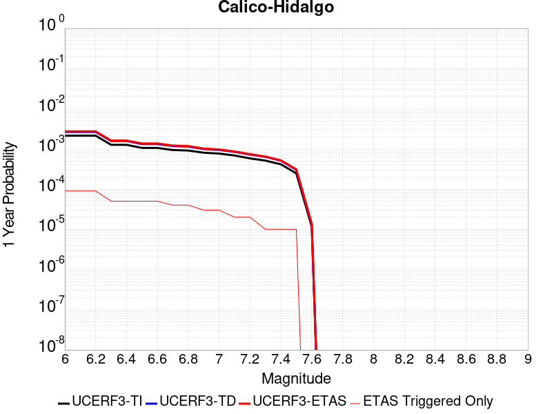 |  |

| Magnitude | 1 wk TI Prob | 1 wk TD Prob | 1 wk ETAS Prob | 1 wk ETAS/TD Gain | 1 wk ETAS Triggered Only | 1 mo TI Prob | 1 mo TD Prob | 1 mo ETAS Prob | 1 mo ETAS/TD Gain | 1 mo ETAS Triggered Only | 1 yr TI Prob | 1 yr TD Prob | 1 yr ETAS Prob | 1 yr ETAS/TD Gain | 1 yr ETAS Triggered Only | 10 yr TI Prob | 10 yr TD Prob | 10 yr ETAS Prob | 10 yr ETAS/TD Gain | 10 yr ETAS Triggered Only |
|-----|-----|-----|-----|-----|-----|-----|-----|-----|-----|-----|-----|-----|-----|-----|-----|-----|-----|-----|-----|-----|
| 6.0 | 4.0906612E-5 | 5.0707546E-5 | 5.0707546E-5 | 1.0 | 0.0 | 1.7530227E-4 | 2.1730224E-4 | 2.3729789E-4 | 1.0920177 | 2.0E-5 | 0.0021322158 | 0.0026428488 | 0.0027326108 | 1.0339642 | 9.0E-5 | 0.02111873 | 0.026154567 | 0.026329858 | 1.0067022 | 1.8E-4 |
| 6.1 | 4.0906612E-5 | 5.0707546E-5 | 5.0707546E-5 | 1.0 | 0.0 | 1.7530227E-4 | 2.1730224E-4 | 2.3729789E-4 | 1.0920177 | 2.0E-5 | 0.0021322158 | 0.0026428488 | 0.0027326108 | 1.0339642 | 9.0E-5 | 0.02111873 | 0.026154567 | 0.026329858 | 1.0067022 | 1.8E-4 |
| 6.2 | 4.0906612E-5 | 5.0707546E-5 | 5.0707546E-5 | 1.0 | 0.0 | 1.7530227E-4 | 2.1730224E-4 | 2.3729789E-4 | 1.0920177 | 2.0E-5 | 0.0021322158 | 0.0026428488 | 0.0027326108 | 1.0339642 | 9.0E-5 | 0.02111873 | 0.026154567 | 0.026329858 | 1.0067022 | 1.8E-4 |
| 6.3 | 2.4242801E-5 | 3.0092122E-5 | 3.0092122E-5 | 1.0 | 0.0 | 1.0389358E-4 | 1.2896005E-4 | 1.3895876E-4 | 1.0775334 | 1.0E-5 | 0.0012641704 | 0.0015689905 | 0.0016189121 | 1.0318177 | 5.0E-5 | 0.01257003 | 0.015582806 | 0.015691092 | 1.0069491 | 1.1E-4 |
| 6.4 | 2.4242801E-5 | 3.0092122E-5 | 3.0092122E-5 | 1.0 | 0.0 | 1.0389358E-4 | 1.2896005E-4 | 1.3895876E-4 | 1.0775334 | 1.0E-5 | 0.0012641704 | 0.0015689905 | 0.0016189121 | 1.0318177 | 5.0E-5 | 0.01257003 | 0.015582806 | 0.015691092 | 1.0069491 | 1.1E-4 |
| 6.5 | 2.0286952E-5 | 2.5316727E-5 | 2.5316727E-5 | 1.0 | 0.0 | 8.694118E-5 | 1.0849584E-4 | 1.18494754E-4 | 1.0921594 | 1.0E-5 | 0.0010579949 | 0.0013201536 | 0.0013700876 | 1.0378244 | 5.0E-5 | 0.010529719 | 0.013125047 | 0.013223735 | 1.007519 | 1.0E-4 |
| 6.6 | 2.0269223E-5 | 2.5297675E-5 | 2.5297675E-5 | 1.0 | 0.0 | 8.6865206E-5 | 1.084142E-4 | 1.1841312E-4 | 1.0922289 | 1.0E-5 | 0.0010570707 | 0.0013191608 | 0.0013690948 | 1.0378529 | 5.0E-5 | 0.010520565 | 0.013115237 | 0.013213925 | 1.0075247 | 1.0E-4 |
| 6.7 | 1.799852E-5 | 2.25414E-5 | 2.25414E-5 | 1.0 | 0.0 | 7.713423E-5 | 9.660251E-5 | 9.660251E-5 | 1.0 | 0.0 | 9.3870464E-4 | 0.0011755156 | 0.0012154685 | 1.0339876 | 4.0E-5 | 0.009347493 | 0.011694587 | 0.011783534 | 1.0076059 | 9.0E-5 |
| 6.8 | 1.7458793E-5 | 2.1842892E-5 | 2.1842892E-5 | 1.0 | 0.0 | 7.4821255E-5 | 9.360912E-5 | 9.360912E-5 | 1.0 | 0.0 | 9.10568E-4 | 0.0011391096 | 0.001179064 | 1.0350752 | 4.0E-5 | 0.009068459 | 0.011334292 | 0.011413385 | 1.0069783 | 8.0E-5 |
| 6.9 | 1.542884E-5 | 1.9026567E-5 | 1.9026567E-5 | 1.0 | 0.0 | 6.612192E-5 | 8.1539954E-5 | 8.1539954E-5 | 1.0 | 0.0 | 8.04737E-4 | 9.923099E-4 | 0.0010222802 | 1.0302025 | 3.0E-5 | 0.008018291 | 0.009880188 | 0.009949497 | 1.0070149 | 7.0E-5 |
| 7.0 | 1.468253E-5 | 1.803119E-5 | 1.803119E-5 | 1.0 | 0.0 | 6.292361E-5 | 7.7274315E-5 | 7.7274315E-5 | 1.0 | 0.0 | 7.658257E-4 | 9.404217E-4 | 9.7039354E-4 | 1.0318706 | 3.0E-5 | 0.0076319184 | 0.009365788 | 0.009425226 | 1.0063463 | 6.0E-5 |
| 7.1 | 1.3139281E-5 | 1.620145E-5 | 1.620145E-5 | 1.0 | 0.0 | 5.6309986E-5 | 6.943301E-5 | 6.943301E-5 | 1.0 | 0.0 | 6.853584E-4 | 8.450316E-4 | 8.650147E-4 | 1.0236478 | 2.0E-5 | 0.0068324856 | 0.008419481 | 0.008459144 | 1.0047109 | 4.0E-5 |
| 7.2 | 1.1127404E-5 | 1.3867019E-5 | 1.3867019E-5 | 1.0 | 0.0 | 4.7688E-5 | 5.942879E-5 | 5.942879E-5 | 1.0 | 0.0 | 5.8044674E-4 | 7.233162E-4 | 7.4330176E-4 | 1.0276304 | 2.0E-5 | 0.0057893298 | 0.0072107273 | 0.007240511 | 1.0041305 | 3.0E-5 |
| 7.3 | 9.808154E-6 | 1.217656E-5 | 1.217656E-5 | 1.0 | 0.0 | 4.2034266E-5 | 5.218427E-5 | 5.218427E-5 | 1.0 | 0.0 | 5.11647E-4 | 6.3516904E-4 | 6.4516265E-4 | 1.0157338 | 1.0E-5 | 0.0051047057 | 0.0063346117 | 0.006354485 | 1.0031372 | 2.0E-5 |
| 7.4 | 7.942452E-6 | 9.7924E-6 | 9.7924E-6 | 1.0 | 0.0 | 3.4038632E-5 | 4.196681E-5 | 4.196681E-5 | 1.0 | 0.0 | 4.1434157E-4 | 5.108356E-4 | 5.2083045E-4 | 1.0195658 | 1.0E-5 | 0.0041356985 | 0.0050975545 | 0.0051174527 | 1.0039035 | 2.0E-5 |
| 7.5 | 4.7121216E-6 | 5.772976E-6 | 5.772976E-6 | 1.0 | 0.0 | 2.019465E-5 | 2.4741134E-5 | 2.4741134E-5 | 1.0 | 0.0 | 2.4584212E-4 | 3.011893E-4 | 3.111863E-4 | 1.0331917 | 1.0E-5 | 0.0024557032 | 0.0030085635 | 0.0030185336 | 1.0033139 | 1.0E-5 |
| 7.6 | 2.21172E-7 | 2.6040124E-7 | 2.6040124E-7 | 1.0 | 0.0 | 9.478797E-7 | 1.116005E-6 | 1.116005E-6 | 1.0 | 0.0 | 1.1540374E-5 | 1.3587305E-5 | 1.3587305E-5 | 1.0 | 0.0 | 1.1539775E-4 | 1.3586757E-4 | 1.3586757E-4 | 1.0 | 0.0 |

## San Andreas (Parkfield)
*[(top)](#table-of-contents)*

| 1 Week | 1 Month | 1 Year | 10 Year |
|-----|-----|-----|-----|
|  |  | 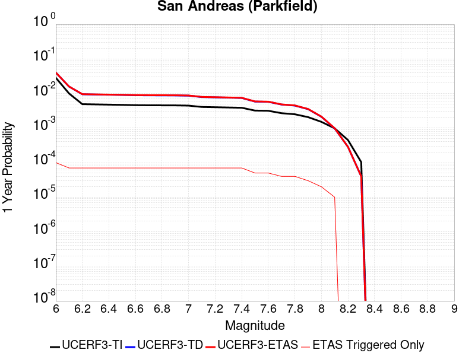 | 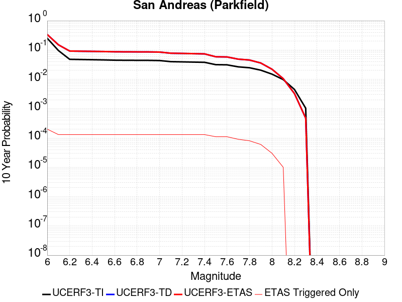 |

| Magnitude | 1 wk TI Prob | 1 wk TD Prob | 1 wk ETAS Prob | 1 wk ETAS/TD Gain | 1 wk ETAS Triggered Only | 1 mo TI Prob | 1 mo TD Prob | 1 mo ETAS Prob | 1 mo ETAS/TD Gain | 1 mo ETAS Triggered Only | 1 yr TI Prob | 1 yr TD Prob | 1 yr ETAS Prob | 1 yr ETAS/TD Gain | 1 yr ETAS Triggered Only | 10 yr TI Prob | 10 yr TD Prob | 10 yr ETAS Prob | 10 yr ETAS/TD Gain | 10 yr ETAS Triggered Only |
|-----|-----|-----|-----|-----|-----|-----|-----|-----|-----|-----|-----|-----|-----|-----|-----|-----|-----|-----|-----|-----|
| 6.0 | 5.556969E-4 | 7.819087E-4 | 7.9190085E-4 | 1.0127792 | 1.0E-5 | 0.0023793848 | 0.0033472886 | 0.0033771882 | 1.0089325 | 3.0E-5 | 0.028586963 | 0.040385824 | 0.040481783 | 1.0023761 | 1.0E-4 | 0.25176284 | 0.33777508 | 0.33790752 | 1.0003921 | 2.0E-4 |
| 6.1 | 1.925858E-4 | 3.0390357E-4 | 3.0390357E-4 | 1.0 | 0.0 | 8.2510663E-4 | 0.0013018888 | 0.0013218628 | 1.0153422 | 2.0E-5 | 0.0099994885 | 0.015834767 | 0.01590366 | 1.0043507 | 7.0E-5 | 0.095613256 | 0.14999957 | 0.15011007 | 1.0007367 | 1.3E-4 |
| 6.2 | 9.4306815E-5 | 1.8273306E-4 | 1.8273306E-4 | 1.0 | 0.0 | 4.0410945E-4 | 7.829079E-4 | 8.028922E-4 | 1.0255258 | 2.0E-5 | 0.0049089384 | 0.009490452 | 0.009559788 | 1.0073059 | 7.0E-5 | 0.048019063 | 0.09198628 | 0.09210432 | 1.0012833 | 1.3E-4 |
| 6.3 | 9.283051E-5 | 1.7969737E-4 | 1.7969737E-4 | 1.0 | 0.0 | 3.9778434E-4 | 7.6990545E-4 | 7.8989007E-4 | 1.0259572 | 2.0E-5 | 0.0048322747 | 0.009333515 | 0.009402861 | 1.0074298 | 7.0E-5 | 0.047285385 | 0.09063911 | 0.090757325 | 1.0013043 | 1.3E-4 |
| 6.4 | 9.138826E-5 | 1.7731739E-4 | 1.7731739E-4 | 1.0 | 0.0 | 3.916052E-4 | 7.5971155E-4 | 7.7969633E-4 | 1.0263058 | 2.0E-5 | 0.0047573745 | 0.00921046 | 0.0092798155 | 1.0075301 | 7.0E-5 | 0.046568092 | 0.0895407 | 0.08965906 | 1.0013219 | 1.3E-4 |
| 6.5 | 9.000255E-5 | 1.7489606E-4 | 1.7489606E-4 | 1.0 | 0.0 | 3.8566816E-4 | 7.493404E-4 | 7.693254E-4 | 1.0266701 | 2.0E-5 | 0.0046854047 | 0.009085262 | 0.009154626 | 1.0076348 | 7.0E-5 | 0.045878403 | 0.08842592 | 0.08854442 | 1.0013402 | 1.3E-4 |
| 6.6 | 8.8109264E-5 | 1.7170387E-4 | 1.7170387E-4 | 1.0 | 0.0 | 3.7755648E-4 | 7.3566736E-4 | 7.556526E-4 | 1.0271662 | 2.0E-5 | 0.0045870654 | 0.0089201825 | 0.008989558 | 1.0077773 | 7.0E-5 | 0.04493529 | 0.08695624 | 0.087074935 | 1.001365 | 1.3E-4 |
| 6.7 | 8.738073E-5 | 1.7037381E-4 | 1.7037381E-4 | 1.0 | 0.0 | 3.7443507E-4 | 7.2997034E-4 | 7.499557E-4 | 1.0273783 | 2.0E-5 | 0.0045492216 | 0.0088514285 | 0.008920808 | 1.0078384 | 7.0E-5 | 0.04457213 | 0.08635636 | 0.086475134 | 1.0013754 | 1.3E-4 |
| 6.8 | 8.710195E-5 | 1.6982816E-4 | 1.6982816E-4 | 1.0 | 0.0 | 3.7324068E-4 | 7.2763313E-4 | 7.4761856E-4 | 1.0274664 | 2.0E-5 | 0.0045347405 | 0.008823211 | 0.008892594 | 1.0078636 | 7.0E-5 | 0.04443313 | 0.08610373 | 0.08622254 | 1.0013798 | 1.3E-4 |
| 6.9 | 8.6801556E-5 | 1.6923707E-4 | 1.6923707E-4 | 1.0 | 0.0 | 3.7195362E-4 | 7.251013E-4 | 7.4508676E-4 | 1.0275624 | 2.0E-5 | 0.0045191357 | 0.008792636 | 0.00886202 | 1.0078912 | 7.0E-5 | 0.044283327 | 0.08582957 | 0.085948415 | 1.0013846 | 1.3E-4 |
| 7.0 | 8.5571606E-5 | 1.6676294E-4 | 1.6676294E-4 | 1.0 | 0.0 | 3.6668387E-4 | 7.145037E-4 | 7.344894E-4 | 1.0279715 | 2.0E-5 | 0.004455241 | 0.008664643 | 0.008734036 | 1.0080088 | 7.0E-5 | 0.043669727 | 0.08467713 | 0.08479612 | 1.0014052 | 1.3E-4 |
| 7.1 | 7.82589E-5 | 1.5156237E-4 | 1.5156237E-4 | 1.0 | 0.0 | 3.3535215E-4 | 6.493921E-4 | 6.693791E-4 | 1.030778 | 2.0E-5 | 0.0040752706 | 0.007877857 | 0.007947306 | 1.0088156 | 7.0E-5 | 0.040013418 | 0.077585794 | 0.07770571 | 1.0015455 | 1.3E-4 |
| 7.2 | 7.690929E-5 | 1.489332E-4 | 1.489332E-4 | 1.0 | 0.0 | 3.2956956E-4 | 6.381298E-4 | 6.58117E-4 | 1.0313216 | 2.0E-5 | 0.004005129 | 0.007741721 | 0.007811179 | 1.0089719 | 7.0E-5 | 0.0393371 | 0.076358445 | 0.07647852 | 1.0015725 | 1.3E-4 |
| 7.3 | 7.5543794E-5 | 1.4589565E-4 | 1.4589565E-4 | 1.0 | 0.0 | 3.2371894E-4 | 6.25118E-4 | 6.451055E-4 | 1.031974 | 2.0E-5 | 0.003934157 | 0.0075844154 | 0.007653884 | 1.0091594 | 7.0E-5 | 0.038652334 | 0.07492032 | 0.07504058 | 1.0016052 | 1.3E-4 |
| 7.4 | 7.4214564E-5 | 1.4290171E-4 | 1.4290171E-4 | 1.0 | 0.0 | 3.1802364E-4 | 6.122929E-4 | 6.3228066E-4 | 1.0326442 | 2.0E-5 | 0.003865065 | 0.007429345 | 0.007498825 | 1.0093521 | 7.0E-5 | 0.03798529 | 0.07349284 | 0.073613286 | 1.0016389 | 1.3E-4 |
| 7.5 | 6.149578E-5 | 1.1214155E-4 | 1.1214155E-4 | 1.0 | 0.0 | 2.6352672E-4 | 4.8051824E-4 | 4.905134E-4 | 1.0208008 | 1.0E-5 | 0.0032037178 | 0.005834648 | 0.0058843563 | 1.0085195 | 5.0E-5 | 0.03157923 | 0.058665328 | 0.058768876 | 1.001765 | 1.1E-4 |
| 7.6 | 6.0643448E-5 | 1.10425855E-4 | 1.10425855E-4 | 1.0 | 0.0 | 2.598746E-4 | 4.7316792E-4 | 4.831632E-4 | 1.0211241 | 1.0E-5 | 0.0031593828 | 0.0057456335 | 0.0057953466 | 1.0086522 | 5.0E-5 | 0.031148417 | 0.05782546 | 0.057929102 | 1.0017923 | 1.1E-4 |
| 7.7 | 5.1652263E-5 | 9.1955124E-5 | 9.1955124E-5 | 1.0 | 0.0 | 2.2134806E-4 | 3.9403388E-4 | 4.0402994E-4 | 1.0253686 | 1.0E-5 | 0.002691582 | 0.00478682 | 0.0048266286 | 1.0083163 | 4.0E-5 | 0.026592141 | 0.048633553 | 0.048719175 | 1.0017606 | 9.0E-5 |
| 7.8 | 4.8090482E-5 | 8.578783E-5 | 8.578783E-5 | 1.0 | 0.0 | 2.060858E-4 | 3.6761034E-4 | 3.7760666E-4 | 1.0271927 | 1.0E-5 | 0.0025062072 | 0.004466479 | 0.0045063007 | 1.0089155 | 4.0E-5 | 0.024781305 | 0.045392275 | 0.045468643 | 1.0016824 | 8.0E-5 |
| 7.9 | 3.970278E-5 | 6.7652974E-5 | 6.7652974E-5 | 1.0 | 0.0 | 1.7014367E-4 | 2.899091E-4 | 2.899091E-4 | 1.0 | 0.0 | 0.002069531 | 0.0035239344 | 0.0035538287 | 1.0084832 | 3.0E-5 | 0.020503636 | 0.035952512 | 0.036010355 | 1.0016088 | 6.0E-5 |
| 8.0 | 2.8982335E-5 | 4.079188E-5 | 4.079188E-5 | 1.0 | 0.0 | 1.2420409E-4 | 1.7481064E-4 | 1.7481064E-4 | 1.0 | 0.0 | 0.0015111357 | 0.0021262432 | 0.0021462007 | 1.0093863 | 2.0E-5 | 0.015009012 | 0.022057572 | 0.02208691 | 1.00133 | 3.0E-5 |
| 8.1 | 1.8836186E-5 | 1.8733741E-5 | 1.8733741E-5 | 1.0 | 0.0 | 8.0724014E-5 | 8.028499E-5 | 8.028499E-5 | 1.0 | 0.0 | 9.823717E-4 | 9.77032E-4 | 9.870223E-4 | 1.010225 | 1.0E-5 | 0.009780403 | 0.010515724 | 0.010525619 | 1.0009409 | 1.0E-5 |
| 8.2 | 8.643924E-6 | 5.49522E-6 | 5.49522E-6 | 1.0 | 0.0 | 3.704486E-5 | 2.355073E-5 | 2.355073E-5 | 1.0 | 0.0 | 4.5092785E-4 | 2.866925E-4 | 2.866925E-4 | 1.0 | 0.0 | 0.0045001395 | 0.0032598388 | 0.0032598388 | 1.0 | 0.0 |
| 8.3 | 1.983087E-6 | 7.693574E-7 | 7.693574E-7 | 1.0 | 0.0 | 8.498917E-6 | 3.297242E-6 | 3.297242E-6 | 1.0 | 0.0 | 1.034694E-4 | 4.01432E-5 | 4.01432E-5 | 1.0 | 0.0 | 0.0010342124 | 4.7390026E-4 | 4.7390026E-4 | 1.0 | 0.0 |

## Sierra Nevada  (No Extension)
*[(top)](#table-of-contents)*

| 1 Week | 1 Month | 1 Year | 10 Year |
|-----|-----|-----|-----|
|  |  |  |  |

| Magnitude | 1 wk TI Prob | 1 wk TD Prob | 1 wk ETAS Prob | 1 wk ETAS/TD Gain | 1 wk ETAS Triggered Only | 1 mo TI Prob | 1 mo TD Prob | 1 mo ETAS Prob | 1 mo ETAS/TD Gain | 1 mo ETAS Triggered Only | 1 yr TI Prob | 1 yr TD Prob | 1 yr ETAS Prob | 1 yr ETAS/TD Gain | 1 yr ETAS Triggered Only | 10 yr TI Prob | 10 yr TD Prob | 10 yr ETAS Prob | 10 yr ETAS/TD Gain | 10 yr ETAS Triggered Only |
|-----|-----|-----|-----|-----|-----|-----|-----|-----|-----|-----|-----|-----|-----|-----|-----|-----|-----|-----|-----|-----|
| 6.0 | 7.7690465E-6 | 6.976568E-6 | 6.976568E-6 | 1.0 | 0.0 | 3.329549E-5 | 2.9899435E-5 | 3.9899136E-5 | 1.3344445 | 1.0E-5 | 4.0529718E-4 | 3.6400068E-4 | 4.5396792E-4 | 1.2471623 | 9.0E-5 | 0.004045588 | 0.0036375606 | 0.0038069424 | 1.0465646 | 1.7E-4 |
| 6.1 | 7.7690465E-6 | 6.976568E-6 | 6.976568E-6 | 1.0 | 0.0 | 3.329549E-5 | 2.9899435E-5 | 3.9899136E-5 | 1.3344445 | 1.0E-5 | 4.0529718E-4 | 3.6400068E-4 | 4.5396792E-4 | 1.2471623 | 9.0E-5 | 0.004045588 | 0.0036375606 | 0.0038069424 | 1.0465646 | 1.7E-4 |
| 6.2 | 7.7690465E-6 | 6.976568E-6 | 6.976568E-6 | 1.0 | 0.0 | 3.329549E-5 | 2.9899435E-5 | 3.9899136E-5 | 1.3344445 | 1.0E-5 | 4.0529718E-4 | 3.6400068E-4 | 4.5396792E-4 | 1.2471623 | 9.0E-5 | 0.004045588 | 0.0036375606 | 0.0038069424 | 1.0465646 | 1.7E-4 |
| 6.3 | 7.7690465E-6 | 6.976568E-6 | 6.976568E-6 | 1.0 | 0.0 | 3.329549E-5 | 2.9899435E-5 | 3.9899136E-5 | 1.3344445 | 1.0E-5 | 4.0529718E-4 | 3.6400068E-4 | 4.5396792E-4 | 1.2471623 | 9.0E-5 | 0.004045588 | 0.0036375606 | 0.0038069424 | 1.0465646 | 1.7E-4 |
| 6.4 | 7.7690465E-6 | 6.976568E-6 | 6.976568E-6 | 1.0 | 0.0 | 3.329549E-5 | 2.9899435E-5 | 3.9899136E-5 | 1.3344445 | 1.0E-5 | 4.0529718E-4 | 3.6400068E-4 | 4.5396792E-4 | 1.2471623 | 9.0E-5 | 0.004045588 | 0.0036375606 | 0.0038069424 | 1.0465646 | 1.7E-4 |
| 6.5 | 7.7690465E-6 | 6.976568E-6 | 6.976568E-6 | 1.0 | 0.0 | 3.329549E-5 | 2.9899435E-5 | 3.9899136E-5 | 1.3344445 | 1.0E-5 | 4.0529718E-4 | 3.6400068E-4 | 4.5396792E-4 | 1.2471623 | 9.0E-5 | 0.004045588 | 0.0036375606 | 0.0038069424 | 1.0465646 | 1.7E-4 |
| 6.6 | 2.653E-6 | 1.6149635E-6 | 1.6149635E-6 | 1.0 | 0.0 | 1.136995E-5 | 6.9212538E-6 | 6.9212538E-6 | 1.0 | 0.0 | 1.3842035E-4 | 8.426304E-5 | 1.4425798E-4 | 1.711996 | 6.0E-5 | 0.0013833415 | 8.4231433E-4 | 9.7220484E-4 | 1.1542066 | 1.3E-4 |
| 6.7 | 2.5902466E-6 | 1.5502959E-6 | 1.5502959E-6 | 1.0 | 0.0 | 1.11010095E-5 | 6.644109E-6 | 6.644109E-6 | 1.0 | 0.0 | 1.351464E-4 | 8.0889055E-5 | 1.4088419E-4 | 1.7416967 | 6.0E-5 | 0.0013506424 | 8.0859906E-4 | 9.3849393E-4 | 1.1606419 | 1.3E-4 |
| 6.8 | 2.5853892E-6 | 1.5470957E-6 | 1.5470957E-6 | 1.0 | 0.0 | 1.1080193E-5 | 6.6303933E-6 | 6.6303933E-6 | 1.0 | 0.0 | 1.34893E-4 | 8.072208E-5 | 1.4071724E-4 | 1.743231 | 6.0E-5 | 0.0013481114 | 8.069306E-4 | 9.3682564E-4 | 1.1609743 | 1.3E-4 |
| 6.9 | 2.458257E-6 | 1.4221675E-6 | 1.4221675E-6 | 1.0 | 0.0 | 1.0535345E-5 | 6.0949897E-6 | 6.0949897E-6 | 1.0 | 0.0 | 1.2826028E-4 | 7.420399E-5 | 1.3419954E-4 | 1.8085219 | 6.0E-5 | 0.0012818627 | 7.4179407E-4 | 8.716977E-4 | 1.1751208 | 1.3E-4 |
| 7.0 | 2.4341468E-6 | 1.3991308E-6 | 1.3991308E-6 | 1.0 | 0.0 | 1.0432016E-5 | 5.9962613E-6 | 5.9962613E-6 | 1.0 | 0.0 | 1.270024E-4 | 7.3002055E-5 | 1.3299768E-4 | 1.8218347 | 6.0E-5 | 0.0012692984 | 7.297827E-4 | 8.596878E-4 | 1.1780052 | 1.3E-4 |
| 7.1 | 2.3652476E-6 | 1.334079E-6 | 1.334079E-6 | 1.0 | 0.0 | 1.0136736E-5 | 5.717469E-6 | 5.717469E-6 | 1.0 | 0.0 | 1.2340778E-4 | 6.960797E-5 | 1.296038E-4 | 1.8619102 | 6.0E-5 | 0.0012333926 | 6.9586345E-4 | 8.25773E-4 | 1.1866883 | 1.3E-4 |
| 7.2 | 2.272158E-6 | 1.2503832E-6 | 1.2503832E-6 | 1.0 | 0.0 | 9.737784E-6 | 5.358774E-6 | 5.358774E-6 | 1.0 | 0.0 | 1.1855107E-4 | 6.524114E-5 | 1.2523723E-4 | 1.9196051 | 6.0E-5 | 0.0011848784 | 6.522214E-4 | 7.821366E-4 | 1.1991888 | 1.3E-4 |
| 7.3 | 2.1382127E-6 | 1.1420682E-6 | 1.1420682E-6 | 1.0 | 0.0 | 9.163737E-6 | 4.894569E-6 | 4.894569E-6 | 1.0 | 0.0 | 1.1156279E-4 | 5.9589758E-5 | 1.19586184E-4 | 2.0068245 | 6.0E-5 | 0.001115068 | 5.95739E-4 | 6.956794E-4 | 1.1677587 | 1.0E-4 |
| 7.4 | 1.9048055E-6 | 9.57617E-7 | 9.57617E-7 | 1.0 | 0.0 | 8.163426E-6 | 4.104066E-6 | 4.104066E-6 | 1.0 | 0.0 | 9.9385186E-5 | 4.9965867E-5 | 9.996337E-5 | 2.0006332 | 5.0E-5 | 9.934074E-4 | 4.99547E-4 | 5.7950703E-4 | 1.160065 | 8.0E-5 |
| 7.5 | 1.5373403E-6 | 7.560832E-7 | 7.560832E-7 | 1.0 | 0.0 | 6.5885843E-6 | 3.2403525E-6 | 3.2403525E-6 | 1.0 | 0.0 | 8.021306E-5 | 3.9450584E-5 | 7.9449004E-5 | 2.0138867 | 4.0E-5 | 8.0184115E-4 | 3.9443627E-4 | 4.6440866E-4 | 1.1773984 | 7.0E-5 |
| 7.6 | 1.0680322E-6 | 4.6602182E-7 | 4.6602182E-7 | 1.0 | 0.0 | 4.577273E-6 | 1.997235E-6 | 1.997235E-6 | 1.0 | 0.0 | 5.5726876E-5 | 2.4316065E-5 | 6.431509E-5 | 2.644963 | 4.0E-5 | 5.5712904E-4 | 2.431343E-4 | 3.031197E-4 | 1.2467172 | 6.0E-5 |
| 7.7 | 5.509146E-7 | 1.558334E-7 | 1.558334E-7 | 1.0 | 0.0 | 2.3610605E-6 | 6.678573E-7 | 6.678573E-7 | 1.0 | 0.0 | 2.8745531E-5 | 8.131134E-6 | 1.8131052E-5 | 2.2298307 | 1.0E-5 | 2.8741814E-4 | 8.130848E-5 | 9.130766E-5 | 1.1229784 | 1.0E-5 |

## Lake Isabella (Seismicity)
*[(top)](#table-of-contents)*

| 1 Week | 1 Month | 1 Year | 10 Year |
|-----|-----|-----|-----|
|  |  |  |  |

| Magnitude | 1 wk TI Prob | 1 wk TD Prob | 1 wk ETAS Prob | 1 wk ETAS/TD Gain | 1 wk ETAS Triggered Only | 1 mo TI Prob | 1 mo TD Prob | 1 mo ETAS Prob | 1 mo ETAS/TD Gain | 1 mo ETAS Triggered Only | 1 yr TI Prob | 1 yr TD Prob | 1 yr ETAS Prob | 1 yr ETAS/TD Gain | 1 yr ETAS Triggered Only | 10 yr TI Prob | 10 yr TD Prob | 10 yr ETAS Prob | 10 yr ETAS/TD Gain | 10 yr ETAS Triggered Only |
|-----|-----|-----|-----|-----|-----|-----|-----|-----|-----|-----|-----|-----|-----|-----|-----|-----|-----|-----|-----|-----|
| 6.0 | 9.431637E-6 | 9.7418215E-6 | 9.7418215E-6 | 1.0 | 0.0 | 4.0420677E-5 | 4.175007E-5 | 5.1749652E-5 | 1.2395105 | 1.0E-5 | 4.920106E-4 | 5.082016E-4 | 5.481813E-4 | 1.078669 | 4.0E-5 | 0.004909227 | 0.005071687 | 0.0052507743 | 1.0353111 | 1.8E-4 |
| 6.1 | 9.431637E-6 | 9.7418215E-6 | 9.7418215E-6 | 1.0 | 0.0 | 4.0420677E-5 | 4.175007E-5 | 5.1749652E-5 | 1.2395105 | 1.0E-5 | 4.920106E-4 | 5.082016E-4 | 5.481813E-4 | 1.078669 | 4.0E-5 | 0.004909227 | 0.005071687 | 0.0052507743 | 1.0353111 | 1.8E-4 |
| 6.2 | 9.431637E-6 | 9.7418215E-6 | 9.7418215E-6 | 1.0 | 0.0 | 4.0420677E-5 | 4.175007E-5 | 5.1749652E-5 | 1.2395105 | 1.0E-5 | 4.920106E-4 | 5.082016E-4 | 5.481813E-4 | 1.078669 | 4.0E-5 | 0.004909227 | 0.005071687 | 0.0052507743 | 1.0353111 | 1.8E-4 |
| 6.3 | 9.431637E-6 | 9.7418215E-6 | 9.7418215E-6 | 1.0 | 0.0 | 4.0420677E-5 | 4.175007E-5 | 5.1749652E-5 | 1.2395105 | 1.0E-5 | 4.920106E-4 | 5.082016E-4 | 5.481813E-4 | 1.078669 | 4.0E-5 | 0.004909227 | 0.005071687 | 0.0052507743 | 1.0353111 | 1.8E-4 |
| 6.4 | 5.144063E-6 | 5.3001613E-6 | 5.3001613E-6 | 1.0 | 0.0 | 2.2045799E-5 | 2.27148E-5 | 2.27148E-5 | 1.0 | 0.0 | 2.6837454E-4 | 2.7652105E-4 | 2.8651828E-4 | 1.0361536 | 1.0E-5 | 0.0026805066 | 0.0027621102 | 0.0028319168 | 1.025273 | 7.0E-5 |
| 6.5 | 5.144063E-6 | 5.3001613E-6 | 5.3001613E-6 | 1.0 | 0.0 | 2.2045799E-5 | 2.27148E-5 | 2.27148E-5 | 1.0 | 0.0 | 2.6837454E-4 | 2.7652105E-4 | 2.8651828E-4 | 1.0361536 | 1.0E-5 | 0.0026805066 | 0.0027621102 | 0.0028319168 | 1.025273 | 7.0E-5 |
| 6.6 | 3.4009804E-6 | 3.4988395E-6 | 3.4988395E-6 | 1.0 | 0.0 | 1.4575549E-5 | 1.4994949E-5 | 1.4994949E-5 | 1.0 | 0.0 | 1.7744285E-4 | 1.8254982E-4 | 1.9254799E-4 | 1.0547695 | 1.0E-5 | 0.0017730123 | 0.0018241564 | 0.0018640835 | 1.0218879 | 4.0E-5 |
| 6.7 | 3.3880428E-6 | 3.485706E-6 | 3.485706E-6 | 1.0 | 0.0 | 1.4520103E-5 | 1.4938664E-5 | 1.4938664E-5 | 1.0 | 0.0 | 1.767679E-4 | 1.8186466E-4 | 1.9186284E-4 | 1.054976 | 1.0E-5 | 0.0017662736 | 0.0018173159 | 0.0018572432 | 1.0219705 | 4.0E-5 |
| 6.8 | 2.6582E-6 | 2.7337414E-6 | 2.7337414E-6 | 1.0 | 0.0 | 1.1392236E-5 | 1.171599E-5 | 1.171599E-5 | 1.0 | 0.0 | 1.3869164E-4 | 1.4263418E-4 | 1.5263275E-4 | 1.0700995 | 1.0E-5 | 0.0013860512 | 0.0014255584 | 0.0014555156 | 1.0210143 | 3.0E-5 |
| 6.9 | 2.406011E-6 | 2.474366E-6 | 2.474366E-6 | 1.0 | 0.0 | 1.0311434E-5 | 1.0604391E-5 | 1.0604391E-5 | 1.0 | 0.0 | 1.2553448E-4 | 1.2910213E-4 | 1.2910213E-4 | 1.0 | 0.0 | 0.0012546359 | 0.0012904009 | 0.001310375 | 1.0154791 | 2.0E-5 |
| 7.0 | 1.6953097E-6 | 1.7429631E-6 | 1.7429631E-6 | 1.0 | 0.0 | 7.265593E-6 | 7.469827E-6 | 7.469827E-6 | 1.0 | 0.0 | 8.8455E-5 | 9.094239E-5 | 9.094239E-5 | 1.0 | 0.0 | 8.84198E-4 | 9.0915454E-4 | 9.191454E-4 | 1.0109892 | 1.0E-5 |
| 7.1 | 3.5013824E-7 | 3.5715203E-7 | 3.5715203E-7 | 1.0 | 0.0 | 1.5005916E-6 | 1.5306507E-6 | 1.5306507E-6 | 1.0 | 0.0 | 1.826955E-5 | 1.8635516E-5 | 1.8635516E-5 | 1.0 | 0.0 | 1.8268047E-4 | 1.8633978E-4 | 1.8633978E-4 | 1.0 | 0.0 |
| 7.2 | 2.2321095E-7 | 2.2750805E-7 | 2.2750805E-7 | 1.0 | 0.0 | 9.56618E-7 | 9.750341E-7 | 9.750341E-7 | 1.0 | 0.0 | 1.1646762E-5 | 1.1870978E-5 | 1.1870978E-5 | 1.0 | 0.0 | 1.1646151E-4 | 1.1870354E-4 | 1.1870354E-4 | 1.0 | 0.0 |
| 7.3 | 1.5760406E-7 | 1.6061085E-7 | 1.6061085E-7 | 1.0 | 0.0 | 6.7544585E-7 | 6.88332E-7 | 6.88332E-7 | 1.0 | 0.0 | 8.223522E-6 | 8.380411E-6 | 8.380411E-6 | 1.0 | 0.0 | 8.2232174E-5 | 8.380101E-5 | 8.380101E-5 | 1.0 | 0.0 |
| 7.4 | 1.1216497E-7 | 1.14318226E-7 | 1.14318226E-7 | 1.0 | 0.0 | 4.8070694E-7 | 4.899352E-7 | 4.899352E-7 | 1.0 | 0.0 | 5.852591E-6 | 5.9649446E-6 | 5.9649446E-6 | 1.0 | 0.0 | 5.8524372E-5 | 5.964789E-5 | 5.964789E-5 | 1.0 | 0.0 |
| 7.5 | 4.885185E-8 | 4.9788245E-8 | 4.9788245E-8 | 1.0 | 0.0 | 2.0936506E-7 | 2.1337817E-7 | 2.1337817E-7 | 1.0 | 0.0 | 2.5490165E-6 | 2.5978763E-6 | 2.5978763E-6 | 1.0 | 0.0 | 2.5489873E-5 | 2.5978477E-5 | 2.5978477E-5 | 1.0 | 0.0 |
| 7.6 | 1.504641E-9 | 1.5318049E-9 | 1.5318049E-9 | 1.0 | 0.0 | 6.4484613E-9 | 6.5648784E-9 | 6.5648784E-9 | 1.0 | 0.0 | 7.851001E-8 | 7.9927396E-8 | 7.9927396E-8 | 1.0 | 0.0 | 7.8509987E-7 | 7.9927395E-7 | 7.9927395E-7 | 1.0 | 0.0 |

## San Jacinto (San Bernardino)
*[(top)](#table-of-contents)*

| 1 Week | 1 Month | 1 Year | 10 Year |
|-----|-----|-----|-----|
|  |  |  |  |

| Magnitude | 1 wk TI Prob | 1 wk TD Prob | 1 wk ETAS Prob | 1 wk ETAS/TD Gain | 1 wk ETAS Triggered Only | 1 mo TI Prob | 1 mo TD Prob | 1 mo ETAS Prob | 1 mo ETAS/TD Gain | 1 mo ETAS Triggered Only | 1 yr TI Prob | 1 yr TD Prob | 1 yr ETAS Prob | 1 yr ETAS/TD Gain | 1 yr ETAS Triggered Only | 10 yr TI Prob | 10 yr TD Prob | 10 yr ETAS Prob | 10 yr ETAS/TD Gain | 10 yr ETAS Triggered Only |
|-----|-----|-----|-----|-----|-----|-----|-----|-----|-----|-----|-----|-----|-----|-----|-----|-----|-----|-----|-----|-----|
| 6.0 | 3.409352E-5 | 3.6049758E-5 | 3.6049758E-5 | 1.0 | 0.0 | 1.461069E-4 | 1.5448983E-4 | 1.7448673E-4 | 1.1294384 | 2.0E-5 | 0.0017774 | 0.0018792928 | 0.00193918 | 1.0318669 | 6.0E-5 | 0.01763251 | 0.019382251 | 0.019558763 | 1.0091069 | 1.8E-4 |
| 6.1 | 3.409352E-5 | 3.6049758E-5 | 3.6049758E-5 | 1.0 | 0.0 | 1.461069E-4 | 1.5448983E-4 | 1.7448673E-4 | 1.1294384 | 2.0E-5 | 0.0017774 | 0.0018792928 | 0.00193918 | 1.0318669 | 6.0E-5 | 0.01763251 | 0.019382251 | 0.019558763 | 1.0091069 | 1.8E-4 |
| 6.2 | 3.409352E-5 | 3.6049758E-5 | 3.6049758E-5 | 1.0 | 0.0 | 1.461069E-4 | 1.5448983E-4 | 1.7448673E-4 | 1.1294384 | 2.0E-5 | 0.0017774 | 0.0018792928 | 0.00193918 | 1.0318669 | 6.0E-5 | 0.01763251 | 0.019382251 | 0.019558763 | 1.0091069 | 1.8E-4 |
| 6.3 | 3.409352E-5 | 3.6049758E-5 | 3.6049758E-5 | 1.0 | 0.0 | 1.461069E-4 | 1.5448983E-4 | 1.7448673E-4 | 1.1294384 | 2.0E-5 | 0.0017774 | 0.0018792928 | 0.00193918 | 1.0318669 | 6.0E-5 | 0.01763251 | 0.019382251 | 0.019558763 | 1.0091069 | 1.8E-4 |
| 6.4 | 3.400795E-5 | 3.5942405E-5 | 3.5942405E-5 | 1.0 | 0.0 | 1.4574021E-4 | 1.540298E-4 | 1.7402672E-4 | 1.129825 | 2.0E-5 | 0.0017729428 | 0.0018737017 | 0.0019335893 | 1.0319622 | 6.0E-5 | 0.017588645 | 0.019327328 | 0.019503849 | 1.0091332 | 1.8E-4 |
| 6.5 | 3.341482E-5 | 3.5202946E-5 | 3.5202946E-5 | 1.0 | 0.0 | 1.4319851E-4 | 1.5086106E-4 | 1.7085804E-4 | 1.1325523 | 2.0E-5 | 0.0017420477 | 0.0018351874 | 0.0018850956 | 1.0271952 | 5.0E-5 | 0.017284546 | 0.018948833 | 0.019115612 | 1.0088016 | 1.7E-4 |
| 6.6 | 3.3364955E-5 | 3.5140158E-5 | 3.5140158E-5 | 1.0 | 0.0 | 1.4298483E-4 | 1.50592E-4 | 1.7058897E-4 | 1.1327891 | 2.0E-5 | 0.0017394501 | 0.0018319171 | 0.0018818254 | 1.0272439 | 5.0E-5 | 0.017258976 | 0.018916694 | 0.01908348 | 1.0088167 | 1.7E-4 |
| 6.7 | 3.335922E-5 | 3.512993E-5 | 3.512993E-5 | 1.0 | 0.0 | 1.4296026E-4 | 1.5054816E-4 | 1.7054516E-4 | 1.1328279 | 2.0E-5 | 0.0017391514 | 0.0018313844 | 0.0018812928 | 1.0272517 | 5.0E-5 | 0.017256035 | 0.018911485 | 0.01907827 | 1.0088192 | 1.7E-4 |
| 6.8 | 3.327683E-5 | 3.5023982E-5 | 3.5023982E-5 | 1.0 | 0.0 | 1.4260718E-4 | 1.5009414E-4 | 1.7009114E-4 | 1.1332297 | 2.0E-5 | 0.0017348597 | 0.0018258659 | 0.0018757747 | 1.0273342 | 5.0E-5 | 0.017213784 | 0.018857252 | 0.019024044 | 1.0088451 | 1.7E-4 |
| 6.9 | 3.3235785E-5 | 3.4964927E-5 | 3.4964927E-5 | 1.0 | 0.0 | 1.4243131E-4 | 1.4984109E-4 | 1.6983808E-4 | 1.1334548 | 2.0E-5 | 0.0017327217 | 0.0018227901 | 0.0018726989 | 1.0273805 | 5.0E-5 | 0.017192734 | 0.018827116 | 0.018993916 | 1.0088595 | 1.7E-4 |
| 7.0 | 3.3197095E-5 | 3.4904846E-5 | 3.4904846E-5 | 1.0 | 0.0 | 1.422655E-4 | 1.4958362E-4 | 1.6958063E-4 | 1.1336845 | 2.0E-5 | 0.0017307063 | 0.0018196608 | 0.0018695698 | 1.0274277 | 5.0E-5 | 0.017172894 | 0.018796489 | 0.018963294 | 1.0088743 | 1.7E-4 |
| 7.1 | 3.3129716E-5 | 3.478503E-5 | 3.478503E-5 | 1.0 | 0.0 | 1.4197677E-4 | 1.4907018E-4 | 1.690672E-4 | 1.134145 | 2.0E-5 | 0.0017271966 | 0.0018134202 | 0.0018633294 | 1.0275222 | 5.0E-5 | 0.017138338 | 0.018735558 | 0.018902373 | 1.0089036 | 1.7E-4 |
| 7.2 | 3.3034008E-5 | 3.4652458E-5 | 3.4652458E-5 | 1.0 | 0.0 | 1.4156665E-4 | 1.4850209E-4 | 1.6849911E-4 | 1.1346582 | 2.0E-5 | 0.0017222111 | 0.001806515 | 0.0018564246 | 1.0276276 | 5.0E-5 | 0.017089253 | 0.018667944 | 0.01883477 | 1.0089365 | 1.7E-4 |
| 7.3 | 3.2956614E-5 | 3.4520177E-5 | 3.4520177E-5 | 1.0 | 0.0 | 1.4123498E-4 | 1.4793524E-4 | 1.6793227E-4 | 1.1351743 | 2.0E-5 | 0.0017181796 | 0.001799625 | 0.001849535 | 1.0277336 | 5.0E-5 | 0.017049557 | 0.018600674 | 0.018767513 | 1.0089694 | 1.7E-4 |
| 7.4 | 3.2915937E-5 | 3.4441844E-5 | 3.4441844E-5 | 1.0 | 0.0 | 1.4106068E-4 | 1.4759957E-4 | 1.675966E-4 | 1.1354817 | 2.0E-5 | 0.0017160608 | 0.0017955449 | 0.0018454551 | 1.0277967 | 5.0E-5 | 0.017028693 | 0.018560927 | 0.018727772 | 1.008989 | 1.7E-4 |
| 7.5 | 3.281791E-5 | 3.430671E-5 | 3.430671E-5 | 1.0 | 0.0 | 1.406406E-4 | 1.4702049E-4 | 1.6701756E-4 | 1.1360154 | 2.0E-5 | 0.0017109542 | 0.0017885063 | 0.0018384169 | 1.0279063 | 5.0E-5 | 0.016978411 | 0.018491795 | 0.018658651 | 1.0090233 | 1.7E-4 |
| 7.6 | 3.2521442E-5 | 3.4031546E-5 | 3.4031546E-5 | 1.0 | 0.0 | 1.3937015E-4 | 1.4584133E-4 | 1.6583841E-4 | 1.1371154 | 2.0E-5 | 0.0016955109 | 0.0017741736 | 0.0018240848 | 1.0281321 | 5.0E-5 | 0.016826328 | 0.018349366 | 0.018516246 | 1.0090946 | 1.7E-4 |
| 7.7 | 3.0287873E-5 | 3.2514843E-5 | 3.2514843E-5 | 1.0 | 0.0 | 1.297987E-4 | 1.393419E-4 | 1.593391E-4 | 1.1435119 | 2.0E-5 | 0.0015791537 | 0.0016951686 | 0.0017450838 | 1.0294456 | 5.0E-5 | 0.01567979 | 0.017559871 | 0.017726887 | 1.0095111 | 1.7E-4 |
| 7.8 | 2.6316151E-5 | 2.9723395E-5 | 2.9723395E-5 | 1.0 | 0.0 | 1.1277862E-4 | 1.2737977E-4 | 1.4737721E-4 | 1.1569908 | 2.0E-5 | 0.0013722149 | 0.0015497464 | 0.0015996689 | 1.0322133 | 5.0E-5 | 0.013637724 | 0.016100293 | 0.016267557 | 1.0103889 | 1.7E-4 |
| 7.9 | 2.0761147E-5 | 2.3470231E-5 | 2.3470231E-5 | 1.0 | 0.0 | 8.897331E-5 | 1.0058283E-4 | 1.2058082E-4 | 1.1988211 | 2.0E-5 | 0.0010827117 | 0.0012239089 | 0.0012738477 | 1.0408027 | 5.0E-5 | 0.010774517 | 0.012820105 | 0.012987926 | 1.0130904 | 1.7E-4 |
| 8.0 | 1.5738568E-5 | 1.607273E-5 | 1.607273E-5 | 1.0 | 0.0 | 6.744926E-5 | 6.8881316E-5 | 7.888063E-5 | 1.1451672 | 1.0E-5 | 8.2088535E-4 | 8.38308E-4 | 8.6828286E-4 | 1.0357563 | 3.0E-5 | 0.008178596 | 0.008886527 | 0.0089757275 | 1.0100377 | 9.0E-5 |
| 8.1 | 1.0105832E-5 | 8.353191E-6 | 8.353191E-6 | 1.0 | 0.0 | 4.3309992E-5 | 3.5798905E-5 | 3.5798905E-5 | 1.0 | 0.0 | 5.2717153E-4 | 4.35765E-4 | 4.35765E-4 | 1.0 | 0.0 | 0.005259227 | 0.004689436 | 0.004709342 | 1.0042449 | 2.0E-5 |
| 8.2 | 4.189207E-6 | 1.5851253E-6 | 1.5851253E-6 | 1.0 | 0.0 | 1.7953622E-5 | 6.7933765E-6 | 6.7933765E-6 | 1.0 | 0.0 | 2.1856341E-4 | 8.270625E-5 | 8.270625E-5 | 1.0 | 0.0 | 0.0021834858 | 9.604094E-4 | 9.604094E-4 | 1.0 | 0.0 |
| 8.3 | 1.2758221E-6 | 3.6330252E-7 | 3.6330252E-7 | 1.0 | 0.0 | 5.4677976E-6 | 1.5570099E-6 | 1.5570099E-6 | 1.0 | 0.0 | 6.65684E-5 | 1.8956434E-5 | 1.8956434E-5 | 1.0 | 0.0 | 6.6548464E-4 | 2.2857229E-4 | 2.2857229E-4 | 1.0 | 0.0 |

## San Andreas (Cholame) rev
*[(top)](#table-of-contents)*

| 1 Week | 1 Month | 1 Year | 10 Year |
|-----|-----|-----|-----|
|  |  | 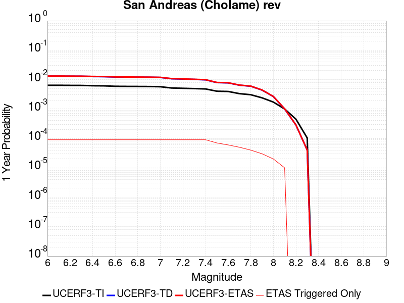 |  |

| Magnitude | 1 wk TI Prob | 1 wk TD Prob | 1 wk ETAS Prob | 1 wk ETAS/TD Gain | 1 wk ETAS Triggered Only | 1 mo TI Prob | 1 mo TD Prob | 1 mo ETAS Prob | 1 mo ETAS/TD Gain | 1 mo ETAS Triggered Only | 1 yr TI Prob | 1 yr TD Prob | 1 yr ETAS Prob | 1 yr ETAS/TD Gain | 1 yr ETAS Triggered Only | 10 yr TI Prob | 10 yr TD Prob | 10 yr ETAS Prob | 10 yr ETAS/TD Gain | 10 yr ETAS Triggered Only |
|-----|-----|-----|-----|-----|-----|-----|-----|-----|-----|-----|-----|-----|-----|-----|-----|-----|-----|-----|-----|-----|
| 6.0 | 1.2302514E-4 | 2.5242948E-4 | 2.5242948E-4 | 1.0 | 0.0 | 5.27144E-4 | 0.0010813937 | 0.0011013721 | 1.0184747 | 2.0E-5 | 0.0063991086 | 0.013086997 | 0.013175819 | 1.0067871 | 9.0E-5 | 0.06217949 | 0.1245517 | 0.12470928 | 1.0012652 | 1.8E-4 |
| 6.1 | 1.2302514E-4 | 2.5242948E-4 | 2.5242948E-4 | 1.0 | 0.0 | 5.27144E-4 | 0.0010813937 | 0.0011013721 | 1.0184747 | 2.0E-5 | 0.0063991086 | 0.013086997 | 0.013175819 | 1.0067871 | 9.0E-5 | 0.06217949 | 0.1245517 | 0.12470928 | 1.0012652 | 1.8E-4 |
| 6.2 | 1.2203569E-4 | 2.5059693E-4 | 2.5059693E-4 | 1.0 | 0.0 | 5.2290526E-4 | 0.0010735465 | 0.001093525 | 1.0186099 | 2.0E-5 | 0.006347804 | 0.0129926 | 0.01308143 | 1.006837 | 9.0E-5 | 0.061695136 | 0.12373783 | 0.123895556 | 1.0012747 | 1.8E-4 |
| 6.3 | 1.2142645E-4 | 2.4945638E-4 | 2.4945638E-4 | 1.0 | 0.0 | 5.202953E-4 | 0.0010686623 | 0.001088641 | 1.018695 | 2.0E-5 | 0.006316212 | 0.012933843 | 0.013022679 | 1.0068685 | 9.0E-5 | 0.06139677 | 0.123231925 | 0.12338974 | 1.0012807 | 1.8E-4 |
| 6.4 | 1.1865206E-4 | 2.4450937E-4 | 2.4450937E-4 | 1.0 | 0.0 | 5.0840975E-4 | 0.001047478 | 0.0010674571 | 1.0190735 | 2.0E-5 | 0.006172335 | 0.012678952 | 0.012767811 | 1.0070084 | 9.0E-5 | 0.060036868 | 0.121024184 | 0.1211824 | 1.0013072 | 1.8E-4 |
| 6.5 | 1.17443946E-4 | 2.4244092E-4 | 2.4244092E-4 | 1.0 | 0.0 | 5.032341E-4 | 0.0010386204 | 0.0010585996 | 1.0192363 | 2.0E-5 | 0.006109677 | 0.012572356 | 0.012661224 | 1.0070685 | 9.0E-5 | 0.059444077 | 0.12009794 | 0.12025633 | 1.0013188 | 1.8E-4 |
| 6.6 | 1.13579066E-4 | 2.3552658E-4 | 2.3552658E-4 | 1.0 | 0.0 | 4.866766E-4 | 0.0010090107 | 0.0010289905 | 1.0198014 | 2.0E-5 | 0.0059092017 | 0.012215953 | 0.012304854 | 1.0072774 | 9.0E-5 | 0.057545185 | 0.11701085 | 0.11716979 | 1.0013583 | 1.8E-4 |
| 6.7 | 1.1271412E-4 | 2.339688E-4 | 2.339688E-4 | 1.0 | 0.0 | 4.829711E-4 | 0.0010023396 | 0.0010223195 | 1.0199333 | 2.0E-5 | 0.005864331 | 0.012135641 | 0.0122245485 | 1.0073261 | 9.0E-5 | 0.057119697 | 0.116314195 | 0.11647326 | 1.0013676 | 1.8E-4 |
| 6.8 | 1.1217975E-4 | 2.3285215E-4 | 2.3285215E-4 | 1.0 | 0.0 | 4.8068175E-4 | 9.975577E-4 | 0.0010175377 | 1.020029 | 2.0E-5 | 0.005836608 | 0.012078067 | 0.012166981 | 1.0073615 | 9.0E-5 | 0.056856725 | 0.11581219 | 0.11597134 | 1.0013742 | 1.8E-4 |
| 6.9 | 1.1146753E-4 | 2.3133864E-4 | 2.3133864E-4 | 1.0 | 0.0 | 4.7763053E-4 | 9.910761E-4 | 0.0010110562 | 1.0201601 | 2.0E-5 | 0.0057996577 | 0.012000027 | 0.012088947 | 1.0074099 | 9.0E-5 | 0.056506127 | 0.11513234 | 0.11529161 | 1.0013834 | 1.8E-4 |
| 7.0 | 1.0965793E-4 | 2.2756905E-4 | 2.2756905E-4 | 1.0 | 0.0 | 4.698779E-4 | 9.7493286E-4 | 9.949134E-4 | 1.0204942 | 2.0E-5 | 0.005705768 | 0.01180563 | 0.011894567 | 1.0075334 | 9.0E-5 | 0.055614736 | 0.11343304 | 0.113592625 | 1.0014068 | 1.8E-4 |
| 7.1 | 9.927982E-5 | 2.0574623E-4 | 2.0574623E-4 | 1.0 | 0.0 | 4.2541555E-4 | 8.814726E-4 | 9.01455E-4 | 1.0226693 | 2.0E-5 | 0.0051671406 | 0.0106794145 | 0.010768454 | 1.0083374 | 9.0E-5 | 0.05048634 | 0.10352388 | 0.103685245 | 1.0015588 | 1.8E-4 |
| 7.2 | 9.696786E-5 | 2.0078626E-4 | 2.0078626E-4 | 1.0 | 0.0 | 4.1551032E-4 | 8.602298E-4 | 8.802126E-4 | 1.0232296 | 2.0E-5 | 0.00504711 | 0.010423285 | 0.010512347 | 1.0085446 | 9.0E-5 | 0.04934009 | 0.10126121 | 0.10142299 | 1.0015975 | 1.8E-4 |
| 7.3 | 9.4727984E-5 | 1.9507346E-4 | 1.9507346E-4 | 1.0 | 0.0 | 4.0591392E-4 | 8.357622E-4 | 8.557455E-4 | 1.0239103 | 2.0E-5 | 0.0049308087 | 0.010128201 | 0.010217289 | 1.0087961 | 9.0E-5 | 0.048228268 | 0.09863034 | 0.09879258 | 1.001645 | 1.8E-4 |
| 7.4 | 9.220358E-5 | 1.8877286E-4 | 1.8877286E-4 | 1.0 | 0.0 | 3.9509835E-4 | 8.0877665E-4 | 8.2876044E-4 | 1.0247087 | 2.0E-5 | 0.004799717 | 0.009802646 | 0.009891763 | 1.0090911 | 9.0E-5 | 0.046973653 | 0.09570612 | 0.09586889 | 1.0017008 | 1.8E-4 |
| 7.5 | 7.71631E-5 | 1.520787E-4 | 1.520787E-4 | 1.0 | 0.0 | 3.306571E-4 | 6.516032E-4 | 6.615967E-4 | 1.0153368 | 1.0E-5 | 0.0040183207 | 0.007904484 | 0.007973931 | 1.0087857 | 7.0E-5 | 0.03946433 | 0.078419134 | 0.07856659 | 1.0018803 | 1.6E-4 |
| 7.6 | 7.5634416E-5 | 1.4866945E-4 | 1.4866945E-4 | 1.0 | 0.0 | 3.241072E-4 | 6.369994E-4 | 6.46993E-4 | 1.0156887 | 1.0E-5 | 0.0039388672 | 0.007727957 | 0.007787493 | 1.007704 | 6.0E-5 | 0.038697794 | 0.07678112 | 0.0769196 | 1.0018036 | 1.5E-4 |
| 7.7 | 6.3783E-5 | 1.2385153E-4 | 1.2385153E-4 | 1.0 | 0.0 | 2.7332708E-4 | 5.3068437E-4 | 5.4067903E-4 | 1.0188336 | 1.0E-5 | 0.0033226798 | 0.0064419676 | 0.0064916457 | 1.0077116 | 5.0E-5 | 0.032734364 | 0.064660996 | 0.06478259 | 1.0018805 | 1.3E-4 |
| 7.8 | 5.863422E-5 | 1.1440121E-4 | 1.1440121E-4 | 1.0 | 0.0 | 2.512653E-4 | 4.9019884E-4 | 5.001939E-4 | 1.0203899 | 1.0E-5 | 0.003054864 | 0.00595186 | 0.005991622 | 1.0066806 | 4.0E-5 | 0.030132094 | 0.059769355 | 0.05987278 | 1.0017304 | 1.1E-4 |
| 7.9 | 4.595283E-5 | 8.443828E-5 | 8.443828E-5 | 1.0 | 0.0 | 1.9692584E-4 | 3.6182816E-4 | 3.6182816E-4 | 1.0 | 0.0 | 0.0023949358 | 0.0043963664 | 0.004426235 | 1.0067939 | 3.0E-5 | 0.023692891 | 0.04444455 | 0.044520993 | 1.00172 | 8.0E-5 |
| 8.0 | 3.2950178E-5 | 5.0881976E-5 | 5.0881976E-5 | 1.0 | 0.0 | 1.412074E-4 | 2.180474E-4 | 2.180474E-4 | 1.0 | 0.0 | 0.0017178444 | 0.0026514968 | 0.0026714436 | 1.007523 | 2.0E-5 | 0.017046256 | 0.027233804 | 0.027262986 | 1.0010716 | 3.0E-5 |
| 8.1 | 1.9177472E-5 | 1.9238712E-5 | 1.9238712E-5 | 1.0 | 0.0 | 8.218658E-5 | 8.244903E-5 | 8.244903E-5 | 1.0 | 0.0 | 0.0010001622 | 0.0010033553 | 0.0010133452 | 1.0099566 | 1.0E-5 | 0.009956728 | 0.010786239 | 0.010796132 | 1.0009171 | 1.0E-5 |
| 8.2 | 8.643924E-6 | 5.49522E-6 | 5.49522E-6 | 1.0 | 0.0 | 3.704486E-5 | 2.355073E-5 | 2.355073E-5 | 1.0 | 0.0 | 4.5092785E-4 | 2.866925E-4 | 2.866925E-4 | 1.0 | 0.0 | 0.0045001395 | 0.0032598388 | 0.0032598388 | 1.0 | 0.0 |
| 8.3 | 1.983087E-6 | 7.693574E-7 | 7.693574E-7 | 1.0 | 0.0 | 8.498917E-6 | 3.297242E-6 | 3.297242E-6 | 1.0 | 0.0 | 1.034694E-4 | 4.01432E-5 | 4.01432E-5 | 1.0 | 0.0 | 0.0010342124 | 4.7390026E-4 | 4.7390026E-4 | 1.0 | 0.0 |

## San Andreas (Coachella) rev
*[(top)](#table-of-contents)*

| 1 Week | 1 Month | 1 Year | 10 Year |
|-----|-----|-----|-----|
|  |  |  |  |

| Magnitude | 1 wk TI Prob | 1 wk TD Prob | 1 wk ETAS Prob | 1 wk ETAS/TD Gain | 1 wk ETAS Triggered Only | 1 mo TI Prob | 1 mo TD Prob | 1 mo ETAS Prob | 1 mo ETAS/TD Gain | 1 mo ETAS Triggered Only | 1 yr TI Prob | 1 yr TD Prob | 1 yr ETAS Prob | 1 yr ETAS/TD Gain | 1 yr ETAS Triggered Only | 10 yr TI Prob | 10 yr TD Prob | 10 yr ETAS Prob | 10 yr ETAS/TD Gain | 10 yr ETAS Triggered Only |
|-----|-----|-----|-----|-----|-----|-----|-----|-----|-----|-----|-----|-----|-----|-----|-----|-----|-----|-----|-----|-----|
| 6.0 | 1.1925945E-4 | 3.2747045E-4 | 3.2747045E-4 | 1.0 | 0.0 | 5.110118E-4 | 0.0014026947 | 0.0014026947 | 1.0 | 0.0 | 0.0062038354 | 0.016945418 | 0.017004402 | 1.0034808 | 6.0E-5 | 0.060334753 | 0.15272202 | 0.15286605 | 1.0009432 | 1.7E-4 |
| 6.1 | 1.1925945E-4 | 3.2747045E-4 | 3.2747045E-4 | 1.0 | 0.0 | 5.110118E-4 | 0.0014026947 | 0.0014026947 | 1.0 | 0.0 | 0.0062038354 | 0.016945418 | 0.017004402 | 1.0034808 | 6.0E-5 | 0.060334753 | 0.15272202 | 0.15286605 | 1.0009432 | 1.7E-4 |
| 6.2 | 1.07432395E-4 | 3.0247675E-4 | 3.0247675E-4 | 1.0 | 0.0 | 4.603433E-4 | 0.0012956889 | 0.0012956889 | 1.0 | 0.0 | 0.005590286 | 0.015662009 | 0.01572107 | 1.003771 | 6.0E-5 | 0.05451731 | 0.14189328 | 0.142022 | 1.0009072 | 1.5E-4 |
| 6.3 | 1.0718766E-4 | 3.019298E-4 | 3.019298E-4 | 1.0 | 0.0 | 4.592948E-4 | 0.0012933471 | 0.0012933471 | 1.0 | 0.0 | 0.005577586 | 0.015633909 | 0.01569297 | 1.0037779 | 6.0E-5 | 0.054396555 | 0.14166155 | 0.1417903 | 1.0009089 | 1.5E-4 |
| 6.4 | 1.0355944E-4 | 2.9401045E-4 | 2.9401045E-4 | 1.0 | 0.0 | 4.4375064E-4 | 0.0012594402 | 0.0012594402 | 1.0 | 0.0 | 0.0053892885 | 0.015226932 | 0.015286019 | 1.0038804 | 6.0E-5 | 0.052604496 | 0.13822177 | 0.13835102 | 1.0009352 | 1.5E-4 |
| 6.5 | 1.0227914E-4 | 2.912047E-4 | 2.912047E-4 | 1.0 | 0.0 | 4.382655E-4 | 0.0012474272 | 0.0012474272 | 1.0 | 0.0 | 0.0053228354 | 0.015082708 | 0.015141803 | 1.003918 | 6.0E-5 | 0.051971316 | 0.13700101 | 0.13713045 | 1.0009449 | 1.5E-4 |
| 6.6 | 1.0116757E-4 | 2.8886212E-4 | 2.8886212E-4 | 1.0 | 0.0 | 4.3350324E-4 | 0.0012373971 | 0.0012373971 | 1.0 | 0.0 | 0.0052651367 | 0.0149622755 | 0.015021377 | 1.0039501 | 6.0E-5 | 0.051421247 | 0.13597922 | 0.13610883 | 1.0009531 | 1.5E-4 |
| 6.7 | 1.0050676E-4 | 2.874477E-4 | 2.874477E-4 | 1.0 | 0.0 | 4.3067214E-4 | 0.001231341 | 0.001231341 | 1.0 | 0.0 | 0.005230834 | 0.014889553 | 0.014938808 | 1.003308 | 5.0E-5 | 0.051094085 | 0.13536398 | 0.13548502 | 1.0008943 | 1.4E-4 |
| 6.8 | 9.976819E-5 | 2.8548407E-4 | 2.8548407E-4 | 1.0 | 0.0 | 4.2750788E-4 | 0.0012229334 | 0.0012229334 | 1.0 | 0.0 | 0.0051924936 | 0.014788584 | 0.014837845 | 1.003331 | 5.0E-5 | 0.050728295 | 0.13451566 | 0.13463682 | 1.0009007 | 1.4E-4 |
| 6.9 | 9.77719E-5 | 2.80452E-4 | 2.80452E-4 | 1.0 | 0.0 | 4.1895514E-4 | 0.0012013874 | 0.0012013874 | 1.0 | 0.0 | 0.0050888555 | 0.01452979 | 0.014579063 | 1.0033911 | 5.0E-5 | 0.049738888 | 0.13234389 | 0.13246536 | 1.0009178 | 1.4E-4 |
| 7.0 | 8.500761E-5 | 2.4778847E-4 | 2.4778847E-4 | 1.0 | 0.0 | 3.6426744E-4 | 0.0010615216 | 0.0010615216 | 1.0 | 0.0 | 0.0044259406 | 0.012848215 | 0.0128975725 | 1.0038416 | 5.0E-5 | 0.04338823 | 0.11819933 | 0.11832278 | 1.0010444 | 1.4E-4 |
| 7.1 | 8.319876E-5 | 2.4381404E-4 | 2.4381404E-4 | 1.0 | 0.0 | 3.5651738E-4 | 0.0010445021 | 0.0010445021 | 1.0 | 0.0 | 0.004331963 | 0.012643427 | 0.012692794 | 1.0039046 | 5.0E-5 | 0.042484846 | 0.11641899 | 0.11654269 | 1.0010625 | 1.4E-4 |
| 7.2 | 7.563917E-5 | 2.2429357E-4 | 2.2429357E-4 | 1.0 | 0.0 | 3.2412758E-4 | 9.609071E-4 | 9.609071E-4 | 1.0 | 0.0 | 0.0039391145 | 0.011636979 | 0.011686397 | 1.0042466 | 5.0E-5 | 0.03870018 | 0.107823946 | 0.10794885 | 1.0011584 | 1.4E-4 |
| 7.3 | 7.082985E-5 | 2.074492E-4 | 2.074492E-4 | 1.0 | 0.0 | 3.0352117E-4 | 8.8876794E-4 | 8.8876794E-4 | 1.0 | 0.0 | 0.0036891096 | 0.010767689 | 0.010817151 | 1.0045935 | 5.0E-5 | 0.03628465 | 0.10034482 | 0.10046177 | 1.0011655 | 1.3E-4 |
| 7.4 | 5.146215E-5 | 1.428607E-4 | 1.428607E-4 | 1.0 | 0.0 | 2.2053342E-4 | 6.121174E-4 | 6.121174E-4 | 1.0 | 0.0 | 0.0026816884 | 0.0074272524 | 0.007476881 | 1.0066819 | 5.0E-5 | 0.02649557 | 0.07090313 | 0.07101462 | 1.0015725 | 1.2E-4 |
| 7.5 | 4.0285166E-5 | 1.0952253E-4 | 1.0952253E-4 | 1.0 | 0.0 | 1.7263928E-4 | 4.6929816E-4 | 4.6929816E-4 | 1.0 | 0.0 | 0.002099857 | 0.0056988057 | 0.0057485206 | 1.0087237 | 5.0E-5 | 0.020801254 | 0.05505857 | 0.055171963 | 1.0020595 | 1.2E-4 |
| 7.6 | 3.1168736E-5 | 8.4483814E-5 | 8.4483814E-5 | 1.0 | 0.0 | 1.3357346E-4 | 3.6202336E-4 | 3.6202336E-4 | 1.0 | 0.0 | 0.0016250437 | 0.0043987534 | 0.004438577 | 1.0090535 | 4.0E-5 | 0.016132116 | 0.04285275 | 0.042958032 | 1.0024569 | 1.1E-4 |
| 7.7 | 2.2100989E-5 | 6.2470855E-5 | 6.2470855E-5 | 1.0 | 0.0 | 9.4715084E-5 | 2.677048E-4 | 2.677048E-4 | 1.0 | 0.0 | 0.001152546 | 0.0032544413 | 0.0032943112 | 1.0122509 | 4.0E-5 | 0.011465867 | 0.031938035 | 0.03204452 | 1.0033342 | 1.1E-4 |
| 7.8 | 1.7484861E-5 | 5.187001E-5 | 5.187001E-5 | 1.0 | 0.0 | 7.493296E-5 | 2.2228112E-4 | 2.2228112E-4 | 1.0 | 0.0 | 9.1192697E-4 | 0.002702917 | 0.0027428088 | 1.0147588 | 4.0E-5 | 0.009081938 | 0.026673956 | 0.026781023 | 1.0040139 | 1.1E-4 |
| 7.9 | 1.3967285E-5 | 3.8283448E-5 | 3.8283448E-5 | 1.0 | 0.0 | 5.985842E-5 | 1.6406161E-4 | 1.6406161E-4 | 1.0 | 0.0 | 7.2853256E-4 | 0.0019956212 | 0.0020355415 | 1.0200039 | 4.0E-5 | 0.0072614877 | 0.019937595 | 0.020035602 | 1.0049156 | 1.0E-4 |
| 8.0 | 1.1887396E-5 | 3.1117535E-5 | 3.1117535E-5 | 1.0 | 0.0 | 5.094499E-5 | 1.3335406E-4 | 1.3335406E-4 | 1.0 | 0.0 | 6.200787E-4 | 0.0016223775 | 0.0016623127 | 1.0246152 | 4.0E-5 | 0.006183513 | 0.016303658 | 0.016392192 | 1.0054302 | 9.0E-5 |
| 8.1 | 5.100864E-6 | 8.994677E-6 | 8.994677E-6 | 1.0 | 0.0 | 2.1860664E-5 | 3.854805E-5 | 3.854805E-5 | 1.0 | 0.0 | 2.6612106E-4 | 4.6922156E-4 | 4.7921686E-4 | 1.0213019 | 1.0E-5 | 0.002658026 | 0.00492833 | 0.0049382807 | 1.002019 | 1.0E-5 |
| 8.2 | 2.3004484E-6 | 2.795008E-6 | 2.795008E-6 | 1.0 | 0.0 | 9.859027E-6 | 1.1978551E-5 | 1.1978551E-5 | 1.0 | 0.0 | 1.2002704E-4 | 1.4582912E-4 | 1.4582912E-4 | 1.0 | 0.0 | 0.0011996223 | 0.0016018103 | 0.0016018103 | 1.0 | 0.0 |
| 8.3 | 1.0424446E-7 | 5.8393972E-8 | 5.8393972E-8 | 1.0 | 0.0 | 4.4676187E-7 | 2.5025986E-7 | 2.5025986E-7 | 1.0 | 0.0 | 5.439312E-6 | 3.0469098E-6 | 3.0469098E-6 | 1.0 | 0.0 | 5.4391792E-5 | 3.203139E-5 | 3.203139E-5 | 1.0 | 0.0 |

## Manix-Afton Hills
*[(top)](#table-of-contents)*

| 1 Week | 1 Month | 1 Year | 10 Year |
|-----|-----|-----|-----|
|  |  |  |  |

| Magnitude | 1 wk TI Prob | 1 wk TD Prob | 1 wk ETAS Prob | 1 wk ETAS/TD Gain | 1 wk ETAS Triggered Only | 1 mo TI Prob | 1 mo TD Prob | 1 mo ETAS Prob | 1 mo ETAS/TD Gain | 1 mo ETAS Triggered Only | 1 yr TI Prob | 1 yr TD Prob | 1 yr ETAS Prob | 1 yr ETAS/TD Gain | 1 yr ETAS Triggered Only | 10 yr TI Prob | 10 yr TD Prob | 10 yr ETAS Prob | 10 yr ETAS/TD Gain | 10 yr ETAS Triggered Only |
|-----|-----|-----|-----|-----|-----|-----|-----|-----|-----|-----|-----|-----|-----|-----|-----|-----|-----|-----|-----|-----|
| 6.0 | 1.3783202E-5 | 1.4711616E-5 | 1.4711616E-5 | 1.0 | 0.0 | 5.906953E-5 | 6.3048356E-5 | 6.3048356E-5 | 1.0 | 0.0 | 7.189342E-4 | 7.673609E-4 | 8.2731486E-4 | 1.0781301 | 6.0E-5 | 0.0071661277 | 0.0076488685 | 0.0077977213 | 1.0194608 | 1.5E-4 |
| 6.1 | 1.3783202E-5 | 1.4711616E-5 | 1.4711616E-5 | 1.0 | 0.0 | 5.906953E-5 | 6.3048356E-5 | 6.3048356E-5 | 1.0 | 0.0 | 7.189342E-4 | 7.673609E-4 | 8.2731486E-4 | 1.0781301 | 6.0E-5 | 0.0071661277 | 0.0076488685 | 0.0077977213 | 1.0194608 | 1.5E-4 |
| 6.2 | 1.3783202E-5 | 1.4711616E-5 | 1.4711616E-5 | 1.0 | 0.0 | 5.906953E-5 | 6.3048356E-5 | 6.3048356E-5 | 1.0 | 0.0 | 7.189342E-4 | 7.673609E-4 | 8.2731486E-4 | 1.0781301 | 6.0E-5 | 0.0071661277 | 0.0076488685 | 0.0077977213 | 1.0194608 | 1.5E-4 |
| 6.3 | 1.10494875E-5 | 1.1793558E-5 | 1.1793558E-5 | 1.0 | 0.0 | 4.7354086E-5 | 5.0542898E-5 | 5.0542898E-5 | 1.0 | 0.0 | 5.763835E-4 | 6.151964E-4 | 6.551718E-4 | 1.0649799 | 4.0E-5 | 0.005748908 | 0.0061359745 | 0.0062353606 | 1.0161973 | 1.0E-4 |
| 6.4 | 1.10494875E-5 | 1.1793558E-5 | 1.1793558E-5 | 1.0 | 0.0 | 4.7354086E-5 | 5.0542898E-5 | 5.0542898E-5 | 1.0 | 0.0 | 5.763835E-4 | 6.151964E-4 | 6.551718E-4 | 1.0649799 | 4.0E-5 | 0.005748908 | 0.0061359745 | 0.0062353606 | 1.0161973 | 1.0E-4 |
| 6.5 | 9.788949E-6 | 1.0454697E-5 | 1.0454697E-5 | 1.0 | 0.0 | 4.1951964E-5 | 4.480513E-5 | 4.480513E-5 | 1.0 | 0.0 | 5.1064545E-4 | 5.453752E-4 | 5.7535886E-4 | 1.054978 | 3.0E-5 | 0.0050947363 | 0.005441295 | 0.0055208593 | 1.0146223 | 8.0E-5 |
| 6.6 | 8.810006E-6 | 9.413971E-6 | 9.413971E-6 | 1.0 | 0.0 | 3.775662E-5 | 4.0345018E-5 | 4.0345018E-5 | 1.0 | 0.0 | 4.5958988E-4 | 4.9109873E-4 | 5.21084E-4 | 1.0610576 | 3.0E-5 | 0.0045864056 | 0.0049010175 | 0.004980625 | 1.0162431 | 8.0E-5 |
| 6.7 | 8.80128E-6 | 9.404451E-6 | 9.404451E-6 | 1.0 | 0.0 | 3.7719226E-5 | 4.0304214E-5 | 4.0304214E-5 | 1.0 | 0.0 | 4.591348E-4 | 4.906022E-4 | 5.205875E-4 | 1.0611193 | 3.0E-5 | 0.004581874 | 0.004896074 | 0.004975682 | 1.0162597 | 8.0E-5 |
| 6.8 | 6.8994877E-6 | 7.3803494E-6 | 7.3803494E-6 | 1.0 | 0.0 | 2.9568899E-5 | 3.162973E-5 | 3.162973E-5 | 1.0 | 0.0 | 3.5994186E-4 | 3.850321E-4 | 3.9502824E-4 | 1.0259619 | 1.0E-5 | 0.003593594 | 0.0038444551 | 0.003894263 | 1.0129558 | 5.0E-5 |
| 6.9 | 4.9328037E-6 | 5.271154E-6 | 5.271154E-6 | 1.0 | 0.0 | 2.1140417E-5 | 2.2590497E-5 | 2.2590497E-5 | 1.0 | 0.0 | 2.5735417E-4 | 2.7501077E-4 | 2.8500802E-4 | 1.0363522 | 1.0E-5 | 0.0025705635 | 0.0027473096 | 0.0027871996 | 1.0145197 | 4.0E-5 |
| 7.0 | 3.347973E-6 | 3.590168E-6 | 3.590168E-6 | 1.0 | 0.0 | 1.4348378E-5 | 1.5386368E-5 | 1.5386368E-5 | 1.0 | 0.0 | 1.746775E-4 | 1.8731703E-4 | 1.9731515E-4 | 1.0533755 | 1.0E-5 | 0.0017454025 | 0.0018719939 | 0.0019019378 | 1.0159957 | 3.0E-5 |
| 7.1 | 1.2073567E-6 | 1.293531E-6 | 1.293531E-6 | 1.0 | 0.0 | 5.1743755E-6 | 5.5437017E-6 | 5.5437017E-6 | 1.0 | 0.0 | 6.29962E-5 | 6.749411E-5 | 6.749411E-5 | 1.0 | 0.0 | 6.297835E-4 | 6.748963E-4 | 6.8488956E-4 | 1.0148071 | 1.0E-5 |

## Santa Ynez (West)
*[(top)](#table-of-contents)*

| 1 Week | 1 Month | 1 Year | 10 Year |
|-----|-----|-----|-----|
|  |  |  |  |

| Magnitude | 1 wk TI Prob | 1 wk TD Prob | 1 wk ETAS Prob | 1 wk ETAS/TD Gain | 1 wk ETAS Triggered Only | 1 mo TI Prob | 1 mo TD Prob | 1 mo ETAS Prob | 1 mo ETAS/TD Gain | 1 mo ETAS Triggered Only | 1 yr TI Prob | 1 yr TD Prob | 1 yr ETAS Prob | 1 yr ETAS/TD Gain | 1 yr ETAS Triggered Only | 10 yr TI Prob | 10 yr TD Prob | 10 yr ETAS Prob | 10 yr ETAS/TD Gain | 10 yr ETAS Triggered Only |
|-----|-----|-----|-----|-----|-----|-----|-----|-----|-----|-----|-----|-----|-----|-----|-----|-----|-----|-----|-----|-----|
| 6.0 | 4.7352758E-5 | 5.4977594E-5 | 6.4977045E-5 | 1.1818823 | 1.0E-5 | 2.0292461E-4 | 2.3559865E-4 | 2.4559628E-4 | 1.042435 | 1.0E-5 | 0.0024678076 | 0.0028648009 | 0.0029146576 | 1.0174032 | 5.0E-5 | 0.024405818 | 0.028307132 | 0.028414018 | 1.003776 | 1.1E-4 |
| 6.1 | 4.7352758E-5 | 5.4977594E-5 | 6.4977045E-5 | 1.1818823 | 1.0E-5 | 2.0292461E-4 | 2.3559865E-4 | 2.4559628E-4 | 1.042435 | 1.0E-5 | 0.0024678076 | 0.0028648009 | 0.0029046861 | 1.0139226 | 4.0E-5 | 0.024405818 | 0.028307132 | 0.028394585 | 1.0030894 | 9.0E-5 |
| 6.2 | 3.0415853E-5 | 3.3927812E-5 | 4.392747E-5 | 1.2947334 | 1.0E-5 | 1.3034715E-4 | 1.4539702E-4 | 1.5539557E-4 | 1.0687672 | 1.0E-5 | 0.0015858212 | 0.0017688064 | 0.0018087357 | 1.0225741 | 4.0E-5 | 0.015745522 | 0.017551184 | 0.01762978 | 1.0044781 | 8.0E-5 |
| 6.3 | 3.0415853E-5 | 3.3927812E-5 | 4.392747E-5 | 1.2947334 | 1.0E-5 | 1.3034715E-4 | 1.4539702E-4 | 1.5539557E-4 | 1.0687672 | 1.0E-5 | 0.0015858212 | 0.0017688064 | 0.0018087357 | 1.0225741 | 4.0E-5 | 0.015745522 | 0.017551184 | 0.01762978 | 1.0044781 | 8.0E-5 |
| 6.4 | 2.5452082E-5 | 2.7914437E-5 | 3.7914157E-5 | 1.3582276 | 1.0E-5 | 1.09075794E-4 | 1.1962793E-4 | 1.2962673E-4 | 1.0835825 | 1.0E-5 | 0.0013271887 | 0.0014555135 | 0.0014954553 | 1.0274417 | 4.0E-5 | 0.013192902 | 0.014461986 | 0.014540829 | 1.0054518 | 8.0E-5 |
| 6.5 | 2.3143784E-5 | 2.5129964E-5 | 3.5129713E-5 | 1.3979213 | 1.0E-5 | 9.9183875E-5 | 1.0769549E-4 | 1.17694406E-4 | 1.0928444 | 1.0E-5 | 0.0012068948 | 0.0013104154 | 0.001350363 | 1.0304847 | 4.0E-5 | 0.012003611 | 0.013028558 | 0.013107516 | 1.0060604 | 8.0E-5 |
| 6.6 | 1.9118515E-5 | 2.0355572E-5 | 3.0355368E-5 | 1.491256 | 1.0E-5 | 8.193392E-5 | 8.72353E-5 | 9.723442E-5 | 1.1146225 | 1.0E-5 | 9.97089E-4 | 0.0010615803 | 0.0010915484 | 1.0282297 | 3.0E-5 | 0.00992627 | 0.010566001 | 0.010605578 | 1.0037457 | 4.0E-5 |
| 6.7 | 1.722807E-5 | 1.814738E-5 | 2.81472E-5 | 1.5510337 | 1.0E-5 | 7.3832496E-5 | 7.77722E-5 | 8.777143E-5 | 1.1285707 | 1.0E-5 | 8.985399E-4 | 9.464708E-4 | 9.664519E-4 | 1.0211111 | 2.0E-5 | 0.008949154 | 0.009425044 | 0.009454762 | 1.003153 | 3.0E-5 |
| 6.8 | 1.5317364E-5 | 1.5927328E-5 | 2.5927167E-5 | 1.6278417 | 1.0E-5 | 6.56442E-5 | 6.825821E-5 | 7.825753E-5 | 1.1464925 | 1.0E-5 | 7.98925E-4 | 8.307311E-4 | 8.507145E-4 | 1.0240551 | 2.0E-5 | 0.007960589 | 0.008276746 | 0.008306497 | 1.0035946 | 3.0E-5 |
| 6.9 | 1.3071226E-5 | 1.3330249E-5 | 2.3330116E-5 | 1.7501636 | 1.0E-5 | 5.6018336E-5 | 5.71284E-5 | 6.712783E-5 | 1.1750343 | 1.0E-5 | 6.8180985E-4 | 6.9531857E-4 | 7.153047E-4 | 1.0287437 | 2.0E-5 | 0.0067972173 | 0.006931691 | 0.0069515524 | 1.0028653 | 2.0E-5 |
| 7.0 | 1.1836986E-5 | 1.1933308E-5 | 2.1933189E-5 | 1.8379806 | 1.0E-5 | 5.0728955E-5 | 5.1141757E-5 | 6.114125E-5 | 1.1955249 | 1.0E-5 | 6.1745E-4 | 6.224747E-4 | 6.424622E-4 | 1.0321099 | 2.0E-5 | 0.006157372 | 0.0062075043 | 0.00622738 | 1.003202 | 2.0E-5 |
| 7.1 | 1.0597169E-5 | 1.0542637E-5 | 2.0542531E-5 | 1.9485192 | 1.0E-5 | 4.541565E-5 | 4.5181954E-5 | 5.5181503E-5 | 1.2213173 | 1.0E-5 | 5.5279525E-4 | 5.499526E-4 | 5.599471E-4 | 1.0181733 | 1.0E-5 | 0.0055142213 | 0.0054860474 | 0.0054959925 | 1.0018128 | 1.0E-5 |
| 7.2 | 9.59113E-6 | 9.459535E-6 | 1.9459441E-5 | 2.0571244 | 1.0E-5 | 4.11042E-5 | 4.0540242E-5 | 5.053984E-5 | 1.2466584 | 1.0E-5 | 5.0032866E-4 | 4.9346674E-4 | 5.034618E-4 | 1.0202547 | 1.0E-5 | 0.004992037 | 0.0049238284 | 0.0049337796 | 1.002021 | 1.0E-5 |
| 7.3 | 8.586084E-6 | 8.379932E-6 | 1.8379847E-5 | 2.1933172 | 1.0E-5 | 3.679698E-5 | 3.5913505E-5 | 4.5913148E-5 | 1.2784368 | 1.0E-5 | 4.4791115E-4 | 4.3716026E-4 | 4.4715588E-4 | 1.0228649 | 1.0E-5 | 0.004470094 | 0.004363114 | 0.0043730703 | 1.0022819 | 1.0E-5 |
| 7.4 | 7.2622997E-6 | 6.95183E-6 | 1.695176E-5 | 2.43846 | 1.0E-5 | 3.112377E-5 | 2.9793222E-5 | 3.9792925E-5 | 1.3356369 | 1.0E-5 | 3.78866E-4 | 3.6267308E-4 | 3.7266946E-4 | 1.0275631 | 1.0E-5 | 0.0037822074 | 0.0036209123 | 0.003630876 | 1.0027517 | 1.0E-5 |
| 7.5 | 5.627296E-6 | 5.251797E-6 | 1.5251745E-5 | 2.9041002 | 1.0E-5 | 2.411676E-5 | 2.2507513E-5 | 3.2507287E-5 | 1.4442861 | 1.0E-5 | 2.9358198E-4 | 2.7399522E-4 | 2.8399247E-4 | 1.036487 | 1.0E-5 | 0.0029319443 | 0.002736646 | 0.0027466186 | 1.0036441 | 1.0E-5 |
| 7.6 | 2.265244E-6 | 2.0609314E-6 | 2.0609314E-6 | 1.0 | 0.0 | 9.708152E-6 | 8.832533E-6 | 8.832533E-6 | 1.0 | 0.0 | 1.18190335E-4 | 1.07530876E-4 | 1.07530876E-4 | 1.0 | 0.0 | 0.001181275 | 0.001074797 | 0.001074797 | 1.0 | 0.0 |
| 7.7 | 1.3099874E-6 | 1.1016656E-6 | 1.1016656E-6 | 1.0 | 0.0 | 5.61422E-6 | 4.7214157E-6 | 4.7214157E-6 | 1.0 | 0.0 | 6.8350986E-5 | 5.7481746E-5 | 5.7481746E-5 | 1.0 | 0.0 | 6.832996E-4 | 5.7467114E-4 | 5.7467114E-4 | 1.0 | 0.0 |
| 7.8 | 7.903951E-7 | 6.071338E-7 | 6.071338E-7 | 1.0 | 0.0 | 3.3874032E-6 | 2.6019995E-6 | 2.6019995E-6 | 1.0 | 0.0 | 4.1240855E-5 | 3.1678897E-5 | 3.1678897E-5 | 1.0 | 0.0 | 4.12332E-4 | 3.1674514E-4 | 3.1674514E-4 | 1.0 | 0.0 |
| 7.9 | 7.0753297E-9 | 5.0900715E-9 | 5.0900715E-9 | 1.0 | 0.0 | 3.032284E-8 | 2.1814591E-8 | 2.1814591E-8 | 1.0 | 0.0 | 3.6918053E-7 | 2.6559263E-7 | 2.6559263E-7 | 1.0 | 0.0 | 3.691799E-6 | 2.655924E-6 | 2.655924E-6 | 1.0 | 0.0 |

## Red Pass
*[(top)](#table-of-contents)*

| 1 Week | 1 Month | 1 Year | 10 Year |
|-----|-----|-----|-----|
|  |  |  | 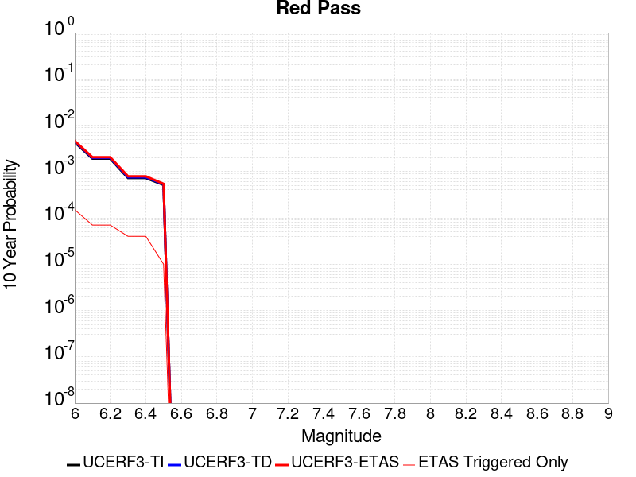 |

| Magnitude | 1 wk TI Prob | 1 wk TD Prob | 1 wk ETAS Prob | 1 wk ETAS/TD Gain | 1 wk ETAS Triggered Only | 1 mo TI Prob | 1 mo TD Prob | 1 mo ETAS Prob | 1 mo ETAS/TD Gain | 1 mo ETAS Triggered Only | 1 yr TI Prob | 1 yr TD Prob | 1 yr ETAS Prob | 1 yr ETAS/TD Gain | 1 yr ETAS Triggered Only | 10 yr TI Prob | 10 yr TD Prob | 10 yr ETAS Prob | 10 yr ETAS/TD Gain | 10 yr ETAS Triggered Only |
|-----|-----|-----|-----|-----|-----|-----|-----|-----|-----|-----|-----|-----|-----|-----|-----|-----|-----|-----|-----|-----|
| 6.0 | 8.258278E-6 | 8.551426E-6 | 1.855134E-5 | 2.1693857 | 1.0E-5 | 3.539214E-5 | 3.6648555E-5 | 6.664745E-5 | 1.8185562 | 3.0E-5 | 4.308141E-4 | 4.4612266E-4 | 5.2608695E-4 | 1.1792428 | 8.0E-5 | 0.0042997985 | 0.0044540283 | 0.0046033603 | 1.0335274 | 1.5E-4 |
| 6.1 | 3.649988E-6 | 3.7753848E-6 | 3.7753848E-6 | 1.0 | 0.0 | 1.5642712E-5 | 1.6180147E-5 | 3.6179823E-5 | 2.2360628 | 2.0E-5 | 1.9043336E-4 | 1.9698025E-4 | 2.2697434E-4 | 1.1522695 | 3.0E-5 | 0.0019027026 | 0.0019685237 | 0.002038386 | 1.0354897 | 7.0E-5 |
| 6.2 | 3.649988E-6 | 3.7753848E-6 | 3.7753848E-6 | 1.0 | 0.0 | 1.5642712E-5 | 1.6180147E-5 | 3.6179823E-5 | 2.2360628 | 2.0E-5 | 1.9043336E-4 | 1.9698025E-4 | 2.2697434E-4 | 1.1522695 | 3.0E-5 | 0.0019027026 | 0.0019685237 | 0.002038386 | 1.0354897 | 7.0E-5 |
| 6.3 | 1.3924937E-6 | 1.4411434E-6 | 1.4411434E-6 | 1.0 | 0.0 | 5.9678164E-6 | 6.1763217E-6 | 1.617626E-5 | 2.6190765 | 1.0E-5 | 7.265574E-5 | 7.519554E-5 | 9.519404E-5 | 1.2659532 | 2.0E-5 | 7.263199E-4 | 7.518397E-4 | 7.9180964E-4 | 1.0531628 | 4.0E-5 |
| 6.4 | 1.3924937E-6 | 1.4411434E-6 | 1.4411434E-6 | 1.0 | 0.0 | 5.9678164E-6 | 6.1763217E-6 | 1.617626E-5 | 2.6190765 | 1.0E-5 | 7.265574E-5 | 7.519554E-5 | 9.519404E-5 | 1.2659532 | 2.0E-5 | 7.263199E-4 | 7.518397E-4 | 7.9180964E-4 | 1.0531628 | 4.0E-5 |
| 6.5 | 9.876812E-7 | 1.0222102E-6 | 1.0222102E-6 | 1.0 | 0.0 | 4.2329125E-6 | 4.3809005E-6 | 1.4380857E-5 | 3.2826257 | 1.0E-5 | 5.153449E-5 | 5.3337466E-5 | 6.3336935E-5 | 1.1874754 | 1.0E-5 | 5.1522546E-4 | 5.3337467E-4 | 5.4336933E-4 | 1.0187385 | 1.0E-5 |

## San Andreas (Creeping Section) 2011 CFM
*[(top)](#table-of-contents)*

| 1 Week | 1 Month | 1 Year | 10 Year |
|-----|-----|-----|-----|
|  |  |  |  |

| Magnitude | 1 wk TI Prob | 1 wk TD Prob | 1 wk ETAS Prob | 1 wk ETAS/TD Gain | 1 wk ETAS Triggered Only | 1 mo TI Prob | 1 mo TD Prob | 1 mo ETAS Prob | 1 mo ETAS/TD Gain | 1 mo ETAS Triggered Only | 1 yr TI Prob | 1 yr TD Prob | 1 yr ETAS Prob | 1 yr ETAS/TD Gain | 1 yr ETAS Triggered Only | 10 yr TI Prob | 10 yr TD Prob | 10 yr ETAS Prob | 10 yr ETAS/TD Gain | 10 yr ETAS Triggered Only |
|-----|-----|-----|-----|-----|-----|-----|-----|-----|-----|-----|-----|-----|-----|-----|-----|-----|-----|-----|-----|-----|
| 6.0 | 5.986481E-4 | 0.0012277901 | 0.0012277901 | 1.0 | 0.0 | 0.0025631124 | 0.0052455855 | 0.005255533 | 1.0018964 | 1.0E-5 | 0.030762846 | 0.061229862 | 0.061304964 | 1.0012265 | 8.0E-5 | 0.26835477 | 0.42607152 | 0.42615187 | 1.0001886 | 1.4E-4 |
| 6.1 | 5.015945E-4 | 0.0010218644 | 0.0010218644 | 1.0 | 0.0 | 0.00214792 | 0.0043676887 | 0.004377645 | 1.0022795 | 1.0E-5 | 0.025839351 | 0.051269703 | 0.05131714 | 1.0009252 | 5.0E-5 | 0.23032776 | 0.37298882 | 0.37305778 | 1.0001849 | 1.1E-4 |
| 6.2 | 4.073338E-4 | 8.109829E-4 | 8.109829E-4 | 1.0 | 0.0 | 0.0017445484 | 0.0034675654 | 0.0034775306 | 1.0028739 | 1.0E-5 | 0.021034058 | 0.040954083 | 0.041002035 | 1.0011709 | 5.0E-5 | 0.19150782 | 0.31317768 | 0.31325322 | 1.0002413 | 1.1E-4 |
| 6.3 | 3.464099E-4 | 6.7405414E-4 | 6.7405414E-4 | 1.0 | 0.0 | 0.0014837692 | 0.0028840431 | 0.0028940141 | 1.0034573 | 1.0E-5 | 0.017915873 | 0.034210727 | 0.034249358 | 1.0011293 | 4.0E-5 | 0.16538359 | 0.27146977 | 0.2715426 | 1.0002683 | 1.0E-4 |
| 6.4 | 2.935057E-4 | 5.543318E-4 | 5.543318E-4 | 1.0 | 0.0 | 0.0012572751 | 0.0023728115 | 0.0023827879 | 1.0042044 | 1.0E-5 | 0.015200248 | 0.028285956 | 0.028324824 | 1.0013741 | 4.0E-5 | 0.14201577 | 0.23314685 | 0.23321585 | 1.000296 | 9.0E-5 |
| 6.5 | 2.3409708E-4 | 4.2106997E-4 | 4.2106997E-4 | 1.0 | 0.0 | 0.0010028875 | 0.001803265 | 0.0018132469 | 1.0055355 | 1.0E-5 | 0.012141965 | 0.02160988 | 0.021649016 | 1.001811 | 4.0E-5 | 0.11499573 | 0.18699536 | 0.18706852 | 1.0003912 | 9.0E-5 |
| 6.6 | 1.5842178E-4 | 2.5115322E-4 | 2.5115322E-4 | 1.0 | 0.0 | 6.7877385E-4 | 0.0010759257 | 0.0010859149 | 1.0092844 | 1.0E-5 | 0.0082328 | 0.013019121 | 0.013058601 | 1.0030324 | 4.0E-5 | 0.07934396 | 0.12333139 | 0.12340153 | 1.0005686 | 8.0E-5 |
| 6.7 | 1.5616413E-4 | 2.4651614E-4 | 2.4651614E-4 | 1.0 | 0.0 | 6.691031E-4 | 0.0010560687 | 0.0010660582 | 1.0094591 | 1.0E-5 | 0.0081159435 | 0.012780937 | 0.012820426 | 1.0030897 | 4.0E-5 | 0.0782586 | 0.12135857 | 0.12142886 | 1.0005792 | 8.0E-5 |
| 6.8 | 1.5538467E-4 | 2.4475376E-4 | 2.4475376E-4 | 1.0 | 0.0 | 6.6576427E-4 | 0.0010485224 | 0.001058512 | 1.0095272 | 1.0E-5 | 0.008075596 | 0.0126902815 | 0.012729773 | 1.0031121 | 4.0E-5 | 0.07788358 | 0.12058931 | 0.120659664 | 1.0005834 | 8.0E-5 |
| 6.9 | 1.5153569E-4 | 2.3584193E-4 | 2.3584193E-4 | 1.0 | 0.0 | 6.49277E-4 | 0.0010103616 | 0.0010203515 | 1.0098875 | 1.0E-5 | 0.007876333 | 0.0122323 | 0.012271811 | 1.00323 | 4.0E-5 | 0.07602952 | 0.11665895 | 0.11672962 | 1.0006057 | 8.0E-5 |
| 7.0 | 1.4588932E-4 | 2.2441045E-4 | 2.2441045E-4 | 1.0 | 0.0 | 6.250901E-4 | 9.6140656E-4 | 9.71397E-4 | 1.0103915 | 1.0E-5 | 0.0075839474 | 0.011642803 | 0.011682337 | 1.0033956 | 4.0E-5 | 0.073302895 | 0.11150479 | 0.11157587 | 1.0006374 | 8.0E-5 |
| 7.1 | 1.1565079E-4 | 1.6318668E-4 | 1.6318668E-4 | 1.0 | 0.0 | 4.955521E-4 | 6.991849E-4 | 7.0917787E-4 | 1.0142924 | 1.0E-5 | 0.006016669 | 0.008479553 | 0.008519214 | 1.0046772 | 4.0E-5 | 0.058563538 | 0.08383247 | 0.083905764 | 1.0008743 | 8.0E-5 |
| 7.2 | 1.0393792E-4 | 1.4650424E-4 | 1.4650424E-4 | 1.0 | 0.0 | 4.4537216E-4 | 6.2772504E-4 | 6.377187E-4 | 1.0159205 | 1.0E-5 | 0.005408933 | 0.007615941 | 0.0076556364 | 1.0052122 | 4.0E-5 | 0.052791595 | 0.075774014 | 0.07584795 | 1.0009757 | 8.0E-5 |
| 7.3 | 9.332884E-5 | 1.2811116E-4 | 1.2811116E-4 | 1.0 | 0.0 | 3.999194E-4 | 5.4893293E-4 | 5.589275E-4 | 1.0182072 | 1.0E-5 | 0.0048581534 | 0.006662914 | 0.0067026475 | 1.0059633 | 4.0E-5 | 0.047533102 | 0.06662133 | 0.066696 | 1.0011208 | 8.0E-5 |
| 7.4 | 8.670252E-5 | 1.17293064E-4 | 1.17293064E-4 | 1.0 | 0.0 | 3.715293E-4 | 5.0258834E-4 | 5.125833E-4 | 1.019887 | 1.0E-5 | 0.004513991 | 0.006101966 | 0.006141722 | 1.0065153 | 4.0E-5 | 0.044233937 | 0.06127167 | 0.06134677 | 1.0012257 | 8.0E-5 |
| 7.5 | 7.3036405E-5 | 9.027501E-5 | 9.027501E-5 | 1.0 | 0.0 | 3.129756E-4 | 3.8683563E-4 | 3.8683563E-4 | 1.0 | 0.0 | 0.0038038217 | 0.0046995743 | 0.0047194804 | 1.0042357 | 2.0E-5 | 0.03739367 | 0.047980286 | 0.04803741 | 1.0011905 | 6.0E-5 |
| 7.6 | 6.3935775E-5 | 8.298733E-5 | 8.298733E-5 | 1.0 | 0.0 | 2.7398168E-4 | 3.5561158E-4 | 3.5561158E-4 | 1.0 | 0.0 | 0.0033306254 | 0.0043209945 | 0.004340908 | 1.0046085 | 2.0E-5 | 0.032811474 | 0.04407886 | 0.044136215 | 1.0013012 | 6.0E-5 |
| 7.7 | 5.5050095E-5 | 6.6780485E-5 | 6.6780485E-5 | 1.0 | 0.0 | 2.3590765E-4 | 2.861707E-4 | 2.861707E-4 | 1.0 | 0.0 | 0.0028683927 | 0.003478566 | 0.0034984965 | 1.0057294 | 2.0E-5 | 0.0283165 | 0.035874426 | 0.03592263 | 1.0013437 | 5.0E-5 |
| 7.8 | 5.027131E-5 | 6.177649E-5 | 6.177649E-5 | 1.0 | 0.0 | 2.1543067E-4 | 2.6472952E-4 | 2.6472952E-4 | 1.0 | 0.0 | 0.0026197135 | 0.0032183218 | 0.0032382575 | 1.0061945 | 2.0E-5 | 0.025890453 | 0.033198178 | 0.03323685 | 1.0011649 | 4.0E-5 |
| 7.9 | 3.7271806E-5 | 5.034326E-5 | 5.034326E-5 | 1.0 | 0.0 | 1.5972654E-4 | 2.15739E-4 | 2.15739E-4 | 1.0 | 0.0 | 0.0019429359 | 0.0026234603 | 0.0026434078 | 1.0076035 | 2.0E-5 | 0.019260362 | 0.027125074 | 0.027163988 | 1.0014347 | 4.0E-5 |
| 8.0 | 2.7310243E-5 | 3.1506686E-5 | 3.1506686E-5 | 1.0 | 0.0 | 1.17038646E-4 | 1.3502168E-4 | 1.3502168E-4 | 1.0 | 0.0 | 0.0014240141 | 0.0016426502 | 0.0016626173 | 1.0121554 | 2.0E-5 | 0.014149235 | 0.017253635 | 0.017283117 | 1.0017087 | 3.0E-5 |
| 8.1 | 1.7940547E-5 | 1.7450684E-5 | 1.7450684E-5 | 1.0 | 0.0 | 7.688579E-5 | 7.4786505E-5 | 7.4786505E-5 | 1.0 | 0.0 | 9.3568244E-4 | 9.1014587E-4 | 9.2013675E-4 | 1.0109773 | 1.0E-5 | 0.009317525 | 0.009825298 | 0.009835199 | 1.0010078 | 1.0E-5 |
| 8.2 | 8.643924E-6 | 5.49522E-6 | 5.49522E-6 | 1.0 | 0.0 | 3.704486E-5 | 2.355073E-5 | 2.355073E-5 | 1.0 | 0.0 | 4.5092785E-4 | 2.866925E-4 | 2.866925E-4 | 1.0 | 0.0 | 0.0045001395 | 0.0032598388 | 0.0032598388 | 1.0 | 0.0 |
| 8.3 | 1.983087E-6 | 7.693574E-7 | 7.693574E-7 | 1.0 | 0.0 | 8.498917E-6 | 3.297242E-6 | 3.297242E-6 | 1.0 | 0.0 | 1.034694E-4 | 4.01432E-5 | 4.01432E-5 | 1.0 | 0.0 | 0.0010342124 | 4.7390026E-4 | 4.7390026E-4 | 1.0 | 0.0 |

## White Wolf (Extension)
*[(top)](#table-of-contents)*

| 1 Week | 1 Month | 1 Year | 10 Year |
|-----|-----|-----|-----|
|  |  |  |  |

| Magnitude | 1 wk TI Prob | 1 wk TD Prob | 1 wk ETAS Prob | 1 wk ETAS/TD Gain | 1 wk ETAS Triggered Only | 1 mo TI Prob | 1 mo TD Prob | 1 mo ETAS Prob | 1 mo ETAS/TD Gain | 1 mo ETAS Triggered Only | 1 yr TI Prob | 1 yr TD Prob | 1 yr ETAS Prob | 1 yr ETAS/TD Gain | 1 yr ETAS Triggered Only | 10 yr TI Prob | 10 yr TD Prob | 10 yr ETAS Prob | 10 yr ETAS/TD Gain | 10 yr ETAS Triggered Only |
|-----|-----|-----|-----|-----|-----|-----|-----|-----|-----|-----|-----|-----|-----|-----|-----|-----|-----|-----|-----|-----|
| 6.0 | 8.222555E-6 | 6.0668267E-6 | 6.0668267E-6 | 1.0 | 0.0 | 3.5239045E-5 | 2.6000464E-5 | 3.60002E-5 | 1.3845985 | 1.0E-5 | 4.289509E-4 | 3.165163E-4 | 3.8649412E-4 | 1.2210877 | 7.0E-5 | 0.0042812387 | 0.0031613067 | 0.0032908958 | 1.0409923 | 1.3E-4 |
| 6.1 | 8.222555E-6 | 6.0668267E-6 | 6.0668267E-6 | 1.0 | 0.0 | 3.5239045E-5 | 2.6000464E-5 | 3.60002E-5 | 1.3845985 | 1.0E-5 | 4.289509E-4 | 3.165163E-4 | 3.8649412E-4 | 1.2210877 | 7.0E-5 | 0.0042812387 | 0.0031613067 | 0.0032908958 | 1.0409923 | 1.3E-4 |
| 6.2 | 8.222555E-6 | 6.0668267E-6 | 6.0668267E-6 | 1.0 | 0.0 | 3.5239045E-5 | 2.6000464E-5 | 3.60002E-5 | 1.3845985 | 1.0E-5 | 4.289509E-4 | 3.165163E-4 | 3.8649412E-4 | 1.2210877 | 7.0E-5 | 0.0042812387 | 0.0031613067 | 0.0032908958 | 1.0409923 | 1.3E-4 |
| 6.3 | 8.222555E-6 | 6.0668267E-6 | 6.0668267E-6 | 1.0 | 0.0 | 3.5239045E-5 | 2.6000464E-5 | 3.60002E-5 | 1.3845985 | 1.0E-5 | 4.289509E-4 | 3.165163E-4 | 3.8649412E-4 | 1.2210877 | 7.0E-5 | 0.0042812387 | 0.0031613067 | 0.0032908958 | 1.0409923 | 1.3E-4 |
| 6.4 | 5.821773E-6 | 3.557277E-6 | 3.557277E-6 | 1.0 | 0.0 | 2.4950215E-5 | 1.52453895E-5 | 1.52453895E-5 | 1.0 | 0.0 | 3.0372653E-4 | 1.855979E-4 | 2.2559048E-4 | 1.2154796 | 4.0E-5 | 0.0030331176 | 0.0018545374 | 0.0019044447 | 1.0269109 | 5.0E-5 |
| 6.5 | 5.766023E-6 | 3.49921E-6 | 3.49921E-6 | 1.0 | 0.0 | 2.4711293E-5 | 1.49965335E-5 | 1.49965335E-5 | 1.0 | 0.0 | 3.0081844E-4 | 1.8256859E-4 | 2.1256311E-4 | 1.1642919 | 3.0E-5 | 0.0030041158 | 0.0018242942 | 0.0018642213 | 1.0218862 | 4.0E-5 |
| 6.6 | 4.643576E-6 | 2.332699E-6 | 2.332699E-6 | 1.0 | 0.0 | 1.9900888E-5 | 9.997246E-6 | 9.997246E-6 | 1.0 | 0.0 | 2.4226638E-4 | 1.21710094E-4 | 1.5170645E-4 | 1.2464573 | 3.0E-5 | 0.0024200242 | 0.0012164768 | 0.0012464403 | 1.0246314 | 3.0E-5 |
| 6.7 | 3.9529173E-6 | 1.648408E-6 | 1.648408E-6 | 1.0 | 0.0 | 1.6940963E-5 | 7.0645874E-6 | 7.0645874E-6 | 1.0 | 0.0 | 2.0623671E-4 | 8.600815E-5 | 8.600815E-5 | 1.0 | 0.0 | 0.002060454 | 8.597671E-4 | 8.597671E-4 | 1.0 | 0.0 |
| 6.8 | 3.4377522E-6 | 1.2245736E-6 | 1.2245736E-6 | 1.0 | 0.0 | 1.473314E-5 | 5.2481623E-6 | 5.2481623E-6 | 1.0 | 0.0 | 1.7936122E-4 | 6.389459E-5 | 6.389459E-5 | 1.0 | 0.0 | 0.0017921652 | 6.3877134E-4 | 6.3877134E-4 | 1.0 | 0.0 |
| 6.9 | 3.1367306E-6 | 1.0034221E-6 | 1.0034221E-6 | 1.0 | 0.0 | 1.3443062E-5 | 4.300374E-6 | 4.300374E-6 | 1.0 | 0.0 | 1.63657E-4 | 5.2355874E-5 | 5.2355874E-5 | 1.0 | 0.0 | 0.0016353652 | 5.2344304E-4 | 5.2344304E-4 | 1.0 | 0.0 |
| 7.0 | 2.8298145E-6 | 7.429045E-7 | 7.429045E-7 | 1.0 | 0.0 | 1.2127721E-5 | 3.1838729E-6 | 3.1838729E-6 | 1.0 | 0.0 | 1.47645E-4 | 3.8763013E-5 | 3.8763013E-5 | 1.0 | 0.0 | 0.0014754693 | 3.875675E-4 | 3.875675E-4 | 1.0 | 0.0 |
| 7.1 | 2.4091064E-6 | 5.4230577E-7 | 5.4230577E-7 | 1.0 | 0.0 | 1.03247E-5 | 2.3241657E-6 | 2.3241657E-6 | 1.0 | 0.0 | 1.2569598E-4 | 2.8296392E-5 | 2.8296392E-5 | 1.0 | 0.0 | 0.001256249 | 2.8293193E-4 | 2.8293193E-4 | 1.0 | 0.0 |
| 7.2 | 1.3875518E-6 | 1.0744563E-7 | 1.0744563E-7 | 1.0 | 0.0 | 5.9466374E-6 | 4.604812E-7 | 4.604812E-7 | 1.0 | 0.0 | 7.23979E-5 | 5.6063454E-6 | 5.6063454E-6 | 1.0 | 0.0 | 7.2374323E-4 | 5.6062152E-5 | 5.6062152E-5 | 1.0 | 0.0 |
| 7.3 | 7.056077E-7 | 5.002896E-8 | 5.002896E-8 | 1.0 | 0.0 | 3.0240296E-6 | 2.1440981E-7 | 2.1440981E-7 | 1.0 | 0.0 | 3.681694E-5 | 2.6104367E-6 | 2.6104367E-6 | 1.0 | 0.0 | 3.681084E-4 | 2.6104108E-5 | 2.6104108E-5 | 1.0 | 0.0 |
| 7.4 | 5.9334678E-8 | 4.86919E-9 | 4.86919E-9 | 1.0 | 0.0 | 2.5429145E-7 | 2.0867958E-8 | 2.0867958E-8 | 1.0 | 0.0 | 3.095994E-6 | 2.5406737E-7 | 2.5406737E-7 | 1.0 | 0.0 | 3.095951E-5 | 2.5406719E-6 | 2.5406719E-6 | 1.0 | 0.0 |

## San Jacinto (San Jacinto Valley) rev
*[(top)](#table-of-contents)*

| 1 Week | 1 Month | 1 Year | 10 Year |
|-----|-----|-----|-----|
|  |  | 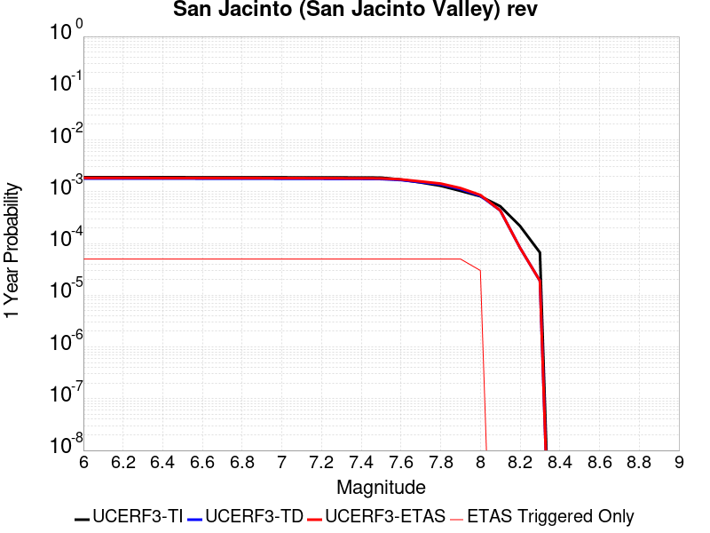 |  |

| Magnitude | 1 wk TI Prob | 1 wk TD Prob | 1 wk ETAS Prob | 1 wk ETAS/TD Gain | 1 wk ETAS Triggered Only | 1 mo TI Prob | 1 mo TD Prob | 1 mo ETAS Prob | 1 mo ETAS/TD Gain | 1 mo ETAS Triggered Only | 1 yr TI Prob | 1 yr TD Prob | 1 yr ETAS Prob | 1 yr ETAS/TD Gain | 1 yr ETAS Triggered Only | 10 yr TI Prob | 10 yr TD Prob | 10 yr ETAS Prob | 10 yr ETAS/TD Gain | 10 yr ETAS Triggered Only |
|-----|-----|-----|-----|-----|-----|-----|-----|-----|-----|-----|-----|-----|-----|-----|-----|-----|-----|-----|-----|-----|
| 6.0 | 3.652694E-5 | 3.4467394E-5 | 3.4467394E-5 | 1.0 | 0.0 | 1.5653463E-4 | 1.4770904E-4 | 1.677061E-4 | 1.1353813 | 2.0E-5 | 0.0019041431 | 0.001796876 | 0.0018467861 | 1.0277761 | 5.0E-5 | 0.018879099 | 0.018560216 | 0.018677987 | 1.0063454 | 1.2E-4 |
| 6.1 | 3.652694E-5 | 3.4467394E-5 | 3.4467394E-5 | 1.0 | 0.0 | 1.5653463E-4 | 1.4770904E-4 | 1.677061E-4 | 1.1353813 | 2.0E-5 | 0.0019041431 | 0.001796876 | 0.0018467861 | 1.0277761 | 5.0E-5 | 0.018879099 | 0.018560216 | 0.018677987 | 1.0063454 | 1.2E-4 |
| 6.2 | 3.652694E-5 | 3.4467394E-5 | 3.4467394E-5 | 1.0 | 0.0 | 1.5653463E-4 | 1.4770904E-4 | 1.677061E-4 | 1.1353813 | 2.0E-5 | 0.0019041431 | 0.001796876 | 0.0018467861 | 1.0277761 | 5.0E-5 | 0.018879099 | 0.018560216 | 0.018677987 | 1.0063454 | 1.2E-4 |
| 6.3 | 3.652694E-5 | 3.4467394E-5 | 3.4467394E-5 | 1.0 | 0.0 | 1.5653463E-4 | 1.4770904E-4 | 1.677061E-4 | 1.1353813 | 2.0E-5 | 0.0019041431 | 0.001796876 | 0.0018467861 | 1.0277761 | 5.0E-5 | 0.018879099 | 0.018560216 | 0.018677987 | 1.0063454 | 1.2E-4 |
| 6.4 | 3.646941E-5 | 3.4388955E-5 | 3.4388955E-5 | 1.0 | 0.0 | 1.5628811E-4 | 1.4737292E-4 | 1.6736997E-4 | 1.1356901 | 2.0E-5 | 0.0019011468 | 0.0017927908 | 0.0018427012 | 1.0278394 | 5.0E-5 | 0.018849645 | 0.01852009 | 0.018637868 | 1.0063595 | 1.2E-4 |
| 6.5 | 3.646941E-5 | 3.4388955E-5 | 3.4388955E-5 | 1.0 | 0.0 | 1.5628811E-4 | 1.4737292E-4 | 1.6736997E-4 | 1.1356901 | 2.0E-5 | 0.0019011468 | 0.0017927908 | 0.0018427012 | 1.0278394 | 5.0E-5 | 0.018849645 | 0.01852009 | 0.018637868 | 1.0063595 | 1.2E-4 |
| 6.6 | 3.6442503E-5 | 3.4352335E-5 | 3.4352335E-5 | 1.0 | 0.0 | 1.561728E-4 | 1.4721598E-4 | 1.6721303E-4 | 1.1358348 | 2.0E-5 | 0.0018997455 | 0.0017908834 | 0.0018407938 | 1.0278692 | 5.0E-5 | 0.018835869 | 0.018501356 | 0.018619137 | 1.006366 | 1.2E-4 |
| 6.7 | 3.6432113E-5 | 3.4337903E-5 | 3.4337903E-5 | 1.0 | 0.0 | 1.5612828E-4 | 1.4715415E-4 | 1.671512E-4 | 1.1358919 | 2.0E-5 | 0.0018992044 | 0.001790132 | 0.0018400425 | 1.0278809 | 5.0E-5 | 0.018830549 | 0.01849398 | 0.01861176 | 1.0063686 | 1.2E-4 |
| 6.8 | 3.6409598E-5 | 3.430695E-5 | 3.430695E-5 | 1.0 | 0.0 | 1.560318E-4 | 1.470215E-4 | 1.6701857E-4 | 1.1360145 | 2.0E-5 | 0.0018980318 | 0.0017885199 | 0.0018384304 | 1.0279061 | 5.0E-5 | 0.018819023 | 0.01847813 | 0.018595913 | 1.0063741 | 1.2E-4 |
| 6.9 | 3.638078E-5 | 3.4267367E-5 | 3.4267367E-5 | 1.0 | 0.0 | 1.5590832E-4 | 1.4685189E-4 | 1.6684894E-4 | 1.1361717 | 2.0E-5 | 0.0018965311 | 0.0017864581 | 0.0018363688 | 1.0279384 | 5.0E-5 | 0.018804269 | 0.018457862 | 0.018575648 | 1.0063813 | 1.2E-4 |
| 7.0 | 3.6294874E-5 | 3.4149365E-5 | 3.4149365E-5 | 1.0 | 0.0 | 1.5554018E-4 | 1.4634622E-4 | 1.663433E-4 | 1.1366422 | 2.0E-5 | 0.0018920569 | 0.0017803118 | 0.0018302228 | 1.0280349 | 5.0E-5 | 0.018760284 | 0.018397434 | 0.018515227 | 1.0064026 | 1.2E-4 |
| 7.1 | 3.6260717E-5 | 3.410564E-5 | 3.410564E-5 | 1.0 | 0.0 | 1.5539382E-4 | 1.4615887E-4 | 1.6615594E-4 | 1.1368175 | 2.0E-5 | 0.001890278 | 0.0017780344 | 0.0018279455 | 1.0280709 | 5.0E-5 | 0.018742796 | 0.018375032 | 0.018492827 | 1.0064106 | 1.2E-4 |
| 7.2 | 3.6210204E-5 | 3.403977E-5 | 3.403977E-5 | 1.0 | 0.0 | 1.5517735E-4 | 1.4587659E-4 | 1.6587367E-4 | 1.1370822 | 2.0E-5 | 0.001887647 | 0.0017746033 | 0.0018245146 | 1.0281253 | 5.0E-5 | 0.01871693 | 0.018341267 | 0.018459065 | 1.0064226 | 1.2E-4 |
| 7.3 | 3.6119454E-5 | 3.3927867E-5 | 3.3927867E-5 | 1.0 | 0.0 | 1.5478847E-4 | 1.4539705E-4 | 1.6539414E-4 | 1.1375344 | 2.0E-5 | 0.0018829206 | 0.0017687745 | 0.001818686 | 1.0282182 | 5.0E-5 | 0.018670462 | 0.018283723 | 0.01840153 | 1.0064433 | 1.2E-4 |
| 7.4 | 3.607848E-5 | 3.387532E-5 | 3.387532E-5 | 1.0 | 0.0 | 1.5461289E-4 | 1.4517189E-4 | 1.6516898E-4 | 1.1377478 | 2.0E-5 | 0.0018807866 | 0.0017660374 | 0.0018159492 | 1.028262 | 5.0E-5 | 0.018649481 | 0.018256696 | 0.018374506 | 1.0064529 | 1.2E-4 |
| 7.5 | 3.5856774E-5 | 3.3684162E-5 | 3.3684162E-5 | 1.0 | 0.0 | 1.5366284E-4 | 1.4435273E-4 | 1.6434984E-4 | 1.1385295 | 2.0E-5 | 0.0018692396 | 0.0017560803 | 0.0018059926 | 1.0284225 | 5.0E-5 | 0.018535944 | 0.01815731 | 0.018275132 | 1.0064889 | 1.2E-4 |
| 7.6 | 3.286655E-5 | 3.220034E-5 | 3.220034E-5 | 1.0 | 0.0 | 1.4084904E-4 | 1.3799417E-4 | 1.5799141E-4 | 1.1449137 | 2.0E-5 | 0.001713488 | 0.0016787864 | 0.0017287025 | 1.0297334 | 5.0E-5 | 0.017003361 | 0.017373424 | 0.017491339 | 1.0067871 | 1.2E-4 |
| 7.7 | 2.8882527E-5 | 2.9291981E-5 | 2.9291981E-5 | 1.0 | 0.0 | 1.237764E-4 | 1.2553102E-4 | 1.4552851E-4 | 1.1593032 | 2.0E-5 | 0.0015059357 | 0.0015272698 | 0.0015771935 | 1.0326881 | 5.0E-5 | 0.014957713 | 0.015859274 | 0.015977371 | 1.0074465 | 1.2E-4 |
| 7.8 | 2.4950225E-5 | 2.6580747E-5 | 2.6580747E-5 | 1.0 | 0.0 | 1.0692515E-4 | 1.13912516E-4 | 1.3391023E-4 | 1.1755533 | 2.0E-5 | 0.0013010362 | 0.0013860033 | 0.0014359341 | 1.0360249 | 5.0E-5 | 0.012934455 | 0.014439502 | 0.0145577695 | 1.0081905 | 1.2E-4 |
| 7.9 | 1.9881603E-5 | 2.155556E-5 | 2.155556E-5 | 1.0 | 0.0 | 8.520408E-5 | 9.2377704E-5 | 1.12375856E-4 | 1.2164825 | 2.0E-5 | 0.001036866 | 0.001124119 | 0.0011740628 | 1.0444293 | 5.0E-5 | 0.010320415 | 0.011802064 | 0.011920649 | 1.0100477 | 1.2E-4 |
| 8.0 | 1.563292E-5 | 1.5976173E-5 | 1.5976173E-5 | 1.0 | 0.0 | 6.6996516E-5 | 6.846752E-5 | 7.846683E-5 | 1.1460446 | 1.0E-5 | 8.153773E-4 | 8.332739E-4 | 8.632489E-4 | 1.0359726 | 3.0E-5 | 0.00812392 | 0.008830938 | 0.008920143 | 1.0101014 | 9.0E-5 |
| 8.1 | 1.0045313E-5 | 8.324356E-6 | 8.324356E-6 | 1.0 | 0.0 | 4.305063E-5 | 3.5675326E-5 | 3.5675326E-5 | 1.0 | 0.0 | 5.2401534E-4 | 4.3426102E-4 | 4.3426102E-4 | 1.0 | 0.0 | 0.0052278144 | 0.0046712374 | 0.004691144 | 1.0042615 | 2.0E-5 |
| 8.2 | 4.1554413E-6 | 1.5721832E-6 | 1.5721832E-6 | 1.0 | 0.0 | 1.7808914E-5 | 6.737911E-6 | 6.737911E-6 | 1.0 | 0.0 | 2.1680194E-4 | 8.203101E-5 | 8.203101E-5 | 1.0 | 0.0 | 0.0021659054 | 9.520741E-4 | 9.520741E-4 | 1.0 | 0.0 |
| 8.3 | 1.2758221E-6 | 3.6330252E-7 | 3.6330252E-7 | 1.0 | 0.0 | 5.4677976E-6 | 1.5570099E-6 | 1.5570099E-6 | 1.0 | 0.0 | 6.65684E-5 | 1.8956434E-5 | 1.8956434E-5 | 1.0 | 0.0 | 6.6548464E-4 | 2.2857229E-4 | 2.2857229E-4 | 1.0 | 0.0 |

## Baker
*[(top)](#table-of-contents)*

| 1 Week | 1 Month | 1 Year | 10 Year |
|-----|-----|-----|-----|
|  |  | 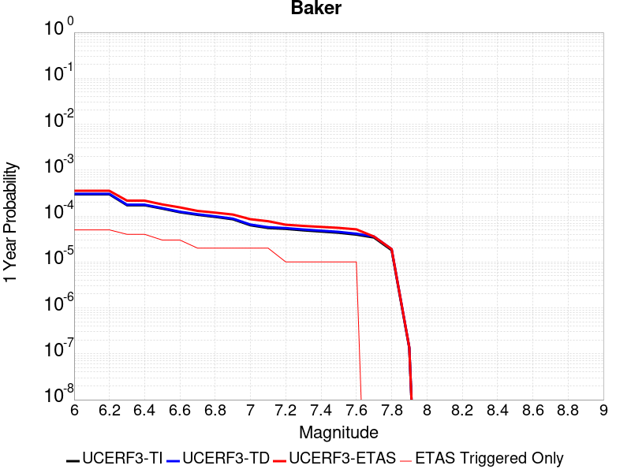 |  |

| Magnitude | 1 wk TI Prob | 1 wk TD Prob | 1 wk ETAS Prob | 1 wk ETAS/TD Gain | 1 wk ETAS Triggered Only | 1 mo TI Prob | 1 mo TD Prob | 1 mo ETAS Prob | 1 mo ETAS/TD Gain | 1 mo ETAS Triggered Only | 1 yr TI Prob | 1 yr TD Prob | 1 yr ETAS Prob | 1 yr ETAS/TD Gain | 1 yr ETAS Triggered Only | 10 yr TI Prob | 10 yr TD Prob | 10 yr ETAS Prob | 10 yr ETAS/TD Gain | 10 yr ETAS Triggered Only |
|-----|-----|-----|-----|-----|-----|-----|-----|-----|-----|-----|-----|-----|-----|-----|-----|-----|-----|-----|-----|-----|
| 6.0 | 5.695525E-6 | 5.8349133E-6 | 1.5834856E-5 | 2.7138116 | 1.0E-5 | 2.4409164E-5 | 2.5006555E-5 | 3.5006306E-5 | 1.3998852 | 1.0E-5 | 2.9714106E-4 | 3.0441626E-4 | 3.5440104E-4 | 1.1641988 | 5.0E-5 | 0.0029674405 | 0.0030403885 | 0.0031600236 | 1.0393486 | 1.2E-4 |
| 6.1 | 5.695525E-6 | 5.8349133E-6 | 1.5834856E-5 | 2.7138116 | 1.0E-5 | 2.4409164E-5 | 2.5006555E-5 | 3.5006306E-5 | 1.3998852 | 1.0E-5 | 2.9714106E-4 | 3.0441626E-4 | 3.5440104E-4 | 1.1641988 | 5.0E-5 | 0.0029674405 | 0.0030403885 | 0.0031600236 | 1.0393486 | 1.2E-4 |
| 6.2 | 5.695525E-6 | 5.8349133E-6 | 1.5834856E-5 | 2.7138116 | 1.0E-5 | 2.4409164E-5 | 2.5006555E-5 | 3.5006306E-5 | 1.3998852 | 1.0E-5 | 2.9714106E-4 | 3.0441626E-4 | 3.5440104E-4 | 1.1641988 | 5.0E-5 | 0.0029674405 | 0.0030403885 | 0.0031600236 | 1.0393486 | 1.2E-4 |
| 6.3 | 3.2995713E-6 | 3.3837132E-6 | 1.3383679E-5 | 3.9553232 | 1.0E-5 | 1.4140943E-5 | 1.450155E-5 | 2.4501405E-5 | 1.6895715 | 1.0E-5 | 1.7215237E-4 | 1.7654254E-4 | 2.1653548E-4 | 1.2265342 | 4.0E-5 | 0.0017201907 | 0.00176407 | 0.0018539113 | 1.0509284 | 9.0E-5 |
| 6.4 | 3.2995713E-6 | 3.3837132E-6 | 1.3383679E-5 | 3.9553232 | 1.0E-5 | 1.4140943E-5 | 1.450155E-5 | 2.4501405E-5 | 1.6895715 | 1.0E-5 | 1.7215237E-4 | 1.7654254E-4 | 2.1653548E-4 | 1.2265342 | 4.0E-5 | 0.0017201907 | 0.00176407 | 0.0018539113 | 1.0509284 | 9.0E-5 |
| 6.5 | 2.782202E-6 | 2.855881E-6 | 1.2855852E-5 | 4.5015364 | 1.0E-5 | 1.1923668E-5 | 1.2239434E-5 | 2.2239312E-5 | 1.8170213 | 1.0E-5 | 1.4516099E-4 | 1.4900525E-4 | 1.7900078E-4 | 1.2013052 | 3.0E-5 | 0.001450662 | 0.0014890862 | 0.001568967 | 1.0536442 | 8.0E-5 |
| 6.6 | 2.3163404E-6 | 2.3809555E-6 | 1.2380931E-5 | 5.1999846 | 1.0E-5 | 9.927136E-6 | 1.0204057E-5 | 2.0203954E-5 | 1.9799924 | 1.0E-5 | 1.20856166E-4 | 1.242275E-4 | 1.5422379E-4 | 1.2414623 | 3.0E-5 | 0.0012079047 | 0.0012416008 | 0.001311514 | 1.0563089 | 7.0E-5 |
| 6.7 | 2.037056E-6 | 2.0965333E-6 | 2.0965333E-6 | 1.0 | 0.0 | 8.7302105E-6 | 8.985113E-6 | 8.985113E-6 | 1.0 | 0.0 | 1.0628513E-4 | 1.0938842E-4 | 1.2938623E-4 | 1.1828147 | 2.0E-5 | 0.0010623431 | 0.0010933619 | 0.0011433072 | 1.0456805 | 5.0E-5 |
| 6.8 | 1.8356744E-6 | 1.8915596E-6 | 1.8915596E-6 | 1.0 | 0.0 | 7.867153E-6 | 8.106659E-6 | 8.106659E-6 | 1.0 | 0.0 | 9.577837E-5 | 9.869425E-5 | 1.18692275E-4 | 1.2026261 | 2.0E-5 | 9.57371E-4 | 9.865181E-4 | 0.0010264787 | 1.0405066 | 4.0E-5 |
| 6.9 | 1.6310546E-6 | 1.6832361E-6 | 1.6832361E-6 | 1.0 | 0.0 | 6.9902153E-6 | 7.2138496E-6 | 7.2138496E-6 | 1.0 | 0.0 | 8.510255E-5 | 8.7825196E-5 | 1.07823435E-4 | 1.2277051 | 2.0E-5 | 8.5069967E-4 | 8.779161E-4 | 9.1788097E-4 | 1.0455225 | 4.0E-5 |
| 7.0 | 1.2058036E-6 | 1.2508916E-6 | 1.2508916E-6 | 1.0 | 0.0 | 5.1677193E-6 | 5.3609533E-6 | 5.3609533E-6 | 1.0 | 0.0 | 6.291517E-5 | 6.5267675E-5 | 8.5266365E-5 | 1.3064104 | 2.0E-5 | 6.289736E-4 | 6.5248733E-4 | 6.8246777E-4 | 1.0459479 | 3.0E-5 |
| 7.1 | 1.052382E-6 | 1.0951846E-6 | 1.0951846E-6 | 1.0 | 0.0 | 4.5102006E-6 | 4.69364E-6 | 4.69364E-6 | 1.0 | 0.0 | 5.491031E-5 | 5.714358E-5 | 7.714244E-5 | 1.3499756 | 2.0E-5 | 5.4896745E-4 | 5.7128974E-4 | 6.012726E-4 | 1.0524827 | 3.0E-5 |
| 7.2 | 1.0067454E-6 | 1.0487945E-6 | 1.0487945E-6 | 1.0 | 0.0 | 4.3146156E-6 | 4.4948256E-6 | 4.4948256E-6 | 1.0 | 0.0 | 5.252918E-5 | 5.472314E-5 | 6.472259E-5 | 1.182728 | 1.0E-5 | 5.251676E-4 | 5.470975E-4 | 5.6708656E-4 | 1.0365366 | 2.0E-5 |
| 7.3 | 9.3596316E-7 | 9.76795E-7 | 9.76795E-7 | 1.0 | 0.0 | 4.0112645E-6 | 4.186258E-6 | 4.186258E-6 | 1.0 | 0.0 | 4.8836053E-5 | 5.0966508E-5 | 6.0966E-5 | 1.1961973 | 1.0E-5 | 4.8825322E-4 | 5.09549E-4 | 5.295388E-4 | 1.0392303 | 2.0E-5 |
| 7.4 | 8.8117395E-7 | 9.207884E-7 | 9.207884E-7 | 1.0 | 0.0 | 3.7764542E-6 | 3.94623E-6 | 3.94623E-6 | 1.0 | 0.0 | 4.5977362E-5 | 4.80443E-5 | 5.804382E-5 | 1.2081312 | 1.0E-5 | 4.596785E-4 | 4.803399E-4 | 5.003303E-4 | 1.0416172 | 2.0E-5 |
| 7.5 | 8.292386E-7 | 8.6748094E-7 | 8.6748094E-7 | 1.0 | 0.0 | 3.5538749E-6 | 3.7177701E-6 | 3.7177701E-6 | 1.0 | 0.0 | 4.326757E-5 | 4.5262917E-5 | 5.5262466E-5 | 1.2209214 | 1.0E-5 | 4.3259145E-4 | 4.5253773E-4 | 4.7252869E-4 | 1.0441753 | 2.0E-5 |
| 7.6 | 7.553842E-7 | 7.9146724E-7 | 7.9146724E-7 | 1.0 | 0.0 | 3.2373566E-6 | 3.391998E-6 | 3.391998E-6 | 1.0 | 0.0 | 3.9414106E-5 | 4.12968E-5 | 5.1296385E-5 | 1.2421395 | 1.0E-5 | 3.9407116E-4 | 4.1289197E-4 | 4.2288782E-4 | 1.0242094 | 1.0E-5 |
| 7.7 | 6.5285366E-7 | 6.8529783E-7 | 6.8529783E-7 | 1.0 | 0.0 | 2.797941E-6 | 2.9369874E-6 | 2.9369874E-6 | 1.0 | 0.0 | 3.40644E-5 | 3.5757243E-5 | 3.5757243E-5 | 1.0 | 0.0 | 3.405918E-4 | 3.5751556E-4 | 3.5751556E-4 | 1.0 | 0.0 |
| 7.8 | 3.4586725E-7 | 3.648368E-7 | 3.648368E-7 | 1.0 | 0.0 | 1.4822873E-6 | 1.5635853E-6 | 1.5635853E-6 | 1.0 | 0.0 | 1.80467E-5 | 1.903649E-5 | 1.903649E-5 | 1.0 | 0.0 | 1.8045233E-4 | 1.9034903E-4 | 1.9034903E-4 | 1.0 | 0.0 |
| 7.9 | 2.5591178E-9 | 2.6697329E-9 | 2.6697329E-9 | 1.0 | 0.0 | 1.0967647E-8 | 1.14417125E-8 | 1.14417125E-8 | 1.0 | 0.0 | 1.335311E-7 | 1.3930286E-7 | 1.3930286E-7 | 1.0 | 0.0 | 1.3353102E-6 | 1.3930285E-6 | 1.3930285E-6 | 1.0 | 0.0 |

## Death Valley (Fish Lake Valley)
*[(top)](#table-of-contents)*

| 1 Week | 1 Month | 1 Year | 10 Year |
|-----|-----|-----|-----|
|  | 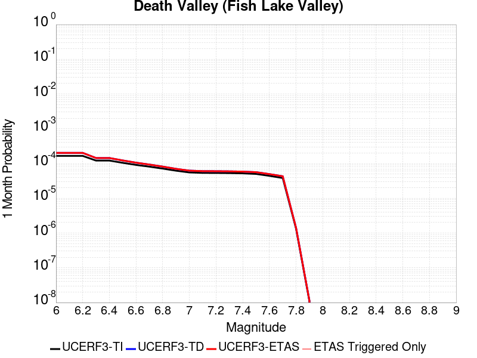 | 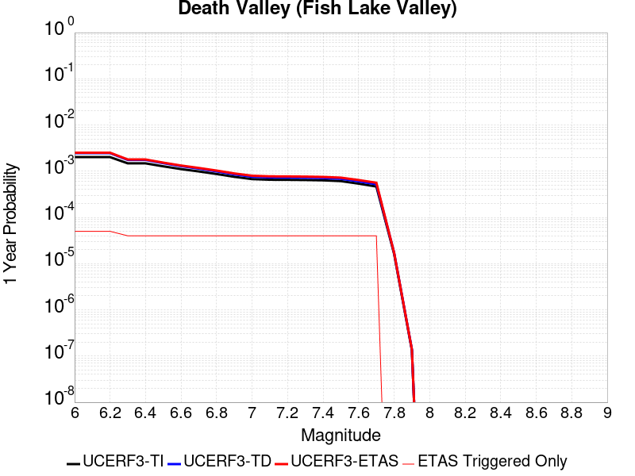 |  |

| Magnitude | 1 wk TI Prob | 1 wk TD Prob | 1 wk ETAS Prob | 1 wk ETAS/TD Gain | 1 wk ETAS Triggered Only | 1 mo TI Prob | 1 mo TD Prob | 1 mo ETAS Prob | 1 mo ETAS/TD Gain | 1 mo ETAS Triggered Only | 1 yr TI Prob | 1 yr TD Prob | 1 yr ETAS Prob | 1 yr ETAS/TD Gain | 1 yr ETAS Triggered Only | 10 yr TI Prob | 10 yr TD Prob | 10 yr ETAS Prob | 10 yr ETAS/TD Gain | 10 yr ETAS Triggered Only |
|-----|-----|-----|-----|-----|-----|-----|-----|-----|-----|-----|-----|-----|-----|-----|-----|-----|-----|-----|-----|-----|
| 6.0 | 3.872328E-5 | 4.727316E-5 | 4.727316E-5 | 1.0 | 0.0 | 1.6594635E-4 | 2.0258522E-4 | 2.0258522E-4 | 1.0 | 0.0 | 0.0020185246 | 0.0024638134 | 0.0025136902 | 1.0202438 | 5.0E-5 | 0.02000288 | 0.024390986 | 0.024508059 | 1.0047998 | 1.2E-4 |
| 6.1 | 3.872328E-5 | 4.727316E-5 | 4.727316E-5 | 1.0 | 0.0 | 1.6594635E-4 | 2.0258522E-4 | 2.0258522E-4 | 1.0 | 0.0 | 0.0020185246 | 0.0024638134 | 0.0025136902 | 1.0202438 | 5.0E-5 | 0.02000288 | 0.024390986 | 0.024508059 | 1.0047998 | 1.2E-4 |
| 6.2 | 3.872328E-5 | 4.727316E-5 | 4.727316E-5 | 1.0 | 0.0 | 1.6594635E-4 | 2.0258522E-4 | 2.0258522E-4 | 1.0 | 0.0 | 0.0020185246 | 0.0024638134 | 0.0025136902 | 1.0202438 | 5.0E-5 | 0.02000288 | 0.024390986 | 0.024508059 | 1.0047998 | 1.2E-4 |
| 6.3 | 2.8356371E-5 | 3.361322E-5 | 3.361322E-5 | 1.0 | 0.0 | 1.2152165E-4 | 1.4404916E-4 | 1.4404916E-4 | 1.0 | 0.0 | 0.0014785219 | 0.0017524667 | 0.0017923965 | 1.022785 | 4.0E-5 | 0.014687235 | 0.017393492 | 0.01750158 | 1.0062143 | 1.1E-4 |
| 6.4 | 2.8356371E-5 | 3.361322E-5 | 3.361322E-5 | 1.0 | 0.0 | 1.2152165E-4 | 1.4404916E-4 | 1.4404916E-4 | 1.0 | 0.0 | 0.0014785219 | 0.0017524667 | 0.0017923965 | 1.022785 | 4.0E-5 | 0.014687235 | 0.017393492 | 0.01750158 | 1.0062143 | 1.1E-4 |
| 6.5 | 2.4448687E-5 | 2.8610175E-5 | 2.8610175E-5 | 1.0 | 0.0 | 1.0477588E-4 | 1.2260956E-4 | 1.2260956E-4 | 1.0 | 0.0 | 0.0012748998 | 0.0014917998 | 0.0015317401 | 1.0267732 | 4.0E-5 | 0.012676105 | 0.014822718 | 0.014931087 | 1.007311 | 1.1E-4 |
| 6.6 | 2.1298161E-5 | 2.4662175E-5 | 2.4662175E-5 | 1.0 | 0.0 | 9.127464E-5 | 1.05690946E-4 | 1.05690946E-4 | 1.0 | 0.0 | 0.0011107022 | 0.0012860615 | 0.0013260101 | 1.0310627 | 4.0E-5 | 0.011051672 | 0.012789601 | 0.012898195 | 1.0084907 | 1.1E-4 |
| 6.7 | 1.8959729E-5 | 2.1782762E-5 | 2.1782762E-5 | 1.0 | 0.0 | 8.125345E-5 | 9.3351504E-5 | 9.3351504E-5 | 1.0 | 0.0 | 9.888117E-4 | 0.0011359875 | 0.001175942 | 1.0351716 | 4.0E-5 | 0.009844234 | 0.011304467 | 0.011413223 | 1.0096207 | 1.1E-4 |
| 6.8 | 1.6691629E-5 | 1.901977E-5 | 1.901977E-5 | 1.0 | 0.0 | 7.153359E-5 | 8.151084E-5 | 8.151084E-5 | 1.0 | 0.0 | 8.7057345E-4 | 9.919596E-4 | 0.0010319198 | 1.0402843 | 4.0E-5 | 0.008671708 | 0.009877076 | 0.00998599 | 1.0110269 | 1.1E-4 |
| 6.9 | 1.450505E-5 | 1.6390675E-5 | 1.6390675E-5 | 1.0 | 0.0 | 6.216302E-5 | 7.024391E-5 | 7.024391E-5 | 1.0 | 0.0 | 7.5657194E-4 | 8.5489283E-4 | 8.948586E-4 | 1.0467495 | 4.0E-5 | 0.007540013 | 0.008516973 | 0.008626036 | 1.0128053 | 1.1E-4 |
| 7.0 | 1.2940855E-5 | 1.4538927E-5 | 1.4538927E-5 | 1.0 | 0.0 | 5.545963E-5 | 6.230823E-5 | 6.230823E-5 | 1.0 | 0.0 | 6.750118E-4 | 7.583444E-4 | 7.983141E-4 | 1.0527065 | 4.0E-5 | 0.006729651 | 0.007558184 | 0.007667353 | 1.0144438 | 1.1E-4 |
| 7.1 | 1.2544658E-5 | 1.4079123E-5 | 1.4079123E-5 | 1.0 | 0.0 | 5.3761712E-5 | 6.0337734E-5 | 6.0337734E-5 | 1.0 | 0.0 | 6.5435225E-4 | 7.343699E-4 | 7.7434053E-4 | 1.0544285 | 4.0E-5 | 0.006524288 | 0.007320025 | 0.00742922 | 1.0149173 | 1.1E-4 |
| 7.2 | 1.2489416E-5 | 1.4016585E-5 | 1.4016585E-5 | 1.0 | 0.0 | 5.3524967E-5 | 6.0069728E-5 | 6.0069728E-5 | 1.0 | 0.0 | 6.514716E-4 | 7.311091E-4 | 7.710799E-4 | 1.0546714 | 4.0E-5 | 0.006495651 | 0.0072876317 | 0.00739683 | 1.014984 | 1.1E-4 |
| 7.3 | 1.2368307E-5 | 1.38807145E-5 | 1.38807145E-5 | 1.0 | 0.0 | 5.3005948E-5 | 5.948745E-5 | 5.948745E-5 | 1.0 | 0.0 | 6.451563E-4 | 7.2402466E-4 | 7.639957E-4 | 1.0552068 | 4.0E-5 | 0.0064328653 | 0.0072172494 | 0.0073264553 | 1.0151312 | 1.1E-4 |
| 7.4 | 1.2161707E-5 | 1.3648755E-5 | 1.3648755E-5 | 1.0 | 0.0 | 5.212056E-5 | 5.8493384E-5 | 5.8493384E-5 | 1.0 | 0.0 | 6.3438306E-4 | 7.1192987E-4 | 7.5190136E-4 | 1.0561453 | 4.0E-5 | 0.006325751 | 0.0070970803 | 0.0072062993 | 1.0153893 | 1.1E-4 |
| 7.5 | 1.1707948E-5 | 1.3146373E-5 | 1.3146373E-5 | 1.0 | 0.0 | 5.0175953E-5 | 5.6340414E-5 | 5.6340414E-5 | 1.0 | 0.0 | 6.10721E-4 | 6.857342E-4 | 7.257068E-4 | 1.0582917 | 4.0E-5 | 0.0060904534 | 0.006836766 | 0.006946014 | 1.0159795 | 1.1E-4 |
| 7.6 | 1.0319538E-5 | 1.1580373E-5 | 1.1580373E-5 | 1.0 | 0.0 | 4.4225842E-5 | 4.9629256E-5 | 4.9629256E-5 | 1.0 | 0.0 | 5.383166E-4 | 6.0407387E-4 | 6.440497E-4 | 1.066177 | 4.0E-5 | 0.0053701443 | 0.00602485 | 0.0061242473 | 1.016498 | 1.0E-4 |
| 7.7 | 8.937764E-6 | 1.0023426E-5 | 1.0023426E-5 | 1.0 | 0.0 | 3.830414E-5 | 4.295686E-5 | 4.295686E-5 | 1.0 | 0.0 | 4.6625308E-4 | 5.228793E-4 | 5.6285836E-4 | 1.0764595 | 4.0E-5 | 0.0046527605 | 0.005217 | 0.005316478 | 1.0190681 | 1.0E-4 |
| 7.8 | 3.108007E-7 | 3.2847535E-7 | 3.2847535E-7 | 1.0 | 0.0 | 1.3320023E-6 | 1.4077508E-6 | 1.4077508E-6 | 1.0 | 0.0 | 1.6217007E-5 | 1.7139235E-5 | 1.7139235E-5 | 1.0 | 0.0 | 1.6215823E-4 | 1.713795E-4 | 1.713795E-4 | 1.0 | 0.0 |
| 7.9 | 2.5591178E-9 | 2.6697329E-9 | 2.6697329E-9 | 1.0 | 0.0 | 1.0967647E-8 | 1.14417125E-8 | 1.14417125E-8 | 1.0 | 0.0 | 1.335311E-7 | 1.3930286E-7 | 1.3930286E-7 | 1.0 | 0.0 | 1.3353102E-6 | 1.3930285E-6 | 1.3930285E-6 | 1.0 | 0.0 |

## Elsinore (Glen Ivy) rev
*[(top)](#table-of-contents)*

| 1 Week | 1 Month | 1 Year | 10 Year |
|-----|-----|-----|-----|
|  | 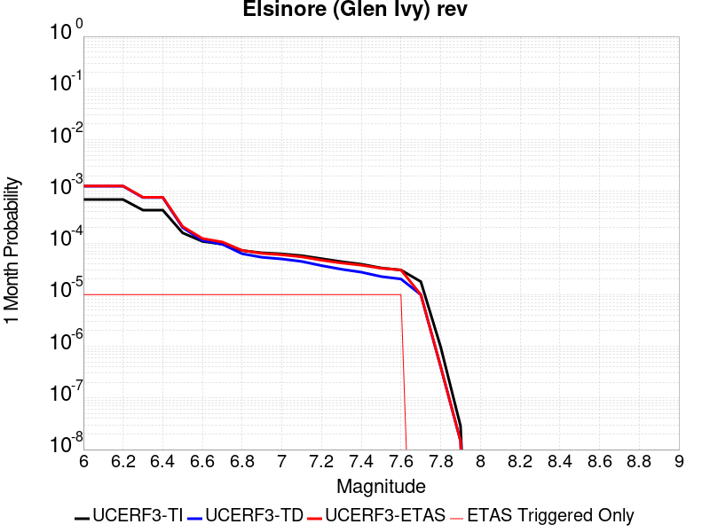 | 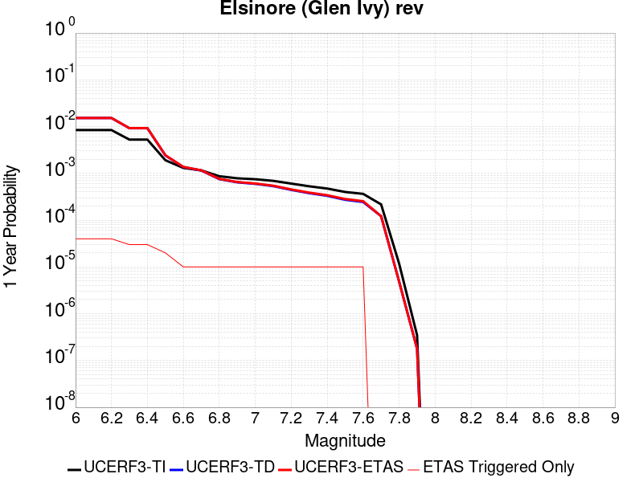 |  |

| Magnitude | 1 wk TI Prob | 1 wk TD Prob | 1 wk ETAS Prob | 1 wk ETAS/TD Gain | 1 wk ETAS Triggered Only | 1 mo TI Prob | 1 mo TD Prob | 1 mo ETAS Prob | 1 mo ETAS/TD Gain | 1 mo ETAS Triggered Only | 1 yr TI Prob | 1 yr TD Prob | 1 yr ETAS Prob | 1 yr ETAS/TD Gain | 1 yr ETAS Triggered Only | 10 yr TI Prob | 10 yr TD Prob | 10 yr ETAS Prob | 10 yr ETAS/TD Gain | 10 yr ETAS Triggered Only |
|-----|-----|-----|-----|-----|-----|-----|-----|-----|-----|-----|-----|-----|-----|-----|-----|-----|-----|-----|-----|-----|
| 6.0 | 1.6204086E-4 | 2.936593E-4 | 3.036564E-4 | 1.0340431 | 1.0E-5 | 6.94276E-4 | 0.0012580877 | 0.0012680751 | 1.0079386 | 1.0E-5 | 0.008420097 | 0.015237179 | 0.015276569 | 1.0025852 | 4.0E-5 | 0.081081145 | 0.13970533 | 0.13979995 | 1.0006773 | 1.1E-4 |
| 6.1 | 1.6204086E-4 | 2.936593E-4 | 3.036564E-4 | 1.0340431 | 1.0E-5 | 6.94276E-4 | 0.0012580877 | 0.0012680751 | 1.0079386 | 1.0E-5 | 0.008420097 | 0.015237179 | 0.015276569 | 1.0025852 | 4.0E-5 | 0.081081145 | 0.13970533 | 0.13979995 | 1.0006773 | 1.1E-4 |
| 6.2 | 1.6204086E-4 | 2.936593E-4 | 3.036564E-4 | 1.0340431 | 1.0E-5 | 6.94276E-4 | 0.0012580877 | 0.0012680751 | 1.0079386 | 1.0E-5 | 0.008420097 | 0.015237179 | 0.015276569 | 1.0025852 | 4.0E-5 | 0.081081145 | 0.13970533 | 0.13979995 | 1.0006773 | 1.1E-4 |
| 6.3 | 1.0111737E-4 | 1.7704896E-4 | 1.8704719E-4 | 1.0564716 | 1.0E-5 | 4.332882E-4 | 7.5867726E-4 | 7.686697E-4 | 1.0131708 | 1.0E-5 | 0.005262531 | 0.009218467 | 0.009248191 | 1.0032244 | 3.0E-5 | 0.0513964 | 0.087025836 | 0.087098874 | 1.0008392 | 8.0E-5 |
| 6.4 | 1.0111737E-4 | 1.7704896E-4 | 1.8704719E-4 | 1.0564716 | 1.0E-5 | 4.332882E-4 | 7.5867726E-4 | 7.686697E-4 | 1.0131708 | 1.0E-5 | 0.005262531 | 0.009218467 | 0.009248191 | 1.0032244 | 3.0E-5 | 0.0513964 | 0.087025836 | 0.087098874 | 1.0008392 | 8.0E-5 |
| 6.5 | 3.6624708E-5 | 4.6398443E-5 | 5.6397977E-5 | 1.2155144 | 1.0E-5 | 1.569536E-4 | 1.9883736E-4 | 2.0883538E-4 | 1.0502824 | 1.0E-5 | 0.001909235 | 0.0024185202 | 0.002438472 | 1.0082495 | 2.0E-5 | 0.01892915 | 0.02374361 | 0.023772899 | 1.0012335 | 3.0E-5 |
| 6.6 | 2.5051324E-5 | 2.615282E-5 | 3.615256E-5 | 1.382358 | 1.0E-5 | 1.073584E-4 | 1.12078946E-4 | 1.2207782E-4 | 1.0892128 | 1.0E-5 | 0.0013063047 | 0.0013637516 | 0.0013737379 | 1.0073227 | 1.0E-5 | 0.012986525 | 0.013567226 | 0.013586954 | 1.0014541 | 2.0E-5 |
| 6.7 | 2.2189772E-5 | 2.2077227E-5 | 3.207701E-5 | 1.4529455 | 1.0E-5 | 9.509556E-5 | 9.461347E-5 | 1.0461252E-4 | 1.1056832 | 1.0E-5 | 0.0011571734 | 0.0011513466 | 0.001161335 | 1.0086755 | 1.0E-5 | 0.011511663 | 0.0114676645 | 0.011487436 | 1.001724 | 2.0E-5 |
| 6.8 | 1.6654378E-5 | 1.4440319E-5 | 2.4440174E-5 | 1.6924955 | 1.0E-5 | 7.137396E-5 | 6.188564E-5 | 7.188503E-5 | 1.1615784 | 1.0E-5 | 8.686314E-4 | 7.532024E-4 | 7.6319487E-4 | 1.0132667 | 1.0E-5 | 0.008652439 | 0.0075118328 | 0.0075217574 | 1.0013212 | 1.0E-5 |
| 6.9 | 1.5042909E-5 | 1.2334286E-5 | 2.2334163E-5 | 1.8107382 | 1.0E-5 | 6.446802E-5 | 5.286017E-5 | 6.2859646E-5 | 1.1891683 | 1.0E-5 | 7.8461546E-4 | 6.433857E-4 | 6.5337925E-4 | 1.0155327 | 1.0E-5 | 0.007818509 | 0.006419453 | 0.0064293887 | 1.0015478 | 1.0E-5 |
| 7.0 | 1.4361385E-5 | 1.1453455E-5 | 2.1453341E-5 | 1.873089 | 1.0E-5 | 6.154734E-5 | 4.908533E-5 | 5.908484E-5 | 1.2037169 | 1.0E-5 | 7.490812E-4 | 5.974529E-4 | 6.0744694E-4 | 1.0167277 | 1.0E-5 | 0.007465612 | 0.005962458 | 0.0059723984 | 1.0016671 | 1.0E-5 |
| 7.1 | 1.3265571E-5 | 1.0246749E-5 | 2.0246647E-5 | 1.9759092 | 1.0E-5 | 5.6851208E-5 | 4.3913915E-5 | 5.3913474E-5 | 1.2277082 | 1.0E-5 | 6.919436E-4 | 5.345233E-4 | 5.4451794E-4 | 1.0186982 | 1.0E-5 | 0.006897931 | 0.0053357324 | 0.0053456794 | 1.0018642 | 1.0E-5 |
| 7.2 | 1.1596403E-5 | 8.506553E-6 | 1.850647E-5 | 2.1755543 | 1.0E-5 | 4.9697923E-5 | 3.6456157E-5 | 4.6455792E-5 | 1.2742921 | 1.0E-5 | 6.049042E-4 | 4.4376502E-4 | 4.537606E-4 | 1.0225245 | 1.0E-5 | 0.006032603 | 0.004430204 | 0.0044401595 | 1.0022472 | 1.0E-5 |
| 7.3 | 1.0150827E-5 | 7.2399926E-6 | 1.723992E-5 | 2.381207 | 1.0E-5 | 4.3502816E-5 | 3.102818E-5 | 4.1027866E-5 | 1.3222777 | 1.0E-5 | 5.2951806E-4 | 3.77704E-4 | 3.8770025E-4 | 1.0264658 | 1.0E-5 | 0.005282581 | 0.0037710073 | 0.0037809697 | 1.0026418 | 1.0E-5 |
| 7.4 | 9.080705E-6 | 6.3535763E-6 | 1.6353513E-5 | 2.573907 | 1.0E-5 | 3.8916725E-5 | 2.7229335E-5 | 3.7229063E-5 | 1.367241 | 1.0E-5 | 4.7370812E-4 | 3.314681E-4 | 3.4146477E-4 | 1.0301588 | 1.0E-5 | 0.004726996 | 0.0033098878 | 0.0033198546 | 1.0030112 | 1.0E-5 |
| 7.5 | 7.671649E-6 | 5.2264927E-6 | 1.522644E-5 | 2.913319 | 1.0E-5 | 3.287808E-5 | 2.2399068E-5 | 3.2398846E-5 | 1.4464371 | 1.0E-5 | 4.0021708E-4 | 2.726758E-4 | 2.8267305E-4 | 1.0366635 | 1.0E-5 | 0.0039949706 | 0.0027235372 | 0.00273351 | 1.0036618 | 1.0E-5 |
| 7.6 | 6.990086E-6 | 4.6883147E-6 | 1.4688268E-5 | 3.1329525 | 1.0E-5 | 2.9957167E-5 | 2.009263E-5 | 3.009243E-5 | 1.497685 | 1.0E-5 | 3.6466747E-4 | 2.4460148E-4 | 2.5459903E-4 | 1.0408728 | 1.0E-5 | 0.0036406964 | 0.0024434389 | 0.0024534143 | 1.0040826 | 1.0E-5 |
| 7.7 | 4.163505E-6 | 2.3299876E-6 | 2.3299876E-6 | 1.0 | 0.0 | 1.7843471E-5 | 9.985628E-6 | 9.985628E-6 | 1.0 | 0.0 | 2.172226E-4 | 1.2156898E-4 | 1.2156898E-4 | 1.0 | 0.0 | 0.0021701038 | 0.0012150978 | 0.0012150978 | 1.0 | 0.0 |
| 7.8 | 2.2692414E-7 | 9.3873886E-8 | 9.3873886E-8 | 1.0 | 0.0 | 9.725317E-7 | 4.023166E-7 | 4.023166E-7 | 1.0 | 0.0 | 1.1840509E-5 | 4.898197E-6 | 4.898197E-6 | 1.0 | 0.0 | 1.1839878E-4 | 4.898122E-5 | 4.898122E-5 | 1.0 | 0.0 |
| 7.9 | 6.676829E-9 | 3.4403498E-9 | 3.4403498E-9 | 1.0 | 0.0 | 2.861498E-8 | 1.4744357E-8 | 1.4744357E-8 | 1.0 | 0.0 | 3.4838732E-7 | 1.7951253E-7 | 1.7951253E-7 | 1.0 | 0.0 | 3.4838679E-6 | 1.7951239E-6 | 1.7951239E-6 | 1.0 | 0.0 |

## San Jacinto (Stepovers Combined)
*[(top)](#table-of-contents)*

| 1 Week | 1 Month | 1 Year | 10 Year |
|-----|-----|-----|-----|
|  |  | 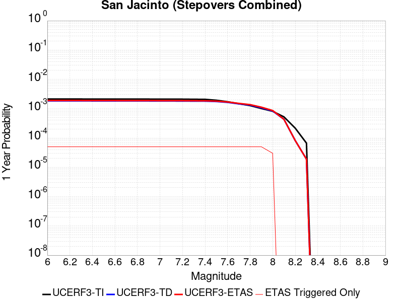 | 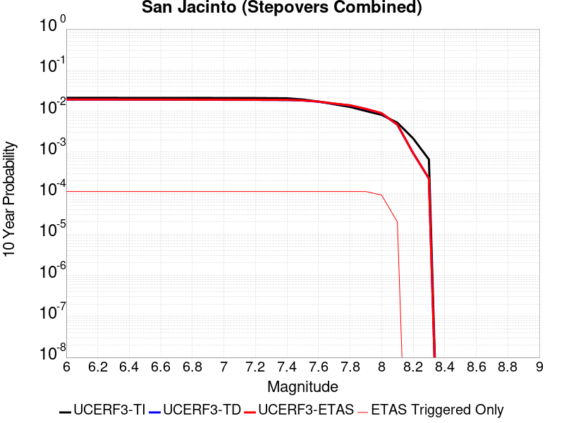 |

| Magnitude | 1 wk TI Prob | 1 wk TD Prob | 1 wk ETAS Prob | 1 wk ETAS/TD Gain | 1 wk ETAS Triggered Only | 1 mo TI Prob | 1 mo TD Prob | 1 mo ETAS Prob | 1 mo ETAS/TD Gain | 1 mo ETAS Triggered Only | 1 yr TI Prob | 1 yr TD Prob | 1 yr ETAS Prob | 1 yr ETAS/TD Gain | 1 yr ETAS Triggered Only | 10 yr TI Prob | 10 yr TD Prob | 10 yr ETAS Prob | 10 yr ETAS/TD Gain | 10 yr ETAS Triggered Only |
|-----|-----|-----|-----|-----|-----|-----|-----|-----|-----|-----|-----|-----|-----|-----|-----|-----|-----|-----|-----|-----|
| 6.0 | 4.0667746E-5 | 3.5336896E-5 | 3.5336896E-5 | 1.0 | 0.0 | 1.742787E-4 | 1.5143506E-4 | 1.7143202E-4 | 1.1320498 | 2.0E-5 | 0.0021197782 | 0.0018421634 | 0.0018920713 | 1.027092 | 5.0E-5 | 0.020996714 | 0.019020144 | 0.01912805 | 1.0056733 | 1.1E-4 |
| 6.1 | 4.0667746E-5 | 3.5336896E-5 | 3.5336896E-5 | 1.0 | 0.0 | 1.742787E-4 | 1.5143506E-4 | 1.7143202E-4 | 1.1320498 | 2.0E-5 | 0.0021197782 | 0.0018421634 | 0.0018920713 | 1.027092 | 5.0E-5 | 0.020996714 | 0.019020144 | 0.01912805 | 1.0056733 | 1.1E-4 |
| 6.2 | 4.0667746E-5 | 3.5336896E-5 | 3.5336896E-5 | 1.0 | 0.0 | 1.742787E-4 | 1.5143506E-4 | 1.7143202E-4 | 1.1320498 | 2.0E-5 | 0.0021197782 | 0.0018421634 | 0.0018920713 | 1.027092 | 5.0E-5 | 0.020996714 | 0.019020144 | 0.01912805 | 1.0056733 | 1.1E-4 |
| 6.3 | 4.0667746E-5 | 3.5336896E-5 | 3.5336896E-5 | 1.0 | 0.0 | 1.742787E-4 | 1.5143506E-4 | 1.7143202E-4 | 1.1320498 | 2.0E-5 | 0.0021197782 | 0.0018421634 | 0.0018920713 | 1.027092 | 5.0E-5 | 0.020996714 | 0.019020144 | 0.01912805 | 1.0056733 | 1.1E-4 |
| 6.4 | 4.0577226E-5 | 3.5208766E-5 | 3.5208766E-5 | 1.0 | 0.0 | 1.738908E-4 | 1.50886E-4 | 1.7088298E-4 | 1.1325305 | 2.0E-5 | 0.0021150648 | 0.0018354917 | 0.0018853999 | 1.0271907 | 5.0E-5 | 0.020950472 | 0.018954702 | 0.019062618 | 1.0056933 | 1.1E-4 |
| 6.5 | 4.0577226E-5 | 3.5208766E-5 | 3.5208766E-5 | 1.0 | 0.0 | 1.738908E-4 | 1.50886E-4 | 1.7088298E-4 | 1.1325305 | 2.0E-5 | 0.0021150648 | 0.0018354917 | 0.0018853999 | 1.0271907 | 5.0E-5 | 0.020950472 | 0.018954702 | 0.019062618 | 1.0056933 | 1.1E-4 |
| 6.6 | 4.053861E-5 | 3.5154102E-5 | 3.5154102E-5 | 1.0 | 0.0 | 1.7372532E-4 | 1.5065174E-4 | 1.7064872E-4 | 1.1327366 | 2.0E-5 | 0.0021130538 | 0.0018326445 | 0.0018825529 | 1.027233 | 5.0E-5 | 0.020930743 | 0.018926777 | 0.019034695 | 1.0057019 | 1.1E-4 |
| 6.7 | 4.0516545E-5 | 3.512316E-5 | 3.512316E-5 | 1.0 | 0.0 | 1.7363077E-4 | 1.5051916E-4 | 1.7051614E-4 | 1.1328535 | 2.0E-5 | 0.002111905 | 0.0018310336 | 0.001880942 | 1.027257 | 5.0E-5 | 0.020919468 | 0.01891097 | 0.01901889 | 1.0057068 | 1.1E-4 |
| 6.8 | 4.049434E-5 | 3.509472E-5 | 3.509472E-5 | 1.0 | 0.0 | 1.7353562E-4 | 1.5039727E-4 | 1.7039425E-4 | 1.1329612 | 2.0E-5 | 0.0021107488 | 0.0018295521 | 0.0018794606 | 1.0272791 | 5.0E-5 | 0.020908125 | 0.01889638 | 0.019004302 | 1.0057112 | 1.1E-4 |
| 6.9 | 4.046386E-5 | 3.505727E-5 | 3.505727E-5 | 1.0 | 0.0 | 1.73405E-4 | 1.502368E-4 | 1.7023379E-4 | 1.1331031 | 2.0E-5 | 0.0021091616 | 0.0018276017 | 0.0018775103 | 1.0273082 | 5.0E-5 | 0.020892553 | 0.01887715 | 0.018985074 | 1.0057172 | 1.1E-4 |
| 7.0 | 4.036382E-5 | 3.4937813E-5 | 3.4937813E-5 | 1.0 | 0.0 | 1.7297632E-4 | 1.4972492E-4 | 1.6972191E-4 | 1.1335583 | 2.0E-5 | 0.0021039525 | 0.00182138 | 0.0018712889 | 1.0274017 | 5.0E-5 | 0.02084144 | 0.018815752 | 0.018923683 | 1.0057361 | 1.1E-4 |
| 7.1 | 4.0343282E-5 | 3.4916273E-5 | 3.4916273E-5 | 1.0 | 0.0 | 1.7288832E-4 | 1.496326E-4 | 1.6962961E-4 | 1.1336408 | 2.0E-5 | 0.002102883 | 0.0018202579 | 0.0018701669 | 1.0274186 | 5.0E-5 | 0.020830948 | 0.018804627 | 0.018912558 | 1.0057396 | 1.1E-4 |
| 7.2 | 4.0257353E-5 | 3.4820667E-5 | 3.4820667E-5 | 1.0 | 0.0 | 1.725201E-4 | 1.492229E-4 | 1.6921993E-4 | 1.1340077 | 2.0E-5 | 0.0020984085 | 0.0018152783 | 0.0018651875 | 1.027494 | 5.0E-5 | 0.020787042 | 0.018755313 | 0.01886325 | 1.005755 | 1.1E-4 |
| 7.3 | 3.9940667E-5 | 3.4648023E-5 | 3.4648023E-5 | 1.0 | 0.0 | 1.7116306E-4 | 1.4848309E-4 | 1.6848012E-4 | 1.1346755 | 2.0E-5 | 0.0020819185 | 0.0018062859 | 0.0018561956 | 1.0276312 | 5.0E-5 | 0.020625217 | 0.018663792 | 0.01877174 | 1.0057838 | 1.1E-4 |
| 7.4 | 3.9721202E-5 | 3.453329E-5 | 3.453329E-5 | 1.0 | 0.0 | 1.7022261E-4 | 1.4799142E-4 | 1.6798846E-4 | 1.135123 | 2.0E-5 | 0.0020704903 | 0.0018003098 | 0.0018502198 | 1.027723 | 5.0E-5 | 0.020513052 | 0.01860285 | 0.018710803 | 1.0058031 | 1.1E-4 |
| 7.5 | 3.7036873E-5 | 3.3598866E-5 | 3.3598866E-5 | 1.0 | 0.0 | 1.5871979E-4 | 1.439872E-4 | 1.6398432E-4 | 1.1388812 | 2.0E-5 | 0.0019307006 | 0.0017516377 | 0.00180155 | 1.0284947 | 5.0E-5 | 0.019140124 | 0.018103454 | 0.018211463 | 1.0059662 | 1.1E-4 |
| 7.6 | 3.2940967E-5 | 3.1372547E-5 | 3.1372547E-5 | 1.0 | 0.0 | 1.4116794E-4 | 1.3444685E-4 | 1.5444416E-4 | 1.1487377 | 2.0E-5 | 0.0017173645 | 0.0016356637 | 0.0016855819 | 1.0305187 | 5.0E-5 | 0.01704153 | 0.01693263 | 0.017040769 | 1.0063863 | 1.1E-4 |
| 7.7 | 2.8236149E-5 | 2.7937022E-5 | 2.7937022E-5 | 1.0 | 0.0 | 1.2100645E-4 | 1.197246E-4 | 1.3972221E-4 | 1.1670301 | 2.0E-5 | 0.0014722579 | 0.0014566735 | 0.0015066006 | 1.0342748 | 5.0E-5 | 0.014625421 | 0.015142685 | 0.015251019 | 1.0071542 | 1.1E-4 |
| 7.8 | 2.4329287E-5 | 2.5258554E-5 | 2.5258554E-5 | 1.0 | 0.0 | 1.042642E-4 | 1.0824646E-4 | 1.282443E-4 | 1.1847435 | 2.0E-5 | 0.0012686774 | 0.0013171048 | 0.0013670389 | 1.037912 | 5.0E-5 | 0.012614589 | 0.013738932 | 0.013847421 | 1.0078964 | 1.1E-4 |
| 7.9 | 1.9370926E-5 | 2.0467445E-5 | 2.0467445E-5 | 1.0 | 0.0 | 8.301561E-5 | 8.7714674E-5 | 1.0771292E-4 | 1.227992 | 2.0E-5 | 0.0010102465 | 0.0010674037 | 0.0011173503 | 1.0467926 | 5.0E-5 | 0.0100566605 | 0.011223499 | 0.011332264 | 1.0096909 | 1.1E-4 |
| 8.0 | 1.5583017E-5 | 1.5925136E-5 | 1.5925136E-5 | 1.0 | 0.0 | 6.6782646E-5 | 6.82488E-5 | 7.824812E-5 | 1.1465127 | 1.0E-5 | 8.127754E-4 | 8.306131E-4 | 8.6058816E-4 | 1.0360879 | 3.0E-5 | 0.008098091 | 0.008802158 | 0.0088913655 | 1.0101348 | 9.0E-5 |
| 8.1 | 1.0024873E-5 | 8.314913E-6 | 8.314913E-6 | 1.0 | 0.0 | 4.2963035E-5 | 3.563486E-5 | 3.563486E-5 | 1.0 | 0.0 | 5.229494E-4 | 4.3376858E-4 | 4.3376858E-4 | 1.0 | 0.0 | 0.0052172043 | 0.00466551 | 0.004685417 | 1.0042667 | 2.0E-5 |
| 8.2 | 4.142796E-6 | 1.5676045E-6 | 1.5676045E-6 | 1.0 | 0.0 | 1.775472E-5 | 6.7182878E-6 | 6.7182878E-6 | 1.0 | 0.0 | 2.1614227E-4 | 8.179211E-5 | 8.179211E-5 | 1.0 | 0.0 | 0.0021593217 | 9.4923546E-4 | 9.4923546E-4 | 1.0 | 0.0 |
| 8.3 | 1.2750878E-6 | 3.6301523E-7 | 3.6301523E-7 | 1.0 | 0.0 | 5.4646503E-6 | 1.5557786E-6 | 1.5557786E-6 | 1.0 | 0.0 | 6.653009E-5 | 1.8941444E-5 | 1.8941444E-5 | 1.0 | 0.0 | 6.6510175E-4 | 2.2840123E-4 | 2.2840123E-4 | 1.0 | 0.0 |

## Cleghorn
*[(top)](#table-of-contents)*

| 1 Week | 1 Month | 1 Year | 10 Year |
|-----|-----|-----|-----|
|  |  |  | 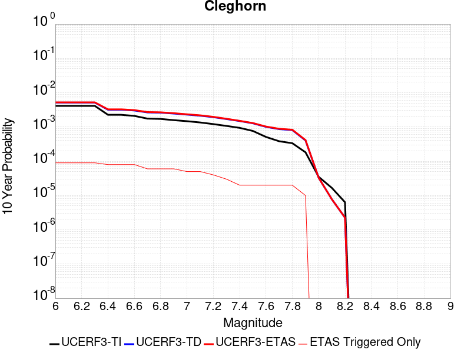 |

| Magnitude | 1 wk TI Prob | 1 wk TD Prob | 1 wk ETAS Prob | 1 wk ETAS/TD Gain | 1 wk ETAS Triggered Only | 1 mo TI Prob | 1 mo TD Prob | 1 mo ETAS Prob | 1 mo ETAS/TD Gain | 1 mo ETAS Triggered Only | 1 yr TI Prob | 1 yr TD Prob | 1 yr ETAS Prob | 1 yr ETAS/TD Gain | 1 yr ETAS Triggered Only | 10 yr TI Prob | 10 yr TD Prob | 10 yr ETAS Prob | 10 yr ETAS/TD Gain | 10 yr ETAS Triggered Only |
|-----|-----|-----|-----|-----|-----|-----|-----|-----|-----|-----|-----|-----|-----|-----|-----|-----|-----|-----|-----|-----|
| 6.0 | 7.9267165E-6 | 9.838367E-6 | 9.838367E-6 | 1.0 | 0.0 | 3.39712E-5 | 4.216381E-5 | 4.216381E-5 | 1.0 | 0.0 | 4.1352084E-4 | 5.1323406E-4 | 5.632084E-4 | 1.0973715 | 5.0E-5 | 0.004127522 | 0.005135526 | 0.0052250633 | 1.017435 | 9.0E-5 |
| 6.1 | 7.9267165E-6 | 9.838367E-6 | 9.838367E-6 | 1.0 | 0.0 | 3.39712E-5 | 4.216381E-5 | 4.216381E-5 | 1.0 | 0.0 | 4.1352084E-4 | 5.1323406E-4 | 5.632084E-4 | 1.0973715 | 5.0E-5 | 0.004127522 | 0.005135526 | 0.0052250633 | 1.017435 | 9.0E-5 |
| 6.2 | 7.9267165E-6 | 9.838367E-6 | 9.838367E-6 | 1.0 | 0.0 | 3.39712E-5 | 4.216381E-5 | 4.216381E-5 | 1.0 | 0.0 | 4.1352084E-4 | 5.1323406E-4 | 5.632084E-4 | 1.0973715 | 5.0E-5 | 0.004127522 | 0.005135526 | 0.0052250633 | 1.017435 | 9.0E-5 |
| 6.3 | 7.9267165E-6 | 9.838367E-6 | 9.838367E-6 | 1.0 | 0.0 | 3.39712E-5 | 4.216381E-5 | 4.216381E-5 | 1.0 | 0.0 | 4.1352084E-4 | 5.1323406E-4 | 5.632084E-4 | 1.0973715 | 5.0E-5 | 0.004127522 | 0.005135526 | 0.0052250633 | 1.017435 | 9.0E-5 |
| 6.4 | 4.3445207E-6 | 6.0981406E-6 | 6.0981406E-6 | 1.0 | 0.0 | 1.8619241E-5 | 2.6134632E-5 | 2.6134632E-5 | 1.0 | 0.0 | 2.2666567E-4 | 3.181437E-4 | 3.681278E-4 | 1.1571116 | 5.0E-5 | 0.0022643462 | 0.003190997 | 0.0032707418 | 1.0249906 | 8.0E-5 |
| 6.5 | 4.3445207E-6 | 6.0981406E-6 | 6.0981406E-6 | 1.0 | 0.0 | 1.8619241E-5 | 2.6134632E-5 | 2.6134632E-5 | 1.0 | 0.0 | 2.2666567E-4 | 3.181437E-4 | 3.681278E-4 | 1.1571116 | 5.0E-5 | 0.0022643462 | 0.003190997 | 0.0032707418 | 1.0249906 | 8.0E-5 |
| 6.6 | 4.040109E-6 | 5.780541E-6 | 5.780541E-6 | 1.0 | 0.0 | 1.7314638E-5 | 2.4773517E-5 | 2.4773517E-5 | 1.0 | 0.0 | 2.1078532E-4 | 3.0157674E-4 | 3.5156167E-4 | 1.1657453 | 5.0E-5 | 0.002105855 | 0.0030257835 | 0.0031055415 | 1.0263594 | 8.0E-5 |
| 6.7 | 3.3632055E-6 | 5.074022E-6 | 5.074022E-6 | 1.0 | 0.0 | 1.4413658E-5 | 2.1745627E-5 | 2.1745627E-5 | 1.0 | 0.0 | 1.7547216E-4 | 2.6472117E-4 | 3.047106E-4 | 1.1510624 | 4.0E-5 | 0.0017533366 | 0.0026581106 | 0.002717951 | 1.0225124 | 6.0E-5 |
| 6.8 | 3.2902772E-6 | 4.9959262E-6 | 4.9959262E-6 | 1.0 | 0.0 | 1.4101111E-5 | 2.1410939E-5 | 2.1410939E-5 | 1.0 | 0.0 | 1.716675E-4 | 2.606473E-4 | 3.006369E-4 | 1.153424 | 4.0E-5 | 0.0017153495 | 0.0026174681 | 0.002677311 | 1.0228629 | 6.0E-5 |
| 6.9 | 3.031547E-6 | 4.6974637E-6 | 4.6974637E-6 | 1.0 | 0.0 | 1.299228E-5 | 2.0131833E-5 | 2.0131833E-5 | 1.0 | 0.0 | 1.5816953E-4 | 2.4507777E-4 | 2.8506797E-4 | 1.1631736 | 4.0E-5 | 0.00158057 | 0.002462125 | 0.0025219773 | 1.0243092 | 6.0E-5 |
| 7.0 | 2.8259715E-6 | 4.3764653E-6 | 4.3764653E-6 | 1.0 | 0.0 | 1.211125E-5 | 1.8756145E-5 | 1.8756145E-5 | 1.0 | 0.0 | 1.4744449E-4 | 2.2833238E-4 | 2.5832554E-4 | 1.1313574 | 3.0E-5 | 0.001473467 | 0.0022950263 | 0.0023449117 | 1.0217363 | 5.0E-5 |
| 7.1 | 2.5962665E-6 | 4.071453E-6 | 4.071453E-6 | 1.0 | 0.0 | 1.1126809E-5 | 1.7448969E-5 | 1.7448969E-5 | 1.0 | 0.0 | 1.3546048E-4 | 2.124207E-4 | 2.4241433E-4 | 1.1411992 | 3.0E-5 | 0.0013537793 | 0.0021362302 | 0.0021861233 | 1.0233557 | 5.0E-5 |
| 7.2 | 2.3247253E-6 | 3.6817423E-6 | 3.6817423E-6 | 1.0 | 0.0 | 9.96307E-6 | 1.5778802E-5 | 1.5778802E-5 | 1.0 | 0.0 | 1.21293626E-4 | 1.9209016E-4 | 2.220844E-4 | 1.1561466 | 3.0E-5 | 0.0012122744 | 0.0019333162 | 0.001973239 | 1.0206498 | 4.0E-5 |
| 7.3 | 2.056928E-6 | 3.2399425E-6 | 3.2399425E-6 | 1.0 | 0.0 | 8.815376E-6 | 1.3885395E-5 | 1.3885395E-5 | 1.0 | 0.0 | 1.0732192E-4 | 1.6904173E-4 | 1.8903834E-4 | 1.118294 | 2.0E-5 | 0.001072701 | 0.0017032728 | 0.0017332218 | 1.0175831 | 3.0E-5 |
| 7.4 | 1.8055999E-6 | 2.8298966E-6 | 2.8298966E-6 | 1.0 | 0.0 | 7.738263E-6 | 1.2128073E-5 | 1.2128073E-5 | 1.0 | 0.0 | 9.4209274E-5 | 1.4764942E-4 | 1.5764796E-4 | 1.067718 | 1.0E-5 | 9.4169343E-4 | 0.0014897923 | 0.0015097625 | 1.0134047 | 2.0E-5 |
| 7.5 | 1.4683443E-6 | 2.4289393E-6 | 2.4289393E-6 | 1.0 | 0.0 | 6.292889E-6 | 1.0409699E-5 | 1.0409699E-5 | 1.0 | 0.0 | 7.661323E-5 | 1.2673081E-4 | 1.3672955E-4 | 1.0788974 | 1.0E-5 | 7.658682E-4 | 0.0012809072 | 0.0013008816 | 1.0155939 | 2.0E-5 |
| 7.6 | 9.804088E-7 | 1.9043657E-6 | 1.9043657E-6 | 1.0 | 0.0 | 4.201745E-6 | 8.161543E-6 | 8.161543E-6 | 1.0 | 0.0 | 5.1155046E-5 | 9.9362296E-5 | 1.093613E-4 | 1.1006318 | 1.0E-5 | 5.114327E-4 | 0.0010075356 | 0.0010275154 | 1.0198305 | 2.0E-5 |
| 7.7 | 7.3434086E-7 | 1.6324341E-6 | 1.6324341E-6 | 1.0 | 0.0 | 3.1471714E-6 | 6.9961275E-6 | 6.9961275E-6 | 1.0 | 0.0 | 3.831614E-5 | 8.517455E-5 | 9.5173695E-5 | 1.117396 | 1.0E-5 | 3.8309532E-4 | 8.6581067E-4 | 8.8579336E-4 | 1.0230798 | 2.0E-5 |
| 7.8 | 6.434184E-7 | 1.5257981E-6 | 1.5257981E-6 | 1.0 | 0.0 | 2.7575045E-6 | 6.5391187E-6 | 6.5391187E-6 | 1.0 | 0.0 | 3.35721E-5 | 7.961089E-5 | 8.961009E-5 | 1.1256009 | 1.0E-5 | 3.3567028E-4 | 8.098763E-4 | 8.298601E-4 | 1.0246751 | 2.0E-5 |
| 7.9 | 3.4943926E-7 | 7.594313E-7 | 7.594313E-7 | 1.0 | 0.0 | 1.497596E-6 | 3.2547016E-6 | 3.2547016E-6 | 1.0 | 0.0 | 1.8233079E-5 | 3.962528E-5 | 4.9624883E-5 | 1.2523541 | 1.0E-5 | 1.8231584E-4 | 4.050159E-4 | 4.1501183E-4 | 1.0246804 | 1.0E-5 |
| 8.0 | 6.717524E-8 | 5.8598772E-8 | 5.8598772E-8 | 1.0 | 0.0 | 2.8789387E-7 | 2.5113755E-7 | 2.5113755E-7 | 1.0 | 0.0 | 3.505102E-6 | 3.0575957E-6 | 3.0575957E-6 | 1.0 | 0.0 | 3.5050467E-5 | 3.28481E-5 | 3.28481E-5 | 1.0 | 0.0 |
| 8.1 | 3.1984914E-8 | 1.3024658E-8 | 1.3024658E-8 | 1.0 | 0.0 | 1.370782E-7 | 5.5819964E-8 | 5.5819964E-8 | 1.0 | 0.0 | 1.6689258E-6 | 6.7960787E-7 | 6.7960787E-7 | 1.0 | 0.0 | 1.6689133E-5 | 7.7832365E-6 | 7.7832365E-6 | 1.0 | 0.0 |
| 8.2 | 1.21887656E-8 | 3.6706735E-9 | 3.6706735E-9 | 1.0 | 0.0 | 5.2237567E-8 | 1.5731459E-8 | 1.5731459E-8 | 1.0 | 0.0 | 6.359922E-7 | 1.9153049E-7 | 1.9153049E-7 | 1.0 | 0.0 | 6.3599036E-6 | 2.2593056E-6 | 2.2593056E-6 | 1.0 | 0.0 |

## Deep Springs
*[(top)](#table-of-contents)*

| 1 Week | 1 Month | 1 Year | 10 Year |
|-----|-----|-----|-----|
|  |  |  | 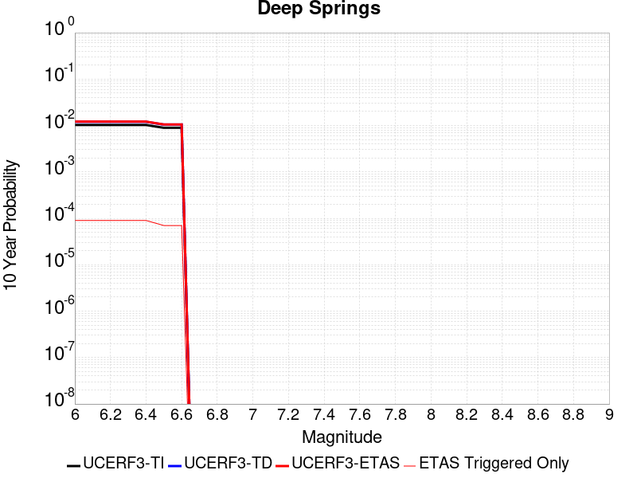 |

| Magnitude | 1 wk TI Prob | 1 wk TD Prob | 1 wk ETAS Prob | 1 wk ETAS/TD Gain | 1 wk ETAS Triggered Only | 1 mo TI Prob | 1 mo TD Prob | 1 mo ETAS Prob | 1 mo ETAS/TD Gain | 1 mo ETAS Triggered Only | 1 yr TI Prob | 1 yr TD Prob | 1 yr ETAS Prob | 1 yr ETAS/TD Gain | 1 yr ETAS Triggered Only | 10 yr TI Prob | 10 yr TD Prob | 10 yr ETAS Prob | 10 yr ETAS/TD Gain | 10 yr ETAS Triggered Only |
|-----|-----|-----|-----|-----|-----|-----|-----|-----|-----|-----|-----|-----|-----|-----|-----|-----|-----|-----|-----|-----|
| 6.0 | 1.9810619E-5 | 2.3114564E-5 | 2.3114564E-5 | 1.0 | 0.0 | 8.489989E-5 | 9.9061515E-5 | 1.0906053E-4 | 1.1009374 | 1.0E-5 | 0.001033166 | 0.0012059145 | 0.0012258904 | 1.016565 | 2.0E-5 | 0.010283757 | 0.012043487 | 0.012132403 | 1.0073829 | 9.0E-5 |
| 6.1 | 1.9810619E-5 | 2.3114564E-5 | 2.3114564E-5 | 1.0 | 0.0 | 8.489989E-5 | 9.9061515E-5 | 1.0906053E-4 | 1.1009374 | 1.0E-5 | 0.001033166 | 0.0012059145 | 0.0012258904 | 1.016565 | 2.0E-5 | 0.010283757 | 0.012043487 | 0.012132403 | 1.0073829 | 9.0E-5 |
| 6.2 | 1.9810619E-5 | 2.3114564E-5 | 2.3114564E-5 | 1.0 | 0.0 | 8.489989E-5 | 9.9061515E-5 | 1.0906053E-4 | 1.1009374 | 1.0E-5 | 0.001033166 | 0.0012059145 | 0.0012258904 | 1.016565 | 2.0E-5 | 0.010283757 | 0.012043487 | 0.012132403 | 1.0073829 | 9.0E-5 |
| 6.3 | 1.9810619E-5 | 2.3114564E-5 | 2.3114564E-5 | 1.0 | 0.0 | 8.489989E-5 | 9.9061515E-5 | 1.0906053E-4 | 1.1009374 | 1.0E-5 | 0.001033166 | 0.0012059145 | 0.0012258904 | 1.016565 | 2.0E-5 | 0.010283757 | 0.012043487 | 0.012132403 | 1.0073829 | 9.0E-5 |
| 6.4 | 1.9810619E-5 | 2.3114564E-5 | 2.3114564E-5 | 1.0 | 0.0 | 8.489989E-5 | 9.9061515E-5 | 1.0906053E-4 | 1.1009374 | 1.0E-5 | 0.001033166 | 0.0012059145 | 0.0012258904 | 1.016565 | 2.0E-5 | 0.010283757 | 0.012043487 | 0.012132403 | 1.0073829 | 9.0E-5 |
| 6.5 | 1.7190405E-5 | 2.0052325E-5 | 2.0052325E-5 | 1.0 | 0.0 | 7.367108E-5 | 8.593854E-5 | 9.593768E-5 | 1.1163522 | 1.0E-5 | 8.9657627E-4 | 0.0010463017 | 0.0010562913 | 1.0095475 | 1.0E-5 | 0.008929676 | 0.010462979 | 0.010532247 | 1.0066203 | 7.0E-5 |
| 6.6 | 1.7190405E-5 | 2.0052325E-5 | 2.0052325E-5 | 1.0 | 0.0 | 7.367108E-5 | 8.593854E-5 | 9.593768E-5 | 1.1163522 | 1.0E-5 | 8.9657627E-4 | 0.0010463017 | 0.0010562913 | 1.0095475 | 1.0E-5 | 0.008929676 | 0.010462979 | 0.010532247 | 1.0066203 | 7.0E-5 |

## San Jacinto (Anza) rev
*[(top)](#table-of-contents)*

| 1 Week | 1 Month | 1 Year | 10 Year |
|-----|-----|-----|-----|
|  | 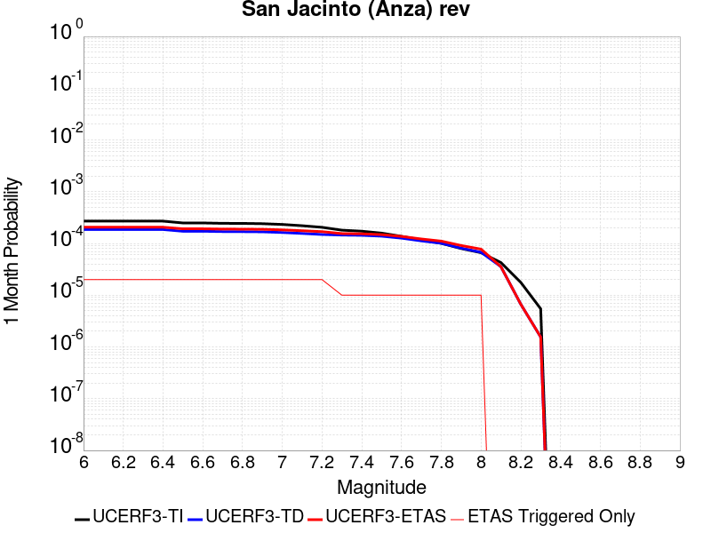 | 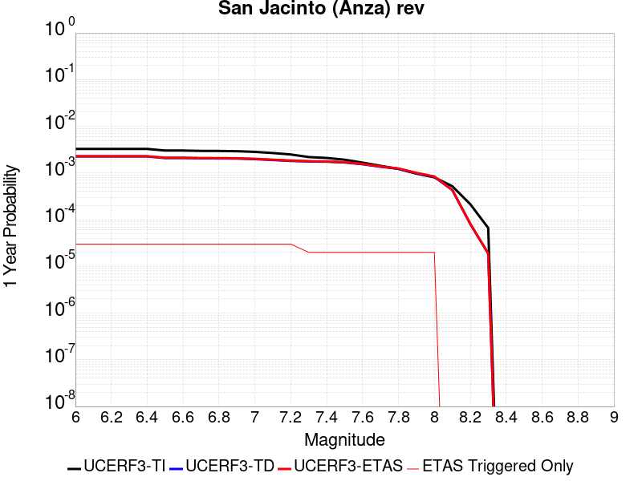 |  |

| Magnitude | 1 wk TI Prob | 1 wk TD Prob | 1 wk ETAS Prob | 1 wk ETAS/TD Gain | 1 wk ETAS Triggered Only | 1 mo TI Prob | 1 mo TD Prob | 1 mo ETAS Prob | 1 mo ETAS/TD Gain | 1 mo ETAS Triggered Only | 1 yr TI Prob | 1 yr TD Prob | 1 yr ETAS Prob | 1 yr ETAS/TD Gain | 1 yr ETAS Triggered Only | 10 yr TI Prob | 10 yr TD Prob | 10 yr ETAS Prob | 10 yr ETAS/TD Gain | 10 yr ETAS Triggered Only |
|-----|-----|-----|-----|-----|-----|-----|-----|-----|-----|-----|-----|-----|-----|-----|-----|-----|-----|-----|-----|-----|
| 6.0 | 6.3015636E-5 | 4.337693E-5 | 4.337693E-5 | 1.0 | 0.0 | 2.7003905E-4 | 1.8588796E-4 | 2.0588424E-4 | 1.1075717 | 2.0E-5 | 0.0032827691 | 0.0022608489 | 0.002290781 | 1.0132394 | 3.0E-5 | 0.032346968 | 0.023334619 | 0.023422519 | 1.0037669 | 9.0E-5 |
| 6.1 | 6.3015636E-5 | 4.337693E-5 | 4.337693E-5 | 1.0 | 0.0 | 2.7003905E-4 | 1.8588796E-4 | 2.0588424E-4 | 1.1075717 | 2.0E-5 | 0.0032827691 | 0.0022608489 | 0.002290781 | 1.0132394 | 3.0E-5 | 0.032346968 | 0.023334619 | 0.023422519 | 1.0037669 | 9.0E-5 |
| 6.2 | 6.3015636E-5 | 4.337693E-5 | 4.337693E-5 | 1.0 | 0.0 | 2.7003905E-4 | 1.8588796E-4 | 2.0588424E-4 | 1.1075717 | 2.0E-5 | 0.0032827691 | 0.0022608489 | 0.002290781 | 1.0132394 | 3.0E-5 | 0.032346968 | 0.023334619 | 0.023422519 | 1.0037669 | 9.0E-5 |
| 6.3 | 6.3015636E-5 | 4.337693E-5 | 4.337693E-5 | 1.0 | 0.0 | 2.7003905E-4 | 1.8588796E-4 | 2.0588424E-4 | 1.1075717 | 2.0E-5 | 0.0032827691 | 0.0022608489 | 0.002290781 | 1.0132394 | 3.0E-5 | 0.032346968 | 0.023334619 | 0.023422519 | 1.0037669 | 9.0E-5 |
| 6.4 | 6.3015636E-5 | 4.337693E-5 | 4.337693E-5 | 1.0 | 0.0 | 2.7003905E-4 | 1.8588796E-4 | 2.0588424E-4 | 1.1075717 | 2.0E-5 | 0.0032827691 | 0.0022608489 | 0.002290781 | 1.0132394 | 3.0E-5 | 0.032346968 | 0.023334619 | 0.023422519 | 1.0037669 | 9.0E-5 |
| 6.5 | 5.811017E-5 | 4.015336E-5 | 4.015336E-5 | 1.0 | 0.0 | 2.4901982E-4 | 1.7207452E-4 | 1.9207108E-4 | 1.1162087 | 2.0E-5 | 0.0030276014 | 0.0020929999 | 0.002122937 | 1.0143034 | 3.0E-5 | 0.02986684 | 0.021630494 | 0.021718549 | 1.0040708 | 9.0E-5 |
| 6.6 | 5.811017E-5 | 4.015336E-5 | 4.015336E-5 | 1.0 | 0.0 | 2.4901982E-4 | 1.7207452E-4 | 1.9207108E-4 | 1.1162087 | 2.0E-5 | 0.0030276014 | 0.0020929999 | 0.002122937 | 1.0143034 | 3.0E-5 | 0.02986684 | 0.021630494 | 0.021718549 | 1.0040708 | 9.0E-5 |
| 6.7 | 5.712442E-5 | 3.957534E-5 | 3.957534E-5 | 1.0 | 0.0 | 2.4479596E-4 | 1.6959761E-4 | 1.8959421E-4 | 1.1179062 | 2.0E-5 | 0.0029763177 | 0.002062901 | 0.002092839 | 1.0145127 | 3.0E-5 | 0.029367693 | 0.021321962 | 0.021410044 | 1.004131 | 9.0E-5 |
| 6.8 | 5.6967532E-5 | 3.9431634E-5 | 3.9431634E-5 | 1.0 | 0.0 | 2.4412372E-4 | 1.689818E-4 | 1.8897842E-4 | 1.118336 | 2.0E-5 | 0.0029681553 | 0.0020554175 | 0.0020853558 | 1.0145656 | 3.0E-5 | 0.029288229 | 0.021246629 | 0.021334717 | 1.004146 | 9.0E-5 |
| 6.9 | 5.6211324E-5 | 3.9135975E-5 | 3.9135975E-5 | 1.0 | 0.0 | 2.4088343E-4 | 1.6771485E-4 | 1.877115E-4 | 1.11923 | 2.0E-5 | 0.0029288116 | 0.0020400216 | 0.0020699603 | 1.0146757 | 3.0E-5 | 0.028905109 | 0.021085827 | 0.02117393 | 1.0041783 | 9.0E-5 |
| 7.0 | 5.4383527E-5 | 3.7995007E-5 | 3.7995007E-5 | 1.0 | 0.0 | 2.3305144E-4 | 1.6282561E-4 | 1.8282235E-4 | 1.1228108 | 2.0E-5 | 0.0028337094 | 0.0019806041 | 0.0020105448 | 1.0151169 | 3.0E-5 | 0.027978465 | 0.020476038 | 0.020564195 | 1.0043054 | 9.0E-5 |
| 7.1 | 5.1393665E-5 | 3.6455618E-5 | 3.6455618E-5 | 1.0 | 0.0 | 2.2023996E-4 | 1.5622903E-4 | 1.762259E-4 | 1.1279972 | 2.0E-5 | 0.0026781242 | 0.0019004333 | 0.0019303763 | 1.0157559 | 3.0E-5 | 0.026460782 | 0.019648531 | 0.019736763 | 1.0044905 | 9.0E-5 |
| 7.2 | 4.785222E-5 | 3.480494E-5 | 3.480494E-5 | 1.0 | 0.0 | 2.0506482E-4 | 1.4915552E-4 | 1.6915254E-4 | 1.1340683 | 2.0E-5 | 0.0024938055 | 0.0018144595 | 0.001844405 | 1.0165038 | 3.0E-5 | 0.024660049 | 0.018761909 | 0.01885022 | 1.004707 | 9.0E-5 |
| 7.3 | 4.2143256E-5 | 3.389763E-5 | 3.389763E-5 | 1.0 | 0.0 | 1.8060145E-4 | 1.4526749E-4 | 1.5526604E-4 | 1.0688286 | 1.0E-5 | 0.002196605 | 0.0017672004 | 0.0017871651 | 1.0112973 | 2.0E-5 | 0.02175019 | 0.018269178 | 0.018347716 | 1.0042989 | 8.0E-5 |
| 7.4 | 4.0264713E-5 | 3.3535252E-5 | 3.3535252E-5 | 1.0 | 0.0 | 1.7255165E-4 | 1.4371461E-4 | 1.5371318E-4 | 1.0695723 | 1.0E-5 | 0.002098792 | 0.0017483246 | 0.0017682896 | 1.0114195 | 2.0E-5 | 0.020790804 | 0.018073453 | 0.018152008 | 1.0043464 | 8.0E-5 |
| 7.5 | 3.694492E-5 | 3.2247204E-5 | 3.2247204E-5 | 1.0 | 0.0 | 1.5832575E-4 | 1.38195E-4 | 1.481936E-4 | 1.0723516 | 1.0E-5 | 0.0019259118 | 0.0016812286 | 0.001701195 | 1.0118761 | 2.0E-5 | 0.01909306 | 0.017388845 | 0.017467454 | 1.0045207 | 8.0E-5 |
| 7.6 | 3.200565E-5 | 2.9555436E-5 | 2.9555436E-5 | 1.0 | 0.0 | 1.3715986E-4 | 1.2666002E-4 | 1.3665875E-4 | 1.0789415 | 1.0E-5 | 0.001668642 | 0.0015409971 | 0.0015609663 | 1.0129586 | 2.0E-5 | 0.01656168 | 0.015973015 | 0.016051736 | 1.0049285 | 8.0E-5 |
| 7.7 | 2.731642E-5 | 2.6142696E-5 | 2.6142696E-5 | 1.0 | 0.0 | 1.1706512E-4 | 1.1203532E-4 | 1.220342E-4 | 1.0892476 | 1.0E-5 | 0.001424336 | 0.0013631776 | 0.0013831502 | 1.0146517 | 2.0E-5 | 0.014152412 | 0.01419303 | 0.0142718945 | 1.0055566 | 8.0E-5 |
| 7.8 | 2.3466424E-5 | 2.3552704E-5 | 2.3552704E-5 | 1.0 | 0.0 | 1.0056651E-4 | 1.0093625E-4 | 1.10935245E-4 | 1.0990624 | 1.0E-5 | 0.0012237094 | 0.0012282069 | 0.0012481824 | 1.0162638 | 2.0E-5 | 0.012169928 | 0.012833906 | 0.01291288 | 1.0061535 | 8.0E-5 |
| 7.9 | 1.8611925E-5 | 1.8951272E-5 | 1.8951272E-5 | 1.0 | 0.0 | 7.9762955E-5 | 8.1217215E-5 | 9.1216396E-5 | 1.1231166 | 1.0E-5 | 9.7068126E-4 | 9.883717E-4 | 0.0010083519 | 1.0202153 | 2.0E-5 | 0.0096645225 | 0.010416457 | 0.010495624 | 1.0076002 | 8.0E-5 |
| 8.0 | 1.5460775E-5 | 1.5779307E-5 | 1.5779307E-5 | 1.0 | 0.0 | 6.6258784E-5 | 6.762385E-5 | 7.7623175E-5 | 1.1478668 | 1.0E-5 | 8.0640207E-4 | 8.2301005E-4 | 8.429936E-4 | 1.024281 | 2.0E-5 | 0.008034821 | 0.008723064 | 0.008802366 | 1.0090911 | 8.0E-5 |
| 8.1 | 9.983884E-6 | 8.292369E-6 | 8.292369E-6 | 1.0 | 0.0 | 4.2787375E-5 | 3.5538244E-5 | 3.5538244E-5 | 1.0 | 0.0 | 5.2081177E-4 | 4.3259273E-4 | 4.3259273E-4 | 1.0 | 0.0 | 0.0051959283 | 0.00465207 | 0.004671977 | 1.0042791 | 2.0E-5 |
| 8.2 | 4.1226E-6 | 1.5595413E-6 | 1.5595413E-6 | 1.0 | 0.0 | 1.7668166E-5 | 6.683731E-6 | 6.683731E-6 | 1.0 | 0.0 | 2.1508869E-4 | 8.137142E-5 | 8.137142E-5 | 1.0 | 0.0 | 0.0021488064 | 9.4425044E-4 | 9.4425044E-4 | 1.0 | 0.0 |
| 8.3 | 1.2750878E-6 | 3.6301523E-7 | 3.6301523E-7 | 1.0 | 0.0 | 5.4646503E-6 | 1.5557786E-6 | 1.5557786E-6 | 1.0 | 0.0 | 6.653009E-5 | 1.8941444E-5 | 1.8941444E-5 | 1.0 | 0.0 | 6.6510175E-4 | 2.2840123E-4 | 2.2840123E-4 | 1.0 | 0.0 |

## Ludlow
*[(top)](#table-of-contents)*

| 1 Week | 1 Month | 1 Year | 10 Year |
|-----|-----|-----|-----|
|  | 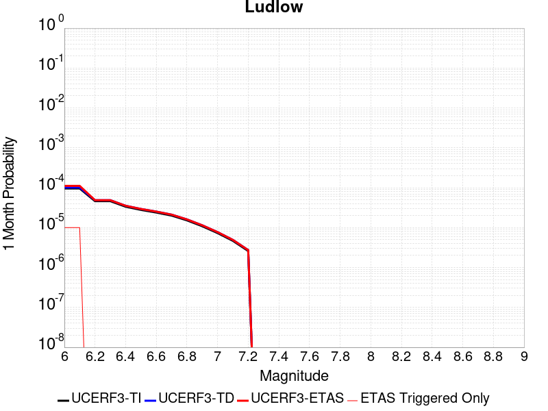 | 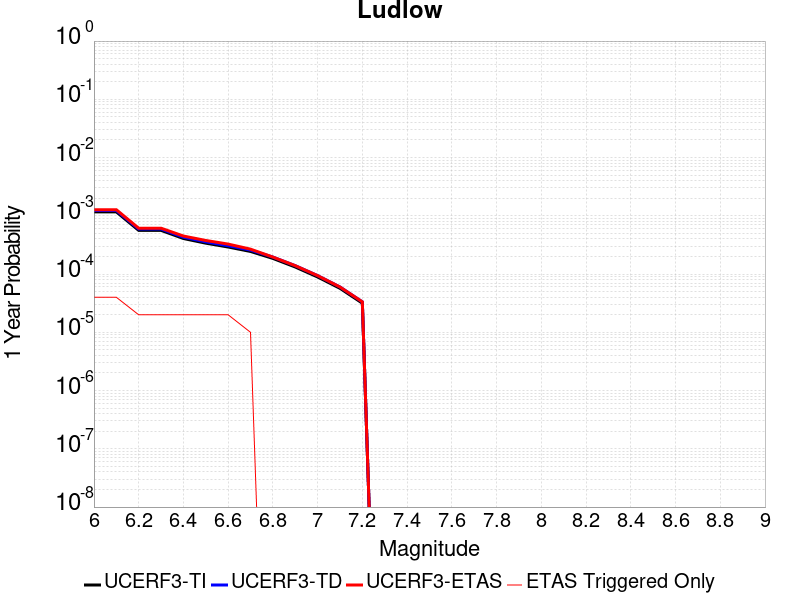 |  |

| Magnitude | 1 wk TI Prob | 1 wk TD Prob | 1 wk ETAS Prob | 1 wk ETAS/TD Gain | 1 wk ETAS Triggered Only | 1 mo TI Prob | 1 mo TD Prob | 1 mo ETAS Prob | 1 mo ETAS/TD Gain | 1 mo ETAS Triggered Only | 1 yr TI Prob | 1 yr TD Prob | 1 yr ETAS Prob | 1 yr ETAS/TD Gain | 1 yr ETAS Triggered Only | 10 yr TI Prob | 10 yr TD Prob | 10 yr ETAS Prob | 10 yr ETAS/TD Gain | 10 yr ETAS Triggered Only |
|-----|-----|-----|-----|-----|-----|-----|-----|-----|-----|-----|-----|-----|-----|-----|-----|-----|-----|-----|-----|-----|
| 6.0 | 2.2407607E-5 | 2.3657954E-5 | 2.3657954E-5 | 1.0 | 0.0 | 9.602906E-5 | 1.0138754E-4 | 1.1138653E-4 | 1.0986215 | 1.0E-5 | 0.0011685267 | 0.0012337384 | 0.0012736891 | 1.0323818 | 4.0E-5 | 0.011624013 | 0.012273403 | 0.012352421 | 1.0064381 | 8.0E-5 |
| 6.1 | 2.2407607E-5 | 2.3657954E-5 | 2.3657954E-5 | 1.0 | 0.0 | 9.602906E-5 | 1.0138754E-4 | 1.1138653E-4 | 1.0986215 | 1.0E-5 | 0.0011685267 | 0.0012337384 | 0.0012736891 | 1.0323818 | 4.0E-5 | 0.011624013 | 0.012273403 | 0.012352421 | 1.0064381 | 8.0E-5 |
| 6.2 | 1.0781252E-5 | 1.1365991E-5 | 1.1365991E-5 | 1.0 | 0.0 | 4.620455E-5 | 4.8710503E-5 | 4.8710503E-5 | 1.0 | 0.0 | 5.623952E-4 | 5.92893E-4 | 6.1288115E-4 | 1.0337129 | 2.0E-5 | 0.00560974 | 0.005913531 | 0.0059433533 | 1.0050431 | 3.0E-5 |
| 6.3 | 1.0781252E-5 | 1.1365991E-5 | 1.1365991E-5 | 1.0 | 0.0 | 4.620455E-5 | 4.8710503E-5 | 4.8710503E-5 | 1.0 | 0.0 | 5.623952E-4 | 5.92893E-4 | 6.1288115E-4 | 1.0337129 | 2.0E-5 | 0.00560974 | 0.005913531 | 0.0059433533 | 1.0050431 | 3.0E-5 |
| 6.4 | 7.814439E-6 | 8.237966E-6 | 8.237966E-6 | 1.0 | 0.0 | 3.3490025E-5 | 3.5305096E-5 | 3.5305096E-5 | 1.0 | 0.0 | 4.0766477E-4 | 4.2975618E-4 | 4.4974757E-4 | 1.046518 | 2.0E-5 | 0.0040691774 | 0.0042893975 | 0.0043192687 | 1.006964 | 3.0E-5 |
| 6.5 | 6.4986366E-6 | 6.8511167E-6 | 6.8511167E-6 | 1.0 | 0.0 | 2.7851002E-5 | 2.9361603E-5 | 2.9361603E-5 | 1.0 | 0.0 | 3.390332E-4 | 3.574198E-4 | 3.7741265E-4 | 1.0559366 | 2.0E-5 | 0.003385164 | 0.003568546 | 0.0035984388 | 1.0083768 | 3.0E-5 |
| 6.6 | 5.582177E-6 | 5.8861756E-6 | 5.8861756E-6 | 1.0 | 0.0 | 2.3923398E-5 | 2.5226227E-5 | 2.5226227E-5 | 1.0 | 0.0 | 2.9122844E-4 | 3.0708674E-4 | 3.270806E-4 | 1.0651082 | 2.0E-5 | 0.0029084706 | 0.0030666974 | 0.0030966054 | 1.0097525 | 3.0E-5 |
| 6.7 | 4.6858763E-6 | 4.94057E-6 | 4.94057E-6 | 1.0 | 0.0 | 2.0082172E-5 | 2.1173702E-5 | 2.1173702E-5 | 1.0 | 0.0 | 2.4447302E-4 | 2.5775988E-4 | 2.677573E-4 | 1.0387858 | 1.0E-5 | 0.0024420423 | 0.0025746655 | 0.002594614 | 1.007748 | 2.0E-5 |
| 6.8 | 3.5584908E-6 | 3.7521265E-6 | 3.7521265E-6 | 1.0 | 0.0 | 1.5250586E-5 | 1.6080447E-5 | 1.6080447E-5 | 1.0 | 0.0 | 1.8566006E-4 | 1.9576224E-4 | 1.9576224E-4 | 1.0 | 0.0 | 0.0018550502 | 0.0019559392 | 0.0019559392 | 1.0 | 0.0 |
| 6.9 | 2.532834E-6 | 2.6710807E-6 | 2.6710807E-6 | 1.0 | 0.0 | 1.0854958E-5 | 1.1447441E-5 | 1.1447441E-5 | 1.0 | 0.0 | 1.3215111E-4 | 1.3936395E-4 | 1.3936395E-4 | 1.0 | 0.0 | 0.0013207254 | 0.0013927931 | 0.0013927931 | 1.0 | 0.0 |
| 7.0 | 1.7083285E-6 | 1.8019963E-6 | 1.8019963E-6 | 1.0 | 0.0 | 7.3213873E-6 | 7.722819E-6 | 7.722819E-6 | 1.0 | 0.0 | 8.913424E-5 | 9.402143E-5 | 9.402143E-5 | 1.0 | 0.0 | 8.9098496E-4 | 9.3983306E-4 | 9.3983306E-4 | 1.0 | 0.0 |
| 7.1 | 1.0905424E-6 | 1.1497951E-6 | 1.1497951E-6 | 1.0 | 0.0 | 4.6737446E-6 | 4.9276846E-6 | 4.9276846E-6 | 1.0 | 0.0 | 5.6901354E-5 | 5.9993006E-5 | 5.9993006E-5 | 1.0 | 0.0 | 5.6886784E-4 | 5.997779E-4 | 5.997779E-4 | 1.0 | 0.0 |
| 7.2 | 6.06668E-7 | 6.387457E-7 | 6.387457E-7 | 1.0 | 0.0 | 2.600003E-6 | 2.737479E-6 | 2.737479E-6 | 1.0 | 0.0 | 3.1654577E-5 | 3.3328364E-5 | 3.3328364E-5 | 1.0 | 0.0 | 3.1650066E-4 | 3.3324052E-4 | 3.3324052E-4 | 1.0 | 0.0 |

## Cleghorn Lake
*[(top)](#table-of-contents)*

| 1 Week | 1 Month | 1 Year | 10 Year |
|-----|-----|-----|-----|
|  |  |  |  |

| Magnitude | 1 wk TI Prob | 1 wk TD Prob | 1 wk ETAS Prob | 1 wk ETAS/TD Gain | 1 wk ETAS Triggered Only | 1 mo TI Prob | 1 mo TD Prob | 1 mo ETAS Prob | 1 mo ETAS/TD Gain | 1 mo ETAS Triggered Only | 1 yr TI Prob | 1 yr TD Prob | 1 yr ETAS Prob | 1 yr ETAS/TD Gain | 1 yr ETAS Triggered Only | 10 yr TI Prob | 10 yr TD Prob | 10 yr ETAS Prob | 10 yr ETAS/TD Gain | 10 yr ETAS Triggered Only |
|-----|-----|-----|-----|-----|-----|-----|-----|-----|-----|-----|-----|-----|-----|-----|-----|-----|-----|-----|-----|-----|
| 6.0 | 1.5467183E-5 | 1.6794971E-5 | 1.6794971E-5 | 1.0 | 0.0 | 6.6286244E-5 | 7.197677E-5 | 7.197677E-5 | 1.0 | 0.0 | 8.067362E-4 | 8.760197E-4 | 9.0599345E-4 | 1.0342158 | 3.0E-5 | 0.008038137 | 0.008731093 | 0.008810394 | 1.0090827 | 8.0E-5 |
| 6.1 | 1.5467183E-5 | 1.6794971E-5 | 1.6794971E-5 | 1.0 | 0.0 | 6.6286244E-5 | 7.197677E-5 | 7.197677E-5 | 1.0 | 0.0 | 8.067362E-4 | 8.760197E-4 | 9.0599345E-4 | 1.0342158 | 3.0E-5 | 0.008038137 | 0.008731093 | 0.008810394 | 1.0090827 | 8.0E-5 |
| 6.2 | 1.2624631E-5 | 1.36821545E-5 | 1.36821545E-5 | 1.0 | 0.0 | 5.410444E-5 | 5.863676E-5 | 5.863676E-5 | 1.0 | 0.0 | 6.585225E-4 | 7.137174E-4 | 7.237103E-4 | 1.0140011 | 1.0E-5 | 0.0065657445 | 0.0071190484 | 0.0071587637 | 1.0055788 | 4.0E-5 |
| 6.3 | 1.2624631E-5 | 1.36821545E-5 | 1.36821545E-5 | 1.0 | 0.0 | 5.410444E-5 | 5.863676E-5 | 5.863676E-5 | 1.0 | 0.0 | 6.585225E-4 | 7.137174E-4 | 7.237103E-4 | 1.0140011 | 1.0E-5 | 0.0065657445 | 0.0071190484 | 0.0071587637 | 1.0055788 | 4.0E-5 |
| 6.4 | 9.417684E-6 | 1.0170551E-5 | 1.0170551E-5 | 1.0 | 0.0 | 4.036088E-5 | 4.3587577E-5 | 4.3587577E-5 | 1.0 | 0.0 | 4.912829E-4 | 5.3059065E-4 | 5.405853E-4 | 1.018837 | 1.0E-5 | 0.004901982 | 0.0052972743 | 0.0053370623 | 1.007511 | 4.0E-5 |
| 6.5 | 9.368219E-6 | 1.0117976E-5 | 1.0117976E-5 | 1.0 | 0.0 | 4.014889E-5 | 4.3362263E-5 | 4.3362263E-5 | 1.0 | 0.0 | 4.8870314E-4 | 5.278488E-4 | 5.378435E-4 | 1.0189348 | 1.0E-5 | 0.004876298 | 0.0052699856 | 0.005309775 | 1.0075501 | 4.0E-5 |
| 6.6 | 7.803798E-6 | 8.442198E-6 | 8.442198E-6 | 1.0 | 0.0 | 3.3444423E-5 | 3.6180576E-5 | 3.6180576E-5 | 1.0 | 0.0 | 4.0710976E-4 | 4.404494E-4 | 4.50445E-4 | 1.0226941 | 1.0E-5 | 0.0040636472 | 0.004399682 | 0.00442955 | 1.0067887 | 3.0E-5 |
| 6.7 | 2.3108669E-6 | 2.4439082E-6 | 2.4439082E-6 | 1.0 | 0.0 | 9.903678E-6 | 1.0473852E-5 | 1.0473852E-5 | 1.0 | 0.0 | 1.205706E-4 | 1.2751187E-4 | 1.2751187E-4 | 1.0 | 0.0 | 0.001205052 | 0.0012744057 | 0.0012744057 | 1.0 | 0.0 |
| 6.8 | 2.0882828E-6 | 2.2063484E-6 | 2.2063484E-6 | 1.0 | 0.0 | 8.949753E-6 | 9.455745E-6 | 9.455745E-6 | 1.0 | 0.0 | 1.08957785E-4 | 1.15117786E-4 | 1.15117786E-4 | 1.0 | 0.0 | 0.0010890438 | 0.0011505984 | 0.0011505984 | 1.0 | 0.0 |
| 6.9 | 1.876935E-6 | 1.9811093E-6 | 1.9811093E-6 | 1.0 | 0.0 | 8.043982E-6 | 8.490441E-6 | 8.490441E-6 | 1.0 | 0.0 | 9.7931086E-5 | 1.0336639E-4 | 1.0336639E-4 | 1.0 | 0.0 | 9.788794E-4 | 0.001033199 | 0.001033199 | 1.0 | 0.0 |
| 7.0 | 1.5357559E-6 | 1.620328E-6 | 1.620328E-6 | 1.0 | 0.0 | 6.5817944E-6 | 6.9442453E-6 | 6.9442453E-6 | 1.0 | 0.0 | 8.01304E-5 | 8.454303E-5 | 8.454303E-5 | 1.0 | 0.0 | 8.010151E-4 | 8.4512116E-4 | 8.4512116E-4 | 1.0 | 0.0 |
| 7.1 | 1.0905424E-6 | 1.1497951E-6 | 1.1497951E-6 | 1.0 | 0.0 | 4.6737446E-6 | 4.9276846E-6 | 4.9276846E-6 | 1.0 | 0.0 | 5.6901354E-5 | 5.9993006E-5 | 5.9993006E-5 | 1.0 | 0.0 | 5.6886784E-4 | 5.997779E-4 | 5.997779E-4 | 1.0 | 0.0 |
| 7.2 | 6.06668E-7 | 6.387457E-7 | 6.387457E-7 | 1.0 | 0.0 | 2.600003E-6 | 2.737479E-6 | 2.737479E-6 | 1.0 | 0.0 | 3.1654577E-5 | 3.3328364E-5 | 3.3328364E-5 | 1.0 | 0.0 | 3.1650066E-4 | 3.3324052E-4 | 3.3324052E-4 | 1.0 | 0.0 |

## Santa Rosa Island
*[(top)](#table-of-contents)*

| 1 Week | 1 Month | 1 Year | 10 Year |
|-----|-----|-----|-----|
|  |  |  |  |

| Magnitude | 1 wk TI Prob | 1 wk TD Prob | 1 wk ETAS Prob | 1 wk ETAS/TD Gain | 1 wk ETAS Triggered Only | 1 mo TI Prob | 1 mo TD Prob | 1 mo ETAS Prob | 1 mo ETAS/TD Gain | 1 mo ETAS Triggered Only | 1 yr TI Prob | 1 yr TD Prob | 1 yr ETAS Prob | 1 yr ETAS/TD Gain | 1 yr ETAS Triggered Only | 10 yr TI Prob | 10 yr TD Prob | 10 yr ETAS Prob | 10 yr ETAS/TD Gain | 10 yr ETAS Triggered Only |
|-----|-----|-----|-----|-----|-----|-----|-----|-----|-----|-----|-----|-----|-----|-----|-----|-----|-----|-----|-----|-----|
| 6.0 | 4.1143165E-5 | 4.7094767E-5 | 4.7094767E-5 | 1.0 | 0.0 | 1.7631594E-4 | 2.018202E-4 | 2.2181617E-4 | 1.099078 | 2.0E-5 | 0.002144533 | 0.0024545891 | 0.002494491 | 1.016256 | 4.0E-5 | 0.021239553 | 0.024295403 | 0.024373459 | 1.0032128 | 8.0E-5 |
| 6.1 | 2.1061249E-5 | 2.3866654E-5 | 2.3866654E-5 | 1.0 | 0.0 | 9.0259375E-5 | 1.0228182E-4 | 1.12280795E-4 | 1.0977591 | 1.0E-5 | 0.0010983539 | 0.0012445987 | 0.0012745614 | 1.0240742 | 3.0E-5 | 0.01092941 | 0.012379322 | 0.012438579 | 1.0047868 | 6.0E-5 |
| 6.2 | 2.1061249E-5 | 2.3866654E-5 | 2.3866654E-5 | 1.0 | 0.0 | 9.0259375E-5 | 1.0228182E-4 | 1.12280795E-4 | 1.0977591 | 1.0E-5 | 0.0010983539 | 0.0012445987 | 0.0012745614 | 1.0240742 | 3.0E-5 | 0.01092941 | 0.012379322 | 0.012438579 | 1.0047868 | 6.0E-5 |
| 6.3 | 1.5158236E-5 | 1.7075572E-5 | 1.7075572E-5 | 1.0 | 0.0 | 6.496225E-5 | 7.3179035E-5 | 8.31783E-5 | 1.1366411 | 1.0E-5 | 7.906284E-4 | 8.906025E-4 | 9.2057575E-4 | 1.033655 | 3.0E-5 | 0.007878214 | 0.008871585 | 0.008921142 | 1.005586 | 5.0E-5 |
| 6.4 | 1.2341918E-5 | 1.3853823E-5 | 1.3853823E-5 | 1.0 | 0.0 | 5.2892858E-5 | 5.9372218E-5 | 6.937162E-5 | 1.1684189 | 1.0E-5 | 6.437803E-4 | 7.226252E-4 | 7.5260346E-4 | 1.0414853 | 3.0E-5 | 0.006419184 | 0.0072035906 | 0.0072532305 | 1.006891 | 5.0E-5 |
| 6.5 | 9.061158E-6 | 1.0117661E-5 | 1.0117661E-5 | 1.0 | 0.0 | 3.883296E-5 | 4.3360717E-5 | 4.3360717E-5 | 1.0 | 0.0 | 4.726887E-4 | 5.277942E-4 | 5.377889E-4 | 1.0189368 | 1.0E-5 | 0.004716845 | 0.0052659446 | 0.0052957865 | 1.005667 | 3.0E-5 |
| 6.6 | 7.5461685E-6 | 8.401243E-6 | 8.401243E-6 | 1.0 | 0.0 | 3.2340322E-5 | 3.6004854E-5 | 3.6004854E-5 | 1.0 | 0.0 | 3.936723E-4 | 4.3827522E-4 | 4.4827085E-4 | 1.0228068 | 1.0E-5 | 0.003929756 | 0.0043745385 | 0.004404407 | 1.0068278 | 3.0E-5 |
| 6.7 | 5.5023775E-6 | 6.0877283E-6 | 6.0877283E-6 | 1.0 | 0.0 | 2.3581404E-5 | 2.6090021E-5 | 2.6090021E-5 | 1.0 | 0.0 | 2.8706578E-4 | 3.1760297E-4 | 3.275998E-4 | 1.0314759 | 1.0E-5 | 0.0028669522 | 0.0031718123 | 0.003201717 | 1.0094283 | 3.0E-5 |
| 6.8 | 3.7351679E-6 | 4.083345E-6 | 4.083345E-6 | 1.0 | 0.0 | 1.6007763E-5 | 1.7499948E-5 | 1.7499948E-5 | 1.0 | 0.0 | 1.948771E-4 | 2.1304353E-4 | 2.230414E-4 | 1.0469288 | 1.0E-5 | 0.0019470629 | 0.002128638 | 0.0021585743 | 1.0140635 | 3.0E-5 |
| 6.9 | 2.456366E-6 | 2.6293699E-6 | 2.6293699E-6 | 1.0 | 0.0 | 1.0527241E-5 | 1.1268679E-5 | 1.1268679E-5 | 1.0 | 0.0 | 1.2816161E-4 | 1.3718756E-4 | 1.3718756E-4 | 1.0 | 0.0 | 0.0012808773 | 0.0013710316 | 0.0013910042 | 1.0145676 | 2.0E-5 |
| 7.0 | 2.3245157E-6 | 2.482869E-6 | 2.482869E-6 | 1.0 | 0.0 | 9.962172E-6 | 1.0640823E-5 | 1.0640823E-5 | 1.0 | 0.0 | 1.2128269E-4 | 1.2954435E-4 | 1.2954435E-4 | 1.0 | 0.0 | 0.0012121652 | 0.0012946905 | 0.0013146647 | 1.0154277 | 2.0E-5 |
| 7.1 | 2.2248344E-6 | 2.3733348E-6 | 2.3733348E-6 | 1.0 | 0.0 | 9.53497E-6 | 1.0171396E-5 | 1.0171396E-5 | 1.0 | 0.0 | 1.1608207E-4 | 1.2382973E-4 | 1.2382973E-4 | 1.0 | 0.0 | 0.0011602144 | 0.0012376092 | 0.0012475968 | 1.0080701 | 1.0E-5 |
| 7.2 | 2.1350402E-6 | 2.2762347E-6 | 2.2762347E-6 | 1.0 | 0.0 | 9.150141E-6 | 9.755255E-6 | 9.755255E-6 | 1.0 | 0.0 | 1.1139726E-4 | 1.18763775E-4 | 1.18763775E-4 | 1.0 | 0.0 | 0.0011134144 | 0.001187005 | 0.001196993 | 1.0084145 | 1.0E-5 |
| 7.3 | 1.9793572E-6 | 2.108793E-6 | 2.108793E-6 | 1.0 | 0.0 | 8.482932E-6 | 9.037653E-6 | 9.037653E-6 | 1.0 | 0.0 | 1.032748E-4 | 1.1002789E-4 | 1.1002789E-4 | 1.0 | 0.0 | 0.0010322682 | 0.001099736 | 0.001109725 | 1.009083 | 1.0E-5 |
| 7.4 | 1.6951194E-6 | 1.804636E-6 | 1.804636E-6 | 1.0 | 0.0 | 7.264777E-6 | 7.734132E-6 | 7.734132E-6 | 1.0 | 0.0 | 8.844508E-5 | 9.4159E-5 | 9.4159E-5 | 1.0 | 0.0 | 8.840988E-4 | 9.4119273E-4 | 9.511833E-4 | 1.0106149 | 1.0E-5 |
| 7.5 | 8.987207E-7 | 9.512517E-7 | 9.512517E-7 | 1.0 | 0.0 | 3.8516546E-6 | 4.076787E-6 | 4.076787E-6 | 1.0 | 0.0 | 4.6892885E-5 | 4.963376E-5 | 4.963376E-5 | 1.0 | 0.0 | 4.688299E-4 | 4.9622793E-4 | 5.0622295E-4 | 1.0201421 | 1.0E-5 |
| 7.6 | 3.8783037E-7 | 4.0530355E-7 | 4.0530355E-7 | 1.0 | 0.0 | 1.6621291E-6 | 1.737014E-6 | 1.737014E-6 | 1.0 | 0.0 | 2.0236233E-5 | 2.1147947E-5 | 2.1147947E-5 | 1.0 | 0.0 | 2.023439E-4 | 2.1146E-4 | 2.1146E-4 | 1.0 | 0.0 |
| 7.7 | 6.181804E-8 | 6.33916E-8 | 6.33916E-8 | 1.0 | 0.0 | 2.6493444E-7 | 2.7167826E-7 | 2.7167826E-7 | 1.0 | 0.0 | 3.225572E-6 | 3.3076778E-6 | 3.3076778E-6 | 1.0 | 0.0 | 3.225525E-5 | 3.3076292E-5 | 3.3076292E-5 | 1.0 | 0.0 |
| 7.8 | 1.3704449E-9 | 1.3964294E-9 | 1.3964294E-9 | 1.0 | 0.0 | 5.873335E-9 | 5.984697E-9 | 5.984697E-9 | 1.0 | 0.0 | 7.1507856E-8 | 7.2863685E-8 | 7.2863685E-8 | 1.0 | 0.0 | 7.1507833E-7 | 7.2863673E-7 | 7.2863673E-7 | 1.0 | 0.0 |

## Mission Ridge-Arroyo Parida-Santa Ana
*[(top)](#table-of-contents)*

| 1 Week | 1 Month | 1 Year | 10 Year |
|-----|-----|-----|-----|
|  |  |  |  |

| Magnitude | 1 wk TI Prob | 1 wk TD Prob | 1 wk ETAS Prob | 1 wk ETAS/TD Gain | 1 wk ETAS Triggered Only | 1 mo TI Prob | 1 mo TD Prob | 1 mo ETAS Prob | 1 mo ETAS/TD Gain | 1 mo ETAS Triggered Only | 1 yr TI Prob | 1 yr TD Prob | 1 yr ETAS Prob | 1 yr ETAS/TD Gain | 1 yr ETAS Triggered Only | 10 yr TI Prob | 10 yr TD Prob | 10 yr ETAS Prob | 10 yr ETAS/TD Gain | 10 yr ETAS Triggered Only |
|-----|-----|-----|-----|-----|-----|-----|-----|-----|-----|-----|-----|-----|-----|-----|-----|-----|-----|-----|-----|-----|
| 6.0 | 4.169034E-5 | 4.71435E-5 | 4.71435E-5 | 1.0 | 0.0 | 1.7866064E-4 | 2.0203278E-4 | 2.1203076E-4 | 1.0494869 | 1.0E-5 | 0.0021730233 | 0.0024577067 | 0.0024976085 | 1.0162354 | 4.0E-5 | 0.021518968 | 0.024387252 | 0.024455544 | 1.0028003 | 7.0E-5 |
| 6.1 | 1.73813E-5 | 1.6855427E-5 | 1.6855427E-5 | 1.0 | 0.0 | 7.4489166E-5 | 7.2235605E-5 | 8.223488E-5 | 1.138426 | 1.0E-5 | 9.065282E-4 | 8.791244E-4 | 8.991068E-4 | 1.0227299 | 2.0E-5 | 0.009028391 | 0.008757609 | 0.008787346 | 1.0033956 | 3.0E-5 |
| 6.2 | 1.4622182E-5 | 1.3674228E-5 | 1.3674228E-5 | 1.0 | 0.0 | 6.2664985E-5 | 5.8602538E-5 | 6.8601956E-5 | 1.170631 | 1.0E-5 | 7.6267915E-4 | 7.1325625E-4 | 7.3324196E-4 | 1.0280204 | 2.0E-5 | 0.007600669 | 0.0071101133 | 0.0071399002 | 1.0041894 | 3.0E-5 |
| 6.3 | 1.3552434E-5 | 1.2483067E-5 | 1.2483067E-5 | 1.0 | 0.0 | 5.8080568E-5 | 5.3497777E-5 | 6.3497246E-5 | 1.1869136 | 1.0E-5 | 7.069015E-4 | 6.5114396E-4 | 6.711309E-4 | 1.0306952 | 2.0E-5 | 0.00704657 | 0.0064927237 | 0.006522529 | 1.0045905 | 3.0E-5 |
| 6.4 | 1.30977305E-5 | 1.1979993E-5 | 1.1979993E-5 | 1.0 | 0.0 | 5.613192E-5 | 5.1341834E-5 | 6.134132E-5 | 1.194763 | 1.0E-5 | 6.831918E-4 | 6.249106E-4 | 6.4489804E-4 | 1.0319846 | 2.0E-5 | 0.006810953 | 0.0062318784 | 0.0062616915 | 1.004784 | 3.0E-5 |
| 6.5 | 1.225205E-5 | 1.104959E-5 | 1.104959E-5 | 1.0 | 0.0 | 5.2507727E-5 | 4.7354544E-5 | 5.735407E-5 | 1.2111629 | 1.0E-5 | 6.3909404E-4 | 5.7639176E-4 | 5.963802E-4 | 1.0346786 | 2.0E-5 | 0.006372592 | 0.005749278 | 0.005769163 | 1.0034587 | 2.0E-5 |
| 6.6 | 1.1352241E-5 | 1.0064273E-5 | 1.0064273E-5 | 1.0 | 0.0 | 4.8651553E-5 | 4.3131895E-5 | 4.3131895E-5 | 1.0 | 0.0 | 5.921717E-4 | 5.2500644E-4 | 5.3500116E-4 | 1.0190374 | 1.0E-5 | 0.0059059616 | 0.005237907 | 0.005247855 | 1.0018991 | 1.0E-5 |
| 6.7 | 1.0864116E-5 | 9.517729E-6 | 9.517729E-6 | 1.0 | 0.0 | 4.6559664E-5 | 4.0789644E-5 | 4.0789644E-5 | 1.0 | 0.0 | 5.667165E-4 | 4.9650273E-4 | 5.064978E-4 | 1.0201309 | 1.0E-5 | 0.005652734 | 0.0049541686 | 0.0049641193 | 1.0020086 | 1.0E-5 |
| 6.8 | 1.0666365E-5 | 9.30047E-6 | 9.30047E-6 | 1.0 | 0.0 | 4.571219E-5 | 3.9858558E-5 | 3.9858558E-5 | 1.0 | 0.0 | 5.564038E-4 | 4.851719E-4 | 4.9516704E-4 | 1.0206013 | 1.0E-5 | 0.005550127 | 0.004841359 | 0.0048513105 | 1.0020555 | 1.0E-5 |
| 6.9 | 1.0038665E-5 | 8.592689E-6 | 8.592689E-6 | 1.0 | 0.0 | 4.302214E-5 | 3.68253E-5 | 3.68253E-5 | 1.0 | 0.0 | 5.236687E-4 | 4.4825758E-4 | 4.582531E-4 | 1.0222986 | 1.0E-5 | 0.005224364 | 0.004473745 | 0.0044837003 | 1.0022253 | 1.0E-5 |
| 7.0 | 9.5379955E-6 | 8.025674E-6 | 8.025674E-6 | 1.0 | 0.0 | 4.0876483E-5 | 3.4395303E-5 | 3.4395303E-5 | 1.0 | 0.0 | 4.975576E-4 | 4.1868407E-4 | 4.286799E-4 | 1.0238744 | 1.0E-5 | 0.00496445 | 0.004179152 | 0.0041891104 | 1.0023829 | 1.0E-5 |
| 7.1 | 9.207389E-6 | 7.652948E-6 | 7.652948E-6 | 1.0 | 0.0 | 3.945964E-5 | 3.2797943E-5 | 3.2797943E-5 | 1.0 | 0.0 | 4.803152E-4 | 3.992435E-4 | 4.0923952E-4 | 1.0250374 | 1.0E-5 | 0.004792784 | 0.003985459 | 0.003995419 | 1.0024991 | 1.0E-5 |
| 7.2 | 7.638091E-6 | 5.9315435E-6 | 5.9315435E-6 | 1.0 | 0.0 | 3.2734264E-5 | 2.5420655E-5 | 2.5420655E-5 | 1.0 | 0.0 | 3.984668E-4 | 3.0945282E-4 | 3.1944973E-4 | 1.0323051 | 1.0E-5 | 0.0039775306 | 0.0030902762 | 0.0031002453 | 1.0032259 | 1.0E-5 |
| 7.3 | 7.2500147E-6 | 5.5965506E-6 | 5.5965506E-6 | 1.0 | 0.0 | 3.1071122E-5 | 2.3985E-5 | 2.3985E-5 | 1.0 | 0.0 | 3.7822526E-4 | 2.9197853E-4 | 3.019756E-4 | 1.034239 | 1.0E-5 | 0.0037758215 | 0.0029160045 | 0.0029259755 | 1.0034194 | 1.0E-5 |
| 7.4 | 6.3899715E-6 | 4.918836E-6 | 4.918836E-6 | 1.0 | 0.0 | 2.7385306E-5 | 2.1080557E-5 | 2.1080557E-5 | 1.0 | 0.0 | 3.3336508E-4 | 2.5662576E-4 | 2.666232E-4 | 1.0389572 | 1.0E-5 | 0.0033286542 | 0.0025633385 | 0.002573313 | 1.0038911 | 1.0E-5 |
| 7.5 | 5.379025E-6 | 4.0841346E-6 | 4.0841346E-6 | 1.0 | 0.0 | 2.305276E-5 | 1.7503316E-5 | 1.7503316E-5 | 1.0 | 0.0 | 2.806312E-4 | 2.1308215E-4 | 2.2308002E-4 | 1.0469203 | 1.0E-5 | 0.0028027708 | 0.0021287897 | 0.0021387686 | 1.0046875 | 1.0E-5 |
| 7.6 | 4.1270696E-6 | 3.0885622E-6 | 3.0885622E-6 | 1.0 | 0.0 | 1.768732E-5 | 1.3236629E-5 | 1.3236629E-5 | 1.0 | 0.0 | 2.1532185E-4 | 1.6114411E-4 | 1.711425E-4 | 1.0620463 | 1.0E-5 | 0.0021511333 | 0.0016102807 | 0.0016202646 | 1.0062001 | 1.0E-5 |
| 7.7 | 2.5406805E-6 | 1.8283382E-6 | 1.8283382E-6 | 1.0 | 0.0 | 1.0888585E-5 | 7.8357125E-6 | 7.8357125E-6 | 1.0 | 0.0 | 1.3256045E-4 | 9.539568E-5 | 1.0539473E-4 | 1.1048166 | 1.0E-5 | 0.0013248142 | 9.535535E-4 | 9.6354395E-4 | 1.0104771 | 1.0E-5 |
| 7.8 | 4.8608285E-7 | 3.5100658E-7 | 3.5100658E-7 | 1.0 | 0.0 | 2.0832106E-6 | 1.504313E-6 | 1.504313E-6 | 1.0 | 0.0 | 2.5362791E-5 | 1.8314859E-5 | 2.8314675E-5 | 1.5459948 | 1.0E-5 | 2.5359896E-4 | 1.8313361E-4 | 1.9313178E-4 | 1.054595 | 1.0E-5 |
| 7.9 | 2.0472514E-8 | 1.2690024E-8 | 1.2690024E-8 | 1.0 | 0.0 | 8.7739345E-8 | 5.438582E-8 | 5.438582E-8 | 1.0 | 0.0 | 1.068226E-6 | 6.621471E-7 | 6.621471E-7 | 1.0 | 0.0 | 1.0682209E-5 | 6.6214525E-6 | 6.6214525E-6 | 1.0 | 0.0 |
| 8.0 | 4.443582E-9 | 2.0326807E-9 | 2.0326807E-9 | 1.0 | 0.0 | 1.9043922E-8 | 8.711488E-9 | 8.711488E-9 | 1.0 | 0.0 | 2.3185973E-7 | 1.06062366E-7 | 1.06062366E-7 | 1.0 | 0.0 | 2.3185949E-6 | 1.0606232E-6 | 1.0606232E-6 | 1.0 | 0.0 |

## Brawley (Seismic Zone) alt 1
*[(top)](#table-of-contents)*

| 1 Week | 1 Month | 1 Year | 10 Year |
|-----|-----|-----|-----|
|  |  |  |  |

| Magnitude | 1 wk TI Prob | 1 wk TD Prob | 1 wk ETAS Prob | 1 wk ETAS/TD Gain | 1 wk ETAS Triggered Only | 1 mo TI Prob | 1 mo TD Prob | 1 mo ETAS Prob | 1 mo ETAS/TD Gain | 1 mo ETAS Triggered Only | 1 yr TI Prob | 1 yr TD Prob | 1 yr ETAS Prob | 1 yr ETAS/TD Gain | 1 yr ETAS Triggered Only | 10 yr TI Prob | 10 yr TD Prob | 10 yr ETAS Prob | 10 yr ETAS/TD Gain | 10 yr ETAS Triggered Only |
|-----|-----|-----|-----|-----|-----|-----|-----|-----|-----|-----|-----|-----|-----|-----|-----|-----|-----|-----|-----|-----|
| 6.0 | 2.2521618E-4 | 4.7667572E-4 | 4.7667572E-4 | 1.0 | 0.0 | 9.6485513E-4 | 0.0020413336 | 0.0020413336 | 1.0 | 0.0 | 0.011683988 | 0.024564065 | 0.024603084 | 1.0015883 | 4.0E-5 | 0.11088423 | 0.21362062 | 0.21368353 | 1.0002944 | 8.0E-5 |
| 6.1 | 2.2521618E-4 | 4.7667572E-4 | 4.7667572E-4 | 1.0 | 0.0 | 9.6485513E-4 | 0.0020413336 | 0.0020413336 | 1.0 | 0.0 | 0.011683988 | 0.024564065 | 0.024603084 | 1.0015883 | 4.0E-5 | 0.11088423 | 0.21362062 | 0.21368353 | 1.0002944 | 8.0E-5 |
| 6.2 | 2.198148E-4 | 4.6751375E-4 | 4.6751375E-4 | 1.0 | 0.0 | 9.417233E-4 | 0.0020021286 | 0.0020021286 | 1.0 | 0.0 | 0.011405343 | 0.024097936 | 0.024136972 | 1.0016199 | 4.0E-5 | 0.10837428 | 0.2100555 | 0.2101187 | 1.0003009 | 8.0E-5 |
| 6.3 | 2.1704129E-4 | 4.6186932E-4 | 4.6186932E-4 | 1.0 | 0.0 | 9.298453E-4 | 0.001977975 | 0.001977975 | 1.0 | 0.0 | 0.011262234 | 0.023811033 | 0.023850081 | 1.0016398 | 4.0E-5 | 0.107082725 | 0.20794643 | 0.2080098 | 1.0003047 | 8.0E-5 |
| 6.4 | 1.876142E-4 | 4.007805E-4 | 4.007805E-4 | 1.0 | 0.0 | 8.038131E-4 | 0.0017165145 | 0.0017165145 | 1.0 | 0.0 | 0.00974259 | 0.020697333 | 0.020736504 | 1.0018926 | 4.0E-5 | 0.093263686 | 0.18469763 | 0.18476285 | 1.0003531 | 8.0E-5 |
| 6.5 | 1.7390939E-4 | 3.750906E-4 | 3.750906E-4 | 1.0 | 0.0 | 7.45113E-4 | 0.001606553 | 0.001606553 | 1.0 | 0.0 | 0.009034078 | 0.019385088 | 0.019424314 | 1.0020235 | 4.0E-5 | 0.086755216 | 0.17451778 | 0.17457557 | 1.0003312 | 7.0E-5 |
| 6.6 | 1.591791E-4 | 3.4922338E-4 | 3.4922338E-4 | 1.0 | 0.0 | 6.8201777E-4 | 0.0014958231 | 0.0014958231 | 1.0 | 0.0 | 0.008271996 | 0.018061135 | 0.01810041 | 1.0021747 | 4.0E-5 | 0.07970774 | 0.16392244 | 0.16398098 | 1.000357 | 7.0E-5 |
| 6.7 | 1.4268003E-4 | 3.208674E-4 | 3.208674E-4 | 1.0 | 0.0 | 6.1134255E-4 | 0.0013744296 | 0.0013744296 | 1.0 | 0.0 | 0.007417723 | 0.016607253 | 0.016636753 | 1.0017765 | 3.0E-5 | 0.07174956 | 0.1520427 | 0.15209359 | 1.0003346 | 6.0E-5 |
| 6.8 | 1.239713E-4 | 2.9077847E-4 | 2.9077847E-4 | 1.0 | 0.0 | 5.3119735E-4 | 0.0012456045 | 0.0012456045 | 1.0 | 0.0 | 0.0064481674 | 0.0150612155 | 0.0150907645 | 1.0019618 | 3.0E-5 | 0.06264243 | 0.13847366 | 0.13852535 | 1.0003732 | 6.0E-5 |
| 6.9 | 1.0180238E-4 | 2.6273142E-4 | 2.6273142E-4 | 1.0 | 0.0 | 4.3622297E-4 | 0.0011255102 | 0.0011255102 | 1.0 | 0.0 | 0.005298089 | 0.013617991 | 0.013647582 | 1.002173 | 3.0E-5 | 0.05173543 | 0.1250377 | 0.12509021 | 1.0004199 | 6.0E-5 |
| 7.0 | 7.6619996E-5 | 2.2413618E-4 | 2.2413618E-4 | 1.0 | 0.0 | 3.283301E-4 | 9.602332E-4 | 9.602332E-4 | 1.0 | 0.0 | 0.0039900932 | 0.011628882 | 0.0116585335 | 1.0025498 | 3.0E-5 | 0.039192066 | 0.10732558 | 0.107379146 | 1.000499 | 6.0E-5 |
| 7.1 | 7.5127435E-5 | 2.20966E-4 | 2.20966E-4 | 1.0 | 0.0 | 3.2193496E-4 | 9.466566E-4 | 9.466566E-4 | 1.0 | 0.0 | 0.0039125155 | 0.011465338 | 0.011494994 | 1.0025866 | 3.0E-5 | 0.038443442 | 0.105888925 | 0.10594258 | 1.0005066 | 6.0E-5 |
| 7.2 | 6.788582E-5 | 2.022384E-4 | 2.022384E-4 | 1.0 | 0.0 | 2.9090676E-4 | 8.664511E-4 | 8.664511E-4 | 1.0 | 0.0 | 0.0035360386 | 0.010498658 | 0.010528343 | 1.0028275 | 3.0E-5 | 0.034803 | 0.09755801 | 0.09761216 | 1.000555 | 6.0E-5 |
| 7.3 | 6.399602E-5 | 1.8854217E-4 | 1.8854217E-4 | 1.0 | 0.0 | 2.7423984E-4 | 8.0779055E-4 | 8.0779055E-4 | 1.0 | 0.0 | 0.0033337586 | 0.009791091 | 0.0098207975 | 1.003034 | 3.0E-5 | 0.03284188 | 0.09145105 | 0.09150556 | 1.000596 | 6.0E-5 |
| 7.4 | 4.506759E-5 | 1.253954E-4 | 1.253954E-4 | 1.0 | 0.0 | 1.9313251E-4 | 5.37299E-4 | 5.37299E-4 | 1.0 | 0.0 | 0.0023488526 | 0.0065221693 | 0.006551974 | 1.0045696 | 3.0E-5 | 0.023241805 | 0.062409032 | 0.06245591 | 1.0007511 | 5.0E-5 |
| 7.5 | 3.43289E-5 | 9.344148E-5 | 9.344148E-5 | 1.0 | 0.0 | 1.4711556E-4 | 4.0040232E-4 | 4.0040232E-4 | 1.0 | 0.0 | 0.0017896603 | 0.004864064 | 0.004893918 | 1.0061377 | 3.0E-5 | 0.01775316 | 0.047094297 | 0.047141943 | 1.0010117 | 5.0E-5 |
| 7.6 | 2.5980507E-5 | 7.0607166E-5 | 7.0607166E-5 | 1.0 | 0.0 | 1.1134028E-4 | 3.0256718E-4 | 3.0256718E-4 | 1.0 | 0.0 | 0.001354725 | 0.0036775572 | 0.0036974838 | 1.0054184 | 2.0E-5 | 0.013464959 | 0.0358753 | 0.035913866 | 1.001075 | 4.0E-5 |
| 7.7 | 1.7292105E-5 | 4.9472306E-5 | 4.9472306E-5 | 1.0 | 0.0 | 7.4106916E-5 | 2.1200697E-4 | 2.1200697E-4 | 1.0 | 0.0 | 9.018782E-4 | 0.002578135 | 0.0025980836 | 1.0077375 | 2.0E-5 | 0.008982267 | 0.02531998 | 0.025358967 | 1.0015398 | 4.0E-5 |
| 7.8 | 1.2927471E-5 | 3.974989E-5 | 3.974989E-5 | 1.0 | 0.0 | 5.5402274E-5 | 1.7034556E-4 | 1.7034556E-4 | 1.0 | 0.0 | 6.743139E-4 | 0.0020719871 | 0.0020919456 | 1.0096326 | 2.0E-5 | 0.0067227143 | 0.020457525 | 0.020496706 | 1.0019152 | 4.0E-5 |
| 7.9 | 1.0200774E-5 | 2.8791523E-5 | 2.8791523E-5 | 1.0 | 0.0 | 4.371687E-5 | 1.233864E-4 | 1.233864E-4 | 1.0 | 0.0 | 5.321229E-4 | 0.0015011955 | 0.0015211654 | 1.0133027 | 2.0E-5 | 0.005308505 | 0.015012851 | 0.0150424 | 1.0019683 | 3.0E-5 |
| 8.0 | 8.650396E-6 | 2.3316703E-5 | 2.3316703E-5 | 1.0 | 0.0 | 3.70726E-5 | 9.992491E-5 | 9.992491E-5 | 1.0 | 0.0 | 4.5126543E-4 | 0.0012159076 | 0.0012358833 | 1.0164286 | 2.0E-5 | 0.0045035016 | 0.0122294305 | 0.012249186 | 1.0016154 | 2.0E-5 |
| 8.1 | 3.9368224E-6 | 7.3449833E-6 | 7.3449833E-6 | 1.0 | 0.0 | 1.6871985E-5 | 3.147812E-5 | 3.147812E-5 | 1.0 | 0.0 | 2.0539707E-4 | 3.8317885E-4 | 3.9317503E-4 | 1.0260875 | 1.0E-5 | 0.0020520731 | 0.0040096184 | 0.0040195785 | 1.002484 | 1.0E-5 |
| 8.2 | 1.7101195E-6 | 2.2245397E-6 | 2.2245397E-6 | 1.0 | 0.0 | 7.329063E-6 | 9.533706E-6 | 9.533706E-6 | 1.0 | 0.0 | 8.922769E-5 | 1.1606672E-4 | 1.1606672E-4 | 1.0 | 0.0 | 8.9191867E-4 | 0.0012700944 | 0.0012700944 | 1.0 | 0.0 |
| 8.3 | 3.0346666E-8 | 1.7284824E-8 | 1.7284824E-8 | 1.0 | 0.0 | 1.3005713E-7 | 7.407782E-8 | 7.407782E-8 | 1.0 | 0.0 | 1.5834444E-6 | 9.018973E-7 | 9.018973E-7 | 1.0 | 0.0 | 1.5834332E-5 | 9.40451E-6 | 9.40451E-6 | 1.0 | 0.0 |

## Kern Canyon (South Kern) 2011
*[(top)](#table-of-contents)*

| 1 Week | 1 Month | 1 Year | 10 Year |
|-----|-----|-----|-----|
|  |  | 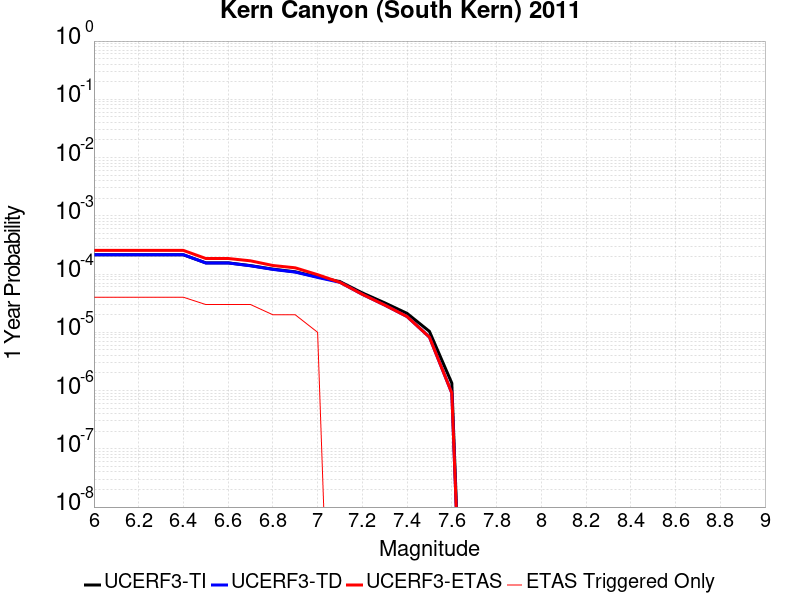 |  |

| Magnitude | 1 wk TI Prob | 1 wk TD Prob | 1 wk ETAS Prob | 1 wk ETAS/TD Gain | 1 wk ETAS Triggered Only | 1 mo TI Prob | 1 mo TD Prob | 1 mo ETAS Prob | 1 mo ETAS/TD Gain | 1 mo ETAS Triggered Only | 1 yr TI Prob | 1 yr TD Prob | 1 yr ETAS Prob | 1 yr ETAS/TD Gain | 1 yr ETAS Triggered Only | 10 yr TI Prob | 10 yr TD Prob | 10 yr ETAS Prob | 10 yr ETAS/TD Gain | 10 yr ETAS Triggered Only |
|-----|-----|-----|-----|-----|-----|-----|-----|-----|-----|-----|-----|-----|-----|-----|-----|-----|-----|-----|-----|-----|
| 6.0 | 4.105075E-6 | 4.1137673E-6 | 4.1137673E-6 | 1.0 | 0.0 | 1.7593058E-5 | 1.7630317E-5 | 2.763014E-5 | 1.5671948 | 1.0E-5 | 2.1417443E-4 | 2.146286E-4 | 2.5462E-4 | 1.1863284 | 4.0E-5 | 0.0021396813 | 0.002144277 | 0.002214127 | 1.032575 | 7.0E-5 |
| 6.1 | 4.105075E-6 | 4.1137673E-6 | 4.1137673E-6 | 1.0 | 0.0 | 1.7593058E-5 | 1.7630317E-5 | 2.763014E-5 | 1.5671948 | 1.0E-5 | 2.1417443E-4 | 2.146286E-4 | 2.5462E-4 | 1.1863284 | 4.0E-5 | 0.0021396813 | 0.002144277 | 0.002214127 | 1.032575 | 7.0E-5 |
| 6.2 | 4.105075E-6 | 4.1137673E-6 | 4.1137673E-6 | 1.0 | 0.0 | 1.7593058E-5 | 1.7630317E-5 | 2.763014E-5 | 1.5671948 | 1.0E-5 | 2.1417443E-4 | 2.146286E-4 | 2.5462E-4 | 1.1863284 | 4.0E-5 | 0.0021396813 | 0.002144277 | 0.002214127 | 1.032575 | 7.0E-5 |
| 6.3 | 4.105075E-6 | 4.1137673E-6 | 4.1137673E-6 | 1.0 | 0.0 | 1.7593058E-5 | 1.7630317E-5 | 2.763014E-5 | 1.5671948 | 1.0E-5 | 2.1417443E-4 | 2.146286E-4 | 2.5462E-4 | 1.1863284 | 4.0E-5 | 0.0021396813 | 0.002144277 | 0.002214127 | 1.032575 | 7.0E-5 |
| 6.4 | 4.105075E-6 | 4.1137673E-6 | 4.1137673E-6 | 1.0 | 0.0 | 1.7593058E-5 | 1.7630317E-5 | 2.763014E-5 | 1.5671948 | 1.0E-5 | 2.1417443E-4 | 2.146286E-4 | 2.5462E-4 | 1.1863284 | 4.0E-5 | 0.0021396813 | 0.002144277 | 0.002214127 | 1.032575 | 7.0E-5 |
| 6.5 | 2.9849807E-6 | 2.9731848E-6 | 2.9731848E-6 | 1.0 | 0.0 | 1.2792712E-5 | 1.2742159E-5 | 2.2742031E-5 | 1.7847863 | 1.0E-5 | 1.5574014E-4 | 1.5512489E-4 | 1.8512024E-4 | 1.1933626 | 3.0E-5 | 0.0015563103 | 0.0015501813 | 0.0016001037 | 1.0322043 | 5.0E-5 |
| 6.6 | 2.9849807E-6 | 2.9731848E-6 | 2.9731848E-6 | 1.0 | 0.0 | 1.2792712E-5 | 1.2742159E-5 | 2.2742031E-5 | 1.7847863 | 1.0E-5 | 1.5574014E-4 | 1.5512489E-4 | 1.8512024E-4 | 1.1933626 | 3.0E-5 | 0.0015563103 | 0.0015501813 | 0.0016001037 | 1.0322043 | 5.0E-5 |
| 6.7 | 2.6756725E-6 | 2.6582477E-6 | 2.6582477E-6 | 1.0 | 0.0 | 1.1467117E-5 | 1.1392441E-5 | 2.1392327E-5 | 1.877765 | 1.0E-5 | 1.396032E-4 | 1.3869425E-4 | 1.686901E-4 | 1.2162731 | 3.0E-5 | 0.0013951553 | 0.0013860879 | 0.0014360185 | 1.0360228 | 5.0E-5 |
| 6.8 | 2.3283721E-6 | 2.3048024E-6 | 2.3048024E-6 | 1.0 | 0.0 | 9.9787E-6 | 9.877688E-6 | 1.9877589E-5 | 2.0123727 | 1.0E-5 | 1.214839E-4 | 1.20254284E-4 | 1.4025188E-4 | 1.1662942 | 2.0E-5 | 0.001214175 | 0.0012018996 | 0.0012418515 | 1.0332407 | 4.0E-5 |
| 6.9 | 2.0972677E-6 | 2.0696625E-6 | 2.0696625E-6 | 1.0 | 0.0 | 8.988259E-6 | 8.869953E-6 | 1.8869863E-5 | 2.1273918 | 1.0E-5 | 1.0942656E-4 | 1.0798638E-4 | 1.2798423E-4 | 1.1851885 | 2.0E-5 | 0.0010937268 | 0.0010793449 | 0.0011093125 | 1.0277647 | 3.0E-5 |
| 7.0 | 1.7132242E-6 | 1.6787213E-6 | 1.6787213E-6 | 1.0 | 0.0 | 7.3423685E-6 | 7.1945E-6 | 7.1945E-6 | 1.0 | 0.0 | 8.938967E-5 | 8.758956E-5 | 9.758868E-5 | 1.1141589 | 1.0E-5 | 8.935372E-4 | 8.755542E-4 | 8.955367E-4 | 1.0228226 | 2.0E-5 |
| 7.1 | 1.4215541E-6 | 1.38159E-6 | 1.38159E-6 | 1.0 | 0.0 | 6.0923603E-6 | 5.9210865E-6 | 5.9210865E-6 | 1.0 | 0.0 | 7.417196E-5 | 7.208687E-5 | 7.208687E-5 | 1.0 | 0.0 | 7.414721E-4 | 7.206376E-4 | 7.3063036E-4 | 1.0138665 | 1.0E-5 |
| 7.2 | 9.097853E-7 | 8.603873E-7 | 8.603873E-7 | 1.0 | 0.0 | 3.899074E-6 | 3.687369E-6 | 3.687369E-6 | 1.0 | 0.0 | 4.7470192E-5 | 4.48928E-5 | 4.48928E-5 | 1.0 | 0.0 | 4.7460053E-4 | 4.488384E-4 | 4.588339E-4 | 1.0222697 | 1.0E-5 |
| 7.3 | 6.144169E-7 | 5.628273E-7 | 5.628273E-7 | 1.0 | 0.0 | 2.6332125E-6 | 2.412115E-6 | 2.412115E-6 | 1.0 | 0.0 | 3.205889E-5 | 2.936711E-5 | 2.936711E-5 | 1.0 | 0.0 | 3.2054266E-4 | 2.936328E-4 | 3.0362984E-4 | 1.0340462 | 1.0E-5 |
| 7.4 | 4.049844E-7 | 3.5728772E-7 | 3.5728772E-7 | 1.0 | 0.0 | 1.7356463E-6 | 1.5312322E-6 | 1.5312322E-6 | 1.0 | 0.0 | 2.1131287E-5 | 1.8642595E-5 | 1.8642595E-5 | 1.0 | 0.0 | 2.1129279E-4 | 1.8641056E-4 | 1.964087E-4 | 1.053635 | 1.0E-5 |
| 7.5 | 1.9871162E-7 | 1.5830682E-7 | 1.5830682E-7 | 1.0 | 0.0 | 8.5162094E-7 | 6.7845764E-7 | 6.7845764E-7 | 1.0 | 0.0 | 1.0368436E-5 | 8.260191E-6 | 8.260191E-6 | 1.0 | 0.0 | 1.0367952E-4 | 8.259893E-5 | 9.25981E-5 | 1.1210569 | 1.0E-5 |
| 7.6 | 2.572245E-8 | 1.7352884E-8 | 1.7352884E-8 | 1.0 | 0.0 | 1.10239064E-7 | 7.43695E-8 | 7.43695E-8 | 1.0 | 0.0 | 1.3421597E-6 | 9.0544836E-7 | 9.0544836E-7 | 1.0 | 0.0 | 1.3421517E-5 | 9.054452E-6 | 1.9054361E-5 | 2.104419 | 1.0E-5 |

## Scodie Lineament
*[(top)](#table-of-contents)*

| 1 Week | 1 Month | 1 Year | 10 Year |
|-----|-----|-----|-----|
|  |  |  |  |

| Magnitude | 1 wk TI Prob | 1 wk TD Prob | 1 wk ETAS Prob | 1 wk ETAS/TD Gain | 1 wk ETAS Triggered Only | 1 mo TI Prob | 1 mo TD Prob | 1 mo ETAS Prob | 1 mo ETAS/TD Gain | 1 mo ETAS Triggered Only | 1 yr TI Prob | 1 yr TD Prob | 1 yr ETAS Prob | 1 yr ETAS/TD Gain | 1 yr ETAS Triggered Only | 10 yr TI Prob | 10 yr TD Prob | 10 yr ETAS Prob | 10 yr ETAS/TD Gain | 10 yr ETAS Triggered Only |
|-----|-----|-----|-----|-----|-----|-----|-----|-----|-----|-----|-----|-----|-----|-----|-----|-----|-----|-----|-----|-----|
| 6.0 | 3.2919327E-6 | 3.0133992E-6 | 3.0133992E-6 | 1.0 | 0.0 | 1.4108206E-5 | 1.2914522E-5 | 1.2914522E-5 | 1.0 | 0.0 | 1.7175387E-4 | 1.5722614E-4 | 1.9721985E-4 | 1.2543706 | 4.0E-5 | 0.0017162118 | 0.0015714606 | 0.0016413506 | 1.0444746 | 7.0E-5 |
| 6.1 | 1.8663811E-6 | 1.5490858E-6 | 1.5490858E-6 | 1.0 | 0.0 | 7.998751E-6 | 6.6389252E-6 | 6.6389252E-6 | 1.0 | 0.0 | 9.738045E-5 | 8.082641E-5 | 9.0825604E-5 | 1.123712 | 1.0E-5 | 9.7337784E-4 | 8.0801896E-4 | 8.280028E-4 | 1.0247319 | 2.0E-5 |
| 6.2 | 1.8663811E-6 | 1.5490858E-6 | 1.5490858E-6 | 1.0 | 0.0 | 7.998751E-6 | 6.6389252E-6 | 6.6389252E-6 | 1.0 | 0.0 | 9.738045E-5 | 8.082641E-5 | 9.0825604E-5 | 1.123712 | 1.0E-5 | 9.7337784E-4 | 8.0801896E-4 | 8.280028E-4 | 1.0247319 | 2.0E-5 |
| 6.3 | 1.8663811E-6 | 1.5490858E-6 | 1.5490858E-6 | 1.0 | 0.0 | 7.998751E-6 | 6.6389252E-6 | 6.6389252E-6 | 1.0 | 0.0 | 9.738045E-5 | 8.082641E-5 | 9.0825604E-5 | 1.123712 | 1.0E-5 | 9.7337784E-4 | 8.0801896E-4 | 8.280028E-4 | 1.0247319 | 2.0E-5 |
| 6.4 | 1.8663811E-6 | 1.5490858E-6 | 1.5490858E-6 | 1.0 | 0.0 | 7.998751E-6 | 6.6389252E-6 | 6.6389252E-6 | 1.0 | 0.0 | 9.738045E-5 | 8.082641E-5 | 9.0825604E-5 | 1.123712 | 1.0E-5 | 9.7337784E-4 | 8.0801896E-4 | 8.280028E-4 | 1.0247319 | 2.0E-5 |
| 6.5 | 1.8106311E-6 | 1.4910186E-6 | 1.4910186E-6 | 1.0 | 0.0 | 7.759824E-6 | 6.3900666E-6 | 6.3900666E-6 | 1.0 | 0.0 | 9.447177E-5 | 7.779678E-5 | 7.779678E-5 | 1.0 | 0.0 | 9.4431615E-4 | 7.777441E-4 | 7.877363E-4 | 1.0128477 | 1.0E-5 |
| 6.6 | 1.2414679E-6 | 8.997782E-7 | 8.997782E-7 | 1.0 | 0.0 | 5.320566E-6 | 3.856187E-6 | 3.856187E-6 | 1.0 | 0.0 | 6.477596E-5 | 4.6948153E-5 | 4.6948153E-5 | 1.0 | 0.0 | 6.475708E-4 | 4.69391E-4 | 4.69391E-4 | 1.0 | 0.0 |
| 6.7 | 1.1062215E-6 | 7.5945076E-7 | 7.5945076E-7 | 1.0 | 0.0 | 4.7409408E-6 | 3.2547853E-6 | 3.2547853E-6 | 1.0 | 0.0 | 5.7719422E-5 | 3.962636E-5 | 3.962636E-5 | 1.0 | 0.0 | 5.770443E-4 | 3.9619993E-4 | 3.9619993E-4 | 1.0 | 0.0 |
| 6.8 | 1.0006736E-6 | 6.500572E-7 | 6.500572E-7 | 1.0 | 0.0 | 4.288594E-6 | 2.7859567E-6 | 2.7859567E-6 | 1.0 | 0.0 | 5.221238E-5 | 3.3918557E-5 | 3.3918557E-5 | 1.0 | 0.0 | 5.220012E-4 | 3.391399E-4 | 3.391399E-4 | 1.0 | 0.0 |
| 6.9 | 9.167364E-7 | 5.631784E-7 | 5.631784E-7 | 1.0 | 0.0 | 3.9288643E-6 | 2.4136198E-6 | 2.4136198E-6 | 1.0 | 0.0 | 4.7832873E-5 | 2.9385481E-5 | 2.9385481E-5 | 1.0 | 0.0 | 4.782258E-4 | 2.9382162E-4 | 2.9382162E-4 | 1.0 | 0.0 |
| 7.0 | 7.6987664E-7 | 4.113515E-7 | 4.113515E-7 | 1.0 | 0.0 | 3.2994672E-6 | 1.762934E-6 | 1.762934E-6 | 1.0 | 0.0 | 4.0170275E-5 | 2.146355E-5 | 2.146355E-5 | 1.0 | 0.0 | 4.0163012E-4 | 2.1461862E-4 | 2.1461862E-4 | 1.0 | 0.0 |
| 7.1 | 7.1038727E-7 | 3.5212707E-7 | 3.5212707E-7 | 1.0 | 0.0 | 3.0445133E-6 | 1.5091154E-6 | 1.5091154E-6 | 1.0 | 0.0 | 3.706632E-5 | 1.837336E-5 | 1.837336E-5 | 1.0 | 0.0 | 3.7060137E-4 | 1.837219E-4 | 1.837219E-4 | 1.0 | 0.0 |
| 7.2 | 2.0799602E-7 | 3.1190186E-8 | 3.1190186E-8 | 1.0 | 0.0 | 8.914113E-7 | 1.3367222E-7 | 1.3367222E-7 | 1.0 | 0.0 | 1.0852878E-5 | 1.6274581E-6 | 1.6274581E-6 | 1.0 | 0.0 | 1.08523476E-4 | 1.6274469E-5 | 1.6274469E-5 | 1.0 | 0.0 |
| 7.3 | 1.5048182E-7 | 1.5947961E-8 | 1.5947961E-8 | 1.0 | 0.0 | 6.449219E-7 | 6.8348406E-8 | 6.8348406E-8 | 1.0 | 0.0 | 7.851896E-6 | 8.3214155E-7 | 8.3214155E-7 | 1.0 | 0.0 | 7.851618E-5 | 8.321387E-6 | 8.321387E-6 | 1.0 | 0.0 |
| 7.4 | 5.9334678E-8 | 4.86919E-9 | 4.86919E-9 | 1.0 | 0.0 | 2.5429145E-7 | 2.0867958E-8 | 2.0867958E-8 | 1.0 | 0.0 | 3.095994E-6 | 2.5406737E-7 | 2.5406737E-7 | 1.0 | 0.0 | 3.095951E-5 | 2.5406719E-6 | 2.5406719E-6 | 1.0 | 0.0 |

## Owens Valley
*[(top)](#table-of-contents)*

| 1 Week | 1 Month | 1 Year | 10 Year |
|-----|-----|-----|-----|
|  | 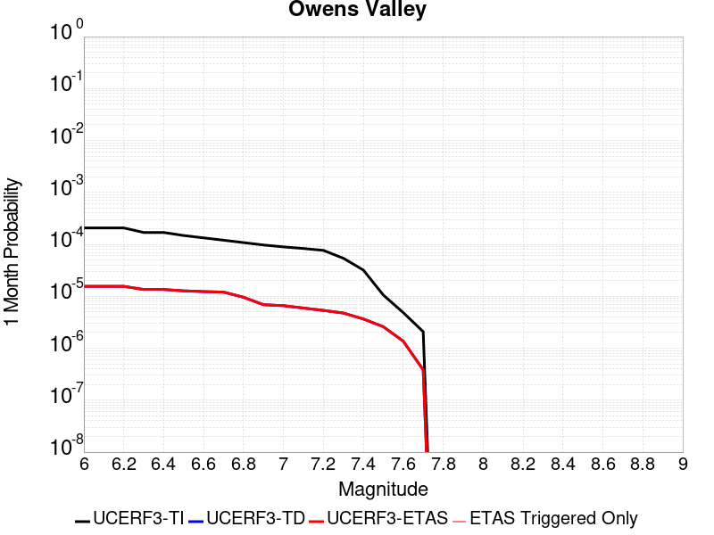 | 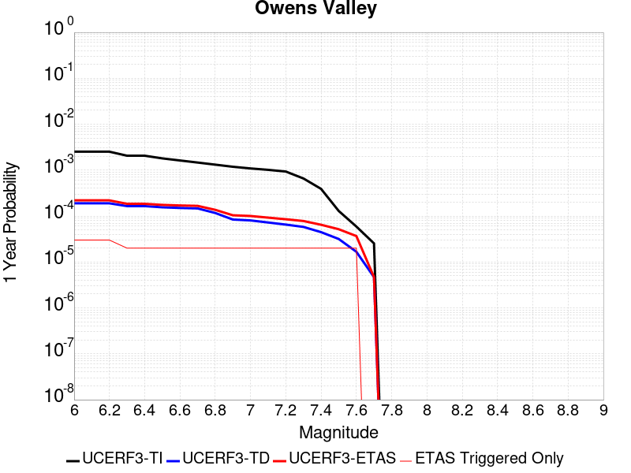 |  |

| Magnitude | 1 wk TI Prob | 1 wk TD Prob | 1 wk ETAS Prob | 1 wk ETAS/TD Gain | 1 wk ETAS Triggered Only | 1 mo TI Prob | 1 mo TD Prob | 1 mo ETAS Prob | 1 mo ETAS/TD Gain | 1 mo ETAS Triggered Only | 1 yr TI Prob | 1 yr TD Prob | 1 yr ETAS Prob | 1 yr ETAS/TD Gain | 1 yr ETAS Triggered Only | 10 yr TI Prob | 10 yr TD Prob | 10 yr ETAS Prob | 10 yr ETAS/TD Gain | 10 yr ETAS Triggered Only |
|-----|-----|-----|-----|-----|-----|-----|-----|-----|-----|-----|-----|-----|-----|-----|-----|-----|-----|-----|-----|-----|
| 6.0 | 4.83821E-5 | 3.6298834E-6 | 3.6298834E-6 | 1.0 | 0.0 | 2.0733538E-4 | 1.5556556E-5 | 1.5556556E-5 | 1.0 | 0.0 | 0.002521386 | 1.893856E-4 | 2.1937992E-4 | 1.1583769 | 3.0E-5 | 0.024929691 | 0.0019267192 | 0.0019965842 | 1.0362612 | 7.0E-5 |
| 6.1 | 4.83821E-5 | 3.6298834E-6 | 3.6298834E-6 | 1.0 | 0.0 | 2.0733538E-4 | 1.5556556E-5 | 1.5556556E-5 | 1.0 | 0.0 | 0.002521386 | 1.893856E-4 | 2.1937992E-4 | 1.1583769 | 3.0E-5 | 0.024929691 | 0.0019267192 | 0.0019965842 | 1.0362612 | 7.0E-5 |
| 6.2 | 4.83821E-5 | 3.6298834E-6 | 3.6298834E-6 | 1.0 | 0.0 | 2.0733538E-4 | 1.5556556E-5 | 1.5556556E-5 | 1.0 | 0.0 | 0.002521386 | 1.893856E-4 | 2.1937992E-4 | 1.1583769 | 3.0E-5 | 0.024929691 | 0.0019267192 | 0.0019965842 | 1.0362612 | 7.0E-5 |
| 6.3 | 3.953008E-5 | 3.1571942E-6 | 3.1571942E-6 | 1.0 | 0.0 | 1.6940363E-4 | 1.3530766E-5 | 1.3530766E-5 | 1.0 | 0.0 | 0.002060538 | 1.6472537E-4 | 1.8472207E-4 | 1.1213942 | 2.0E-5 | 0.020415364 | 0.0016601578 | 0.0017200581 | 1.0360812 | 6.0E-5 |
| 6.4 | 3.953008E-5 | 3.1571942E-6 | 3.1571942E-6 | 1.0 | 0.0 | 1.6940363E-4 | 1.3530766E-5 | 1.3530766E-5 | 1.0 | 0.0 | 0.002060538 | 1.6472537E-4 | 1.8472207E-4 | 1.1213942 | 2.0E-5 | 0.020415364 | 0.0016601578 | 0.0017200581 | 1.0360812 | 6.0E-5 |
| 6.5 | 3.457342E-5 | 2.9727623E-6 | 2.9727623E-6 | 1.0 | 0.0 | 1.4816338E-4 | 1.2740352E-5 | 1.2740352E-5 | 1.0 | 0.0 | 0.0018023965 | 1.5510344E-4 | 1.7510033E-4 | 1.1289262 | 2.0E-5 | 0.017878477 | 0.0015563503 | 0.0016162568 | 1.0384917 | 6.0E-5 |
| 6.6 | 3.1127765E-5 | 2.8753116E-6 | 2.8753116E-6 | 1.0 | 0.0 | 1.3339789E-4 | 1.232271E-5 | 1.232271E-5 | 1.0 | 0.0 | 0.0016229092 | 1.5001935E-4 | 1.7001636E-4 | 1.1332961 | 2.0E-5 | 0.016111081 | 0.0015016922 | 0.0015616021 | 1.0398949 | 6.0E-5 |
| 6.7 | 2.806885E-5 | 2.8110242E-6 | 2.8110242E-6 | 1.0 | 0.0 | 1.2028952E-4 | 1.2047194E-5 | 1.2047194E-5 | 1.0 | 0.0 | 0.001463541 | 1.466654E-4 | 1.6666247E-4 | 1.1363448 | 2.0E-5 | 0.014539397 | 0.0014660707 | 0.0015259826 | 1.0408658 | 6.0E-5 |
| 6.8 | 2.524524E-5 | 2.2358972E-6 | 2.2358972E-6 | 1.0 | 0.0 | 1.0818939E-4 | 9.582383E-6 | 9.582383E-6 | 1.0 | 0.0 | 0.0013164099 | 1.16659576E-4 | 1.3665724E-4 | 1.171419 | 2.0E-5 | 0.01308639 | 0.001166257 | 0.001226187 | 1.0513866 | 6.0E-5 |
| 6.9 | 2.2704568E-5 | 1.6085578E-6 | 1.6085578E-6 | 1.0 | 0.0 | 9.730166E-5 | 6.893801E-6 | 6.893801E-6 | 1.0 | 0.0 | 0.0011840039 | 8.392881E-5 | 1.0392713E-4 | 1.2382772 | 2.0E-5 | 0.011777153 | 8.391837E-4 | 8.9913333E-4 | 1.0714381 | 6.0E-5 |
| 7.0 | 2.0871712E-5 | 1.5399135E-6 | 1.5399135E-6 | 1.0 | 0.0 | 8.944713E-5 | 6.5996123E-6 | 6.5996123E-6 | 1.0 | 0.0 | 0.0010884746 | 8.034734E-5 | 1.0034573E-4 | 1.2488992 | 2.0E-5 | 0.010831586 | 8.0335594E-4 | 8.6330774E-4 | 1.0746267 | 6.0E-5 |
| 7.1 | 1.944928E-5 | 1.3867325E-6 | 1.3867325E-6 | 1.0 | 0.0 | 8.335139E-5 | 5.943126E-6 | 5.943126E-6 | 1.0 | 0.0 | 0.0010143308 | 7.2355164E-5 | 9.2353715E-5 | 1.2763942 | 2.0E-5 | 0.010097133 | 7.23475E-4 | 7.7343883E-4 | 1.0690609 | 5.0E-5 |
| 7.2 | 1.7876306E-5 | 1.249191E-6 | 1.249191E-6 | 1.0 | 0.0 | 7.6610486E-5 | 5.3536646E-6 | 5.3536646E-6 | 1.0 | 0.0 | 9.3233347E-4 | 6.517892E-5 | 8.517762E-5 | 1.3068277 | 2.0E-5 | 0.009284316 | 6.517364E-4 | 7.0170383E-4 | 1.0766681 | 5.0E-5 |
| 7.3 | 1.2618672E-5 | 1.1117779E-6 | 1.1117779E-6 | 1.0 | 0.0 | 5.40789E-5 | 4.764754E-6 | 4.764754E-6 | 1.0 | 0.0 | 6.582117E-4 | 5.8009344E-5 | 7.800818E-5 | 1.3447521 | 2.0E-5 | 0.0065626553 | 5.800754E-4 | 6.200522E-4 | 1.0689166 | 4.0E-5 |
| 7.4 | 7.4874442E-6 | 8.550806E-7 | 8.550806E-7 | 1.0 | 0.0 | 3.208865E-5 | 3.6646259E-6 | 3.6646259E-6 | 1.0 | 0.0 | 3.906093E-4 | 4.461591E-5 | 6.461502E-5 | 1.4482505 | 2.0E-5 | 0.003899234 | 4.461625E-4 | 4.8614468E-4 | 1.0896134 | 4.0E-5 |
| 7.5 | 2.4734156E-6 | 6.0700546E-7 | 6.0700546E-7 | 1.0 | 0.0 | 1.060031E-5 | 2.6014495E-6 | 2.6014495E-6 | 1.0 | 0.0 | 1.2905113E-4 | 3.167219E-5 | 5.1671555E-5 | 1.6314489 | 2.0E-5 | 0.0012897621 | 3.166771E-4 | 3.5666442E-4 | 1.1262716 | 4.0E-5 |
| 7.6 | 1.1328841E-6 | 3.1972448E-7 | 3.1972448E-7 | 1.0 | 0.0 | 4.8552088E-6 | 1.3702471E-6 | 1.3702471E-6 | 1.0 | 0.0 | 5.9110564E-5 | 1.6682632E-5 | 3.6682297E-5 | 2.1988316 | 2.0E-5 | 5.9094845E-4 | 1.6681399E-4 | 1.9680898E-4 | 1.179811 | 3.0E-5 |
| 7.7 | 4.8613185E-7 | 8.967469E-8 | 8.967469E-8 | 1.0 | 0.0 | 2.0834207E-6 | 3.8432006E-7 | 3.8432006E-7 | 1.0 | 0.0 | 2.536535E-5 | 4.6790874E-6 | 4.6790874E-6 | 1.0 | 0.0 | 2.5362454E-4 | 4.678996E-5 | 4.678996E-5 | 1.0 | 0.0 |

## Oceanic - West Huasna
*[(top)](#table-of-contents)*

| 1 Week | 1 Month | 1 Year | 10 Year |
|-----|-----|-----|-----|
|  | 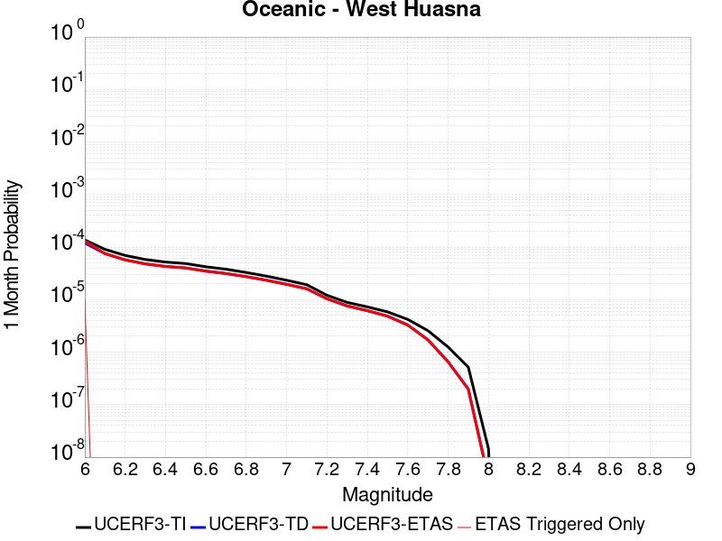 | 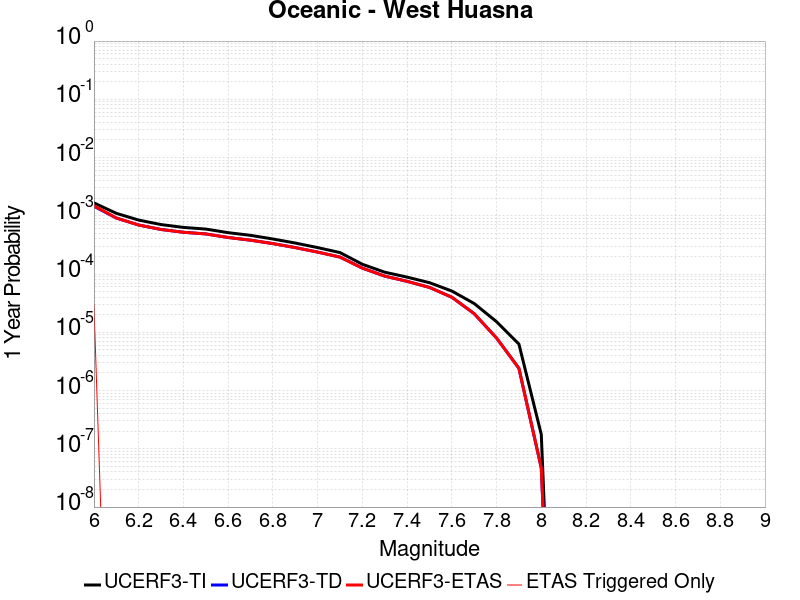 |  |

| Magnitude | 1 wk TI Prob | 1 wk TD Prob | 1 wk ETAS Prob | 1 wk ETAS/TD Gain | 1 wk ETAS Triggered Only | 1 mo TI Prob | 1 mo TD Prob | 1 mo ETAS Prob | 1 mo ETAS/TD Gain | 1 mo ETAS Triggered Only | 1 yr TI Prob | 1 yr TD Prob | 1 yr ETAS Prob | 1 yr ETAS/TD Gain | 1 yr ETAS Triggered Only | 10 yr TI Prob | 10 yr TD Prob | 10 yr ETAS Prob | 10 yr ETAS/TD Gain | 10 yr ETAS Triggered Only |
|-----|-----|-----|-----|-----|-----|-----|-----|-----|-----|-----|-----|-----|-----|-----|-----|-----|-----|-----|-----|-----|
| 6.0 | 3.195567E-5 | 2.792801E-5 | 2.792801E-5 | 1.0 | 0.0 | 1.3694567E-4 | 1.1968623E-4 | 1.2968502E-4 | 1.0835418 | 1.0E-5 | 0.0016660384 | 0.0014562489 | 0.0014862053 | 1.0205709 | 3.0E-5 | 0.016536033 | 0.014471616 | 0.014530747 | 1.004086 | 6.0E-5 |
| 6.1 | 2.1156782E-5 | 1.7574157E-5 | 1.7574157E-5 | 1.0 | 0.0 | 9.066878E-5 | 7.53157E-5 | 7.53157E-5 | 1.0 | 0.0 | 0.0011033333 | 9.1659225E-4 | 9.1659225E-4 | 1.0 | 0.0 | 0.010978713 | 0.009129126 | 0.009129126 | 1.0 | 0.0 |
| 6.2 | 1.6195117E-5 | 1.332762E-5 | 1.332762E-5 | 1.0 | 0.0 | 6.9405796E-5 | 5.7117133E-5 | 5.7117133E-5 | 1.0 | 0.0 | 8.44688E-4 | 6.9518184E-4 | 6.9518184E-4 | 1.0 | 0.0 | 0.008414844 | 0.006930365 | 0.006930365 | 1.0 | 0.0 |
| 6.3 | 1.3559345E-5 | 1.1179509E-5 | 1.1179509E-5 | 1.0 | 0.0 | 5.811018E-5 | 4.7911308E-5 | 4.7911308E-5 | 1.0 | 0.0 | 7.072618E-4 | 5.83165E-4 | 5.83165E-4 | 1.0 | 0.0 | 0.0070501505 | 0.0058164652 | 0.0058164652 | 1.0 | 0.0 |
| 6.4 | 1.2120619E-5 | 1.0001292E-5 | 1.0001292E-5 | 1.0 | 0.0 | 5.1944477E-5 | 4.286198E-5 | 4.286198E-5 | 1.0 | 0.0 | 6.322405E-4 | 5.2172015E-4 | 5.2172015E-4 | 1.0 | 0.0 | 0.006304447 | 0.005205021 | 0.005205021 | 1.0 | 0.0 |
| 6.5 | 1.13511915E-5 | 9.3677645E-6 | 9.3677645E-6 | 1.0 | 0.0 | 4.8647056E-5 | 4.0146948E-5 | 4.0146948E-5 | 1.0 | 0.0 | 5.9211696E-4 | 4.886799E-4 | 4.886799E-4 | 1.0 | 0.0 | 0.0059054173 | 0.004876112 | 0.004876112 | 1.0 | 0.0 |
| 6.6 | 9.850605E-6 | 8.135666E-6 | 8.135666E-6 | 1.0 | 0.0 | 4.2216197E-5 | 3.4866673E-5 | 3.4866673E-5 | 1.0 | 0.0 | 5.1386096E-4 | 4.2441927E-4 | 4.2441927E-4 | 1.0 | 0.0 | 0.0051267436 | 0.0042361193 | 0.0042361193 | 1.0 | 0.0 |
| 6.7 | 8.8558645E-6 | 7.3186534E-6 | 7.3186534E-6 | 1.0 | 0.0 | 3.7953152E-5 | 3.136528E-5 | 3.136528E-5 | 1.0 | 0.0 | 4.6198163E-4 | 3.8180556E-4 | 3.8180556E-4 | 1.0 | 0.0 | 0.004610224 | 0.0038115215 | 0.0038115215 | 1.0 | 0.0 |
| 6.8 | 7.67136E-6 | 6.3919483E-6 | 6.3919483E-6 | 1.0 | 0.0 | 3.2876844E-5 | 2.7393779E-5 | 2.7393779E-5 | 1.0 | 0.0 | 4.0020206E-4 | 3.3346837E-4 | 3.3346837E-4 | 1.0 | 0.0 | 0.003994821 | 0.0033297008 | 0.0033297008 | 1.0 | 0.0 |
| 6.9 | 6.534529E-6 | 5.4584953E-6 | 5.4584953E-6 | 1.0 | 0.0 | 2.8004823E-5 | 2.3393342E-5 | 2.3393342E-5 | 1.0 | 0.0 | 3.4090536E-4 | 2.8477685E-4 | 2.8477685E-4 | 1.0 | 0.0 | 0.0034038287 | 0.002844136 | 0.002844136 | 1.0 | 0.0 |
| 7.0 | 5.460525E-6 | 4.570095E-6 | 4.570095E-6 | 1.0 | 0.0 | 2.3402039E-5 | 1.9585976E-5 | 1.9585976E-5 | 1.0 | 0.0 | 2.8488258E-4 | 2.3843326E-4 | 2.3843326E-4 | 1.0 | 0.0 | 0.0028451765 | 0.0023817883 | 0.0023817883 | 1.0 | 0.0 |
| 7.1 | 4.4825083E-6 | 3.7525715E-6 | 3.7525715E-6 | 1.0 | 0.0 | 1.9210609E-5 | 1.6082351E-5 | 1.6082351E-5 | 1.0 | 0.0 | 2.3386406E-4 | 1.9578513E-4 | 1.9578513E-4 | 1.0 | 0.0 | 0.002336181 | 0.0019561385 | 0.0019561385 | 1.0 | 0.0 |
| 7.2 | 2.821708E-6 | 2.4250364E-6 | 2.4250364E-6 | 1.0 | 0.0 | 1.2092979E-5 | 1.03929715E-5 | 1.03929715E-5 | 1.0 | 0.0 | 1.4722206E-4 | 1.265271E-4 | 1.265271E-4 | 1.0 | 0.0 | 0.0014712457 | 0.001264553 | 0.001264553 | 1.0 | 0.0 |
| 7.3 | 2.0644757E-6 | 1.7688327E-6 | 1.7688327E-6 | 1.0 | 0.0 | 8.847723E-6 | 7.5806893E-6 | 7.5806893E-6 | 1.0 | 0.0 | 1.0771569E-4 | 9.229099E-5 | 9.229099E-5 | 1.0 | 0.0 | 0.001076635 | 9.225283E-4 | 9.225283E-4 | 1.0 | 0.0 |
| 7.4 | 1.6980367E-6 | 1.4380759E-6 | 1.4380759E-6 | 1.0 | 0.0 | 7.27728E-6 | 6.1631677E-6 | 6.1631677E-6 | 1.0 | 0.0 | 8.8597284E-5 | 7.503398E-5 | 7.503398E-5 | 1.0 | 0.0 | 8.8561967E-4 | 7.500881E-4 | 7.500881E-4 | 1.0 | 0.0 |
| 7.5 | 1.3637683E-6 | 1.130346E-6 | 1.130346E-6 | 1.0 | 0.0 | 5.844708E-6 | 4.844331E-6 | 4.844331E-6 | 1.0 | 0.0 | 7.1156996E-5 | 5.897814E-5 | 5.897814E-5 | 1.0 | 0.0 | 7.1134215E-4 | 5.896264E-4 | 5.896264E-4 | 1.0 | 0.0 |
| 7.6 | 9.802994E-7 | 7.6780117E-7 | 7.6780117E-7 | 1.0 | 0.0 | 4.2012766E-6 | 3.290572E-6 | 3.290572E-6 | 1.0 | 0.0 | 5.1149345E-5 | 4.006198E-5 | 4.006198E-5 | 1.0 | 0.0 | 5.113757E-4 | 4.00549E-4 | 4.00549E-4 | 1.0 | 0.0 |
| 7.7 | 5.986191E-7 | 4.005761E-7 | 4.005761E-7 | 1.0 | 0.0 | 2.5655079E-6 | 1.7167536E-6 | 1.7167536E-6 | 1.0 | 0.0 | 3.1234613E-5 | 2.0901274E-5 | 2.0901274E-5 | 1.0 | 0.0 | 3.123022E-4 | 2.0899443E-4 | 2.0899443E-4 | 1.0 | 0.0 |
| 7.8 | 2.9189815E-7 | 1.529205E-7 | 1.529205E-7 | 1.0 | 0.0 | 1.2509914E-6 | 6.553734E-7 | 6.553734E-7 | 1.0 | 0.0 | 1.5230714E-5 | 7.9791425E-6 | 7.9791425E-6 | 1.0 | 0.0 | 1.522967E-4 | 7.978987E-5 | 7.978987E-5 | 1.0 | 0.0 |
| 7.9 | 1.2057845E-7 | 4.6247223E-8 | 4.6247223E-8 | 1.0 | 0.0 | 5.1676466E-7 | 1.9820237E-7 | 1.9820237E-7 | 1.0 | 0.0 | 6.2915915E-6 | 2.4131111E-6 | 2.4131111E-6 | 1.0 | 0.0 | 6.2914136E-5 | 2.4132154E-5 | 2.4132154E-5 | 1.0 | 0.0 |
| 8.0 | 3.3806387E-9 | 9.024813E-10 | 9.024813E-10 | 1.0 | 0.0 | 1.4488451E-8 | 3.8677777E-9 | 3.8677777E-9 | 1.0 | 0.0 | 1.7639688E-7 | 4.7090193E-8 | 4.7090193E-8 | 1.0 | 0.0 | 1.7639674E-6 | 4.7199646E-7 | 4.7199646E-7 | 1.0 | 0.0 |

## Imperial
*[(top)](#table-of-contents)*

| 1 Week | 1 Month | 1 Year | 10 Year |
|-----|-----|-----|-----|
|  |  |  |  |

| Magnitude | 1 wk TI Prob | 1 wk TD Prob | 1 wk ETAS Prob | 1 wk ETAS/TD Gain | 1 wk ETAS Triggered Only | 1 mo TI Prob | 1 mo TD Prob | 1 mo ETAS Prob | 1 mo ETAS/TD Gain | 1 mo ETAS Triggered Only | 1 yr TI Prob | 1 yr TD Prob | 1 yr ETAS Prob | 1 yr ETAS/TD Gain | 1 yr ETAS Triggered Only | 10 yr TI Prob | 10 yr TD Prob | 10 yr ETAS Prob | 10 yr ETAS/TD Gain | 10 yr ETAS Triggered Only |
|-----|-----|-----|-----|-----|-----|-----|-----|-----|-----|-----|-----|-----|-----|-----|-----|-----|-----|-----|-----|-----|
| 6.0 | 2.7496446E-4 | 5.060379E-4 | 5.060379E-4 | 1.0 | 0.0 | 0.0011778869 | 0.0021669706 | 0.0021669706 | 1.0 | 0.0 | 0.0142467655 | 0.026064837 | 0.026094057 | 1.0011209 | 3.0E-5 | 0.13367249 | 0.22821419 | 0.2282605 | 1.0002029 | 6.0E-5 |
| 6.1 | 2.5356023E-4 | 4.8701192E-4 | 4.8701192E-4 | 1.0 | 0.0 | 0.001086234 | 0.0020855628 | 0.0020855628 | 1.0 | 0.0 | 0.013144928 | 0.02509391 | 0.025123157 | 1.0011655 | 3.0E-5 | 0.123940155 | 0.21963087 | 0.21967769 | 1.0002131 | 6.0E-5 |
| 6.2 | 2.4820742E-4 | 4.7795815E-4 | 4.7795815E-4 | 1.0 | 0.0 | 0.0010633124 | 0.0020468219 | 0.0020468219 | 1.0 | 0.0 | 0.01286919 | 0.024633536 | 0.024662796 | 1.0011878 | 3.0E-5 | 0.12148927 | 0.21613504 | 0.21618208 | 1.0002176 | 6.0E-5 |
| 6.3 | 2.3205351E-4 | 4.5929378E-4 | 4.5929378E-4 | 1.0 | 0.0 | 9.94136E-4 | 0.001966954 | 0.001966954 | 1.0 | 0.0 | 0.012036599 | 0.02368102 | 0.02371031 | 1.0012368 | 3.0E-5 | 0.11405133 | 0.20807077 | 0.20811827 | 1.0002284 | 6.0E-5 |
| 6.4 | 2.0304754E-4 | 3.991441E-4 | 3.991441E-4 | 1.0 | 0.0 | 8.6991355E-4 | 0.0017095108 | 0.0017095108 | 1.0 | 0.0 | 0.010539869 | 0.020614926 | 0.020644307 | 1.0014253 | 3.0E-5 | 0.100537635 | 0.18520407 | 0.18525296 | 1.0002639 | 6.0E-5 |
| 6.5 | 1.854992E-4 | 3.702423E-4 | 3.702423E-4 | 1.0 | 0.0 | 7.9475436E-4 | 0.0015858002 | 0.0015858002 | 1.0 | 0.0 | 0.009633281 | 0.01913749 | 0.019166917 | 1.0015376 | 3.0E-5 | 0.0922623 | 0.17342903 | 0.17347036 | 1.0002383 | 5.0E-5 |
| 6.6 | 1.6586106E-4 | 3.406714E-4 | 3.406714E-4 | 1.0 | 0.0 | 7.106394E-4 | 0.0014592134 | 0.0014592134 | 1.0 | 0.0 | 0.008617763 | 0.017622843 | 0.017652314 | 1.0016724 | 3.0E-5 | 0.08291132 | 0.16089731 | 0.16093928 | 1.0002607 | 5.0E-5 |
| 6.7 | 1.4224656E-4 | 3.0794923E-4 | 3.0794923E-4 | 1.0 | 0.0 | 6.094856E-4 | 0.0013191231 | 0.0013191231 | 1.0 | 0.0 | 0.0073952693 | 0.015943963 | 0.015973484 | 1.0018516 | 3.0E-5 | 0.07153955 | 0.14659329 | 0.14663596 | 1.0002911 | 5.0E-5 |
| 6.8 | 1.2317259E-4 | 2.781478E-4 | 2.781478E-4 | 1.0 | 0.0 | 5.2777573E-4 | 0.0011915236 | 0.0011915236 | 1.0 | 0.0 | 0.0064067547 | 0.0144116925 | 0.01444126 | 1.0020516 | 3.0E-5 | 0.06225166 | 0.13303171 | 0.13307506 | 1.0003258 | 5.0E-5 |
| 6.9 | 9.859898E-5 | 2.503195E-4 | 2.503195E-4 | 1.0 | 0.0 | 4.2249862E-4 | 0.0010723611 | 0.0010723611 | 1.0 | 0.0 | 0.0051317946 | 0.012978803 | 0.013008415 | 1.0022814 | 3.0E-5 | 0.05014893 | 0.11947842 | 0.119522445 | 1.0003685 | 5.0E-5 |
| 7.0 | 7.3191884E-5 | 2.127993E-4 | 2.127993E-4 | 1.0 | 0.0 | 3.136418E-4 | 9.116815E-4 | 9.116815E-4 | 1.0 | 0.0 | 0.003811904 | 0.011043918 | 0.0110735865 | 1.0026864 | 3.0E-5 | 0.037471764 | 0.10211917 | 0.10216407 | 1.0004396 | 5.0E-5 |
| 7.1 | 7.1760296E-5 | 2.0981116E-4 | 2.0981116E-4 | 1.0 | 0.0 | 3.0750787E-4 | 8.9888397E-4 | 8.9888397E-4 | 1.0 | 0.0 | 0.003737482 | 0.010889676 | 0.010919349 | 1.0027249 | 3.0E-5 | 0.03675245 | 0.10075505 | 0.100800015 | 1.0004462 | 5.0E-5 |
| 7.2 | 6.46614E-5 | 1.9149172E-4 | 1.9149172E-4 | 1.0 | 0.0 | 2.7709085E-4 | 8.204237E-4 | 8.204237E-4 | 1.0 | 0.0 | 0.0033683628 | 0.009943534 | 0.009973235 | 1.002987 | 3.0E-5 | 0.033177625 | 0.09256114 | 0.092606515 | 1.0004902 | 5.0E-5 |
| 7.3 | 6.088115E-5 | 1.7820326E-4 | 1.7820326E-4 | 1.0 | 0.0 | 2.6089314E-4 | 7.635076E-4 | 7.635076E-4 | 1.0 | 0.0 | 0.0031717476 | 0.009256661 | 0.009286383 | 1.0032109 | 3.0E-5 | 0.031268585 | 0.08661022 | 0.086655885 | 1.0005273 | 5.0E-5 |
| 7.4 | 4.199346E-5 | 1.1519547E-4 | 1.1519547E-4 | 1.0 | 0.0 | 1.7995955E-4 | 4.9360236E-4 | 4.9360236E-4 | 1.0 | 0.0 | 0.0021888057 | 0.0059932186 | 0.006023039 | 1.0049757 | 3.0E-5 | 0.02167372 | 0.05748037 | 0.05751807 | 1.0006559 | 4.0E-5 |
| 7.5 | 3.130448E-5 | 8.340871E-5 | 8.340871E-5 | 1.0 | 0.0 | 1.3415517E-4 | 3.5741724E-4 | 3.5741724E-4 | 1.0 | 0.0 | 0.0016321153 | 0.0043429323 | 0.004372802 | 1.0068778 | 3.0E-5 | 0.016201803 | 0.04216626 | 0.042204574 | 1.0009086 | 4.0E-5 |
| 7.6 | 2.3074248E-5 | 6.0909417E-5 | 6.0909417E-5 | 1.0 | 0.0 | 9.888588E-5 | 2.610144E-4 | 2.610144E-4 | 1.0 | 0.0 | 0.0012032706 | 0.0031732426 | 0.0031931791 | 1.0062827 | 2.0E-5 | 0.011967761 | 0.031055957 | 0.031085026 | 1.000936 | 3.0E-5 |
| 7.7 | 1.45864815E-5 | 4.0178427E-5 | 4.0178427E-5 | 1.0 | 0.0 | 6.2511994E-5 | 1.7218193E-4 | 1.7218193E-4 | 1.0 | 0.0 | 7.608177E-4 | 0.002094305 | 0.002114263 | 1.0095297 | 2.0E-5 | 0.007582182 | 0.020652408 | 0.020681787 | 1.0014226 | 3.0E-5 |
| 7.8 | 1.0352979E-5 | 3.1006606E-5 | 3.1006606E-5 | 1.0 | 0.0 | 4.4369157E-5 | 1.328787E-4 | 1.328787E-4 | 1.0 | 0.0 | 5.400606E-4 | 0.0016166 | 0.0016365676 | 1.0123516 | 2.0E-5 | 0.0053875 | 0.016037801 | 0.01606732 | 1.0018406 | 3.0E-5 |
| 7.9 | 8.137906E-6 | 2.2185837E-5 | 2.2185837E-5 | 1.0 | 0.0 | 3.4876273E-5 | 9.50787E-5 | 9.50787E-5 | 1.0 | 0.0 | 4.2453592E-4 | 0.0011569695 | 0.0011769463 | 1.0172665 | 2.0E-5 | 0.004237258 | 0.011635021 | 0.011664672 | 1.0025485 | 3.0E-5 |
| 8.0 | 6.93792E-6 | 1.8040371E-5 | 1.8040371E-5 | 1.0 | 0.0 | 2.9733603E-5 | 7.731359E-5 | 7.731359E-5 | 1.0 | 0.0 | 3.6194647E-4 | 9.408872E-4 | 9.608684E-4 | 1.0212365 | 2.0E-5 | 0.0036135751 | 0.00951638 | 0.009536189 | 1.0020816 | 2.0E-5 |
| 8.1 | 3.4286315E-6 | 6.39459E-6 | 6.39459E-6 | 1.0 | 0.0 | 1.4694053E-5 | 2.7405098E-5 | 2.7405098E-5 | 1.0 | 0.0 | 1.7888541E-4 | 3.336061E-4 | 3.4360276E-4 | 1.0299655 | 1.0E-5 | 0.0017874148 | 0.003493339 | 0.0035033042 | 1.0028526 | 1.0E-5 |
| 8.2 | 1.4906886E-6 | 1.9424117E-6 | 1.9424117E-6 | 1.0 | 0.0 | 6.3886496E-6 | 8.324595E-6 | 8.324595E-6 | 1.0 | 0.0 | 7.7779034E-5 | 1.0134726E-4 | 1.0134726E-4 | 1.0 | 0.0 | 7.775182E-4 | 0.0011104804 | 0.0011104804 | 1.0 | 0.0 |
| 8.3 | 2.5758007E-8 | 1.45585295E-8 | 1.45585295E-8 | 1.0 | 0.0 | 1.10391454E-7 | 6.23937E-8 | 6.23937E-8 | 1.0 | 0.0 | 1.3440151E-6 | 7.596433E-7 | 7.596433E-7 | 1.0 | 0.0 | 1.344007E-5 | 7.918924E-6 | 7.918924E-6 | 1.0 | 0.0 |

## Big Pine (Central)
*[(top)](#table-of-contents)*

| 1 Week | 1 Month | 1 Year | 10 Year |
|-----|-----|-----|-----|
|  |  | 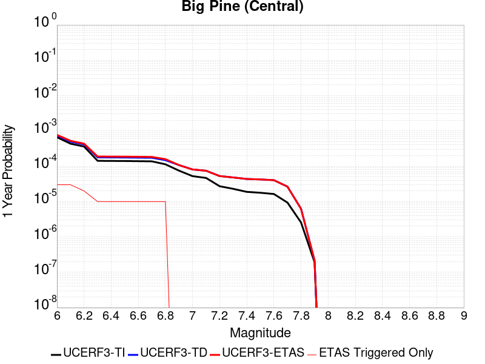 | 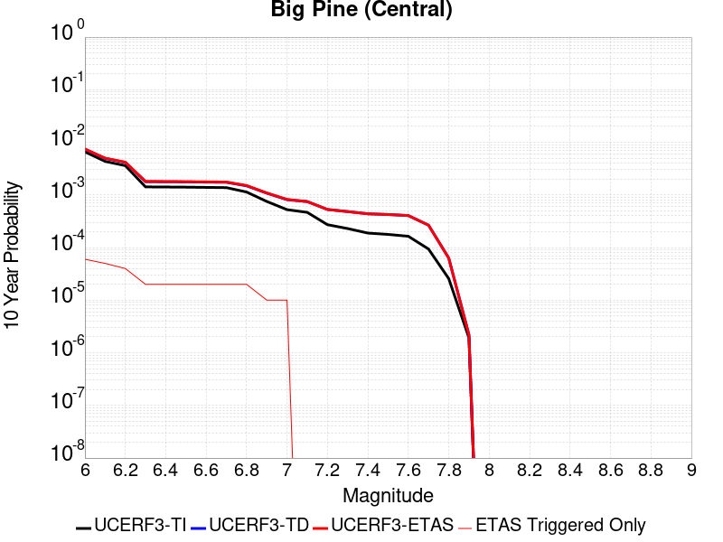 |

| Magnitude | 1 wk TI Prob | 1 wk TD Prob | 1 wk ETAS Prob | 1 wk ETAS/TD Gain | 1 wk ETAS Triggered Only | 1 mo TI Prob | 1 mo TD Prob | 1 mo ETAS Prob | 1 mo ETAS/TD Gain | 1 mo ETAS Triggered Only | 1 yr TI Prob | 1 yr TD Prob | 1 yr ETAS Prob | 1 yr ETAS/TD Gain | 1 yr ETAS Triggered Only | 10 yr TI Prob | 10 yr TD Prob | 10 yr ETAS Prob | 10 yr ETAS/TD Gain | 10 yr ETAS Triggered Only |
|-----|-----|-----|-----|-----|-----|-----|-----|-----|-----|-----|-----|-----|-----|-----|-----|-----|-----|-----|-----|-----|
| 6.0 | 1.2706755E-5 | 1.4252463E-5 | 1.4252463E-5 | 1.0 | 0.0 | 5.4456385E-5 | 6.108076E-5 | 7.1080154E-5 | 1.1637076 | 1.0E-5 | 6.628048E-4 | 7.434411E-4 | 7.734188E-4 | 1.0403229 | 3.0E-5 | 0.006608314 | 0.007414557 | 0.0074741123 | 1.0080322 | 6.0E-5 |
| 6.1 | 8.342579E-6 | 9.512481E-6 | 9.512481E-6 | 1.0 | 0.0 | 3.5753423E-5 | 4.076726E-5 | 5.0766852E-5 | 1.2452849 | 1.0E-5 | 4.3521097E-4 | 4.9625005E-4 | 5.2623515E-4 | 1.0604234 | 3.0E-5 | 0.0043435963 | 0.0049549625 | 0.0050047147 | 1.0100409 | 5.0E-5 |
| 6.2 | 6.923899E-6 | 7.968794E-6 | 7.968794E-6 | 1.0 | 0.0 | 2.9673516E-5 | 3.4151635E-5 | 4.4151293E-5 | 1.2928017 | 1.0E-5 | 3.6121515E-4 | 4.1573608E-4 | 4.3572776E-4 | 1.0480875 | 2.0E-5 | 0.003606286 | 0.00415288 | 0.004192714 | 1.0095918 | 4.0E-5 |
| 6.3 | 2.728396E-6 | 3.4257378E-6 | 3.4257378E-6 | 1.0 | 0.0 | 1.1693074E-5 | 1.4681656E-5 | 1.4681656E-5 | 1.0 | 0.0 | 1.4235388E-4 | 1.7873537E-4 | 1.8873358E-4 | 1.0559386 | 1.0E-5 | 0.0014226272 | 0.0017874117 | 0.001807376 | 1.0111693 | 2.0E-5 |
| 6.4 | 2.7136944E-6 | 3.4100306E-6 | 3.4100306E-6 | 1.0 | 0.0 | 1.1630066E-5 | 1.461434E-5 | 1.461434E-5 | 1.0 | 0.0 | 1.4158686E-4 | 1.7791594E-4 | 1.8791415E-4 | 1.0561963 | 1.0E-5 | 0.0014149669 | 0.0017792305 | 0.001799195 | 1.0112208 | 2.0E-5 |
| 6.5 | 2.6971882E-6 | 3.392375E-6 | 3.392375E-6 | 1.0 | 0.0 | 1.1559327E-5 | 1.4538674E-5 | 1.4538674E-5 | 1.0 | 0.0 | 1.4072572E-4 | 1.7699486E-4 | 1.8699309E-4 | 1.0564889 | 1.0E-5 | 0.0014063664 | 0.0017700344 | 0.001789999 | 1.0112792 | 2.0E-5 |
| 6.6 | 2.669092E-6 | 3.3623944E-6 | 3.3623944E-6 | 1.0 | 0.0 | 1.1438916E-5 | 1.4410188E-5 | 1.4410188E-5 | 1.0 | 0.0 | 1.3925991E-4 | 1.7543077E-4 | 1.8542902E-4 | 1.0569925 | 1.0E-5 | 0.0013917267 | 0.0017544184 | 0.0017743834 | 1.0113798 | 2.0E-5 |
| 6.7 | 2.6408059E-6 | 3.332419E-6 | 3.332419E-6 | 1.0 | 0.0 | 1.1317691E-5 | 1.4281723E-5 | 1.4281723E-5 | 1.0 | 0.0 | 1.3778417E-4 | 1.7386697E-4 | 1.8386524E-4 | 1.0575052 | 1.0E-5 | 0.0013769877 | 0.001738805 | 0.0017587702 | 1.0114821 | 2.0E-5 |
| 6.8 | 2.1786943E-6 | 2.8558686E-6 | 2.8558686E-6 | 1.0 | 0.0 | 9.337228E-6 | 1.2239383E-5 | 1.2239383E-5 | 1.0 | 0.0 | 1.1367482E-4 | 1.4900503E-4 | 1.5900354E-4 | 1.0671018 | 1.0E-5 | 0.0011361669 | 0.0014905332 | 0.0015105035 | 1.013398 | 2.0E-5 |
| 6.9 | 1.4411696E-6 | 2.0698712E-6 | 2.0698712E-6 | 1.0 | 0.0 | 6.1764263E-6 | 8.870848E-6 | 8.870848E-6 | 1.0 | 0.0 | 7.51954E-5 | 1.079975E-4 | 1.079975E-4 | 1.0 | 0.0 | 7.5169955E-4 | 0.0010808875 | 0.0010908768 | 1.0092417 | 1.0E-5 |
| 7.0 | 1.0073411E-6 | 1.5554864E-6 | 1.5554864E-6 | 1.0 | 0.0 | 4.317169E-6 | 6.666354E-6 | 6.666354E-6 | 1.0 | 0.0 | 5.2560266E-5 | 8.115999E-5 | 8.115999E-5 | 1.0 | 0.0 | 5.2547833E-4 | 8.1272965E-4 | 8.227215E-4 | 1.0122942 | 1.0E-5 |
| 7.1 | 8.947104E-7 | 1.4314573E-6 | 1.4314573E-6 | 1.0 | 0.0 | 3.834468E-6 | 6.1348037E-6 | 6.1348037E-6 | 1.0 | 0.0 | 4.6683643E-5 | 7.4688825E-5 | 7.4688825E-5 | 1.0 | 0.0 | 4.6673836E-4 | 7.4806315E-4 | 7.4806315E-4 | 1.0 | 0.0 |
| 7.2 | 5.215166E-7 | 1.0122951E-6 | 1.0122951E-6 | 1.0 | 0.0 | 2.2350691E-6 | 4.3384007E-6 | 4.3384007E-6 | 1.0 | 0.0 | 2.7211627E-5 | 5.2818792E-5 | 5.2818792E-5 | 1.0 | 0.0 | 2.7208295E-4 | 5.2947813E-4 | 5.2947813E-4 | 1.0 | 0.0 |
| 7.3 | 4.4024807E-7 | 9.230527E-7 | 9.230527E-7 | 1.0 | 0.0 | 1.8867761E-6 | 3.9559345E-6 | 3.9559345E-6 | 1.0 | 0.0 | 2.2971257E-5 | 4.8162477E-5 | 4.8162477E-5 | 1.0 | 0.0 | 2.2968883E-4 | 4.82936E-4 | 4.82936E-4 | 1.0 | 0.0 |
| 7.4 | 3.6130905E-7 | 8.3691214E-7 | 8.3691214E-7 | 1.0 | 0.0 | 1.5484665E-6 | 3.5867617E-6 | 3.5867617E-6 | 1.0 | 0.0 | 1.8852415E-5 | 4.3667987E-5 | 4.3667987E-5 | 1.0 | 0.0 | 1.8850817E-4 | 4.380001E-4 | 4.380001E-4 | 1.0 | 0.0 |
| 7.5 | 3.408184E-7 | 8.118514E-7 | 8.118514E-7 | 1.0 | 0.0 | 1.4606494E-6 | 3.4793588E-6 | 3.4793588E-6 | 1.0 | 0.0 | 1.7783263E-5 | 4.2360407E-5 | 4.2360407E-5 | 1.0 | 0.0 | 1.778184E-4 | 4.2490795E-4 | 4.2490795E-4 | 1.0 | 0.0 |
| 7.6 | 3.1428627E-7 | 7.7415996E-7 | 7.7415996E-7 | 1.0 | 0.0 | 1.3469405E-6 | 3.3178244E-6 | 3.3178244E-6 | 1.0 | 0.0 | 1.6398877E-5 | 4.03938E-5 | 4.03938E-5 | 1.0 | 0.0 | 1.6397667E-4 | 4.0522031E-4 | 4.0522031E-4 | 1.0 | 0.0 |
| 7.7 | 1.7972785E-7 | 5.085394E-7 | 5.085394E-7 | 1.0 | 0.0 | 7.70262E-7 | 2.1794528E-6 | 2.1794528E-6 | 1.0 | 0.0 | 9.377899E-6 | 2.6534526E-5 | 2.6534526E-5 | 1.0 | 0.0 | 9.377503E-5 | 2.666768E-4 | 2.666768E-4 | 1.0 | 0.0 |
| 7.8 | 4.9230927E-8 | 1.1998821E-7 | 1.1998821E-7 | 1.0 | 0.0 | 2.1098968E-7 | 5.142351E-7 | 5.142351E-7 | 1.0 | 0.0 | 2.5687964E-6 | 6.2607965E-6 | 6.2607965E-6 | 1.0 | 0.0 | 2.5687666E-5 | 6.304645E-5 | 6.304645E-5 | 1.0 | 0.0 |
| 7.9 | 3.6805972E-9 | 4.112396E-9 | 4.112396E-9 | 1.0 | 0.0 | 1.5773987E-8 | 1.7624556E-8 | 1.7624556E-8 | 1.0 | 0.0 | 1.9204828E-7 | 2.1457895E-7 | 2.1457895E-7 | 1.0 | 0.0 | 1.920481E-6 | 2.1937853E-6 | 2.1937853E-6 | 1.0 | 0.0 |

## Big Pine (East)
*[(top)](#table-of-contents)*

| 1 Week | 1 Month | 1 Year | 10 Year |
|-----|-----|-----|-----|
|  |  |  | 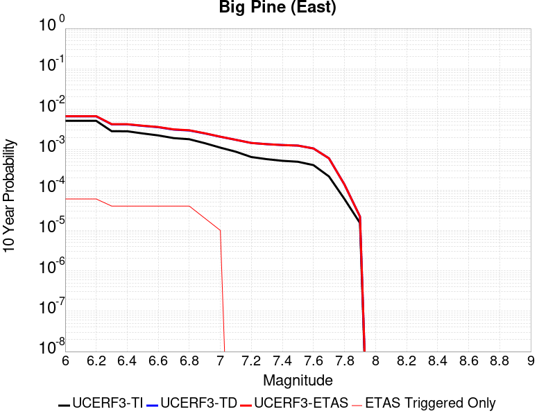 |

| Magnitude | 1 wk TI Prob | 1 wk TD Prob | 1 wk ETAS Prob | 1 wk ETAS/TD Gain | 1 wk ETAS Triggered Only | 1 mo TI Prob | 1 mo TD Prob | 1 mo ETAS Prob | 1 mo ETAS/TD Gain | 1 mo ETAS Triggered Only | 1 yr TI Prob | 1 yr TD Prob | 1 yr ETAS Prob | 1 yr ETAS/TD Gain | 1 yr ETAS Triggered Only | 10 yr TI Prob | 10 yr TD Prob | 10 yr ETAS Prob | 10 yr ETAS/TD Gain | 10 yr ETAS Triggered Only |
|-----|-----|-----|-----|-----|-----|-----|-----|-----|-----|-----|-----|-----|-----|-----|-----|-----|-----|-----|-----|-----|
| 6.0 | 9.916913E-6 | 1.282197E-5 | 1.282197E-5 | 1.0 | 0.0 | 4.250036E-5 | 5.495027E-5 | 5.495027E-5 | 1.0 | 0.0 | 5.173191E-4 | 6.6883623E-4 | 6.988162E-4 | 1.044824 | 3.0E-5 | 0.0051611643 | 0.0066729826 | 0.006732582 | 1.0089315 | 6.0E-5 |
| 6.1 | 9.916913E-6 | 1.282197E-5 | 1.282197E-5 | 1.0 | 0.0 | 4.250036E-5 | 5.495027E-5 | 5.495027E-5 | 1.0 | 0.0 | 5.173191E-4 | 6.6883623E-4 | 6.988162E-4 | 1.044824 | 3.0E-5 | 0.0051611643 | 0.0066729826 | 0.006732582 | 1.0089315 | 6.0E-5 |
| 6.2 | 9.916913E-6 | 1.282197E-5 | 1.282197E-5 | 1.0 | 0.0 | 4.250036E-5 | 5.495027E-5 | 5.495027E-5 | 1.0 | 0.0 | 5.173191E-4 | 6.6883623E-4 | 6.988162E-4 | 1.044824 | 3.0E-5 | 0.0051611643 | 0.0066729826 | 0.006732582 | 1.0089315 | 6.0E-5 |
| 6.3 | 5.479711E-6 | 8.117787E-6 | 8.117787E-6 | 1.0 | 0.0 | 2.3484265E-5 | 3.4790068E-5 | 3.4790068E-5 | 1.0 | 0.0 | 2.858834E-4 | 4.2348995E-4 | 4.434815E-4 | 1.0472066 | 2.0E-5 | 0.0028551589 | 0.004229713 | 0.004269544 | 1.0094169 | 4.0E-5 |
| 6.4 | 5.465009E-6 | 8.10208E-6 | 8.10208E-6 | 1.0 | 0.0 | 2.3421257E-5 | 3.4722754E-5 | 3.4722754E-5 | 1.0 | 0.0 | 2.851165E-4 | 4.2267074E-4 | 4.4266228E-4 | 1.0472982 | 2.0E-5 | 0.0028475097 | 0.004221552 | 0.0042613833 | 1.0094352 | 4.0E-5 |
| 6.5 | 4.826767E-6 | 7.4271156E-6 | 7.4271156E-6 | 1.0 | 0.0 | 2.068598E-5 | 3.183012E-5 | 3.183012E-5 | 1.0 | 0.0 | 2.518227E-4 | 3.874656E-4 | 4.0745785E-4 | 1.0515975 | 2.0E-5 | 0.0025153751 | 0.0038707424 | 0.0039105876 | 1.010294 | 4.0E-5 |
| 6.6 | 4.3146847E-6 | 6.887036E-6 | 6.887036E-6 | 1.0 | 0.0 | 1.8491375E-5 | 2.9515548E-5 | 2.9515548E-5 | 1.0 | 0.0 | 2.2510924E-4 | 3.59295E-4 | 3.792878E-4 | 1.0556445 | 2.0E-5 | 0.0022488134 | 0.0035899505 | 0.003629807 | 1.0111022 | 4.0E-5 |
| 6.7 | 3.6968106E-6 | 5.9999884E-6 | 5.9999884E-6 | 1.0 | 0.0 | 1.5843378E-5 | 2.571399E-5 | 2.571399E-5 | 1.0 | 0.0 | 1.9287605E-4 | 3.130244E-4 | 3.3301814E-4 | 1.0638728 | 2.0E-5 | 0.0019270873 | 0.0031285542 | 0.003168429 | 1.0127455 | 4.0E-5 |
| 6.8 | 3.4671132E-6 | 5.7065704E-6 | 5.7065704E-6 | 1.0 | 0.0 | 1.4858972E-5 | 2.4456509E-5 | 2.4456509E-5 | 1.0 | 0.0 | 1.8089297E-4 | 2.9771877E-4 | 3.177128E-4 | 1.0671575 | 2.0E-5 | 0.0018074579 | 0.0029759097 | 0.0030157906 | 1.0134013 | 4.0E-5 |
| 6.9 | 2.7686972E-6 | 4.829279E-6 | 4.829279E-6 | 1.0 | 0.0 | 1.1865792E-5 | 2.069675E-5 | 2.069675E-5 | 1.0 | 0.0 | 1.4445644E-4 | 2.5195457E-4 | 2.5195457E-4 | 1.0 | 0.0 | 0.0014436257 | 0.0025193316 | 0.0025392813 | 1.0079186 | 2.0E-5 |
| 7.0 | 2.1472624E-6 | 3.988725E-6 | 3.988725E-6 | 1.0 | 0.0 | 9.20252E-6 | 1.7094428E-5 | 1.7094428E-5 | 1.0 | 0.0 | 1.12034926E-4 | 2.0810531E-4 | 2.0810531E-4 | 1.0 | 0.0 | 0.0011197845 | 0.002081715 | 0.0020916942 | 1.0047938 | 1.0E-5 |
| 7.1 | 1.7018335E-6 | 3.348229E-6 | 3.348229E-6 | 1.0 | 0.0 | 7.293552E-6 | 1.4349476E-5 | 1.4349476E-5 | 1.0 | 0.0 | 8.879537E-5 | 1.7469123E-4 | 1.7469123E-4 | 1.0 | 0.0 | 8.87599E-4 | 0.0017481181 | 0.0017481181 | 1.0 | 0.0 |
| 7.2 | 1.25603E-6 | 2.7976516E-6 | 2.7976516E-6 | 1.0 | 0.0 | 5.3829745E-6 | 1.1989882E-5 | 1.1989882E-5 | 1.0 | 0.0 | 6.553574E-5 | 1.4596726E-4 | 1.4596726E-4 | 1.0 | 0.0 | 6.551642E-4 | 0.0014612685 | 0.0014612685 | 1.0 | 0.0 |
| 7.3 | 1.112297E-6 | 2.613323E-6 | 2.613323E-6 | 1.0 | 0.0 | 4.7669787E-6 | 1.1199909E-5 | 1.1199909E-5 | 1.0 | 0.0 | 5.803642E-5 | 1.3635057E-4 | 1.3635057E-4 | 1.0 | 0.0 | 5.802127E-4 | 0.0013650558 | 0.0013650558 | 1.0 | 0.0 |
| 7.4 | 1.0137181E-6 | 2.4863546E-6 | 2.4863546E-6 | 1.0 | 0.0 | 4.3444993E-6 | 1.0655763E-5 | 1.0655763E-5 | 1.0 | 0.0 | 5.2892992E-5 | 1.297264E-4 | 1.297264E-4 | 1.0 | 0.0 | 5.288041E-4 | 0.0012986774 | 0.0012986774 | 1.0 | 0.0 |
| 7.5 | 9.598608E-7 | 2.4099256E-6 | 2.4099256E-6 | 1.0 | 0.0 | 4.1136827E-6 | 1.0328214E-5 | 1.0328214E-5 | 1.0 | 0.0 | 5.0082934E-5 | 1.2573895E-4 | 1.2573895E-4 | 1.0 | 0.0 | 5.007165E-4 | 0.0012586572 | 0.0012586572 | 1.0 | 0.0 |
| 7.6 | 7.929459E-7 | 2.047312E-6 | 2.047312E-6 | 1.0 | 0.0 | 3.3983351E-6 | 8.7741655E-6 | 8.7741655E-6 | 1.0 | 0.0 | 4.1373947E-5 | 1.0682041E-4 | 1.0682041E-4 | 1.0 | 0.0 | 4.1366243E-4 | 0.0010697625 | 0.0010697625 | 1.0 | 0.0 |
| 7.7 | 4.155788E-7 | 1.162298E-6 | 1.162298E-6 | 1.0 | 0.0 | 1.7810507E-6 | 4.981268E-6 | 4.981268E-6 | 1.0 | 0.0 | 2.1684076E-5 | 6.064529E-5 | 6.064529E-5 | 1.0 | 0.0 | 2.1681961E-4 | 6.09451E-4 | 6.09451E-4 | 1.0 | 0.0 |
| 7.8 | 1.14666925E-7 | 2.5959213E-7 | 2.5959213E-7 | 1.0 | 0.0 | 4.914296E-7 | 1.1125372E-6 | 1.1125372E-6 | 1.0 | 0.0 | 5.9831386E-6 | 1.354506E-5 | 1.354506E-5 | 1.0 | 0.0 | 5.9829777E-5 | 1.3654139E-4 | 1.3654139E-4 | 1.0 | 0.0 |
| 7.9 | 2.9231824E-8 | 4.15291E-8 | 4.15291E-8 | 1.0 | 0.0 | 1.2527924E-7 | 1.7798183E-7 | 1.7798183E-7 | 1.0 | 0.0 | 1.5252737E-6 | 2.1669268E-6 | 2.1669268E-6 | 1.0 | 0.0 | 1.5252632E-5 | 2.2001832E-5 | 2.2001832E-5 | 1.0 | 0.0 |

## Pisgah-Bullion Mtn-Mesquite Lk
*[(top)](#table-of-contents)*

| 1 Week | 1 Month | 1 Year | 10 Year |
|-----|-----|-----|-----|
|  |  |  | 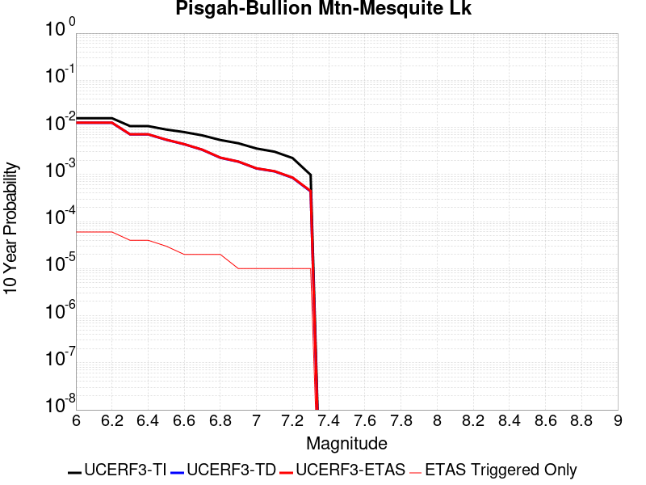 |

| Magnitude | 1 wk TI Prob | 1 wk TD Prob | 1 wk ETAS Prob | 1 wk ETAS/TD Gain | 1 wk ETAS Triggered Only | 1 mo TI Prob | 1 mo TD Prob | 1 mo ETAS Prob | 1 mo ETAS/TD Gain | 1 mo ETAS Triggered Only | 1 yr TI Prob | 1 yr TD Prob | 1 yr ETAS Prob | 1 yr ETAS/TD Gain | 1 yr ETAS Triggered Only | 10 yr TI Prob | 10 yr TD Prob | 10 yr ETAS Prob | 10 yr ETAS/TD Gain | 10 yr ETAS Triggered Only |
|-----|-----|-----|-----|-----|-----|-----|-----|-----|-----|-----|-----|-----|-----|-----|-----|-----|-----|-----|-----|-----|
| 6.0 | 3.0240792E-5 | 2.409264E-5 | 2.409264E-5 | 1.0 | 0.0 | 1.2959696E-4 | 1.03250655E-4 | 1.03250655E-4 | 1.0 | 0.0 | 0.0015767008 | 0.0012564523 | 0.0012564523 | 1.0 | 0.0 | 0.015655609 | 0.012503509 | 0.012562759 | 1.0047387 | 6.0E-5 |
| 6.1 | 3.0240792E-5 | 2.409264E-5 | 2.409264E-5 | 1.0 | 0.0 | 1.2959696E-4 | 1.03250655E-4 | 1.03250655E-4 | 1.0 | 0.0 | 0.0015767008 | 0.0012564523 | 0.0012564523 | 1.0 | 0.0 | 0.015655609 | 0.012503509 | 0.012562759 | 1.0047387 | 6.0E-5 |
| 6.2 | 3.0240792E-5 | 2.409264E-5 | 2.409264E-5 | 1.0 | 0.0 | 1.2959696E-4 | 1.03250655E-4 | 1.03250655E-4 | 1.0 | 0.0 | 0.0015767008 | 0.0012564523 | 0.0012564523 | 1.0 | 0.0 | 0.015655609 | 0.012503509 | 0.012562759 | 1.0047387 | 6.0E-5 |
| 6.3 | 2.0498217E-5 | 1.3638809E-5 | 1.3638809E-5 | 1.0 | 0.0 | 8.784654E-5 | 5.845082E-5 | 5.845082E-5 | 1.0 | 0.0 | 0.0010690069 | 7.114226E-4 | 7.114226E-4 | 1.0 | 0.0 | 0.01063879 | 0.0070930775 | 0.007132794 | 1.0055993 | 4.0E-5 |
| 6.4 | 2.0498217E-5 | 1.3638809E-5 | 1.3638809E-5 | 1.0 | 0.0 | 8.784654E-5 | 5.845082E-5 | 5.845082E-5 | 1.0 | 0.0 | 0.0010690069 | 7.114226E-4 | 7.114226E-4 | 1.0 | 0.0 | 0.01063879 | 0.0070930775 | 0.007132794 | 1.0055993 | 4.0E-5 |
| 6.5 | 1.7316182E-5 | 1.0477582E-5 | 1.0477582E-5 | 1.0 | 0.0 | 7.42101E-5 | 4.490321E-5 | 4.490321E-5 | 1.0 | 0.0 | 9.0313336E-4 | 5.465694E-4 | 5.465694E-4 | 1.0 | 0.0 | 0.008994718 | 0.005453247 | 0.0054830834 | 1.0054713 | 3.0E-5 |
| 6.6 | 1.5251077E-5 | 8.414691E-6 | 8.414691E-6 | 1.0 | 0.0 | 6.536012E-5 | 3.6062505E-5 | 3.6062505E-5 | 1.0 | 0.0 | 7.9546886E-4 | 4.389798E-4 | 4.389798E-4 | 1.0 | 0.0 | 0.007926274 | 0.004381844 | 0.0044017565 | 1.0045443 | 2.0E-5 |
| 6.7 | 1.2997425E-5 | 6.4118035E-6 | 6.4118035E-6 | 1.0 | 0.0 | 5.570206E-5 | 2.7478894E-5 | 2.7478894E-5 | 1.0 | 0.0 | 6.7796157E-4 | 3.3450883E-4 | 3.3450883E-4 | 1.0 | 0.0 | 0.0067589693 | 0.0033405134 | 0.0033604465 | 1.0059671 | 2.0E-5 |
| 6.8 | 1.035386E-5 | 4.3334735E-6 | 4.3334735E-6 | 1.0 | 0.0 | 4.437293E-5 | 1.8571902E-5 | 1.8571902E-5 | 1.0 | 0.0 | 5.401065E-4 | 2.2609031E-4 | 2.2609031E-4 | 1.0 | 0.0 | 0.0053879567 | 0.0022586898 | 0.0022786446 | 1.0088347 | 2.0E-5 |
| 6.9 | 8.816252E-6 | 3.580855E-6 | 3.580855E-6 | 1.0 | 0.0 | 3.778339E-5 | 1.5346433E-5 | 1.5346433E-5 | 1.0 | 0.0 | 4.5991567E-4 | 1.8682741E-4 | 1.8682741E-4 | 1.0 | 0.0 | 0.00458965 | 0.0018667618 | 0.0018767432 | 1.0053469 | 1.0E-5 |
| 7.0 | 6.8232207E-6 | 2.5677498E-6 | 2.5677498E-6 | 1.0 | 0.0 | 2.9242048E-5 | 1.1004598E-5 | 1.1004598E-5 | 1.0 | 0.0 | 3.5596377E-4 | 1.3397305E-4 | 1.3397305E-4 | 1.0 | 0.0 | 0.0035539411 | 0.0013389539 | 0.0013489405 | 1.0074586 | 1.0E-5 |
| 7.1 | 5.837013E-6 | 2.2275226E-6 | 2.2275226E-6 | 1.0 | 0.0 | 2.501553E-5 | 9.546492E-6 | 9.546492E-6 | 1.0 | 0.0 | 3.045215E-4 | 1.1622263E-4 | 1.1622263E-4 | 1.0 | 0.0 | 0.0030410455 | 0.0011616475 | 0.0011716359 | 1.0085984 | 1.0E-5 |
| 7.2 | 4.278052E-6 | 1.6276728E-6 | 1.6276728E-6 | 1.0 | 0.0 | 1.833438E-5 | 6.975723E-6 | 6.975723E-6 | 1.0 | 0.0 | 2.231982E-4 | 8.492635E-5 | 8.492635E-5 | 1.0 | 0.0 | 0.0022297418 | 8.489622E-4 | 8.589537E-4 | 1.011769 | 1.0E-5 |
| 7.3 | 1.8803692E-6 | 8.345377E-7 | 8.345377E-7 | 1.0 | 0.0 | 8.0587E-6 | 3.576586E-6 | 3.576586E-6 | 1.0 | 0.0 | 9.811026E-5 | 4.3544213E-5 | 4.3544213E-5 | 1.0 | 0.0 | 9.806695E-4 | 4.3537127E-4 | 4.4536692E-4 | 1.0229589 | 1.0E-5 |

## Chino alt 1
*[(top)](#table-of-contents)*

| 1 Week | 1 Month | 1 Year | 10 Year |
|-----|-----|-----|-----|
| 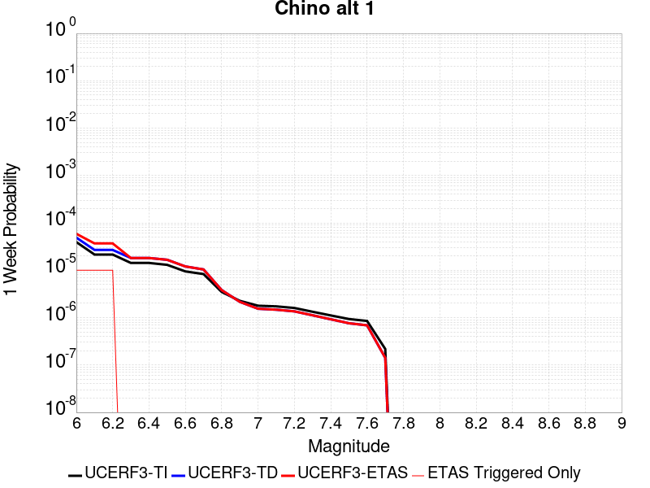 |  | 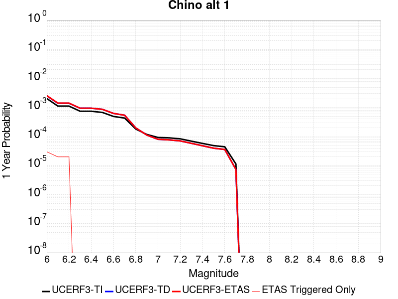 |  |

| Magnitude | 1 wk TI Prob | 1 wk TD Prob | 1 wk ETAS Prob | 1 wk ETAS/TD Gain | 1 wk ETAS Triggered Only | 1 mo TI Prob | 1 mo TD Prob | 1 mo ETAS Prob | 1 mo ETAS/TD Gain | 1 mo ETAS Triggered Only | 1 yr TI Prob | 1 yr TD Prob | 1 yr ETAS Prob | 1 yr ETAS/TD Gain | 1 yr ETAS Triggered Only | 10 yr TI Prob | 10 yr TD Prob | 10 yr ETAS Prob | 10 yr ETAS/TD Gain | 10 yr ETAS Triggered Only |
|-----|-----|-----|-----|-----|-----|-----|-----|-----|-----|-----|-----|-----|-----|-----|-----|-----|-----|-----|-----|-----|
| 6.0 | 3.939946E-5 | 4.8955757E-5 | 5.8955266E-5 | 1.204256 | 1.0E-5 | 1.6884391E-4 | 2.0979645E-4 | 2.2979225E-4 | 1.0953104 | 2.0E-5 | 0.0020537362 | 0.0025517642 | 0.0025816876 | 1.0117266 | 3.0E-5 | 0.020348595 | 0.025281483 | 0.025339967 | 1.0023133 | 6.0E-5 |
| 6.1 | 2.1505624E-5 | 2.6883481E-5 | 3.688321E-5 | 1.3719656 | 1.0E-5 | 9.2163704E-5 | 1.1521046E-4 | 1.3520816E-4 | 1.1735754 | 2.0E-5 | 0.0011215154 | 0.0014018962 | 0.0014218681 | 1.0142463 | 2.0E-5 | 0.011158722 | 0.013947416 | 0.013996718 | 1.0035349 | 5.0E-5 |
| 6.2 | 2.1505624E-5 | 2.6883481E-5 | 3.688321E-5 | 1.3719656 | 1.0E-5 | 9.2163704E-5 | 1.1521046E-4 | 1.3520816E-4 | 1.1735754 | 2.0E-5 | 0.0011215154 | 0.0014018962 | 0.0014218681 | 1.0142463 | 2.0E-5 | 0.011158722 | 0.013947416 | 0.013996718 | 1.0035349 | 5.0E-5 |
| 6.3 | 1.4290785E-5 | 1.816862E-5 | 1.816862E-5 | 1.0 | 0.0 | 6.1244784E-5 | 7.786344E-5 | 7.786344E-5 | 1.0 | 0.0 | 7.454001E-4 | 9.4762055E-4 | 9.4762055E-4 | 1.0 | 0.0 | 0.007429048 | 0.009446246 | 0.009466057 | 1.0020972 | 2.0E-5 |
| 6.4 | 1.4290785E-5 | 1.816862E-5 | 1.816862E-5 | 1.0 | 0.0 | 6.1244784E-5 | 7.786344E-5 | 7.786344E-5 | 1.0 | 0.0 | 7.454001E-4 | 9.4762055E-4 | 9.4762055E-4 | 1.0 | 0.0 | 0.007429048 | 0.009446246 | 0.009466057 | 1.0020972 | 2.0E-5 |
| 6.5 | 1.3017944E-5 | 1.665543E-5 | 1.665543E-5 | 1.0 | 0.0 | 5.5789995E-5 | 7.13787E-5 | 7.13787E-5 | 1.0 | 0.0 | 6.790315E-4 | 8.6873304E-4 | 8.6873304E-4 | 1.0 | 0.0 | 0.0067696036 | 0.00866366 | 0.008683487 | 1.0022885 | 2.0E-5 |
| 6.6 | 9.470016E-6 | 1.2041898E-5 | 1.2041898E-5 | 1.0 | 0.0 | 4.058515E-5 | 5.1607305E-5 | 5.1607305E-5 | 1.0 | 0.0 | 4.940122E-4 | 6.281718E-4 | 6.281718E-4 | 1.0 | 0.0 | 0.004929154 | 0.006273171 | 0.006283108 | 1.001584 | 1.0E-5 |
| 6.7 | 8.314155E-6 | 1.0409905E-5 | 1.0409905E-5 | 1.0 | 0.0 | 3.5631605E-5 | 4.46133E-5 | 4.46133E-5 | 1.0 | 0.0 | 4.3372845E-4 | 5.430638E-4 | 5.430638E-4 | 1.0 | 0.0 | 0.004328829 | 0.005426893 | 0.0054368386 | 1.0018327 | 1.0E-5 |
| 6.8 | 3.4856364E-6 | 3.8139801E-6 | 3.8139801E-6 | 1.0 | 0.0 | 1.4938357E-5 | 1.6345539E-5 | 1.6345539E-5 | 1.0 | 0.0 | 1.8185932E-4 | 1.9899083E-4 | 1.9899083E-4 | 1.0 | 0.0 | 0.0018171056 | 0.001989803 | 0.001989803 | 1.0 | 0.0 |
| 6.9 | 2.2645952E-6 | 2.1532328E-6 | 2.1532328E-6 | 1.0 | 0.0 | 9.705372E-6 | 9.228109E-6 | 9.228109E-6 | 1.0 | 0.0 | 1.18156495E-4 | 1.1234665E-4 | 1.1234665E-4 | 1.0 | 0.0 | 0.0011809369 | 0.0011235146 | 0.0011235146 | 1.0 | 0.0 |
| 7.0 | 1.7864003E-6 | 1.5433379E-6 | 1.5433379E-6 | 1.0 | 0.0 | 7.655979E-6 | 6.6142893E-6 | 6.6142893E-6 | 1.0 | 0.0 | 9.3207556E-5 | 8.052605E-5 | 8.052605E-5 | 1.0 | 0.0 | 9.316847E-4 | 8.054159E-4 | 8.054159E-4 | 1.0 | 0.0 |
| 7.1 | 1.7315456E-6 | 1.4736019E-6 | 1.4736019E-6 | 1.0 | 0.0 | 7.420889E-6 | 6.3154216E-6 | 6.3154216E-6 | 1.0 | 0.0 | 9.034557E-5 | 7.6887605E-5 | 7.6887605E-5 | 1.0 | 0.0 | 9.0308854E-4 | 7.690479E-4 | 7.690479E-4 | 1.0 | 0.0 |
| 7.2 | 1.6008337E-6 | 1.3576367E-6 | 1.3576367E-6 | 1.0 | 0.0 | 6.860698E-6 | 5.8184305E-6 | 5.8184305E-6 | 1.0 | 0.0 | 8.352579E-5 | 7.0837144E-5 | 7.0837144E-5 | 1.0 | 0.0 | 8.34944E-4 | 7.085699E-4 | 7.085699E-4 | 1.0 | 0.0 |
| 7.3 | 1.3320939E-6 | 1.1219545E-6 | 1.1219545E-6 | 1.0 | 0.0 | 5.7089615E-6 | 4.8083675E-6 | 4.8083675E-6 | 1.0 | 0.0 | 6.9504385E-5 | 5.854035E-5 | 5.854035E-5 | 1.0 | 0.0 | 6.9482654E-4 | 5.8539386E-4 | 5.8539386E-4 | 1.0 | 0.0 |
| 7.4 | 1.114294E-6 | 9.2384767E-7 | 9.2384767E-7 | 1.0 | 0.0 | 4.775537E-6 | 3.9593415E-6 | 3.9593415E-6 | 1.0 | 0.0 | 5.8140613E-5 | 4.820395E-5 | 4.820395E-5 | 1.0 | 0.0 | 5.81254E-4 | 4.8195178E-4 | 4.8195178E-4 | 1.0 | 0.0 |
| 7.5 | 9.354081E-7 | 7.62451E-7 | 7.62451E-7 | 1.0 | 0.0 | 4.0088858E-6 | 3.2676433E-6 | 3.2676433E-6 | 1.0 | 0.0 | 4.8807087E-5 | 3.9782866E-5 | 3.9782866E-5 | 1.0 | 0.0 | 4.879637E-4 | 3.9776083E-4 | 3.9776083E-4 | 1.0 | 0.0 |
| 7.6 | 8.521771E-7 | 6.881667E-7 | 6.881667E-7 | 1.0 | 0.0 | 3.6521824E-6 | 2.9492828E-6 | 2.9492828E-6 | 1.0 | 0.0 | 4.4464414E-5 | 3.590696E-5 | 3.590696E-5 | 1.0 | 0.0 | 4.4455516E-4 | 3.5901475E-4 | 3.5901475E-4 | 1.0 | 0.0 |
| 7.7 | 2.1803626E-7 | 1.4189133E-7 | 1.4189133E-7 | 1.0 | 0.0 | 9.344408E-7 | 6.0810567E-7 | 6.0810567E-7 | 1.0 | 0.0 | 1.1376757E-5 | 7.4036707E-6 | 7.4036707E-6 | 1.0 | 0.0 | 1.13761744E-4 | 7.4035204E-5 | 7.4035204E-5 | 1.0 | 0.0 |

## San Andreas (North Branch Mill Creek)
*[(top)](#table-of-contents)*

| 1 Week | 1 Month | 1 Year | 10 Year |
|-----|-----|-----|-----|
|  |  |  |  |

| Magnitude | 1 wk TI Prob | 1 wk TD Prob | 1 wk ETAS Prob | 1 wk ETAS/TD Gain | 1 wk ETAS Triggered Only | 1 mo TI Prob | 1 mo TD Prob | 1 mo ETAS Prob | 1 mo ETAS/TD Gain | 1 mo ETAS Triggered Only | 1 yr TI Prob | 1 yr TD Prob | 1 yr ETAS Prob | 1 yr ETAS/TD Gain | 1 yr ETAS Triggered Only | 10 yr TI Prob | 10 yr TD Prob | 10 yr ETAS Prob | 10 yr ETAS/TD Gain | 10 yr ETAS Triggered Only |
|-----|-----|-----|-----|-----|-----|-----|-----|-----|-----|-----|-----|-----|-----|-----|-----|-----|-----|-----|-----|-----|
| 6.0 | 1.3461156E-5 | 2.3527407E-5 | 2.3527407E-5 | 1.0 | 0.0 | 5.7689394E-5 | 1.0082787E-4 | 1.1082686E-4 | 1.0991689 | 1.0E-5 | 7.02142E-4 | 0.0012268913 | 0.0012468668 | 1.0162814 | 2.0E-5 | 0.0069992766 | 0.012243656 | 0.012302922 | 1.0048405 | 6.0E-5 |
| 6.1 | 1.3461156E-5 | 2.3527407E-5 | 2.3527407E-5 | 1.0 | 0.0 | 5.7689394E-5 | 1.0082787E-4 | 1.1082686E-4 | 1.0991689 | 1.0E-5 | 7.02142E-4 | 0.0012268913 | 0.0012468668 | 1.0162814 | 2.0E-5 | 0.0069992766 | 0.012243656 | 0.012302922 | 1.0048405 | 6.0E-5 |
| 6.2 | 1.3461156E-5 | 2.3527407E-5 | 2.3527407E-5 | 1.0 | 0.0 | 5.7689394E-5 | 1.0082787E-4 | 1.1082686E-4 | 1.0991689 | 1.0E-5 | 7.02142E-4 | 0.0012268913 | 0.0012468668 | 1.0162814 | 2.0E-5 | 0.0069992766 | 0.012243656 | 0.012302922 | 1.0048405 | 6.0E-5 |
| 6.3 | 1.3461156E-5 | 2.3527407E-5 | 2.3527407E-5 | 1.0 | 0.0 | 5.7689394E-5 | 1.0082787E-4 | 1.1082686E-4 | 1.0991689 | 1.0E-5 | 7.02142E-4 | 0.0012268913 | 0.0012468668 | 1.0162814 | 2.0E-5 | 0.0069992766 | 0.012243656 | 0.012302922 | 1.0048405 | 6.0E-5 |
| 6.4 | 1.3461156E-5 | 2.3527407E-5 | 2.3527407E-5 | 1.0 | 0.0 | 5.7689394E-5 | 1.0082787E-4 | 1.1082686E-4 | 1.0991689 | 1.0E-5 | 7.02142E-4 | 0.0012268913 | 0.0012468668 | 1.0162814 | 2.0E-5 | 0.0069992766 | 0.012243656 | 0.012302922 | 1.0048405 | 6.0E-5 |
| 6.5 | 1.3450706E-5 | 2.3516368E-5 | 2.3516368E-5 | 1.0 | 0.0 | 5.764461E-5 | 1.00780555E-4 | 1.1077955E-4 | 1.0992155 | 1.0E-5 | 7.0159714E-4 | 0.001226316 | 0.0012462914 | 1.016289 | 2.0E-5 | 0.006993862 | 0.012237966 | 0.012297233 | 1.0048428 | 6.0E-5 |
| 6.6 | 1.3074523E-5 | 2.313064E-5 | 2.313064E-5 | 1.0 | 0.0 | 5.6032466E-5 | 9.912757E-5 | 1.0912657E-4 | 1.1008701 | 1.0E-5 | 6.8198174E-4 | 0.0012062131 | 0.0012261891 | 1.0165608 | 2.0E-5 | 0.006798926 | 0.012039129 | 0.012098406 | 1.0049237 | 6.0E-5 |
| 6.7 | 1.3050216E-5 | 2.3105935E-5 | 2.3105935E-5 | 1.0 | 0.0 | 5.59283E-5 | 9.9021694E-5 | 1.0902071E-4 | 1.100978 | 1.0E-5 | 6.8071426E-4 | 0.0012049256 | 0.0012249015 | 1.0165786 | 2.0E-5 | 0.0067863287 | 0.012026393 | 0.012085672 | 1.0049291 | 6.0E-5 |
| 6.8 | 1.29049395E-5 | 2.2954338E-5 | 2.2954338E-5 | 1.0 | 0.0 | 5.530571E-5 | 9.8372046E-5 | 1.0837106E-4 | 1.1016449 | 1.0E-5 | 6.73139E-4 | 0.0011970248 | 0.0012170009 | 1.0166881 | 2.0E-5 | 0.0067110364 | 0.011948236 | 0.01200752 | 1.0049616 | 6.0E-5 |
| 6.9 | 1.2867369E-5 | 2.2913739E-5 | 2.2913739E-5 | 1.0 | 0.0 | 5.51447E-5 | 9.8198056E-5 | 1.0819707E-4 | 1.101825 | 1.0E-5 | 6.711799E-4 | 0.0011949089 | 0.0012148849 | 1.0167177 | 2.0E-5 | 0.006691564 | 0.011927304 | 0.011986588 | 1.0049704 | 6.0E-5 |
| 7.0 | 1.2495996E-5 | 2.2313627E-5 | 2.2313627E-5 | 1.0 | 0.0 | 5.3553173E-5 | 9.562634E-5 | 1.0562539E-4 | 1.1045637 | 1.0E-5 | 6.518148E-4 | 0.0011636318 | 0.0011836084 | 1.0171676 | 2.0E-5 | 0.0064990623 | 0.011617814 | 0.011677117 | 1.0051045 | 6.0E-5 |
| 7.1 | 1.2452067E-5 | 2.2258691E-5 | 2.2258691E-5 | 1.0 | 0.0 | 5.3364907E-5 | 9.539092E-5 | 1.0538997E-4 | 1.1048218 | 1.0E-5 | 6.4952404E-4 | 0.0011607686 | 0.0011807453 | 1.01721 | 2.0E-5 | 0.0064762887 | 0.011589482 | 0.011648786 | 1.005117 | 6.0E-5 |
| 7.2 | 1.2002777E-5 | 2.163711E-5 | 2.163711E-5 | 1.0 | 0.0 | 5.143946E-5 | 9.272719E-5 | 1.0272626E-4 | 1.1078333 | 1.0E-5 | 6.2609545E-4 | 0.0011283715 | 0.0011483489 | 1.0177046 | 2.0E-5 | 0.006243344 | 0.011268834 | 0.011328158 | 1.0052644 | 6.0E-5 |
| 7.3 | 1.1923425E-5 | 2.150691E-5 | 2.150691E-5 | 1.0 | 0.0 | 5.109939E-5 | 9.216923E-5 | 1.02168306E-4 | 1.108486 | 1.0E-5 | 6.219575E-4 | 0.0011215854 | 0.0011415629 | 1.0178119 | 2.0E-5 | 0.0062021962 | 0.011201685 | 0.011261013 | 1.0052963 | 6.0E-5 |
| 7.4 | 1.16105175E-5 | 2.0880623E-5 | 2.0880623E-5 | 1.0 | 0.0 | 4.975841E-5 | 8.948533E-5 | 9.948444E-5 | 1.1117401 | 1.0E-5 | 6.0564023E-4 | 0.0010889419 | 0.0011089202 | 1.0183464 | 2.0E-5 | 0.006039923 | 0.010879163 | 0.01093851 | 1.0054551 | 6.0E-5 |
| 7.5 | 1.1037265E-5 | 1.9579818E-5 | 1.9579818E-5 | 1.0 | 0.0 | 4.7301706E-5 | 8.3910825E-5 | 9.3909985E-5 | 1.1191641 | 1.0E-5 | 5.757461E-4 | 0.0010211377 | 0.0010411172 | 1.0195659 | 2.0E-5 | 0.005742567 | 0.010208193 | 0.010267581 | 1.0058177 | 6.0E-5 |
| 7.6 | 1.0720915E-5 | 1.9021407E-5 | 1.9021407E-5 | 1.0 | 0.0 | 4.5945973E-5 | 8.151778E-5 | 9.1516966E-5 | 1.1226627 | 1.0E-5 | 5.592486E-4 | 9.920292E-4 | 0.0010120095 | 1.0201406 | 2.0E-5 | 0.005578433 | 0.009919754 | 0.00997916 | 1.0059885 | 6.0E-5 |
| 7.7 | 9.276279E-6 | 1.6466016E-5 | 1.6466016E-5 | 1.0 | 0.0 | 3.9754876E-5 | 7.056674E-5 | 8.056603E-5 | 1.1416998 | 1.0E-5 | 4.839081E-4 | 8.5881306E-4 | 8.7879586E-4 | 1.023268 | 2.0E-5 | 0.0048285574 | 0.008598559 | 0.008658043 | 1.006918 | 6.0E-5 |
| 7.8 | 5.8346777E-6 | 1.11748E-5 | 1.11748E-5 | 1.0 | 0.0 | 2.5005522E-5 | 4.7891124E-5 | 5.7890644E-5 | 1.208797 | 1.0E-5 | 3.043997E-4 | 5.829186E-4 | 6.029069E-4 | 1.0342901 | 2.0E-5 | 0.0030398308 | 0.005857104 | 0.0059167524 | 1.0101839 | 6.0E-5 |
| 7.9 | 4.690204E-6 | 8.525594E-6 | 8.525594E-6 | 1.0 | 0.0 | 2.0100719E-5 | 3.653775E-5 | 4.653738E-5 | 1.2736796 | 1.0E-5 | 2.4469878E-4 | 4.4475638E-4 | 4.6474749E-4 | 1.0449485 | 2.0E-5 | 0.002444295 | 0.004479242 | 0.0045389733 | 1.0133351 | 6.0E-5 |
| 8.0 | 2.9570454E-6 | 4.857035E-6 | 4.857035E-6 | 1.0 | 0.0 | 1.267299E-5 | 2.0815698E-5 | 2.0815698E-5 | 1.0 | 0.0 | 1.5428272E-4 | 2.534017E-4 | 2.534017E-4 | 1.0 | 0.0 | 0.0015417566 | 0.002554891 | 0.0025748399 | 1.0078081 | 2.0E-5 |
| 8.1 | 1.6376824E-6 | 2.2021889E-6 | 2.2021889E-6 | 1.0 | 0.0 | 7.01862E-6 | 9.437918E-6 | 9.437918E-6 | 1.0 | 0.0 | 8.544835E-5 | 1.14900606E-4 | 1.14900606E-4 | 1.0 | 0.0 | 8.54155E-4 | 0.0011634289 | 0.0011634289 | 1.0 | 0.0 |
| 8.2 | 6.9631557E-7 | 4.5525482E-7 | 4.5525482E-7 | 1.0 | 0.0 | 2.984206E-6 | 1.9510906E-6 | 1.9510906E-6 | 1.0 | 0.0 | 3.63321E-5 | 2.3754272E-5 | 2.3754272E-5 | 1.0 | 0.0 | 3.6326164E-4 | 2.4603383E-4 | 2.4603383E-4 | 1.0 | 0.0 |
| 8.3 | 1.7876137E-7 | 8.3938964E-8 | 8.3938964E-8 | 1.0 | 0.0 | 7.661199E-7 | 3.5973835E-7 | 3.5973835E-7 | 1.0 | 0.0 | 9.32747E-6 | 4.3798063E-6 | 4.3798063E-6 | 1.0 | 0.0 | 9.3270784E-5 | 4.599691E-5 | 4.599691E-5 | 1.0 | 0.0 |

## Santa Ynez (East)
*[(top)](#table-of-contents)*

| 1 Week | 1 Month | 1 Year | 10 Year |
|-----|-----|-----|-----|
|  |  |  |  |

| Magnitude | 1 wk TI Prob | 1 wk TD Prob | 1 wk ETAS Prob | 1 wk ETAS/TD Gain | 1 wk ETAS Triggered Only | 1 mo TI Prob | 1 mo TD Prob | 1 mo ETAS Prob | 1 mo ETAS/TD Gain | 1 mo ETAS Triggered Only | 1 yr TI Prob | 1 yr TD Prob | 1 yr ETAS Prob | 1 yr ETAS/TD Gain | 1 yr ETAS Triggered Only | 10 yr TI Prob | 10 yr TD Prob | 10 yr ETAS Prob | 10 yr ETAS/TD Gain | 10 yr ETAS Triggered Only |
|-----|-----|-----|-----|-----|-----|-----|-----|-----|-----|-----|-----|-----|-----|-----|-----|-----|-----|-----|-----|-----|
| 6.0 | 3.2269712E-5 | 3.675388E-5 | 5.6753146E-5 | 1.5441402 | 2.0E-5 | 1.3829143E-4 | 1.5751045E-4 | 1.775073E-4 | 1.1269557 | 2.0E-5 | 0.0016823979 | 0.0019165927 | 0.0019465352 | 1.0156227 | 3.0E-5 | 0.016697178 | 0.019058175 | 0.019097414 | 1.0020589 | 4.0E-5 |
| 6.1 | 3.2269712E-5 | 3.675388E-5 | 5.6753146E-5 | 1.5441402 | 2.0E-5 | 1.3829143E-4 | 1.5751045E-4 | 1.775073E-4 | 1.1269557 | 2.0E-5 | 0.0016823979 | 0.0019165927 | 0.0019465352 | 1.0156227 | 3.0E-5 | 0.016697178 | 0.019058175 | 0.019097414 | 1.0020589 | 4.0E-5 |
| 6.2 | 3.2269712E-5 | 3.675388E-5 | 5.6753146E-5 | 1.5441402 | 2.0E-5 | 1.3829143E-4 | 1.5751045E-4 | 1.775073E-4 | 1.1269557 | 2.0E-5 | 0.0016823979 | 0.0019165927 | 0.0019465352 | 1.0156227 | 3.0E-5 | 0.016697178 | 0.019058175 | 0.019097414 | 1.0020589 | 4.0E-5 |
| 6.3 | 3.2269712E-5 | 3.675388E-5 | 5.6753146E-5 | 1.5441402 | 2.0E-5 | 1.3829143E-4 | 1.5751045E-4 | 1.775073E-4 | 1.1269557 | 2.0E-5 | 0.0016823979 | 0.0019165927 | 0.0019465352 | 1.0156227 | 3.0E-5 | 0.016697178 | 0.019058175 | 0.019097414 | 1.0020589 | 4.0E-5 |
| 6.4 | 1.4404779E-5 | 1.485013E-5 | 2.4849982E-5 | 1.6733848 | 1.0E-5 | 6.1733306E-5 | 6.364189E-5 | 7.3641255E-5 | 1.1571192 | 1.0E-5 | 7.513438E-4 | 7.745696E-4 | 7.9455413E-4 | 1.0258008 | 2.0E-5 | 0.0074880854 | 0.0077192495 | 0.007749018 | 1.0038564 | 3.0E-5 |
| 6.5 | 1.4404779E-5 | 1.485013E-5 | 2.4849982E-5 | 1.6733848 | 1.0E-5 | 6.1733306E-5 | 6.364189E-5 | 7.3641255E-5 | 1.1571192 | 1.0E-5 | 7.513438E-4 | 7.745696E-4 | 7.9455413E-4 | 1.0258008 | 2.0E-5 | 0.0074880854 | 0.0077192495 | 0.007749018 | 1.0038564 | 3.0E-5 |
| 6.6 | 1.280208E-5 | 1.3012552E-5 | 2.3012422E-5 | 1.7684788 | 1.0E-5 | 5.4864904E-5 | 5.5766897E-5 | 6.576634E-5 | 1.1793078 | 1.0E-5 | 6.6777546E-4 | 6.7875226E-4 | 6.8874547E-4 | 1.014723 | 1.0E-5 | 0.006657724 | 0.006767002 | 0.0067868666 | 1.0029355 | 2.0E-5 |
| 6.7 | 1.2457027E-5 | 1.262905E-5 | 2.2628923E-5 | 1.7918152 | 1.0E-5 | 5.3386164E-5 | 5.4123386E-5 | 6.412285E-5 | 1.1847531 | 1.0E-5 | 6.497827E-4 | 6.5875467E-4 | 6.6874805E-4 | 1.0151702 | 1.0E-5 | 0.00647886 | 0.0065682167 | 0.0065880856 | 1.0030249 | 2.0E-5 |
| 6.8 | 1.2095134E-5 | 1.2231476E-5 | 2.2231354E-5 | 1.8175528 | 1.0E-5 | 5.1835254E-5 | 5.2419568E-5 | 6.241904E-5 | 1.1907585 | 1.0E-5 | 6.309115E-4 | 6.3802296E-4 | 6.480166E-4 | 1.0156634 | 1.0E-5 | 0.0062912325 | 0.0063621 | 0.0063819727 | 1.0031236 | 2.0E-5 |
| 6.9 | 1.1104036E-5 | 1.115786E-5 | 2.1157748E-5 | 1.8962191 | 1.0E-5 | 4.758786E-5 | 4.7818532E-5 | 5.7818055E-5 | 1.209114 | 1.0E-5 | 5.7922816E-4 | 5.820364E-4 | 5.920305E-4 | 1.017171 | 1.0E-5 | 0.005777207 | 0.005805265 | 0.0058152075 | 1.0017126 | 1.0E-5 |
| 7.0 | 1.0577444E-5 | 1.0582165E-5 | 2.058206E-5 | 1.9449762 | 1.0E-5 | 4.5331115E-5 | 4.5351353E-5 | 5.53509E-5 | 1.2204906 | 1.0E-5 | 5.5176654E-4 | 5.5201404E-4 | 5.620085E-4 | 1.0181055 | 1.0E-5 | 0.0055039856 | 0.005506567 | 0.005516512 | 1.001806 | 1.0E-5 |
| 7.1 | 1.0021775E-5 | 9.981446E-6 | 1.9981346E-5 | 2.001849 | 1.0E-5 | 4.294976E-5 | 4.277693E-5 | 5.2776504E-5 | 1.2337608 | 1.0E-5 | 5.2278786E-4 | 5.2068586E-4 | 5.3068064E-4 | 1.0191954 | 1.0E-5 | 0.0052155964 | 0.0051947916 | 0.0052047395 | 1.001915 | 1.0E-5 |
| 7.2 | 8.874109E-6 | 8.749197E-6 | 1.874911E-5 | 2.142952 | 1.0E-5 | 3.8031343E-5 | 3.7496025E-5 | 4.749565E-5 | 1.2666849 | 1.0E-5 | 4.629332E-4 | 4.564196E-4 | 4.6641502E-4 | 1.0218997 | 1.0E-5 | 0.0046197 | 0.00455494 | 0.0045648944 | 1.0021855 | 1.0E-5 |
| 7.3 | 7.5504267E-6 | 7.505443E-6 | 1.7505368E-5 | 2.3323565 | 1.0E-5 | 3.235857E-5 | 3.2165794E-5 | 4.2165473E-5 | 1.3108792 | 1.0E-5 | 3.9389438E-4 | 3.915492E-4 | 4.015453E-4 | 1.0255296 | 1.0E-5 | 0.0039319694 | 0.0039087003 | 0.0039186613 | 1.0025483 | 1.0E-5 |
| 7.4 | 6.309394E-6 | 6.183419E-6 | 1.6183358E-5 | 2.6172183 | 1.0E-5 | 2.703998E-5 | 2.6500104E-5 | 3.6499838E-5 | 1.377347 | 1.0E-5 | 3.2916202E-4 | 3.2259195E-4 | 3.325887E-4 | 1.0309889 | 1.0E-5 | 0.003286749 | 0.003221334 | 0.0032313017 | 1.0030943 | 1.0E-5 |
| 7.5 | 4.6103073E-6 | 4.4410685E-6 | 1.4441024E-5 | 3.2517002 | 1.0E-5 | 1.975831E-5 | 1.9033017E-5 | 2.9032826E-5 | 1.5253928 | 1.0E-5 | 2.4053088E-4 | 2.3170303E-4 | 2.4170072E-4 | 1.0431486 | 1.0E-5 | 0.002402707 | 0.002314684 | 0.0023246608 | 1.0043103 | 1.0E-5 |
| 7.6 | 1.2858658E-6 | 1.3008554E-6 | 1.3008554E-6 | 1.0 | 0.0 | 5.5108417E-6 | 5.575083E-6 | 5.575083E-6 | 1.0 | 0.0 | 6.7092435E-5 | 6.7874586E-5 | 6.7874586E-5 | 1.0 | 0.0 | 6.707218E-4 | 6.7854545E-4 | 6.7854545E-4 | 1.0 | 0.0 |
| 7.7 | 5.3302307E-7 | 5.612297E-7 | 5.612297E-7 | 1.0 | 0.0 | 2.2843826E-6 | 2.4052679E-6 | 2.4052679E-6 | 1.0 | 0.0 | 2.7812002E-5 | 2.9283781E-5 | 2.9283781E-5 | 1.0 | 0.0 | 2.7808524E-4 | 2.9280278E-4 | 2.9280278E-4 | 1.0 | 0.0 |
| 7.8 | 4.613933E-8 | 4.8031144E-8 | 4.8031144E-8 | 1.0 | 0.0 | 1.9773998E-7 | 2.0584774E-7 | 2.0584774E-7 | 1.0 | 0.0 | 2.4074816E-6 | 2.5061934E-6 | 2.5061934E-6 | 1.0 | 0.0 | 2.4074554E-5 | 2.5061661E-5 | 2.5061661E-5 | 1.0 | 0.0 |

## White Mountains
*[(top)](#table-of-contents)*

| 1 Week | 1 Month | 1 Year | 10 Year |
|-----|-----|-----|-----|
|  |  |  |  |

| Magnitude | 1 wk TI Prob | 1 wk TD Prob | 1 wk ETAS Prob | 1 wk ETAS/TD Gain | 1 wk ETAS Triggered Only | 1 mo TI Prob | 1 mo TD Prob | 1 mo ETAS Prob | 1 mo ETAS/TD Gain | 1 mo ETAS Triggered Only | 1 yr TI Prob | 1 yr TD Prob | 1 yr ETAS Prob | 1 yr ETAS/TD Gain | 1 yr ETAS Triggered Only | 10 yr TI Prob | 10 yr TD Prob | 10 yr ETAS Prob | 10 yr ETAS/TD Gain | 10 yr ETAS Triggered Only |
|-----|-----|-----|-----|-----|-----|-----|-----|-----|-----|-----|-----|-----|-----|-----|-----|-----|-----|-----|-----|-----|
| 6.0 | 3.503579E-5 | 3.378569E-5 | 3.378569E-5 | 1.0 | 0.0 | 1.5014476E-4 | 1.4478847E-4 | 1.4478847E-4 | 1.0 | 0.0 | 0.0018264796 | 0.001761495 | 0.001761495 | 1.0 | 0.0 | 0.018115403 | 0.017487662 | 0.017536787 | 1.0028092 | 5.0E-5 |
| 6.1 | 3.503579E-5 | 3.378569E-5 | 3.378569E-5 | 1.0 | 0.0 | 1.5014476E-4 | 1.4478847E-4 | 1.4478847E-4 | 1.0 | 0.0 | 0.0018264796 | 0.001761495 | 0.001761495 | 1.0 | 0.0 | 0.018115403 | 0.017487662 | 0.017536787 | 1.0028092 | 5.0E-5 |
| 6.2 | 3.503579E-5 | 3.378569E-5 | 3.378569E-5 | 1.0 | 0.0 | 1.5014476E-4 | 1.4478847E-4 | 1.4478847E-4 | 1.0 | 0.0 | 0.0018264796 | 0.001761495 | 0.001761495 | 1.0 | 0.0 | 0.018115403 | 0.017487662 | 0.017536787 | 1.0028092 | 5.0E-5 |
| 6.3 | 1.7818425E-5 | 1.5916867E-5 | 1.5916867E-5 | 1.0 | 0.0 | 7.636245E-5 | 6.821344E-5 | 6.821344E-5 | 1.0 | 0.0 | 9.293162E-4 | 8.301964E-4 | 8.301964E-4 | 1.0 | 0.0 | 0.009254395 | 0.0082724085 | 0.008292244 | 1.0023977 | 2.0E-5 |
| 6.4 | 1.7818425E-5 | 1.5916867E-5 | 1.5916867E-5 | 1.0 | 0.0 | 7.636245E-5 | 6.821344E-5 | 6.821344E-5 | 1.0 | 0.0 | 9.293162E-4 | 8.301964E-4 | 8.301964E-4 | 1.0 | 0.0 | 0.009254395 | 0.0082724085 | 0.008292244 | 1.0023977 | 2.0E-5 |
| 6.5 | 1.3397557E-5 | 1.1336862E-5 | 1.1336862E-5 | 1.0 | 0.0 | 5.741684E-5 | 4.8585687E-5 | 4.8585687E-5 | 1.0 | 0.0 | 6.988258E-4 | 5.9137715E-4 | 5.9137715E-4 | 1.0 | 0.0 | 0.006966323 | 0.00589874 | 0.005918622 | 1.0033705 | 2.0E-5 |
| 6.6 | 1.0818695E-5 | 8.625775E-6 | 8.625775E-6 | 1.0 | 0.0 | 4.6365014E-5 | 3.696711E-5 | 3.696711E-5 | 1.0 | 0.0 | 5.6434784E-4 | 4.4998596E-4 | 4.4998596E-4 | 1.0 | 0.0 | 0.005629168 | 0.004491185 | 0.004511095 | 1.0044332 | 2.0E-5 |
| 6.7 | 9.067908E-6 | 6.8027375E-6 | 6.8027375E-6 | 1.0 | 0.0 | 3.8861883E-5 | 2.9154282E-5 | 2.9154282E-5 | 1.0 | 0.0 | 4.7304068E-4 | 3.5489874E-4 | 3.5489874E-4 | 1.0 | 0.0 | 0.00472035 | 0.003543637 | 0.0035536017 | 1.0028119 | 1.0E-5 |
| 6.8 | 7.295947E-6 | 4.9365945E-6 | 4.9365945E-6 | 1.0 | 0.0 | 3.126797E-5 | 2.1156668E-5 | 2.1156668E-5 | 1.0 | 0.0 | 3.8062103E-4 | 2.5755313E-4 | 2.5755313E-4 | 1.0 | 0.0 | 0.0037996976 | 0.0025726592 | 0.0025726592 | 1.0 | 0.0 |
| 6.9 | 6.2243444E-6 | 3.83238E-6 | 3.83238E-6 | 1.0 | 0.0 | 2.6675489E-5 | 1.6424385E-5 | 1.6424385E-5 | 1.0 | 0.0 | 3.2472567E-4 | 1.9994906E-4 | 1.9994906E-4 | 1.0 | 0.0 | 0.0032425157 | 0.0019977444 | 0.0019977444 | 1.0 | 0.0 |
| 7.0 | 4.9878413E-6 | 2.6796765E-6 | 2.6796765E-6 | 1.0 | 0.0 | 2.1376287E-5 | 1.1484279E-5 | 1.1484279E-5 | 1.0 | 0.0 | 2.602252E-4 | 1.3981239E-4 | 1.3981239E-4 | 1.0 | 0.0 | 0.002599207 | 0.0013972705 | 0.0013972705 | 1.0 | 0.0 |
| 7.1 | 4.0252844E-6 | 1.8858877E-6 | 1.8858877E-6 | 1.0 | 0.0 | 1.7251105E-5 | 8.082352E-6 | 8.082352E-6 | 1.0 | 0.0 | 2.1001195E-4 | 9.839832E-5 | 9.839832E-5 | 1.0 | 0.0 | 0.0020981359 | 9.835603E-4 | 9.835603E-4 | 1.0 | 0.0 |
| 7.2 | 3.3284066E-6 | 1.2820851E-6 | 1.2820851E-6 | 1.0 | 0.0 | 1.4264522E-5 | 5.49464E-6 | 5.49464E-6 | 1.0 | 0.0 | 1.736567E-4 | 6.6895285E-5 | 6.6895285E-5 | 1.0 | 0.0 | 0.0017352107 | 6.6876155E-4 | 6.6876155E-4 | 1.0 | 0.0 |
| 7.3 | 2.458226E-6 | 6.058311E-7 | 6.058311E-7 | 1.0 | 0.0 | 1.0535211E-5 | 2.5964166E-6 | 2.5964166E-6 | 1.0 | 0.0 | 1.2825865E-4 | 3.161095E-5 | 3.161095E-5 | 1.0 | 0.0 | 0.0012818464 | 3.160683E-4 | 3.160683E-4 | 1.0 | 0.0 |
| 7.4 | 1.965953E-6 | 3.1098764E-7 | 3.1098764E-7 | 1.0 | 0.0 | 8.425486E-6 | 1.3328034E-6 | 1.3328034E-6 | 1.0 | 0.0 | 1.0257547E-4 | 1.6226762E-5 | 1.6226762E-5 | 1.0 | 0.0 | 0.0010252813 | 1.622559E-4 | 1.622559E-4 | 1.0 | 0.0 |
| 7.5 | 1.2014192E-6 | 1.8250802E-7 | 1.8250802E-7 | 1.0 | 0.0 | 5.148929E-6 | 7.82177E-7 | 7.82177E-7 | 1.0 | 0.0 | 6.2686406E-5 | 9.522963E-6 | 9.522963E-6 | 1.0 | 0.0 | 6.266873E-4 | 9.522564E-5 | 9.522564E-5 | 1.0 | 0.0 |
| 7.6 | 2.5612175E-7 | 4.8963752E-8 | 4.8963752E-8 | 1.0 | 0.0 | 1.0976642E-6 | 2.0984464E-7 | 2.0984464E-7 | 1.0 | 0.0 | 1.3363979E-5 | 2.5548559E-6 | 2.5548559E-6 | 1.0 | 0.0 | 1.3363175E-4 | 2.5548301E-5 | 2.5548301E-5 | 1.0 | 0.0 |

## Kern Canyon (Lake Isabella) 2011
*[(top)](#table-of-contents)*

| 1 Week | 1 Month | 1 Year | 10 Year |
|-----|-----|-----|-----|
|  |  |  | 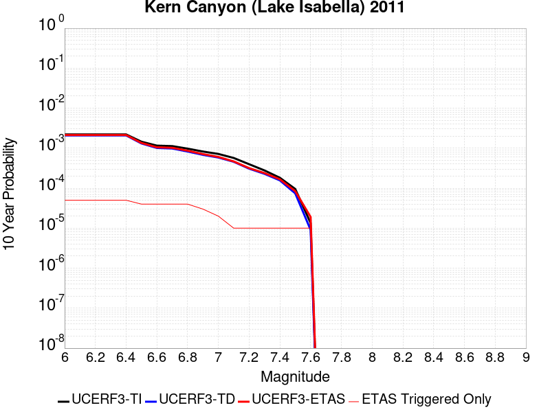 |

| Magnitude | 1 wk TI Prob | 1 wk TD Prob | 1 wk ETAS Prob | 1 wk ETAS/TD Gain | 1 wk ETAS Triggered Only | 1 mo TI Prob | 1 mo TD Prob | 1 mo ETAS Prob | 1 mo ETAS/TD Gain | 1 mo ETAS Triggered Only | 1 yr TI Prob | 1 yr TD Prob | 1 yr ETAS Prob | 1 yr ETAS/TD Gain | 1 yr ETAS Triggered Only | 10 yr TI Prob | 10 yr TD Prob | 10 yr ETAS Prob | 10 yr ETAS/TD Gain | 10 yr ETAS Triggered Only |
|-----|-----|-----|-----|-----|-----|-----|-----|-----|-----|-----|-----|-----|-----|-----|-----|-----|-----|-----|-----|-----|
| 6.0 | 4.2387383E-6 | 4.0016866E-6 | 4.0016866E-6 | 1.0 | 0.0 | 1.8165894E-5 | 1.7149983E-5 | 1.7149983E-5 | 1.0 | 0.0 | 2.2114732E-4 | 2.0878292E-4 | 2.2877874E-4 | 1.0957732 | 2.0E-5 | 0.0022092736 | 0.0020860515 | 0.0021359473 | 1.0239187 | 5.0E-5 |
| 6.1 | 4.2387383E-6 | 4.0016866E-6 | 4.0016866E-6 | 1.0 | 0.0 | 1.8165894E-5 | 1.7149983E-5 | 1.7149983E-5 | 1.0 | 0.0 | 2.2114732E-4 | 2.0878292E-4 | 2.2877874E-4 | 1.0957732 | 2.0E-5 | 0.0022092736 | 0.0020860515 | 0.0021359473 | 1.0239187 | 5.0E-5 |
| 6.2 | 4.2387383E-6 | 4.0016866E-6 | 4.0016866E-6 | 1.0 | 0.0 | 1.8165894E-5 | 1.7149983E-5 | 1.7149983E-5 | 1.0 | 0.0 | 2.2114732E-4 | 2.0878292E-4 | 2.2877874E-4 | 1.0957732 | 2.0E-5 | 0.0022092736 | 0.0020860515 | 0.0021359473 | 1.0239187 | 5.0E-5 |
| 6.3 | 4.2387383E-6 | 4.0016866E-6 | 4.0016866E-6 | 1.0 | 0.0 | 1.8165894E-5 | 1.7149983E-5 | 1.7149983E-5 | 1.0 | 0.0 | 2.2114732E-4 | 2.0878292E-4 | 2.2877874E-4 | 1.0957732 | 2.0E-5 | 0.0022092736 | 0.0020860515 | 0.0021359473 | 1.0239187 | 5.0E-5 |
| 6.4 | 4.2387383E-6 | 4.0016866E-6 | 4.0016866E-6 | 1.0 | 0.0 | 1.8165894E-5 | 1.7149983E-5 | 1.7149983E-5 | 1.0 | 0.0 | 2.2114732E-4 | 2.0878292E-4 | 2.2877874E-4 | 1.0957732 | 2.0E-5 | 0.0022092736 | 0.0020860515 | 0.0021359473 | 1.0239187 | 5.0E-5 |
| 6.5 | 2.7857532E-6 | 2.5178983E-6 | 2.5178983E-6 | 1.0 | 0.0 | 1.1938888E-5 | 1.079095E-5 | 1.079095E-5 | 1.0 | 0.0 | 1.4534626E-4 | 1.3137223E-4 | 1.4137091E-4 | 1.0761096 | 1.0E-5 | 0.0014525123 | 0.0013129783 | 0.0013529259 | 1.0304251 | 4.0E-5 |
| 6.6 | 2.2233348E-6 | 1.9441488E-6 | 1.9441488E-6 | 1.0 | 0.0 | 9.528543E-6 | 8.33204E-6 | 8.33204E-6 | 1.0 | 0.0 | 1.1600384E-4 | 1.0143795E-4 | 1.11436944E-4 | 1.0985724 | 1.0E-5 | 0.001159433 | 0.0010139252 | 0.0010538846 | 1.0394106 | 4.0E-5 |
| 6.7 | 2.1635126E-6 | 1.8835284E-6 | 1.8835284E-6 | 1.0 | 0.0 | 9.272164E-6 | 8.07224E-6 | 8.07224E-6 | 1.0 | 0.0 | 1.1288274E-4 | 9.827517E-5 | 1.0827419E-4 | 1.1017451 | 1.0E-5 | 0.0011282542 | 9.823253E-4 | 0.001022286 | 1.0406797 | 4.0E-5 |
| 6.8 | 1.8685711E-6 | 1.5831645E-6 | 1.5831645E-6 | 1.0 | 0.0 | 8.008137E-6 | 6.7849733E-6 | 6.7849733E-6 | 1.0 | 0.0 | 9.74947E-5 | 8.260396E-5 | 9.2603135E-5 | 1.1210495 | 1.0E-5 | 9.745194E-4 | 8.2573754E-4 | 8.657045E-4 | 1.0484016 | 4.0E-5 |
| 6.9 | 1.5815071E-6 | 1.3065115E-6 | 1.3065115E-6 | 1.0 | 0.0 | 6.77787E-6 | 5.5993232E-6 | 5.5993232E-6 | 1.0 | 0.0 | 8.251744E-5 | 6.8169655E-5 | 7.8168974E-5 | 1.1466829 | 1.0E-5 | 8.248681E-4 | 6.814901E-4 | 7.114697E-4 | 1.0439912 | 3.0E-5 |
| 7.0 | 1.3772564E-6 | 1.1210881E-6 | 1.1210881E-6 | 1.0 | 0.0 | 5.9025137E-6 | 4.804654E-6 | 4.804654E-6 | 1.0 | 0.0 | 7.186073E-5 | 5.8495116E-5 | 6.849453E-5 | 1.1709445 | 1.0E-5 | 7.18375E-4 | 5.847992E-4 | 6.0478755E-4 | 1.0341798 | 2.0E-5 |
| 7.1 | 1.0916998E-6 | 8.763901E-7 | 8.763901E-7 | 1.0 | 0.0 | 4.678705E-6 | 3.7559523E-6 | 3.7559523E-6 | 1.0 | 0.0 | 5.6961744E-5 | 4.572777E-5 | 4.572777E-5 | 1.0 | 0.0 | 5.6947145E-4 | 4.5718497E-4 | 4.671804E-4 | 1.021863 | 1.0E-5 |
| 7.2 | 7.6277024E-7 | 5.901538E-7 | 5.901538E-7 | 1.0 | 0.0 | 3.2690114E-6 | 2.5292281E-6 | 2.5292281E-6 | 1.0 | 0.0 | 3.9799485E-5 | 3.0792922E-5 | 3.0792922E-5 | 1.0 | 0.0 | 3.9792358E-4 | 3.0788718E-4 | 3.1788409E-4 | 1.0324694 | 1.0E-5 |
| 7.3 | 5.3265916E-7 | 4.3825008E-7 | 4.3825008E-7 | 1.0 | 0.0 | 2.282823E-6 | 1.8782133E-6 | 1.8782133E-6 | 1.0 | 0.0 | 2.7793016E-5 | 2.286701E-5 | 2.286701E-5 | 1.0 | 0.0 | 2.778954E-4 | 2.2864695E-4 | 2.3864467E-4 | 1.0437255 | 1.0E-5 |
| 7.4 | 3.4946007E-7 | 3.0066107E-7 | 3.0066107E-7 | 1.0 | 0.0 | 1.497685E-6 | 1.2885469E-6 | 1.2885469E-6 | 1.0 | 0.0 | 1.8234163E-5 | 1.5687947E-5 | 1.5687947E-5 | 1.0 | 0.0 | 1.8232666E-4 | 1.5686861E-4 | 1.6686704E-4 | 1.0637376 | 1.0E-5 |
| 7.5 | 1.8317026E-7 | 1.4245036E-7 | 1.4245036E-7 | 1.0 | 0.0 | 7.850152E-7 | 6.1050144E-7 | 6.1050144E-7 | 1.0 | 0.0 | 9.557518E-6 | 7.4328304E-6 | 7.4328304E-6 | 1.0 | 0.0 | 9.5571064E-5 | 7.432589E-5 | 8.4325155E-5 | 1.1345326 | 1.0E-5 |
| 7.6 | 2.572245E-8 | 1.7352884E-8 | 1.7352884E-8 | 1.0 | 0.0 | 1.10239064E-7 | 7.43695E-8 | 7.43695E-8 | 1.0 | 0.0 | 1.3421597E-6 | 9.0544836E-7 | 9.0544836E-7 | 1.0 | 0.0 | 1.3421517E-5 | 9.054452E-6 | 1.9054361E-5 | 2.104419 | 1.0E-5 |

## Channel Islands Thrust
*[(top)](#table-of-contents)*

| 1 Week | 1 Month | 1 Year | 10 Year |
|-----|-----|-----|-----|
| 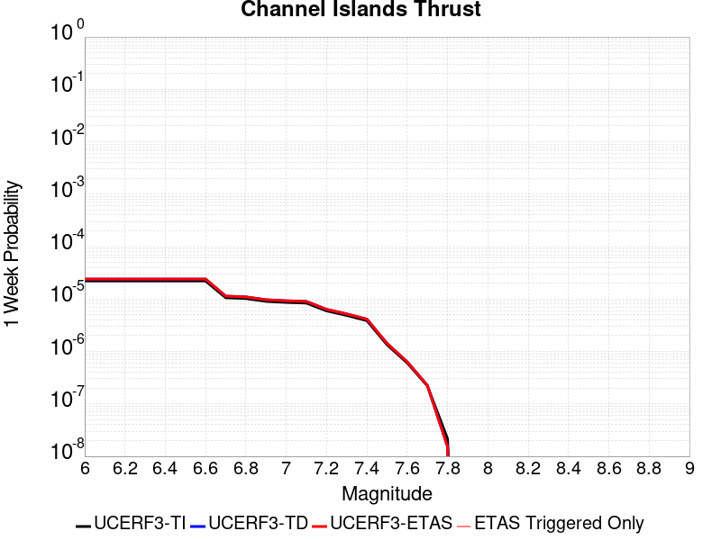 |  |  | 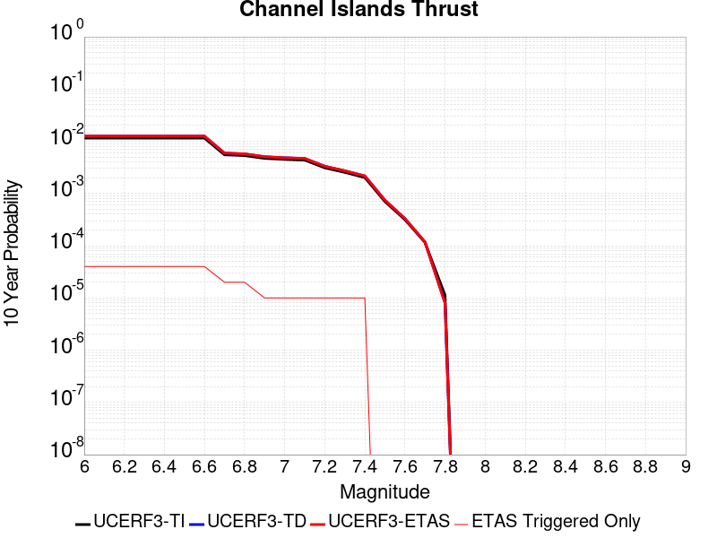 |

| Magnitude | 1 wk TI Prob | 1 wk TD Prob | 1 wk ETAS Prob | 1 wk ETAS/TD Gain | 1 wk ETAS Triggered Only | 1 mo TI Prob | 1 mo TD Prob | 1 mo ETAS Prob | 1 mo ETAS/TD Gain | 1 mo ETAS Triggered Only | 1 yr TI Prob | 1 yr TD Prob | 1 yr ETAS Prob | 1 yr ETAS/TD Gain | 1 yr ETAS Triggered Only | 10 yr TI Prob | 10 yr TD Prob | 10 yr ETAS Prob | 10 yr ETAS/TD Gain | 10 yr ETAS Triggered Only |
|-----|-----|-----|-----|-----|-----|-----|-----|-----|-----|-----|-----|-----|-----|-----|-----|-----|-----|-----|-----|-----|
| 6.0 | 2.2156251E-5 | 2.4093148E-5 | 2.4093148E-5 | 1.0 | 0.0 | 9.495191E-5 | 1.0325286E-4 | 1.0325286E-4 | 1.0 | 0.0 | 0.0011554264 | 0.0012564851 | 0.0012664726 | 1.0079488 | 1.0E-5 | 0.011494373 | 0.012504402 | 0.012543901 | 1.0031589 | 4.0E-5 |
| 6.1 | 2.2156251E-5 | 2.4093148E-5 | 2.4093148E-5 | 1.0 | 0.0 | 9.495191E-5 | 1.0325286E-4 | 1.0325286E-4 | 1.0 | 0.0 | 0.0011554264 | 0.0012564851 | 0.0012664726 | 1.0079488 | 1.0E-5 | 0.011494373 | 0.012504402 | 0.012543901 | 1.0031589 | 4.0E-5 |
| 6.2 | 2.2156251E-5 | 2.4093148E-5 | 2.4093148E-5 | 1.0 | 0.0 | 9.495191E-5 | 1.0325286E-4 | 1.0325286E-4 | 1.0 | 0.0 | 0.0011554264 | 0.0012564851 | 0.0012664726 | 1.0079488 | 1.0E-5 | 0.011494373 | 0.012504402 | 0.012543901 | 1.0031589 | 4.0E-5 |
| 6.3 | 2.2156251E-5 | 2.4093148E-5 | 2.4093148E-5 | 1.0 | 0.0 | 9.495191E-5 | 1.0325286E-4 | 1.0325286E-4 | 1.0 | 0.0 | 0.0011554264 | 0.0012564851 | 0.0012664726 | 1.0079488 | 1.0E-5 | 0.011494373 | 0.012504402 | 0.012543901 | 1.0031589 | 4.0E-5 |
| 6.4 | 2.2156251E-5 | 2.4093148E-5 | 2.4093148E-5 | 1.0 | 0.0 | 9.495191E-5 | 1.0325286E-4 | 1.0325286E-4 | 1.0 | 0.0 | 0.0011554264 | 0.0012564851 | 0.0012664726 | 1.0079488 | 1.0E-5 | 0.011494373 | 0.012504402 | 0.012543901 | 1.0031589 | 4.0E-5 |
| 6.5 | 2.2156251E-5 | 2.4093148E-5 | 2.4093148E-5 | 1.0 | 0.0 | 9.495191E-5 | 1.0325286E-4 | 1.0325286E-4 | 1.0 | 0.0 | 0.0011554264 | 0.0012564851 | 0.0012664726 | 1.0079488 | 1.0E-5 | 0.011494373 | 0.012504402 | 0.012543901 | 1.0031589 | 4.0E-5 |
| 6.6 | 2.2156251E-5 | 2.4093148E-5 | 2.4093148E-5 | 1.0 | 0.0 | 9.495191E-5 | 1.0325286E-4 | 1.0325286E-4 | 1.0 | 0.0 | 0.0011554264 | 0.0012564851 | 0.0012664726 | 1.0079488 | 1.0E-5 | 0.011494373 | 0.012504402 | 0.012543901 | 1.0031589 | 4.0E-5 |
| 6.7 | 1.0601296E-5 | 1.1379993E-5 | 1.1379993E-5 | 1.0 | 0.0 | 4.5433335E-5 | 4.8770515E-5 | 4.8770515E-5 | 1.0 | 0.0 | 5.5301044E-4 | 5.9362414E-4 | 5.9362414E-4 | 1.0 | 0.0 | 0.005516363 | 0.0059208865 | 0.005940768 | 1.0033579 | 2.0E-5 |
| 6.8 | 1.0246747E-5 | 1.09971015E-5 | 1.09971015E-5 | 1.0 | 0.0 | 4.391389E-5 | 4.712961E-5 | 4.712961E-5 | 1.0 | 0.0 | 5.345204E-4 | 5.7365675E-4 | 5.7365675E-4 | 1.0 | 0.0 | 0.0053323656 | 0.0057222494 | 0.005742135 | 1.0034751 | 2.0E-5 |
| 6.9 | 9.049551E-6 | 9.70002E-6 | 9.70002E-6 | 1.0 | 0.0 | 3.878322E-5 | 4.1570875E-5 | 4.1570875E-5 | 1.0 | 0.0 | 4.7208337E-4 | 5.0601194E-4 | 5.0601194E-4 | 1.0 | 0.0 | 0.0047108172 | 0.0050490154 | 0.0050589647 | 1.0019705 | 1.0E-5 |
| 7.0 | 8.6542195E-6 | 9.2749615E-6 | 9.2749615E-6 | 1.0 | 0.0 | 3.7088983E-5 | 3.9749255E-5 | 3.9749255E-5 | 1.0 | 0.0 | 4.5146482E-4 | 4.8384376E-4 | 4.8384376E-4 | 1.0 | 0.0 | 0.004505487 | 0.004828315 | 0.0048382673 | 1.0020611 | 1.0E-5 |
| 7.1 | 8.391028E-6 | 8.993273E-6 | 8.993273E-6 | 1.0 | 0.0 | 3.5961057E-5 | 3.8542054E-5 | 3.8542054E-5 | 1.0 | 0.0 | 4.3773788E-4 | 4.6915252E-4 | 4.6915252E-4 | 1.0 | 0.0 | 0.004368766 | 0.004682031 | 0.0046919845 | 1.0021259 | 1.0E-5 |
| 7.2 | 5.965188E-6 | 6.3719312E-6 | 6.3719312E-6 | 1.0 | 0.0 | 2.556484E-5 | 2.7307993E-5 | 2.7307993E-5 | 1.0 | 0.0 | 3.1120746E-4 | 3.3242465E-4 | 3.3242465E-4 | 1.0 | 0.0 | 0.00310772 | 0.003319332 | 0.0033292987 | 1.0030026 | 1.0E-5 |
| 7.3 | 4.877518E-6 | 5.2061982E-6 | 5.2061982E-6 | 1.0 | 0.0 | 2.0903482E-5 | 2.231209E-5 | 2.231209E-5 | 1.0 | 0.0 | 2.5447016E-4 | 2.7161627E-4 | 2.7161627E-4 | 1.0 | 0.0 | 0.0025417898 | 0.002712889 | 0.0027228622 | 1.003676 | 1.0E-5 |
| 7.4 | 3.8829853E-6 | 4.142015E-6 | 4.142015E-6 | 1.0 | 0.0 | 1.664126E-5 | 1.7751374E-5 | 1.7751374E-5 | 1.0 | 0.0 | 2.0258849E-4 | 2.1610195E-4 | 2.1610195E-4 | 1.0 | 0.0 | 0.002024039 | 0.0021589599 | 0.0021689383 | 1.0046219 | 1.0E-5 |
| 7.5 | 1.3489616E-6 | 1.4278398E-6 | 1.4278398E-6 | 1.0 | 0.0 | 5.7812517E-6 | 6.1192995E-6 | 6.1192995E-6 | 1.0 | 0.0 | 7.038446E-5 | 7.449996E-5 | 7.449996E-5 | 1.0 | 0.0 | 7.036218E-4 | 7.4475387E-4 | 7.4475387E-4 | 1.0 | 0.0 |
| 7.6 | 6.058192E-7 | 6.353994E-7 | 6.353994E-7 | 1.0 | 0.0 | 2.5963652E-6 | 2.7231374E-6 | 2.7231374E-6 | 1.0 | 0.0 | 3.161029E-5 | 3.315371E-5 | 3.315371E-5 | 1.0 | 0.0 | 3.1605794E-4 | 3.3148925E-4 | 3.3148925E-4 | 1.0 | 0.0 |
| 7.7 | 2.2170494E-7 | 2.260861E-7 | 2.260861E-7 | 1.0 | 0.0 | 9.5016367E-7 | 9.689402E-7 | 9.689402E-7 | 1.0 | 0.0 | 1.1568181E-5 | 1.1796794E-5 | 1.1796794E-5 | 1.0 | 0.0 | 1.1567579E-4 | 1.1796278E-4 | 1.1796278E-4 | 1.0 | 0.0 |
| 7.8 | 2.1613102E-8 | 1.5467108E-8 | 1.5467108E-8 | 1.0 | 0.0 | 9.262757E-8 | 6.6287605E-8 | 6.6287605E-8 | 1.0 | 0.0 | 1.1277401E-6 | 8.070513E-7 | 8.070513E-7 | 1.0 | 0.0 | 1.1277344E-5 | 8.070492E-6 | 8.070492E-6 | 1.0 | 0.0 |

## Pleito
*[(top)](#table-of-contents)*

| 1 Week | 1 Month | 1 Year | 10 Year |
|-----|-----|-----|-----|
|  |  | 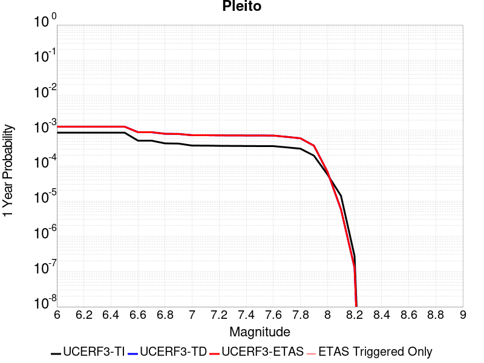 |  |

| Magnitude | 1 wk TI Prob | 1 wk TD Prob | 1 wk ETAS Prob | 1 wk ETAS/TD Gain | 1 wk ETAS Triggered Only | 1 mo TI Prob | 1 mo TD Prob | 1 mo ETAS Prob | 1 mo ETAS/TD Gain | 1 mo ETAS Triggered Only | 1 yr TI Prob | 1 yr TD Prob | 1 yr ETAS Prob | 1 yr ETAS/TD Gain | 1 yr ETAS Triggered Only | 10 yr TI Prob | 10 yr TD Prob | 10 yr ETAS Prob | 10 yr ETAS/TD Gain | 10 yr ETAS Triggered Only |
|-----|-----|-----|-----|-----|-----|-----|-----|-----|-----|-----|-----|-----|-----|-----|-----|-----|-----|-----|-----|-----|
| 6.0 | 1.6763008E-5 | 2.479053E-5 | 2.479053E-5 | 1.0 | 0.0 | 7.183948E-5 | 1.0624121E-4 | 1.0624121E-4 | 1.0 | 0.0 | 8.742947E-4 | 0.0012927912 | 0.0012927912 | 1.0 | 0.0 | 0.00870863 | 0.012967364 | 0.013016716 | 1.0038059 | 5.0E-5 |
| 6.1 | 1.6763008E-5 | 2.479053E-5 | 2.479053E-5 | 1.0 | 0.0 | 7.183948E-5 | 1.0624121E-4 | 1.0624121E-4 | 1.0 | 0.0 | 8.742947E-4 | 0.0012927912 | 0.0012927912 | 1.0 | 0.0 | 0.00870863 | 0.012967364 | 0.013016716 | 1.0038059 | 5.0E-5 |
| 6.2 | 1.6763008E-5 | 2.479053E-5 | 2.479053E-5 | 1.0 | 0.0 | 7.183948E-5 | 1.0624121E-4 | 1.0624121E-4 | 1.0 | 0.0 | 8.742947E-4 | 0.0012927912 | 0.0012927912 | 1.0 | 0.0 | 0.00870863 | 0.012967364 | 0.013016716 | 1.0038059 | 5.0E-5 |
| 6.3 | 1.6763008E-5 | 2.479053E-5 | 2.479053E-5 | 1.0 | 0.0 | 7.183948E-5 | 1.0624121E-4 | 1.0624121E-4 | 1.0 | 0.0 | 8.742947E-4 | 0.0012927912 | 0.0012927912 | 1.0 | 0.0 | 0.00870863 | 0.012967364 | 0.013016716 | 1.0038059 | 5.0E-5 |
| 6.4 | 1.6763008E-5 | 2.479053E-5 | 2.479053E-5 | 1.0 | 0.0 | 7.183948E-5 | 1.0624121E-4 | 1.0624121E-4 | 1.0 | 0.0 | 8.742947E-4 | 0.0012927912 | 0.0012927912 | 1.0 | 0.0 | 0.00870863 | 0.012967364 | 0.013016716 | 1.0038059 | 5.0E-5 |
| 6.5 | 1.6763008E-5 | 2.479053E-5 | 2.479053E-5 | 1.0 | 0.0 | 7.183948E-5 | 1.0624121E-4 | 1.0624121E-4 | 1.0 | 0.0 | 8.742947E-4 | 0.0012927912 | 0.0012927912 | 1.0 | 0.0 | 0.00870863 | 0.012967364 | 0.013016716 | 1.0038059 | 5.0E-5 |
| 6.6 | 9.910213E-6 | 1.7240907E-5 | 1.7240907E-5 | 1.0 | 0.0 | 4.247165E-5 | 7.388753E-5 | 7.388753E-5 | 1.0 | 0.0 | 5.169696E-4 | 8.992132E-4 | 8.992132E-4 | 1.0 | 0.0 | 0.0051576863 | 0.009064018 | 0.009064018 | 1.0 | 0.0 |
| 6.7 | 9.910213E-6 | 1.7240907E-5 | 1.7240907E-5 | 1.0 | 0.0 | 4.247165E-5 | 7.388753E-5 | 7.388753E-5 | 1.0 | 0.0 | 5.169696E-4 | 8.992132E-4 | 8.992132E-4 | 1.0 | 0.0 | 0.0051576863 | 0.009064018 | 0.009064018 | 1.0 | 0.0 |
| 6.8 | 8.300162E-6 | 1.5500442E-5 | 1.5500442E-5 | 1.0 | 0.0 | 3.557164E-5 | 6.642878E-5 | 6.642878E-5 | 1.0 | 0.0 | 4.3299864E-4 | 8.0847176E-4 | 8.0847176E-4 | 1.0 | 0.0 | 0.004321559 | 0.008163428 | 0.008163428 | 1.0 | 0.0 |
| 6.9 | 8.183114E-6 | 1.5371645E-5 | 1.5371645E-5 | 1.0 | 0.0 | 3.5070017E-5 | 6.5876826E-5 | 6.5876826E-5 | 1.0 | 0.0 | 4.2689382E-4 | 8.017566E-4 | 8.017566E-4 | 1.0 | 0.0 | 0.0042607468 | 0.008096768 | 0.008096768 | 1.0 | 0.0 |
| 7.0 | 7.1748823E-6 | 1.4158308E-5 | 1.4158308E-5 | 1.0 | 0.0 | 3.0749135E-5 | 6.067705E-5 | 6.067705E-5 | 1.0 | 0.0 | 3.743064E-4 | 7.384933E-4 | 7.384933E-4 | 1.0 | 0.0 | 0.0037367654 | 0.0074680606 | 0.0074680606 | 1.0 | 0.0 |
| 7.1 | 7.1671807E-6 | 1.4148675E-5 | 1.4148675E-5 | 1.0 | 0.0 | 3.0716128E-5 | 6.063577E-5 | 6.063577E-5 | 1.0 | 0.0 | 3.7390468E-4 | 7.37991E-4 | 7.37991E-4 | 1.0 | 0.0 | 0.0037327618 | 0.007463072 | 0.007463072 | 1.0 | 0.0 |
| 7.2 | 7.0649667E-6 | 1.399588E-5 | 1.399588E-5 | 1.0 | 0.0 | 3.0278077E-5 | 5.998097E-5 | 5.998097E-5 | 1.0 | 0.0 | 3.6857324E-4 | 7.300241E-4 | 7.300241E-4 | 1.0 | 0.0 | 0.0036796255 | 0.007383786 | 0.007383786 | 1.0 | 0.0 |
| 7.3 | 7.02082E-6 | 1.3939285E-5 | 1.3939285E-5 | 1.0 | 0.0 | 3.008888E-5 | 5.9738428E-5 | 5.9738428E-5 | 1.0 | 0.0 | 3.6627054E-4 | 7.270732E-4 | 7.270732E-4 | 1.0 | 0.0 | 0.0036566744 | 0.0073542604 | 0.0073542604 | 1.0 | 0.0 |
| 7.4 | 6.987146E-6 | 1.3898819E-5 | 1.3898819E-5 | 1.0 | 0.0 | 2.9944567E-5 | 5.956501E-5 | 5.956501E-5 | 1.0 | 0.0 | 3.6451413E-4 | 7.249632E-4 | 7.249632E-4 | 1.0 | 0.0 | 0.0036391679 | 0.007333182 | 0.007333182 | 1.0 | 0.0 |
| 7.5 | 6.9494554E-6 | 1.3855703E-5 | 1.3855703E-5 | 1.0 | 0.0 | 2.9783041E-5 | 5.9380236E-5 | 5.9380236E-5 | 1.0 | 0.0 | 3.625482E-4 | 7.2271505E-4 | 7.2271505E-4 | 1.0 | 0.0 | 0.0036195726 | 0.0073107993 | 0.0073107993 | 1.0 | 0.0 |
| 7.6 | 6.92694E-6 | 1.3814777E-5 | 1.3814777E-5 | 1.0 | 0.0 | 2.9686547E-5 | 5.9204845E-5 | 5.9204845E-5 | 1.0 | 0.0 | 3.6137376E-4 | 7.205811E-4 | 7.205811E-4 | 1.0 | 0.0 | 0.0036078666 | 0.007289532 | 0.007289532 | 1.0 | 0.0 |
| 7.7 | 6.395867E-6 | 1.2692768E-5 | 1.2692768E-5 | 1.0 | 0.0 | 2.741057E-5 | 5.439644E-5 | 5.439644E-5 | 1.0 | 0.0 | 3.336726E-4 | 6.6207576E-4 | 6.6207576E-4 | 1.0 | 0.0 | 0.0033317201 | 0.0067076497 | 0.0067076497 | 1.0 | 0.0 |
| 7.8 | 5.8664327E-6 | 1.155828E-5 | 1.155828E-5 | 1.0 | 0.0 | 2.5141611E-5 | 4.953455E-5 | 4.953455E-5 | 1.0 | 0.0 | 3.060561E-4 | 6.0291647E-4 | 6.0291647E-4 | 1.0 | 0.0 | 0.0030563495 | 0.00611206 | 0.00611206 | 1.0 | 0.0 |
| 7.9 | 3.7167474E-6 | 7.1276354E-6 | 7.1276354E-6 | 1.0 | 0.0 | 1.592882E-5 | 3.0546653E-5 | 3.0546653E-5 | 1.0 | 0.0 | 1.9391612E-4 | 3.7184218E-4 | 3.7184218E-4 | 1.0 | 0.0 | 0.0019374699 | 0.003774384 | 0.003774384 | 1.0 | 0.0 |
| 8.0 | 1.0903841E-6 | 1.2909164E-6 | 1.2909164E-6 | 1.0 | 0.0 | 4.6730665E-6 | 5.532487E-6 | 5.532487E-6 | 1.0 | 0.0 | 5.68931E-5 | 6.735596E-5 | 6.735596E-5 | 1.0 | 0.0 | 5.6878536E-4 | 6.957586E-4 | 6.957586E-4 | 1.0 | 0.0 |
| 8.1 | 2.6894583E-7 | 1.1110662E-7 | 1.1110662E-7 | 1.0 | 0.0 | 1.1526245E-6 | 4.7617115E-7 | 4.7617115E-7 | 1.0 | 0.0 | 1.4033113E-5 | 5.7973684E-6 | 5.7973684E-6 | 1.0 | 0.0 | 1.4032227E-4 | 6.485011E-5 | 6.485011E-5 | 1.0 | 0.0 |
| 8.2 | 5.2967013E-9 | 2.4698603E-9 | 2.4698603E-9 | 1.0 | 0.0 | 2.2700148E-8 | 1.0585116E-8 | 1.0585116E-8 | 1.0 | 0.0 | 2.7637427E-7 | 1.2887378E-7 | 1.2887378E-7 | 1.0 | 0.0 | 2.7637393E-6 | 1.466009E-6 | 1.466009E-6 | 1.0 | 0.0 |

## Elysian Park (Upper)
*[(top)](#table-of-contents)*

| 1 Week | 1 Month | 1 Year | 10 Year |
|-----|-----|-----|-----|
|  |  |  | 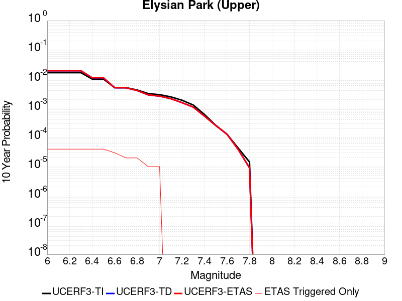 |

| Magnitude | 1 wk TI Prob | 1 wk TD Prob | 1 wk ETAS Prob | 1 wk ETAS/TD Gain | 1 wk ETAS Triggered Only | 1 mo TI Prob | 1 mo TD Prob | 1 mo ETAS Prob | 1 mo ETAS/TD Gain | 1 mo ETAS Triggered Only | 1 yr TI Prob | 1 yr TD Prob | 1 yr ETAS Prob | 1 yr ETAS/TD Gain | 1 yr ETAS Triggered Only | 10 yr TI Prob | 10 yr TD Prob | 10 yr ETAS Prob | 10 yr ETAS/TD Gain | 10 yr ETAS Triggered Only |
|-----|-----|-----|-----|-----|-----|-----|-----|-----|-----|-----|-----|-----|-----|-----|-----|-----|-----|-----|-----|-----|
| 6.0 | 3.1876025E-5 | 3.7039532E-5 | 3.7039532E-5 | 1.0 | 0.0 | 1.3660437E-4 | 1.5873392E-4 | 1.6873234E-4 | 1.0629885 | 1.0E-5 | 0.0016618895 | 0.0019313111 | 0.0019512725 | 1.0103357 | 2.0E-5 | 0.016495159 | 0.019191828 | 0.01923106 | 1.0020442 | 4.0E-5 |
| 6.1 | 3.1876025E-5 | 3.7039532E-5 | 3.7039532E-5 | 1.0 | 0.0 | 1.3660437E-4 | 1.5873392E-4 | 1.6873234E-4 | 1.0629885 | 1.0E-5 | 0.0016618895 | 0.0019313111 | 0.0019512725 | 1.0103357 | 2.0E-5 | 0.016495159 | 0.019191828 | 0.01923106 | 1.0020442 | 4.0E-5 |
| 6.2 | 3.1876025E-5 | 3.7039532E-5 | 3.7039532E-5 | 1.0 | 0.0 | 1.3660437E-4 | 1.5873392E-4 | 1.6873234E-4 | 1.0629885 | 1.0E-5 | 0.0016618895 | 0.0019313111 | 0.0019512725 | 1.0103357 | 2.0E-5 | 0.016495159 | 0.019191828 | 0.01923106 | 1.0020442 | 4.0E-5 |
| 6.3 | 3.1876025E-5 | 3.7039532E-5 | 3.7039532E-5 | 1.0 | 0.0 | 1.3660437E-4 | 1.5873392E-4 | 1.6873234E-4 | 1.0629885 | 1.0E-5 | 0.0016618895 | 0.0019313111 | 0.0019512725 | 1.0103357 | 2.0E-5 | 0.016495159 | 0.019191828 | 0.01923106 | 1.0020442 | 4.0E-5 |
| 6.4 | 1.9273462E-5 | 2.1204127E-5 | 2.1204127E-5 | 1.0 | 0.0 | 8.259794E-5 | 9.087264E-5 | 1.0087173E-4 | 1.1100341 | 1.0E-5 | 0.001005166 | 0.0011059863 | 0.0011259642 | 1.0180634 | 2.0E-5 | 0.010006315 | 0.011021685 | 0.011061244 | 1.0035892 | 4.0E-5 |
| 6.5 | 1.9273462E-5 | 2.1204127E-5 | 2.1204127E-5 | 1.0 | 0.0 | 8.259794E-5 | 9.087264E-5 | 1.0087173E-4 | 1.1100341 | 1.0E-5 | 0.001005166 | 0.0011059863 | 0.0011259642 | 1.0180634 | 2.0E-5 | 0.010006315 | 0.011021685 | 0.011061244 | 1.0035892 | 4.0E-5 |
| 6.6 | 9.813258E-6 | 9.666116E-6 | 9.666116E-6 | 1.0 | 0.0 | 4.205614E-5 | 4.1425592E-5 | 4.1425592E-5 | 1.0 | 0.0 | 5.119132E-4 | 5.0424715E-4 | 5.142421E-4 | 1.0198215 | 1.0E-5 | 0.005107356 | 0.0050317533 | 0.0050616027 | 1.0059321 | 3.0E-5 |
| 6.7 | 9.801478E-6 | 9.653685E-6 | 9.653685E-6 | 1.0 | 0.0 | 4.2005657E-5 | 4.1372317E-5 | 4.1372317E-5 | 1.0 | 0.0 | 5.112989E-4 | 5.035988E-4 | 5.135938E-4 | 1.019847 | 1.0E-5 | 0.0051012407 | 0.0050252997 | 0.0050451993 | 1.0039599 | 2.0E-5 |
| 6.8 | 8.102489E-6 | 7.773414E-6 | 7.773414E-6 | 1.0 | 0.0 | 3.4724493E-5 | 3.3314234E-5 | 3.3314234E-5 | 1.0 | 0.0 | 4.2268867E-4 | 4.0553027E-4 | 4.155262E-4 | 1.024649 | 1.0E-5 | 0.004218856 | 0.004048397 | 0.0040683155 | 1.0049202 | 2.0E-5 |
| 6.9 | 6.08275E-6 | 5.4816974E-6 | 5.4816974E-6 | 1.0 | 0.0 | 2.6068668E-5 | 2.3492783E-5 | 2.3492783E-5 | 1.0 | 0.0 | 3.173398E-4 | 2.8598786E-4 | 2.95985E-4 | 1.0349566 | 1.0E-5 | 0.0031688702 | 0.0028562758 | 0.0028662472 | 1.003491 | 1.0E-5 |
| 7.0 | 5.5995934E-6 | 4.983003E-6 | 4.983003E-6 | 1.0 | 0.0 | 2.3998036E-5 | 2.1355554E-5 | 2.1355554E-5 | 1.0 | 0.0 | 2.9213692E-4 | 2.5997352E-4 | 2.6997091E-4 | 1.0384555 | 1.0E-5 | 0.0029175316 | 0.0025967613 | 0.0026067353 | 1.0038409 | 1.0E-5 |
| 7.1 | 4.709881E-6 | 4.0875825E-6 | 4.0875825E-6 | 1.0 | 0.0 | 2.0185047E-5 | 1.7518096E-5 | 1.7518096E-5 | 1.0 | 0.0 | 2.4572524E-4 | 2.1326235E-4 | 2.1326235E-4 | 1.0 | 0.0 | 0.002454537 | 0.0021306183 | 0.0021306183 | 1.0 | 0.0 |
| 7.2 | 3.6063436E-6 | 2.9780829E-6 | 2.9780829E-6 | 1.0 | 0.0 | 1.5455667E-5 | 1.2763151E-5 | 1.2763151E-5 | 1.0 | 0.0 | 1.881565E-4 | 1.5538039E-4 | 1.5538039E-4 | 1.0 | 0.0 | 0.0018799726 | 0.0015527287 | 0.0015527287 | 1.0 | 0.0 |
| 7.3 | 2.471135E-6 | 2.095552E-6 | 2.095552E-6 | 1.0 | 0.0 | 1.0590536E-5 | 8.980906E-6 | 8.980906E-6 | 1.0 | 0.0 | 1.2893214E-4 | 1.09337125E-4 | 1.09337125E-4 | 1.0 | 0.0 | 0.0012885736 | 0.0010928405 | 0.0010928405 | 1.0 | 0.0 |
| 7.4 | 1.163943E-6 | 1.0275575E-6 | 1.0275575E-6 | 1.0 | 0.0 | 4.988318E-6 | 4.40381E-6 | 4.40381E-6 | 1.0 | 0.0 | 6.0731076E-5 | 5.3615102E-5 | 5.3615102E-5 | 1.0 | 0.0 | 6.071448E-4 | 5.360246E-4 | 5.360246E-4 | 1.0 | 0.0 |
| 7.5 | 4.99459E-7 | 4.9178306E-7 | 4.9178306E-7 | 1.0 | 0.0 | 2.140537E-6 | 2.10764E-6 | 2.10764E-6 | 1.0 | 0.0 | 2.6060725E-5 | 2.5660232E-5 | 2.5660232E-5 | 1.0 | 0.0 | 2.605767E-4 | 2.5657425E-4 | 2.5657425E-4 | 1.0 | 0.0 |
| 7.6 | 2.4667852E-7 | 2.4779692E-7 | 2.4779692E-7 | 1.0 | 0.0 | 1.0571932E-6 | 1.0619864E-6 | 1.0619864E-6 | 1.0 | 0.0 | 1.2871251E-5 | 1.2929611E-5 | 1.2929611E-5 | 1.0 | 0.0 | 1.2870505E-4 | 1.2928895E-4 | 1.2928895E-4 | 1.0 | 0.0 |
| 7.7 | 8.2312795E-8 | 7.38718E-8 | 7.38718E-8 | 1.0 | 0.0 | 3.527691E-7 | 3.165934E-7 | 3.165934E-7 | 1.0 | 0.0 | 4.294955E-6 | 3.854519E-6 | 3.854519E-6 | 1.0 | 0.0 | 4.2948723E-5 | 3.854464E-5 | 3.854464E-5 | 1.0 | 0.0 |
| 7.8 | 2.7819295E-8 | 1.7571217E-8 | 1.7571217E-8 | 1.0 | 0.0 | 1.1922555E-7 | 7.5305216E-8 | 7.5305216E-8 | 1.0 | 0.0 | 1.45157E-6 | 9.168408E-7 | 9.168408E-7 | 1.0 | 0.0 | 1.45156055E-5 | 9.168385E-6 | 9.168385E-6 | 1.0 | 0.0 |

## Lost Hills
*[(top)](#table-of-contents)*

| 1 Week | 1 Month | 1 Year | 10 Year |
|-----|-----|-----|-----|
|  |  | 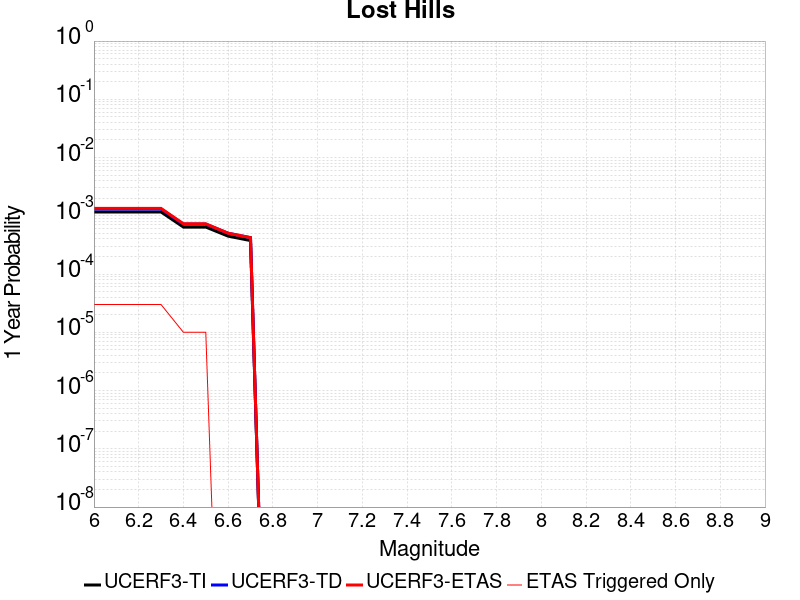 | 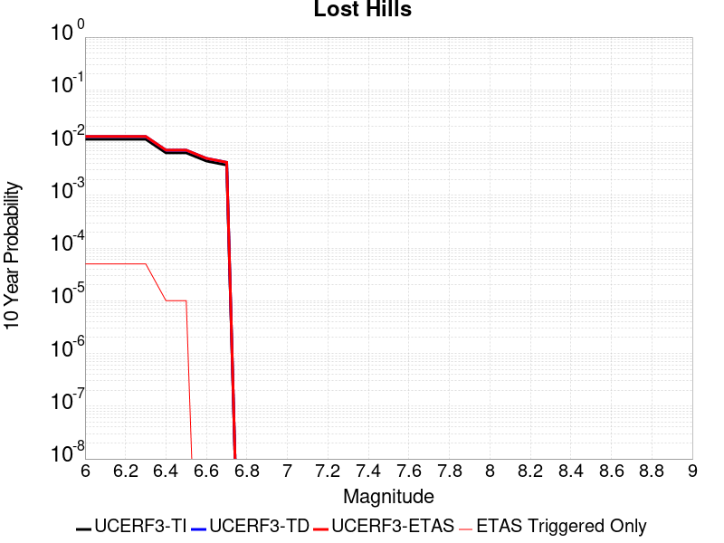 |

| Magnitude | 1 wk TI Prob | 1 wk TD Prob | 1 wk ETAS Prob | 1 wk ETAS/TD Gain | 1 wk ETAS Triggered Only | 1 mo TI Prob | 1 mo TD Prob | 1 mo ETAS Prob | 1 mo ETAS/TD Gain | 1 mo ETAS Triggered Only | 1 yr TI Prob | 1 yr TD Prob | 1 yr ETAS Prob | 1 yr ETAS/TD Gain | 1 yr ETAS Triggered Only | 10 yr TI Prob | 10 yr TD Prob | 10 yr ETAS Prob | 10 yr ETAS/TD Gain | 10 yr ETAS Triggered Only |
|-----|-----|-----|-----|-----|-----|-----|-----|-----|-----|-----|-----|-----|-----|-----|-----|-----|-----|-----|-----|-----|
| 6.0 | 2.233523E-5 | 2.5108235E-5 | 2.5108235E-5 | 1.0 | 0.0 | 9.571891E-5 | 1.07603235E-4 | 1.17602154E-4 | 1.092924 | 1.0E-5 | 0.0011647546 | 0.0013094501 | 0.0013394109 | 1.0228804 | 3.0E-5 | 0.011586686 | 0.013033944 | 0.013083292 | 1.0037861 | 5.0E-5 |
| 6.1 | 2.233523E-5 | 2.5108235E-5 | 2.5108235E-5 | 1.0 | 0.0 | 9.571891E-5 | 1.07603235E-4 | 1.17602154E-4 | 1.092924 | 1.0E-5 | 0.0011647546 | 0.0013094501 | 0.0013394109 | 1.0228804 | 3.0E-5 | 0.011586686 | 0.013033944 | 0.013083292 | 1.0037861 | 5.0E-5 |
| 6.2 | 2.233523E-5 | 2.5108235E-5 | 2.5108235E-5 | 1.0 | 0.0 | 9.571891E-5 | 1.07603235E-4 | 1.17602154E-4 | 1.092924 | 1.0E-5 | 0.0011647546 | 0.0013094501 | 0.0013394109 | 1.0228804 | 3.0E-5 | 0.011586686 | 0.013033944 | 0.013083292 | 1.0037861 | 5.0E-5 |
| 6.3 | 2.233523E-5 | 2.5108235E-5 | 2.5108235E-5 | 1.0 | 0.0 | 9.571891E-5 | 1.07603235E-4 | 1.17602154E-4 | 1.092924 | 1.0E-5 | 0.0011647546 | 0.0013094501 | 0.0013394109 | 1.0228804 | 3.0E-5 | 0.011586686 | 0.013033944 | 0.013083292 | 1.0037861 | 5.0E-5 |
| 6.4 | 1.2288092E-5 | 1.3781996E-5 | 1.3781996E-5 | 1.0 | 0.0 | 5.2662188E-5 | 5.906489E-5 | 5.906489E-5 | 1.0 | 0.0 | 6.409735E-4 | 7.1897154E-4 | 7.2896434E-4 | 1.0138987 | 1.0E-5 | 0.006391279 | 0.007175662 | 0.0071855905 | 1.0013835 | 1.0E-5 |
| 6.5 | 1.2288092E-5 | 1.3781996E-5 | 1.3781996E-5 | 1.0 | 0.0 | 5.2662188E-5 | 5.906489E-5 | 5.906489E-5 | 1.0 | 0.0 | 6.409735E-4 | 7.1897154E-4 | 7.2896434E-4 | 1.0138987 | 1.0E-5 | 0.006391279 | 0.007175662 | 0.0071855905 | 1.0013835 | 1.0E-5 |
| 6.6 | 8.58281E-6 | 9.634396E-6 | 9.634396E-6 | 1.0 | 0.0 | 3.6782953E-5 | 4.1290084E-5 | 4.1290084E-5 | 1.0 | 0.0 | 4.4774043E-4 | 5.02674E-4 | 5.02674E-4 | 1.0 | 0.0 | 0.0044683935 | 0.005023531 | 0.005023531 | 1.0 | 0.0 |
| 6.7 | 7.205685E-6 | 8.088828E-6 | 8.088828E-6 | 1.0 | 0.0 | 3.088114E-5 | 3.4666402E-5 | 3.4666402E-5 | 1.0 | 0.0 | 3.7591302E-4 | 4.2206346E-4 | 4.2206346E-4 | 1.0 | 0.0 | 0.0037527776 | 0.0042206347 | 0.0042206347 | 1.0 | 0.0 |

## Santa Cruz Island
*[(top)](#table-of-contents)*

| 1 Week | 1 Month | 1 Year | 10 Year |
|-----|-----|-----|-----|
|  |  |  |  |

| Magnitude | 1 wk TI Prob | 1 wk TD Prob | 1 wk ETAS Prob | 1 wk ETAS/TD Gain | 1 wk ETAS Triggered Only | 1 mo TI Prob | 1 mo TD Prob | 1 mo ETAS Prob | 1 mo ETAS/TD Gain | 1 mo ETAS Triggered Only | 1 yr TI Prob | 1 yr TD Prob | 1 yr ETAS Prob | 1 yr ETAS/TD Gain | 1 yr ETAS Triggered Only | 10 yr TI Prob | 10 yr TD Prob | 10 yr ETAS Prob | 10 yr ETAS/TD Gain | 10 yr ETAS Triggered Only |
|-----|-----|-----|-----|-----|-----|-----|-----|-----|-----|-----|-----|-----|-----|-----|-----|-----|-----|-----|-----|-----|
| 6.0 | 2.9164563E-5 | 3.1601154E-5 | 3.1601154E-5 | 1.0 | 0.0 | 1.2498499E-4 | 1.3542725E-4 | 1.3542725E-4 | 1.0 | 0.0 | 0.0015206301 | 0.001647716 | 0.0016576996 | 1.006059 | 1.0E-5 | 0.015102667 | 0.016368724 | 0.016417906 | 1.0030046 | 5.0E-5 |
| 6.1 | 2.9164563E-5 | 3.1601154E-5 | 3.1601154E-5 | 1.0 | 0.0 | 1.2498499E-4 | 1.3542725E-4 | 1.3542725E-4 | 1.0 | 0.0 | 0.0015206301 | 0.001647716 | 0.0016576996 | 1.006059 | 1.0E-5 | 0.015102667 | 0.016368724 | 0.016417906 | 1.0030046 | 5.0E-5 |
| 6.2 | 2.9164563E-5 | 3.1601154E-5 | 3.1601154E-5 | 1.0 | 0.0 | 1.2498499E-4 | 1.3542725E-4 | 1.3542725E-4 | 1.0 | 0.0 | 0.0015206301 | 0.001647716 | 0.0016576996 | 1.006059 | 1.0E-5 | 0.015102667 | 0.016368724 | 0.016417906 | 1.0030046 | 5.0E-5 |
| 6.3 | 1.6635553E-5 | 1.7805029E-5 | 1.7805029E-5 | 1.0 | 0.0 | 7.1293274E-5 | 7.6305136E-5 | 7.6305136E-5 | 1.0 | 0.0 | 8.6765E-4 | 9.286373E-4 | 9.286373E-4 | 1.0 | 0.0 | 0.008642701 | 0.009249439 | 0.00928907 | 1.0042846 | 4.0E-5 |
| 6.4 | 1.6635553E-5 | 1.7805029E-5 | 1.7805029E-5 | 1.0 | 0.0 | 7.1293274E-5 | 7.6305136E-5 | 7.6305136E-5 | 1.0 | 0.0 | 8.6765E-4 | 9.286373E-4 | 9.286373E-4 | 1.0 | 0.0 | 0.008642701 | 0.009249439 | 0.00928907 | 1.0042846 | 4.0E-5 |
| 6.5 | 1.2238748E-5 | 1.30434555E-5 | 1.30434555E-5 | 1.0 | 0.0 | 5.2450723E-5 | 5.5899345E-5 | 5.5899345E-5 | 1.0 | 0.0 | 6.3840044E-4 | 6.803657E-4 | 6.803657E-4 | 1.0 | 0.0 | 0.0063656955 | 0.006783226 | 0.006813023 | 1.0043926 | 3.0E-5 |
| 6.6 | 1.0489767E-5 | 1.1157017E-5 | 1.1157017E-5 | 1.0 | 0.0 | 4.495537E-5 | 4.7814923E-5 | 4.7814923E-5 | 1.0 | 0.0 | 5.4719415E-4 | 5.8199343E-4 | 5.8199343E-4 | 1.0 | 0.0 | 0.005458487 | 0.0058049336 | 0.0058347597 | 1.005138 | 3.0E-5 |
| 6.7 | 8.699222E-6 | 9.23709E-6 | 9.23709E-6 | 1.0 | 0.0 | 3.7281847E-5 | 3.958693E-5 | 3.958693E-5 | 1.0 | 0.0 | 4.5381195E-4 | 4.8186484E-4 | 4.8186484E-4 | 1.0 | 0.0 | 0.0045288634 | 0.0048082676 | 0.0048381235 | 1.0062093 | 3.0E-5 |
| 6.8 | 8.307732E-6 | 8.8171955E-6 | 8.8171955E-6 | 1.0 | 0.0 | 3.560408E-5 | 3.7787435E-5 | 3.7787435E-5 | 1.0 | 0.0 | 4.3339343E-4 | 4.5996535E-4 | 4.5996535E-4 | 1.0 | 0.0 | 0.004325492 | 0.0045901868 | 0.004620049 | 1.0065057 | 3.0E-5 |
| 6.9 | 8.073121E-6 | 8.565221E-6 | 8.565221E-6 | 1.0 | 0.0 | 3.459863E-5 | 3.6707574E-5 | 3.6707574E-5 | 1.0 | 0.0 | 4.2115687E-4 | 4.4682348E-4 | 4.4682348E-4 | 1.0 | 0.0 | 0.004203596 | 0.0044593024 | 0.0044891685 | 1.0066975 | 3.0E-5 |
| 7.0 | 7.617019E-6 | 8.074926E-6 | 8.074926E-6 | 1.0 | 0.0 | 3.264396E-5 | 3.4606368E-5 | 3.4606368E-5 | 1.0 | 0.0 | 3.9736772E-4 | 4.212515E-4 | 4.212515E-4 | 1.0 | 0.0 | 0.003966579 | 0.0042045773 | 0.004224493 | 1.0047367 | 2.0E-5 |
| 7.1 | 7.1224836E-6 | 7.5460302E-6 | 7.5460302E-6 | 1.0 | 0.0 | 3.052457E-5 | 3.233973E-5 | 3.233973E-5 | 1.0 | 0.0 | 3.715733E-4 | 3.9366545E-4 | 3.9366545E-4 | 1.0 | 0.0 | 0.003709526 | 0.003929724 | 0.0039396845 | 1.0025347 | 1.0E-5 |
| 7.2 | 6.441115E-6 | 6.827605E-6 | 6.827605E-6 | 1.0 | 0.0 | 2.7604487E-5 | 2.9260837E-5 | 2.9260837E-5 | 1.0 | 0.0 | 3.360328E-4 | 3.5619267E-4 | 3.5619267E-4 | 1.0 | 0.0 | 0.0033552512 | 0.0035562462 | 0.0035662106 | 1.0028019 | 1.0E-5 |
| 7.3 | 5.494274E-6 | 5.8201813E-6 | 5.8201813E-6 | 1.0 | 0.0 | 2.3546674E-5 | 2.4943398E-5 | 2.4943398E-5 | 1.0 | 0.0 | 2.8664304E-4 | 3.0364376E-4 | 3.0364376E-4 | 1.0 | 0.0 | 0.002862736 | 0.0030323118 | 0.0030422814 | 1.0032878 | 1.0E-5 |
| 7.4 | 4.0802624E-6 | 4.31239E-6 | 4.31239E-6 | 1.0 | 0.0 | 1.7486722E-5 | 1.8481542E-5 | 1.8481542E-5 | 1.0 | 0.0 | 2.1288003E-4 | 2.249896E-4 | 2.249896E-4 | 1.0 | 0.0 | 0.0021267622 | 0.0022476274 | 0.0022576049 | 1.0044391 | 1.0E-5 |
| 7.5 | 2.3584746E-6 | 2.4753783E-6 | 2.4753783E-6 | 1.0 | 0.0 | 1.0107709E-5 | 1.0608721E-5 | 1.0608721E-5 | 1.0 | 0.0 | 1.2305441E-4 | 1.2915357E-4 | 1.2915357E-4 | 1.0 | 0.0 | 0.0012298629 | 0.0012907902 | 0.0013007773 | 1.0077372 | 1.0E-5 |
| 7.6 | 9.4981914E-7 | 9.861161E-7 | 9.861161E-7 | 1.0 | 0.0 | 4.0706473E-6 | 4.226205E-6 | 4.226205E-6 | 1.0 | 0.0 | 4.9559E-5 | 5.1452847E-5 | 5.1452847E-5 | 1.0 | 0.0 | 4.954795E-4 | 5.144106E-4 | 5.144106E-4 | 1.0 | 0.0 |
| 7.7 | 2.6013532E-7 | 2.6417067E-7 | 2.6417067E-7 | 1.0 | 0.0 | 1.1148652E-6 | 1.1321595E-6 | 1.1321595E-6 | 1.0 | 0.0 | 1.3573399E-5 | 1.3783956E-5 | 1.3783956E-5 | 1.0 | 0.0 | 1.357257E-4 | 1.3783107E-4 | 1.3783107E-4 | 1.0 | 0.0 |
| 7.8 | 4.1522263E-8 | 3.9657305E-8 | 3.9657305E-8 | 1.0 | 0.0 | 1.7795254E-7 | 1.6995986E-7 | 1.6995986E-7 | 1.0 | 0.0 | 2.16657E-6 | 2.0692596E-6 | 2.0692596E-6 | 1.0 | 0.0 | 2.1665488E-5 | 2.0692425E-5 | 2.0692425E-5 | 1.0 | 0.0 |
| 7.9 | 7.7242046E-10 | 5.946944E-10 | 5.946944E-10 | 1.0 | 0.0 | 3.3103735E-9 | 2.5486908E-9 | 2.5486908E-9 | 1.0 | 0.0 | 4.0303796E-8 | 3.103031E-8 | 3.103031E-8 | 1.0 | 0.0 | 4.030379E-7 | 3.1030308E-7 | 3.1030308E-7 | 1.0 | 0.0 |

## Red Mountain
*[(top)](#table-of-contents)*

| 1 Week | 1 Month | 1 Year | 10 Year |
|-----|-----|-----|-----|
|  |  | 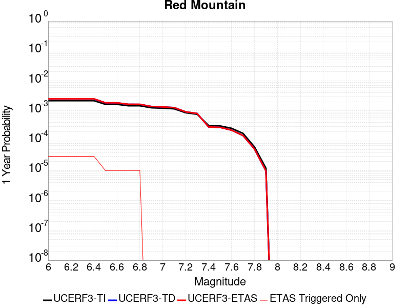 |  |

| Magnitude | 1 wk TI Prob | 1 wk TD Prob | 1 wk ETAS Prob | 1 wk ETAS/TD Gain | 1 wk ETAS Triggered Only | 1 mo TI Prob | 1 mo TD Prob | 1 mo ETAS Prob | 1 mo ETAS/TD Gain | 1 mo ETAS Triggered Only | 1 yr TI Prob | 1 yr TD Prob | 1 yr ETAS Prob | 1 yr ETAS/TD Gain | 1 yr ETAS Triggered Only | 10 yr TI Prob | 10 yr TD Prob | 10 yr ETAS Prob | 10 yr ETAS/TD Gain | 10 yr ETAS Triggered Only |
|-----|-----|-----|-----|-----|-----|-----|-----|-----|-----|-----|-----|-----|-----|-----|-----|-----|-----|-----|-----|-----|
| 6.0 | 4.1810763E-5 | 4.759418E-5 | 4.759418E-5 | 1.0 | 0.0 | 1.7917668E-4 | 2.0396004E-4 | 2.0396004E-4 | 1.0 | 0.0 | 0.0021792934 | 0.0024805511 | 0.0025104766 | 1.0120641 | 3.0E-5 | 0.021580452 | 0.024546249 | 0.024595022 | 1.001987 | 5.0E-5 |
| 6.1 | 4.1810763E-5 | 4.759418E-5 | 4.759418E-5 | 1.0 | 0.0 | 1.7917668E-4 | 2.0396004E-4 | 2.0396004E-4 | 1.0 | 0.0 | 0.0021792934 | 0.0024805511 | 0.0025104766 | 1.0120641 | 3.0E-5 | 0.021580452 | 0.024546249 | 0.024595022 | 1.001987 | 5.0E-5 |
| 6.2 | 4.1810763E-5 | 4.759418E-5 | 4.759418E-5 | 1.0 | 0.0 | 1.7917668E-4 | 2.0396004E-4 | 2.0396004E-4 | 1.0 | 0.0 | 0.0021792934 | 0.0024805511 | 0.0025104766 | 1.0120641 | 3.0E-5 | 0.021580452 | 0.024546249 | 0.024595022 | 1.001987 | 5.0E-5 |
| 6.3 | 4.1810763E-5 | 4.759418E-5 | 4.759418E-5 | 1.0 | 0.0 | 1.7917668E-4 | 2.0396004E-4 | 2.0396004E-4 | 1.0 | 0.0 | 0.0021792934 | 0.0024805511 | 0.0025104766 | 1.0120641 | 3.0E-5 | 0.021580452 | 0.024546249 | 0.024595022 | 1.001987 | 5.0E-5 |
| 6.4 | 4.1810763E-5 | 4.759418E-5 | 4.759418E-5 | 1.0 | 0.0 | 1.7917668E-4 | 2.0396004E-4 | 2.0396004E-4 | 1.0 | 0.0 | 0.0021792934 | 0.0024805511 | 0.0025104766 | 1.0120641 | 3.0E-5 | 0.021580452 | 0.024546249 | 0.024595022 | 1.001987 | 5.0E-5 |
| 6.5 | 3.154503E-5 | 3.5362722E-5 | 3.5362722E-5 | 1.0 | 0.0 | 1.3518598E-4 | 1.5154622E-4 | 1.5154622E-4 | 1.0 | 0.0 | 0.0016446467 | 0.001843606 | 0.0018535876 | 1.0054141 | 1.0E-5 | 0.01632528 | 0.018292768 | 0.018312402 | 1.0010734 | 2.0E-5 |
| 6.6 | 3.1535834E-5 | 3.5352103E-5 | 3.5352103E-5 | 1.0 | 0.0 | 1.3514658E-4 | 1.5150072E-4 | 1.5150072E-4 | 1.0 | 0.0 | 0.0016441676 | 0.0018430529 | 0.0018530345 | 1.0054158 | 1.0E-5 | 0.01632056 | 0.018287329 | 0.018306963 | 1.0010736 | 2.0E-5 |
| 6.7 | 2.8267326E-5 | 3.1471947E-5 | 3.1471947E-5 | 1.0 | 0.0 | 1.2114006E-4 | 1.3487328E-4 | 1.3487328E-4 | 1.0 | 0.0 | 0.0014738824 | 0.0016409304 | 0.001650914 | 1.0060841 | 1.0E-5 | 0.014641452 | 0.016296903 | 0.016316578 | 1.0012072 | 2.0E-5 |
| 6.8 | 2.8212884E-5 | 3.140983E-5 | 3.140983E-5 | 1.0 | 0.0 | 1.20906756E-4 | 1.3460708E-4 | 1.3460708E-4 | 1.0 | 0.0 | 0.0014710457 | 0.0016376943 | 0.001647678 | 1.0060961 | 1.0E-5 | 0.014613459 | 0.016265018 | 0.016284691 | 1.0012096 | 2.0E-5 |
| 6.9 | 2.4227871E-5 | 2.6709133E-5 | 2.6709133E-5 | 1.0 | 0.0 | 1.03829596E-4 | 1.1446312E-4 | 1.1446312E-4 | 1.0 | 0.0 | 0.0012633923 | 0.0013927735 | 0.0013927735 | 1.0 | 0.0 | 0.012562336 | 0.013848136 | 0.013857997 | 1.0007122 | 1.0E-5 |
| 7.0 | 2.348524E-5 | 2.5837837E-5 | 2.5837837E-5 | 1.0 | 0.0 | 1.0064714E-4 | 1.10729314E-4 | 1.10729314E-4 | 1.0 | 0.0 | 0.0012246901 | 0.0013473714 | 0.0013473714 | 1.0 | 0.0 | 0.012179627 | 0.013399659 | 0.013409525 | 1.0007362 | 1.0E-5 |
| 7.1 | 2.2311642E-5 | 2.4464778E-5 | 2.4464778E-5 | 1.0 | 0.0 | 9.561782E-5 | 1.0484526E-4 | 1.0484526E-4 | 1.0 | 0.0 | 0.0011635252 | 0.0012758184 | 0.0012758184 | 1.0 | 0.0 | 0.01157452 | 0.012692457 | 0.012702331 | 1.0007778 | 1.0E-5 |
| 7.2 | 1.6533986E-5 | 1.7671664E-5 | 1.7671664E-5 | 1.0 | 0.0 | 7.085802E-5 | 7.573386E-5 | 7.573386E-5 | 1.0 | 0.0 | 8.623549E-4 | 9.2173315E-4 | 9.2173315E-4 | 1.0 | 0.0 | 0.008590161 | 0.00918538 | 0.009195289 | 1.0010787 | 1.0E-5 |
| 7.3 | 1.4703092E-5 | 1.5560665E-5 | 1.5560665E-5 | 1.0 | 0.0 | 6.301173E-5 | 6.668721E-5 | 6.668721E-5 | 1.0 | 0.0 | 7.668978E-4 | 8.116759E-4 | 8.116759E-4 | 1.0 | 0.0 | 0.0076425658 | 0.008093189 | 0.008093189 | 1.0 | 0.0 |
| 7.4 | 6.1331984E-6 | 5.5291057E-6 | 5.5291057E-6 | 1.0 | 0.0 | 2.6284872E-5 | 2.3695955E-5 | 2.3695955E-5 | 1.0 | 0.0 | 3.199713E-4 | 2.8846058E-4 | 2.8846058E-4 | 1.0 | 0.0 | 0.0031951098 | 0.002880916 | 0.002880916 | 1.0 | 0.0 |
| 7.5 | 5.954766E-6 | 5.338727E-6 | 5.338727E-6 | 1.0 | 0.0 | 2.5520176E-5 | 2.288006E-5 | 2.288006E-5 | 1.0 | 0.0 | 3.1066386E-4 | 2.7852965E-4 | 2.7852965E-4 | 1.0 | 0.0 | 0.003102299 | 0.0027818596 | 0.0027818596 | 1.0 | 0.0 |
| 7.6 | 4.9726646E-6 | 4.315478E-6 | 4.315478E-6 | 1.0 | 0.0 | 2.1311245E-5 | 1.8494777E-5 | 1.8494777E-5 | 1.0 | 0.0 | 2.5943352E-4 | 2.2515097E-4 | 2.2515097E-4 | 1.0 | 0.0 | 0.0025913084 | 0.0022492632 | 0.0022492632 | 1.0 | 0.0 |
| 7.7 | 3.3613894E-6 | 2.8527843E-6 | 2.8527843E-6 | 1.0 | 0.0 | 1.4405875E-5 | 1.2226163E-5 | 1.2226163E-5 | 1.0 | 0.0 | 1.7537741E-4 | 1.4884362E-4 | 1.4884362E-4 | 1.0 | 0.0 | 0.0017523908 | 0.0014874657 | 0.0014874657 | 1.0 | 0.0 |
| 7.8 | 1.1828961E-6 | 1.0123111E-6 | 1.0123111E-6 | 1.0 | 0.0 | 5.069545E-6 | 4.3384694E-6 | 4.3384694E-6 | 1.0 | 0.0 | 6.171996E-5 | 5.281961E-5 | 5.281961E-5 | 1.0 | 0.0 | 6.170282E-4 | 5.280735E-4 | 5.280735E-4 | 1.0 | 0.0 |
| 7.9 | 2.2967266E-7 | 1.8619616E-7 | 1.8619616E-7 | 1.0 | 0.0 | 9.843111E-7 | 7.9798326E-7 | 7.9798326E-7 | 1.0 | 0.0 | 1.19839215E-5 | 9.715406E-6 | 9.715406E-6 | 1.0 | 0.0 | 1.1983275E-4 | 9.71501E-5 | 9.71501E-5 | 1.0 | 0.0 |

## Mission Creek
*[(top)](#table-of-contents)*

| 1 Week | 1 Month | 1 Year | 10 Year |
|-----|-----|-----|-----|
|  |  |  |  |

| Magnitude | 1 wk TI Prob | 1 wk TD Prob | 1 wk ETAS Prob | 1 wk ETAS/TD Gain | 1 wk ETAS Triggered Only | 1 mo TI Prob | 1 mo TD Prob | 1 mo ETAS Prob | 1 mo ETAS/TD Gain | 1 mo ETAS Triggered Only | 1 yr TI Prob | 1 yr TD Prob | 1 yr ETAS Prob | 1 yr ETAS/TD Gain | 1 yr ETAS Triggered Only | 10 yr TI Prob | 10 yr TD Prob | 10 yr ETAS Prob | 10 yr ETAS/TD Gain | 10 yr ETAS Triggered Only |
|-----|-----|-----|-----|-----|-----|-----|-----|-----|-----|-----|-----|-----|-----|-----|-----|-----|-----|-----|-----|-----|
| 6.0 | 1.1549387E-5 | 1.6331744E-5 | 1.6331744E-5 | 1.0 | 0.0 | 4.9496433E-5 | 6.9991394E-5 | 6.9991394E-5 | 1.0 | 0.0 | 6.0245243E-4 | 8.5182703E-4 | 8.7181E-4 | 1.023459 | 2.0E-5 | 0.006008218 | 0.008514742 | 0.008564317 | 1.0058222 | 5.0E-5 |
| 6.1 | 1.1549387E-5 | 1.6331744E-5 | 1.6331744E-5 | 1.0 | 0.0 | 4.9496433E-5 | 6.9991394E-5 | 6.9991394E-5 | 1.0 | 0.0 | 6.0245243E-4 | 8.5182703E-4 | 8.7181E-4 | 1.023459 | 2.0E-5 | 0.006008218 | 0.008514742 | 0.008564317 | 1.0058222 | 5.0E-5 |
| 6.2 | 1.1549387E-5 | 1.6331744E-5 | 1.6331744E-5 | 1.0 | 0.0 | 4.9496433E-5 | 6.9991394E-5 | 6.9991394E-5 | 1.0 | 0.0 | 6.0245243E-4 | 8.5182703E-4 | 8.7181E-4 | 1.023459 | 2.0E-5 | 0.006008218 | 0.008514742 | 0.008564317 | 1.0058222 | 5.0E-5 |
| 6.3 | 1.1549387E-5 | 1.6331744E-5 | 1.6331744E-5 | 1.0 | 0.0 | 4.9496433E-5 | 6.9991394E-5 | 6.9991394E-5 | 1.0 | 0.0 | 6.0245243E-4 | 8.5182703E-4 | 8.7181E-4 | 1.023459 | 2.0E-5 | 0.006008218 | 0.008514742 | 0.008564317 | 1.0058222 | 5.0E-5 |
| 6.4 | 1.1549387E-5 | 1.6331744E-5 | 1.6331744E-5 | 1.0 | 0.0 | 4.9496433E-5 | 6.9991394E-5 | 6.9991394E-5 | 1.0 | 0.0 | 6.0245243E-4 | 8.5182703E-4 | 8.7181E-4 | 1.023459 | 2.0E-5 | 0.006008218 | 0.008514742 | 0.008564317 | 1.0058222 | 5.0E-5 |
| 6.5 | 1.1549387E-5 | 1.6331744E-5 | 1.6331744E-5 | 1.0 | 0.0 | 4.9496433E-5 | 6.9991394E-5 | 6.9991394E-5 | 1.0 | 0.0 | 6.0245243E-4 | 8.5182703E-4 | 8.7181E-4 | 1.023459 | 2.0E-5 | 0.006008218 | 0.008514742 | 0.008564317 | 1.0058222 | 5.0E-5 |
| 6.6 | 9.202681E-6 | 1.3854947E-5 | 1.3854947E-5 | 1.0 | 0.0 | 3.9439463E-5 | 5.9377046E-5 | 5.9377046E-5 | 1.0 | 0.0 | 4.800697E-4 | 7.226848E-4 | 7.426703E-4 | 1.0276545 | 2.0E-5 | 0.004790339 | 0.007231895 | 0.007281533 | 1.0068638 | 5.0E-5 |
| 6.7 | 9.019164E-6 | 1.366061E-5 | 1.366061E-5 | 1.0 | 0.0 | 3.8652986E-5 | 5.854421E-5 | 5.854421E-5 | 1.0 | 0.0 | 4.7049852E-4 | 7.1255164E-4 | 7.325374E-4 | 1.0280482 | 2.0E-5 | 0.004695036 | 0.007131216 | 0.00718086 | 1.0069615 | 5.0E-5 |
| 6.8 | 8.673558E-6 | 1.3282702E-5 | 1.3282702E-5 | 1.0 | 0.0 | 3.717186E-5 | 5.6924673E-5 | 5.6924673E-5 | 1.0 | 0.0 | 4.524734E-4 | 6.928463E-4 | 7.128325E-4 | 1.0288464 | 2.0E-5 | 0.0045155324 | 0.0069353953 | 0.0069850483 | 1.0071594 | 5.0E-5 |
| 6.9 | 7.002255E-6 | 1.1486859E-5 | 1.1486859E-5 | 1.0 | 0.0 | 3.000932E-5 | 4.9228507E-5 | 4.9228507E-5 | 1.0 | 0.0 | 3.653022E-4 | 5.991991E-4 | 6.1918714E-4 | 1.0333579 | 2.0E-5 | 0.0036470229 | 0.0060041854 | 0.0060538854 | 1.0082775 | 5.0E-5 |
| 7.0 | 5.84644E-6 | 9.683714E-6 | 9.683714E-6 | 1.0 | 0.0 | 2.5055931E-5 | 4.1500996E-5 | 4.1500996E-5 | 1.0 | 0.0 | 3.0501327E-4 | 5.0516205E-4 | 5.251519E-4 | 1.0395713 | 2.0E-5 | 0.0030459496 | 0.005068281 | 0.005118028 | 1.0098153 | 5.0E-5 |
| 7.1 | 5.54703E-6 | 9.338158E-6 | 9.338158E-6 | 1.0 | 0.0 | 2.377277E-5 | 4.0020088E-5 | 4.0020088E-5 | 1.0 | 0.0 | 2.8939504E-4 | 4.871401E-4 | 5.0713035E-4 | 1.041036 | 2.0E-5 | 0.0028901845 | 0.0048888596 | 0.004938615 | 1.0101774 | 5.0E-5 |
| 7.2 | 4.384709E-6 | 7.689885E-6 | 7.689885E-6 | 1.0 | 0.0 | 1.8791474E-5 | 3.2956254E-5 | 3.2956254E-5 | 1.0 | 0.0 | 2.2876218E-4 | 4.0117218E-4 | 4.2116415E-4 | 1.0498339 | 2.0E-5 | 0.0022852682 | 0.0040325816 | 0.00408238 | 1.012349 | 5.0E-5 |
| 7.3 | 3.7888456E-6 | 6.923602E-6 | 6.923602E-6 | 1.0 | 0.0 | 1.623781E-5 | 2.9672263E-5 | 2.9672263E-5 | 1.0 | 0.0 | 1.9767738E-4 | 3.6120327E-4 | 3.8119603E-4 | 1.0553505 | 2.0E-5 | 0.0019750162 | 0.0036342472 | 0.0036840655 | 1.013708 | 5.0E-5 |
| 7.4 | 2.1982462E-6 | 5.0316853E-6 | 5.0316853E-6 | 1.0 | 0.0 | 9.421021E-6 | 2.1564189E-5 | 2.1564189E-5 | 1.0 | 0.0 | 1.1469489E-4 | 2.6251256E-4 | 2.825073E-4 | 1.0761669 | 2.0E-5 | 0.0011463572 | 0.0026498951 | 0.0026997626 | 1.0188186 | 5.0E-5 |
| 7.5 | 2.051923E-6 | 4.6227096E-6 | 4.6227096E-6 | 1.0 | 0.0 | 8.793926E-6 | 1.9811463E-5 | 1.9811463E-5 | 1.0 | 0.0 | 1.0706078E-4 | 2.4117802E-4 | 2.611732E-4 | 1.0829062 | 2.0E-5 | 0.0010700922 | 0.0024374423 | 0.0024873205 | 1.0204633 | 5.0E-5 |
| 7.6 | 1.8733427E-6 | 4.1308053E-6 | 4.1308053E-6 | 1.0 | 0.0 | 8.028587E-6 | 1.7703333E-5 | 1.7703333E-5 | 1.0 | 0.0 | 9.774366E-5 | 2.1551683E-4 | 2.3551252E-4 | 1.0927802 | 2.0E-5 | 9.770069E-4 | 0.002181846 | 0.002231737 | 1.0228664 | 5.0E-5 |
| 7.7 | 1.8411953E-6 | 4.0504306E-6 | 4.0504306E-6 | 1.0 | 0.0 | 7.890813E-6 | 1.7358872E-5 | 1.7358872E-5 | 1.0 | 0.0 | 9.606641E-5 | 2.1132386E-4 | 2.3131965E-4 | 1.0946214 | 2.0E-5 | 9.6024893E-4 | 0.0021401057 | 0.0021899987 | 1.0233133 | 5.0E-5 |
| 7.8 | 1.7194251E-6 | 3.7173024E-6 | 3.7173024E-6 | 1.0 | 0.0 | 7.368944E-6 | 1.59312E-5 | 1.59312E-5 | 1.0 | 0.0 | 8.97132E-5 | 1.9394518E-4 | 2.139413E-4 | 1.103102 | 2.0E-5 | 8.967699E-4 | 0.0019658357 | 0.0020157374 | 1.0253844 | 5.0E-5 |
| 7.9 | 1.4035052E-6 | 2.9557E-6 | 2.9557E-6 | 1.0 | 0.0 | 6.0150082E-6 | 1.2667225E-5 | 1.2667225E-5 | 1.0 | 0.0 | 7.3230265E-5 | 1.5421261E-4 | 1.7420952E-4 | 1.1296711 | 2.0E-5 | 7.3206134E-4 | 0.0015659636 | 0.0016158853 | 1.0318792 | 5.0E-5 |
| 8.0 | 3.9318823E-7 | 5.542283E-7 | 5.542283E-7 | 1.0 | 0.0 | 1.6850913E-6 | 2.3752618E-6 | 2.3752618E-6 | 1.0 | 0.0 | 2.0515794E-5 | 2.8918435E-5 | 3.8918144E-5 | 1.3457901 | 1.0E-5 | 2.0513899E-4 | 2.997098E-4 | 3.097068E-4 | 1.0333556 | 1.0E-5 |
| 8.1 | 1.596793E-7 | 1.1427638E-7 | 1.1427638E-7 | 1.0 | 0.0 | 6.8433974E-7 | 4.8975585E-7 | 4.8975585E-7 | 1.0 | 0.0 | 8.331805E-6 | 5.962761E-6 | 5.962761E-6 | 1.0 | 0.0 | 8.331492E-5 | 6.57585E-5 | 6.57585E-5 | 1.0 | 0.0 |
| 8.2 | 4.9003038E-8 | 2.5565779E-8 | 2.5565779E-8 | 1.0 | 0.0 | 2.10013E-7 | 1.09567615E-7 | 1.09567615E-7 | 1.0 | 0.0 | 2.5569052E-6 | 1.3339849E-6 | 1.3339849E-6 | 1.0 | 0.0 | 2.556876E-5 | 1.5023335E-5 | 1.5023335E-5 | 1.0 | 0.0 |

## Whittier alt 1
*[(top)](#table-of-contents)*

| 1 Week | 1 Month | 1 Year | 10 Year |
|-----|-----|-----|-----|
|  |  |  |  |

| Magnitude | 1 wk TI Prob | 1 wk TD Prob | 1 wk ETAS Prob | 1 wk ETAS/TD Gain | 1 wk ETAS Triggered Only | 1 mo TI Prob | 1 mo TD Prob | 1 mo ETAS Prob | 1 mo ETAS/TD Gain | 1 mo ETAS Triggered Only | 1 yr TI Prob | 1 yr TD Prob | 1 yr ETAS Prob | 1 yr ETAS/TD Gain | 1 yr ETAS Triggered Only | 10 yr TI Prob | 10 yr TD Prob | 10 yr ETAS Prob | 10 yr ETAS/TD Gain | 10 yr ETAS Triggered Only |
|-----|-----|-----|-----|-----|-----|-----|-----|-----|-----|-----|-----|-----|-----|-----|-----|-----|-----|-----|-----|-----|
| 6.0 | 4.2554693E-5 | 4.7257003E-5 | 5.7256533E-5 | 1.2115989 | 1.0E-5 | 1.8236451E-4 | 2.0251611E-4 | 2.1251409E-4 | 1.0493687 | 1.0E-5 | 0.002218027 | 0.0024631664 | 0.0024831172 | 1.0080997 | 2.0E-5 | 0.02196019 | 0.024392692 | 0.024441473 | 1.0019997 | 5.0E-5 |
| 6.1 | 4.2554693E-5 | 4.7257003E-5 | 5.7256533E-5 | 1.2115989 | 1.0E-5 | 1.8236451E-4 | 2.0251611E-4 | 2.1251409E-4 | 1.0493687 | 1.0E-5 | 0.002218027 | 0.0024631664 | 0.0024831172 | 1.0080997 | 2.0E-5 | 0.02196019 | 0.024392692 | 0.024441473 | 1.0019997 | 5.0E-5 |
| 6.2 | 4.2554693E-5 | 4.7257003E-5 | 5.7256533E-5 | 1.2115989 | 1.0E-5 | 1.8236451E-4 | 2.0251611E-4 | 2.1251409E-4 | 1.0493687 | 1.0E-5 | 0.002218027 | 0.0024631664 | 0.0024831172 | 1.0080997 | 2.0E-5 | 0.02196019 | 0.024392692 | 0.024441473 | 1.0019997 | 5.0E-5 |
| 6.3 | 1.9617712E-5 | 1.827117E-5 | 2.8270986E-5 | 1.5473003 | 1.0E-5 | 8.40732E-5 | 7.830277E-5 | 8.830198E-5 | 1.1276994 | 1.0E-5 | 0.0010231105 | 9.5293834E-4 | 9.729193E-4 | 1.0209677 | 2.0E-5 | 0.01018413 | 0.009491804 | 0.009531424 | 1.0041741 | 4.0E-5 |
| 6.4 | 1.5611336E-5 | 1.3606451E-5 | 2.3606315E-5 | 1.7349355 | 1.0E-5 | 6.690401E-5 | 5.8312093E-5 | 6.831151E-5 | 1.171481 | 1.0E-5 | 8.142519E-4 | 7.0972444E-4 | 7.297103E-4 | 1.02816 | 2.0E-5 | 0.008112748 | 0.007076542 | 0.00710633 | 1.0042094 | 3.0E-5 |
| 6.5 | 1.5150166E-5 | 1.310308E-5 | 2.3102948E-5 | 1.7631694 | 1.0E-5 | 6.492767E-5 | 5.615488E-5 | 6.6154316E-5 | 1.1780689 | 1.0E-5 | 7.9020765E-4 | 6.834771E-4 | 7.0346345E-4 | 1.0292422 | 2.0E-5 | 0.007874036 | 0.006815699 | 0.0068454947 | 1.0043716 | 3.0E-5 |
| 6.6 | 1.295588E-5 | 1.03825105E-5 | 2.0382407E-5 | 1.9631481 | 1.0E-5 | 5.552402E-5 | 4.4495726E-5 | 5.449528E-5 | 1.2247307 | 1.0E-5 | 6.7579525E-4 | 5.416028E-4 | 5.5159733E-4 | 1.0184537 | 1.0E-5 | 0.006737438 | 0.005404262 | 0.0054142075 | 1.0018404 | 1.0E-5 |
| 6.7 | 1.2542085E-5 | 9.90111E-6 | 1.990101E-5 | 2.0099778 | 1.0E-5 | 5.3750682E-5 | 4.243265E-5 | 5.2432224E-5 | 1.2356576 | 1.0E-5 | 6.542181E-4 | 5.1649695E-4 | 5.264917E-4 | 1.0193512 | 1.0E-5 | 0.006522954 | 0.005154383 | 0.0051643313 | 1.0019301 | 1.0E-5 |
| 6.8 | 1.2195878E-5 | 9.4970965E-6 | 1.9497002E-5 | 2.0529435 | 1.0E-5 | 5.2267E-5 | 4.070122E-5 | 5.070081E-5 | 1.2456828 | 1.0E-5 | 6.36165E-4 | 4.9542653E-4 | 5.0542154E-4 | 1.0201746 | 1.0E-5 | 0.0063434686 | 0.0049445615 | 0.004954512 | 1.0020124 | 1.0E-5 |
| 6.9 | 1.1580298E-5 | 8.774486E-6 | 1.8774397E-5 | 2.139658 | 1.0E-5 | 4.9628903E-5 | 3.7604408E-5 | 4.760403E-5 | 1.2659162 | 1.0E-5 | 6.040644E-4 | 4.577391E-4 | 4.6773453E-4 | 1.0218365 | 1.0E-5 | 0.00602425 | 0.004569222 | 0.0045791767 | 1.0021785 | 1.0E-5 |
| 7.0 | 1.0964795E-5 | 8.085466E-6 | 1.8085386E-5 | 2.236777 | 1.0E-5 | 4.6991136E-5 | 3.4651544E-5 | 4.46512E-5 | 1.2885774 | 1.0E-5 | 5.7196687E-4 | 4.2180243E-4 | 4.3179822E-4 | 1.0236977 | 1.0E-5 | 0.0057049696 | 0.004211227 | 0.0042211846 | 1.0023646 | 1.0E-5 |
| 7.1 | 1.0230601E-5 | 7.327922E-6 | 1.732785E-5 | 2.3646333 | 1.0E-5 | 4.3844695E-5 | 3.140501E-5 | 4.1404695E-5 | 1.3184105 | 1.0E-5 | 5.336784E-4 | 3.8229022E-4 | 3.922864E-4 | 1.0261481 | 1.0E-5 | 0.005323986 | 0.0038174891 | 0.003827451 | 1.0026095 | 1.0E-5 |
| 7.2 | 9.40865E-6 | 6.5444156E-6 | 1.654435E-5 | 2.5280104 | 1.0E-5 | 4.032216E-5 | 2.8047201E-5 | 3.804692E-5 | 1.3565319 | 1.0E-5 | 4.908117E-4 | 3.414224E-4 | 3.5141897E-4 | 1.0292792 | 1.0E-5 | 0.0048972913 | 0.0034100711 | 0.003420037 | 1.0029225 | 1.0E-5 |
| 7.3 | 8.237384E-6 | 5.5987134E-6 | 1.5598658E-5 | 2.7861147 | 1.0E-5 | 3.5302593E-5 | 2.3994271E-5 | 3.399403E-5 | 1.4167562 | 1.0E-5 | 4.2972428E-4 | 2.9209215E-4 | 3.0208923E-4 | 1.0342258 | 1.0E-5 | 0.0042889426 | 0.0029174031 | 0.002927374 | 1.0034177 | 1.0E-5 |
| 7.4 | 7.5316966E-6 | 5.0286876E-6 | 1.5028638E-5 | 2.9885802 | 1.0E-5 | 3.2278298E-5 | 2.1551346E-5 | 3.155113E-5 | 1.4639981 | 1.0E-5 | 3.9291743E-4 | 2.6235706E-4 | 2.7235443E-4 | 1.038106 | 1.0E-5 | 0.0039222343 | 0.0026205853 | 0.002630559 | 1.003806 | 1.0E-5 |
| 7.5 | 6.149649E-6 | 3.934522E-6 | 1.3934483E-5 | 3.541595 | 1.0E-5 | 2.6355372E-5 | 1.6862132E-5 | 2.6861964E-5 | 1.5930347 | 1.0E-5 | 3.208294E-4 | 2.0527802E-4 | 2.1527597E-4 | 1.0487044 | 1.0E-5 | 0.003203666 | 0.0020509732 | 0.0020609528 | 1.0048658 | 1.0E-5 |
| 7.6 | 5.457711E-6 | 3.3959725E-6 | 1.3395938E-5 | 3.9446547 | 1.0E-5 | 2.338998E-5 | 1.4554091E-5 | 2.4553945E-5 | 1.687082 | 1.0E-5 | 2.8473578E-4 | 1.7718246E-4 | 1.8718069E-4 | 1.056429 | 1.0E-5 | 0.0028437122 | 0.0017704928 | 0.001780475 | 1.0056381 | 1.0E-5 |
| 7.7 | 4.1676276E-6 | 2.3336488E-6 | 2.3336488E-6 | 1.0 | 0.0 | 1.7861139E-5 | 1.0001318E-5 | 1.0001318E-5 | 1.0 | 0.0 | 2.1743766E-4 | 1.2175998E-4 | 1.2175998E-4 | 1.0 | 0.0 | 0.0021722503 | 0.0012170058 | 0.0012170058 | 1.0 | 0.0 |
| 7.8 | 2.2692414E-7 | 9.3873886E-8 | 9.3873886E-8 | 1.0 | 0.0 | 9.725317E-7 | 4.023166E-7 | 4.023166E-7 | 1.0 | 0.0 | 1.1840509E-5 | 4.898197E-6 | 4.898197E-6 | 1.0 | 0.0 | 1.1839878E-4 | 4.898122E-5 | 4.898122E-5 | 1.0 | 0.0 |
| 7.9 | 6.676829E-9 | 3.4403498E-9 | 3.4403498E-9 | 1.0 | 0.0 | 2.861498E-8 | 1.4744357E-8 | 1.4744357E-8 | 1.0 | 0.0 | 3.4838732E-7 | 1.7951253E-7 | 1.7951253E-7 | 1.0 | 0.0 | 3.4838679E-6 | 1.7951239E-6 | 1.7951239E-6 | 1.0 | 0.0 |

## Blue Cut
*[(top)](#table-of-contents)*

| 1 Week | 1 Month | 1 Year | 10 Year |
|-----|-----|-----|-----|
|  | 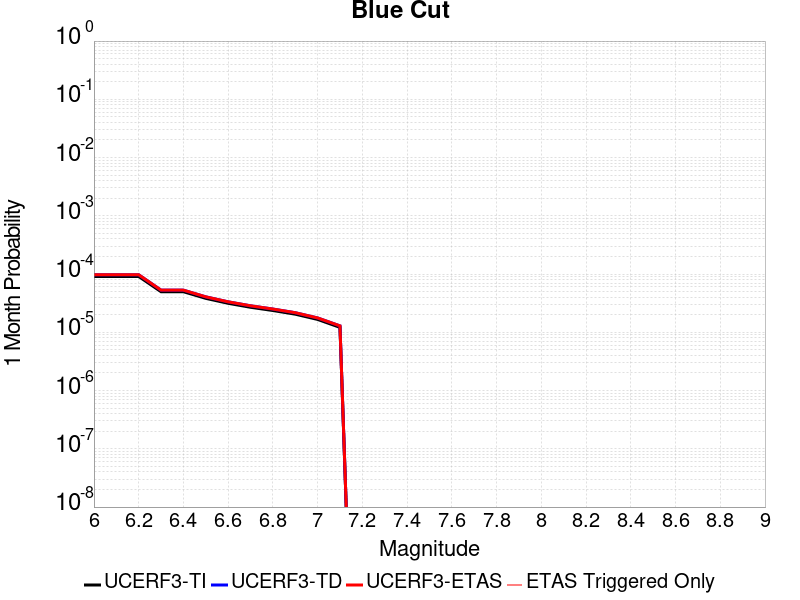 |  |  |

| Magnitude | 1 wk TI Prob | 1 wk TD Prob | 1 wk ETAS Prob | 1 wk ETAS/TD Gain | 1 wk ETAS Triggered Only | 1 mo TI Prob | 1 mo TD Prob | 1 mo ETAS Prob | 1 mo ETAS/TD Gain | 1 mo ETAS Triggered Only | 1 yr TI Prob | 1 yr TD Prob | 1 yr ETAS Prob | 1 yr ETAS/TD Gain | 1 yr ETAS Triggered Only | 10 yr TI Prob | 10 yr TD Prob | 10 yr ETAS Prob | 10 yr ETAS/TD Gain | 10 yr ETAS Triggered Only |
|-----|-----|-----|-----|-----|-----|-----|-----|-----|-----|-----|-----|-----|-----|-----|-----|-----|-----|-----|-----|-----|
| 6.0 | 2.1227985E-5 | 2.2720424E-5 | 2.2720424E-5 | 1.0 | 0.0 | 9.097391E-5 | 9.7369935E-5 | 9.7369935E-5 | 1.0 | 0.0 | 0.0011070445 | 0.0011848924 | 0.0012148567 | 1.0252887 | 3.0E-5 | 0.011015458 | 0.01179159 | 0.011841 | 1.0041903 | 5.0E-5 |
| 6.1 | 2.1227985E-5 | 2.2720424E-5 | 2.2720424E-5 | 1.0 | 0.0 | 9.097391E-5 | 9.7369935E-5 | 9.7369935E-5 | 1.0 | 0.0 | 0.0011070445 | 0.0011848924 | 0.0012148567 | 1.0252887 | 3.0E-5 | 0.011015458 | 0.01179159 | 0.011841 | 1.0041903 | 5.0E-5 |
| 6.2 | 2.1227985E-5 | 2.2720424E-5 | 2.2720424E-5 | 1.0 | 0.0 | 9.097391E-5 | 9.7369935E-5 | 9.7369935E-5 | 1.0 | 0.0 | 0.0011070445 | 0.0011848924 | 0.0012148567 | 1.0252887 | 3.0E-5 | 0.011015458 | 0.01179159 | 0.011841 | 1.0041903 | 5.0E-5 |
| 6.3 | 1.1613981E-5 | 1.2353959E-5 | 1.2353959E-5 | 1.0 | 0.0 | 4.9773254E-5 | 5.2944535E-5 | 5.2944535E-5 | 1.0 | 0.0 | 6.0582085E-4 | 6.4442155E-4 | 6.6440867E-4 | 1.0310156 | 2.0E-5 | 0.0060417196 | 0.006426776 | 0.0064665186 | 1.006184 | 4.0E-5 |
| 6.4 | 1.1613981E-5 | 1.2353959E-5 | 1.2353959E-5 | 1.0 | 0.0 | 4.9773254E-5 | 5.2944535E-5 | 5.2944535E-5 | 1.0 | 0.0 | 6.0582085E-4 | 6.4442155E-4 | 6.6440867E-4 | 1.0310156 | 2.0E-5 | 0.0060417196 | 0.006426776 | 0.0064665186 | 1.006184 | 4.0E-5 |
| 6.5 | 8.931326E-6 | 9.48191E-6 | 9.48191E-6 | 1.0 | 0.0 | 3.8276554E-5 | 4.0636176E-5 | 4.0636176E-5 | 1.0 | 0.0 | 4.6591737E-4 | 4.9464224E-4 | 5.146324E-4 | 1.0404133 | 2.0E-5 | 0.0046494175 | 0.004936322 | 0.0049761245 | 1.0080632 | 4.0E-5 |
| 6.6 | 7.345353E-6 | 7.79053E-6 | 7.79053E-6 | 1.0 | 0.0 | 3.1479703E-5 | 3.33876E-5 | 3.33876E-5 | 1.0 | 0.0 | 3.83198E-4 | 4.0642623E-4 | 4.2641812E-4 | 1.0491894 | 2.0E-5 | 0.0038253788 | 0.004057621 | 0.0040974584 | 1.009818 | 4.0E-5 |
| 6.7 | 6.2775666E-6 | 6.655361E-6 | 6.655361E-6 | 1.0 | 0.0 | 2.690358E-5 | 2.8522707E-5 | 2.8522707E-5 | 1.0 | 0.0 | 3.2750185E-4 | 3.4721615E-4 | 3.672092E-4 | 1.057581 | 2.0E-5 | 0.0032701963 | 0.0034674776 | 0.003507339 | 1.0114957 | 4.0E-5 |
| 6.8 | 5.5234095E-6 | 5.855298E-6 | 5.855298E-6 | 1.0 | 0.0 | 2.367154E-5 | 2.5093934E-5 | 2.5093934E-5 | 1.0 | 0.0 | 2.8816288E-4 | 3.054831E-4 | 3.1548002E-4 | 1.0327251 | 1.0E-5 | 0.002877895 | 0.0030513476 | 0.003081256 | 1.0098017 | 3.0E-5 |
| 6.9 | 4.7780054E-6 | 5.065582E-6 | 5.065582E-6 | 1.0 | 0.0 | 2.0477004E-5 | 2.1709497E-5 | 2.1709497E-5 | 1.0 | 0.0 | 2.4927902E-4 | 2.642881E-4 | 2.7428547E-4 | 1.0378275 | 1.0E-5 | 0.0024899957 | 0.0026404303 | 0.0026703512 | 1.0113318 | 3.0E-5 |
| 7.0 | 3.883171E-6 | 4.1186195E-6 | 4.1186195E-6 | 1.0 | 0.0 | 1.6642054E-5 | 1.7651146E-5 | 1.7651146E-5 | 1.0 | 0.0 | 2.0259817E-4 | 2.148884E-4 | 2.2488624E-4 | 1.0465258 | 1.0E-5 | 0.0020241356 | 0.0021474818 | 0.0021674389 | 1.0092932 | 2.0E-5 |
| 7.1 | 2.8358215E-6 | 3.0098138E-6 | 3.0098138E-6 | 1.0 | 0.0 | 1.2153464E-5 | 1.2899175E-5 | 1.2899175E-5 | 1.0 | 0.0 | 1.4795837E-4 | 1.5704273E-4 | 1.6704114E-4 | 1.0636669 | 1.0E-5 | 0.001478599 | 0.0015699627 | 0.0015899313 | 1.0127192 | 2.0E-5 |

## Independence rev 2011
*[(top)](#table-of-contents)*

| 1 Week | 1 Month | 1 Year | 10 Year |
|-----|-----|-----|-----|
|  |  |  |  |

| Magnitude | 1 wk TI Prob | 1 wk TD Prob | 1 wk ETAS Prob | 1 wk ETAS/TD Gain | 1 wk ETAS Triggered Only | 1 mo TI Prob | 1 mo TD Prob | 1 mo ETAS Prob | 1 mo ETAS/TD Gain | 1 mo ETAS Triggered Only | 1 yr TI Prob | 1 yr TD Prob | 1 yr ETAS Prob | 1 yr ETAS/TD Gain | 1 yr ETAS Triggered Only | 10 yr TI Prob | 10 yr TD Prob | 10 yr ETAS Prob | 10 yr ETAS/TD Gain | 10 yr ETAS Triggered Only |
|-----|-----|-----|-----|-----|-----|-----|-----|-----|-----|-----|-----|-----|-----|-----|-----|-----|-----|-----|-----|-----|
| 6.0 | 4.422171E-6 | 4.3263003E-6 | 4.3263003E-6 | 1.0 | 0.0 | 1.8952025E-5 | 1.8541172E-5 | 1.8541172E-5 | 1.0 | 0.0 | 2.3071647E-4 | 2.2571837E-4 | 2.5571158E-4 | 1.132879 | 3.0E-5 | 0.0023047708 | 0.0022551846 | 0.0023050718 | 1.0221212 | 5.0E-5 |
| 6.1 | 4.422171E-6 | 4.3263003E-6 | 4.3263003E-6 | 1.0 | 0.0 | 1.8952025E-5 | 1.8541172E-5 | 1.8541172E-5 | 1.0 | 0.0 | 2.3071647E-4 | 2.2571837E-4 | 2.5571158E-4 | 1.132879 | 3.0E-5 | 0.0023047708 | 0.0022551846 | 0.0023050718 | 1.0221212 | 5.0E-5 |
| 6.2 | 4.422171E-6 | 4.3263003E-6 | 4.3263003E-6 | 1.0 | 0.0 | 1.8952025E-5 | 1.8541172E-5 | 1.8541172E-5 | 1.0 | 0.0 | 2.3071647E-4 | 2.2571837E-4 | 2.5571158E-4 | 1.132879 | 3.0E-5 | 0.0023047708 | 0.0022551846 | 0.0023050718 | 1.0221212 | 5.0E-5 |
| 6.3 | 4.422171E-6 | 4.3263003E-6 | 4.3263003E-6 | 1.0 | 0.0 | 1.8952025E-5 | 1.8541172E-5 | 1.8541172E-5 | 1.0 | 0.0 | 2.3071647E-4 | 2.2571837E-4 | 2.5571158E-4 | 1.132879 | 3.0E-5 | 0.0023047708 | 0.0022551846 | 0.0023050718 | 1.0221212 | 5.0E-5 |
| 6.4 | 4.422171E-6 | 4.3263003E-6 | 4.3263003E-6 | 1.0 | 0.0 | 1.8952025E-5 | 1.8541172E-5 | 1.8541172E-5 | 1.0 | 0.0 | 2.3071647E-4 | 2.2571837E-4 | 2.5571158E-4 | 1.132879 | 3.0E-5 | 0.0023047708 | 0.0022551846 | 0.0023050718 | 1.0221212 | 5.0E-5 |
| 6.5 | 4.422171E-6 | 4.3263003E-6 | 4.3263003E-6 | 1.0 | 0.0 | 1.8952025E-5 | 1.8541172E-5 | 1.8541172E-5 | 1.0 | 0.0 | 2.3071647E-4 | 2.2571837E-4 | 2.5571158E-4 | 1.132879 | 3.0E-5 | 0.0023047708 | 0.0022551846 | 0.0023050718 | 1.0221212 | 5.0E-5 |
| 6.6 | 2.663744E-6 | 2.53204E-6 | 2.53204E-6 | 1.0 | 0.0 | 1.1415996E-5 | 1.0851558E-5 | 1.0851558E-5 | 1.0 | 0.0 | 1.3898089E-4 | 1.3211019E-4 | 1.6210623E-4 | 1.2270532 | 3.0E-5 | 0.0013889399 | 0.0013203648 | 0.0013702988 | 1.0378183 | 5.0E-5 |
| 6.7 | 2.663744E-6 | 2.53204E-6 | 2.53204E-6 | 1.0 | 0.0 | 1.1415996E-5 | 1.0851558E-5 | 1.0851558E-5 | 1.0 | 0.0 | 1.3898089E-4 | 1.3211019E-4 | 1.6210623E-4 | 1.2270532 | 3.0E-5 | 0.0013889399 | 0.0013203648 | 0.0013702988 | 1.0378183 | 5.0E-5 |
| 6.8 | 1.9716529E-6 | 1.8323044E-6 | 1.8323044E-6 | 1.0 | 0.0 | 8.449913E-6 | 7.85271E-6 | 7.85271E-6 | 1.0 | 0.0 | 1.0287284E-4 | 9.5602685E-5 | 1.2559982E-4 | 1.3137687 | 3.0E-5 | 0.0010282523 | 9.5562846E-4 | 0.0010055806 | 1.0522716 | 5.0E-5 |
| 6.9 | 1.8788617E-6 | 1.7430435E-6 | 1.7430435E-6 | 1.0 | 0.0 | 8.0522395E-6 | 7.470166E-6 | 7.470166E-6 | 1.0 | 0.0 | 9.80316E-5 | 9.09456E-5 | 1.2094287E-4 | 1.3298376 | 3.0E-5 | 9.798837E-4 | 9.090958E-4 | 9.590504E-4 | 1.0549498 | 5.0E-5 |
| 7.0 | 1.5045488E-6 | 1.384987E-6 | 1.384987E-6 | 1.0 | 0.0 | 6.44805E-6 | 5.9356453E-6 | 5.9356453E-6 | 1.0 | 0.0 | 7.8502184E-5 | 7.2264134E-5 | 1.0226197E-4 | 1.4151137 | 3.0E-5 | 7.8474457E-4 | 7.224115E-4 | 7.723754E-4 | 1.0691626 | 5.0E-5 |
| 7.1 | 1.272341E-6 | 1.1625416E-6 | 1.1625416E-6 | 1.0 | 0.0 | 5.4528787E-6 | 4.9823116E-6 | 4.9823116E-6 | 1.0 | 0.0 | 6.6386776E-5 | 6.065799E-5 | 9.065617E-5 | 1.4945462 | 3.0E-5 | 6.636695E-4 | 6.0641754E-4 | 6.463933E-4 | 1.0659212 | 4.0E-5 |
| 7.2 | 1.0416892E-6 | 9.410155E-7 | 9.410155E-7 | 1.0 | 0.0 | 4.464375E-6 | 4.032918E-6 | 4.032918E-6 | 1.0 | 0.0 | 5.4352407E-5 | 4.9099683E-5 | 7.909821E-5 | 1.6109719 | 3.0E-5 | 5.4339116E-4 | 4.9089023E-4 | 5.308706E-4 | 1.0814446 | 4.0E-5 |
| 7.3 | 7.9450155E-7 | 7.2352077E-7 | 7.2352077E-7 | 1.0 | 0.0 | 3.4050022E-6 | 3.1007996E-6 | 3.1007996E-6 | 1.0 | 0.0 | 4.1455114E-5 | 3.7751593E-5 | 6.775046E-5 | 1.7946385 | 3.0E-5 | 4.144738E-4 | 3.774529E-4 | 4.174378E-4 | 1.1059334 | 4.0E-5 |
| 7.4 | 5.3893444E-7 | 5.01964E-7 | 5.01964E-7 | 1.0 | 0.0 | 2.309717E-6 | 2.1512726E-6 | 2.1512726E-6 | 1.0 | 0.0 | 2.8120441E-5 | 2.6191434E-5 | 5.619065E-5 | 2.1453826 | 3.0E-5 | 2.8116882E-4 | 2.6188392E-4 | 3.0187346E-4 | 1.1526995 | 4.0E-5 |
| 7.5 | 3.8852085E-7 | 3.6826376E-7 | 3.6826376E-7 | 1.0 | 0.0 | 1.6650882E-6 | 1.5782723E-6 | 1.5782723E-6 | 1.0 | 0.0 | 2.027226E-5 | 1.9215298E-5 | 3.9214912E-5 | 2.0408173 | 2.0E-5 | 2.0270412E-4 | 1.9213658E-4 | 2.2213081E-4 | 1.156109 | 3.0E-5 |
| 7.6 | 2.414929E-7 | 2.3457987E-7 | 2.3457987E-7 | 1.0 | 0.0 | 1.0349692E-6 | 1.0053419E-6 | 1.0053419E-6 | 1.0 | 0.0 | 1.2600677E-5 | 1.2239971E-5 | 3.2239725E-5 | 2.633971 | 2.0E-5 | 1.2599962E-4 | 1.2239309E-4 | 1.5238942E-4 | 1.2450819 | 3.0E-5 |
| 7.7 | 6.8298014E-8 | 6.8590616E-8 | 6.8590616E-8 | 1.0 | 0.0 | 2.9270575E-7 | 2.9395974E-7 | 2.9395974E-7 | 1.0 | 0.0 | 3.5636867E-6 | 3.5789546E-6 | 1.3578919E-5 | 3.794102 | 1.0E-5 | 3.5636294E-5 | 3.5789017E-5 | 4.578866E-5 | 1.2794054 | 1.0E-5 |

## Kern Canyon (North Kern) 2011
*[(top)](#table-of-contents)*

| 1 Week | 1 Month | 1 Year | 10 Year |
|-----|-----|-----|-----|
|  |  | 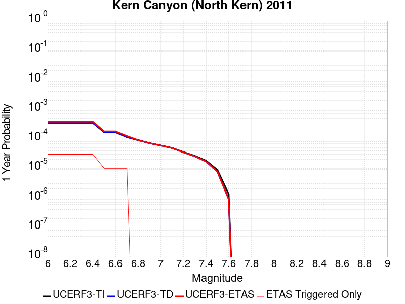 |  |

| Magnitude | 1 wk TI Prob | 1 wk TD Prob | 1 wk ETAS Prob | 1 wk ETAS/TD Gain | 1 wk ETAS Triggered Only | 1 mo TI Prob | 1 mo TD Prob | 1 mo ETAS Prob | 1 mo ETAS/TD Gain | 1 mo ETAS Triggered Only | 1 yr TI Prob | 1 yr TD Prob | 1 yr ETAS Prob | 1 yr ETAS/TD Gain | 1 yr ETAS Triggered Only | 10 yr TI Prob | 10 yr TD Prob | 10 yr ETAS Prob | 10 yr ETAS/TD Gain | 10 yr ETAS Triggered Only |
|-----|-----|-----|-----|-----|-----|-----|-----|-----|-----|-----|-----|-----|-----|-----|-----|-----|-----|-----|-----|-----|
| 6.0 | 6.6264497E-6 | 6.7574156E-6 | 6.7574156E-6 | 1.0 | 0.0 | 2.8398761E-5 | 2.8960078E-5 | 2.8960078E-5 | 1.0 | 0.0 | 3.4570007E-4 | 3.525399E-4 | 3.825293E-4 | 1.0850668 | 3.0E-5 | 0.0034516277 | 0.003520595 | 0.0035704188 | 1.0141522 | 5.0E-5 |
| 6.1 | 6.6264497E-6 | 6.7574156E-6 | 6.7574156E-6 | 1.0 | 0.0 | 2.8398761E-5 | 2.8960078E-5 | 2.8960078E-5 | 1.0 | 0.0 | 3.4570007E-4 | 3.525399E-4 | 3.825293E-4 | 1.0850668 | 3.0E-5 | 0.0034516277 | 0.003520595 | 0.0035704188 | 1.0141522 | 5.0E-5 |
| 6.2 | 6.6264497E-6 | 6.7574156E-6 | 6.7574156E-6 | 1.0 | 0.0 | 2.8398761E-5 | 2.8960078E-5 | 2.8960078E-5 | 1.0 | 0.0 | 3.4570007E-4 | 3.525399E-4 | 3.825293E-4 | 1.0850668 | 3.0E-5 | 0.0034516277 | 0.003520595 | 0.0035704188 | 1.0141522 | 5.0E-5 |
| 6.3 | 6.6264497E-6 | 6.7574156E-6 | 6.7574156E-6 | 1.0 | 0.0 | 2.8398761E-5 | 2.8960078E-5 | 2.8960078E-5 | 1.0 | 0.0 | 3.4570007E-4 | 3.525399E-4 | 3.825293E-4 | 1.0850668 | 3.0E-5 | 0.0034516277 | 0.003520595 | 0.0035704188 | 1.0141522 | 5.0E-5 |
| 6.4 | 6.6264497E-6 | 6.7574156E-6 | 6.7574156E-6 | 1.0 | 0.0 | 2.8398761E-5 | 2.8960078E-5 | 2.8960078E-5 | 1.0 | 0.0 | 3.4570007E-4 | 3.525399E-4 | 3.825293E-4 | 1.0850668 | 3.0E-5 | 0.0034516277 | 0.003520595 | 0.0035704188 | 1.0141522 | 5.0E-5 |
| 6.5 | 3.2162225E-6 | 3.2571281E-6 | 3.2571281E-6 | 1.0 | 0.0 | 1.3783738E-5 | 1.395905E-5 | 1.395905E-5 | 1.0 | 0.0 | 1.6780409E-4 | 1.69939E-4 | 1.7993728E-4 | 1.0588347 | 1.0E-5 | 0.0016767744 | 0.0016981701 | 0.0017181361 | 1.0117574 | 2.0E-5 |
| 6.6 | 3.2162225E-6 | 3.2571281E-6 | 3.2571281E-6 | 1.0 | 0.0 | 1.3783738E-5 | 1.395905E-5 | 1.395905E-5 | 1.0 | 0.0 | 1.6780409E-4 | 1.69939E-4 | 1.7993728E-4 | 1.0588347 | 1.0E-5 | 0.0016767744 | 0.0016981701 | 0.0017181361 | 1.0117574 | 2.0E-5 |
| 6.7 | 2.1908265E-6 | 2.2071454E-6 | 2.2071454E-6 | 1.0 | 0.0 | 9.389223E-6 | 9.459161E-6 | 9.459161E-6 | 1.0 | 0.0 | 1.1430779E-4 | 1.15159404E-4 | 1.2515826E-4 | 1.0868262 | 1.0E-5 | 0.0011424901 | 0.0011510167 | 0.0011709937 | 1.0173559 | 2.0E-5 |
| 6.8 | 1.7303895E-6 | 1.7365707E-6 | 1.7365707E-6 | 1.0 | 0.0 | 7.415934E-6 | 7.442425E-6 | 7.442425E-6 | 1.0 | 0.0 | 9.028525E-5 | 9.060786E-5 | 9.060786E-5 | 1.0 | 0.0 | 9.024858E-4 | 9.057189E-4 | 9.157098E-4 | 1.0110309 | 1.0E-5 |
| 6.9 | 1.3700314E-6 | 1.368876E-6 | 1.368876E-6 | 1.0 | 0.0 | 5.87155E-6 | 5.8665987E-6 | 5.8665987E-6 | 1.0 | 0.0 | 7.148377E-5 | 7.142354E-5 | 7.142354E-5 | 1.0 | 0.0 | 7.146078E-4 | 7.1401044E-4 | 7.240033E-4 | 1.0139954 | 1.0E-5 |
| 7.0 | 1.1467797E-6 | 1.141392E-6 | 1.141392E-6 | 1.0 | 0.0 | 4.9147607E-6 | 4.891671E-6 | 4.891671E-6 | 1.0 | 0.0 | 5.983557E-5 | 5.95545E-5 | 5.95545E-5 | 1.0 | 0.0 | 5.981946E-4 | 5.953885E-4 | 6.0538255E-4 | 1.0167857 | 1.0E-5 |
| 7.1 | 9.3952065E-7 | 9.3027853E-7 | 9.3027853E-7 | 1.0 | 0.0 | 4.026511E-6 | 3.986902E-6 | 3.986902E-6 | 1.0 | 0.0 | 4.9021666E-5 | 4.8539467E-5 | 4.8539467E-5 | 1.0 | 0.0 | 4.901085E-4 | 4.8529042E-4 | 4.9528555E-4 | 1.0205963 | 1.0E-5 |
| 7.2 | 6.858055E-7 | 6.71937E-7 | 6.71937E-7 | 1.0 | 0.0 | 2.939163E-6 | 2.879727E-6 | 2.879727E-6 | 1.0 | 0.0 | 3.5783723E-5 | 3.506012E-5 | 3.506012E-5 | 1.0 | 0.0 | 3.5777962E-4 | 3.5054676E-4 | 3.6054326E-4 | 1.0285169 | 1.0E-5 |
| 7.3 | 5.1101983E-7 | 4.939352E-7 | 4.939352E-7 | 1.0 | 0.0 | 2.1900833E-6 | 2.1168635E-6 | 2.1168635E-6 | 1.0 | 0.0 | 2.6663936E-5 | 2.5772513E-5 | 2.5772513E-5 | 1.0 | 0.0 | 2.6660739E-4 | 2.5769573E-4 | 2.6769313E-4 | 1.0387955 | 1.0E-5 |
| 7.4 | 3.4999414E-7 | 3.299627E-7 | 3.299627E-7 | 1.0 | 0.0 | 1.499974E-6 | 1.4141251E-6 | 1.4141251E-6 | 1.0 | 0.0 | 1.8262032E-5 | 1.721684E-5 | 1.721684E-5 | 1.0 | 0.0 | 1.826053E-4 | 1.721553E-4 | 1.8215357E-4 | 1.0580771 | 1.0E-5 |
| 7.5 | 1.7021522E-7 | 1.475023E-7 | 1.475023E-7 | 1.0 | 0.0 | 7.2949354E-7 | 6.321526E-7 | 6.321526E-7 | 1.0 | 0.0 | 8.881548E-6 | 7.696432E-6 | 7.696432E-6 | 1.0 | 0.0 | 8.8811925E-5 | 7.6961725E-5 | 8.696096E-5 | 1.1299247 | 1.0E-5 |
| 7.6 | 2.572245E-8 | 1.7352884E-8 | 1.7352884E-8 | 1.0 | 0.0 | 1.10239064E-7 | 7.43695E-8 | 7.43695E-8 | 1.0 | 0.0 | 1.3421597E-6 | 9.0544836E-7 | 9.0544836E-7 | 1.0 | 0.0 | 1.3421517E-5 | 9.054452E-6 | 1.9054361E-5 | 2.104419 | 1.0E-5 |

## San Jacinto (Lytle Creek connector)
*[(top)](#table-of-contents)*

| 1 Week | 1 Month | 1 Year | 10 Year |
|-----|-----|-----|-----|
|  |  | 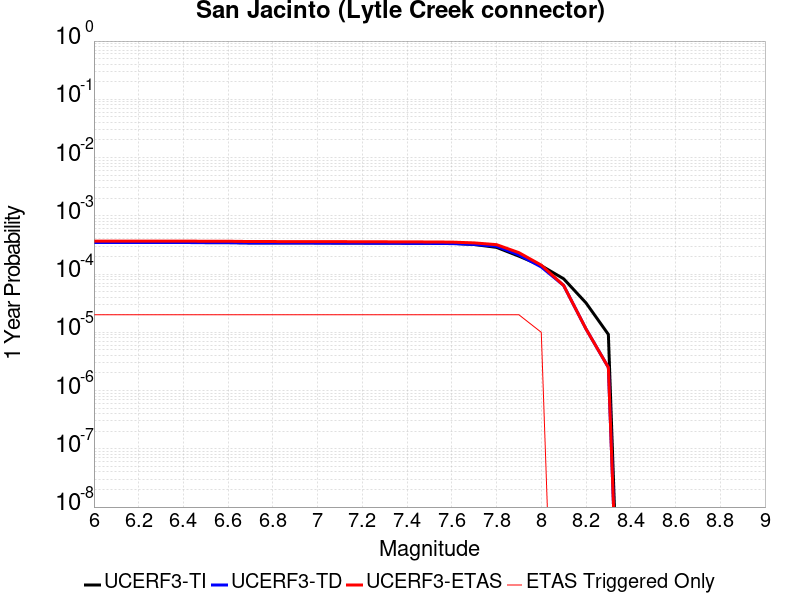 |  |

| Magnitude | 1 wk TI Prob | 1 wk TD Prob | 1 wk ETAS Prob | 1 wk ETAS/TD Gain | 1 wk ETAS Triggered Only | 1 mo TI Prob | 1 mo TD Prob | 1 mo ETAS Prob | 1 mo ETAS/TD Gain | 1 mo ETAS Triggered Only | 1 yr TI Prob | 1 yr TD Prob | 1 yr ETAS Prob | 1 yr ETAS/TD Gain | 1 yr ETAS Triggered Only | 10 yr TI Prob | 10 yr TD Prob | 10 yr ETAS Prob | 10 yr ETAS/TD Gain | 10 yr ETAS Triggered Only |
|-----|-----|-----|-----|-----|-----|-----|-----|-----|-----|-----|-----|-----|-----|-----|-----|-----|-----|-----|-----|-----|
| 6.0 | 6.693995E-6 | 6.6710027E-6 | 6.6710027E-6 | 1.0 | 0.0 | 2.8688235E-5 | 2.8589699E-5 | 2.8589699E-5 | 1.0 | 0.0 | 3.492233E-4 | 3.4802407E-4 | 3.6801712E-4 | 1.0574473 | 2.0E-5 | 0.00348675 | 0.0035549873 | 0.003594845 | 1.0112118 | 4.0E-5 |
| 6.1 | 6.693995E-6 | 6.6710027E-6 | 6.6710027E-6 | 1.0 | 0.0 | 2.8688235E-5 | 2.8589699E-5 | 2.8589699E-5 | 1.0 | 0.0 | 3.492233E-4 | 3.4802407E-4 | 3.6801712E-4 | 1.0574473 | 2.0E-5 | 0.00348675 | 0.0035549873 | 0.003594845 | 1.0112118 | 4.0E-5 |
| 6.2 | 6.693995E-6 | 6.6710027E-6 | 6.6710027E-6 | 1.0 | 0.0 | 2.8688235E-5 | 2.8589699E-5 | 2.8589699E-5 | 1.0 | 0.0 | 3.492233E-4 | 3.4802407E-4 | 3.6801712E-4 | 1.0574473 | 2.0E-5 | 0.00348675 | 0.0035549873 | 0.003594845 | 1.0112118 | 4.0E-5 |
| 6.3 | 6.693995E-6 | 6.6710027E-6 | 6.6710027E-6 | 1.0 | 0.0 | 2.8688235E-5 | 2.8589699E-5 | 2.8589699E-5 | 1.0 | 0.0 | 3.492233E-4 | 3.4802407E-4 | 3.6801712E-4 | 1.0574473 | 2.0E-5 | 0.00348675 | 0.0035549873 | 0.003594845 | 1.0112118 | 4.0E-5 |
| 6.4 | 6.693995E-6 | 6.6710027E-6 | 6.6710027E-6 | 1.0 | 0.0 | 2.8688235E-5 | 2.8589699E-5 | 2.8589699E-5 | 1.0 | 0.0 | 3.492233E-4 | 3.4802407E-4 | 3.6801712E-4 | 1.0574473 | 2.0E-5 | 0.00348675 | 0.0035549873 | 0.003594845 | 1.0112118 | 4.0E-5 |
| 6.5 | 6.6561875E-6 | 6.63122E-6 | 6.63122E-6 | 1.0 | 0.0 | 2.8526205E-5 | 2.8419205E-5 | 2.8419205E-5 | 1.0 | 0.0 | 3.472512E-4 | 3.4594897E-4 | 3.6594205E-4 | 1.057792 | 2.0E-5 | 0.0034670907 | 0.0035343023 | 0.0035741609 | 1.0112777 | 4.0E-5 |
| 6.6 | 6.6561875E-6 | 6.63122E-6 | 6.63122E-6 | 1.0 | 0.0 | 2.8526205E-5 | 2.8419205E-5 | 2.8419205E-5 | 1.0 | 0.0 | 3.472512E-4 | 3.4594897E-4 | 3.6594205E-4 | 1.057792 | 2.0E-5 | 0.0034670907 | 0.0035343023 | 0.0035741609 | 1.0112777 | 4.0E-5 |
| 6.7 | 6.5802237E-6 | 6.550394E-6 | 6.550394E-6 | 1.0 | 0.0 | 2.8200653E-5 | 2.8072815E-5 | 2.8072815E-5 | 1.0 | 0.0 | 3.4328885E-4 | 3.41733E-4 | 3.6172615E-4 | 1.0585052 | 2.0E-5 | 0.0034275902 | 0.0034922757 | 0.0035321359 | 1.0114138 | 4.0E-5 |
| 6.8 | 6.575632E-6 | 6.544883E-6 | 6.544883E-6 | 1.0 | 0.0 | 2.8180975E-5 | 2.8049197E-5 | 2.8049197E-5 | 1.0 | 0.0 | 3.4304935E-4 | 3.4144553E-4 | 3.6143872E-4 | 1.0585545 | 2.0E-5 | 0.0034252026 | 0.00348941 | 0.0035292706 | 1.0114232 | 4.0E-5 |
| 6.9 | 6.570433E-6 | 6.5362756E-6 | 6.5362756E-6 | 1.0 | 0.0 | 2.8158694E-5 | 2.801231E-5 | 2.801231E-5 | 1.0 | 0.0 | 3.4277816E-4 | 3.4099657E-4 | 3.6098974E-4 | 1.0586317 | 2.0E-5 | 0.0034224992 | 0.0034849346 | 0.0035247952 | 1.011438 | 4.0E-5 |
| 7.0 | 6.5643826E-6 | 6.526395E-6 | 6.526395E-6 | 1.0 | 0.0 | 2.8132765E-5 | 2.7969963E-5 | 2.7969963E-5 | 1.0 | 0.0 | 3.424626E-4 | 3.4048117E-4 | 3.6047437E-4 | 1.0587204 | 2.0E-5 | 0.0034193532 | 0.0034797967 | 0.0035196575 | 1.0114549 | 4.0E-5 |
| 7.1 | 6.557402E-6 | 6.515105E-6 | 6.515105E-6 | 1.0 | 0.0 | 2.8102848E-5 | 2.792158E-5 | 2.792158E-5 | 1.0 | 0.0 | 3.4209844E-4 | 3.3989229E-4 | 3.5988548E-4 | 1.0588222 | 2.0E-5 | 0.0034157229 | 0.0034739273 | 0.0035137883 | 1.0114744 | 4.0E-5 |
| 7.2 | 6.546394E-6 | 6.4970677E-6 | 6.4970677E-6 | 1.0 | 0.0 | 2.8055672E-5 | 2.784428E-5 | 2.784428E-5 | 1.0 | 0.0 | 3.4152428E-4 | 3.3895145E-4 | 3.5894467E-4 | 1.0589855 | 2.0E-5 | 0.0034099987 | 0.0034645528 | 0.003504414 | 1.0115055 | 4.0E-5 |
| 7.3 | 6.5364216E-6 | 6.477847E-6 | 6.477847E-6 | 1.0 | 0.0 | 2.8012933E-5 | 2.7761906E-5 | 2.7761906E-5 | 1.0 | 0.0 | 3.4100408E-4 | 3.3794885E-4 | 3.579421E-4 | 1.0591606 | 2.0E-5 | 0.003404813 | 0.003454571 | 0.0034944327 | 1.0115389 | 4.0E-5 |
| 7.4 | 6.5269523E-6 | 6.4589262E-6 | 6.4589262E-6 | 1.0 | 0.0 | 2.7972354E-5 | 2.7680819E-5 | 2.7680819E-5 | 1.0 | 0.0 | 3.4051016E-4 | 3.3696194E-4 | 3.569552E-4 | 1.0593339 | 2.0E-5 | 0.0033998888 | 0.003444749 | 0.0034846112 | 1.0115719 | 4.0E-5 |
| 7.5 | 6.5111835E-6 | 6.435192E-6 | 6.435192E-6 | 1.0 | 0.0 | 2.7904773E-5 | 2.7579103E-5 | 2.7579103E-5 | 1.0 | 0.0 | 3.3968766E-4 | 3.3572392E-4 | 3.557172E-4 | 1.0595528 | 2.0E-5 | 0.0033916887 | 0.003432418 | 0.0034722807 | 1.0116136 | 4.0E-5 |
| 7.6 | 6.4768806E-6 | 6.3942884E-6 | 6.3942884E-6 | 1.0 | 0.0 | 2.7757764E-5 | 2.7403805E-5 | 2.7403805E-5 | 1.0 | 0.0 | 3.3789838E-4 | 3.3359032E-4 | 3.5358366E-4 | 1.0599338 | 2.0E-5 | 0.0033738504 | 0.0034111436 | 0.0034510072 | 1.0116863 | 4.0E-5 |
| 7.7 | 6.1655364E-6 | 6.1866886E-6 | 6.1866886E-6 | 1.0 | 0.0 | 2.642346E-5 | 2.651411E-5 | 2.651411E-5 | 1.0 | 0.0 | 3.2165812E-4 | 3.2276154E-4 | 3.4275508E-4 | 1.0619452 | 2.0E-5 | 0.0032119295 | 0.0033027146 | 0.0033425824 | 1.0120713 | 4.0E-5 |
| 7.8 | 5.5043524E-6 | 5.747449E-6 | 5.747449E-6 | 1.0 | 0.0 | 2.3589868E-5 | 2.4631692E-5 | 2.4631692E-5 | 1.0 | 0.0 | 2.871688E-4 | 2.9984963E-4 | 3.1984365E-4 | 1.0666801 | 2.0E-5 | 0.0028679797 | 0.0030726613 | 0.0031125385 | 1.0129781 | 4.0E-5 |
| 7.9 | 3.889249E-6 | 4.0851965E-6 | 4.0851965E-6 | 1.0 | 0.0 | 1.6668104E-5 | 1.7507866E-5 | 1.7507866E-5 | 1.0 | 0.0 | 2.0291525E-4 | 2.1313746E-4 | 2.331332E-4 | 1.0938162 | 2.0E-5 | 0.0020273007 | 0.0021987387 | 0.0022386508 | 1.0181522 | 4.0E-5 |
| 8.0 | 2.668535E-6 | 2.537347E-6 | 2.537347E-6 | 1.0 | 0.0 | 1.1436528E-5 | 1.0874299E-5 | 1.0874299E-5 | 1.0 | 0.0 | 1.3923083E-4 | 1.3238657E-4 | 1.4238524E-4 | 1.0755264 | 1.0E-5 | 0.0013914363 | 0.0013788831 | 0.0013988556 | 1.0144845 | 2.0E-5 |
| 8.1 | 1.5911459E-6 | 1.2217948E-6 | 1.2217948E-6 | 1.0 | 0.0 | 6.8191785E-6 | 5.2362534E-6 | 5.2362534E-6 | 1.0 | 0.0 | 8.3020335E-5 | 6.374954E-5 | 6.374954E-5 | 1.0 | 0.0 | 8.298933E-4 | 6.7100645E-4 | 6.809997E-4 | 1.0148929 | 1.0E-5 |
| 8.2 | 6.1294963E-7 | 2.1905348E-7 | 2.1905348E-7 | 1.0 | 0.0 | 2.6269242E-6 | 9.3880027E-7 | 9.3880027E-7 | 1.0 | 0.0 | 3.1982334E-5 | 1.1429834E-5 | 1.1429834E-5 | 1.0 | 0.0 | 3.1977732E-4 | 1.2836853E-4 | 1.2836853E-4 | 1.0 | 0.0 |
| 8.3 | 1.762871E-7 | 4.7785655E-8 | 4.7785655E-8 | 1.0 | 0.0 | 7.5551594E-7 | 2.0479564E-7 | 2.0479564E-7 | 1.0 | 0.0 | 9.1983675E-6 | 2.4933843E-6 | 2.4933843E-6 | 1.0 | 0.0 | 9.197987E-5 | 2.8824745E-5 | 2.8824745E-5 | 1.0 | 0.0 |

## San Jacinto (Coyote Creek)
*[(top)](#table-of-contents)*

| 1 Week | 1 Month | 1 Year | 10 Year |
|-----|-----|-----|-----|
| 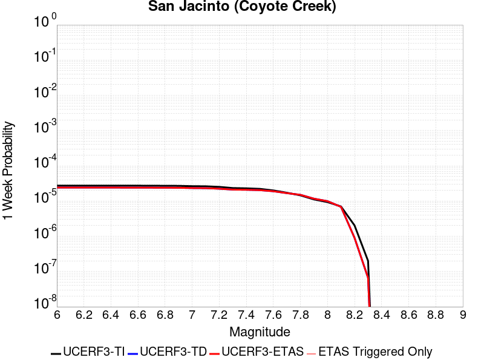 |  |  |  |

| Magnitude | 1 wk TI Prob | 1 wk TD Prob | 1 wk ETAS Prob | 1 wk ETAS/TD Gain | 1 wk ETAS Triggered Only | 1 mo TI Prob | 1 mo TD Prob | 1 mo ETAS Prob | 1 mo ETAS/TD Gain | 1 mo ETAS Triggered Only | 1 yr TI Prob | 1 yr TD Prob | 1 yr ETAS Prob | 1 yr ETAS/TD Gain | 1 yr ETAS Triggered Only | 10 yr TI Prob | 10 yr TD Prob | 10 yr ETAS Prob | 10 yr ETAS/TD Gain | 10 yr ETAS Triggered Only |
|-----|-----|-----|-----|-----|-----|-----|-----|-----|-----|-----|-----|-----|-----|-----|-----|-----|-----|-----|-----|-----|
| 6.0 | 2.7374346E-5 | 2.4177032E-5 | 2.4177032E-5 | 1.0 | 0.0 | 1.1731335E-4 | 1.0361175E-4 | 1.1361071E-4 | 1.0965041 | 1.0E-5 | 0.0014273542 | 0.0012607456 | 0.001270733 | 1.0079218 | 1.0E-5 | 0.01418221 | 0.012944878 | 0.01298436 | 1.00305 | 4.0E-5 |
| 6.1 | 2.7374346E-5 | 2.4177032E-5 | 2.4177032E-5 | 1.0 | 0.0 | 1.1731335E-4 | 1.0361175E-4 | 1.1361071E-4 | 1.0965041 | 1.0E-5 | 0.0014273542 | 0.0012607456 | 0.001270733 | 1.0079218 | 1.0E-5 | 0.01418221 | 0.012944878 | 0.01298436 | 1.00305 | 4.0E-5 |
| 6.2 | 2.7374346E-5 | 2.4177032E-5 | 2.4177032E-5 | 1.0 | 0.0 | 1.1731335E-4 | 1.0361175E-4 | 1.1361071E-4 | 1.0965041 | 1.0E-5 | 0.0014273542 | 0.0012607456 | 0.001270733 | 1.0079218 | 1.0E-5 | 0.01418221 | 0.012944878 | 0.01298436 | 1.00305 | 4.0E-5 |
| 6.3 | 2.7374346E-5 | 2.4177032E-5 | 2.4177032E-5 | 1.0 | 0.0 | 1.1731335E-4 | 1.0361175E-4 | 1.1361071E-4 | 1.0965041 | 1.0E-5 | 0.0014273542 | 0.0012607456 | 0.001270733 | 1.0079218 | 1.0E-5 | 0.01418221 | 0.012944878 | 0.01298436 | 1.00305 | 4.0E-5 |
| 6.4 | 2.7374346E-5 | 2.4177032E-5 | 2.4177032E-5 | 1.0 | 0.0 | 1.1731335E-4 | 1.0361175E-4 | 1.1361071E-4 | 1.0965041 | 1.0E-5 | 0.0014273542 | 0.0012607456 | 0.001270733 | 1.0079218 | 1.0E-5 | 0.01418221 | 0.012944878 | 0.01298436 | 1.00305 | 4.0E-5 |
| 6.5 | 2.7282445E-5 | 2.4063094E-5 | 2.4063094E-5 | 1.0 | 0.0 | 1.16919524E-4 | 1.03123486E-4 | 1.13122456E-4 | 1.0969611 | 1.0E-5 | 0.0014225657 | 0.0012548079 | 0.0012647954 | 1.0079594 | 1.0E-5 | 0.014134934 | 0.012886199 | 0.0129256835 | 1.0030642 | 4.0E-5 |
| 6.6 | 2.7282445E-5 | 2.4063094E-5 | 2.4063094E-5 | 1.0 | 0.0 | 1.16919524E-4 | 1.03123486E-4 | 1.13122456E-4 | 1.0969611 | 1.0E-5 | 0.0014225657 | 0.0012548079 | 0.0012647954 | 1.0079594 | 1.0E-5 | 0.014134934 | 0.012886199 | 0.0129256835 | 1.0030642 | 4.0E-5 |
| 6.7 | 2.7216198E-5 | 2.3988207E-5 | 2.3988207E-5 | 1.0 | 0.0 | 1.1663563E-4 | 1.02802565E-4 | 1.12801536E-4 | 1.0972638 | 1.0E-5 | 0.0014191137 | 0.0012509052 | 0.0012608927 | 1.0079842 | 1.0E-5 | 0.014100855 | 0.012847606 | 0.012887092 | 1.0030735 | 4.0E-5 |
| 6.8 | 2.7078617E-5 | 2.3905404E-5 | 2.3905404E-5 | 1.0 | 0.0 | 1.1604605E-4 | 1.02447724E-4 | 1.124467E-4 | 1.0976007 | 1.0E-5 | 0.001411945 | 0.00124659 | 0.0012565776 | 1.0080119 | 1.0E-5 | 0.014030075 | 0.012804739 | 0.012844226 | 1.0030838 | 4.0E-5 |
| 6.9 | 2.6982952E-5 | 2.3824896E-5 | 2.3824896E-5 | 1.0 | 0.0 | 1.15636096E-4 | 1.0210271E-4 | 1.1210169E-4 | 1.0979306 | 1.0E-5 | 0.0014069602 | 0.0012423943 | 0.0012523818 | 1.008039 | 1.0E-5 | 0.013980856 | 0.012763045 | 0.012802535 | 1.0030941 | 4.0E-5 |
| 7.0 | 2.6449972E-5 | 2.3401846E-5 | 2.3401846E-5 | 1.0 | 0.0 | 1.1335209E-4 | 1.00289784E-4 | 1.1028878E-4 | 1.099701 | 1.0E-5 | 0.001379188 | 0.0012203468 | 0.0012303346 | 1.0081844 | 1.0E-5 | 0.0137065975 | 0.012544374 | 0.012583872 | 1.0031487 | 4.0E-5 |
| 7.1 | 2.6257849E-5 | 2.322785E-5 | 2.322785E-5 | 1.0 | 0.0 | 1.1252879E-4 | 9.9544144E-5 | 1.0954315E-4 | 1.1004479 | 1.0E-5 | 0.0013691769 | 0.0012112787 | 0.0012212667 | 1.0082457 | 1.0E-5 | 0.013607717 | 0.012454224 | 0.012493725 | 1.0031718 | 4.0E-5 |
| 7.2 | 2.5270041E-5 | 2.2422375E-5 | 2.2422375E-5 | 1.0 | 0.0 | 1.0829568E-4 | 9.6092364E-5 | 1.0609141E-4 | 1.1040566 | 1.0E-5 | 0.0013177024 | 0.001169299 | 0.0011792873 | 1.0085422 | 1.0E-5 | 0.013099162 | 0.012035143 | 0.0120746605 | 1.0032836 | 4.0E-5 |
| 7.3 | 2.339701E-5 | 2.1153774E-5 | 2.1153774E-5 | 1.0 | 0.0 | 1.0026905E-4 | 9.065589E-5 | 9.065589E-5 | 1.0 | 0.0 | 0.001220092 | 0.0011031787 | 0.0011031787 | 1.0 | 0.0 | 0.012134149 | 0.011373838 | 0.011403497 | 1.0026076 | 3.0E-5 |
| 7.4 | 2.296333E-5 | 2.0884016E-5 | 2.0884016E-5 | 1.0 | 0.0 | 9.841056E-5 | 8.949987E-5 | 8.949987E-5 | 1.0 | 0.0 | 0.0011974899 | 0.0010891182 | 0.0010891182 | 1.0 | 0.0 | 0.011910575 | 0.011232895 | 0.0112625575 | 1.0026407 | 3.0E-5 |
| 7.5 | 2.2188895E-5 | 2.0406682E-5 | 2.0406682E-5 | 1.0 | 0.0 | 9.50918E-5 | 8.745429E-5 | 8.745429E-5 | 1.0 | 0.0 | 0.0011571277 | 0.0010642379 | 0.0010642379 | 1.0 | 0.0 | 0.011511209 | 0.010982383 | 0.011012053 | 1.0027016 | 3.0E-5 |
| 7.6 | 2.0013189E-5 | 1.8992265E-5 | 1.8992265E-5 | 1.0 | 0.0 | 8.5767984E-5 | 8.139289E-5 | 8.139289E-5 | 1.0 | 0.0 | 0.001043725 | 9.905098E-4 | 9.905098E-4 | 1.0 | 0.0 | 0.010388365 | 0.010240043 | 0.010269735 | 1.0028996 | 3.0E-5 |
| 7.7 | 1.7230794E-5 | 1.677281E-5 | 1.677281E-5 | 1.0 | 0.0 | 7.384417E-5 | 7.18815E-5 | 7.18815E-5 | 1.0 | 0.0 | 8.986819E-4 | 8.7480666E-4 | 8.7480666E-4 | 1.0 | 0.0 | 0.008950562 | 0.009078168 | 0.009107895 | 1.0032747 | 3.0E-5 |
| 7.8 | 1.4478809E-5 | 1.50190535E-5 | 1.50190535E-5 | 1.0 | 0.0 | 6.205057E-5 | 6.4365784E-5 | 6.4365784E-5 | 1.0 | 0.0 | 7.552038E-4 | 7.833723E-4 | 7.833723E-4 | 1.0 | 0.0 | 0.0075264242 | 0.00815608 | 0.008185836 | 1.0036483 | 3.0E-5 |
| 7.9 | 1.1114467E-5 | 1.1670009E-5 | 1.1670009E-5 | 1.0 | 0.0 | 4.7632562E-5 | 5.001337E-5 | 5.001337E-5 | 1.0 | 0.0 | 5.797721E-4 | 6.087432E-4 | 6.087432E-4 | 1.0 | 0.0 | 0.0057826187 | 0.006393403 | 0.006423211 | 1.0046624 | 3.0E-5 |
| 8.0 | 9.327402E-6 | 9.9217805E-6 | 9.9217805E-6 | 1.0 | 0.0 | 3.9973966E-5 | 4.2521227E-5 | 4.2521227E-5 | 1.0 | 0.0 | 4.8657437E-4 | 5.175735E-4 | 5.175735E-4 | 1.0 | 0.0 | 0.0048551033 | 0.005461854 | 0.0054916902 | 1.0054626 | 3.0E-5 |
| 8.1 | 7.0235833E-6 | 6.844232E-6 | 6.844232E-6 | 1.0 | 0.0 | 3.0100724E-5 | 2.9332095E-5 | 2.9332095E-5 | 1.0 | 0.0 | 3.664147E-4 | 3.5706026E-4 | 3.5706026E-4 | 1.0 | 0.0 | 0.003658111 | 0.0037964787 | 0.0038164028 | 1.0052481 | 2.0E-5 |
| 8.2 | 2.0358202E-6 | 9.0285533E-7 | 9.0285533E-7 | 1.0 | 0.0 | 8.724915E-6 | 3.8693743E-6 | 3.8693743E-6 | 1.0 | 0.0 | 1.06220665E-4 | 4.710864E-5 | 4.710864E-5 | 1.0 | 0.0 | 0.001061699 | 5.3444994E-4 | 5.3444994E-4 | 1.0 | 0.0 |
| 8.3 | 2.0051264E-7 | 6.646147E-8 | 6.646147E-8 | 1.0 | 0.0 | 8.5933965E-7 | 2.8483484E-7 | 2.8483484E-7 | 1.0 | 0.0 | 1.046241E-5 | 3.467859E-6 | 3.467859E-6 | 1.0 | 0.0 | 1.0461917E-4 | 4.0304385E-5 | 4.0304385E-5 | 1.0 | 0.0 |

## Cleghorn Pass
*[(top)](#table-of-contents)*

| 1 Week | 1 Month | 1 Year | 10 Year |
|-----|-----|-----|-----|
|  |  |  |  |

| Magnitude | 1 wk TI Prob | 1 wk TD Prob | 1 wk ETAS Prob | 1 wk ETAS/TD Gain | 1 wk ETAS Triggered Only | 1 mo TI Prob | 1 mo TD Prob | 1 mo ETAS Prob | 1 mo ETAS/TD Gain | 1 mo ETAS Triggered Only | 1 yr TI Prob | 1 yr TD Prob | 1 yr ETAS Prob | 1 yr ETAS/TD Gain | 1 yr ETAS Triggered Only | 10 yr TI Prob | 10 yr TD Prob | 10 yr ETAS Prob | 10 yr ETAS/TD Gain | 10 yr ETAS Triggered Only |
|-----|-----|-----|-----|-----|-----|-----|-----|-----|-----|-----|-----|-----|-----|-----|-----|-----|-----|-----|-----|-----|
| 6.0 | 1.0522846E-5 | 1.104093E-5 | 1.104093E-5 | 1.0 | 0.0 | 4.509713E-5 | 4.731771E-5 | 4.731771E-5 | 1.0 | 0.0 | 5.4891926E-4 | 5.759935E-4 | 5.859877E-4 | 1.0173513 | 1.0E-5 | 0.0054756533 | 0.005750172 | 0.0057899416 | 1.0069163 | 4.0E-5 |
| 6.1 | 1.0522846E-5 | 1.104093E-5 | 1.104093E-5 | 1.0 | 0.0 | 4.509713E-5 | 4.731771E-5 | 4.731771E-5 | 1.0 | 0.0 | 5.4891926E-4 | 5.759935E-4 | 5.859877E-4 | 1.0173513 | 1.0E-5 | 0.0054756533 | 0.005750172 | 0.0057899416 | 1.0069163 | 4.0E-5 |
| 6.2 | 2.1045846E-6 | 2.2082602E-6 | 2.2082602E-6 | 1.0 | 0.0 | 9.019617E-6 | 9.463961E-6 | 9.463961E-6 | 1.0 | 0.0 | 1.098083E-4 | 1.1522183E-4 | 1.1522183E-4 | 1.0 | 0.0 | 0.0010975406 | 0.0011520323 | 0.0011520323 | 1.0 | 0.0 |
| 6.3 | 2.1045846E-6 | 2.2082602E-6 | 2.2082602E-6 | 1.0 | 0.0 | 9.019617E-6 | 9.463961E-6 | 9.463961E-6 | 1.0 | 0.0 | 1.098083E-4 | 1.1522183E-4 | 1.1522183E-4 | 1.0 | 0.0 | 0.0010975406 | 0.0011520323 | 0.0011520323 | 1.0 | 0.0 |
| 6.4 | 1.7259927E-6 | 1.8109243E-6 | 1.8109243E-6 | 1.0 | 0.0 | 7.3970905E-6 | 7.761104E-6 | 7.761104E-6 | 1.0 | 0.0 | 9.005586E-5 | 9.449144E-5 | 9.449144E-5 | 1.0 | 0.0 | 9.001937E-4 | 9.4491447E-4 | 9.4491447E-4 | 1.0 | 0.0 |

## San Jacinto (Borrego)
*[(top)](#table-of-contents)*

| 1 Week | 1 Month | 1 Year | 10 Year |
|-----|-----|-----|-----|
| 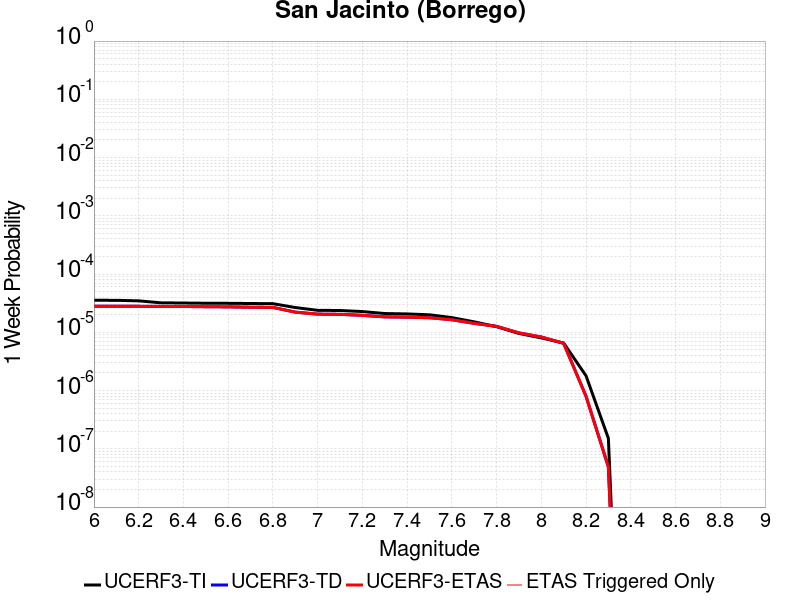 |  |  | 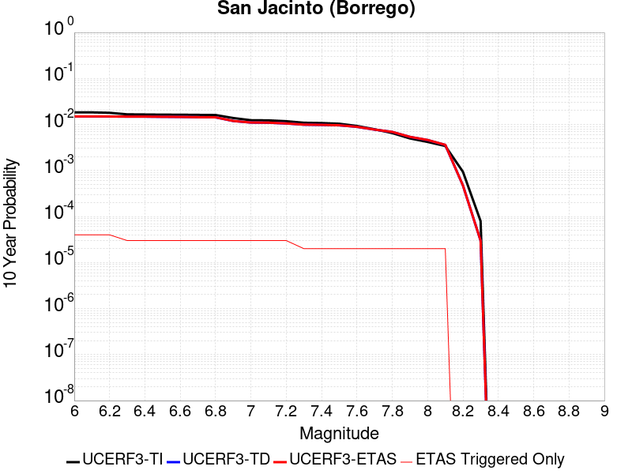 |

| Magnitude | 1 wk TI Prob | 1 wk TD Prob | 1 wk ETAS Prob | 1 wk ETAS/TD Gain | 1 wk ETAS Triggered Only | 1 mo TI Prob | 1 mo TD Prob | 1 mo ETAS Prob | 1 mo ETAS/TD Gain | 1 mo ETAS Triggered Only | 1 yr TI Prob | 1 yr TD Prob | 1 yr ETAS Prob | 1 yr ETAS/TD Gain | 1 yr ETAS Triggered Only | 10 yr TI Prob | 10 yr TD Prob | 10 yr ETAS Prob | 10 yr ETAS/TD Gain | 10 yr ETAS Triggered Only |
|-----|-----|-----|-----|-----|-----|-----|-----|-----|-----|-----|-----|-----|-----|-----|-----|-----|-----|-----|-----|-----|
| 6.0 | 3.543992E-5 | 2.7956603E-5 | 2.7956603E-5 | 1.0 | 0.0 | 1.5187653E-4 | 1.1980858E-4 | 1.2980738E-4 | 1.0834565 | 1.0E-5 | 0.0018475284 | 0.0014577056 | 0.0014676912 | 1.0068501 | 1.0E-5 | 0.018322436 | 0.014885285 | 0.014924689 | 1.0026472 | 4.0E-5 |
| 6.1 | 3.542281E-5 | 2.7956603E-5 | 2.7956603E-5 | 1.0 | 0.0 | 1.5180321E-4 | 1.1980858E-4 | 1.2980738E-4 | 1.0834565 | 1.0E-5 | 0.0018466372 | 0.0014577056 | 0.0014676912 | 1.0068501 | 1.0E-5 | 0.018313672 | 0.014885285 | 0.014924689 | 1.0026472 | 4.0E-5 |
| 6.2 | 3.4688688E-5 | 2.7956603E-5 | 2.7956603E-5 | 1.0 | 0.0 | 1.4865733E-4 | 1.19808574E-4 | 1.2980738E-4 | 1.0834565 | 1.0E-5 | 0.0018084005 | 0.0014577056 | 0.001467691 | 1.0068501 | 1.0E-5 | 0.017937548 | 0.014885284 | 0.014924689 | 1.0026472 | 4.0E-5 |
| 6.3 | 3.2087122E-5 | 2.7801936E-5 | 2.7801936E-5 | 1.0 | 0.0 | 1.3750899E-4 | 1.19145785E-4 | 1.291446E-4 | 1.0839208 | 1.0E-5 | 0.0016728862 | 0.0014496469 | 0.0014596324 | 1.0068883 | 1.0E-5 | 0.016603488 | 0.014806312 | 0.014835867 | 1.0019962 | 3.0E-5 |
| 6.4 | 3.1828724E-5 | 2.7768916E-5 | 2.7768916E-5 | 1.0 | 0.0 | 1.364017E-4 | 1.1900428E-4 | 1.2900309E-4 | 1.0840206 | 1.0E-5 | 0.0016594254 | 0.0014479264 | 0.0014579119 | 1.0068964 | 1.0E-5 | 0.016470885 | 0.014789388 | 0.014818944 | 1.0019984 | 3.0E-5 |
| 6.5 | 3.1563577E-5 | 2.7508588E-5 | 2.7508588E-5 | 1.0 | 0.0 | 1.3526545E-4 | 1.1788869E-4 | 1.2788751E-4 | 1.0848157 | 1.0E-5 | 0.0016456128 | 0.0014343619 | 0.0014443476 | 1.0069617 | 1.0E-5 | 0.0163348 | 0.014655951 | 0.014685512 | 1.0020169 | 3.0E-5 |
| 6.6 | 3.1467625E-5 | 2.735279E-5 | 2.735279E-5 | 1.0 | 0.0 | 1.3485427E-4 | 1.1722104E-4 | 1.2721987E-4 | 1.0852989 | 1.0E-5 | 0.0016406142 | 0.001426244 | 0.0014362298 | 1.0070014 | 1.0E-5 | 0.016285548 | 0.014576187 | 0.01460575 | 1.0020281 | 3.0E-5 |
| 6.7 | 3.1223695E-5 | 2.6970763E-5 | 2.6970763E-5 | 1.0 | 0.0 | 1.3380898E-4 | 1.15583935E-4 | 1.2558278E-4 | 1.0865072 | 1.0E-5 | 0.0016279068 | 0.0014063381 | 0.001416324 | 1.0071007 | 1.0E-5 | 0.01616033 | 0.01438054 | 0.014410108 | 1.0020561 | 3.0E-5 |
| 6.8 | 3.1015585E-5 | 2.6791718E-5 | 2.6791718E-5 | 1.0 | 0.0 | 1.3291716E-4 | 1.1481666E-4 | 1.2481552E-4 | 1.0870854 | 1.0E-5 | 0.001617065 | 0.0013970085 | 0.0014069946 | 1.0071481 | 1.0E-5 | 0.016053487 | 0.014287795 | 0.014317366 | 1.0020697 | 3.0E-5 |
| 6.9 | 2.6641965E-5 | 2.2212334E-5 | 2.2212334E-5 | 1.0 | 0.0 | 1.1417485E-4 | 9.519226E-5 | 1.0519131E-4 | 1.1050406 | 1.0E-5 | 0.0013891924 | 0.0011583535 | 0.001168342 | 1.0086229 | 1.0E-5 | 0.0138054015 | 0.011897102 | 0.011926745 | 1.0024916 | 3.0E-5 |
| 7.0 | 2.3854353E-5 | 2.0506088E-5 | 2.0506088E-5 | 1.0 | 0.0 | 1.02228936E-4 | 8.788029E-5 | 9.787941E-5 | 1.1137812 | 1.0E-5 | 0.0012439266 | 0.0010694199 | 0.0010794093 | 1.0093409 | 1.0E-5 | 0.012369866 | 0.010996936 | 0.011026606 | 1.0026981 | 3.0E-5 |
| 7.1 | 2.3672901E-5 | 2.0342548E-5 | 2.0342548E-5 | 1.0 | 0.0 | 1.0145135E-4 | 8.717945E-5 | 9.717858E-5 | 1.1146959 | 1.0E-5 | 0.0012344702 | 0.0010608955 | 0.0010708849 | 1.009416 | 1.0E-5 | 0.0122763505 | 0.010912099 | 0.010941772 | 1.0027193 | 3.0E-5 |
| 7.2 | 2.2717244E-5 | 1.9569701E-5 | 1.9569701E-5 | 1.0 | 0.0 | 9.735599E-5 | 8.386746E-5 | 9.386663E-5 | 1.1192257 | 1.0E-5 | 0.0011846646 | 0.0010206103 | 0.0010306002 | 1.009788 | 1.0E-5 | 0.01178369 | 0.010509352 | 0.010539036 | 1.0028245 | 3.0E-5 |
| 7.3 | 2.1016205E-5 | 1.8410952E-5 | 1.8410952E-5 | 1.0 | 0.0 | 9.006634E-5 | 7.890171E-5 | 7.890171E-5 | 1.0 | 0.0 | 0.001096006 | 9.6020696E-4 | 9.6020696E-4 | 1.0 | 0.0 | 0.010906163 | 0.009904788 | 0.00992459 | 1.0019993 | 2.0E-5 |
| 7.4 | 2.0683625E-5 | 1.8213394E-5 | 1.8213394E-5 | 1.0 | 0.0 | 8.86411E-5 | 7.805508E-5 | 7.805508E-5 | 1.0 | 0.0 | 0.001078671 | 9.4990834E-4 | 9.4990834E-4 | 1.0 | 0.0 | 0.010734501 | 0.009801473 | 0.009821277 | 1.0020205 | 2.0E-5 |
| 7.5 | 1.9993966E-5 | 1.7808186E-5 | 1.7808186E-5 | 1.0 | 0.0 | 8.568561E-5 | 7.631858E-5 | 7.631858E-5 | 1.0 | 0.0 | 0.001042723 | 9.287846E-4 | 9.287846E-4 | 1.0 | 0.0 | 0.010378438 | 0.009588276 | 0.009608084 | 1.0020659 | 2.0E-5 |
| 7.6 | 1.788966E-5 | 1.6460734E-5 | 1.6460734E-5 | 1.0 | 0.0 | 7.666772E-5 | 7.0544105E-5 | 7.0544105E-5 | 1.0 | 0.0 | 9.3302975E-4 | 8.585378E-4 | 8.585378E-4 | 1.0 | 0.0 | 0.00929122 | 0.008879809 | 0.008899631 | 1.0022323 | 2.0E-5 |
| 7.7 | 1.5125781E-5 | 1.4262029E-5 | 1.4262029E-5 | 1.0 | 0.0 | 6.4823165E-5 | 6.112155E-5 | 6.112155E-5 | 1.0 | 0.0 | 7.889362E-4 | 7.4390165E-4 | 7.4390165E-4 | 1.0 | 0.0 | 0.007861412 | 0.007727129 | 0.0077469745 | 1.0025682 | 2.0E-5 |
| 7.8 | 1.250089E-5 | 1.2654241E-5 | 1.2654241E-5 | 1.0 | 0.0 | 5.3574146E-5 | 5.423134E-5 | 5.423134E-5 | 1.0 | 0.0 | 6.5207E-4 | 6.6006713E-4 | 6.6006713E-4 | 1.0 | 0.0 | 0.006501599 | 0.0068802256 | 0.006900088 | 1.0028869 | 2.0E-5 |
| 7.9 | 9.561E-6 | 9.775645E-6 | 9.775645E-6 | 1.0 | 0.0 | 4.0975072E-5 | 4.189495E-5 | 4.189495E-5 | 1.0 | 0.0 | 4.987573E-4 | 5.099522E-4 | 5.099522E-4 | 1.0 | 0.0 | 0.0049763937 | 0.0053634187 | 0.0053833113 | 1.003709 | 2.0E-5 |
| 8.0 | 8.01699E-6 | 8.312629E-6 | 8.312629E-6 | 1.0 | 0.0 | 3.4358076E-5 | 3.5625068E-5 | 3.5625068E-5 | 1.0 | 0.0 | 4.1822926E-4 | 4.336494E-4 | 4.336494E-4 | 1.0 | 0.0 | 0.0041744304 | 0.00458347 | 0.0046033785 | 1.0043435 | 2.0E-5 |
| 8.1 | 6.541947E-6 | 6.477901E-6 | 6.477901E-6 | 1.0 | 0.0 | 2.8036617E-5 | 2.7762142E-5 | 2.7762142E-5 | 1.0 | 0.0 | 3.4129233E-4 | 3.3795217E-4 | 3.3795217E-4 | 1.0 | 0.0 | 0.0034076865 | 0.003588998 | 0.0036089262 | 1.0055525 | 2.0E-5 |
| 8.2 | 1.7968189E-6 | 8.0012404E-7 | 8.0012404E-7 | 1.0 | 0.0 | 7.70063E-6 | 3.4290986E-6 | 3.4290986E-6 | 1.0 | 0.0 | 9.3751136E-5 | 4.17485E-5 | 4.17485E-5 | 1.0 | 0.0 | 9.371159E-4 | 4.7288055E-4 | 4.7288055E-4 | 1.0 | 0.0 |
| 8.3 | 1.5167889E-7 | 4.9190945E-8 | 4.9190945E-8 | 1.0 | 0.0 | 6.500522E-7 | 2.1081833E-7 | 2.1081833E-7 | 1.0 | 0.0 | 7.9143565E-6 | 2.5667105E-6 | 2.5667105E-6 | 1.0 | 0.0 | 7.914075E-5 | 2.9817646E-5 | 2.9817646E-5 | 1.0 | 0.0 |

## Pinto Mtn
*[(top)](#table-of-contents)*

| 1 Week | 1 Month | 1 Year | 10 Year |
|-----|-----|-----|-----|
|  |  |  |  |

| Magnitude | 1 wk TI Prob | 1 wk TD Prob | 1 wk ETAS Prob | 1 wk ETAS/TD Gain | 1 wk ETAS Triggered Only | 1 mo TI Prob | 1 mo TD Prob | 1 mo ETAS Prob | 1 mo ETAS/TD Gain | 1 mo ETAS Triggered Only | 1 yr TI Prob | 1 yr TD Prob | 1 yr ETAS Prob | 1 yr ETAS/TD Gain | 1 yr ETAS Triggered Only | 10 yr TI Prob | 10 yr TD Prob | 10 yr ETAS Prob | 10 yr ETAS/TD Gain | 10 yr ETAS Triggered Only |
|-----|-----|-----|-----|-----|-----|-----|-----|-----|-----|-----|-----|-----|-----|-----|-----|-----|-----|-----|-----|-----|
| 6.0 | 4.4194956E-5 | 4.786006E-5 | 4.786006E-5 | 1.0 | 0.0 | 1.893932E-4 | 2.0509934E-4 | 2.0509934E-4 | 1.0 | 0.0 | 0.0023034236 | 0.0024943894 | 0.0024943894 | 1.0 | 0.0 | 0.022796938 | 0.024681423 | 0.024720436 | 1.0015806 | 4.0E-5 |
| 6.1 | 4.4194956E-5 | 4.786006E-5 | 4.786006E-5 | 1.0 | 0.0 | 1.893932E-4 | 2.0509934E-4 | 2.0509934E-4 | 1.0 | 0.0 | 0.0023034236 | 0.0024943894 | 0.0024943894 | 1.0 | 0.0 | 0.022796938 | 0.024681423 | 0.024720436 | 1.0015806 | 4.0E-5 |
| 6.2 | 4.4194956E-5 | 4.786006E-5 | 4.786006E-5 | 1.0 | 0.0 | 1.893932E-4 | 2.0509934E-4 | 2.0509934E-4 | 1.0 | 0.0 | 0.0023034236 | 0.0024943894 | 0.0024943894 | 1.0 | 0.0 | 0.022796938 | 0.024681423 | 0.024720436 | 1.0015806 | 4.0E-5 |
| 6.3 | 4.4194956E-5 | 4.786006E-5 | 4.786006E-5 | 1.0 | 0.0 | 1.893932E-4 | 2.0509934E-4 | 2.0509934E-4 | 1.0 | 0.0 | 0.0023034236 | 0.0024943894 | 0.0024943894 | 1.0 | 0.0 | 0.022796938 | 0.024681423 | 0.024720436 | 1.0015806 | 4.0E-5 |
| 6.4 | 3.729929E-5 | 3.9608763E-5 | 3.9608763E-5 | 1.0 | 0.0 | 1.5984432E-4 | 1.6974132E-4 | 1.6974132E-4 | 1.0 | 0.0 | 0.0019443673 | 0.0020647354 | 0.0020647354 | 1.0 | 0.0 | 0.019274427 | 0.020465542 | 0.020494929 | 1.0014359 | 3.0E-5 |
| 6.5 | 3.729929E-5 | 3.9608763E-5 | 3.9608763E-5 | 1.0 | 0.0 | 1.5984432E-4 | 1.6974132E-4 | 1.6974132E-4 | 1.0 | 0.0 | 0.0019443673 | 0.0020647354 | 0.0020647354 | 1.0 | 0.0 | 0.019274427 | 0.020465542 | 0.020494929 | 1.0014359 | 3.0E-5 |
| 6.6 | 3.0204548E-5 | 3.1210056E-5 | 3.1210056E-5 | 1.0 | 0.0 | 1.2944164E-4 | 1.3375071E-4 | 1.3375071E-4 | 1.0 | 0.0 | 0.0015748127 | 0.0016272333 | 0.0016272333 | 1.0 | 0.0 | 0.015636992 | 0.016157052 | 0.01616689 | 1.0006089 | 1.0E-5 |
| 6.7 | 2.9857754E-5 | 3.0819414E-5 | 3.0819414E-5 | 1.0 | 0.0 | 1.2795553E-4 | 1.320767E-4 | 1.320767E-4 | 1.0 | 0.0 | 0.0015567453 | 0.0016068824 | 0.0016068824 | 1.0 | 0.0 | 0.015458848 | 0.015956478 | 0.01596632 | 1.0006167 | 1.0E-5 |
| 6.8 | 2.4819734E-5 | 2.5013624E-5 | 2.5013624E-5 | 1.0 | 0.0 | 1.0636595E-4 | 1.0719696E-4 | 1.0719696E-4 | 1.0 | 0.0 | 0.0012942362 | 0.0013043632 | 0.0013043632 | 1.0 | 0.0 | 0.012867244 | 0.012969442 | 0.012979312 | 1.000761 | 1.0E-5 |
| 6.9 | 2.331124E-5 | 2.3341807E-5 | 2.3341807E-5 | 1.0 | 0.0 | 9.990149E-5 | 1.00032594E-4 | 1.00032594E-4 | 1.0 | 0.0 | 0.001215622 | 0.0012172367 | 0.0012172367 | 1.0 | 0.0 | 0.012089936 | 0.012107888 | 0.012117767 | 1.0008159 | 1.0E-5 |
| 7.0 | 2.1818534E-5 | 2.1764856E-5 | 2.1764856E-5 | 1.0 | 0.0 | 9.3504656E-5 | 9.327473E-5 | 9.327473E-5 | 1.0 | 0.0 | 0.0011378246 | 0.0011350481 | 0.0011350481 | 1.0 | 0.0 | 0.011320163 | 0.011294611 | 0.011304498 | 1.0008754 | 1.0E-5 |
| 7.1 | 2.066081E-5 | 2.0544425E-5 | 2.0544425E-5 | 1.0 | 0.0 | 8.854332E-5 | 8.8044675E-5 | 8.8044675E-5 | 1.0 | 0.0 | 0.0010774818 | 0.0010714363 | 0.0010714363 | 1.0 | 0.0 | 0.010722724 | 0.010664757 | 0.010674651 | 1.0009277 | 1.0E-5 |
| 7.2 | 1.8990233E-5 | 1.9057632E-5 | 1.9057632E-5 | 1.0 | 0.0 | 8.138417E-5 | 8.167311E-5 | 8.167311E-5 | 1.0 | 0.0 | 9.904018E-4 | 9.939359E-4 | 9.939359E-4 | 1.0 | 0.0 | 0.009859995 | 0.009896904 | 0.009906805 | 1.0010004 | 1.0E-5 |
| 7.3 | 1.3335872E-5 | 1.4909989E-5 | 1.4909989E-5 | 1.0 | 0.0 | 5.7152483E-5 | 6.389846E-5 | 6.389846E-5 | 1.0 | 0.0 | 6.956093E-4 | 7.776988E-4 | 7.776988E-4 | 1.0 | 0.0 | 0.006934359 | 0.0077510723 | 0.0077609946 | 1.0012802 | 1.0E-5 |
| 7.4 | 9.414066E-6 | 1.1864049E-5 | 1.1864049E-5 | 1.0 | 0.0 | 4.0345374E-5 | 5.0844985E-5 | 5.0844985E-5 | 1.0 | 0.0 | 4.910942E-4 | 6.188713E-4 | 6.188713E-4 | 1.0 | 0.0 | 0.0049001034 | 0.0061724274 | 0.0061724274 | 1.0 | 0.0 |
| 7.5 | 7.2101157E-6 | 9.16125E-6 | 9.16125E-6 | 1.0 | 0.0 | 3.090013E-5 | 3.926195E-5 | 3.926195E-5 | 1.0 | 0.0 | 3.7614413E-4 | 4.7791723E-4 | 4.7791723E-4 | 1.0 | 0.0 | 0.0037550807 | 0.0047696703 | 0.0047696703 | 1.0 | 0.0 |
| 7.6 | 3.296375E-6 | 4.5485344E-6 | 4.5485344E-6 | 1.0 | 0.0 | 1.4127245E-5 | 1.9493582E-5 | 1.9493582E-5 | 1.0 | 0.0 | 1.7198564E-4 | 2.373099E-4 | 2.373099E-4 | 1.0 | 0.0 | 0.0017185259 | 0.0023707023 | 0.0023707023 | 1.0 | 0.0 |
| 7.7 | 2.5741092E-6 | 3.5872815E-6 | 3.5872815E-6 | 1.0 | 0.0 | 1.103185E-5 | 1.537398E-5 | 1.537398E-5 | 1.0 | 0.0 | 1.3430449E-4 | 1.8716346E-4 | 1.8716346E-4 | 1.0 | 0.0 | 0.0013422335 | 0.0018701884 | 0.0018701884 | 1.0 | 0.0 |

## Calaveras (So) 2011 CFM
*[(top)](#table-of-contents)*

| 1 Week | 1 Month | 1 Year | 10 Year |
|-----|-----|-----|-----|
|  |  |  |  |

| Magnitude | 1 wk TI Prob | 1 wk TD Prob | 1 wk ETAS Prob | 1 wk ETAS/TD Gain | 1 wk ETAS Triggered Only | 1 mo TI Prob | 1 mo TD Prob | 1 mo ETAS Prob | 1 mo ETAS/TD Gain | 1 mo ETAS Triggered Only | 1 yr TI Prob | 1 yr TD Prob | 1 yr ETAS Prob | 1 yr ETAS/TD Gain | 1 yr ETAS Triggered Only | 10 yr TI Prob | 10 yr TD Prob | 10 yr ETAS Prob | 10 yr ETAS/TD Gain | 10 yr ETAS Triggered Only |
|-----|-----|-----|-----|-----|-----|-----|-----|-----|-----|-----|-----|-----|-----|-----|-----|-----|-----|-----|-----|-----|
| 6.0 | 1.5950744E-4 | 3.0739905E-4 | 3.0739905E-4 | 1.0 | 0.0 | 6.834242E-4 | 0.0013167706 | 0.0013167706 | 1.0 | 0.0 | 0.00828899 | 0.015865553 | 0.015895078 | 1.0018609 | 3.0E-5 | 0.079865426 | 0.14445968 | 0.14449391 | 1.0002369 | 4.0E-5 |
| 6.1 | 1.3584697E-4 | 2.6061598E-4 | 2.6061598E-4 | 1.0 | 0.0 | 5.8207137E-4 | 0.0011164517 | 0.0011164517 | 1.0 | 0.0 | 0.007063716 | 0.013468163 | 0.01349776 | 1.0021975 | 3.0E-5 | 0.06843361 | 0.124085724 | 0.12412076 | 1.0002824 | 4.0E-5 |
| 6.2 | 1.14676266E-4 | 2.1746816E-4 | 2.1746816E-4 | 1.0 | 0.0 | 4.9137714E-4 | 9.316741E-4 | 9.316741E-4 | 1.0 | 0.0 | 0.0059661185 | 0.011251126 | 0.011270901 | 1.0017576 | 2.0E-5 | 0.058084648 | 0.10507494 | 0.10510179 | 1.0002555 | 3.0E-5 |
| 6.3 | 8.691518E-5 | 1.6001116E-4 | 1.6001116E-4 | 1.0 | 0.0 | 3.7244044E-4 | 6.855628E-4 | 6.855628E-4 | 1.0 | 0.0 | 0.004525038 | 0.008307241 | 0.008327075 | 1.0023875 | 2.0E-5 | 0.044339992 | 0.079390146 | 0.07941776 | 1.0003479 | 3.0E-5 |
| 6.4 | 8.50982E-5 | 1.5707467E-4 | 1.5707467E-4 | 1.0 | 0.0 | 3.646556E-4 | 6.7298434E-4 | 6.7298434E-4 | 1.0 | 0.0 | 0.0044306475 | 0.008155251 | 0.008175088 | 1.0024325 | 2.0E-5 | 0.04343345 | 0.077996135 | 0.0780238 | 1.0003546 | 3.0E-5 |
| 6.5 | 8.4062965E-5 | 1.5531975E-4 | 1.5531975E-4 | 1.0 | 0.0 | 3.602201E-4 | 6.654671E-4 | 6.654671E-4 | 1.0 | 0.0 | 0.004376863 | 0.008064441 | 0.00808428 | 1.00246 | 2.0E-5 | 0.042916555 | 0.07716733 | 0.07719502 | 1.0003588 | 3.0E-5 |
| 6.6 | 8.194716E-5 | 1.516774E-4 | 1.516774E-4 | 1.0 | 0.0 | 3.5115483E-4 | 6.498649E-4 | 6.498649E-4 | 1.0 | 0.0 | 0.0042669317 | 0.007876252 | 0.007896095 | 1.0025192 | 2.0E-5 | 0.04185927 | 0.0754524 | 0.07548014 | 1.0003676 | 3.0E-5 |
| 6.7 | 8.012326E-5 | 1.483531E-4 | 1.483531E-4 | 1.0 | 0.0 | 3.433402E-4 | 6.3563243E-4 | 6.3563243E-4 | 1.0 | 0.0 | 0.004172157 | 0.0077047227 | 0.0077245687 | 1.0025758 | 2.0E-5 | 0.040946912 | 0.0738944 | 0.07392218 | 1.000376 | 3.0E-5 |
| 6.8 | 7.119773E-5 | 1.289278E-4 | 1.289278E-4 | 1.0 | 0.0 | 3.0509746E-4 | 5.524251E-4 | 5.524251E-4 | 1.0 | 0.0 | 0.0037082357 | 0.0067017726 | 0.006721638 | 1.0029643 | 2.0E-5 | 0.036469642 | 0.06473622 | 0.064764276 | 1.0004334 | 3.0E-5 |
| 6.9 | 5.7343088E-5 | 9.928818E-5 | 9.928818E-5 | 1.0 | 0.0 | 2.4573295E-4 | 4.254518E-4 | 4.254518E-4 | 1.0 | 0.0 | 0.0029876942 | 0.0051676547 | 0.0051875515 | 1.0038502 | 2.0E-5 | 0.02947844 | 0.05055552 | 0.050584003 | 1.0005634 | 3.0E-5 |
| 7.0 | 4.8746577E-5 | 8.294431E-5 | 8.294431E-5 | 1.0 | 0.0 | 2.0889717E-4 | 3.5542753E-4 | 3.5542753E-4 | 1.0 | 0.0 | 0.0025403565 | 0.0043188105 | 0.004338724 | 1.0046109 | 2.0E-5 | 0.025115121 | 0.04253077 | 0.042559493 | 1.0006753 | 3.0E-5 |
| 7.1 | 4.2998014E-5 | 7.27236E-5 | 7.27236E-5 | 1.0 | 0.0 | 1.8426418E-4 | 3.1163564E-4 | 3.1163564E-4 | 1.0 | 0.0 | 0.002241108 | 0.0037876235 | 0.0038075477 | 1.0052603 | 2.0E-5 | 0.022186412 | 0.037458975 | 0.03748785 | 1.0007709 | 3.0E-5 |
| 7.2 | 3.221292E-5 | 5.3976983E-5 | 5.3976983E-5 | 1.0 | 0.0 | 1.3804805E-4 | 2.3130958E-4 | 2.3130958E-4 | 1.0 | 0.0 | 0.0016794393 | 0.002812585 | 0.002832529 | 1.0070909 | 2.0E-5 | 0.016668037 | 0.02807059 | 0.028099747 | 1.0010388 | 3.0E-5 |
| 7.3 | 2.3756531E-5 | 3.9534E-5 | 3.9534E-5 | 1.0 | 0.0 | 1.0180973E-4 | 1.6942051E-4 | 1.6942051E-4 | 1.0 | 0.0 | 0.0012388286 | 0.0020607605 | 0.0020807192 | 1.0096852 | 2.0E-5 | 0.012319452 | 0.020674022 | 0.020703401 | 1.0014211 | 3.0E-5 |
| 7.4 | 1.5997684E-5 | 2.737303E-5 | 2.737303E-5 | 1.0 | 0.0 | 6.8559704E-5 | 1.1730772E-4 | 1.1730772E-4 | 1.0 | 0.0 | 8.343947E-4 | 0.0014272883 | 0.0014372739 | 1.0069963 | 1.0E-5 | 0.008312687 | 0.0143921655 | 0.014411877 | 1.0013696 | 2.0E-5 |
| 7.5 | 1.3814293E-5 | 2.481389E-5 | 2.481389E-5 | 1.0 | 0.0 | 5.9202768E-5 | 1.0634092E-4 | 1.0634092E-4 | 1.0 | 0.0 | 7.205553E-4 | 0.0012939342 | 0.0013039212 | 1.0077183 | 1.0E-5 | 0.007182234 | 0.013070965 | 0.013090704 | 1.0015101 | 2.0E-5 |
| 7.6 | 8.817309E-6 | 1.6456672E-5 | 1.6456672E-5 | 1.0 | 0.0 | 3.7787922E-5 | 7.0526694E-5 | 7.0526694E-5 | 1.0 | 0.0 | 4.5997082E-4 | 8.5832557E-4 | 8.68317E-4 | 1.0116405 | 1.0E-5 | 0.004590199 | 0.008732965 | 0.00875279 | 1.0022702 | 2.0E-5 |
| 7.7 | 4.0352206E-6 | 7.724012E-6 | 7.724012E-6 | 1.0 | 0.0 | 1.7293689E-5 | 3.310249E-5 | 3.310249E-5 | 1.0 | 0.0 | 2.1053031E-4 | 4.0294835E-4 | 4.1294433E-4 | 1.0248071 | 1.0E-5 | 0.0021033096 | 0.0041733775 | 0.004183336 | 1.0023861 | 1.0E-5 |
| 7.8 | 3.413169E-6 | 6.8018153E-6 | 6.8018153E-6 | 1.0 | 0.0 | 1.4627784E-5 | 2.9150313E-5 | 2.9150313E-5 | 1.0 | 0.0 | 1.7807873E-4 | 3.5484732E-4 | 3.6484379E-4 | 1.0281712 | 1.0E-5 | 0.0017793609 | 0.0036736047 | 0.003683568 | 1.0027121 | 1.0E-5 |
| 7.9 | 2.4740732E-6 | 5.2897763E-6 | 5.2897763E-6 | 1.0 | 0.0 | 1.06031275E-5 | 2.2670272E-5 | 2.2670272E-5 | 1.0 | 0.0 | 1.2908543E-4 | 2.7597568E-4 | 2.859729E-4 | 1.0362251 | 1.0E-5 | 0.0012901047 | 0.002839954 | 0.0028499258 | 1.0035112 | 1.0E-5 |
| 8.0 | 1.5231818E-6 | 3.2950636E-6 | 3.2950636E-6 | 1.0 | 0.0 | 6.527906E-6 | 1.4121625E-5 | 1.4121625E-5 | 1.0 | 0.0 | 7.9474354E-5 | 1.7191726E-4 | 1.8191554E-4 | 1.0581576 | 1.0E-5 | 7.944594E-4 | 0.0017594753 | 0.0017694577 | 1.0056735 | 1.0E-5 |
| 8.1 | 1.0104524E-6 | 2.049573E-6 | 2.049573E-6 | 1.0 | 0.0 | 4.330503E-6 | 8.783854E-6 | 8.783854E-6 | 1.0 | 0.0 | 5.2722597E-5 | 1.0693821E-4 | 1.0693821E-4 | 1.0 | 0.0 | 5.271009E-4 | 0.0010948586 | 0.0010948586 | 1.0 | 0.0 |

## Ventura-Pitas Point
*[(top)](#table-of-contents)*

| 1 Week | 1 Month | 1 Year | 10 Year |
|-----|-----|-----|-----|
|  |  |  |  |

| Magnitude | 1 wk TI Prob | 1 wk TD Prob | 1 wk ETAS Prob | 1 wk ETAS/TD Gain | 1 wk ETAS Triggered Only | 1 mo TI Prob | 1 mo TD Prob | 1 mo ETAS Prob | 1 mo ETAS/TD Gain | 1 mo ETAS Triggered Only | 1 yr TI Prob | 1 yr TD Prob | 1 yr ETAS Prob | 1 yr ETAS/TD Gain | 1 yr ETAS Triggered Only | 10 yr TI Prob | 10 yr TD Prob | 10 yr ETAS Prob | 10 yr ETAS/TD Gain | 10 yr ETAS Triggered Only |
|-----|-----|-----|-----|-----|-----|-----|-----|-----|-----|-----|-----|-----|-----|-----|-----|-----|-----|-----|-----|-----|
| 6.0 | 3.3179622E-5 | 3.373905E-5 | 3.373905E-5 | 1.0 | 0.0 | 1.4219063E-4 | 1.4458936E-4 | 1.4458936E-4 | 1.0 | 0.0 | 0.0017297962 | 0.001759211 | 0.0017791757 | 1.0113487 | 2.0E-5 | 0.017163932 | 0.017478386 | 0.017498037 | 1.0011243 | 2.0E-5 |
| 6.1 | 3.3179622E-5 | 3.373905E-5 | 3.373905E-5 | 1.0 | 0.0 | 1.4219063E-4 | 1.4458936E-4 | 1.4458936E-4 | 1.0 | 0.0 | 0.0017297962 | 0.001759211 | 0.0017791757 | 1.0113487 | 2.0E-5 | 0.017163932 | 0.017478386 | 0.017498037 | 1.0011243 | 2.0E-5 |
| 6.2 | 3.3179622E-5 | 3.373905E-5 | 3.373905E-5 | 1.0 | 0.0 | 1.4219063E-4 | 1.4458936E-4 | 1.4458936E-4 | 1.0 | 0.0 | 0.0017297962 | 0.001759211 | 0.0017791757 | 1.0113487 | 2.0E-5 | 0.017163932 | 0.017478386 | 0.017498037 | 1.0011243 | 2.0E-5 |
| 6.3 | 3.3179622E-5 | 3.373905E-5 | 3.373905E-5 | 1.0 | 0.0 | 1.4219063E-4 | 1.4458936E-4 | 1.4458936E-4 | 1.0 | 0.0 | 0.0017297962 | 0.001759211 | 0.0017791757 | 1.0113487 | 2.0E-5 | 0.017163932 | 0.017478386 | 0.017498037 | 1.0011243 | 2.0E-5 |
| 6.4 | 1.8754668E-5 | 1.7022061E-5 | 1.7022061E-5 | 1.0 | 0.0 | 8.037467E-5 | 7.2949784E-5 | 7.2949784E-5 | 1.0 | 0.0 | 9.781223E-4 | 8.878248E-4 | 8.978159E-4 | 1.0112535 | 1.0E-5 | 0.009738282 | 0.008845116 | 0.008855027 | 1.0011206 | 1.0E-5 |
| 6.5 | 1.8754668E-5 | 1.7022061E-5 | 1.7022061E-5 | 1.0 | 0.0 | 8.037467E-5 | 7.2949784E-5 | 7.2949784E-5 | 1.0 | 0.0 | 9.781223E-4 | 8.878248E-4 | 8.978159E-4 | 1.0112535 | 1.0E-5 | 0.009738282 | 0.008845116 | 0.008855027 | 1.0011206 | 1.0E-5 |
| 6.6 | 1.4361558E-5 | 1.21244275E-5 | 1.21244275E-5 | 1.0 | 0.0 | 6.154808E-5 | 5.196081E-5 | 5.196081E-5 | 1.0 | 0.0 | 7.490902E-4 | 6.3244154E-4 | 6.424352E-4 | 1.0158018 | 1.0E-5 | 0.0074657016 | 0.006306674 | 0.0063166106 | 1.0015756 | 1.0E-5 |
| 6.7 | 1.4361558E-5 | 1.21244275E-5 | 1.21244275E-5 | 1.0 | 0.0 | 6.154808E-5 | 5.196081E-5 | 5.196081E-5 | 1.0 | 0.0 | 7.490902E-4 | 6.3244154E-4 | 6.424352E-4 | 1.0158018 | 1.0E-5 | 0.0074657016 | 0.006306674 | 0.0063166106 | 1.0015756 | 1.0E-5 |
| 6.8 | 1.3663846E-5 | 1.1346523E-5 | 1.1346523E-5 | 1.0 | 0.0 | 5.8558027E-5 | 4.8627062E-5 | 4.8627062E-5 | 1.0 | 0.0 | 7.127108E-4 | 5.918756E-4 | 6.0186966E-4 | 1.0168854 | 1.0E-5 | 0.007104293 | 0.005903208 | 0.005913149 | 1.001684 | 1.0E-5 |
| 6.9 | 1.3644157E-5 | 1.1324622E-5 | 1.1324622E-5 | 1.0 | 0.0 | 5.8473648E-5 | 4.8533206E-5 | 4.8533206E-5 | 1.0 | 0.0 | 7.116841E-4 | 5.907335E-4 | 6.007276E-4 | 1.0169181 | 1.0E-5 | 0.007094092 | 0.005891848 | 0.0059017893 | 1.0016873 | 1.0E-5 |
| 7.0 | 1.3568845E-5 | 1.1244184E-5 | 1.1244184E-5 | 1.0 | 0.0 | 5.8150898E-5 | 4.8188478E-5 | 4.8188478E-5 | 1.0 | 0.0 | 7.077572E-4 | 5.8653875E-4 | 5.965329E-4 | 1.0170392 | 1.0E-5 | 0.007055073 | 0.005850122 | 0.0058600632 | 1.0016993 | 1.0E-5 |
| 7.1 | 1.306572E-5 | 1.07226015E-5 | 1.07226015E-5 | 1.0 | 0.0 | 5.599474E-5 | 4.5953206E-5 | 4.5953206E-5 | 1.0 | 0.0 | 6.815227E-4 | 5.5933854E-4 | 5.693329E-4 | 1.0178683 | 1.0E-5 | 0.0067943637 | 0.005579512 | 0.0055894563 | 1.0017823 | 1.0E-5 |
| 7.2 | 1.232604E-5 | 9.9971385E-6 | 9.9971385E-6 | 1.0 | 0.0 | 5.2824813E-5 | 4.2844185E-5 | 4.2844185E-5 | 1.0 | 0.0 | 6.429523E-4 | 5.2150484E-4 | 5.314997E-4 | 1.0191653 | 1.0E-5 | 0.0064109527 | 0.0052030026 | 0.0052129505 | 1.001912 | 1.0E-5 |
| 7.3 | 1.0917261E-5 | 8.844411E-6 | 8.844411E-6 | 1.0 | 0.0 | 4.678742E-5 | 3.7904076E-5 | 3.7904076E-5 | 1.0 | 0.0 | 5.69488E-4 | 4.6138596E-4 | 4.7138135E-4 | 1.0216638 | 1.0E-5 | 0.0056803077 | 0.0046044462 | 0.0046144 | 1.0021619 | 1.0E-5 |
| 7.4 | 1.039959E-5 | 8.4240955E-6 | 8.4240955E-6 | 1.0 | 0.0 | 4.456891E-5 | 3.6102774E-5 | 3.6102774E-5 | 1.0 | 0.0 | 5.424914E-4 | 4.3946414E-4 | 4.4945977E-4 | 1.022745 | 1.0E-5 | 0.0054116896 | 0.0043861126 | 0.004396069 | 1.0022699 | 1.0E-5 |
| 7.5 | 9.015877E-6 | 7.2979265E-6 | 7.2979265E-6 | 1.0 | 0.0 | 3.86389E-5 | 3.127646E-5 | 3.127646E-5 | 1.0 | 0.0 | 4.7032707E-4 | 3.8072577E-4 | 3.9072198E-4 | 1.0262556 | 1.0E-5 | 0.004693329 | 0.0038008802 | 0.0038108423 | 1.0026209 | 1.0E-5 |
| 7.6 | 4.900162E-6 | 3.874264E-6 | 3.874264E-6 | 1.0 | 0.0 | 2.1000526E-5 | 1.6603883E-5 | 1.6603883E-5 | 1.0 | 0.0 | 2.556514E-4 | 2.0213365E-4 | 2.0213365E-4 | 1.0 | 0.0 | 0.0025535747 | 0.0020195118 | 0.0020195118 | 1.0 | 0.0 |
| 7.7 | 3.8850626E-6 | 3.1268457E-6 | 3.1268457E-6 | 1.0 | 0.0 | 1.6650163E-5 | 1.34007E-5 | 1.34007E-5 | 1.0 | 0.0 | 2.0269687E-4 | 1.6314139E-4 | 1.6314139E-4 | 1.0 | 0.0 | 0.002025121 | 0.0016302256 | 0.0016302256 | 1.0 | 0.0 |
| 7.8 | 2.4654719E-6 | 2.0299424E-6 | 2.0299424E-6 | 1.0 | 0.0 | 1.0566265E-5 | 8.699724E-6 | 8.699724E-6 | 1.0 | 0.0 | 1.2863669E-4 | 1.0591404E-4 | 1.0591404E-4 | 1.0 | 0.0 | 0.0012856225 | 0.0010586403 | 0.0010586403 | 1.0 | 0.0 |
| 7.9 | 4.095894E-7 | 3.27659E-7 | 3.27659E-7 | 1.0 | 0.0 | 1.7553821E-6 | 1.404252E-6 | 1.404252E-6 | 1.0 | 0.0 | 2.1371567E-5 | 1.7096638E-5 | 1.7096638E-5 | 1.0 | 0.0 | 2.1369511E-4 | 1.7095353E-4 | 1.7095353E-4 | 1.0 | 0.0 |
| 8.0 | 7.791402E-9 | 5.683722E-9 | 5.683722E-9 | 1.0 | 0.0 | 3.3391725E-8 | 2.4358807E-8 | 2.4358807E-8 | 1.0 | 0.0 | 4.0654416E-7 | 2.9656846E-7 | 2.9656846E-7 | 1.0 | 0.0 | 4.065434E-6 | 2.9656826E-6 | 2.9656826E-6 | 1.0 | 0.0 |

## Calaveras (So) - Paicines extension 2011 CFM
*[(top)](#table-of-contents)*

| 1 Week | 1 Month | 1 Year | 10 Year |
|-----|-----|-----|-----|
|  |  | 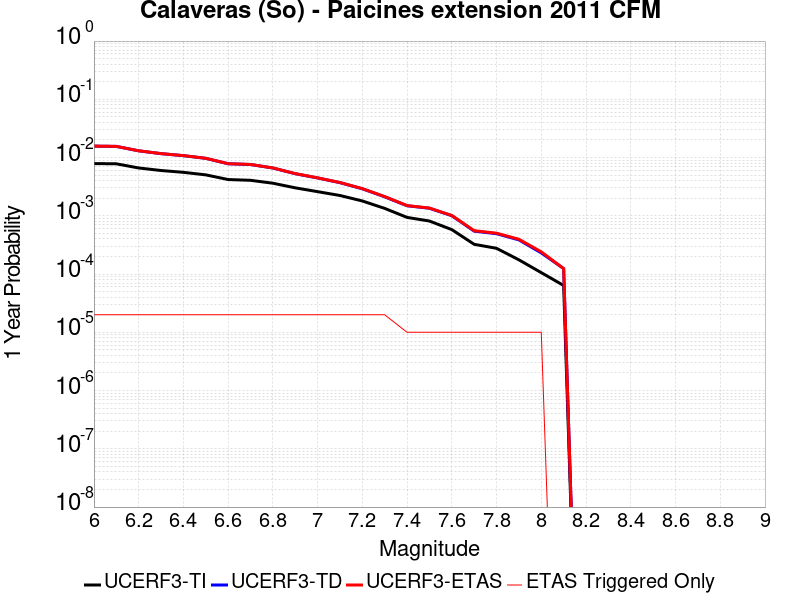 | 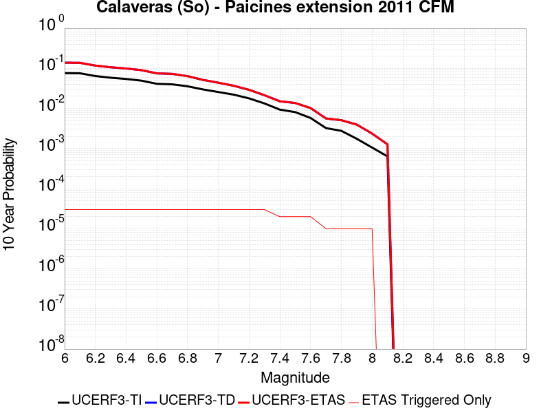 |

| Magnitude | 1 wk TI Prob | 1 wk TD Prob | 1 wk ETAS Prob | 1 wk ETAS/TD Gain | 1 wk ETAS Triggered Only | 1 mo TI Prob | 1 mo TD Prob | 1 mo ETAS Prob | 1 mo ETAS/TD Gain | 1 mo ETAS Triggered Only | 1 yr TI Prob | 1 yr TD Prob | 1 yr ETAS Prob | 1 yr ETAS/TD Gain | 1 yr ETAS Triggered Only | 10 yr TI Prob | 10 yr TD Prob | 10 yr ETAS Prob | 10 yr ETAS/TD Gain | 10 yr ETAS Triggered Only |
|-----|-----|-----|-----|-----|-----|-----|-----|-----|-----|-----|-----|-----|-----|-----|-----|-----|-----|-----|-----|-----|
| 6.0 | 1.5183659E-4 | 3.0538742E-4 | 3.0538742E-4 | 1.0 | 0.0 | 6.5056595E-4 | 0.0013080107 | 0.0013080107 | 1.0 | 0.0 | 0.007891912 | 0.015702842 | 0.015722528 | 1.0012536 | 2.0E-5 | 0.076174594 | 0.13854265 | 0.1385685 | 1.0001866 | 3.0E-5 |
| 6.1 | 1.5024997E-4 | 3.0232652E-4 | 3.0232652E-4 | 1.0 | 0.0 | 6.437695E-4 | 0.0012949064 | 0.0012949064 | 1.0 | 0.0 | 0.0078097614 | 0.0155462185 | 0.015565908 | 1.0012665 | 2.0E-5 | 0.075409345 | 0.13721214 | 0.13723804 | 1.0001886 | 3.0E-5 |
| 6.2 | 1.2743923E-4 | 2.5341182E-4 | 2.5341182E-4 | 1.0 | 0.0 | 5.460538E-4 | 0.001085454 | 0.001085454 | 1.0 | 0.0 | 0.0066279583 | 0.013053368 | 0.013073106 | 1.0015122 | 2.0E-5 | 0.064337276 | 0.117310405 | 0.117336884 | 1.0002258 | 3.0E-5 |
| 6.3 | 1.1525114E-4 | 2.262457E-4 | 2.262457E-4 | 1.0 | 0.0 | 4.9383997E-4 | 9.6911576E-4 | 9.6911576E-4 | 1.0 | 0.0 | 0.0059959386 | 0.011674539 | 0.011694306 | 1.0016931 | 2.0E-5 | 0.058367174 | 0.1064267 | 0.10645351 | 1.0002519 | 3.0E-5 |
| 6.4 | 1.07200925E-4 | 2.0861623E-4 | 2.0861623E-4 | 1.0 | 0.0 | 4.5935164E-4 | 8.93614E-4 | 8.93614E-4 | 1.0 | 0.0 | 0.0055782744 | 0.010779322 | 0.010799107 | 1.0018353 | 2.0E-5 | 0.0544031 | 0.099249505 | 0.09927653 | 1.0002723 | 3.0E-5 |
| 6.5 | 9.69631E-5 | 1.8751183E-4 | 1.8751183E-4 | 1.0 | 0.0 | 4.1548995E-4 | 8.0336037E-4 | 8.0336037E-4 | 1.0 | 0.0 | 0.0050468626 | 0.009701113 | 0.00972092 | 1.0020416 | 2.0E-5 | 0.04933773 | 0.09014108 | 0.09016838 | 1.0003028 | 3.0E-5 |
| 6.6 | 8.0552316E-5 | 1.508417E-4 | 1.508417E-4 | 1.0 | 0.0 | 3.4517853E-4 | 6.4628234E-4 | 6.4628234E-4 | 1.0 | 0.0 | 0.0041944524 | 0.007832806 | 0.007852649 | 1.0025333 | 2.0E-5 | 0.04116161 | 0.07491137 | 0.074939124 | 1.0003705 | 3.0E-5 |
| 6.7 | 7.815757E-5 | 1.4624608E-4 | 1.4624608E-4 | 1.0 | 0.0 | 3.34918E-4 | 6.2660675E-4 | 6.2660675E-4 | 1.0 | 0.0 | 0.004070005 | 0.0075956066 | 0.0076154545 | 1.0026131 | 2.0E-5 | 0.039962657 | 0.07276075 | 0.072788574 | 1.0003823 | 3.0E-5 |
| 6.8 | 6.965264E-5 | 1.273421E-4 | 1.273421E-4 | 1.0 | 0.0 | 2.9847719E-4 | 5.456321E-4 | 5.456321E-4 | 1.0 | 0.0 | 0.0036279052 | 0.006619586 | 0.0066394536 | 1.0030013 | 2.0E-5 | 0.03569247 | 0.06385353 | 0.06388162 | 1.0004399 | 3.0E-5 |
| 6.9 | 5.8000453E-5 | 1.0154083E-4 | 1.0154083E-4 | 1.0 | 0.0 | 2.4854968E-4 | 4.3510293E-4 | 4.3510293E-4 | 1.0 | 0.0 | 0.0030218933 | 0.0052846153 | 0.00530451 | 1.0037646 | 2.0E-5 | 0.029811295 | 0.051550873 | 0.051579326 | 1.0005519 | 3.0E-5 |
| 7.0 | 4.9865852E-5 | 8.578075E-5 | 8.578075E-5 | 1.0 | 0.0 | 2.1369329E-4 | 3.6758048E-4 | 3.6758048E-4 | 1.0 | 0.0 | 0.0025986114 | 0.004466198 | 0.0044861087 | 1.0044581 | 2.0E-5 | 0.025684336 | 0.04383052 | 0.043859206 | 1.0006545 | 3.0E-5 |
| 7.1 | 4.283875E-5 | 7.120278E-5 | 7.120278E-5 | 1.0 | 0.0 | 1.8358172E-4 | 3.051194E-4 | 3.051194E-4 | 1.0 | 0.0 | 0.0022328163 | 0.0037085575 | 0.003728483 | 1.0053729 | 2.0E-5 | 0.022105146 | 0.03677475 | 0.036803648 | 1.0007858 | 3.0E-5 |
| 7.2 | 3.450115E-5 | 5.5854773E-5 | 5.5854773E-5 | 1.0 | 0.0 | 1.478537E-4 | 2.393558E-4 | 2.393558E-4 | 1.0 | 0.0 | 0.0017986323 | 0.0029102915 | 0.0029302333 | 1.0068521 | 2.0E-5 | 0.017841442 | 0.02911727 | 0.029146396 | 1.0010003 | 3.0E-5 |
| 7.3 | 2.5709045E-5 | 4.0657033E-5 | 4.0657033E-5 | 1.0 | 0.0 | 1.1017697E-4 | 1.7423289E-4 | 1.7423289E-4 | 1.0 | 0.0 | 0.0013405791 | 0.0021192385 | 0.0021391963 | 1.0094173 | 2.0E-5 | 0.013325208 | 0.021331005 | 0.021360366 | 1.0013764 | 3.0E-5 |
| 7.4 | 1.8003093E-5 | 2.8548406E-5 | 2.8548406E-5 | 1.0 | 0.0 | 7.715383E-5 | 1.2234459E-4 | 1.2234459E-4 | 1.0 | 0.0 | 9.3894306E-4 | 0.00148853 | 0.001498515 | 1.006708 | 1.0E-5 | 0.009349857 | 0.015070891 | 0.01509059 | 1.001307 | 2.0E-5 |
| 7.5 | 1.5595824E-5 | 2.5859636E-5 | 2.5859636E-5 | 1.0 | 0.0 | 6.683753E-5 | 1.10822315E-4 | 1.10822315E-4 | 1.0 | 0.0 | 8.134431E-4 | 0.0013484288 | 0.0013584153 | 1.007406 | 1.0E-5 | 0.008104719 | 0.013670188 | 0.013689915 | 1.001443 | 2.0E-5 |
| 7.6 | 1.1110309E-5 | 1.9254814E-5 | 1.9254814E-5 | 1.0 | 0.0 | 4.761474E-5 | 8.251803E-5 | 8.251803E-5 | 1.0 | 0.0 | 5.795553E-4 | 0.0010041953 | 0.0010141853 | 1.0099483 | 1.0E-5 | 0.0057804612 | 0.010219867 | 0.010239663 | 1.001937 | 2.0E-5 |
| 7.7 | 6.2140443E-6 | 1.0459921E-5 | 1.0459921E-5 | 1.0 | 0.0 | 2.6631347E-5 | 4.4827466E-5 | 4.4827466E-5 | 1.0 | 0.0 | 3.241884E-4 | 5.456378E-4 | 5.5563234E-4 | 1.0183172 | 1.0E-5 | 0.0032371588 | 0.005630981 | 0.005640925 | 1.0017658 | 1.0E-5 |
| 7.8 | 5.305533E-6 | 9.453423E-6 | 9.453423E-6 | 1.0 | 0.0 | 2.27378E-5 | 4.051404E-5 | 4.051404E-5 | 1.0 | 0.0 | 2.7679754E-4 | 4.931469E-4 | 5.0314196E-4 | 1.020268 | 1.0E-5 | 0.0027645302 | 0.0050842287 | 0.0050941776 | 1.0019568 | 1.0E-5 |
| 7.9 | 3.363505E-6 | 7.399955E-6 | 7.399955E-6 | 1.0 | 0.0 | 1.4414942E-5 | 3.171371E-5 | 3.171371E-5 | 1.0 | 0.0 | 1.7548777E-4 | 3.8604607E-4 | 3.9604222E-4 | 1.0258937 | 1.0E-5 | 0.0017534926 | 0.003955788 | 0.0039657485 | 1.0025179 | 1.0E-5 |
| 8.0 | 2.0271132E-6 | 4.421605E-6 | 4.421605E-6 | 1.0 | 0.0 | 8.687599E-6 | 1.8949599E-5 | 1.8949599E-5 | 1.0 | 0.0 | 1.05766376E-4 | 2.3068699E-4 | 2.4068468E-4 | 1.0433388 | 1.0E-5 | 0.0010571606 | 0.0023552408 | 0.0023652173 | 1.0042359 | 1.0E-5 |
| 8.1 | 1.2206116E-6 | 2.379743E-6 | 2.379743E-6 | 1.0 | 0.0 | 5.2311816E-6 | 1.0198858E-5 | 1.0198858E-5 | 1.0 | 0.0 | 6.3687774E-5 | 1.2416406E-4 | 1.2416406E-4 | 1.0 | 0.0 | 6.366953E-4 | 0.0012728416 | 0.0012728416 | 1.0 | 0.0 |

## Raymond
*[(top)](#table-of-contents)*

| 1 Week | 1 Month | 1 Year | 10 Year |
|-----|-----|-----|-----|
|  |  |  |  |

| Magnitude | 1 wk TI Prob | 1 wk TD Prob | 1 wk ETAS Prob | 1 wk ETAS/TD Gain | 1 wk ETAS Triggered Only | 1 mo TI Prob | 1 mo TD Prob | 1 mo ETAS Prob | 1 mo ETAS/TD Gain | 1 mo ETAS Triggered Only | 1 yr TI Prob | 1 yr TD Prob | 1 yr ETAS Prob | 1 yr ETAS/TD Gain | 1 yr ETAS Triggered Only | 10 yr TI Prob | 10 yr TD Prob | 10 yr ETAS Prob | 10 yr ETAS/TD Gain | 10 yr ETAS Triggered Only |
|-----|-----|-----|-----|-----|-----|-----|-----|-----|-----|-----|-----|-----|-----|-----|-----|-----|-----|-----|-----|-----|
| 6.0 | 1.5157413E-5 | 1.5811214E-5 | 1.5811214E-5 | 1.0 | 0.0 | 6.4958724E-5 | 6.776073E-5 | 6.776073E-5 | 1.0 | 0.0 | 7.905855E-4 | 8.246997E-4 | 8.446832E-4 | 1.0242312 | 2.0E-5 | 0.007877788 | 0.008218911 | 0.008248664 | 1.0036201 | 3.0E-5 |
| 6.1 | 1.5157413E-5 | 1.5811214E-5 | 1.5811214E-5 | 1.0 | 0.0 | 6.4958724E-5 | 6.776073E-5 | 6.776073E-5 | 1.0 | 0.0 | 7.905855E-4 | 8.246997E-4 | 8.446832E-4 | 1.0242312 | 2.0E-5 | 0.007877788 | 0.008218911 | 0.008248664 | 1.0036201 | 3.0E-5 |
| 6.2 | 1.5157413E-5 | 1.5811214E-5 | 1.5811214E-5 | 1.0 | 0.0 | 6.4958724E-5 | 6.776073E-5 | 6.776073E-5 | 1.0 | 0.0 | 7.905855E-4 | 8.246997E-4 | 8.446832E-4 | 1.0242312 | 2.0E-5 | 0.007877788 | 0.008218911 | 0.008248664 | 1.0036201 | 3.0E-5 |
| 6.3 | 1.5157413E-5 | 1.5811214E-5 | 1.5811214E-5 | 1.0 | 0.0 | 6.4958724E-5 | 6.776073E-5 | 6.776073E-5 | 1.0 | 0.0 | 7.905855E-4 | 8.246997E-4 | 8.446832E-4 | 1.0242312 | 2.0E-5 | 0.007877788 | 0.008218911 | 0.008248664 | 1.0036201 | 3.0E-5 |
| 6.4 | 1.3941944E-5 | 1.4455694E-5 | 1.4455694E-5 | 1.0 | 0.0 | 5.9749822E-5 | 6.1951636E-5 | 6.1951636E-5 | 1.0 | 0.0 | 7.2721124E-4 | 7.5402344E-4 | 7.740084E-4 | 1.0265044 | 2.0E-5 | 0.007248361 | 0.007516985 | 0.007546759 | 1.003961 | 3.0E-5 |
| 6.5 | 1.3941944E-5 | 1.4455694E-5 | 1.4455694E-5 | 1.0 | 0.0 | 5.9749822E-5 | 6.1951636E-5 | 6.1951636E-5 | 1.0 | 0.0 | 7.2721124E-4 | 7.5402344E-4 | 7.740084E-4 | 1.0265044 | 2.0E-5 | 0.007248361 | 0.007516985 | 0.007546759 | 1.003961 | 3.0E-5 |
| 6.6 | 1.0542609E-5 | 1.0671889E-5 | 1.0671889E-5 | 1.0 | 0.0 | 4.5181827E-5 | 4.57359E-5 | 4.57359E-5 | 1.0 | 0.0 | 5.499499E-4 | 5.566977E-4 | 5.7668664E-4 | 1.0359062 | 2.0E-5 | 0.005485909 | 0.0055535934 | 0.0055834264 | 1.0053719 | 3.0E-5 |
| 6.7 | 1.0542609E-5 | 1.0671889E-5 | 1.0671889E-5 | 1.0 | 0.0 | 4.5181827E-5 | 4.57359E-5 | 4.57359E-5 | 1.0 | 0.0 | 5.499499E-4 | 5.566977E-4 | 5.7668664E-4 | 1.0359062 | 2.0E-5 | 0.005485909 | 0.0055535934 | 0.0055834264 | 1.0053719 | 3.0E-5 |
| 6.8 | 1.0079132E-5 | 1.0177405E-5 | 1.0177405E-5 | 1.0 | 0.0 | 4.3195567E-5 | 4.361675E-5 | 4.361675E-5 | 1.0 | 0.0 | 5.257791E-4 | 5.309099E-4 | 5.508993E-4 | 1.0376512 | 2.0E-5 | 0.0052453685 | 0.005296965 | 0.005326806 | 1.0056336 | 3.0E-5 |
| 6.9 | 7.721598E-6 | 7.549502E-6 | 7.549502E-6 | 1.0 | 0.0 | 3.3092143E-5 | 3.2354612E-5 | 3.2354612E-5 | 1.0 | 0.0 | 4.0282236E-4 | 3.9384744E-4 | 4.038435E-4 | 1.0253805 | 1.0E-5 | 0.0040209293 | 0.003931628 | 0.0039415886 | 1.0025334 | 1.0E-5 |
| 7.0 | 7.137566E-6 | 6.9118714E-6 | 6.9118714E-6 | 1.0 | 0.0 | 3.058921E-5 | 2.9621975E-5 | 2.9621975E-5 | 1.0 | 0.0 | 3.7236E-4 | 3.6058895E-4 | 3.7058533E-4 | 1.0277224 | 1.0E-5 | 0.0037173668 | 0.0036001569 | 0.0036101209 | 1.0027677 | 1.0E-5 |
| 7.1 | 5.654976E-6 | 5.3000313E-6 | 5.3000313E-6 | 1.0 | 0.0 | 2.4235387E-5 | 2.2714223E-5 | 2.2714223E-5 | 1.0 | 0.0 | 2.9502588E-4 | 2.7651078E-4 | 2.7651078E-4 | 1.0 | 0.0 | 0.0029463451 | 0.0027616983 | 0.0027616983 | 1.0 | 0.0 |
| 7.2 | 4.9358455E-6 | 4.5271145E-6 | 4.5271145E-6 | 1.0 | 0.0 | 2.1153453E-5 | 1.9401774E-5 | 1.9401774E-5 | 1.0 | 0.0 | 2.5751285E-4 | 2.3619113E-4 | 2.3619113E-4 | 1.0 | 0.0 | 0.0025721465 | 0.0023594233 | 0.0023594233 | 1.0 | 0.0 |
| 7.3 | 4.2368597E-6 | 3.8060439E-6 | 3.8060439E-6 | 1.0 | 0.0 | 1.8157843E-5 | 1.6311516E-5 | 1.6311516E-5 | 1.0 | 0.0 | 2.2104931E-4 | 1.9857471E-4 | 1.9857471E-4 | 1.0 | 0.0 | 0.0022082955 | 0.0019839914 | 0.0019839914 | 1.0 | 0.0 |
| 7.4 | 3.4999923E-6 | 3.0441354E-6 | 3.0441354E-6 | 1.0 | 0.0 | 1.49998805E-5 | 1.30462295E-5 | 1.30462295E-5 | 1.0 | 0.0 | 1.8260824E-4 | 1.5882634E-4 | 1.5882634E-4 | 1.0 | 0.0 | 0.0018245826 | 0.001587144 | 0.001587144 | 1.0 | 0.0 |
| 7.5 | 2.738017E-6 | 2.3023013E-6 | 2.3023013E-6 | 1.0 | 0.0 | 1.1734306E-5 | 9.866968E-6 | 9.866968E-6 | 1.0 | 0.0 | 1.428558E-4 | 1.2012378E-4 | 1.2012378E-4 | 1.0 | 0.0 | 0.0014276401 | 0.0012006029 | 0.0012006029 | 1.0 | 0.0 |
| 7.6 | 1.8186392E-6 | 1.4424903E-6 | 1.4424903E-6 | 1.0 | 0.0 | 7.794145E-6 | 6.1820865E-6 | 6.1820865E-6 | 1.0 | 0.0 | 9.488958E-5 | 7.526435E-5 | 7.526435E-5 | 1.0 | 0.0 | 9.4849075E-4 | 7.524001E-4 | 7.524001E-4 | 1.0 | 0.0 |
| 7.7 | 1.0660348E-6 | 7.6452443E-7 | 7.6452443E-7 | 1.0 | 0.0 | 4.5687125E-6 | 3.2765292E-6 | 3.2765292E-6 | 1.0 | 0.0 | 5.5622655E-5 | 3.989103E-5 | 3.989103E-5 | 1.0 | 0.0 | 5.5608735E-4 | 3.9884783E-4 | 3.9884783E-4 | 1.0 | 0.0 |
| 7.8 | 6.913602E-7 | 4.3216164E-7 | 4.3216164E-7 | 1.0 | 0.0 | 2.962969E-6 | 1.85212E-6 | 1.85212E-6 | 1.0 | 0.0 | 3.607355E-5 | 2.2549335E-5 | 2.2549335E-5 | 1.0 | 0.0 | 3.6067693E-4 | 2.2547832E-4 | 2.2547832E-4 | 1.0 | 0.0 |
| 7.9 | 7.425201E-8 | 5.3234306E-8 | 5.3234306E-8 | 1.0 | 0.0 | 3.1822285E-7 | 2.28147E-7 | 2.28147E-7 | 1.0 | 0.0 | 3.874356E-6 | 2.7776875E-6 | 2.7776875E-6 | 1.0 | 0.0 | 3.8742884E-5 | 2.777666E-5 | 2.777666E-5 | 1.0 | 0.0 |

## Ortigalita (South)
*[(top)](#table-of-contents)*

| 1 Week | 1 Month | 1 Year | 10 Year |
|-----|-----|-----|-----|
|  |  |  |  |

| Magnitude | 1 wk TI Prob | 1 wk TD Prob | 1 wk ETAS Prob | 1 wk ETAS/TD Gain | 1 wk ETAS Triggered Only | 1 mo TI Prob | 1 mo TD Prob | 1 mo ETAS Prob | 1 mo ETAS/TD Gain | 1 mo ETAS Triggered Only | 1 yr TI Prob | 1 yr TD Prob | 1 yr ETAS Prob | 1 yr ETAS/TD Gain | 1 yr ETAS Triggered Only | 10 yr TI Prob | 10 yr TD Prob | 10 yr ETAS Prob | 10 yr ETAS/TD Gain | 10 yr ETAS Triggered Only |
|-----|-----|-----|-----|-----|-----|-----|-----|-----|-----|-----|-----|-----|-----|-----|-----|-----|-----|-----|-----|-----|
| 6.0 | 3.72394E-5 | 4.3259344E-5 | 4.3259344E-5 | 1.0 | 0.0 | 1.5958765E-4 | 1.853849E-4 | 1.853849E-4 | 1.0 | 0.0 | 0.0019412481 | 0.0022548812 | 0.0022748362 | 1.0088496 | 2.0E-5 | 0.019243775 | 0.0223364 | 0.022365728 | 1.0013131 | 3.0E-5 |
| 6.1 | 2.7299884E-5 | 3.1494616E-5 | 3.1494616E-5 | 1.0 | 0.0 | 1.16994255E-4 | 1.3497027E-4 | 1.3497027E-4 | 1.0 | 0.0 | 0.0014234743 | 0.0016420797 | 0.0016420797 | 1.0 | 0.0 | 0.014143906 | 0.016305393 | 0.01631523 | 1.0006033 | 1.0E-5 |
| 6.2 | 2.7299884E-5 | 3.1494616E-5 | 3.1494616E-5 | 1.0 | 0.0 | 1.16994255E-4 | 1.3497027E-4 | 1.3497027E-4 | 1.0 | 0.0 | 0.0014234743 | 0.0016420797 | 0.0016420797 | 1.0 | 0.0 | 0.014143906 | 0.016305393 | 0.01631523 | 1.0006033 | 1.0E-5 |
| 6.3 | 2.0546433E-5 | 2.3633338E-5 | 2.3633338E-5 | 1.0 | 0.0 | 8.805317E-5 | 1.0128191E-4 | 1.0128191E-4 | 1.0 | 0.0 | 0.00107152 | 0.0012324287 | 0.0012324287 | 1.0 | 0.0 | 0.010663681 | 0.0122580035 | 0.012267881 | 1.0008057 | 1.0E-5 |
| 6.4 | 2.0546433E-5 | 2.3633338E-5 | 2.3633338E-5 | 1.0 | 0.0 | 8.805317E-5 | 1.0128191E-4 | 1.0128191E-4 | 1.0 | 0.0 | 0.00107152 | 0.0012324287 | 0.0012324287 | 1.0 | 0.0 | 0.010663681 | 0.0122580035 | 0.012267881 | 1.0008057 | 1.0E-5 |
| 6.5 | 1.7779594E-5 | 2.0448608E-5 | 2.0448608E-5 | 1.0 | 0.0 | 7.619603E-5 | 8.763402E-5 | 8.763402E-5 | 1.0 | 0.0 | 9.272918E-4 | 0.0010664355 | 0.0010664355 | 1.0 | 0.0 | 0.009234319 | 0.010614647 | 0.01062454 | 1.0009321 | 1.0E-5 |
| 6.6 | 1.6272212E-5 | 1.8716462E-5 | 1.8716462E-5 | 1.0 | 0.0 | 6.973618E-5 | 8.0211015E-5 | 8.0211015E-5 | 1.0 | 0.0 | 8.487073E-4 | 9.761438E-4 | 9.761438E-4 | 1.0 | 0.0 | 0.008454733 | 0.0097198635 | 0.009729766 | 1.0010188 | 1.0E-5 |
| 6.7 | 1.3051484E-5 | 1.5039977E-5 | 1.5039977E-5 | 1.0 | 0.0 | 5.593373E-5 | 6.4455504E-5 | 6.4455504E-5 | 1.0 | 0.0 | 6.807804E-4 | 7.8447274E-4 | 7.8447274E-4 | 1.0 | 0.0 | 0.006786986 | 0.007818019 | 0.007827941 | 1.0012691 | 1.0E-5 |
| 6.8 | 1.04277415E-5 | 1.1988188E-5 | 1.1988188E-5 | 1.0 | 0.0 | 4.4689557E-5 | 5.137698E-5 | 5.137698E-5 | 1.0 | 0.0 | 5.439595E-4 | 6.2534265E-4 | 6.2534265E-4 | 1.0 | 0.0 | 0.0054262993 | 0.0062365844 | 0.006246522 | 1.0015935 | 1.0E-5 |
| 6.9 | 7.639968E-6 | 8.792207E-6 | 8.792207E-6 | 1.0 | 0.0 | 3.274231E-5 | 3.7680376E-5 | 3.7680376E-5 | 1.0 | 0.0 | 3.9856473E-4 | 4.586679E-4 | 4.586679E-4 | 1.0 | 0.0 | 0.003978506 | 0.004577799 | 0.004587753 | 1.0021745 | 1.0E-5 |
| 7.0 | 3.919831E-6 | 4.5337783E-6 | 4.5337783E-6 | 1.0 | 0.0 | 1.679917E-5 | 1.9430345E-5 | 1.9430345E-5 | 1.0 | 0.0 | 2.045107E-4 | 2.3654089E-4 | 2.3654089E-4 | 1.0 | 0.0 | 0.0020432258 | 0.0023630997 | 0.0023630997 | 1.0 | 0.0 |
| 7.1 | 1.6017933E-6 | 1.857199E-6 | 1.857199E-6 | 1.0 | 0.0 | 6.8648105E-6 | 7.959406E-6 | 7.959406E-6 | 1.0 | 0.0 | 8.357586E-5 | 9.690253E-5 | 9.690253E-5 | 1.0 | 0.0 | 8.3544437E-4 | 9.6870743E-4 | 9.6870743E-4 | 1.0 | 0.0 |

## San Jacinto (Clark) rev
*[(top)](#table-of-contents)*

| 1 Week | 1 Month | 1 Year | 10 Year |
|-----|-----|-----|-----|
|  |  |  |  |

| Magnitude | 1 wk TI Prob | 1 wk TD Prob | 1 wk ETAS Prob | 1 wk ETAS/TD Gain | 1 wk ETAS Triggered Only | 1 mo TI Prob | 1 mo TD Prob | 1 mo ETAS Prob | 1 mo ETAS/TD Gain | 1 mo ETAS Triggered Only | 1 yr TI Prob | 1 yr TD Prob | 1 yr ETAS Prob | 1 yr ETAS/TD Gain | 1 yr ETAS Triggered Only | 10 yr TI Prob | 10 yr TD Prob | 10 yr ETAS Prob | 10 yr ETAS/TD Gain | 10 yr ETAS Triggered Only |
|-----|-----|-----|-----|-----|-----|-----|-----|-----|-----|-----|-----|-----|-----|-----|-----|-----|-----|-----|-----|-----|
| 6.0 | 4.482615E-5 | 2.1195152E-5 | 2.1195152E-5 | 1.0 | 0.0 | 1.9209793E-4 | 9.083325E-5 | 1.00832345E-4 | 1.1100818 | 1.0E-5 | 0.0023362834 | 0.001105343 | 0.001115332 | 1.009037 | 1.0E-5 | 0.02311874 | 0.011525473 | 0.011555127 | 1.0025729 | 3.0E-5 |
| 6.1 | 4.482615E-5 | 2.1195152E-5 | 2.1195152E-5 | 1.0 | 0.0 | 1.9209793E-4 | 9.083325E-5 | 1.00832345E-4 | 1.1100818 | 1.0E-5 | 0.0023362834 | 0.001105343 | 0.001115332 | 1.009037 | 1.0E-5 | 0.02311874 | 0.011525473 | 0.011555127 | 1.0025729 | 3.0E-5 |
| 6.2 | 4.482615E-5 | 2.1195152E-5 | 2.1195152E-5 | 1.0 | 0.0 | 1.9209793E-4 | 9.083325E-5 | 1.00832345E-4 | 1.1100818 | 1.0E-5 | 0.0023362834 | 0.001105343 | 0.001115332 | 1.009037 | 1.0E-5 | 0.02311874 | 0.011525473 | 0.011555127 | 1.0025729 | 3.0E-5 |
| 6.3 | 4.482615E-5 | 2.1195152E-5 | 2.1195152E-5 | 1.0 | 0.0 | 1.9209793E-4 | 9.083325E-5 | 1.00832345E-4 | 1.1100818 | 1.0E-5 | 0.0023362834 | 0.001105343 | 0.001115332 | 1.009037 | 1.0E-5 | 0.02311874 | 0.011525473 | 0.011555127 | 1.0025729 | 3.0E-5 |
| 6.4 | 4.482615E-5 | 2.1195152E-5 | 2.1195152E-5 | 1.0 | 0.0 | 1.9209793E-4 | 9.083325E-5 | 1.00832345E-4 | 1.1100818 | 1.0E-5 | 0.0023362834 | 0.001105343 | 0.001115332 | 1.009037 | 1.0E-5 | 0.02311874 | 0.011525473 | 0.011555127 | 1.0025729 | 3.0E-5 |
| 6.5 | 3.7294863E-5 | 1.7393328E-5 | 1.7393328E-5 | 1.0 | 0.0 | 1.5982533E-4 | 7.454073E-5 | 8.4539985E-5 | 1.1341449 | 1.0E-5 | 0.0019441366 | 9.0716005E-4 | 9.17151E-4 | 1.0110134 | 1.0E-5 | 0.01927216 | 0.009513795 | 0.00954351 | 1.0031233 | 3.0E-5 |
| 6.6 | 3.7294863E-5 | 1.7393328E-5 | 1.7393328E-5 | 1.0 | 0.0 | 1.5982533E-4 | 7.454073E-5 | 8.4539985E-5 | 1.1341449 | 1.0E-5 | 0.0019441366 | 9.0716005E-4 | 9.17151E-4 | 1.0110134 | 1.0E-5 | 0.01927216 | 0.009513795 | 0.00954351 | 1.0031233 | 3.0E-5 |
| 6.7 | 3.6039248E-5 | 1.6640866E-5 | 1.6640866E-5 | 1.0 | 0.0 | 1.5444479E-4 | 7.131607E-5 | 8.131536E-5 | 1.1402109 | 1.0E-5 | 0.0018787434 | 8.6793146E-4 | 8.779228E-4 | 1.0115117 | 1.0E-5 | 0.01862939 | 0.009115386 | 0.009145113 | 1.0032611 | 3.0E-5 |
| 6.8 | 3.5031844E-5 | 1.6268963E-5 | 1.6268963E-5 | 1.0 | 0.0 | 1.5012783E-4 | 6.9722286E-5 | 7.972159E-5 | 1.1434162 | 1.0E-5 | 0.0018262739 | 8.485423E-4 | 8.5853384E-4 | 1.0117749 | 1.0E-5 | 0.01811338 | 0.008915053 | 0.008944785 | 1.0033351 | 3.0E-5 |
| 6.9 | 3.435112E-5 | 1.6098935E-5 | 1.6098935E-5 | 1.0 | 0.0 | 1.4721078E-4 | 6.8993635E-5 | 7.899295E-5 | 1.144931 | 1.0E-5 | 0.0017908178 | 8.396779E-4 | 8.4966945E-4 | 1.0118994 | 1.0E-5 | 0.017764548 | 0.008823094 | 0.008852829 | 1.0033702 | 3.0E-5 |
| 7.0 | 2.8959772E-5 | 1.4369728E-5 | 1.4369728E-5 | 1.0 | 0.0 | 1.241074E-4 | 6.158311E-5 | 7.158249E-5 | 1.1623722 | 1.0E-5 | 0.0015099603 | 7.4951927E-4 | 7.595118E-4 | 1.0133319 | 1.0E-5 | 0.014997416 | 0.00788556 | 0.0079153245 | 1.0037744 | 3.0E-5 |
| 7.1 | 2.6002877E-5 | 1.2859668E-5 | 1.2859668E-5 | 1.0 | 0.0 | 1.11436144E-4 | 5.511171E-5 | 6.5111155E-5 | 1.1814396 | 1.0E-5 | 0.0013558907 | 6.707806E-4 | 6.8077387E-4 | 1.0148981 | 1.0E-5 | 0.013476475 | 0.007062899 | 0.0070926873 | 1.0042175 | 3.0E-5 |
| 7.2 | 2.2544838E-5 | 1.1290756E-5 | 1.1290756E-5 | 1.0 | 0.0 | 9.661716E-5 | 4.8388065E-5 | 5.838758E-5 | 1.2066525 | 1.0E-5 | 0.001175679 | 5.889669E-4 | 5.98961E-4 | 1.0169688 | 1.0E-5 | 0.011694785 | 0.0062078307 | 0.0062376447 | 1.0048026 | 3.0E-5 |
| 7.3 | 1.75334E-5 | 1.0838515E-5 | 1.0838515E-5 | 1.0 | 0.0 | 7.514098E-5 | 4.644996E-5 | 5.6449495E-5 | 1.2152754 | 1.0E-5 | 9.144575E-4 | 5.653829E-4 | 5.7537726E-4 | 1.0176771 | 1.0E-5 | 0.009107036 | 0.005948046 | 0.0059778676 | 1.0050137 | 3.0E-5 |
| 7.4 | 1.5924552E-5 | 1.0637865E-5 | 1.0637865E-5 | 1.0 | 0.0 | 6.82463E-5 | 4.5590063E-5 | 5.5589608E-5 | 1.219336 | 1.0E-5 | 8.305819E-4 | 5.54919E-4 | 5.649135E-4 | 1.0180106 | 1.0E-5 | 0.008274844 | 0.005835053 | 0.005864878 | 1.0051113 | 3.0E-5 |
| 7.5 | 1.3428931E-5 | 9.876464E-6 | 9.876464E-6 | 1.0 | 0.0 | 5.7551293E-5 | 4.232702E-5 | 5.23266E-5 | 1.2362458 | 1.0E-5 | 7.004617E-4 | 5.1521073E-4 | 5.2520557E-4 | 1.0193995 | 1.0E-5 | 0.006982579 | 0.005419675 | 0.005449512 | 1.0055054 | 3.0E-5 |
| 7.6 | 1.0688787E-5 | 8.632698E-6 | 8.632698E-6 | 1.0 | 0.0 | 4.5808283E-5 | 3.6996757E-5 | 4.699639E-5 | 1.2702839 | 1.0E-5 | 5.5757316E-4 | 4.503429E-4 | 4.603384E-4 | 1.0221953 | 1.0E-5 | 0.005561762 | 0.004751152 | 0.004781009 | 1.0062842 | 3.0E-5 |
| 7.7 | 8.81236E-6 | 7.4852865E-6 | 7.4852865E-6 | 1.0 | 0.0 | 3.776671E-5 | 3.2079406E-5 | 4.2079086E-5 | 1.3117164 | 1.0E-5 | 4.597127E-4 | 3.9049698E-4 | 4.0049307E-4 | 1.0255984 | 1.0E-5 | 0.0045876284 | 0.004143844 | 0.0041737193 | 1.0072097 | 3.0E-5 |
| 7.8 | 7.780431E-6 | 6.712883E-6 | 6.712883E-6 | 1.0 | 0.0 | 3.3344273E-5 | 2.8769182E-5 | 3.8768896E-5 | 1.3475841 | 1.0E-5 | 4.0589093E-4 | 3.502087E-4 | 3.602052E-4 | 1.0285444 | 1.0E-5 | 0.0040515037 | 0.0037314843 | 0.0037613725 | 1.0080097 | 3.0E-5 |
| 7.9 | 6.5437994E-6 | 5.795602E-6 | 5.795602E-6 | 1.0 | 0.0 | 2.8044553E-5 | 2.4838058E-5 | 3.4837813E-5 | 1.4025979 | 1.0E-5 | 3.4138895E-4 | 3.023616E-4 | 3.1235855E-4 | 1.0330629 | 1.0E-5 | 0.0034086495 | 0.0032426151 | 0.0032725178 | 1.0092218 | 3.0E-5 |
| 8.0 | 5.4488164E-6 | 4.8268685E-6 | 4.8268685E-6 | 1.0 | 0.0 | 2.3351862E-5 | 2.0686417E-5 | 3.068621E-5 | 1.483399 | 1.0E-5 | 2.8427184E-4 | 2.5182817E-4 | 2.6182565E-4 | 1.0396997 | 1.0E-5 | 0.0028390845 | 0.0027180852 | 0.0027480037 | 1.0110072 | 3.0E-5 |
| 8.1 | 2.8397242E-6 | 1.372448E-6 | 1.372448E-6 | 1.0 | 0.0 | 1.217019E-5 | 5.8819064E-6 | 5.8819064E-6 | 1.0 | 0.0 | 1.4816198E-4 | 7.160987E-5 | 7.160987E-5 | 1.0 | 0.0 | 0.0014806325 | 8.145797E-4 | 8.145797E-4 | 1.0 | 0.0 |
| 8.2 | 2.030244E-6 | 6.3495634E-7 | 6.3495634E-7 | 1.0 | 0.0 | 8.701017E-6 | 2.7212386E-6 | 2.7212386E-6 | 1.0 | 0.0 | 1.05929736E-4 | 3.3130582E-5 | 3.3130582E-5 | 1.0 | 0.0 | 0.0010587925 | 3.966504E-4 | 3.966504E-4 | 1.0 | 0.0 |
| 8.3 | 1.0659804E-6 | 2.9400067E-7 | 2.9400067E-7 | 1.0 | 0.0 | 4.568479E-6 | 1.2600023E-6 | 1.2600023E-6 | 1.0 | 0.0 | 5.5619817E-5 | 1.5340423E-5 | 1.5340423E-5 | 1.0 | 0.0 | 5.5605895E-4 | 1.8654772E-4 | 1.8654772E-4 | 1.0 | 0.0 |

## Palos Verdes
*[(top)](#table-of-contents)*

| 1 Week | 1 Month | 1 Year | 10 Year |
|-----|-----|-----|-----|
|  |  |  |  |

| Magnitude | 1 wk TI Prob | 1 wk TD Prob | 1 wk ETAS Prob | 1 wk ETAS/TD Gain | 1 wk ETAS Triggered Only | 1 mo TI Prob | 1 mo TD Prob | 1 mo ETAS Prob | 1 mo ETAS/TD Gain | 1 mo ETAS Triggered Only | 1 yr TI Prob | 1 yr TD Prob | 1 yr ETAS Prob | 1 yr ETAS/TD Gain | 1 yr ETAS Triggered Only | 10 yr TI Prob | 10 yr TD Prob | 10 yr ETAS Prob | 10 yr ETAS/TD Gain | 10 yr ETAS Triggered Only |
|-----|-----|-----|-----|-----|-----|-----|-----|-----|-----|-----|-----|-----|-----|-----|-----|-----|-----|-----|-----|-----|
| 6.0 | 6.126063E-5 | 7.623614E-5 | 7.623614E-5 | 1.0 | 0.0 | 2.6251914E-4 | 3.2668875E-4 | 3.2668875E-4 | 1.0 | 0.0 | 0.0031914865 | 0.0039706747 | 0.003980635 | 1.0025085 | 1.0E-5 | 0.031460393 | 0.0390538 | 0.03908263 | 1.0007381 | 3.0E-5 |
| 6.1 | 6.126063E-5 | 7.623614E-5 | 7.623614E-5 | 1.0 | 0.0 | 2.6251914E-4 | 3.2668875E-4 | 3.2668875E-4 | 1.0 | 0.0 | 0.0031914865 | 0.0039706747 | 0.003980635 | 1.0025085 | 1.0E-5 | 0.031460393 | 0.0390538 | 0.03908263 | 1.0007381 | 3.0E-5 |
| 6.2 | 6.126063E-5 | 7.623614E-5 | 7.623614E-5 | 1.0 | 0.0 | 2.6251914E-4 | 3.2668875E-4 | 3.2668875E-4 | 1.0 | 0.0 | 0.0031914865 | 0.0039706747 | 0.003980635 | 1.0025085 | 1.0E-5 | 0.031460393 | 0.0390538 | 0.03908263 | 1.0007381 | 3.0E-5 |
| 6.3 | 4.0838047E-5 | 4.9755265E-5 | 4.9755265E-5 | 1.0 | 0.0 | 1.7500846E-4 | 2.1322069E-4 | 2.1322069E-4 | 1.0 | 0.0 | 0.0021286458 | 0.002593076 | 0.0026030503 | 1.0038464 | 1.0E-5 | 0.021083709 | 0.025649615 | 0.025669102 | 1.0007597 | 2.0E-5 |
| 6.4 | 4.0838047E-5 | 4.9755265E-5 | 4.9755265E-5 | 1.0 | 0.0 | 1.7500846E-4 | 2.1322069E-4 | 2.1322069E-4 | 1.0 | 0.0 | 0.0021286458 | 0.002593076 | 0.0026030503 | 1.0038464 | 1.0E-5 | 0.021083709 | 0.025649615 | 0.025669102 | 1.0007597 | 2.0E-5 |
| 6.5 | 3.0512005E-5 | 3.6565507E-5 | 3.6565507E-5 | 1.0 | 0.0 | 1.3075917E-4 | 1.5670057E-4 | 1.5670057E-4 | 1.0 | 0.0 | 0.0015908304 | 0.0019062778 | 0.0019162587 | 1.0052358 | 1.0E-5 | 0.015794903 | 0.018911136 | 0.018930757 | 1.0010376 | 2.0E-5 |
| 6.6 | 2.9255087E-5 | 3.5158213E-5 | 3.5158213E-5 | 1.0 | 0.0 | 1.2537291E-4 | 1.5067002E-4 | 1.5067002E-4 | 1.0 | 0.0 | 0.0015253464 | 0.0018329794 | 0.0018429611 | 1.0054456 | 1.0E-5 | 0.015149189 | 0.018190164 | 0.0182098 | 1.0010794 | 2.0E-5 |
| 6.7 | 2.287198E-5 | 2.7251068E-5 | 2.7251068E-5 | 1.0 | 0.0 | 9.801909E-5 | 1.1678558E-4 | 1.1678558E-4 | 1.0 | 0.0 | 0.001192729 | 0.0014210287 | 0.0014310145 | 1.0070271 | 1.0E-5 | 0.011863477 | 0.014128654 | 0.014138513 | 1.0006977 | 1.0E-5 |
| 6.8 | 2.1325764E-5 | 2.5434496E-5 | 2.5434496E-5 | 1.0 | 0.0 | 9.139293E-5 | 1.0900094E-4 | 1.0900094E-4 | 1.0 | 0.0 | 0.001112141 | 0.0013263688 | 0.0013363555 | 1.0075294 | 1.0E-5 | 0.011065915 | 0.013193562 | 0.01320343 | 1.0007479 | 1.0E-5 |
| 6.9 | 1.9009392E-5 | 2.2615843E-5 | 2.2615843E-5 | 1.0 | 0.0 | 8.1466285E-5 | 9.692193E-5 | 9.692193E-5 | 1.0 | 0.0 | 9.914007E-4 | 0.001179473 | 0.0011894612 | 1.0084684 | 1.0E-5 | 0.009869894 | 0.011740818 | 0.0117507 | 1.0008417 | 1.0E-5 |
| 7.0 | 1.7098473E-5 | 2.0321406E-5 | 2.0321406E-5 | 1.0 | 0.0 | 7.3277115E-5 | 8.708931E-5 | 8.708931E-5 | 1.0 | 0.0 | 8.917837E-4 | 0.0010598819 | 0.0010698712 | 1.009425 | 1.0E-5 | 0.008882134 | 0.010556707 | 0.0105666015 | 1.0009372 | 1.0E-5 |
| 7.1 | 1.5982785E-5 | 1.8996678E-5 | 1.8996678E-5 | 1.0 | 0.0 | 6.849585E-5 | 8.141227E-5 | 8.141227E-5 | 1.0 | 0.0 | 8.336179E-4 | 9.908284E-4 | 0.0010008184 | 1.0100826 | 1.0E-5 | 0.008304977 | 0.009872472 | 0.009882374 | 1.0010029 | 1.0E-5 |
| 7.2 | 1.4468002E-5 | 1.7198974E-5 | 1.7198974E-5 | 1.0 | 0.0 | 6.200425E-5 | 7.370828E-5 | 7.370828E-5 | 1.0 | 0.0 | 7.546402E-4 | 8.971129E-4 | 9.071039E-4 | 1.0111369 | 1.0E-5 | 0.007520827 | 0.008943185 | 0.008953095 | 1.0011082 | 1.0E-5 |
| 7.3 | 5.288233E-6 | 6.204259E-6 | 6.204259E-6 | 1.0 | 0.0 | 2.2663658E-5 | 2.6589607E-5 | 2.6589607E-5 | 1.0 | 0.0 | 2.7589512E-4 | 3.237153E-4 | 3.237153E-4 | 1.0 | 0.0 | 0.0027555283 | 0.003235861 | 0.003235861 | 1.0 | 0.0 |
| 7.4 | 8.279556E-7 | 8.408416E-7 | 8.408416E-7 | 1.0 | 0.0 | 3.5483763E-6 | 3.6036022E-6 | 3.6036022E-6 | 1.0 | 0.0 | 4.3200624E-5 | 4.387305E-5 | 4.387305E-5 | 1.0 | 0.0 | 4.3192226E-4 | 4.386511E-4 | 4.386511E-4 | 1.0 | 0.0 |
| 7.5 | 6.559831E-7 | 6.667287E-7 | 6.667287E-7 | 1.0 | 0.0 | 2.8113532E-6 | 2.857406E-6 | 2.857406E-6 | 1.0 | 0.0 | 3.4227687E-5 | 3.4788427E-5 | 3.4788427E-5 | 1.0 | 0.0 | 3.4222414E-4 | 3.4783647E-4 | 3.4783647E-4 | 1.0 | 0.0 |
| 7.6 | 3.5018968E-7 | 3.5620351E-7 | 3.5620351E-7 | 1.0 | 0.0 | 1.500812E-6 | 1.526586E-6 | 1.526586E-6 | 1.0 | 0.0 | 1.8272232E-5 | 1.8586072E-5 | 1.8586072E-5 | 1.0 | 0.0 | 1.8270731E-4 | 1.8584977E-4 | 1.8584977E-4 | 1.0 | 0.0 |
| 7.7 | 1.1986104E-7 | 1.2198491E-7 | 1.2198491E-7 | 1.0 | 0.0 | 5.1369005E-7 | 5.227924E-7 | 5.227924E-7 | 1.0 | 0.0 | 6.2541585E-6 | 6.364979E-6 | 6.364979E-6 | 1.0 | 0.0 | 6.2539824E-5 | 6.364801E-5 | 6.364801E-5 | 1.0 | 0.0 |
| 7.8 | 3.0445005E-8 | 3.10279E-8 | 3.10279E-8 | 1.0 | 0.0 | 1.3047858E-7 | 1.3297671E-7 | 1.3297671E-7 | 1.0 | 0.0 | 1.5885756E-6 | 1.6189904E-6 | 1.6189904E-6 | 1.0 | 0.0 | 1.5885644E-5 | 1.6189806E-5 | 1.6189806E-5 | 1.0 | 0.0 |

## Earthquake Valley (So Extension)
*[(top)](#table-of-contents)*

| 1 Week | 1 Month | 1 Year | 10 Year |
|-----|-----|-----|-----|
| 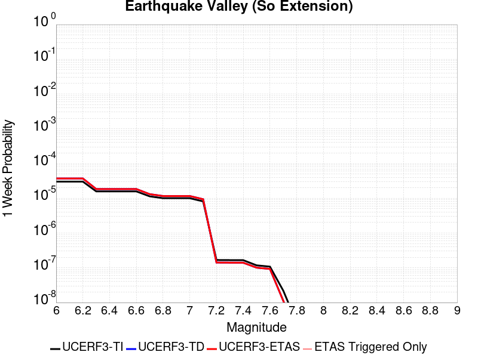 |  | 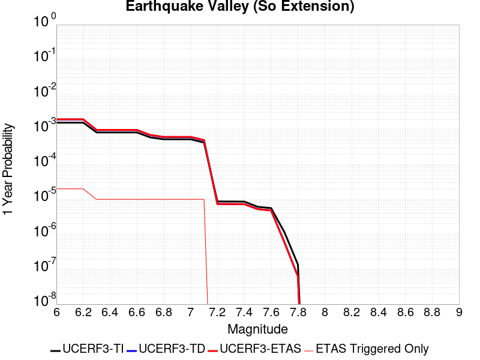 |  |

| Magnitude | 1 wk TI Prob | 1 wk TD Prob | 1 wk ETAS Prob | 1 wk ETAS/TD Gain | 1 wk ETAS Triggered Only | 1 mo TI Prob | 1 mo TD Prob | 1 mo ETAS Prob | 1 mo ETAS/TD Gain | 1 mo ETAS Triggered Only | 1 yr TI Prob | 1 yr TD Prob | 1 yr ETAS Prob | 1 yr ETAS/TD Gain | 1 yr ETAS Triggered Only | 10 yr TI Prob | 10 yr TD Prob | 10 yr ETAS Prob | 10 yr ETAS/TD Gain | 10 yr ETAS Triggered Only |
|-----|-----|-----|-----|-----|-----|-----|-----|-----|-----|-----|-----|-----|-----|-----|-----|-----|-----|-----|-----|-----|
| 6.0 | 3.0194888E-5 | 3.7076705E-5 | 3.7076705E-5 | 1.0 | 0.0 | 1.2940024E-4 | 1.5889356E-4 | 1.5889356E-4 | 1.0 | 0.0 | 0.0015743093 | 0.0019333567 | 0.001953318 | 1.0103247 | 2.0E-5 | 0.01563203 | 0.01921533 | 0.019244755 | 1.0015312 | 3.0E-5 |
| 6.1 | 3.0194888E-5 | 3.7076705E-5 | 3.7076705E-5 | 1.0 | 0.0 | 1.2940024E-4 | 1.5889356E-4 | 1.5889356E-4 | 1.0 | 0.0 | 0.0015743093 | 0.0019333567 | 0.001953318 | 1.0103247 | 2.0E-5 | 0.01563203 | 0.01921533 | 0.019244755 | 1.0015312 | 3.0E-5 |
| 6.2 | 3.0194888E-5 | 3.7076705E-5 | 3.7076705E-5 | 1.0 | 0.0 | 1.2940024E-4 | 1.5889356E-4 | 1.5889356E-4 | 1.0 | 0.0 | 0.0015743093 | 0.0019333567 | 0.001953318 | 1.0103247 | 2.0E-5 | 0.01563203 | 0.01921533 | 0.019244755 | 1.0015312 | 3.0E-5 |
| 6.3 | 1.5795305E-5 | 1.8448263E-5 | 1.8448263E-5 | 1.0 | 0.0 | 6.769241E-5 | 7.9062214E-5 | 7.9062214E-5 | 1.0 | 0.0 | 8.238434E-4 | 9.622687E-4 | 9.722591E-4 | 1.010382 | 1.0E-5 | 0.008207959 | 0.0095919315 | 0.009601836 | 1.0010326 | 1.0E-5 |
| 6.4 | 1.5795305E-5 | 1.8448263E-5 | 1.8448263E-5 | 1.0 | 0.0 | 6.769241E-5 | 7.9062214E-5 | 7.9062214E-5 | 1.0 | 0.0 | 8.238434E-4 | 9.622687E-4 | 9.722591E-4 | 1.010382 | 1.0E-5 | 0.008207959 | 0.0095919315 | 0.009601836 | 1.0010326 | 1.0E-5 |
| 6.5 | 1.5795305E-5 | 1.8448263E-5 | 1.8448263E-5 | 1.0 | 0.0 | 6.769241E-5 | 7.9062214E-5 | 7.9062214E-5 | 1.0 | 0.0 | 8.238434E-4 | 9.622687E-4 | 9.722591E-4 | 1.010382 | 1.0E-5 | 0.008207959 | 0.0095919315 | 0.009601836 | 1.0010326 | 1.0E-5 |
| 6.6 | 1.5795305E-5 | 1.8448263E-5 | 1.8448263E-5 | 1.0 | 0.0 | 6.769241E-5 | 7.9062214E-5 | 7.9062214E-5 | 1.0 | 0.0 | 8.238434E-4 | 9.622687E-4 | 9.722591E-4 | 1.010382 | 1.0E-5 | 0.008207959 | 0.0095919315 | 0.009601836 | 1.0010326 | 1.0E-5 |
| 6.7 | 1.1363076E-5 | 1.313942E-5 | 1.313942E-5 | 1.0 | 0.0 | 4.8697988E-5 | 5.631101E-5 | 5.631101E-5 | 1.0 | 0.0 | 5.927367E-4 | 6.8544707E-4 | 6.954402E-4 | 1.014579 | 1.0E-5 | 0.0059115817 | 0.006840803 | 0.0068507344 | 1.0014518 | 1.0E-5 |
| 6.8 | 1.0049611E-5 | 1.1595315E-5 | 1.1595315E-5 | 1.0 | 0.0 | 4.306905E-5 | 4.9693677E-5 | 4.9693677E-5 | 1.0 | 0.0 | 5.242395E-4 | 6.0492574E-4 | 6.1491964E-4 | 1.016521 | 1.0E-5 | 0.0052300454 | 0.0060399687 | 0.006049908 | 1.0016457 | 1.0E-5 |
| 6.9 | 1.0049611E-5 | 1.1595315E-5 | 1.1595315E-5 | 1.0 | 0.0 | 4.306905E-5 | 4.9693677E-5 | 4.9693677E-5 | 1.0 | 0.0 | 5.242395E-4 | 6.0492574E-4 | 6.1491964E-4 | 1.016521 | 1.0E-5 | 0.0052300454 | 0.0060399687 | 0.006049908 | 1.0016457 | 1.0E-5 |
| 7.0 | 1.0049611E-5 | 1.1595315E-5 | 1.1595315E-5 | 1.0 | 0.0 | 4.306905E-5 | 4.9693677E-5 | 4.9693677E-5 | 1.0 | 0.0 | 5.242395E-4 | 6.0492574E-4 | 6.1491964E-4 | 1.016521 | 1.0E-5 | 0.0052300454 | 0.0060399687 | 0.006049908 | 1.0016457 | 1.0E-5 |
| 7.1 | 8.140254E-6 | 9.384255E-6 | 9.384255E-6 | 1.0 | 0.0 | 3.4886336E-5 | 4.021799E-5 | 4.021799E-5 | 1.0 | 0.0 | 4.2465836E-4 | 4.896111E-4 | 4.996062E-4 | 1.0204144 | 1.0E-5 | 0.0042384774 | 0.0048919013 | 0.0049018525 | 1.0020342 | 1.0E-5 |
| 7.2 | 1.673835E-7 | 1.4155755E-7 | 1.4155755E-7 | 1.0 | 0.0 | 7.173577E-7 | 6.066751E-7 | 6.066751E-7 | 1.0 | 0.0 | 8.733795E-6 | 7.386248E-6 | 7.386248E-6 | 1.0 | 0.0 | 8.733451E-5 | 7.386038E-5 | 7.386038E-5 | 1.0 | 0.0 |
| 7.3 | 1.6632116E-7 | 1.4053978E-7 | 1.4053978E-7 | 1.0 | 0.0 | 7.1280476E-7 | 6.023132E-7 | 6.023132E-7 | 1.0 | 0.0 | 8.678364E-6 | 7.3331425E-6 | 7.3331425E-6 | 1.0 | 0.0 | 8.6780245E-5 | 7.3329364E-5 | 7.3329364E-5 | 1.0 | 0.0 |
| 7.4 | 1.6569169E-7 | 1.3998603E-7 | 1.3998603E-7 | 1.0 | 0.0 | 7.1010703E-7 | 5.9994E-7 | 5.9994E-7 | 1.0 | 0.0 | 8.645519E-6 | 7.3042484E-6 | 7.3042484E-6 | 1.0 | 0.0 | 8.645182E-5 | 7.304044E-5 | 7.304044E-5 | 1.0 | 0.0 |
| 7.5 | 1.1764555E-7 | 1.00971754E-7 | 1.00971754E-7 | 1.0 | 0.0 | 5.041951E-7 | 4.3273604E-7 | 4.3273604E-7 | 1.0 | 0.0 | 6.138558E-6 | 5.268551E-6 | 5.268551E-6 | 1.0 | 0.0 | 6.1383886E-5 | 5.2684474E-5 | 5.2684474E-5 | 1.0 | 0.0 |
| 7.6 | 1.07927605E-7 | 9.2619196E-8 | 9.2619196E-8 | 1.0 | 0.0 | 4.6254678E-7 | 3.9693938E-7 | 3.9693938E-7 | 1.0 | 0.0 | 5.6314925E-6 | 4.8327283E-6 | 4.8327283E-6 | 1.0 | 0.0 | 5.63135E-5 | 4.832644E-5 | 4.832644E-5 | 1.0 | 0.0 |
| 7.7 | 2.1826905E-8 | 1.1182753E-8 | 1.1182753E-8 | 1.0 | 0.0 | 9.3543875E-8 | 4.7926086E-8 | 4.7926086E-8 | 1.0 | 0.0 | 1.1388961E-6 | 5.835E-7 | 5.835E-7 | 1.0 | 0.0 | 1.1388902E-5 | 5.83499E-6 | 5.83499E-6 | 1.0 | 0.0 |
| 7.8 | 2.6169649E-9 | 1.1971816E-9 | 1.1971816E-9 | 1.0 | 0.0 | 1.1215564E-8 | 5.1307785E-9 | 5.1307785E-9 | 1.0 | 0.0 | 1.3654947E-7 | 6.246722E-8 | 6.246722E-8 | 1.0 | 0.0 | 1.365494E-6 | 6.246722E-7 | 6.246722E-7 | 1.0 | 0.0 |

## Camp Rock 2011
*[(top)](#table-of-contents)*

| 1 Week | 1 Month | 1 Year | 10 Year |
|-----|-----|-----|-----|
|  |  | 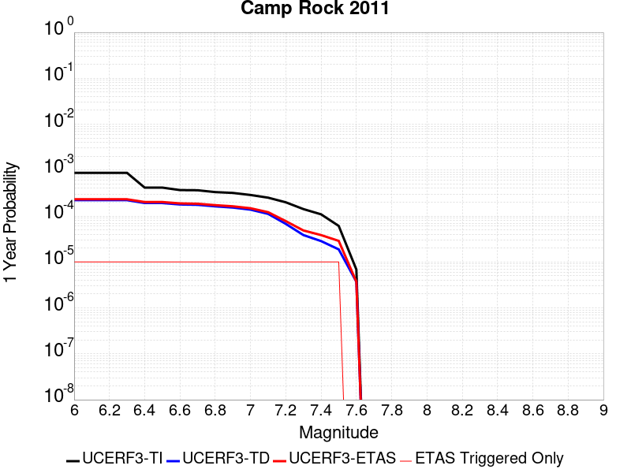 |  |

| Magnitude | 1 wk TI Prob | 1 wk TD Prob | 1 wk ETAS Prob | 1 wk ETAS/TD Gain | 1 wk ETAS Triggered Only | 1 mo TI Prob | 1 mo TD Prob | 1 mo ETAS Prob | 1 mo ETAS/TD Gain | 1 mo ETAS Triggered Only | 1 yr TI Prob | 1 yr TD Prob | 1 yr ETAS Prob | 1 yr ETAS/TD Gain | 1 yr ETAS Triggered Only | 10 yr TI Prob | 10 yr TD Prob | 10 yr ETAS Prob | 10 yr ETAS/TD Gain | 10 yr ETAS Triggered Only |
|-----|-----|-----|-----|-----|-----|-----|-----|-----|-----|-----|-----|-----|-----|-----|-----|-----|-----|-----|-----|-----|
| 6.0 | 1.6710783E-5 | 4.2504644E-6 | 4.2504644E-6 | 1.0 | 0.0 | 7.161568E-5 | 1.8216151E-5 | 1.8216151E-5 | 1.0 | 0.0 | 8.7157206E-4 | 2.217596E-4 | 2.3175738E-4 | 1.0450839 | 1.0E-5 | 0.008681616 | 0.002215436 | 0.0022453696 | 1.0135113 | 3.0E-5 |
| 6.1 | 1.6710783E-5 | 4.2504644E-6 | 4.2504644E-6 | 1.0 | 0.0 | 7.161568E-5 | 1.8216151E-5 | 1.8216151E-5 | 1.0 | 0.0 | 8.7157206E-4 | 2.217596E-4 | 2.3175738E-4 | 1.0450839 | 1.0E-5 | 0.008681616 | 0.002215436 | 0.0022453696 | 1.0135113 | 3.0E-5 |
| 6.2 | 1.6710783E-5 | 4.2504644E-6 | 4.2504644E-6 | 1.0 | 0.0 | 7.161568E-5 | 1.8216151E-5 | 1.8216151E-5 | 1.0 | 0.0 | 8.7157206E-4 | 2.217596E-4 | 2.3175738E-4 | 1.0450839 | 1.0E-5 | 0.008681616 | 0.002215436 | 0.0022453696 | 1.0135113 | 3.0E-5 |
| 6.3 | 1.6710783E-5 | 4.2504644E-6 | 4.2504644E-6 | 1.0 | 0.0 | 7.161568E-5 | 1.8216151E-5 | 1.8216151E-5 | 1.0 | 0.0 | 8.7157206E-4 | 2.217596E-4 | 2.3175738E-4 | 1.0450839 | 1.0E-5 | 0.008681616 | 0.002215436 | 0.0022453696 | 1.0135113 | 3.0E-5 |
| 6.4 | 7.982846E-6 | 3.6822685E-6 | 3.6822685E-6 | 1.0 | 0.0 | 3.421175E-5 | 1.5781057E-5 | 1.5781057E-5 | 1.0 | 0.0 | 4.1644843E-4 | 1.9211778E-4 | 2.0211586E-4 | 1.0520414 | 1.0E-5 | 0.0041566887 | 0.0019195518 | 0.0019494941 | 1.0155987 | 3.0E-5 |
| 6.5 | 7.982846E-6 | 3.6822685E-6 | 3.6822685E-6 | 1.0 | 0.0 | 3.421175E-5 | 1.5781057E-5 | 1.5781057E-5 | 1.0 | 0.0 | 4.1644843E-4 | 1.9211778E-4 | 2.0211586E-4 | 1.0520414 | 1.0E-5 | 0.0041566887 | 0.0019195518 | 0.0019494941 | 1.0155987 | 3.0E-5 |
| 6.6 | 7.048869E-6 | 3.4245295E-6 | 3.4245295E-6 | 1.0 | 0.0 | 3.0209088E-5 | 1.4676474E-5 | 1.4676474E-5 | 1.0 | 0.0 | 3.677336E-4 | 1.7867173E-4 | 1.8866995E-4 | 1.0559585 | 1.0E-5 | 0.0036712566 | 0.0017853125 | 0.001815259 | 1.0167738 | 3.0E-5 |
| 6.7 | 6.987307E-6 | 3.3625051E-6 | 3.3625051E-6 | 1.0 | 0.0 | 2.9945259E-5 | 1.4410658E-5 | 1.4410658E-5 | 1.0 | 0.0 | 3.6452254E-4 | 1.7543595E-4 | 1.854342E-4 | 1.0569909 | 1.0E-5 | 0.0036392517 | 0.0017530057 | 0.0017829532 | 1.0170834 | 3.0E-5 |
| 6.8 | 6.3737602E-6 | 3.1180682E-6 | 3.1180682E-6 | 1.0 | 0.0 | 2.731583E-5 | 1.3363083E-5 | 1.3363083E-5 | 1.0 | 0.0 | 3.3251947E-4 | 1.6268367E-4 | 1.7268205E-4 | 1.061459 | 1.0E-5 | 0.0033202237 | 0.0016256744 | 0.0016556256 | 1.0184239 | 3.0E-5 |
| 6.9 | 6.112211E-6 | 2.9332696E-6 | 2.9332696E-6 | 1.0 | 0.0 | 2.6194928E-5 | 1.2571097E-5 | 1.2571097E-5 | 1.0 | 0.0 | 3.1887658E-4 | 1.5304264E-4 | 1.630411E-4 | 1.0653312 | 1.0E-5 | 0.003184194 | 0.0015294001 | 0.0015593542 | 1.0195855 | 3.0E-5 |
| 7.0 | 5.5140117E-6 | 2.642059E-6 | 2.642059E-6 | 1.0 | 0.0 | 2.3631264E-5 | 1.1323062E-5 | 1.1323062E-5 | 1.0 | 0.0 | 2.8767265E-4 | 1.3784981E-4 | 1.4784843E-4 | 1.0725328 | 1.0E-5 | 0.0028730053 | 0.0013776683 | 0.001407627 | 1.0217459 | 3.0E-5 |
| 7.1 | 4.8151105E-6 | 2.134385E-6 | 2.134385E-6 | 1.0 | 0.0 | 2.0636026E-5 | 9.147334E-6 | 9.147334E-6 | 1.0 | 0.0 | 2.5121463E-4 | 1.1136332E-4 | 1.213622E-4 | 1.0897862 | 1.0E-5 | 0.0025093083 | 0.0011130971 | 0.0011430637 | 1.0269219 | 3.0E-5 |
| 7.2 | 3.818335E-6 | 1.2938276E-6 | 1.2938276E-6 | 1.0 | 0.0 | 1.6364189E-5 | 5.544964E-6 | 5.544964E-6 | 1.0 | 0.0 | 1.9921579E-4 | 6.750793E-5 | 7.7507255E-5 | 1.1481208 | 1.0E-5 | 0.0019903728 | 6.748825E-4 | 7.0486224E-4 | 1.0444221 | 3.0E-5 |
| 7.3 | 2.7166698E-6 | 7.38423E-7 | 7.38423E-7 | 1.0 | 0.0 | 1.1642818E-5 | 3.1646662E-6 | 3.1646662E-6 | 1.0 | 0.0 | 1.4174209E-4 | 3.852915E-5 | 4.8528764E-5 | 1.2595338 | 1.0E-5 | 0.0014165172 | 3.852267E-4 | 3.9522286E-4 | 1.0259488 | 1.0E-5 |
| 7.4 | 2.0893426E-6 | 5.462354E-7 | 5.462354E-7 | 1.0 | 0.0 | 8.954295E-6 | 2.3410068E-6 | 2.3410068E-6 | 1.0 | 0.0 | 1.0901308E-4 | 2.850139E-5 | 3.8501104E-5 | 1.3508501 | 1.0E-5 | 0.0010895962 | 2.849779E-4 | 2.9497503E-4 | 1.0350804 | 1.0E-5 |
| 7.5 | 1.1681728E-6 | 3.6033393E-7 | 3.6033393E-7 | 1.0 | 0.0 | 5.0064455E-6 | 1.5442874E-6 | 1.5442874E-6 | 1.0 | 0.0 | 6.0951766E-5 | 1.8801542E-5 | 2.8801354E-5 | 1.5318613 | 1.0E-5 | 6.093505E-4 | 1.8799998E-4 | 1.979981E-4 | 1.0531815 | 1.0E-5 |
| 7.6 | 1.3154387E-7 | 7.12009E-8 | 7.12009E-8 | 1.0 | 0.0 | 5.6375933E-7 | 3.051467E-7 | 3.051467E-7 | 1.0 | 0.0 | 6.863748E-6 | 3.7151563E-6 | 3.7151563E-6 | 1.0 | 0.0 | 6.863536E-5 | 3.7151098E-5 | 3.7151098E-5 | 1.0 | 0.0 |

## San Clemente
*[(top)](#table-of-contents)*

| 1 Week | 1 Month | 1 Year | 10 Year |
|-----|-----|-----|-----|
|  |  | 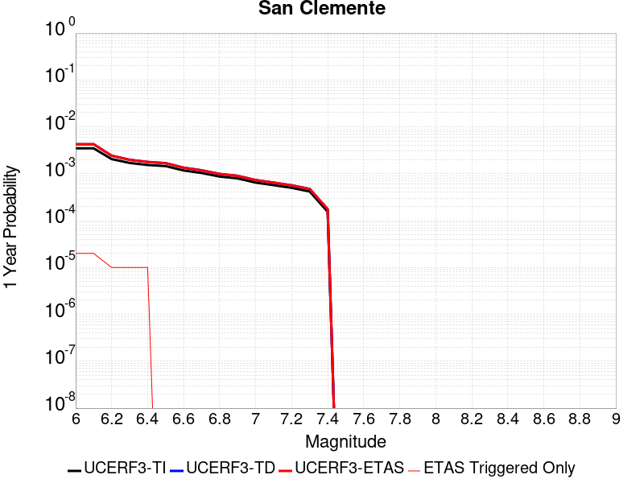 | 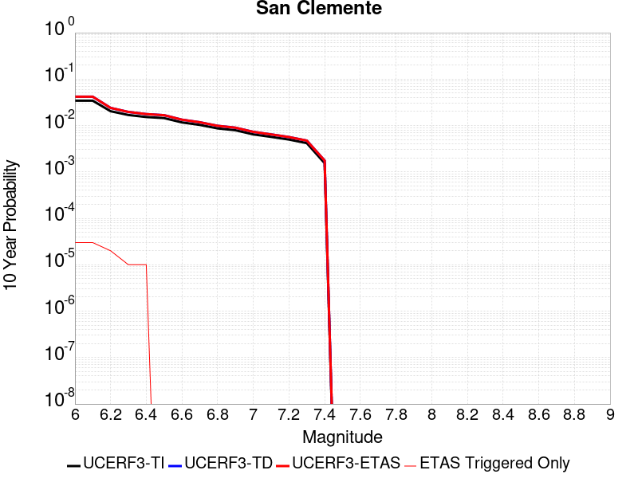 |

| Magnitude | 1 wk TI Prob | 1 wk TD Prob | 1 wk ETAS Prob | 1 wk ETAS/TD Gain | 1 wk ETAS Triggered Only | 1 mo TI Prob | 1 mo TD Prob | 1 mo ETAS Prob | 1 mo ETAS/TD Gain | 1 mo ETAS Triggered Only | 1 yr TI Prob | 1 yr TD Prob | 1 yr ETAS Prob | 1 yr ETAS/TD Gain | 1 yr ETAS Triggered Only | 10 yr TI Prob | 10 yr TD Prob | 10 yr ETAS Prob | 10 yr ETAS/TD Gain | 10 yr ETAS Triggered Only |
|-----|-----|-----|-----|-----|-----|-----|-----|-----|-----|-----|-----|-----|-----|-----|-----|-----|-----|-----|-----|-----|
| 6.0 | 6.681379E-5 | 8.164408E-5 | 8.164408E-5 | 1.0 | 0.0 | 2.8631336E-4 | 3.4985956E-4 | 3.4985956E-4 | 1.0 | 0.0 | 0.003480294 | 0.0042518 | 0.004271715 | 1.0046839 | 2.0E-5 | 0.03426291 | 0.04176052 | 0.041789267 | 1.0006884 | 3.0E-5 |
| 6.1 | 6.681379E-5 | 8.164408E-5 | 8.164408E-5 | 1.0 | 0.0 | 2.8631336E-4 | 3.4985956E-4 | 3.4985956E-4 | 1.0 | 0.0 | 0.003480294 | 0.0042518 | 0.004271715 | 1.0046839 | 2.0E-5 | 0.03426291 | 0.04176052 | 0.041789267 | 1.0006884 | 3.0E-5 |
| 6.2 | 3.9400576E-5 | 4.645645E-5 | 4.645645E-5 | 1.0 | 0.0 | 1.6884868E-4 | 1.9908424E-4 | 1.9908424E-4 | 1.0 | 0.0 | 0.0020537945 | 0.0024212173 | 0.0024311931 | 1.0041201 | 1.0E-5 | 0.020349167 | 0.02395512 | 0.02397464 | 1.0008149 | 2.0E-5 |
| 6.3 | 3.2590255E-5 | 3.79324E-5 | 3.79324E-5 | 1.0 | 0.0 | 1.3966505E-4 | 1.625575E-4 | 1.625575E-4 | 1.0 | 0.0 | 0.0016990956 | 0.001977371 | 0.0019873513 | 1.0050472 | 1.0E-5 | 0.01686163 | 0.019601561 | 0.019611366 | 1.0005002 | 1.0E-5 |
| 6.4 | 2.9454652E-5 | 3.4100634E-5 | 3.4100634E-5 | 1.0 | 0.0 | 1.2622811E-4 | 1.4613755E-4 | 1.4613755E-4 | 1.0 | 0.0 | 0.0015357438 | 0.0017777971 | 0.0017877794 | 1.005615 | 1.0E-5 | 0.015251739 | 0.017638927 | 0.01764875 | 1.000557 | 1.0E-5 |
| 6.5 | 2.790836E-5 | 3.2250126E-5 | 3.2250126E-5 | 1.0 | 0.0 | 1.1960178E-4 | 1.3820764E-4 | 1.3820764E-4 | 1.0 | 0.0 | 0.001455179 | 0.0016814041 | 0.0016814041 | 1.0 | 0.0 | 0.014456868 | 0.016689846 | 0.016689846 | 1.0 | 0.0 |
| 6.6 | 2.2492153E-5 | 2.5764699E-5 | 2.5764699E-5 | 1.0 | 0.0 | 9.639138E-5 | 1.10415545E-4 | 1.10415545E-4 | 1.0 | 0.0 | 0.0011729331 | 0.0013434946 | 0.0013434946 | 1.0 | 0.0 | 0.011667615 | 0.013355441 | 0.013355441 | 1.0 | 0.0 |
| 6.7 | 1.9862755E-5 | 2.2668124E-5 | 2.2668124E-5 | 1.0 | 0.0 | 8.512331E-5 | 9.7145545E-5 | 9.7145545E-5 | 1.0 | 0.0 | 0.0010358836 | 0.0011821166 | 0.0011821166 | 1.0 | 0.0 | 0.010310682 | 0.011759577 | 0.011759577 | 1.0 | 0.0 |
| 6.8 | 1.6697575E-5 | 1.8979084E-5 | 1.8979084E-5 | 1.0 | 0.0 | 7.155907E-5 | 8.133645E-5 | 8.133645E-5 | 1.0 | 0.0 | 8.7088346E-4 | 9.898308E-4 | 9.898308E-4 | 1.0 | 0.0 | 0.008674784 | 0.009855248 | 0.009855248 | 1.0 | 0.0 |
| 6.9 | 1.5218415E-5 | 1.7270635E-5 | 1.7270635E-5 | 1.0 | 0.0 | 6.522015E-5 | 7.401496E-5 | 7.401496E-5 | 1.0 | 0.0 | 7.93766E-4 | 9.007684E-4 | 9.007684E-4 | 1.0 | 0.0 | 0.007909367 | 0.00897212 | 0.00897212 | 1.0 | 0.0 |
| 7.0 | 1.2392958E-5 | 1.4034001E-5 | 1.4034001E-5 | 1.0 | 0.0 | 5.3111595E-5 | 6.0144375E-5 | 6.0144375E-5 | 1.0 | 0.0 | 6.4644177E-4 | 7.320193E-4 | 7.320193E-4 | 1.0 | 0.0 | 0.0064456454 | 0.007296867 | 0.007296867 | 1.0 | 0.0 |
| 7.1 | 1.0934128E-5 | 1.2376004E-5 | 1.2376004E-5 | 1.0 | 0.0 | 4.6859706E-5 | 5.3038977E-5 | 5.3038977E-5 | 1.0 | 0.0 | 5.7036756E-4 | 6.4556557E-4 | 6.4556557E-4 | 1.0 | 0.0 | 0.0056890585 | 0.0064376486 | 0.0064376486 | 1.0 | 0.0 |
| 7.2 | 9.5798805E-6 | 1.0845695E-5 | 1.0845695E-5 | 1.0 | 0.0 | 4.1055984E-5 | 4.6480764E-5 | 4.6480764E-5 | 1.0 | 0.0 | 4.9974193E-4 | 5.6576356E-4 | 5.6576356E-4 | 1.0 | 0.0 | 0.0049861963 | 0.005643956 | 0.005643956 | 1.0 | 0.0 |
| 7.3 | 8.0167365E-6 | 9.084559E-6 | 9.084559E-6 | 1.0 | 0.0 | 3.4356988E-5 | 3.893328E-5 | 3.893328E-5 | 1.0 | 0.0 | 4.1821605E-4 | 4.7391668E-4 | 4.7391668E-4 | 1.0 | 0.0 | 0.0041742986 | 0.004729763 | 0.004729763 | 1.0 | 0.0 |
| 7.4 | 2.9581017E-6 | 3.362623E-6 | 3.362623E-6 | 1.0 | 0.0 | 1.2677518E-5 | 1.441119E-5 | 1.441119E-5 | 1.0 | 0.0 | 1.5433785E-4 | 1.7544716E-4 | 1.7544716E-4 | 1.0 | 0.0 | 0.001542307 | 0.0017535817 | 0.0017535817 | 1.0 | 0.0 |

## Sheephole
*[(top)](#table-of-contents)*

| 1 Week | 1 Month | 1 Year | 10 Year |
|-----|-----|-----|-----|
|  |  |  |  |

| Magnitude | 1 wk TI Prob | 1 wk TD Prob | 1 wk ETAS Prob | 1 wk ETAS/TD Gain | 1 wk ETAS Triggered Only | 1 mo TI Prob | 1 mo TD Prob | 1 mo ETAS Prob | 1 mo ETAS/TD Gain | 1 mo ETAS Triggered Only | 1 yr TI Prob | 1 yr TD Prob | 1 yr ETAS Prob | 1 yr ETAS/TD Gain | 1 yr ETAS Triggered Only | 10 yr TI Prob | 10 yr TD Prob | 10 yr ETAS Prob | 10 yr ETAS/TD Gain | 10 yr ETAS Triggered Only |
|-----|-----|-----|-----|-----|-----|-----|-----|-----|-----|-----|-----|-----|-----|-----|-----|-----|-----|-----|-----|-----|
| 6.0 | 4.5579695E-6 | 4.741364E-6 | 4.741364E-6 | 1.0 | 0.0 | 1.9534009E-5 | 2.0320003E-5 | 2.0320003E-5 | 1.0 | 0.0 | 2.3780059E-4 | 2.473735E-4 | 2.5737102E-4 | 1.0404147 | 1.0E-5 | 0.0023754628 | 0.002471526 | 0.0025014519 | 1.0121082 | 3.0E-5 |
| 6.1 | 4.5579695E-6 | 4.741364E-6 | 4.741364E-6 | 1.0 | 0.0 | 1.9534009E-5 | 2.0320003E-5 | 2.0320003E-5 | 1.0 | 0.0 | 2.3780059E-4 | 2.473735E-4 | 2.5737102E-4 | 1.0404147 | 1.0E-5 | 0.0023754628 | 0.002471526 | 0.0025014519 | 1.0121082 | 3.0E-5 |
| 6.2 | 2.6677674E-6 | 2.7874607E-6 | 2.7874607E-6 | 1.0 | 0.0 | 1.1433239E-5 | 1.1946211E-5 | 1.1946211E-5 | 1.0 | 0.0 | 1.3919079E-4 | 1.454365E-4 | 1.454365E-4 | 1.0 | 0.0 | 0.0013910364 | 0.001453519 | 0.0014635045 | 1.0068699 | 1.0E-5 |
| 6.3 | 2.6677674E-6 | 2.7874607E-6 | 2.7874607E-6 | 1.0 | 0.0 | 1.1433239E-5 | 1.1946211E-5 | 1.1946211E-5 | 1.0 | 0.0 | 1.3919079E-4 | 1.454365E-4 | 1.454365E-4 | 1.0 | 0.0 | 0.0013910364 | 0.001453519 | 0.0014635045 | 1.0068699 | 1.0E-5 |
| 6.4 | 2.2159759E-6 | 2.3229381E-6 | 2.3229381E-6 | 1.0 | 0.0 | 9.497005E-6 | 9.955416E-6 | 9.955416E-6 | 1.0 | 0.0 | 1.156199E-4 | 1.2120126E-4 | 1.2120126E-4 | 1.0 | 0.0 | 0.0011555976 | 0.0012114309 | 0.0012214187 | 1.0082448 | 1.0E-5 |
| 6.5 | 2.1986082E-6 | 2.304818E-6 | 2.304818E-6 | 1.0 | 0.0 | 9.4225725E-6 | 9.877759E-6 | 9.877759E-6 | 1.0 | 0.0 | 1.1471378E-4 | 1.20255885E-4 | 1.20255885E-4 | 1.0 | 0.0 | 0.0011465458 | 0.0012019875 | 0.0012119755 | 1.0083096 | 1.0E-5 |
| 6.6 | 1.5232331E-6 | 1.6019358E-6 | 1.6019358E-6 | 1.0 | 0.0 | 6.5281256E-6 | 6.8654217E-6 | 6.8654217E-6 | 1.0 | 0.0 | 7.947703E-5 | 8.3583494E-5 | 8.3583494E-5 | 1.0 | 0.0 | 7.9448614E-4 | 8.355393E-4 | 8.355393E-4 | 1.0 | 0.0 |
| 6.7 | 1.3137362E-6 | 1.3828576E-6 | 1.3828576E-6 | 1.0 | 0.0 | 5.6302856E-6 | 5.92652E-6 | 5.92652E-6 | 1.0 | 0.0 | 6.854657E-5 | 7.215313E-5 | 7.215313E-5 | 1.0 | 0.0 | 6.8525434E-4 | 7.2131096E-4 | 7.2131096E-4 | 1.0 | 0.0 |
| 6.8 | 1.2275751E-6 | 1.2923208E-6 | 1.2923208E-6 | 1.0 | 0.0 | 5.2610258E-6 | 5.5385067E-6 | 5.5385067E-6 | 1.0 | 0.0 | 6.4051106E-5 | 6.742937E-5 | 6.742937E-5 | 1.0 | 0.0 | 6.4032647E-4 | 6.7410246E-4 | 6.7410246E-4 | 1.0 | 0.0 |
| 6.9 | 1.1837088E-6 | 1.2461369E-6 | 1.2461369E-6 | 1.0 | 0.0 | 5.0730278E-6 | 5.3405765E-6 | 5.3405765E-6 | 1.0 | 0.0 | 6.176237E-5 | 6.501971E-5 | 6.501971E-5 | 1.0 | 0.0 | 6.17452E-4 | 6.5002E-4 | 6.5002E-4 | 1.0 | 0.0 |
| 7.0 | 9.849371E-7 | 1.0366576E-6 | 1.0366576E-6 | 1.0 | 0.0 | 4.2211523E-6 | 4.4428116E-6 | 4.4428116E-6 | 1.0 | 0.0 | 5.1391315E-5 | 5.4089993E-5 | 5.4089993E-5 | 1.0 | 0.0 | 5.137943E-4 | 5.4077833E-4 | 5.4077833E-4 | 1.0 | 0.0 |
| 7.1 | 8.1643645E-7 | 8.591908E-7 | 8.591908E-7 | 1.0 | 0.0 | 3.4990085E-6 | 3.6822414E-6 | 3.6822414E-6 | 1.0 | 0.0 | 4.2599597E-5 | 4.4830453E-5 | 4.4830453E-5 | 1.0 | 0.0 | 4.259143E-4 | 4.4822274E-4 | 4.4822274E-4 | 1.0 | 0.0 |
| 7.2 | 5.7295756E-7 | 6.029669E-7 | 6.029669E-7 | 1.0 | 0.0 | 2.45553E-6 | 2.5841418E-6 | 2.5841418E-6 | 1.0 | 0.0 | 2.9895667E-5 | 3.146154E-5 | 3.146154E-5 | 1.0 | 0.0 | 2.9891645E-4 | 3.1457754E-4 | 3.1457754E-4 | 1.0 | 0.0 |

## San Jacinto (Superstition Mtn)
*[(top)](#table-of-contents)*

| 1 Week | 1 Month | 1 Year | 10 Year |
|-----|-----|-----|-----|
|  | 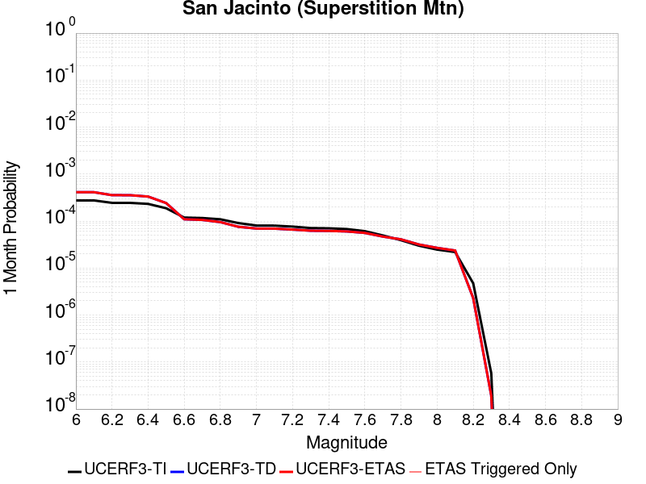 |  |  |

| Magnitude | 1 wk TI Prob | 1 wk TD Prob | 1 wk ETAS Prob | 1 wk ETAS/TD Gain | 1 wk ETAS Triggered Only | 1 mo TI Prob | 1 mo TD Prob | 1 mo ETAS Prob | 1 mo ETAS/TD Gain | 1 mo ETAS Triggered Only | 1 yr TI Prob | 1 yr TD Prob | 1 yr ETAS Prob | 1 yr ETAS/TD Gain | 1 yr ETAS Triggered Only | 10 yr TI Prob | 10 yr TD Prob | 10 yr ETAS Prob | 10 yr ETAS/TD Gain | 10 yr ETAS Triggered Only |
|-----|-----|-----|-----|-----|-----|-----|-----|-----|-----|-----|-----|-----|-----|-----|-----|-----|-----|-----|-----|-----|
| 6.0 | 6.4193904E-5 | 9.602289E-5 | 9.602289E-5 | 1.0 | 0.0 | 2.7508775E-4 | 4.1147156E-4 | 4.1147156E-4 | 1.0 | 0.0 | 0.0033440501 | 0.004999541 | 0.0050094915 | 1.0019902 | 1.0E-5 | 0.03294174 | 0.04883795 | 0.048856974 | 1.0003896 | 2.0E-5 |
| 6.1 | 6.4193904E-5 | 9.602289E-5 | 9.602289E-5 | 1.0 | 0.0 | 2.7508775E-4 | 4.1147156E-4 | 4.1147156E-4 | 1.0 | 0.0 | 0.0033440501 | 0.004999541 | 0.0050094915 | 1.0019902 | 1.0E-5 | 0.03294174 | 0.04883795 | 0.048856974 | 1.0003896 | 2.0E-5 |
| 6.2 | 5.7023593E-5 | 8.317087E-5 | 8.317087E-5 | 1.0 | 0.0 | 2.4436394E-4 | 3.5640728E-4 | 3.5640728E-4 | 1.0 | 0.0 | 0.002971072 | 0.00433226 | 0.004342217 | 1.0022982 | 1.0E-5 | 0.029316625 | 0.04251723 | 0.042536378 | 1.0004504 | 2.0E-5 |
| 6.3 | 5.6940098E-5 | 8.301621E-5 | 8.301621E-5 | 1.0 | 0.0 | 2.4400617E-4 | 3.5574468E-4 | 3.5574468E-4 | 1.0 | 0.0 | 0.002966728 | 0.004324225 | 0.0043341815 | 1.0023025 | 1.0E-5 | 0.029274331 | 0.042440474 | 0.042450048 | 1.0002257 | 1.0E-5 |
| 6.4 | 5.4171585E-5 | 7.750957E-5 | 7.750957E-5 | 1.0 | 0.0 | 2.3214328E-4 | 3.321509E-4 | 3.321509E-4 | 1.0 | 0.0 | 0.0028226813 | 0.004038087 | 0.0040480467 | 1.0024664 | 1.0E-5 | 0.02787096 | 0.03972961 | 0.039739214 | 1.0002418 | 1.0E-5 |
| 6.5 | 4.375144E-5 | 5.6446577E-5 | 5.6446577E-5 | 1.0 | 0.0 | 1.874927E-4 | 2.418981E-4 | 2.418981E-4 | 1.0 | 0.0 | 0.0022803338 | 0.0029423076 | 0.0029522784 | 1.0033886 | 1.0E-5 | 0.022570757 | 0.02924966 | 0.029259369 | 1.0003319 | 1.0E-5 |
| 6.6 | 2.772192E-5 | 2.5512374E-5 | 2.5512374E-5 | 1.0 | 0.0 | 1.1880282E-4 | 1.0933427E-4 | 1.0933427E-4 | 1.0 | 0.0 | 0.0014454646 | 0.0013303513 | 0.0013303513 | 1.0 | 0.0 | 0.014360986 | 0.013552955 | 0.013552955 | 1.0 | 0.0 |
| 6.7 | 2.7124124E-5 | 2.4723291E-5 | 2.4723291E-5 | 1.0 | 0.0 | 1.1624106E-4 | 1.05952764E-4 | 1.05952764E-4 | 1.0 | 0.0 | 0.0014143161 | 0.0012892308 | 0.0012892308 | 1.0 | 0.0 | 0.014053487 | 0.013146358 | 0.013146358 | 1.0 | 0.0 |
| 6.8 | 2.5475807E-5 | 2.218778E-5 | 2.218778E-5 | 1.0 | 0.0 | 1.0917746E-4 | 9.508708E-5 | 9.508708E-5 | 1.0 | 0.0 | 0.001328425 | 0.0011570824 | 0.0011570824 | 1.0 | 0.0 | 0.0132051185 | 0.011834319 | 0.011834319 | 1.0 | 0.0 |
| 6.9 | 2.1162023E-5 | 1.764776E-5 | 1.764776E-5 | 1.0 | 0.0 | 9.069123E-5 | 7.5631084E-5 | 7.5631084E-5 | 1.0 | 0.0 | 0.0011036064 | 9.204233E-4 | 9.204233E-4 | 1.0 | 0.0 | 0.010981417 | 0.009458124 | 0.009458124 | 1.0 | 0.0 |
| 7.0 | 1.8754288E-5 | 1.6182094E-5 | 1.6182094E-5 | 1.0 | 0.0 | 8.037304E-5 | 6.935E-5 | 6.935E-5 | 1.0 | 0.0 | 9.781026E-4 | 8.4401167E-4 | 8.4401167E-4 | 1.0 | 0.0 | 0.009738087 | 0.008680774 | 0.008680774 | 1.0 | 0.0 |
| 7.1 | 1.8678527E-5 | 1.6107217E-5 | 1.6107217E-5 | 1.0 | 0.0 | 8.0048376E-5 | 6.902911E-5 | 6.902911E-5 | 1.0 | 0.0 | 9.7415317E-4 | 8.4010785E-4 | 8.4010785E-4 | 1.0 | 0.0 | 0.009698939 | 0.00864172 | 0.00864172 | 1.0 | 0.0 |
| 7.2 | 1.7804578E-5 | 1.5401574E-5 | 1.5401574E-5 | 1.0 | 0.0 | 7.6303106E-5 | 6.600509E-5 | 6.600509E-5 | 1.0 | 0.0 | 9.285943E-4 | 8.0331793E-4 | 8.0331793E-4 | 1.0 | 0.0 | 0.009247236 | 0.008272923 | 0.008272923 | 1.0 | 0.0 |
| 7.3 | 1.6583685E-5 | 1.4550439E-5 | 1.4550439E-5 | 1.0 | 0.0 | 7.1070994E-5 | 6.235755E-5 | 6.235755E-5 | 1.0 | 0.0 | 8.649459E-4 | 7.589407E-4 | 7.589407E-4 | 1.0 | 0.0 | 0.00861587 | 0.007828114 | 0.007828114 | 1.0 | 0.0 |
| 7.4 | 1.6387552E-5 | 1.44152855E-5 | 1.44152855E-5 | 1.0 | 0.0 | 7.023047E-5 | 6.1778344E-5 | 6.1778344E-5 | 1.0 | 0.0 | 8.5472054E-4 | 7.518938E-4 | 7.518938E-4 | 1.0 | 0.0 | 0.008514405 | 0.007757476 | 0.007757476 | 1.0 | 0.0 |
| 7.5 | 1.5790754E-5 | 1.4055765E-5 | 1.4055765E-5 | 1.0 | 0.0 | 6.767291E-5 | 6.0237613E-5 | 6.0237613E-5 | 1.0 | 0.0 | 8.236062E-4 | 7.3314813E-4 | 7.3314813E-4 | 1.0 | 0.0 | 0.008205604 | 0.007567932 | 0.007567932 | 1.0 | 0.0 |
| 7.6 | 1.4248672E-5 | 1.3074211E-5 | 1.3074211E-5 | 1.0 | 0.0 | 6.106431E-5 | 5.603114E-5 | 5.603114E-5 | 1.0 | 0.0 | 7.432043E-4 | 6.819673E-4 | 6.819673E-4 | 1.0 | 0.0 | 0.007407237 | 0.0070502516 | 0.0070502516 | 1.0 | 0.0 |
| 7.7 | 1.15449975E-5 | 1.0922179E-5 | 1.0922179E-5 | 1.0 | 0.0 | 4.947762E-5 | 4.68085E-5 | 4.68085E-5 | 1.0 | 0.0 | 6.022235E-4 | 5.6974526E-4 | 5.6974526E-4 | 1.0 | 0.0 | 0.006005941 | 0.005919881 | 0.005919881 | 1.0 | 0.0 |
| 7.8 | 9.1391985E-6 | 9.532076E-6 | 9.532076E-6 | 1.0 | 0.0 | 3.9167408E-5 | 4.0851115E-5 | 4.0851115E-5 | 1.0 | 0.0 | 4.767588E-4 | 4.972494E-4 | 4.972494E-4 | 1.0 | 0.0 | 0.0047573727 | 0.0051860143 | 0.0051860143 | 1.0 | 0.0 |
| 7.9 | 6.973017E-6 | 7.397966E-6 | 7.397966E-6 | 1.0 | 0.0 | 2.9884017E-5 | 3.1705185E-5 | 3.1705185E-5 | 1.0 | 0.0 | 3.6377716E-4 | 3.8594278E-4 | 3.8594278E-4 | 1.0 | 0.0 | 0.0036318225 | 0.0040600975 | 0.0040600975 | 1.0 | 0.0 |
| 8.0 | 5.7638235E-6 | 6.2743825E-6 | 6.2743825E-6 | 1.0 | 0.0 | 2.4701867E-5 | 2.6889935E-5 | 2.6889935E-5 | 1.0 | 0.0 | 3.0070372E-4 | 3.2733628E-4 | 3.2733628E-4 | 1.0 | 0.0 | 0.0030029714 | 0.0034610373 | 0.0034610373 | 1.0 | 0.0 |
| 8.1 | 5.1124434E-6 | 5.508789E-6 | 5.508789E-6 | 1.0 | 0.0 | 2.1910288E-5 | 2.3608885E-5 | 2.3608885E-5 | 1.0 | 0.0 | 2.6672508E-4 | 2.8740076E-4 | 2.8740076E-4 | 1.0 | 0.0 | 0.0026640517 | 0.003047253 | 0.003047253 | 1.0 | 0.0 |
| 8.2 | 1.1075938E-6 | 5.3557983E-7 | 5.3557983E-7 | 1.0 | 0.0 | 4.7468216E-6 | 2.2953402E-6 | 2.2953402E-6 | 1.0 | 0.0 | 5.779102E-5 | 2.7945433E-5 | 2.7945433E-5 | 1.0 | 0.0 | 5.777599E-4 | 3.1453613E-4 | 3.1453613E-4 | 1.0 | 0.0 |
| 8.3 | 1.3584393E-8 | 4.4922075E-9 | 4.4922075E-9 | 1.0 | 0.0 | 5.8218827E-8 | 1.9252319E-8 | 1.9252319E-8 | 1.0 | 0.0 | 7.0881396E-7 | 2.3439698E-7 | 2.3439698E-7 | 1.0 | 0.0 | 7.0881174E-6 | 2.6266084E-6 | 2.6266084E-6 | 1.0 | 0.0 |

## Pine Mtn
*[(top)](#table-of-contents)*

| 1 Week | 1 Month | 1 Year | 10 Year |
|-----|-----|-----|-----|
|  |  | 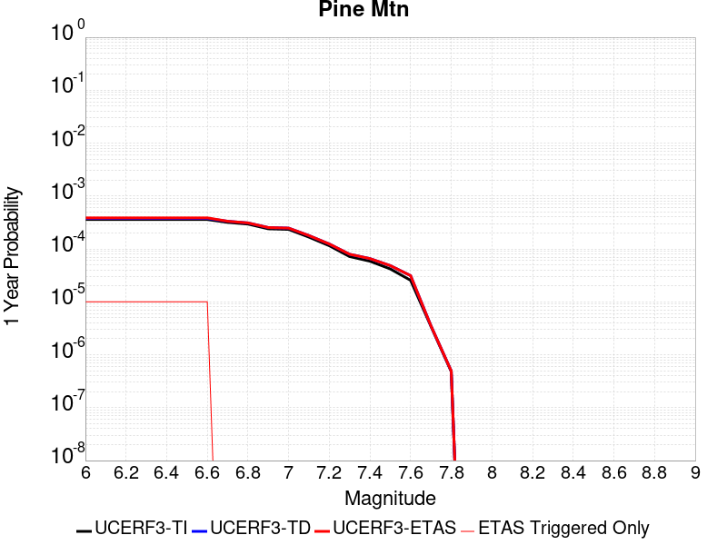 |  |

| Magnitude | 1 wk TI Prob | 1 wk TD Prob | 1 wk ETAS Prob | 1 wk ETAS/TD Gain | 1 wk ETAS Triggered Only | 1 mo TI Prob | 1 mo TD Prob | 1 mo ETAS Prob | 1 mo ETAS/TD Gain | 1 mo ETAS Triggered Only | 1 yr TI Prob | 1 yr TD Prob | 1 yr ETAS Prob | 1 yr ETAS/TD Gain | 1 yr ETAS Triggered Only | 10 yr TI Prob | 10 yr TD Prob | 10 yr ETAS Prob | 10 yr ETAS/TD Gain | 10 yr ETAS Triggered Only |
|-----|-----|-----|-----|-----|-----|-----|-----|-----|-----|-----|-----|-----|-----|-----|-----|-----|-----|-----|-----|-----|
| 6.0 | 6.894797E-6 | 7.2258704E-6 | 1.7225799E-5 | 2.3839064 | 1.0E-5 | 2.9548795E-5 | 3.0967665E-5 | 4.0967356E-5 | 1.3229074 | 1.0E-5 | 3.596972E-4 | 3.7696908E-4 | 3.869653E-4 | 1.0265174 | 1.0E-5 | 0.0035911554 | 0.0037635937 | 0.0037835184 | 1.0052941 | 2.0E-5 |
| 6.1 | 6.894797E-6 | 7.2258704E-6 | 1.7225799E-5 | 2.3839064 | 1.0E-5 | 2.9548795E-5 | 3.0967665E-5 | 4.0967356E-5 | 1.3229074 | 1.0E-5 | 3.596972E-4 | 3.7696908E-4 | 3.869653E-4 | 1.0265174 | 1.0E-5 | 0.0035911554 | 0.0037635937 | 0.0037835184 | 1.0052941 | 2.0E-5 |
| 6.2 | 6.894797E-6 | 7.2258704E-6 | 1.7225799E-5 | 2.3839064 | 1.0E-5 | 2.9548795E-5 | 3.0967665E-5 | 4.0967356E-5 | 1.3229074 | 1.0E-5 | 3.596972E-4 | 3.7696908E-4 | 3.869653E-4 | 1.0265174 | 1.0E-5 | 0.0035911554 | 0.0037635937 | 0.0037835184 | 1.0052941 | 2.0E-5 |
| 6.3 | 6.894797E-6 | 7.2258704E-6 | 1.7225799E-5 | 2.3839064 | 1.0E-5 | 2.9548795E-5 | 3.0967665E-5 | 4.0967356E-5 | 1.3229074 | 1.0E-5 | 3.596972E-4 | 3.7696908E-4 | 3.869653E-4 | 1.0265174 | 1.0E-5 | 0.0035911554 | 0.0037635937 | 0.0037835184 | 1.0052941 | 2.0E-5 |
| 6.4 | 6.894797E-6 | 7.2258704E-6 | 1.7225799E-5 | 2.3839064 | 1.0E-5 | 2.9548795E-5 | 3.0967665E-5 | 4.0967356E-5 | 1.3229074 | 1.0E-5 | 3.596972E-4 | 3.7696908E-4 | 3.869653E-4 | 1.0265174 | 1.0E-5 | 0.0035911554 | 0.0037635937 | 0.0037835184 | 1.0052941 | 2.0E-5 |
| 6.5 | 6.894797E-6 | 7.2258704E-6 | 1.7225799E-5 | 2.3839064 | 1.0E-5 | 2.9548795E-5 | 3.0967665E-5 | 4.0967356E-5 | 1.3229074 | 1.0E-5 | 3.596972E-4 | 3.7696908E-4 | 3.869653E-4 | 1.0265174 | 1.0E-5 | 0.0035911554 | 0.0037635937 | 0.0037835184 | 1.0052941 | 2.0E-5 |
| 6.6 | 6.894797E-6 | 7.2258704E-6 | 1.7225799E-5 | 2.3839064 | 1.0E-5 | 2.9548795E-5 | 3.0967665E-5 | 4.0967356E-5 | 1.3229074 | 1.0E-5 | 3.596972E-4 | 3.7696908E-4 | 3.869653E-4 | 1.0265174 | 1.0E-5 | 0.0035911554 | 0.0037635937 | 0.0037835184 | 1.0052941 | 2.0E-5 |
| 6.7 | 6.0867933E-6 | 6.3975112E-6 | 6.3975112E-6 | 1.0 | 0.0 | 2.6085996E-5 | 2.741763E-5 | 2.741763E-5 | 1.0 | 0.0 | 3.1755073E-4 | 3.337607E-4 | 3.337607E-4 | 1.0 | 0.0 | 0.0031709734 | 0.0033328135 | 0.00334278 | 1.0029905 | 1.0E-5 |
| 6.8 | 5.6530425E-6 | 5.9509866E-6 | 5.9509866E-6 | 1.0 | 0.0 | 2.42271E-5 | 2.550399E-5 | 2.550399E-5 | 1.0 | 0.0 | 2.94925E-4 | 3.104689E-4 | 3.104689E-4 | 1.0 | 0.0 | 0.002945339 | 0.0031005563 | 0.0031105252 | 1.0032152 | 1.0E-5 |
| 6.9 | 4.6015225E-6 | 4.8642055E-6 | 4.8642055E-6 | 1.0 | 0.0 | 1.9720663E-5 | 2.0846437E-5 | 2.0846437E-5 | 1.0 | 0.0 | 2.4007261E-4 | 2.5377728E-4 | 2.5377728E-4 | 1.0 | 0.0 | 0.0023981342 | 0.0025350188 | 0.0025350188 | 1.0 | 0.0 |
| 7.0 | 4.4875965E-6 | 4.7478434E-6 | 4.7478434E-6 | 1.0 | 0.0 | 1.9232413E-5 | 2.034775E-5 | 2.034775E-5 | 1.0 | 0.0 | 2.3412947E-4 | 2.4770715E-4 | 2.4770715E-4 | 1.0 | 0.0 | 0.0023388295 | 0.0024744542 | 0.0024744542 | 1.0 | 0.0 |
| 7.1 | 3.203907E-6 | 3.4297611E-6 | 3.4297611E-6 | 1.0 | 0.0 | 1.3730958E-5 | 1.4698897E-5 | 1.4698897E-5 | 1.0 | 0.0 | 1.6716159E-4 | 1.7894505E-4 | 1.7894505E-4 | 1.0 | 0.0 | 0.0016703589 | 0.0017880757 | 0.0017880757 | 1.0 | 0.0 |
| 7.2 | 2.2060601E-6 | 2.378769E-6 | 2.378769E-6 | 1.0 | 0.0 | 9.4545085E-6 | 1.0194687E-5 | 1.0194687E-5 | 1.0 | 0.0 | 1.15102564E-4 | 1.241137E-4 | 1.241137E-4 | 1.0 | 0.0 | 0.0011504296 | 0.0012404887 | 0.0012404887 | 1.0 | 0.0 |
| 7.3 | 1.3765207E-6 | 1.5219067E-6 | 1.5219067E-6 | 1.0 | 0.0 | 5.899361E-6 | 6.5224413E-6 | 6.5224413E-6 | 1.0 | 0.0 | 7.182235E-5 | 7.9407924E-5 | 7.9407924E-5 | 1.0 | 0.0 | 7.1799144E-4 | 7.938046E-4 | 7.938046E-4 | 1.0 | 0.0 |
| 7.4 | 1.1245983E-6 | 1.2589404E-6 | 1.2589404E-6 | 1.0 | 0.0 | 4.819698E-6 | 5.395448E-6 | 5.395448E-6 | 1.0 | 0.0 | 5.8678244E-5 | 6.568768E-5 | 6.568768E-5 | 1.0 | 0.0 | 5.866275E-4 | 6.56691E-4 | 6.56691E-4 | 1.0 | 0.0 |
| 7.5 | 8.031682E-7 | 9.279126E-7 | 9.279126E-7 | 1.0 | 0.0 | 3.4421448E-6 | 3.9767624E-6 | 3.9767624E-6 | 1.0 | 0.0 | 4.1907308E-5 | 4.8416077E-5 | 4.8416077E-5 | 1.0 | 0.0 | 4.1899405E-4 | 4.8406204E-4 | 4.8406204E-4 | 1.0 | 0.0 |
| 7.6 | 4.8953444E-7 | 6.004939E-7 | 6.004939E-7 | 1.0 | 0.0 | 2.098003E-6 | 2.5735428E-6 | 2.5735428E-6 | 1.0 | 0.0 | 2.5542888E-5 | 3.133248E-5 | 3.133248E-5 | 1.0 | 0.0 | 2.5539953E-4 | 3.1328553E-4 | 3.1328553E-4 | 1.0 | 0.0 |
| 7.7 | 6.634529E-8 | 6.7889104E-8 | 6.7889104E-8 | 1.0 | 0.0 | 2.843369E-7 | 2.9095327E-7 | 2.9095327E-7 | 1.0 | 0.0 | 3.4617963E-6 | 3.542351E-6 | 3.542351E-6 | 1.0 | 0.0 | 3.4617424E-5 | 3.5422992E-5 | 3.5422992E-5 | 1.0 | 0.0 |
| 7.8 | 9.235578E-9 | 9.488707E-9 | 9.488707E-9 | 1.0 | 0.0 | 3.9581046E-8 | 4.0665885E-8 | 4.0665885E-8 | 1.0 | 0.0 | 4.818991E-7 | 4.9510703E-7 | 4.9510703E-7 | 1.0 | 0.0 | 4.8189804E-6 | 4.951061E-6 | 4.951061E-6 | 1.0 | 0.0 |

## Ortigalita (North)
*[(top)](#table-of-contents)*

| 1 Week | 1 Month | 1 Year | 10 Year |
|-----|-----|-----|-----|
|  |  |  |  |

| Magnitude | 1 wk TI Prob | 1 wk TD Prob | 1 wk ETAS Prob | 1 wk ETAS/TD Gain | 1 wk ETAS Triggered Only | 1 mo TI Prob | 1 mo TD Prob | 1 mo ETAS Prob | 1 mo ETAS/TD Gain | 1 mo ETAS Triggered Only | 1 yr TI Prob | 1 yr TD Prob | 1 yr ETAS Prob | 1 yr ETAS/TD Gain | 1 yr ETAS Triggered Only | 10 yr TI Prob | 10 yr TD Prob | 10 yr ETAS Prob | 10 yr ETAS/TD Gain | 10 yr ETAS Triggered Only |
|-----|-----|-----|-----|-----|-----|-----|-----|-----|-----|-----|-----|-----|-----|-----|-----|-----|-----|-----|-----|-----|
| 6.0 | 7.711876E-5 | 1.05086016E-4 | 1.05086016E-4 | 1.0 | 0.0 | 3.3046713E-4 | 4.5030177E-4 | 4.5030177E-4 | 1.0 | 0.0 | 0.004016016 | 0.005468958 | 0.005468958 | 1.0 | 0.0 | 0.039442103 | 0.053463764 | 0.05347323 | 1.000177 | 1.0E-5 |
| 6.1 | 4.607858E-5 | 6.024935E-5 | 6.024935E-5 | 1.0 | 0.0 | 1.9746469E-4 | 2.5818875E-4 | 2.5818875E-4 | 1.0 | 0.0 | 0.0024014818 | 0.003139252 | 0.003139252 | 1.0 | 0.0 | 0.023756953 | 0.030979859 | 0.03098955 | 1.0003128 | 1.0E-5 |
| 6.2 | 4.607858E-5 | 6.024935E-5 | 6.024935E-5 | 1.0 | 0.0 | 1.9746469E-4 | 2.5818875E-4 | 2.5818875E-4 | 1.0 | 0.0 | 0.0024014818 | 0.003139252 | 0.003139252 | 1.0 | 0.0 | 0.023756953 | 0.030979859 | 0.03098955 | 1.0003128 | 1.0E-5 |
| 6.3 | 3.327423E-5 | 4.2481566E-5 | 4.2481566E-5 | 1.0 | 0.0 | 1.4259605E-4 | 1.8205289E-4 | 1.8205289E-4 | 1.0 | 0.0 | 0.0017347244 | 0.0022145277 | 0.0022145277 | 1.0 | 0.0 | 0.017212452 | 0.021948816 | 0.021958597 | 1.0004456 | 1.0E-5 |
| 6.4 | 2.7732503E-5 | 3.5003635E-5 | 3.5003635E-5 | 1.0 | 0.0 | 1.1884817E-4 | 1.5000845E-4 | 1.5000845E-4 | 1.0 | 0.0 | 0.001446016 | 0.0018250674 | 0.0018250674 | 1.0 | 0.0 | 0.014366428 | 0.018123753 | 0.018133573 | 1.0005418 | 1.0E-5 |
| 6.5 | 2.7689714E-5 | 3.4953442E-5 | 3.4953442E-5 | 1.0 | 0.0 | 1.186648E-4 | 1.4979337E-4 | 1.4979337E-4 | 1.0 | 0.0 | 0.0014437864 | 0.0018224533 | 0.0018224533 | 1.0 | 0.0 | 0.014344421 | 0.018098038 | 0.018107858 | 1.0005425 | 1.0E-5 |
| 6.6 | 2.2976905E-5 | 2.8722226E-5 | 2.8722226E-5 | 1.0 | 0.0 | 9.846873E-5 | 1.2309088E-4 | 1.2309088E-4 | 1.0 | 0.0 | 0.0011981975 | 0.001497839 | 0.001497839 | 1.0 | 0.0 | 0.011917574 | 0.014900712 | 0.014910563 | 1.0006611 | 1.0E-5 |
| 6.7 | 1.9871539E-5 | 2.4907882E-5 | 2.4907882E-5 | 1.0 | 0.0 | 8.516096E-5 | 1.067451E-4 | 1.067451E-4 | 1.0 | 0.0 | 0.0010363415 | 0.0012990955 | 0.0012990955 | 1.0 | 0.0 | 0.010315218 | 0.012938703 | 0.012948574 | 1.0007628 | 1.0E-5 |
| 6.8 | 6.5640475E-6 | 7.6061337E-6 | 7.6061337E-6 | 1.0 | 0.0 | 2.813133E-5 | 3.2597323E-5 | 3.2597323E-5 | 1.0 | 0.0 | 3.424451E-4 | 3.9680302E-4 | 3.9680302E-4 | 1.0 | 0.0 | 0.0034191788 | 0.0039612325 | 0.0039711925 | 1.0025145 | 1.0E-5 |
| 6.9 | 5.6219683E-6 | 6.5023783E-6 | 6.5023783E-6 | 1.0 | 0.0 | 2.4093928E-5 | 2.7867052E-5 | 2.7867052E-5 | 1.0 | 0.0 | 2.933041E-4 | 3.3923113E-4 | 3.3923113E-4 | 1.0 | 0.0 | 0.0029291727 | 0.00338739 | 0.0033973563 | 1.0029421 | 1.0E-5 |
| 7.0 | 3.875591E-6 | 4.4851295E-6 | 4.4851295E-6 | 1.0 | 0.0 | 1.6609569E-5 | 1.9221854E-5 | 1.9221854E-5 | 1.0 | 0.0 | 2.0220275E-4 | 2.3400305E-4 | 2.3400305E-4 | 1.0 | 0.0 | 0.0020201886 | 0.0023377747 | 0.0023377747 | 1.0 | 0.0 |
| 7.1 | 1.6017933E-6 | 1.857199E-6 | 1.857199E-6 | 1.0 | 0.0 | 6.8648105E-6 | 7.959406E-6 | 7.959406E-6 | 1.0 | 0.0 | 8.357586E-5 | 9.690253E-5 | 9.690253E-5 | 1.0 | 0.0 | 8.3544437E-4 | 9.6870743E-4 | 9.6870743E-4 | 1.0 | 0.0 |

## San Luis Range 2011 CFM
*[(top)](#table-of-contents)*

| 1 Week | 1 Month | 1 Year | 10 Year |
|-----|-----|-----|-----|
|  |  | 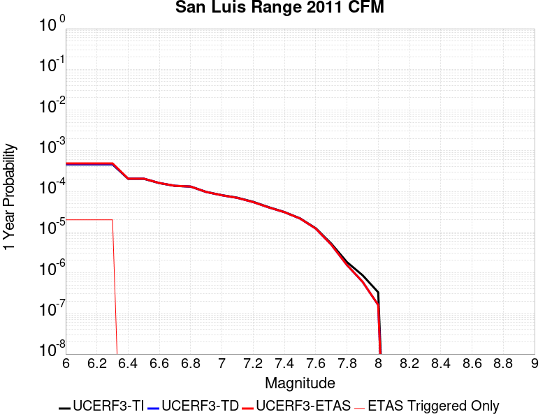 |  |

| Magnitude | 1 wk TI Prob | 1 wk TD Prob | 1 wk ETAS Prob | 1 wk ETAS/TD Gain | 1 wk ETAS Triggered Only | 1 mo TI Prob | 1 mo TD Prob | 1 mo ETAS Prob | 1 mo ETAS/TD Gain | 1 mo ETAS Triggered Only | 1 yr TI Prob | 1 yr TD Prob | 1 yr ETAS Prob | 1 yr ETAS/TD Gain | 1 yr ETAS Triggered Only | 10 yr TI Prob | 10 yr TD Prob | 10 yr ETAS Prob | 10 yr ETAS/TD Gain | 10 yr ETAS Triggered Only |
|-----|-----|-----|-----|-----|-----|-----|-----|-----|-----|-----|-----|-----|-----|-----|-----|-----|-----|-----|-----|-----|
| 6.0 | 8.8368415E-6 | 8.965548E-6 | 8.965548E-6 | 1.0 | 0.0 | 3.787163E-5 | 3.8423255E-5 | 4.8422873E-5 | 1.260249 | 1.0E-5 | 4.609895E-4 | 4.677106E-4 | 4.8770127E-4 | 1.0427415 | 2.0E-5 | 0.0046003438 | 0.0046680453 | 0.004687952 | 1.0042645 | 2.0E-5 |
| 6.1 | 8.8368415E-6 | 8.965548E-6 | 8.965548E-6 | 1.0 | 0.0 | 3.787163E-5 | 3.8423255E-5 | 4.8422873E-5 | 1.260249 | 1.0E-5 | 4.609895E-4 | 4.677106E-4 | 4.8770127E-4 | 1.0427415 | 2.0E-5 | 0.0046003438 | 0.0046680453 | 0.004687952 | 1.0042645 | 2.0E-5 |
| 6.2 | 8.8368415E-6 | 8.965548E-6 | 8.965548E-6 | 1.0 | 0.0 | 3.787163E-5 | 3.8423255E-5 | 4.8422873E-5 | 1.260249 | 1.0E-5 | 4.609895E-4 | 4.677106E-4 | 4.8770127E-4 | 1.0427415 | 2.0E-5 | 0.0046003438 | 0.0046680453 | 0.004687952 | 1.0042645 | 2.0E-5 |
| 6.3 | 8.8368415E-6 | 8.965548E-6 | 8.965548E-6 | 1.0 | 0.0 | 3.787163E-5 | 3.8423255E-5 | 4.8422873E-5 | 1.260249 | 1.0E-5 | 4.609895E-4 | 4.677106E-4 | 4.8770127E-4 | 1.0427415 | 2.0E-5 | 0.0046003438 | 0.0046680453 | 0.004687952 | 1.0042645 | 2.0E-5 |
| 6.4 | 3.9094193E-6 | 3.941245E-6 | 3.941245E-6 | 1.0 | 0.0 | 1.6754546E-5 | 1.6890941E-5 | 1.6890941E-5 | 1.0 | 0.0 | 2.039675E-4 | 2.0562808E-4 | 2.0562808E-4 | 1.0 | 0.0 | 0.0020378039 | 0.002054407 | 0.002054407 | 1.0 | 0.0 |
| 6.5 | 3.9094193E-6 | 3.941245E-6 | 3.941245E-6 | 1.0 | 0.0 | 1.6754546E-5 | 1.6890941E-5 | 1.6890941E-5 | 1.0 | 0.0 | 2.039675E-4 | 2.0562808E-4 | 2.0562808E-4 | 1.0 | 0.0 | 0.0020378039 | 0.002054407 | 0.002054407 | 1.0 | 0.0 |
| 6.6 | 3.0587726E-6 | 3.075422E-6 | 3.075422E-6 | 1.0 | 0.0 | 1.3108959E-5 | 1.3180314E-5 | 1.3180314E-5 | 1.0 | 0.0 | 1.595899E-4 | 1.6045863E-4 | 1.6045863E-4 | 1.0 | 0.0 | 0.0015947534 | 0.0016034397 | 0.0016034397 | 1.0 | 0.0 |
| 6.7 | 2.6160574E-6 | 2.625157E-6 | 2.625157E-6 | 1.0 | 0.0 | 1.1211626E-5 | 1.1250625E-5 | 1.1250625E-5 | 1.0 | 0.0 | 1.3649299E-4 | 1.369678E-4 | 1.369678E-4 | 1.0 | 0.0 | 0.0013640919 | 0.0013688401 | 0.0013688401 | 1.0 | 0.0 |
| 6.8 | 2.5110312E-6 | 2.518169E-6 | 2.518169E-6 | 1.0 | 0.0 | 1.0761518E-5 | 1.0792108E-5 | 1.0792108E-5 | 1.0 | 0.0 | 1.310136E-4 | 1.3138604E-4 | 1.3138604E-4 | 1.0 | 0.0 | 0.0013093639 | 0.0013130896 | 0.0013130896 | 1.0 | 0.0 |
| 6.9 | 1.8564405E-6 | 1.8525097E-6 | 1.8525097E-6 | 1.0 | 0.0 | 7.95615E-6 | 7.939303E-6 | 7.939303E-6 | 1.0 | 0.0 | 9.686181E-5 | 9.6656746E-5 | 9.6656746E-5 | 1.0 | 0.0 | 9.68196E-4 | 9.6614915E-4 | 9.6614915E-4 | 1.0 | 0.0 |
| 7.0 | 1.546127E-6 | 1.5369736E-6 | 1.5369736E-6 | 1.0 | 0.0 | 6.626242E-6 | 6.5870136E-6 | 6.5870136E-6 | 1.0 | 0.0 | 8.06715E-5 | 8.0193946E-5 | 8.0193946E-5 | 1.0 | 0.0 | 8.0642226E-4 | 8.0165075E-4 | 8.0165075E-4 | 1.0 | 0.0 |
| 7.1 | 1.3368208E-6 | 1.3235502E-6 | 1.3235502E-6 | 1.0 | 0.0 | 5.7292195E-6 | 5.672346E-6 | 5.672346E-6 | 1.0 | 0.0 | 6.975101E-5 | 6.905863E-5 | 6.905863E-5 | 1.0 | 0.0 | 6.972912E-4 | 6.9037214E-4 | 6.9037214E-4 | 1.0 | 0.0 |
| 7.2 | 1.0623363E-6 | 1.0454515E-6 | 1.0454515E-6 | 1.0 | 0.0 | 4.5528623E-6 | 4.480499E-6 | 4.480499E-6 | 1.0 | 0.0 | 5.5429686E-5 | 5.454871E-5 | 5.454871E-5 | 1.0 | 0.0 | 5.5415864E-4 | 5.453535E-4 | 5.453535E-4 | 1.0 | 0.0 |
| 7.3 | 7.831679E-7 | 7.72751E-7 | 7.72751E-7 | 1.0 | 0.0 | 3.3564295E-6 | 3.3117856E-6 | 3.3117856E-6 | 1.0 | 0.0 | 4.086376E-5 | 4.0320243E-5 | 4.0320243E-5 | 1.0 | 0.0 | 4.0856248E-4 | 4.0312944E-4 | 4.0312944E-4 | 1.0 | 0.0 |
| 7.4 | 5.9558846E-7 | 5.910736E-7 | 5.910736E-7 | 1.0 | 0.0 | 2.5525194E-6 | 2.5331701E-6 | 2.5331701E-6 | 1.0 | 0.0 | 3.107648E-5 | 3.084091E-5 | 3.084091E-5 | 1.0 | 0.0 | 3.1072134E-4 | 3.0836638E-4 | 3.0836638E-4 | 1.0 | 0.0 |
| 7.5 | 4.1616502E-7 | 4.1197126E-7 | 4.1197126E-7 | 1.0 | 0.0 | 1.7835631E-6 | 1.7655899E-6 | 1.7655899E-6 | 1.0 | 0.0 | 2.1714664E-5 | 2.1495845E-5 | 2.1495845E-5 | 1.0 | 0.0 | 2.1712543E-4 | 2.1493771E-4 | 2.1493771E-4 | 1.0 | 0.0 |
| 7.6 | 2.3816014E-7 | 2.337718E-7 | 2.337718E-7 | 1.0 | 0.0 | 1.0206859E-6 | 1.0018788E-6 | 1.0018788E-6 | 1.0 | 0.0 | 1.242678E-5 | 1.21978055E-5 | 1.21978055E-5 | 1.0 | 0.0 | 1.2426086E-4 | 1.2197138E-4 | 1.2197138E-4 | 1.0 | 0.0 |
| 7.7 | 9.918777E-8 | 9.3872394E-8 | 9.3872394E-8 | 1.0 | 0.0 | 4.2509038E-7 | 4.023102E-7 | 4.023102E-7 | 1.0 | 0.0 | 5.1754632E-6 | 4.8981155E-6 | 4.8981155E-6 | 1.0 | 0.0 | 5.1753424E-5 | 4.898008E-5 | 4.898008E-5 | 1.0 | 0.0 |
| 7.8 | 3.4982556E-8 | 2.9690542E-8 | 2.9690542E-8 | 1.0 | 0.0 | 1.4992524E-7 | 1.2724517E-7 | 1.2724517E-7 | 1.0 | 0.0 | 1.8253382E-6 | 1.549209E-6 | 1.549209E-6 | 1.0 | 0.0 | 1.8253233E-5 | 1.5491982E-5 | 1.5491982E-5 | 1.0 | 0.0 |
| 7.9 | 1.6624908E-8 | 1.1480696E-8 | 1.1480696E-8 | 1.0 | 0.0 | 7.12496E-8 | 4.920299E-8 | 4.920299E-8 | 1.0 | 0.0 | 8.6746354E-7 | 5.990462E-7 | 5.990462E-7 | 1.0 | 0.0 | 8.674601E-6 | 5.9904464E-6 | 5.9904464E-6 | 1.0 | 0.0 |
| 8.0 | 6.3352315E-9 | 3.0908693E-9 | 3.0908693E-9 | 1.0 | 0.0 | 2.715099E-8 | 1.3246585E-8 | 1.3246585E-8 | 1.0 | 0.0 | 3.3056327E-7 | 1.6127716E-7 | 1.6127716E-7 | 1.0 | 0.0 | 3.3056278E-6 | 1.6127703E-6 | 1.6127703E-6 | 1.0 | 0.0 |

## Green Valley 2011 CFM
*[(top)](#table-of-contents)*

| 1 Week | 1 Month | 1 Year | 10 Year |
|-----|-----|-----|-----|
|  |  |  | 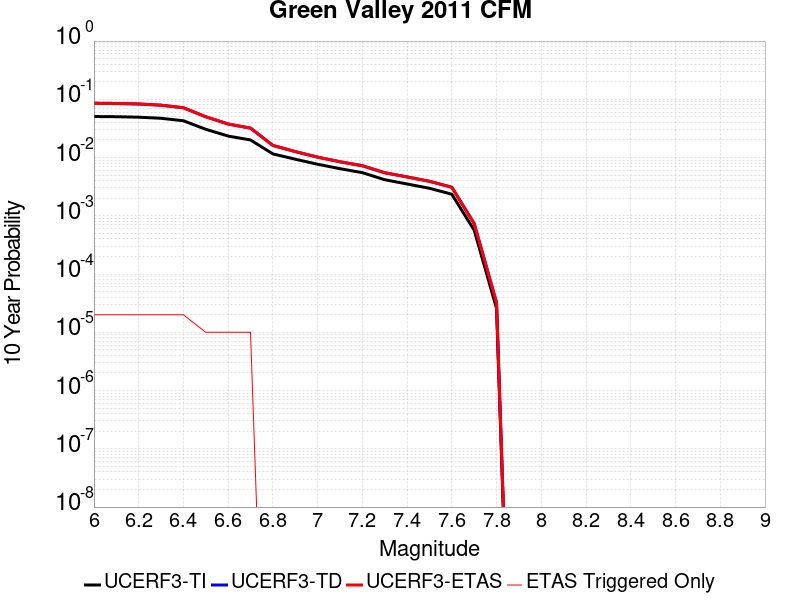 |

| Magnitude | 1 wk TI Prob | 1 wk TD Prob | 1 wk ETAS Prob | 1 wk ETAS/TD Gain | 1 wk ETAS Triggered Only | 1 mo TI Prob | 1 mo TD Prob | 1 mo ETAS Prob | 1 mo ETAS/TD Gain | 1 mo ETAS Triggered Only | 1 yr TI Prob | 1 yr TD Prob | 1 yr ETAS Prob | 1 yr ETAS/TD Gain | 1 yr ETAS Triggered Only | 10 yr TI Prob | 10 yr TD Prob | 10 yr ETAS Prob | 10 yr ETAS/TD Gain | 10 yr ETAS Triggered Only |
|-----|-----|-----|-----|-----|-----|-----|-----|-----|-----|-----|-----|-----|-----|-----|-----|-----|-----|-----|-----|-----|
| 6.0 | 9.9629346E-5 | 1.7306388E-4 | 1.7306388E-4 | 1.0 | 0.0 | 4.2691303E-4 | 7.4149936E-4 | 7.4149936E-4 | 1.0 | 0.0 | 0.0051852856 | 0.008987381 | 0.008987381 | 1.0 | 0.0 | 0.050659515 | 0.08552948 | 0.08554777 | 1.0002139 | 2.0E-5 |
| 6.1 | 9.88615E-5 | 1.7153693E-4 | 1.7153693E-4 | 1.0 | 0.0 | 4.2362334E-4 | 7.3495903E-4 | 7.3495903E-4 | 1.0 | 0.0 | 0.0051454236 | 0.008908406 | 0.008908406 | 1.0 | 0.0 | 0.050279044 | 0.084817074 | 0.08483538 | 1.0002158 | 2.0E-5 |
| 6.2 | 9.696895E-5 | 1.679268E-4 | 1.679268E-4 | 1.0 | 0.0 | 4.15515E-4 | 7.194957E-4 | 7.194957E-4 | 1.0 | 0.0 | 0.0050471667 | 0.008721775 | 0.008721775 | 1.0 | 0.0 | 0.04934063 | 0.08312591 | 0.08314425 | 1.0002207 | 2.0E-5 |
| 6.3 | 9.275224E-5 | 1.597199E-4 | 1.597199E-4 | 1.0 | 0.0 | 3.9744904E-4 | 6.843419E-4 | 6.843419E-4 | 1.0 | 0.0 | 0.0048282105 | 0.008297088 | 0.008297088 | 1.0 | 0.0 | 0.047246475 | 0.07926428 | 0.0792827 | 1.0002323 | 2.0E-5 |
| 6.4 | 8.391499E-5 | 1.4370102E-4 | 1.4370102E-4 | 1.0 | 0.0 | 3.595861E-4 | 6.1572343E-4 | 6.1572343E-4 | 1.0 | 0.0 | 0.004369175 | 0.0074676727 | 0.0074676727 | 1.0 | 0.0 | 0.04284265 | 0.07163763 | 0.0716562 | 1.0002592 | 2.0E-5 |
| 6.5 | 5.9519385E-5 | 9.935902E-5 | 9.935902E-5 | 1.0 | 0.0 | 2.5505814E-4 | 4.257589E-4 | 4.257589E-4 | 1.0 | 0.0 | 0.0031009112 | 0.0051687798 | 0.0051687798 | 1.0 | 0.0 | 0.030579966 | 0.050151456 | 0.050160952 | 1.0001894 | 1.0E-5 |
| 6.6 | 4.5361558E-5 | 7.404101E-5 | 7.404101E-5 | 1.0 | 0.0 | 1.9439218E-4 | 3.1728283E-4 | 3.1728283E-4 | 1.0 | 0.0 | 0.0023641558 | 0.0038543646 | 0.0038543646 | 1.0 | 0.0 | 0.023391623 | 0.037670802 | 0.037680425 | 1.0002555 | 1.0E-5 |
| 6.7 | 3.8808106E-5 | 6.2664265E-5 | 6.2664265E-5 | 1.0 | 0.0 | 1.6630985E-4 | 2.6853604E-4 | 2.6853604E-4 | 1.0 | 0.0 | 0.0020229418 | 0.0032630423 | 0.0032630423 | 1.0 | 0.0 | 0.020046256 | 0.03201008 | 0.032019757 | 1.0003024 | 1.0E-5 |
| 6.8 | 2.2284667E-5 | 3.128693E-5 | 3.128693E-5 | 1.0 | 0.0 | 9.550222E-5 | 1.3407998E-4 | 1.3407998E-4 | 1.0 | 0.0 | 0.0011621192 | 0.0016311917 | 0.0016311917 | 1.0 | 0.0 | 0.011560607 | 0.016166827 | 0.016166827 | 1.0 | 0.0 |
| 6.9 | 1.8050168E-5 | 2.4449284E-5 | 2.4449284E-5 | 1.0 | 0.0 | 7.735557E-5 | 1.04778395E-4 | 1.04778395E-4 | 1.0 | 0.0 | 9.4139716E-4 | 0.0012749347 | 0.0012749347 | 1.0 | 0.0 | 0.009374191 | 0.012668457 | 0.012668457 | 1.0 | 0.0 |
| 7.0 | 1.4763166E-5 | 1.9583895E-5 | 1.9583895E-5 | 1.0 | 0.0 | 6.326917E-5 | 8.3928295E-5 | 8.3928295E-5 | 1.0 | 0.0 | 7.7002996E-4 | 0.001021351 | 0.001021351 | 1.0 | 0.0 | 0.007673672 | 0.010165877 | 0.010165877 | 1.0 | 0.0 |
| 7.1 | 1.2399713E-5 | 1.6304628E-5 | 1.6304628E-5 | 1.0 | 0.0 | 5.3140546E-5 | 6.987512E-5 | 6.987512E-5 | 1.0 | 0.0 | 6.467941E-4 | 8.5039943E-4 | 8.5039943E-4 | 1.0 | 0.0 | 0.006449148 | 0.008471731 | 0.008471731 | 1.0 | 0.0 |
| 7.2 | 1.0584195E-5 | 1.3922591E-5 | 1.3922591E-5 | 1.0 | 0.0 | 4.5360044E-5 | 5.966689E-5 | 5.966689E-5 | 1.0 | 0.0 | 5.521186E-4 | 7.262039E-4 | 7.262039E-4 | 1.0 | 0.0 | 0.0055074887 | 0.0072387247 | 0.0072387247 | 1.0 | 0.0 |
| 7.3 | 7.998173E-6 | 1.0544779E-5 | 1.0544779E-5 | 1.0 | 0.0 | 3.4277433E-5 | 4.5191133E-5 | 4.5191133E-5 | 1.0 | 0.0 | 4.1724785E-4 | 5.500642E-4 | 5.500642E-4 | 1.0 | 0.0 | 0.004164653 | 0.005487293 | 0.005487293 | 1.0 | 0.0 |
| 7.4 | 6.7571127E-6 | 8.933404E-6 | 8.933404E-6 | 1.0 | 0.0 | 2.8958733E-5 | 3.828546E-5 | 3.828546E-5 | 1.0 | 0.0 | 3.5251552E-4 | 4.6602674E-4 | 4.6602674E-4 | 1.0 | 0.0 | 0.0035195686 | 0.0046506976 | 0.0046506976 | 1.0 | 0.0 |
| 7.5 | 5.69878E-6 | 7.516847E-6 | 7.516847E-6 | 1.0 | 0.0 | 2.4423114E-5 | 3.2214666E-5 | 3.2214666E-5 | 1.0 | 0.0 | 2.9731085E-4 | 3.9214385E-4 | 3.9214385E-4 | 1.0 | 0.0 | 0.002969134 | 0.0039146706 | 0.0039146706 | 1.0 | 0.0 |
| 7.6 | 4.503664E-6 | 5.935998E-6 | 5.935998E-6 | 1.0 | 0.0 | 1.9301275E-5 | 2.543975E-5 | 2.543975E-5 | 1.0 | 0.0 | 2.3496768E-4 | 3.0968577E-4 | 3.0968577E-4 | 1.0 | 0.0 | 0.002347194 | 0.003092667 | 0.003092667 | 1.0 | 0.0 |
| 7.7 | 1.0873546E-6 | 1.4107495E-6 | 1.4107495E-6 | 1.0 | 0.0 | 4.6600826E-6 | 6.0460557E-6 | 6.0460557E-6 | 1.0 | 0.0 | 5.6735033E-5 | 7.360827E-5 | 7.360827E-5 | 1.0 | 0.0 | 5.672055E-4 | 7.3584093E-4 | 7.3584093E-4 | 1.0 | 0.0 |
| 7.8 | 4.9373917E-8 | 6.178006E-8 | 6.178006E-8 | 1.0 | 0.0 | 2.1160248E-7 | 2.6477167E-7 | 2.6477167E-7 | 1.0 | 0.0 | 2.5762572E-6 | 3.2235916E-6 | 3.2235916E-6 | 1.0 | 0.0 | 2.5762274E-5 | 3.223383E-5 | 3.223383E-5 | 1.0 | 0.0 |

## Dry Mountain
*[(top)](#table-of-contents)*

| 1 Week | 1 Month | 1 Year | 10 Year |
|-----|-----|-----|-----|
|  |  | 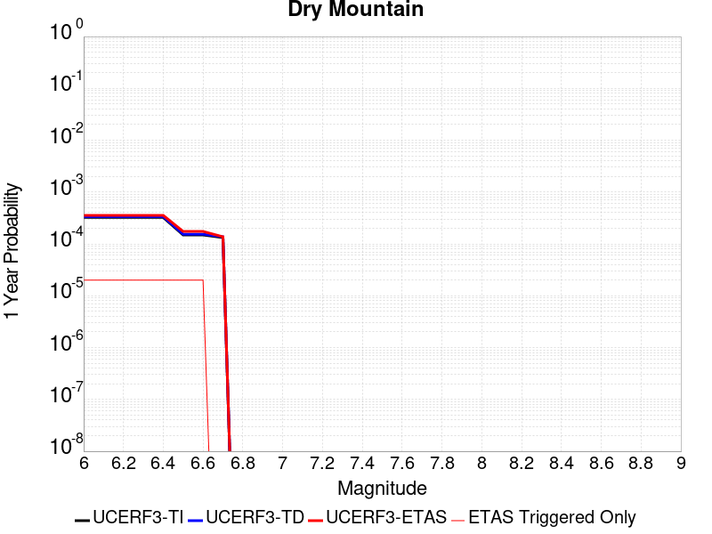 |  |

| Magnitude | 1 wk TI Prob | 1 wk TD Prob | 1 wk ETAS Prob | 1 wk ETAS/TD Gain | 1 wk ETAS Triggered Only | 1 mo TI Prob | 1 mo TD Prob | 1 mo ETAS Prob | 1 mo ETAS/TD Gain | 1 mo ETAS Triggered Only | 1 yr TI Prob | 1 yr TD Prob | 1 yr ETAS Prob | 1 yr ETAS/TD Gain | 1 yr ETAS Triggered Only | 10 yr TI Prob | 10 yr TD Prob | 10 yr ETAS Prob | 10 yr ETAS/TD Gain | 10 yr ETAS Triggered Only |
|-----|-----|-----|-----|-----|-----|-----|-----|-----|-----|-----|-----|-----|-----|-----|-----|-----|-----|-----|-----|-----|
| 6.0 | 6.222801E-6 | 6.4395003E-6 | 6.4395003E-6 | 1.0 | 0.0 | 2.6668875E-5 | 2.7597656E-5 | 2.7597656E-5 | 1.0 | 0.0 | 3.2464517E-4 | 3.3596557E-4 | 3.5595885E-4 | 1.0595099 | 2.0E-5 | 0.0032417132 | 0.0033561387 | 0.0033760716 | 1.0059392 | 2.0E-5 |
| 6.1 | 6.222801E-6 | 6.4395003E-6 | 6.4395003E-6 | 1.0 | 0.0 | 2.6668875E-5 | 2.7597656E-5 | 2.7597656E-5 | 1.0 | 0.0 | 3.2464517E-4 | 3.3596557E-4 | 3.5595885E-4 | 1.0595099 | 2.0E-5 | 0.0032417132 | 0.0033561387 | 0.0033760716 | 1.0059392 | 2.0E-5 |
| 6.2 | 6.222801E-6 | 6.4395003E-6 | 6.4395003E-6 | 1.0 | 0.0 | 2.6668875E-5 | 2.7597656E-5 | 2.7597656E-5 | 1.0 | 0.0 | 3.2464517E-4 | 3.3596557E-4 | 3.5595885E-4 | 1.0595099 | 2.0E-5 | 0.0032417132 | 0.0033561387 | 0.0033760716 | 1.0059392 | 2.0E-5 |
| 6.3 | 6.222801E-6 | 6.4395003E-6 | 6.4395003E-6 | 1.0 | 0.0 | 2.6668875E-5 | 2.7597656E-5 | 2.7597656E-5 | 1.0 | 0.0 | 3.2464517E-4 | 3.3596557E-4 | 3.5595885E-4 | 1.0595099 | 2.0E-5 | 0.0032417132 | 0.0033561387 | 0.0033760716 | 1.0059392 | 2.0E-5 |
| 6.4 | 6.222801E-6 | 6.4395003E-6 | 6.4395003E-6 | 1.0 | 0.0 | 2.6668875E-5 | 2.7597656E-5 | 2.7597656E-5 | 1.0 | 0.0 | 3.2464517E-4 | 3.3596557E-4 | 3.5595885E-4 | 1.0595099 | 2.0E-5 | 0.0032417132 | 0.0033561387 | 0.0033760716 | 1.0059392 | 2.0E-5 |
| 6.5 | 2.8528623E-6 | 2.952223E-6 | 2.952223E-6 | 1.0 | 0.0 | 1.22264955E-5 | 1.2652372E-5 | 1.2652372E-5 | 1.0 | 0.0 | 1.4884741E-4 | 1.5404043E-4 | 1.7403736E-4 | 1.129816 | 2.0E-5 | 0.0014874774 | 0.0015401901 | 0.0015601593 | 1.0129654 | 2.0E-5 |
| 6.6 | 2.8528623E-6 | 2.952223E-6 | 2.952223E-6 | 1.0 | 0.0 | 1.22264955E-5 | 1.2652372E-5 | 1.2652372E-5 | 1.0 | 0.0 | 1.4884741E-4 | 1.5404043E-4 | 1.7403736E-4 | 1.129816 | 2.0E-5 | 0.0014874774 | 0.0015401901 | 0.0015601593 | 1.0129654 | 2.0E-5 |
| 6.7 | 2.541E-6 | 2.6294065E-6 | 2.6294065E-6 | 1.0 | 0.0 | 1.0889954E-5 | 1.1268885E-5 | 1.1268885E-5 | 1.0 | 0.0 | 1.3257713E-4 | 1.3719867E-4 | 1.3719867E-4 | 1.0 | 0.0 | 0.0013249806 | 0.0013719867 | 0.0013719867 | 1.0 | 0.0 |

## Elsinore (Coyote Mountains)
*[(top)](#table-of-contents)*

| 1 Week | 1 Month | 1 Year | 10 Year |
|-----|-----|-----|-----|
|  | 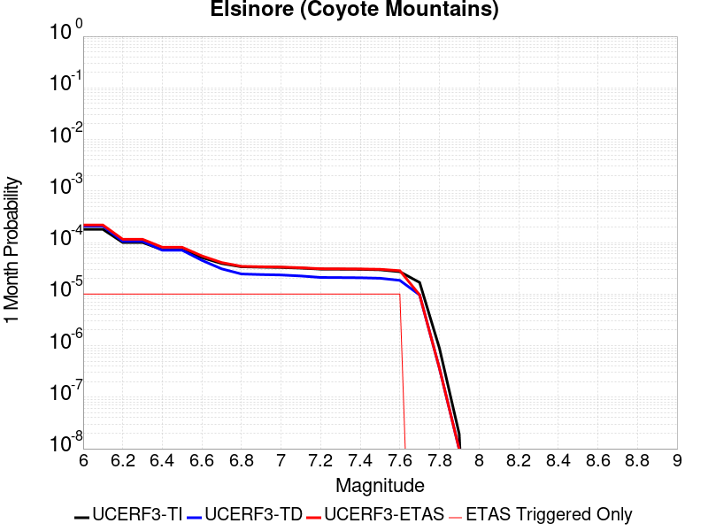 |  |  |

| Magnitude | 1 wk TI Prob | 1 wk TD Prob | 1 wk ETAS Prob | 1 wk ETAS/TD Gain | 1 wk ETAS Triggered Only | 1 mo TI Prob | 1 mo TD Prob | 1 mo ETAS Prob | 1 mo ETAS/TD Gain | 1 mo ETAS Triggered Only | 1 yr TI Prob | 1 yr TD Prob | 1 yr ETAS Prob | 1 yr ETAS/TD Gain | 1 yr ETAS Triggered Only | 10 yr TI Prob | 10 yr TD Prob | 10 yr ETAS Prob | 10 yr ETAS/TD Gain | 10 yr ETAS Triggered Only |
|-----|-----|-----|-----|-----|-----|-----|-----|-----|-----|-----|-----|-----|-----|-----|-----|-----|-----|-----|-----|-----|
| 6.0 | 4.20513E-5 | 4.8638663E-5 | 5.863818E-5 | 1.2055877 | 1.0E-5 | 1.8020741E-4 | 2.0843801E-4 | 2.1843593E-4 | 1.0479659 | 1.0E-5 | 0.0021918174 | 0.002535353 | 0.0025453274 | 1.0039343 | 1.0E-5 | 0.021703249 | 0.025114654 | 0.025134152 | 1.0007763 | 2.0E-5 |
| 6.1 | 4.20513E-5 | 4.8638663E-5 | 5.863818E-5 | 1.2055877 | 1.0E-5 | 1.8020741E-4 | 2.0843801E-4 | 2.1843593E-4 | 1.0479659 | 1.0E-5 | 0.0021918174 | 0.002535353 | 0.0025453274 | 1.0039343 | 1.0E-5 | 0.021703249 | 0.025114654 | 0.025134152 | 1.0007763 | 2.0E-5 |
| 6.2 | 2.3413893E-5 | 2.4698767E-5 | 3.469852E-5 | 1.4048685 | 1.0E-5 | 1.0034139E-4 | 1.0584811E-4 | 1.1584705E-4 | 1.094465 | 1.0E-5 | 0.0012209718 | 0.0012880323 | 0.0012980194 | 1.0077537 | 1.0E-5 | 0.012142851 | 0.0128142275 | 0.0128339715 | 1.0015408 | 2.0E-5 |
| 6.3 | 2.3413893E-5 | 2.4698767E-5 | 3.469852E-5 | 1.4048685 | 1.0E-5 | 1.0034139E-4 | 1.0584811E-4 | 1.1584705E-4 | 1.094465 | 1.0E-5 | 0.0012209718 | 0.0012880323 | 0.0012980194 | 1.0077537 | 1.0E-5 | 0.012142851 | 0.0128142275 | 0.0128339715 | 1.0015408 | 2.0E-5 |
| 6.4 | 1.6894814E-5 | 1.6570395E-5 | 2.657023E-5 | 1.6034759 | 1.0E-5 | 7.240433E-5 | 7.101426E-5 | 8.101355E-5 | 1.1408068 | 1.0E-5 | 8.811662E-4 | 8.642923E-4 | 8.7428367E-4 | 1.0115602 | 1.0E-5 | 0.0087768035 | 0.008612989 | 0.008622903 | 1.0011511 | 1.0E-5 |
| 6.5 | 1.6894814E-5 | 1.6570395E-5 | 2.657023E-5 | 1.6034759 | 1.0E-5 | 7.240433E-5 | 7.101426E-5 | 8.101355E-5 | 1.1408068 | 1.0E-5 | 8.811662E-4 | 8.642923E-4 | 8.7428367E-4 | 1.0115602 | 1.0E-5 | 0.0087768035 | 0.008612989 | 0.008622903 | 1.0011511 | 1.0E-5 |
| 6.6 | 1.1910969E-5 | 1.0532126E-5 | 2.0532021E-5 | 1.949466 | 1.0E-5 | 5.1046012E-5 | 4.5136978E-5 | 5.5136526E-5 | 1.2215378 | 1.0E-5 | 6.21308E-4 | 5.494154E-4 | 5.594099E-4 | 1.0181912 | 1.0E-5 | 0.0061957375 | 0.0054818755 | 0.0054918206 | 1.0018142 | 1.0E-5 |
| 6.7 | 9.1486E-6 | 7.2038497E-6 | 1.7203778E-5 | 2.3881366 | 1.0E-5 | 3.9207694E-5 | 3.08733E-5 | 4.087299E-5 | 1.3238945 | 1.0E-5 | 4.7724912E-4 | 3.758214E-4 | 3.8581764E-4 | 1.0265983 | 1.0E-5 | 0.0047622547 | 0.0037522377 | 0.0037622002 | 1.002655 | 1.0E-5 |
| 6.8 | 7.90441E-6 | 5.7298735E-6 | 1.5729816E-5 | 2.7452292 | 1.0E-5 | 3.3875604E-5 | 2.4556377E-5 | 3.455613E-5 | 1.4072162 | 1.0E-5 | 4.1235742E-4 | 2.9893414E-4 | 3.0893116E-4 | 1.0334421 | 1.0E-5 | 0.0041159308 | 0.002985449 | 0.002995419 | 1.0033395 | 1.0E-5 |
| 6.9 | 7.77015E-6 | 5.583821E-6 | 1.5583764E-5 | 2.7908783 | 1.0E-5 | 3.3300217E-5 | 2.3930448E-5 | 3.393021E-5 | 1.4178677 | 1.0E-5 | 4.0535472E-4 | 2.9131552E-4 | 3.0131263E-4 | 1.034317 | 1.0E-5 | 0.004046161 | 0.0029094636 | 0.0029194346 | 1.003427 | 1.0E-5 |
| 7.0 | 7.675798E-6 | 5.480674E-6 | 1.548062E-5 | 2.824583 | 1.0E-5 | 3.289586E-5 | 2.3488401E-5 | 3.3488166E-5 | 1.425732 | 1.0E-5 | 4.004335E-4 | 2.85935E-4 | 2.9593214E-4 | 1.034963 | 1.0E-5 | 0.003997127 | 0.0028557975 | 0.002865769 | 1.0034916 | 1.0E-5 |
| 7.1 | 7.447814E-6 | 5.2395403E-6 | 1.5239488E-5 | 2.9085543 | 1.0E-5 | 3.191881E-5 | 2.2454986E-5 | 3.2454762E-5 | 1.4453254 | 1.0E-5 | 3.8854225E-4 | 2.7335642E-4 | 2.8335367E-4 | 1.0365723 | 1.0E-5 | 0.003878636 | 0.002730326 | 0.0027402989 | 1.0036526 | 1.0E-5 |
| 7.2 | 7.128185E-6 | 4.9061937E-6 | 1.4906145E-5 | 3.03823 | 1.0E-5 | 3.0549007E-5 | 2.1026382E-5 | 3.102617E-5 | 1.475583 | 1.0E-5 | 3.7187067E-4 | 2.5596732E-4 | 2.6596477E-4 | 1.0390575 | 1.0E-5 | 0.00371249 | 0.0025568435 | 0.002566818 | 1.0039011 | 1.0E-5 |
| 7.3 | 7.0913875E-6 | 4.8748675E-6 | 1.4874819E-5 | 3.0513277 | 1.0E-5 | 3.0391306E-5 | 2.0892128E-5 | 3.089192E-5 | 1.4786391 | 1.0E-5 | 3.6995133E-4 | 2.5433316E-4 | 2.6433062E-4 | 1.0393085 | 1.0E-5 | 0.0036933604 | 0.0025405393 | 0.002550514 | 1.0039262 | 1.0E-5 |
| 7.4 | 7.051521E-6 | 4.838718E-6 | 1.483867E-5 | 3.0666533 | 1.0E-5 | 3.0220453E-5 | 2.0737203E-5 | 3.0736996E-5 | 1.482215 | 1.0E-5 | 3.6787192E-4 | 2.5244738E-4 | 2.6244487E-4 | 1.0396022 | 1.0E-5 | 0.0036726352 | 0.0025217244 | 0.0025316994 | 1.0039555 | 1.0E-5 |
| 7.5 | 6.910666E-6 | 4.7341928E-6 | 1.4734145E-5 | 3.1122825 | 1.0E-5 | 2.9616802E-5 | 2.0289246E-5 | 3.0289044E-5 | 1.492862 | 1.0E-5 | 3.605249E-4 | 2.4699475E-4 | 2.569923E-4 | 1.0404767 | 1.0E-5 | 0.0035994058 | 0.0024673205 | 0.0024772957 | 1.004043 | 1.0E-5 |
| 7.6 | 6.341753E-6 | 4.3072587E-6 | 1.4307216E-5 | 3.3216524 | 1.0E-5 | 2.7178658E-5 | 1.8459556E-5 | 2.8459372E-5 | 1.5417149 | 1.0E-5 | 3.3084993E-4 | 2.2472307E-4 | 2.3472082E-4 | 1.0444893 | 1.0E-5 | 0.0033035777 | 0.0022450737 | 0.0022550512 | 1.0044442 | 1.0E-5 |
| 7.7 | 3.9205916E-6 | 2.2443742E-6 | 2.2443742E-6 | 1.0 | 0.0 | 1.6802427E-5 | 9.618715E-6 | 9.618715E-6 | 1.0 | 0.0 | 2.0455034E-4 | 1.171023E-4 | 1.171023E-4 | 1.0 | 0.0 | 0.0020436216 | 0.001170479 | 0.001170479 | 1.0 | 0.0 |
| 7.8 | 2.0846227E-7 | 8.488185E-8 | 8.488185E-8 | 1.0 | 0.0 | 8.9340944E-7 | 3.637793E-7 | 3.637793E-7 | 1.0 | 0.0 | 1.0877206E-5 | 4.4290073E-6 | 4.4290073E-6 | 1.0 | 0.0 | 1.0876673E-4 | 4.4289518E-5 | 4.4289518E-5 | 1.0 | 0.0 |
| 7.9 | 4.4969806E-9 | 2.2695175E-9 | 2.2695175E-9 | 1.0 | 0.0 | 1.9272775E-8 | 9.726504E-9 | 9.726504E-9 | 1.0 | 0.0 | 2.3464601E-7 | 1.18420175E-7 | 1.18420175E-7 | 1.0 | 0.0 | 2.3464577E-6 | 1.1842012E-6 | 1.1842012E-6 | 1.0 | 0.0 |

## Clamshell-Sawpit
*[(top)](#table-of-contents)*

| 1 Week | 1 Month | 1 Year | 10 Year |
|-----|-----|-----|-----|
|  |  | 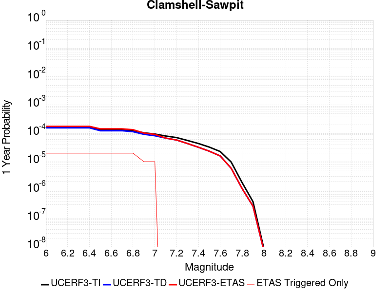 |  |

| Magnitude | 1 wk TI Prob | 1 wk TD Prob | 1 wk ETAS Prob | 1 wk ETAS/TD Gain | 1 wk ETAS Triggered Only | 1 mo TI Prob | 1 mo TD Prob | 1 mo ETAS Prob | 1 mo ETAS/TD Gain | 1 mo ETAS Triggered Only | 1 yr TI Prob | 1 yr TD Prob | 1 yr ETAS Prob | 1 yr ETAS/TD Gain | 1 yr ETAS Triggered Only | 10 yr TI Prob | 10 yr TD Prob | 10 yr ETAS Prob | 10 yr ETAS/TD Gain | 10 yr ETAS Triggered Only |
|-----|-----|-----|-----|-----|-----|-----|-----|-----|-----|-----|-----|-----|-----|-----|-----|-----|-----|-----|-----|-----|
| 6.0 | 3.202998E-6 | 3.0128463E-6 | 3.0128463E-6 | 1.0 | 0.0 | 1.3727062E-5 | 1.2912139E-5 | 1.2912139E-5 | 1.0 | 0.0 | 1.6711417E-4 | 1.5719475E-4 | 1.7719161E-4 | 1.1272107 | 2.0E-5 | 0.0016698855 | 0.001570915 | 0.0015908836 | 1.0127114 | 2.0E-5 |
| 6.1 | 3.202998E-6 | 3.0128463E-6 | 3.0128463E-6 | 1.0 | 0.0 | 1.3727062E-5 | 1.2912139E-5 | 1.2912139E-5 | 1.0 | 0.0 | 1.6711417E-4 | 1.5719475E-4 | 1.7719161E-4 | 1.1272107 | 2.0E-5 | 0.0016698855 | 0.001570915 | 0.0015908836 | 1.0127114 | 2.0E-5 |
| 6.2 | 3.202998E-6 | 3.0128463E-6 | 3.0128463E-6 | 1.0 | 0.0 | 1.3727062E-5 | 1.2912139E-5 | 1.2912139E-5 | 1.0 | 0.0 | 1.6711417E-4 | 1.5719475E-4 | 1.7719161E-4 | 1.1272107 | 2.0E-5 | 0.0016698855 | 0.001570915 | 0.0015908836 | 1.0127114 | 2.0E-5 |
| 6.3 | 3.202998E-6 | 3.0128463E-6 | 3.0128463E-6 | 1.0 | 0.0 | 1.3727062E-5 | 1.2912139E-5 | 1.2912139E-5 | 1.0 | 0.0 | 1.6711417E-4 | 1.5719475E-4 | 1.7719161E-4 | 1.1272107 | 2.0E-5 | 0.0016698855 | 0.001570915 | 0.0015908836 | 1.0127114 | 2.0E-5 |
| 6.4 | 3.202998E-6 | 3.0128463E-6 | 3.0128463E-6 | 1.0 | 0.0 | 1.3727062E-5 | 1.2912139E-5 | 1.2912139E-5 | 1.0 | 0.0 | 1.6711417E-4 | 1.5719475E-4 | 1.7719161E-4 | 1.1272107 | 2.0E-5 | 0.0016698855 | 0.001570915 | 0.0015908836 | 1.0127114 | 2.0E-5 |
| 6.5 | 2.5862723E-6 | 2.3808484E-6 | 2.3808484E-6 | 1.0 | 0.0 | 1.1083977E-5 | 1.0203598E-5 | 1.0203598E-5 | 1.0 | 0.0 | 1.3493907E-4 | 1.2422203E-4 | 1.4421955E-4 | 1.160982 | 2.0E-5 | 0.0013485716 | 0.0012415563 | 0.0012615314 | 1.0160888 | 2.0E-5 |
| 6.6 | 2.5862723E-6 | 2.3808484E-6 | 2.3808484E-6 | 1.0 | 0.0 | 1.1083977E-5 | 1.0203598E-5 | 1.0203598E-5 | 1.0 | 0.0 | 1.3493907E-4 | 1.2422203E-4 | 1.4421955E-4 | 1.160982 | 2.0E-5 | 0.0013485716 | 0.0012415563 | 0.0012615314 | 1.0160888 | 2.0E-5 |
| 6.7 | 2.5862723E-6 | 2.3808484E-6 | 2.3808484E-6 | 1.0 | 0.0 | 1.1083977E-5 | 1.0203598E-5 | 1.0203598E-5 | 1.0 | 0.0 | 1.3493907E-4 | 1.2422203E-4 | 1.4421955E-4 | 1.160982 | 2.0E-5 | 0.0013485716 | 0.0012415563 | 0.0012615314 | 1.0160888 | 2.0E-5 |
| 6.8 | 2.4098806E-6 | 2.1978008E-6 | 2.1978008E-6 | 1.0 | 0.0 | 1.0328019E-5 | 9.419114E-6 | 9.419114E-6 | 1.0 | 0.0 | 1.2573638E-4 | 1.14671944E-4 | 1.3466965E-4 | 1.1743906 | 2.0E-5 | 0.0012566525 | 0.0011461542 | 0.0011661313 | 1.0174297 | 2.0E-5 |
| 6.9 | 2.0073985E-6 | 1.7784854E-6 | 1.7784854E-6 | 1.0 | 0.0 | 8.603109E-6 | 7.622059E-6 | 7.622059E-6 | 1.0 | 0.0 | 1.0473781E-4 | 9.279473E-5 | 1.02793805E-4 | 1.1077547 | 1.0E-5 | 0.0010468846 | 9.2757173E-4 | 9.3756244E-4 | 1.0107708 | 1.0E-5 |
| 7.0 | 1.8166766E-6 | 1.5807664E-6 | 1.5807664E-6 | 1.0 | 0.0 | 7.785734E-6 | 6.774696E-6 | 6.774696E-6 | 1.0 | 0.0 | 9.478718E-5 | 8.24789E-5 | 9.2478076E-5 | 1.1212331 | 1.0E-5 | 9.4746763E-4 | 8.2449295E-4 | 8.344847E-4 | 1.0121187 | 1.0E-5 |
| 7.1 | 1.5471421E-6 | 1.3053456E-6 | 1.3053456E-6 | 1.0 | 0.0 | 6.6305925E-6 | 5.5943265E-6 | 5.5943265E-6 | 1.0 | 0.0 | 8.072447E-5 | 6.810885E-5 | 6.810885E-5 | 1.0 | 0.0 | 8.0695155E-4 | 6.808852E-4 | 6.808852E-4 | 1.0 | 0.0 |
| 7.2 | 1.3608037E-6 | 1.1153886E-6 | 1.1153886E-6 | 1.0 | 0.0 | 5.8320024E-6 | 4.7802287E-6 | 4.7802287E-6 | 1.0 | 0.0 | 7.1002316E-5 | 5.8197777E-5 | 5.8197777E-5 | 1.0 | 0.0 | 7.097964E-4 | 5.8183E-4 | 5.8183E-4 | 1.0 | 0.0 |
| 7.3 | 1.0749634E-6 | 8.3846135E-7 | 8.3846135E-7 | 1.0 | 0.0 | 4.6069777E-6 | 3.593401E-6 | 3.593401E-6 | 1.0 | 0.0 | 5.608851E-5 | 4.374881E-5 | 4.374881E-5 | 1.0 | 0.0 | 5.6074356E-4 | 4.374048E-4 | 4.374048E-4 | 1.0 | 0.0 |
| 7.4 | 8.416856E-7 | 6.200336E-7 | 6.200336E-7 | 1.0 | 0.0 | 3.607219E-6 | 2.657284E-6 | 2.657284E-6 | 1.0 | 0.0 | 4.3917007E-5 | 3.2351974E-5 | 3.2351974E-5 | 1.0 | 0.0 | 4.390833E-4 | 3.234746E-4 | 3.234746E-4 | 1.0 | 0.0 |
| 7.5 | 6.2779594E-7 | 4.4971213E-7 | 4.4971213E-7 | 1.0 | 0.0 | 2.6905511E-6 | 1.9273364E-6 | 1.9273364E-6 | 1.0 | 0.0 | 3.275697E-5 | 2.3465087E-5 | 2.3465087E-5 | 1.0 | 0.0 | 3.275214E-4 | 2.3462797E-4 | 2.3462797E-4 | 1.0 | 0.0 |
| 7.6 | 4.3822078E-7 | 3.0597388E-7 | 3.0597388E-7 | 1.0 | 0.0 | 1.8780877E-6 | 1.3113162E-6 | 1.3113162E-6 | 1.0 | 0.0 | 2.2865479E-5 | 1.5965172E-5 | 1.5965172E-5 | 1.0 | 0.0 | 2.2863125E-4 | 1.596418E-4 | 1.596418E-4 | 1.0 | 0.0 |
| 7.7 | 1.8704569E-7 | 1.1239408E-7 | 1.1239408E-7 | 1.0 | 0.0 | 8.0162414E-7 | 4.8168886E-7 | 4.8168886E-7 | 1.0 | 0.0 | 9.75973E-6 | 5.8645464E-6 | 5.8645464E-6 | 1.0 | 0.0 | 9.7593016E-5 | 5.864398E-5 | 5.864398E-5 | 1.0 | 0.0 |
| 7.8 | 3.5378733E-8 | 2.1839323E-8 | 2.1839323E-8 | 1.0 | 0.0 | 1.5162313E-7 | 9.3597095E-8 | 9.3597095E-8 | 1.0 | 0.0 | 1.84601E-6 | 1.139544E-6 | 1.139544E-6 | 1.0 | 0.0 | 1.8459947E-5 | 1.1395385E-5 | 1.1395385E-5 | 1.0 | 0.0 |
| 7.9 | 7.504945E-9 | 5.192265E-9 | 5.192265E-9 | 1.0 | 0.0 | 3.2164053E-8 | 2.2252564E-8 | 2.2252564E-8 | 1.0 | 0.0 | 3.9159727E-7 | 2.7092494E-7 | 2.7092494E-7 | 1.0 | 0.0 | 3.915966E-6 | 2.7092467E-6 | 2.7092467E-6 | 1.0 | 0.0 |
| 8.0 | 1.6554036E-10 | 1.4180923E-10 | 1.4180923E-10 | 1.0 | 0.0 | 7.0945894E-10 | 6.077536E-10 | 6.077536E-10 | 1.0 | 0.0 | 8.637662E-9 | 7.3994E-9 | 7.3994E-9 | 1.0 | 0.0 | 8.6376616E-8 | 7.3993995E-8 | 7.3993995E-8 | 1.0 | 0.0 |

## San Cayetano
*[(top)](#table-of-contents)*

| 1 Week | 1 Month | 1 Year | 10 Year |
|-----|-----|-----|-----|
|  |  |  |  |

| Magnitude | 1 wk TI Prob | 1 wk TD Prob | 1 wk ETAS Prob | 1 wk ETAS/TD Gain | 1 wk ETAS Triggered Only | 1 mo TI Prob | 1 mo TD Prob | 1 mo ETAS Prob | 1 mo ETAS/TD Gain | 1 mo ETAS Triggered Only | 1 yr TI Prob | 1 yr TD Prob | 1 yr ETAS Prob | 1 yr ETAS/TD Gain | 1 yr ETAS Triggered Only | 10 yr TI Prob | 10 yr TD Prob | 10 yr ETAS Prob | 10 yr ETAS/TD Gain | 10 yr ETAS Triggered Only |
|-----|-----|-----|-----|-----|-----|-----|-----|-----|-----|-----|-----|-----|-----|-----|-----|-----|-----|-----|-----|-----|
| 6.0 | 2.3476267E-5 | 1.8172246E-5 | 2.8172064E-5 | 1.5502797 | 1.0E-5 | 1.0060869E-4 | 7.787875E-5 | 8.787797E-5 | 1.1283947 | 1.0E-5 | 0.0012242225 | 9.4776496E-4 | 9.67746E-4 | 1.0210823 | 2.0E-5 | 0.012175002 | 0.009438118 | 0.009457929 | 1.002099 | 2.0E-5 |
| 6.1 | 2.3476267E-5 | 1.8172246E-5 | 2.8172064E-5 | 1.5502797 | 1.0E-5 | 1.0060869E-4 | 7.787875E-5 | 8.787797E-5 | 1.1283947 | 1.0E-5 | 0.0012242225 | 9.4776496E-4 | 9.67746E-4 | 1.0210823 | 2.0E-5 | 0.012175002 | 0.009438118 | 0.009457929 | 1.002099 | 2.0E-5 |
| 6.2 | 2.3476267E-5 | 1.8172246E-5 | 2.8172064E-5 | 1.5502797 | 1.0E-5 | 1.0060869E-4 | 7.787875E-5 | 8.787797E-5 | 1.1283947 | 1.0E-5 | 0.0012242225 | 9.4776496E-4 | 9.67746E-4 | 1.0210823 | 2.0E-5 | 0.012175002 | 0.009438118 | 0.009457929 | 1.002099 | 2.0E-5 |
| 6.3 | 2.3476267E-5 | 1.8172246E-5 | 2.8172064E-5 | 1.5502797 | 1.0E-5 | 1.0060869E-4 | 7.787875E-5 | 8.787797E-5 | 1.1283947 | 1.0E-5 | 0.0012242225 | 9.4776496E-4 | 9.67746E-4 | 1.0210823 | 2.0E-5 | 0.012175002 | 0.009438118 | 0.009457929 | 1.002099 | 2.0E-5 |
| 6.4 | 2.3476267E-5 | 1.8172246E-5 | 2.8172064E-5 | 1.5502797 | 1.0E-5 | 1.0060869E-4 | 7.787875E-5 | 8.787797E-5 | 1.1283947 | 1.0E-5 | 0.0012242225 | 9.4776496E-4 | 9.67746E-4 | 1.0210823 | 2.0E-5 | 0.012175002 | 0.009438118 | 0.009457929 | 1.002099 | 2.0E-5 |
| 6.5 | 2.3476267E-5 | 1.8172246E-5 | 2.8172064E-5 | 1.5502797 | 1.0E-5 | 1.0060869E-4 | 7.787875E-5 | 8.787797E-5 | 1.1283947 | 1.0E-5 | 0.0012242225 | 9.4776496E-4 | 9.67746E-4 | 1.0210823 | 2.0E-5 | 0.012175002 | 0.009438118 | 0.009457929 | 1.002099 | 2.0E-5 |
| 6.6 | 2.3476267E-5 | 1.8172246E-5 | 2.8172064E-5 | 1.5502797 | 1.0E-5 | 1.0060869E-4 | 7.787875E-5 | 8.787797E-5 | 1.1283947 | 1.0E-5 | 0.0012242225 | 9.4776496E-4 | 9.67746E-4 | 1.0210823 | 2.0E-5 | 0.012175002 | 0.009438118 | 0.009457929 | 1.002099 | 2.0E-5 |
| 6.7 | 2.3476267E-5 | 1.8172246E-5 | 2.8172064E-5 | 1.5502797 | 1.0E-5 | 1.0060869E-4 | 7.787875E-5 | 8.787797E-5 | 1.1283947 | 1.0E-5 | 0.0012242225 | 9.4776496E-4 | 9.67746E-4 | 1.0210823 | 2.0E-5 | 0.012175002 | 0.009438118 | 0.009457929 | 1.002099 | 2.0E-5 |
| 6.8 | 2.3241924E-5 | 1.7939927E-5 | 2.7939748E-5 | 1.5574058 | 1.0E-5 | 9.960445E-5 | 7.688316E-5 | 8.688239E-5 | 1.1300575 | 1.0E-5 | 0.0012120095 | 9.356541E-4 | 9.556354E-4 | 1.0213554 | 2.0E-5 | 0.012054204 | 0.009318002 | 0.009337815 | 1.0021263 | 2.0E-5 |
| 6.9 | 2.2761007E-5 | 1.7435323E-5 | 2.7435148E-5 | 1.5735383 | 1.0E-5 | 9.7543525E-5 | 7.4720694E-5 | 8.471994E-5 | 1.1338217 | 1.0E-5 | 0.0011869454 | 9.093482E-4 | 9.2933E-4 | 1.0219737 | 2.0E-5 | 0.011806256 | 0.009057103 | 0.009076921 | 1.0021882 | 2.0E-5 |
| 7.0 | 2.240283E-5 | 1.7069042E-5 | 2.706887E-5 | 1.585846 | 1.0E-5 | 9.600859E-5 | 7.3151E-5 | 8.315027E-5 | 1.1366935 | 1.0E-5 | 0.0011682777 | 8.9025294E-4 | 9.1023516E-4 | 1.0224456 | 2.0E-5 | 0.011621549 | 0.008867681 | 0.008887503 | 1.0022354 | 2.0E-5 |
| 7.1 | 2.1871154E-5 | 1.6588847E-5 | 2.658868E-5 | 1.6028047 | 1.0E-5 | 9.373015E-5 | 7.1093134E-5 | 8.1092425E-5 | 1.1406505 | 1.0E-5 | 0.0011405671 | 8.652186E-4 | 8.8520127E-4 | 1.0230955 | 2.0E-5 | 0.011347309 | 0.008619301 | 0.008639129 | 1.0023004 | 2.0E-5 |
| 7.2 | 2.0714133E-5 | 1.5567295E-5 | 2.556714E-5 | 1.6423624 | 1.0E-5 | 8.8771834E-5 | 6.671529E-5 | 7.671463E-5 | 1.1498806 | 1.0E-5 | 0.0010802611 | 8.1195927E-4 | 8.31943E-4 | 1.0246118 | 2.0E-5 | 0.010750249 | 0.008090701 | 0.008110539 | 1.002452 | 2.0E-5 |
| 7.3 | 1.8408395E-5 | 1.3998046E-5 | 2.3997905E-5 | 1.7143755 | 1.0E-5 | 7.8890735E-5 | 5.999026E-5 | 6.998966E-5 | 1.1666837 | 1.0E-5 | 9.600714E-4 | 7.3013967E-4 | 7.5012504E-4 | 1.027372 | 2.0E-5 | 0.009559342 | 0.007278127 | 0.0072979815 | 1.002728 | 2.0E-5 |
| 7.4 | 1.6856795E-5 | 1.2851064E-5 | 2.2850936E-5 | 1.7781357 | 1.0E-5 | 7.2241404E-5 | 5.507484E-5 | 6.507429E-5 | 1.1815611 | 1.0E-5 | 8.7918417E-4 | 6.7033275E-4 | 6.9031934E-4 | 1.0298159 | 2.0E-5 | 0.00875714 | 0.006683788 | 0.0067036543 | 1.0029724 | 2.0E-5 |
| 7.5 | 1.2822778E-5 | 9.578205E-6 | 1.957811E-5 | 2.0440269 | 1.0E-5 | 5.495361E-5 | 4.1048817E-5 | 5.1048406E-5 | 1.2436024 | 1.0E-5 | 6.688548E-4 | 4.996563E-4 | 5.1964633E-4 | 1.0400075 | 2.0E-5 | 0.006668452 | 0.0049855 | 0.0050054 | 1.0039916 | 2.0E-5 |
| 7.6 | 5.6272684E-6 | 3.855203E-6 | 3.855203E-6 | 1.0 | 0.0 | 2.4116642E-5 | 1.6522194E-5 | 1.6522194E-5 | 1.0 | 0.0 | 2.9358055E-4 | 2.0113925E-4 | 2.1113725E-4 | 1.0497068 | 1.0E-5 | 0.0029319301 | 0.002009583 | 0.0020195628 | 1.0049661 | 1.0E-5 |
| 7.7 | 3.5261346E-6 | 2.3408893E-6 | 2.3408893E-6 | 1.0 | 0.0 | 1.5111918E-5 | 1.0032345E-5 | 1.0032345E-5 | 1.0 | 0.0 | 1.8397206E-4 | 1.2213703E-4 | 1.321358E-4 | 1.0818653 | 1.0E-5 | 0.0018381984 | 0.0012207064 | 0.0012306942 | 1.0081819 | 1.0E-5 |
| 7.8 | 1.4826929E-6 | 1.0564999E-6 | 1.0564999E-6 | 1.0 | 0.0 | 6.354383E-6 | 4.527849E-6 | 4.527849E-6 | 1.0 | 0.0 | 7.736187E-5 | 5.5125187E-5 | 6.512464E-5 | 1.1813953 | 1.0E-5 | 7.733494E-4 | 5.511172E-4 | 5.6111166E-4 | 1.018135 | 1.0E-5 |
| 7.9 | 2.7568166E-7 | 1.6979952E-7 | 1.6979952E-7 | 1.0 | 0.0 | 1.1814923E-6 | 7.27712E-7 | 7.27712E-7 | 1.0 | 0.0 | 1.4384574E-5 | 8.859858E-6 | 8.859858E-6 | 1.0 | 0.0 | 1.4383643E-4 | 8.859509E-5 | 8.859509E-5 | 1.0 | 0.0 |
| 8.0 | 5.407832E-8 | 2.6893451E-8 | 2.6893451E-8 | 1.0 | 0.0 | 2.3176422E-7 | 1.1525764E-7 | 1.1525764E-7 | 1.0 | 0.0 | 2.8217257E-6 | 1.403261E-6 | 1.403261E-6 | 1.0 | 0.0 | 2.8216898E-5 | 1.4032525E-5 | 1.4032525E-5 | 1.0 | 0.0 |

## Coronado Bank alt1
*[(top)](#table-of-contents)*

| 1 Week | 1 Month | 1 Year | 10 Year |
|-----|-----|-----|-----|
|  | 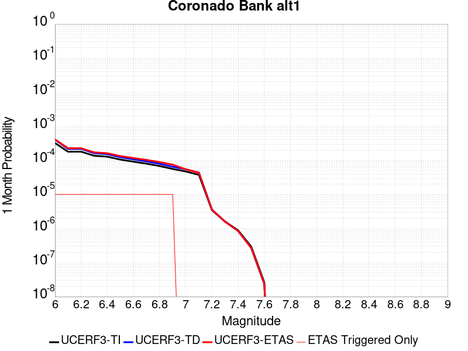 |  |  |

| Magnitude | 1 wk TI Prob | 1 wk TD Prob | 1 wk ETAS Prob | 1 wk ETAS/TD Gain | 1 wk ETAS Triggered Only | 1 mo TI Prob | 1 mo TD Prob | 1 mo ETAS Prob | 1 mo ETAS/TD Gain | 1 mo ETAS Triggered Only | 1 yr TI Prob | 1 yr TD Prob | 1 yr ETAS Prob | 1 yr ETAS/TD Gain | 1 yr ETAS Triggered Only | 10 yr TI Prob | 10 yr TD Prob | 10 yr ETAS Prob | 10 yr ETAS/TD Gain | 10 yr ETAS Triggered Only |
|-----|-----|-----|-----|-----|-----|-----|-----|-----|-----|-----|-----|-----|-----|-----|-----|-----|-----|-----|-----|-----|
| 6.0 | 7.533492E-5 | 9.39618E-5 | 9.39618E-5 | 1.0 | 0.0 | 3.22824E-4 | 4.0263552E-4 | 4.126315E-4 | 1.0248264 | 1.0E-5 | 0.0039233007 | 0.0048915995 | 0.0049015507 | 1.0020343 | 1.0E-5 | 0.03854755 | 0.04790961 | 0.047928654 | 1.0003974 | 2.0E-5 |
| 6.1 | 4.1807285E-5 | 5.049851E-5 | 5.049851E-5 | 1.0 | 0.0 | 1.7916178E-4 | 2.1640482E-4 | 2.2640266E-4 | 1.0461997 | 1.0E-5 | 0.0021791123 | 0.0026316417 | 0.0026416152 | 1.0037899 | 1.0E-5 | 0.021578677 | 0.026013888 | 0.026023628 | 1.0003744 | 1.0E-5 |
| 6.2 | 4.1807285E-5 | 5.049851E-5 | 5.049851E-5 | 1.0 | 0.0 | 1.7916178E-4 | 2.1640482E-4 | 2.2640266E-4 | 1.0461997 | 1.0E-5 | 0.0021791123 | 0.0026316417 | 0.0026416152 | 1.0037899 | 1.0E-5 | 0.021578677 | 0.026013888 | 0.026023628 | 1.0003744 | 1.0E-5 |
| 6.3 | 3.1793104E-5 | 3.7714894E-5 | 3.7714894E-5 | 1.0 | 0.0 | 1.3624904E-4 | 1.6162546E-4 | 1.7162385E-4 | 1.0618614 | 1.0E-5 | 0.0016575698 | 0.0019660434 | 0.0019760237 | 1.0050764 | 1.0E-5 | 0.016452603 | 0.019490387 | 0.019500192 | 1.0005031 | 1.0E-5 |
| 6.4 | 2.9878007E-5 | 3.5339268E-5 | 3.5339268E-5 | 1.0 | 0.0 | 1.2804232E-4 | 1.514454E-4 | 1.614439E-4 | 1.0660204 | 1.0E-5 | 0.0015578003 | 0.0018423185 | 0.0018523 | 1.005418 | 1.0E-5 | 0.015469253 | 0.018274212 | 0.01828403 | 1.0005373 | 1.0E-5 |
| 6.5 | 2.4512565E-5 | 2.8766724E-5 | 2.8766724E-5 | 1.0 | 0.0 | 1.0504962E-4 | 1.2328029E-4 | 1.3327906E-4 | 1.081106 | 1.0E-5 | 0.0012782287 | 0.0014999318 | 0.0015099167 | 1.006657 | 1.0E-5 | 0.012709012 | 0.01490106 | 0.014910911 | 1.0006611 | 1.0E-5 |
| 6.6 | 2.1317413E-5 | 2.4908924E-5 | 2.4908924E-5 | 1.0 | 0.0 | 9.135714E-5 | 1.06748295E-4 | 1.1674722E-4 | 1.0936683 | 1.0E-5 | 0.0011117056 | 0.0012989079 | 0.001308895 | 1.0076888 | 1.0E-5 | 0.011061605 | 0.012915566 | 0.012925437 | 1.0007643 | 1.0E-5 |
| 6.7 | 1.8585655E-5 | 2.163679E-5 | 2.163679E-5 | 1.0 | 0.0 | 7.9650374E-5 | 9.272592E-5 | 1.0272499E-4 | 1.1078347 | 1.0E-5 | 9.6931186E-4 | 0.0011283738 | 0.0011383626 | 1.0088524 | 1.0E-5 | 0.0096509475 | 0.011228608 | 0.011238496 | 1.0008806 | 1.0E-5 |
| 6.8 | 1.5862879E-5 | 1.8421075E-5 | 1.8421075E-5 | 1.0 | 0.0 | 6.798199E-5 | 7.894518E-5 | 8.894439E-5 | 1.1266602 | 1.0E-5 | 8.273665E-4 | 9.60753E-4 | 9.707434E-4 | 1.0103985 | 1.0E-5 | 0.008242928 | 0.009567977 | 0.009577882 | 1.0010351 | 1.0E-5 |
| 6.9 | 1.3021509E-5 | 1.50965625E-5 | 1.50965625E-5 | 1.0 | 0.0 | 5.5805274E-5 | 6.4698055E-5 | 7.4697404E-5 | 1.1545541 | 1.0E-5 | 6.792174E-4 | 7.8743225E-4 | 7.9742435E-4 | 1.0126895 | 1.0E-5 | 0.006771452 | 0.007848245 | 0.0078581665 | 1.0012642 | 1.0E-5 |
| 7.0 | 1.0974371E-5 | 1.27212E-5 | 1.27212E-5 | 1.0 | 0.0 | 4.7032172E-5 | 5.4518387E-5 | 5.4518387E-5 | 1.0 | 0.0 | 5.7246623E-4 | 6.6357676E-4 | 6.6357676E-4 | 1.0 | 0.0 | 0.0057099373 | 0.006617703 | 0.006617703 | 1.0 | 0.0 |
| 7.1 | 8.766221E-6 | 1.0164713E-5 | 1.0164713E-5 | 1.0 | 0.0 | 3.7568978E-5 | 4.3562424E-5 | 4.3562424E-5 | 1.0 | 0.0 | 4.573063E-4 | 5.302607E-4 | 5.302607E-4 | 1.0 | 0.0 | 0.0045636636 | 0.0052916543 | 0.0052916543 | 1.0 | 0.0 |
| 7.2 | 8.026024E-7 | 8.332054E-7 | 8.332054E-7 | 1.0 | 0.0 | 3.43972E-6 | 3.5708754E-6 | 3.5708754E-6 | 1.0 | 0.0 | 4.1877785E-5 | 4.3474553E-5 | 4.3474553E-5 | 1.0 | 0.0 | 4.1869894E-4 | 4.3466155E-4 | 4.3466155E-4 | 1.0 | 0.0 |
| 7.3 | 3.7293114E-7 | 3.7001894E-7 | 3.7001894E-7 | 1.0 | 0.0 | 1.5982754E-6 | 1.5857945E-6 | 1.5857945E-6 | 1.0 | 0.0 | 1.9458828E-5 | 1.9306877E-5 | 1.9306877E-5 | 1.0 | 0.0 | 1.9457124E-4 | 1.9305207E-4 | 1.9305207E-4 | 1.0 | 0.0 |
| 7.4 | 2.0557036E-7 | 1.9674766E-7 | 1.9674766E-7 | 1.0 | 0.0 | 8.810155E-7 | 8.4320396E-7 | 8.4320396E-7 | 1.0 | 0.0 | 1.0726311E-5 | 1.0265961E-5 | 1.0265961E-5 | 1.0 | 0.0 | 1.0725793E-4 | 1.0265489E-4 | 1.0265489E-4 | 1.0 | 0.0 |
| 7.5 | 6.845446E-8 | 6.2794456E-8 | 6.2794456E-8 | 1.0 | 0.0 | 2.9337625E-7 | 2.6911906E-7 | 2.6911906E-7 | 1.0 | 0.0 | 3.5718497E-6 | 3.2765197E-6 | 3.2765197E-6 | 1.0 | 0.0 | 3.5717923E-5 | 3.2764725E-5 | 3.2764725E-5 | 1.0 | 0.0 |
| 7.6 | 6.0975145E-9 | 5.5318936E-9 | 5.5318936E-9 | 1.0 | 0.0 | 2.6132206E-8 | 2.3708115E-8 | 2.3708115E-8 | 1.0 | 0.0 | 3.1815955E-7 | 2.8864628E-7 | 2.8864628E-7 | 1.0 | 0.0 | 3.181591E-6 | 2.88646E-6 | 2.88646E-6 | 1.0 | 0.0 |

## Calaveras (Central) 2011 CFM
*[(top)](#table-of-contents)*

| 1 Week | 1 Month | 1 Year | 10 Year |
|-----|-----|-----|-----|
|  |  |  |  |

| Magnitude | 1 wk TI Prob | 1 wk TD Prob | 1 wk ETAS Prob | 1 wk ETAS/TD Gain | 1 wk ETAS Triggered Only | 1 mo TI Prob | 1 mo TD Prob | 1 mo ETAS Prob | 1 mo ETAS/TD Gain | 1 mo ETAS Triggered Only | 1 yr TI Prob | 1 yr TD Prob | 1 yr ETAS Prob | 1 yr ETAS/TD Gain | 1 yr ETAS Triggered Only | 10 yr TI Prob | 10 yr TD Prob | 10 yr ETAS Prob | 10 yr ETAS/TD Gain | 10 yr ETAS Triggered Only |
|-----|-----|-----|-----|-----|-----|-----|-----|-----|-----|-----|-----|-----|-----|-----|-----|-----|-----|-----|-----|-----|
| 6.0 | 1.5010907E-4 | 2.4802002E-4 | 2.4802002E-4 | 1.0 | 0.0 | 6.4316596E-4 | 0.0010625197 | 0.0010625197 | 1.0 | 0.0 | 0.0078024664 | 0.012858193 | 0.012868064 | 1.0007677 | 1.0E-5 | 0.07534136 | 0.120471895 | 0.120489486 | 1.000146 | 2.0E-5 |
| 6.1 | 1.4521465E-4 | 2.3965587E-4 | 2.3965587E-4 | 1.0 | 0.0 | 6.222001E-4 | 0.0010267016 | 0.0010267016 | 1.0 | 0.0 | 0.0075490056 | 0.012427398 | 0.012437274 | 1.0007946 | 1.0E-5 | 0.07297657 | 0.11674325 | 0.11676092 | 1.0001513 | 2.0E-5 |
| 6.2 | 1.429998E-4 | 2.3896704E-4 | 2.3896704E-4 | 1.0 | 0.0 | 6.127123E-4 | 0.0010237518 | 0.0010237518 | 1.0 | 0.0 | 0.007434286 | 0.01239193 | 0.012401806 | 1.000797 | 1.0E-5 | 0.07190444 | 0.11639657 | 0.11641424 | 1.0001519 | 2.0E-5 |
| 6.3 | 1.3536277E-4 | 2.3227514E-4 | 2.3227514E-4 | 1.0 | 0.0 | 5.799972E-4 | 9.950944E-4 | 9.950944E-4 | 1.0 | 0.0 | 0.0070386264 | 0.012047916 | 0.012057795 | 1.00082 | 1.0E-5 | 0.0681982 | 0.113307424 | 0.113325156 | 1.0001565 | 2.0E-5 |
| 6.4 | 1.2993296E-4 | 2.265069E-4 | 2.265069E-4 | 1.0 | 0.0 | 5.5673666E-4 | 9.7039196E-4 | 9.7039196E-4 | 1.0 | 0.0 | 0.006757223 | 0.011750543 | 0.011760426 | 1.000841 | 1.0E-5 | 0.06555412 | 0.110584 | 0.11060179 | 1.0001608 | 2.0E-5 |
| 6.5 | 1.0498927E-4 | 1.7996327E-4 | 1.7996327E-4 | 1.0 | 0.0 | 4.498764E-4 | 7.710408E-4 | 7.710408E-4 | 1.0 | 0.0 | 0.005463498 | 0.009346773 | 0.009356679 | 1.0010599 | 1.0E-5 | 0.053311124 | 0.08926322 | 0.08928143 | 1.0002041 | 2.0E-5 |
| 6.6 | 1.0157505E-4 | 1.748358E-4 | 1.748358E-4 | 1.0 | 0.0 | 4.35249E-4 | 7.490787E-4 | 7.490787E-4 | 1.0 | 0.0 | 0.0052862884 | 0.0090817055 | 0.009091615 | 1.0010911 | 1.0E-5 | 0.05162293 | 0.086839855 | 0.086858116 | 1.0002103 | 2.0E-5 |
| 6.7 | 9.660386E-5 | 1.6742673E-4 | 1.6742673E-4 | 1.0 | 0.0 | 4.1395082E-4 | 7.173433E-4 | 7.173433E-4 | 1.0 | 0.0 | 0.0050282106 | 0.008698509 | 0.008708422 | 1.0011396 | 1.0E-5 | 0.049159497 | 0.08332852 | 0.08334685 | 1.0002201 | 2.0E-5 |
| 6.8 | 9.089927E-5 | 1.5656375E-4 | 1.5656375E-4 | 1.0 | 0.0 | 3.8951015E-4 | 6.7081227E-4 | 6.7081227E-4 | 1.0 | 0.0 | 0.0047319788 | 0.008136343 | 0.008146262 | 1.001219 | 1.0E-5 | 0.046324775 | 0.07821867 | 0.07823711 | 1.0002357 | 2.0E-5 |
| 6.9 | 7.353187E-5 | 1.230578E-4 | 1.230578E-4 | 1.0 | 0.0 | 3.150985E-4 | 5.272846E-4 | 5.272846E-4 | 1.0 | 0.0 | 0.0038295772 | 0.006400914 | 0.0064108497 | 1.0015522 | 1.0E-5 | 0.037642512 | 0.062235985 | 0.06225474 | 1.0003014 | 2.0E-5 |
| 7.0 | 5.746064E-5 | 9.398498E-5 | 9.398498E-5 | 1.0 | 0.0 | 2.4623662E-4 | 4.0273095E-4 | 4.0273095E-4 | 1.0 | 0.0 | 0.0029938098 | 0.0048922966 | 0.004902248 | 1.0020341 | 1.0E-5 | 0.02953797 | 0.048032705 | 0.048051745 | 1.0003964 | 2.0E-5 |
| 7.1 | 4.9557195E-5 | 8.0598395E-5 | 8.0598395E-5 | 1.0 | 0.0 | 2.123707E-4 | 3.453763E-4 | 3.453763E-4 | 1.0 | 0.0 | 0.0025825473 | 0.0041969116 | 0.0042068698 | 1.0023727 | 1.0E-5 | 0.0255274 | 0.04140843 | 0.0414276 | 1.000463 | 2.0E-5 |
| 7.2 | 3.687595E-5 | 5.9594917E-5 | 5.9594917E-5 | 1.0 | 0.0 | 1.5803022E-4 | 2.5538195E-4 | 2.5538195E-4 | 1.0 | 0.0 | 0.0019223199 | 0.0031048711 | 0.00311484 | 1.0032108 | 1.0E-5 | 0.01905776 | 0.030917842 | 0.030937223 | 1.0006269 | 2.0E-5 |
| 7.3 | 2.5846984E-5 | 4.2533073E-5 | 4.2533073E-5 | 1.0 | 0.0 | 1.1076809E-4 | 1.8227196E-4 | 1.8227196E-4 | 1.0 | 0.0 | 0.0013477671 | 0.00221692 | 0.0022268977 | 1.0045007 | 1.0E-5 | 0.013396223 | 0.022205485 | 0.022225041 | 1.0008807 | 2.0E-5 |
| 7.4 | 1.7747854E-5 | 2.9966892E-5 | 2.9966892E-5 | 1.0 | 0.0 | 7.6060016E-5 | 1.2842323E-4 | 1.2842323E-4 | 1.0 | 0.0 | 9.2563726E-4 | 0.0015624344 | 0.0015624344 | 1.0 | 0.0 | 0.009217911 | 0.01572418 | 0.015734022 | 1.000626 | 1.0E-5 |
| 7.5 | 1.4883479E-5 | 2.6272635E-5 | 2.6272635E-5 | 1.0 | 0.0 | 6.378478E-5 | 1.1259216E-4 | 1.1259216E-4 | 1.0 | 0.0 | 7.76303E-4 | 0.0013699504 | 0.0013699504 | 1.0 | 0.0 | 0.0077359667 | 0.013816696 | 0.013826557 | 1.0007137 | 1.0E-5 |
| 7.6 | 8.166975E-6 | 1.4986957E-5 | 1.4986957E-5 | 1.0 | 0.0 | 3.5000852E-5 | 6.422824E-5 | 6.422824E-5 | 1.0 | 0.0 | 4.2605202E-4 | 7.816996E-4 | 7.816996E-4 | 1.0 | 0.0 | 0.004252361 | 0.007951348 | 0.007961269 | 1.0012476 | 1.0E-5 |
| 7.7 | 3.3858064E-6 | 6.267723E-6 | 6.267723E-6 | 1.0 | 0.0 | 1.4510518E-5 | 2.6861395E-5 | 2.6861395E-5 | 1.0 | 0.0 | 1.7665124E-4 | 3.2698846E-4 | 3.2698846E-4 | 1.0 | 0.0 | 0.0017651088 | 0.0033950333 | 0.0033950333 | 1.0 | 0.0 |
| 7.8 | 2.7721615E-6 | 5.378199E-6 | 5.378199E-6 | 1.0 | 0.0 | 1.1880637E-5 | 2.3049222E-5 | 2.3049222E-5 | 1.0 | 0.0 | 1.4463716E-4 | 2.805882E-4 | 2.805882E-4 | 1.0 | 0.0 | 0.0014454306 | 0.002913262 | 0.002913262 | 1.0 | 0.0 |
| 7.9 | 1.9736292E-6 | 4.137029E-6 | 4.137029E-6 | 1.0 | 0.0 | 8.4583835E-6 | 1.7730004E-5 | 1.7730004E-5 | 1.0 | 0.0 | 1.0297595E-4 | 2.1584146E-4 | 2.1584146E-4 | 1.0 | 0.0 | 0.0010292825 | 0.0022278049 | 0.0022278049 | 1.0 | 0.0 |
| 8.0 | 1.1767289E-6 | 2.5595207E-6 | 2.5595207E-6 | 1.0 | 0.0 | 5.0431145E-6 | 1.0969328E-5 | 1.0969328E-5 | 1.0 | 0.0 | 6.139818E-5 | 1.3354342E-4 | 1.3354342E-4 | 1.0 | 0.0 | 6.1381224E-4 | 0.0013685481 | 0.0013685481 | 1.0 | 0.0 |
| 8.1 | 7.5112825E-7 | 1.5439808E-6 | 1.5439808E-6 | 1.0 | 0.0 | 3.2191172E-6 | 6.617044E-6 | 6.617044E-6 | 1.0 | 0.0 | 3.9192048E-5 | 8.0559555E-5 | 8.0559555E-5 | 1.0 | 0.0 | 3.9185135E-4 | 8.2503865E-4 | 8.2503865E-4 | 1.0 | 0.0 |

## North Frontal  (West)
*[(top)](#table-of-contents)*

| 1 Week | 1 Month | 1 Year | 10 Year |
|-----|-----|-----|-----|
|  |  | 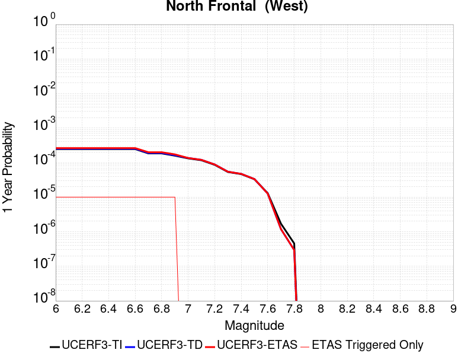 | 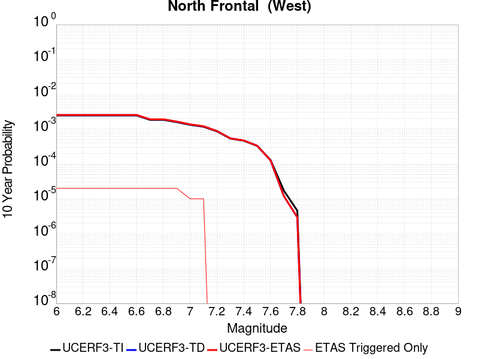 |

| Magnitude | 1 wk TI Prob | 1 wk TD Prob | 1 wk ETAS Prob | 1 wk ETAS/TD Gain | 1 wk ETAS Triggered Only | 1 mo TI Prob | 1 mo TD Prob | 1 mo ETAS Prob | 1 mo ETAS/TD Gain | 1 mo ETAS Triggered Only | 1 yr TI Prob | 1 yr TD Prob | 1 yr ETAS Prob | 1 yr ETAS/TD Gain | 1 yr ETAS Triggered Only | 10 yr TI Prob | 10 yr TD Prob | 10 yr ETAS Prob | 10 yr ETAS/TD Gain | 10 yr ETAS Triggered Only |
|-----|-----|-----|-----|-----|-----|-----|-----|-----|-----|-----|-----|-----|-----|-----|-----|-----|-----|-----|-----|-----|
| 6.0 | 4.7316266E-6 | 4.8527477E-6 | 4.8527477E-6 | 1.0 | 0.0 | 2.0278241E-5 | 2.0797332E-5 | 2.0797332E-5 | 1.0 | 0.0 | 2.4685962E-4 | 2.5317958E-4 | 2.6317703E-4 | 1.0394876 | 1.0E-5 | 0.0024658558 | 0.0025290574 | 0.0025490068 | 1.0078881 | 2.0E-5 |
| 6.1 | 4.7316266E-6 | 4.8527477E-6 | 4.8527477E-6 | 1.0 | 0.0 | 2.0278241E-5 | 2.0797332E-5 | 2.0797332E-5 | 1.0 | 0.0 | 2.4685962E-4 | 2.5317958E-4 | 2.6317703E-4 | 1.0394876 | 1.0E-5 | 0.0024658558 | 0.0025290574 | 0.0025490068 | 1.0078881 | 2.0E-5 |
| 6.2 | 4.7316266E-6 | 4.8527477E-6 | 4.8527477E-6 | 1.0 | 0.0 | 2.0278241E-5 | 2.0797332E-5 | 2.0797332E-5 | 1.0 | 0.0 | 2.4685962E-4 | 2.5317958E-4 | 2.6317703E-4 | 1.0394876 | 1.0E-5 | 0.0024658558 | 0.0025290574 | 0.0025490068 | 1.0078881 | 2.0E-5 |
| 6.3 | 4.7316266E-6 | 4.8527477E-6 | 4.8527477E-6 | 1.0 | 0.0 | 2.0278241E-5 | 2.0797332E-5 | 2.0797332E-5 | 1.0 | 0.0 | 2.4685962E-4 | 2.5317958E-4 | 2.6317703E-4 | 1.0394876 | 1.0E-5 | 0.0024658558 | 0.0025290574 | 0.0025490068 | 1.0078881 | 2.0E-5 |
| 6.4 | 4.7316266E-6 | 4.8527477E-6 | 4.8527477E-6 | 1.0 | 0.0 | 2.0278241E-5 | 2.0797332E-5 | 2.0797332E-5 | 1.0 | 0.0 | 2.4685962E-4 | 2.5317958E-4 | 2.6317703E-4 | 1.0394876 | 1.0E-5 | 0.0024658558 | 0.0025290574 | 0.0025490068 | 1.0078881 | 2.0E-5 |
| 6.5 | 4.7316266E-6 | 4.8527477E-6 | 4.8527477E-6 | 1.0 | 0.0 | 2.0278241E-5 | 2.0797332E-5 | 2.0797332E-5 | 1.0 | 0.0 | 2.4685962E-4 | 2.5317958E-4 | 2.6317703E-4 | 1.0394876 | 1.0E-5 | 0.0024658558 | 0.0025290574 | 0.0025490068 | 1.0078881 | 2.0E-5 |
| 6.6 | 4.7316266E-6 | 4.8527477E-6 | 4.8527477E-6 | 1.0 | 0.0 | 2.0278241E-5 | 2.0797332E-5 | 2.0797332E-5 | 1.0 | 0.0 | 2.4685962E-4 | 2.5317958E-4 | 2.6317703E-4 | 1.0394876 | 1.0E-5 | 0.0024658558 | 0.0025290574 | 0.0025490068 | 1.0078881 | 2.0E-5 |
| 6.7 | 3.5382777E-6 | 3.6309455E-6 | 3.6309455E-6 | 1.0 | 0.0 | 1.516396E-5 | 1.5561107E-5 | 1.5561107E-5 | 1.0 | 0.0 | 1.8460557E-4 | 1.8944078E-4 | 1.9943889E-4 | 1.0527769 | 1.0E-5 | 0.0018445229 | 0.00189287 | 0.001912832 | 1.010546 | 2.0E-5 |
| 6.8 | 3.5382777E-6 | 3.6309455E-6 | 3.6309455E-6 | 1.0 | 0.0 | 1.516396E-5 | 1.5561107E-5 | 1.5561107E-5 | 1.0 | 0.0 | 1.8460557E-4 | 1.8944078E-4 | 1.9943889E-4 | 1.0527769 | 1.0E-5 | 0.0018445229 | 0.00189287 | 0.001912832 | 1.010546 | 2.0E-5 |
| 6.9 | 3.0428037E-6 | 3.1228133E-6 | 3.1228133E-6 | 1.0 | 0.0 | 1.30405215E-5 | 1.3383421E-5 | 1.3383421E-5 | 1.0 | 0.0 | 1.5875678E-4 | 1.6293164E-4 | 1.7293001E-4 | 1.0613655 | 1.0E-5 | 0.0015864341 | 0.001628189 | 0.0016481564 | 1.0122635 | 2.0E-5 |
| 7.0 | 2.538778E-6 | 2.6061361E-6 | 2.6061361E-6 | 1.0 | 0.0 | 1.0880432E-5 | 1.116911E-5 | 1.116911E-5 | 1.0 | 0.0 | 1.324612E-4 | 1.359759E-4 | 1.359759E-4 | 1.0 | 0.0 | 0.0013238228 | 0.0013589738 | 0.0013689601 | 1.0073485 | 1.0E-5 |
| 7.1 | 2.2418935E-6 | 2.3012487E-6 | 2.3012487E-6 | 1.0 | 0.0 | 9.60808E-6 | 9.86246E-6 | 9.86246E-6 | 1.0 | 0.0 | 1.1697209E-4 | 1.2006928E-4 | 1.2006928E-4 | 1.0 | 0.0 | 0.0011691054 | 0.001200088 | 0.001210076 | 1.0083227 | 1.0E-5 |
| 7.2 | 1.6526745E-6 | 1.6925159E-6 | 1.6925159E-6 | 1.0 | 0.0 | 7.082872E-6 | 7.253621E-6 | 7.253621E-6 | 1.0 | 0.0 | 8.623055E-5 | 8.8309505E-5 | 8.8309505E-5 | 1.0 | 0.0 | 8.61971E-4 | 8.827692E-4 | 8.827692E-4 | 1.0 | 0.0 |
| 7.3 | 1.0246019E-6 | 1.0442458E-6 | 1.0442458E-6 | 1.0 | 0.0 | 4.391144E-6 | 4.475332E-6 | 4.475332E-6 | 1.0 | 0.0 | 5.3460866E-5 | 5.448592E-5 | 5.448592E-5 | 1.0 | 0.0 | 5.344801E-4 | 5.447371E-4 | 5.447371E-4 | 1.0 | 0.0 |
| 7.4 | 8.9045164E-7 | 9.056731E-7 | 9.056731E-7 | 1.0 | 0.0 | 3.8162157E-6 | 3.881451E-6 | 3.881451E-6 | 1.0 | 0.0 | 4.646144E-5 | 4.7255755E-5 | 4.7255755E-5 | 1.0 | 0.0 | 4.6451724E-4 | 4.7246792E-4 | 4.7246792E-4 | 1.0 | 0.0 |
| 7.5 | 6.3357E-7 | 6.402826E-7 | 6.402826E-7 | 1.0 | 0.0 | 2.7152971E-6 | 2.744066E-6 | 2.744066E-6 | 1.0 | 0.0 | 3.305824E-5 | 3.3408556E-5 | 3.3408556E-5 | 1.0 | 0.0 | 3.3053322E-4 | 3.3404192E-4 | 3.3404192E-4 | 1.0 | 0.0 |
| 7.6 | 2.5087024E-7 | 2.4361591E-7 | 2.4361591E-7 | 1.0 | 0.0 | 1.0751578E-6 | 1.0440679E-6 | 1.0440679E-6 | 1.0 | 0.0 | 1.3089967E-5 | 1.2711474E-5 | 1.2711474E-5 | 1.0 | 0.0 | 1.3089196E-4 | 1.2710952E-4 | 1.2710952E-4 | 1.0 | 0.0 |
| 7.7 | 3.282987E-8 | 2.2874781E-8 | 2.2874781E-8 | 1.0 | 0.0 | 1.4069944E-7 | 9.8034775E-8 | 9.8034775E-8 | 1.0 | 0.0 | 1.7130144E-6 | 1.1935729E-6 | 1.1935729E-6 | 1.0 | 0.0 | 1.7130013E-5 | 1.1935673E-5 | 1.1935673E-5 | 1.0 | 0.0 |
| 7.8 | 8.77499E-9 | 5.6818488E-9 | 5.6818488E-9 | 1.0 | 0.0 | 3.7607098E-8 | 2.4350781E-8 | 2.4350781E-8 | 1.0 | 0.0 | 4.578663E-7 | 2.9647074E-7 | 2.9647074E-7 | 1.0 | 0.0 | 4.5786537E-6 | 2.9647047E-6 | 2.9647047E-6 | 1.0 | 0.0 |

## Rose Canyon
*[(top)](#table-of-contents)*

| 1 Week | 1 Month | 1 Year | 10 Year |
|-----|-----|-----|-----|
|  |  |  | 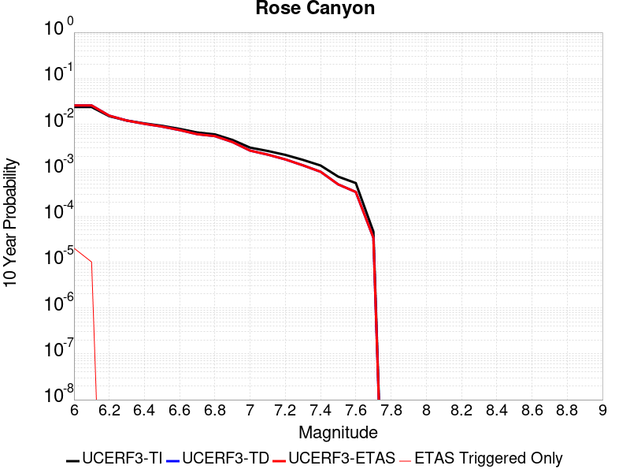 |

| Magnitude | 1 wk TI Prob | 1 wk TD Prob | 1 wk ETAS Prob | 1 wk ETAS/TD Gain | 1 wk ETAS Triggered Only | 1 mo TI Prob | 1 mo TD Prob | 1 mo ETAS Prob | 1 mo ETAS/TD Gain | 1 mo ETAS Triggered Only | 1 yr TI Prob | 1 yr TD Prob | 1 yr ETAS Prob | 1 yr ETAS/TD Gain | 1 yr ETAS Triggered Only | 10 yr TI Prob | 10 yr TD Prob | 10 yr ETAS Prob | 10 yr ETAS/TD Gain | 10 yr ETAS Triggered Only |
|-----|-----|-----|-----|-----|-----|-----|-----|-----|-----|-----|-----|-----|-----|-----|-----|-----|-----|-----|-----|-----|
| 6.0 | 4.5923203E-5 | 4.9720562E-5 | 4.9720562E-5 | 1.0 | 0.0 | 1.9679888E-4 | 2.1307007E-4 | 2.2306794E-4 | 1.0469229 | 1.0E-5 | 0.0023933933 | 0.0025912558 | 0.0026012298 | 1.0038491 | 1.0E-5 | 0.023677798 | 0.025643215 | 0.025662702 | 1.00076 | 2.0E-5 |
| 6.1 | 4.5923203E-5 | 4.9720562E-5 | 4.9720562E-5 | 1.0 | 0.0 | 1.9679888E-4 | 2.1307007E-4 | 2.1307007E-4 | 1.0 | 0.0 | 0.0023933933 | 0.0025912558 | 0.0025912558 | 1.0 | 0.0 | 0.023677798 | 0.025643215 | 0.025652958 | 1.0003799 | 1.0E-5 |
| 6.2 | 2.8844734E-5 | 2.9671555E-5 | 2.9671555E-5 | 1.0 | 0.0 | 1.2361443E-4 | 1.2715581E-4 | 1.2715581E-4 | 1.0 | 0.0 | 0.0015039665 | 0.0015470508 | 0.0015470508 | 1.0 | 0.0 | 0.0149382865 | 0.015375828 | 0.015375828 | 1.0 | 0.0 |
| 6.3 | 2.3171577E-5 | 2.3163228E-5 | 2.3163228E-5 | 1.0 | 0.0 | 9.9302975E-5 | 9.926727E-5 | 9.926727E-5 | 1.0 | 0.0 | 0.0012083431 | 0.0012079224 | 0.0012079224 | 1.0 | 0.0 | 0.012017938 | 0.012023459 | 0.012023459 | 1.0 | 0.0 |
| 6.4 | 2.0066604E-5 | 1.9668718E-5 | 1.9668718E-5 | 1.0 | 0.0 | 8.599689E-5 | 8.429184E-5 | 8.429184E-5 | 1.0 | 0.0 | 0.0010465092 | 0.00102578 | 0.00102578 | 1.0 | 0.0 | 0.010415946 | 0.010218433 | 0.010218433 | 1.0 | 0.0 |
| 6.5 | 1.776989E-5 | 1.7115255E-5 | 1.7115255E-5 | 1.0 | 0.0 | 7.615444E-5 | 7.3349074E-5 | 7.3349074E-5 | 1.0 | 0.0 | 9.267859E-4 | 8.9266605E-4 | 8.9266605E-4 | 1.0 | 0.0 | 0.009229303 | 0.008896962 | 0.008896962 | 1.0 | 0.0 |
| 6.6 | 1.5227364E-5 | 1.4340241E-5 | 1.4340241E-5 | 1.0 | 0.0 | 6.52585E-5 | 6.1456754E-5 | 6.1456754E-5 | 1.0 | 0.0 | 7.942326E-4 | 7.4798433E-4 | 7.4798433E-4 | 1.0 | 0.0 | 0.007914 | 0.007458868 | 0.007458868 | 1.0 | 0.0 |
| 6.7 | 1.2703898E-5 | 1.167398E-5 | 1.167398E-5 | 1.0 | 0.0 | 5.4444143E-5 | 5.003041E-5 | 5.003041E-5 | 1.0 | 0.0 | 6.626558E-4 | 6.0895423E-4 | 6.0895423E-4 | 1.0 | 0.0 | 0.006606833 | 0.0060754507 | 0.0060754507 | 1.0 | 0.0 |
| 6.8 | 1.1554917E-5 | 1.060993E-5 | 1.060993E-5 | 1.0 | 0.0 | 4.9520135E-5 | 4.547036E-5 | 4.547036E-5 | 1.0 | 0.0 | 6.0274085E-4 | 5.5346504E-4 | 5.5346504E-4 | 1.0 | 0.0 | 0.0060110865 | 0.005522874 | 0.005522874 | 1.0 | 0.0 |
| 6.9 | 8.732078E-6 | 7.88172E-6 | 7.88172E-6 | 1.0 | 0.0 | 3.7422655E-5 | 3.377838E-5 | 3.377838E-5 | 1.0 | 0.0 | 4.5552556E-4 | 4.111771E-4 | 4.111771E-4 | 1.0 | 0.0 | 0.0045459294 | 0.0041049966 | 0.0041049966 | 1.0 | 0.0 |
| 7.0 | 5.9337494E-6 | 5.1076677E-6 | 5.1076677E-6 | 1.0 | 0.0 | 2.5430107E-5 | 2.188982E-5 | 2.188982E-5 | 1.0 | 0.0 | 3.0956755E-4 | 2.6647613E-4 | 2.6647613E-4 | 1.0 | 0.0 | 0.0030913667 | 0.0026615816 | 0.0026615816 | 1.0 | 0.0 |
| 7.1 | 5.013409E-6 | 4.177528E-6 | 4.177528E-6 | 1.0 | 0.0 | 2.1485863E-5 | 1.7903569E-5 | 1.7903569E-5 | 1.0 | 0.0 | 2.6155898E-4 | 2.1795425E-4 | 2.1795425E-4 | 1.0 | 0.0 | 0.0026125133 | 0.0021774166 | 0.0021774166 | 1.0 | 0.0 |
| 7.2 | 4.120763E-6 | 3.2822556E-6 | 3.2822556E-6 | 1.0 | 0.0 | 1.7660293E-5 | 1.4066734E-5 | 1.4066734E-5 | 1.0 | 0.0 | 2.1499286E-4 | 1.7124912E-4 | 1.7124912E-4 | 1.0 | 0.0 | 0.0021478499 | 0.0017111811 | 0.0017111811 | 1.0 | 0.0 |
| 7.3 | 3.2081239E-6 | 2.4406268E-6 | 2.4406268E-6 | 1.0 | 0.0 | 1.374903E-5 | 1.0459787E-5 | 1.0459787E-5 | 1.0 | 0.0 | 1.6738157E-4 | 1.2734054E-4 | 1.2734054E-4 | 1.0 | 0.0 | 0.0016725556 | 0.0012726827 | 0.0012726827 | 1.0 | 0.0 |
| 7.4 | 2.4194755E-6 | 1.7681314E-6 | 1.7681314E-6 | 1.0 | 0.0 | 1.0369139E-5 | 7.577684E-6 | 7.577684E-6 | 1.0 | 0.0 | 1.2623696E-4 | 9.225445E-5 | 9.225445E-5 | 1.0 | 0.0 | 0.0012616527 | 9.2216686E-4 | 9.2216686E-4 | 1.0 | 0.0 |
| 7.5 | 1.3842889E-6 | 9.3790675E-7 | 9.3790675E-7 | 1.0 | 0.0 | 5.9326535E-6 | 4.019594E-6 | 4.019594E-6 | 1.0 | 0.0 | 7.222766E-5 | 4.8937498E-5 | 4.8937498E-5 | 1.0 | 0.0 | 7.220419E-4 | 4.892707E-4 | 4.892707E-4 | 1.0 | 0.0 |
| 7.6 | 1.0021575E-6 | 6.4118046E-7 | 6.4118046E-7 | 1.0 | 0.0 | 4.2949537E-6 | 2.7479136E-6 | 2.7479136E-6 | 1.0 | 0.0 | 5.2289808E-5 | 3.3455355E-5 | 3.3455355E-5 | 1.0 | 0.0 | 5.2277505E-4 | 3.3450534E-4 | 3.3450534E-4 | 1.0 | 0.0 |
| 7.7 | 8.7620116E-8 | 6.4494145E-8 | 6.4494145E-8 | 1.0 | 0.0 | 3.7551473E-7 | 2.7640345E-7 | 2.7640345E-7 | 1.0 | 0.0 | 4.5718825E-6 | 3.365207E-6 | 3.365207E-6 | 1.0 | 0.0 | 4.5717883E-5 | 3.365159E-5 | 3.365159E-5 | 1.0 | 0.0 |

## Verdugo
*[(top)](#table-of-contents)*

| 1 Week | 1 Month | 1 Year | 10 Year |
|-----|-----|-----|-----|
|  |  |  |  |

| Magnitude | 1 wk TI Prob | 1 wk TD Prob | 1 wk ETAS Prob | 1 wk ETAS/TD Gain | 1 wk ETAS Triggered Only | 1 mo TI Prob | 1 mo TD Prob | 1 mo ETAS Prob | 1 mo ETAS/TD Gain | 1 mo ETAS Triggered Only | 1 yr TI Prob | 1 yr TD Prob | 1 yr ETAS Prob | 1 yr ETAS/TD Gain | 1 yr ETAS Triggered Only | 10 yr TI Prob | 10 yr TD Prob | 10 yr ETAS Prob | 10 yr ETAS/TD Gain | 10 yr ETAS Triggered Only |
|-----|-----|-----|-----|-----|-----|-----|-----|-----|-----|-----|-----|-----|-----|-----|-----|-----|-----|-----|-----|-----|
| 6.0 | 5.392987E-6 | 4.2168244E-6 | 4.2168244E-6 | 1.0 | 0.0 | 2.3112598E-5 | 1.8071984E-5 | 1.8071984E-5 | 1.0 | 0.0 | 2.8135953E-4 | 2.2000464E-4 | 2.3000245E-4 | 1.0454435 | 1.0E-5 | 0.0028100356 | 0.0021979162 | 0.0022178723 | 1.0090796 | 2.0E-5 |
| 6.1 | 5.392987E-6 | 4.2168244E-6 | 4.2168244E-6 | 1.0 | 0.0 | 2.3112598E-5 | 1.8071984E-5 | 1.8071984E-5 | 1.0 | 0.0 | 2.8135953E-4 | 2.2000464E-4 | 2.3000245E-4 | 1.0454435 | 1.0E-5 | 0.0028100356 | 0.0021979162 | 0.0022178723 | 1.0090796 | 2.0E-5 |
| 6.2 | 5.392987E-6 | 4.2168244E-6 | 4.2168244E-6 | 1.0 | 0.0 | 2.3112598E-5 | 1.8071984E-5 | 1.8071984E-5 | 1.0 | 0.0 | 2.8135953E-4 | 2.2000464E-4 | 2.3000245E-4 | 1.0454435 | 1.0E-5 | 0.0028100356 | 0.0021979162 | 0.0022178723 | 1.0090796 | 2.0E-5 |
| 6.3 | 5.392987E-6 | 4.2168244E-6 | 4.2168244E-6 | 1.0 | 0.0 | 2.3112598E-5 | 1.8071984E-5 | 1.8071984E-5 | 1.0 | 0.0 | 2.8135953E-4 | 2.2000464E-4 | 2.3000245E-4 | 1.0454435 | 1.0E-5 | 0.0028100356 | 0.0021979162 | 0.0022178723 | 1.0090796 | 2.0E-5 |
| 6.4 | 5.392987E-6 | 4.2168244E-6 | 4.2168244E-6 | 1.0 | 0.0 | 2.3112598E-5 | 1.8071984E-5 | 1.8071984E-5 | 1.0 | 0.0 | 2.8135953E-4 | 2.2000464E-4 | 2.3000245E-4 | 1.0454435 | 1.0E-5 | 0.0028100356 | 0.0021979162 | 0.0022178723 | 1.0090796 | 2.0E-5 |
| 6.5 | 4.9154837E-6 | 3.7227633E-6 | 3.7227633E-6 | 1.0 | 0.0 | 2.1066187E-5 | 1.5954603E-5 | 1.5954603E-5 | 1.0 | 0.0 | 2.5645064E-4 | 1.9423019E-4 | 2.0422824E-4 | 1.0514753 | 1.0E-5 | 0.002561549 | 0.0019406251 | 0.0019506058 | 1.0051429 | 1.0E-5 |
| 6.6 | 4.9154837E-6 | 3.7227633E-6 | 3.7227633E-6 | 1.0 | 0.0 | 2.1066187E-5 | 1.5954603E-5 | 1.5954603E-5 | 1.0 | 0.0 | 2.5645064E-4 | 1.9423019E-4 | 2.0422824E-4 | 1.0514753 | 1.0E-5 | 0.002561549 | 0.0019406251 | 0.0019506058 | 1.0051429 | 1.0E-5 |
| 6.7 | 4.817006E-6 | 3.6209483E-6 | 3.6209483E-6 | 1.0 | 0.0 | 2.0644147E-5 | 1.5518259E-5 | 1.5518259E-5 | 1.0 | 0.0 | 2.513135E-4 | 1.8891861E-4 | 1.9891672E-4 | 1.0529228 | 1.0E-5 | 0.0025102948 | 0.0018875997 | 0.0018975808 | 1.0052878 | 1.0E-5 |
| 6.8 | 4.507407E-6 | 3.3073918E-6 | 3.3073918E-6 | 1.0 | 0.0 | 1.9317316E-5 | 1.417446E-5 | 1.417446E-5 | 1.0 | 0.0 | 2.3516294E-4 | 1.7256053E-4 | 1.825588E-4 | 1.0579407 | 1.0E-5 | 0.0023491425 | 0.0017242797 | 0.0017342624 | 1.0057895 | 1.0E-5 |
| 6.9 | 4.3573054E-6 | 3.1612947E-6 | 3.1612947E-6 | 1.0 | 0.0 | 1.8674033E-5 | 1.3548336E-5 | 1.3548336E-5 | 1.0 | 0.0 | 2.2733262E-4 | 1.6493862E-4 | 1.6493862E-4 | 1.0 | 0.0 | 0.0022710022 | 0.0016481745 | 0.0016481745 | 1.0 | 0.0 |
| 7.0 | 4.171527E-6 | 2.9839493E-6 | 2.9839493E-6 | 1.0 | 0.0 | 1.787785E-5 | 1.2788292E-5 | 1.2788292E-5 | 1.0 | 0.0 | 2.1764109E-4 | 1.5568644E-4 | 1.5568644E-4 | 1.0 | 0.0 | 0.0021742806 | 0.0015557851 | 0.0015557851 | 1.0 | 0.0 |
| 7.1 | 4.0405484E-6 | 2.8825361E-6 | 2.8825361E-6 | 1.0 | 0.0 | 1.731652E-5 | 1.2353669E-5 | 1.2353669E-5 | 1.0 | 0.0 | 2.1080824E-4 | 1.5039564E-4 | 1.5039564E-4 | 1.0 | 0.0 | 0.0021060838 | 0.0015029497 | 0.0015029497 | 1.0 | 0.0 |
| 7.2 | 3.8306007E-6 | 2.7021142E-6 | 2.7021142E-6 | 1.0 | 0.0 | 1.6416758E-5 | 1.1580439E-5 | 1.1580439E-5 | 1.0 | 0.0 | 1.9985568E-4 | 1.4098283E-4 | 1.4098283E-4 | 1.0 | 0.0 | 0.0019967605 | 0.0014089446 | 0.0014089446 | 1.0 | 0.0 |
| 7.3 | 3.5750938E-6 | 2.5124377E-6 | 2.5124377E-6 | 1.0 | 0.0 | 1.532174E-5 | 1.0767546E-5 | 1.0767546E-5 | 1.0 | 0.0 | 1.8652623E-4 | 1.310871E-4 | 1.310871E-4 | 1.0 | 0.0 | 0.0018636974 | 0.0013101082 | 0.0013101082 | 1.0 | 0.0 |
| 7.4 | 3.3510041E-6 | 2.341114E-6 | 2.341114E-6 | 1.0 | 0.0 | 1.4361368E-5 | 1.0033307E-5 | 1.0033307E-5 | 1.0 | 0.0 | 1.7483562E-4 | 1.2214878E-4 | 1.2214878E-4 | 1.0 | 0.0 | 0.0017469813 | 0.0012208268 | 0.0012208268 | 1.0 | 0.0 |
| 7.5 | 2.948287E-6 | 2.0392326E-6 | 2.0392326E-6 | 1.0 | 0.0 | 1.2635454E-5 | 8.73954E-6 | 8.73954E-6 | 1.0 | 0.0 | 1.538258E-4 | 1.0639881E-4 | 1.0639881E-4 | 1.0 | 0.0 | 0.0015371935 | 0.0010634889 | 0.0010634889 | 1.0 | 0.0 |
| 7.6 | 2.0134323E-6 | 1.4472091E-6 | 1.4472091E-6 | 1.0 | 0.0 | 8.628967E-6 | 6.2023105E-6 | 6.2023105E-6 | 1.0 | 0.0 | 1.05052604E-4 | 7.551061E-5 | 7.551061E-5 | 1.0 | 0.0 | 0.0010500296 | 7.548583E-4 | 7.548583E-4 | 1.0 | 0.0 |
| 7.7 | 5.726436E-7 | 4.0454935E-7 | 4.0454935E-7 | 1.0 | 0.0 | 2.4541846E-6 | 1.733782E-6 | 1.733782E-6 | 1.0 | 0.0 | 2.9879287E-5 | 2.1108617E-5 | 2.1108617E-5 | 1.0 | 0.0 | 2.987527E-4 | 2.1106866E-4 | 2.1106866E-4 | 1.0 | 0.0 |
| 7.8 | 1.6248204E-7 | 1.0689272E-7 | 1.0689272E-7 | 1.0 | 0.0 | 6.963514E-7 | 4.581116E-7 | 4.581116E-7 | 1.0 | 0.0 | 8.478045E-6 | 5.5774944E-6 | 5.5774944E-6 | 1.0 | 0.0 | 8.477722E-5 | 5.577358E-5 | 5.577358E-5 | 1.0 | 0.0 |
| 7.9 | 4.4475744E-8 | 3.037644E-8 | 3.037644E-8 | 1.0 | 0.0 | 1.9061031E-7 | 1.3018474E-7 | 1.3018474E-7 | 1.0 | 0.0 | 2.320678E-6 | 1.5849984E-6 | 1.5849984E-6 | 1.0 | 0.0 | 2.3206538E-5 | 1.5849884E-5 | 1.5849884E-5 | 1.0 | 0.0 |

## Sierra Madre
*[(top)](#table-of-contents)*

| 1 Week | 1 Month | 1 Year | 10 Year |
|-----|-----|-----|-----|
|  |  |  |  |

| Magnitude | 1 wk TI Prob | 1 wk TD Prob | 1 wk ETAS Prob | 1 wk ETAS/TD Gain | 1 wk ETAS Triggered Only | 1 mo TI Prob | 1 mo TD Prob | 1 mo ETAS Prob | 1 mo ETAS/TD Gain | 1 mo ETAS Triggered Only | 1 yr TI Prob | 1 yr TD Prob | 1 yr ETAS Prob | 1 yr ETAS/TD Gain | 1 yr ETAS Triggered Only | 10 yr TI Prob | 10 yr TD Prob | 10 yr ETAS Prob | 10 yr ETAS/TD Gain | 10 yr ETAS Triggered Only |
|-----|-----|-----|-----|-----|-----|-----|-----|-----|-----|-----|-----|-----|-----|-----|-----|-----|-----|-----|-----|-----|
| 6.0 | 1.3379373E-5 | 1.1002111E-5 | 1.1002111E-5 | 1.0 | 0.0 | 5.7338908E-5 | 4.715106E-5 | 4.715106E-5 | 1.0 | 0.0 | 6.978776E-4 | 5.7391444E-4 | 5.9390295E-4 | 1.0348284 | 2.0E-5 | 0.0069569005 | 0.005724687 | 0.0057445727 | 1.0034736 | 2.0E-5 |
| 6.1 | 1.3379373E-5 | 1.1002111E-5 | 1.1002111E-5 | 1.0 | 0.0 | 5.7338908E-5 | 4.715106E-5 | 4.715106E-5 | 1.0 | 0.0 | 6.978776E-4 | 5.7391444E-4 | 5.9390295E-4 | 1.0348284 | 2.0E-5 | 0.0069569005 | 0.005724687 | 0.0057445727 | 1.0034736 | 2.0E-5 |
| 6.2 | 1.3379373E-5 | 1.1002111E-5 | 1.1002111E-5 | 1.0 | 0.0 | 5.7338908E-5 | 4.715106E-5 | 4.715106E-5 | 1.0 | 0.0 | 6.978776E-4 | 5.7391444E-4 | 5.9390295E-4 | 1.0348284 | 2.0E-5 | 0.0069569005 | 0.005724687 | 0.0057445727 | 1.0034736 | 2.0E-5 |
| 6.3 | 1.3379373E-5 | 1.1002111E-5 | 1.1002111E-5 | 1.0 | 0.0 | 5.7338908E-5 | 4.715106E-5 | 4.715106E-5 | 1.0 | 0.0 | 6.978776E-4 | 5.7391444E-4 | 5.9390295E-4 | 1.0348284 | 2.0E-5 | 0.0069569005 | 0.005724687 | 0.0057445727 | 1.0034736 | 2.0E-5 |
| 6.4 | 1.3379373E-5 | 1.1002111E-5 | 1.1002111E-5 | 1.0 | 0.0 | 5.7338908E-5 | 4.715106E-5 | 4.715106E-5 | 1.0 | 0.0 | 6.978776E-4 | 5.7391444E-4 | 5.9390295E-4 | 1.0348284 | 2.0E-5 | 0.0069569005 | 0.005724687 | 0.0057445727 | 1.0034736 | 2.0E-5 |
| 6.5 | 1.26563245E-5 | 1.023154E-5 | 1.023154E-5 | 1.0 | 0.0 | 5.4240263E-5 | 4.3848726E-5 | 4.3848726E-5 | 1.0 | 0.0 | 6.601751E-4 | 5.3372857E-4 | 5.537179E-4 | 1.0374522 | 2.0E-5 | 0.006582173 | 0.005324789 | 0.0053446824 | 1.003736 | 2.0E-5 |
| 6.6 | 1.26563245E-5 | 1.023154E-5 | 1.023154E-5 | 1.0 | 0.0 | 5.4240263E-5 | 4.3848726E-5 | 4.3848726E-5 | 1.0 | 0.0 | 6.601751E-4 | 5.3372857E-4 | 5.537179E-4 | 1.0374522 | 2.0E-5 | 0.006582173 | 0.005324789 | 0.0053446824 | 1.003736 | 2.0E-5 |
| 6.7 | 1.2502474E-5 | 1.0067679E-5 | 1.0067679E-5 | 1.0 | 0.0 | 5.3580934E-5 | 4.3146487E-5 | 4.3146487E-5 | 1.0 | 0.0 | 6.521526E-4 | 5.251829E-4 | 5.451724E-4 | 1.038062 | 2.0E-5 | 0.0065024206 | 0.005239737 | 0.005259632 | 1.0037969 | 2.0E-5 |
| 6.8 | 1.2454966E-5 | 1.0019962E-5 | 1.0019962E-5 | 1.0 | 0.0 | 5.3377335E-5 | 4.2941996E-5 | 4.2941996E-5 | 1.0 | 0.0 | 6.4967526E-4 | 5.2269443E-4 | 5.42684E-4 | 1.0382433 | 2.0E-5 | 0.006477792 | 0.005214969 | 0.005234865 | 1.003815 | 2.0E-5 |
| 6.9 | 1.2225574E-5 | 9.793931E-6 | 9.793931E-6 | 1.0 | 0.0 | 5.2394265E-5 | 4.1973322E-5 | 4.1973322E-5 | 1.0 | 0.0 | 6.3771347E-4 | 5.109064E-4 | 5.209013E-4 | 1.0195631 | 1.0E-5 | 0.006358865 | 0.0050976346 | 0.0051075835 | 1.0019517 | 1.0E-5 |
| 7.0 | 1.182946E-5 | 9.400459E-6 | 9.400459E-6 | 1.0 | 0.0 | 5.06967E-5 | 4.0287065E-5 | 4.0287065E-5 | 1.0 | 0.0 | 6.1705755E-4 | 4.9038563E-4 | 5.0038076E-4 | 1.0203822 | 1.0E-5 | 0.006153469 | 0.004893347 | 0.0049032983 | 1.0020336 | 1.0E-5 |
| 7.1 | 1.14369095E-5 | 8.987441E-6 | 8.987441E-6 | 1.0 | 0.0 | 4.9014405E-5 | 3.8517042E-5 | 3.8517042E-5 | 1.0 | 0.0 | 5.9658696E-4 | 4.6884507E-4 | 4.7884037E-4 | 1.021319 | 1.0E-5 | 0.005949879 | 0.004678865 | 0.0046888185 | 1.0021273 | 1.0E-5 |
| 7.2 | 1.0836419E-5 | 8.400803E-6 | 8.400803E-6 | 1.0 | 0.0 | 4.644097E-5 | 3.6002948E-5 | 3.6002948E-5 | 1.0 | 0.0 | 5.652721E-4 | 4.3824865E-4 | 4.4824427E-4 | 1.0228081 | 1.0E-5 | 0.0056383642 | 0.0043741413 | 0.0043840976 | 1.0022762 | 1.0E-5 |
| 7.3 | 1.0403439E-5 | 8.022045E-6 | 8.022045E-6 | 1.0 | 0.0 | 4.4585406E-5 | 3.4379744E-5 | 3.4379744E-5 | 1.0 | 0.0 | 5.426921E-4 | 4.184939E-4 | 4.184939E-4 | 1.0 | 0.0 | 0.005413687 | 0.0041773533 | 0.0041773533 | 1.0 | 0.0 |
| 7.4 | 9.768864E-6 | 7.415638E-6 | 7.415638E-6 | 1.0 | 0.0 | 4.186589E-5 | 3.178092E-5 | 3.178092E-5 | 1.0 | 0.0 | 5.09598E-4 | 3.868649E-4 | 3.868649E-4 | 1.0 | 0.0 | 0.0050843097 | 0.0038622064 | 0.0038622064 | 1.0 | 0.0 |
| 7.5 | 8.687089E-6 | 6.4511987E-6 | 6.4511987E-6 | 1.0 | 0.0 | 3.722985E-5 | 2.7647708E-5 | 2.7647708E-5 | 1.0 | 0.0 | 4.5317915E-4 | 3.365597E-4 | 3.365597E-4 | 1.0 | 0.0 | 0.004522561 | 0.0033607872 | 0.0033607872 | 1.0 | 0.0 |
| 7.6 | 6.3506063E-6 | 4.431258E-6 | 4.431258E-6 | 1.0 | 0.0 | 2.72166E-5 | 1.8990968E-5 | 1.8990968E-5 | 1.0 | 0.0 | 3.3131172E-4 | 2.3119076E-4 | 2.3119076E-4 | 1.0 | 0.0 | 0.003308182 | 0.0023097275 | 0.0023097275 | 1.0 | 0.0 |
| 7.7 | 4.62223E-6 | 2.9338423E-6 | 2.9338423E-6 | 1.0 | 0.0 | 1.9809406E-5 | 1.257355E-5 | 1.257355E-5 | 1.0 | 0.0 | 2.4115283E-4 | 1.5307224E-4 | 1.5307224E-4 | 1.0 | 0.0 | 0.0024089129 | 0.001529869 | 0.001529869 | 1.0 | 0.0 |
| 7.8 | 3.2145008E-6 | 1.950051E-6 | 1.950051E-6 | 1.0 | 0.0 | 1.3776359E-5 | 8.357335E-6 | 8.357335E-6 | 1.0 | 0.0 | 1.6771426E-4 | 1.0174581E-4 | 1.0174581E-4 | 1.0 | 0.0 | 0.0016758774 | 0.0010171367 | 0.0010171367 | 1.0 | 0.0 |
| 7.9 | 1.0391769E-6 | 5.604388E-7 | 5.604388E-7 | 1.0 | 0.0 | 4.4536077E-6 | 2.4018784E-6 | 2.4018784E-6 | 1.0 | 0.0 | 5.4221324E-5 | 2.9242481E-5 | 2.9242481E-5 | 1.0 | 0.0 | 5.4208096E-4 | 2.9238674E-4 | 2.9238674E-4 | 1.0 | 0.0 |
| 8.0 | 1.210983E-7 | 6.615224E-8 | 6.615224E-8 | 1.0 | 0.0 | 5.1899264E-7 | 2.8350954E-7 | 2.8350954E-7 | 1.0 | 0.0 | 6.3187167E-6 | 3.4517234E-6 | 3.4517234E-6 | 1.0 | 0.0 | 6.318537E-5 | 3.4516717E-5 | 3.4516717E-5 | 1.0 | 0.0 |

## Hosgri
*[(top)](#table-of-contents)*

| 1 Week | 1 Month | 1 Year | 10 Year |
|-----|-----|-----|-----|
|  |  |  | 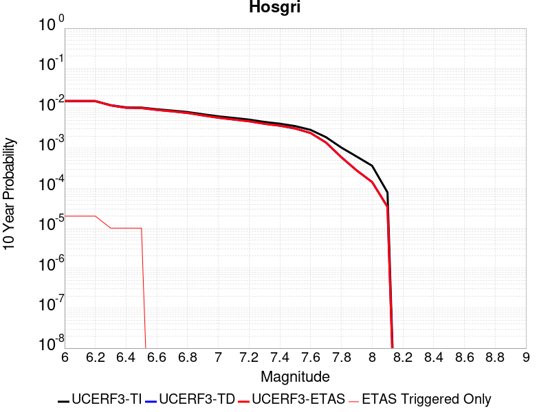 |

| Magnitude | 1 wk TI Prob | 1 wk TD Prob | 1 wk ETAS Prob | 1 wk ETAS/TD Gain | 1 wk ETAS Triggered Only | 1 mo TI Prob | 1 mo TD Prob | 1 mo ETAS Prob | 1 mo ETAS/TD Gain | 1 mo ETAS Triggered Only | 1 yr TI Prob | 1 yr TD Prob | 1 yr ETAS Prob | 1 yr ETAS/TD Gain | 1 yr ETAS Triggered Only | 10 yr TI Prob | 10 yr TD Prob | 10 yr ETAS Prob | 10 yr ETAS/TD Gain | 10 yr ETAS Triggered Only |
|-----|-----|-----|-----|-----|-----|-----|-----|-----|-----|-----|-----|-----|-----|-----|-----|-----|-----|-----|-----|-----|
| 6.0 | 2.883978E-5 | 2.9130051E-5 | 2.9130051E-5 | 1.0 | 0.0 | 1.235932E-4 | 1.2483726E-4 | 1.2483726E-4 | 1.0 | 0.0 | 0.0015037085 | 0.0015188612 | 0.0015288459 | 1.0065739 | 1.0E-5 | 0.01493574 | 0.015088581 | 0.015108279 | 1.0013055 | 2.0E-5 |
| 6.1 | 2.883978E-5 | 2.9130051E-5 | 2.9130051E-5 | 1.0 | 0.0 | 1.235932E-4 | 1.2483726E-4 | 1.2483726E-4 | 1.0 | 0.0 | 0.0015037085 | 0.0015188612 | 0.0015288459 | 1.0065739 | 1.0E-5 | 0.01493574 | 0.015088581 | 0.015108279 | 1.0013055 | 2.0E-5 |
| 6.2 | 2.883978E-5 | 2.9130051E-5 | 2.9130051E-5 | 1.0 | 0.0 | 1.235932E-4 | 1.2483726E-4 | 1.2483726E-4 | 1.0 | 0.0 | 0.0015037085 | 0.0015188612 | 0.0015288459 | 1.0065739 | 1.0E-5 | 0.01493574 | 0.015088581 | 0.015108279 | 1.0013055 | 2.0E-5 |
| 6.3 | 2.2914428E-5 | 2.2643277E-5 | 2.2643277E-5 | 1.0 | 0.0 | 9.8200995E-5 | 9.703903E-5 | 9.703903E-5 | 1.0 | 0.0 | 0.0011949413 | 0.0011808148 | 0.001190803 | 1.0084587 | 1.0E-5 | 0.011885363 | 0.011746808 | 0.01175669 | 1.0008413 | 1.0E-5 |
| 6.4 | 2.0195741E-5 | 1.9697736E-5 | 1.9697736E-5 | 1.0 | 0.0 | 8.65503E-5 | 8.441615E-5 | 8.441615E-5 | 1.0 | 0.0 | 0.0010532405 | 0.0010272841 | 0.0010372738 | 1.0097244 | 1.0E-5 | 0.010482626 | 0.0102264015 | 0.010236299 | 1.0009679 | 1.0E-5 |
| 6.5 | 1.9924333E-5 | 1.9410149E-5 | 1.9410149E-5 | 1.0 | 0.0 | 8.53872E-5 | 8.318371E-5 | 8.318371E-5 | 1.0 | 0.0 | 0.0010390934 | 0.001012293 | 0.0010222829 | 1.0098686 | 1.0E-5 | 0.010342481 | 0.0100778565 | 0.0100877555 | 1.0009823 | 1.0E-5 |
| 6.6 | 1.809694E-5 | 1.7459393E-5 | 1.7459393E-5 | 1.0 | 0.0 | 7.7556004E-5 | 7.482383E-5 | 7.482383E-5 | 1.0 | 0.0 | 9.438353E-4 | 9.106007E-4 | 9.106007E-4 | 1.0 | 0.0 | 0.009398366 | 0.009069638 | 0.009069638 | 1.0 | 0.0 |
| 6.7 | 1.675989E-5 | 1.6043807E-5 | 1.6043807E-5 | 1.0 | 0.0 | 7.182612E-5 | 6.875736E-5 | 6.875736E-5 | 1.0 | 0.0 | 8.7413215E-4 | 8.3680055E-4 | 8.3680055E-4 | 1.0 | 0.0 | 0.008707017 | 0.008337403 | 0.008337403 | 1.0 | 0.0 |
| 6.8 | 1.5401129E-5 | 1.4615074E-5 | 1.4615074E-5 | 1.0 | 0.0 | 6.6003166E-5 | 6.2634535E-5 | 6.2634535E-5 | 1.0 | 0.0 | 8.032922E-4 | 7.623095E-4 | 7.623095E-4 | 1.0 | 0.0 | 0.008003947 | 0.0075978106 | 0.0075978106 | 1.0 | 0.0 |
| 6.9 | 1.356559E-5 | 1.2690892E-5 | 1.2690892E-5 | 1.0 | 0.0 | 5.8136946E-5 | 5.4388405E-5 | 5.4388405E-5 | 1.0 | 0.0 | 7.0758746E-4 | 6.619781E-4 | 6.619781E-4 | 1.0 | 0.0 | 0.007053386 | 0.006600868 | 0.006600868 | 1.0 | 0.0 |
| 7.0 | 1.2030819E-5 | 1.1096832E-5 | 1.1096832E-5 | 1.0 | 0.0 | 5.155963E-5 | 4.7556987E-5 | 4.7556987E-5 | 1.0 | 0.0 | 6.275577E-4 | 5.788526E-4 | 5.788526E-4 | 1.0 | 0.0 | 0.006257884 | 0.0057742097 | 0.0057742097 | 1.0 | 0.0 |
| 7.1 | 1.0972698E-5 | 1.0023018E-5 | 1.0023018E-5 | 1.0 | 0.0 | 4.7025E-5 | 4.2955086E-5 | 4.2955086E-5 | 1.0 | 0.0 | 5.72379E-4 | 5.2285276E-4 | 5.2285276E-4 | 1.0 | 0.0 | 0.0057090693 | 0.0052169785 | 0.0052169785 | 1.0 | 0.0 |
| 7.2 | 9.961926E-6 | 9.035558E-6 | 9.035558E-6 | 1.0 | 0.0 | 4.2693267E-5 | 3.8723243E-5 | 3.8723243E-5 | 1.0 | 0.0 | 5.1966653E-4 | 4.713536E-4 | 4.713536E-4 | 1.0 | 0.0 | 0.00518453 | 0.004704285 | 0.004704285 | 1.0 | 0.0 |
| 7.3 | 8.700929E-6 | 7.82888E-6 | 7.82888E-6 | 1.0 | 0.0 | 3.7289166E-5 | 3.3551914E-5 | 3.3551914E-5 | 1.0 | 0.0 | 4.53901E-4 | 4.0841804E-4 | 4.0841804E-4 | 1.0 | 0.0 | 0.00452975 | 0.0040774145 | 0.0040774145 | 1.0 | 0.0 |
| 7.4 | 7.866285E-6 | 6.9995003E-6 | 6.9995003E-6 | 1.0 | 0.0 | 3.3712215E-5 | 2.9997515E-5 | 2.9997515E-5 | 1.0 | 0.0 | 4.103689E-4 | 3.6515854E-4 | 3.6515854E-4 | 1.0 | 0.0 | 0.004096119 | 0.0036463232 | 0.0036463232 | 1.0 | 0.0 |
| 7.5 | 6.8381305E-6 | 5.9604317E-6 | 5.9604317E-6 | 1.0 | 0.0 | 2.9305946E-5 | 2.5544457E-5 | 2.5544457E-5 | 1.0 | 0.0 | 3.5674145E-4 | 3.109594E-4 | 3.109594E-4 | 1.0 | 0.0 | 0.0035616932 | 0.0031059785 | 0.0031059785 | 1.0 | 0.0 |
| 7.6 | 5.503376E-6 | 4.5959455E-6 | 4.5959455E-6 | 1.0 | 0.0 | 2.3585684E-5 | 1.969676E-5 | 1.969676E-5 | 1.0 | 0.0 | 2.8711787E-4 | 2.3978167E-4 | 2.3978167E-4 | 1.0 | 0.0 | 0.002867472 | 0.002395963 | 0.002395963 | 1.0 | 0.0 |
| 7.7 | 3.6144982E-6 | 2.652859E-6 | 2.652859E-6 | 1.0 | 0.0 | 1.5490614E-5 | 1.1369346E-5 | 1.1369346E-5 | 1.0 | 0.0 | 1.8858191E-4 | 1.38413E-4 | 1.38413E-4 | 1.0 | 0.0 | 0.0018842196 | 0.0013839996 | 0.0013839996 | 1.0 | 0.0 |
| 7.8 | 1.9853494E-6 | 1.1366585E-6 | 1.1366585E-6 | 1.0 | 0.0 | 8.508612E-6 | 4.8713846E-6 | 4.8713846E-6 | 1.0 | 0.0 | 1.0358743E-4 | 5.930749E-5 | 5.930749E-5 | 1.0 | 0.0 | 0.0010353916 | 5.9364707E-4 | 5.9364707E-4 | 1.0 | 0.0 |
| 7.9 | 1.1818757E-6 | 5.2994693E-7 | 5.2994693E-7 | 1.0 | 0.0 | 5.0651715E-6 | 2.271199E-6 | 2.271199E-6 | 1.0 | 0.0 | 6.1666724E-5 | 2.7651497E-5 | 2.7651497E-5 | 1.0 | 0.0 | 6.1649614E-4 | 2.771693E-4 | 2.771693E-4 | 1.0 | 0.0 |
| 8.0 | 6.962958E-7 | 2.716916E-7 | 2.716916E-7 | 1.0 | 0.0 | 2.9841215E-6 | 1.164392E-6 | 1.164392E-6 | 1.0 | 0.0 | 3.6331072E-5 | 1.417638E-5 | 1.417638E-5 | 1.0 | 0.0 | 3.6325134E-4 | 1.423256E-4 | 1.423256E-4 | 1.0 | 0.0 |
| 8.1 | 1.5033264E-7 | 6.5338824E-8 | 6.5338824E-8 | 1.0 | 0.0 | 6.442826E-7 | 2.800235E-7 | 2.800235E-7 | 1.0 | 0.0 | 7.844113E-6 | 3.409281E-6 | 3.409281E-6 | 1.0 | 0.0 | 7.843835E-5 | 3.410959E-5 | 3.410959E-5 | 1.0 | 0.0 |

## Pitas Point (Lower West)
*[(top)](#table-of-contents)*

| 1 Week | 1 Month | 1 Year | 10 Year |
|-----|-----|-----|-----|
|  |  | 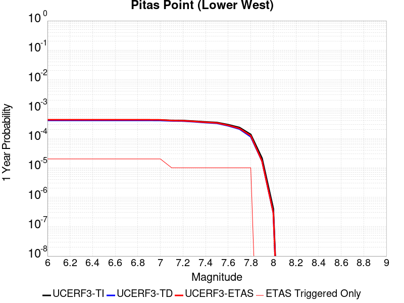 |  |

| Magnitude | 1 wk TI Prob | 1 wk TD Prob | 1 wk ETAS Prob | 1 wk ETAS/TD Gain | 1 wk ETAS Triggered Only | 1 mo TI Prob | 1 mo TD Prob | 1 mo ETAS Prob | 1 mo ETAS/TD Gain | 1 mo ETAS Triggered Only | 1 yr TI Prob | 1 yr TD Prob | 1 yr ETAS Prob | 1 yr ETAS/TD Gain | 1 yr ETAS Triggered Only | 10 yr TI Prob | 10 yr TD Prob | 10 yr ETAS Prob | 10 yr ETAS/TD Gain | 10 yr ETAS Triggered Only |
|-----|-----|-----|-----|-----|-----|-----|-----|-----|-----|-----|-----|-----|-----|-----|-----|-----|-----|-----|-----|-----|
| 6.0 | 8.151497E-6 | 7.8560315E-6 | 7.8560315E-6 | 1.0 | 0.0 | 3.493452E-5 | 3.3668275E-5 | 3.3668275E-5 | 1.0 | 0.0 | 4.252448E-4 | 4.098349E-4 | 4.298267E-4 | 1.0487801 | 2.0E-5 | 0.0042443196 | 0.0040908717 | 0.00411079 | 1.004869 | 2.0E-5 |
| 6.1 | 8.151497E-6 | 7.8560315E-6 | 7.8560315E-6 | 1.0 | 0.0 | 3.493452E-5 | 3.3668275E-5 | 3.3668275E-5 | 1.0 | 0.0 | 4.252448E-4 | 4.098349E-4 | 4.298267E-4 | 1.0487801 | 2.0E-5 | 0.0042443196 | 0.0040908717 | 0.00411079 | 1.004869 | 2.0E-5 |
| 6.2 | 8.151497E-6 | 7.8560315E-6 | 7.8560315E-6 | 1.0 | 0.0 | 3.493452E-5 | 3.3668275E-5 | 3.3668275E-5 | 1.0 | 0.0 | 4.252448E-4 | 4.098349E-4 | 4.298267E-4 | 1.0487801 | 2.0E-5 | 0.0042443196 | 0.0040908717 | 0.00411079 | 1.004869 | 2.0E-5 |
| 6.3 | 8.151497E-6 | 7.8560315E-6 | 7.8560315E-6 | 1.0 | 0.0 | 3.493452E-5 | 3.3668275E-5 | 3.3668275E-5 | 1.0 | 0.0 | 4.252448E-4 | 4.098349E-4 | 4.298267E-4 | 1.0487801 | 2.0E-5 | 0.0042443196 | 0.0040908717 | 0.00411079 | 1.004869 | 2.0E-5 |
| 6.4 | 8.151497E-6 | 7.8560315E-6 | 7.8560315E-6 | 1.0 | 0.0 | 3.493452E-5 | 3.3668275E-5 | 3.3668275E-5 | 1.0 | 0.0 | 4.252448E-4 | 4.098349E-4 | 4.298267E-4 | 1.0487801 | 2.0E-5 | 0.0042443196 | 0.0040908717 | 0.00411079 | 1.004869 | 2.0E-5 |
| 6.5 | 8.151497E-6 | 7.8560315E-6 | 7.8560315E-6 | 1.0 | 0.0 | 3.493452E-5 | 3.3668275E-5 | 3.3668275E-5 | 1.0 | 0.0 | 4.252448E-4 | 4.098349E-4 | 4.298267E-4 | 1.0487801 | 2.0E-5 | 0.0042443196 | 0.0040908717 | 0.00411079 | 1.004869 | 2.0E-5 |
| 6.6 | 8.151497E-6 | 7.8560315E-6 | 7.8560315E-6 | 1.0 | 0.0 | 3.493452E-5 | 3.3668275E-5 | 3.3668275E-5 | 1.0 | 0.0 | 4.252448E-4 | 4.098349E-4 | 4.298267E-4 | 1.0487801 | 2.0E-5 | 0.0042443196 | 0.0040908717 | 0.00411079 | 1.004869 | 2.0E-5 |
| 6.7 | 8.151497E-6 | 7.8560315E-6 | 7.8560315E-6 | 1.0 | 0.0 | 3.493452E-5 | 3.3668275E-5 | 3.3668275E-5 | 1.0 | 0.0 | 4.252448E-4 | 4.098349E-4 | 4.298267E-4 | 1.0487801 | 2.0E-5 | 0.0042443196 | 0.0040908717 | 0.00411079 | 1.004869 | 2.0E-5 |
| 6.8 | 8.151497E-6 | 7.8560315E-6 | 7.8560315E-6 | 1.0 | 0.0 | 3.493452E-5 | 3.3668275E-5 | 3.3668275E-5 | 1.0 | 0.0 | 4.252448E-4 | 4.098349E-4 | 4.298267E-4 | 1.0487801 | 2.0E-5 | 0.0042443196 | 0.0040908717 | 0.00411079 | 1.004869 | 2.0E-5 |
| 6.9 | 8.151497E-6 | 7.8560315E-6 | 7.8560315E-6 | 1.0 | 0.0 | 3.493452E-5 | 3.3668275E-5 | 3.3668275E-5 | 1.0 | 0.0 | 4.252448E-4 | 4.098349E-4 | 4.298267E-4 | 1.0487801 | 2.0E-5 | 0.0042443196 | 0.0040908717 | 0.00411079 | 1.004869 | 2.0E-5 |
| 7.0 | 8.103535E-6 | 7.80546E-6 | 7.80546E-6 | 1.0 | 0.0 | 3.4728975E-5 | 3.3451546E-5 | 3.3451546E-5 | 1.0 | 0.0 | 4.2274324E-4 | 4.071972E-4 | 4.2718905E-4 | 1.0490962 | 2.0E-5 | 0.0042193993 | 0.004064591 | 0.00408451 | 1.0049006 | 2.0E-5 |
| 7.1 | 7.853298E-6 | 7.541143E-6 | 7.541143E-6 | 1.0 | 0.0 | 3.3656554E-5 | 3.231879E-5 | 3.231879E-5 | 1.0 | 0.0 | 4.096915E-4 | 3.934109E-4 | 4.0340697E-4 | 1.0254087 | 1.0E-5 | 0.00408937 | 0.0039272206 | 0.0039371816 | 1.0025363 | 1.0E-5 |
| 7.2 | 7.771102E-6 | 7.453422E-6 | 7.453422E-6 | 1.0 | 0.0 | 3.33043E-5 | 3.194285E-5 | 3.194285E-5 | 1.0 | 0.0 | 4.0540437E-4 | 3.888355E-4 | 3.9883162E-4 | 1.0257078 | 1.0E-5 | 0.0040466557 | 0.003881627 | 0.0038915882 | 1.0025662 | 1.0E-5 |
| 7.3 | 7.3945344E-6 | 7.0495107E-6 | 7.0495107E-6 | 1.0 | 0.0 | 3.1690477E-5 | 3.0211842E-5 | 3.0211842E-5 | 1.0 | 0.0 | 3.8576324E-4 | 3.6776773E-4 | 3.7776405E-4 | 1.027181 | 1.0E-5 | 0.0038509427 | 0.003671659 | 0.0036816222 | 1.0027136 | 1.0E-5 |
| 7.4 | 6.964645E-6 | 6.590343E-6 | 6.590343E-6 | 1.0 | 0.0 | 2.9848137E-5 | 2.8244025E-5 | 2.8244025E-5 | 1.0 | 0.0 | 3.6334046E-4 | 3.4381726E-4 | 3.538138E-4 | 1.0290753 | 1.0E-5 | 0.0036274698 | 0.0034329065 | 0.003442872 | 1.002903 | 1.0E-5 |
| 7.5 | 6.6525035E-6 | 6.2593713E-6 | 6.2593713E-6 | 1.0 | 0.0 | 2.851042E-5 | 2.6825604E-5 | 2.6825604E-5 | 1.0 | 0.0 | 3.4705905E-4 | 3.2655327E-4 | 3.3655E-4 | 1.0306128 | 1.0E-5 | 0.0034651754 | 0.0032607857 | 0.003270753 | 1.0030568 | 1.0E-5 |
| 7.6 | 5.613338E-6 | 5.151559E-6 | 5.151559E-6 | 1.0 | 0.0 | 2.405694E-5 | 2.2077926E-5 | 2.2077926E-5 | 1.0 | 0.0 | 2.928539E-4 | 2.6876587E-4 | 2.7876318E-4 | 1.0371971 | 1.0E-5 | 0.0029246826 | 0.00268444 | 0.002694413 | 1.0037152 | 1.0E-5 |
| 7.7 | 4.494704E-6 | 3.9970487E-6 | 3.9970487E-6 | 1.0 | 0.0 | 1.9262876E-5 | 1.7130098E-5 | 1.7130098E-5 | 1.0 | 0.0 | 2.3450027E-4 | 2.085392E-4 | 2.1853713E-4 | 1.0479426 | 1.0E-5 | 0.0023425296 | 0.0020834592 | 0.0020934383 | 1.0047897 | 1.0E-5 |
| 7.8 | 2.6075882E-6 | 2.1837093E-6 | 2.1837093E-6 | 1.0 | 0.0 | 1.117533E-5 | 9.358721E-6 | 9.358721E-6 | 1.0 | 0.0 | 1.3605114E-4 | 1.1393652E-4 | 1.2393537E-4 | 1.0877582 | 1.0E-5 | 0.0013596788 | 0.0011387857 | 0.0011487744 | 1.0087713 | 1.0E-5 |
| 7.9 | 4.045984E-7 | 3.2424867E-7 | 3.2424867E-7 | 1.0 | 0.0 | 1.733992E-6 | 1.3896364E-6 | 1.3896364E-6 | 1.0 | 0.0 | 2.1111147E-5 | 1.6918695E-5 | 1.6918695E-5 | 1.0 | 0.0 | 2.1109142E-4 | 1.6917438E-4 | 1.6917438E-4 | 1.0 | 0.0 |
| 8.0 | 7.791402E-9 | 5.683722E-9 | 5.683722E-9 | 1.0 | 0.0 | 3.3391725E-8 | 2.4358807E-8 | 2.4358807E-8 | 1.0 | 0.0 | 4.0654416E-7 | 2.9656846E-7 | 2.9656846E-7 | 1.0 | 0.0 | 4.065434E-6 | 2.9656826E-6 | 2.9656826E-6 | 1.0 | 0.0 |

## Earthquake Valley (No  Extension)
*[(top)](#table-of-contents)*

| 1 Week | 1 Month | 1 Year | 10 Year |
|-----|-----|-----|-----|
|  |  | 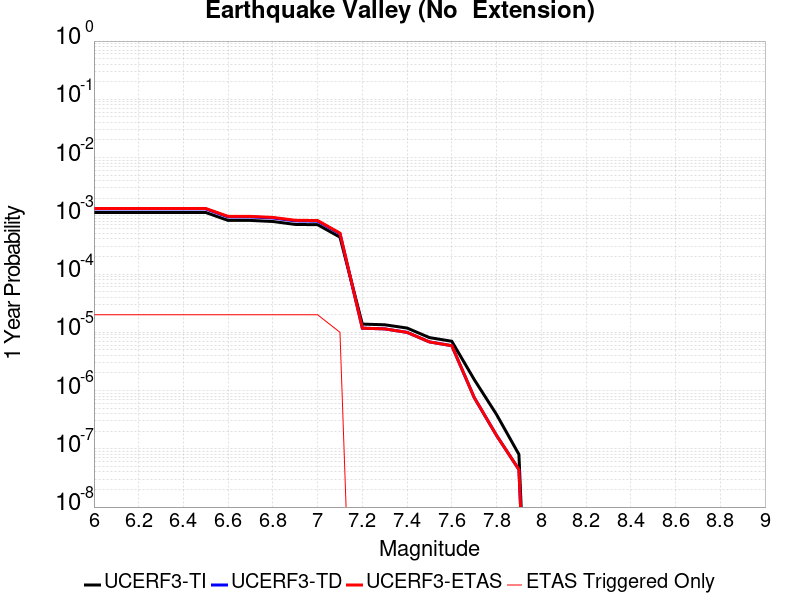 | 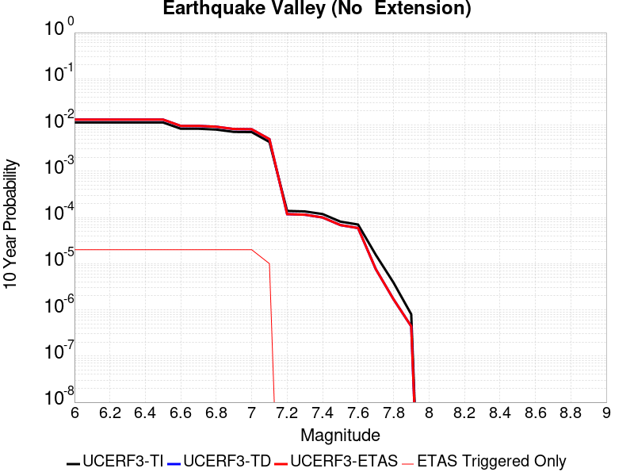 |

| Magnitude | 1 wk TI Prob | 1 wk TD Prob | 1 wk ETAS Prob | 1 wk ETAS/TD Gain | 1 wk ETAS Triggered Only | 1 mo TI Prob | 1 mo TD Prob | 1 mo ETAS Prob | 1 mo ETAS/TD Gain | 1 mo ETAS Triggered Only | 1 yr TI Prob | 1 yr TD Prob | 1 yr ETAS Prob | 1 yr ETAS/TD Gain | 1 yr ETAS Triggered Only | 10 yr TI Prob | 10 yr TD Prob | 10 yr ETAS Prob | 10 yr ETAS/TD Gain | 10 yr ETAS Triggered Only |
|-----|-----|-----|-----|-----|-----|-----|-----|-----|-----|-----|-----|-----|-----|-----|-----|-----|-----|-----|-----|-----|
| 6.0 | 2.1859703E-5 | 2.520046E-5 | 2.520046E-5 | 1.0 | 0.0 | 9.3681076E-5 | 1.0799832E-4 | 1.0799832E-4 | 1.0 | 0.0 | 0.0011399703 | 0.0013142314 | 0.001334205 | 1.015198 | 2.0E-5 | 0.011341401 | 0.013078954 | 0.0130986925 | 1.0015092 | 2.0E-5 |
| 6.1 | 2.1859703E-5 | 2.520046E-5 | 2.520046E-5 | 1.0 | 0.0 | 9.3681076E-5 | 1.0799832E-4 | 1.0799832E-4 | 1.0 | 0.0 | 0.0011399703 | 0.0013142314 | 0.001334205 | 1.015198 | 2.0E-5 | 0.011341401 | 0.013078954 | 0.0130986925 | 1.0015092 | 2.0E-5 |
| 6.2 | 2.1859703E-5 | 2.520046E-5 | 2.520046E-5 | 1.0 | 0.0 | 9.3681076E-5 | 1.0799832E-4 | 1.0799832E-4 | 1.0 | 0.0 | 0.0011399703 | 0.0013142314 | 0.001334205 | 1.015198 | 2.0E-5 | 0.011341401 | 0.013078954 | 0.0130986925 | 1.0015092 | 2.0E-5 |
| 6.3 | 2.1859703E-5 | 2.520046E-5 | 2.520046E-5 | 1.0 | 0.0 | 9.3681076E-5 | 1.0799832E-4 | 1.0799832E-4 | 1.0 | 0.0 | 0.0011399703 | 0.0013142314 | 0.001334205 | 1.015198 | 2.0E-5 | 0.011341401 | 0.013078954 | 0.0130986925 | 1.0015092 | 2.0E-5 |
| 6.4 | 2.1859703E-5 | 2.520046E-5 | 2.520046E-5 | 1.0 | 0.0 | 9.3681076E-5 | 1.0799832E-4 | 1.0799832E-4 | 1.0 | 0.0 | 0.0011399703 | 0.0013142314 | 0.001334205 | 1.015198 | 2.0E-5 | 0.011341401 | 0.013078954 | 0.0130986925 | 1.0015092 | 2.0E-5 |
| 6.5 | 2.1859703E-5 | 2.520046E-5 | 2.520046E-5 | 1.0 | 0.0 | 9.3681076E-5 | 1.0799832E-4 | 1.0799832E-4 | 1.0 | 0.0 | 0.0011399703 | 0.0013142314 | 0.001334205 | 1.015198 | 2.0E-5 | 0.011341401 | 0.013078954 | 0.0130986925 | 1.0015092 | 2.0E-5 |
| 6.6 | 1.597E-5 | 1.8357787E-5 | 1.8357787E-5 | 1.0 | 0.0 | 6.8441055E-5 | 7.8674355E-5 | 7.8674355E-5 | 1.0 | 0.0 | 8.329513E-4 | 9.575266E-4 | 9.775074E-4 | 1.0208671 | 2.0E-5 | 0.008298361 | 0.009542619 | 0.009562428 | 1.0020759 | 2.0E-5 |
| 6.7 | 1.597E-5 | 1.8357787E-5 | 1.8357787E-5 | 1.0 | 0.0 | 6.8441055E-5 | 7.8674355E-5 | 7.8674355E-5 | 1.0 | 0.0 | 8.329513E-4 | 9.575266E-4 | 9.775074E-4 | 1.0208671 | 2.0E-5 | 0.008298361 | 0.009542619 | 0.009562428 | 1.0020759 | 2.0E-5 |
| 6.8 | 1.5315149E-5 | 1.7603543E-5 | 1.7603543E-5 | 1.0 | 0.0 | 6.5634704E-5 | 7.544206E-5 | 7.544206E-5 | 1.0 | 0.0 | 7.988095E-4 | 9.1820676E-4 | 9.381884E-4 | 1.0217615 | 2.0E-5 | 0.007959441 | 0.00915267 | 0.009172488 | 1.0021652 | 2.0E-5 |
| 6.9 | 1.3634728E-5 | 1.5677122E-5 | 1.5677122E-5 | 1.0 | 0.0 | 5.8433237E-5 | 6.71864E-5 | 6.71864E-5 | 1.0 | 0.0 | 7.1119244E-4 | 8.1776956E-4 | 8.377532E-4 | 1.0244367 | 2.0E-5 | 0.007089207 | 0.008155676 | 0.008175513 | 1.0024322 | 2.0E-5 |
| 7.0 | 1.3496271E-5 | 1.5519143E-5 | 1.5519143E-5 | 1.0 | 0.0 | 5.783988E-5 | 6.650938E-5 | 6.650938E-5 | 1.0 | 0.0 | 7.03973E-4 | 8.0953294E-4 | 8.2951674E-4 | 1.0246856 | 2.0E-5 | 0.007017471 | 0.00807391 | 0.008093748 | 1.0024571 | 2.0E-5 |
| 7.1 | 8.242798E-6 | 9.473406E-6 | 9.473406E-6 | 1.0 | 0.0 | 3.53258E-5 | 4.0600058E-5 | 4.0600058E-5 | 1.0 | 0.0 | 4.300067E-4 | 4.942607E-4 | 5.0425576E-4 | 1.0202222 | 1.0E-5 | 0.004291756 | 0.0049381913 | 0.004948142 | 1.002015 | 1.0E-5 |
| 7.2 | 2.6506527E-7 | 2.2562841E-7 | 2.2562841E-7 | 1.0 | 0.0 | 1.1359936E-6 | 9.669785E-7 | 9.669785E-7 | 1.0 | 0.0 | 1.3830633E-5 | 1.1772905E-5 | 1.1772905E-5 | 1.0 | 0.0 | 1.3829772E-4 | 1.17723226E-4 | 1.17723226E-4 | 1.0 | 0.0 |
| 7.3 | 2.5810488E-7 | 2.195794E-7 | 2.195794E-7 | 1.0 | 0.0 | 1.1061633E-6 | 9.410543E-7 | 9.410543E-7 | 1.0 | 0.0 | 1.3467455E-5 | 1.14572795E-5 | 1.14572795E-5 | 1.0 | 0.0 | 1.3466639E-4 | 1.145673E-4 | 1.145673E-4 | 1.0 | 0.0 |
| 7.4 | 2.2676066E-7 | 1.9112998E-7 | 1.9112998E-7 | 1.0 | 0.0 | 9.71831E-7 | 8.191283E-7 | 8.191283E-7 | 1.0 | 0.0 | 1.1831979E-5 | 9.972845E-6 | 9.972845E-6 | 1.0 | 0.0 | 1.1831349E-4 | 9.972437E-5 | 9.972437E-5 | 1.0 | 0.0 |
| 7.5 | 1.5553917E-7 | 1.3114038E-7 | 1.3114038E-7 | 1.0 | 0.0 | 6.6659624E-7 | 5.6203015E-7 | 5.6203015E-7 | 1.0 | 0.0 | 8.115779E-6 | 6.8426975E-6 | 6.8426975E-6 | 1.0 | 0.0 | 8.115482E-5 | 6.8425084E-5 | 6.8425084E-5 | 1.0 | 0.0 |
| 7.6 | 1.3448629E-7 | 1.1290136E-7 | 1.1290136E-7 | 1.0 | 0.0 | 5.7636964E-7 | 4.838629E-7 | 4.838629E-7 | 1.0 | 0.0 | 7.017278E-6 | 5.8910173E-6 | 5.8910173E-6 | 1.0 | 0.0 | 7.0170565E-5 | 5.8908823E-5 | 5.8908823E-5 | 1.0 | 0.0 |
| 7.7 | 2.9719402E-8 | 1.4584987E-8 | 1.4584987E-8 | 1.0 | 0.0 | 1.2736886E-7 | 6.2507084E-8 | 6.2507084E-8 | 1.0 | 0.0 | 1.5507147E-6 | 7.6102356E-7 | 7.6102356E-7 | 1.0 | 0.0 | 1.550704E-5 | 7.6102147E-6 | 7.6102147E-6 | 1.0 | 0.0 |
| 7.8 | 7.4390196E-9 | 3.2508414E-9 | 3.2508414E-9 | 1.0 | 0.0 | 3.1881513E-8 | 1.3932177E-8 | 1.3932177E-8 | 1.0 | 0.0 | 3.8815733E-7 | 1.6962424E-7 | 1.6962424E-7 | 1.0 | 0.0 | 3.8815665E-6 | 1.6962414E-6 | 1.6962414E-6 | 1.0 | 0.0 |
| 7.9 | 1.5373532E-9 | 8.4413176E-10 | 8.4413176E-10 | 1.0 | 0.0 | 6.5886567E-9 | 3.6177075E-9 | 3.6177075E-9 | 1.0 | 0.0 | 8.021689E-8 | 4.404559E-8 | 4.404559E-8 | 1.0 | 0.0 | 8.0216864E-7 | 4.4045586E-7 | 4.4045586E-7 | 1.0 | 0.0 |

## Breckenridge 2011
*[(top)](#table-of-contents)*

| 1 Week | 1 Month | 1 Year | 10 Year |
|-----|-----|-----|-----|
| 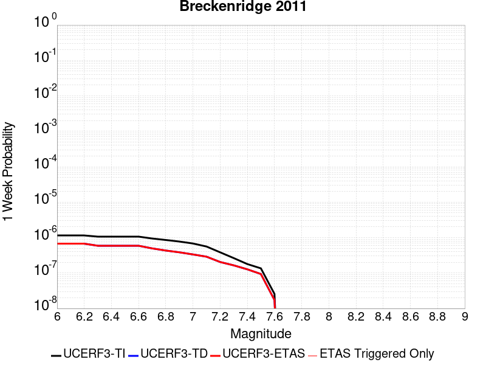 |  |  |  |

| Magnitude | 1 wk TI Prob | 1 wk TD Prob | 1 wk ETAS Prob | 1 wk ETAS/TD Gain | 1 wk ETAS Triggered Only | 1 mo TI Prob | 1 mo TD Prob | 1 mo ETAS Prob | 1 mo ETAS/TD Gain | 1 mo ETAS Triggered Only | 1 yr TI Prob | 1 yr TD Prob | 1 yr ETAS Prob | 1 yr ETAS/TD Gain | 1 yr ETAS Triggered Only | 10 yr TI Prob | 10 yr TD Prob | 10 yr ETAS Prob | 10 yr ETAS/TD Gain | 10 yr ETAS Triggered Only |
|-----|-----|-----|-----|-----|-----|-----|-----|-----|-----|-----|-----|-----|-----|-----|-----|-----|-----|-----|-----|-----|
| 6.0 | 1.1490393E-6 | 6.738222E-7 | 6.738222E-7 | 1.0 | 0.0 | 4.924445E-6 | 2.8878064E-6 | 2.8878064E-6 | 1.0 | 0.0 | 5.995347E-5 | 3.5158497E-5 | 3.5158497E-5 | 1.0 | 0.0 | 5.9937296E-4 | 3.515314E-4 | 3.7152437E-4 | 1.0568739 | 2.0E-5 |
| 6.1 | 1.1490393E-6 | 6.738222E-7 | 6.738222E-7 | 1.0 | 0.0 | 4.924445E-6 | 2.8878064E-6 | 2.8878064E-6 | 1.0 | 0.0 | 5.995347E-5 | 3.5158497E-5 | 3.5158497E-5 | 1.0 | 0.0 | 5.9937296E-4 | 3.515314E-4 | 3.7152437E-4 | 1.0568739 | 2.0E-5 |
| 6.2 | 1.1490393E-6 | 6.738222E-7 | 6.738222E-7 | 1.0 | 0.0 | 4.924445E-6 | 2.8878064E-6 | 2.8878064E-6 | 1.0 | 0.0 | 5.995347E-5 | 3.5158497E-5 | 3.5158497E-5 | 1.0 | 0.0 | 5.9937296E-4 | 3.515314E-4 | 3.7152437E-4 | 1.0568739 | 2.0E-5 |
| 6.3 | 1.064617E-6 | 5.886616E-7 | 5.886616E-7 | 1.0 | 0.0 | 4.5626366E-6 | 2.522833E-6 | 2.522833E-6 | 1.0 | 0.0 | 5.5548684E-5 | 3.071507E-5 | 3.071507E-5 | 1.0 | 0.0 | 5.55348E-4 | 3.071094E-4 | 3.2710328E-4 | 1.0651034 | 2.0E-5 |
| 6.4 | 1.064617E-6 | 5.886616E-7 | 5.886616E-7 | 1.0 | 0.0 | 4.5626366E-6 | 2.522833E-6 | 2.522833E-6 | 1.0 | 0.0 | 5.5548684E-5 | 3.071507E-5 | 3.071507E-5 | 1.0 | 0.0 | 5.55348E-4 | 3.071094E-4 | 3.2710328E-4 | 1.0651034 | 2.0E-5 |
| 6.5 | 1.064617E-6 | 5.886616E-7 | 5.886616E-7 | 1.0 | 0.0 | 4.5626366E-6 | 2.522833E-6 | 2.522833E-6 | 1.0 | 0.0 | 5.5548684E-5 | 3.071507E-5 | 3.071507E-5 | 1.0 | 0.0 | 5.55348E-4 | 3.071094E-4 | 3.2710328E-4 | 1.0651034 | 2.0E-5 |
| 6.6 | 1.064617E-6 | 5.886616E-7 | 5.886616E-7 | 1.0 | 0.0 | 4.5626366E-6 | 2.522833E-6 | 2.522833E-6 | 1.0 | 0.0 | 5.5548684E-5 | 3.071507E-5 | 3.071507E-5 | 1.0 | 0.0 | 5.55348E-4 | 3.071094E-4 | 3.2710328E-4 | 1.0651034 | 2.0E-5 |
| 6.7 | 9.4219524E-7 | 4.954199E-7 | 4.954199E-7 | 1.0 | 0.0 | 4.037973E-6 | 2.1232265E-6 | 2.1232265E-6 | 1.0 | 0.0 | 4.916122E-5 | 2.5849982E-5 | 2.5849982E-5 | 1.0 | 0.0 | 4.9150345E-4 | 2.584704E-4 | 2.7846522E-4 | 1.0773582 | 2.0E-5 |
| 6.8 | 8.556422E-7 | 4.3120863E-7 | 4.3120863E-7 | 1.0 | 0.0 | 3.667033E-6 | 1.8480357E-6 | 1.8480357E-6 | 1.0 | 0.0 | 4.464521E-5 | 2.2499606E-5 | 2.2499606E-5 | 1.0 | 0.0 | 4.4636242E-4 | 2.2497369E-4 | 2.4496918E-4 | 1.0888793 | 2.0E-5 |
| 6.9 | 7.7357794E-7 | 3.8421342E-7 | 3.8421342E-7 | 1.0 | 0.0 | 3.3153299E-6 | 1.6466279E-6 | 1.6466279E-6 | 1.0 | 0.0 | 4.0363393E-5 | 2.0047513E-5 | 2.0047513E-5 | 1.0 | 0.0 | 4.035606E-4 | 2.0045735E-4 | 2.2045334E-4 | 1.0997518 | 2.0E-5 |
| 7.0 | 6.8172454E-7 | 3.347228E-7 | 3.347228E-7 | 1.0 | 0.0 | 2.9216735E-6 | 1.4345256E-6 | 1.4345256E-6 | 1.0 | 0.0 | 3.5570793E-5 | 1.7465212E-5 | 1.7465212E-5 | 1.0 | 0.0 | 3.55651E-4 | 1.7463861E-4 | 1.8463687E-4 | 1.0572511 | 1.0E-5 |
| 7.1 | 5.5936397E-7 | 2.8910335E-7 | 2.8910335E-7 | 1.0 | 0.0 | 2.397272E-6 | 1.2390138E-6 | 1.2390138E-6 | 1.0 | 0.0 | 2.9186394E-5 | 1.508489E-5 | 1.508489E-5 | 1.0 | 0.0 | 2.9182562E-4 | 1.5083884E-4 | 1.6083734E-4 | 1.066286 | 1.0E-5 |
| 7.2 | 3.8420822E-7 | 2.0468804E-7 | 2.0468804E-7 | 1.0 | 0.0 | 1.6466057E-6 | 8.7723413E-7 | 8.7723413E-7 | 1.0 | 0.0 | 2.004724E-5 | 1.0680274E-5 | 1.0680274E-5 | 1.0 | 0.0 | 2.004543E-4 | 1.0679769E-4 | 1.16796626E-4 | 1.093625 | 1.0E-5 |
| 7.3 | 2.6405158E-7 | 1.6473555E-7 | 1.6473555E-7 | 1.0 | 0.0 | 1.1316491E-6 | 7.0600936E-7 | 7.0600936E-7 | 1.0 | 0.0 | 1.37777415E-5 | 8.595631E-6 | 8.595631E-6 | 1.0 | 0.0 | 1.3776887E-4 | 8.595305E-5 | 9.5952186E-5 | 1.1163325 | 1.0E-5 |
| 7.4 | 1.792114E-7 | 1.2725543E-7 | 1.2725543E-7 | 1.0 | 0.0 | 7.6804866E-7 | 5.4538026E-7 | 5.4538026E-7 | 1.0 | 0.0 | 9.3509525E-6 | 6.6399853E-6 | 6.6399853E-6 | 1.0 | 0.0 | 9.350559E-5 | 6.6397915E-5 | 7.639725E-5 | 1.1505971 | 1.0E-5 |
| 7.5 | 1.3548703E-7 | 9.385578E-8 | 9.385578E-8 | 1.0 | 0.0 | 5.8065854E-7 | 4.02239E-7 | 4.02239E-7 | 1.0 | 0.0 | 7.0694946E-6 | 4.8972493E-6 | 4.8972493E-6 | 1.0 | 0.0 | 7.0692695E-5 | 4.897145E-5 | 5.897096E-5 | 1.2041906 | 1.0E-5 |
| 7.6 | 2.572245E-8 | 1.7352884E-8 | 1.7352884E-8 | 1.0 | 0.0 | 1.10239064E-7 | 7.43695E-8 | 7.43695E-8 | 1.0 | 0.0 | 1.3421597E-6 | 9.0544836E-7 | 9.0544836E-7 | 1.0 | 0.0 | 1.3421517E-5 | 9.054452E-6 | 1.9054361E-5 | 2.104419 | 1.0E-5 |

## Cucamonga
*[(top)](#table-of-contents)*

| 1 Week | 1 Month | 1 Year | 10 Year |
|-----|-----|-----|-----|
|  |  |  |  |

| Magnitude | 1 wk TI Prob | 1 wk TD Prob | 1 wk ETAS Prob | 1 wk ETAS/TD Gain | 1 wk ETAS Triggered Only | 1 mo TI Prob | 1 mo TD Prob | 1 mo ETAS Prob | 1 mo ETAS/TD Gain | 1 mo ETAS Triggered Only | 1 yr TI Prob | 1 yr TD Prob | 1 yr ETAS Prob | 1 yr ETAS/TD Gain | 1 yr ETAS Triggered Only | 10 yr TI Prob | 10 yr TD Prob | 10 yr ETAS Prob | 10 yr ETAS/TD Gain | 10 yr ETAS Triggered Only |
|-----|-----|-----|-----|-----|-----|-----|-----|-----|-----|-----|-----|-----|-----|-----|-----|-----|-----|-----|-----|-----|
| 6.0 | 1.1848348E-5 | 1.1739686E-5 | 1.1739686E-5 | 1.0 | 0.0 | 5.0777642E-5 | 5.0311985E-5 | 5.0311985E-5 | 1.0 | 0.0 | 6.180424E-4 | 6.1237894E-4 | 6.2237284E-4 | 1.0163198 | 1.0E-5 | 0.0061632637 | 0.0061080856 | 0.006127964 | 1.0032543 | 2.0E-5 |
| 6.1 | 1.1848348E-5 | 1.1739686E-5 | 1.1739686E-5 | 1.0 | 0.0 | 5.0777642E-5 | 5.0311985E-5 | 5.0311985E-5 | 1.0 | 0.0 | 6.180424E-4 | 6.1237894E-4 | 6.2237284E-4 | 1.0163198 | 1.0E-5 | 0.0061632637 | 0.0061080856 | 0.006127964 | 1.0032543 | 2.0E-5 |
| 6.2 | 1.1848348E-5 | 1.1739686E-5 | 1.1739686E-5 | 1.0 | 0.0 | 5.0777642E-5 | 5.0311985E-5 | 5.0311985E-5 | 1.0 | 0.0 | 6.180424E-4 | 6.1237894E-4 | 6.2237284E-4 | 1.0163198 | 1.0E-5 | 0.0061632637 | 0.0061080856 | 0.006127964 | 1.0032543 | 2.0E-5 |
| 6.3 | 1.1848348E-5 | 1.1739686E-5 | 1.1739686E-5 | 1.0 | 0.0 | 5.0777642E-5 | 5.0311985E-5 | 5.0311985E-5 | 1.0 | 0.0 | 6.180424E-4 | 6.1237894E-4 | 6.2237284E-4 | 1.0163198 | 1.0E-5 | 0.0061632637 | 0.0061080856 | 0.006127964 | 1.0032543 | 2.0E-5 |
| 6.4 | 1.1848348E-5 | 1.1739686E-5 | 1.1739686E-5 | 1.0 | 0.0 | 5.0777642E-5 | 5.0311985E-5 | 5.0311985E-5 | 1.0 | 0.0 | 6.180424E-4 | 6.1237894E-4 | 6.2237284E-4 | 1.0163198 | 1.0E-5 | 0.0061632637 | 0.0061080856 | 0.006127964 | 1.0032543 | 2.0E-5 |
| 6.5 | 1.16988695E-5 | 1.157871E-5 | 1.157871E-5 | 1.0 | 0.0 | 5.013705E-5 | 4.9622115E-5 | 4.9622115E-5 | 1.0 | 0.0 | 6.102476E-4 | 6.0398446E-4 | 6.139784E-4 | 1.0165467 | 1.0E-5 | 0.006085745 | 0.0060245967 | 0.0060444763 | 1.0032997 | 2.0E-5 |
| 6.6 | 1.16988695E-5 | 1.157871E-5 | 1.157871E-5 | 1.0 | 0.0 | 5.013705E-5 | 4.9622115E-5 | 4.9622115E-5 | 1.0 | 0.0 | 6.102476E-4 | 6.0398446E-4 | 6.139784E-4 | 1.0165467 | 1.0E-5 | 0.006085745 | 0.0060245967 | 0.0060444763 | 1.0032997 | 2.0E-5 |
| 6.7 | 1.1397107E-5 | 1.111755E-5 | 1.111755E-5 | 1.0 | 0.0 | 4.884383E-5 | 4.7645786E-5 | 4.7645786E-5 | 1.0 | 0.0 | 5.9451134E-4 | 5.7993556E-4 | 5.8992975E-4 | 1.0172333 | 1.0E-5 | 0.005929234 | 0.005785368 | 0.005805252 | 1.003437 | 2.0E-5 |
| 6.8 | 1.058387E-5 | 9.787276E-6 | 9.787276E-6 | 1.0 | 0.0 | 4.5358654E-5 | 4.19448E-5 | 4.19448E-5 | 1.0 | 0.0 | 5.521017E-4 | 5.105594E-4 | 5.205543E-4 | 1.0195763 | 1.0E-5 | 0.00550732 | 0.005094869 | 0.005104818 | 1.0019528 | 1.0E-5 |
| 6.9 | 9.690046E-6 | 8.581557E-6 | 8.581557E-6 | 1.0 | 0.0 | 4.1528107E-5 | 3.6777587E-5 | 3.6777587E-5 | 1.0 | 0.0 | 5.054874E-4 | 4.4767553E-4 | 4.5767103E-4 | 1.0223277 | 1.0E-5 | 0.005043391 | 0.0044686683 | 0.0044786236 | 1.0022278 | 1.0E-5 |
| 7.0 | 9.381461E-6 | 8.189123E-6 | 8.189123E-6 | 1.0 | 0.0 | 4.020564E-5 | 3.509577E-5 | 3.509577E-5 | 1.0 | 0.0 | 4.893937E-4 | 4.272076E-4 | 4.372033E-4 | 1.0233978 | 1.0E-5 | 0.0048831734 | 0.004264793 | 0.0042747506 | 1.0023348 | 1.0E-5 |
| 7.1 | 8.946492E-6 | 7.783867E-6 | 7.783867E-6 | 1.0 | 0.0 | 3.8341543E-5 | 3.3359003E-5 | 3.3359003E-5 | 1.0 | 0.0 | 4.667083E-4 | 4.060705E-4 | 4.1606644E-4 | 1.0246162 | 1.0E-5 | 0.0046572937 | 0.0040542167 | 0.004064176 | 1.0024565 | 1.0E-5 |
| 7.2 | 8.251016E-6 | 6.977125E-6 | 6.977125E-6 | 1.0 | 0.0 | 3.5361016E-5 | 2.9901623E-5 | 2.9901623E-5 | 1.0 | 0.0 | 4.3043532E-4 | 3.6399168E-4 | 3.7398803E-4 | 1.0274632 | 1.0E-5 | 0.0042960253 | 0.0036348838 | 0.0036448473 | 1.0027411 | 1.0E-5 |
| 7.3 | 7.717881E-6 | 6.4881356E-6 | 6.4881356E-6 | 1.0 | 0.0 | 3.3076216E-5 | 2.7806E-5 | 2.7806E-5 | 1.0 | 0.0 | 4.026285E-4 | 3.3848567E-4 | 3.3848567E-4 | 1.0 | 0.0 | 0.004018998 | 0.0033806337 | 0.0033806337 | 1.0 | 0.0 |
| 7.4 | 7.275623E-6 | 6.0337097E-6 | 6.0337097E-6 | 1.0 | 0.0 | 3.118087E-5 | 2.58585E-5 | 2.58585E-5 | 1.0 | 0.0 | 3.7956095E-4 | 3.14782E-4 | 3.14782E-4 | 1.0 | 0.0 | 0.0037891332 | 0.0031442924 | 0.0031442924 | 1.0 | 0.0 |
| 7.5 | 6.5109502E-6 | 5.102118E-6 | 5.102118E-6 | 1.0 | 0.0 | 2.7903774E-5 | 2.1866037E-5 | 2.1866037E-5 | 1.0 | 0.0 | 3.3967546E-4 | 2.6618663E-4 | 2.6618663E-4 | 1.0 | 0.0 | 0.0033915674 | 0.002659598 | 0.002659598 | 1.0 | 0.0 |
| 7.6 | 5.4495326E-6 | 3.909914E-6 | 3.909914E-6 | 1.0 | 0.0 | 2.335493E-5 | 1.6756667E-5 | 1.6756667E-5 | 1.0 | 0.0 | 2.8430918E-4 | 2.0399339E-4 | 2.0399339E-4 | 1.0 | 0.0 | 0.0028394572 | 0.0020389776 | 0.0020389776 | 1.0 | 0.0 |
| 7.7 | 4.7997164E-6 | 3.201463E-6 | 3.201463E-6 | 1.0 | 0.0 | 2.057005E-5 | 1.3720483E-5 | 1.3720483E-5 | 1.0 | 0.0 | 2.504116E-4 | 1.6703412E-4 | 1.6703412E-4 | 1.0 | 0.0 | 0.002501296 | 0.0016700128 | 0.0016700128 | 1.0 | 0.0 |
| 7.8 | 3.3941733E-6 | 2.0648838E-6 | 2.0648838E-6 | 1.0 | 0.0 | 1.4546376E-5 | 8.849473E-6 | 8.849473E-6 | 1.0 | 0.0 | 1.7708774E-4 | 1.0773702E-4 | 1.0773702E-4 | 1.0 | 0.0 | 0.0017694668 | 0.0010770849 | 0.0010770849 | 1.0 | 0.0 |
| 7.9 | 9.750552E-7 | 5.1576814E-7 | 5.1576814E-7 | 1.0 | 0.0 | 4.178801E-6 | 2.210433E-6 | 2.210433E-6 | 1.0 | 0.0 | 5.0875715E-5 | 2.6911694E-5 | 2.6911694E-5 | 1.0 | 0.0 | 5.086407E-4 | 2.6908476E-4 | 2.6908476E-4 | 1.0 | 0.0 |
| 8.0 | 1.133857E-7 | 6.055087E-8 | 6.055087E-8 | 1.0 | 0.0 | 4.8593864E-7 | 2.595037E-7 | 2.595037E-7 | 1.0 | 0.0 | 5.9162867E-6 | 3.1594532E-6 | 3.1594532E-6 | 1.0 | 0.0 | 5.916129E-5 | 3.15941E-5 | 3.15941E-5 | 1.0 | 0.0 |

## Santa Ynez River
*[(top)](#table-of-contents)*

| 1 Week | 1 Month | 1 Year | 10 Year |
|-----|-----|-----|-----|
|  |  |  | 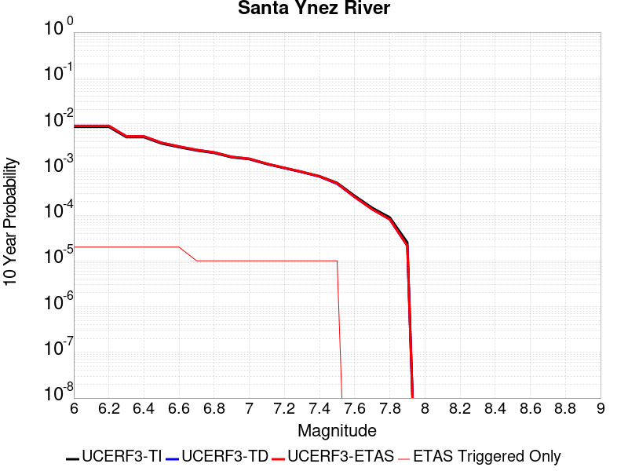 |

| Magnitude | 1 wk TI Prob | 1 wk TD Prob | 1 wk ETAS Prob | 1 wk ETAS/TD Gain | 1 wk ETAS Triggered Only | 1 mo TI Prob | 1 mo TD Prob | 1 mo ETAS Prob | 1 mo ETAS/TD Gain | 1 mo ETAS Triggered Only | 1 yr TI Prob | 1 yr TD Prob | 1 yr ETAS Prob | 1 yr ETAS/TD Gain | 1 yr ETAS Triggered Only | 10 yr TI Prob | 10 yr TD Prob | 10 yr ETAS Prob | 10 yr ETAS/TD Gain | 10 yr ETAS Triggered Only |
|-----|-----|-----|-----|-----|-----|-----|-----|-----|-----|-----|-----|-----|-----|-----|-----|-----|-----|-----|-----|-----|
| 6.0 | 1.6396456E-5 | 1.7209952E-5 | 2.720978E-5 | 1.5810491 | 1.0E-5 | 7.026863E-5 | 7.375505E-5 | 8.375431E-5 | 1.135574 | 1.0E-5 | 8.551848E-4 | 8.976334E-4 | 9.076244E-4 | 1.0111305 | 1.0E-5 | 0.0085190125 | 0.008943626 | 0.008963447 | 1.0022162 | 2.0E-5 |
| 6.1 | 1.6396456E-5 | 1.7209952E-5 | 2.720978E-5 | 1.5810491 | 1.0E-5 | 7.026863E-5 | 7.375505E-5 | 8.375431E-5 | 1.135574 | 1.0E-5 | 8.551848E-4 | 8.976334E-4 | 9.076244E-4 | 1.0111305 | 1.0E-5 | 0.0085190125 | 0.008943626 | 0.008963447 | 1.0022162 | 2.0E-5 |
| 6.2 | 1.6396456E-5 | 1.7209952E-5 | 2.720978E-5 | 1.5810491 | 1.0E-5 | 7.026863E-5 | 7.375505E-5 | 8.375431E-5 | 1.135574 | 1.0E-5 | 8.551848E-4 | 8.976334E-4 | 9.076244E-4 | 1.0111305 | 1.0E-5 | 0.0085190125 | 0.008943626 | 0.008963447 | 1.0022162 | 2.0E-5 |
| 6.3 | 9.736976E-6 | 1.0122604E-5 | 2.0122503E-5 | 1.9878781 | 1.0E-5 | 4.172923E-5 | 4.3381897E-5 | 5.3381464E-5 | 1.2305009 | 1.0E-5 | 5.0793495E-4 | 5.280516E-4 | 5.380463E-4 | 1.0189276 | 1.0E-5 | 0.005067755 | 0.005268474 | 0.005288369 | 1.0037762 | 2.0E-5 |
| 6.4 | 9.736976E-6 | 1.0122604E-5 | 2.0122503E-5 | 1.9878781 | 1.0E-5 | 4.172923E-5 | 4.3381897E-5 | 5.3381464E-5 | 1.2305009 | 1.0E-5 | 5.0793495E-4 | 5.280516E-4 | 5.380463E-4 | 1.0189276 | 1.0E-5 | 0.005067755 | 0.005268474 | 0.005288369 | 1.0037762 | 2.0E-5 |
| 6.5 | 7.081964E-6 | 7.3300935E-6 | 1.733002E-5 | 2.364229 | 1.0E-5 | 3.035092E-5 | 3.1414318E-5 | 4.1414005E-5 | 1.3183162 | 1.0E-5 | 3.694598E-4 | 3.8240378E-4 | 3.9239996E-4 | 1.0261403 | 1.0E-5 | 0.0036884616 | 0.0038176193 | 0.003837543 | 1.0052189 | 2.0E-5 |
| 6.6 | 5.873247E-6 | 6.059906E-6 | 1.6059845E-5 | 2.6501806 | 1.0E-5 | 2.5170815E-5 | 2.5970772E-5 | 3.597051E-5 | 1.3850383 | 1.0E-5 | 3.064116E-4 | 3.1614912E-4 | 3.2614596E-4 | 1.0316206 | 1.0E-5 | 0.0030598943 | 0.003157081 | 0.003177018 | 1.006315 | 2.0E-5 |
| 6.7 | 4.973277E-6 | 5.1160396E-6 | 1.5115988E-5 | 2.954627 | 1.0E-5 | 2.1313872E-5 | 2.1925702E-5 | 3.1925483E-5 | 1.4560758 | 1.0E-5 | 2.5946548E-4 | 2.669132E-4 | 2.7691052E-4 | 1.0374553 | 1.0E-5 | 0.0025916274 | 0.0026659751 | 0.0026759487 | 1.003741 | 1.0E-5 |
| 6.8 | 4.396492E-6 | 4.5111005E-6 | 1.4511055E-5 | 3.216744 | 1.0E-5 | 1.884197E-5 | 1.9333147E-5 | 2.9332954E-5 | 1.5172364 | 1.0E-5 | 2.2937685E-4 | 2.3535598E-4 | 2.4535364E-4 | 1.0424788 | 1.0E-5 | 0.0022914023 | 0.0023511027 | 0.0023610792 | 1.0042434 | 1.0E-5 |
| 6.9 | 3.5255632E-6 | 3.6014346E-6 | 1.3601399E-5 | 3.7766612 | 1.0E-5 | 1.5109469E-5 | 1.5434629E-5 | 2.5434476E-5 | 1.6478838 | 1.0E-5 | 1.8394225E-4 | 1.8790057E-4 | 1.9789868E-4 | 1.0532097 | 1.0E-5 | 0.0018379007 | 0.0018774332 | 0.0018874144 | 1.0053164 | 1.0E-5 |
| 7.0 | 3.211603E-6 | 3.2737478E-6 | 1.3273715E-5 | 4.054593 | 1.0E-5 | 1.376394E-5 | 1.4030273E-5 | 2.4030132E-5 | 1.7127345 | 1.0E-5 | 1.6756308E-4 | 1.7080532E-4 | 1.8080362E-4 | 1.0585362 | 1.0E-5 | 0.0016743679 | 0.0017067546 | 0.0017167375 | 1.0058491 | 1.0E-5 |
| 7.1 | 2.5094619E-6 | 2.5409972E-6 | 1.25409715E-5 | 4.935453 | 1.0E-5 | 1.0754793E-5 | 1.0889943E-5 | 2.0889835E-5 | 1.9182684 | 1.0E-5 | 1.3093173E-4 | 1.3257704E-4 | 1.4257572E-4 | 1.0754179 | 1.0E-5 | 0.0013085462 | 0.0013249855 | 0.0013349723 | 1.0075372 | 1.0E-5 |
| 7.2 | 2.0515774E-6 | 2.0620025E-6 | 1.2061982E-5 | 5.849644 | 1.0E-5 | 8.792445E-6 | 8.837124E-6 | 1.8837036E-5 | 2.1315799 | 1.0E-5 | 1.0704277E-4 | 1.0758672E-4 | 1.17585645E-4 | 1.0929383 | 1.0E-5 | 0.0010699122 | 0.0010753507 | 0.0010853399 | 1.0092893 | 1.0E-5 |
| 7.3 | 1.6845745E-6 | 1.677446E-6 | 1.1677429E-5 | 6.961434 | 1.0E-5 | 7.219585E-6 | 7.1890345E-6 | 1.7188962E-5 | 2.3909974 | 1.0E-5 | 8.78949E-5 | 8.752301E-5 | 9.7522134E-5 | 1.1142457 | 1.0E-5 | 8.7860145E-4 | 8.7488827E-4 | 8.848795E-4 | 1.01142 | 1.0E-5 |
| 7.4 | 1.3600285E-6 | 1.33338E-6 | 1.1333366E-5 | 8.499727 | 1.0E-5 | 5.82868E-6 | 5.7144734E-6 | 1.5714417E-5 | 2.7499325 | 1.0E-5 | 7.096187E-5 | 6.957151E-5 | 7.957082E-5 | 1.143727 | 1.0E-5 | 7.0939213E-4 | 6.954996E-4 | 7.054926E-4 | 1.0143682 | 1.0E-5 |
| 7.5 | 9.735342E-7 | 9.290423E-7 | 1.0929033E-5 | 11.763762 | 1.0E-5 | 4.172283E-6 | 3.981604E-6 | 1.3981564E-5 | 3.5115407 | 1.0E-5 | 5.079636E-5 | 4.8474965E-5 | 5.847448E-5 | 1.206282 | 1.0E-5 | 5.0784746E-4 | 4.8464563E-4 | 4.946408E-4 | 1.0206237 | 1.0E-5 |
| 7.6 | 5.067187E-7 | 4.778717E-7 | 4.778717E-7 | 1.0 | 0.0 | 2.1716498E-6 | 2.04802E-6 | 2.04802E-6 | 1.0 | 0.0 | 2.6439517E-5 | 2.4934365E-5 | 2.4934365E-5 | 1.0 | 0.0 | 2.643637E-4 | 2.4931642E-4 | 2.4931642E-4 | 1.0 | 0.0 |
| 7.7 | 2.769089E-7 | 2.5759866E-7 | 2.5759866E-7 | 1.0 | 0.0 | 1.1867519E-6 | 1.1039938E-6 | 1.1039938E-6 | 1.0 | 0.0 | 1.4448608E-5 | 1.3441041E-5 | 1.3441041E-5 | 1.0 | 0.0 | 1.444767E-4 | 1.3440232E-4 | 1.3440232E-4 | 1.0 | 0.0 |
| 7.8 | 1.7044663E-7 | 1.5449461E-7 | 1.5449461E-7 | 1.0 | 0.0 | 7.3048534E-7 | 6.621196E-7 | 6.621196E-7 | 1.0 | 0.0 | 8.893623E-6 | 8.061276E-6 | 8.061276E-6 | 1.0 | 0.0 | 8.893267E-5 | 8.060986E-5 | 8.060986E-5 | 1.0 | 0.0 |
| 7.9 | 4.8344287E-8 | 4.0912177E-8 | 4.0912177E-8 | 1.0 | 0.0 | 2.0718979E-7 | 1.7533789E-7 | 1.7533789E-7 | 1.0 | 0.0 | 2.5225327E-6 | 2.1347369E-6 | 2.1347369E-6 | 1.0 | 0.0 | 2.5225041E-5 | 2.1347167E-5 | 2.1347167E-5 | 1.0 | 0.0 |

## Hayward (So) 2011 CFM
*[(top)](#table-of-contents)*

| 1 Week | 1 Month | 1 Year | 10 Year |
|-----|-----|-----|-----|
|  |  |  | 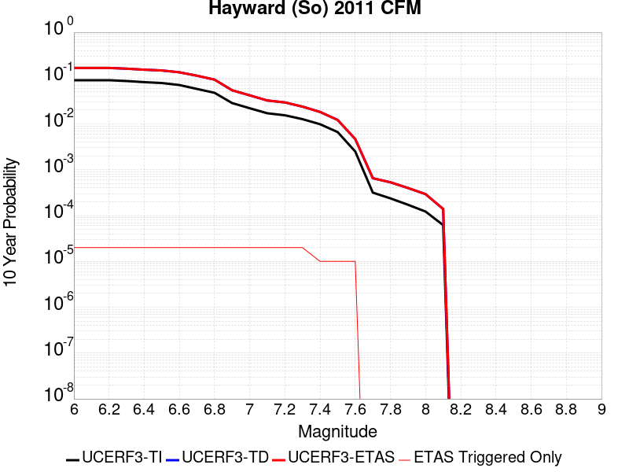 |

| Magnitude | 1 wk TI Prob | 1 wk TD Prob | 1 wk ETAS Prob | 1 wk ETAS/TD Gain | 1 wk ETAS Triggered Only | 1 mo TI Prob | 1 mo TD Prob | 1 mo ETAS Prob | 1 mo ETAS/TD Gain | 1 mo ETAS Triggered Only | 1 yr TI Prob | 1 yr TD Prob | 1 yr ETAS Prob | 1 yr ETAS/TD Gain | 1 yr ETAS Triggered Only | 10 yr TI Prob | 10 yr TD Prob | 10 yr ETAS Prob | 10 yr ETAS/TD Gain | 10 yr ETAS Triggered Only |
|-----|-----|-----|-----|-----|-----|-----|-----|-----|-----|-----|-----|-----|-----|-----|-----|-----|-----|-----|-----|-----|
| 6.0 | 1.8091932E-4 | 3.5726093E-4 | 3.5726093E-4 | 1.0 | 0.0 | 7.751381E-4 | 0.0015302298 | 0.0015302298 | 1.0 | 0.0 | 0.00939654 | 0.018473808 | 0.018483622 | 1.0005313 | 1.0E-5 | 0.090090066 | 0.16681154 | 0.1668282 | 1.0000999 | 2.0E-5 |
| 6.1 | 1.8091932E-4 | 3.5726093E-4 | 3.5726093E-4 | 1.0 | 0.0 | 7.751381E-4 | 0.0015302298 | 0.0015302298 | 1.0 | 0.0 | 0.00939654 | 0.018473808 | 0.018483622 | 1.0005313 | 1.0E-5 | 0.090090066 | 0.16681154 | 0.1668282 | 1.0000999 | 2.0E-5 |
| 6.2 | 1.8091932E-4 | 3.5726093E-4 | 3.5726093E-4 | 1.0 | 0.0 | 7.751381E-4 | 0.0015302298 | 0.0015302298 | 1.0 | 0.0 | 0.00939654 | 0.018473808 | 0.018483622 | 1.0005313 | 1.0E-5 | 0.090090066 | 0.16681154 | 0.1668282 | 1.0000999 | 2.0E-5 |
| 6.3 | 1.7322872E-4 | 3.4282645E-4 | 3.4282645E-4 | 1.0 | 0.0 | 7.4219756E-4 | 0.0014684385 | 0.0014684385 | 1.0 | 0.0 | 0.0089988755 | 0.017733958 | 0.01774378 | 1.0005538 | 1.0E-5 | 0.08643075 | 0.16074646 | 0.16076325 | 1.0001044 | 2.0E-5 |
| 6.4 | 1.6334097E-4 | 3.2363975E-4 | 3.2363975E-4 | 1.0 | 0.0 | 6.998449E-4 | 0.0013862988 | 0.0013862988 | 1.0 | 0.0 | 0.008487372 | 0.016749581 | 0.016759414 | 1.000587 | 1.0E-5 | 0.081704415 | 0.15263419 | 0.15265113 | 1.000111 | 2.0E-5 |
| 6.5 | 1.5600289E-4 | 3.103831E-4 | 3.103831E-4 | 1.0 | 0.0 | 6.684125E-4 | 0.0013295435 | 0.0013295435 | 1.0 | 0.0 | 0.008107598 | 0.016068943 | 0.016078781 | 1.0006123 | 1.0E-5 | 0.078181036 | 0.14691001 | 0.14692707 | 1.0001161 | 2.0E-5 |
| 6.6 | 1.4046066E-4 | 2.805153E-4 | 2.805153E-4 | 1.0 | 0.0 | 6.018354E-4 | 0.0012016613 | 0.0012016613 | 1.0 | 0.0 | 0.0073027555 | 0.014533587 | 0.014543441 | 1.0006781 | 1.0E-5 | 0.07067384 | 0.13399512 | 0.13401243 | 1.0001292 | 2.0E-5 |
| 6.7 | 1.14696966E-4 | 2.3288323E-4 | 2.3288323E-4 | 1.0 | 0.0 | 4.914658E-4 | 9.976943E-4 | 9.976943E-4 | 1.0 | 0.0 | 0.0059671924 | 0.01208034 | 0.012090219 | 1.0008178 | 1.0E-5 | 0.058094822 | 0.11281668 | 0.11283442 | 1.0001572 | 2.0E-5 |
| 6.8 | 9.3874296E-5 | 1.8875435E-4 | 1.8875435E-4 | 1.0 | 0.0 | 4.0225635E-4 | 8.0870016E-4 | 8.0870016E-4 | 1.0 | 0.0 | 0.0048864787 | 0.00980221 | 0.009812112 | 1.0010102 | 1.0E-5 | 0.047804173 | 0.09265828 | 0.09267643 | 1.0001959 | 2.0E-5 |
| 6.9 | 5.551852E-5 | 1.0737576E-4 | 1.0737576E-4 | 1.0 | 0.0 | 2.3791482E-4 | 4.601013E-4 | 4.601013E-4 | 1.0 | 0.0 | 0.0028927654 | 0.005587464 | 0.005597408 | 1.0017797 | 1.0E-5 | 0.028553981 | 0.054282483 | 0.054301396 | 1.0003484 | 2.0E-5 |
| 7.0 | 4.2662363E-5 | 8.252773E-5 | 8.252773E-5 | 1.0 | 0.0 | 1.8282588E-4 | 3.5364274E-4 | 3.5364274E-4 | 1.0 | 0.0 | 0.0022236328 | 0.0042971736 | 0.0043071304 | 1.0023171 | 1.0E-5 | 0.022015138 | 0.042094123 | 0.04211328 | 1.0004551 | 2.0E-5 |
| 7.1 | 3.305886E-5 | 6.307206E-5 | 6.307206E-5 | 1.0 | 0.0 | 1.4167312E-4 | 2.7028093E-4 | 2.7028093E-4 | 1.0 | 0.0 | 0.0017235056 | 0.0032857237 | 0.003295691 | 1.0030335 | 1.0E-5 | 0.017101998 | 0.032478187 | 0.032497536 | 1.0005958 | 2.0E-5 |
| 7.2 | 2.9856887E-5 | 5.7064462E-5 | 5.7064462E-5 | 1.0 | 0.0 | 1.2795182E-4 | 2.4453914E-4 | 2.4453914E-4 | 1.0 | 0.0 | 0.0015567001 | 0.0029732161 | 0.0029831864 | 1.0033534 | 1.0E-5 | 0.015458403 | 0.029477973 | 0.029497383 | 1.0006585 | 2.0E-5 |
| 7.3 | 2.4559737E-5 | 4.603359E-5 | 4.603359E-5 | 1.0 | 0.0 | 1.0525176E-4 | 1.9727198E-4 | 1.9727198E-4 | 1.0 | 0.0 | 0.0012806869 | 0.0023991538 | 0.0024091296 | 1.0041581 | 1.0E-5 | 0.012733313 | 0.023878254 | 0.023897776 | 1.0008175 | 2.0E-5 |
| 7.4 | 1.9002231E-5 | 3.5085814E-5 | 3.5085814E-5 | 1.0 | 0.0 | 8.143559E-5 | 1.5035916E-4 | 1.5035916E-4 | 1.0 | 0.0 | 9.910273E-4 | 0.0018290955 | 0.0018290955 | 1.0 | 0.0 | 0.009866194 | 0.01827623 | 0.018286048 | 1.0005372 | 1.0E-5 |
| 7.5 | 1.2783333E-5 | 2.3358793E-5 | 2.3358793E-5 | 1.0 | 0.0 | 5.4784563E-5 | 1.001053E-4 | 1.001053E-4 | 1.0 | 0.0 | 6.667979E-4 | 0.0012181065 | 0.0012181065 | 1.0 | 0.0 | 0.006648007 | 0.012223811 | 0.0122336885 | 1.0008081 | 1.0E-5 |
| 7.6 | 4.8149627E-6 | 8.8984125E-6 | 8.8984125E-6 | 1.0 | 0.0 | 2.063539E-5 | 3.8135506E-5 | 3.8135506E-5 | 1.0 | 0.0 | 2.5120692E-4 | 4.6420208E-4 | 4.6420208E-4 | 1.0 | 0.0 | 0.0025092314 | 0.0046865833 | 0.0046965363 | 1.0021237 | 1.0E-5 |
| 7.7 | 6.0838227E-7 | 1.2079701E-6 | 1.2079701E-6 | 1.0 | 0.0 | 2.6073499E-6 | 5.177004E-6 | 5.177004E-6 | 1.0 | 0.0 | 3.174402E-5 | 6.30282E-5 | 6.30282E-5 | 1.0 | 0.0 | 3.1739488E-4 | 6.5405015E-4 | 6.5405015E-4 | 1.0 | 0.0 |
| 7.8 | 4.5542808E-7 | 9.812286E-7 | 9.812286E-7 | 1.0 | 0.0 | 1.9518332E-6 | 4.2052584E-6 | 4.2052584E-6 | 1.0 | 0.0 | 2.376331E-5 | 5.119782E-5 | 5.119782E-5 | 1.0 | 0.0 | 2.3760769E-4 | 5.331101E-4 | 5.331101E-4 | 1.0 | 0.0 |
| 7.9 | 3.3016747E-7 | 7.401128E-7 | 7.401128E-7 | 1.0 | 0.0 | 1.4150027E-6 | 3.171908E-6 | 3.171908E-6 | 1.0 | 0.0 | 1.7227521E-5 | 3.8617298E-5 | 3.8617298E-5 | 1.0 | 0.0 | 1.7226185E-4 | 4.0002094E-4 | 4.0002094E-4 | 1.0 | 0.0 |
| 8.0 | 2.347038E-7 | 5.4817883E-7 | 5.4817883E-7 | 1.0 | 0.0 | 1.0058731E-6 | 2.3493355E-6 | 2.3493355E-6 | 1.0 | 0.0 | 1.2246436E-5 | 2.8602788E-5 | 2.8602788E-5 | 1.0 | 0.0 | 1.2245761E-4 | 2.940476E-4 | 2.940476E-4 | 1.0 | 0.0 |
| 8.1 | 1.18822804E-7 | 2.6104607E-7 | 2.6104607E-7 | 1.0 | 0.0 | 5.092405E-7 | 1.1187684E-6 | 1.1187684E-6 | 1.0 | 0.0 | 6.1999854E-6 | 1.3620921E-5 | 1.3620921E-5 | 1.0 | 0.0 | 6.199812E-5 | 1.394018E-4 | 1.394018E-4 | 1.0 | 0.0 |

## Great Valley 07 (Orestimba)
*[(top)](#table-of-contents)*

| 1 Week | 1 Month | 1 Year | 10 Year |
|-----|-----|-----|-----|
|  |  |  |  |

| Magnitude | 1 wk TI Prob | 1 wk TD Prob | 1 wk ETAS Prob | 1 wk ETAS/TD Gain | 1 wk ETAS Triggered Only | 1 mo TI Prob | 1 mo TD Prob | 1 mo ETAS Prob | 1 mo ETAS/TD Gain | 1 mo ETAS Triggered Only | 1 yr TI Prob | 1 yr TD Prob | 1 yr ETAS Prob | 1 yr ETAS/TD Gain | 1 yr ETAS Triggered Only | 10 yr TI Prob | 10 yr TD Prob | 10 yr ETAS Prob | 10 yr ETAS/TD Gain | 10 yr ETAS Triggered Only |
|-----|-----|-----|-----|-----|-----|-----|-----|-----|-----|-----|-----|-----|-----|-----|-----|-----|-----|-----|-----|-----|
| 6.0 | 2.9687902E-5 | 3.2759297E-5 | 3.2759297E-5 | 1.0 | 0.0 | 1.2722766E-4 | 1.4038983E-4 | 1.5038844E-4 | 1.0712203 | 1.0E-5 | 0.0015478961 | 0.0017079781 | 0.001717961 | 1.0058448 | 1.0E-5 | 0.015371585 | 0.01695606 | 0.01697572 | 1.0011595 | 2.0E-5 |
| 6.1 | 2.9687902E-5 | 3.2759297E-5 | 3.2759297E-5 | 1.0 | 0.0 | 1.2722766E-4 | 1.4038983E-4 | 1.5038844E-4 | 1.0712203 | 1.0E-5 | 0.0015478961 | 0.0017079781 | 0.001717961 | 1.0058448 | 1.0E-5 | 0.015371585 | 0.01695606 | 0.01697572 | 1.0011595 | 2.0E-5 |
| 6.2 | 1.9231524E-5 | 2.1160291E-5 | 2.1160291E-5 | 1.0 | 0.0 | 8.2418206E-5 | 9.068394E-5 | 9.068394E-5 | 1.0 | 0.0 | 0.0010029797 | 0.0011035409 | 0.0011035409 | 1.0 | 0.0 | 0.00998465 | 0.010983022 | 0.010983022 | 1.0 | 0.0 |
| 6.3 | 1.324766E-5 | 1.4549291E-5 | 1.4549291E-5 | 1.0 | 0.0 | 5.6774446E-5 | 6.2352665E-5 | 6.2352665E-5 | 1.0 | 0.0 | 6.910097E-4 | 7.588885E-4 | 7.588885E-4 | 1.0 | 0.0 | 0.006888649 | 0.0075639165 | 0.0075639165 | 1.0 | 0.0 |
| 6.4 | 7.818645E-6 | 8.573279E-6 | 8.573279E-6 | 1.0 | 0.0 | 3.3508048E-5 | 3.6742123E-5 | 3.6742123E-5 | 1.0 | 0.0 | 4.078841E-4 | 4.4724692E-4 | 4.4724692E-4 | 1.0 | 0.0 | 0.004071363 | 0.0044638086 | 0.0044638086 | 1.0 | 0.0 |
| 6.5 | 5.3076565E-6 | 5.8180976E-6 | 5.8180976E-6 | 1.0 | 0.0 | 2.27469E-5 | 2.4934478E-5 | 2.4934478E-5 | 1.0 | 0.0 | 2.7690834E-4 | 3.0353706E-4 | 3.0353706E-4 | 1.0 | 0.0 | 0.0027656353 | 0.0030314343 | 0.0030314343 | 1.0 | 0.0 |
| 6.6 | 3.6003578E-6 | 3.948698E-6 | 3.948698E-6 | 1.0 | 0.0 | 1.5430012E-5 | 1.692289E-5 | 1.692289E-5 | 1.0 | 0.0 | 1.8784421E-4 | 2.0601827E-4 | 2.0601827E-4 | 1.0 | 0.0 | 0.0018768552 | 0.0020584268 | 0.0020584268 | 1.0 | 0.0 |
| 6.7 | 2.5361826E-6 | 2.783612E-6 | 2.783612E-6 | 1.0 | 0.0 | 1.0869308E-5 | 1.1929718E-5 | 1.1929718E-5 | 1.0 | 0.0 | 1.3232579E-4 | 1.4523596E-4 | 1.4523596E-4 | 1.0 | 0.0 | 0.0013224703 | 0.0014515404 | 0.0014515404 | 1.0 | 0.0 |
| 6.8 | 1.2115831E-6 | 1.3314497E-6 | 1.3314497E-6 | 1.0 | 0.0 | 5.1924885E-6 | 5.7062057E-6 | 5.7062057E-6 | 1.0 | 0.0 | 6.3216714E-5 | 6.947181E-5 | 6.947181E-5 | 1.0 | 0.0 | 6.3198735E-4 | 6.9459603E-4 | 6.9459603E-4 | 1.0 | 0.0 |

## Earthquake Valley
*[(top)](#table-of-contents)*

| 1 Week | 1 Month | 1 Year | 10 Year |
|-----|-----|-----|-----|
| 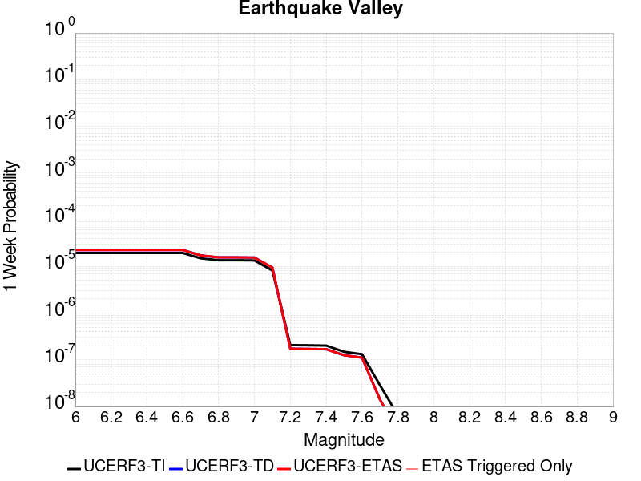 | 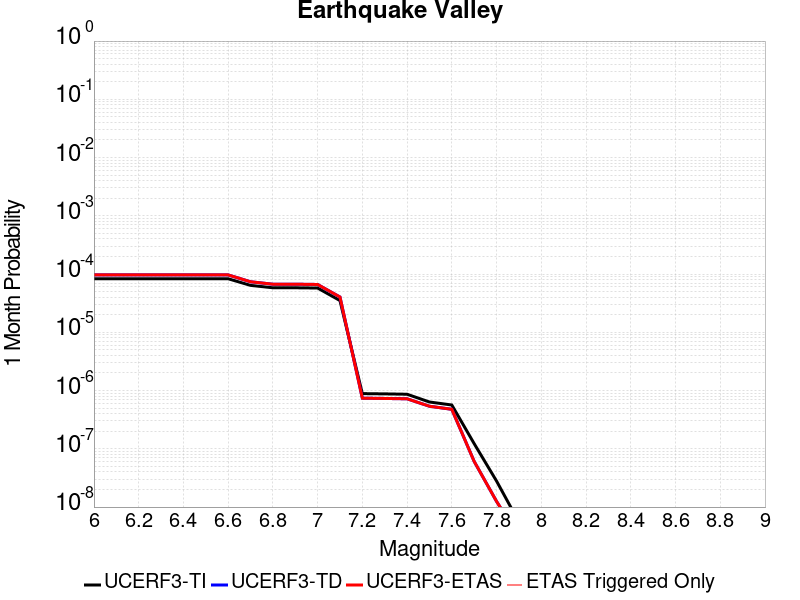 |  |  |

| Magnitude | 1 wk TI Prob | 1 wk TD Prob | 1 wk ETAS Prob | 1 wk ETAS/TD Gain | 1 wk ETAS Triggered Only | 1 mo TI Prob | 1 mo TD Prob | 1 mo ETAS Prob | 1 mo ETAS/TD Gain | 1 mo ETAS Triggered Only | 1 yr TI Prob | 1 yr TD Prob | 1 yr ETAS Prob | 1 yr ETAS/TD Gain | 1 yr ETAS Triggered Only | 10 yr TI Prob | 10 yr TD Prob | 10 yr ETAS Prob | 10 yr ETAS/TD Gain | 10 yr ETAS Triggered Only |
|-----|-----|-----|-----|-----|-----|-----|-----|-----|-----|-----|-----|-----|-----|-----|-----|-----|-----|-----|-----|-----|
| 6.0 | 1.9416384E-5 | 2.2586088E-5 | 2.2586088E-5 | 1.0 | 0.0 | 8.321042E-5 | 9.67946E-5 | 9.67946E-5 | 1.0 | 0.0 | 0.001012616 | 0.0011779574 | 0.0011979338 | 1.0169586 | 2.0E-5 | 0.010080142 | 0.01172898 | 0.011748745 | 1.0016851 | 2.0E-5 |
| 6.1 | 1.9416384E-5 | 2.2586088E-5 | 2.2586088E-5 | 1.0 | 0.0 | 8.321042E-5 | 9.67946E-5 | 9.67946E-5 | 1.0 | 0.0 | 0.001012616 | 0.0011779574 | 0.0011979338 | 1.0169586 | 2.0E-5 | 0.010080142 | 0.01172898 | 0.011748745 | 1.0016851 | 2.0E-5 |
| 6.2 | 1.9416384E-5 | 2.2586088E-5 | 2.2586088E-5 | 1.0 | 0.0 | 8.321042E-5 | 9.67946E-5 | 9.67946E-5 | 1.0 | 0.0 | 0.001012616 | 0.0011779574 | 0.0011979338 | 1.0169586 | 2.0E-5 | 0.010080142 | 0.01172898 | 0.011748745 | 1.0016851 | 2.0E-5 |
| 6.3 | 1.9416384E-5 | 2.2586088E-5 | 2.2586088E-5 | 1.0 | 0.0 | 8.321042E-5 | 9.67946E-5 | 9.67946E-5 | 1.0 | 0.0 | 0.001012616 | 0.0011779574 | 0.0011979338 | 1.0169586 | 2.0E-5 | 0.010080142 | 0.01172898 | 0.011748745 | 1.0016851 | 2.0E-5 |
| 6.4 | 1.9416384E-5 | 2.2586088E-5 | 2.2586088E-5 | 1.0 | 0.0 | 8.321042E-5 | 9.67946E-5 | 9.67946E-5 | 1.0 | 0.0 | 0.001012616 | 0.0011779574 | 0.0011979338 | 1.0169586 | 2.0E-5 | 0.010080142 | 0.01172898 | 0.011748745 | 1.0016851 | 2.0E-5 |
| 6.5 | 1.9389157E-5 | 2.2554674E-5 | 2.2554674E-5 | 1.0 | 0.0 | 8.309374E-5 | 9.6659984E-5 | 9.6659984E-5 | 1.0 | 0.0 | 0.0010111968 | 0.0011763201 | 0.0011962967 | 1.0169822 | 2.0E-5 | 0.010066078 | 0.01171278 | 0.011732547 | 1.0016875 | 2.0E-5 |
| 6.6 | 1.9389157E-5 | 2.2554674E-5 | 2.2554674E-5 | 1.0 | 0.0 | 8.309374E-5 | 9.6659984E-5 | 9.6659984E-5 | 1.0 | 0.0 | 0.0010111968 | 0.0011763201 | 0.0011962967 | 1.0169822 | 2.0E-5 | 0.010066078 | 0.01171278 | 0.011732547 | 1.0016875 | 2.0E-5 |
| 6.7 | 1.4925434E-5 | 1.7209673E-5 | 1.7209673E-5 | 1.0 | 0.0 | 6.396457E-5 | 7.3754134E-5 | 7.3754134E-5 | 1.0 | 0.0 | 7.7849044E-4 | 8.9767174E-4 | 9.176538E-4 | 1.0222598 | 2.0E-5 | 0.007757689 | 0.008948834 | 0.008968655 | 1.0022149 | 2.0E-5 |
| 6.8 | 1.3570335E-5 | 1.5618141E-5 | 1.5618141E-5 | 1.0 | 0.0 | 5.8157282E-5 | 6.693364E-5 | 6.693364E-5 | 1.0 | 0.0 | 7.0783484E-4 | 8.1469445E-4 | 8.346782E-4 | 1.0245291 | 2.0E-5 | 0.0070558446 | 0.00812515 | 0.008144988 | 1.0024415 | 2.0E-5 |
| 6.9 | 1.3570335E-5 | 1.5618141E-5 | 1.5618141E-5 | 1.0 | 0.0 | 5.8157282E-5 | 6.693364E-5 | 6.693364E-5 | 1.0 | 0.0 | 7.0783484E-4 | 8.1469445E-4 | 8.346782E-4 | 1.0245291 | 2.0E-5 | 0.0070558446 | 0.00812515 | 0.008144988 | 1.0024415 | 2.0E-5 |
| 7.0 | 1.3433392E-5 | 1.5461674E-5 | 1.5461674E-5 | 1.0 | 0.0 | 5.757041E-5 | 6.626309E-5 | 6.626309E-5 | 1.0 | 0.0 | 7.0069433E-4 | 8.0653664E-4 | 8.265205E-4 | 1.0247774 | 2.0E-5 | 0.006984891 | 0.008044164 | 0.008064004 | 1.0024663 | 2.0E-5 |
| 7.1 | 8.181609E-6 | 9.417654E-6 | 9.417654E-6 | 1.0 | 0.0 | 3.5063567E-5 | 4.036113E-5 | 4.036113E-5 | 1.0 | 0.0 | 4.268153E-4 | 4.9135304E-4 | 5.013481E-4 | 1.020342 | 1.0E-5 | 0.0042599645 | 0.004909244 | 0.0049191946 | 1.0020269 | 1.0E-5 |
| 7.2 | 2.0663983E-7 | 1.7265235E-7 | 1.7265235E-7 | 1.0 | 0.0 | 8.855989E-7 | 7.3993846E-7 | 7.3993846E-7 | 1.0 | 0.0 | 1.0782113E-5 | 9.008717E-6 | 9.008717E-6 | 1.0 | 0.0 | 1.07815904E-4 | 9.008388E-5 | 9.008388E-5 | 1.0 | 0.0 |
| 7.3 | 2.0462376E-7 | 1.7080716E-7 | 1.7080716E-7 | 1.0 | 0.0 | 8.7695867E-7 | 7.320305E-7 | 7.320305E-7 | 1.0 | 0.0 | 1.0676919E-5 | 8.912439E-6 | 8.912439E-6 | 1.0 | 0.0 | 1.0676406E-4 | 8.912117E-5 | 8.912117E-5 | 1.0 | 0.0 |
| 7.4 | 2.0171088E-7 | 1.686317E-7 | 1.686317E-7 | 1.0 | 0.0 | 8.644749E-7 | 7.227071E-7 | 7.227071E-7 | 1.0 | 0.0 | 1.0524931E-5 | 8.798927E-6 | 8.798927E-6 | 1.0 | 0.0 | 1.05244326E-4 | 8.798615E-5 | 8.798615E-5 | 1.0 | 0.0 |
| 7.5 | 1.4847944E-7 | 1.2561128E-7 | 1.2561128E-7 | 1.0 | 0.0 | 6.363403E-7 | 5.3833395E-7 | 5.3833395E-7 | 1.0 | 0.0 | 7.747416E-6 | 6.554198E-6 | 6.554198E-6 | 1.0 | 0.0 | 7.747146E-5 | 6.554026E-5 | 6.554026E-5 | 1.0 | 0.0 |
| 7.6 | 1.3185847E-7 | 1.1124904E-7 | 1.1124904E-7 | 1.0 | 0.0 | 5.6510765E-7 | 4.767815E-7 | 4.767815E-7 | 1.0 | 0.0 | 6.8801637E-6 | 5.8048013E-6 | 5.8048013E-6 | 1.0 | 0.0 | 6.8799505E-5 | 5.804671E-5 | 5.804671E-5 | 1.0 | 0.0 |
| 7.7 | 2.8609954E-8 | 1.4173791E-8 | 1.4173791E-8 | 1.0 | 0.0 | 1.2261408E-7 | 6.074482E-8 | 6.074482E-8 | 1.0 | 0.0 | 1.4928254E-6 | 7.3956795E-7 | 7.3956795E-7 | 1.0 | 0.0 | 1.4928154E-5 | 7.3956603E-6 | 7.3956603E-6 | 1.0 | 0.0 |
| 7.8 | 6.527266E-9 | 2.92397E-9 | 2.92397E-9 | 1.0 | 0.0 | 2.7973995E-8 | 1.25312996E-8 | 1.25312996E-8 | 1.0 | 0.0 | 3.4058334E-7 | 1.5256856E-7 | 1.5256856E-7 | 1.0 | 0.0 | 3.4058282E-6 | 1.5256848E-6 | 1.5256848E-6 | 1.0 | 0.0 |
| 7.9 | 1.2898267E-9 | 7.128649E-10 | 7.128649E-10 | 1.0 | 0.0 | 5.527829E-9 | 3.0551353E-9 | 3.0551353E-9 | 1.0 | 0.0 | 6.7301315E-8 | 3.7196273E-8 | 3.7196273E-8 | 1.0 | 0.0 | 6.7301295E-7 | 3.7196273E-7 | 3.7196273E-7 | 1.0 | 0.0 |

## San Gabriel
*[(top)](#table-of-contents)*

| 1 Week | 1 Month | 1 Year | 10 Year |
|-----|-----|-----|-----|
|  |  |  |  |

| Magnitude | 1 wk TI Prob | 1 wk TD Prob | 1 wk ETAS Prob | 1 wk ETAS/TD Gain | 1 wk ETAS Triggered Only | 1 mo TI Prob | 1 mo TD Prob | 1 mo ETAS Prob | 1 mo ETAS/TD Gain | 1 mo ETAS Triggered Only | 1 yr TI Prob | 1 yr TD Prob | 1 yr ETAS Prob | 1 yr ETAS/TD Gain | 1 yr ETAS Triggered Only | 10 yr TI Prob | 10 yr TD Prob | 10 yr ETAS Prob | 10 yr ETAS/TD Gain | 10 yr ETAS Triggered Only |
|-----|-----|-----|-----|-----|-----|-----|-----|-----|-----|-----|-----|-----|-----|-----|-----|-----|-----|-----|-----|-----|
| 6.0 | 1.083775E-5 | 1.199374E-5 | 1.199374E-5 | 1.0 | 0.0 | 4.6446676E-5 | 5.1400795E-5 | 5.1400795E-5 | 1.0 | 0.0 | 5.653415E-4 | 6.256363E-4 | 6.256363E-4 | 1.0 | 0.0 | 0.0056390543 | 0.0062508355 | 0.006260773 | 1.0015898 | 1.0E-5 |
| 6.1 | 1.083775E-5 | 1.199374E-5 | 1.199374E-5 | 1.0 | 0.0 | 4.6446676E-5 | 5.1400795E-5 | 5.1400795E-5 | 1.0 | 0.0 | 5.653415E-4 | 6.256363E-4 | 6.256363E-4 | 1.0 | 0.0 | 0.0056390543 | 0.0062508355 | 0.006260773 | 1.0015898 | 1.0E-5 |
| 6.2 | 1.083775E-5 | 1.199374E-5 | 1.199374E-5 | 1.0 | 0.0 | 4.6446676E-5 | 5.1400795E-5 | 5.1400795E-5 | 1.0 | 0.0 | 5.653415E-4 | 6.256363E-4 | 6.256363E-4 | 1.0 | 0.0 | 0.0056390543 | 0.0062508355 | 0.006260773 | 1.0015898 | 1.0E-5 |
| 6.3 | 1.083775E-5 | 1.199374E-5 | 1.199374E-5 | 1.0 | 0.0 | 4.6446676E-5 | 5.1400795E-5 | 5.1400795E-5 | 1.0 | 0.0 | 5.653415E-4 | 6.256363E-4 | 6.256363E-4 | 1.0 | 0.0 | 0.0056390543 | 0.0062508355 | 0.006260773 | 1.0015898 | 1.0E-5 |
| 6.4 | 1.083775E-5 | 1.199374E-5 | 1.199374E-5 | 1.0 | 0.0 | 4.6446676E-5 | 5.1400795E-5 | 5.1400795E-5 | 1.0 | 0.0 | 5.653415E-4 | 6.256363E-4 | 6.256363E-4 | 1.0 | 0.0 | 0.0056390543 | 0.0062508355 | 0.006260773 | 1.0015898 | 1.0E-5 |
| 6.5 | 6.7317824E-6 | 7.725408E-6 | 7.725408E-6 | 1.0 | 0.0 | 2.8850178E-5 | 3.3108478E-5 | 3.3108478E-5 | 1.0 | 0.0 | 3.511943E-4 | 4.0302222E-4 | 4.0302222E-4 | 1.0 | 0.0 | 0.003506398 | 0.0040339995 | 0.004043959 | 1.002469 | 1.0E-5 |
| 6.6 | 6.7317824E-6 | 7.725408E-6 | 7.725408E-6 | 1.0 | 0.0 | 2.8850178E-5 | 3.3108478E-5 | 3.3108478E-5 | 1.0 | 0.0 | 3.511943E-4 | 4.0302222E-4 | 4.0302222E-4 | 1.0 | 0.0 | 0.003506398 | 0.0040339995 | 0.004043959 | 1.002469 | 1.0E-5 |
| 6.7 | 6.274881E-6 | 7.2543207E-6 | 7.2543207E-6 | 1.0 | 0.0 | 2.6892068E-5 | 3.108958E-5 | 3.108958E-5 | 1.0 | 0.0 | 3.2736175E-4 | 3.7845087E-4 | 3.7845087E-4 | 1.0 | 0.0 | 0.0032687993 | 0.0037891432 | 0.0037991053 | 1.0026292 | 1.0E-5 |
| 6.8 | 5.996209E-6 | 6.967036E-6 | 6.967036E-6 | 1.0 | 0.0 | 2.5697784E-5 | 2.985839E-5 | 2.985839E-5 | 1.0 | 0.0 | 3.128256E-4 | 3.6346618E-4 | 3.6346618E-4 | 1.0 | 0.0 | 0.003123856 | 0.0036397942 | 0.003649758 | 1.0027374 | 1.0E-5 |
| 6.9 | 5.686331E-6 | 6.632049E-6 | 6.632049E-6 | 1.0 | 0.0 | 2.4369761E-5 | 2.8422763E-5 | 2.8422763E-5 | 1.0 | 0.0 | 2.9666146E-4 | 3.459931E-4 | 3.459931E-4 | 1.0 | 0.0 | 0.0029626573 | 0.0034656196 | 0.003475585 | 1.0028754 | 1.0E-5 |
| 7.0 | 5.2329838E-6 | 6.1559103E-6 | 6.1559103E-6 | 1.0 | 0.0 | 2.242688E-5 | 2.638221E-5 | 2.638221E-5 | 1.0 | 0.0 | 2.7301308E-4 | 3.2115684E-4 | 3.2115684E-4 | 1.0 | 0.0 | 0.002726779 | 0.0032179903 | 0.0032279582 | 1.0030975 | 1.0E-5 |
| 7.1 | 5.135671E-6 | 6.0460143E-6 | 6.0460143E-6 | 1.0 | 0.0 | 2.2009834E-5 | 2.5911237E-5 | 2.5911237E-5 | 1.0 | 0.0 | 2.6793676E-4 | 3.154244E-4 | 3.154244E-4 | 1.0 | 0.0 | 0.0026761394 | 0.0031608304 | 0.0031707988 | 1.0031537 | 1.0E-5 |
| 7.2 | 4.989062E-6 | 5.8793566E-6 | 5.8793566E-6 | 1.0 | 0.0 | 2.1381518E-5 | 2.5197003E-5 | 2.5197003E-5 | 1.0 | 0.0 | 2.6028889E-4 | 3.067311E-4 | 3.067311E-4 | 1.0 | 0.0 | 0.0025998424 | 0.0030741405 | 0.0030841099 | 1.003243 | 1.0E-5 |
| 7.3 | 4.8219395E-6 | 5.710877E-6 | 5.710877E-6 | 1.0 | 0.0 | 2.0665291E-5 | 2.447496E-5 | 2.447496E-5 | 1.0 | 0.0 | 2.5157086E-4 | 2.9794266E-4 | 2.9794266E-4 | 1.0 | 0.0 | 0.0025128627 | 0.0029864958 | 0.002996466 | 1.0033385 | 1.0E-5 |
| 7.4 | 4.7118383E-6 | 5.599405E-6 | 5.599405E-6 | 1.0 | 0.0 | 2.0193436E-5 | 2.3997234E-5 | 2.3997234E-5 | 1.0 | 0.0 | 2.4582737E-4 | 2.921279E-4 | 2.921279E-4 | 1.0 | 0.0 | 0.002455556 | 0.0029285017 | 0.0029384722 | 1.0034047 | 1.0E-5 |
| 7.5 | 4.5506545E-6 | 5.4447314E-6 | 5.4447314E-6 | 1.0 | 0.0 | 1.9502659E-5 | 2.3334358E-5 | 2.3334358E-5 | 1.0 | 0.0 | 2.37419E-4 | 2.8405953E-4 | 2.8405953E-4 | 1.0 | 0.0 | 0.002371655 | 0.0028480263 | 0.0028579978 | 1.0035012 | 1.0E-5 |
| 7.6 | 4.343636E-6 | 5.237542E-6 | 5.237542E-6 | 1.0 | 0.0 | 1.861545E-5 | 2.244642E-5 | 2.244642E-5 | 1.0 | 0.0 | 2.2661954E-4 | 2.7325164E-4 | 2.7325164E-4 | 1.0 | 0.0 | 0.0022638857 | 0.00274021 | 0.0027501825 | 1.0036393 | 1.0E-5 |
| 7.7 | 2.936235E-6 | 2.7495403E-6 | 2.7495403E-6 | 1.0 | 0.0 | 1.2583803E-5 | 1.1783691E-5 | 1.1783691E-5 | 1.0 | 0.0 | 1.5319703E-4 | 1.4345703E-4 | 1.4345703E-4 | 1.0 | 0.0 | 0.0015309147 | 0.0014409543 | 0.0014509399 | 1.0069299 | 1.0E-5 |
| 7.8 | 1.4541639E-6 | 9.145936E-7 | 9.145936E-7 | 1.0 | 0.0 | 6.232116E-6 | 3.9196807E-6 | 3.9196807E-6 | 1.0 | 0.0 | 7.587337E-5 | 4.772107E-5 | 4.772107E-5 | 1.0 | 0.0 | 7.584747E-4 | 4.820283E-4 | 4.820283E-4 | 1.0 | 0.0 |
| 7.9 | 8.098958E-7 | 2.426228E-7 | 2.426228E-7 | 1.0 | 0.0 | 3.4709774E-6 | 1.0398115E-6 | 1.0398115E-6 | 1.0 | 0.0 | 4.225833E-5 | 1.2659632E-5 | 1.2659632E-5 | 1.0 | 0.0 | 4.2250296E-4 | 1.2968633E-4 | 1.2968633E-4 | 1.0 | 0.0 |
| 8.0 | 5.2473234E-7 | 7.719376E-8 | 7.719376E-8 | 1.0 | 0.0 | 2.248851E-6 | 3.3083035E-7 | 3.3083035E-7 | 1.0 | 0.0 | 2.7379416E-5 | 4.027852E-6 | 4.027852E-6 | 1.0 | 0.0 | 2.7376044E-4 | 4.241171E-5 | 4.241171E-5 | 1.0 | 0.0 |
| 8.1 | 3.3162388E-7 | 4.1720053E-8 | 4.1720053E-8 | 1.0 | 0.0 | 1.4212444E-6 | 1.788002E-7 | 1.788002E-7 | 1.0 | 0.0 | 1.7303513E-5 | 2.1768903E-6 | 2.1768903E-6 | 1.0 | 0.0 | 1.7302166E-4 | 2.3088427E-5 | 2.3088427E-5 | 1.0 | 0.0 |
| 8.2 | 1.0235345E-7 | 1.4113462E-8 | 1.4113462E-8 | 1.0 | 0.0 | 4.3865757E-7 | 6.0486265E-8 | 6.0486265E-8 | 1.0 | 0.0 | 5.340643E-6 | 7.3642E-7 | 7.3642E-7 | 1.0 | 0.0 | 5.3405143E-5 | 7.9661195E-6 | 7.9661195E-6 | 1.0 | 0.0 |

## Pitas Point (Lower)-Montalvo
*[(top)](#table-of-contents)*

| 1 Week | 1 Month | 1 Year | 10 Year |
|-----|-----|-----|-----|
|  | 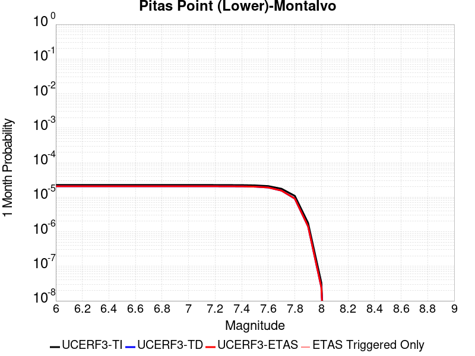 |  |  |

| Magnitude | 1 wk TI Prob | 1 wk TD Prob | 1 wk ETAS Prob | 1 wk ETAS/TD Gain | 1 wk ETAS Triggered Only | 1 mo TI Prob | 1 mo TD Prob | 1 mo ETAS Prob | 1 mo ETAS/TD Gain | 1 mo ETAS Triggered Only | 1 yr TI Prob | 1 yr TD Prob | 1 yr ETAS Prob | 1 yr ETAS/TD Gain | 1 yr ETAS Triggered Only | 10 yr TI Prob | 10 yr TD Prob | 10 yr ETAS Prob | 10 yr ETAS/TD Gain | 10 yr ETAS Triggered Only |
|-----|-----|-----|-----|-----|-----|-----|-----|-----|-----|-----|-----|-----|-----|-----|-----|-----|-----|-----|-----|-----|
| 6.0 | 5.2543637E-6 | 4.8380302E-6 | 4.8380302E-6 | 1.0 | 0.0 | 2.2518509E-5 | 2.0734253E-5 | 2.0734253E-5 | 1.0 | 0.0 | 2.7412834E-4 | 2.524106E-4 | 2.6240808E-4 | 1.039608 | 1.0E-5 | 0.0027379042 | 0.0025212716 | 0.0025312465 | 1.0039562 | 1.0E-5 |
| 6.1 | 5.2543637E-6 | 4.8380302E-6 | 4.8380302E-6 | 1.0 | 0.0 | 2.2518509E-5 | 2.0734253E-5 | 2.0734253E-5 | 1.0 | 0.0 | 2.7412834E-4 | 2.524106E-4 | 2.6240808E-4 | 1.039608 | 1.0E-5 | 0.0027379042 | 0.0025212716 | 0.0025312465 | 1.0039562 | 1.0E-5 |
| 6.2 | 5.2543637E-6 | 4.8380302E-6 | 4.8380302E-6 | 1.0 | 0.0 | 2.2518509E-5 | 2.0734253E-5 | 2.0734253E-5 | 1.0 | 0.0 | 2.7412834E-4 | 2.524106E-4 | 2.6240808E-4 | 1.039608 | 1.0E-5 | 0.0027379042 | 0.0025212716 | 0.0025312465 | 1.0039562 | 1.0E-5 |
| 6.3 | 5.2543637E-6 | 4.8380302E-6 | 4.8380302E-6 | 1.0 | 0.0 | 2.2518509E-5 | 2.0734253E-5 | 2.0734253E-5 | 1.0 | 0.0 | 2.7412834E-4 | 2.524106E-4 | 2.6240808E-4 | 1.039608 | 1.0E-5 | 0.0027379042 | 0.0025212716 | 0.0025312465 | 1.0039562 | 1.0E-5 |
| 6.4 | 5.2543637E-6 | 4.8380302E-6 | 4.8380302E-6 | 1.0 | 0.0 | 2.2518509E-5 | 2.0734253E-5 | 2.0734253E-5 | 1.0 | 0.0 | 2.7412834E-4 | 2.524106E-4 | 2.6240808E-4 | 1.039608 | 1.0E-5 | 0.0027379042 | 0.0025212716 | 0.0025312465 | 1.0039562 | 1.0E-5 |
| 6.5 | 5.2543637E-6 | 4.8380302E-6 | 4.8380302E-6 | 1.0 | 0.0 | 2.2518509E-5 | 2.0734253E-5 | 2.0734253E-5 | 1.0 | 0.0 | 2.7412834E-4 | 2.524106E-4 | 2.6240808E-4 | 1.039608 | 1.0E-5 | 0.0027379042 | 0.0025212716 | 0.0025312465 | 1.0039562 | 1.0E-5 |
| 6.6 | 5.2543637E-6 | 4.8380302E-6 | 4.8380302E-6 | 1.0 | 0.0 | 2.2518509E-5 | 2.0734253E-5 | 2.0734253E-5 | 1.0 | 0.0 | 2.7412834E-4 | 2.524106E-4 | 2.6240808E-4 | 1.039608 | 1.0E-5 | 0.0027379042 | 0.0025212716 | 0.0025312465 | 1.0039562 | 1.0E-5 |
| 6.7 | 5.2543637E-6 | 4.8380302E-6 | 4.8380302E-6 | 1.0 | 0.0 | 2.2518509E-5 | 2.0734253E-5 | 2.0734253E-5 | 1.0 | 0.0 | 2.7412834E-4 | 2.524106E-4 | 2.6240808E-4 | 1.039608 | 1.0E-5 | 0.0027379042 | 0.0025212716 | 0.0025312465 | 1.0039562 | 1.0E-5 |
| 6.8 | 5.2543637E-6 | 4.8380302E-6 | 4.8380302E-6 | 1.0 | 0.0 | 2.2518509E-5 | 2.0734253E-5 | 2.0734253E-5 | 1.0 | 0.0 | 2.7412834E-4 | 2.524106E-4 | 2.6240808E-4 | 1.039608 | 1.0E-5 | 0.0027379042 | 0.0025212716 | 0.0025312465 | 1.0039562 | 1.0E-5 |
| 6.9 | 5.2543637E-6 | 4.8380302E-6 | 4.8380302E-6 | 1.0 | 0.0 | 2.2518509E-5 | 2.0734253E-5 | 2.0734253E-5 | 1.0 | 0.0 | 2.7412834E-4 | 2.524106E-4 | 2.6240808E-4 | 1.039608 | 1.0E-5 | 0.0027379042 | 0.0025212716 | 0.0025312465 | 1.0039562 | 1.0E-5 |
| 7.0 | 5.2543637E-6 | 4.8380302E-6 | 4.8380302E-6 | 1.0 | 0.0 | 2.2518509E-5 | 2.0734253E-5 | 2.0734253E-5 | 1.0 | 0.0 | 2.7412834E-4 | 2.524106E-4 | 2.6240808E-4 | 1.039608 | 1.0E-5 | 0.0027379042 | 0.0025212716 | 0.0025312465 | 1.0039562 | 1.0E-5 |
| 7.1 | 5.2543637E-6 | 4.8380302E-6 | 4.8380302E-6 | 1.0 | 0.0 | 2.2518509E-5 | 2.0734253E-5 | 2.0734253E-5 | 1.0 | 0.0 | 2.7412834E-4 | 2.524106E-4 | 2.6240808E-4 | 1.039608 | 1.0E-5 | 0.0027379042 | 0.0025212716 | 0.0025312465 | 1.0039562 | 1.0E-5 |
| 7.2 | 5.2458695E-6 | 4.829184E-6 | 4.829184E-6 | 1.0 | 0.0 | 2.2482105E-5 | 2.0696341E-5 | 2.0696341E-5 | 1.0 | 0.0 | 2.7368523E-4 | 2.5194912E-4 | 2.619466E-4 | 1.0396806 | 1.0E-5 | 0.0027334841 | 0.0025166674 | 0.002526642 | 1.0039635 | 1.0E-5 |
| 7.3 | 5.22665E-6 | 4.809101E-6 | 4.809101E-6 | 1.0 | 0.0 | 2.2399736E-5 | 2.061027E-5 | 2.061027E-5 | 1.0 | 0.0 | 2.7268266E-4 | 2.5090147E-4 | 2.6089896E-4 | 1.0398463 | 1.0E-5 | 0.002723483 | 0.0025062144 | 0.0025161894 | 1.00398 | 1.0E-5 |
| 7.4 | 5.210642E-6 | 4.7923127E-6 | 4.7923127E-6 | 1.0 | 0.0 | 2.233113E-5 | 2.0538324E-5 | 2.0538324E-5 | 1.0 | 0.0 | 2.718476E-4 | 2.500257E-4 | 2.600232E-4 | 1.0399859 | 1.0E-5 | 0.002715153 | 0.0024974765 | 0.0025074515 | 1.003994 | 1.0E-5 |
| 7.5 | 5.1226016E-6 | 4.700197E-6 | 4.700197E-6 | 1.0 | 0.0 | 2.1953823E-5 | 2.0143549E-5 | 2.0143549E-5 | 1.0 | 0.0 | 2.67255E-4 | 2.452204E-4 | 2.5521795E-4 | 1.0407697 | 1.0E-5 | 0.0026693381 | 0.00244953 | 0.0024595053 | 1.0040724 | 1.0E-5 |
| 7.6 | 4.8796987E-6 | 4.44509E-6 | 4.44509E-6 | 1.0 | 0.0 | 2.0912828E-5 | 1.9050249E-5 | 1.9050249E-5 | 1.0 | 0.0 | 2.5458392E-4 | 2.3191239E-4 | 2.4191006E-4 | 1.0431098 | 1.0E-5 | 0.0025429246 | 0.0023167343 | 0.002326711 | 1.0043064 | 1.0E-5 |
| 7.7 | 4.0834398E-6 | 3.609237E-6 | 3.609237E-6 | 1.0 | 0.0 | 1.7500339E-5 | 1.5468067E-5 | 1.5468067E-5 | 1.0 | 0.0 | 2.1304579E-4 | 1.8830769E-4 | 1.983058E-4 | 1.0530946 | 1.0E-5 | 0.0021284167 | 0.001881505 | 0.0018914862 | 1.0053049 | 1.0E-5 |
| 7.8 | 2.5445438E-6 | 2.1212973E-6 | 2.1212973E-6 | 1.0 | 0.0 | 1.0905142E-5 | 9.091243E-6 | 9.091243E-6 | 1.0 | 0.0 | 1.3276201E-4 | 1.106803E-4 | 1.206792E-4 | 1.0903403 | 1.0E-5 | 0.0013268272 | 0.0011062565 | 0.0011162454 | 1.0090295 | 1.0E-5 |
| 7.9 | 4.1677114E-7 | 3.3294845E-7 | 3.3294845E-7 | 1.0 | 0.0 | 1.7861609E-6 | 1.4269211E-6 | 1.4269211E-6 | 1.0 | 0.0 | 2.1746291E-5 | 1.737263E-5 | 1.737263E-5 | 1.0 | 0.0 | 2.1744163E-4 | 1.7371304E-4 | 1.7371304E-4 | 1.0 | 0.0 |
| 8.0 | 7.791402E-9 | 5.683722E-9 | 5.683722E-9 | 1.0 | 0.0 | 3.3391725E-8 | 2.4358807E-8 | 2.4358807E-8 | 1.0 | 0.0 | 4.0654416E-7 | 2.9656846E-7 | 2.9656846E-7 | 1.0 | 0.0 | 4.065434E-6 | 2.9656826E-6 | 2.9656826E-6 | 1.0 | 0.0 |

## Emerson-Copper Mtn 2011
*[(top)](#table-of-contents)*

| 1 Week | 1 Month | 1 Year | 10 Year |
|-----|-----|-----|-----|
|  |  |  | 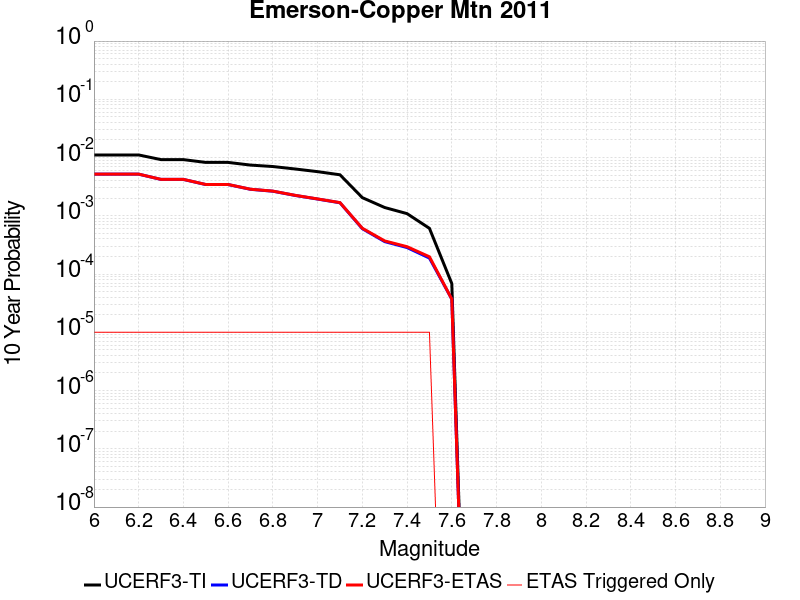 |

| Magnitude | 1 wk TI Prob | 1 wk TD Prob | 1 wk ETAS Prob | 1 wk ETAS/TD Gain | 1 wk ETAS Triggered Only | 1 mo TI Prob | 1 mo TD Prob | 1 mo ETAS Prob | 1 mo ETAS/TD Gain | 1 mo ETAS Triggered Only | 1 yr TI Prob | 1 yr TD Prob | 1 yr ETAS Prob | 1 yr ETAS/TD Gain | 1 yr ETAS Triggered Only | 10 yr TI Prob | 10 yr TD Prob | 10 yr ETAS Prob | 10 yr ETAS/TD Gain | 10 yr ETAS Triggered Only |
|-----|-----|-----|-----|-----|-----|-----|-----|-----|-----|-----|-----|-----|-----|-----|-----|-----|-----|-----|-----|-----|
| 6.0 | 2.1364202E-5 | 9.96877E-6 | 9.96877E-6 | 1.0 | 0.0 | 9.1557646E-5 | 4.272265E-5 | 4.272265E-5 | 1.0 | 0.0 | 0.0011141442 | 5.2003283E-4 | 5.3002767E-4 | 1.0192195 | 1.0E-5 | 0.011085749 | 0.005189029 | 0.005198977 | 1.0019171 | 1.0E-5 |
| 6.1 | 2.1364202E-5 | 9.96877E-6 | 9.96877E-6 | 1.0 | 0.0 | 9.1557646E-5 | 4.272265E-5 | 4.272265E-5 | 1.0 | 0.0 | 0.0011141442 | 5.2003283E-4 | 5.3002767E-4 | 1.0192195 | 1.0E-5 | 0.011085749 | 0.005189029 | 0.005198977 | 1.0019171 | 1.0E-5 |
| 6.2 | 2.1364202E-5 | 9.96877E-6 | 9.96877E-6 | 1.0 | 0.0 | 9.1557646E-5 | 4.272265E-5 | 4.272265E-5 | 1.0 | 0.0 | 0.0011141442 | 5.2003283E-4 | 5.3002767E-4 | 1.0192195 | 1.0E-5 | 0.011085749 | 0.005189029 | 0.005198977 | 1.0019171 | 1.0E-5 |
| 6.3 | 1.7751237E-5 | 8.0897835E-6 | 8.0897835E-6 | 1.0 | 0.0 | 7.607452E-5 | 3.4670073E-5 | 3.4670073E-5 | 1.0 | 0.0 | 9.258136E-4 | 4.2203267E-4 | 4.3202844E-4 | 1.0236849 | 1.0E-5 | 0.00921966 | 0.0042129345 | 0.004222892 | 1.0023637 | 1.0E-5 |
| 6.4 | 1.7751237E-5 | 8.0897835E-6 | 8.0897835E-6 | 1.0 | 0.0 | 7.607452E-5 | 3.4670073E-5 | 3.4670073E-5 | 1.0 | 0.0 | 9.258136E-4 | 4.2203267E-4 | 4.3202844E-4 | 1.0236849 | 1.0E-5 | 0.00921966 | 0.0042129345 | 0.004222892 | 1.0023637 | 1.0E-5 |
| 6.5 | 1.5886664E-5 | 6.604287E-6 | 6.604287E-6 | 1.0 | 0.0 | 6.808392E-5 | 2.8303808E-5 | 2.8303808E-5 | 1.0 | 0.0 | 8.286065E-4 | 3.4454907E-4 | 3.5454563E-4 | 1.0290134 | 1.0E-5 | 0.008255237 | 0.003440613 | 0.0034505785 | 1.0028964 | 1.0E-5 |
| 6.6 | 1.5886664E-5 | 6.604287E-6 | 6.604287E-6 | 1.0 | 0.0 | 6.808392E-5 | 2.8303808E-5 | 2.8303808E-5 | 1.0 | 0.0 | 8.286065E-4 | 3.4454907E-4 | 3.5454563E-4 | 1.0290134 | 1.0E-5 | 0.008255237 | 0.003440613 | 0.0034505785 | 1.0028964 | 1.0E-5 |
| 6.7 | 1.428471E-5 | 5.470806E-6 | 5.470806E-6 | 1.0 | 0.0 | 6.121875E-5 | 2.3446124E-5 | 2.3446124E-5 | 1.0 | 0.0 | 7.450834E-4 | 2.854231E-4 | 2.9542024E-4 | 1.0350257 | 1.0E-5 | 0.007425902 | 0.0028509533 | 0.0028609247 | 1.0034976 | 1.0E-5 |
| 6.8 | 1.3490684E-5 | 5.0740778E-6 | 5.0740778E-6 | 1.0 | 0.0 | 5.7815934E-5 | 2.1745887E-5 | 2.1745887E-5 | 1.0 | 0.0 | 7.0368167E-4 | 2.647279E-4 | 2.7472526E-4 | 1.0377647 | 1.0E-5 | 0.007014576 | 0.0026445063 | 0.0026544798 | 1.0037714 | 1.0E-5 |
| 6.9 | 1.2235421E-5 | 4.2900224E-6 | 4.2900224E-6 | 1.0 | 0.0 | 5.2436466E-5 | 1.8385701E-5 | 1.8385701E-5 | 1.0 | 0.0 | 6.38227E-4 | 2.2382653E-4 | 2.3382429E-4 | 1.0446675 | 1.0E-5 | 0.0063639707 | 0.0022363653 | 0.0022463428 | 1.0044615 | 1.0E-5 |
| 7.0 | 1.1009851E-5 | 3.719305E-6 | 3.719305E-6 | 1.0 | 0.0 | 4.7184225E-5 | 1.59398E-5 | 1.59398E-5 | 1.0 | 0.0 | 5.743165E-4 | 1.9405322E-4 | 2.0405128E-4 | 1.0515223 | 1.0E-5 | 0.005728345 | 0.0019391757 | 0.0019491562 | 1.0051469 | 1.0E-5 |
| 7.1 | 9.726373E-6 | 3.2120734E-6 | 3.2120734E-6 | 1.0 | 0.0 | 4.168379E-5 | 1.3765975E-5 | 1.3765975E-5 | 1.0 | 0.0 | 5.07382E-4 | 1.6759124E-4 | 1.7758957E-4 | 1.059659 | 1.0E-5 | 0.0050622504 | 0.0016749798 | 0.001684963 | 1.0059602 | 1.0E-5 |
| 7.2 | 3.9335127E-6 | 1.1525784E-6 | 1.1525784E-6 | 1.0 | 0.0 | 1.6857803E-5 | 4.939613E-6 | 4.939613E-6 | 1.0 | 0.0 | 2.0522442E-4 | 6.0138187E-5 | 7.013758E-5 | 1.1662737 | 1.0E-5 | 0.00205035 | 6.0122507E-4 | 6.112191E-4 | 1.0166227 | 1.0E-5 |
| 7.3 | 2.661632E-6 | 6.912155E-7 | 6.912155E-7 | 1.0 | 0.0 | 1.14069435E-5 | 2.962349E-6 | 2.962349E-6 | 1.0 | 0.0 | 1.3887069E-4 | 3.6066012E-5 | 4.6065652E-5 | 1.2772593 | 1.0E-5 | 0.0013878393 | 3.6060263E-4 | 3.70599E-4 | 1.0277214 | 1.0E-5 |
| 7.4 | 2.0893426E-6 | 5.462354E-7 | 5.462354E-7 | 1.0 | 0.0 | 8.954295E-6 | 2.3410068E-6 | 2.3410068E-6 | 1.0 | 0.0 | 1.0901308E-4 | 2.850139E-5 | 3.8501104E-5 | 1.3508501 | 1.0E-5 | 0.0010895962 | 2.849779E-4 | 2.9497503E-4 | 1.0350804 | 1.0E-5 |
| 7.5 | 1.1681728E-6 | 3.6033393E-7 | 3.6033393E-7 | 1.0 | 0.0 | 5.0064455E-6 | 1.5442874E-6 | 1.5442874E-6 | 1.0 | 0.0 | 6.0951766E-5 | 1.8801542E-5 | 2.8801354E-5 | 1.5318613 | 1.0E-5 | 6.093505E-4 | 1.8799998E-4 | 1.979981E-4 | 1.0531815 | 1.0E-5 |
| 7.6 | 1.3154387E-7 | 7.12009E-8 | 7.12009E-8 | 1.0 | 0.0 | 5.6375933E-7 | 3.051467E-7 | 3.051467E-7 | 1.0 | 0.0 | 6.863748E-6 | 3.7151563E-6 | 3.7151563E-6 | 1.0 | 0.0 | 6.863536E-5 | 3.7151098E-5 | 3.7151098E-5 | 1.0 | 0.0 |

## Goose Lake 2011 CFM
*[(top)](#table-of-contents)*

| 1 Week | 1 Month | 1 Year | 10 Year |
|-----|-----|-----|-----|
|  |  |  |  |

| Magnitude | 1 wk TI Prob | 1 wk TD Prob | 1 wk ETAS Prob | 1 wk ETAS/TD Gain | 1 wk ETAS Triggered Only | 1 mo TI Prob | 1 mo TD Prob | 1 mo ETAS Prob | 1 mo ETAS/TD Gain | 1 mo ETAS Triggered Only | 1 yr TI Prob | 1 yr TD Prob | 1 yr ETAS Prob | 1 yr ETAS/TD Gain | 1 yr ETAS Triggered Only | 10 yr TI Prob | 10 yr TD Prob | 10 yr ETAS Prob | 10 yr ETAS/TD Gain | 10 yr ETAS Triggered Only |
|-----|-----|-----|-----|-----|-----|-----|-----|-----|-----|-----|-----|-----|-----|-----|-----|-----|-----|-----|-----|-----|
| 6.0 | 3.780968E-6 | 3.823045E-6 | 3.823045E-6 | 1.0 | 0.0 | 1.6204049E-5 | 1.6384382E-5 | 1.6384382E-5 | 1.0 | 0.0 | 1.9726643E-4 | 1.9946268E-4 | 1.9946268E-4 | 1.0 | 0.0 | 0.001970914 | 0.0019929449 | 0.002002925 | 1.0050077 | 1.0E-5 |
| 6.1 | 2.2035124E-6 | 2.2298154E-6 | 2.2298154E-6 | 1.0 | 0.0 | 9.443591E-6 | 9.556317E-6 | 9.556317E-6 | 1.0 | 0.0 | 1.1496965E-4 | 1.1634214E-4 | 1.1634214E-4 | 1.0 | 0.0 | 0.0011491019 | 0.0011628306 | 0.0011628306 | 1.0 | 0.0 |
| 6.2 | 1.5624689E-6 | 1.5827032E-6 | 1.5827032E-6 | 1.0 | 0.0 | 6.6962784E-6 | 6.7829965E-6 | 6.7829965E-6 | 1.0 | 0.0 | 8.152414E-5 | 8.25799E-5 | 8.25799E-5 | 1.0 | 0.0 | 8.1494235E-4 | 8.2549657E-4 | 8.2549657E-4 | 1.0 | 0.0 |
| 6.3 | 1.5624689E-6 | 1.5827032E-6 | 1.5827032E-6 | 1.0 | 0.0 | 6.6962784E-6 | 6.7829965E-6 | 6.7829965E-6 | 1.0 | 0.0 | 8.152414E-5 | 8.25799E-5 | 8.25799E-5 | 1.0 | 0.0 | 8.1494235E-4 | 8.2549657E-4 | 8.2549657E-4 | 1.0 | 0.0 |
| 6.4 | 1.256464E-6 | 1.2738789E-6 | 1.2738789E-6 | 1.0 | 0.0 | 5.3848344E-6 | 5.45947E-6 | 5.45947E-6 | 1.0 | 0.0 | 6.5558386E-5 | 6.646704E-5 | 6.646704E-5 | 1.0 | 0.0 | 6.553905E-4 | 6.6447357E-4 | 6.6447357E-4 | 1.0 | 0.0 |
| 6.5 | 1.0910911E-6 | 1.106949E-6 | 1.106949E-6 | 1.0 | 0.0 | 4.6760965E-6 | 4.7440585E-6 | 4.7440585E-6 | 1.0 | 0.0 | 5.692999E-5 | 5.7757392E-5 | 5.7757392E-5 | 1.0 | 0.0 | 5.6915404E-4 | 5.7742506E-4 | 5.7742506E-4 | 1.0 | 0.0 |
| 6.6 | 9.546601E-7 | 9.691324E-7 | 9.691324E-7 | 1.0 | 0.0 | 4.091394E-6 | 4.153418E-6 | 4.153418E-6 | 1.0 | 0.0 | 4.9811584E-5 | 5.0566698E-5 | 5.0566698E-5 | 1.0 | 0.0 | 4.980042E-4 | 5.055528E-4 | 5.055528E-4 | 1.0 | 0.0 |
| 6.7 | 7.790316E-7 | 7.9160316E-7 | 7.9160316E-7 | 1.0 | 0.0 | 3.3387028E-6 | 3.3925805E-6 | 3.3925805E-6 | 1.0 | 0.0 | 4.0647945E-5 | 4.130389E-5 | 4.130389E-5 | 1.0 | 0.0 | 4.0640513E-4 | 4.1296275E-4 | 4.1296275E-4 | 1.0 | 0.0 |
| 6.8 | 6.3714384E-7 | 6.4787974E-7 | 6.4787974E-7 | 1.0 | 0.0 | 2.7306137E-6 | 2.7766246E-6 | 2.7766246E-6 | 1.0 | 0.0 | 3.3244716E-5 | 3.3804885E-5 | 3.3804885E-5 | 1.0 | 0.0 | 3.323974E-4 | 3.3799792E-4 | 3.3799792E-4 | 1.0 | 0.0 |
| 6.9 | 4.92586E-7 | 5.0139624E-7 | 5.0139624E-7 | 1.0 | 0.0 | 2.1110811E-6 | 2.1488393E-6 | 2.1488393E-6 | 1.0 | 0.0 | 2.5702111E-5 | 2.6161808E-5 | 2.6161808E-5 | 1.0 | 0.0 | 2.569914E-4 | 2.6158767E-4 | 2.6158767E-4 | 1.0 | 0.0 |
| 7.0 | 3.130245E-7 | 3.1903866E-7 | 3.1903866E-7 | 1.0 | 0.0 | 1.3415328E-6 | 1.3673078E-6 | 1.3673078E-6 | 1.0 | 0.0 | 1.6333039E-5 | 1.6646847E-5 | 1.6646847E-5 | 1.0 | 0.0 | 1.6331839E-4 | 1.6645622E-4 | 1.6645622E-4 | 1.0 | 0.0 |
| 7.1 | 1.7680084E-7 | 1.8024109E-7 | 1.8024109E-7 | 1.0 | 0.0 | 7.5771766E-7 | 7.724616E-7 | 7.724616E-7 | 1.0 | 0.0 | 9.225173E-6 | 9.40468E-6 | 9.40468E-6 | 1.0 | 0.0 | 9.22479E-5 | 9.404293E-5 | 9.404293E-5 | 1.0 | 0.0 |
| 7.2 | 4.8641045E-8 | 4.9402477E-8 | 4.9402477E-8 | 1.0 | 0.0 | 2.084616E-7 | 2.1172488E-7 | 2.1172488E-7 | 1.0 | 0.0 | 2.538017E-6 | 2.5777474E-6 | 2.5777474E-6 | 1.0 | 0.0 | 2.537988E-5 | 2.5777188E-5 | 2.5777188E-5 | 1.0 | 0.0 |
| 7.3 | 5.3911844E-9 | 5.4758598E-9 | 5.4758598E-9 | 1.0 | 0.0 | 2.3105075E-8 | 2.346797E-8 | 2.346797E-8 | 1.0 | 0.0 | 2.8130427E-7 | 2.857225E-7 | 2.857225E-7 | 1.0 | 0.0 | 2.8130391E-6 | 2.857223E-6 | 2.857223E-6 | 1.0 | 0.0 |

## Peralta Hills
*[(top)](#table-of-contents)*

| 1 Week | 1 Month | 1 Year | 10 Year |
|-----|-----|-----|-----|
|  | 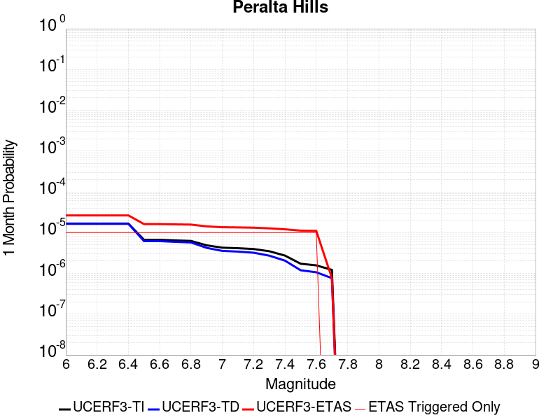 |  |  |

| Magnitude | 1 wk TI Prob | 1 wk TD Prob | 1 wk ETAS Prob | 1 wk ETAS/TD Gain | 1 wk ETAS Triggered Only | 1 mo TI Prob | 1 mo TD Prob | 1 mo ETAS Prob | 1 mo ETAS/TD Gain | 1 mo ETAS Triggered Only | 1 yr TI Prob | 1 yr TD Prob | 1 yr ETAS Prob | 1 yr ETAS/TD Gain | 1 yr ETAS Triggered Only | 10 yr TI Prob | 10 yr TD Prob | 10 yr ETAS Prob | 10 yr ETAS/TD Gain | 10 yr ETAS Triggered Only |
|-----|-----|-----|-----|-----|-----|-----|-----|-----|-----|-----|-----|-----|-----|-----|-----|-----|-----|-----|-----|-----|
| 6.0 | 3.8850067E-6 | 3.839755E-6 | 1.3839717E-5 | 3.6043227 | 1.0E-5 | 1.6649923E-5 | 1.6456032E-5 | 2.6455868E-5 | 1.60767 | 1.0E-5 | 2.0269395E-4 | 2.003412E-4 | 2.1033919E-4 | 1.0499048 | 1.0E-5 | 0.0020250916 | 0.0020023335 | 0.0020123136 | 1.0049841 | 1.0E-5 |
| 6.1 | 3.8850067E-6 | 3.839755E-6 | 1.3839717E-5 | 3.6043227 | 1.0E-5 | 1.6649923E-5 | 1.6456032E-5 | 2.6455868E-5 | 1.60767 | 1.0E-5 | 2.0269395E-4 | 2.003412E-4 | 2.1033919E-4 | 1.0499048 | 1.0E-5 | 0.0020250916 | 0.0020023335 | 0.0020123136 | 1.0049841 | 1.0E-5 |
| 6.2 | 3.8850067E-6 | 3.839755E-6 | 1.3839717E-5 | 3.6043227 | 1.0E-5 | 1.6649923E-5 | 1.6456032E-5 | 2.6455868E-5 | 1.60767 | 1.0E-5 | 2.0269395E-4 | 2.003412E-4 | 2.1033919E-4 | 1.0499048 | 1.0E-5 | 0.0020250916 | 0.0020023335 | 0.0020123136 | 1.0049841 | 1.0E-5 |
| 6.3 | 3.8850067E-6 | 3.839755E-6 | 1.3839717E-5 | 3.6043227 | 1.0E-5 | 1.6649923E-5 | 1.6456032E-5 | 2.6455868E-5 | 1.60767 | 1.0E-5 | 2.0269395E-4 | 2.003412E-4 | 2.1033919E-4 | 1.0499048 | 1.0E-5 | 0.0020250916 | 0.0020023335 | 0.0020123136 | 1.0049841 | 1.0E-5 |
| 6.4 | 3.8850067E-6 | 3.839755E-6 | 1.3839717E-5 | 3.6043227 | 1.0E-5 | 1.6649923E-5 | 1.6456032E-5 | 2.6455868E-5 | 1.60767 | 1.0E-5 | 2.0269395E-4 | 2.003412E-4 | 2.1033919E-4 | 1.0499048 | 1.0E-5 | 0.0020250916 | 0.0020023335 | 0.0020123136 | 1.0049841 | 1.0E-5 |
| 6.5 | 1.5587785E-6 | 1.4432846E-6 | 1.14432705E-5 | 7.92863 | 1.0E-5 | 6.6804623E-6 | 6.1854926E-6 | 1.6185431E-5 | 2.616676 | 1.0E-5 | 8.133159E-5 | 7.5306016E-5 | 8.530526E-5 | 1.1327815 | 1.0E-5 | 8.1301836E-4 | 7.5282896E-4 | 7.628214E-4 | 1.0132732 | 1.0E-5 |
| 6.6 | 1.5587785E-6 | 1.4432846E-6 | 1.14432705E-5 | 7.92863 | 1.0E-5 | 6.6804623E-6 | 6.1854926E-6 | 1.6185431E-5 | 2.616676 | 1.0E-5 | 8.133159E-5 | 7.5306016E-5 | 8.530526E-5 | 1.1327815 | 1.0E-5 | 8.1301836E-4 | 7.5282896E-4 | 7.628214E-4 | 1.0132732 | 1.0E-5 |
| 6.7 | 1.5018579E-6 | 1.3839059E-6 | 1.1383892E-5 | 8.225915 | 1.0E-5 | 6.436518E-6 | 5.931013E-6 | 1.5930955E-5 | 2.6860425 | 1.0E-5 | 7.836179E-5 | 7.2207935E-5 | 8.220721E-5 | 1.138479 | 1.0E-5 | 7.833416E-4 | 7.2186824E-4 | 7.3186104E-4 | 1.0138429 | 1.0E-5 |
| 6.8 | 1.4584314E-6 | 1.3383368E-6 | 1.1338323E-5 | 8.471951 | 1.0E-5 | 6.250405E-6 | 5.735718E-6 | 1.573566E-5 | 2.7434509 | 1.0E-5 | 7.6096025E-5 | 6.983037E-5 | 7.982967E-5 | 1.1431942 | 1.0E-5 | 7.6069974E-4 | 6.9810764E-4 | 7.081007E-4 | 1.0143144 | 1.0E-5 |
| 6.9 | 1.1382393E-6 | 9.863752E-7 | 1.0986365E-5 | 11.13812 | 1.0E-5 | 4.8781594E-6 | 4.227316E-6 | 1.4227274E-5 | 3.3655572 | 1.0E-5 | 5.9389975E-5 | 5.146644E-5 | 6.146593E-5 | 1.1942914 | 1.0E-5 | 5.93741E-4 | 5.1455345E-4 | 5.245483E-4 | 1.0194243 | 1.0E-5 |
| 7.0 | 9.970413E-7 | 8.310885E-7 | 1.08310805E-5 | 13.032402 | 1.0E-5 | 4.273027E-6 | 3.5618036E-6 | 1.3561768E-5 | 3.8075564 | 1.0E-5 | 5.2022864E-5 | 4.3364165E-5 | 5.3363732E-5 | 1.2305951 | 1.0E-5 | 5.2010687E-4 | 4.3356384E-4 | 4.435595E-4 | 1.0230546 | 1.0E-5 |
| 7.1 | 9.684443E-7 | 7.9952844E-7 | 1.079952E-5 | 13.507362 | 1.0E-5 | 4.150469E-6 | 3.4265465E-6 | 1.3426512E-5 | 3.9183803 | 1.0E-5 | 5.053079E-5 | 4.1717474E-5 | 5.1717056E-5 | 1.2396977 | 1.0E-5 | 5.05193E-4 | 4.1710315E-4 | 4.2709897E-4 | 1.0239649 | 1.0E-5 |
| 7.2 | 9.240811E-7 | 7.504298E-7 | 1.0750422E-5 | 14.325686 | 1.0E-5 | 3.960342E-6 | 3.2161242E-6 | 1.3216092E-5 | 4.1093225 | 1.0E-5 | 4.8216094E-5 | 3.9155675E-5 | 4.9155286E-5 | 1.2553809 | 1.0E-5 | 4.8205635E-4 | 3.914943E-4 | 4.014904E-4 | 1.0255332 | 1.0E-5 |
| 7.3 | 8.158643E-7 | 6.351043E-7 | 1.0635098E-5 | 16.745436 | 1.0E-5 | 3.4965567E-6 | 2.7218732E-6 | 1.2721846E-5 | 4.6739306 | 1.0E-5 | 4.2569747E-5 | 3.3138364E-5 | 4.3138032E-5 | 1.3017551 | 1.0E-5 | 4.2561593E-4 | 3.313404E-4 | 3.4133706E-4 | 1.0301704 | 1.0E-5 |
| 7.4 | 6.3822824E-7 | 4.7965085E-7 | 1.0479646E-5 | 21.848488 | 1.0E-5 | 2.7352612E-6 | 2.0556452E-6 | 1.2055625E-5 | 5.8646426 | 1.0E-5 | 3.3301294E-5 | 2.5027246E-5 | 3.5026995E-5 | 1.3995545 | 1.0E-5 | 3.3296304E-4 | 2.502494E-4 | 2.6024692E-4 | 1.0399501 | 1.0E-5 |
| 7.5 | 4.0292628E-7 | 2.7850595E-7 | 1.0278503E-5 | 36.905865 | 1.0E-5 | 1.7268258E-6 | 1.1935965E-6 | 1.1193584E-5 | 9.37803 | 1.0E-5 | 2.1023901E-5 | 1.453197E-5 | 2.4531824E-5 | 1.688128 | 1.0E-5 | 2.1021912E-4 | 1.45313E-4 | 1.5531153E-4 | 1.068807 | 1.0E-5 |
| 7.6 | 3.672993E-7 | 2.4859E-7 | 1.0248587E-5 | 41.22687 | 1.0E-5 | 1.5741389E-6 | 1.0653854E-6 | 1.1065375E-5 | 10.386265 | 1.0E-5 | 1.9164972E-5 | 1.2971018E-5 | 2.2970888E-5 | 1.7709396 | 1.0E-5 | 1.916332E-4 | 1.2970532E-4 | 1.3970402E-4 | 1.0770879 | 1.0E-5 |
| 7.7 | 2.8466823E-7 | 1.786307E-7 | 1.786307E-7 | 1.0 | 0.0 | 1.2200061E-6 | 7.655601E-7 | 7.655601E-7 | 1.0 | 0.0 | 1.4853474E-5 | 9.320681E-6 | 9.320681E-6 | 1.0 | 0.0 | 1.485248E-4 | 9.32055E-5 | 9.32055E-5 | 1.0 | 0.0 |

## Sargent 2011 CFM
*[(top)](#table-of-contents)*

| 1 Week | 1 Month | 1 Year | 10 Year |
|-----|-----|-----|-----|
| 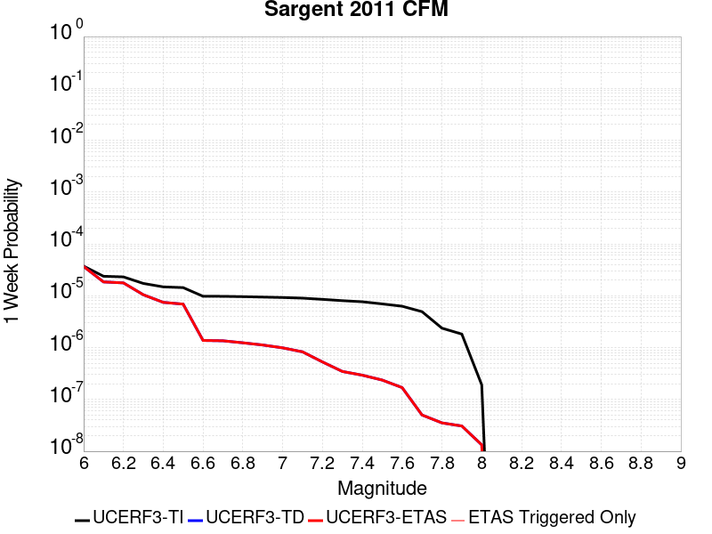 | 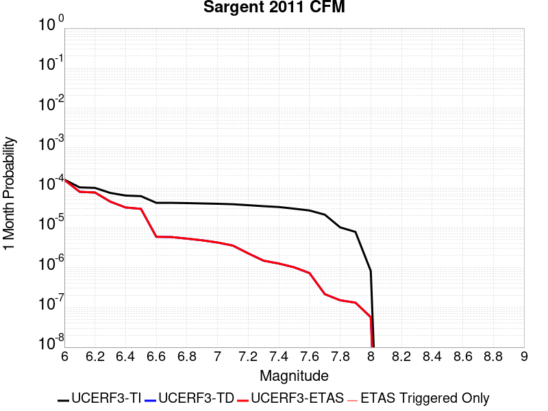 |  | 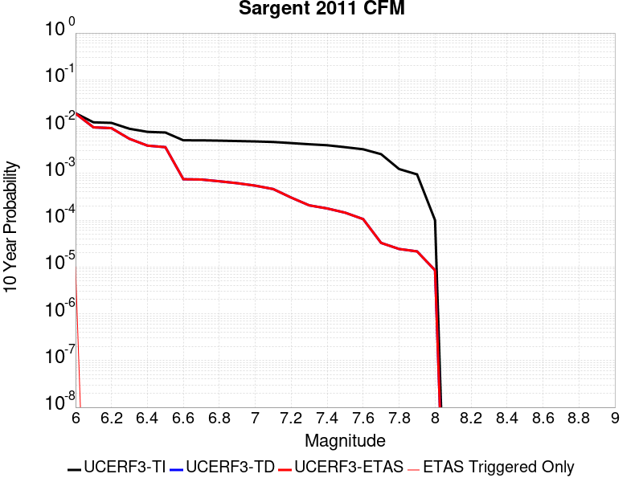 |

| Magnitude | 1 wk TI Prob | 1 wk TD Prob | 1 wk ETAS Prob | 1 wk ETAS/TD Gain | 1 wk ETAS Triggered Only | 1 mo TI Prob | 1 mo TD Prob | 1 mo ETAS Prob | 1 mo ETAS/TD Gain | 1 mo ETAS Triggered Only | 1 yr TI Prob | 1 yr TD Prob | 1 yr ETAS Prob | 1 yr ETAS/TD Gain | 1 yr ETAS Triggered Only | 10 yr TI Prob | 10 yr TD Prob | 10 yr ETAS Prob | 10 yr ETAS/TD Gain | 10 yr ETAS Triggered Only |
|-----|-----|-----|-----|-----|-----|-----|-----|-----|-----|-----|-----|-----|-----|-----|-----|-----|-----|-----|-----|-----|
| 6.0 | 3.7327867E-5 | 3.6656293E-5 | 3.6656293E-5 | 1.0 | 0.0 | 1.5996677E-4 | 1.5709172E-4 | 1.5709172E-4 | 1.0 | 0.0 | 0.0019458556 | 0.0019113936 | 0.0019113936 | 1.0 | 0.0 | 0.01928905 | 0.019021766 | 0.019031577 | 1.0005157 | 1.0E-5 |
| 6.1 | 2.3771476E-5 | 1.8483124E-5 | 1.8483124E-5 | 1.0 | 0.0 | 1.01873775E-4 | 7.921149E-5 | 7.921149E-5 | 1.0 | 0.0 | 0.0012396075 | 9.64047E-4 | 9.64047E-4 | 1.0 | 0.0 | 0.012327154 | 0.009638182 | 0.009638182 | 1.0 | 0.0 |
| 6.2 | 2.3112721E-5 | 1.7714416E-5 | 1.7714416E-5 | 1.0 | 0.0 | 9.9050754E-5 | 7.591721E-5 | 7.591721E-5 | 1.0 | 0.0 | 0.0012052758 | 9.2397333E-4 | 9.2397333E-4 | 1.0 | 0.0 | 0.011987597 | 0.0092408 | 0.0092408 | 1.0 | 0.0 |
| 6.3 | 1.728509E-5 | 1.0461763E-5 | 1.0461763E-5 | 1.0 | 0.0 | 7.407686E-5 | 4.4835626E-5 | 4.4835626E-5 | 1.0 | 0.0 | 9.015125E-4 | 5.4578186E-4 | 5.4578186E-4 | 1.0 | 0.0 | 0.008978641 | 0.0054807025 | 0.0054807025 | 1.0 | 0.0 |
| 6.4 | 1.48395575E-5 | 7.458454E-6 | 7.458454E-6 | 1.0 | 0.0 | 6.3596555E-5 | 3.1964628E-5 | 3.1964628E-5 | 1.0 | 0.0 | 7.7401294E-4 | 3.8913524E-4 | 3.8913524E-4 | 1.0 | 0.0 | 0.0077132257 | 0.0039200624 | 0.0039200624 | 1.0 | 0.0 |
| 6.5 | 1.4358964E-5 | 6.897181E-6 | 6.897181E-6 | 1.0 | 0.0 | 6.1536964E-5 | 2.9559225E-5 | 2.9559225E-5 | 1.0 | 0.0 | 7.48955E-4 | 3.5985935E-4 | 3.5985935E-4 | 1.0 | 0.0 | 0.0074643586 | 0.0036282858 | 0.0036282858 | 1.0 | 0.0 |
| 6.6 | 9.772591E-6 | 1.3754402E-6 | 1.3754402E-6 | 1.0 | 0.0 | 4.188186E-5 | 5.8947303E-6 | 5.8947303E-6 | 1.0 | 0.0 | 5.097923E-4 | 7.176601E-5 | 7.176601E-5 | 1.0 | 0.0 | 0.005086244 | 7.493735E-4 | 7.493735E-4 | 1.0 | 0.0 |
| 6.7 | 9.752745E-6 | 1.3541306E-6 | 1.3541306E-6 | 1.0 | 0.0 | 4.179681E-5 | 5.8034043E-6 | 5.8034043E-6 | 1.0 | 0.0 | 5.0875737E-4 | 7.065418E-5 | 7.065418E-5 | 1.0 | 0.0 | 0.005075942 | 7.382628E-4 | 7.382628E-4 | 1.0 | 0.0 |
| 6.8 | 9.608213E-6 | 1.2379631E-6 | 1.2379631E-6 | 1.0 | 0.0 | 4.1177405E-5 | 5.3055455E-6 | 5.3055455E-6 | 1.0 | 0.0 | 5.012196E-4 | 6.459312E-5 | 6.459312E-5 | 1.0 | 0.0 | 0.005000906 | 6.773871E-4 | 6.773871E-4 | 1.0 | 0.0 |
| 6.9 | 9.427164E-6 | 1.1226628E-6 | 1.1226628E-6 | 1.0 | 0.0 | 4.04015E-5 | 4.811403E-6 | 4.811403E-6 | 1.0 | 0.0 | 4.9177726E-4 | 5.857728E-5 | 5.857728E-5 | 1.0 | 0.0 | 0.004906904 | 6.1658036E-4 | 6.1658036E-4 | 1.0 | 0.0 |
| 7.0 | 9.247601E-6 | 9.890684E-7 | 9.890684E-7 | 1.0 | 0.0 | 3.9631974E-5 | 4.238858E-6 | 4.238858E-6 | 1.0 | 0.0 | 4.8241246E-4 | 5.160689E-5 | 5.160689E-5 | 1.0 | 0.0 | 0.0048136655 | 5.4640556E-4 | 5.4640556E-4 | 1.0 | 0.0 |
| 7.1 | 8.995454E-6 | 8.286487E-7 | 8.286487E-7 | 1.0 | 0.0 | 3.8551374E-5 | 3.5513467E-6 | 3.5513467E-6 | 1.0 | 0.0 | 4.6926187E-4 | 4.3236803E-5 | 4.3236803E-5 | 1.0 | 0.0 | 0.004682722 | 4.618174E-4 | 4.618174E-4 | 1.0 | 0.0 |
| 7.2 | 8.520861E-6 | 5.290182E-7 | 5.290182E-7 | 1.0 | 0.0 | 3.6517464E-5 | 2.2672189E-6 | 2.2672189E-6 | 1.0 | 0.0 | 4.445094E-4 | 2.7603048E-5 | 2.7603048E-5 | 1.0 | 0.0 | 0.004436213 | 3.0378625E-4 | 3.0378625E-4 | 1.0 | 0.0 |
| 7.3 | 8.043592E-6 | 3.468761E-7 | 3.468761E-7 | 1.0 | 0.0 | 3.4472083E-5 | 1.486611E-6 | 1.486611E-6 | 1.0 | 0.0 | 4.196168E-4 | 1.8099341E-5 | 1.8099341E-5 | 1.0 | 0.0 | 0.004188253 | 2.0744173E-4 | 2.0744173E-4 | 1.0 | 0.0 |
| 7.4 | 7.662316E-6 | 2.9402239E-7 | 2.9402239E-7 | 1.0 | 0.0 | 3.2838085E-5 | 1.2600954E-6 | 1.2600954E-6 | 1.0 | 0.0 | 3.9973034E-4 | 1.5341553E-5 | 1.5341553E-5 | 1.0 | 0.0 | 0.0039901207 | 1.7805383E-4 | 1.7805383E-4 | 1.0 | 0.0 |
| 7.5 | 6.961638E-6 | 2.3669956E-7 | 2.3669956E-7 | 1.0 | 0.0 | 2.9835252E-5 | 1.0144263E-6 | 1.0144263E-6 | 1.0 | 0.0 | 3.6318362E-4 | 1.23505715E-5 | 1.23505715E-5 | 1.0 | 0.0 | 0.0036259065 | 1.4468166E-4 | 1.4468166E-4 | 1.0 | 0.0 |
| 7.6 | 6.282332E-6 | 1.6967522E-7 | 1.6967522E-7 | 1.0 | 0.0 | 2.6924003E-5 | 7.2717927E-7 | 7.2717927E-7 | 1.0 | 0.0 | 3.2775043E-4 | 8.8533725E-6 | 8.8533725E-6 | 1.0 | 0.0 | 0.0032726745 | 1.05516185E-4 | 1.05516185E-4 | 1.0 | 0.0 |
| 7.7 | 4.934408E-6 | 5.026555E-8 | 5.026555E-8 | 1.0 | 0.0 | 2.114729E-5 | 2.1542378E-7 | 2.1542378E-7 | 1.0 | 0.0 | 2.5743784E-4 | 2.6227813E-6 | 2.6227813E-6 | 1.0 | 0.0 | 0.0025713982 | 3.2720083E-5 | 3.2720083E-5 | 1.0 | 0.0 |
| 7.8 | 2.373212E-6 | 3.5376836E-8 | 3.5376836E-8 | 1.0 | 0.0 | 1.0170869E-5 | 1.51615E-7 | 1.51615E-7 | 1.0 | 0.0 | 1.238233E-4 | 1.845911E-6 | 1.845911E-6 | 1.0 | 0.0 | 0.0012375432 | 2.4266623E-5 | 2.4266623E-5 | 1.0 | 0.0 |
| 7.9 | 1.8227792E-6 | 3.0801203E-8 | 3.0801203E-8 | 1.0 | 0.0 | 7.811887E-6 | 1.3200516E-7 | 1.3200516E-7 | 1.0 | 0.0 | 9.510558E-5 | 1.6071616E-6 | 1.6071616E-6 | 1.0 | 0.0 | 9.5064886E-4 | 2.153699E-5 | 2.153699E-5 | 1.0 | 0.0 |
| 8.0 | 1.9095137E-7 | 1.3322155E-8 | 1.3322155E-8 | 1.0 | 0.0 | 8.1836276E-7 | 5.7094947E-8 | 5.7094947E-8 | 1.0 | 0.0 | 9.963521E-6 | 6.951308E-7 | 6.951308E-7 | 1.0 | 0.0 | 9.963074E-5 | 8.498922E-6 | 8.498922E-6 | 1.0 | 0.0 |

## Tin Mountain
*[(top)](#table-of-contents)*

| 1 Week | 1 Month | 1 Year | 10 Year |
|-----|-----|-----|-----|
|  |  |  | 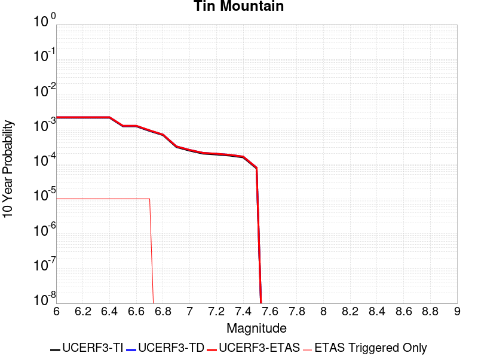 |

| Magnitude | 1 wk TI Prob | 1 wk TD Prob | 1 wk ETAS Prob | 1 wk ETAS/TD Gain | 1 wk ETAS Triggered Only | 1 mo TI Prob | 1 mo TD Prob | 1 mo ETAS Prob | 1 mo ETAS/TD Gain | 1 mo ETAS Triggered Only | 1 yr TI Prob | 1 yr TD Prob | 1 yr ETAS Prob | 1 yr ETAS/TD Gain | 1 yr ETAS Triggered Only | 10 yr TI Prob | 10 yr TD Prob | 10 yr ETAS Prob | 10 yr ETAS/TD Gain | 10 yr ETAS Triggered Only |
|-----|-----|-----|-----|-----|-----|-----|-----|-----|-----|-----|-----|-----|-----|-----|-----|-----|-----|-----|-----|-----|
| 6.0 | 4.083776E-6 | 4.18159E-6 | 4.18159E-6 | 1.0 | 0.0 | 1.750178E-5 | 1.7920998E-5 | 1.7920998E-5 | 1.0 | 0.0 | 2.1306332E-4 | 2.1817003E-4 | 2.2816785E-4 | 1.0458258 | 1.0E-5 | 0.0021285915 | 0.0021799242 | 0.0021899024 | 1.0045773 | 1.0E-5 |
| 6.1 | 4.083776E-6 | 4.18159E-6 | 4.18159E-6 | 1.0 | 0.0 | 1.750178E-5 | 1.7920998E-5 | 1.7920998E-5 | 1.0 | 0.0 | 2.1306332E-4 | 2.1817003E-4 | 2.2816785E-4 | 1.0458258 | 1.0E-5 | 0.0021285915 | 0.0021799242 | 0.0021899024 | 1.0045773 | 1.0E-5 |
| 6.2 | 4.083776E-6 | 4.18159E-6 | 4.18159E-6 | 1.0 | 0.0 | 1.750178E-5 | 1.7920998E-5 | 1.7920998E-5 | 1.0 | 0.0 | 2.1306332E-4 | 2.1817003E-4 | 2.2816785E-4 | 1.0458258 | 1.0E-5 | 0.0021285915 | 0.0021799242 | 0.0021899024 | 1.0045773 | 1.0E-5 |
| 6.3 | 4.083776E-6 | 4.18159E-6 | 4.18159E-6 | 1.0 | 0.0 | 1.750178E-5 | 1.7920998E-5 | 1.7920998E-5 | 1.0 | 0.0 | 2.1306332E-4 | 2.1817003E-4 | 2.2816785E-4 | 1.0458258 | 1.0E-5 | 0.0021285915 | 0.0021799242 | 0.0021899024 | 1.0045773 | 1.0E-5 |
| 6.4 | 4.083776E-6 | 4.18159E-6 | 4.18159E-6 | 1.0 | 0.0 | 1.750178E-5 | 1.7920998E-5 | 1.7920998E-5 | 1.0 | 0.0 | 2.1306332E-4 | 2.1817003E-4 | 2.2816785E-4 | 1.0458258 | 1.0E-5 | 0.0021285915 | 0.0021799242 | 0.0021899024 | 1.0045773 | 1.0E-5 |
| 6.5 | 2.3143427E-6 | 2.3731893E-6 | 2.3731893E-6 | 1.0 | 0.0 | 9.9185745E-6 | 1.01707765E-5 | 1.01707765E-5 | 1.0 | 0.0 | 1.2075195E-4 | 1.2382293E-4 | 1.338217E-4 | 1.0807505 | 1.0E-5 | 0.0012068636 | 0.0012376154 | 0.001247603 | 1.0080701 | 1.0E-5 |
| 6.6 | 2.3143427E-6 | 2.3731893E-6 | 2.3731893E-6 | 1.0 | 0.0 | 9.9185745E-6 | 1.01707765E-5 | 1.01707765E-5 | 1.0 | 0.0 | 1.2075195E-4 | 1.2382293E-4 | 1.338217E-4 | 1.0807505 | 1.0E-5 | 0.0012068636 | 0.0012376154 | 0.001247603 | 1.0080701 | 1.0E-5 |
| 6.7 | 1.7029532E-6 | 1.7498172E-6 | 1.7498172E-6 | 1.0 | 0.0 | 7.2983503E-6 | 7.499198E-6 | 7.499198E-6 | 1.0 | 0.0 | 8.885379E-5 | 9.1299444E-5 | 1.0129853E-4 | 1.1095197 | 1.0E-5 | 8.881827E-4 | 9.12672E-4 | 9.2266285E-4 | 1.0109469 | 1.0E-5 |
| 6.8 | 1.2914646E-6 | 1.329959E-6 | 1.329959E-6 | 1.0 | 0.0 | 5.534837E-6 | 5.699814E-6 | 5.699814E-6 | 1.0 | 0.0 | 6.738455E-5 | 6.939347E-5 | 6.939347E-5 | 1.0 | 0.0 | 6.736412E-4 | 6.937614E-4 | 6.937614E-4 | 1.0 | 0.0 |
| 6.9 | 5.8708974E-7 | 6.11713E-7 | 6.11713E-7 | 1.0 | 0.0 | 2.5160964E-6 | 2.6216248E-6 | 2.6216248E-6 | 1.0 | 0.0 | 3.0633044E-5 | 3.1917854E-5 | 3.1917854E-5 | 1.0 | 0.0 | 3.0628822E-4 | 3.1913683E-4 | 3.1913683E-4 | 1.0 | 0.0 |
| 7.0 | 4.6248786E-7 | 4.8321306E-7 | 4.8321306E-7 | 1.0 | 0.0 | 1.9820893E-6 | 2.0709115E-6 | 2.0709115E-6 | 1.0 | 0.0 | 2.413167E-5 | 2.5213094E-5 | 2.5213094E-5 | 1.0 | 0.0 | 2.412905E-4 | 2.5210602E-4 | 2.5210602E-4 | 1.0 | 0.0 |
| 7.1 | 3.804606E-7 | 3.9872486E-7 | 3.9872486E-7 | 1.0 | 0.0 | 1.6305444E-6 | 1.7088199E-6 | 1.7088199E-6 | 1.0 | 0.0 | 1.9851697E-5 | 2.0804719E-5 | 2.0804719E-5 | 1.0 | 0.0 | 1.9849923E-4 | 2.0803107E-4 | 2.0803107E-4 | 1.0 | 0.0 |
| 7.2 | 3.5864858E-7 | 3.7617838E-7 | 3.7617838E-7 | 1.0 | 0.0 | 1.5370645E-6 | 1.6121922E-6 | 1.6121922E-6 | 1.0 | 0.0 | 1.87136E-5 | 1.9628298E-5 | 1.9628298E-5 | 1.0 | 0.0 | 1.8712023E-4 | 1.9626896E-4 | 1.9626896E-4 | 1.0 | 0.0 |
| 7.3 | 3.342063E-7 | 3.5064386E-7 | 3.5064386E-7 | 1.0 | 0.0 | 1.4323119E-6 | 1.5027588E-6 | 1.5027588E-6 | 1.0 | 0.0 | 1.7438259E-5 | 1.8295968E-5 | 1.8295968E-5 | 1.0 | 0.0 | 1.743689E-4 | 1.8294792E-4 | 1.8294792E-4 | 1.0 | 0.0 |
| 7.4 | 2.971242E-7 | 3.1166627E-7 | 3.1166627E-7 | 1.0 | 0.0 | 1.2733886E-6 | 1.3357121E-6 | 1.3357121E-6 | 1.0 | 0.0 | 1.5503398E-5 | 1.6262207E-5 | 1.6262207E-5 | 1.0 | 0.0 | 1.5502315E-4 | 1.6261345E-4 | 1.6261345E-4 | 1.0 | 0.0 |
| 7.5 | 1.4326713E-7 | 1.5012905E-7 | 1.5012905E-7 | 1.0 | 0.0 | 6.140018E-7 | 6.434102E-7 | 6.434102E-7 | 1.0 | 0.0 | 7.4754466E-6 | 7.83352E-6 | 7.83352E-6 | 1.0 | 0.0 | 7.475195E-5 | 7.833519E-5 | 7.833519E-5 | 1.0 | 0.0 |

## North Frontal  (East)
*[(top)](#table-of-contents)*

| 1 Week | 1 Month | 1 Year | 10 Year |
|-----|-----|-----|-----|
|  |  |  |  |

| Magnitude | 1 wk TI Prob | 1 wk TD Prob | 1 wk ETAS Prob | 1 wk ETAS/TD Gain | 1 wk ETAS Triggered Only | 1 mo TI Prob | 1 mo TD Prob | 1 mo ETAS Prob | 1 mo ETAS/TD Gain | 1 mo ETAS Triggered Only | 1 yr TI Prob | 1 yr TD Prob | 1 yr ETAS Prob | 1 yr ETAS/TD Gain | 1 yr ETAS Triggered Only | 10 yr TI Prob | 10 yr TD Prob | 10 yr ETAS Prob | 10 yr ETAS/TD Gain | 10 yr ETAS Triggered Only |
|-----|-----|-----|-----|-----|-----|-----|-----|-----|-----|-----|-----|-----|-----|-----|-----|-----|-----|-----|-----|-----|
| 6.0 | 7.135738E-6 | 7.4773666E-6 | 7.4773666E-6 | 1.0 | 0.0 | 3.0581377E-5 | 3.2045577E-5 | 4.2045256E-5 | 1.3120456 | 1.0E-5 | 3.7226462E-4 | 3.9010498E-4 | 4.0010107E-4 | 1.0256242 | 1.0E-5 | 0.0037164164 | 0.0038961596 | 0.0039061208 | 1.0025567 | 1.0E-5 |
| 6.1 | 7.135738E-6 | 7.4773666E-6 | 7.4773666E-6 | 1.0 | 0.0 | 3.0581377E-5 | 3.2045577E-5 | 4.2045256E-5 | 1.3120456 | 1.0E-5 | 3.7226462E-4 | 3.9010498E-4 | 4.0010107E-4 | 1.0256242 | 1.0E-5 | 0.0037164164 | 0.0038961596 | 0.0039061208 | 1.0025567 | 1.0E-5 |
| 6.2 | 7.135738E-6 | 7.4773666E-6 | 7.4773666E-6 | 1.0 | 0.0 | 3.0581377E-5 | 3.2045577E-5 | 4.2045256E-5 | 1.3120456 | 1.0E-5 | 3.7226462E-4 | 3.9010498E-4 | 4.0010107E-4 | 1.0256242 | 1.0E-5 | 0.0037164164 | 0.0038961596 | 0.0039061208 | 1.0025567 | 1.0E-5 |
| 6.3 | 7.135738E-6 | 7.4773666E-6 | 7.4773666E-6 | 1.0 | 0.0 | 3.0581377E-5 | 3.2045577E-5 | 4.2045256E-5 | 1.3120456 | 1.0E-5 | 3.7226462E-4 | 3.9010498E-4 | 4.0010107E-4 | 1.0256242 | 1.0E-5 | 0.0037164164 | 0.0038961596 | 0.0039061208 | 1.0025567 | 1.0E-5 |
| 6.4 | 7.135738E-6 | 7.4773666E-6 | 7.4773666E-6 | 1.0 | 0.0 | 3.0581377E-5 | 3.2045577E-5 | 4.2045256E-5 | 1.3120456 | 1.0E-5 | 3.7226462E-4 | 3.9010498E-4 | 4.0010107E-4 | 1.0256242 | 1.0E-5 | 0.0037164164 | 0.0038961596 | 0.0039061208 | 1.0025567 | 1.0E-5 |
| 6.5 | 7.135738E-6 | 7.4773666E-6 | 7.4773666E-6 | 1.0 | 0.0 | 3.0581377E-5 | 3.2045577E-5 | 4.2045256E-5 | 1.3120456 | 1.0E-5 | 3.7226462E-4 | 3.9010498E-4 | 4.0010107E-4 | 1.0256242 | 1.0E-5 | 0.0037164164 | 0.0038961596 | 0.0039061208 | 1.0025567 | 1.0E-5 |
| 6.6 | 7.135738E-6 | 7.4773666E-6 | 7.4773666E-6 | 1.0 | 0.0 | 3.0581377E-5 | 3.2045577E-5 | 4.2045256E-5 | 1.3120456 | 1.0E-5 | 3.7226462E-4 | 3.9010498E-4 | 4.0010107E-4 | 1.0256242 | 1.0E-5 | 0.0037164164 | 0.0038961596 | 0.0039061208 | 1.0025567 | 1.0E-5 |
| 6.7 | 7.135738E-6 | 7.4773666E-6 | 7.4773666E-6 | 1.0 | 0.0 | 3.0581377E-5 | 3.2045577E-5 | 4.2045256E-5 | 1.3120456 | 1.0E-5 | 3.7226462E-4 | 3.9010498E-4 | 4.0010107E-4 | 1.0256242 | 1.0E-5 | 0.0037164164 | 0.0038961596 | 0.0039061208 | 1.0025567 | 1.0E-5 |
| 6.8 | 5.959142E-6 | 6.236837E-6 | 6.236837E-6 | 1.0 | 0.0 | 2.553893E-5 | 2.672913E-5 | 3.6728863E-5 | 1.3741137 | 1.0E-5 | 3.108921E-4 | 3.2539663E-4 | 3.353934E-4 | 1.0307218 | 1.0E-5 | 0.0031045752 | 0.0032509752 | 0.0032609426 | 1.003066 | 1.0E-5 |
| 6.9 | 2.2946929E-6 | 2.382509E-6 | 2.382509E-6 | 1.0 | 0.0 | 9.834361E-6 | 1.0210715E-5 | 1.0210715E-5 | 1.0 | 0.0 | 1.1972676E-4 | 1.2430883E-4 | 1.2430883E-4 | 1.0 | 0.0 | 0.0011966228 | 0.0012424395 | 0.0012424395 | 1.0 | 0.0 |
| 7.0 | 2.2468673E-6 | 2.3322007E-6 | 2.3322007E-6 | 1.0 | 0.0 | 9.629396E-6 | 9.99511E-6 | 9.99511E-6 | 1.0 | 0.0 | 1.1723159E-4 | 1.2168415E-4 | 1.2168415E-4 | 1.0 | 0.0 | 0.0011716976 | 0.0012162215 | 0.0012162215 | 1.0 | 0.0 |
| 7.1 | 1.9921076E-6 | 2.064643E-6 | 2.064643E-6 | 1.0 | 0.0 | 8.537577E-6 | 8.848443E-6 | 8.848443E-6 | 1.0 | 0.0 | 1.0394004E-4 | 1.077249E-4 | 1.077249E-4 | 1.0 | 0.0 | 0.0010389143 | 0.0010767695 | 0.0010767695 | 1.0 | 0.0 |
| 7.2 | 1.4524545E-6 | 1.5045434E-6 | 1.5045434E-6 | 1.0 | 0.0 | 6.2247905E-6 | 6.4480287E-6 | 6.4480287E-6 | 1.0 | 0.0 | 7.5784184E-5 | 7.850217E-5 | 7.850217E-5 | 1.0 | 0.0 | 7.575835E-4 | 7.8476884E-4 | 7.8476884E-4 | 1.0 | 0.0 |
| 7.3 | 8.9802575E-7 | 9.3089085E-7 | 9.3089085E-7 | 1.0 | 0.0 | 3.848676E-6 | 3.9895267E-6 | 3.9895267E-6 | 1.0 | 0.0 | 4.685662E-5 | 4.857152E-5 | 4.857152E-5 | 1.0 | 0.0 | 4.6846745E-4 | 4.8562037E-4 | 4.8562037E-4 | 1.0 | 0.0 |
| 7.4 | 7.776139E-7 | 8.060631E-7 | 8.060631E-7 | 1.0 | 0.0 | 3.3326266E-6 | 3.4545521E-6 | 3.4545521E-6 | 1.0 | 0.0 | 4.0573974E-5 | 4.2058473E-5 | 4.2058473E-5 | 1.0 | 0.0 | 4.0566566E-4 | 4.205159E-4 | 4.205159E-4 | 1.0 | 0.0 |
| 7.5 | 5.244417E-7 | 5.441328E-7 | 5.441328E-7 | 1.0 | 0.0 | 2.2476054E-6 | 2.3319958E-6 | 2.3319958E-6 | 1.0 | 0.0 | 2.7364253E-5 | 2.8391745E-5 | 2.8391745E-5 | 1.0 | 0.0 | 2.7360884E-4 | 2.838877E-4 | 2.838877E-4 | 1.0 | 0.0 |
| 7.6 | 1.5489647E-7 | 1.6089835E-7 | 1.6089835E-7 | 1.0 | 0.0 | 6.6384183E-7 | 6.895643E-7 | 6.895643E-7 | 1.0 | 0.0 | 8.082245E-6 | 8.395433E-6 | 8.395433E-6 | 1.0 | 0.0 | 8.08195E-5 | 8.395316E-5 | 8.395316E-5 | 1.0 | 0.0 |

## Oak Ridge (Onshore)
*[(top)](#table-of-contents)*

| 1 Week | 1 Month | 1 Year | 10 Year |
|-----|-----|-----|-----|
|  |  |  | 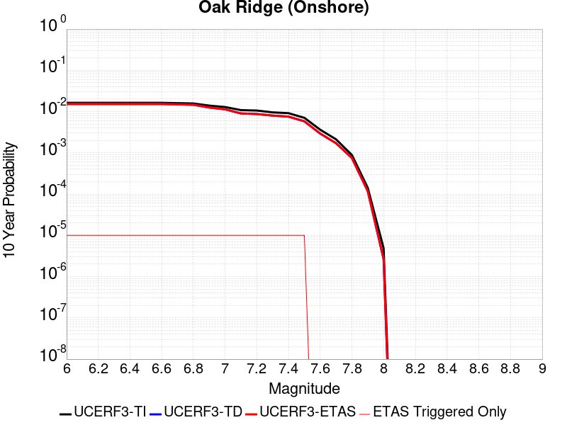 |

| Magnitude | 1 wk TI Prob | 1 wk TD Prob | 1 wk ETAS Prob | 1 wk ETAS/TD Gain | 1 wk ETAS Triggered Only | 1 mo TI Prob | 1 mo TD Prob | 1 mo ETAS Prob | 1 mo ETAS/TD Gain | 1 mo ETAS Triggered Only | 1 yr TI Prob | 1 yr TD Prob | 1 yr ETAS Prob | 1 yr ETAS/TD Gain | 1 yr ETAS Triggered Only | 10 yr TI Prob | 10 yr TD Prob | 10 yr ETAS Prob | 10 yr ETAS/TD Gain | 10 yr ETAS Triggered Only |
|-----|-----|-----|-----|-----|-----|-----|-----|-----|-----|-----|-----|-----|-----|-----|-----|-----|-----|-----|-----|-----|
| 6.0 | 3.155064E-5 | 2.9529447E-5 | 2.9529447E-5 | 1.0 | 0.0 | 1.3521002E-4 | 1.2654884E-4 | 1.2654884E-4 | 1.0 | 0.0 | 0.001644939 | 0.0015396813 | 0.0015496659 | 1.0064849 | 1.0E-5 | 0.01632816 | 0.015294643 | 0.015304491 | 1.0006438 | 1.0E-5 |
| 6.1 | 3.155064E-5 | 2.9529447E-5 | 2.9529447E-5 | 1.0 | 0.0 | 1.3521002E-4 | 1.2654884E-4 | 1.2654884E-4 | 1.0 | 0.0 | 0.001644939 | 0.0015396813 | 0.0015496659 | 1.0064849 | 1.0E-5 | 0.01632816 | 0.015294643 | 0.015304491 | 1.0006438 | 1.0E-5 |
| 6.2 | 3.155064E-5 | 2.9529447E-5 | 2.9529447E-5 | 1.0 | 0.0 | 1.3521002E-4 | 1.2654884E-4 | 1.2654884E-4 | 1.0 | 0.0 | 0.001644939 | 0.0015396813 | 0.0015496659 | 1.0064849 | 1.0E-5 | 0.01632816 | 0.015294643 | 0.015304491 | 1.0006438 | 1.0E-5 |
| 6.3 | 3.155064E-5 | 2.9529447E-5 | 2.9529447E-5 | 1.0 | 0.0 | 1.3521002E-4 | 1.2654884E-4 | 1.2654884E-4 | 1.0 | 0.0 | 0.001644939 | 0.0015396813 | 0.0015496659 | 1.0064849 | 1.0E-5 | 0.01632816 | 0.015294643 | 0.015304491 | 1.0006438 | 1.0E-5 |
| 6.4 | 3.155064E-5 | 2.9529447E-5 | 2.9529447E-5 | 1.0 | 0.0 | 1.3521002E-4 | 1.2654884E-4 | 1.2654884E-4 | 1.0 | 0.0 | 0.001644939 | 0.0015396813 | 0.0015496659 | 1.0064849 | 1.0E-5 | 0.01632816 | 0.015294643 | 0.015304491 | 1.0006438 | 1.0E-5 |
| 6.5 | 3.155064E-5 | 2.9529447E-5 | 2.9529447E-5 | 1.0 | 0.0 | 1.3521002E-4 | 1.2654884E-4 | 1.2654884E-4 | 1.0 | 0.0 | 0.001644939 | 0.0015396813 | 0.0015496659 | 1.0064849 | 1.0E-5 | 0.01632816 | 0.015294643 | 0.015304491 | 1.0006438 | 1.0E-5 |
| 6.6 | 3.155064E-5 | 2.9529447E-5 | 2.9529447E-5 | 1.0 | 0.0 | 1.3521002E-4 | 1.2654884E-4 | 1.2654884E-4 | 1.0 | 0.0 | 0.001644939 | 0.0015396813 | 0.0015496659 | 1.0064849 | 1.0E-5 | 0.01632816 | 0.015294643 | 0.015304491 | 1.0006438 | 1.0E-5 |
| 6.7 | 3.098897E-5 | 2.8867584E-5 | 2.8867584E-5 | 1.0 | 0.0 | 1.328031E-4 | 1.2371257E-4 | 1.2371257E-4 | 1.0 | 0.0 | 0.0016156785 | 0.0015051975 | 0.0015151824 | 1.0066336 | 1.0E-5 | 0.016039822 | 0.014954466 | 0.014964317 | 1.0006588 | 1.0E-5 |
| 6.8 | 3.0449872E-5 | 2.824273E-5 | 2.824273E-5 | 1.0 | 0.0 | 1.3049292E-4 | 1.21034864E-4 | 1.21034864E-4 | 1.0 | 0.0 | 0.0015875935 | 0.0014726405 | 0.0014826258 | 1.0067805 | 1.0E-5 | 0.015762992 | 0.014633188 | 0.014643042 | 1.0006734 | 1.0E-5 |
| 6.9 | 2.697928E-5 | 2.4222792E-5 | 2.4222792E-5 | 1.0 | 0.0 | 1.15620365E-4 | 1.0380796E-4 | 1.0380796E-4 | 1.0 | 0.0 | 0.0014067689 | 0.0012631506 | 0.001273138 | 1.0079067 | 1.0E-5 | 0.0139789665 | 0.012562426 | 0.0125723 | 1.0007861 | 1.0E-5 |
| 7.0 | 2.4893961E-5 | 2.1864875E-5 | 2.1864875E-5 | 1.0 | 0.0 | 1.0668404E-4 | 9.370334E-5 | 9.370334E-5 | 1.0 | 0.0 | 0.0012981043 | 0.0011402589 | 0.0011502474 | 1.00876 | 1.0E-5 | 0.012905477 | 0.011346367 | 0.011356254 | 1.0008713 | 1.0E-5 |
| 7.1 | 2.0945363E-5 | 1.7356973E-5 | 1.7356973E-5 | 1.0 | 0.0 | 8.976275E-5 | 7.438494E-5 | 7.438494E-5 | 1.0 | 0.0 | 0.0010923136 | 9.0526504E-4 | 9.1525604E-4 | 1.0110365 | 1.0E-5 | 0.0108696 | 0.009016709 | 0.009026619 | 1.0010991 | 1.0E-5 |
| 7.2 | 2.0439404E-5 | 1.6811871E-5 | 1.6811871E-5 | 1.0 | 0.0 | 8.7594504E-5 | 7.204891E-5 | 7.204891E-5 | 1.0 | 0.0 | 0.0010659413 | 8.768472E-4 | 8.868384E-4 | 1.0113945 | 1.0E-5 | 0.010608427 | 0.0087347925 | 0.0087447055 | 1.0011349 | 1.0E-5 |
| 7.3 | 1.8463334E-5 | 1.538278E-5 | 1.538278E-5 | 1.0 | 0.0 | 7.912617E-5 | 6.5924556E-5 | 6.5924556E-5 | 1.0 | 0.0 | 9.6293533E-4 | 8.023403E-4 | 8.1233226E-4 | 1.0124536 | 1.0E-5 | 0.009587734 | 0.007995299 | 0.008005219 | 1.0012407 | 1.0E-5 |
| 7.4 | 1.763139E-5 | 1.4517647E-5 | 1.4517647E-5 | 1.0 | 0.0 | 7.556091E-5 | 6.221703E-5 | 6.221703E-5 | 1.0 | 0.0 | 9.1956573E-4 | 7.57233E-4 | 7.6722546E-4 | 1.013196 | 1.0E-5 | 0.009157699 | 0.007547332 | 0.0075572566 | 1.001315 | 1.0E-5 |
| 7.5 | 1.3594944E-5 | 1.116386E-5 | 1.116386E-5 | 1.0 | 0.0 | 5.8262744E-5 | 4.784425E-5 | 4.784425E-5 | 1.0 | 0.0 | 7.0911803E-4 | 5.823506E-4 | 5.923448E-4 | 1.0171617 | 1.0E-5 | 0.007068595 | 0.005808517 | 0.0058184587 | 1.0017116 | 1.0E-5 |
| 7.6 | 6.9889534E-6 | 5.6369217E-6 | 5.6369217E-6 | 1.0 | 0.0 | 2.9952313E-5 | 2.4158015E-5 | 2.4158015E-5 | 1.0 | 0.0 | 3.646084E-4 | 2.9408454E-4 | 2.9408454E-4 | 1.0 | 0.0 | 0.0036401073 | 0.0029369977 | 0.0029369977 | 1.0 | 0.0 |
| 7.7 | 4.0824193E-6 | 3.2833782E-6 | 3.2833782E-6 | 1.0 | 0.0 | 1.7495966E-5 | 1.40715465E-5 | 1.40715465E-5 | 1.0 | 0.0 | 2.1299256E-4 | 1.7130774E-4 | 1.7130774E-4 | 1.0 | 0.0 | 0.0021278851 | 0.0017117702 | 0.0017117702 | 1.0 | 0.0 |
| 7.8 | 1.7023609E-6 | 1.4370928E-6 | 1.4370928E-6 | 1.0 | 0.0 | 7.295812E-6 | 6.158955E-6 | 6.158955E-6 | 1.0 | 0.0 | 8.882289E-5 | 7.498272E-5 | 7.498272E-5 | 1.0 | 0.0 | 8.8787393E-4 | 7.49577E-4 | 7.49577E-4 | 1.0 | 0.0 |
| 7.9 | 2.721225E-7 | 2.2617367E-7 | 2.2617367E-7 | 1.0 | 0.0 | 1.1662388E-6 | 9.693154E-7 | 9.693154E-7 | 1.0 | 0.0 | 1.4198865E-5 | 1.1801353E-5 | 1.1801353E-5 | 1.0 | 0.0 | 1.4197957E-4 | 1.1800755E-4 | 1.1800755E-4 | 1.0 | 0.0 |
| 8.0 | 9.364255E-9 | 5.1216933E-9 | 5.1216933E-9 | 1.0 | 0.0 | 4.0132523E-8 | 2.1950115E-8 | 2.1950115E-8 | 1.0 | 0.0 | 4.8861335E-7 | 2.6724263E-7 | 2.6724263E-7 | 1.0 | 0.0 | 4.8861225E-6 | 2.6724233E-6 | 2.6724233E-6 | 1.0 | 0.0 |

## Rodgers Creek - Healdsburg 2011 CFM
*[(top)](#table-of-contents)*

| 1 Week | 1 Month | 1 Year | 10 Year |
|-----|-----|-----|-----|
|  |  |  |  |

| Magnitude | 1 wk TI Prob | 1 wk TD Prob | 1 wk ETAS Prob | 1 wk ETAS/TD Gain | 1 wk ETAS Triggered Only | 1 mo TI Prob | 1 mo TD Prob | 1 mo ETAS Prob | 1 mo ETAS/TD Gain | 1 mo ETAS Triggered Only | 1 yr TI Prob | 1 yr TD Prob | 1 yr ETAS Prob | 1 yr ETAS/TD Gain | 1 yr ETAS Triggered Only | 10 yr TI Prob | 10 yr TD Prob | 10 yr ETAS Prob | 10 yr ETAS/TD Gain | 10 yr ETAS Triggered Only |
|-----|-----|-----|-----|-----|-----|-----|-----|-----|-----|-----|-----|-----|-----|-----|-----|-----|-----|-----|-----|-----|
| 6.0 | 7.390182E-5 | 1.3142917E-4 | 1.3142917E-4 | 1.0 | 0.0 | 3.1668364E-4 | 5.631467E-4 | 5.631467E-4 | 1.0 | 0.0 | 0.0038488081 | 0.0068347882 | 0.0068347882 | 1.0 | 0.0 | 0.037828278 | 0.06622128 | 0.06623062 | 1.000141 | 1.0E-5 |
| 6.1 | 7.318768E-5 | 1.3040975E-4 | 1.3040975E-4 | 1.0 | 0.0 | 3.1362378E-4 | 5.587797E-4 | 5.587797E-4 | 1.0 | 0.0 | 0.0038116854 | 0.0067819515 | 0.0067819515 | 1.0 | 0.0 | 0.037469655 | 0.06572582 | 0.06573516 | 1.0001421 | 1.0E-5 |
| 6.2 | 7.1379836E-5 | 1.273379E-4 | 1.273379E-4 | 1.0 | 0.0 | 3.058777E-4 | 5.456202E-4 | 5.456202E-4 | 1.0 | 0.0 | 0.003717703 | 0.0066227177 | 0.0066227177 | 1.0 | 0.0 | 0.0365612 | 0.06424386 | 0.06425322 | 1.0001457 | 1.0E-5 |
| 6.3 | 6.9255926E-5 | 1.2388272E-4 | 1.2388272E-4 | 1.0 | 0.0 | 2.9677735E-4 | 5.3081836E-4 | 5.3081836E-4 | 1.0 | 0.0 | 0.0036072785 | 0.006443587 | 0.006443587 | 1.0 | 0.0 | 0.035492823 | 0.06257 | 0.06257937 | 1.0001498 | 1.0E-5 |
| 6.4 | 6.6757144E-5 | 1.196489E-4 | 1.196489E-4 | 1.0 | 0.0 | 2.8607066E-4 | 5.126806E-4 | 5.126806E-4 | 1.0 | 0.0 | 0.0034773487 | 0.006224091 | 0.006224091 | 1.0 | 0.0 | 0.034234364 | 0.060519043 | 0.06052844 | 1.0001552 | 1.0E-5 |
| 6.5 | 6.5735134E-5 | 1.1813918E-4 | 1.1813918E-4 | 1.0 | 0.0 | 2.8169158E-4 | 5.0621293E-4 | 5.0621293E-4 | 1.0 | 0.0 | 0.003424202 | 0.006145812 | 0.006145812 | 1.0 | 0.0 | 0.03371918 | 0.059782747 | 0.05979215 | 1.0001572 | 1.0E-5 |
| 6.6 | 6.289601E-5 | 1.1349227E-4 | 1.1349227E-4 | 1.0 | 0.0 | 2.6952647E-4 | 4.8630516E-4 | 4.8630516E-4 | 1.0 | 0.0 | 0.0032765474 | 0.0059047723 | 0.0059047723 | 1.0 | 0.0 | 0.032286562 | 0.0575201 | 0.057529524 | 1.0001638 | 1.0E-5 |
| 6.7 | 6.115274E-5 | 1.1066158E-4 | 1.1066158E-4 | 1.0 | 0.0 | 2.6205686E-4 | 4.741781E-4 | 4.741781E-4 | 1.0 | 0.0 | 0.0031858748 | 0.0057579153 | 0.0057579153 | 1.0 | 0.0 | 0.031405866 | 0.056137886 | 0.056147326 | 1.0001681 | 1.0E-5 |
| 6.8 | 5.9232367E-5 | 1.073346E-4 | 1.073346E-4 | 1.0 | 0.0 | 2.538283E-4 | 4.599247E-4 | 4.599247E-4 | 1.0 | 0.0 | 0.0030859804 | 0.005585283 | 0.005585283 | 1.0 | 0.0 | 0.030434765 | 0.05450447 | 0.054513924 | 1.0001734 | 1.0E-5 |
| 6.9 | 5.4030377E-5 | 9.827546E-5 | 9.827546E-5 | 1.0 | 0.0 | 2.315382E-4 | 4.2111287E-4 | 4.2111287E-4 | 1.0 | 0.0 | 0.0028153337 | 0.0051150625 | 0.0051150625 | 1.0 | 0.0 | 0.027799325 | 0.050039466 | 0.050048966 | 1.0001899 | 1.0E-5 |
| 7.0 | 4.8260714E-5 | 8.745495E-5 | 8.745495E-5 | 1.0 | 0.0 | 2.0681522E-4 | 3.7475338E-4 | 3.7475338E-4 | 1.0 | 0.0 | 0.0025150678 | 0.0045531313 | 0.0045531313 | 1.0 | 0.0 | 0.024867928 | 0.044691484 | 0.04470104 | 1.0002137 | 1.0E-5 |
| 7.1 | 4.0294493E-5 | 7.3932846E-5 | 7.3932846E-5 | 1.0 | 0.0 | 1.7267925E-4 | 3.168168E-4 | 3.168168E-4 | 1.0 | 0.0 | 0.0021003427 | 0.0038504603 | 0.0038504603 | 1.0 | 0.0 | 0.02080602 | 0.03794385 | 0.03795347 | 1.0002536 | 1.0E-5 |
| 7.2 | 3.096388E-5 | 5.7018166E-5 | 5.7018166E-5 | 1.0 | 0.0 | 1.326956E-4 | 2.443408E-4 | 2.443408E-4 | 1.0 | 0.0 | 0.0016143717 | 0.002970813 | 0.002970813 | 1.0 | 0.0 | 0.01602694 | 0.029456772 | 0.029466476 | 1.0003295 | 1.0E-5 |
| 7.3 | 2.3615226E-5 | 4.366579E-5 | 4.366579E-5 | 1.0 | 0.0 | 1.0120418E-4 | 1.8712576E-4 | 1.8712576E-4 | 1.0 | 0.0 | 0.0012314644 | 0.0022758893 | 0.0022758893 | 1.0 | 0.0 | 0.0122466255 | 0.022655508 | 0.02266528 | 1.0004314 | 1.0E-5 |
| 7.4 | 1.8251132E-5 | 3.3575096E-5 | 3.3575096E-5 | 1.0 | 0.0 | 7.821679E-5 | 1.438854E-4 | 1.438854E-4 | 1.0 | 0.0 | 9.518733E-4 | 0.0017504068 | 0.0017504068 | 1.0 | 0.0 | 0.009478063 | 0.017482331 | 0.017492156 | 1.000562 | 1.0E-5 |
| 7.5 | 1.2411432E-5 | 2.2486745E-5 | 2.2486745E-5 | 1.0 | 0.0 | 5.3190768E-5 | 9.636824E-5 | 9.636824E-5 | 1.0 | 0.0 | 6.4740516E-4 | 0.0011726576 | 0.0011726576 | 1.0 | 0.0 | 0.006455223 | 0.011756561 | 0.011766443 | 1.0008405 | 1.0E-5 |
| 7.6 | 4.4771446E-6 | 8.09296E-6 | 8.09296E-6 | 1.0 | 0.0 | 1.918762E-5 | 3.4683664E-5 | 3.4683664E-5 | 1.0 | 0.0 | 2.3358424E-4 | 4.22193E-4 | 4.22193E-4 | 1.0 | 0.0 | 0.0023333887 | 0.004250496 | 0.004260454 | 1.0023427 | 1.0E-5 |
| 7.7 | 2.157941E-7 | 3.539757E-7 | 3.539757E-7 | 1.0 | 0.0 | 9.248315E-7 | 1.5170377E-6 | 1.5170377E-6 | 1.0 | 0.0 | 1.1259765E-5 | 1.8469778E-5 | 1.8469778E-5 | 1.0 | 0.0 | 1.1259195E-4 | 1.9093022E-4 | 1.9093022E-4 | 1.0 | 0.0 |
| 7.8 | 9.9623286E-8 | 1.9936476E-7 | 1.9936476E-7 | 1.0 | 0.0 | 4.269569E-7 | 8.544201E-7 | 8.544201E-7 | 1.0 | 0.0 | 5.1981874E-6 | 1.0402515E-5 | 1.0402515E-5 | 1.0 | 0.0 | 5.198066E-5 | 1.0919859E-4 | 1.0919859E-4 | 1.0 | 0.0 |
| 7.9 | 5.6745257E-8 | 1.1796928E-7 | 1.1796928E-7 | 1.0 | 0.0 | 2.4319394E-7 | 5.055825E-7 | 5.055825E-7 | 1.0 | 0.0 | 2.960882E-6 | 6.1554497E-6 | 6.1554497E-6 | 1.0 | 0.0 | 2.9608427E-5 | 6.482142E-5 | 6.482142E-5 | 1.0 | 0.0 |
| 8.0 | 2.8614323E-8 | 6.590836E-8 | 6.590836E-8 | 1.0 | 0.0 | 1.2263281E-7 | 2.8246436E-7 | 2.8246436E-7 | 1.0 | 0.0 | 1.4930534E-6 | 3.4389982E-6 | 3.4389982E-6 | 1.0 | 0.0 | 1.4930434E-5 | 3.5885336E-5 | 3.5885336E-5 | 1.0 | 0.0 |
| 8.1 | 3.5045191E-9 | 8.981429E-9 | 8.981429E-9 | 1.0 | 0.0 | 1.5019367E-8 | 3.8491837E-8 | 3.8491837E-8 | 1.0 | 0.0 | 1.8286079E-7 | 4.68638E-7 | 4.68638E-7 | 1.0 | 0.0 | 1.8286064E-6 | 4.84019E-6 | 4.84019E-6 | 1.0 | 0.0 |

## Elmore Ranch
*[(top)](#table-of-contents)*

| 1 Week | 1 Month | 1 Year | 10 Year |
|-----|-----|-----|-----|
|  |  | 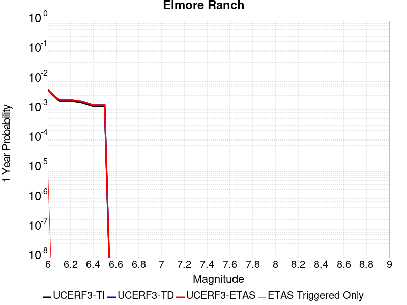 | 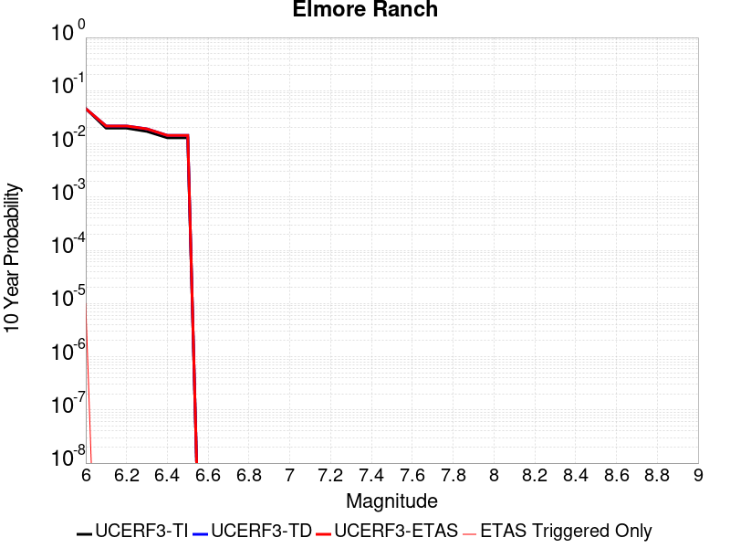 |

| Magnitude | 1 wk TI Prob | 1 wk TD Prob | 1 wk ETAS Prob | 1 wk ETAS/TD Gain | 1 wk ETAS Triggered Only | 1 mo TI Prob | 1 mo TD Prob | 1 mo ETAS Prob | 1 mo ETAS/TD Gain | 1 mo ETAS Triggered Only | 1 yr TI Prob | 1 yr TD Prob | 1 yr ETAS Prob | 1 yr ETAS/TD Gain | 1 yr ETAS Triggered Only | 10 yr TI Prob | 10 yr TD Prob | 10 yr ETAS Prob | 10 yr ETAS/TD Gain | 10 yr ETAS Triggered Only |
|-----|-----|-----|-----|-----|-----|-----|-----|-----|-----|-----|-----|-----|-----|-----|-----|-----|-----|-----|-----|-----|
| 6.0 | 9.102099E-5 | 8.954503E-5 | 8.954503E-5 | 1.0 | 0.0 | 3.9003167E-4 | 3.837211E-4 | 3.837211E-4 | 1.0 | 0.0 | 0.0047383 | 0.0046632043 | 0.004673158 | 1.0021344 | 1.0E-5 | 0.046385348 | 0.045880616 | 0.045890156 | 1.0002079 | 1.0E-5 |
| 6.1 | 3.8306698E-5 | 4.1508196E-5 | 4.1508196E-5 | 1.0 | 0.0 | 1.6416123E-4 | 1.7788421E-4 | 1.7788421E-4 | 1.0 | 0.0 | 0.0019968306 | 0.002163561 | 0.002163561 | 1.0 | 0.0 | 0.019789828 | 0.021632731 | 0.021632731 | 1.0 | 0.0 |
| 6.2 | 3.8306698E-5 | 4.1508196E-5 | 4.1508196E-5 | 1.0 | 0.0 | 1.6416123E-4 | 1.7788421E-4 | 1.7788421E-4 | 1.0 | 0.0 | 0.0019968306 | 0.002163561 | 0.002163561 | 1.0 | 0.0 | 0.019789828 | 0.021632731 | 0.021632731 | 1.0 | 0.0 |
| 6.3 | 3.3197924E-5 | 3.656194E-5 | 3.656194E-5 | 1.0 | 0.0 | 1.4226905E-4 | 1.5668859E-4 | 1.5668859E-4 | 1.0 | 0.0 | 0.0017307495 | 0.001906266 | 0.001906266 | 1.0 | 0.0 | 0.017173318 | 0.019093616 | 0.019093616 | 1.0 | 0.0 |
| 6.4 | 2.5148964E-5 | 2.7425167E-5 | 2.7425167E-5 | 1.0 | 0.0 | 1.0777682E-4 | 1.1753479E-4 | 1.1753479E-4 | 1.0 | 0.0 | 0.0013113929 | 0.001430695 | 0.001430695 | 1.0 | 0.0 | 0.01303681 | 0.014389615 | 0.014389615 | 1.0 | 0.0 |
| 6.5 | 2.5148964E-5 | 2.7425167E-5 | 2.7425167E-5 | 1.0 | 0.0 | 1.0777682E-4 | 1.1753479E-4 | 1.1753479E-4 | 1.0 | 0.0 | 0.0013113929 | 0.001430695 | 0.001430695 | 1.0 | 0.0 | 0.01303681 | 0.014389615 | 0.014389615 | 1.0 | 0.0 |

## Los Alamos 2011 CFM
*[(top)](#table-of-contents)*

| 1 Week | 1 Month | 1 Year | 10 Year |
|-----|-----|-----|-----|
|  |  |  | 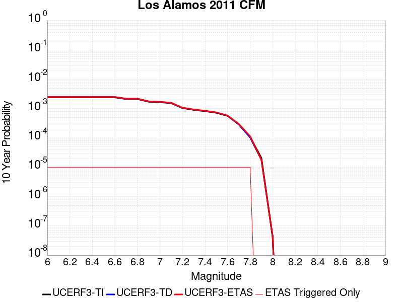 |

| Magnitude | 1 wk TI Prob | 1 wk TD Prob | 1 wk ETAS Prob | 1 wk ETAS/TD Gain | 1 wk ETAS Triggered Only | 1 mo TI Prob | 1 mo TD Prob | 1 mo ETAS Prob | 1 mo ETAS/TD Gain | 1 mo ETAS Triggered Only | 1 yr TI Prob | 1 yr TD Prob | 1 yr ETAS Prob | 1 yr ETAS/TD Gain | 1 yr ETAS Triggered Only | 10 yr TI Prob | 10 yr TD Prob | 10 yr ETAS Prob | 10 yr ETAS/TD Gain | 10 yr ETAS Triggered Only |
|-----|-----|-----|-----|-----|-----|-----|-----|-----|-----|-----|-----|-----|-----|-----|-----|-----|-----|-----|-----|-----|
| 6.0 | 4.6284417E-6 | 4.7518183E-6 | 4.7518183E-6 | 1.0 | 0.0 | 1.9836029E-5 | 2.0364787E-5 | 2.0364787E-5 | 1.0 | 0.0 | 2.4147688E-4 | 2.4791484E-4 | 2.5791235E-4 | 1.0403265 | 1.0E-5 | 0.0024121467 | 0.002476557 | 0.002486532 | 1.0040278 | 1.0E-5 |
| 6.1 | 4.6284417E-6 | 4.7518183E-6 | 4.7518183E-6 | 1.0 | 0.0 | 1.9836029E-5 | 2.0364787E-5 | 2.0364787E-5 | 1.0 | 0.0 | 2.4147688E-4 | 2.4791484E-4 | 2.5791235E-4 | 1.0403265 | 1.0E-5 | 0.0024121467 | 0.002476557 | 0.002486532 | 1.0040278 | 1.0E-5 |
| 6.2 | 4.6284417E-6 | 4.7518183E-6 | 4.7518183E-6 | 1.0 | 0.0 | 1.9836029E-5 | 2.0364787E-5 | 2.0364787E-5 | 1.0 | 0.0 | 2.4147688E-4 | 2.4791484E-4 | 2.5791235E-4 | 1.0403265 | 1.0E-5 | 0.0024121467 | 0.002476557 | 0.002486532 | 1.0040278 | 1.0E-5 |
| 6.3 | 4.6284417E-6 | 4.7518183E-6 | 4.7518183E-6 | 1.0 | 0.0 | 1.9836029E-5 | 2.0364787E-5 | 2.0364787E-5 | 1.0 | 0.0 | 2.4147688E-4 | 2.4791484E-4 | 2.5791235E-4 | 1.0403265 | 1.0E-5 | 0.0024121467 | 0.002476557 | 0.002486532 | 1.0040278 | 1.0E-5 |
| 6.4 | 4.6284417E-6 | 4.7518183E-6 | 4.7518183E-6 | 1.0 | 0.0 | 1.9836029E-5 | 2.0364787E-5 | 2.0364787E-5 | 1.0 | 0.0 | 2.4147688E-4 | 2.4791484E-4 | 2.5791235E-4 | 1.0403265 | 1.0E-5 | 0.0024121467 | 0.002476557 | 0.002486532 | 1.0040278 | 1.0E-5 |
| 6.5 | 4.6284417E-6 | 4.7518183E-6 | 4.7518183E-6 | 1.0 | 0.0 | 1.9836029E-5 | 2.0364787E-5 | 2.0364787E-5 | 1.0 | 0.0 | 2.4147688E-4 | 2.4791484E-4 | 2.5791235E-4 | 1.0403265 | 1.0E-5 | 0.0024121467 | 0.002476557 | 0.002486532 | 1.0040278 | 1.0E-5 |
| 6.6 | 4.6284417E-6 | 4.7518183E-6 | 4.7518183E-6 | 1.0 | 0.0 | 1.9836029E-5 | 2.0364787E-5 | 2.0364787E-5 | 1.0 | 0.0 | 2.4147688E-4 | 2.4791484E-4 | 2.5791235E-4 | 1.0403265 | 1.0E-5 | 0.0024121467 | 0.002476557 | 0.002486532 | 1.0040278 | 1.0E-5 |
| 6.7 | 4.062321E-6 | 4.1664257E-6 | 4.1664257E-6 | 1.0 | 0.0 | 1.7409831E-5 | 1.7855995E-5 | 1.7855995E-5 | 1.0 | 0.0 | 2.1194408E-4 | 2.1737657E-4 | 2.273744E-4 | 1.0459931 | 1.0E-5 | 0.0021174205 | 0.002171789 | 0.0021817675 | 1.0045944 | 1.0E-5 |
| 6.8 | 4.062321E-6 | 4.1664257E-6 | 4.1664257E-6 | 1.0 | 0.0 | 1.7409831E-5 | 1.7855995E-5 | 1.7855995E-5 | 1.0 | 0.0 | 2.1194408E-4 | 2.1737657E-4 | 2.273744E-4 | 1.0459931 | 1.0E-5 | 0.0021174205 | 0.002171789 | 0.0021817675 | 1.0045944 | 1.0E-5 |
| 6.9 | 3.2936077E-6 | 3.3730212E-6 | 3.3730212E-6 | 1.0 | 0.0 | 1.4115385E-5 | 1.445573E-5 | 1.445573E-5 | 1.0 | 0.0 | 1.7184127E-4 | 1.7598523E-4 | 1.8598347E-4 | 1.056813 | 1.0E-5 | 0.0017170844 | 0.0017585513 | 0.0017685337 | 1.0056765 | 1.0E-5 |
| 7.0 | 3.1687898E-6 | 3.244877E-6 | 3.244877E-6 | 1.0 | 0.0 | 1.3580457E-5 | 1.3906547E-5 | 1.3906547E-5 | 1.0 | 0.0 | 1.6532952E-4 | 1.6929998E-4 | 1.7929828E-4 | 1.0590568 | 1.0E-5 | 0.0016520657 | 0.0016918016 | 0.0017017847 | 1.0059009 | 1.0E-5 |
| 7.1 | 2.9379228E-6 | 3.0073836E-6 | 3.0073836E-6 | 1.0 | 0.0 | 1.25910365E-5 | 1.2888729E-5 | 1.2888729E-5 | 1.0 | 0.0 | 1.5328509E-4 | 1.5690987E-4 | 1.669083E-4 | 1.0637208 | 1.0E-5 | 0.001531794 | 0.00156808 | 0.0015780643 | 1.0063672 | 1.0E-5 |
| 7.2 | 2.0020686E-6 | 2.0416712E-6 | 2.0416712E-6 | 1.0 | 0.0 | 8.580266E-6 | 8.74999E-6 | 8.74999E-6 | 1.0 | 0.0 | 1.0445973E-4 | 1.0652597E-4 | 1.16524905E-4 | 1.0938638 | 1.0E-5 | 0.0010441064 | 0.0010647535 | 0.0010747429 | 1.0093819 | 1.0E-5 |
| 7.3 | 1.7364243E-6 | 1.7679173E-6 | 1.7679173E-6 | 1.0 | 0.0 | 7.441797E-6 | 7.576766E-6 | 7.576766E-6 | 1.0 | 0.0 | 9.0600115E-5 | 9.224326E-5 | 1.0224233E-4 | 1.108399 | 1.0E-5 | 9.0563187E-4 | 9.2205283E-4 | 9.320436E-4 | 1.0108354 | 1.0E-5 |
| 7.4 | 1.5718434E-6 | 1.5983519E-6 | 1.5983519E-6 | 1.0 | 0.0 | 6.7364545E-6 | 6.8500617E-6 | 6.8500617E-6 | 1.0 | 0.0 | 8.201325E-5 | 8.339634E-5 | 9.339551E-5 | 1.1198994 | 1.0E-5 | 8.198299E-4 | 8.3365344E-4 | 8.4364513E-4 | 1.0119854 | 1.0E-5 |
| 7.5 | 1.3841119E-6 | 1.4043101E-6 | 1.4043101E-6 | 1.0 | 0.0 | 5.9318945E-6 | 6.018458E-6 | 6.018458E-6 | 1.0 | 0.0 | 7.221842E-5 | 7.327229E-5 | 8.327156E-5 | 1.1364672 | 1.0E-5 | 7.2194956E-4 | 7.324842E-4 | 7.4247684E-4 | 1.0136422 | 1.0E-5 |
| 7.6 | 1.0843726E-6 | 1.0934668E-6 | 1.0934668E-6 | 1.0 | 0.0 | 4.647303E-6 | 4.686278E-6 | 4.686278E-6 | 1.0 | 0.0 | 5.6579443E-5 | 5.7053967E-5 | 6.70534E-5 | 1.1752627 | 1.0E-5 | 5.656504E-4 | 5.703958E-4 | 5.803901E-4 | 1.0175217 | 1.0E-5 |
| 7.7 | 5.544814E-7 | 5.502E-7 | 5.502E-7 | 1.0 | 0.0 | 2.3763469E-6 | 2.3579978E-6 | 2.3579978E-6 | 1.0 | 0.0 | 2.8931638E-5 | 2.8708248E-5 | 3.870796E-5 | 1.3483219 | 1.0E-5 | 2.8927872E-4 | 2.8704555E-4 | 2.970427E-4 | 1.0348277 | 1.0E-5 |
| 7.8 | 2.0707465E-7 | 1.9778966E-7 | 1.9778966E-7 | 1.0 | 0.0 | 8.874625E-7 | 8.476697E-7 | 8.476697E-7 | 1.0 | 0.0 | 1.08048025E-5 | 1.032033E-5 | 2.0320227E-5 | 1.9689512 | 1.0E-5 | 1.0804277E-4 | 1.0319855E-4 | 1.1319752E-4 | 1.0968906 | 1.0E-5 |
| 7.9 | 3.9821284E-8 | 3.4332025E-8 | 3.4332025E-8 | 1.0 | 0.0 | 1.7066264E-7 | 1.4713724E-7 | 1.4713724E-7 | 1.0 | 0.0 | 2.0778157E-6 | 1.7913944E-6 | 1.7913944E-6 | 1.0 | 0.0 | 2.0777963E-5 | 1.7913806E-5 | 1.7913806E-5 | 1.0 | 0.0 |
| 8.0 | 7.880441E-11 | 8.235512E-11 | 8.235512E-11 | 1.0 | 0.0 | 3.3773329E-10 | 3.5295045E-10 | 3.5295045E-10 | 1.0 | 0.0 | 4.1119033E-9 | 4.2971724E-9 | 4.2971724E-9 | 1.0 | 0.0 | 4.1119034E-8 | 4.297172E-8 | 4.297172E-8 | 1.0 | 0.0 |

## San Andreas (Offshore) 2011 CFM
*[(top)](#table-of-contents)*

| 1 Week | 1 Month | 1 Year | 10 Year |
|-----|-----|-----|-----|
|  | 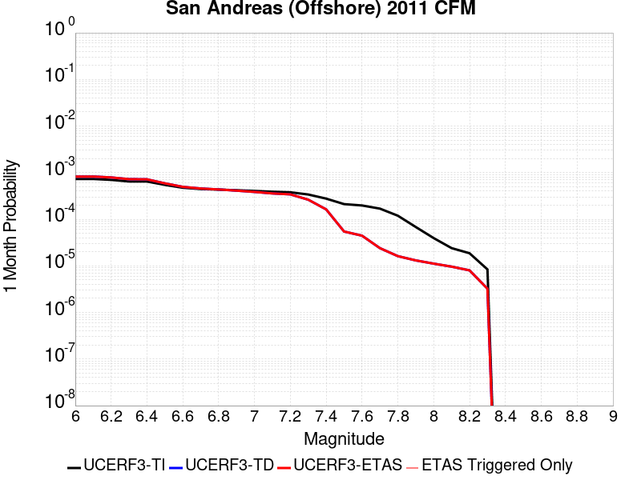 | 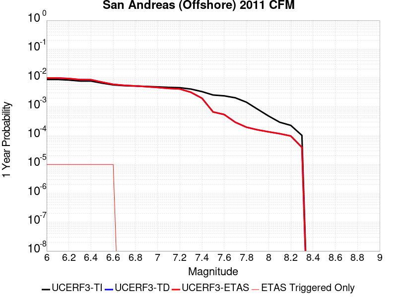 | 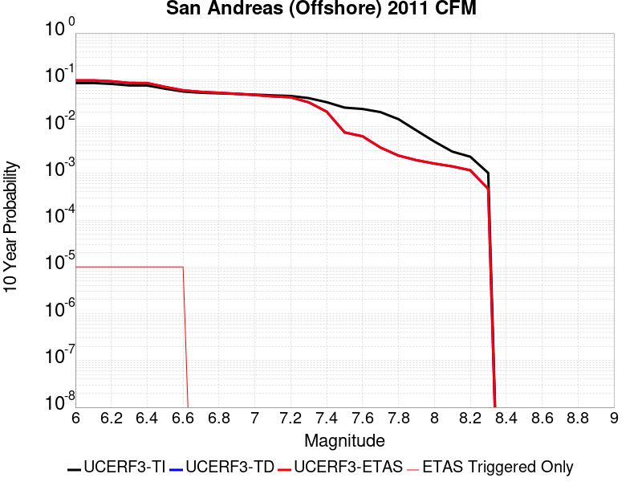 |

| Magnitude | 1 wk TI Prob | 1 wk TD Prob | 1 wk ETAS Prob | 1 wk ETAS/TD Gain | 1 wk ETAS Triggered Only | 1 mo TI Prob | 1 mo TD Prob | 1 mo ETAS Prob | 1 mo ETAS/TD Gain | 1 mo ETAS Triggered Only | 1 yr TI Prob | 1 yr TD Prob | 1 yr ETAS Prob | 1 yr ETAS/TD Gain | 1 yr ETAS Triggered Only | 10 yr TI Prob | 10 yr TD Prob | 10 yr ETAS Prob | 10 yr ETAS/TD Gain | 10 yr ETAS Triggered Only |
|-----|-----|-----|-----|-----|-----|-----|-----|-----|-----|-----|-----|-----|-----|-----|-----|-----|-----|-----|-----|-----|
| 6.0 | 1.7072787E-4 | 1.9243768E-4 | 1.9243768E-4 | 1.0 | 0.0 | 7.3148566E-4 | 8.244747E-4 | 8.244747E-4 | 1.0 | 0.0 | 0.008869528 | 0.009992293 | 0.010002193 | 1.0009907 | 1.0E-5 | 0.085237645 | 0.09690714 | 0.09691617 | 1.0000932 | 1.0E-5 |
| 6.1 | 1.7072787E-4 | 1.9243768E-4 | 1.9243768E-4 | 1.0 | 0.0 | 7.3148566E-4 | 8.244747E-4 | 8.244747E-4 | 1.0 | 0.0 | 0.008869528 | 0.009992293 | 0.010002193 | 1.0009907 | 1.0E-5 | 0.085237645 | 0.09690714 | 0.09691617 | 1.0000932 | 1.0E-5 |
| 6.2 | 1.6312556E-4 | 1.8424621E-4 | 1.8424621E-4 | 1.0 | 0.0 | 6.989222E-4 | 7.8939006E-4 | 7.8939006E-4 | 1.0 | 0.0 | 0.008476226 | 0.00956897 | 0.009578874 | 1.0010351 | 1.0E-5 | 0.08160117 | 0.09292438 | 0.092933446 | 1.0000976 | 1.0E-5 |
| 6.3 | 1.5103363E-4 | 1.6896211E-4 | 1.6896211E-4 | 1.0 | 0.0 | 6.471264E-4 | 7.2392455E-4 | 7.2392455E-4 | 1.0 | 0.0 | 0.007850339 | 0.0087786075 | 0.00878852 | 1.0011292 | 1.0E-5 | 0.075787395 | 0.08556006 | 0.08556921 | 1.0001069 | 1.0E-5 |
| 6.4 | 1.5047993E-4 | 1.6782133E-4 | 1.6782133E-4 | 1.0 | 0.0 | 6.4475456E-4 | 7.1903825E-4 | 7.1903825E-4 | 1.0 | 0.0 | 0.007821669 | 0.008719592 | 0.008729505 | 1.0011369 | 1.0E-5 | 0.0755203 | 0.08504028 | 0.08504943 | 1.0001076 | 1.0E-5 |
| 6.5 | 1.2760791E-4 | 1.3748009E-4 | 1.3748009E-4 | 1.0 | 0.0 | 5.467764E-4 | 5.8906875E-4 | 5.8906875E-4 | 1.0 | 0.0 | 0.0066367025 | 0.007148602 | 0.0071585304 | 1.0013889 | 1.0E-5 | 0.064419635 | 0.07031143 | 0.070320725 | 1.0001322 | 1.0E-5 |
| 6.6 | 1.1063525E-4 | 1.1567755E-4 | 1.1567755E-4 | 1.0 | 0.0 | 4.740649E-4 | 4.956678E-4 | 4.956678E-4 | 1.0 | 0.0 | 0.0057564764 | 0.006018259 | 0.0060281986 | 1.0016516 | 1.0E-5 | 0.05609626 | 0.05954285 | 0.059552252 | 1.000158 | 1.0E-5 |
| 6.7 | 1.0391049E-4 | 1.06563464E-4 | 1.06563464E-4 | 1.0 | 0.0 | 4.4525467E-4 | 4.566216E-4 | 4.566216E-4 | 1.0 | 0.0 | 0.0054075094 | 0.0055453847 | 0.0055453847 | 1.0 | 0.0 | 0.052778035 | 0.05503986 | 0.05503986 | 1.0 | 0.0 |
| 6.8 | 1.0096706E-4 | 1.0168416E-4 | 1.0168416E-4 | 1.0 | 0.0 | 4.3264418E-4 | 4.3571746E-4 | 4.3571746E-4 | 1.0 | 0.0 | 0.0052547283 | 0.005292134 | 0.005292134 | 1.0 | 0.0 | 0.051321987 | 0.052737482 | 0.052737482 | 1.0 | 0.0 |
| 6.9 | 9.800265E-5 | 9.598679E-5 | 9.598679E-5 | 1.0 | 0.0 | 4.1994374E-4 | 4.11308E-4 | 4.11308E-4 | 1.0 | 0.0 | 0.0051008356 | 0.0049963454 | 0.0049963454 | 1.0 | 0.0 | 0.049853306 | 0.05006405 | 0.05006405 | 1.0 | 0.0 |
| 7.0 | 9.4642375E-5 | 9.0118105E-5 | 9.0118105E-5 | 1.0 | 0.0 | 4.0554712E-4 | 3.8616415E-4 | 3.8616415E-4 | 1.0 | 0.0 | 0.004926363 | 0.0046915757 | 0.0046915757 | 1.0 | 0.0 | 0.048185747 | 0.047243945 | 0.047243945 | 1.0 | 0.0 |
| 7.1 | 9.0996844E-5 | 8.363557E-5 | 8.363557E-5 | 1.0 | 0.0 | 3.8992817E-4 | 3.5838978E-4 | 3.5838978E-4 | 1.0 | 0.0 | 0.004737046 | 0.004354822 | 0.004354822 | 1.0 | 0.0 | 0.04637333 | 0.044094373 | 0.044094373 | 1.0 | 0.0 |
| 7.2 | 8.848287E-5 | 7.9909514E-5 | 7.9909514E-5 | 1.0 | 0.0 | 3.791572E-4 | 3.4242525E-4 | 3.4242525E-4 | 1.0 | 0.0 | 0.004606472 | 0.004161212 | 0.004161212 | 1.0 | 0.0 | 0.045121472 | 0.04223721 | 0.04223721 | 1.0 | 0.0 |
| 7.3 | 7.9280784E-5 | 6.135467E-5 | 6.135467E-5 | 1.0 | 0.0 | 3.3973053E-4 | 2.6292267E-4 | 2.6292267E-4 | 1.0 | 0.0 | 0.004128377 | 0.0031964872 | 0.0031964872 | 1.0 | 0.0 | 0.040525194 | 0.032944594 | 0.032944594 | 1.0 | 0.0 |
| 7.4 | 6.468038E-5 | 3.798989E-5 | 3.798989E-5 | 1.0 | 0.0 | 2.771722E-4 | 1.6280398E-4 | 1.6280398E-4 | 1.0 | 0.0 | 0.0033693502 | 0.0019803944 | 0.0019803944 | 1.0 | 0.0 | 0.0331872 | 0.020852158 | 0.020852158 | 1.0 | 0.0 |
| 7.5 | 4.930574E-5 | 1.2737067E-5 | 1.2737067E-5 | 1.0 | 0.0 | 2.1129321E-4 | 5.4586293E-5 | 5.4586293E-5 | 1.0 | 0.0 | 0.0025694598 | 6.643871E-4 | 6.643871E-4 | 1.0 | 0.0 | 0.02539953 | 0.007501229 | 0.007501229 | 1.0 | 0.0 |
| 7.6 | 4.612566E-5 | 1.0366656E-5 | 1.0366656E-5 | 1.0 | 0.0 | 1.9766642E-4 | 4.442778E-5 | 4.442778E-5 | 1.0 | 0.0 | 0.0024039324 | 5.4077536E-4 | 5.4077536E-4 | 1.0 | 0.0 | 0.023780935 | 0.0061902013 | 0.0061902013 | 1.0 | 0.0 |
| 7.7 | 3.9435414E-5 | 5.598791E-6 | 5.598791E-6 | 1.0 | 0.0 | 1.6899795E-4 | 2.39946E-5 | 2.39946E-5 | 1.0 | 0.0 | 0.0020556084 | 2.9209527E-4 | 2.9209527E-4 | 1.0 | 0.0 | 0.020366974 | 0.003556676 | 0.003556676 | 1.0 | 0.0 |
| 7.8 | 2.7787428E-5 | 3.7729496E-6 | 3.7729496E-6 | 1.0 | 0.0 | 1.1908354E-4 | 1.6169684E-5 | 1.6169684E-5 | 1.0 | 0.0 | 0.0014488777 | 1.9684815E-4 | 1.9684815E-4 | 1.0 | 0.0 | 0.014394675 | 0.0023984525 | 0.0023984525 | 1.0 | 0.0 |
| 7.9 | 1.590671E-5 | 3.0548313E-6 | 3.0548313E-6 | 1.0 | 0.0 | 6.816983E-5 | 1.3092068E-5 | 1.3092068E-5 | 1.0 | 0.0 | 8.2965166E-4 | 1.593843E-4 | 1.593843E-4 | 1.0 | 0.0 | 0.008265611 | 0.001912608 | 0.001912608 | 1.0 | 0.0 |
| 8.0 | 9.193638E-6 | 2.6035711E-6 | 2.6035711E-6 | 1.0 | 0.0 | 3.940071E-5 | 1.1158115E-5 | 1.1158115E-5 | 1.0 | 0.0 | 4.7959806E-4 | 1.358416E-4 | 1.358416E-4 | 1.0 | 0.0 | 0.0047856434 | 0.0016181957 | 0.0016181957 | 1.0 | 0.0 |
| 8.1 | 5.601576E-6 | 2.2447791E-6 | 2.2447791E-6 | 1.0 | 0.0 | 2.4006533E-5 | 9.620446E-6 | 9.620446E-6 | 1.0 | 0.0 | 2.9224035E-4 | 1.1712267E-4 | 1.1712267E-4 | 1.0 | 0.0 | 0.0029185633 | 0.0014080945 | 0.0014080945 | 1.0 | 0.0 |
| 8.2 | 4.3508785E-6 | 1.8661184E-6 | 1.8661184E-6 | 1.0 | 0.0 | 1.864649E-5 | 7.997626E-6 | 7.997626E-6 | 1.0 | 0.0 | 2.2699735E-4 | 9.736677E-5 | 9.736677E-5 | 1.0 | 0.0 | 0.0022676561 | 0.0011643195 | 0.0011643195 | 1.0 | 0.0 |
| 8.3 | 1.9573292E-6 | 7.547989E-7 | 7.547989E-7 | 1.0 | 0.0 | 8.388526E-6 | 3.2348487E-6 | 3.2348487E-6 | 1.0 | 0.0 | 1.0212552E-4 | 3.9383587E-5 | 3.9383587E-5 | 1.0 | 0.0 | 0.001020786 | 4.6598504E-4 | 4.6598504E-4 | 1.0 | 0.0 |

## Simi-Santa Rosa
*[(top)](#table-of-contents)*

| 1 Week | 1 Month | 1 Year | 10 Year |
|-----|-----|-----|-----|
|  |  |  |  |

| Magnitude | 1 wk TI Prob | 1 wk TD Prob | 1 wk ETAS Prob | 1 wk ETAS/TD Gain | 1 wk ETAS Triggered Only | 1 mo TI Prob | 1 mo TD Prob | 1 mo ETAS Prob | 1 mo ETAS/TD Gain | 1 mo ETAS Triggered Only | 1 yr TI Prob | 1 yr TD Prob | 1 yr ETAS Prob | 1 yr ETAS/TD Gain | 1 yr ETAS Triggered Only | 10 yr TI Prob | 10 yr TD Prob | 10 yr ETAS Prob | 10 yr ETAS/TD Gain | 10 yr ETAS Triggered Only |
|-----|-----|-----|-----|-----|-----|-----|-----|-----|-----|-----|-----|-----|-----|-----|-----|-----|-----|-----|-----|-----|
| 6.0 | 2.198912E-5 | 2.2277061E-5 | 2.2277061E-5 | 1.0 | 0.0 | 9.4235686E-5 | 9.546988E-5 | 9.546988E-5 | 1.0 | 0.0 | 0.0011467156 | 0.0011617698 | 0.0011717582 | 1.0085976 | 1.0E-5 | 0.011408163 | 0.011561411 | 0.011571296 | 1.000855 | 1.0E-5 |
| 6.1 | 2.198912E-5 | 2.2277061E-5 | 2.2277061E-5 | 1.0 | 0.0 | 9.4235686E-5 | 9.546988E-5 | 9.546988E-5 | 1.0 | 0.0 | 0.0011467156 | 0.0011617698 | 0.0011717582 | 1.0085976 | 1.0E-5 | 0.011408163 | 0.011561411 | 0.011571296 | 1.000855 | 1.0E-5 |
| 6.2 | 1.69983E-5 | 1.6669812E-5 | 1.6669812E-5 | 1.0 | 0.0 | 7.284782E-5 | 7.1440256E-5 | 7.1440256E-5 | 1.0 | 0.0 | 8.865613E-4 | 8.694672E-4 | 8.7945856E-4 | 1.0114913 | 1.0E-5 | 0.008830327 | 0.008663576 | 0.008673489 | 1.0011443 | 1.0E-5 |
| 6.3 | 1.69983E-5 | 1.6669812E-5 | 1.6669812E-5 | 1.0 | 0.0 | 7.284782E-5 | 7.1440256E-5 | 7.1440256E-5 | 1.0 | 0.0 | 8.865613E-4 | 8.694672E-4 | 8.7945856E-4 | 1.0114913 | 1.0E-5 | 0.008830327 | 0.008663576 | 0.008673489 | 1.0011443 | 1.0E-5 |
| 6.4 | 1.4666188E-5 | 1.4053627E-5 | 1.4053627E-5 | 1.0 | 0.0 | 6.285358E-5 | 6.0228576E-5 | 6.0228576E-5 | 1.0 | 0.0 | 7.6497364E-4 | 7.330611E-4 | 7.430538E-4 | 1.0136315 | 1.0E-5 | 0.0076234564 | 0.0073089055 | 0.0073188324 | 1.0013582 | 1.0E-5 |
| 6.5 | 1.4666188E-5 | 1.4053627E-5 | 1.4053627E-5 | 1.0 | 0.0 | 6.285358E-5 | 6.0228576E-5 | 6.0228576E-5 | 1.0 | 0.0 | 7.6497364E-4 | 7.330611E-4 | 7.430538E-4 | 1.0136315 | 1.0E-5 | 0.0076234564 | 0.0073089055 | 0.0073188324 | 1.0013582 | 1.0E-5 |
| 6.6 | 1.4377586E-5 | 1.3730646E-5 | 1.3730646E-5 | 1.0 | 0.0 | 6.1616774E-5 | 5.8844438E-5 | 5.8844438E-5 | 1.0 | 0.0 | 7.4992597E-4 | 7.162204E-4 | 7.262132E-4 | 1.0139521 | 1.0E-5 | 0.007474003 | 0.0071415897 | 0.007151518 | 1.0013902 | 1.0E-5 |
| 6.7 | 1.3881404E-5 | 1.320858E-5 | 1.320858E-5 | 1.0 | 0.0 | 5.9490372E-5 | 5.660711E-5 | 5.660711E-5 | 1.0 | 0.0 | 7.240546E-4 | 6.889984E-4 | 6.9899147E-4 | 1.0145038 | 1.0E-5 | 0.007217 | 0.006871072 | 0.0068810033 | 1.0014454 | 1.0E-5 |
| 6.8 | 1.0176516E-5 | 9.154907E-6 | 9.154907E-6 | 1.0 | 0.0 | 4.3612912E-5 | 3.923482E-5 | 3.923482E-5 | 1.0 | 0.0 | 5.308578E-4 | 4.7759584E-4 | 4.7759584E-4 | 1.0 | 0.0 | 0.0052959146 | 0.0047673276 | 0.0047673276 | 1.0 | 0.0 |
| 6.9 | 9.699797E-6 | 8.775444E-6 | 8.775444E-6 | 1.0 | 0.0 | 4.15699E-5 | 3.7608595E-5 | 3.7608595E-5 | 1.0 | 0.0 | 5.05996E-4 | 4.578049E-4 | 4.578049E-4 | 1.0 | 0.0 | 0.005048454 | 0.004570236 | 0.004570236 | 1.0 | 0.0 |
| 7.0 | 7.4049476E-6 | 6.559884E-6 | 6.559884E-6 | 1.0 | 0.0 | 3.1735104E-5 | 2.8113554E-5 | 2.8113554E-5 | 1.0 | 0.0 | 3.8630638E-4 | 3.4224143E-4 | 3.4224143E-4 | 1.0 | 0.0 | 0.0038563553 | 0.0034183862 | 0.0034183862 | 1.0 | 0.0 |
| 7.1 | 3.873439E-6 | 2.7597737E-6 | 2.7597737E-6 | 1.0 | 0.0 | 1.6600346E-5 | 1.1827549E-5 | 1.1827549E-5 | 1.0 | 0.0 | 2.0209046E-4 | 1.4399113E-4 | 1.4399113E-4 | 1.0 | 0.0 | 0.0020190678 | 0.0014390019 | 0.0014390019 | 1.0 | 0.0 |
| 7.2 | 3.417706E-6 | 2.3678895E-6 | 2.3678895E-6 | 1.0 | 0.0 | 1.4647229E-5 | 1.0148059E-5 | 1.0148059E-5 | 1.0 | 0.0 | 1.7831543E-4 | 1.2354583E-4 | 1.2354583E-4 | 1.0 | 0.0 | 0.0017817242 | 0.0012347938 | 0.0012347938 | 1.0 | 0.0 |
| 7.3 | 1.90225E-6 | 1.4075586E-6 | 1.4075586E-6 | 1.0 | 0.0 | 8.152474E-6 | 6.03238E-6 | 6.03238E-6 | 1.0 | 0.0 | 9.9251854E-5 | 7.344177E-5 | 7.344177E-5 | 1.0 | 0.0 | 9.920754E-4 | 7.3417724E-4 | 7.3417724E-4 | 1.0 | 0.0 |
| 7.4 | 1.5170556E-6 | 1.1026477E-6 | 1.1026477E-6 | 1.0 | 0.0 | 6.5016507E-6 | 4.7256244E-6 | 4.7256244E-6 | 1.0 | 0.0 | 7.915472E-5 | 5.753297E-5 | 5.753297E-5 | 1.0 | 0.0 | 7.9126534E-4 | 5.7518185E-4 | 5.7518185E-4 | 1.0 | 0.0 |
| 7.5 | 1.178732E-6 | 8.536725E-7 | 8.536725E-7 | 1.0 | 0.0 | 5.0516987E-6 | 3.6585911E-6 | 3.6585911E-6 | 1.0 | 0.0 | 6.1502695E-5 | 4.4542445E-5 | 4.4542445E-5 | 1.0 | 0.0 | 6.148568E-4 | 4.4533613E-4 | 4.4533613E-4 | 1.0 | 0.0 |
| 7.6 | 6.8722386E-7 | 4.794698E-7 | 4.794698E-7 | 1.0 | 0.0 | 2.9452417E-6 | 2.0548691E-6 | 2.0548691E-6 | 1.0 | 0.0 | 3.5857727E-5 | 2.5017745E-5 | 2.5017745E-5 | 1.0 | 0.0 | 3.5851944E-4 | 2.501494E-4 | 2.501494E-4 | 1.0 | 0.0 |
| 7.7 | 5.5126515E-7 | 3.674588E-7 | 3.674588E-7 | 1.0 | 0.0 | 2.3625628E-6 | 1.5748224E-6 | 1.5748224E-6 | 1.0 | 0.0 | 2.8763823E-5 | 1.9173296E-5 | 1.9173296E-5 | 1.0 | 0.0 | 2.87601E-4 | 1.9171652E-4 | 1.9171652E-4 | 1.0 | 0.0 |
| 7.8 | 3.3860243E-7 | 2.008463E-7 | 2.008463E-7 | 1.0 | 0.0 | 1.4511525E-6 | 8.607696E-7 | 8.607696E-7 | 1.0 | 0.0 | 1.7667637E-5 | 1.047982E-5 | 1.047982E-5 | 1.0 | 0.0 | 1.7666233E-4 | 1.0479331E-4 | 1.0479331E-4 | 1.0 | 0.0 |
| 7.9 | 2.7955386E-7 | 1.4657186E-7 | 1.4657186E-7 | 1.0 | 0.0 | 1.1980875E-6 | 6.2816497E-7 | 6.2816497E-7 | 1.0 | 0.0 | 1.4586617E-5 | 7.647883E-6 | 7.647883E-6 | 1.0 | 0.0 | 1.458566E-4 | 7.647623E-5 | 7.647623E-5 | 1.0 | 0.0 |
| 8.0 | 5.6259015E-8 | 3.3362383E-8 | 3.3362383E-8 | 1.0 | 0.0 | 2.4111003E-7 | 1.4298163E-7 | 1.4298163E-7 | 1.0 | 0.0 | 2.9355108E-6 | 1.7408001E-6 | 1.7408001E-6 | 1.0 | 0.0 | 2.935472E-5 | 1.740788E-5 | 1.740788E-5 | 1.0 | 0.0 |

## Newport-Inglewood alt 1
*[(top)](#table-of-contents)*

| 1 Week | 1 Month | 1 Year | 10 Year |
|-----|-----|-----|-----|
| 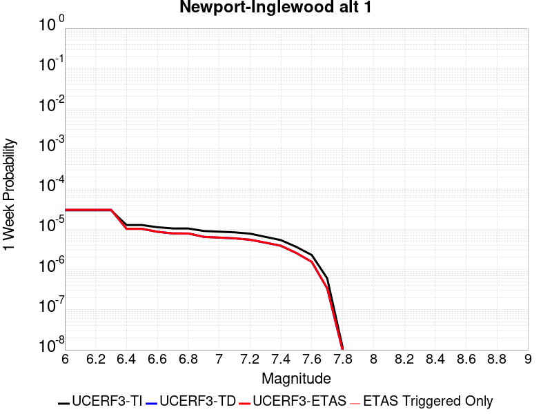 |  |  | 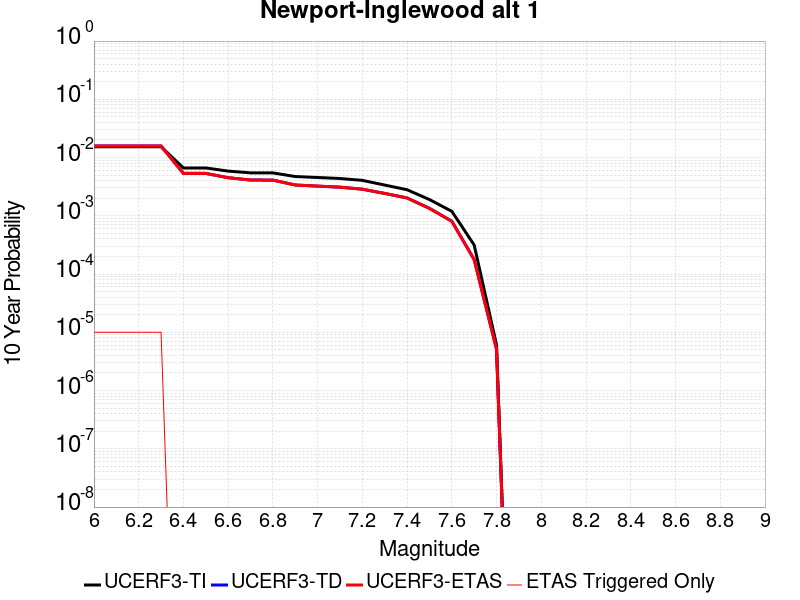 |

| Magnitude | 1 wk TI Prob | 1 wk TD Prob | 1 wk ETAS Prob | 1 wk ETAS/TD Gain | 1 wk ETAS Triggered Only | 1 mo TI Prob | 1 mo TD Prob | 1 mo ETAS Prob | 1 mo ETAS/TD Gain | 1 mo ETAS Triggered Only | 1 yr TI Prob | 1 yr TD Prob | 1 yr ETAS Prob | 1 yr ETAS/TD Gain | 1 yr ETAS Triggered Only | 10 yr TI Prob | 10 yr TD Prob | 10 yr ETAS Prob | 10 yr ETAS/TD Gain | 10 yr ETAS Triggered Only |
|-----|-----|-----|-----|-----|-----|-----|-----|-----|-----|-----|-----|-----|-----|-----|-----|-----|-----|-----|-----|-----|
| 6.0 | 2.9668912E-5 | 3.040745E-5 | 3.040745E-5 | 1.0 | 0.0 | 1.2714628E-4 | 1.3031387E-4 | 1.3031387E-4 | 1.0 | 0.0 | 0.0015469068 | 0.0015858983 | 0.0015958825 | 1.0062956 | 1.0E-5 | 0.015361829 | 0.0157934 | 0.015803242 | 1.0006232 | 1.0E-5 |
| 6.1 | 2.9668912E-5 | 3.040745E-5 | 3.040745E-5 | 1.0 | 0.0 | 1.2714628E-4 | 1.3031387E-4 | 1.3031387E-4 | 1.0 | 0.0 | 0.0015469068 | 0.0015858983 | 0.0015958825 | 1.0062956 | 1.0E-5 | 0.015361829 | 0.0157934 | 0.015803242 | 1.0006232 | 1.0E-5 |
| 6.2 | 2.9668912E-5 | 3.040745E-5 | 3.040745E-5 | 1.0 | 0.0 | 1.2714628E-4 | 1.3031387E-4 | 1.3031387E-4 | 1.0 | 0.0 | 0.0015469068 | 0.0015858983 | 0.0015958825 | 1.0062956 | 1.0E-5 | 0.015361829 | 0.0157934 | 0.015803242 | 1.0006232 | 1.0E-5 |
| 6.3 | 2.9668912E-5 | 3.040745E-5 | 3.040745E-5 | 1.0 | 0.0 | 1.2714628E-4 | 1.3031387E-4 | 1.3031387E-4 | 1.0 | 0.0 | 0.0015469068 | 0.0015858983 | 0.0015958825 | 1.0062956 | 1.0E-5 | 0.015361829 | 0.0157934 | 0.015803242 | 1.0006232 | 1.0E-5 |
| 6.4 | 1.275942E-5 | 1.027299E-5 | 1.027299E-5 | 1.0 | 0.0 | 5.4682085E-5 | 4.4026383E-5 | 4.4026383E-5 | 1.0 | 0.0 | 6.65551E-4 | 5.3589355E-4 | 5.3589355E-4 | 1.0 | 0.0 | 0.0066356123 | 0.0053464375 | 0.0053464375 | 1.0 | 0.0 |
| 6.5 | 1.275942E-5 | 1.027299E-5 | 1.027299E-5 | 1.0 | 0.0 | 5.4682085E-5 | 4.4026383E-5 | 4.4026383E-5 | 1.0 | 0.0 | 6.65551E-4 | 5.3589355E-4 | 5.3589355E-4 | 1.0 | 0.0 | 0.0066356123 | 0.0053464375 | 0.0053464375 | 1.0 | 0.0 |
| 6.6 | 1.1255358E-5 | 8.66226E-6 | 8.66226E-6 | 1.0 | 0.0 | 4.8236358E-5 | 3.7123453E-5 | 3.7123453E-5 | 1.0 | 0.0 | 5.871194E-4 | 4.51886E-4 | 4.51886E-4 | 1.0 | 0.0 | 0.005855706 | 0.0045098485 | 0.0045098485 | 1.0 | 0.0 |
| 6.7 | 1.0504745E-5 | 7.90013E-6 | 7.90013E-6 | 1.0 | 0.0 | 4.5019555E-5 | 3.385727E-5 | 3.385727E-5 | 1.0 | 0.0 | 5.4797524E-4 | 4.1213553E-4 | 4.1213553E-4 | 1.0 | 0.0 | 0.0054662596 | 0.0041138423 | 0.0041138423 | 1.0 | 0.0 |
| 6.8 | 1.0476007E-5 | 7.881511E-6 | 7.881511E-6 | 1.0 | 0.0 | 4.4896402E-5 | 3.3777476E-5 | 3.3777476E-5 | 1.0 | 0.0 | 5.464766E-4 | 4.111644E-4 | 4.111644E-4 | 1.0 | 0.0 | 0.005451347 | 0.0041041668 | 0.0041041668 | 1.0 | 0.0 |
| 6.9 | 9.076797E-6 | 6.4898977E-6 | 6.4898977E-6 | 1.0 | 0.0 | 3.889998E-5 | 2.7813552E-5 | 2.7813552E-5 | 1.0 | 0.0 | 4.7350433E-4 | 3.3857772E-4 | 3.3857772E-4 | 1.0 | 0.0 | 0.004724967 | 0.0033806562 | 0.0033806562 | 1.0 | 0.0 |
| 7.0 | 8.73795E-6 | 6.2122745E-6 | 6.2122745E-6 | 1.0 | 0.0 | 3.7447822E-5 | 2.6623764E-5 | 2.6623764E-5 | 1.0 | 0.0 | 4.5583185E-4 | 3.2409639E-4 | 3.2409639E-4 | 1.0 | 0.0 | 0.0045489795 | 0.003236269 | 0.003236269 | 1.0 | 0.0 |
| 7.1 | 8.391299E-6 | 5.9560443E-6 | 5.9560443E-6 | 1.0 | 0.0 | 3.5962214E-5 | 2.5525655E-5 | 2.5525655E-5 | 1.0 | 0.0 | 4.37752E-4 | 3.107308E-4 | 3.107308E-4 | 1.0 | 0.0 | 0.004368907 | 0.003102993 | 0.003102993 | 1.0 | 0.0 |
| 7.2 | 7.796882E-6 | 5.4967763E-6 | 5.4967763E-6 | 1.0 | 0.0 | 3.341478E-5 | 2.3557403E-5 | 2.3557403E-5 | 1.0 | 0.0 | 4.06749E-4 | 2.8677384E-4 | 2.8677384E-4 | 1.0 | 0.0 | 0.0040600533 | 0.0028640619 | 0.0028640619 | 1.0 | 0.0 |
| 7.3 | 6.4738833E-6 | 4.647969E-6 | 4.647969E-6 | 1.0 | 0.0 | 2.774492E-5 | 1.9919717E-5 | 1.9919717E-5 | 1.0 | 0.0 | 3.3774204E-4 | 2.424957E-4 | 2.424957E-4 | 1.0 | 0.0 | 0.0033722918 | 0.0024223276 | 0.0024223276 | 1.0 | 0.0 |
| 7.4 | 5.382145E-6 | 3.8858843E-6 | 3.8858843E-6 | 1.0 | 0.0 | 2.3066134E-5 | 1.6653685E-5 | 1.6653685E-5 | 1.0 | 0.0 | 2.8079396E-4 | 2.0273989E-4 | 2.0273989E-4 | 1.0 | 0.0 | 0.0028043943 | 0.0020255637 | 0.0020255637 | 1.0 | 0.0 |
| 7.5 | 3.648244E-6 | 2.5738668E-6 | 2.5738668E-6 | 1.0 | 0.0 | 1.5635238E-5 | 1.1030811E-5 | 1.1030811E-5 | 1.0 | 0.0 | 1.9034238E-4 | 1.3429196E-4 | 1.3429196E-4 | 1.0 | 0.0 | 0.0019017943 | 0.0013421185 | 0.0013421185 | 1.0 | 0.0 |
| 7.6 | 2.2906888E-6 | 1.5480406E-6 | 1.5480406E-6 | 1.0 | 0.0 | 9.817201E-6 | 6.6344433E-6 | 6.6344433E-6 | 1.0 | 0.0 | 1.1951787E-4 | 8.0771424E-5 | 8.0771424E-5 | 1.0 | 0.0 | 0.0011945361 | 8.074274E-4 | 8.074274E-4 | 1.0 | 0.0 |
| 7.7 | 6.0479874E-7 | 3.3976542E-7 | 3.3976542E-7 | 1.0 | 0.0 | 2.5919921E-6 | 1.4561367E-6 | 1.4561367E-6 | 1.0 | 0.0 | 3.1557047E-5 | 1.7728335E-5 | 1.7728335E-5 | 1.0 | 0.0 | 3.1552566E-4 | 1.7727059E-4 | 1.7727059E-4 | 1.0 | 0.0 |
| 7.8 | 1.16056995E-8 | 9.782449E-9 | 9.782449E-9 | 1.0 | 0.0 | 4.9738713E-8 | 4.1924782E-8 | 4.1924782E-8 | 1.0 | 0.0 | 6.0556863E-7 | 5.1043423E-7 | 5.1043423E-7 | 1.0 | 0.0 | 6.05567E-6 | 5.104342E-6 | 5.104342E-6 | 1.0 | 0.0 |

## Santa Cruz Catalina Ridge alt1
*[(top)](#table-of-contents)*

| 1 Week | 1 Month | 1 Year | 10 Year |
|-----|-----|-----|-----|
|  |  |  |  |

| Magnitude | 1 wk TI Prob | 1 wk TD Prob | 1 wk ETAS Prob | 1 wk ETAS/TD Gain | 1 wk ETAS Triggered Only | 1 mo TI Prob | 1 mo TD Prob | 1 mo ETAS Prob | 1 mo ETAS/TD Gain | 1 mo ETAS Triggered Only | 1 yr TI Prob | 1 yr TD Prob | 1 yr ETAS Prob | 1 yr ETAS/TD Gain | 1 yr ETAS Triggered Only | 10 yr TI Prob | 10 yr TD Prob | 10 yr ETAS Prob | 10 yr ETAS/TD Gain | 10 yr ETAS Triggered Only |
|-----|-----|-----|-----|-----|-----|-----|-----|-----|-----|-----|-----|-----|-----|-----|-----|-----|-----|-----|-----|-----|
| 6.0 | 3.2833184E-5 | 3.6560632E-5 | 3.6560632E-5 | 1.0 | 0.0 | 1.4070606E-4 | 1.5667995E-4 | 1.5667995E-4 | 1.0 | 0.0 | 0.00171175 | 0.001906076 | 0.001906076 | 1.0 | 0.0 | 0.016986247 | 0.018914176 | 0.018923987 | 1.0005187 | 1.0E-5 |
| 6.1 | 1.9835548E-5 | 2.1660571E-5 | 2.1660571E-5 | 1.0 | 0.0 | 8.500672E-5 | 9.2827824E-5 | 9.2827824E-5 | 1.0 | 0.0 | 0.0010344655 | 0.001129613 | 0.001129613 | 1.0 | 0.0 | 0.010296632 | 0.011240846 | 0.011250733 | 1.0008796 | 1.0E-5 |
| 6.2 | 1.9835548E-5 | 2.1660571E-5 | 2.1660571E-5 | 1.0 | 0.0 | 8.500672E-5 | 9.2827824E-5 | 9.2827824E-5 | 1.0 | 0.0 | 0.0010344655 | 0.001129613 | 0.001129613 | 1.0 | 0.0 | 0.010296632 | 0.011240846 | 0.011250733 | 1.0008796 | 1.0E-5 |
| 6.3 | 1.5728183E-5 | 1.7034703E-5 | 1.7034703E-5 | 1.0 | 0.0 | 6.7404755E-5 | 7.300386E-5 | 7.300386E-5 | 1.0 | 0.0 | 8.2034385E-4 | 8.8846567E-4 | 8.8846567E-4 | 1.0 | 0.0 | 0.008173222 | 0.008849816 | 0.008859728 | 1.00112 | 1.0E-5 |
| 6.4 | 1.5728183E-5 | 1.7034703E-5 | 1.7034703E-5 | 1.0 | 0.0 | 6.7404755E-5 | 7.300386E-5 | 7.300386E-5 | 1.0 | 0.0 | 8.2034385E-4 | 8.8846567E-4 | 8.8846567E-4 | 1.0 | 0.0 | 0.008173222 | 0.008849816 | 0.008859728 | 1.00112 | 1.0E-5 |
| 6.5 | 1.3707734E-5 | 1.4795146E-5 | 1.4795146E-5 | 1.0 | 0.0 | 5.8746107E-5 | 6.3406245E-5 | 6.3406245E-5 | 1.0 | 0.0 | 7.1499916E-4 | 7.7170116E-4 | 7.7170116E-4 | 1.0 | 0.0 | 0.0071270303 | 0.0076906127 | 0.007700536 | 1.0012903 | 1.0E-5 |
| 6.6 | 1.2539813E-5 | 1.3510776E-5 | 1.3510776E-5 | 1.0 | 0.0 | 5.3740947E-5 | 5.7902053E-5 | 5.7902053E-5 | 1.0 | 0.0 | 6.540996E-4 | 7.0473214E-4 | 7.0473214E-4 | 1.0 | 0.0 | 0.0065217763 | 0.007025277 | 0.0070352065 | 1.0014135 | 1.0E-5 |
| 6.7 | 1.1504083E-5 | 1.2377875E-5 | 1.2377875E-5 | 1.0 | 0.0 | 4.930228E-5 | 5.3046966E-5 | 5.3046966E-5 | 1.0 | 0.0 | 6.0008996E-4 | 6.456574E-4 | 6.456574E-4 | 1.0 | 0.0 | 0.005984721 | 0.006438045 | 0.0064479806 | 1.0015433 | 1.0E-5 |
| 6.8 | 1.012739E-5 | 1.0877499E-5 | 1.0877499E-5 | 1.0 | 0.0 | 4.340238E-5 | 4.661703E-5 | 4.661703E-5 | 1.0 | 0.0 | 5.282958E-4 | 5.67416E-4 | 5.67416E-4 | 1.0 | 0.0 | 0.0052704164 | 0.0056598415 | 0.005669785 | 1.0017568 | 1.0E-5 |
| 6.9 | 8.9607865E-6 | 9.609487E-6 | 9.609487E-6 | 1.0 | 0.0 | 3.8402806E-5 | 4.118287E-5 | 4.118287E-5 | 1.0 | 0.0 | 4.6745385E-4 | 5.0128717E-4 | 5.0128717E-4 | 1.0 | 0.0 | 0.0046647177 | 0.0050016837 | 0.0050116335 | 1.0019894 | 1.0E-5 |
| 7.0 | 8.046829E-6 | 8.620072E-6 | 8.620072E-6 | 1.0 | 0.0 | 3.4485955E-5 | 3.694265E-5 | 3.694265E-5 | 1.0 | 0.0 | 4.1978562E-4 | 4.496847E-4 | 4.496847E-4 | 1.0 | 0.0 | 0.004189935 | 0.004487838 | 0.0044977935 | 1.0022182 | 1.0E-5 |
| 7.1 | 7.136131E-6 | 7.637941E-6 | 7.637941E-6 | 1.0 | 0.0 | 3.0583058E-5 | 3.2733627E-5 | 3.2733627E-5 | 1.0 | 0.0 | 3.7228514E-4 | 3.9845973E-4 | 3.9845973E-4 | 1.0 | 0.0 | 0.0037166206 | 0.0039775297 | 0.0039874897 | 1.0025041 | 1.0E-5 |
| 7.2 | 6.362014E-6 | 6.8052104E-6 | 6.8052104E-6 | 1.0 | 0.0 | 2.726549E-5 | 2.9164865E-5 | 2.9164865E-5 | 1.0 | 0.0 | 3.3190678E-4 | 3.5502503E-4 | 3.5502503E-4 | 1.0 | 0.0 | 0.0033141149 | 0.003544647 | 0.0035546115 | 1.0028112 | 1.0E-5 |
| 7.3 | 5.004101E-6 | 5.3519125E-6 | 5.3519125E-6 | 1.0 | 0.0 | 2.1445969E-5 | 2.2936569E-5 | 2.2936569E-5 | 1.0 | 0.0 | 2.6107338E-4 | 2.792175E-4 | 2.792175E-4 | 1.0 | 0.0 | 0.002607669 | 0.0027887214 | 0.0027986935 | 1.0035759 | 1.0E-5 |
| 7.4 | 3.4901443E-6 | 3.73219E-6 | 3.73219E-6 | 1.0 | 0.0 | 1.4957676E-5 | 1.5995005E-5 | 1.5995005E-5 | 1.0 | 0.0 | 1.8209449E-4 | 1.9472216E-4 | 1.9472216E-4 | 1.0 | 0.0 | 0.0018194534 | 0.001945554 | 0.0019555346 | 1.0051299 | 1.0E-5 |
| 7.5 | 1.1215045E-6 | 1.1894253E-6 | 1.1894253E-6 | 1.0 | 0.0 | 4.806439E-6 | 5.0975277E-6 | 5.0975277E-6 | 1.0 | 0.0 | 5.851682E-5 | 6.206066E-5 | 6.206066E-5 | 1.0 | 0.0 | 5.850142E-4 | 6.204364E-4 | 6.204364E-4 | 1.0 | 0.0 |
| 7.6 | 2.8599047E-7 | 2.9952744E-7 | 2.9952744E-7 | 1.0 | 0.0 | 1.2256729E-6 | 1.2836884E-6 | 1.2836884E-6 | 1.0 | 0.0 | 1.4922465E-5 | 1.5628797E-5 | 1.5628797E-5 | 1.0 | 0.0 | 1.4921463E-4 | 1.562771E-4 | 1.562771E-4 | 1.0 | 0.0 |
| 7.7 | 2.0781519E-7 | 2.1744857E-7 | 2.1744857E-7 | 1.0 | 0.0 | 8.906362E-7 | 9.3192216E-7 | 9.3192216E-7 | 1.0 | 0.0 | 1.08434415E-5 | 1.1346094E-5 | 1.1346094E-5 | 1.0 | 0.0 | 1.0842913E-4 | 1.1345524E-4 | 1.1345524E-4 | 1.0 | 0.0 |
| 7.8 | 3.614776E-8 | 3.7641843E-8 | 3.7641843E-8 | 1.0 | 0.0 | 1.5491896E-7 | 1.6132218E-7 | 1.6132218E-7 | 1.0 | 0.0 | 1.8861368E-6 | 1.9640959E-6 | 1.9640959E-6 | 1.0 | 0.0 | 1.8861208E-5 | 1.9640796E-5 | 1.9640796E-5 | 1.0 | 0.0 |

## Puente Hills
*[(top)](#table-of-contents)*

| 1 Week | 1 Month | 1 Year | 10 Year |
|-----|-----|-----|-----|
|  |  | 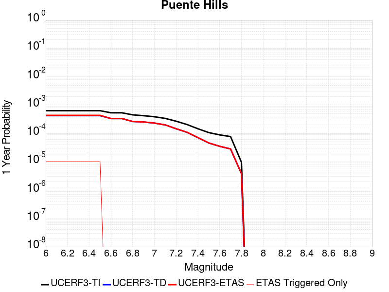 |  |

| Magnitude | 1 wk TI Prob | 1 wk TD Prob | 1 wk ETAS Prob | 1 wk ETAS/TD Gain | 1 wk ETAS Triggered Only | 1 mo TI Prob | 1 mo TD Prob | 1 mo ETAS Prob | 1 mo ETAS/TD Gain | 1 mo ETAS Triggered Only | 1 yr TI Prob | 1 yr TD Prob | 1 yr ETAS Prob | 1 yr ETAS/TD Gain | 1 yr ETAS Triggered Only | 10 yr TI Prob | 10 yr TD Prob | 10 yr ETAS Prob | 10 yr ETAS/TD Gain | 10 yr ETAS Triggered Only |
|-----|-----|-----|-----|-----|-----|-----|-----|-----|-----|-----|-----|-----|-----|-----|-----|-----|-----|-----|-----|-----|
| 6.0 | 1.2101656E-5 | 8.099262E-6 | 8.099262E-6 | 1.0 | 0.0 | 5.1863204E-5 | 3.4710694E-5 | 4.471035E-5 | 1.2880856 | 1.0E-5 | 6.312516E-4 | 4.225264E-4 | 4.3252218E-4 | 1.0236572 | 1.0E-5 | 0.0062946146 | 0.004217791 | 0.0042277486 | 1.0023609 | 1.0E-5 |
| 6.1 | 1.2101656E-5 | 8.099262E-6 | 8.099262E-6 | 1.0 | 0.0 | 5.1863204E-5 | 3.4710694E-5 | 4.471035E-5 | 1.2880856 | 1.0E-5 | 6.312516E-4 | 4.225264E-4 | 4.3252218E-4 | 1.0236572 | 1.0E-5 | 0.0062946146 | 0.004217791 | 0.0042277486 | 1.0023609 | 1.0E-5 |
| 6.2 | 1.2101656E-5 | 8.099262E-6 | 8.099262E-6 | 1.0 | 0.0 | 5.1863204E-5 | 3.4710694E-5 | 4.471035E-5 | 1.2880856 | 1.0E-5 | 6.312516E-4 | 4.225264E-4 | 4.3252218E-4 | 1.0236572 | 1.0E-5 | 0.0062946146 | 0.004217791 | 0.0042277486 | 1.0023609 | 1.0E-5 |
| 6.3 | 1.2101656E-5 | 8.099262E-6 | 8.099262E-6 | 1.0 | 0.0 | 5.1863204E-5 | 3.4710694E-5 | 4.471035E-5 | 1.2880856 | 1.0E-5 | 6.312516E-4 | 4.225264E-4 | 4.3252218E-4 | 1.0236572 | 1.0E-5 | 0.0062946146 | 0.004217791 | 0.0042277486 | 1.0023609 | 1.0E-5 |
| 6.4 | 1.2101656E-5 | 8.099262E-6 | 8.099262E-6 | 1.0 | 0.0 | 5.1863204E-5 | 3.4710694E-5 | 4.471035E-5 | 1.2880856 | 1.0E-5 | 6.312516E-4 | 4.225264E-4 | 4.3252218E-4 | 1.0236572 | 1.0E-5 | 0.0062946146 | 0.004217791 | 0.0042277486 | 1.0023609 | 1.0E-5 |
| 6.5 | 1.2101656E-5 | 8.099262E-6 | 8.099262E-6 | 1.0 | 0.0 | 5.1863204E-5 | 3.4710694E-5 | 4.471035E-5 | 1.2880856 | 1.0E-5 | 6.312516E-4 | 4.225264E-4 | 4.3252218E-4 | 1.0236572 | 1.0E-5 | 0.0062946146 | 0.004217791 | 0.0042277486 | 1.0023609 | 1.0E-5 |
| 6.6 | 1.0222488E-5 | 6.399761E-6 | 6.399761E-6 | 1.0 | 0.0 | 4.3809923E-5 | 2.7427272E-5 | 2.7427272E-5 | 1.0 | 0.0 | 5.332553E-4 | 3.3387833E-4 | 3.3387833E-4 | 1.0 | 0.0 | 0.0053197746 | 0.003334012 | 0.003334012 | 1.0 | 0.0 |
| 6.7 | 1.0222488E-5 | 6.399761E-6 | 6.399761E-6 | 1.0 | 0.0 | 4.3809923E-5 | 2.7427272E-5 | 2.7427272E-5 | 1.0 | 0.0 | 5.332553E-4 | 3.3387833E-4 | 3.3387833E-4 | 1.0 | 0.0 | 0.0053197746 | 0.003334012 | 0.003334012 | 1.0 | 0.0 |
| 6.8 | 8.6367845E-6 | 5.0287617E-6 | 5.0287617E-6 | 1.0 | 0.0 | 3.7014266E-5 | 2.1551661E-5 | 2.1551661E-5 | 1.0 | 0.0 | 4.505555E-4 | 2.6236044E-4 | 2.6236044E-4 | 1.0 | 0.0 | 0.004496431 | 0.0026205631 | 0.0026205631 | 1.0 | 0.0 |
| 6.9 | 8.066481E-6 | 4.8366114E-6 | 4.8366114E-6 | 1.0 | 0.0 | 3.4570177E-5 | 2.0728174E-5 | 2.0728174E-5 | 1.0 | 0.0 | 4.2081063E-4 | 2.5233682E-4 | 2.5233682E-4 | 1.0 | 0.0 | 0.0042001465 | 0.0025205568 | 0.0025205568 | 1.0 | 0.0 |
| 7.0 | 7.393828E-6 | 4.4177677E-6 | 4.4177677E-6 | 1.0 | 0.0 | 3.168745E-5 | 1.8933155E-5 | 1.8933155E-5 | 1.0 | 0.0 | 3.857264E-4 | 2.3048723E-4 | 2.3048723E-4 | 1.0 | 0.0 | 0.0038505755 | 0.0023025272 | 0.0023025272 | 1.0 | 0.0 |
| 7.1 | 6.4660953E-6 | 3.8048506E-6 | 3.8048506E-6 | 1.0 | 0.0 | 2.7711543E-5 | 1.6306401E-5 | 1.6306401E-5 | 1.0 | 0.0 | 3.373358E-4 | 1.9851272E-4 | 1.9851272E-4 | 1.0 | 0.0 | 0.0033682417 | 0.0019833897 | 0.0019833897 | 1.0 | 0.0 |
| 7.2 | 5.143232E-6 | 2.7868573E-6 | 2.7868573E-6 | 1.0 | 0.0 | 2.2042237E-5 | 1.194362E-5 | 1.194362E-5 | 1.0 | 0.0 | 2.6833118E-4 | 1.4540396E-4 | 1.4540396E-4 | 1.0 | 0.0 | 0.002680074 | 0.001453098 | 0.001453098 | 1.0 | 0.0 |
| 7.3 | 3.928255E-6 | 2.0916448E-6 | 2.0916448E-6 | 1.0 | 0.0 | 1.683527E-5 | 8.964162E-6 | 8.964162E-6 | 1.0 | 0.0 | 2.0495013E-4 | 1.0913327E-4 | 1.0913327E-4 | 1.0 | 0.0 | 0.002047612 | 0.0010908034 | 0.0010908034 | 1.0 | 0.0 |
| 7.4 | 2.7894434E-6 | 1.3549035E-6 | 1.3549035E-6 | 1.0 | 0.0 | 1.1954703E-5 | 5.806716E-6 | 5.806716E-6 | 1.0 | 0.0 | 1.4553878E-4 | 7.069452E-5 | 7.069452E-5 | 1.0 | 0.0 | 0.001454435 | 7.067247E-4 | 7.067247E-4 | 1.0 | 0.0 |
| 7.5 | 2.041735E-6 | 8.7891215E-7 | 8.7891215E-7 | 1.0 | 0.0 | 8.750263E-6 | 3.766761E-6 | 3.766761E-6 | 1.0 | 0.0 | 1.06529245E-4 | 4.5859386E-5 | 4.5859386E-5 | 1.0 | 0.0 | 0.0010647819 | 4.5850256E-4 | 4.5850256E-4 | 1.0 | 0.0 |
| 7.6 | 1.6959062E-6 | 6.700147E-7 | 6.700147E-7 | 1.0 | 0.0 | 7.268149E-6 | 2.8714885E-6 | 2.8714885E-6 | 1.0 | 0.0 | 8.848612E-5 | 3.495984E-5 | 3.495984E-5 | 1.0 | 0.0 | 8.84509E-4 | 3.495463E-4 | 3.495463E-4 | 1.0 | 0.0 |
| 7.7 | 1.4767965E-6 | 5.4088986E-7 | 5.4088986E-7 | 1.0 | 0.0 | 6.3291122E-6 | 2.3180976E-6 | 2.3180976E-6 | 1.0 | 0.0 | 7.705422E-5 | 2.8222497E-5 | 2.8222497E-5 | 1.0 | 0.0 | 7.702751E-4 | 2.821917E-4 | 2.821917E-4 | 1.0 | 0.0 |
| 7.8 | 1.8432911E-7 | 7.283546E-8 | 7.283546E-8 | 1.0 | 0.0 | 7.8998164E-7 | 3.1215197E-7 | 3.1215197E-7 | 1.0 | 0.0 | 9.617985E-6 | 3.8004468E-6 | 3.8004468E-6 | 1.0 | 0.0 | 9.617568E-5 | 3.8004146E-5 | 3.8004146E-5 | 1.0 | 0.0 |

## San Diego Trough south
*[(top)](#table-of-contents)*

| 1 Week | 1 Month | 1 Year | 10 Year |
|-----|-----|-----|-----|
|  |  |  |  |

| Magnitude | 1 wk TI Prob | 1 wk TD Prob | 1 wk ETAS Prob | 1 wk ETAS/TD Gain | 1 wk ETAS Triggered Only | 1 mo TI Prob | 1 mo TD Prob | 1 mo ETAS Prob | 1 mo ETAS/TD Gain | 1 mo ETAS Triggered Only | 1 yr TI Prob | 1 yr TD Prob | 1 yr ETAS Prob | 1 yr ETAS/TD Gain | 1 yr ETAS Triggered Only | 10 yr TI Prob | 10 yr TD Prob | 10 yr ETAS Prob | 10 yr ETAS/TD Gain | 10 yr ETAS Triggered Only |
|-----|-----|-----|-----|-----|-----|-----|-----|-----|-----|-----|-----|-----|-----|-----|-----|-----|-----|-----|-----|-----|
| 6.0 | 8.279495E-5 | 1.0425644E-4 | 1.0425644E-4 | 1.0 | 0.0 | 3.5478722E-4 | 4.467418E-4 | 4.467418E-4 | 1.0 | 0.0 | 0.004310982 | 0.0054263812 | 0.005436327 | 1.0018328 | 1.0E-5 | 0.042283054 | 0.052999042 | 0.05300851 | 1.0001787 | 1.0E-5 |
| 6.1 | 4.6961468E-5 | 5.7736743E-5 | 5.7736743E-5 | 1.0 | 0.0 | 2.0124791E-4 | 2.4742068E-4 | 2.4742068E-4 | 1.0 | 0.0 | 0.00244744 | 0.0030083342 | 0.0030083342 | 1.0 | 0.0 | 0.024206603 | 0.029682966 | 0.029682966 | 1.0 | 0.0 |
| 6.2 | 3.5079658E-5 | 4.2146152E-5 | 4.2146152E-5 | 1.0 | 0.0 | 1.5033272E-4 | 1.8061412E-4 | 1.8061412E-4 | 1.0 | 0.0 | 0.0018287642 | 0.0021968025 | 0.0021968025 | 1.0 | 0.0 | 0.018137876 | 0.021753421 | 0.021753421 | 1.0 | 0.0 |
| 6.3 | 3.5079658E-5 | 4.2146152E-5 | 4.2146152E-5 | 1.0 | 0.0 | 1.5033272E-4 | 1.8061412E-4 | 1.8061412E-4 | 1.0 | 0.0 | 0.0018287642 | 0.0021968025 | 0.0021968025 | 1.0 | 0.0 | 0.018137876 | 0.021753421 | 0.021753421 | 1.0 | 0.0 |
| 6.4 | 2.7196904E-5 | 3.2090265E-5 | 3.2090265E-5 | 1.0 | 0.0 | 1.16552954E-4 | 1.3752255E-4 | 1.3752255E-4 | 1.0 | 0.0 | 0.0014181085 | 0.0016730648 | 0.0016730648 | 1.0 | 0.0 | 0.014090929 | 0.016606223 | 0.016606223 | 1.0 | 0.0 |
| 6.5 | 2.5584688E-5 | 3.0104491E-5 | 3.0104491E-5 | 1.0 | 0.0 | 1.0964406E-4 | 1.2901296E-4 | 1.2901296E-4 | 1.0 | 0.0 | 0.0013340989 | 0.0015696133 | 0.0015696133 | 1.0 | 0.0 | 0.013261181 | 0.015586771 | 0.015586771 | 1.0 | 0.0 |
| 6.6 | 2.2034688E-5 | 2.5745056E-5 | 2.5745056E-5 | 1.0 | 0.0 | 9.443096E-5 | 1.1033134E-4 | 1.1033134E-4 | 1.0 | 0.0 | 0.0011490905 | 0.0013424625 | 0.0013424625 | 1.0 | 0.0 | 0.011431668 | 0.013344509 | 0.013344509 | 1.0 | 0.0 |
| 6.7 | 1.9394853E-5 | 2.2543714E-5 | 2.2543714E-5 | 1.0 | 0.0 | 8.311815E-5 | 9.661237E-5 | 9.661237E-5 | 1.0 | 0.0 | 0.0010114936 | 0.0011756261 | 0.0011756261 | 1.0 | 0.0 | 0.01006902 | 0.011694773 | 0.011694773 | 1.0 | 0.0 |
| 6.8 | 1.7615313E-5 | 2.0404905E-5 | 2.0404905E-5 | 1.0 | 0.0 | 7.549201E-5 | 8.7446686E-5 | 8.7446686E-5 | 1.0 | 0.0 | 9.1872766E-4 | 0.0010641477 | 0.0010641477 | 1.0 | 0.0 | 0.009149387 | 0.010591088 | 0.010591088 | 1.0 | 0.0 |
| 6.9 | 1.5621423E-5 | 1.8027593E-5 | 1.8027593E-5 | 1.0 | 0.0 | 6.6947236E-5 | 7.725885E-5 | 7.725885E-5 | 1.0 | 0.0 | 8.147778E-4 | 9.402241E-4 | 9.402241E-4 | 1.0 | 0.0 | 0.008117969 | 0.009362906 | 0.009362906 | 1.0 | 0.0 |
| 7.0 | 1.3444376E-5 | 1.5449315E-5 | 1.5449315E-5 | 1.0 | 0.0 | 5.7617483E-5 | 6.6209686E-5 | 6.6209686E-5 | 1.0 | 0.0 | 7.0126704E-4 | 8.0580753E-4 | 8.0580753E-4 | 1.0 | 0.0 | 0.006990582 | 0.00802919 | 0.00802919 | 1.0 | 0.0 |
| 7.1 | 1.2268361E-5 | 1.4074132E-5 | 1.4074132E-5 | 1.0 | 0.0 | 5.2577634E-5 | 6.031633E-5 | 6.031633E-5 | 1.0 | 0.0 | 6.399447E-4 | 7.341065E-4 | 7.341065E-4 | 1.0 | 0.0 | 0.0063810493 | 0.00731712 | 0.00731712 | 1.0 | 0.0 |
| 7.2 | 1.0922655E-5 | 1.2514534E-5 | 1.2514534E-5 | 1.0 | 0.0 | 4.681054E-5 | 5.363263E-5 | 5.363263E-5 | 1.0 | 0.0 | 5.697693E-4 | 6.5278413E-4 | 6.5278413E-4 | 1.0 | 0.0 | 0.0056831064 | 0.006508947 | 0.006508947 | 1.0 | 0.0 |
| 7.3 | 6.1106753E-6 | 6.9294197E-6 | 6.9294197E-6 | 1.0 | 0.0 | 2.6188345E-5 | 2.9697178E-5 | 2.9697178E-5 | 1.0 | 0.0 | 3.1879646E-4 | 3.6150354E-4 | 3.6150354E-4 | 1.0 | 0.0 | 0.0031833951 | 0.0036092002 | 0.0036092002 | 1.0 | 0.0 |
| 7.4 | 4.933187E-6 | 5.5899495E-6 | 5.5899495E-6 | 1.0 | 0.0 | 2.114206E-5 | 2.3956709E-5 | 2.3956709E-5 | 1.0 | 0.0 | 2.5737417E-4 | 2.9163426E-4 | 2.9163426E-4 | 1.0 | 0.0 | 0.002570763 | 0.0029125568 | 0.0029125568 | 1.0 | 0.0 |
| 7.5 | 1.7489613E-6 | 1.9698116E-6 | 1.9698116E-6 | 1.0 | 0.0 | 7.495527E-6 | 8.4420235E-6 | 8.4420235E-6 | 1.0 | 0.0 | 9.125422E-5 | 1.0277701E-4 | 1.0277701E-4 | 1.0 | 0.0 | 9.1216754E-4 | 0.0010273168 | 0.0010273168 | 1.0 | 0.0 |
| 7.6 | 1.6988751E-7 | 1.7534121E-7 | 1.7534121E-7 | 1.0 | 0.0 | 7.2808916E-7 | 7.5146215E-7 | 7.5146215E-7 | 1.0 | 0.0 | 8.864449E-6 | 9.149016E-6 | 9.149016E-6 | 1.0 | 0.0 | 8.8640954E-5 | 9.148658E-5 | 9.148658E-5 | 1.0 | 0.0 |

## White Wolf
*[(top)](#table-of-contents)*

| 1 Week | 1 Month | 1 Year | 10 Year |
|-----|-----|-----|-----|
|  |  |  | 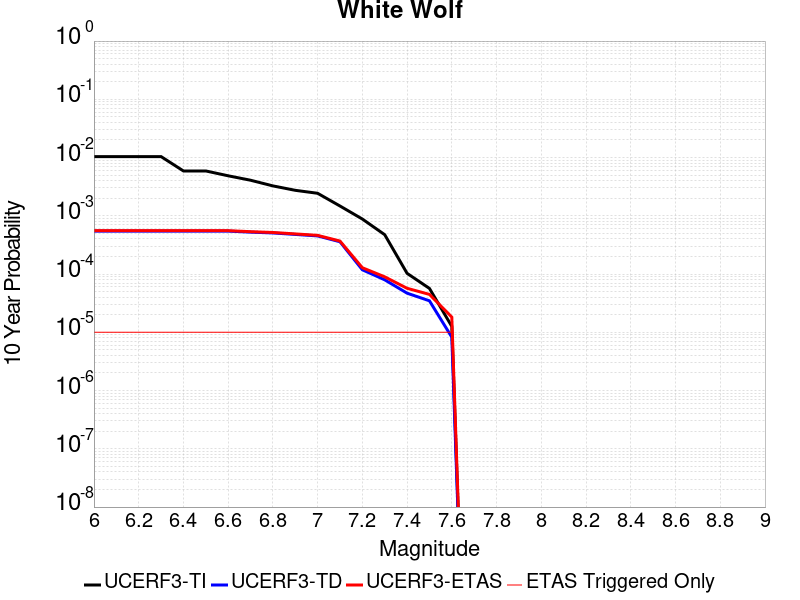 |

| Magnitude | 1 wk TI Prob | 1 wk TD Prob | 1 wk ETAS Prob | 1 wk ETAS/TD Gain | 1 wk ETAS Triggered Only | 1 mo TI Prob | 1 mo TD Prob | 1 mo ETAS Prob | 1 mo ETAS/TD Gain | 1 mo ETAS Triggered Only | 1 yr TI Prob | 1 yr TD Prob | 1 yr ETAS Prob | 1 yr ETAS/TD Gain | 1 yr ETAS Triggered Only | 10 yr TI Prob | 10 yr TD Prob | 10 yr ETAS Prob | 10 yr ETAS/TD Gain | 10 yr ETAS Triggered Only |
|-----|-----|-----|-----|-----|-----|-----|-----|-----|-----|-----|-----|-----|-----|-----|-----|-----|-----|-----|-----|-----|
| 6.0 | 2.0037822E-5 | 1.0469729E-6 | 1.0469729E-6 | 1.0 | 0.0 | 8.587355E-5 | 4.4870194E-6 | 4.4870194E-6 | 1.0 | 0.0 | 0.001045009 | 5.462814E-5 | 5.462814E-5 | 1.0 | 0.0 | 0.010401085 | 5.461522E-4 | 5.561467E-4 | 1.0182999 | 1.0E-5 |
| 6.1 | 2.0037822E-5 | 1.0469729E-6 | 1.0469729E-6 | 1.0 | 0.0 | 8.587355E-5 | 4.4870194E-6 | 4.4870194E-6 | 1.0 | 0.0 | 0.001045009 | 5.462814E-5 | 5.462814E-5 | 1.0 | 0.0 | 0.010401085 | 5.461522E-4 | 5.561467E-4 | 1.0182999 | 1.0E-5 |
| 6.2 | 2.0037822E-5 | 1.0469729E-6 | 1.0469729E-6 | 1.0 | 0.0 | 8.587355E-5 | 4.4870194E-6 | 4.4870194E-6 | 1.0 | 0.0 | 0.001045009 | 5.462814E-5 | 5.462814E-5 | 1.0 | 0.0 | 0.010401085 | 5.461522E-4 | 5.561467E-4 | 1.0182999 | 1.0E-5 |
| 6.3 | 2.0037822E-5 | 1.0469729E-6 | 1.0469729E-6 | 1.0 | 0.0 | 8.587355E-5 | 4.4870194E-6 | 4.4870194E-6 | 1.0 | 0.0 | 0.001045009 | 5.462814E-5 | 5.462814E-5 | 1.0 | 0.0 | 0.010401085 | 5.461522E-4 | 5.561467E-4 | 1.0182999 | 1.0E-5 |
| 6.4 | 1.132487E-5 | 1.0469729E-6 | 1.0469729E-6 | 1.0 | 0.0 | 4.8534253E-5 | 4.4870194E-6 | 4.4870194E-6 | 1.0 | 0.0 | 5.907443E-4 | 5.462814E-5 | 5.462814E-5 | 1.0 | 0.0 | 0.005891764 | 5.461522E-4 | 5.561467E-4 | 1.0182999 | 1.0E-5 |
| 6.5 | 1.132487E-5 | 1.0469729E-6 | 1.0469729E-6 | 1.0 | 0.0 | 4.8534253E-5 | 4.4870194E-6 | 4.4870194E-6 | 1.0 | 0.0 | 5.907443E-4 | 5.462814E-5 | 5.462814E-5 | 1.0 | 0.0 | 0.005891764 | 5.461522E-4 | 5.561467E-4 | 1.0182999 | 1.0E-5 |
| 6.6 | 9.347473E-6 | 1.0469729E-6 | 1.0469729E-6 | 1.0 | 0.0 | 4.0059982E-5 | 4.4870194E-6 | 4.4870194E-6 | 1.0 | 0.0 | 4.8762115E-4 | 5.462814E-5 | 5.462814E-5 | 1.0 | 0.0 | 0.0048655253 | 5.461522E-4 | 5.561467E-4 | 1.0182999 | 1.0E-5 |
| 6.7 | 7.842647E-6 | 1.004888E-6 | 1.004888E-6 | 1.0 | 0.0 | 3.361091E-5 | 4.3066557E-6 | 4.3066557E-6 | 1.0 | 0.0 | 4.0913603E-4 | 5.2432322E-5 | 5.2432322E-5 | 1.0 | 0.0 | 0.004083836 | 5.2420446E-4 | 5.3419924E-4 | 1.0190666 | 1.0E-5 |
| 6.8 | 6.26597E-6 | 9.735327E-7 | 9.735327E-7 | 1.0 | 0.0 | 2.685388E-5 | 4.1722765E-6 | 4.1722765E-6 | 1.0 | 0.0 | 3.2689696E-4 | 5.0796334E-5 | 5.0796334E-5 | 1.0 | 0.0 | 0.003264165 | 5.078521E-4 | 5.178471E-4 | 1.0196807 | 1.0E-5 |
| 6.9 | 5.258436E-6 | 9.1837234E-7 | 9.1837234E-7 | 1.0 | 0.0 | 2.2535958E-5 | 3.9358756E-6 | 3.9358756E-6 | 1.0 | 0.0 | 2.7434074E-4 | 4.791828E-5 | 4.791828E-5 | 1.0 | 0.0 | 0.0027400232 | 4.790843E-4 | 4.890795E-4 | 1.0208632 | 1.0E-5 |
| 7.0 | 4.675028E-6 | 8.661622E-7 | 8.661622E-7 | 1.0 | 0.0 | 2.003568E-5 | 3.7121188E-6 | 3.7121188E-6 | 1.0 | 0.0 | 2.4390711E-4 | 4.5194156E-5 | 4.5194156E-5 | 1.0 | 0.0 | 0.0024363957 | 4.5185437E-4 | 4.6184985E-4 | 1.0221211 | 1.0E-5 |
| 7.1 | 2.8270078E-6 | 6.8745294E-7 | 6.8745294E-7 | 1.0 | 0.0 | 1.2115692E-5 | 2.9462237E-6 | 2.9462237E-6 | 1.0 | 0.0 | 1.4749856E-4 | 3.5869725E-5 | 3.5869725E-5 | 1.0 | 0.0 | 0.001474007 | 3.5864345E-4 | 3.6863986E-4 | 1.0278728 | 1.0E-5 |
| 7.2 | 1.6881406E-6 | 2.270827E-7 | 2.270827E-7 | 1.0 | 0.0 | 7.2348685E-6 | 9.732112E-7 | 9.732112E-7 | 1.0 | 0.0 | 8.808096E-5 | 1.1848783E-5 | 1.1848783E-5 | 1.0 | 0.0 | 8.8046055E-4 | 1.1848167E-4 | 1.2848049E-4 | 1.0843912 | 1.0E-5 |
| 7.3 | 9.086107E-7 | 1.5267518E-7 | 1.5267518E-7 | 1.0 | 0.0 | 3.8940398E-6 | 6.543221E-7 | 6.543221E-7 | 1.0 | 0.0 | 4.7408903E-5 | 7.966343E-6 | 7.966343E-6 | 1.0 | 0.0 | 4.739879E-4 | 7.9660655E-5 | 8.965986E-5 | 1.1255225 | 1.0E-5 |
| 7.4 | 1.9717383E-7 | 9.004186E-8 | 9.004186E-8 | 1.0 | 0.0 | 8.450304E-7 | 3.8589363E-7 | 3.8589363E-7 | 1.0 | 0.0 | 1.0288197E-5 | 4.698245E-6 | 4.698245E-6 | 1.0 | 0.0 | 1.028772E-4 | 4.6981488E-5 | 5.6981018E-5 | 1.2128398 | 1.0E-5 |
| 7.5 | 1.086975E-7 | 6.65987E-8 | 6.65987E-8 | 1.0 | 0.0 | 4.6584634E-7 | 2.8542297E-7 | 2.8542297E-7 | 1.0 | 0.0 | 5.6716644E-6 | 3.4750192E-6 | 3.4750192E-6 | 1.0 | 0.0 | 5.6715195E-5 | 3.474967E-5 | 4.4749326E-5 | 1.2877625 | 1.0E-5 |
| 7.6 | 2.4217808E-8 | 1.582108E-8 | 1.582108E-8 | 1.0 | 0.0 | 1.03790605E-7 | 6.780462E-8 | 6.780462E-8 | 1.0 | 0.0 | 1.2636499E-6 | 8.25521E-7 | 8.25521E-7 | 1.0 | 0.0 | 1.2636427E-5 | 8.255184E-6 | 1.8255101E-5 | 2.21135 | 1.0E-5 |

## Homestead Valley 2011
*[(top)](#table-of-contents)*

| 1 Week | 1 Month | 1 Year | 10 Year |
|-----|-----|-----|-----|
|  |  |  |  |

| Magnitude | 1 wk TI Prob | 1 wk TD Prob | 1 wk ETAS Prob | 1 wk ETAS/TD Gain | 1 wk ETAS Triggered Only | 1 mo TI Prob | 1 mo TD Prob | 1 mo ETAS Prob | 1 mo ETAS/TD Gain | 1 mo ETAS Triggered Only | 1 yr TI Prob | 1 yr TD Prob | 1 yr ETAS Prob | 1 yr ETAS/TD Gain | 1 yr ETAS Triggered Only | 10 yr TI Prob | 10 yr TD Prob | 10 yr ETAS Prob | 10 yr ETAS/TD Gain | 10 yr ETAS Triggered Only |
|-----|-----|-----|-----|-----|-----|-----|-----|-----|-----|-----|-----|-----|-----|-----|-----|-----|-----|-----|-----|-----|
| 6.0 | 1.539795E-5 | 6.2868744E-6 | 6.2868744E-6 | 1.0 | 0.0 | 6.5989545E-5 | 2.6943586E-5 | 2.6943586E-5 | 1.0 | 0.0 | 8.0312655E-4 | 3.280094E-4 | 3.380061E-4 | 1.0304769 | 1.0E-5 | 0.008002302 | 0.0032772736 | 0.0032872409 | 1.0030413 | 1.0E-5 |
| 6.1 | 1.539795E-5 | 6.2868744E-6 | 6.2868744E-6 | 1.0 | 0.0 | 6.5989545E-5 | 2.6943586E-5 | 2.6943586E-5 | 1.0 | 0.0 | 8.0312655E-4 | 3.280094E-4 | 3.380061E-4 | 1.0304769 | 1.0E-5 | 0.008002302 | 0.0032772736 | 0.0032872409 | 1.0030413 | 1.0E-5 |
| 6.2 | 1.539795E-5 | 6.2868744E-6 | 6.2868744E-6 | 1.0 | 0.0 | 6.5989545E-5 | 2.6943586E-5 | 2.6943586E-5 | 1.0 | 0.0 | 8.0312655E-4 | 3.280094E-4 | 3.380061E-4 | 1.0304769 | 1.0E-5 | 0.008002302 | 0.0032772736 | 0.0032872409 | 1.0030413 | 1.0E-5 |
| 6.3 | 1.539795E-5 | 6.2868744E-6 | 6.2868744E-6 | 1.0 | 0.0 | 6.5989545E-5 | 2.6943586E-5 | 2.6943586E-5 | 1.0 | 0.0 | 8.0312655E-4 | 3.280094E-4 | 3.380061E-4 | 1.0304769 | 1.0E-5 | 0.008002302 | 0.0032772736 | 0.0032872409 | 1.0030413 | 1.0E-5 |
| 6.4 | 1.539795E-5 | 6.2868744E-6 | 6.2868744E-6 | 1.0 | 0.0 | 6.5989545E-5 | 2.6943586E-5 | 2.6943586E-5 | 1.0 | 0.0 | 8.0312655E-4 | 3.280094E-4 | 3.380061E-4 | 1.0304769 | 1.0E-5 | 0.008002302 | 0.0032772736 | 0.0032872409 | 1.0030413 | 1.0E-5 |
| 6.5 | 1.0265258E-5 | 2.8789796E-6 | 2.8789796E-6 | 1.0 | 0.0 | 4.3993223E-5 | 1.2338465E-5 | 1.2338465E-5 | 1.0 | 0.0 | 5.3548586E-4 | 1.5021741E-4 | 1.602159E-4 | 1.0665601 | 1.0E-5 | 0.005341973 | 0.0015018407 | 0.0015118256 | 1.0066485 | 1.0E-5 |
| 6.6 | 6.664671E-6 | 5.3488435E-7 | 5.3488435E-7 | 1.0 | 0.0 | 2.8562565E-5 | 2.2923603E-6 | 2.2923603E-6 | 1.0 | 0.0 | 3.476937E-4 | 2.7909247E-5 | 3.790897E-5 | 1.3582941 | 1.0E-5 | 0.003471502 | 2.7906906E-4 | 2.890663E-4 | 1.0358235 | 1.0E-5 |
| 6.7 | 6.5954046E-6 | 5.3488435E-7 | 5.3488435E-7 | 1.0 | 0.0 | 2.8265715E-5 | 2.2923603E-6 | 2.2923603E-6 | 1.0 | 0.0 | 3.4408073E-4 | 2.7909247E-5 | 3.790897E-5 | 1.3582941 | 1.0E-5 | 0.0034354846 | 2.7906906E-4 | 2.890663E-4 | 1.0358235 | 1.0E-5 |
| 6.8 | 4.648189E-6 | 2.3269658E-7 | 2.3269658E-7 | 1.0 | 0.0 | 1.9920659E-5 | 9.972707E-7 | 9.972707E-7 | 1.0 | 0.0 | 2.4250703E-4 | 1.2141708E-5 | 2.2141587E-5 | 1.8235973 | 1.0E-5 | 0.0024224254 | 1.2141093E-4 | 1.3140972E-4 | 1.0823549 | 1.0E-5 |
| 6.9 | 4.1428534E-6 | 1.9348157E-7 | 1.9348157E-7 | 1.0 | 0.0 | 1.7754966E-5 | 8.292065E-7 | 8.292065E-7 | 1.0 | 0.0 | 2.1614527E-4 | 1.0095546E-5 | 2.0095444E-5 | 1.9905258 | 1.0E-5 | 0.0021593515 | 1.0095117E-4 | 1.1095015E-4 | 1.0990478 | 1.0E-5 |
| 7.0 | 3.0673707E-6 | 1.5370551E-7 | 1.5370551E-7 | 1.0 | 0.0 | 1.3145808E-5 | 6.5873775E-7 | 6.5873775E-7 | 1.0 | 0.0 | 1.6003846E-4 | 8.020103E-6 | 1.8020024E-5 | 2.2468567 | 1.0E-5 | 0.0015992324 | 8.0198246E-5 | 9.019744E-5 | 1.124681 | 1.0E-5 |
| 7.1 | 2.340854E-6 | 1.4690413E-7 | 1.4690413E-7 | 1.0 | 0.0 | 1.0032193E-5 | 6.2958895E-7 | 6.2958895E-7 | 1.0 | 0.0 | 1.221351E-4 | 7.6652195E-6 | 1.7665143E-5 | 2.304584 | 1.0E-5 | 0.00122068 | 7.664965E-5 | 8.6648884E-5 | 1.1304537 | 1.0E-5 |
| 7.2 | 1.3754182E-6 | 1.3925126E-7 | 1.3925126E-7 | 1.0 | 0.0 | 5.8946357E-6 | 5.96791E-7 | 5.96791E-7 | 1.0 | 0.0 | 7.176483E-5 | 7.265907E-6 | 1.7265835E-5 | 2.3762808 | 1.0E-5 | 7.174166E-4 | 7.265679E-5 | 8.265606E-5 | 1.1376234 | 1.0E-5 |
| 7.3 | 1.2573237E-6 | 1.3829613E-7 | 1.3829613E-7 | 1.0 | 0.0 | 5.388519E-6 | 5.926975E-7 | 5.926975E-7 | 1.0 | 0.0 | 6.560324E-5 | 7.2160697E-6 | 1.7215998E-5 | 2.385786 | 1.0E-5 | 6.558388E-4 | 7.2158444E-5 | 8.215773E-5 | 1.1385739 | 1.0E-5 |
| 7.4 | 1.0994207E-6 | 1.3108422E-7 | 1.3108422E-7 | 1.0 | 0.0 | 4.7117946E-6 | 5.6178936E-7 | 5.6178936E-7 | 1.0 | 0.0 | 5.736459E-5 | 6.8397653E-6 | 1.6839696E-5 | 2.4620285 | 1.0E-5 | 5.734978E-4 | 6.839564E-5 | 7.839496E-5 | 1.1461982 | 1.0E-5 |
| 7.5 | 5.5569126E-7 | 6.774076E-8 | 6.774076E-8 | 1.0 | 0.0 | 2.3815317E-6 | 2.903175E-7 | 2.903175E-7 | 1.0 | 0.0 | 2.8994764E-5 | 3.5346104E-6 | 1.3534575E-5 | 3.8291562 | 1.0E-5 | 2.899098E-4 | 3.5345605E-5 | 4.5345252E-5 | 1.2829106 | 1.0E-5 |

## Bennett Valley 2011 CFM
*[(top)](#table-of-contents)*

| 1 Week | 1 Month | 1 Year | 10 Year |
|-----|-----|-----|-----|
|  |  |  |  |

| Magnitude | 1 wk TI Prob | 1 wk TD Prob | 1 wk ETAS Prob | 1 wk ETAS/TD Gain | 1 wk ETAS Triggered Only | 1 mo TI Prob | 1 mo TD Prob | 1 mo ETAS Prob | 1 mo ETAS/TD Gain | 1 mo ETAS Triggered Only | 1 yr TI Prob | 1 yr TD Prob | 1 yr ETAS Prob | 1 yr ETAS/TD Gain | 1 yr ETAS Triggered Only | 10 yr TI Prob | 10 yr TD Prob | 10 yr ETAS Prob | 10 yr ETAS/TD Gain | 10 yr ETAS Triggered Only |
|-----|-----|-----|-----|-----|-----|-----|-----|-----|-----|-----|-----|-----|-----|-----|-----|-----|-----|-----|-----|-----|
| 6.0 | 2.3893934E-5 | 2.8241704E-5 | 2.8241704E-5 | 1.0 | 0.0 | 1.0239855E-4 | 1.210313E-4 | 1.210313E-4 | 1.0 | 0.0 | 0.0012459893 | 0.001472745 | 0.001472745 | 1.0 | 0.0 | 0.012390262 | 0.014652503 | 0.014662356 | 1.0006725 | 1.0E-5 |
| 6.1 | 2.3893934E-5 | 2.8241704E-5 | 2.8241704E-5 | 1.0 | 0.0 | 1.0239855E-4 | 1.210313E-4 | 1.210313E-4 | 1.0 | 0.0 | 0.0012459893 | 0.001472745 | 0.001472745 | 1.0 | 0.0 | 0.012390262 | 0.014652503 | 0.014662356 | 1.0006725 | 1.0E-5 |
| 6.2 | 1.6657146E-5 | 1.9855883E-5 | 1.9855883E-5 | 1.0 | 0.0 | 7.138582E-5 | 8.509466E-5 | 8.509466E-5 | 1.0 | 0.0 | 8.6877577E-4 | 0.0010356767 | 0.0010356767 | 1.0 | 0.0 | 0.008653872 | 0.010326771 | 0.010326771 | 1.0 | 0.0 |
| 6.3 | 1.6657146E-5 | 1.9855883E-5 | 1.9855883E-5 | 1.0 | 0.0 | 7.138582E-5 | 8.509466E-5 | 8.509466E-5 | 1.0 | 0.0 | 8.6877577E-4 | 0.0010356767 | 0.0010356767 | 1.0 | 0.0 | 0.008653872 | 0.010326771 | 0.010326771 | 1.0 | 0.0 |
| 6.4 | 1.29418495E-5 | 1.5569252E-5 | 1.5569252E-5 | 1.0 | 0.0 | 5.546389E-5 | 6.6724395E-5 | 6.6724395E-5 | 1.0 | 0.0 | 6.7506364E-4 | 8.1219705E-4 | 8.1219705E-4 | 1.0 | 0.0 | 0.0067301663 | 0.008109432 | 0.008109432 | 1.0 | 0.0 |
| 6.5 | 1.2582504E-5 | 1.51362465E-5 | 1.51362465E-5 | 1.0 | 0.0 | 5.39239E-5 | 6.486875E-5 | 6.486875E-5 | 1.0 | 0.0 | 6.563257E-4 | 7.896211E-4 | 7.896211E-4 | 1.0 | 0.0 | 0.006543907 | 0.007885315 | 0.007885315 | 1.0 | 0.0 |
| 6.6 | 1.0846706E-5 | 1.3038316E-5 | 1.3038316E-5 | 1.0 | 0.0 | 4.6485053E-5 | 5.5878027E-5 | 5.5878027E-5 | 1.0 | 0.0 | 5.6580856E-4 | 6.8023097E-4 | 6.8023097E-4 | 1.0 | 0.0 | 0.005643701 | 0.0067984806 | 0.0067984806 | 1.0 | 0.0 |
| 6.7 | 1.6803231E-6 | 2.3785226E-6 | 2.3785226E-6 | 1.0 | 0.0 | 7.2013645E-6 | 1.0193628E-5 | 1.0193628E-5 | 1.0 | 0.0 | 8.7673085E-5 | 1.241005E-4 | 1.241005E-4 | 1.0 | 0.0 | 8.76385E-4 | 0.0012447466 | 0.0012447466 | 1.0 | 0.0 |
| 6.8 | 1.4609833E-6 | 2.094572E-6 | 2.094572E-6 | 1.0 | 0.0 | 6.261342E-6 | 8.976706E-6 | 8.976706E-6 | 1.0 | 0.0 | 7.6229175E-5 | 1.0928598E-4 | 1.0928598E-4 | 1.0 | 0.0 | 7.620303E-4 | 0.0010967137 | 0.0010967137 | 1.0 | 0.0 |
| 6.9 | 1.3492396E-6 | 1.9465033E-6 | 1.9465033E-6 | 1.0 | 0.0 | 5.7824427E-6 | 8.342131E-6 | 8.342131E-6 | 1.0 | 0.0 | 7.0398964E-5 | 1.0156077E-4 | 1.0156077E-4 | 1.0 | 0.0 | 7.037667E-4 | 0.0010195051 | 0.0010195051 | 1.0 | 0.0 |
| 7.0 | 1.2347921E-6 | 1.7894824E-6 | 1.7894824E-6 | 1.0 | 0.0 | 5.291955E-6 | 7.669189E-6 | 7.669189E-6 | 1.0 | 0.0 | 6.442765E-5 | 9.336842E-5 | 9.336842E-5 | 1.0 | 0.0 | 6.440897E-4 | 9.376385E-4 | 9.376385E-4 | 1.0 | 0.0 |
| 7.1 | 1.1262973E-6 | 1.6364918E-6 | 1.6364918E-6 | 1.0 | 0.0 | 4.8269794E-6 | 7.013518E-6 | 7.013518E-6 | 1.0 | 0.0 | 5.876689E-5 | 8.538629E-5 | 8.538629E-5 | 1.0 | 0.0 | 5.875135E-4 | 8.578582E-4 | 8.578582E-4 | 1.0 | 0.0 |
| 7.2 | 9.351744E-7 | 1.3617328E-6 | 1.3617328E-6 | 1.0 | 0.0 | 4.007884E-6 | 5.835984E-6 | 5.835984E-6 | 1.0 | 0.0 | 4.8794896E-5 | 7.105082E-5 | 7.105082E-5 | 1.0 | 0.0 | 4.878418E-4 | 7.1455166E-4 | 7.1455166E-4 | 1.0 | 0.0 |
| 7.3 | 8.5039534E-7 | 1.2391943E-6 | 1.2391943E-6 | 1.0 | 0.0 | 3.6445463E-6 | 5.310822E-6 | 5.310822E-6 | 1.0 | 0.0 | 4.437145E-5 | 6.465736E-5 | 6.465736E-5 | 1.0 | 0.0 | 4.436259E-4 | 6.5036706E-4 | 6.5036706E-4 | 1.0 | 0.0 |
| 7.4 | 6.7875015E-7 | 9.604516E-7 | 9.604516E-7 | 1.0 | 0.0 | 2.908926E-6 | 4.116215E-6 | 4.116215E-6 | 1.0 | 0.0 | 3.54156E-5 | 5.0113777E-5 | 5.0113777E-5 | 1.0 | 0.0 | 3.5409955E-4 | 5.043087E-4 | 5.043087E-4 | 1.0 | 0.0 |
| 7.5 | 5.826867E-7 | 8.191633E-7 | 8.191633E-7 | 1.0 | 0.0 | 2.4972264E-6 | 3.510695E-6 | 3.510695E-6 | 1.0 | 0.0 | 3.0403306E-5 | 4.274188E-5 | 4.274188E-5 | 1.0 | 0.0 | 3.0399146E-4 | 4.3019673E-4 | 4.3019673E-4 | 1.0 | 0.0 |
| 7.6 | 2.7734902E-7 | 3.6836647E-7 | 3.6836647E-7 | 1.0 | 0.0 | 1.1886381E-6 | 1.5787125E-6 | 1.5787125E-6 | 1.0 | 0.0 | 1.4471572E-5 | 1.9220655E-5 | 1.9220655E-5 | 1.0 | 0.0 | 1.447063E-4 | 1.9319801E-4 | 1.9319801E-4 | 1.0 | 0.0 |
| 7.7 | 1.0530888E-7 | 1.3757607E-7 | 1.3757607E-7 | 1.0 | 0.0 | 4.513237E-7 | 5.896116E-7 | 5.896116E-7 | 1.0 | 0.0 | 5.4948523E-6 | 7.1784975E-6 | 7.1784975E-6 | 1.0 | 0.0 | 5.4947162E-5 | 7.260757E-5 | 7.260757E-5 | 1.0 | 0.0 |
| 7.8 | 1.2714258E-8 | 1.9661249E-8 | 1.9661249E-8 | 1.0 | 0.0 | 5.448968E-8 | 8.426249E-8 | 8.426249E-8 | 1.0 | 0.0 | 6.6341164E-7 | 1.0258954E-6 | 1.0258954E-6 | 1.0 | 0.0 | 6.6340967E-6 | 1.0672463E-5 | 1.0672463E-5 | 1.0 | 0.0 |
| 7.9 | 4.075888E-9 | 7.576082E-9 | 7.576082E-9 | 1.0 | 0.0 | 1.7468091E-8 | 3.246892E-8 | 3.246892E-8 | 1.0 | 0.0 | 2.12674E-7 | 3.9530903E-7 | 3.9530903E-7 | 1.0 | 0.0 | 2.1267379E-6 | 4.2029656E-6 | 4.2029656E-6 | 1.0 | 0.0 |
| 8.0 | 1.9126138E-9 | 4.003808E-9 | 4.003808E-9 | 1.0 | 0.0 | 8.196917E-9 | 1.7159175E-8 | 1.7159175E-8 | 1.0 | 0.0 | 9.9797454E-8 | 2.0891295E-7 | 2.0891295E-7 | 1.0 | 0.0 | 9.979741E-7 | 2.2020392E-6 | 2.2020392E-6 | 1.0 | 0.0 |

## Casmalia 2011 CFM
*[(top)](#table-of-contents)*

| 1 Week | 1 Month | 1 Year | 10 Year |
|-----|-----|-----|-----|
|  |  |  |  |

| Magnitude | 1 wk TI Prob | 1 wk TD Prob | 1 wk ETAS Prob | 1 wk ETAS/TD Gain | 1 wk ETAS Triggered Only | 1 mo TI Prob | 1 mo TD Prob | 1 mo ETAS Prob | 1 mo ETAS/TD Gain | 1 mo ETAS Triggered Only | 1 yr TI Prob | 1 yr TD Prob | 1 yr ETAS Prob | 1 yr ETAS/TD Gain | 1 yr ETAS Triggered Only | 10 yr TI Prob | 10 yr TD Prob | 10 yr ETAS Prob | 10 yr ETAS/TD Gain | 10 yr ETAS Triggered Only |
|-----|-----|-----|-----|-----|-----|-----|-----|-----|-----|-----|-----|-----|-----|-----|-----|-----|-----|-----|-----|-----|
| 6.0 | 4.1704893E-6 | 4.262558E-6 | 4.262558E-6 | 1.0 | 0.0 | 1.7873403E-5 | 1.8267978E-5 | 1.8267978E-5 | 1.0 | 0.0 | 2.1758694E-4 | 2.2239014E-4 | 2.323879E-4 | 1.044956 | 1.0E-5 | 0.0021737402 | 0.0022216968 | 0.0022316745 | 1.0044911 | 1.0E-5 |
| 6.1 | 4.1704893E-6 | 4.262558E-6 | 4.262558E-6 | 1.0 | 0.0 | 1.7873403E-5 | 1.8267978E-5 | 1.8267978E-5 | 1.0 | 0.0 | 2.1758694E-4 | 2.2239014E-4 | 2.323879E-4 | 1.044956 | 1.0E-5 | 0.0021737402 | 0.0022216968 | 0.0022316745 | 1.0044911 | 1.0E-5 |
| 6.2 | 3.457312E-6 | 3.5370902E-6 | 3.5370902E-6 | 1.0 | 0.0 | 1.4816967E-5 | 1.515887E-5 | 1.515887E-5 | 1.0 | 0.0 | 1.8038164E-4 | 1.845437E-4 | 1.9454185E-4 | 1.0541778 | 1.0E-5 | 0.001802353 | 0.0018439139 | 0.0018538955 | 1.0054133 | 1.0E-5 |
| 6.3 | 3.457312E-6 | 3.5370902E-6 | 3.5370902E-6 | 1.0 | 0.0 | 1.4816967E-5 | 1.515887E-5 | 1.515887E-5 | 1.0 | 0.0 | 1.8038164E-4 | 1.845437E-4 | 1.9454185E-4 | 1.0541778 | 1.0E-5 | 0.001802353 | 0.0018439139 | 0.0018538955 | 1.0054133 | 1.0E-5 |
| 6.4 | 3.0957337E-6 | 3.1692907E-6 | 3.1692907E-6 | 1.0 | 0.0 | 1.3267363E-5 | 1.3582604E-5 | 1.3582604E-5 | 1.0 | 0.0 | 1.6151817E-4 | 1.6535571E-4 | 1.7535406E-4 | 1.0604657 | 1.0E-5 | 0.0016140083 | 0.0016523328 | 0.0016623164 | 1.006042 | 1.0E-5 |
| 6.5 | 3.0957337E-6 | 3.1692907E-6 | 3.1692907E-6 | 1.0 | 0.0 | 1.3267363E-5 | 1.3582604E-5 | 1.3582604E-5 | 1.0 | 0.0 | 1.6151817E-4 | 1.6535571E-4 | 1.7535406E-4 | 1.0604657 | 1.0E-5 | 0.0016140083 | 0.0016523328 | 0.0016623164 | 1.006042 | 1.0E-5 |
| 6.6 | 2.9459152E-6 | 3.0166386E-6 | 3.0166386E-6 | 1.0 | 0.0 | 1.262529E-5 | 1.2928387E-5 | 1.2928387E-5 | 1.0 | 0.0 | 1.5370206E-4 | 1.573918E-4 | 1.6739022E-4 | 1.0635257 | 1.0E-5 | 0.0015359579 | 0.0015728088 | 0.0015827931 | 1.006348 | 1.0E-5 |
| 6.7 | 2.8634809E-6 | 2.9325352E-6 | 2.9325352E-6 | 1.0 | 0.0 | 1.2272003E-5 | 1.2567947E-5 | 1.2567947E-5 | 1.0 | 0.0 | 1.4940138E-4 | 1.5300406E-4 | 1.6300254E-4 | 1.0653478 | 1.0E-5 | 0.0014930099 | 0.0015289927 | 0.0015389774 | 1.0065303 | 1.0E-5 |
| 6.8 | 2.7999822E-6 | 2.8676584E-6 | 2.8676584E-6 | 1.0 | 0.0 | 1.1999869E-5 | 1.2289907E-5 | 1.2289907E-5 | 1.0 | 0.0 | 1.460886E-4 | 1.496194E-4 | 1.596179E-4 | 1.0668262 | 1.0E-5 | 0.001459926 | 0.001495192 | 0.001505177 | 1.0066781 | 1.0E-5 |
| 6.9 | 2.551052E-6 | 2.6120229E-6 | 2.6120229E-6 | 1.0 | 0.0 | 1.0933034E-5 | 1.1194336E-5 | 1.1194336E-5 | 1.0 | 0.0 | 1.3310155E-4 | 1.3628256E-4 | 1.4628119E-4 | 1.073367 | 1.0E-5 | 0.0013302186 | 0.0013619938 | 0.0013719802 | 1.0073322 | 1.0E-5 |
| 7.0 | 2.3081875E-6 | 2.3624634E-6 | 2.3624634E-6 | 1.0 | 0.0 | 9.892195E-6 | 1.0124803E-5 | 1.0124803E-5 | 1.0 | 0.0 | 1.20430814E-4 | 1.2326254E-4 | 1.332613E-4 | 1.0811176 | 1.0E-5 | 0.0012036557 | 0.0012319445 | 0.0012419323 | 1.0081073 | 1.0E-5 |
| 7.1 | 2.093245E-6 | 2.1417757E-6 | 2.1417757E-6 | 1.0 | 0.0 | 8.971019E-6 | 9.179006E-6 | 9.179006E-6 | 1.0 | 0.0 | 1.09216686E-4 | 1.1174869E-4 | 1.2174757E-4 | 1.0894765 | 1.0E-5 | 0.0010916302 | 0.001116927 | 0.0011269158 | 1.0089431 | 1.0E-5 |
| 7.2 | 1.9714576E-6 | 2.0165585E-6 | 2.0165585E-6 | 1.0 | 0.0 | 8.449076E-6 | 8.642365E-6 | 8.642365E-6 | 1.0 | 0.0 | 1.0286264E-4 | 1.0521573E-4 | 1.1521468E-4 | 1.0950328 | 1.0E-5 | 0.0010281504 | 0.0010516611 | 0.0010616506 | 1.0094987 | 1.0E-5 |
| 7.3 | 1.6689512E-6 | 1.7047574E-6 | 1.7047574E-6 | 1.0 | 0.0 | 7.1526288E-6 | 7.306083E-6 | 7.306083E-6 | 1.0 | 0.0 | 8.7079774E-5 | 8.8947934E-5 | 9.894704E-5 | 1.1124153 | 1.0E-5 | 8.7045657E-4 | 8.891241E-4 | 8.991152E-4 | 1.011237 | 1.0E-5 |
| 7.4 | 1.4490954E-6 | 1.4779313E-6 | 1.4779313E-6 | 1.0 | 0.0 | 6.210394E-6 | 6.333976E-6 | 6.333976E-6 | 1.0 | 0.0 | 7.560892E-5 | 7.711344E-5 | 8.711266E-5 | 1.1296691 | 1.0E-5 | 7.55832E-4 | 7.708674E-4 | 7.808597E-4 | 1.0129623 | 1.0E-5 |
| 7.5 | 1.226873E-6 | 1.2482066E-6 | 1.2482066E-6 | 1.0 | 0.0 | 5.2580162E-6 | 5.3494455E-6 | 5.3494455E-6 | 1.0 | 0.0 | 6.401447E-5 | 6.512756E-5 | 7.512691E-5 | 1.1535349 | 1.0E-5 | 6.399603E-4 | 6.510852E-4 | 6.610787E-4 | 1.015349 | 1.0E-5 |
| 7.6 | 9.2561345E-7 | 9.362228E-7 | 9.362228E-7 | 1.0 | 0.0 | 3.966909E-6 | 4.0123773E-6 | 4.0123773E-6 | 1.0 | 0.0 | 4.8296046E-5 | 4.8849604E-5 | 5.8849117E-5 | 1.2047 | 1.0E-5 | 4.828555E-4 | 4.8838905E-4 | 4.983842E-4 | 1.0204655 | 1.0E-5 |
| 7.7 | 5.4367933E-7 | 5.393111E-7 | 5.393111E-7 | 1.0 | 0.0 | 2.3300522E-6 | 2.3113312E-6 | 2.3113312E-6 | 1.0 | 0.0 | 2.8368017E-5 | 2.8140093E-5 | 3.8139813E-5 | 1.3553548 | 1.0E-5 | 2.8364395E-4 | 2.8136544E-4 | 2.9136264E-4 | 1.0355309 | 1.0E-5 |
| 7.8 | 1.8825742E-7 | 1.7343672E-7 | 1.7343672E-7 | 1.0 | 0.0 | 8.068173E-7 | 7.433E-7 | 7.433E-7 | 1.0 | 0.0 | 9.822956E-6 | 9.04964E-6 | 1.904955E-5 | 2.1050062 | 1.0E-5 | 9.822522E-5 | 9.049274E-5 | 1.0049184E-4 | 1.110496 | 1.0E-5 |
| 7.9 | 6.342771E-8 | 4.6801773E-8 | 4.6801773E-8 | 1.0 | 0.0 | 2.7183304E-7 | 2.0057902E-7 | 2.0057902E-7 | 1.0 | 0.0 | 3.3095623E-6 | 2.442047E-6 | 2.442047E-6 | 1.0 | 0.0 | 3.309513E-5 | 2.4420204E-5 | 2.4420204E-5 | 1.0 | 0.0 |
| 8.0 | 1.2574819E-8 | 6.4771615E-9 | 6.4771615E-9 | 1.0 | 0.0 | 5.3892084E-8 | 2.7759263E-8 | 2.7759263E-8 | 1.0 | 0.0 | 6.561359E-7 | 3.3796897E-7 | 3.3796897E-7 | 1.0 | 0.0 | 6.56134E-6 | 3.3796848E-6 | 3.3796848E-6 | 1.0 | 0.0 |

## Great Valley 09 (Laguna Seca)
*[(top)](#table-of-contents)*

| 1 Week | 1 Month | 1 Year | 10 Year |
|-----|-----|-----|-----|
|  |  |  | 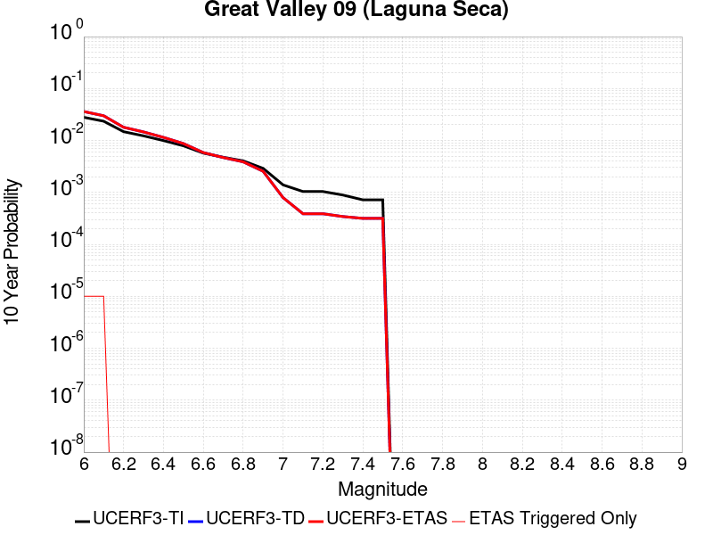 |

| Magnitude | 1 wk TI Prob | 1 wk TD Prob | 1 wk ETAS Prob | 1 wk ETAS/TD Gain | 1 wk ETAS Triggered Only | 1 mo TI Prob | 1 mo TD Prob | 1 mo ETAS Prob | 1 mo ETAS/TD Gain | 1 mo ETAS Triggered Only | 1 yr TI Prob | 1 yr TD Prob | 1 yr ETAS Prob | 1 yr ETAS/TD Gain | 1 yr ETAS Triggered Only | 10 yr TI Prob | 10 yr TD Prob | 10 yr ETAS Prob | 10 yr ETAS/TD Gain | 10 yr ETAS Triggered Only |
|-----|-----|-----|-----|-----|-----|-----|-----|-----|-----|-----|-----|-----|-----|-----|-----|-----|-----|-----|-----|-----|
| 6.0 | 5.4353277E-5 | 7.051288E-5 | 7.051288E-5 | 1.0 | 0.0 | 2.3292181E-4 | 3.021651E-4 | 3.021651E-4 | 1.0 | 0.0 | 0.0028321352 | 0.0036727623 | 0.0036727623 | 1.0 | 0.0 | 0.02796312 | 0.036121234 | 0.036130875 | 1.0002668 | 1.0E-5 |
| 6.1 | 4.5578287E-5 | 5.8229198E-5 | 5.8229198E-5 | 1.0 | 0.0 | 1.953209E-4 | 2.4953127E-4 | 2.4953127E-4 | 1.0 | 0.0 | 0.0023754383 | 0.0030339046 | 0.0030339046 | 1.0 | 0.0 | 0.023502063 | 0.029924182 | 0.029933883 | 1.0003241 | 1.0E-5 |
| 6.2 | 2.8536782E-5 | 3.4740468E-5 | 3.4740468E-5 | 1.0 | 0.0 | 1.2229476E-4 | 1.4887958E-4 | 1.4887958E-4 | 1.0 | 0.0 | 0.0014879217 | 0.0018110707 | 0.0018110707 | 1.0 | 0.0 | 0.014779986 | 0.017960638 | 0.017960638 | 1.0 | 0.0 |
| 6.3 | 2.3698774E-5 | 2.8215252E-5 | 2.8215252E-5 | 1.0 | 0.0 | 1.01562226E-4 | 1.2091713E-4 | 1.2091713E-4 | 1.0 | 0.0 | 0.0012358186 | 0.0014712278 | 0.0014712278 | 1.0 | 0.0 | 0.012289686 | 0.014613301 | 0.014613301 | 1.0 | 0.0 |
| 6.4 | 1.9191197E-5 | 2.2123982E-5 | 2.2123982E-5 | 1.0 | 0.0 | 8.2245395E-5 | 9.481376E-5 | 9.481376E-5 | 1.0 | 0.0 | 0.0010008777 | 0.001153789 | 0.001153789 | 1.0 | 0.0 | 0.009963818 | 0.011478378 | 0.011478378 | 1.0 | 0.0 |
| 6.5 | 1.5203241E-5 | 1.6802042E-5 | 1.6802042E-5 | 1.0 | 0.0 | 6.5155116E-5 | 7.200683E-5 | 7.200683E-5 | 1.0 | 0.0 | 7.9297484E-4 | 8.76362E-4 | 8.76362E-4 | 1.0 | 0.0 | 0.007901512 | 0.008730489 | 0.008730489 | 1.0 | 0.0 |
| 6.6 | 1.0984925E-5 | 1.1243591E-5 | 1.1243591E-5 | 1.0 | 0.0 | 4.70774E-5 | 4.8185837E-5 | 4.8185837E-5 | 1.0 | 0.0 | 5.730166E-4 | 5.865083E-4 | 5.865083E-4 | 1.0 | 0.0 | 0.005715413 | 0.0058500012 | 0.0058500012 | 1.0 | 0.0 |
| 6.7 | 9.134616E-6 | 9.020651E-6 | 9.020651E-6 | 1.0 | 0.0 | 3.9147766E-5 | 3.8659375E-5 | 3.8659375E-5 | 1.0 | 0.0 | 4.7651984E-4 | 4.705786E-4 | 4.705786E-4 | 1.0 | 0.0 | 0.004754993 | 0.0046960665 | 0.0046960665 | 1.0 | 0.0 |
| 6.8 | 7.785589E-6 | 7.4525665E-6 | 7.4525665E-6 | 1.0 | 0.0 | 3.3366385E-5 | 3.193919E-5 | 3.193919E-5 | 1.0 | 0.0 | 4.0616E-4 | 3.8879228E-4 | 3.8879228E-4 | 1.0 | 0.0 | 0.0040541845 | 0.003881325 | 0.003881325 | 1.0 | 0.0 |
| 6.9 | 5.579095E-6 | 4.8989014E-6 | 4.8989014E-6 | 1.0 | 0.0 | 2.3910188E-5 | 2.099513E-5 | 2.099513E-5 | 1.0 | 0.0 | 2.9106764E-4 | 2.555871E-4 | 2.555871E-4 | 1.0 | 0.0 | 0.002906867 | 0.002553069 | 0.002553069 | 1.0 | 0.0 |
| 7.0 | 2.6816688E-6 | 1.5217248E-6 | 1.5217248E-6 | 1.0 | 0.0 | 1.1492816E-5 | 6.5216623E-6 | 6.5216623E-6 | 1.0 | 0.0 | 1.3991605E-4 | 7.939843E-5 | 7.939843E-5 | 1.0 | 0.0 | 0.0013982799 | 7.9370936E-4 | 7.9370936E-4 | 1.0 | 0.0 |
| 7.1 | 1.9951021E-6 | 7.4544107E-7 | 7.4544107E-7 | 1.0 | 0.0 | 8.55041E-6 | 3.1947436E-6 | 3.1947436E-6 | 1.0 | 0.0 | 1.0409627E-4 | 3.8895352E-5 | 3.8895352E-5 | 1.0 | 0.0 | 0.0010404752 | 3.888896E-4 | 3.888896E-4 | 1.0 | 0.0 |
| 7.2 | 1.9951021E-6 | 7.4544107E-7 | 7.4544107E-7 | 1.0 | 0.0 | 8.55041E-6 | 3.1947436E-6 | 3.1947436E-6 | 1.0 | 0.0 | 1.0409627E-4 | 3.8895352E-5 | 3.8895352E-5 | 1.0 | 0.0 | 0.0010404752 | 3.888896E-4 | 3.888896E-4 | 1.0 | 0.0 |
| 7.3 | 1.7087556E-6 | 6.579369E-7 | 6.579369E-7 | 1.0 | 0.0 | 7.3232177E-6 | 2.8197267E-6 | 2.8197267E-6 | 1.0 | 0.0 | 8.915652E-5 | 3.4329674E-5 | 3.4329674E-5 | 1.0 | 0.0 | 8.9120766E-4 | 3.4324775E-4 | 3.4324775E-4 | 1.0 | 0.0 |
| 7.4 | 1.3804846E-6 | 6.074255E-7 | 6.074255E-7 | 1.0 | 0.0 | 5.916349E-6 | 2.6032496E-6 | 2.6032496E-6 | 1.0 | 0.0 | 7.2029165E-5 | 3.1694144E-5 | 3.1694144E-5 | 1.0 | 0.0 | 7.200583E-4 | 3.1690026E-4 | 3.1690026E-4 | 1.0 | 0.0 |
| 7.5 | 1.3804846E-6 | 6.074255E-7 | 6.074255E-7 | 1.0 | 0.0 | 5.916349E-6 | 2.6032496E-6 | 2.6032496E-6 | 1.0 | 0.0 | 7.2029165E-5 | 3.1694144E-5 | 3.1694144E-5 | 1.0 | 0.0 | 7.200583E-4 | 3.1690026E-4 | 3.1690026E-4 | 1.0 | 0.0 |

## Anacapa-Dume alt 1
*[(top)](#table-of-contents)*

| 1 Week | 1 Month | 1 Year | 10 Year |
|-----|-----|-----|-----|
|  | 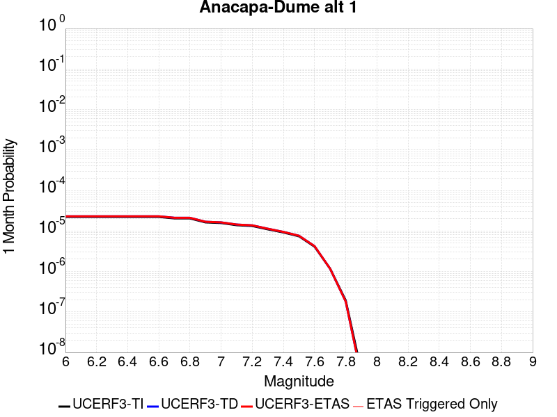 |  |  |

| Magnitude | 1 wk TI Prob | 1 wk TD Prob | 1 wk ETAS Prob | 1 wk ETAS/TD Gain | 1 wk ETAS Triggered Only | 1 mo TI Prob | 1 mo TD Prob | 1 mo ETAS Prob | 1 mo ETAS/TD Gain | 1 mo ETAS Triggered Only | 1 yr TI Prob | 1 yr TD Prob | 1 yr ETAS Prob | 1 yr ETAS/TD Gain | 1 yr ETAS Triggered Only | 10 yr TI Prob | 10 yr TD Prob | 10 yr ETAS Prob | 10 yr ETAS/TD Gain | 10 yr ETAS Triggered Only |
|-----|-----|-----|-----|-----|-----|-----|-----|-----|-----|-----|-----|-----|-----|-----|-----|-----|-----|-----|-----|-----|
| 6.0 | 5.1871802E-6 | 5.367503E-6 | 5.367503E-6 | 1.0 | 0.0 | 2.2230583E-5 | 2.3003386E-5 | 2.3003386E-5 | 1.0 | 0.0 | 2.7062374E-4 | 2.800311E-4 | 2.800311E-4 | 1.0 | 0.0 | 0.002702944 | 0.0027968676 | 0.0028068395 | 1.0035654 | 1.0E-5 |
| 6.1 | 5.1871802E-6 | 5.367503E-6 | 5.367503E-6 | 1.0 | 0.0 | 2.2230583E-5 | 2.3003386E-5 | 2.3003386E-5 | 1.0 | 0.0 | 2.7062374E-4 | 2.800311E-4 | 2.800311E-4 | 1.0 | 0.0 | 0.002702944 | 0.0027968676 | 0.0028068395 | 1.0035654 | 1.0E-5 |
| 6.2 | 5.1871802E-6 | 5.367503E-6 | 5.367503E-6 | 1.0 | 0.0 | 2.2230583E-5 | 2.3003386E-5 | 2.3003386E-5 | 1.0 | 0.0 | 2.7062374E-4 | 2.800311E-4 | 2.800311E-4 | 1.0 | 0.0 | 0.002702944 | 0.0027968676 | 0.0028068395 | 1.0035654 | 1.0E-5 |
| 6.3 | 5.1871802E-6 | 5.367503E-6 | 5.367503E-6 | 1.0 | 0.0 | 2.2230583E-5 | 2.3003386E-5 | 2.3003386E-5 | 1.0 | 0.0 | 2.7062374E-4 | 2.800311E-4 | 2.800311E-4 | 1.0 | 0.0 | 0.002702944 | 0.0027968676 | 0.0028068395 | 1.0035654 | 1.0E-5 |
| 6.4 | 5.1871802E-6 | 5.367503E-6 | 5.367503E-6 | 1.0 | 0.0 | 2.2230583E-5 | 2.3003386E-5 | 2.3003386E-5 | 1.0 | 0.0 | 2.7062374E-4 | 2.800311E-4 | 2.800311E-4 | 1.0 | 0.0 | 0.002702944 | 0.0027968676 | 0.0028068395 | 1.0035654 | 1.0E-5 |
| 6.5 | 5.1871802E-6 | 5.367503E-6 | 5.367503E-6 | 1.0 | 0.0 | 2.2230583E-5 | 2.3003386E-5 | 2.3003386E-5 | 1.0 | 0.0 | 2.7062374E-4 | 2.800311E-4 | 2.800311E-4 | 1.0 | 0.0 | 0.002702944 | 0.0027968676 | 0.0028068395 | 1.0035654 | 1.0E-5 |
| 6.6 | 5.1871802E-6 | 5.367503E-6 | 5.367503E-6 | 1.0 | 0.0 | 2.2230583E-5 | 2.3003386E-5 | 2.3003386E-5 | 1.0 | 0.0 | 2.7062374E-4 | 2.800311E-4 | 2.800311E-4 | 1.0 | 0.0 | 0.002702944 | 0.0027968676 | 0.0028068395 | 1.0035654 | 1.0E-5 |
| 6.7 | 4.7693475E-6 | 4.936797E-6 | 4.936797E-6 | 1.0 | 0.0 | 2.04399E-5 | 2.1157533E-5 | 2.1157533E-5 | 1.0 | 0.0 | 2.4882736E-4 | 2.5756328E-4 | 2.5756328E-4 | 1.0 | 0.0 | 0.0024854892 | 0.0025727237 | 0.002582698 | 1.0038769 | 1.0E-5 |
| 6.8 | 4.753408E-6 | 4.920345E-6 | 4.920345E-6 | 1.0 | 0.0 | 2.037159E-5 | 2.1087026E-5 | 2.1087026E-5 | 1.0 | 0.0 | 2.4799586E-4 | 2.5670504E-4 | 2.5670504E-4 | 1.0 | 0.0 | 0.002477193 | 0.0025641613 | 0.0025741355 | 1.0038899 | 1.0E-5 |
| 6.9 | 3.800069E-6 | 3.937215E-6 | 3.937215E-6 | 1.0 | 0.0 | 1.6285909E-5 | 1.687367E-5 | 1.687367E-5 | 1.0 | 0.0 | 1.9826289E-4 | 2.0541779E-4 | 2.0541779E-4 | 1.0 | 0.0 | 0.001980861 | 0.002052303 | 0.0020622823 | 1.0048625 | 1.0E-5 |
| 7.0 | 3.6671938E-6 | 3.8000046E-6 | 3.8000046E-6 | 1.0 | 0.0 | 1.571645E-5 | 1.6285634E-5 | 1.6285634E-5 | 1.0 | 0.0 | 1.9133097E-4 | 1.9825978E-4 | 1.9825978E-4 | 1.0 | 0.0 | 0.0019116632 | 0.0019808523 | 0.0019908324 | 1.0050384 | 1.0E-5 |
| 7.1 | 3.2394885E-6 | 3.3588722E-6 | 3.3588722E-6 | 1.0 | 0.0 | 1.3883448E-5 | 1.4395087E-5 | 1.4395087E-5 | 1.0 | 0.0 | 1.6901788E-4 | 1.752462E-4 | 1.752462E-4 | 1.0 | 0.0 | 0.0016888938 | 0.0017510912 | 0.0017610737 | 1.0057007 | 1.0E-5 |
| 7.2 | 3.0935948E-6 | 3.208002E-6 | 3.208002E-6 | 1.0 | 0.0 | 1.3258196E-5 | 1.37485085E-5 | 1.37485085E-5 | 1.0 | 0.0 | 1.6140658E-4 | 1.6737534E-4 | 1.6737534E-4 | 1.0 | 0.0 | 0.001612894 | 0.0016725038 | 0.0016824871 | 1.005969 | 1.0E-5 |
| 7.3 | 2.5604163E-6 | 2.6471337E-6 | 2.6471337E-6 | 1.0 | 0.0 | 1.0973167E-5 | 1.13448095E-5 | 1.13448095E-5 | 1.0 | 0.0 | 1.3359012E-4 | 1.3811435E-4 | 1.3811435E-4 | 1.0 | 0.0 | 0.0013350984 | 0.0013802897 | 0.0013902759 | 1.0072348 | 1.0E-5 |
| 7.4 | 2.1429005E-6 | 2.2106528E-6 | 2.2106528E-6 | 1.0 | 0.0 | 9.1838265E-6 | 9.474192E-6 | 9.474192E-6 | 1.0 | 0.0 | 1.11807356E-4 | 1.1534221E-4 | 1.1534221E-4 | 1.0 | 0.0 | 0.0011175112 | 0.0011528261 | 0.0011628146 | 1.0086644 | 1.0E-5 |
| 7.5 | 1.7237151E-6 | 1.7761854E-6 | 1.7761854E-6 | 1.0 | 0.0 | 7.3873293E-6 | 7.612201E-6 | 7.612201E-6 | 1.0 | 0.0 | 8.993702E-5 | 9.267463E-5 | 9.267463E-5 | 1.0 | 0.0 | 8.990063E-4 | 9.263622E-4 | 9.363529E-4 | 1.0107849 | 1.0E-5 |
| 7.6 | 9.541696E-7 | 9.82343E-7 | 9.82343E-7 | 1.0 | 0.0 | 4.089292E-6 | 4.210034E-6 | 4.210034E-6 | 1.0 | 0.0 | 4.9785995E-5 | 5.1255975E-5 | 5.1255975E-5 | 1.0 | 0.0 | 4.9774844E-4 | 5.124428E-4 | 5.124428E-4 | 1.0 | 0.0 |
| 7.7 | 2.7226676E-7 | 2.7172914E-7 | 2.7172914E-7 | 1.0 | 0.0 | 1.166857E-6 | 1.1645529E-6 | 1.1645529E-6 | 1.0 | 0.0 | 1.4206392E-5 | 1.417834E-5 | 1.417834E-5 | 1.0 | 0.0 | 1.4205484E-4 | 1.4177442E-4 | 1.4177442E-4 | 1.0 | 0.0 |
| 7.8 | 4.5017995E-8 | 4.2158337E-8 | 4.2158337E-8 | 1.0 | 0.0 | 1.9293425E-7 | 1.8067858E-7 | 1.8067858E-7 | 1.0 | 0.0 | 2.348972E-6 | 2.1997598E-6 | 2.1997598E-6 | 1.0 | 0.0 | 2.348947E-5 | 2.19974E-5 | 2.19974E-5 | 1.0 | 0.0 |
| 7.9 | 8.007447E-10 | 6.161025E-10 | 6.161025E-10 | 1.0 | 0.0 | 3.4317629E-9 | 2.6404403E-9 | 2.6404403E-9 | 1.0 | 0.0 | 4.1781714E-8 | 3.214736E-8 | 3.214736E-8 | 1.0 | 0.0 | 4.1781706E-7 | 3.2147355E-7 | 3.2147355E-7 | 1.0 | 0.0 |

## Mission (connected) 2011 CFM
*[(top)](#table-of-contents)*

| 1 Week | 1 Month | 1 Year | 10 Year |
|-----|-----|-----|-----|
|  |  |  |  |

| Magnitude | 1 wk TI Prob | 1 wk TD Prob | 1 wk ETAS Prob | 1 wk ETAS/TD Gain | 1 wk ETAS Triggered Only | 1 mo TI Prob | 1 mo TD Prob | 1 mo ETAS Prob | 1 mo ETAS/TD Gain | 1 mo ETAS Triggered Only | 1 yr TI Prob | 1 yr TD Prob | 1 yr ETAS Prob | 1 yr ETAS/TD Gain | 1 yr ETAS Triggered Only | 10 yr TI Prob | 10 yr TD Prob | 10 yr ETAS Prob | 10 yr ETAS/TD Gain | 10 yr ETAS Triggered Only |
|-----|-----|-----|-----|-----|-----|-----|-----|-----|-----|-----|-----|-----|-----|-----|-----|-----|-----|-----|-----|-----|
| 6.0 | 1.8735573E-5 | 2.689229E-5 | 2.689229E-5 | 1.0 | 0.0 | 8.029284E-5 | 1.15247625E-4 | 1.15247625E-4 | 1.0 | 0.0 | 9.771269E-4 | 0.0014021697 | 0.0014021697 | 1.0 | 0.0 | 0.009728416 | 0.013942371 | 0.013952232 | 1.0007073 | 1.0E-5 |
| 6.1 | 1.7515964E-5 | 2.5533485E-5 | 2.5533485E-5 | 1.0 | 0.0 | 7.506625E-5 | 1.09424676E-4 | 1.09424676E-4 | 1.0 | 0.0 | 9.135484E-4 | 0.0013313637 | 0.0013313637 | 1.0 | 0.0 | 0.009098019 | 0.013242937 | 0.013242937 | 1.0 | 0.0 |
| 6.2 | 1.6486343E-5 | 2.4378065E-5 | 2.4378065E-5 | 1.0 | 0.0 | 7.065384E-5 | 1.0447328E-4 | 1.0447328E-4 | 1.0 | 0.0 | 8.5987104E-4 | 0.001271154 | 0.001271154 | 1.0 | 0.0 | 0.008565514 | 0.012647877 | 0.012647877 | 1.0 | 0.0 |
| 6.3 | 1.5229385E-5 | 2.2807342E-5 | 2.2807342E-5 | 1.0 | 0.0 | 6.526716E-5 | 9.774213E-5 | 9.774213E-5 | 1.0 | 0.0 | 7.9433795E-4 | 0.0011892951 | 0.0011892951 | 1.0 | 0.0 | 0.007915046 | 0.011841001 | 0.011841001 | 1.0 | 0.0 |
| 6.4 | 1.4435828E-5 | 2.1407075E-5 | 2.1407075E-5 | 1.0 | 0.0 | 6.186637E-5 | 9.1741415E-5 | 9.1741415E-5 | 1.0 | 0.0 | 7.529627E-4 | 0.0011163155 | 0.0011163155 | 1.0 | 0.0 | 0.007504165 | 0.011123841 | 0.011123841 | 1.0 | 0.0 |
| 6.5 | 1.30127955E-5 | 1.9045572E-5 | 1.9045572E-5 | 1.0 | 0.0 | 5.576793E-5 | 8.162134E-5 | 8.162134E-5 | 1.0 | 0.0 | 6.78763E-4 | 9.932242E-4 | 9.932242E-4 | 1.0 | 0.0 | 0.0067669353 | 0.009915724 | 0.009915724 | 1.0 | 0.0 |
| 6.6 | 1.1220718E-5 | 1.6401224E-5 | 1.6401224E-5 | 1.0 | 0.0 | 4.8087906E-5 | 7.028908E-5 | 7.028908E-5 | 1.0 | 0.0 | 5.8531296E-4 | 8.554312E-4 | 8.554312E-4 | 1.0 | 0.0 | 0.005837737 | 0.008553556 | 0.008553556 | 1.0 | 0.0 |
| 6.7 | 8.086152E-6 | 1.1756832E-5 | 1.1756832E-5 | 1.0 | 0.0 | 3.4654473E-5 | 5.0385454E-5 | 5.0385454E-5 | 1.0 | 0.0 | 4.2183654E-4 | 6.13271E-4 | 6.13271E-4 | 1.0 | 0.0 | 0.004210367 | 0.0061530424 | 0.0061530424 | 1.0 | 0.0 |
| 6.8 | 6.8361655E-6 | 1.0201216E-5 | 1.0201216E-5 | 1.0 | 0.0 | 2.9297524E-5 | 4.371877E-5 | 4.371877E-5 | 1.0 | 0.0 | 3.5663895E-4 | 5.3214666E-4 | 5.3214666E-4 | 1.0 | 0.0 | 0.0035606713 | 0.0053416505 | 0.0053416505 | 1.0 | 0.0 |
| 6.9 | 5.2517353E-6 | 7.873655E-6 | 7.873655E-6 | 1.0 | 0.0 | 2.2507242E-5 | 3.37438E-5 | 3.37438E-5 | 1.0 | 0.0 | 2.739912E-4 | 4.1075356E-4 | 4.1075356E-4 | 1.0 | 0.0 | 0.0027365363 | 0.004132166 | 0.004132166 | 1.0 | 0.0 |
| 7.0 | 4.4602784E-6 | 6.7057636E-6 | 6.7057636E-6 | 1.0 | 0.0 | 1.911534E-5 | 2.8738672E-5 | 2.8738672E-5 | 1.0 | 0.0 | 2.327044E-4 | 3.498373E-4 | 3.498373E-4 | 1.0 | 0.0 | 0.0023246086 | 0.0035242643 | 0.0035242643 | 1.0 | 0.0 |
| 7.1 | 4.1492594E-6 | 6.2543677E-6 | 6.2543677E-6 | 1.0 | 0.0 | 1.7782419E-5 | 2.6804159E-5 | 2.6804159E-5 | 1.0 | 0.0 | 2.1647944E-4 | 3.2629192E-4 | 3.2629192E-4 | 1.0 | 0.0 | 0.0021626868 | 0.0032889978 | 0.0032889978 | 1.0 | 0.0 |
| 7.2 | 2.213247E-6 | 3.3657373E-6 | 3.3657373E-6 | 1.0 | 0.0 | 9.485309E-6 | 1.4424508E-5 | 1.4424508E-5 | 1.0 | 0.0 | 1.15477524E-4 | 1.7560426E-4 | 1.7560426E-4 | 1.0 | 0.0 | 0.0011541754 | 0.0017832896 | 0.0017832896 | 1.0 | 0.0 |
| 7.3 | 1.7362703E-6 | 2.7409405E-6 | 2.7409405E-6 | 1.0 | 0.0 | 7.4411373E-6 | 1.1746835E-5 | 1.1746835E-5 | 1.0 | 0.0 | 9.0592075E-5 | 1.4300835E-4 | 1.4300835E-4 | 1.0 | 0.0 | 9.0555154E-4 | 0.0014544576 | 0.0014544576 | 1.0 | 0.0 |
| 7.4 | 1.1628409E-6 | 1.8513425E-6 | 1.8513425E-6 | 1.0 | 0.0 | 4.9835944E-6 | 7.934301E-6 | 7.934301E-6 | 1.0 | 0.0 | 6.0673574E-5 | 9.6595846E-5 | 9.6595846E-5 | 1.0 | 0.0 | 6.065701E-4 | 9.863016E-4 | 9.863016E-4 | 1.0 | 0.0 |
| 7.5 | 5.5610667E-7 | 9.3602273E-7 | 9.3602273E-7 | 1.0 | 0.0 | 2.3833122E-6 | 4.0115196E-6 | 4.0115196E-6 | 1.0 | 0.0 | 2.9016439E-5 | 4.8839163E-5 | 4.8839163E-5 | 1.0 | 0.0 | 2.901265E-4 | 5.0493027E-4 | 5.0493027E-4 | 1.0 | 0.0 |
| 7.6 | 4.4307663E-7 | 7.800331E-7 | 7.800331E-7 | 1.0 | 0.0 | 1.8988985E-6 | 3.3429944E-6 | 3.3429944E-6 | 1.0 | 0.0 | 2.3118844E-5 | 4.07002E-5 | 4.07002E-5 | 1.0 | 0.0 | 2.3116439E-4 | 4.2288855E-4 | 4.2288855E-4 | 1.0 | 0.0 |
| 7.7 | 3.639119E-7 | 6.369042E-7 | 6.369042E-7 | 1.0 | 0.0 | 1.5596215E-6 | 2.7295864E-6 | 2.7295864E-6 | 1.0 | 0.0 | 1.8988227E-5 | 3.323221E-5 | 3.323221E-5 | 1.0 | 0.0 | 1.8986604E-4 | 3.4760416E-4 | 3.4760416E-4 | 1.0 | 0.0 |
| 7.8 | 3.1152942E-7 | 5.4867644E-7 | 5.4867644E-7 | 1.0 | 0.0 | 1.3351254E-6 | 2.3514683E-6 | 2.3514683E-6 | 1.0 | 0.0 | 1.6255031E-5 | 2.8628752E-5 | 2.8628752E-5 | 1.0 | 0.0 | 1.6253842E-4 | 2.9830585E-4 | 2.9830585E-4 | 1.0 | 0.0 |
| 7.9 | 1.8035962E-7 | 3.7258877E-7 | 3.7258877E-7 | 1.0 | 0.0 | 7.729696E-7 | 1.596808E-6 | 1.596808E-6 | 1.0 | 0.0 | 9.410865E-6 | 1.9440966E-5 | 1.9440966E-5 | 1.0 | 0.0 | 9.410465E-5 | 2.0107611E-4 | 2.0107611E-4 | 1.0 | 0.0 |
| 8.0 | 9.279334E-8 | 1.9731866E-7 | 1.9731866E-7 | 1.0 | 0.0 | 3.976857E-7 | 8.456511E-7 | 8.456511E-7 | 1.0 | 0.0 | 4.841813E-6 | 1.0295754E-5 | 1.0295754E-5 | 1.0 | 0.0 | 4.841707E-5 | 1.0546822E-4 | 1.0546822E-4 | 1.0 | 0.0 |
| 8.1 | 5.9253985E-8 | 1.1871741E-7 | 1.1871741E-7 | 1.0 | 0.0 | 2.5394561E-7 | 5.087888E-7 | 5.087888E-7 | 1.0 | 0.0 | 3.0917836E-6 | 6.1944866E-6 | 6.1944866E-6 | 1.0 | 0.0 | 3.0917407E-5 | 6.332639E-5 | 6.332639E-5 | 1.0 | 0.0 |

## San Andreas (Peninsula) 2011 CFM
*[(top)](#table-of-contents)*

| 1 Week | 1 Month | 1 Year | 10 Year |
|-----|-----|-----|-----|
|  |  |  |  |

| Magnitude | 1 wk TI Prob | 1 wk TD Prob | 1 wk ETAS Prob | 1 wk ETAS/TD Gain | 1 wk ETAS Triggered Only | 1 mo TI Prob | 1 mo TD Prob | 1 mo ETAS Prob | 1 mo ETAS/TD Gain | 1 mo ETAS Triggered Only | 1 yr TI Prob | 1 yr TD Prob | 1 yr ETAS Prob | 1 yr ETAS/TD Gain | 1 yr ETAS Triggered Only | 10 yr TI Prob | 10 yr TD Prob | 10 yr ETAS Prob | 10 yr ETAS/TD Gain | 10 yr ETAS Triggered Only |
|-----|-----|-----|-----|-----|-----|-----|-----|-----|-----|-----|-----|-----|-----|-----|-----|-----|-----|-----|-----|-----|
| 6.0 | 8.6200685E-5 | 2.5333706E-5 | 2.5333706E-5 | 1.0 | 0.0 | 3.6937918E-4 | 1.08568514E-4 | 1.08568514E-4 | 1.0 | 0.0 | 0.0044879215 | 0.0013210218 | 0.0013310086 | 1.0075599 | 1.0E-5 | 0.043983612 | 0.014838956 | 0.014848808 | 1.0006639 | 1.0E-5 |
| 6.1 | 8.6200685E-5 | 2.5333706E-5 | 2.5333706E-5 | 1.0 | 0.0 | 3.6937918E-4 | 1.08568514E-4 | 1.08568514E-4 | 1.0 | 0.0 | 0.0044879215 | 0.0013210218 | 0.0013310086 | 1.0075599 | 1.0E-5 | 0.043983612 | 0.014838956 | 0.014848808 | 1.0006639 | 1.0E-5 |
| 6.2 | 8.6200685E-5 | 2.5333706E-5 | 2.5333706E-5 | 1.0 | 0.0 | 3.6937918E-4 | 1.08568514E-4 | 1.08568514E-4 | 1.0 | 0.0 | 0.0044879215 | 0.0013210218 | 0.0013310086 | 1.0075599 | 1.0E-5 | 0.043983612 | 0.014838956 | 0.014848808 | 1.0006639 | 1.0E-5 |
| 6.3 | 8.551163E-5 | 2.5024961E-5 | 2.5024961E-5 | 1.0 | 0.0 | 3.6642692E-4 | 1.0724543E-4 | 1.0724543E-4 | 1.0 | 0.0 | 0.004452125 | 0.0013049326 | 0.0013149197 | 1.0076532 | 1.0E-5 | 0.043639794 | 0.014665611 | 0.0146754645 | 1.0006719 | 1.0E-5 |
| 6.4 | 8.551163E-5 | 2.5024961E-5 | 2.5024961E-5 | 1.0 | 0.0 | 3.6642692E-4 | 1.0724543E-4 | 1.0724543E-4 | 1.0 | 0.0 | 0.004452125 | 0.0013049326 | 0.0013149197 | 1.0076532 | 1.0E-5 | 0.043639794 | 0.014665611 | 0.0146754645 | 1.0006719 | 1.0E-5 |
| 6.5 | 8.511146E-5 | 2.4846031E-5 | 2.4846031E-5 | 1.0 | 0.0 | 3.647124E-4 | 1.0647865E-4 | 1.0647865E-4 | 1.0 | 0.0 | 0.004431336 | 0.0012956082 | 0.0013055953 | 1.0077084 | 1.0E-5 | 0.04344007 | 0.014565198 | 0.014575052 | 1.0006765 | 1.0E-5 |
| 6.6 | 8.4985084E-5 | 2.477655E-5 | 2.477655E-5 | 1.0 | 0.0 | 3.6417096E-4 | 1.061809E-4 | 1.061809E-4 | 1.0 | 0.0 | 0.0044247704 | 0.0012919875 | 0.0013019745 | 1.00773 | 1.0E-5 | 0.043376986 | 0.014527207 | 0.014537062 | 1.0006784 | 1.0E-5 |
| 6.7 | 8.462618E-5 | 2.4604726E-5 | 2.4604726E-5 | 1.0 | 0.0 | 3.6263323E-4 | 1.05444575E-4 | 1.05444575E-4 | 1.0 | 0.0 | 0.004406125 | 0.0012830333 | 0.0012930204 | 1.007784 | 1.0E-5 | 0.043197807 | 0.01443185 | 0.014441705 | 1.000683 | 1.0E-5 |
| 6.8 | 8.42337E-5 | 2.4500272E-5 | 2.4500272E-5 | 1.0 | 0.0 | 3.6095164E-4 | 1.0499695E-4 | 1.0499695E-4 | 1.0 | 0.0 | 0.004385734 | 0.0012775898 | 0.0012875771 | 1.0078173 | 1.0E-5 | 0.043001823 | 0.014372395 | 0.014382252 | 1.0006858 | 1.0E-5 |
| 6.9 | 8.365989E-5 | 2.4304522E-5 | 2.4304522E-5 | 1.0 | 0.0 | 3.5849313E-4 | 1.0415808E-4 | 1.0415808E-4 | 1.0 | 0.0 | 0.004355922 | 0.0012673886 | 0.0012773758 | 1.0078802 | 1.0E-5 | 0.04271523 | 0.014264696 | 0.014274553 | 1.000691 | 1.0E-5 |
| 7.0 | 8.30936E-5 | 2.4065685E-5 | 2.4065685E-5 | 1.0 | 0.0 | 3.560668E-4 | 1.0313458E-4 | 1.0313458E-4 | 1.0 | 0.0 | 0.004326499 | 0.0012549418 | 0.0012649293 | 1.0079585 | 1.0E-5 | 0.042432297 | 0.0141355125 | 0.0141453715 | 1.0006975 | 1.0E-5 |
| 7.1 | 8.041264E-5 | 2.3751329E-5 | 2.3751329E-5 | 1.0 | 0.0 | 3.4458007E-4 | 1.01787446E-4 | 1.01787446E-4 | 1.0 | 0.0 | 0.0041871946 | 0.0012385593 | 0.0012485469 | 1.0080639 | 1.0E-5 | 0.041091725 | 0.013957874 | 0.013967735 | 1.0007064 | 1.0E-5 |
| 7.2 | 7.8427016E-5 | 2.3174005E-5 | 2.3174005E-5 | 1.0 | 0.0 | 3.3607247E-4 | 9.931339E-5 | 9.931339E-5 | 1.0 | 0.0 | 0.004084008 | 0.0012084715 | 0.0012184593 | 1.0082649 | 1.0E-5 | 0.040097635 | 0.013641416 | 0.01365128 | 1.000723 | 1.0E-5 |
| 7.3 | 7.721087E-5 | 2.2958477E-5 | 2.2958477E-5 | 1.0 | 0.0 | 3.3086175E-4 | 9.838976E-5 | 9.838976E-5 | 1.0 | 0.0 | 0.004020803 | 0.0011972387 | 0.0012072268 | 1.0083425 | 1.0E-5 | 0.03948827 | 0.013524936 | 0.0135348 | 1.0007293 | 1.0E-5 |
| 7.4 | 7.3536525E-5 | 2.1064485E-5 | 2.1064485E-5 | 1.0 | 0.0 | 3.1511846E-4 | 9.027325E-5 | 9.027325E-5 | 1.0 | 0.0 | 0.0038298194 | 0.001098524 | 0.001108513 | 1.0090932 | 1.0E-5 | 0.037644852 | 0.01247618 | 0.012486055 | 1.0007915 | 1.0E-5 |
| 7.5 | 6.806207E-5 | 1.8855704E-5 | 1.8855704E-5 | 1.0 | 0.0 | 2.9166197E-4 | 8.080766E-5 | 8.080766E-5 | 1.0 | 0.0 | 0.0035452035 | 9.833903E-4 | 9.933804E-4 | 1.0101589 | 1.0E-5 | 0.034891766 | 0.011221583 | 0.011231471 | 1.0008812 | 1.0E-5 |
| 7.6 | 5.6731416E-5 | 1.4235568E-5 | 1.4235568E-5 | 1.0 | 0.0 | 2.43112E-4 | 6.100815E-5 | 6.100815E-5 | 1.0 | 0.0 | 0.0029558712 | 7.4252125E-4 | 7.525138E-4 | 1.0134577 | 1.0E-5 | 0.02916862 | 0.008518306 | 0.0085282205 | 1.001164 | 1.0E-5 |
| 7.7 | 4.946994E-5 | 1.3298509E-5 | 1.3298509E-5 | 1.0 | 0.0 | 2.1199681E-4 | 5.6992365E-5 | 5.6992365E-5 | 1.0 | 0.0 | 0.002578006 | 6.936613E-4 | 7.0365437E-4 | 1.0144062 | 1.0E-5 | 0.02548303 | 0.007937518 | 0.007947439 | 1.0012498 | 1.0E-5 |
| 7.8 | 3.9718198E-5 | 1.3032537E-5 | 1.3032537E-5 | 1.0 | 0.0 | 1.7020974E-4 | 5.585253E-5 | 5.585253E-5 | 1.0 | 0.0 | 0.0020703338 | 6.7979255E-4 | 6.8978575E-4 | 1.0147004 | 1.0E-5 | 0.020511515 | 0.007746509 | 0.0077564316 | 1.0012809 | 1.0E-5 |
| 7.9 | 2.4115114E-5 | 1.2229653E-5 | 1.2229653E-5 | 1.0 | 0.0 | 1.0334639E-4 | 5.2411746E-5 | 5.2411746E-5 | 1.0 | 0.0 | 0.001257516 | 6.3792634E-4 | 6.4791995E-4 | 1.0156658 | 1.0E-5 | 0.012504238 | 0.0071830763 | 0.0071930047 | 1.0013821 | 1.0E-5 |
| 8.0 | 1.7756569E-5 | 1.144976E-5 | 1.144976E-5 | 1.0 | 0.0 | 7.6097356E-5 | 4.9069477E-5 | 4.9069477E-5 | 1.0 | 0.0 | 9.260915E-4 | 5.972573E-4 | 6.072513E-4 | 1.0167332 | 1.0E-5 | 0.009222416 | 0.006680902 | 0.006690835 | 1.0014868 | 1.0E-5 |
| 8.1 | 1.3159258E-5 | 9.77991E-6 | 9.77991E-6 | 1.0 | 0.0 | 5.6395602E-5 | 4.1913227E-5 | 4.1913227E-5 | 1.0 | 0.0 | 6.864001E-4 | 5.101742E-4 | 5.201691E-4 | 1.0195911 | 1.0E-5 | 0.0068428386 | 0.0057076924 | 0.005717635 | 1.001742 | 1.0E-5 |
| 8.2 | 8.635426E-6 | 5.4872503E-6 | 5.4872503E-6 | 1.0 | 0.0 | 3.700844E-5 | 2.3516575E-5 | 2.3516575E-5 | 1.0 | 0.0 | 4.5048463E-4 | 2.8627677E-4 | 2.8627677E-4 | 1.0 | 0.0 | 0.004495725 | 0.0032556232 | 0.0032556232 | 1.0 | 0.0 |
| 8.3 | 1.983087E-6 | 7.693574E-7 | 7.693574E-7 | 1.0 | 0.0 | 8.498917E-6 | 3.297242E-6 | 3.297242E-6 | 1.0 | 0.0 | 1.034694E-4 | 4.01432E-5 | 4.01432E-5 | 1.0 | 0.0 | 0.0010342124 | 4.7390026E-4 | 4.7390026E-4 | 1.0 | 0.0 |

## Bullion Mountains
*[(top)](#table-of-contents)*

| 1 Week | 1 Month | 1 Year | 10 Year |
|-----|-----|-----|-----|
| 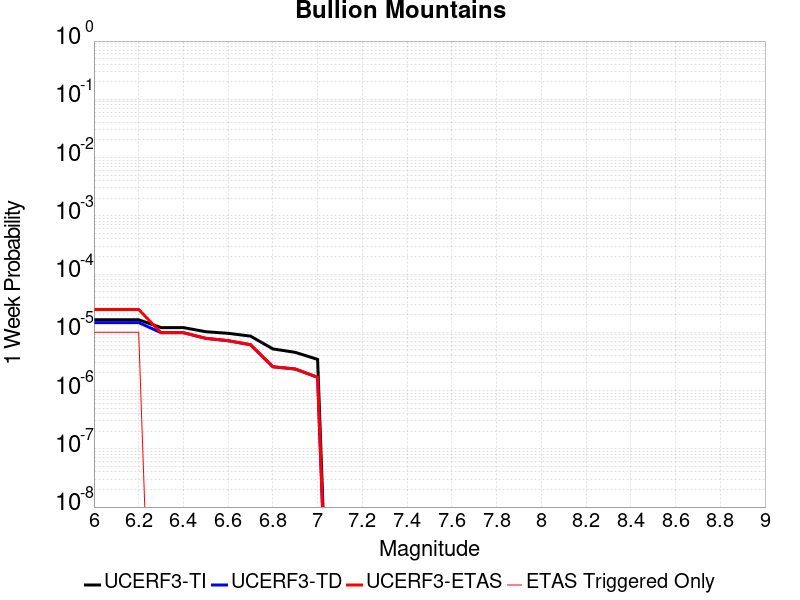 |  | 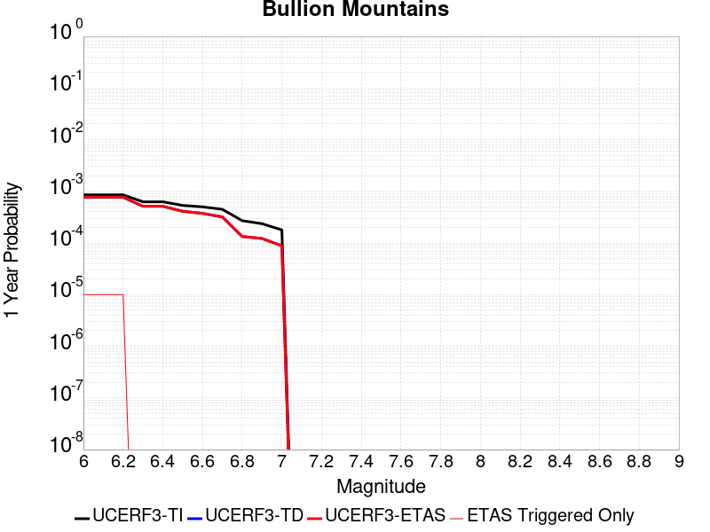 |  |

| Magnitude | 1 wk TI Prob | 1 wk TD Prob | 1 wk ETAS Prob | 1 wk ETAS/TD Gain | 1 wk ETAS Triggered Only | 1 mo TI Prob | 1 mo TD Prob | 1 mo ETAS Prob | 1 mo ETAS/TD Gain | 1 mo ETAS Triggered Only | 1 yr TI Prob | 1 yr TD Prob | 1 yr ETAS Prob | 1 yr ETAS/TD Gain | 1 yr ETAS Triggered Only | 10 yr TI Prob | 10 yr TD Prob | 10 yr ETAS Prob | 10 yr ETAS/TD Gain | 10 yr ETAS Triggered Only |
|-----|-----|-----|-----|-----|-----|-----|-----|-----|-----|-----|-----|-----|-----|-----|-----|-----|-----|-----|-----|-----|
| 6.0 | 1.6420427E-5 | 1.4692955E-5 | 2.4692808E-5 | 1.6805882 | 1.0E-5 | 7.037136E-5 | 6.29685E-5 | 7.296787E-5 | 1.1587995 | 1.0E-5 | 8.5643446E-4 | 7.6641026E-4 | 7.764026E-4 | 1.0130378 | 1.0E-5 | 0.008531413 | 0.007641465 | 0.0076513886 | 1.0012987 | 1.0E-5 |
| 6.1 | 1.6420427E-5 | 1.4692955E-5 | 2.4692808E-5 | 1.6805882 | 1.0E-5 | 7.037136E-5 | 6.29685E-5 | 7.296787E-5 | 1.1587995 | 1.0E-5 | 8.5643446E-4 | 7.6641026E-4 | 7.764026E-4 | 1.0130378 | 1.0E-5 | 0.008531413 | 0.007641465 | 0.0076513886 | 1.0012987 | 1.0E-5 |
| 6.2 | 1.6420427E-5 | 1.4692955E-5 | 2.4692808E-5 | 1.6805882 | 1.0E-5 | 7.037136E-5 | 6.29685E-5 | 7.296787E-5 | 1.1587995 | 1.0E-5 | 8.5643446E-4 | 7.6641026E-4 | 7.764026E-4 | 1.0130378 | 1.0E-5 | 0.008531413 | 0.007641465 | 0.0076513886 | 1.0012987 | 1.0E-5 |
| 6.3 | 1.2046778E-5 | 9.862933E-6 | 9.862933E-6 | 1.0 | 0.0 | 5.1628023E-5 | 4.2269163E-5 | 4.2269163E-5 | 1.0 | 0.0 | 6.283899E-4 | 5.145287E-4 | 5.145287E-4 | 1.0 | 0.0 | 0.0062661595 | 0.005135656 | 0.005135656 | 1.0 | 0.0 |
| 6.4 | 1.2046778E-5 | 9.862933E-6 | 9.862933E-6 | 1.0 | 0.0 | 5.1628023E-5 | 4.2269163E-5 | 4.2269163E-5 | 1.0 | 0.0 | 6.283899E-4 | 5.145287E-4 | 5.145287E-4 | 1.0 | 0.0 | 0.0062661595 | 0.005135656 | 0.005135656 | 1.0 | 0.0 |
| 6.5 | 1.0244343E-5 | 7.879951E-6 | 7.879951E-6 | 1.0 | 0.0 | 4.390359E-5 | 3.37709E-5 | 3.37709E-5 | 1.0 | 0.0 | 5.343951E-4 | 4.1110383E-4 | 4.1110383E-4 | 1.0 | 0.0 | 0.005331118 | 0.0041054646 | 0.0041054646 | 1.0 | 0.0 |
| 6.6 | 9.605408E-6 | 7.1779527E-6 | 7.1779527E-6 | 1.0 | 0.0 | 4.1165385E-5 | 3.0762407E-5 | 3.0762407E-5 | 1.0 | 0.0 | 5.010733E-4 | 3.744883E-4 | 3.744883E-4 | 1.0 | 0.0 | 0.00499945 | 0.0037405696 | 0.0037405696 | 1.0 | 0.0 |
| 6.7 | 8.60418E-6 | 6.1244036E-6 | 6.1244036E-6 | 1.0 | 0.0 | 3.687454E-5 | 2.624729E-5 | 2.624729E-5 | 1.0 | 0.0 | 4.48855E-4 | 3.1953337E-4 | 3.1953337E-4 | 1.0 | 0.0 | 0.004479495 | 0.0031926516 | 0.0031926516 | 1.0 | 0.0 |
| 6.8 | 5.187994E-6 | 2.5633778E-6 | 2.5633778E-6 | 1.0 | 0.0 | 2.223407E-5 | 1.0985881E-5 | 1.0985881E-5 | 1.0 | 0.0 | 2.7066618E-4 | 1.3374888E-4 | 1.3374888E-4 | 1.0 | 0.0 | 0.0027033675 | 0.0013370755 | 0.0013370755 | 1.0 | 0.0 |
| 6.9 | 4.5302368E-6 | 2.3444993E-6 | 2.3444993E-6 | 1.0 | 0.0 | 1.9415156E-5 | 1.0047837E-5 | 1.0047837E-5 | 1.0 | 0.0 | 2.3635388E-4 | 1.2232953E-4 | 1.2232953E-4 | 1.0 | 0.0 | 0.0023610266 | 0.0012230111 | 0.0012230111 | 1.0 | 0.0 |
| 7.0 | 3.431668E-6 | 1.688382E-6 | 1.688382E-6 | 1.0 | 0.0 | 1.4707065E-5 | 7.235923E-6 | 7.235923E-6 | 1.0 | 0.0 | 1.7904381E-4 | 8.809736E-5 | 8.809736E-5 | 1.0 | 0.0 | 0.0017889962 | 8.809736E-4 | 8.809736E-4 | 1.0 | 0.0 |

## Channel Islands Western Deep Ramp
*[(top)](#table-of-contents)*

| 1 Week | 1 Month | 1 Year | 10 Year |
|-----|-----|-----|-----|
|  |  |  | 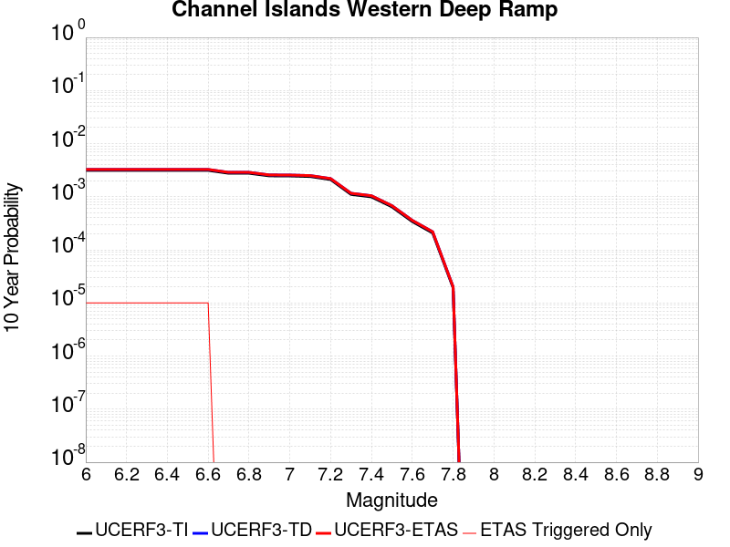 |

| Magnitude | 1 wk TI Prob | 1 wk TD Prob | 1 wk ETAS Prob | 1 wk ETAS/TD Gain | 1 wk ETAS Triggered Only | 1 mo TI Prob | 1 mo TD Prob | 1 mo ETAS Prob | 1 mo ETAS/TD Gain | 1 mo ETAS Triggered Only | 1 yr TI Prob | 1 yr TD Prob | 1 yr ETAS Prob | 1 yr ETAS/TD Gain | 1 yr ETAS Triggered Only | 10 yr TI Prob | 10 yr TD Prob | 10 yr ETAS Prob | 10 yr ETAS/TD Gain | 10 yr ETAS Triggered Only |
|-----|-----|-----|-----|-----|-----|-----|-----|-----|-----|-----|-----|-----|-----|-----|-----|-----|-----|-----|-----|-----|
| 6.0 | 6.0213506E-6 | 6.2549975E-6 | 6.2549975E-6 | 1.0 | 0.0 | 2.5805533E-5 | 2.6806882E-5 | 2.6806882E-5 | 1.0 | 0.0 | 3.1413708E-4 | 3.2632938E-4 | 3.363261E-4 | 1.0306339 | 1.0E-5 | 0.0031369338 | 0.0032589433 | 0.0032689108 | 1.0030584 | 1.0E-5 |
| 6.1 | 6.0213506E-6 | 6.2549975E-6 | 6.2549975E-6 | 1.0 | 0.0 | 2.5805533E-5 | 2.6806882E-5 | 2.6806882E-5 | 1.0 | 0.0 | 3.1413708E-4 | 3.2632938E-4 | 3.363261E-4 | 1.0306339 | 1.0E-5 | 0.0031369338 | 0.0032589433 | 0.0032689108 | 1.0030584 | 1.0E-5 |
| 6.2 | 6.0213506E-6 | 6.2549975E-6 | 6.2549975E-6 | 1.0 | 0.0 | 2.5805533E-5 | 2.6806882E-5 | 2.6806882E-5 | 1.0 | 0.0 | 3.1413708E-4 | 3.2632938E-4 | 3.363261E-4 | 1.0306339 | 1.0E-5 | 0.0031369338 | 0.0032589433 | 0.0032689108 | 1.0030584 | 1.0E-5 |
| 6.3 | 6.0213506E-6 | 6.2549975E-6 | 6.2549975E-6 | 1.0 | 0.0 | 2.5805533E-5 | 2.6806882E-5 | 2.6806882E-5 | 1.0 | 0.0 | 3.1413708E-4 | 3.2632938E-4 | 3.363261E-4 | 1.0306339 | 1.0E-5 | 0.0031369338 | 0.0032589433 | 0.0032689108 | 1.0030584 | 1.0E-5 |
| 6.4 | 6.0213506E-6 | 6.2549975E-6 | 6.2549975E-6 | 1.0 | 0.0 | 2.5805533E-5 | 2.6806882E-5 | 2.6806882E-5 | 1.0 | 0.0 | 3.1413708E-4 | 3.2632938E-4 | 3.363261E-4 | 1.0306339 | 1.0E-5 | 0.0031369338 | 0.0032589433 | 0.0032689108 | 1.0030584 | 1.0E-5 |
| 6.5 | 6.0213506E-6 | 6.2549975E-6 | 6.2549975E-6 | 1.0 | 0.0 | 2.5805533E-5 | 2.6806882E-5 | 2.6806882E-5 | 1.0 | 0.0 | 3.1413708E-4 | 3.2632938E-4 | 3.363261E-4 | 1.0306339 | 1.0E-5 | 0.0031369338 | 0.0032589433 | 0.0032689108 | 1.0030584 | 1.0E-5 |
| 6.6 | 6.0213506E-6 | 6.2549975E-6 | 6.2549975E-6 | 1.0 | 0.0 | 2.5805533E-5 | 2.6806882E-5 | 2.6806882E-5 | 1.0 | 0.0 | 3.1413708E-4 | 3.2632938E-4 | 3.363261E-4 | 1.0306339 | 1.0E-5 | 0.0031369338 | 0.0032589433 | 0.0032689108 | 1.0030584 | 1.0E-5 |
| 6.7 | 5.313309E-6 | 5.5253577E-6 | 5.5253577E-6 | 1.0 | 0.0 | 2.2771126E-5 | 2.3679913E-5 | 2.3679913E-5 | 1.0 | 0.0 | 2.772032E-4 | 2.8826887E-4 | 2.8826887E-4 | 1.0 | 0.0 | 0.0027685766 | 0.0028793528 | 0.0028793528 | 1.0 | 0.0 |
| 6.8 | 5.313309E-6 | 5.5253577E-6 | 5.5253577E-6 | 1.0 | 0.0 | 2.2771126E-5 | 2.3679913E-5 | 2.3679913E-5 | 1.0 | 0.0 | 2.772032E-4 | 2.8826887E-4 | 2.8826887E-4 | 1.0 | 0.0 | 0.0027685766 | 0.0028793528 | 0.0028793528 | 1.0 | 0.0 |
| 6.9 | 4.744377E-6 | 4.9395385E-6 | 4.9395385E-6 | 1.0 | 0.0 | 2.0332885E-5 | 2.11693E-5 | 2.11693E-5 | 1.0 | 0.0 | 2.4752476E-4 | 2.5770947E-4 | 2.5770947E-4 | 1.0 | 0.0 | 0.0024724922 | 0.0025744736 | 0.0025744736 | 1.0 | 0.0 |
| 7.0 | 4.722209E-6 | 4.9165806E-6 | 4.9165806E-6 | 1.0 | 0.0 | 2.0237881E-5 | 2.1070911E-5 | 2.1070911E-5 | 1.0 | 0.0 | 2.4636835E-4 | 2.5651188E-4 | 2.5651188E-4 | 1.0 | 0.0 | 0.002460954 | 0.0025625252 | 0.0025625252 | 1.0 | 0.0 |
| 7.1 | 4.611174E-6 | 4.8015145E-6 | 4.8015145E-6 | 1.0 | 0.0 | 1.9762025E-5 | 2.0577778E-5 | 2.0577778E-5 | 1.0 | 0.0 | 2.4057609E-4 | 2.5050936E-4 | 2.5050936E-4 | 1.0 | 0.0 | 0.002403158 | 0.0025026368 | 0.0025026368 | 1.0 | 0.0 |
| 7.2 | 4.043994E-6 | 4.2121196E-6 | 4.2121196E-6 | 1.0 | 0.0 | 1.7331287E-5 | 1.8051836E-5 | 1.8051836E-5 | 1.0 | 0.0 | 2.10988E-4 | 2.1976251E-4 | 2.1976251E-4 | 1.0 | 0.0 | 0.002107878 | 0.0021958028 | 0.0021958028 | 1.0 | 0.0 |
| 7.3 | 2.1233036E-6 | 2.2298468E-6 | 2.2298468E-6 | 1.0 | 0.0 | 9.099841E-6 | 9.556452E-6 | 9.556452E-6 | 1.0 | 0.0 | 1.1078493E-4 | 1.1634364E-4 | 1.1634364E-4 | 1.0 | 0.0 | 0.0011072971 | 0.0011628328 | 0.0011628328 | 1.0 | 0.0 |
| 7.4 | 1.9051884E-6 | 2.001551E-6 | 2.001551E-6 | 1.0 | 0.0 | 8.165067E-6 | 8.5780475E-6 | 8.5780475E-6 | 1.0 | 0.0 | 9.940516E-5 | 1.0443278E-4 | 1.0443278E-4 | 1.0 | 0.0 | 9.93607E-4 | 0.0010438423 | 0.0010438423 | 1.0 | 0.0 |
| 7.5 | 1.2408497E-6 | 1.3039191E-6 | 1.3039191E-6 | 1.0 | 0.0 | 5.317916E-6 | 5.588213E-6 | 5.588213E-6 | 1.0 | 0.0 | 6.4743705E-5 | 6.803439E-5 | 6.803439E-5 | 1.0 | 0.0 | 6.4724847E-4 | 6.801378E-4 | 6.801378E-4 | 1.0 | 0.0 |
| 7.6 | 6.5440025E-7 | 6.88691E-7 | 6.88691E-7 | 1.0 | 0.0 | 2.8045695E-6 | 2.9515295E-6 | 2.9515295E-6 | 1.0 | 0.0 | 3.4145098E-5 | 3.5934292E-5 | 3.5934292E-5 | 1.0 | 0.0 | 3.4139853E-4 | 3.5928623E-4 | 3.5928623E-4 | 1.0 | 0.0 |
| 7.7 | 3.985963E-7 | 4.1931946E-7 | 4.1931946E-7 | 1.0 | 0.0 | 1.7082689E-6 | 1.7970822E-6 | 1.7970822E-6 | 1.0 | 0.0 | 2.0797976E-5 | 2.1879268E-5 | 2.1879268E-5 | 1.0 | 0.0 | 2.0796029E-4 | 2.187723E-4 | 2.187723E-4 | 1.0 | 0.0 |
| 7.8 | 3.706329E-8 | 3.859264E-8 | 3.859264E-8 | 1.0 | 0.0 | 1.5884267E-7 | 1.6539701E-7 | 1.6539701E-7 | 1.0 | 0.0 | 1.9339077E-6 | 2.013707E-6 | 2.013707E-6 | 1.0 | 0.0 | 1.933891E-5 | 2.0136898E-5 | 2.0136898E-5 | 1.0 | 0.0 |

## Point Reyes 2011 CFM
*[(top)](#table-of-contents)*

| 1 Week | 1 Month | 1 Year | 10 Year |
|-----|-----|-----|-----|
| 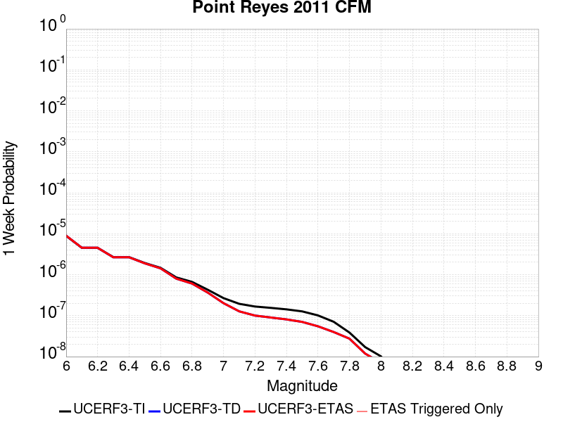 |  | 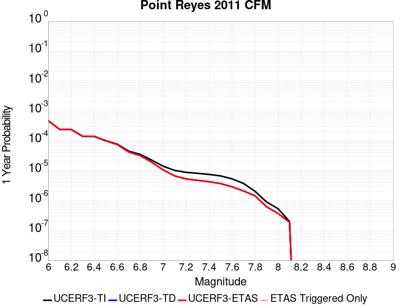 |  |

| Magnitude | 1 wk TI Prob | 1 wk TD Prob | 1 wk ETAS Prob | 1 wk ETAS/TD Gain | 1 wk ETAS Triggered Only | 1 mo TI Prob | 1 mo TD Prob | 1 mo ETAS Prob | 1 mo ETAS/TD Gain | 1 mo ETAS Triggered Only | 1 yr TI Prob | 1 yr TD Prob | 1 yr ETAS Prob | 1 yr ETAS/TD Gain | 1 yr ETAS Triggered Only | 10 yr TI Prob | 10 yr TD Prob | 10 yr ETAS Prob | 10 yr ETAS/TD Gain | 10 yr ETAS Triggered Only |
|-----|-----|-----|-----|-----|-----|-----|-----|-----|-----|-----|-----|-----|-----|-----|-----|-----|-----|-----|-----|-----|
| 6.0 | 8.8644965E-6 | 8.967317E-6 | 8.967317E-6 | 1.0 | 0.0 | 3.7990147E-5 | 3.8430826E-5 | 3.8430826E-5 | 1.0 | 0.0 | 4.624319E-4 | 4.6780115E-4 | 4.6780115E-4 | 1.0 | 0.0 | 0.0046147075 | 0.0046687927 | 0.0046787458 | 1.0021319 | 1.0E-5 |
| 6.1 | 4.526405E-6 | 4.539323E-6 | 4.539323E-6 | 1.0 | 0.0 | 1.9398734E-5 | 1.9454103E-5 | 1.9454103E-5 | 1.0 | 0.0 | 2.36154E-4 | 2.36829E-4 | 2.36829E-4 | 1.0 | 0.0 | 0.002359032 | 0.0023658723 | 0.0023758486 | 1.0042168 | 1.0E-5 |
| 6.2 | 4.526405E-6 | 4.539323E-6 | 4.539323E-6 | 1.0 | 0.0 | 1.9398734E-5 | 1.9454103E-5 | 1.9454103E-5 | 1.0 | 0.0 | 2.36154E-4 | 2.36829E-4 | 2.36829E-4 | 1.0 | 0.0 | 0.002359032 | 0.0023658723 | 0.0023758486 | 1.0042168 | 1.0E-5 |
| 6.3 | 2.6842322E-6 | 2.660761E-6 | 2.660761E-6 | 1.0 | 0.0 | 1.1503801E-5 | 1.1403213E-5 | 1.1403213E-5 | 1.0 | 0.0 | 1.4004979E-4 | 1.3882546E-4 | 1.3882546E-4 | 1.0 | 0.0 | 0.0013996155 | 0.0013874093 | 0.0013874093 | 1.0 | 0.0 |
| 6.4 | 2.6842322E-6 | 2.660761E-6 | 2.660761E-6 | 1.0 | 0.0 | 1.1503801E-5 | 1.1403213E-5 | 1.1403213E-5 | 1.0 | 0.0 | 1.4004979E-4 | 1.3882546E-4 | 1.3882546E-4 | 1.0 | 0.0 | 0.0013996155 | 0.0013874093 | 0.0013874093 | 1.0 | 0.0 |
| 6.5 | 1.9281833E-6 | 1.8907036E-6 | 1.8907036E-6 | 1.0 | 0.0 | 8.263617E-6 | 8.102991E-6 | 8.102991E-6 | 1.0 | 0.0 | 1.0060489E-4 | 9.8649536E-5 | 9.8649536E-5 | 1.0 | 0.0 | 0.0010055936 | 9.860683E-4 | 9.860683E-4 | 1.0 | 0.0 |
| 6.6 | 1.4726726E-6 | 1.4270307E-6 | 1.4270307E-6 | 1.0 | 0.0 | 6.3114385E-6 | 6.1158316E-6 | 6.1158316E-6 | 1.0 | 0.0 | 7.683905E-5 | 7.4457756E-5 | 7.4457756E-5 | 1.0 | 0.0 | 7.6812494E-4 | 7.4433524E-4 | 7.4433524E-4 | 1.0 | 0.0 |
| 6.7 | 8.572307E-7 | 8.0078837E-7 | 8.0078837E-7 | 1.0 | 0.0 | 3.6738406E-6 | 3.4319457E-6 | 3.4319457E-6 | 1.0 | 0.0 | 4.472809E-5 | 4.1783154E-5 | 4.1783154E-5 | 1.0 | 0.0 | 4.471909E-4 | 4.177569E-4 | 4.177569E-4 | 1.0 | 0.0 |
| 6.8 | 6.6745434E-7 | 6.077954E-7 | 6.077954E-7 | 1.0 | 0.0 | 2.8605155E-6 | 2.604835E-6 | 2.604835E-6 | 1.0 | 0.0 | 3.482622E-5 | 3.1713415E-5 | 3.1713415E-5 | 1.0 | 0.0 | 3.4820763E-4 | 3.170922E-4 | 3.170922E-4 | 1.0 | 0.0 |
| 6.9 | 4.291521E-7 | 3.654226E-7 | 3.654226E-7 | 1.0 | 0.0 | 1.839222E-6 | 1.566096E-6 | 1.566096E-6 | 1.0 | 0.0 | 2.2392298E-5 | 1.9067056E-5 | 1.9067056E-5 | 1.0 | 0.0 | 2.2390042E-4 | 1.9065685E-4 | 1.9065685E-4 | 1.0 | 0.0 |
| 7.0 | 2.6812808E-7 | 2.0193588E-7 | 2.0193588E-7 | 1.0 | 0.0 | 1.1491198E-6 | 8.6543923E-7 | 8.6543923E-7 | 1.0 | 0.0 | 1.3990444E-5 | 1.0536672E-5 | 1.0536672E-5 | 1.0 | 0.0 | 1.3989564E-4 | 1.0536407E-4 | 1.0536407E-4 | 1.0 | 0.0 |
| 7.1 | 1.9451231E-7 | 1.2731599E-7 | 1.2731599E-7 | 1.0 | 0.0 | 8.336239E-7 | 5.4563986E-7 | 5.4563986E-7 | 1.0 | 0.0 | 1.0149324E-5 | 6.643145E-6 | 6.643145E-6 | 1.0 | 0.0 | 1.014886E-4 | 6.643174E-5 | 6.643174E-5 | 1.0 | 0.0 |
| 7.2 | 1.6715143E-7 | 1.00488506E-7 | 1.00488506E-7 | 1.0 | 0.0 | 7.1636305E-7 | 4.3066498E-7 | 4.3066498E-7 | 1.0 | 0.0 | 8.721685E-6 | 5.2433334E-6 | 5.2433334E-6 | 1.0 | 0.0 | 8.721343E-5 | 5.243437E-5 | 5.243437E-5 | 1.0 | 0.0 |
| 7.3 | 1.5503173E-7 | 9.019025E-8 | 9.019025E-8 | 1.0 | 0.0 | 6.644215E-7 | 3.865296E-7 | 3.865296E-7 | 1.0 | 0.0 | 8.089301E-6 | 4.7059875E-6 | 4.7059875E-6 | 1.0 | 0.0 | 8.089007E-5 | 4.7061152E-5 | 4.7061152E-5 | 1.0 | 0.0 |
| 7.4 | 1.4251614E-7 | 8.1033846E-8 | 8.1033846E-8 | 1.0 | 0.0 | 6.1078333E-7 | 3.472879E-7 | 3.472879E-7 | 1.0 | 0.0 | 7.4362615E-6 | 4.2282218E-6 | 4.2282218E-6 | 1.0 | 0.0 | 7.436013E-5 | 4.2283686E-5 | 4.2283686E-5 | 1.0 | 0.0 |
| 7.5 | 1.2710186E-7 | 7.035172E-8 | 7.035172E-8 | 1.0 | 0.0 | 5.447221E-7 | 3.0150736E-7 | 3.0150736E-7 | 1.0 | 0.0 | 6.6319717E-6 | 3.670846E-6 | 3.670846E-6 | 1.0 | 0.0 | 6.6317734E-5 | 3.6710124E-5 | 3.6710124E-5 | 1.0 | 0.0 |
| 7.6 | 1.0144708E-7 | 5.5002833E-8 | 5.5002833E-8 | 1.0 | 0.0 | 4.347731E-7 | 2.3572643E-7 | 2.3572643E-7 | 1.0 | 0.0 | 5.2933497E-6 | 2.8699656E-6 | 2.8699656E-6 | 1.0 | 0.0 | 5.293224E-5 | 2.8701557E-5 | 2.8701557E-5 | 1.0 | 0.0 |
| 7.7 | 7.090527E-8 | 3.986544E-8 | 3.986544E-8 | 1.0 | 0.0 | 3.038797E-7 | 1.7085189E-7 | 1.7085189E-7 | 1.0 | 0.0 | 3.699729E-6 | 2.0801199E-6 | 2.0801199E-6 | 1.0 | 0.0 | 3.6996673E-5 | 2.0803276E-5 | 2.0803276E-5 | 1.0 | 0.0 |
| 7.8 | 3.8712045E-8 | 2.7476268E-8 | 2.7476268E-8 | 1.0 | 0.0 | 1.6590876E-7 | 1.1775545E-7 | 1.1775545E-7 | 1.0 | 0.0 | 2.0199373E-6 | 1.4336716E-6 | 1.4336716E-6 | 1.0 | 0.0 | 2.0199188E-5 | 1.4338897E-5 | 1.4338897E-5 | 1.0 | 0.0 |
| 7.9 | 1.7068782E-8 | 1.1862781E-8 | 1.1862781E-8 | 1.0 | 0.0 | 7.315192E-8 | 5.08405E-8 | 5.08405E-8 | 1.0 | 0.0 | 8.906242E-7 | 6.1898294E-7 | 6.1898294E-7 | 1.0 | 0.0 | 8.906207E-6 | 6.1920855E-6 | 6.1920855E-6 | 1.0 | 0.0 |
| 8.0 | 1.0172592E-8 | 7.0528134E-9 | 7.0528134E-9 | 1.0 | 0.0 | 4.359682E-8 | 3.022635E-8 | 3.022635E-8 | 1.0 | 0.0 | 5.3079117E-7 | 3.6800577E-7 | 3.6800577E-7 | 1.0 | 0.0 | 5.307899E-6 | 3.6823246E-6 | 3.6823246E-6 | 1.0 | 0.0 |
| 8.1 | 3.7861243E-9 | 3.5571786E-9 | 3.5571786E-9 | 1.0 | 0.0 | 1.6226247E-8 | 1.5245055E-8 | 1.5245055E-8 | 1.0 | 0.0 | 1.9755454E-7 | 1.8560854E-7 | 1.8560854E-7 | 1.0 | 0.0 | 1.9755437E-6 | 1.8580849E-6 | 1.8580849E-6 | 1.0 | 0.0 |

## Hunting Creek - Berryessa 2011 CFM
*[(top)](#table-of-contents)*

| 1 Week | 1 Month | 1 Year | 10 Year |
|-----|-----|-----|-----|
|  |  |  |  |

| Magnitude | 1 wk TI Prob | 1 wk TD Prob | 1 wk ETAS Prob | 1 wk ETAS/TD Gain | 1 wk ETAS Triggered Only | 1 mo TI Prob | 1 mo TD Prob | 1 mo ETAS Prob | 1 mo ETAS/TD Gain | 1 mo ETAS Triggered Only | 1 yr TI Prob | 1 yr TD Prob | 1 yr ETAS Prob | 1 yr ETAS/TD Gain | 1 yr ETAS Triggered Only | 10 yr TI Prob | 10 yr TD Prob | 10 yr ETAS Prob | 10 yr ETAS/TD Gain | 10 yr ETAS Triggered Only |
|-----|-----|-----|-----|-----|-----|-----|-----|-----|-----|-----|-----|-----|-----|-----|-----|-----|-----|-----|-----|-----|
| 6.0 | 1.1270982E-4 | 2.0017775E-4 | 2.0017775E-4 | 1.0 | 0.0 | 4.8295266E-4 | 8.5742475E-4 | 8.5742475E-4 | 1.0 | 0.0 | 0.0058641075 | 0.010388056 | 0.010388056 | 1.0 | 0.0 | 0.057117578 | 0.09805172 | 0.09806074 | 1.000092 | 1.0E-5 |
| 6.1 | 1.1239393E-4 | 1.9965896E-4 | 1.9965896E-4 | 1.0 | 0.0 | 4.8159933E-4 | 8.552031E-4 | 8.552031E-4 | 1.0 | 0.0 | 0.0058477195 | 0.010361288 | 0.010361288 | 1.0 | 0.0 | 0.056962132 | 0.09781016 | 0.09781918 | 1.0000923 | 1.0E-5 |
| 6.2 | 7.596265E-5 | 1.2940993E-4 | 1.2940993E-4 | 1.0 | 0.0 | 3.2551357E-4 | 5.5426615E-4 | 5.5426615E-4 | 1.0 | 0.0 | 0.0039559277 | 0.006721831 | 0.006721831 | 1.0 | 0.0 | 0.038862433 | 0.064600885 | 0.06461024 | 1.0001448 | 1.0E-5 |
| 6.3 | 6.78794E-5 | 1.1452538E-4 | 1.1452538E-4 | 1.0 | 0.0 | 2.9087928E-4 | 4.9073447E-4 | 4.9073447E-4 | 1.0 | 0.0 | 0.003535705 | 0.0059534037 | 0.0059534037 | 1.0 | 0.0 | 0.034799766 | 0.05747386 | 0.057483286 | 1.000164 | 1.0E-5 |
| 6.4 | 6.2165134E-5 | 1.04393934E-4 | 1.04393934E-4 | 1.0 | 0.0 | 2.6639478E-4 | 4.4732942E-4 | 4.4732942E-4 | 1.0 | 0.0 | 0.0032385332 | 0.0054282364 | 0.0054282364 | 1.0 | 0.0 | 0.03191742 | 0.052558403 | 0.052567877 | 1.0001802 | 1.0E-5 |
| 6.5 | 5.4368087E-5 | 9.073724E-5 | 9.073724E-5 | 1.0 | 0.0 | 2.3298527E-4 | 3.8881917E-4 | 3.8881917E-4 | 1.0 | 0.0 | 0.0028329059 | 0.004720476 | 0.004720476 | 1.0 | 0.0 | 0.027970633 | 0.04588709 | 0.04589663 | 1.0002079 | 1.0E-5 |
| 6.6 | 4.729947E-5 | 7.849487E-5 | 7.849487E-5 | 1.0 | 0.0 | 2.0269625E-4 | 3.3636627E-4 | 3.3636627E-4 | 1.0 | 0.0 | 0.002465034 | 0.0040854933 | 0.0040854933 | 1.0 | 0.0 | 0.02437869 | 0.039857663 | 0.039867267 | 1.0002409 | 1.0E-5 |
| 6.7 | 3.6875328E-5 | 6.0465416E-5 | 6.0465416E-5 | 1.0 | 0.0 | 1.5802756E-4 | 2.5911423E-4 | 2.5911423E-4 | 1.0 | 0.0 | 0.0019222875 | 0.0031486591 | 0.0031486591 | 1.0 | 0.0 | 0.019057442 | 0.030897204 | 0.030906895 | 1.0003136 | 1.0E-5 |
| 6.8 | 2.0292036E-5 | 2.897928E-5 | 2.897928E-5 | 1.0 | 0.0 | 8.6962966E-5 | 1.2419096E-4 | 1.2419096E-4 | 1.0 | 0.0 | 0.0010582599 | 0.0015109582 | 0.0015109582 | 1.0 | 0.0 | 0.010532344 | 0.014980009 | 0.014980009 | 1.0 | 0.0 |
| 6.9 | 1.7871042E-5 | 2.4474773E-5 | 2.4474773E-5 | 1.0 | 0.0 | 7.658793E-5 | 1.0488762E-4 | 1.0488762E-4 | 1.0 | 0.0 | 9.320591E-4 | 0.0012762607 | 0.0012762607 | 1.0 | 0.0 | 0.009281595 | 0.01268106 | 0.01268106 | 1.0 | 0.0 |
| 7.0 | 1.6415532E-5 | 2.1908601E-5 | 2.1908601E-5 | 1.0 | 0.0 | 7.035038E-5 | 9.3890645E-5 | 9.3890645E-5 | 1.0 | 0.0 | 8.561793E-4 | 0.0011425226 | 0.0011425226 | 1.0 | 0.0 | 0.008528882 | 0.011365713 | 0.011365713 | 1.0 | 0.0 |
| 7.1 | 1.5409885E-5 | 2.034855E-5 | 2.034855E-5 | 1.0 | 0.0 | 6.6040695E-5 | 8.720518E-5 | 8.720518E-5 | 1.0 | 0.0 | 8.0374884E-4 | 0.0010612089 | 0.0010612089 | 1.0 | 0.0 | 0.00800848 | 0.010561734 | 0.010561734 | 1.0 | 0.0 |
| 7.2 | 1.4497423E-5 | 1.905703E-5 | 1.905703E-5 | 1.0 | 0.0 | 6.213033E-5 | 8.167045E-5 | 8.167045E-5 | 1.0 | 0.0 | 7.5617427E-4 | 9.938872E-4 | 9.938872E-4 | 1.0 | 0.0 | 0.0075360634 | 0.009894996 | 0.009894996 | 1.0 | 0.0 |
| 7.3 | 1.3615175E-5 | 1.7828126E-5 | 1.7828126E-5 | 1.0 | 0.0 | 5.8349444E-5 | 7.640403E-5 | 7.640403E-5 | 1.0 | 0.0 | 7.101729E-4 | 9.2982507E-4 | 9.2982507E-4 | 1.0 | 0.0 | 0.0070790765 | 0.009259855 | 0.009259855 | 1.0 | 0.0 |
| 7.4 | 1.2252825E-5 | 1.6028054E-5 | 1.6028054E-5 | 1.0 | 0.0 | 5.251105E-5 | 6.8689864E-5 | 6.8689864E-5 | 1.0 | 0.0 | 6.391345E-4 | 8.3598105E-4 | 8.3598105E-4 | 1.0 | 0.0 | 0.0063729943 | 0.008328805 | 0.008328805 | 1.0 | 0.0 |
| 7.5 | 1.0913301E-5 | 1.4242686E-5 | 1.4242686E-5 | 1.0 | 0.0 | 4.6770452E-5 | 6.103867E-5 | 6.103867E-5 | 1.0 | 0.0 | 5.6928146E-4 | 7.428952E-4 | 7.428952E-4 | 1.0 | 0.0 | 0.0056782532 | 0.0074044922 | 0.0074044922 | 1.0 | 0.0 |
| 7.6 | 8.623192E-6 | 1.1235767E-5 | 1.1235767E-5 | 1.0 | 0.0 | 3.6956015E-5 | 4.815241E-5 | 4.815241E-5 | 1.0 | 0.0 | 4.4984656E-4 | 5.861005E-4 | 5.861005E-4 | 1.0 | 0.0 | 0.00448937 | 0.005845862 | 0.005845862 | 1.0 | 0.0 |
| 7.7 | 2.0993634E-6 | 2.6627938E-6 | 2.6627938E-6 | 1.0 | 0.0 | 8.997241E-6 | 1.1411924E-5 | 1.1411924E-5 | 1.0 | 0.0 | 1.09535904E-4 | 1.3893138E-4 | 1.3893138E-4 | 1.0 | 0.0 | 0.0010948193 | 0.0013884519 | 0.0013884519 | 1.0 | 0.0 |
| 7.8 | 1.8428308E-7 | 2.1675888E-7 | 2.1675888E-7 | 1.0 | 0.0 | 7.897844E-7 | 9.289663E-7 | 9.289663E-7 | 1.0 | 0.0 | 9.615583E-6 | 1.131011E-5 | 1.131011E-5 | 1.0 | 0.0 | 9.615166E-5 | 1.1309395E-4 | 1.1309395E-4 | 1.0 | 0.0 |

## Santa Susana East (connector)
*[(top)](#table-of-contents)*

| 1 Week | 1 Month | 1 Year | 10 Year |
|-----|-----|-----|-----|
|  |  |  |  |

| Magnitude | 1 wk TI Prob | 1 wk TD Prob | 1 wk ETAS Prob | 1 wk ETAS/TD Gain | 1 wk ETAS Triggered Only | 1 mo TI Prob | 1 mo TD Prob | 1 mo ETAS Prob | 1 mo ETAS/TD Gain | 1 mo ETAS Triggered Only | 1 yr TI Prob | 1 yr TD Prob | 1 yr ETAS Prob | 1 yr ETAS/TD Gain | 1 yr ETAS Triggered Only | 10 yr TI Prob | 10 yr TD Prob | 10 yr ETAS Prob | 10 yr ETAS/TD Gain | 10 yr ETAS Triggered Only |
|-----|-----|-----|-----|-----|-----|-----|-----|-----|-----|-----|-----|-----|-----|-----|-----|-----|-----|-----|-----|-----|
| 6.0 | 2.858397E-5 | 3.202459E-5 | 3.202459E-5 | 1.0 | 0.0 | 1.2249697E-4 | 1.372426E-4 | 1.372426E-4 | 1.0 | 0.0 | 0.0014903803 | 0.0016699297 | 0.001679913 | 1.0059782 | 1.0E-5 | 0.014804244 | 0.016600922 | 0.016610755 | 1.0005924 | 1.0E-5 |
| 6.1 | 2.858397E-5 | 3.202459E-5 | 3.202459E-5 | 1.0 | 0.0 | 1.2249697E-4 | 1.372426E-4 | 1.372426E-4 | 1.0 | 0.0 | 0.0014903803 | 0.0016699297 | 0.001679913 | 1.0059782 | 1.0E-5 | 0.014804244 | 0.016600922 | 0.016610755 | 1.0005924 | 1.0E-5 |
| 6.2 | 2.858397E-5 | 3.202459E-5 | 3.202459E-5 | 1.0 | 0.0 | 1.2249697E-4 | 1.372426E-4 | 1.372426E-4 | 1.0 | 0.0 | 0.0014903803 | 0.0016699297 | 0.001679913 | 1.0059782 | 1.0E-5 | 0.014804244 | 0.016600922 | 0.016610755 | 1.0005924 | 1.0E-5 |
| 6.3 | 1.943582E-5 | 2.0369158E-5 | 2.0369158E-5 | 1.0 | 0.0 | 8.329371E-5 | 8.729411E-5 | 8.729411E-5 | 1.0 | 0.0 | 0.001013629 | 0.0010623998 | 0.0010723892 | 1.0094026 | 1.0E-5 | 0.010090181 | 0.010584643 | 0.010594537 | 1.0009347 | 1.0E-5 |
| 6.4 | 1.943582E-5 | 2.0369158E-5 | 2.0369158E-5 | 1.0 | 0.0 | 8.329371E-5 | 8.729411E-5 | 8.729411E-5 | 1.0 | 0.0 | 0.001013629 | 0.0010623998 | 0.0010723892 | 1.0094026 | 1.0E-5 | 0.010090181 | 0.010584643 | 0.010594537 | 1.0009347 | 1.0E-5 |
| 6.5 | 1.943582E-5 | 2.0369158E-5 | 2.0369158E-5 | 1.0 | 0.0 | 8.329371E-5 | 8.729411E-5 | 8.729411E-5 | 1.0 | 0.0 | 0.001013629 | 0.0010623998 | 0.0010723892 | 1.0094026 | 1.0E-5 | 0.010090181 | 0.010584643 | 0.010594537 | 1.0009347 | 1.0E-5 |
| 6.6 | 1.943582E-5 | 2.0369158E-5 | 2.0369158E-5 | 1.0 | 0.0 | 8.329371E-5 | 8.729411E-5 | 8.729411E-5 | 1.0 | 0.0 | 0.001013629 | 0.0010623998 | 0.0010723892 | 1.0094026 | 1.0E-5 | 0.010090181 | 0.010584643 | 0.010594537 | 1.0009347 | 1.0E-5 |
| 6.7 | 1.9404439E-5 | 2.0356578E-5 | 2.0356578E-5 | 1.0 | 0.0 | 8.3159226E-5 | 8.7240194E-5 | 8.7240194E-5 | 1.0 | 0.0 | 0.0010119933 | 0.001061744 | 0.0010717334 | 1.0094085 | 1.0E-5 | 0.010073971 | 0.010578148 | 0.010588042 | 1.0009353 | 1.0E-5 |
| 6.8 | 1.2217526E-5 | 1.1593805E-5 | 1.1593805E-5 | 1.0 | 0.0 | 5.2359774E-5 | 4.9686885E-5 | 4.9686885E-5 | 1.0 | 0.0 | 6.372938E-4 | 6.0478674E-4 | 6.147807E-4 | 1.0165248 | 1.0E-5 | 0.0063546924 | 0.006033456 | 0.0060433955 | 1.0016475 | 1.0E-5 |
| 6.9 | 1.2217526E-5 | 1.1593805E-5 | 1.1593805E-5 | 1.0 | 0.0 | 5.2359774E-5 | 4.9686885E-5 | 4.9686885E-5 | 1.0 | 0.0 | 6.372938E-4 | 6.0478674E-4 | 6.147807E-4 | 1.0165248 | 1.0E-5 | 0.0063546924 | 0.006033456 | 0.0060433955 | 1.0016475 | 1.0E-5 |
| 7.0 | 9.276017E-6 | 8.059524E-6 | 8.059524E-6 | 1.0 | 0.0 | 3.9753755E-5 | 3.4540375E-5 | 3.4540375E-5 | 1.0 | 0.0 | 4.8389446E-4 | 4.204514E-4 | 4.304472E-4 | 1.0237739 | 1.0E-5 | 0.0048284214 | 0.0041972855 | 0.0042072437 | 1.0023725 | 1.0E-5 |
| 7.1 | 9.130355E-6 | 7.942689E-6 | 7.942689E-6 | 1.0 | 0.0 | 3.9129503E-5 | 3.4039673E-5 | 3.4039673E-5 | 1.0 | 0.0 | 4.7629757E-4 | 4.1435764E-4 | 4.243535E-4 | 1.0241238 | 1.0E-5 | 0.00475278 | 0.0041365763 | 0.004146535 | 1.0024074 | 1.0E-5 |
| 7.2 | 8.851015E-6 | 7.74184E-6 | 7.74184E-6 | 1.0 | 0.0 | 3.7932372E-5 | 3.317891E-5 | 3.317891E-5 | 1.0 | 0.0 | 4.6172875E-4 | 4.0388177E-4 | 4.1387771E-4 | 1.0247498 | 1.0E-5 | 0.0046077054 | 0.0040322007 | 0.00404216 | 1.00247 | 1.0E-5 |
| 7.3 | 8.573006E-6 | 7.55055E-6 | 7.55055E-6 | 1.0 | 0.0 | 3.6740938E-5 | 3.235912E-5 | 3.235912E-5 | 1.0 | 0.0 | 4.472291E-4 | 3.9390445E-4 | 4.039005E-4 | 1.0253769 | 1.0E-5 | 0.004463301 | 0.00393278 | 0.0039427406 | 1.0025327 | 1.0E-5 |
| 7.4 | 7.852282E-6 | 6.8180075E-6 | 6.8180075E-6 | 1.0 | 0.0 | 3.36522E-5 | 2.9219722E-5 | 2.9219722E-5 | 1.0 | 0.0 | 4.096385E-4 | 3.5569505E-4 | 3.6569152E-4 | 1.028104 | 1.0E-5 | 0.0040888423 | 0.003551922 | 0.0035618865 | 1.0028054 | 1.0E-5 |
| 7.5 | 4.8869324E-6 | 4.2792326E-6 | 4.2792326E-6 | 1.0 | 0.0 | 2.0943828E-5 | 1.833945E-5 | 1.833945E-5 | 1.0 | 0.0 | 2.5496128E-4 | 2.2326158E-4 | 2.3325934E-4 | 1.0447805 | 1.0E-5 | 0.0025466895 | 0.0022305371 | 0.0022405148 | 1.0044732 | 1.0E-5 |
| 7.6 | 1.3894544E-6 | 1.1568486E-6 | 1.1568486E-6 | 1.0 | 0.0 | 5.954791E-6 | 4.9579144E-6 | 4.9579144E-6 | 1.0 | 0.0 | 7.249717E-5 | 6.0361155E-5 | 6.0361155E-5 | 1.0 | 0.0 | 7.247352E-4 | 6.0346944E-4 | 6.0346944E-4 | 1.0 | 0.0 |
| 7.7 | 2.9924632E-7 | 2.3720673E-7 | 2.3720673E-7 | 1.0 | 0.0 | 1.2824837E-6 | 1.0166E-6 | 1.0166E-6 | 1.0 | 0.0 | 1.5614127E-5 | 1.23770415E-5 | 1.23770415E-5 | 1.0 | 0.0 | 1.5613029E-4 | 1.2376424E-4 | 1.2376424E-4 | 1.0 | 0.0 |
| 7.8 | 4.8188564E-8 | 2.6328815E-8 | 2.6328815E-8 | 1.0 | 0.0 | 2.065224E-7 | 1.12837775E-7 | 1.12837775E-7 | 1.0 | 0.0 | 2.5144072E-6 | 1.3737991E-6 | 1.3737991E-6 | 1.0 | 0.0 | 2.5143789E-5 | 1.3737915E-5 | 1.3737915E-5 | 1.0 | 0.0 |
| 7.9 | 2.6127251E-9 | 2.7681977E-9 | 2.7681977E-9 | 1.0 | 0.0 | 1.1197393E-8 | 1.1863704E-8 | 1.1863704E-8 | 1.0 | 0.0 | 1.3632825E-7 | 1.4444059E-7 | 1.4444059E-7 | 1.0 | 0.0 | 1.3632817E-6 | 1.4444059E-6 | 1.4444059E-6 | 1.0 | 0.0 |

## Monte Vista - Shannon 2011 CFM
*[(top)](#table-of-contents)*

| 1 Week | 1 Month | 1 Year | 10 Year |
|-----|-----|-----|-----|
|  |  | 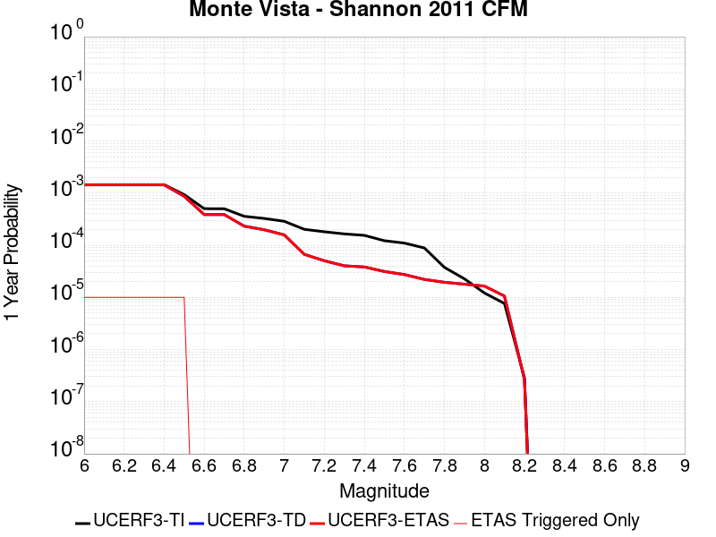 |  |

| Magnitude | 1 wk TI Prob | 1 wk TD Prob | 1 wk ETAS Prob | 1 wk ETAS/TD Gain | 1 wk ETAS Triggered Only | 1 mo TI Prob | 1 mo TD Prob | 1 mo ETAS Prob | 1 mo ETAS/TD Gain | 1 mo ETAS Triggered Only | 1 yr TI Prob | 1 yr TD Prob | 1 yr ETAS Prob | 1 yr ETAS/TD Gain | 1 yr ETAS Triggered Only | 10 yr TI Prob | 10 yr TD Prob | 10 yr ETAS Prob | 10 yr ETAS/TD Gain | 10 yr ETAS Triggered Only |
|-----|-----|-----|-----|-----|-----|-----|-----|-----|-----|-----|-----|-----|-----|-----|-----|-----|-----|-----|-----|-----|
| 6.0 | 2.7907707E-5 | 2.75877E-5 | 2.75877E-5 | 1.0 | 0.0 | 1.19598975E-4 | 1.1822833E-4 | 1.1822833E-4 | 1.0 | 0.0 | 0.0014551448 | 0.0014386033 | 0.0014485888 | 1.0069412 | 1.0E-5 | 0.014456532 | 0.014322008 | 0.014331864 | 1.0006882 | 1.0E-5 |
| 6.1 | 2.7907707E-5 | 2.75877E-5 | 2.75877E-5 | 1.0 | 0.0 | 1.19598975E-4 | 1.1822833E-4 | 1.1822833E-4 | 1.0 | 0.0 | 0.0014551448 | 0.0014386033 | 0.0014485888 | 1.0069412 | 1.0E-5 | 0.014456532 | 0.014322008 | 0.014331864 | 1.0006882 | 1.0E-5 |
| 6.2 | 2.7907707E-5 | 2.75877E-5 | 2.75877E-5 | 1.0 | 0.0 | 1.19598975E-4 | 1.1822833E-4 | 1.1822833E-4 | 1.0 | 0.0 | 0.0014551448 | 0.0014386033 | 0.0014485888 | 1.0069412 | 1.0E-5 | 0.014456532 | 0.014322008 | 0.014331864 | 1.0006882 | 1.0E-5 |
| 6.3 | 2.7907707E-5 | 2.75877E-5 | 2.75877E-5 | 1.0 | 0.0 | 1.19598975E-4 | 1.1822833E-4 | 1.1822833E-4 | 1.0 | 0.0 | 0.0014551448 | 0.0014386033 | 0.0014485888 | 1.0069412 | 1.0E-5 | 0.014456532 | 0.014322008 | 0.014331864 | 1.0006882 | 1.0E-5 |
| 6.4 | 2.7907707E-5 | 2.75877E-5 | 2.75877E-5 | 1.0 | 0.0 | 1.19598975E-4 | 1.1822833E-4 | 1.1822833E-4 | 1.0 | 0.0 | 0.0014551448 | 0.0014386033 | 0.0014485888 | 1.0069412 | 1.0E-5 | 0.014456532 | 0.014322008 | 0.014331864 | 1.0006882 | 1.0E-5 |
| 6.5 | 1.7990213E-5 | 1.6642773E-5 | 1.6642773E-5 | 1.0 | 0.0 | 7.709863E-5 | 7.132459E-5 | 7.132459E-5 | 1.0 | 0.0 | 9.382716E-4 | 8.680973E-4 | 8.780886E-4 | 1.0115094 | 1.0E-5 | 0.0093431985 | 0.008670452 | 0.008680365 | 1.0011433 | 1.0E-5 |
| 6.6 | 9.650407E-6 | 7.4595387E-6 | 7.4595387E-6 | 1.0 | 0.0 | 4.135823E-5 | 3.1969106E-5 | 3.1969106E-5 | 1.0 | 0.0 | 5.0342013E-4 | 3.8916216E-4 | 3.8916216E-4 | 1.0 | 0.0 | 0.005022812 | 0.0039025035 | 0.0039025035 | 1.0 | 0.0 |
| 6.7 | 9.62828E-6 | 7.4374507E-6 | 7.4374507E-6 | 1.0 | 0.0 | 4.1263404E-5 | 3.1874442E-5 | 3.1874442E-5 | 1.0 | 0.0 | 5.022661E-4 | 3.8801008E-4 | 3.8801008E-4 | 1.0 | 0.0 | 0.0050113243 | 0.003891023 | 0.003891023 | 1.0 | 0.0 |
| 6.8 | 6.887523E-6 | 4.463821E-6 | 4.463821E-6 | 1.0 | 0.0 | 2.9517621E-5 | 1.9130533E-5 | 1.9130533E-5 | 1.0 | 0.0 | 3.5931775E-4 | 2.3289157E-4 | 2.3289157E-4 | 1.0 | 0.0 | 0.0035873733 | 0.0023436449 | 0.0023436449 | 1.0 | 0.0 |
| 6.9 | 6.2722347E-6 | 3.805659E-6 | 3.805659E-6 | 1.0 | 0.0 | 2.6880729E-5 | 1.6309876E-5 | 1.6309876E-5 | 1.0 | 0.0 | 3.2722374E-4 | 1.9855668E-4 | 1.9855668E-4 | 1.0 | 0.0 | 0.003267423 | 0.0020009486 | 0.0020009486 | 1.0 | 0.0 |
| 7.0 | 5.5320347E-6 | 3.0327608E-6 | 3.0327608E-6 | 1.0 | 0.0 | 2.3708504E-5 | 1.29974915E-5 | 1.29974915E-5 | 1.0 | 0.0 | 2.8861282E-4 | 1.582348E-4 | 1.582348E-4 | 1.0 | 0.0 | 0.0028823826 | 0.0015983633 | 0.0015983633 | 1.0 | 0.0 |
| 7.1 | 3.8794055E-6 | 1.285852E-6 | 1.285852E-6 | 1.0 | 0.0 | 1.6625918E-5 | 5.510783E-6 | 5.510783E-6 | 1.0 | 0.0 | 2.0240174E-4 | 6.709173E-5 | 6.709173E-5 | 1.0 | 0.0 | 0.002022175 | 6.876822E-4 | 6.876822E-4 | 1.0 | 0.0 |
| 7.2 | 3.4813652E-6 | 9.690727E-7 | 9.690727E-7 | 1.0 | 0.0 | 1.49200505E-5 | 4.153162E-6 | 4.153162E-6 | 1.0 | 0.0 | 1.8163648E-4 | 5.0563587E-5 | 5.0563587E-5 | 1.0 | 0.0 | 0.0018148809 | 5.22476E-4 | 5.22476E-4 | 1.0 | 0.0 |
| 7.3 | 3.1682148E-6 | 7.7381594E-7 | 7.7381594E-7 | 1.0 | 0.0 | 1.3577992E-5 | 3.3163496E-6 | 3.3163496E-6 | 1.0 | 0.0 | 1.6529951E-4 | 4.0375813E-5 | 4.0375813E-5 | 1.0 | 0.0 | 0.0016517661 | 4.2061496E-4 | 4.2061496E-4 | 1.0 | 0.0 |
| 7.4 | 2.9707667E-6 | 7.3642167E-7 | 7.3642167E-7 | 1.0 | 0.0 | 1.2731795E-5 | 3.1560892E-6 | 3.1560892E-6 | 1.0 | 0.0 | 1.5499859E-4 | 3.842471E-5 | 3.842471E-5 | 1.0 | 0.0 | 0.0015489052 | 4.0090227E-4 | 4.0090227E-4 | 1.0 | 0.0 |
| 7.5 | 2.3462758E-6 | 6.023677E-7 | 6.023677E-7 | 1.0 | 0.0 | 1.0055429E-5 | 2.5815734E-6 | 2.5815734E-6 | 1.0 | 0.0 | 1.2241797E-4 | 3.1430205E-5 | 3.1430205E-5 | 1.0 | 0.0 | 0.0012235056 | 3.2923152E-4 | 3.2923152E-4 | 1.0 | 0.0 |
| 7.6 | 2.112783E-6 | 5.266409E-7 | 5.266409E-7 | 1.0 | 0.0 | 9.054753E-6 | 2.2570305E-6 | 2.2570305E-6 | 1.0 | 0.0 | 1.1023604E-4 | 2.7479E-5 | 2.7479E-5 | 1.0 | 0.0 | 0.0011018137 | 2.8929894E-4 | 2.8929894E-4 | 1.0 | 0.0 |
| 7.7 | 1.7022471E-6 | 4.2444987E-7 | 4.2444987E-7 | 1.0 | 0.0 | 7.2953244E-6 | 1.8190696E-6 | 1.8190696E-6 | 1.0 | 0.0 | 8.881695E-5 | 2.2146949E-5 | 2.2146949E-5 | 1.0 | 0.0 | 8.878146E-4 | 2.3466849E-4 | 2.3466849E-4 | 1.0 | 0.0 |
| 7.8 | 7.230914E-7 | 3.7402418E-7 | 3.7402418E-7 | 1.0 | 0.0 | 3.0989595E-6 | 1.6029599E-6 | 1.6029599E-6 | 1.0 | 0.0 | 3.772918E-5 | 1.9515863E-5 | 1.9515863E-5 | 1.0 | 0.0 | 3.7722773E-4 | 2.0788297E-4 | 2.0788297E-4 | 1.0 | 0.0 |
| 7.9 | 4.3588446E-7 | 3.4407202E-7 | 3.4407202E-7 | 1.0 | 0.0 | 1.868075E-6 | 1.4745935E-6 | 1.4745935E-6 | 1.0 | 0.0 | 2.2743576E-5 | 1.795303E-5 | 1.795303E-5 | 1.0 | 0.0 | 2.2741247E-4 | 1.9048195E-4 | 1.9048195E-4 | 1.0 | 0.0 |
| 8.0 | 2.3317523E-7 | 3.1602372E-7 | 3.1602372E-7 | 1.0 | 0.0 | 9.99322E-7 | 1.3543867E-6 | 1.3543867E-6 | 1.0 | 0.0 | 1.2166677E-5 | 1.6489534E-5 | 1.6489534E-5 | 1.0 | 0.0 | 1.21660116E-4 | 1.7445331E-4 | 1.7445331E-4 | 1.0 | 0.0 |
| 8.1 | 1.4662456E-7 | 2.0360646E-7 | 2.0360646E-7 | 1.0 | 0.0 | 6.283908E-7 | 8.725988E-7 | 8.725988E-7 | 1.0 | 0.0 | 7.650631E-6 | 1.0623839E-5 | 1.0623839E-5 | 1.0 | 0.0 | 7.650368E-5 | 1.1159559E-4 | 1.1159559E-4 | 1.0 | 0.0 |
| 8.2 | 5.4931775E-9 | 5.089579E-9 | 5.089579E-9 | 1.0 | 0.0 | 2.3542189E-8 | 2.181248E-8 | 2.181248E-8 | 1.0 | 0.0 | 2.8662612E-7 | 2.6556694E-7 | 2.6556694E-7 | 1.0 | 0.0 | 2.8662573E-6 | 2.7612602E-6 | 2.7612602E-6 | 1.0 | 0.0 |

## Elsinore (Julian)
*[(top)](#table-of-contents)*

| 1 Week | 1 Month | 1 Year | 10 Year |
|-----|-----|-----|-----|
|  |  |  |  |

| Magnitude | 1 wk TI Prob | 1 wk TD Prob | 1 wk ETAS Prob | 1 wk ETAS/TD Gain | 1 wk ETAS Triggered Only | 1 mo TI Prob | 1 mo TD Prob | 1 mo ETAS Prob | 1 mo ETAS/TD Gain | 1 mo ETAS Triggered Only | 1 yr TI Prob | 1 yr TD Prob | 1 yr ETAS Prob | 1 yr ETAS/TD Gain | 1 yr ETAS Triggered Only | 10 yr TI Prob | 10 yr TD Prob | 10 yr ETAS Prob | 10 yr ETAS/TD Gain | 10 yr ETAS Triggered Only |
|-----|-----|-----|-----|-----|-----|-----|-----|-----|-----|-----|-----|-----|-----|-----|-----|-----|-----|-----|-----|-----|
| 6.0 | 1.1710231E-5 | 8.8468905E-6 | 1.8846802E-5 | 2.1303306 | 1.0E-5 | 5.0185736E-5 | 3.7914702E-5 | 4.7914324E-5 | 1.26374 | 1.0E-5 | 6.1084004E-4 | 4.6151542E-4 | 4.715108E-4 | 1.0216577 | 1.0E-5 | 0.006091637 | 0.0046057743 | 0.0046157283 | 1.0021611 | 1.0E-5 |
| 6.1 | 1.1710231E-5 | 8.8468905E-6 | 1.8846802E-5 | 2.1303306 | 1.0E-5 | 5.0185736E-5 | 3.7914702E-5 | 4.7914324E-5 | 1.26374 | 1.0E-5 | 6.1084004E-4 | 4.6151542E-4 | 4.715108E-4 | 1.0216577 | 1.0E-5 | 0.006091637 | 0.0046057743 | 0.0046157283 | 1.0021611 | 1.0E-5 |
| 6.2 | 1.1710231E-5 | 8.8468905E-6 | 1.8846802E-5 | 2.1303306 | 1.0E-5 | 5.0185736E-5 | 3.7914702E-5 | 4.7914324E-5 | 1.26374 | 1.0E-5 | 6.1084004E-4 | 4.6151542E-4 | 4.715108E-4 | 1.0216577 | 1.0E-5 | 0.006091637 | 0.0046057743 | 0.0046157283 | 1.0021611 | 1.0E-5 |
| 6.3 | 1.1710231E-5 | 8.8468905E-6 | 1.8846802E-5 | 2.1303306 | 1.0E-5 | 5.0185736E-5 | 3.7914702E-5 | 4.7914324E-5 | 1.26374 | 1.0E-5 | 6.1084004E-4 | 4.6151542E-4 | 4.715108E-4 | 1.0216577 | 1.0E-5 | 0.006091637 | 0.0046057743 | 0.0046157283 | 1.0021611 | 1.0E-5 |
| 6.4 | 1.1710231E-5 | 8.8468905E-6 | 1.8846802E-5 | 2.1303306 | 1.0E-5 | 5.0185736E-5 | 3.7914702E-5 | 4.7914324E-5 | 1.26374 | 1.0E-5 | 6.1084004E-4 | 4.6151542E-4 | 4.715108E-4 | 1.0216577 | 1.0E-5 | 0.006091637 | 0.0046057743 | 0.0046157283 | 1.0021611 | 1.0E-5 |
| 6.5 | 1.1710231E-5 | 8.8468905E-6 | 1.8846802E-5 | 2.1303306 | 1.0E-5 | 5.0185736E-5 | 3.7914702E-5 | 4.7914324E-5 | 1.26374 | 1.0E-5 | 6.1084004E-4 | 4.6151542E-4 | 4.715108E-4 | 1.0216577 | 1.0E-5 | 0.006091637 | 0.0046057743 | 0.0046157283 | 1.0021611 | 1.0E-5 |
| 6.6 | 1.1650619E-5 | 8.779259E-6 | 1.8779172E-5 | 2.1390383 | 1.0E-5 | 4.993027E-5 | 3.762486E-5 | 4.7624486E-5 | 1.2657717 | 1.0E-5 | 6.0773146E-4 | 4.579881E-4 | 4.679835E-4 | 1.0218246 | 1.0E-5 | 0.0060607214 | 0.0045706467 | 0.004580601 | 1.0021778 | 1.0E-5 |
| 6.7 | 1.1650619E-5 | 8.779259E-6 | 1.8779172E-5 | 2.1390383 | 1.0E-5 | 4.993027E-5 | 3.762486E-5 | 4.7624486E-5 | 1.2657717 | 1.0E-5 | 6.0773146E-4 | 4.579881E-4 | 4.679835E-4 | 1.0218246 | 1.0E-5 | 0.0060607214 | 0.0045706467 | 0.004580601 | 1.0021778 | 1.0E-5 |
| 6.8 | 1.1442698E-5 | 8.562408E-6 | 1.8562323E-5 | 2.1678858 | 1.0E-5 | 4.9039216E-5 | 3.669553E-5 | 4.669516E-5 | 1.2725028 | 1.0E-5 | 5.968889E-4 | 4.466781E-4 | 4.5667365E-4 | 1.0223775 | 1.0E-5 | 0.0059528816 | 0.004458005 | 0.0044679604 | 1.0022331 | 1.0E-5 |
| 6.9 | 1.1300589E-5 | 8.410266E-6 | 1.8410183E-5 | 2.189013 | 1.0E-5 | 4.8430196E-5 | 3.6043508E-5 | 4.6043147E-5 | 1.2774324 | 1.0E-5 | 5.894781E-4 | 4.38743E-4 | 4.4873863E-4 | 1.0227824 | 1.0E-5 | 0.005879169 | 0.0043789684 | 0.004388924 | 1.0022737 | 1.0E-5 |
| 7.0 | 1.1117729E-5 | 8.227431E-6 | 1.8227349E-5 | 2.2154362 | 1.0E-5 | 4.764654E-5 | 3.5259953E-5 | 4.52596E-5 | 1.2835978 | 1.0E-5 | 5.799422E-4 | 4.29207E-4 | 4.392027E-4 | 1.0232887 | 1.0E-5 | 0.0057843104 | 0.004283979 | 0.0042939363 | 1.0023242 | 1.0E-5 |
| 7.1 | 1.08053955E-5 | 7.913079E-6 | 1.7913E-5 | 2.2637205 | 1.0E-5 | 4.6308014E-5 | 3.3912762E-5 | 4.3912423E-5 | 1.2948642 | 1.0E-5 | 5.6365423E-4 | 4.1281132E-4 | 4.2280718E-4 | 1.0242141 | 1.0E-5 | 0.005622267 | 0.0041206405 | 0.004130599 | 1.0024168 | 1.0E-5 |
| 7.2 | 1.032804E-5 | 7.434323E-6 | 1.7434248E-5 | 2.3451023 | 1.0E-5 | 4.4262277E-5 | 3.1861004E-5 | 4.1860683E-5 | 1.3138533 | 1.0E-5 | 5.387599E-4 | 3.8784023E-4 | 3.9783635E-4 | 1.0257738 | 1.0E-5 | 0.0053745564 | 0.0038718213 | 0.0038817825 | 1.0025728 | 1.0E-5 |
| 7.3 | 9.622426E-6 | 6.8990403E-6 | 1.6898972E-5 | 2.449467 | 1.0E-5 | 4.1238312E-5 | 2.9566989E-5 | 3.9566694E-5 | 1.338205 | 1.0E-5 | 5.019608E-4 | 3.5992003E-4 | 3.6991644E-4 | 1.027774 | 1.0E-5 | 0.005008285 | 0.003593543 | 0.0036035073 | 1.0027728 | 1.0E-5 |
| 7.4 | 9.144434E-6 | 6.4974984E-6 | 1.6497434E-5 | 2.539044 | 1.0E-5 | 3.9189843E-5 | 2.7846132E-5 | 3.7845854E-5 | 1.3591063 | 1.0E-5 | 4.7703186E-4 | 3.389753E-4 | 3.4897192E-4 | 1.0294907 | 1.0E-5 | 0.0047600917 | 0.0033847261 | 0.0033946922 | 1.0029445 | 1.0E-5 |
| 7.5 | 7.988981E-6 | 5.4992083E-6 | 1.5499154E-5 | 2.8184335 | 1.0E-5 | 3.4238044E-5 | 2.3567829E-5 | 3.3567594E-5 | 1.4242972 | 1.0E-5 | 4.1676845E-4 | 2.869018E-4 | 2.9689894E-4 | 1.0348451 | 1.0E-5 | 0.0041598766 | 0.0028654416 | 0.0028754128 | 1.0034798 | 1.0E-5 |
| 7.6 | 6.9554876E-6 | 4.6633018E-6 | 1.4663256E-5 | 3.1443932 | 1.0E-5 | 2.9808893E-5 | 1.9985433E-5 | 2.9985233E-5 | 1.5003544 | 1.0E-5 | 3.6286283E-4 | 2.4329666E-4 | 2.5329422E-4 | 1.041092 | 1.0E-5 | 0.0036227088 | 0.0024304192 | 0.0024403948 | 1.0041045 | 1.0E-5 |
| 7.7 | 4.1557314E-6 | 2.325099E-6 | 2.325099E-6 | 1.0 | 0.0 | 1.7810156E-5 | 9.964677E-6 | 9.964677E-6 | 1.0 | 0.0 | 2.1681708E-4 | 1.21313926E-4 | 1.21313926E-4 | 1.0 | 0.0 | 0.0021660565 | 0.0012125501 | 0.0012125501 | 1.0 | 0.0 |
| 7.8 | 2.2597293E-7 | 9.334826E-8 | 9.334826E-8 | 1.0 | 0.0 | 9.684551E-7 | 4.0006395E-7 | 4.0006395E-7 | 1.0 | 0.0 | 1.1790877E-5 | 4.870771E-6 | 4.870771E-6 | 1.0 | 0.0 | 1.17902506E-4 | 4.870697E-5 | 4.870697E-5 | 1.0 | 0.0 |
| 7.9 | 6.676829E-9 | 3.4403498E-9 | 3.4403498E-9 | 1.0 | 0.0 | 2.861498E-8 | 1.4744357E-8 | 1.4744357E-8 | 1.0 | 0.0 | 3.4838732E-7 | 1.7951253E-7 | 1.7951253E-7 | 1.0 | 0.0 | 3.4838679E-6 | 1.7951239E-6 | 1.7951239E-6 | 1.0 | 0.0 |

## South Klamath Lake West
*[(top)](#table-of-contents)*

| 1 Week | 1 Month | 1 Year | 10 Year |
|-----|-----|-----|-----|
|  |  |  |  |

| Magnitude | 1 wk TI Prob | 1 wk TD Prob | 1 wk ETAS Prob | 1 wk ETAS/TD Gain | 1 wk ETAS Triggered Only | 1 mo TI Prob | 1 mo TD Prob | 1 mo ETAS Prob | 1 mo ETAS/TD Gain | 1 mo ETAS Triggered Only | 1 yr TI Prob | 1 yr TD Prob | 1 yr ETAS Prob | 1 yr ETAS/TD Gain | 1 yr ETAS Triggered Only | 10 yr TI Prob | 10 yr TD Prob | 10 yr ETAS Prob | 10 yr ETAS/TD Gain | 10 yr ETAS Triggered Only |
|-----|-----|-----|-----|-----|-----|-----|-----|-----|-----|-----|-----|-----|-----|-----|-----|-----|-----|-----|-----|-----|
| 6.0 | 2.174025E-5 | 2.3042758E-5 | 2.3042758E-5 | 1.0 | 0.0 | 9.3169176E-5 | 9.875131E-5 | 9.875131E-5 | 1.0 | 0.0 | 0.0011337444 | 0.0012016998 | 0.0012016998 | 1.0 | 0.0 | 0.011279777 | 0.011958619 | 0.011968499 | 1.0008262 | 1.0E-5 |
| 6.1 | 2.174025E-5 | 2.3042758E-5 | 2.3042758E-5 | 1.0 | 0.0 | 9.3169176E-5 | 9.875131E-5 | 9.875131E-5 | 1.0 | 0.0 | 0.0011337444 | 0.0012016998 | 0.0012016998 | 1.0 | 0.0 | 0.011279777 | 0.011958619 | 0.011968499 | 1.0008262 | 1.0E-5 |
| 6.2 | 9.834929E-6 | 1.0394155E-5 | 1.0394155E-5 | 1.0 | 0.0 | 4.2149015E-5 | 4.4545668E-5 | 4.4545668E-5 | 1.0 | 0.0 | 5.1304343E-4 | 5.422176E-4 | 5.422176E-4 | 1.0 | 0.0 | 0.0051186057 | 0.0054098484 | 0.0054098484 | 1.0 | 0.0 |
| 6.3 | 9.834929E-6 | 1.0394155E-5 | 1.0394155E-5 | 1.0 | 0.0 | 4.2149015E-5 | 4.4545668E-5 | 4.4545668E-5 | 1.0 | 0.0 | 5.1304343E-4 | 5.422176E-4 | 5.422176E-4 | 1.0 | 0.0 | 0.0051186057 | 0.0054098484 | 0.0054098484 | 1.0 | 0.0 |
| 6.4 | 6.066321E-6 | 6.4006167E-6 | 6.4006167E-6 | 1.0 | 0.0 | 2.5998259E-5 | 2.7430942E-5 | 2.7430942E-5 | 1.0 | 0.0 | 3.1648282E-4 | 3.3392326E-4 | 3.3392326E-4 | 1.0 | 0.0 | 0.0031603249 | 0.0033344855 | 0.0033344855 | 1.0 | 0.0 |
| 6.5 | 6.066321E-6 | 6.4006167E-6 | 6.4006167E-6 | 1.0 | 0.0 | 2.5998259E-5 | 2.7430942E-5 | 2.7430942E-5 | 1.0 | 0.0 | 3.1648282E-4 | 3.3392326E-4 | 3.3392326E-4 | 1.0 | 0.0 | 0.0031603249 | 0.0033344855 | 0.0033344855 | 1.0 | 0.0 |
| 6.6 | 4.2321803E-6 | 4.4614194E-6 | 4.4614194E-6 | 1.0 | 0.0 | 1.8137789E-5 | 1.9120234E-5 | 1.9120234E-5 | 1.0 | 0.0 | 2.208052E-4 | 2.3276501E-4 | 2.3276501E-4 | 1.0 | 0.0 | 0.0022058594 | 0.002325314 | 0.002325314 | 1.0 | 0.0 |
| 6.7 | 3.186646E-6 | 3.3604024E-6 | 3.3604024E-6 | 1.0 | 0.0 | 1.3656982E-5 | 1.44016485E-5 | 1.44016485E-5 | 1.0 | 0.0 | 1.6626107E-4 | 1.7532664E-4 | 1.7532664E-4 | 1.0 | 0.0 | 0.0016613674 | 0.0017519504 | 0.0017519504 | 1.0 | 0.0 |
| 6.8 | 2.380121E-6 | 2.5109803E-6 | 2.5109803E-6 | 1.0 | 0.0 | 1.0200479E-5 | 1.0761302E-5 | 1.0761302E-5 | 1.0 | 0.0 | 1.2418375E-4 | 1.3101145E-4 | 1.3101145E-4 | 1.0 | 0.0 | 0.0012411437 | 0.0013093879 | 0.0013093879 | 1.0 | 0.0 |
| 6.9 | 8.928287E-7 | 9.430532E-7 | 9.430532E-7 | 1.0 | 0.0 | 3.826403E-6 | 4.041651E-6 | 4.041651E-6 | 1.0 | 0.0 | 4.658546E-5 | 4.9206214E-5 | 4.9206214E-5 | 1.0 | 0.0 | 4.6575698E-4 | 4.919748E-4 | 4.919748E-4 | 1.0 | 0.0 |

## San Andreas (Santa Cruz Mts) 2011 CFM
*[(top)](#table-of-contents)*

| 1 Week | 1 Month | 1 Year | 10 Year |
|-----|-----|-----|-----|
|  |  |  |  |

| Magnitude | 1 wk TI Prob | 1 wk TD Prob | 1 wk ETAS Prob | 1 wk ETAS/TD Gain | 1 wk ETAS Triggered Only | 1 mo TI Prob | 1 mo TD Prob | 1 mo ETAS Prob | 1 mo ETAS/TD Gain | 1 mo ETAS Triggered Only | 1 yr TI Prob | 1 yr TD Prob | 1 yr ETAS Prob | 1 yr ETAS/TD Gain | 1 yr ETAS Triggered Only | 10 yr TI Prob | 10 yr TD Prob | 10 yr ETAS Prob | 10 yr ETAS/TD Gain | 10 yr ETAS Triggered Only |
|-----|-----|-----|-----|-----|-----|-----|-----|-----|-----|-----|-----|-----|-----|-----|-----|-----|-----|-----|-----|-----|
| 6.0 | 1.7221631E-4 | 1.3823692E-4 | 1.3823692E-4 | 1.0 | 0.0 | 7.378611E-4 | 5.923115E-4 | 5.923115E-4 | 1.0 | 0.0 | 0.008946515 | 0.0071879383 | 0.0071978667 | 1.0013813 | 1.0E-5 | 0.08594794 | 0.070697196 | 0.07070649 | 1.0001315 | 1.0E-5 |
| 6.1 | 1.7221631E-4 | 1.3823692E-4 | 1.3823692E-4 | 1.0 | 0.0 | 7.378611E-4 | 5.923115E-4 | 5.923115E-4 | 1.0 | 0.0 | 0.008946515 | 0.0071879383 | 0.0071978667 | 1.0013813 | 1.0E-5 | 0.08594794 | 0.070697196 | 0.07070649 | 1.0001315 | 1.0E-5 |
| 6.2 | 1.7221631E-4 | 1.3823692E-4 | 1.3823692E-4 | 1.0 | 0.0 | 7.378611E-4 | 5.923115E-4 | 5.923115E-4 | 1.0 | 0.0 | 0.008946515 | 0.0071879383 | 0.0071978667 | 1.0013813 | 1.0E-5 | 0.08594794 | 0.070697196 | 0.07070649 | 1.0001315 | 1.0E-5 |
| 6.3 | 1.716926E-4 | 1.3743078E-4 | 1.3743078E-4 | 1.0 | 0.0 | 7.3561794E-4 | 5.888581E-4 | 5.888581E-4 | 1.0 | 0.0 | 0.008919428 | 0.0071461694 | 0.007156098 | 1.0013894 | 1.0E-5 | 0.08569809 | 0.0703092 | 0.0703185 | 1.0001322 | 1.0E-5 |
| 6.4 | 1.6392978E-4 | 1.3618424E-4 | 1.3618424E-4 | 1.0 | 0.0 | 7.02367E-4 | 5.8351824E-4 | 5.8351824E-4 | 1.0 | 0.0 | 0.008517839 | 0.0070815794 | 0.0070915087 | 1.0014021 | 1.0E-5 | 0.08198654 | 0.06954003 | 0.06954934 | 1.0001338 | 1.0E-5 |
| 6.5 | 1.5742714E-4 | 1.26776E-4 | 1.26776E-4 | 1.0 | 0.0 | 6.745133E-4 | 5.4321426E-4 | 5.4321426E-4 | 1.0 | 0.0 | 0.00818132 | 0.006593904 | 0.006603838 | 1.0015066 | 1.0E-5 | 0.078865945 | 0.0649993 | 0.06500865 | 1.0001439 | 1.0E-5 |
| 6.6 | 1.3038084E-4 | 1.161551E-4 | 1.161551E-4 | 1.0 | 0.0 | 5.5865536E-4 | 4.9771386E-4 | 4.9771386E-4 | 1.0 | 0.0 | 0.006780438 | 0.0060430723 | 0.0060530123 | 1.0016447 | 1.0E-5 | 0.0657725 | 0.059452567 | 0.059461974 | 1.0001582 | 1.0E-5 |
| 6.7 | 1.2867592E-4 | 1.13418515E-4 | 1.13418515E-4 | 1.0 | 0.0 | 5.5135164E-4 | 4.8599008E-4 | 4.8599008E-4 | 1.0 | 0.0 | 0.0066920654 | 0.005901116 | 0.005911057 | 1.0016845 | 1.0E-5 | 0.06494093 | 0.05816314 | 0.058172558 | 1.0001619 | 1.0E-5 |
| 6.8 | 1.2801298E-4 | 1.1279377E-4 | 1.1279377E-4 | 1.0 | 0.0 | 5.485117E-4 | 4.833136E-4 | 4.833136E-4 | 1.0 | 0.0 | 0.0066577005 | 0.0058687064 | 0.005878648 | 1.001694 | 1.0E-5 | 0.06461738 | 0.05787688 | 0.057886302 | 1.0001628 | 1.0E-5 |
| 6.9 | 1.269149E-4 | 1.11214715E-4 | 1.11214715E-4 | 1.0 | 0.0 | 5.4380763E-4 | 4.765487E-4 | 4.765487E-4 | 1.0 | 0.0 | 0.006600777 | 0.005786784 | 0.0057967263 | 1.001718 | 1.0E-5 | 0.06408122 | 0.057148356 | 0.057157785 | 1.000165 | 1.0E-5 |
| 7.0 | 1.2030331E-4 | 1.0851204E-4 | 1.0851204E-4 | 1.0 | 0.0 | 5.154837E-4 | 4.6496998E-4 | 4.6496998E-4 | 1.0 | 0.0 | 0.006257969 | 0.005646552 | 0.0056564957 | 1.001761 | 1.0E-5 | 0.06084648 | 0.055819258 | 0.055828698 | 1.0001692 | 1.0E-5 |
| 7.1 | 8.049617E-5 | 5.4114953E-5 | 5.4114953E-5 | 1.0 | 0.0 | 3.4493793E-4 | 2.319008E-4 | 2.319008E-4 | 1.0 | 0.0 | 0.0041915346 | 0.0028197719 | 0.0028297438 | 1.0035363 | 1.0E-5 | 0.041133516 | 0.02971132 | 0.029721022 | 1.0003265 | 1.0E-5 |
| 7.2 | 7.093979E-5 | 4.310381E-5 | 4.310381E-5 | 1.0 | 0.0 | 3.0399222E-4 | 1.8471766E-4 | 1.8471766E-4 | 1.0 | 0.0 | 0.0036948253 | 0.0022466409 | 0.0022566186 | 1.0044411 | 1.0E-5 | 0.03633994 | 0.024024088 | 0.024033848 | 1.0004063 | 1.0E-5 |
| 7.3 | 6.193693E-5 | 2.9018376E-5 | 2.9018376E-5 | 1.0 | 0.0 | 2.6541698E-4 | 1.2435856E-4 | 1.2435856E-4 | 1.0 | 0.0 | 0.0032266637 | 0.0015130156 | 0.0015230004 | 1.0065993 | 1.0E-5 | 0.031802133 | 0.016564084 | 0.016573917 | 1.0005937 | 1.0E-5 |
| 7.4 | 5.906492E-5 | 2.7136244E-5 | 2.7136244E-5 | 1.0 | 0.0 | 2.5311083E-4 | 1.16293006E-4 | 1.16293006E-4 | 1.0 | 0.0 | 0.0030772698 | 0.0014149492 | 0.0014249351 | 1.0070574 | 1.0E-5 | 0.030350044 | 0.015530545 | 0.01554039 | 1.0006338 | 1.0E-5 |
| 7.5 | 5.424296E-5 | 2.4776109E-5 | 2.4776109E-5 | 1.0 | 0.0 | 2.324491E-4 | 1.0617901E-4 | 1.0617901E-4 | 1.0 | 0.0 | 0.002826395 | 0.0012919641 | 0.0013019511 | 1.0077301 | 1.0E-5 | 0.027907165 | 0.014215293 | 0.014225151 | 1.0006934 | 1.0E-5 |
| 7.6 | 4.43084E-5 | 1.9971396E-5 | 1.9971396E-5 | 1.0 | 0.0 | 1.8987931E-4 | 8.558889E-5 | 8.558889E-5 | 1.0 | 0.0 | 0.0023093296 | 0.0010415468 | 0.0010515364 | 1.0095911 | 1.0E-5 | 0.022854783 | 0.011448878 | 0.011458764 | 1.0008634 | 1.0E-5 |
| 7.7 | 4.118098E-5 | 1.8999577E-5 | 1.8999577E-5 | 1.0 | 0.0 | 1.7647797E-4 | 8.1424216E-5 | 8.1424216E-5 | 1.0 | 0.0 | 0.002146502 | 9.908893E-4 | 0.0010008793 | 1.0100819 | 1.0E-5 | 0.021258866 | 0.010904559 | 0.01091445 | 1.0009071 | 1.0E-5 |
| 7.8 | 3.5408906E-5 | 1.8625631E-5 | 1.8625631E-5 | 1.0 | 0.0 | 1.5174363E-4 | 7.982169E-5 | 7.982169E-5 | 1.0 | 0.0 | 0.0018459131 | 9.7139605E-4 | 9.813864E-4 | 1.0102844 | 1.0E-5 | 0.018306552 | 0.0106848935 | 0.010694786 | 1.0009259 | 1.0E-5 |
| 7.9 | 2.5860836E-5 | 1.7371205E-5 | 1.7371205E-5 | 1.0 | 0.0 | 1.10827445E-4 | 7.4445896E-5 | 7.4445896E-5 | 1.0 | 0.0 | 0.001348489 | 9.060022E-4 | 9.159931E-4 | 1.0110275 | 1.0E-5 | 0.013403354 | 0.009936898 | 0.009946799 | 1.0009964 | 1.0E-5 |
| 8.0 | 1.9777332E-5 | 1.4886952E-5 | 1.4886952E-5 | 1.0 | 0.0 | 8.4757245E-5 | 6.379966E-5 | 6.379966E-5 | 1.0 | 0.0 | 0.0010314309 | 7.7648426E-4 | 7.864765E-4 | 1.0128685 | 1.0E-5 | 0.010266567 | 0.008534084 | 0.008543999 | 1.0011618 | 1.0E-5 |
| 8.1 | 1.468494E-5 | 1.2146339E-5 | 1.2146339E-5 | 1.0 | 0.0 | 6.293394E-5 | 5.20547E-5 | 5.20547E-5 | 1.0 | 0.0 | 7.6595135E-4 | 6.3358183E-4 | 6.435755E-4 | 1.0157733 | 1.0E-5 | 0.0076331664 | 0.0069899 | 0.0069998302 | 1.0014206 | 1.0E-5 |
| 8.2 | 8.63836E-6 | 5.489407E-6 | 5.489407E-6 | 1.0 | 0.0 | 3.7021015E-5 | 2.3525818E-5 | 2.3525818E-5 | 1.0 | 0.0 | 4.5063766E-4 | 2.863893E-4 | 2.863893E-4 | 1.0 | 0.0 | 0.004497249 | 0.0032568157 | 0.0032568157 | 1.0 | 0.0 |
| 8.3 | 1.983087E-6 | 7.693574E-7 | 7.693574E-7 | 1.0 | 0.0 | 8.498917E-6 | 3.297242E-6 | 3.297242E-6 | 1.0 | 0.0 | 1.034694E-4 | 4.01432E-5 | 4.01432E-5 | 1.0 | 0.0 | 0.0010342124 | 4.7390026E-4 | 4.7390026E-4 | 1.0 | 0.0 |

## South Klamath Lake East
*[(top)](#table-of-contents)*

| 1 Week | 1 Month | 1 Year | 10 Year |
|-----|-----|-----|-----|
|  |  |  |  |

| Magnitude | 1 wk TI Prob | 1 wk TD Prob | 1 wk ETAS Prob | 1 wk ETAS/TD Gain | 1 wk ETAS Triggered Only | 1 mo TI Prob | 1 mo TD Prob | 1 mo ETAS Prob | 1 mo ETAS/TD Gain | 1 mo ETAS Triggered Only | 1 yr TI Prob | 1 yr TD Prob | 1 yr ETAS Prob | 1 yr ETAS/TD Gain | 1 yr ETAS Triggered Only | 10 yr TI Prob | 10 yr TD Prob | 10 yr ETAS Prob | 10 yr ETAS/TD Gain | 10 yr ETAS Triggered Only |
|-----|-----|-----|-----|-----|-----|-----|-----|-----|-----|-----|-----|-----|-----|-----|-----|-----|-----|-----|-----|-----|
| 6.0 | 2.3539369E-5 | 2.5048159E-5 | 2.5048159E-5 | 1.0 | 0.0 | 1.0087911E-4 | 1.073453E-4 | 1.073453E-4 | 1.0 | 0.0 | 0.0012275111 | 0.0013062288 | 0.0013062288 | 1.0 | 0.0 | 0.012207527 | 0.012993856 | 0.0130037265 | 1.0007596 | 1.0E-5 |
| 6.1 | 2.3539369E-5 | 2.5048159E-5 | 2.5048159E-5 | 1.0 | 0.0 | 1.0087911E-4 | 1.073453E-4 | 1.073453E-4 | 1.0 | 0.0 | 0.0012275111 | 0.0013062288 | 0.0013062288 | 1.0 | 0.0 | 0.012207527 | 0.012993856 | 0.0130037265 | 1.0007596 | 1.0E-5 |
| 6.2 | 2.3539369E-5 | 2.5048159E-5 | 2.5048159E-5 | 1.0 | 0.0 | 1.0087911E-4 | 1.073453E-4 | 1.073453E-4 | 1.0 | 0.0 | 0.0012275111 | 0.0013062288 | 0.0013062288 | 1.0 | 0.0 | 0.012207527 | 0.012993856 | 0.0130037265 | 1.0007596 | 1.0E-5 |
| 6.3 | 9.807823E-6 | 1.0396374E-5 | 1.0396374E-5 | 1.0 | 0.0 | 4.2032847E-5 | 4.4555178E-5 | 4.4555178E-5 | 1.0 | 0.0 | 5.1162974E-4 | 5.4233265E-4 | 5.4233265E-4 | 1.0 | 0.0 | 0.005104534 | 0.005410928 | 0.005410928 | 1.0 | 0.0 |
| 6.4 | 9.807823E-6 | 1.0396374E-5 | 1.0396374E-5 | 1.0 | 0.0 | 4.2032847E-5 | 4.4555178E-5 | 4.4555178E-5 | 1.0 | 0.0 | 5.1162974E-4 | 5.4233265E-4 | 5.4233265E-4 | 1.0 | 0.0 | 0.005104534 | 0.005410928 | 0.005410928 | 1.0 | 0.0 |
| 6.5 | 6.191981E-6 | 6.551041E-6 | 6.551041E-6 | 1.0 | 0.0 | 2.653679E-5 | 2.8075605E-5 | 2.8075605E-5 | 1.0 | 0.0 | 3.2303753E-4 | 3.417697E-4 | 3.417697E-4 | 1.0 | 0.0 | 0.0032256835 | 0.003412719 | 0.003412719 | 1.0 | 0.0 |
| 6.6 | 4.3693776E-6 | 4.616696E-6 | 4.616696E-6 | 1.0 | 0.0 | 1.8725768E-5 | 1.9785697E-5 | 1.9785697E-5 | 1.0 | 0.0 | 2.2796239E-4 | 2.4086535E-4 | 2.4086535E-4 | 1.0 | 0.0 | 0.0022772867 | 0.0024061555 | 0.0024061555 | 1.0 | 0.0 |
| 6.7 | 3.360834E-6 | 3.551347E-6 | 3.551347E-6 | 1.0 | 0.0 | 1.4403494E-5 | 1.5219975E-5 | 1.5219975E-5 | 1.0 | 0.0 | 1.7534842E-4 | 1.8528824E-4 | 1.8528824E-4 | 1.0 | 0.0 | 0.0017521014 | 0.0018514175 | 0.0018514175 | 1.0 | 0.0 |
| 6.8 | 2.57873E-6 | 2.725253E-6 | 2.725253E-6 | 1.0 | 0.0 | 1.1051653E-5 | 1.1679606E-5 | 1.1679606E-5 | 1.0 | 0.0 | 1.3454557E-4 | 1.4219055E-4 | 1.4219055E-4 | 1.0 | 0.0 | 0.0013446413 | 0.0014210563 | 0.0014210563 | 1.0 | 0.0 |
| 6.9 | 9.987825E-7 | 1.0566537E-6 | 1.0566537E-6 | 1.0 | 0.0 | 4.2804895E-6 | 4.52851E-6 | 4.52851E-6 | 1.0 | 0.0 | 5.211371E-5 | 5.5133543E-5 | 5.5133543E-5 | 1.0 | 0.0 | 5.210149E-4 | 5.512308E-4 | 5.512308E-4 | 1.0 | 0.0 |

## San Jose
*[(top)](#table-of-contents)*

| 1 Week | 1 Month | 1 Year | 10 Year |
|-----|-----|-----|-----|
|  |  |  | 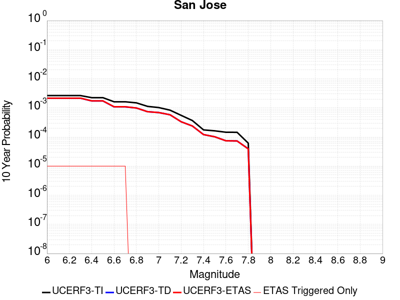 |

| Magnitude | 1 wk TI Prob | 1 wk TD Prob | 1 wk ETAS Prob | 1 wk ETAS/TD Gain | 1 wk ETAS Triggered Only | 1 mo TI Prob | 1 mo TD Prob | 1 mo ETAS Prob | 1 mo ETAS/TD Gain | 1 mo ETAS Triggered Only | 1 yr TI Prob | 1 yr TD Prob | 1 yr ETAS Prob | 1 yr ETAS/TD Gain | 1 yr ETAS Triggered Only | 10 yr TI Prob | 10 yr TD Prob | 10 yr ETAS Prob | 10 yr ETAS/TD Gain | 10 yr ETAS Triggered Only |
|-----|-----|-----|-----|-----|-----|-----|-----|-----|-----|-----|-----|-----|-----|-----|-----|-----|-----|-----|-----|-----|
| 6.0 | 5.0851277E-6 | 4.125986E-6 | 4.125986E-6 | 1.0 | 0.0 | 2.1793223E-5 | 1.768269E-5 | 1.768269E-5 | 1.0 | 0.0 | 2.653002E-4 | 2.1526813E-4 | 2.1526813E-4 | 1.0 | 0.0 | 0.0026498367 | 0.0021508872 | 0.0021608656 | 1.0046393 | 1.0E-5 |
| 6.1 | 5.0851277E-6 | 4.125986E-6 | 4.125986E-6 | 1.0 | 0.0 | 2.1793223E-5 | 1.768269E-5 | 1.768269E-5 | 1.0 | 0.0 | 2.653002E-4 | 2.1526813E-4 | 2.1526813E-4 | 1.0 | 0.0 | 0.0026498367 | 0.0021508872 | 0.0021608656 | 1.0046393 | 1.0E-5 |
| 6.2 | 5.0851277E-6 | 4.125986E-6 | 4.125986E-6 | 1.0 | 0.0 | 2.1793223E-5 | 1.768269E-5 | 1.768269E-5 | 1.0 | 0.0 | 2.653002E-4 | 2.1526813E-4 | 2.1526813E-4 | 1.0 | 0.0 | 0.0026498367 | 0.0021508872 | 0.0021608656 | 1.0046393 | 1.0E-5 |
| 6.3 | 5.0851277E-6 | 4.125986E-6 | 4.125986E-6 | 1.0 | 0.0 | 2.1793223E-5 | 1.768269E-5 | 1.768269E-5 | 1.0 | 0.0 | 2.653002E-4 | 2.1526813E-4 | 2.1526813E-4 | 1.0 | 0.0 | 0.0026498367 | 0.0021508872 | 0.0021608656 | 1.0046393 | 1.0E-5 |
| 6.4 | 4.3115124E-6 | 3.3240806E-6 | 3.3240806E-6 | 1.0 | 0.0 | 1.8477778E-5 | 1.4245994E-5 | 1.4245994E-5 | 1.0 | 0.0 | 2.2494372E-4 | 1.734334E-4 | 1.734334E-4 | 1.0 | 0.0 | 0.0022471617 | 0.0017332301 | 0.0017432128 | 1.0057596 | 1.0E-5 |
| 6.5 | 4.3115124E-6 | 3.3240806E-6 | 3.3240806E-6 | 1.0 | 0.0 | 1.8477778E-5 | 1.4245994E-5 | 1.4245994E-5 | 1.0 | 0.0 | 2.2494372E-4 | 1.734334E-4 | 1.734334E-4 | 1.0 | 0.0 | 0.0022471617 | 0.0017332301 | 0.0017432128 | 1.0057596 | 1.0E-5 |
| 6.6 | 3.110396E-6 | 2.0802606E-6 | 2.0802606E-6 | 1.0 | 0.0 | 1.33302E-5 | 8.915374E-6 | 8.915374E-6 | 1.0 | 0.0 | 1.622831E-4 | 1.0853955E-4 | 1.0853955E-4 | 1.0 | 0.0 | 0.0016216465 | 0.0010849254 | 0.0010949145 | 1.0092072 | 1.0E-5 |
| 6.7 | 3.110396E-6 | 2.0802606E-6 | 2.0802606E-6 | 1.0 | 0.0 | 1.33302E-5 | 8.915374E-6 | 8.915374E-6 | 1.0 | 0.0 | 1.622831E-4 | 1.0853955E-4 | 1.0853955E-4 | 1.0 | 0.0 | 0.0016216465 | 0.0010849254 | 0.0010949145 | 1.0092072 | 1.0E-5 |
| 6.8 | 2.856651E-6 | 1.9027021E-6 | 1.9027021E-6 | 1.0 | 0.0 | 1.2242733E-5 | 8.154414E-6 | 8.154414E-6 | 1.0 | 0.0 | 1.4904508E-4 | 9.927571E-5 | 9.927571E-5 | 1.0 | 0.0 | 0.0014894515 | 9.923707E-4 | 9.923707E-4 | 1.0 | 0.0 |
| 6.9 | 2.1618725E-6 | 1.4189131E-6 | 1.4189131E-6 | 1.0 | 0.0 | 9.265135E-6 | 6.0810426E-6 | 6.0810426E-6 | 1.0 | 0.0 | 1.12797185E-4 | 7.4034266E-5 | 7.4034266E-5 | 1.0 | 0.0 | 0.0011273995 | 7.4013724E-4 | 7.4013724E-4 | 1.0 | 0.0 |
| 7.0 | 1.9684312E-6 | 1.3258774E-6 | 1.3258774E-6 | 1.0 | 0.0 | 8.436106E-6 | 5.6823196E-6 | 5.6823196E-6 | 1.0 | 0.0 | 1.02704755E-4 | 6.9180125E-5 | 6.9180125E-5 | 1.0 | 0.0 | 0.001026573 | 6.9162657E-4 | 6.9162657E-4 | 1.0 | 0.0 |
| 7.1 | 1.6070337E-6 | 1.1157406E-6 | 1.1157406E-6 | 1.0 | 0.0 | 6.887269E-6 | 4.781737E-6 | 4.781737E-6 | 1.0 | 0.0 | 8.384928E-5 | 5.8216156E-5 | 5.8216156E-5 | 1.0 | 0.0 | 8.3817646E-4 | 5.8204774E-4 | 5.8204774E-4 | 1.0 | 0.0 |
| 7.2 | 1.0631658E-6 | 6.405485E-7 | 6.405485E-7 | 1.0 | 0.0 | 4.556417E-6 | 2.745205E-6 | 2.745205E-6 | 1.0 | 0.0 | 5.5472963E-5 | 3.342237E-5 | 3.342237E-5 | 1.0 | 0.0 | 5.545912E-4 | 3.3420732E-4 | 3.3420732E-4 | 1.0 | 0.0 |
| 7.3 | 7.060711E-7 | 4.5838595E-7 | 4.5838595E-7 | 1.0 | 0.0 | 3.0260155E-6 | 1.9645097E-6 | 1.9645097E-6 | 1.0 | 0.0 | 3.6841117E-5 | 2.3917653E-5 | 2.3917653E-5 | 1.0 | 0.0 | 3.6835007E-4 | 2.3918417E-4 | 2.3918417E-4 | 1.0 | 0.0 |
| 7.4 | 3.3677085E-7 | 2.3243108E-7 | 2.3243108E-7 | 1.0 | 0.0 | 1.4433028E-6 | 9.961328E-7 | 9.961328E-7 | 1.0 | 0.0 | 1.757207E-5 | 1.2127853E-5 | 1.2127853E-5 | 1.0 | 0.0 | 1.7570681E-4 | 1.21304685E-4 | 1.21304685E-4 | 1.0 | 0.0 |
| 7.5 | 3.129161E-7 | 1.9539081E-7 | 1.9539081E-7 | 1.0 | 0.0 | 1.3410682E-6 | 8.3738894E-7 | 8.3738894E-7 | 1.0 | 0.0 | 1.6327383E-5 | 1.0195165E-5 | 1.0195165E-5 | 1.0 | 0.0 | 1.6326184E-4 | 1.019797E-4 | 1.019797E-4 | 1.0 | 0.0 |
| 7.6 | 2.8008668E-7 | 1.4247968E-7 | 1.4247968E-7 | 1.0 | 0.0 | 1.2003709E-6 | 6.1062707E-7 | 6.1062707E-7 | 1.0 | 0.0 | 1.46144175E-5 | 7.434361E-6 | 7.434361E-6 | 1.0 | 0.0 | 1.4613457E-4 | 7.437373E-5 | 7.437373E-5 | 1.0 | 0.0 |
| 7.7 | 2.7852005E-7 | 1.402248E-7 | 1.402248E-7 | 1.0 | 0.0 | 1.1936568E-6 | 6.009633E-7 | 6.009633E-7 | 1.0 | 0.0 | 1.4532674E-5 | 7.3167053E-6 | 7.3167053E-6 | 1.0 | 0.0 | 1.4531724E-4 | 7.319726E-5 | 7.319726E-5 | 1.0 | 0.0 |
| 7.8 | 1.1810797E-7 | 7.5213165E-8 | 7.5213165E-8 | 1.0 | 0.0 | 5.0617695E-7 | 3.2234212E-7 | 3.2234212E-7 | 1.0 | 0.0 | 6.1626865E-6 | 3.9245087E-6 | 3.9245087E-6 | 1.0 | 0.0 | 6.162516E-5 | 3.9262773E-5 | 3.9262773E-5 | 1.0 | 0.0 |

## Great Valley 03a Dunnigan Hills
*[(top)](#table-of-contents)*

| 1 Week | 1 Month | 1 Year | 10 Year |
|-----|-----|-----|-----|
|  |  |  |  |

| Magnitude | 1 wk TI Prob | 1 wk TD Prob | 1 wk ETAS Prob | 1 wk ETAS/TD Gain | 1 wk ETAS Triggered Only | 1 mo TI Prob | 1 mo TD Prob | 1 mo ETAS Prob | 1 mo ETAS/TD Gain | 1 mo ETAS Triggered Only | 1 yr TI Prob | 1 yr TD Prob | 1 yr ETAS Prob | 1 yr ETAS/TD Gain | 1 yr ETAS Triggered Only | 10 yr TI Prob | 10 yr TD Prob | 10 yr ETAS Prob | 10 yr ETAS/TD Gain | 10 yr ETAS Triggered Only |
|-----|-----|-----|-----|-----|-----|-----|-----|-----|-----|-----|-----|-----|-----|-----|-----|-----|-----|-----|-----|-----|
| 6.0 | 1.6591328E-5 | 1.8108833E-5 | 1.8108833E-5 | 1.0 | 0.0 | 7.110376E-5 | 7.7607365E-5 | 7.7607365E-5 | 1.0 | 0.0 | 8.6534437E-4 | 9.445292E-4 | 9.445292E-4 | 1.0 | 0.0 | 0.008619824 | 0.0094119795 | 0.009421886 | 1.0010525 | 1.0E-5 |
| 6.1 | 8.041125E-6 | 8.770148E-6 | 8.770148E-6 | 1.0 | 0.0 | 3.4461507E-5 | 3.7585924E-5 | 3.7585924E-5 | 1.0 | 0.0 | 4.194881E-4 | 4.5753285E-4 | 4.5753285E-4 | 1.0 | 0.0 | 0.004186971 | 0.0045679063 | 0.0045679063 | 1.0 | 0.0 |
| 6.2 | 3.2807004E-6 | 3.5797418E-6 | 3.5797418E-6 | 1.0 | 0.0 | 1.4060069E-5 | 1.5341684E-5 | 1.5341684E-5 | 1.0 | 0.0 | 1.7116789E-4 | 1.8677315E-4 | 1.8677315E-4 | 1.0 | 0.0 | 0.0017103611 | 0.0018665699 | 0.0018665699 | 1.0 | 0.0 |
| 6.3 | 1.9339366E-6 | 2.110483E-6 | 2.110483E-6 | 1.0 | 0.0 | 8.288273E-6 | 9.044911E-6 | 9.044911E-6 | 1.0 | 0.0 | 1.00905054E-4 | 1.1011909E-4 | 1.1011909E-4 | 1.0 | 0.0 | 0.0010085925 | 0.0011009251 | 0.0011009251 | 1.0 | 0.0 |
| 6.4 | 1.3142635E-6 | 1.4340559E-6 | 1.4340559E-6 | 1.0 | 0.0 | 5.6325457E-6 | 6.145954E-6 | 6.145954E-6 | 1.0 | 0.0 | 6.857408E-5 | 7.482699E-5 | 7.482699E-5 | 1.0 | 0.0 | 6.8552926E-4 | 7.482699E-4 | 7.482699E-4 | 1.0 | 0.0 |

## Elsinore (Temecula) rev
*[(top)](#table-of-contents)*

| 1 Week | 1 Month | 1 Year | 10 Year |
|-----|-----|-----|-----|
| 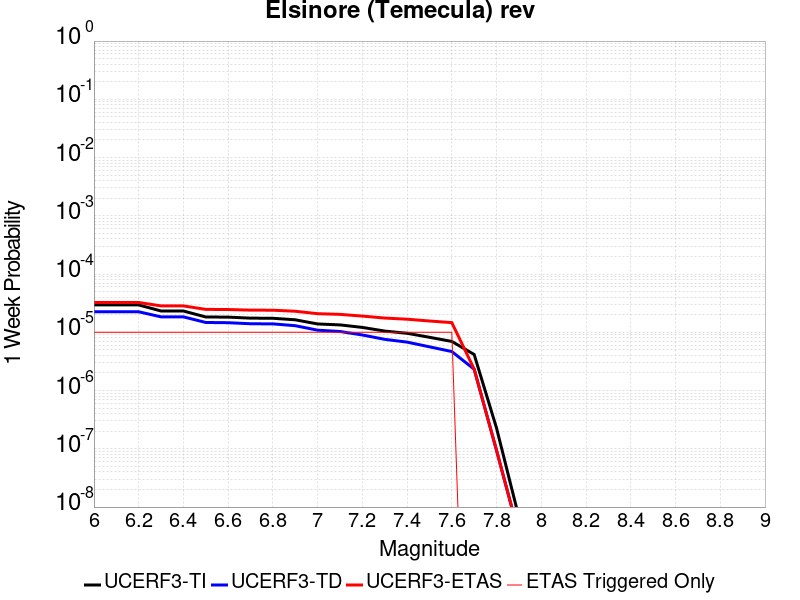 | 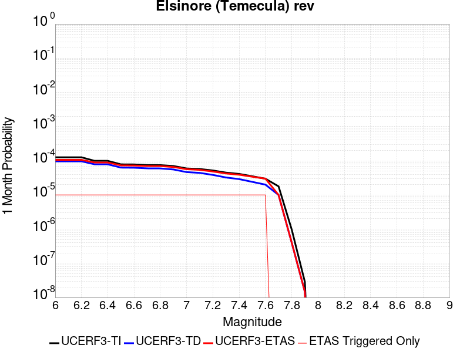 |  |  |

| Magnitude | 1 wk TI Prob | 1 wk TD Prob | 1 wk ETAS Prob | 1 wk ETAS/TD Gain | 1 wk ETAS Triggered Only | 1 mo TI Prob | 1 mo TD Prob | 1 mo ETAS Prob | 1 mo ETAS/TD Gain | 1 mo ETAS Triggered Only | 1 yr TI Prob | 1 yr TD Prob | 1 yr ETAS Prob | 1 yr ETAS/TD Gain | 1 yr ETAS Triggered Only | 10 yr TI Prob | 10 yr TD Prob | 10 yr ETAS Prob | 10 yr ETAS/TD Gain | 10 yr ETAS Triggered Only |
|-----|-----|-----|-----|-----|-----|-----|-----|-----|-----|-----|-----|-----|-----|-----|-----|-----|-----|-----|-----|-----|
| 6.0 | 2.9514995E-5 | 2.2522026E-5 | 3.25218E-5 | 1.4439998 | 1.0E-5 | 1.264867E-4 | 9.651952E-5 | 1.0651856E-4 | 1.103596 | 1.0E-5 | 0.0015388876 | 0.001174514 | 0.0011845022 | 1.0085042 | 1.0E-5 | 0.015282745 | 0.011699457 | 0.01170934 | 1.0008447 | 1.0E-5 |
| 6.1 | 2.9514995E-5 | 2.2522026E-5 | 3.25218E-5 | 1.4439998 | 1.0E-5 | 1.264867E-4 | 9.651952E-5 | 1.0651856E-4 | 1.103596 | 1.0E-5 | 0.0015388876 | 0.001174514 | 0.0011845022 | 1.0085042 | 1.0E-5 | 0.015282745 | 0.011699457 | 0.01170934 | 1.0008447 | 1.0E-5 |
| 6.2 | 2.9514995E-5 | 2.2522026E-5 | 3.25218E-5 | 1.4439998 | 1.0E-5 | 1.264867E-4 | 9.651952E-5 | 1.0651856E-4 | 1.103596 | 1.0E-5 | 0.0015388876 | 0.001174514 | 0.0011845022 | 1.0085042 | 1.0E-5 | 0.015282745 | 0.011699457 | 0.01170934 | 1.0008447 | 1.0E-5 |
| 6.3 | 2.3223649E-5 | 1.8409943E-5 | 2.8409759E-5 | 1.5431747 | 1.0E-5 | 9.952613E-5 | 7.8897465E-5 | 8.8896675E-5 | 1.1267368 | 1.0E-5 | 0.001211057 | 9.6017064E-4 | 9.7016105E-4 | 1.0104048 | 1.0E-5 | 0.012044783 | 0.00957171 | 0.009581614 | 1.0010347 | 1.0E-5 |
| 6.4 | 2.3223649E-5 | 1.8409943E-5 | 2.8409759E-5 | 1.5431747 | 1.0E-5 | 9.952613E-5 | 7.8897465E-5 | 8.8896675E-5 | 1.1267368 | 1.0E-5 | 0.001211057 | 9.6017064E-4 | 9.7016105E-4 | 1.0104048 | 1.0E-5 | 0.012044783 | 0.00957171 | 0.009581614 | 1.0010347 | 1.0E-5 |
| 6.5 | 1.8338875E-5 | 1.475257E-5 | 2.4752422E-5 | 1.677838 | 1.0E-5 | 7.8592806E-5 | 6.3223815E-5 | 7.3223186E-5 | 1.1581583 | 1.0E-5 | 9.5644733E-4 | 7.694868E-4 | 7.7947916E-4 | 1.0129857 | 1.0E-5 | 0.009523412 | 0.0076751863 | 0.0076851095 | 1.001293 | 1.0E-5 |
| 6.6 | 1.8223333E-5 | 1.46151115E-5 | 2.4614965E-5 | 1.6842133 | 1.0E-5 | 7.809766E-5 | 6.263474E-5 | 7.263411E-5 | 1.1596458 | 1.0E-5 | 9.504242E-4 | 7.623199E-4 | 7.723123E-4 | 1.0131079 | 1.0E-5 | 0.009463696 | 0.0076040085 | 0.0076139322 | 1.0013051 | 1.0E-5 |
| 6.7 | 1.7512752E-5 | 1.4029526E-5 | 2.4029387E-5 | 1.7127725 | 1.0E-5 | 7.505249E-5 | 6.0125203E-5 | 7.01246E-5 | 1.1663096 | 1.0E-5 | 9.13381E-4 | 7.3178706E-4 | 7.4177975E-4 | 1.0136552 | 1.0E-5 | 0.00909636 | 0.0073001203 | 0.0073100473 | 1.0013598 | 1.0E-5 |
| 6.8 | 1.7417142E-5 | 1.3953497E-5 | 2.3953358E-5 | 1.7166562 | 1.0E-5 | 7.4642754E-5 | 5.979938E-5 | 6.9798785E-5 | 1.1672158 | 1.0E-5 | 9.083966E-4 | 7.2782283E-4 | 7.378156E-4 | 1.0137296 | 1.0E-5 | 0.009046922 | 0.007260682 | 0.0072706095 | 1.0013673 | 1.0E-5 |
| 6.9 | 1.6402591E-5 | 1.29908285E-5 | 2.2990698E-5 | 1.7697638 | 1.0E-5 | 7.0294926E-5 | 5.5673834E-5 | 6.567328E-5 | 1.1796076 | 1.0E-5 | 8.5550465E-4 | 6.776258E-4 | 6.8761903E-4 | 1.0147474 | 1.0E-5 | 0.008522186 | 0.006761318 | 0.00677125 | 1.001469 | 1.0E-5 |
| 7.0 | 1.3912486E-5 | 1.088019E-5 | 2.0880081E-5 | 1.9190917 | 1.0E-5 | 5.9623577E-5 | 4.6628564E-5 | 5.6628098E-5 | 1.2144508 | 1.0E-5 | 7.2567526E-4 | 5.6755764E-4 | 5.7755195E-4 | 1.0176094 | 1.0E-5 | 0.0072331014 | 0.005665 | 0.0056749433 | 1.0017552 | 1.0E-5 |
| 7.1 | 1.3405147E-5 | 1.0329276E-5 | 2.0329173E-5 | 1.968112 | 1.0E-5 | 5.7449364E-5 | 4.426759E-5 | 5.4267148E-5 | 1.2258888 | 1.0E-5 | 6.9922156E-4 | 5.388272E-4 | 5.488218E-4 | 1.0185488 | 1.0E-5 | 0.0069702556 | 0.005378539 | 0.0053884857 | 1.0018493 | 1.0E-5 |
| 7.2 | 1.21402E-5 | 8.998324E-6 | 1.8998235E-5 | 2.111308 | 1.0E-5 | 5.202839E-5 | 3.856369E-5 | 4.8563303E-5 | 1.2593013 | 1.0E-5 | 6.332616E-4 | 4.6941353E-4 | 4.7940883E-4 | 1.0212932 | 1.0E-5 | 0.0063146 | 0.004685645 | 0.0046955985 | 1.0021242 | 1.0E-5 |
| 7.3 | 1.05047775E-5 | 7.573083E-6 | 1.7573007E-5 | 2.320456 | 1.0E-5 | 4.5019697E-5 | 3.2455675E-5 | 4.245535E-5 | 1.3081025 | 1.0E-5 | 5.4797693E-4 | 3.9507766E-4 | 4.0507372E-4 | 1.0253015 | 1.0E-5 | 0.005466277 | 0.0039441423 | 0.0039541028 | 1.0025254 | 1.0E-5 |
| 7.4 | 9.624483E-6 | 6.7880264E-6 | 1.6787959E-5 | 2.4731722 | 1.0E-5 | 4.124713E-5 | 2.9091227E-5 | 3.9090934E-5 | 1.3437363 | 1.0E-5 | 5.0206814E-4 | 3.541295E-4 | 3.6412597E-4 | 1.0282283 | 1.0E-5 | 0.005009353 | 0.0035358057 | 0.0035457704 | 1.0028182 | 1.0E-5 |
| 7.5 | 8.215151E-6 | 5.636438E-6 | 1.5636382E-5 | 2.7741601 | 1.0E-5 | 3.5207315E-5 | 2.4155945E-5 | 3.4155702E-5 | 1.4139668 | 1.0E-5 | 4.2856473E-4 | 2.940602E-4 | 3.040573E-4 | 1.0339966 | 1.0E-5 | 0.004277392 | 0.0029368391 | 0.0029468096 | 1.0033951 | 1.0E-5 |
| 7.6 | 6.975058E-6 | 4.676814E-6 | 1.4676767E-5 | 3.1381977 | 1.0E-5 | 2.9892764E-5 | 2.0043342E-5 | 3.0043142E-5 | 1.4989088 | 1.0E-5 | 3.6388362E-4 | 2.4400154E-4 | 2.5399908E-4 | 1.0409733 | 1.0E-5 | 0.0036328835 | 0.0024374526 | 0.0024474282 | 1.0040927 | 1.0E-5 |
| 7.7 | 4.159604E-6 | 2.3274456E-6 | 2.3274456E-6 | 1.0 | 0.0 | 1.7826753E-5 | 9.974733E-6 | 9.974733E-6 | 1.0 | 0.0 | 2.1701909E-4 | 1.2143635E-4 | 1.2143635E-4 | 1.0 | 0.0 | 0.0021680726 | 0.001213773 | 0.001213773 | 1.0 | 0.0 |
| 7.8 | 2.2692414E-7 | 9.3873886E-8 | 9.3873886E-8 | 1.0 | 0.0 | 9.725317E-7 | 4.023166E-7 | 4.023166E-7 | 1.0 | 0.0 | 1.1840509E-5 | 4.898197E-6 | 4.898197E-6 | 1.0 | 0.0 | 1.1839878E-4 | 4.898122E-5 | 4.898122E-5 | 1.0 | 0.0 |
| 7.9 | 6.676829E-9 | 3.4403498E-9 | 3.4403498E-9 | 1.0 | 0.0 | 2.861498E-8 | 1.4744357E-8 | 1.4744357E-8 | 1.0 | 0.0 | 3.4838732E-7 | 1.7951253E-7 | 1.7951253E-7 | 1.0 | 0.0 | 3.4838679E-6 | 1.7951239E-6 | 1.7951239E-6 | 1.0 | 0.0 |

## Hayward (No) 2011 CFM
*[(top)](#table-of-contents)*

| 1 Week | 1 Month | 1 Year | 10 Year |
|-----|-----|-----|-----|
|  |  |  |  |

| Magnitude | 1 wk TI Prob | 1 wk TD Prob | 1 wk ETAS Prob | 1 wk ETAS/TD Gain | 1 wk ETAS Triggered Only | 1 mo TI Prob | 1 mo TD Prob | 1 mo ETAS Prob | 1 mo ETAS/TD Gain | 1 mo ETAS Triggered Only | 1 yr TI Prob | 1 yr TD Prob | 1 yr ETAS Prob | 1 yr ETAS/TD Gain | 1 yr ETAS Triggered Only | 10 yr TI Prob | 10 yr TD Prob | 10 yr ETAS Prob | 10 yr ETAS/TD Gain | 10 yr ETAS Triggered Only |
|-----|-----|-----|-----|-----|-----|-----|-----|-----|-----|-----|-----|-----|-----|-----|-----|-----|-----|-----|-----|-----|
| 6.0 | 9.3068506E-5 | 1.74068E-4 | 1.74068E-4 | 1.0 | 0.0 | 3.9880406E-4 | 7.457933E-4 | 7.457933E-4 | 1.0 | 0.0 | 0.0048446343 | 0.009042277 | 0.009042277 | 1.0 | 0.0 | 0.047403704 | 0.086425416 | 0.08643455 | 1.0001057 | 1.0E-5 |
| 6.1 | 9.055486E-5 | 1.6958236E-4 | 1.6958236E-4 | 1.0 | 0.0 | 3.880345E-4 | 7.265799E-4 | 7.265799E-4 | 1.0 | 0.0 | 0.0047140904 | 0.008810335 | 0.008810335 | 1.0 | 0.0 | 0.046153355 | 0.08431842 | 0.08432758 | 1.0001086 | 1.0E-5 |
| 6.2 | 9.006742E-5 | 1.6878804E-4 | 1.6878804E-4 | 1.0 | 0.0 | 3.859461E-4 | 7.231776E-4 | 7.231776E-4 | 1.0 | 0.0 | 0.0046887742 | 0.0087693 | 0.0087693 | 1.0 | 0.0 | 0.0459107 | 0.08394261 | 0.08395177 | 1.0001091 | 1.0E-5 |
| 6.3 | 8.8336754E-5 | 1.6558412E-4 | 1.6558412E-4 | 1.0 | 0.0 | 3.7853114E-4 | 7.09454E-4 | 7.09454E-4 | 1.0 | 0.0 | 0.004598882 | 0.008603558 | 0.008603558 | 1.0 | 0.0 | 0.04504866 | 0.082435764 | 0.082444936 | 1.0001113 | 1.0E-5 |
| 6.4 | 8.526157E-5 | 1.5984823E-4 | 1.5984823E-4 | 1.0 | 0.0 | 3.6535555E-4 | 6.848848E-4 | 6.848848E-4 | 1.0 | 0.0 | 0.0044391346 | 0.008306746 | 0.008306746 | 1.0 | 0.0 | 0.043514993 | 0.07973017 | 0.07973938 | 1.0001154 | 1.0E-5 |
| 6.5 | 8.152396E-5 | 1.5317152E-4 | 1.5317152E-4 | 1.0 | 0.0 | 3.493416E-4 | 6.56285E-4 | 6.56285E-4 | 1.0 | 0.0 | 0.0042449418 | 0.007961143 | 0.007961143 | 1.0 | 0.0 | 0.04164765 | 0.07656097 | 0.0765702 | 1.0001206 | 1.0E-5 |
| 6.6 | 7.987405E-5 | 1.5021319E-4 | 1.5021319E-4 | 1.0 | 0.0 | 3.4227243E-4 | 6.436127E-4 | 6.436127E-4 | 1.0 | 0.0 | 0.0041592065 | 0.0078079863 | 0.0078079863 | 1.0 | 0.0 | 0.04082218 | 0.07515338 | 0.07516263 | 1.000123 | 1.0E-5 |
| 6.7 | 7.777665E-5 | 1.4660071E-4 | 1.4660071E-4 | 1.0 | 0.0 | 3.332859E-4 | 6.2813814E-4 | 6.2813814E-4 | 1.0 | 0.0 | 0.004050208 | 0.007620921 | 0.007620921 | 1.0 | 0.0 | 0.039771806 | 0.07342759 | 0.073436856 | 1.0001262 | 1.0E-5 |
| 6.8 | 7.3284005E-5 | 1.3809837E-4 | 1.3809837E-4 | 1.0 | 0.0 | 3.140365E-4 | 5.917165E-4 | 5.917165E-4 | 1.0 | 0.0 | 0.0038166929 | 0.007180489 | 0.007180489 | 1.0 | 0.0 | 0.037518036 | 0.06933746 | 0.06934676 | 1.0001342 | 1.0E-5 |
| 6.9 | 6.458263E-5 | 1.2138554E-4 | 1.2138554E-4 | 1.0 | 0.0 | 2.7675333E-4 | 5.201205E-4 | 5.201205E-4 | 1.0 | 0.0 | 0.0033642664 | 0.006314182 | 0.006314182 | 1.0 | 0.0 | 0.033137884 | 0.0612579 | 0.061267287 | 1.0001533 | 1.0E-5 |
| 7.0 | 5.3853604E-5 | 1.00309575E-4 | 1.00309575E-4 | 1.0 | 0.0 | 2.3078074E-4 | 4.2982766E-4 | 4.2982766E-4 | 1.0 | 0.0 | 0.0028061352 | 0.0052206595 | 0.0052206595 | 1.0 | 0.0 | 0.027709642 | 0.05098569 | 0.050995182 | 1.0001861 | 1.0E-5 |
| 7.1 | 4.4308683E-5 | 8.175333E-5 | 8.175333E-5 | 1.0 | 0.0 | 1.8988053E-4 | 3.5032458E-4 | 3.5032458E-4 | 1.0 | 0.0 | 0.0023093442 | 0.004256902 | 0.004256902 | 1.0 | 0.0 | 0.022854926 | 0.041847244 | 0.041856825 | 1.000229 | 1.0E-5 |
| 7.2 | 3.295973E-5 | 6.0814917E-5 | 6.0814917E-5 | 1.0 | 0.0 | 1.4124835E-4 | 2.6060943E-4 | 2.6060943E-4 | 1.0 | 0.0 | 0.0017183421 | 0.0031683263 | 0.0031683263 | 1.0 | 0.0 | 0.017051157 | 0.031391077 | 0.031400766 | 1.0003085 | 1.0E-5 |
| 7.3 | 2.452256E-5 | 4.521987E-5 | 4.521987E-5 | 1.0 | 0.0 | 1.05092455E-4 | 1.9378512E-4 | 1.9378512E-4 | 1.0 | 0.0 | 0.0012787496 | 0.002356795 | 0.002356795 | 1.0 | 0.0 | 0.0127141625 | 0.023460438 | 0.023470204 | 1.0004163 | 1.0E-5 |
| 7.4 | 1.8829967E-5 | 3.4637967E-5 | 3.4637967E-5 | 1.0 | 0.0 | 8.069736E-5 | 1.4844004E-4 | 1.4844004E-4 | 1.0 | 0.0 | 9.820475E-4 | 0.0018057693 | 0.0018057693 | 1.0 | 0.0 | 0.009777189 | 0.018036935 | 0.018046755 | 1.0005444 | 1.0E-5 |
| 7.5 | 1.26374125E-5 | 2.2948794E-5 | 2.2948794E-5 | 1.0 | 0.0 | 5.4159216E-5 | 9.83483E-5 | 9.83483E-5 | 1.0 | 0.0 | 6.5918895E-4 | 0.0011967387 | 0.0011967387 | 1.0 | 0.0 | 0.00657237 | 0.012002571 | 0.012012451 | 1.0008231 | 1.0E-5 |
| 7.6 | 4.666429E-6 | 8.4890125E-6 | 8.4890125E-6 | 1.0 | 0.0 | 1.9998828E-5 | 3.638098E-5 | 3.638098E-5 | 1.0 | 0.0 | 2.4345852E-4 | 4.4284965E-4 | 4.4284965E-4 | 1.0 | 0.0 | 0.0024319198 | 0.004463953 | 0.0044739083 | 1.0022302 | 1.0E-5 |
| 7.7 | 3.8399318E-7 | 7.146951E-7 | 7.146951E-7 | 1.0 | 0.0 | 1.6456839E-6 | 3.0629753E-6 | 3.0629753E-6 | 1.0 | 0.0 | 2.003602E-5 | 3.7291087E-5 | 3.7291087E-5 | 1.0 | 0.0 | 2.0034213E-4 | 3.867874E-4 | 3.867874E-4 | 1.0 | 0.0 |
| 7.8 | 2.5637698E-7 | 5.3775256E-7 | 5.3775256E-7 | 1.0 | 0.0 | 1.098758E-6 | 2.3046516E-6 | 2.3046516E-6 | 1.0 | 0.0 | 1.3377297E-5 | 2.8058774E-5 | 2.8058774E-5 | 1.0 | 0.0 | 1.3376492E-4 | 2.9299298E-4 | 2.9299298E-4 | 1.0 | 0.0 |
| 7.9 | 1.7141245E-7 | 3.7368818E-7 | 3.7368818E-7 | 1.0 | 0.0 | 7.3462456E-7 | 1.6015197E-6 | 1.6015197E-6 | 1.0 | 0.0 | 8.944017E-6 | 1.9498328E-5 | 1.9498328E-5 | 1.0 | 0.0 | 8.943657E-5 | 2.02833E-4 | 2.02833E-4 | 1.0 | 0.0 |
| 8.0 | 1.1808895E-7 | 2.7563618E-7 | 2.7563618E-7 | 1.0 | 0.0 | 5.060954E-7 | 1.1812973E-6 | 1.1812973E-6 | 1.0 | 0.0 | 6.161694E-6 | 1.4382201E-5 | 1.4382201E-5 | 1.0 | 0.0 | 6.161523E-5 | 1.4842243E-4 | 1.4842243E-4 | 1.0 | 0.0 |
| 8.1 | 5.138535E-8 | 1.1250157E-7 | 1.1250157E-7 | 1.0 | 0.0 | 2.2022292E-7 | 4.8214946E-7 | 4.8214946E-7 | 1.0 | 0.0 | 2.6812106E-6 | 5.8701544E-6 | 5.8701544E-6 | 1.0 | 0.0 | 2.6811784E-5 | 6.025778E-5 | 6.025778E-5 | 1.0 | 0.0 |

## Santa Susana alt 1
*[(top)](#table-of-contents)*

| 1 Week | 1 Month | 1 Year | 10 Year |
|-----|-----|-----|-----|
|  |  | 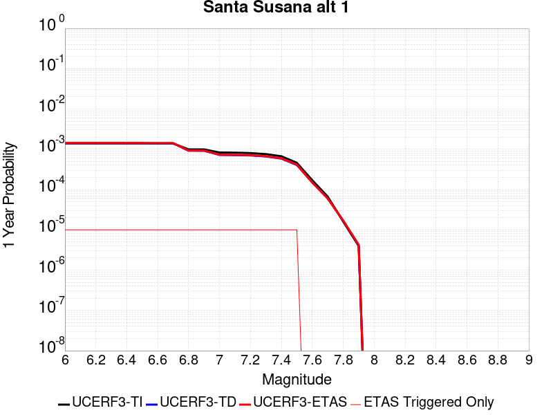 | 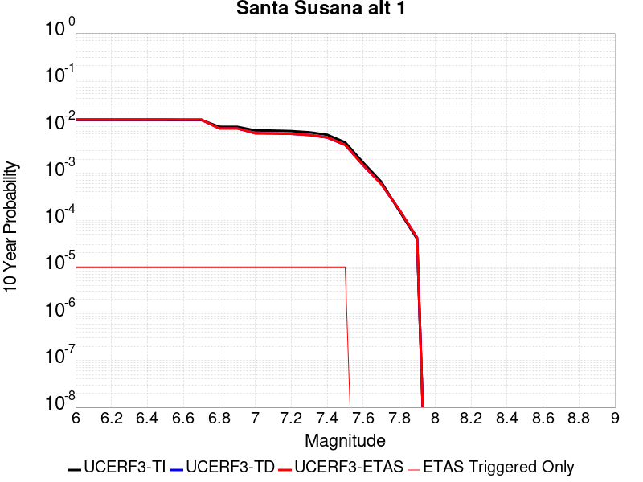 |

| Magnitude | 1 wk TI Prob | 1 wk TD Prob | 1 wk ETAS Prob | 1 wk ETAS/TD Gain | 1 wk ETAS Triggered Only | 1 mo TI Prob | 1 mo TD Prob | 1 mo ETAS Prob | 1 mo ETAS/TD Gain | 1 mo ETAS Triggered Only | 1 yr TI Prob | 1 yr TD Prob | 1 yr ETAS Prob | 1 yr ETAS/TD Gain | 1 yr ETAS Triggered Only | 10 yr TI Prob | 10 yr TD Prob | 10 yr ETAS Prob | 10 yr ETAS/TD Gain | 10 yr ETAS Triggered Only |
|-----|-----|-----|-----|-----|-----|-----|-----|-----|-----|-----|-----|-----|-----|-----|-----|-----|-----|-----|-----|-----|
| 6.0 | 2.674877E-5 | 2.7200571E-5 | 2.7200571E-5 | 1.0 | 0.0 | 1.1463255E-4 | 1.165693E-4 | 1.165693E-4 | 1.0 | 0.0 | 0.0013947578 | 0.001418421 | 0.0014284068 | 1.0070401 | 1.0E-5 | 0.013860362 | 0.014105441 | 0.0141153 | 1.0006989 | 1.0E-5 |
| 6.1 | 2.674877E-5 | 2.7200571E-5 | 2.7200571E-5 | 1.0 | 0.0 | 1.1463255E-4 | 1.165693E-4 | 1.165693E-4 | 1.0 | 0.0 | 0.0013947578 | 0.001418421 | 0.0014284068 | 1.0070401 | 1.0E-5 | 0.013860362 | 0.014105441 | 0.0141153 | 1.0006989 | 1.0E-5 |
| 6.2 | 2.674877E-5 | 2.7200571E-5 | 2.7200571E-5 | 1.0 | 0.0 | 1.1463255E-4 | 1.165693E-4 | 1.165693E-4 | 1.0 | 0.0 | 0.0013947578 | 0.001418421 | 0.0014284068 | 1.0070401 | 1.0E-5 | 0.013860362 | 0.014105441 | 0.0141153 | 1.0006989 | 1.0E-5 |
| 6.3 | 2.674877E-5 | 2.7200571E-5 | 2.7200571E-5 | 1.0 | 0.0 | 1.1463255E-4 | 1.165693E-4 | 1.165693E-4 | 1.0 | 0.0 | 0.0013947578 | 0.001418421 | 0.0014284068 | 1.0070401 | 1.0E-5 | 0.013860362 | 0.014105441 | 0.0141153 | 1.0006989 | 1.0E-5 |
| 6.4 | 2.674877E-5 | 2.7200571E-5 | 2.7200571E-5 | 1.0 | 0.0 | 1.1463255E-4 | 1.165693E-4 | 1.165693E-4 | 1.0 | 0.0 | 0.0013947578 | 0.001418421 | 0.0014284068 | 1.0070401 | 1.0E-5 | 0.013860362 | 0.014105441 | 0.0141153 | 1.0006989 | 1.0E-5 |
| 6.5 | 2.674877E-5 | 2.7200571E-5 | 2.7200571E-5 | 1.0 | 0.0 | 1.1463255E-4 | 1.165693E-4 | 1.165693E-4 | 1.0 | 0.0 | 0.0013947578 | 0.001418421 | 0.0014284068 | 1.0070401 | 1.0E-5 | 0.013860362 | 0.014105441 | 0.0141153 | 1.0006989 | 1.0E-5 |
| 6.6 | 2.6647976E-5 | 2.7076892E-5 | 2.7076892E-5 | 1.0 | 0.0 | 1.14200615E-4 | 1.1603931E-4 | 1.1603931E-4 | 1.0 | 0.0 | 0.0013895056 | 0.0014119769 | 0.0014219627 | 1.0070722 | 1.0E-5 | 0.013808494 | 0.01404182 | 0.014051679 | 1.0007021 | 1.0E-5 |
| 6.7 | 2.6647976E-5 | 2.7076892E-5 | 2.7076892E-5 | 1.0 | 0.0 | 1.14200615E-4 | 1.1603931E-4 | 1.1603931E-4 | 1.0 | 0.0 | 0.0013895056 | 0.0014119769 | 0.0014219627 | 1.0070722 | 1.0E-5 | 0.013808494 | 0.01404182 | 0.014051679 | 1.0007021 | 1.0E-5 |
| 6.8 | 1.9073179E-5 | 1.7638586E-5 | 1.7638586E-5 | 1.0 | 0.0 | 8.1739636E-5 | 7.5591845E-5 | 7.5591845E-5 | 1.0 | 0.0 | 9.947256E-4 | 9.199603E-4 | 9.299511E-4 | 1.0108601 | 1.0E-5 | 0.009902848 | 0.009163775 | 0.009173683 | 1.0010812 | 1.0E-5 |
| 6.9 | 1.9041876E-5 | 1.7620714E-5 | 1.7620714E-5 | 1.0 | 0.0 | 8.160549E-5 | 7.5515265E-5 | 7.5515265E-5 | 1.0 | 0.0 | 9.930939E-4 | 9.190287E-4 | 9.2901953E-4 | 1.010871 | 1.0E-5 | 0.0098866755 | 0.009154535 | 0.009164443 | 1.0010823 | 1.0E-5 |
| 7.0 | 1.5917482E-5 | 1.3864736E-5 | 1.3864736E-5 | 1.0 | 0.0 | 6.8215995E-5 | 5.941897E-5 | 5.941897E-5 | 1.0 | 0.0 | 8.302132E-4 | 7.231905E-4 | 7.3318323E-4 | 1.0138177 | 1.0E-5 | 0.008271185 | 0.0072092656 | 0.0072191935 | 1.0013771 | 1.0E-5 |
| 7.1 | 1.577788E-5 | 1.3744735E-5 | 1.3744735E-5 | 1.0 | 0.0 | 6.761774E-5 | 5.89047E-5 | 5.89047E-5 | 1.0 | 0.0 | 8.2293496E-4 | 7.169334E-4 | 7.2692626E-4 | 1.0139383 | 1.0E-5 | 0.008198941 | 0.007147099 | 0.0071570277 | 1.0013891 | 1.0E-5 |
| 7.2 | 1.5416446E-5 | 1.3470787E-5 | 1.3470787E-5 | 1.0 | 0.0 | 6.606882E-5 | 5.7730693E-5 | 5.7730693E-5 | 1.0 | 0.0 | 8.0409093E-4 | 7.026491E-4 | 7.126421E-4 | 1.0142219 | 1.0E-5 | 0.008011877 | 0.00700516 | 0.00701509 | 1.0014175 | 1.0E-5 |
| 7.3 | 1.4534083E-5 | 1.27186495E-5 | 1.27186495E-5 | 1.0 | 0.0 | 6.228744E-5 | 5.4507385E-5 | 5.4507385E-5 | 1.0 | 0.0 | 7.580857E-4 | 6.634298E-4 | 6.734232E-4 | 1.0150632 | 1.0E-5 | 0.007555048 | 0.006615344 | 0.006625278 | 1.0015017 | 1.0E-5 |
| 7.4 | 1.2858995E-5 | 1.1230286E-5 | 1.1230286E-5 | 1.0 | 0.0 | 5.5108816E-5 | 4.812893E-5 | 4.812893E-5 | 1.0 | 0.0 | 6.7074323E-4 | 5.858161E-4 | 5.9581024E-4 | 1.0170602 | 1.0E-5 | 0.0066872234 | 0.0058434936 | 0.005853435 | 1.0017014 | 1.0E-5 |
| 7.5 | 8.827668E-6 | 7.805781E-6 | 7.805781E-6 | 1.0 | 0.0 | 3.7832317E-5 | 3.3452932E-5 | 3.3452932E-5 | 1.0 | 0.0 | 4.605111E-4 | 4.072158E-4 | 4.1721173E-4 | 1.024547 | 1.0E-5 | 0.0045955796 | 0.004064945 | 0.004074904 | 1.0024501 | 1.0E-5 |
| 7.6 | 3.2533426E-6 | 2.872068E-6 | 2.872068E-6 | 1.0 | 0.0 | 1.3942822E-5 | 1.23088075E-5 | 1.23088075E-5 | 1.0 | 0.0 | 1.6974064E-4 | 1.498498E-4 | 1.498498E-4 | 1.0 | 0.0 | 0.0016961104 | 0.0014975243 | 0.0014975243 | 1.0 | 0.0 |
| 7.7 | 1.2751709E-6 | 1.1491525E-6 | 1.1491525E-6 | 1.0 | 0.0 | 5.4650063E-6 | 4.92493E-6 | 4.92493E-6 | 1.0 | 0.0 | 6.653442E-5 | 5.9959468E-5 | 5.9959468E-5 | 1.0 | 0.0 | 6.6514505E-4 | 5.994418E-4 | 5.994418E-4 | 1.0 | 0.0 |
| 7.8 | 3.067544E-7 | 3.2401567E-7 | 3.2401567E-7 | 1.0 | 0.0 | 1.3146611E-6 | 1.388638E-6 | 1.388638E-6 | 1.0 | 0.0 | 1.600588E-5 | 1.6906546E-5 | 1.6906546E-5 | 1.0 | 0.0 | 1.6004729E-4 | 1.6905363E-4 | 1.6905363E-4 | 1.0 | 0.0 |
| 7.9 | 7.622999E-8 | 8.088237E-8 | 8.088237E-8 | 1.0 | 0.0 | 3.2669993E-7 | 3.466387E-7 | 3.466387E-7 | 1.0 | 0.0 | 3.977564E-6 | 4.22032E-6 | 4.22032E-6 | 1.0 | 0.0 | 3.977493E-5 | 4.220261E-5 | 4.220261E-5 | 1.0 | 0.0 |

## Los Alamos extension
*[(top)](#table-of-contents)*

| 1 Week | 1 Month | 1 Year | 10 Year |
|-----|-----|-----|-----|
|  |  |  |  |

| Magnitude | 1 wk TI Prob | 1 wk TD Prob | 1 wk ETAS Prob | 1 wk ETAS/TD Gain | 1 wk ETAS Triggered Only | 1 mo TI Prob | 1 mo TD Prob | 1 mo ETAS Prob | 1 mo ETAS/TD Gain | 1 mo ETAS Triggered Only | 1 yr TI Prob | 1 yr TD Prob | 1 yr ETAS Prob | 1 yr ETAS/TD Gain | 1 yr ETAS Triggered Only | 10 yr TI Prob | 10 yr TD Prob | 10 yr ETAS Prob | 10 yr ETAS/TD Gain | 10 yr ETAS Triggered Only |
|-----|-----|-----|-----|-----|-----|-----|-----|-----|-----|-----|-----|-----|-----|-----|-----|-----|-----|-----|-----|-----|
| 6.0 | 4.0146506E-6 | 4.0862424E-6 | 4.0862424E-6 | 1.0 | 0.0 | 1.7205533E-5 | 1.7512357E-5 | 1.7512357E-5 | 1.0 | 0.0 | 2.0945723E-4 | 2.1319318E-4 | 2.2319105E-4 | 1.0468959 | 1.0E-5 | 0.0020925992 | 0.0021299957 | 0.0021399744 | 1.0046848 | 1.0E-5 |
| 6.1 | 4.0146506E-6 | 4.0862424E-6 | 4.0862424E-6 | 1.0 | 0.0 | 1.7205533E-5 | 1.7512357E-5 | 1.7512357E-5 | 1.0 | 0.0 | 2.0945723E-4 | 2.1319318E-4 | 2.2319105E-4 | 1.0468959 | 1.0E-5 | 0.0020925992 | 0.0021299957 | 0.0021399744 | 1.0046848 | 1.0E-5 |
| 6.2 | 4.0146506E-6 | 4.0862424E-6 | 4.0862424E-6 | 1.0 | 0.0 | 1.7205533E-5 | 1.7512357E-5 | 1.7512357E-5 | 1.0 | 0.0 | 2.0945723E-4 | 2.1319318E-4 | 2.2319105E-4 | 1.0468959 | 1.0E-5 | 0.0020925992 | 0.0021299957 | 0.0021399744 | 1.0046848 | 1.0E-5 |
| 6.3 | 4.0146506E-6 | 4.0862424E-6 | 4.0862424E-6 | 1.0 | 0.0 | 1.7205533E-5 | 1.7512357E-5 | 1.7512357E-5 | 1.0 | 0.0 | 2.0945723E-4 | 2.1319318E-4 | 2.2319105E-4 | 1.0468959 | 1.0E-5 | 0.0020925992 | 0.0021299957 | 0.0021399744 | 1.0046848 | 1.0E-5 |
| 6.4 | 4.0146506E-6 | 4.0862424E-6 | 4.0862424E-6 | 1.0 | 0.0 | 1.7205533E-5 | 1.7512357E-5 | 1.7512357E-5 | 1.0 | 0.0 | 2.0945723E-4 | 2.1319318E-4 | 2.2319105E-4 | 1.0468959 | 1.0E-5 | 0.0020925992 | 0.0021299957 | 0.0021399744 | 1.0046848 | 1.0E-5 |
| 6.5 | 4.0146506E-6 | 4.0862424E-6 | 4.0862424E-6 | 1.0 | 0.0 | 1.7205533E-5 | 1.7512357E-5 | 1.7512357E-5 | 1.0 | 0.0 | 2.0945723E-4 | 2.1319318E-4 | 2.2319105E-4 | 1.0468959 | 1.0E-5 | 0.0020925992 | 0.0021299957 | 0.0021399744 | 1.0046848 | 1.0E-5 |
| 6.6 | 4.0146506E-6 | 4.0862424E-6 | 4.0862424E-6 | 1.0 | 0.0 | 1.7205533E-5 | 1.7512357E-5 | 1.7512357E-5 | 1.0 | 0.0 | 2.0945723E-4 | 2.1319318E-4 | 2.2319105E-4 | 1.0468959 | 1.0E-5 | 0.0020925992 | 0.0021299957 | 0.0021399744 | 1.0046848 | 1.0E-5 |
| 6.7 | 4.0146506E-6 | 4.0862424E-6 | 4.0862424E-6 | 1.0 | 0.0 | 1.7205533E-5 | 1.7512357E-5 | 1.7512357E-5 | 1.0 | 0.0 | 2.0945723E-4 | 2.1319318E-4 | 2.2319105E-4 | 1.0468959 | 1.0E-5 | 0.0020925992 | 0.0021299957 | 0.0021399744 | 1.0046848 | 1.0E-5 |
| 6.8 | 3.6584688E-6 | 3.7189357E-6 | 3.7189357E-6 | 1.0 | 0.0 | 1.5679057E-5 | 1.5938203E-5 | 1.5938203E-5 | 1.0 | 0.0 | 1.9087581E-4 | 1.9403128E-4 | 2.0402935E-4 | 1.0515281 | 1.0E-5 | 0.0019071194 | 0.0019387112 | 0.0019486918 | 1.005148 | 1.0E-5 |
| 6.9 | 3.644631E-6 | 3.7046455E-6 | 3.7046455E-6 | 1.0 | 0.0 | 1.5619753E-5 | 1.587696E-5 | 1.587696E-5 | 1.0 | 0.0 | 1.901539E-4 | 1.9328577E-4 | 2.0328384E-4 | 1.0517268 | 1.0E-5 | 0.0018999127 | 0.0019312691 | 0.0019412497 | 1.005168 | 1.0E-5 |
| 7.0 | 3.6318522E-6 | 3.6914057E-6 | 3.6914057E-6 | 1.0 | 0.0 | 1.5564989E-5 | 1.582022E-5 | 1.582022E-5 | 1.0 | 0.0 | 1.8948725E-4 | 1.9259508E-4 | 2.0259316E-4 | 1.0519124 | 1.0E-5 | 0.0018932576 | 0.001924374 | 0.0019343548 | 1.0051864 | 1.0E-5 |
| 7.1 | 3.5001724E-6 | 3.555474E-6 | 3.555474E-6 | 1.0 | 0.0 | 1.5000653E-5 | 1.52376615E-5 | 1.52376615E-5 | 1.0 | 0.0 | 1.8261763E-4 | 1.8550365E-4 | 1.955018E-4 | 1.0538973 | 1.0E-5 | 0.0018246764 | 0.0018535787 | 0.0018635602 | 1.0053849 | 1.0E-5 |
| 7.2 | 2.5204702E-6 | 2.5437507E-6 | 2.5437507E-6 | 1.0 | 0.0 | 1.080197E-5 | 1.0901743E-5 | 1.0901743E-5 | 1.0 | 0.0 | 1.3150605E-4 | 1.327207E-4 | 1.4271936E-4 | 1.0753362 | 1.0E-5 | 0.0013142825 | 0.0013264199 | 0.0013364067 | 1.0075291 | 1.0E-5 |
| 7.3 | 2.1399692E-6 | 2.1501808E-6 | 2.1501808E-6 | 1.0 | 0.0 | 9.1712645E-6 | 9.2150285E-6 | 9.2150285E-6 | 1.0 | 0.0 | 1.1165442E-4 | 1.1218722E-4 | 1.221861E-4 | 1.0891267 | 1.0E-5 | 0.0011159834 | 0.0011213091 | 0.0011312979 | 1.0089082 | 1.0E-5 |
| 7.4 | 1.9660122E-6 | 1.9702823E-6 | 1.9702823E-6 | 1.0 | 0.0 | 8.42574E-6 | 8.44404E-6 | 8.44404E-6 | 1.0 | 0.0 | 1.0257855E-4 | 1.02801365E-4 | 1.12800335E-4 | 1.097265 | 1.0E-5 | 0.0010253121 | 0.0010275412 | 0.001037531 | 1.009722 | 1.0E-5 |
| 7.5 | 1.7204633E-6 | 1.715139E-6 | 1.715139E-6 | 1.0 | 0.0 | 7.373393E-6 | 7.350575E-6 | 7.350575E-6 | 1.0 | 0.0 | 8.976737E-5 | 8.94896E-5 | 9.948871E-5 | 1.1117349 | 1.0E-5 | 8.9731114E-4 | 8.9453865E-4 | 9.045297E-4 | 1.011169 | 1.0E-5 |
| 7.6 | 1.3717638E-6 | 1.3536154E-6 | 1.3536154E-6 | 1.0 | 0.0 | 5.878974E-6 | 5.801196E-6 | 5.801196E-6 | 1.0 | 0.0 | 7.157416E-5 | 7.06273E-5 | 8.062659E-5 | 1.1415783 | 1.0E-5 | 7.1551115E-4 | 7.060511E-4 | 7.160441E-4 | 1.0141532 | 1.0E-5 |
| 7.7 | 8.272564E-7 | 7.9578405E-7 | 7.9578405E-7 | 1.0 | 0.0 | 3.5453797E-6 | 3.4104987E-6 | 3.4104987E-6 | 1.0 | 0.0 | 4.3164142E-5 | 4.152203E-5 | 5.1521616E-5 | 1.240826 | 1.0E-5 | 4.315576E-4 | 4.1514292E-4 | 4.2513877E-4 | 1.0240781 | 1.0E-5 |
| 7.8 | 3.9708277E-7 | 3.6720036E-7 | 3.6720036E-7 | 1.0 | 0.0 | 1.7017821E-6 | 1.5737149E-6 | 1.5737149E-6 | 1.0 | 0.0 | 2.0719E-5 | 1.915981E-5 | 2.9159619E-5 | 1.5219158 | 1.0E-5 | 2.071707E-4 | 1.9158165E-4 | 2.0157974E-4 | 1.0521871 | 1.0E-5 |
| 7.9 | 9.292528E-8 | 7.889317E-8 | 7.889317E-8 | 1.0 | 0.0 | 3.9825116E-7 | 3.3811355E-7 | 3.3811355E-7 | 1.0 | 0.0 | 4.848697E-6 | 4.116525E-6 | 4.116525E-6 | 1.0 | 0.0 | 4.8485912E-5 | 4.1164494E-5 | 4.1164494E-5 | 1.0 | 0.0 |
| 8.0 | 7.880441E-11 | 8.235512E-11 | 8.235512E-11 | 1.0 | 0.0 | 3.3773329E-10 | 3.5295045E-10 | 3.5295045E-10 | 1.0 | 0.0 | 4.1119033E-9 | 4.2971724E-9 | 4.2971724E-9 | 1.0 | 0.0 | 4.1119034E-8 | 4.297172E-8 | 4.297172E-8 | 1.0 | 0.0 |

## Malibu Coast alt 1
*[(top)](#table-of-contents)*

| 1 Week | 1 Month | 1 Year | 10 Year |
|-----|-----|-----|-----|
|  | 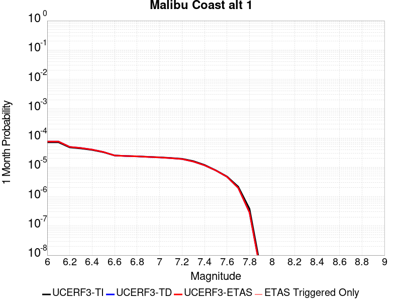 |  | 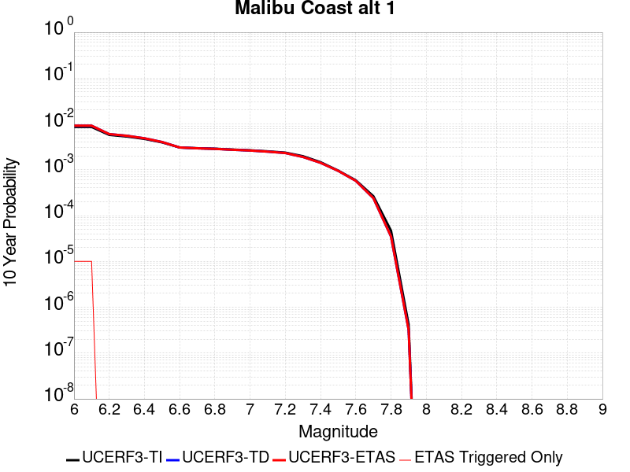 |

| Magnitude | 1 wk TI Prob | 1 wk TD Prob | 1 wk ETAS Prob | 1 wk ETAS/TD Gain | 1 wk ETAS Triggered Only | 1 mo TI Prob | 1 mo TD Prob | 1 mo ETAS Prob | 1 mo ETAS/TD Gain | 1 mo ETAS Triggered Only | 1 yr TI Prob | 1 yr TD Prob | 1 yr ETAS Prob | 1 yr ETAS/TD Gain | 1 yr ETAS Triggered Only | 10 yr TI Prob | 10 yr TD Prob | 10 yr ETAS Prob | 10 yr ETAS/TD Gain | 10 yr ETAS Triggered Only |
|-----|-----|-----|-----|-----|-----|-----|-----|-----|-----|-----|-----|-----|-----|-----|-----|-----|-----|-----|-----|-----|
| 6.0 | 1.6572556E-5 | 1.7598875E-5 | 1.7598875E-5 | 1.0 | 0.0 | 7.102331E-5 | 7.5421674E-5 | 7.5421674E-5 | 1.0 | 0.0 | 8.6436566E-4 | 9.17891E-4 | 9.17891E-4 | 1.0 | 0.0 | 0.0086101135 | 0.009142932 | 0.00915284 | 1.0010837 | 1.0E-5 |
| 6.1 | 1.6572556E-5 | 1.7598875E-5 | 1.7598875E-5 | 1.0 | 0.0 | 7.102331E-5 | 7.5421674E-5 | 7.5421674E-5 | 1.0 | 0.0 | 8.6436566E-4 | 9.17891E-4 | 9.17891E-4 | 1.0 | 0.0 | 0.0086101135 | 0.009142932 | 0.00915284 | 1.0010837 | 1.0E-5 |
| 6.2 | 1.1085717E-5 | 1.1557631E-5 | 1.1557631E-5 | 1.0 | 0.0 | 4.750935E-5 | 4.9531787E-5 | 4.9531787E-5 | 1.0 | 0.0 | 5.782728E-4 | 6.0288614E-4 | 6.0288614E-4 | 1.0 | 0.0 | 0.0057677035 | 0.006012877 | 0.006012877 | 1.0 | 0.0 |
| 6.3 | 1.0208568E-5 | 1.059267E-5 | 1.059267E-5 | 1.0 | 0.0 | 4.375027E-5 | 4.5396388E-5 | 4.5396388E-5 | 1.0 | 0.0 | 5.325294E-4 | 5.5256375E-4 | 5.5256375E-4 | 1.0 | 0.0 | 0.0053125503 | 0.0055122063 | 0.0055122063 | 1.0 | 0.0 |
| 6.4 | 9.0682315E-6 | 9.343006E-6 | 9.343006E-6 | 1.0 | 0.0 | 3.8863272E-5 | 4.0040853E-5 | 4.0040853E-5 | 1.0 | 0.0 | 4.730576E-4 | 4.8739038E-4 | 4.8739038E-4 | 1.0 | 0.0 | 0.0047205184 | 0.004863428 | 0.004863428 | 1.0 | 0.0 |
| 6.5 | 7.605796E-6 | 7.74888E-6 | 7.74888E-6 | 1.0 | 0.0 | 3.259586E-5 | 3.320907E-5 | 3.320907E-5 | 1.0 | 0.0 | 3.9678233E-4 | 4.0424676E-4 | 4.0424676E-4 | 1.0 | 0.0 | 0.0039607463 | 0.004035252 | 0.004035252 | 1.0 | 0.0 |
| 6.6 | 5.889873E-6 | 5.879743E-6 | 5.879743E-6 | 1.0 | 0.0 | 2.5242069E-5 | 2.5198655E-5 | 2.5198655E-5 | 1.0 | 0.0 | 3.0727885E-4 | 3.0675053E-4 | 3.0675053E-4 | 1.0 | 0.0 | 0.003068543 | 0.003063284 | 0.003063284 | 1.0 | 0.0 |
| 6.7 | 5.66586E-6 | 5.641838E-6 | 5.641838E-6 | 1.0 | 0.0 | 2.428203E-5 | 2.4179082E-5 | 2.4179082E-5 | 1.0 | 0.0 | 2.955936E-4 | 2.9434063E-4 | 2.9434063E-4 | 1.0 | 0.0 | 0.0029520073 | 0.00293952 | 0.00293952 | 1.0 | 0.0 |
| 6.8 | 5.521556E-6 | 5.489619E-6 | 5.489619E-6 | 1.0 | 0.0 | 2.3663597E-5 | 2.3526727E-5 | 2.3526727E-5 | 1.0 | 0.0 | 2.880662E-4 | 2.8640035E-4 | 2.8640035E-4 | 1.0 | 0.0 | 0.0028769306 | 0.002860324 | 0.002860324 | 1.0 | 0.0 |
| 6.9 | 5.29752E-6 | 5.250115E-6 | 5.250115E-6 | 1.0 | 0.0 | 2.270346E-5 | 2.2500299E-5 | 2.2500299E-5 | 1.0 | 0.0 | 2.7637955E-4 | 2.7390677E-4 | 2.7390677E-4 | 1.0 | 0.0 | 0.0027603607 | 0.002735702 | 0.002735702 | 1.0 | 0.0 |
| 7.0 | 5.106743E-6 | 5.047855E-6 | 5.047855E-6 | 1.0 | 0.0 | 2.1885859E-5 | 2.1633487E-5 | 2.1633487E-5 | 1.0 | 0.0 | 2.6642776E-4 | 2.6335593E-4 | 2.6335593E-4 | 1.0 | 0.0 | 0.0026610855 | 0.0026304482 | 0.0026304482 | 1.0 | 0.0 |
| 7.1 | 4.8469647E-6 | 4.77054E-6 | 4.77054E-6 | 1.0 | 0.0 | 2.0772539E-5 | 2.044501E-5 | 2.044501E-5 | 1.0 | 0.0 | 2.528763E-4 | 2.4888964E-4 | 2.4888964E-4 | 1.0 | 0.0 | 0.0025258875 | 0.002486117 | 0.002486117 | 1.0 | 0.0 |
| 7.2 | 4.545514E-6 | 4.4483486E-6 | 4.4483486E-6 | 1.0 | 0.0 | 1.9480629E-5 | 1.9064211E-5 | 1.9064211E-5 | 1.0 | 0.0 | 2.3715083E-4 | 2.3208211E-4 | 2.3208211E-4 | 1.0 | 0.0 | 0.0023689792 | 0.0023184048 | 0.0023184048 | 1.0 | 0.0 |
| 7.3 | 3.794097E-6 | 3.6520573E-6 | 3.6520573E-6 | 1.0 | 0.0 | 1.6260314E-5 | 1.565158E-5 | 1.565158E-5 | 1.0 | 0.0 | 1.9795135E-4 | 1.9054137E-4 | 1.9054137E-4 | 1.0 | 0.0 | 0.001977751 | 0.0019037846 | 0.0019037846 | 1.0 | 0.0 |
| 7.4 | 2.808217E-6 | 2.7191695E-6 | 2.7191695E-6 | 1.0 | 0.0 | 1.203516E-5 | 1.1653532E-5 | 1.1653532E-5 | 1.0 | 0.0 | 1.4651821E-4 | 1.4187253E-4 | 1.4187253E-4 | 1.0 | 0.0 | 0.0014642165 | 0.0014178223 | 0.0014178223 | 1.0 | 0.0 |
| 7.5 | 1.83809E-6 | 1.8191337E-6 | 1.8191337E-6 | 1.0 | 0.0 | 7.877505E-6 | 7.796264E-6 | 7.796264E-6 | 1.0 | 0.0 | 9.59044E-5 | 9.49154E-5 | 9.49154E-5 | 1.0 | 0.0 | 9.5863023E-4 | 9.487506E-4 | 9.487506E-4 | 1.0 | 0.0 |
| 7.6 | 1.1292672E-6 | 1.1001863E-6 | 1.1001863E-6 | 1.0 | 0.0 | 4.839708E-6 | 4.7150756E-6 | 4.7150756E-6 | 1.0 | 0.0 | 5.8921847E-5 | 5.740455E-5 | 5.740455E-5 | 1.0 | 0.0 | 5.890623E-4 | 5.738989E-4 | 5.738989E-4 | 1.0 | 0.0 |
| 7.7 | 5.065272E-7 | 4.6093618E-7 | 4.6093618E-7 | 1.0 | 0.0 | 2.170829E-6 | 1.9754393E-6 | 1.9754393E-6 | 1.0 | 0.0 | 2.6429525E-5 | 2.405072E-5 | 2.405072E-5 | 1.0 | 0.0 | 2.642638E-4 | 2.4048229E-4 | 2.4048229E-4 | 1.0 | 0.0 |
| 7.8 | 8.952991E-8 | 6.7087015E-8 | 6.7087015E-8 | 1.0 | 0.0 | 3.8369956E-7 | 2.8751575E-7 | 2.8751575E-7 | 1.0 | 0.0 | 4.671532E-6 | 3.500499E-6 | 3.500499E-6 | 1.0 | 0.0 | 4.671434E-5 | 3.5004457E-5 | 3.5004457E-5 | 1.0 | 0.0 |
| 7.9 | 8.007447E-10 | 6.161025E-10 | 6.161025E-10 | 1.0 | 0.0 | 3.4317629E-9 | 2.6404403E-9 | 2.6404403E-9 | 1.0 | 0.0 | 4.1781714E-8 | 3.214736E-8 | 3.214736E-8 | 1.0 | 0.0 | 4.1781706E-7 | 3.2147355E-7 | 3.2147355E-7 | 1.0 | 0.0 |

## Greenville (So) 2011 CFM
*[(top)](#table-of-contents)*

| 1 Week | 1 Month | 1 Year | 10 Year |
|-----|-----|-----|-----|
|  | 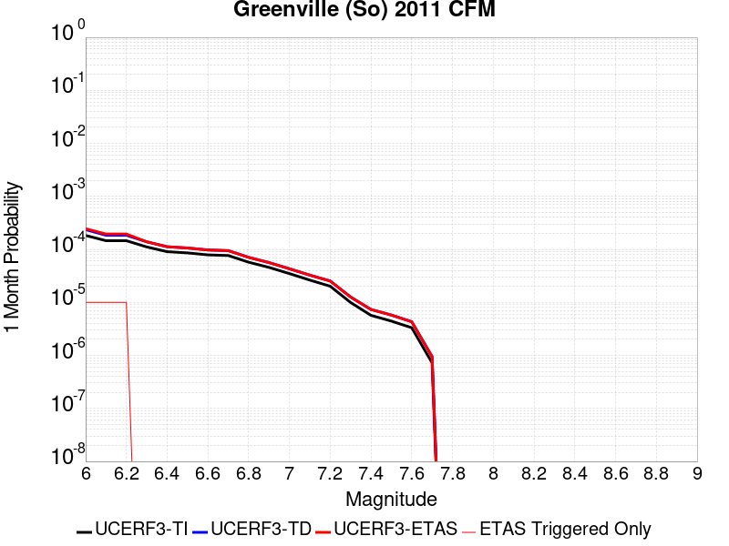 | 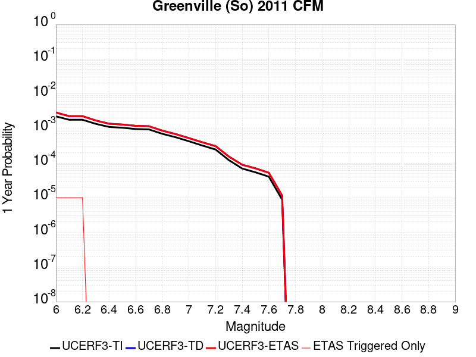 |  |

| Magnitude | 1 wk TI Prob | 1 wk TD Prob | 1 wk ETAS Prob | 1 wk ETAS/TD Gain | 1 wk ETAS Triggered Only | 1 mo TI Prob | 1 mo TD Prob | 1 mo ETAS Prob | 1 mo ETAS/TD Gain | 1 mo ETAS Triggered Only | 1 yr TI Prob | 1 yr TD Prob | 1 yr ETAS Prob | 1 yr ETAS/TD Gain | 1 yr ETAS Triggered Only | 10 yr TI Prob | 10 yr TD Prob | 10 yr ETAS Prob | 10 yr ETAS/TD Gain | 10 yr ETAS Triggered Only |
|-----|-----|-----|-----|-----|-----|-----|-----|-----|-----|-----|-----|-----|-----|-----|-----|-----|-----|-----|-----|-----|
| 6.0 | 4.279693E-5 | 5.5048058E-5 | 6.5047505E-5 | 1.1816494 | 1.0E-5 | 1.8340252E-4 | 2.3590095E-4 | 2.4589858E-4 | 1.0423807 | 1.0E-5 | 0.0022306389 | 0.0028686395 | 0.002878611 | 1.003476 | 1.0E-5 | 0.022083808 | 0.02834198 | 0.028351698 | 1.0003428 | 1.0E-5 |
| 6.1 | 3.4037297E-5 | 4.3198117E-5 | 5.3197684E-5 | 1.2314816 | 1.0E-5 | 1.4586597E-4 | 1.8512284E-4 | 1.9512099E-4 | 1.0540082 | 1.0E-5 | 0.0017744715 | 0.0022517194 | 0.0022616968 | 1.004431 | 1.0E-5 | 0.01760369 | 0.022305397 | 0.022315174 | 1.0004383 | 1.0E-5 |
| 6.2 | 3.4037297E-5 | 4.3198117E-5 | 5.3197684E-5 | 1.2314816 | 1.0E-5 | 1.4586597E-4 | 1.8512284E-4 | 1.9512099E-4 | 1.0540082 | 1.0E-5 | 0.0017744715 | 0.0022517194 | 0.0022616968 | 1.004431 | 1.0E-5 | 0.01760369 | 0.022305397 | 0.022315174 | 1.0004383 | 1.0E-5 |
| 6.3 | 2.5956324E-5 | 3.243272E-5 | 3.243272E-5 | 1.0 | 0.0 | 1.11236644E-4 | 1.3899039E-4 | 1.3899039E-4 | 1.0 | 0.0 | 0.0013534647 | 0.0016909696 | 0.0016909696 | 1.0 | 0.0 | 0.013452509 | 0.016787821 | 0.016787821 | 1.0 | 0.0 |
| 6.4 | 2.1145053E-5 | 2.6200514E-5 | 2.6200514E-5 | 1.0 | 0.0 | 9.061851E-5 | 1.1228328E-4 | 1.1228328E-4 | 1.0 | 0.0 | 0.0011027219 | 0.0013662229 | 0.0013662229 | 1.0 | 0.0 | 0.01097266 | 0.013581639 | 0.013581639 | 1.0 | 0.0 |
| 6.5 | 2.0030959E-5 | 2.4798424E-5 | 2.4798424E-5 | 1.0 | 0.0 | 8.584414E-5 | 1.0627481E-4 | 1.0627481E-4 | 1.0 | 0.0 | 0.0010446513 | 0.0012931603 | 0.0012931603 | 1.0 | 0.0 | 0.010397541 | 0.012859702 | 0.012859702 | 1.0 | 0.0 |
| 6.6 | 1.8395405E-5 | 2.2756842E-5 | 2.2756842E-5 | 1.0 | 0.0 | 7.8835066E-5 | 9.752583E-5 | 9.752583E-5 | 1.0 | 0.0 | 9.5939427E-4 | 0.001186759 | 0.001186759 | 1.0 | 0.0 | 0.009552629 | 0.011807269 | 0.011807269 | 1.0 | 0.0 |
| 6.7 | 1.7883482E-5 | 2.212781E-5 | 2.212781E-5 | 1.0 | 0.0 | 7.664124E-5 | 9.483018E-5 | 9.483018E-5 | 1.0 | 0.0 | 9.3270757E-4 | 0.0011539747 | 0.0011539747 | 1.0 | 0.0 | 0.009288026 | 0.011482879 | 0.011482879 | 1.0 | 0.0 |
| 6.8 | 1.3373564E-5 | 1.6507536E-5 | 1.6507536E-5 | 1.0 | 0.0 | 5.7314013E-5 | 7.0744754E-5 | 7.0744754E-5 | 1.0 | 0.0 | 6.975747E-4 | 8.6099183E-4 | 8.6099183E-4 | 1.0 | 0.0 | 0.0069538904 | 0.008578171 | 0.008578171 | 1.0 | 0.0 |
| 6.9 | 1.06692905E-5 | 1.3153725E-5 | 1.3153725E-5 | 1.0 | 0.0 | 4.5724726E-5 | 5.6371955E-5 | 5.6371955E-5 | 1.0 | 0.0 | 5.5655633E-4 | 6.8612373E-4 | 6.8612373E-4 | 1.0 | 0.0 | 0.005551645 | 0.006841287 | 0.006841287 | 1.0 | 0.0 |
| 7.0 | 8.157512E-6 | 1.0063405E-5 | 1.0063405E-5 | 1.0 | 0.0 | 3.4960296E-5 | 4.3128188E-5 | 4.3128188E-5 | 1.0 | 0.0 | 4.2555845E-4 | 5.249629E-4 | 5.249629E-4 | 1.0 | 0.0 | 0.004247444 | 0.0052377055 | 0.0052377055 | 1.0 | 0.0 |
| 7.1 | 6.1467113E-6 | 7.6279252E-6 | 7.6279252E-6 | 1.0 | 0.0 | 2.6342783E-5 | 3.2690703E-5 | 3.2690703E-5 | 1.0 | 0.0 | 3.206762E-4 | 3.9793746E-4 | 3.9793746E-4 | 1.0 | 0.0 | 0.0032021382 | 0.003972437 | 0.003972437 | 1.0 | 0.0 |
| 7.2 | 4.713467E-6 | 5.9145245E-6 | 5.9145245E-6 | 1.0 | 0.0 | 2.0200418E-5 | 2.534772E-5 | 2.534772E-5 | 1.0 | 0.0 | 2.4591232E-4 | 3.0856536E-4 | 3.0856536E-4 | 1.0 | 0.0 | 0.0024564038 | 0.0030815226 | 0.0030815226 | 1.0 | 0.0 |
| 7.3 | 2.3266216E-6 | 2.9542305E-6 | 2.9542305E-6 | 1.0 | 0.0 | 9.971197E-6 | 1.2660927E-5 | 1.2660927E-5 | 1.0 | 0.0 | 1.2139256E-4 | 1.5413604E-4 | 1.5413604E-4 | 1.0 | 0.0 | 0.0012132627 | 0.0015403607 | 0.0015403607 | 1.0 | 0.0 |
| 7.4 | 1.3314E-6 | 1.7181212E-6 | 1.7181212E-6 | 1.0 | 0.0 | 5.7059874E-6 | 7.3633564E-6 | 7.3633564E-6 | 1.0 | 0.0 | 6.946818E-5 | 8.9645226E-5 | 8.9645226E-5 | 1.0 | 0.0 | 6.9446466E-4 | 8.961294E-4 | 8.961294E-4 | 1.0 | 0.0 |
| 7.5 | 1.0362941E-6 | 1.347003E-6 | 1.347003E-6 | 1.0 | 0.0 | 4.4412527E-6 | 5.7728575E-6 | 5.7728575E-6 | 1.0 | 0.0 | 5.407091E-5 | 7.028232E-5 | 7.028232E-5 | 1.0 | 0.0 | 5.405776E-4 | 7.0263114E-4 | 7.0263114E-4 | 1.0 | 0.0 |
| 7.6 | 7.764784E-7 | 1.0089751E-6 | 1.0089751E-6 | 1.0 | 0.0 | 3.3277602E-6 | 4.324172E-6 | 4.324172E-6 | 1.0 | 0.0 | 4.0514726E-5 | 5.2645562E-5 | 5.2645562E-5 | 1.0 | 0.0 | 4.050734E-4 | 5.2635226E-4 | 5.2635226E-4 | 1.0 | 0.0 |
| 7.7 | 1.6927763E-7 | 2.2139571E-7 | 2.2139571E-7 | 1.0 | 0.0 | 7.2547533E-7 | 9.488384E-7 | 9.488384E-7 | 1.0 | 0.0 | 8.832627E-6 | 1.155205E-5 | 1.155205E-5 | 1.0 | 0.0 | 8.8322755E-5 | 1.1551721E-4 | 1.1551721E-4 | 1.0 | 0.0 |

## Newport-Inglewood (Offshore)
*[(top)](#table-of-contents)*

| 1 Week | 1 Month | 1 Year | 10 Year |
|-----|-----|-----|-----|
|  |  |  | 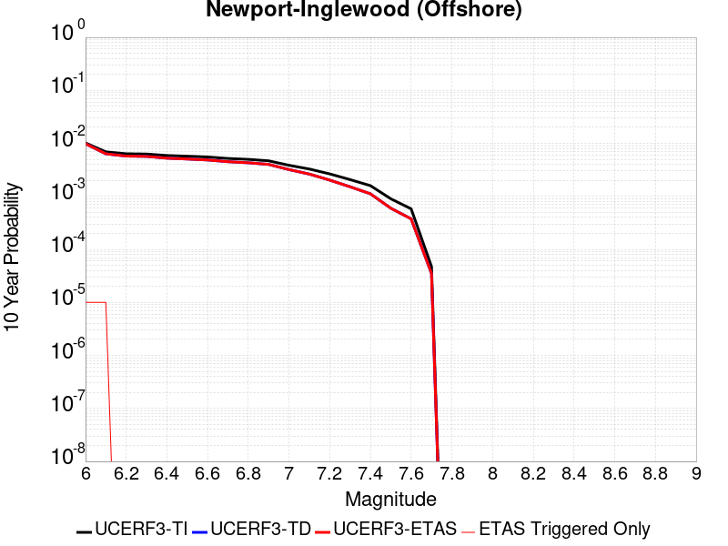 |

| Magnitude | 1 wk TI Prob | 1 wk TD Prob | 1 wk ETAS Prob | 1 wk ETAS/TD Gain | 1 wk ETAS Triggered Only | 1 mo TI Prob | 1 mo TD Prob | 1 mo ETAS Prob | 1 mo ETAS/TD Gain | 1 mo ETAS Triggered Only | 1 yr TI Prob | 1 yr TD Prob | 1 yr ETAS Prob | 1 yr ETAS/TD Gain | 1 yr ETAS Triggered Only | 10 yr TI Prob | 10 yr TD Prob | 10 yr ETAS Prob | 10 yr ETAS/TD Gain | 10 yr ETAS Triggered Only |
|-----|-----|-----|-----|-----|-----|-----|-----|-----|-----|-----|-----|-----|-----|-----|-----|-----|-----|-----|-----|-----|
| 6.0 | 1.9626508E-5 | 1.896613E-5 | 1.896613E-5 | 1.0 | 0.0 | 8.411089E-5 | 8.1280945E-5 | 8.1280945E-5 | 1.0 | 0.0 | 0.001023569 | 9.891589E-4 | 9.891589E-4 | 1.0 | 0.0 | 0.010188672 | 0.009848903 | 0.009858805 | 1.0010053 | 1.0E-5 |
| 6.1 | 1.331886E-5 | 1.2218616E-5 | 1.2218616E-5 | 1.0 | 0.0 | 5.707958E-5 | 5.2364452E-5 | 5.2364452E-5 | 1.0 | 0.0 | 6.947222E-4 | 6.3735223E-4 | 6.3735223E-4 | 1.0 | 0.0 | 0.006925544 | 0.00635542 | 0.006365357 | 1.0015634 | 1.0E-5 |
| 6.2 | 1.2250852E-5 | 1.107651E-5 | 1.107651E-5 | 1.0 | 0.0 | 5.2502597E-5 | 4.74699E-5 | 4.74699E-5 | 1.0 | 0.0 | 6.3903164E-4 | 5.777938E-4 | 5.777938E-4 | 1.0 | 0.0 | 0.006371971 | 0.005763036 | 0.005763036 | 1.0 | 0.0 |
| 6.3 | 1.2106258E-5 | 1.0919365E-5 | 1.0919365E-5 | 1.0 | 0.0 | 5.1882926E-5 | 4.6796446E-5 | 4.6796446E-5 | 1.0 | 0.0 | 6.3149154E-4 | 5.6959875E-4 | 5.6959875E-4 | 1.0 | 0.0 | 0.0062970007 | 0.005681505 | 0.005681505 | 1.0 | 0.0 |
| 6.4 | 1.1348758E-5 | 1.0109807E-5 | 1.0109807E-5 | 1.0 | 0.0 | 4.8636626E-5 | 4.3327025E-5 | 4.3327025E-5 | 1.0 | 0.0 | 5.919901E-4 | 5.273797E-4 | 5.273797E-4 | 1.0 | 0.0 | 0.005904155 | 0.005261377 | 0.005261377 | 1.0 | 0.0 |
| 6.5 | 1.100837E-5 | 9.743819E-6 | 9.743819E-6 | 1.0 | 0.0 | 4.7177873E-5 | 4.175856E-5 | 4.175856E-5 | 1.0 | 0.0 | 5.7423924E-4 | 5.0829264E-4 | 5.0829264E-4 | 1.0 | 0.0 | 0.005727576 | 0.005071392 | 0.005071392 | 1.0 | 0.0 |
| 6.6 | 1.0634696E-5 | 9.345958E-6 | 9.345958E-6 | 1.0 | 0.0 | 4.557647E-5 | 4.0053492E-5 | 4.0053492E-5 | 1.0 | 0.0 | 5.5475225E-4 | 4.875429E-4 | 4.875429E-4 | 1.0 | 0.0 | 0.0055336943 | 0.0048648193 | 0.0048648193 | 1.0 | 0.0 |
| 6.7 | 9.9780855E-6 | 8.6682985E-6 | 8.6682985E-6 | 1.0 | 0.0 | 4.276252E-5 | 3.7149326E-5 | 3.7149326E-5 | 1.0 | 0.0 | 5.205093E-4 | 4.521999E-4 | 4.521999E-4 | 1.0 | 0.0 | 0.0051929182 | 0.0045128767 | 0.0045128767 | 1.0 | 0.0 |
| 6.8 | 9.59546E-6 | 8.273325E-6 | 8.273325E-6 | 1.0 | 0.0 | 4.1122752E-5 | 3.545663E-5 | 3.545663E-5 | 1.0 | 0.0 | 5.0055445E-4 | 4.3159962E-4 | 4.3159962E-4 | 1.0 | 0.0 | 0.004994285 | 0.0043076896 | 0.0043076896 | 1.0 | 0.0 |
| 6.9 | 9.000614E-6 | 7.707188E-6 | 7.707188E-6 | 1.0 | 0.0 | 3.857349E-5 | 3.3030392E-5 | 3.3030392E-5 | 1.0 | 0.0 | 4.6953102E-4 | 4.0207148E-4 | 4.0207148E-4 | 1.0 | 0.0 | 0.004685402 | 0.004013512 | 0.004013512 | 1.0 | 0.0 |
| 7.0 | 7.4070194E-6 | 6.14917E-6 | 6.14917E-6 | 1.0 | 0.0 | 3.1743984E-5 | 2.635332E-5 | 2.635332E-5 | 1.0 | 0.0 | 3.8641447E-4 | 3.208046E-4 | 3.208046E-4 | 1.0 | 0.0 | 0.0038574322 | 0.0032034346 | 0.0032034346 | 1.0 | 0.0 |
| 7.1 | 6.299615E-6 | 5.056818E-6 | 5.056818E-6 | 1.0 | 0.0 | 2.699807E-5 | 2.1671896E-5 | 2.1671896E-5 | 1.0 | 0.0 | 3.2865192E-4 | 2.6382352E-4 | 2.6382352E-4 | 1.0 | 0.0 | 0.003281663 | 0.002635118 | 0.002635118 | 1.0 | 0.0 |
| 7.2 | 5.096653E-6 | 3.892961E-6 | 3.892961E-6 | 1.0 | 0.0 | 2.1842614E-5 | 1.6684013E-5 | 1.6684013E-5 | 1.0 | 0.0 | 2.6590136E-4 | 2.0310901E-4 | 2.0310901E-4 | 1.0 | 0.0 | 0.0026558342 | 0.002029245 | 0.002029245 | 1.0 | 0.0 |
| 7.3 | 3.9753018E-6 | 2.9100247E-6 | 2.9100247E-6 | 1.0 | 0.0 | 1.7036897E-5 | 1.2471476E-5 | 1.2471476E-5 | 1.0 | 0.0 | 2.0740448E-4 | 1.5182972E-4 | 1.5182972E-4 | 1.0 | 0.0 | 0.00207211 | 0.0015172679 | 0.0015172679 | 1.0 | 0.0 |
| 7.4 | 3.0568392E-6 | 2.145087E-6 | 2.145087E-6 | 1.0 | 0.0 | 1.3100675E-5 | 9.193198E-6 | 9.193198E-6 | 1.0 | 0.0 | 1.5948903E-4 | 1.11921494E-4 | 1.11921494E-4 | 1.0 | 0.0 | 0.0015937461 | 0.0011186575 | 0.0011186575 | 1.0 | 0.0 |
| 7.5 | 1.7279019E-6 | 1.1470418E-6 | 1.1470418E-6 | 1.0 | 0.0 | 7.405273E-6 | 4.9158843E-6 | 4.9158843E-6 | 1.0 | 0.0 | 9.015547E-5 | 5.9849288E-5 | 5.9849288E-5 | 1.0 | 0.0 | 9.01189E-4 | 5.983356E-4 | 5.983356E-4 | 1.0 | 0.0 |
| 7.6 | 1.1156416E-6 | 7.2233786E-7 | 7.2233786E-7 | 1.0 | 0.0 | 4.7813123E-6 | 3.09573E-6 | 3.09573E-6 | 1.0 | 0.0 | 5.821092E-5 | 3.7689886E-5 | 3.7689886E-5 | 1.0 | 0.0 | 5.8195676E-4 | 3.7683727E-4 | 3.7683727E-4 | 1.0 | 0.0 |
| 7.7 | 9.117973E-8 | 6.7343215E-8 | 6.7343215E-8 | 1.0 | 0.0 | 3.907702E-7 | 2.8861376E-7 | 2.8861376E-7 | 1.0 | 0.0 | 4.757617E-6 | 3.5138671E-6 | 3.5138671E-6 | 1.0 | 0.0 | 4.7575148E-5 | 3.5138146E-5 | 3.5138146E-5 | 1.0 | 0.0 |

## Hayward (So) extension 2011 CFM
*[(top)](#table-of-contents)*

| 1 Week | 1 Month | 1 Year | 10 Year |
|-----|-----|-----|-----|
| 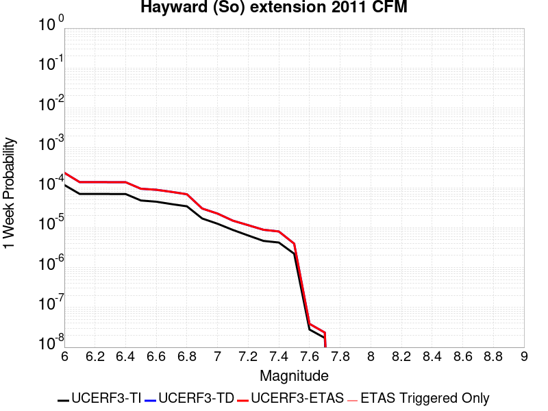 | 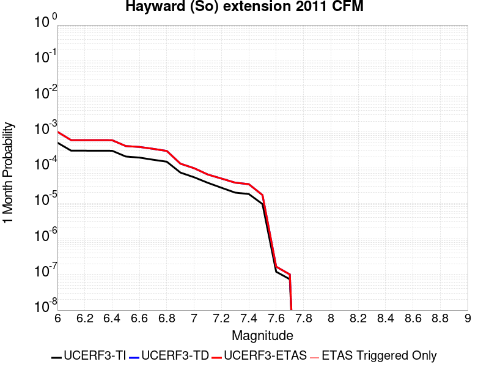 |  | 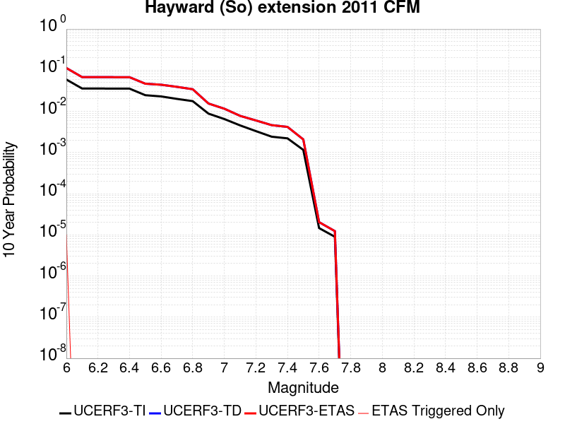 |

| Magnitude | 1 wk TI Prob | 1 wk TD Prob | 1 wk ETAS Prob | 1 wk ETAS/TD Gain | 1 wk ETAS Triggered Only | 1 mo TI Prob | 1 mo TD Prob | 1 mo ETAS Prob | 1 mo ETAS/TD Gain | 1 mo ETAS Triggered Only | 1 yr TI Prob | 1 yr TD Prob | 1 yr ETAS Prob | 1 yr ETAS/TD Gain | 1 yr ETAS Triggered Only | 10 yr TI Prob | 10 yr TD Prob | 10 yr ETAS Prob | 10 yr ETAS/TD Gain | 10 yr ETAS Triggered Only |
|-----|-----|-----|-----|-----|-----|-----|-----|-----|-----|-----|-----|-----|-----|-----|-----|-----|-----|-----|-----|-----|
| 6.0 | 1.1721256E-4 | 2.3641145E-4 | 2.3641145E-4 | 1.0 | 0.0 | 5.022428E-4 | 0.0010126645 | 0.0010126645 | 1.0 | 0.0 | 0.0060976758 | 0.012251104 | 0.012251104 | 1.0 | 0.0 | 0.0593305 | 0.11286992 | 0.11287879 | 1.0000786 | 1.0E-5 |
| 6.1 | 6.99169E-5 | 1.3797042E-4 | 1.3797042E-4 | 1.0 | 0.0 | 2.9960944E-4 | 5.9118203E-4 | 5.9118203E-4 | 1.0 | 0.0 | 0.0036416445 | 0.0071743643 | 0.0071743643 | 1.0 | 0.0 | 0.035825435 | 0.06782603 | 0.06782603 | 1.0 | 0.0 |
| 6.2 | 6.99169E-5 | 1.3797042E-4 | 1.3797042E-4 | 1.0 | 0.0 | 2.9960944E-4 | 5.9118203E-4 | 5.9118203E-4 | 1.0 | 0.0 | 0.0036416445 | 0.0071743643 | 0.0071743643 | 1.0 | 0.0 | 0.035825435 | 0.06782603 | 0.06782603 | 1.0 | 0.0 |
| 6.3 | 6.970908E-5 | 1.3765182E-4 | 1.3765182E-4 | 1.0 | 0.0 | 2.9871898E-4 | 5.8981724E-4 | 5.8981724E-4 | 1.0 | 0.0 | 0.0036308395 | 0.0071578994 | 0.0071578994 | 1.0 | 0.0 | 0.035720866 | 0.06767499 | 0.06767499 | 1.0 | 0.0 |
| 6.4 | 6.9517155E-5 | 1.373204E-4 | 1.373204E-4 | 1.0 | 0.0 | 2.9789665E-4 | 5.883975E-4 | 5.883975E-4 | 1.0 | 0.0 | 0.0036208609 | 0.0071408087 | 0.0071408087 | 1.0 | 0.0 | 0.03562429 | 0.06751901 | 0.06751901 | 1.0 | 0.0 |
| 6.5 | 4.786248E-5 | 9.4193885E-5 | 9.4193885E-5 | 1.0 | 0.0 | 2.0510878E-4 | 4.0362825E-4 | 4.0362825E-4 | 1.0 | 0.0 | 0.0024943394 | 0.00490351 | 0.00490351 | 1.0 | 0.0 | 0.02466527 | 0.046921626 | 0.046921626 | 1.0 | 0.0 |
| 6.6 | 4.4662214E-5 | 8.8859444E-5 | 8.8859444E-5 | 1.0 | 0.0 | 1.9139545E-4 | 3.807732E-4 | 3.807732E-4 | 1.0 | 0.0 | 0.0023277493 | 0.004626522 | 0.004626522 | 1.0 | 0.0 | 0.02303517 | 0.044312727 | 0.044312727 | 1.0 | 0.0 |
| 6.7 | 3.884542E-5 | 7.8689154E-5 | 7.8689154E-5 | 1.0 | 0.0 | 1.6646975E-4 | 3.3719814E-4 | 3.3719814E-4 | 1.0 | 0.0 | 0.002024885 | 0.004098104 | 0.004098104 | 1.0 | 0.0 | 0.020065336 | 0.03935182 | 0.03935182 | 1.0 | 0.0 |
| 6.8 | 3.4221863E-5 | 6.859417E-5 | 6.859417E-5 | 1.0 | 0.0 | 1.4665688E-4 | 2.9394426E-4 | 2.9394426E-4 | 1.0 | 0.0 | 0.0017840851 | 0.00357332 | 0.00357332 | 1.0 | 0.0 | 0.017698295 | 0.03443831 | 0.03443831 | 1.0 | 0.0 |
| 6.9 | 1.6927712E-5 | 3.0084795E-5 | 3.0084795E-5 | 1.0 | 0.0 | 7.2545314E-5 | 1.2892878E-4 | 1.2892878E-4 | 1.0 | 0.0 | 8.828813E-4 | 0.0015686346 | 0.0015686346 | 1.0 | 0.0 | 0.008793819 | 0.015474585 | 0.015474585 | 1.0 | 0.0 |
| 7.0 | 1.2509653E-5 | 2.2484324E-5 | 2.2484324E-5 | 1.0 | 0.0 | 5.3611697E-5 | 9.635808E-5 | 9.635808E-5 | 1.0 | 0.0 | 6.525269E-4 | 0.0011725724 | 0.0011725724 | 1.0 | 0.0 | 0.0065061417 | 0.011592993 | 0.011592993 | 1.0 | 0.0 |
| 7.1 | 8.751583E-6 | 1.49442185E-5 | 1.49442185E-5 | 1.0 | 0.0 | 3.750624E-5 | 6.404511E-5 | 6.404511E-5 | 1.0 | 0.0 | 4.5654282E-4 | 7.7947613E-4 | 7.7947613E-4 | 1.0 | 0.0 | 0.0045560603 | 0.0077727833 | 0.0077727833 | 1.0 | 0.0 |
| 7.2 | 6.354379E-6 | 1.1516424E-5 | 1.1516424E-5 | 1.0 | 0.0 | 2.7232769E-5 | 4.9355196E-5 | 4.9355196E-5 | 1.0 | 0.0 | 3.3150852E-4 | 6.007387E-4 | 6.007387E-4 | 1.0 | 0.0 | 0.0033101442 | 0.0060092374 | 0.0060092374 | 1.0 | 0.0 |
| 7.3 | 4.645554E-6 | 8.834951E-6 | 8.834951E-6 | 1.0 | 0.0 | 1.9909365E-5 | 3.786355E-5 | 3.786355E-5 | 1.0 | 0.0 | 2.4236954E-4 | 4.6089516E-4 | 4.6089516E-4 | 1.0 | 0.0 | 0.0024210536 | 0.0046191737 | 0.0046191737 | 1.0 | 0.0 |
| 7.4 | 4.23437E-6 | 8.008871E-6 | 8.008871E-6 | 1.0 | 0.0 | 1.8147173E-5 | 3.4323304E-5 | 3.4323304E-5 | 1.0 | 0.0 | 2.2091944E-4 | 4.1780996E-4 | 4.1780996E-4 | 1.0 | 0.0 | 0.0022069993 | 0.00419023 | 0.00419023 | 1.0 | 0.0 |
| 7.5 | 2.2187417E-6 | 3.964443E-6 | 3.964443E-6 | 1.0 | 0.0 | 9.508858E-6 | 1.6990374E-5 | 1.6990374E-5 | 1.0 | 0.0 | 1.157642E-4 | 2.068408E-4 | 2.068408E-4 | 1.0 | 0.0 | 0.0011570391 | 0.0020797048 | 0.0020797048 | 1.0 | 0.0 |
| 7.6 | 2.7952495E-8 | 3.88089E-8 | 3.88089E-8 | 1.0 | 0.0 | 1.1979641E-7 | 1.6632383E-7 | 1.6632383E-7 | 1.0 | 0.0 | 1.4585203E-6 | 2.0249909E-6 | 2.0249909E-6 | 1.0 | 0.0 | 1.4585107E-5 | 2.034046E-5 | 2.034046E-5 | 1.0 | 0.0 |
| 7.7 | 1.7192724E-8 | 2.3454316E-8 | 2.3454316E-8 | 1.0 | 0.0 | 7.36831E-8 | 1.0051849E-7 | 1.0051849E-7 | 1.0 | 0.0 | 8.9709135E-7 | 1.223812E-6 | 1.223812E-6 | 1.0 | 0.0 | 8.970877E-6 | 1.2306199E-5 | 1.2306199E-5 | 1.0 | 0.0 |

## Hat Creek-McArthur-Mayfield
*[(top)](#table-of-contents)*

| 1 Week | 1 Month | 1 Year | 10 Year |
|-----|-----|-----|-----|
| 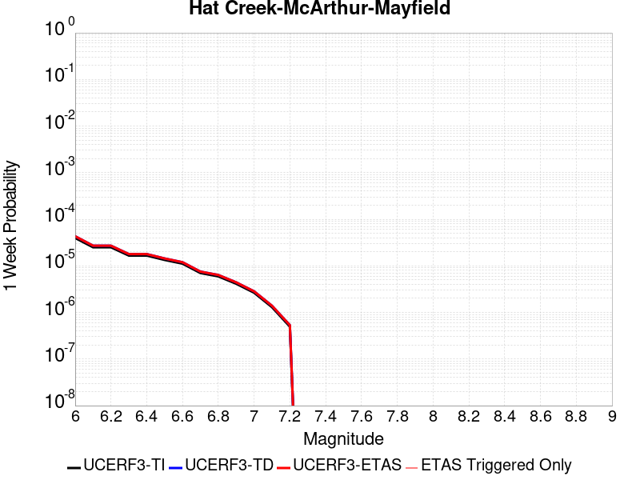 | 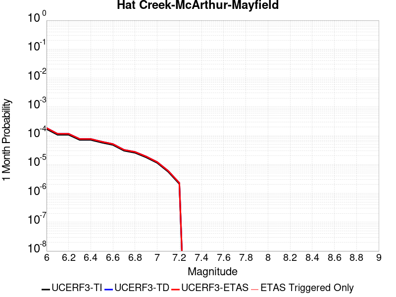 |  |  |

| Magnitude | 1 wk TI Prob | 1 wk TD Prob | 1 wk ETAS Prob | 1 wk ETAS/TD Gain | 1 wk ETAS Triggered Only | 1 mo TI Prob | 1 mo TD Prob | 1 mo ETAS Prob | 1 mo ETAS/TD Gain | 1 mo ETAS Triggered Only | 1 yr TI Prob | 1 yr TD Prob | 1 yr ETAS Prob | 1 yr ETAS/TD Gain | 1 yr ETAS Triggered Only | 10 yr TI Prob | 10 yr TD Prob | 10 yr ETAS Prob | 10 yr ETAS/TD Gain | 10 yr ETAS Triggered Only |
|-----|-----|-----|-----|-----|-----|-----|-----|-----|-----|-----|-----|-----|-----|-----|-----|-----|-----|-----|-----|-----|
| 6.0 | 3.967457E-5 | 4.316033E-5 | 4.316033E-5 | 1.0 | 0.0 | 1.7002279E-4 | 1.8496037E-4 | 1.8496037E-4 | 1.0 | 0.0 | 0.002068062 | 0.0022496812 | 0.0022496812 | 1.0 | 0.0 | 0.02048922 | 0.02228143 | 0.022291208 | 1.0004388 | 1.0E-5 |
| 6.1 | 2.5044013E-5 | 2.707233E-5 | 2.707233E-5 | 1.0 | 0.0 | 1.0732707E-4 | 1.1601929E-4 | 1.1601929E-4 | 1.0 | 0.0 | 0.0013059238 | 0.0014116514 | 0.0014116514 | 1.0 | 0.0 | 0.01298276 | 0.014030261 | 0.014030261 | 1.0 | 0.0 |
| 6.2 | 2.5044013E-5 | 2.707233E-5 | 2.707233E-5 | 1.0 | 0.0 | 1.0732707E-4 | 1.1601929E-4 | 1.1601929E-4 | 1.0 | 0.0 | 0.0013059238 | 0.0014116514 | 0.0014116514 | 1.0 | 0.0 | 0.01298276 | 0.014030261 | 0.014030261 | 1.0 | 0.0 |
| 6.3 | 1.6624012E-5 | 1.7891796E-5 | 1.7891796E-5 | 1.0 | 0.0 | 7.124382E-5 | 7.667692E-5 | 7.667692E-5 | 1.0 | 0.0 | 8.670483E-4 | 9.331503E-4 | 9.331503E-4 | 1.0 | 0.0 | 0.008636732 | 0.0092932535 | 0.0092932535 | 1.0 | 0.0 |
| 6.4 | 1.6624012E-5 | 1.7891796E-5 | 1.7891796E-5 | 1.0 | 0.0 | 7.124382E-5 | 7.667692E-5 | 7.667692E-5 | 1.0 | 0.0 | 8.670483E-4 | 9.331503E-4 | 9.331503E-4 | 1.0 | 0.0 | 0.008636732 | 0.0092932535 | 0.0092932535 | 1.0 | 0.0 |
| 6.5 | 1.3394842E-5 | 1.4392706E-5 | 1.4392706E-5 | 1.0 | 0.0 | 5.7405203E-5 | 6.1681596E-5 | 6.1681596E-5 | 1.0 | 0.0 | 6.986842E-4 | 7.5072027E-4 | 7.5072027E-4 | 1.0 | 0.0 | 0.006964916 | 0.0074824356 | 0.0074824356 | 1.0 | 0.0 |
| 6.6 | 1.1137514E-5 | 1.1955011E-5 | 1.1955011E-5 | 1.0 | 0.0 | 4.7731326E-5 | 5.123478E-5 | 5.123478E-5 | 1.0 | 0.0 | 5.809739E-4 | 6.2360894E-4 | 6.2360894E-4 | 1.0 | 0.0 | 0.005794574 | 0.0062190117 | 0.0062190117 | 1.0 | 0.0 |
| 6.7 | 7.0200663E-6 | 7.5245766E-6 | 7.5245766E-6 | 1.0 | 0.0 | 3.008565E-5 | 3.2247797E-5 | 3.2247797E-5 | 1.0 | 0.0 | 3.6623122E-4 | 3.9254778E-4 | 3.9254778E-4 | 1.0 | 0.0 | 0.0036562826 | 0.0039187064 | 0.0039187064 | 1.0 | 0.0 |
| 6.8 | 5.940172E-6 | 6.3657185E-6 | 6.3657185E-6 | 1.0 | 0.0 | 2.545763E-5 | 2.7281372E-5 | 2.7281372E-5 | 1.0 | 0.0 | 3.0990256E-4 | 3.3210136E-4 | 3.3210136E-4 | 1.0 | 0.0 | 0.0030947074 | 0.0033161794 | 0.0033161794 | 1.0 | 0.0 |
| 6.9 | 4.129831E-6 | 4.423714E-6 | 4.423714E-6 | 1.0 | 0.0 | 1.7699154E-5 | 1.895864E-5 | 1.895864E-5 | 1.0 | 0.0 | 2.154659E-4 | 2.307978E-4 | 2.307978E-4 | 1.0 | 0.0 | 0.002152571 | 0.0023056592 | 0.0023056592 | 1.0 | 0.0 |
| 7.0 | 2.6512955E-6 | 2.837506E-6 | 2.837506E-6 | 1.0 | 0.0 | 1.1362646E-5 | 1.21606845E-5 | 1.21606845E-5 | 1.0 | 0.0 | 1.3833142E-4 | 1.480467E-4 | 1.480467E-4 | 1.0 | 0.0 | 0.0013824535 | 0.0014795234 | 0.0014795234 | 1.0 | 0.0 |
| 7.1 | 1.2992575E-6 | 1.3909838E-6 | 1.3909838E-6 | 1.0 | 0.0 | 5.568235E-6 | 5.961347E-6 | 5.961347E-6 | 1.0 | 0.0 | 6.779115E-5 | 7.2577204E-5 | 7.2577204E-5 | 1.0 | 0.0 | 6.7770475E-4 | 7.2555663E-4 | 7.2555663E-4 | 1.0 | 0.0 |
| 7.2 | 4.968191E-7 | 5.327352E-7 | 5.327352E-7 | 1.0 | 0.0 | 2.1292228E-6 | 2.2831496E-6 | 2.2831496E-6 | 1.0 | 0.0 | 2.592298E-5 | 2.7797118E-5 | 2.7797118E-5 | 1.0 | 0.0 | 2.5919956E-4 | 2.7794877E-4 | 2.7794877E-4 | 1.0 | 0.0 |

## Likely 2011 CFM
*[(top)](#table-of-contents)*

| 1 Week | 1 Month | 1 Year | 10 Year |
|-----|-----|-----|-----|
|  |  |  | 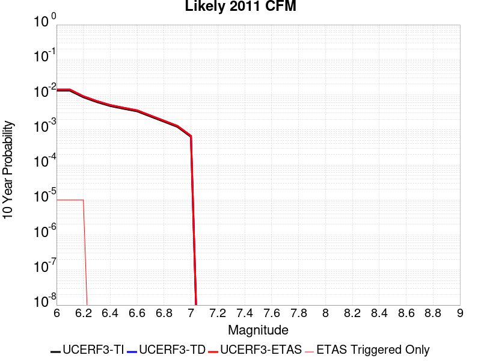 |

| Magnitude | 1 wk TI Prob | 1 wk TD Prob | 1 wk ETAS Prob | 1 wk ETAS/TD Gain | 1 wk ETAS Triggered Only | 1 mo TI Prob | 1 mo TD Prob | 1 mo ETAS Prob | 1 mo ETAS/TD Gain | 1 mo ETAS Triggered Only | 1 yr TI Prob | 1 yr TD Prob | 1 yr ETAS Prob | 1 yr ETAS/TD Gain | 1 yr ETAS Triggered Only | 10 yr TI Prob | 10 yr TD Prob | 10 yr ETAS Prob | 10 yr ETAS/TD Gain | 10 yr ETAS Triggered Only |
|-----|-----|-----|-----|-----|-----|-----|-----|-----|-----|-----|-----|-----|-----|-----|-----|-----|-----|-----|-----|-----|
| 6.0 | 2.5315949E-5 | 2.7105765E-5 | 2.7105765E-5 | 1.0 | 0.0 | 1.0849241E-4 | 1.1616265E-4 | 1.1616265E-4 | 1.0 | 0.0 | 0.0013200947 | 0.0014134073 | 0.0014134073 | 1.0 | 0.0 | 0.013122803 | 0.014048834 | 0.014058694 | 1.0007018 | 1.0E-5 |
| 6.1 | 2.5315949E-5 | 2.7105765E-5 | 2.7105765E-5 | 1.0 | 0.0 | 1.0849241E-4 | 1.1616265E-4 | 1.1616265E-4 | 1.0 | 0.0 | 0.0013200947 | 0.0014134073 | 0.0014134073 | 1.0 | 0.0 | 0.013122803 | 0.014048834 | 0.014058694 | 1.0007018 | 1.0E-5 |
| 6.2 | 1.6375941E-5 | 1.746646E-5 | 1.746646E-5 | 1.0 | 0.0 | 7.0180715E-5 | 7.485418E-5 | 7.485418E-5 | 1.0 | 0.0 | 8.5411523E-4 | 9.109808E-4 | 9.109808E-4 | 1.0 | 0.0 | 0.008508399 | 0.009073752 | 0.009083661 | 1.0010921 | 1.0E-5 |
| 6.3 | 1.1945543E-5 | 1.271302E-5 | 1.271302E-5 | 1.0 | 0.0 | 5.119418E-5 | 5.4483266E-5 | 5.4483266E-5 | 1.0 | 0.0 | 6.2311086E-4 | 6.631372E-4 | 6.631372E-4 | 1.0 | 0.0 | 0.0062136655 | 0.0066121393 | 0.0066121393 | 1.0 | 0.0 |
| 6.4 | 9.192729E-6 | 9.768813E-6 | 9.768813E-6 | 1.0 | 0.0 | 3.939681E-5 | 4.1865682E-5 | 4.1865682E-5 | 1.0 | 0.0 | 4.7955062E-4 | 5.095982E-4 | 5.095982E-4 | 1.0 | 0.0 | 0.004785171 | 0.005084578 | 0.005084578 | 1.0 | 0.0 |
| 6.5 | 7.67906E-6 | 8.152889E-6 | 8.152889E-6 | 1.0 | 0.0 | 3.2909844E-5 | 3.4940495E-5 | 3.4940495E-5 | 1.0 | 0.0 | 4.006037E-4 | 4.253194E-4 | 4.253194E-4 | 1.0 | 0.0 | 0.0039988225 | 0.0042452468 | 0.0042452468 | 1.0 | 0.0 |
| 6.6 | 6.4884057E-6 | 6.8849736E-6 | 6.8849736E-6 | 1.0 | 0.0 | 2.7807157E-5 | 2.9506704E-5 | 2.9506704E-5 | 1.0 | 0.0 | 3.3849955E-4 | 3.5918635E-4 | 3.5918635E-4 | 1.0 | 0.0 | 0.003379844 | 0.0035862029 | 0.0035862029 | 1.0 | 0.0 |
| 6.7 | 4.6060636E-6 | 4.8841976E-6 | 4.8841976E-6 | 1.0 | 0.0 | 1.9740122E-5 | 2.0932112E-5 | 2.0932112E-5 | 1.0 | 0.0 | 2.403095E-4 | 2.548195E-4 | 2.548195E-4 | 1.0 | 0.0 | 0.002400498 | 0.002545356 | 0.002545356 | 1.0 | 0.0 |
| 6.8 | 3.2795615E-6 | 3.4774844E-6 | 3.4774844E-6 | 1.0 | 0.0 | 1.4055187E-5 | 1.4903422E-5 | 1.4903422E-5 | 1.0 | 0.0 | 1.7110848E-4 | 1.8143462E-4 | 1.8143462E-4 | 1.0 | 0.0 | 0.0017097679 | 0.0018129202 | 0.0018129202 | 1.0 | 0.0 |
| 6.9 | 2.3289967E-6 | 2.4706364E-6 | 2.4706364E-6 | 1.0 | 0.0 | 9.981376E-6 | 1.0588402E-5 | 1.0588402E-5 | 1.0 | 0.0 | 1.2151648E-4 | 1.289066E-4 | 1.289066E-4 | 1.0 | 0.0 | 0.0012145005 | 0.0012883613 | 0.0012883613 | 1.0 | 0.0 |
| 7.0 | 1.211292E-6 | 1.2864381E-6 | 1.2864381E-6 | 1.0 | 0.0 | 5.1912407E-6 | 5.513296E-6 | 5.513296E-6 | 1.0 | 0.0 | 6.320152E-5 | 6.7122615E-5 | 6.7122615E-5 | 1.0 | 0.0 | 6.3183554E-4 | 6.7105325E-4 | 6.7105325E-4 | 1.0 | 0.0 |

## Concord 2011 CFM
*[(top)](#table-of-contents)*

| 1 Week | 1 Month | 1 Year | 10 Year |
|-----|-----|-----|-----|
|  |  |  |  |

| Magnitude | 1 wk TI Prob | 1 wk TD Prob | 1 wk ETAS Prob | 1 wk ETAS/TD Gain | 1 wk ETAS Triggered Only | 1 mo TI Prob | 1 mo TD Prob | 1 mo ETAS Prob | 1 mo ETAS/TD Gain | 1 mo ETAS Triggered Only | 1 yr TI Prob | 1 yr TD Prob | 1 yr ETAS Prob | 1 yr ETAS/TD Gain | 1 yr ETAS Triggered Only | 10 yr TI Prob | 10 yr TD Prob | 10 yr ETAS Prob | 10 yr ETAS/TD Gain | 10 yr ETAS Triggered Only |
|-----|-----|-----|-----|-----|-----|-----|-----|-----|-----|-----|-----|-----|-----|-----|-----|-----|-----|-----|-----|-----|
| 6.0 | 5.7865112E-5 | 9.75978E-5 | 9.75978E-5 | 1.0 | 0.0 | 2.4796976E-4 | 4.1818517E-4 | 4.1818517E-4 | 1.0 | 0.0 | 0.0030148525 | 0.0050797113 | 0.0050797113 | 1.0 | 0.0 | 0.029742775 | 0.049251437 | 0.049260944 | 1.000193 | 1.0E-5 |
| 6.1 | 5.7865112E-5 | 9.75978E-5 | 9.75978E-5 | 1.0 | 0.0 | 2.4796976E-4 | 4.1818517E-4 | 4.1818517E-4 | 1.0 | 0.0 | 0.0030148525 | 0.0050797113 | 0.0050797113 | 1.0 | 0.0 | 0.029742775 | 0.049251437 | 0.049260944 | 1.000193 | 1.0E-5 |
| 6.2 | 5.6789337E-5 | 9.580088E-5 | 9.580088E-5 | 1.0 | 0.0 | 2.4336016E-4 | 4.1048654E-4 | 4.1048654E-4 | 1.0 | 0.0 | 0.0029588845 | 0.004986411 | 0.004986411 | 1.0 | 0.0 | 0.029197963 | 0.048367858 | 0.048377376 | 1.0001967 | 1.0E-5 |
| 6.3 | 5.203322E-5 | 8.803388E-5 | 8.803388E-5 | 1.0 | 0.0 | 2.2298045E-4 | 3.7723788E-4 | 3.7723788E-4 | 1.0 | 0.0 | 0.0027114071 | 0.0045839828 | 0.0045839828 | 1.0 | 0.0 | 0.026785625 | 0.044538308 | 0.044547863 | 1.0002146 | 1.0E-5 |
| 6.4 | 4.7120942E-5 | 7.897702E-5 | 7.897702E-5 | 1.0 | 0.0 | 2.0193127E-4 | 3.3843325E-4 | 3.3843325E-4 | 1.0 | 0.0 | 0.0024557412 | 0.004113385 | 0.004113385 | 1.0 | 0.0 | 0.024287801 | 0.04006697 | 0.04007657 | 1.0002396 | 1.0E-5 |
| 6.5 | 2.9598437E-5 | 4.6676752E-5 | 4.6676752E-5 | 1.0 | 0.0 | 1.2684427E-4 | 2.0002908E-4 | 2.0002908E-4 | 1.0 | 0.0 | 0.001543235 | 0.0024328444 | 0.0024328444 | 1.0 | 0.0 | 0.015325619 | 0.023910914 | 0.023910914 | 1.0 | 0.0 |
| 6.6 | 2.0443718E-5 | 2.9985775E-5 | 2.9985775E-5 | 1.0 | 0.0 | 8.7613E-5 | 1.2850434E-4 | 1.2850434E-4 | 1.0 | 0.0 | 0.0010661662 | 0.0015634537 | 0.0015634537 | 1.0 | 0.0 | 0.010610655 | 0.015467727 | 0.015467727 | 1.0 | 0.0 |
| 6.7 | 1.798539E-5 | 2.5558722E-5 | 2.5558722E-5 | 1.0 | 0.0 | 7.7077966E-5 | 1.09532906E-4 | 1.09532906E-4 | 1.0 | 0.0 | 9.380202E-4 | 0.0013327688 | 0.0013327688 | 1.0 | 0.0 | 0.009340706 | 0.013218116 | 0.013218116 | 1.0 | 0.0 |
| 6.8 | 1.613555E-5 | 2.1960415E-5 | 2.1960415E-5 | 1.0 | 0.0 | 6.915052E-5 | 9.411275E-5 | 9.411275E-5 | 1.0 | 0.0 | 8.4158237E-4 | 0.0011452344 | 0.0011452344 | 1.0 | 0.0 | 0.008384023 | 0.011378822 | 0.011378822 | 1.0 | 0.0 |
| 6.9 | 1.2916435E-5 | 1.7082068E-5 | 1.7082068E-5 | 1.0 | 0.0 | 5.5354973E-5 | 7.320684E-5 | 7.320684E-5 | 1.0 | 0.0 | 6.7373837E-4 | 8.909346E-4 | 8.909346E-4 | 1.0 | 0.0 | 0.006716994 | 0.008867661 | 0.008867661 | 1.0 | 0.0 |
| 7.0 | 9.81129E-6 | 1.2631684E-5 | 1.2631684E-5 | 1.0 | 0.0 | 4.2047708E-5 | 5.4134674E-5 | 5.4134674E-5 | 1.0 | 0.0 | 5.118106E-4 | 6.58892E-4 | 6.58892E-4 | 1.0 | 0.0 | 0.005106334 | 0.006569596 | 0.006569596 | 1.0 | 0.0 |
| 7.1 | 8.0889195E-6 | 1.04190285E-5 | 1.04190285E-5 | 1.0 | 0.0 | 3.4666336E-5 | 4.465222E-5 | 4.465222E-5 | 1.0 | 0.0 | 4.219809E-4 | 5.4350623E-4 | 5.4350623E-4 | 1.0 | 0.0 | 0.004211805 | 0.0054219957 | 0.0054219957 | 1.0 | 0.0 |
| 7.2 | 6.267438E-6 | 8.1163535E-6 | 8.1163535E-6 | 1.0 | 0.0 | 2.6860173E-5 | 3.4783912E-5 | 3.4783912E-5 | 1.0 | 0.0 | 3.2697353E-4 | 4.234126E-4 | 4.234126E-4 | 1.0 | 0.0 | 0.0032649285 | 0.0042263092 | 0.0042263092 | 1.0 | 0.0 |
| 7.3 | 3.6761196E-6 | 4.8406678E-6 | 4.8406678E-6 | 1.0 | 0.0 | 1.5754704E-5 | 2.0745554E-5 | 2.0745554E-5 | 1.0 | 0.0 | 1.9179663E-4 | 2.5254808E-4 | 2.5254808E-4 | 1.0 | 0.0 | 0.0019163118 | 0.0025227482 | 0.0025227482 | 1.0 | 0.0 |
| 7.4 | 2.8044356E-6 | 3.7100665E-6 | 3.7100665E-6 | 1.0 | 0.0 | 1.2018954E-5 | 1.5900188E-5 | 1.5900188E-5 | 1.0 | 0.0 | 1.4632095E-4 | 1.9356771E-4 | 1.9356771E-4 | 1.0 | 0.0 | 0.0014622464 | 0.0019340892 | 0.0019340892 | 1.0 | 0.0 |
| 7.5 | 2.4578699E-6 | 3.2450664E-6 | 3.2450664E-6 | 1.0 | 0.0 | 1.0533685E-5 | 1.3907354E-5 | 1.3907354E-5 | 1.0 | 0.0 | 1.2824008E-4 | 1.6930899E-4 | 1.6930899E-4 | 1.0 | 0.0 | 0.0012816609 | 0.0016918806 | 0.0016918806 | 1.0 | 0.0 |
| 7.6 | 1.7713267E-6 | 2.335252E-6 | 2.335252E-6 | 1.0 | 0.0 | 7.591378E-6 | 1.0008185E-5 | 1.0008185E-5 | 1.0 | 0.0 | 9.2421105E-5 | 1.2184294E-4 | 1.2184294E-4 | 1.0 | 0.0 | 9.2382677E-4 | 0.0012178146 | 0.0012178146 | 1.0 | 0.0 |
| 7.7 | 5.1912366E-7 | 6.829115E-7 | 6.829115E-7 | 1.0 | 0.0 | 2.2248137E-6 | 2.9267603E-6 | 2.9267603E-6 | 1.0 | 0.0 | 2.708677E-5 | 3.5632736E-5 | 3.5632736E-5 | 1.0 | 0.0 | 2.708347E-4 | 3.5627818E-4 | 3.5627818E-4 | 1.0 | 0.0 |

## Quien Sabe 2011 CFM
*[(top)](#table-of-contents)*

| 1 Week | 1 Month | 1 Year | 10 Year |
|-----|-----|-----|-----|
|  |  |  |  |

| Magnitude | 1 wk TI Prob | 1 wk TD Prob | 1 wk ETAS Prob | 1 wk ETAS/TD Gain | 1 wk ETAS Triggered Only | 1 mo TI Prob | 1 mo TD Prob | 1 mo ETAS Prob | 1 mo ETAS/TD Gain | 1 mo ETAS Triggered Only | 1 yr TI Prob | 1 yr TD Prob | 1 yr ETAS Prob | 1 yr ETAS/TD Gain | 1 yr ETAS Triggered Only | 10 yr TI Prob | 10 yr TD Prob | 10 yr ETAS Prob | 10 yr ETAS/TD Gain | 10 yr ETAS Triggered Only |
|-----|-----|-----|-----|-----|-----|-----|-----|-----|-----|-----|-----|-----|-----|-----|-----|-----|-----|-----|-----|-----|
| 6.0 | 3.729899E-5 | 7.092325E-5 | 7.092325E-5 | 1.0 | 0.0 | 1.5984301E-4 | 3.0393052E-4 | 3.0393052E-4 | 1.0 | 0.0 | 0.0019443515 | 0.0036857617 | 0.003695725 | 1.0027032 | 1.0E-5 | 0.019274272 | 0.035356108 | 0.035365757 | 1.0002729 | 1.0E-5 |
| 6.1 | 1.7825725E-5 | 3.3166325E-5 | 3.3166325E-5 | 1.0 | 0.0 | 7.639373E-5 | 1.4213617E-4 | 1.4213617E-4 | 1.0 | 0.0 | 9.296967E-4 | 0.0017270017 | 0.0017369845 | 1.0057803 | 1.0E-5 | 0.009258169 | 0.016701793 | 0.016711628 | 1.0005888 | 1.0E-5 |
| 6.2 | 4.8865336E-6 | 7.807912E-6 | 7.807912E-6 | 1.0 | 0.0 | 2.0942118E-5 | 3.3462104E-5 | 3.3462104E-5 | 1.0 | 0.0 | 2.5494045E-4 | 4.0700758E-4 | 4.0700758E-4 | 1.0 | 0.0 | 0.0025464818 | 0.0040144515 | 0.0040144515 | 1.0 | 0.0 |
| 6.3 | 3.858491E-6 | 5.7910643E-6 | 5.7910643E-6 | 1.0 | 0.0 | 1.6536285E-5 | 2.4818637E-5 | 2.4818637E-5 | 1.0 | 0.0 | 2.0131067E-4 | 3.0212972E-4 | 3.0212972E-4 | 1.0 | 0.0 | 0.002011284 | 0.0030027127 | 0.0030027127 | 1.0 | 0.0 |
| 6.4 | 3.0771805E-6 | 4.3862256E-6 | 4.3862256E-6 | 1.0 | 0.0 | 1.318785E-5 | 1.8797988E-5 | 1.8797988E-5 | 1.0 | 0.0 | 1.6055023E-4 | 2.288439E-4 | 2.288439E-4 | 1.0 | 0.0 | 0.001604343 | 0.0022871757 | 0.0022871757 | 1.0 | 0.0 |
| 6.5 | 2.5081235E-6 | 3.464801E-6 | 3.464801E-6 | 1.0 | 0.0 | 1.0749056E-5 | 1.4849071E-5 | 1.4849071E-5 | 1.0 | 0.0 | 1.308619E-4 | 1.8077392E-4 | 1.8077392E-4 | 1.0 | 0.0 | 0.0013078486 | 0.0018129501 | 0.0018129501 | 1.0 | 0.0 |
| 6.6 | 1.7505364E-6 | 2.4032984E-6 | 2.4032984E-6 | 1.0 | 0.0 | 7.502277E-6 | 1.0299814E-5 | 1.0299814E-5 | 1.0 | 0.0 | 9.13364E-5 | 1.2539372E-4 | 1.2539372E-4 | 1.0 | 0.0 | 9.129886E-4 | 0.0012587844 | 0.0012587844 | 1.0 | 0.0 |
| 6.7 | 1.505737E-6 | 2.0646307E-6 | 2.0646307E-6 | 1.0 | 0.0 | 6.4531428E-6 | 8.848391E-6 | 8.848391E-6 | 1.0 | 0.0 | 7.8564175E-5 | 1.0772444E-4 | 1.0772444E-4 | 1.0 | 0.0 | 7.853641E-4 | 0.0010822661 | 0.0010822661 | 1.0 | 0.0 |
| 6.8 | 1.2924105E-6 | 1.7492055E-6 | 1.7492055E-6 | 1.0 | 0.0 | 5.5388905E-6 | 7.4965765E-6 | 7.4965765E-6 | 1.0 | 0.0 | 6.74339E-5 | 9.1267546E-5 | 9.1267546E-5 | 1.0 | 0.0 | 6.741344E-4 | 9.1650325E-4 | 9.1650325E-4 | 1.0 | 0.0 |
| 6.9 | 8.9075286E-7 | 1.1253261E-6 | 1.1253261E-6 | 1.0 | 0.0 | 3.8175067E-6 | 4.822818E-6 | 4.822818E-6 | 1.0 | 0.0 | 4.6477155E-5 | 5.8716454E-5 | 5.8716454E-5 | 1.0 | 0.0 | 4.6467435E-4 | 5.9056317E-4 | 5.9056317E-4 | 1.0 | 0.0 |
| 7.0 | 6.6891175E-7 | 8.519068E-7 | 8.519068E-7 | 1.0 | 0.0 | 2.8667614E-6 | 3.6510253E-6 | 3.6510253E-6 | 1.0 | 0.0 | 3.4902263E-5 | 4.4450524E-5 | 4.4450524E-5 | 1.0 | 0.0 | 3.4896782E-4 | 4.4691085E-4 | 4.4691085E-4 | 1.0 | 0.0 |
| 7.1 | 4.4205015E-7 | 5.393645E-7 | 5.393645E-7 | 1.0 | 0.0 | 1.8944993E-6 | 2.3115613E-6 | 2.3115613E-6 | 1.0 | 0.0 | 2.3065284E-5 | 2.8143064E-5 | 2.8143064E-5 | 1.0 | 0.0 | 2.3062891E-4 | 2.8277887E-4 | 2.8277887E-4 | 1.0 | 0.0 |
| 7.2 | 1.6620965E-7 | 1.5997604E-7 | 1.5997604E-7 | 1.0 | 0.0 | 7.123269E-7 | 6.856114E-7 | 6.856114E-7 | 1.0 | 0.0 | 8.672545E-6 | 8.347291E-6 | 8.347291E-6 | 1.0 | 0.0 | 8.6722066E-5 | 8.362542E-5 | 8.362542E-5 | 1.0 | 0.0 |
| 7.3 | 1.2142488E-7 | 1.17287904E-7 | 1.17287904E-7 | 1.0 | 0.0 | 5.2039223E-7 | 5.026624E-7 | 5.026624E-7 | 1.0 | 0.0 | 6.335757E-6 | 6.1199007E-6 | 6.1199007E-6 | 1.0 | 0.0 | 6.3355765E-5 | 6.1260405E-5 | 6.1260405E-5 | 1.0 | 0.0 |
| 7.4 | 2.4192937E-8 | 2.4547367E-8 | 2.4547367E-8 | 1.0 | 0.0 | 1.0368401E-7 | 1.0520299E-7 | 1.0520299E-7 | 1.0 | 0.0 | 1.2623522E-6 | 1.2808458E-6 | 1.2808458E-6 | 1.0 | 0.0 | 1.2623449E-5 | 1.28147285E-5 | 1.28147285E-5 | 1.0 | 0.0 |
| 7.5 | 1.4432802E-8 | 1.4507986E-8 | 1.4507986E-8 | 1.0 | 0.0 | 6.185486E-8 | 6.217708E-8 | 6.217708E-8 | 1.0 | 0.0 | 7.530827E-7 | 7.570058E-7 | 7.570058E-7 | 1.0 | 0.0 | 7.530801E-6 | 7.574308E-6 | 7.574308E-6 | 1.0 | 0.0 |

## Carson Range (Genoa)
*[(top)](#table-of-contents)*

| 1 Week | 1 Month | 1 Year | 10 Year |
|-----|-----|-----|-----|
|  |  |  |  |

| Magnitude | 1 wk TI Prob | 1 wk TD Prob | 1 wk ETAS Prob | 1 wk ETAS/TD Gain | 1 wk ETAS Triggered Only | 1 mo TI Prob | 1 mo TD Prob | 1 mo ETAS Prob | 1 mo ETAS/TD Gain | 1 mo ETAS Triggered Only | 1 yr TI Prob | 1 yr TD Prob | 1 yr ETAS Prob | 1 yr ETAS/TD Gain | 1 yr ETAS Triggered Only | 10 yr TI Prob | 10 yr TD Prob | 10 yr ETAS Prob | 10 yr ETAS/TD Gain | 10 yr ETAS Triggered Only |
|-----|-----|-----|-----|-----|-----|-----|-----|-----|-----|-----|-----|-----|-----|-----|-----|-----|-----|-----|-----|-----|
| 6.0 | 4.1268457E-5 | 5.0152623E-5 | 5.0152623E-5 | 1.0 | 0.0 | 1.7685282E-4 | 2.1492435E-4 | 2.1492435E-4 | 1.0 | 0.0 | 0.0021510567 | 0.0026139517 | 0.0026239257 | 1.0038157 | 1.0E-5 | 0.02130354 | 0.025871726 | 0.025881467 | 1.0003765 | 1.0E-5 |
| 6.1 | 4.1268457E-5 | 5.0152623E-5 | 5.0152623E-5 | 1.0 | 0.0 | 1.7685282E-4 | 2.1492435E-4 | 2.1492435E-4 | 1.0 | 0.0 | 0.0021510567 | 0.0026139517 | 0.0026239257 | 1.0038157 | 1.0E-5 | 0.02130354 | 0.025871726 | 0.025881467 | 1.0003765 | 1.0E-5 |
| 6.2 | 4.1268457E-5 | 5.0152623E-5 | 5.0152623E-5 | 1.0 | 0.0 | 1.7685282E-4 | 2.1492435E-4 | 2.1492435E-4 | 1.0 | 0.0 | 0.0021510567 | 0.0026139517 | 0.0026239257 | 1.0038157 | 1.0E-5 | 0.02130354 | 0.025871726 | 0.025881467 | 1.0003765 | 1.0E-5 |
| 6.3 | 4.1268457E-5 | 5.0152623E-5 | 5.0152623E-5 | 1.0 | 0.0 | 1.7685282E-4 | 2.1492435E-4 | 2.1492435E-4 | 1.0 | 0.0 | 0.0021510567 | 0.0026139517 | 0.0026239257 | 1.0038157 | 1.0E-5 | 0.02130354 | 0.025871726 | 0.025881467 | 1.0003765 | 1.0E-5 |
| 6.4 | 4.1268457E-5 | 5.0152623E-5 | 5.0152623E-5 | 1.0 | 0.0 | 1.7685282E-4 | 2.1492435E-4 | 2.1492435E-4 | 1.0 | 0.0 | 0.0021510567 | 0.0026139517 | 0.0026239257 | 1.0038157 | 1.0E-5 | 0.02130354 | 0.025871726 | 0.025881467 | 1.0003765 | 1.0E-5 |
| 6.5 | 2.5677185E-5 | 3.098169E-5 | 3.098169E-5 | 1.0 | 0.0 | 1.1004044E-4 | 1.3277293E-4 | 1.3277293E-4 | 1.0 | 0.0 | 0.0013389189 | 0.00161549 | 0.0016254738 | 1.00618 | 1.0E-5 | 0.0133088045 | 0.016055394 | 0.016065234 | 1.0006129 | 1.0E-5 |
| 6.6 | 2.5677185E-5 | 3.098169E-5 | 3.098169E-5 | 1.0 | 0.0 | 1.1004044E-4 | 1.3277293E-4 | 1.3277293E-4 | 1.0 | 0.0 | 0.0013389189 | 0.00161549 | 0.0016254738 | 1.00618 | 1.0E-5 | 0.0133088045 | 0.016055394 | 0.016065234 | 1.0006129 | 1.0E-5 |
| 6.7 | 1.9969408E-5 | 2.4066088E-5 | 2.4066088E-5 | 1.0 | 0.0 | 8.558037E-5 | 1.0313717E-4 | 1.0313717E-4 | 1.0 | 0.0 | 0.0010414429 | 0.0012551253 | 0.0012551253 | 1.0 | 0.0 | 0.010365757 | 0.012495526 | 0.012495526 | 1.0 | 0.0 |
| 6.8 | 1.4783156E-5 | 1.781951E-5 | 1.781951E-5 | 1.0 | 0.0 | 6.335485E-5 | 7.6367825E-5 | 7.6367825E-5 | 1.0 | 0.0 | 7.710722E-4 | 9.2951185E-4 | 9.2951185E-4 | 1.0 | 0.0 | 0.0076840227 | 0.00926903 | 0.00926903 | 1.0 | 0.0 |
| 6.9 | 1.06660555E-5 | 1.2878442E-5 | 1.2878442E-5 | 1.0 | 0.0 | 4.5710865E-5 | 5.5192806E-5 | 5.5192806E-5 | 1.0 | 0.0 | 5.5638765E-4 | 6.718805E-4 | 6.718805E-4 | 1.0 | 0.0 | 0.005549967 | 0.0067097927 | 0.0067097927 | 1.0 | 0.0 |
| 7.0 | 7.664838E-6 | 9.259327E-6 | 9.259327E-6 | 1.0 | 0.0 | 3.2848893E-5 | 3.9682833E-5 | 3.9682833E-5 | 1.0 | 0.0 | 3.998619E-4 | 4.831385E-4 | 4.831385E-4 | 1.0 | 0.0 | 0.0039914316 | 0.0048313825 | 0.0048313825 | 1.0 | 0.0 |

## Elsinore (Stepovers Combined)
*[(top)](#table-of-contents)*

| 1 Week | 1 Month | 1 Year | 10 Year |
|-----|-----|-----|-----|
|  |  |  |  |

| Magnitude | 1 wk TI Prob | 1 wk TD Prob | 1 wk ETAS Prob | 1 wk ETAS/TD Gain | 1 wk ETAS Triggered Only | 1 mo TI Prob | 1 mo TD Prob | 1 mo ETAS Prob | 1 mo ETAS/TD Gain | 1 mo ETAS Triggered Only | 1 yr TI Prob | 1 yr TD Prob | 1 yr ETAS Prob | 1 yr ETAS/TD Gain | 1 yr ETAS Triggered Only | 10 yr TI Prob | 10 yr TD Prob | 10 yr ETAS Prob | 10 yr ETAS/TD Gain | 10 yr ETAS Triggered Only |
|-----|-----|-----|-----|-----|-----|-----|-----|-----|-----|-----|-----|-----|-----|-----|-----|-----|-----|-----|-----|-----|
| 6.0 | 2.144392E-5 | 1.9763398E-5 | 2.9763201E-5 | 1.5059758 | 1.0E-5 | 9.189928E-5 | 8.4697655E-5 | 9.469681E-5 | 1.118057 | 1.0E-5 | 0.0011182994 | 0.0010307278 | 0.0010407175 | 1.0096918 | 1.0E-5 | 0.011126885 | 0.010266563 | 0.01027646 | 1.000964 | 1.0E-5 |
| 6.1 | 2.144392E-5 | 1.9763398E-5 | 2.9763201E-5 | 1.5059758 | 1.0E-5 | 9.189928E-5 | 8.4697655E-5 | 9.469681E-5 | 1.118057 | 1.0E-5 | 0.0011182994 | 0.0010307278 | 0.0010407175 | 1.0096918 | 1.0E-5 | 0.011126885 | 0.010266563 | 0.01027646 | 1.000964 | 1.0E-5 |
| 6.2 | 2.144392E-5 | 1.9763398E-5 | 2.9763201E-5 | 1.5059758 | 1.0E-5 | 9.189928E-5 | 8.4697655E-5 | 9.469681E-5 | 1.118057 | 1.0E-5 | 0.0011182994 | 0.0010307278 | 0.0010407175 | 1.0096918 | 1.0E-5 | 0.011126885 | 0.010266563 | 0.01027646 | 1.000964 | 1.0E-5 |
| 6.3 | 1.9751555E-5 | 1.7744453E-5 | 2.7744274E-5 | 1.5635464 | 1.0E-5 | 8.4646774E-5 | 7.604553E-5 | 8.604477E-5 | 1.1314902 | 1.0E-5 | 0.0010300872 | 9.2547765E-4 | 9.354684E-4 | 1.0107952 | 1.0E-5 | 0.010253254 | 0.009222817 | 0.009232725 | 1.0010743 | 1.0E-5 |
| 6.4 | 1.9751555E-5 | 1.7744453E-5 | 2.7744274E-5 | 1.5635464 | 1.0E-5 | 8.4646774E-5 | 7.604553E-5 | 8.604477E-5 | 1.1314902 | 1.0E-5 | 0.0010300872 | 9.2547765E-4 | 9.354684E-4 | 1.0107952 | 1.0E-5 | 0.010253254 | 0.009222817 | 0.009232725 | 1.0010743 | 1.0E-5 |
| 6.5 | 1.9751555E-5 | 1.7744453E-5 | 2.7744274E-5 | 1.5635464 | 1.0E-5 | 8.4646774E-5 | 7.604553E-5 | 8.604477E-5 | 1.1314902 | 1.0E-5 | 0.0010300872 | 9.2547765E-4 | 9.354684E-4 | 1.0107952 | 1.0E-5 | 0.010253254 | 0.009222817 | 0.009232725 | 1.0010743 | 1.0E-5 |
| 6.6 | 1.9188685E-5 | 1.7006269E-5 | 2.70061E-5 | 1.5880085 | 1.0E-5 | 8.2234634E-5 | 7.288206E-5 | 8.2881335E-5 | 1.137198 | 1.0E-5 | 0.0010007467 | 8.8699406E-4 | 8.969852E-4 | 1.0112641 | 1.0E-5 | 0.00996252 | 0.008841329 | 0.008851241 | 1.001121 | 1.0E-5 |
| 6.7 | 1.7608272E-5 | 1.4735112E-5 | 2.4734964E-5 | 1.6786411 | 1.0E-5 | 7.546184E-5 | 6.3149004E-5 | 7.3148374E-5 | 1.1583456 | 1.0E-5 | 9.183606E-4 | 7.685777E-4 | 7.7857E-4 | 1.0130011 | 1.0E-5 | 0.009145746 | 0.007666202 | 0.007676125 | 1.0012944 | 1.0E-5 |
| 6.8 | 1.697165E-5 | 1.378568E-5 | 2.3785542E-5 | 1.7253804 | 1.0E-5 | 7.273361E-5 | 5.9080194E-5 | 6.90796E-5 | 1.1692514 | 1.0E-5 | 8.8517193E-4 | 7.1907265E-4 | 7.2906545E-4 | 1.0138968 | 1.0E-5 | 0.008816543 | 0.007173875 | 0.0071838032 | 1.0013839 | 1.0E-5 |
| 6.9 | 1.600365E-5 | 1.2848904E-5 | 2.2848775E-5 | 1.7782665 | 1.0E-5 | 6.858527E-5 | 5.506561E-5 | 6.506506E-5 | 1.1815915 | 1.0E-5 | 8.347058E-4 | 6.7022536E-4 | 6.802187E-4 | 1.0149103 | 1.0E-5 | 0.008315775 | 0.0066879243 | 0.0066978573 | 1.0014852 | 1.0E-5 |
| 7.0 | 1.3314581E-5 | 1.0449482E-5 | 2.0449377E-5 | 1.9569752 | 1.0E-5 | 5.7061243E-5 | 4.478274E-5 | 5.4782293E-5 | 1.2232903 | 1.0E-5 | 6.944992E-4 | 5.450962E-4 | 5.550907E-4 | 1.0183353 | 1.0E-5 | 0.006923327 | 0.0054415185 | 0.0054514636 | 1.0018277 | 1.0E-5 |
| 7.1 | 1.2865345E-5 | 9.939282E-6 | 1.9939183E-5 | 2.006099 | 1.0E-5 | 5.5136024E-5 | 4.2596243E-5 | 5.2595817E-5 | 1.2347525 | 1.0E-5 | 6.710743E-4 | 5.184884E-4 | 5.284832E-4 | 1.0192769 | 1.0E-5 | 0.0066905143 | 0.0051761195 | 0.005186068 | 1.0019219 | 1.0E-5 |
| 7.2 | 1.1650051E-5 | 8.635295E-6 | 1.8635208E-5 | 2.1580281 | 1.0E-5 | 4.9927836E-5 | 3.7007892E-5 | 4.700752E-5 | 1.2702026 | 1.0E-5 | 6.0770183E-4 | 4.504797E-4 | 4.6047522E-4 | 1.0221885 | 1.0E-5 | 0.0060604266 | 0.004497089 | 0.0045070443 | 1.0022137 | 1.0E-5 |
| 7.3 | 1.0008533E-5 | 7.2022526E-6 | 1.7202181E-5 | 2.3884444 | 1.0E-5 | 4.2893007E-5 | 3.086644E-5 | 4.0866133E-5 | 1.3239665 | 1.0E-5 | 5.220972E-4 | 3.7573554E-4 | 3.857318E-4 | 1.0266044 | 1.0E-5 | 0.005208723 | 0.0037513901 | 0.0037613525 | 1.0026556 | 1.0E-5 |
| 7.4 | 9.116759E-6 | 6.411122E-6 | 1.6411057E-5 | 2.5597794 | 1.0E-5 | 3.907124E-5 | 2.7475955E-5 | 3.7475682E-5 | 1.3639445 | 1.0E-5 | 4.7558855E-4 | 3.3446978E-4 | 3.4446645E-4 | 1.029888 | 1.0E-5 | 0.00474572 | 0.003339816 | 0.0033497824 | 1.0029842 | 1.0E-5 |
| 7.5 | 7.870524E-6 | 5.3834096E-6 | 1.5383355E-5 | 2.857549 | 1.0E-5 | 3.3730383E-5 | 2.3071558E-5 | 3.3071326E-5 | 1.4334241 | 1.0E-5 | 4.1059E-4 | 2.8086128E-4 | 2.9085847E-4 | 1.0355948 | 1.0E-5 | 0.0040983222 | 0.00280519 | 0.0028151618 | 1.0035548 | 1.0E-5 |
| 7.6 | 6.9774537E-6 | 4.678376E-6 | 1.46783295E-5 | 3.1374838 | 1.0E-5 | 2.990303E-5 | 2.0050036E-5 | 3.0049836E-5 | 1.4987422 | 1.0E-5 | 3.640086E-4 | 2.4408301E-4 | 2.5408057E-4 | 1.0409597 | 1.0E-5 | 0.003634129 | 0.0024382656 | 0.0024482412 | 1.0040913 | 1.0E-5 |
| 7.7 | 4.1616954E-6 | 2.3287935E-6 | 2.3287935E-6 | 1.0 | 0.0 | 1.7835715E-5 | 9.98051E-6 | 9.98051E-6 | 1.0 | 0.0 | 2.171282E-4 | 1.2150667E-4 | 1.2150667E-4 | 1.0 | 0.0 | 0.0021691616 | 0.0012144755 | 0.0012144755 | 1.0 | 0.0 |
| 7.8 | 2.2692414E-7 | 9.3873886E-8 | 9.3873886E-8 | 1.0 | 0.0 | 9.725317E-7 | 4.023166E-7 | 4.023166E-7 | 1.0 | 0.0 | 1.1840509E-5 | 4.898197E-6 | 4.898197E-6 | 1.0 | 0.0 | 1.1839878E-4 | 4.898122E-5 | 4.898122E-5 | 1.0 | 0.0 |
| 7.9 | 6.676829E-9 | 3.4403498E-9 | 3.4403498E-9 | 1.0 | 0.0 | 2.861498E-8 | 1.4744357E-8 | 1.4744357E-8 | 1.0 | 0.0 | 3.4838732E-7 | 1.7951253E-7 | 1.7951253E-7 | 1.0 | 0.0 | 3.4838679E-6 | 1.7951239E-6 | 1.7951239E-6 | 1.0 | 0.0 |

## San Diego Trough north alt1
*[(top)](#table-of-contents)*

| 1 Week | 1 Month | 1 Year | 10 Year |
|-----|-----|-----|-----|
|  |  |  | 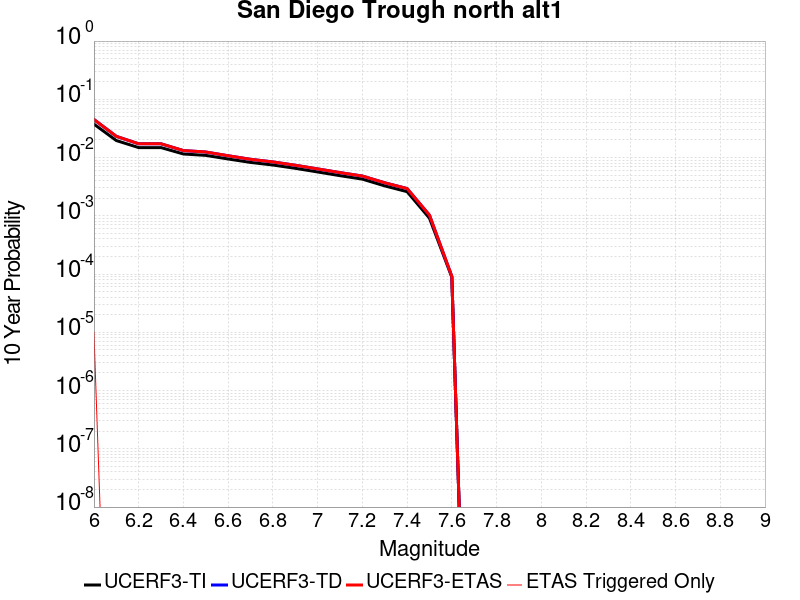 |

| Magnitude | 1 wk TI Prob | 1 wk TD Prob | 1 wk ETAS Prob | 1 wk ETAS/TD Gain | 1 wk ETAS Triggered Only | 1 mo TI Prob | 1 mo TD Prob | 1 mo ETAS Prob | 1 mo ETAS/TD Gain | 1 mo ETAS Triggered Only | 1 yr TI Prob | 1 yr TD Prob | 1 yr ETAS Prob | 1 yr ETAS/TD Gain | 1 yr ETAS Triggered Only | 10 yr TI Prob | 10 yr TD Prob | 10 yr ETAS Prob | 10 yr ETAS/TD Gain | 10 yr ETAS Triggered Only |
|-----|-----|-----|-----|-----|-----|-----|-----|-----|-----|-----|-----|-----|-----|-----|-----|-----|-----|-----|-----|-----|
| 6.0 | 7.329252E-5 | 8.822077E-5 | 8.822077E-5 | 1.0 | 0.0 | 3.14073E-4 | 3.7803786E-4 | 3.7803786E-4 | 1.0 | 0.0 | 0.0038171355 | 0.0045935363 | 0.0046034902 | 1.002167 | 1.0E-5 | 0.03752231 | 0.04504978 | 0.045059327 | 1.000212 | 1.0E-5 |
| 6.1 | 3.7940346E-5 | 4.488948E-5 | 4.488948E-5 | 1.0 | 0.0 | 1.6259136E-4 | 1.9236986E-4 | 1.9236986E-4 | 1.0 | 0.0 | 0.0019777524 | 0.0023396744 | 0.0023396744 | 1.0 | 0.0 | 0.019602431 | 0.023158934 | 0.023158934 | 1.0 | 0.0 |
| 6.2 | 2.8645263E-5 | 3.3299704E-5 | 3.3299704E-5 | 1.0 | 0.0 | 1.2275964E-4 | 1.4270536E-4 | 1.4270536E-4 | 1.0 | 0.0 | 0.0014935739 | 0.0017360692 | 0.0017360692 | 1.0 | 0.0 | 0.0148357535 | 0.017227737 | 0.017227737 | 1.0 | 0.0 |
| 6.3 | 2.8645263E-5 | 3.3299704E-5 | 3.3299704E-5 | 1.0 | 0.0 | 1.2275964E-4 | 1.4270536E-4 | 1.4270536E-4 | 1.0 | 0.0 | 0.0014935739 | 0.0017360692 | 0.0017360692 | 1.0 | 0.0 | 0.0148357535 | 0.017227737 | 0.017227737 | 1.0 | 0.0 |
| 6.4 | 2.2204576E-5 | 2.5450314E-5 | 2.5450314E-5 | 1.0 | 0.0 | 9.5159E-5 | 1.0906827E-4 | 1.0906827E-4 | 1.0 | 0.0 | 0.001157945 | 0.0013271073 | 0.0013271073 | 1.0 | 0.0 | 0.011519298 | 0.013192981 | 0.013192981 | 1.0 | 0.0 |
| 6.5 | 2.1004838E-5 | 2.4026547E-5 | 2.4026547E-5 | 1.0 | 0.0 | 9.0017624E-5 | 1.0296691E-4 | 1.0296691E-4 | 1.0 | 0.0 | 0.0010954136 | 0.0012529104 | 0.0012529104 | 1.0 | 0.0 | 0.010900296 | 0.012459543 | 0.012459543 | 1.0 | 0.0 |
| 6.6 | 1.820557E-5 | 2.0706308E-5 | 2.0706308E-5 | 1.0 | 0.0 | 7.802154E-5 | 8.8738336E-5 | 8.8738336E-5 | 1.0 | 0.0 | 9.4949827E-4 | 0.0010798592 | 0.0010798592 | 1.0 | 0.0 | 0.009454516 | 0.01074679 | 0.01074679 | 1.0 | 0.0 |
| 6.7 | 1.5884485E-5 | 1.7984918E-5 | 1.7984918E-5 | 1.0 | 0.0 | 6.807459E-5 | 7.707596E-5 | 7.707596E-5 | 1.0 | 0.0 | 8.284929E-4 | 9.379985E-4 | 9.379985E-4 | 1.0 | 0.0 | 0.008254109 | 0.009340761 | 0.009340761 | 1.0 | 0.0 |
| 6.8 | 1.4331171E-5 | 1.6202195E-5 | 1.6202195E-5 | 1.0 | 0.0 | 6.141786E-5 | 6.9436144E-5 | 6.9436144E-5 | 1.0 | 0.0 | 7.4750587E-4 | 8.450591E-4 | 8.450591E-4 | 1.0 | 0.0 | 0.0074499645 | 0.008418724 | 0.008418724 | 1.0 | 0.0 |
| 6.9 | 1.2574203E-5 | 1.4206819E-5 | 1.4206819E-5 | 1.0 | 0.0 | 5.3888325E-5 | 6.0884955E-5 | 6.0884955E-5 | 1.0 | 0.0 | 6.558929E-4 | 7.410236E-4 | 7.410236E-4 | 1.0 | 0.0 | 0.0065396037 | 0.0073857135 | 0.0073857135 | 1.0 | 0.0 |
| 7.0 | 1.0883844E-5 | 1.2290109E-5 | 1.2290109E-5 | 1.0 | 0.0 | 4.664421E-5 | 5.267084E-5 | 5.267084E-5 | 1.0 | 0.0 | 5.677453E-4 | 6.4107974E-4 | 6.4107974E-4 | 1.0 | 0.0 | 0.00566297 | 0.0063924324 | 0.0063924324 | 1.0 | 0.0 |
| 7.1 | 9.393088E-6 | 1.0607752E-5 | 1.0607752E-5 | 1.0 | 0.0 | 4.025547E-5 | 4.546101E-5 | 4.546101E-5 | 1.0 | 0.0 | 4.900001E-4 | 5.53348E-4 | 5.53348E-4 | 1.0 | 0.0 | 0.0048892107 | 0.005519798 | 0.005519798 | 1.0 | 0.0 |
| 7.2 | 8.190791E-6 | 9.259271E-6 | 9.259271E-6 | 1.0 | 0.0 | 3.510292E-5 | 3.968199E-5 | 3.968199E-5 | 1.0 | 0.0 | 4.2729423E-4 | 4.830218E-4 | 4.830218E-4 | 1.0 | 0.0 | 0.0042647356 | 0.0048197997 | 0.0048197997 | 1.0 | 0.0 |
| 7.3 | 6.268162E-6 | 7.090212E-6 | 7.090212E-6 | 1.0 | 0.0 | 2.6863276E-5 | 3.0386273E-5 | 3.0386273E-5 | 1.0 | 0.0 | 3.2701128E-4 | 3.6989048E-4 | 3.6989048E-4 | 1.0 | 0.0 | 0.003265305 | 0.0036927941 | 0.0036927941 | 1.0 | 0.0 |
| 7.4 | 4.985186E-6 | 5.643079E-6 | 5.643079E-6 | 1.0 | 0.0 | 2.1364907E-5 | 2.4184403E-5 | 2.4184403E-5 | 1.0 | 0.0 | 2.600867E-4 | 2.944057E-4 | 2.944057E-4 | 1.0 | 0.0 | 0.002597825 | 0.0029401982 | 0.0029401982 | 1.0 | 0.0 |
| 7.5 | 1.7489613E-6 | 1.9698116E-6 | 1.9698116E-6 | 1.0 | 0.0 | 7.495527E-6 | 8.4420235E-6 | 8.4420235E-6 | 1.0 | 0.0 | 9.125422E-5 | 1.0277701E-4 | 1.0277701E-4 | 1.0 | 0.0 | 9.1216754E-4 | 0.0010273168 | 0.0010273168 | 1.0 | 0.0 |
| 7.6 | 1.6988751E-7 | 1.7534121E-7 | 1.7534121E-7 | 1.0 | 0.0 | 7.2808916E-7 | 7.5146215E-7 | 7.5146215E-7 | 1.0 | 0.0 | 8.864449E-6 | 9.149016E-6 | 9.149016E-6 | 1.0 | 0.0 | 8.8640954E-5 | 9.148658E-5 | 9.148658E-5 | 1.0 | 0.0 |

## Elysian Park (Lower CFM)
*[(top)](#table-of-contents)*

| 1 Week | 1 Month | 1 Year | 10 Year |
|-----|-----|-----|-----|
|  |  | 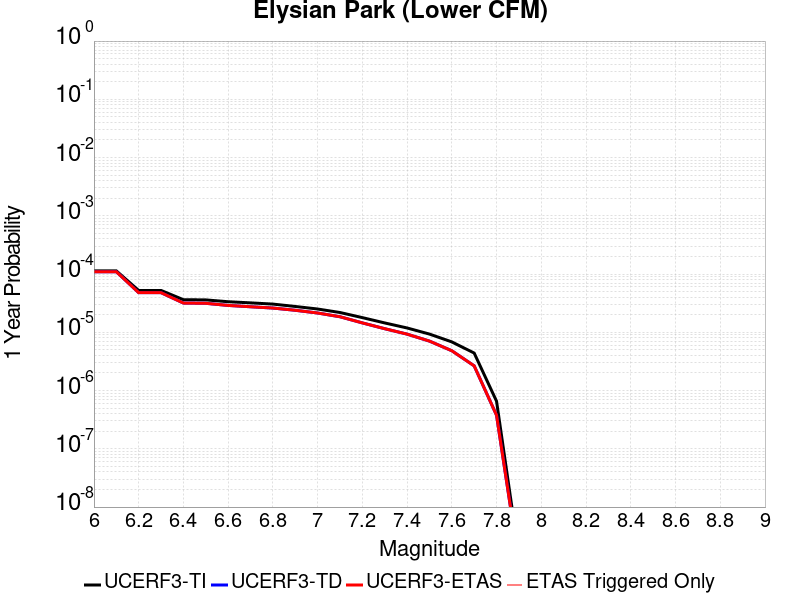 |  |

| Magnitude | 1 wk TI Prob | 1 wk TD Prob | 1 wk ETAS Prob | 1 wk ETAS/TD Gain | 1 wk ETAS Triggered Only | 1 mo TI Prob | 1 mo TD Prob | 1 mo ETAS Prob | 1 mo ETAS/TD Gain | 1 mo ETAS Triggered Only | 1 yr TI Prob | 1 yr TD Prob | 1 yr ETAS Prob | 1 yr ETAS/TD Gain | 1 yr ETAS Triggered Only | 10 yr TI Prob | 10 yr TD Prob | 10 yr ETAS Prob | 10 yr ETAS/TD Gain | 10 yr ETAS Triggered Only |
|-----|-----|-----|-----|-----|-----|-----|-----|-----|-----|-----|-----|-----|-----|-----|-----|-----|-----|-----|-----|-----|
| 6.0 | 2.1766498E-6 | 2.1038238E-6 | 2.1038238E-6 | 1.0 | 0.0 | 9.328466E-6 | 9.016365E-6 | 9.016365E-6 | 1.0 | 0.0 | 1.1356815E-4 | 1.0977016E-4 | 1.0977016E-4 | 1.0 | 0.0 | 0.0011351013 | 0.0010973014 | 0.0011072904 | 1.0091033 | 1.0E-5 |
| 6.1 | 2.1766498E-6 | 2.1038238E-6 | 2.1038238E-6 | 1.0 | 0.0 | 9.328466E-6 | 9.016365E-6 | 9.016365E-6 | 1.0 | 0.0 | 1.1356815E-4 | 1.0977016E-4 | 1.0977016E-4 | 1.0 | 0.0 | 0.0011351013 | 0.0010973014 | 0.0011072904 | 1.0091033 | 1.0E-5 |
| 6.2 | 1.0031182E-6 | 9.1864956E-7 | 9.1864956E-7 | 1.0 | 0.0 | 4.299071E-6 | 3.9370643E-6 | 3.9370643E-6 | 1.0 | 0.0 | 5.2339932E-5 | 4.79328E-5 | 4.79328E-5 | 1.0 | 0.0 | 5.2327604E-4 | 4.7923444E-4 | 4.892296E-4 | 1.0208566 | 1.0E-5 |
| 6.3 | 1.0031182E-6 | 9.1864956E-7 | 9.1864956E-7 | 1.0 | 0.0 | 4.299071E-6 | 3.9370643E-6 | 3.9370643E-6 | 1.0 | 0.0 | 5.2339932E-5 | 4.79328E-5 | 4.79328E-5 | 1.0 | 0.0 | 5.2327604E-4 | 4.7923444E-4 | 4.892296E-4 | 1.0208566 | 1.0E-5 |
| 6.4 | 6.9606244E-7 | 6.0922116E-7 | 6.0922116E-7 | 1.0 | 0.0 | 2.9831212E-6 | 2.6109453E-6 | 2.6109453E-6 | 1.0 | 0.0 | 3.6318896E-5 | 3.1787797E-5 | 3.1787797E-5 | 1.0 | 0.0 | 3.6312963E-4 | 3.1783275E-4 | 3.2782956E-4 | 1.0314531 | 1.0E-5 |
| 6.5 | 6.901879E-7 | 6.032895E-7 | 6.032895E-7 | 1.0 | 0.0 | 2.9579448E-6 | 2.5855238E-6 | 2.5855238E-6 | 1.0 | 0.0 | 3.6012385E-5 | 3.14783E-5 | 3.14783E-5 | 1.0 | 0.0 | 3.600655E-4 | 3.1473866E-4 | 3.247355E-4 | 1.0317624 | 1.0E-5 |
| 6.6 | 6.4198554E-7 | 5.546876E-7 | 5.546876E-7 | 1.0 | 0.0 | 2.7513638E-6 | 2.3772302E-6 | 2.3772302E-6 | 1.0 | 0.0 | 3.3497337E-5 | 2.8942395E-5 | 2.8942395E-5 | 1.0 | 0.0 | 3.349229E-4 | 2.893864E-4 | 2.993835E-4 | 1.0345459 | 1.0E-5 |
| 6.7 | 6.138733E-7 | 5.263682E-7 | 5.263682E-7 | 1.0 | 0.0 | 2.6308828E-6 | 2.2558615E-6 | 2.2558615E-6 | 1.0 | 0.0 | 3.203053E-5 | 2.746477E-5 | 2.746477E-5 | 1.0 | 0.0 | 3.2025913E-4 | 2.7461388E-4 | 2.7461388E-4 | 1.0 | 0.0 |
| 6.8 | 5.84778E-7 | 5.0031997E-7 | 5.0031997E-7 | 1.0 | 0.0 | 2.506189E-6 | 2.1442265E-6 | 2.1442265E-6 | 1.0 | 0.0 | 3.0512423E-5 | 2.6105648E-5 | 2.6105648E-5 | 1.0 | 0.0 | 3.0508233E-4 | 2.610259E-4 | 2.610259E-4 | 1.0 | 0.0 |
| 6.9 | 5.322785E-7 | 4.5803318E-7 | 4.5803318E-7 | 1.0 | 0.0 | 2.2811914E-6 | 1.9629979E-6 | 1.9629979E-6 | 1.0 | 0.0 | 2.7773152E-5 | 2.3899238E-5 | 2.3899238E-5 | 1.0 | 0.0 | 2.7769682E-4 | 2.3896678E-4 | 2.3896678E-4 | 1.0 | 0.0 |
| 7.0 | 4.8147206E-7 | 4.1126617E-7 | 4.1126617E-7 | 1.0 | 0.0 | 2.06345E-6 | 1.762568E-6 | 1.762568E-6 | 1.0 | 0.0 | 2.5122214E-5 | 2.1459055E-5 | 2.1459055E-5 | 1.0 | 0.0 | 2.5119373E-4 | 2.1456991E-4 | 2.1456991E-4 | 1.0 | 0.0 |
| 7.1 | 4.1932955E-7 | 3.545799E-7 | 3.545799E-7 | 1.0 | 0.0 | 1.7971255E-6 | 1.5196272E-6 | 1.5196272E-6 | 1.0 | 0.0 | 2.1879783E-5 | 1.8501305E-5 | 1.8501305E-5 | 1.0 | 0.0 | 2.1877629E-4 | 1.849977E-4 | 1.849977E-4 | 1.0 | 0.0 |
| 7.2 | 3.426051E-7 | 2.7812243E-7 | 2.7812243E-7 | 1.0 | 0.0 | 1.4683067E-6 | 1.1919527E-6 | 1.1919527E-6 | 1.0 | 0.0 | 1.7876488E-5 | 1.45119275E-5 | 1.45119275E-5 | 1.0 | 0.0 | 1.787505E-4 | 1.4510982E-4 | 1.4510982E-4 | 1.0 | 0.0 |
| 7.3 | 2.7771645E-7 | 2.2098187E-7 | 2.2098187E-7 | 1.0 | 0.0 | 1.1902127E-6 | 9.470648E-7 | 9.470648E-7 | 1.0 | 0.0 | 1.4490744E-5 | 1.1530453E-5 | 1.1530453E-5 | 1.0 | 0.0 | 1.4489799E-4 | 1.1529857E-4 | 1.1529857E-4 | 1.0 | 0.0 |
| 7.4 | 2.2756493E-7 | 1.7841303E-7 | 1.7841303E-7 | 1.0 | 0.0 | 9.752779E-7 | 7.6462703E-7 | 7.6462703E-7 | 1.0 | 0.0 | 1.1873944E-5 | 9.309294E-6 | 9.309294E-6 | 1.0 | 0.0 | 1.18733085E-4 | 9.308906E-5 | 9.308906E-5 | 1.0 | 0.0 |
| 7.5 | 1.7874558E-7 | 1.3544002E-7 | 1.3544002E-7 | 1.0 | 0.0 | 7.660522E-7 | 5.804571E-7 | 5.804571E-7 | 1.0 | 0.0 | 9.326646E-6 | 7.067042E-6 | 7.067042E-6 | 1.0 | 0.0 | 9.326255E-5 | 7.066819E-5 | 7.066819E-5 | 1.0 | 0.0 |
| 7.6 | 1.3124549E-7 | 9.25186E-8 | 9.25186E-8 | 1.0 | 0.0 | 5.624805E-7 | 3.9650823E-7 | 3.9650823E-7 | 1.0 | 0.0 | 6.8481786E-6 | 4.827477E-6 | 4.827477E-6 | 1.0 | 0.0 | 6.8479676E-5 | 4.8273734E-5 | 4.8273734E-5 | 1.0 | 0.0 |
| 7.7 | 8.439993E-8 | 5.0908355E-8 | 5.0908355E-8 | 1.0 | 0.0 | 3.6171392E-7 | 2.1817866E-7 | 2.1817866E-7 | 1.0 | 0.0 | 4.403858E-6 | 2.656322E-6 | 2.656322E-6 | 1.0 | 0.0 | 4.4037708E-5 | 2.6562915E-5 | 2.6562915E-5 | 1.0 | 0.0 |
| 7.8 | 1.2591407E-8 | 7.2292177E-9 | 7.2292177E-9 | 1.0 | 0.0 | 5.3963173E-8 | 3.098236E-8 | 3.098236E-8 | 1.0 | 0.0 | 6.570014E-7 | 3.7721017E-7 | 3.7721017E-7 | 1.0 | 0.0 | 6.5699946E-6 | 3.7720956E-6 | 3.7720956E-6 | 1.0 | 0.0 |
| 7.9 | 2.8324232E-11 | 2.1408098E-11 | 2.1408098E-11 | 1.0 | 0.0 | 1.2138957E-10 | 9.17495E-11 | 9.17495E-11 | 1.0 | 0.0 | 1.4779177E-9 | 1.117049E-9 | 1.117049E-9 | 1.0 | 0.0 | 1.4779177E-8 | 1.117049E-8 | 1.117049E-8 | 1.0 | 0.0 |

## Mono Lake 2011 CFM
*[(top)](#table-of-contents)*

| 1 Week | 1 Month | 1 Year | 10 Year |
|-----|-----|-----|-----|
|  |  |  |  |

| Magnitude | 1 wk TI Prob | 1 wk TD Prob | 1 wk ETAS Prob | 1 wk ETAS/TD Gain | 1 wk ETAS Triggered Only | 1 mo TI Prob | 1 mo TD Prob | 1 mo ETAS Prob | 1 mo ETAS/TD Gain | 1 mo ETAS Triggered Only | 1 yr TI Prob | 1 yr TD Prob | 1 yr ETAS Prob | 1 yr ETAS/TD Gain | 1 yr ETAS Triggered Only | 10 yr TI Prob | 10 yr TD Prob | 10 yr ETAS Prob | 10 yr ETAS/TD Gain | 10 yr ETAS Triggered Only |
|-----|-----|-----|-----|-----|-----|-----|-----|-----|-----|-----|-----|-----|-----|-----|-----|-----|-----|-----|-----|-----|
| 6.0 | 2.0341662E-5 | 2.3830333E-5 | 2.3830333E-5 | 1.0 | 0.0 | 8.717564E-5 | 1.02129E-4 | 1.02129E-4 | 1.0 | 0.0 | 0.0010608466 | 0.0012432429 | 0.0012532304 | 1.0080335 | 1.0E-5 | 0.010557966 | 0.012414961 | 0.012424837 | 1.0007955 | 1.0E-5 |
| 6.1 | 2.0341662E-5 | 2.3830333E-5 | 2.3830333E-5 | 1.0 | 0.0 | 8.717564E-5 | 1.02129E-4 | 1.02129E-4 | 1.0 | 0.0 | 0.0010608466 | 0.0012432429 | 0.0012532304 | 1.0080335 | 1.0E-5 | 0.010557966 | 0.012414961 | 0.012424837 | 1.0007955 | 1.0E-5 |
| 6.2 | 2.0341662E-5 | 2.3830333E-5 | 2.3830333E-5 | 1.0 | 0.0 | 8.717564E-5 | 1.02129E-4 | 1.02129E-4 | 1.0 | 0.0 | 0.0010608466 | 0.0012432429 | 0.0012532304 | 1.0080335 | 1.0E-5 | 0.010557966 | 0.012414961 | 0.012424837 | 1.0007955 | 1.0E-5 |
| 6.3 | 2.0341662E-5 | 2.3830333E-5 | 2.3830333E-5 | 1.0 | 0.0 | 8.717564E-5 | 1.02129E-4 | 1.02129E-4 | 1.0 | 0.0 | 0.0010608466 | 0.0012432429 | 0.0012532304 | 1.0080335 | 1.0E-5 | 0.010557966 | 0.012414961 | 0.012424837 | 1.0007955 | 1.0E-5 |
| 6.4 | 1.749821E-5 | 2.0492844E-5 | 2.0492844E-5 | 1.0 | 0.0 | 7.499018E-5 | 8.782648E-5 | 8.782648E-5 | 1.0 | 0.0 | 9.1262296E-4 | 0.0010692873 | 0.0010792767 | 1.0093421 | 1.0E-5 | 0.009088841 | 0.010692834 | 0.010702727 | 1.0009252 | 1.0E-5 |
| 6.5 | 1.749821E-5 | 2.0492844E-5 | 2.0492844E-5 | 1.0 | 0.0 | 7.499018E-5 | 8.782648E-5 | 8.782648E-5 | 1.0 | 0.0 | 9.1262296E-4 | 0.0010692873 | 0.0010792767 | 1.0093421 | 1.0E-5 | 0.009088841 | 0.010692834 | 0.010702727 | 1.0009252 | 1.0E-5 |

## San Pedro Basin
*[(top)](#table-of-contents)*

| 1 Week | 1 Month | 1 Year | 10 Year |
|-----|-----|-----|-----|
|  |  |  |  |

| Magnitude | 1 wk TI Prob | 1 wk TD Prob | 1 wk ETAS Prob | 1 wk ETAS/TD Gain | 1 wk ETAS Triggered Only | 1 mo TI Prob | 1 mo TD Prob | 1 mo ETAS Prob | 1 mo ETAS/TD Gain | 1 mo ETAS Triggered Only | 1 yr TI Prob | 1 yr TD Prob | 1 yr ETAS Prob | 1 yr ETAS/TD Gain | 1 yr ETAS Triggered Only | 10 yr TI Prob | 10 yr TD Prob | 10 yr ETAS Prob | 10 yr ETAS/TD Gain | 10 yr ETAS Triggered Only |
|-----|-----|-----|-----|-----|-----|-----|-----|-----|-----|-----|-----|-----|-----|-----|-----|-----|-----|-----|-----|-----|
| 6.0 | 5.3449043E-5 | 6.337589E-5 | 6.337589E-5 | 1.0 | 0.0 | 2.2904722E-4 | 2.7158615E-4 | 2.7158615E-4 | 1.0 | 0.0 | 0.0027850836 | 0.0033021553 | 0.0033021553 | 1.0 | 0.0 | 0.027504366 | 0.032592643 | 0.032602318 | 1.0002968 | 1.0E-5 |
| 6.1 | 5.3449043E-5 | 6.337589E-5 | 6.337589E-5 | 1.0 | 0.0 | 2.2904722E-4 | 2.7158615E-4 | 2.7158615E-4 | 1.0 | 0.0 | 0.0027850836 | 0.0033021553 | 0.0033021553 | 1.0 | 0.0 | 0.027504366 | 0.032592643 | 0.032602318 | 1.0002968 | 1.0E-5 |
| 6.2 | 2.3189454E-5 | 2.6644948E-5 | 2.6644948E-5 | 1.0 | 0.0 | 9.9379584E-5 | 1.14187904E-4 | 1.14187904E-4 | 1.0 | 0.0 | 0.0012092749 | 0.0013893985 | 0.0013893985 | 1.0 | 0.0 | 0.012027155 | 0.013811991 | 0.013811991 | 1.0 | 0.0 |
| 6.3 | 2.3189454E-5 | 2.6644948E-5 | 2.6644948E-5 | 1.0 | 0.0 | 9.9379584E-5 | 1.14187904E-4 | 1.14187904E-4 | 1.0 | 0.0 | 0.0012092749 | 0.0013893985 | 0.0013893985 | 1.0 | 0.0 | 0.012027155 | 0.013811991 | 0.013811991 | 1.0 | 0.0 |
| 6.4 | 1.966056E-5 | 2.2465154E-5 | 2.2465154E-5 | 1.0 | 0.0 | 8.425682E-5 | 9.62759E-5 | 9.62759E-5 | 1.0 | 0.0 | 0.001025344 | 0.001171569 | 0.001171569 | 1.0 | 0.0 | 0.010206259 | 0.011658015 | 0.011658015 | 1.0 | 0.0 |
| 6.5 | 1.7342953E-5 | 1.974664E-5 | 1.974664E-5 | 1.0 | 0.0 | 7.4324824E-5 | 8.462592E-5 | 8.462592E-5 | 1.0 | 0.0 | 9.04529E-4 | 0.0010298705 | 0.0010298705 | 1.0 | 0.0 | 0.009008561 | 0.010254702 | 0.010254702 | 1.0 | 0.0 |
| 6.6 | 1.439804E-5 | 1.6323911E-5 | 1.6323911E-5 | 1.0 | 0.0 | 6.170443E-5 | 6.9957925E-5 | 6.9957925E-5 | 1.0 | 0.0 | 7.509924E-4 | 8.5143704E-4 | 8.5143704E-4 | 1.0 | 0.0 | 0.0074845953 | 0.008484951 | 0.008484951 | 1.0 | 0.0 |
| 6.7 | 1.2634884E-5 | 1.4286325E-5 | 1.4286325E-5 | 1.0 | 0.0 | 5.414838E-5 | 6.1225845E-5 | 6.1225845E-5 | 1.0 | 0.0 | 6.590571E-4 | 7.4520014E-4 | 7.4520014E-4 | 1.0 | 0.0 | 0.006571059 | 0.007430034 | 0.007430034 | 1.0 | 0.0 |
| 6.8 | 1.146091E-5 | 1.2934111E-5 | 1.2934111E-5 | 1.0 | 0.0 | 4.911726E-5 | 5.5430894E-5 | 5.5430894E-5 | 1.0 | 0.0 | 5.9783855E-4 | 6.746919E-4 | 6.746919E-4 | 1.0 | 0.0 | 0.0059623276 | 0.006729376 | 0.006729376 | 1.0 | 0.0 |
| 6.9 | 9.109035E-6 | 1.023572E-5 | 1.023572E-5 | 1.0 | 0.0 | 3.9038136E-5 | 4.386679E-5 | 4.386679E-5 | 1.0 | 0.0 | 4.7518566E-4 | 5.3397525E-4 | 5.3397525E-4 | 1.0 | 0.0 | 0.0047417083 | 0.005329677 | 0.005329677 | 1.0 | 0.0 |
| 7.0 | 5.9351028E-6 | 6.5843806E-6 | 6.5843806E-6 | 1.0 | 0.0 | 2.5435906E-5 | 2.8218601E-5 | 2.8218601E-5 | 1.0 | 0.0 | 3.0963816E-4 | 3.4353093E-4 | 3.4353093E-4 | 1.0 | 0.0 | 0.0030920706 | 0.003432316 | 0.003432316 | 1.0 | 0.0 |
| 7.1 | 2.1557585E-6 | 2.2096988E-6 | 2.2096988E-6 | 1.0 | 0.0 | 9.238933E-6 | 9.4701045E-6 | 9.4701045E-6 | 1.0 | 0.0 | 1.1247819E-4 | 1.15292576E-4 | 1.15292576E-4 | 1.0 | 0.0 | 0.0011242128 | 0.001152343 | 0.001152343 | 1.0 | 0.0 |
| 7.2 | 2.1251979E-6 | 2.1780445E-6 | 2.1780445E-6 | 1.0 | 0.0 | 9.107958E-6 | 9.334444E-6 | 9.334444E-6 | 1.0 | 0.0 | 1.1088375E-4 | 1.1364108E-4 | 1.1364108E-4 | 1.0 | 0.0 | 0.0011082845 | 0.001135845 | 0.001135845 | 1.0 | 0.0 |
| 7.3 | 1.7145798E-6 | 1.7443245E-6 | 1.7443245E-6 | 1.0 | 0.0 | 7.3481783E-6 | 7.475656E-6 | 7.475656E-6 | 1.0 | 0.0 | 8.94604E-5 | 9.10124E-5 | 9.10124E-5 | 1.0 | 0.0 | 8.9424395E-4 | 9.097604E-4 | 9.097604E-4 | 1.0 | 0.0 |
| 7.4 | 1.4467993E-6 | 1.464217E-6 | 1.464217E-6 | 1.0 | 0.0 | 6.200554E-6 | 6.275201E-6 | 6.275201E-6 | 1.0 | 0.0 | 7.548913E-5 | 7.639797E-5 | 7.639797E-5 | 1.0 | 0.0 | 7.546349E-4 | 7.637243E-4 | 7.637243E-4 | 1.0 | 0.0 |
| 7.5 | 1.2803735E-6 | 1.2931764E-6 | 1.2931764E-6 | 1.0 | 0.0 | 5.487303E-6 | 5.5421733E-6 | 5.5421733E-6 | 1.0 | 0.0 | 6.680587E-5 | 6.747394E-5 | 6.747394E-5 | 1.0 | 0.0 | 6.678579E-4 | 6.7454163E-4 | 6.7454163E-4 | 1.0 | 0.0 |
| 7.6 | 6.755009E-7 | 6.7696067E-7 | 6.7696067E-7 | 1.0 | 0.0 | 2.8950008E-6 | 2.9012572E-6 | 2.9012572E-6 | 1.0 | 0.0 | 3.5246063E-5 | 3.5322293E-5 | 3.5322293E-5 | 1.0 | 0.0 | 3.5240475E-4 | 3.531725E-4 | 3.531725E-4 | 1.0 | 0.0 |
| 7.7 | 6.211885E-8 | 4.5700858E-8 | 4.5700858E-8 | 1.0 | 0.0 | 2.6622362E-7 | 1.958608E-7 | 1.958608E-7 | 1.0 | 0.0 | 3.2412677E-6 | 2.3846028E-6 | 2.3846028E-6 | 1.0 | 0.0 | 3.2412205E-5 | 2.3845794E-5 | 2.3845794E-5 | 1.0 | 0.0 |
| 7.8 | 2.6580573E-9 | 1.5140237E-9 | 1.5140237E-9 | 1.0 | 0.0 | 1.1391674E-8 | 6.4886727E-9 | 6.4886727E-9 | 1.0 | 0.0 | 1.3869362E-7 | 7.899959E-8 | 7.899959E-8 | 1.0 | 0.0 | 1.3869354E-6 | 7.899959E-7 | 7.899959E-7 | 1.0 | 0.0 |

