# Parent Section Magnitude-Probability Distributions

Only fault sections with at least one triggered aftershock are plotted. Sections are sorted by total supraseismogenic trigger rate (decreasing)

## Table Of Contents

* [Garlock (Central)](#garlock-central)
* [Tank Canyon](#tank-canyon)
* [Little Lake](#little-lake)
* [Owl Lake](#owl-lake)
* [Airport Lake](#airport-lake)
* [Panamint Valley](#panamint-valley)
* [Garlock (East)](#garlock-east)
* [Hunter Mountain-Saline Valley](#hunter-mountain-saline-valley)
* [Ash Hill](#ash-hill)
* [Blackwater](#blackwater)
* [Garlock (West)](#garlock-west)
* [McLean Lake](#mclean-lake)
* [Goldstone Lake](#goldstone-lake)
* [Death Valley (So)](#death-valley-so)
* [San Andreas (Mojave S)](#san-andreas-mojave-s)
* [Gravel Hills-Harper Lk](#gravel-hills-harper-lk)
* [Coyote Canyon](#coyote-canyon)
* [San Andreas (Mojave N)](#san-andreas-mojave-n)
* [Nelson Lake](#nelson-lake)
* [So Sierra Nevada](#so-sierra-nevada)
* [Towne Pass](#towne-pass)
* [San Andreas (San Bernardino N)](#san-andreas-san-bernardino-n)
* [Lenwood-Lockhart-Old Woman Springs](#lenwood-lockhart-old-woman-springs)
* [Bicycle Lake](#bicycle-lake)
* [Garlic Springs](#garlic-springs)
* [Paradise](#paradise)
* [Death Valley (Black Mtns Frontal)](#death-valley-black-mtns-frontal)
* [San Andreas (San Bernardino S)](#san-andreas-san-bernardino-s)
* [Coyote Lake](#coyote-lake)
* [San Andreas (Big Bend)](#san-andreas-big-bend)
* [Helendale-So Lockhart](#helendale-so-lockhart)
* [Death Valley (No)](#death-valley-no)
* [San Andreas (Parkfield)](#san-andreas-parkfield)
* [San Andreas (San Gorgonio Pass-Garnet HIll)](#san-andreas-san-gorgonio-pass-garnet-hill)
* [San Andreas (Carrizo) rev](#san-andreas-carrizo-rev)
* [San Andreas (Cholame) rev](#san-andreas-cholame-rev)
* [Death Valley (Fish Lake Valley)](#death-valley-fish-lake-valley)
* [San Jacinto (San Bernardino)](#san-jacinto-san-bernardino)
* [San Andreas (Coachella) rev](#san-andreas-coachella-rev)
* [Red Pass](#red-pass)
* [San Andreas (Creeping Section) 2011 CFM](#san-andreas-creeping-section-2011-cfm)
* [Cady](#cady)
* [Baker](#baker)
* [San Jacinto (San Jacinto Valley) rev](#san-jacinto-san-jacinto-valley-rev)
* [San Jacinto (Stepovers Combined)](#san-jacinto-stepovers-combined)
* [Elsinore (Glen Ivy) rev](#elsinore-glen-ivy-rev)
* [Sierra Nevada  (No Extension)](#sierra-nevada--no-extension)
* [Lake Isabella (Seismicity)](#lake-isabella-seismicity)
* [San Andreas (North Branch Mill Creek)](#san-andreas-north-branch-mill-creek)
* [Manix-Afton Hills](#manix-afton-hills)
* [Calico-Hidalgo](#calico-hidalgo)
* [Cleghorn Lake](#cleghorn-lake)
* [Lost Hills](#lost-hills)
* [San Jacinto (Anza) rev](#san-jacinto-anza-rev)
* [Ludlow](#ludlow)
* [Santa Ynez (West)](#santa-ynez-west)
* [White Wolf (Extension)](#white-wolf-extension)
* [Santa Ynez (East)](#santa-ynez-east)
* [Santa Rosa Island](#santa-rosa-island)
* [Pleito](#pleito)
* [Mission Creek](#mission-creek)
* [Brawley (Seismic Zone) alt 1](#brawley-seismic-zone-alt-1)
* [Red Mountain](#red-mountain)
* [Mission Ridge-Arroyo Parida-Santa Ana](#mission-ridge-arroyo-parida-santa-ana)
* [Imperial](#imperial)
* [San Jacinto (Coyote Creek)](#san-jacinto-coyote-creek)
* [Scodie Lineament](#scodie-lineament)
* [Cleghorn Pass](#cleghorn-pass)
* [San Jacinto (Lytle Creek connector)](#san-jacinto-lytle-creek-connector)
* [Big Pine (East)](#big-pine-east)
* [San Jacinto (Borrego)](#san-jacinto-borrego)
* [Channel Islands Thrust](#channel-islands-thrust)
* [Santa Cruz Island](#santa-cruz-island)
* [Pinto Mtn](#pinto-mtn)
* [Independence rev 2011](#independence-rev-2011)
* [Pisgah-Bullion Mtn-Mesquite Lk](#pisgah-bullion-mtn-mesquite-lk)
* [San Jacinto (Superstition Mtn)](#san-jacinto-superstition-mtn)
* [Deep Springs](#deep-springs)
* [Calaveras (So) - Paicines extension 2011 CFM](#calaveras-so---paicines-extension-2011-cfm)
* [Elysian Park (Upper)](#elysian-park-upper)
* [White Mountains](#white-mountains)
* [Big Pine (Central)](#big-pine-central)
* [Chino alt 1](#chino-alt-1)
* [Cleghorn](#cleghorn)
* [Ventura-Pitas Point](#ventura-pitas-point)
* [Camp Rock 2011](#camp-rock-2011)
* [Great Valley 09 (Laguna Seca)](#great-valley-09-laguna-seca)
* [Tin Mountain](#tin-mountain)
* [Kern Canyon (North Kern) 2011](#kern-canyon-north-kern-2011)
* [Rose Canyon](#rose-canyon)
* [Blue Cut](#blue-cut)
* [San Pedro Basin](#san-pedro-basin)
* [Cucamonga](#cucamonga)
* [Oceanic - West Huasna](#oceanic---west-huasna)
* [Owens Valley](#owens-valley)
* [Raymond](#raymond)
* [Calaveras (So) 2011 CFM](#calaveras-so-2011-cfm)
* [Santa Ynez River](#santa-ynez-river)
* [Sierra Madre](#sierra-madre)
* [San Jacinto (Clark) rev](#san-jacinto-clark-rev)
* [San Gabriel](#san-gabriel)
* [Ortigalita (North)](#ortigalita-north)
* [Hollywood](#hollywood)
* [North Frontal  (West)](#north-frontal--west)
* [Ortigalita (South)](#ortigalita-south)
* [Hosgri](#hosgri)
* [Whittier alt 1](#whittier-alt-1)
* [Dry Mountain](#dry-mountain)
* [Hunting Creek - Berryessa 2011 CFM](#hunting-creek---berryessa-2011-cfm)
* [San Luis Range 2011 CFM](#san-luis-range-2011-cfm)
* [Likely 2011 CFM](#likely-2011-cfm)
* [San Andreas (Santa Cruz Mts) 2011 CFM](#san-andreas-santa-cruz-mts-2011-cfm)
* [San Cayetano](#san-cayetano)
* [Pitas Point (Lower West)](#pitas-point-lower-west)
* [Kern Canyon (South Kern) 2011](#kern-canyon-south-kern-2011)
* [Oceanside alt1](#oceanside-alt1)
* [Bullion Mountains](#bullion-mountains)
* [Coronado Bank alt1](#coronado-bank-alt1)
* [San Juan](#san-juan)
* [Santa Monica alt 1](#santa-monica-alt-1)
* [Pine Mtn](#pine-mtn)
* [San Diego Trough north alt1](#san-diego-trough-north-alt1)
* [Oak Ridge (Onshore)](#oak-ridge-onshore)
* [Palos Verdes](#palos-verdes)
* [Mono Lake 2011 CFM](#mono-lake-2011-cfm)
* [Santa Cruz Catalina Ridge alt1](#santa-cruz-catalina-ridge-alt1)
* [San Clemente](#san-clemente)
* [Simi-Santa Rosa](#simi-santa-rosa)
* [Great Valley 03 Mysterious Ridge](#great-valley-03-mysterious-ridge)
* [Santa Susana alt 1](#santa-susana-alt-1)
* [Homestead Valley 2011](#homestead-valley-2011)
* [Carlsbad](#carlsbad)
* [North Frontal  (East)](#north-frontal--east)
* [San Gabriel (Extension)](#san-gabriel-extension)
* [Calaveras (Central) 2011 CFM](#calaveras-central-2011-cfm)
* [Kern Canyon (Lake Isabella) 2011](#kern-canyon-lake-isabella-2011)
* [Verdugo](#verdugo)
* [Newport-Inglewood (Offshore)](#newport-inglewood-offshore)
* [Earthquake Valley (So Extension)](#earthquake-valley-so-extension)
* [Superstition Hills](#superstition-hills)
* [Malibu Coast alt 1](#malibu-coast-alt-1)
* [Hunting Creek - Bartlett Springs connector 2011](#hunting-creek---bartlett-springs-connector-2011)
* [Los Alamos extension](#los-alamos-extension)
* [Emerson-Copper Mtn 2011](#emerson-copper-mtn-2011)
* [Malibu Coast (Extension) alt 1](#malibu-coast-extension-alt-1)
* [Compton](#compton)
* [White Wolf](#white-wolf)
* [Greenville (So) 2011 CFM](#greenville-so-2011-cfm)
* [Morales (East)](#morales-east)
* [Puente Hills](#puente-hills)
* [San Diego Trough south](#san-diego-trough-south)
* [Hosgri (Extension)](#hosgri-extension)
* [Sargent 2011 CFM](#sargent-2011-cfm)
* [Owens Valley Keough Hot Springs](#owens-valley-keough-hot-springs)
* [Del Valle](#del-valle)
* [San Gorgonio Pass](#san-gorgonio-pass)
* [Elsinore (Stepovers Combined)](#elsinore-stepovers-combined)
* [Morales (West)](#morales-west)
* [Great Valley 07 (Orestimba)](#great-valley-07-orestimba)
* [Green Valley 2011 CFM](#green-valley-2011-cfm)
* [Johnson Valley (No) 2011 rev](#johnson-valley-no-2011-rev)
* [Greenville (No) 2011 CFM](#greenville-no-2011-cfm)
* [Sheephole](#sheephole)
* [Elsinore (Coyote Mountains)](#elsinore-coyote-mountains)
* [Pitas Point (Lower)-Montalvo](#pitas-point-lower-montalvo)
* [Newport-Inglewood alt 1](#newport-inglewood-alt-1)
* [San Jose](#san-jose)
* [Pittville 2011 CFM](#pittville-2011-cfm)
* [Butano 2011 CFM](#butano-2011-cfm)
* [Carson Range (Genoa)](#carson-range-genoa)
* [Santa Susana East (connector)](#santa-susana-east-connector)
* [Point Reyes 2011 CFM](#point-reyes-2011-cfm)
* [Bartlett Springs 2011 CFM](#bartlett-springs-2011-cfm)
* [Elsinore (Temecula) rev](#elsinore-temecula-rev)
* [Elsinore (Julian)](#elsinore-julian)
* [Goose Lake 2011 CFM](#goose-lake-2011-cfm)
* [Robinson Creek](#robinson-creek)
* [Sierra Madre (San Fernando)](#sierra-madre-san-fernando)
* [Hayward (So) extension 2011 CFM](#hayward-so-extension-2011-cfm)
* [Concord 2011 CFM](#concord-2011-cfm)
* [Great Valley 08 (Quinto)](#great-valley-08-quinto)
* [Garberville - Briceland 2011 CFM](#garberville---briceland-2011-cfm)
* [Ozena](#ozena)
* [Great Valley 10 (Panoche)](#great-valley-10-panoche)
* [Earthquake Valley (No  Extension)](#earthquake-valley-no--extension)
* [Hector Mine](#hector-mine)
* [Elmore Ranch](#elmore-ranch)
* [Reliz 2011 CFM](#reliz-2011-cfm)
* [Peralta Hills](#peralta-hills)
* [Great Valley 05 Pittsburg - Kirby Hills alt1](#great-valley-05-pittsburg---kirby-hills-alt1)
* [Antelope Valley 2011](#antelope-valley-2011)
* [Los Alamos 2011 CFM](#los-alamos-2011-cfm)
* [Earthquake Valley](#earthquake-valley)
* [Great Valley 03a Dunnigan Hills](#great-valley-03a-dunnigan-hills)
* [Great Valley 04a Trout Creek](#great-valley-04a-trout-creek)
* [Monterey Bay-Tularcitos](#monterey-bay-tularcitos)
* [West Tahoe](#west-tahoe)
* [Calaveras (No) 2011 CFM](#calaveras-no-2011-cfm)
* [Anacapa-Dume alt 1](#anacapa-dume-alt-1)
* [Hayward (So) 2011 CFM](#hayward-so-2011-cfm)
* [Los Osos 2011](#los-osos-2011)
* [San Andreas (Peninsula) 2011 CFM](#san-andreas-peninsula-2011-cfm)
* [East Huasna 2011 CFM](#east-huasna-2011-cfm)
* [West Napa 2011 CFM](#west-napa-2011-cfm)
* [Hat Creek-McArthur-Mayfield](#hat-creek-mcarthur-mayfield)
* [San Joaquin Hills](#san-joaquin-hills)
* [Sisar](#sisar)
* [Northridge](#northridge)
* [Round Valley](#round-valley)
* [San Andreas (North Coast) 2011 CFM](#san-andreas-north-coast-2011-cfm)
* [Channel Islands Western Deep Ramp](#channel-islands-western-deep-ramp)
* [Hartley Springs 2011 CFM](#hartley-springs-2011-cfm)
* [San Gregorio (North) 2011 CFM](#san-gregorio-north-2011-cfm)
* [Mission Hills 2011](#mission-hills-2011)
* [Burnt Mtn](#burnt-mtn)
* [Point Reyes 2011 connector](#point-reyes-2011-connector)
* [Rinconada 2011 CFM](#rinconada-2011-cfm)
* [Shoreline](#shoreline)

## Garlock (Central)
*[(top)](#table-of-contents)*

| 1 Week | 1 Month | 1 Year | 10 Year |
|-----|-----|-----|-----|
|  |  |  |  |

| Magnitude | 1 wk TI Prob | 1 wk TD Prob | 1 wk ETAS Prob | 1 wk ETAS/TD Gain | 1 wk ETAS Triggered Only | 1 mo TI Prob | 1 mo TD Prob | 1 mo ETAS Prob | 1 mo ETAS/TD Gain | 1 mo ETAS Triggered Only | 1 yr TI Prob | 1 yr TD Prob | 1 yr ETAS Prob | 1 yr ETAS/TD Gain | 1 yr ETAS Triggered Only | 10 yr TI Prob | 10 yr TD Prob | 10 yr ETAS Prob | 10 yr ETAS/TD Gain | 10 yr ETAS Triggered Only |
|-----|-----|-----|-----|-----|-----|-----|-----|-----|-----|-----|-----|-----|-----|-----|-----|-----|-----|-----|-----|-----|
| 6.0 | 5.5131142E-5 | 7.024681E-5 | 0.07361926 | 1048.0087 | 0.07355418 | 2.3625491E-4 | 3.010234E-4 | 0.092309624 | 306.65268 | 0.09203631 | 0.0028726095 | 0.0036588663 | 0.13122398 | 35.864655 | 0.12803356 | 0.028357591 | 0.036079824 | 0.1919223 | 5.3193803 | 0.1616757 |
| 6.1 | 5.5131142E-5 | 7.024681E-5 | 0.07361926 | 1048.0087 | 0.07355418 | 2.3625491E-4 | 3.010234E-4 | 0.092309624 | 306.65268 | 0.09203631 | 0.0028726095 | 0.0036588663 | 0.13122398 | 35.864655 | 0.12803356 | 0.028357591 | 0.036079824 | 0.1919223 | 5.3193803 | 0.1616757 |
| 6.2 | 4.216245E-5 | 5.1661493E-5 | 0.04702659 | 910.2832 | 0.046977352 | 1.806837E-4 | 2.2138779E-4 | 0.059756525 | 269.91788 | 0.05954832 | 0.0021976046 | 0.0026920962 | 0.08671882 | 32.212376 | 0.08425354 | 0.021759989 | 0.026689773 | 0.13280118 | 4.9757323 | 0.10902115 |
| 6.3 | 4.216245E-5 | 5.1661493E-5 | 0.04702659 | 910.2832 | 0.046977352 | 1.806837E-4 | 2.2138779E-4 | 0.059756525 | 269.91788 | 0.05954832 | 0.0021976046 | 0.0026920962 | 0.08671882 | 32.212376 | 0.08425354 | 0.021759989 | 0.026689773 | 0.13280118 | 4.9757323 | 0.10902115 |
| 6.4 | 3.6858168E-5 | 4.411054E-5 | 0.037069116 | 840.36865 | 0.03702664 | 1.5795401E-4 | 1.8903162E-4 | 0.047407005 | 250.78876 | 0.047226902 | 0.0019213937 | 0.002299056 | 0.06997329 | 30.435663 | 0.06783018 | 0.019048655 | 0.02284894 | 0.109764725 | 4.8039308 | 0.08894815 |
| 6.5 | 3.39199E-5 | 4.0018083E-5 | 0.03360284 | 839.6914 | 0.033564165 | 1.453629E-4 | 1.7149492E-4 | 0.042930398 | 250.33043 | 0.042766236 | 0.0017683565 | 0.002085973 | 0.06350229 | 30.44253 | 0.0615447 | 0.017543508 | 0.020759864 | 0.10033191 | 4.8329754 | 0.08125897 |
| 6.6 | 3.3571985E-5 | 3.9472274E-5 | 0.03353993 | 849.70856 | 0.033501778 | 1.4387199E-4 | 1.6915603E-4 | 0.042865783 | 253.40971 | 0.04270385 | 0.0017502342 | 0.0020575512 | 0.06338223 | 30.804693 | 0.06145112 | 0.017365133 | 0.020481179 | 0.09995365 | 4.8802686 | 0.08113419 |
| 6.7 | 3.2580007E-5 | 3.8088703E-5 | 0.032150533 | 844.0964 | 0.032113668 | 1.3962112E-4 | 1.632272E-4 | 0.041175935 | 252.26147 | 0.041019402 | 0.0016985617 | 0.0019855013 | 0.06107314 | 30.759558 | 0.05920519 | 0.016856372 | 0.019773813 | 0.096444756 | 4.877398 | 0.0782176 |
| 6.8 | 3.2185937E-5 | 3.7515918E-5 | 0.031526133 | 840.34015 | 0.0314898 | 1.3793244E-4 | 1.6077272E-4 | 0.040378276 | 251.15128 | 0.040223967 | 0.0016780337 | 0.001955672 | 0.06000214 | 30.681086 | 0.05816021 | 0.016654192 | 0.019480614 | 0.09484401 | 4.8686357 | 0.07686069 |
| 6.9 | 3.165394E-5 | 3.6720503E-5 | 0.030917114 | 841.95776 | 0.030881528 | 1.3565269E-4 | 1.5736422E-4 | 0.03962648 | 251.81378 | 0.039475325 | 0.0016503202 | 0.001914247 | 0.05878004 | 30.706612 | 0.056974858 | 0.01638118 | 0.019073246 | 0.092983924 | 4.875097 | 0.0753478 |
| 7.0 | 3.0903822E-5 | 3.5625766E-5 | 0.030105053 | 845.03595 | 0.030070497 | 1.3243823E-4 | 1.5267303E-4 | 0.03867072 | 253.29108 | 0.038523924 | 0.0016112428 | 0.0018572307 | 0.057309605 | 30.85756 | 0.055555556 | 0.015996104 | 0.018512413 | 0.09058247 | 4.8930664 | 0.073429406 |
| 7.1 | 3.0069863E-5 | 3.4392073E-5 | 0.028715793 | 834.9539 | 0.028682388 | 1.2886449E-4 | 1.4738638E-4 | 0.037059408 | 251.44391 | 0.036917463 | 0.0015677959 | 0.0017929734 | 0.054898035 | 30.618433 | 0.05320045 | 0.01556781 | 0.017880075 | 0.08681045 | 4.8551497 | 0.07018529 |
| 7.2 | 2.7957109E-5 | 3.128145E-5 | 0.024377016 | 779.2802 | 0.024346497 | 1.1981068E-4 | 1.340566E-4 | 0.031572852 | 235.51883 | 0.03144301 | 0.0014577188 | 0.0016309366 | 0.046974543 | 28.802189 | 0.04541768 | 0.014481937 | 0.016283695 | 0.07515386 | 4.615283 | 0.059844658 |
| 7.3 | 2.4519275E-5 | 2.6714795E-5 | 0.01765055 | 660.7032 | 0.017624306 | 1.0507837E-4 | 1.1448703E-4 | 0.023070246 | 201.50969 | 0.022958389 | 0.0012785783 | 0.001393003 | 0.03464564 | 24.871185 | 0.03329902 | 0.012712469 | 0.013928054 | 0.0579288 | 4.1591454 | 0.044622246 |
| 7.4 | 2.3225532E-5 | 2.51994E-5 | 0.01612062 | 639.72235 | 0.016095826 | 9.95342E-5 | 1.0799304E-4 | 0.02108333 | 195.2286 | 0.020977603 | 0.0012111551 | 0.0013140367 | 0.031703275 | 24.126629 | 0.030429222 | 0.012045753 | 0.013145725 | 0.053564332 | 4.0746574 | 0.040957015 |
| 7.5 | 2.097765E-5 | 2.2483688E-5 | 0.013560141 | 603.1102 | 0.013537962 | 8.9901114E-5 | 9.635517E-5 | 0.017609796 | 182.75923 | 0.017515128 | 0.0010939965 | 0.0011725046 | 0.026518632 | 22.61708 | 0.02537588 | 0.010886264 | 0.011740365 | 0.04548078 | 3.873881 | 0.034141243 |
| 7.6 | 1.511254E-5 | 1.5991332E-5 | 0.007190373 | 449.64188 | 0.007174496 | 6.476642E-5 | 6.853253E-5 | 0.009285569 | 135.49141 | 0.009217668 | 7.882459E-4 | 8.3407195E-4 | 0.014313991 | 17.16158 | 0.013491172 | 0.007854558 | 0.008383559 | 0.026788069 | 3.1953099 | 0.01856011 |
| 7.7 | 9.934069E-6 | 1.0678794E-5 | 0.0022097945 | 206.93297 | 0.002199139 | 4.2573887E-5 | 4.5765457E-5 | 0.0028998365 | 63.363 | 0.0028542017 | 5.182138E-4 | 5.570524E-4 | 0.004781412 | 8.583415 | 0.004226714 | 0.00517007 | 0.005627684 | 0.011474561 | 2.038949 | 0.0058799675 |
| 7.8 | 6.7562896E-6 | 8.428449E-6 | 0.0015680884 | 186.04709 | 0.0015596731 | 2.8955206E-5 | 3.6121426E-5 | 0.0020324308 | 56.266632 | 0.0019963817 | 3.5247262E-4 | 4.3968976E-4 | 0.0034173555 | 7.7721972 | 0.0029789757 | 0.0035191406 | 0.004446654 | 0.008592464 | 1.9323436 | 0.004164327 |
| 7.9 | 3.975453E-6 | 5.37103E-6 | 9.2557323E-4 | 172.32693 | 9.202071E-4 | 1.7037546E-5 | 2.3018498E-5 | 0.0012395355 | 53.849537 | 0.001216545 | 2.0741238E-4 | 2.8021427E-4 | 0.0021201128 | 7.5660415 | 0.0018404142 | 0.002072189 | 0.0028336283 | 0.005322034 | 1.8781694 | 0.002495477 |
| 8.0 | 1.6729537E-6 | 2.0775144E-6 | 2.2043129E-4 | 106.10338 | 2.1835424E-4 | 7.169782E-6 | 8.903603E-6 | 3.2083545E-4 | 36.03434 | 3.1193462E-4 | 8.7288594E-5 | 1.0839601E-4 | 6.2303233E-4 | 5.7477427 | 5.146921E-4 | 8.7254314E-4 | 0.0010969337 | 0.0018135965 | 1.6533326 | 7.1744964E-4 |
| 8.1 | 3.6733252E-7 | 3.1489964E-7 | 4.7105077E-5 | 149.58759 | 4.6790192E-5 | 1.5742813E-6 | 1.3495693E-6 | 4.81397E-5 | 35.670418 | 4.6790192E-5 | 1.9166706E-5 | 1.6430899E-5 | 9.441327E-5 | 5.746081 | 7.7983656E-5 | 1.9165053E-4 | 1.6638759E-4 | 2.9114066E-4 | 1.749774 | 1.2477385E-4 |

## Tank Canyon
*[(top)](#table-of-contents)*

| 1 Week | 1 Month | 1 Year | 10 Year |
|-----|-----|-----|-----|
|  |  |  |  |

| Magnitude | 1 wk TI Prob | 1 wk TD Prob | 1 wk ETAS Prob | 1 wk ETAS/TD Gain | 1 wk ETAS Triggered Only | 1 mo TI Prob | 1 mo TD Prob | 1 mo ETAS Prob | 1 mo ETAS/TD Gain | 1 mo ETAS Triggered Only | 1 yr TI Prob | 1 yr TD Prob | 1 yr ETAS Prob | 1 yr ETAS/TD Gain | 1 yr ETAS Triggered Only | 10 yr TI Prob | 10 yr TD Prob | 10 yr ETAS Prob | 10 yr ETAS/TD Gain | 10 yr ETAS Triggered Only |
|-----|-----|-----|-----|-----|-----|-----|-----|-----|-----|-----|-----|-----|-----|-----|-----|-----|-----|-----|-----|-----|
| 6.0 | 4.8284557E-5 | 5.7964822E-5 | 0.043086853 | 743.3276 | 0.04303138 | 2.0691741E-4 | 2.4840087E-4 | 0.057692483 | 232.25557 | 0.057458356 | 0.0025163088 | 0.0030207601 | 0.09166913 | 30.346376 | 0.088916965 | 0.02488006 | 0.029863637 | 0.14873242 | 4.980386 | 0.12252792 |
| 6.1 | 1.7796336E-5 | 2.0873314E-5 | 0.018565 | 889.4131 | 0.018544514 | 7.626778E-5 | 8.945422E-5 | 0.02638319 | 294.93512 | 0.026296088 | 9.281647E-4 | 0.0010885983 | 0.045537632 | 41.83144 | 0.044497475 | 0.009242975 | 0.010836744 | 0.075710274 | 6.9864416 | 0.06558426 |
| 6.2 | 1.7796336E-5 | 2.0873314E-5 | 0.018565 | 889.4131 | 0.018544514 | 7.626778E-5 | 8.945422E-5 | 0.02638319 | 294.93512 | 0.026296088 | 9.281647E-4 | 0.0010885983 | 0.045537632 | 41.83144 | 0.044497475 | 0.009242975 | 0.010836744 | 0.075710274 | 6.9864416 | 0.06558426 |
| 6.3 | 1.3515912E-5 | 1.5759564E-5 | 0.014458105 | 917.4178 | 0.014442573 | 5.792405E-5 | 6.753938E-5 | 0.020950152 | 310.19165 | 0.020884022 | 7.049971E-4 | 8.2200574E-4 | 0.036587078 | 44.509518 | 0.035794497 | 0.007027647 | 0.0081922645 | 0.061668452 | 7.527644 | 0.0539179 |
| 6.4 | 1.0870146E-5 | 1.2618021E-5 | 0.011335702 | 898.374 | 0.011323227 | 4.658551E-5 | 5.4076212E-5 | 0.016741676 | 309.5941 | 0.016688501 | 5.67031E-4 | 6.581969E-4 | 0.029633436 | 45.022144 | 0.028994324 | 0.005655863 | 0.0065644905 | 0.050181076 | 7.6443214 | 0.043904796 |
| 6.5 | 7.964826E-6 | 9.196094E-6 | 0.007542348 | 820.16864 | 0.007533221 | 3.4134522E-5 | 3.9411298E-5 | 0.011362191 | 288.29785 | 0.011323227 | 4.1550855E-4 | 4.7973756E-4 | 0.020418387 | 42.561577 | 0.019948218 | 0.0041473247 | 0.004788321 | 0.035258103 | 7.363354 | 0.030616382 |
| 6.6 | 6.6317E-6 | 7.6122988E-6 | 0.0057159723 | 750.8865 | 0.0057084034 | 2.8421264E-5 | 3.2623782E-5 | 0.008641738 | 264.89078 | 0.0086093955 | 3.4597394E-4 | 3.9713128E-4 | 0.015707038 | 39.55125 | 0.01531599 | 0.0034543579 | 0.003965368 | 0.027174484 | 6.852954 | 0.023301516 |
| 6.7 | 4.793663E-6 | 5.4307857E-6 | 0.0030779701 | 566.7633 | 0.003072556 | 2.0544108E-5 | 2.3274613E-5 | 0.0046397997 | 199.35023 | 0.004616632 | 2.500958E-4 | 2.8333595E-4 | 0.008672 | 30.606775 | 0.008391041 | 0.0024981452 | 0.0028304397 | 0.015381376 | 5.434271 | 0.012586562 |
| 6.8 | 4.382823E-6 | 4.9692567E-6 | 0.0029371402 | 591.06226 | 0.0029321853 | 1.8783392E-5 | 2.1296666E-5 | 0.004388288 | 206.05519 | 0.0043670847 | 2.286638E-4 | 2.5926033E-4 | 0.008071196 | 31.131632 | 0.007813962 | 0.0022842865 | 0.002590253 | 0.014273058 | 5.510295 | 0.011713145 |
| 6.9 | 2.729601E-6 | 3.0735416E-6 | 0.0012352115 | 401.88538 | 0.0012321417 | 1.1698237E-5 | 1.3172262E-5 | 0.0021187032 | 160.84581 | 0.0021055588 | 1.4241673E-4 | 1.6036171E-4 | 0.0038250056 | 23.852362 | 0.0036652319 | 0.001423255 | 0.0016026258 | 0.007239594 | 4.5173326 | 0.0056460164 |
| 7.0 | 1.8987357E-6 | 2.126939E-6 | 6.727849E-4 | 316.31604 | 6.706594E-4 | 8.137413E-6 | 9.115425E-6 | 0.0011320699 | 124.192764 | 0.0011229647 | 9.90685E-5 | 1.1097535E-4 | 0.0020759453 | 18.706366 | 0.0019651882 | 9.902435E-4 | 0.0011092679 | 0.004084939 | 3.682554 | 0.0029789757 |
| 7.1 | 1.4928986E-6 | 1.6641272E-6 | 3.2919494E-4 | 197.81837 | 3.2753134E-4 | 6.398121E-6 | 7.1319573E-6 | 6.309968E-4 | 88.47455 | 6.2386924E-4 | 7.789434E-5 | 8.682871E-5 | 0.0011473143 | 13.213536 | 0.0010605777 | 7.786704E-4 | 8.6800574E-4 | 0.002519824 | 2.903004 | 0.0016532535 |
| 7.2 | 1.069082E-6 | 1.1828573E-6 | 1.5714999E-4 | 132.85625 | 1.5596731E-4 | 4.581772E-6 | 5.0693816E-6 | 2.3901917E-4 | 47.14957 | 2.3395097E-4 | 5.5781646E-5 | 6.171851E-5 | 5.4518733E-4 | 8.83345 | 4.8349865E-4 | 5.576765E-4 | 6.170659E-4 | 0.0014120083 | 2.288262 | 7.954333E-4 |
| 7.3 | 8.776551E-7 | 9.770005E-7 | 7.896058E-5 | 80.81939 | 7.7983656E-5 | 3.7613736E-6 | 4.1871413E-6 | 1.2896047E-4 | 30.79917 | 1.2477385E-4 | 4.579376E-5 | 5.097777E-5 | 3.6289648E-4 | 7.11872 | 3.1193462E-4 | 4.5784327E-4 | 5.097118E-4 | 0.0010085527 | 1.9786726 | 4.990954E-4 |
| 7.4 | 7.55721E-7 | 8.510244E-7 | 7.8834615E-5 | 92.63496 | 7.7983656E-5 | 3.2388E-6 | 3.6472454E-6 | 1.2842064E-4 | 35.210308 | 1.2477385E-4 | 3.9431678E-5 | 4.4404827E-5 | 3.2513353E-4 | 7.322031 | 2.8074117E-4 | 3.942468E-4 | 4.440104E-4 | 9.1170456E-4 | 2.0533407 | 4.6790193E-4 |
| 7.5 | 5.587665E-7 | 6.305619E-7 | 7.861417E-5 | 124.673195 | 7.7983656E-5 | 2.3947114E-6 | 2.702408E-6 | 9.628254E-5 | 35.628426 | 9.3580384E-5 | 2.915522E-5 | 3.290182E-5 | 2.0446022E-4 | 6.2142525 | 1.7156404E-4 | 2.9151395E-4 | 3.290182E-4 | 5.784838E-4 | 1.7582122 | 2.495477E-4 |

## Little Lake
*[(top)](#table-of-contents)*

| 1 Week | 1 Month | 1 Year | 10 Year |
|-----|-----|-----|-----|
|  |  | 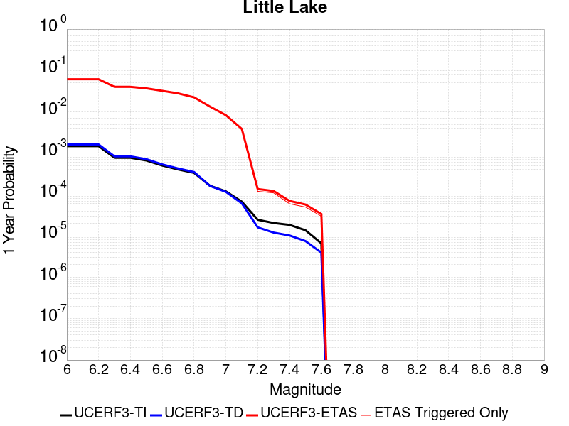 |  |

| Magnitude | 1 wk TI Prob | 1 wk TD Prob | 1 wk ETAS Prob | 1 wk ETAS/TD Gain | 1 wk ETAS Triggered Only | 1 mo TI Prob | 1 mo TD Prob | 1 mo ETAS Prob | 1 mo ETAS/TD Gain | 1 mo ETAS Triggered Only | 1 yr TI Prob | 1 yr TD Prob | 1 yr ETAS Prob | 1 yr ETAS/TD Gain | 1 yr ETAS Triggered Only | 10 yr TI Prob | 10 yr TD Prob | 10 yr ETAS Prob | 10 yr ETAS/TD Gain | 10 yr ETAS Triggered Only |
|-----|-----|-----|-----|-----|-----|-----|-----|-----|-----|-----|-----|-----|-----|-----|-----|-----|-----|-----|-----|-----|
| 6.0 | 2.8424427E-5 | 3.120572E-5 | 0.03476404 | 1114.0278 | 0.03473392 | 1.2181328E-4 | 1.337327E-4 | 0.043861117 | 327.976 | 0.04373323 | 0.0014820677 | 0.0016271127 | 0.061265394 | 37.65283 | 0.05973548 | 0.014722223 | 0.016165402 | 0.08957399 | 5.541093 | 0.07461476 |
| 6.1 | 2.8424427E-5 | 3.120572E-5 | 0.03476404 | 1114.0278 | 0.03473392 | 1.2181328E-4 | 1.337327E-4 | 0.043861117 | 327.976 | 0.04373323 | 0.0014820677 | 0.0016271127 | 0.061265394 | 37.65283 | 0.05973548 | 0.014722223 | 0.016165402 | 0.08957399 | 5.541093 | 0.07461476 |
| 6.2 | 2.8424427E-5 | 3.120572E-5 | 0.03476404 | 1114.0278 | 0.03473392 | 1.2181328E-4 | 1.337327E-4 | 0.043861117 | 327.976 | 0.04373323 | 0.0014820677 | 0.0016271127 | 0.061265394 | 37.65283 | 0.05973548 | 0.014722223 | 0.016165402 | 0.08957399 | 5.541093 | 0.07461476 |
| 6.3 | 1.48860645E-5 | 1.6081389E-5 | 0.0234108 | 1455.7698 | 0.023395097 | 6.379586E-5 | 6.8918576E-5 | 0.029388752 | 426.42712 | 0.029321855 | 7.7643775E-4 | 8.3878887E-4 | 0.040031664 | 47.725555 | 0.03922578 | 0.007737305 | 0.008359048 | 0.056722347 | 6.7857428 | 0.04877098 |
| 6.4 | 1.48860645E-5 | 1.6081389E-5 | 0.0234108 | 1455.7698 | 0.023395097 | 6.379586E-5 | 6.8918576E-5 | 0.029388752 | 426.42712 | 0.029321855 | 7.7643775E-4 | 8.3878887E-4 | 0.040031664 | 47.725555 | 0.03922578 | 0.007737305 | 0.008359048 | 0.056722347 | 6.7857428 | 0.04877098 |
| 6.5 | 1.2797581E-5 | 1.3765565E-5 | 0.021583747 | 1567.9521 | 0.021570278 | 5.4845623E-5 | 5.899409E-5 | 0.027117725 | 459.66852 | 0.027060328 | 6.675408E-4 | 7.18042E-4 | 0.036938816 | 51.44381 | 0.036246803 | 0.006655392 | 0.00715977 | 0.05194257 | 7.2547817 | 0.045105744 |
| 6.6 | 9.661896E-6 | 1.0289038E-5 | 0.018944526 | 1841.234 | 0.01893443 | 4.1407468E-5 | 4.409522E-5 | 0.023703292 | 537.54785 | 0.02366024 | 5.040193E-4 | 5.367433E-4 | 0.032181114 | 59.95624 | 0.031661365 | 0.005028777 | 0.0053560743 | 0.044232138 | 8.258313 | 0.039085407 |
| 6.7 | 7.767871E-6 | 8.199687E-6 | 0.016197473 | 1975.3772 | 0.016189408 | 3.329045E-5 | 3.5141118E-5 | 0.020419352 | 581.0672 | 0.020384928 | 4.0523586E-4 | 4.2777284E-4 | 0.027772736 | 64.92403 | 0.027356666 | 0.004044977 | 0.004270846 | 0.038002267 | 8.898066 | 0.0338761 |
| 6.8 | 6.4235196E-6 | 6.7357446E-6 | 0.013139095 | 1950.6522 | 0.013132447 | 2.752908E-5 | 2.8867229E-5 | 0.016560925 | 573.69293 | 0.016532535 | 3.35115E-4 | 3.5141467E-4 | 0.022303894 | 63.46888 | 0.021960197 | 0.003346101 | 0.00350985 | 0.030444117 | 8.673908 | 0.027029134 |
| 6.9 | 3.1283696E-6 | 3.1121804E-6 | 0.00823816 | 2647.0703 | 0.008235074 | 1.3407229E-5 | 1.3337856E-5 | 0.009979516 | 748.2099 | 0.009966311 | 1.6322079E-4 | 1.6237781E-4 | 0.013386258 | 82.43896 | 0.013226028 | 0.0016310095 | 0.00162274 | 0.018190732 | 11.2098875 | 0.016594922 |
| 7.0 | 2.290603E-6 | 2.2286815E-6 | 0.004883995 | 2191.4277 | 0.004881777 | 9.816834E-6 | 9.551463E-6 | 0.005998639 | 628.0335 | 0.0059891446 | 1.19513395E-4 | 1.162839E-4 | 0.008100881 | 69.66469 | 0.007985527 | 0.0011944914 | 0.0011623327 | 0.011148217 | 9.591244 | 0.009997505 |
| 7.1 | 1.293693E-6 | 1.1776827E-6 | 0.0023874748 | 2027.2646 | 0.0023863 | 5.5443866E-6 | 5.0472063E-6 | 0.002921621 | 578.8591 | 0.0029165887 | 6.750081E-5 | 6.14487E-5 | 0.003882413 | 63.18137 | 0.003821199 | 6.7480316E-4 | 6.143856E-4 | 0.005368466 | 8.737943 | 0.004757003 |
| 7.2 | 4.715842E-7 | 3.0917857E-7 | 3.150263E-5 | 101.89138 | 3.1193464E-5 | 2.0210737E-6 | 1.3250503E-6 | 6.3711894E-5 | 48.08262 | 6.238693E-5 | 2.4606294E-5 | 1.6132375E-5 | 1.0971125E-4 | 6.8006883 | 9.3580384E-5 | 2.460357E-4 | 1.6131258E-4 | 2.7047208E-4 | 1.6766956 | 1.0917712E-4 |
| 7.3 | 3.9430947E-7 | 2.3097488E-7 | 1.5827702E-5 | 68.52564 | 1.5596732E-5 | 1.6898966E-6 | 9.89892E-7 | 4.778004E-5 | 48.267933 | 4.6790192E-5 | 2.0574296E-5 | 1.2051869E-5 | 9.0034584E-5 | 7.470591 | 7.7983656E-5 | 2.0572392E-4 | 1.20512224E-4 | 1.9848648E-4 | 1.6470237 | 7.7983656E-5 |
| 7.4 | 3.547123E-7 | 1.9679135E-7 | 1.9679135E-7 | 1.0 | 0.0 | 1.5201948E-6 | 8.4339126E-7 | 3.2036827E-5 | 37.985725 | 3.1193464E-5 | 1.8508214E-5 | 1.0268241E-5 | 5.7057954E-5 | 5.5567408 | 4.6790192E-5 | 1.8506673E-4 | 1.02677724E-4 | 1.4946311E-4 | 1.4556527 | 4.6790192E-5 |
| 7.5 | 2.6354266E-7 | 1.4423138E-7 | 1.4423138E-7 | 1.0 | 0.0 | 1.129468E-6 | 6.181344E-7 | 3.1811578E-5 | 51.463856 | 3.1193464E-5 | 1.3751187E-5 | 7.5257603E-6 | 5.4315602E-5 | 7.217291 | 4.6790192E-5 | 1.3750336E-4 | 7.5255106E-5 | 1.22041776E-4 | 1.6217076 | 4.6790192E-5 |
| 7.6 | 1.269913E-7 | 7.572556E-8 | 7.572556E-8 | 1.0 | 0.0 | 5.4424834E-7 | 3.245381E-7 | 1.5921263E-5 | 49.05823 | 1.5596732E-5 | 6.6262032E-6 | 3.9512443E-6 | 3.514458E-5 | 8.894561 | 3.1193464E-5 | 6.626006E-5 | 3.9511775E-5 | 7.070401E-5 | 1.7894413 | 3.1193464E-5 |

## Owl Lake
*[(top)](#table-of-contents)*

| 1 Week | 1 Month | 1 Year | 10 Year |
|-----|-----|-----|-----|
|  |  |  |  |

| Magnitude | 1 wk TI Prob | 1 wk TD Prob | 1 wk ETAS Prob | 1 wk ETAS/TD Gain | 1 wk ETAS Triggered Only | 1 mo TI Prob | 1 mo TD Prob | 1 mo ETAS Prob | 1 mo ETAS/TD Gain | 1 mo ETAS Triggered Only | 1 yr TI Prob | 1 yr TD Prob | 1 yr ETAS Prob | 1 yr ETAS/TD Gain | 1 yr ETAS Triggered Only | 10 yr TI Prob | 10 yr TD Prob | 10 yr ETAS Prob | 10 yr ETAS/TD Gain | 10 yr ETAS Triggered Only |
|-----|-----|-----|-----|-----|-----|-----|-----|-----|-----|-----|-----|-----|-----|-----|-----|-----|-----|-----|-----|-----|
| 6.0 | 5.0320643E-5 | 6.635816E-5 | 0.017907834 | 269.86636 | 0.01784266 | 2.1564208E-4 | 2.843674E-4 | 0.025138486 | 88.40144 | 0.024861189 | 0.0026222812 | 0.0034577388 | 0.04298308 | 12.430981 | 0.039662488 | 0.02591553 | 0.034140717 | 0.0876188 | 2.5664017 | 0.055368394 |
| 6.1 | 5.0320643E-5 | 6.635816E-5 | 0.017907834 | 269.86636 | 0.01784266 | 2.1564208E-4 | 2.843674E-4 | 0.025138486 | 88.40144 | 0.024861189 | 0.0026222812 | 0.0034577388 | 0.04298308 | 12.430981 | 0.039662488 | 0.02591553 | 0.034140717 | 0.0876188 | 2.5664017 | 0.055368394 |
| 6.2 | 2.4125871E-5 | 3.0981035E-5 | 0.014597876 | 471.18747 | 0.014567346 | 1.0339249E-4 | 1.3277028E-4 | 0.020359045 | 153.34038 | 0.02022896 | 0.0012580766 | 0.001615439 | 0.03397309 | 21.030252 | 0.032410007 | 0.012509781 | 0.016070465 | 0.06065084 | 3.7740564 | 0.045308504 |
| 6.3 | 1.7433485E-5 | 2.2355514E-5 | 0.013248088 | 592.6094 | 0.013226028 | 7.471279E-5 | 9.580672E-5 | 0.018279852 | 190.79927 | 0.018185789 | 9.0924866E-4 | 0.0011659743 | 0.029986283 | 25.71779 | 0.028853953 | 0.009055373 | 0.011628896 | 0.05120012 | 4.402836 | 0.04003681 |
| 6.4 | 1.7433485E-5 | 2.2355514E-5 | 0.013248088 | 592.6094 | 0.013226028 | 7.471279E-5 | 9.580672E-5 | 0.018279852 | 190.79927 | 0.018185789 | 9.0924866E-4 | 0.0011659743 | 0.029986283 | 25.71779 | 0.028853953 | 0.009055373 | 0.011628896 | 0.05120012 | 4.402836 | 0.04003681 |
| 6.5 | 1.5182742E-5 | 1.9429144E-5 | 0.012777307 | 657.6361 | 0.012758126 | 6.506727E-5 | 8.326596E-5 | 0.017425386 | 209.27383 | 0.017343564 | 7.919061E-4 | 0.0010134429 | 0.028202156 | 27.828068 | 0.027216295 | 0.0078909 | 0.010118429 | 0.047310777 | 4.675704 | 0.037572525 |
| 6.6 | 6.7271576E-6 | 8.547361E-6 | 0.010333495 | 1208.9691 | 0.010325036 | 2.8830356E-5 | 3.6631063E-5 | 0.013371347 | 365.02753 | 0.013335205 | 3.5095305E-4 | 4.458976E-4 | 0.019901939 | 44.633427 | 0.01946472 | 0.0035039932 | 0.004467813 | 0.030134022 | 6.7446923 | 0.025781397 |
| 6.7 | 6.682835E-6 | 8.479807E-6 | 0.010333428 | 1218.5924 | 0.010325036 | 2.8640408E-5 | 3.6341557E-5 | 0.0133710615 | 367.9276 | 0.013335205 | 3.4864116E-4 | 4.4237426E-4 | 0.019882893 | 44.945866 | 0.019449124 | 0.003480947 | 0.0044327388 | 0.030068798 | 6.783345 | 0.025750203 |
| 6.8 | 6.5774975E-6 | 8.32628E-6 | 0.010255293 | 1231.6776 | 0.010247053 | 2.8188972E-5 | 3.5683603E-5 | 0.013292432 | 372.50812 | 0.013257221 | 3.4314668E-4 | 4.343669E-4 | 0.019797092 | 45.57689 | 0.019371139 | 0.0034261728 | 0.004352885 | 0.029882299 | 6.864941 | 0.025641026 |
| 6.9 | 6.363419E-6 | 7.999454E-6 | 0.01020818 | 1276.1095 | 0.010200262 | 2.727151E-5 | 3.428296E-5 | 0.013228665 | 385.8671 | 0.013194835 | 3.3198006E-4 | 4.1732067E-4 | 0.019655654 | 47.099644 | 0.019246366 | 0.0033148455 | 0.0041828766 | 0.029576866 | 7.070939 | 0.025500655 |
| 7.0 | 6.1342453E-6 | 7.6316555E-6 | 0.0101454295 | 1329.3877 | 0.010137876 | 2.6289357E-5 | 3.2706717E-5 | 0.0131179355 | 401.07776 | 0.013085657 | 3.2002592E-4 | 3.9813702E-4 | 0.019402983 | 48.734436 | 0.019012416 | 0.0031956544 | 0.003991571 | 0.028955473 | 7.254155 | 0.025063947 |
| 7.1 | 5.842926E-6 | 7.142211E-6 | 0.00956787 | 1339.6229 | 0.009560796 | 2.504087E-5 | 3.0609146E-5 | 0.0123984385 | 405.05664 | 0.012368208 | 3.0482994E-4 | 3.7260808E-4 | 0.018255392 | 48.993553 | 0.017889451 | 0.0030441214 | 0.0037370329 | 0.0270447 | 7.2369447 | 0.023395097 |
| 7.2 | 4.77173E-6 | 5.358483E-6 | 0.0061504375 | 1147.7944 | 0.006145112 | 2.045011E-5 | 2.2964748E-5 | 0.008070693 | 351.43832 | 0.008047913 | 2.4895166E-4 | 2.79564E-4 | 0.012036212 | 43.05351 | 0.011759935 | 0.0024867293 | 0.002808645 | 0.018019406 | 6.4156938 | 0.0152536025 |
| 7.3 | 3.0494948E-6 | 2.710463E-6 | 0.0014843959 | 547.654 | 0.0014816894 | 1.3069198E-5 | 1.1616219E-5 | 0.0019923782 | 171.51692 | 0.0019807848 | 1.5910587E-4 | 1.4141845E-4 | 0.003042 | 21.510632 | 0.002900992 | 0.0015899199 | 0.0014232415 | 0.005441471 | 3.8232944 | 0.0040239566 |
| 7.4 | 2.7263884E-6 | 2.3056762E-6 | 9.5370406E-4 | 413.63312 | 9.514006E-4 | 1.1684469E-5 | 9.881433E-6 | 0.001351187 | 136.73999 | 0.0013413188 | 1.4224913E-4 | 1.20299905E-4 | 0.0020072772 | 16.68561 | 0.0018872045 | 0.0014215811 | 0.0012112238 | 0.003937346 | 3.250717 | 0.002729428 |
| 7.5 | 2.6090431E-6 | 2.1656133E-6 | 8.2879054E-4 | 382.7048 | 8.266267E-4 | 1.1181565E-5 | 9.281167E-6 | 0.0011946217 | 128.7146 | 0.0011853515 | 1.3612706E-4 | 1.1299244E-4 | 0.0017504642 | 15.491869 | 0.0016376567 | 0.001360437 | 0.0011379806 | 0.0035215649 | 3.0945737 | 0.0023863 |
| 7.6 | 2.3008756E-6 | 1.8727933E-6 | 5.7895074E-4 | 309.13754 | 5.77079E-4 | 9.860858E-6 | 8.0262325E-6 | 8.6583954E-4 | 107.876205 | 8.578202E-4 | 1.20049335E-4 | 9.7715085E-5 | 0.0012673556 | 12.969907 | 0.0011697548 | 0.001199845 | 9.849932E-4 | 0.0027301065 | 2.7717009 | 0.0017468339 |
| 7.7 | 1.7184348E-6 | 1.3419171E-6 | 3.7566296E-4 | 279.94498 | 3.7432153E-4 | 7.3646997E-6 | 5.7510606E-6 | 5.3603685E-4 | 93.206604 | 5.3028885E-4 | 8.966153E-5 | 7.0016955E-5 | 7.8741636E-4 | 11.24608 | 7.1744964E-4 | 8.962536E-4 | 7.078345E-4 | 0.0017520757 | 2.475262 | 0.001044981 |
| 7.8 | 8.4612907E-7 | 8.4058576E-7 | 1.5680776E-4 | 186.54582 | 1.5596731E-4 | 3.6262625E-6 | 3.6025056E-6 | 2.3755262E-4 | 65.94095 | 2.3395097E-4 | 4.4148852E-5 | 4.3859643E-5 | 3.557806E-4 | 8.111798 | 3.1193462E-4 | 4.414008E-4 | 4.4398365E-4 | 8.649084E-4 | 1.9480637 | 4.2111173E-4 |
| 7.9 | 2.716738E-7 | 3.768106E-7 | 3.157026E-5 | 83.782845 | 3.1193464E-5 | 1.1643157E-6 | 1.6149015E-6 | 3.280831E-5 | 20.315983 | 3.1193464E-5 | 1.4175452E-5 | 1.966126E-5 | 8.204696E-5 | 4.1730266 | 6.238693E-5 | 1.4174548E-4 | 1.9836679E-4 | 2.7633496E-4 | 1.3930506 | 7.7983656E-5 |
| 8.0 | 2.1995428E-8 | 3.384878E-8 | 3.384878E-8 | 1.0 | 0.0 | 9.426611E-8 | 1.4506621E-7 | 1.4506621E-7 | 1.0 | 0.0 | 1.1476893E-6 | 1.7661803E-6 | 1.7661803E-6 | 1.0 | 0.0 | 1.14768345E-5 | 1.7963059E-5 | 1.7963059E-5 | 1.0 | 0.0 |

## Airport Lake
*[(top)](#table-of-contents)*

| 1 Week | 1 Month | 1 Year | 10 Year |
|-----|-----|-----|-----|
|  |  |  |  |

| Magnitude | 1 wk TI Prob | 1 wk TD Prob | 1 wk ETAS Prob | 1 wk ETAS/TD Gain | 1 wk ETAS Triggered Only | 1 mo TI Prob | 1 mo TD Prob | 1 mo ETAS Prob | 1 mo ETAS/TD Gain | 1 mo ETAS Triggered Only | 1 yr TI Prob | 1 yr TD Prob | 1 yr ETAS Prob | 1 yr ETAS/TD Gain | 1 yr ETAS Triggered Only | 10 yr TI Prob | 10 yr TD Prob | 10 yr ETAS Prob | 10 yr ETAS/TD Gain | 10 yr ETAS Triggered Only |
|-----|-----|-----|-----|-----|-----|-----|-----|-----|-----|-----|-----|-----|-----|-----|-----|-----|-----|-----|-----|-----|
| 6.0 | 1.2387061E-5 | 1.3103157E-5 | 0.03073826 | 2345.8667 | 0.03072556 | 5.3086325E-5 | 5.615534E-5 | 0.03796968 | 676.1544 | 0.037915654 | 6.461343E-4 | 6.8350515E-4 | 0.050699204 | 74.17531 | 0.05004991 | 0.0064425888 | 0.0068168393 | 0.067942 | 9.966789 | 0.0615447 |
| 6.1 | 1.2387061E-5 | 1.3103157E-5 | 0.03073826 | 2345.8667 | 0.03072556 | 5.3086325E-5 | 5.615534E-5 | 0.03796968 | 676.1544 | 0.037915654 | 6.461343E-4 | 6.8350515E-4 | 0.050699204 | 74.17531 | 0.05004991 | 0.0064425888 | 0.0068168393 | 0.067942 | 9.966789 | 0.0615447 |
| 6.2 | 1.2387061E-5 | 1.3103157E-5 | 0.03073826 | 2345.8667 | 0.03072556 | 5.3086325E-5 | 5.615534E-5 | 0.03796968 | 676.1544 | 0.037915654 | 6.461343E-4 | 6.8350515E-4 | 0.050699204 | 74.17531 | 0.05004991 | 0.0064425888 | 0.0068168393 | 0.067942 | 9.966789 | 0.0615447 |
| 6.3 | 1.2387061E-5 | 1.3103157E-5 | 0.03073826 | 2345.8667 | 0.03072556 | 5.3086325E-5 | 5.615534E-5 | 0.03796968 | 676.1544 | 0.037915654 | 6.461343E-4 | 6.8350515E-4 | 0.050699204 | 74.17531 | 0.05004991 | 0.0064425888 | 0.0068168393 | 0.067942 | 9.966789 | 0.0615447 |
| 6.4 | 1.2387061E-5 | 1.3103157E-5 | 0.03073826 | 2345.8667 | 0.03072556 | 5.3086325E-5 | 5.615534E-5 | 0.03796968 | 676.1544 | 0.037915654 | 6.461343E-4 | 6.8350515E-4 | 0.050699204 | 74.17531 | 0.05004991 | 0.0064425888 | 0.0068168393 | 0.067942 | 9.966789 | 0.0615447 |
| 6.5 | 6.9922594E-6 | 7.384925E-6 | 0.02293441 | 3105.571 | 0.022927195 | 2.996648E-5 | 3.1649324E-5 | 0.028447993 | 898.8499 | 0.028417245 | 3.6478083E-4 | 3.8526783E-4 | 0.03795891 | 98.526024 | 0.037588123 | 0.003641826 | 0.0038465366 | 0.049726523 | 12.927609 | 0.046057146 |
| 6.6 | 6.9922594E-6 | 7.384925E-6 | 0.02293441 | 3105.571 | 0.022927195 | 2.996648E-5 | 3.1649324E-5 | 0.028447993 | 898.8499 | 0.028417245 | 3.6478083E-4 | 3.8526783E-4 | 0.03795891 | 98.526024 | 0.037588123 | 0.003641826 | 0.0038465366 | 0.049726523 | 12.927609 | 0.046057146 |
| 6.7 | 5.477277E-6 | 5.7860684E-6 | 0.01948599 | 3367.7427 | 0.019480318 | 2.3473833E-5 | 2.4797222E-5 | 0.024261516 | 978.39655 | 0.02423732 | 2.8575645E-4 | 3.0186825E-4 | 0.032421436 | 107.4026 | 0.032129265 | 0.0028538927 | 0.003014966 | 0.042169128 | 13.986603 | 0.03927257 |
| 6.8 | 3.9950432E-6 | 4.2190873E-6 | 0.015132984 | 3586.7913 | 0.015128829 | 1.7121502E-5 | 1.8081691E-5 | 0.01890538 | 1045.5538 | 0.01888764 | 2.0843433E-4 | 2.2012512E-4 | 0.025075842 | 113.91631 | 0.024861189 | 0.0020823893 | 0.0021993418 | 0.032655016 | 14.8476305 | 0.030522803 |
| 6.9 | 2.95695E-6 | 3.1230243E-6 | 0.01078043 | 3451.9202 | 0.010777341 | 1.2672582E-5 | 1.3384334E-5 | 0.013208042 | 986.8285 | 0.013194835 | 1.5427776E-4 | 1.6294434E-4 | 0.017737595 | 108.85677 | 0.017577516 | 0.001541707 | 0.0016284712 | 0.023412764 | 14.377145 | 0.021819826 |
| 7.0 | 1.456072E-6 | 1.540812E-6 | 0.004633763 | 3007.351 | 0.004632229 | 6.2402937E-6 | 6.603469E-6 | 0.0056681796 | 858.3639 | 0.0056616133 | 7.597293E-5 | 8.039528E-5 | 0.0076442016 | 95.08272 | 0.0075644143 | 7.594696E-4 | 8.0376083E-4 | 0.010185447 | 12.6722355 | 0.009389232 |
| 7.1 | 6.995192E-7 | 7.4089746E-7 | 0.0022778618 | 3074.4631 | 0.0022771228 | 2.997936E-6 | 3.1752747E-6 | 0.0027793846 | 875.321 | 0.002776218 | 3.649926E-5 | 3.865897E-5 | 0.0036413646 | 94.19197 | 0.003602845 | 3.6493264E-4 | 3.865897E-4 | 0.004861121 | 12.574368 | 0.004476262 |

## Panamint Valley
*[(top)](#table-of-contents)*

| 1 Week | 1 Month | 1 Year | 10 Year |
|-----|-----|-----|-----|
|  |  |  |  |

| Magnitude | 1 wk TI Prob | 1 wk TD Prob | 1 wk ETAS Prob | 1 wk ETAS/TD Gain | 1 wk ETAS Triggered Only | 1 mo TI Prob | 1 mo TD Prob | 1 mo ETAS Prob | 1 mo ETAS/TD Gain | 1 mo ETAS Triggered Only | 1 yr TI Prob | 1 yr TD Prob | 1 yr ETAS Prob | 1 yr ETAS/TD Gain | 1 yr ETAS Triggered Only | 10 yr TI Prob | 10 yr TD Prob | 10 yr ETAS Prob | 10 yr ETAS/TD Gain | 10 yr ETAS Triggered Only |
|-----|-----|-----|-----|-----|-----|-----|-----|-----|-----|-----|-----|-----|-----|-----|-----|-----|-----|-----|-----|-----|
| 6.0 | 3.0211835E-5 | 3.3984514E-5 | 0.017158613 | 504.89508 | 0.01712521 | 1.2947287E-4 | 1.4563995E-4 | 0.023209846 | 159.36456 | 0.023067566 | 0.0015751923 | 0.0017717537 | 0.038312424 | 21.624014 | 0.036605526 | 0.015640736 | 0.017583137 | 0.06871429 | 3.9079654 | 0.05204629 |
| 6.1 | 3.0211835E-5 | 3.3984514E-5 | 0.017158613 | 504.89508 | 0.01712521 | 1.2947287E-4 | 1.4563995E-4 | 0.023209846 | 159.36456 | 0.023067566 | 0.0015751923 | 0.0017717537 | 0.038312424 | 21.624014 | 0.036605526 | 0.015640736 | 0.017583137 | 0.06871429 | 3.9079654 | 0.05204629 |
| 6.2 | 3.0211835E-5 | 3.3984514E-5 | 0.017158613 | 504.89508 | 0.01712521 | 1.2947287E-4 | 1.4563995E-4 | 0.023209846 | 159.36456 | 0.023067566 | 0.0015751923 | 0.0017717537 | 0.038312424 | 21.624014 | 0.036605526 | 0.015640736 | 0.017583137 | 0.06871429 | 3.9079654 | 0.05204629 |
| 6.3 | 2.8573924E-5 | 3.210268E-5 | 0.016501721 | 514.0294 | 0.016470147 | 1.2245393E-4 | 1.3757581E-4 | 0.022266293 | 161.84743 | 0.022131762 | 0.001489857 | 0.0016737265 | 0.036738776 | 21.950287 | 0.035123836 | 0.01479908 | 0.016617801 | 0.06549857 | 3.9414701 | 0.049706783 |
| 6.4 | 2.8573924E-5 | 3.210268E-5 | 0.016501721 | 514.0294 | 0.016470147 | 1.2245393E-4 | 1.3757581E-4 | 0.022266293 | 161.84743 | 0.022131762 | 0.001489857 | 0.0016737265 | 0.036738776 | 21.950287 | 0.035123836 | 0.01479908 | 0.016617801 | 0.06549857 | 3.9414701 | 0.049706783 |
| 6.5 | 2.7468774E-5 | 3.0828433E-5 | 0.016219735 | 526.1291 | 0.016189408 | 1.1771801E-4 | 1.3211532E-4 | 0.021839896 | 165.30934 | 0.02171065 | 0.0014322745 | 0.0016073446 | 0.035865 | 22.3132 | 0.034312807 | 0.014230782 | 0.015963677 | 0.063710526 | 3.9909682 | 0.04852143 |
| 6.6 | 2.6135967E-5 | 2.925248E-5 | 0.015843876 | 541.625 | 0.015815085 | 1.1200648E-4 | 1.253619E-4 | 0.021240689 | 169.43497 | 0.021117974 | 0.0013628257 | 0.0015252391 | 0.034820188 | 22.829332 | 0.03334581 | 0.013544982 | 0.015154043 | 0.06140414 | 4.051997 | 0.04696176 |
| 6.7 | 2.4498746E-5 | 2.7341335E-5 | 0.015296123 | 559.4505 | 0.015269199 | 1.04990395E-4 | 1.1717203E-4 | 0.02049971 | 174.95396 | 0.020384928 | 0.0012775084 | 0.0014256609 | 0.033415675 | 23.438725 | 0.032035686 | 0.012701893 | 0.014171274 | 0.05848406 | 4.126944 | 0.044949777 |
| 6.8 | 2.2244329E-5 | 2.4935423E-5 | 0.014654304 | 587.6902 | 0.014629734 | 9.532935E-5 | 1.0686185E-4 | 0.019585097 | 183.27492 | 0.019480318 | 0.0011600169 | 0.0013002884 | 0.03161206 | 24.311579 | 0.030351238 | 0.011539802 | 0.0129325185 | 0.054822385 | 4.239111 | 0.042438705 |
| 6.9 | 1.9902658E-5 | 2.2290267E-5 | 0.013201234 | 592.24207 | 0.013179238 | 8.529431E-5 | 9.552632E-5 | 0.017608982 | 184.33644 | 0.017515128 | 0.0010379635 | 0.0011624309 | 0.027755102 | 23.876776 | 0.02662362 | 0.010331288 | 0.011568608 | 0.048475225 | 4.1902385 | 0.037338573 |
| 7.0 | 1.8353881E-5 | 2.0566185E-5 | 0.012575677 | 611.47345 | 0.012555368 | 7.865712E-5 | 8.813792E-5 | 0.016666 | 189.09003 | 0.016579324 | 9.5722964E-4 | 0.0010725686 | 0.026125213 | 24.357615 | 0.025079543 | 0.009531168 | 0.010678849 | 0.04504185 | 4.2178564 | 0.03473392 |
| 7.1 | 1.7667631E-5 | 1.9772613E-5 | 0.012075807 | 610.734 | 0.012056273 | 7.571623E-5 | 8.473711E-5 | 0.015945269 | 188.17337 | 0.015861874 | 9.2145515E-4 | 0.0010312037 | 0.024947498 | 24.1926 | 0.023940982 | 0.009176437 | 0.010269073 | 0.043133523 | 4.200333 | 0.03320544 |
| 7.2 | 1.6381597E-5 | 1.8158249E-5 | 0.010920075 | 601.38367 | 0.010902115 | 7.020495E-5 | 7.781885E-5 | 0.014254144 | 183.17084 | 0.014177429 | 8.544101E-4 | 9.4704994E-4 | 0.022387827 | 23.639542 | 0.021461101 | 0.008511325 | 0.009434792 | 0.03891259 | 4.1243715 | 0.029758563 |
| 7.3 | 1.4520491E-5 | 1.5966476E-5 | 0.009327066 | 584.1656 | 0.009311249 | 6.222919E-5 | 6.842605E-5 | 0.012201852 | 178.32175 | 0.012134257 | 7.57377E-4 | 8.327849E-4 | 0.019268353 | 23.137249 | 0.018450933 | 0.0075480095 | 0.00829975 | 0.033666093 | 4.0562778 | 0.025578639 |
| 7.4 | 1.2852287E-5 | 1.4145411E-5 | 0.009091315 | 642.70416 | 0.0090772975 | 5.5080065E-5 | 6.062187E-5 | 0.011913419 | 196.52014 | 0.011853515 | 6.7039346E-4 | 7.378371E-4 | 0.018738769 | 25.396893 | 0.018014224 | 0.0066837464 | 0.0073567946 | 0.03205057 | 4.356594 | 0.024876786 |
| 7.5 | 1.1637851E-5 | 1.2836797E-5 | 0.009012035 | 702.047 | 0.008999314 | 4.987555E-5 | 5.5013777E-5 | 0.01178311 | 214.18472 | 0.011728741 | 6.070656E-4 | 6.6960254E-4 | 0.018375626 | 27.442585 | 0.017717887 | 0.006054099 | 0.0066787465 | 0.030800669 | 4.611744 | 0.02428411 |
| 7.6 | 3.0068115E-6 | 3.3330316E-6 | 0.003949293 | 1184.8951 | 0.003945973 | 1.2886271E-5 | 1.4284384E-5 | 0.0049583777 | 347.11874 | 0.004944164 | 1.5687906E-4 | 1.7390578E-4 | 0.0074251243 | 42.69625 | 0.00725248 | 0.0015676835 | 0.0017391363 | 0.011547988 | 6.640071 | 0.00982594 |

## Garlock (East)
*[(top)](#table-of-contents)*

| 1 Week | 1 Month | 1 Year | 10 Year |
|-----|-----|-----|-----|
|  |  |  |  |

| Magnitude | 1 wk TI Prob | 1 wk TD Prob | 1 wk ETAS Prob | 1 wk ETAS/TD Gain | 1 wk ETAS Triggered Only | 1 mo TI Prob | 1 mo TD Prob | 1 mo ETAS Prob | 1 mo ETAS/TD Gain | 1 mo ETAS Triggered Only | 1 yr TI Prob | 1 yr TD Prob | 1 yr ETAS Prob | 1 yr ETAS/TD Gain | 1 yr ETAS Triggered Only | 10 yr TI Prob | 10 yr TD Prob | 10 yr ETAS Prob | 10 yr ETAS/TD Gain | 10 yr ETAS Triggered Only |
|-----|-----|-----|-----|-----|-----|-----|-----|-----|-----|-----|-----|-----|-----|-----|-----|-----|-----|-----|-----|-----|
| 6.0 | 4.5092507E-5 | 6.290325E-5 | 0.012009247 | 190.91617 | 0.011947096 | 1.9323928E-4 | 2.6956003E-4 | 0.016922379 | 62.777775 | 0.016657308 | 0.0023501497 | 0.0032774 | 0.030046947 | 9.167922 | 0.02685757 | 0.023254504 | 0.032351844 | 0.069886014 | 2.1601865 | 0.03878907 |
| 6.1 | 4.5092507E-5 | 6.290325E-5 | 0.012009247 | 190.91617 | 0.011947096 | 1.9323928E-4 | 2.6956003E-4 | 0.016922379 | 62.777775 | 0.016657308 | 0.0023501497 | 0.0032774 | 0.030046947 | 9.167922 | 0.02685757 | 0.023254504 | 0.032351844 | 0.069886014 | 2.1601865 | 0.03878907 |
| 6.2 | 2.6674514E-5 | 3.4509674E-5 | 0.009267456 | 268.5466 | 0.009233264 | 1.1431433E-4 | 1.4789042E-4 | 0.012841752 | 86.83289 | 0.012695739 | 0.0013908884 | 0.0017991117 | 0.021664735 | 12.041906 | 0.019901428 | 0.01382215 | 0.017890299 | 0.04526303 | 2.5300322 | 0.027871357 |
| 6.3 | 2.6674514E-5 | 3.4509674E-5 | 0.009267456 | 268.5466 | 0.009233264 | 1.1431433E-4 | 1.4789042E-4 | 0.012841752 | 86.83289 | 0.012695739 | 0.0013908884 | 0.0017991117 | 0.021664735 | 12.041906 | 0.019901428 | 0.01382215 | 0.017890299 | 0.04526303 | 2.5300322 | 0.027871357 |
| 6.4 | 2.5312667E-5 | 3.233893E-5 | 0.009156131 | 283.1303 | 0.009124087 | 1.0847834E-4 | 1.3858822E-4 | 0.012723406 | 91.80727 | 0.012586562 | 0.0013199237 | 0.0016860351 | 0.021351494 | 12.663731 | 0.019698672 | 0.013121112 | 0.016778335 | 0.04382935 | 2.6122587 | 0.027512634 |
| 6.5 | 2.5312667E-5 | 3.233893E-5 | 0.009156131 | 283.1303 | 0.009124087 | 1.0847834E-4 | 1.3858822E-4 | 0.012723406 | 91.80727 | 0.012586562 | 0.0013199237 | 0.0016860351 | 0.021351494 | 12.663731 | 0.019698672 | 0.013121112 | 0.016778335 | 0.04382935 | 2.6122587 | 0.027512634 |
| 6.6 | 2.246556E-5 | 2.8133776E-5 | 0.008808847 | 313.1057 | 0.008780959 | 9.627742E-5 | 1.20567885E-4 | 0.012190982 | 101.11301 | 0.012071869 | 0.0011715472 | 0.0014669491 | 0.020249015 | 13.803487 | 0.018809658 | 0.011653901 | 0.01461866 | 0.04046886 | 2.7683015 | 0.026233701 |
| 6.7 | 2.2241198E-5 | 2.7803519E-5 | 0.008746134 | 314.5693 | 0.008718573 | 9.531594E-5 | 1.1915263E-4 | 0.012096015 | 101.516975 | 0.011978289 | 0.0011598538 | 0.0014497414 | 0.020138685 | 13.891226 | 0.018716076 | 0.011538187 | 0.014448853 | 0.04019591 | 2.7819445 | 0.026124524 |
| 6.8 | 1.9528685E-5 | 2.389819E-5 | 0.00849272 | 355.37085 | 0.008469025 | 8.369167E-5 | 1.0241691E-4 | 0.011580436 | 113.07152 | 0.011479194 | 0.0010184698 | 0.0012462323 | 0.018786265 | 15.07445 | 0.017561918 | 0.010138147 | 0.012436427 | 0.03664957 | 2.9469533 | 0.024518061 |
| 6.9 | 1.3318621E-5 | 1.5198884E-5 | 0.007907025 | 520.2372 | 0.007891946 | 5.7078556E-5 | 6.513648E-5 | 0.0106234355 | 163.09502 | 0.010558987 | 6.9470983E-4 | 7.927538E-4 | 0.016439458 | 20.737152 | 0.015659118 | 0.0069254204 | 0.007939888 | 0.029153226 | 3.671743 | 0.021383118 |
| 7.0 | 1.1760853E-5 | 1.31077895E-5 | 0.0077021956 | 587.60443 | 0.0076891882 | 5.0402683E-5 | 5.6175057E-5 | 0.010318248 | 183.68022 | 0.010262649 | 6.134799E-4 | 6.8372174E-4 | 0.015848964 | 23.180431 | 0.015175619 | 0.0061178906 | 0.00685652 | 0.027210107 | 3.9685009 | 0.020494105 |
| 7.1 | 1.0064758E-5 | 1.0902931E-5 | 0.007434866 | 681.9145 | 0.007424044 | 4.3133965E-5 | 4.672603E-5 | 0.009950187 | 212.94743 | 0.009903925 | 5.2502943E-4 | 5.687444E-4 | 0.014987515 | 26.351934 | 0.014426976 | 0.005237907 | 0.0057129986 | 0.024833903 | 4.346912 | 0.01923077 |
| 7.2 | 9.768808E-6 | 1.0498807E-5 | 0.0072161127 | 687.32697 | 0.00720569 | 4.186565E-5 | 4.499413E-5 | 0.009698936 | 215.56003 | 0.009654377 | 5.095951E-4 | 5.4766936E-4 | 0.0144835105 | 26.44572 | 0.0139434775 | 0.0050842804 | 0.0055032647 | 0.023868168 | 4.3370924 | 0.018466529 |
| 7.3 | 9.344516E-6 | 9.944468E-6 | 0.00645133 | 648.7356 | 0.0064414497 | 4.004731E-5 | 4.261847E-5 | 0.008807608 | 206.66176 | 0.008765363 | 4.8746695E-4 | 5.1875977E-4 | 0.013270267 | 25.580755 | 0.012758126 | 0.0048639905 | 0.0052149445 | 0.022049148 | 4.2280693 | 0.016922453 |
| 7.4 | 9.023491E-6 | 9.490661E-6 | 0.0056554535 | 595.8967 | 0.0056460164 | 3.867153E-5 | 4.0673647E-5 | 0.007713953 | 189.65482 | 0.007673592 | 4.7072413E-4 | 4.950925E-4 | 0.011719179 | 23.670687 | 0.011229646 | 0.004697283 | 0.0049783974 | 0.019938795 | 4.005063 | 0.015035248 |
| 7.5 | 7.081253E-6 | 7.087672E-6 | 0.0032667813 | 460.91034 | 0.0032597168 | 3.0347876E-5 | 3.0375388E-5 | 0.004381731 | 144.25269 | 0.004351488 | 3.6942272E-4 | 3.6975832E-4 | 0.006684099 | 18.076939 | 0.006316676 | 0.003688092 | 0.0037243143 | 0.011928719 | 3.2029302 | 0.008235074 |
| 7.6 | 6.116396E-6 | 5.959245E-6 | 0.0019087491 | 320.3005 | 0.0019028012 | 2.6212863E-5 | 2.5539372E-5 | 0.0025521452 | 99.92984 | 0.0025266705 | 3.1909486E-4 | 3.1089774E-4 | 0.0041776844 | 13.437488 | 0.0038679892 | 0.0031863707 | 0.0031357552 | 0.008344276 | 2.66101 | 0.005224905 |
| 7.7 | 4.797145E-6 | 4.757281E-6 | 0.0011589099 | 243.60762 | 0.001154158 | 2.055903E-5 | 2.0388188E-5 | 0.0015332402 | 75.20238 | 0.0015128829 | 2.5027743E-4 | 2.4819805E-4 | 0.0025559412 | 10.297991 | 0.002308316 | 0.0024999576 | 0.0025093474 | 0.0055275206 | 2.2027721 | 0.0030257658 |
| 7.8 | 3.4028885E-6 | 3.978462E-6 | 7.994086E-4 | 200.93408 | 7.954333E-4 | 1.4583726E-5 | 1.7050439E-5 | 0.0010620136 | 62.286583 | 0.001044981 | 1.775424E-4 | 2.0756939E-4 | 0.0018136993 | 8.737797 | 0.0016064633 | 0.0017740062 | 0.0021012232 | 0.0042334856 | 2.014772 | 0.0021367522 |
| 7.9 | 2.5928412E-6 | 3.3724489E-6 | 6.7402964E-4 | 199.86356 | 6.706594E-4 | 1.1112129E-5 | 1.4453272E-5 | 9.190506E-4 | 63.587715 | 9.046104E-4 | 1.3528178E-4 | 1.7595445E-4 | 0.0014702553 | 8.355886 | 0.0012945287 | 0.0013519945 | 0.0017812408 | 0.003524963 | 1.9789369 | 0.0017468339 |
| 8.0 | 1.3743648E-6 | 1.6734747E-6 | 2.0443063E-4 | 122.159386 | 2.027575E-4 | 5.8901214E-6 | 7.1720146E-6 | 2.7231453E-4 | 37.969044 | 2.6514442E-4 | 7.1709874E-5 | 8.731581E-5 | 4.927954E-4 | 5.643828 | 4.05515E-4 | 7.1686733E-4 | 8.837234E-4 | 0.0014291266 | 1.6171651 | 5.458856E-4 |
| 8.1 | 3.6733252E-7 | 3.1489964E-7 | 4.7105077E-5 | 149.58759 | 4.6790192E-5 | 1.5742813E-6 | 1.3495693E-6 | 4.81397E-5 | 35.670418 | 4.6790192E-5 | 1.9166706E-5 | 1.6430899E-5 | 9.441327E-5 | 5.746081 | 7.7983656E-5 | 1.9165053E-4 | 1.6638759E-4 | 2.9114066E-4 | 1.749774 | 1.2477385E-4 |

## Hunter Mountain-Saline Valley
*[(top)](#table-of-contents)*

| 1 Week | 1 Month | 1 Year | 10 Year |
|-----|-----|-----|-----|
|  |  |  |  |

| Magnitude | 1 wk TI Prob | 1 wk TD Prob | 1 wk ETAS Prob | 1 wk ETAS/TD Gain | 1 wk ETAS Triggered Only | 1 mo TI Prob | 1 mo TD Prob | 1 mo ETAS Prob | 1 mo ETAS/TD Gain | 1 mo ETAS Triggered Only | 1 yr TI Prob | 1 yr TD Prob | 1 yr ETAS Prob | 1 yr ETAS/TD Gain | 1 yr ETAS Triggered Only | 10 yr TI Prob | 10 yr TD Prob | 10 yr ETAS Prob | 10 yr ETAS/TD Gain | 10 yr ETAS Triggered Only |
|-----|-----|-----|-----|-----|-----|-----|-----|-----|-----|-----|-----|-----|-----|-----|-----|-----|-----|-----|-----|-----|
| 6.0 | 4.5103672E-5 | 5.4570177E-5 | 0.009380906 | 171.90536 | 0.009326845 | 1.9328714E-4 | 2.3385242E-4 | 0.012412051 | 53.076424 | 0.012181046 | 0.002350731 | 0.0028435152 | 0.0213664 | 7.51408 | 0.018575707 | 0.023260195 | 0.028091887 | 0.0530884 | 1.8898126 | 0.02571901 |
| 6.1 | 4.5103672E-5 | 5.4570177E-5 | 0.009380906 | 171.90536 | 0.009326845 | 1.9328714E-4 | 2.3385242E-4 | 0.012412051 | 53.076424 | 0.012181046 | 0.002350731 | 0.0028435152 | 0.0213664 | 7.51408 | 0.018575707 | 0.023260195 | 0.028091887 | 0.0530884 | 1.8898126 | 0.02571901 |
| 6.2 | 3.9363465E-5 | 4.706337E-5 | 0.0093266815 | 198.17284 | 0.009280055 | 1.6868966E-4 | 2.0168544E-4 | 0.012333495 | 61.152134 | 0.012134257 | 0.002051862 | 0.0024528175 | 0.020905169 | 8.522921 | 0.018497722 | 0.020330196 | 0.024273481 | 0.049246456 | 2.0288172 | 0.025594236 |
| 6.3 | 3.9363465E-5 | 4.706337E-5 | 0.0093266815 | 198.17284 | 0.009280055 | 1.6868966E-4 | 2.0168544E-4 | 0.012333495 | 61.152134 | 0.012134257 | 0.002051862 | 0.0024528175 | 0.020905169 | 8.522921 | 0.018497722 | 0.020330196 | 0.024273481 | 0.049246456 | 2.0288172 | 0.025594236 |
| 6.4 | 3.2311684E-5 | 3.795099E-5 | 0.009239673 | 243.4633 | 0.009202071 | 1.384713E-4 | 1.6263737E-4 | 0.012201356 | 75.02184 | 0.012040677 | 0.0016845843 | 0.0019783843 | 0.020283854 | 10.252736 | 0.018341755 | 0.016718714 | 0.019616475 | 0.04452515 | 2.2697835 | 0.025407074 |
| 6.5 | 3.2311684E-5 | 3.795099E-5 | 0.009239673 | 243.4633 | 0.009202071 | 1.384713E-4 | 1.6263737E-4 | 0.012201356 | 75.02184 | 0.012040677 | 0.0016845843 | 0.0019783843 | 0.020283854 | 10.252736 | 0.018341755 | 0.016718714 | 0.019616475 | 0.04452515 | 2.2697835 | 0.025407074 |
| 6.6 | 2.9305844E-5 | 3.418183E-5 | 0.009220342 | 269.74396 | 0.009186475 | 1.2559042E-4 | 1.4648569E-4 | 0.0121698035 | 83.078445 | 0.01202508 | 0.0015279909 | 0.001782067 | 0.02006 | 11.25659 | 0.018310562 | 0.015175272 | 0.01768569 | 0.04259746 | 2.4085834 | 0.025360284 |
| 6.7 | 2.7826512E-5 | 3.2344276E-5 | 0.0092029255 | 284.53027 | 0.009170878 | 1.19251024E-4 | 1.386113E-4 | 0.012146429 | 87.62943 | 0.012009483 | 0.0014509142 | 0.0016863465 | 0.01995046 | 11.830583 | 0.018294966 | 0.014414776 | 0.016743187 | 0.041648187 | 2.4874709 | 0.02532909 |
| 6.8 | 2.3389874E-5 | 2.6866714E-5 | 0.009135113 | 340.01602 | 0.009108491 | 1.0023846E-4 | 1.15138246E-4 | 0.012060858 | 104.75111 | 0.011947096 | 0.00121972 | 0.001400954 | 0.019592414 | 13.985052 | 0.018216982 | 0.01213047 | 0.013927434 | 0.03881148 | 2.7866926 | 0.025235511 |
| 6.9 | 2.069209E-5 | 2.3570032E-5 | 0.00911625 | 386.77292 | 0.009092894 | 8.867737E-5 | 1.01010715E-4 | 0.01201571 | 118.9548 | 0.011915903 | 0.0010791123 | 0.0012291478 | 0.019377006 | 15.7645855 | 0.018170191 | 0.010738871 | 0.012228523 | 0.03709382 | 3.0333848 | 0.025173124 |
| 7.0 | 1.7462342E-5 | 1.9633546E-5 | 0.009096753 | 463.32706 | 0.0090772975 | 7.483646E-5 | 8.414118E-5 | 0.011983446 | 142.4207 | 0.011900306 | 9.1075303E-4 | 0.0010239601 | 0.019128803 | 18.6812 | 0.018123401 | 0.009070295 | 0.0101960525 | 0.035019882 | 3.4346511 | 0.025079543 |
| 7.1 | 1.4807709E-5 | 1.6441749E-5 | 0.00909359 | 553.0792 | 0.0090772975 | 6.3460066E-5 | 7.046283E-5 | 0.011954335 | 169.65448 | 0.011884709 | 7.723524E-4 | 8.575638E-4 | 0.018918673 | 22.060951 | 0.018076612 | 0.007696735 | 0.008545532 | 0.03333344 | 3.9006865 | 0.02500156 |
| 7.2 | 1.4180048E-5 | 1.5698337E-5 | 0.009092853 | 579.224 | 0.0090772975 | 6.077022E-5 | 6.727694E-5 | 0.011935591 | 177.40984 | 0.011869112 | 7.396263E-4 | 8.188051E-4 | 0.01886503 | 23.039707 | 0.018061014 | 0.0073716943 | 0.008160833 | 0.03292742 | 4.034811 | 0.024970366 |
| 7.3 | 1.3730402E-5 | 1.5172075E-5 | 0.009092332 | 599.2807 | 0.0090772975 | 5.8843252E-5 | 6.502165E-5 | 0.011917766 | 183.2892 | 0.011853515 | 7.161811E-4 | 7.9136714E-4 | 0.018822504 | 23.784794 | 0.018045418 | 0.007138774 | 0.007888422 | 0.03259992 | 4.132628 | 0.02490798 |
| 7.4 | 1.2810095E-5 | 1.4109277E-5 | 0.009091279 | 644.3476 | 0.0090772975 | 5.489925E-5 | 6.0467017E-5 | 0.011913266 | 197.02089 | 0.011853515 | 6.681934E-4 | 7.359531E-4 | 0.018721335 | 25.438217 | 0.017998628 | 0.006661878 | 0.007338053 | 0.032001328 | 4.3610106 | 0.024845593 |
| 7.5 | 1.1595659E-5 | 1.2800664E-5 | 0.009011999 | 704.02594 | 0.008999314 | 4.9694736E-5 | 5.4858923E-5 | 0.011782957 | 214.78651 | 0.011728741 | 6.0486543E-4 | 6.6771836E-4 | 0.018358188 | 27.493908 | 0.017702289 | 0.006032217 | 0.0066599925 | 0.030751385 | 4.6173306 | 0.024252916 |
| 7.6 | 2.997694E-6 | 3.3251579E-6 | 0.003949285 | 1187.6985 | 0.003945973 | 1.28471975E-5 | 1.425064E-5 | 0.0049583437 | 347.93832 | 0.004944164 | 1.564034E-4 | 1.73495E-4 | 0.007424717 | 42.794987 | 0.00725248 | 0.0015629337 | 0.001735031 | 0.011543923 | 6.653439 | 0.00982594 |

## Ash Hill
*[(top)](#table-of-contents)*

| 1 Week | 1 Month | 1 Year | 10 Year |
|-----|-----|-----|-----|
| 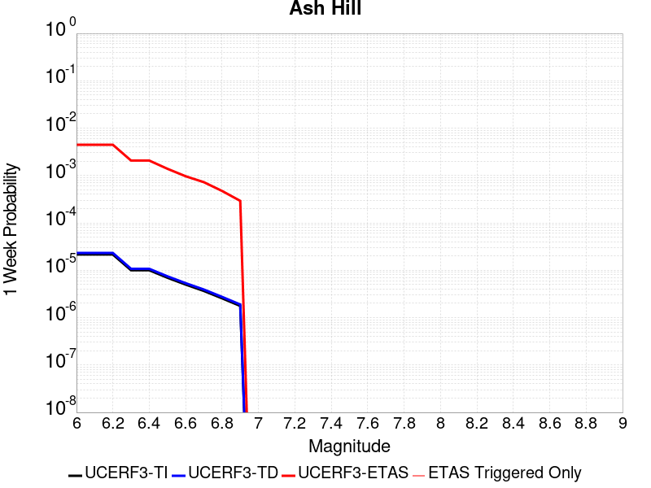 |  |  |  |

| Magnitude | 1 wk TI Prob | 1 wk TD Prob | 1 wk ETAS Prob | 1 wk ETAS/TD Gain | 1 wk ETAS Triggered Only | 1 mo TI Prob | 1 mo TD Prob | 1 mo ETAS Prob | 1 mo ETAS/TD Gain | 1 mo ETAS Triggered Only | 1 yr TI Prob | 1 yr TD Prob | 1 yr ETAS Prob | 1 yr ETAS/TD Gain | 1 yr ETAS Triggered Only | 10 yr TI Prob | 10 yr TD Prob | 10 yr ETAS Prob | 10 yr ETAS/TD Gain | 10 yr ETAS Triggered Only |
|-----|-----|-----|-----|-----|-----|-----|-----|-----|-----|-----|-----|-----|-----|-----|-----|-----|-----|-----|-----|-----|
| 6.0 | 2.1545662E-5 | 2.3194447E-5 | 0.0046397196 | 200.0358 | 0.004616632 | 9.2335285E-5 | 9.940143E-5 | 0.007117233 | 71.60091 | 0.007018529 | 0.0011236023 | 0.0012096206 | 0.013126687 | 10.851905 | 0.0119314995 | 0.011179381 | 0.012038348 | 0.030775659 | 2.5564685 | 0.018965624 |
| 6.1 | 2.1545662E-5 | 2.3194447E-5 | 0.0046397196 | 200.0358 | 0.004616632 | 9.2335285E-5 | 9.940143E-5 | 0.007117233 | 71.60091 | 0.007018529 | 0.0011236023 | 0.0012096206 | 0.013126687 | 10.851905 | 0.0119314995 | 0.011179381 | 0.012038348 | 0.030775659 | 2.5564685 | 0.018965624 |
| 6.2 | 2.1545662E-5 | 2.3194447E-5 | 0.0046397196 | 200.0358 | 0.004616632 | 9.2335285E-5 | 9.940143E-5 | 0.007117233 | 71.60091 | 0.007018529 | 0.0011236023 | 0.0012096206 | 0.013126687 | 10.851905 | 0.0119314995 | 0.011179381 | 0.012038348 | 0.030775659 | 2.5564685 | 0.018965624 |
| 6.3 | 1.0025529E-5 | 1.0746934E-5 | 0.0020383003 | 189.6634 | 0.002027575 | 4.2965847E-5 | 4.605755E-5 | 0.0032276441 | 70.0785 | 0.0031817332 | 5.229836E-4 | 5.6061964E-4 | 0.005922887 | 10.564895 | 0.0053652753 | 0.005217545 | 0.0055933665 | 0.0144647965 | 2.5860627 | 0.00892133 |
| 6.4 | 1.0025529E-5 | 1.0746934E-5 | 0.0020383003 | 189.6634 | 0.002027575 | 4.2965847E-5 | 4.605755E-5 | 0.0032276441 | 70.0785 | 0.0031817332 | 5.229836E-4 | 5.6061964E-4 | 0.005922887 | 10.564895 | 0.0053652753 | 0.005217545 | 0.0055933665 | 0.0144647965 | 2.5860627 | 0.00892133 |
| 6.5 | 6.9617327E-6 | 7.456634E-6 | 0.0013643621 | 182.97292 | 0.0013569156 | 2.9835655E-5 | 3.195666E-5 | 0.0021218518 | 66.3978 | 0.002089962 | 3.6318856E-4 | 3.8901155E-4 | 0.004130771 | 10.618633 | 0.0037432155 | 0.0036259557 | 0.0038841602 | 0.010207374 | 2.6279485 | 0.0063478695 |
| 6.6 | 4.9919777E-6 | 5.3466883E-6 | 9.567422E-4 | 178.94109 | 9.514006E-4 | 2.1394015E-5 | 2.2914215E-5 | 0.0015513588 | 67.7029 | 0.0015284796 | 2.60441E-4 | 2.7895154E-4 | 0.0029296563 | 10.502383 | 0.0026514442 | 0.0026013597 | 0.0027866727 | 0.0073593333 | 2.6409035 | 0.004585439 |
| 6.7 | 3.6630722E-6 | 3.924624E-6 | 7.0577476E-4 | 179.83247 | 7.018529E-4 | 1.5698786E-5 | 1.681974E-5 | 0.0012021513 | 71.47265 | 0.0011853515 | 1.9111596E-4 | 2.0476682E-4 | 0.0022319267 | 10.899845 | 0.002027575 | 0.0019095168 | 0.0020463446 | 0.0056573814 | 2.7646282 | 0.0036184415 |
| 6.8 | 2.5599613E-6 | 2.744925E-6 | 5.3303235E-4 | 194.1883 | 5.3028885E-4 | 1.0971216E-5 | 1.1763939E-5 | 9.3196024E-4 | 79.22178 | 9.202071E-4 | 1.3356637E-4 | 1.4322149E-4 | 0.0016870768 | 11.779493 | 0.0015440764 | 0.0013348613 | 0.0014317769 | 0.0040949993 | 2.860082 | 0.002667041 |
| 6.9 | 1.7684905E-6 | 1.8968707E-6 | 2.8263748E-4 | 149.00198 | 2.8074117E-4 | 7.579223E-6 | 8.129446E-6 | 5.38414E-4 | 66.230095 | 5.3028885E-4 | 9.2273134E-5 | 9.8976E-5 | 0.0011282584 | 11.399312 | 0.0010293842 | 9.223483E-4 | 9.8976E-4 | 0.0028283526 | 2.8576145 | 0.0018404142 |

## Blackwater
*[(top)](#table-of-contents)*

| 1 Week | 1 Month | 1 Year | 10 Year |
|-----|-----|-----|-----|
|  |  |  |  |

| Magnitude | 1 wk TI Prob | 1 wk TD Prob | 1 wk ETAS Prob | 1 wk ETAS/TD Gain | 1 wk ETAS Triggered Only | 1 mo TI Prob | 1 mo TD Prob | 1 mo ETAS Prob | 1 mo ETAS/TD Gain | 1 mo ETAS Triggered Only | 1 yr TI Prob | 1 yr TD Prob | 1 yr ETAS Prob | 1 yr ETAS/TD Gain | 1 yr ETAS Triggered Only | 10 yr TI Prob | 10 yr TD Prob | 10 yr ETAS Prob | 10 yr ETAS/TD Gain | 10 yr ETAS Triggered Only |
|-----|-----|-----|-----|-----|-----|-----|-----|-----|-----|-----|-----|-----|-----|-----|-----|-----|-----|-----|-----|-----|
| 6.0 | 3.0708583E-5 | 3.3095846E-5 | 0.0040881117 | 123.5234 | 0.00405515 | 1.3160157E-4 | 1.4183241E-4 | 0.0058338316 | 41.131866 | 0.0056928066 | 0.0016010714 | 0.0017255784 | 0.011394436 | 6.6032553 | 0.009685569 | 0.015895851 | 0.017135633 | 0.031943902 | 1.8641798 | 0.015066442 |
| 6.1 | 3.0708583E-5 | 3.3095846E-5 | 0.0040881117 | 123.5234 | 0.00405515 | 1.3160157E-4 | 1.4183241E-4 | 0.0058338316 | 41.131866 | 0.0056928066 | 0.0016010714 | 0.0017255784 | 0.011394436 | 6.6032553 | 0.009685569 | 0.015895851 | 0.017135633 | 0.031943902 | 1.8641798 | 0.015066442 |
| 6.2 | 1.1707779E-5 | 1.2545122E-5 | 0.0015098125 | 120.35056 | 0.0014972861 | 5.017523E-5 | 5.3763757E-5 | 0.002205997 | 41.031303 | 0.0021523489 | 6.107122E-4 | 6.5438676E-4 | 0.004457499 | 6.811719 | 0.0038056024 | 0.006090366 | 0.0065255696 | 0.012646076 | 1.9379268 | 0.0061607086 |
| 6.3 | 1.1707779E-5 | 1.2545122E-5 | 0.0015098125 | 120.35056 | 0.0014972861 | 5.017523E-5 | 5.3763757E-5 | 0.002205997 | 41.031303 | 0.0021523489 | 6.107122E-4 | 6.5438676E-4 | 0.004457499 | 6.811719 | 0.0038056024 | 0.006090366 | 0.0065255696 | 0.012646076 | 1.9379268 | 0.0061607086 |
| 6.4 | 7.929244E-6 | 8.480098E-6 | 0.0010066624 | 118.70882 | 9.981908E-4 | 3.3982033E-5 | 3.6342793E-5 | 0.0015491707 | 42.626625 | 0.0015128829 | 4.136527E-4 | 4.423877E-4 | 0.0031394286 | 7.0965543 | 0.0026982345 | 0.0041288356 | 0.0044154758 | 0.008778806 | 1.9881902 | 0.0043826816 |
| 6.5 | 5.8832115E-6 | 6.285991E-6 | 7.70521E-4 | 122.57749 | 7.642398E-4 | 2.521352E-5 | 2.6939697E-5 | 0.0011498741 | 42.683258 | 0.0011229647 | 3.0693135E-4 | 3.27944E-4 | 0.0023080793 | 7.0380287 | 0.0019807848 | 0.0030650778 | 0.0032748538 | 0.0064772586 | 1.9778771 | 0.0032129267 |
| 6.6 | 5.8832115E-6 | 6.285991E-6 | 7.70521E-4 | 122.57749 | 7.642398E-4 | 2.521352E-5 | 2.6939697E-5 | 0.0011498741 | 42.683258 | 0.0011229647 | 3.0693135E-4 | 3.27944E-4 | 0.0023080793 | 7.0380287 | 0.0019807848 | 0.0030650778 | 0.0032748538 | 0.0064772586 | 1.9778771 | 0.0032129267 |
| 6.7 | 3.0715053E-6 | 3.2814662E-6 | 4.2439182E-4 | 129.32994 | 4.2111173E-4 | 1.3163528E-5 | 1.4063357E-5 | 5.755378E-4 | 40.924637 | 5.6148233E-4 | 1.6025416E-4 | 1.7120909E-4 | 0.001184823 | 6.920328 | 0.0010137875 | 0.0016013865 | 0.0017108864 | 0.0032990312 | 1.9282584 | 0.0015908666 |
| 6.8 | 2.2722281E-6 | 2.4287538E-6 | 3.143626E-4 | 129.43372 | 3.1193462E-4 | 9.738084E-6 | 1.0408908E-5 | 3.8472656E-4 | 36.96128 | 3.7432153E-4 | 1.1855473E-4 | 1.26722E-4 | 8.128912E-4 | 6.4147596 | 6.8625616E-4 | 0.001184915 | 0.0012665876 | 0.00238813 | 1.8854834 | 0.0011229647 |
| 6.9 | 9.952399E-7 | 1.0653489E-6 | 1.7262921E-4 | 162.04007 | 1.7156404E-4 | 4.265307E-6 | 4.5657757E-6 | 1.9172569E-4 | 41.99192 | 1.8716077E-4 | 5.1928873E-5 | 5.5587418E-5 | 3.207171E-4 | 5.769599 | 2.6514442E-4 | 5.191674E-4 | 5.557858E-4 | 9.454873E-4 | 1.7011722 | 3.8991828E-4 |
| 7.0 | 4.7385504E-7 | 5.0755597E-7 | 6.289445E-5 | 123.91628 | 6.238693E-5 | 2.0308057E-6 | 2.1752398E-6 | 6.456203E-5 | 29.68042 | 6.238693E-5 | 2.4724779E-5 | 2.6483543E-5 | 1.3565777E-4 | 5.122342 | 1.0917712E-4 | 2.4722028E-4 | 2.6483546E-4 | 4.8313185E-4 | 1.8242719 | 2.1835424E-4 |

## Garlock (West)
*[(top)](#table-of-contents)*

| 1 Week | 1 Month | 1 Year | 10 Year |
|-----|-----|-----|-----|
|  |  |  |  |

| Magnitude | 1 wk TI Prob | 1 wk TD Prob | 1 wk ETAS Prob | 1 wk ETAS/TD Gain | 1 wk ETAS Triggered Only | 1 mo TI Prob | 1 mo TD Prob | 1 mo ETAS Prob | 1 mo ETAS/TD Gain | 1 mo ETAS Triggered Only | 1 yr TI Prob | 1 yr TD Prob | 1 yr ETAS Prob | 1 yr ETAS/TD Gain | 1 yr ETAS Triggered Only | 10 yr TI Prob | 10 yr TD Prob | 10 yr ETAS Prob | 10 yr ETAS/TD Gain | 10 yr ETAS Triggered Only |
|-----|-----|-----|-----|-----|-----|-----|-----|-----|-----|-----|-----|-----|-----|-----|-----|-----|-----|-----|-----|-----|
| 6.0 | 2.5181727E-5 | 2.51973E-5 | 0.0059829983 | 237.44601 | 0.0059579513 | 1.0791722E-4 | 1.0798398E-4 | 0.007921102 | 73.35442 | 0.007813962 | 0.0013131002 | 0.0013139155 | 0.012419773 | 9.45249 | 0.011120469 | 0.013053683 | 0.013141977 | 0.028010415 | 2.13137 | 0.015066442 |
| 6.1 | 2.5077732E-5 | 2.5098372E-5 | 0.0059829 | 238.378 | 0.0059579513 | 1.0747157E-4 | 1.0756004E-4 | 0.0079206815 | 73.63963 | 0.007813962 | 0.001307681 | 0.0013087603 | 0.012414675 | 9.485829 | 0.011120469 | 0.013000126 | 0.013091032 | 0.027960239 | 2.1358316 | 0.015066442 |
| 6.2 | 2.494612E-5 | 2.498005E-5 | 0.005982782 | 239.50241 | 0.0059579513 | 1.0690756E-4 | 1.0705298E-4 | 0.007920179 | 73.98373 | 0.007813962 | 0.0013008224 | 0.0013025942 | 0.012408578 | 9.526051 | 0.011120469 | 0.012932341 | 0.013030097 | 0.02790022 | 2.1412137 | 0.015066442 |
| 6.3 | 2.4733758E-5 | 2.479942E-5 | 0.005982603 | 241.23964 | 0.0059579513 | 1.0599751E-4 | 1.06278916E-4 | 0.00791941 | 74.51535 | 0.007813962 | 0.0012897556 | 0.0012931811 | 0.012399269 | 9.588192 | 0.011120469 | 0.012822957 | 0.012937066 | 0.027808594 | 2.1495285 | 0.015066442 |
| 6.4 | 2.3237335E-5 | 2.317873E-5 | 0.0059342026 | 256.01932 | 0.005911161 | 9.958477E-5 | 9.933365E-5 | 0.0078501385 | 79.02799 | 0.007751575 | 0.0012117702 | 0.001208719 | 0.01222228 | 10.111762 | 0.011026889 | 0.012051838 | 0.012101916 | 0.026816538 | 2.2158918 | 0.0148948785 |
| 6.5 | 2.2732203E-5 | 2.2993298E-5 | 0.005934018 | 258.076 | 0.005911161 | 9.742009E-5 | 9.8539E-5 | 0.007849351 | 79.657295 | 0.007751575 | 0.0011854442 | 0.0011990548 | 0.012212722 | 10.18529 | 0.011026889 | 0.011791403 | 0.012006322 | 0.026722368 | 2.2256913 | 0.0148948785 |
| 6.6 | 2.1319436E-5 | 2.17735E-5 | 0.0059328056 | 272.4783 | 0.005911161 | 9.136581E-5 | 9.331167E-5 | 0.007844164 | 84.06412 | 0.007751575 | 0.001111811 | 0.0011354799 | 0.012149848 | 10.700188 | 0.011026889 | 0.011062649 | 0.011377227 | 0.026102642 | 2.2942886 | 0.0148948785 |
| 6.7 | 1.970802E-5 | 2.0393396E-5 | 0.0059314338 | 290.8507 | 0.005911161 | 8.446021E-5 | 8.739735E-5 | 0.007838295 | 89.68573 | 0.007751575 | 0.001027818 | 0.001063545 | 0.012078706 | 11.357024 | 0.011026889 | 0.010230771 | 0.010664964 | 0.025385559 | 2.380276 | 0.014879282 |
| 6.8 | 1.8744462E-5 | 1.9901045E-5 | 0.0059309443 | 298.02176 | 0.005911161 | 8.033094E-5 | 8.5287415E-5 | 0.007836201 | 91.87993 | 0.007751575 | 9.775903E-4 | 0.0010378812 | 0.012053326 | 11.613396 | 0.011026889 | 0.009733009 | 0.01041075 | 0.025135128 | 2.4143434 | 0.014879282 |
| 6.9 | 1.7559682E-5 | 1.8953415E-5 | 0.0059300023 | 312.8725 | 0.005911161 | 7.5253614E-5 | 8.12264E-5 | 0.007832172 | 96.42397 | 0.007751575 | 9.158276E-4 | 9.884841E-4 | 0.011988891 | 12.128562 | 0.011011292 | 0.0091206245 | 0.009921231 | 0.02463745 | 2.4833057 | 0.014863685 |
| 7.0 | 1.6794445E-5 | 1.8216237E-5 | 0.005913673 | 324.63748 | 0.0058955643 | 7.197421E-5 | 7.8067256E-5 | 0.0077978466 | 99.88625 | 0.007720382 | 8.759337E-4 | 9.5005584E-4 | 0.011919723 | 12.546339 | 0.0109800985 | 0.008724891 | 0.009540141 | 0.024169335 | 2.533436 | 0.014770105 |
| 7.1 | 1.6337795E-5 | 1.7717046E-5 | 0.0058663874 | 331.11545 | 0.005848774 | 7.0017246E-5 | 7.5927994E-5 | 0.007717746 | 101.64559 | 0.007642398 | 8.521265E-4 | 9.240326E-4 | 0.011800491 | 12.770644 | 0.010886518 | 0.008488664 | 0.009281996 | 0.023760485 | 2.5598464 | 0.014614137 |
| 7.2 | 1.5780008E-5 | 1.7165687E-5 | 0.0058346465 | 339.90173 | 0.0058175805 | 6.762685E-5 | 7.356516E-5 | 0.0076686144 | 104.24248 | 0.007595608 | 8.2304585E-4 | 8.9528906E-4 | 0.011725312 | 13.096678 | 0.010839728 | 0.008200042 | 0.008996838 | 0.023433125 | 2.6045957 | 0.014567346 |
| 7.3 | 1.5058865E-5 | 1.6618762E-5 | 0.0057873135 | 348.23975 | 0.0057707904 | 6.45364E-5 | 7.122133E-5 | 0.0076195016 | 106.98342 | 0.007548818 | 7.854473E-4 | 8.667759E-4 | 0.011603609 | 13.387093 | 0.0107461475 | 0.00782677 | 0.008713539 | 0.023030266 | 2.643044 | 0.014442573 |
| 7.4 | 1.4887923E-5 | 1.6454731E-5 | 0.0057247644 | 347.9099 | 0.0057084034 | 6.380382E-5 | 7.051838E-5 | 0.00752523 | 106.71303 | 0.007455237 | 7.7653467E-4 | 8.582243E-4 | 0.011470483 | 13.365367 | 0.010621374 | 0.0077382675 | 0.008628399 | 0.022745347 | 2.636103 | 0.014239815 |
| 7.5 | 1.4509299E-5 | 1.6046748E-5 | 0.0052564642 | 327.57193 | 0.0052405014 | 6.218123E-5 | 6.876997E-5 | 0.006946455 | 101.01 | 0.0068781585 | 7.567935E-4 | 8.36954E-4 | 0.010670254 | 12.748914 | 0.009841537 | 0.0075422134 | 0.008416704 | 0.021562343 | 2.5618513 | 0.013257221 |
| 7.6 | 1.2756717E-5 | 1.4050848E-5 | 0.0033517045 | 238.54106 | 0.0033377004 | 5.4670498E-5 | 6.0216535E-5 | 0.0044738255 | 74.29563 | 0.004413875 | 6.6541E-4 | 7.328904E-4 | 0.00720079 | 9.825194 | 0.0064726435 | 0.006634211 | 0.0073816874 | 0.016361017 | 2.216433 | 0.009046104 |
| 7.7 | 1.0328985E-5 | 1.1460557E-5 | 0.0022105745 | 192.88542 | 0.002199139 | 4.4266326E-5 | 4.911575E-5 | 0.0029031774 | 59.108887 | 0.0028542017 | 5.388092E-4 | 5.978206E-4 | 0.004822008 | 8.065978 | 0.004226714 | 0.0053750467 | 0.006038511 | 0.011882973 | 1.9678646 | 0.0058799675 |
| 7.8 | 7.0306583E-6 | 8.899601E-6 | 0.0015685589 | 176.25046 | 0.0015596731 | 3.0131043E-5 | 3.814059E-5 | 0.002034446 | 53.340706 | 0.0019963817 | 3.667837E-4 | 4.642629E-4 | 0.0034418555 | 7.4135914 | 0.0029789757 | 0.003661789 | 0.0046952725 | 0.008840047 | 1.8827548 | 0.004164327 |
| 7.9 | 4.060633E-6 | 5.4653938E-6 | 9.2566747E-4 | 169.36885 | 9.202071E-4 | 1.7402595E-5 | 2.3422906E-5 | 0.0012399395 | 52.937042 | 0.001216545 | 2.11856E-4 | 2.851367E-4 | 0.0021250262 | 7.452658 | 0.0018404142 | 0.0021165414 | 0.002884201 | 0.0053724805 | 1.8627275 | 0.002495477 |
| 8.0 | 1.6729537E-6 | 2.0775144E-6 | 2.2043129E-4 | 106.10338 | 2.1835424E-4 | 7.169782E-6 | 8.903603E-6 | 3.2083545E-4 | 36.03434 | 3.1193462E-4 | 8.7288594E-5 | 1.0839601E-4 | 6.2303233E-4 | 5.7477427 | 5.146921E-4 | 8.7254314E-4 | 0.0010969337 | 0.0018135965 | 1.6533326 | 7.1744964E-4 |
| 8.1 | 3.6733252E-7 | 3.1489964E-7 | 4.7105077E-5 | 149.58759 | 4.6790192E-5 | 1.5742813E-6 | 1.3495693E-6 | 4.81397E-5 | 35.670418 | 4.6790192E-5 | 1.9166706E-5 | 1.6430899E-5 | 9.441327E-5 | 5.746081 | 7.7983656E-5 | 1.9165053E-4 | 1.6638759E-4 | 2.9114066E-4 | 1.749774 | 1.2477385E-4 |

## McLean Lake
*[(top)](#table-of-contents)*

| 1 Week | 1 Month | 1 Year | 10 Year |
|-----|-----|-----|-----|
|  |  |  |  |

| Magnitude | 1 wk TI Prob | 1 wk TD Prob | 1 wk ETAS Prob | 1 wk ETAS/TD Gain | 1 wk ETAS Triggered Only | 1 mo TI Prob | 1 mo TD Prob | 1 mo ETAS Prob | 1 mo ETAS/TD Gain | 1 mo ETAS Triggered Only | 1 yr TI Prob | 1 yr TD Prob | 1 yr ETAS Prob | 1 yr ETAS/TD Gain | 1 yr ETAS Triggered Only | 10 yr TI Prob | 10 yr TD Prob | 10 yr ETAS Prob | 10 yr ETAS/TD Gain | 10 yr ETAS Triggered Only |
|-----|-----|-----|-----|-----|-----|-----|-----|-----|-----|-----|-----|-----|-----|-----|-----|-----|-----|-----|-----|-----|
| 6.0 | 1.7360222E-5 | 1.8501627E-5 | 0.0023735645 | 128.28949 | 0.0023551064 | 7.439883E-5 | 7.9290556E-5 | 0.0037286363 | 47.024975 | 0.003649635 | 9.0542925E-4 | 9.6498354E-4 | 0.0077897594 | 8.072427 | 0.006831368 | 0.009017491 | 0.0096127745 | 0.021445025 | 2.2308884 | 0.011947096 |
| 6.1 | 9.062689E-6 | 9.592193E-6 | 0.0012729153 | 132.70325 | 0.0012633352 | 3.8839516E-5 | 4.1108804E-5 | 0.0020218121 | 49.181976 | 0.0019807848 | 4.727685E-4 | 5.003936E-4 | 0.0043352693 | 8.663718 | 0.003836796 | 0.0047176396 | 0.004993552 | 0.011495949 | 2.3021588 | 0.0065350304 |
| 6.2 | 9.062689E-6 | 9.592193E-6 | 0.0012729153 | 132.70325 | 0.0012633352 | 3.8839516E-5 | 4.1108804E-5 | 0.0020218121 | 49.181976 | 0.0019807848 | 4.727685E-4 | 5.003936E-4 | 0.0043352693 | 8.663718 | 0.003836796 | 0.0047176396 | 0.004993552 | 0.011495949 | 2.3021588 | 0.0065350304 |
| 6.3 | 7.2575485E-6 | 7.66771E-6 | 0.0010214475 | 133.21416 | 0.0010137875 | 3.110341E-5 | 3.2861237E-5 | 0.0016548679 | 50.359272 | 0.00162206 | 3.786182E-4 | 4.0001926E-4 | 0.0033154413 | 8.288204 | 0.0029165887 | 0.0037797375 | 0.0039936965 | 0.009104528 | 2.2797246 | 0.0051313243 |
| 6.4 | 7.2575485E-6 | 7.66771E-6 | 0.0010214475 | 133.21416 | 0.0010137875 | 3.110341E-5 | 3.2861237E-5 | 0.0016548679 | 50.359272 | 0.00162206 | 3.786182E-4 | 4.0001926E-4 | 0.0033154413 | 8.288204 | 0.0029165887 | 0.0037797375 | 0.0039936965 | 0.009104528 | 2.2797246 | 0.0051313243 |
| 6.5 | 6.06582E-6 | 6.4038773E-6 | 8.4862194E-4 | 132.5169 | 8.4222347E-4 | 2.5996113E-5 | 2.7444936E-5 | 0.0014311122 | 52.144855 | 0.0014037058 | 3.164567E-4 | 3.3409733E-4 | 0.0028599235 | 8.560151 | 0.0025266705 | 0.0031600643 | 0.0033365893 | 0.00781346 | 2.3417506 | 0.0044918586 |
| 6.6 | 5.598744E-6 | 5.910262E-6 | 7.7014556E-4 | 130.3065 | 7.642398E-4 | 2.3994397E-5 | 2.5329486E-5 | 0.0012886327 | 50.87481 | 0.0012633352 | 2.9209262E-4 | 3.0834923E-4 | 0.0026315455 | 8.534302 | 0.002323913 | 0.0029170897 | 0.003079843 | 0.0071846987 | 2.3328133 | 0.004117537 |
| 6.7 | 5.246996E-6 | 5.539162E-6 | 7.0738816E-4 | 127.70671 | 7.018529E-4 | 2.2486933E-5 | 2.3739085E-5 | 0.0012090625 | 50.9313 | 0.0011853515 | 2.73744E-4 | 2.8899137E-4 | 0.0024874948 | 8.607506 | 0.002199139 | 0.0027340704 | 0.0028867796 | 0.0067747063 | 2.3468041 | 0.0038991827 |
| 6.8 | 4.02324E-6 | 4.2469046E-6 | 5.6572683E-4 | 133.20923 | 5.6148233E-4 | 1.7242342E-5 | 1.8200926E-5 | 9.2279486E-4 | 50.700436 | 9.046104E-4 | 2.099053E-4 | 2.2157968E-4 | 0.0019212466 | 8.67068 | 0.0017000437 | 0.0020970714 | 0.002214172 | 0.005264363 | 2.377576 | 0.0030569592 |
| 6.9 | 6.835972E-7 | 7.1399285E-7 | 7.8697594E-5 | 110.221825 | 7.7983656E-5 | 2.9296991E-6 | 3.0599674E-6 | 9.664007E-5 | 31.582058 | 9.3580384E-5 | 3.56685E-5 | 3.7254784E-5 | 2.5560087E-4 | 6.860887 | 2.1835424E-4 | 3.5662777E-4 | 3.7251666E-4 | 9.02608E-4 | 2.4230003 | 5.3028885E-4 |

## Goldstone Lake
*[(top)](#table-of-contents)*

| 1 Week | 1 Month | 1 Year | 10 Year |
|-----|-----|-----|-----|
|  | 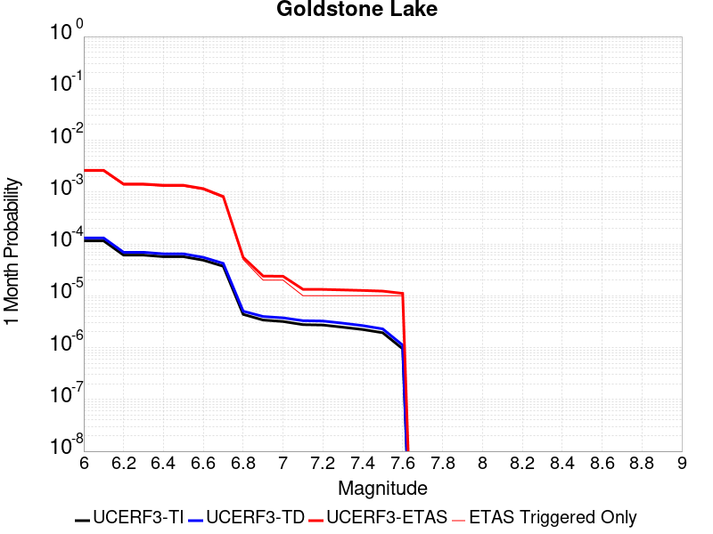 |  |  |

| Magnitude | 1 wk TI Prob | 1 wk TD Prob | 1 wk ETAS Prob | 1 wk ETAS/TD Gain | 1 wk ETAS Triggered Only | 1 mo TI Prob | 1 mo TD Prob | 1 mo ETAS Prob | 1 mo ETAS/TD Gain | 1 mo ETAS Triggered Only | 1 yr TI Prob | 1 yr TD Prob | 1 yr ETAS Prob | 1 yr ETAS/TD Gain | 1 yr ETAS Triggered Only | 10 yr TI Prob | 10 yr TD Prob | 10 yr ETAS Prob | 10 yr ETAS/TD Gain | 10 yr ETAS Triggered Only |
|-----|-----|-----|-----|-----|-----|-----|-----|-----|-----|-----|-----|-----|-----|-----|-----|-----|-----|-----|-----|-----|
| 6.0 | 2.671352E-5 | 3.037609E-5 | 0.0016211943 | 53.37074 | 0.0015908666 | 1.1448149E-4 | 1.3017785E-4 | 0.0025941406 | 19.927664 | 0.0024642835 | 0.001392921 | 0.0015839594 | 0.0063489997 | 4.0083094 | 0.0047726 | 0.013842222 | 0.015746197 | 0.024312133 | 1.5440004 | 0.008702976 |
| 6.1 | 2.671352E-5 | 3.037609E-5 | 0.0016211943 | 53.37074 | 0.0015908666 | 1.1448149E-4 | 1.3017785E-4 | 0.0025941406 | 19.927664 | 0.0024642835 | 0.001392921 | 0.0015839594 | 0.0063489997 | 4.0083094 | 0.0047726 | 0.013842222 | 0.015746197 | 0.024312133 | 1.5440004 | 0.008702976 |
| 6.2 | 1.4197047E-5 | 1.6096245E-5 | 8.894991E-4 | 55.261284 | 8.7341695E-4 | 6.0843064E-5 | 6.8982634E-5 | 0.0013478263 | 19.538631 | 0.001278932 | 7.4051257E-4 | 8.3963864E-4 | 0.0033953548 | 4.043829 | 0.002557864 | 0.007380498 | 0.0083743585 | 0.01330805 | 1.5891427 | 0.004975357 |
| 6.3 | 1.4197047E-5 | 1.6096245E-5 | 8.894991E-4 | 55.261284 | 8.7341695E-4 | 6.0843064E-5 | 6.8982634E-5 | 0.0013478263 | 19.538631 | 0.001278932 | 7.4051257E-4 | 8.3963864E-4 | 0.0033953548 | 4.043829 | 0.002557864 | 0.007380498 | 0.0083743585 | 0.01330805 | 1.5891427 | 0.004975357 |
| 6.4 | 1.3238931E-5 | 1.500846E-5 | 8.4162276E-4 | 56.07656 | 8.266267E-4 | 5.6737044E-5 | 6.4320935E-5 | 0.0012807878 | 19.912455 | 0.001216545 | 6.9055456E-4 | 7.82924E-4 | 0.0031829402 | 4.065452 | 0.0024018965 | 0.006884126 | 0.0078112837 | 0.012515653 | 1.6022531 | 0.004741406 |
| 6.5 | 1.3238931E-5 | 1.500846E-5 | 8.4162276E-4 | 56.07656 | 8.266267E-4 | 5.6737044E-5 | 6.4320935E-5 | 0.0012807878 | 19.912455 | 0.001216545 | 6.9055456E-4 | 7.82924E-4 | 0.0031829402 | 4.065452 | 0.0024018965 | 0.006884126 | 0.0078112837 | 0.012515653 | 1.6022531 | 0.004741406 |
| 6.6 | 1.1328278E-5 | 1.2855166E-5 | 6.9910253E-4 | 54.383003 | 6.8625616E-4 | 4.8548856E-5 | 5.5092944E-5 | 0.0010844205 | 19.683474 | 0.0010293842 | 5.90922E-4 | 6.7064585E-4 | 0.002696861 | 4.0212893 | 0.002027575 | 0.0058935313 | 0.0066956086 | 0.010708114 | 1.5992743 | 0.0040395535 |
| 6.7 | 8.651175E-6 | 9.824565E-6 | 4.933185E-4 | 50.212757 | 4.8349865E-4 | 3.707594E-5 | 4.2105108E-5 | 7.907167E-4 | 18.77959 | 7.4864307E-4 | 4.5130608E-4 | 5.1259965E-4 | 0.001962352 | 3.8282354 | 0.001450496 | 0.0045039062 | 0.005123051 | 0.008226417 | 1.6057651 | 0.0031193462 |
| 6.8 | 1.0215377E-6 | 1.1754702E-6 | 1.1754702E-6 | 1.0 | 0.0 | 4.378012E-6 | 5.0377203E-6 | 5.182768E-5 | 10.287923 | 4.6790192E-5 | 5.3300988E-5 | 6.1332634E-5 | 1.0811996E-4 | 1.7628455 | 4.6790192E-5 | 5.3288206E-4 | 6.1316835E-4 | 7.0669135E-4 | 1.1525242 | 9.3580384E-5 |
| 6.9 | 7.9360774E-7 | 9.2833966E-7 | 9.2833966E-7 | 1.0 | 0.0 | 3.4011714E-6 | 3.9785928E-6 | 3.517193E-5 | 8.840294 | 3.1193464E-5 | 4.1408475E-5 | 4.843836E-5 | 7.9630314E-5 | 1.6439514 | 3.1193464E-5 | 4.140076E-4 | 4.8428503E-4 | 5.4664176E-4 | 1.1287603 | 6.238693E-5 |
| 7.0 | 7.4382757E-7 | 8.7473285E-7 | 8.7473285E-7 | 1.0 | 0.0 | 3.1878285E-6 | 3.74885E-6 | 3.4942193E-5 | 9.320777 | 3.1193464E-5 | 3.8811122E-5 | 4.564136E-5 | 7.68334E-5 | 1.683416 | 3.1193464E-5 | 3.8804344E-4 | 4.5632652E-4 | 5.18685E-4 | 1.1366532 | 6.238693E-5 |
| 7.1 | 6.4709513E-7 | 7.7113E-7 | 7.7113E-7 | 1.0 | 0.0 | 2.773262E-6 | 3.3048389E-6 | 1.8901519E-5 | 5.7193465 | 1.5596732E-5 | 3.376394E-5 | 4.0235733E-5 | 5.5831835E-5 | 1.3876182 | 1.5596732E-5 | 3.375881E-4 | 4.0229043E-4 | 4.490618E-4 | 1.1162627 | 4.6790192E-5 |
| 7.2 | 6.356704E-7 | 7.5883594E-7 | 7.5883594E-7 | 1.0 | 0.0 | 2.7242988E-6 | 3.2521505E-6 | 1.884883E-5 | 5.7958055 | 1.5596732E-5 | 3.3167835E-5 | 3.959427E-5 | 5.5190383E-5 | 1.3938982 | 1.5596732E-5 | 3.3162883E-4 | 3.958781E-4 | 4.4264976E-4 | 1.1181467 | 4.6790192E-5 |
| 7.3 | 5.7695723E-7 | 6.8965653E-7 | 6.8965653E-7 | 1.0 | 0.0 | 2.4726714E-6 | 2.9556677E-6 | 1.8552353E-5 | 6.2768736 | 1.5596732E-5 | 3.0104358E-5 | 3.5984718E-5 | 5.158089E-5 | 1.4334109 | 1.5596732E-5 | 3.0100282E-4 | 3.5979465E-4 | 3.909769E-4 | 1.0866668 | 3.1193464E-5 |
| 7.4 | 5.209647E-7 | 6.193514E-7 | 6.193514E-7 | 1.0 | 0.0 | 2.232704E-6 | 2.6543607E-6 | 1.825105E-5 | 6.875874 | 1.5596732E-5 | 2.718283E-5 | 3.2316417E-5 | 4.7912647E-5 | 1.48261 | 1.5596732E-5 | 2.7179506E-4 | 3.2312275E-4 | 3.5430613E-4 | 1.0965064 | 3.1193464E-5 |
| 7.5 | 4.512955E-7 | 5.348885E-7 | 5.348885E-7 | 1.0 | 0.0 | 1.934122E-6 | 2.2923775E-6 | 1.7889073E-5 | 7.80372 | 1.5596732E-5 | 2.3547682E-5 | 2.7909393E-5 | 4.350569E-5 | 1.5588188 | 1.5596732E-5 | 2.3545188E-4 | 2.7906417E-4 | 3.1024896E-4 | 1.1117476 | 3.1193464E-5 |
| 7.6 | 2.21172E-7 | 2.603961E-7 | 2.603961E-7 | 1.0 | 0.0 | 9.478797E-7 | 1.1159829E-6 | 1.6712696E-5 | 14.975764 | 1.5596732E-5 | 1.1540374E-5 | 1.3587036E-5 | 2.9183555E-5 | 2.1478972 | 1.5596732E-5 | 1.1539775E-4 | 1.3586486E-4 | 1.5145948E-4 | 1.1147803 | 1.5596732E-5 |

## Death Valley (So)
*[(top)](#table-of-contents)*

| 1 Week | 1 Month | 1 Year | 10 Year |
|-----|-----|-----|-----|
|  |  |  | 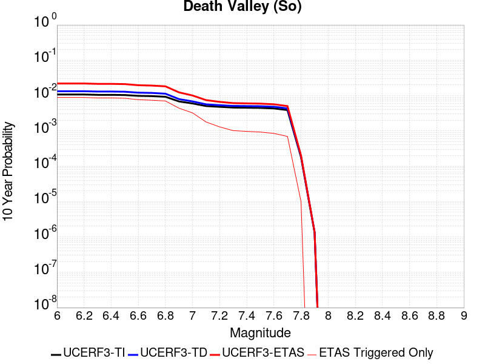 |

| Magnitude | 1 wk TI Prob | 1 wk TD Prob | 1 wk ETAS Prob | 1 wk ETAS/TD Gain | 1 wk ETAS Triggered Only | 1 mo TI Prob | 1 mo TD Prob | 1 mo ETAS Prob | 1 mo ETAS/TD Gain | 1 mo ETAS Triggered Only | 1 yr TI Prob | 1 yr TD Prob | 1 yr ETAS Prob | 1 yr ETAS/TD Gain | 1 yr ETAS Triggered Only | 10 yr TI Prob | 10 yr TD Prob | 10 yr ETAS Prob | 10 yr ETAS/TD Gain | 10 yr ETAS Triggered Only |
|-----|-----|-----|-----|-----|-----|-----|-----|-----|-----|-----|-----|-----|-----|-----|-----|-----|-----|-----|-----|-----|
| 6.0 | 2.0684236E-5 | 2.5617775E-5 | 0.0019127738 | 74.665886 | 0.0018872045 | 8.864371E-5 | 1.0978594E-4 | 0.0028701043 | 26.142729 | 0.0027606215 | 0.0010787029 | 0.0013358411 | 0.006771829 | 5.069337 | 0.005443259 | 0.010734817 | 0.013281397 | 0.022145797 | 1.6674298 | 0.008983717 |
| 6.1 | 2.0684236E-5 | 2.5617775E-5 | 0.0019127738 | 74.665886 | 0.0018872045 | 8.864371E-5 | 1.0978594E-4 | 0.0028701043 | 26.142729 | 0.0027606215 | 0.0010787029 | 0.0013358411 | 0.006771829 | 5.069337 | 0.005443259 | 0.010734817 | 0.013281397 | 0.022145797 | 1.6674298 | 0.008983717 |
| 6.2 | 2.0684236E-5 | 2.5617775E-5 | 0.0019127738 | 74.665886 | 0.0018872045 | 8.864371E-5 | 1.0978594E-4 | 0.0028701043 | 26.142729 | 0.0027606215 | 0.0010787029 | 0.0013358411 | 0.006771829 | 5.069337 | 0.005443259 | 0.010734817 | 0.013281397 | 0.022145797 | 1.6674298 | 0.008983717 |
| 6.3 | 2.0240292E-5 | 2.511786E-5 | 0.0018654859 | 74.2693 | 0.0018404142 | 8.6741224E-5 | 1.07643624E-4 | 0.0028211826 | 26.208544 | 0.0027138311 | 0.0010555626 | 0.00130979 | 0.0066057327 | 5.0433526 | 0.0053028883 | 0.010505628 | 0.013023956 | 0.021613585 | 1.6595253 | 0.008702976 |
| 6.4 | 2.0240292E-5 | 2.511786E-5 | 0.0018654859 | 74.2693 | 0.0018404142 | 8.6741224E-5 | 1.07643624E-4 | 0.0028211826 | 26.208544 | 0.0027138311 | 0.0010555626 | 0.00130979 | 0.0066057327 | 5.0433526 | 0.0053028883 | 0.010505628 | 0.013023956 | 0.021613585 | 1.6595253 | 0.008702976 |
| 6.5 | 1.9962767E-5 | 2.4807114E-5 | 0.0018027903 | 72.67231 | 0.0017780273 | 8.55519E-5 | 1.0631196E-4 | 0.0027418793 | 25.790882 | 0.0026358475 | 0.0010410968 | 0.0012935963 | 0.0064650127 | 4.997705 | 0.005178115 | 0.010362327 | 0.012863902 | 0.021285567 | 1.6546742 | 0.008531412 |
| 6.6 | 1.8937297E-5 | 2.3310964E-5 | 0.0015829477 | 67.905716 | 0.0015596731 | 8.115732E-5 | 9.990039E-5 | 0.0023923907 | 23.947762 | 0.0022927194 | 9.876423E-4 | 0.0012156231 | 0.005857799 | 4.8187623 | 0.004647826 | 0.009832645 | 0.012092789 | 0.019781442 | 1.6358048 | 0.007782769 |
| 6.7 | 1.8621096E-5 | 2.2911607E-5 | 0.0014733743 | 64.3069 | 0.001450496 | 7.980225E-5 | 9.818898E-5 | 0.002281517 | 23.235975 | 0.0021835424 | 9.711593E-4 | 0.0011948098 | 0.0056968797 | 4.768022 | 0.004507455 | 0.009669261 | 0.011886904 | 0.019376813 | 1.6300975 | 0.007580011 |
| 6.8 | 1.7830353E-5 | 2.1805688E-5 | 0.0014098844 | 64.65673 | 0.001388109 | 7.641356E-5 | 9.344968E-5 | 0.0021520257 | 23.028711 | 0.0020587684 | 9.29938E-4 | 0.00113717 | 0.0053279195 | 4.6852446 | 0.0041955207 | 0.009260561 | 0.011316354 | 0.01842508 | 1.6281817 | 0.007190093 |
| 6.9 | 1.3135183E-5 | 1.5303925E-5 | 7.4833905E-4 | 48.898506 | 7.330463E-4 | 5.6292425E-5 | 6.558664E-5 | 0.0011728819 | 17.88294 | 0.0011073679 | 6.8514474E-4 | 7.982312E-4 | 0.003167042 | 3.9675746 | 0.002370703 | 0.006830362 | 0.007954649 | 0.012379831 | 1.5563014 | 0.004460665 |
| 7.0 | 1.1507512E-5 | 1.3154199E-5 | 5.278395E-4 | 40.127075 | 5.146921E-4 | 4.9316975E-5 | 5.6373956E-5 | 8.205707E-4 | 14.555847 | 7.642398E-4 | 6.002687E-4 | 6.8614254E-4 | 0.0024629498 | 3.58956 | 0.0017780273 | 0.0059864987 | 0.0068409415 | 0.010140319 | 1.4822987 | 0.0033221038 |
| 7.1 | 9.715903E-6 | 1.0865278E-5 | 3.0719995E-4 | 28.273546 | 2.9633788E-4 | 4.1638916E-5 | 4.656467E-5 | 4.520608E-4 | 9.708236 | 4.05515E-4 | 5.068359E-4 | 5.667817E-4 | 0.0015488188 | 2.732655 | 9.825941E-4 | 0.0050568148 | 0.0056538144 | 0.007576875 | 1.340135 | 0.0019339946 |
| 7.2 | 9.233269E-6 | 1.02863105E-5 | 1.8184859E-4 | 17.6787 | 1.7156404E-4 | 3.9570554E-5 | 4.4083466E-5 | 3.092162E-4 | 7.014335 | 2.6514442E-4 | 4.81665E-4 | 5.3658825E-4 | 0.001175711 | 2.191086 | 6.39466E-4 | 0.0048062233 | 0.0053533576 | 0.006749549 | 1.2608067 | 0.0014037058 |
| 7.3 | 8.8041315E-6 | 9.808164E-6 | 1.1898421E-4 | 12.13114 | 1.0917712E-4 | 3.7731446E-5 | 4.2034335E-5 | 2.2918724E-4 | 5.4523816 | 1.8716077E-4 | 4.592835E-4 | 5.1165203E-4 | 0.0010260808 | 2.005427 | 5.146921E-4 | 0.0045833546 | 0.005105167 | 0.006222399 | 1.2188433 | 0.0011229647 |
| 7.4 | 8.708749E-6 | 9.707175E-6 | 1.1888323E-4 | 12.246944 | 1.0917712E-4 | 3.7322676E-5 | 4.160154E-5 | 2.2875452E-4 | 5.4987035 | 1.8716077E-4 | 4.5430884E-4 | 5.0638523E-4 | 0.0010052279 | 1.985105 | 4.990954E-4 | 0.004533812 | 0.0050527398 | 0.0061079585 | 1.208841 | 0.0010605777 |
| 7.5 | 8.612678E-6 | 9.604817E-6 | 1.1878089E-4 | 12.366803 | 1.0917712E-4 | 3.6910955E-5 | 4.1162875E-5 | 2.2831594E-4 | 5.546647 | 1.8716077E-4 | 4.492982E-4 | 5.01047E-4 | 9.687145E-4 | 1.9333805 | 4.6790193E-4 | 0.004483909 | 0.0049995985 | 0.0060083177 | 1.2017599 | 0.0010137875 |
| 7.6 | 8.319024E-6 | 9.283916E-6 | 1.02863436E-4 | 11.079745 | 9.3580384E-5 | 3.5652476E-5 | 3.978763E-5 | 2.1134484E-4 | 5.311823 | 1.7156404E-4 | 4.3398244E-4 | 4.8431093E-4 | 9.208079E-4 | 1.9012742 | 4.3670848E-4 | 0.0043313587 | 0.0048329784 | 0.005717695 | 1.1830584 | 8.8901364E-4 |
| 7.7 | 7.4718328E-6 | 8.34517E-6 | 8.6328175E-5 | 10.344687 | 7.7983656E-5 | 3.2021748E-5 | 3.5764548E-5 | 1.7613011E-4 | 4.924712 | 1.4037058E-4 | 3.8979502E-4 | 4.353504E-4 | 8.250989E-4 | 1.8952525 | 3.8991828E-4 | 0.00389112 | 0.0043453807 | 0.0051218285 | 1.1786835 | 7.7983656E-4 |
| 7.8 | 3.4586725E-7 | 3.6482615E-7 | 3.6482615E-7 | 1.0 | 0.0 | 1.4822873E-6 | 1.5635396E-6 | 1.5635396E-6 | 1.0 | 0.0 | 1.80467E-5 | 1.9035933E-5 | 1.9035933E-5 | 1.0 | 0.0 | 1.8045233E-4 | 1.9034347E-4 | 2.0593723E-4 | 1.0819243 | 1.5596732E-5 |
| 7.9 | 2.5591178E-9 | 2.6696718E-9 | 2.6696718E-9 | 1.0 | 0.0 | 1.0967647E-8 | 1.14414505E-8 | 1.14414505E-8 | 1.0 | 0.0 | 1.335311E-7 | 1.3929966E-7 | 1.3929966E-7 | 1.0 | 0.0 | 1.3353102E-6 | 1.3929966E-6 | 1.3929966E-6 | 1.0 | 0.0 |

## San Andreas (Mojave S)
*[(top)](#table-of-contents)*

| 1 Week | 1 Month | 1 Year | 10 Year |
|-----|-----|-----|-----|
|  |  | 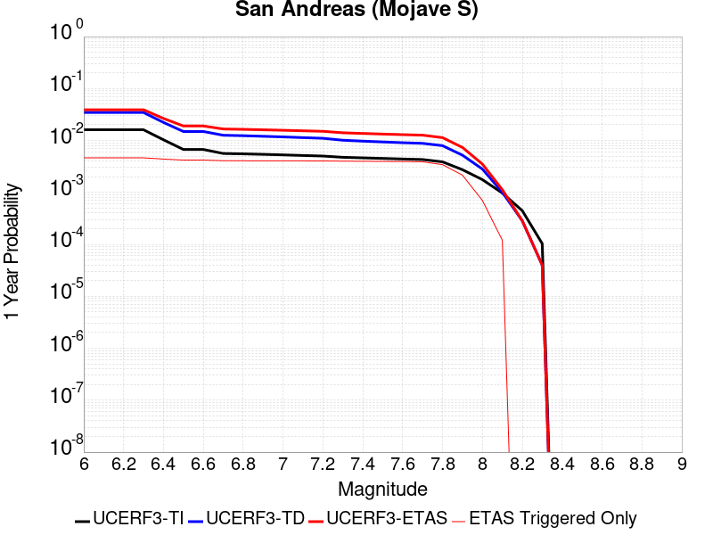 |  |

| Magnitude | 1 wk TI Prob | 1 wk TD Prob | 1 wk ETAS Prob | 1 wk ETAS/TD Gain | 1 wk ETAS Triggered Only | 1 mo TI Prob | 1 mo TD Prob | 1 mo ETAS Prob | 1 mo ETAS/TD Gain | 1 mo ETAS Triggered Only | 1 yr TI Prob | 1 yr TD Prob | 1 yr ETAS Prob | 1 yr ETAS/TD Gain | 1 yr ETAS Triggered Only | 10 yr TI Prob | 10 yr TD Prob | 10 yr ETAS Prob | 10 yr ETAS/TD Gain | 10 yr ETAS Triggered Only |
|-----|-----|-----|-----|-----|-----|-----|-----|-----|-----|-----|-----|-----|-----|-----|-----|-----|-----|-----|-----|-----|
| 6.0 | 3.1064058E-4 | 6.7460834E-4 | 0.003028126 | 4.488717 | 0.0023551064 | 0.0013306376 | 0.0028881032 | 0.0060139922 | 2.0823328 | 0.0031349428 | 0.016080605 | 0.03462235 | 0.039109256 | 1.1295956 | 0.004647826 | 0.1496549 | 0.28660452 | 0.291389 | 1.0166936 | 0.0067065945 |
| 6.1 | 3.1064058E-4 | 6.7460834E-4 | 0.003028126 | 4.488717 | 0.0023551064 | 0.0013306376 | 0.0028881032 | 0.0060139922 | 2.0823328 | 0.0031349428 | 0.016080605 | 0.03462235 | 0.039109256 | 1.1295956 | 0.004647826 | 0.1496549 | 0.28660452 | 0.291389 | 1.0166936 | 0.0067065945 |
| 6.2 | 3.1064058E-4 | 6.7460834E-4 | 0.003028126 | 4.488717 | 0.0023551064 | 0.0013306376 | 0.0028881032 | 0.0060139922 | 2.0823328 | 0.0031349428 | 0.016080605 | 0.03462235 | 0.039109256 | 1.1295956 | 0.004647826 | 0.1496549 | 0.28660452 | 0.291389 | 1.0166936 | 0.0067065945 |
| 6.3 | 3.1064058E-4 | 6.7460834E-4 | 0.003028126 | 4.488717 | 0.0023551064 | 0.0013306376 | 0.0028881032 | 0.0060139922 | 2.0823328 | 0.0031349428 | 0.016080605 | 0.03462235 | 0.039109256 | 1.1295956 | 0.004647826 | 0.1496549 | 0.28660452 | 0.291389 | 1.0166936 | 0.0067065945 |
| 6.4 | 1.9872203E-4 | 4.3179357E-4 | 0.002629983 | 6.090834 | 0.002199139 | 8.5138786E-4 | 0.0018492596 | 0.0048071584 | 2.5995045 | 0.0029633788 | 0.010316478 | 0.02228844 | 0.026588686 | 1.1929362 | 0.004398278 | 0.098504856 | 0.19699748 | 0.2021324 | 1.026066 | 0.0063946596 |
| 6.5 | 1.291105E-4 | 2.875267E-4 | 0.0023768877 | 8.266668 | 0.002089962 | 5.5321335E-4 | 0.0012316781 | 0.0040044766 | 3.2512364 | 0.002776218 | 0.006714592 | 0.0148934 | 0.018949613 | 1.2723497 | 0.004117537 | 0.065152965 | 0.13803436 | 0.14316991 | 1.0372049 | 0.0059579513 |
| 6.6 | 1.291105E-4 | 2.875267E-4 | 0.0023768877 | 8.266668 | 0.002089962 | 5.5321335E-4 | 0.0012316781 | 0.0040044766 | 3.2512364 | 0.002776218 | 0.006714592 | 0.0148934 | 0.018949613 | 1.2723497 | 0.004117537 | 0.065152965 | 0.13803436 | 0.14316991 | 1.0372049 | 0.0059579513 |
| 6.7 | 1.08001186E-4 | 2.4333889E-4 | 0.0022704205 | 9.330282 | 0.002027575 | 4.6278012E-4 | 0.0010424647 | 0.0037223059 | 3.570678 | 0.0026826377 | 0.0056198016 | 0.012618446 | 0.016591627 | 1.3148708 | 0.0040239566 | 0.054797906 | 0.119176775 | 0.12424608 | 1.042536 | 0.0057551935 |
| 6.8 | 1.0624356E-4 | 2.3851555E-4 | 0.002265607 | 9.498781 | 0.002027575 | 4.5525006E-4 | 0.0010218095 | 0.0037017062 | 3.6226966 | 0.0026826377 | 0.0055285925 | 0.012369843 | 0.01632862 | 1.3200345 | 0.0040083597 | 0.053930566 | 0.11712591 | 0.122193255 | 1.043264 | 0.005739597 |
| 6.9 | 1.0393785E-4 | 2.3221898E-4 | 0.0022593231 | 9.729279 | 0.002027575 | 4.4537184E-4 | 9.948451E-4 | 0.003674814 | 3.6938555 | 0.0026826377 | 0.0054089287 | 0.012045221 | 0.0160053 | 1.3287675 | 0.0040083597 | 0.05279156 | 0.11442335 | 0.1195062 | 1.0444214 | 0.005739597 |
| 7.0 | 1.0155622E-4 | 2.2591476E-4 | 0.0022530318 | 9.972929 | 0.002027575 | 4.3516833E-4 | 9.6784724E-4 | 0.0036478885 | 3.7690747 | 0.0026826377 | 0.005285311 | 0.0117200995 | 0.015681481 | 1.337999 | 0.0040083597 | 0.05161361 | 0.111683756 | 0.11676847 | 1.0455278 | 0.0057240003 |
| 7.1 | 9.885595E-5 | 2.1879886E-4 | 0.0022459303 | 10.264817 | 0.002027575 | 4.2359953E-4 | 9.3737274E-4 | 0.0036174958 | 3.8591862 | 0.0026826377 | 0.0051451353 | 0.011352993 | 0.015315846 | 1.349058 | 0.0040083597 | 0.05027629 | 0.1085682 | 0.11364295 | 1.0467424 | 0.0056928066 |
| 7.2 | 9.6411415E-5 | 2.124288E-4 | 0.002239573 | 10.5427 | 0.002027575 | 4.1312634E-4 | 9.1009185E-4 | 0.003590288 | 3.9449735 | 0.0026826377 | 0.005018219 | 0.011024255 | 0.014988426 | 1.3595862 | 0.0040083597 | 0.049064007 | 0.105758004 | 0.1108348 | 1.0480039 | 0.00567721 |
| 7.3 | 9.1180635E-5 | 1.9471257E-4 | 0.0022062992 | 11.331056 | 0.0020119783 | 3.907156E-4 | 8.342157E-4 | 0.0034834482 | 4.1757164 | 0.0026514442 | 0.004746591 | 0.01010939 | 0.01404635 | 1.3894359 | 0.0039771665 | 0.046464786 | 0.09795115 | 0.10304414 | 1.0519952 | 0.0056460164 |
| 7.4 | 8.887388E-5 | 1.8719878E-4 | 0.0021832066 | 11.662504 | 0.0019963817 | 3.8083247E-4 | 8.020339E-4 | 0.0034357675 | 4.2838182 | 0.0026358475 | 0.0046267817 | 0.00972114 | 0.013628754 | 1.4019707 | 0.003945973 | 0.045316286 | 0.09458615 | 0.09966989 | 1.0537472 | 0.005614823 |
| 7.5 | 8.6750515E-5 | 1.8051457E-4 | 0.0021765358 | 12.057397 | 0.0019963817 | 3.7173493E-4 | 7.7340455E-4 | 0.0034072136 | 4.4054737 | 0.0026358475 | 0.004516484 | 0.009375632 | 0.013269158 | 1.4152815 | 0.0039303764 | 0.04425787 | 0.091549896 | 0.09663651 | 1.0555612 | 0.0055992263 |
| 7.6 | 8.453092E-5 | 1.7439072E-4 | 0.0021548301 | 12.356335 | 0.0019807848 | 3.6222505E-4 | 7.471748E-4 | 0.0033498828 | 4.483399 | 0.002604654 | 0.0044011753 | 0.009058985 | 0.012922845 | 1.4265224 | 0.0038991827 | 0.04315024 | 0.08870898 | 0.09375466 | 1.0568789 | 0.0055368394 |
| 7.7 | 8.259102E-5 | 1.6961215E-4 | 0.002134467 | 12.584398 | 0.0019651882 | 3.539135E-4 | 7.2670676E-4 | 0.0032827118 | 4.517244 | 0.002557864 | 0.004300386 | 0.008811831 | 0.012630276 | 1.4333317 | 0.0038523925 | 0.042181134 | 0.08645982 | 0.09146096 | 1.0578434 | 0.0054744524 |
| 7.8 | 7.444844E-5 | 1.5283503E-4 | 0.0018838076 | 12.325758 | 0.0017312372 | 3.1902574E-4 | 6.548429E-4 | 0.0029304745 | 4.4750805 | 0.0022771228 | 0.0038772223 | 0.007943616 | 0.011332167 | 1.4265754 | 0.003415684 | 0.03810269 | 0.078290746 | 0.082689695 | 1.0561874 | 0.0047726 |
| 7.9 | 5.2586525E-5 | 1.00064186E-4 | 0.0011605357 | 11.597914 | 0.0010605777 | 2.2535135E-4 | 4.2877605E-4 | 0.00186306 | 4.3450656 | 0.0014348993 | 0.0027402006 | 0.005207864 | 0.00739555 | 1.4200736 | 0.002199139 | 0.027066574 | 0.052200034 | 0.054993942 | 1.0535231 | 0.0029477822 |
| 8.0 | 3.379877E-5 | 5.4074168E-5 | 3.3480013E-4 | 6.1914988 | 2.8074117E-4 | 1.4484383E-4 | 2.3172585E-4 | 6.6833314E-4 | 2.8841543 | 4.3670848E-4 | 0.0017620471 | 0.002817614 | 0.0035330423 | 1.2539128 | 7.1744964E-4 | 0.017481409 | 0.028834904 | 0.029804312 | 1.0336193 | 9.981908E-4 |
| 8.1 | 1.8668277E-5 | 1.9309397E-5 | 8.1695114E-5 | 4.230848 | 6.238693E-5 | 8.000444E-5 | 8.275194E-5 | 1.7632458E-4 | 2.1307607 | 9.3580384E-5 | 9.736188E-4 | 0.0010070398 | 0.001147269 | 1.139249 | 1.4037058E-4 | 0.009693642 | 0.010798888 | 0.010999456 | 1.018573 | 2.027575E-4 |
| 8.2 | 8.541571E-6 | 5.460819E-6 | 5.460819E-6 | 1.0 | 0.0 | 3.660622E-5 | 2.3403301E-5 | 2.3403301E-5 | 1.0 | 0.0 | 4.455896E-4 | 2.84898E-4 | 2.84898E-4 | 1.0 | 0.0 | 0.0044469717 | 0.0032408056 | 0.0032408056 | 1.0 | 0.0 |
| 8.3 | 1.983087E-6 | 7.6599065E-7 | 7.6599065E-7 | 1.0 | 0.0 | 8.498917E-6 | 3.282813E-6 | 3.282813E-6 | 1.0 | 0.0 | 1.034694E-4 | 3.9967534E-5 | 3.9967534E-5 | 1.0 | 0.0 | 0.0010342124 | 4.719687E-4 | 4.719687E-4 | 1.0 | 0.0 |

## Gravel Hills-Harper Lk
*[(top)](#table-of-contents)*

| 1 Week | 1 Month | 1 Year | 10 Year |
|-----|-----|-----|-----|
|  |  |  |  |

| Magnitude | 1 wk TI Prob | 1 wk TD Prob | 1 wk ETAS Prob | 1 wk ETAS/TD Gain | 1 wk ETAS Triggered Only | 1 mo TI Prob | 1 mo TD Prob | 1 mo ETAS Prob | 1 mo ETAS/TD Gain | 1 mo ETAS Triggered Only | 1 yr TI Prob | 1 yr TD Prob | 1 yr ETAS Prob | 1 yr ETAS/TD Gain | 1 yr ETAS Triggered Only | 10 yr TI Prob | 10 yr TD Prob | 10 yr ETAS Prob | 10 yr ETAS/TD Gain | 10 yr ETAS Triggered Only |
|-----|-----|-----|-----|-----|-----|-----|-----|-----|-----|-----|-----|-----|-----|-----|-----|-----|-----|-----|-----|-----|
| 6.0 | 3.0679566E-5 | 3.1464646E-5 | 0.0019809946 | 62.95938 | 0.0019495913 | 1.3147724E-4 | 1.3484273E-4 | 0.0029574705 | 21.932737 | 0.0028230082 | 0.0015995599 | 0.0016406906 | 0.0065923138 | 4.0180116 | 0.0049597602 | 0.015880952 | 0.01630734 | 0.023855794 | 1.462887 | 0.007673592 |
| 6.1 | 3.0679566E-5 | 3.1464646E-5 | 0.0019809946 | 62.95938 | 0.0019495913 | 1.3147724E-4 | 1.3484273E-4 | 0.0029574705 | 21.932737 | 0.0028230082 | 0.0015995599 | 0.0016406906 | 0.0065923138 | 4.0180116 | 0.0049597602 | 0.015880952 | 0.01630734 | 0.023855794 | 1.462887 | 0.007673592 |
| 6.2 | 1.514536E-5 | 1.3635206E-5 | 6.6868897E-4 | 49.04135 | 6.550627E-4 | 6.490707E-5 | 5.843536E-5 | 0.0010253761 | 17.547188 | 9.669973E-4 | 7.8995706E-4 | 7.1123015E-4 | 0.0025347497 | 3.5638955 | 0.0018248175 | 0.007871548 | 0.0070907404 | 0.01001762 | 1.4127749 | 0.0029477822 |
| 6.3 | 1.514536E-5 | 1.3635206E-5 | 6.6868897E-4 | 49.04135 | 6.550627E-4 | 6.490707E-5 | 5.843536E-5 | 0.0010253761 | 17.547188 | 9.669973E-4 | 7.8995706E-4 | 7.1123015E-4 | 0.0025347497 | 3.5638955 | 0.0018248175 | 0.007871548 | 0.0070907404 | 0.01001762 | 1.4127749 | 0.0029477822 |
| 6.4 | 1.2532521E-5 | 1.06896905E-5 | 5.097797E-4 | 47.688915 | 4.990954E-4 | 5.37097E-5 | 4.581219E-5 | 7.7882496E-4 | 17.000387 | 7.330463E-4 | 6.537194E-4 | 5.576265E-4 | 0.0019137855 | 3.4320204 | 0.0013569156 | 0.0065179965 | 0.005562863 | 0.0076567084 | 1.3763971 | 0.0021055588 |
| 6.5 | 1.1094058E-5 | 9.083664E-6 | 3.6780522E-4 | 40.490845 | 3.5872482E-4 | 4.7545094E-5 | 3.892943E-5 | 5.6919764E-4 | 14.621269 | 5.3028885E-4 | 5.787078E-4 | 4.7386673E-4 | 0.0014092271 | 2.973889 | 9.3580387E-4 | 0.0057720304 | 0.0047289706 | 0.00618813 | 1.3085575 | 0.0014660927 |
| 6.6 | 9.688328E-6 | 7.5316952E-6 | 1.9469106E-4 | 25.849567 | 1.8716077E-4 | 4.1520743E-5 | 3.227831E-5 | 3.7539532E-4 | 11.629956 | 3.4312808E-4 | 5.053978E-4 | 3.9292008E-4 | 0.001063316 | 2.706189 | 6.706594E-4 | 0.0050424994 | 0.0039225104 | 0.0048235725 | 1.2297157 | 9.046104E-4 |
| 6.7 | 8.974824E-6 | 6.749413E-6 | 1.4711905E-4 | 21.79731 | 1.4037058E-4 | 3.8462964E-5 | 2.8925748E-5 | 2.4727365E-4 | 8.548566 | 2.1835424E-4 | 4.6818596E-4 | 3.5211627E-4 | 8.042622E-4 | 2.2840815 | 4.523052E-4 | 0.004672008 | 0.0035158044 | 0.004153022 | 1.1812438 | 6.39466E-4 |
| 6.8 | 7.4780046E-6 | 5.1161933E-6 | 3.6309495E-5 | 7.096975 | 3.1193464E-5 | 3.20482E-5 | 2.1926366E-5 | 9.990831E-5 | 4.5565376 | 7.7983656E-5 | 3.9011694E-4 | 2.669222E-4 | 4.54033E-4 | 1.7009939 | 1.8716077E-4 | 0.0038943281 | 0.0026661542 | 0.0029461468 | 1.1050174 | 2.8074117E-4 |
| 6.9 | 6.3409307E-6 | 3.9074966E-6 | 3.510084E-5 | 8.982947 | 3.1193464E-5 | 2.7175134E-5 | 1.6746313E-5 | 7.9132195E-5 | 4.72535 | 6.238693E-5 | 3.3080703E-4 | 2.0386827E-4 | 3.4421025E-4 | 1.6883953 | 1.4037058E-4 | 0.0033031502 | 0.0020369107 | 0.0022236903 | 1.0916975 | 1.8716077E-4 |
| 7.0 | 5.1239335E-6 | 2.6058565E-6 | 1.8202547E-5 | 6.985245 | 1.5596732E-5 | 2.195953E-5 | 1.116791E-5 | 4.236102E-5 | 3.7931023 | 3.1193464E-5 | 2.6732447E-4 | 1.3596108E-4 | 2.2952874E-4 | 1.6881945 | 9.3580384E-5 | 0.0026700313 | 0.0013588042 | 0.001467833 | 1.0802388 | 1.0917712E-4 |
| 7.1 | 4.438899E-6 | 2.0984728E-6 | 1.769517E-5 | 8.4324045 | 1.5596732E-5 | 1.9023713E-5 | 8.993425E-6 | 4.0186605E-5 | 4.468443 | 3.1193464E-5 | 2.315891E-4 | 1.0948967E-4 | 2.0305981E-4 | 1.8546025 | 9.3580384E-5 | 0.002313479 | 0.0010943791 | 0.0012034368 | 1.0996525 | 1.0917712E-4 |
| 7.2 | 3.50367E-6 | 1.2615716E-6 | 1.6858283E-5 | 13.362922 | 1.5596732E-5 | 1.5015643E-5 | 5.4067245E-6 | 2.100337E-5 | 3.8846755 | 1.5596732E-5 | 1.8280011E-4 | 6.582497E-5 | 1.12612084E-4 | 1.7107806 | 4.6790192E-5 | 0.0018264982 | 6.580629E-4 | 7.204088E-4 | 1.0947415 | 6.238693E-5 |
| 7.3 | 2.561638E-6 | 7.1191585E-7 | 1.6308635E-5 | 22.908094 | 1.5596732E-5 | 1.0978401E-5 | 3.0510646E-6 | 1.8647748E-5 | 6.1118827 | 1.5596732E-5 | 1.3365384E-4 | 3.71461E-5 | 6.83384E-5 | 1.8397195 | 3.1193464E-5 | 0.0013357349 | 3.7140088E-4 | 4.0258275E-4 | 1.0839574 | 3.1193464E-5 |
| 7.4 | 2.0368864E-6 | 5.304837E-7 | 1.6127206E-5 | 30.400946 | 1.5596732E-5 | 8.729483E-6 | 2.2734996E-6 | 1.7870196E-5 | 7.860214 | 1.5596732E-5 | 1.06276275E-4 | 2.7679513E-5 | 5.8872112E-5 | 2.12692 | 3.1193464E-5 | 0.0010622547 | 2.767612E-4 | 3.0794603E-4 | 1.1126777 | 3.1193464E-5 |
| 7.5 | 1.1681728E-6 | 3.6030585E-7 | 3.6030585E-7 | 1.0 | 0.0 | 5.0064455E-6 | 1.544167E-6 | 1.544167E-6 | 1.0 | 0.0 | 6.0951766E-5 | 1.8800076E-5 | 1.8800076E-5 | 1.0 | 0.0 | 6.093505E-4 | 1.8798532E-4 | 1.8798532E-4 | 1.0 | 0.0 |
| 7.6 | 1.3154387E-7 | 7.1197384E-8 | 7.1197384E-8 | 1.0 | 0.0 | 5.6375933E-7 | 3.051316E-7 | 3.051316E-7 | 1.0 | 0.0 | 6.863748E-6 | 3.7149728E-6 | 3.7149728E-6 | 1.0 | 0.0 | 6.863536E-5 | 3.7149264E-5 | 3.7149264E-5 | 1.0 | 0.0 |

## Coyote Canyon
*[(top)](#table-of-contents)*

| 1 Week | 1 Month | 1 Year | 10 Year |
|-----|-----|-----|-----|
|  |  |  |  |

| Magnitude | 1 wk TI Prob | 1 wk TD Prob | 1 wk ETAS Prob | 1 wk ETAS/TD Gain | 1 wk ETAS Triggered Only | 1 mo TI Prob | 1 mo TD Prob | 1 mo ETAS Prob | 1 mo ETAS/TD Gain | 1 mo ETAS Triggered Only | 1 yr TI Prob | 1 yr TD Prob | 1 yr ETAS Prob | 1 yr ETAS/TD Gain | 1 yr ETAS Triggered Only | 10 yr TI Prob | 10 yr TD Prob | 10 yr ETAS Prob | 10 yr ETAS/TD Gain | 10 yr ETAS Triggered Only |
|-----|-----|-----|-----|-----|-----|-----|-----|-----|-----|-----|-----|-----|-----|-----|-----|-----|-----|-----|-----|-----|
| 6.0 | 3.5090034E-5 | 4.0364324E-5 | 0.0011164953 | 27.66045 | 0.0010761744 | 1.503772E-4 | 1.7297994E-4 | 0.0018103534 | 10.465684 | 0.0016376567 | 0.0018293047 | 0.0021042528 | 0.005341546 | 2.5384529 | 0.00324412 | 0.018143194 | 0.020869201 | 0.027038783 | 1.2956309 | 0.0063010794 |
| 6.1 | 3.5090034E-5 | 4.0364324E-5 | 0.0011164953 | 27.66045 | 0.0010761744 | 1.503772E-4 | 1.7297994E-4 | 0.0018103534 | 10.465684 | 0.0016376567 | 0.0018293047 | 0.0021042528 | 0.005341546 | 2.5384529 | 0.00324412 | 0.018143194 | 0.020869201 | 0.027038783 | 1.2956309 | 0.0063010794 |
| 6.2 | 1.841879E-5 | 2.1059794E-5 | 5.669339E-4 | 26.920202 | 5.458856E-4 | 7.8935285E-5 | 9.0253714E-5 | 0.0010103778 | 11.194861 | 9.202071E-4 | 9.606133E-4 | 0.001098387 | 0.002999098 | 2.7304568 | 0.0019028012 | 0.0095647145 | 0.010939667 | 0.014919603 | 1.3638078 | 0.0040239566 |
| 6.3 | 1.841879E-5 | 2.1059794E-5 | 5.669339E-4 | 26.920202 | 5.458856E-4 | 7.8935285E-5 | 9.0253714E-5 | 0.0010103778 | 11.194861 | 9.202071E-4 | 9.606133E-4 | 0.001098387 | 0.002999098 | 2.7304568 | 0.0019028012 | 0.0095647145 | 0.010939667 | 0.014919603 | 1.3638078 | 0.0040239566 |
| 6.4 | 1.712201E-5 | 1.9565212E-5 | 5.654401E-4 | 28.90028 | 5.458856E-4 | 7.337798E-5 | 8.3848776E-5 | 0.0010039788 | 11.973683 | 9.202071E-4 | 8.930107E-4 | 0.0010204813 | 0.0028278558 | 2.7711 | 0.0018092208 | 0.008894307 | 0.010167871 | 0.013965654 | 1.3735083 | 0.003836796 |
| 6.5 | 1.4744935E-5 | 1.6836972E-5 | 4.6913454E-4 | 27.863358 | 4.523052E-4 | 6.3191044E-5 | 7.215698E-5 | 8.6753286E-4 | 12.022854 | 7.954333E-4 | 7.6907943E-4 | 8.7825063E-4 | 0.0025144692 | 2.8630428 | 0.0016376567 | 0.007664232 | 0.008756994 | 0.012235528 | 1.3972292 | 0.0035092644 |
| 6.6 | 1.2017839E-5 | 1.37240895E-5 | 3.880405E-4 | 28.274408 | 3.7432153E-4 | 5.150401E-5 | 5.88167E-5 | 7.7622413E-4 | 13.197343 | 7.1744964E-4 | 6.268809E-4 | 7.159466E-4 | 0.0021030619 | 2.9374564 | 0.001388109 | 0.0062511545 | 0.0071450938 | 0.010211181 | 1.4291179 | 0.0030881527 |
| 6.7 | 1.00956095E-5 | 1.1533517E-5 | 3.3906108E-4 | 29.397894 | 3.2753134E-4 | 4.326618E-5 | 4.942891E-5 | 6.732673E-4 | 13.620921 | 6.2386924E-4 | 5.266384E-4 | 6.017178E-4 | 0.0018019434 | 2.9946654 | 0.0012009483 | 0.005253921 | 0.0060094125 | 0.00862942 | 1.435984 | 0.0026358475 |

## San Andreas (Mojave N)
*[(top)](#table-of-contents)*

| 1 Week | 1 Month | 1 Year | 10 Year |
|-----|-----|-----|-----|
|  |  |  |  |

| Magnitude | 1 wk TI Prob | 1 wk TD Prob | 1 wk ETAS Prob | 1 wk ETAS/TD Gain | 1 wk ETAS Triggered Only | 1 mo TI Prob | 1 mo TD Prob | 1 mo ETAS Prob | 1 mo ETAS/TD Gain | 1 mo ETAS Triggered Only | 1 yr TI Prob | 1 yr TD Prob | 1 yr ETAS Prob | 1 yr ETAS/TD Gain | 1 yr ETAS Triggered Only | 10 yr TI Prob | 10 yr TD Prob | 10 yr ETAS Prob | 10 yr ETAS/TD Gain | 10 yr ETAS Triggered Only |
|-----|-----|-----|-----|-----|-----|-----|-----|-----|-----|-----|-----|-----|-----|-----|-----|-----|-----|-----|-----|-----|
| 6.0 | 9.877682E-5 | 1.9400702E-4 | 0.002782562 | 14.342585 | 0.0025890574 | 4.2326056E-4 | 8.311939E-4 | 0.004244039 | 5.105955 | 0.003415684 | 0.0051410277 | 0.010072956 | 0.014967318 | 1.4858912 | 0.004944164 | 0.05023708 | 0.09831428 | 0.10447402 | 1.0626537 | 0.006831368 |
| 6.1 | 9.877682E-5 | 1.9400702E-4 | 0.002782562 | 14.342585 | 0.0025890574 | 4.2326056E-4 | 8.311939E-4 | 0.004244039 | 5.105955 | 0.003415684 | 0.0051410277 | 0.010072956 | 0.014967318 | 1.4858912 | 0.004944164 | 0.05023708 | 0.09831428 | 0.10447402 | 1.0626537 | 0.006831368 |
| 6.2 | 9.877682E-5 | 1.9400702E-4 | 0.002782562 | 14.342585 | 0.0025890574 | 4.2326056E-4 | 8.311939E-4 | 0.004244039 | 5.105955 | 0.003415684 | 0.0051410277 | 0.010072956 | 0.014967318 | 1.4858912 | 0.004944164 | 0.05023708 | 0.09831428 | 0.10447402 | 1.0626537 | 0.006831368 |
| 6.3 | 9.877682E-5 | 1.9400702E-4 | 0.002782562 | 14.342585 | 0.0025890574 | 4.2326056E-4 | 8.311939E-4 | 0.004244039 | 5.105955 | 0.003415684 | 0.0051410277 | 0.010072956 | 0.014967318 | 1.4858912 | 0.004944164 | 0.05023708 | 0.09831428 | 0.10447402 | 1.0626537 | 0.006831368 |
| 6.4 | 9.877682E-5 | 1.9400702E-4 | 0.002782562 | 14.342585 | 0.0025890574 | 4.2326056E-4 | 8.311939E-4 | 0.004244039 | 5.105955 | 0.003415684 | 0.0051410277 | 0.010072956 | 0.014967318 | 1.4858912 | 0.004944164 | 0.05023708 | 0.09831428 | 0.10447402 | 1.0626537 | 0.006831368 |
| 6.5 | 9.861474E-5 | 1.9374468E-4 | 0.0027823003 | 14.360654 | 0.0025890574 | 4.2256617E-4 | 8.300703E-4 | 0.004242919 | 5.111518 | 0.003415684 | 0.0051326132 | 0.010059402 | 0.014953831 | 1.4865526 | 0.004944164 | 0.050156746 | 0.098192066 | 0.10435265 | 1.0627401 | 0.006831368 |
| 6.6 | 9.861474E-5 | 1.9374468E-4 | 0.0027823003 | 14.360654 | 0.0025890574 | 4.2256617E-4 | 8.300703E-4 | 0.004242919 | 5.111518 | 0.003415684 | 0.0051326132 | 0.010059402 | 0.014953831 | 1.4865526 | 0.004944164 | 0.050156746 | 0.098192066 | 0.10435265 | 1.0627401 | 0.006831368 |
| 6.7 | 9.8552715E-5 | 1.9364421E-4 | 0.0027822002 | 14.367588 | 0.0025890574 | 4.223004E-4 | 8.2964E-4 | 0.0042424905 | 5.113652 | 0.003415684 | 0.0051293927 | 0.010054212 | 0.014948666 | 1.4868063 | 0.004944164 | 0.050125998 | 0.098145254 | 0.104306154 | 1.0627733 | 0.006831368 |
| 6.8 | 9.8464974E-5 | 1.9349584E-4 | 0.0027820521 | 14.37784 | 0.0025890574 | 4.219245E-4 | 8.290045E-4 | 0.004241857 | 5.116808 | 0.003415684 | 0.0051248376 | 0.010046546 | 0.014941039 | 1.4871815 | 0.004944164 | 0.05008251 | 0.09807528 | 0.10423666 | 1.0628229 | 0.006831368 |
| 6.9 | 9.825824E-5 | 1.9317595E-4 | 0.0027817332 | 14.399998 | 0.0025890574 | 4.2103877E-4 | 8.276344E-4 | 0.0042404914 | 5.123629 | 0.003415684 | 0.0051141046 | 0.010030019 | 0.014924592 | 1.4879924 | 0.004944164 | 0.049980022 | 0.09792438 | 0.104086794 | 1.0629303 | 0.006831368 |
| 7.0 | 9.781462E-5 | 1.924896E-4 | 0.0027810486 | 14.447786 | 0.0025890574 | 4.1913814E-4 | 8.246948E-4 | 0.004237562 | 5.1383395 | 0.003415684 | 0.005091073 | 0.009994558 | 0.014889307 | 1.4897414 | 0.004944164 | 0.04976007 | 0.09760077 | 0.10376539 | 1.0631616 | 0.006831368 |
| 7.1 | 9.7121134E-5 | 1.9150671E-4 | 0.0027800682 | 14.516818 | 0.0025890574 | 4.1616702E-4 | 8.204851E-4 | 0.004233367 | 5.15959 | 0.003415684 | 0.005055068 | 0.009943774 | 0.014823332 | 1.4907149 | 0.004928567 | 0.04941613 | 0.09713728 | 0.10329099 | 1.0633506 | 0.0068157716 |
| 7.2 | 9.663819E-5 | 1.9081456E-4 | 0.002763784 | 14.484136 | 0.0025734606 | 4.1409794E-4 | 8.175206E-4 | 0.0042148284 | 5.1556234 | 0.0034000874 | 0.0050299936 | 0.00990801 | 0.014772303 | 1.4909455 | 0.00491297 | 0.049176537 | 0.09681055 | 0.10295239 | 1.0634419 | 0.0068001747 |
| 7.3 | 9.6277574E-5 | 1.9033969E-4 | 0.0027633104 | 14.517783 | 0.0025734606 | 4.125529E-4 | 8.154867E-4 | 0.0042128013 | 5.165996 | 0.0034000874 | 0.0050112694 | 0.009883473 | 0.014747886 | 1.4921765 | 0.00491297 | 0.04899759 | 0.09658401 | 0.10272739 | 1.0636066 | 0.0068001747 |
| 7.4 | 9.593308E-5 | 1.897375E-4 | 0.0027627097 | 14.560695 | 0.0025734606 | 4.1107697E-4 | 8.129075E-4 | 0.004210231 | 5.179225 | 0.0034000874 | 0.0049933824 | 0.009852355 | 0.014716921 | 1.4937465 | 0.00491297 | 0.04882661 | 0.09630218 | 0.10244749 | 1.0638127 | 0.0068001747 |
| 7.5 | 9.561707E-5 | 1.8919831E-4 | 0.0027621721 | 14.599348 | 0.0025734606 | 4.0972308E-4 | 8.1059814E-4 | 0.0042079296 | 5.191141 | 0.0034000874 | 0.0049769743 | 0.009824493 | 0.014673752 | 1.4935888 | 0.0048973737 | 0.048669744 | 0.09604836 | 0.10218129 | 1.0638525 | 0.006784578 |
| 7.6 | 9.418194E-5 | 1.8572104E-4 | 0.0027431098 | 14.770054 | 0.002557864 | 4.0357444E-4 | 7.957047E-4 | 0.0041775024 | 5.250066 | 0.0033844905 | 0.004902454 | 0.009644784 | 0.014479477 | 1.5012754 | 0.004881777 | 0.047957025 | 0.094430685 | 0.100546345 | 1.0647634 | 0.0067533846 |
| 7.7 | 8.202141E-5 | 1.6021315E-4 | 0.0024837537 | 15.502808 | 0.002323913 | 3.51473E-4 | 6.8644714E-4 | 0.0037413079 | 5.450249 | 0.0030569592 | 0.00427079 | 0.008325525 | 0.0127799865 | 1.5350367 | 0.0044918586 | 0.04189639 | 0.08223219 | 0.08797218 | 1.0698022 | 0.0062542893 |
| 7.8 | 7.2859846E-5 | 1.4516473E-4 | 0.0018761505 | 12.924288 | 0.0017312372 | 3.1221908E-4 | 6.219862E-4 | 0.0028976926 | 4.658773 | 0.0022771228 | 0.003794643 | 0.0075464295 | 0.010920859 | 1.4471557 | 0.0034000874 | 0.037304975 | 0.07472468 | 0.07912622 | 1.0589033 | 0.004757003 |
| 7.9 | 5.3874453E-5 | 1.0045676E-4 | 0.0011609279 | 11.556494 | 0.0010605777 | 2.3087008E-4 | 4.3045796E-4 | 0.0018647396 | 4.33199 | 0.0014348993 | 0.0028072202 | 0.0052282433 | 0.0074158846 | 1.4184276 | 0.002199139 | 0.02772022 | 0.05242443 | 0.055217676 | 1.0532814 | 0.0029477822 |
| 8.0 | 3.468538E-5 | 5.4260272E-5 | 3.349862E-4 | 6.1736917 | 2.8074117E-4 | 1.4864317E-4 | 2.325233E-4 | 6.6913024E-4 | 2.877691 | 4.3670848E-4 | 0.0018082283 | 0.002827298 | 0.003542719 | 1.2530407 | 7.1744964E-4 | 0.017935853 | 0.028947512 | 0.029916806 | 1.0334846 | 9.981908E-4 |
| 8.1 | 1.9152367E-5 | 1.940263E-5 | 8.178834E-5 | 4.2153225 | 6.238693E-5 | 8.207899E-5 | 8.3151484E-5 | 1.7672409E-4 | 2.1253269 | 9.3580384E-5 | 9.988535E-4 | 0.0010118998 | 0.0011521283 | 1.1385795 | 1.4037058E-4 | 0.009943757 | 0.01085625 | 0.011056807 | 1.0184739 | 2.027575E-4 |
| 8.2 | 8.643924E-6 | 5.4748625E-6 | 5.4748625E-6 | 1.0 | 0.0 | 3.704486E-5 | 2.3463486E-5 | 2.3463486E-5 | 1.0 | 0.0 | 4.5092785E-4 | 2.8563058E-4 | 2.8563058E-4 | 1.0 | 0.0 | 0.0045001395 | 0.0032487072 | 0.0032487072 | 1.0 | 0.0 |
| 8.3 | 1.983087E-6 | 7.6599065E-7 | 7.6599065E-7 | 1.0 | 0.0 | 8.498917E-6 | 3.282813E-6 | 3.282813E-6 | 1.0 | 0.0 | 1.034694E-4 | 3.9967534E-5 | 3.9967534E-5 | 1.0 | 0.0 | 0.0010342124 | 4.719687E-4 | 4.719687E-4 | 1.0 | 0.0 |

## Nelson Lake
*[(top)](#table-of-contents)*

| 1 Week | 1 Month | 1 Year | 10 Year |
|-----|-----|-----|-----|
|  |  |  |  |

| Magnitude | 1 wk TI Prob | 1 wk TD Prob | 1 wk ETAS Prob | 1 wk ETAS/TD Gain | 1 wk ETAS Triggered Only | 1 mo TI Prob | 1 mo TD Prob | 1 mo ETAS Prob | 1 mo ETAS/TD Gain | 1 mo ETAS Triggered Only | 1 yr TI Prob | 1 yr TD Prob | 1 yr ETAS Prob | 1 yr ETAS/TD Gain | 1 yr ETAS Triggered Only | 10 yr TI Prob | 10 yr TD Prob | 10 yr ETAS Prob | 10 yr ETAS/TD Gain | 10 yr ETAS Triggered Only |
|-----|-----|-----|-----|-----|-----|-----|-----|-----|-----|-----|-----|-----|-----|-----|-----|-----|-----|-----|-----|-----|
| 6.0 | 9.913453E-6 | 1.0192255E-5 | 8.8360027E-4 | 86.693306 | 8.7341695E-4 | 4.2485535E-5 | 4.3680422E-5 | 0.0015253051 | 34.91965 | 0.0014816894 | 5.1713863E-4 | 5.316897E-4 | 0.0036493773 | 6.863735 | 0.0031193462 | 0.0051593683 | 0.005305204 | 0.011200519 | 2.1112325 | 0.0059267576 |
| 6.1 | 9.913453E-6 | 1.0192255E-5 | 8.8360027E-4 | 86.693306 | 8.7341695E-4 | 4.2485535E-5 | 4.3680422E-5 | 0.0015253051 | 34.91965 | 0.0014816894 | 5.1713863E-4 | 5.316897E-4 | 0.0036493773 | 6.863735 | 0.0031193462 | 0.0051593683 | 0.005305204 | 0.011200519 | 2.1112325 | 0.0059267576 |
| 6.2 | 4.5596407E-6 | 4.696313E-6 | 5.0378934E-4 | 107.27338 | 4.990954E-4 | 1.954117E-5 | 2.0126909E-5 | 7.9994777E-4 | 39.74519 | 7.7983656E-4 | 2.3788778E-4 | 2.4501883E-4 | 0.0017887169 | 7.3003244 | 0.0015440764 | 0.0023763329 | 0.0024476128 | 0.0053726216 | 2.1950455 | 0.0029321853 |
| 6.3 | 4.5596407E-6 | 4.696313E-6 | 5.0378934E-4 | 107.27338 | 4.990954E-4 | 1.954117E-5 | 2.0126909E-5 | 7.9994777E-4 | 39.74519 | 7.7983656E-4 | 2.3788778E-4 | 2.4501883E-4 | 0.0017887169 | 7.3003244 | 0.0015440764 | 0.0023763329 | 0.0024476128 | 0.0053726216 | 2.1950455 | 0.0029321853 |
| 6.4 | 3.4025713E-6 | 3.5098972E-6 | 3.7783012E-4 | 107.647064 | 3.7432153E-4 | 1.4582367E-5 | 1.5042335E-5 | 5.765162E-4 | 38.326244 | 5.6148233E-4 | 1.7752586E-4 | 1.8312587E-4 | 0.0013214787 | 7.216232 | 0.0011385614 | 0.001773841 | 0.0018298327 | 0.0041027884 | 2.242166 | 0.0022771228 |
| 6.5 | 2.8352947E-6 | 2.927856E-6 | 3.1486157E-4 | 107.53997 | 3.1193462E-4 | 1.2151207E-5 | 1.2547898E-5 | 4.960405E-4 | 39.531757 | 4.8349865E-4 | 1.479309E-4 | 1.5276071E-4 | 0.001104016 | 7.2270937 | 9.514006E-4 | 0.0014783246 | 0.0015266308 | 0.0035043918 | 2.295507 | 0.0019807848 |
| 6.6 | 2.251518E-6 | 2.3290677E-6 | 2.8306956E-4 | 121.53772 | 2.8074117E-4 | 9.649328E-6 | 9.981683E-6 | 4.466858E-4 | 44.750546 | 4.3670848E-4 | 1.1747423E-4 | 1.2152085E-4 | 9.324523E-4 | 7.6731877 | 8.1103E-4 | 0.0011741214 | 0.0012146058 | 0.0028346956 | 2.3338401 | 0.00162206 |
| 6.7 | 1.8911853E-6 | 1.9591396E-6 | 2.3590964E-4 | 120.41492 | 2.3395097E-4 | 8.105055E-6 | 8.39629E-6 | 3.047317E-4 | 36.293613 | 2.9633788E-4 | 9.867457E-5 | 1.0222061E-4 | 7.1043096E-4 | 6.9499774 | 6.082725E-4 | 9.863076E-4 | 0.0010217935 | 0.002346161 | 2.2961206 | 0.0013257221 |
| 6.8 | 1.4874814E-6 | 1.5438305E-6 | 2.0430102E-4 | 132.33385 | 2.027575E-4 | 6.374905E-6 | 6.6164025E-6 | 2.2496919E-4 | 34.00174 | 2.1835424E-4 | 7.76117E-5 | 8.055224E-5 | 5.7960744E-4 | 7.1954226 | 4.990954E-4 | 7.75846E-4 | 8.0528157E-4 | 0.0018650052 | 2.3159666 | 0.0010605777 |
| 6.9 | 6.835972E-7 | 7.1399285E-7 | 7.8697594E-5 | 110.221825 | 7.7983656E-5 | 2.9296991E-6 | 3.0599674E-6 | 9.664007E-5 | 31.582058 | 9.3580384E-5 | 3.56685E-5 | 3.7254784E-5 | 2.5560087E-4 | 6.860887 | 2.1835424E-4 | 3.5662777E-4 | 3.7251666E-4 | 9.02608E-4 | 2.4230003 | 5.3028885E-4 |

## So Sierra Nevada
*[(top)](#table-of-contents)*

| 1 Week | 1 Month | 1 Year | 10 Year |
|-----|-----|-----|-----|
| 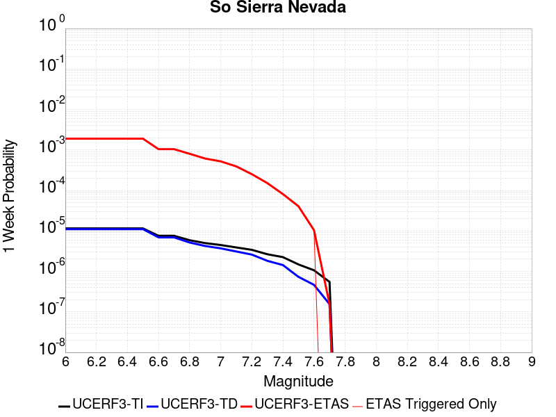 |  | 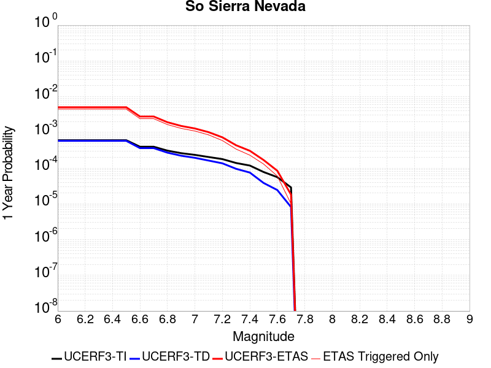 |  |

| Magnitude | 1 wk TI Prob | 1 wk TD Prob | 1 wk ETAS Prob | 1 wk ETAS/TD Gain | 1 wk ETAS Triggered Only | 1 mo TI Prob | 1 mo TD Prob | 1 mo ETAS Prob | 1 mo ETAS/TD Gain | 1 mo ETAS Triggered Only | 1 yr TI Prob | 1 yr TD Prob | 1 yr ETAS Prob | 1 yr ETAS/TD Gain | 1 yr ETAS Triggered Only | 10 yr TI Prob | 10 yr TD Prob | 10 yr ETAS Prob | 10 yr ETAS/TD Gain | 10 yr ETAS Triggered Only |
|-----|-----|-----|-----|-----|-----|-----|-----|-----|-----|-----|-----|-----|-----|-----|-----|-----|-----|-----|-----|-----|
| 6.0 | 1.15488665E-5 | 1.1079643E-5 | 0.0018202803 | 164.29054 | 0.0018092208 | 4.9494203E-5 | 4.748339E-5 | 0.0025584379 | 53.88069 | 0.0025110736 | 6.024253E-4 | 5.7796965E-4 | 0.004849004 | 8.389721 | 0.0042735045 | 0.006007948 | 0.005765934 | 0.01223227 | 2.1214724 | 0.0065038367 |
| 6.1 | 1.15488665E-5 | 1.1079643E-5 | 0.0018202803 | 164.29054 | 0.0018092208 | 4.9494203E-5 | 4.748339E-5 | 0.0025584379 | 53.88069 | 0.0025110736 | 6.024253E-4 | 5.7796965E-4 | 0.004849004 | 8.389721 | 0.0042735045 | 0.006007948 | 0.005765934 | 0.01223227 | 2.1214724 | 0.0065038367 |
| 6.2 | 1.15488665E-5 | 1.1079643E-5 | 0.0018202803 | 164.29054 | 0.0018092208 | 4.9494203E-5 | 4.748339E-5 | 0.0025584379 | 53.88069 | 0.0025110736 | 6.024253E-4 | 5.7796965E-4 | 0.004849004 | 8.389721 | 0.0042735045 | 0.006007948 | 0.005765934 | 0.01223227 | 2.1214724 | 0.0065038367 |
| 6.3 | 1.15488665E-5 | 1.1079643E-5 | 0.0018202803 | 164.29054 | 0.0018092208 | 4.9494203E-5 | 4.748339E-5 | 0.0025584379 | 53.88069 | 0.0025110736 | 6.024253E-4 | 5.7796965E-4 | 0.004849004 | 8.389721 | 0.0042735045 | 0.006007948 | 0.005765934 | 0.01223227 | 2.1214724 | 0.0065038367 |
| 6.4 | 1.15488665E-5 | 1.1079643E-5 | 0.0018202803 | 164.29054 | 0.0018092208 | 4.9494203E-5 | 4.748339E-5 | 0.0025584379 | 53.88069 | 0.0025110736 | 6.024253E-4 | 5.7796965E-4 | 0.004849004 | 8.389721 | 0.0042735045 | 0.006007948 | 0.005765934 | 0.01223227 | 2.1214724 | 0.0065038367 |
| 6.5 | 1.15488665E-5 | 1.1079643E-5 | 0.0018202803 | 164.29054 | 0.0018092208 | 4.9494203E-5 | 4.748339E-5 | 0.0025584379 | 53.88069 | 0.0025110736 | 6.024253E-4 | 5.7796965E-4 | 0.004849004 | 8.389721 | 0.0042735045 | 0.006007948 | 0.005765934 | 0.01223227 | 2.1214724 | 0.0065038367 |
| 6.6 | 7.587044E-6 | 6.935635E-6 | 0.0010363128 | 149.41858 | 0.0010293842 | 3.2515498E-5 | 2.9723828E-5 | 0.0014021953 | 47.174118 | 0.0013725123 | 3.9580427E-4 | 3.6183043E-4 | 0.0027316757 | 7.549602 | 0.002370703 | 0.003951 | 0.0036127048 | 0.006984968 | 1.9334456 | 0.0033844905 |
| 6.7 | 7.587044E-6 | 6.935635E-6 | 0.0010363128 | 149.41858 | 0.0010293842 | 3.2515498E-5 | 2.9723828E-5 | 0.0014021953 | 47.174118 | 0.0013725123 | 3.9580427E-4 | 3.6183043E-4 | 0.0027316757 | 7.549602 | 0.002370703 | 0.003951 | 0.0036127048 | 0.006984968 | 1.9334456 | 0.0033844905 |
| 6.8 | 5.9026956E-6 | 5.1793927E-6 | 7.850119E-4 | 151.56447 | 7.7983656E-4 | 2.5297022E-5 | 2.2197215E-5 | 0.0010047695 | 45.265564 | 9.825941E-4 | 3.0794772E-4 | 2.7021873E-4 | 0.0018294704 | 6.7703314 | 0.0015596731 | 0.0030752132 | 0.002699018 | 0.0049699945 | 1.8414085 | 0.0022771228 |
| 6.9 | 5.0118915E-6 | 4.2524252E-6 | 5.6573236E-4 | 133.03757 | 5.6148233E-4 | 2.1479358E-5 | 1.8224557E-5 | 7.66854E-4 | 42.07806 | 7.4864307E-4 | 2.614798E-4 | 2.2186211E-4 | 0.0013913574 | 6.2712708 | 0.0011697548 | 0.0026117235 | 0.0022164788 | 0.0039594406 | 1.7863653 | 0.0017468339 |
| 7.0 | 4.4924795E-6 | 3.7139177E-6 | 4.4042076E-4 | 118.58657 | 4.3670848E-4 | 1.925334E-5 | 1.5916696E-5 | 6.2417955E-4 | 39.215393 | 6.082725E-4 | 2.3438422E-4 | 1.9376918E-4 | 0.0011605792 | 5.989493 | 9.669973E-4 | 0.0023413717 | 0.0019360651 | 0.0033993195 | 1.7557877 | 0.0014660927 |
| 7.1 | 3.9118436E-6 | 3.1119775E-6 | 2.9944893E-4 | 96.22465 | 2.9633788E-4 | 1.6764936E-5 | 1.3336982E-5 | 4.344431E-4 | 32.574318 | 4.2111173E-4 | 2.0409399E-4 | 1.6236622E-4 | 8.9529355E-4 | 5.514038 | 7.330463E-4 | 0.0020390663 | 0.001622532 | 0.0026969602 | 1.6621923 | 0.0010761744 |
| 7.2 | 3.4200818E-6 | 2.6054543E-6 | 1.8976573E-4 | 72.83403 | 1.8716077E-4 | 1.4657411E-5 | 1.11661875E-5 | 3.0750077E-4 | 27.538563 | 2.9633788E-4 | 1.7843937E-4 | 1.3594035E-4 | 6.8175176E-4 | 5.0150795 | 5.458856E-4 | 0.0017829615 | 0.0013586218 | 0.0021062477 | 1.5502826 | 7.4864307E-4 |
| 7.3 | 2.6593618E-6 | 1.8284203E-6 | 1.11005334E-4 | 60.711063 | 1.0917712E-4 | 1.13972155E-5 | 7.836065E-6 | 1.9499537E-4 | 24.884348 | 1.8716077E-4 | 1.3875226E-4 | 9.540021E-5 | 3.9170982E-4 | 4.105964 | 2.9633788E-4 | 0.0013866565 | 9.5362146E-4 | 0.0013431679 | 1.4084917 | 3.8991828E-4 |
| 7.4 | 2.2577992E-6 | 1.436438E-6 | 6.3823274E-5 | 44.43162 | 6.238693E-5 | 9.676246E-6 | 6.15615E-6 | 1.4652587E-4 | 23.801542 | 1.4037058E-4 | 1.1780193E-4 | 7.49488E-5 | 2.9328666E-4 | 3.9131603 | 2.1835424E-4 | 0.001177395 | 7.492603E-4 | 0.0010142061 | 1.3536098 | 2.6514442E-4 |
| 7.5 | 1.489319E-6 | 7.353936E-7 | 3.1928834E-5 | 43.417336 | 3.1193464E-5 | 6.3827797E-6 | 3.1516831E-6 | 9.6731776E-5 | 30.6921 | 9.3580384E-5 | 7.770758E-5 | 3.8371072E-5 | 1.6314012E-4 | 4.251644 | 1.2477385E-4 | 7.7680405E-4 | 3.836449E-4 | 5.239616E-4 | 1.3657464 | 1.4037058E-4 |
| 7.6 | 1.0680322E-6 | 4.6596554E-7 | 4.6596554E-7 | 1.0 | 0.0 | 4.577273E-6 | 1.9969937E-6 | 3.3190394E-5 | 16.62018 | 3.1193464E-5 | 5.5726876E-5 | 2.4313129E-5 | 8.6698536E-5 | 3.5659144 | 6.238693E-5 | 5.5712904E-4 | 2.4310495E-4 | 3.2106964E-4 | 1.3207039 | 7.7983656E-5 |
| 7.7 | 5.509146E-7 | 1.5580486E-7 | 1.5580486E-7 | 1.0 | 0.0 | 2.3610605E-6 | 6.677349E-7 | 6.677349E-7 | 1.0 | 0.0 | 2.8745531E-5 | 8.129644E-6 | 8.129644E-6 | 1.0 | 0.0 | 2.8741814E-4 | 8.1293576E-5 | 8.1293576E-5 | 1.0 | 0.0 |

## Towne Pass
*[(top)](#table-of-contents)*

| 1 Week | 1 Month | 1 Year | 10 Year |
|-----|-----|-----|-----|
|  |  |  |  |

| Magnitude | 1 wk TI Prob | 1 wk TD Prob | 1 wk ETAS Prob | 1 wk ETAS/TD Gain | 1 wk ETAS Triggered Only | 1 mo TI Prob | 1 mo TD Prob | 1 mo ETAS Prob | 1 mo ETAS/TD Gain | 1 mo ETAS Triggered Only | 1 yr TI Prob | 1 yr TD Prob | 1 yr ETAS Prob | 1 yr ETAS/TD Gain | 1 yr ETAS Triggered Only | 10 yr TI Prob | 10 yr TD Prob | 10 yr ETAS Prob | 10 yr ETAS/TD Gain | 10 yr ETAS Triggered Only |
|-----|-----|-----|-----|-----|-----|-----|-----|-----|-----|-----|-----|-----|-----|-----|-----|-----|-----|-----|-----|-----|
| 6.0 | 3.849728E-6 | 3.8945414E-6 | 0.0011736448 | 301.35635 | 0.0011697548 | 1.649873E-5 | 1.669081E-5 | 0.0021222143 | 127.148674 | 0.0021055588 | 2.0085352E-4 | 2.0319603E-4 | 0.003945651 | 19.417953 | 0.0037432155 | 0.0020067208 | 0.0020305314 | 0.0081476 | 4.0125456 | 0.0061295154 |
| 6.1 | 3.849728E-6 | 3.8945414E-6 | 0.0011736448 | 301.35635 | 0.0011697548 | 1.649873E-5 | 1.669081E-5 | 0.0021222143 | 127.148674 | 0.0021055588 | 2.0085352E-4 | 2.0319603E-4 | 0.003945651 | 19.417953 | 0.0037432155 | 0.0020067208 | 0.0020305314 | 0.0081476 | 4.0125456 | 0.0061295154 |
| 6.2 | 3.849728E-6 | 3.8945414E-6 | 0.0011736448 | 301.35635 | 0.0011697548 | 1.649873E-5 | 1.669081E-5 | 0.0021222143 | 127.148674 | 0.0021055588 | 2.0085352E-4 | 2.0319603E-4 | 0.003945651 | 19.417953 | 0.0037432155 | 0.0020067208 | 0.0020305314 | 0.0081476 | 4.0125456 | 0.0061295154 |
| 6.3 | 3.849728E-6 | 3.8945414E-6 | 0.0011736448 | 301.35635 | 0.0011697548 | 1.649873E-5 | 1.669081E-5 | 0.0021222143 | 127.148674 | 0.0021055588 | 2.0085352E-4 | 2.0319603E-4 | 0.003945651 | 19.417953 | 0.0037432155 | 0.0020067208 | 0.0020305314 | 0.0081476 | 4.0125456 | 0.0061295154 |
| 6.4 | 3.849728E-6 | 3.8945414E-6 | 0.0011736448 | 301.35635 | 0.0011697548 | 1.649873E-5 | 1.669081E-5 | 0.0021222143 | 127.148674 | 0.0021055588 | 2.0085352E-4 | 2.0319603E-4 | 0.003945651 | 19.417953 | 0.0037432155 | 0.0020067208 | 0.0020305314 | 0.0081476 | 4.0125456 | 0.0061295154 |
| 6.5 | 1.1953545E-6 | 1.203052E-6 | 1.7276689E-4 | 143.60716 | 1.7156404E-4 | 5.1229376E-6 | 5.1559277E-6 | 4.1066884E-4 | 79.64984 | 4.05515E-4 | 6.236998E-5 | 6.277173E-5 | 6.866018E-4 | 10.938073 | 6.2386924E-4 | 6.235248E-4 | 6.275517E-4 | 0.0017186378 | 2.738639 | 0.0010917712 |
| 6.6 | 1.1953545E-6 | 1.203052E-6 | 1.7276689E-4 | 143.60716 | 1.7156404E-4 | 5.1229376E-6 | 5.1559277E-6 | 4.1066884E-4 | 79.64984 | 4.05515E-4 | 6.236998E-5 | 6.277173E-5 | 6.866018E-4 | 10.938073 | 6.2386924E-4 | 6.235248E-4 | 6.275517E-4 | 0.0017186378 | 2.738639 | 0.0010917712 |
| 6.7 | 8.375951E-7 | 8.4106705E-7 | 9.4421375E-5 | 112.26379 | 9.3580384E-5 | 3.5896885E-6 | 3.6045683E-6 | 2.6874803E-4 | 74.55762 | 2.6514442E-4 | 4.370358E-5 | 4.3884793E-5 | 4.49382E-4 | 10.240039 | 4.05515E-4 | 4.3694986E-4 | 4.38767E-4 | 0.0010623625 | 2.4212453 | 6.2386924E-4 |
| 6.8 | 6.38041E-7 | 6.392156E-7 | 6.30261E-5 | 98.59912 | 6.238693E-5 | 2.7344586E-6 | 2.7394929E-6 | 1.7430306E-4 | 63.62603 | 1.7156404E-4 | 3.3291526E-5 | 3.3352855E-5 | 2.67296E-4 | 8.014187 | 2.3395097E-4 | 3.3286537E-4 | 3.334823E-4 | 7.388621E-4 | 2.215596 | 4.05515E-4 |
| 6.9 | 5.3460053E-7 | 5.345333E-7 | 4.7324702E-5 | 88.534615 | 4.6790192E-5 | 2.2911431E-6 | 2.2908553E-6 | 1.4266111E-4 | 62.274174 | 1.4037058E-4 | 2.789431E-5 | 2.789084E-5 | 1.9945009E-4 | 7.151097 | 1.7156404E-4 | 2.789081E-4 | 2.7887672E-4 | 5.9072435E-4 | 2.1182275 | 3.1193462E-4 |
| 7.0 | 3.557783E-7 | 3.5324226E-7 | 4.7143418E-5 | 133.45917 | 4.6790192E-5 | 1.5247632E-6 | 1.5138945E-6 | 9.509414E-5 | 62.81424 | 9.3580384E-5 | 1.8563835E-5 | 1.843152E-5 | 1.2760662E-4 | 6.923283 | 1.0917712E-4 | 1.8562283E-4 | 1.8430075E-4 | 3.5583318E-4 | 1.9307202 | 1.7156404E-4 |
| 7.1 | 3.037942E-7 | 3.0002218E-7 | 3.1493473E-5 | 104.97049 | 3.1193464E-5 | 1.3019744E-6 | 1.2858087E-6 | 7.926936E-5 | 61.649418 | 7.7983656E-5 | 1.5851423E-5 | 1.5654618E-5 | 1.0923354E-4 | 6.9777203 | 9.3580384E-5 | 1.5850292E-4 | 1.5653588E-4 | 2.968845E-4 | 1.8965906 | 1.4037058E-4 |
| 7.2 | 2.0808248E-7 | 2.0217689E-7 | 1.5798905E-5 | 78.14397 | 1.5596732E-5 | 8.917818E-7 | 8.6647213E-7 | 4.7656624E-5 | 55.00076 | 4.6790192E-5 | 1.0857389E-5 | 1.0549252E-5 | 7.2935516E-5 | 6.91381 | 6.238693E-5 | 1.0856859E-4 | 1.0548797E-4 | 1.9905849E-4 | 1.8870255 | 9.3580384E-5 |
| 7.3 | 1.1162073E-7 | 1.0636894E-7 | 1.0636894E-7 | 1.0 | 0.0 | 4.7837443E-7 | 4.558668E-7 | 4.558668E-7 | 1.0 | 0.0 | 5.8241935E-6 | 5.550166E-6 | 5.550166E-6 | 1.0 | 0.0 | 5.8240406E-5 | 5.5500474E-5 | 8.6692206E-5 | 1.5620084 | 3.1193464E-5 |

## San Andreas (San Bernardino N)
*[(top)](#table-of-contents)*

| 1 Week | 1 Month | 1 Year | 10 Year |
|-----|-----|-----|-----|
|  |  |  |  |

| Magnitude | 1 wk TI Prob | 1 wk TD Prob | 1 wk ETAS Prob | 1 wk ETAS/TD Gain | 1 wk ETAS Triggered Only | 1 mo TI Prob | 1 mo TD Prob | 1 mo ETAS Prob | 1 mo ETAS/TD Gain | 1 mo ETAS Triggered Only | 1 yr TI Prob | 1 yr TD Prob | 1 yr ETAS Prob | 1 yr ETAS/TD Gain | 1 yr ETAS Triggered Only | 10 yr TI Prob | 10 yr TD Prob | 10 yr ETAS Prob | 10 yr ETAS/TD Gain | 10 yr ETAS Triggered Only |
|-----|-----|-----|-----|-----|-----|-----|-----|-----|-----|-----|-----|-----|-----|-----|-----|-----|-----|-----|-----|-----|
| 6.0 | 1.4273766E-4 | 3.1606483E-4 | 0.0017505105 | 5.538454 | 0.0014348993 | 6.115894E-4 | 0.0013538664 | 0.0033319695 | 2.461077 | 0.0019807848 | 0.0074207084 | 0.016360244 | 0.01936719 | 1.1837959 | 0.0030569592 | 0.07177748 | 0.15026689 | 0.15400425 | 1.0248715 | 0.004398278 |
| 6.1 | 1.4273766E-4 | 3.1606483E-4 | 0.0017505105 | 5.538454 | 0.0014348993 | 6.115894E-4 | 0.0013538664 | 0.0033319695 | 2.461077 | 0.0019807848 | 0.0074207084 | 0.016360244 | 0.01936719 | 1.1837959 | 0.0030569592 | 0.07177748 | 0.15026689 | 0.15400425 | 1.0248715 | 0.004398278 |
| 6.2 | 1.4273766E-4 | 3.1606483E-4 | 0.0017505105 | 5.538454 | 0.0014348993 | 6.115894E-4 | 0.0013538664 | 0.0033319695 | 2.461077 | 0.0019807848 | 0.0074207084 | 0.016360244 | 0.01936719 | 1.1837959 | 0.0030569592 | 0.07177748 | 0.15026689 | 0.15400425 | 1.0248715 | 0.004398278 |
| 6.3 | 1.3730655E-4 | 3.0511338E-4 | 0.0017239829 | 5.6503024 | 0.0014193025 | 5.883239E-4 | 0.0013069791 | 0.0032695988 | 2.5016458 | 0.0019651882 | 0.0071393442 | 0.015797773 | 0.018760387 | 1.1875337 | 0.0030101691 | 0.06914291 | 0.14556676 | 0.14928482 | 1.0255419 | 0.004351488 |
| 6.4 | 1.3730655E-4 | 3.0511338E-4 | 0.0017239829 | 5.6503024 | 0.0014193025 | 5.883239E-4 | 0.0013069791 | 0.0032695988 | 2.5016458 | 0.0019651882 | 0.0071393442 | 0.015797773 | 0.018760387 | 1.1875337 | 0.0030101691 | 0.06914291 | 0.14556676 | 0.14928482 | 1.0255419 | 0.004351488 |
| 6.5 | 1.2942807E-4 | 2.8925808E-4 | 0.0016925578 | 5.851376 | 0.0014037058 | 5.545738E-4 | 0.0012390936 | 0.003170692 | 2.5588799 | 0.0019339946 | 0.0067310524 | 0.01498286 | 0.01790184 | 1.1948212 | 0.0029633788 | 0.06530788 | 0.13870941 | 0.14241701 | 1.0267292 | 0.0043046977 |
| 6.6 | 1.1125901E-4 | 2.536472E-4 | 0.0016569969 | 6.532684 | 0.0014037058 | 4.767372E-4 | 0.0010866089 | 0.0029873424 | 2.7492344 | 0.0019028012 | 0.005788839 | 0.013149847 | 0.016043475 | 1.2200503 | 0.0029321853 | 0.056403454 | 0.122999296 | 0.12674716 | 1.0304706 | 0.0042735045 |
| 6.7 | 1.02209575E-4 | 2.3499702E-4 | 0.0016227799 | 6.905534 | 0.001388109 | 4.3796748E-4 | 0.0010067427 | 0.0028920472 | 2.8726776 | 0.0018872045 | 0.0053192247 | 0.012188629 | 0.015069669 | 1.236371 | 0.0029165887 | 0.051936906 | 0.114790924 | 0.118477225 | 1.0321132 | 0.004164327 |
| 6.8 | 9.610582E-5 | 2.2025521E-4 | 0.0016080586 | 7.3008876 | 0.001388109 | 4.1181705E-4 | 9.436101E-4 | 0.0028290336 | 2.998096 | 0.0018872045 | 0.0050023515 | 0.011428202 | 0.014311459 | 1.2522932 | 0.0029165887 | 0.048912346 | 0.1081929 | 0.11189277 | 1.034197 | 0.0041487305 |
| 6.9 | 9.3877505E-5 | 2.1481077E-4 | 0.0016026216 | 7.4606204 | 0.001388109 | 4.0227012E-4 | 9.2029345E-4 | 0.002805761 | 3.0487678 | 0.0018872045 | 0.0048866454 | 0.011147255 | 0.014031332 | 1.2587253 | 0.0029165887 | 0.04780577 | 0.10578323 | 0.10949309 | 1.0350704 | 0.0041487305 |
| 7.0 | 9.1019785E-5 | 2.0808022E-4 | 0.0015959004 | 7.66964 | 0.001388109 | 3.900265E-4 | 8.914682E-4 | 0.0027614075 | 3.097595 | 0.0018716077 | 0.0047382377 | 0.010799837 | 0.013654071 | 1.2642848 | 0.0028853952 | 0.046384744 | 0.102753714 | 0.10643417 | 1.0358182 | 0.0041019404 |
| 7.1 | 8.771155E-5 | 1.9982594E-4 | 0.0015876576 | 7.9452024 | 0.001388109 | 3.758525E-4 | 8.5611636E-4 | 0.0027261218 | 3.1842887 | 0.0018716077 | 0.0045664064 | 0.0103736 | 0.013229063 | 1.2752626 | 0.0028853952 | 0.044737056 | 0.09906527 | 0.10273274 | 1.0370208 | 0.0040707467 |
| 7.2 | 8.0830236E-5 | 1.8388197E-4 | 0.0015561419 | 8.462721 | 0.0013725123 | 3.4636928E-4 | 7.8782777E-4 | 0.002626792 | 3.3342214 | 0.0018404142 | 0.0042088944 | 0.009549725 | 0.01237667 | 1.2960237 | 0.0028542017 | 0.041300658 | 0.09179615 | 0.09545072 | 1.0398118 | 0.0040239566 |
| 7.3 | 7.7668235E-5 | 1.7331762E-4 | 0.0015455921 | 8.9176855 | 0.0013725123 | 3.328214E-4 | 7.425784E-4 | 0.002566041 | 3.4555824 | 0.0018248175 | 0.0040445733 | 0.009003494 | 0.011785629 | 1.3090062 | 0.0028074116 | 0.03971748 | 0.08706327 | 0.09067993 | 1.0415406 | 0.0039615696 |
| 7.4 | 7.520177E-5 | 1.6551897E-4 | 0.00152221 | 9.1965885 | 0.0013569156 | 3.2225347E-4 | 7.0917426E-4 | 0.002517112 | 3.5493562 | 0.0018092208 | 0.0039163795 | 0.008600081 | 0.011352424 | 1.3200368 | 0.002776218 | 0.038480744 | 0.08351955 | 0.087121665 | 1.043129 | 0.0039303764 |
| 7.5 | 7.274697E-5 | 1.5839566E-4 | 0.0014995021 | 9.466813 | 0.0013413188 | 3.1173544E-4 | 6.78662E-4 | 0.0024710689 | 3.6410892 | 0.001793624 | 0.003788775 | 0.008231463 | 0.010953892 | 1.3307345 | 0.0027450246 | 0.03724827 | 0.08023631 | 0.08382264 | 1.044697 | 0.0038991827 |
| 7.6 | 7.1185845E-5 | 1.540943E-4 | 0.0014952065 | 9.703191 | 0.0013413188 | 3.0504653E-4 | 6.6023704E-4 | 0.0024370905 | 3.6912355 | 0.0017780273 | 0.0037076178 | 0.008008812 | 0.01071638 | 1.3380737 | 0.002729428 | 0.036463667 | 0.07822598 | 0.081777014 | 1.0453945 | 0.0038523925 |
| 7.7 | 6.709961E-5 | 1.4318313E-4 | 0.0014843099 | 10.366514 | 0.0013413188 | 2.8753807E-4 | 6.1349774E-4 | 0.002374847 | 3.8709958 | 0.0017624306 | 0.003495157 | 0.0074437927 | 0.010137422 | 1.3618625 | 0.0027138311 | 0.034406938 | 0.07305469 | 0.07659674 | 1.0484848 | 0.003821199 |
| 7.8 | 6.300812E-5 | 1.3202413E-4 | 0.0014731659 | 11.158308 | 0.0013413188 | 2.7000686E-4 | 5.65695E-4 | 0.0023271285 | 4.1137514 | 0.0017624306 | 0.0032823787 | 0.006865616 | 0.009560815 | 1.3925648 | 0.0027138311 | 0.032343175 | 0.06771354 | 0.07127599 | 1.0526106 | 0.003821199 |
| 7.9 | 4.983037E-5 | 9.723488E-5 | 0.0011421143 | 11.745932 | 0.001044981 | 2.1354125E-4 | 4.1665437E-4 | 0.0018353655 | 4.4050074 | 0.0014193025 | 0.0025967648 | 0.0050609782 | 0.0072334697 | 1.4292631 | 0.0021835424 | 0.025666296 | 0.05064886 | 0.053417727 | 1.054668 | 0.0029165887 |
| 8.0 | 3.2211527E-5 | 5.3304586E-5 | 3.3403077E-4 | 6.2664547 | 2.8074117E-4 | 1.380421E-4 | 2.2842824E-4 | 6.6503696E-4 | 2.9113605 | 4.3670848E-4 | 0.0016793669 | 0.0027775685 | 0.0034930254 | 1.2575839 | 7.1744964E-4 | 0.016667323 | 0.028361378 | 0.02933126 | 1.0341972 | 9.981908E-4 |
| 8.1 | 1.743376E-5 | 1.8824427E-5 | 8.121018E-5 | 4.314085 | 6.238693E-5 | 7.471398E-5 | 8.067362E-5 | 1.7424645E-4 | 2.1598938 | 9.3580384E-5 | 9.0926304E-4 | 9.817594E-4 | 0.0011219921 | 1.1428382 | 1.4037058E-4 | 0.009055517 | 0.010484105 | 0.010684737 | 1.0191368 | 2.027575E-4 |
| 8.2 | 7.831616E-6 | 5.1551065E-6 | 5.1551065E-6 | 1.0 | 0.0 | 3.3563636E-5 | 2.2093127E-5 | 2.2093127E-5 | 1.0 | 0.0 | 4.0856065E-4 | 2.6895068E-4 | 2.6895068E-4 | 1.0 | 0.0 | 0.004078103 | 0.0030418145 | 0.0030418145 | 1.0 | 0.0 |
| 8.3 | 1.983087E-6 | 7.6599065E-7 | 7.6599065E-7 | 1.0 | 0.0 | 8.498917E-6 | 3.282813E-6 | 3.282813E-6 | 1.0 | 0.0 | 1.034694E-4 | 3.9967534E-5 | 3.9967534E-5 | 1.0 | 0.0 | 0.0010342124 | 4.719687E-4 | 4.719687E-4 | 1.0 | 0.0 |

## Lenwood-Lockhart-Old Woman Springs
*[(top)](#table-of-contents)*

| 1 Week | 1 Month | 1 Year | 10 Year |
|-----|-----|-----|-----|
|  | 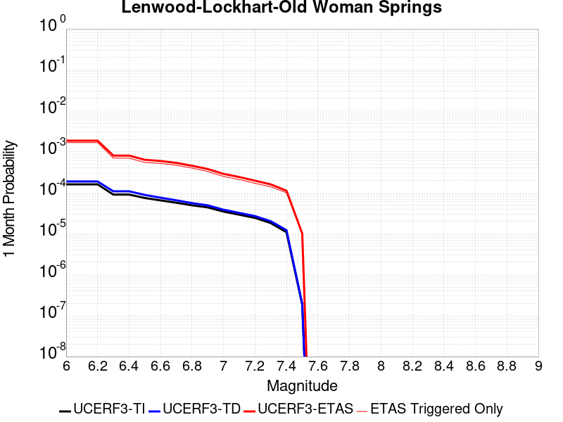 |  |  |

| Magnitude | 1 wk TI Prob | 1 wk TD Prob | 1 wk ETAS Prob | 1 wk ETAS/TD Gain | 1 wk ETAS Triggered Only | 1 mo TI Prob | 1 mo TD Prob | 1 mo ETAS Prob | 1 mo ETAS/TD Gain | 1 mo ETAS Triggered Only | 1 yr TI Prob | 1 yr TD Prob | 1 yr ETAS Prob | 1 yr ETAS/TD Gain | 1 yr ETAS Triggered Only | 10 yr TI Prob | 10 yr TD Prob | 10 yr ETAS Prob | 10 yr ETAS/TD Gain | 10 yr ETAS Triggered Only |
|-----|-----|-----|-----|-----|-----|-----|-----|-----|-----|-----|-----|-----|-----|-----|-----|-----|-----|-----|-----|-----|
| 6.0 | 3.744542E-5 | 4.396252E-5 | 0.0011824738 | 26.897316 | 0.0011385614 | 1.604705E-4 | 1.8839816E-4 | 0.0017477775 | 9.2770405 | 0.0015596731 | 0.0019519776 | 0.0022915069 | 0.0047657043 | 2.0797253 | 0.0024798801 | 0.019349206 | 0.022696787 | 0.02650747 | 1.1678953 | 0.0038991827 |
| 6.1 | 3.744542E-5 | 4.396252E-5 | 0.0011824738 | 26.897316 | 0.0011385614 | 1.604705E-4 | 1.8839816E-4 | 0.0017477775 | 9.2770405 | 0.0015596731 | 0.0019519776 | 0.0022915069 | 0.0047657043 | 2.0797253 | 0.0024798801 | 0.019349206 | 0.022696787 | 0.02650747 | 1.1678953 | 0.0038991827 |
| 6.2 | 3.744542E-5 | 4.396252E-5 | 0.0011824738 | 26.897316 | 0.0011385614 | 1.604705E-4 | 1.8839816E-4 | 0.0017477775 | 9.2770405 | 0.0015596731 | 0.0019519776 | 0.0022915069 | 0.0047657043 | 2.0797253 | 0.0024798801 | 0.019349206 | 0.022696787 | 0.02650747 | 1.1678953 | 0.0038991827 |
| 6.3 | 2.1079984E-5 | 2.5353434E-5 | 4.464545E-4 | 17.609232 | 4.2111173E-4 | 9.0339665E-5 | 1.0865316E-4 | 7.168596E-4 | 6.5976872 | 6.082725E-4 | 0.0010993304 | 0.0013220694 | 0.0024747017 | 1.8718394 | 0.001154158 | 0.010939079 | 0.0131442575 | 0.01503744 | 1.1440312 | 0.001918398 |
| 6.4 | 2.1079984E-5 | 2.5353434E-5 | 4.464545E-4 | 17.609232 | 4.2111173E-4 | 9.0339665E-5 | 1.0865316E-4 | 7.168596E-4 | 6.5976872 | 6.082725E-4 | 0.0010993304 | 0.0013220694 | 0.0024747017 | 1.8718394 | 0.001154158 | 0.010939079 | 0.0131442575 | 0.01503744 | 1.1440312 | 0.001918398 |
| 6.5 | 1.7397282E-5 | 2.066241E-5 | 3.9497623E-4 | 19.11569 | 3.7432153E-4 | 7.455765E-5 | 8.8550245E-5 | 6.031968E-4 | 6.8119154 | 5.146921E-4 | 9.073613E-4 | 0.0010775778 | 0.0019967933 | 1.8530387 | 9.202071E-4 | 0.009036654 | 0.010724821 | 0.012283197 | 1.1453055 | 0.0015752699 |
| 6.6 | 1.52050325E-5 | 1.7679693E-5 | 3.608017E-4 | 20.40769 | 3.4312808E-4 | 6.51628E-5 | 7.576796E-5 | 5.748255E-4 | 7.586657 | 4.990954E-4 | 7.9306826E-4 | 9.220924E-4 | 0.001794704 | 1.9463385 | 8.7341695E-4 | 0.007902439 | 0.009183526 | 0.010667062 | 1.1615431 | 0.0014972861 |
| 6.7 | 1.332523E-5 | 1.5264002E-5 | 3.1159737E-4 | 20.41387 | 2.9633788E-4 | 5.7106878E-5 | 6.5415545E-5 | 5.1769114E-4 | 7.9138856 | 4.523052E-4 | 6.950544E-4 | 7.961491E-4 | 0.0015753647 | 1.9787308 | 7.7983656E-4 | 0.006928845 | 0.007933599 | 0.009279749 | 1.1696771 | 0.0013569156 |
| 6.8 | 1.1525329E-5 | 1.3030979E-5 | 2.469789E-4 | 18.95321 | 2.3395097E-4 | 4.9393333E-5 | 5.584588E-5 | 4.3014652E-4 | 7.702386 | 3.7432153E-4 | 6.011979E-4 | 6.797157E-4 | 0.0012875748 | 1.8942842 | 6.082725E-4 | 0.00599574 | 0.006776819 | 0.007892174 | 1.1645838 | 0.0011229647 |
| 6.9 | 1.0253909E-5 | 1.15144385E-5 | 2.142696E-4 | 18.608776 | 2.027575E-4 | 4.3944583E-5 | 4.9346683E-5 | 3.4566995E-4 | 7.0049276 | 2.9633788E-4 | 5.3489394E-4 | 6.0063385E-4 | 0.0011150169 | 1.8564003 | 5.146921E-4 | 0.0053360825 | 0.0059904843 | 0.0068896757 | 1.1501033 | 9.046104E-4 |
| 7.0 | 8.104563E-6 | 8.991279E-6 | 1.6495718E-4 | 18.346354 | 1.5596731E-4 | 3.4733377E-5 | 3.8533497E-5 | 2.568793E-4 | 6.66639 | 2.1835424E-4 | 4.2279682E-4 | 4.6904673E-4 | 8.7437156E-4 | 1.8641459 | 4.05515E-4 | 0.0042199334 | 0.0046808156 | 0.005332812 | 1.1392912 | 6.550627E-4 |
| 7.1 | 6.7986157E-6 | 7.515816E-6 | 1.4788534E-4 | 19.676552 | 1.4037058E-4 | 2.91366E-5 | 3.2210253E-5 | 2.19365E-4 | 6.810409 | 1.8716077E-4 | 3.5468035E-4 | 3.920914E-4 | 7.3508493E-4 | 1.8747796 | 3.4312808E-4 | 0.003541148 | 0.003914213 | 0.0044579613 | 1.1389165 | 5.458856E-4 |
| 7.2 | 5.6893327E-6 | 6.2800136E-6 | 1.15456445E-4 | 18.384745 | 1.0917712E-4 | 2.4382627E-5 | 2.6914078E-5 | 1.828772E-4 | 6.7948523 | 1.5596731E-4 | 2.9681803E-4 | 3.2763163E-4 | 5.770975E-4 | 1.761422 | 2.495477E-4 | 0.002964219 | 0.0032716845 | 0.0036914186 | 1.1282929 | 4.2111173E-4 |
| 7.3 | 4.253348E-6 | 4.7069107E-6 | 8.2690196E-5 | 17.56783 | 7.7983656E-5 | 1.8228506E-5 | 2.0172329E-5 | 1.4494365E-4 | 7.1852717 | 1.2477385E-4 | 2.2190946E-4 | 2.4557224E-4 | 4.4827996E-4 | 1.8254504 | 2.027575E-4 | 0.00221688 | 0.0024531898 | 0.0027643591 | 1.1268427 | 3.1193462E-4 |
| 7.4 | 2.5448119E-6 | 2.852045E-6 | 6.523879E-5 | 22.87439 | 6.238693E-5 | 1.0906291E-5 | 1.2223002E-5 | 1.05802246E-4 | 8.655995 | 9.3580384E-5 | 1.3277601E-4 | 1.4880655E-4 | 2.8915622E-4 | 1.9431689 | 1.4037058E-4 | 0.001326967 | 0.0014872311 | 0.0016896871 | 1.1361295 | 2.027575E-4 |
| 7.5 | 4.3706837E-8 | 4.562909E-8 | 4.562909E-8 | 1.0 | 0.0 | 1.8731501E-7 | 1.9555324E-7 | 1.579228E-5 | 80.75694 | 1.5596732E-5 | 2.2805577E-6 | 2.3808586E-6 | 1.7977552E-5 | 7.5508695 | 1.5596732E-5 | 2.2805343E-5 | 2.3808387E-5 | 3.9404746E-5 | 1.6550784 | 1.5596732E-5 |

## Bicycle Lake
*[(top)](#table-of-contents)*

| 1 Week | 1 Month | 1 Year | 10 Year |
|-----|-----|-----|-----|
|  |  |  |  |

| Magnitude | 1 wk TI Prob | 1 wk TD Prob | 1 wk ETAS Prob | 1 wk ETAS/TD Gain | 1 wk ETAS Triggered Only | 1 mo TI Prob | 1 mo TD Prob | 1 mo ETAS Prob | 1 mo ETAS/TD Gain | 1 mo ETAS Triggered Only | 1 yr TI Prob | 1 yr TD Prob | 1 yr ETAS Prob | 1 yr ETAS/TD Gain | 1 yr ETAS Triggered Only | 10 yr TI Prob | 10 yr TD Prob | 10 yr ETAS Prob | 10 yr ETAS/TD Gain | 10 yr ETAS Triggered Only |
|-----|-----|-----|-----|-----|-----|-----|-----|-----|-----|-----|-----|-----|-----|-----|-----|-----|-----|-----|-----|-----|
| 6.0 | 1.9621975E-5 | 2.2097078E-5 | 4.1200675E-4 | 18.645304 | 3.8991828E-4 | 8.4091465E-5 | 9.4699084E-5 | 7.8089023E-4 | 8.2460165 | 6.8625616E-4 | 0.0010233327 | 0.0011524865 | 0.002788256 | 2.4193392 | 0.0016376567 | 0.01018633 | 0.011478408 | 0.015116986 | 1.3169934 | 0.0036808285 |
| 6.1 | 1.9621975E-5 | 2.2097078E-5 | 4.1200675E-4 | 18.645304 | 3.8991828E-4 | 8.4091465E-5 | 9.4699084E-5 | 7.8089023E-4 | 8.2460165 | 6.8625616E-4 | 0.0010233327 | 0.0011524865 | 0.002788256 | 2.4193392 | 0.0016376567 | 0.01018633 | 0.011478408 | 0.015116986 | 1.3169934 | 0.0036808285 |
| 6.2 | 9.9971285E-6 | 1.1255639E-5 | 2.6080053E-4 | 23.170654 | 2.495477E-4 | 4.2844134E-5 | 4.8237856E-5 | 5.317132E-4 | 11.022737 | 4.8349865E-4 | 5.2150246E-4 | 5.871896E-4 | 0.0016471446 | 2.8051322 | 0.0010605777 | 0.0052028033 | 0.005861487 | 0.008404357 | 1.4338269 | 0.002557864 |
| 6.3 | 9.589428E-6 | 1.0798346E-5 | 2.6034334E-4 | 24.109558 | 2.495477E-4 | 4.10969E-5 | 4.62781E-5 | 4.9856235E-4 | 10.773182 | 4.523052E-4 | 5.002399E-4 | 5.6334207E-4 | 0.0015921463 | 2.8262517 | 0.0010293842 | 0.0049911533 | 0.0056242296 | 0.008105671 | 1.4412056 | 0.002495477 |
| 6.4 | 9.589428E-6 | 1.0798346E-5 | 2.6034334E-4 | 24.109558 | 2.495477E-4 | 4.10969E-5 | 4.62781E-5 | 4.9856235E-4 | 10.773182 | 4.523052E-4 | 5.002399E-4 | 5.6334207E-4 | 0.0015921463 | 2.8262517 | 0.0010293842 | 0.0049911533 | 0.0056242296 | 0.008105671 | 1.4412056 | 0.002495477 |
| 6.5 | 5.557707E-6 | 6.2856016E-6 | 1.6225193E-4 | 25.81327 | 1.5596731E-4 | 2.3818526E-5 | 2.6938165E-5 | 3.0767175E-4 | 11.421408 | 2.8074117E-4 | 2.8995197E-4 | 3.2794967E-4 | 9.360227E-4 | 2.8541656 | 6.082725E-4 | 0.0028957394 | 0.0032772934 | 0.0047852183 | 1.4601128 | 0.0015128829 |
| 6.6 | 4.8742945E-6 | 5.5132896E-6 | 9.909316E-5 | 17.973509 | 9.3580384E-5 | 2.0889667E-5 | 2.3628318E-5 | 2.2638103E-4 | 9.58092 | 2.027575E-4 | 2.54302E-4 | 2.87663E-4 | 7.710226E-4 | 2.680298 | 4.8349865E-4 | 0.002540112 | 0.0028754752 | 0.004197385 | 1.4597188 | 0.0013257221 |
| 6.7 | 3.991108E-6 | 4.5159104E-6 | 8.249921E-5 | 18.268568 | 7.7983656E-5 | 1.7104636E-5 | 1.9353902E-5 | 2.0651105E-4 | 10.670255 | 1.8716077E-4 | 2.0822904E-4 | 2.3563375E-4 | 6.410532E-4 | 2.720549 | 4.05515E-4 | 0.0020803404 | 0.0023563374 | 0.003429976 | 1.4556388 | 0.0010761744 |

## Garlic Springs
*[(top)](#table-of-contents)*

| 1 Week | 1 Month | 1 Year | 10 Year |
|-----|-----|-----|-----|
|  | 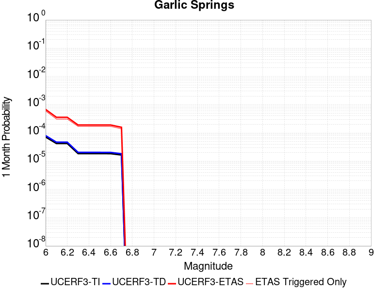 |  | 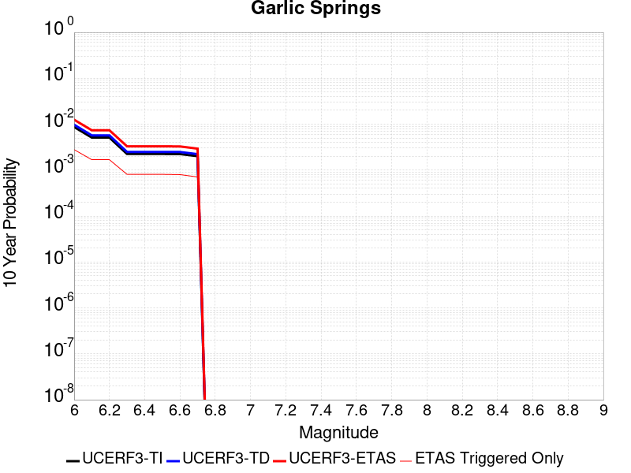 |

| Magnitude | 1 wk TI Prob | 1 wk TD Prob | 1 wk ETAS Prob | 1 wk ETAS/TD Gain | 1 wk ETAS Triggered Only | 1 mo TI Prob | 1 mo TD Prob | 1 mo ETAS Prob | 1 mo ETAS/TD Gain | 1 mo ETAS Triggered Only | 1 yr TI Prob | 1 yr TD Prob | 1 yr ETAS Prob | 1 yr ETAS/TD Gain | 1 yr ETAS Triggered Only | 10 yr TI Prob | 10 yr TD Prob | 10 yr ETAS Prob | 10 yr ETAS/TD Gain | 10 yr ETAS Triggered Only |
|-----|-----|-----|-----|-----|-----|-----|-----|-----|-----|-----|-----|-----|-----|-----|-----|-----|-----|-----|-----|-----|
| 6.0 | 1.6760017E-5 | 1.8776833E-5 | 3.6189848E-4 | 19.27367 | 3.4312808E-4 | 7.182667E-5 | 8.0470316E-5 | 6.886939E-4 | 8.558359 | 6.082725E-4 | 8.7413884E-4 | 9.794032E-4 | 0.0023661526 | 2.4159129 | 0.001388109 | 0.008707083 | 0.009762413 | 0.012542417 | 1.2847661 | 0.0028074116 |
| 6.1 | 9.852767E-6 | 1.09735865E-5 | 1.6693918E-4 | 15.212818 | 1.5596731E-4 | 4.222546E-5 | 4.702921E-5 | 3.5894915E-4 | 7.6324725 | 3.1193462E-4 | 5.139737E-4 | 5.7250116E-4 | 0.0012739523 | 2.2252395 | 7.018529E-4 | 0.005127866 | 0.005717221 | 0.00737653 | 1.29023 | 0.0016688502 |
| 6.2 | 9.852767E-6 | 1.09735865E-5 | 1.6693918E-4 | 15.212818 | 1.5596731E-4 | 4.222546E-5 | 4.702921E-5 | 3.5894915E-4 | 7.6324725 | 3.1193462E-4 | 5.139737E-4 | 5.7250116E-4 | 0.0012739523 | 2.2252395 | 7.018529E-4 | 0.005127866 | 0.005717221 | 0.00737653 | 1.29023 | 0.0016688502 |
| 6.3 | 4.3167724E-6 | 4.7780286E-6 | 9.835797E-5 | 20.58547 | 9.3580384E-5 | 1.8500323E-5 | 2.0477235E-5 | 1.9203775E-4 | 9.37811 | 1.7156404E-4 | 2.2521814E-4 | 2.4930484E-4 | 6.391259E-4 | 2.5636322 | 3.8991828E-4 | 0.0022499003 | 0.00249251 | 0.0033170762 | 1.3308177 | 8.266267E-4 |
| 6.4 | 4.3167724E-6 | 4.7780286E-6 | 9.835797E-5 | 20.58547 | 9.3580384E-5 | 1.8500323E-5 | 2.0477235E-5 | 1.9203775E-4 | 9.37811 | 1.7156404E-4 | 2.2521814E-4 | 2.4930484E-4 | 6.391259E-4 | 2.5636322 | 3.8991828E-4 | 0.0022499003 | 0.00249251 | 0.0033170762 | 1.3308177 | 8.266267E-4 |
| 6.5 | 4.3167724E-6 | 4.7780286E-6 | 9.835797E-5 | 20.58547 | 9.3580384E-5 | 1.8500323E-5 | 2.0477235E-5 | 1.9203775E-4 | 9.37811 | 1.7156404E-4 | 2.2521814E-4 | 2.4930484E-4 | 6.391259E-4 | 2.5636322 | 3.8991828E-4 | 0.0022499003 | 0.00249251 | 0.0033170762 | 1.3308177 | 8.266267E-4 |
| 6.6 | 4.301311E-6 | 4.760897E-6 | 9.834084E-5 | 20.655947 | 9.3580384E-5 | 1.8434059E-5 | 2.0403815E-5 | 1.9196435E-4 | 9.408258 | 1.7156404E-4 | 2.2441156E-4 | 2.4841115E-4 | 6.3823257E-4 | 2.569259 | 3.8991828E-4 | 0.0022418506 | 0.002483593 | 0.0033081667 | 1.3320084 | 8.266267E-4 |
| 6.7 | 3.8599724E-6 | 4.27106E-6 | 6.665772E-5 | 15.6068325 | 6.238693E-5 | 1.6542634E-5 | 1.8304541E-5 | 1.5867256E-4 | 8.66848 | 1.4037058E-4 | 2.0138794E-4 | 2.228578E-4 | 5.6590943E-4 | 2.5393295 | 3.4312808E-4 | 0.0020120554 | 0.002228578 | 0.0029599906 | 1.328197 | 7.330463E-4 |

## Paradise
*[(top)](#table-of-contents)*

| 1 Week | 1 Month | 1 Year | 10 Year |
|-----|-----|-----|-----|
|  | 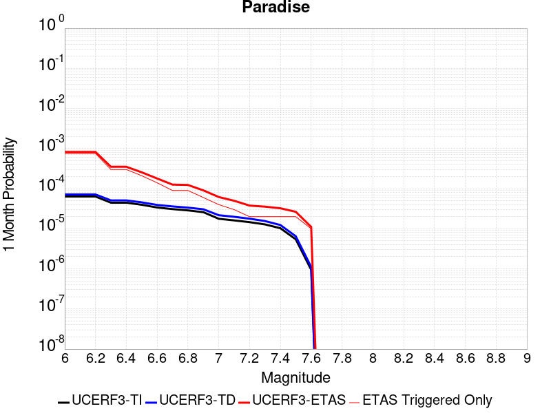 | 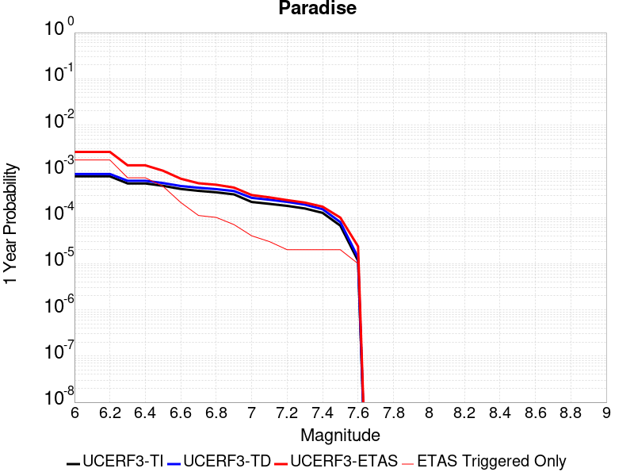 |  |

| Magnitude | 1 wk TI Prob | 1 wk TD Prob | 1 wk ETAS Prob | 1 wk ETAS/TD Gain | 1 wk ETAS Triggered Only | 1 mo TI Prob | 1 mo TD Prob | 1 mo ETAS Prob | 1 mo ETAS/TD Gain | 1 mo ETAS Triggered Only | 1 yr TI Prob | 1 yr TD Prob | 1 yr ETAS Prob | 1 yr ETAS/TD Gain | 1 yr ETAS Triggered Only | 10 yr TI Prob | 10 yr TD Prob | 10 yr ETAS Prob | 10 yr ETAS/TD Gain | 10 yr ETAS Triggered Only |
|-----|-----|-----|-----|-----|-----|-----|-----|-----|-----|-----|-----|-----|-----|-----|-----|-----|-----|-----|-----|-----|
| 6.0 | 1.4851273E-5 | 1.6694692E-5 | 5.1578175E-4 | 30.894955 | 4.990954E-4 | 6.364676E-5 | 7.154685E-5 | 7.577539E-4 | 10.591018 | 6.8625616E-4 | 7.7462377E-4 | 8.707584E-4 | 0.0024134903 | 2.7717106 | 0.0015440764 | 0.0077192914 | 0.008675844 | 0.011567129 | 1.3332568 | 0.0029165887 |
| 6.1 | 1.4851273E-5 | 1.6694692E-5 | 5.1578175E-4 | 30.894955 | 4.990954E-4 | 6.364676E-5 | 7.154685E-5 | 7.577539E-4 | 10.591018 | 6.8625616E-4 | 7.7462377E-4 | 8.707584E-4 | 0.0024134903 | 2.7717106 | 0.0015440764 | 0.0077192914 | 0.008675844 | 0.011567129 | 1.3332568 | 0.0029165887 |
| 6.2 | 1.4851273E-5 | 1.6694692E-5 | 5.1578175E-4 | 30.894955 | 4.990954E-4 | 6.364676E-5 | 7.154685E-5 | 7.577539E-4 | 10.591018 | 6.8625616E-4 | 7.7462377E-4 | 8.707584E-4 | 0.0024134903 | 2.7717106 | 0.0015440764 | 0.0077192914 | 0.008675844 | 0.011567129 | 1.3332568 | 0.0029165887 |
| 6.3 | 1.0426831E-5 | 1.188862E-5 | 2.1464372E-4 | 18.054552 | 2.027575E-4 | 4.4685654E-5 | 5.0950268E-5 | 3.4727305E-4 | 6.8159223 | 2.9633788E-4 | 5.43912E-4 | 6.201489E-4 | 0.0012592183 | 2.0305097 | 6.39466E-4 | 0.0054258266 | 0.0061847917 | 0.0074713137 | 1.2080139 | 0.0012945287 |
| 6.4 | 1.0426831E-5 | 1.188862E-5 | 2.1464372E-4 | 18.054552 | 2.027575E-4 | 4.4685654E-5 | 5.0950268E-5 | 3.4727305E-4 | 6.8159223 | 2.9633788E-4 | 5.43912E-4 | 6.201489E-4 | 0.0012592183 | 2.0305097 | 6.39466E-4 | 0.0054258266 | 0.0061847917 | 0.0074713137 | 1.2080139 | 0.0012945287 |
| 6.5 | 9.25027E-6 | 1.06199595E-5 | 1.5098904E-4 | 14.217479 | 1.4037058E-4 | 3.964341E-5 | 4.551335E-5 | 2.6385766E-4 | 5.7973685 | 2.1835424E-4 | 4.8255164E-4 | 5.53989E-4 | 9.904555E-4 | 1.7878613 | 4.3670848E-4 | 0.0048150513 | 0.0055265795 | 0.0065192534 | 1.1796182 | 9.981908E-4 |
| 6.6 | 7.904275E-6 | 9.159525E-6 | 8.714246E-5 | 9.513863 | 7.7983656E-5 | 3.3875025E-5 | 3.9254537E-5 | 1.796196E-4 | 4.5757666 | 1.4037058E-4 | 4.1235037E-4 | 4.7782314E-4 | 6.8048376E-4 | 1.4241332 | 2.027575E-4 | 0.0041158604 | 0.0047683544 | 0.005296115 | 1.1106797 | 5.3028885E-4 |
| 6.7 | 7.2061953E-6 | 8.407248E-6 | 3.9600447E-5 | 4.7102747 | 3.1193464E-5 | 3.088333E-5 | 3.6030586E-5 | 1.1401143E-4 | 3.1642957 | 7.7983656E-5 | 3.7593965E-4 | 4.3858777E-4 | 5.4771703E-4 | 1.2488196 | 1.0917712E-4 | 0.003753043 | 0.004377591 | 0.0047347452 | 1.081587 | 3.5872482E-4 |
| 6.8 | 6.6948724E-6 | 7.842166E-6 | 3.903538E-5 | 4.9776278 | 3.1193464E-5 | 2.8691995E-5 | 3.360887E-5 | 1.115899E-4 | 3.3202517 | 7.7983656E-5 | 3.4926904E-4 | 4.0911473E-4 | 5.0265685E-4 | 1.2286452 | 9.3580384E-5 | 0.003487206 | 0.0040839734 | 0.004363568 | 1.0684614 | 2.8074117E-4 |
| 6.9 | 6.0421025E-6 | 7.130621E-6 | 3.8323862E-5 | 5.3745475 | 3.1193464E-5 | 2.5894467E-5 | 3.0559466E-5 | 9.294448E-5 | 3.0414302 | 6.238693E-5 | 3.1521954E-4 | 3.7200135E-4 | 4.4995602E-4 | 1.2095547 | 7.7983656E-5 | 0.0031477278 | 0.0037141247 | 0.0039627454 | 1.0669392 | 2.495477E-4 |
| 7.0 | 4.134091E-6 | 5.0803087E-6 | 2.067696E-5 | 4.07002 | 1.5596732E-5 | 1.7717413E-5 | 2.177258E-5 | 6.8561756E-5 | 3.1489954 | 4.6790192E-5 | 2.1568815E-4 | 2.6505045E-4 | 3.1182825E-4 | 1.1764864 | 4.6790192E-5 | 0.0021547892 | 0.0026474963 | 0.0028030507 | 1.0587553 | 1.5596731E-4 |
| 7.1 | 3.7674888E-6 | 4.6318696E-6 | 2.0228528E-5 | 4.367249 | 1.5596732E-5 | 1.6146281E-5 | 1.9850726E-5 | 5.1043568E-5 | 2.5713704 | 3.1193464E-5 | 1.9656324E-4 | 2.4165731E-4 | 2.7284323E-4 | 1.1290503 | 3.1193464E-5 | 0.0019638946 | 0.002414096 | 0.0025385686 | 1.0515608 | 1.2477385E-4 |
| 7.2 | 3.4065345E-6 | 4.156723E-6 | 4.156723E-6 | 1.0 | 0.0 | 1.4599351E-5 | 1.7814415E-5 | 3.3410866E-5 | 1.8754963 | 1.5596732E-5 | 1.777326E-4 | 2.1687041E-4 | 2.3246376E-4 | 1.0719017 | 1.5596732E-5 | 0.0017759053 | 0.002166736 | 0.0022601136 | 1.043096 | 9.3580384E-5 |
| 7.3 | 2.9934936E-6 | 3.6293168E-6 | 3.6293168E-6 | 1.0 | 0.0 | 1.2829195E-5 | 1.555413E-5 | 3.115062E-5 | 2.0027232 | 1.5596732E-5 | 1.5618425E-4 | 1.8935655E-4 | 2.0495034E-4 | 1.0823514 | 1.5596732E-5 | 0.0015607453 | 0.0018920974 | 0.0019543662 | 1.03291 | 6.238693E-5 |
| 7.4 | 2.4049796E-6 | 2.8889842E-6 | 2.8889842E-6 | 1.0 | 0.0 | 1.0307015E-5 | 1.238131E-5 | 2.7977847E-5 | 2.259684 | 1.5596732E-5 | 1.2548068E-4 | 1.5073347E-4 | 1.6632784E-4 | 1.1034566 | 1.5596732E-5 | 0.0012540985 | 0.0015064536 | 0.0015687466 | 1.0413507 | 6.238693E-5 |
| 7.5 | 1.2710091E-6 | 1.5134682E-6 | 1.5134682E-6 | 1.0 | 0.0 | 5.44717E-6 | 6.4862834E-6 | 2.2082913E-5 | 3.4045558 | 1.5596732E-5 | 6.631728E-5 | 7.8968886E-5 | 9.4564384E-5 | 1.1974891 | 1.5596732E-5 | 6.6297496E-4 | 7.8953087E-4 | 8.3628413E-4 | 1.0592165 | 4.6790192E-5 |
| 7.6 | 2.21172E-7 | 2.603961E-7 | 2.603961E-7 | 1.0 | 0.0 | 9.478797E-7 | 1.1159829E-6 | 1.6712696E-5 | 14.975764 | 1.5596732E-5 | 1.1540374E-5 | 1.3587036E-5 | 2.9183555E-5 | 2.1478972 | 1.5596732E-5 | 1.1539775E-4 | 1.3586486E-4 | 1.5145948E-4 | 1.1147803 | 1.5596732E-5 |

## Death Valley (Black Mtns Frontal)
*[(top)](#table-of-contents)*

| 1 Week | 1 Month | 1 Year | 10 Year |
|-----|-----|-----|-----|
|  |  |  | 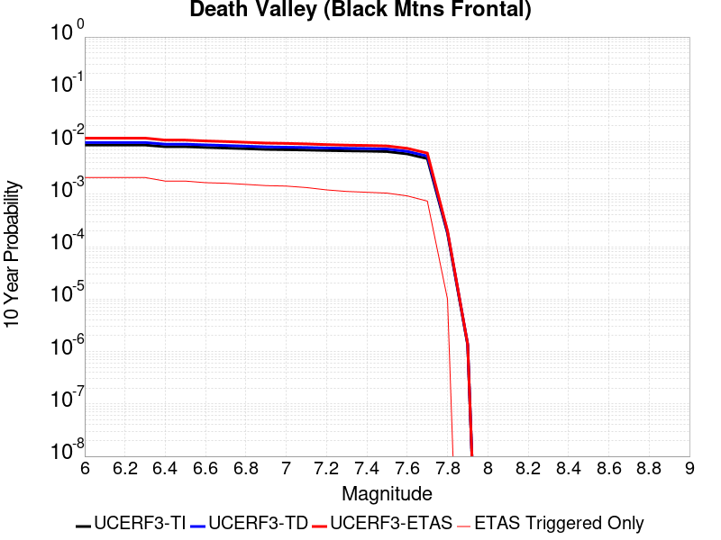 |

| Magnitude | 1 wk TI Prob | 1 wk TD Prob | 1 wk ETAS Prob | 1 wk ETAS/TD Gain | 1 wk ETAS Triggered Only | 1 mo TI Prob | 1 mo TD Prob | 1 mo ETAS Prob | 1 mo ETAS/TD Gain | 1 mo ETAS Triggered Only | 1 yr TI Prob | 1 yr TD Prob | 1 yr ETAS Prob | 1 yr ETAS/TD Gain | 1 yr ETAS Triggered Only | 10 yr TI Prob | 10 yr TD Prob | 10 yr ETAS Prob | 10 yr ETAS/TD Gain | 10 yr ETAS Triggered Only |
|-----|-----|-----|-----|-----|-----|-----|-----|-----|-----|-----|-----|-----|-----|-----|-----|-----|-----|-----|-----|-----|
| 6.0 | 1.6707214E-5 | 1.867027E-5 | 4.5537058E-4 | 24.390146 | 4.3670848E-4 | 7.160038E-5 | 8.001302E-5 | 7.1942783E-4 | 8.991384 | 6.39466E-4 | 8.71386E-4 | 9.737309E-4 | 0.002266999 | 2.3281577 | 0.0012945287 | 0.00867977 | 0.009695496 | 0.012012323 | 1.2389591 | 0.0023395095 |
| 6.1 | 1.6707214E-5 | 1.867027E-5 | 4.5537058E-4 | 24.390146 | 4.3670848E-4 | 7.160038E-5 | 8.001302E-5 | 7.1942783E-4 | 8.991384 | 6.39466E-4 | 8.71386E-4 | 9.737309E-4 | 0.002266999 | 2.3281577 | 0.0012945287 | 0.00867977 | 0.009695496 | 0.012012323 | 1.2389591 | 0.0023395095 |
| 6.2 | 1.6707214E-5 | 1.867027E-5 | 4.5537058E-4 | 24.390146 | 4.3670848E-4 | 7.160038E-5 | 8.001302E-5 | 7.1942783E-4 | 8.991384 | 6.39466E-4 | 8.71386E-4 | 9.737309E-4 | 0.002266999 | 2.3281577 | 0.0012945287 | 0.00867977 | 0.009695496 | 0.012012323 | 1.2389591 | 0.0023395095 |
| 6.3 | 1.6707214E-5 | 1.867027E-5 | 4.5537058E-4 | 24.390146 | 4.3670848E-4 | 7.160038E-5 | 8.001302E-5 | 7.1942783E-4 | 8.991384 | 6.39466E-4 | 8.71386E-4 | 9.737309E-4 | 0.002266999 | 2.3281577 | 0.0012945287 | 0.00867977 | 0.009695496 | 0.012012323 | 1.2389591 | 0.0023395095 |
| 6.4 | 1.5515609E-5 | 1.7338214E-5 | 3.6046034E-4 | 20.789936 | 3.4312808E-4 | 6.649377E-5 | 7.4304546E-5 | 5.577673E-4 | 7.5065026 | 4.8349865E-4 | 8.0926094E-4 | 9.042885E-4 | 0.0019639072 | 2.1717706 | 0.0010605777 | 0.008063202 | 0.009006773 | 0.010985173 | 1.219657 | 0.0019963817 |
| 6.5 | 1.5515609E-5 | 1.7338214E-5 | 3.6046034E-4 | 20.789936 | 3.4312808E-4 | 6.649377E-5 | 7.4304546E-5 | 5.577673E-4 | 7.5065026 | 4.8349865E-4 | 8.0926094E-4 | 9.042885E-4 | 0.0019639072 | 2.1717706 | 0.0010605777 | 0.008063202 | 0.009006773 | 0.010985173 | 1.219657 | 0.0019963817 |
| 6.6 | 1.5041828E-5 | 1.6809145E-5 | 3.2873853E-4 | 19.557123 | 3.1193462E-4 | 6.4463384E-5 | 7.203723E-5 | 5.0871423E-4 | 7.0618234 | 4.3670848E-4 | 7.8455906E-4 | 8.767063E-4 | 0.0018272728 | 2.0842474 | 9.514006E-4 | 0.00781795 | 0.008733132 | 0.0105729345 | 1.2106693 | 0.001856011 |
| 6.7 | 1.4634985E-5 | 1.6356016E-5 | 3.1268905E-4 | 19.117678 | 2.9633788E-4 | 6.271985E-5 | 7.009536E-5 | 4.911776E-4 | 7.0072765 | 4.2111173E-4 | 7.6334673E-4 | 8.5308263E-4 | 0.0017569213 | 2.059497 | 9.046104E-4 | 0.007607299 | 0.008498715 | 0.010292561 | 1.2110724 | 0.0018092208 |
| 6.8 | 1.4209158E-5 | 1.5882048E-5 | 2.8102225E-4 | 17.694334 | 2.6514442E-4 | 6.089497E-5 | 6.8064175E-5 | 4.579559E-4 | 6.728296 | 3.8991828E-4 | 7.4114406E-4 | 8.2837185E-4 | 0.0016698977 | 2.0158792 | 8.4222347E-4 | 0.007386771 | 0.008253456 | 0.0099394685 | 1.2042795 | 0.0017000437 |
| 6.9 | 1.3780098E-5 | 1.5404594E-5 | 2.4935196E-4 | 16.186857 | 2.3395097E-4 | 5.9056227E-5 | 6.6018045E-5 | 4.2471918E-4 | 6.43338 | 3.5872482E-4 | 7.1877235E-4 | 8.0347876E-4 | 0.0015982729 | 1.9891913 | 7.954333E-4 | 0.0071645193 | 0.008006332 | 0.009615406 | 1.2009751 | 0.00162206 |
| 7.0 | 1.3585064E-5 | 1.5188155E-5 | 2.4913557E-4 | 16.40328 | 2.3395097E-4 | 5.8220405E-5 | 6.50905E-5 | 4.2379196E-4 | 6.5108113 | 3.5872482E-4 | 7.086029E-4 | 7.9219416E-4 | 0.0015869973 | 2.0032933 | 7.954333E-4 | 0.007063476 | 0.007894293 | 0.009457128 | 1.1979702 | 0.0015752699 |
| 7.1 | 1.3398601E-5 | 1.49813395E-5 | 2.333323E-4 | 15.5748625 | 2.1835424E-4 | 5.742131E-5 | 6.420419E-5 | 3.917145E-4 | 6.1010737 | 3.2753134E-4 | 6.9888023E-4 | 7.8141113E-4 | 0.0015294693 | 1.9573169 | 7.4864307E-4 | 0.0069668638 | 0.007787224 | 0.00927285 | 1.1907774 | 0.0014972861 |
| 7.2 | 1.3126312E-5 | 1.4679561E-5 | 2.0183758E-4 | 13.749566 | 1.8716077E-4 | 5.6254412E-5 | 6.291092E-5 | 3.436344E-4 | 5.4622383 | 2.8074117E-4 | 6.846822E-4 | 7.6567667E-4 | 0.0014046531 | 1.834525 | 6.39466E-4 | 0.006825765 | 0.00763097 | 0.008977531 | 1.17646 | 0.0013569156 |
| 7.3 | 1.2922429E-5 | 1.4453788E-5 | 1.7041885E-4 | 11.790601 | 1.5596731E-4 | 5.5380664E-5 | 6.194336E-5 | 3.114756E-4 | 5.0283933 | 2.495477E-4 | 6.74051E-4 | 7.53905E-4 | 0.0013617189 | 1.8062209 | 6.082725E-4 | 0.006720101 | 0.007514055 | 0.008767897 | 1.1668663 | 0.0012633352 |
| 7.4 | 1.2768878E-5 | 1.4283772E-5 | 1.7024885E-4 | 11.919041 | 1.5596731E-4 | 5.4722615E-5 | 6.1214756E-5 | 3.107472E-4 | 5.076344 | 2.495477E-4 | 6.660441E-4 | 7.4504025E-4 | 0.0013372744 | 1.7949023 | 5.9267576E-4 | 0.0066405144 | 0.0074260035 | 0.008633515 | 1.1626058 | 0.001216545 |
| 7.5 | 1.2521929E-5 | 1.40120155E-5 | 1.6997714E-4 | 12.130814 | 1.5596731E-4 | 5.366431E-5 | 6.005014E-5 | 3.0958286E-4 | 5.155406 | 2.495477E-4 | 6.531671E-4 | 7.3087064E-4 | 0.0012919425 | 1.7676761 | 5.6148233E-4 | 0.006512506 | 0.0072852457 | 0.008446478 | 1.1593951 | 0.0011697548 |
| 7.6 | 1.1301089E-5 | 1.2648149E-5 | 1.3742041E-4 | 10.864864 | 1.2477385E-4 | 4.8432343E-5 | 5.4205255E-5 | 2.7254765E-4 | 5.028067 | 2.1835424E-4 | 5.895042E-4 | 6.5975444E-4 | 0.0011585206 | 1.7559875 | 4.990954E-4 | 0.0058794282 | 0.00657851 | 0.0075701345 | 1.1507369 | 9.981908E-4 |
| 7.7 | 9.189108E-6 | 1.0283358E-5 | 8.826621E-5 | 8.583404 | 7.7983656E-5 | 3.93813E-5 | 4.407082E-5 | 1.8443521E-4 | 4.1849737 | 1.4037058E-4 | 4.7936183E-4 | 5.3643517E-4 | 9.4173267E-4 | 1.7555386 | 4.05515E-4 | 0.004783291 | 0.005351914 | 0.00618963 | 1.1565264 | 8.4222347E-4 |
| 7.8 | 3.4586725E-7 | 3.6482615E-7 | 3.6482615E-7 | 1.0 | 0.0 | 1.4822873E-6 | 1.5635396E-6 | 1.5635396E-6 | 1.0 | 0.0 | 1.80467E-5 | 1.9035933E-5 | 1.9035933E-5 | 1.0 | 0.0 | 1.8045233E-4 | 1.9034347E-4 | 2.0593723E-4 | 1.0819243 | 1.5596732E-5 |
| 7.9 | 2.5591178E-9 | 2.6696718E-9 | 2.6696718E-9 | 1.0 | 0.0 | 1.0967647E-8 | 1.14414505E-8 | 1.14414505E-8 | 1.0 | 0.0 | 1.335311E-7 | 1.3929966E-7 | 1.3929966E-7 | 1.0 | 0.0 | 1.3353102E-6 | 1.3929966E-6 | 1.3929966E-6 | 1.0 | 0.0 |

## San Andreas (San Bernardino S)
*[(top)](#table-of-contents)*

| 1 Week | 1 Month | 1 Year | 10 Year |
|-----|-----|-----|-----|
|  |  |  |  |

| Magnitude | 1 wk TI Prob | 1 wk TD Prob | 1 wk ETAS Prob | 1 wk ETAS/TD Gain | 1 wk ETAS Triggered Only | 1 mo TI Prob | 1 mo TD Prob | 1 mo ETAS Prob | 1 mo ETAS/TD Gain | 1 mo ETAS Triggered Only | 1 yr TI Prob | 1 yr TD Prob | 1 yr ETAS Prob | 1 yr ETAS/TD Gain | 1 yr ETAS Triggered Only | 10 yr TI Prob | 10 yr TD Prob | 10 yr ETAS Prob | 10 yr ETAS/TD Gain | 10 yr ETAS Triggered Only |
|-----|-----|-----|-----|-----|-----|-----|-----|-----|-----|-----|-----|-----|-----|-----|-----|-----|-----|-----|-----|-----|
| 6.0 | 1.2336002E-4 | 3.0004102E-4 | 0.0010796436 | 3.59832 | 7.7983656E-4 | 5.2857865E-4 | 0.0012852824 | 0.0022821904 | 1.7756332 | 9.981908E-4 | 0.006416472 | 0.015540994 | 0.017168554 | 1.1047269 | 0.0016532535 | 0.06234337 | 0.14283717 | 0.14474893 | 1.0133842 | 0.0022303325 |
| 6.1 | 1.2336002E-4 | 3.0004102E-4 | 0.0010796436 | 3.59832 | 7.7983656E-4 | 5.2857865E-4 | 0.0012852824 | 0.0022821904 | 1.7756332 | 9.981908E-4 | 0.006416472 | 0.015540994 | 0.017168554 | 1.1047269 | 0.0016532535 | 0.06234337 | 0.14283717 | 0.14474893 | 1.0133842 | 0.0022303325 |
| 6.2 | 1.2336002E-4 | 3.0004102E-4 | 0.0010796436 | 3.59832 | 7.7983656E-4 | 5.2857865E-4 | 0.0012852824 | 0.0022821904 | 1.7756332 | 9.981908E-4 | 0.006416472 | 0.015540994 | 0.017168554 | 1.1047269 | 0.0016532535 | 0.06234337 | 0.14283717 | 0.14474893 | 1.0133842 | 0.0022303325 |
| 6.3 | 1.1712257E-4 | 2.8792414E-4 | 0.0010675362 | 3.7076993 | 7.7983656E-4 | 5.018573E-4 | 0.0012334028 | 0.0022303623 | 1.8083001 | 9.981908E-4 | 0.006093008 | 0.014918125 | 0.016546715 | 1.1091685 | 0.0016532535 | 0.059286322 | 0.13754563 | 0.13946919 | 1.0139849 | 0.0022303325 |
| 6.4 | 1.1712257E-4 | 2.8792414E-4 | 0.0010675362 | 3.7076993 | 7.7983656E-4 | 5.018573E-4 | 0.0012334028 | 0.0022303623 | 1.8083001 | 9.981908E-4 | 0.006093008 | 0.014918125 | 0.016546715 | 1.1091685 | 0.0016532535 | 0.059286322 | 0.13754563 | 0.13946919 | 1.0139849 | 0.0022303325 |
| 6.5 | 1.0689076E-4 | 2.680528E-4 | 0.0010320877 | 3.8503153 | 7.642398E-4 | 4.5802278E-4 | 0.0011483167 | 0.0021142035 | 1.8411329 | 9.669973E-4 | 0.0055621783 | 0.01389575 | 0.0154952705 | 1.1151086 | 0.00162206 | 0.05425003 | 0.12879294 | 0.13070886 | 1.0148759 | 0.002199139 |
| 6.6 | 9.7648895E-5 | 2.50501E-4 | 9.989566E-4 | 3.9878345 | 7.4864307E-4 | 4.1842813E-4 | 0.0010731576 | 0.0020235372 | 1.8855917 | 9.514006E-4 | 0.005082469 | 0.012991785 | 0.014561984 | 1.1208608 | 0.0015908666 | 0.049677886 | 0.12095292 | 0.12285864 | 1.0157559 | 0.0021679455 |
| 6.7 | 8.757013E-5 | 2.3120902E-4 | 9.79679E-4 | 4.2372007 | 7.4864307E-4 | 3.7524657E-4 | 9.905418E-4 | 0.001941 | 1.9595337 | 9.514006E-4 | 0.00455906 | 0.011997245 | 0.013522797 | 1.1271585 | 0.0015440764 | 0.04466656 | 0.11226123 | 0.11411657 | 1.0165269 | 0.002089962 |
| 6.8 | 8.562978E-5 | 2.2680782E-4 | 9.752811E-4 | 4.300033 | 7.4864307E-4 | 3.6693315E-4 | 9.7169366E-4 | 0.0019221698 | 1.9781643 | 9.514006E-4 | 0.004458263 | 0.011770263 | 0.0132961655 | 1.1296405 | 0.0015440764 | 0.043698758 | 0.11027153 | 0.11213103 | 1.0168629 | 0.002089962 |
| 6.9 | 6.124075E-5 | 1.7065753E-4 | 9.0357877E-4 | 5.2946906 | 7.330463E-4 | 2.6243398E-4 | 7.311852E-4 | 0.0016507196 | 2.257594 | 9.202071E-4 | 0.0031904527 | 0.008866051 | 0.0103346035 | 1.1656377 | 0.0014816894 | 0.031450346 | 0.08418263 | 0.08598238 | 1.0213791 | 0.0019651882 |
| 7.0 | 5.8598747E-5 | 1.649477E-4 | 8.6668483E-4 | 5.2543006 | 7.018529E-4 | 2.5111332E-4 | 7.06728E-4 | 0.0015951134 | 2.25704 | 8.8901364E-4 | 0.0030530186 | 0.008570663 | 0.010008727 | 1.1677891 | 0.001450496 | 0.03011414 | 0.081500374 | 0.08327674 | 1.0217959 | 0.0019339946 |
| 7.1 | 5.613814E-5 | 1.5913323E-4 | 8.608744E-4 | 5.4097714 | 7.018529E-4 | 2.4056983E-4 | 6.818221E-4 | 0.0015702295 | 2.3029902 | 8.8901364E-4 | 0.0029250039 | 0.008269769 | 0.0097082695 | 1.1739469 | 0.001450496 | 0.028868021 | 0.07879931 | 0.080580905 | 1.0226094 | 0.0019339946 |
| 7.2 | 4.991222E-5 | 1.4519796E-4 | 8.4694894E-4 | 5.8330636 | 7.018529E-4 | 2.1389198E-4 | 6.2212895E-4 | 0.0014794155 | 2.3779886 | 8.578202E-4 | 0.002601025 | 0.007548217 | 0.008956807 | 1.1866121 | 0.0014193025 | 0.025707912 | 0.07225321 | 0.074004054 | 1.0242321 | 0.0018872045 |
| 7.3 | 4.7410045E-5 | 1.3714004E-4 | 8.3889667E-4 | 6.1170807 | 7.018529E-4 | 2.0317009E-4 | 5.8761094E-4 | 0.0014449271 | 2.458986 | 8.578202E-4 | 0.0024707897 | 0.0071307817 | 0.0085399635 | 1.1976196 | 0.0014193025 | 0.024434982 | 0.06853558 | 0.07029344 | 1.025649 | 0.0018872045 |
| 7.4 | 4.5556746E-5 | 1.3121912E-4 | 8.329799E-4 | 6.348007 | 7.018529E-4 | 1.952286E-4 | 5.622468E-4 | 0.0014195846 | 2.5248427 | 8.578202E-4 | 0.002374317 | 0.0068239477 | 0.008218074 | 1.2042992 | 0.0014037058 | 0.023491086 | 0.065788016 | 0.067536496 | 1.0265775 | 0.0018716077 |
| 7.5 | 4.3084514E-5 | 1.2357246E-4 | 8.097438E-4 | 6.552785 | 6.8625616E-4 | 1.8463485E-4 | 5.2948913E-4 | 0.0013712667 | 2.589792 | 8.4222347E-4 | 0.0022456115 | 0.0064275465 | 0.007791237 | 1.2121634 | 0.0013725123 | 0.022230545 | 0.062188786 | 0.063914746 | 1.0277536 | 0.0018404142 |
| 7.6 | 3.408608E-5 | 9.83552E-5 | 7.8454387E-4 | 7.9766383 | 6.8625616E-4 | 1.4607502E-4 | 4.214543E-4 | 0.0012321424 | 2.9235497 | 8.1103E-4 | 0.0017770125 | 0.0051191594 | 0.0064536114 | 1.260678 | 0.0013413188 | 0.017628696 | 0.050020292 | 0.0517242 | 1.0340643 | 0.001793624 |
| 7.7 | 2.8315713E-5 | 8.248679E-5 | 7.6868635E-4 | 9.318902 | 6.8625616E-4 | 1.2134742E-4 | 3.5346695E-4 | 0.0011486191 | 3.2495797 | 7.954333E-4 | 0.0014764034 | 0.0042949775 | 0.0056150057 | 1.3073423 | 0.0013257221 | 0.01466633 | 0.0422714 | 0.043929458 | 1.039224 | 0.0017312372 |
| 7.8 | 2.6222975E-5 | 7.463088E-5 | 7.4524025E-4 | 9.9856825 | 6.706594E-4 | 1.1237934E-4 | 3.1980744E-4 | 0.0010993946 | 3.4376767 | 7.7983656E-4 | 0.0013673597 | 0.0038867102 | 0.0051762075 | 1.3317709 | 0.0012945287 | 0.013589768 | 0.03843674 | 0.040056445 | 1.0421394 | 0.0016844469 |
| 7.9 | 2.1469694E-5 | 5.787864E-5 | 6.505201E-4 | 11.239382 | 5.9267576E-4 | 9.200973E-5 | 2.4802773E-4 | 9.341137E-4 | 3.7661662 | 6.8625616E-4 | 0.0011196428 | 0.0030155594 | 0.004166237 | 1.3815801 | 0.001154158 | 0.011140184 | 0.030152109 | 0.031573996 | 1.0471572 | 0.0014660927 |
| 8.0 | 1.2420249E-5 | 3.131896E-5 | 2.1847387E-4 | 6.9757705 | 1.8716077E-4 | 5.322855E-5 | 1.342172E-4 | 3.6813677E-4 | 2.7428434 | 2.3395097E-4 | 6.478649E-4 | 0.0016328706 | 0.002068866 | 1.2670115 | 4.3670848E-4 | 0.0064597935 | 0.016522504 | 0.017090049 | 1.0343498 | 5.77079E-4 |
| 8.1 | 4.9197724E-6 | 7.822348E-6 | 7.822348E-6 | 1.0 | 0.0 | 2.1084568E-5 | 3.352392E-5 | 3.352392E-5 | 1.0 | 0.0 | 2.566744E-4 | 4.0807744E-4 | 4.236678E-4 | 1.0382044 | 1.5596732E-5 | 0.002563781 | 0.0043843705 | 0.004399899 | 1.0035417 | 1.5596732E-5 |
| 8.2 | 2.5634774E-6 | 2.9067196E-6 | 2.9067196E-6 | 1.0 | 0.0 | 1.0986286E-5 | 1.2457311E-5 | 1.2457311E-5 | 1.0 | 0.0 | 1.3374983E-4 | 1.5165724E-4 | 1.5165724E-4 | 1.0 | 0.0 | 0.0013366934 | 0.0017049741 | 0.0017049741 | 1.0 | 0.0 |
| 8.3 | 5.2850464E-7 | 3.2088764E-7 | 3.2088764E-7 | 1.0 | 0.0 | 2.2650179E-6 | 1.375232E-6 | 1.375232E-6 | 1.0 | 0.0 | 2.7576245E-5 | 1.6743334E-5 | 1.6743334E-5 | 1.0 | 0.0 | 2.7572823E-4 | 1.9870348E-4 | 1.9870348E-4 | 1.0 | 0.0 |

## Coyote Lake
*[(top)](#table-of-contents)*

| 1 Week | 1 Month | 1 Year | 10 Year |
|-----|-----|-----|-----|
|  |  |  |  |

| Magnitude | 1 wk TI Prob | 1 wk TD Prob | 1 wk ETAS Prob | 1 wk ETAS/TD Gain | 1 wk ETAS Triggered Only | 1 mo TI Prob | 1 mo TD Prob | 1 mo ETAS Prob | 1 mo ETAS/TD Gain | 1 mo ETAS Triggered Only | 1 yr TI Prob | 1 yr TD Prob | 1 yr ETAS Prob | 1 yr ETAS/TD Gain | 1 yr ETAS Triggered Only | 10 yr TI Prob | 10 yr TD Prob | 10 yr ETAS Prob | 10 yr ETAS/TD Gain | 10 yr ETAS Triggered Only |
|-----|-----|-----|-----|-----|-----|-----|-----|-----|-----|-----|-----|-----|-----|-----|-----|-----|-----|-----|-----|-----|
| 6.0 | 1.980352E-5 | 2.1706745E-5 | 2.5565262E-4 | 11.777567 | 2.3395097E-4 | 8.486947E-5 | 9.302599E-5 | 5.608844E-4 | 6.02933 | 4.6790193E-4 | 0.0010327959 | 0.0011320751 | 0.0020200822 | 1.7844067 | 8.8901364E-4 | 0.010280091 | 0.011270258 | 0.0129203 | 1.1464068 | 0.0016688502 |
| 6.1 | 1.980352E-5 | 2.1706745E-5 | 2.5565262E-4 | 11.777567 | 2.3395097E-4 | 8.486947E-5 | 9.302599E-5 | 5.608844E-4 | 6.02933 | 4.6790193E-4 | 0.0010327959 | 0.0011320751 | 0.0020200822 | 1.7844067 | 8.8901364E-4 | 0.010280091 | 0.011270258 | 0.0129203 | 1.1464068 | 0.0016688502 |
| 6.2 | 1.980352E-5 | 2.1706745E-5 | 2.5565262E-4 | 11.777567 | 2.3395097E-4 | 8.486947E-5 | 9.302599E-5 | 5.608844E-4 | 6.02933 | 4.6790193E-4 | 0.0010327959 | 0.0011320751 | 0.0020200822 | 1.7844067 | 8.8901364E-4 | 0.010280091 | 0.011270258 | 0.0129203 | 1.1464068 | 0.0016688502 |
| 6.3 | 1.5344787E-5 | 1.682067E-5 | 2.0397828E-4 | 12.126645 | 1.8716077E-4 | 6.576172E-5 | 7.2086936E-5 | 4.4638148E-4 | 6.192266 | 3.7432153E-4 | 8.003548E-4 | 8.773662E-4 | 0.0016097694 | 1.8347747 | 7.330463E-4 | 0.007974784 | 0.00874507 | 0.010105579 | 1.1555744 | 0.0013725123 |
| 6.4 | 1.5344787E-5 | 1.682067E-5 | 2.0397828E-4 | 12.126645 | 1.8716077E-4 | 6.576172E-5 | 7.2086936E-5 | 4.4638148E-4 | 6.192266 | 3.7432153E-4 | 8.003548E-4 | 8.773662E-4 | 0.0016097694 | 1.8347747 | 7.330463E-4 | 0.007974784 | 0.00874507 | 0.010105579 | 1.1555744 | 0.0013725123 |
| 6.5 | 1.4189697E-5 | 1.5557987E-5 | 2.0271585E-4 | 13.029696 | 1.8716077E-4 | 6.081157E-5 | 6.6675726E-5 | 4.097809E-4 | 6.1458793 | 3.4312808E-4 | 7.401293E-4 | 8.115349E-4 | 0.0015128182 | 1.8641444 | 7.018529E-4 | 0.0073766913 | 0.008091656 | 0.00939118 | 1.1606005 | 0.0013101253 |
| 6.6 | 1.3469301E-5 | 1.4771577E-5 | 2.0192958E-4 | 13.670144 | 1.8716077E-4 | 5.7724297E-5 | 6.330556E-5 | 4.064119E-4 | 6.4198456 | 3.4312808E-4 | 7.025667E-4 | 7.7053264E-4 | 0.00145626 | 1.8899394 | 6.8625616E-4 | 0.0070034964 | 0.0076845144 | 0.008953618 | 1.1651509 | 0.001278932 |
| 6.7 | 1.3027966E-5 | 1.4281745E-5 | 1.7024683E-4 | 11.92059 | 1.5596731E-4 | 5.5832945E-5 | 6.120638E-5 | 3.731219E-4 | 6.0961275 | 3.1193462E-4 | 6.7955407E-4 | 7.4499263E-4 | 0.0013839822 | 1.8577126 | 6.39466E-4 | 0.006774798 | 0.0074308286 | 0.008622853 | 1.160416 | 0.0012009483 |
| 6.8 | 5.695434E-6 | 6.2244176E-6 | 8.420759E-5 | 13.528588 | 7.7983656E-5 | 2.4408775E-5 | 2.6675973E-5 | 1.670428E-4 | 6.26192 | 1.4037058E-4 | 2.971363E-4 | 3.2476155E-4 | 5.742282E-4 | 1.7681533 | 2.495477E-4 | 0.0029673933 | 0.0032458105 | 0.0036033709 | 1.1101606 | 3.5872482E-4 |
| 6.9 | 4.385688E-6 | 4.7930553E-6 | 6.717968E-5 | 14.016045 | 6.238693E-5 | 1.879567E-5 | 2.0541665E-5 | 1.4531295E-4 | 7.0740585 | 1.2477385E-4 | 2.2881327E-4 | 2.5009477E-4 | 4.5280159E-4 | 1.8105199 | 2.027575E-4 | 0.002285778 | 0.0025009478 | 0.0027498715 | 1.0995317 | 2.495477E-4 |

## San Andreas (Big Bend)
*[(top)](#table-of-contents)*

| 1 Week | 1 Month | 1 Year | 10 Year |
|-----|-----|-----|-----|
|  |  |  |  |

| Magnitude | 1 wk TI Prob | 1 wk TD Prob | 1 wk ETAS Prob | 1 wk ETAS/TD Gain | 1 wk ETAS Triggered Only | 1 mo TI Prob | 1 mo TD Prob | 1 mo ETAS Prob | 1 mo ETAS/TD Gain | 1 mo ETAS Triggered Only | 1 yr TI Prob | 1 yr TD Prob | 1 yr ETAS Prob | 1 yr ETAS/TD Gain | 1 yr ETAS Triggered Only | 10 yr TI Prob | 10 yr TD Prob | 10 yr ETAS Prob | 10 yr ETAS/TD Gain | 10 yr ETAS Triggered Only |
|-----|-----|-----|-----|-----|-----|-----|-----|-----|-----|-----|-----|-----|-----|-----|-----|-----|-----|-----|-----|-----|
| 6.0 | 1.0179969E-4 | 2.0072258E-4 | 5.905626E-4 | 2.942183 | 3.8991828E-4 | 4.362114E-4 | 8.599571E-4 | 0.0014832899 | 1.7248417 | 6.2386924E-4 | 0.0052979486 | 0.010419999 | 0.011438657 | 1.0977598 | 0.0010293842 | 0.051734097 | 0.10144902 | 0.10299061 | 1.0151957 | 0.0017156404 |
| 6.1 | 1.0179969E-4 | 2.0072258E-4 | 5.905626E-4 | 2.942183 | 3.8991828E-4 | 4.362114E-4 | 8.599571E-4 | 0.0014832899 | 1.7248417 | 6.2386924E-4 | 0.0052979486 | 0.010419999 | 0.011438657 | 1.0977598 | 0.0010293842 | 0.051734097 | 0.10144902 | 0.10299061 | 1.0151957 | 0.0017156404 |
| 6.2 | 1.0179969E-4 | 2.0072258E-4 | 5.905626E-4 | 2.942183 | 3.8991828E-4 | 4.362114E-4 | 8.599571E-4 | 0.0014832899 | 1.7248417 | 6.2386924E-4 | 0.0052979486 | 0.010419999 | 0.011438657 | 1.0977598 | 0.0010293842 | 0.051734097 | 0.10144902 | 0.10299061 | 1.0151957 | 0.0017156404 |
| 6.3 | 1.0179969E-4 | 2.0072258E-4 | 5.905626E-4 | 2.942183 | 3.8991828E-4 | 4.362114E-4 | 8.599571E-4 | 0.0014832899 | 1.7248417 | 6.2386924E-4 | 0.0052979486 | 0.010419999 | 0.011438657 | 1.0977598 | 0.0010293842 | 0.051734097 | 0.10144902 | 0.10299061 | 1.0151957 | 0.0017156404 |
| 6.4 | 9.1639464E-5 | 1.8429532E-4 | 4.9617246E-4 | 2.6922684 | 3.1193462E-4 | 3.9268145E-4 | 7.895982E-4 | 0.0012882996 | 1.6315887 | 4.990954E-4 | 0.0047704205 | 0.009571102 | 0.01037437 | 1.0839263 | 8.1103E-4 | 0.046693064 | 0.09377527 | 0.09496254 | 1.0126607 | 0.0013101253 |
| 6.5 | 9.1639464E-5 | 1.8429532E-4 | 4.9617246E-4 | 2.6922684 | 3.1193462E-4 | 3.9268145E-4 | 7.895982E-4 | 0.0012882996 | 1.6315887 | 4.990954E-4 | 0.0047704205 | 0.009571102 | 0.01037437 | 1.0839263 | 8.1103E-4 | 0.046693064 | 0.09377527 | 0.09496254 | 1.0126607 | 0.0013101253 |
| 6.6 | 9.042622E-5 | 1.823659E-4 | 4.7864974E-4 | 2.624667 | 2.9633788E-4 | 3.8748336E-4 | 7.8133424E-4 | 0.0012488706 | 1.598382 | 4.6790193E-4 | 0.0047074095 | 0.009471365 | 0.010243815 | 1.0815564 | 7.7983656E-4 | 0.046089325 | 0.092869274 | 0.094029434 | 1.0124924 | 0.001278932 |
| 6.7 | 8.9836685E-5 | 1.8150927E-4 | 4.7779336E-4 | 2.632336 | 2.9633788E-4 | 3.8495753E-4 | 7.776651E-4 | 0.0012452032 | 1.6012074 | 4.6790193E-4 | 0.00467679 | 0.00942708 | 0.010199565 | 1.0819432 | 7.7983656E-4 | 0.045795817 | 0.09246355 | 0.09361007 | 1.0123997 | 0.0012633352 |
| 6.8 | 8.9471854E-5 | 1.8097709E-4 | 4.7726135E-4 | 2.6371367 | 2.9633788E-4 | 3.8339442E-4 | 7.7538576E-4 | 0.0012429248 | 1.6029762 | 4.6790193E-4 | 0.004657841 | 0.009399569 | 0.010172075 | 1.0821853 | 7.7983656E-4 | 0.04561414 | 0.092210755 | 0.0933576 | 1.0124372 | 0.0012633352 |
| 6.9 | 8.858234E-5 | 1.7979681E-4 | 4.7608142E-4 | 2.6478858 | 2.9633788E-4 | 3.7958333E-4 | 7.703304E-4 | 0.0012378719 | 1.6069363 | 4.6790193E-4 | 0.004611638 | 0.009338548 | 0.010111103 | 1.0827274 | 7.7983656E-4 | 0.04517103 | 0.09165087 | 0.09279842 | 1.0125209 | 0.0012633352 |
| 7.0 | 8.7433385E-5 | 1.7818481E-4 | 4.744699E-4 | 2.6627965 | 2.9633788E-4 | 3.746607E-4 | 7.634259E-4 | 0.0012309706 | 1.6124297 | 4.6790193E-4 | 0.004551957 | 0.009255203 | 0.010027822 | 1.0834794 | 7.7983656E-4 | 0.044598386 | 0.09088532 | 0.09200548 | 1.0123249 | 0.0012321417 |
| 7.1 | 8.684964E-5 | 1.7730435E-4 | 4.735897E-4 | 2.671055 | 2.9633788E-4 | 3.7215967E-4 | 7.596547E-4 | 0.0012272012 | 1.6154724 | 4.6790193E-4 | 0.0045216335 | 0.009209678 | 0.009951426 | 1.0805401 | 7.4864307E-4 | 0.04430731 | 0.09046686 | 0.091559164 | 1.0120741 | 0.0012009483 |
| 7.2 | 8.606521E-5 | 1.762105E-4 | 4.4130822E-4 | 2.5044377 | 2.6514442E-4 | 3.6879873E-4 | 7.549695E-4 | 0.0011913483 | 1.5780085 | 4.3670848E-4 | 0.0044808835 | 0.0091531165 | 0.009863999 | 1.0776657 | 7.1744964E-4 | 0.043916024 | 0.089947365 | 0.091011904 | 1.0118351 | 0.0011697548 |
| 7.3 | 8.568266E-5 | 1.7563057E-4 | 4.407284E-4 | 2.509406 | 2.6514442E-4 | 3.6715972E-4 | 7.524855E-4 | 0.0011888653 | 1.5799179 | 4.3670848E-4 | 0.0044610105 | 0.009123127 | 0.009834032 | 1.0779233 | 7.1744964E-4 | 0.043725148 | 0.08966853 | 0.090733394 | 1.0118755 | 0.0011697548 |
| 7.4 | 8.5432206E-5 | 1.7525644E-4 | 4.403544E-4 | 2.5126288 | 2.6514442E-4 | 3.6608664E-4 | 7.50883E-4 | 0.0011872635 | 1.5811565 | 4.3670848E-4 | 0.004447999 | 0.009103781 | 0.009814698 | 1.0780904 | 7.1744964E-4 | 0.043600157 | 0.08948871 | 0.09055378 | 1.0119017 | 0.0011697548 |
| 7.5 | 8.4791965E-5 | 1.7394972E-4 | 4.3904805E-4 | 2.5239937 | 2.6514442E-4 | 3.633435E-4 | 7.4528606E-4 | 0.0011816691 | 1.5855242 | 4.3670848E-4 | 0.0044147377 | 0.009036204 | 0.009747171 | 1.0786798 | 7.1744964E-4 | 0.043280575 | 0.088866346 | 0.08993215 | 1.0119933 | 0.0011697548 |
| 7.6 | 8.241105E-5 | 1.6840403E-4 | 4.179097E-4 | 2.4815896 | 2.495477E-4 | 3.531424E-4 | 7.215321E-4 | 0.00114234 | 1.5832144 | 4.2111173E-4 | 0.0042910352 | 0.008749358 | 0.00944507 | 1.0795158 | 7.018529E-4 | 0.042091176 | 0.086243294 | 0.08726941 | 1.0118979 | 0.0011229647 |
| 7.7 | 7.00432E-5 | 1.42045E-4 | 3.291792E-4 | 2.3174288 | 1.8716077E-4 | 3.001506E-4 | 6.0862233E-4 | 9.047799E-4 | 1.4866031 | 2.9633788E-4 | 0.0036482112 | 0.0073848404 | 0.007895731 | 1.0691811 | 5.146921E-4 | 0.035888977 | 0.07351733 | 0.07422538 | 1.0096312 | 7.642398E-4 |
| 7.8 | 6.415362E-5 | 1.2968935E-4 | 3.0123114E-4 | 2.3227131 | 1.7156404E-4 | 2.749151E-4 | 5.556931E-4 | 8.3627825E-4 | 1.5049282 | 2.8074117E-4 | 0.0033419547 | 0.0067446055 | 0.0072248434 | 1.0712032 | 4.8349865E-4 | 0.03292141 | 0.06725231 | 0.06789241 | 1.0095179 | 6.8625616E-4 |
| 7.9 | 4.939911E-5 | 9.3411545E-5 | 2.1817374E-4 | 2.3356185 | 1.2477385E-4 | 2.116933E-4 | 4.0027377E-4 | 6.029501E-4 | 1.5063443 | 2.027575E-4 | 0.0025743195 | 0.004862453 | 0.0052039125 | 1.0702237 | 3.4312808E-4 | 0.025447013 | 0.048914436 | 0.049344618 | 1.0087945 | 4.523052E-4 |
| 8.0 | 3.344983E-5 | 5.222685E-5 | 1.1461051E-4 | 2.194475 | 6.238693E-5 | 1.4334853E-4 | 2.2381016E-4 | 3.485561E-4 | 1.5573738 | 1.2477385E-4 | 0.0017438711 | 0.0027214854 | 0.0029236912 | 1.0742997 | 2.027575E-4 | 0.017302496 | 0.027922187 | 0.02819509 | 1.0097736 | 2.8074117E-4 |
| 8.1 | 1.9104898E-5 | 1.9173063E-5 | 3.4769495E-5 | 1.8134553 | 1.5596732E-5 | 8.1875565E-5 | 8.216769E-5 | 1.2895404E-4 | 1.5694008 | 4.6790192E-5 | 9.963791E-4 | 9.999331E-4 | 0.0010622577 | 1.0623287 | 6.238693E-5 | 0.009919235 | 0.010749801 | 0.010826946 | 1.0071764 | 7.7983656E-5 |
| 8.2 | 8.643924E-6 | 5.4748625E-6 | 5.4748625E-6 | 1.0 | 0.0 | 3.704486E-5 | 2.3463486E-5 | 2.3463486E-5 | 1.0 | 0.0 | 4.5092785E-4 | 2.8563058E-4 | 2.8563058E-4 | 1.0 | 0.0 | 0.0045001395 | 0.0032487072 | 0.0032487072 | 1.0 | 0.0 |
| 8.3 | 1.983087E-6 | 7.6599065E-7 | 7.6599065E-7 | 1.0 | 0.0 | 8.498917E-6 | 3.282813E-6 | 3.282813E-6 | 1.0 | 0.0 | 1.034694E-4 | 3.9967534E-5 | 3.9967534E-5 | 1.0 | 0.0 | 0.0010342124 | 4.719687E-4 | 4.719687E-4 | 1.0 | 0.0 |

## Helendale-So Lockhart
*[(top)](#table-of-contents)*

| 1 Week | 1 Month | 1 Year | 10 Year |
|-----|-----|-----|-----|
|  |  |  | 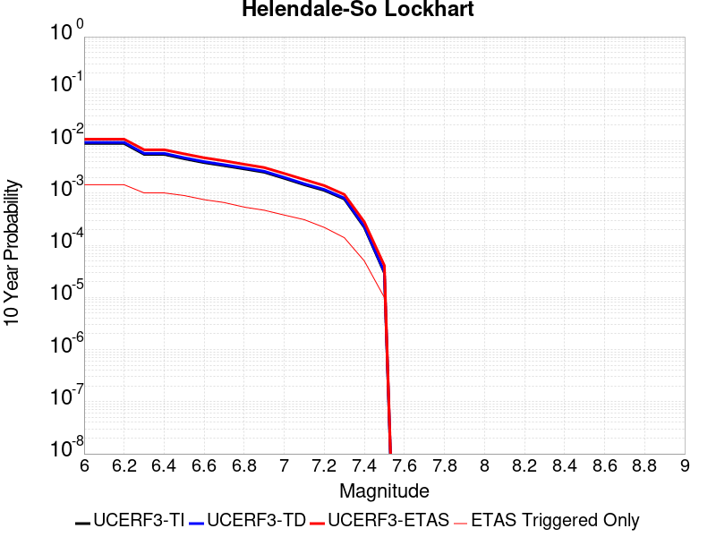 |

| Magnitude | 1 wk TI Prob | 1 wk TD Prob | 1 wk ETAS Prob | 1 wk ETAS/TD Gain | 1 wk ETAS Triggered Only | 1 mo TI Prob | 1 mo TD Prob | 1 mo ETAS Prob | 1 mo ETAS/TD Gain | 1 mo ETAS Triggered Only | 1 yr TI Prob | 1 yr TD Prob | 1 yr ETAS Prob | 1 yr ETAS/TD Gain | 1 yr ETAS Triggered Only | 10 yr TI Prob | 10 yr TD Prob | 10 yr ETAS Prob | 10 yr ETAS/TD Gain | 10 yr ETAS Triggered Only |
|-----|-----|-----|-----|-----|-----|-----|-----|-----|-----|-----|-----|-----|-----|-----|-----|-----|-----|-----|-----|-----|
| 6.0 | 1.7296055E-5 | 1.8103729E-5 | 3.1443624E-4 | 17.36859 | 2.9633788E-4 | 7.412385E-5 | 7.7585224E-5 | 5.6104636E-4 | 7.231356 | 4.8349865E-4 | 9.0208417E-4 | 9.4421144E-4 | 0.0018168037 | 1.9241492 | 8.7341695E-4 | 0.008984311 | 0.009404116 | 0.010810072 | 1.1495042 | 0.0014193025 |
| 6.1 | 1.7296055E-5 | 1.8103729E-5 | 3.1443624E-4 | 17.36859 | 2.9633788E-4 | 7.412385E-5 | 7.7585224E-5 | 5.6104636E-4 | 7.231356 | 4.8349865E-4 | 9.0208417E-4 | 9.4421144E-4 | 0.0018168037 | 1.9241492 | 8.7341695E-4 | 0.008984311 | 0.009404116 | 0.010810072 | 1.1495042 | 0.0014193025 |
| 6.2 | 1.7296055E-5 | 1.8103729E-5 | 3.1443624E-4 | 17.36859 | 2.9633788E-4 | 7.412385E-5 | 7.7585224E-5 | 5.6104636E-4 | 7.231356 | 4.8349865E-4 | 9.0208417E-4 | 9.4421144E-4 | 0.0018168037 | 1.9241492 | 8.7341695E-4 | 0.008984311 | 0.009404116 | 0.010810072 | 1.1495042 | 0.0014193025 |
| 6.3 | 1.0669118E-5 | 1.1135425E-5 | 2.6068033E-4 | 23.410006 | 2.495477E-4 | 4.5723988E-5 | 4.772239E-5 | 4.0643007E-4 | 8.516549 | 3.5872482E-4 | 5.5654737E-4 | 5.80868E-4 | 0.0011731995 | 2.019735 | 5.9267576E-4 | 0.0055515557 | 0.0057937936 | 0.0067241755 | 1.1605825 | 9.3580387E-4 |
| 6.4 | 1.0669118E-5 | 1.1135425E-5 | 2.6068033E-4 | 23.410006 | 2.495477E-4 | 4.5723988E-5 | 4.772239E-5 | 4.0643007E-4 | 8.516549 | 3.5872482E-4 | 5.5654737E-4 | 5.80868E-4 | 0.0011731995 | 2.019735 | 5.9267576E-4 | 0.0055515557 | 0.0057937936 | 0.0067241755 | 1.1605825 | 9.3580387E-4 |
| 6.5 | 8.790038E-6 | 9.170197E-6 | 2.4311902E-4 | 26.511864 | 2.3395097E-4 | 3.767105E-5 | 3.930026E-5 | 3.8241484E-4 | 9.730594 | 3.4312808E-4 | 4.585485E-4 | 4.7837716E-4 | 0.0010395909 | 2.1731615 | 5.6148233E-4 | 0.0045760344 | 0.004773638 | 0.0056118416 | 1.1755899 | 8.4222347E-4 |
| 6.6 | 7.396949E-6 | 7.715537E-6 | 1.7927826E-4 | 23.236004 | 1.7156404E-4 | 3.1700827E-5 | 3.3066175E-5 | 3.1379805E-4 | 9.490002 | 2.8074117E-4 | 3.858892E-4 | 4.025073E-4 | 8.702209E-4 | 2.1620002 | 4.6790193E-4 | 0.003852198 | 0.00401789 | 0.0047169225 | 1.1739801 | 7.018529E-4 |
| 6.7 | 6.4600285E-6 | 6.738031E-6 | 1.4710767E-4 | 21.832441 | 1.4037058E-4 | 2.7685543E-5 | 2.887696E-5 | 2.7841746E-4 | 9.641508 | 2.495477E-4 | 3.3701936E-4 | 3.5152107E-4 | 7.88076E-4 | 2.2419028 | 4.3670848E-4 | 0.0033650869 | 0.003509732 | 0.0041469536 | 1.1815585 | 6.39466E-4 |
| 6.8 | 5.600104E-6 | 5.836009E-6 | 1.3060913E-4 | 22.37987 | 1.2477385E-4 | 2.4000226E-5 | 2.5011232E-5 | 2.4336E-4 | 9.730028 | 2.1835424E-4 | 2.9216358E-4 | 3.044698E-4 | 6.7867734E-4 | 2.2290466 | 3.7432153E-4 | 0.0029177975 | 0.003040588 | 0.0035848138 | 1.178987 | 5.458856E-4 |
| 6.9 | 4.839122E-6 | 5.0395092E-6 | 1.2981273E-4 | 25.759003 | 1.2477385E-4 | 2.0738931E-5 | 2.159772E-5 | 2.2435085E-4 | 10.38771 | 2.027575E-4 | 2.5246723E-4 | 2.6292098E-4 | 6.0595886E-4 | 2.3047185 | 3.4312808E-4 | 0.002521806 | 0.002626147 | 0.0030928198 | 1.1777027 | 4.6790193E-4 |
| 7.0 | 3.6937633E-6 | 3.845208E-6 | 1.130219E-4 | 29.392923 | 1.0917712E-4 | 1.5830317E-5 | 1.647936E-5 | 1.724441E-4 | 10.464247 | 1.5596731E-4 | 1.9271708E-4 | 2.0061806E-4 | 4.968965E-4 | 2.4768283 | 2.9633788E-4 | 0.0019255003 | 0.002004401 | 0.0023624068 | 1.1786098 | 3.5872482E-4 |
| 7.1 | 2.7858857E-6 | 2.8978538E-6 | 1.1207465E-4 | 38.675056 | 1.0917712E-4 | 1.1939455E-5 | 1.2419316E-5 | 1.5278815E-4 | 12.302462 | 1.4037058E-4 | 1.4535317E-4 | 1.511949E-4 | 4.318936E-4 | 2.8565357 | 2.8074117E-4 | 0.0014525814 | 0.0015109418 | 0.0018379783 | 1.2164454 | 3.2753134E-4 |
| 7.2 | 2.1672065E-6 | 2.2540128E-6 | 8.023749E-5 | 35.597622 | 7.7983656E-5 | 9.2879945E-6 | 9.66002E-6 | 1.18836084E-4 | 12.3018465 | 1.0917712E-4 | 1.1307546E-4 | 1.1760458E-4 | 3.0474333E-4 | 2.591254 | 1.8716077E-4 | 0.0011301794 | 0.0011754417 | 0.0013935392 | 1.1855452 | 2.1835424E-4 |
| 7.3 | 1.4823496E-6 | 1.5422102E-6 | 4.833233E-5 | 31.339651 | 4.6790192E-5 | 6.3529114E-6 | 6.6094562E-6 | 8.45926E-5 | 12.798722 | 7.7983656E-5 | 7.734395E-5 | 8.046731E-5 | 1.8963564E-4 | 2.3566792 | 1.0917712E-4 | 7.731704E-4 | 8.0439687E-4 | 9.446546E-4 | 1.1743637 | 1.4037058E-4 |
| 7.4 | 4.2321457E-7 | 4.4108765E-7 | 3.1634536E-5 | 71.71938 | 3.1193464E-5 | 1.8137755E-6 | 1.8903745E-6 | 4.868048E-5 | 25.751764 | 4.6790192E-5 | 2.2082493E-5 | 2.3015113E-5 | 8.54006E-5 | 3.7106314 | 6.238693E-5 | 2.2080299E-4 | 2.3013182E-4 | 3.0809754E-4 | 1.3387872 | 7.7983656E-5 |
| 7.5 | 5.6942316E-8 | 5.9415648E-8 | 5.9415648E-8 | 1.0 | 0.0 | 2.440385E-7 | 2.5463845E-7 | 1.5851365E-5 | 62.250477 | 1.5596732E-5 | 2.9711643E-6 | 3.1002196E-6 | 1.8696903E-5 | 6.0308313 | 1.5596732E-5 | 2.9711247E-5 | 3.1001844E-5 | 4.659809E-5 | 1.5030749 | 1.5596732E-5 |

## Death Valley (No)
*[(top)](#table-of-contents)*

| 1 Week | 1 Month | 1 Year | 10 Year |
|-----|-----|-----|-----|
| 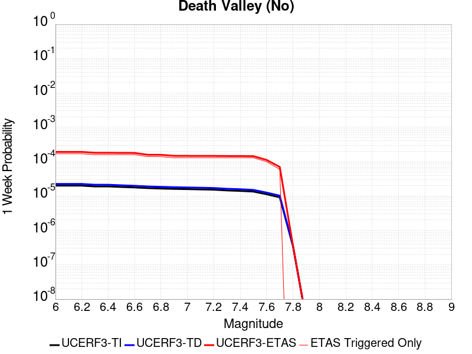 |  |  |  |

| Magnitude | 1 wk TI Prob | 1 wk TD Prob | 1 wk ETAS Prob | 1 wk ETAS/TD Gain | 1 wk ETAS Triggered Only | 1 mo TI Prob | 1 mo TD Prob | 1 mo ETAS Prob | 1 mo ETAS/TD Gain | 1 mo ETAS Triggered Only | 1 yr TI Prob | 1 yr TD Prob | 1 yr ETAS Prob | 1 yr ETAS/TD Gain | 1 yr ETAS Triggered Only | 10 yr TI Prob | 10 yr TD Prob | 10 yr ETAS Prob | 10 yr ETAS/TD Gain | 10 yr ETAS Triggered Only |
|-----|-----|-----|-----|-----|-----|-----|-----|-----|-----|-----|-----|-----|-----|-----|-----|-----|-----|-----|-----|-----|
| 6.0 | 2.0074807E-5 | 2.2500084E-5 | 2.2525302E-4 | 10.011209 | 2.027575E-4 | 8.603206E-5 | 9.642541E-5 | 4.2392517E-4 | 4.396405 | 3.2753134E-4 | 0.001046937 | 0.0011733545 | 0.0018120701 | 1.5443501 | 6.39466E-4 | 0.010420183 | 0.011672506 | 0.01296734 | 1.1109302 | 0.0013101253 |
| 6.1 | 2.0074807E-5 | 2.2500084E-5 | 2.2525302E-4 | 10.011209 | 2.027575E-4 | 8.603206E-5 | 9.642541E-5 | 4.2392517E-4 | 4.396405 | 3.2753134E-4 | 0.001046937 | 0.0011733545 | 0.0018120701 | 1.5443501 | 6.39466E-4 | 0.010420183 | 0.011672506 | 0.01296734 | 1.1109302 | 0.0013101253 |
| 6.2 | 2.0074807E-5 | 2.2500084E-5 | 2.2525302E-4 | 10.011209 | 2.027575E-4 | 8.603206E-5 | 9.642541E-5 | 4.2392517E-4 | 4.396405 | 3.2753134E-4 | 0.001046937 | 0.0011733545 | 0.0018120701 | 1.5443501 | 6.39466E-4 | 0.010420183 | 0.011672506 | 0.01296734 | 1.1109302 | 0.0013101253 |
| 6.3 | 1.9050609E-5 | 2.1336948E-5 | 2.0849373E-4 | 9.771488 | 1.8716077E-4 | 8.164292E-5 | 9.1440896E-5 | 3.8775167E-4 | 4.240463 | 2.9633788E-4 | 9.935491E-4 | 0.001112731 | 0.0017203267 | 1.54604 | 6.082725E-4 | 0.009891188 | 0.011072419 | 0.012321766 | 1.1128342 | 0.0012633352 |
| 6.4 | 1.9050609E-5 | 2.1336948E-5 | 2.0849373E-4 | 9.771488 | 1.8716077E-4 | 8.164292E-5 | 9.1440896E-5 | 3.8775167E-4 | 4.240463 | 2.9633788E-4 | 9.935491E-4 | 0.001112731 | 0.0017203267 | 1.54604 | 6.082725E-4 | 0.009891188 | 0.011072419 | 0.012321766 | 1.1128342 | 0.0012633352 |
| 6.5 | 1.8367004E-5 | 2.0561009E-5 | 2.0771794E-4 | 10.102517 | 1.8716077E-4 | 7.8713354E-5 | 8.811567E-5 | 3.8442743E-4 | 4.362759 | 2.9633788E-4 | 9.5791375E-4 | 0.0010722869 | 0.0016799071 | 1.5666584 | 6.082725E-4 | 0.009537951 | 0.0106719155 | 0.011921768 | 1.1171161 | 0.0012633352 |
| 6.6 | 1.779439E-5 | 1.9910927E-5 | 2.0706798E-4 | 10.399714 | 1.8716077E-4 | 7.625944E-5 | 8.53298E-5 | 3.816424E-4 | 4.4725575 | 2.9633788E-4 | 9.280632E-4 | 0.0010384015 | 0.0016460423 | 1.5851694 | 6.082725E-4 | 0.009241969 | 0.010336253 | 0.011571094 | 1.119467 | 0.0012477385 |
| 6.7 | 1.7025437E-5 | 1.9043426E-5 | 1.7500776E-4 | 9.189931 | 1.5596731E-4 | 7.296412E-5 | 8.161216E-5 | 3.4673495E-4 | 4.2485695 | 2.6514442E-4 | 8.87976E-4 | 9.931813E-4 | 0.0015696872 | 1.5804639 | 5.77079E-4 | 0.008844362 | 0.009888145 | 0.011092661 | 1.1218141 | 0.001216545 |
| 6.8 | 1.6545107E-5 | 1.8512545E-5 | 1.7447697E-4 | 9.424796 | 1.5596731E-4 | 7.090568E-5 | 7.93371E-5 | 3.4446048E-4 | 4.3417325 | 2.6514442E-4 | 8.629347E-4 | 9.655073E-4 | 0.0015420292 | 1.5971181 | 5.77079E-4 | 0.008595915 | 0.009613829 | 0.010803231 | 1.1237179 | 0.0012009483 |
| 6.9 | 1.615478E-5 | 1.8087594E-5 | 1.7405208E-4 | 9.622733 | 1.5596731E-4 | 6.9232934E-5 | 7.751599E-5 | 3.4263986E-4 | 4.4202476 | 2.6514442E-4 | 8.4258494E-4 | 9.433546E-4 | 0.0015198893 | 1.6111537 | 5.77079E-4 | 0.008393973 | 0.009394196 | 0.010583862 | 1.1266384 | 0.0012009483 |
| 7.0 | 1.5894311E-5 | 1.780555E-5 | 1.7377008E-4 | 9.759321 | 1.5596731E-4 | 6.81167E-5 | 7.6307304E-5 | 3.414315E-4 | 4.4744277 | 2.6514442E-4 | 8.2900526E-4 | 9.286515E-4 | 0.0015051946 | 1.6208391 | 5.77079E-4 | 0.008259195 | 0.009248397 | 0.010438239 | 1.1286538 | 0.0012009483 |
| 7.1 | 1.5602263E-5 | 1.7483504E-5 | 1.7344809E-4 | 9.920671 | 1.5596731E-4 | 6.6865134E-5 | 7.492718E-5 | 3.4005175E-4 | 4.5384297 | 2.6514442E-4 | 8.137789E-4 | 9.118627E-4 | 0.0014884155 | 1.6322803 | 5.77079E-4 | 0.008108052 | 0.009081894 | 0.010271936 | 1.1310345 | 0.0012009483 |
| 7.2 | 1.5323829E-5 | 1.717063E-5 | 1.7313527E-4 | 10.083221 | 1.5596731E-4 | 6.56719E-5 | 7.358637E-5 | 3.3871128E-4 | 4.6029077 | 2.6514442E-4 | 7.99262E-4 | 8.9555193E-4 | 0.0014721141 | 1.6438066 | 5.77079E-4 | 0.007963934 | 0.008920107 | 0.010094885 | 1.1317 | 0.0011853515 |
| 7.3 | 1.4556212E-5 | 1.6302456E-5 | 1.7226722E-4 | 10.56695 | 1.5596731E-4 | 6.238227E-5 | 6.9865826E-5 | 3.3499172E-4 | 4.7947865 | 2.6514442E-4 | 7.592395E-4 | 8.5029035E-4 | 0.0014268787 | 1.6781076 | 5.77079E-4 | 0.0075665074 | 0.008471014 | 0.009646324 | 1.138745 | 0.0011853515 |
| 7.4 | 1.411725E-5 | 1.580796E-5 | 1.717728E-4 | 10.866222 | 1.5596731E-4 | 6.0501097E-5 | 6.7746674E-5 | 3.3287314E-4 | 4.913498 | 2.6514442E-4 | 7.363519E-4 | 8.245094E-4 | 0.0014011126 | 1.6993289 | 5.77079E-4 | 0.0073391674 | 0.008215138 | 0.009390752 | 1.1431034 | 0.0011853515 |
| 7.5 | 1.3503312E-5 | 1.5126289E-5 | 1.7109123E-4 | 11.310853 | 1.5596731E-4 | 5.7870053E-5 | 6.482538E-5 | 3.299526E-4 | 5.089868 | 2.6514442E-4 | 7.043401E-4 | 7.8896893E-4 | 0.0013500083 | 1.7111044 | 5.6148233E-4 | 0.007021119 | 0.007862304 | 0.009022862 | 1.1476104 | 0.0011697548 |
| 7.6 | 1.1279839E-5 | 1.2626327E-5 | 1.373986E-4 | 10.881914 | 1.2477385E-4 | 4.834127E-5 | 5.4111737E-5 | 2.7245414E-4 | 5.035029 | 2.1835424E-4 | 5.88396E-4 | 6.5861654E-4 | 0.0011573832 | 1.7572944 | 4.990954E-4 | 0.005868405 | 0.006567199 | 0.007558834 | 1.1509982 | 9.981908E-4 |
| 7.7 | 9.189108E-6 | 1.0283358E-5 | 8.826621E-5 | 8.583404 | 7.7983656E-5 | 3.93813E-5 | 4.407082E-5 | 1.8443521E-4 | 4.1849737 | 1.4037058E-4 | 4.7936183E-4 | 5.3643517E-4 | 9.4173267E-4 | 1.7555386 | 4.05515E-4 | 0.004783291 | 0.005351914 | 0.00618963 | 1.1565264 | 8.4222347E-4 |
| 7.8 | 3.4586725E-7 | 3.6482615E-7 | 3.6482615E-7 | 1.0 | 0.0 | 1.4822873E-6 | 1.5635396E-6 | 1.5635396E-6 | 1.0 | 0.0 | 1.80467E-5 | 1.9035933E-5 | 1.9035933E-5 | 1.0 | 0.0 | 1.8045233E-4 | 1.9034347E-4 | 2.0593723E-4 | 1.0819243 | 1.5596732E-5 |
| 7.9 | 2.5591178E-9 | 2.6696718E-9 | 2.6696718E-9 | 1.0 | 0.0 | 1.0967647E-8 | 1.14414505E-8 | 1.14414505E-8 | 1.0 | 0.0 | 1.335311E-7 | 1.3929966E-7 | 1.3929966E-7 | 1.0 | 0.0 | 1.3353102E-6 | 1.3929966E-6 | 1.3929966E-6 | 1.0 | 0.0 |

## San Andreas (Parkfield)
*[(top)](#table-of-contents)*

| 1 Week | 1 Month | 1 Year | 10 Year |
|-----|-----|-----|-----|
|  |  |  | 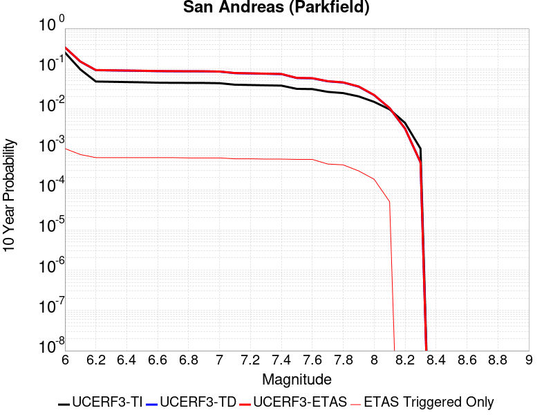 |

| Magnitude | 1 wk TI Prob | 1 wk TD Prob | 1 wk ETAS Prob | 1 wk ETAS/TD Gain | 1 wk ETAS Triggered Only | 1 mo TI Prob | 1 mo TD Prob | 1 mo ETAS Prob | 1 mo ETAS/TD Gain | 1 mo ETAS Triggered Only | 1 yr TI Prob | 1 yr TD Prob | 1 yr ETAS Prob | 1 yr ETAS/TD Gain | 1 yr ETAS Triggered Only | 10 yr TI Prob | 10 yr TD Prob | 10 yr ETAS Prob | 10 yr ETAS/TD Gain | 10 yr ETAS Triggered Only |
|-----|-----|-----|-----|-----|-----|-----|-----|-----|-----|-----|-----|-----|-----|-----|-----|-----|-----|-----|-----|-----|
| 6.0 | 5.556969E-4 | 7.7782426E-4 | 0.0010115933 | 1.3005422 | 2.3395097E-4 | 0.0023793848 | 0.0033298214 | 0.003656262 | 1.0980355 | 3.2753134E-4 | 0.028586963 | 0.040191233 | 0.04073015 | 1.0134088 | 5.6148233E-4 | 0.25176284 | 0.33716413 | 0.33781543 | 1.0019317 | 9.825941E-4 |
| 6.1 | 1.925858E-4 | 3.0276453E-4 | 5.0546066E-4 | 1.6694844 | 2.027575E-4 | 8.2510663E-4 | 0.0012970108 | 0.0015462348 | 1.1921526 | 2.495477E-4 | 0.0099994885 | 0.015778083 | 0.0161772 | 1.0252956 | 4.05515E-4 | 0.095613256 | 0.1497237 | 0.15036024 | 1.0042515 | 7.4864307E-4 |
| 6.2 | 9.4306815E-5 | 1.8242796E-4 | 3.2277295E-4 | 1.7693173 | 1.4037058E-4 | 4.0410945E-4 | 7.816011E-4 | 9.686156E-4 | 1.239271 | 1.8716077E-4 | 0.0049089384 | 0.009474681 | 0.009799109 | 1.0342416 | 3.2753134E-4 | 0.048019063 | 0.09185409 | 0.092434816 | 1.0063223 | 6.39466E-4 |
| 6.3 | 9.283051E-5 | 1.7939322E-4 | 3.197386E-4 | 1.782334 | 1.4037058E-4 | 3.9778434E-4 | 7.686027E-4 | 9.556196E-4 | 1.2433207 | 1.8716077E-4 | 0.0048322747 | 0.009317789 | 0.0096422685 | 1.0348237 | 3.2753134E-4 | 0.047285385 | 0.09050704 | 0.09108862 | 1.0064259 | 6.39466E-4 |
| 6.4 | 9.138826E-5 | 1.770153E-4 | 3.1736103E-4 | 1.7928451 | 1.4037058E-4 | 3.916052E-4 | 7.5841765E-4 | 9.454365E-4 | 1.2465909 | 1.8716077E-4 | 0.0047573745 | 0.00919484 | 0.009519359 | 1.0352937 | 3.2753134E-4 | 0.046568092 | 0.08940927 | 0.08999156 | 1.0065126 | 6.39466E-4 |
| 6.5 | 9.000255E-5 | 1.7459576E-4 | 3.1494183E-4 | 1.8038343 | 1.4037058E-4 | 3.8566816E-4 | 7.480541E-4 | 9.350749E-4 | 1.2500097 | 1.8716077E-4 | 0.0046854047 | 0.009069731 | 0.009394293 | 1.0357851 | 3.2753134E-4 | 0.045878403 | 0.088295065 | 0.08887807 | 1.0066029 | 6.39466E-4 |
| 6.6 | 8.8109264E-5 | 1.7140752E-4 | 3.1175403E-4 | 1.8187885 | 1.4037058E-4 | 3.7755648E-4 | 7.3439797E-4 | 9.2142134E-4 | 1.254662 | 1.8716077E-4 | 0.0045870654 | 0.008904854 | 0.009229468 | 1.0364537 | 3.2753134E-4 | 0.04493529 | 0.0868267 | 0.087410636 | 1.0067254 | 6.39466E-4 |
| 6.7 | 8.738073E-5 | 1.7007832E-4 | 3.1042504E-4 | 1.8251886 | 1.4037058E-4 | 3.7443507E-4 | 7.287046E-4 | 9.1572903E-4 | 1.2566532 | 1.8716077E-4 | 0.0045492216 | 0.008836143 | 0.00916078 | 1.0367397 | 3.2753134E-4 | 0.04457213 | 0.08622707 | 0.08681139 | 1.0067766 | 6.39466E-4 |
| 6.8 | 8.710195E-5 | 1.6953335E-4 | 3.0988012E-4 | 1.8278418 | 1.4037058E-4 | 3.7324068E-4 | 7.263703E-4 | 9.1339514E-4 | 1.2574786 | 1.8716077E-4 | 0.0045347405 | 0.008807961 | 0.009132607 | 1.0368583 | 3.2753134E-4 | 0.04443313 | 0.08597467 | 0.086559154 | 1.0067984 | 6.39466E-4 |
| 6.9 | 8.6801556E-5 | 1.689429E-4 | 3.0928975E-4 | 1.8307354 | 1.4037058E-4 | 3.7195362E-4 | 7.2384125E-4 | 9.1086654E-4 | 1.2583789 | 1.8716077E-4 | 0.0045191357 | 0.008777418 | 0.009102074 | 1.0369877 | 3.2753134E-4 | 0.044283327 | 0.085700735 | 0.0862854 | 1.0068221 | 6.39466E-4 |
| 7.0 | 8.5571606E-5 | 1.6647128E-4 | 3.068185E-4 | 1.8430716 | 1.4037058E-4 | 3.6668387E-4 | 7.132544E-4 | 9.002817E-4 | 1.2622168 | 1.8716077E-4 | 0.004455241 | 0.008649553 | 0.008974252 | 1.0375394 | 3.2753134E-4 | 0.043669727 | 0.08454914 | 0.085134536 | 1.0069238 | 6.39466E-4 |
| 7.1 | 7.82589E-5 | 1.5128135E-4 | 2.9163068E-4 | 1.9277372 | 1.4037058E-4 | 3.3535215E-4 | 6.481883E-4 | 8.352277E-4 | 1.2885573 | 1.8716077E-4 | 0.0040752706 | 0.007863307 | 0.008188263 | 1.0413256 | 3.2753134E-4 | 0.040013418 | 0.07746111 | 0.078022264 | 1.0072443 | 6.082725E-4 |
| 7.2 | 7.690929E-5 | 1.4865391E-4 | 2.8900363E-4 | 1.9441373 | 1.4037058E-4 | 3.2956956E-4 | 6.369334E-4 | 8.2397496E-4 | 1.2936596 | 1.8716077E-4 | 0.004005129 | 0.007727258 | 0.008052258 | 1.042059 | 3.2753134E-4 | 0.0393371 | 0.07623427 | 0.076796174 | 1.0073707 | 6.082725E-4 |
| 7.3 | 7.5543794E-5 | 1.4561978E-4 | 2.8596993E-4 | 1.9638124 | 1.4037058E-4 | 3.2371894E-4 | 6.2393624E-4 | 8.109802E-4 | 1.2997806 | 1.8716077E-4 | 0.003934157 | 0.007570127 | 0.007895179 | 1.0429387 | 3.2753134E-4 | 0.038652334 | 0.074797355 | 0.075345695 | 1.0073311 | 5.9267576E-4 |
| 7.4 | 7.4214564E-5 | 1.4262961E-4 | 2.8298018E-4 | 1.9840212 | 1.4037058E-4 | 3.1802364E-4 | 6.111273E-4 | 7.9817366E-4 | 1.3060678 | 1.8716077E-4 | 0.003865065 | 0.00741525 | 0.0077403523 | 1.0438424 | 3.2753134E-4 | 0.03798529 | 0.07337123 | 0.07392042 | 1.0074852 | 5.9267576E-4 |
| 7.5 | 6.149578E-5 | 1.11907226E-4 | 2.522621E-4 | 2.2542074 | 1.4037058E-4 | 2.6352672E-4 | 4.7951436E-4 | 6.665854E-4 | 1.390126 | 1.8716077E-4 | 0.0032037178 | 0.0058224914 | 0.0061481157 | 1.0559253 | 3.2753134E-4 | 0.03157923 | 0.058557566 | 0.059115537 | 1.0095285 | 5.9267576E-4 |
| 7.6 | 6.0643448E-5 | 1.10193796E-4 | 2.505489E-4 | 2.2737114 | 1.4037058E-4 | 2.598746E-4 | 4.7217376E-4 | 6.592462E-4 | 1.396194 | 1.8716077E-4 | 0.0031593828 | 0.0057335934 | 0.006059247 | 1.0567974 | 3.2753134E-4 | 0.031148417 | 0.057718582 | 0.05827705 | 1.0096757 | 5.9267576E-4 |
| 7.7 | 5.1652263E-5 | 9.174698E-5 | 2.0091407E-4 | 2.1898713 | 1.0917712E-4 | 2.2134806E-4 | 3.931421E-4 | 5.490481E-4 | 1.396564 | 1.5596731E-4 | 0.002691582 | 0.0047760103 | 0.005055411 | 1.0585008 | 2.8074117E-4 | 0.026592141 | 0.04853623 | 0.0489369 | 1.0082551 | 4.2111173E-4 |
| 7.8 | 4.8090482E-5 | 8.559635E-5 | 1.9476413E-4 | 2.2753787 | 1.0917712E-4 | 2.060858E-4 | 3.6678996E-4 | 5.227001E-4 | 1.4250665 | 1.5596731E-4 | 0.0025062072 | 0.0044565317 | 0.004736022 | 1.0627147 | 2.8074117E-4 | 0.024781305 | 0.04530245 | 0.045689594 | 1.0085458 | 4.05515E-4 |
| 7.9 | 3.970278E-5 | 6.750426E-5 | 1.4548266E-4 | 2.1551626 | 7.7983656E-5 | 1.7014367E-4 | 2.892719E-4 | 3.9841744E-4 | 1.3773112 | 1.0917712E-4 | 0.002069531 | 0.0035162016 | 0.0037337882 | 1.0618811 | 2.1835424E-4 | 0.020503636 | 0.035881363 | 0.036167067 | 1.0079625 | 2.9633788E-4 |
| 8.0 | 2.8982335E-5 | 4.069796E-5 | 8.7486245E-5 | 2.149647 | 4.6790192E-5 | 1.2420409E-4 | 1.7440817E-4 | 2.5237823E-4 | 1.4470551 | 7.7983656E-5 | 0.0015111357 | 0.0021213528 | 0.0022614256 | 1.0660299 | 1.4037058E-4 | 0.015009012 | 0.022010697 | 0.02220899 | 1.009009 | 2.027575E-4 |
| 8.1 | 1.8836186E-5 | 1.8681134E-5 | 3.4277575E-5 | 1.8348764 | 1.5596732E-5 | 8.0724014E-5 | 8.005955E-5 | 1.1125052E-4 | 1.389597 | 3.1193464E-5 | 9.823717E-4 | 9.742898E-4 | 0.0010210344 | 1.0479782 | 4.6790192E-5 | 0.009780403 | 0.010488115 | 0.010549848 | 1.005886 | 6.238693E-5 |
| 8.2 | 8.643924E-6 | 5.4748625E-6 | 5.4748625E-6 | 1.0 | 0.0 | 3.704486E-5 | 2.3463486E-5 | 2.3463486E-5 | 1.0 | 0.0 | 4.5092785E-4 | 2.8563058E-4 | 2.8563058E-4 | 1.0 | 0.0 | 0.0045001395 | 0.0032487072 | 0.0032487072 | 1.0 | 0.0 |
| 8.3 | 1.983087E-6 | 7.6599065E-7 | 7.6599065E-7 | 1.0 | 0.0 | 8.498917E-6 | 3.282813E-6 | 3.282813E-6 | 1.0 | 0.0 | 1.034694E-4 | 3.9967534E-5 | 3.9967534E-5 | 1.0 | 0.0 | 0.0010342124 | 4.719687E-4 | 4.719687E-4 | 1.0 | 0.0 |

## San Andreas (San Gorgonio Pass-Garnet HIll)
*[(top)](#table-of-contents)*

| 1 Week | 1 Month | 1 Year | 10 Year |
|-----|-----|-----|-----|
|  |  |  |  |

| Magnitude | 1 wk TI Prob | 1 wk TD Prob | 1 wk ETAS Prob | 1 wk ETAS/TD Gain | 1 wk ETAS Triggered Only | 1 mo TI Prob | 1 mo TD Prob | 1 mo ETAS Prob | 1 mo ETAS/TD Gain | 1 mo ETAS Triggered Only | 1 yr TI Prob | 1 yr TD Prob | 1 yr ETAS Prob | 1 yr ETAS/TD Gain | 1 yr ETAS Triggered Only | 10 yr TI Prob | 10 yr TD Prob | 10 yr ETAS Prob | 10 yr ETAS/TD Gain | 10 yr ETAS Triggered Only |
|-----|-----|-----|-----|-----|-----|-----|-----|-----|-----|-----|-----|-----|-----|-----|-----|-----|-----|-----|-----|-----|
| 6.0 | 8.31567E-5 | 2.3382473E-4 | 5.924657E-4 | 2.5338023 | 3.5872482E-4 | 3.5633717E-4 | 0.0010017233 | 0.0014535754 | 1.4510747 | 4.523052E-4 | 0.004329778 | 0.012127888 | 0.012898267 | 1.0635213 | 7.7983656E-4 | 0.042463828 | 0.11257892 | 0.11356162 | 1.008729 | 0.0011073679 |
| 6.1 | 8.31567E-5 | 2.3382473E-4 | 5.924657E-4 | 2.5338023 | 3.5872482E-4 | 3.5633717E-4 | 0.0010017233 | 0.0014535754 | 1.4510747 | 4.523052E-4 | 0.004329778 | 0.012127888 | 0.012898267 | 1.0635213 | 7.7983656E-4 | 0.042463828 | 0.11257892 | 0.11356162 | 1.008729 | 0.0011073679 |
| 6.2 | 8.31567E-5 | 2.3382473E-4 | 5.924657E-4 | 2.5338023 | 3.5872482E-4 | 3.5633717E-4 | 0.0010017233 | 0.0014535754 | 1.4510747 | 4.523052E-4 | 0.004329778 | 0.012127888 | 0.012898267 | 1.0635213 | 7.7983656E-4 | 0.042463828 | 0.11257892 | 0.11356162 | 1.008729 | 0.0011073679 |
| 6.3 | 8.31567E-5 | 2.3382473E-4 | 5.924657E-4 | 2.5338023 | 3.5872482E-4 | 3.5633717E-4 | 0.0010017233 | 0.0014535754 | 1.4510747 | 4.523052E-4 | 0.004329778 | 0.012127888 | 0.012898267 | 1.0635213 | 7.7983656E-4 | 0.042463828 | 0.11257892 | 0.11356162 | 1.008729 | 0.0011073679 |
| 6.4 | 8.059055E-5 | 2.2940808E-4 | 5.7245744E-4 | 2.4953673 | 3.4312808E-4 | 3.4534236E-4 | 9.828096E-4 | 0.0014190888 | 1.4439102 | 4.3670848E-4 | 0.0041964394 | 0.011900152 | 0.012655297 | 1.0634568 | 7.642398E-4 | 0.041180745 | 0.11056015 | 0.11151734 | 1.0086577 | 0.0010761744 |
| 6.5 | 8.059055E-5 | 2.2940808E-4 | 5.7245744E-4 | 2.4953673 | 3.4312808E-4 | 3.4534236E-4 | 9.828096E-4 | 0.0014190888 | 1.4439102 | 4.3670848E-4 | 0.0041964394 | 0.011900152 | 0.012655297 | 1.0634568 | 7.642398E-4 | 0.041180745 | 0.11056015 | 0.11151734 | 1.0086577 | 0.0010761744 |
| 6.6 | 7.619237E-5 | 2.218517E-4 | 5.6490366E-4 | 2.546312 | 3.4312808E-4 | 3.2649786E-4 | 9.5044886E-4 | 0.0013867422 | 1.4590393 | 4.3670848E-4 | 0.0039678677 | 0.01151087 | 0.012266313 | 1.0656286 | 7.642398E-4 | 0.03897764 | 0.10709683 | 0.108057745 | 1.0089724 | 0.0010761744 |
| 6.7 | 7.440636E-5 | 2.1860997E-4 | 5.61663E-4 | 2.5692472 | 3.4312808E-4 | 3.188454E-4 | 9.3656575E-4 | 0.0013728652 | 1.4658504 | 4.3670848E-4 | 0.0038750346 | 0.011343609 | 0.0120991785 | 1.0666076 | 7.642398E-4 | 0.038081564 | 0.105605274 | 0.1065678 | 1.0091144 | 0.0010761744 |
| 6.8 | 7.3735864E-5 | 2.1708169E-4 | 5.601353E-4 | 2.5802972 | 3.4312808E-4 | 3.1597257E-4 | 9.3002064E-4 | 0.001366323 | 1.4691318 | 4.3670848E-4 | 0.0038401815 | 0.011264749 | 0.012020379 | 1.0670792 | 7.642398E-4 | 0.03774495 | 0.10490683 | 0.10585614 | 1.0090492 | 0.0010605777 |
| 6.9 | 7.27575E-5 | 2.1477141E-4 | 5.578258E-4 | 2.5973 | 3.4312808E-4 | 3.117806E-4 | 9.201265E-4 | 0.0013564331 | 1.4741812 | 4.3670848E-4 | 0.003789323 | 0.011145527 | 0.011901248 | 1.0678049 | 7.642398E-4 | 0.037253562 | 0.103854746 | 0.10480517 | 1.0091516 | 0.0010605777 |
| 7.0 | 7.102591E-5 | 2.1061185E-4 | 5.5366766E-4 | 2.6288533 | 3.4312808E-4 | 3.0436125E-4 | 9.023122E-4 | 0.0013386266 | 1.4835515 | 4.3670848E-4 | 0.003699303 | 0.010930831 | 0.011686717 | 1.0691518 | 7.642398E-4 | 0.03638325 | 0.10195695 | 0.10290939 | 1.0093416 | 0.0010605777 |
| 7.1 | 7.028513E-5 | 2.0896831E-4 | 5.520247E-4 | 2.641667 | 3.4312808E-4 | 3.0118722E-4 | 8.9527335E-4 | 0.0013315908 | 1.4873568 | 4.3670848E-4 | 0.0036607897 | 0.010845989 | 0.01160194 | 1.0696987 | 7.642398E-4 | 0.036010686 | 0.101199985 | 0.102153234 | 1.0094194 | 0.0010605777 |
| 7.2 | 6.8498244E-5 | 2.0504706E-4 | 5.481048E-4 | 2.6730683 | 3.4312808E-4 | 2.9353087E-4 | 8.784794E-4 | 0.0013148042 | 1.4966819 | 4.3670848E-4 | 0.003567883 | 0.010643536 | 0.011399642 | 1.071039 | 7.642398E-4 | 0.035111405 | 0.09939202 | 0.10033314 | 1.0094688 | 0.001044981 |
| 7.3 | 6.622592E-5 | 1.9732013E-4 | 5.403805E-4 | 2.7385979 | 3.4312808E-4 | 2.8379448E-4 | 8.453858E-4 | 0.001281725 | 1.5161422 | 4.3670848E-4 | 0.0034497243 | 0.0102444785 | 0.011000889 | 1.073836 | 7.642398E-4 | 0.033966612 | 0.095888525 | 0.0968333 | 1.0098529 | 0.001044981 |
| 7.4 | 5.1050705E-5 | 1.4689034E-4 | 4.89968E-4 | 3.3356042 | 3.4312808E-4 | 2.1877038E-4 | 6.29379E-4 | 0.0010502257 | 1.6686697 | 4.2111173E-4 | 0.002660276 | 0.0076359594 | 0.008378886 | 1.0972931 | 7.4864307E-4 | 0.02628654 | 0.07286301 | 0.073817395 | 1.0130982 | 0.0010293842 |
| 7.5 | 3.9302922E-5 | 1.1129847E-4 | 4.2319836E-4 | 3.8023736 | 3.1193462E-4 | 1.6843023E-4 | 4.7690657E-4 | 8.666389E-4 | 1.817209 | 3.8991828E-4 | 0.0020487092 | 0.005790949 | 0.0065042437 | 1.1231741 | 7.1744964E-4 | 0.020299247 | 0.05600951 | 0.056951795 | 1.0168236 | 9.981908E-4 |
| 7.6 | 2.9851626E-5 | 8.4949745E-5 | 3.9685785E-4 | 4.671678 | 3.1193462E-4 | 1.2792926E-4 | 3.6401965E-4 | 7.382049E-4 | 2.027926 | 3.7432153E-4 | 0.0015564259 | 0.0044229585 | 0.005121707 | 1.1579822 | 7.018529E-4 | 0.0154556995 | 0.04319374 | 0.044118967 | 1.0214205 | 9.669973E-4 |
| 7.7 | 2.1135214E-5 | 6.3529005E-5 | 3.754438E-4 | 5.9098015 | 3.1193462E-4 | 9.0576345E-5 | 2.7223877E-4 | 6.464584E-4 | 2.374601 | 3.7432153E-4 | 0.0011022091 | 0.0033094748 | 0.004009005 | 1.2113719 | 7.018529E-4 | 0.010967582 | 0.032582592 | 0.033472817 | 1.027322 | 9.202071E-4 |
| 7.8 | 1.883379E-5 | 5.564028E-5 | 3.5196167E-4 | 6.3256636 | 2.9633788E-4 | 8.0713755E-5 | 2.3843657E-4 | 5.9707585E-4 | 2.5041287 | 3.5872482E-4 | 9.822468E-4 | 0.0028991038 | 0.003567819 | 1.2306627 | 6.706594E-4 | 0.0097791655 | 0.028695205 | 0.02954356 | 1.0295643 | 8.7341695E-4 |
| 7.9 | 1.5156185E-5 | 4.1658426E-5 | 3.3798398E-4 | 8.11322 | 2.9633788E-4 | 6.495346E-5 | 1.785239E-4 | 5.215907E-4 | 2.9216857 | 3.4312808E-4 | 7.9052144E-4 | 0.0021713632 | 0.0027938779 | 1.286693 | 6.2386924E-4 | 0.007877152 | 0.021759422 | 0.022552805 | 1.0364616 | 8.1103E-4 |
| 8.0 | 1.1405907E-5 | 2.9974231E-5 | 2.0153313E-4 | 6.723546 | 1.7156404E-4 | 4.8881542E-5 | 1.2845467E-4 | 3.3118614E-4 | 2.5782335 | 2.027575E-4 | 5.9497025E-4 | 0.0015628147 | 0.001967696 | 1.2590718 | 4.05515E-4 | 0.005933798 | 0.015772851 | 0.016279424 | 1.0321169 | 5.146921E-4 |
| 8.1 | 4.3511436E-6 | 7.369219E-6 | 7.369219E-6 | 1.0 | 0.0 | 1.8647626E-5 | 3.1581985E-5 | 3.1581985E-5 | 1.0 | 0.0 | 2.2701119E-4 | 3.8444297E-4 | 4.000337E-4 | 1.040554 | 1.5596732E-5 | 0.0022677942 | 0.0041163345 | 0.004131867 | 1.0037733 | 1.5596732E-5 |
| 8.2 | 2.3042528E-6 | 2.7329415E-6 | 2.7329415E-6 | 1.0 | 0.0 | 9.875332E-6 | 1.1712554E-5 | 1.1712554E-5 | 1.0 | 0.0 | 1.2022553E-4 | 1.4259106E-4 | 1.4259106E-4 | 1.0 | 0.0 | 0.0012016051 | 0.0015979785 | 0.0015979785 | 1.0 | 0.0 |
| 8.3 | 5.202968E-7 | 3.1598344E-7 | 3.1598344E-7 | 1.0 | 0.0 | 2.2298414E-6 | 1.3542141E-6 | 1.3542141E-6 | 1.0 | 0.0 | 2.714798E-5 | 1.6487444E-5 | 1.6487444E-5 | 1.0 | 0.0 | 2.7144665E-4 | 1.9563142E-4 | 1.9563142E-4 | 1.0 | 0.0 |

## San Andreas (Carrizo) rev
*[(top)](#table-of-contents)*

| 1 Week | 1 Month | 1 Year | 10 Year |
|-----|-----|-----|-----|
|  |  |  |  |

| Magnitude | 1 wk TI Prob | 1 wk TD Prob | 1 wk ETAS Prob | 1 wk ETAS/TD Gain | 1 wk ETAS Triggered Only | 1 mo TI Prob | 1 mo TD Prob | 1 mo ETAS Prob | 1 mo ETAS/TD Gain | 1 mo ETAS Triggered Only | 1 yr TI Prob | 1 yr TD Prob | 1 yr ETAS Prob | 1 yr ETAS/TD Gain | 1 yr ETAS Triggered Only | 10 yr TI Prob | 10 yr TD Prob | 10 yr ETAS Prob | 10 yr ETAS/TD Gain | 10 yr ETAS Triggered Only |
|-----|-----|-----|-----|-----|-----|-----|-----|-----|-----|-----|-----|-----|-----|-----|-----|-----|-----|-----|-----|-----|
| 6.0 | 1.1674632E-4 | 2.432302E-4 | 4.7712427E-4 | 1.961616 | 2.3395097E-4 | 5.002454E-4 | 0.0010420004 | 0.0014315123 | 1.3738117 | 3.8991828E-4 | 0.006073493 | 0.012613042 | 0.013259843 | 1.0512803 | 6.550627E-4 | 0.0591016 | 0.12061418 | 0.121546835 | 1.0077325 | 0.0010605777 |
| 6.1 | 1.1674632E-4 | 2.432302E-4 | 4.7712427E-4 | 1.961616 | 2.3395097E-4 | 5.002454E-4 | 0.0010420004 | 0.0014315123 | 1.3738117 | 3.8991828E-4 | 0.006073493 | 0.012613042 | 0.013259843 | 1.0512803 | 6.550627E-4 | 0.0591016 | 0.12061418 | 0.121546835 | 1.0077325 | 0.0010605777 |
| 6.2 | 1.1674632E-4 | 2.432302E-4 | 4.7712427E-4 | 1.961616 | 2.3395097E-4 | 5.002454E-4 | 0.0010420004 | 0.0014315123 | 1.3738117 | 3.8991828E-4 | 0.006073493 | 0.012613042 | 0.013259843 | 1.0512803 | 6.550627E-4 | 0.0591016 | 0.12061418 | 0.121546835 | 1.0077325 | 0.0010605777 |
| 6.3 | 1.1674632E-4 | 2.432302E-4 | 4.7712427E-4 | 1.961616 | 2.3395097E-4 | 5.002454E-4 | 0.0010420004 | 0.0014315123 | 1.3738117 | 3.8991828E-4 | 0.006073493 | 0.012613042 | 0.013259843 | 1.0512803 | 6.550627E-4 | 0.0591016 | 0.12061418 | 0.121546835 | 1.0077325 | 0.0010605777 |
| 6.4 | 1.1674632E-4 | 2.432302E-4 | 4.7712427E-4 | 1.961616 | 2.3395097E-4 | 5.002454E-4 | 0.0010420004 | 0.0014315123 | 1.3738117 | 3.8991828E-4 | 0.006073493 | 0.012613042 | 0.013259843 | 1.0512803 | 6.550627E-4 | 0.0591016 | 0.12061418 | 0.121546835 | 1.0077325 | 0.0010605777 |
| 6.5 | 1.13136164E-4 | 2.3643032E-4 | 4.7032596E-4 | 1.9892794 | 2.3395097E-4 | 4.847792E-4 | 0.0010128808 | 0.0014024042 | 1.3845698 | 3.8991828E-4 | 0.0058862255 | 0.012262545 | 0.012909574 | 1.0527648 | 6.550627E-4 | 0.057327334 | 0.117585555 | 0.11852142 | 1.007959 | 0.0010605777 |
| 6.6 | 1.13136164E-4 | 2.3643032E-4 | 4.7032596E-4 | 1.9892794 | 2.3395097E-4 | 4.847792E-4 | 0.0010128808 | 0.0014024042 | 1.3845698 | 3.8991828E-4 | 0.0058862255 | 0.012262545 | 0.012909574 | 1.0527648 | 6.550627E-4 | 0.057327334 | 0.117585555 | 0.11852142 | 1.007959 | 0.0010605777 |
| 6.7 | 1.1149675E-4 | 2.3334254E-4 | 4.6723892E-4 | 2.0023735 | 2.3395097E-4 | 4.777557E-4 | 9.996577E-4 | 0.0013891861 | 1.3896619 | 3.8991828E-4 | 0.0058011734 | 0.012103349 | 0.012750483 | 1.0534674 | 6.550627E-4 | 0.05652051 | 0.1162071 | 0.11714443 | 1.008066 | 0.0010605777 |
| 6.8 | 1.1103589E-4 | 2.3236412E-4 | 4.6626074E-4 | 2.0065951 | 2.3395097E-4 | 4.7578133E-4 | 9.954676E-4 | 0.0013849979 | 1.3913037 | 3.8991828E-4 | 0.005777263 | 0.012052901 | 0.012700069 | 1.0536939 | 6.550627E-4 | 0.056293584 | 0.1157674 | 0.116705194 | 1.0081007 | 0.0010605777 |
| 6.9 | 1.1053259E-4 | 2.3128795E-4 | 4.651848E-4 | 2.0112798 | 2.3395097E-4 | 4.7362508E-4 | 9.90859E-4 | 0.001380391 | 1.3931254 | 3.8991828E-4 | 0.0057511497 | 0.01199741 | 0.012644614 | 1.0539453 | 6.550627E-4 | 0.05604569 | 0.11528359 | 0.116221905 | 1.0081391 | 0.0010605777 |
| 7.0 | 1.1005377E-4 | 2.3029637E-4 | 4.6419346E-4 | 2.015635 | 2.3395097E-4 | 4.7157376E-4 | 9.866126E-4 | 0.0013761462 | 1.3948191 | 3.8991828E-4 | 0.0057263062 | 0.011946279 | 0.012593516 | 1.054179 | 6.550627E-4 | 0.055809796 | 0.11483591 | 0.1157747 | 1.008175 | 0.0010605777 |
| 7.1 | 1.0308142E-4 | 2.1539345E-4 | 4.4929402E-4 | 2.0859225 | 2.3395097E-4 | 4.417027E-4 | 9.227892E-4 | 0.0013123477 | 1.4221532 | 3.8991828E-4 | 0.0053644776 | 0.011177397 | 0.011825139 | 1.057951 | 6.550627E-4 | 0.052368138 | 0.108092256 | 0.109024286 | 1.0086225 | 0.001044981 |
| 7.2 | 1.0027479E-4 | 2.094724E-4 | 4.4337436E-4 | 2.116624 | 2.3395097E-4 | 4.296783E-4 | 8.9743105E-4 | 0.0012714167 | 1.4167291 | 3.7432153E-4 | 0.0052187922 | 0.010871782 | 0.011504296 | 1.0581794 | 6.39466E-4 | 0.050979212 | 0.10539625 | 0.10631714 | 1.0087374 | 0.0010293842 |
| 7.3 | 9.816942E-5 | 2.0422463E-4 | 4.381278E-4 | 2.145323 | 2.3395097E-4 | 4.2065824E-4 | 8.7495585E-4 | 0.0012489499 | 1.4274433 | 3.7432153E-4 | 0.005109493 | 0.010600842 | 0.011233529 | 1.0596827 | 6.39466E-4 | 0.049935985 | 0.102979995 | 0.103903376 | 1.0089666 | 0.0010293842 |
| 7.4 | 9.5634205E-5 | 1.9791997E-4 | 4.3182462E-4 | 2.1818144 | 2.3395097E-4 | 4.0979648E-4 | 8.479536E-4 | 0.0012219577 | 1.4410667 | 3.7432153E-4 | 0.0049778637 | 0.010275229 | 0.010908124 | 1.0615942 | 6.39466E-4 | 0.048678253 | 0.10006632 | 0.100992694 | 1.0092577 | 0.0010293842 |
| 7.5 | 8.052417E-5 | 1.611261E-4 | 3.9503936E-4 | 2.4517405 | 2.3395097E-4 | 3.4505792E-4 | 6.903579E-4 | 0.001064421 | 1.5418395 | 3.7432153E-4 | 0.0041929903 | 0.008372796 | 0.009006907 | 1.0757347 | 6.39466E-4 | 0.04114753 | 0.08281049 | 0.08375463 | 1.0114012 | 0.0010293842 |
| 7.6 | 7.897024E-5 | 1.5765853E-4 | 3.9157263E-4 | 2.4836752 | 2.3395097E-4 | 3.384E-4 | 6.755046E-4 | 0.0010495733 | 1.5537618 | 3.7432153E-4 | 0.0041122385 | 0.008193332 | 0.008827559 | 1.0774076 | 6.39466E-4 | 0.040369697 | 0.08115171 | 0.082083225 | 1.0114787 | 0.0010137875 |
| 7.7 | 6.707427E-5 | 1.3276102E-4 | 3.043023E-4 | 2.2921057 | 1.7156404E-4 | 2.8742946E-4 | 5.688518E-4 | 8.4943324E-4 | 1.4932418 | 2.8074117E-4 | 0.003493839 | 0.00690381 | 0.0073684817 | 1.0673065 | 4.6790193E-4 | 0.034394164 | 0.069048055 | 0.06968693 | 1.0092525 | 6.8625616E-4 |
| 7.8 | 6.147705E-5 | 1.2197486E-4 | 2.7792316E-4 | 2.278528 | 1.5596731E-4 | 2.6344648E-4 | 5.226447E-4 | 7.876506E-4 | 1.5070478 | 2.6514442E-4 | 0.0032027436 | 0.006344659 | 0.006778597 | 1.0683942 | 4.3670848E-4 | 0.031569764 | 0.06351457 | 0.0640842 | 1.0089686 | 6.082725E-4 |
| 7.9 | 4.7636717E-5 | 8.87977E-5 | 2.1356047E-4 | 2.4050226 | 1.2477385E-4 | 2.0414138E-4 | 3.8050607E-4 | 5.8318645E-4 | 1.53266 | 2.027575E-4 | 0.0024825884 | 0.0046228287 | 0.004948846 | 1.0705233 | 3.2753134E-4 | 0.024550365 | 0.046628095 | 0.047044437 | 1.008929 | 4.3670848E-4 |
| 8.0 | 3.3554235E-5 | 5.2136907E-5 | 1.1452058E-4 | 2.1965356 | 6.238693E-5 | 1.4379594E-4 | 2.2342477E-4 | 3.4817072E-4 | 1.5583354 | 1.2477385E-4 | 0.0017493097 | 0.002716805 | 0.0029190117 | 1.0744281 | 2.027575E-4 | 0.017356034 | 0.027880952 | 0.028153867 | 1.0097885 | 2.8074117E-4 |
| 8.1 | 1.9175432E-5 | 1.9184976E-5 | 3.4781406E-5 | 1.8129503 | 1.5596732E-5 | 8.217783E-5 | 8.2218736E-5 | 1.2900509E-4 | 1.5690472 | 4.6790192E-5 | 0.0010000558 | 0.0010005541 | 0.0010628785 | 1.06229 | 6.238693E-5 | 0.009955673 | 0.0107580265 | 0.010835172 | 1.0071709 | 7.7983656E-5 |
| 8.2 | 8.643924E-6 | 5.4748625E-6 | 5.4748625E-6 | 1.0 | 0.0 | 3.704486E-5 | 2.3463486E-5 | 2.3463486E-5 | 1.0 | 0.0 | 4.5092785E-4 | 2.8563058E-4 | 2.8563058E-4 | 1.0 | 0.0 | 0.0045001395 | 0.0032487072 | 0.0032487072 | 1.0 | 0.0 |
| 8.3 | 1.983087E-6 | 7.6599065E-7 | 7.6599065E-7 | 1.0 | 0.0 | 8.498917E-6 | 3.282813E-6 | 3.282813E-6 | 1.0 | 0.0 | 1.034694E-4 | 3.9967534E-5 | 3.9967534E-5 | 1.0 | 0.0 | 0.0010342124 | 4.719687E-4 | 4.719687E-4 | 1.0 | 0.0 |

## San Andreas (Cholame) rev
*[(top)](#table-of-contents)*

| 1 Week | 1 Month | 1 Year | 10 Year |
|-----|-----|-----|-----|
|  |  | 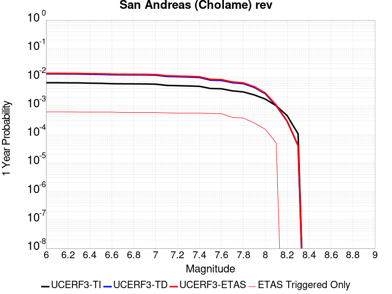 |  |

| Magnitude | 1 wk TI Prob | 1 wk TD Prob | 1 wk ETAS Prob | 1 wk ETAS/TD Gain | 1 wk ETAS Triggered Only | 1 mo TI Prob | 1 mo TD Prob | 1 mo ETAS Prob | 1 mo ETAS/TD Gain | 1 mo ETAS Triggered Only | 1 yr TI Prob | 1 yr TD Prob | 1 yr ETAS Prob | 1 yr ETAS/TD Gain | 1 yr ETAS Triggered Only | 10 yr TI Prob | 10 yr TD Prob | 10 yr ETAS Prob | 10 yr ETAS/TD Gain | 10 yr ETAS Triggered Only |
|-----|-----|-----|-----|-----|-----|-----|-----|-----|-----|-----|-----|-----|-----|-----|-----|-----|-----|-----|-----|-----|
| 6.0 | 1.2302514E-4 | 2.5204287E-4 | 4.5474927E-4 | 1.8042537 | 2.027575E-4 | 5.27144E-4 | 0.0010797381 | 0.0014224958 | 1.317445 | 3.4312808E-4 | 0.0063991086 | 0.0130670825 | 0.0136674065 | 1.0459417 | 6.082725E-4 | 0.06217949 | 0.12439073 | 0.12527841 | 1.0071362 | 0.0010137875 |
| 6.1 | 1.2302514E-4 | 2.5204287E-4 | 4.5474927E-4 | 1.8042537 | 2.027575E-4 | 5.27144E-4 | 0.0010797381 | 0.0014224958 | 1.317445 | 3.4312808E-4 | 0.0063991086 | 0.0130670825 | 0.0136674065 | 1.0459417 | 6.082725E-4 | 0.06217949 | 0.12439073 | 0.12527841 | 1.0071362 | 0.0010137875 |
| 6.2 | 1.2203569E-4 | 2.5021084E-4 | 4.529176E-4 | 1.8101438 | 2.027575E-4 | 5.2290526E-4 | 0.0010718931 | 0.0014146534 | 1.3197709 | 3.4312808E-4 | 0.006347804 | 0.01297271 | 0.0135730915 | 1.0462804 | 6.082725E-4 | 0.061695136 | 0.12357691 | 0.12446541 | 1.0071899 | 0.0010137875 |
| 6.3 | 1.2142645E-4 | 2.4907055E-4 | 4.5177757E-4 | 1.8138537 | 2.027575E-4 | 5.202953E-4 | 0.0010670102 | 0.0014097722 | 1.3212359 | 3.4312808E-4 | 0.006316212 | 0.012913967 | 0.013514384 | 1.0464936 | 6.082725E-4 | 0.06139677 | 0.12307103 | 0.12396005 | 1.0072236 | 0.0010137875 |
| 6.4 | 1.1865206E-4 | 2.44126E-4 | 4.4683402E-4 | 1.8303417 | 2.027575E-4 | 5.0840975E-4 | 0.0010458364 | 0.0013886056 | 1.3277465 | 3.4312808E-4 | 0.006172335 | 0.012659196 | 0.0132597685 | 1.0474416 | 6.082725E-4 | 0.060036868 | 0.1208638 | 0.12175506 | 1.007374 | 0.0010137875 |
| 6.5 | 1.17443946E-4 | 2.4205919E-4 | 4.4476762E-4 | 1.8374332 | 2.027575E-4 | 5.032341E-4 | 0.0010369857 | 0.0013797579 | 1.3305467 | 3.4312808E-4 | 0.006109677 | 0.012552682 | 0.013153319 | 1.0478493 | 6.082725E-4 | 0.059444077 | 0.11993805 | 0.12083025 | 1.0074388 | 0.0010137875 |
| 6.6 | 1.13579066E-4 | 2.3514954E-4 | 4.3785936E-4 | 1.8620465 | 2.027575E-4 | 4.866766E-4 | 0.001007396 | 0.0013501784 | 1.3402658 | 3.4312808E-4 | 0.0059092017 | 0.012196515 | 0.012797369 | 1.0492644 | 6.082725E-4 | 0.057545185 | 0.11685214 | 0.11774747 | 1.007662 | 0.0010137875 |
| 6.7 | 1.1271412E-4 | 2.3359268E-4 | 4.3630283E-4 | 1.8677932 | 2.027575E-4 | 4.829711E-4 | 0.0010007289 | 0.0013435136 | 1.342535 | 3.4312808E-4 | 0.005864331 | 0.012116249 | 0.012717151 | 1.0495948 | 6.082725E-4 | 0.057119697 | 0.116155714 | 0.11705174 | 1.007714 | 0.0010137875 |
| 6.8 | 1.1217975E-4 | 2.3247694E-4 | 4.351873E-4 | 1.871959 | 2.027575E-4 | 4.8068175E-4 | 9.959509E-4 | 0.0013387372 | 1.34418 | 3.4312808E-4 | 0.005836608 | 0.012058721 | 0.012659659 | 1.0498343 | 6.082725E-4 | 0.056856725 | 0.11565396 | 0.116550505 | 1.007752 | 0.0010137875 |
| 6.9 | 1.1146753E-4 | 2.3096445E-4 | 4.3367513E-4 | 1.8776704 | 2.027575E-4 | 4.7763053E-4 | 9.894737E-4 | 0.0013322622 | 1.3464353 | 3.4312808E-4 | 0.0057996577 | 0.011980731 | 0.012581716 | 1.0501627 | 6.082725E-4 | 0.056506127 | 0.11497439 | 0.115871616 | 1.0078037 | 0.0010137875 |
| 7.0 | 1.0965793E-4 | 2.2719789E-4 | 4.2990933E-4 | 1.8922241 | 2.027575E-4 | 4.698779E-4 | 9.733434E-4 | 0.0013161375 | 1.352182 | 3.4312808E-4 | 0.005705768 | 0.011786487 | 0.01238759 | 1.0509994 | 6.082725E-4 | 0.055614736 | 0.11327597 | 0.11417492 | 1.0079359 | 0.0010137875 |
| 7.1 | 9.927982E-5 | 2.0538924E-4 | 4.081051E-4 | 1.9869839 | 2.027575E-4 | 4.2541555E-4 | 8.7994366E-4 | 0.0012227698 | 1.3896002 | 3.4312808E-4 | 0.0051671406 | 0.010660981 | 0.011262769 | 1.0564477 | 6.082725E-4 | 0.05048634 | 0.1033706 | 0.10426561 | 1.0086583 | 9.981908E-4 |
| 7.2 | 9.696786E-5 | 2.0043184E-4 | 4.031487E-4 | 2.0114005 | 2.027575E-4 | 4.1551032E-4 | 8.5871184E-4 | 0.0011859619 | 1.3810942 | 3.2753134E-4 | 0.00504711 | 0.010404981 | 0.0109914895 | 1.0563681 | 5.9267576E-4 | 0.04934009 | 0.1011086 | 0.10199185 | 1.0087357 | 9.825941E-4 |
| 7.3 | 9.4727984E-5 | 1.9472468E-4 | 3.974427E-4 | 2.0410495 | 2.027575E-4 | 4.0591392E-4 | 8.3426846E-4 | 0.0011615265 | 1.3922695 | 3.2753134E-4 | 0.0049308087 | 0.010110183 | 0.010696867 | 1.0580289 | 5.9267576E-4 | 0.048228268 | 0.09847952 | 0.099365346 | 1.008995 | 9.825941E-4 |
| 7.4 | 9.220358E-5 | 1.8843076E-4 | 3.9115004E-4 | 2.075829 | 2.027575E-4 | 3.9509835E-4 | 8.073114E-4 | 0.0011345783 | 1.4053788 | 3.2753134E-4 | 0.004799717 | 0.009784967 | 0.010371843 | 1.0599774 | 5.9267576E-4 | 0.046973653 | 0.095557496 | 0.0964462 | 1.0093001 | 9.825941E-4 |
| 7.5 | 7.71631E-5 | 1.5177966E-4 | 3.545064E-4 | 2.3356647 | 2.027575E-4 | 3.306571E-4 | 6.503223E-4 | 9.776406E-4 | 1.5033171 | 3.2753134E-4 | 0.0040183207 | 0.007889002 | 0.008477001 | 1.0745342 | 5.9267576E-4 | 0.03946433 | 0.07828531 | 0.07919098 | 1.0115689 | 9.825941E-4 |
| 7.6 | 7.5634416E-5 | 1.483744E-4 | 3.511018E-4 | 2.3663235 | 2.027575E-4 | 3.241072E-4 | 6.3573546E-4 | 9.630586E-4 | 1.5148731 | 3.2753134E-4 | 0.0039388672 | 0.0077126776 | 0.008300782 | 1.0762516 | 5.9267576E-4 | 0.038697794 | 0.07664872 | 0.0775416 | 1.011649 | 9.669973E-4 |
| 7.7 | 6.3783E-5 | 1.235872E-4 | 2.6394043E-4 | 2.1356616 | 1.4037058E-4 | 2.7332708E-4 | 5.29552E-4 | 7.6337904E-4 | 1.4415565 | 2.3395097E-4 | 0.0033226798 | 0.0064282627 | 0.0068466673 | 1.0650883 | 4.2111173E-4 | 0.032734364 | 0.06454029 | 0.06513849 | 1.0092685 | 6.39466E-4 |
| 7.8 | 5.863422E-5 | 1.1416107E-4 | 2.5451562E-4 | 2.229443 | 1.4037058E-4 | 2.512653E-4 | 4.8917E-4 | 7.2300655E-4 | 1.4780271 | 2.3395097E-4 | 0.003054864 | 0.0059394026 | 0.0063425093 | 1.0678699 | 4.05515E-4 | 0.030132094 | 0.059659187 | 0.06020184 | 1.0090959 | 5.77079E-4 |
| 7.9 | 4.595283E-5 | 8.426331E-5 | 1.9343123E-4 | 2.295557 | 1.0917712E-4 | 1.9692584E-4 | 3.610785E-4 | 5.325806E-4 | 1.4749718 | 1.7156404E-4 | 0.0023949358 | 0.0043872762 | 0.004682314 | 1.0672485 | 2.9633788E-4 | 0.023692891 | 0.044362005 | 0.044749532 | 1.0087355 | 4.05515E-4 |
| 8.0 | 3.2950178E-5 | 5.0772942E-5 | 1.131567E-4 | 2.228681 | 6.238693E-5 | 1.412074E-4 | 2.1758018E-4 | 3.4232688E-4 | 1.5733367 | 1.2477385E-4 | 0.0017178444 | 0.0026458222 | 0.0028480433 | 1.0764303 | 2.027575E-4 | 0.017046256 | 0.027180137 | 0.027453247 | 1.0100482 | 2.8074117E-4 |
| 8.1 | 1.9177472E-5 | 1.9185145E-5 | 3.4781577E-5 | 1.8129431 | 1.5596732E-5 | 8.218658E-5 | 8.221946E-5 | 1.2900581E-4 | 1.5690422 | 4.6790192E-5 | 0.0010001622 | 0.0010005629 | 0.0010628874 | 1.0622895 | 6.238693E-5 | 0.009956728 | 0.010758142 | 0.010835287 | 1.0071708 | 7.7983656E-5 |
| 8.2 | 8.643924E-6 | 5.4748625E-6 | 5.4748625E-6 | 1.0 | 0.0 | 3.704486E-5 | 2.3463486E-5 | 2.3463486E-5 | 1.0 | 0.0 | 4.5092785E-4 | 2.8563058E-4 | 2.8563058E-4 | 1.0 | 0.0 | 0.0045001395 | 0.0032487072 | 0.0032487072 | 1.0 | 0.0 |
| 8.3 | 1.983087E-6 | 7.6599065E-7 | 7.6599065E-7 | 1.0 | 0.0 | 8.498917E-6 | 3.282813E-6 | 3.282813E-6 | 1.0 | 0.0 | 1.034694E-4 | 3.9967534E-5 | 3.9967534E-5 | 1.0 | 0.0 | 0.0010342124 | 4.719687E-4 | 4.719687E-4 | 1.0 | 0.0 |

## Death Valley (Fish Lake Valley)
*[(top)](#table-of-contents)*

| 1 Week | 1 Month | 1 Year | 10 Year |
|-----|-----|-----|-----|
|  |  | 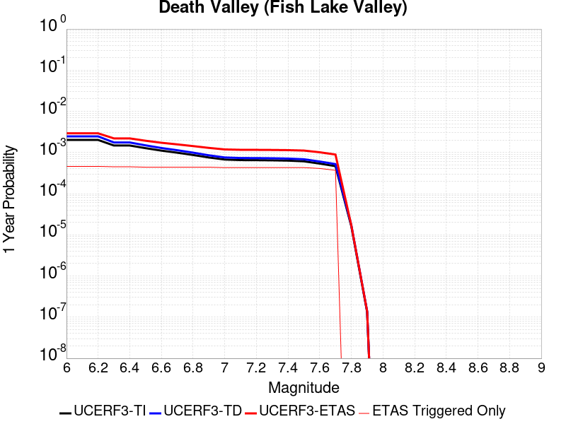 |  |

| Magnitude | 1 wk TI Prob | 1 wk TD Prob | 1 wk ETAS Prob | 1 wk ETAS/TD Gain | 1 wk ETAS Triggered Only | 1 mo TI Prob | 1 mo TD Prob | 1 mo ETAS Prob | 1 mo ETAS/TD Gain | 1 mo ETAS Triggered Only | 1 yr TI Prob | 1 yr TD Prob | 1 yr ETAS Prob | 1 yr ETAS/TD Gain | 1 yr ETAS Triggered Only | 10 yr TI Prob | 10 yr TD Prob | 10 yr ETAS Prob | 10 yr ETAS/TD Gain | 10 yr ETAS Triggered Only |
|-----|-----|-----|-----|-----|-----|-----|-----|-----|-----|-----|-----|-----|-----|-----|-----|-----|-----|-----|-----|-----|
| 6.0 | 3.872328E-5 | 4.7267473E-5 | 1.7203542E-4 | 3.6396155 | 1.2477385E-4 | 1.6594635E-4 | 2.0256084E-4 | 4.2087084E-4 | 2.0777502 | 2.1835424E-4 | 0.0020185246 | 0.002463534 | 0.0029614 | 1.2020942 | 4.990954E-4 | 0.02000288 | 0.024388181 | 0.025331594 | 1.0386833 | 9.669973E-4 |
| 6.1 | 3.872328E-5 | 4.7267473E-5 | 1.7203542E-4 | 3.6396155 | 1.2477385E-4 | 1.6594635E-4 | 2.0256084E-4 | 4.2087084E-4 | 2.0777502 | 2.1835424E-4 | 0.0020185246 | 0.002463534 | 0.0029614 | 1.2020942 | 4.990954E-4 | 0.02000288 | 0.024388181 | 0.025331594 | 1.0386833 | 9.669973E-4 |
| 6.2 | 3.872328E-5 | 4.7267473E-5 | 1.7203542E-4 | 3.6396155 | 1.2477385E-4 | 1.6594635E-4 | 2.0256084E-4 | 4.2087084E-4 | 2.0777502 | 2.1835424E-4 | 0.0020185246 | 0.002463534 | 0.0029614 | 1.2020942 | 4.990954E-4 | 0.02000288 | 0.024388181 | 0.025331594 | 1.0386833 | 9.669973E-4 |
| 6.3 | 2.8356371E-5 | 3.3609853E-5 | 1.427833E-4 | 4.248257 | 1.0917712E-4 | 1.2152165E-4 | 1.4403471E-4 | 3.46763E-4 | 2.4074962 | 2.027575E-4 | 0.0014785219 | 0.0017522911 | 0.0022349425 | 1.2754402 | 4.8349865E-4 | 0.014687235 | 0.017391782 | 0.01831131 | 1.0528715 | 9.3580387E-4 |
| 6.4 | 2.8356371E-5 | 3.3609853E-5 | 1.427833E-4 | 4.248257 | 1.0917712E-4 | 1.2152165E-4 | 1.4403471E-4 | 3.46763E-4 | 2.4074962 | 2.027575E-4 | 0.0014785219 | 0.0017522911 | 0.0022349425 | 1.2754402 | 4.8349865E-4 | 0.014687235 | 0.017391782 | 0.01831131 | 1.0528715 | 9.3580387E-4 |
| 6.5 | 2.4448687E-5 | 2.8607552E-5 | 1.2218526E-4 | 4.271084 | 9.3580384E-5 | 1.0477588E-4 | 1.2259831E-4 | 3.0973615E-4 | 2.5264306 | 1.8716077E-4 | 0.0012748998 | 0.0014916632 | 0.001958867 | 1.3132101 | 4.6790193E-4 | 0.012676105 | 0.014821377 | 0.015727945 | 1.0611663 | 9.202071E-4 |
| 6.6 | 2.1298161E-5 | 2.4660083E-5 | 1.1823816E-4 | 4.7947187 | 9.3580384E-5 | 9.127464E-5 | 1.0568198E-4 | 2.9282298E-4 | 2.7707937 | 1.8716077E-4 | 0.0011107022 | 0.0012859525 | 0.0017532528 | 1.3633884 | 4.6790193E-4 | 0.011051672 | 0.012788526 | 0.013696965 | 1.0710355 | 9.202071E-4 |
| 6.7 | 1.8959729E-5 | 2.1781025E-5 | 1.1535937E-4 | 5.2963243 | 9.3580384E-5 | 8.125345E-5 | 9.334405E-5 | 2.8048735E-4 | 3.0048764 | 1.8716077E-4 | 9.888117E-4 | 0.001135897 | 0.0016032674 | 1.4114549 | 4.6790193E-4 | 0.009844234 | 0.01130357 | 0.012213375 | 1.0804883 | 9.202071E-4 |
| 6.8 | 1.6691629E-5 | 1.9018353E-5 | 1.1259696E-4 | 5.9204373 | 9.3580384E-5 | 7.153359E-5 | 8.150477E-5 | 2.686503E-4 | 3.2961295 | 1.8716077E-4 | 8.7057345E-4 | 9.918857E-4 | 0.0014593235 | 1.4712617 | 4.6790193E-4 | 0.008671708 | 0.009876343 | 0.010787463 | 1.0922526 | 9.202071E-4 |
| 6.9 | 1.450505E-5 | 1.638954E-5 | 1.09968394E-4 | 6.709669 | 9.3580384E-5 | 6.216302E-5 | 7.0239046E-5 | 2.5738668E-4 | 3.6644387 | 1.8716077E-4 | 7.5657194E-4 | 8.5483363E-4 | 0.0013223356 | 1.5468923 | 4.6790193E-4 | 0.007540013 | 0.008516385 | 0.009428756 | 1.1071311 | 9.202071E-4 |
| 7.0 | 1.2940855E-5 | 1.4537972E-5 | 1.08117E-4 | 7.436869 | 9.3580384E-5 | 5.545963E-5 | 6.230414E-5 | 2.4945324E-4 | 4.003799 | 1.8716077E-4 | 6.750118E-4 | 7.5829466E-4 | 0.0012258418 | 1.616577 | 4.6790193E-4 | 0.006729651 | 0.0075576897 | 0.008470942 | 1.1208376 | 9.202071E-4 |
| 7.1 | 1.2544658E-5 | 1.4078208E-5 | 1.0765727E-4 | 7.6470866 | 9.3580384E-5 | 5.3761712E-5 | 6.0333812E-5 | 2.474833E-4 | 4.1019006 | 1.8716077E-4 | 6.5435225E-4 | 7.343222E-4 | 0.0012018805 | 1.636721 | 4.6790193E-4 | 0.006524288 | 0.007319551 | 0.008233023 | 1.1247989 | 9.202071E-4 |
| 7.2 | 1.2489416E-5 | 1.4015674E-5 | 1.0759475E-4 | 7.6767445 | 9.3580384E-5 | 5.3524967E-5 | 6.0065824E-5 | 2.4721536E-4 | 4.115741 | 1.8716077E-4 | 6.514716E-4 | 7.310616E-4 | 0.0011986215 | 1.6395628 | 4.6790193E-4 | 0.006495651 | 0.0072871596 | 0.008200661 | 1.1253576 | 9.202071E-4 |
| 7.3 | 1.2368307E-5 | 1.3879812E-5 | 1.074589E-4 | 7.7421002 | 9.3580384E-5 | 5.3005948E-5 | 5.9483587E-5 | 2.4663322E-4 | 4.14624 | 1.8716077E-4 | 6.451563E-4 | 7.2397763E-4 | 0.0011915407 | 1.6458255 | 4.6790193E-4 | 0.0064328653 | 0.007216782 | 0.008130348 | 1.1265892 | 9.202071E-4 |
| 7.4 | 1.2161707E-5 | 1.36478675E-5 | 1.0722697E-4 | 7.8566833 | 9.3580384E-5 | 5.212056E-5 | 5.8489582E-5 | 2.456394E-4 | 4.1997123 | 1.8716077E-4 | 6.3438306E-4 | 7.118836E-4 | 0.0011794524 | 1.6568052 | 4.6790193E-4 | 0.006325751 | 0.0070966207 | 0.008010297 | 1.1287482 | 9.202071E-4 |
| 7.5 | 1.1707948E-5 | 1.3145515E-5 | 1.0672467E-4 | 8.118713 | 9.3580384E-5 | 5.0175953E-5 | 5.6336736E-5 | 2.4348697E-4 | 4.321993 | 1.8716077E-4 | 6.10721E-4 | 6.856895E-4 | 0.0011532706 | 1.6819137 | 4.6790193E-4 | 0.0060904534 | 0.006836321 | 0.0077502374 | 1.1336854 | 9.202071E-4 |
| 7.6 | 1.0319538E-5 | 1.1579622E-5 | 1.0515892E-4 | 9.081378 | 9.3580384E-5 | 4.4225842E-5 | 4.9626036E-5 | 2.2118156E-4 | 4.456966 | 1.7156404E-4 | 5.383166E-4 | 6.040347E-4 | 0.0010404794 | 1.7225491 | 4.3670848E-4 | 0.0053701443 | 0.0060244603 | 0.0069081183 | 1.1466783 | 8.8901364E-4 |
| 7.7 | 8.937764E-6 | 1.0022779E-5 | 7.240908E-5 | 7.224451 | 6.238693E-5 | 3.830414E-5 | 4.295409E-5 | 1.6772258E-4 | 3.904694 | 1.2477385E-4 | 4.6625308E-4 | 5.228456E-4 | 9.1256E-4 | 1.7453719 | 3.8991828E-4 | 0.0046527605 | 0.005216664 | 0.0060389787 | 1.1576322 | 8.266267E-4 |
| 7.8 | 3.108007E-7 | 3.284654E-7 | 3.284654E-7 | 1.0 | 0.0 | 1.3320023E-6 | 1.407708E-6 | 1.407708E-6 | 1.0 | 0.0 | 1.6217007E-5 | 1.7138715E-5 | 1.7138715E-5 | 1.0 | 0.0 | 1.6215823E-4 | 1.7137431E-4 | 1.8696838E-4 | 1.0909941 | 1.5596732E-5 |
| 7.9 | 2.5591178E-9 | 2.6696718E-9 | 2.6696718E-9 | 1.0 | 0.0 | 1.0967647E-8 | 1.14414505E-8 | 1.14414505E-8 | 1.0 | 0.0 | 1.335311E-7 | 1.3929966E-7 | 1.3929966E-7 | 1.0 | 0.0 | 1.3353102E-6 | 1.3929966E-6 | 1.3929966E-6 | 1.0 | 0.0 |

## San Jacinto (San Bernardino)
*[(top)](#table-of-contents)*

| 1 Week | 1 Month | 1 Year | 10 Year |
|-----|-----|-----|-----|
|  | 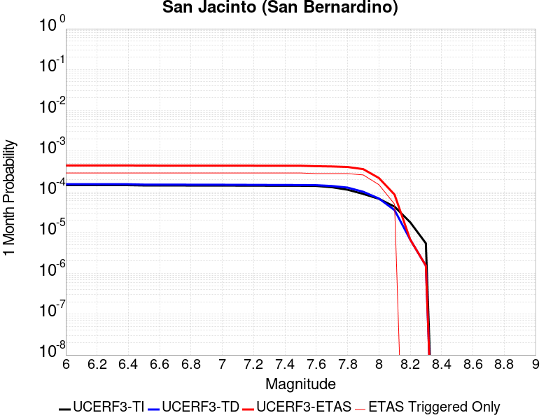 | 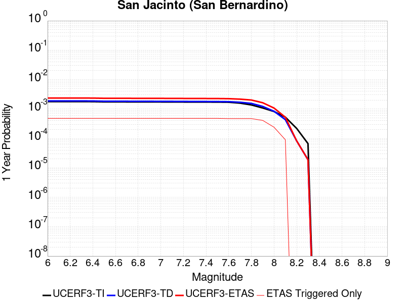 |  |

| Magnitude | 1 wk TI Prob | 1 wk TD Prob | 1 wk ETAS Prob | 1 wk ETAS/TD Gain | 1 wk ETAS Triggered Only | 1 mo TI Prob | 1 mo TD Prob | 1 mo ETAS Prob | 1 mo ETAS/TD Gain | 1 mo ETAS Triggered Only | 1 yr TI Prob | 1 yr TD Prob | 1 yr ETAS Prob | 1 yr ETAS/TD Gain | 1 yr ETAS Triggered Only | 10 yr TI Prob | 10 yr TD Prob | 10 yr ETAS Prob | 10 yr ETAS/TD Gain | 10 yr ETAS Triggered Only |
|-----|-----|-----|-----|-----|-----|-----|-----|-----|-----|-----|-----|-----|-----|-----|-----|-----|-----|-----|-----|-----|
| 6.0 | 3.409352E-5 | 3.5986508E-5 | 3.0112138E-4 | 8.367619 | 2.6514442E-4 | 1.461069E-4 | 1.542188E-4 | 5.284826E-4 | 3.4268367 | 3.7432153E-4 | 0.0017774 | 0.0018759987 | 0.0024364276 | 1.2987363 | 5.6148233E-4 | 0.01763251 | 0.019349935 | 0.020114683 | 1.0395219 | 7.7983656E-4 |
| 6.1 | 3.409352E-5 | 3.5986508E-5 | 3.0112138E-4 | 8.367619 | 2.6514442E-4 | 1.461069E-4 | 1.542188E-4 | 5.284826E-4 | 3.4268367 | 3.7432153E-4 | 0.0017774 | 0.0018759987 | 0.0024364276 | 1.2987363 | 5.6148233E-4 | 0.01763251 | 0.019349935 | 0.020114683 | 1.0395219 | 7.7983656E-4 |
| 6.2 | 3.409352E-5 | 3.5986508E-5 | 3.0112138E-4 | 8.367619 | 2.6514442E-4 | 1.461069E-4 | 1.542188E-4 | 5.284826E-4 | 3.4268367 | 3.7432153E-4 | 0.0017774 | 0.0018759987 | 0.0024364276 | 1.2987363 | 5.6148233E-4 | 0.01763251 | 0.019349935 | 0.020114683 | 1.0395219 | 7.7983656E-4 |
| 6.3 | 3.409352E-5 | 3.5986508E-5 | 3.0112138E-4 | 8.367619 | 2.6514442E-4 | 1.461069E-4 | 1.542188E-4 | 5.284826E-4 | 3.4268367 | 3.7432153E-4 | 0.0017774 | 0.0018759987 | 0.0024364276 | 1.2987363 | 5.6148233E-4 | 0.01763251 | 0.019349935 | 0.020114683 | 1.0395219 | 7.7983656E-4 |
| 6.4 | 3.400795E-5 | 3.5879173E-5 | 3.0101408E-4 | 8.389661 | 2.6514442E-4 | 1.4574021E-4 | 1.5375883E-4 | 5.280228E-4 | 3.4340975 | 3.7432153E-4 | 0.0017729428 | 0.0018704084 | 0.0024308406 | 1.2996309 | 5.6148233E-4 | 0.017588645 | 0.019295016 | 0.020059807 | 1.0396366 | 7.7983656E-4 |
| 6.5 | 3.341482E-5 | 3.5139812E-5 | 3.0027493E-4 | 8.545149 | 2.6514442E-4 | 1.4319851E-4 | 1.5059051E-4 | 5.248557E-4 | 3.4853172 | 3.7432153E-4 | 0.0017420477 | 0.0018318989 | 0.0023923528 | 1.3059413 | 5.6148233E-4 | 0.017284546 | 0.018916558 | 0.019681644 | 1.0404452 | 7.7983656E-4 |
| 6.6 | 3.3364955E-5 | 3.5077028E-5 | 3.0021215E-4 | 8.558654 | 2.6514442E-4 | 1.4298483E-4 | 1.5032147E-4 | 5.2458677E-4 | 3.489766 | 3.7432153E-4 | 0.0017394501 | 0.001828629 | 0.0023890845 | 1.3064895 | 5.6148233E-4 | 0.017258976 | 0.018884424 | 0.019649534 | 1.0405154 | 7.7983656E-4 |
| 6.7 | 3.335922E-5 | 3.5066805E-5 | 3.0020194E-4 | 8.560858 | 2.6514442E-4 | 1.4296026E-4 | 1.5027766E-4 | 5.2454293E-4 | 3.4904919 | 3.7432153E-4 | 0.0017391514 | 0.0018280965 | 0.0023885523 | 1.306579 | 5.6148233E-4 | 0.017256035 | 0.018879214 | 0.01964433 | 1.0405267 | 7.7983656E-4 |
| 6.8 | 3.327683E-5 | 3.496087E-5 | 3.0009603E-4 | 8.583769 | 2.6514442E-4 | 1.4260718E-4 | 1.498237E-4 | 5.2408915E-4 | 3.498039 | 3.7432153E-4 | 0.0017348597 | 0.0018225788 | 0.0023830377 | 1.3075088 | 5.6148233E-4 | 0.017213784 | 0.018824987 | 0.019590143 | 1.0406457 | 7.7983656E-4 |
| 6.9 | 3.3235785E-5 | 3.4901823E-5 | 3.00037E-4 | 8.5966 | 2.6514442E-4 | 1.4243131E-4 | 1.4957068E-4 | 5.2383624E-4 | 3.5022655 | 3.7432153E-4 | 0.0017327217 | 0.0018195034 | 0.002379964 | 1.3080295 | 5.6148233E-4 | 0.017192734 | 0.018794855 | 0.019560035 | 1.0407122 | 7.7983656E-4 |
| 7.0 | 3.3197095E-5 | 3.4841752E-5 | 2.9997693E-4 | 8.609697 | 2.6514442E-4 | 1.422655E-4 | 1.4931326E-4 | 5.235789E-4 | 3.50658 | 3.7432153E-4 | 0.0017307063 | 0.0018163746 | 0.0023768372 | 1.3085611 | 5.6148233E-4 | 0.017172894 | 0.018764233 | 0.019529436 | 1.04078 | 7.7983656E-4 |
| 7.1 | 3.3129716E-5 | 3.4721965E-5 | 2.9985717E-4 | 8.635951 | 2.6514442E-4 | 1.4197677E-4 | 1.4879994E-4 | 5.230658E-4 | 3.5152285 | 3.7432153E-4 | 0.0017271966 | 0.0018101353 | 0.0023706013 | 1.3096266 | 5.6148233E-4 | 0.017138338 | 0.018703312 | 0.01945326 | 1.040097 | 7.642398E-4 |
| 7.2 | 3.3034008E-5 | 3.458941E-5 | 2.9972466E-4 | 8.665215 | 2.6514442E-4 | 1.4156665E-4 | 1.4823192E-4 | 5.22498E-4 | 3.524868 | 3.7432153E-4 | 0.0017222111 | 0.0018032312 | 0.0023637011 | 1.3108141 | 5.6148233E-4 | 0.017089253 | 0.018635705 | 0.019385703 | 1.0402452 | 7.642398E-4 |
| 7.3 | 3.2956614E-5 | 3.445717E-5 | 2.9959247E-4 | 8.6946335 | 2.6514442E-4 | 1.4123498E-4 | 1.4766524E-4 | 5.219315E-4 | 3.5345592 | 3.7432153E-4 | 0.0017181796 | 0.0017963431 | 0.0023568168 | 1.3120081 | 5.6148233E-4 | 0.017049557 | 0.018568452 | 0.019318502 | 1.0403937 | 7.642398E-4 |
| 7.4 | 3.2915937E-5 | 3.4378863E-5 | 2.9951418E-4 | 8.71216 | 2.6514442E-4 | 1.4106068E-4 | 1.4732967E-4 | 5.2159606E-4 | 3.5403326 | 3.7432153E-4 | 0.0017160608 | 0.0017922645 | 0.0023527404 | 1.3127195 | 5.6148233E-4 | 0.017028693 | 0.018528719 | 0.019278798 | 1.040482 | 7.642398E-4 |
| 7.5 | 3.281791E-5 | 3.4243778E-5 | 2.993791E-4 | 8.742584 | 2.6514442E-4 | 1.406406E-4 | 1.4675081E-4 | 5.210174E-4 | 3.5503547 | 3.7432153E-4 | 0.0017109542 | 0.0017852283 | 0.0023457082 | 1.3139542 | 5.6148233E-4 | 0.016978411 | 0.018459605 | 0.019209737 | 1.0406364 | 7.642398E-4 |
| 7.6 | 3.2521442E-5 | 3.396873E-5 | 2.8350795E-4 | 8.346145 | 2.495477E-4 | 1.3937015E-4 | 1.4557215E-4 | 5.0424476E-4 | 3.4638817 | 3.5872482E-4 | 0.0016955109 | 0.0017709016 | 0.0023158204 | 1.3077071 | 5.458856E-4 | 0.016826328 | 0.018317232 | 0.019052163 | 1.0401223 | 7.4864307E-4 |
| 7.7 | 3.0287873E-5 | 3.245276E-5 | 2.8199237E-4 | 8.689318 | 2.495477E-4 | 1.297987E-4 | 1.3907586E-4 | 4.9775076E-4 | 3.5789876 | 3.5872482E-4 | 0.0015791537 | 0.0016919347 | 0.0022368967 | 1.322094 | 5.458856E-4 | 0.01567979 | 0.01752809 | 0.018263612 | 1.0419624 | 7.4864307E-4 |
| 7.8 | 2.6316151E-5 | 2.9663592E-5 | 2.7920387E-4 | 9.412343 | 2.495477E-4 | 1.1277862E-4 | 1.2712348E-4 | 4.858027E-4 | 3.8215022 | 3.5872482E-4 | 0.0013722149 | 0.0015466306 | 0.0020916718 | 1.3524057 | 5.458856E-4 | 0.013637724 | 0.016069634 | 0.016806247 | 1.0458388 | 7.4864307E-4 |
| 7.9 | 2.0761147E-5 | 2.34181E-5 | 2.5736357E-4 | 10.989943 | 2.3395097E-4 | 8.897331E-5 | 1.0035944E-4 | 4.434531E-4 | 4.4186487 | 3.4312808E-4 | 0.0010827117 | 0.0012211921 | 0.0017041003 | 1.39544 | 4.8349865E-4 | 0.010774517 | 0.012793174 | 0.013455254 | 1.0517526 | 6.706594E-4 |
| 8.0 | 1.5738568E-5 | 1.6033575E-5 | 9.401598E-5 | 5.863694 | 7.7983656E-5 | 6.744926E-5 | 6.871352E-5 | 2.4026577E-4 | 3.4966304 | 1.7156404E-4 | 8.2088535E-4 | 8.3626667E-4 | 0.0010856057 | 1.2981573 | 2.495477E-4 | 0.008178596 | 0.008865921 | 0.009190548 | 1.0366153 | 3.2753134E-4 |
| 8.1 | 1.0105832E-5 | 8.3304985E-6 | 5.51203E-5 | 6.6166873 | 4.6790192E-5 | 4.3309992E-5 | 3.570165E-5 | 1.1368252E-4 | 3.1842372 | 7.7983656E-5 | 5.2717153E-4 | 4.345814E-4 | 5.4371107E-4 | 1.2511145 | 1.0917712E-4 | 0.005259227 | 0.004677232 | 0.00483247 | 1.0331901 | 1.5596731E-4 |
| 8.2 | 4.189207E-6 | 1.5784357E-6 | 1.5784357E-6 | 1.0 | 0.0 | 1.7953622E-5 | 6.7647065E-6 | 6.7647065E-6 | 1.0 | 0.0 | 2.1856341E-4 | 8.235722E-5 | 8.235722E-5 | 1.0 | 0.0 | 0.0021834858 | 9.565867E-4 | 9.565867E-4 | 1.0 | 0.0 |
| 8.3 | 1.2758221E-6 | 3.6149942E-7 | 3.6149942E-7 | 1.0 | 0.0 | 5.4677976E-6 | 1.5492824E-6 | 1.5492824E-6 | 1.0 | 0.0 | 6.65684E-5 | 1.8862354E-5 | 1.8862354E-5 | 1.0 | 0.0 | 6.6548464E-4 | 2.2751294E-4 | 2.2751294E-4 | 1.0 | 0.0 |

## San Andreas (Coachella) rev
*[(top)](#table-of-contents)*

| 1 Week | 1 Month | 1 Year | 10 Year |
|-----|-----|-----|-----|
|  |  |  |  |

| Magnitude | 1 wk TI Prob | 1 wk TD Prob | 1 wk ETAS Prob | 1 wk ETAS/TD Gain | 1 wk ETAS Triggered Only | 1 mo TI Prob | 1 mo TD Prob | 1 mo ETAS Prob | 1 mo ETAS/TD Gain | 1 mo ETAS Triggered Only | 1 yr TI Prob | 1 yr TD Prob | 1 yr ETAS Prob | 1 yr ETAS/TD Gain | 1 yr ETAS Triggered Only | 10 yr TI Prob | 10 yr TD Prob | 10 yr ETAS Prob | 10 yr ETAS/TD Gain | 10 yr ETAS Triggered Only |
|-----|-----|-----|-----|-----|-----|-----|-----|-----|-----|-----|-----|-----|-----|-----|-----|-----|-----|-----|-----|-----|
| 6.0 | 1.1925945E-4 | 3.2729402E-4 | 5.299852E-4 | 1.6192938 | 2.027575E-4 | 5.110118E-4 | 0.0014019393 | 0.0016978617 | 1.2110808 | 2.9633788E-4 | 0.0062038354 | 0.016936364 | 0.017427007 | 1.0289698 | 4.990954E-4 | 0.060334753 | 0.15265316 | 0.15324786 | 1.0038959 | 7.018529E-4 |
| 6.1 | 1.1925945E-4 | 3.2729402E-4 | 5.299852E-4 | 1.6192938 | 2.027575E-4 | 5.110118E-4 | 0.0014019393 | 0.0016978617 | 1.2110808 | 2.9633788E-4 | 0.0062038354 | 0.016936364 | 0.017427007 | 1.0289698 | 4.990954E-4 | 0.060334753 | 0.15265316 | 0.15324786 | 1.0038959 | 7.018529E-4 |
| 6.2 | 1.07432395E-4 | 3.0230157E-4 | 5.049978E-4 | 1.6705099 | 2.027575E-4 | 4.603433E-4 | 0.0012949388 | 0.001590893 | 1.2285469 | 2.9633788E-4 | 0.005590286 | 0.015653009 | 0.01614429 | 1.0313859 | 4.990954E-4 | 0.05451731 | 0.14182423 | 0.14242655 | 1.004247 | 7.018529E-4 |
| 6.3 | 1.0718766E-4 | 3.0175463E-4 | 5.0445093E-4 | 1.6717256 | 2.027575E-4 | 4.592948E-4 | 0.0012925972 | 0.0015885519 | 1.2289613 | 2.9633788E-4 | 0.005577586 | 0.015624908 | 0.016116204 | 1.0314432 | 4.990954E-4 | 0.054396555 | 0.14159249 | 0.14219497 | 1.004255 | 7.018529E-4 |
| 6.4 | 1.0355944E-4 | 2.9383553E-4 | 4.9653347E-4 | 1.6898346 | 2.027575E-4 | 4.4375064E-4 | 0.0012586913 | 0.0015546562 | 1.235137 | 2.9633788E-4 | 0.0053892885 | 0.015217941 | 0.015709441 | 1.0322974 | 4.990954E-4 | 0.052604496 | 0.13815255 | 0.13875745 | 1.0043784 | 7.018529E-4 |
| 6.5 | 1.0227914E-4 | 2.9102986E-4 | 4.937284E-4 | 1.696487 | 2.027575E-4 | 4.382655E-4 | 0.0012466786 | 0.0015270697 | 1.2249105 | 2.8074117E-4 | 0.0053228354 | 0.01507372 | 0.015549931 | 1.0315921 | 4.8349865E-4 | 0.051971316 | 0.13693172 | 0.13752401 | 1.0043254 | 6.8625616E-4 |
| 6.6 | 1.0116757E-4 | 2.8868738E-4 | 4.9138634E-4 | 1.7021401 | 2.027575E-4 | 4.3350324E-4 | 0.0012366489 | 0.0015170429 | 1.2267369 | 2.8074117E-4 | 0.0052651367 | 0.01495329 | 0.015429559 | 1.0318505 | 4.8349865E-4 | 0.051421247 | 0.1359099 | 0.13650289 | 1.0043631 | 6.8625616E-4 |
| 6.7 | 1.0050676E-4 | 2.8727303E-4 | 4.8997224E-4 | 1.705598 | 2.027575E-4 | 4.3067214E-4 | 0.0012305931 | 0.0015109888 | 1.2278541 | 2.8074117E-4 | 0.005230834 | 0.014880571 | 0.015356874 | 1.0320084 | 4.8349865E-4 | 0.051094085 | 0.13529462 | 0.13588803 | 1.0043861 | 6.8625616E-4 |
| 6.8 | 9.976819E-5 | 2.853096E-4 | 4.8800925E-4 | 1.7104551 | 2.027575E-4 | 4.2750788E-4 | 0.0012221863 | 0.0015025843 | 1.2294233 | 2.8074117E-4 | 0.0051924936 | 0.0147796115 | 0.015255964 | 1.0322304 | 4.8349865E-4 | 0.050728295 | 0.13444631 | 0.1350403 | 1.004418 | 6.8625616E-4 |
| 6.9 | 9.77719E-5 | 2.8027873E-4 | 4.829794E-4 | 1.723211 | 2.027575E-4 | 4.1895514E-4 | 0.0012006456 | 0.0014810496 | 1.2335445 | 2.8074117E-4 | 0.0050888555 | 0.014520878 | 0.014997356 | 1.0328133 | 4.8349865E-4 | 0.049738888 | 0.1322748 | 0.13287029 | 1.0045018 | 6.8625616E-4 |
| 7.0 | 8.500761E-5 | 2.4762485E-4 | 4.5033215E-4 | 1.8186064 | 2.027575E-4 | 3.6426744E-4 | 0.001060821 | 0.0013412643 | 1.2643645 | 2.8074117E-4 | 0.0044259406 | 0.012839786 | 0.0133170765 | 1.0371728 | 4.8349865E-4 | 0.04338823 | 0.11813272 | 0.118737906 | 1.0051229 | 6.8625616E-4 |
| 7.1 | 8.319876E-5 | 2.4365232E-4 | 4.463604E-4 | 1.8319564 | 2.027575E-4 | 3.5651738E-4 | 0.0010438096 | 0.0013242577 | 1.2686775 | 2.8074117E-4 | 0.004331963 | 0.012635092 | 0.013112483 | 1.0377828 | 4.8349865E-4 | 0.042484846 | 0.116353 | 0.11695941 | 1.0052118 | 6.8625616E-4 |
| 7.2 | 7.563917E-5 | 2.2413683E-4 | 4.2684888E-4 | 1.904412 | 2.027575E-4 | 3.2412758E-4 | 9.602359E-4 | 0.0012407075 | 1.2920861 | 2.8074117E-4 | 0.0039391145 | 0.011628893 | 0.01210677 | 1.0410938 | 4.8349865E-4 | 0.03870018 | 0.10775925 | 0.108371556 | 1.0056821 | 6.8625616E-4 |
| 7.3 | 7.082985E-5 | 2.0729867E-4 | 4.1001415E-4 | 1.9778908 | 2.027575E-4 | 3.0352117E-4 | 8.881233E-4 | 0.0011686151 | 1.3158253 | 2.8074117E-4 | 0.0036891096 | 0.010759917 | 0.011238214 | 1.0444517 | 4.8349865E-4 | 0.03628465 | 0.100282 | 0.100899436 | 1.006157 | 6.8625616E-4 |
| 7.4 | 5.146215E-5 | 1.4273795E-4 | 3.454665E-4 | 2.420285 | 2.027575E-4 | 2.2053342E-4 | 6.115915E-4 | 8.765738E-4 | 1.4332668 | 2.6514442E-4 | 0.0026816884 | 0.0074208933 | 0.007885323 | 1.062584 | 4.6790193E-4 | 0.02649557 | 0.070849575 | 0.07147272 | 1.0087953 | 6.706594E-4 |
| 7.5 | 4.0285166E-5 | 1.09416E-4 | 2.965563E-4 | 2.7103558 | 1.8716077E-4 | 1.7263928E-4 | 4.6884175E-4 | 7.1827247E-4 | 1.5320147 | 2.495477E-4 | 0.002099857 | 0.0056932783 | 0.0061430084 | 1.0789932 | 4.523052E-4 | 0.020801254 | 0.055011146 | 0.055630174 | 1.0112528 | 6.550627E-4 |
| 7.6 | 3.1168736E-5 | 8.4389096E-5 | 2.7153408E-4 | 3.217644 | 1.8716077E-4 | 1.3357346E-4 | 3.6161754E-4 | 5.954839E-4 | 1.6467229 | 2.3395097E-4 | 0.0016250437 | 0.0043938323 | 0.004828622 | 1.0989546 | 4.3670848E-4 | 0.016132116 | 0.04281005 | 0.04342214 | 1.0142978 | 6.39466E-4 |
| 7.7 | 2.2100989E-5 | 6.238755E-5 | 2.4953665E-4 | 3.9997826 | 1.8716077E-4 | 9.4715084E-5 | 2.6734784E-4 | 5.012363E-4 | 1.8748468 | 2.3395097E-4 | 0.001152546 | 0.0032501083 | 0.0036853976 | 1.1339307 | 4.3670848E-4 | 0.011465867 | 0.0319002 | 0.03247397 | 1.0179864 | 5.9267576E-4 |
| 7.8 | 1.7484861E-5 | 5.179572E-5 | 2.2335087E-4 | 4.3121495 | 1.7156404E-4 | 7.493296E-5 | 2.2196278E-4 | 4.4026854E-4 | 1.9835242 | 2.1835424E-4 | 9.1192697E-4 | 0.0026990508 | 0.0031034711 | 1.1498381 | 4.05515E-4 | 0.009081938 | 0.026640115 | 0.027171459 | 1.0199453 | 5.458856E-4 |
| 7.9 | 1.3967285E-5 | 3.822255E-5 | 2.0978003E-4 | 5.488384 | 1.7156404E-4 | 5.985842E-5 | 1.6380067E-4 | 3.6652494E-4 | 2.237628 | 2.027575E-4 | 7.2853256E-4 | 0.00199245 | 0.0023504603 | 1.1796833 | 3.5872482E-4 | 0.0072614877 | 0.019909438 | 0.02038331 | 1.0238014 | 4.8349865E-4 |
| 8.0 | 1.1887396E-5 | 3.106521E-5 | 1.7143143E-4 | 5.518438 | 1.4037058E-4 | 5.094499E-5 | 1.3312983E-4 | 3.0467103E-4 | 2.2885256 | 1.7156404E-4 | 6.200787E-4 | 0.0016196516 | 0.001931081 | 1.1922817 | 3.1193462E-4 | 0.006183513 | 0.016279267 | 0.016708868 | 1.0263894 | 4.3670848E-4 |
| 8.1 | 5.100864E-6 | 8.973418E-6 | 2.4570008E-5 | 2.7380881 | 1.5596732E-5 | 2.1860664E-5 | 3.8456936E-5 | 5.4053067E-5 | 1.405548 | 1.5596732E-5 | 2.6612106E-4 | 4.6811273E-4 | 4.992916E-4 | 1.0666054 | 3.1193464E-5 | 0.002658026 | 0.004917731 | 0.004964291 | 1.0094678 | 4.6790192E-5 |
| 8.2 | 2.3004484E-6 | 2.7864487E-6 | 2.7864487E-6 | 1.0 | 0.0 | 9.859027E-6 | 1.1941868E-5 | 1.1941868E-5 | 1.0 | 0.0 | 1.2002704E-4 | 1.4538258E-4 | 1.4538258E-4 | 1.0 | 0.0 | 0.0011996223 | 0.0015973912 | 0.0015973912 | 1.0 | 0.0 |
| 8.3 | 1.0424446E-7 | 5.8161504E-8 | 5.8161504E-8 | 1.0 | 0.0 | 4.4676187E-7 | 2.4926356E-7 | 2.4926356E-7 | 1.0 | 0.0 | 5.439312E-6 | 3.03478E-6 | 3.03478E-6 | 1.0 | 0.0 | 5.4391792E-5 | 3.190716E-5 | 3.190716E-5 | 1.0 | 0.0 |

## Red Pass
*[(top)](#table-of-contents)*

| 1 Week | 1 Month | 1 Year | 10 Year |
|-----|-----|-----|-----|
|  |  | 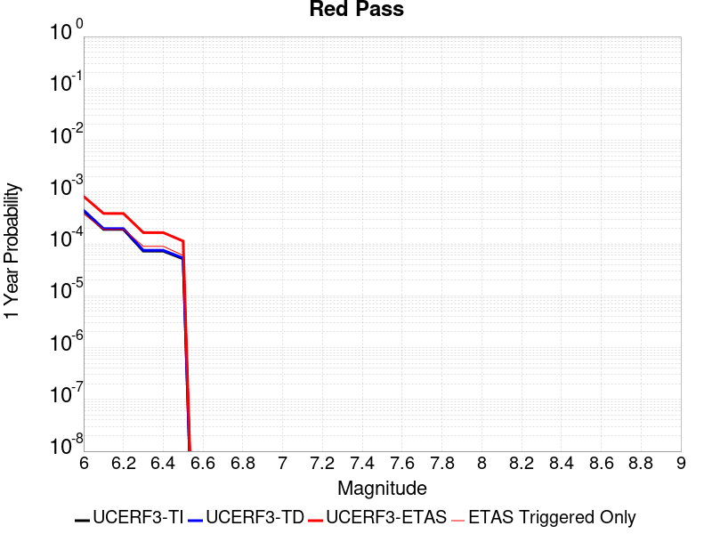 |  |

| Magnitude | 1 wk TI Prob | 1 wk TD Prob | 1 wk ETAS Prob | 1 wk ETAS/TD Gain | 1 wk ETAS Triggered Only | 1 mo TI Prob | 1 mo TD Prob | 1 mo ETAS Prob | 1 mo ETAS/TD Gain | 1 mo ETAS Triggered Only | 1 yr TI Prob | 1 yr TD Prob | 1 yr ETAS Prob | 1 yr ETAS/TD Gain | 1 yr ETAS Triggered Only | 10 yr TI Prob | 10 yr TD Prob | 10 yr ETAS Prob | 10 yr ETAS/TD Gain | 10 yr ETAS Triggered Only |
|-----|-----|-----|-----|-----|-----|-----|-----|-----|-----|-----|-----|-----|-----|-----|-----|-----|-----|-----|-----|-----|
| 6.0 | 8.258278E-6 | 8.551265E-6 | 1.0213085E-4 | 11.943361 | 9.3580384E-5 | 3.539214E-5 | 3.6647863E-5 | 1.3022483E-4 | 3.5534081 | 9.3580384E-5 | 4.308141E-4 | 4.4611428E-4 | 7.4232E-4 | 1.6639682 | 2.9633788E-4 | 0.0042997985 | 0.004453945 | 0.005059508 | 1.135961 | 6.082725E-4 |
| 6.1 | 3.649988E-6 | 3.7753161E-6 | 3.496866E-5 | 9.262445 | 3.1193464E-5 | 1.5642712E-5 | 1.6179853E-5 | 4.737281E-5 | 2.9278889 | 3.1193464E-5 | 1.9043336E-4 | 1.9697666E-4 | 3.0613228E-4 | 1.554155 | 1.0917712E-4 | 0.0019027026 | 0.001968488 | 0.0022642426 | 1.1502445 | 2.9633788E-4 |
| 6.2 | 3.649988E-6 | 3.7753161E-6 | 3.496866E-5 | 9.262445 | 3.1193464E-5 | 1.5642712E-5 | 1.6179853E-5 | 4.737281E-5 | 2.9278889 | 3.1193464E-5 | 1.9043336E-4 | 1.9697666E-4 | 3.0613228E-4 | 1.554155 | 1.0917712E-4 | 0.0019027026 | 0.001968488 | 0.0022642426 | 1.1502445 | 2.9633788E-4 |
| 6.3 | 1.3924937E-6 | 1.4411166E-6 | 1.7037824E-5 | 11.822656 | 1.5596732E-5 | 5.9678164E-6 | 6.1762075E-6 | 2.1772843E-5 | 3.525277 | 1.5596732E-5 | 7.265574E-5 | 7.519415E-5 | 1.0638526E-4 | 1.4148078 | 3.1193464E-5 | 7.263199E-4 | 7.518258E-4 | 8.4533583E-4 | 1.1243773 | 9.3580384E-5 |
| 6.4 | 1.3924937E-6 | 1.4411166E-6 | 1.7037824E-5 | 11.822656 | 1.5596732E-5 | 5.9678164E-6 | 6.1762075E-6 | 2.1772843E-5 | 3.525277 | 1.5596732E-5 | 7.265574E-5 | 7.519415E-5 | 1.0638526E-4 | 1.4148078 | 3.1193464E-5 | 7.263199E-4 | 7.518258E-4 | 8.4533583E-4 | 1.1243773 | 9.3580384E-5 |
| 6.5 | 9.876812E-7 | 1.0221912E-6 | 1.6618906E-5 | 16.25812 | 1.5596732E-5 | 4.2329125E-6 | 4.3808195E-6 | 1.9977482E-5 | 4.560216 | 1.5596732E-5 | 5.153449E-5 | 5.3336476E-5 | 8.452828E-5 | 1.5848117 | 3.1193464E-5 | 5.1522546E-4 | 5.333648E-4 | 6.268952E-4 | 1.1753592 | 9.3580384E-5 |

## San Andreas (Creeping Section) 2011 CFM
*[(top)](#table-of-contents)*

| 1 Week | 1 Month | 1 Year | 10 Year |
|-----|-----|-----|-----|
|  |  |  |  |

| Magnitude | 1 wk TI Prob | 1 wk TD Prob | 1 wk ETAS Prob | 1 wk ETAS/TD Gain | 1 wk ETAS Triggered Only | 1 mo TI Prob | 1 mo TD Prob | 1 mo ETAS Prob | 1 mo ETAS/TD Gain | 1 mo ETAS Triggered Only | 1 yr TI Prob | 1 yr TD Prob | 1 yr ETAS Prob | 1 yr ETAS/TD Gain | 1 yr ETAS Triggered Only | 10 yr TI Prob | 10 yr TD Prob | 10 yr ETAS Prob | 10 yr ETAS/TD Gain | 10 yr ETAS Triggered Only |
|-----|-----|-----|-----|-----|-----|-----|-----|-----|-----|-----|-----|-----|-----|-----|-----|-----|-----|-----|-----|-----|
| 6.0 | 5.986481E-4 | 0.001228691 | 0.0014000442 | 1.13946 | 1.7156404E-4 | 0.0025631124 | 0.005246795 | 0.0054640034 | 1.0413983 | 2.1835424E-4 | 0.030762846 | 0.061203245 | 0.06151073 | 1.005024 | 3.2753134E-4 | 0.26835477 | 0.425928 | 0.4262235 | 1.0006937 | 5.146921E-4 |
| 6.1 | 5.015945E-4 | 0.0010230356 | 0.0011476817 | 1.1218395 | 1.2477385E-4 | 0.00214792 | 0.004369436 | 0.0045247218 | 1.0355392 | 1.5596731E-4 | 0.025839351 | 0.051246606 | 0.051498163 | 1.0049088 | 2.6514442E-4 | 0.23032776 | 0.37284943 | 0.373094 | 1.0006559 | 3.8991828E-4 |
| 6.2 | 4.073338E-4 | 8.1157376E-4 | 9.362463E-4 | 1.1536183 | 1.2477385E-4 | 0.0017445484 | 0.0034683137 | 0.00362374 | 1.0448133 | 1.5596731E-4 | 0.021034058 | 0.04093177 | 0.04118606 | 1.0062126 | 2.6514442E-4 | 0.19150782 | 0.31302592 | 0.31329378 | 1.0008557 | 3.8991828E-4 |
| 6.3 | 3.464099E-4 | 6.7455834E-4 | 7.99248E-4 | 1.1848464 | 1.2477385E-4 | 0.0014837692 | 0.0028832308 | 0.0030387484 | 1.0539386 | 1.5596731E-4 | 0.017915873 | 0.034187846 | 0.034443926 | 1.0074904 | 2.6514442E-4 | 0.16538359 | 0.27130842 | 0.27159256 | 1.0010473 | 3.8991828E-4 |
| 6.4 | 2.935057E-4 | 5.5516965E-4 | 6.798742E-4 | 1.2246243 | 1.2477385E-4 | 0.0012572751 | 0.0023727308 | 0.002528328 | 1.0655773 | 1.5596731E-4 | 0.015200248 | 0.02826279 | 0.02852044 | 1.0091163 | 2.6514442E-4 | 0.14201577 | 0.23297668 | 0.23327576 | 1.0012838 | 3.8991828E-4 |
| 6.5 | 2.3409708E-4 | 4.2132285E-4 | 5.4604415E-4 | 1.296023 | 1.2477385E-4 | 0.0010028875 | 0.0018017791 | 0.0019574654 | 1.086407 | 1.5596731E-4 | 0.012141965 | 0.021586355 | 0.021845775 | 1.0120178 | 2.6514442E-4 | 0.11499573 | 0.1868149 | 0.18713199 | 1.0016973 | 3.8991828E-4 |
| 6.6 | 1.5842178E-4 | 2.5068692E-4 | 3.5983667E-4 | 1.4354026 | 1.0917712E-4 | 6.7877385E-4 | 0.0010739256 | 0.0011985655 | 1.11606 | 1.2477385E-4 | 0.0082328 | 0.012995283 | 0.013226193 | 1.0177689 | 2.3395097E-4 | 0.07934396 | 0.12313759 | 0.12343847 | 1.0024434 | 3.4312808E-4 |
| 6.7 | 1.5616413E-4 | 2.4605254E-4 | 3.552028E-4 | 1.4436054 | 1.0917712E-4 | 6.691031E-4 | 0.0010540807 | 0.001178723 | 1.1182474 | 1.2477385E-4 | 0.0081159435 | 0.012757154 | 0.01298812 | 1.0181049 | 2.3395097E-4 | 0.0782586 | 0.12116472 | 0.12146627 | 1.0024887 | 3.4312808E-4 |
| 6.8 | 1.5538467E-4 | 2.442914E-4 | 3.5344186E-4 | 1.4468043 | 1.0917712E-4 | 6.6576427E-4 | 0.001046539 | 0.0011711824 | 1.1191005 | 1.2477385E-4 | 0.008075596 | 0.012666538 | 0.012897526 | 1.018236 | 2.3395097E-4 | 0.07788358 | 0.12039561 | 0.120697424 | 1.0025069 | 3.4312808E-4 |
| 6.9 | 1.5153569E-4 | 2.3538464E-4 | 3.4453606E-4 | 1.4637152 | 1.0917712E-4 | 6.49277E-4 | 0.0010084033 | 0.0011330514 | 1.1236093 | 1.2477385E-4 | 0.007876333 | 0.012208726 | 0.012439821 | 1.0189286 | 2.3395097E-4 | 0.07602952 | 0.11646574 | 0.116768904 | 1.002603 | 3.4312808E-4 |
| 7.0 | 1.4588932E-4 | 2.2395732E-4 | 3.3311E-4 | 1.4873816 | 1.0917712E-4 | 6.250901E-4 | 9.59466E-4 | 0.0010841201 | 1.1299204 | 1.2477385E-4 | 0.0075839474 | 0.011619428 | 0.011850661 | 1.0199006 | 2.3395097E-4 | 0.073302895 | 0.11131206 | 0.111617 | 1.0027394 | 3.4312808E-4 |
| 7.1 | 1.1565079E-4 | 1.6281323E-4 | 2.7197256E-4 | 1.6704575 | 1.0917712E-4 | 4.955521E-4 | 6.9758523E-4 | 8.2227204E-4 | 1.1787406 | 1.2477385E-4 | 0.006016669 | 0.008460228 | 0.008692199 | 1.0274191 | 2.3395097E-4 | 0.058563538 | 0.08366478 | 0.083964914 | 1.0035872 | 3.2753134E-4 |
| 7.2 | 1.0393792E-4 | 1.4615392E-4 | 2.5531507E-4 | 1.7468917 | 1.0917712E-4 | 4.4537216E-4 | 6.262243E-4 | 7.5092004E-4 | 1.199123 | 1.2477385E-4 | 0.005408933 | 0.0075977976 | 0.007829971 | 1.030558 | 2.3395097E-4 | 0.052791595 | 0.07561503 | 0.0759178 | 1.004004 | 3.2753134E-4 |
| 7.3 | 9.332884E-5 | 1.2780601E-4 | 2.3696916E-4 | 1.8541317 | 1.0917712E-4 | 3.999194E-4 | 5.4762565E-4 | 6.723312E-4 | 1.2277204 | 1.2477385E-4 | 0.0048581534 | 0.0066470946 | 0.0068794903 | 1.034962 | 2.3395097E-4 | 0.047533102 | 0.06647954 | 0.06677074 | 1.0043802 | 3.1193462E-4 |
| 7.4 | 8.670252E-5 | 1.1702972E-4 | 2.1059914E-4 | 1.7995356 | 9.3580384E-5 | 3.715293E-4 | 5.014601E-4 | 6.105825E-4 | 1.2176093 | 1.0917712E-4 | 0.004513991 | 0.0060883067 | 0.0063053314 | 1.0356462 | 2.1835424E-4 | 0.044233937 | 0.061148684 | 0.0614269 | 1.0045499 | 2.9633788E-4 |
| 7.5 | 7.3036405E-5 | 9.005699E-5 | 1.8362894E-4 | 2.0390306 | 9.3580384E-5 | 3.129756E-4 | 3.859015E-4 | 4.950365E-4 | 1.2828053 | 1.0917712E-4 | 0.0038038217 | 0.0046882504 | 0.004905581 | 1.0463564 | 2.1835424E-4 | 0.03739367 | 0.047875606 | 0.04815776 | 1.0058933 | 2.9633788E-4 |
| 7.6 | 6.3935775E-5 | 8.280209E-5 | 1.7637473E-4 | 2.1300757 | 9.3580384E-5 | 2.7398168E-4 | 3.5481792E-4 | 4.639563E-4 | 1.3075898 | 1.0917712E-4 | 0.0033306254 | 0.00431137 | 0.004528783 | 1.0504278 | 2.1835424E-4 | 0.032811474 | 0.043990135 | 0.044273436 | 1.0064402 | 2.9633788E-4 |
| 7.7 | 5.5050095E-5 | 6.661729E-5 | 1.2900007E-4 | 1.936435 | 6.238693E-5 | 2.3590765E-4 | 2.8547147E-4 | 3.6343286E-4 | 1.2730969 | 7.7983656E-5 | 0.0028683927 | 0.0034700802 | 0.003641049 | 1.0492694 | 1.7156404E-4 | 0.0283165 | 0.03579509 | 0.036005627 | 1.0058818 | 2.1835424E-4 |
| 7.8 | 5.027131E-5 | 6.1627725E-5 | 1.240108E-4 | 2.0122569 | 6.238693E-5 | 2.1543067E-4 | 2.640921E-4 | 3.4205514E-4 | 1.2952117 | 7.7983656E-5 | 0.0026197135 | 0.003210584 | 0.003381597 | 1.0532655 | 1.7156404E-4 | 0.025890453 | 0.03312572 | 0.03332176 | 1.0059181 | 2.027575E-4 |
| 7.9 | 3.7271806E-5 | 5.0224386E-5 | 8.141628E-5 | 1.6210508 | 3.1193464E-5 | 1.5972654E-4 | 2.1522962E-4 | 2.6200974E-4 | 1.2173499 | 4.6790192E-5 | 0.0019429359 | 0.0026172737 | 0.002741721 | 1.0475484 | 1.2477385E-4 | 0.019260362 | 0.027066687 | 0.027203258 | 1.0050458 | 1.4037058E-4 |
| 8.0 | 2.7310243E-5 | 3.1428404E-5 | 4.7024645E-5 | 1.4962467 | 1.5596732E-5 | 1.17038646E-4 | 1.3468621E-4 | 1.6587548E-4 | 1.2315698 | 3.1193464E-5 | 0.0014240141 | 0.0016385721 | 0.001716428 | 1.0475144 | 7.7983656E-5 | 0.014149235 | 0.01721387 | 0.017305838 | 1.0053427 | 9.3580384E-5 |
| 8.1 | 1.7940547E-5 | 1.7400796E-5 | 3.2997257E-5 | 1.8963072 | 1.5596732E-5 | 7.688579E-5 | 7.457271E-5 | 1.0576385E-4 | 1.4182647 | 3.1193464E-5 | 9.3568244E-4 | 9.075451E-4 | 9.5429283E-4 | 1.0515101 | 4.6790192E-5 | 0.009317525 | 0.009799073 | 0.009845405 | 1.0047282 | 4.6790192E-5 |
| 8.2 | 8.643924E-6 | 5.4748625E-6 | 5.4748625E-6 | 1.0 | 0.0 | 3.704486E-5 | 2.3463486E-5 | 2.3463486E-5 | 1.0 | 0.0 | 4.5092785E-4 | 2.8563058E-4 | 2.8563058E-4 | 1.0 | 0.0 | 0.0045001395 | 0.0032487072 | 0.0032487072 | 1.0 | 0.0 |
| 8.3 | 1.983087E-6 | 7.6599065E-7 | 7.6599065E-7 | 1.0 | 0.0 | 8.498917E-6 | 3.282813E-6 | 3.282813E-6 | 1.0 | 0.0 | 1.034694E-4 | 3.9967534E-5 | 3.9967534E-5 | 1.0 | 0.0 | 0.0010342124 | 4.719687E-4 | 4.719687E-4 | 1.0 | 0.0 |

## Cady
*[(top)](#table-of-contents)*

| 1 Week | 1 Month | 1 Year | 10 Year |
|-----|-----|-----|-----|
|  |  |  |  |

| Magnitude | 1 wk TI Prob | 1 wk TD Prob | 1 wk ETAS Prob | 1 wk ETAS/TD Gain | 1 wk ETAS Triggered Only | 1 mo TI Prob | 1 mo TD Prob | 1 mo ETAS Prob | 1 mo ETAS/TD Gain | 1 mo ETAS Triggered Only | 1 yr TI Prob | 1 yr TD Prob | 1 yr ETAS Prob | 1 yr ETAS/TD Gain | 1 yr ETAS Triggered Only | 10 yr TI Prob | 10 yr TD Prob | 10 yr ETAS Prob | 10 yr ETAS/TD Gain | 10 yr ETAS Triggered Only |
|-----|-----|-----|-----|-----|-----|-----|-----|-----|-----|-----|-----|-----|-----|-----|-----|-----|-----|-----|-----|-----|
| 6.0 | 1.9892565E-5 | 2.1858728E-5 | 1.4662986E-4 | 6.7080684 | 1.2477385E-4 | 8.525106E-5 | 9.3677416E-5 | 2.3403484E-4 | 2.498306 | 1.4037058E-4 | 0.0010374374 | 0.0011400167 | 0.0014515957 | 1.2733109 | 3.1193462E-4 | 0.010326075 | 0.011350701 | 0.011813291 | 1.0407544 | 4.6790193E-4 |
| 6.1 | 1.9892565E-5 | 2.1858728E-5 | 1.4662986E-4 | 6.7080684 | 1.2477385E-4 | 8.525106E-5 | 9.3677416E-5 | 2.3403484E-4 | 2.498306 | 1.4037058E-4 | 0.0010374374 | 0.0011400167 | 0.0014515957 | 1.2733109 | 3.1193462E-4 | 0.010326075 | 0.011350701 | 0.011813291 | 1.0407544 | 4.6790193E-4 |
| 6.2 | 1.9892565E-5 | 2.1858728E-5 | 1.4662986E-4 | 6.7080684 | 1.2477385E-4 | 8.525106E-5 | 9.3677416E-5 | 2.3403484E-4 | 2.498306 | 1.4037058E-4 | 0.0010374374 | 0.0011400167 | 0.0014515957 | 1.2733109 | 3.1193462E-4 | 0.010326075 | 0.011350701 | 0.011813291 | 1.0407544 | 4.6790193E-4 |
| 6.3 | 1.1117327E-5 | 1.2176583E-5 | 9.015929E-5 | 7.4043174 | 7.7983656E-5 | 4.764482E-5 | 5.2184492E-5 | 1.3016407E-4 | 2.4943056 | 7.7983656E-5 | 5.7992124E-4 | 6.351925E-4 | 8.222344E-4 | 1.294465 | 1.8716077E-4 | 0.0057841022 | 0.0063368753 | 0.0066313352 | 1.0464677 | 2.9633788E-4 |
| 6.4 | 1.1117327E-5 | 1.2176583E-5 | 9.015929E-5 | 7.4043174 | 7.7983656E-5 | 4.764482E-5 | 5.2184492E-5 | 1.3016407E-4 | 2.4943056 | 7.7983656E-5 | 5.7992124E-4 | 6.351925E-4 | 8.222344E-4 | 1.294465 | 1.8716077E-4 | 0.0057841022 | 0.0063368753 | 0.0066313352 | 1.0464677 | 2.9633788E-4 |
| 6.5 | 6.103093E-6 | 6.672021E-6 | 3.7865273E-5 | 5.6752334 | 3.1193464E-5 | 2.615585E-5 | 2.8594131E-5 | 5.97867E-5 | 2.0908732 | 3.1193464E-5 | 3.1840094E-4 | 3.480905E-4 | 4.5722962E-4 | 1.3135366 | 1.0917712E-4 | 0.0031794512 | 0.0034766865 | 0.0036631967 | 1.053646 | 1.8716077E-4 |
| 6.6 | 5.817237E-6 | 6.3656585E-6 | 2.196229E-5 | 3.4501207 | 1.5596732E-5 | 2.4930776E-5 | 2.728118E-5 | 4.2877484E-5 | 1.5716873 | 1.5596732E-5 | 3.034899E-4 | 3.3211018E-4 | 4.2565947E-4 | 1.2816815 | 9.3580384E-5 | 0.0030307577 | 0.0033173605 | 0.0034883555 | 1.0515455 | 1.7156404E-4 |
| 6.7 | 4.8846314E-6 | 5.3405684E-6 | 2.0937216E-5 | 3.9204097 | 1.5596732E-5 | 2.0933967E-5 | 2.2888014E-5 | 3.8484388E-5 | 1.681421 | 1.5596732E-5 | 2.5484123E-4 | 2.7863772E-4 | 3.7219204E-4 | 1.3357561 | 9.3580384E-5 | 0.0025454918 | 0.0027840391 | 0.0029084657 | 1.0446928 | 1.2477385E-4 |
| 6.8 | 1.7788773E-6 | 1.9399079E-6 | 1.753661E-5 | 9.039918 | 1.5596732E-5 | 7.6237375E-6 | 8.313874E-6 | 2.3910476E-5 | 2.8759727 | 1.5596732E-5 | 9.281505E-5 | 1.01218284E-4 | 1.1681344E-4 | 1.1540744 | 1.5596732E-5 | 9.2776294E-4 | 0.0010118765 | 0.0010430383 | 1.0307962 | 3.1193464E-5 |
| 6.9 | 7.5455404E-7 | 8.297092E-7 | 8.297092E-7 | 1.0 | 0.0 | 3.233799E-6 | 3.5558937E-6 | 3.5558937E-6 | 1.0 | 0.0 | 3.937079E-5 | 4.3292483E-5 | 4.3292483E-5 | 1.0 | 0.0 | 3.9363815E-4 | 4.3287344E-4 | 4.3287344E-4 | 1.0 | 0.0 |
| 7.0 | 6.8578805E-7 | 7.541816E-7 | 7.541816E-7 | 1.0 | 0.0 | 2.9390883E-6 | 3.2322048E-6 | 3.2322048E-6 | 1.0 | 0.0 | 3.578281E-5 | 3.9351715E-5 | 3.9351715E-5 | 1.0 | 0.0 | 3.577705E-4 | 3.9347992E-4 | 3.9347992E-4 | 1.0 | 0.0 |

## Baker
*[(top)](#table-of-contents)*

| 1 Week | 1 Month | 1 Year | 10 Year |
|-----|-----|-----|-----|
|  |  |  |  |

| Magnitude | 1 wk TI Prob | 1 wk TD Prob | 1 wk ETAS Prob | 1 wk ETAS/TD Gain | 1 wk ETAS Triggered Only | 1 mo TI Prob | 1 mo TD Prob | 1 mo ETAS Prob | 1 mo ETAS/TD Gain | 1 mo ETAS Triggered Only | 1 yr TI Prob | 1 yr TD Prob | 1 yr ETAS Prob | 1 yr ETAS/TD Gain | 1 yr ETAS Triggered Only | 10 yr TI Prob | 10 yr TD Prob | 10 yr ETAS Prob | 10 yr ETAS/TD Gain | 10 yr ETAS Triggered Only |
|-----|-----|-----|-----|-----|-----|-----|-----|-----|-----|-----|-----|-----|-----|-----|-----|-----|-----|-----|-----|-----|
| 6.0 | 5.695525E-6 | 5.8348373E-6 | 1.1501132E-4 | 19.711143 | 1.0917712E-4 | 2.4409164E-5 | 2.5006228E-5 | 1.6537329E-4 | 6.6132846 | 1.4037058E-4 | 2.9714106E-4 | 3.044123E-4 | 5.53884E-4 | 1.8195192 | 2.495477E-4 | 0.0029674405 | 0.0030403486 | 0.0035223775 | 1.1585438 | 4.8349865E-4 |
| 6.1 | 5.695525E-6 | 5.8348373E-6 | 1.1501132E-4 | 19.711143 | 1.0917712E-4 | 2.4409164E-5 | 2.5006228E-5 | 1.6537329E-4 | 6.6132846 | 1.4037058E-4 | 2.9714106E-4 | 3.044123E-4 | 5.53884E-4 | 1.8195192 | 2.495477E-4 | 0.0029674405 | 0.0030403486 | 0.0035223775 | 1.1585438 | 4.8349865E-4 |
| 6.2 | 5.695525E-6 | 5.8348373E-6 | 1.1501132E-4 | 19.711143 | 1.0917712E-4 | 2.4409164E-5 | 2.5006228E-5 | 1.6537329E-4 | 6.6132846 | 1.4037058E-4 | 2.9714106E-4 | 3.044123E-4 | 5.53884E-4 | 1.8195192 | 2.495477E-4 | 0.0029674405 | 0.0030403486 | 0.0035223775 | 1.1585438 | 4.8349865E-4 |
| 6.3 | 3.2995713E-6 | 3.383667E-6 | 8.1367056E-5 | 24.047005 | 7.7983656E-5 | 1.4140943E-5 | 1.4501353E-5 | 1.0808038E-4 | 7.453124 | 9.3580384E-5 | 1.7215237E-4 | 1.7654014E-4 | 3.6366787E-4 | 2.0599728 | 1.8716077E-4 | 0.0017201907 | 0.001764046 | 0.0021065688 | 1.1941688 | 3.4312808E-4 |
| 6.4 | 3.2995713E-6 | 3.383667E-6 | 8.1367056E-5 | 24.047005 | 7.7983656E-5 | 1.4140943E-5 | 1.4501353E-5 | 1.0808038E-4 | 7.453124 | 9.3580384E-5 | 1.7215237E-4 | 1.7654014E-4 | 3.6366787E-4 | 2.0599728 | 1.8716077E-4 | 0.0017201907 | 0.001764046 | 0.0021065688 | 1.1941688 | 3.4312808E-4 |
| 6.5 | 2.782202E-6 | 2.8558404E-6 | 8.083927E-5 | 28.306648 | 7.7983656E-5 | 1.1923668E-5 | 1.223926E-5 | 1.058185E-4 | 8.645824 | 9.3580384E-5 | 1.4516099E-4 | 1.4900314E-4 | 3.3613603E-4 | 2.255899 | 1.8716077E-4 | 0.001450662 | 0.0014890651 | 0.0018005352 | 1.2091717 | 3.1193462E-4 |
| 6.6 | 2.3163404E-6 | 2.38092E-6 | 6.476769E-5 | 27.202803 | 6.238693E-5 | 9.927136E-6 | 1.0203904E-5 | 8.818676E-5 | 8.642453 | 7.7983656E-5 | 1.20856166E-4 | 1.2422565E-4 | 2.9576838E-4 | 2.380896 | 1.7156404E-4 | 0.0012079047 | 0.0012415823 | 0.0015375523 | 1.2383813 | 2.9633788E-4 |
| 6.7 | 2.037056E-6 | 2.0965003E-6 | 6.448329E-5 | 30.757586 | 6.238693E-5 | 8.7302105E-6 | 8.984972E-6 | 8.696793E-5 | 9.679265 | 7.7983656E-5 | 1.0628513E-4 | 1.093867E-4 | 2.6533694E-4 | 2.4256783 | 1.5596731E-4 | 0.0010623431 | 0.0010933448 | 0.0013426195 | 1.2279929 | 2.495477E-4 |
| 6.8 | 1.8356744E-6 | 1.8915287E-6 | 6.4278334E-5 | 33.982216 | 6.238693E-5 | 7.867153E-6 | 8.106527E-6 | 8.608955E-5 | 10.6197815 | 7.7983656E-5 | 9.577837E-5 | 9.869264E-5 | 2.5464455E-4 | 2.5801778 | 1.5596731E-4 | 9.57371E-4 | 9.86502E-4 | 0.0012358036 | 1.2527126 | 2.495477E-4 |
| 6.9 | 1.6310546E-6 | 1.6832072E-6 | 6.4070024E-5 | 38.064255 | 6.238693E-5 | 6.9902153E-6 | 7.213726E-6 | 6.96002E-5 | 9.648301 | 6.238693E-5 | 8.510255E-5 | 8.782368E-5 | 2.1258657E-4 | 2.4206064 | 1.2477385E-4 | 8.5069967E-4 | 8.7790104E-4 | 0.0010804805 | 1.2307544 | 2.027575E-4 |
| 7.0 | 1.2058036E-6 | 1.2508665E-6 | 6.3637715E-5 | 50.8749 | 6.238693E-5 | 5.1677193E-6 | 5.3608455E-6 | 6.774744E-5 | 12.637453 | 6.238693E-5 | 6.291517E-5 | 6.5266366E-5 | 1.9003206E-4 | 2.9116385 | 1.2477385E-4 | 6.289736E-4 | 6.524743E-4 | 8.550995E-4 | 1.3105489 | 2.027575E-4 |
| 7.1 | 1.052382E-6 | 1.0951609E-6 | 4.7885304E-5 | 43.724445 | 4.6790192E-5 | 4.5102006E-6 | 4.693538E-6 | 5.1483512E-5 | 10.96902 | 4.6790192E-5 | 5.491031E-5 | 5.7142337E-5 | 1.6631321E-4 | 2.9105077 | 1.0917712E-4 | 5.4896745E-4 | 5.7127734E-4 | 7.5833115E-4 | 1.327431 | 1.8716077E-4 |
| 7.2 | 1.0067454E-6 | 1.0487711E-6 | 3.2242202E-5 | 30.74284 | 3.1193464E-5 | 4.3146156E-6 | 4.4947255E-6 | 3.568805E-5 | 7.939984 | 3.1193464E-5 | 5.252918E-5 | 5.4721917E-5 | 1.4829719E-4 | 2.7100143 | 9.3580384E-5 | 5.251676E-4 | 5.470853E-4 | 7.029673E-4 | 1.2849318 | 1.5596731E-4 |
| 7.3 | 9.3596316E-7 | 9.767723E-7 | 1.6573487E-5 | 16.967606 | 1.5596732E-5 | 4.0112645E-6 | 4.1861604E-6 | 1.9782827E-5 | 4.7257686 | 1.5596732E-5 | 4.8836053E-5 | 5.096532E-5 | 1.28945E-4 | 2.5300539 | 7.7983656E-5 | 4.8825322E-4 | 5.095371E-4 | 6.4983615E-4 | 1.2753462 | 1.4037058E-4 |
| 7.4 | 8.8117395E-7 | 9.2076635E-7 | 1.6517482E-5 | 17.938843 | 1.5596732E-5 | 3.7764542E-6 | 3.9461356E-6 | 1.9542806E-5 | 4.9523907 | 1.5596732E-5 | 4.5977362E-5 | 4.8043148E-5 | 1.1042708E-4 | 2.298498 | 6.238693E-5 | 4.596785E-4 | 4.8032837E-4 | 5.8945303E-4 | 1.2271876 | 1.0917712E-4 |
| 7.5 | 8.292386E-7 | 8.6745956E-7 | 1.6464177E-5 | 18.979763 | 1.5596732E-5 | 3.5538749E-6 | 3.7176785E-6 | 1.9314351E-5 | 5.195272 | 1.5596732E-5 | 4.326757E-5 | 4.5261804E-5 | 9.204988E-5 | 2.033721 | 4.6790192E-5 | 4.3259145E-4 | 4.5252658E-4 | 5.3047494E-4 | 1.1722515 | 7.7983656E-5 |
| 7.6 | 7.553842E-7 | 7.9144706E-7 | 1.6388165E-5 | 20.706585 | 1.5596732E-5 | 3.2373566E-6 | 3.3919116E-6 | 1.898859E-5 | 5.598197 | 1.5596732E-5 | 3.9414106E-5 | 4.129575E-5 | 7.248792E-5 | 1.7553362 | 3.1193464E-5 | 3.9407116E-4 | 4.1288146E-4 | 4.7524262E-4 | 1.1510389 | 6.238693E-5 |
| 7.7 | 6.5285366E-7 | 6.852797E-7 | 1.6282E-5 | 23.759642 | 1.5596732E-5 | 2.797941E-6 | 2.9369096E-6 | 1.8533594E-5 | 6.310577 | 1.5596732E-5 | 3.40644E-5 | 3.5756293E-5 | 5.135247E-5 | 1.4361798 | 1.5596732E-5 | 3.405918E-4 | 3.5750607E-4 | 3.8868838E-4 | 1.0872217 | 3.1193464E-5 |
| 7.8 | 3.4586725E-7 | 3.6482615E-7 | 3.6482615E-7 | 1.0 | 0.0 | 1.4822873E-6 | 1.5635396E-6 | 1.5635396E-6 | 1.0 | 0.0 | 1.80467E-5 | 1.9035933E-5 | 1.9035933E-5 | 1.0 | 0.0 | 1.8045233E-4 | 1.9034347E-4 | 2.0593723E-4 | 1.0819243 | 1.5596732E-5 |
| 7.9 | 2.5591178E-9 | 2.6696718E-9 | 2.6696718E-9 | 1.0 | 0.0 | 1.0967647E-8 | 1.14414505E-8 | 1.14414505E-8 | 1.0 | 0.0 | 1.335311E-7 | 1.3929966E-7 | 1.3929966E-7 | 1.0 | 0.0 | 1.3353102E-6 | 1.3929966E-6 | 1.3929966E-6 | 1.0 | 0.0 |

## San Jacinto (San Jacinto Valley) rev
*[(top)](#table-of-contents)*

| 1 Week | 1 Month | 1 Year | 10 Year |
|-----|-----|-----|-----|
|  |  |  |  |

| Magnitude | 1 wk TI Prob | 1 wk TD Prob | 1 wk ETAS Prob | 1 wk ETAS/TD Gain | 1 wk ETAS Triggered Only | 1 mo TI Prob | 1 mo TD Prob | 1 mo ETAS Prob | 1 mo ETAS/TD Gain | 1 mo ETAS Triggered Only | 1 yr TI Prob | 1 yr TD Prob | 1 yr ETAS Prob | 1 yr ETAS/TD Gain | 1 yr ETAS Triggered Only | 10 yr TI Prob | 10 yr TD Prob | 10 yr ETAS Prob | 10 yr ETAS/TD Gain | 10 yr ETAS Triggered Only |
|-----|-----|-----|-----|-----|-----|-----|-----|-----|-----|-----|-----|-----|-----|-----|-----|-----|-----|-----|-----|-----|
| 6.0 | 3.652694E-5 | 3.4402394E-5 | 1.7476814E-4 | 5.080116 | 1.4037058E-4 | 1.5653463E-4 | 1.474305E-4 | 3.969414E-4 | 2.6923966 | 2.495477E-4 | 0.0019041431 | 0.00179349 | 0.0021671401 | 1.208337 | 3.7432153E-4 | 0.018879099 | 0.018526595 | 0.018985828 | 1.0247878 | 4.6790193E-4 |
| 6.1 | 3.652694E-5 | 3.4402394E-5 | 1.7476814E-4 | 5.080116 | 1.4037058E-4 | 1.5653463E-4 | 1.474305E-4 | 3.969414E-4 | 2.6923966 | 2.495477E-4 | 0.0019041431 | 0.00179349 | 0.0021671401 | 1.208337 | 3.7432153E-4 | 0.018879099 | 0.018526595 | 0.018985828 | 1.0247878 | 4.6790193E-4 |
| 6.2 | 3.652694E-5 | 3.4402394E-5 | 1.7476814E-4 | 5.080116 | 1.4037058E-4 | 1.5653463E-4 | 1.474305E-4 | 3.969414E-4 | 2.6923966 | 2.495477E-4 | 0.0019041431 | 0.00179349 | 0.0021671401 | 1.208337 | 3.7432153E-4 | 0.018879099 | 0.018526595 | 0.018985828 | 1.0247878 | 4.6790193E-4 |
| 6.3 | 3.652694E-5 | 3.4402394E-5 | 1.7476814E-4 | 5.080116 | 1.4037058E-4 | 1.5653463E-4 | 1.474305E-4 | 3.969414E-4 | 2.6923966 | 2.495477E-4 | 0.0019041431 | 0.00179349 | 0.0021671401 | 1.208337 | 3.7432153E-4 | 0.018879099 | 0.018526595 | 0.018985828 | 1.0247878 | 4.6790193E-4 |
| 6.4 | 3.646941E-5 | 3.432397E-5 | 1.7468973E-4 | 5.0894384 | 1.4037058E-4 | 1.5628811E-4 | 1.4709444E-4 | 3.9660544E-4 | 2.6962638 | 2.495477E-4 | 0.0019011468 | 0.0017894056 | 0.0021630574 | 1.2088133 | 3.7432153E-4 | 0.018849645 | 0.018486476 | 0.018945727 | 1.0248426 | 4.6790193E-4 |
| 6.5 | 3.646941E-5 | 3.432397E-5 | 1.7468973E-4 | 5.0894384 | 1.4037058E-4 | 1.5628811E-4 | 1.4709444E-4 | 3.9660544E-4 | 2.6962638 | 2.495477E-4 | 0.0019011468 | 0.0017894056 | 0.0021630574 | 1.2088133 | 3.7432153E-4 | 0.018849645 | 0.018486476 | 0.018945727 | 1.0248426 | 4.6790193E-4 |
| 6.6 | 3.6442503E-5 | 3.4287354E-5 | 1.7465312E-4 | 5.093806 | 1.4037058E-4 | 1.561728E-4 | 1.4693754E-4 | 3.9644857E-4 | 2.6980755 | 2.495477E-4 | 0.0018997455 | 0.0017874985 | 0.002161151 | 1.2090365 | 3.7432153E-4 | 0.018835869 | 0.018467745 | 0.018927006 | 1.0248682 | 4.6790193E-4 |
| 6.7 | 3.6432113E-5 | 3.4272925E-5 | 1.746387E-4 | 5.095529 | 1.4037058E-4 | 1.5612828E-4 | 1.4687571E-4 | 3.9638675E-4 | 2.6987903 | 2.495477E-4 | 0.0018992044 | 0.0017867472 | 0.0021604 | 1.2091246 | 3.7432153E-4 | 0.018830549 | 0.018460369 | 0.018919634 | 1.0248784 | 4.6790193E-4 |
| 6.8 | 3.6409598E-5 | 3.424198E-5 | 1.7460775E-4 | 5.0992303 | 1.4037058E-4 | 1.560318E-4 | 1.4674311E-4 | 3.9625418E-4 | 2.7003257 | 2.495477E-4 | 0.0018980318 | 0.0017851355 | 0.0021587887 | 1.2093138 | 3.7432153E-4 | 0.018819023 | 0.018444523 | 0.018903796 | 1.0249002 | 4.6790193E-4 |
| 6.9 | 3.638078E-5 | 3.4202407E-5 | 1.7456818E-4 | 5.103974 | 1.4037058E-4 | 1.5590832E-4 | 1.4657351E-4 | 3.9608462E-4 | 2.7022934 | 2.495477E-4 | 0.0018965311 | 0.001783074 | 0.0021567282 | 1.2095561 | 3.7432153E-4 | 0.018804269 | 0.018424258 | 0.018883538 | 1.0249281 | 4.6790193E-4 |
| 7.0 | 3.6294874E-5 | 3.408442E-5 | 1.7445021E-4 | 5.1181808 | 1.4037058E-4 | 1.5554018E-4 | 1.4606792E-4 | 3.799847E-4 | 2.6014247 | 2.3395097E-4 | 0.0018920569 | 0.001776929 | 0.0021350163 | 1.2015203 | 3.5872482E-4 | 0.018760284 | 0.018363839 | 0.018807838 | 1.0241779 | 4.523052E-4 |
| 7.1 | 3.6260717E-5 | 3.4040702E-5 | 1.7440651E-4 | 5.1234694 | 1.4037058E-4 | 1.5539382E-4 | 1.4588058E-4 | 3.7979742E-4 | 2.6034815 | 2.3395097E-4 | 0.001890278 | 0.0017746518 | 0.00213274 | 1.2017794 | 3.5872482E-4 | 0.018742796 | 0.018341439 | 0.018785449 | 1.024208 | 4.523052E-4 |
| 7.2 | 3.6210204E-5 | 3.397492E-5 | 1.7434073E-4 | 5.1314535 | 1.4037058E-4 | 1.5517735E-4 | 1.455987E-4 | 3.795156E-4 | 2.6065865 | 2.3395097E-4 | 0.001887647 | 0.0017712255 | 0.002129315 | 1.2021705 | 3.5872482E-4 | 0.01871693 | 0.01830772 | 0.018751744 | 1.0242534 | 4.523052E-4 |
| 7.3 | 3.6119454E-5 | 3.386321E-5 | 1.7422903E-4 | 5.1450834 | 1.4037058E-4 | 1.5478847E-4 | 1.4511998E-4 | 3.79037E-4 | 2.611887 | 2.3395097E-4 | 0.0018829206 | 0.0017654065 | 0.0021234981 | 1.202838 | 3.5872482E-4 | 0.018670462 | 0.018250274 | 0.018694323 | 1.0243312 | 4.523052E-4 |
| 7.4 | 3.607848E-5 | 3.381071E-5 | 1.7417654E-4 | 5.15152 | 1.4037058E-4 | 1.5461289E-4 | 1.44895E-4 | 3.7881208E-4 | 2.6143901 | 2.3395097E-4 | 0.0018807866 | 0.0017626719 | 0.0021207645 | 1.2031533 | 3.5872482E-4 | 0.018649481 | 0.018223269 | 0.018667331 | 1.0243679 | 4.523052E-4 |
| 7.5 | 3.5856774E-5 | 3.3620483E-5 | 1.7398634E-4 | 5.17501 | 1.4037058E-4 | 1.5366284E-4 | 1.4407984E-4 | 3.779971E-4 | 2.6235254 | 2.3395097E-4 | 0.0018692396 | 0.0017527633 | 0.0021108594 | 1.2043037 | 3.5872482E-4 | 0.018535944 | 0.018124366 | 0.018568475 | 1.0245034 | 4.523052E-4 |
| 7.6 | 3.286655E-5 | 3.2143445E-5 | 1.5691329E-4 | 4.881657 | 1.2477385E-4 | 1.4084904E-4 | 1.3775036E-4 | 3.560745E-4 | 2.5849261 | 2.1835424E-4 | 0.001713488 | 0.0016758227 | 0.0020183756 | 1.2044089 | 3.4312808E-4 | 0.017003361 | 0.017344031 | 0.017773164 | 1.0247425 | 4.3670848E-4 |
| 7.7 | 2.8882527E-5 | 2.9236293E-5 | 1.540065E-4 | 5.2676477 | 1.2477385E-4 | 1.237764E-4 | 1.2529238E-4 | 3.4361926E-4 | 2.742539 | 2.1835424E-4 | 0.0015059357 | 0.0015243685 | 0.0018669736 | 1.2247521 | 3.4312808E-4 | 0.014957713 | 0.015830461 | 0.016260255 | 1.0271499 | 4.3670848E-4 |
| 7.8 | 2.4950225E-5 | 2.6527203E-5 | 1.5129775E-4 | 5.703494 | 1.2477385E-4 | 1.0692515E-4 | 1.1368306E-4 | 3.3201248E-4 | 2.9205096 | 2.1835424E-4 | 0.0013010362 | 0.0013832134 | 0.0017258669 | 1.2477227 | 3.4312808E-4 | 0.012934455 | 0.014411755 | 0.014842169 | 1.0298655 | 4.3670848E-4 |
| 7.9 | 1.9881603E-5 | 2.1507445E-5 | 1.462786E-4 | 6.801301 | 1.2477385E-4 | 8.520408E-5 | 9.217151E-5 | 3.1050562E-4 | 3.3687809 | 2.1835424E-4 | 0.001036866 | 0.0011216112 | 0.0014176167 | 1.263911 | 2.9633788E-4 | 0.010320415 | 0.011777027 | 0.012162353 | 1.0327184 | 3.8991828E-4 |
| 8.0 | 1.563292E-5 | 1.5937347E-5 | 9.3919756E-5 | 5.893061 | 7.7983656E-5 | 6.6996516E-5 | 6.8301124E-5 | 2.3985346E-4 | 3.5117056 | 1.7156404E-4 | 8.153773E-4 | 8.3124964E-4 | 0.00108059 | 1.2999583 | 2.495477E-4 | 0.00812392 | 0.008810506 | 0.009135152 | 1.0368476 | 3.2753134E-4 |
| 8.1 | 1.0045313E-5 | 8.301802E-6 | 5.509161E-5 | 6.6361017 | 4.6790192E-5 | 4.305063E-5 | 3.5578672E-5 | 1.1355955E-4 | 3.1917872 | 7.7983656E-5 | 5.2401534E-4 | 4.3308473E-4 | 5.4221455E-4 | 1.2519827 | 1.0917712E-4 | 0.0052278144 | 0.0046591135 | 0.0048143542 | 1.0333198 | 1.5596731E-4 |
| 8.2 | 4.1554413E-6 | 1.5655598E-6 | 1.5655598E-6 | 1.0 | 0.0 | 1.7808914E-5 | 6.709525E-6 | 6.709525E-6 | 1.0 | 0.0 | 2.1680194E-4 | 8.168544E-5 | 8.168544E-5 | 1.0 | 0.0 | 0.0021659054 | 9.482903E-4 | 9.482903E-4 | 1.0 | 0.0 |
| 8.3 | 1.2758221E-6 | 3.6149942E-7 | 3.6149942E-7 | 1.0 | 0.0 | 5.4677976E-6 | 1.5492824E-6 | 1.5492824E-6 | 1.0 | 0.0 | 6.65684E-5 | 1.8862354E-5 | 1.8862354E-5 | 1.0 | 0.0 | 6.6548464E-4 | 2.2751294E-4 | 2.2751294E-4 | 1.0 | 0.0 |

## San Jacinto (Stepovers Combined)
*[(top)](#table-of-contents)*

| 1 Week | 1 Month | 1 Year | 10 Year |
|-----|-----|-----|-----|
|  |  |  |  |

| Magnitude | 1 wk TI Prob | 1 wk TD Prob | 1 wk ETAS Prob | 1 wk ETAS/TD Gain | 1 wk ETAS Triggered Only | 1 mo TI Prob | 1 mo TD Prob | 1 mo ETAS Prob | 1 mo ETAS/TD Gain | 1 mo ETAS Triggered Only | 1 yr TI Prob | 1 yr TD Prob | 1 yr ETAS Prob | 1 yr ETAS/TD Gain | 1 yr ETAS Triggered Only | 10 yr TI Prob | 10 yr TD Prob | 10 yr ETAS Prob | 10 yr ETAS/TD Gain | 10 yr ETAS Triggered Only |
|-----|-----|-----|-----|-----|-----|-----|-----|-----|-----|-----|-----|-----|-----|-----|-----|-----|-----|-----|-----|-----|
| 6.0 | 4.0667746E-5 | 3.5272755E-5 | 1.600422E-4 | 4.5372753 | 1.2477385E-4 | 1.742787E-4 | 1.5116022E-4 | 3.850758E-4 | 2.5474682 | 2.3395097E-4 | 0.0021197782 | 0.0018388226 | 0.0021968877 | 1.1947253 | 3.5872482E-4 | 0.020996714 | 0.018986892 | 0.01943061 | 1.0233697 | 4.523052E-4 |
| 6.1 | 4.0667746E-5 | 3.5272755E-5 | 1.600422E-4 | 4.5372753 | 1.2477385E-4 | 1.742787E-4 | 1.5116022E-4 | 3.850758E-4 | 2.5474682 | 2.3395097E-4 | 0.0021197782 | 0.0018388226 | 0.0021968877 | 1.1947253 | 3.5872482E-4 | 0.020996714 | 0.018986892 | 0.01943061 | 1.0233697 | 4.523052E-4 |
| 6.2 | 4.0667746E-5 | 3.5272755E-5 | 1.600422E-4 | 4.5372753 | 1.2477385E-4 | 1.742787E-4 | 1.5116022E-4 | 3.850758E-4 | 2.5474682 | 2.3395097E-4 | 0.0021197782 | 0.0018388226 | 0.0021968877 | 1.1947253 | 3.5872482E-4 | 0.020996714 | 0.018986892 | 0.01943061 | 1.0233697 | 4.523052E-4 |
| 6.3 | 4.0667746E-5 | 3.5272755E-5 | 1.600422E-4 | 4.5372753 | 1.2477385E-4 | 1.742787E-4 | 1.5116022E-4 | 3.850758E-4 | 2.5474682 | 2.3395097E-4 | 0.0021197782 | 0.0018388226 | 0.0021968877 | 1.1947253 | 3.5872482E-4 | 0.020996714 | 0.018986892 | 0.01943061 | 1.0233697 | 4.523052E-4 |
| 6.4 | 4.0577226E-5 | 3.5144654E-5 | 1.5991411E-4 | 4.550169 | 1.2477385E-4 | 1.738908E-4 | 1.5061127E-4 | 3.84527E-4 | 2.553109 | 2.3395097E-4 | 0.0021150648 | 0.0018321523 | 0.00219022 | 1.1954355 | 3.5872482E-4 | 0.020950472 | 0.018921461 | 0.019365206 | 1.023452 | 4.523052E-4 |
| 6.5 | 4.0577226E-5 | 3.5144654E-5 | 1.5991411E-4 | 4.550169 | 1.2477385E-4 | 1.738908E-4 | 1.5061127E-4 | 3.84527E-4 | 2.553109 | 2.3395097E-4 | 0.0021150648 | 0.0018321523 | 0.00219022 | 1.1954355 | 3.5872482E-4 | 0.020950472 | 0.018921461 | 0.019365206 | 1.023452 | 4.523052E-4 |
| 6.6 | 4.053861E-5 | 3.509E-5 | 1.5985947E-4 | 4.5556984 | 1.2477385E-4 | 1.7372532E-4 | 1.5037706E-4 | 3.8429286E-4 | 2.5555282 | 2.3395097E-4 | 0.0021130538 | 0.0018293057 | 0.0021873743 | 1.1957402 | 3.5872482E-4 | 0.020930743 | 0.018893538 | 0.019337298 | 1.0234873 | 4.523052E-4 |
| 6.7 | 4.0516545E-5 | 3.5059067E-5 | 1.5982855E-4 | 4.558836 | 1.2477385E-4 | 1.7363077E-4 | 1.5024451E-4 | 3.8416032E-4 | 2.5569007 | 2.3395097E-4 | 0.002111905 | 0.001827695 | 0.0021857643 | 1.195913 | 3.5872482E-4 | 0.020919468 | 0.018877735 | 0.019321501 | 1.0235074 | 4.523052E-4 |
| 6.8 | 4.049434E-5 | 3.5030633E-5 | 1.5980011E-4 | 4.561725 | 1.2477385E-4 | 1.7353562E-4 | 1.5012265E-4 | 3.840385E-4 | 2.5581648 | 2.3395097E-4 | 0.0021107488 | 0.0018262138 | 0.0021842835 | 1.1960722 | 3.5872482E-4 | 0.020908125 | 0.018863149 | 0.019306922 | 1.023526 | 4.523052E-4 |
| 6.9 | 4.046386E-5 | 3.499319E-5 | 1.5976267E-4 | 4.565536 | 1.2477385E-4 | 1.73405E-4 | 1.4996222E-4 | 3.838781E-4 | 2.559832 | 2.3395097E-4 | 0.0021091616 | 0.0018242638 | 0.0021823342 | 1.1962821 | 3.5872482E-4 | 0.020892553 | 0.01884392 | 0.019287704 | 1.0235504 | 4.523052E-4 |
| 7.0 | 4.036382E-5 | 3.487376E-5 | 1.5964326E-4 | 4.5777473 | 1.2477385E-4 | 1.7297632E-4 | 1.4945042E-4 | 3.67772E-4 | 2.4608297 | 2.1835424E-4 | 0.0021039525 | 0.0018180435 | 0.0021605478 | 1.1883917 | 3.4312808E-4 | 0.02084144 | 0.018782536 | 0.019211043 | 1.022814 | 4.3670848E-4 |
| 7.1 | 4.0343282E-5 | 3.4852223E-5 | 1.5962172E-4 | 4.5799584 | 1.2477385E-4 | 1.7288832E-4 | 1.4935812E-4 | 3.6767975E-4 | 2.4617324 | 2.1835424E-4 | 0.002102883 | 0.0018169218 | 0.0021594265 | 1.1885082 | 3.4312808E-4 | 0.020830948 | 0.018771412 | 0.019199923 | 1.0228279 | 4.3670848E-4 |
| 7.2 | 4.0257353E-5 | 3.4756722E-5 | 1.5952623E-4 | 4.589795 | 1.2477385E-4 | 1.725201E-4 | 1.489489E-4 | 3.672706E-4 | 2.465749 | 2.1835424E-4 | 0.0020984085 | 0.0018119477 | 0.0021544541 | 1.1890266 | 3.4312808E-4 | 0.020787042 | 0.018722152 | 0.019150684 | 1.022889 | 4.3670848E-4 |
| 7.3 | 3.9940667E-5 | 3.4584376E-5 | 1.593539E-4 | 4.6076846 | 1.2477385E-4 | 1.7116306E-4 | 1.4821035E-4 | 3.6653221E-4 | 2.4730542 | 2.1835424E-4 | 0.0020819185 | 0.0018029709 | 0.0021454804 | 1.1899694 | 3.4312808E-4 | 0.020625217 | 0.018630784 | 0.019059356 | 1.0230035 | 4.3670848E-4 |
| 7.4 | 3.9721202E-5 | 3.4469766E-5 | 1.5923931E-4 | 4.6196804 | 1.2477385E-4 | 1.7022261E-4 | 1.4771923E-4 | 3.660412E-4 | 2.4779525 | 2.1835424E-4 | 0.0020704903 | 0.0017970012 | 0.0021395127 | 1.1906017 | 3.4312808E-4 | 0.020513052 | 0.018569905 | 0.018998506 | 1.0230803 | 4.3670848E-4 |
| 7.5 | 3.7036873E-5 | 3.3537188E-5 | 1.5830685E-4 | 4.720338 | 1.2477385E-4 | 1.5871979E-4 | 1.437229E-4 | 3.6204574E-4 | 2.5190542 | 2.1835424E-4 | 0.0019307006 | 0.0017484248 | 0.002090953 | 1.1959068 | 3.4312808E-4 | 0.019140124 | 0.018071463 | 0.01850028 | 1.023729 | 4.3670848E-4 |
| 7.6 | 3.2940967E-5 | 3.1317984E-5 | 1.4049168E-4 | 4.4859743 | 1.0917712E-4 | 1.4116794E-4 | 1.3421304E-4 | 3.3694334E-4 | 2.5105112 | 2.027575E-4 | 0.0017173645 | 0.0016328214 | 0.001959818 | 1.2002647 | 3.2753134E-4 | 0.01704153 | 0.016904354 | 0.017318347 | 1.0244904 | 4.2111173E-4 |
| 7.7 | 2.8236149E-5 | 2.7883889E-5 | 1.3705796E-4 | 4.91531 | 1.0917712E-4 | 1.2100645E-4 | 1.19496915E-4 | 3.222302E-4 | 2.6965566 | 2.027575E-4 | 0.0014722579 | 0.001453905 | 0.0017809602 | 1.2249495 | 3.2753134E-4 | 0.014625421 | 0.015115095 | 0.015529842 | 1.0274392 | 4.2111173E-4 |
| 7.8 | 2.4329287E-5 | 2.5207537E-5 | 1.343819E-4 | 5.331021 | 1.0917712E-4 | 1.042642E-4 | 1.0802783E-4 | 3.1076343E-4 | 2.8766978 | 2.027575E-4 | 0.0012686774 | 0.0013144462 | 0.001641547 | 1.2488507 | 3.2753134E-4 | 0.012614589 | 0.013712396 | 0.014127733 | 1.0302892 | 4.2111173E-4 |
| 7.9 | 1.9370926E-5 | 2.0421452E-5 | 1.2959634E-4 | 6.3460884 | 1.0917712E-4 | 8.301561E-5 | 8.7517576E-5 | 2.9025733E-4 | 3.3165605 | 2.027575E-4 | 0.0010102465 | 0.0010650064 | 0.0013454485 | 1.2633244 | 2.8074117E-4 | 0.0100566605 | 0.011199483 | 0.011569612 | 1.0330487 | 3.7432153E-4 |
| 8.0 | 1.5583017E-5 | 1.588647E-5 | 9.386888E-5 | 5.908732 | 7.7983656E-5 | 6.6782646E-5 | 6.808309E-5 | 2.3963545E-4 | 3.5197499 | 1.7156404E-4 | 8.127754E-4 | 8.285971E-4 | 0.001077938 | 1.3009194 | 2.495477E-4 | 0.008098091 | 0.008781809 | 0.009106465 | 1.0369691 | 3.2753134E-4 |
| 8.1 | 1.0024873E-5 | 8.292404E-6 | 5.5082208E-5 | 6.64249 | 4.6790192E-5 | 4.2963035E-5 | 3.5538393E-5 | 1.1351928E-4 | 3.1942716 | 7.7983656E-5 | 5.229494E-4 | 4.3259456E-4 | 5.4172444E-4 | 1.2522683 | 1.0917712E-4 | 0.0052172043 | 0.0046534105 | 0.004808652 | 1.0333608 | 1.5596731E-4 |
| 8.2 | 4.142796E-6 | 1.5610041E-6 | 1.5610041E-6 | 1.0 | 0.0 | 1.775472E-5 | 6.69E-6 | 6.69E-6 | 1.0 | 0.0 | 2.1614227E-4 | 8.144774E-5 | 8.144774E-5 | 1.0 | 0.0 | 0.0021593217 | 9.454649E-4 | 9.454649E-4 | 1.0 | 0.0 |
| 8.3 | 1.2750878E-6 | 3.612133E-7 | 3.612133E-7 | 1.0 | 0.0 | 5.4646503E-6 | 1.548056E-6 | 1.548056E-6 | 1.0 | 0.0 | 6.653009E-5 | 1.8847424E-5 | 1.8847424E-5 | 1.0 | 0.0 | 6.6510175E-4 | 2.2734253E-4 | 2.2734253E-4 | 1.0 | 0.0 |

## Elsinore (Glen Ivy) rev
*[(top)](#table-of-contents)*

| 1 Week | 1 Month | 1 Year | 10 Year |
|-----|-----|-----|-----|
|  |  | 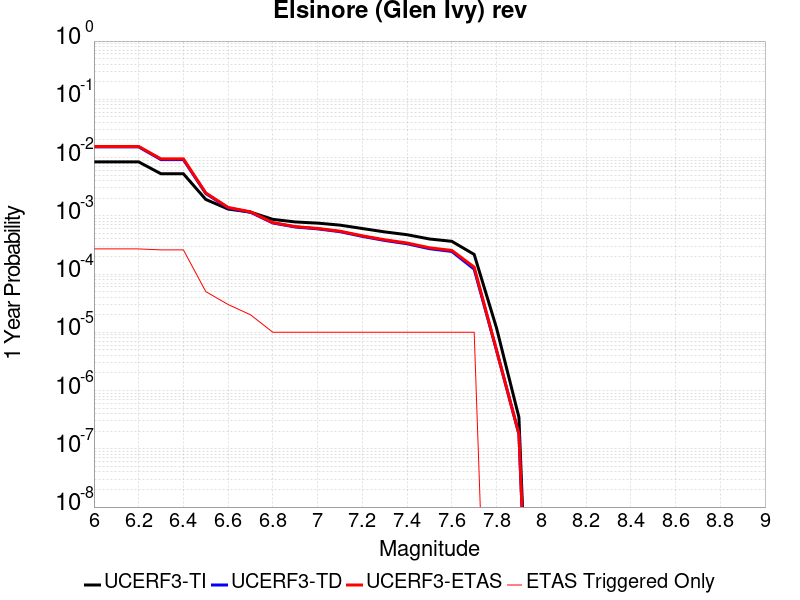 |  |

| Magnitude | 1 wk TI Prob | 1 wk TD Prob | 1 wk ETAS Prob | 1 wk ETAS/TD Gain | 1 wk ETAS Triggered Only | 1 mo TI Prob | 1 mo TD Prob | 1 mo ETAS Prob | 1 mo ETAS/TD Gain | 1 mo ETAS Triggered Only | 1 yr TI Prob | 1 yr TD Prob | 1 yr ETAS Prob | 1 yr ETAS/TD Gain | 1 yr ETAS Triggered Only | 10 yr TI Prob | 10 yr TD Prob | 10 yr ETAS Prob | 10 yr ETAS/TD Gain | 10 yr ETAS Triggered Only |
|-----|-----|-----|-----|-----|-----|-----|-----|-----|-----|-----|-----|-----|-----|-----|-----|-----|-----|-----|-----|-----|
| 6.0 | 1.6204086E-4 | 2.9360707E-4 | 4.3393642E-4 | 1.4779495 | 1.4037058E-4 | 6.94276E-4 | 0.0012578638 | 0.0014447892 | 1.1486053 | 1.8716077E-4 | 0.008420097 | 0.015234485 | 0.015449513 | 1.0141145 | 2.1835424E-4 | 0.081081145 | 0.13969168 | 0.13996004 | 1.001921 | 3.1193462E-4 |
| 6.1 | 1.6204086E-4 | 2.9360707E-4 | 4.3393642E-4 | 1.4779495 | 1.4037058E-4 | 6.94276E-4 | 0.0012578638 | 0.0014447892 | 1.1486053 | 1.8716077E-4 | 0.008420097 | 0.015234485 | 0.015449513 | 1.0141145 | 2.1835424E-4 | 0.081081145 | 0.13969168 | 0.13996004 | 1.001921 | 3.1193462E-4 |
| 6.2 | 1.6204086E-4 | 2.9360707E-4 | 4.3393642E-4 | 1.4779495 | 1.4037058E-4 | 6.94276E-4 | 0.0012578638 | 0.0014447892 | 1.1486053 | 1.8716077E-4 | 0.008420097 | 0.015234485 | 0.015449513 | 1.0141145 | 2.1835424E-4 | 0.081081145 | 0.13969168 | 0.13996004 | 1.001921 | 3.1193462E-4 |
| 6.3 | 1.0111737E-4 | 1.7703383E-4 | 2.5500366E-4 | 1.4404235 | 7.7983656E-5 | 4.332882E-4 | 7.5861247E-4 | 9.4563124E-4 | 1.2465274 | 1.8716077E-4 | 0.005262531 | 0.009217682 | 0.009434024 | 1.0234703 | 2.1835424E-4 | 0.0513964 | 0.0870191 | 0.08726117 | 1.0027819 | 2.6514442E-4 |
| 6.4 | 1.0111737E-4 | 1.7703383E-4 | 2.5500366E-4 | 1.4404235 | 7.7983656E-5 | 4.332882E-4 | 7.5861247E-4 | 9.4563124E-4 | 1.2465274 | 1.8716077E-4 | 0.005262531 | 0.009217682 | 0.009434024 | 1.0234703 | 2.1835424E-4 | 0.0513964 | 0.0870191 | 0.08726117 | 1.0027819 | 2.6514442E-4 |
| 6.5 | 3.6624708E-5 | 4.6391084E-5 | 6.198709E-5 | 1.3361855 | 1.5596732E-5 | 1.569536E-4 | 1.9880582E-4 | 2.6118034E-4 | 1.313746 | 6.238693E-5 | 0.001909235 | 0.0024181372 | 0.0024803733 | 1.0257372 | 6.238693E-5 | 0.01892915 | 0.023739954 | 0.023816086 | 1.003207 | 7.7983656E-5 |
| 6.6 | 2.5051324E-5 | 2.614772E-5 | 4.1744042E-5 | 1.5964698 | 1.5596732E-5 | 1.073584E-4 | 1.12057096E-4 | 1.4324706E-4 | 1.27834 | 3.1193464E-5 | 0.0013063047 | 0.0013634858 | 0.0013946367 | 1.0228466 | 3.1193464E-5 | 0.012986525 | 0.013564618 | 0.013610774 | 1.0034026 | 4.6790192E-5 |
| 6.7 | 2.2189772E-5 | 2.2072849E-5 | 3.7669237E-5 | 1.706587 | 1.5596732E-5 | 9.509556E-5 | 9.4594696E-5 | 1.10189954E-4 | 1.164864 | 1.5596732E-5 | 0.0011571734 | 0.0011511183 | 0.0011666971 | 1.0135336 | 1.5596732E-5 | 0.011511663 | 0.011465415 | 0.011496251 | 1.0026895 | 3.1193464E-5 |
| 6.8 | 1.6654378E-5 | 1.4437705E-5 | 3.003421E-5 | 2.0802622 | 1.5596732E-5 | 7.137396E-5 | 6.187444E-5 | 7.7470206E-5 | 1.252055 | 1.5596732E-5 | 8.686314E-4 | 7.530661E-4 | 7.686511E-4 | 1.0206953 | 1.5596732E-5 | 0.008652439 | 0.00751048 | 0.00752596 | 1.002061 | 1.5596732E-5 |
| 6.9 | 1.5042909E-5 | 1.2332022E-5 | 2.7928561E-5 | 2.2647185 | 1.5596732E-5 | 6.446802E-5 | 5.285047E-5 | 6.844638E-5 | 1.295095 | 1.5596732E-5 | 7.8461546E-4 | 6.4326765E-4 | 6.588544E-4 | 1.0242305 | 1.5596732E-5 | 0.007818509 | 0.00641828 | 0.0064337766 | 1.0024145 | 1.5596732E-5 |
| 7.0 | 1.4361385E-5 | 1.1451324E-5 | 2.7047876E-5 | 2.3619869 | 1.5596732E-5 | 6.154734E-5 | 4.9076196E-5 | 6.467216E-5 | 1.3177909 | 1.5596732E-5 | 7.490812E-4 | 5.973418E-4 | 6.1292923E-4 | 1.0260947 | 1.5596732E-5 | 0.007465612 | 0.0059613534 | 0.005976857 | 1.0026007 | 1.5596732E-5 |
| 7.1 | 1.3265571E-5 | 1.0244926E-5 | 2.5841497E-5 | 2.5223703 | 1.5596732E-5 | 5.6851208E-5 | 4.39061E-5 | 5.950215E-5 | 1.3552136 | 1.5596732E-5 | 6.919436E-4 | 5.344282E-4 | 5.500166E-4 | 1.0291684 | 1.5596732E-5 | 0.006897931 | 0.0053347866 | 0.0053503 | 1.002908 | 1.5596732E-5 |
| 7.2 | 1.1596403E-5 | 8.505067E-6 | 2.4101666E-5 | 2.8338008 | 1.5596732E-5 | 4.9697923E-5 | 3.6449786E-5 | 5.204595E-5 | 1.4278808 | 1.5596732E-5 | 6.049042E-4 | 4.436875E-4 | 4.5927727E-4 | 1.0351369 | 1.5596732E-5 | 0.006032603 | 0.0044294316 | 0.004444959 | 1.0035056 | 1.5596732E-5 |
| 7.3 | 1.0150827E-5 | 7.2387597E-6 | 2.2835378E-5 | 3.154598 | 1.5596732E-5 | 4.3502816E-5 | 3.1022897E-5 | 4.6619145E-5 | 1.5027335 | 1.5596732E-5 | 5.2951806E-4 | 3.7763975E-4 | 3.9323058E-4 | 1.0412849 | 1.5596732E-5 | 0.005282581 | 0.0037703665 | 0.0037859045 | 1.0041211 | 1.5596732E-5 |
| 7.4 | 9.080705E-6 | 6.352519E-6 | 2.194915E-5 | 3.4551885 | 1.5596732E-5 | 3.8916725E-5 | 2.7224805E-5 | 4.2821113E-5 | 1.5728712 | 1.5596732E-5 | 4.7370812E-4 | 3.3141294E-4 | 3.470045E-4 | 1.0470457 | 1.5596732E-5 | 0.004726996 | 0.0033093381 | 0.0033248833 | 1.0046973 | 1.5596732E-5 |
| 7.5 | 7.671649E-6 | 5.2256332E-6 | 2.0822283E-5 | 3.984643 | 1.5596732E-5 | 3.287808E-5 | 2.2395385E-5 | 3.7991766E-5 | 1.6964105 | 1.5596732E-5 | 4.0021708E-4 | 2.7263095E-4 | 2.8822344E-4 | 1.0571926 | 1.5596732E-5 | 0.0039949706 | 0.00272309 | 0.0027386441 | 1.005712 | 1.5596732E-5 |
| 7.6 | 6.990086E-6 | 4.687545E-6 | 2.0284202E-5 | 4.3272552 | 1.5596732E-5 | 2.9957167E-5 | 2.008933E-5 | 3.5685745E-5 | 1.7763534 | 1.5596732E-5 | 3.6466747E-4 | 2.445613E-4 | 2.6015422E-4 | 1.0637587 | 1.5596732E-5 | 0.0036406964 | 0.002443038 | 0.0024585966 | 1.0063685 | 1.5596732E-5 |
| 7.7 | 4.163505E-6 | 2.3295343E-6 | 1.7926228E-5 | 7.695199 | 1.5596732E-5 | 1.7843471E-5 | 9.983683E-6 | 2.5580259E-5 | 2.5622065 | 1.5596732E-5 | 2.172226E-4 | 1.21545316E-4 | 1.3714014E-4 | 1.1283047 | 1.5596732E-5 | 0.0021701038 | 0.0012148614 | 0.0012304392 | 1.0128226 | 1.5596732E-5 |
| 7.8 | 2.2692414E-7 | 9.3854695E-8 | 9.3854695E-8 | 1.0 | 0.0 | 9.725317E-7 | 4.0223435E-7 | 4.0223435E-7 | 1.0 | 0.0 | 1.1840509E-5 | 4.8971956E-6 | 4.8971956E-6 | 1.0 | 0.0 | 1.1839878E-4 | 4.8971204E-5 | 4.8971204E-5 | 1.0 | 0.0 |
| 7.9 | 6.676829E-9 | 3.439853E-9 | 3.439853E-9 | 1.0 | 0.0 | 2.861498E-8 | 1.4742227E-8 | 1.4742227E-8 | 1.0 | 0.0 | 3.4838732E-7 | 1.7948659E-7 | 1.7948659E-7 | 1.0 | 0.0 | 3.4838679E-6 | 1.7948646E-6 | 1.7948646E-6 | 1.0 | 0.0 |

## Sierra Nevada  (No Extension)
*[(top)](#table-of-contents)*

| 1 Week | 1 Month | 1 Year | 10 Year |
|-----|-----|-----|-----|
|  |  |  |  |

| Magnitude | 1 wk TI Prob | 1 wk TD Prob | 1 wk ETAS Prob | 1 wk ETAS/TD Gain | 1 wk ETAS Triggered Only | 1 mo TI Prob | 1 mo TD Prob | 1 mo ETAS Prob | 1 mo ETAS/TD Gain | 1 mo ETAS Triggered Only | 1 yr TI Prob | 1 yr TD Prob | 1 yr ETAS Prob | 1 yr ETAS/TD Gain | 1 yr ETAS Triggered Only | 10 yr TI Prob | 10 yr TD Prob | 10 yr ETAS Prob | 10 yr ETAS/TD Gain | 10 yr ETAS Triggered Only |
|-----|-----|-----|-----|-----|-----|-----|-----|-----|-----|-----|-----|-----|-----|-----|-----|-----|-----|-----|-----|-----|
| 6.0 | 7.7690465E-6 | 6.976322E-6 | 1.317493E-4 | 18.88521 | 1.2477385E-4 | 3.329549E-5 | 2.9898381E-5 | 2.3264982E-4 | 7.7813516 | 2.027575E-4 | 4.0529718E-4 | 3.6398784E-4 | 6.446268E-4 | 1.771012 | 2.8074117E-4 | 0.004045588 | 0.0036374326 | 0.004025933 | 1.106806 | 3.8991828E-4 |
| 6.1 | 7.7690465E-6 | 6.976322E-6 | 1.317493E-4 | 18.88521 | 1.2477385E-4 | 3.329549E-5 | 2.9898381E-5 | 2.3264982E-4 | 7.7813516 | 2.027575E-4 | 4.0529718E-4 | 3.6398784E-4 | 6.446268E-4 | 1.771012 | 2.8074117E-4 | 0.004045588 | 0.0036374326 | 0.004025933 | 1.106806 | 3.8991828E-4 |
| 6.2 | 7.7690465E-6 | 6.976322E-6 | 1.317493E-4 | 18.88521 | 1.2477385E-4 | 3.329549E-5 | 2.9898381E-5 | 2.3264982E-4 | 7.7813516 | 2.027575E-4 | 4.0529718E-4 | 3.6398784E-4 | 6.446268E-4 | 1.771012 | 2.8074117E-4 | 0.004045588 | 0.0036374326 | 0.004025933 | 1.106806 | 3.8991828E-4 |
| 6.3 | 7.7690465E-6 | 6.976322E-6 | 1.317493E-4 | 18.88521 | 1.2477385E-4 | 3.329549E-5 | 2.9898381E-5 | 2.3264982E-4 | 7.7813516 | 2.027575E-4 | 4.0529718E-4 | 3.6398784E-4 | 6.446268E-4 | 1.771012 | 2.8074117E-4 | 0.004045588 | 0.0036374326 | 0.004025933 | 1.106806 | 3.8991828E-4 |
| 6.4 | 7.7690465E-6 | 6.976322E-6 | 1.317493E-4 | 18.88521 | 1.2477385E-4 | 3.329549E-5 | 2.9898381E-5 | 2.3264982E-4 | 7.7813516 | 2.027575E-4 | 4.0529718E-4 | 3.6398784E-4 | 6.446268E-4 | 1.771012 | 2.8074117E-4 | 0.004045588 | 0.0036374326 | 0.004025933 | 1.106806 | 3.8991828E-4 |
| 6.5 | 7.7690465E-6 | 6.976322E-6 | 1.317493E-4 | 18.88521 | 1.2477385E-4 | 3.329549E-5 | 2.9898381E-5 | 2.3264982E-4 | 7.7813516 | 2.027575E-4 | 4.0529718E-4 | 3.6398784E-4 | 6.446268E-4 | 1.771012 | 2.8074117E-4 | 0.004045588 | 0.0036374326 | 0.004025933 | 1.106806 | 3.8991828E-4 |
| 6.6 | 2.653E-6 | 1.614854E-6 | 6.400167E-5 | 39.633106 | 6.238693E-5 | 1.136995E-5 | 6.9207845E-6 | 1.472904E-4 | 21.282326 | 1.4037058E-4 | 1.3842035E-4 | 8.425733E-5 | 2.7140233E-4 | 3.2211125 | 1.8716077E-4 | 0.0013833415 | 8.422573E-4 | 0.001044844 | 1.2405283 | 2.027575E-4 |
| 6.7 | 2.5902466E-6 | 1.5501876E-6 | 6.393701E-5 | 41.244698 | 6.238693E-5 | 1.11010095E-5 | 6.643644E-6 | 1.4701328E-4 | 22.128412 | 1.4037058E-4 | 1.351464E-4 | 8.0883394E-5 | 2.6802902E-4 | 3.3137708 | 1.8716077E-4 | 0.0013506424 | 8.0854254E-4 | 0.0010111361 | 1.2505664 | 2.027575E-4 |
| 6.8 | 2.5853892E-6 | 1.5469877E-6 | 6.393382E-5 | 41.327938 | 6.238693E-5 | 1.1080193E-5 | 6.629931E-6 | 1.4699958E-4 | 22.172113 | 1.4037058E-4 | 1.34893E-4 | 8.071645E-5 | 2.678621E-4 | 3.3185568 | 1.8716077E-4 | 0.0013481114 | 8.068743E-4 | 0.0010094682 | 1.2510848 | 2.027575E-4 |
| 6.9 | 2.458257E-6 | 1.4220619E-6 | 6.38089E-5 | 44.870686 | 6.238693E-5 | 1.0535345E-5 | 6.094537E-6 | 1.4646426E-4 | 24.032057 | 1.4037058E-4 | 1.2826028E-4 | 7.4198484E-5 | 2.6134535E-4 | 3.5222468 | 1.8716077E-4 | 0.0012818627 | 7.4173906E-4 | 9.443462E-4 | 1.2731515 | 2.027575E-4 |
| 7.0 | 2.4341468E-6 | 1.3990258E-6 | 6.378586E-5 | 45.593056 | 6.238693E-5 | 1.0432016E-5 | 5.9958115E-6 | 1.4636555E-4 | 24.4113 | 1.4037058E-4 | 1.270024E-4 | 7.2996576E-5 | 2.601437E-4 | 3.5637794 | 1.8716077E-4 | 0.0012692984 | 7.297279E-4 | 9.323374E-4 | 1.2776508 | 2.027575E-4 |
| 7.1 | 2.3652476E-6 | 1.3339754E-6 | 4.8124104E-5 | 36.075706 | 4.6790192E-5 | 1.0136736E-5 | 5.717025E-6 | 1.3049015E-4 | 22.824835 | 1.2477385E-4 | 1.2340778E-4 | 6.9602575E-5 | 2.4115467E-4 | 3.464738 | 1.7156404E-4 | 0.0012333926 | 6.9580943E-4 | 8.8284E-4 | 1.2687956 | 1.8716077E-4 |
| 7.2 | 2.272158E-6 | 1.2502821E-6 | 4.8040416E-5 | 38.42366 | 4.6790192E-5 | 9.737784E-6 | 5.3583412E-6 | 1.1453487E-4 | 21.375061 | 1.0917712E-4 | 1.1855107E-4 | 6.5235865E-5 | 2.21193E-4 | 3.3906655 | 1.5596731E-4 | 0.0011848784 | 6.5216864E-4 | 8.236208E-4 | 1.2628955 | 1.7156404E-4 |
| 7.3 | 2.1382127E-6 | 1.1419703E-6 | 4.793211E-5 | 41.973167 | 4.6790192E-5 | 9.163737E-6 | 4.8941492E-6 | 1.1407073E-4 | 23.307571 | 1.0917712E-4 | 1.1156279E-4 | 5.958465E-5 | 2.1554266E-4 | 3.6174195 | 1.5596731E-4 | 0.001115068 | 5.956879E-4 | 7.6714973E-4 | 1.2878383 | 1.7156404E-4 |
| 7.4 | 1.9048055E-6 | 9.575242E-7 | 3.2150958E-5 | 33.57717 | 3.1193464E-5 | 8.163426E-6 | 4.1036687E-6 | 9.768367E-5 | 23.803984 | 9.3580384E-5 | 9.9385186E-5 | 4.996103E-5 | 1.7472864E-4 | 3.4972987 | 1.2477385E-4 | 9.934074E-4 | 4.994987E-4 | 6.397991E-4 | 1.2808826 | 1.4037058E-4 |
| 7.5 | 1.5373403E-6 | 7.560042E-7 | 3.1949443E-5 | 42.26093 | 3.1193464E-5 | 6.5885843E-6 | 3.2400142E-6 | 9.68201E-5 | 29.882616 | 9.3580384E-5 | 8.021306E-5 | 3.9446462E-5 | 1.642154E-4 | 4.162994 | 1.2477385E-4 | 8.0184115E-4 | 3.943951E-4 | 5.347103E-4 | 1.3557732 | 1.4037058E-4 |
| 7.6 | 1.0680322E-6 | 4.6596554E-7 | 4.6596554E-7 | 1.0 | 0.0 | 4.577273E-6 | 1.9969937E-6 | 3.3190394E-5 | 16.62018 | 3.1193464E-5 | 5.5726876E-5 | 2.4313129E-5 | 8.6698536E-5 | 3.5659144 | 6.238693E-5 | 5.5712904E-4 | 2.4310495E-4 | 3.2106964E-4 | 1.3207039 | 7.7983656E-5 |
| 7.7 | 5.509146E-7 | 1.5580486E-7 | 1.5580486E-7 | 1.0 | 0.0 | 2.3610605E-6 | 6.677349E-7 | 6.677349E-7 | 1.0 | 0.0 | 2.8745531E-5 | 8.129644E-6 | 8.129644E-6 | 1.0 | 0.0 | 2.8741814E-4 | 8.1293576E-5 | 8.1293576E-5 | 1.0 | 0.0 |

## Lake Isabella (Seismicity)
*[(top)](#table-of-contents)*

| 1 Week | 1 Month | 1 Year | 10 Year |
|-----|-----|-----|-----|
|  |  |  |  |

| Magnitude | 1 wk TI Prob | 1 wk TD Prob | 1 wk ETAS Prob | 1 wk ETAS/TD Gain | 1 wk ETAS Triggered Only | 1 mo TI Prob | 1 mo TD Prob | 1 mo ETAS Prob | 1 mo ETAS/TD Gain | 1 mo ETAS Triggered Only | 1 yr TI Prob | 1 yr TD Prob | 1 yr ETAS Prob | 1 yr ETAS/TD Gain | 1 yr ETAS Triggered Only | 10 yr TI Prob | 10 yr TD Prob | 10 yr ETAS Prob | 10 yr ETAS/TD Gain | 10 yr ETAS Triggered Only |
|-----|-----|-----|-----|-----|-----|-----|-----|-----|-----|-----|-----|-----|-----|-----|-----|-----|-----|-----|-----|-----|
| 6.0 | 9.431637E-6 | 9.741651E-6 | 1.3451428E-4 | 13.80816 | 1.2477385E-4 | 4.0420677E-5 | 4.1749343E-5 | 1.9771013E-4 | 4.7356467 | 1.5596731E-4 | 4.920106E-4 | 5.0819275E-4 | 7.576136E-4 | 1.4907998 | 2.495477E-4 | 0.004909227 | 0.005071599 | 0.005490575 | 1.0826123 | 4.2111173E-4 |
| 6.1 | 9.431637E-6 | 9.741651E-6 | 1.3451428E-4 | 13.80816 | 1.2477385E-4 | 4.0420677E-5 | 4.1749343E-5 | 1.9771013E-4 | 4.7356467 | 1.5596731E-4 | 4.920106E-4 | 5.0819275E-4 | 7.576136E-4 | 1.4907998 | 2.495477E-4 | 0.004909227 | 0.005071599 | 0.005490575 | 1.0826123 | 4.2111173E-4 |
| 6.2 | 9.431637E-6 | 9.741651E-6 | 1.3451428E-4 | 13.80816 | 1.2477385E-4 | 4.0420677E-5 | 4.1749343E-5 | 1.9771013E-4 | 4.7356467 | 1.5596731E-4 | 4.920106E-4 | 5.0819275E-4 | 7.576136E-4 | 1.4907998 | 2.495477E-4 | 0.004909227 | 0.005071599 | 0.005490575 | 1.0826123 | 4.2111173E-4 |
| 6.3 | 9.431637E-6 | 9.741651E-6 | 1.3451428E-4 | 13.80816 | 1.2477385E-4 | 4.0420677E-5 | 4.1749343E-5 | 1.9771013E-4 | 4.7356467 | 1.5596731E-4 | 4.920106E-4 | 5.0819275E-4 | 7.576136E-4 | 1.4907998 | 2.495477E-4 | 0.004909227 | 0.005071599 | 0.005490575 | 1.0826123 | 4.2111173E-4 |
| 6.4 | 5.144063E-6 | 5.3000763E-6 | 9.8879966E-5 | 18.65633 | 9.3580384E-5 | 2.2045799E-5 | 2.2714434E-5 | 1.4748545E-4 | 6.4930277 | 1.2477385E-4 | 2.6837454E-4 | 2.765166E-4 | 4.4803318E-4 | 1.620276 | 1.7156404E-4 | 0.0026805066 | 0.0027620657 | 0.002964263 | 1.0732051 | 2.027575E-4 |
| 6.5 | 5.144063E-6 | 5.3000763E-6 | 9.8879966E-5 | 18.65633 | 9.3580384E-5 | 2.2045799E-5 | 2.2714434E-5 | 1.4748545E-4 | 6.4930277 | 1.2477385E-4 | 2.6837454E-4 | 2.765166E-4 | 4.4803318E-4 | 1.620276 | 1.7156404E-4 | 0.0026805066 | 0.0027620657 | 0.002964263 | 1.0732051 | 2.027575E-4 |
| 6.6 | 3.4009804E-6 | 3.498786E-6 | 6.588549E-5 | 18.830957 | 6.238693E-5 | 1.4575549E-5 | 1.4994721E-5 | 1.085737E-4 | 7.240795 | 9.3580384E-5 | 1.7744285E-4 | 1.8254704E-4 | 3.072981E-4 | 1.6833913 | 1.2477385E-4 | 0.0017730123 | 0.0018241286 | 0.0019486748 | 1.0682771 | 1.2477385E-4 |
| 6.7 | 3.3880428E-6 | 3.4856528E-6 | 6.587236E-5 | 18.898142 | 6.238693E-5 | 1.4520103E-5 | 1.4938435E-5 | 1.0851742E-4 | 7.26431 | 9.3580384E-5 | 1.767679E-4 | 1.8186188E-4 | 3.0661304E-4 | 1.6859665 | 1.2477385E-4 | 0.0017662736 | 0.0018172882 | 0.0019418353 | 1.0685346 | 1.2477385E-4 |
| 6.8 | 2.6582E-6 | 2.7337003E-6 | 1.833039E-5 | 6.70534 | 1.5596732E-5 | 1.1392236E-5 | 1.1715813E-5 | 4.290891E-5 | 3.6624782 | 3.1193464E-5 | 1.3869164E-4 | 1.4263204E-4 | 1.8941554E-4 | 1.3280015 | 4.6790192E-5 | 0.0013860512 | 0.0014255369 | 0.0014722605 | 1.0327761 | 4.6790192E-5 |
| 6.9 | 2.406011E-6 | 2.4743288E-6 | 1.8071021E-5 | 7.3034034 | 1.5596732E-5 | 1.0311434E-5 | 1.0604231E-5 | 4.179736E-5 | 3.941574 | 3.1193464E-5 | 1.2553448E-4 | 1.2910018E-4 | 1.7588433E-4 | 1.3623865 | 4.6790192E-5 | 0.0012546359 | 0.0012903814 | 0.0013371112 | 1.036214 | 4.6790192E-5 |
| 7.0 | 1.6953097E-6 | 1.7429371E-6 | 1.733964E-5 | 9.948518 | 1.5596732E-5 | 7.265593E-6 | 7.469715E-6 | 3.8662944E-5 | 5.1759596 | 3.1193464E-5 | 8.8455E-5 | 9.094104E-5 | 1.2213166E-4 | 1.3429763 | 3.1193464E-5 | 8.84198E-4 | 9.09141E-4 | 9.4030605E-4 | 1.0342797 | 3.1193464E-5 |
| 7.1 | 3.5013824E-7 | 3.5714822E-7 | 3.5714822E-7 | 1.0 | 0.0 | 1.5005916E-6 | 1.5306344E-6 | 1.5306344E-6 | 1.0 | 0.0 | 1.826955E-5 | 1.8635317E-5 | 1.8635317E-5 | 1.0 | 0.0 | 1.8268047E-4 | 1.863378E-4 | 1.863378E-4 | 1.0 | 0.0 |
| 7.2 | 2.2321095E-7 | 2.2750574E-7 | 2.2750574E-7 | 1.0 | 0.0 | 9.56618E-7 | 9.750242E-7 | 9.750242E-7 | 1.0 | 0.0 | 1.1646762E-5 | 1.1870856E-5 | 1.1870856E-5 | 1.0 | 0.0 | 1.1646151E-4 | 1.1870232E-4 | 1.1870232E-4 | 1.0 | 0.0 |
| 7.3 | 1.5760406E-7 | 1.6060922E-7 | 1.6060922E-7 | 1.0 | 0.0 | 6.7544585E-7 | 6.8832503E-7 | 6.8832503E-7 | 1.0 | 0.0 | 8.223522E-6 | 8.380326E-6 | 8.380326E-6 | 1.0 | 0.0 | 8.2232174E-5 | 8.3800165E-5 | 8.3800165E-5 | 1.0 | 0.0 |
| 7.4 | 1.1216497E-7 | 1.1431706E-7 | 1.1431706E-7 | 1.0 | 0.0 | 4.8070694E-7 | 4.899302E-7 | 4.899302E-7 | 1.0 | 0.0 | 5.852591E-6 | 5.964884E-6 | 5.964884E-6 | 1.0 | 0.0 | 5.8524372E-5 | 5.9647282E-5 | 5.9647282E-5 | 1.0 | 0.0 |
| 7.5 | 4.885185E-8 | 4.9787737E-8 | 4.9787737E-8 | 1.0 | 0.0 | 2.0936506E-7 | 2.13376E-7 | 2.13376E-7 | 1.0 | 0.0 | 2.5490165E-6 | 2.59785E-6 | 2.59785E-6 | 1.0 | 0.0 | 2.5489873E-5 | 2.5978214E-5 | 2.5978214E-5 | 1.0 | 0.0 |
| 7.6 | 1.504641E-9 | 1.5317903E-9 | 1.5317903E-9 | 1.0 | 0.0 | 6.4484613E-9 | 6.5648154E-9 | 6.5648154E-9 | 1.0 | 0.0 | 7.851001E-8 | 7.992663E-8 | 7.992663E-8 | 1.0 | 0.0 | 7.8509987E-7 | 7.992663E-7 | 7.992663E-7 | 1.0 | 0.0 |

## San Andreas (North Branch Mill Creek)
*[(top)](#table-of-contents)*

| 1 Week | 1 Month | 1 Year | 10 Year |
|-----|-----|-----|-----|
|  |  |  |  |

| Magnitude | 1 wk TI Prob | 1 wk TD Prob | 1 wk ETAS Prob | 1 wk ETAS/TD Gain | 1 wk ETAS Triggered Only | 1 mo TI Prob | 1 mo TD Prob | 1 mo ETAS Prob | 1 mo ETAS/TD Gain | 1 mo ETAS Triggered Only | 1 yr TI Prob | 1 yr TD Prob | 1 yr ETAS Prob | 1 yr ETAS/TD Gain | 1 yr ETAS Triggered Only | 10 yr TI Prob | 10 yr TD Prob | 10 yr ETAS Prob | 10 yr ETAS/TD Gain | 10 yr ETAS Triggered Only |
|-----|-----|-----|-----|-----|-----|-----|-----|-----|-----|-----|-----|-----|-----|-----|-----|-----|-----|-----|-----|-----|
| 6.0 | 1.3461156E-5 | 2.3499893E-5 | 1.3267444E-4 | 5.6457467 | 1.0917712E-4 | 5.7689394E-5 | 1.00709956E-4 | 2.5666156E-4 | 2.5485222 | 1.5596731E-4 | 7.02142E-4 | 0.0012254574 | 0.0014591216 | 1.1906751 | 2.3395097E-4 | 0.0069992766 | 0.01222957 | 0.0126301255 | 1.0327531 | 4.05515E-4 |
| 6.1 | 1.3461156E-5 | 2.3499893E-5 | 1.3267444E-4 | 5.6457467 | 1.0917712E-4 | 5.7689394E-5 | 1.00709956E-4 | 2.5666156E-4 | 2.5485222 | 1.5596731E-4 | 7.02142E-4 | 0.0012254574 | 0.0014591216 | 1.1906751 | 2.3395097E-4 | 0.0069992766 | 0.01222957 | 0.0126301255 | 1.0327531 | 4.05515E-4 |
| 6.2 | 1.3461156E-5 | 2.3499893E-5 | 1.3267444E-4 | 5.6457467 | 1.0917712E-4 | 5.7689394E-5 | 1.00709956E-4 | 2.5666156E-4 | 2.5485222 | 1.5596731E-4 | 7.02142E-4 | 0.0012254574 | 0.0014591216 | 1.1906751 | 2.3395097E-4 | 0.0069992766 | 0.01222957 | 0.0126301255 | 1.0327531 | 4.05515E-4 |
| 6.3 | 1.3461156E-5 | 2.3499893E-5 | 1.3267444E-4 | 5.6457467 | 1.0917712E-4 | 5.7689394E-5 | 1.00709956E-4 | 2.5666156E-4 | 2.5485222 | 1.5596731E-4 | 7.02142E-4 | 0.0012254574 | 0.0014591216 | 1.1906751 | 2.3395097E-4 | 0.0069992766 | 0.01222957 | 0.0126301255 | 1.0327531 | 4.05515E-4 |
| 6.4 | 1.3461156E-5 | 2.3499893E-5 | 1.3267444E-4 | 5.6457467 | 1.0917712E-4 | 5.7689394E-5 | 1.00709956E-4 | 2.5666156E-4 | 2.5485222 | 1.5596731E-4 | 7.02142E-4 | 0.0012254574 | 0.0014591216 | 1.1906751 | 2.3395097E-4 | 0.0069992766 | 0.01222957 | 0.0126301255 | 1.0327531 | 4.05515E-4 |
| 6.5 | 1.3450706E-5 | 2.3488852E-5 | 1.3266341E-4 | 5.64793 | 1.0917712E-4 | 5.764461E-5 | 1.0066265E-4 | 2.5661426E-4 | 2.5492501 | 1.5596731E-4 | 7.0159714E-4 | 0.001224882 | 0.0014585464 | 1.1907648 | 2.3395097E-4 | 0.006993862 | 0.01222388 | 0.012624438 | 1.0327685 | 4.05515E-4 |
| 6.6 | 1.3074523E-5 | 2.3103135E-5 | 1.3227772E-4 | 5.7255316 | 1.0917712E-4 | 5.6032466E-5 | 9.9009696E-5 | 2.5496157E-4 | 2.575117 | 1.5596731E-4 | 6.8198174E-4 | 0.0012047797 | 0.0014384488 | 1.1939517 | 2.3395097E-4 | 0.006798926 | 0.012025044 | 0.012425683 | 1.033317 | 4.05515E-4 |
| 6.7 | 1.3050216E-5 | 2.3078432E-5 | 1.3225303E-4 | 5.73059 | 1.0917712E-4 | 5.59283E-5 | 9.890384E-5 | 2.5485572E-4 | 2.5768032 | 1.5596731E-4 | 6.8071426E-4 | 0.0012034923 | 0.0014371617 | 1.1941595 | 2.3395097E-4 | 0.0067863287 | 0.012012309 | 0.012412953 | 1.0333527 | 4.05515E-4 |
| 6.8 | 1.29049395E-5 | 2.292684E-5 | 1.3210146E-4 | 5.761869 | 1.0917712E-4 | 5.530571E-5 | 9.825421E-5 | 2.5420618E-4 | 2.5872295 | 1.5596731E-4 | 6.73139E-4 | 0.0011955918 | 0.001429263 | 1.195444 | 2.3395097E-4 | 0.0067110364 | 0.011934154 | 0.01233483 | 1.0335739 | 4.05515E-4 |
| 6.9 | 1.2867369E-5 | 2.2886245E-5 | 1.3206086E-4 | 5.770316 | 1.0917712E-4 | 5.51447E-5 | 9.8080236E-5 | 2.5403226E-4 | 2.5900452 | 1.5596731E-4 | 6.711799E-4 | 0.0011934759 | 0.0014271477 | 1.1957909 | 2.3395097E-4 | 0.006691564 | 0.011913223 | 0.012313908 | 1.0336336 | 4.05515E-4 |
| 7.0 | 1.2495996E-5 | 2.2286325E-5 | 1.3146101E-4 | 5.89873 | 1.0917712E-4 | 5.3553173E-5 | 9.550934E-5 | 2.5146175E-4 | 2.63285 | 1.5596731E-4 | 6.518148E-4 | 0.0011622087 | 0.0013958878 | 1.2010646 | 2.3395097E-4 | 0.0064990623 | 0.0116038285 | 0.012004638 | 1.0345411 | 4.05515E-4 |
| 7.1 | 1.2452067E-5 | 2.2231397E-5 | 1.314061E-4 | 5.9108334 | 1.0917712E-4 | 5.3364907E-5 | 9.527396E-5 | 2.5122642E-4 | 2.6368845 | 1.5596731E-4 | 6.4952404E-4 | 0.0011593461 | 0.0013930257 | 1.2015617 | 2.3395097E-4 | 0.0064762887 | 0.0115755 | 0.011976321 | 1.0346267 | 4.05515E-4 |
| 7.2 | 1.2002777E-5 | 2.1609963E-5 | 1.3078473E-4 | 6.0520563 | 1.0917712E-4 | 5.143946E-5 | 9.2610855E-5 | 2.485637E-4 | 2.6839588 | 1.5596731E-4 | 6.2609545E-4 | 0.0011269567 | 0.0013606439 | 1.2073615 | 2.3395097E-4 | 0.006243344 | 0.011254923 | 0.011640453 | 1.0342543 | 3.8991828E-4 |
| 7.3 | 1.1923425E-5 | 2.1479793E-5 | 1.3065456E-4 | 6.0826735 | 1.0917712E-4 | 5.109939E-5 | 9.205302E-5 | 2.4800596E-4 | 2.6941643 | 1.5596731E-4 | 6.219575E-4 | 0.001120172 | 0.0013538608 | 1.2086188 | 2.3395097E-4 | 0.0062021962 | 0.011187789 | 0.0115733445 | 1.0344622 | 3.8991828E-4 |
| 7.4 | 1.16105175E-5 | 2.0853771E-5 | 1.3002861E-4 | 6.235256 | 1.0917712E-4 | 4.975841E-5 | 8.937026E-5 | 2.4532364E-4 | 2.7450254 | 1.5596731E-4 | 6.0564023E-4 | 0.0010875424 | 0.0013212389 | 1.214885 | 2.3395097E-4 | 0.006039923 | 0.010865397 | 0.011251078 | 1.0354964 | 3.8991828E-4 |
| 7.5 | 1.1037265E-5 | 1.9553907E-5 | 1.2872889E-4 | 6.583282 | 1.0917712E-4 | 4.7301706E-5 | 8.379978E-5 | 2.3975402E-4 | 2.861034 | 1.5596731E-4 | 5.757461E-4 | 0.0010197869 | 0.0012534993 | 1.2291777 | 2.3395097E-4 | 0.005742567 | 0.010194898 | 0.0105808405 | 1.0378565 | 3.8991828E-4 |
| 7.6 | 1.0720915E-5 | 1.899582E-5 | 1.2817087E-4 | 6.7473197 | 1.0917712E-4 | 4.5945973E-5 | 8.140812E-5 | 2.3736274E-4 | 2.915713 | 1.5596731E-4 | 5.592486E-4 | 9.906954E-4 | 0.0012244146 | 1.2359142 | 2.3395097E-4 | 0.005578433 | 0.009906623 | 0.010292677 | 1.0389694 | 3.8991828E-4 |
| 7.7 | 9.276279E-6 | 1.6441649E-5 | 1.2561696E-4 | 7.6401687 | 1.0917712E-4 | 3.9754876E-5 | 7.0462316E-5 | 2.2641863E-4 | 3.2133296 | 1.5596731E-4 | 4.839081E-4 | 8.575427E-4 | 0.0010912931 | 1.2725816 | 2.3395097E-4 | 0.0048285574 | 0.008586041 | 0.008972611 | 1.0450231 | 3.8991828E-4 |
| 7.8 | 5.8346777E-6 | 1.1155013E-5 | 1.20330915E-4 | 10.78716 | 1.0917712E-4 | 2.5005522E-5 | 4.7806327E-5 | 2.0376618E-4 | 4.2623267 | 1.5596731E-4 | 3.043997E-4 | 5.818867E-4 | 8.157015E-4 | 1.401822 | 2.3395097E-4 | 0.0030398308 | 0.0058469265 | 0.006234565 | 1.0662978 | 3.8991828E-4 |
| 7.9 | 4.690204E-6 | 8.509093E-6 | 1.02088685E-4 | 11.997598 | 9.3580384E-5 | 2.0100719E-5 | 3.6467034E-5 | 1.7683249E-4 | 4.8491054 | 1.4037058E-4 | 2.4469878E-4 | 4.4389578E-4 | 6.309735E-4 | 1.4214451 | 1.8716077E-4 | 0.002444295 | 0.0044707474 | 0.004781287 | 1.0694604 | 3.1193462E-4 |
| 8.0 | 2.9570454E-6 | 4.846947E-6 | 2.0443602E-5 | 4.217831 | 1.5596732E-5 | 1.267299E-5 | 2.0772464E-5 | 5.196528E-5 | 2.5016425 | 3.1193464E-5 | 1.5428272E-4 | 2.5287544E-4 | 2.84061E-4 | 1.1233239 | 3.1193464E-5 | 0.0015417566 | 0.002549644 | 0.002642986 | 1.0366098 | 9.3580384E-5 |
| 8.1 | 1.6376824E-6 | 2.1968929E-6 | 1.7793589E-5 | 8.099435 | 1.5596732E-5 | 7.01862E-6 | 9.41522E-6 | 2.5011805E-5 | 2.6565287 | 1.5596732E-5 | 8.544835E-5 | 1.14624294E-4 | 1.3021924E-4 | 1.1360527 | 1.5596732E-5 | 8.54155E-4 | 0.0011606582 | 0.0011918155 | 1.0268445 | 3.1193464E-5 |
| 8.2 | 6.9631557E-7 | 4.5360213E-7 | 4.5360213E-7 | 1.0 | 0.0 | 2.984206E-6 | 1.9440076E-6 | 1.9440076E-6 | 1.0 | 0.0 | 3.63321E-5 | 2.3668037E-5 | 2.3668037E-5 | 1.0 | 0.0 | 3.6326164E-4 | 2.451564E-4 | 2.451564E-4 | 1.0 | 0.0 |
| 8.3 | 1.7876137E-7 | 8.360375E-8 | 8.360375E-8 | 1.0 | 0.0 | 7.661199E-7 | 3.5830175E-7 | 3.5830175E-7 | 1.0 | 0.0 | 9.32747E-6 | 4.3623154E-6 | 4.3623154E-6 | 1.0 | 0.0 | 9.3270784E-5 | 4.5817014E-5 | 4.5817014E-5 | 1.0 | 0.0 |

## Manix-Afton Hills
*[(top)](#table-of-contents)*

| 1 Week | 1 Month | 1 Year | 10 Year |
|-----|-----|-----|-----|
|  |  | 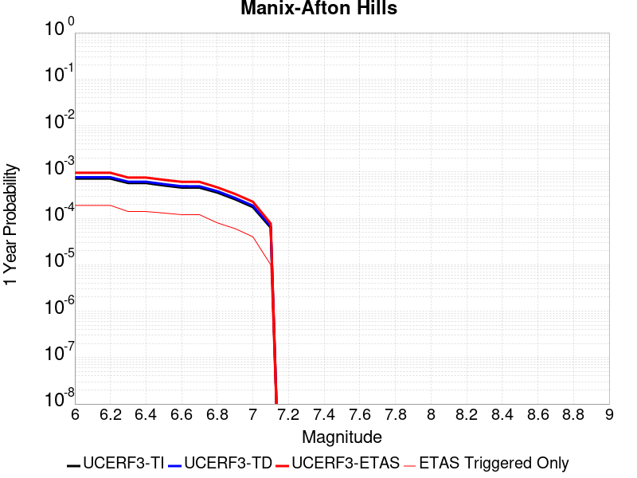 |  |

| Magnitude | 1 wk TI Prob | 1 wk TD Prob | 1 wk ETAS Prob | 1 wk ETAS/TD Gain | 1 wk ETAS Triggered Only | 1 mo TI Prob | 1 mo TD Prob | 1 mo ETAS Prob | 1 mo ETAS/TD Gain | 1 mo ETAS Triggered Only | 1 yr TI Prob | 1 yr TD Prob | 1 yr ETAS Prob | 1 yr ETAS/TD Gain | 1 yr ETAS Triggered Only | 10 yr TI Prob | 10 yr TD Prob | 10 yr ETAS Prob | 10 yr ETAS/TD Gain | 10 yr ETAS Triggered Only |
|-----|-----|-----|-----|-----|-----|-----|-----|-----|-----|-----|-----|-----|-----|-----|-----|-----|-----|-----|-----|-----|
| 6.0 | 1.3783202E-5 | 1.47110895E-5 | 9.26936E-5 | 6.3009334 | 7.7983656E-5 | 5.906953E-5 | 6.30461E-5 | 1.5662059E-4 | 2.4842231 | 9.3580384E-5 | 7.189342E-4 | 7.6733343E-4 | 9.699354E-4 | 1.2640338 | 2.027575E-4 | 0.0071661277 | 0.007648596 | 0.008004577 | 1.046542 | 3.5872482E-4 |
| 6.1 | 1.3783202E-5 | 1.47110895E-5 | 9.26936E-5 | 6.3009334 | 7.7983656E-5 | 5.906953E-5 | 6.30461E-5 | 1.5662059E-4 | 2.4842231 | 9.3580384E-5 | 7.189342E-4 | 7.6733343E-4 | 9.699354E-4 | 1.2640338 | 2.027575E-4 | 0.0071661277 | 0.007648596 | 0.008004577 | 1.046542 | 3.5872482E-4 |
| 6.2 | 1.3783202E-5 | 1.47110895E-5 | 9.26936E-5 | 6.3009334 | 7.7983656E-5 | 5.906953E-5 | 6.30461E-5 | 1.5662059E-4 | 2.4842231 | 9.3580384E-5 | 7.189342E-4 | 7.6733343E-4 | 9.699354E-4 | 1.2640338 | 2.027575E-4 | 0.0071661277 | 0.007648596 | 0.008004577 | 1.046542 | 3.5872482E-4 |
| 6.3 | 1.10494875E-5 | 1.1793136E-5 | 7.417933E-5 | 6.2900424 | 6.238693E-5 | 4.7354086E-5 | 5.054109E-5 | 1.1292486E-4 | 2.2343178 | 6.238693E-5 | 5.763835E-4 | 6.151744E-4 | 7.866329E-4 | 1.2787153 | 1.7156404E-4 | 0.005748908 | 0.0061357557 | 0.006414774 | 1.0454742 | 2.8074117E-4 |
| 6.4 | 1.10494875E-5 | 1.1793136E-5 | 7.417933E-5 | 6.2900424 | 6.238693E-5 | 4.7354086E-5 | 5.054109E-5 | 1.1292486E-4 | 2.2343178 | 6.238693E-5 | 5.763835E-4 | 6.151744E-4 | 7.866329E-4 | 1.2787153 | 1.7156404E-4 | 0.005748908 | 0.0061357557 | 0.006414774 | 1.0454742 | 2.8074117E-4 |
| 6.5 | 9.788949E-6 | 1.045432E-5 | 7.2840594E-5 | 6.967511 | 6.238693E-5 | 4.1951964E-5 | 4.480351E-5 | 1.0718764E-4 | 2.3923938 | 6.238693E-5 | 5.1064545E-4 | 5.453555E-4 | 7.1682595E-4 | 1.3144196 | 1.7156404E-4 | 0.0050947363 | 0.0054410985 | 0.0057203122 | 1.0513157 | 2.8074117E-4 |
| 6.6 | 8.810006E-6 | 9.4136285E-6 | 7.1799965E-5 | 7.627236 | 6.238693E-5 | 3.775662E-5 | 4.0343548E-5 | 1.0272795E-4 | 2.5463293 | 6.238693E-5 | 4.5958988E-4 | 4.9108086E-4 | 6.469716E-4 | 1.3174441 | 1.5596731E-4 | 0.0045864056 | 0.004900839 | 0.0051646843 | 1.0538367 | 2.6514442E-4 |
| 6.7 | 8.80128E-6 | 9.404108E-6 | 7.179045E-5 | 7.633945 | 6.238693E-5 | 3.7719226E-5 | 4.0302748E-5 | 1.02687154E-4 | 2.5478947 | 6.238693E-5 | 4.591348E-4 | 4.9058435E-4 | 6.464752E-4 | 1.3177655 | 1.5596731E-4 | 0.004581874 | 0.0048958957 | 0.005159742 | 1.0538913 | 2.6514442E-4 |
| 6.8 | 6.8994877E-6 | 7.380076E-6 | 5.4169923E-5 | 7.3400226 | 4.6790192E-5 | 2.9568899E-5 | 3.162856E-5 | 7.841727E-5 | 2.4793184 | 4.6790192E-5 | 3.5994186E-4 | 3.8501783E-4 | 4.785622E-4 | 1.242961 | 9.3580384E-5 | 0.003593594 | 0.0038443129 | 0.003984144 | 1.0363735 | 1.4037058E-4 |
| 6.9 | 4.9328037E-6 | 5.2709615E-6 | 3.646426E-5 | 6.917952 | 3.1193464E-5 | 2.1140417E-5 | 2.2589675E-5 | 5.378243E-5 | 2.3808415 | 3.1193464E-5 | 2.5735417E-4 | 2.7500073E-4 | 3.373705E-4 | 1.2267985 | 6.238693E-5 | 0.0025705635 | 0.0027472095 | 0.0028405327 | 1.0339702 | 9.3580384E-5 |
| 7.0 | 3.347973E-6 | 3.59003E-6 | 1.9186706E-5 | 5.3444414 | 1.5596732E-5 | 1.4348378E-5 | 1.5385775E-5 | 3.0982264E-5 | 2.0136955 | 1.5596732E-5 | 1.746775E-4 | 1.8730981E-4 | 2.1849743E-4 | 1.1665028 | 3.1193464E-5 | 0.0017454025 | 0.0018719219 | 0.001903057 | 1.0166327 | 3.1193464E-5 |
| 7.1 | 1.2073567E-6 | 1.293482E-6 | 1.293482E-6 | 1.0 | 0.0 | 5.1743755E-6 | 5.543492E-6 | 5.543492E-6 | 1.0 | 0.0 | 6.29962E-5 | 6.749156E-5 | 6.749156E-5 | 1.0 | 0.0 | 6.297835E-4 | 6.7487074E-4 | 6.7487074E-4 | 1.0 | 0.0 |

## Calico-Hidalgo
*[(top)](#table-of-contents)*

| 1 Week | 1 Month | 1 Year | 10 Year |
|-----|-----|-----|-----|
|  |  |  |  |

| Magnitude | 1 wk TI Prob | 1 wk TD Prob | 1 wk ETAS Prob | 1 wk ETAS/TD Gain | 1 wk ETAS Triggered Only | 1 mo TI Prob | 1 mo TD Prob | 1 mo ETAS Prob | 1 mo ETAS/TD Gain | 1 mo ETAS Triggered Only | 1 yr TI Prob | 1 yr TD Prob | 1 yr ETAS Prob | 1 yr ETAS/TD Gain | 1 yr ETAS Triggered Only | 10 yr TI Prob | 10 yr TD Prob | 10 yr ETAS Prob | 10 yr ETAS/TD Gain | 10 yr ETAS Triggered Only |
|-----|-----|-----|-----|-----|-----|-----|-----|-----|-----|-----|-----|-----|-----|-----|-----|-----|-----|-----|-----|-----|
| 6.0 | 4.0906612E-5 | 5.0703686E-5 | 6.6299624E-5 | 1.3075899 | 1.5596732E-5 | 1.7530227E-4 | 2.172857E-4 | 2.9525242E-4 | 1.3588212 | 7.7983656E-5 | 0.0021322158 | 0.002642648 | 0.002767092 | 1.0470906 | 1.2477385E-4 | 0.02111873 | 0.026152607 | 0.02651714 | 1.0139387 | 3.7432153E-4 |
| 6.1 | 4.0906612E-5 | 5.0703686E-5 | 6.6299624E-5 | 1.3075899 | 1.5596732E-5 | 1.7530227E-4 | 2.172857E-4 | 2.9525242E-4 | 1.3588212 | 7.7983656E-5 | 0.0021322158 | 0.002642648 | 0.002767092 | 1.0470906 | 1.2477385E-4 | 0.02111873 | 0.026152607 | 0.02651714 | 1.0139387 | 3.7432153E-4 |
| 6.2 | 4.0906612E-5 | 5.0703686E-5 | 6.6299624E-5 | 1.3075899 | 1.5596732E-5 | 1.7530227E-4 | 2.172857E-4 | 2.9525242E-4 | 1.3588212 | 7.7983656E-5 | 0.0021322158 | 0.002642648 | 0.002767092 | 1.0470906 | 1.2477385E-4 | 0.02111873 | 0.026152607 | 0.02651714 | 1.0139387 | 3.7432153E-4 |
| 6.3 | 2.4242801E-5 | 3.0090669E-5 | 4.568693E-5 | 1.5183089 | 1.5596732E-5 | 1.0389358E-4 | 1.2895382E-4 | 1.6014326E-4 | 1.2418652 | 3.1193464E-5 | 0.0012641704 | 0.0015689151 | 0.0016312042 | 1.0397019 | 6.238693E-5 | 0.01257003 | 0.01558206 | 0.015812365 | 1.0147802 | 2.3395097E-4 |
| 6.4 | 2.4242801E-5 | 3.0090669E-5 | 4.568693E-5 | 1.5183089 | 1.5596732E-5 | 1.0389358E-4 | 1.2895382E-4 | 1.6014326E-4 | 1.2418652 | 3.1193464E-5 | 0.0012641704 | 0.0015689151 | 0.0016312042 | 1.0397019 | 6.238693E-5 | 0.01257003 | 0.01558206 | 0.015812365 | 1.0147802 | 2.3395097E-4 |
| 6.5 | 2.0286952E-5 | 2.5315738E-5 | 4.0912073E-5 | 1.6160728 | 1.5596732E-5 | 8.694118E-5 | 1.0849161E-4 | 1.3968168E-4 | 1.2874883 | 3.1193464E-5 | 0.0010579949 | 0.001320102 | 0.0013824066 | 1.0471967 | 6.238693E-5 | 0.010529719 | 0.013124538 | 0.013340026 | 1.0164187 | 2.1835424E-4 |
| 6.6 | 2.0269223E-5 | 2.5296687E-5 | 4.0893025E-5 | 1.6165367 | 1.5596732E-5 | 8.6865206E-5 | 1.08409964E-4 | 1.3960004E-4 | 1.287705 | 3.1193464E-5 | 0.0010570707 | 0.0013191093 | 0.0013814139 | 1.0472324 | 6.238693E-5 | 0.010520565 | 0.013114728 | 0.013330218 | 1.0164312 | 2.1835424E-4 |
| 6.7 | 1.799852E-5 | 2.25406E-5 | 3.813698E-5 | 1.6919239 | 1.5596732E-5 | 7.713423E-5 | 9.659908E-5 | 1.2778952E-4 | 1.3228856 | 3.1193464E-5 | 9.3870464E-4 | 0.0011754738 | 0.001222209 | 1.0397586 | 4.6790192E-5 | 0.009347493 | 0.011694173 | 0.011879145 | 1.0158174 | 1.8716077E-4 |
| 6.8 | 1.7458793E-5 | 2.184212E-5 | 3.743851E-5 | 1.7140511 | 1.5596732E-5 | 7.4821255E-5 | 9.3605806E-5 | 1.2479635E-4 | 1.3332117 | 3.1193464E-5 | 9.10568E-4 | 0.0011390693 | 0.0011702273 | 1.0273539 | 3.1193464E-5 | 0.009068459 | 0.011333893 | 0.011503513 | 1.0149657 | 1.7156404E-4 |
| 6.9 | 1.542884E-5 | 1.9025927E-5 | 3.462236E-5 | 1.8197464 | 1.5596732E-5 | 6.612192E-5 | 8.153721E-5 | 1.1272813E-4 | 1.3825359 | 3.1193464E-5 | 8.04737E-4 | 9.922766E-4 | 0.0010234391 | 1.0314051 | 3.1193464E-5 | 0.008018291 | 0.009879857 | 0.010049727 | 1.0171934 | 1.7156404E-4 |
| 7.0 | 1.468253E-5 | 1.8030598E-5 | 3.362705E-5 | 1.8649989 | 1.5596732E-5 | 6.292361E-5 | 7.7271776E-5 | 1.0846283E-4 | 1.4036539 | 3.1193464E-5 | 7.658257E-4 | 9.4039086E-4 | 9.71555E-4 | 1.0331396 | 3.1193464E-5 | 0.0076319184 | 0.009365481 | 0.009535438 | 1.0181472 | 1.7156404E-4 |
| 7.1 | 1.3139281E-5 | 1.6200942E-5 | 3.1797423E-5 | 1.9626895 | 1.5596732E-5 | 5.6309986E-5 | 6.943083E-5 | 1.0062213E-4 | 1.4492427 | 3.1193464E-5 | 6.853584E-4 | 8.4500515E-4 | 8.761723E-4 | 1.036884 | 3.1193464E-5 | 0.0068324856 | 0.0084192185 | 0.008573873 | 1.0183692 | 1.5596731E-4 |
| 7.2 | 1.1127404E-5 | 1.3866597E-5 | 1.3866597E-5 | 1.0 | 0.0 | 4.7688E-5 | 5.942698E-5 | 7.5022785E-5 | 1.2624364 | 1.5596732E-5 | 5.8044674E-4 | 7.232942E-4 | 7.3887967E-4 | 1.0215479 | 1.5596732E-5 | 0.0057893298 | 0.0072105085 | 0.0073343827 | 1.0171797 | 1.2477385E-4 |
| 7.3 | 9.808154E-6 | 1.2176215E-5 | 1.2176215E-5 | 1.0 | 0.0 | 4.2034266E-5 | 5.2182797E-5 | 6.777871E-5 | 1.2988708 | 1.5596732E-5 | 5.11647E-4 | 6.3515105E-4 | 6.507379E-4 | 1.0245403 | 1.5596732E-5 | 0.0051047057 | 0.006334433 | 0.0064119226 | 1.0122331 | 7.7983656E-5 |
| 7.4 | 7.942452E-6 | 9.792144E-6 | 9.792144E-6 | 1.0 | 0.0 | 3.4038632E-5 | 4.1965708E-5 | 5.7561785E-5 | 1.3716385 | 1.5596732E-5 | 4.1434157E-4 | 5.1082217E-4 | 5.2641093E-4 | 1.030517 | 1.5596732E-5 | 0.0041356985 | 0.005097421 | 0.00515949 | 1.0121765 | 6.238693E-5 |
| 7.5 | 4.7121216E-6 | 5.772836E-6 | 5.772836E-6 | 1.0 | 0.0 | 2.019465E-5 | 2.4740535E-5 | 4.033688E-5 | 1.6303964 | 1.5596732E-5 | 2.4584212E-4 | 3.0118204E-4 | 3.1677407E-4 | 1.0517695 | 1.5596732E-5 | 0.0024557032 | 0.0030084911 | 0.0030551406 | 1.0155059 | 4.6790192E-5 |
| 7.6 | 2.21172E-7 | 2.603961E-7 | 2.603961E-7 | 1.0 | 0.0 | 9.478797E-7 | 1.1159829E-6 | 1.6712696E-5 | 14.975764 | 1.5596732E-5 | 1.1540374E-5 | 1.3587036E-5 | 2.9183555E-5 | 2.1478972 | 1.5596732E-5 | 1.1539775E-4 | 1.3586486E-4 | 1.5145948E-4 | 1.1147803 | 1.5596732E-5 |

## Cleghorn Lake
*[(top)](#table-of-contents)*

| 1 Week | 1 Month | 1 Year | 10 Year |
|-----|-----|-----|-----|
|  |  |  | 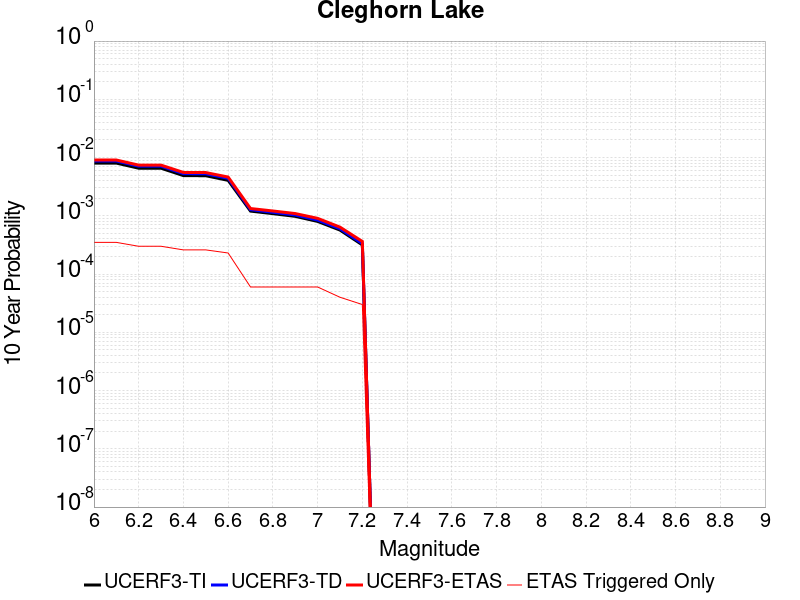 |

| Magnitude | 1 wk TI Prob | 1 wk TD Prob | 1 wk ETAS Prob | 1 wk ETAS/TD Gain | 1 wk ETAS Triggered Only | 1 mo TI Prob | 1 mo TD Prob | 1 mo ETAS Prob | 1 mo ETAS/TD Gain | 1 mo ETAS Triggered Only | 1 yr TI Prob | 1 yr TD Prob | 1 yr ETAS Prob | 1 yr ETAS/TD Gain | 1 yr ETAS Triggered Only | 10 yr TI Prob | 10 yr TD Prob | 10 yr ETAS Prob | 10 yr ETAS/TD Gain | 10 yr ETAS Triggered Only |
|-----|-----|-----|-----|-----|-----|-----|-----|-----|-----|-----|-----|-----|-----|-----|-----|-----|-----|-----|-----|-----|
| 6.0 | 1.5467183E-5 | 1.6794203E-5 | 1.1037302E-4 | 6.57209 | 9.3580384E-5 | 6.6286244E-5 | 7.197348E-5 | 2.2792957E-4 | 3.1668549 | 1.5596731E-4 | 8.067362E-4 | 8.759797E-4 | 0.0011564749 | 1.3202075 | 2.8074117E-4 | 0.008038137 | 0.008730696 | 0.009070828 | 1.0389582 | 3.4312808E-4 |
| 6.1 | 1.5467183E-5 | 1.6794203E-5 | 1.1037302E-4 | 6.57209 | 9.3580384E-5 | 6.6286244E-5 | 7.197348E-5 | 2.2792957E-4 | 3.1668549 | 1.5596731E-4 | 8.067362E-4 | 8.759797E-4 | 0.0011564749 | 1.3202075 | 2.8074117E-4 | 0.008038137 | 0.008730696 | 0.009070828 | 1.0389582 | 3.4312808E-4 |
| 6.2 | 1.2624631E-5 | 1.3681544E-5 | 7.606761E-5 | 5.5598702 | 6.238693E-5 | 5.410444E-5 | 5.863415E-5 | 1.8340068E-4 | 3.1278818 | 1.2477385E-4 | 6.585225E-4 | 7.1368564E-4 | 9.474696E-4 | 1.3275728 | 2.3395097E-4 | 0.0065657445 | 0.0071187317 | 0.0073974743 | 1.0391562 | 2.8074117E-4 |
| 6.3 | 1.2624631E-5 | 1.3681544E-5 | 7.606761E-5 | 5.5598702 | 6.238693E-5 | 5.410444E-5 | 5.863415E-5 | 1.8340068E-4 | 3.1278818 | 1.2477385E-4 | 6.585225E-4 | 7.1368564E-4 | 9.474696E-4 | 1.3275728 | 2.3395097E-4 | 0.0065657445 | 0.0071187317 | 0.0073974743 | 1.0391562 | 2.8074117E-4 |
| 6.4 | 9.417684E-6 | 1.0170118E-5 | 5.6959834E-5 | 5.6007056 | 4.6790192E-5 | 4.036088E-5 | 4.3585722E-5 | 1.5275808E-4 | 3.5047734 | 1.0917712E-4 | 4.912829E-4 | 5.3056807E-4 | 7.176295E-4 | 1.3525683 | 1.8716077E-4 | 0.004901982 | 0.005297049 | 0.005529761 | 1.0439323 | 2.3395097E-4 |
| 6.5 | 9.368219E-6 | 1.0117545E-5 | 5.6907265E-5 | 5.6246123 | 4.6790192E-5 | 4.014889E-5 | 4.3360415E-5 | 1.525328E-4 | 3.5177891 | 1.0917712E-4 | 4.8870314E-4 | 5.2782625E-4 | 7.148883E-4 | 1.3544006 | 1.8716077E-4 | 0.004876298 | 0.0052697617 | 0.0055024796 | 1.0441611 | 2.3395097E-4 |
| 6.6 | 7.803798E-6 | 8.441831E-6 | 5.523163E-5 | 6.5426126 | 4.6790192E-5 | 3.3444423E-5 | 3.6179E-5 | 1.4535217E-4 | 4.017584 | 1.0917712E-4 | 4.0710976E-4 | 4.4043022E-4 | 6.119187E-4 | 1.3893658 | 1.7156404E-4 | 0.0040636472 | 0.0043994905 | 0.004616884 | 1.0494133 | 2.1835424E-4 |
| 6.7 | 2.3108669E-6 | 2.4438336E-6 | 1.8040526E-5 | 7.38206 | 1.5596732E-5 | 9.903678E-6 | 1.0473532E-5 | 4.1666666E-5 | 3.9782825 | 3.1193464E-5 | 1.205706E-4 | 1.2750797E-4 | 1.8988694E-4 | 1.4892162 | 6.238693E-5 | 0.001205052 | 0.0012743667 | 0.0013366742 | 1.0488929 | 6.238693E-5 |
| 6.8 | 2.0882828E-6 | 2.2062823E-6 | 1.7802979E-5 | 8.0692215 | 1.5596732E-5 | 8.949753E-6 | 9.455462E-6 | 4.064863E-5 | 4.2989573 | 3.1193464E-5 | 1.08957785E-4 | 1.1511434E-4 | 1.7749408E-4 | 1.5418937 | 6.238693E-5 | 0.0010890438 | 0.0011505639 | 0.0012128791 | 1.0541605 | 6.238693E-5 |
| 6.9 | 1.876935E-6 | 1.981051E-6 | 1.7577751E-5 | 8.872942 | 1.5596732E-5 | 8.043982E-6 | 8.490192E-6 | 3.968339E-5 | 4.6740274 | 3.1193464E-5 | 9.7931086E-5 | 1.03363345E-4 | 1.6574383E-4 | 1.6035068 | 6.238693E-5 | 9.788794E-4 | 0.0010331686 | 0.0010954911 | 1.0603217 | 6.238693E-5 |
| 7.0 | 1.5357559E-6 | 1.6202807E-6 | 1.7216986E-5 | 10.625928 | 1.5596732E-5 | 6.5817944E-6 | 6.9440425E-6 | 3.813729E-5 | 5.4920874 | 3.1193464E-5 | 8.01304E-5 | 8.454057E-5 | 1.4692222E-4 | 1.7378901 | 6.238693E-5 | 8.010151E-4 | 8.450965E-4 | 9.0743066E-4 | 1.0737599 | 6.238693E-5 |
| 7.1 | 1.0905424E-6 | 1.1497619E-6 | 1.6746475E-5 | 14.565166 | 1.5596732E-5 | 4.6737446E-6 | 4.9275427E-6 | 3.612085E-5 | 7.3303986 | 3.1193464E-5 | 5.6901354E-5 | 5.999128E-5 | 9.118287E-5 | 1.5199354 | 3.1193464E-5 | 5.6886784E-4 | 5.997606E-4 | 6.3093536E-4 | 1.0519787 | 3.1193464E-5 |
| 7.2 | 6.06668E-7 | 6.387277E-7 | 1.6235448E-5 | 25.418417 | 1.5596732E-5 | 2.600003E-6 | 2.7374022E-6 | 3.3930777E-5 | 12.395247 | 3.1193464E-5 | 3.1654577E-5 | 3.3327433E-5 | 6.451985E-5 | 1.9359384 | 3.1193464E-5 | 3.1650066E-4 | 3.3323118E-4 | 3.6441424E-4 | 1.0935779 | 3.1193464E-5 |

## Lost Hills
*[(top)](#table-of-contents)*

| 1 Week | 1 Month | 1 Year | 10 Year |
|-----|-----|-----|-----|
|  |  |  |  |

| Magnitude | 1 wk TI Prob | 1 wk TD Prob | 1 wk ETAS Prob | 1 wk ETAS/TD Gain | 1 wk ETAS Triggered Only | 1 mo TI Prob | 1 mo TD Prob | 1 mo ETAS Prob | 1 mo ETAS/TD Gain | 1 mo ETAS Triggered Only | 1 yr TI Prob | 1 yr TD Prob | 1 yr ETAS Prob | 1 yr ETAS/TD Gain | 1 yr ETAS Triggered Only | 10 yr TI Prob | 10 yr TD Prob | 10 yr ETAS Prob | 10 yr ETAS/TD Gain | 10 yr ETAS Triggered Only |
|-----|-----|-----|-----|-----|-----|-----|-----|-----|-----|-----|-----|-----|-----|-----|-----|-----|-----|-----|-----|-----|
| 6.0 | 2.233523E-5 | 2.5106583E-5 | 1.0308828E-4 | 4.106026 | 7.7983656E-5 | 9.571891E-5 | 1.0759615E-4 | 2.3235657E-4 | 2.159525 | 1.2477385E-4 | 0.0011647546 | 0.001309364 | 0.001511856 | 1.1546491 | 2.027575E-4 | 0.011586686 | 0.013033091 | 0.013310173 | 1.0212599 | 2.8074117E-4 |
| 6.1 | 2.233523E-5 | 2.5106583E-5 | 1.0308828E-4 | 4.106026 | 7.7983656E-5 | 9.571891E-5 | 1.0759615E-4 | 2.3235657E-4 | 2.159525 | 1.2477385E-4 | 0.0011647546 | 0.001309364 | 0.001511856 | 1.1546491 | 2.027575E-4 | 0.011586686 | 0.013033091 | 0.013310173 | 1.0212599 | 2.8074117E-4 |
| 6.2 | 2.233523E-5 | 2.5106583E-5 | 1.0308828E-4 | 4.106026 | 7.7983656E-5 | 9.571891E-5 | 1.0759615E-4 | 2.3235657E-4 | 2.159525 | 1.2477385E-4 | 0.0011647546 | 0.001309364 | 0.001511856 | 1.1546491 | 2.027575E-4 | 0.011586686 | 0.013033091 | 0.013310173 | 1.0212599 | 2.8074117E-4 |
| 6.3 | 2.233523E-5 | 2.5106583E-5 | 1.0308828E-4 | 4.106026 | 7.7983656E-5 | 9.571891E-5 | 1.0759615E-4 | 2.3235657E-4 | 2.159525 | 1.2477385E-4 | 0.0011647546 | 0.001309364 | 0.001511856 | 1.1546491 | 2.027575E-4 | 0.011586686 | 0.013033091 | 0.013310173 | 1.0212599 | 2.8074117E-4 |
| 6.4 | 1.2288092E-5 | 1.3781108E-5 | 4.497414E-5 | 3.2634635 | 3.1193464E-5 | 5.2662188E-5 | 5.906108E-5 | 1.0584851E-4 | 1.7921872 | 4.6790192E-5 | 6.409735E-4 | 7.189252E-4 | 8.280238E-4 | 1.1517524 | 1.0917712E-4 | 0.006391279 | 0.0071752006 | 0.007345534 | 1.0237391 | 1.7156404E-4 |
| 6.5 | 1.2288092E-5 | 1.3781108E-5 | 4.497414E-5 | 3.2634635 | 3.1193464E-5 | 5.2662188E-5 | 5.906108E-5 | 1.0584851E-4 | 1.7921872 | 4.6790192E-5 | 6.409735E-4 | 7.189252E-4 | 8.280238E-4 | 1.1517524 | 1.0917712E-4 | 0.006391279 | 0.0071752006 | 0.007345534 | 1.0237391 | 1.7156404E-4 |
| 6.6 | 8.58281E-6 | 9.63377E-6 | 9.63377E-6 | 1.0 | 0.0 | 3.6782953E-5 | 4.12874E-5 | 4.12874E-5 | 1.0 | 0.0 | 4.4774043E-4 | 5.026414E-4 | 5.49408E-4 | 1.0930418 | 4.6790192E-5 | 0.0044683935 | 0.005023205 | 0.0051318337 | 1.0216254 | 1.0917712E-4 |
| 6.7 | 7.205685E-6 | 8.088302E-6 | 8.088302E-6 | 1.0 | 0.0 | 3.088114E-5 | 3.466415E-5 | 3.466415E-5 | 1.0 | 0.0 | 3.7591302E-4 | 4.2203604E-4 | 4.5321631E-4 | 1.0738807 | 3.1193464E-5 | 0.0037527776 | 0.0042203604 | 0.004298015 | 1.0184 | 7.7983656E-5 |

## San Jacinto (Anza) rev
*[(top)](#table-of-contents)*

| 1 Week | 1 Month | 1 Year | 10 Year |
|-----|-----|-----|-----|
|  |  |  |  |

| Magnitude | 1 wk TI Prob | 1 wk TD Prob | 1 wk ETAS Prob | 1 wk ETAS/TD Gain | 1 wk ETAS Triggered Only | 1 mo TI Prob | 1 mo TD Prob | 1 mo ETAS Prob | 1 mo ETAS/TD Gain | 1 mo ETAS Triggered Only | 1 yr TI Prob | 1 yr TD Prob | 1 yr ETAS Prob | 1 yr ETAS/TD Gain | 1 yr ETAS Triggered Only | 10 yr TI Prob | 10 yr TD Prob | 10 yr ETAS Prob | 10 yr ETAS/TD Gain | 10 yr ETAS Triggered Only |
|-----|-----|-----|-----|-----|-----|-----|-----|-----|-----|-----|-----|-----|-----|-----|-----|-----|-----|-----|-----|-----|
| 6.0 | 6.3015636E-5 | 4.3302647E-5 | 1.2128292E-4 | 2.80082 | 7.7983656E-5 | 2.7003905E-4 | 1.8556965E-4 | 3.5710185E-4 | 1.9243549 | 1.7156404E-4 | 0.0032827691 | 0.0022569813 | 0.0025526504 | 1.131002 | 2.9633788E-4 | 0.032346968 | 0.023296192 | 0.02364656 | 1.0150397 | 3.5872482E-4 |
| 6.1 | 6.3015636E-5 | 4.3302647E-5 | 1.2128292E-4 | 2.80082 | 7.7983656E-5 | 2.7003905E-4 | 1.8556965E-4 | 3.5710185E-4 | 1.9243549 | 1.7156404E-4 | 0.0032827691 | 0.0022569813 | 0.0025526504 | 1.131002 | 2.9633788E-4 | 0.032346968 | 0.023296192 | 0.02364656 | 1.0150397 | 3.5872482E-4 |
| 6.2 | 6.3015636E-5 | 4.3302647E-5 | 1.2128292E-4 | 2.80082 | 7.7983656E-5 | 2.7003905E-4 | 1.8556965E-4 | 3.5710185E-4 | 1.9243549 | 1.7156404E-4 | 0.0032827691 | 0.0022569813 | 0.0025526504 | 1.131002 | 2.9633788E-4 | 0.032346968 | 0.023296192 | 0.02364656 | 1.0150397 | 3.5872482E-4 |
| 6.3 | 6.3015636E-5 | 4.3302647E-5 | 1.2128292E-4 | 2.80082 | 7.7983656E-5 | 2.7003905E-4 | 1.8556965E-4 | 3.5710185E-4 | 1.9243549 | 1.7156404E-4 | 0.0032827691 | 0.0022569813 | 0.0025526504 | 1.131002 | 2.9633788E-4 | 0.032346968 | 0.023296192 | 0.02364656 | 1.0150397 | 3.5872482E-4 |
| 6.4 | 6.3015636E-5 | 4.3302647E-5 | 1.2128292E-4 | 2.80082 | 7.7983656E-5 | 2.7003905E-4 | 1.8556965E-4 | 3.5710185E-4 | 1.9243549 | 1.7156404E-4 | 0.0032827691 | 0.0022569813 | 0.0025526504 | 1.131002 | 2.9633788E-4 | 0.032346968 | 0.023296192 | 0.02364656 | 1.0150397 | 3.5872482E-4 |
| 6.5 | 5.811017E-5 | 4.0082516E-5 | 1.1806304E-4 | 2.9455 | 7.7983656E-5 | 2.4901982E-4 | 1.7177092E-4 | 3.433055E-4 | 1.998624 | 1.7156404E-4 | 0.0030276014 | 0.002089311 | 0.0023850296 | 1.1415389 | 2.9633788E-4 | 0.02986684 | 0.021593736 | 0.021944717 | 1.0162537 | 3.5872482E-4 |
| 6.6 | 5.811017E-5 | 4.0082516E-5 | 1.1806304E-4 | 2.9455 | 7.7983656E-5 | 2.4901982E-4 | 1.7177092E-4 | 3.433055E-4 | 1.998624 | 1.7156404E-4 | 0.0030276014 | 0.002089311 | 0.0023850296 | 1.1415389 | 2.9633788E-4 | 0.02986684 | 0.021593736 | 0.021944717 | 1.0162537 | 3.5872482E-4 |
| 6.7 | 5.712442E-5 | 3.9505223E-5 | 1.174858E-4 | 2.9739308 | 7.7983656E-5 | 2.4479596E-4 | 1.6929714E-4 | 3.4083214E-4 | 2.0132184 | 1.7156404E-4 | 0.0029763177 | 0.0020592497 | 0.0023549774 | 1.1436094 | 2.9633788E-4 | 0.029367693 | 0.021285562 | 0.021636652 | 1.0164943 | 3.5872482E-4 |
| 6.8 | 5.6967532E-5 | 3.9361643E-5 | 1.1734223E-4 | 2.9811313 | 7.7983656E-5 | 2.4412372E-4 | 1.6868189E-4 | 3.40217E-4 | 2.0169148 | 1.7156404E-4 | 0.0029681553 | 0.002051773 | 0.0023475029 | 1.1441338 | 2.9633788E-4 | 0.029288229 | 0.021210281 | 0.021561397 | 1.016554 | 3.5872482E-4 |
| 6.9 | 5.6211324E-5 | 3.9066435E-5 | 1.1704704E-4 | 2.9961023 | 7.7983656E-5 | 2.4088343E-4 | 1.6741687E-4 | 3.3895217E-4 | 2.0246 | 1.7156404E-4 | 0.0029288116 | 0.0020364004 | 0.0023321346 | 1.1452241 | 2.9633788E-4 | 0.028905109 | 0.021049714 | 0.021400888 | 1.0166831 | 3.5872482E-4 |
| 7.0 | 5.4383527E-5 | 3.792697E-5 | 1.15907664E-4 | 3.056075 | 7.7983656E-5 | 2.3305144E-4 | 1.6253405E-4 | 3.340702E-4 | 2.0553858 | 1.7156404E-4 | 0.0028337094 | 0.001977061 | 0.0022728129 | 1.1495918 | 2.9633788E-4 | 0.027978465 | 0.020440677 | 0.020792069 | 1.0171908 | 3.5872482E-4 |
| 7.1 | 5.1393665E-5 | 3.6389913E-5 | 1.1437073E-4 | 3.142924 | 7.7983656E-5 | 2.2023996E-4 | 1.5594746E-4 | 3.2748474E-4 | 2.0999684 | 1.7156404E-4 | 0.0026781242 | 0.0018970112 | 0.002192787 | 1.1559167 | 2.9633788E-4 | 0.026460782 | 0.019614287 | 0.019965975 | 1.0179303 | 3.5872482E-4 |
| 7.2 | 4.785222E-5 | 3.4741795E-5 | 1.12722744E-4 | 3.244586 | 7.7983656E-5 | 2.0506482E-4 | 1.4888494E-4 | 3.2042342E-4 | 2.152155 | 1.7156404E-4 | 0.0024938055 | 0.0018111705 | 0.0021069716 | 1.1633204 | 2.9633788E-4 | 0.024660049 | 0.018728992 | 0.019080998 | 1.0187948 | 3.5872482E-4 |
| 7.3 | 4.2143256E-5 | 3.383628E-5 | 1.11817295E-4 | 3.304657 | 7.7983656E-5 | 1.8060145E-4 | 1.4500458E-4 | 3.1654374E-4 | 2.1829913 | 1.7156404E-4 | 0.002196605 | 0.0017640047 | 0.0020598199 | 1.1676952 | 2.9633788E-4 | 0.02175019 | 0.01823724 | 0.018589424 | 1.0193112 | 3.5872482E-4 |
| 7.4 | 4.0264713E-5 | 3.347446E-5 | 1.11455505E-4 | 3.3295681 | 7.7983656E-5 | 1.7255165E-4 | 1.4345412E-4 | 3.1499355E-4 | 2.195779 | 1.7156404E-4 | 0.002098792 | 0.0017451581 | 0.0020409788 | 1.1695094 | 2.9633788E-4 | 0.020790804 | 0.018041821 | 0.018394073 | 1.0195242 | 3.5872482E-4 |
| 7.5 | 3.694492E-5 | 3.218847E-5 | 1.1016961E-4 | 3.4226425 | 7.7983656E-5 | 1.5832575E-4 | 1.379433E-4 | 3.0948367E-4 | 2.2435572 | 1.7156404E-4 | 0.0019259118 | 0.001678169 | 0.0019740094 | 1.1762878 | 2.9633788E-4 | 0.01909306 | 0.01735827 | 0.017710768 | 1.0203072 | 3.5872482E-4 |
| 7.6 | 3.200565E-5 | 2.9504106E-5 | 1.0748546E-4 | 3.6430678 | 7.7983656E-5 | 1.3715986E-4 | 1.2644005E-4 | 2.979824E-4 | 2.356709 | 1.7156404E-4 | 0.001668642 | 0.0015383229 | 0.0018342049 | 1.1923406 | 2.9633788E-4 | 0.01656168 | 0.0159463 | 0.016299305 | 1.022137 | 3.5872482E-4 |
| 7.7 | 2.731642E-5 | 2.6092788E-5 | 1.0407441E-4 | 3.9886274 | 7.7983656E-5 | 1.1706512E-4 | 1.1182144E-4 | 2.833663E-4 | 2.5340962 | 1.7156404E-4 | 0.001424336 | 0.0013605768 | 0.0016565116 | 1.2175068 | 2.9633788E-4 | 0.014152412 | 0.014167004 | 0.014520647 | 1.0249624 | 3.5872482E-4 |
| 7.8 | 2.3466424E-5 | 2.3504817E-5 | 1.0148664E-4 | 4.317695 | 7.7983656E-5 | 1.0056651E-4 | 1.0073105E-4 | 2.722778E-4 | 2.7030177 | 1.7156404E-4 | 0.0012237094 | 0.0012257113 | 0.001521686 | 1.2414718 | 2.9633788E-4 | 0.012169928 | 0.012808893 | 0.013163023 | 1.0276471 | 3.5872482E-4 |
| 7.9 | 1.8611925E-5 | 1.8908117E-5 | 9.68903E-5 | 5.12427 | 7.7983656E-5 | 7.9762955E-5 | 8.1032274E-5 | 2.5258242E-4 | 3.1170595 | 1.7156404E-4 | 9.7068126E-4 | 9.861222E-4 | 0.0012354237 | 1.2528101 | 2.495477E-4 | 0.0096645225 | 0.010393824 | 0.010702517 | 1.0296996 | 3.1193462E-4 |
| 8.0 | 1.5460775E-5 | 1.5740965E-5 | 9.372339E-5 | 5.9541073 | 7.7983656E-5 | 6.6258784E-5 | 6.7459536E-5 | 2.39012E-4 | 3.5430424 | 1.7156404E-4 | 8.0640207E-4 | 8.21011E-4 | 0.0010703539 | 1.3037021 | 2.495477E-4 | 0.008034821 | 0.0087028835 | 0.009012103 | 1.0355307 | 3.1193462E-4 |
| 8.1 | 9.983884E-6 | 8.269952E-6 | 5.5059758E-5 | 6.657809 | 4.6790192E-5 | 4.2787375E-5 | 3.544217E-5 | 1.1342306E-4 | 3.200229 | 7.7983656E-5 | 5.2081177E-4 | 4.314235E-4 | 5.4055353E-4 | 1.2529533 | 1.0917712E-4 | 0.0051959283 | 0.004640022 | 0.004795266 | 1.0334575 | 1.5596731E-4 |
| 8.2 | 4.1226E-6 | 1.5529788E-6 | 1.5529788E-6 | 1.0 | 0.0 | 1.7668166E-5 | 6.6556063E-6 | 6.6556063E-6 | 1.0 | 0.0 | 2.1508869E-4 | 8.102902E-5 | 8.102902E-5 | 1.0 | 0.0 | 0.0021488064 | 9.4050163E-4 | 9.4050163E-4 | 1.0 | 0.0 |
| 8.3 | 1.2750878E-6 | 3.612133E-7 | 3.612133E-7 | 1.0 | 0.0 | 5.4646503E-6 | 1.548056E-6 | 1.548056E-6 | 1.0 | 0.0 | 6.653009E-5 | 1.8847424E-5 | 1.8847424E-5 | 1.0 | 0.0 | 6.6510175E-4 | 2.2734253E-4 | 2.2734253E-4 | 1.0 | 0.0 |

## Ludlow
*[(top)](#table-of-contents)*

| 1 Week | 1 Month | 1 Year | 10 Year |
|-----|-----|-----|-----|
|  |  |  |  |

| Magnitude | 1 wk TI Prob | 1 wk TD Prob | 1 wk ETAS Prob | 1 wk ETAS/TD Gain | 1 wk ETAS Triggered Only | 1 mo TI Prob | 1 mo TD Prob | 1 mo ETAS Prob | 1 mo ETAS/TD Gain | 1 mo ETAS Triggered Only | 1 yr TI Prob | 1 yr TD Prob | 1 yr ETAS Prob | 1 yr ETAS/TD Gain | 1 yr ETAS Triggered Only | 10 yr TI Prob | 10 yr TD Prob | 10 yr ETAS Prob | 10 yr ETAS/TD Gain | 10 yr ETAS Triggered Only |
|-----|-----|-----|-----|-----|-----|-----|-----|-----|-----|-----|-----|-----|-----|-----|-----|-----|-----|-----|-----|-----|
| 6.0 | 2.2407607E-5 | 2.3657254E-5 | 1.17235424E-4 | 4.9555807 | 9.3580384E-5 | 9.602906E-5 | 1.0138454E-4 | 2.1055058E-4 | 2.0767524 | 1.0917712E-4 | 0.0011685267 | 0.001233702 | 0.0014829418 | 1.202026 | 2.495477E-4 | 0.011624013 | 0.012273042 | 0.012596553 | 1.0263596 | 3.2753134E-4 |
| 6.1 | 2.2407607E-5 | 2.3657254E-5 | 1.17235424E-4 | 4.9555807 | 9.3580384E-5 | 9.602906E-5 | 1.0138454E-4 | 2.1055058E-4 | 2.0767524 | 1.0917712E-4 | 0.0011685267 | 0.001233702 | 0.0014829418 | 1.202026 | 2.495477E-4 | 0.011624013 | 0.012273042 | 0.012596553 | 1.0263596 | 3.2753134E-4 |
| 6.2 | 1.0781252E-5 | 1.1365663E-5 | 4.255877E-5 | 3.7445037 | 3.1193464E-5 | 4.620455E-5 | 4.8709102E-5 | 9.549702E-5 | 1.9605579 | 4.6790192E-5 | 5.623952E-4 | 5.9287593E-4 | 7.487508E-4 | 1.2629131 | 1.5596731E-4 | 0.00560974 | 0.0059133614 | 0.0061149197 | 1.0340853 | 2.027575E-4 |
| 6.3 | 1.0781252E-5 | 1.1365663E-5 | 4.255877E-5 | 3.7445037 | 3.1193464E-5 | 4.620455E-5 | 4.8709102E-5 | 9.549702E-5 | 1.9605579 | 4.6790192E-5 | 5.623952E-4 | 5.9287593E-4 | 7.487508E-4 | 1.2629131 | 1.5596731E-4 | 0.00560974 | 0.0059133614 | 0.0061149197 | 1.0340853 | 2.027575E-4 |
| 6.4 | 7.814439E-6 | 8.237729E-6 | 2.3834331E-5 | 2.8933134 | 1.5596732E-5 | 3.3490025E-5 | 3.530408E-5 | 6.649645E-5 | 1.8835341 | 3.1193464E-5 | 4.0766477E-4 | 4.2974384E-4 | 5.38874E-4 | 1.2539425 | 1.0917712E-4 | 0.0040691774 | 0.0042892746 | 0.004413513 | 1.028965 | 1.2477385E-4 |
| 6.5 | 6.4986366E-6 | 6.85092E-6 | 2.2447544E-5 | 3.276574 | 1.5596732E-5 | 2.7851002E-5 | 2.9360759E-5 | 6.0553306E-5 | 2.062389 | 3.1193464E-5 | 3.390332E-4 | 3.5740953E-4 | 4.6654762E-4 | 1.3053586 | 1.0917712E-4 | 0.003385164 | 0.0035684432 | 0.0036927718 | 1.0348412 | 1.2477385E-4 |
| 6.6 | 5.582177E-6 | 5.8860055E-6 | 2.1482645E-5 | 3.6497834 | 1.5596732E-5 | 2.3923398E-5 | 2.5225498E-5 | 5.6418172E-5 | 2.2365534 | 3.1193464E-5 | 2.9122844E-4 | 3.0707786E-4 | 4.0062953E-4 | 1.3046513 | 9.3580384E-5 | 0.0029084706 | 0.003066609 | 0.0031754512 | 1.0354928 | 1.0917712E-4 |
| 6.7 | 4.6858763E-6 | 4.940427E-6 | 2.0537082E-5 | 4.1569443 | 1.5596732E-5 | 2.0082172E-5 | 2.1173091E-5 | 5.2365893E-5 | 2.4732285 | 3.1193464E-5 | 2.4447302E-4 | 2.5775246E-4 | 3.513087E-4 | 1.3629695 | 9.3580384E-5 | 0.0024420423 | 0.0025745912 | 0.0026834873 | 1.0422964 | 1.0917712E-4 |
| 6.8 | 3.5584908E-6 | 3.7520183E-6 | 1.934869E-5 | 5.156875 | 1.5596732E-5 | 1.5250586E-5 | 1.6079981E-5 | 4.727294E-5 | 2.939863 | 3.1193464E-5 | 1.8566006E-4 | 1.957566E-4 | 2.73725E-4 | 1.3982925 | 7.7983656E-5 | 0.0018550502 | 0.0019558826 | 0.00204928 | 1.047752 | 9.3580384E-5 |
| 6.9 | 2.532834E-6 | 2.6710034E-6 | 1.8267692E-5 | 6.839262 | 1.5596732E-5 | 1.0854958E-5 | 1.1447109E-5 | 4.2640215E-5 | 3.7249765 | 3.1193464E-5 | 1.3215111E-4 | 1.3935992E-4 | 2.1733271E-4 | 1.5595065 | 7.7983656E-5 | 0.0013207254 | 0.0013927529 | 0.0014862029 | 1.0670974 | 9.3580384E-5 |
| 7.0 | 1.7083285E-6 | 1.8019439E-6 | 1.7398646E-5 | 9.655488 | 1.5596732E-5 | 7.3213873E-6 | 7.722595E-6 | 3.8915816E-5 | 5.039215 | 3.1193464E-5 | 8.913424E-5 | 9.40187E-5 | 1.5639976E-4 | 1.6634963 | 6.238693E-5 | 8.9098496E-4 | 9.3980576E-4 | 0.0010177161 | 1.0829005 | 7.7983656E-5 |
| 7.1 | 1.0905424E-6 | 1.1497619E-6 | 1.6746475E-5 | 14.565166 | 1.5596732E-5 | 4.6737446E-6 | 4.9275427E-6 | 3.612085E-5 | 7.3303986 | 3.1193464E-5 | 5.6901354E-5 | 5.999128E-5 | 9.118287E-5 | 1.5199354 | 3.1193464E-5 | 5.6886784E-4 | 5.997606E-4 | 6.3093536E-4 | 1.0519787 | 3.1193464E-5 |
| 7.2 | 6.06668E-7 | 6.387277E-7 | 1.6235448E-5 | 25.418417 | 1.5596732E-5 | 2.600003E-6 | 2.7374022E-6 | 3.3930777E-5 | 12.395247 | 3.1193464E-5 | 3.1654577E-5 | 3.3327433E-5 | 6.451985E-5 | 1.9359384 | 3.1193464E-5 | 3.1650066E-4 | 3.3323118E-4 | 3.6441424E-4 | 1.0935779 | 3.1193464E-5 |

## Santa Ynez (West)
*[(top)](#table-of-contents)*

| 1 Week | 1 Month | 1 Year | 10 Year |
|-----|-----|-----|-----|
|  |  | 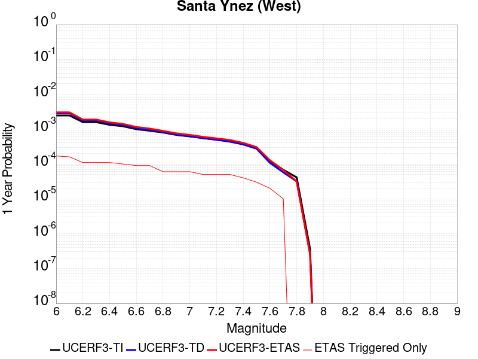 |  |

| Magnitude | 1 wk TI Prob | 1 wk TD Prob | 1 wk ETAS Prob | 1 wk ETAS/TD Gain | 1 wk ETAS Triggered Only | 1 mo TI Prob | 1 mo TD Prob | 1 mo ETAS Prob | 1 mo ETAS/TD Gain | 1 mo ETAS Triggered Only | 1 yr TI Prob | 1 yr TD Prob | 1 yr ETAS Prob | 1 yr ETAS/TD Gain | 1 yr ETAS Triggered Only | 10 yr TI Prob | 10 yr TD Prob | 10 yr ETAS Prob | 10 yr ETAS/TD Gain | 10 yr ETAS Triggered Only |
|-----|-----|-----|-----|-----|-----|-----|-----|-----|-----|-----|-----|-----|-----|-----|-----|-----|-----|-----|-----|-----|
| 6.0 | 4.7352758E-5 | 5.4972126E-5 | 1.3295149E-4 | 2.4185257 | 7.7983656E-5 | 2.0292461E-4 | 2.3557522E-4 | 3.135405E-4 | 1.330957 | 7.7983656E-5 | 0.0024678076 | 0.0028645284 | 0.0029889448 | 1.0434334 | 1.2477385E-4 | 0.024405818 | 0.028304417 | 0.028501436 | 1.0069607 | 2.027575E-4 |
| 6.1 | 4.7352758E-5 | 5.4972126E-5 | 1.3295149E-4 | 2.4185257 | 7.7983656E-5 | 2.0292461E-4 | 2.3557522E-4 | 3.135405E-4 | 1.330957 | 7.7983656E-5 | 0.0024678076 | 0.0028645284 | 0.0029733926 | 1.0380043 | 1.0917712E-4 | 0.024405818 | 0.028304417 | 0.028471125 | 1.0058898 | 1.7156404E-4 |
| 6.2 | 3.0415853E-5 | 3.392511E-5 | 8.071372E-5 | 2.3791733 | 4.6790192E-5 | 1.3034715E-4 | 1.4538545E-4 | 1.9216884E-4 | 1.3217887 | 4.6790192E-5 | 0.0015858212 | 0.0017686661 | 0.0018309427 | 1.0352111 | 6.238693E-5 | 0.015745522 | 0.017549807 | 0.017672392 | 1.006985 | 1.2477385E-4 |
| 6.3 | 3.0415853E-5 | 3.392511E-5 | 8.071372E-5 | 2.3791733 | 4.6790192E-5 | 1.3034715E-4 | 1.4538545E-4 | 1.9216884E-4 | 1.3217887 | 4.6790192E-5 | 0.0015858212 | 0.0017686661 | 0.0018309427 | 1.0352111 | 6.238693E-5 | 0.015745522 | 0.017549807 | 0.017672392 | 1.006985 | 1.2477385E-4 |
| 6.4 | 2.5452082E-5 | 2.7912422E-5 | 7.470131E-5 | 2.6762748 | 4.6790192E-5 | 1.09075794E-4 | 1.196193E-4 | 1.6640389E-4 | 1.3911124 | 4.6790192E-5 | 0.0013271887 | 0.0014554089 | 0.0015177049 | 1.0428032 | 6.238693E-5 | 0.013192902 | 0.014460951 | 0.014583921 | 1.0085036 | 1.2477385E-4 |
| 6.5 | 2.3143784E-5 | 2.5128256E-5 | 7.1917275E-5 | 2.862008 | 4.6790192E-5 | 9.9183875E-5 | 1.0768817E-4 | 1.5447332E-4 | 1.4344503 | 4.6790192E-5 | 0.0012068948 | 0.0013103267 | 0.0013726319 | 1.0475494 | 6.238693E-5 | 0.012003611 | 0.01302768 | 0.013150828 | 1.0094528 | 1.2477385E-4 |
| 6.6 | 1.9118515E-5 | 2.035434E-5 | 6.714358E-5 | 3.2987354 | 4.6790192E-5 | 8.193392E-5 | 8.7230015E-5 | 1.3401613E-4 | 1.5363533 | 4.6790192E-5 | 9.97089E-4 | 0.001061516 | 0.0011238367 | 1.0587091 | 6.238693E-5 | 0.00992627 | 0.010565365 | 0.010673389 | 1.0102243 | 1.0917712E-4 |
| 6.7 | 1.722807E-5 | 1.8146347E-5 | 6.493569E-5 | 3.5784442 | 4.6790192E-5 | 7.3832496E-5 | 7.776777E-5 | 1.2455432E-4 | 1.6016188 | 4.6790192E-5 | 8.985399E-4 | 9.464169E-4 | 0.0010087448 | 1.0658567 | 6.238693E-5 | 0.008949154 | 0.0094245095 | 0.009517209 | 1.0098358 | 9.3580384E-5 |
| 6.8 | 1.5317364E-5 | 1.5926486E-5 | 6.271593E-5 | 3.9378388 | 4.6790192E-5 | 6.56442E-5 | 6.82546E-5 | 1.150416E-4 | 1.6854776 | 4.6790192E-5 | 7.98925E-4 | 8.306873E-4 | 8.9302234E-4 | 1.0750403 | 6.238693E-5 | 0.007960589 | 0.00827631 | 0.008369115 | 1.0112134 | 9.3580384E-5 |
| 6.9 | 1.3071226E-5 | 1.3329624E-5 | 6.0119193E-5 | 4.5101943 | 4.6790192E-5 | 5.6018336E-5 | 5.7125722E-5 | 1.0391324E-4 | 1.8190272 | 4.6790192E-5 | 6.8180985E-4 | 6.9528597E-4 | 7.576295E-4 | 1.089666 | 6.238693E-5 | 0.0067972173 | 0.006931367 | 0.007024299 | 1.0134075 | 9.3580384E-5 |
| 7.0 | 1.1836986E-5 | 1.19327815E-5 | 5.8722417E-5 | 4.9211 | 4.6790192E-5 | 5.0728955E-5 | 5.11395E-5 | 9.79273E-5 | 1.9149053 | 4.6790192E-5 | 6.1745E-4 | 6.2244723E-4 | 6.847953E-4 | 1.1001661 | 6.238693E-5 | 0.006157372 | 0.006207231 | 0.0063002305 | 1.0149825 | 9.3580384E-5 |
| 7.1 | 1.0597169E-5 | 1.0542201E-5 | 4.1735333E-5 | 3.9588823 | 3.1193464E-5 | 4.541565E-5 | 4.5180084E-5 | 7.637214E-5 | 1.6903938 | 3.1193464E-5 | 5.5279525E-4 | 5.4992986E-4 | 5.966943E-4 | 1.0850371 | 4.6790192E-5 | 0.0055142213 | 0.005485821 | 0.0055478658 | 1.01131 | 6.238693E-5 |
| 7.2 | 9.59113E-6 | 9.459144E-6 | 4.065231E-5 | 4.297673 | 3.1193464E-5 | 4.11042E-5 | 4.0538565E-5 | 7.173076E-5 | 1.7694451 | 3.1193464E-5 | 5.0032866E-4 | 4.934463E-4 | 5.402134E-4 | 1.0947765 | 4.6790192E-5 | 0.004992037 | 0.0049236254 | 0.004985705 | 1.0126085 | 6.238693E-5 |
| 7.3 | 8.586084E-6 | 8.379583E-6 | 3.9572784E-5 | 4.722524 | 3.1193464E-5 | 3.679698E-5 | 3.5912013E-5 | 6.710435E-5 | 1.8685769 | 3.1193464E-5 | 4.4791115E-4 | 4.3714207E-4 | 4.839118E-4 | 1.1069897 | 4.6790192E-5 | 0.004470094 | 0.004362933 | 0.004425048 | 1.0142369 | 6.238693E-5 |
| 7.4 | 7.2622997E-6 | 6.9515427E-6 | 3.8144786E-5 | 5.487241 | 3.1193464E-5 | 3.112377E-5 | 2.979199E-5 | 6.0984523E-5 | 2.0470107 | 3.1193464E-5 | 3.78866E-4 | 3.626581E-4 | 4.0943132E-4 | 1.1289734 | 4.6790192E-5 | 0.0037822074 | 0.0036207628 | 0.003682924 | 1.0171679 | 6.238693E-5 |
| 7.5 | 5.627296E-6 | 5.251588E-6 | 3.6444886E-5 | 6.939784 | 3.1193464E-5 | 2.411676E-5 | 2.2506614E-5 | 5.3699376E-5 | 2.3859375 | 3.1193464E-5 | 2.9358198E-4 | 2.739843E-4 | 3.2076167E-4 | 1.1707301 | 4.6790192E-5 | 0.0029319443 | 0.002736537 | 0.0027987533 | 1.0227354 | 6.238693E-5 |
| 7.6 | 2.265244E-6 | 2.0608625E-6 | 3.325426E-5 | 16.13609 | 3.1193464E-5 | 9.708152E-6 | 8.832238E-6 | 4.0025425E-5 | 4.531742 | 3.1193464E-5 | 1.18190335E-4 | 1.0752728E-4 | 1.3871738E-4 | 1.290067 | 3.1193464E-5 | 0.001181275 | 0.0010747612 | 0.0011059211 | 1.0289924 | 3.1193464E-5 |
| 7.7 | 1.3099874E-6 | 1.1016252E-6 | 1.669834E-5 | 15.157913 | 1.5596732E-5 | 5.61422E-6 | 4.7212425E-6 | 2.03179E-5 | 4.303507 | 1.5596732E-5 | 6.8350986E-5 | 5.7479636E-5 | 7.307547E-5 | 1.271328 | 1.5596732E-5 | 6.832996E-4 | 5.7465007E-4 | 5.9023785E-4 | 1.0271257 | 1.5596732E-5 |
| 7.8 | 7.903951E-7 | 6.0711415E-7 | 6.0711415E-7 | 1.0 | 0.0 | 3.3874032E-6 | 2.6019152E-6 | 2.6019152E-6 | 1.0 | 0.0 | 4.1240855E-5 | 3.167787E-5 | 3.167787E-5 | 1.0 | 0.0 | 4.12332E-4 | 3.167349E-4 | 3.167349E-4 | 1.0 | 0.0 |
| 7.9 | 7.0753297E-9 | 5.0899476E-9 | 5.0899476E-9 | 1.0 | 0.0 | 3.032284E-8 | 2.181406E-8 | 2.181406E-8 | 1.0 | 0.0 | 3.6918053E-7 | 2.6558615E-7 | 2.6558615E-7 | 1.0 | 0.0 | 3.691799E-6 | 2.6558594E-6 | 2.6558594E-6 | 1.0 | 0.0 |

## White Wolf (Extension)
*[(top)](#table-of-contents)*

| 1 Week | 1 Month | 1 Year | 10 Year |
|-----|-----|-----|-----|
|  |  |  |  |

| Magnitude | 1 wk TI Prob | 1 wk TD Prob | 1 wk ETAS Prob | 1 wk ETAS/TD Gain | 1 wk ETAS Triggered Only | 1 mo TI Prob | 1 mo TD Prob | 1 mo ETAS Prob | 1 mo ETAS/TD Gain | 1 mo ETAS Triggered Only | 1 yr TI Prob | 1 yr TD Prob | 1 yr ETAS Prob | 1 yr ETAS/TD Gain | 1 yr ETAS Triggered Only | 10 yr TI Prob | 10 yr TD Prob | 10 yr ETAS Prob | 10 yr ETAS/TD Gain | 10 yr ETAS Triggered Only |
|-----|-----|-----|-----|-----|-----|-----|-----|-----|-----|-----|-----|-----|-----|-----|-----|-----|-----|-----|-----|-----|
| 6.0 | 8.222555E-6 | 6.0666657E-6 | 8.404985E-5 | 13.854373 | 7.7983656E-5 | 3.5239045E-5 | 2.5999774E-5 | 1.3517405E-4 | 5.199047 | 1.0917712E-4 | 4.289509E-4 | 3.1650788E-4 | 5.192012E-4 | 1.6404053 | 2.027575E-4 | 0.0042812387 | 0.003161223 | 0.0035032665 | 1.1081997 | 3.4312808E-4 |
| 6.1 | 8.222555E-6 | 6.0666657E-6 | 8.404985E-5 | 13.854373 | 7.7983656E-5 | 3.5239045E-5 | 2.5999774E-5 | 1.3517405E-4 | 5.199047 | 1.0917712E-4 | 4.289509E-4 | 3.1650788E-4 | 5.192012E-4 | 1.6404053 | 2.027575E-4 | 0.0042812387 | 0.003161223 | 0.0035032665 | 1.1081997 | 3.4312808E-4 |
| 6.2 | 8.222555E-6 | 6.0666657E-6 | 8.404985E-5 | 13.854373 | 7.7983656E-5 | 3.5239045E-5 | 2.5999774E-5 | 1.3517405E-4 | 5.199047 | 1.0917712E-4 | 4.289509E-4 | 3.1650788E-4 | 5.192012E-4 | 1.6404053 | 2.027575E-4 | 0.0042812387 | 0.003161223 | 0.0035032665 | 1.1081997 | 3.4312808E-4 |
| 6.3 | 8.222555E-6 | 6.0666657E-6 | 8.404985E-5 | 13.854373 | 7.7983656E-5 | 3.5239045E-5 | 2.5999774E-5 | 1.3517405E-4 | 5.199047 | 1.0917712E-4 | 4.289509E-4 | 3.1650788E-4 | 5.192012E-4 | 1.6404053 | 2.027575E-4 | 0.0042812387 | 0.003161223 | 0.0035032665 | 1.1081997 | 3.4312808E-4 |
| 6.4 | 5.821773E-6 | 3.5571766E-6 | 3.4750527E-5 | 9.769133 | 3.1193464E-5 | 2.4950215E-5 | 1.5244959E-5 | 6.2034436E-5 | 4.069177 | 4.6790192E-5 | 3.0372653E-4 | 1.8559267E-4 | 2.7915568E-4 | 1.504131 | 9.3580384E-5 | 0.0030331176 | 0.001854485 | 0.0020568667 | 1.1091309 | 2.027575E-4 |
| 6.5 | 5.766023E-6 | 3.4991106E-6 | 1.9095787E-5 | 5.457326 | 1.5596732E-5 | 2.4711293E-5 | 1.4996108E-5 | 4.6189103E-5 | 3.0800726 | 3.1193464E-5 | 3.0081844E-4 | 1.8256342E-4 | 2.6053283E-4 | 1.4270812 | 7.7983656E-5 | 0.0030041158 | 0.0018242426 | 0.0020110619 | 1.1024092 | 1.8716077E-4 |
| 6.6 | 4.643576E-6 | 2.332624E-6 | 1.7929318E-5 | 7.6863303 | 1.5596732E-5 | 1.9900888E-5 | 9.996925E-6 | 2.55935E-5 | 2.5601373 | 1.5596732E-5 | 2.4226638E-4 | 1.2170619E-4 | 1.5289585E-4 | 1.2562702 | 3.1193464E-5 | 0.0024200242 | 0.0012164378 | 0.0013410598 | 1.1024483 | 1.2477385E-4 |
| 6.7 | 3.9529173E-6 | 1.6483477E-6 | 1.7245053E-5 | 10.462024 | 1.5596732E-5 | 1.6940963E-5 | 7.0643296E-6 | 2.266095E-5 | 3.2077992 | 1.5596732E-5 | 2.0623671E-4 | 8.6005006E-5 | 1.01600395E-4 | 1.1813312 | 1.5596732E-5 | 0.002060454 | 8.597357E-4 | 9.376523E-4 | 1.0906285 | 7.7983656E-5 |
| 6.8 | 3.4377522E-6 | 1.2245237E-6 | 1.6821235E-5 | 13.736962 | 1.5596732E-5 | 1.473314E-5 | 5.2479486E-6 | 2.0844598E-5 | 3.9719515 | 1.5596732E-5 | 1.7936122E-4 | 6.3891996E-5 | 7.948773E-5 | 1.2440953 | 1.5596732E-5 | 0.0017921652 | 6.387454E-4 | 7.010924E-4 | 1.0976087 | 6.238693E-5 |
| 6.9 | 3.1367306E-6 | 1.0033783E-6 | 1.6600094E-5 | 16.5442 | 1.5596732E-5 | 1.3443062E-5 | 4.3001864E-6 | 1.989685E-5 | 4.626974 | 1.5596732E-5 | 1.63657E-4 | 5.235359E-5 | 6.79495E-5 | 1.2978958 | 1.5596732E-5 | 0.0016353652 | 5.2342017E-4 | 5.701859E-4 | 1.0893464 | 4.6790192E-5 |
| 7.0 | 2.8298145E-6 | 7.4286646E-7 | 7.4286646E-7 | 1.0 | 0.0 | 1.2127721E-5 | 3.1837099E-6 | 3.1837099E-6 | 1.0 | 0.0 | 1.47645E-4 | 3.8761027E-5 | 3.8761027E-5 | 1.0 | 0.0 | 0.0014754693 | 3.8754768E-4 | 4.1872903E-4 | 1.0804582 | 3.1193464E-5 |
| 7.1 | 2.4091064E-6 | 5.4227525E-7 | 5.4227525E-7 | 1.0 | 0.0 | 1.03247E-5 | 2.3240348E-6 | 2.3240348E-6 | 1.0 | 0.0 | 1.2569598E-4 | 2.8294799E-5 | 2.8294799E-5 | 1.0 | 0.0 | 0.001256249 | 2.8291598E-4 | 2.985083E-4 | 1.0551128 | 1.5596732E-5 |
| 7.2 | 1.3875518E-6 | 1.0743063E-7 | 1.0743063E-7 | 1.0 | 0.0 | 5.9466374E-6 | 4.6041689E-7 | 4.6041689E-7 | 1.0 | 0.0 | 7.23979E-5 | 5.6055624E-6 | 5.6055624E-6 | 1.0 | 0.0 | 7.2374323E-4 | 5.6054323E-5 | 5.6054323E-5 | 1.0 | 0.0 |
| 7.3 | 7.056077E-7 | 5.002034E-8 | 5.002034E-8 | 1.0 | 0.0 | 3.0240296E-6 | 2.1437286E-7 | 2.1437286E-7 | 1.0 | 0.0 | 3.681694E-5 | 2.609987E-6 | 2.609987E-6 | 1.0 | 0.0 | 3.681084E-4 | 2.609961E-5 | 2.609961E-5 | 1.0 | 0.0 |
| 7.4 | 5.9334678E-8 | 4.8683537E-9 | 4.8683537E-9 | 1.0 | 0.0 | 2.5429145E-7 | 2.0864372E-8 | 2.0864372E-8 | 1.0 | 0.0 | 3.095994E-6 | 2.5402372E-7 | 2.5402372E-7 | 1.0 | 0.0 | 3.095951E-5 | 2.5402353E-6 | 2.5402353E-6 | 1.0 | 0.0 |

## Santa Ynez (East)
*[(top)](#table-of-contents)*

| 1 Week | 1 Month | 1 Year | 10 Year |
|-----|-----|-----|-----|
|  |  |  |  |

| Magnitude | 1 wk TI Prob | 1 wk TD Prob | 1 wk ETAS Prob | 1 wk ETAS/TD Gain | 1 wk ETAS Triggered Only | 1 mo TI Prob | 1 mo TD Prob | 1 mo ETAS Prob | 1 mo ETAS/TD Gain | 1 mo ETAS Triggered Only | 1 yr TI Prob | 1 yr TD Prob | 1 yr ETAS Prob | 1 yr ETAS/TD Gain | 1 yr ETAS Triggered Only | 10 yr TI Prob | 10 yr TD Prob | 10 yr ETAS Prob | 10 yr ETAS/TD Gain | 10 yr ETAS Triggered Only |
|-----|-----|-----|-----|-----|-----|-----|-----|-----|-----|-----|-----|-----|-----|-----|-----|-----|-----|-----|-----|-----|
| 6.0 | 3.2269712E-5 | 3.67505E-5 | 8.353897E-5 | 2.2731383 | 4.6790192E-5 | 1.3829143E-4 | 1.5749598E-4 | 2.3546735E-4 | 1.495069 | 7.7983656E-5 | 0.0016823979 | 0.0019164166 | 0.0021499193 | 1.1218433 | 2.3395097E-4 | 0.016697178 | 0.019056441 | 0.019362431 | 1.016057 | 3.1193462E-4 |
| 6.1 | 3.2269712E-5 | 3.67505E-5 | 8.353897E-5 | 2.2731383 | 4.6790192E-5 | 1.3829143E-4 | 1.5749598E-4 | 2.3546735E-4 | 1.495069 | 7.7983656E-5 | 0.0016823979 | 0.0019164166 | 0.0021499193 | 1.1218433 | 2.3395097E-4 | 0.016697178 | 0.019056441 | 0.019362431 | 1.016057 | 3.1193462E-4 |
| 6.2 | 3.2269712E-5 | 3.67505E-5 | 8.353897E-5 | 2.2731383 | 4.6790192E-5 | 1.3829143E-4 | 1.5749598E-4 | 2.3546735E-4 | 1.495069 | 7.7983656E-5 | 0.0016823979 | 0.0019164166 | 0.0021499193 | 1.1218433 | 2.3395097E-4 | 0.016697178 | 0.019056441 | 0.019362431 | 1.016057 | 3.1193462E-4 |
| 6.3 | 3.2269712E-5 | 3.67505E-5 | 8.353897E-5 | 2.2731383 | 4.6790192E-5 | 1.3829143E-4 | 1.5749598E-4 | 2.3546735E-4 | 1.495069 | 7.7983656E-5 | 0.0016823979 | 0.0019164166 | 0.0021499193 | 1.1218433 | 2.3395097E-4 | 0.016697178 | 0.019056441 | 0.019362431 | 1.016057 | 3.1193462E-4 |
| 6.4 | 1.4404779E-5 | 1.4849382E-5 | 3.044588E-5 | 2.050313 | 1.5596732E-5 | 6.1733306E-5 | 6.363868E-5 | 7.923442E-5 | 1.245067 | 1.5596732E-5 | 7.513438E-4 | 7.745306E-4 | 8.2128454E-4 | 1.0603642 | 4.6790192E-5 | 0.0074880854 | 0.007718862 | 0.007780767 | 1.00802 | 6.238693E-5 |
| 6.5 | 1.4404779E-5 | 1.4849382E-5 | 3.044588E-5 | 2.050313 | 1.5596732E-5 | 6.1733306E-5 | 6.363868E-5 | 7.923442E-5 | 1.245067 | 1.5596732E-5 | 7.513438E-4 | 7.745306E-4 | 8.2128454E-4 | 1.0603642 | 4.6790192E-5 | 0.0074880854 | 0.007718862 | 0.007780767 | 1.00802 | 6.238693E-5 |
| 6.6 | 1.280208E-5 | 1.3011947E-5 | 2.8608476E-5 | 2.1986313 | 1.5596732E-5 | 5.4864904E-5 | 5.5764307E-5 | 7.136017E-5 | 1.2796746 | 1.5596732E-5 | 6.6777546E-4 | 6.787207E-4 | 7.2547916E-4 | 1.068892 | 4.6790192E-5 | 0.006657724 | 0.0067666885 | 0.006828653 | 1.0091573 | 6.238693E-5 |
| 6.7 | 1.2457027E-5 | 1.2628468E-5 | 2.8225002E-5 | 2.2350297 | 1.5596732E-5 | 5.3386164E-5 | 5.412089E-5 | 6.971678E-5 | 1.2881676 | 1.5596732E-5 | 6.497827E-4 | 6.587243E-4 | 7.0548366E-4 | 1.0709847 | 4.6790192E-5 | 0.00647886 | 0.006567915 | 0.006629892 | 1.0094364 | 6.238693E-5 |
| 6.8 | 1.2095134E-5 | 1.2230915E-5 | 2.7827455E-5 | 2.2751737 | 1.5596732E-5 | 5.1835254E-5 | 5.241716E-5 | 6.8013076E-5 | 1.2975345 | 1.5596732E-5 | 6.309115E-4 | 6.379937E-4 | 6.84754E-4 | 1.0732929 | 4.6790192E-5 | 0.0062912325 | 0.006361809 | 0.006423799 | 1.009744 | 6.238693E-5 |
| 6.9 | 1.1104036E-5 | 1.1157347E-5 | 2.6753904E-5 | 2.3978732 | 1.5596732E-5 | 4.758786E-5 | 4.781633E-5 | 6.341232E-5 | 1.3261644 | 1.5596732E-5 | 5.7922816E-4 | 5.820096E-4 | 6.131849E-4 | 1.0535649 | 3.1193464E-5 | 0.005777207 | 0.0058049993 | 0.005851518 | 1.0080135 | 4.6790192E-5 |
| 7.0 | 1.0577444E-5 | 1.058168E-5 | 2.6178246E-5 | 2.4739215 | 1.5596732E-5 | 4.5331115E-5 | 4.5349276E-5 | 6.09453E-5 | 1.343909 | 1.5596732E-5 | 5.5176654E-4 | 5.519888E-4 | 5.8316503E-4 | 1.0564798 | 3.1193464E-5 | 0.0055039856 | 0.0055063153 | 0.005552848 | 1.0084507 | 4.6790192E-5 |
| 7.1 | 1.0021775E-5 | 9.980988E-6 | 2.5577563E-5 | 2.5626285 | 1.5596732E-5 | 4.294976E-5 | 4.2774966E-5 | 5.8371028E-5 | 1.3646073 | 1.5596732E-5 | 5.2278786E-4 | 5.2066194E-4 | 5.518392E-4 | 1.05988 | 3.1193464E-5 | 0.0052155964 | 0.0051945536 | 0.0052411007 | 1.0089607 | 4.6790192E-5 |
| 7.2 | 8.874109E-6 | 8.748793E-6 | 2.4345389E-5 | 2.7827137 | 1.5596732E-5 | 3.8031343E-5 | 3.7494297E-5 | 5.3090444E-5 | 1.4159606 | 1.5596732E-5 | 4.629332E-4 | 4.5639853E-4 | 4.8757775E-4 | 1.0683157 | 3.1193464E-5 | 0.0046197 | 0.0045547304 | 0.004601307 | 1.0102261 | 4.6790192E-5 |
| 7.3 | 7.5504267E-6 | 7.5051175E-6 | 2.3101731E-5 | 3.0781305 | 1.5596732E-5 | 3.235857E-5 | 3.21644E-5 | 4.7760626E-5 | 1.484891 | 1.5596732E-5 | 3.9389438E-4 | 3.915322E-4 | 4.2271346E-4 | 1.0796391 | 3.1193464E-5 | 0.0039319694 | 0.003908531 | 0.0039551384 | 1.0119245 | 4.6790192E-5 |
| 7.4 | 6.309394E-6 | 6.1831556E-6 | 2.177979E-5 | 3.5224392 | 1.5596732E-5 | 2.703998E-5 | 2.6498974E-5 | 4.2095293E-5 | 1.5885631 | 1.5596732E-5 | 3.2916202E-4 | 3.225782E-4 | 3.537616E-4 | 1.0966693 | 3.1193464E-5 | 0.003286749 | 0.003221197 | 0.0032678365 | 1.0144789 | 4.6790192E-5 |
| 7.5 | 4.6103073E-6 | 4.4408903E-6 | 2.0037553E-5 | 4.5120573 | 1.5596732E-5 | 1.975831E-5 | 1.9032252E-5 | 3.4628687E-5 | 1.8194739 | 1.5596732E-5 | 2.4053088E-4 | 2.3169373E-4 | 2.6287997E-4 | 1.1346011 | 3.1193464E-5 | 0.002402707 | 0.002314591 | 0.002361273 | 1.0201685 | 4.6790192E-5 |
| 7.6 | 1.2858658E-6 | 1.3008173E-6 | 1.6897528E-5 | 12.989932 | 1.5596732E-5 | 5.5108417E-6 | 5.5749197E-6 | 2.1171563E-5 | 3.7976446 | 1.5596732E-5 | 6.7092435E-5 | 6.78726E-5 | 8.346827E-5 | 1.2297786 | 1.5596732E-5 | 6.707218E-4 | 6.785256E-4 | 6.9411175E-4 | 1.0229706 | 1.5596732E-5 |
| 7.7 | 5.3302307E-7 | 5.612138E-7 | 1.6157936E-5 | 28.791052 | 1.5596732E-5 | 2.2843826E-6 | 2.4052001E-6 | 1.8001894E-5 | 7.484572 | 1.5596732E-5 | 2.7812002E-5 | 2.9282954E-5 | 4.4879227E-5 | 1.5326059 | 1.5596732E-5 | 2.7808524E-4 | 2.9279452E-4 | 3.083867E-4 | 1.0532529 | 1.5596732E-5 |
| 7.8 | 4.613933E-8 | 4.80301E-8 | 4.80301E-8 | 1.0 | 0.0 | 1.9773998E-7 | 2.0584326E-7 | 2.0584326E-7 | 1.0 | 0.0 | 2.4074816E-6 | 2.5061388E-6 | 2.5061388E-6 | 1.0 | 0.0 | 2.4074554E-5 | 2.5061116E-5 | 2.5061116E-5 | 1.0 | 0.0 |

## Santa Rosa Island
*[(top)](#table-of-contents)*

| 1 Week | 1 Month | 1 Year | 10 Year |
|-----|-----|-----|-----|
|  |  |  |  |

| Magnitude | 1 wk TI Prob | 1 wk TD Prob | 1 wk ETAS Prob | 1 wk ETAS/TD Gain | 1 wk ETAS Triggered Only | 1 mo TI Prob | 1 mo TD Prob | 1 mo ETAS Prob | 1 mo ETAS/TD Gain | 1 mo ETAS Triggered Only | 1 yr TI Prob | 1 yr TD Prob | 1 yr ETAS Prob | 1 yr ETAS/TD Gain | 1 yr ETAS Triggered Only | 10 yr TI Prob | 10 yr TD Prob | 10 yr ETAS Prob | 10 yr ETAS/TD Gain | 10 yr ETAS Triggered Only |
|-----|-----|-----|-----|-----|-----|-----|-----|-----|-----|-----|-----|-----|-----|-----|-----|-----|-----|-----|-----|-----|
| 6.0 | 4.1143165E-5 | 4.7091133E-5 | 1.0947512E-4 | 2.3247502 | 6.238693E-5 | 1.7631594E-4 | 2.0180465E-4 | 2.9536613E-4 | 1.4636241 | 9.3580384E-5 | 0.002144533 | 0.0024544 | 0.0026099845 | 1.06339 | 1.5596731E-4 | 0.021239553 | 0.024293551 | 0.024491383 | 1.0081434 | 2.027575E-4 |
| 6.1 | 2.1061249E-5 | 2.3864959E-5 | 5.5057677E-5 | 2.307051 | 3.1193464E-5 | 9.0259375E-5 | 1.0227455E-4 | 1.3346483E-4 | 1.3049661 | 3.1193464E-5 | 0.0010983539 | 0.0012445104 | 0.001275665 | 1.0250337 | 3.1193464E-5 | 0.01092941 | 0.012378449 | 0.012455466 | 1.006222 | 7.7983656E-5 |
| 6.2 | 2.1061249E-5 | 2.3864959E-5 | 5.5057677E-5 | 2.307051 | 3.1193464E-5 | 9.0259375E-5 | 1.0227455E-4 | 1.3346483E-4 | 1.3049661 | 3.1193464E-5 | 0.0010983539 | 0.0012445104 | 0.001275665 | 1.0250337 | 3.1193464E-5 | 0.01092941 | 0.012378449 | 0.012455466 | 1.006222 | 7.7983656E-5 |
| 6.3 | 1.5158236E-5 | 1.7074419E-5 | 4.826735E-5 | 2.826881 | 3.1193464E-5 | 6.496225E-5 | 7.3174095E-5 | 1.04365274E-4 | 1.4262599 | 3.1193464E-5 | 7.906284E-4 | 8.905424E-4 | 9.217081E-4 | 1.0349963 | 3.1193464E-5 | 0.007878214 | 0.008870989 | 0.008948281 | 1.0087129 | 7.7983656E-5 |
| 6.4 | 1.2341918E-5 | 1.3852917E-5 | 2.9449431E-5 | 2.125865 | 1.5596732E-5 | 5.2892858E-5 | 5.9368336E-5 | 7.496414E-5 | 1.2626957 | 1.5596732E-5 | 6.437803E-4 | 7.225779E-4 | 7.3816336E-4 | 1.0215693 | 1.5596732E-5 | 0.006419184 | 0.007203121 | 0.0072495746 | 1.006449 | 4.6790192E-5 |
| 6.5 | 9.061158E-6 | 1.0117031E-5 | 2.5713603E-5 | 2.5416157 | 1.5596732E-5 | 3.883296E-5 | 4.3358013E-5 | 5.895407E-5 | 1.3597041 | 1.5596732E-5 | 4.726887E-4 | 5.277613E-4 | 5.433498E-4 | 1.0295371 | 1.5596732E-5 | 0.004716845 | 0.0052656173 | 0.0052966466 | 1.0058928 | 3.1193464E-5 |
| 6.6 | 7.5461685E-6 | 8.400733E-6 | 2.3997334E-5 | 2.856576 | 1.5596732E-5 | 3.2340322E-5 | 3.600267E-5 | 5.159884E-5 | 1.4331948 | 1.5596732E-5 | 3.936723E-4 | 4.3824865E-4 | 4.5383855E-4 | 1.0355731 | 1.5596732E-5 | 0.003929756 | 0.0043742736 | 0.004405331 | 1.0070999 | 3.1193464E-5 |
| 6.7 | 5.5023775E-6 | 6.087381E-6 | 6.087381E-6 | 1.0 | 0.0 | 2.3581404E-5 | 2.6088532E-5 | 2.6088532E-5 | 1.0 | 0.0 | 2.8706578E-4 | 3.1758484E-4 | 3.1758484E-4 | 1.0 | 0.0 | 0.0028669522 | 0.0031716314 | 0.0031871786 | 1.004902 | 1.5596732E-5 |
| 6.8 | 3.7351679E-6 | 4.0831405E-6 | 4.0831405E-6 | 1.0 | 0.0 | 1.6007763E-5 | 1.749907E-5 | 1.749907E-5 | 1.0 | 0.0 | 1.948771E-4 | 2.1303284E-4 | 2.1303284E-4 | 1.0 | 0.0 | 0.0019470629 | 0.0021285315 | 0.002144095 | 1.0073118 | 1.5596732E-5 |
| 6.9 | 2.456366E-6 | 2.6292705E-6 | 2.6292705E-6 | 1.0 | 0.0 | 1.0527241E-5 | 1.1268254E-5 | 1.1268254E-5 | 1.0 | 0.0 | 1.2816161E-4 | 1.3718237E-4 | 1.3718237E-4 | 1.0 | 0.0 | 0.0012808773 | 0.0013709799 | 0.0013865553 | 1.0113608 | 1.5596732E-5 |
| 7.0 | 2.3245157E-6 | 2.4827782E-6 | 2.4827782E-6 | 1.0 | 0.0 | 9.962172E-6 | 1.0640435E-5 | 1.0640435E-5 | 1.0 | 0.0 | 1.2128269E-4 | 1.2953962E-4 | 1.2953962E-4 | 1.0 | 0.0 | 0.0012121652 | 0.0012946434 | 0.0013102199 | 1.0120316 | 1.5596732E-5 |
| 7.1 | 2.2248344E-6 | 2.37325E-6 | 2.37325E-6 | 1.0 | 0.0 | 9.53497E-6 | 1.0171032E-5 | 1.0171032E-5 | 1.0 | 0.0 | 1.1608207E-4 | 1.2382529E-4 | 1.2382529E-4 | 1.0 | 0.0 | 0.0011602144 | 0.001237565 | 0.0012531424 | 1.0125872 | 1.5596732E-5 |
| 7.2 | 2.1350402E-6 | 2.276154E-6 | 2.276154E-6 | 1.0 | 0.0 | 9.150141E-6 | 9.754909E-6 | 9.754909E-6 | 1.0 | 0.0 | 1.1139726E-4 | 1.1875956E-4 | 1.1875956E-4 | 1.0 | 0.0 | 0.0011134144 | 0.0011869629 | 0.001202541 | 1.0131245 | 1.5596732E-5 |
| 7.3 | 1.9793572E-6 | 2.108719E-6 | 2.108719E-6 | 1.0 | 0.0 | 8.482932E-6 | 9.037336E-6 | 9.037336E-6 | 1.0 | 0.0 | 1.032748E-4 | 1.10024026E-4 | 1.10024026E-4 | 1.0 | 0.0 | 0.0010322682 | 0.0010996973 | 0.001115277 | 1.0141672 | 1.5596732E-5 |
| 7.4 | 1.6951194E-6 | 1.8045733E-6 | 1.8045733E-6 | 1.0 | 0.0 | 7.264777E-6 | 7.733863E-6 | 7.733863E-6 | 1.0 | 0.0 | 8.844508E-5 | 9.415573E-5 | 9.415573E-5 | 1.0 | 0.0 | 8.840988E-4 | 9.4116E-4 | 9.567421E-4 | 1.0165563 | 1.5596732E-5 |
| 7.5 | 8.987207E-7 | 9.5122147E-7 | 9.5122147E-7 | 1.0 | 0.0 | 3.8516546E-6 | 4.076657E-6 | 4.076657E-6 | 1.0 | 0.0 | 4.6892885E-5 | 4.963218E-5 | 4.963218E-5 | 1.0 | 0.0 | 4.688299E-4 | 4.9621216E-4 | 4.9621216E-4 | 1.0 | 0.0 |
| 7.6 | 3.8783037E-7 | 4.052932E-7 | 4.052932E-7 | 1.0 | 0.0 | 1.6621291E-6 | 1.7369698E-6 | 1.7369698E-6 | 1.0 | 0.0 | 2.0236233E-5 | 2.1147409E-5 | 2.1147409E-5 | 1.0 | 0.0 | 2.023439E-4 | 2.1145462E-4 | 2.1145462E-4 | 1.0 | 0.0 |
| 7.7 | 6.181804E-8 | 6.339035E-8 | 6.339035E-8 | 1.0 | 0.0 | 2.6493444E-7 | 2.7167292E-7 | 2.7167292E-7 | 1.0 | 0.0 | 3.225572E-6 | 3.3076128E-6 | 3.3076128E-6 | 1.0 | 0.0 | 3.225525E-5 | 3.307564E-5 | 3.307564E-5 | 1.0 | 0.0 |
| 7.8 | 1.3704449E-9 | 1.3964153E-9 | 1.3964153E-9 | 1.0 | 0.0 | 5.873335E-9 | 5.984637E-9 | 5.984637E-9 | 1.0 | 0.0 | 7.1507856E-8 | 7.286295E-8 | 7.286295E-8 | 1.0 | 0.0 | 7.1507833E-7 | 7.286294E-7 | 7.286294E-7 | 1.0 | 0.0 |

## Pleito
*[(top)](#table-of-contents)*

| 1 Week | 1 Month | 1 Year | 10 Year |
|-----|-----|-----|-----|
|  |  |  |  |

| Magnitude | 1 wk TI Prob | 1 wk TD Prob | 1 wk ETAS Prob | 1 wk ETAS/TD Gain | 1 wk ETAS Triggered Only | 1 mo TI Prob | 1 mo TD Prob | 1 mo ETAS Prob | 1 mo ETAS/TD Gain | 1 mo ETAS Triggered Only | 1 yr TI Prob | 1 yr TD Prob | 1 yr ETAS Prob | 1 yr ETAS/TD Gain | 1 yr ETAS Triggered Only | 10 yr TI Prob | 10 yr TD Prob | 10 yr ETAS Prob | 10 yr ETAS/TD Gain | 10 yr ETAS Triggered Only |
|-----|-----|-----|-----|-----|-----|-----|-----|-----|-----|-----|-----|-----|-----|-----|-----|-----|-----|-----|-----|-----|
| 6.0 | 1.6763008E-5 | 2.4763838E-5 | 8.7149216E-5 | 3.5192127 | 6.238693E-5 | 7.183948E-5 | 1.0612683E-4 | 1.841022E-4 | 1.7347376 | 7.7983656E-5 | 8.742947E-4 | 0.0012914003 | 0.0014627428 | 1.1326796 | 1.7156404E-4 | 0.00870863 | 0.0129538905 | 0.013246389 | 1.02258 | 2.9633788E-4 |
| 6.1 | 1.6763008E-5 | 2.4763838E-5 | 8.7149216E-5 | 3.5192127 | 6.238693E-5 | 7.183948E-5 | 1.0612683E-4 | 1.841022E-4 | 1.7347376 | 7.7983656E-5 | 8.742947E-4 | 0.0012914003 | 0.0014627428 | 1.1326796 | 1.7156404E-4 | 0.00870863 | 0.0129538905 | 0.013246389 | 1.02258 | 2.9633788E-4 |
| 6.2 | 1.6763008E-5 | 2.4763838E-5 | 8.7149216E-5 | 3.5192127 | 6.238693E-5 | 7.183948E-5 | 1.0612683E-4 | 1.841022E-4 | 1.7347376 | 7.7983656E-5 | 8.742947E-4 | 0.0012914003 | 0.0014627428 | 1.1326796 | 1.7156404E-4 | 0.00870863 | 0.0129538905 | 0.013246389 | 1.02258 | 2.9633788E-4 |
| 6.3 | 1.6763008E-5 | 2.4763838E-5 | 8.7149216E-5 | 3.5192127 | 6.238693E-5 | 7.183948E-5 | 1.0612683E-4 | 1.841022E-4 | 1.7347376 | 7.7983656E-5 | 8.742947E-4 | 0.0012914003 | 0.0014627428 | 1.1326796 | 1.7156404E-4 | 0.00870863 | 0.0129538905 | 0.013246389 | 1.02258 | 2.9633788E-4 |
| 6.4 | 1.6763008E-5 | 2.4763838E-5 | 8.7149216E-5 | 3.5192127 | 6.238693E-5 | 7.183948E-5 | 1.0612683E-4 | 1.841022E-4 | 1.7347376 | 7.7983656E-5 | 8.742947E-4 | 0.0012914003 | 0.0014627428 | 1.1326796 | 1.7156404E-4 | 0.00870863 | 0.0129538905 | 0.013246389 | 1.02258 | 2.9633788E-4 |
| 6.5 | 1.6763008E-5 | 2.4763838E-5 | 8.7149216E-5 | 3.5192127 | 6.238693E-5 | 7.183948E-5 | 1.0612683E-4 | 1.841022E-4 | 1.7347376 | 7.7983656E-5 | 8.742947E-4 | 0.0012914003 | 0.0014627428 | 1.1326796 | 1.7156404E-4 | 0.00870863 | 0.0129538905 | 0.013246389 | 1.02258 | 2.9633788E-4 |
| 6.6 | 9.910213E-6 | 1.7214623E-5 | 4.840755E-5 | 2.8120015 | 3.1193464E-5 | 4.247165E-5 | 7.377489E-5 | 1.20561635E-4 | 1.6341825 | 4.6790192E-5 | 5.169696E-4 | 8.978429E-4 | 9.7575656E-4 | 1.0867786 | 7.7983656E-5 | 0.0051576863 | 0.009050702 | 0.009189802 | 1.0153689 | 1.4037058E-4 |
| 6.7 | 9.910213E-6 | 1.7214623E-5 | 4.840755E-5 | 2.8120015 | 3.1193464E-5 | 4.247165E-5 | 7.377489E-5 | 1.20561635E-4 | 1.6341825 | 4.6790192E-5 | 5.169696E-4 | 8.978429E-4 | 9.7575656E-4 | 1.0867786 | 7.7983656E-5 | 0.0051576863 | 0.009050702 | 0.009189802 | 1.0153689 | 1.4037058E-4 |
| 6.8 | 8.300162E-6 | 1.5474232E-5 | 3.1070722E-5 | 2.0079007 | 1.5596732E-5 | 3.557164E-5 | 6.631646E-5 | 9.750785E-5 | 1.4703417 | 3.1193464E-5 | 4.3299864E-4 | 8.071053E-4 | 8.3827355E-4 | 1.0386174 | 3.1193464E-5 | 0.004321559 | 0.008150139 | 0.008227487 | 1.0094904 | 7.7983656E-5 |
| 6.9 | 8.183114E-6 | 1.5345448E-5 | 3.0941937E-5 | 2.0163596 | 1.5596732E-5 | 3.5070017E-5 | 6.576455E-5 | 9.695596E-5 | 1.4742891 | 3.1193464E-5 | 4.2689382E-4 | 8.003907E-4 | 8.3155924E-4 | 1.0389416 | 3.1193464E-5 | 0.0042607468 | 0.008083483 | 0.008160837 | 1.0095693 | 7.7983656E-5 |
| 7.0 | 7.1748823E-6 | 1.413244E-5 | 2.972895E-5 | 2.1035964 | 1.5596732E-5 | 3.0749135E-5 | 6.0566195E-5 | 9.175777E-5 | 1.5149997 | 3.1193464E-5 | 3.743064E-4 | 7.371445E-4 | 7.6831493E-4 | 1.0422854 | 3.1193464E-5 | 0.0037367654 | 0.007454939 | 0.007516861 | 1.0083061 | 6.238693E-5 |
| 7.1 | 7.1671807E-6 | 1.412281E-5 | 2.971932E-5 | 2.104349 | 1.5596732E-5 | 3.0716128E-5 | 6.052493E-5 | 9.17165E-5 | 1.5153508 | 3.1193464E-5 | 3.7390468E-4 | 7.366424E-4 | 7.678129E-4 | 1.0423143 | 3.1193464E-5 | 0.0037327618 | 0.0074499524 | 0.007511874 | 1.0083117 | 6.238693E-5 |
| 7.2 | 7.0649667E-6 | 1.39701015E-5 | 1.39701015E-5 | 1.0 | 0.0 | 3.0278077E-5 | 5.9870494E-5 | 7.546629E-5 | 1.2604922 | 1.5596732E-5 | 3.6857324E-4 | 7.2868E-4 | 7.4426533E-4 | 1.0213885 | 1.5596732E-5 | 0.0036796255 | 0.0073707094 | 0.007401673 | 1.0042009 | 3.1193464E-5 |
| 7.3 | 7.02082E-6 | 1.3913556E-5 | 1.3913556E-5 | 1.0 | 0.0 | 3.008888E-5 | 5.9628168E-5 | 7.522397E-5 | 1.2615509 | 1.5596732E-5 | 3.6627054E-4 | 7.2573166E-4 | 7.4131705E-4 | 1.0214754 | 1.5596732E-5 | 0.0036566744 | 0.007341209 | 0.0073721735 | 1.0042179 | 3.1193464E-5 |
| 7.4 | 6.987146E-6 | 1.3873118E-5 | 1.3873118E-5 | 1.0 | 0.0 | 2.9944567E-5 | 5.945487E-5 | 7.505067E-5 | 1.2623134 | 1.5596732E-5 | 3.6451413E-4 | 7.2362315E-4 | 7.392086E-4 | 1.021538 | 1.5596732E-5 | 0.0036391679 | 0.007320144 | 0.0073511093 | 1.0042301 | 3.1193464E-5 |
| 7.5 | 6.9494554E-6 | 1.3830024E-5 | 1.3830024E-5 | 1.0 | 0.0 | 2.9783041E-5 | 5.9270187E-5 | 7.4865995E-5 | 1.2631307 | 1.5596732E-5 | 3.625482E-4 | 7.2137616E-4 | 7.369616E-4 | 1.0216053 | 1.5596732E-5 | 0.0036195726 | 0.0072977724 | 0.0073287385 | 1.0042431 | 3.1193464E-5 |
| 7.6 | 6.92694E-6 | 1.3789138E-5 | 1.3789138E-5 | 1.0 | 0.0 | 2.9686547E-5 | 5.909497E-5 | 7.469078E-5 | 1.2639109 | 1.5596732E-5 | 3.6137376E-4 | 7.1924424E-4 | 7.348298E-4 | 1.0216693 | 1.5596732E-5 | 0.0036078666 | 0.0072765257 | 0.007307492 | 1.0042557 | 3.1193464E-5 |
| 7.7 | 6.395867E-6 | 1.2668219E-5 | 1.2668219E-5 | 1.0 | 0.0 | 2.741057E-5 | 5.429124E-5 | 6.988712E-5 | 1.2872634 | 1.5596732E-5 | 3.336726E-4 | 6.6079566E-4 | 6.763821E-4 | 1.0235873 | 1.5596732E-5 | 0.0033317201 | 0.0066951844 | 0.006726169 | 1.004628 | 3.1193464E-5 |
| 7.8 | 5.8664327E-6 | 1.153586E-5 | 1.153586E-5 | 1.0 | 0.0 | 2.5141611E-5 | 4.9438466E-5 | 6.503442E-5 | 1.3154621 | 1.5596732E-5 | 3.060561E-4 | 6.017473E-4 | 6.173346E-4 | 1.0259035 | 1.5596732E-5 | 0.0030563495 | 0.0061006667 | 0.0061316695 | 1.0050819 | 3.1193464E-5 |
| 7.9 | 3.7167474E-6 | 7.1140853E-6 | 7.1140853E-6 | 1.0 | 0.0 | 1.592882E-5 | 3.0488582E-5 | 3.0488582E-5 | 1.0 | 0.0 | 1.9391612E-4 | 3.7113542E-4 | 3.7113542E-4 | 1.0 | 0.0 | 0.0019374699 | 0.0037674906 | 0.0037830286 | 1.0041242 | 1.5596732E-5 |
| 8.0 | 1.0903841E-6 | 1.2879392E-6 | 1.2879392E-6 | 1.0 | 0.0 | 4.6730665E-6 | 5.5197274E-6 | 5.5197274E-6 | 1.0 | 0.0 | 5.68931E-5 | 6.720063E-5 | 6.720063E-5 | 1.0 | 0.0 | 5.6878536E-4 | 6.941948E-4 | 6.941948E-4 | 1.0 | 0.0 |
| 8.1 | 2.6894583E-7 | 1.1060341E-7 | 1.1060341E-7 | 1.0 | 0.0 | 1.1526245E-6 | 4.740145E-7 | 4.740145E-7 | 1.0 | 0.0 | 1.4033113E-5 | 5.7711113E-6 | 5.7711113E-6 | 1.0 | 0.0 | 1.4032227E-4 | 6.456908E-5 | 6.456908E-5 | 1.0 | 0.0 |
| 8.2 | 5.2967013E-9 | 2.4578228E-9 | 2.4578228E-9 | 1.0 | 0.0 | 2.2700148E-8 | 1.0533527E-8 | 1.0533527E-8 | 1.0 | 0.0 | 2.7637427E-7 | 1.2824569E-7 | 1.2824569E-7 | 1.0 | 0.0 | 2.7637393E-6 | 1.4592787E-6 | 1.4592787E-6 | 1.0 | 0.0 |

## Mission Creek
*[(top)](#table-of-contents)*

| 1 Week | 1 Month | 1 Year | 10 Year |
|-----|-----|-----|-----|
|  |  |  |  |

| Magnitude | 1 wk TI Prob | 1 wk TD Prob | 1 wk ETAS Prob | 1 wk ETAS/TD Gain | 1 wk ETAS Triggered Only | 1 mo TI Prob | 1 mo TD Prob | 1 mo ETAS Prob | 1 mo ETAS/TD Gain | 1 mo ETAS Triggered Only | 1 yr TI Prob | 1 yr TD Prob | 1 yr ETAS Prob | 1 yr ETAS/TD Gain | 1 yr ETAS Triggered Only | 10 yr TI Prob | 10 yr TD Prob | 10 yr ETAS Prob | 10 yr ETAS/TD Gain | 10 yr ETAS Triggered Only |
|-----|-----|-----|-----|-----|-----|-----|-----|-----|-----|-----|-----|-----|-----|-----|-----|-----|-----|-----|-----|-----|
| 6.0 | 1.1549387E-5 | 1.632237E-5 | 1.4109418E-4 | 8.644221 | 1.2477385E-4 | 4.9496433E-5 | 6.9951224E-5 | 2.2590763E-4 | 3.2295022 | 1.5596731E-4 | 6.0245243E-4 | 8.513384E-4 | 0.0010539233 | 1.2379605 | 2.027575E-4 | 0.006008218 | 0.008509998 | 0.008803814 | 1.034526 | 2.9633788E-4 |
| 6.1 | 1.1549387E-5 | 1.632237E-5 | 1.4109418E-4 | 8.644221 | 1.2477385E-4 | 4.9496433E-5 | 6.9951224E-5 | 2.2590763E-4 | 3.2295022 | 1.5596731E-4 | 6.0245243E-4 | 8.513384E-4 | 0.0010539233 | 1.2379605 | 2.027575E-4 | 0.006008218 | 0.008509998 | 0.008803814 | 1.034526 | 2.9633788E-4 |
| 6.2 | 1.1549387E-5 | 1.632237E-5 | 1.4109418E-4 | 8.644221 | 1.2477385E-4 | 4.9496433E-5 | 6.9951224E-5 | 2.2590763E-4 | 3.2295022 | 1.5596731E-4 | 6.0245243E-4 | 8.513384E-4 | 0.0010539233 | 1.2379605 | 2.027575E-4 | 0.006008218 | 0.008509998 | 0.008803814 | 1.034526 | 2.9633788E-4 |
| 6.3 | 1.1549387E-5 | 1.632237E-5 | 1.4109418E-4 | 8.644221 | 1.2477385E-4 | 4.9496433E-5 | 6.9951224E-5 | 2.2590763E-4 | 3.2295022 | 1.5596731E-4 | 6.0245243E-4 | 8.513384E-4 | 0.0010539233 | 1.2379605 | 2.027575E-4 | 0.006008218 | 0.008509998 | 0.008803814 | 1.034526 | 2.9633788E-4 |
| 6.4 | 1.1549387E-5 | 1.632237E-5 | 1.4109418E-4 | 8.644221 | 1.2477385E-4 | 4.9496433E-5 | 6.9951224E-5 | 2.2590763E-4 | 3.2295022 | 1.5596731E-4 | 6.0245243E-4 | 8.513384E-4 | 0.0010539233 | 1.2379605 | 2.027575E-4 | 0.006008218 | 0.008509998 | 0.008803814 | 1.034526 | 2.9633788E-4 |
| 6.5 | 1.1549387E-5 | 1.632237E-5 | 1.4109418E-4 | 8.644221 | 1.2477385E-4 | 4.9496433E-5 | 6.9951224E-5 | 2.2590763E-4 | 3.2295022 | 1.5596731E-4 | 6.0245243E-4 | 8.513384E-4 | 0.0010539233 | 1.2379605 | 2.027575E-4 | 0.006008218 | 0.008509998 | 0.008803814 | 1.034526 | 2.9633788E-4 |
| 6.6 | 9.202681E-6 | 1.3845646E-5 | 1.3861776E-4 | 10.01165 | 1.2477385E-4 | 3.9439463E-5 | 5.9337188E-5 | 2.1529524E-4 | 3.628336 | 1.5596731E-4 | 4.800697E-4 | 7.221998E-4 | 9.248109E-4 | 1.2805471 | 2.027575E-4 | 0.004790339 | 0.0072271815 | 0.0075058937 | 1.0385644 | 2.8074117E-4 |
| 6.7 | 9.019164E-6 | 1.3651316E-5 | 1.3842346E-4 | 10.1399355 | 1.2477385E-4 | 3.8652986E-5 | 5.8504378E-5 | 2.1446256E-4 | 3.6657524 | 1.5596731E-4 | 4.7049852E-4 | 7.12067E-4 | 9.1468013E-4 | 1.2845422 | 2.027575E-4 | 0.004695036 | 0.007126506 | 0.007405246 | 1.0391132 | 2.8074117E-4 |
| 6.8 | 8.673558E-6 | 1.3273427E-5 | 1.3804562E-4 | 10.400149 | 1.2477385E-4 | 3.717186E-5 | 5.6884925E-5 | 2.1284336E-4 | 3.741648 | 1.5596731E-4 | 4.524734E-4 | 6.923627E-4 | 8.9497986E-4 | 1.2926459 | 2.027575E-4 | 0.0045155324 | 0.006930694 | 0.0072094896 | 1.0402262 | 2.8074117E-4 |
| 6.9 | 7.002255E-6 | 1.1477657E-5 | 1.3625008E-4 | 11.870896 | 1.2477385E-4 | 3.000932E-5 | 4.9189068E-5 | 2.0514871E-4 | 4.1706157 | 1.5596731E-4 | 3.653022E-4 | 5.9871917E-4 | 8.013553E-4 | 1.3384494 | 2.027575E-4 | 0.0036470229 | 0.005999517 | 0.006263071 | 1.0439291 | 2.6514442E-4 |
| 7.0 | 5.84644E-6 | 9.67498E-6 | 1.3444762E-4 | 13.896423 | 1.2477385E-4 | 2.5055931E-5 | 4.1463565E-5 | 1.9742441E-4 | 4.761395 | 1.5596731E-4 | 3.0501327E-4 | 5.047066E-4 | 7.0736173E-4 | 1.4015307 | 2.027575E-4 | 0.0030459496 | 0.0050638523 | 0.005327654 | 1.052095 | 2.6514442E-4 |
| 7.1 | 5.54703E-6 | 9.329456E-6 | 1.3410214E-4 | 14.374058 | 1.2477385E-4 | 2.377277E-5 | 3.9982795E-5 | 1.9594387E-4 | 4.9007044 | 1.5596731E-4 | 2.8939504E-4 | 4.8668624E-4 | 6.8934506E-4 | 1.4164054 | 2.027575E-4 | 0.0028901845 | 0.004884446 | 0.005148296 | 1.0540183 | 2.6514442E-4 |
| 7.2 | 4.384709E-6 | 7.68157E-6 | 1.3245446E-4 | 17.243149 | 1.2477385E-4 | 1.8791474E-5 | 3.2920623E-5 | 1.888828E-4 | 5.737522 | 1.5596731E-4 | 2.2876218E-4 | 4.0073853E-4 | 6.034148E-4 | 1.5057569 | 2.027575E-4 | 0.0022852682 | 0.004028366 | 0.004276908 | 1.0616981 | 2.495477E-4 |
| 7.3 | 3.7888456E-6 | 6.915452E-6 | 1.3168843E-4 | 19.042637 | 1.2477385E-4 | 1.623781E-5 | 2.9637333E-5 | 1.8560002E-4 | 6.2623725 | 1.5596731E-4 | 1.9767738E-4 | 3.6077813E-4 | 5.634625E-4 | 1.5617977 | 2.027575E-4 | 0.0019750162 | 0.0036301152 | 0.003878757 | 1.0684942 | 2.495477E-4 |
| 7.4 | 2.1982462E-6 | 5.0237763E-6 | 1.29797E-4 | 25.836538 | 1.2477385E-4 | 9.421021E-6 | 2.1530293E-5 | 1.7749425E-4 | 8.243931 | 1.5596731E-4 | 1.1469489E-4 | 2.621E-4 | 4.6480435E-4 | 1.7733856 | 2.027575E-4 | 0.0011463572 | 0.0026458844 | 0.002894772 | 1.0940659 | 2.495477E-4 |
| 7.5 | 2.051923E-6 | 4.615016E-6 | 1.2938828E-4 | 28.036367 | 1.2477385E-4 | 8.793926E-6 | 1.9778492E-5 | 1.7574271E-4 | 8.885547 | 1.5596731E-4 | 1.0706078E-4 | 2.4077666E-4 | 4.4348533E-4 | 1.8418951 | 2.027575E-4 | 0.0010700922 | 0.0024335422 | 0.0026824824 | 1.1022955 | 2.495477E-4 |
| 7.6 | 1.8733427E-6 | 4.1233748E-6 | 1.288967E-4 | 31.260002 | 1.2477385E-4 | 8.028587E-6 | 1.7671488E-5 | 1.7363604E-4 | 9.825774 | 1.5596731E-4 | 9.774366E-5 | 2.151292E-4 | 4.1784308E-4 | 1.942289 | 2.027575E-4 | 9.770069E-4 | 0.0021780801 | 0.0024270844 | 1.1143228 | 2.495477E-4 |
| 7.7 | 1.8411953E-6 | 4.0430496E-6 | 1.2881639E-4 | 31.861195 | 1.2477385E-4 | 7.890813E-6 | 1.732724E-5 | 1.7329185E-4 | 10.0011215 | 1.5596731E-4 | 9.606641E-5 | 2.1093882E-4 | 4.1365356E-4 | 1.961012 | 2.027575E-4 | 9.6024893E-4 | 0.0021363653 | 0.0023853797 | 1.1165599 | 2.495477E-4 |
| 7.8 | 1.7194251E-6 | 3.7104276E-6 | 1.284838E-4 | 34.627766 | 1.2477385E-4 | 7.368944E-6 | 1.5901736E-5 | 1.7186656E-4 | 10.808038 | 1.5596731E-4 | 8.97132E-5 | 1.9358651E-4 | 3.9630476E-4 | 2.0471714 | 2.027575E-4 | 8.967699E-4 | 0.0019623525 | 0.0022114106 | 1.1269181 | 2.495477E-4 |
| 7.9 | 1.4035052E-6 | 2.9500632E-6 | 1.2772354E-4 | 43.29519 | 1.2477385E-4 | 6.0150082E-6 | 1.2643067E-5 | 1.686084E-4 | 13.336037 | 1.5596731E-4 | 7.3230265E-5 | 1.5391852E-4 | 3.5664483E-4 | 2.3171012 | 2.027575E-4 | 7.3206134E-4 | 0.0015631086 | 0.0018122663 | 1.1593988 | 2.495477E-4 |
| 8.0 | 3.9318823E-7 | 5.528522E-7 | 1.6149574E-5 | 29.211376 | 1.5596732E-5 | 1.6850913E-6 | 2.3693647E-6 | 3.3562752E-5 | 14.165297 | 3.1193464E-5 | 2.0515794E-5 | 2.8846638E-5 | 6.0039198E-5 | 2.081324 | 3.1193464E-5 | 2.0513899E-4 | 2.9899E-4 | 3.6135825E-4 | 1.2085965 | 6.238693E-5 |
| 8.1 | 1.596793E-7 | 1.1380002E-7 | 1.1380002E-7 | 1.0 | 0.0 | 6.8433974E-7 | 4.877143E-7 | 4.877143E-7 | 1.0 | 0.0 | 8.331805E-6 | 5.937906E-6 | 5.937906E-6 | 1.0 | 0.0 | 8.331492E-5 | 6.549966E-5 | 6.549966E-5 | 1.0 | 0.0 |
| 8.2 | 4.9003038E-8 | 2.5444924E-8 | 2.5444924E-8 | 1.0 | 0.0 | 2.10013E-7 | 1.0904967E-7 | 1.0904967E-7 | 1.0 | 0.0 | 2.5569052E-6 | 1.327679E-6 | 1.327679E-6 | 1.0 | 0.0 | 2.556876E-5 | 1.495635E-5 | 1.495635E-5 | 1.0 | 0.0 |

## Brawley (Seismic Zone) alt 1
*[(top)](#table-of-contents)*

| 1 Week | 1 Month | 1 Year | 10 Year |
|-----|-----|-----|-----|
|  |  |  |  |

| Magnitude | 1 wk TI Prob | 1 wk TD Prob | 1 wk ETAS Prob | 1 wk ETAS/TD Gain | 1 wk ETAS Triggered Only | 1 mo TI Prob | 1 mo TD Prob | 1 mo ETAS Prob | 1 mo ETAS/TD Gain | 1 mo ETAS Triggered Only | 1 yr TI Prob | 1 yr TD Prob | 1 yr ETAS Prob | 1 yr ETAS/TD Gain | 1 yr ETAS Triggered Only | 10 yr TI Prob | 10 yr TD Prob | 10 yr ETAS Prob | 10 yr ETAS/TD Gain | 10 yr ETAS Triggered Only |
|-----|-----|-----|-----|-----|-----|-----|-----|-----|-----|-----|-----|-----|-----|-----|-----|-----|-----|-----|-----|-----|
| 6.0 | 2.2521618E-4 | 4.7632487E-4 | 5.542714E-4 | 1.1636415 | 7.7983656E-5 | 9.6485513E-4 | 0.0020398323 | 0.0021643515 | 1.0610439 | 1.2477385E-4 | 0.011683988 | 0.024546238 | 0.024744017 | 1.0080575 | 2.027575E-4 | 0.11088423 | 0.21350002 | 0.21372083 | 1.0010343 | 2.8074117E-4 |
| 6.1 | 2.2521618E-4 | 4.7632487E-4 | 5.542714E-4 | 1.1636415 | 7.7983656E-5 | 9.6485513E-4 | 0.0020398323 | 0.0021643515 | 1.0610439 | 1.2477385E-4 | 0.011683988 | 0.024546238 | 0.024744017 | 1.0080575 | 2.027575E-4 | 0.11088423 | 0.21350002 | 0.21372083 | 1.0010343 | 2.8074117E-4 |
| 6.2 | 2.198148E-4 | 4.6717093E-4 | 5.451182E-4 | 1.1668495 | 7.7983656E-5 | 9.417233E-4 | 0.0020006616 | 0.0021251857 | 1.0622416 | 1.2477385E-4 | 0.011405343 | 0.024080504 | 0.024278378 | 1.0082172 | 2.027575E-4 | 0.10837428 | 0.20993657 | 0.21015838 | 1.0010566 | 2.8074117E-4 |
| 6.3 | 2.1704129E-4 | 4.615278E-4 | 5.394754E-4 | 1.1688905 | 7.7983656E-5 | 9.298453E-4 | 0.0019765133 | 0.0021010407 | 1.0630035 | 1.2477385E-4 | 0.011262234 | 0.02379366 | 0.023991594 | 1.0083188 | 2.027575E-4 | 0.107082725 | 0.20782755 | 0.20804994 | 1.0010701 | 2.8074117E-4 |
| 6.4 | 1.876142E-4 | 4.00449E-4 | 4.6281095E-4 | 1.15573 | 6.238693E-5 | 8.038131E-4 | 0.0017150956 | 0.0018240855 | 1.0635474 | 1.0917712E-4 | 0.00974259 | 0.020680401 | 0.020863691 | 1.008863 | 1.8716077E-4 | 0.093263686 | 0.18457815 | 0.18479435 | 1.0011714 | 2.6514442E-4 |
| 6.5 | 1.7390939E-4 | 3.7477075E-4 | 4.371343E-4 | 1.1664045 | 6.238693E-5 | 7.45113E-4 | 0.0016051838 | 0.0017141857 | 1.0679061 | 1.0917712E-4 | 0.009034078 | 0.019368723 | 0.019552259 | 1.0094758 | 1.8716077E-4 | 0.086755216 | 0.17440031 | 0.17461921 | 1.0012552 | 2.6514442E-4 |
| 6.6 | 1.591791E-4 | 3.4891962E-4 | 4.1128477E-4 | 1.1787379 | 6.238693E-5 | 6.8201777E-4 | 0.0014945229 | 0.0016035369 | 1.0729423 | 1.0917712E-4 | 0.008271996 | 0.018045569 | 0.018229352 | 1.0101844 | 1.8716077E-4 | 0.07970774 | 0.16380852 | 0.16403024 | 1.0013535 | 2.6514442E-4 |
| 6.7 | 1.4268003E-4 | 3.20582E-4 | 3.8294893E-4 | 1.1945428 | 6.238693E-5 | 6.1134255E-4 | 0.0013732077 | 0.0014822348 | 1.079396 | 1.0917712E-4 | 0.007417723 | 0.016592601 | 0.016776657 | 1.0110927 | 1.8716077E-4 | 0.07174956 | 0.15193306 | 0.15215793 | 1.00148 | 2.6514442E-4 |
| 6.8 | 1.239713E-4 | 2.9053655E-4 | 3.5290536E-4 | 1.2146677 | 6.238693E-5 | 5.3119735E-4 | 0.0012445687 | 0.00135361 | 1.0876137 | 1.0917712E-4 | 0.0064481674 | 0.015048777 | 0.015233122 | 1.0122498 | 1.8716077E-4 | 0.06264243 | 0.13837762 | 0.13860609 | 1.0016509 | 2.6514442E-4 |
| 6.9 | 1.0180238E-4 | 2.625439E-4 | 3.2491446E-4 | 1.2375623 | 6.238693E-5 | 4.3622297E-4 | 0.0011247073 | 0.0012337615 | 1.0969625 | 1.0917712E-4 | 0.005298089 | 0.013608336 | 0.01379295 | 1.0135663 | 1.8716077E-4 | 0.05173543 | 0.124961674 | 0.12519369 | 1.0018567 | 2.6514442E-4 |
| 7.0 | 7.6619996E-5 | 2.23993E-4 | 2.8636595E-4 | 1.2784593 | 6.238693E-5 | 3.283301E-4 | 9.5962E-4 | 0.0010686923 | 1.113662 | 1.0917712E-4 | 0.0039900932 | 0.011621496 | 0.0118064815 | 1.0159175 | 1.8716077E-4 | 0.039192066 | 0.107266866 | 0.10750357 | 1.0022067 | 2.6514442E-4 |
| 7.1 | 7.5127435E-5 | 2.2082464E-4 | 2.831978E-4 | 1.2824556 | 6.238693E-5 | 3.2193496E-4 | 9.4605127E-4 | 0.001055125 | 1.1152937 | 1.0917712E-4 | 0.0039125155 | 0.011458045 | 0.0116430605 | 1.0161473 | 1.8716077E-4 | 0.038443442 | 0.10583085 | 0.10606793 | 1.0022402 | 2.6514442E-4 |
| 7.2 | 6.788582E-5 | 2.0210193E-4 | 2.6447626E-4 | 1.308628 | 6.238693E-5 | 2.9090676E-4 | 8.6586666E-4 | 9.5936604E-4 | 1.1079836 | 9.3580384E-5 | 0.0035360386 | 0.0104916105 | 0.010661375 | 1.016181 | 1.7156404E-4 | 0.034803 | 0.09750131 | 0.097726524 | 1.0023099 | 2.495477E-4 |
| 7.3 | 6.399602E-5 | 1.8841137E-4 | 2.5078654E-4 | 1.3310584 | 6.238693E-5 | 2.7423984E-4 | 8.072303E-4 | 9.0073515E-4 | 1.1158341 | 9.3580384E-5 | 0.0033337586 | 0.009784332 | 0.009954217 | 1.017363 | 1.7156404E-4 | 0.03284188 | 0.09139617 | 0.091622904 | 1.0024809 | 2.495477E-4 |
| 7.4 | 4.506759E-5 | 1.2529209E-4 | 1.8767119E-4 | 1.4978695 | 6.238693E-5 | 1.9313251E-4 | 5.368565E-4 | 6.147983E-4 | 1.1451818 | 7.7983656E-5 | 0.0023488526 | 0.0065168133 | 0.0066717644 | 1.0237771 | 1.5596731E-4 | 0.023241805 | 0.062363707 | 0.06258307 | 1.0035174 | 2.3395097E-4 |
| 7.5 | 3.43289E-5 | 9.33541E-5 | 1.4013992E-4 | 1.5011652 | 4.6790192E-5 | 1.4711556E-4 | 4.00028E-4 | 4.6238993E-4 | 1.155894 | 6.238693E-5 | 0.0017896603 | 0.0048595266 | 0.0049992152 | 1.0287453 | 1.4037058E-4 | 0.01775316 | 0.04705519 | 0.04726327 | 1.0044221 | 2.1835424E-4 |
| 7.6 | 2.5980507E-5 | 7.053101E-5 | 1.17317904E-4 | 1.6633521 | 4.6790192E-5 | 1.1134028E-4 | 3.0224086E-4 | 3.6460895E-4 | 1.2063522 | 6.238693E-5 | 0.001354725 | 0.003673598 | 0.0038134528 | 1.0380703 | 1.4037058E-4 | 0.013464959 | 0.035840835 | 0.036051363 | 1.0058739 | 2.1835424E-4 |
| 7.7 | 1.7292105E-5 | 4.9407296E-5 | 9.619518E-5 | 1.9469832 | 4.6790192E-5 | 7.4106916E-5 | 2.117284E-4 | 2.7410212E-4 | 1.2945931 | 6.238693E-5 | 9.018782E-4 | 0.0025747516 | 0.0027147608 | 1.0543777 | 1.4037058E-4 | 0.008982267 | 0.025290398 | 0.025472825 | 1.0072134 | 1.8716077E-4 |
| 7.8 | 1.2927471E-5 | 3.9693266E-5 | 7.088549E-5 | 1.7858316 | 3.1193464E-5 | 5.5402274E-5 | 1.7010293E-4 | 2.1688516E-4 | 1.2750231 | 4.6790192E-5 | 6.743139E-4 | 0.0020690386 | 0.0021935543 | 1.0601804 | 1.2477385E-4 | 0.0067227143 | 0.020431727 | 0.020599786 | 1.0082253 | 1.7156404E-4 |
| 7.9 | 1.0200774E-5 | 2.874569E-5 | 5.9938255E-5 | 2.0851214 | 3.1193464E-5 | 4.371687E-5 | 1.2319001E-4 | 1.5437962E-4 | 1.253183 | 3.1193464E-5 | 5.321229E-4 | 0.0014988075 | 0.0015766743 | 1.0519525 | 7.7983656E-5 | 0.005308505 | 0.014991644 | 0.015114547 | 1.0081981 | 1.2477385E-4 |
| 8.0 | 8.650396E-6 | 2.3277367E-5 | 3.8873735E-5 | 1.6700228 | 1.5596732E-5 | 3.70726E-5 | 9.975634E-5 | 1.1535151E-4 | 1.1563327 | 1.5596732E-5 | 4.5126543E-4 | 0.0012138576 | 0.001260591 | 1.0385 | 4.6790192E-5 | 0.0045035016 | 0.012211097 | 0.012303535 | 1.00757 | 9.3580384E-5 |
| 8.1 | 3.9368224E-6 | 7.3279825E-6 | 7.3279825E-6 | 1.0 | 0.0 | 1.6871985E-5 | 3.140526E-5 | 3.140526E-5 | 1.0 | 0.0 | 2.0539707E-4 | 3.8229208E-4 | 3.8229208E-4 | 1.0 | 0.0 | 0.0020520731 | 0.004001185 | 0.004001185 | 1.0 | 0.0 |
| 8.2 | 1.7101195E-6 | 2.217876E-6 | 2.217876E-6 | 1.0 | 0.0 | 7.329063E-6 | 9.505149E-6 | 9.505149E-6 | 1.0 | 0.0 | 8.922769E-5 | 1.1571907E-4 | 1.1571907E-4 | 1.0 | 0.0 | 8.9191867E-4 | 0.0012666774 | 0.0012666774 | 1.0 | 0.0 |
| 8.3 | 3.0346666E-8 | 1.721586E-8 | 1.721586E-8 | 1.0 | 0.0 | 1.3005713E-7 | 7.378226E-8 | 7.378226E-8 | 1.0 | 0.0 | 1.5834444E-6 | 8.9829894E-7 | 8.9829894E-7 | 1.0 | 0.0 | 1.5834332E-5 | 9.367729E-6 | 9.367729E-6 | 1.0 | 0.0 |

## Red Mountain
*[(top)](#table-of-contents)*

| 1 Week | 1 Month | 1 Year | 10 Year |
|-----|-----|-----|-----|
|  |  |  |  |

| Magnitude | 1 wk TI Prob | 1 wk TD Prob | 1 wk ETAS Prob | 1 wk ETAS/TD Gain | 1 wk ETAS Triggered Only | 1 mo TI Prob | 1 mo TD Prob | 1 mo ETAS Prob | 1 mo ETAS/TD Gain | 1 mo ETAS Triggered Only | 1 yr TI Prob | 1 yr TD Prob | 1 yr ETAS Prob | 1 yr ETAS/TD Gain | 1 yr ETAS Triggered Only | 10 yr TI Prob | 10 yr TD Prob | 10 yr ETAS Prob | 10 yr ETAS/TD Gain | 10 yr ETAS Triggered Only |
|-----|-----|-----|-----|-----|-----|-----|-----|-----|-----|-----|-----|-----|-----|-----|-----|-----|-----|-----|-----|-----|
| 6.0 | 4.1810763E-5 | 4.7589947E-5 | 1.2556989E-4 | 2.63858 | 7.7983656E-5 | 1.7917668E-4 | 2.039419E-4 | 2.8190966E-4 | 1.3823037 | 7.7983656E-5 | 0.0021792934 | 0.0024803306 | 0.0026203531 | 1.0564531 | 1.4037058E-4 | 0.021580452 | 0.024544092 | 0.024757087 | 1.0086781 | 2.1835424E-4 |
| 6.1 | 4.1810763E-5 | 4.7589947E-5 | 1.2556989E-4 | 2.63858 | 7.7983656E-5 | 1.7917668E-4 | 2.039419E-4 | 2.8190966E-4 | 1.3823037 | 7.7983656E-5 | 0.0021792934 | 0.0024803306 | 0.0026203531 | 1.0564531 | 1.4037058E-4 | 0.021580452 | 0.024544092 | 0.024757087 | 1.0086781 | 2.1835424E-4 |
| 6.2 | 4.1810763E-5 | 4.7589947E-5 | 1.2556989E-4 | 2.63858 | 7.7983656E-5 | 1.7917668E-4 | 2.039419E-4 | 2.8190966E-4 | 1.3823037 | 7.7983656E-5 | 0.0021792934 | 0.0024803306 | 0.0026203531 | 1.0564531 | 1.4037058E-4 | 0.021580452 | 0.024544092 | 0.024757087 | 1.0086781 | 2.1835424E-4 |
| 6.3 | 4.1810763E-5 | 4.7589947E-5 | 1.2556989E-4 | 2.63858 | 7.7983656E-5 | 1.7917668E-4 | 2.039419E-4 | 2.8190966E-4 | 1.3823037 | 7.7983656E-5 | 0.0021792934 | 0.0024803306 | 0.0026203531 | 1.0564531 | 1.4037058E-4 | 0.021580452 | 0.024544092 | 0.024757087 | 1.0086781 | 2.1835424E-4 |
| 6.4 | 4.1810763E-5 | 4.7589947E-5 | 1.2556989E-4 | 2.63858 | 7.7983656E-5 | 1.7917668E-4 | 2.039419E-4 | 2.8190966E-4 | 1.3823037 | 7.7983656E-5 | 0.0021792934 | 0.0024803306 | 0.0026203531 | 1.0564531 | 1.4037058E-4 | 0.021580452 | 0.024544092 | 0.024757087 | 1.0086781 | 2.1835424E-4 |
| 6.5 | 3.154503E-5 | 3.5359728E-5 | 6.6552086E-5 | 1.8821436 | 3.1193464E-5 | 1.3518598E-4 | 1.5153342E-4 | 1.8272214E-4 | 1.2058208 | 3.1193464E-5 | 0.0016446467 | 0.0018434501 | 0.001936858 | 1.0506701 | 9.3580384E-5 | 0.01632528 | 0.018291233 | 0.018444348 | 1.0083709 | 1.5596731E-4 |
| 6.6 | 3.1535834E-5 | 3.534911E-5 | 6.654147E-5 | 1.8824086 | 3.1193464E-5 | 1.3514658E-4 | 1.5148791E-4 | 1.8267664E-4 | 1.2058827 | 3.1193464E-5 | 0.0016441676 | 0.001842897 | 0.001936305 | 1.0506854 | 9.3580384E-5 | 0.01632056 | 0.018285794 | 0.01843891 | 1.0083735 | 1.5596731E-4 |
| 6.7 | 2.8267326E-5 | 3.146934E-5 | 6.266182E-5 | 1.9912022 | 3.1193464E-5 | 1.2114006E-4 | 1.348621E-4 | 1.6605137E-4 | 1.2312677 | 3.1193464E-5 | 0.0014738824 | 0.0016407946 | 0.0017342214 | 1.05694 | 9.3580384E-5 | 0.014641452 | 0.016295563 | 0.01644899 | 1.0094151 | 1.5596731E-4 |
| 6.8 | 2.8212884E-5 | 3.1407224E-5 | 6.2599705E-5 | 1.9931626 | 3.1193464E-5 | 1.20906756E-4 | 1.3459593E-4 | 1.657852E-4 | 1.2317252 | 3.1193464E-5 | 0.0014710457 | 0.0016375587 | 0.0017309858 | 1.0570527 | 9.3580384E-5 | 0.014613459 | 0.01626368 | 0.01641711 | 1.009434 | 1.5596731E-4 |
| 6.9 | 2.4227871E-5 | 2.6706979E-5 | 5.7899608E-5 | 2.167958 | 3.1193464E-5 | 1.03829596E-4 | 1.14453884E-4 | 1.4564377E-4 | 1.2725105 | 3.1193464E-5 | 0.0012633923 | 0.0013926612 | 0.0014861113 | 1.0671018 | 9.3580384E-5 | 0.012562336 | 0.013847026 | 0.013985452 | 1.0099969 | 1.4037058E-4 |
| 7.0 | 2.348524E-5 | 2.5835763E-5 | 5.7028417E-5 | 2.207344 | 3.1193464E-5 | 1.0064714E-4 | 1.1072042E-4 | 1.4191044E-4 | 1.2817006 | 3.1193464E-5 | 0.0012246901 | 0.0013472632 | 0.0014407175 | 1.069366 | 9.3580384E-5 | 0.012179627 | 0.01339859 | 0.013537079 | 1.0103362 | 1.4037058E-4 |
| 7.1 | 2.2311642E-5 | 2.4462828E-5 | 5.5655528E-5 | 2.275106 | 3.1193464E-5 | 9.561782E-5 | 1.048369E-4 | 1.360271E-4 | 1.2975116 | 3.1193464E-5 | 0.0011635252 | 0.0012757168 | 0.0013691778 | 1.0732616 | 9.3580384E-5 | 0.01157452 | 0.012691451 | 0.01283004 | 1.0109199 | 1.4037058E-4 |
| 7.2 | 1.6533986E-5 | 1.7670347E-5 | 4.8863258E-5 | 2.7652688 | 3.1193464E-5 | 7.085802E-5 | 7.572822E-5 | 1.0691932E-4 | 1.4118822 | 3.1193464E-5 | 8.623549E-4 | 9.216645E-4 | 9.839939E-4 | 1.0676271 | 6.238693E-5 | 0.008590161 | 0.009184699 | 0.00927742 | 1.0100951 | 9.3580384E-5 |
| 7.3 | 1.4703092E-5 | 1.555952E-5 | 3.115601E-5 | 2.0023758 | 1.5596732E-5 | 6.301173E-5 | 6.66823E-5 | 8.227799E-5 | 1.2338805 | 1.5596732E-5 | 7.668978E-4 | 8.1161625E-4 | 8.5836847E-4 | 1.0576038 | 4.6790192E-5 | 0.0076425658 | 0.008092596 | 0.008169948 | 1.0095584 | 7.7983656E-5 |
| 7.4 | 6.1331984E-6 | 5.528872E-6 | 2.1125516E-5 | 3.8209453 | 1.5596732E-5 | 2.6284872E-5 | 2.3694953E-5 | 3.9291313E-5 | 1.6582144 | 1.5596732E-5 | 3.199713E-4 | 2.8844838E-4 | 3.1963285E-4 | 1.108111 | 3.1193464E-5 | 0.0031951098 | 0.0028807942 | 0.0029274498 | 1.0161953 | 4.6790192E-5 |
| 7.5 | 5.954766E-6 | 5.3385015E-6 | 2.093515E-5 | 3.9215403 | 1.5596732E-5 | 2.5520176E-5 | 2.2879094E-5 | 3.8475468E-5 | 1.6816866 | 1.5596732E-5 | 3.1066386E-4 | 2.785179E-4 | 3.0970268E-4 | 1.1119668 | 3.1193464E-5 | 0.003102299 | 0.0027817423 | 0.0028284024 | 1.0167737 | 4.6790192E-5 |
| 7.6 | 4.9726646E-6 | 4.315295E-6 | 1.9911959E-5 | 4.6142755 | 1.5596732E-5 | 2.1311245E-5 | 1.8493993E-5 | 3.4090433E-5 | 1.8433248 | 1.5596732E-5 | 2.5943352E-4 | 2.2514143E-4 | 2.4073465E-4 | 1.0692596 | 1.5596732E-5 | 0.0025913084 | 0.002249168 | 0.0022647297 | 1.0069189 | 1.5596732E-5 |
| 7.7 | 3.3613894E-6 | 2.8526642E-6 | 2.8526642E-6 | 1.0 | 0.0 | 1.4405875E-5 | 1.2225649E-5 | 1.2225649E-5 | 1.0 | 0.0 | 1.7537741E-4 | 1.4883737E-4 | 1.4883737E-4 | 1.0 | 0.0 | 0.0017523908 | 0.0014874031 | 0.0014874031 | 1.0 | 0.0 |
| 7.8 | 1.1828961E-6 | 1.0122756E-6 | 1.0122756E-6 | 1.0 | 0.0 | 5.069545E-6 | 4.338317E-6 | 4.338317E-6 | 1.0 | 0.0 | 6.171996E-5 | 5.281776E-5 | 5.281776E-5 | 1.0 | 0.0 | 6.170282E-4 | 5.2805495E-4 | 5.2805495E-4 | 1.0 | 0.0 |
| 7.9 | 2.2967266E-7 | 1.8618952E-7 | 1.8618952E-7 | 1.0 | 0.0 | 9.843111E-7 | 7.9795484E-7 | 7.9795484E-7 | 1.0 | 0.0 | 1.19839215E-5 | 9.7150605E-6 | 9.7150605E-6 | 1.0 | 0.0 | 1.1983275E-4 | 9.714664E-5 | 9.714664E-5 | 1.0 | 0.0 |

## Mission Ridge-Arroyo Parida-Santa Ana
*[(top)](#table-of-contents)*

| 1 Week | 1 Month | 1 Year | 10 Year |
|-----|-----|-----|-----|
|  |  |  |  |

| Magnitude | 1 wk TI Prob | 1 wk TD Prob | 1 wk ETAS Prob | 1 wk ETAS/TD Gain | 1 wk ETAS Triggered Only | 1 mo TI Prob | 1 mo TD Prob | 1 mo ETAS Prob | 1 mo ETAS/TD Gain | 1 mo ETAS Triggered Only | 1 yr TI Prob | 1 yr TD Prob | 1 yr ETAS Prob | 1 yr ETAS/TD Gain | 1 yr ETAS Triggered Only | 10 yr TI Prob | 10 yr TD Prob | 10 yr ETAS Prob | 10 yr ETAS/TD Gain | 10 yr ETAS Triggered Only |
|-----|-----|-----|-----|-----|-----|-----|-----|-----|-----|-----|-----|-----|-----|-----|-----|-----|-----|-----|-----|-----|
| 6.0 | 4.169034E-5 | 4.7138263E-5 | 7.833025E-5 | 1.6617128 | 3.1193464E-5 | 1.7866064E-4 | 2.0201034E-4 | 2.487911E-4 | 1.231576 | 4.6790192E-5 | 0.0021730233 | 0.00245745 | 0.0025974757 | 1.05698 | 1.4037058E-4 | 0.021518968 | 0.024384614 | 0.024597645 | 1.0087363 | 2.1835424E-4 |
| 6.1 | 1.73813E-5 | 1.6854226E-5 | 1.6854226E-5 | 1.0 | 0.0 | 7.4489166E-5 | 7.223046E-5 | 8.782606E-5 | 1.2159145 | 1.5596732E-5 | 9.065282E-4 | 8.790618E-4 | 9.102278E-4 | 1.0354538 | 3.1193464E-5 | 0.009028391 | 0.008756988 | 0.0088188285 | 1.0070618 | 6.238693E-5 |
| 6.2 | 1.4622182E-5 | 1.367329E-5 | 1.367329E-5 | 1.0 | 0.0 | 6.2664985E-5 | 5.8598518E-5 | 7.419434E-5 | 1.2661469 | 1.5596732E-5 | 7.6267915E-4 | 7.132073E-4 | 7.443785E-4 | 1.0437057 | 3.1193464E-5 | 0.007600669 | 0.007109627 | 0.007171571 | 1.0087126 | 6.238693E-5 |
| 6.3 | 1.3552434E-5 | 1.2482201E-5 | 1.2482201E-5 | 1.0 | 0.0 | 5.8080568E-5 | 5.3494066E-5 | 6.908996E-5 | 1.2915444 | 1.5596732E-5 | 7.069015E-4 | 6.510988E-4 | 6.8227196E-4 | 1.0478778 | 3.1193464E-5 | 0.00704657 | 0.006492275 | 0.0065542567 | 1.009547 | 6.238693E-5 |
| 6.4 | 1.30977305E-5 | 1.1979156E-5 | 1.1979156E-5 | 1.0 | 0.0 | 5.613192E-5 | 5.1338247E-5 | 6.6934175E-5 | 1.3037877 | 1.5596732E-5 | 6.831918E-4 | 6.248669E-4 | 6.5604085E-4 | 1.049889 | 3.1193464E-5 | 0.006810953 | 0.0062314444 | 0.0062934426 | 1.0099492 | 6.238693E-5 |
| 6.5 | 1.225205E-5 | 1.1048803E-5 | 1.1048803E-5 | 1.0 | 0.0 | 5.2507727E-5 | 4.7351168E-5 | 6.294716E-5 | 1.3293687 | 1.5596732E-5 | 6.3909404E-4 | 5.7635066E-4 | 6.0752616E-4 | 1.0540912 | 3.1193464E-5 | 0.006372592 | 0.005748869 | 0.0058108973 | 1.0107896 | 6.238693E-5 |
| 6.6 | 1.1352241E-5 | 1.0063535E-5 | 1.0063535E-5 | 1.0 | 0.0 | 4.8651553E-5 | 4.3128734E-5 | 5.8724792E-5 | 1.3616164 | 1.5596732E-5 | 5.921717E-4 | 5.2496797E-4 | 5.5614504E-4 | 1.0593885 | 3.1193464E-5 | 0.0059059616 | 0.0052375244 | 0.0052995845 | 1.0118492 | 6.238693E-5 |
| 6.7 | 1.0864116E-5 | 9.517027E-6 | 9.517027E-6 | 1.0 | 0.0 | 4.6559664E-5 | 4.0786632E-5 | 5.6382727E-5 | 1.3823825 | 1.5596732E-5 | 5.667165E-4 | 4.964661E-4 | 5.2764406E-4 | 1.0627998 | 3.1193464E-5 | 0.005652734 | 0.004953804 | 0.005000362 | 1.0093985 | 4.6790192E-5 |
| 6.8 | 1.0666365E-5 | 9.299779E-6 | 9.299779E-6 | 1.0 | 0.0 | 4.571219E-5 | 3.9855597E-5 | 5.5451706E-5 | 1.3913155 | 1.5596732E-5 | 5.564038E-4 | 4.8513585E-4 | 5.163142E-4 | 1.0642672 | 3.1193464E-5 | 0.005550127 | 0.0048410003 | 0.0048875636 | 1.0096186 | 4.6790192E-5 |
| 6.9 | 1.0038665E-5 | 8.592046E-6 | 8.592046E-6 | 1.0 | 0.0 | 4.302214E-5 | 3.682254E-5 | 5.2418698E-5 | 1.4235492 | 1.5596732E-5 | 5.236687E-4 | 4.4822405E-4 | 4.794035E-4 | 1.0695623 | 3.1193464E-5 | 0.005224364 | 0.004473411 | 0.0045199916 | 1.0104128 | 4.6790192E-5 |
| 7.0 | 9.5379955E-6 | 8.025073E-6 | 8.025073E-6 | 1.0 | 0.0 | 4.0876483E-5 | 3.4392728E-5 | 4.998892E-5 | 1.4534736 | 1.5596732E-5 | 4.975576E-4 | 4.1865272E-4 | 4.498331E-4 | 1.0744779 | 3.1193464E-5 | 0.00496445 | 0.0041788397 | 0.0042254343 | 1.0111501 | 4.6790192E-5 |
| 7.1 | 9.207389E-6 | 7.652375E-6 | 7.652375E-6 | 1.0 | 0.0 | 3.945964E-5 | 3.279549E-5 | 4.839171E-5 | 1.4755598 | 1.5596732E-5 | 4.803152E-4 | 3.9921363E-4 | 4.3039463E-4 | 1.078106 | 3.1193464E-5 | 0.004792784 | 0.003985161 | 0.004031765 | 1.0116943 | 4.6790192E-5 |
| 7.2 | 7.638091E-6 | 5.9311183E-6 | 5.9311183E-6 | 1.0 | 0.0 | 3.2734264E-5 | 2.541883E-5 | 4.1015166E-5 | 1.613574 | 1.5596732E-5 | 3.984668E-4 | 3.0943064E-4 | 3.2502253E-4 | 1.050389 | 1.5596732E-5 | 0.0039775306 | 0.0030900547 | 0.0031211518 | 1.0100636 | 3.1193464E-5 |
| 7.3 | 7.2500147E-6 | 5.5961527E-6 | 5.5961527E-6 | 1.0 | 0.0 | 3.1071122E-5 | 2.3983293E-5 | 3.957965E-5 | 1.6503009 | 1.5596732E-5 | 3.7822526E-4 | 2.9195778E-4 | 3.0754996E-4 | 1.0534056 | 1.5596732E-5 | 0.0037758215 | 0.0029157975 | 0.0029313487 | 1.0053334 | 1.5596732E-5 |
| 7.4 | 6.3899715E-6 | 4.9184964E-6 | 4.9184964E-6 | 1.0 | 0.0 | 2.7385306E-5 | 2.10791E-5 | 2.10791E-5 | 1.0 | 0.0 | 3.3336508E-4 | 2.5660804E-4 | 2.5660804E-4 | 1.0 | 0.0 | 0.0033286542 | 0.0025631618 | 0.0025631618 | 1.0 | 0.0 |
| 7.5 | 5.379025E-6 | 4.0838527E-6 | 4.0838527E-6 | 1.0 | 0.0 | 2.305276E-5 | 1.7502109E-5 | 1.7502109E-5 | 1.0 | 0.0 | 2.806312E-4 | 2.1306744E-4 | 2.1306744E-4 | 1.0 | 0.0 | 0.0028027708 | 0.002128643 | 0.002128643 | 1.0 | 0.0 |
| 7.6 | 4.1270696E-6 | 3.0883439E-6 | 3.0883439E-6 | 1.0 | 0.0 | 1.768732E-5 | 1.3235693E-5 | 1.3235693E-5 | 1.0 | 0.0 | 2.1532185E-4 | 1.6113273E-4 | 1.6113273E-4 | 1.0 | 0.0 | 0.0021511333 | 0.001610167 | 0.001610167 | 1.0 | 0.0 |
| 7.7 | 2.5406805E-6 | 1.8282013E-6 | 1.8282013E-6 | 1.0 | 0.0 | 1.0888585E-5 | 7.835125E-6 | 7.835125E-6 | 1.0 | 0.0 | 1.3256045E-4 | 9.538854E-5 | 9.538854E-5 | 1.0 | 0.0 | 0.0013248142 | 9.534821E-4 | 9.534821E-4 | 1.0 | 0.0 |
| 7.8 | 4.8608285E-7 | 3.5098864E-7 | 3.5098864E-7 | 1.0 | 0.0 | 2.0832106E-6 | 1.5042363E-6 | 1.5042363E-6 | 1.0 | 0.0 | 2.5362791E-5 | 1.8313924E-5 | 1.8313924E-5 | 1.0 | 0.0 | 2.5359896E-4 | 1.8312426E-4 | 1.8312426E-4 | 1.0 | 0.0 |
| 7.9 | 2.0472514E-8 | 1.2688783E-8 | 1.2688783E-8 | 1.0 | 0.0 | 8.7739345E-8 | 5.43805E-8 | 5.43805E-8 | 1.0 | 0.0 | 1.068226E-6 | 6.6208236E-7 | 6.6208236E-7 | 1.0 | 0.0 | 1.0682209E-5 | 6.620805E-6 | 6.620805E-6 | 1.0 | 0.0 |
| 8.0 | 4.443582E-9 | 2.0321211E-9 | 2.0321211E-9 | 1.0 | 0.0 | 1.9043922E-8 | 8.70909E-9 | 8.70909E-9 | 1.0 | 0.0 | 2.3185973E-7 | 1.0603316E-7 | 1.0603316E-7 | 1.0 | 0.0 | 2.3185949E-6 | 1.0603312E-6 | 1.0603312E-6 | 1.0 | 0.0 |

## Imperial
*[(top)](#table-of-contents)*

| 1 Week | 1 Month | 1 Year | 10 Year |
|-----|-----|-----|-----|
|  | 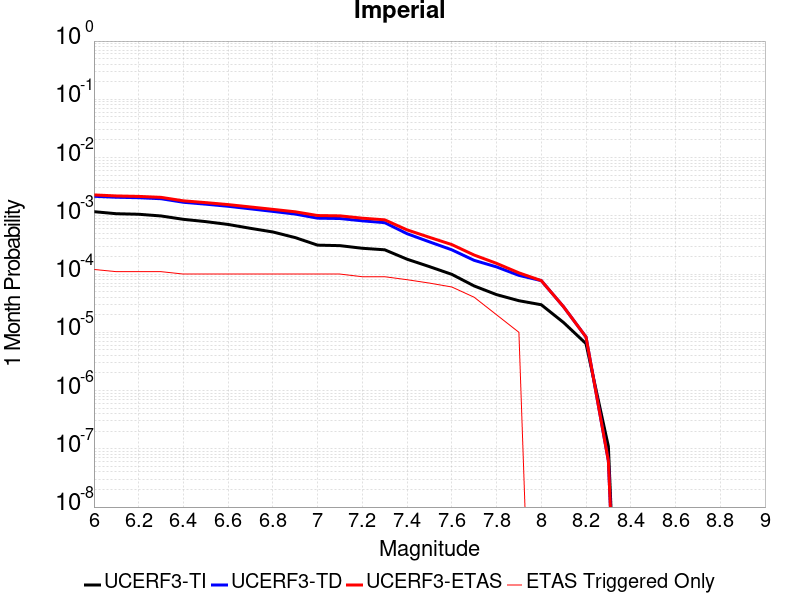 |  |  |

| Magnitude | 1 wk TI Prob | 1 wk TD Prob | 1 wk ETAS Prob | 1 wk ETAS/TD Gain | 1 wk ETAS Triggered Only | 1 mo TI Prob | 1 mo TD Prob | 1 mo ETAS Prob | 1 mo ETAS/TD Gain | 1 mo ETAS Triggered Only | 1 yr TI Prob | 1 yr TD Prob | 1 yr ETAS Prob | 1 yr ETAS/TD Gain | 1 yr ETAS Triggered Only | 10 yr TI Prob | 10 yr TD Prob | 10 yr ETAS Prob | 10 yr ETAS/TD Gain | 10 yr ETAS Triggered Only |
|-----|-----|-----|-----|-----|-----|-----|-----|-----|-----|-----|-----|-----|-----|-----|-----|-----|-----|-----|-----|-----|
| 6.0 | 2.7496446E-4 | 5.0552754E-4 | 5.834718E-4 | 1.154184 | 7.7983656E-5 | 0.0011778869 | 0.002164787 | 0.0022892908 | 1.0575131 | 1.2477385E-4 | 0.0142467655 | 0.026038699 | 0.026205795 | 1.0064173 | 1.7156404E-4 | 0.13367249 | 0.2280438 | 0.22822438 | 1.0007919 | 2.3395097E-4 |
| 6.1 | 2.5356023E-4 | 4.8656776E-4 | 5.489243E-4 | 1.128156 | 6.238693E-5 | 0.001086234 | 0.0020836622 | 0.0021926118 | 1.0522876 | 1.0917712E-4 | 0.013144928 | 0.025071215 | 0.025223272 | 1.006065 | 1.5596731E-4 | 0.123940155 | 0.21947981 | 0.21965024 | 1.0007765 | 2.1835424E-4 |
| 6.2 | 2.4820742E-4 | 4.7752203E-4 | 5.3987914E-4 | 1.1305848 | 6.238693E-5 | 0.0010633124 | 0.0020449557 | 0.0021539095 | 1.0532793 | 1.0917712E-4 | 0.01286919 | 0.024611235 | 0.024763364 | 1.0061812 | 1.5596731E-4 | 0.12148927 | 0.21598552 | 0.21615672 | 1.0007926 | 2.1835424E-4 |
| 6.3 | 2.3205351E-4 | 4.5890483E-4 | 5.212631E-4 | 1.135885 | 6.238693E-5 | 9.94136E-4 | 0.0019652895 | 0.0020742519 | 1.0554435 | 1.0917712E-4 | 0.012036599 | 0.02366133 | 0.023813607 | 1.0064356 | 1.5596731E-4 | 0.11405133 | 0.20793462 | 0.20810756 | 1.0008317 | 2.1835424E-4 |
| 6.4 | 2.0304754E-4 | 3.987652E-4 | 4.4553672E-4 | 1.117291 | 4.6790192E-5 | 8.6991355E-4 | 0.0017078889 | 0.0018013095 | 1.0546994 | 9.3580384E-5 | 0.010539869 | 0.020595672 | 0.02073315 | 1.0066751 | 1.4037058E-4 | 0.100537635 | 0.1850669 | 0.18523213 | 1.0008929 | 2.027575E-4 |
| 6.5 | 1.854992E-4 | 3.6988858E-4 | 4.1666147E-4 | 1.1264513 | 4.6790192E-5 | 7.9475436E-4 | 0.0015842861 | 0.0016777182 | 1.0589743 | 9.3580384E-5 | 0.009633281 | 0.01911948 | 0.019257167 | 1.0072014 | 1.4037058E-4 | 0.0922623 | 0.173298 | 0.17346562 | 1.0009673 | 2.027575E-4 |
| 6.6 | 1.6586106E-4 | 3.403506E-4 | 3.871249E-4 | 1.1374296 | 4.6790192E-5 | 7.106394E-4 | 0.0014578402 | 0.0015512842 | 1.0640975 | 9.3580384E-5 | 0.008617763 | 0.01760642 | 0.01774432 | 1.0078323 | 1.4037058E-4 | 0.08291132 | 0.16077545 | 0.16094561 | 1.0010583 | 2.027575E-4 |
| 6.7 | 1.4224656E-4 | 3.076692E-4 | 3.54445E-4 | 1.1520327 | 4.6790192E-5 | 6.094856E-4 | 0.001317924 | 0.0014113811 | 1.0709124 | 9.3580384E-5 | 0.0073952693 | 0.015929576 | 0.016067712 | 1.0086715 | 1.4037058E-4 | 0.07153955 | 0.14648417 | 0.14665721 | 1.0011814 | 2.027575E-4 |
| 6.8 | 1.2317259E-4 | 2.779122E-4 | 3.2468938E-4 | 1.1683165 | 4.6790192E-5 | 5.2777573E-4 | 0.0011905148 | 0.0012839837 | 1.0785114 | 9.3580384E-5 | 0.0064067547 | 0.0143995695 | 0.014537919 | 1.0096079 | 1.4037058E-4 | 0.06225166 | 0.13293684 | 0.13311264 | 1.0013225 | 2.027575E-4 |
| 6.9 | 9.859898E-5 | 2.5014306E-4 | 2.9692153E-4 | 1.187007 | 4.6790192E-5 | 4.2249862E-4 | 0.0010716055 | 0.0011650856 | 1.0872337 | 9.3580384E-5 | 0.0051317946 | 0.012969712 | 0.013108262 | 1.0106826 | 1.4037058E-4 | 0.05014893 | 0.11940631 | 0.11958486 | 1.0014952 | 2.027575E-4 |
| 7.0 | 7.3191884E-5 | 2.1266776E-4 | 2.5944802E-4 | 1.2199687 | 4.6790192E-5 | 3.136418E-4 | 9.1111806E-4 | 0.0010046132 | 1.1026158 | 9.3580384E-5 | 0.003811904 | 0.011037128 | 0.011175949 | 1.0125777 | 1.4037058E-4 | 0.037471764 | 0.10206493 | 0.10224699 | 1.0017838 | 2.027575E-4 |
| 7.1 | 7.1760296E-5 | 2.0968143E-4 | 2.564618E-4 | 1.2231022 | 4.6790192E-5 | 3.0750787E-4 | 8.983284E-4 | 9.918247E-4 | 1.104078 | 9.3580384E-5 | 0.003737482 | 0.010882978 | 0.011021821 | 1.0127578 | 1.4037058E-4 | 0.03675245 | 0.10070146 | 0.1008838 | 1.0018107 | 2.027575E-4 |
| 7.2 | 6.46614E-5 | 1.9136685E-4 | 2.381481E-4 | 1.2444584 | 4.6790192E-5 | 2.7709085E-4 | 8.1988896E-4 | 8.9780864E-4 | 1.0950369 | 7.7983656E-5 | 0.0033683628 | 0.0099370815 | 0.010060616 | 1.0124316 | 1.2477385E-4 | 0.033177625 | 0.09250898 | 0.09267882 | 1.0018361 | 1.8716077E-4 |
| 7.3 | 6.088115E-5 | 1.78084E-4 | 2.2486586E-4 | 1.2626954 | 4.6790192E-5 | 2.6089314E-4 | 7.6299673E-4 | 8.409209E-4 | 1.1021291 | 7.7983656E-5 | 0.0031717476 | 0.009250494 | 0.009374113 | 1.0133636 | 1.2477385E-4 | 0.031268585 | 0.08655989 | 0.08673085 | 1.001975 | 1.8716077E-4 |
| 7.4 | 4.199346E-5 | 1.1510366E-4 | 1.6188847E-4 | 1.406458 | 4.6790192E-5 | 1.7995955E-4 | 4.9320905E-4 | 5.555652E-4 | 1.1264294 | 6.238693E-5 | 0.0021888057 | 0.0059884563 | 0.0060969796 | 1.0181221 | 1.0917712E-4 | 0.02167372 | 0.057439793 | 0.057601504 | 1.0028152 | 1.7156404E-4 |
| 7.5 | 3.130448E-5 | 8.33328E-5 | 1.1452366E-4 | 1.3742927 | 3.1193464E-5 | 1.3415517E-4 | 3.57092E-4 | 4.0386547E-4 | 1.1309844 | 4.6790192E-5 | 0.0016321153 | 0.004338988 | 0.0044321623 | 1.0214738 | 9.3580384E-5 | 0.016201803 | 0.04213201 | 0.042281404 | 1.0035459 | 1.5596731E-4 |
| 7.6 | 2.3074248E-5 | 6.0844646E-5 | 9.2036214E-5 | 1.5126427 | 3.1193464E-5 | 9.888588E-5 | 2.6073685E-4 | 3.0751483E-4 | 1.1794069 | 4.6790192E-5 | 0.0012032706 | 0.0031698733 | 0.003263157 | 1.0294282 | 9.3580384E-5 | 0.011967761 | 0.031026395 | 0.031177523 | 1.004871 | 1.5596731E-4 |
| 7.7 | 1.45864815E-5 | 4.0124698E-5 | 7.131691E-5 | 1.7773818 | 3.1193464E-5 | 6.2511994E-5 | 1.7195169E-4 | 2.1873384E-4 | 1.2720656 | 4.6790192E-5 | 7.608177E-4 | 0.0020915072 | 0.0021848918 | 1.0446495 | 9.3580384E-5 | 0.007582182 | 0.020627763 | 0.020749964 | 1.0059241 | 1.2477385E-4 |
| 7.8 | 1.0352979E-5 | 3.0960902E-5 | 4.655715E-5 | 1.5037401 | 1.5596732E-5 | 4.4369157E-5 | 1.3268284E-4 | 1.6387216E-4 | 1.2350668 | 3.1193464E-5 | 5.400606E-4 | 0.0016142189 | 0.0016920767 | 1.0482324 | 7.7983656E-5 | 0.0053875 | 0.016016833 | 0.016124262 | 1.0067072 | 1.0917712E-4 |
| 7.9 | 8.137906E-6 | 2.2149103E-5 | 3.774549E-5 | 1.7041543 | 1.5596732E-5 | 3.4876273E-5 | 9.492128E-5 | 1.1051653E-4 | 1.1642966 | 1.5596732E-5 | 4.2453592E-4 | 0.0011550548 | 0.001201791 | 1.0404623 | 4.6790192E-5 | 0.004237258 | 0.011617903 | 0.01169498 | 1.0066344 | 7.7983656E-5 |
| 8.0 | 6.93792E-6 | 1.8008766E-5 | 1.8008766E-5 | 1.0 | 0.0 | 2.9733603E-5 | 7.717814E-5 | 7.717814E-5 | 1.0 | 0.0 | 3.6194647E-4 | 9.3923963E-4 | 9.548217E-4 | 1.0165901 | 1.5596732E-5 | 0.0036135751 | 0.00950155 | 0.009547896 | 1.0048777 | 4.6790192E-5 |
| 8.1 | 3.4286315E-6 | 6.379872E-6 | 6.379872E-6 | 1.0 | 0.0 | 1.4694053E-5 | 2.7342023E-5 | 2.7342023E-5 | 1.0 | 0.0 | 1.7888541E-4 | 3.328384E-4 | 3.328384E-4 | 1.0 | 0.0 | 0.0017874148 | 0.003486031 | 0.003486031 | 1.0 | 0.0 |
| 8.2 | 1.4906886E-6 | 1.9366646E-6 | 1.9366646E-6 | 1.0 | 0.0 | 6.3886496E-6 | 8.299965E-6 | 8.299965E-6 | 1.0 | 0.0 | 7.7779034E-5 | 1.0104742E-4 | 1.0104742E-4 | 1.0 | 0.0 | 7.775182E-4 | 0.0011075331 | 0.0011075331 | 1.0 | 0.0 |
| 8.3 | 2.5758007E-8 | 1.4500102E-8 | 1.4500102E-8 | 1.0 | 0.0 | 1.10391454E-7 | 6.214329E-8 | 6.214329E-8 | 1.0 | 0.0 | 1.3440151E-6 | 7.565946E-7 | 7.565946E-7 | 1.0 | 0.0 | 1.344007E-5 | 7.887763E-6 | 7.887763E-6 | 1.0 | 0.0 |

## San Jacinto (Coyote Creek)
*[(top)](#table-of-contents)*

| 1 Week | 1 Month | 1 Year | 10 Year |
|-----|-----|-----|-----|
| 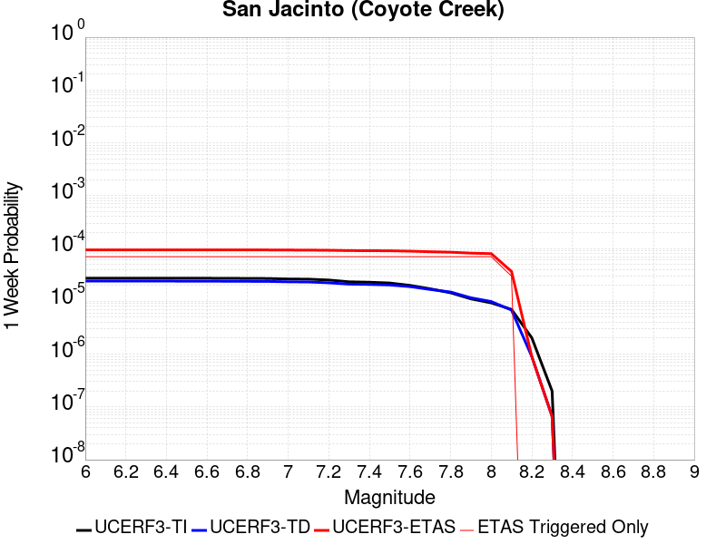 |  |  |  |

| Magnitude | 1 wk TI Prob | 1 wk TD Prob | 1 wk ETAS Prob | 1 wk ETAS/TD Gain | 1 wk ETAS Triggered Only | 1 mo TI Prob | 1 mo TD Prob | 1 mo ETAS Prob | 1 mo ETAS/TD Gain | 1 mo ETAS Triggered Only | 1 yr TI Prob | 1 yr TD Prob | 1 yr ETAS Prob | 1 yr ETAS/TD Gain | 1 yr ETAS Triggered Only | 10 yr TI Prob | 10 yr TD Prob | 10 yr ETAS Prob | 10 yr ETAS/TD Gain | 10 yr ETAS Triggered Only |
|-----|-----|-----|-----|-----|-----|-----|-----|-----|-----|-----|-----|-----|-----|-----|-----|-----|-----|-----|-----|-----|
| 6.0 | 2.7374346E-5 | 2.4145214E-5 | 8.653063E-5 | 3.583759 | 6.238693E-5 | 1.1731335E-4 | 1.034754E-4 | 1.970461E-4 | 1.9042797 | 9.3580384E-5 | 0.0014273542 | 0.0012590875 | 0.0014304355 | 1.1360891 | 1.7156404E-4 | 0.01418221 | 0.012928318 | 0.013159244 | 1.0178621 | 2.3395097E-4 |
| 6.1 | 2.7374346E-5 | 2.4145214E-5 | 8.653063E-5 | 3.583759 | 6.238693E-5 | 1.1731335E-4 | 1.034754E-4 | 1.970461E-4 | 1.9042797 | 9.3580384E-5 | 0.0014273542 | 0.0012590875 | 0.0014304355 | 1.1360891 | 1.7156404E-4 | 0.01418221 | 0.012928318 | 0.013159244 | 1.0178621 | 2.3395097E-4 |
| 6.2 | 2.7374346E-5 | 2.4145214E-5 | 8.653063E-5 | 3.583759 | 6.238693E-5 | 1.1731335E-4 | 1.034754E-4 | 1.970461E-4 | 1.9042797 | 9.3580384E-5 | 0.0014273542 | 0.0012590875 | 0.0014304355 | 1.1360891 | 1.7156404E-4 | 0.01418221 | 0.012928318 | 0.013159244 | 1.0178621 | 2.3395097E-4 |
| 6.3 | 2.7374346E-5 | 2.4145214E-5 | 8.653063E-5 | 3.583759 | 6.238693E-5 | 1.1731335E-4 | 1.034754E-4 | 1.970461E-4 | 1.9042797 | 9.3580384E-5 | 0.0014273542 | 0.0012590875 | 0.0014304355 | 1.1360891 | 1.7156404E-4 | 0.01418221 | 0.012928318 | 0.013159244 | 1.0178621 | 2.3395097E-4 |
| 6.4 | 2.7374346E-5 | 2.4145214E-5 | 8.653063E-5 | 3.583759 | 6.238693E-5 | 1.1731335E-4 | 1.034754E-4 | 1.970461E-4 | 1.9042797 | 9.3580384E-5 | 0.0014273542 | 0.0012590875 | 0.0014304355 | 1.1360891 | 1.7156404E-4 | 0.01418221 | 0.012928318 | 0.013159244 | 1.0178621 | 2.3395097E-4 |
| 6.5 | 2.7282445E-5 | 2.4031293E-5 | 8.6416716E-5 | 3.5960078 | 6.238693E-5 | 1.16919524E-4 | 1.029872E-4 | 1.9655794E-4 | 1.9085667 | 9.3580384E-5 | 0.0014225657 | 0.0012531505 | 0.0014244997 | 1.1367346 | 1.7156404E-4 | 0.014134934 | 0.012869646 | 0.013100586 | 1.0179446 | 2.3395097E-4 |
| 6.6 | 2.7282445E-5 | 2.4031293E-5 | 8.6416716E-5 | 3.5960078 | 6.238693E-5 | 1.16919524E-4 | 1.029872E-4 | 1.9655794E-4 | 1.9085667 | 9.3580384E-5 | 0.0014225657 | 0.0012531505 | 0.0014244997 | 1.1367346 | 1.7156404E-4 | 0.014134934 | 0.012869646 | 0.013100586 | 1.0179446 | 2.3395097E-4 |
| 6.7 | 2.7216198E-5 | 2.3956412E-5 | 8.634184E-5 | 3.6041224 | 6.238693E-5 | 1.1663563E-4 | 1.02666316E-4 | 1.9623709E-4 | 1.9114068 | 9.3580384E-5 | 0.0014191137 | 0.0012492483 | 0.001420598 | 1.1371622 | 1.7156404E-4 | 0.014100855 | 0.0128310565 | 0.013062006 | 1.0179992 | 2.3395097E-4 |
| 6.8 | 2.7078617E-5 | 2.387363E-5 | 8.625907E-5 | 3.6131525 | 6.238693E-5 | 1.1604605E-4 | 1.0231156E-4 | 1.9588237E-4 | 1.9145674 | 9.3580384E-5 | 0.001411945 | 0.0012449342 | 0.0014162846 | 1.1376382 | 1.7156404E-4 | 0.014030075 | 0.012788199 | 0.013019158 | 1.0180603 | 2.3395097E-4 |
| 6.9 | 2.6982952E-5 | 2.3793142E-5 | 8.617858E-5 | 3.6219926 | 6.238693E-5 | 1.15636096E-4 | 1.0196664E-4 | 1.9553748E-4 | 1.9176614 | 9.3580384E-5 | 0.0014069602 | 0.0012407395 | 0.0014120906 | 1.1381041 | 1.7156404E-4 | 0.013980856 | 0.012746515 | 0.012977484 | 1.0181202 | 2.3395097E-4 |
| 7.0 | 2.6449972E-5 | 2.3370165E-5 | 8.575563E-5 | 3.669449 | 6.238693E-5 | 1.1335209E-4 | 1.00154015E-4 | 1.9372503E-4 | 1.9342712 | 9.3580384E-5 | 0.001379188 | 0.0012186957 | 0.0013900506 | 1.1406052 | 1.7156404E-4 | 0.0137065975 | 0.0125278765 | 0.012758897 | 1.0184405 | 2.3395097E-4 |
| 7.1 | 2.6257849E-5 | 2.3196202E-5 | 8.5581676E-5 | 3.6894696 | 6.238693E-5 | 1.1252879E-4 | 9.940852E-5 | 1.929796E-4 | 1.9412783 | 9.3580384E-5 | 0.0013691769 | 0.0012096294 | 0.0013809858 | 1.1416603 | 1.7156404E-4 | 0.013607717 | 0.012437741 | 0.012668783 | 1.0185758 | 2.3395097E-4 |
| 7.2 | 2.5270041E-5 | 2.2390966E-5 | 8.477649E-5 | 3.7861917 | 6.238693E-5 | 1.0829568E-4 | 9.595777E-5 | 1.8952918E-4 | 1.9751312 | 9.3580384E-5 | 0.0013177024 | 0.0011676621 | 0.0013390258 | 1.146758 | 1.7156404E-4 | 0.013099162 | 0.012018777 | 0.012249917 | 1.0192316 | 2.3395097E-4 |
| 7.3 | 2.339701E-5 | 2.1122814E-5 | 8.350842E-5 | 3.9534702 | 6.238693E-5 | 1.0026905E-4 | 9.0523215E-5 | 1.8409513E-4 | 2.0336785 | 9.3580384E-5 | 0.001220092 | 0.0011015651 | 0.0012729401 | 1.1555742 | 1.7156404E-4 | 0.012134149 | 0.011357696 | 0.01158899 | 1.0203645 | 2.3395097E-4 |
| 7.4 | 2.296333E-5 | 2.0853171E-5 | 8.3238796E-5 | 3.9916613 | 6.238693E-5 | 9.841056E-5 | 8.936768E-5 | 1.8293971E-4 | 2.0470455 | 9.3580384E-5 | 0.0011974899 | 0.0010875105 | 0.0012588879 | 1.1575869 | 1.7156404E-4 | 0.011910575 | 0.01121681 | 0.0114481365 | 1.0206232 | 2.3395097E-4 |
| 7.5 | 2.2188895E-5 | 2.0376096E-5 | 8.276175E-5 | 4.061708 | 6.238693E-5 | 9.50918E-5 | 8.732321E-5 | 1.8089543E-4 | 2.0715618 | 9.3580384E-5 | 0.0011571277 | 0.0010626436 | 0.0012340253 | 1.1612786 | 1.7156404E-4 | 0.011511209 | 0.010966429 | 0.011197814 | 1.0210994 | 2.3395097E-4 |
| 7.6 | 2.0013189E-5 | 1.8962366E-5 | 8.134811E-5 | 4.2899766 | 6.238693E-5 | 8.5767984E-5 | 8.1264756E-5 | 1.7483754E-4 | 2.1514559 | 9.3580384E-5 | 0.001043725 | 9.889511E-4 | 0.0011603455 | 1.1733092 | 1.7156404E-4 | 0.010388365 | 0.010224434 | 0.010455992 | 1.0226476 | 2.3395097E-4 |
| 7.7 | 1.7230794E-5 | 1.674371E-5 | 7.912959E-5 | 4.7259293 | 6.238693E-5 | 7.384417E-5 | 7.175679E-5 | 1.6533046E-4 | 2.3040392 | 9.3580384E-5 | 8.986819E-4 | 8.7328954E-4 | 0.0010447038 | 1.1962856 | 1.7156404E-4 | 0.008950562 | 0.009062956 | 0.009294787 | 1.02558 | 2.3395097E-4 |
| 7.8 | 1.4478809E-5 | 1.4990978E-5 | 7.7376964E-5 | 5.161569 | 6.238693E-5 | 6.205057E-5 | 6.424547E-5 | 1.5781984E-4 | 2.4565132 | 9.3580384E-5 | 7.552038E-4 | 7.819085E-4 | 9.5333846E-4 | 1.2192454 | 1.7156404E-4 | 0.0075264242 | 0.008141387 | 0.008373434 | 1.0285021 | 2.3395097E-4 |
| 7.9 | 1.1114467E-5 | 1.1645102E-5 | 7.40313E-5 | 6.3572907 | 6.238693E-5 | 4.7632562E-5 | 4.990663E-5 | 1.4348235E-4 | 2.8750157 | 9.3580384E-5 | 5.797721E-4 | 6.074444E-4 | 7.321424E-4 | 1.205283 | 1.2477385E-4 | 0.0057826187 | 0.0063803247 | 0.006566291 | 1.0291469 | 1.8716077E-4 |
| 8.0 | 9.327402E-6 | 9.899186E-6 | 7.228549E-5 | 7.302165 | 6.238693E-5 | 3.9973966E-5 | 4.2424395E-5 | 1.3600082E-4 | 3.2057219 | 9.3580384E-5 | 4.8657437E-4 | 5.1639514E-4 | 6.411046E-4 | 1.2415 | 1.2477385E-4 | 0.0048551033 | 0.0054499684 | 0.0056361095 | 1.0341544 | 1.8716077E-4 |
| 8.1 | 7.0235833E-6 | 6.827495E-6 | 5.361737E-5 | 7.8531537 | 4.6790192E-5 | 3.0100724E-5 | 2.9260367E-5 | 9.164547E-5 | 3.1320682 | 6.238693E-5 | 3.664147E-4 | 3.5618723E-4 | 4.3414312E-4 | 1.218862 | 7.7983656E-5 | 0.003658111 | 0.0037876023 | 0.0039119036 | 1.032818 | 1.2477385E-4 |
| 8.2 | 2.0358202E-6 | 8.994527E-7 | 8.994527E-7 | 1.0 | 0.0 | 8.724915E-6 | 3.854792E-6 | 3.854792E-6 | 1.0 | 0.0 | 1.06220665E-4 | 4.69311E-5 | 4.69311E-5 | 1.0 | 0.0 | 0.001061699 | 5.3254166E-4 | 5.3254166E-4 | 1.0 | 0.0 |
| 8.3 | 2.0051264E-7 | 6.617272E-8 | 6.617272E-8 | 1.0 | 0.0 | 8.5933965E-7 | 2.8359733E-7 | 2.8359733E-7 | 1.0 | 0.0 | 1.046241E-5 | 3.4527925E-6 | 3.4527925E-6 | 1.0 | 0.0 | 1.0461917E-4 | 4.01389E-5 | 4.01389E-5 | 1.0 | 0.0 |

## Scodie Lineament
*[(top)](#table-of-contents)*

| 1 Week | 1 Month | 1 Year | 10 Year |
|-----|-----|-----|-----|
|  |  |  |  |

| Magnitude | 1 wk TI Prob | 1 wk TD Prob | 1 wk ETAS Prob | 1 wk ETAS/TD Gain | 1 wk ETAS Triggered Only | 1 mo TI Prob | 1 mo TD Prob | 1 mo ETAS Prob | 1 mo ETAS/TD Gain | 1 mo ETAS Triggered Only | 1 yr TI Prob | 1 yr TD Prob | 1 yr ETAS Prob | 1 yr ETAS/TD Gain | 1 yr ETAS Triggered Only | 10 yr TI Prob | 10 yr TD Prob | 10 yr ETAS Prob | 10 yr ETAS/TD Gain | 10 yr ETAS Triggered Only |
|-----|-----|-----|-----|-----|-----|-----|-----|-----|-----|-----|-----|-----|-----|-----|-----|-----|-----|-----|-----|-----|
| 6.0 | 3.2919327E-6 | 3.0133422E-6 | 8.099676E-5 | 26.879377 | 7.7983656E-5 | 1.4108206E-5 | 1.2914278E-5 | 9.089692E-5 | 7.038483 | 7.7983656E-5 | 1.7175387E-4 | 1.5722317E-4 | 3.1316595E-4 | 1.9918563 | 1.5596731E-4 | 0.0017162118 | 0.0015714309 | 0.0018050142 | 1.1486437 | 2.3395097E-4 |
| 6.1 | 1.8663811E-6 | 1.5490499E-6 | 1.7145756E-5 | 11.0685625 | 1.5596732E-5 | 7.998751E-6 | 6.6387715E-6 | 2.22354E-5 | 3.3493245 | 1.5596732E-5 | 9.738045E-5 | 8.082454E-5 | 1.2761095E-4 | 1.578864 | 4.6790192E-5 | 9.7337784E-4 | 8.080003E-4 | 9.01505E-4 | 1.1157237 | 9.3580384E-5 |
| 6.2 | 1.8663811E-6 | 1.5490499E-6 | 1.7145756E-5 | 11.0685625 | 1.5596732E-5 | 7.998751E-6 | 6.6387715E-6 | 2.22354E-5 | 3.3493245 | 1.5596732E-5 | 9.738045E-5 | 8.082454E-5 | 1.2761095E-4 | 1.578864 | 4.6790192E-5 | 9.7337784E-4 | 8.080003E-4 | 9.01505E-4 | 1.1157237 | 9.3580384E-5 |
| 6.3 | 1.8663811E-6 | 1.5490499E-6 | 1.7145756E-5 | 11.0685625 | 1.5596732E-5 | 7.998751E-6 | 6.6387715E-6 | 2.22354E-5 | 3.3493245 | 1.5596732E-5 | 9.738045E-5 | 8.082454E-5 | 1.2761095E-4 | 1.578864 | 4.6790192E-5 | 9.7337784E-4 | 8.080003E-4 | 9.01505E-4 | 1.1157237 | 9.3580384E-5 |
| 6.4 | 1.8663811E-6 | 1.5490499E-6 | 1.7145756E-5 | 11.0685625 | 1.5596732E-5 | 7.998751E-6 | 6.6387715E-6 | 2.22354E-5 | 3.3493245 | 1.5596732E-5 | 9.738045E-5 | 8.082454E-5 | 1.2761095E-4 | 1.578864 | 4.6790192E-5 | 9.7337784E-4 | 8.080003E-4 | 9.01505E-4 | 1.1157237 | 9.3580384E-5 |
| 6.5 | 1.8106311E-6 | 1.4909839E-6 | 1.4909839E-6 | 1.0 | 0.0 | 7.759824E-6 | 6.3899183E-6 | 6.3899183E-6 | 1.0 | 0.0 | 9.447177E-5 | 7.7794975E-5 | 1.0898601E-4 | 1.400939 | 3.1193464E-5 | 9.4431615E-4 | 7.7772606E-4 | 8.5564906E-4 | 1.1001934 | 7.7983656E-5 |
| 6.6 | 1.2414679E-6 | 8.997558E-7 | 8.997558E-7 | 1.0 | 0.0 | 5.320566E-6 | 3.856091E-6 | 3.856091E-6 | 1.0 | 0.0 | 6.477596E-5 | 4.6946985E-5 | 4.6946985E-5 | 1.0 | 0.0 | 6.475708E-4 | 4.693793E-4 | 5.005581E-4 | 1.0664257 | 3.1193464E-5 |
| 6.7 | 1.1062215E-6 | 7.594311E-7 | 7.594311E-7 | 1.0 | 0.0 | 4.7409408E-6 | 3.2547011E-6 | 3.2547011E-6 | 1.0 | 0.0 | 5.7719422E-5 | 3.9625334E-5 | 3.9625334E-5 | 1.0 | 0.0 | 5.770443E-4 | 3.961897E-4 | 4.1178023E-4 | 1.0393512 | 1.5596732E-5 |
| 6.8 | 1.0006736E-6 | 6.500397E-7 | 6.500397E-7 | 1.0 | 0.0 | 4.288594E-6 | 2.7858816E-6 | 2.7858816E-6 | 1.0 | 0.0 | 5.221238E-5 | 3.3917644E-5 | 3.3917644E-5 | 1.0 | 0.0 | 5.220012E-4 | 3.3913075E-4 | 3.5472217E-4 | 1.0459747 | 1.5596732E-5 |
| 6.9 | 9.167364E-7 | 5.631625E-7 | 5.631625E-7 | 1.0 | 0.0 | 3.9288643E-6 | 2.4135516E-6 | 2.4135516E-6 | 1.0 | 0.0 | 4.7832873E-5 | 2.9384651E-5 | 2.9384651E-5 | 1.0 | 0.0 | 4.782258E-4 | 2.9381333E-4 | 2.9381333E-4 | 1.0 | 0.0 |
| 7.0 | 7.6987664E-7 | 4.113383E-7 | 4.113383E-7 | 1.0 | 0.0 | 3.2994672E-6 | 1.7628774E-6 | 1.7628774E-6 | 1.0 | 0.0 | 4.0170275E-5 | 2.1462862E-5 | 2.1462862E-5 | 1.0 | 0.0 | 4.0163012E-4 | 2.1461173E-4 | 2.1461173E-4 | 1.0 | 0.0 |
| 7.1 | 7.1038727E-7 | 3.5211494E-7 | 3.5211494E-7 | 1.0 | 0.0 | 3.0445133E-6 | 1.5090633E-6 | 1.5090633E-6 | 1.0 | 0.0 | 3.706632E-5 | 1.8372726E-5 | 1.8372726E-5 | 1.0 | 0.0 | 3.7060137E-4 | 1.8371557E-4 | 1.8371557E-4 | 1.0 | 0.0 |
| 7.2 | 2.0799602E-7 | 3.1186854E-8 | 3.1186854E-8 | 1.0 | 0.0 | 8.914113E-7 | 1.3365793E-7 | 1.3365793E-7 | 1.0 | 0.0 | 1.0852878E-5 | 1.6272843E-6 | 1.6272843E-6 | 1.0 | 0.0 | 1.08523476E-4 | 1.627273E-5 | 1.627273E-5 | 1.0 | 0.0 |
| 7.3 | 1.5048182E-7 | 1.5945696E-8 | 1.5945696E-8 | 1.0 | 0.0 | 6.449219E-7 | 6.83387E-8 | 6.83387E-8 | 1.0 | 0.0 | 7.851896E-6 | 8.320234E-7 | 8.320234E-7 | 1.0 | 0.0 | 7.851618E-5 | 8.320206E-6 | 8.320206E-6 | 1.0 | 0.0 |
| 7.4 | 5.9334678E-8 | 4.8683537E-9 | 4.8683537E-9 | 1.0 | 0.0 | 2.5429145E-7 | 2.0864372E-8 | 2.0864372E-8 | 1.0 | 0.0 | 3.095994E-6 | 2.5402372E-7 | 2.5402372E-7 | 1.0 | 0.0 | 3.095951E-5 | 2.5402353E-6 | 2.5402353E-6 | 1.0 | 0.0 |

## Cleghorn Pass
*[(top)](#table-of-contents)*

| 1 Week | 1 Month | 1 Year | 10 Year |
|-----|-----|-----|-----|
| 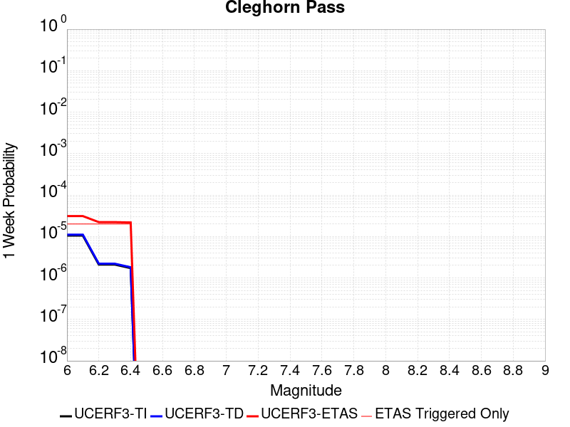 |  |  |  |

| Magnitude | 1 wk TI Prob | 1 wk TD Prob | 1 wk ETAS Prob | 1 wk ETAS/TD Gain | 1 wk ETAS Triggered Only | 1 mo TI Prob | 1 mo TD Prob | 1 mo ETAS Prob | 1 mo ETAS/TD Gain | 1 mo ETAS Triggered Only | 1 yr TI Prob | 1 yr TD Prob | 1 yr ETAS Prob | 1 yr ETAS/TD Gain | 1 yr ETAS Triggered Only | 10 yr TI Prob | 10 yr TD Prob | 10 yr ETAS Prob | 10 yr ETAS/TD Gain | 10 yr ETAS Triggered Only |
|-----|-----|-----|-----|-----|-----|-----|-----|-----|-----|-----|-----|-----|-----|-----|-----|-----|-----|-----|-----|-----|
| 6.0 | 1.0522846E-5 | 1.1040642E-5 | 4.2233758E-5 | 3.8252993 | 3.1193464E-5 | 4.509713E-5 | 4.7316473E-5 | 1.4089243E-4 | 2.9776611 | 9.3580384E-5 | 5.4891926E-4 | 5.759784E-4 | 7.162682E-4 | 1.2435677 | 1.4037058E-4 | 0.0054756533 | 0.005750022 | 0.0059516137 | 1.0350593 | 2.027575E-4 |
| 6.1 | 1.0522846E-5 | 1.1040642E-5 | 4.2233758E-5 | 3.8252993 | 3.1193464E-5 | 4.509713E-5 | 4.7316473E-5 | 1.4089243E-4 | 2.9776611 | 9.3580384E-5 | 5.4891926E-4 | 5.759784E-4 | 7.162682E-4 | 1.2435677 | 1.4037058E-4 | 0.0054756533 | 0.005750022 | 0.0059516137 | 1.0350593 | 2.027575E-4 |
| 6.2 | 2.1045846E-6 | 2.2082024E-6 | 3.3401597E-5 | 15.126147 | 3.1193464E-5 | 9.019617E-6 | 9.463714E-6 | 4.065688E-5 | 4.296081 | 3.1193464E-5 | 1.098083E-4 | 1.1521882E-4 | 1.6200362E-4 | 1.4060518 | 4.6790192E-5 | 0.0010975406 | 0.0011520023 | 0.0012143173 | 1.0540928 | 6.238693E-5 |
| 6.3 | 2.1045846E-6 | 2.2082024E-6 | 3.3401597E-5 | 15.126147 | 3.1193464E-5 | 9.019617E-6 | 9.463714E-6 | 4.065688E-5 | 4.296081 | 3.1193464E-5 | 1.098083E-4 | 1.1521882E-4 | 1.6200362E-4 | 1.4060518 | 4.6790192E-5 | 0.0010975406 | 0.0011520023 | 0.0012143173 | 1.0540928 | 6.238693E-5 |
| 6.4 | 1.7259927E-6 | 1.810877E-6 | 3.3004282E-5 | 18.225578 | 3.1193464E-5 | 7.3970905E-6 | 7.760902E-6 | 3.895412E-5 | 5.0192776 | 3.1193464E-5 | 9.005586E-5 | 9.4488976E-5 | 1.4127475E-4 | 1.4951453 | 4.6790192E-5 | 9.001937E-4 | 9.448898E-4 | 0.0010072178 | 1.0659633 | 6.238693E-5 |

## San Jacinto (Lytle Creek connector)
*[(top)](#table-of-contents)*

| 1 Week | 1 Month | 1 Year | 10 Year |
|-----|-----|-----|-----|
|  |  |  |  |

| Magnitude | 1 wk TI Prob | 1 wk TD Prob | 1 wk ETAS Prob | 1 wk ETAS/TD Gain | 1 wk ETAS Triggered Only | 1 mo TI Prob | 1 mo TD Prob | 1 mo ETAS Prob | 1 mo ETAS/TD Gain | 1 mo ETAS Triggered Only | 1 yr TI Prob | 1 yr TD Prob | 1 yr ETAS Prob | 1 yr ETAS/TD Gain | 1 yr ETAS Triggered Only | 10 yr TI Prob | 10 yr TD Prob | 10 yr ETAS Prob | 10 yr ETAS/TD Gain | 10 yr ETAS Triggered Only |
|-----|-----|-----|-----|-----|-----|-----|-----|-----|-----|-----|-----|-----|-----|-----|-----|-----|-----|-----|-----|-----|
| 6.0 | 6.693995E-6 | 6.660216E-6 | 8.4643354E-5 | 12.708799 | 7.7983656E-5 | 2.8688235E-5 | 2.854347E-5 | 1.2212119E-4 | 4.278428 | 9.3580384E-5 | 3.492233E-4 | 3.4746144E-4 | 4.8778323E-4 | 1.4038485 | 1.4037058E-4 | 0.00348675 | 0.0035493854 | 0.0037514232 | 1.056922 | 2.027575E-4 |
| 6.1 | 6.693995E-6 | 6.660216E-6 | 8.4643354E-5 | 12.708799 | 7.7983656E-5 | 2.8688235E-5 | 2.854347E-5 | 1.2212119E-4 | 4.278428 | 9.3580384E-5 | 3.492233E-4 | 3.4746144E-4 | 4.8778323E-4 | 1.4038485 | 1.4037058E-4 | 0.00348675 | 0.0035493854 | 0.0037514232 | 1.056922 | 2.027575E-4 |
| 6.2 | 6.693995E-6 | 6.660216E-6 | 8.4643354E-5 | 12.708799 | 7.7983656E-5 | 2.8688235E-5 | 2.854347E-5 | 1.2212119E-4 | 4.278428 | 9.3580384E-5 | 3.492233E-4 | 3.4746144E-4 | 4.8778323E-4 | 1.4038485 | 1.4037058E-4 | 0.00348675 | 0.0035493854 | 0.0037514232 | 1.056922 | 2.027575E-4 |
| 6.3 | 6.693995E-6 | 6.660216E-6 | 8.4643354E-5 | 12.708799 | 7.7983656E-5 | 2.8688235E-5 | 2.854347E-5 | 1.2212119E-4 | 4.278428 | 9.3580384E-5 | 3.492233E-4 | 3.4746144E-4 | 4.8778323E-4 | 1.4038485 | 1.4037058E-4 | 0.00348675 | 0.0035493854 | 0.0037514232 | 1.056922 | 2.027575E-4 |
| 6.4 | 6.693995E-6 | 6.660216E-6 | 8.4643354E-5 | 12.708799 | 7.7983656E-5 | 2.8688235E-5 | 2.854347E-5 | 1.2212119E-4 | 4.278428 | 9.3580384E-5 | 3.492233E-4 | 3.4746144E-4 | 4.8778323E-4 | 1.4038485 | 1.4037058E-4 | 0.00348675 | 0.0035493854 | 0.0037514232 | 1.056922 | 2.027575E-4 |
| 6.5 | 6.6561875E-6 | 6.6204343E-6 | 8.460357E-5 | 12.779158 | 7.7983656E-5 | 2.8526205E-5 | 2.837298E-5 | 1.2195071E-4 | 4.298128 | 9.3580384E-5 | 3.472512E-4 | 3.4538636E-4 | 4.8570847E-4 | 1.4062757 | 1.4037058E-4 | 0.0034670907 | 0.003528701 | 0.003730743 | 1.0572568 | 2.027575E-4 |
| 6.6 | 6.6561875E-6 | 6.6204343E-6 | 8.460357E-5 | 12.779158 | 7.7983656E-5 | 2.8526205E-5 | 2.837298E-5 | 1.2195071E-4 | 4.298128 | 9.3580384E-5 | 3.472512E-4 | 3.4538636E-4 | 4.8570847E-4 | 1.4062757 | 1.4037058E-4 | 0.0034670907 | 0.003528701 | 0.003730743 | 1.0572568 | 2.027575E-4 |
| 6.7 | 6.5802237E-6 | 6.539611E-6 | 8.4522755E-5 | 12.924738 | 7.7983656E-5 | 2.8200653E-5 | 2.8026603E-5 | 1.2160437E-4 | 4.3388906 | 9.3580384E-5 | 3.4328885E-4 | 3.4117055E-4 | 4.8149325E-4 | 1.4112978 | 1.4037058E-4 | 0.0034275902 | 0.0034866752 | 0.0036887259 | 1.0579493 | 2.027575E-4 |
| 6.8 | 6.575632E-6 | 6.5341005E-6 | 8.451725E-5 | 12.934793 | 7.7983656E-5 | 2.8180975E-5 | 2.8002989E-5 | 1.2158076E-4 | 4.3417063 | 9.3580384E-5 | 3.4304935E-4 | 3.4088313E-4 | 4.8120585E-4 | 1.4116447 | 1.4037058E-4 | 0.0034252026 | 0.00348381 | 0.0036858611 | 1.0579972 | 2.027575E-4 |
| 6.9 | 6.570433E-6 | 6.525495E-6 | 8.450864E-5 | 12.950534 | 7.7983656E-5 | 2.8158694E-5 | 2.7966107E-5 | 1.21543875E-4 | 4.3461137 | 9.3580384E-5 | 3.4277816E-4 | 3.4043423E-4 | 4.80757E-4 | 1.4121877 | 1.4037058E-4 | 0.0034224992 | 0.0034793352 | 0.0036813873 | 1.058072 | 2.027575E-4 |
| 7.0 | 6.5643826E-6 | 6.515616E-6 | 8.449876E-5 | 12.968653 | 7.7983656E-5 | 2.8132765E-5 | 2.792377E-5 | 1.2150154E-4 | 4.3511868 | 9.3580384E-5 | 3.424626E-4 | 3.3991894E-4 | 4.8024178E-4 | 1.4128127 | 1.4037058E-4 | 0.0034193532 | 0.0034741985 | 0.0036762515 | 1.0581582 | 2.027575E-4 |
| 7.1 | 6.557402E-6 | 6.5043278E-6 | 8.4487474E-5 | 12.989425 | 7.7983656E-5 | 2.8102848E-5 | 2.7875392E-5 | 1.2145317E-4 | 4.357003 | 9.3580384E-5 | 3.4209844E-4 | 3.3933012E-4 | 4.7965307E-4 | 1.4135293 | 1.4037058E-4 | 0.0034157229 | 0.0034683298 | 0.0036703842 | 1.058257 | 2.027575E-4 |
| 7.2 | 6.546394E-6 | 6.4862943E-6 | 8.4469444E-5 | 13.0227585 | 7.7983656E-5 | 2.8055672E-5 | 2.7798109E-5 | 1.21375895E-4 | 4.3663363 | 9.3580384E-5 | 3.4152428E-4 | 3.3838948E-4 | 4.7871258E-4 | 1.4146792 | 1.4037058E-4 | 0.0034099987 | 0.0034589572 | 0.0036610132 | 1.0584153 | 2.027575E-4 |
| 7.3 | 6.5364216E-6 | 6.4670803E-6 | 8.445023E-5 | 13.058478 | 7.7983656E-5 | 2.8012933E-5 | 2.7715765E-5 | 1.2129355E-4 | 4.376338 | 9.3580384E-5 | 3.4100408E-4 | 3.3738726E-4 | 4.7771048E-4 | 1.4159114 | 1.4037058E-4 | 0.003404813 | 0.0034489788 | 0.0036510369 | 1.0585849 | 2.027575E-4 |
| 7.4 | 6.5269523E-6 | 6.4481674E-6 | 8.443132E-5 | 13.093847 | 7.7983656E-5 | 2.7972354E-5 | 2.7634711E-5 | 1.2121251E-4 | 4.3862414 | 9.3580384E-5 | 3.4051016E-4 | 3.3640073E-4 | 4.767241E-4 | 1.4171315 | 1.4037058E-4 | 0.0033998888 | 0.003439161 | 0.0036412212 | 1.0587528 | 2.027575E-4 |
| 7.5 | 6.5111835E-6 | 6.424442E-6 | 8.44076E-5 | 13.138511 | 7.7983656E-5 | 2.7904773E-5 | 2.7533031E-5 | 1.2111084E-4 | 4.398747 | 9.3580384E-5 | 3.3968766E-4 | 3.3516317E-4 | 4.754867E-4 | 1.4186723 | 1.4037058E-4 | 0.0033916887 | 0.003426834 | 0.0036288968 | 1.0589648 | 2.027575E-4 |
| 7.6 | 6.4768806E-6 | 6.383551E-6 | 8.436671E-5 | 13.216266 | 7.7983656E-5 | 2.7757764E-5 | 2.735779E-5 | 1.2093561E-4 | 4.4205184 | 9.3580384E-5 | 3.3789838E-4 | 3.3303024E-4 | 4.7335407E-4 | 1.4213547 | 1.4037058E-4 | 0.0033738504 | 0.0034055663 | 0.0036076333 | 1.0593343 | 2.027575E-4 |
| 7.7 | 6.1655364E-6 | 6.1760365E-6 | 8.415921E-5 | 13.626735 | 7.7983656E-5 | 2.642346E-5 | 2.646846E-5 | 1.2004637E-4 | 4.5354495 | 9.3580384E-5 | 3.2165812E-4 | 3.2220592E-4 | 4.6253126E-4 | 1.4355146 | 1.4037058E-4 | 0.0032119295 | 0.0032971818 | 0.0034992706 | 1.0612915 | 2.027575E-4 |
| 7.8 | 5.5043524E-6 | 5.737097E-6 | 8.3720304E-5 | 14.592799 | 7.7983656E-5 | 2.3589868E-5 | 2.4587327E-5 | 1.1816541E-4 | 4.805948 | 9.3580384E-5 | 2.871688E-4 | 2.9930964E-4 | 4.396382E-4 | 1.4688408 | 1.4037058E-4 | 0.0028679797 | 0.0030672832 | 0.0032694188 | 1.0659006 | 2.027575E-4 |
| 7.9 | 3.889249E-6 | 4.076761E-6 | 5.086676E-5 | 12.477249 | 4.6790192E-5 | 1.6668104E-5 | 1.7471715E-5 | 7.985755E-5 | 4.570676 | 6.238693E-5 | 2.0291525E-4 | 2.1269741E-4 | 3.062579E-4 | 1.439876 | 9.3580384E-5 | 0.0020273007 | 0.0021943315 | 0.0023499564 | 1.0709214 | 1.5596731E-4 |
| 8.0 | 2.668535E-6 | 2.5315155E-6 | 1.8128207E-5 | 7.16101 | 1.5596732E-5 | 1.1436528E-5 | 1.0849307E-5 | 2.6445869E-5 | 2.437563 | 1.5596732E-5 | 1.3923083E-4 | 1.3208234E-4 | 1.6327167E-4 | 1.2361356 | 3.1193464E-5 | 0.0013914363 | 0.0013757964 | 0.0014380974 | 1.0452837 | 6.238693E-5 |
| 8.1 | 1.5911459E-6 | 1.218661E-6 | 1.218661E-6 | 1.0 | 0.0 | 6.8191785E-6 | 5.2228224E-6 | 5.2228224E-6 | 1.0 | 0.0 | 8.3020335E-5 | 6.3586034E-5 | 6.3586034E-5 | 1.0 | 0.0 | 8.298933E-4 | 6.6932244E-4 | 7.0049503E-4 | 1.0465734 | 3.1193464E-5 |
| 8.2 | 6.1294963E-7 | 2.1812275E-7 | 2.1812275E-7 | 1.0 | 0.0 | 2.6269242E-6 | 9.3481145E-7 | 9.3481145E-7 | 1.0 | 0.0 | 3.1982334E-5 | 1.138127E-5 | 1.138127E-5 | 1.0 | 0.0 | 3.1977732E-4 | 1.2784546E-4 | 1.2784546E-4 | 1.0 | 0.0 |
| 8.3 | 1.762871E-7 | 4.7546838E-8 | 4.7546838E-8 | 1.0 | 0.0 | 7.5551594E-7 | 2.0377215E-7 | 2.0377215E-7 | 1.0 | 0.0 | 9.1983675E-6 | 2.480923E-6 | 2.480923E-6 | 1.0 | 0.0 | 9.197987E-5 | 2.868753E-5 | 2.868753E-5 | 1.0 | 0.0 |

## Big Pine (East)
*[(top)](#table-of-contents)*

| 1 Week | 1 Month | 1 Year | 10 Year |
|-----|-----|-----|-----|
|  |  |  | 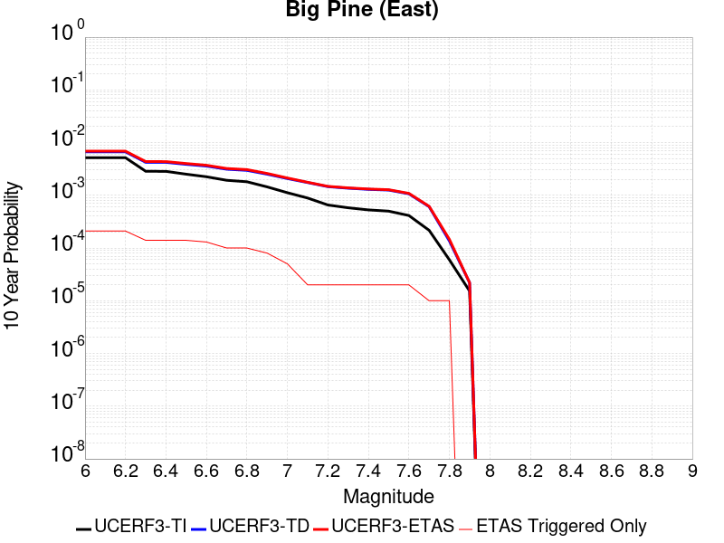 |

| Magnitude | 1 wk TI Prob | 1 wk TD Prob | 1 wk ETAS Prob | 1 wk ETAS/TD Gain | 1 wk ETAS Triggered Only | 1 mo TI Prob | 1 mo TD Prob | 1 mo ETAS Prob | 1 mo ETAS/TD Gain | 1 mo ETAS Triggered Only | 1 yr TI Prob | 1 yr TD Prob | 1 yr ETAS Prob | 1 yr ETAS/TD Gain | 1 yr ETAS Triggered Only | 10 yr TI Prob | 10 yr TD Prob | 10 yr ETAS Prob | 10 yr ETAS/TD Gain | 10 yr ETAS Triggered Only |
|-----|-----|-----|-----|-----|-----|-----|-----|-----|-----|-----|-----|-----|-----|-----|-----|-----|-----|-----|-----|-----|
| 6.0 | 9.916913E-6 | 1.2816984E-5 | 7.520311E-5 | 5.8674574 | 6.238693E-5 | 4.250036E-5 | 5.49289E-5 | 1.4850414E-4 | 2.7035704 | 9.3580384E-5 | 5.173191E-4 | 6.685763E-4 | 8.08853E-4 | 1.2098141 | 1.4037058E-4 | 0.0051611643 | 0.006670441 | 0.006871846 | 1.0301937 | 2.027575E-4 |
| 6.1 | 9.916913E-6 | 1.2816984E-5 | 7.520311E-5 | 5.8674574 | 6.238693E-5 | 4.250036E-5 | 5.49289E-5 | 1.4850414E-4 | 2.7035704 | 9.3580384E-5 | 5.173191E-4 | 6.685763E-4 | 8.08853E-4 | 1.2098141 | 1.4037058E-4 | 0.0051611643 | 0.006670441 | 0.006871846 | 1.0301937 | 2.027575E-4 |
| 6.2 | 9.916913E-6 | 1.2816984E-5 | 7.520311E-5 | 5.8674574 | 6.238693E-5 | 4.250036E-5 | 5.49289E-5 | 1.4850414E-4 | 2.7035704 | 9.3580384E-5 | 5.173191E-4 | 6.685763E-4 | 8.08853E-4 | 1.2098141 | 1.4037058E-4 | 0.0051611643 | 0.006670441 | 0.006871846 | 1.0301937 | 2.027575E-4 |
| 6.3 | 5.479711E-6 | 8.112951E-6 | 3.930616E-5 | 4.844866 | 3.1193464E-5 | 2.3484265E-5 | 3.4769346E-5 | 8.155791E-5 | 2.3456843 | 4.6790192E-5 | 2.858834E-4 | 4.2323777E-4 | 5.011884E-4 | 1.1841769 | 7.7983656E-5 | 0.0028551589 | 0.004227244 | 0.00435149 | 1.0293918 | 1.2477385E-4 |
| 6.4 | 5.465009E-6 | 8.097245E-6 | 3.9290455E-5 | 4.852324 | 3.1193464E-5 | 2.3421257E-5 | 3.4702036E-5 | 8.14906E-5 | 2.3482947 | 4.6790192E-5 | 2.851165E-4 | 4.2241855E-4 | 5.003693E-4 | 1.1845343 | 7.7983656E-5 | 0.0028475097 | 0.0042190826 | 0.00434333 | 1.0294489 | 1.2477385E-4 |
| 6.5 | 4.826767E-6 | 7.422301E-6 | 3.861553E-5 | 5.202636 | 3.1193464E-5 | 2.068598E-5 | 3.180949E-5 | 7.85982E-5 | 2.4709039 | 4.6790192E-5 | 2.518227E-4 | 3.872145E-4 | 4.6516795E-4 | 1.2013185 | 7.7983656E-5 | 0.0025153751 | 0.003868283 | 0.0039925743 | 1.0321308 | 1.2477385E-4 |
| 6.6 | 4.3146847E-6 | 6.8822374E-6 | 2.247886E-5 | 3.2662141 | 1.5596732E-5 | 1.8491375E-5 | 2.9494982E-5 | 6.0687526E-5 | 2.0575542 | 3.1193464E-5 | 2.2510924E-4 | 3.590447E-4 | 4.214092E-4 | 1.1736957 | 6.238693E-5 | 0.0022488134 | 0.0035874986 | 0.003696284 | 1.0303235 | 1.0917712E-4 |
| 6.7 | 3.6968106E-6 | 5.9954727E-6 | 2.159211E-5 | 3.6014025 | 1.5596732E-5 | 1.5843378E-5 | 2.5694639E-5 | 5.68873E-5 | 2.2139754 | 3.1193464E-5 | 1.9287605E-4 | 3.1278885E-4 | 3.7515626E-4 | 1.1993914 | 6.238693E-5 | 0.0019270873 | 0.0031262483 | 0.003219536 | 1.0298402 | 9.3580384E-5 |
| 6.8 | 3.4671132E-6 | 5.702177E-6 | 2.129882E-5 | 3.7352083 | 1.5596732E-5 | 1.4858972E-5 | 2.4437682E-5 | 5.5630382E-5 | 2.2764182 | 3.1193464E-5 | 1.8089297E-4 | 2.974896E-4 | 3.5985795E-4 | 1.2096488 | 6.238693E-5 | 0.0018074579 | 0.002973667 | 0.0030669693 | 1.0313761 | 9.3580384E-5 |
| 6.9 | 2.7686972E-6 | 4.825223E-6 | 2.042188E-5 | 4.232318 | 1.5596732E-5 | 1.1865792E-5 | 2.0679368E-5 | 5.1872186E-5 | 2.5084028 | 3.1193464E-5 | 1.4445644E-4 | 2.5174298E-4 | 3.1411418E-4 | 1.2477576 | 6.238693E-5 | 0.0014436257 | 0.0025172636 | 0.0026106085 | 1.0370818 | 9.3580384E-5 |
| 7.0 | 2.1472624E-6 | 3.9850406E-6 | 1.958171E-5 | 4.913804 | 1.5596732E-5 | 9.20252E-6 | 1.7078637E-5 | 3.26751E-5 | 1.9132148 | 1.5596732E-5 | 1.12034926E-4 | 2.079131E-4 | 2.5469356E-4 | 1.2250001 | 4.6790192E-5 | 0.0011197845 | 0.0020798394 | 0.0021420964 | 1.0299337 | 6.238693E-5 |
| 7.1 | 1.7018335E-6 | 3.344876E-6 | 1.8941555E-5 | 5.662857 | 1.5596732E-5 | 7.293552E-6 | 1.4335106E-5 | 2.9931613E-5 | 2.0879939 | 1.5596732E-5 | 8.879537E-5 | 1.7451629E-4 | 1.9011031E-4 | 1.0893556 | 1.5596732E-5 | 8.87599E-4 | 0.0017464145 | 0.0017775533 | 1.0178303 | 3.1193464E-5 |
| 7.2 | 1.25603E-6 | 2.794484E-6 | 1.839117E-5 | 6.58124 | 1.5596732E-5 | 5.3829745E-6 | 1.1976307E-5 | 2.757285E-5 | 2.3022833 | 1.5596732E-5 | 6.553574E-5 | 1.4580201E-4 | 1.6139646E-4 | 1.1069564 | 1.5596732E-5 | 6.551642E-4 | 0.001459661 | 0.0014908089 | 1.0213392 | 3.1193464E-5 |
| 7.3 | 1.112297E-6 | 2.610332E-6 | 1.8207022E-5 | 6.974983 | 1.5596732E-5 | 4.7669787E-6 | 1.118709E-5 | 2.6783648E-5 | 2.3941567 | 1.5596732E-5 | 5.803642E-5 | 1.3619453E-4 | 1.5178914E-4 | 1.1145024 | 1.5596732E-5 | 5.802127E-4 | 0.0013635408 | 0.0013946918 | 1.0228456 | 3.1193464E-5 |
| 7.4 | 1.0137181E-6 | 2.4834917E-6 | 1.8080184E-5 | 7.2801466 | 1.5596732E-5 | 4.3444993E-6 | 1.0643494E-5 | 2.6240059E-5 | 2.4653614 | 1.5596732E-5 | 5.2892992E-5 | 1.2957705E-4 | 1.4517175E-4 | 1.1203508 | 1.5596732E-5 | 5.288041E-4 | 0.0012972289 | 0.001328382 | 1.0240151 | 3.1193464E-5 |
| 7.5 | 9.598608E-7 | 2.4071483E-6 | 1.8003842E-5 | 7.479324 | 1.5596732E-5 | 4.1136827E-6 | 1.031631E-5 | 2.5912881E-5 | 2.511836 | 1.5596732E-5 | 5.0082934E-5 | 1.2559404E-4 | 1.4118882E-4 | 1.124168 | 1.5596732E-5 | 5.007165E-4 | 0.0012572526 | 0.0012884069 | 1.0247797 | 3.1193464E-5 |
| 7.6 | 7.929459E-7 | 2.0448588E-6 | 1.7641558E-5 | 8.6272745 | 1.5596732E-5 | 3.3983351E-6 | 8.763653E-6 | 2.4360246E-5 | 2.7796912 | 1.5596732E-5 | 4.1373947E-5 | 1.06692416E-4 | 1.2228749E-4 | 1.1461685 | 1.5596732E-5 | 4.1366243E-4 | 0.0010685222 | 0.0010996823 | 1.0291619 | 3.1193464E-5 |
| 7.7 | 4.155788E-7 | 1.1605589E-6 | 1.6757273E-5 | 14.438967 | 1.5596732E-5 | 1.7810507E-6 | 4.9738146E-6 | 2.0570467E-5 | 4.1357527 | 1.5596732E-5 | 2.1684076E-5 | 6.0554554E-5 | 7.615034E-5 | 1.2575494 | 1.5596732E-5 | 2.1681961E-4 | 6.0857297E-4 | 6.241602E-4 | 1.0256127 | 1.5596732E-5 |
| 7.8 | 1.14666925E-7 | 2.592015E-7 | 1.5855929E-5 | 61.17221 | 1.5596732E-5 | 4.914296E-7 | 1.1108631E-6 | 1.6707576E-5 | 15.040176 | 1.5596732E-5 | 5.9831386E-6 | 1.3524678E-5 | 2.9121198E-5 | 2.1531897 | 1.5596732E-5 | 5.9829777E-5 | 1.3634123E-4 | 1.5193583E-4 | 1.1143793 | 1.5596732E-5 |
| 7.9 | 2.9231824E-8 | 4.1463963E-8 | 4.1463963E-8 | 1.0 | 0.0 | 1.2527924E-7 | 1.7770269E-7 | 1.7770269E-7 | 1.0 | 0.0 | 1.5252737E-6 | 2.1635283E-6 | 2.1635283E-6 | 1.0 | 0.0 | 1.5252632E-5 | 2.1967755E-5 | 2.1967755E-5 | 1.0 | 0.0 |

## San Jacinto (Borrego)
*[(top)](#table-of-contents)*

| 1 Week | 1 Month | 1 Year | 10 Year |
|-----|-----|-----|-----|
|  |  |  |  |

| Magnitude | 1 wk TI Prob | 1 wk TD Prob | 1 wk ETAS Prob | 1 wk ETAS/TD Gain | 1 wk ETAS Triggered Only | 1 mo TI Prob | 1 mo TD Prob | 1 mo ETAS Prob | 1 mo ETAS/TD Gain | 1 mo ETAS Triggered Only | 1 yr TI Prob | 1 yr TD Prob | 1 yr ETAS Prob | 1 yr ETAS/TD Gain | 1 yr ETAS Triggered Only | 10 yr TI Prob | 10 yr TD Prob | 10 yr ETAS Prob | 10 yr ETAS/TD Gain | 10 yr ETAS Triggered Only |
|-----|-----|-----|-----|-----|-----|-----|-----|-----|-----|-----|-----|-----|-----|-----|-----|-----|-----|-----|-----|-----|
| 6.0 | 3.543992E-5 | 2.7926513E-5 | 7.47154E-5 | 2.6754289 | 4.6790192E-5 | 1.5187653E-4 | 1.1967963E-4 | 1.8205908E-4 | 1.5212203 | 6.238693E-5 | 0.0018475284 | 0.0014561379 | 0.00158073 | 1.0855634 | 1.2477385E-4 | 0.018322436 | 0.014869647 | 0.015054025 | 1.0123996 | 1.8716077E-4 |
| 6.1 | 3.542281E-5 | 2.7926513E-5 | 7.47154E-5 | 2.6754289 | 4.6790192E-5 | 1.5180321E-4 | 1.1967963E-4 | 1.8205908E-4 | 1.5212203 | 6.238693E-5 | 0.0018466372 | 0.0014561379 | 0.00158073 | 1.0855634 | 1.2477385E-4 | 0.018313672 | 0.014869647 | 0.015054025 | 1.0123996 | 1.8716077E-4 |
| 6.2 | 3.4688688E-5 | 2.7926511E-5 | 7.47154E-5 | 2.6754289 | 4.6790192E-5 | 1.4865733E-4 | 1.1967963E-4 | 1.8205908E-4 | 1.5212203 | 6.238693E-5 | 0.0018084005 | 0.0014561379 | 0.00158073 | 1.0855634 | 1.2477385E-4 | 0.017937548 | 0.014869647 | 0.015054025 | 1.0123996 | 1.8716077E-4 |
| 6.3 | 3.2087122E-5 | 2.7771865E-5 | 7.4560754E-5 | 2.684759 | 4.6790192E-5 | 1.3750899E-4 | 1.1901691E-4 | 1.8139642E-4 | 1.524123 | 6.238693E-5 | 0.0016728862 | 0.00144808 | 0.0015726731 | 1.0860403 | 1.2477385E-4 | 0.016603488 | 0.014790683 | 0.014975076 | 1.0124668 | 1.8716077E-4 |
| 6.4 | 3.1828724E-5 | 2.7738852E-5 | 7.452774E-5 | 2.686764 | 4.6790192E-5 | 1.364017E-4 | 1.1887544E-4 | 1.8125495E-4 | 1.5247468 | 6.238693E-5 | 0.0016594254 | 0.0014463598 | 0.0015709532 | 1.0861428 | 1.2477385E-4 | 0.016470885 | 0.014773762 | 0.014958157 | 1.0124813 | 1.8716077E-4 |
| 6.5 | 3.1563577E-5 | 2.747857E-5 | 7.4267475E-5 | 2.7027416 | 4.6790192E-5 | 1.3526545E-4 | 1.1776006E-4 | 1.8013963E-4 | 1.5297177 | 6.238693E-5 | 0.0016456128 | 0.0014327979 | 0.001557393 | 1.0869592 | 1.2477385E-4 | 0.0163348 | 0.014640348 | 0.0148247685 | 1.0125967 | 1.8716077E-4 |
| 6.6 | 3.1467625E-5 | 2.7322796E-5 | 7.411171E-5 | 2.7124498 | 4.6790192E-5 | 1.3485427E-4 | 1.1709251E-4 | 1.7947213E-4 | 1.532738 | 6.238693E-5 | 0.0016406142 | 0.0014246812 | 0.0015492772 | 1.0874554 | 1.2477385E-4 | 0.016285548 | 0.014560594 | 0.01474503 | 1.0126668 | 1.8716077E-4 |
| 6.7 | 3.1223695E-5 | 2.6940816E-5 | 7.3729745E-5 | 2.7367303 | 4.6790192E-5 | 1.3380898E-4 | 1.15455594E-4 | 1.7783532E-4 | 1.5402919 | 6.238693E-5 | 0.0016279068 | 0.0014047775 | 0.0015293761 | 1.0886962 | 1.2477385E-4 | 0.01616033 | 0.014364966 | 0.014549438 | 1.0128418 | 1.8716077E-4 |
| 6.8 | 3.1015585E-5 | 2.6761822E-5 | 7.3550764E-5 | 2.7483466 | 4.6790192E-5 | 1.3291716E-4 | 1.1468855E-4 | 1.7706832E-4 | 1.5439059 | 6.238693E-5 | 0.001617065 | 0.0013954508 | 0.0015200506 | 1.0892899 | 1.2477385E-4 | 0.016053487 | 0.014272246 | 0.014456735 | 1.0129265 | 1.8716077E-4 |
| 6.9 | 2.6641965E-5 | 2.2184247E-5 | 6.89734E-5 | 3.1091163 | 4.6790192E-5 | 1.1417485E-4 | 9.50719E-5 | 1.5745289E-4 | 1.6561455 | 6.238693E-5 | 0.0013891924 | 0.0011568897 | 0.0012815192 | 1.1077281 | 1.2477385E-4 | 0.0138054015 | 0.011882438 | 0.012067376 | 1.0155638 | 1.8716077E-4 |
| 7.0 | 2.3854353E-5 | 2.0479023E-5 | 6.726826E-5 | 3.2847395 | 4.6790192E-5 | 1.02228936E-4 | 8.77643E-5 | 1.5014576E-4 | 1.7107838 | 6.238693E-5 | 0.0012439266 | 0.0010680092 | 0.0011926498 | 1.1167036 | 1.2477385E-4 | 0.012369866 | 0.0109828 | 0.011167906 | 1.016854 | 1.8716077E-4 |
| 7.1 | 2.3672901E-5 | 2.031551E-5 | 6.710475E-5 | 3.303129 | 4.6790192E-5 | 1.0145135E-4 | 8.7063585E-5 | 1.4944507E-4 | 1.7165049 | 6.238693E-5 | 0.0012344702 | 0.0010594862 | 0.0011841279 | 1.1176435 | 1.2477385E-4 | 0.0122763505 | 0.010897976 | 0.011083097 | 1.0169867 | 1.8716077E-4 |
| 7.2 | 2.2717244E-5 | 1.9542893E-5 | 6.633217E-5 | 3.3941839 | 4.6790192E-5 | 9.735599E-5 | 8.375258E-5 | 1.4613428E-4 | 1.7448332 | 6.238693E-5 | 0.0011846646 | 0.001019213 | 0.0011438597 | 1.1222969 | 1.2477385E-4 | 0.01178369 | 0.010495341 | 0.010680538 | 1.0176456 | 1.8716077E-4 |
| 7.3 | 2.1016205E-5 | 1.8384526E-5 | 6.517386E-5 | 3.545039 | 4.6790192E-5 | 9.006634E-5 | 7.878846E-5 | 1.4117046E-4 | 1.7917658 | 6.238693E-5 | 0.001096006 | 9.5882936E-4 | 0.0010834836 | 1.1300067 | 1.2477385E-4 | 0.010906163 | 0.009890967 | 0.010076276 | 1.0187353 | 1.8716077E-4 |
| 7.4 | 2.0683625E-5 | 1.8187047E-5 | 6.497639E-5 | 3.572674 | 4.6790192E-5 | 8.86411E-5 | 7.794217E-5 | 1.4032423E-4 | 1.8003634 | 6.238693E-5 | 0.001078671 | 9.485349E-4 | 0.0010731904 | 1.131419 | 1.2477385E-4 | 0.010734501 | 0.009787692 | 0.009973021 | 1.0189348 | 1.8716077E-4 |
| 7.5 | 1.9993966E-5 | 1.7782075E-5 | 6.457143E-5 | 3.6312656 | 4.6790192E-5 | 8.568561E-5 | 7.620667E-5 | 1.3858885E-4 | 1.818592 | 6.238693E-5 | 0.001042723 | 9.2742336E-4 | 0.0010520815 | 1.1344134 | 1.2477385E-4 | 0.010378438 | 0.009574614 | 0.009759983 | 1.0193604 | 1.8716077E-4 |
| 7.6 | 1.788966E-5 | 1.6435291E-5 | 6.322472E-5 | 3.8468876 | 4.6790192E-5 | 7.666772E-5 | 7.043507E-5 | 1.328176E-4 | 1.8856744 | 6.238693E-5 | 9.3302975E-4 | 8.572113E-4 | 9.818783E-4 | 1.1454331 | 1.2477385E-4 | 0.00929122 | 0.008866487 | 0.009051988 | 1.0209216 | 1.8716077E-4 |
| 7.7 | 1.5125781E-5 | 1.4237377E-5 | 6.1026905E-5 | 4.2863865 | 4.6790192E-5 | 6.4823165E-5 | 6.1015908E-5 | 1.2339903E-4 | 2.0224073 | 6.238693E-5 | 7.889362E-4 | 7.426163E-4 | 8.672975E-4 | 1.1678945 | 1.2477385E-4 | 0.007861412 | 0.0077142045 | 0.007899921 | 1.0240747 | 1.8716077E-4 |
| 7.8 | 1.250089E-5 | 1.26304985E-5 | 5.94201E-5 | 4.7044935 | 4.6790192E-5 | 5.3574146E-5 | 5.412959E-5 | 1.1651313E-4 | 2.1524851 | 6.238693E-5 | 6.5207E-4 | 6.588291E-4 | 7.8352075E-4 | 1.1892625 | 1.2477385E-4 | 0.006501599 | 0.0068677636 | 0.007053639 | 1.0270649 | 1.8716077E-4 |
| 7.9 | 9.561E-6 | 9.754616E-6 | 5.654435E-5 | 5.796676 | 4.6790192E-5 | 4.0975072E-5 | 4.1804833E-5 | 1.04189145E-4 | 2.4922752 | 6.238693E-5 | 4.987573E-4 | 5.088555E-4 | 5.867995E-4 | 1.153175 | 7.7983656E-5 | 0.0049763937 | 0.0053523467 | 0.005491966 | 1.0260856 | 1.4037058E-4 |
| 8.0 | 8.01699E-6 | 8.293488E-6 | 5.5083292E-5 | 6.6417527 | 4.6790192E-5 | 3.4358076E-5 | 3.554304E-5 | 9.792775E-5 | 2.7551877 | 6.238693E-5 | 4.1822926E-4 | 4.3265108E-4 | 5.10601E-4 | 1.180168 | 7.7983656E-5 | 0.0041744304 | 0.004573375 | 0.0047131036 | 1.0305526 | 1.4037058E-4 |
| 8.1 | 6.541947E-6 | 6.4622354E-6 | 5.3252126E-5 | 8.240512 | 4.6790192E-5 | 2.8036617E-5 | 2.7695003E-5 | 9.00802E-5 | 3.2525795 | 6.238693E-5 | 3.4129233E-4 | 3.37135E-4 | 4.1509236E-4 | 1.2312349 | 7.7983656E-5 | 0.0034076865 | 0.0035806994 | 0.0037050266 | 1.0347215 | 1.2477385E-4 |
| 8.2 | 1.7968189E-6 | 7.9713476E-7 | 7.9713476E-7 | 1.0 | 0.0 | 7.70063E-6 | 3.4162877E-6 | 3.4162877E-6 | 1.0 | 0.0 | 9.3751136E-5 | 4.159253E-5 | 4.159253E-5 | 1.0 | 0.0 | 9.371159E-4 | 4.712058E-4 | 4.712058E-4 | 1.0 | 0.0 |
| 8.3 | 1.5167889E-7 | 4.897714E-8 | 4.897714E-8 | 1.0 | 0.0 | 6.500522E-7 | 2.09902E-7 | 2.09902E-7 | 1.0 | 0.0 | 7.9143565E-6 | 2.5555544E-6 | 2.5555544E-6 | 1.0 | 0.0 | 7.914075E-5 | 2.969505E-5 | 2.969505E-5 | 1.0 | 0.0 |

## Channel Islands Thrust
*[(top)](#table-of-contents)*

| 1 Week | 1 Month | 1 Year | 10 Year |
|-----|-----|-----|-----|
|  |  |  |  |

| Magnitude | 1 wk TI Prob | 1 wk TD Prob | 1 wk ETAS Prob | 1 wk ETAS/TD Gain | 1 wk ETAS Triggered Only | 1 mo TI Prob | 1 mo TD Prob | 1 mo ETAS Prob | 1 mo ETAS/TD Gain | 1 mo ETAS Triggered Only | 1 yr TI Prob | 1 yr TD Prob | 1 yr ETAS Prob | 1 yr ETAS/TD Gain | 1 yr ETAS Triggered Only | 10 yr TI Prob | 10 yr TD Prob | 10 yr ETAS Prob | 10 yr ETAS/TD Gain | 10 yr ETAS Triggered Only |
|-----|-----|-----|-----|-----|-----|-----|-----|-----|-----|-----|-----|-----|-----|-----|-----|-----|-----|-----|-----|-----|
| 6.0 | 2.2156251E-5 | 2.4092022E-5 | 2.4092022E-5 | 1.0 | 0.0 | 9.495191E-5 | 1.03248036E-4 | 1.18843156E-4 | 1.1510452 | 1.5596732E-5 | 0.0011554264 | 0.0012564264 | 0.0013187351 | 1.0495919 | 6.238693E-5 | 0.011494373 | 0.0125038205 | 0.012673239 | 1.0135493 | 1.7156404E-4 |
| 6.1 | 2.2156251E-5 | 2.4092022E-5 | 2.4092022E-5 | 1.0 | 0.0 | 9.495191E-5 | 1.03248036E-4 | 1.18843156E-4 | 1.1510452 | 1.5596732E-5 | 0.0011554264 | 0.0012564264 | 0.0013187351 | 1.0495919 | 6.238693E-5 | 0.011494373 | 0.0125038205 | 0.012673239 | 1.0135493 | 1.7156404E-4 |
| 6.2 | 2.2156251E-5 | 2.4092022E-5 | 2.4092022E-5 | 1.0 | 0.0 | 9.495191E-5 | 1.03248036E-4 | 1.18843156E-4 | 1.1510452 | 1.5596732E-5 | 0.0011554264 | 0.0012564264 | 0.0013187351 | 1.0495919 | 6.238693E-5 | 0.011494373 | 0.0125038205 | 0.012673239 | 1.0135493 | 1.7156404E-4 |
| 6.3 | 2.2156251E-5 | 2.4092022E-5 | 2.4092022E-5 | 1.0 | 0.0 | 9.495191E-5 | 1.03248036E-4 | 1.18843156E-4 | 1.1510452 | 1.5596732E-5 | 0.0011554264 | 0.0012564264 | 0.0013187351 | 1.0495919 | 6.238693E-5 | 0.011494373 | 0.0125038205 | 0.012673239 | 1.0135493 | 1.7156404E-4 |
| 6.4 | 2.2156251E-5 | 2.4092022E-5 | 2.4092022E-5 | 1.0 | 0.0 | 9.495191E-5 | 1.03248036E-4 | 1.18843156E-4 | 1.1510452 | 1.5596732E-5 | 0.0011554264 | 0.0012564264 | 0.0013187351 | 1.0495919 | 6.238693E-5 | 0.011494373 | 0.0125038205 | 0.012673239 | 1.0135493 | 1.7156404E-4 |
| 6.5 | 2.2156251E-5 | 2.4092022E-5 | 2.4092022E-5 | 1.0 | 0.0 | 9.495191E-5 | 1.03248036E-4 | 1.18843156E-4 | 1.1510452 | 1.5596732E-5 | 0.0011554264 | 0.0012564264 | 0.0013187351 | 1.0495919 | 6.238693E-5 | 0.011494373 | 0.0125038205 | 0.012673239 | 1.0135493 | 1.7156404E-4 |
| 6.6 | 2.2156251E-5 | 2.4092022E-5 | 2.4092022E-5 | 1.0 | 0.0 | 9.495191E-5 | 1.03248036E-4 | 1.18843156E-4 | 1.1510452 | 1.5596732E-5 | 0.0011554264 | 0.0012564264 | 0.0013187351 | 1.0495919 | 6.238693E-5 | 0.011494373 | 0.0125038205 | 0.012673239 | 1.0135493 | 1.7156404E-4 |
| 6.7 | 1.0601296E-5 | 1.1379544E-5 | 1.1379544E-5 | 1.0 | 0.0 | 4.5433335E-5 | 4.876859E-5 | 4.876859E-5 | 1.0 | 0.0 | 5.5301044E-4 | 5.936007E-4 | 6.2477565E-4 | 1.0525184 | 3.1193464E-5 | 0.005516363 | 0.005920653 | 0.005998175 | 1.0130935 | 7.7983656E-5 |
| 6.8 | 1.0246747E-5 | 1.0996669E-5 | 1.0996669E-5 | 1.0 | 0.0 | 4.391389E-5 | 4.7127756E-5 | 4.7127756E-5 | 1.0 | 0.0 | 5.345204E-4 | 5.7363417E-4 | 6.048097E-4 | 1.0543475 | 3.1193464E-5 | 0.0053323656 | 0.005722025 | 0.005799562 | 1.0135506 | 7.7983656E-5 |
| 6.9 | 9.049551E-6 | 9.699645E-6 | 9.699645E-6 | 1.0 | 0.0 | 3.878322E-5 | 4.1569267E-5 | 4.1569267E-5 | 1.0 | 0.0 | 4.7208337E-4 | 5.059924E-4 | 5.3717004E-4 | 1.0616169 | 3.1193464E-5 | 0.0047108172 | 0.0050488203 | 0.00512641 | 1.015368 | 7.7983656E-5 |
| 7.0 | 8.6542195E-6 | 9.274603E-6 | 9.274603E-6 | 1.0 | 0.0 | 3.7088983E-5 | 3.9747716E-5 | 3.9747716E-5 | 1.0 | 0.0 | 4.5146482E-4 | 4.8382508E-4 | 5.1500346E-4 | 1.0644414 | 3.1193464E-5 | 0.004505487 | 0.004828129 | 0.004905736 | 1.016074 | 7.7983656E-5 |
| 7.1 | 8.391028E-6 | 8.992924E-6 | 8.992924E-6 | 1.0 | 0.0 | 3.5961057E-5 | 3.854056E-5 | 3.854056E-5 | 1.0 | 0.0 | 4.3773788E-4 | 4.6913436E-4 | 5.003132E-4 | 1.0664604 | 3.1193464E-5 | 0.004368766 | 0.0046818503 | 0.0047594686 | 1.0165786 | 7.7983656E-5 |
| 7.2 | 5.965188E-6 | 6.3716952E-6 | 6.3716952E-6 | 1.0 | 0.0 | 2.556484E-5 | 2.7306982E-5 | 2.7306982E-5 | 1.0 | 0.0 | 3.1120746E-4 | 3.3241234E-4 | 3.6359543E-4 | 1.0938084 | 3.1193464E-5 | 0.00310772 | 0.0033192092 | 0.0033969341 | 1.0234166 | 7.7983656E-5 |
| 7.3 | 4.877518E-6 | 5.2060063E-6 | 5.2060063E-6 | 1.0 | 0.0 | 2.0903482E-5 | 2.2311267E-5 | 2.2311267E-5 | 1.0 | 0.0 | 2.5447016E-4 | 2.716063E-4 | 2.716063E-4 | 1.0 | 0.0 | 0.0025417898 | 0.0027127895 | 0.0027438984 | 1.0114675 | 3.1193464E-5 |
| 7.4 | 3.8829853E-6 | 4.141863E-6 | 4.141863E-6 | 1.0 | 0.0 | 1.664126E-5 | 1.7750723E-5 | 1.7750723E-5 | 1.0 | 0.0 | 2.0258849E-4 | 2.1609402E-4 | 2.1609402E-4 | 1.0 | 0.0 | 0.002024039 | 0.0021588807 | 0.0021744438 | 1.0072088 | 1.5596732E-5 |
| 7.5 | 1.3489616E-6 | 1.4277903E-6 | 1.4277903E-6 | 1.0 | 0.0 | 5.7812517E-6 | 6.119087E-6 | 6.119087E-6 | 1.0 | 0.0 | 7.038446E-5 | 7.449738E-5 | 7.449738E-5 | 1.0 | 0.0 | 7.036218E-4 | 7.44728E-4 | 7.44728E-4 | 1.0 | 0.0 |
| 7.6 | 6.058192E-7 | 6.353778E-7 | 6.353778E-7 | 1.0 | 0.0 | 2.5963652E-6 | 2.7230449E-6 | 2.7230449E-6 | 1.0 | 0.0 | 3.161029E-5 | 3.3152584E-5 | 3.3152584E-5 | 1.0 | 0.0 | 3.1605794E-4 | 3.31478E-4 | 3.31478E-4 | 1.0 | 0.0 |
| 7.7 | 2.2170494E-7 | 2.2607902E-7 | 2.2607902E-7 | 1.0 | 0.0 | 9.5016367E-7 | 9.689098E-7 | 9.689098E-7 | 1.0 | 0.0 | 1.1568181E-5 | 1.1796425E-5 | 1.1796425E-5 | 1.0 | 0.0 | 1.1567579E-4 | 1.1795909E-4 | 1.1795909E-4 | 1.0 | 0.0 |
| 7.8 | 2.1613102E-8 | 1.5466682E-8 | 1.5466682E-8 | 1.0 | 0.0 | 9.262757E-8 | 6.628578E-8 | 6.628578E-8 | 1.0 | 0.0 | 1.1277401E-6 | 8.070291E-7 | 8.070291E-7 | 1.0 | 0.0 | 1.1277344E-5 | 8.070269E-6 | 8.070269E-6 | 1.0 | 0.0 |

## Santa Cruz Island
*[(top)](#table-of-contents)*

| 1 Week | 1 Month | 1 Year | 10 Year |
|-----|-----|-----|-----|
|  |  |  |  |

| Magnitude | 1 wk TI Prob | 1 wk TD Prob | 1 wk ETAS Prob | 1 wk ETAS/TD Gain | 1 wk ETAS Triggered Only | 1 mo TI Prob | 1 mo TD Prob | 1 mo ETAS Prob | 1 mo ETAS/TD Gain | 1 mo ETAS Triggered Only | 1 yr TI Prob | 1 yr TD Prob | 1 yr ETAS Prob | 1 yr ETAS/TD Gain | 1 yr ETAS Triggered Only | 10 yr TI Prob | 10 yr TD Prob | 10 yr ETAS Prob | 10 yr ETAS/TD Gain | 10 yr ETAS Triggered Only |
|-----|-----|-----|-----|-----|-----|-----|-----|-----|-----|-----|-----|-----|-----|-----|-----|-----|-----|-----|-----|-----|
| 6.0 | 2.9164563E-5 | 3.1599742E-5 | 6.279222E-5 | 1.9871117 | 3.1193464E-5 | 1.2498499E-4 | 1.3542121E-4 | 1.8220507E-4 | 1.3454692 | 4.6790192E-5 | 0.0015206301 | 0.0016476426 | 0.0017099266 | 1.037802 | 6.238693E-5 | 0.015102667 | 0.016368 | 0.016475389 | 1.0065609 | 1.0917712E-4 |
| 6.1 | 2.9164563E-5 | 3.1599742E-5 | 6.279222E-5 | 1.9871117 | 3.1193464E-5 | 1.2498499E-4 | 1.3542121E-4 | 1.8220507E-4 | 1.3454692 | 4.6790192E-5 | 0.0015206301 | 0.0016476426 | 0.0017099266 | 1.037802 | 6.238693E-5 | 0.015102667 | 0.016368 | 0.016475389 | 1.0065609 | 1.0917712E-4 |
| 6.2 | 2.9164563E-5 | 3.1599742E-5 | 6.279222E-5 | 1.9871117 | 3.1193464E-5 | 1.2498499E-4 | 1.3542121E-4 | 1.8220507E-4 | 1.3454692 | 4.6790192E-5 | 0.0015206301 | 0.0016476426 | 0.0017099266 | 1.037802 | 6.238693E-5 | 0.015102667 | 0.016368 | 0.016475389 | 1.0065609 | 1.0917712E-4 |
| 6.3 | 1.6635553E-5 | 1.780436E-5 | 3.340081E-5 | 1.8759907 | 1.5596732E-5 | 7.1293274E-5 | 7.630226E-5 | 1.07493346E-4 | 1.4087832 | 3.1193464E-5 | 8.6765E-4 | 9.2860236E-4 | 9.753491E-4 | 1.050341 | 4.6790192E-5 | 0.008642701 | 0.009249094 | 0.009341808 | 1.0100242 | 9.3580384E-5 |
| 6.4 | 1.6635553E-5 | 1.780436E-5 | 3.340081E-5 | 1.8759907 | 1.5596732E-5 | 7.1293274E-5 | 7.630226E-5 | 1.07493346E-4 | 1.4087832 | 3.1193464E-5 | 8.6765E-4 | 9.2860236E-4 | 9.753491E-4 | 1.050341 | 4.6790192E-5 | 0.008642701 | 0.009249094 | 0.009341808 | 1.0100242 | 9.3580384E-5 |
| 6.5 | 1.2238748E-5 | 1.3042995E-5 | 1.3042995E-5 | 1.0 | 0.0 | 5.2450723E-5 | 5.5897377E-5 | 5.5897377E-5 | 1.0 | 0.0 | 6.3840044E-4 | 6.8034173E-4 | 6.8034173E-4 | 1.0 | 0.0 | 0.0063656955 | 0.0067829876 | 0.0068294606 | 1.0068514 | 4.6790192E-5 |
| 6.6 | 1.0489767E-5 | 1.1156636E-5 | 1.1156636E-5 | 1.0 | 0.0 | 4.495537E-5 | 4.781329E-5 | 4.781329E-5 | 1.0 | 0.0 | 5.4719415E-4 | 5.819735E-4 | 5.819735E-4 | 1.0 | 0.0 | 0.005458487 | 0.0058047357 | 0.0058357483 | 1.0053426 | 3.1193464E-5 |
| 6.7 | 8.699222E-6 | 9.236782E-6 | 9.236782E-6 | 1.0 | 0.0 | 3.7281847E-5 | 3.958561E-5 | 3.958561E-5 | 1.0 | 0.0 | 4.5381195E-4 | 4.8184878E-4 | 4.8184878E-4 | 1.0 | 0.0 | 0.0045288634 | 0.004808108 | 0.004839151 | 1.0064565 | 3.1193464E-5 |
| 6.8 | 8.307732E-6 | 8.8169045E-6 | 8.8169045E-6 | 1.0 | 0.0 | 3.560408E-5 | 3.7786187E-5 | 3.7786187E-5 | 1.0 | 0.0 | 4.3339343E-4 | 4.5995016E-4 | 4.5995016E-4 | 1.0 | 0.0 | 0.004325492 | 0.0045900354 | 0.0046210857 | 1.0067648 | 3.1193464E-5 |
| 6.9 | 8.073121E-6 | 8.564939E-6 | 8.564939E-6 | 1.0 | 0.0 | 3.459863E-5 | 3.6706366E-5 | 3.6706366E-5 | 1.0 | 0.0 | 4.2115687E-4 | 4.468088E-4 | 4.468088E-4 | 1.0 | 0.0 | 0.004203596 | 0.004459156 | 0.00449021 | 1.0069642 | 3.1193464E-5 |
| 7.0 | 7.617019E-6 | 8.074664E-6 | 8.074664E-6 | 1.0 | 0.0 | 3.264396E-5 | 3.4605247E-5 | 3.4605247E-5 | 1.0 | 0.0 | 3.9736772E-4 | 4.212378E-4 | 4.212378E-4 | 1.0 | 0.0 | 0.003966579 | 0.0042044413 | 0.0042355033 | 1.007388 | 3.1193464E-5 |
| 7.1 | 7.1224836E-6 | 7.545788E-6 | 7.545788E-6 | 1.0 | 0.0 | 3.052457E-5 | 3.2338692E-5 | 3.2338692E-5 | 1.0 | 0.0 | 3.715733E-4 | 3.936528E-4 | 3.936528E-4 | 1.0 | 0.0 | 0.003709526 | 0.003929598 | 0.0039606686 | 1.0079069 | 3.1193464E-5 |
| 7.2 | 6.441115E-6 | 6.8273835E-6 | 6.8273835E-6 | 1.0 | 0.0 | 2.7604487E-5 | 2.9259887E-5 | 2.9259887E-5 | 1.0 | 0.0 | 3.360328E-4 | 3.5618112E-4 | 3.5618112E-4 | 1.0 | 0.0 | 0.0033552512 | 0.003556131 | 0.0035872136 | 1.0087405 | 3.1193464E-5 |
| 7.3 | 5.494274E-6 | 5.8199944E-6 | 5.8199944E-6 | 1.0 | 0.0 | 2.3546674E-5 | 2.4942596E-5 | 2.4942596E-5 | 1.0 | 0.0 | 2.8664304E-4 | 3.0363398E-4 | 3.0363398E-4 | 1.0 | 0.0 | 0.002862736 | 0.0030322142 | 0.0030477638 | 1.005128 | 1.5596732E-5 |
| 7.4 | 4.0802624E-6 | 4.312256E-6 | 4.312256E-6 | 1.0 | 0.0 | 1.7486722E-5 | 1.8480967E-5 | 1.8480967E-5 | 1.0 | 0.0 | 2.1288003E-4 | 2.2498262E-4 | 2.2498262E-4 | 1.0 | 0.0 | 0.0021267622 | 0.0022475575 | 0.0022631192 | 1.0069238 | 1.5596732E-5 |
| 7.5 | 2.3584746E-6 | 2.4753094E-6 | 2.4753094E-6 | 1.0 | 0.0 | 1.0107709E-5 | 1.0608426E-5 | 1.0608426E-5 | 1.0 | 0.0 | 1.2305441E-4 | 1.2915E-4 | 1.2915E-4 | 1.0 | 0.0 | 0.0012298629 | 0.0012907543 | 0.0012907543 | 1.0 | 0.0 |
| 7.6 | 9.4981914E-7 | 9.86093E-7 | 9.86093E-7 | 1.0 | 0.0 | 4.0706473E-6 | 4.2261063E-6 | 4.2261063E-6 | 1.0 | 0.0 | 4.9559E-5 | 5.145164E-5 | 5.145164E-5 | 1.0 | 0.0 | 4.954795E-4 | 5.1439856E-4 | 5.1439856E-4 | 1.0 | 0.0 |
| 7.7 | 2.6013532E-7 | 2.6416603E-7 | 2.6416603E-7 | 1.0 | 0.0 | 1.1148652E-6 | 1.1321397E-6 | 1.1321397E-6 | 1.0 | 0.0 | 1.3573399E-5 | 1.3783714E-5 | 1.3783714E-5 | 1.0 | 0.0 | 1.357257E-4 | 1.3782867E-4 | 1.3782867E-4 | 1.0 | 0.0 |
| 7.8 | 4.1522263E-8 | 3.965679E-8 | 3.965679E-8 | 1.0 | 0.0 | 1.7795254E-7 | 1.6995766E-7 | 1.6995766E-7 | 1.0 | 0.0 | 2.16657E-6 | 2.0692328E-6 | 2.0692328E-6 | 1.0 | 0.0 | 2.1665488E-5 | 2.0692156E-5 | 2.0692156E-5 | 1.0 | 0.0 |
| 7.9 | 7.7242046E-10 | 5.9468175E-10 | 5.9468175E-10 | 1.0 | 0.0 | 3.3103735E-9 | 2.5486364E-9 | 2.5486364E-9 | 1.0 | 0.0 | 4.0303796E-8 | 3.1029646E-8 | 3.1029646E-8 | 1.0 | 0.0 | 4.030379E-7 | 3.1029643E-7 | 3.1029643E-7 | 1.0 | 0.0 |

## Pinto Mtn
*[(top)](#table-of-contents)*

| 1 Week | 1 Month | 1 Year | 10 Year |
|-----|-----|-----|-----|
|  |  |  |  |

| Magnitude | 1 wk TI Prob | 1 wk TD Prob | 1 wk ETAS Prob | 1 wk ETAS/TD Gain | 1 wk ETAS Triggered Only | 1 mo TI Prob | 1 mo TD Prob | 1 mo ETAS Prob | 1 mo ETAS/TD Gain | 1 mo ETAS Triggered Only | 1 yr TI Prob | 1 yr TD Prob | 1 yr ETAS Prob | 1 yr ETAS/TD Gain | 1 yr ETAS Triggered Only | 10 yr TI Prob | 10 yr TD Prob | 10 yr ETAS Prob | 10 yr ETAS/TD Gain | 10 yr ETAS Triggered Only |
|-----|-----|-----|-----|-----|-----|-----|-----|-----|-----|-----|-----|-----|-----|-----|-----|-----|-----|-----|-----|-----|
| 6.0 | 4.4194956E-5 | 4.785362E-5 | 6.34496E-5 | 1.3259102 | 1.5596732E-5 | 1.893932E-4 | 2.0507174E-4 | 2.3625881E-4 | 1.1520787 | 3.1193464E-5 | 0.0023034236 | 0.0024940541 | 0.0025718433 | 1.0311898 | 7.7983656E-5 | 0.022796938 | 0.024678145 | 0.024830263 | 1.0061641 | 1.5596731E-4 |
| 6.1 | 4.4194956E-5 | 4.785362E-5 | 6.34496E-5 | 1.3259102 | 1.5596732E-5 | 1.893932E-4 | 2.0507174E-4 | 2.3625881E-4 | 1.1520787 | 3.1193464E-5 | 0.0023034236 | 0.0024940541 | 0.0025718433 | 1.0311898 | 7.7983656E-5 | 0.022796938 | 0.024678145 | 0.024830263 | 1.0061641 | 1.5596731E-4 |
| 6.2 | 4.4194956E-5 | 4.785362E-5 | 6.34496E-5 | 1.3259102 | 1.5596732E-5 | 1.893932E-4 | 2.0507174E-4 | 2.3625881E-4 | 1.1520787 | 3.1193464E-5 | 0.0023034236 | 0.0024940541 | 0.0025718433 | 1.0311898 | 7.7983656E-5 | 0.022796938 | 0.024678145 | 0.024830263 | 1.0061641 | 1.5596731E-4 |
| 6.3 | 4.4194956E-5 | 4.785362E-5 | 6.34496E-5 | 1.3259102 | 1.5596732E-5 | 1.893932E-4 | 2.0507174E-4 | 2.3625881E-4 | 1.1520787 | 3.1193464E-5 | 0.0023034236 | 0.0024940541 | 0.0025718433 | 1.0311898 | 7.7983656E-5 | 0.022796938 | 0.024678145 | 0.024830263 | 1.0061641 | 1.5596731E-4 |
| 6.4 | 3.729929E-5 | 3.9603186E-5 | 3.9603186E-5 | 1.0 | 0.0 | 1.5984432E-4 | 1.6971743E-4 | 1.8531151E-4 | 1.0918826 | 1.5596732E-5 | 0.0019443673 | 0.002064445 | 0.002126703 | 1.0301573 | 6.238693E-5 | 0.019274427 | 0.02046269 | 0.020600189 | 1.0067195 | 1.4037058E-4 |
| 6.5 | 3.729929E-5 | 3.9603186E-5 | 3.9603186E-5 | 1.0 | 0.0 | 1.5984432E-4 | 1.6971743E-4 | 1.8531151E-4 | 1.0918826 | 1.5596732E-5 | 0.0019443673 | 0.002064445 | 0.002126703 | 1.0301573 | 6.238693E-5 | 0.019274427 | 0.02046269 | 0.020600189 | 1.0067195 | 1.4037058E-4 |
| 6.6 | 3.0204548E-5 | 3.1205298E-5 | 3.1205298E-5 | 1.0 | 0.0 | 1.2944164E-4 | 1.3373033E-4 | 1.4932497E-4 | 1.1166127 | 1.5596732E-5 | 0.0015748127 | 0.0016269855 | 0.0016425569 | 1.0095707 | 1.5596732E-5 | 0.015636992 | 0.01615461 | 0.016246678 | 1.0056993 | 9.3580384E-5 |
| 6.7 | 2.9857754E-5 | 3.081468E-5 | 3.081468E-5 | 1.0 | 0.0 | 1.2795553E-4 | 1.3205643E-4 | 1.4765111E-4 | 1.118091 | 1.5596732E-5 | 0.0015567453 | 0.001606636 | 0.0016222076 | 1.0096921 | 1.5596732E-5 | 0.015458848 | 0.01595405 | 0.016046137 | 1.005772 | 9.3580384E-5 |
| 6.8 | 2.4819734E-5 | 2.5009364E-5 | 2.5009364E-5 | 1.0 | 0.0 | 1.0636595E-4 | 1.07178705E-4 | 1.2277377E-4 | 1.1455052 | 1.5596732E-5 | 0.0012942362 | 0.0013041412 | 0.0013197176 | 1.0119438 | 1.5596732E-5 | 0.012867244 | 0.0129672475 | 0.013044219 | 1.0059359 | 7.7983656E-5 |
| 6.9 | 2.331124E-5 | 2.3337643E-5 | 2.3337643E-5 | 1.0 | 0.0 | 9.990149E-5 | 1.00014746E-4 | 1.1560992E-4 | 1.1559287 | 1.5596732E-5 | 0.001215622 | 0.0012170197 | 0.0012325975 | 1.0127999 | 1.5596732E-5 | 0.012089936 | 0.012105742 | 0.012167373 | 1.0050911 | 6.238693E-5 |
| 7.0 | 2.1818534E-5 | 2.1760772E-5 | 2.1760772E-5 | 1.0 | 0.0 | 9.3504656E-5 | 9.325723E-5 | 1.0885251E-4 | 1.1672286 | 1.5596732E-5 | 0.0011378246 | 0.0011348352 | 0.0011504142 | 1.013728 | 1.5596732E-5 | 0.011320163 | 0.011292503 | 0.011338766 | 1.0040966 | 4.6790192E-5 |
| 7.1 | 2.066081E-5 | 2.0540418E-5 | 2.0540418E-5 | 1.0 | 0.0 | 8.854332E-5 | 8.8027504E-5 | 1.0362286E-4 | 1.1771646 | 1.5596732E-5 | 0.0010774818 | 0.0010712275 | 0.0010868075 | 1.0145441 | 1.5596732E-5 | 0.010722724 | 0.010662688 | 0.010708979 | 1.0043415 | 4.6790192E-5 |
| 7.2 | 1.8990233E-5 | 1.9053701E-5 | 1.9053701E-5 | 1.0 | 0.0 | 8.138417E-5 | 8.1656275E-5 | 9.725173E-5 | 1.1909891 | 1.5596732E-5 | 9.904018E-4 | 9.937311E-4 | 0.0010093122 | 1.0156795 | 1.5596732E-5 | 0.009859995 | 0.009894874 | 0.0099257585 | 1.0031213 | 3.1193464E-5 |
| 7.3 | 1.3335872E-5 | 1.4906372E-5 | 1.4906372E-5 | 1.0 | 0.0 | 5.7152483E-5 | 6.388296E-5 | 7.947869E-5 | 1.2441298 | 1.5596732E-5 | 6.956093E-4 | 7.775102E-4 | 7.930948E-4 | 1.0200442 | 1.5596732E-5 | 0.006934359 | 0.0077491994 | 0.007780151 | 1.0039942 | 3.1193464E-5 |
| 7.4 | 9.414066E-6 | 1.186061E-5 | 1.186061E-5 | 1.0 | 0.0 | 4.0345374E-5 | 5.0830247E-5 | 6.642619E-5 | 1.306824 | 1.5596732E-5 | 4.910942E-4 | 6.1869196E-4 | 6.3427904E-4 | 1.0251936 | 1.5596732E-5 | 0.0049001034 | 0.006170644 | 0.006201645 | 1.005024 | 3.1193464E-5 |
| 7.5 | 7.2101157E-6 | 9.157893E-6 | 9.157893E-6 | 1.0 | 0.0 | 3.090013E-5 | 3.924757E-5 | 5.4843687E-5 | 1.397378 | 1.5596732E-5 | 3.7614413E-4 | 4.7774217E-4 | 4.9333146E-4 | 1.0326312 | 1.5596732E-5 | 0.0037550807 | 0.004767927 | 0.0047989716 | 1.0065112 | 3.1193464E-5 |
| 7.6 | 3.296375E-6 | 4.5453176E-6 | 4.5453176E-6 | 1.0 | 0.0 | 1.4127245E-5 | 1.9479796E-5 | 3.5076224E-5 | 1.8006463 | 1.5596732E-5 | 1.7198564E-4 | 2.3714209E-4 | 2.5273513E-4 | 1.0657539 | 1.5596732E-5 | 0.0017185259 | 0.0023690276 | 0.0023845874 | 1.006568 | 1.5596732E-5 |
| 7.7 | 2.5741092E-6 | 3.584251E-6 | 3.584251E-6 | 1.0 | 0.0 | 1.103185E-5 | 1.5360993E-5 | 1.5360993E-5 | 1.0 | 0.0 | 1.3430449E-4 | 1.8700535E-4 | 1.8700535E-4 | 1.0 | 0.0 | 0.0013422335 | 0.0018686098 | 0.0018686098 | 1.0 | 0.0 |

## Independence rev 2011
*[(top)](#table-of-contents)*

| 1 Week | 1 Month | 1 Year | 10 Year |
|-----|-----|-----|-----|
|  |  |  |  |

| Magnitude | 1 wk TI Prob | 1 wk TD Prob | 1 wk ETAS Prob | 1 wk ETAS/TD Gain | 1 wk ETAS Triggered Only | 1 mo TI Prob | 1 mo TD Prob | 1 mo ETAS Prob | 1 mo ETAS/TD Gain | 1 mo ETAS Triggered Only | 1 yr TI Prob | 1 yr TD Prob | 1 yr ETAS Prob | 1 yr ETAS/TD Gain | 1 yr ETAS Triggered Only | 10 yr TI Prob | 10 yr TD Prob | 10 yr ETAS Prob | 10 yr ETAS/TD Gain | 10 yr ETAS Triggered Only |
|-----|-----|-----|-----|-----|-----|-----|-----|-----|-----|-----|-----|-----|-----|-----|-----|-----|-----|-----|-----|-----|
| 6.0 | 4.422171E-6 | 4.326227E-6 | 1.992289E-5 | 4.605142 | 1.5596732E-5 | 1.8952025E-5 | 1.8540857E-5 | 9.6523065E-5 | 5.2059655 | 7.7983656E-5 | 2.3071647E-4 | 2.2571455E-4 | 3.5046024E-4 | 1.5526701 | 1.2477385E-4 | 0.0023047708 | 0.0022551466 | 0.0024263237 | 1.0759051 | 1.7156404E-4 |
| 6.1 | 4.422171E-6 | 4.326227E-6 | 1.992289E-5 | 4.605142 | 1.5596732E-5 | 1.8952025E-5 | 1.8540857E-5 | 9.6523065E-5 | 5.2059655 | 7.7983656E-5 | 2.3071647E-4 | 2.2571455E-4 | 3.5046024E-4 | 1.5526701 | 1.2477385E-4 | 0.0023047708 | 0.0022551466 | 0.0024263237 | 1.0759051 | 1.7156404E-4 |
| 6.2 | 4.422171E-6 | 4.326227E-6 | 1.992289E-5 | 4.605142 | 1.5596732E-5 | 1.8952025E-5 | 1.8540857E-5 | 9.6523065E-5 | 5.2059655 | 7.7983656E-5 | 2.3071647E-4 | 2.2571455E-4 | 3.5046024E-4 | 1.5526701 | 1.2477385E-4 | 0.0023047708 | 0.0022551466 | 0.0024263237 | 1.0759051 | 1.7156404E-4 |
| 6.3 | 4.422171E-6 | 4.326227E-6 | 1.992289E-5 | 4.605142 | 1.5596732E-5 | 1.8952025E-5 | 1.8540857E-5 | 9.6523065E-5 | 5.2059655 | 7.7983656E-5 | 2.3071647E-4 | 2.2571455E-4 | 3.5046024E-4 | 1.5526701 | 1.2477385E-4 | 0.0023047708 | 0.0022551466 | 0.0024263237 | 1.0759051 | 1.7156404E-4 |
| 6.4 | 4.422171E-6 | 4.326227E-6 | 1.992289E-5 | 4.605142 | 1.5596732E-5 | 1.8952025E-5 | 1.8540857E-5 | 9.6523065E-5 | 5.2059655 | 7.7983656E-5 | 2.3071647E-4 | 2.2571455E-4 | 3.5046024E-4 | 1.5526701 | 1.2477385E-4 | 0.0023047708 | 0.0022551466 | 0.0024263237 | 1.0759051 | 1.7156404E-4 |
| 6.5 | 4.422171E-6 | 4.326227E-6 | 1.992289E-5 | 4.605142 | 1.5596732E-5 | 1.8952025E-5 | 1.8540857E-5 | 9.6523065E-5 | 5.2059655 | 7.7983656E-5 | 2.3071647E-4 | 2.2571455E-4 | 3.5046024E-4 | 1.5526701 | 1.2477385E-4 | 0.0023047708 | 0.0022551466 | 0.0024263237 | 1.0759051 | 1.7156404E-4 |
| 6.6 | 2.663744E-6 | 2.5319862E-6 | 1.8128678E-5 | 7.1598644 | 1.5596732E-5 | 1.1415996E-5 | 1.0851327E-5 | 8.883414E-5 | 8.186477 | 7.7983656E-5 | 1.3898089E-4 | 1.3210738E-4 | 2.4127009E-4 | 1.8263179 | 1.0917712E-4 | 0.0013889399 | 0.0013203367 | 0.0014760982 | 1.117971 | 1.5596731E-4 |
| 6.7 | 2.663744E-6 | 2.5319862E-6 | 1.8128678E-5 | 7.1598644 | 1.5596732E-5 | 1.1415996E-5 | 1.0851327E-5 | 8.883414E-5 | 8.186477 | 7.7983656E-5 | 1.3898089E-4 | 1.3210738E-4 | 2.4127009E-4 | 1.8263179 | 1.0917712E-4 | 0.0013889399 | 0.0013203367 | 0.0014760982 | 1.117971 | 1.5596731E-4 |
| 6.8 | 1.9716529E-6 | 1.8322585E-6 | 1.7428962E-5 | 9.512283 | 1.5596732E-5 | 8.449913E-6 | 7.852514E-6 | 8.5835556E-5 | 10.930966 | 7.7983656E-5 | 1.0287284E-4 | 9.5600284E-5 | 2.0476697E-4 | 2.1419075 | 1.0917712E-4 | 0.0010282523 | 9.556045E-4 | 0.0011114228 | 1.1630573 | 1.5596731E-4 |
| 6.9 | 1.8788617E-6 | 1.7429993E-6 | 1.7339704E-5 | 9.948198 | 1.5596732E-5 | 8.0522395E-6 | 7.4699765E-6 | 8.545305E-5 | 11.439534 | 7.7983656E-5 | 9.80316E-5 | 9.0943286E-5 | 2.0011047E-4 | 2.2003875 | 1.0917712E-4 | 9.798837E-4 | 9.0907275E-4 | 0.0010648982 | 1.1714115 | 1.5596731E-4 |
| 7.0 | 1.5045488E-6 | 1.3849503E-6 | 1.698166E-5 | 12.261565 | 1.5596732E-5 | 6.44805E-6 | 5.9354884E-6 | 8.391868E-5 | 14.138462 | 7.7983656E-5 | 7.8502184E-5 | 7.226223E-5 | 1.8143146E-4 | 2.5107372 | 1.0917712E-4 | 7.8474457E-4 | 7.2239246E-4 | 8.782471E-4 | 1.2157478 | 1.5596731E-4 |
| 7.1 | 1.272341E-6 | 1.1625096E-6 | 1.1625096E-6 | 1.0 | 0.0 | 5.4528787E-6 | 4.982175E-6 | 6.736879E-5 | 13.521963 | 6.238693E-5 | 6.6386776E-5 | 6.0656326E-5 | 1.5423103E-4 | 2.5427032 | 9.3580384E-5 | 6.636695E-4 | 6.064009E-4 | 7.4668636E-4 | 1.2313411 | 1.4037058E-4 |
| 7.2 | 1.0416892E-6 | 9.4098806E-7 | 9.4098806E-7 | 1.0 | 0.0 | 4.464375E-6 | 4.0328E-6 | 5.0822804E-5 | 12.602363 | 4.6790192E-5 | 5.4352407E-5 | 4.909825E-5 | 1.2707808E-4 | 2.5882404 | 7.7983656E-5 | 5.4339116E-4 | 4.9087586E-4 | 5.999994E-4 | 1.2223037 | 1.0917712E-4 |
| 7.3 | 7.9450155E-7 | 7.235002E-7 | 7.235002E-7 | 1.0 | 0.0 | 3.4050022E-6 | 3.1007114E-6 | 4.9890758E-5 | 16.090101 | 4.6790192E-5 | 4.1455114E-5 | 3.775052E-5 | 1.1573123E-4 | 3.0656857 | 7.7983656E-5 | 4.144738E-4 | 3.7744216E-4 | 4.7098723E-4 | 1.2478395 | 9.3580384E-5 |
| 7.4 | 5.3893444E-7 | 5.019512E-7 | 5.019512E-7 | 1.0 | 0.0 | 2.309717E-6 | 2.1512178E-6 | 4.894131E-5 | 22.750513 | 4.6790192E-5 | 2.8120441E-5 | 2.6190766E-5 | 1.0417238E-4 | 3.9774468 | 7.7983656E-5 | 2.8116882E-4 | 2.6187726E-4 | 3.5543312E-4 | 1.3572509 | 9.3580384E-5 |
| 7.5 | 3.8852085E-7 | 3.682554E-7 | 3.682554E-7 | 1.0 | 0.0 | 1.6650882E-6 | 1.5782365E-6 | 4.8368354E-5 | 30.64709 | 4.6790192E-5 | 2.027226E-5 | 1.9214862E-5 | 9.7197015E-5 | 5.0584292 | 7.7983656E-5 | 2.0270412E-4 | 1.9213221E-4 | 2.856946E-4 | 1.4869689 | 9.3580384E-5 |
| 7.6 | 2.414929E-7 | 2.345755E-7 | 2.345755E-7 | 1.0 | 0.0 | 1.0349692E-6 | 1.0053232E-6 | 3.2198754E-5 | 32.02826 | 3.1193464E-5 | 1.2600677E-5 | 1.2239742E-5 | 7.46259E-5 | 6.097016 | 6.238693E-5 | 1.2599962E-4 | 1.223908E-4 | 2.0036491E-4 | 1.6370913 | 7.7983656E-5 |
| 7.7 | 6.8298014E-8 | 6.85897E-8 | 6.85897E-8 | 1.0 | 0.0 | 2.9270575E-7 | 2.9395582E-7 | 2.9395582E-7 | 1.0 | 0.0 | 3.5636867E-6 | 3.5789067E-6 | 3.5789067E-6 | 1.0 | 0.0 | 3.5636294E-5 | 3.5788536E-5 | 3.5788536E-5 | 1.0 | 0.0 |

## Pisgah-Bullion Mtn-Mesquite Lk
*[(top)](#table-of-contents)*

| 1 Week | 1 Month | 1 Year | 10 Year |
|-----|-----|-----|-----|
|  |  |  |  |

| Magnitude | 1 wk TI Prob | 1 wk TD Prob | 1 wk ETAS Prob | 1 wk ETAS/TD Gain | 1 wk ETAS Triggered Only | 1 mo TI Prob | 1 mo TD Prob | 1 mo ETAS Prob | 1 mo ETAS/TD Gain | 1 mo ETAS Triggered Only | 1 yr TI Prob | 1 yr TD Prob | 1 yr ETAS Prob | 1 yr ETAS/TD Gain | 1 yr ETAS Triggered Only | 10 yr TI Prob | 10 yr TD Prob | 10 yr ETAS Prob | 10 yr ETAS/TD Gain | 10 yr ETAS Triggered Only |
|-----|-----|-----|-----|-----|-----|-----|-----|-----|-----|-----|-----|-----|-----|-----|-----|-----|-----|-----|-----|-----|
| 6.0 | 3.0240792E-5 | 2.4091114E-5 | 5.5283825E-5 | 2.2947807 | 3.1193464E-5 | 1.2959696E-4 | 1.03244114E-4 | 1.8121972E-4 | 1.7552547 | 7.7983656E-5 | 0.0015767008 | 0.0012563728 | 0.001396567 | 1.1115865 | 1.4037058E-4 | 0.015655609 | 0.012502721 | 0.01267214 | 1.0135505 | 1.7156404E-4 |
| 6.1 | 3.0240792E-5 | 2.4091114E-5 | 5.5283825E-5 | 2.2947807 | 3.1193464E-5 | 1.2959696E-4 | 1.03244114E-4 | 1.8121972E-4 | 1.7552547 | 7.7983656E-5 | 0.0015767008 | 0.0012563728 | 0.001396567 | 1.1115865 | 1.4037058E-4 | 0.015655609 | 0.012502721 | 0.01267214 | 1.0135505 | 1.7156404E-4 |
| 6.2 | 3.0240792E-5 | 2.4091114E-5 | 5.5283825E-5 | 2.2947807 | 3.1193464E-5 | 1.2959696E-4 | 1.03244114E-4 | 1.8121972E-4 | 1.7552547 | 7.7983656E-5 | 0.0015767008 | 0.0012563728 | 0.001396567 | 1.1115865 | 1.4037058E-4 | 0.015655609 | 0.012502721 | 0.01267214 | 1.0135505 | 1.7156404E-4 |
| 6.3 | 2.0498217E-5 | 1.36380695E-5 | 2.9234587E-5 | 2.1436017 | 1.5596732E-5 | 8.784654E-5 | 5.844765E-5 | 8.963929E-5 | 1.5336679 | 3.1193464E-5 | 0.0010690069 | 7.1138405E-4 | 7.5814093E-4 | 1.0657266 | 4.6790192E-5 | 0.01063879 | 0.0070926943 | 0.007154639 | 1.0087335 | 6.238693E-5 |
| 6.4 | 2.0498217E-5 | 1.36380695E-5 | 2.9234587E-5 | 2.1436017 | 1.5596732E-5 | 8.784654E-5 | 5.844765E-5 | 8.963929E-5 | 1.5336679 | 3.1193464E-5 | 0.0010690069 | 7.1138405E-4 | 7.5814093E-4 | 1.0657266 | 4.6790192E-5 | 0.01063879 | 0.0070926943 | 0.007154639 | 1.0087335 | 6.238693E-5 |
| 6.5 | 1.7316182E-5 | 1.0477042E-5 | 2.607361E-5 | 2.4886422 | 1.5596732E-5 | 7.42101E-5 | 4.4900895E-5 | 7.6092954E-5 | 1.6946869 | 3.1193464E-5 | 9.0313336E-4 | 5.465413E-4 | 5.933059E-4 | 1.0855646 | 4.6790192E-5 | 0.008994718 | 0.0054529672 | 0.005515014 | 1.0113785 | 6.238693E-5 |
| 6.6 | 1.5251077E-5 | 8.414273E-6 | 8.414273E-6 | 1.0 | 0.0 | 6.536012E-5 | 3.6060712E-5 | 5.165688E-5 | 1.4324975 | 1.5596732E-5 | 7.9546886E-4 | 4.3895794E-4 | 4.7013772E-4 | 1.0710313 | 3.1193464E-5 | 0.007926274 | 0.0043816264 | 0.0044282116 | 1.0106319 | 4.6790192E-5 |
| 6.7 | 1.2997425E-5 | 6.4114965E-6 | 6.4114965E-6 | 1.0 | 0.0 | 5.570206E-5 | 2.7477578E-5 | 4.307388E-5 | 1.5676011 | 1.5596732E-5 | 6.7796157E-4 | 3.3449283E-4 | 3.5008433E-4 | 1.0466124 | 1.5596732E-5 | 0.0067589693 | 0.0033403537 | 0.003371443 | 1.0093071 | 3.1193464E-5 |
| 6.8 | 1.035386E-5 | 4.3332193E-6 | 4.3332193E-6 | 1.0 | 0.0 | 4.437293E-5 | 1.8570812E-5 | 3.4167253E-5 | 1.8398362 | 1.5596732E-5 | 5.401065E-4 | 2.2607706E-4 | 2.4167026E-4 | 1.068973 | 1.5596732E-5 | 0.0053879567 | 0.0022585576 | 0.0022896805 | 1.01378 | 3.1193464E-5 |
| 6.9 | 8.816252E-6 | 3.580638E-6 | 3.580638E-6 | 1.0 | 0.0 | 3.778339E-5 | 1.5345504E-5 | 1.5345504E-5 | 1.0 | 0.0 | 4.5991567E-4 | 1.8681608E-4 | 1.8681608E-4 | 1.0 | 0.0 | 0.00458965 | 0.0018666488 | 0.0018822164 | 1.0083399 | 1.5596732E-5 |
| 7.0 | 6.8232207E-6 | 2.5675843E-6 | 2.5675843E-6 | 1.0 | 0.0 | 2.9242048E-5 | 1.1003888E-5 | 1.1003888E-5 | 1.0 | 0.0 | 3.5596377E-4 | 1.3396442E-4 | 1.3396442E-4 | 1.0 | 0.0 | 0.0035539411 | 0.0013388677 | 0.0013388677 | 1.0 | 0.0 |
| 7.1 | 5.837013E-6 | 2.22738E-6 | 2.22738E-6 | 1.0 | 0.0 | 2.501553E-5 | 9.545881E-6 | 9.545881E-6 | 1.0 | 0.0 | 3.045215E-4 | 1.16215204E-4 | 1.16215204E-4 | 1.0 | 0.0 | 0.0030410455 | 0.0011615733 | 0.0011615733 | 1.0 | 0.0 |
| 7.2 | 4.278052E-6 | 1.6275711E-6 | 1.6275711E-6 | 1.0 | 0.0 | 1.833438E-5 | 6.9752873E-6 | 6.9752873E-6 | 1.0 | 0.0 | 2.231982E-4 | 8.492105E-5 | 8.492105E-5 | 1.0 | 0.0 | 0.0022297418 | 8.489092E-4 | 8.489092E-4 | 1.0 | 0.0 |
| 7.3 | 1.8803692E-6 | 8.344926E-7 | 8.344926E-7 | 1.0 | 0.0 | 8.0587E-6 | 3.5763926E-6 | 3.5763926E-6 | 1.0 | 0.0 | 9.811026E-5 | 4.354186E-5 | 4.354186E-5 | 1.0 | 0.0 | 9.806695E-4 | 4.3534773E-4 | 4.3534773E-4 | 1.0 | 0.0 |

## San Jacinto (Superstition Mtn)
*[(top)](#table-of-contents)*

| 1 Week | 1 Month | 1 Year | 10 Year |
|-----|-----|-----|-----|
|  |  |  |  |

| Magnitude | 1 wk TI Prob | 1 wk TD Prob | 1 wk ETAS Prob | 1 wk ETAS/TD Gain | 1 wk ETAS Triggered Only | 1 mo TI Prob | 1 mo TD Prob | 1 mo ETAS Prob | 1 mo ETAS/TD Gain | 1 mo ETAS Triggered Only | 1 yr TI Prob | 1 yr TD Prob | 1 yr ETAS Prob | 1 yr ETAS/TD Gain | 1 yr ETAS Triggered Only | 10 yr TI Prob | 10 yr TD Prob | 10 yr ETAS Prob | 10 yr ETAS/TD Gain | 10 yr ETAS Triggered Only |
|-----|-----|-----|-----|-----|-----|-----|-----|-----|-----|-----|-----|-----|-----|-----|-----|-----|-----|-----|-----|-----|
| 6.0 | 6.4193904E-5 | 9.599367E-5 | 1.115889E-4 | 1.162461 | 1.5596732E-5 | 2.7508775E-4 | 4.1134638E-4 | 4.581173E-4 | 1.113702 | 4.6790192E-5 | 0.0033440501 | 0.0049980893 | 0.005106721 | 1.0217346 | 1.0917712E-4 | 0.03294174 | 0.048823986 | 0.04897234 | 1.0030385 | 1.5596731E-4 |
| 6.1 | 6.4193904E-5 | 9.599367E-5 | 1.115889E-4 | 1.162461 | 1.5596732E-5 | 2.7508775E-4 | 4.1134638E-4 | 4.581173E-4 | 1.113702 | 4.6790192E-5 | 0.0033440501 | 0.0049980893 | 0.005106721 | 1.0217346 | 1.0917712E-4 | 0.03294174 | 0.048823986 | 0.04897234 | 1.0030385 | 1.5596731E-4 |
| 6.2 | 5.7023593E-5 | 8.3144434E-5 | 9.873987E-5 | 1.1875705 | 1.5596732E-5 | 2.4436394E-4 | 3.5629404E-4 | 4.0306753E-4 | 1.1312779 | 4.6790192E-5 | 0.002971072 | 0.0043308944 | 0.004439599 | 1.0250998 | 1.0917712E-4 | 0.029316625 | 0.04250403 | 0.042638436 | 1.0031621 | 1.4037058E-4 |
| 6.3 | 5.6940098E-5 | 8.298979E-5 | 9.858523E-5 | 1.18792 | 1.5596732E-5 | 2.4400617E-4 | 3.5563146E-4 | 4.02405E-4 | 1.1315225 | 4.6790192E-5 | 0.002966728 | 0.00432286 | 0.004431565 | 1.0251466 | 1.0917712E-4 | 0.029274331 | 0.042427283 | 0.0425617 | 1.0031681 | 1.4037058E-4 |
| 6.4 | 5.4171585E-5 | 7.7483564E-5 | 9.3079085E-5 | 1.2012752 | 1.5596732E-5 | 2.3214328E-4 | 3.3203943E-4 | 3.788141E-4 | 1.1408708 | 4.6790192E-5 | 0.0028226813 | 0.0040367353 | 0.0041454714 | 1.0269368 | 1.0917712E-4 | 0.02787096 | 0.03971653 | 0.039851326 | 1.0033939 | 1.4037058E-4 |
| 6.5 | 4.375144E-5 | 5.642133E-5 | 7.201718E-5 | 1.2764176 | 1.5596732E-5 | 1.874927E-4 | 2.4178992E-4 | 2.885688E-4 | 1.1934692 | 4.6790192E-5 | 0.0022803338 | 0.002940994 | 0.00304985 | 1.0370133 | 1.0917712E-4 | 0.022570757 | 0.029236801 | 0.029373068 | 1.0046608 | 1.4037058E-4 |
| 6.6 | 2.772192E-5 | 2.5488358E-5 | 4.108469E-5 | 1.6119003 | 1.5596732E-5 | 1.1880282E-4 | 1.09231354E-4 | 1.4042141E-4 | 1.2855412 | 3.1193464E-5 | 0.0014454646 | 0.0013290998 | 0.0014069797 | 1.058596 | 7.7983656E-5 | 0.014360986 | 0.01354049 | 0.013648189 | 1.0079539 | 1.0917712E-4 |
| 6.7 | 2.7124124E-5 | 2.4699386E-5 | 4.0295734E-5 | 1.6314467 | 1.5596732E-5 | 1.1624106E-4 | 1.05850326E-4 | 1.370405E-4 | 1.2946628 | 3.1193464E-5 | 0.0014143161 | 0.001287985 | 0.0013658683 | 1.060469 | 7.7983656E-5 | 0.014053487 | 0.013133943 | 0.013241687 | 1.0082034 | 1.0917712E-4 |
| 6.8 | 2.5475807E-5 | 2.216446E-5 | 3.7760845E-5 | 1.7036663 | 1.5596732E-5 | 1.0917746E-4 | 9.4987154E-5 | 1.2617765E-4 | 1.3283654 | 3.1193464E-5 | 0.001328425 | 0.001155867 | 0.0012337605 | 1.0673897 | 7.7983656E-5 | 0.0132051185 | 0.011822182 | 0.011930068 | 1.0091257 | 1.0917712E-4 |
| 6.9 | 2.1162023E-5 | 1.7626244E-5 | 3.32227E-5 | 1.8848429 | 1.5596732E-5 | 9.069123E-5 | 7.5538876E-5 | 1.0672998E-4 | 1.4129146 | 3.1193464E-5 | 0.0011036064 | 9.193016E-4 | 9.972135E-4 | 1.0847512 | 7.7983656E-5 | 0.010981417 | 0.00944688 | 0.009555025 | 1.0114478 | 1.0917712E-4 |
| 7.0 | 1.8754288E-5 | 1.6161559E-5 | 3.1758038E-5 | 1.9650356 | 1.5596732E-5 | 8.037304E-5 | 6.9261994E-5 | 1.004533E-4 | 1.4503379 | 3.1193464E-5 | 9.781026E-4 | 8.4294105E-4 | 9.2085893E-4 | 1.0924358 | 7.7983656E-5 | 0.009738087 | 0.008670042 | 0.008778272 | 1.0124832 | 1.0917712E-4 |
| 7.1 | 1.8678527E-5 | 1.6086702E-5 | 3.1683183E-5 | 1.9695263 | 1.5596732E-5 | 8.0048376E-5 | 6.89412E-5 | 1.0013251E-4 | 1.4524336 | 3.1193464E-5 | 9.7415317E-4 | 8.3903834E-4 | 9.169566E-4 | 1.0928661 | 7.7983656E-5 | 0.009698939 | 0.008630998 | 0.008739233 | 1.0125402 | 1.0917712E-4 |
| 7.2 | 1.7804578E-5 | 1.5381282E-5 | 3.097777E-5 | 2.0139916 | 1.5596732E-5 | 7.6303106E-5 | 6.5918124E-5 | 9.710953E-5 | 1.4731841 | 3.1193464E-5 | 9.285943E-4 | 8.022599E-4 | 8.80181E-4 | 1.097127 | 7.7983656E-5 | 0.009247236 | 0.008262311 | 0.008370587 | 1.0131047 | 1.0917712E-4 |
| 7.3 | 1.6583685E-5 | 1.4530388E-5 | 3.0126892E-5 | 2.0733714 | 1.5596732E-5 | 7.1070994E-5 | 6.227162E-5 | 9.346314E-5 | 1.5008947 | 3.1193464E-5 | 8.649459E-4 | 7.5789524E-4 | 8.358198E-4 | 1.102817 | 7.7983656E-5 | 0.00861587 | 0.007817623 | 0.007925947 | 1.0138563 | 1.0917712E-4 |
| 7.4 | 1.6387552E-5 | 1.4395274E-5 | 2.9991781E-5 | 2.0834463 | 1.5596732E-5 | 7.023047E-5 | 6.169258E-5 | 9.288412E-5 | 1.5055963 | 3.1193464E-5 | 8.5472054E-4 | 7.5085036E-4 | 8.2877546E-4 | 1.1037824 | 7.7983656E-5 | 0.008514405 | 0.0077470057 | 0.007855337 | 1.0139836 | 1.0917712E-4 |
| 7.5 | 1.5790754E-5 | 1.4035962E-5 | 2.9632474E-5 | 2.1111822 | 1.5596732E-5 | 6.767291E-5 | 6.0152746E-5 | 9.134433E-5 | 1.5185397 | 3.1193464E-5 | 8.236062E-4 | 7.321156E-4 | 8.1004214E-4 | 1.1064403 | 7.7983656E-5 | 0.008205604 | 0.007557569 | 0.007665921 | 1.014337 | 1.0917712E-4 |
| 7.6 | 1.4248672E-5 | 1.3054932E-5 | 2.865146E-5 | 2.1946847 | 1.5596732E-5 | 6.106431E-5 | 5.594852E-5 | 8.714024E-5 | 1.5575074 | 3.1193464E-5 | 7.432043E-4 | 6.8096205E-4 | 7.588926E-4 | 1.1144419 | 7.7983656E-5 | 0.007407237 | 0.0070401574 | 0.0071485657 | 1.0153986 | 1.0917712E-4 |
| 7.7 | 1.15449975E-5 | 1.090368E-5 | 2.650024E-5 | 2.4303942 | 1.5596732E-5 | 4.947762E-5 | 4.6729223E-5 | 7.792123E-5 | 1.6675053 | 3.1193464E-5 | 6.022235E-4 | 5.687805E-4 | 6.467198E-4 | 1.1370288 | 7.7983656E-5 | 0.006005941 | 0.0059101824 | 0.006018714 | 1.0183636 | 1.0917712E-4 |
| 7.8 | 9.1391985E-6 | 9.514299E-6 | 2.5110881E-5 | 2.6392782 | 1.5596732E-5 | 3.9167408E-5 | 4.0774932E-5 | 7.196712E-5 | 1.7649845 | 3.1193464E-5 | 4.767588E-4 | 4.963223E-4 | 5.7426724E-4 | 1.157045 | 7.7983656E-5 | 0.0047573727 | 0.0051766867 | 0.0052852985 | 1.020981 | 1.0917712E-4 |
| 7.9 | 6.973017E-6 | 7.3821784E-6 | 2.2978795E-5 | 3.1127388 | 1.5596732E-5 | 2.9884017E-5 | 3.1637526E-5 | 6.2830004E-5 | 1.9859328 | 3.1193464E-5 | 3.6377716E-4 | 3.8511935E-4 | 4.1630078E-4 | 1.0809656 | 3.1193464E-5 | 0.0036318225 | 0.0040517948 | 0.004113929 | 1.015335 | 6.238693E-5 |
| 8.0 | 5.7638235E-6 | 6.259972E-6 | 2.1856606E-5 | 3.491486 | 1.5596732E-5 | 2.4701867E-5 | 2.6828178E-5 | 5.8020803E-5 | 2.1626813 | 3.1193464E-5 | 3.0070372E-4 | 3.2658462E-4 | 3.577679E-4 | 1.095483 | 3.1193464E-5 | 0.0030029714 | 0.0034534496 | 0.003515621 | 1.0180027 | 6.238693E-5 |
| 8.1 | 5.1124434E-6 | 5.4956718E-6 | 2.1092317E-5 | 3.837987 | 1.5596732E-5 | 2.1910288E-5 | 2.355267E-5 | 5.4745396E-5 | 2.3243818 | 3.1193464E-5 | 2.6672508E-4 | 2.867165E-4 | 3.1790102E-4 | 1.1087643 | 3.1193464E-5 | 0.0026640517 | 0.003040336 | 0.0030869842 | 1.0153431 | 4.6790192E-5 |
| 8.2 | 1.1075938E-6 | 5.336568E-7 | 5.336568E-7 | 1.0 | 0.0 | 4.7468216E-6 | 2.2870988E-6 | 2.2870988E-6 | 1.0 | 0.0 | 5.779102E-5 | 2.7845093E-5 | 2.7845093E-5 | 1.0 | 0.0 | 5.777599E-4 | 3.1346595E-4 | 3.1346595E-4 | 1.0 | 0.0 |
| 8.3 | 1.3584393E-8 | 4.473836E-9 | 4.473836E-9 | 1.0 | 0.0 | 5.8218827E-8 | 1.9173582E-8 | 1.9173582E-8 | 1.0 | 0.0 | 7.0881396E-7 | 2.3343837E-7 | 2.3343837E-7 | 1.0 | 0.0 | 7.0881174E-6 | 2.6163038E-6 | 2.6163038E-6 | 1.0 | 0.0 |

## Deep Springs
*[(top)](#table-of-contents)*

| 1 Week | 1 Month | 1 Year | 10 Year |
|-----|-----|-----|-----|
|  |  |  |  |

| Magnitude | 1 wk TI Prob | 1 wk TD Prob | 1 wk ETAS Prob | 1 wk ETAS/TD Gain | 1 wk ETAS Triggered Only | 1 mo TI Prob | 1 mo TD Prob | 1 mo ETAS Prob | 1 mo ETAS/TD Gain | 1 mo ETAS Triggered Only | 1 yr TI Prob | 1 yr TD Prob | 1 yr ETAS Prob | 1 yr ETAS/TD Gain | 1 yr ETAS Triggered Only | 10 yr TI Prob | 10 yr TD Prob | 10 yr ETAS Prob | 10 yr ETAS/TD Gain | 10 yr ETAS Triggered Only |
|-----|-----|-----|-----|-----|-----|-----|-----|-----|-----|-----|-----|-----|-----|-----|-----|-----|-----|-----|-----|-----|
| 6.0 | 1.9810619E-5 | 2.311252E-5 | 3.870889E-5 | 1.6748018 | 1.5596732E-5 | 8.489989E-5 | 9.905276E-5 | 1.614335E-4 | 1.6297729 | 6.238693E-5 | 0.001033166 | 0.0012058079 | 0.0012836976 | 1.0645953 | 7.7983656E-5 | 0.010283757 | 0.012042425 | 0.012196514 | 1.0127956 | 1.5596731E-4 |
| 6.1 | 1.9810619E-5 | 2.311252E-5 | 3.870889E-5 | 1.6748018 | 1.5596732E-5 | 8.489989E-5 | 9.905276E-5 | 1.614335E-4 | 1.6297729 | 6.238693E-5 | 0.001033166 | 0.0012058079 | 0.0012836976 | 1.0645953 | 7.7983656E-5 | 0.010283757 | 0.012042425 | 0.012196514 | 1.0127956 | 1.5596731E-4 |
| 6.2 | 1.9810619E-5 | 2.311252E-5 | 3.870889E-5 | 1.6748018 | 1.5596732E-5 | 8.489989E-5 | 9.905276E-5 | 1.614335E-4 | 1.6297729 | 6.238693E-5 | 0.001033166 | 0.0012058079 | 0.0012836976 | 1.0645953 | 7.7983656E-5 | 0.010283757 | 0.012042425 | 0.012196514 | 1.0127956 | 1.5596731E-4 |
| 6.3 | 1.9810619E-5 | 2.311252E-5 | 3.870889E-5 | 1.6748018 | 1.5596732E-5 | 8.489989E-5 | 9.905276E-5 | 1.614335E-4 | 1.6297729 | 6.238693E-5 | 0.001033166 | 0.0012058079 | 0.0012836976 | 1.0645953 | 7.7983656E-5 | 0.010283757 | 0.012042425 | 0.012196514 | 1.0127956 | 1.5596731E-4 |
| 6.4 | 1.9810619E-5 | 2.311252E-5 | 3.870889E-5 | 1.6748018 | 1.5596732E-5 | 8.489989E-5 | 9.905276E-5 | 1.614335E-4 | 1.6297729 | 6.238693E-5 | 0.001033166 | 0.0012058079 | 0.0012836976 | 1.0645953 | 7.7983656E-5 | 0.010283757 | 0.012042425 | 0.012196514 | 1.0127956 | 1.5596731E-4 |
| 6.5 | 1.7190405E-5 | 2.0050555E-5 | 3.5646975E-5 | 1.7778547 | 1.5596732E-5 | 7.367108E-5 | 8.593095E-5 | 1.4831251E-4 | 1.7259499 | 6.238693E-5 | 8.9657627E-4 | 0.0010462094 | 0.0011241115 | 1.0744612 | 7.7983656E-5 | 0.008929676 | 0.010462056 | 0.010616392 | 1.0147519 | 1.5596731E-4 |
| 6.6 | 1.7190405E-5 | 2.0050555E-5 | 3.5646975E-5 | 1.7778547 | 1.5596732E-5 | 7.367108E-5 | 8.593095E-5 | 1.4831251E-4 | 1.7259499 | 6.238693E-5 | 8.9657627E-4 | 0.0010462094 | 0.0011241115 | 1.0744612 | 7.7983656E-5 | 0.008929676 | 0.010462056 | 0.010616392 | 1.0147519 | 1.5596731E-4 |

## Calaveras (So) - Paicines extension 2011 CFM
*[(top)](#table-of-contents)*

| 1 Week | 1 Month | 1 Year | 10 Year |
|-----|-----|-----|-----|
|  |  |  | 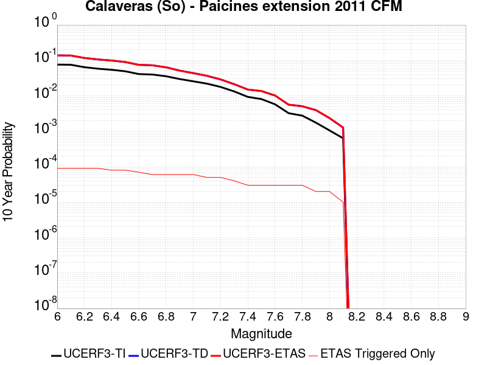 |

| Magnitude | 1 wk TI Prob | 1 wk TD Prob | 1 wk ETAS Prob | 1 wk ETAS/TD Gain | 1 wk ETAS Triggered Only | 1 mo TI Prob | 1 mo TD Prob | 1 mo ETAS Prob | 1 mo ETAS/TD Gain | 1 mo ETAS Triggered Only | 1 yr TI Prob | 1 yr TD Prob | 1 yr ETAS Prob | 1 yr ETAS/TD Gain | 1 yr ETAS Triggered Only | 10 yr TI Prob | 10 yr TD Prob | 10 yr ETAS Prob | 10 yr ETAS/TD Gain | 10 yr ETAS Triggered Only |
|-----|-----|-----|-----|-----|-----|-----|-----|-----|-----|-----|-----|-----|-----|-----|-----|-----|-----|-----|-----|-----|
| 6.0 | 1.5183659E-4 | 3.0533716E-4 | 3.67705E-4 | 1.204259 | 6.238693E-5 | 6.5056595E-4 | 0.0013069661 | 0.0013692715 | 1.0476718 | 6.238693E-5 | 0.007891912 | 0.01569571 | 0.015803173 | 1.0068467 | 1.0917712E-4 | 0.076174594 | 0.13848671 | 0.13859421 | 1.0007762 | 1.2477385E-4 |
| 6.1 | 1.5024997E-4 | 3.0227835E-4 | 3.6464643E-4 | 1.2063266 | 6.238693E-5 | 6.437695E-4 | 0.00129387 | 0.0013561762 | 1.048155 | 6.238693E-5 | 0.0078097614 | 0.015539104 | 0.015646584 | 1.0069168 | 1.0917712E-4 | 0.075409345 | 0.13715632 | 0.13726398 | 1.000785 | 1.2477385E-4 |
| 6.2 | 1.2743923E-4 | 2.5306802E-4 | 3.1543916E-4 | 1.24646 | 6.238693E-5 | 5.460538E-4 | 0.0010841049 | 0.0011464242 | 1.0574845 | 6.238693E-5 | 0.0066279583 | 0.013046704 | 0.013154456 | 1.008259 | 1.0917712E-4 | 0.064337276 | 0.11725405 | 0.11736419 | 1.0009394 | 1.2477385E-4 |
| 6.3 | 1.1525114E-4 | 2.2595265E-4 | 2.8832548E-4 | 1.2760438 | 6.238693E-5 | 4.9383997E-4 | 9.6799526E-4 | 0.0010303218 | 1.0643872 | 6.238693E-5 | 0.0059959386 | 0.011667927 | 0.01177583 | 1.0092479 | 1.0917712E-4 | 0.058367174 | 0.10637007 | 0.106481574 | 1.0010482 | 1.2477385E-4 |
| 6.4 | 1.07200925E-4 | 2.0836305E-4 | 2.551435E-4 | 1.2245141 | 4.6790192E-5 | 4.5935164E-4 | 8.926636E-4 | 9.3941204E-4 | 1.0523696 | 4.6790192E-5 | 0.0055782744 | 0.010772766 | 0.010865337 | 1.0085932 | 9.3580384E-5 | 0.0544031 | 0.09919256 | 0.09929091 | 1.0009915 | 1.0917712E-4 |
| 6.5 | 9.69631E-5 | 1.8729115E-4 | 2.3407259E-4 | 1.2497792 | 4.6790192E-5 | 4.1548995E-4 | 8.024135E-4 | 8.491661E-4 | 1.0582651 | 4.6790192E-5 | 0.0050468626 | 0.009694662 | 0.009787335 | 1.0095592 | 9.3580384E-5 | 0.04933773 | 0.090084255 | 0.0901836 | 1.0011028 | 1.0917712E-4 |
| 6.6 | 8.0552316E-5 | 1.5070537E-4 | 1.8189414E-4 | 1.2069519 | 3.1193464E-5 | 3.4517853E-4 | 6.456994E-4 | 6.768727E-4 | 1.0482783 | 3.1193464E-5 | 0.0041944524 | 0.007826256 | 0.007903629 | 1.0098864 | 7.7983656E-5 | 0.04116161 | 0.074854024 | 0.0749406 | 1.0011566 | 9.3580384E-5 |
| 6.7 | 7.815757E-5 | 1.4610609E-4 | 1.7729499E-4 | 1.2134675 | 3.1193464E-5 | 3.34918E-4 | 6.260017E-4 | 6.571756E-4 | 1.0497985 | 3.1193464E-5 | 0.004070005 | 0.0075890915 | 0.007651005 | 1.0081582 | 6.238693E-5 | 0.039962657 | 0.072703585 | 0.0727759 | 1.0009947 | 7.7983656E-5 |
| 6.8 | 6.965264E-5 | 1.2721405E-4 | 1.5840353E-4 | 1.2451733 | 3.1193464E-5 | 2.9847719E-4 | 5.450839E-4 | 5.762603E-4 | 1.0571957 | 3.1193464E-5 | 0.0036279052 | 0.00661342 | 0.006675394 | 1.009371 | 6.238693E-5 | 0.03569247 | 0.06379891 | 0.06387192 | 1.0011444 | 7.7983656E-5 |
| 6.9 | 5.8000453E-5 | 1.01435086E-4 | 1.3262538E-4 | 1.3074902 | 3.1193464E-5 | 2.4854968E-4 | 4.3464993E-4 | 4.6582983E-4 | 1.0717356 | 3.1193464E-5 | 0.0030218933 | 0.0052791284 | 0.005341186 | 1.0117552 | 6.238693E-5 | 0.029811295 | 0.051501602 | 0.05157557 | 1.0014362 | 7.7983656E-5 |
| 7.0 | 4.9865852E-5 | 8.567692E-5 | 1.16867704E-4 | 1.3640512 | 3.1193464E-5 | 2.1369329E-4 | 3.671356E-4 | 3.983176E-4 | 1.0849333 | 3.1193464E-5 | 0.0025986114 | 0.0044608037 | 0.004522912 | 1.0139232 | 6.238693E-5 | 0.025684336 | 0.043781694 | 0.043856263 | 1.0017033 | 7.7983656E-5 |
| 7.1 | 4.283875E-5 | 7.112159E-5 | 1.02312835E-4 | 1.4385623 | 3.1193464E-5 | 1.8358172E-4 | 3.047715E-4 | 3.3595547E-4 | 1.1023191 | 3.1193464E-5 | 0.0022328163 | 0.003704336 | 0.003766492 | 1.0167792 | 6.238693E-5 | 0.022105146 | 0.03673583 | 0.036795925 | 1.0016359 | 6.238693E-5 |
| 7.2 | 3.450115E-5 | 5.5776054E-5 | 8.6967775E-5 | 1.5592314 | 3.1193464E-5 | 1.478537E-4 | 2.390185E-4 | 2.702045E-4 | 1.1304753 | 3.1193464E-5 | 0.0017986323 | 0.0029061958 | 0.0029684014 | 1.0214045 | 6.238693E-5 | 0.017841442 | 0.029079199 | 0.02913977 | 1.0020831 | 6.238693E-5 |
| 7.3 | 2.5709045E-5 | 4.0588155E-5 | 7.178035E-5 | 1.7685049 | 3.1193464E-5 | 1.1017697E-4 | 1.7393773E-4 | 2.0512578E-4 | 1.1793058 | 3.1193464E-5 | 0.0013405791 | 0.002115652 | 0.002177907 | 1.0294259 | 6.238693E-5 | 0.013325208 | 0.021297242 | 0.0213583 | 1.002867 | 6.238693E-5 |
| 7.4 | 1.8003093E-5 | 2.8509934E-5 | 4.4106222E-5 | 1.5470474 | 1.5596732E-5 | 7.715383E-5 | 1.2217973E-4 | 1.3777455E-4 | 1.1276385 | 1.5596732E-5 | 9.3894306E-4 | 0.0014865254 | 0.001533246 | 1.0314294 | 4.6790192E-5 | 0.009349857 | 0.015052196 | 0.015098282 | 1.0030618 | 4.6790192E-5 |
| 7.5 | 1.5595824E-5 | 2.5822499E-5 | 4.1418825E-5 | 1.6039821 | 1.5596732E-5 | 6.683753E-5 | 1.1066317E-4 | 1.2625818E-4 | 1.1409231 | 1.5596732E-5 | 8.134431E-4 | 0.0013464936 | 0.0013932207 | 1.0347029 | 4.6790192E-5 | 0.008104719 | 0.01365213 | 0.013698282 | 1.0033805 | 4.6790192E-5 |
| 7.6 | 1.1110309E-5 | 1.9222098E-5 | 3.4818528E-5 | 1.8113803 | 1.5596732E-5 | 4.761474E-5 | 8.2377825E-5 | 9.797327E-5 | 1.189316 | 1.5596732E-5 | 5.795553E-4 | 0.0010024898 | 0.0010492331 | 1.0466272 | 4.6790192E-5 | 0.0057804612 | 0.010203943 | 0.010250255 | 1.0045387 | 4.6790192E-5 |
| 7.7 | 6.2140443E-6 | 1.0437076E-5 | 2.6033644E-5 | 2.4943428 | 1.5596732E-5 | 2.6631347E-5 | 4.4729557E-5 | 6.032559E-5 | 1.3486739 | 1.5596732E-5 | 3.241884E-4 | 5.444464E-4 | 5.9121114E-4 | 1.0858941 | 4.6790192E-5 | 0.0032371588 | 0.005619835 | 0.005666362 | 1.0082791 | 4.6790192E-5 |
| 7.8 | 5.305533E-6 | 9.433038E-6 | 2.5029622E-5 | 2.6534 | 1.5596732E-5 | 2.27378E-5 | 4.042668E-5 | 5.6022778E-5 | 1.3857874 | 1.5596732E-5 | 2.7679754E-4 | 4.920837E-4 | 5.388509E-4 | 1.095039 | 4.6790192E-5 | 0.0027645302 | 0.005074324 | 0.005120877 | 1.0091742 | 4.6790192E-5 |
| 7.9 | 3.363505E-6 | 7.3848937E-6 | 2.2981509E-5 | 3.111962 | 1.5596732E-5 | 1.4414942E-5 | 3.164916E-5 | 4.7245398E-5 | 1.4927852 | 1.5596732E-5 | 1.7548777E-4 | 3.8526047E-4 | 4.1644194E-4 | 1.080936 | 3.1193464E-5 | 0.0017534926 | 0.003948527 | 0.0039795972 | 1.0078689 | 3.1193464E-5 |
| 8.0 | 2.0271132E-6 | 4.413104E-6 | 2.0009766E-5 | 4.5341706 | 1.5596732E-5 | 8.687599E-6 | 1.8913164E-5 | 3.45096E-5 | 1.8246338 | 1.5596732E-5 | 1.05766376E-4 | 2.302435E-4 | 2.6142978E-4 | 1.1354492 | 3.1193464E-5 | 0.0010571606 | 0.002351099 | 0.002382219 | 1.0132364 | 3.1193464E-5 |
| 8.1 | 1.2206116E-6 | 2.3751331E-6 | 1.7971826E-5 | 7.566661 | 1.5596732E-5 | 5.2311816E-6 | 1.0179103E-5 | 2.5775675E-5 | 2.5322149 | 1.5596732E-5 | 6.3687774E-5 | 1.2392356E-4 | 1.3951836E-4 | 1.1258421 | 1.5596732E-5 | 6.366953E-4 | 0.0012705477 | 0.0012861247 | 1.01226 | 1.5596732E-5 |

## Elysian Park (Upper)
*[(top)](#table-of-contents)*

| 1 Week | 1 Month | 1 Year | 10 Year |
|-----|-----|-----|-----|
|  |  | 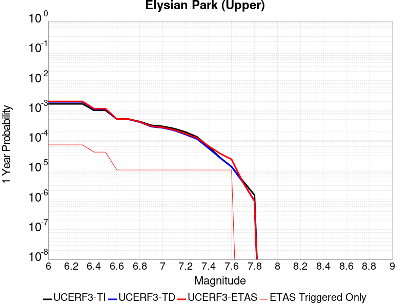 |  |

| Magnitude | 1 wk TI Prob | 1 wk TD Prob | 1 wk ETAS Prob | 1 wk ETAS/TD Gain | 1 wk ETAS Triggered Only | 1 mo TI Prob | 1 mo TD Prob | 1 mo ETAS Prob | 1 mo ETAS/TD Gain | 1 mo ETAS Triggered Only | 1 yr TI Prob | 1 yr TD Prob | 1 yr ETAS Prob | 1 yr ETAS/TD Gain | 1 yr ETAS Triggered Only | 10 yr TI Prob | 10 yr TD Prob | 10 yr ETAS Prob | 10 yr ETAS/TD Gain | 10 yr ETAS Triggered Only |
|-----|-----|-----|-----|-----|-----|-----|-----|-----|-----|-----|-----|-----|-----|-----|-----|-----|-----|-----|-----|-----|
| 6.0 | 3.1876025E-5 | 3.7035516E-5 | 8.382397E-5 | 2.2633405 | 4.6790192E-5 | 1.3660437E-4 | 1.587167E-4 | 2.2109374E-4 | 1.3930086 | 6.238693E-5 | 0.0016618895 | 0.0019311075 | 0.001993374 | 1.0322438 | 6.238693E-5 | 0.016495159 | 0.019189782 | 0.01932746 | 1.0071745 | 1.4037058E-4 |
| 6.1 | 3.1876025E-5 | 3.7035516E-5 | 8.382397E-5 | 2.2633405 | 4.6790192E-5 | 1.3660437E-4 | 1.587167E-4 | 2.2109374E-4 | 1.3930086 | 6.238693E-5 | 0.0016618895 | 0.0019311075 | 0.001993374 | 1.0322438 | 6.238693E-5 | 0.016495159 | 0.019189782 | 0.01932746 | 1.0071745 | 1.4037058E-4 |
| 6.2 | 3.1876025E-5 | 3.7035516E-5 | 8.382397E-5 | 2.2633405 | 4.6790192E-5 | 1.3660437E-4 | 1.587167E-4 | 2.2109374E-4 | 1.3930086 | 6.238693E-5 | 0.0016618895 | 0.0019311075 | 0.001993374 | 1.0322438 | 6.238693E-5 | 0.016495159 | 0.019189782 | 0.01932746 | 1.0071745 | 1.4037058E-4 |
| 6.3 | 3.1876025E-5 | 3.7035516E-5 | 8.382397E-5 | 2.2633405 | 4.6790192E-5 | 1.3660437E-4 | 1.587167E-4 | 2.2109374E-4 | 1.3930086 | 6.238693E-5 | 0.0016618895 | 0.0019311075 | 0.001993374 | 1.0322438 | 6.238693E-5 | 0.016495159 | 0.019189782 | 0.01932746 | 1.0071745 | 1.4037058E-4 |
| 6.4 | 1.9273462E-5 | 2.1202266E-5 | 5.2395066E-5 | 2.4712012 | 3.1193464E-5 | 8.259794E-5 | 9.086466E-5 | 1.22055295E-4 | 1.3432647 | 3.1193464E-5 | 0.001005166 | 0.0011058892 | 0.0011370482 | 1.0281755 | 3.1193464E-5 | 0.010006315 | 0.011020724 | 0.011113273 | 1.0083977 | 9.3580384E-5 |
| 6.5 | 1.9273462E-5 | 2.1202266E-5 | 5.2395066E-5 | 2.4712012 | 3.1193464E-5 | 8.259794E-5 | 9.086466E-5 | 1.22055295E-4 | 1.3432647 | 3.1193464E-5 | 0.001005166 | 0.0011058892 | 0.0011370482 | 1.0281755 | 3.1193464E-5 | 0.010006315 | 0.011020724 | 0.011113273 | 1.0083977 | 9.3580384E-5 |
| 6.6 | 9.813258E-6 | 9.665599E-6 | 9.665599E-6 | 1.0 | 0.0 | 4.205614E-5 | 4.1423376E-5 | 4.1423376E-5 | 1.0 | 0.0 | 5.119132E-4 | 5.0422014E-4 | 5.0422014E-4 | 1.0 | 0.0 | 0.005107356 | 0.0050314846 | 0.0050780396 | 1.0092527 | 4.6790192E-5 |
| 6.7 | 9.801478E-6 | 9.653168E-6 | 9.653168E-6 | 1.0 | 0.0 | 4.2005657E-5 | 4.1370105E-5 | 4.1370105E-5 | 1.0 | 0.0 | 5.112989E-4 | 5.035719E-4 | 5.035719E-4 | 1.0 | 0.0 | 0.0051012407 | 0.0050250315 | 0.0050715865 | 1.0092646 | 4.6790192E-5 |
| 6.8 | 8.102489E-6 | 7.773004E-6 | 7.773004E-6 | 1.0 | 0.0 | 3.4724493E-5 | 3.3312477E-5 | 3.3312477E-5 | 1.0 | 0.0 | 4.2268867E-4 | 4.055089E-4 | 4.055089E-4 | 1.0 | 0.0 | 0.004218856 | 0.0040481836 | 0.0040792506 | 1.0076743 | 3.1193464E-5 |
| 6.9 | 6.08275E-6 | 5.4814514E-6 | 5.4814514E-6 | 1.0 | 0.0 | 2.6068668E-5 | 2.3491726E-5 | 2.3491726E-5 | 1.0 | 0.0 | 3.173398E-4 | 2.85975E-4 | 2.85975E-4 | 1.0 | 0.0 | 0.0031688702 | 0.0028561477 | 0.0028716999 | 1.0054451 | 1.5596732E-5 |
| 7.0 | 5.5995934E-6 | 4.98278E-6 | 4.98278E-6 | 1.0 | 0.0 | 2.3998036E-5 | 2.13546E-5 | 2.13546E-5 | 1.0 | 0.0 | 2.9213692E-4 | 2.599619E-4 | 2.599619E-4 | 1.0 | 0.0 | 0.0029175316 | 0.0025966454 | 0.0025966454 | 1.0 | 0.0 |
| 7.1 | 4.709881E-6 | 4.0874015E-6 | 4.0874015E-6 | 1.0 | 0.0 | 2.0185047E-5 | 1.7517319E-5 | 1.7517319E-5 | 1.0 | 0.0 | 2.4572524E-4 | 2.132529E-4 | 2.132529E-4 | 1.0 | 0.0 | 0.002454537 | 0.002130524 | 0.002130524 | 1.0 | 0.0 |
| 7.2 | 3.6063436E-6 | 2.9779544E-6 | 2.9779544E-6 | 1.0 | 0.0 | 1.5455667E-5 | 1.27626E-5 | 1.27626E-5 | 1.0 | 0.0 | 1.881565E-4 | 1.5537368E-4 | 1.5537368E-4 | 1.0 | 0.0 | 0.0018799726 | 0.0015526618 | 0.0015526618 | 1.0 | 0.0 |
| 7.3 | 2.471135E-6 | 2.0954615E-6 | 2.0954615E-6 | 1.0 | 0.0 | 1.0590536E-5 | 8.980519E-6 | 8.980519E-6 | 1.0 | 0.0 | 1.2893214E-4 | 1.093324E-4 | 1.093324E-4 | 1.0 | 0.0 | 0.0012885736 | 0.0010927934 | 0.0010927934 | 1.0 | 0.0 |
| 7.4 | 1.163943E-6 | 1.0275091E-6 | 1.0275091E-6 | 1.0 | 0.0 | 4.988318E-6 | 4.4036033E-6 | 4.4036033E-6 | 1.0 | 0.0 | 6.0731076E-5 | 5.3612584E-5 | 5.3612584E-5 | 1.0 | 0.0 | 6.071448E-4 | 5.359995E-4 | 5.359995E-4 | 1.0 | 0.0 |
| 7.5 | 4.99459E-7 | 4.917604E-7 | 4.917604E-7 | 1.0 | 0.0 | 2.140537E-6 | 2.1075427E-6 | 2.1075427E-6 | 1.0 | 0.0 | 2.6060725E-5 | 2.5659048E-5 | 2.5659048E-5 | 1.0 | 0.0 | 2.605767E-4 | 2.5656243E-4 | 2.5656243E-4 | 1.0 | 0.0 |
| 7.6 | 2.4667852E-7 | 2.4778336E-7 | 2.4778336E-7 | 1.0 | 0.0 | 1.0571932E-6 | 1.0619283E-6 | 1.0619283E-6 | 1.0 | 0.0 | 1.2871251E-5 | 1.2928905E-5 | 1.2928905E-5 | 1.0 | 0.0 | 1.2870505E-4 | 1.2928189E-4 | 1.2928189E-4 | 1.0 | 0.0 |
| 7.7 | 8.2312795E-8 | 7.3864456E-8 | 7.3864456E-8 | 1.0 | 0.0 | 3.527691E-7 | 3.165619E-7 | 3.165619E-7 | 1.0 | 0.0 | 4.294955E-6 | 3.8541357E-6 | 3.8541357E-6 | 1.0 | 0.0 | 4.2948723E-5 | 3.8540802E-5 | 3.8540802E-5 | 1.0 | 0.0 |
| 7.8 | 2.7819295E-8 | 1.7566023E-8 | 1.7566023E-8 | 1.0 | 0.0 | 1.1922555E-7 | 7.5282955E-8 | 7.5282955E-8 | 1.0 | 0.0 | 1.45157E-6 | 9.165697E-7 | 9.165697E-7 | 1.0 | 0.0 | 1.45156055E-5 | 9.165675E-6 | 9.165675E-6 | 1.0 | 0.0 |

## White Mountains
*[(top)](#table-of-contents)*

| 1 Week | 1 Month | 1 Year | 10 Year |
|-----|-----|-----|-----|
|  |  |  |  |

| Magnitude | 1 wk TI Prob | 1 wk TD Prob | 1 wk ETAS Prob | 1 wk ETAS/TD Gain | 1 wk ETAS Triggered Only | 1 mo TI Prob | 1 mo TD Prob | 1 mo ETAS Prob | 1 mo ETAS/TD Gain | 1 mo ETAS Triggered Only | 1 yr TI Prob | 1 yr TD Prob | 1 yr ETAS Prob | 1 yr ETAS/TD Gain | 1 yr ETAS Triggered Only | 10 yr TI Prob | 10 yr TD Prob | 10 yr ETAS Prob | 10 yr ETAS/TD Gain | 10 yr ETAS Triggered Only |
|-----|-----|-----|-----|-----|-----|-----|-----|-----|-----|-----|-----|-----|-----|-----|-----|-----|-----|-----|-----|-----|
| 6.0 | 3.503579E-5 | 3.378405E-5 | 8.057266E-5 | 2.384932 | 4.6790192E-5 | 1.5014476E-4 | 1.4478143E-4 | 2.227538E-4 | 1.5385522 | 7.7983656E-5 | 0.0018264796 | 0.0017614096 | 0.0018859636 | 1.0707127 | 1.2477385E-4 | 0.018115403 | 0.017486818 | 0.017640058 | 1.0087632 | 1.5596731E-4 |
| 6.1 | 3.503579E-5 | 3.378405E-5 | 8.057266E-5 | 2.384932 | 4.6790192E-5 | 1.5014476E-4 | 1.4478143E-4 | 2.227538E-4 | 1.5385522 | 7.7983656E-5 | 0.0018264796 | 0.0017614096 | 0.0018859636 | 1.0707127 | 1.2477385E-4 | 0.018115403 | 0.017486818 | 0.017640058 | 1.0087632 | 1.5596731E-4 |
| 6.2 | 3.503579E-5 | 3.378405E-5 | 8.057266E-5 | 2.384932 | 4.6790192E-5 | 1.5014476E-4 | 1.4478143E-4 | 2.227538E-4 | 1.5385522 | 7.7983656E-5 | 0.0018264796 | 0.0017614096 | 0.0018859636 | 1.0707127 | 1.2477385E-4 | 0.018115403 | 0.017486818 | 0.017640058 | 1.0087632 | 1.5596731E-4 |
| 6.3 | 1.7818425E-5 | 1.5916074E-5 | 1.5916074E-5 | 1.0 | 0.0 | 7.636245E-5 | 6.821004E-5 | 9.9401375E-5 | 1.4572836 | 3.1193464E-5 | 9.293162E-4 | 8.301551E-4 | 8.9249026E-4 | 1.0750885 | 6.238693E-5 | 0.009254395 | 0.008271999 | 0.008349338 | 1.0093495 | 7.7983656E-5 |
| 6.4 | 1.7818425E-5 | 1.5916074E-5 | 1.5916074E-5 | 1.0 | 0.0 | 7.636245E-5 | 6.821004E-5 | 9.9401375E-5 | 1.4572836 | 3.1193464E-5 | 9.293162E-4 | 8.301551E-4 | 8.9249026E-4 | 1.0750885 | 6.238693E-5 | 0.009254395 | 0.008271999 | 0.008349338 | 1.0093495 | 7.7983656E-5 |
| 6.5 | 1.3397557E-5 | 1.13362685E-5 | 1.13362685E-5 | 1.0 | 0.0 | 5.741684E-5 | 4.858314E-5 | 7.977509E-5 | 1.6420323 | 3.1193464E-5 | 6.988258E-4 | 5.913462E-4 | 6.5369625E-4 | 1.1054374 | 6.238693E-5 | 0.006966323 | 0.005898432 | 0.0059759556 | 1.0131431 | 7.7983656E-5 |
| 6.6 | 1.0818695E-5 | 8.625366E-6 | 8.625366E-6 | 1.0 | 0.0 | 4.6365014E-5 | 3.6965357E-5 | 6.8157664E-5 | 1.8438255 | 3.1193464E-5 | 5.6434784E-4 | 4.4996463E-4 | 4.9673376E-4 | 1.1039395 | 4.6790192E-5 | 0.005629168 | 0.004490972 | 0.004537552 | 1.0103719 | 4.6790192E-5 |
| 6.7 | 9.067908E-6 | 6.802442E-6 | 6.802442E-6 | 1.0 | 0.0 | 3.8861883E-5 | 2.9153016E-5 | 4.4749293E-5 | 1.5349798 | 1.5596732E-5 | 4.7304068E-4 | 3.5488335E-4 | 3.8606575E-4 | 1.0878665 | 3.1193464E-5 | 0.00472035 | 0.0035434833 | 0.0035745662 | 1.0087719 | 3.1193464E-5 |
| 6.8 | 7.295947E-6 | 4.936391E-6 | 4.936391E-6 | 1.0 | 0.0 | 3.126797E-5 | 2.1155796E-5 | 3.6752197E-5 | 1.7372165 | 1.5596732E-5 | 3.8062103E-4 | 2.575425E-4 | 2.8872793E-4 | 1.1210885 | 3.1193464E-5 | 0.0037996976 | 0.0025725532 | 0.0026036666 | 1.0120943 | 3.1193464E-5 |
| 6.9 | 6.2243444E-6 | 3.832213E-6 | 3.832213E-6 | 1.0 | 0.0 | 2.6675489E-5 | 1.642367E-5 | 1.642367E-5 | 1.0 | 0.0 | 3.2472567E-4 | 1.9994036E-4 | 1.9994036E-4 | 1.0 | 0.0 | 0.0032425157 | 0.0019976576 | 0.0019976576 | 1.0 | 0.0 |
| 7.0 | 4.9878413E-6 | 2.6795342E-6 | 2.6795342E-6 | 1.0 | 0.0 | 2.1376287E-5 | 1.14836685E-5 | 1.14836685E-5 | 1.0 | 0.0 | 2.602252E-4 | 1.3980496E-4 | 1.3980496E-4 | 1.0 | 0.0 | 0.002599207 | 0.0013971963 | 0.0013971963 | 1.0 | 0.0 |
| 7.1 | 4.0252844E-6 | 1.8857575E-6 | 1.8857575E-6 | 1.0 | 0.0 | 1.7251105E-5 | 8.081794E-6 | 8.081794E-6 | 1.0 | 0.0 | 2.1001195E-4 | 9.8391516E-5 | 9.8391516E-5 | 1.0 | 0.0 | 0.0020981359 | 9.834924E-4 | 9.834924E-4 | 1.0 | 0.0 |
| 7.2 | 3.3284066E-6 | 1.281964E-6 | 1.281964E-6 | 1.0 | 0.0 | 1.4264522E-5 | 5.494121E-6 | 5.494121E-6 | 1.0 | 0.0 | 1.736567E-4 | 6.688897E-5 | 6.688897E-5 | 1.0 | 0.0 | 0.0017352107 | 6.6869846E-4 | 6.6869846E-4 | 1.0 | 0.0 |
| 7.3 | 2.458226E-6 | 6.05722E-7 | 6.05722E-7 | 1.0 | 0.0 | 1.0535211E-5 | 2.5959491E-6 | 2.5959491E-6 | 1.0 | 0.0 | 1.2825865E-4 | 3.1605257E-5 | 3.1605257E-5 | 1.0 | 0.0 | 0.0012818464 | 3.160114E-4 | 3.160114E-4 | 1.0 | 0.0 |
| 7.4 | 1.965953E-6 | 3.1089303E-7 | 3.1089303E-7 | 1.0 | 0.0 | 8.425486E-6 | 1.332398E-6 | 1.332398E-6 | 1.0 | 0.0 | 1.0257547E-4 | 1.6221828E-5 | 1.6221828E-5 | 1.0 | 0.0 | 0.0010252813 | 1.6220656E-4 | 1.6220656E-4 | 1.0 | 0.0 |
| 7.5 | 1.2014192E-6 | 1.8244253E-7 | 1.8244253E-7 | 1.0 | 0.0 | 5.148929E-6 | 7.8189635E-7 | 7.8189635E-7 | 1.0 | 0.0 | 6.2686406E-5 | 9.519547E-6 | 9.519547E-6 | 1.0 | 0.0 | 6.266873E-4 | 9.519148E-5 | 9.519148E-5 | 1.0 | 0.0 |
| 7.6 | 2.5612175E-7 | 4.8946475E-8 | 4.8946475E-8 | 1.0 | 0.0 | 1.0976642E-6 | 2.0977059E-7 | 2.0977059E-7 | 1.0 | 0.0 | 1.3363979E-5 | 2.5539543E-6 | 2.5539543E-6 | 1.0 | 0.0 | 1.3363175E-4 | 2.5539286E-5 | 2.5539286E-5 | 1.0 | 0.0 |

## Big Pine (Central)
*[(top)](#table-of-contents)*

| 1 Week | 1 Month | 1 Year | 10 Year |
|-----|-----|-----|-----|
|  |  |  |  |

| Magnitude | 1 wk TI Prob | 1 wk TD Prob | 1 wk ETAS Prob | 1 wk ETAS/TD Gain | 1 wk ETAS Triggered Only | 1 mo TI Prob | 1 mo TD Prob | 1 mo ETAS Prob | 1 mo ETAS/TD Gain | 1 mo ETAS Triggered Only | 1 yr TI Prob | 1 yr TD Prob | 1 yr ETAS Prob | 1 yr ETAS/TD Gain | 1 yr ETAS Triggered Only | 10 yr TI Prob | 10 yr TD Prob | 10 yr ETAS Prob | 10 yr ETAS/TD Gain | 10 yr ETAS Triggered Only |
|-----|-----|-----|-----|-----|-----|-----|-----|-----|-----|-----|-----|-----|-----|-----|-----|-----|-----|-----|-----|-----|
| 6.0 | 1.2706755E-5 | 1.4250529E-5 | 4.5443547E-5 | 3.1889026 | 3.1193464E-5 | 5.4456385E-5 | 6.107247E-5 | 9.2264025E-5 | 1.5107303 | 3.1193464E-5 | 6.628048E-4 | 7.433402E-4 | 7.900956E-4 | 1.0628991 | 4.6790192E-5 | 0.006608314 | 0.0074135666 | 0.0075374157 | 1.0167058 | 1.2477385E-4 |
| 6.1 | 8.342579E-6 | 9.510762E-6 | 2.5107343E-5 | 2.6398878 | 1.5596732E-5 | 3.5753423E-5 | 4.0759893E-5 | 5.6355988E-5 | 1.3826333 | 1.5596732E-5 | 4.3521097E-4 | 4.961604E-4 | 5.117494E-4 | 1.0314193 | 1.5596732E-5 | 0.0043435963 | 0.0049540824 | 0.00501616 | 1.0125307 | 6.238693E-5 |
| 6.2 | 6.923899E-6 | 7.967147E-6 | 2.3563754E-5 | 2.957615 | 1.5596732E-5 | 2.9673516E-5 | 3.4144578E-5 | 4.974078E-5 | 1.4567693 | 1.5596732E-5 | 3.6121515E-4 | 4.156502E-4 | 4.3124042E-4 | 1.0375081 | 1.5596732E-5 | 0.003606286 | 0.0041520367 | 0.0041986327 | 1.0112225 | 4.6790192E-5 |
| 6.3 | 2.728396E-6 | 3.4242908E-6 | 1.9020968E-5 | 5.5547175 | 1.5596732E-5 | 1.1693074E-5 | 1.4675454E-5 | 3.0271956E-5 | 2.062761 | 1.5596732E-5 | 1.4235388E-4 | 1.7865987E-4 | 1.9425382E-4 | 1.0872829 | 1.5596732E-5 | 0.0014226272 | 0.0017866704 | 0.001833377 | 1.0261416 | 4.6790192E-5 |
| 6.4 | 2.7136944E-6 | 3.408584E-6 | 1.9005261E-5 | 5.5757055 | 1.5596732E-5 | 1.1630066E-5 | 1.4608141E-5 | 3.0204645E-5 | 2.0676584 | 1.5596732E-5 | 1.4158686E-4 | 1.7784047E-4 | 1.9343442E-4 | 1.0876851 | 1.5596732E-5 | 0.0014149669 | 0.0017784894 | 0.0018251964 | 1.0262622 | 4.6790192E-5 |
| 6.5 | 2.6971882E-6 | 3.3909291E-6 | 1.8987606E-5 | 5.5995293 | 1.5596732E-5 | 1.1559327E-5 | 1.45324775E-5 | 3.0128982E-5 | 2.0732172 | 1.5596732E-5 | 1.4072572E-4 | 1.7691942E-4 | 1.925134E-4 | 1.0881417 | 1.5596732E-5 | 0.0014063664 | 0.0017692937 | 0.0018160011 | 1.0263989 | 4.6790192E-5 |
| 6.6 | 2.669092E-6 | 3.3609497E-6 | 1.8957628E-5 | 5.640557 | 1.5596732E-5 | 1.1438916E-5 | 1.4403995E-5 | 3.0000501E-5 | 2.0827904 | 1.5596732E-5 | 1.3925991E-4 | 1.753554E-4 | 1.909494E-4 | 1.088928 | 1.5596732E-5 | 0.0013917267 | 0.0017536782 | 0.0018003864 | 1.0266343 | 4.6790192E-5 |
| 6.7 | 2.6408059E-6 | 3.3309752E-6 | 1.8927654E-5 | 5.682316 | 1.5596732E-5 | 1.1317691E-5 | 1.4275535E-5 | 2.9872044E-5 | 2.092534 | 1.5596732E-5 | 1.3778417E-4 | 1.7379165E-4 | 1.8938567E-4 | 1.0897282 | 1.5596732E-5 | 0.0013769877 | 0.0017380653 | 0.0017847741 | 1.0268741 | 4.6790192E-5 |
| 6.8 | 2.1786943E-6 | 2.8544325E-6 | 1.845112E-5 | 6.4640236 | 1.5596732E-5 | 9.337228E-6 | 1.2233229E-5 | 2.782977E-5 | 2.2749324 | 1.5596732E-5 | 1.1367482E-4 | 1.4893012E-4 | 1.6452452E-4 | 1.1047096 | 1.5596732E-5 | 0.0011361669 | 0.0014897975 | 0.001536518 | 1.0313603 | 4.6790192E-5 |
| 6.9 | 1.4411696E-6 | 2.068499E-6 | 1.7665197E-5 | 8.540104 | 1.5596732E-5 | 6.1764263E-6 | 8.864968E-6 | 2.446156E-5 | 2.7593515 | 1.5596732E-5 | 7.51954E-5 | 1.079259E-4 | 1.2352095E-4 | 1.1444978 | 1.5596732E-5 | 7.5169955E-4 | 0.0010801847 | 0.0011269243 | 1.0432701 | 4.6790192E-5 |
| 7.0 | 1.0073411E-6 | 1.554261E-6 | 1.7150967E-5 | 11.034805 | 1.5596732E-5 | 4.317169E-6 | 6.6611024E-6 | 2.225773E-5 | 3.3414483 | 1.5596732E-5 | 5.2560266E-5 | 8.1096056E-5 | 9.6691525E-5 | 1.1923085 | 1.5596732E-5 | 5.2547833E-4 | 8.1210316E-4 | 8.4327126E-4 | 1.0383795 | 3.1193464E-5 |
| 7.1 | 8.947104E-7 | 1.4302494E-6 | 1.7026958E-5 | 11.904887 | 1.5596732E-5 | 3.834468E-6 | 6.129627E-6 | 2.1726262E-5 | 3.5444674 | 1.5596732E-5 | 4.6683643E-5 | 7.46258E-5 | 9.0221365E-5 | 1.2089835 | 1.5596732E-5 | 4.6673836E-4 | 7.474457E-4 | 7.786158E-4 | 1.0417023 | 3.1193464E-5 |
| 7.2 | 5.215166E-7 | 1.0111678E-6 | 1.6607883E-5 | 16.424458 | 1.5596732E-5 | 2.2350691E-6 | 4.3335694E-6 | 1.9930232E-5 | 4.599034 | 1.5596732E-5 | 2.7211627E-5 | 5.2759973E-5 | 6.835588E-5 | 1.2956011 | 1.5596732E-5 | 2.7208295E-4 | 5.2890263E-4 | 5.600796E-4 | 1.0589465 | 3.1193464E-5 |
| 7.3 | 4.4024807E-7 | 9.219589E-7 | 1.6518676E-5 | 17.916933 | 1.5596732E-5 | 1.8867761E-6 | 3.9512465E-6 | 1.9547915E-5 | 4.947278 | 1.5596732E-5 | 2.2971257E-5 | 4.810541E-5 | 6.370139E-5 | 1.3242043 | 1.5596732E-5 | 2.2968883E-4 | 4.8237795E-4 | 5.1355636E-4 | 1.0646348 | 3.1193464E-5 |
| 7.4 | 3.6130905E-7 | 8.358523E-7 | 1.643257E-5 | 19.659658 | 1.5596732E-5 | 1.5484665E-6 | 3.5822195E-6 | 1.9178895E-5 | 5.353914 | 1.5596732E-5 | 1.8852415E-5 | 4.3612687E-5 | 5.9208738E-5 | 1.3576035 | 1.5596732E-5 | 1.8850817E-4 | 4.374597E-4 | 4.6863954E-4 | 1.0712748 | 3.1193464E-5 |
| 7.5 | 3.408184E-7 | 8.108147E-7 | 1.6407534E-5 | 20.235859 | 1.5596732E-5 | 1.4606494E-6 | 3.4749157E-6 | 1.9071593E-5 | 5.488361 | 1.5596732E-5 | 1.7783263E-5 | 4.2306317E-5 | 5.7902387E-5 | 1.3686464 | 1.5596732E-5 | 1.778184E-4 | 4.2437963E-4 | 4.5555984E-4 | 1.0734725 | 3.1193464E-5 |
| 7.6 | 3.1428627E-7 | 7.7316E-7 | 1.6369879E-5 | 21.172691 | 1.5596732E-5 | 1.3469405E-6 | 3.3135389E-6 | 1.8910217E-5 | 5.706955 | 1.5596732E-5 | 1.6398877E-5 | 4.0341627E-5 | 5.593773E-5 | 1.3866007 | 1.5596732E-5 | 1.6397667E-4 | 4.0471106E-4 | 4.3589188E-4 | 1.0770447 | 3.1193464E-5 |
| 7.7 | 1.7972785E-7 | 5.077752E-7 | 1.6104499E-5 | 31.715801 | 1.5596732E-5 | 7.70262E-7 | 2.1761778E-6 | 1.7772874E-5 | 8.167014 | 1.5596732E-5 | 9.377899E-6 | 2.6494654E-5 | 4.209097E-5 | 1.588659 | 1.5596732E-5 | 9.377503E-5 | 2.662899E-4 | 2.8188247E-4 | 1.0585549 | 1.5596732E-5 |
| 7.8 | 4.9230927E-8 | 1.198079E-7 | 1.5716538E-5 | 131.18115 | 1.5596732E-5 | 2.1098968E-7 | 5.134623E-7 | 1.6110185E-5 | 31.375595 | 1.5596732E-5 | 2.5687964E-6 | 6.2513873E-6 | 2.184802E-5 | 3.4949076 | 1.5596732E-5 | 2.5687666E-5 | 6.295415E-5 | 7.854989E-5 | 1.2477319 | 1.5596732E-5 |
| 7.9 | 3.6805972E-9 | 4.105293E-9 | 4.105293E-9 | 1.0 | 0.0 | 1.5773987E-8 | 1.7594115E-8 | 1.7594115E-8 | 1.0 | 0.0 | 1.9204828E-7 | 2.1420831E-7 | 2.1420831E-7 | 1.0 | 0.0 | 1.920481E-6 | 2.1900614E-6 | 2.1900614E-6 | 1.0 | 0.0 |

## Chino alt 1
*[(top)](#table-of-contents)*

| 1 Week | 1 Month | 1 Year | 10 Year |
|-----|-----|-----|-----|
|  |  |  |  |

| Magnitude | 1 wk TI Prob | 1 wk TD Prob | 1 wk ETAS Prob | 1 wk ETAS/TD Gain | 1 wk ETAS Triggered Only | 1 mo TI Prob | 1 mo TD Prob | 1 mo ETAS Prob | 1 mo ETAS/TD Gain | 1 mo ETAS Triggered Only | 1 yr TI Prob | 1 yr TD Prob | 1 yr ETAS Prob | 1 yr ETAS/TD Gain | 1 yr ETAS Triggered Only | 10 yr TI Prob | 10 yr TD Prob | 10 yr ETAS Prob | 10 yr ETAS/TD Gain | 10 yr ETAS Triggered Only |
|-----|-----|-----|-----|-----|-----|-----|-----|-----|-----|-----|-----|-----|-----|-----|-----|-----|-----|-----|-----|-----|
| 6.0 | 3.939946E-5 | 4.8948554E-5 | 4.8948554E-5 | 1.0 | 0.0 | 1.6884391E-4 | 2.097656E-4 | 2.5654596E-4 | 1.2230127 | 4.6790192E-5 | 0.0020537362 | 0.0025513945 | 0.0026136225 | 1.0243897 | 6.238693E-5 | 0.020348595 | 0.025277847 | 0.025384264 | 1.0042099 | 1.0917712E-4 |
| 6.1 | 2.1505624E-5 | 2.6879026E-5 | 2.6879026E-5 | 1.0 | 0.0 | 9.2163704E-5 | 1.1519137E-4 | 1.4638124E-4 | 1.2707657 | 3.1193464E-5 | 0.0011215154 | 0.001401664 | 0.0014483886 | 1.0333351 | 4.6790192E-5 | 0.011158722 | 0.013945141 | 0.014037416 | 1.0066171 | 9.3580384E-5 |
| 6.2 | 2.1505624E-5 | 2.6879026E-5 | 2.6879026E-5 | 1.0 | 0.0 | 9.2163704E-5 | 1.1519137E-4 | 1.4638124E-4 | 1.2707657 | 3.1193464E-5 | 0.0011215154 | 0.001401664 | 0.0014483886 | 1.0333351 | 4.6790192E-5 | 0.011158722 | 0.013945141 | 0.014037416 | 1.0066171 | 9.3580384E-5 |
| 6.3 | 1.4290785E-5 | 1.8165128E-5 | 1.8165128E-5 | 1.0 | 0.0 | 6.1244784E-5 | 7.784848E-5 | 9.3443996E-5 | 1.2003317 | 1.5596732E-5 | 7.454001E-4 | 9.4743853E-4 | 9.6302043E-4 | 1.0164464 | 1.5596732E-5 | 0.007429048 | 0.0094444575 | 0.009490806 | 1.0049075 | 4.6790192E-5 |
| 6.4 | 1.4290785E-5 | 1.8165128E-5 | 1.8165128E-5 | 1.0 | 0.0 | 6.1244784E-5 | 7.784848E-5 | 9.3443996E-5 | 1.2003317 | 1.5596732E-5 | 7.454001E-4 | 9.4743853E-4 | 9.6302043E-4 | 1.0164464 | 1.5596732E-5 | 0.007429048 | 0.0094444575 | 0.009490806 | 1.0049075 | 4.6790192E-5 |
| 6.5 | 1.3017944E-5 | 1.6652088E-5 | 1.6652088E-5 | 1.0 | 0.0 | 5.5789995E-5 | 7.136439E-5 | 8.6960004E-5 | 1.2185351 | 1.5596732E-5 | 6.790315E-4 | 8.685589E-4 | 8.8414206E-4 | 1.0179415 | 1.5596732E-5 | 0.0067696036 | 0.008661949 | 0.008692873 | 1.00357 | 3.1193464E-5 |
| 6.6 | 9.470016E-6 | 1.2039424E-5 | 1.2039424E-5 | 1.0 | 0.0 | 4.058515E-5 | 5.1596704E-5 | 5.1596704E-5 | 1.0 | 0.0 | 4.940122E-4 | 6.280428E-4 | 6.280428E-4 | 1.0 | 0.0 | 0.004929154 | 0.0062718987 | 0.006287398 | 1.0024712 | 1.5596732E-5 |
| 6.7 | 8.314155E-6 | 1.0407736E-5 | 1.0407736E-5 | 1.0 | 0.0 | 3.5631605E-5 | 4.4604003E-5 | 4.4604003E-5 | 1.0 | 0.0 | 4.3372845E-4 | 5.429507E-4 | 5.429507E-4 | 1.0 | 0.0 | 0.004328829 | 0.005425775 | 0.005441287 | 1.002859 | 1.5596732E-5 |
| 6.8 | 3.4856364E-6 | 3.8133708E-6 | 3.8133708E-6 | 1.0 | 0.0 | 1.4938357E-5 | 1.6342927E-5 | 1.6342927E-5 | 1.0 | 0.0 | 1.8185932E-4 | 1.9895904E-4 | 1.9895904E-4 | 1.0 | 0.0 | 0.0018171056 | 0.0019894864 | 0.0019894864 | 1.0 | 0.0 |
| 6.9 | 2.2645952E-6 | 2.1529022E-6 | 2.1529022E-6 | 1.0 | 0.0 | 9.705372E-6 | 9.226692E-6 | 9.226692E-6 | 1.0 | 0.0 | 1.18156495E-4 | 1.123294E-4 | 1.123294E-4 | 1.0 | 0.0 | 0.0011809369 | 0.0011233423 | 0.0011233423 | 1.0 | 0.0 |
| 7.0 | 1.7864003E-6 | 1.5430785E-6 | 1.5430785E-6 | 1.0 | 0.0 | 7.655979E-6 | 6.613177E-6 | 6.613177E-6 | 1.0 | 0.0 | 9.3207556E-5 | 8.051251E-5 | 8.051251E-5 | 1.0 | 0.0 | 9.316847E-4 | 8.0528046E-4 | 8.0528046E-4 | 1.0 | 0.0 |
| 7.1 | 1.7315456E-6 | 1.4733511E-6 | 1.4733511E-6 | 1.0 | 0.0 | 7.420889E-6 | 6.3143466E-6 | 6.3143466E-6 | 1.0 | 0.0 | 9.034557E-5 | 7.6874516E-5 | 7.6874516E-5 | 1.0 | 0.0 | 9.0308854E-4 | 7.6891703E-4 | 7.6891703E-4 | 1.0 | 0.0 |
| 7.2 | 1.6008337E-6 | 1.3574215E-6 | 1.3574215E-6 | 1.0 | 0.0 | 6.860698E-6 | 5.817508E-6 | 5.817508E-6 | 1.0 | 0.0 | 8.352579E-5 | 7.082591E-5 | 7.082591E-5 | 1.0 | 0.0 | 8.34944E-4 | 7.0845755E-4 | 7.0845755E-4 | 1.0 | 0.0 |
| 7.3 | 1.3320939E-6 | 1.121782E-6 | 1.121782E-6 | 1.0 | 0.0 | 5.7089615E-6 | 4.807629E-6 | 4.807629E-6 | 1.0 | 0.0 | 6.9504385E-5 | 5.8531357E-5 | 5.8531357E-5 | 1.0 | 0.0 | 6.9482654E-4 | 5.8530393E-4 | 5.8530393E-4 | 1.0 | 0.0 |
| 7.4 | 1.114294E-6 | 9.237111E-7 | 9.237111E-7 | 1.0 | 0.0 | 4.775537E-6 | 3.958756E-6 | 3.958756E-6 | 1.0 | 0.0 | 5.8140613E-5 | 4.8196827E-5 | 4.8196827E-5 | 1.0 | 0.0 | 5.81254E-4 | 4.8188053E-4 | 4.8188053E-4 | 1.0 | 0.0 |
| 7.5 | 9.354081E-7 | 7.6234323E-7 | 7.6234323E-7 | 1.0 | 0.0 | 4.0088858E-6 | 3.2671815E-6 | 3.2671815E-6 | 1.0 | 0.0 | 4.8807087E-5 | 3.9777242E-5 | 3.9777242E-5 | 1.0 | 0.0 | 4.879637E-4 | 3.977046E-4 | 3.977046E-4 | 1.0 | 0.0 |
| 7.6 | 8.521771E-7 | 6.88071E-7 | 6.88071E-7 | 1.0 | 0.0 | 3.6521824E-6 | 2.9488726E-6 | 2.9488726E-6 | 1.0 | 0.0 | 4.4464414E-5 | 3.5901965E-5 | 3.5901965E-5 | 1.0 | 0.0 | 4.4455516E-4 | 3.589648E-4 | 3.589648E-4 | 1.0 | 0.0 |
| 7.7 | 2.1803626E-7 | 1.418649E-7 | 1.418649E-7 | 1.0 | 0.0 | 9.344408E-7 | 6.079923E-7 | 6.079923E-7 | 1.0 | 0.0 | 1.1376757E-5 | 7.4022914E-6 | 7.4022914E-6 | 1.0 | 0.0 | 1.13761744E-4 | 7.402141E-5 | 7.402141E-5 | 1.0 | 0.0 |

## Cleghorn
*[(top)](#table-of-contents)*

| 1 Week | 1 Month | 1 Year | 10 Year |
|-----|-----|-----|-----|
|  |  |  |  |

| Magnitude | 1 wk TI Prob | 1 wk TD Prob | 1 wk ETAS Prob | 1 wk ETAS/TD Gain | 1 wk ETAS Triggered Only | 1 mo TI Prob | 1 mo TD Prob | 1 mo ETAS Prob | 1 mo ETAS/TD Gain | 1 mo ETAS Triggered Only | 1 yr TI Prob | 1 yr TD Prob | 1 yr ETAS Prob | 1 yr ETAS/TD Gain | 1 yr ETAS Triggered Only | 10 yr TI Prob | 10 yr TD Prob | 10 yr ETAS Prob | 10 yr ETAS/TD Gain | 10 yr ETAS Triggered Only |
|-----|-----|-----|-----|-----|-----|-----|-----|-----|-----|-----|-----|-----|-----|-----|-----|-----|-----|-----|-----|-----|
| 6.0 | 7.9267165E-6 | 9.831582E-6 | 4.1024738E-5 | 4.17275 | 3.1193464E-5 | 3.39712E-5 | 4.2134732E-5 | 7.332688E-5 | 1.7402954 | 3.1193464E-5 | 4.1352084E-4 | 5.128803E-4 | 5.9082394E-4 | 1.1519724 | 7.7983656E-5 | 0.004127522 | 0.0051320773 | 0.0052562105 | 1.0241878 | 1.2477385E-4 |
| 6.1 | 7.9267165E-6 | 9.831582E-6 | 4.1024738E-5 | 4.17275 | 3.1193464E-5 | 3.39712E-5 | 4.2134732E-5 | 7.332688E-5 | 1.7402954 | 3.1193464E-5 | 4.1352084E-4 | 5.128803E-4 | 5.9082394E-4 | 1.1519724 | 7.7983656E-5 | 0.004127522 | 0.0051320773 | 0.0052562105 | 1.0241878 | 1.2477385E-4 |
| 6.2 | 7.9267165E-6 | 9.831582E-6 | 4.1024738E-5 | 4.17275 | 3.1193464E-5 | 3.39712E-5 | 4.2134732E-5 | 7.332688E-5 | 1.7402954 | 3.1193464E-5 | 4.1352084E-4 | 5.128803E-4 | 5.9082394E-4 | 1.1519724 | 7.7983656E-5 | 0.004127522 | 0.0051320773 | 0.0052562105 | 1.0241878 | 1.2477385E-4 |
| 6.3 | 7.9267165E-6 | 9.831582E-6 | 4.1024738E-5 | 4.17275 | 3.1193464E-5 | 3.39712E-5 | 4.2134732E-5 | 7.332688E-5 | 1.7402954 | 3.1193464E-5 | 4.1352084E-4 | 5.128803E-4 | 5.9082394E-4 | 1.1519724 | 7.7983656E-5 | 0.004127522 | 0.0051320773 | 0.0052562105 | 1.0241878 | 1.2477385E-4 |
| 6.4 | 4.3445207E-6 | 6.0914435E-6 | 6.0914435E-6 | 1.0 | 0.0 | 1.8619241E-5 | 2.610593E-5 | 2.610593E-5 | 1.0 | 0.0 | 2.2666567E-4 | 3.1779436E-4 | 3.6456969E-4 | 1.1471874 | 4.6790192E-5 | 0.0022643462 | 0.0031875873 | 0.0032653224 | 1.0243868 | 7.7983656E-5 |
| 6.5 | 4.3445207E-6 | 6.0914435E-6 | 6.0914435E-6 | 1.0 | 0.0 | 1.8619241E-5 | 2.610593E-5 | 2.610593E-5 | 1.0 | 0.0 | 2.2666567E-4 | 3.1779436E-4 | 3.6456969E-4 | 1.1471874 | 4.6790192E-5 | 0.0022643462 | 0.0031875873 | 0.0032653224 | 1.0243868 | 7.7983656E-5 |
| 6.6 | 4.040109E-6 | 5.773851E-6 | 5.773851E-6 | 1.0 | 0.0 | 1.7314638E-5 | 2.4744846E-5 | 2.4744846E-5 | 1.0 | 0.0 | 2.1078532E-4 | 3.012278E-4 | 3.480039E-4 | 1.1552848 | 4.6790192E-5 | 0.002105855 | 0.003022377 | 0.003100125 | 1.025724 | 7.7983656E-5 |
| 6.7 | 3.3632055E-6 | 5.067348E-6 | 5.067348E-6 | 1.0 | 0.0 | 1.4413658E-5 | 2.1717027E-5 | 2.1717027E-5 | 1.0 | 0.0 | 1.7547216E-4 | 2.6437303E-4 | 2.7996564E-4 | 1.0589795 | 1.5596732E-5 | 0.0017533366 | 0.0026547113 | 0.0027013773 | 1.0175786 | 4.6790192E-5 |
| 6.8 | 3.2902772E-6 | 4.9892556E-6 | 4.9892556E-6 | 1.0 | 0.0 | 1.4101111E-5 | 2.1382351E-5 | 2.1382351E-5 | 1.0 | 0.0 | 1.716675E-4 | 2.6029933E-4 | 2.75892E-4 | 1.0599028 | 1.5596732E-5 | 0.0017153495 | 0.0026140702 | 0.002660738 | 1.0178525 | 4.6790192E-5 |
| 6.9 | 3.031547E-6 | 4.6910186E-6 | 4.6910186E-6 | 1.0 | 0.0 | 1.299228E-5 | 2.0104211E-5 | 2.0104211E-5 | 1.0 | 0.0 | 1.5816953E-4 | 2.4474156E-4 | 2.6033446E-4 | 1.0637118 | 1.5596732E-5 | 0.00158057 | 0.0024588439 | 0.002505519 | 1.0189825 | 4.6790192E-5 |
| 7.0 | 2.8259715E-6 | 4.3705895E-6 | 4.3705895E-6 | 1.0 | 0.0 | 1.211125E-5 | 1.8730963E-5 | 1.8730963E-5 | 1.0 | 0.0 | 1.4744449E-4 | 2.2802586E-4 | 2.4361903E-4 | 1.0683833 | 1.5596732E-5 | 0.001473467 | 0.0022920412 | 0.002338724 | 1.0203674 | 4.6790192E-5 |
| 7.1 | 2.5962665E-6 | 4.0658106E-6 | 4.0658106E-6 | 1.0 | 0.0 | 1.1126809E-5 | 1.7424789E-5 | 1.7424789E-5 | 1.0 | 0.0 | 1.3546048E-4 | 2.1212637E-4 | 2.2771978E-4 | 1.07351 | 1.5596732E-5 | 0.0013537793 | 0.002133366 | 0.0021800564 | 1.0218858 | 4.6790192E-5 |
| 7.2 | 2.3247253E-6 | 3.6763672E-6 | 3.6763672E-6 | 1.0 | 0.0 | 9.96307E-6 | 1.5755764E-5 | 1.5755764E-5 | 1.0 | 0.0 | 1.21293626E-4 | 1.9180974E-4 | 2.0740349E-4 | 1.081298 | 1.5596732E-5 | 0.0012122744 | 0.0019305905 | 0.0019772903 | 1.0241895 | 4.6790192E-5 |
| 7.3 | 2.056928E-6 | 3.2350938E-6 | 3.2350938E-6 | 1.0 | 0.0 | 8.815376E-6 | 1.3864615E-5 | 1.3864615E-5 | 1.0 | 0.0 | 1.0732192E-4 | 1.6878877E-4 | 1.6878877E-4 | 1.0 | 0.0 | 0.001072701 | 0.0017008206 | 0.0017163908 | 1.0091546 | 1.5596732E-5 |
| 7.4 | 1.8055999E-6 | 2.8255042E-6 | 2.8255042E-6 | 1.0 | 0.0 | 7.738263E-6 | 1.2109249E-5 | 1.2109249E-5 | 1.0 | 0.0 | 9.4209274E-5 | 1.4742027E-4 | 1.4742027E-4 | 1.0 | 0.0 | 9.4169343E-4 | 0.0014875771 | 0.0015031507 | 1.0104691 | 1.5596732E-5 |
| 7.5 | 1.4683443E-6 | 2.4247483E-6 | 2.4247483E-6 | 1.0 | 0.0 | 6.292889E-6 | 1.0391738E-5 | 1.0391738E-5 | 1.0 | 0.0 | 7.661323E-5 | 1.2651215E-4 | 1.2651215E-4 | 1.0 | 0.0 | 7.658682E-4 | 0.0012787961 | 0.001294373 | 1.0121808 | 1.5596732E-5 |
| 7.6 | 9.804088E-7 | 1.900266E-6 | 1.900266E-6 | 1.0 | 0.0 | 4.201745E-6 | 8.143972E-6 | 8.143972E-6 | 1.0 | 0.0 | 5.1155046E-5 | 9.91484E-5 | 9.91484E-5 | 1.0 | 0.0 | 5.114327E-4 | 0.001005471 | 0.001005471 | 1.0 | 0.0 |
| 7.7 | 7.3434086E-7 | 1.6284146E-6 | 1.6284146E-6 | 1.0 | 0.0 | 3.1471714E-6 | 6.978901E-6 | 6.978901E-6 | 1.0 | 0.0 | 3.831614E-5 | 8.4964835E-5 | 8.4964835E-5 | 1.0 | 0.0 | 3.8309532E-4 | 8.6378685E-4 | 8.6378685E-4 | 1.0 | 0.0 |
| 7.8 | 6.434184E-7 | 1.5220047E-6 | 1.5220047E-6 | 1.0 | 0.0 | 2.7575045E-6 | 6.5228614E-6 | 6.5228614E-6 | 1.0 | 0.0 | 3.35721E-5 | 7.941297E-5 | 7.941297E-5 | 1.0 | 0.0 | 3.3567028E-4 | 8.079678E-4 | 8.079678E-4 | 1.0 | 0.0 |
| 7.9 | 3.4943926E-7 | 7.574459E-7 | 7.574459E-7 | 1.0 | 0.0 | 1.497596E-6 | 3.2461926E-6 | 3.2461926E-6 | 1.0 | 0.0 | 1.8233079E-5 | 3.952169E-5 | 3.952169E-5 | 1.0 | 0.0 | 1.8231584E-4 | 4.040099E-4 | 4.040099E-4 | 1.0 | 0.0 |
| 8.0 | 6.717524E-8 | 5.838828E-8 | 5.838828E-8 | 1.0 | 0.0 | 2.8789387E-7 | 2.5023547E-7 | 2.5023547E-7 | 1.0 | 0.0 | 3.505102E-6 | 3.0466126E-6 | 3.0466126E-6 | 1.0 | 0.0 | 3.5050467E-5 | 3.273506E-5 | 3.273506E-5 | 1.0 | 0.0 |
| 8.1 | 3.1984914E-8 | 1.2956093E-8 | 1.2956093E-8 | 1.0 | 0.0 | 1.370782E-7 | 5.552611E-8 | 5.552611E-8 | 1.0 | 0.0 | 1.6689258E-6 | 6.760302E-7 | 6.760302E-7 | 1.0 | 0.0 | 1.6689133E-5 | 7.74454E-6 | 7.74454E-6 | 1.0 | 0.0 |
| 8.2 | 1.21887656E-8 | 3.6495305E-9 | 3.6495305E-9 | 1.0 | 0.0 | 5.2237567E-8 | 1.5640845E-8 | 1.5640845E-8 | 1.0 | 0.0 | 6.359922E-7 | 1.9042727E-7 | 1.9042727E-7 | 1.0 | 0.0 | 6.3599036E-6 | 2.2470974E-6 | 2.2470974E-6 | 1.0 | 0.0 |

## Ventura-Pitas Point
*[(top)](#table-of-contents)*

| 1 Week | 1 Month | 1 Year | 10 Year |
|-----|-----|-----|-----|
|  |  |  | 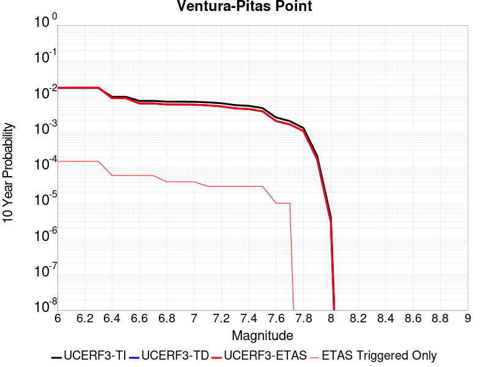 |

| Magnitude | 1 wk TI Prob | 1 wk TD Prob | 1 wk ETAS Prob | 1 wk ETAS/TD Gain | 1 wk ETAS Triggered Only | 1 mo TI Prob | 1 mo TD Prob | 1 mo ETAS Prob | 1 mo ETAS/TD Gain | 1 mo ETAS Triggered Only | 1 yr TI Prob | 1 yr TD Prob | 1 yr ETAS Prob | 1 yr ETAS/TD Gain | 1 yr ETAS Triggered Only | 10 yr TI Prob | 10 yr TD Prob | 10 yr ETAS Prob | 10 yr ETAS/TD Gain | 10 yr ETAS Triggered Only |
|-----|-----|-----|-----|-----|-----|-----|-----|-----|-----|-----|-----|-----|-----|-----|-----|-----|-----|-----|-----|-----|
| 6.0 | 3.3179622E-5 | 3.3735185E-5 | 6.492759E-5 | 1.9246254 | 3.1193464E-5 | 1.4219063E-4 | 1.445728E-4 | 1.9135623E-4 | 1.3235977 | 4.6790192E-5 | 0.0017297962 | 0.0017590096 | 0.0018368561 | 1.0442559 | 7.7983656E-5 | 0.017163932 | 0.0174764 | 0.017614318 | 1.0078917 | 1.4037058E-4 |
| 6.1 | 3.3179622E-5 | 3.3735185E-5 | 6.492759E-5 | 1.9246254 | 3.1193464E-5 | 1.4219063E-4 | 1.445728E-4 | 1.9135623E-4 | 1.3235977 | 4.6790192E-5 | 0.0017297962 | 0.0017590096 | 0.0018368561 | 1.0442559 | 7.7983656E-5 | 0.017163932 | 0.0174764 | 0.017614318 | 1.0078917 | 1.4037058E-4 |
| 6.2 | 3.3179622E-5 | 3.3735185E-5 | 6.492759E-5 | 1.9246254 | 3.1193464E-5 | 1.4219063E-4 | 1.445728E-4 | 1.9135623E-4 | 1.3235977 | 4.6790192E-5 | 0.0017297962 | 0.0017590096 | 0.0018368561 | 1.0442559 | 7.7983656E-5 | 0.017163932 | 0.0174764 | 0.017614318 | 1.0078917 | 1.4037058E-4 |
| 6.3 | 3.3179622E-5 | 3.3735185E-5 | 6.492759E-5 | 1.9246254 | 3.1193464E-5 | 1.4219063E-4 | 1.445728E-4 | 1.9135623E-4 | 1.3235977 | 4.6790192E-5 | 0.0017297962 | 0.0017590096 | 0.0018368561 | 1.0442559 | 7.7983656E-5 | 0.017163932 | 0.0174764 | 0.017614318 | 1.0078917 | 1.4037058E-4 |
| 6.4 | 1.8754668E-5 | 1.701961E-5 | 1.701961E-5 | 1.0 | 0.0 | 8.037467E-5 | 7.293928E-5 | 7.293928E-5 | 1.0 | 0.0 | 9.781223E-4 | 8.8769704E-4 | 9.032799E-4 | 1.0175543 | 1.5596732E-5 | 0.009738282 | 0.008843848 | 0.008874766 | 1.0034959 | 3.1193464E-5 |
| 6.5 | 1.8754668E-5 | 1.701961E-5 | 1.701961E-5 | 1.0 | 0.0 | 8.037467E-5 | 7.293928E-5 | 7.293928E-5 | 1.0 | 0.0 | 9.781223E-4 | 8.8769704E-4 | 9.032799E-4 | 1.0175543 | 1.5596732E-5 | 0.009738282 | 0.008843848 | 0.008874766 | 1.0034959 | 3.1193464E-5 |
| 6.6 | 1.4361558E-5 | 1.2122275E-5 | 1.2122275E-5 | 1.0 | 0.0 | 6.154808E-5 | 5.1951585E-5 | 5.1951585E-5 | 1.0 | 0.0 | 7.490902E-4 | 6.3232926E-4 | 6.4791617E-4 | 1.02465 | 1.5596732E-5 | 0.0074657016 | 0.0063055577 | 0.0063365544 | 1.0049158 | 3.1193464E-5 |
| 6.7 | 1.4361558E-5 | 1.2122275E-5 | 1.2122275E-5 | 1.0 | 0.0 | 6.154808E-5 | 5.1951585E-5 | 5.1951585E-5 | 1.0 | 0.0 | 7.490902E-4 | 6.3232926E-4 | 6.4791617E-4 | 1.02465 | 1.5596732E-5 | 0.0074657016 | 0.0063055577 | 0.0063365544 | 1.0049158 | 3.1193464E-5 |
| 6.8 | 1.3663846E-5 | 1.13444175E-5 | 1.13444175E-5 | 1.0 | 0.0 | 5.8558027E-5 | 4.861804E-5 | 4.861804E-5 | 1.0 | 0.0 | 7.127108E-4 | 5.917658E-4 | 6.073533E-4 | 1.0263406 | 1.5596732E-5 | 0.007104293 | 0.005902116 | 0.0059331255 | 1.0052539 | 3.1193464E-5 |
| 6.9 | 1.3644157E-5 | 1.1322519E-5 | 1.1322519E-5 | 1.0 | 0.0 | 5.8473648E-5 | 4.8524187E-5 | 4.8524187E-5 | 1.0 | 0.0 | 7.116841E-4 | 5.9062376E-4 | 6.062113E-4 | 1.0263916 | 1.5596732E-5 | 0.007094092 | 0.0058907564 | 0.005921766 | 1.0052642 | 3.1193464E-5 |
| 7.0 | 1.3568845E-5 | 1.1242086E-5 | 1.1242086E-5 | 1.0 | 0.0 | 5.8150898E-5 | 4.817949E-5 | 4.817949E-5 | 1.0 | 0.0 | 7.077572E-4 | 5.864293E-4 | 6.020169E-4 | 1.0265805 | 1.5596732E-5 | 0.007055073 | 0.0058490336 | 0.0058800443 | 1.005302 | 3.1193464E-5 |
| 7.1 | 1.306572E-5 | 1.072054E-5 | 1.072054E-5 | 1.0 | 0.0 | 5.599474E-5 | 4.5944373E-5 | 4.5944373E-5 | 1.0 | 0.0 | 6.815227E-4 | 5.5923103E-4 | 5.7481905E-4 | 1.027874 | 1.5596732E-5 | 0.0067943637 | 0.0055784425 | 0.005593952 | 1.0027803 | 1.5596732E-5 |
| 7.2 | 1.232604E-5 | 9.995143E-6 | 9.995143E-6 | 1.0 | 0.0 | 5.2824813E-5 | 4.2835632E-5 | 4.2835632E-5 | 1.0 | 0.0 | 6.429523E-4 | 5.214008E-4 | 5.369894E-4 | 1.0298976 | 1.5596732E-5 | 0.0064109527 | 0.005201967 | 0.0052174823 | 1.0029826 | 1.5596732E-5 |
| 7.3 | 1.0917261E-5 | 8.84384E-6 | 8.84384E-6 | 1.0 | 0.0 | 4.678742E-5 | 3.790163E-5 | 3.790163E-5 | 1.0 | 0.0 | 5.69488E-4 | 4.6135622E-4 | 4.7694574E-4 | 1.0337907 | 1.5596732E-5 | 0.0056803077 | 0.00460415 | 0.004619675 | 1.003372 | 1.5596732E-5 |
| 7.4 | 1.039959E-5 | 8.423562E-6 | 8.423562E-6 | 1.0 | 0.0 | 4.456891E-5 | 3.610049E-5 | 3.610049E-5 | 1.0 | 0.0 | 5.424914E-4 | 4.3943635E-4 | 4.5502622E-4 | 1.035477 | 1.5596732E-5 | 0.0054116896 | 0.004385836 | 0.0044013644 | 1.0035405 | 1.5596732E-5 |
| 7.5 | 9.015877E-6 | 7.2975445E-6 | 7.2975445E-6 | 1.0 | 0.0 | 3.86389E-5 | 3.1274823E-5 | 3.1274823E-5 | 1.0 | 0.0 | 4.7032707E-4 | 3.8070587E-4 | 3.9629664E-4 | 1.0409523 | 1.5596732E-5 | 0.004693329 | 0.0038006818 | 0.0038162193 | 1.004088 | 1.5596732E-5 |
| 7.6 | 4.900162E-6 | 3.8741155E-6 | 3.8741155E-6 | 1.0 | 0.0 | 2.1000526E-5 | 1.6603248E-5 | 1.6603248E-5 | 1.0 | 0.0 | 2.556514E-4 | 2.0212591E-4 | 2.0212591E-4 | 1.0 | 0.0 | 0.0025535747 | 0.0020194345 | 0.0020194345 | 1.0 | 0.0 |
| 7.7 | 3.8850626E-6 | 3.1267302E-6 | 3.1267302E-6 | 1.0 | 0.0 | 1.6650163E-5 | 1.3400205E-5 | 1.3400205E-5 | 1.0 | 0.0 | 2.0269687E-4 | 1.6313537E-4 | 1.6313537E-4 | 1.0 | 0.0 | 0.002025121 | 0.0016301654 | 0.0016301654 | 1.0 | 0.0 |
| 7.8 | 2.4654719E-6 | 2.029875E-6 | 2.029875E-6 | 1.0 | 0.0 | 1.0566265E-5 | 8.699436E-6 | 8.699436E-6 | 1.0 | 0.0 | 1.2863669E-4 | 1.0591053E-4 | 1.0591053E-4 | 1.0 | 0.0 | 0.0012856225 | 0.0010586053 | 0.0010586053 | 1.0 | 0.0 |
| 7.9 | 4.095894E-7 | 3.2764765E-7 | 3.2764765E-7 | 1.0 | 0.0 | 1.7553821E-6 | 1.4042034E-6 | 1.4042034E-6 | 1.0 | 0.0 | 2.1371567E-5 | 1.7096047E-5 | 1.7096047E-5 | 1.0 | 0.0 | 2.1369511E-4 | 1.7094762E-4 | 1.7094762E-4 | 1.0 | 0.0 |
| 8.0 | 7.791402E-9 | 5.683497E-9 | 5.683497E-9 | 1.0 | 0.0 | 3.3391725E-8 | 2.4357844E-8 | 2.4357844E-8 | 1.0 | 0.0 | 4.0654416E-7 | 2.9655675E-7 | 2.9655675E-7 | 1.0 | 0.0 | 4.065434E-6 | 2.9655655E-6 | 2.9655655E-6 | 1.0 | 0.0 |

## Camp Rock 2011
*[(top)](#table-of-contents)*

| 1 Week | 1 Month | 1 Year | 10 Year |
|-----|-----|-----|-----|
|  |  |  |  |

| Magnitude | 1 wk TI Prob | 1 wk TD Prob | 1 wk ETAS Prob | 1 wk ETAS/TD Gain | 1 wk ETAS Triggered Only | 1 mo TI Prob | 1 mo TD Prob | 1 mo ETAS Prob | 1 mo ETAS/TD Gain | 1 mo ETAS Triggered Only | 1 yr TI Prob | 1 yr TD Prob | 1 yr ETAS Prob | 1 yr ETAS/TD Gain | 1 yr ETAS Triggered Only | 10 yr TI Prob | 10 yr TD Prob | 10 yr ETAS Prob | 10 yr ETAS/TD Gain | 10 yr ETAS Triggered Only |
|-----|-----|-----|-----|-----|-----|-----|-----|-----|-----|-----|-----|-----|-----|-----|-----|-----|-----|-----|-----|-----|
| 6.0 | 1.6710783E-5 | 4.25026E-6 | 1.9846924E-5 | 4.6695786 | 1.5596732E-5 | 7.161568E-5 | 1.8215276E-5 | 4.9408172E-5 | 2.712458 | 3.1193464E-5 | 8.7157206E-4 | 2.2174895E-4 | 3.3090185E-4 | 1.4922364 | 1.0917712E-4 | 0.008681616 | 0.0022153298 | 0.0023398271 | 1.0561981 | 1.2477385E-4 |
| 6.1 | 1.6710783E-5 | 4.25026E-6 | 1.9846924E-5 | 4.6695786 | 1.5596732E-5 | 7.161568E-5 | 1.8215276E-5 | 4.9408172E-5 | 2.712458 | 3.1193464E-5 | 8.7157206E-4 | 2.2174895E-4 | 3.3090185E-4 | 1.4922364 | 1.0917712E-4 | 0.008681616 | 0.0022153298 | 0.0023398271 | 1.0561981 | 1.2477385E-4 |
| 6.2 | 1.6710783E-5 | 4.25026E-6 | 1.9846924E-5 | 4.6695786 | 1.5596732E-5 | 7.161568E-5 | 1.8215276E-5 | 4.9408172E-5 | 2.712458 | 3.1193464E-5 | 8.7157206E-4 | 2.2174895E-4 | 3.3090185E-4 | 1.4922364 | 1.0917712E-4 | 0.008681616 | 0.0022153298 | 0.0023398271 | 1.0561981 | 1.2477385E-4 |
| 6.3 | 1.6710783E-5 | 4.25026E-6 | 1.9846924E-5 | 4.6695786 | 1.5596732E-5 | 7.161568E-5 | 1.8215276E-5 | 4.9408172E-5 | 2.712458 | 3.1193464E-5 | 8.7157206E-4 | 2.2174895E-4 | 3.3090185E-4 | 1.4922364 | 1.0917712E-4 | 0.008681616 | 0.0022153298 | 0.0023398271 | 1.0561981 | 1.2477385E-4 |
| 6.4 | 7.982846E-6 | 3.6820884E-6 | 1.9278761E-5 | 5.2358227 | 1.5596732E-5 | 3.421175E-5 | 1.5780286E-5 | 4.6973255E-5 | 2.976705 | 3.1193464E-5 | 4.1644843E-4 | 1.9210839E-4 | 2.856708E-4 | 1.4870293 | 9.3580384E-5 | 0.0041566887 | 0.001919458 | 0.0020284257 | 1.05677 | 1.0917712E-4 |
| 6.5 | 7.982846E-6 | 3.6820884E-6 | 1.9278761E-5 | 5.2358227 | 1.5596732E-5 | 3.421175E-5 | 1.5780286E-5 | 4.6973255E-5 | 2.976705 | 3.1193464E-5 | 4.1644843E-4 | 1.9210839E-4 | 2.856708E-4 | 1.4870293 | 9.3580384E-5 | 0.0041566887 | 0.001919458 | 0.0020284257 | 1.05677 | 1.0917712E-4 |
| 6.6 | 7.048869E-6 | 3.4243571E-6 | 1.9021034E-5 | 5.5546293 | 1.5596732E-5 | 3.0209088E-5 | 1.4675736E-5 | 4.586874E-5 | 3.1254814 | 3.1193464E-5 | 3.677336E-4 | 1.7866275E-4 | 2.722264E-4 | 1.5236887 | 9.3580384E-5 | 0.0036712566 | 0.0017852228 | 0.001894205 | 1.0610468 | 1.0917712E-4 |
| 6.7 | 6.987307E-6 | 3.3623348E-6 | 1.8959014E-5 | 5.638645 | 1.5596732E-5 | 2.9945259E-5 | 1.4409929E-5 | 4.560294E-5 | 3.164689 | 3.1193464E-5 | 3.6452254E-4 | 1.7542706E-4 | 2.6899102E-4 | 1.5333496 | 9.3580384E-5 | 0.0036392517 | 0.001752917 | 0.0018619027 | 1.062174 | 1.0917712E-4 |
| 6.8 | 6.3737602E-6 | 3.1179077E-6 | 1.871459E-5 | 6.002291 | 1.5596732E-5 | 2.731583E-5 | 1.3362394E-5 | 4.455544E-5 | 3.3343904 | 3.1193464E-5 | 3.3251947E-4 | 1.626753E-4 | 2.5624046E-4 | 1.5751652 | 9.3580384E-5 | 0.0033202237 | 0.0016255907 | 0.0017345904 | 1.0670524 | 1.0917712E-4 |
| 6.9 | 6.112211E-6 | 2.9331156E-6 | 1.8529801E-5 | 6.3174467 | 1.5596732E-5 | 2.6194928E-5 | 1.2570436E-5 | 4.3763506E-5 | 3.4814627 | 3.1193464E-5 | 3.1887658E-4 | 1.5303459E-4 | 2.4660066E-4 | 1.6114047 | 9.3580384E-5 | 0.003184194 | 0.0015293199 | 0.00163833 | 1.0712801 | 1.0917712E-4 |
| 7.0 | 5.5140117E-6 | 2.641923E-6 | 1.8238612E-5 | 6.903537 | 1.5596732E-5 | 2.3631264E-5 | 1.132248E-5 | 4.251559E-5 | 3.7549715 | 3.1193464E-5 | 2.8767265E-4 | 1.3784273E-4 | 2.314102E-4 | 1.6787989 | 9.3580384E-5 | 0.0028730053 | 0.0013775975 | 0.0014866241 | 1.0791427 | 1.0917712E-4 |
| 7.1 | 4.8151105E-6 | 2.1342705E-6 | 1.7730968E-5 | 8.307742 | 1.5596732E-5 | 2.0636026E-5 | 9.146843E-6 | 4.034002E-5 | 4.4102674 | 3.1193464E-5 | 2.5121463E-4 | 1.1135734E-4 | 2.049273E-4 | 1.8402677 | 9.3580384E-5 | 0.0025093083 | 0.0011130372 | 0.0012220929 | 1.0979801 | 1.0917712E-4 |
| 7.2 | 3.818335E-6 | 1.2937425E-6 | 1.6890453E-5 | 13.055499 | 1.5596732E-5 | 1.6364189E-5 | 5.5445994E-6 | 2.1141244E-5 | 3.8129435 | 1.5596732E-5 | 1.9921579E-4 | 6.750349E-5 | 1.14290524E-4 | 1.6931055 | 4.6790192E-5 | 0.0019903728 | 6.748381E-4 | 7.371829E-4 | 1.0923848 | 6.238693E-5 |
| 7.3 | 2.7166698E-6 | 7.3835776E-7 | 1.6335078E-5 | 22.123526 | 1.5596732E-5 | 1.1642818E-5 | 3.1643867E-6 | 1.8761068E-5 | 5.928817 | 1.5596732E-5 | 1.4174209E-4 | 3.8525748E-5 | 6.971801E-5 | 1.8096471 | 3.1193464E-5 | 0.0014165172 | 3.851927E-4 | 4.1637413E-4 | 1.0809503 | 3.1193464E-5 |
| 7.4 | 2.0893426E-6 | 5.4618386E-7 | 1.6142907E-5 | 29.55581 | 1.5596732E-5 | 8.954295E-6 | 2.3407858E-6 | 1.793748E-5 | 7.6630163 | 1.5596732E-5 | 1.0901308E-4 | 2.84987E-5 | 5.9691272E-5 | 2.094526 | 3.1193464E-5 | 0.0010895962 | 2.84951E-4 | 3.1613559E-4 | 1.1094384 | 3.1193464E-5 |
| 7.5 | 1.1681728E-6 | 3.6030585E-7 | 3.6030585E-7 | 1.0 | 0.0 | 5.0064455E-6 | 1.544167E-6 | 1.544167E-6 | 1.0 | 0.0 | 6.0951766E-5 | 1.8800076E-5 | 1.8800076E-5 | 1.0 | 0.0 | 6.093505E-4 | 1.8798532E-4 | 1.8798532E-4 | 1.0 | 0.0 |
| 7.6 | 1.3154387E-7 | 7.1197384E-8 | 7.1197384E-8 | 1.0 | 0.0 | 5.6375933E-7 | 3.051316E-7 | 3.051316E-7 | 1.0 | 0.0 | 6.863748E-6 | 3.7149728E-6 | 3.7149728E-6 | 1.0 | 0.0 | 6.863536E-5 | 3.7149264E-5 | 3.7149264E-5 | 1.0 | 0.0 |

## Great Valley 09 (Laguna Seca)
*[(top)](#table-of-contents)*

| 1 Week | 1 Month | 1 Year | 10 Year |
|-----|-----|-----|-----|
|  |  | 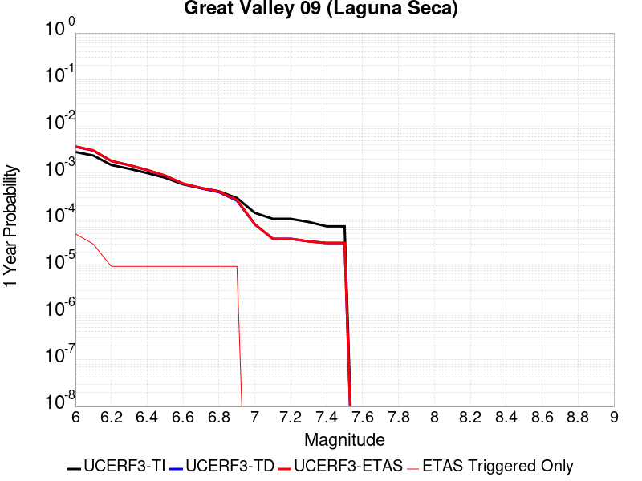 |  |

| Magnitude | 1 wk TI Prob | 1 wk TD Prob | 1 wk ETAS Prob | 1 wk ETAS/TD Gain | 1 wk ETAS Triggered Only | 1 mo TI Prob | 1 mo TD Prob | 1 mo ETAS Prob | 1 mo ETAS/TD Gain | 1 mo ETAS Triggered Only | 1 yr TI Prob | 1 yr TD Prob | 1 yr ETAS Prob | 1 yr ETAS/TD Gain | 1 yr ETAS Triggered Only | 10 yr TI Prob | 10 yr TD Prob | 10 yr ETAS Prob | 10 yr ETAS/TD Gain | 10 yr ETAS Triggered Only |
|-----|-----|-----|-----|-----|-----|-----|-----|-----|-----|-----|-----|-----|-----|-----|-----|-----|-----|-----|-----|-----|
| 6.0 | 5.4353277E-5 | 7.05022E-5 | 1.0169346E-4 | 1.4424155 | 3.1193464E-5 | 2.3292181E-4 | 3.0211566E-4 | 3.3329971E-4 | 1.1032189 | 3.1193464E-5 | 0.0028321352 | 0.0036721937 | 0.0037188123 | 1.012695 | 4.6790192E-5 | 0.02796312 | 0.03611547 | 0.03620567 | 1.0024976 | 9.3580384E-5 |
| 6.1 | 4.5578287E-5 | 5.822118E-5 | 7.3817006E-5 | 1.267872 | 1.5596732E-5 | 1.953209E-4 | 2.4949326E-4 | 2.650861E-4 | 1.0624981 | 1.5596732E-5 | 0.0023754383 | 0.003033432 | 0.0030489813 | 1.005126 | 1.5596732E-5 | 0.023502063 | 0.029919548 | 0.029980067 | 1.0020227 | 6.238693E-5 |
| 6.2 | 2.8536782E-5 | 3.4737273E-5 | 3.4737273E-5 | 1.0 | 0.0 | 1.2229476E-4 | 1.4886224E-4 | 1.4886224E-4 | 1.0 | 0.0 | 0.0014879217 | 0.001810813 | 0.001810813 | 1.0 | 0.0 | 0.014779986 | 0.017958116 | 0.017973434 | 1.000853 | 1.5596732E-5 |
| 6.3 | 2.3698774E-5 | 2.8213295E-5 | 2.8213295E-5 | 1.0 | 0.0 | 1.01562226E-4 | 1.20905075E-4 | 1.20905075E-4 | 1.0 | 0.0 | 0.0012358186 | 0.0014710218 | 0.0014710218 | 1.0 | 0.0 | 0.012289686 | 0.014611342 | 0.014611342 | 1.0 | 0.0 |
| 6.4 | 1.9191197E-5 | 2.2123184E-5 | 2.2123184E-5 | 1.0 | 0.0 | 8.2245395E-5 | 9.4806666E-5 | 9.4806666E-5 | 1.0 | 0.0 | 0.0010008777 | 0.0011536429 | 0.0011536429 | 1.0 | 0.0 | 0.009963818 | 0.011476948 | 0.011476948 | 1.0 | 0.0 |
| 6.5 | 1.5203241E-5 | 1.6802203E-5 | 1.6802203E-5 | 1.0 | 0.0 | 6.5155116E-5 | 7.200386E-5 | 7.200386E-5 | 1.0 | 0.0 | 7.9297484E-4 | 8.7626575E-4 | 8.7626575E-4 | 1.0 | 0.0 | 0.007901512 | 0.0087295165 | 0.0087295165 | 1.0 | 0.0 |
| 6.6 | 1.0984925E-5 | 1.1242595E-5 | 1.1242595E-5 | 1.0 | 0.0 | 4.70774E-5 | 4.8181686E-5 | 4.8181686E-5 | 1.0 | 0.0 | 5.730166E-4 | 5.8645656E-4 | 5.8645656E-4 | 1.0 | 0.0 | 0.005715413 | 0.0058494853 | 0.0058494853 | 1.0 | 0.0 |
| 6.7 | 9.134616E-6 | 9.019894E-6 | 9.019894E-6 | 1.0 | 0.0 | 3.9147766E-5 | 3.865613E-5 | 3.865613E-5 | 1.0 | 0.0 | 4.7651984E-4 | 4.7053912E-4 | 4.7053912E-4 | 1.0 | 0.0 | 0.004754993 | 0.0046956735 | 0.0046956735 | 1.0 | 0.0 |
| 6.8 | 7.785589E-6 | 7.4519444E-6 | 7.4519444E-6 | 1.0 | 0.0 | 3.3366385E-5 | 3.1936524E-5 | 3.1936524E-5 | 1.0 | 0.0 | 4.0616E-4 | 3.8875983E-4 | 3.8875983E-4 | 1.0 | 0.0 | 0.0040541845 | 0.0038810016 | 0.0038810016 | 1.0 | 0.0 |
| 6.9 | 5.579095E-6 | 4.898492E-6 | 4.898492E-6 | 1.0 | 0.0 | 2.3910188E-5 | 2.0993377E-5 | 2.0993377E-5 | 1.0 | 0.0 | 2.9106764E-4 | 2.5556577E-4 | 2.5556577E-4 | 1.0 | 0.0 | 0.002906867 | 0.002552856 | 0.002552856 | 1.0 | 0.0 |
| 7.0 | 2.6816688E-6 | 1.5216126E-6 | 1.5216126E-6 | 1.0 | 0.0 | 1.1492816E-5 | 6.521181E-6 | 6.521181E-6 | 1.0 | 0.0 | 1.3991605E-4 | 7.939258E-5 | 7.939258E-5 | 1.0 | 0.0 | 0.0013982799 | 7.9365086E-4 | 7.9365086E-4 | 1.0 | 0.0 |
| 7.1 | 1.9951021E-6 | 7.453827E-7 | 7.453827E-7 | 1.0 | 0.0 | 8.55041E-6 | 3.1944935E-6 | 3.1944935E-6 | 1.0 | 0.0 | 1.0409627E-4 | 3.8892307E-5 | 3.8892307E-5 | 1.0 | 0.0 | 0.0010404752 | 3.8885913E-4 | 3.8885913E-4 | 1.0 | 0.0 |
| 7.2 | 1.9951021E-6 | 7.453827E-7 | 7.453827E-7 | 1.0 | 0.0 | 8.55041E-6 | 3.1944935E-6 | 3.1944935E-6 | 1.0 | 0.0 | 1.0409627E-4 | 3.8892307E-5 | 3.8892307E-5 | 1.0 | 0.0 | 0.0010404752 | 3.8885913E-4 | 3.8885913E-4 | 1.0 | 0.0 |
| 7.3 | 1.7087556E-6 | 6.578881E-7 | 6.578881E-7 | 1.0 | 0.0 | 7.3232177E-6 | 2.8195177E-6 | 2.8195177E-6 | 1.0 | 0.0 | 8.915652E-5 | 3.4327128E-5 | 3.4327128E-5 | 1.0 | 0.0 | 8.9120766E-4 | 3.432223E-4 | 3.432223E-4 | 1.0 | 0.0 |
| 7.4 | 1.3804846E-6 | 6.073852E-7 | 6.073852E-7 | 1.0 | 0.0 | 5.916349E-6 | 2.6030768E-6 | 2.6030768E-6 | 1.0 | 0.0 | 7.2029165E-5 | 3.169204E-5 | 3.169204E-5 | 1.0 | 0.0 | 7.200583E-4 | 3.1687922E-4 | 3.1687922E-4 | 1.0 | 0.0 |
| 7.5 | 1.3804846E-6 | 6.073852E-7 | 6.073852E-7 | 1.0 | 0.0 | 5.916349E-6 | 2.6030768E-6 | 2.6030768E-6 | 1.0 | 0.0 | 7.2029165E-5 | 3.169204E-5 | 3.169204E-5 | 1.0 | 0.0 | 7.200583E-4 | 3.1687922E-4 | 3.1687922E-4 | 1.0 | 0.0 |

## Tin Mountain
*[(top)](#table-of-contents)*

| 1 Week | 1 Month | 1 Year | 10 Year |
|-----|-----|-----|-----|
|  |  |  |  |

| Magnitude | 1 wk TI Prob | 1 wk TD Prob | 1 wk ETAS Prob | 1 wk ETAS/TD Gain | 1 wk ETAS Triggered Only | 1 mo TI Prob | 1 mo TD Prob | 1 mo ETAS Prob | 1 mo ETAS/TD Gain | 1 mo ETAS Triggered Only | 1 yr TI Prob | 1 yr TD Prob | 1 yr ETAS Prob | 1 yr ETAS/TD Gain | 1 yr ETAS Triggered Only | 10 yr TI Prob | 10 yr TD Prob | 10 yr ETAS Prob | 10 yr ETAS/TD Gain | 10 yr ETAS Triggered Only |
|-----|-----|-----|-----|-----|-----|-----|-----|-----|-----|-----|-----|-----|-----|-----|-----|-----|-----|-----|-----|-----|
| 6.0 | 4.083776E-6 | 4.1815365E-6 | 3.537487E-5 | 8.459777 | 3.1193464E-5 | 1.750178E-5 | 1.792077E-5 | 4.911367E-5 | 2.7406006 | 3.1193464E-5 | 2.1306332E-4 | 2.1816725E-4 | 3.2732054E-4 | 1.5003194 | 1.0917712E-4 | 0.0021285915 | 0.0021798965 | 0.0023043982 | 1.0571136 | 1.2477385E-4 |
| 6.1 | 4.083776E-6 | 4.1815365E-6 | 3.537487E-5 | 8.459777 | 3.1193464E-5 | 1.750178E-5 | 1.792077E-5 | 4.911367E-5 | 2.7406006 | 3.1193464E-5 | 2.1306332E-4 | 2.1816725E-4 | 3.2732054E-4 | 1.5003194 | 1.0917712E-4 | 0.0021285915 | 0.0021798965 | 0.0023043982 | 1.0571136 | 1.2477385E-4 |
| 6.2 | 4.083776E-6 | 4.1815365E-6 | 3.537487E-5 | 8.459777 | 3.1193464E-5 | 1.750178E-5 | 1.792077E-5 | 4.911367E-5 | 2.7406006 | 3.1193464E-5 | 2.1306332E-4 | 2.1816725E-4 | 3.2732054E-4 | 1.5003194 | 1.0917712E-4 | 0.0021285915 | 0.0021798965 | 0.0023043982 | 1.0571136 | 1.2477385E-4 |
| 6.3 | 4.083776E-6 | 4.1815365E-6 | 3.537487E-5 | 8.459777 | 3.1193464E-5 | 1.750178E-5 | 1.792077E-5 | 4.911367E-5 | 2.7406006 | 3.1193464E-5 | 2.1306332E-4 | 2.1816725E-4 | 3.2732054E-4 | 1.5003194 | 1.0917712E-4 | 0.0021285915 | 0.0021798965 | 0.0023043982 | 1.0571136 | 1.2477385E-4 |
| 6.4 | 4.083776E-6 | 4.1815365E-6 | 3.537487E-5 | 8.459777 | 3.1193464E-5 | 1.750178E-5 | 1.792077E-5 | 4.911367E-5 | 2.7406006 | 3.1193464E-5 | 2.1306332E-4 | 2.1816725E-4 | 3.2732054E-4 | 1.5003194 | 1.0917712E-4 | 0.0021285915 | 0.0021798965 | 0.0023043982 | 1.0571136 | 1.2477385E-4 |
| 6.5 | 2.3143427E-6 | 2.3731573E-6 | 1.796985E-5 | 7.5721283 | 1.5596732E-5 | 9.9185745E-6 | 1.0170638E-5 | 2.576721E-5 | 2.53349 | 1.5596732E-5 | 1.2075195E-4 | 1.2382126E-4 | 1.8620046E-4 | 1.5037843 | 6.238693E-5 | 0.0012068636 | 0.0012375986 | 0.0012999084 | 1.0503473 | 6.238693E-5 |
| 6.6 | 2.3143427E-6 | 2.3731573E-6 | 1.796985E-5 | 7.5721283 | 1.5596732E-5 | 9.9185745E-6 | 1.0170638E-5 | 2.576721E-5 | 2.53349 | 1.5596732E-5 | 1.2075195E-4 | 1.2382126E-4 | 1.8620046E-4 | 1.5037843 | 6.238693E-5 | 0.0012068636 | 0.0012375986 | 0.0012999084 | 1.0503473 | 6.238693E-5 |
| 6.7 | 1.7029532E-6 | 1.7497915E-6 | 1.7346496E-5 | 9.913464 | 1.5596732E-5 | 7.2983503E-6 | 7.499088E-6 | 2.3095701E-5 | 3.0798016 | 1.5596732E-5 | 8.885379E-5 | 9.1298105E-5 | 1.5367933E-4 | 1.6832697 | 6.238693E-5 | 8.881827E-4 | 9.1265864E-4 | 9.749886E-4 | 1.068295 | 6.238693E-5 |
| 6.8 | 1.2914646E-6 | 1.3299378E-6 | 1.6926648E-5 | 12.727398 | 1.5596732E-5 | 5.534837E-6 | 5.6997237E-6 | 2.1296366E-5 | 3.7363856 | 1.5596732E-5 | 6.738455E-5 | 6.939237E-5 | 1.0058367E-4 | 1.4494917 | 3.1193464E-5 | 6.736412E-4 | 6.9375033E-4 | 7.2492217E-4 | 1.0449324 | 3.1193464E-5 |
| 6.9 | 5.8708974E-7 | 6.1169936E-7 | 6.1169936E-7 | 1.0 | 0.0 | 2.5160964E-6 | 2.6215664E-6 | 2.6215664E-6 | 1.0 | 0.0 | 3.0633044E-5 | 3.1917145E-5 | 3.1917145E-5 | 1.0 | 0.0 | 3.0628822E-4 | 3.191297E-4 | 3.191297E-4 | 1.0 | 0.0 |
| 7.0 | 4.6248786E-7 | 4.832015E-7 | 4.832015E-7 | 1.0 | 0.0 | 1.9820893E-6 | 2.0708624E-6 | 2.0708624E-6 | 1.0 | 0.0 | 2.413167E-5 | 2.5212494E-5 | 2.5212494E-5 | 1.0 | 0.0 | 2.412905E-4 | 2.5210003E-4 | 2.5210003E-4 | 1.0 | 0.0 |
| 7.1 | 3.804606E-7 | 3.987147E-7 | 3.987147E-7 | 1.0 | 0.0 | 1.6305444E-6 | 1.7087764E-6 | 1.7087764E-6 | 1.0 | 0.0 | 1.9851697E-5 | 2.0804187E-5 | 2.0804187E-5 | 1.0 | 0.0 | 1.9849923E-4 | 2.0802575E-4 | 2.0802575E-4 | 1.0 | 0.0 |
| 7.2 | 3.5864858E-7 | 3.7616863E-7 | 3.7616863E-7 | 1.0 | 0.0 | 1.5370645E-6 | 1.6121504E-6 | 1.6121504E-6 | 1.0 | 0.0 | 1.87136E-5 | 1.9627789E-5 | 1.9627789E-5 | 1.0 | 0.0 | 1.8712023E-4 | 1.9626386E-4 | 1.9626386E-4 | 1.0 | 0.0 |
| 7.3 | 3.342063E-7 | 3.506347E-7 | 3.506347E-7 | 1.0 | 0.0 | 1.4323119E-6 | 1.5027196E-6 | 1.5027196E-6 | 1.0 | 0.0 | 1.7438259E-5 | 1.829549E-5 | 1.829549E-5 | 1.0 | 0.0 | 1.743689E-4 | 1.8294314E-4 | 1.8294314E-4 | 1.0 | 0.0 |
| 7.4 | 2.971242E-7 | 3.1165817E-7 | 3.1165817E-7 | 1.0 | 0.0 | 1.2733886E-6 | 1.3356774E-6 | 1.3356774E-6 | 1.0 | 0.0 | 1.5503398E-5 | 1.6261785E-5 | 1.6261785E-5 | 1.0 | 0.0 | 1.5502315E-4 | 1.6260923E-4 | 1.6260923E-4 | 1.0 | 0.0 |
| 7.5 | 1.4326713E-7 | 1.5012525E-7 | 1.5012525E-7 | 1.0 | 0.0 | 6.140018E-7 | 6.433939E-7 | 6.433939E-7 | 1.0 | 0.0 | 7.4754466E-6 | 7.8333205E-6 | 7.8333205E-6 | 1.0 | 0.0 | 7.475195E-5 | 7.833321E-5 | 7.833321E-5 | 1.0 | 0.0 |

## Kern Canyon (North Kern) 2011
*[(top)](#table-of-contents)*

| 1 Week | 1 Month | 1 Year | 10 Year |
|-----|-----|-----|-----|
|  |  |  |  |

| Magnitude | 1 wk TI Prob | 1 wk TD Prob | 1 wk ETAS Prob | 1 wk ETAS/TD Gain | 1 wk ETAS Triggered Only | 1 mo TI Prob | 1 mo TD Prob | 1 mo ETAS Prob | 1 mo ETAS/TD Gain | 1 mo ETAS Triggered Only | 1 yr TI Prob | 1 yr TD Prob | 1 yr ETAS Prob | 1 yr ETAS/TD Gain | 1 yr ETAS Triggered Only | 10 yr TI Prob | 10 yr TD Prob | 10 yr ETAS Prob | 10 yr ETAS/TD Gain | 10 yr ETAS Triggered Only |
|-----|-----|-----|-----|-----|-----|-----|-----|-----|-----|-----|-----|-----|-----|-----|-----|-----|-----|-----|-----|-----|
| 6.0 | 6.6264497E-6 | 6.75733E-6 | 5.3547206E-5 | 7.924314 | 4.6790192E-5 | 2.8398761E-5 | 2.895971E-5 | 9.1344824E-5 | 3.154204 | 6.238693E-5 | 3.4570007E-4 | 3.5253543E-4 | 4.3049158E-4 | 1.22113 | 7.7983656E-5 | 0.0034516277 | 0.0035205502 | 0.003629343 | 1.0309021 | 1.0917712E-4 |
| 6.1 | 6.6264497E-6 | 6.75733E-6 | 5.3547206E-5 | 7.924314 | 4.6790192E-5 | 2.8398761E-5 | 2.895971E-5 | 9.1344824E-5 | 3.154204 | 6.238693E-5 | 3.4570007E-4 | 3.5253543E-4 | 4.3049158E-4 | 1.22113 | 7.7983656E-5 | 0.0034516277 | 0.0035205502 | 0.003629343 | 1.0309021 | 1.0917712E-4 |
| 6.2 | 6.6264497E-6 | 6.75733E-6 | 5.3547206E-5 | 7.924314 | 4.6790192E-5 | 2.8398761E-5 | 2.895971E-5 | 9.1344824E-5 | 3.154204 | 6.238693E-5 | 3.4570007E-4 | 3.5253543E-4 | 4.3049158E-4 | 1.22113 | 7.7983656E-5 | 0.0034516277 | 0.0035205502 | 0.003629343 | 1.0309021 | 1.0917712E-4 |
| 6.3 | 6.6264497E-6 | 6.75733E-6 | 5.3547206E-5 | 7.924314 | 4.6790192E-5 | 2.8398761E-5 | 2.895971E-5 | 9.1344824E-5 | 3.154204 | 6.238693E-5 | 3.4570007E-4 | 3.5253543E-4 | 4.3049158E-4 | 1.22113 | 7.7983656E-5 | 0.0034516277 | 0.0035205502 | 0.003629343 | 1.0309021 | 1.0917712E-4 |
| 6.4 | 6.6264497E-6 | 6.75733E-6 | 5.3547206E-5 | 7.924314 | 4.6790192E-5 | 2.8398761E-5 | 2.895971E-5 | 9.1344824E-5 | 3.154204 | 6.238693E-5 | 3.4570007E-4 | 3.5253543E-4 | 4.3049158E-4 | 1.22113 | 7.7983656E-5 | 0.0034516277 | 0.0035205502 | 0.003629343 | 1.0309021 | 1.0917712E-4 |
| 6.5 | 3.2162225E-6 | 3.2570915E-6 | 3.445045E-5 | 10.57706 | 3.1193464E-5 | 1.3783738E-5 | 1.3958893E-5 | 6.0748433E-5 | 4.351952 | 4.6790192E-5 | 1.6780409E-4 | 1.6993708E-4 | 2.323134E-4 | 1.3670554 | 6.238693E-5 | 0.0016767744 | 0.001698151 | 0.0017760022 | 1.0458447 | 7.7983656E-5 |
| 6.6 | 3.2162225E-6 | 3.2570915E-6 | 3.445045E-5 | 10.57706 | 3.1193464E-5 | 1.3783738E-5 | 1.3958893E-5 | 6.0748433E-5 | 4.351952 | 4.6790192E-5 | 1.6780409E-4 | 1.6993708E-4 | 2.323134E-4 | 1.3670554 | 6.238693E-5 | 0.0016767744 | 0.001698151 | 0.0017760022 | 1.0458447 | 7.7983656E-5 |
| 6.7 | 2.1908265E-6 | 2.2071222E-6 | 1.7803819E-5 | 8.066531 | 1.5596732E-5 | 9.389223E-6 | 9.459061E-6 | 2.5055646E-5 | 2.648851 | 1.5596732E-5 | 1.1430779E-4 | 1.1515819E-4 | 1.61943E-4 | 1.4062655 | 4.6790192E-5 | 0.0011424901 | 0.0011510046 | 0.0012133196 | 1.0541397 | 6.238693E-5 |
| 6.8 | 1.7303895E-6 | 1.7365529E-6 | 1.7333257E-5 | 9.981416 | 1.5596732E-5 | 7.415934E-6 | 7.4423488E-6 | 2.3038963E-5 | 3.0956576 | 1.5596732E-5 | 9.028525E-5 | 9.0606925E-5 | 1.3739288E-4 | 1.5163617 | 4.6790192E-5 | 9.024858E-4 | 9.057096E-4 | 9.6804E-4 | 1.0688194 | 6.238693E-5 |
| 6.9 | 1.3700314E-6 | 1.3688622E-6 | 1.6965572E-5 | 12.393922 | 1.5596732E-5 | 5.87155E-6 | 5.8665396E-6 | 2.1463178E-5 | 3.6585758 | 1.5596732E-5 | 7.148377E-5 | 7.142282E-5 | 8.701844E-5 | 1.2183563 | 1.5596732E-5 | 7.146078E-4 | 7.140032E-4 | 7.2958885E-4 | 1.0218284 | 1.5596732E-5 |
| 7.0 | 1.1467797E-6 | 1.1413804E-6 | 1.6738093E-5 | 14.664781 | 1.5596732E-5 | 4.9147607E-6 | 4.8916213E-6 | 2.0488276E-5 | 4.1884427 | 1.5596732E-5 | 5.983557E-5 | 5.9553895E-5 | 7.51497E-5 | 1.2618771 | 1.5596732E-5 | 5.981946E-4 | 5.953825E-4 | 6.1096996E-4 | 1.0261805 | 1.5596732E-5 |
| 7.1 | 9.3952065E-7 | 9.3026904E-7 | 1.6526985E-5 | 17.765812 | 1.5596732E-5 | 4.026511E-6 | 3.9868614E-6 | 1.958353E-5 | 4.912017 | 1.5596732E-5 | 4.9021666E-5 | 4.8538972E-5 | 6.413495E-5 | 1.3213083 | 1.5596732E-5 | 4.901085E-4 | 4.8528548E-4 | 5.0087465E-4 | 1.0321237 | 1.5596732E-5 |
| 7.2 | 6.858055E-7 | 6.7193E-7 | 1.626865E-5 | 24.211823 | 1.5596732E-5 | 2.939163E-6 | 2.879697E-6 | 1.8476383E-5 | 6.4160857 | 1.5596732E-5 | 3.5783723E-5 | 3.5059755E-5 | 5.065594E-5 | 1.4448458 | 1.5596732E-5 | 3.5777962E-4 | 3.5054312E-4 | 3.661344E-4 | 1.0444775 | 1.5596732E-5 |
| 7.3 | 5.1101983E-7 | 4.9393E-7 | 1.6090653E-5 | 32.57679 | 1.5596732E-5 | 2.1900833E-6 | 2.116841E-6 | 1.7713539E-5 | 8.367911 | 1.5596732E-5 | 2.6663936E-5 | 2.5772239E-5 | 4.136857E-5 | 1.60516 | 1.5596732E-5 | 2.6660739E-4 | 2.57693E-4 | 2.732857E-4 | 1.0605088 | 1.5596732E-5 |
| 7.4 | 3.4999414E-7 | 3.2995905E-7 | 3.2995905E-7 | 1.0 | 0.0 | 1.499974E-6 | 1.4141094E-6 | 1.4141094E-6 | 1.0 | 0.0 | 1.8262032E-5 | 1.721665E-5 | 1.721665E-5 | 1.0 | 0.0 | 1.826053E-4 | 1.7215339E-4 | 1.7215339E-4 | 1.0 | 0.0 |
| 7.5 | 1.7021522E-7 | 1.4750044E-7 | 1.4750044E-7 | 1.0 | 0.0 | 7.2949354E-7 | 6.321446E-7 | 6.321446E-7 | 1.0 | 0.0 | 8.881548E-6 | 7.696334E-6 | 7.696334E-6 | 1.0 | 0.0 | 8.8811925E-5 | 7.696076E-5 | 7.696076E-5 | 1.0 | 0.0 |
| 7.6 | 2.572245E-8 | 1.7352555E-8 | 1.7352555E-8 | 1.0 | 0.0 | 1.10239064E-7 | 7.436809E-8 | 7.436809E-8 | 1.0 | 0.0 | 1.3421597E-6 | 9.054312E-7 | 9.054312E-7 | 1.0 | 0.0 | 1.3421517E-5 | 9.05428E-6 | 9.05428E-6 | 1.0 | 0.0 |

## Rose Canyon
*[(top)](#table-of-contents)*

| 1 Week | 1 Month | 1 Year | 10 Year |
|-----|-----|-----|-----|
| 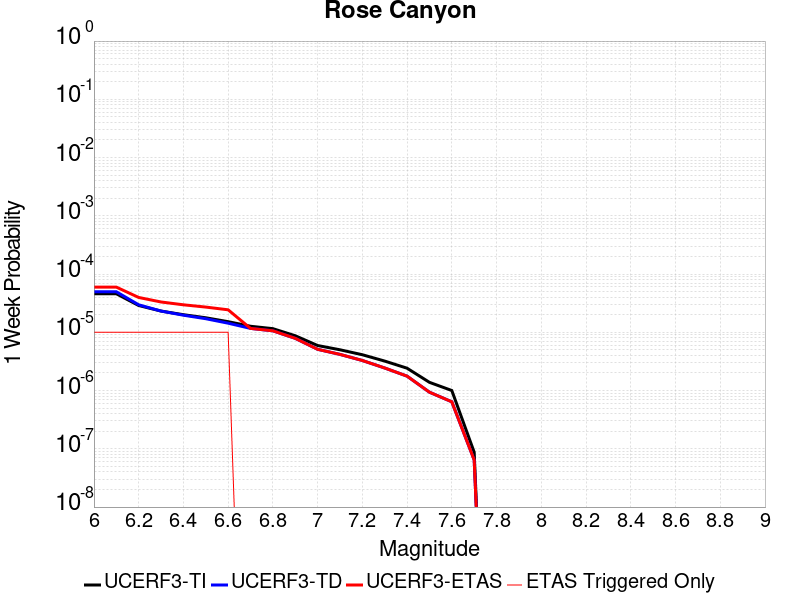 |  |  |  |

| Magnitude | 1 wk TI Prob | 1 wk TD Prob | 1 wk ETAS Prob | 1 wk ETAS/TD Gain | 1 wk ETAS Triggered Only | 1 mo TI Prob | 1 mo TD Prob | 1 mo ETAS Prob | 1 mo ETAS/TD Gain | 1 mo ETAS Triggered Only | 1 yr TI Prob | 1 yr TD Prob | 1 yr ETAS Prob | 1 yr ETAS/TD Gain | 1 yr ETAS Triggered Only | 10 yr TI Prob | 10 yr TD Prob | 10 yr ETAS Prob | 10 yr ETAS/TD Gain | 10 yr ETAS Triggered Only |
|-----|-----|-----|-----|-----|-----|-----|-----|-----|-----|-----|-----|-----|-----|-----|-----|-----|-----|-----|-----|-----|
| 6.0 | 4.5923203E-5 | 4.9714225E-5 | 6.531018E-5 | 1.3137121 | 1.5596732E-5 | 1.9679888E-4 | 2.1304491E-4 | 2.4423172E-4 | 1.1463861 | 3.1193464E-5 | 0.0023933933 | 0.0025909345 | 0.002668716 | 1.0300207 | 7.7983656E-5 | 0.023677798 | 0.02563999 | 0.025761565 | 1.0047415 | 1.2477385E-4 |
| 6.1 | 4.5923203E-5 | 4.9714225E-5 | 6.531018E-5 | 1.3137121 | 1.5596732E-5 | 1.9679888E-4 | 2.1304491E-4 | 2.4423172E-4 | 1.1463861 | 3.1193464E-5 | 0.0023933933 | 0.0025909345 | 0.002668716 | 1.0300207 | 7.7983656E-5 | 0.023677798 | 0.02563999 | 0.025731172 | 1.0035563 | 9.3580384E-5 |
| 6.2 | 2.8844734E-5 | 2.9668723E-5 | 4.526499E-5 | 1.5256804 | 1.5596732E-5 | 1.2361443E-4 | 1.2714567E-4 | 1.4274042E-4 | 1.1226526 | 1.5596732E-5 | 0.0015039665 | 0.0015468939 | 0.0015780391 | 1.020134 | 3.1193464E-5 | 0.0149382865 | 0.015374276 | 0.0154203465 | 1.0029966 | 4.6790192E-5 |
| 6.3 | 2.3171577E-5 | 2.3161238E-5 | 3.8757607E-5 | 1.6733824 | 1.5596732E-5 | 9.9302975E-5 | 9.9258745E-5 | 1.1485393E-4 | 1.1571164 | 1.5596732E-5 | 0.0012083431 | 0.0012078186 | 0.0012389744 | 1.0257951 | 3.1193464E-5 | 0.012017938 | 0.012022437 | 0.012053255 | 1.0025634 | 3.1193464E-5 |
| 6.4 | 2.0066604E-5 | 1.9667024E-5 | 3.526345E-5 | 1.7930241 | 1.5596732E-5 | 8.599689E-5 | 8.4284584E-5 | 9.988E-5 | 1.1850328 | 1.5596732E-5 | 0.0010465092 | 0.0010256917 | 0.0010568532 | 1.030381 | 3.1193464E-5 | 0.010415946 | 0.010217559 | 0.010248433 | 1.0030217 | 3.1193464E-5 |
| 6.5 | 1.776989E-5 | 1.7113807E-5 | 3.271027E-5 | 1.9113381 | 1.5596732E-5 | 7.615444E-5 | 7.334287E-5 | 8.8938454E-5 | 1.2126395 | 1.5596732E-5 | 9.267859E-4 | 8.925905E-4 | 9.2375616E-4 | 1.0349159 | 3.1193464E-5 | 0.009229303 | 0.008896211 | 0.008927126 | 1.0034752 | 3.1193464E-5 |
| 6.6 | 1.5227364E-5 | 1.433926E-5 | 2.9935767E-5 | 2.0876787 | 1.5596732E-5 | 6.52585E-5 | 6.1452556E-5 | 7.7048324E-5 | 1.2537856 | 1.5596732E-5 | 7.942326E-4 | 7.479332E-4 | 7.791033E-4 | 1.041675 | 3.1193464E-5 | 0.007914 | 0.007458359 | 0.00748932 | 1.0041511 | 3.1193464E-5 |
| 6.7 | 1.2703898E-5 | 1.1673274E-5 | 1.1673274E-5 | 1.0 | 0.0 | 5.4444143E-5 | 5.0027378E-5 | 5.0027378E-5 | 1.0 | 0.0 | 6.626558E-4 | 6.089174E-4 | 6.245046E-4 | 1.0255983 | 1.5596732E-5 | 0.006606833 | 0.0060750856 | 0.0060905875 | 1.0025517 | 1.5596732E-5 |
| 6.8 | 1.1554917E-5 | 1.0609337E-5 | 1.0609337E-5 | 1.0 | 0.0 | 4.9520135E-5 | 4.546782E-5 | 4.546782E-5 | 1.0 | 0.0 | 6.0274085E-4 | 5.5343413E-4 | 5.690222E-4 | 1.0281662 | 1.5596732E-5 | 0.0060110865 | 0.0055225673 | 0.005538078 | 1.0028086 | 1.5596732E-5 |
| 6.9 | 8.732078E-6 | 7.881357E-6 | 7.881357E-6 | 1.0 | 0.0 | 3.7422655E-5 | 3.3776825E-5 | 3.3776825E-5 | 1.0 | 0.0 | 4.5552556E-4 | 4.111582E-4 | 4.267485E-4 | 1.0379181 | 1.5596732E-5 | 0.0045459294 | 0.0041048084 | 0.004120341 | 1.0037841 | 1.5596732E-5 |
| 7.0 | 5.9337494E-6 | 5.1074853E-6 | 5.1074853E-6 | 1.0 | 0.0 | 2.5430107E-5 | 2.188904E-5 | 2.188904E-5 | 1.0 | 0.0 | 3.0956755E-4 | 2.664666E-4 | 2.820592E-4 | 1.058516 | 1.5596732E-5 | 0.0030913667 | 0.0026614866 | 0.0026770418 | 1.0058446 | 1.5596732E-5 |
| 7.1 | 5.013409E-6 | 4.1773833E-6 | 4.1773833E-6 | 1.0 | 0.0 | 2.1485863E-5 | 1.7902948E-5 | 1.7902948E-5 | 1.0 | 0.0 | 2.6155898E-4 | 2.179467E-4 | 2.3354003E-4 | 1.0715466 | 1.5596732E-5 | 0.0026125133 | 0.0021773411 | 0.002192904 | 1.0071476 | 1.5596732E-5 |
| 7.2 | 4.120763E-6 | 3.2821383E-6 | 3.2821383E-6 | 1.0 | 0.0 | 1.7660293E-5 | 1.4066231E-5 | 1.4066231E-5 | 1.0 | 0.0 | 2.1499286E-4 | 1.7124301E-4 | 1.7124301E-4 | 1.0 | 0.0 | 0.0021478499 | 0.00171112 | 0.00171112 | 1.0 | 0.0 |
| 7.3 | 3.2081239E-6 | 2.4405372E-6 | 2.4405372E-6 | 1.0 | 0.0 | 1.374903E-5 | 1.0459404E-5 | 1.0459404E-5 | 1.0 | 0.0 | 1.6738157E-4 | 1.2733586E-4 | 1.2733586E-4 | 1.0 | 0.0 | 0.0016725556 | 0.001272636 | 0.001272636 | 1.0 | 0.0 |
| 7.4 | 2.4194755E-6 | 1.7680634E-6 | 1.7680634E-6 | 1.0 | 0.0 | 1.0369139E-5 | 7.577393E-6 | 7.577393E-6 | 1.0 | 0.0 | 1.2623696E-4 | 9.2250906E-5 | 9.2250906E-5 | 1.0 | 0.0 | 0.0012616527 | 9.2213147E-4 | 9.2213147E-4 | 1.0 | 0.0 |
| 7.5 | 1.3842889E-6 | 9.3786275E-7 | 9.3786275E-7 | 1.0 | 0.0 | 5.9326535E-6 | 4.019406E-6 | 4.019406E-6 | 1.0 | 0.0 | 7.222766E-5 | 4.8935202E-5 | 4.8935202E-5 | 1.0 | 0.0 | 7.220419E-4 | 4.892478E-4 | 4.892478E-4 | 1.0 | 0.0 |
| 7.6 | 1.0021575E-6 | 6.411463E-7 | 6.411463E-7 | 1.0 | 0.0 | 4.2949537E-6 | 2.7477672E-6 | 2.7477672E-6 | 1.0 | 0.0 | 5.2289808E-5 | 3.3453573E-5 | 3.3453573E-5 | 1.0 | 0.0 | 5.2277505E-4 | 3.344875E-4 | 3.344875E-4 | 1.0 | 0.0 |
| 7.7 | 8.7620116E-8 | 6.4492404E-8 | 6.4492404E-8 | 1.0 | 0.0 | 3.7551473E-7 | 2.76396E-7 | 2.76396E-7 | 1.0 | 0.0 | 4.5718825E-6 | 3.3651165E-6 | 3.3651165E-6 | 1.0 | 0.0 | 4.5717883E-5 | 3.3650686E-5 | 3.3650686E-5 | 1.0 | 0.0 |

## Blue Cut
*[(top)](#table-of-contents)*

| 1 Week | 1 Month | 1 Year | 10 Year |
|-----|-----|-----|-----|
|  |  |  | 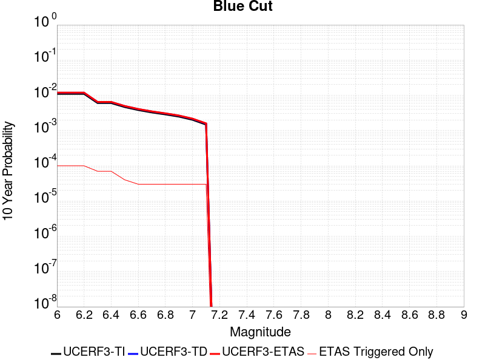 |

| Magnitude | 1 wk TI Prob | 1 wk TD Prob | 1 wk ETAS Prob | 1 wk ETAS/TD Gain | 1 wk ETAS Triggered Only | 1 mo TI Prob | 1 mo TD Prob | 1 mo ETAS Prob | 1 mo ETAS/TD Gain | 1 mo ETAS Triggered Only | 1 yr TI Prob | 1 yr TD Prob | 1 yr ETAS Prob | 1 yr ETAS/TD Gain | 1 yr ETAS Triggered Only | 10 yr TI Prob | 10 yr TD Prob | 10 yr ETAS Prob | 10 yr ETAS/TD Gain | 10 yr ETAS Triggered Only |
|-----|-----|-----|-----|-----|-----|-----|-----|-----|-----|-----|-----|-----|-----|-----|-----|-----|-----|-----|-----|-----|
| 6.0 | 2.1227985E-5 | 2.2719574E-5 | 3.831595E-5 | 1.6864731 | 1.5596732E-5 | 9.097391E-5 | 9.73663E-5 | 1.2855673E-4 | 1.3203411 | 3.1193464E-5 | 0.0011070445 | 0.0011848481 | 0.0012315828 | 1.0394436 | 4.6790192E-5 | 0.011015458 | 0.011791152 | 0.011899041 | 1.00915 | 1.0917712E-4 |
| 6.1 | 2.1227985E-5 | 2.2719574E-5 | 3.831595E-5 | 1.6864731 | 1.5596732E-5 | 9.097391E-5 | 9.73663E-5 | 1.2855673E-4 | 1.3203411 | 3.1193464E-5 | 0.0011070445 | 0.0011848481 | 0.0012315828 | 1.0394436 | 4.6790192E-5 | 0.011015458 | 0.011791152 | 0.011899041 | 1.00915 | 1.0917712E-4 |
| 6.2 | 2.1227985E-5 | 2.2719574E-5 | 3.831595E-5 | 1.6864731 | 1.5596732E-5 | 9.097391E-5 | 9.73663E-5 | 1.2855673E-4 | 1.3203411 | 3.1193464E-5 | 0.0011070445 | 0.0011848481 | 0.0012315828 | 1.0394436 | 4.6790192E-5 | 0.011015458 | 0.011791152 | 0.011899041 | 1.00915 | 1.0917712E-4 |
| 6.3 | 1.1613981E-5 | 1.2353542E-5 | 1.2353542E-5 | 1.0 | 0.0 | 4.9773254E-5 | 5.2942745E-5 | 6.8538655E-5 | 1.2945806 | 1.5596732E-5 | 6.0582085E-4 | 6.443998E-4 | 6.911598E-4 | 1.0725638 | 4.6790192E-5 | 0.0060417196 | 0.0064265593 | 0.0065195384 | 1.014468 | 9.3580384E-5 |
| 6.4 | 1.1613981E-5 | 1.2353542E-5 | 1.2353542E-5 | 1.0 | 0.0 | 4.9773254E-5 | 5.2942745E-5 | 6.8538655E-5 | 1.2945806 | 1.5596732E-5 | 6.0582085E-4 | 6.443998E-4 | 6.911598E-4 | 1.0725638 | 4.6790192E-5 | 0.0060417196 | 0.0064265593 | 0.0065195384 | 1.014468 | 9.3580384E-5 |
| 6.5 | 8.931326E-6 | 9.4816E-6 | 9.4816E-6 | 1.0 | 0.0 | 3.8276554E-5 | 4.0634844E-5 | 4.0634844E-5 | 1.0 | 0.0 | 4.6591737E-4 | 4.946261E-4 | 5.102151E-4 | 1.0315168 | 1.5596732E-5 | 0.0046494175 | 0.004936161 | 0.00499824 | 1.0125763 | 6.238693E-5 |
| 6.6 | 7.345353E-6 | 7.79028E-6 | 7.79028E-6 | 1.0 | 0.0 | 3.1479703E-5 | 3.338653E-5 | 3.338653E-5 | 1.0 | 0.0 | 3.83198E-4 | 4.064132E-4 | 4.2200356E-4 | 1.038361 | 1.5596732E-5 | 0.0038253788 | 0.0040574907 | 0.0041040913 | 1.011485 | 4.6790192E-5 |
| 6.7 | 6.2775666E-6 | 6.655149E-6 | 6.655149E-6 | 1.0 | 0.0 | 2.690358E-5 | 2.8521798E-5 | 2.8521798E-5 | 1.0 | 0.0 | 3.2750185E-4 | 3.472051E-4 | 3.627964E-4 | 1.0449052 | 1.5596732E-5 | 0.0032701963 | 0.003467367 | 0.003513995 | 1.0134476 | 4.6790192E-5 |
| 6.8 | 5.5234095E-6 | 5.8551113E-6 | 5.8551113E-6 | 1.0 | 0.0 | 2.367154E-5 | 2.5093133E-5 | 2.5093133E-5 | 1.0 | 0.0 | 2.8816288E-4 | 3.0547334E-4 | 3.210653E-4 | 1.051042 | 1.5596732E-5 | 0.002877895 | 0.0030512505 | 0.003097898 | 1.015288 | 4.6790192E-5 |
| 6.9 | 4.7780054E-6 | 5.0654203E-6 | 5.0654203E-6 | 1.0 | 0.0 | 2.0477004E-5 | 2.1708804E-5 | 2.1708804E-5 | 1.0 | 0.0 | 2.4927902E-4 | 2.642797E-4 | 2.798723E-4 | 1.0590004 | 1.5596732E-5 | 0.0024899957 | 0.002640346 | 0.0026870128 | 1.0176744 | 4.6790192E-5 |
| 7.0 | 3.883171E-6 | 4.118487E-6 | 4.118487E-6 | 1.0 | 0.0 | 1.6642054E-5 | 1.7650578E-5 | 1.7650578E-5 | 1.0 | 0.0 | 2.0259817E-4 | 2.1488148E-4 | 2.3047486E-4 | 1.0725673 | 1.5596732E-5 | 0.0020241356 | 0.0021474129 | 0.0021941026 | 1.0217423 | 4.6790192E-5 |
| 7.1 | 2.8358215E-6 | 3.0097158E-6 | 3.0097158E-6 | 1.0 | 0.0 | 1.2153464E-5 | 1.2898756E-5 | 1.2898756E-5 | 1.0 | 0.0 | 1.4795837E-4 | 1.5703762E-4 | 1.7263189E-4 | 1.0993029 | 1.5596732E-5 | 0.001478599 | 0.0015699116 | 0.0016166284 | 1.0297575 | 4.6790192E-5 |

## San Pedro Basin
*[(top)](#table-of-contents)*

| 1 Week | 1 Month | 1 Year | 10 Year |
|-----|-----|-----|-----|
|  | 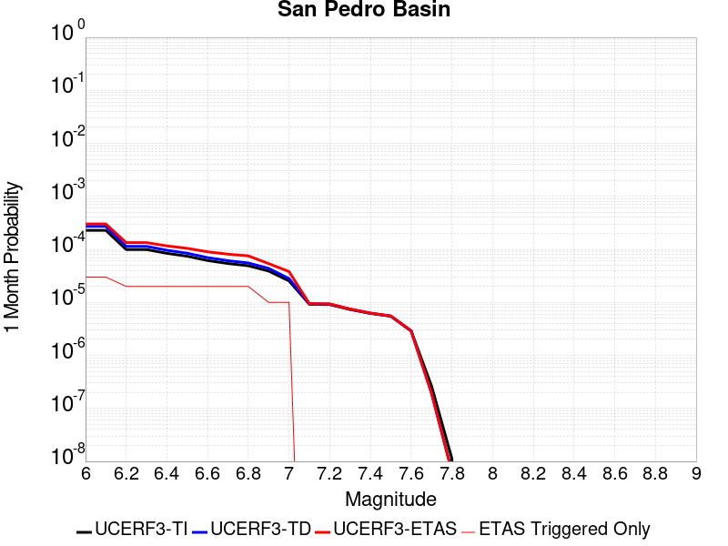 |  |  |

| Magnitude | 1 wk TI Prob | 1 wk TD Prob | 1 wk ETAS Prob | 1 wk ETAS/TD Gain | 1 wk ETAS Triggered Only | 1 mo TI Prob | 1 mo TD Prob | 1 mo ETAS Prob | 1 mo ETAS/TD Gain | 1 mo ETAS Triggered Only | 1 yr TI Prob | 1 yr TD Prob | 1 yr ETAS Prob | 1 yr ETAS/TD Gain | 1 yr ETAS Triggered Only | 10 yr TI Prob | 10 yr TD Prob | 10 yr ETAS Prob | 10 yr ETAS/TD Gain | 10 yr ETAS Triggered Only |
|-----|-----|-----|-----|-----|-----|-----|-----|-----|-----|-----|-----|-----|-----|-----|-----|-----|-----|-----|-----|-----|
| 6.0 | 5.3449043E-5 | 6.336954E-5 | 9.456102E-5 | 1.4922158 | 3.1193464E-5 | 2.2904722E-4 | 2.715589E-4 | 3.0274392E-4 | 1.1148369 | 3.1193464E-5 | 0.0027850836 | 0.0033018254 | 0.0033329157 | 1.0094161 | 3.1193464E-5 | 0.027504366 | 0.03258945 | 0.032679982 | 1.0027779 | 9.3580384E-5 |
| 6.1 | 5.3449043E-5 | 6.336954E-5 | 9.456102E-5 | 1.4922158 | 3.1193464E-5 | 2.2904722E-4 | 2.715589E-4 | 3.0274392E-4 | 1.1148369 | 3.1193464E-5 | 0.0027850836 | 0.0033018254 | 0.0033329157 | 1.0094161 | 3.1193464E-5 | 0.027504366 | 0.03258945 | 0.032679982 | 1.0027779 | 9.3580384E-5 |
| 6.2 | 2.3189454E-5 | 2.6642796E-5 | 4.2239113E-5 | 1.5853858 | 1.5596732E-5 | 9.9379584E-5 | 1.14178685E-4 | 1.2977363E-4 | 1.1365837 | 1.5596732E-5 | 0.0012092749 | 0.0013892864 | 0.0014048615 | 1.0112108 | 1.5596732E-5 | 0.012027155 | 0.013810883 | 0.01388779 | 1.0055685 | 7.7983656E-5 |
| 6.3 | 2.3189454E-5 | 2.6642796E-5 | 4.2239113E-5 | 1.5853858 | 1.5596732E-5 | 9.9379584E-5 | 1.14178685E-4 | 1.2977363E-4 | 1.1365837 | 1.5596732E-5 | 0.0012092749 | 0.0013892864 | 0.0014048615 | 1.0112108 | 1.5596732E-5 | 0.012027155 | 0.013810883 | 0.01388779 | 1.0055685 | 7.7983656E-5 |
| 6.4 | 1.966056E-5 | 2.2463413E-5 | 3.8059792E-5 | 1.6943015 | 1.5596732E-5 | 8.425682E-5 | 9.626844E-5 | 1.1186367E-4 | 1.1619973 | 1.5596732E-5 | 0.001025344 | 0.0011714783 | 0.0011870568 | 1.0132982 | 1.5596732E-5 | 0.010206259 | 0.011657117 | 0.0116879465 | 1.0026448 | 3.1193464E-5 |
| 6.5 | 1.7342953E-5 | 1.9745148E-5 | 3.534157E-5 | 1.7898864 | 1.5596732E-5 | 7.4324824E-5 | 8.4619525E-5 | 1.0021494E-4 | 1.1843004 | 1.5596732E-5 | 9.04529E-4 | 0.0010297928 | 0.0010453735 | 1.0151299 | 1.5596732E-5 | 0.009008561 | 0.010253931 | 0.010284805 | 1.0030109 | 3.1193464E-5 |
| 6.6 | 1.439804E-5 | 1.6322716E-5 | 3.1919193E-5 | 1.9555074 | 1.5596732E-5 | 6.170443E-5 | 6.99528E-5 | 8.554844E-5 | 1.2229452 | 1.5596732E-5 | 7.509924E-4 | 8.513747E-4 | 8.669581E-4 | 1.0183039 | 1.5596732E-5 | 0.0074845953 | 0.008484332 | 0.008515261 | 1.0036454 | 3.1193464E-5 |
| 6.7 | 1.2634884E-5 | 1.4285297E-5 | 2.9881805E-5 | 2.0917876 | 1.5596732E-5 | 5.414838E-5 | 6.1221435E-5 | 7.681721E-5 | 1.2547437 | 1.5596732E-5 | 6.590571E-4 | 7.4514654E-4 | 7.6073164E-4 | 1.0209155 | 1.5596732E-5 | 0.006571059 | 0.007429501 | 0.007444982 | 1.0020837 | 1.5596732E-5 |
| 6.8 | 1.146091E-5 | 1.2933192E-5 | 2.8529721E-5 | 2.2059305 | 1.5596732E-5 | 4.911726E-5 | 5.5426954E-5 | 7.102282E-5 | 1.281377 | 1.5596732E-5 | 5.9783855E-4 | 6.7464396E-4 | 6.9023017E-4 | 1.0231029 | 1.5596732E-5 | 0.0059623276 | 0.006728899 | 0.006744391 | 1.0023023 | 1.5596732E-5 |
| 6.9 | 9.109035E-6 | 1.0235011E-5 | 2.5831583E-5 | 2.523845 | 1.5596732E-5 | 3.9038136E-5 | 4.3863754E-5 | 5.9459802E-5 | 1.3555566 | 1.5596732E-5 | 4.7518566E-4 | 5.3393835E-4 | 5.4952677E-4 | 1.0291952 | 1.5596732E-5 | 0.0047417083 | 0.005329309 | 0.0053448225 | 1.002911 | 1.5596732E-5 |
| 7.0 | 5.9351028E-6 | 6.583964E-6 | 2.2180593E-5 | 3.3688812 | 1.5596732E-5 | 2.5435906E-5 | 2.8216817E-5 | 4.3813106E-5 | 1.5527303 | 1.5596732E-5 | 3.0963816E-4 | 3.435092E-4 | 3.5910058E-4 | 1.0453885 | 1.5596732E-5 | 0.0030920706 | 0.0034320992 | 0.0034476423 | 1.0045288 | 1.5596732E-5 |
| 7.1 | 2.1557585E-6 | 2.209648E-6 | 2.209648E-6 | 1.0 | 0.0 | 9.238933E-6 | 9.469887E-6 | 9.469887E-6 | 1.0 | 0.0 | 1.1247819E-4 | 1.1528993E-4 | 1.1528993E-4 | 1.0 | 0.0 | 0.0011242128 | 0.0011523166 | 0.0011523166 | 1.0 | 0.0 |
| 7.2 | 2.1251979E-6 | 2.1779945E-6 | 2.1779945E-6 | 1.0 | 0.0 | 9.107958E-6 | 9.334229E-6 | 9.334229E-6 | 1.0 | 0.0 | 1.1088375E-4 | 1.1363847E-4 | 1.1363847E-4 | 1.0 | 0.0 | 0.0011082845 | 0.0011358189 | 0.0011358189 | 1.0 | 0.0 |
| 7.3 | 1.7145798E-6 | 1.7442874E-6 | 1.7442874E-6 | 1.0 | 0.0 | 7.3481783E-6 | 7.4754967E-6 | 7.4754967E-6 | 1.0 | 0.0 | 8.94604E-5 | 9.1010465E-5 | 9.1010465E-5 | 1.0 | 0.0 | 8.9424395E-4 | 9.0974104E-4 | 9.0974104E-4 | 1.0 | 0.0 |
| 7.4 | 1.4467993E-6 | 1.4641868E-6 | 1.4641868E-6 | 1.0 | 0.0 | 6.200554E-6 | 6.2750714E-6 | 6.2750714E-6 | 1.0 | 0.0 | 7.548913E-5 | 7.639639E-5 | 7.639639E-5 | 1.0 | 0.0 | 7.546349E-4 | 7.6370855E-4 | 7.6370855E-4 | 1.0 | 0.0 |
| 7.5 | 1.2803735E-6 | 1.2931497E-6 | 1.2931497E-6 | 1.0 | 0.0 | 5.487303E-6 | 5.5420587E-6 | 5.5420587E-6 | 1.0 | 0.0 | 6.680587E-5 | 6.7472545E-5 | 6.7472545E-5 | 1.0 | 0.0 | 6.678579E-4 | 6.7452766E-4 | 6.7452766E-4 | 1.0 | 0.0 |
| 7.6 | 6.755009E-7 | 6.769465E-7 | 6.769465E-7 | 1.0 | 0.0 | 2.8950008E-6 | 2.9011965E-6 | 2.9011965E-6 | 1.0 | 0.0 | 3.5246063E-5 | 3.5321555E-5 | 3.5321555E-5 | 1.0 | 0.0 | 3.5240475E-4 | 3.5316512E-4 | 3.5316512E-4 | 1.0 | 0.0 |
| 7.7 | 6.211885E-8 | 4.569953E-8 | 4.569953E-8 | 1.0 | 0.0 | 2.6622362E-7 | 1.9585512E-7 | 1.9585512E-7 | 1.0 | 0.0 | 3.2412677E-6 | 2.3845337E-6 | 2.3845337E-6 | 1.0 | 0.0 | 3.2412205E-5 | 2.3845101E-5 | 2.3845101E-5 | 1.0 | 0.0 |
| 7.8 | 2.6580573E-9 | 1.5138163E-9 | 1.5138163E-9 | 1.0 | 0.0 | 1.1391674E-8 | 6.487784E-9 | 6.487784E-9 | 1.0 | 0.0 | 1.3869362E-7 | 7.898877E-8 | 7.898877E-8 | 1.0 | 0.0 | 1.3869354E-6 | 7.898877E-7 | 7.898877E-7 | 1.0 | 0.0 |

## Cucamonga
*[(top)](#table-of-contents)*

| 1 Week | 1 Month | 1 Year | 10 Year |
|-----|-----|-----|-----|
|  |  |  |  |

| Magnitude | 1 wk TI Prob | 1 wk TD Prob | 1 wk ETAS Prob | 1 wk ETAS/TD Gain | 1 wk ETAS Triggered Only | 1 mo TI Prob | 1 mo TD Prob | 1 mo ETAS Prob | 1 mo ETAS/TD Gain | 1 mo ETAS Triggered Only | 1 yr TI Prob | 1 yr TD Prob | 1 yr ETAS Prob | 1 yr ETAS/TD Gain | 1 yr ETAS Triggered Only | 10 yr TI Prob | 10 yr TD Prob | 10 yr ETAS Prob | 10 yr ETAS/TD Gain | 10 yr ETAS Triggered Only |
|-----|-----|-----|-----|-----|-----|-----|-----|-----|-----|-----|-----|-----|-----|-----|-----|-----|-----|-----|-----|-----|
| 6.0 | 1.1848348E-5 | 1.1737008E-5 | 2.7333555E-5 | 2.328835 | 1.5596732E-5 | 5.0777642E-5 | 5.030051E-5 | 8.14924E-5 | 1.6201109 | 3.1193464E-5 | 6.180424E-4 | 6.1223935E-4 | 6.590009E-4 | 1.0763779 | 4.6790192E-5 | 0.0061632637 | 0.0061067017 | 0.0062152124 | 1.0177691 | 1.0917712E-4 |
| 6.1 | 1.1848348E-5 | 1.1737008E-5 | 2.7333555E-5 | 2.328835 | 1.5596732E-5 | 5.0777642E-5 | 5.030051E-5 | 8.14924E-5 | 1.6201109 | 3.1193464E-5 | 6.180424E-4 | 6.1223935E-4 | 6.590009E-4 | 1.0763779 | 4.6790192E-5 | 0.0061632637 | 0.0061067017 | 0.0062152124 | 1.0177691 | 1.0917712E-4 |
| 6.2 | 1.1848348E-5 | 1.1737008E-5 | 2.7333555E-5 | 2.328835 | 1.5596732E-5 | 5.0777642E-5 | 5.030051E-5 | 8.14924E-5 | 1.6201109 | 3.1193464E-5 | 6.180424E-4 | 6.1223935E-4 | 6.590009E-4 | 1.0763779 | 4.6790192E-5 | 0.0061632637 | 0.0061067017 | 0.0062152124 | 1.0177691 | 1.0917712E-4 |
| 6.3 | 1.1848348E-5 | 1.1737008E-5 | 2.7333555E-5 | 2.328835 | 1.5596732E-5 | 5.0777642E-5 | 5.030051E-5 | 8.14924E-5 | 1.6201109 | 3.1193464E-5 | 6.180424E-4 | 6.1223935E-4 | 6.590009E-4 | 1.0763779 | 4.6790192E-5 | 0.0061632637 | 0.0061067017 | 0.0062152124 | 1.0177691 | 1.0917712E-4 |
| 6.4 | 1.1848348E-5 | 1.1737008E-5 | 2.7333555E-5 | 2.328835 | 1.5596732E-5 | 5.0777642E-5 | 5.030051E-5 | 8.14924E-5 | 1.6201109 | 3.1193464E-5 | 6.180424E-4 | 6.1223935E-4 | 6.590009E-4 | 1.0763779 | 4.6790192E-5 | 0.0061632637 | 0.0061067017 | 0.0062152124 | 1.0177691 | 1.0917712E-4 |
| 6.5 | 1.16988695E-5 | 1.15760395E-5 | 2.717259E-5 | 2.3473132 | 1.5596732E-5 | 5.013705E-5 | 4.9610666E-5 | 8.080258E-5 | 1.628734 | 3.1193464E-5 | 6.102476E-4 | 6.0384517E-4 | 6.506071E-4 | 1.0774403 | 4.6790192E-5 | 0.006085745 | 0.006023216 | 0.0061317356 | 1.0180168 | 1.0917712E-4 |
| 6.6 | 1.16988695E-5 | 1.15760395E-5 | 2.717259E-5 | 2.3473132 | 1.5596732E-5 | 5.013705E-5 | 4.9610666E-5 | 8.080258E-5 | 1.628734 | 3.1193464E-5 | 6.102476E-4 | 6.0384517E-4 | 6.506071E-4 | 1.0774403 | 4.6790192E-5 | 0.006085745 | 0.006023216 | 0.0061317356 | 1.0180168 | 1.0917712E-4 |
| 6.7 | 1.1397107E-5 | 1.11149475E-5 | 2.6711505E-5 | 2.4032056 | 1.5596732E-5 | 4.884383E-5 | 4.7634636E-5 | 7.882661E-5 | 1.6548171 | 3.1193464E-5 | 5.9451134E-4 | 5.797998E-4 | 6.265629E-4 | 1.0806538 | 4.6790192E-5 | 0.005929234 | 0.0057840226 | 0.0058925683 | 1.0187664 | 1.0917712E-4 |
| 6.8 | 1.058387E-5 | 9.784992E-6 | 2.538157E-5 | 2.5939286 | 1.5596732E-5 | 4.5358654E-5 | 4.193501E-5 | 7.3127165E-5 | 1.7438213 | 3.1193464E-5 | 5.521017E-4 | 5.1044027E-4 | 5.572066E-4 | 1.0916196 | 4.6790192E-5 | 0.00550732 | 0.0050936877 | 0.0052023088 | 1.0213246 | 1.0917712E-4 |
| 6.9 | 9.690046E-6 | 8.57948E-6 | 2.4176077E-5 | 2.8178954 | 1.5596732E-5 | 4.1528107E-5 | 3.6768684E-5 | 6.7961E-5 | 1.8483392 | 3.1193464E-5 | 5.054874E-4 | 4.475672E-4 | 4.943364E-4 | 1.1044966 | 4.6790192E-5 | 0.005043391 | 0.004467594 | 0.0045762835 | 1.0243284 | 1.0917712E-4 |
| 7.0 | 9.381461E-6 | 8.187101E-6 | 2.3783705E-5 | 2.9050214 | 1.5596732E-5 | 4.020564E-5 | 3.5087105E-5 | 6.627948E-5 | 1.888998 | 3.1193464E-5 | 4.893937E-4 | 4.2710215E-4 | 4.7387235E-4 | 1.1095059 | 4.6790192E-5 | 0.0048831734 | 0.0042637475 | 0.004372459 | 1.0254967 | 1.0917712E-4 |
| 7.1 | 8.946492E-6 | 7.781886E-6 | 2.3378496E-5 | 3.0042198 | 1.5596732E-5 | 3.8341543E-5 | 3.3350516E-5 | 4.8946727E-5 | 1.4676453 | 1.5596732E-5 | 4.667083E-4 | 4.0596718E-4 | 4.3714797E-4 | 1.0768062 | 3.1193464E-5 | 0.0046572937 | 0.004053192 | 0.0041463934 | 1.0229945 | 9.3580384E-5 |
| 7.2 | 8.251016E-6 | 6.9752796E-6 | 2.2571901E-5 | 3.2359853 | 1.5596732E-5 | 3.5361016E-5 | 2.9893714E-5 | 4.548998E-5 | 1.5217239 | 1.5596732E-5 | 4.3043532E-4 | 3.6389544E-4 | 3.9507754E-4 | 1.0856898 | 3.1193464E-5 | 0.0042960253 | 0.0036339292 | 0.0037271695 | 1.0256582 | 9.3580384E-5 |
| 7.3 | 7.717881E-6 | 6.4863502E-6 | 2.208298E-5 | 3.4045308 | 1.5596732E-5 | 3.3076216E-5 | 2.7798349E-5 | 4.3394648E-5 | 1.5610512 | 1.5596732E-5 | 4.026285E-4 | 3.3839257E-4 | 3.53984E-4 | 1.0460751 | 1.5596732E-5 | 0.004018998 | 0.00337971 | 0.003441886 | 1.0183969 | 6.238693E-5 |
| 7.4 | 7.275623E-6 | 6.031997E-6 | 2.1628633E-5 | 3.5856504 | 1.5596732E-5 | 3.118087E-5 | 2.585116E-5 | 4.144749E-5 | 1.6033125 | 1.5596732E-5 | 3.7956095E-4 | 3.1469265E-4 | 3.3028447E-4 | 1.0495462 | 1.5596732E-5 | 0.0037891332 | 0.0031434062 | 0.0032055972 | 1.0197846 | 6.238693E-5 |
| 7.5 | 6.5109502E-6 | 5.1006014E-6 | 5.1006014E-6 | 1.0 | 0.0 | 2.7903774E-5 | 2.1859538E-5 | 2.1859538E-5 | 1.0 | 0.0 | 3.3967546E-4 | 2.661075E-4 | 2.661075E-4 | 1.0 | 0.0 | 0.0033915674 | 0.002658813 | 0.0027054788 | 1.0175513 | 4.6790192E-5 |
| 7.6 | 5.4495326E-6 | 3.90857E-6 | 3.90857E-6 | 1.0 | 0.0 | 2.335493E-5 | 1.6750908E-5 | 1.6750908E-5 | 1.0 | 0.0 | 2.8430918E-4 | 2.0392328E-4 | 2.0392328E-4 | 1.0 | 0.0 | 0.0028394572 | 0.002038282 | 0.002053847 | 1.0076363 | 1.5596732E-5 |
| 7.7 | 4.7997164E-6 | 3.2002547E-6 | 3.2002547E-6 | 1.0 | 0.0 | 2.057005E-5 | 1.3715306E-5 | 1.3715306E-5 | 1.0 | 0.0 | 2.504116E-4 | 1.6697108E-4 | 1.6697108E-4 | 1.0 | 0.0 | 0.002501296 | 0.0016693877 | 0.0016849583 | 1.0093272 | 1.5596732E-5 |
| 7.8 | 3.3941733E-6 | 2.0641899E-6 | 2.0641899E-6 | 1.0 | 0.0 | 1.4546376E-5 | 8.846498E-6 | 8.846498E-6 | 1.0 | 0.0 | 1.7708774E-4 | 1.07700806E-4 | 1.07700806E-4 | 1.0 | 0.0 | 0.0017694668 | 0.001076723 | 0.001076723 | 1.0 | 0.0 |
| 7.9 | 9.750552E-7 | 5.155946E-7 | 5.155946E-7 | 1.0 | 0.0 | 4.178801E-6 | 2.2096892E-6 | 2.2096892E-6 | 1.0 | 0.0 | 5.0875715E-5 | 2.690264E-5 | 2.690264E-5 | 1.0 | 0.0 | 5.086407E-4 | 2.6899425E-4 | 2.6899425E-4 | 1.0 | 0.0 |
| 8.0 | 1.133857E-7 | 6.053707E-8 | 6.053707E-8 | 1.0 | 0.0 | 4.8593864E-7 | 2.5944456E-7 | 2.5944456E-7 | 1.0 | 0.0 | 5.9162867E-6 | 3.158733E-6 | 3.158733E-6 | 1.0 | 0.0 | 5.916129E-5 | 3.1586897E-5 | 3.1586897E-5 | 1.0 | 0.0 |

## Oceanic - West Huasna
*[(top)](#table-of-contents)*

| 1 Week | 1 Month | 1 Year | 10 Year |
|-----|-----|-----|-----|
|  |  |  | 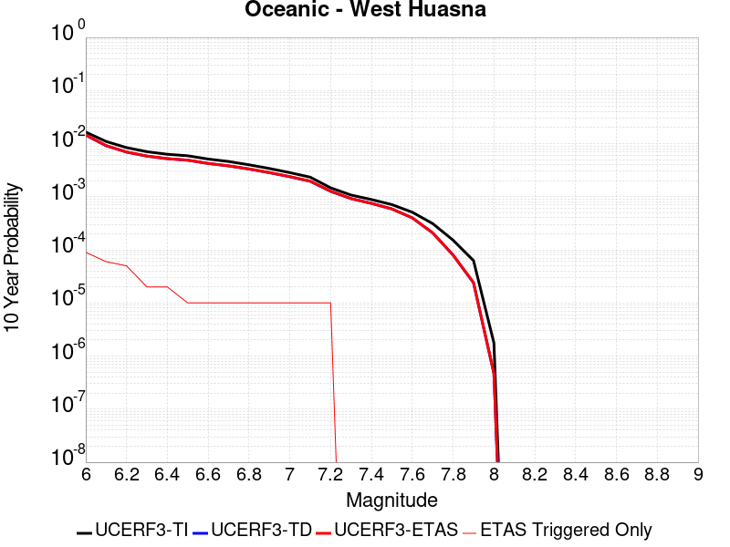 |

| Magnitude | 1 wk TI Prob | 1 wk TD Prob | 1 wk ETAS Prob | 1 wk ETAS/TD Gain | 1 wk ETAS Triggered Only | 1 mo TI Prob | 1 mo TD Prob | 1 mo ETAS Prob | 1 mo ETAS/TD Gain | 1 mo ETAS Triggered Only | 1 yr TI Prob | 1 yr TD Prob | 1 yr ETAS Prob | 1 yr ETAS/TD Gain | 1 yr ETAS Triggered Only | 10 yr TI Prob | 10 yr TD Prob | 10 yr ETAS Prob | 10 yr ETAS/TD Gain | 10 yr ETAS Triggered Only |
|-----|-----|-----|-----|-----|-----|-----|-----|-----|-----|-----|-----|-----|-----|-----|-----|-----|-----|-----|-----|-----|
| 6.0 | 3.195567E-5 | 2.7926868E-5 | 2.7926868E-5 | 1.0 | 0.0 | 1.3694567E-4 | 1.1968133E-4 | 1.3527619E-4 | 1.1303033 | 1.5596732E-5 | 0.0016660384 | 0.0014561893 | 0.0015029114 | 1.0320852 | 4.6790192E-5 | 0.016536033 | 0.014471028 | 0.014563254 | 1.0063732 | 9.3580384E-5 |
| 6.1 | 2.1156782E-5 | 1.7573486E-5 | 1.7573486E-5 | 1.0 | 0.0 | 9.066878E-5 | 7.531282E-5 | 7.531282E-5 | 1.0 | 0.0 | 0.0011033333 | 9.165572E-4 | 9.4772206E-4 | 1.0340021 | 3.1193464E-5 | 0.010978713 | 0.009128777 | 0.009190595 | 1.0067717 | 6.238693E-5 |
| 6.2 | 1.6195117E-5 | 1.3327152E-5 | 1.3327152E-5 | 1.0 | 0.0 | 6.9405796E-5 | 5.7115132E-5 | 5.7115132E-5 | 1.0 | 0.0 | 8.44688E-4 | 6.9515745E-4 | 7.263292E-4 | 1.0448413 | 3.1193464E-5 | 0.008414844 | 0.006930123 | 0.006976589 | 1.0067049 | 4.6790192E-5 |
| 6.3 | 1.3559345E-5 | 1.1179142E-5 | 1.1179142E-5 | 1.0 | 0.0 | 5.811018E-5 | 4.7909736E-5 | 4.7909736E-5 | 1.0 | 0.0 | 7.072618E-4 | 5.831459E-4 | 5.831459E-4 | 1.0 | 0.0 | 0.0070501505 | 0.0058162753 | 0.0058162753 | 1.0 | 0.0 |
| 6.4 | 1.2120619E-5 | 1.0000977E-5 | 1.0000977E-5 | 1.0 | 0.0 | 5.1944477E-5 | 4.2860633E-5 | 4.2860633E-5 | 1.0 | 0.0 | 6.322405E-4 | 5.2170374E-4 | 5.2170374E-4 | 1.0 | 0.0 | 0.006304447 | 0.0052048573 | 0.0052048573 | 1.0 | 0.0 |
| 6.5 | 1.13511915E-5 | 9.3674735E-6 | 9.3674735E-6 | 1.0 | 0.0 | 4.8647056E-5 | 4.01457E-5 | 4.01457E-5 | 1.0 | 0.0 | 5.9211696E-4 | 4.886647E-4 | 4.886647E-4 | 1.0 | 0.0 | 0.0059054173 | 0.0048759608 | 0.0048759608 | 1.0 | 0.0 |
| 6.6 | 9.850605E-6 | 8.135418E-6 | 8.135418E-6 | 1.0 | 0.0 | 4.2216197E-5 | 3.4865614E-5 | 3.4865614E-5 | 1.0 | 0.0 | 5.1386096E-4 | 4.2440637E-4 | 4.2440637E-4 | 1.0 | 0.0 | 0.0051267436 | 0.004235991 | 0.004235991 | 1.0 | 0.0 |
| 6.7 | 8.8558645E-6 | 7.318433E-6 | 7.318433E-6 | 1.0 | 0.0 | 3.7953152E-5 | 3.1364336E-5 | 3.1364336E-5 | 1.0 | 0.0 | 4.6198163E-4 | 3.8179406E-4 | 3.8179406E-4 | 1.0 | 0.0 | 0.004610224 | 0.0038114067 | 0.0038114067 | 1.0 | 0.0 |
| 6.8 | 7.67136E-6 | 6.391756E-6 | 6.391756E-6 | 1.0 | 0.0 | 3.2876844E-5 | 2.7392953E-5 | 2.7392953E-5 | 1.0 | 0.0 | 4.0020206E-4 | 3.3345833E-4 | 3.3345833E-4 | 1.0 | 0.0 | 0.003994821 | 0.0033296007 | 0.0033296007 | 1.0 | 0.0 |
| 6.9 | 6.534529E-6 | 5.4583297E-6 | 5.4583297E-6 | 1.0 | 0.0 | 2.8004823E-5 | 2.3392633E-5 | 2.3392633E-5 | 1.0 | 0.0 | 3.4090536E-4 | 2.847682E-4 | 2.847682E-4 | 1.0 | 0.0 | 0.0034038287 | 0.0028440498 | 0.0028440498 | 1.0 | 0.0 |
| 7.0 | 5.460525E-6 | 4.5699517E-6 | 4.5699517E-6 | 1.0 | 0.0 | 2.3402039E-5 | 1.958536E-5 | 1.958536E-5 | 1.0 | 0.0 | 2.8488258E-4 | 2.3842578E-4 | 2.3842578E-4 | 1.0 | 0.0 | 0.0028451765 | 0.0023817138 | 0.0023817138 | 1.0 | 0.0 |
| 7.1 | 4.4825083E-6 | 3.7524428E-6 | 3.7524428E-6 | 1.0 | 0.0 | 1.9210609E-5 | 1.60818E-5 | 1.60818E-5 | 1.0 | 0.0 | 2.3386406E-4 | 1.9577841E-4 | 1.9577841E-4 | 1.0 | 0.0 | 0.002336181 | 0.0019560715 | 0.0019560715 | 1.0 | 0.0 |
| 7.2 | 2.821708E-6 | 2.4249334E-6 | 2.4249334E-6 | 1.0 | 0.0 | 1.2092979E-5 | 1.039253E-5 | 1.039253E-5 | 1.0 | 0.0 | 1.4722206E-4 | 1.2652173E-4 | 1.2652173E-4 | 1.0 | 0.0 | 0.0014712457 | 0.0012644994 | 0.0012644994 | 1.0 | 0.0 |
| 7.3 | 2.0644757E-6 | 1.7687412E-6 | 1.7687412E-6 | 1.0 | 0.0 | 8.847723E-6 | 7.5802973E-6 | 7.5802973E-6 | 1.0 | 0.0 | 1.0771569E-4 | 9.228622E-5 | 9.228622E-5 | 1.0 | 0.0 | 0.001076635 | 9.2248066E-4 | 9.2248066E-4 | 1.0 | 0.0 |
| 7.4 | 1.6980367E-6 | 1.4379892E-6 | 1.4379892E-6 | 1.0 | 0.0 | 7.27728E-6 | 6.162796E-6 | 6.162796E-6 | 1.0 | 0.0 | 8.8597284E-5 | 7.5029464E-5 | 7.5029464E-5 | 1.0 | 0.0 | 8.8561967E-4 | 7.500429E-4 | 7.500429E-4 | 1.0 | 0.0 |
| 7.5 | 1.3637683E-6 | 1.1302635E-6 | 1.1302635E-6 | 1.0 | 0.0 | 5.844708E-6 | 4.8439774E-6 | 4.8439774E-6 | 1.0 | 0.0 | 7.1156996E-5 | 5.897383E-5 | 5.897383E-5 | 1.0 | 0.0 | 7.1134215E-4 | 5.895833E-4 | 5.895833E-4 | 1.0 | 0.0 |
| 7.6 | 9.802994E-7 | 7.677247E-7 | 7.677247E-7 | 1.0 | 0.0 | 4.2012766E-6 | 3.2902446E-6 | 3.2902446E-6 | 1.0 | 0.0 | 5.1149345E-5 | 4.0057992E-5 | 4.0057992E-5 | 1.0 | 0.0 | 5.113757E-4 | 4.0050913E-4 | 4.0050913E-4 | 1.0 | 0.0 |
| 7.7 | 5.986191E-7 | 4.0050548E-7 | 4.0050548E-7 | 1.0 | 0.0 | 2.5655079E-6 | 1.7164509E-6 | 1.7164509E-6 | 1.0 | 0.0 | 3.1234613E-5 | 2.089759E-5 | 2.089759E-5 | 1.0 | 0.0 | 3.123022E-4 | 2.089576E-4 | 2.089576E-4 | 1.0 | 0.0 |
| 7.8 | 2.9189815E-7 | 1.5285792E-7 | 1.5285792E-7 | 1.0 | 0.0 | 1.2509914E-6 | 6.5510517E-7 | 6.5510517E-7 | 1.0 | 0.0 | 1.5230714E-5 | 7.9758765E-6 | 7.9758765E-6 | 1.0 | 0.0 | 1.522967E-4 | 7.9757214E-5 | 7.9757214E-5 | 1.0 | 0.0 |
| 7.9 | 1.2057845E-7 | 4.621248E-8 | 4.621248E-8 | 1.0 | 0.0 | 5.1676466E-7 | 1.9805347E-7 | 1.9805347E-7 | 1.0 | 0.0 | 6.2915915E-6 | 2.4112983E-6 | 2.4112983E-6 | 1.0 | 0.0 | 6.2914136E-5 | 2.4114026E-5 | 2.4114026E-5 | 1.0 | 0.0 |
| 8.0 | 3.3806387E-9 | 9.011393E-10 | 9.011393E-10 | 1.0 | 0.0 | 1.4488451E-8 | 3.8620254E-9 | 3.8620254E-9 | 1.0 | 0.0 | 1.7639688E-7 | 4.702016E-8 | 4.702016E-8 | 1.0 | 0.0 | 1.7639674E-6 | 4.7129527E-7 | 4.7129527E-7 | 1.0 | 0.0 |

## Owens Valley
*[(top)](#table-of-contents)*

| 1 Week | 1 Month | 1 Year | 10 Year |
|-----|-----|-----|-----|
|  |  |  |  |

| Magnitude | 1 wk TI Prob | 1 wk TD Prob | 1 wk ETAS Prob | 1 wk ETAS/TD Gain | 1 wk ETAS Triggered Only | 1 mo TI Prob | 1 mo TD Prob | 1 mo ETAS Prob | 1 mo ETAS/TD Gain | 1 mo ETAS Triggered Only | 1 yr TI Prob | 1 yr TD Prob | 1 yr ETAS Prob | 1 yr ETAS/TD Gain | 1 yr ETAS Triggered Only | 10 yr TI Prob | 10 yr TD Prob | 10 yr ETAS Prob | 10 yr ETAS/TD Gain | 10 yr ETAS Triggered Only |
|-----|-----|-----|-----|-----|-----|-----|-----|-----|-----|-----|-----|-----|-----|-----|-----|-----|-----|-----|-----|-----|
| 6.0 | 4.83821E-5 | 3.626567E-6 | 1.9223242E-5 | 5.300672 | 1.5596732E-5 | 2.0733538E-4 | 1.5542342E-5 | 7.79283E-5 | 5.013935 | 6.238693E-5 | 0.002521386 | 1.8921259E-4 | 2.8277526E-4 | 1.4944844 | 9.3580384E-5 | 0.024929691 | 0.001925011 | 0.002033978 | 1.0566059 | 1.0917712E-4 |
| 6.1 | 4.83821E-5 | 3.626567E-6 | 1.9223242E-5 | 5.300672 | 1.5596732E-5 | 2.0733538E-4 | 1.5542342E-5 | 7.79283E-5 | 5.013935 | 6.238693E-5 | 0.002521386 | 1.8921259E-4 | 2.8277526E-4 | 1.4944844 | 9.3580384E-5 | 0.024929691 | 0.001925011 | 0.002033978 | 1.0566059 | 1.0917712E-4 |
| 6.2 | 4.83821E-5 | 3.626567E-6 | 1.9223242E-5 | 5.300672 | 1.5596732E-5 | 2.0733538E-4 | 1.5542342E-5 | 7.79283E-5 | 5.013935 | 6.238693E-5 | 0.002521386 | 1.8921259E-4 | 2.8277526E-4 | 1.4944844 | 9.3580384E-5 | 0.024929691 | 0.001925011 | 0.002033978 | 1.0566059 | 1.0917712E-4 |
| 6.3 | 3.953008E-5 | 3.1553948E-6 | 1.8752076E-5 | 5.942862 | 1.5596732E-5 | 1.6940363E-4 | 1.3523055E-5 | 7.5909134E-5 | 5.6133127 | 6.238693E-5 | 0.002060538 | 1.6463149E-4 | 2.5819647E-4 | 1.5683298 | 9.3580384E-5 | 0.020415364 | 0.0016592 | 0.0017681959 | 1.0656918 | 1.0917712E-4 |
| 6.4 | 3.953008E-5 | 3.1553948E-6 | 1.8752076E-5 | 5.942862 | 1.5596732E-5 | 1.6940363E-4 | 1.3523055E-5 | 7.5909134E-5 | 5.6133127 | 6.238693E-5 | 0.002060538 | 1.6463149E-4 | 2.5819647E-4 | 1.5683298 | 9.3580384E-5 | 0.020415364 | 0.0016592 | 0.0017681959 | 1.0656918 | 1.0917712E-4 |
| 6.5 | 3.457342E-5 | 2.9715961E-6 | 1.856828E-5 | 6.248588 | 1.5596732E-5 | 1.4816338E-4 | 1.2735354E-5 | 7.512148E-5 | 5.898657 | 6.238693E-5 | 0.0018023965 | 1.550426E-4 | 2.4860847E-4 | 1.603485 | 9.3580384E-5 | 0.017878477 | 0.001555719 | 0.0016647262 | 1.0700687 | 1.0917712E-4 |
| 6.6 | 3.1127765E-5 | 2.8744932E-6 | 1.8471179E-5 | 6.4258904 | 1.5596732E-5 | 1.3339789E-4 | 1.2319203E-5 | 7.470536E-5 | 6.064139 | 6.238693E-5 | 0.0016229092 | 1.4997667E-4 | 2.43543E-4 | 1.6238728 | 9.3580384E-5 | 0.016111081 | 0.0015012559 | 0.0016102691 | 1.0726147 | 1.0917712E-4 |
| 6.7 | 2.806885E-5 | 2.8104134E-6 | 1.8407101E-5 | 6.549606 | 1.5596732E-5 | 1.2028952E-4 | 1.20445775E-5 | 7.443075E-5 | 6.179607 | 6.238693E-5 | 0.001463541 | 1.4663354E-4 | 2.4020021E-4 | 1.6380986 | 9.3580384E-5 | 0.014539397 | 0.0014657511 | 0.0015747681 | 1.0743762 | 1.0917712E-4 |
| 6.8 | 2.524524E-5 | 2.2353688E-6 | 1.7832064E-5 | 7.9772363 | 1.5596732E-5 | 1.0818939E-4 | 9.580118E-6 | 5.6369863E-5 | 5.8840466 | 4.6790192E-5 | 0.0013164099 | 1.16632E-4 | 1.9460656E-4 | 1.668552 | 7.7983656E-5 | 0.01308639 | 0.0011659812 | 0.0012594524 | 1.0801654 | 9.3580384E-5 |
| 6.9 | 2.2704568E-5 | 1.6081682E-6 | 1.7204875E-5 | 10.698429 | 1.5596732E-5 | 9.730166E-5 | 6.8921313E-6 | 5.3682E-5 | 7.7888823 | 4.6790192E-5 | 0.0011840039 | 8.390849E-5 | 1.618856E-4 | 1.9293114 | 7.7983656E-5 | 0.011777153 | 8.3897985E-4 | 9.324817E-4 | 1.1114471 | 9.3580384E-5 |
| 7.0 | 2.0871712E-5 | 1.5395453E-6 | 1.7136252E-5 | 11.130723 | 1.5596732E-5 | 8.944713E-5 | 6.598035E-6 | 5.3387917E-5 | 8.091488 | 4.6790192E-5 | 0.0010884746 | 8.032813E-5 | 1.5830551E-4 | 1.9707358 | 7.7983656E-5 | 0.010831586 | 8.0316263E-4 | 8.966678E-4 | 1.1164213 | 9.3580384E-5 |
| 7.1 | 1.944928E-5 | 1.3864178E-6 | 1.6983127E-5 | 12.249646 | 1.5596732E-5 | 8.335139E-5 | 5.941777E-6 | 5.273169E-5 | 8.874734 | 4.6790192E-5 | 0.0010143308 | 7.233874E-5 | 1.3472115E-4 | 1.8623651 | 6.238693E-5 | 0.010097133 | 7.2330976E-4 | 8.01237E-4 | 1.1077371 | 7.7983656E-5 |
| 7.2 | 1.7876306E-5 | 1.2489141E-6 | 1.6845626E-5 | 13.488217 | 1.5596732E-5 | 7.6610486E-5 | 5.352478E-6 | 5.214242E-5 | 9.7417345 | 4.6790192E-5 | 9.3233347E-4 | 6.516448E-5 | 1.2754733E-4 | 1.9573138 | 6.238693E-5 | 0.009284316 | 6.5159105E-4 | 7.295239E-4 | 1.1196039 | 7.7983656E-5 |
| 7.3 | 1.2618672E-5 | 1.1115209E-6 | 1.6708234E-5 | 15.031867 | 1.5596732E-5 | 5.40789E-5 | 4.763652E-6 | 5.1553623E-5 | 10.822289 | 4.6790192E-5 | 6.582117E-4 | 5.799593E-5 | 1.20379234E-4 | 2.0756497 | 6.238693E-5 | 0.0065626553 | 5.7994033E-4 | 6.422911E-4 | 1.1075124 | 6.238693E-5 |
| 7.4 | 7.4874442E-6 | 8.5486437E-7 | 1.6451582E-5 | 19.244669 | 1.5596732E-5 | 3.208865E-5 | 3.6636993E-6 | 5.045372E-5 | 13.77125 | 4.6790192E-5 | 3.906093E-4 | 4.4604632E-5 | 9.1392736E-5 | 2.0489516 | 4.6790192E-5 | 0.003899234 | 4.4604883E-4 | 4.928182E-4 | 1.1048524 | 4.6790192E-5 |
| 7.5 | 2.4734156E-6 | 6.068616E-7 | 1.6203583E-5 | 26.700624 | 1.5596732E-5 | 1.060031E-5 | 2.6008327E-6 | 4.9390903E-5 | 18.99042 | 4.6790192E-5 | 1.2905113E-4 | 3.166468E-5 | 7.845339E-5 | 2.4776309 | 4.6790192E-5 | 0.0012897621 | 3.1660203E-4 | 3.6337742E-4 | 1.1477419 | 4.6790192E-5 |
| 7.6 | 1.1328841E-6 | 3.196531E-7 | 3.196531E-7 | 1.0 | 0.0 | 4.8552088E-6 | 1.3699412E-6 | 1.6966651E-5 | 12.384949 | 1.5596732E-5 | 5.9110564E-5 | 1.6678909E-5 | 3.227538E-5 | 1.9351014 | 1.5596732E-5 | 5.9094845E-4 | 1.6677675E-4 | 1.8237087E-4 | 1.093503 | 1.5596732E-5 |
| 7.7 | 4.8613185E-7 | 8.964689E-8 | 8.964689E-8 | 1.0 | 0.0 | 2.0834207E-6 | 3.8420092E-7 | 3.8420092E-7 | 1.0 | 0.0 | 2.536535E-5 | 4.6776368E-6 | 4.6776368E-6 | 1.0 | 0.0 | 2.5362454E-4 | 4.677545E-5 | 4.677545E-5 | 1.0 | 0.0 |

## Raymond
*[(top)](#table-of-contents)*

| 1 Week | 1 Month | 1 Year | 10 Year |
|-----|-----|-----|-----|
|  |  |  |  |

| Magnitude | 1 wk TI Prob | 1 wk TD Prob | 1 wk ETAS Prob | 1 wk ETAS/TD Gain | 1 wk ETAS Triggered Only | 1 mo TI Prob | 1 mo TD Prob | 1 mo ETAS Prob | 1 mo ETAS/TD Gain | 1 mo ETAS Triggered Only | 1 yr TI Prob | 1 yr TD Prob | 1 yr ETAS Prob | 1 yr ETAS/TD Gain | 1 yr ETAS Triggered Only | 10 yr TI Prob | 10 yr TD Prob | 10 yr ETAS Prob | 10 yr ETAS/TD Gain | 10 yr ETAS Triggered Only |
|-----|-----|-----|-----|-----|-----|-----|-----|-----|-----|-----|-----|-----|-----|-----|-----|-----|-----|-----|-----|-----|
| 6.0 | 1.5157413E-5 | 1.5810128E-5 | 4.7003097E-5 | 2.9729738 | 3.1193464E-5 | 6.4958724E-5 | 6.7756075E-5 | 9.894742E-5 | 1.4603477 | 3.1193464E-5 | 7.905855E-4 | 8.2464307E-4 | 8.5581077E-4 | 1.0377954 | 3.1193464E-5 | 0.007877788 | 0.008218348 | 0.008295691 | 1.009411 | 7.7983656E-5 |
| 6.1 | 1.5157413E-5 | 1.5810128E-5 | 4.7003097E-5 | 2.9729738 | 3.1193464E-5 | 6.4958724E-5 | 6.7756075E-5 | 9.894742E-5 | 1.4603477 | 3.1193464E-5 | 7.905855E-4 | 8.2464307E-4 | 8.5581077E-4 | 1.0377954 | 3.1193464E-5 | 0.007877788 | 0.008218348 | 0.008295691 | 1.009411 | 7.7983656E-5 |
| 6.2 | 1.5157413E-5 | 1.5810128E-5 | 4.7003097E-5 | 2.9729738 | 3.1193464E-5 | 6.4958724E-5 | 6.7756075E-5 | 9.894742E-5 | 1.4603477 | 3.1193464E-5 | 7.905855E-4 | 8.2464307E-4 | 8.5581077E-4 | 1.0377954 | 3.1193464E-5 | 0.007877788 | 0.008218348 | 0.008295691 | 1.009411 | 7.7983656E-5 |
| 6.3 | 1.5157413E-5 | 1.5810128E-5 | 4.7003097E-5 | 2.9729738 | 3.1193464E-5 | 6.4958724E-5 | 6.7756075E-5 | 9.894742E-5 | 1.4603477 | 3.1193464E-5 | 7.905855E-4 | 8.2464307E-4 | 8.5581077E-4 | 1.0377954 | 3.1193464E-5 | 0.007877788 | 0.008218348 | 0.008295691 | 1.009411 | 7.7983656E-5 |
| 6.4 | 1.3941944E-5 | 1.445469E-5 | 4.5647703E-5 | 3.1579854 | 3.1193464E-5 | 5.9749822E-5 | 6.1947336E-5 | 9.3138864E-5 | 1.5035169 | 3.1193464E-5 | 7.2721124E-4 | 7.5397117E-4 | 7.851411E-4 | 1.0413411 | 3.1193464E-5 | 0.007248361 | 0.0075164647 | 0.0075938622 | 1.0102971 | 7.7983656E-5 |
| 6.5 | 1.3941944E-5 | 1.445469E-5 | 4.5647703E-5 | 3.1579854 | 3.1193464E-5 | 5.9749822E-5 | 6.1947336E-5 | 9.3138864E-5 | 1.5035169 | 3.1193464E-5 | 7.2721124E-4 | 7.5397117E-4 | 7.851411E-4 | 1.0413411 | 3.1193464E-5 | 0.007248361 | 0.0075164647 | 0.0075938622 | 1.0102971 | 7.7983656E-5 |
| 6.6 | 1.0542609E-5 | 1.0671113E-5 | 4.186424E-5 | 3.9231374 | 3.1193464E-5 | 4.5181827E-5 | 4.573257E-5 | 7.69246E-5 | 1.682053 | 3.1193464E-5 | 5.499499E-4 | 5.5665727E-4 | 5.8783335E-4 | 1.056006 | 3.1193464E-5 | 0.005485909 | 0.00555319 | 0.0056152306 | 1.011172 | 6.238693E-5 |
| 6.7 | 1.0542609E-5 | 1.0671113E-5 | 4.186424E-5 | 3.9231374 | 3.1193464E-5 | 4.5181827E-5 | 4.573257E-5 | 7.69246E-5 | 1.682053 | 3.1193464E-5 | 5.499499E-4 | 5.5665727E-4 | 5.8783335E-4 | 1.056006 | 3.1193464E-5 | 0.005485909 | 0.00555319 | 0.0056152306 | 1.011172 | 6.238693E-5 |
| 6.8 | 1.0079132E-5 | 1.0176646E-5 | 4.136979E-5 | 4.0651693 | 3.1193464E-5 | 4.3195567E-5 | 4.3613498E-5 | 7.48056E-5 | 1.7151937 | 3.1193464E-5 | 5.257791E-4 | 5.3087034E-4 | 5.6204724E-4 | 1.0587279 | 3.1193464E-5 | 0.0052453685 | 0.005296571 | 0.0053586275 | 1.0117164 | 6.238693E-5 |
| 6.9 | 7.721598E-6 | 7.5489047E-6 | 3.874213E-5 | 5.1321526 | 3.1193464E-5 | 3.3092143E-5 | 3.2352054E-5 | 6.354451E-5 | 1.9641567 | 3.1193464E-5 | 4.0282236E-4 | 3.9381627E-4 | 4.2499747E-4 | 1.079177 | 3.1193464E-5 | 0.0040209293 | 0.0039313175 | 0.0039779237 | 1.0118551 | 4.6790192E-5 |
| 7.0 | 7.137566E-6 | 6.9113057E-6 | 3.810455E-5 | 5.5133653 | 3.1193464E-5 | 3.058921E-5 | 2.961955E-5 | 6.081209E-5 | 2.0531063 | 3.1193464E-5 | 3.7236E-4 | 3.6055944E-4 | 3.9174166E-4 | 1.0864829 | 3.1193464E-5 | 0.0037173668 | 0.0035998628 | 0.0036464846 | 1.012951 | 4.6790192E-5 |
| 7.1 | 5.654976E-6 | 5.29954E-6 | 2.0896188E-5 | 3.9430192 | 1.5596732E-5 | 2.4235387E-5 | 2.2712118E-5 | 3.8308495E-5 | 1.6866984 | 1.5596732E-5 | 2.9502588E-4 | 2.7648517E-4 | 2.920776E-4 | 1.0563952 | 1.5596732E-5 | 0.0029463451 | 0.002761443 | 0.0027925503 | 1.0112649 | 3.1193464E-5 |
| 7.2 | 4.9358455E-6 | 4.5266574E-6 | 2.0123318E-5 | 4.4455137 | 1.5596732E-5 | 2.1153453E-5 | 1.9399817E-5 | 3.4996247E-5 | 1.8039472 | 1.5596732E-5 | 2.5751285E-4 | 2.3616731E-4 | 2.5176036E-4 | 1.0660254 | 1.5596732E-5 | 0.0025721465 | 0.0023591854 | 0.0023903053 | 1.013191 | 3.1193464E-5 |
| 7.3 | 4.2368597E-6 | 3.8056164E-6 | 1.9402289E-5 | 5.09833 | 1.5596732E-5 | 1.8157843E-5 | 1.6309683E-5 | 3.1906162E-5 | 1.9562709 | 1.5596732E-5 | 2.2104931E-4 | 1.9855241E-4 | 2.1414604E-4 | 1.0785366 | 1.5596732E-5 | 0.0022082955 | 0.0019837688 | 0.0020149006 | 1.0156932 | 3.1193464E-5 |
| 7.4 | 3.4999923E-6 | 3.043744E-6 | 1.8640427E-5 | 6.124177 | 1.5596732E-5 | 1.49998805E-5 | 1.3044552E-5 | 2.864108E-5 | 2.1956353 | 1.5596732E-5 | 1.8260824E-4 | 1.5880594E-4 | 1.744002E-4 | 1.0981969 | 1.5596732E-5 | 0.0018245826 | 0.0015869403 | 0.0016180841 | 1.0196252 | 3.1193464E-5 |
| 7.5 | 2.738017E-6 | 2.3020468E-6 | 2.3020468E-6 | 1.0 | 0.0 | 1.1734306E-5 | 9.865878E-6 | 9.865878E-6 | 1.0 | 0.0 | 1.428558E-4 | 1.2011051E-4 | 1.2011051E-4 | 1.0 | 0.0 | 0.0014276401 | 0.0012004703 | 0.0012160483 | 1.0129766 | 1.5596732E-5 |
| 7.6 | 1.8186392E-6 | 1.442312E-6 | 1.442312E-6 | 1.0 | 0.0 | 7.794145E-6 | 6.181323E-6 | 6.181323E-6 | 1.0 | 0.0 | 9.488958E-5 | 7.5255055E-5 | 7.5255055E-5 | 1.0 | 0.0 | 9.4849075E-4 | 7.523072E-4 | 7.523072E-4 | 1.0 | 0.0 |
| 7.7 | 1.0660348E-6 | 7.6438056E-7 | 7.6438056E-7 | 1.0 | 0.0 | 4.5687125E-6 | 3.2759126E-6 | 3.2759126E-6 | 1.0 | 0.0 | 5.5622655E-5 | 3.9883522E-5 | 3.9883522E-5 | 1.0 | 0.0 | 5.5608735E-4 | 3.9877277E-4 | 3.9877277E-4 | 1.0 | 0.0 |
| 7.8 | 6.913602E-7 | 4.3204133E-7 | 4.3204133E-7 | 1.0 | 0.0 | 2.962969E-6 | 1.8516045E-6 | 1.8516045E-6 | 1.0 | 0.0 | 3.607355E-5 | 2.2543056E-5 | 2.2543056E-5 | 1.0 | 0.0 | 3.6067693E-4 | 2.2541556E-4 | 2.2541556E-4 | 1.0 | 0.0 |
| 7.9 | 7.425201E-8 | 5.3222113E-8 | 5.3222113E-8 | 1.0 | 0.0 | 3.1822285E-7 | 2.2809476E-7 | 2.2809476E-7 | 1.0 | 0.0 | 3.874356E-6 | 2.7770516E-6 | 2.7770516E-6 | 1.0 | 0.0 | 3.8742884E-5 | 2.7770298E-5 | 2.7770298E-5 | 1.0 | 0.0 |

## Calaveras (So) 2011 CFM
*[(top)](#table-of-contents)*

| 1 Week | 1 Month | 1 Year | 10 Year |
|-----|-----|-----|-----|
|  |  | 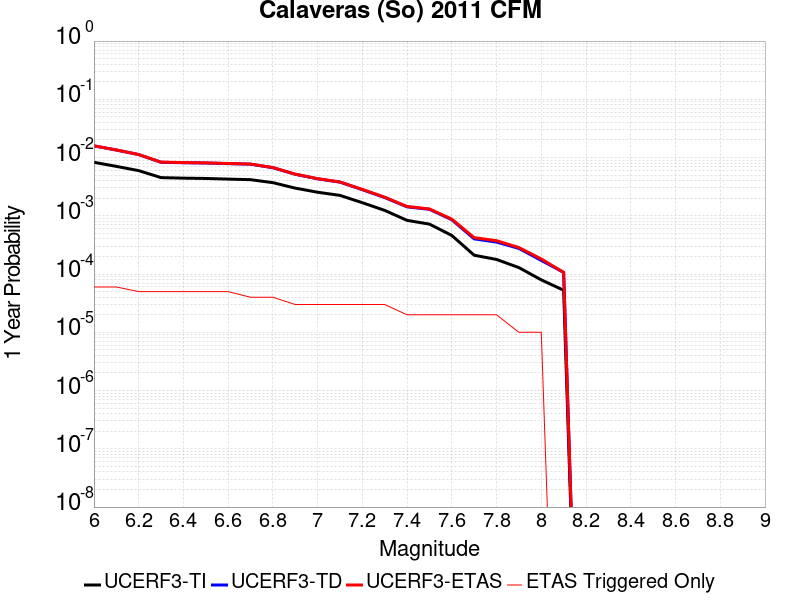 |  |

| Magnitude | 1 wk TI Prob | 1 wk TD Prob | 1 wk ETAS Prob | 1 wk ETAS/TD Gain | 1 wk ETAS Triggered Only | 1 mo TI Prob | 1 mo TD Prob | 1 mo ETAS Prob | 1 mo ETAS/TD Gain | 1 mo ETAS Triggered Only | 1 yr TI Prob | 1 yr TD Prob | 1 yr ETAS Prob | 1 yr ETAS/TD Gain | 1 yr ETAS Triggered Only | 10 yr TI Prob | 10 yr TD Prob | 10 yr ETAS Prob | 10 yr ETAS/TD Gain | 10 yr ETAS Triggered Only |
|-----|-----|-----|-----|-----|-----|-----|-----|-----|-----|-----|-----|-----|-----|-----|-----|-----|-----|-----|-----|-----|
| 6.0 | 1.5950744E-4 | 3.071188E-4 | 3.2271075E-4 | 1.0507684 | 1.5596732E-5 | 6.834242E-4 | 0.0013155643 | 0.0013311405 | 1.01184 | 1.5596732E-5 | 0.00828899 | 0.01585904 | 0.015935786 | 1.0048393 | 7.7983656E-5 | 0.079865426 | 0.14440064 | 0.1444807 | 1.0005544 | 9.3580384E-5 |
| 6.1 | 1.3584697E-4 | 2.6036944E-4 | 2.759621E-4 | 1.0598867 | 1.5596732E-5 | 5.8207137E-4 | 0.0011153965 | 0.0011309758 | 1.0139675 | 1.5596732E-5 | 0.007063716 | 0.013462106 | 0.0135390395 | 1.0057149 | 7.7983656E-5 | 0.06843361 | 0.12402854 | 0.12411052 | 1.0006609 | 9.3580384E-5 |
| 6.2 | 1.14676266E-4 | 2.1726108E-4 | 2.3285442E-4 | 1.0717723 | 1.5596732E-5 | 4.9137714E-4 | 9.307893E-4 | 9.463715E-4 | 1.0167409 | 1.5596732E-5 | 0.0059661185 | 0.011245592 | 0.011307277 | 1.0054853 | 6.238693E-5 | 0.058084648 | 0.105019294 | 0.10508908 | 1.0006646 | 7.7983656E-5 |
| 6.3 | 8.691518E-5 | 1.5987165E-4 | 1.7546587E-4 | 1.0975423 | 1.5596732E-5 | 3.7244044E-4 | 6.8496726E-4 | 7.005533E-4 | 1.0227544 | 1.5596732E-5 | 0.004525038 | 0.008300893 | 0.008362763 | 1.0074533 | 6.238693E-5 | 0.044339992 | 0.0793347 | 0.0794065 | 1.000905 | 7.7983656E-5 |
| 6.4 | 8.50982E-5 | 1.5693568E-4 | 1.7252997E-4 | 1.0993674 | 1.5596732E-5 | 3.646556E-4 | 6.7239115E-4 | 6.8797736E-4 | 1.0231804 | 1.5596732E-5 | 0.0044306475 | 0.008148931 | 0.008210809 | 1.0075935 | 6.238693E-5 | 0.04343345 | 0.077940844 | 0.07801275 | 1.0009226 | 7.7983656E-5 |
| 6.5 | 8.4062965E-5 | 1.5518135E-4 | 1.7077566E-4 | 1.1004909 | 1.5596732E-5 | 3.602201E-4 | 6.648764E-4 | 6.8046275E-4 | 1.0234425 | 1.5596732E-5 | 0.004376863 | 0.008058134 | 0.008120017 | 1.0076797 | 6.238693E-5 | 0.042916555 | 0.077112116 | 0.07718408 | 1.0009333 | 7.7983656E-5 |
| 6.6 | 8.194716E-5 | 1.5154095E-4 | 1.6713531E-4 | 1.1029053 | 1.5596732E-5 | 3.5115483E-4 | 6.492825E-4 | 6.648691E-4 | 1.0240059 | 1.5596732E-5 | 0.0042669317 | 0.007869979 | 0.007931875 | 1.0078648 | 6.238693E-5 | 0.04185927 | 0.07539739 | 0.075469494 | 1.0009563 | 7.7983656E-5 |
| 6.7 | 8.012326E-5 | 1.4821833E-4 | 1.6381274E-4 | 1.1052125 | 1.5596732E-5 | 3.433402E-4 | 6.350497E-4 | 6.506365E-4 | 1.0245442 | 1.5596732E-5 | 0.004172157 | 0.007698474 | 0.007744904 | 1.006031 | 4.6790192E-5 | 0.040946912 | 0.073839515 | 0.073897295 | 1.0007825 | 6.238693E-5 |
| 6.8 | 7.119773E-5 | 1.2880519E-4 | 1.443999E-4 | 1.1210722 | 1.5596732E-5 | 3.0509746E-4 | 5.519001E-4 | 5.6748826E-4 | 1.0282445 | 1.5596732E-5 | 0.0037082357 | 0.0066958875 | 0.0067423643 | 1.0069411 | 4.6790192E-5 | 0.036469642 | 0.06468402 | 0.064727776 | 1.0006766 | 4.6790192E-5 |
| 6.9 | 5.7343088E-5 | 9.9189E-5 | 1.1478418E-4 | 1.1572269 | 1.5596732E-5 | 2.4573295E-4 | 4.2502693E-4 | 4.40617E-4 | 1.0366802 | 1.5596732E-5 | 0.0029876942 | 0.0051625078 | 0.0052090567 | 1.0090166 | 4.6790192E-5 | 0.02947844 | 0.050509132 | 0.05055356 | 1.0008795 | 4.6790192E-5 |
| 7.0 | 4.8746577E-5 | 8.284751E-5 | 9.844295E-5 | 1.1882427 | 1.5596732E-5 | 2.0889717E-4 | 3.550128E-4 | 3.70604E-4 | 1.0439173 | 1.5596732E-5 | 0.0025403565 | 0.004313781 | 0.0043603694 | 1.0107999 | 4.6790192E-5 | 0.025115121 | 0.04248505 | 0.042529855 | 1.0010545 | 4.6790192E-5 |
| 7.1 | 4.2998014E-5 | 7.264914E-5 | 8.8244735E-5 | 1.2146701 | 1.5596732E-5 | 1.8426418E-4 | 3.1131663E-4 | 3.269085E-4 | 1.0500836 | 1.5596732E-5 | 0.002241108 | 0.0037837527 | 0.0038303658 | 1.0123193 | 4.6790192E-5 | 0.022186412 | 0.037423246 | 0.037468284 | 1.0012035 | 4.6790192E-5 |
| 7.2 | 3.221292E-5 | 5.390566E-5 | 6.950155E-5 | 1.2893182 | 1.5596732E-5 | 1.3804805E-4 | 2.3100396E-4 | 2.4659708E-4 | 1.0675015 | 1.5596732E-5 | 0.0016794393 | 0.0028088738 | 0.0028555326 | 1.0166112 | 4.6790192E-5 | 0.016668037 | 0.028035998 | 0.028081477 | 1.0016222 | 4.6790192E-5 |
| 7.3 | 2.3756531E-5 | 3.9471706E-5 | 5.5067823E-5 | 1.3951213 | 1.5596732E-5 | 1.0180973E-4 | 1.6915359E-4 | 1.8474768E-4 | 1.092189 | 1.5596732E-5 | 0.0012388286 | 0.0020575167 | 0.0021042107 | 1.0226943 | 4.6790192E-5 | 0.012319452 | 0.02064345 | 0.020689275 | 1.0022198 | 4.6790192E-5 |
| 7.4 | 1.5997684E-5 | 2.734085E-5 | 2.734085E-5 | 1.0 | 0.0 | 6.8559704E-5 | 1.1716982E-4 | 1.1716982E-4 | 1.0 | 0.0 | 8.343947E-4 | 0.0014256114 | 0.0014567605 | 1.0218495 | 3.1193464E-5 | 0.008312687 | 0.014376549 | 0.014407294 | 1.0021385 | 3.1193464E-5 |
| 7.5 | 1.3814293E-5 | 2.4782603E-5 | 2.4782603E-5 | 1.0 | 0.0 | 5.9202768E-5 | 1.0620684E-4 | 1.0620684E-4 | 1.0 | 0.0 | 7.205553E-4 | 0.0012923037 | 0.0013234568 | 1.0241066 | 3.1193464E-5 | 0.007182234 | 0.013055766 | 0.013086552 | 1.0023581 | 3.1193464E-5 |
| 7.6 | 8.817309E-6 | 1.6429829E-5 | 1.6429829E-5 | 1.0 | 0.0 | 3.7787922E-5 | 7.041166E-5 | 7.041166E-5 | 1.0 | 0.0 | 4.5997082E-4 | 8.5692614E-4 | 8.880929E-4 | 1.0363704 | 3.1193464E-5 | 0.004590199 | 0.008719863 | 0.008750785 | 1.0035461 | 3.1193464E-5 |
| 7.7 | 4.0352206E-6 | 7.706877E-6 | 7.706877E-6 | 1.0 | 0.0 | 1.7293689E-5 | 3.3029053E-5 | 3.3029053E-5 | 1.0 | 0.0 | 2.1053031E-4 | 4.020546E-4 | 4.3323552E-4 | 1.077554 | 3.1193464E-5 | 0.0021033096 | 0.0041649863 | 0.0041960496 | 1.0074582 | 3.1193464E-5 |
| 7.8 | 3.413169E-6 | 6.7868646E-6 | 6.7868646E-6 | 1.0 | 0.0 | 1.4627784E-5 | 2.9086239E-5 | 2.9086239E-5 | 1.0 | 0.0 | 1.7807873E-4 | 3.5406748E-4 | 3.852499E-4 | 1.0880691 | 3.1193464E-5 | 0.0017793609 | 0.0036663096 | 0.0036973888 | 1.008477 | 3.1193464E-5 |
| 7.9 | 2.4740732E-6 | 5.278809E-6 | 5.278809E-6 | 1.0 | 0.0 | 1.06031275E-5 | 2.2623271E-5 | 2.2623271E-5 | 1.0 | 0.0 | 1.2908543E-4 | 2.7540355E-4 | 2.90996E-4 | 1.0566167 | 1.5596732E-5 | 0.0012901047 | 0.002834638 | 0.0028501905 | 1.0054866 | 1.5596732E-5 |
| 8.0 | 1.5231818E-6 | 3.2887135E-6 | 3.2887135E-6 | 1.0 | 0.0 | 6.527906E-6 | 1.409441E-5 | 1.409441E-5 | 1.0 | 0.0 | 7.9474354E-5 | 1.7158597E-4 | 1.8718003E-4 | 1.0908818 | 1.5596732E-5 | 7.944594E-4 | 0.001756374 | 0.0017719433 | 1.0088645 | 1.5596732E-5 |
| 8.1 | 1.0104524E-6 | 2.0456548E-6 | 2.0456548E-6 | 1.0 | 0.0 | 4.330503E-6 | 8.767062E-6 | 8.767062E-6 | 1.0 | 0.0 | 5.2722597E-5 | 1.06733794E-4 | 1.06733794E-4 | 1.0 | 0.0 | 5.271009E-4 | 0.0010929212 | 0.0010929212 | 1.0 | 0.0 |

## Santa Ynez River
*[(top)](#table-of-contents)*

| 1 Week | 1 Month | 1 Year | 10 Year |
|-----|-----|-----|-----|
|  |  |  |  |

| Magnitude | 1 wk TI Prob | 1 wk TD Prob | 1 wk ETAS Prob | 1 wk ETAS/TD Gain | 1 wk ETAS Triggered Only | 1 mo TI Prob | 1 mo TD Prob | 1 mo ETAS Prob | 1 mo ETAS/TD Gain | 1 mo ETAS Triggered Only | 1 yr TI Prob | 1 yr TD Prob | 1 yr ETAS Prob | 1 yr ETAS/TD Gain | 1 yr ETAS Triggered Only | 10 yr TI Prob | 10 yr TD Prob | 10 yr ETAS Prob | 10 yr ETAS/TD Gain | 10 yr ETAS Triggered Only |
|-----|-----|-----|-----|-----|-----|-----|-----|-----|-----|-----|-----|-----|-----|-----|-----|-----|-----|-----|-----|-----|
| 6.0 | 1.6396456E-5 | 1.7209435E-5 | 6.399882E-5 | 3.7188218 | 4.6790192E-5 | 7.026863E-5 | 7.375284E-5 | 1.2053958E-4 | 1.6343721 | 4.6790192E-5 | 8.551848E-4 | 8.976064E-4 | 9.5993734E-4 | 1.0694413 | 6.238693E-5 | 0.0085190125 | 0.008943358 | 0.009020644 | 1.0086417 | 7.7983656E-5 |
| 6.1 | 1.6396456E-5 | 1.7209435E-5 | 6.399882E-5 | 3.7188218 | 4.6790192E-5 | 7.026863E-5 | 7.375284E-5 | 1.2053958E-4 | 1.6343721 | 4.6790192E-5 | 8.551848E-4 | 8.976064E-4 | 9.5993734E-4 | 1.0694413 | 6.238693E-5 | 0.0085190125 | 0.008943358 | 0.009020644 | 1.0086417 | 7.7983656E-5 |
| 6.2 | 1.6396456E-5 | 1.7209435E-5 | 6.399882E-5 | 3.7188218 | 4.6790192E-5 | 7.026863E-5 | 7.375284E-5 | 1.2053958E-4 | 1.6343721 | 4.6790192E-5 | 8.551848E-4 | 8.976064E-4 | 9.5993734E-4 | 1.0694413 | 6.238693E-5 | 0.0085190125 | 0.008943358 | 0.009020644 | 1.0086417 | 7.7983656E-5 |
| 6.3 | 9.736976E-6 | 1.012233E-5 | 5.691205E-5 | 5.6224256 | 4.6790192E-5 | 4.172923E-5 | 4.338072E-5 | 9.016888E-5 | 2.0785472 | 4.6790192E-5 | 5.0793495E-4 | 5.280373E-4 | 5.748028E-4 | 1.0885648 | 4.6790192E-5 | 0.005067755 | 0.005268332 | 0.0053303903 | 1.0117794 | 6.238693E-5 |
| 6.4 | 9.736976E-6 | 1.012233E-5 | 5.691205E-5 | 5.6224256 | 4.6790192E-5 | 4.172923E-5 | 4.338072E-5 | 9.016888E-5 | 2.0785472 | 4.6790192E-5 | 5.0793495E-4 | 5.280373E-4 | 5.748028E-4 | 1.0885648 | 4.6790192E-5 | 0.005067755 | 0.005268332 | 0.0053303903 | 1.0117794 | 6.238693E-5 |
| 6.5 | 7.081964E-6 | 7.3298966E-6 | 5.4119748E-5 | 7.3834257 | 4.6790192E-5 | 3.035092E-5 | 3.1413474E-5 | 7.8202196E-5 | 2.4894476 | 4.6790192E-5 | 3.694598E-4 | 3.8239348E-4 | 4.2916578E-4 | 1.1223146 | 4.6790192E-5 | 0.0036884616 | 0.0038175168 | 0.0038641284 | 1.0122099 | 4.6790192E-5 |
| 6.6 | 5.873247E-6 | 6.059743E-6 | 5.2849653E-5 | 8.721435 | 4.6790192E-5 | 2.5170815E-5 | 2.5970074E-5 | 7.275905E-5 | 2.8016498 | 4.6790192E-5 | 3.064116E-4 | 3.1614062E-4 | 3.6291603E-4 | 1.1479576 | 4.6790192E-5 | 0.0030598943 | 0.0031569963 | 0.0032036388 | 1.0147743 | 4.6790192E-5 |
| 6.7 | 4.973277E-6 | 5.115901E-6 | 3.6309204E-5 | 7.0973234 | 3.1193464E-5 | 2.1313872E-5 | 2.1925109E-5 | 5.3117885E-5 | 2.4226966 | 3.1193464E-5 | 2.5946548E-4 | 2.66906E-4 | 2.9809112E-4 | 1.1168394 | 3.1193464E-5 | 0.0025916274 | 0.0026659032 | 0.0026970136 | 1.0116698 | 3.1193464E-5 |
| 6.8 | 4.396492E-6 | 4.5109778E-6 | 3.57043E-5 | 7.91498 | 3.1193464E-5 | 1.884197E-5 | 1.9332621E-5 | 5.052548E-5 | 2.6134832 | 3.1193464E-5 | 2.2937685E-4 | 2.3534958E-4 | 2.665357E-4 | 1.1325098 | 3.1193464E-5 | 0.0022914023 | 0.0023510386 | 0.0023821588 | 1.0132368 | 3.1193464E-5 |
| 6.9 | 3.5255632E-6 | 3.6013332E-6 | 3.4794684E-5 | 9.661612 | 3.1193464E-5 | 1.5109469E-5 | 1.5434196E-5 | 4.6627174E-5 | 3.0210307 | 3.1193464E-5 | 1.8394225E-4 | 1.8789528E-4 | 2.1908288E-4 | 1.1659839 | 3.1193464E-5 | 0.0018379007 | 0.0018773803 | 0.0019085152 | 1.0165843 | 3.1193464E-5 |
| 7.0 | 3.211603E-6 | 3.273654E-6 | 3.4467015E-5 | 10.528605 | 3.1193464E-5 | 1.376394E-5 | 1.4029872E-5 | 4.5222896E-5 | 3.2233293 | 3.1193464E-5 | 1.6756308E-4 | 1.7080043E-4 | 2.0198857E-4 | 1.1825999 | 3.1193464E-5 | 0.0016743679 | 0.0017067058 | 0.001737846 | 1.0182458 | 3.1193464E-5 |
| 7.1 | 2.5094619E-6 | 2.5409204E-6 | 2.5409204E-6 | 1.0 | 0.0 | 1.0754793E-5 | 1.0889614E-5 | 1.0889614E-5 | 1.0 | 0.0 | 1.3093173E-4 | 1.3257304E-4 | 1.3257304E-4 | 1.0 | 0.0 | 0.0013085462 | 0.0013249456 | 0.0013249456 | 1.0 | 0.0 |
| 7.2 | 2.0515774E-6 | 2.0619375E-6 | 2.0619375E-6 | 1.0 | 0.0 | 8.792445E-6 | 8.836846E-6 | 8.836846E-6 | 1.0 | 0.0 | 1.0704277E-4 | 1.0758333E-4 | 1.0758333E-4 | 1.0 | 0.0 | 0.0010699122 | 0.0010753168 | 0.0010753168 | 1.0 | 0.0 |
| 7.3 | 1.6845745E-6 | 1.6773907E-6 | 1.6773907E-6 | 1.0 | 0.0 | 7.219585E-6 | 7.1887976E-6 | 7.1887976E-6 | 1.0 | 0.0 | 8.78949E-5 | 8.752012E-5 | 8.752012E-5 | 1.0 | 0.0 | 8.7860145E-4 | 8.7485946E-4 | 8.7485946E-4 | 1.0 | 0.0 |
| 7.4 | 1.3600285E-6 | 1.3333357E-6 | 1.3333357E-6 | 1.0 | 0.0 | 5.82868E-6 | 5.714284E-6 | 5.714284E-6 | 1.0 | 0.0 | 7.096187E-5 | 6.956921E-5 | 6.956921E-5 | 1.0 | 0.0 | 7.0939213E-4 | 6.954765E-4 | 6.954765E-4 | 1.0 | 0.0 |
| 7.5 | 9.735342E-7 | 9.290103E-7 | 9.290103E-7 | 1.0 | 0.0 | 4.172283E-6 | 3.9814668E-6 | 3.9814668E-6 | 1.0 | 0.0 | 5.079636E-5 | 4.8473295E-5 | 4.8473295E-5 | 1.0 | 0.0 | 5.0784746E-4 | 4.8462892E-4 | 4.8462892E-4 | 1.0 | 0.0 |
| 7.6 | 5.067187E-7 | 4.77857E-7 | 4.77857E-7 | 1.0 | 0.0 | 2.1716498E-6 | 2.047957E-6 | 2.047957E-6 | 1.0 | 0.0 | 2.6439517E-5 | 2.4933597E-5 | 2.4933597E-5 | 1.0 | 0.0 | 2.643637E-4 | 2.4930874E-4 | 2.4930874E-4 | 1.0 | 0.0 |
| 7.7 | 2.769089E-7 | 2.5759124E-7 | 2.5759124E-7 | 1.0 | 0.0 | 1.1867519E-6 | 1.1039621E-6 | 1.1039621E-6 | 1.0 | 0.0 | 1.4448608E-5 | 1.34406555E-5 | 1.34406555E-5 | 1.0 | 0.0 | 1.444767E-4 | 1.3439846E-4 | 1.3439846E-4 | 1.0 | 0.0 |
| 7.8 | 1.7044663E-7 | 1.5449015E-7 | 1.5449015E-7 | 1.0 | 0.0 | 7.3048534E-7 | 6.621005E-7 | 6.621005E-7 | 1.0 | 0.0 | 8.893623E-6 | 8.061043E-6 | 8.061043E-6 | 1.0 | 0.0 | 8.893267E-5 | 8.060753E-5 | 8.060753E-5 | 1.0 | 0.0 |
| 7.9 | 4.8344287E-8 | 4.0910923E-8 | 4.0910923E-8 | 1.0 | 0.0 | 2.0718979E-7 | 1.7533252E-7 | 1.7533252E-7 | 1.0 | 0.0 | 2.5225327E-6 | 2.1346711E-6 | 2.1346711E-6 | 1.0 | 0.0 | 2.5225041E-5 | 2.1346512E-5 | 2.1346512E-5 | 1.0 | 0.0 |

## Sierra Madre
*[(top)](#table-of-contents)*

| 1 Week | 1 Month | 1 Year | 10 Year |
|-----|-----|-----|-----|
| 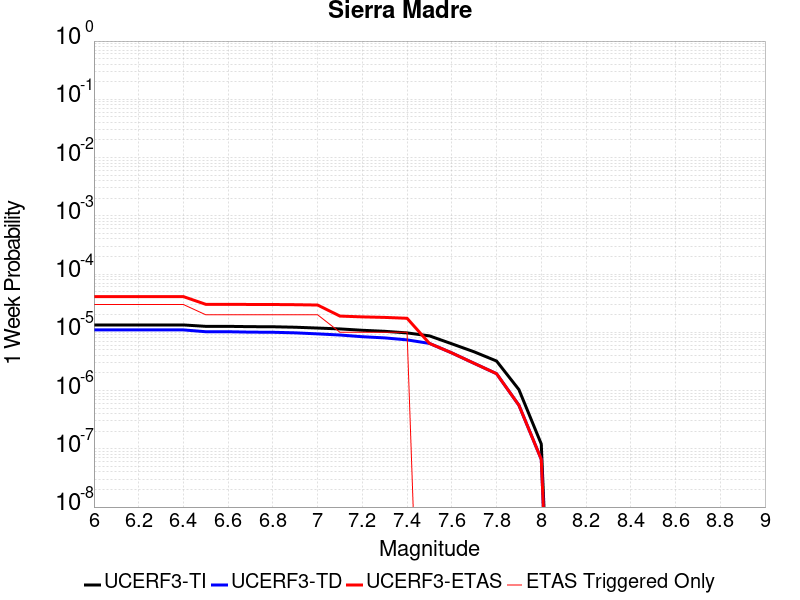 |  |  |  |

| Magnitude | 1 wk TI Prob | 1 wk TD Prob | 1 wk ETAS Prob | 1 wk ETAS/TD Gain | 1 wk ETAS Triggered Only | 1 mo TI Prob | 1 mo TD Prob | 1 mo ETAS Prob | 1 mo ETAS/TD Gain | 1 mo ETAS Triggered Only | 1 yr TI Prob | 1 yr TD Prob | 1 yr ETAS Prob | 1 yr ETAS/TD Gain | 1 yr ETAS Triggered Only | 10 yr TI Prob | 10 yr TD Prob | 10 yr ETAS Prob | 10 yr ETAS/TD Gain | 10 yr ETAS Triggered Only |
|-----|-----|-----|-----|-----|-----|-----|-----|-----|-----|-----|-----|-----|-----|-----|-----|-----|-----|-----|-----|-----|
| 6.0 | 1.3379373E-5 | 1.10007395E-5 | 5.7790417E-5 | 5.253321 | 4.6790192E-5 | 5.7338908E-5 | 4.7145186E-5 | 1.0952917E-4 | 2.3232312 | 6.238693E-5 | 6.978776E-4 | 5.738429E-4 | 6.36194E-4 | 1.1086553 | 6.238693E-5 | 0.0069569005 | 0.0057239756 | 0.0058170203 | 1.0162553 | 9.3580384E-5 |
| 6.1 | 1.3379373E-5 | 1.10007395E-5 | 5.7790417E-5 | 5.253321 | 4.6790192E-5 | 5.7338908E-5 | 4.7145186E-5 | 1.0952917E-4 | 2.3232312 | 6.238693E-5 | 6.978776E-4 | 5.738429E-4 | 6.36194E-4 | 1.1086553 | 6.238693E-5 | 0.0069569005 | 0.0057239756 | 0.0058170203 | 1.0162553 | 9.3580384E-5 |
| 6.2 | 1.3379373E-5 | 1.10007395E-5 | 5.7790417E-5 | 5.253321 | 4.6790192E-5 | 5.7338908E-5 | 4.7145186E-5 | 1.0952917E-4 | 2.3232312 | 6.238693E-5 | 6.978776E-4 | 5.738429E-4 | 6.36194E-4 | 1.1086553 | 6.238693E-5 | 0.0069569005 | 0.0057239756 | 0.0058170203 | 1.0162553 | 9.3580384E-5 |
| 6.3 | 1.3379373E-5 | 1.10007395E-5 | 5.7790417E-5 | 5.253321 | 4.6790192E-5 | 5.7338908E-5 | 4.7145186E-5 | 1.0952917E-4 | 2.3232312 | 6.238693E-5 | 6.978776E-4 | 5.738429E-4 | 6.36194E-4 | 1.1086553 | 6.238693E-5 | 0.0069569005 | 0.0057239756 | 0.0058170203 | 1.0162553 | 9.3580384E-5 |
| 6.4 | 1.3379373E-5 | 1.10007395E-5 | 5.7790417E-5 | 5.253321 | 4.6790192E-5 | 5.7338908E-5 | 4.7145186E-5 | 1.0952917E-4 | 2.3232312 | 6.238693E-5 | 6.978776E-4 | 5.738429E-4 | 6.36194E-4 | 1.1086553 | 6.238693E-5 | 0.0069569005 | 0.0057239756 | 0.0058170203 | 1.0162553 | 9.3580384E-5 |
| 6.5 | 1.26563245E-5 | 1.0230196E-5 | 4.142334E-5 | 4.0491247 | 3.1193464E-5 | 5.4240263E-5 | 4.3842967E-5 | 9.06311E-5 | 2.0671756 | 4.6790192E-5 | 6.601751E-4 | 5.336584E-4 | 5.804237E-4 | 1.0876313 | 4.6790192E-5 | 0.006582173 | 0.0053240913 | 0.0054016598 | 1.0145693 | 7.7983656E-5 |
| 6.6 | 1.26563245E-5 | 1.0230196E-5 | 4.142334E-5 | 4.0491247 | 3.1193464E-5 | 5.4240263E-5 | 4.3842967E-5 | 9.06311E-5 | 2.0671756 | 4.6790192E-5 | 6.601751E-4 | 5.336584E-4 | 5.804237E-4 | 1.0876313 | 4.6790192E-5 | 0.006582173 | 0.0053240913 | 0.0054016598 | 1.0145693 | 7.7983656E-5 |
| 6.7 | 1.2502474E-5 | 1.006634E-5 | 4.125949E-5 | 4.0987577 | 3.1193464E-5 | 5.3580934E-5 | 4.314075E-5 | 8.992892E-5 | 2.084547 | 4.6790192E-5 | 6.521526E-4 | 5.251131E-4 | 5.7187874E-4 | 1.0890582 | 4.6790192E-5 | 0.0065024206 | 0.0052390425 | 0.0053166174 | 1.0148071 | 7.7983656E-5 |
| 6.8 | 1.2454966E-5 | 1.0018625E-5 | 4.1211773E-5 | 4.113516 | 3.1193464E-5 | 5.3377335E-5 | 4.2936266E-5 | 8.9724446E-5 | 2.0897124 | 4.6790192E-5 | 6.4967526E-4 | 5.226247E-4 | 5.693905E-4 | 1.0894824 | 4.6790192E-5 | 0.006477792 | 0.0052142753 | 0.005291852 | 1.0148778 | 7.7983656E-5 |
| 6.9 | 1.2225574E-5 | 9.792602E-6 | 4.098576E-5 | 4.1853795 | 3.1193464E-5 | 5.2394265E-5 | 4.1967625E-5 | 8.8755856E-5 | 2.1148648 | 4.6790192E-5 | 6.3771347E-4 | 5.108371E-4 | 5.576034E-4 | 1.0915483 | 4.6790192E-5 | 0.006358865 | 0.0050969445 | 0.0051745307 | 1.0152221 | 7.7983656E-5 |
| 7.0 | 1.182946E-5 | 9.399144E-6 | 4.0592313E-5 | 4.3187246 | 3.1193464E-5 | 5.06967E-5 | 4.0281426E-5 | 8.706973E-5 | 2.1615355 | 4.6790192E-5 | 6.1705755E-4 | 4.9031706E-4 | 5.370843E-4 | 1.0953816 | 4.6790192E-5 | 0.006153469 | 0.004892664 | 0.004970266 | 1.0158609 | 7.7983656E-5 |
| 7.1 | 1.14369095E-5 | 8.986159E-6 | 2.458275E-5 | 2.7356238 | 1.5596732E-5 | 4.9014405E-5 | 3.8511545E-5 | 5.4107677E-5 | 1.4049728 | 1.5596732E-5 | 5.9658696E-4 | 4.687782E-4 | 4.843676E-4 | 1.0332555 | 1.5596732E-5 | 0.005949879 | 0.004678199 | 0.0047247703 | 1.0099549 | 4.6790192E-5 |
| 7.2 | 1.0836419E-5 | 8.3995565E-6 | 2.3996157E-5 | 2.856836 | 1.5596732E-5 | 4.644097E-5 | 3.5997607E-5 | 5.159378E-5 | 1.4332557 | 1.5596732E-5 | 5.652721E-4 | 4.3818366E-4 | 4.5377357E-4 | 1.0355785 | 1.5596732E-5 | 0.0056383642 | 0.004373494 | 0.0044200798 | 1.0106518 | 4.6790192E-5 |
| 7.3 | 1.0403439E-5 | 8.02082E-6 | 2.3617426E-5 | 2.9445152 | 1.5596732E-5 | 4.4585406E-5 | 3.4374494E-5 | 4.9970688E-5 | 1.4537141 | 1.5596732E-5 | 5.426921E-4 | 4.1843E-4 | 4.340202E-4 | 1.0372589 | 1.5596732E-5 | 0.005413687 | 0.004176717 | 0.004223312 | 1.0111558 | 4.6790192E-5 |
| 7.4 | 9.768864E-6 | 7.414448E-6 | 2.3011064E-5 | 3.1035435 | 1.5596732E-5 | 4.186589E-5 | 3.1775824E-5 | 4.737206E-5 | 1.4908208 | 1.5596732E-5 | 5.09598E-4 | 3.868029E-4 | 4.0239358E-4 | 1.0403066 | 1.5596732E-5 | 0.0050843097 | 0.0038615882 | 0.003908198 | 1.0120701 | 4.6790192E-5 |
| 7.5 | 8.687089E-6 | 6.4501564E-6 | 6.4501564E-6 | 1.0 | 0.0 | 3.722985E-5 | 2.764324E-5 | 2.764324E-5 | 1.0 | 0.0 | 4.5317915E-4 | 3.3650533E-4 | 3.3650533E-4 | 1.0 | 0.0 | 0.004522561 | 0.0033602451 | 0.0033913339 | 1.009252 | 3.1193464E-5 |
| 7.6 | 6.3506063E-6 | 4.4303215E-6 | 4.4303215E-6 | 1.0 | 0.0 | 2.72166E-5 | 1.8986955E-5 | 1.8986955E-5 | 1.0 | 0.0 | 3.3131172E-4 | 2.3114192E-4 | 2.3114192E-4 | 1.0 | 0.0 | 0.003308182 | 0.0023092402 | 0.002324801 | 1.0067384 | 1.5596732E-5 |
| 7.7 | 4.62223E-6 | 2.932967E-6 | 2.932967E-6 | 1.0 | 0.0 | 1.9809406E-5 | 1.2569798E-5 | 1.2569798E-5 | 1.0 | 0.0 | 2.4115283E-4 | 1.5302657E-4 | 1.5302657E-4 | 1.0 | 0.0 | 0.0024089129 | 0.001529413 | 0.0015449859 | 1.0101823 | 1.5596732E-5 |
| 7.8 | 3.2145008E-6 | 1.9494332E-6 | 1.9494332E-6 | 1.0 | 0.0 | 1.3776359E-5 | 8.3546865E-6 | 8.3546865E-6 | 1.0 | 0.0 | 1.6771426E-4 | 1.0171358E-4 | 1.0171358E-4 | 1.0 | 0.0 | 0.0016758774 | 0.0010168145 | 0.0010168145 | 1.0 | 0.0 |
| 7.9 | 1.0391769E-6 | 5.6026335E-7 | 5.6026335E-7 | 1.0 | 0.0 | 4.4536077E-6 | 2.4011265E-6 | 2.4011265E-6 | 1.0 | 0.0 | 5.4221324E-5 | 2.9233326E-5 | 2.9233326E-5 | 1.0 | 0.0 | 5.4208096E-4 | 2.9229524E-4 | 2.9229524E-4 | 1.0 | 0.0 |
| 8.0 | 1.210983E-7 | 6.613821E-8 | 6.613821E-8 | 1.0 | 0.0 | 5.1899264E-7 | 2.8344945E-7 | 2.8344945E-7 | 1.0 | 0.0 | 6.3187167E-6 | 3.4509917E-6 | 3.4509917E-6 | 1.0 | 0.0 | 6.318537E-5 | 3.45094E-5 | 3.45094E-5 | 1.0 | 0.0 |

## San Jacinto (Clark) rev
*[(top)](#table-of-contents)*

| 1 Week | 1 Month | 1 Year | 10 Year |
|-----|-----|-----|-----|
|  |  |  |  |

| Magnitude | 1 wk TI Prob | 1 wk TD Prob | 1 wk ETAS Prob | 1 wk ETAS/TD Gain | 1 wk ETAS Triggered Only | 1 mo TI Prob | 1 mo TD Prob | 1 mo ETAS Prob | 1 mo ETAS/TD Gain | 1 mo ETAS Triggered Only | 1 yr TI Prob | 1 yr TD Prob | 1 yr ETAS Prob | 1 yr ETAS/TD Gain | 1 yr ETAS Triggered Only | 10 yr TI Prob | 10 yr TD Prob | 10 yr ETAS Prob | 10 yr ETAS/TD Gain | 10 yr ETAS Triggered Only |
|-----|-----|-----|-----|-----|-----|-----|-----|-----|-----|-----|-----|-----|-----|-----|-----|-----|-----|-----|-----|-----|
| 6.0 | 4.482615E-5 | 2.1154196E-5 | 2.1154196E-5 | 1.0 | 0.0 | 1.9209793E-4 | 9.065773E-5 | 1.53039E-4 | 1.6880965 | 6.238693E-5 | 0.0023362834 | 0.0011032083 | 0.0011966855 | 1.084732 | 9.3580384E-5 | 0.02311874 | 0.011503847 | 0.011596351 | 1.0080411 | 9.3580384E-5 |
| 6.1 | 4.482615E-5 | 2.1154196E-5 | 2.1154196E-5 | 1.0 | 0.0 | 1.9209793E-4 | 9.065773E-5 | 1.53039E-4 | 1.6880965 | 6.238693E-5 | 0.0023362834 | 0.0011032083 | 0.0011966855 | 1.084732 | 9.3580384E-5 | 0.02311874 | 0.011503847 | 0.011596351 | 1.0080411 | 9.3580384E-5 |
| 6.2 | 4.482615E-5 | 2.1154196E-5 | 2.1154196E-5 | 1.0 | 0.0 | 1.9209793E-4 | 9.065773E-5 | 1.53039E-4 | 1.6880965 | 6.238693E-5 | 0.0023362834 | 0.0011032083 | 0.0011966855 | 1.084732 | 9.3580384E-5 | 0.02311874 | 0.011503847 | 0.011596351 | 1.0080411 | 9.3580384E-5 |
| 6.3 | 4.482615E-5 | 2.1154196E-5 | 2.1154196E-5 | 1.0 | 0.0 | 1.9209793E-4 | 9.065773E-5 | 1.53039E-4 | 1.6880965 | 6.238693E-5 | 0.0023362834 | 0.0011032083 | 0.0011966855 | 1.084732 | 9.3580384E-5 | 0.02311874 | 0.011503847 | 0.011596351 | 1.0080411 | 9.3580384E-5 |
| 6.4 | 4.482615E-5 | 2.1154196E-5 | 2.1154196E-5 | 1.0 | 0.0 | 1.9209793E-4 | 9.065773E-5 | 1.53039E-4 | 1.6880965 | 6.238693E-5 | 0.0023362834 | 0.0011032083 | 0.0011966855 | 1.084732 | 9.3580384E-5 | 0.02311874 | 0.011503847 | 0.011596351 | 1.0080411 | 9.3580384E-5 |
| 6.5 | 3.7294863E-5 | 1.7356087E-5 | 1.7356087E-5 | 1.0 | 0.0 | 1.5982533E-4 | 7.438113E-5 | 1.3676342E-4 | 1.8386842 | 6.238693E-5 | 0.0019441366 | 9.052186E-4 | 9.987142E-4 | 1.1032852 | 9.3580384E-5 | 0.01927216 | 0.0094941035 | 0.009586795 | 1.0097631 | 9.3580384E-5 |
| 6.6 | 3.7294863E-5 | 1.7356087E-5 | 1.7356087E-5 | 1.0 | 0.0 | 1.5982533E-4 | 7.438113E-5 | 1.3676342E-4 | 1.8386842 | 6.238693E-5 | 0.0019441366 | 9.052186E-4 | 9.987142E-4 | 1.1032852 | 9.3580384E-5 | 0.01927216 | 0.0094941035 | 0.009586795 | 1.0097631 | 9.3580384E-5 |
| 6.7 | 3.6039248E-5 | 1.6604314E-5 | 1.6604314E-5 | 1.0 | 0.0 | 1.5444479E-4 | 7.1159426E-5 | 1.3354191E-4 | 1.8766581 | 6.238693E-5 | 0.0018787434 | 8.6602574E-4 | 9.595251E-4 | 1.1079637 | 9.3580384E-5 | 0.01862939 | 0.009096047 | 0.009188776 | 1.0101944 | 9.3580384E-5 |
| 6.8 | 3.5031844E-5 | 1.6232942E-5 | 1.6232942E-5 | 1.0 | 0.0 | 1.5012783E-4 | 6.956792E-5 | 1.319505E-4 | 1.8967148 | 6.238693E-5 | 0.0018262739 | 8.4666436E-4 | 9.401655E-4 | 1.1104348 | 9.3580384E-5 | 0.01811338 | 0.008895969 | 0.008988717 | 1.0104258 | 9.3580384E-5 |
| 6.9 | 3.435112E-5 | 1.6063195E-5 | 1.6063195E-5 | 1.0 | 0.0 | 1.4721078E-4 | 6.884047E-5 | 1.312231E-4 | 1.9061912 | 6.238693E-5 | 0.0017908178 | 8.3781447E-4 | 9.3131646E-4 | 1.1116023 | 9.3580384E-5 | 0.017764548 | 0.008804181 | 0.008896937 | 1.0105355 | 9.3580384E-5 |
| 7.0 | 2.8959772E-5 | 1.4336745E-5 | 1.4336745E-5 | 1.0 | 0.0 | 1.241074E-4 | 6.144176E-5 | 1.2382485E-4 | 2.0153208 | 6.238693E-5 | 0.0015099603 | 7.477995E-4 | 8.413099E-4 | 1.1250474 | 9.3580384E-5 | 0.014997416 | 0.007868037 | 0.00796088 | 1.0118002 | 9.3580384E-5 |
| 7.1 | 2.6002877E-5 | 1.2829002E-5 | 1.2829002E-5 | 1.0 | 0.0 | 1.11436144E-4 | 5.498029E-5 | 1.1736379E-4 | 2.134652 | 6.238693E-5 | 0.0013558907 | 6.691816E-4 | 7.6269935E-4 | 1.1397494 | 9.3580384E-5 | 0.013476475 | 0.0070465137 | 0.007139435 | 1.0131868 | 9.3580384E-5 |
| 7.2 | 2.2544838E-5 | 1.1262543E-5 | 1.1262543E-5 | 1.0 | 0.0 | 9.661716E-5 | 4.8267157E-5 | 1.1065107E-4 | 2.2924712 | 6.238693E-5 | 0.001175679 | 5.874956E-4 | 6.810211E-4 | 1.1591934 | 9.3580384E-5 | 0.011694785 | 0.0061927503 | 0.006285751 | 1.0150177 | 9.3580384E-5 |
| 7.3 | 1.75334E-5 | 1.0811715E-5 | 1.0811715E-5 | 1.0 | 0.0 | 7.514098E-5 | 4.6335106E-5 | 1.0871914E-4 | 2.3463664 | 6.238693E-5 | 9.144575E-4 | 5.6398526E-4 | 6.5751286E-4 | 1.1658335 | 9.3580384E-5 | 0.009107036 | 0.0059337732 | 0.0060267984 | 1.0156772 | 9.3580384E-5 |
| 7.4 | 1.5924552E-5 | 1.0611516E-5 | 1.0611516E-5 | 1.0 | 0.0 | 6.82463E-5 | 4.547714E-5 | 1.07861226E-4 | 2.371768 | 6.238693E-5 | 8.305819E-4 | 5.535449E-4 | 6.470735E-4 | 1.168963 | 9.3580384E-5 | 0.008274844 | 0.0058210334 | 0.005914069 | 1.0159826 | 9.3580384E-5 |
| 7.5 | 1.3428931E-5 | 9.8519E-6 | 9.8519E-6 | 1.0 | 0.0 | 5.7551293E-5 | 4.2221753E-5 | 1.0460604E-4 | 2.477539 | 6.238693E-5 | 7.004617E-4 | 5.1392964E-4 | 6.0746196E-4 | 1.1819943 | 9.3580384E-5 | 0.006982579 | 0.0054066023 | 0.005499677 | 1.017215 | 9.3580384E-5 |
| 7.6 | 1.0688787E-5 | 8.614839E-6 | 8.614839E-6 | 1.0 | 0.0 | 4.5808283E-5 | 3.692022E-5 | 9.9304845E-5 | 2.6897142 | 6.238693E-5 | 5.5757316E-4 | 4.4941145E-4 | 5.4294977E-4 | 1.2081351 | 9.3580384E-5 | 0.005561762 | 0.0047416524 | 0.004834789 | 1.0196422 | 9.3580384E-5 |
| 7.7 | 8.81236E-6 | 7.4680274E-6 | 7.4680274E-6 | 1.0 | 0.0 | 3.776671E-5 | 3.2005442E-5 | 9.4390365E-5 | 2.9491975 | 6.238693E-5 | 4.597127E-4 | 3.8959677E-4 | 4.831407E-4 | 1.2401044 | 9.3580384E-5 | 0.0045876284 | 0.0041346536 | 0.004227847 | 1.0225396 | 9.3580384E-5 |
| 7.8 | 7.780431E-6 | 6.696579E-6 | 6.696579E-6 | 1.0 | 0.0 | 3.3344273E-5 | 2.8699309E-5 | 9.108445E-5 | 3.1737504 | 6.238693E-5 | 4.0589093E-4 | 3.4935825E-4 | 4.4290593E-4 | 1.26777 | 9.3580384E-5 | 0.0040515037 | 0.0037227906 | 0.0038160225 | 1.0250436 | 9.3580384E-5 |
| 7.9 | 6.5437994E-6 | 5.780382E-6 | 5.780382E-6 | 1.0 | 0.0 | 2.8044553E-5 | 2.477283E-5 | 8.715821E-5 | 3.5182984 | 6.238693E-5 | 3.4138895E-4 | 3.0156763E-4 | 3.951198E-4 | 1.3102195 | 9.3580384E-5 | 0.0034086495 | 0.0032344845 | 0.0033277622 | 1.0288385 | 9.3580384E-5 |
| 8.0 | 5.4488164E-6 | 4.8133406E-6 | 4.8133406E-6 | 1.0 | 0.0 | 2.3351862E-5 | 2.062844E-5 | 8.301408E-5 | 4.024254 | 6.238693E-5 | 2.8427184E-4 | 2.5112246E-4 | 3.4467934E-4 | 1.3725548 | 9.3580384E-5 | 0.0028390845 | 0.002710839 | 0.0028041657 | 1.0344273 | 9.3580384E-5 |
| 8.1 | 2.8397242E-6 | 1.3670389E-6 | 1.3670389E-6 | 1.0 | 0.0 | 1.217019E-5 | 5.858725E-6 | 2.1455364E-5 | 3.6621218 | 1.5596732E-5 | 1.4816198E-4 | 7.132765E-5 | 1.0251889E-4 | 1.4372952 | 3.1193464E-5 | 0.0014806325 | 8.115382E-4 | 8.427063E-4 | 1.0384063 | 3.1193464E-5 |
| 8.2 | 2.030244E-6 | 6.318974E-7 | 6.318974E-7 | 1.0 | 0.0 | 8.701017E-6 | 2.708129E-6 | 2.708129E-6 | 1.0 | 0.0 | 1.05929736E-4 | 3.2970976E-5 | 3.2970976E-5 | 1.0 | 0.0 | 0.0010587925 | 3.9486602E-4 | 3.9486602E-4 | 1.0 | 0.0 |
| 8.3 | 1.0659804E-6 | 2.9250086E-7 | 2.9250086E-7 | 1.0 | 0.0 | 4.568479E-6 | 1.2535745E-6 | 1.2535745E-6 | 1.0 | 0.0 | 5.5619817E-5 | 1.5262167E-5 | 1.5262167E-5 | 1.0 | 0.0 | 5.5605895E-4 | 1.8566217E-4 | 1.8566217E-4 | 1.0 | 0.0 |

## San Gabriel
*[(top)](#table-of-contents)*

| 1 Week | 1 Month | 1 Year | 10 Year |
|-----|-----|-----|-----|
|  |  |  |  |

| Magnitude | 1 wk TI Prob | 1 wk TD Prob | 1 wk ETAS Prob | 1 wk ETAS/TD Gain | 1 wk ETAS Triggered Only | 1 mo TI Prob | 1 mo TD Prob | 1 mo ETAS Prob | 1 mo ETAS/TD Gain | 1 mo ETAS Triggered Only | 1 yr TI Prob | 1 yr TD Prob | 1 yr ETAS Prob | 1 yr ETAS/TD Gain | 1 yr ETAS Triggered Only | 10 yr TI Prob | 10 yr TD Prob | 10 yr ETAS Prob | 10 yr ETAS/TD Gain | 10 yr ETAS Triggered Only |
|-----|-----|-----|-----|-----|-----|-----|-----|-----|-----|-----|-----|-----|-----|-----|-----|-----|-----|-----|-----|-----|
| 6.0 | 1.083775E-5 | 1.19851875E-5 | 4.3178276E-5 | 3.6026366 | 3.1193464E-5 | 4.6446676E-5 | 5.1364143E-5 | 8.2556E-5 | 1.6072692 | 3.1193464E-5 | 5.653415E-4 | 6.251903E-4 | 6.8753824E-4 | 1.0997263 | 6.238693E-5 | 0.0056390543 | 0.006246409 | 0.0063394047 | 1.0148879 | 9.3580384E-5 |
| 6.1 | 1.083775E-5 | 1.19851875E-5 | 4.3178276E-5 | 3.6026366 | 3.1193464E-5 | 4.6446676E-5 | 5.1364143E-5 | 8.2556E-5 | 1.6072692 | 3.1193464E-5 | 5.653415E-4 | 6.251903E-4 | 6.8753824E-4 | 1.0997263 | 6.238693E-5 | 0.0056390543 | 0.006246409 | 0.0063394047 | 1.0148879 | 9.3580384E-5 |
| 6.2 | 1.083775E-5 | 1.19851875E-5 | 4.3178276E-5 | 3.6026366 | 3.1193464E-5 | 4.6446676E-5 | 5.1364143E-5 | 8.2556E-5 | 1.6072692 | 3.1193464E-5 | 5.653415E-4 | 6.251903E-4 | 6.8753824E-4 | 1.0997263 | 6.238693E-5 | 0.0056390543 | 0.006246409 | 0.0063394047 | 1.0148879 | 9.3580384E-5 |
| 6.3 | 1.083775E-5 | 1.19851875E-5 | 4.3178276E-5 | 3.6026366 | 3.1193464E-5 | 4.6446676E-5 | 5.1364143E-5 | 8.2556E-5 | 1.6072692 | 3.1193464E-5 | 5.653415E-4 | 6.251903E-4 | 6.8753824E-4 | 1.0997263 | 6.238693E-5 | 0.0056390543 | 0.006246409 | 0.0063394047 | 1.0148879 | 9.3580384E-5 |
| 6.4 | 1.083775E-5 | 1.19851875E-5 | 4.3178276E-5 | 3.6026366 | 3.1193464E-5 | 4.6446676E-5 | 5.1364143E-5 | 8.2556E-5 | 1.6072692 | 3.1193464E-5 | 5.653415E-4 | 6.251903E-4 | 6.8753824E-4 | 1.0997263 | 6.238693E-5 | 0.0056390543 | 0.006246409 | 0.0063394047 | 1.0148879 | 9.3580384E-5 |
| 6.5 | 6.7317824E-6 | 7.716944E-6 | 2.3313556E-5 | 3.0210862 | 1.5596732E-5 | 2.8850178E-5 | 3.3072207E-5 | 4.8668422E-5 | 1.4715807 | 1.5596732E-5 | 3.511943E-4 | 4.0258077E-4 | 4.4935214E-4 | 1.1161789 | 4.6790192E-5 | 0.003506398 | 0.0040296097 | 0.0041072792 | 1.0192747 | 7.7983656E-5 |
| 6.6 | 6.7317824E-6 | 7.716944E-6 | 2.3313556E-5 | 3.0210862 | 1.5596732E-5 | 2.8850178E-5 | 3.3072207E-5 | 4.8668422E-5 | 1.4715807 | 1.5596732E-5 | 3.511943E-4 | 4.0258077E-4 | 4.4935214E-4 | 1.1161789 | 4.6790192E-5 | 0.003506398 | 0.0040296097 | 0.0041072792 | 1.0192747 | 7.7983656E-5 |
| 6.7 | 6.274881E-6 | 7.2458647E-6 | 2.2842483E-5 | 3.1524854 | 1.5596732E-5 | 2.6892068E-5 | 3.1053343E-5 | 4.6649588E-5 | 1.5022405 | 1.5596732E-5 | 3.2736175E-4 | 3.780098E-4 | 4.247823E-4 | 1.1237335 | 4.6790192E-5 | 0.0032687993 | 0.0037847564 | 0.0038624448 | 1.0205266 | 7.7983656E-5 |
| 6.8 | 5.996209E-6 | 6.958585E-6 | 2.2555207E-5 | 3.2413497 | 1.5596732E-5 | 2.5697784E-5 | 2.9822171E-5 | 4.5418437E-5 | 1.5229756 | 1.5596732E-5 | 3.128256E-4 | 3.6302538E-4 | 4.0979858E-4 | 1.1288428 | 4.6790192E-5 | 0.003123856 | 0.0036354093 | 0.0037131095 | 1.0213732 | 7.7983656E-5 |
| 6.9 | 5.686331E-6 | 6.6236316E-6 | 2.222026E-5 | 3.3546944 | 1.5596732E-5 | 2.4369761E-5 | 2.8386688E-5 | 4.398298E-5 | 1.5494226 | 1.5596732E-5 | 2.9666146E-4 | 3.4555403E-4 | 3.9232805E-4 | 1.1353595 | 4.6790192E-5 | 0.0029626573 | 0.0034612515 | 0.0035389652 | 1.0224525 | 7.7983656E-5 |
| 7.0 | 5.2329838E-6 | 6.147514E-6 | 2.1744148E-5 | 3.5370638 | 1.5596732E-5 | 2.242688E-5 | 2.6346226E-5 | 4.194255E-5 | 1.5919755 | 1.5596732E-5 | 2.7301308E-4 | 3.2071886E-4 | 3.6749404E-4 | 1.1458448 | 4.6790192E-5 | 0.002726779 | 0.0032136322 | 0.0032913652 | 1.0241885 | 7.7983656E-5 |
| 7.1 | 5.135671E-6 | 6.03764E-6 | 2.1634276E-5 | 3.583234 | 1.5596732E-5 | 2.2009834E-5 | 2.5875348E-5 | 4.1471674E-5 | 1.6027485 | 1.5596732E-5 | 2.6793676E-4 | 3.1498758E-4 | 3.6176303E-4 | 1.1484994 | 4.6790192E-5 | 0.0026761394 | 0.0031564834 | 0.003234221 | 1.0246279 | 7.7983656E-5 |
| 7.2 | 4.989062E-6 | 5.87102E-6 | 5.87102E-6 | 1.0 | 0.0 | 2.1381518E-5 | 2.5161276E-5 | 2.5161276E-5 | 1.0 | 0.0 | 2.6028889E-4 | 3.0629625E-4 | 3.3748013E-4 | 1.1018096 | 3.1193464E-5 | 0.0025998424 | 0.003069813 | 0.0031320082 | 1.0202603 | 6.238693E-5 |
| 7.3 | 4.8219395E-6 | 5.702574E-6 | 5.702574E-6 | 1.0 | 0.0 | 2.0665291E-5 | 2.443938E-5 | 2.443938E-5 | 1.0 | 0.0 | 2.5157086E-4 | 2.9750957E-4 | 3.2869374E-4 | 1.1048174 | 3.1193464E-5 | 0.0025128627 | 0.0029821852 | 0.0030288359 | 1.0156431 | 4.6790192E-5 |
| 7.4 | 4.7118383E-6 | 5.5911332E-6 | 5.5911332E-6 | 1.0 | 0.0 | 2.0193436E-5 | 2.3961782E-5 | 2.3961782E-5 | 1.0 | 0.0 | 2.4582737E-4 | 2.916964E-4 | 3.2288078E-4 | 1.1069069 | 3.1193464E-5 | 0.002455556 | 0.0029242067 | 0.00297086 | 1.0159541 | 4.6790192E-5 |
| 7.5 | 4.5506545E-6 | 5.4365014E-6 | 5.4365014E-6 | 1.0 | 0.0 | 1.9502659E-5 | 2.3299088E-5 | 2.3299088E-5 | 1.0 | 0.0 | 2.37419E-4 | 2.8363022E-4 | 3.1481482E-4 | 1.1099482 | 3.1193464E-5 | 0.002371655 | 0.002843753 | 0.0028904101 | 1.0164069 | 4.6790192E-5 |
| 7.6 | 4.343636E-6 | 5.2293817E-6 | 5.2293817E-6 | 1.0 | 0.0 | 1.861545E-5 | 2.2411448E-5 | 2.2411448E-5 | 1.0 | 0.0 | 2.2661954E-4 | 2.7282597E-4 | 3.040109E-4 | 1.1143035 | 3.1193464E-5 | 0.0022638857 | 0.0027359722 | 0.0027826345 | 1.017055 | 4.6790192E-5 |
| 7.7 | 2.936235E-6 | 2.7440458E-6 | 2.7440458E-6 | 1.0 | 0.0 | 1.2583803E-5 | 1.1760143E-5 | 1.1760143E-5 | 1.0 | 0.0 | 1.5319703E-4 | 1.4317037E-4 | 1.5876487E-4 | 1.1089227 | 1.5596732E-5 | 0.0015309147 | 0.0014380751 | 0.0014536494 | 1.0108299 | 1.5596732E-5 |
| 7.8 | 1.4541639E-6 | 9.1237047E-7 | 9.1237047E-7 | 1.0 | 0.0 | 6.232116E-6 | 3.9101533E-6 | 3.9101533E-6 | 1.0 | 0.0 | 7.587337E-5 | 4.7605077E-5 | 4.7605077E-5 | 1.0 | 0.0 | 7.584747E-4 | 4.8085177E-4 | 4.8085177E-4 | 1.0 | 0.0 |
| 7.9 | 8.098958E-7 | 2.41753E-7 | 2.41753E-7 | 1.0 | 0.0 | 3.4709774E-6 | 1.0360839E-6 | 1.0360839E-6 | 1.0 | 0.0 | 4.225833E-5 | 1.2614248E-5 | 1.2614248E-5 | 1.0 | 0.0 | 4.2250296E-4 | 1.2921814E-4 | 1.2921814E-4 | 1.0 | 0.0 |
| 8.0 | 5.2473234E-7 | 7.6792055E-8 | 7.6792055E-8 | 1.0 | 0.0 | 2.248851E-6 | 3.2910876E-7 | 3.2910876E-7 | 1.0 | 0.0 | 2.7379416E-5 | 4.0068917E-6 | 4.0068917E-6 | 1.0 | 0.0 | 2.7376044E-4 | 4.21918E-5 | 4.21918E-5 | 1.0 | 0.0 |
| 8.1 | 3.3162388E-7 | 4.1496126E-8 | 4.1496126E-8 | 1.0 | 0.0 | 1.4212444E-6 | 1.7784053E-7 | 1.7784053E-7 | 1.0 | 0.0 | 1.7303513E-5 | 2.1652063E-6 | 2.1652063E-6 | 1.0 | 0.0 | 1.7302166E-4 | 2.2965523E-5 | 2.2965523E-5 | 1.0 | 0.0 |
| 8.2 | 1.0235345E-7 | 1.4043474E-8 | 1.4043474E-8 | 1.0 | 0.0 | 4.3865757E-7 | 6.0186316E-8 | 6.0186316E-8 | 1.0 | 0.0 | 5.340643E-6 | 7.327681E-7 | 7.327681E-7 | 1.0 | 0.0 | 5.3405143E-5 | 7.9273705E-6 | 7.9273705E-6 | 1.0 | 0.0 |

## Ortigalita (North)
*[(top)](#table-of-contents)*

| 1 Week | 1 Month | 1 Year | 10 Year |
|-----|-----|-----|-----|
|  |  |  |  |

| Magnitude | 1 wk TI Prob | 1 wk TD Prob | 1 wk ETAS Prob | 1 wk ETAS/TD Gain | 1 wk ETAS Triggered Only | 1 mo TI Prob | 1 mo TD Prob | 1 mo ETAS Prob | 1 mo ETAS/TD Gain | 1 mo ETAS Triggered Only | 1 yr TI Prob | 1 yr TD Prob | 1 yr ETAS Prob | 1 yr ETAS/TD Gain | 1 yr ETAS Triggered Only | 10 yr TI Prob | 10 yr TD Prob | 10 yr ETAS Prob | 10 yr ETAS/TD Gain | 10 yr ETAS Triggered Only |
|-----|-----|-----|-----|-----|-----|-----|-----|-----|-----|-----|-----|-----|-----|-----|-----|-----|-----|-----|-----|-----|
| 6.0 | 7.711876E-5 | 1.05064966E-4 | 1.2066006E-4 | 1.1484329 | 1.5596732E-5 | 3.3046713E-4 | 4.502116E-4 | 4.658013E-4 | 1.0346276 | 1.5596732E-5 | 0.004016016 | 0.0054681194 | 0.005483631 | 1.0028367 | 1.5596732E-5 | 0.039442103 | 0.053454787 | 0.05351384 | 1.0011047 | 6.238693E-5 |
| 6.1 | 4.607858E-5 | 6.0239203E-5 | 7.583499E-5 | 1.2588977 | 1.5596732E-5 | 1.9746469E-4 | 2.5814527E-4 | 2.7373797E-4 | 1.0604029 | 1.5596732E-5 | 0.0024014818 | 0.0031387596 | 0.0031543074 | 1.0049535 | 1.5596732E-5 | 0.023756953 | 0.030975068 | 0.031005295 | 1.0009758 | 3.1193464E-5 |
| 6.2 | 4.607858E-5 | 6.0239203E-5 | 7.583499E-5 | 1.2588977 | 1.5596732E-5 | 1.9746469E-4 | 2.5814527E-4 | 2.7373797E-4 | 1.0604029 | 1.5596732E-5 | 0.0024014818 | 0.0031387596 | 0.0031543074 | 1.0049535 | 1.5596732E-5 | 0.023756953 | 0.030975068 | 0.031005295 | 1.0009758 | 3.1193464E-5 |
| 6.3 | 3.327423E-5 | 4.2475127E-5 | 5.8071197E-5 | 1.3671812 | 1.5596732E-5 | 1.4259605E-4 | 1.8202531E-4 | 1.976192E-4 | 1.0856688 | 1.5596732E-5 | 0.0017347244 | 0.002214197 | 0.0022297592 | 1.0070283 | 1.5596732E-5 | 0.017212452 | 0.021945644 | 0.021976154 | 1.0013902 | 3.1193464E-5 |
| 6.4 | 2.7732503E-5 | 3.4998593E-5 | 5.059478E-5 | 1.4456232 | 1.5596732E-5 | 1.1884817E-4 | 1.4998685E-4 | 1.6558125E-4 | 1.1039717 | 1.5596732E-5 | 0.001446016 | 0.0018248095 | 0.0018403778 | 1.0085315 | 1.5596732E-5 | 0.014366428 | 0.018121224 | 0.018151851 | 1.0016901 | 3.1193464E-5 |
| 6.5 | 2.7689714E-5 | 3.4948407E-5 | 5.0544593E-5 | 1.4462631 | 1.5596732E-5 | 1.186648E-4 | 1.497718E-4 | 1.6536619E-4 | 1.1041211 | 1.5596732E-5 | 0.0014437864 | 0.0018221956 | 0.0018377639 | 1.0085437 | 1.5596732E-5 | 0.014344421 | 0.01809551 | 0.01812614 | 1.0016927 | 3.1193464E-5 |
| 6.6 | 2.2976905E-5 | 2.8718265E-5 | 4.4314547E-5 | 1.5430789 | 1.5596732E-5 | 9.846873E-5 | 1.230739E-4 | 1.386687E-4 | 1.126711 | 1.5596732E-5 | 0.0011981975 | 0.0014976363 | 0.0015132098 | 1.0103986 | 1.5596732E-5 | 0.011917574 | 0.014898697 | 0.014929426 | 1.0020626 | 3.1193464E-5 |
| 6.7 | 1.9871539E-5 | 2.4904411E-5 | 4.0500756E-5 | 1.6262481 | 1.5596732E-5 | 8.516096E-5 | 1.0673023E-4 | 1.2232529E-4 | 1.1461166 | 1.5596732E-5 | 0.0010363415 | 0.0012989145 | 0.001314491 | 1.0119919 | 1.5596732E-5 | 0.010315218 | 0.012936919 | 0.0129677085 | 1.00238 | 3.1193464E-5 |
| 6.8 | 6.5640475E-6 | 7.6054926E-6 | 2.3202105E-5 | 3.0507038 | 1.5596732E-5 | 2.813133E-5 | 3.2594577E-5 | 4.81908E-5 | 1.4784913 | 1.5596732E-5 | 3.424451E-4 | 3.9676955E-4 | 4.123601E-4 | 1.0392936 | 1.5596732E-5 | 0.0034191788 | 0.003960899 | 0.003991969 | 1.0078442 | 3.1193464E-5 |
| 6.9 | 5.6219683E-6 | 6.5018376E-6 | 2.2098468E-5 | 3.3988032 | 1.5596732E-5 | 2.4093928E-5 | 2.7864735E-5 | 4.346103E-5 | 1.5597144 | 1.5596732E-5 | 2.933041E-4 | 3.3920293E-4 | 3.5479438E-4 | 1.045965 | 1.5596732E-5 | 0.0029291727 | 0.003387109 | 0.0034026527 | 1.0045891 | 1.5596732E-5 |
| 7.0 | 3.875591E-6 | 4.4847548E-6 | 2.0081416E-5 | 4.4777064 | 1.5596732E-5 | 1.6609569E-5 | 1.9220248E-5 | 3.481668E-5 | 1.8114583 | 1.5596732E-5 | 2.0220275E-4 | 2.339835E-4 | 2.4957658E-4 | 1.0666418 | 1.5596732E-5 | 0.0020201886 | 0.0023375798 | 0.0023531402 | 1.0066565 | 1.5596732E-5 |
| 7.1 | 1.6017933E-6 | 1.8570418E-6 | 1.8570418E-6 | 1.0 | 0.0 | 6.8648105E-6 | 7.958732E-6 | 7.958732E-6 | 1.0 | 0.0 | 8.357586E-5 | 9.689432E-5 | 9.689432E-5 | 1.0 | 0.0 | 8.3544437E-4 | 9.686254E-4 | 9.686254E-4 | 1.0 | 0.0 |

## Hollywood
*[(top)](#table-of-contents)*

| 1 Week | 1 Month | 1 Year | 10 Year |
|-----|-----|-----|-----|
|  |  |  |  |

| Magnitude | 1 wk TI Prob | 1 wk TD Prob | 1 wk ETAS Prob | 1 wk ETAS/TD Gain | 1 wk ETAS Triggered Only | 1 mo TI Prob | 1 mo TD Prob | 1 mo ETAS Prob | 1 mo ETAS/TD Gain | 1 mo ETAS Triggered Only | 1 yr TI Prob | 1 yr TD Prob | 1 yr ETAS Prob | 1 yr ETAS/TD Gain | 1 yr ETAS Triggered Only | 10 yr TI Prob | 10 yr TD Prob | 10 yr ETAS Prob | 10 yr ETAS/TD Gain | 10 yr ETAS Triggered Only |
|-----|-----|-----|-----|-----|-----|-----|-----|-----|-----|-----|-----|-----|-----|-----|-----|-----|-----|-----|-----|-----|
| 6.0 | 1.24487615E-5 | 1.2593226E-5 | 4.3786295E-5 | 3.476972 | 3.1193464E-5 | 5.3350745E-5 | 5.3969878E-5 | 8.516166E-5 | 1.577948 | 3.1193464E-5 | 6.4935174E-4 | 6.568898E-4 | 6.880628E-4 | 1.0474554 | 3.1193464E-5 | 0.0064745755 | 0.006549969 | 0.006627442 | 1.011828 | 7.7983656E-5 |
| 6.1 | 1.24487615E-5 | 1.2593226E-5 | 4.3786295E-5 | 3.476972 | 3.1193464E-5 | 5.3350745E-5 | 5.3969878E-5 | 8.516166E-5 | 1.577948 | 3.1193464E-5 | 6.4935174E-4 | 6.568898E-4 | 6.880628E-4 | 1.0474554 | 3.1193464E-5 | 0.0064745755 | 0.006549969 | 0.006627442 | 1.011828 | 7.7983656E-5 |
| 6.2 | 1.24487615E-5 | 1.2593226E-5 | 4.3786295E-5 | 3.476972 | 3.1193464E-5 | 5.3350745E-5 | 5.3969878E-5 | 8.516166E-5 | 1.577948 | 3.1193464E-5 | 6.4935174E-4 | 6.568898E-4 | 6.880628E-4 | 1.0474554 | 3.1193464E-5 | 0.0064745755 | 0.006549969 | 0.006627442 | 1.011828 | 7.7983656E-5 |
| 6.3 | 1.24487615E-5 | 1.2593226E-5 | 4.3786295E-5 | 3.476972 | 3.1193464E-5 | 5.3350745E-5 | 5.3969878E-5 | 8.516166E-5 | 1.577948 | 3.1193464E-5 | 6.4935174E-4 | 6.568898E-4 | 6.880628E-4 | 1.0474554 | 3.1193464E-5 | 0.0064745755 | 0.006549969 | 0.006627442 | 1.011828 | 7.7983656E-5 |
| 6.4 | 1.2431024E-5 | 1.2573839E-5 | 4.3766908E-5 | 3.480791 | 3.1193464E-5 | 5.327473E-5 | 5.3886797E-5 | 8.507858E-5 | 1.5788391 | 3.1193464E-5 | 6.4842677E-4 | 6.558789E-4 | 6.870519E-4 | 1.0475286 | 3.1193464E-5 | 0.0064653796 | 0.0065399194 | 0.006617393 | 1.0118463 | 7.7983656E-5 |
| 6.5 | 1.1242222E-5 | 1.13178E-5 | 4.251091E-5 | 3.7561104 | 3.1193464E-5 | 4.8180063E-5 | 4.850397E-5 | 7.969592E-5 | 1.6430804 | 3.1193464E-5 | 5.864344E-4 | 5.9037853E-4 | 6.2155357E-4 | 1.0528052 | 3.1193464E-5 | 0.0058488925 | 0.005888388 | 0.0059659122 | 1.0131656 | 7.7983656E-5 |
| 6.6 | 1.1234066E-5 | 1.13089145E-5 | 4.2502023E-5 | 3.7582762 | 3.1193464E-5 | 4.8145106E-5 | 4.846589E-5 | 7.965784E-5 | 1.6435857 | 3.1193464E-5 | 5.86009E-4 | 5.8991514E-4 | 6.210902E-4 | 1.0528467 | 3.1193464E-5 | 0.005844661 | 0.0058837784 | 0.005961303 | 1.0131761 | 7.7983656E-5 |
| 6.7 | 1.12294E-5 | 1.1303658E-5 | 4.2496766E-5 | 3.759559 | 3.1193464E-5 | 4.812511E-5 | 4.8443362E-5 | 7.963531E-5 | 1.6438849 | 3.1193464E-5 | 5.857657E-4 | 5.89641E-4 | 6.208161E-4 | 1.0528712 | 3.1193464E-5 | 0.0058422405 | 0.005881052 | 0.0059585767 | 1.0131822 | 7.7983656E-5 |
| 6.8 | 1.0252819E-5 | 1.0218445E-5 | 4.141159E-5 | 4.0526314 | 3.1193464E-5 | 4.3939912E-5 | 4.379261E-5 | 7.498471E-5 | 1.7122685 | 3.1193464E-5 | 5.3483713E-4 | 5.330467E-4 | 5.6422356E-4 | 1.058488 | 3.1193464E-5 | 0.005335517 | 0.005317908 | 0.0053799627 | 1.011669 | 6.238693E-5 |
| 6.9 | 9.252289E-6 | 9.110306E-6 | 4.0303483E-5 | 4.423944 | 3.1193464E-5 | 3.9652066E-5 | 3.9043593E-5 | 7.023584E-5 | 1.7989081 | 3.1193464E-5 | 4.8265693E-4 | 4.752537E-4 | 5.064323E-4 | 1.0656042 | 3.1193464E-5 | 0.0048161 | 0.004742547 | 0.0048046377 | 1.0130924 | 6.238693E-5 |
| 7.0 | 8.474604E-6 | 8.258257E-6 | 3.945146E-5 | 4.777214 | 3.1193464E-5 | 3.6319227E-5 | 3.539206E-5 | 6.658441E-5 | 1.8813378 | 3.1193464E-5 | 4.4209688E-4 | 4.3081454E-4 | 4.6199455E-4 | 1.0723746 | 3.1193464E-5 | 0.004412184 | 0.004299944 | 0.0043465327 | 1.0108348 | 4.6790192E-5 |
| 7.1 | 6.643643E-6 | 6.2683675E-6 | 2.1865E-5 | 3.4881492 | 1.5596732E-5 | 2.8472443E-5 | 2.6864158E-5 | 4.246047E-5 | 1.5805621 | 1.5596732E-5 | 3.4659685E-4 | 3.2702246E-4 | 3.426141E-4 | 1.0476775 | 1.5596732E-5 | 0.0034605677 | 0.0032654584 | 0.00329655 | 1.0095214 | 3.1193464E-5 |
| 7.2 | 5.549002E-6 | 5.108709E-6 | 2.070536E-5 | 4.0529537 | 1.5596732E-5 | 2.378122E-5 | 2.1894284E-5 | 3.7490674E-5 | 1.7123498 | 1.5596732E-5 | 2.8949787E-4 | 2.6653046E-4 | 2.8212302E-4 | 1.0585021 | 1.5596732E-5 | 0.0028912104 | 0.0026621243 | 0.0026932347 | 1.0116863 | 3.1193464E-5 |
| 7.3 | 4.3059727E-6 | 3.9598885E-6 | 1.9556557E-5 | 4.9386635 | 1.5596732E-5 | 1.8454039E-5 | 1.6970842E-5 | 3.2567306E-5 | 1.9190155 | 1.5596732E-5 | 2.2465475E-4 | 2.066005E-4 | 2.2219401E-4 | 1.0754766 | 1.5596732E-5 | 0.0022442779 | 0.0020640944 | 0.0020952234 | 1.0150813 | 3.1193464E-5 |
| 7.4 | 2.8550733E-6 | 2.7012966E-6 | 1.8297986E-5 | 6.773779 | 1.5596732E-5 | 1.2235971E-5 | 1.1576934E-5 | 2.7173484E-5 | 2.347209 | 1.5596732E-5 | 1.4896276E-4 | 1.409401E-4 | 1.5653463E-4 | 1.1106465 | 1.5596732E-5 | 0.0014886294 | 0.0014085122 | 0.0014396618 | 1.0221152 | 3.1193464E-5 |
| 7.5 | 1.9927045E-6 | 1.8976367E-6 | 1.8976367E-6 | 1.0 | 0.0 | 8.540134E-6 | 8.132703E-6 | 8.132703E-6 | 1.0 | 0.0 | 1.0397117E-4 | 9.90112E-5 | 9.90112E-5 | 1.0 | 0.0 | 0.0010392254 | 9.896745E-4 | 0.0010052557 | 1.0157439 | 1.5596732E-5 |
| 7.6 | 1.345084E-6 | 1.2216007E-6 | 1.2216007E-6 | 1.0 | 0.0 | 5.764633E-6 | 5.235421E-6 | 5.235421E-6 | 1.0 | 0.0 | 7.018215E-5 | 6.3739404E-5 | 6.3739404E-5 | 1.0 | 0.0 | 7.0159987E-4 | 6.3721323E-4 | 6.3721323E-4 | 1.0 | 0.0 |
| 7.7 | 7.6835164E-7 | 6.277697E-7 | 6.277697E-7 | 1.0 | 0.0 | 3.2929315E-6 | 2.6904388E-6 | 2.6904388E-6 | 1.0 | 0.0 | 4.00907E-5 | 3.2755615E-5 | 3.2755615E-5 | 1.0 | 0.0 | 4.0083472E-4 | 3.2750933E-4 | 3.2750933E-4 | 1.0 | 0.0 |
| 7.8 | 3.6562128E-7 | 2.453479E-7 | 2.453479E-7 | 1.0 | 0.0 | 1.5669474E-6 | 1.0514907E-6 | 1.0514907E-6 | 1.0 | 0.0 | 1.9077417E-5 | 1.2801827E-5 | 1.2801827E-5 | 1.0 | 0.0 | 1.907578E-4 | 1.2801126E-4 | 1.2801126E-4 | 1.0 | 0.0 |
| 7.9 | 7.5024424E-8 | 5.3816795E-8 | 5.3816795E-8 | 1.0 | 0.0 | 3.215332E-7 | 2.306434E-7 | 2.306434E-7 | 1.0 | 0.0 | 3.91466E-6 | 2.808081E-6 | 2.808081E-6 | 1.0 | 0.0 | 3.9145907E-5 | 2.8080585E-5 | 2.8080585E-5 | 1.0 | 0.0 |

## North Frontal  (West)
*[(top)](#table-of-contents)*

| 1 Week | 1 Month | 1 Year | 10 Year |
|-----|-----|-----|-----|
|  |  |  |  |

| Magnitude | 1 wk TI Prob | 1 wk TD Prob | 1 wk ETAS Prob | 1 wk ETAS/TD Gain | 1 wk ETAS Triggered Only | 1 mo TI Prob | 1 mo TD Prob | 1 mo ETAS Prob | 1 mo ETAS/TD Gain | 1 mo ETAS Triggered Only | 1 yr TI Prob | 1 yr TD Prob | 1 yr ETAS Prob | 1 yr ETAS/TD Gain | 1 yr ETAS Triggered Only | 10 yr TI Prob | 10 yr TD Prob | 10 yr ETAS Prob | 10 yr ETAS/TD Gain | 10 yr ETAS Triggered Only |
|-----|-----|-----|-----|-----|-----|-----|-----|-----|-----|-----|-----|-----|-----|-----|-----|-----|-----|-----|-----|-----|
| 6.0 | 4.7316266E-6 | 4.8526726E-6 | 2.0449328E-5 | 4.214034 | 1.5596732E-5 | 2.0278241E-5 | 2.0797012E-5 | 5.1989824E-5 | 2.49987 | 3.1193464E-5 | 2.4685962E-4 | 2.5317568E-4 | 2.99954E-4 | 1.1847664 | 4.6790192E-5 | 0.0024658558 | 0.0025290183 | 0.002606805 | 1.0307575 | 7.7983656E-5 |
| 6.1 | 4.7316266E-6 | 4.8526726E-6 | 2.0449328E-5 | 4.214034 | 1.5596732E-5 | 2.0278241E-5 | 2.0797012E-5 | 5.1989824E-5 | 2.49987 | 3.1193464E-5 | 2.4685962E-4 | 2.5317568E-4 | 2.99954E-4 | 1.1847664 | 4.6790192E-5 | 0.0024658558 | 0.0025290183 | 0.002606805 | 1.0307575 | 7.7983656E-5 |
| 6.2 | 4.7316266E-6 | 4.8526726E-6 | 2.0449328E-5 | 4.214034 | 1.5596732E-5 | 2.0278241E-5 | 2.0797012E-5 | 5.1989824E-5 | 2.49987 | 3.1193464E-5 | 2.4685962E-4 | 2.5317568E-4 | 2.99954E-4 | 1.1847664 | 4.6790192E-5 | 0.0024658558 | 0.0025290183 | 0.002606805 | 1.0307575 | 7.7983656E-5 |
| 6.3 | 4.7316266E-6 | 4.8526726E-6 | 2.0449328E-5 | 4.214034 | 1.5596732E-5 | 2.0278241E-5 | 2.0797012E-5 | 5.1989824E-5 | 2.49987 | 3.1193464E-5 | 2.4685962E-4 | 2.5317568E-4 | 2.99954E-4 | 1.1847664 | 4.6790192E-5 | 0.0024658558 | 0.0025290183 | 0.002606805 | 1.0307575 | 7.7983656E-5 |
| 6.4 | 4.7316266E-6 | 4.8526726E-6 | 2.0449328E-5 | 4.214034 | 1.5596732E-5 | 2.0278241E-5 | 2.0797012E-5 | 5.1989824E-5 | 2.49987 | 3.1193464E-5 | 2.4685962E-4 | 2.5317568E-4 | 2.99954E-4 | 1.1847664 | 4.6790192E-5 | 0.0024658558 | 0.0025290183 | 0.002606805 | 1.0307575 | 7.7983656E-5 |
| 6.5 | 4.7316266E-6 | 4.8526726E-6 | 2.0449328E-5 | 4.214034 | 1.5596732E-5 | 2.0278241E-5 | 2.0797012E-5 | 5.1989824E-5 | 2.49987 | 3.1193464E-5 | 2.4685962E-4 | 2.5317568E-4 | 2.99954E-4 | 1.1847664 | 4.6790192E-5 | 0.0024658558 | 0.0025290183 | 0.002606805 | 1.0307575 | 7.7983656E-5 |
| 6.6 | 4.7316266E-6 | 4.8526726E-6 | 2.0449328E-5 | 4.214034 | 1.5596732E-5 | 2.0278241E-5 | 2.0797012E-5 | 5.1989824E-5 | 2.49987 | 3.1193464E-5 | 2.4685962E-4 | 2.5317568E-4 | 2.99954E-4 | 1.1847664 | 4.6790192E-5 | 0.0024658558 | 0.0025290183 | 0.002606805 | 1.0307575 | 7.7983656E-5 |
| 6.7 | 3.5382777E-6 | 3.6308859E-6 | 3.6308859E-6 | 1.0 | 0.0 | 1.516396E-5 | 1.5560852E-5 | 1.5560852E-5 | 1.0 | 0.0 | 1.8460557E-4 | 1.8943768E-4 | 2.0503145E-4 | 1.0823162 | 1.5596732E-5 | 0.0018445229 | 0.0018928389 | 0.0019395405 | 1.0246727 | 4.6790192E-5 |
| 6.8 | 3.5382777E-6 | 3.6308859E-6 | 3.6308859E-6 | 1.0 | 0.0 | 1.516396E-5 | 1.5560852E-5 | 1.5560852E-5 | 1.0 | 0.0 | 1.8460557E-4 | 1.8943768E-4 | 2.0503145E-4 | 1.0823162 | 1.5596732E-5 | 0.0018445229 | 0.0018928389 | 0.0019395405 | 1.0246727 | 4.6790192E-5 |
| 6.9 | 3.0428037E-6 | 3.1227605E-6 | 3.1227605E-6 | 1.0 | 0.0 | 1.30405215E-5 | 1.33831945E-5 | 1.33831945E-5 | 1.0 | 0.0 | 1.5875678E-4 | 1.6292889E-4 | 1.7852309E-4 | 1.0957116 | 1.5596732E-5 | 0.0015864341 | 0.0016281615 | 0.0016748756 | 1.0286913 | 4.6790192E-5 |
| 7.0 | 2.538778E-6 | 2.6060904E-6 | 2.6060904E-6 | 1.0 | 0.0 | 1.0880432E-5 | 1.1168913E-5 | 1.1168913E-5 | 1.0 | 0.0 | 1.324612E-4 | 1.3597352E-4 | 1.5156812E-4 | 1.1146886 | 1.5596732E-5 | 0.0013238228 | 0.0013589499 | 0.0014056765 | 1.0343844 | 4.6790192E-5 |
| 7.1 | 2.2418935E-6 | 2.3012074E-6 | 2.3012074E-6 | 1.0 | 0.0 | 9.60808E-6 | 9.862282E-6 | 9.862282E-6 | 1.0 | 0.0 | 1.1697209E-4 | 1.2006712E-4 | 1.3566198E-4 | 1.1298845 | 1.5596732E-5 | 0.0011691054 | 0.0012000664 | 0.0012468004 | 1.0389429 | 4.6790192E-5 |
| 7.2 | 1.6526745E-6 | 1.6924851E-6 | 1.6924851E-6 | 1.0 | 0.0 | 7.082872E-6 | 7.253489E-6 | 7.253489E-6 | 1.0 | 0.0 | 8.623055E-5 | 8.8307905E-5 | 1.0390326E-4 | 1.176602 | 1.5596732E-5 | 8.61971E-4 | 8.827532E-4 | 9.295021E-4 | 1.052958 | 4.6790192E-5 |
| 7.3 | 1.0246019E-6 | 1.0442261E-6 | 1.0442261E-6 | 1.0 | 0.0 | 4.391144E-6 | 4.4752474E-6 | 4.4752474E-6 | 1.0 | 0.0 | 5.3460866E-5 | 5.448489E-5 | 5.448489E-5 | 1.0 | 0.0 | 5.344801E-4 | 5.4472685E-4 | 5.603151E-4 | 1.0286167 | 1.5596732E-5 |
| 7.4 | 8.9045164E-7 | 9.0565584E-7 | 9.0565584E-7 | 1.0 | 0.0 | 3.8162157E-6 | 3.8813773E-6 | 3.8813773E-6 | 1.0 | 0.0 | 4.646144E-5 | 4.7254853E-5 | 4.7254853E-5 | 1.0 | 0.0 | 4.6451724E-4 | 4.7245892E-4 | 4.8804827E-4 | 1.0329962 | 1.5596732E-5 |
| 7.5 | 6.3357E-7 | 6.4027006E-7 | 6.4027006E-7 | 1.0 | 0.0 | 2.7152971E-6 | 2.744012E-6 | 2.744012E-6 | 1.0 | 0.0 | 3.305824E-5 | 3.34079E-5 | 3.34079E-5 | 1.0 | 0.0 | 3.3053322E-4 | 3.3403534E-4 | 3.4962688E-4 | 1.0466763 | 1.5596732E-5 |
| 7.6 | 2.5087024E-7 | 2.4361097E-7 | 2.4361097E-7 | 1.0 | 0.0 | 1.0751578E-6 | 1.0440467E-6 | 1.0440467E-6 | 1.0 | 0.0 | 1.3089967E-5 | 1.2711216E-5 | 1.2711216E-5 | 1.0 | 0.0 | 1.3089196E-4 | 1.2710695E-4 | 1.2710695E-4 | 1.0 | 0.0 |
| 7.7 | 3.282987E-8 | 2.2874195E-8 | 2.2874195E-8 | 1.0 | 0.0 | 1.4069944E-7 | 9.803227E-8 | 9.803227E-8 | 1.0 | 0.0 | 1.7130144E-6 | 1.1935423E-6 | 1.1935423E-6 | 1.0 | 0.0 | 1.7130013E-5 | 1.1935367E-5 | 1.1935367E-5 | 1.0 | 0.0 |
| 7.8 | 8.77499E-9 | 5.6815956E-9 | 5.6815956E-9 | 1.0 | 0.0 | 3.7607098E-8 | 2.4349696E-8 | 2.4349696E-8 | 1.0 | 0.0 | 4.578663E-7 | 2.9645753E-7 | 2.9645753E-7 | 1.0 | 0.0 | 4.5786537E-6 | 2.9645726E-6 | 2.9645726E-6 | 1.0 | 0.0 |

## Ortigalita (South)
*[(top)](#table-of-contents)*

| 1 Week | 1 Month | 1 Year | 10 Year |
|-----|-----|-----|-----|
|  |  |  | 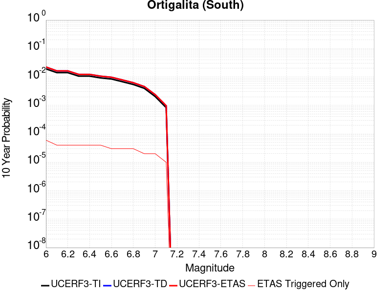 |

| Magnitude | 1 wk TI Prob | 1 wk TD Prob | 1 wk ETAS Prob | 1 wk ETAS/TD Gain | 1 wk ETAS Triggered Only | 1 mo TI Prob | 1 mo TD Prob | 1 mo ETAS Prob | 1 mo ETAS/TD Gain | 1 mo ETAS Triggered Only | 1 yr TI Prob | 1 yr TD Prob | 1 yr ETAS Prob | 1 yr ETAS/TD Gain | 1 yr ETAS Triggered Only | 10 yr TI Prob | 10 yr TD Prob | 10 yr ETAS Prob | 10 yr ETAS/TD Gain | 10 yr ETAS Triggered Only |
|-----|-----|-----|-----|-----|-----|-----|-----|-----|-----|-----|-----|-----|-----|-----|-----|-----|-----|-----|-----|-----|
| 6.0 | 3.72394E-5 | 4.325562E-5 | 7.444773E-5 | 1.7211113 | 3.1193464E-5 | 1.5958765E-4 | 1.8536893E-4 | 2.1655661E-4 | 1.1682465 | 3.1193464E-5 | 0.0019412481 | 0.0022546875 | 0.0023169336 | 1.0276074 | 6.238693E-5 | 0.019243775 | 0.022334497 | 0.02241074 | 1.0034137 | 7.7983656E-5 |
| 6.1 | 2.7299884E-5 | 3.149204E-5 | 4.708828E-5 | 1.4952438 | 1.5596732E-5 | 1.16994255E-4 | 1.3495922E-4 | 1.5055385E-4 | 1.1155506 | 1.5596732E-5 | 0.0014234743 | 0.0016419457 | 0.001673088 | 1.0189667 | 3.1193464E-5 | 0.014143906 | 0.01630407 | 0.016350098 | 1.0028231 | 4.6790192E-5 |
| 6.2 | 2.7299884E-5 | 3.149204E-5 | 4.708828E-5 | 1.4952438 | 1.5596732E-5 | 1.16994255E-4 | 1.3495922E-4 | 1.5055385E-4 | 1.1155506 | 1.5596732E-5 | 0.0014234743 | 0.0016419457 | 0.001673088 | 1.0189667 | 3.1193464E-5 | 0.014143906 | 0.01630407 | 0.016350098 | 1.0028231 | 4.6790192E-5 |
| 6.3 | 2.0546433E-5 | 2.363145E-5 | 3.9227813E-5 | 1.6599833 | 1.5596732E-5 | 8.805317E-5 | 1.0127382E-4 | 1.1686897E-4 | 1.1539899 | 1.5596732E-5 | 0.00107152 | 0.0012323303 | 0.0012634853 | 1.0252814 | 3.1193464E-5 | 0.010663681 | 0.01225703 | 0.012303247 | 1.0037706 | 4.6790192E-5 |
| 6.4 | 2.0546433E-5 | 2.363145E-5 | 3.9227813E-5 | 1.6599833 | 1.5596732E-5 | 8.805317E-5 | 1.0127382E-4 | 1.1686897E-4 | 1.1539899 | 1.5596732E-5 | 0.00107152 | 0.0012323303 | 0.0012634853 | 1.0252814 | 3.1193464E-5 | 0.010663681 | 0.01225703 | 0.012303247 | 1.0037706 | 4.6790192E-5 |
| 6.5 | 1.7779594E-5 | 2.0446974E-5 | 3.6043384E-5 | 1.7627736 | 1.5596732E-5 | 7.619603E-5 | 8.762702E-5 | 1.0322239E-4 | 1.1779743 | 1.5596732E-5 | 9.272918E-4 | 0.0010663504 | 0.0010975106 | 1.0292213 | 3.1193464E-5 | 0.009234319 | 0.010613803 | 0.010660097 | 1.0043616 | 4.6790192E-5 |
| 6.6 | 1.6272212E-5 | 1.8714967E-5 | 3.4311408E-5 | 1.8333671 | 1.5596732E-5 | 6.973618E-5 | 8.0204605E-5 | 9.580009E-5 | 1.1944462 | 1.5596732E-5 | 8.487073E-4 | 9.760658E-4 | 9.916474E-4 | 1.0159636 | 1.5596732E-5 | 0.008454733 | 0.009719091 | 0.009749981 | 1.0031784 | 3.1193464E-5 |
| 6.7 | 1.3051484E-5 | 1.5038758E-5 | 3.0635256E-5 | 2.0370867 | 1.5596732E-5 | 5.593373E-5 | 6.445028E-5 | 8.0046004E-5 | 1.2419807 | 1.5596732E-5 | 6.807804E-4 | 7.844092E-4 | 7.9999364E-4 | 1.0198678 | 1.5596732E-5 | 0.006786986 | 0.007817388 | 0.007848337 | 1.0039591 | 3.1193464E-5 |
| 6.8 | 1.04277415E-5 | 1.1987235E-5 | 2.758378E-5 | 2.301096 | 1.5596732E-5 | 4.4689557E-5 | 5.1372896E-5 | 6.696882E-5 | 1.3035828 | 1.5596732E-5 | 5.439595E-4 | 6.2529295E-4 | 6.408799E-4 | 1.0249275 | 1.5596732E-5 | 0.0054262993 | 0.00623609 | 0.006267089 | 1.0049709 | 3.1193464E-5 |
| 6.9 | 7.639968E-6 | 8.791503E-6 | 2.4388097E-5 | 2.774053 | 1.5596732E-5 | 3.274231E-5 | 3.767736E-5 | 5.3273503E-5 | 1.4139394 | 1.5596732E-5 | 3.9856473E-4 | 4.586312E-4 | 4.7422075E-4 | 1.0339916 | 1.5596732E-5 | 0.003978506 | 0.004577433 | 0.0045929584 | 1.0033917 | 1.5596732E-5 |
| 7.0 | 3.919831E-6 | 4.5334014E-6 | 2.013006E-5 | 4.440388 | 1.5596732E-5 | 1.679917E-5 | 1.942873E-5 | 3.5025158E-5 | 1.8027508 | 1.5596732E-5 | 2.045107E-4 | 2.3652123E-4 | 2.5211426E-4 | 1.0659266 | 1.5596732E-5 | 0.0020432258 | 0.0023629034 | 0.0023784633 | 1.0065851 | 1.5596732E-5 |
| 7.1 | 1.6017933E-6 | 1.8570418E-6 | 1.8570418E-6 | 1.0 | 0.0 | 6.8648105E-6 | 7.958732E-6 | 7.958732E-6 | 1.0 | 0.0 | 8.357586E-5 | 9.689432E-5 | 9.689432E-5 | 1.0 | 0.0 | 8.3544437E-4 | 9.686254E-4 | 9.686254E-4 | 1.0 | 0.0 |

## Hosgri
*[(top)](#table-of-contents)*

| 1 Week | 1 Month | 1 Year | 10 Year |
|-----|-----|-----|-----|
|  |  |  |  |

| Magnitude | 1 wk TI Prob | 1 wk TD Prob | 1 wk ETAS Prob | 1 wk ETAS/TD Gain | 1 wk ETAS Triggered Only | 1 mo TI Prob | 1 mo TD Prob | 1 mo ETAS Prob | 1 mo ETAS/TD Gain | 1 mo ETAS Triggered Only | 1 yr TI Prob | 1 yr TD Prob | 1 yr ETAS Prob | 1 yr ETAS/TD Gain | 1 yr ETAS Triggered Only | 10 yr TI Prob | 10 yr TD Prob | 10 yr ETAS Prob | 10 yr ETAS/TD Gain | 10 yr ETAS Triggered Only |
|-----|-----|-----|-----|-----|-----|-----|-----|-----|-----|-----|-----|-----|-----|-----|-----|-----|-----|-----|-----|-----|
| 6.0 | 2.883978E-5 | 2.9128416E-5 | 2.9128416E-5 | 1.0 | 0.0 | 1.235932E-4 | 1.2483024E-4 | 1.2483024E-4 | 1.0 | 0.0 | 0.0015037085 | 0.001518776 | 0.001549922 | 1.0205073 | 3.1193464E-5 | 0.01493574 | 0.01508774 | 0.015149185 | 1.0040725 | 6.238693E-5 |
| 6.1 | 2.883978E-5 | 2.9128416E-5 | 2.9128416E-5 | 1.0 | 0.0 | 1.235932E-4 | 1.2483024E-4 | 1.2483024E-4 | 1.0 | 0.0 | 0.0015037085 | 0.001518776 | 0.001549922 | 1.0205073 | 3.1193464E-5 | 0.01493574 | 0.01508774 | 0.015149185 | 1.0040725 | 6.238693E-5 |
| 6.2 | 2.883978E-5 | 2.9128416E-5 | 2.9128416E-5 | 1.0 | 0.0 | 1.235932E-4 | 1.2483024E-4 | 1.2483024E-4 | 1.0 | 0.0 | 0.0015037085 | 0.001518776 | 0.001549922 | 1.0205073 | 3.1193464E-5 | 0.01493574 | 0.01508774 | 0.015149185 | 1.0040725 | 6.238693E-5 |
| 6.3 | 2.2914428E-5 | 2.2641969E-5 | 2.2641969E-5 | 1.0 | 0.0 | 9.8200995E-5 | 9.703343E-5 | 9.703343E-5 | 1.0 | 0.0 | 0.0011949413 | 0.0011807467 | 0.0012119033 | 1.0263872 | 3.1193464E-5 | 0.011885363 | 0.011746133 | 0.011807787 | 1.0052489 | 6.238693E-5 |
| 6.4 | 2.0195741E-5 | 1.969656E-5 | 1.969656E-5 | 1.0 | 0.0 | 8.65503E-5 | 8.4411105E-5 | 8.4411105E-5 | 1.0 | 0.0 | 0.0010532405 | 0.0010272227 | 0.0010583841 | 1.0303355 | 3.1193464E-5 | 0.010482626 | 0.010225792 | 0.010287542 | 1.0060385 | 6.238693E-5 |
| 6.5 | 1.9924333E-5 | 1.940898E-5 | 1.940898E-5 | 1.0 | 0.0 | 8.53872E-5 | 8.3178704E-5 | 8.3178704E-5 | 1.0 | 0.0 | 0.0010390934 | 0.0010122322 | 0.0010433941 | 1.0307853 | 3.1193464E-5 | 0.010342481 | 0.010077253 | 0.010139012 | 1.0061284 | 6.238693E-5 |
| 6.6 | 1.809694E-5 | 1.74583E-5 | 1.74583E-5 | 1.0 | 0.0 | 7.7556004E-5 | 7.4819145E-5 | 7.4819145E-5 | 1.0 | 0.0 | 9.438353E-4 | 9.105437E-4 | 9.417088E-4 | 1.0342269 | 3.1193464E-5 | 0.009398366 | 0.009069073 | 0.009130894 | 1.0068167 | 6.238693E-5 |
| 6.7 | 1.675989E-5 | 1.6042764E-5 | 1.6042764E-5 | 1.0 | 0.0 | 7.182612E-5 | 6.87529E-5 | 6.87529E-5 | 1.0 | 0.0 | 8.7413215E-4 | 8.3674624E-4 | 8.523299E-4 | 1.0186242 | 1.5596732E-5 | 0.008707017 | 0.0083368635 | 0.008383263 | 1.0055656 | 4.6790192E-5 |
| 6.8 | 1.5401129E-5 | 1.4614083E-5 | 1.4614083E-5 | 1.0 | 0.0 | 6.6003166E-5 | 6.2630286E-5 | 6.2630286E-5 | 1.0 | 0.0 | 8.032922E-4 | 7.622578E-4 | 7.7784265E-4 | 1.0204456 | 1.5596732E-5 | 0.008003947 | 0.007597296 | 0.007643731 | 1.006112 | 4.6790192E-5 |
| 6.9 | 1.356559E-5 | 1.2689968E-5 | 1.2689968E-5 | 1.0 | 0.0 | 5.8136946E-5 | 5.4384444E-5 | 5.4384444E-5 | 1.0 | 0.0 | 7.0758746E-4 | 6.619299E-4 | 6.775163E-4 | 1.0235469 | 1.5596732E-5 | 0.007053386 | 0.006600388 | 0.0066468692 | 1.0070422 | 4.6790192E-5 |
| 7.0 | 1.2030819E-5 | 1.1095962E-5 | 1.1095962E-5 | 1.0 | 0.0 | 5.155963E-5 | 4.7553254E-5 | 4.7553254E-5 | 1.0 | 0.0 | 6.275577E-4 | 5.7880714E-4 | 5.9439486E-4 | 1.0269307 | 1.5596732E-5 | 0.006257884 | 0.005773757 | 0.0057892636 | 1.0026857 | 1.5596732E-5 |
| 7.1 | 1.0972698E-5 | 1.0022179E-5 | 1.0022179E-5 | 1.0 | 0.0 | 4.7025E-5 | 4.2951488E-5 | 4.2951488E-5 | 1.0 | 0.0 | 5.72379E-4 | 5.22809E-4 | 5.22809E-4 | 1.0 | 0.0 | 0.0057090693 | 0.005216542 | 0.005216542 | 1.0 | 0.0 |
| 7.2 | 9.961926E-6 | 9.034746E-6 | 9.034746E-6 | 1.0 | 0.0 | 4.2693267E-5 | 3.8719765E-5 | 3.8719765E-5 | 1.0 | 0.0 | 5.1966653E-4 | 4.713112E-4 | 4.713112E-4 | 1.0 | 0.0 | 0.00518453 | 0.0047038626 | 0.0047038626 | 1.0 | 0.0 |
| 7.3 | 8.700929E-6 | 7.8281E-6 | 7.8281E-6 | 1.0 | 0.0 | 3.7289166E-5 | 3.354857E-5 | 3.354857E-5 | 1.0 | 0.0 | 4.53901E-4 | 4.0837732E-4 | 4.0837732E-4 | 1.0 | 0.0 | 0.00452975 | 0.004077008 | 0.004077008 | 1.0 | 0.0 |
| 7.4 | 7.866285E-6 | 6.998739E-6 | 6.998739E-6 | 1.0 | 0.0 | 3.3712215E-5 | 2.9994251E-5 | 2.9994251E-5 | 1.0 | 0.0 | 4.103689E-4 | 3.6511885E-4 | 3.6511885E-4 | 1.0 | 0.0 | 0.004096119 | 0.0036459267 | 0.0036459267 | 1.0 | 0.0 |
| 7.5 | 6.8381305E-6 | 5.9596955E-6 | 5.9596955E-6 | 1.0 | 0.0 | 2.9305946E-5 | 2.5541302E-5 | 2.5541302E-5 | 1.0 | 0.0 | 3.5674145E-4 | 3.10921E-4 | 3.10921E-4 | 1.0 | 0.0 | 0.0035616932 | 0.0031055948 | 0.0031055948 | 1.0 | 0.0 |
| 7.6 | 5.503376E-6 | 4.5952443E-6 | 4.5952443E-6 | 1.0 | 0.0 | 2.3585684E-5 | 1.9693754E-5 | 1.9693754E-5 | 1.0 | 0.0 | 2.8711787E-4 | 2.397451E-4 | 2.397451E-4 | 1.0 | 0.0 | 0.002867472 | 0.0023955975 | 0.0023955975 | 1.0 | 0.0 |
| 7.7 | 3.6144982E-6 | 2.6522112E-6 | 2.6522112E-6 | 1.0 | 0.0 | 1.5490614E-5 | 1.1366569E-5 | 1.1366569E-5 | 1.0 | 0.0 | 1.8858191E-4 | 1.383792E-4 | 1.383792E-4 | 1.0 | 0.0 | 0.0018842196 | 0.0013836613 | 0.0013836613 | 1.0 | 0.0 |
| 7.8 | 1.9853494E-6 | 1.1361129E-6 | 1.1361129E-6 | 1.0 | 0.0 | 8.508612E-6 | 4.8690463E-6 | 4.8690463E-6 | 1.0 | 0.0 | 1.0358743E-4 | 5.9279027E-5 | 5.9279027E-5 | 1.0 | 0.0 | 0.0010353916 | 5.9336185E-4 | 5.9336185E-4 | 1.0 | 0.0 |
| 7.9 | 1.1818757E-6 | 5.2951856E-7 | 5.2951856E-7 | 1.0 | 0.0 | 5.0651715E-6 | 2.2693632E-6 | 2.2693632E-6 | 1.0 | 0.0 | 6.1666724E-5 | 2.7629147E-5 | 2.7629147E-5 | 1.0 | 0.0 | 6.1649614E-4 | 2.7694515E-4 | 2.7694515E-4 | 1.0 | 0.0 |
| 8.0 | 6.962958E-7 | 2.7139782E-7 | 2.7139782E-7 | 1.0 | 0.0 | 2.9841215E-6 | 1.163133E-6 | 1.163133E-6 | 1.0 | 0.0 | 3.6331072E-5 | 1.4161053E-5 | 1.4161053E-5 | 1.0 | 0.0 | 3.6325134E-4 | 1.4217179E-4 | 1.4217179E-4 | 1.0 | 0.0 |
| 8.1 | 1.5033264E-7 | 6.527624E-8 | 6.527624E-8 | 1.0 | 0.0 | 6.442826E-7 | 2.7975528E-7 | 2.7975528E-7 | 1.0 | 0.0 | 7.844113E-6 | 3.4060151E-6 | 3.4060151E-6 | 1.0 | 0.0 | 7.843835E-5 | 3.407693E-5 | 3.407693E-5 | 1.0 | 0.0 |

## Whittier alt 1
*[(top)](#table-of-contents)*

| 1 Week | 1 Month | 1 Year | 10 Year |
|-----|-----|-----|-----|
|  |  |  |  |

| Magnitude | 1 wk TI Prob | 1 wk TD Prob | 1 wk ETAS Prob | 1 wk ETAS/TD Gain | 1 wk ETAS Triggered Only | 1 mo TI Prob | 1 mo TD Prob | 1 mo ETAS Prob | 1 mo ETAS/TD Gain | 1 mo ETAS Triggered Only | 1 yr TI Prob | 1 yr TD Prob | 1 yr ETAS Prob | 1 yr ETAS/TD Gain | 1 yr ETAS Triggered Only | 10 yr TI Prob | 10 yr TD Prob | 10 yr ETAS Prob | 10 yr ETAS/TD Gain | 10 yr ETAS Triggered Only |
|-----|-----|-----|-----|-----|-----|-----|-----|-----|-----|-----|-----|-----|-----|-----|-----|-----|-----|-----|-----|-----|
| 6.0 | 4.2554693E-5 | 4.725218E-5 | 6.284817E-5 | 1.3300587 | 1.5596732E-5 | 1.8236451E-4 | 2.0249544E-4 | 2.4927614E-4 | 1.231021 | 4.6790192E-5 | 0.002218027 | 0.0024629154 | 0.0025251487 | 1.0252681 | 6.238693E-5 | 0.02196019 | 0.024390234 | 0.0244511 | 1.0024955 | 6.238693E-5 |
| 6.1 | 4.2554693E-5 | 4.725218E-5 | 6.284817E-5 | 1.3300587 | 1.5596732E-5 | 1.8236451E-4 | 2.0249544E-4 | 2.4927614E-4 | 1.231021 | 4.6790192E-5 | 0.002218027 | 0.0024629154 | 0.0025251487 | 1.0252681 | 6.238693E-5 | 0.02196019 | 0.024390234 | 0.0244511 | 1.0024955 | 6.238693E-5 |
| 6.2 | 4.2554693E-5 | 4.725218E-5 | 6.284817E-5 | 1.3300587 | 1.5596732E-5 | 1.8236451E-4 | 2.0249544E-4 | 2.4927614E-4 | 1.231021 | 4.6790192E-5 | 0.002218027 | 0.0024629154 | 0.0025251487 | 1.0252681 | 6.238693E-5 | 0.02196019 | 0.024390234 | 0.0244511 | 1.0024955 | 6.238693E-5 |
| 6.3 | 1.9617712E-5 | 1.8268593E-5 | 3.386504E-5 | 1.8537301 | 1.5596732E-5 | 8.40732E-5 | 7.829172E-5 | 1.09482746E-4 | 1.3983948 | 3.1193464E-5 | 0.0010231105 | 9.52804E-4 | 9.839677E-4 | 1.0327075 | 3.1193464E-5 | 0.01018413 | 0.009490474 | 0.009521372 | 1.0032556 | 3.1193464E-5 |
| 6.4 | 1.5611336E-5 | 1.3604271E-5 | 2.920079E-5 | 2.146443 | 1.5596732E-5 | 6.690401E-5 | 5.8302747E-5 | 8.949439E-5 | 1.5349944 | 3.1193464E-5 | 8.142519E-4 | 7.0961076E-4 | 7.4078207E-4 | 1.0439273 | 3.1193464E-5 | 0.008112748 | 0.0070754145 | 0.0071063875 | 1.0043775 | 3.1193464E-5 |
| 6.5 | 1.5150166E-5 | 1.3100925E-5 | 2.8697452E-5 | 2.1904905 | 1.5596732E-5 | 6.492767E-5 | 5.6145647E-5 | 8.733736E-5 | 1.55555 | 3.1193464E-5 | 7.9020765E-4 | 6.8336475E-4 | 7.145369E-4 | 1.0456157 | 3.1193464E-5 | 0.007874036 | 0.0068145846 | 0.0068455655 | 1.0045463 | 3.1193464E-5 |
| 6.6 | 1.295588E-5 | 1.0380725E-5 | 2.5977295E-5 | 2.5024548 | 1.5596732E-5 | 5.552402E-5 | 4.4488075E-5 | 7.5680146E-5 | 1.7011334 | 3.1193464E-5 | 6.7579525E-4 | 5.4150965E-4 | 5.726862E-4 | 1.0575734 | 3.1193464E-5 | 0.006737438 | 0.0054033357 | 0.0054343604 | 1.0057418 | 3.1193464E-5 |
| 6.7 | 1.2542085E-5 | 9.899369E-6 | 2.5495945E-5 | 2.5755122 | 1.5596732E-5 | 5.3750682E-5 | 4.242519E-5 | 5.8021255E-5 | 1.3676134 | 1.5596732E-5 | 6.542181E-4 | 5.164061E-4 | 5.319948E-4 | 1.0301869 | 1.5596732E-5 | 0.006522954 | 0.0051534795 | 0.005168996 | 1.0030109 | 1.5596732E-5 |
| 6.8 | 1.2195878E-5 | 9.495415E-6 | 2.5091997E-5 | 2.6425383 | 1.5596732E-5 | 5.2267E-5 | 4.069401E-5 | 5.6290104E-5 | 1.3832529 | 1.5596732E-5 | 6.36165E-4 | 4.9533875E-4 | 5.1092776E-4 | 1.0314714 | 1.5596732E-5 | 0.0063434686 | 0.004943688 | 0.0049592075 | 1.0031393 | 1.5596732E-5 |
| 6.9 | 1.1580298E-5 | 8.772933E-6 | 2.4369527E-5 | 2.7778084 | 1.5596732E-5 | 4.9628903E-5 | 3.7597754E-5 | 5.3193897E-5 | 1.4148159 | 1.5596732E-5 | 6.040644E-4 | 4.5765814E-4 | 4.7324775E-4 | 1.0340638 | 1.5596732E-5 | 0.00602425 | 0.0045684157 | 0.0045839413 | 1.0033984 | 1.5596732E-5 |
| 7.0 | 1.0964795E-5 | 8.083994E-6 | 2.3680599E-5 | 2.9293191 | 1.5596732E-5 | 4.6991136E-5 | 3.4645236E-5 | 5.0241426E-5 | 1.4501684 | 1.5596732E-5 | 5.7196687E-4 | 4.2172565E-4 | 4.373158E-4 | 1.0369675 | 1.5596732E-5 | 0.0057049696 | 0.004210462 | 0.004225993 | 1.0036887 | 1.5596732E-5 |
| 7.1 | 1.0230601E-5 | 7.3266697E-6 | 2.2923286E-5 | 3.1287458 | 1.5596732E-5 | 4.3844695E-5 | 3.1399642E-5 | 4.6995883E-5 | 1.4967012 | 1.5596732E-5 | 5.336784E-4 | 3.8222488E-4 | 3.9781566E-4 | 1.0407895 | 1.5596732E-5 | 0.005323986 | 0.0038168381 | 0.0038323754 | 1.0040708 | 1.5596732E-5 |
| 7.2 | 9.40865E-6 | 6.543289E-6 | 2.2139919E-5 | 3.383607 | 1.5596732E-5 | 4.032216E-5 | 2.8042374E-5 | 4.3638665E-5 | 1.5561688 | 1.5596732E-5 | 4.908117E-4 | 3.4136363E-4 | 3.5695505E-4 | 1.0456738 | 1.5596732E-5 | 0.0048972913 | 0.003409485 | 0.0034250289 | 1.0045589 | 1.5596732E-5 |
| 7.3 | 8.237384E-6 | 5.5977525E-6 | 2.1194397E-5 | 3.7862332 | 1.5596732E-5 | 3.5302593E-5 | 2.3990153E-5 | 3.958651E-5 | 1.6501149 | 1.5596732E-5 | 4.2972428E-4 | 2.92042E-4 | 3.0763418E-4 | 1.0533901 | 1.5596732E-5 | 0.0042889426 | 0.002916903 | 0.0029324545 | 1.0053314 | 1.5596732E-5 |
| 7.4 | 7.5316966E-6 | 5.027819E-6 | 2.0624471E-5 | 4.102071 | 1.5596732E-5 | 3.2278298E-5 | 2.1547625E-5 | 3.714402E-5 | 1.7238104 | 1.5596732E-5 | 3.9291743E-4 | 2.6231175E-4 | 2.779044E-4 | 1.0594431 | 1.5596732E-5 | 0.0039222343 | 0.0026201333 | 0.0026356892 | 1.0059371 | 1.5596732E-5 |
| 7.5 | 6.149649E-6 | 3.933841E-6 | 1.9530511E-5 | 4.964743 | 1.5596732E-5 | 2.6355372E-5 | 1.6859214E-5 | 3.2455682E-5 | 1.9251006 | 1.5596732E-5 | 3.208294E-4 | 2.052425E-4 | 2.2083602E-4 | 1.0759761 | 1.5596732E-5 | 0.003203666 | 0.0020506186 | 0.0020661834 | 1.0075903 | 1.5596732E-5 |
| 7.6 | 5.457711E-6 | 3.3953788E-6 | 1.8992057E-5 | 5.5935016 | 1.5596732E-5 | 2.338998E-5 | 1.4551547E-5 | 3.014805E-5 | 2.0718107 | 1.5596732E-5 | 2.8473578E-4 | 1.771515E-4 | 1.9274546E-4 | 1.0880262 | 1.5596732E-5 | 0.0028437122 | 0.0017701836 | 0.0017857526 | 1.0087953 | 1.5596732E-5 |
| 7.7 | 4.1676276E-6 | 2.3331952E-6 | 1.792989E-5 | 7.6846933 | 1.5596732E-5 | 1.7861139E-5 | 9.999374E-6 | 2.559595E-5 | 2.559755 | 1.5596732E-5 | 2.1743766E-4 | 1.2173632E-4 | 1.3733115E-4 | 1.1281034 | 1.5596732E-5 | 0.0021722503 | 0.0012167693 | 0.0012323471 | 1.0128026 | 1.5596732E-5 |
| 7.8 | 2.2692414E-7 | 9.3854695E-8 | 9.3854695E-8 | 1.0 | 0.0 | 9.725317E-7 | 4.0223435E-7 | 4.0223435E-7 | 1.0 | 0.0 | 1.1840509E-5 | 4.8971956E-6 | 4.8971956E-6 | 1.0 | 0.0 | 1.1839878E-4 | 4.8971204E-5 | 4.8971204E-5 | 1.0 | 0.0 |
| 7.9 | 6.676829E-9 | 3.439853E-9 | 3.439853E-9 | 1.0 | 0.0 | 2.861498E-8 | 1.4742227E-8 | 1.4742227E-8 | 1.0 | 0.0 | 3.4838732E-7 | 1.7948659E-7 | 1.7948659E-7 | 1.0 | 0.0 | 3.4838679E-6 | 1.7948646E-6 | 1.7948646E-6 | 1.0 | 0.0 |

## Dry Mountain
*[(top)](#table-of-contents)*

| 1 Week | 1 Month | 1 Year | 10 Year |
|-----|-----|-----|-----|
|  |  |  | 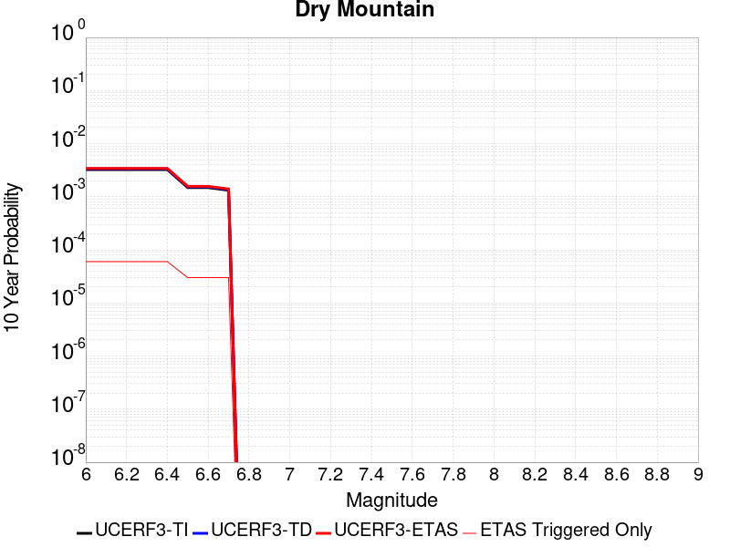 |

| Magnitude | 1 wk TI Prob | 1 wk TD Prob | 1 wk ETAS Prob | 1 wk ETAS/TD Gain | 1 wk ETAS Triggered Only | 1 mo TI Prob | 1 mo TD Prob | 1 mo ETAS Prob | 1 mo ETAS/TD Gain | 1 mo ETAS Triggered Only | 1 yr TI Prob | 1 yr TD Prob | 1 yr ETAS Prob | 1 yr ETAS/TD Gain | 1 yr ETAS Triggered Only | 10 yr TI Prob | 10 yr TD Prob | 10 yr ETAS Prob | 10 yr ETAS/TD Gain | 10 yr ETAS Triggered Only |
|-----|-----|-----|-----|-----|-----|-----|-----|-----|-----|-----|-----|-----|-----|-----|-----|-----|-----|-----|-----|-----|
| 6.0 | 6.222801E-6 | 6.439381E-6 | 6.439381E-6 | 1.0 | 0.0 | 2.6668875E-5 | 2.7597147E-5 | 2.7597147E-5 | 1.0 | 0.0 | 3.2464517E-4 | 3.3595937E-4 | 3.6714235E-4 | 1.0928177 | 3.1193464E-5 | 0.0032417132 | 0.0033560768 | 0.0034182544 | 1.0185269 | 6.238693E-5 |
| 6.1 | 6.222801E-6 | 6.439381E-6 | 6.439381E-6 | 1.0 | 0.0 | 2.6668875E-5 | 2.7597147E-5 | 2.7597147E-5 | 1.0 | 0.0 | 3.2464517E-4 | 3.3595937E-4 | 3.6714235E-4 | 1.0928177 | 3.1193464E-5 | 0.0032417132 | 0.0033560768 | 0.0034182544 | 1.0185269 | 6.238693E-5 |
| 6.2 | 6.222801E-6 | 6.439381E-6 | 6.439381E-6 | 1.0 | 0.0 | 2.6668875E-5 | 2.7597147E-5 | 2.7597147E-5 | 1.0 | 0.0 | 3.2464517E-4 | 3.3595937E-4 | 3.6714235E-4 | 1.0928177 | 3.1193464E-5 | 0.0032417132 | 0.0033560768 | 0.0034182544 | 1.0185269 | 6.238693E-5 |
| 6.3 | 6.222801E-6 | 6.439381E-6 | 6.439381E-6 | 1.0 | 0.0 | 2.6668875E-5 | 2.7597147E-5 | 2.7597147E-5 | 1.0 | 0.0 | 3.2464517E-4 | 3.3595937E-4 | 3.6714235E-4 | 1.0928177 | 3.1193464E-5 | 0.0032417132 | 0.0033560768 | 0.0034182544 | 1.0185269 | 6.238693E-5 |
| 6.4 | 6.222801E-6 | 6.439381E-6 | 6.439381E-6 | 1.0 | 0.0 | 2.6668875E-5 | 2.7597147E-5 | 2.7597147E-5 | 1.0 | 0.0 | 3.2464517E-4 | 3.3595937E-4 | 3.6714235E-4 | 1.0928177 | 3.1193464E-5 | 0.0032417132 | 0.0033560768 | 0.0034182544 | 1.0185269 | 6.238693E-5 |
| 6.5 | 2.8528623E-6 | 2.9521684E-6 | 2.9521684E-6 | 1.0 | 0.0 | 1.22264955E-5 | 1.2652138E-5 | 1.2652138E-5 | 1.0 | 0.0 | 1.4884741E-4 | 1.540376E-4 | 1.540376E-4 | 1.0 | 0.0 | 0.0014874774 | 0.0015401616 | 0.0015713071 | 1.0202222 | 3.1193464E-5 |
| 6.6 | 2.8528623E-6 | 2.9521684E-6 | 2.9521684E-6 | 1.0 | 0.0 | 1.22264955E-5 | 1.2652138E-5 | 1.2652138E-5 | 1.0 | 0.0 | 1.4884741E-4 | 1.540376E-4 | 1.540376E-4 | 1.0 | 0.0 | 0.0014874774 | 0.0015401616 | 0.0015713071 | 1.0202222 | 3.1193464E-5 |
| 6.7 | 2.541E-6 | 2.6293578E-6 | 2.6293578E-6 | 1.0 | 0.0 | 1.0889954E-5 | 1.1268677E-5 | 1.1268677E-5 | 1.0 | 0.0 | 1.3257713E-4 | 1.3719614E-4 | 1.3719614E-4 | 1.0 | 0.0 | 0.0013249806 | 0.0013719613 | 0.0014031121 | 1.0227052 | 3.1193464E-5 |

## Hunting Creek - Berryessa 2011 CFM
*[(top)](#table-of-contents)*

| 1 Week | 1 Month | 1 Year | 10 Year |
|-----|-----|-----|-----|
|  |  |  |  |

| Magnitude | 1 wk TI Prob | 1 wk TD Prob | 1 wk ETAS Prob | 1 wk ETAS/TD Gain | 1 wk ETAS Triggered Only | 1 mo TI Prob | 1 mo TD Prob | 1 mo ETAS Prob | 1 mo ETAS/TD Gain | 1 mo ETAS Triggered Only | 1 yr TI Prob | 1 yr TD Prob | 1 yr ETAS Prob | 1 yr ETAS/TD Gain | 1 yr ETAS Triggered Only | 10 yr TI Prob | 10 yr TD Prob | 10 yr ETAS Prob | 10 yr ETAS/TD Gain | 10 yr ETAS Triggered Only |
|-----|-----|-----|-----|-----|-----|-----|-----|-----|-----|-----|-----|-----|-----|-----|-----|-----|-----|-----|-----|-----|
| 6.0 | 1.1270982E-4 | 2.0012174E-4 | 2.0012174E-4 | 1.0 | 0.0 | 4.8295266E-4 | 8.5739547E-4 | 8.5739547E-4 | 1.0 | 0.0 | 0.0058641075 | 0.010386313 | 0.010417182 | 1.0029721 | 3.1193464E-5 | 0.057117578 | 0.09803703 | 0.09807923 | 1.0004305 | 4.6790192E-5 |
| 6.1 | 1.1239393E-4 | 1.9960315E-4 | 1.9960315E-4 | 1.0 | 0.0 | 4.8159933E-4 | 8.551744E-4 | 8.551744E-4 | 1.0 | 0.0 | 0.0058477195 | 0.010359551 | 0.010390421 | 1.0029799 | 3.1193464E-5 | 0.056962132 | 0.09779551 | 0.09783772 | 1.0004317 | 4.6790192E-5 |
| 6.2 | 7.596265E-5 | 1.2940196E-4 | 1.2940196E-4 | 1.0 | 0.0 | 3.2551357E-4 | 5.5444165E-4 | 5.5444165E-4 | 1.0 | 0.0 | 0.0039559277 | 0.0067210156 | 0.0067365076 | 1.002305 | 1.5596732E-5 | 0.038862433 | 0.0645915 | 0.064606085 | 1.0002259 | 1.5596732E-5 |
| 6.3 | 6.78794E-5 | 1.145119E-4 | 1.145119E-4 | 1.0 | 0.0 | 2.9087928E-4 | 4.906513E-4 | 4.906513E-4 | 1.0 | 0.0 | 0.003535705 | 0.005952679 | 0.005952679 | 1.0 | 0.0 | 0.034799766 | 0.057465393 | 0.057480093 | 1.0002558 | 1.5596732E-5 |
| 6.4 | 6.2165134E-5 | 1.0436625E-4 | 1.0436625E-4 | 1.0 | 0.0 | 2.6639478E-4 | 4.4721062E-4 | 4.4721062E-4 | 1.0 | 0.0 | 0.0032385332 | 0.005427573 | 0.005427573 | 1.0 | 0.0 | 0.03191742 | 0.052550517 | 0.052565295 | 1.0002812 | 1.5596732E-5 |
| 6.5 | 5.4368087E-5 | 9.071415E-5 | 9.071415E-5 | 1.0 | 0.0 | 2.3298527E-4 | 3.8872007E-4 | 3.8872007E-4 | 1.0 | 0.0 | 0.0028329059 | 0.0047198683 | 0.0047198683 | 1.0 | 0.0 | 0.027970633 | 0.045880128 | 0.04589501 | 1.0003244 | 1.5596732E-5 |
| 6.6 | 4.729947E-5 | 7.847572E-5 | 7.847572E-5 | 1.0 | 0.0 | 2.0269625E-4 | 3.362842E-4 | 3.362842E-4 | 1.0 | 0.0 | 0.002465034 | 0.0040849647 | 0.0040849647 | 1.0 | 0.0 | 0.02437869 | 0.03985155 | 0.039866526 | 1.0003757 | 1.5596732E-5 |
| 6.7 | 3.6875328E-5 | 6.0451803E-5 | 6.0451803E-5 | 1.0 | 0.0 | 1.5802756E-4 | 2.59056E-4 | 2.59056E-4 | 1.0 | 0.0 | 0.0019222875 | 0.0031482063 | 0.0031482063 | 1.0 | 0.0 | 0.019057442 | 0.03089237 | 0.030907486 | 1.0004892 | 1.5596732E-5 |
| 6.8 | 2.0292036E-5 | 2.8976308E-5 | 2.8976308E-5 | 1.0 | 0.0 | 8.6962966E-5 | 1.2417832E-4 | 1.2417832E-4 | 1.0 | 0.0 | 0.0010582599 | 0.0015108072 | 0.0015108072 | 1.0 | 0.0 | 0.010532344 | 0.014978523 | 0.014993886 | 1.0010257 | 1.5596732E-5 |
| 6.9 | 1.7871042E-5 | 2.4472254E-5 | 2.4472254E-5 | 1.0 | 0.0 | 7.658793E-5 | 1.048769E-4 | 1.048769E-4 | 1.0 | 0.0 | 9.320591E-4 | 0.0012761299 | 0.0012761299 | 1.0 | 0.0 | 0.009281595 | 0.012679775 | 0.012695174 | 1.0012145 | 1.5596732E-5 |
| 7.0 | 1.6415532E-5 | 2.1906277E-5 | 2.1906277E-5 | 1.0 | 0.0 | 7.035038E-5 | 9.3880684E-5 | 9.3880684E-5 | 1.0 | 0.0 | 8.561793E-4 | 0.0011424015 | 0.0011424015 | 1.0 | 0.0 | 0.008528882 | 0.01136452 | 0.011379939 | 1.0013568 | 1.5596732E-5 |
| 7.1 | 1.5409885E-5 | 2.0346342E-5 | 2.0346342E-5 | 1.0 | 0.0 | 6.6040695E-5 | 8.7195716E-5 | 8.7195716E-5 | 1.0 | 0.0 | 8.0374884E-4 | 0.0010610938 | 0.0010610938 | 1.0 | 0.0 | 0.00800848 | 0.010560595 | 0.010576027 | 1.0014613 | 1.5596732E-5 |
| 7.2 | 1.4497423E-5 | 1.9054964E-5 | 1.9054964E-5 | 1.0 | 0.0 | 6.213033E-5 | 8.166159E-5 | 8.166159E-5 | 1.0 | 0.0 | 7.5617427E-4 | 9.937795E-4 | 9.937795E-4 | 1.0 | 0.0 | 0.0075360634 | 0.009893929 | 0.009893929 | 1.0 | 0.0 |
| 7.3 | 1.3615175E-5 | 1.7826127E-5 | 1.7826127E-5 | 1.0 | 0.0 | 5.8349444E-5 | 7.639547E-5 | 7.639547E-5 | 1.0 | 0.0 | 7.101729E-4 | 9.297209E-4 | 9.297209E-4 | 1.0 | 0.0 | 0.0070790765 | 0.009258823 | 0.009258823 | 1.0 | 0.0 |
| 7.4 | 1.2252825E-5 | 1.602625E-5 | 1.602625E-5 | 1.0 | 0.0 | 5.251105E-5 | 6.868213E-5 | 6.868213E-5 | 1.0 | 0.0 | 6.391345E-4 | 8.35887E-4 | 8.35887E-4 | 1.0 | 0.0 | 0.0063729943 | 0.008327872 | 0.008327872 | 1.0 | 0.0 |
| 7.5 | 1.0913301E-5 | 1.4241117E-5 | 1.4241117E-5 | 1.0 | 0.0 | 4.6770452E-5 | 6.1031948E-5 | 6.1031948E-5 | 1.0 | 0.0 | 5.6928146E-4 | 7.4281334E-4 | 7.4281334E-4 | 1.0 | 0.0 | 0.0056782532 | 0.0074036797 | 0.0074036797 | 1.0 | 0.0 |
| 7.6 | 8.623192E-6 | 1.12346415E-5 | 1.12346415E-5 | 1.0 | 0.0 | 3.6956015E-5 | 4.814759E-5 | 4.814759E-5 | 1.0 | 0.0 | 4.4984656E-4 | 5.8604183E-4 | 5.8604183E-4 | 1.0 | 0.0 | 0.00448937 | 0.0058452785 | 0.0058452785 | 1.0 | 0.0 |
| 7.7 | 2.0993634E-6 | 2.662584E-6 | 2.662584E-6 | 1.0 | 0.0 | 8.997241E-6 | 1.1411025E-5 | 1.1411025E-5 | 1.0 | 0.0 | 1.09535904E-4 | 1.3892044E-4 | 1.3892044E-4 | 1.0 | 0.0 | 0.0010948193 | 0.0013883426 | 0.0013883426 | 1.0 | 0.0 |
| 7.8 | 1.8428308E-7 | 2.167437E-7 | 2.167437E-7 | 1.0 | 0.0 | 7.897844E-7 | 9.289013E-7 | 9.289013E-7 | 1.0 | 0.0 | 9.615583E-6 | 1.1309318E-5 | 1.1309318E-5 | 1.0 | 0.0 | 9.615166E-5 | 1.13086026E-4 | 1.13086026E-4 | 1.0 | 0.0 |

## San Luis Range 2011 CFM
*[(top)](#table-of-contents)*

| 1 Week | 1 Month | 1 Year | 10 Year |
|-----|-----|-----|-----|
|  |  |  |  |

| Magnitude | 1 wk TI Prob | 1 wk TD Prob | 1 wk ETAS Prob | 1 wk ETAS/TD Gain | 1 wk ETAS Triggered Only | 1 mo TI Prob | 1 mo TD Prob | 1 mo ETAS Prob | 1 mo ETAS/TD Gain | 1 mo ETAS Triggered Only | 1 yr TI Prob | 1 yr TD Prob | 1 yr ETAS Prob | 1 yr ETAS/TD Gain | 1 yr ETAS Triggered Only | 10 yr TI Prob | 10 yr TD Prob | 10 yr ETAS Prob | 10 yr ETAS/TD Gain | 10 yr ETAS Triggered Only |
|-----|-----|-----|-----|-----|-----|-----|-----|-----|-----|-----|-----|-----|-----|-----|-----|-----|-----|-----|-----|-----|
| 6.0 | 8.8368415E-6 | 8.965454E-6 | 8.965454E-6 | 1.0 | 0.0 | 3.787163E-5 | 3.842285E-5 | 3.842285E-5 | 1.0 | 0.0 | 4.609895E-4 | 4.677057E-4 | 4.8329512E-4 | 1.0333318 | 1.5596732E-5 | 0.0046003438 | 0.0046679964 | 0.0047456156 | 1.016628 | 7.7983656E-5 |
| 6.1 | 8.8368415E-6 | 8.965454E-6 | 8.965454E-6 | 1.0 | 0.0 | 3.787163E-5 | 3.842285E-5 | 3.842285E-5 | 1.0 | 0.0 | 4.609895E-4 | 4.677057E-4 | 4.8329512E-4 | 1.0333318 | 1.5596732E-5 | 0.0046003438 | 0.0046679964 | 0.0047456156 | 1.016628 | 7.7983656E-5 |
| 6.2 | 8.8368415E-6 | 8.965454E-6 | 8.965454E-6 | 1.0 | 0.0 | 3.787163E-5 | 3.842285E-5 | 3.842285E-5 | 1.0 | 0.0 | 4.609895E-4 | 4.677057E-4 | 4.8329512E-4 | 1.0333318 | 1.5596732E-5 | 0.0046003438 | 0.0046679964 | 0.0047456156 | 1.016628 | 7.7983656E-5 |
| 6.3 | 8.8368415E-6 | 8.965454E-6 | 8.965454E-6 | 1.0 | 0.0 | 3.787163E-5 | 3.842285E-5 | 3.842285E-5 | 1.0 | 0.0 | 4.609895E-4 | 4.677057E-4 | 4.8329512E-4 | 1.0333318 | 1.5596732E-5 | 0.0046003438 | 0.0046679964 | 0.0047456156 | 1.016628 | 7.7983656E-5 |
| 6.4 | 3.9094193E-6 | 3.9412025E-6 | 3.9412025E-6 | 1.0 | 0.0 | 1.6754546E-5 | 1.689076E-5 | 1.689076E-5 | 1.0 | 0.0 | 2.039675E-4 | 2.056259E-4 | 2.2121941E-4 | 1.0758344 | 1.5596732E-5 | 0.0020378039 | 0.0020543851 | 0.0020855144 | 1.0151527 | 3.1193464E-5 |
| 6.5 | 3.9094193E-6 | 3.9412025E-6 | 3.9412025E-6 | 1.0 | 0.0 | 1.6754546E-5 | 1.689076E-5 | 1.689076E-5 | 1.0 | 0.0 | 2.039675E-4 | 2.056259E-4 | 2.2121941E-4 | 1.0758344 | 1.5596732E-5 | 0.0020378039 | 0.0020543851 | 0.0020855144 | 1.0151527 | 3.1193464E-5 |
| 6.6 | 3.0587726E-6 | 3.0753883E-6 | 3.0753883E-6 | 1.0 | 0.0 | 1.3108959E-5 | 1.318017E-5 | 1.318017E-5 | 1.0 | 0.0 | 1.595899E-4 | 1.6045687E-4 | 1.760511E-4 | 1.0971864 | 1.5596732E-5 | 0.0015947534 | 0.0016034221 | 0.0016345655 | 1.0194231 | 3.1193464E-5 |
| 6.7 | 2.6160574E-6 | 2.6251273E-6 | 2.6251273E-6 | 1.0 | 0.0 | 1.1211626E-5 | 1.1250498E-5 | 1.1250498E-5 | 1.0 | 0.0 | 1.3649299E-4 | 1.3696625E-4 | 1.5256085E-4 | 1.1138572 | 1.5596732E-5 | 0.0013640919 | 0.0013688246 | 0.0013844 | 1.0113786 | 1.5596732E-5 |
| 6.8 | 2.5110312E-6 | 2.51814E-6 | 2.51814E-6 | 1.0 | 0.0 | 1.0761518E-5 | 1.0791985E-5 | 1.0791985E-5 | 1.0 | 0.0 | 1.310136E-4 | 1.3138456E-4 | 1.4697923E-4 | 1.1186949 | 1.5596732E-5 | 0.0013093639 | 0.0013130746 | 0.0013286509 | 1.0118624 | 1.5596732E-5 |
| 6.9 | 1.8564405E-6 | 1.852487E-6 | 1.852487E-6 | 1.0 | 0.0 | 7.95615E-6 | 7.939206E-6 | 7.939206E-6 | 1.0 | 0.0 | 9.686181E-5 | 9.665557E-5 | 9.665557E-5 | 1.0 | 0.0 | 9.68196E-4 | 9.661373E-4 | 9.661373E-4 | 1.0 | 0.0 |
| 7.0 | 1.546127E-6 | 1.5369537E-6 | 1.5369537E-6 | 1.0 | 0.0 | 6.626242E-6 | 6.586928E-6 | 6.586928E-6 | 1.0 | 0.0 | 8.06715E-5 | 8.0192905E-5 | 8.0192905E-5 | 1.0 | 0.0 | 8.0642226E-4 | 8.016404E-4 | 8.016404E-4 | 1.0 | 0.0 |
| 7.1 | 1.3368208E-6 | 1.3235326E-6 | 1.3235326E-6 | 1.0 | 0.0 | 5.7292195E-6 | 5.67227E-6 | 5.67227E-6 | 1.0 | 0.0 | 6.975101E-5 | 6.905771E-5 | 6.905771E-5 | 1.0 | 0.0 | 6.972912E-4 | 6.9036294E-4 | 6.9036294E-4 | 1.0 | 0.0 |
| 7.2 | 1.0623363E-6 | 1.0454368E-6 | 1.0454368E-6 | 1.0 | 0.0 | 4.5528623E-6 | 4.4804356E-6 | 4.4804356E-6 | 1.0 | 0.0 | 5.5429686E-5 | 5.4547938E-5 | 5.4547938E-5 | 1.0 | 0.0 | 5.5415864E-4 | 5.4534577E-4 | 5.4534577E-4 | 1.0 | 0.0 |
| 7.3 | 7.831679E-7 | 7.7273904E-7 | 7.7273904E-7 | 1.0 | 0.0 | 3.3564295E-6 | 3.3117344E-6 | 3.3117344E-6 | 1.0 | 0.0 | 4.086376E-5 | 4.0319625E-5 | 4.0319625E-5 | 1.0 | 0.0 | 4.0856248E-4 | 4.031232E-4 | 4.031232E-4 | 1.0 | 0.0 |
| 7.4 | 5.9558846E-7 | 5.910636E-7 | 5.910636E-7 | 1.0 | 0.0 | 2.5525194E-6 | 2.5331274E-6 | 2.5331274E-6 | 1.0 | 0.0 | 3.107648E-5 | 3.084039E-5 | 3.084039E-5 | 1.0 | 0.0 | 3.1072134E-4 | 3.083612E-4 | 3.083612E-4 | 1.0 | 0.0 |
| 7.5 | 4.1616502E-7 | 4.119631E-7 | 4.119631E-7 | 1.0 | 0.0 | 1.7835631E-6 | 1.7655549E-6 | 1.7655549E-6 | 1.0 | 0.0 | 2.1714664E-5 | 2.149542E-5 | 2.149542E-5 | 1.0 | 0.0 | 2.1712543E-4 | 2.1493346E-4 | 2.1493346E-4 | 1.0 | 0.0 |
| 7.6 | 2.3816014E-7 | 2.3376548E-7 | 2.3376548E-7 | 1.0 | 0.0 | 1.0206859E-6 | 1.0018516E-6 | 1.0018516E-6 | 1.0 | 0.0 | 1.242678E-5 | 1.2197475E-5 | 1.2197475E-5 | 1.0 | 0.0 | 1.2426086E-4 | 1.2196808E-4 | 1.2196808E-4 | 1.0 | 0.0 |
| 7.7 | 9.918777E-8 | 9.3867584E-8 | 9.3867584E-8 | 1.0 | 0.0 | 4.2509038E-7 | 4.0228957E-7 | 4.0228957E-7 | 1.0 | 0.0 | 5.1754632E-6 | 4.8978645E-6 | 4.8978645E-6 | 1.0 | 0.0 | 5.1753424E-5 | 4.897757E-5 | 4.897757E-5 | 1.0 | 0.0 |
| 7.8 | 3.4982556E-8 | 2.968655E-8 | 2.968655E-8 | 1.0 | 0.0 | 1.4992524E-7 | 1.2722806E-7 | 1.2722806E-7 | 1.0 | 0.0 | 1.8253382E-6 | 1.5490006E-6 | 1.5490006E-6 | 1.0 | 0.0 | 1.8253233E-5 | 1.5489897E-5 | 1.5489897E-5 | 1.0 | 0.0 |
| 7.9 | 1.6624908E-8 | 1.1477036E-8 | 1.1477036E-8 | 1.0 | 0.0 | 7.12496E-8 | 4.91873E-8 | 4.91873E-8 | 1.0 | 0.0 | 8.6746354E-7 | 5.988552E-7 | 5.988552E-7 | 1.0 | 0.0 | 8.674601E-6 | 5.988536E-6 | 5.988536E-6 | 1.0 | 0.0 |
| 8.0 | 6.3352315E-9 | 3.0888412E-9 | 3.0888412E-9 | 1.0 | 0.0 | 2.715099E-8 | 1.3237893E-8 | 1.3237893E-8 | 1.0 | 0.0 | 3.3056327E-7 | 1.6117131E-7 | 1.6117131E-7 | 1.0 | 0.0 | 3.3056278E-6 | 1.611712E-6 | 1.611712E-6 | 1.0 | 0.0 |

## Likely 2011 CFM
*[(top)](#table-of-contents)*

| 1 Week | 1 Month | 1 Year | 10 Year |
|-----|-----|-----|-----|
|  |  |  |  |

| Magnitude | 1 wk TI Prob | 1 wk TD Prob | 1 wk ETAS Prob | 1 wk ETAS/TD Gain | 1 wk ETAS Triggered Only | 1 mo TI Prob | 1 mo TD Prob | 1 mo ETAS Prob | 1 mo ETAS/TD Gain | 1 mo ETAS Triggered Only | 1 yr TI Prob | 1 yr TD Prob | 1 yr ETAS Prob | 1 yr ETAS/TD Gain | 1 yr ETAS Triggered Only | 10 yr TI Prob | 10 yr TD Prob | 10 yr ETAS Prob | 10 yr ETAS/TD Gain | 10 yr ETAS Triggered Only |
|-----|-----|-----|-----|-----|-----|-----|-----|-----|-----|-----|-----|-----|-----|-----|-----|-----|-----|-----|-----|-----|
| 6.0 | 2.5315949E-5 | 2.7104748E-5 | 4.2701056E-5 | 1.5754087 | 1.5596732E-5 | 1.0849241E-4 | 1.16158284E-4 | 1.6294305E-4 | 1.4027673 | 4.6790192E-5 | 0.0013200947 | 0.0014133542 | 0.0014600783 | 1.033059 | 4.6790192E-5 | 0.013122803 | 0.01404831 | 0.014094443 | 1.0032839 | 4.6790192E-5 |
| 6.1 | 2.5315949E-5 | 2.7104748E-5 | 4.2701056E-5 | 1.5754087 | 1.5596732E-5 | 1.0849241E-4 | 1.16158284E-4 | 1.4734812E-4 | 1.2685115 | 3.1193464E-5 | 0.0013200947 | 0.0014133542 | 0.0014445035 | 1.0220393 | 3.1193464E-5 | 0.013122803 | 0.01404831 | 0.014079066 | 1.0021893 | 3.1193464E-5 |
| 6.2 | 1.6375941E-5 | 1.7465842E-5 | 1.7465842E-5 | 1.0 | 0.0 | 7.0180715E-5 | 7.485153E-5 | 9.0447094E-5 | 1.2083533 | 1.5596732E-5 | 8.5411523E-4 | 9.109487E-4 | 9.2653115E-4 | 1.0171058 | 1.5596732E-5 | 0.008508399 | 0.009073433 | 0.009104343 | 1.0034066 | 3.1193464E-5 |
| 6.3 | 1.1945543E-5 | 1.2712587E-5 | 1.2712587E-5 | 1.0 | 0.0 | 5.119418E-5 | 5.4481407E-5 | 7.007729E-5 | 1.2862606 | 1.5596732E-5 | 6.2311086E-4 | 6.631146E-4 | 6.78701E-4 | 1.0235049 | 1.5596732E-5 | 0.0062136655 | 0.0066119144 | 0.006642902 | 1.0046866 | 3.1193464E-5 |
| 6.4 | 9.192729E-6 | 9.768488E-6 | 9.768488E-6 | 1.0 | 0.0 | 3.939681E-5 | 4.1864292E-5 | 5.746037E-5 | 1.3725389 | 1.5596732E-5 | 4.7955062E-4 | 5.0958124E-4 | 5.2517006E-4 | 1.0305914 | 1.5596732E-5 | 0.004785171 | 0.0050844094 | 0.005115444 | 1.0061039 | 3.1193464E-5 |
| 6.5 | 7.67906E-6 | 8.152622E-6 | 8.152622E-6 | 1.0 | 0.0 | 3.2909844E-5 | 3.4939352E-5 | 5.053554E-5 | 1.4463788 | 1.5596732E-5 | 4.006037E-4 | 4.2530545E-4 | 4.4089556E-4 | 1.0366563 | 1.5596732E-5 | 0.0039988225 | 0.004245108 | 0.004276169 | 1.007317 | 3.1193464E-5 |
| 6.6 | 6.4884057E-6 | 6.8847507E-6 | 6.8847507E-6 | 1.0 | 0.0 | 2.7807157E-5 | 2.9505749E-5 | 4.510202E-5 | 1.5285841 | 1.5596732E-5 | 3.3849955E-4 | 3.591747E-4 | 3.7476583E-4 | 1.0434082 | 1.5596732E-5 | 0.003379844 | 0.0035860867 | 0.0036171684 | 1.0086672 | 3.1193464E-5 |
| 6.7 | 4.6060636E-6 | 4.884041E-6 | 4.884041E-6 | 1.0 | 0.0 | 1.9740122E-5 | 2.0931442E-5 | 3.6527847E-5 | 1.7451185 | 1.5596732E-5 | 2.403095E-4 | 2.5481134E-4 | 2.704041E-4 | 1.0611933 | 1.5596732E-5 | 0.002400498 | 0.0025452746 | 0.0025608316 | 1.0061121 | 1.5596732E-5 |
| 6.8 | 3.2795615E-6 | 3.4773732E-6 | 3.4773732E-6 | 1.0 | 0.0 | 1.4055187E-5 | 1.4902946E-5 | 3.0499445E-5 | 2.0465379 | 1.5596732E-5 | 1.7110848E-4 | 1.8142881E-4 | 1.9702272E-4 | 1.0859505 | 1.5596732E-5 | 0.0017097679 | 0.0018128622 | 0.0018284307 | 1.0085877 | 1.5596732E-5 |
| 6.9 | 2.3289967E-6 | 2.4705569E-6 | 2.4705569E-6 | 1.0 | 0.0 | 9.981376E-6 | 1.058806E-5 | 2.6184625E-5 | 2.4730334 | 1.5596732E-5 | 1.2151648E-4 | 1.2890245E-4 | 1.4449717E-4 | 1.1209807 | 1.5596732E-5 | 0.0012145005 | 0.0012883197 | 0.0013038963 | 1.0120907 | 1.5596732E-5 |
| 7.0 | 1.211292E-6 | 1.2863958E-6 | 1.2863958E-6 | 1.0 | 0.0 | 5.1912407E-6 | 5.5131145E-6 | 5.5131145E-6 | 1.0 | 0.0 | 6.320152E-5 | 6.712041E-5 | 6.712041E-5 | 1.0 | 0.0 | 6.3183554E-4 | 6.710312E-4 | 6.710312E-4 | 1.0 | 0.0 |

## San Andreas (Santa Cruz Mts) 2011 CFM
*[(top)](#table-of-contents)*

| 1 Week | 1 Month | 1 Year | 10 Year |
|-----|-----|-----|-----|
|  |  |  |  |

| Magnitude | 1 wk TI Prob | 1 wk TD Prob | 1 wk ETAS Prob | 1 wk ETAS/TD Gain | 1 wk ETAS Triggered Only | 1 mo TI Prob | 1 mo TD Prob | 1 mo ETAS Prob | 1 mo ETAS/TD Gain | 1 mo ETAS Triggered Only | 1 yr TI Prob | 1 yr TD Prob | 1 yr ETAS Prob | 1 yr ETAS/TD Gain | 1 yr ETAS Triggered Only | 10 yr TI Prob | 10 yr TD Prob | 10 yr ETAS Prob | 10 yr ETAS/TD Gain | 10 yr ETAS Triggered Only |
|-----|-----|-----|-----|-----|-----|-----|-----|-----|-----|-----|-----|-----|-----|-----|-----|-----|-----|-----|-----|-----|
| 6.0 | 1.7221631E-4 | 1.3793171E-4 | 1.5352629E-4 | 1.1130601 | 1.5596732E-5 | 7.378611E-4 | 5.9100403E-4 | 6.3776656E-4 | 1.0791239 | 4.6790192E-5 | 0.008946515 | 0.007172124 | 0.0072340635 | 1.0086361 | 6.238693E-5 | 0.08594794 | 0.0705551 | 0.07062758 | 1.0010273 | 7.7983656E-5 |
| 6.1 | 1.7221631E-4 | 1.3793171E-4 | 1.5352629E-4 | 1.1130601 | 1.5596732E-5 | 7.378611E-4 | 5.9100403E-4 | 6.3776656E-4 | 1.0791239 | 4.6790192E-5 | 0.008946515 | 0.007172124 | 0.0072340635 | 1.0086361 | 6.238693E-5 | 0.08594794 | 0.0705551 | 0.07062758 | 1.0010273 | 7.7983656E-5 |
| 6.2 | 1.7221631E-4 | 1.3793171E-4 | 1.5352629E-4 | 1.1130601 | 1.5596732E-5 | 7.378611E-4 | 5.9100403E-4 | 6.3776656E-4 | 1.0791239 | 4.6790192E-5 | 0.008946515 | 0.007172124 | 0.0072340635 | 1.0086361 | 6.238693E-5 | 0.08594794 | 0.0705551 | 0.07062758 | 1.0010273 | 7.7983656E-5 |
| 6.3 | 1.716926E-4 | 1.3712609E-4 | 1.5272068E-4 | 1.1137245 | 1.5596732E-5 | 7.3561794E-4 | 5.875529E-4 | 6.343156E-4 | 1.0795889 | 4.6790192E-5 | 0.008919428 | 0.0071303817 | 0.0071923234 | 1.008687 | 6.238693E-5 | 0.08569809 | 0.070167266 | 0.07023978 | 1.0010334 | 7.7983656E-5 |
| 6.4 | 1.6392978E-4 | 1.3588481E-4 | 1.5147941E-4 | 1.1147635 | 1.5596732E-5 | 7.02367E-4 | 5.822355E-4 | 6.1341084E-4 | 1.0535442 | 3.1193464E-5 | 0.008517839 | 0.007066063 | 0.0071125226 | 1.006575 | 4.6790192E-5 | 0.08198654 | 0.06940135 | 0.06945941 | 1.0008365 | 6.238693E-5 |
| 6.5 | 1.5742714E-4 | 1.2648388E-4 | 1.4207863E-4 | 1.1232945 | 1.5596732E-5 | 6.745133E-4 | 5.4196286E-4 | 5.731394E-4 | 1.0575253 | 3.1193464E-5 | 0.00818132 | 0.0065787593 | 0.0066252416 | 1.0070655 | 4.6790192E-5 | 0.078865945 | 0.06486309 | 0.06492144 | 1.0008994 | 6.238693E-5 |
| 6.6 | 1.3038084E-4 | 1.1588213E-4 | 1.3147706E-4 | 1.1345757 | 1.5596732E-5 | 5.5865536E-4 | 4.9654447E-4 | 5.2772247E-4 | 1.0627899 | 3.1193464E-5 | 0.006780438 | 0.0060289134 | 0.0060754213 | 1.0077142 | 4.6790192E-5 | 0.0657725 | 0.05932738 | 0.059386063 | 1.0009892 | 6.238693E-5 |
| 6.7 | 1.2867592E-4 | 1.1314701E-4 | 1.2874197E-4 | 1.1378292 | 1.5596732E-5 | 5.5135164E-4 | 4.8482692E-4 | 5.1600527E-4 | 1.0643082 | 3.1193464E-5 | 0.0066920654 | 0.00588703 | 0.005933545 | 1.0079012 | 4.6790192E-5 | 0.06494093 | 0.058038417 | 0.058097184 | 1.0010126 | 6.238693E-5 |
| 6.8 | 1.2801298E-4 | 1.1252261E-4 | 1.281176E-4 | 1.1385942 | 1.5596732E-5 | 5.485117E-4 | 4.8215193E-4 | 5.1333033E-4 | 1.0646652 | 3.1193464E-5 | 0.0066577005 | 0.0058546383 | 0.0059011546 | 1.0079452 | 4.6790192E-5 | 0.06461738 | 0.057752274 | 0.057811055 | 1.0010178 | 6.238693E-5 |
| 6.9 | 1.269149E-4 | 1.1094465E-4 | 1.2653966E-4 | 1.1405656 | 1.5596732E-5 | 5.4380763E-4 | 4.7539172E-4 | 5.0657033E-4 | 1.0655851 | 3.1193464E-5 | 0.006600777 | 0.005772772 | 0.005819292 | 1.0080585 | 4.6790192E-5 | 0.06408122 | 0.0570241 | 0.05708293 | 1.0010316 | 6.238693E-5 |
| 7.0 | 1.2030331E-4 | 1.0824504E-4 | 1.2384007E-4 | 1.1440717 | 1.5596732E-5 | 5.154837E-4 | 4.638261E-4 | 4.950051E-4 | 1.0672213 | 3.1193464E-5 | 0.006257969 | 0.0056326967 | 0.005679223 | 1.0082601 | 4.6790192E-5 | 0.06084648 | 0.055696685 | 0.0557556 | 1.0010577 | 6.238693E-5 |
| 7.1 | 8.049617E-5 | 5.3926604E-5 | 6.9522495E-5 | 1.2892059 | 1.5596732E-5 | 3.4493793E-4 | 2.3109373E-4 | 2.6228E-4 | 1.1349506 | 3.1193464E-5 | 0.0041915346 | 0.0028099709 | 0.0028566297 | 1.0166047 | 4.6790192E-5 | 0.041133516 | 0.029618956 | 0.02966436 | 1.0015329 | 4.6790192E-5 |
| 7.2 | 7.093979E-5 | 4.2937932E-5 | 5.853399E-5 | 1.3632234 | 1.5596732E-5 | 3.0399222E-4 | 1.8400686E-4 | 2.1519458E-4 | 1.1694921 | 3.1193464E-5 | 0.0036948253 | 0.0022380045 | 0.00228469 | 1.0208603 | 4.6790192E-5 | 0.03633994 | 0.023941692 | 0.02398736 | 1.0019076 | 4.6790192E-5 |
| 7.3 | 6.193693E-5 | 2.8894141E-5 | 4.449042E-5 | 1.5397731 | 1.5596732E-5 | 2.6541698E-4 | 1.2382616E-4 | 1.5501576E-4 | 1.2518822 | 3.1193464E-5 | 0.0032266637 | 0.0015065427 | 0.0015532625 | 1.0310112 | 4.6790192E-5 | 0.031802133 | 0.016499156 | 0.016545175 | 1.0027891 | 4.6790192E-5 |
| 7.4 | 5.906492E-5 | 2.702346E-5 | 4.261977E-5 | 1.5771396 | 1.5596732E-5 | 2.5311083E-4 | 1.1580969E-4 | 1.4699955E-4 | 1.2693199 | 3.1193464E-5 | 0.0030772698 | 0.0014090725 | 0.0014557968 | 1.0331596 | 4.6790192E-5 | 0.030350044 | 0.015471023 | 0.015517089 | 1.0029776 | 4.6790192E-5 |
| 7.5 | 5.424296E-5 | 2.4678277E-5 | 4.0274623E-5 | 1.6319869 | 1.5596732E-5 | 2.324491E-4 | 1.05759755E-4 | 1.3694992E-4 | 1.2949152 | 3.1193464E-5 | 0.002826395 | 0.0012868657 | 0.0013335956 | 1.036313 | 4.6790192E-5 | 0.027907165 | 0.014163188 | 0.014209315 | 1.0032569 | 4.6790192E-5 |
| 7.6 | 4.43084E-5 | 1.990431E-5 | 3.5500732E-5 | 1.78357 | 1.5596732E-5 | 1.8987931E-4 | 8.53014E-5 | 1.164922E-4 | 1.365654 | 3.1193464E-5 | 0.0023093296 | 0.0010380499 | 0.0010847916 | 1.0450283 | 4.6790192E-5 | 0.022854783 | 0.011412679 | 0.011458936 | 1.004053 | 4.6790192E-5 |
| 7.7 | 4.118098E-5 | 1.8936442E-5 | 3.4532877E-5 | 1.8236202 | 1.5596732E-5 | 1.7647797E-4 | 8.115366E-5 | 1.1234458E-4 | 1.3843441 | 3.1193464E-5 | 0.002146502 | 9.875982E-4 | 0.0010343421 | 1.047331 | 4.6790192E-5 | 0.021258866 | 0.010870468 | 0.01091675 | 1.0042576 | 4.6790192E-5 |
| 7.8 | 3.5408906E-5 | 1.856446E-5 | 3.41609E-5 | 1.8401235 | 1.5596732E-5 | 1.5174363E-4 | 7.955955E-5 | 1.1075053E-4 | 1.3920457 | 3.1193464E-5 | 0.0018459131 | 9.682073E-4 | 0.0010149522 | 1.0482799 | 4.6790192E-5 | 0.018306552 | 0.010652021 | 0.010698312 | 1.0043458 | 4.6790192E-5 |
| 7.9 | 2.5860836E-5 | 1.7315993E-5 | 3.2912456E-5 | 1.9006969 | 1.5596732E-5 | 1.10827445E-4 | 7.420929E-5 | 1.0540044E-4 | 1.4203132 | 3.1193464E-5 | 0.001348489 | 9.031238E-4 | 9.498718E-4 | 1.0517625 | 4.6790192E-5 | 0.013403354 | 0.009907599 | 0.009953925 | 1.0046759 | 4.6790192E-5 |
| 8.0 | 1.9777332E-5 | 1.4839596E-5 | 1.4839596E-5 | 1.0 | 0.0 | 8.4757245E-5 | 6.3596715E-5 | 7.9192454E-5 | 1.2452286 | 1.5596732E-5 | 0.0010314309 | 7.740152E-4 | 8.051845E-4 | 1.0402696 | 3.1193464E-5 | 0.010266567 | 0.008508967 | 0.0085398955 | 1.0036348 | 3.1193464E-5 |
| 8.1 | 1.468494E-5 | 1.2107374E-5 | 1.2107374E-5 | 1.0 | 0.0 | 6.293394E-5 | 5.1887713E-5 | 6.7483634E-5 | 1.3005706 | 1.5596732E-5 | 7.6595135E-4 | 6.3155E-4 | 6.6272373E-4 | 1.0493608 | 3.1193464E-5 | 0.0076331664 | 0.006969149 | 0.007000125 | 1.0044447 | 3.1193464E-5 |
| 8.2 | 8.63836E-6 | 5.469061E-6 | 5.469061E-6 | 1.0 | 0.0 | 3.7021015E-5 | 2.3438623E-5 | 2.3438623E-5 | 1.0 | 0.0 | 4.5063766E-4 | 2.8532793E-4 | 2.8532793E-4 | 1.0 | 0.0 | 0.004497249 | 0.00324569 | 0.00324569 | 1.0 | 0.0 |
| 8.3 | 1.983087E-6 | 7.6599065E-7 | 7.6599065E-7 | 1.0 | 0.0 | 8.498917E-6 | 3.282813E-6 | 3.282813E-6 | 1.0 | 0.0 | 1.034694E-4 | 3.9967534E-5 | 3.9967534E-5 | 1.0 | 0.0 | 0.0010342124 | 4.719687E-4 | 4.719687E-4 | 1.0 | 0.0 |

## San Cayetano
*[(top)](#table-of-contents)*

| 1 Week | 1 Month | 1 Year | 10 Year |
|-----|-----|-----|-----|
|  |  |  |  |

| Magnitude | 1 wk TI Prob | 1 wk TD Prob | 1 wk ETAS Prob | 1 wk ETAS/TD Gain | 1 wk ETAS Triggered Only | 1 mo TI Prob | 1 mo TD Prob | 1 mo ETAS Prob | 1 mo ETAS/TD Gain | 1 mo ETAS Triggered Only | 1 yr TI Prob | 1 yr TD Prob | 1 yr ETAS Prob | 1 yr ETAS/TD Gain | 1 yr ETAS Triggered Only | 10 yr TI Prob | 10 yr TD Prob | 10 yr ETAS Prob | 10 yr ETAS/TD Gain | 10 yr ETAS Triggered Only |
|-----|-----|-----|-----|-----|-----|-----|-----|-----|-----|-----|-----|-----|-----|-----|-----|-----|-----|-----|-----|-----|
| 6.0 | 2.3476267E-5 | 1.816928E-5 | 1.816928E-5 | 1.0 | 0.0 | 1.0060869E-4 | 7.786603E-5 | 9.346155E-5 | 1.2002865 | 1.5596732E-5 | 0.0012242225 | 9.476103E-4 | 9.787742E-4 | 1.0328869 | 3.1193464E-5 | 0.012175002 | 0.009436584 | 0.009498382 | 1.0065488 | 6.238693E-5 |
| 6.1 | 2.3476267E-5 | 1.816928E-5 | 1.816928E-5 | 1.0 | 0.0 | 1.0060869E-4 | 7.786603E-5 | 9.346155E-5 | 1.2002865 | 1.5596732E-5 | 0.0012242225 | 9.476103E-4 | 9.787742E-4 | 1.0328869 | 3.1193464E-5 | 0.012175002 | 0.009436584 | 0.009498382 | 1.0065488 | 6.238693E-5 |
| 6.2 | 2.3476267E-5 | 1.816928E-5 | 1.816928E-5 | 1.0 | 0.0 | 1.0060869E-4 | 7.786603E-5 | 9.346155E-5 | 1.2002865 | 1.5596732E-5 | 0.0012242225 | 9.476103E-4 | 9.787742E-4 | 1.0328869 | 3.1193464E-5 | 0.012175002 | 0.009436584 | 0.009498382 | 1.0065488 | 6.238693E-5 |
| 6.3 | 2.3476267E-5 | 1.816928E-5 | 1.816928E-5 | 1.0 | 0.0 | 1.0060869E-4 | 7.786603E-5 | 9.346155E-5 | 1.2002865 | 1.5596732E-5 | 0.0012242225 | 9.476103E-4 | 9.787742E-4 | 1.0328869 | 3.1193464E-5 | 0.012175002 | 0.009436584 | 0.009498382 | 1.0065488 | 6.238693E-5 |
| 6.4 | 2.3476267E-5 | 1.816928E-5 | 1.816928E-5 | 1.0 | 0.0 | 1.0060869E-4 | 7.786603E-5 | 9.346155E-5 | 1.2002865 | 1.5596732E-5 | 0.0012242225 | 9.476103E-4 | 9.787742E-4 | 1.0328869 | 3.1193464E-5 | 0.012175002 | 0.009436584 | 0.009498382 | 1.0065488 | 6.238693E-5 |
| 6.5 | 2.3476267E-5 | 1.816928E-5 | 1.816928E-5 | 1.0 | 0.0 | 1.0060869E-4 | 7.786603E-5 | 9.346155E-5 | 1.2002865 | 1.5596732E-5 | 0.0012242225 | 9.476103E-4 | 9.787742E-4 | 1.0328869 | 3.1193464E-5 | 0.012175002 | 0.009436584 | 0.009498382 | 1.0065488 | 6.238693E-5 |
| 6.6 | 2.3476267E-5 | 1.816928E-5 | 1.816928E-5 | 1.0 | 0.0 | 1.0060869E-4 | 7.786603E-5 | 9.346155E-5 | 1.2002865 | 1.5596732E-5 | 0.0012242225 | 9.476103E-4 | 9.787742E-4 | 1.0328869 | 3.1193464E-5 | 0.012175002 | 0.009436584 | 0.009498382 | 1.0065488 | 6.238693E-5 |
| 6.7 | 2.3476267E-5 | 1.816928E-5 | 1.816928E-5 | 1.0 | 0.0 | 1.0060869E-4 | 7.786603E-5 | 9.346155E-5 | 1.2002865 | 1.5596732E-5 | 0.0012242225 | 9.476103E-4 | 9.787742E-4 | 1.0328869 | 3.1193464E-5 | 0.012175002 | 0.009436584 | 0.009498382 | 1.0065488 | 6.238693E-5 |
| 6.8 | 2.3241924E-5 | 1.7936987E-5 | 1.7936987E-5 | 1.0 | 0.0 | 9.960445E-5 | 7.687056E-5 | 9.246609E-5 | 1.2028804 | 1.5596732E-5 | 0.0012120095 | 9.3550084E-4 | 9.666651E-4 | 1.0333129 | 3.1193464E-5 | 0.012054204 | 0.009316482 | 0.009378288 | 1.006634 | 6.238693E-5 |
| 6.9 | 2.2761007E-5 | 1.7432423E-5 | 1.7432423E-5 | 1.0 | 0.0 | 9.7543525E-5 | 7.470827E-5 | 9.030383E-5 | 1.2087529 | 1.5596732E-5 | 0.0011869454 | 9.09197E-4 | 9.403621E-4 | 1.0342776 | 3.1193464E-5 | 0.011806256 | 0.009055603 | 0.009117425 | 1.0068269 | 6.238693E-5 |
| 7.0 | 2.240283E-5 | 1.7066168E-5 | 1.7066168E-5 | 1.0 | 0.0 | 9.600859E-5 | 7.313869E-5 | 8.873428E-5 | 1.2132331 | 1.5596732E-5 | 0.0011682777 | 8.9010317E-4 | 9.212689E-4 | 1.0350136 | 3.1193464E-5 | 0.011621549 | 0.008866196 | 0.008928029 | 1.0069741 | 6.238693E-5 |
| 7.1 | 2.1871154E-5 | 1.6586018E-5 | 1.6586018E-5 | 1.0 | 0.0 | 9.373015E-5 | 7.108101E-5 | 8.6676635E-5 | 1.2194062 | 1.5596732E-5 | 0.0011405671 | 8.6507114E-4 | 8.962376E-4 | 1.0360277 | 3.1193464E-5 | 0.011347309 | 0.008617838 | 0.008664225 | 1.0053827 | 4.6790192E-5 |
| 7.2 | 2.0714133E-5 | 1.5564561E-5 | 1.5564561E-5 | 1.0 | 0.0 | 8.8771834E-5 | 6.670357E-5 | 8.2299266E-5 | 1.2338059 | 1.5596732E-5 | 0.0010802611 | 8.1181666E-4 | 8.429848E-4 | 1.038393 | 3.1193464E-5 | 0.010750249 | 0.008089285 | 0.008135697 | 1.0057374 | 4.6790192E-5 |
| 7.3 | 1.8408395E-5 | 1.3996864E-5 | 1.3996864E-5 | 1.0 | 0.0 | 7.8890735E-5 | 5.99852E-5 | 7.5580996E-5 | 1.259994 | 1.5596732E-5 | 9.600714E-4 | 7.300781E-4 | 7.6124875E-4 | 1.042695 | 3.1193464E-5 | 0.009559342 | 0.0072775153 | 0.0073084817 | 1.004255 | 3.1193464E-5 |
| 7.4 | 1.6856795E-5 | 1.28500815E-5 | 1.28500815E-5 | 1.0 | 0.0 | 7.2241404E-5 | 5.5070628E-5 | 5.5070628E-5 | 1.0 | 0.0 | 8.7918417E-4 | 6.7028153E-4 | 6.858678E-4 | 1.0232533 | 1.5596732E-5 | 0.00875714 | 0.0066832784 | 0.006698771 | 1.0023181 | 1.5596732E-5 |
| 7.5 | 1.2822778E-5 | 9.577542E-6 | 9.577542E-6 | 1.0 | 0.0 | 5.495361E-5 | 4.1045972E-5 | 4.1045972E-5 | 1.0 | 0.0 | 6.688548E-4 | 4.996217E-4 | 5.152106E-4 | 1.0312015 | 1.5596732E-5 | 0.006668452 | 0.0049851555 | 0.0050006746 | 1.003113 | 1.5596732E-5 |
| 7.6 | 5.6272684E-6 | 3.854903E-6 | 3.854903E-6 | 1.0 | 0.0 | 2.4116642E-5 | 1.652091E-5 | 1.652091E-5 | 1.0 | 0.0 | 2.9358055E-4 | 2.0112359E-4 | 2.0112359E-4 | 1.0 | 0.0 | 0.0029319301 | 0.0020094267 | 0.0020094267 | 1.0 | 0.0 |
| 7.7 | 3.5261346E-6 | 2.3407013E-6 | 2.3407013E-6 | 1.0 | 0.0 | 1.5111918E-5 | 1.0031539E-5 | 1.0031539E-5 | 1.0 | 0.0 | 1.8397206E-4 | 1.2212721E-4 | 1.2212721E-4 | 1.0 | 0.0 | 0.0018381984 | 0.0012206084 | 0.0012206084 | 1.0 | 0.0 |
| 7.8 | 1.4826929E-6 | 1.056428E-6 | 1.056428E-6 | 1.0 | 0.0 | 6.354383E-6 | 4.5275406E-6 | 4.5275406E-6 | 1.0 | 0.0 | 7.736187E-5 | 5.5121433E-5 | 5.5121433E-5 | 1.0 | 0.0 | 7.733494E-4 | 5.5107963E-4 | 5.5107963E-4 | 1.0 | 0.0 |
| 7.9 | 2.7568166E-7 | 1.6978244E-7 | 1.6978244E-7 | 1.0 | 0.0 | 1.1814923E-6 | 7.2763885E-7 | 7.2763885E-7 | 1.0 | 0.0 | 1.4384574E-5 | 8.858967E-6 | 8.858967E-6 | 1.0 | 0.0 | 1.4383643E-4 | 8.8586174E-5 | 8.8586174E-5 | 1.0 | 0.0 |
| 8.0 | 5.407832E-8 | 2.6887697E-8 | 2.6887697E-8 | 1.0 | 0.0 | 2.3176422E-7 | 1.15232986E-7 | 1.15232986E-7 | 1.0 | 0.0 | 2.8217257E-6 | 1.4029607E-6 | 1.4029607E-6 | 1.0 | 0.0 | 2.8216898E-5 | 1.4029522E-5 | 1.4029522E-5 | 1.0 | 0.0 |

## Pitas Point (Lower West)
*[(top)](#table-of-contents)*

| 1 Week | 1 Month | 1 Year | 10 Year |
|-----|-----|-----|-----|
|  |  |  |  |

| Magnitude | 1 wk TI Prob | 1 wk TD Prob | 1 wk ETAS Prob | 1 wk ETAS/TD Gain | 1 wk ETAS Triggered Only | 1 mo TI Prob | 1 mo TD Prob | 1 mo ETAS Prob | 1 mo ETAS/TD Gain | 1 mo ETAS Triggered Only | 1 yr TI Prob | 1 yr TD Prob | 1 yr ETAS Prob | 1 yr ETAS/TD Gain | 1 yr ETAS Triggered Only | 10 yr TI Prob | 10 yr TD Prob | 10 yr ETAS Prob | 10 yr ETAS/TD Gain | 10 yr ETAS Triggered Only |
|-----|-----|-----|-----|-----|-----|-----|-----|-----|-----|-----|-----|-----|-----|-----|-----|-----|-----|-----|-----|-----|
| 6.0 | 8.151497E-6 | 7.855762E-6 | 3.904898E-5 | 4.9707437 | 3.1193464E-5 | 3.493452E-5 | 3.3667122E-5 | 6.485953E-5 | 1.9264947 | 3.1193464E-5 | 4.252448E-4 | 4.0982084E-4 | 4.5659186E-4 | 1.1141255 | 4.6790192E-5 | 0.0042443196 | 0.0040907315 | 0.0041528633 | 1.0151885 | 6.238693E-5 |
| 6.1 | 8.151497E-6 | 7.855762E-6 | 3.904898E-5 | 4.9707437 | 3.1193464E-5 | 3.493452E-5 | 3.3667122E-5 | 6.485953E-5 | 1.9264947 | 3.1193464E-5 | 4.252448E-4 | 4.0982084E-4 | 4.5659186E-4 | 1.1141255 | 4.6790192E-5 | 0.0042443196 | 0.0040907315 | 0.0041528633 | 1.0151885 | 6.238693E-5 |
| 6.2 | 8.151497E-6 | 7.855762E-6 | 3.904898E-5 | 4.9707437 | 3.1193464E-5 | 3.493452E-5 | 3.3667122E-5 | 6.485953E-5 | 1.9264947 | 3.1193464E-5 | 4.252448E-4 | 4.0982084E-4 | 4.5659186E-4 | 1.1141255 | 4.6790192E-5 | 0.0042443196 | 0.0040907315 | 0.0041528633 | 1.0151885 | 6.238693E-5 |
| 6.3 | 8.151497E-6 | 7.855762E-6 | 3.904898E-5 | 4.9707437 | 3.1193464E-5 | 3.493452E-5 | 3.3667122E-5 | 6.485953E-5 | 1.9264947 | 3.1193464E-5 | 4.252448E-4 | 4.0982084E-4 | 4.5659186E-4 | 1.1141255 | 4.6790192E-5 | 0.0042443196 | 0.0040907315 | 0.0041528633 | 1.0151885 | 6.238693E-5 |
| 6.4 | 8.151497E-6 | 7.855762E-6 | 3.904898E-5 | 4.9707437 | 3.1193464E-5 | 3.493452E-5 | 3.3667122E-5 | 6.485953E-5 | 1.9264947 | 3.1193464E-5 | 4.252448E-4 | 4.0982084E-4 | 4.5659186E-4 | 1.1141255 | 4.6790192E-5 | 0.0042443196 | 0.0040907315 | 0.0041528633 | 1.0151885 | 6.238693E-5 |
| 6.5 | 8.151497E-6 | 7.855762E-6 | 3.904898E-5 | 4.9707437 | 3.1193464E-5 | 3.493452E-5 | 3.3667122E-5 | 6.485953E-5 | 1.9264947 | 3.1193464E-5 | 4.252448E-4 | 4.0982084E-4 | 4.5659186E-4 | 1.1141255 | 4.6790192E-5 | 0.0042443196 | 0.0040907315 | 0.0041528633 | 1.0151885 | 6.238693E-5 |
| 6.6 | 8.151497E-6 | 7.855762E-6 | 3.904898E-5 | 4.9707437 | 3.1193464E-5 | 3.493452E-5 | 3.3667122E-5 | 6.485953E-5 | 1.9264947 | 3.1193464E-5 | 4.252448E-4 | 4.0982084E-4 | 4.5659186E-4 | 1.1141255 | 4.6790192E-5 | 0.0042443196 | 0.0040907315 | 0.0041528633 | 1.0151885 | 6.238693E-5 |
| 6.7 | 8.151497E-6 | 7.855762E-6 | 3.904898E-5 | 4.9707437 | 3.1193464E-5 | 3.493452E-5 | 3.3667122E-5 | 6.485953E-5 | 1.9264947 | 3.1193464E-5 | 4.252448E-4 | 4.0982084E-4 | 4.5659186E-4 | 1.1141255 | 4.6790192E-5 | 0.0042443196 | 0.0040907315 | 0.0041528633 | 1.0151885 | 6.238693E-5 |
| 6.8 | 8.151497E-6 | 7.855762E-6 | 3.904898E-5 | 4.9707437 | 3.1193464E-5 | 3.493452E-5 | 3.3667122E-5 | 6.485953E-5 | 1.9264947 | 3.1193464E-5 | 4.252448E-4 | 4.0982084E-4 | 4.5659186E-4 | 1.1141255 | 4.6790192E-5 | 0.0042443196 | 0.0040907315 | 0.0041528633 | 1.0151885 | 6.238693E-5 |
| 6.9 | 8.151497E-6 | 7.855762E-6 | 3.904898E-5 | 4.9707437 | 3.1193464E-5 | 3.493452E-5 | 3.3667122E-5 | 6.485953E-5 | 1.9264947 | 3.1193464E-5 | 4.252448E-4 | 4.0982084E-4 | 4.5659186E-4 | 1.1141255 | 4.6790192E-5 | 0.0042443196 | 0.0040907315 | 0.0041528633 | 1.0151885 | 6.238693E-5 |
| 7.0 | 8.103535E-6 | 7.805192E-6 | 3.899841E-5 | 4.9964705 | 3.1193464E-5 | 3.4728975E-5 | 3.3450397E-5 | 6.4642816E-5 | 1.9324976 | 3.1193464E-5 | 4.2274324E-4 | 4.0718322E-4 | 4.5395436E-4 | 1.1148651 | 4.6790192E-5 | 0.0042193993 | 0.004064452 | 0.004126585 | 1.015287 | 6.238693E-5 |
| 7.1 | 7.853298E-6 | 7.540883E-6 | 3.873411E-5 | 5.136548 | 3.1193464E-5 | 3.3656554E-5 | 3.2317676E-5 | 6.3510124E-5 | 1.9651825 | 3.1193464E-5 | 4.096915E-4 | 3.9339735E-4 | 4.4016913E-4 | 1.118892 | 4.6790192E-5 | 0.00408937 | 0.0039270855 | 0.0039892276 | 1.015824 | 6.238693E-5 |
| 7.2 | 7.771102E-6 | 7.453165E-6 | 3.8646394E-5 | 5.1852326 | 3.1193464E-5 | 3.33043E-5 | 3.194175E-5 | 6.313421E-5 | 1.9765422 | 3.1193464E-5 | 4.0540437E-4 | 3.8882208E-4 | 4.355941E-4 | 1.1202915 | 4.6790192E-5 | 0.0040466557 | 0.0038814936 | 0.0039436384 | 1.0160105 | 6.238693E-5 |
| 7.3 | 7.3945344E-6 | 7.0492697E-6 | 3.8242513E-5 | 5.4250317 | 3.1193464E-5 | 3.1690477E-5 | 3.021081E-5 | 6.140333E-5 | 2.0324953 | 3.1193464E-5 | 3.8576324E-4 | 3.6775516E-4 | 4.1452813E-4 | 1.1271851 | 4.6790192E-5 | 0.0038509427 | 0.0036715334 | 0.0037336913 | 1.0169296 | 6.238693E-5 |
| 7.4 | 6.964645E-6 | 6.5901186E-6 | 3.7783375E-5 | 5.733338 | 3.1193464E-5 | 2.9848137E-5 | 2.8243063E-5 | 5.9435642E-5 | 2.1044333 | 3.1193464E-5 | 3.6334046E-4 | 3.4380553E-4 | 3.9057963E-4 | 1.1360482 | 4.6790192E-5 | 0.0036274698 | 0.0034327896 | 0.0034949624 | 1.0181115 | 6.238693E-5 |
| 7.5 | 6.6525035E-6 | 6.259157E-6 | 3.7452424E-5 | 5.983621 | 3.1193464E-5 | 2.851042E-5 | 2.6824686E-5 | 5.801731E-5 | 2.1628327 | 3.1193464E-5 | 3.4705905E-4 | 3.265421E-4 | 3.7331702E-4 | 1.1432432 | 4.6790192E-5 | 0.0034651754 | 0.0032606742 | 0.0033228577 | 1.0190707 | 6.238693E-5 |
| 7.6 | 5.613338E-6 | 5.151386E-6 | 3.634469E-5 | 7.0553217 | 3.1193464E-5 | 2.405694E-5 | 2.2077185E-5 | 5.3269956E-5 | 2.4128964 | 3.1193464E-5 | 2.928539E-4 | 2.6875688E-4 | 2.9994195E-4 | 1.1160345 | 3.1193464E-5 | 0.0029246826 | 0.0026843501 | 0.0027154598 | 1.0115893 | 3.1193464E-5 |
| 7.7 | 4.494704E-6 | 3.996911E-6 | 1.9593579E-5 | 4.9021807 | 1.5596732E-5 | 1.9262876E-5 | 1.7129507E-5 | 3.272597E-5 | 1.9105028 | 1.5596732E-5 | 2.3450027E-4 | 2.0853203E-4 | 2.2412551E-4 | 1.0747774 | 1.5596732E-5 | 0.0023425296 | 0.0020833875 | 0.0020989517 | 1.0074706 | 1.5596732E-5 |
| 7.8 | 2.6075882E-6 | 2.1836374E-6 | 2.1836374E-6 | 1.0 | 0.0 | 1.117533E-5 | 9.358413E-6 | 9.358413E-6 | 1.0 | 0.0 | 1.3605114E-4 | 1.1393277E-4 | 1.1393277E-4 | 1.0 | 0.0 | 0.0013596788 | 0.0011387484 | 0.0011387484 | 1.0 | 0.0 |
| 7.9 | 4.045984E-7 | 3.242375E-7 | 3.242375E-7 | 1.0 | 0.0 | 1.733992E-6 | 1.3895885E-6 | 1.3895885E-6 | 1.0 | 0.0 | 2.1111147E-5 | 1.6918111E-5 | 1.6918111E-5 | 1.0 | 0.0 | 2.1109142E-4 | 1.6916855E-4 | 1.6916855E-4 | 1.0 | 0.0 |
| 8.0 | 7.791402E-9 | 5.683497E-9 | 5.683497E-9 | 1.0 | 0.0 | 3.3391725E-8 | 2.4357844E-8 | 2.4357844E-8 | 1.0 | 0.0 | 4.0654416E-7 | 2.9655675E-7 | 2.9655675E-7 | 1.0 | 0.0 | 4.065434E-6 | 2.9655655E-6 | 2.9655655E-6 | 1.0 | 0.0 |

## Kern Canyon (South Kern) 2011
*[(top)](#table-of-contents)*

| 1 Week | 1 Month | 1 Year | 10 Year |
|-----|-----|-----|-----|
|  |  |  |  |

| Magnitude | 1 wk TI Prob | 1 wk TD Prob | 1 wk ETAS Prob | 1 wk ETAS/TD Gain | 1 wk ETAS Triggered Only | 1 mo TI Prob | 1 mo TD Prob | 1 mo ETAS Prob | 1 mo ETAS/TD Gain | 1 mo ETAS Triggered Only | 1 yr TI Prob | 1 yr TD Prob | 1 yr ETAS Prob | 1 yr ETAS/TD Gain | 1 yr ETAS Triggered Only | 10 yr TI Prob | 10 yr TD Prob | 10 yr ETAS Prob | 10 yr ETAS/TD Gain | 10 yr ETAS Triggered Only |
|-----|-----|-----|-----|-----|-----|-----|-----|-----|-----|-----|-----|-----|-----|-----|-----|-----|-----|-----|-----|-----|
| 6.0 | 4.105075E-6 | 4.1137264E-6 | 5.0903727E-5 | 12.374116 | 4.6790192E-5 | 1.7593058E-5 | 1.763014E-5 | 8.001596E-5 | 4.538589 | 6.238693E-5 | 2.1417443E-4 | 2.1462646E-4 | 2.7699998E-4 | 1.2906144 | 6.238693E-5 | 0.0021396813 | 0.0021442557 | 0.0022065088 | 1.0290325 | 6.238693E-5 |
| 6.1 | 4.105075E-6 | 4.1137264E-6 | 5.0903727E-5 | 12.374116 | 4.6790192E-5 | 1.7593058E-5 | 1.763014E-5 | 8.001596E-5 | 4.538589 | 6.238693E-5 | 2.1417443E-4 | 2.1462646E-4 | 2.7699998E-4 | 1.2906144 | 6.238693E-5 | 0.0021396813 | 0.0021442557 | 0.0022065088 | 1.0290325 | 6.238693E-5 |
| 6.2 | 4.105075E-6 | 4.1137264E-6 | 5.0903727E-5 | 12.374116 | 4.6790192E-5 | 1.7593058E-5 | 1.763014E-5 | 8.001596E-5 | 4.538589 | 6.238693E-5 | 2.1417443E-4 | 2.1462646E-4 | 2.7699998E-4 | 1.2906144 | 6.238693E-5 | 0.0021396813 | 0.0021442557 | 0.0022065088 | 1.0290325 | 6.238693E-5 |
| 6.3 | 4.105075E-6 | 4.1137264E-6 | 5.0903727E-5 | 12.374116 | 4.6790192E-5 | 1.7593058E-5 | 1.763014E-5 | 8.001596E-5 | 4.538589 | 6.238693E-5 | 2.1417443E-4 | 2.1462646E-4 | 2.7699998E-4 | 1.2906144 | 6.238693E-5 | 0.0021396813 | 0.0021442557 | 0.0022065088 | 1.0290325 | 6.238693E-5 |
| 6.4 | 4.105075E-6 | 4.1137264E-6 | 5.0903727E-5 | 12.374116 | 4.6790192E-5 | 1.7593058E-5 | 1.763014E-5 | 8.001596E-5 | 4.538589 | 6.238693E-5 | 2.1417443E-4 | 2.1462646E-4 | 2.7699998E-4 | 1.2906144 | 6.238693E-5 | 0.0021396813 | 0.0021442557 | 0.0022065088 | 1.0290325 | 6.238693E-5 |
| 6.5 | 2.9849807E-6 | 2.9731548E-6 | 3.4166525E-5 | 11.491673 | 3.1193464E-5 | 1.2792712E-5 | 1.274203E-5 | 4.3935095E-5 | 3.448045 | 3.1193464E-5 | 1.5574014E-4 | 1.5512333E-4 | 1.8631195E-4 | 1.201057 | 3.1193464E-5 | 0.0015563103 | 0.0015501656 | 0.0015813108 | 1.0200914 | 3.1193464E-5 |
| 6.6 | 2.9849807E-6 | 2.9731548E-6 | 3.4166525E-5 | 11.491673 | 3.1193464E-5 | 1.2792712E-5 | 1.274203E-5 | 4.3935095E-5 | 3.448045 | 3.1193464E-5 | 1.5574014E-4 | 1.5512333E-4 | 1.8631195E-4 | 1.201057 | 3.1193464E-5 | 0.0015563103 | 0.0015501656 | 0.0015813108 | 1.0200914 | 3.1193464E-5 |
| 6.7 | 2.6756725E-6 | 2.6582206E-6 | 3.38516E-5 | 12.734683 | 3.1193464E-5 | 1.1467117E-5 | 1.1392325E-5 | 4.258543E-5 | 3.7380807 | 3.1193464E-5 | 1.396032E-4 | 1.3869285E-4 | 1.6988198E-4 | 1.2248791 | 3.1193464E-5 | 0.0013951553 | 0.0013860738 | 0.0014172241 | 1.0224737 | 3.1193464E-5 |
| 6.8 | 2.3283721E-6 | 2.3047787E-6 | 3.349817E-5 | 14.534223 | 3.1193464E-5 | 9.9787E-6 | 9.877586E-6 | 4.107074E-5 | 4.1579733 | 3.1193464E-5 | 1.214839E-4 | 1.20253055E-4 | 1.5144276E-4 | 1.2593673 | 3.1193464E-5 | 0.001214175 | 0.0012018873 | 0.0012330433 | 1.0259225 | 3.1193464E-5 |
| 6.9 | 2.0972677E-6 | 2.0696411E-6 | 1.766634E-5 | 8.535944 | 1.5596732E-5 | 8.988259E-6 | 8.869861E-6 | 2.4466453E-5 | 2.758381 | 1.5596732E-5 | 1.0942656E-4 | 1.0798526E-4 | 1.235803E-4 | 1.1444182 | 1.5596732E-5 | 0.0010937268 | 0.0010793337 | 0.0010949136 | 1.0144347 | 1.5596732E-5 |
| 7.0 | 1.7132242E-6 | 1.6787036E-6 | 1.7275408E-5 | 10.290922 | 1.5596732E-5 | 7.3423685E-6 | 7.194424E-6 | 2.2791042E-5 | 3.167876 | 1.5596732E-5 | 8.938967E-5 | 8.758863E-5 | 1.03184E-4 | 1.1780524 | 1.5596732E-5 | 8.935372E-4 | 8.7554497E-4 | 8.9112803E-4 | 1.0177982 | 1.5596732E-5 |
| 7.1 | 1.4215541E-6 | 1.3815752E-6 | 1.6978285E-5 | 12.289078 | 1.5596732E-5 | 6.0923603E-6 | 5.9210233E-6 | 2.1517662E-5 | 3.6341121 | 1.5596732E-5 | 7.417196E-5 | 7.20861E-5 | 8.768171E-5 | 1.216347 | 1.5596732E-5 | 7.414721E-4 | 7.206299E-4 | 7.362154E-4 | 1.0216275 | 1.5596732E-5 |
| 7.2 | 9.097853E-7 | 8.6037755E-7 | 1.6457096E-5 | 19.12776 | 1.5596732E-5 | 3.899074E-6 | 3.6873273E-6 | 1.9284E-5 | 5.2298045 | 1.5596732E-5 | 4.7470192E-5 | 4.4892295E-5 | 6.0488324E-5 | 1.34741 | 1.5596732E-5 | 4.7460053E-4 | 4.4883334E-4 | 4.6442306E-4 | 1.0347339 | 1.5596732E-5 |
| 7.3 | 6.144169E-7 | 5.628206E-7 | 1.6159544E-5 | 28.71171 | 1.5596732E-5 | 2.6332125E-6 | 2.4120861E-6 | 1.8008779E-5 | 7.4660597 | 1.5596732E-5 | 3.205889E-5 | 2.9366758E-5 | 4.496303E-5 | 1.531086 | 1.5596732E-5 | 3.2054266E-4 | 2.936293E-4 | 3.0922145E-4 | 1.0531015 | 1.5596732E-5 |
| 7.4 | 4.049844E-7 | 3.5728314E-7 | 3.5728314E-7 | 1.0 | 0.0 | 1.7356463E-6 | 1.5312125E-6 | 1.5312125E-6 | 1.0 | 0.0 | 2.1131287E-5 | 1.8642357E-5 | 1.8642357E-5 | 1.0 | 0.0 | 2.1129279E-4 | 1.8640817E-4 | 1.8640817E-4 | 1.0 | 0.0 |
| 7.5 | 1.9871162E-7 | 1.583044E-7 | 1.583044E-7 | 1.0 | 0.0 | 8.5162094E-7 | 6.7844724E-7 | 6.7844724E-7 | 1.0 | 0.0 | 1.0368436E-5 | 8.260065E-6 | 8.260065E-6 | 1.0 | 0.0 | 1.0367952E-4 | 8.259767E-5 | 8.259767E-5 | 1.0 | 0.0 |
| 7.6 | 2.572245E-8 | 1.7352555E-8 | 1.7352555E-8 | 1.0 | 0.0 | 1.10239064E-7 | 7.436809E-8 | 7.436809E-8 | 1.0 | 0.0 | 1.3421597E-6 | 9.054312E-7 | 9.054312E-7 | 1.0 | 0.0 | 1.3421517E-5 | 9.05428E-6 | 9.05428E-6 | 1.0 | 0.0 |

## Oceanside alt1
*[(top)](#table-of-contents)*

| 1 Week | 1 Month | 1 Year | 10 Year |
|-----|-----|-----|-----|
|  | 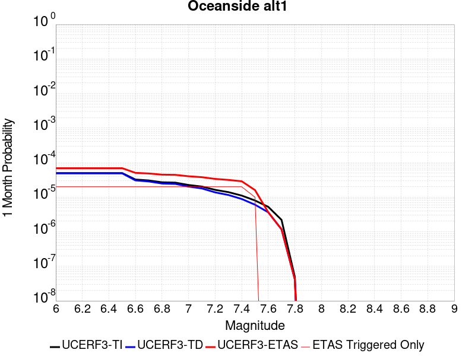 |  |  |

| Magnitude | 1 wk TI Prob | 1 wk TD Prob | 1 wk ETAS Prob | 1 wk ETAS/TD Gain | 1 wk ETAS Triggered Only | 1 mo TI Prob | 1 mo TD Prob | 1 mo ETAS Prob | 1 mo ETAS/TD Gain | 1 mo ETAS Triggered Only | 1 yr TI Prob | 1 yr TD Prob | 1 yr ETAS Prob | 1 yr ETAS/TD Gain | 1 yr ETAS Triggered Only | 10 yr TI Prob | 10 yr TD Prob | 10 yr ETAS Prob | 10 yr ETAS/TD Gain | 10 yr ETAS Triggered Only |
|-----|-----|-----|-----|-----|-----|-----|-----|-----|-----|-----|-----|-----|-----|-----|-----|-----|-----|-----|-----|-----|
| 6.0 | 1.1617542E-5 | 1.1423493E-5 | 1.1423493E-5 | 1.0 | 0.0 | 4.9788516E-5 | 4.8956997E-5 | 6.4552965E-5 | 1.3185647 | 1.5596732E-5 | 6.060066E-4 | 5.9590454E-4 | 6.270794E-4 | 1.0523152 | 3.1193464E-5 | 0.0060435664 | 0.005944664 | 0.0059911762 | 1.0078242 | 4.6790192E-5 |
| 6.1 | 1.1617542E-5 | 1.1423493E-5 | 1.1423493E-5 | 1.0 | 0.0 | 4.9788516E-5 | 4.8956997E-5 | 6.4552965E-5 | 1.3185647 | 1.5596732E-5 | 6.060066E-4 | 5.9590454E-4 | 6.270794E-4 | 1.0523152 | 3.1193464E-5 | 0.0060435664 | 0.005944664 | 0.0059911762 | 1.0078242 | 4.6790192E-5 |
| 6.2 | 1.1617542E-5 | 1.1423493E-5 | 1.1423493E-5 | 1.0 | 0.0 | 4.9788516E-5 | 4.8956997E-5 | 6.4552965E-5 | 1.3185647 | 1.5596732E-5 | 6.060066E-4 | 5.9590454E-4 | 6.270794E-4 | 1.0523152 | 3.1193464E-5 | 0.0060435664 | 0.005944664 | 0.0059911762 | 1.0078242 | 4.6790192E-5 |
| 6.3 | 1.1617542E-5 | 1.1423493E-5 | 1.1423493E-5 | 1.0 | 0.0 | 4.9788516E-5 | 4.8956997E-5 | 6.4552965E-5 | 1.3185647 | 1.5596732E-5 | 6.060066E-4 | 5.9590454E-4 | 6.270794E-4 | 1.0523152 | 3.1193464E-5 | 0.0060435664 | 0.005944664 | 0.0059911762 | 1.0078242 | 4.6790192E-5 |
| 6.4 | 1.1617542E-5 | 1.1423493E-5 | 1.1423493E-5 | 1.0 | 0.0 | 4.9788516E-5 | 4.8956997E-5 | 6.4552965E-5 | 1.3185647 | 1.5596732E-5 | 6.060066E-4 | 5.9590454E-4 | 6.270794E-4 | 1.0523152 | 3.1193464E-5 | 0.0060435664 | 0.005944664 | 0.0059911762 | 1.0078242 | 4.6790192E-5 |
| 6.5 | 1.1617542E-5 | 1.1423493E-5 | 1.1423493E-5 | 1.0 | 0.0 | 4.9788516E-5 | 4.8956997E-5 | 6.4552965E-5 | 1.3185647 | 1.5596732E-5 | 6.060066E-4 | 5.9590454E-4 | 6.270794E-4 | 1.0523152 | 3.1193464E-5 | 0.0060435664 | 0.005944664 | 0.0059911762 | 1.0078242 | 4.6790192E-5 |
| 6.6 | 7.561768E-6 | 7.1336153E-6 | 7.1336153E-6 | 1.0 | 0.0 | 3.2407173E-5 | 3.0572286E-5 | 4.6168538E-5 | 1.5101435 | 1.5596732E-5 | 3.9448592E-4 | 3.7215507E-4 | 4.0333692E-4 | 1.0837872 | 3.1193464E-5 | 0.0039378637 | 0.00371543 | 0.0037620463 | 1.0125467 | 4.6790192E-5 |
| 6.7 | 7.1042605E-6 | 6.6556854E-6 | 6.6556854E-6 | 1.0 | 0.0 | 3.0446476E-5 | 2.8524059E-5 | 4.4120345E-5 | 1.5467765 | 1.5596732E-5 | 3.706228E-4 | 3.472259E-4 | 3.7840853E-4 | 1.089805 | 3.1193464E-5 | 0.0037000529 | 0.003466917 | 0.003513545 | 1.0134494 | 4.6790192E-5 |
| 6.8 | 6.285554E-6 | 5.799706E-6 | 5.799706E-6 | 1.0 | 0.0 | 2.693781E-5 | 2.4855648E-5 | 4.0451992E-5 | 1.6274768 | 1.5596732E-5 | 3.2791847E-4 | 3.0257605E-4 | 3.3376008E-4 | 1.1030618 | 3.1193464E-5 | 0.0032743502 | 0.0030216982 | 0.003068347 | 1.015438 | 4.6790192E-5 |
| 6.9 | 6.148883E-6 | 5.6565445E-6 | 5.6565445E-6 | 1.0 | 0.0 | 2.635209E-5 | 2.424211E-5 | 3.983846E-5 | 1.6433579 | 1.5596732E-5 | 3.2078946E-4 | 2.9510827E-4 | 3.2629253E-4 | 1.1056706 | 3.1193464E-5 | 0.003203268 | 0.0029472208 | 0.0029783223 | 1.0105529 | 3.1193464E-5 |
| 7.0 | 5.253857E-6 | 4.722404E-6 | 4.722404E-6 | 1.0 | 0.0 | 2.2516335E-5 | 2.0238718E-5 | 3.5835135E-5 | 1.7706226 | 1.5596732E-5 | 2.7410188E-4 | 2.4637886E-4 | 2.7756463E-4 | 1.1265765 | 3.1193464E-5 | 0.0027376404 | 0.0024610884 | 0.0024922052 | 1.0126435 | 3.1193464E-5 |
| 7.1 | 4.730754E-6 | 4.17851E-6 | 4.17851E-6 | 1.0 | 0.0 | 2.0274503E-5 | 1.7907778E-5 | 3.350423E-5 | 1.8709316 | 1.5596732E-5 | 2.468141E-4 | 2.1800565E-4 | 2.4919232E-4 | 1.1430544 | 3.1193464E-5 | 0.0024654015 | 0.0021779444 | 0.00220907 | 1.0142913 | 3.1193464E-5 |
| 7.2 | 3.7998386E-6 | 3.214026E-6 | 3.214026E-6 | 1.0 | 0.0 | 1.6284921E-5 | 1.37743245E-5 | 2.9370842E-5 | 2.132289 | 1.5596732E-5 | 1.9825088E-4 | 1.6768962E-4 | 1.8328373E-4 | 1.092994 | 1.5596732E-5 | 0.001980741 | 0.001675643 | 0.0016912137 | 1.0092924 | 1.5596732E-5 |
| 7.3 | 3.2656465E-6 | 2.698376E-6 | 2.698376E-6 | 1.0 | 0.0 | 1.3995553E-5 | 1.1564418E-5 | 2.7160968E-5 | 2.3486671 | 1.5596732E-5 | 1.7038253E-4 | 1.407878E-4 | 1.5638233E-4 | 1.1107663 | 1.5596732E-5 | 0.0017025196 | 0.0014069972 | 0.001422572 | 1.0110695 | 1.5596732E-5 |
| 7.4 | 2.593703E-6 | 2.0680277E-6 | 2.0680277E-6 | 1.0 | 0.0 | 1.1115822E-5 | 8.862946E-6 | 2.445954E-5 | 2.7597525 | 1.5596732E-5 | 1.3532673E-4 | 1.0790111E-4 | 1.2349617E-4 | 1.1445309 | 1.5596732E-5 | 0.0013524436 | 0.0010784961 | 0.0010940761 | 1.0144459 | 1.5596732E-5 |
| 7.5 | 1.8715585E-6 | 1.4137177E-6 | 1.4137177E-6 | 1.0 | 0.0 | 8.020941E-6 | 6.0587763E-6 | 2.1655413E-5 | 3.5742223 | 1.5596732E-5 | 9.7650576E-5 | 7.376316E-5 | 8.935874E-5 | 1.2114278 | 1.5596732E-5 | 9.7607676E-4 | 7.3739287E-4 | 7.529781E-4 | 1.0211356 | 1.5596732E-5 |
| 7.6 | 1.2246786E-6 | 8.5268175E-7 | 8.5268175E-7 | 1.0 | 0.0 | 5.248612E-6 | 3.6543456E-6 | 3.6543456E-6 | 1.0 | 0.0 | 6.389998E-5 | 4.4490793E-5 | 4.4490793E-5 | 1.0 | 0.0 | 6.3881604E-4 | 4.4482335E-4 | 4.4482335E-4 | 1.0 | 0.0 |
| 7.7 | 5.140719E-7 | 2.734703E-7 | 2.734703E-7 | 1.0 | 0.0 | 2.2031636E-6 | 1.1720151E-6 | 1.1720151E-6 | 1.0 | 0.0 | 2.6823185E-5 | 1.4269205E-5 | 1.4269205E-5 | 1.0 | 0.0 | 2.6819948E-4 | 1.4268424E-4 | 1.4268424E-4 | 1.0 | 0.0 |
| 7.8 | 1.16056995E-8 | 9.782373E-9 | 9.782373E-9 | 1.0 | 0.0 | 4.9738713E-8 | 4.1924455E-8 | 4.1924455E-8 | 1.0 | 0.0 | 6.0556863E-7 | 5.1043025E-7 | 5.1043025E-7 | 1.0 | 0.0 | 6.05567E-6 | 5.1043025E-6 | 5.1043025E-6 | 1.0 | 0.0 |

## Bullion Mountains
*[(top)](#table-of-contents)*

| 1 Week | 1 Month | 1 Year | 10 Year |
|-----|-----|-----|-----|
|  |  |  | 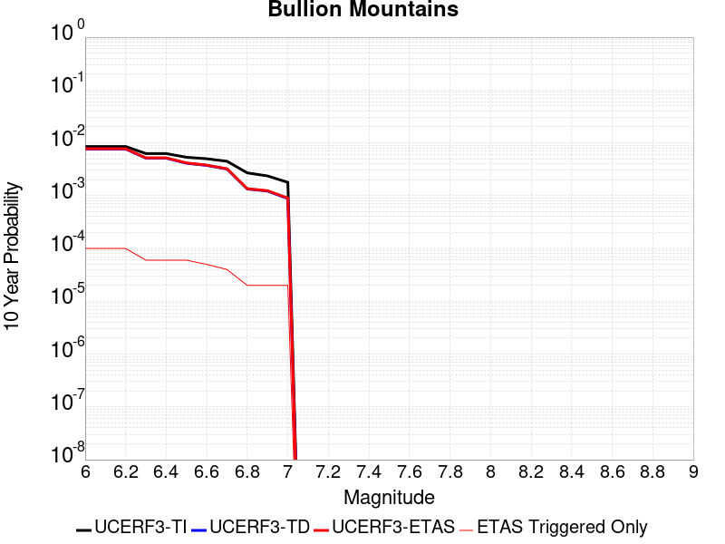 |

| Magnitude | 1 wk TI Prob | 1 wk TD Prob | 1 wk ETAS Prob | 1 wk ETAS/TD Gain | 1 wk ETAS Triggered Only | 1 mo TI Prob | 1 mo TD Prob | 1 mo ETAS Prob | 1 mo ETAS/TD Gain | 1 mo ETAS Triggered Only | 1 yr TI Prob | 1 yr TD Prob | 1 yr ETAS Prob | 1 yr ETAS/TD Gain | 1 yr ETAS Triggered Only | 10 yr TI Prob | 10 yr TD Prob | 10 yr ETAS Prob | 10 yr ETAS/TD Gain | 10 yr ETAS Triggered Only |
|-----|-----|-----|-----|-----|-----|-----|-----|-----|-----|-----|-----|-----|-----|-----|-----|-----|-----|-----|-----|-----|
| 6.0 | 1.6420427E-5 | 1.4692089E-5 | 4.5885092E-5 | 3.1231155 | 3.1193464E-5 | 7.037136E-5 | 6.296479E-5 | 9.415629E-5 | 1.4953799 | 3.1193464E-5 | 8.5643446E-4 | 7.663651E-4 | 8.131194E-4 | 1.0610079 | 4.6790192E-5 | 0.008531413 | 0.007641016 | 0.007702926 | 1.0081023 | 6.238693E-5 |
| 6.1 | 1.6420427E-5 | 1.4692089E-5 | 4.5885092E-5 | 3.1231155 | 3.1193464E-5 | 7.037136E-5 | 6.296479E-5 | 9.415629E-5 | 1.4953799 | 3.1193464E-5 | 8.5643446E-4 | 7.663651E-4 | 8.131194E-4 | 1.0610079 | 4.6790192E-5 | 0.008531413 | 0.007641016 | 0.007702926 | 1.0081023 | 6.238693E-5 |
| 6.2 | 1.6420427E-5 | 1.4692089E-5 | 4.5885092E-5 | 3.1231155 | 3.1193464E-5 | 7.037136E-5 | 6.296479E-5 | 9.415629E-5 | 1.4953799 | 3.1193464E-5 | 8.5643446E-4 | 7.663651E-4 | 8.131194E-4 | 1.0610079 | 4.6790192E-5 | 0.008531413 | 0.007641016 | 0.007702926 | 1.0081023 | 6.238693E-5 |
| 6.3 | 1.2046778E-5 | 9.862335E-6 | 2.5458912E-5 | 2.5814285 | 1.5596732E-5 | 5.1628023E-5 | 4.2266598E-5 | 5.7862668E-5 | 1.3689928 | 1.5596732E-5 | 6.283899E-4 | 5.144975E-4 | 5.456749E-4 | 1.0605978 | 3.1193464E-5 | 0.0062661595 | 0.005135345 | 0.0051663783 | 1.0060431 | 3.1193464E-5 |
| 6.4 | 1.2046778E-5 | 9.862335E-6 | 2.5458912E-5 | 2.5814285 | 1.5596732E-5 | 5.1628023E-5 | 4.2266598E-5 | 5.7862668E-5 | 1.3689928 | 1.5596732E-5 | 6.283899E-4 | 5.144975E-4 | 5.456749E-4 | 1.0605978 | 3.1193464E-5 | 0.0062661595 | 0.005135345 | 0.0051663783 | 1.0060431 | 3.1193464E-5 |
| 6.5 | 1.0244343E-5 | 7.879458E-6 | 2.3476066E-5 | 2.979401 | 1.5596732E-5 | 4.390359E-5 | 3.3768785E-5 | 4.936499E-5 | 1.4618527 | 1.5596732E-5 | 5.343951E-4 | 4.110781E-4 | 4.4225872E-4 | 1.0758508 | 3.1193464E-5 | 0.005331118 | 0.004105208 | 0.0041362736 | 1.0075673 | 3.1193464E-5 |
| 6.6 | 9.605408E-6 | 7.1774966E-6 | 2.2774115E-5 | 3.1729887 | 1.5596732E-5 | 4.1165385E-5 | 3.076045E-5 | 4.63567E-5 | 1.5070229 | 1.5596732E-5 | 5.010733E-4 | 3.744645E-4 | 4.0564628E-4 | 1.0832703 | 3.1193464E-5 | 0.00499945 | 0.003740332 | 0.003771409 | 1.0083085 | 3.1193464E-5 |
| 6.7 | 8.60418E-6 | 6.1240044E-6 | 2.172064E-5 | 3.5468035 | 1.5596732E-5 | 3.687454E-5 | 2.624558E-5 | 4.18419E-5 | 1.5942457 | 1.5596732E-5 | 4.48855E-4 | 3.1951256E-4 | 3.3510433E-4 | 1.0487986 | 1.5596732E-5 | 0.004479495 | 0.0031924439 | 0.0032079907 | 1.0048699 | 1.5596732E-5 |
| 6.8 | 5.187994E-6 | 2.5631666E-6 | 1.8159857E-5 | 7.0849304 | 1.5596732E-5 | 2.223407E-5 | 1.0984976E-5 | 2.6581536E-5 | 2.4198081 | 1.5596732E-5 | 2.7066618E-4 | 1.3373788E-4 | 1.4933251E-4 | 1.116606 | 1.5596732E-5 | 0.0027033675 | 0.0013369655 | 0.0013525414 | 1.0116502 | 1.5596732E-5 |
| 6.9 | 4.5302368E-6 | 2.3443165E-6 | 1.794101E-5 | 7.6529813 | 1.5596732E-5 | 1.9415156E-5 | 1.0047055E-5 | 2.5643629E-5 | 2.552353 | 1.5596732E-5 | 2.3635388E-4 | 1.2232E-4 | 1.3791482E-4 | 1.1274921 | 1.5596732E-5 | 0.0023610266 | 0.0012229157 | 0.0012384934 | 1.0127381 | 1.5596732E-5 |
| 7.0 | 3.431668E-6 | 1.6882402E-6 | 1.7284945E-5 | 10.23844 | 1.5596732E-5 | 1.4707065E-5 | 7.235315E-6 | 2.2831933E-5 | 3.155624 | 1.5596732E-5 | 1.7904381E-4 | 8.808996E-5 | 1.0368532E-4 | 1.177039 | 1.5596732E-5 | 0.0017889962 | 8.808996E-4 | 8.964826E-4 | 1.0176898 | 1.5596732E-5 |

## Coronado Bank alt1
*[(top)](#table-of-contents)*

| 1 Week | 1 Month | 1 Year | 10 Year |
|-----|-----|-----|-----|
|  |  |  |  |

| Magnitude | 1 wk TI Prob | 1 wk TD Prob | 1 wk ETAS Prob | 1 wk ETAS/TD Gain | 1 wk ETAS Triggered Only | 1 mo TI Prob | 1 mo TD Prob | 1 mo ETAS Prob | 1 mo ETAS/TD Gain | 1 mo ETAS Triggered Only | 1 yr TI Prob | 1 yr TD Prob | 1 yr ETAS Prob | 1 yr ETAS/TD Gain | 1 yr ETAS Triggered Only | 10 yr TI Prob | 10 yr TD Prob | 10 yr ETAS Prob | 10 yr ETAS/TD Gain | 10 yr ETAS Triggered Only |
|-----|-----|-----|-----|-----|-----|-----|-----|-----|-----|-----|-----|-----|-----|-----|-----|-----|-----|-----|-----|-----|
| 6.0 | 7.533492E-5 | 9.394913E-5 | 9.394913E-5 | 1.0 | 0.0 | 3.22824E-4 | 4.0258127E-4 | 4.1817172E-4 | 1.0387262 | 1.5596732E-5 | 0.0039233007 | 0.0048909658 | 0.004937527 | 1.0095198 | 4.6790192E-5 | 0.03854755 | 0.04790356 | 0.04796296 | 1.00124 | 6.238693E-5 |
| 6.1 | 4.1807285E-5 | 5.049283E-5 | 5.049283E-5 | 1.0 | 0.0 | 1.7916178E-4 | 2.1638049E-4 | 2.1638049E-4 | 1.0 | 0.0 | 0.0021791123 | 0.0026313474 | 0.002646903 | 1.0059117 | 1.5596732E-5 | 0.021578677 | 0.026011046 | 0.026026238 | 1.000584 | 1.5596732E-5 |
| 6.2 | 4.1807285E-5 | 5.049283E-5 | 5.049283E-5 | 1.0 | 0.0 | 1.7916178E-4 | 2.1638049E-4 | 2.1638049E-4 | 1.0 | 0.0 | 0.0021791123 | 0.0026313474 | 0.002646903 | 1.0059117 | 1.5596732E-5 | 0.021578677 | 0.026011046 | 0.026026238 | 1.000584 | 1.5596732E-5 |
| 6.3 | 3.1793104E-5 | 3.7711117E-5 | 3.7711117E-5 | 1.0 | 0.0 | 1.3624904E-4 | 1.6160926E-4 | 1.6160926E-4 | 1.0 | 0.0 | 0.0016575698 | 0.001965848 | 0.0019814142 | 1.0079182 | 1.5596732E-5 | 0.016452603 | 0.019488465 | 0.019503757 | 1.0007848 | 1.5596732E-5 |
| 6.4 | 2.9878007E-5 | 3.5335794E-5 | 3.5335794E-5 | 1.0 | 0.0 | 1.2804232E-4 | 1.5143053E-4 | 1.5143053E-4 | 1.0 | 0.0 | 0.0015578003 | 0.0018421387 | 0.0018577067 | 1.0084511 | 1.5596732E-5 | 0.015469253 | 0.01827244 | 0.018287754 | 1.0008379 | 1.5596732E-5 |
| 6.5 | 2.4512565E-5 | 2.8764043E-5 | 2.8764043E-5 | 1.0 | 0.0 | 1.0504962E-4 | 1.2326881E-4 | 1.2326881E-4 | 1.0 | 0.0 | 0.0012782287 | 0.0014997921 | 0.0015153654 | 1.0103836 | 1.5596732E-5 | 0.012709012 | 0.014899683 | 0.014915047 | 1.0010312 | 1.5596732E-5 |
| 6.6 | 2.1317413E-5 | 2.490667E-5 | 2.490667E-5 | 1.0 | 0.0 | 9.135714E-5 | 1.0673863E-4 | 1.0673863E-4 | 1.0 | 0.0 | 0.0011117056 | 0.0012987906 | 0.0013143669 | 1.011993 | 1.5596732E-5 | 0.011061605 | 0.012914404 | 0.0129298 | 1.0011921 | 1.5596732E-5 |
| 6.7 | 1.8585655E-5 | 2.163488E-5 | 2.163488E-5 | 1.0 | 0.0 | 7.9650374E-5 | 9.271773E-5 | 9.271773E-5 | 1.0 | 0.0 | 9.6931186E-4 | 0.0011282742 | 0.0011438534 | 1.0138079 | 1.5596732E-5 | 0.0096509475 | 0.011227623 | 0.0112430435 | 1.0013735 | 1.5596732E-5 |
| 6.8 | 1.5862879E-5 | 1.8419474E-5 | 1.8419474E-5 | 1.0 | 0.0 | 6.798199E-5 | 7.893833E-5 | 7.893833E-5 | 1.0 | 0.0 | 8.273665E-4 | 9.6066965E-4 | 9.762514E-4 | 1.0162196 | 1.5596732E-5 | 0.008242928 | 0.00956715 | 0.009582598 | 1.0016147 | 1.5596732E-5 |
| 6.9 | 1.3021509E-5 | 1.5095265E-5 | 1.5095265E-5 | 1.0 | 0.0 | 5.5805274E-5 | 6.469249E-5 | 6.469249E-5 | 1.0 | 0.0 | 6.792174E-4 | 7.8736455E-4 | 8.0294895E-4 | 1.0197932 | 1.5596732E-5 | 0.006771452 | 0.007847573 | 0.007863047 | 1.0019718 | 1.5596732E-5 |
| 7.0 | 1.0974371E-5 | 1.2720104E-5 | 1.2720104E-5 | 1.0 | 0.0 | 4.7032172E-5 | 5.451369E-5 | 5.451369E-5 | 1.0 | 0.0 | 5.7246623E-4 | 6.6351966E-4 | 6.7910604E-4 | 1.0234904 | 1.5596732E-5 | 0.0057099373 | 0.006617135 | 0.0066326284 | 1.0023414 | 1.5596732E-5 |
| 7.1 | 8.766221E-6 | 1.01638325E-5 | 1.01638325E-5 | 1.0 | 0.0 | 3.7568978E-5 | 4.355865E-5 | 4.355865E-5 | 1.0 | 0.0 | 4.573063E-4 | 5.3021475E-4 | 5.458032E-4 | 1.0294002 | 1.5596732E-5 | 0.0045636636 | 0.0052911965 | 0.005306711 | 1.0029321 | 1.5596732E-5 |
| 7.2 | 8.026024E-7 | 8.331765E-7 | 8.331765E-7 | 1.0 | 0.0 | 3.43972E-6 | 3.5707515E-6 | 3.5707515E-6 | 1.0 | 0.0 | 4.1877785E-5 | 4.3473043E-5 | 4.3473043E-5 | 1.0 | 0.0 | 4.1869894E-4 | 4.3464647E-4 | 4.3464647E-4 | 1.0 | 0.0 |
| 7.3 | 3.7293114E-7 | 3.7000953E-7 | 3.7000953E-7 | 1.0 | 0.0 | 1.5982754E-6 | 1.5857541E-6 | 1.5857541E-6 | 1.0 | 0.0 | 1.9458828E-5 | 1.9306386E-5 | 1.9306386E-5 | 1.0 | 0.0 | 1.9457124E-4 | 1.9304715E-4 | 1.9304715E-4 | 1.0 | 0.0 |
| 7.4 | 2.0557036E-7 | 1.9674363E-7 | 1.9674363E-7 | 1.0 | 0.0 | 8.810155E-7 | 8.431867E-7 | 8.431867E-7 | 1.0 | 0.0 | 1.0726311E-5 | 1.026575E-5 | 1.026575E-5 | 1.0 | 0.0 | 1.0725793E-4 | 1.0265279E-4 | 1.0265279E-4 | 1.0 | 0.0 |
| 7.5 | 6.845446E-8 | 6.279369E-8 | 6.279369E-8 | 1.0 | 0.0 | 2.9337625E-7 | 2.691158E-7 | 2.691158E-7 | 1.0 | 0.0 | 3.5718497E-6 | 3.2764797E-6 | 3.2764797E-6 | 1.0 | 0.0 | 3.5717923E-5 | 3.2764325E-5 | 3.2764325E-5 | 1.0 | 0.0 |
| 7.6 | 6.0975145E-9 | 5.53185E-9 | 5.53185E-9 | 1.0 | 0.0 | 2.6132206E-8 | 2.370793E-8 | 2.370793E-8 | 1.0 | 0.0 | 3.1815955E-7 | 2.88644E-7 | 2.88644E-7 | 1.0 | 0.0 | 3.181591E-6 | 2.8864374E-6 | 2.8864374E-6 | 1.0 | 0.0 |

## San Juan
*[(top)](#table-of-contents)*

| 1 Week | 1 Month | 1 Year | 10 Year |
|-----|-----|-----|-----|
|  |  |  |  |

| Magnitude | 1 wk TI Prob | 1 wk TD Prob | 1 wk ETAS Prob | 1 wk ETAS/TD Gain | 1 wk ETAS Triggered Only | 1 mo TI Prob | 1 mo TD Prob | 1 mo ETAS Prob | 1 mo ETAS/TD Gain | 1 mo ETAS Triggered Only | 1 yr TI Prob | 1 yr TD Prob | 1 yr ETAS Prob | 1 yr ETAS/TD Gain | 1 yr ETAS Triggered Only | 10 yr TI Prob | 10 yr TD Prob | 10 yr ETAS Prob | 10 yr ETAS/TD Gain | 10 yr ETAS Triggered Only |
|-----|-----|-----|-----|-----|-----|-----|-----|-----|-----|-----|-----|-----|-----|-----|-----|-----|-----|-----|-----|-----|
| 6.0 | 8.682808E-6 | 8.7491635E-6 | 8.7491635E-6 | 1.0 | 0.0 | 3.72115E-5 | 3.74959E-5 | 5.3092048E-5 | 1.4159427 | 1.5596732E-5 | 4.5295584E-4 | 4.564218E-4 | 4.7201142E-4 | 1.0341562 | 1.5596732E-5 | 0.004520337 | 0.004555385 | 0.0046174875 | 1.0136328 | 6.238693E-5 |
| 6.1 | 8.682808E-6 | 8.7491635E-6 | 8.7491635E-6 | 1.0 | 0.0 | 3.72115E-5 | 3.74959E-5 | 5.3092048E-5 | 1.4159427 | 1.5596732E-5 | 4.5295584E-4 | 4.564218E-4 | 4.7201142E-4 | 1.0341562 | 1.5596732E-5 | 0.004520337 | 0.004555385 | 0.0046174875 | 1.0136328 | 6.238693E-5 |
| 6.2 | 8.682808E-6 | 8.7491635E-6 | 8.7491635E-6 | 1.0 | 0.0 | 3.72115E-5 | 3.74959E-5 | 5.3092048E-5 | 1.4159427 | 1.5596732E-5 | 4.5295584E-4 | 4.564218E-4 | 4.7201142E-4 | 1.0341562 | 1.5596732E-5 | 0.004520337 | 0.004555385 | 0.0046174875 | 1.0136328 | 6.238693E-5 |
| 6.3 | 6.3054235E-6 | 6.2825848E-6 | 6.2825848E-6 | 1.0 | 0.0 | 2.7022963E-5 | 2.6925094E-5 | 4.2521406E-5 | 1.5792482 | 1.5596732E-5 | 3.2895492E-4 | 3.2776513E-4 | 3.4335675E-4 | 1.0475695 | 1.5596732E-5 | 0.003284684 | 0.003273017 | 0.003319654 | 1.014249 | 4.6790192E-5 |
| 6.4 | 6.1490473E-6 | 6.1144656E-6 | 6.1144656E-6 | 1.0 | 0.0 | 2.6352795E-5 | 2.6204598E-5 | 4.180092E-5 | 1.595175 | 1.5596732E-5 | 3.2079802E-4 | 3.1899565E-4 | 3.3458738E-4 | 1.0488776 | 1.5596732E-5 | 0.0032033534 | 0.0031855737 | 0.0032322148 | 1.0146414 | 4.6790192E-5 |
| 6.5 | 5.204848E-6 | 5.137233E-6 | 5.137233E-6 | 1.0 | 0.0 | 2.23063E-5 | 2.2016533E-5 | 3.761292E-5 | 1.7083943 | 1.5596732E-5 | 2.7154534E-4 | 2.6801927E-4 | 2.8361182E-4 | 1.058177 | 1.5596732E-5 | 0.0027121378 | 0.0026771144 | 0.0027237793 | 1.017431 | 4.6790192E-5 |
| 6.6 | 4.5179986E-6 | 4.4150297E-6 | 4.4150297E-6 | 1.0 | 0.0 | 1.9362706E-5 | 1.8921424E-5 | 1.8921424E-5 | 1.0 | 0.0 | 2.3571544E-4 | 2.3034477E-4 | 2.3034477E-4 | 1.0 | 0.0 | 0.0023546559 | 0.0023011973 | 0.0023323188 | 1.0135242 | 3.1193464E-5 |
| 6.7 | 3.9442616E-6 | 3.819828E-6 | 3.819828E-6 | 1.0 | 0.0 | 1.6903869E-5 | 1.6370592E-5 | 1.6370592E-5 | 1.0 | 0.0 | 2.0578515E-4 | 1.992944E-4 | 1.992944E-4 | 1.0 | 0.0 | 0.002055947 | 0.0019912818 | 0.002022413 | 1.0156338 | 3.1193464E-5 |
| 6.8 | 3.4536245E-6 | 3.3163353E-6 | 3.3163353E-6 | 1.0 | 0.0 | 1.4801163E-5 | 1.4212792E-5 | 1.4212792E-5 | 1.0 | 0.0 | 1.8018926E-4 | 1.7302761E-4 | 1.7302761E-4 | 1.0 | 0.0 | 0.0018004322 | 0.0017290477 | 0.0017446175 | 1.0090048 | 1.5596732E-5 |
| 6.9 | 3.059865E-6 | 2.9120315E-6 | 2.9120315E-6 | 1.0 | 0.0 | 1.3113641E-5 | 1.2480078E-5 | 1.2480078E-5 | 1.0 | 0.0 | 1.596469E-4 | 1.5193493E-4 | 1.5193493E-4 | 1.0 | 0.0 | 0.0015953224 | 0.0015184252 | 0.0015339983 | 1.010256 | 1.5596732E-5 |
| 7.0 | 2.6504351E-6 | 2.4920002E-6 | 2.4920002E-6 | 1.0 | 0.0 | 1.1358958E-5 | 1.0679961E-5 | 1.0679961E-5 | 1.0 | 0.0 | 1.3828653E-4 | 1.300213E-4 | 1.300213E-4 | 1.0 | 0.0 | 0.0013820052 | 0.0012995641 | 0.0013151406 | 1.0119859 | 1.5596732E-5 |
| 7.1 | 2.2039317E-6 | 2.0338296E-6 | 2.0338296E-6 | 1.0 | 0.0 | 9.445387E-6 | 8.716386E-6 | 8.716386E-6 | 1.0 | 0.0 | 1.1499152E-4 | 1.0611736E-4 | 1.0611736E-4 | 1.0 | 0.0 | 0.0011493203 | 0.0010607769 | 0.0010763571 | 1.0146875 | 1.5596732E-5 |
| 7.2 | 1.0786707E-6 | 8.7701903E-7 | 8.7701903E-7 | 1.0 | 0.0 | 4.622866E-6 | 3.7586476E-6 | 3.7586476E-6 | 1.0 | 0.0 | 5.628194E-5 | 4.5760586E-5 | 4.5760586E-5 | 1.0 | 0.0 | 5.6267687E-4 | 4.5757066E-4 | 4.7316027E-4 | 1.0340704 | 1.5596732E-5 |
| 7.3 | 6.846433E-7 | 4.868805E-7 | 4.868805E-7 | 1.0 | 0.0 | 2.9341822E-6 | 2.086629E-6 | 2.086629E-6 | 1.0 | 0.0 | 3.5723086E-5 | 2.5404412E-5 | 2.5404412E-5 | 1.0 | 0.0 | 3.571734E-4 | 2.540486E-4 | 2.540486E-4 | 1.0 | 0.0 |
| 7.4 | 5.23043E-7 | 3.2628162E-7 | 3.2628162E-7 | 1.0 | 0.0 | 2.2416111E-6 | 1.398349E-6 | 1.398349E-6 | 1.0 | 0.0 | 2.7291273E-5 | 1.7024766E-5 | 1.7024766E-5 | 1.0 | 0.0 | 2.7287923E-4 | 1.7026656E-4 | 1.7026656E-4 | 1.0 | 0.0 |
| 7.5 | 4.648444E-7 | 2.7234944E-7 | 2.7234944E-7 | 1.0 | 0.0 | 1.9921886E-6 | 1.1672114E-6 | 1.1672114E-6 | 1.0 | 0.0 | 2.4254627E-5 | 1.42107065E-5 | 1.42107065E-5 | 1.0 | 0.0 | 2.425198E-4 | 1.421276E-4 | 1.421276E-4 | 1.0 | 0.0 |
| 7.6 | 3.9906567E-7 | 2.2083314E-7 | 2.2083314E-7 | 1.0 | 0.0 | 1.7102802E-6 | 9.464274E-7 | 9.464274E-7 | 1.0 | 0.0 | 2.0822463E-5 | 1.1522693E-5 | 1.1522693E-5 | 1.0 | 0.0 | 2.0820512E-4 | 1.15245566E-4 | 1.15245566E-4 | 1.0 | 0.0 |
| 7.7 | 1.8784601E-7 | 5.3666906E-8 | 5.3666906E-8 | 1.0 | 0.0 | 8.0505407E-7 | 2.30001E-7 | 2.30001E-7 | 1.0 | 0.0 | 9.80149E-6 | 2.8002585E-6 | 2.8002585E-6 | 1.0 | 0.0 | 9.801057E-5 | 2.8011282E-5 | 2.8011282E-5 | 1.0 | 0.0 |
| 7.8 | 1.00154914E-7 | 1.2415832E-8 | 1.2415832E-8 | 1.0 | 0.0 | 4.2923529E-7 | 5.3210716E-8 | 5.3210716E-8 | 1.0 | 0.0 | 5.225927E-6 | 6.4784024E-7 | 6.4784024E-7 | 1.0 | 0.0 | 5.225804E-5 | 6.484273E-6 | 6.484273E-6 | 1.0 | 0.0 |
| 7.9 | 6.171429E-8 | 4.2966155E-9 | 4.2966155E-9 | 1.0 | 0.0 | 2.6448978E-7 | 1.8414067E-8 | 1.8414067E-8 | 1.0 | 0.0 | 3.2201583E-6 | 2.2419121E-7 | 2.2419121E-7 | 1.0 | 0.0 | 3.2201115E-5 | 2.2472002E-6 | 2.2472002E-6 | 1.0 | 0.0 |
| 8.0 | 1.3974572E-8 | 3.3788217E-10 | 3.3788217E-10 | 1.0 | 0.0 | 5.989102E-8 | 1.448067E-9 | 1.448067E-9 | 1.0 | 0.0 | 7.2917294E-7 | 1.763022E-8 | 1.763022E-8 | 1.0 | 0.0 | 7.2917055E-6 | 1.8060365E-7 | 1.8060365E-7 | 1.0 | 0.0 |
| 8.1 | 1.8403477E-9 | 1.1302803E-10 | 1.1302803E-10 | 1.0 | 0.0 | 7.887204E-9 | 4.844063E-10 | 4.844063E-10 | 1.0 | 0.0 | 9.602671E-8 | 5.8976446E-9 | 5.8976446E-9 | 1.0 | 0.0 | 9.602667E-7 | 6.021993E-8 | 6.021993E-8 | 1.0 | 0.0 |

## Santa Monica alt 1
*[(top)](#table-of-contents)*

| 1 Week | 1 Month | 1 Year | 10 Year |
|-----|-----|-----|-----|
|  |  |  |  |

| Magnitude | 1 wk TI Prob | 1 wk TD Prob | 1 wk ETAS Prob | 1 wk ETAS/TD Gain | 1 wk ETAS Triggered Only | 1 mo TI Prob | 1 mo TD Prob | 1 mo ETAS Prob | 1 mo ETAS/TD Gain | 1 mo ETAS Triggered Only | 1 yr TI Prob | 1 yr TD Prob | 1 yr ETAS Prob | 1 yr ETAS/TD Gain | 1 yr ETAS Triggered Only | 10 yr TI Prob | 10 yr TD Prob | 10 yr ETAS Prob | 10 yr ETAS/TD Gain | 10 yr ETAS Triggered Only |
|-----|-----|-----|-----|-----|-----|-----|-----|-----|-----|-----|-----|-----|-----|-----|-----|-----|-----|-----|-----|-----|
| 6.0 | 1.1066008E-5 | 1.148031E-5 | 4.2673415E-5 | 3.7170959 | 3.1193464E-5 | 4.742488E-5 | 4.920048E-5 | 8.0392405E-5 | 1.6339761 | 3.1193464E-5 | 5.7724497E-4 | 5.9886515E-4 | 6.300399E-4 | 1.0520564 | 3.1193464E-5 | 0.005757478 | 0.0059739 | 0.006035914 | 1.0103809 | 6.238693E-5 |
| 6.1 | 1.1066008E-5 | 1.148031E-5 | 4.2673415E-5 | 3.7170959 | 3.1193464E-5 | 4.742488E-5 | 4.920048E-5 | 8.0392405E-5 | 1.6339761 | 3.1193464E-5 | 5.7724497E-4 | 5.9886515E-4 | 6.300399E-4 | 1.0520564 | 3.1193464E-5 | 0.005757478 | 0.0059739 | 0.006035914 | 1.0103809 | 6.238693E-5 |
| 6.2 | 1.1066008E-5 | 1.148031E-5 | 4.2673415E-5 | 3.7170959 | 3.1193464E-5 | 4.742488E-5 | 4.920048E-5 | 8.0392405E-5 | 1.6339761 | 3.1193464E-5 | 5.7724497E-4 | 5.9886515E-4 | 6.300399E-4 | 1.0520564 | 3.1193464E-5 | 0.005757478 | 0.0059739 | 0.006035914 | 1.0103809 | 6.238693E-5 |
| 6.3 | 1.1066008E-5 | 1.148031E-5 | 4.2673415E-5 | 3.7170959 | 3.1193464E-5 | 4.742488E-5 | 4.920048E-5 | 8.0392405E-5 | 1.6339761 | 3.1193464E-5 | 5.7724497E-4 | 5.9886515E-4 | 6.300399E-4 | 1.0520564 | 3.1193464E-5 | 0.005757478 | 0.0059739 | 0.006035914 | 1.0103809 | 6.238693E-5 |
| 6.4 | 1.1066008E-5 | 1.148031E-5 | 4.2673415E-5 | 3.7170959 | 3.1193464E-5 | 4.742488E-5 | 4.920048E-5 | 8.0392405E-5 | 1.6339761 | 3.1193464E-5 | 5.7724497E-4 | 5.9886515E-4 | 6.300399E-4 | 1.0520564 | 3.1193464E-5 | 0.005757478 | 0.0059739 | 0.006035914 | 1.0103809 | 6.238693E-5 |
| 6.5 | 8.183544E-6 | 8.335432E-6 | 3.9528633E-5 | 4.742242 | 3.1193464E-5 | 3.5071862E-5 | 3.57228E-5 | 6.691514E-5 | 1.8731776 | 3.1193464E-5 | 4.2691626E-4 | 4.3483984E-4 | 4.6601976E-4 | 1.0717043 | 3.1193464E-5 | 0.0042609703 | 0.0043400554 | 0.0043866425 | 1.0107342 | 4.6790192E-5 |
| 6.6 | 8.1543285E-6 | 8.303646E-6 | 3.949685E-5 | 4.756567 | 3.1193464E-5 | 3.4946657E-5 | 3.5586578E-5 | 6.677893E-5 | 1.8765202 | 3.1193464E-5 | 4.2539247E-4 | 4.3318202E-4 | 4.6436198E-4 | 1.0719788 | 3.1193464E-5 | 0.0042457907 | 0.004323542 | 0.0043701297 | 1.0107754 | 4.6790192E-5 |
| 6.7 | 8.110878E-6 | 8.257042E-6 | 3.9450246E-5 | 4.7777696 | 3.1193464E-5 | 3.4760444E-5 | 3.5386853E-5 | 6.657921E-5 | 1.8814675 | 3.1193464E-5 | 4.231262E-4 | 4.3075136E-4 | 4.6193137E-4 | 1.0723852 | 3.1193464E-5 | 0.0042232145 | 0.0042993296 | 0.0043459185 | 1.0108364 | 4.6790192E-5 |
| 6.8 | 7.644036E-6 | 7.75106E-6 | 3.894428E-5 | 5.024381 | 3.1193464E-5 | 3.275974E-5 | 3.3218414E-5 | 6.4410844E-5 | 1.93901 | 3.1193464E-5 | 3.9877684E-4 | 4.0436056E-4 | 4.355414E-4 | 1.0771115 | 3.1193464E-5 | 0.00398062 | 0.0040363944 | 0.004082996 | 1.0115453 | 4.6790192E-5 |
| 6.9 | 7.3698293E-6 | 7.455719E-6 | 3.864895E-5 | 5.183799 | 3.1193464E-5 | 3.15846E-5 | 3.19527E-5 | 6.314516E-5 | 1.9762076 | 3.1193464E-5 | 3.8447464E-4 | 3.8895605E-4 | 4.2013737E-4 | 1.0801667 | 3.1193464E-5 | 0.0038381014 | 0.0038828964 | 0.0039295047 | 1.0120035 | 4.6790192E-5 |
| 7.0 | 7.209872E-6 | 7.2856255E-6 | 3.8478862E-5 | 5.2814765 | 3.1193464E-5 | 3.0899086E-5 | 3.1223743E-5 | 6.2416235E-5 | 1.998999 | 3.1193464E-5 | 3.7613141E-4 | 3.8008415E-4 | 4.1126576E-4 | 1.0820386 | 3.1193464E-5 | 0.0037549543 | 0.0037944836 | 0.0038410963 | 1.0122843 | 4.6790192E-5 |
| 7.1 | 5.603456E-6 | 5.5238925E-6 | 2.1120537E-5 | 3.8234882 | 1.5596732E-5 | 2.4014591E-5 | 2.3673612E-5 | 3.9269973E-5 | 1.6588079 | 1.5596732E-5 | 2.923384E-4 | 2.881885E-4 | 3.0378075E-4 | 1.0541043 | 1.5596732E-5 | 0.0029195412 | 0.0028781896 | 0.0029092932 | 1.0108067 | 3.1193464E-5 |
| 7.2 | 4.7483613E-6 | 4.5911324E-6 | 2.0187792E-5 | 4.3971267 | 1.5596732E-5 | 2.0349962E-5 | 1.9676136E-5 | 3.527256E-5 | 1.7926569 | 1.5596732E-5 | 2.4773262E-4 | 2.3953074E-4 | 2.5512374E-4 | 1.065098 | 1.5596732E-5 | 0.0024745662 | 0.0023927398 | 0.0024238585 | 1.0130055 | 3.1193464E-5 |
| 7.3 | 3.829015E-6 | 3.6342253E-6 | 1.92309E-5 | 5.2916093 | 1.5596732E-5 | 1.6409962E-5 | 1.5575159E-5 | 3.1171647E-5 | 2.0013695 | 1.5596732E-5 | 1.9977297E-4 | 1.8961114E-4 | 2.0520491E-4 | 1.0822408 | 1.5596732E-5 | 0.0019959346 | 0.0018945024 | 0.0019256368 | 1.0164341 | 3.1193464E-5 |
| 7.4 | 2.610755E-6 | 2.4995716E-6 | 1.8096263E-5 | 7.239746 | 1.5596732E-5 | 1.1188902E-5 | 1.0712406E-5 | 2.630897E-5 | 2.4559348 | 1.5596732E-5 | 1.3621636E-4 | 1.3041578E-4 | 1.4601048E-4 | 1.1195768 | 1.5596732E-5 | 0.001361329 | 0.0013033969 | 0.0013345496 | 1.0239012 | 3.1193464E-5 |
| 7.5 | 1.792146E-6 | 1.7584184E-6 | 1.7584184E-6 | 1.0 | 0.0 | 7.680603E-6 | 7.536057E-6 | 7.536057E-6 | 1.0 | 0.0 | 9.3507326E-5 | 9.1747665E-5 | 9.1747665E-5 | 1.0 | 0.0 | 9.3467993E-4 | 9.1710105E-4 | 9.3268347E-4 | 1.016991 | 1.5596732E-5 |
| 7.6 | 1.1473018E-6 | 1.1029152E-6 | 1.1029152E-6 | 1.0 | 0.0 | 4.9169985E-6 | 4.726771E-6 | 4.726771E-6 | 1.0 | 0.0 | 5.986281E-5 | 5.7546935E-5 | 5.7546935E-5 | 1.0 | 0.0 | 5.984669E-4 | 5.7532196E-4 | 5.7532196E-4 | 1.0 | 0.0 |
| 7.7 | 5.330919E-7 | 4.7452556E-7 | 4.7452556E-7 | 1.0 | 0.0 | 2.2846775E-6 | 2.0336795E-6 | 2.0336795E-6 | 1.0 | 0.0 | 2.7815593E-5 | 2.4759778E-5 | 2.4759778E-5 | 1.0 | 0.0 | 2.7812112E-4 | 2.4757133E-4 | 2.4757133E-4 | 1.0 | 0.0 |
| 7.8 | 1.1668574E-7 | 8.2966224E-8 | 8.2966224E-8 | 1.0 | 0.0 | 5.000816E-7 | 3.5556948E-7 | 3.5556948E-7 | 1.0 | 0.0 | 6.0884768E-6 | 4.32905E-6 | 4.32905E-6 | 1.0 | 0.0 | 6.08831E-5 | 4.3289692E-5 | 4.3289692E-5 | 1.0 | 0.0 |
| 7.9 | 8.007447E-10 | 6.1608785E-10 | 6.1608785E-10 | 1.0 | 0.0 | 3.4317629E-9 | 2.6403764E-9 | 2.6403764E-9 | 1.0 | 0.0 | 4.1781714E-8 | 3.2146584E-8 | 3.2146584E-8 | 1.0 | 0.0 | 4.1781706E-7 | 3.214658E-7 | 3.214658E-7 | 1.0 | 0.0 |

## Pine Mtn
*[(top)](#table-of-contents)*

| 1 Week | 1 Month | 1 Year | 10 Year |
|-----|-----|-----|-----|
|  |  |  |  |

| Magnitude | 1 wk TI Prob | 1 wk TD Prob | 1 wk ETAS Prob | 1 wk ETAS/TD Gain | 1 wk ETAS Triggered Only | 1 mo TI Prob | 1 mo TD Prob | 1 mo ETAS Prob | 1 mo ETAS/TD Gain | 1 mo ETAS Triggered Only | 1 yr TI Prob | 1 yr TD Prob | 1 yr ETAS Prob | 1 yr ETAS/TD Gain | 1 yr ETAS Triggered Only | 10 yr TI Prob | 10 yr TD Prob | 10 yr ETAS Prob | 10 yr ETAS/TD Gain | 10 yr ETAS Triggered Only |
|-----|-----|-----|-----|-----|-----|-----|-----|-----|-----|-----|-----|-----|-----|-----|-----|-----|-----|-----|-----|-----|
| 6.0 | 6.894797E-6 | 7.225461E-6 | 7.225461E-6 | 1.0 | 0.0 | 2.9548795E-5 | 3.096591E-5 | 3.096591E-5 | 1.0 | 0.0 | 3.596972E-4 | 3.7694772E-4 | 3.9253858E-4 | 1.0413607 | 1.5596732E-5 | 0.0035911554 | 0.003763381 | 0.0038255332 | 1.016515 | 6.238693E-5 |
| 6.1 | 6.894797E-6 | 7.225461E-6 | 7.225461E-6 | 1.0 | 0.0 | 2.9548795E-5 | 3.096591E-5 | 3.096591E-5 | 1.0 | 0.0 | 3.596972E-4 | 3.7694772E-4 | 3.9253858E-4 | 1.0413607 | 1.5596732E-5 | 0.0035911554 | 0.003763381 | 0.0038255332 | 1.016515 | 6.238693E-5 |
| 6.2 | 6.894797E-6 | 7.225461E-6 | 7.225461E-6 | 1.0 | 0.0 | 2.9548795E-5 | 3.096591E-5 | 3.096591E-5 | 1.0 | 0.0 | 3.596972E-4 | 3.7694772E-4 | 3.9253858E-4 | 1.0413607 | 1.5596732E-5 | 0.0035911554 | 0.003763381 | 0.0038255332 | 1.016515 | 6.238693E-5 |
| 6.3 | 6.894797E-6 | 7.225461E-6 | 7.225461E-6 | 1.0 | 0.0 | 2.9548795E-5 | 3.096591E-5 | 3.096591E-5 | 1.0 | 0.0 | 3.596972E-4 | 3.7694772E-4 | 3.9253858E-4 | 1.0413607 | 1.5596732E-5 | 0.0035911554 | 0.003763381 | 0.0038255332 | 1.016515 | 6.238693E-5 |
| 6.4 | 6.894797E-6 | 7.225461E-6 | 7.225461E-6 | 1.0 | 0.0 | 2.9548795E-5 | 3.096591E-5 | 3.096591E-5 | 1.0 | 0.0 | 3.596972E-4 | 3.7694772E-4 | 3.9253858E-4 | 1.0413607 | 1.5596732E-5 | 0.0035911554 | 0.003763381 | 0.0038255332 | 1.016515 | 6.238693E-5 |
| 6.5 | 6.894797E-6 | 7.225461E-6 | 7.225461E-6 | 1.0 | 0.0 | 2.9548795E-5 | 3.096591E-5 | 3.096591E-5 | 1.0 | 0.0 | 3.596972E-4 | 3.7694772E-4 | 3.9253858E-4 | 1.0413607 | 1.5596732E-5 | 0.0035911554 | 0.003763381 | 0.0038255332 | 1.016515 | 6.238693E-5 |
| 6.6 | 6.894797E-6 | 7.225461E-6 | 7.225461E-6 | 1.0 | 0.0 | 2.9548795E-5 | 3.096591E-5 | 3.096591E-5 | 1.0 | 0.0 | 3.596972E-4 | 3.7694772E-4 | 3.9253858E-4 | 1.0413607 | 1.5596732E-5 | 0.0035911554 | 0.003763381 | 0.0038255332 | 1.016515 | 6.238693E-5 |
| 6.7 | 6.0867933E-6 | 6.3971133E-6 | 6.3971133E-6 | 1.0 | 0.0 | 2.6085996E-5 | 2.7415923E-5 | 2.7415923E-5 | 1.0 | 0.0 | 3.1755073E-4 | 3.3373994E-4 | 3.4933147E-4 | 1.0467176 | 1.5596732E-5 | 0.0031709734 | 0.0033326065 | 0.0033792406 | 1.0139934 | 4.6790192E-5 |
| 6.8 | 5.6530425E-6 | 5.9505956E-6 | 5.9505956E-6 | 1.0 | 0.0 | 2.42271E-5 | 2.5502315E-5 | 2.5502315E-5 | 1.0 | 0.0 | 2.94925E-4 | 3.104485E-4 | 3.2604038E-4 | 1.0502237 | 1.5596732E-5 | 0.002945339 | 0.0031003528 | 0.0031314497 | 1.01003 | 3.1193464E-5 |
| 6.9 | 4.6015225E-6 | 4.863834E-6 | 4.863834E-6 | 1.0 | 0.0 | 1.9720663E-5 | 2.0844845E-5 | 2.0844845E-5 | 1.0 | 0.0 | 2.4007261E-4 | 2.5375787E-4 | 2.5375787E-4 | 1.0 | 0.0 | 0.0023981342 | 0.0025348254 | 0.0025503826 | 1.0061374 | 1.5596732E-5 |
| 7.0 | 4.4875965E-6 | 4.747473E-6 | 4.747473E-6 | 1.0 | 0.0 | 1.9232413E-5 | 2.0346162E-5 | 2.0346162E-5 | 1.0 | 0.0 | 2.3412947E-4 | 2.4768783E-4 | 2.4768783E-4 | 1.0 | 0.0 | 0.0023388295 | 0.0024742614 | 0.0024898197 | 1.006288 | 1.5596732E-5 |
| 7.1 | 3.203907E-6 | 3.4294096E-6 | 3.4294096E-6 | 1.0 | 0.0 | 1.3730958E-5 | 1.4697391E-5 | 1.4697391E-5 | 1.0 | 0.0 | 1.6716159E-4 | 1.789267E-4 | 1.789267E-4 | 1.0 | 0.0 | 0.0016703589 | 0.0017878925 | 0.0018034613 | 1.0087079 | 1.5596732E-5 |
| 7.2 | 2.2060601E-6 | 2.3784817E-6 | 2.3784817E-6 | 1.0 | 0.0 | 9.4545085E-6 | 1.0193455E-5 | 1.0193455E-5 | 1.0 | 0.0 | 1.15102564E-4 | 1.240987E-4 | 1.240987E-4 | 1.0 | 0.0 | 0.0011504296 | 0.0012403389 | 0.0012559162 | 1.0125589 | 1.5596732E-5 |
| 7.3 | 1.3765207E-6 | 1.5216481E-6 | 1.5216481E-6 | 1.0 | 0.0 | 5.899361E-6 | 6.521333E-6 | 6.521333E-6 | 1.0 | 0.0 | 7.182235E-5 | 7.939443E-5 | 7.939443E-5 | 1.0 | 0.0 | 7.1799144E-4 | 7.936697E-4 | 8.092541E-4 | 1.0196358 | 1.5596732E-5 |
| 7.4 | 1.1245983E-6 | 1.2587075E-6 | 1.2587075E-6 | 1.0 | 0.0 | 4.819698E-6 | 5.39445E-6 | 5.39445E-6 | 1.0 | 0.0 | 5.8678244E-5 | 6.567554E-5 | 6.567554E-5 | 1.0 | 0.0 | 5.866275E-4 | 6.5656955E-4 | 6.7215605E-4 | 1.0237393 | 1.5596732E-5 |
| 7.5 | 8.031682E-7 | 9.276951E-7 | 9.276951E-7 | 1.0 | 0.0 | 3.4421448E-6 | 3.9758306E-6 | 3.9758306E-6 | 1.0 | 0.0 | 4.1907308E-5 | 4.840473E-5 | 4.840473E-5 | 1.0 | 0.0 | 4.1899405E-4 | 4.8394862E-4 | 4.8394862E-4 | 1.0 | 0.0 |
| 7.6 | 4.8953444E-7 | 6.003009E-7 | 6.003009E-7 | 1.0 | 0.0 | 2.098003E-6 | 2.5727159E-6 | 2.5727159E-6 | 1.0 | 0.0 | 2.5542888E-5 | 3.1322415E-5 | 3.1322415E-5 | 1.0 | 0.0 | 2.5539953E-4 | 3.1318486E-4 | 3.1318486E-4 | 1.0 | 0.0 |
| 7.7 | 6.634529E-8 | 6.788826E-8 | 6.788826E-8 | 1.0 | 0.0 | 2.843369E-7 | 2.9094966E-7 | 2.9094966E-7 | 1.0 | 0.0 | 3.4617963E-6 | 3.5423066E-6 | 3.5423066E-6 | 1.0 | 0.0 | 3.4617424E-5 | 3.542255E-5 | 3.542255E-5 | 1.0 | 0.0 |
| 7.8 | 9.235578E-9 | 9.488566E-9 | 9.488566E-9 | 1.0 | 0.0 | 3.9581046E-8 | 4.0665284E-8 | 4.0665284E-8 | 1.0 | 0.0 | 4.818991E-7 | 4.950997E-7 | 4.950997E-7 | 1.0 | 0.0 | 4.8189804E-6 | 4.950988E-6 | 4.950988E-6 | 1.0 | 0.0 |

## San Diego Trough north alt1
*[(top)](#table-of-contents)*

| 1 Week | 1 Month | 1 Year | 10 Year |
|-----|-----|-----|-----|
|  |  |  |  |

| Magnitude | 1 wk TI Prob | 1 wk TD Prob | 1 wk ETAS Prob | 1 wk ETAS/TD Gain | 1 wk ETAS Triggered Only | 1 mo TI Prob | 1 mo TD Prob | 1 mo ETAS Prob | 1 mo ETAS/TD Gain | 1 mo ETAS Triggered Only | 1 yr TI Prob | 1 yr TD Prob | 1 yr ETAS Prob | 1 yr ETAS/TD Gain | 1 yr ETAS Triggered Only | 10 yr TI Prob | 10 yr TD Prob | 10 yr ETAS Prob | 10 yr ETAS/TD Gain | 10 yr ETAS Triggered Only |
|-----|-----|-----|-----|-----|-----|-----|-----|-----|-----|-----|-----|-----|-----|-----|-----|-----|-----|-----|-----|-----|
| 6.0 | 7.329252E-5 | 8.821093E-5 | 1.03806284E-4 | 1.1767962 | 1.5596732E-5 | 3.14073E-4 | 3.7799572E-4 | 4.091774E-4 | 1.0824921 | 3.1193464E-5 | 0.0038171355 | 0.004593027 | 0.0046396023 | 1.0101404 | 4.6790192E-5 | 0.03752231 | 0.045044992 | 0.045104567 | 1.0013226 | 6.238693E-5 |
| 6.1 | 3.7940346E-5 | 4.4885E-5 | 4.4885E-5 | 1.0 | 0.0 | 1.6259136E-4 | 1.9235066E-4 | 1.9235066E-4 | 1.0 | 0.0 | 0.0019777524 | 0.0023394432 | 0.0023550035 | 1.0066513 | 1.5596732E-5 | 0.019602431 | 0.023156688 | 0.023171922 | 1.0006579 | 1.5596732E-5 |
| 6.2 | 2.8645263E-5 | 3.329678E-5 | 3.329678E-5 | 1.0 | 0.0 | 1.2275964E-4 | 1.4269284E-4 | 1.4269284E-4 | 1.0 | 0.0 | 0.0014935739 | 0.0017359189 | 0.0017514885 | 1.0089691 | 1.5596732E-5 | 0.0148357535 | 0.017226247 | 0.017241575 | 1.0008898 | 1.5596732E-5 |
| 6.3 | 2.8645263E-5 | 3.329678E-5 | 3.329678E-5 | 1.0 | 0.0 | 1.2275964E-4 | 1.4269284E-4 | 1.4269284E-4 | 1.0 | 0.0 | 0.0014935739 | 0.0017359189 | 0.0017514885 | 1.0089691 | 1.5596732E-5 | 0.0148357535 | 0.017226247 | 0.017241575 | 1.0008898 | 1.5596732E-5 |
| 6.4 | 2.2204576E-5 | 2.5448318E-5 | 2.5448318E-5 | 1.0 | 0.0 | 9.5159E-5 | 1.0905972E-4 | 1.0905972E-4 | 1.0 | 0.0 | 0.001157945 | 0.0013270034 | 0.0013270034 | 1.0 | 0.0 | 0.011519298 | 0.013191955 | 0.013191955 | 1.0 | 0.0 |
| 6.5 | 2.1004838E-5 | 2.4024694E-5 | 2.4024694E-5 | 1.0 | 0.0 | 9.0017624E-5 | 1.0295896E-4 | 1.0295896E-4 | 1.0 | 0.0 | 0.0010954136 | 0.0012528138 | 0.0012528138 | 1.0 | 0.0 | 0.010900296 | 0.012458589 | 0.012458589 | 1.0 | 0.0 |
| 6.6 | 1.820557E-5 | 2.0704787E-5 | 2.0704787E-5 | 1.0 | 0.0 | 7.802154E-5 | 8.873181E-5 | 8.873181E-5 | 1.0 | 0.0 | 9.4949827E-4 | 0.0010797799 | 0.0010797799 | 1.0 | 0.0 | 0.009454516 | 0.010746004 | 0.010746004 | 1.0 | 0.0 |
| 6.7 | 1.5884485E-5 | 1.7983646E-5 | 1.7983646E-5 | 1.0 | 0.0 | 6.807459E-5 | 7.707051E-5 | 7.707051E-5 | 1.0 | 0.0 | 8.284929E-4 | 9.3793223E-4 | 9.3793223E-4 | 1.0 | 0.0 | 0.008254109 | 0.009340104 | 0.009340104 | 1.0 | 0.0 |
| 6.8 | 1.4331171E-5 | 1.6201066E-5 | 1.6201066E-5 | 1.0 | 0.0 | 6.141786E-5 | 6.94313E-5 | 6.94313E-5 | 1.0 | 0.0 | 7.4750587E-4 | 8.450002E-4 | 8.450002E-4 | 1.0 | 0.0 | 0.0074499645 | 0.008418139 | 0.008418139 | 1.0 | 0.0 |
| 6.9 | 1.2574203E-5 | 1.4205835E-5 | 1.4205835E-5 | 1.0 | 0.0 | 5.3888325E-5 | 6.0880735E-5 | 6.0880735E-5 | 1.0 | 0.0 | 6.558929E-4 | 7.409723E-4 | 7.409723E-4 | 1.0 | 0.0 | 0.0065396037 | 0.007385203 | 0.007385203 | 1.0 | 0.0 |
| 7.0 | 1.0883844E-5 | 1.2289262E-5 | 1.2289262E-5 | 1.0 | 0.0 | 4.664421E-5 | 5.2667205E-5 | 5.2667205E-5 | 1.0 | 0.0 | 5.677453E-4 | 6.4103556E-4 | 6.4103556E-4 | 1.0 | 0.0 | 0.00566297 | 0.006391993 | 0.006391993 | 1.0 | 0.0 |
| 7.1 | 9.393088E-6 | 1.060702E-5 | 1.060702E-5 | 1.0 | 0.0 | 4.025547E-5 | 4.545787E-5 | 4.545787E-5 | 1.0 | 0.0 | 4.900001E-4 | 5.533098E-4 | 5.533098E-4 | 1.0 | 0.0 | 0.0048892107 | 0.005519418 | 0.005519418 | 1.0 | 0.0 |
| 7.2 | 8.190791E-6 | 9.258625E-6 | 9.258625E-6 | 1.0 | 0.0 | 3.510292E-5 | 3.9679224E-5 | 3.9679224E-5 | 1.0 | 0.0 | 4.2729423E-4 | 4.8298817E-4 | 4.8298817E-4 | 1.0 | 0.0 | 0.0042647356 | 0.004819465 | 0.004819465 | 1.0 | 0.0 |
| 7.3 | 6.268162E-6 | 7.089716E-6 | 7.089716E-6 | 1.0 | 0.0 | 2.6863276E-5 | 3.0384144E-5 | 3.0384144E-5 | 1.0 | 0.0 | 3.2701128E-4 | 3.6986457E-4 | 3.6986457E-4 | 1.0 | 0.0 | 0.003265305 | 0.003692536 | 0.003692536 | 1.0 | 0.0 |
| 7.4 | 4.985186E-6 | 5.6426816E-6 | 5.6426816E-6 | 1.0 | 0.0 | 2.1364907E-5 | 2.4182698E-5 | 2.4182698E-5 | 1.0 | 0.0 | 2.600867E-4 | 2.9438498E-4 | 2.9438498E-4 | 1.0 | 0.0 | 0.002597825 | 0.0029399914 | 0.0029399914 | 1.0 | 0.0 |
| 7.5 | 1.7489613E-6 | 1.969678E-6 | 1.969678E-6 | 1.0 | 0.0 | 7.495527E-6 | 8.4414505E-6 | 8.4414505E-6 | 1.0 | 0.0 | 9.125422E-5 | 1.02770035E-4 | 1.02770035E-4 | 1.0 | 0.0 | 9.1216754E-4 | 0.0010272472 | 0.0010272472 | 1.0 | 0.0 |
| 7.6 | 1.6988751E-7 | 1.7533823E-7 | 1.7533823E-7 | 1.0 | 0.0 | 7.2808916E-7 | 7.5144936E-7 | 7.5144936E-7 | 1.0 | 0.0 | 8.864449E-6 | 9.14886E-6 | 9.14886E-6 | 1.0 | 0.0 | 8.8640954E-5 | 9.1485024E-5 | 9.1485024E-5 | 1.0 | 0.0 |

## Oak Ridge (Onshore)
*[(top)](#table-of-contents)*

| 1 Week | 1 Month | 1 Year | 10 Year |
|-----|-----|-----|-----|
|  |  | 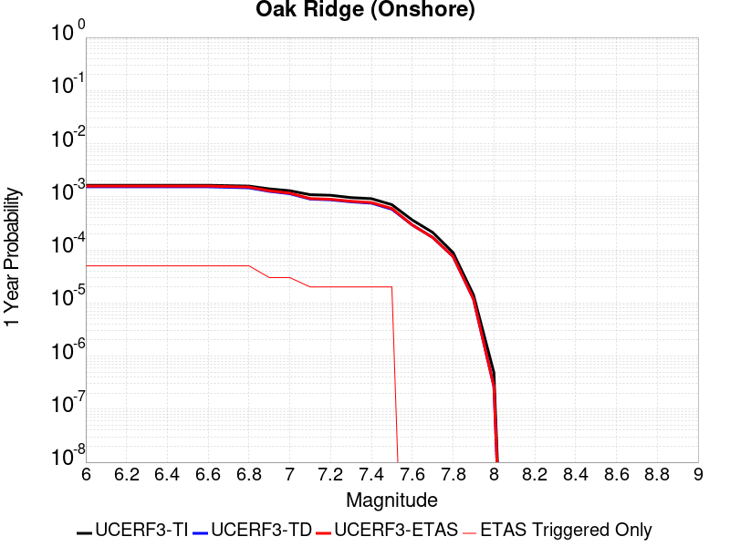 |  |

| Magnitude | 1 wk TI Prob | 1 wk TD Prob | 1 wk ETAS Prob | 1 wk ETAS/TD Gain | 1 wk ETAS Triggered Only | 1 mo TI Prob | 1 mo TD Prob | 1 mo ETAS Prob | 1 mo ETAS/TD Gain | 1 mo ETAS Triggered Only | 1 yr TI Prob | 1 yr TD Prob | 1 yr ETAS Prob | 1 yr ETAS/TD Gain | 1 yr ETAS Triggered Only | 10 yr TI Prob | 10 yr TD Prob | 10 yr ETAS Prob | 10 yr ETAS/TD Gain | 10 yr ETAS Triggered Only |
|-----|-----|-----|-----|-----|-----|-----|-----|-----|-----|-----|-----|-----|-----|-----|-----|-----|-----|-----|-----|-----|
| 6.0 | 3.155064E-5 | 2.9525974E-5 | 4.5122244E-5 | 1.5282221 | 1.5596732E-5 | 1.3521002E-4 | 1.2653397E-4 | 1.4212872E-4 | 1.1232456 | 1.5596732E-5 | 0.001644939 | 0.0015395004 | 0.0015862186 | 1.0303463 | 4.6790192E-5 | 0.01632816 | 0.015292859 | 0.015354292 | 1.0040171 | 6.238693E-5 |
| 6.1 | 3.155064E-5 | 2.9525974E-5 | 4.5122244E-5 | 1.5282221 | 1.5596732E-5 | 1.3521002E-4 | 1.2653397E-4 | 1.4212872E-4 | 1.1232456 | 1.5596732E-5 | 0.001644939 | 0.0015395004 | 0.0015862186 | 1.0303463 | 4.6790192E-5 | 0.01632816 | 0.015292859 | 0.015354292 | 1.0040171 | 6.238693E-5 |
| 6.2 | 3.155064E-5 | 2.9525974E-5 | 4.5122244E-5 | 1.5282221 | 1.5596732E-5 | 1.3521002E-4 | 1.2653397E-4 | 1.4212872E-4 | 1.1232456 | 1.5596732E-5 | 0.001644939 | 0.0015395004 | 0.0015862186 | 1.0303463 | 4.6790192E-5 | 0.01632816 | 0.015292859 | 0.015354292 | 1.0040171 | 6.238693E-5 |
| 6.3 | 3.155064E-5 | 2.9525974E-5 | 4.5122244E-5 | 1.5282221 | 1.5596732E-5 | 1.3521002E-4 | 1.2653397E-4 | 1.4212872E-4 | 1.1232456 | 1.5596732E-5 | 0.001644939 | 0.0015395004 | 0.0015862186 | 1.0303463 | 4.6790192E-5 | 0.01632816 | 0.015292859 | 0.015354292 | 1.0040171 | 6.238693E-5 |
| 6.4 | 3.155064E-5 | 2.9525974E-5 | 4.5122244E-5 | 1.5282221 | 1.5596732E-5 | 1.3521002E-4 | 1.2653397E-4 | 1.4212872E-4 | 1.1232456 | 1.5596732E-5 | 0.001644939 | 0.0015395004 | 0.0015862186 | 1.0303463 | 4.6790192E-5 | 0.01632816 | 0.015292859 | 0.015354292 | 1.0040171 | 6.238693E-5 |
| 6.5 | 3.155064E-5 | 2.9525974E-5 | 4.5122244E-5 | 1.5282221 | 1.5596732E-5 | 1.3521002E-4 | 1.2653397E-4 | 1.4212872E-4 | 1.1232456 | 1.5596732E-5 | 0.001644939 | 0.0015395004 | 0.0015862186 | 1.0303463 | 4.6790192E-5 | 0.01632816 | 0.015292859 | 0.015354292 | 1.0040171 | 6.238693E-5 |
| 6.6 | 3.155064E-5 | 2.9525974E-5 | 4.5122244E-5 | 1.5282221 | 1.5596732E-5 | 1.3521002E-4 | 1.2653397E-4 | 1.4212872E-4 | 1.1232456 | 1.5596732E-5 | 0.001644939 | 0.0015395004 | 0.0015862186 | 1.0303463 | 4.6790192E-5 | 0.01632816 | 0.015292859 | 0.015354292 | 1.0040171 | 6.238693E-5 |
| 6.7 | 3.098897E-5 | 2.8864175E-5 | 4.4460456E-5 | 1.5403335 | 1.5596732E-5 | 1.328031E-4 | 1.2369796E-4 | 1.3929275E-4 | 1.1260716 | 1.5596732E-5 | 0.0016156785 | 0.0015050198 | 0.0015517396 | 1.0310426 | 4.6790192E-5 | 0.016039822 | 0.014952714 | 0.015014168 | 1.0041099 | 6.238693E-5 |
| 6.8 | 3.0449872E-5 | 2.8239372E-5 | 4.3835662E-5 | 1.5522889 | 1.5596732E-5 | 1.3049292E-4 | 1.2102048E-4 | 1.3661532E-4 | 1.1288612 | 1.5596732E-5 | 0.0015875935 | 0.0014724657 | 0.0015191869 | 1.0317299 | 4.6790192E-5 | 0.015762992 | 0.014631462 | 0.014692936 | 1.0042015 | 6.238693E-5 |
| 6.9 | 2.697928E-5 | 2.4219773E-5 | 2.4219773E-5 | 1.0 | 0.0 | 1.15620365E-4 | 1.0379502E-4 | 1.0379502E-4 | 1.0 | 0.0 | 0.0014067689 | 0.0012629933 | 0.0012785704 | 1.0123334 | 1.5596732E-5 | 0.0139789665 | 0.01256087 | 0.012591671 | 1.0024521 | 3.1193464E-5 |
| 7.0 | 2.4893961E-5 | 2.1862043E-5 | 2.1862043E-5 | 1.0 | 0.0 | 1.0668404E-4 | 9.3691204E-5 | 9.3691204E-5 | 1.0 | 0.0 | 0.0012981043 | 0.0011401111 | 0.0011556902 | 1.0136644 | 1.5596732E-5 | 0.012905477 | 0.011344905 | 0.011375745 | 1.0027183 | 3.1193464E-5 |
| 7.1 | 2.0945363E-5 | 1.7354487E-5 | 1.7354487E-5 | 1.0 | 0.0 | 8.976275E-5 | 7.437428E-5 | 7.437428E-5 | 1.0 | 0.0 | 0.0010923136 | 9.051354E-4 | 9.20718E-4 | 1.0172157 | 1.5596732E-5 | 0.0108696 | 0.009015423 | 0.009046335 | 1.0034288 | 3.1193464E-5 |
| 7.2 | 2.0439404E-5 | 1.6809423E-5 | 1.6809423E-5 | 1.0 | 0.0 | 8.7594504E-5 | 7.203843E-5 | 7.203843E-5 | 1.0 | 0.0 | 0.0010659413 | 8.767196E-4 | 8.923026E-4 | 1.0177742 | 1.5596732E-5 | 0.010608427 | 0.008733526 | 0.008764448 | 1.0035405 | 3.1193464E-5 |
| 7.3 | 1.8463334E-5 | 1.5381811E-5 | 1.5381811E-5 | 1.0 | 0.0 | 7.912617E-5 | 6.59204E-5 | 6.59204E-5 | 1.0 | 0.0 | 9.6293533E-4 | 8.0228975E-4 | 8.17874E-4 | 1.0194247 | 1.5596732E-5 | 0.009587734 | 0.007994797 | 0.008025741 | 1.0038705 | 3.1193464E-5 |
| 7.4 | 1.763139E-5 | 1.451684E-5 | 1.451684E-5 | 1.0 | 0.0 | 7.556091E-5 | 6.221356E-5 | 6.221356E-5 | 1.0 | 0.0 | 9.1956573E-4 | 7.571909E-4 | 7.727758E-4 | 1.0205826 | 1.5596732E-5 | 0.009157699 | 0.007546914 | 0.007577872 | 1.0041021 | 3.1193464E-5 |
| 7.5 | 1.3594944E-5 | 1.1163356E-5 | 1.1163356E-5 | 1.0 | 0.0 | 5.8262744E-5 | 4.784209E-5 | 4.784209E-5 | 1.0 | 0.0 | 7.0911803E-4 | 5.8232434E-4 | 5.9791195E-4 | 1.026768 | 1.5596732E-5 | 0.007068595 | 0.0058082556 | 0.0058392677 | 1.0053394 | 3.1193464E-5 |
| 7.6 | 6.9889534E-6 | 5.6367144E-6 | 5.6367144E-6 | 1.0 | 0.0 | 2.9952313E-5 | 2.4157125E-5 | 2.4157125E-5 | 1.0 | 0.0 | 3.646084E-4 | 2.9407372E-4 | 2.9407372E-4 | 1.0 | 0.0 | 0.0036401073 | 0.0029368899 | 0.0029524409 | 1.005295 | 1.5596732E-5 |
| 7.7 | 4.0824193E-6 | 3.2832586E-6 | 3.2832586E-6 | 1.0 | 0.0 | 1.7495966E-5 | 1.4071033E-5 | 1.4071033E-5 | 1.0 | 0.0 | 2.1299256E-4 | 1.713015E-4 | 1.713015E-4 | 1.0 | 0.0 | 0.0021278851 | 0.0017117079 | 0.0017272779 | 1.0090961 | 1.5596732E-5 |
| 7.8 | 1.7023609E-6 | 1.4370495E-6 | 1.4370495E-6 | 1.0 | 0.0 | 7.295812E-6 | 6.1587693E-6 | 6.1587693E-6 | 1.0 | 0.0 | 8.882289E-5 | 7.498047E-5 | 7.498047E-5 | 1.0 | 0.0 | 8.8787393E-4 | 7.495545E-4 | 7.495545E-4 | 1.0 | 0.0 |
| 7.9 | 2.721225E-7 | 2.2616497E-7 | 2.2616497E-7 | 1.0 | 0.0 | 1.1662388E-6 | 9.692781E-7 | 9.692781E-7 | 1.0 | 0.0 | 1.4198865E-5 | 1.1800899E-5 | 1.1800899E-5 | 1.0 | 0.0 | 1.4197957E-4 | 1.1800301E-4 | 1.1800301E-4 | 1.0 | 0.0 |
| 8.0 | 9.364255E-9 | 5.1206666E-9 | 5.1206666E-9 | 1.0 | 0.0 | 4.0132523E-8 | 2.1945715E-8 | 2.1945715E-8 | 1.0 | 0.0 | 4.8861335E-7 | 2.6718905E-7 | 2.6718905E-7 | 1.0 | 0.0 | 4.8861225E-6 | 2.6718876E-6 | 2.6718876E-6 | 1.0 | 0.0 |

## Palos Verdes
*[(top)](#table-of-contents)*

| 1 Week | 1 Month | 1 Year | 10 Year |
|-----|-----|-----|-----|
|  |  |  |  |

| Magnitude | 1 wk TI Prob | 1 wk TD Prob | 1 wk ETAS Prob | 1 wk ETAS/TD Gain | 1 wk ETAS Triggered Only | 1 mo TI Prob | 1 mo TD Prob | 1 mo ETAS Prob | 1 mo ETAS/TD Gain | 1 mo ETAS Triggered Only | 1 yr TI Prob | 1 yr TD Prob | 1 yr ETAS Prob | 1 yr ETAS/TD Gain | 1 yr ETAS Triggered Only | 10 yr TI Prob | 10 yr TD Prob | 10 yr ETAS Prob | 10 yr ETAS/TD Gain | 10 yr ETAS Triggered Only |
|-----|-----|-----|-----|-----|-----|-----|-----|-----|-----|-----|-----|-----|-----|-----|-----|-----|-----|-----|-----|-----|
| 6.0 | 6.126063E-5 | 7.622612E-5 | 1.074172E-4 | 1.4091916 | 3.1193464E-5 | 2.6251914E-4 | 3.2664582E-4 | 3.578291E-4 | 1.0954651 | 3.1193464E-5 | 0.0031914865 | 0.003970174 | 0.004001244 | 1.0078257 | 3.1193464E-5 | 0.031460393 | 0.039048895 | 0.039108846 | 1.0015353 | 6.238693E-5 |
| 6.1 | 6.126063E-5 | 7.622612E-5 | 1.074172E-4 | 1.4091916 | 3.1193464E-5 | 2.6251914E-4 | 3.2664582E-4 | 3.578291E-4 | 1.0954651 | 3.1193464E-5 | 0.0031914865 | 0.003970174 | 0.004001244 | 1.0078257 | 3.1193464E-5 | 0.031460393 | 0.039048895 | 0.039108846 | 1.0015353 | 6.238693E-5 |
| 6.2 | 6.126063E-5 | 7.622612E-5 | 1.074172E-4 | 1.4091916 | 3.1193464E-5 | 2.6251914E-4 | 3.2664582E-4 | 3.578291E-4 | 1.0954651 | 3.1193464E-5 | 0.0031914865 | 0.003970174 | 0.004001244 | 1.0078257 | 3.1193464E-5 | 0.031460393 | 0.039048895 | 0.039108846 | 1.0015353 | 6.238693E-5 |
| 6.3 | 4.0838047E-5 | 4.9749437E-5 | 6.534539E-5 | 1.3134902 | 1.5596732E-5 | 1.7500846E-4 | 2.1319572E-4 | 2.2878911E-4 | 1.0731412 | 1.5596732E-5 | 0.0021286458 | 0.0025927818 | 0.0026083381 | 1.0059998 | 1.5596732E-5 | 0.021083709 | 0.025646681 | 0.025677074 | 1.001185 | 3.1193464E-5 |
| 6.4 | 4.0838047E-5 | 4.9749437E-5 | 6.534539E-5 | 1.3134902 | 1.5596732E-5 | 1.7500846E-4 | 2.1319572E-4 | 2.2878911E-4 | 1.0731412 | 1.5596732E-5 | 0.0021286458 | 0.0025927818 | 0.0026083381 | 1.0059998 | 1.5596732E-5 | 0.021083709 | 0.025646681 | 0.025677074 | 1.001185 | 3.1193464E-5 |
| 6.5 | 3.0512005E-5 | 3.656162E-5 | 5.2157782E-5 | 1.4265718 | 1.5596732E-5 | 1.3075917E-4 | 1.5668393E-4 | 1.7227822E-4 | 1.099527 | 1.5596732E-5 | 0.0015908304 | 0.0019060767 | 0.0019216436 | 1.008167 | 1.5596732E-5 | 0.015794903 | 0.018909154 | 0.018924456 | 1.0008092 | 1.5596732E-5 |
| 6.6 | 2.9255087E-5 | 3.515442E-5 | 5.07506E-5 | 1.4436479 | 1.5596732E-5 | 1.2537291E-4 | 1.5065377E-4 | 1.6624814E-4 | 1.1035115 | 1.5596732E-5 | 0.0015253464 | 0.0018327828 | 0.001848351 | 1.0084943 | 1.5596732E-5 | 0.015149189 | 0.018188225 | 0.018203538 | 1.000842 | 1.5596732E-5 |
| 6.7 | 2.287198E-5 | 2.7248278E-5 | 4.2844586E-5 | 1.5723777 | 1.5596732E-5 | 9.801909E-5 | 1.16773626E-4 | 1.3236854E-4 | 1.1335483 | 1.5596732E-5 | 0.001192729 | 0.0014208833 | 0.001436458 | 1.0109612 | 1.5596732E-5 | 0.011863477 | 0.014127217 | 0.014142593 | 1.0010884 | 1.5596732E-5 |
| 6.8 | 2.1325764E-5 | 2.5431877E-5 | 4.1028212E-5 | 1.6132593 | 1.5596732E-5 | 9.139293E-5 | 1.0898971E-4 | 1.2458475E-4 | 1.1430871 | 1.5596732E-5 | 0.001112141 | 0.0013262323 | 0.0013418084 | 1.0117446 | 1.5596732E-5 | 0.011065915 | 0.013192211 | 0.013207602 | 1.0011667 | 1.5596732E-5 |
| 6.9 | 1.9009392E-5 | 2.2613547E-5 | 3.8209924E-5 | 1.6896918 | 1.5596732E-5 | 8.1466285E-5 | 9.6912096E-5 | 1.1250732E-4 | 1.1609213 | 1.5596732E-5 | 9.914007E-4 | 0.0011793535 | 0.0011949318 | 1.0132092 | 1.5596732E-5 | 0.009869894 | 0.011739632 | 0.011755046 | 1.001313 | 1.5596732E-5 |
| 7.0 | 1.7098473E-5 | 2.0319356E-5 | 3.5915768E-5 | 1.7675644 | 1.5596732E-5 | 7.3277115E-5 | 8.708052E-5 | 1.026759E-4 | 1.1790915 | 1.5596732E-5 | 8.917837E-4 | 0.001059775 | 0.0010753552 | 1.0147014 | 1.5596732E-5 | 0.008882134 | 0.010555646 | 0.010571078 | 1.001462 | 1.5596732E-5 |
| 7.1 | 1.5982785E-5 | 1.899476E-5 | 3.4591194E-5 | 1.8210914 | 1.5596732E-5 | 6.849585E-5 | 8.1404054E-5 | 9.6999516E-5 | 1.1915809 | 1.5596732E-5 | 8.336179E-4 | 9.907284E-4 | 0.0010063096 | 1.015727 | 1.5596732E-5 | 0.008304977 | 0.009871479 | 0.009886922 | 1.0015644 | 1.5596732E-5 |
| 7.2 | 1.4468002E-5 | 1.7197237E-5 | 3.2793698E-5 | 1.9069169 | 1.5596732E-5 | 6.200425E-5 | 7.370083E-5 | 8.9296416E-5 | 1.2116066 | 1.5596732E-5 | 7.546402E-4 | 8.970222E-4 | 9.1260497E-4 | 1.0173717 | 1.5596732E-5 | 0.007520827 | 0.008942284 | 0.008957741 | 1.0017285 | 1.5596732E-5 |
| 7.3 | 5.288233E-6 | 6.2036747E-6 | 6.2036747E-6 | 1.0 | 0.0 | 2.2663658E-5 | 2.6587102E-5 | 2.6587102E-5 | 1.0 | 0.0 | 2.7589512E-4 | 3.236848E-4 | 3.236848E-4 | 1.0 | 0.0 | 0.0027555283 | 0.0032355562 | 0.0032355562 | 1.0 | 0.0 |
| 7.4 | 8.279556E-7 | 8.408347E-7 | 8.408347E-7 | 1.0 | 0.0 | 3.5483763E-6 | 3.6035726E-6 | 3.6035726E-6 | 1.0 | 0.0 | 4.3200624E-5 | 4.3872686E-5 | 4.3872686E-5 | 1.0 | 0.0 | 4.3192226E-4 | 4.3864746E-4 | 4.3864746E-4 | 1.0 | 0.0 |
| 7.5 | 6.559831E-7 | 6.667229E-7 | 6.667229E-7 | 1.0 | 0.0 | 2.8113532E-6 | 2.857381E-6 | 2.857381E-6 | 1.0 | 0.0 | 3.4227687E-5 | 3.4788125E-5 | 3.4788125E-5 | 1.0 | 0.0 | 3.4222414E-4 | 3.4783344E-4 | 3.4783344E-4 | 1.0 | 0.0 |
| 7.6 | 3.5018968E-7 | 3.5620027E-7 | 3.5620027E-7 | 1.0 | 0.0 | 1.500812E-6 | 1.526572E-6 | 1.526572E-6 | 1.0 | 0.0 | 1.8272232E-5 | 1.8585903E-5 | 1.8585903E-5 | 1.0 | 0.0 | 1.8270731E-4 | 1.8584808E-4 | 1.8584808E-4 | 1.0 | 0.0 |
| 7.7 | 1.1986104E-7 | 1.2198376E-7 | 1.2198376E-7 | 1.0 | 0.0 | 5.1369005E-7 | 5.2278745E-7 | 5.2278745E-7 | 1.0 | 0.0 | 6.2541585E-6 | 6.364919E-6 | 6.364919E-6 | 1.0 | 0.0 | 6.2539824E-5 | 6.364741E-5 | 6.364741E-5 | 1.0 | 0.0 |
| 7.8 | 3.0445005E-8 | 3.1027582E-8 | 3.1027582E-8 | 1.0 | 0.0 | 1.3047858E-7 | 1.3297536E-7 | 1.3297536E-7 | 1.0 | 0.0 | 1.5885756E-6 | 1.6189739E-6 | 1.6189739E-6 | 1.0 | 0.0 | 1.5885644E-5 | 1.6189642E-5 | 1.6189642E-5 | 1.0 | 0.0 |

## Mono Lake 2011 CFM
*[(top)](#table-of-contents)*

| 1 Week | 1 Month | 1 Year | 10 Year |
|-----|-----|-----|-----|
| 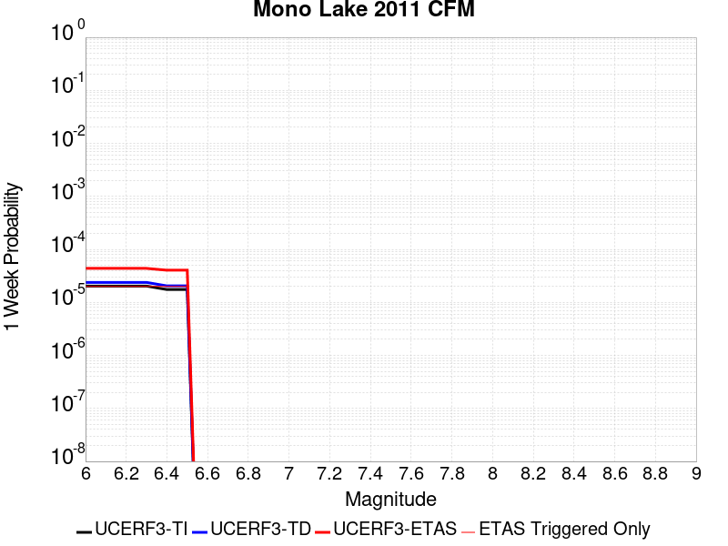 |  |  |  |

| Magnitude | 1 wk TI Prob | 1 wk TD Prob | 1 wk ETAS Prob | 1 wk ETAS/TD Gain | 1 wk ETAS Triggered Only | 1 mo TI Prob | 1 mo TD Prob | 1 mo ETAS Prob | 1 mo ETAS/TD Gain | 1 mo ETAS Triggered Only | 1 yr TI Prob | 1 yr TD Prob | 1 yr ETAS Prob | 1 yr ETAS/TD Gain | 1 yr ETAS Triggered Only | 10 yr TI Prob | 10 yr TD Prob | 10 yr ETAS Prob | 10 yr ETAS/TD Gain | 10 yr ETAS Triggered Only |
|-----|-----|-----|-----|-----|-----|-----|-----|-----|-----|-----|-----|-----|-----|-----|-----|-----|-----|-----|-----|-----|
| 6.0 | 2.0341662E-5 | 2.3828166E-5 | 5.5020886E-5 | 2.3090692 | 3.1193464E-5 | 8.717564E-5 | 1.0211971E-4 | 1.3331E-4 | 1.3054285 | 3.1193464E-5 | 0.0010608466 | 0.0012431298 | 0.0013054392 | 1.050123 | 6.238693E-5 | 0.010557966 | 0.012413835 | 0.012475448 | 1.0049632 | 6.238693E-5 |
| 6.1 | 2.0341662E-5 | 2.3828166E-5 | 5.5020886E-5 | 2.3090692 | 3.1193464E-5 | 8.717564E-5 | 1.0211971E-4 | 1.3331E-4 | 1.3054285 | 3.1193464E-5 | 0.0010608466 | 0.0012431298 | 0.0013054392 | 1.050123 | 6.238693E-5 | 0.010557966 | 0.012413835 | 0.012475448 | 1.0049632 | 6.238693E-5 |
| 6.2 | 2.0341662E-5 | 2.3828166E-5 | 5.5020886E-5 | 2.3090692 | 3.1193464E-5 | 8.717564E-5 | 1.0211971E-4 | 1.3331E-4 | 1.3054285 | 3.1193464E-5 | 0.0010608466 | 0.0012431298 | 0.0013054392 | 1.050123 | 6.238693E-5 | 0.010557966 | 0.012413835 | 0.012475448 | 1.0049632 | 6.238693E-5 |
| 6.3 | 2.0341662E-5 | 2.3828166E-5 | 5.5020886E-5 | 2.3090692 | 3.1193464E-5 | 8.717564E-5 | 1.0211971E-4 | 1.3331E-4 | 1.3054285 | 3.1193464E-5 | 0.0010608466 | 0.0012431298 | 0.0013054392 | 1.050123 | 6.238693E-5 | 0.010557966 | 0.012413835 | 0.012475448 | 1.0049632 | 6.238693E-5 |
| 6.4 | 1.749821E-5 | 2.0490985E-5 | 5.1683808E-5 | 2.5222704 | 3.1193464E-5 | 7.499018E-5 | 8.781851E-5 | 1.1900923E-4 | 1.3551725 | 3.1193464E-5 | 9.1262296E-4 | 0.0010691903 | 0.0011159305 | 1.0437155 | 4.6790192E-5 | 0.009088841 | 0.010691865 | 0.010738155 | 1.0043294 | 4.6790192E-5 |
| 6.5 | 1.749821E-5 | 2.0490985E-5 | 5.1683808E-5 | 2.5222704 | 3.1193464E-5 | 7.499018E-5 | 8.781851E-5 | 1.1900923E-4 | 1.3551725 | 3.1193464E-5 | 9.1262296E-4 | 0.0010691903 | 0.0011159305 | 1.0437155 | 4.6790192E-5 | 0.009088841 | 0.010691865 | 0.010738155 | 1.0043294 | 4.6790192E-5 |

## Santa Cruz Catalina Ridge alt1
*[(top)](#table-of-contents)*

| 1 Week | 1 Month | 1 Year | 10 Year |
|-----|-----|-----|-----|
|  |  |  |  |

| Magnitude | 1 wk TI Prob | 1 wk TD Prob | 1 wk ETAS Prob | 1 wk ETAS/TD Gain | 1 wk ETAS Triggered Only | 1 mo TI Prob | 1 mo TD Prob | 1 mo ETAS Prob | 1 mo ETAS/TD Gain | 1 mo ETAS Triggered Only | 1 yr TI Prob | 1 yr TD Prob | 1 yr ETAS Prob | 1 yr ETAS/TD Gain | 1 yr ETAS Triggered Only | 10 yr TI Prob | 10 yr TD Prob | 10 yr ETAS Prob | 10 yr ETAS/TD Gain | 10 yr ETAS Triggered Only |
|-----|-----|-----|-----|-----|-----|-----|-----|-----|-----|-----|-----|-----|-----|-----|-----|-----|-----|-----|-----|-----|
| 6.0 | 3.2833184E-5 | 3.65584E-5 | 6.775072E-5 | 1.853219 | 3.1193464E-5 | 1.4070606E-4 | 1.5667039E-4 | 1.8785895E-4 | 1.1990713 | 3.1193464E-5 | 0.00171175 | 0.0019059596 | 0.0019526606 | 1.0245026 | 4.6790192E-5 | 0.016986247 | 0.018913029 | 0.018974237 | 1.0032363 | 6.238693E-5 |
| 6.1 | 1.9835548E-5 | 2.1659505E-5 | 3.7255897E-5 | 1.7200716 | 1.5596732E-5 | 8.500672E-5 | 9.282326E-5 | 1.0841854E-4 | 1.1680105 | 1.5596732E-5 | 0.0010344655 | 0.0011295575 | 0.0011607157 | 1.0275844 | 3.1193464E-5 | 0.010296632 | 0.011240295 | 0.0112865595 | 1.0041159 | 4.6790192E-5 |
| 6.2 | 1.9835548E-5 | 2.1659505E-5 | 3.7255897E-5 | 1.7200716 | 1.5596732E-5 | 8.500672E-5 | 9.282326E-5 | 1.0841854E-4 | 1.1680105 | 1.5596732E-5 | 0.0010344655 | 0.0011295575 | 0.0011607157 | 1.0275844 | 3.1193464E-5 | 0.010296632 | 0.011240295 | 0.0112865595 | 1.0041159 | 4.6790192E-5 |
| 6.3 | 1.5728183E-5 | 1.703395E-5 | 1.703395E-5 | 1.0 | 0.0 | 6.7404755E-5 | 7.300063E-5 | 7.300063E-5 | 1.0 | 0.0 | 8.2034385E-4 | 8.884264E-4 | 9.0400927E-4 | 1.0175399 | 1.5596732E-5 | 0.008173222 | 0.008849427 | 0.008880344 | 1.0034937 | 3.1193464E-5 |
| 6.4 | 1.5728183E-5 | 1.703395E-5 | 1.703395E-5 | 1.0 | 0.0 | 6.7404755E-5 | 7.300063E-5 | 7.300063E-5 | 1.0 | 0.0 | 8.2034385E-4 | 8.884264E-4 | 9.0400927E-4 | 1.0175399 | 1.5596732E-5 | 0.008173222 | 0.008849427 | 0.008880344 | 1.0034937 | 3.1193464E-5 |
| 6.5 | 1.3707734E-5 | 1.4794522E-5 | 1.4794522E-5 | 1.0 | 0.0 | 5.8746107E-5 | 6.3403575E-5 | 6.3403575E-5 | 1.0 | 0.0 | 7.1499916E-4 | 7.716686E-4 | 7.872533E-4 | 1.0201961 | 1.5596732E-5 | 0.0071270303 | 0.0076902895 | 0.0077212434 | 1.004025 | 3.1193464E-5 |
| 6.6 | 1.2539813E-5 | 1.3510219E-5 | 1.3510219E-5 | 1.0 | 0.0 | 5.3740947E-5 | 5.789967E-5 | 5.789967E-5 | 1.0 | 0.0 | 6.540996E-4 | 7.0470315E-4 | 7.202889E-4 | 1.0221168 | 1.5596732E-5 | 0.0065217763 | 0.0070249885 | 0.007055963 | 1.0044092 | 3.1193464E-5 |
| 6.7 | 1.1504083E-5 | 1.2377375E-5 | 1.2377375E-5 | 1.0 | 0.0 | 4.930228E-5 | 5.3044827E-5 | 5.3044827E-5 | 1.0 | 0.0 | 6.0008996E-4 | 6.456314E-4 | 6.612181E-4 | 1.0241418 | 1.5596732E-5 | 0.005984721 | 0.006437786 | 0.0064687785 | 1.0048141 | 3.1193464E-5 |
| 6.8 | 1.012739E-5 | 1.0877071E-5 | 1.0877071E-5 | 1.0 | 0.0 | 4.340238E-5 | 4.6615194E-5 | 4.6615194E-5 | 1.0 | 0.0 | 5.282958E-4 | 5.673937E-4 | 5.829816E-4 | 1.0274727 | 1.5596732E-5 | 0.0052704164 | 0.0056596193 | 0.0056906366 | 1.0054804 | 3.1193464E-5 |
| 6.9 | 8.9607865E-6 | 9.609117E-6 | 9.609117E-6 | 1.0 | 0.0 | 3.8402806E-5 | 4.1181287E-5 | 4.1181287E-5 | 1.0 | 0.0 | 4.6745385E-4 | 5.012679E-4 | 5.168568E-4 | 1.031099 | 1.5596732E-5 | 0.0046647177 | 0.005001492 | 0.005032529 | 1.0062057 | 3.1193464E-5 |
| 7.0 | 8.046829E-6 | 8.619746E-6 | 8.619746E-6 | 1.0 | 0.0 | 3.4485955E-5 | 3.694125E-5 | 3.694125E-5 | 1.0 | 0.0 | 4.1978562E-4 | 4.496677E-4 | 4.652574E-4 | 1.0346694 | 1.5596732E-5 | 0.004189935 | 0.0044876686 | 0.004518722 | 1.0069197 | 3.1193464E-5 |
| 7.1 | 7.136131E-6 | 7.637656E-6 | 7.637656E-6 | 1.0 | 0.0 | 3.0583058E-5 | 3.2732405E-5 | 3.2732405E-5 | 1.0 | 0.0 | 3.7228514E-4 | 3.9844486E-4 | 4.1403537E-4 | 1.0391284 | 1.5596732E-5 | 0.0037166206 | 0.003977381 | 0.0040084505 | 1.0078115 | 3.1193464E-5 |
| 7.2 | 6.362014E-6 | 6.8049585E-6 | 6.8049585E-6 | 1.0 | 0.0 | 2.726549E-5 | 2.9163786E-5 | 2.9163786E-5 | 1.0 | 0.0 | 3.3190678E-4 | 3.550119E-4 | 3.7060308E-4 | 1.0439174 | 1.5596732E-5 | 0.0033141149 | 0.003544516 | 0.0035755988 | 1.0087693 | 3.1193464E-5 |
| 7.3 | 5.004101E-6 | 5.351715E-6 | 5.351715E-6 | 1.0 | 0.0 | 2.1445969E-5 | 2.2935723E-5 | 2.2935723E-5 | 1.0 | 0.0 | 2.6107338E-4 | 2.792072E-4 | 2.792072E-4 | 1.0 | 0.0 | 0.002607669 | 0.0027886187 | 0.0028041718 | 1.0055774 | 1.5596732E-5 |
| 7.4 | 3.4901443E-6 | 3.7320526E-6 | 3.7320526E-6 | 1.0 | 0.0 | 1.4957676E-5 | 1.5994416E-5 | 1.5994416E-5 | 1.0 | 0.0 | 1.8209449E-4 | 1.9471499E-4 | 1.9471499E-4 | 1.0 | 0.0 | 0.0018194534 | 0.0019454823 | 0.0019454823 | 1.0 | 0.0 |
| 7.5 | 1.1215045E-6 | 1.189387E-6 | 1.189387E-6 | 1.0 | 0.0 | 4.806439E-6 | 5.097363E-6 | 5.097363E-6 | 1.0 | 0.0 | 5.851682E-5 | 6.205866E-5 | 6.205866E-5 | 1.0 | 0.0 | 5.850142E-4 | 6.2041637E-4 | 6.2041637E-4 | 1.0 | 0.0 |
| 7.6 | 2.8599047E-7 | 2.9951994E-7 | 2.9951994E-7 | 1.0 | 0.0 | 1.2256729E-6 | 1.2836562E-6 | 1.2836562E-6 | 1.0 | 0.0 | 1.4922465E-5 | 1.5628404E-5 | 1.5628404E-5 | 1.0 | 0.0 | 1.4921463E-4 | 1.5627318E-4 | 1.5627318E-4 | 1.0 | 0.0 |
| 7.7 | 2.0781519E-7 | 2.1744323E-7 | 2.1744323E-7 | 1.0 | 0.0 | 8.906362E-7 | 9.3189925E-7 | 9.3189925E-7 | 1.0 | 0.0 | 1.08434415E-5 | 1.13458145E-5 | 1.13458145E-5 | 1.0 | 0.0 | 1.0842913E-4 | 1.1345245E-4 | 1.1345245E-4 | 1.0 | 0.0 |
| 7.8 | 3.614776E-8 | 3.764102E-8 | 3.764102E-8 | 1.0 | 0.0 | 1.5491896E-7 | 1.6131864E-7 | 1.6131864E-7 | 1.0 | 0.0 | 1.8861368E-6 | 1.9640527E-6 | 1.9640527E-6 | 1.0 | 0.0 | 1.8861208E-5 | 1.9640367E-5 | 1.9640367E-5 | 1.0 | 0.0 |

## San Clemente
*[(top)](#table-of-contents)*

| 1 Week | 1 Month | 1 Year | 10 Year |
|-----|-----|-----|-----|
|  |  |  |  |

| Magnitude | 1 wk TI Prob | 1 wk TD Prob | 1 wk ETAS Prob | 1 wk ETAS/TD Gain | 1 wk ETAS Triggered Only | 1 mo TI Prob | 1 mo TD Prob | 1 mo ETAS Prob | 1 mo ETAS/TD Gain | 1 mo ETAS Triggered Only | 1 yr TI Prob | 1 yr TD Prob | 1 yr ETAS Prob | 1 yr ETAS/TD Gain | 1 yr ETAS Triggered Only | 10 yr TI Prob | 10 yr TD Prob | 10 yr ETAS Prob | 10 yr ETAS/TD Gain | 10 yr ETAS Triggered Only |
|-----|-----|-----|-----|-----|-----|-----|-----|-----|-----|-----|-----|-----|-----|-----|-----|-----|-----|-----|-----|-----|
| 6.0 | 6.681379E-5 | 8.163422E-5 | 8.163422E-5 | 1.0 | 0.0 | 2.8631336E-4 | 3.498173E-4 | 3.498173E-4 | 1.0 | 0.0 | 0.003480294 | 0.0042512873 | 0.004266818 | 1.0036532 | 1.5596732E-5 | 0.03426291 | 0.041755714 | 0.041785605 | 1.0007159 | 3.1193464E-5 |
| 6.1 | 6.681379E-5 | 8.163422E-5 | 8.163422E-5 | 1.0 | 0.0 | 2.8631336E-4 | 3.498173E-4 | 3.498173E-4 | 1.0 | 0.0 | 0.003480294 | 0.0042512873 | 0.004266818 | 1.0036532 | 1.5596732E-5 | 0.03426291 | 0.041755714 | 0.041785605 | 1.0007159 | 3.1193464E-5 |
| 6.2 | 3.9400576E-5 | 4.6451984E-5 | 4.6451984E-5 | 1.0 | 0.0 | 1.6884868E-4 | 1.9906509E-4 | 1.9906509E-4 | 1.0 | 0.0 | 0.0020537945 | 0.002420985 | 0.0024365438 | 1.0064267 | 1.5596732E-5 | 0.020349167 | 0.02395286 | 0.023983307 | 1.0012711 | 3.1193464E-5 |
| 6.3 | 3.2590255E-5 | 3.7929087E-5 | 3.7929087E-5 | 1.0 | 0.0 | 1.3966505E-4 | 1.6254328E-4 | 1.6254328E-4 | 1.0 | 0.0 | 0.0016990956 | 0.0019771985 | 0.0019927644 | 1.0078727 | 1.5596732E-5 | 0.01686163 | 0.019599866 | 0.019630447 | 1.0015603 | 3.1193464E-5 |
| 6.4 | 2.9454652E-5 | 3.4097775E-5 | 3.4097775E-5 | 1.0 | 0.0 | 1.2622811E-4 | 1.4612528E-4 | 1.4612528E-4 | 1.0 | 0.0 | 0.0015357438 | 0.0017776482 | 0.0017932171 | 1.0087582 | 1.5596732E-5 | 0.015251739 | 0.017637458 | 0.0176681 | 1.0017374 | 3.1193464E-5 |
| 6.5 | 2.790836E-5 | 3.2247463E-5 | 3.2247463E-5 | 1.0 | 0.0 | 1.1960178E-4 | 1.3819622E-4 | 1.3819622E-4 | 1.0 | 0.0 | 0.001455179 | 0.0016812651 | 0.0016968356 | 1.0092611 | 1.5596732E-5 | 0.014456868 | 0.016688475 | 0.016719148 | 1.001838 | 3.1193464E-5 |
| 6.6 | 2.2492153E-5 | 2.5762707E-5 | 2.5762707E-5 | 1.0 | 0.0 | 9.639138E-5 | 1.1040701E-4 | 1.1040701E-4 | 1.0 | 0.0 | 0.0011729331 | 0.0013433908 | 0.0013589666 | 1.0115944 | 1.5596732E-5 | 0.011667615 | 0.013354415 | 0.0133851925 | 1.0023047 | 3.1193464E-5 |
| 6.7 | 1.9862755E-5 | 2.2666423E-5 | 2.2666423E-5 | 1.0 | 0.0 | 8.512331E-5 | 9.713826E-5 | 9.713826E-5 | 1.0 | 0.0 | 0.0010358836 | 0.0011820279 | 0.0011976062 | 1.0131793 | 1.5596732E-5 | 0.010310682 | 0.011758701 | 0.011774114 | 1.0013108 | 1.5596732E-5 |
| 6.8 | 1.6697575E-5 | 1.897771E-5 | 1.897771E-5 | 1.0 | 0.0 | 7.155907E-5 | 8.133056E-5 | 8.133056E-5 | 1.0 | 0.0 | 8.7088346E-4 | 9.897591E-4 | 0.0010053404 | 1.0157425 | 1.5596732E-5 | 0.008674784 | 0.0098545365 | 0.00986998 | 1.0015671 | 1.5596732E-5 |
| 6.9 | 1.5218415E-5 | 1.72694E-5 | 1.72694E-5 | 1.0 | 0.0 | 6.522015E-5 | 7.4009666E-5 | 7.4009666E-5 | 1.0 | 0.0 | 7.93766E-4 | 9.00704E-4 | 9.1628666E-4 | 1.0173006 | 1.5596732E-5 | 0.007909367 | 0.008971481 | 0.008986937 | 1.0017229 | 1.5596732E-5 |
| 7.0 | 1.2392958E-5 | 1.4033016E-5 | 1.4033016E-5 | 1.0 | 0.0 | 5.3111595E-5 | 6.014015E-5 | 6.014015E-5 | 1.0 | 0.0 | 6.4644177E-4 | 7.319679E-4 | 7.4755325E-4 | 1.0212923 | 1.5596732E-5 | 0.0064456454 | 0.0072963564 | 0.0073118396 | 1.002122 | 1.5596732E-5 |
| 7.1 | 1.0934128E-5 | 1.2375138E-5 | 1.2375138E-5 | 1.0 | 0.0 | 4.6859706E-5 | 5.303527E-5 | 5.303527E-5 | 1.0 | 0.0 | 5.7036756E-4 | 6.455204E-4 | 6.455204E-4 | 1.0 | 0.0 | 0.0056890585 | 0.0064371997 | 0.0064371997 | 1.0 | 0.0 |
| 7.2 | 9.5798805E-6 | 1.0844935E-5 | 1.0844935E-5 | 1.0 | 0.0 | 4.1055984E-5 | 4.6477508E-5 | 4.6477508E-5 | 1.0 | 0.0 | 4.9974193E-4 | 5.657239E-4 | 5.657239E-4 | 1.0 | 0.0 | 0.0049861963 | 0.0056435615 | 0.0056435615 | 1.0 | 0.0 |
| 7.3 | 8.0167365E-6 | 9.083918E-6 | 9.083918E-6 | 1.0 | 0.0 | 3.4356988E-5 | 3.8930535E-5 | 3.8930535E-5 | 1.0 | 0.0 | 4.1821605E-4 | 4.7388324E-4 | 4.7388324E-4 | 1.0 | 0.0 | 0.0041742986 | 0.0047294297 | 0.0047294297 | 1.0 | 0.0 |
| 7.4 | 2.9581017E-6 | 3.3623792E-6 | 3.3623792E-6 | 1.0 | 0.0 | 1.2677518E-5 | 1.4410146E-5 | 1.4410146E-5 | 1.0 | 0.0 | 1.5433785E-4 | 1.7543444E-4 | 1.7543444E-4 | 1.0 | 0.0 | 0.001542307 | 0.0017534546 | 0.0017534546 | 1.0 | 0.0 |

## Simi-Santa Rosa
*[(top)](#table-of-contents)*

| 1 Week | 1 Month | 1 Year | 10 Year |
|-----|-----|-----|-----|
|  |  |  |  |

| Magnitude | 1 wk TI Prob | 1 wk TD Prob | 1 wk ETAS Prob | 1 wk ETAS/TD Gain | 1 wk ETAS Triggered Only | 1 mo TI Prob | 1 mo TD Prob | 1 mo ETAS Prob | 1 mo ETAS/TD Gain | 1 mo ETAS Triggered Only | 1 yr TI Prob | 1 yr TD Prob | 1 yr ETAS Prob | 1 yr ETAS/TD Gain | 1 yr ETAS Triggered Only | 10 yr TI Prob | 10 yr TD Prob | 10 yr ETAS Prob | 10 yr ETAS/TD Gain | 10 yr ETAS Triggered Only |
|-----|-----|-----|-----|-----|-----|-----|-----|-----|-----|-----|-----|-----|-----|-----|-----|-----|-----|-----|-----|-----|
| 6.0 | 2.198912E-5 | 2.2275442E-5 | 2.2275442E-5 | 1.0 | 0.0 | 9.4235686E-5 | 9.5462936E-5 | 9.5462936E-5 | 1.0 | 0.0 | 0.0011467156 | 0.0011616853 | 0.001177264 | 1.0134103 | 1.5596732E-5 | 0.011408163 | 0.011560575 | 0.011606825 | 1.0040005 | 4.6790192E-5 |
| 6.1 | 2.198912E-5 | 2.2275442E-5 | 2.2275442E-5 | 1.0 | 0.0 | 9.4235686E-5 | 9.5462936E-5 | 9.5462936E-5 | 1.0 | 0.0 | 0.0011467156 | 0.0011616853 | 0.001177264 | 1.0134103 | 1.5596732E-5 | 0.011408163 | 0.011560575 | 0.011606825 | 1.0040005 | 4.6790192E-5 |
| 6.2 | 1.69983E-5 | 1.6668559E-5 | 1.6668559E-5 | 1.0 | 0.0 | 7.284782E-5 | 7.143489E-5 | 7.143489E-5 | 1.0 | 0.0 | 8.865613E-4 | 8.6940196E-4 | 8.849851E-4 | 1.0179241 | 1.5596732E-5 | 0.008830327 | 0.008662928 | 0.008709312 | 1.0053544 | 4.6790192E-5 |
| 6.3 | 1.69983E-5 | 1.6668559E-5 | 1.6668559E-5 | 1.0 | 0.0 | 7.284782E-5 | 7.143489E-5 | 7.143489E-5 | 1.0 | 0.0 | 8.865613E-4 | 8.6940196E-4 | 8.849851E-4 | 1.0179241 | 1.5596732E-5 | 0.008830327 | 0.008662928 | 0.008709312 | 1.0053544 | 4.6790192E-5 |
| 6.4 | 1.4666188E-5 | 1.4052543E-5 | 1.4052543E-5 | 1.0 | 0.0 | 6.285358E-5 | 6.0223934E-5 | 6.0223934E-5 | 1.0 | 0.0 | 7.6497364E-4 | 7.3300465E-4 | 7.485899E-4 | 1.0212622 | 1.5596732E-5 | 0.0076234564 | 0.007308344 | 0.0073393094 | 1.004237 | 3.1193464E-5 |
| 6.5 | 1.4666188E-5 | 1.4052543E-5 | 1.4052543E-5 | 1.0 | 0.0 | 6.285358E-5 | 6.0223934E-5 | 6.0223934E-5 | 1.0 | 0.0 | 7.6497364E-4 | 7.3300465E-4 | 7.485899E-4 | 1.0212622 | 1.5596732E-5 | 0.0076234564 | 0.007308344 | 0.0073393094 | 1.004237 | 3.1193464E-5 |
| 6.6 | 1.4377586E-5 | 1.3729583E-5 | 1.3729583E-5 | 1.0 | 0.0 | 6.1616774E-5 | 5.883988E-5 | 5.883988E-5 | 1.0 | 0.0 | 7.4992597E-4 | 7.1616494E-4 | 7.317505E-4 | 1.0217625 | 1.5596732E-5 | 0.007474003 | 0.0071410383 | 0.007172009 | 1.004337 | 3.1193464E-5 |
| 6.7 | 1.3881404E-5 | 1.320755E-5 | 1.320755E-5 | 1.0 | 0.0 | 5.9490372E-5 | 5.66027E-5 | 5.66027E-5 | 1.0 | 0.0 | 7.240546E-4 | 6.8894465E-4 | 7.045307E-4 | 1.022623 | 1.5596732E-5 | 0.007217 | 0.006870538 | 0.0069015175 | 1.004509 | 3.1193464E-5 |
| 6.8 | 1.0176516E-5 | 9.154151E-6 | 9.154151E-6 | 1.0 | 0.0 | 4.3612912E-5 | 3.9231574E-5 | 3.9231574E-5 | 1.0 | 0.0 | 5.308578E-4 | 4.7755634E-4 | 4.7755634E-4 | 1.0 | 0.0 | 0.0052959146 | 0.004766934 | 0.004766934 | 1.0 | 0.0 |
| 6.9 | 9.699797E-6 | 8.774719E-6 | 8.774719E-6 | 1.0 | 0.0 | 4.15699E-5 | 3.7605492E-5 | 3.7605492E-5 | 1.0 | 0.0 | 5.05996E-4 | 4.577671E-4 | 4.577671E-4 | 1.0 | 0.0 | 0.005048454 | 0.0045698597 | 0.0045698597 | 1.0 | 0.0 |
| 7.0 | 7.4049476E-6 | 6.559333E-6 | 6.559333E-6 | 1.0 | 0.0 | 3.1735104E-5 | 2.8111197E-5 | 2.8111197E-5 | 1.0 | 0.0 | 3.8630638E-4 | 3.422127E-4 | 3.422127E-4 | 1.0 | 0.0 | 0.0038563553 | 0.0034180996 | 0.0034180996 | 1.0 | 0.0 |
| 7.1 | 3.873439E-6 | 2.7595095E-6 | 2.7595095E-6 | 1.0 | 0.0 | 1.6600346E-5 | 1.1826417E-5 | 1.1826417E-5 | 1.0 | 0.0 | 2.0209046E-4 | 1.4397735E-4 | 1.4397735E-4 | 1.0 | 0.0 | 0.0020190678 | 0.0014388643 | 0.0014388643 | 1.0 | 0.0 |
| 7.2 | 3.417706E-6 | 2.3676484E-6 | 2.3676484E-6 | 1.0 | 0.0 | 1.4647229E-5 | 1.0147027E-5 | 1.0147027E-5 | 1.0 | 0.0 | 1.7831543E-4 | 1.2353327E-4 | 1.2353327E-4 | 1.0 | 0.0 | 0.0017817242 | 0.0012346683 | 0.0012346683 | 1.0 | 0.0 |
| 7.3 | 1.90225E-6 | 1.4073753E-6 | 1.4073753E-6 | 1.0 | 0.0 | 8.152474E-6 | 6.0315947E-6 | 6.0315947E-6 | 1.0 | 0.0 | 9.9251854E-5 | 7.343221E-5 | 7.343221E-5 | 1.0 | 0.0 | 9.920754E-4 | 7.340817E-4 | 7.340817E-4 | 1.0 | 0.0 |
| 7.4 | 1.5170556E-6 | 1.1024773E-6 | 1.1024773E-6 | 1.0 | 0.0 | 6.5016507E-6 | 4.724894E-6 | 4.724894E-6 | 1.0 | 0.0 | 7.915472E-5 | 5.7524077E-5 | 5.7524077E-5 | 1.0 | 0.0 | 7.9126534E-4 | 5.7509297E-4 | 5.7509297E-4 | 1.0 | 0.0 |
| 7.5 | 1.178732E-6 | 8.535102E-7 | 8.535102E-7 | 1.0 | 0.0 | 5.0516987E-6 | 3.6578958E-6 | 3.6578958E-6 | 1.0 | 0.0 | 6.1502695E-5 | 4.453398E-5 | 4.453398E-5 | 1.0 | 0.0 | 6.148568E-4 | 4.452515E-4 | 4.452515E-4 | 1.0 | 0.0 |
| 7.6 | 6.8722386E-7 | 4.793198E-7 | 4.793198E-7 | 1.0 | 0.0 | 2.9452417E-6 | 2.054226E-6 | 2.054226E-6 | 1.0 | 0.0 | 3.5857727E-5 | 2.5009915E-5 | 2.5009915E-5 | 1.0 | 0.0 | 3.5851944E-4 | 2.5007114E-4 | 2.5007114E-4 | 1.0 | 0.0 |
| 7.7 | 5.5126515E-7 | 3.6731157E-7 | 3.6731157E-7 | 1.0 | 0.0 | 2.3625628E-6 | 1.5741915E-6 | 1.5741915E-6 | 1.0 | 0.0 | 2.8763823E-5 | 1.9165615E-5 | 1.9165615E-5 | 1.0 | 0.0 | 2.87601E-4 | 1.9163972E-4 | 1.9163972E-4 | 1.0 | 0.0 |
| 7.8 | 3.3860243E-7 | 2.0075942E-7 | 2.0075942E-7 | 1.0 | 0.0 | 1.4511525E-6 | 8.6039717E-7 | 8.6039717E-7 | 1.0 | 0.0 | 1.7667637E-5 | 1.0475286E-5 | 1.0475286E-5 | 1.0 | 0.0 | 1.7666233E-4 | 1.04747975E-4 | 1.04747975E-4 | 1.0 | 0.0 |
| 7.9 | 2.7955386E-7 | 1.4649108E-7 | 1.4649108E-7 | 1.0 | 0.0 | 1.1980875E-6 | 6.278188E-7 | 6.278188E-7 | 1.0 | 0.0 | 1.4586617E-5 | 7.643667E-6 | 7.643667E-6 | 1.0 | 0.0 | 1.458566E-4 | 7.643409E-5 | 7.643409E-5 | 1.0 | 0.0 |
| 8.0 | 5.6259015E-8 | 3.3355324E-8 | 3.3355324E-8 | 1.0 | 0.0 | 2.4111003E-7 | 1.4295138E-7 | 1.4295138E-7 | 1.0 | 0.0 | 2.9355108E-6 | 1.7404317E-6 | 1.7404317E-6 | 1.0 | 0.0 | 2.935472E-5 | 1.7404194E-5 | 1.7404194E-5 | 1.0 | 0.0 |

## Great Valley 03 Mysterious Ridge
*[(top)](#table-of-contents)*

| 1 Week | 1 Month | 1 Year | 10 Year |
|-----|-----|-----|-----|
|  |  |  |  |

| Magnitude | 1 wk TI Prob | 1 wk TD Prob | 1 wk ETAS Prob | 1 wk ETAS/TD Gain | 1 wk ETAS Triggered Only | 1 mo TI Prob | 1 mo TD Prob | 1 mo ETAS Prob | 1 mo ETAS/TD Gain | 1 mo ETAS Triggered Only | 1 yr TI Prob | 1 yr TD Prob | 1 yr ETAS Prob | 1 yr ETAS/TD Gain | 1 yr ETAS Triggered Only | 10 yr TI Prob | 10 yr TD Prob | 10 yr ETAS Prob | 10 yr ETAS/TD Gain | 10 yr ETAS Triggered Only |
|-----|-----|-----|-----|-----|-----|-----|-----|-----|-----|-----|-----|-----|-----|-----|-----|-----|-----|-----|-----|-----|
| 6.0 | 3.1182444E-5 | 3.603423E-5 | 3.603423E-5 | 1.0 | 0.0 | 1.336322E-4 | 1.544242E-4 | 1.544242E-4 | 1.0 | 0.0 | 0.0016257578 | 0.0018786696 | 0.0018942371 | 1.0082864 | 1.5596732E-5 | 0.016139153 | 0.018646652 | 0.018661957 | 1.0008209 | 1.5596732E-5 |
| 6.1 | 3.1182444E-5 | 3.603423E-5 | 3.603423E-5 | 1.0 | 0.0 | 1.336322E-4 | 1.544242E-4 | 1.544242E-4 | 1.0 | 0.0 | 0.0016257578 | 0.0018786696 | 0.0018942371 | 1.0082864 | 1.5596732E-5 | 0.016139153 | 0.018646652 | 0.018661957 | 1.0008209 | 1.5596732E-5 |
| 6.2 | 3.1182444E-5 | 3.603423E-5 | 3.603423E-5 | 1.0 | 0.0 | 1.336322E-4 | 1.544242E-4 | 1.544242E-4 | 1.0 | 0.0 | 0.0016257578 | 0.0018786696 | 0.0018942371 | 1.0082864 | 1.5596732E-5 | 0.016139153 | 0.018646652 | 0.018661957 | 1.0008209 | 1.5596732E-5 |
| 6.3 | 2.106934E-5 | 2.3850307E-5 | 2.3850307E-5 | 1.0 | 0.0 | 9.0294045E-5 | 1.0221177E-4 | 1.0221177E-4 | 1.0 | 0.0 | 0.0010987755 | 0.0012437489 | 0.0012593262 | 1.0125245 | 1.5596732E-5 | 0.010933585 | 0.012371127 | 0.012386531 | 1.0012451 | 1.5596732E-5 |
| 6.4 | 2.106934E-5 | 2.3850307E-5 | 2.3850307E-5 | 1.0 | 0.0 | 9.0294045E-5 | 1.0221177E-4 | 1.0221177E-4 | 1.0 | 0.0 | 0.0010987755 | 0.0012437489 | 0.0012593262 | 1.0125245 | 1.5596732E-5 | 0.010933585 | 0.012371127 | 0.012386531 | 1.0012451 | 1.5596732E-5 |
| 6.5 | 1.9389783E-5 | 2.1884984E-5 | 2.1884984E-5 | 1.0 | 0.0 | 8.309642E-5 | 9.3789575E-5 | 9.3789575E-5 | 1.0 | 0.0 | 0.0010112294 | 0.0011413174 | 0.0011568964 | 1.01365 | 1.5596732E-5 | 0.010066401 | 0.011357434 | 0.011372853 | 1.0013577 | 1.5596732E-5 |
| 6.6 | 1.9370193E-5 | 2.1864906E-5 | 2.1864906E-5 | 1.0 | 0.0 | 8.301247E-5 | 9.370353E-5 | 9.370353E-5 | 1.0 | 0.0 | 0.0010102082 | 0.001140271 | 0.0011558499 | 1.0136625 | 1.5596732E-5 | 0.010056281 | 0.011347076 | 0.011362496 | 1.0013589 | 1.5596732E-5 |
| 6.7 | 1.6723505E-5 | 1.8799281E-5 | 1.8799281E-5 | 1.0 | 0.0 | 7.16702E-5 | 8.056597E-5 | 8.056597E-5 | 1.0 | 0.0 | 8.722353E-4 | 9.804688E-4 | 9.960502E-4 | 1.0158918 | 1.5596732E-5 | 0.008688197 | 0.009763439 | 0.009778884 | 1.0015819 | 1.5596732E-5 |
| 6.8 | 1.426937E-5 | 1.599721E-5 | 1.599721E-5 | 1.0 | 0.0 | 6.115301E-5 | 6.855775E-5 | 6.855775E-5 | 1.0 | 0.0 | 7.4428355E-4 | 8.343854E-4 | 8.499691E-4 | 1.0186769 | 1.5596732E-5 | 0.007417957 | 0.008314005 | 0.008329472 | 1.0018604 | 1.5596732E-5 |
| 6.9 | 1.2469891E-5 | 1.3956928E-5 | 1.3956928E-5 | 1.0 | 0.0 | 5.3441294E-5 | 5.9814105E-5 | 5.9814105E-5 | 1.0 | 0.0 | 6.504535E-4 | 7.280055E-4 | 7.435909E-4 | 1.0214083 | 1.5596732E-5 | 0.006485529 | 0.00725743 | 0.0072729136 | 1.0021335 | 1.5596732E-5 |
| 7.0 | 8.7746275E-6 | 9.791734E-6 | 9.791734E-6 | 1.0 | 0.0 | 3.7605005E-5 | 4.196394E-5 | 4.196394E-5 | 1.0 | 0.0 | 4.5774475E-4 | 5.1079853E-4 | 5.1079853E-4 | 1.0 | 0.0 | 0.00456803 | 0.005096977 | 0.005096977 | 1.0 | 0.0 |
| 7.1 | 6.1067153E-6 | 6.813725E-6 | 6.813725E-6 | 1.0 | 0.0 | 2.6171374E-5 | 2.9201385E-5 | 2.9201385E-5 | 1.0 | 0.0 | 3.1858988E-4 | 3.5547445E-4 | 3.5547445E-4 | 1.0 | 0.0 | 0.0031813353 | 0.003549609 | 0.003549609 | 1.0 | 0.0 |
| 7.2 | 2.939283E-6 | 3.2741057E-6 | 3.2741057E-6 | 1.0 | 0.0 | 1.2596866E-5 | 1.4031816E-5 | 1.4031816E-5 | 1.0 | 0.0 | 1.5335606E-4 | 1.7082572E-4 | 1.7082572E-4 | 1.0 | 0.0 | 0.0015325027 | 0.001707116 | 0.001707116 | 1.0 | 0.0 |
| 7.3 | 7.2387763E-7 | 8.008505E-7 | 8.008505E-7 | 1.0 | 0.0 | 3.102329E-6 | 3.4322145E-6 | 3.4322145E-6 | 1.0 | 0.0 | 3.77702E-5 | 4.178687E-5 | 4.178687E-5 | 1.0 | 0.0 | 3.7763783E-4 | 4.1783508E-4 | 4.1783508E-4 | 1.0 | 0.0 |
| 7.4 | 3.112171E-8 | 3.2068368E-8 | 3.2068368E-8 | 1.0 | 0.0 | 1.3337875E-7 | 1.3743585E-7 | 1.3743585E-7 | 1.0 | 0.0 | 1.6238852E-6 | 1.6732803E-6 | 1.6732803E-6 | 1.0 | 0.0 | 1.6238733E-5 | 1.6732685E-5 | 1.6732685E-5 | 1.0 | 0.0 |

## Santa Susana alt 1
*[(top)](#table-of-contents)*

| 1 Week | 1 Month | 1 Year | 10 Year |
|-----|-----|-----|-----|
|  |  |  |  |

| Magnitude | 1 wk TI Prob | 1 wk TD Prob | 1 wk ETAS Prob | 1 wk ETAS/TD Gain | 1 wk ETAS Triggered Only | 1 mo TI Prob | 1 mo TD Prob | 1 mo ETAS Prob | 1 mo ETAS/TD Gain | 1 mo ETAS Triggered Only | 1 yr TI Prob | 1 yr TD Prob | 1 yr ETAS Prob | 1 yr ETAS/TD Gain | 1 yr ETAS Triggered Only | 10 yr TI Prob | 10 yr TD Prob | 10 yr ETAS Prob | 10 yr ETAS/TD Gain | 10 yr ETAS Triggered Only |
|-----|-----|-----|-----|-----|-----|-----|-----|-----|-----|-----|-----|-----|-----|-----|-----|-----|-----|-----|-----|-----|
| 6.0 | 2.674877E-5 | 2.7198023E-5 | 2.7198023E-5 | 1.0 | 0.0 | 1.1463255E-4 | 1.1655839E-4 | 1.321533E-4 | 1.1337949 | 1.5596732E-5 | 0.0013947578 | 0.0014182882 | 0.0014494375 | 1.0219625 | 3.1193464E-5 | 0.013860362 | 0.014104128 | 0.014150258 | 1.0032707 | 4.6790192E-5 |
| 6.1 | 2.674877E-5 | 2.7198023E-5 | 2.7198023E-5 | 1.0 | 0.0 | 1.1463255E-4 | 1.1655839E-4 | 1.321533E-4 | 1.1337949 | 1.5596732E-5 | 0.0013947578 | 0.0014182882 | 0.0014494375 | 1.0219625 | 3.1193464E-5 | 0.013860362 | 0.014104128 | 0.014150258 | 1.0032707 | 4.6790192E-5 |
| 6.2 | 2.674877E-5 | 2.7198023E-5 | 2.7198023E-5 | 1.0 | 0.0 | 1.1463255E-4 | 1.1655839E-4 | 1.321533E-4 | 1.1337949 | 1.5596732E-5 | 0.0013947578 | 0.0014182882 | 0.0014494375 | 1.0219625 | 3.1193464E-5 | 0.013860362 | 0.014104128 | 0.014150258 | 1.0032707 | 4.6790192E-5 |
| 6.3 | 2.674877E-5 | 2.7198023E-5 | 2.7198023E-5 | 1.0 | 0.0 | 1.1463255E-4 | 1.1655839E-4 | 1.321533E-4 | 1.1337949 | 1.5596732E-5 | 0.0013947578 | 0.0014182882 | 0.0014494375 | 1.0219625 | 3.1193464E-5 | 0.013860362 | 0.014104128 | 0.014150258 | 1.0032707 | 4.6790192E-5 |
| 6.4 | 2.674877E-5 | 2.7198023E-5 | 2.7198023E-5 | 1.0 | 0.0 | 1.1463255E-4 | 1.1655839E-4 | 1.321533E-4 | 1.1337949 | 1.5596732E-5 | 0.0013947578 | 0.0014182882 | 0.0014494375 | 1.0219625 | 3.1193464E-5 | 0.013860362 | 0.014104128 | 0.014150258 | 1.0032707 | 4.6790192E-5 |
| 6.5 | 2.674877E-5 | 2.7198023E-5 | 2.7198023E-5 | 1.0 | 0.0 | 1.1463255E-4 | 1.1655839E-4 | 1.321533E-4 | 1.1337949 | 1.5596732E-5 | 0.0013947578 | 0.0014182882 | 0.0014494375 | 1.0219625 | 3.1193464E-5 | 0.013860362 | 0.014104128 | 0.014150258 | 1.0032707 | 4.6790192E-5 |
| 6.6 | 2.6647976E-5 | 2.7074359E-5 | 2.7074359E-5 | 1.0 | 0.0 | 1.14200615E-4 | 1.1602845E-4 | 1.3162337E-4 | 1.134406 | 1.5596732E-5 | 0.0013895056 | 0.0014118447 | 0.0014429942 | 1.0220629 | 3.1193464E-5 | 0.013808494 | 0.014040513 | 0.014086646 | 1.0032858 | 4.6790192E-5 |
| 6.7 | 2.6647976E-5 | 2.7074359E-5 | 2.7074359E-5 | 1.0 | 0.0 | 1.14200615E-4 | 1.1602845E-4 | 1.3162337E-4 | 1.134406 | 1.5596732E-5 | 0.0013895056 | 0.0014118447 | 0.0014429942 | 1.0220629 | 3.1193464E-5 | 0.013808494 | 0.014040513 | 0.014086646 | 1.0032858 | 4.6790192E-5 |
| 6.8 | 1.9073179E-5 | 1.7637283E-5 | 1.7637283E-5 | 1.0 | 0.0 | 8.1739636E-5 | 7.558627E-5 | 9.118183E-5 | 1.2063278 | 1.5596732E-5 | 9.947256E-4 | 9.198925E-4 | 9.5105724E-4 | 1.0338787 | 3.1193464E-5 | 0.009902848 | 0.009163101 | 0.009209462 | 1.0050596 | 4.6790192E-5 |
| 6.9 | 1.9041876E-5 | 1.7619415E-5 | 1.7619415E-5 | 1.0 | 0.0 | 8.160549E-5 | 7.55097E-5 | 9.110525E-5 | 1.2065371 | 1.5596732E-5 | 9.930939E-4 | 9.1896096E-4 | 9.5012574E-4 | 1.0339131 | 3.1193464E-5 | 0.0098866755 | 0.0091538625 | 0.009200225 | 1.0050647 | 4.6790192E-5 |
| 7.0 | 1.5917482E-5 | 1.3863864E-5 | 1.3863864E-5 | 1.0 | 0.0 | 6.8215995E-5 | 5.9415237E-5 | 7.501104E-5 | 1.2624882 | 1.5596732E-5 | 8.302132E-4 | 7.231451E-4 | 7.54316E-4 | 1.0431046 | 3.1193464E-5 | 0.008271185 | 0.0072088144 | 0.0072552674 | 1.0064439 | 4.6790192E-5 |
| 7.1 | 1.577788E-5 | 1.3743872E-5 | 1.3743872E-5 | 1.0 | 0.0 | 6.761774E-5 | 5.8901005E-5 | 7.449682E-5 | 1.26478 | 1.5596732E-5 | 8.2293496E-4 | 7.1688846E-4 | 7.4805954E-4 | 1.0434811 | 3.1193464E-5 | 0.008198941 | 0.007146652 | 0.0071931076 | 1.0065004 | 4.6790192E-5 |
| 7.2 | 1.5416446E-5 | 1.3469944E-5 | 1.3469944E-5 | 1.0 | 0.0 | 6.606882E-5 | 5.772708E-5 | 7.332291E-5 | 1.2701648 | 1.5596732E-5 | 8.0409093E-4 | 7.026052E-4 | 7.337767E-4 | 1.0443656 | 3.1193464E-5 | 0.008011877 | 0.0070047234 | 0.0070511857 | 1.006633 | 4.6790192E-5 |
| 7.3 | 1.4534083E-5 | 1.2717879E-5 | 1.2717879E-5 | 1.0 | 0.0 | 6.228744E-5 | 5.4504082E-5 | 7.009996E-5 | 1.2861415 | 1.5596732E-5 | 7.580857E-4 | 6.633896E-4 | 6.945624E-4 | 1.0469902 | 3.1193464E-5 | 0.007555048 | 0.0066149444 | 0.006661425 | 1.0070267 | 4.6790192E-5 |
| 7.4 | 1.2858995E-5 | 1.1229652E-5 | 1.1229652E-5 | 1.0 | 0.0 | 5.5108816E-5 | 4.8126214E-5 | 4.8126214E-5 | 1.0 | 0.0 | 6.7074323E-4 | 5.857831E-4 | 6.013707E-4 | 1.0266099 | 1.5596732E-5 | 0.0066872234 | 0.005843165 | 0.005874176 | 1.0053073 | 3.1193464E-5 |
| 7.5 | 8.827668E-6 | 7.805457E-6 | 7.805457E-6 | 1.0 | 0.0 | 3.7832317E-5 | 3.3451546E-5 | 3.3451546E-5 | 1.0 | 0.0 | 4.605111E-4 | 4.071989E-4 | 4.2278928E-4 | 1.0382869 | 1.5596732E-5 | 0.0045955796 | 0.0040647765 | 0.004095843 | 1.0076429 | 3.1193464E-5 |
| 7.6 | 3.2533426E-6 | 2.871988E-6 | 2.871988E-6 | 1.0 | 0.0 | 1.3942822E-5 | 1.2308465E-5 | 1.2308465E-5 | 1.0 | 0.0 | 1.6974064E-4 | 1.4984563E-4 | 1.4984563E-4 | 1.0 | 0.0 | 0.0016961104 | 0.0014974826 | 0.001513056 | 1.0103997 | 1.5596732E-5 |
| 7.7 | 1.2751709E-6 | 1.1491089E-6 | 1.1491089E-6 | 1.0 | 0.0 | 5.4650063E-6 | 4.9247437E-6 | 4.9247437E-6 | 1.0 | 0.0 | 6.653442E-5 | 5.9957198E-5 | 5.9957198E-5 | 1.0 | 0.0 | 6.6514505E-4 | 5.994191E-4 | 6.150065E-4 | 1.0260042 | 1.5596732E-5 |
| 7.8 | 3.067544E-7 | 3.2400436E-7 | 3.2400436E-7 | 1.0 | 0.0 | 1.3146611E-6 | 1.3885895E-6 | 1.3885895E-6 | 1.0 | 0.0 | 1.600588E-5 | 1.6905957E-5 | 1.6905957E-5 | 1.0 | 0.0 | 1.6004729E-4 | 1.6904772E-4 | 1.6904772E-4 | 1.0 | 0.0 |
| 7.9 | 7.622999E-8 | 8.087964E-8 | 8.087964E-8 | 1.0 | 0.0 | 3.2669993E-7 | 3.4662696E-7 | 3.4662696E-7 | 1.0 | 0.0 | 3.977564E-6 | 4.2201773E-6 | 4.2201773E-6 | 1.0 | 0.0 | 3.977493E-5 | 4.220118E-5 | 4.220118E-5 | 1.0 | 0.0 |

## Homestead Valley 2011
*[(top)](#table-of-contents)*

| 1 Week | 1 Month | 1 Year | 10 Year |
|-----|-----|-----|-----|
|  |  |  |  |

| Magnitude | 1 wk TI Prob | 1 wk TD Prob | 1 wk ETAS Prob | 1 wk ETAS/TD Gain | 1 wk ETAS Triggered Only | 1 mo TI Prob | 1 mo TD Prob | 1 mo ETAS Prob | 1 mo ETAS/TD Gain | 1 mo ETAS Triggered Only | 1 yr TI Prob | 1 yr TD Prob | 1 yr ETAS Prob | 1 yr ETAS/TD Gain | 1 yr ETAS Triggered Only | 10 yr TI Prob | 10 yr TD Prob | 10 yr ETAS Prob | 10 yr ETAS/TD Gain | 10 yr ETAS Triggered Only |
|-----|-----|-----|-----|-----|-----|-----|-----|-----|-----|-----|-----|-----|-----|-----|-----|-----|-----|-----|-----|-----|
| 6.0 | 1.539795E-5 | 6.286606E-6 | 2.188324E-5 | 3.4809306 | 1.5596732E-5 | 6.5989545E-5 | 2.6942436E-5 | 4.2538748E-5 | 1.5788753 | 1.5596732E-5 | 8.0312655E-4 | 3.279954E-4 | 3.591786E-4 | 1.0950722 | 3.1193464E-5 | 0.008002302 | 0.0032771337 | 0.0033237706 | 1.014231 | 4.6790192E-5 |
| 6.1 | 1.539795E-5 | 6.286606E-6 | 2.188324E-5 | 3.4809306 | 1.5596732E-5 | 6.5989545E-5 | 2.6942436E-5 | 4.2538748E-5 | 1.5788753 | 1.5596732E-5 | 8.0312655E-4 | 3.279954E-4 | 3.591786E-4 | 1.0950722 | 3.1193464E-5 | 0.008002302 | 0.0032771337 | 0.0033237706 | 1.014231 | 4.6790192E-5 |
| 6.2 | 1.539795E-5 | 6.286606E-6 | 2.188324E-5 | 3.4809306 | 1.5596732E-5 | 6.5989545E-5 | 2.6942436E-5 | 4.2538748E-5 | 1.5788753 | 1.5596732E-5 | 8.0312655E-4 | 3.279954E-4 | 3.591786E-4 | 1.0950722 | 3.1193464E-5 | 0.008002302 | 0.0032771337 | 0.0033237706 | 1.014231 | 4.6790192E-5 |
| 6.3 | 1.539795E-5 | 6.286606E-6 | 2.188324E-5 | 3.4809306 | 1.5596732E-5 | 6.5989545E-5 | 2.6942436E-5 | 4.2538748E-5 | 1.5788753 | 1.5596732E-5 | 8.0312655E-4 | 3.279954E-4 | 3.591786E-4 | 1.0950722 | 3.1193464E-5 | 0.008002302 | 0.0032771337 | 0.0033237706 | 1.014231 | 4.6790192E-5 |
| 6.4 | 1.539795E-5 | 6.286606E-6 | 2.188324E-5 | 3.4809306 | 1.5596732E-5 | 6.5989545E-5 | 2.6942436E-5 | 4.2538748E-5 | 1.5788753 | 1.5596732E-5 | 8.0312655E-4 | 3.279954E-4 | 3.591786E-4 | 1.0950722 | 3.1193464E-5 | 0.008002302 | 0.0032771337 | 0.0033237706 | 1.014231 | 4.6790192E-5 |
| 6.5 | 1.0265258E-5 | 2.8788488E-6 | 1.8475535E-5 | 6.417681 | 1.5596732E-5 | 4.3993223E-5 | 1.2337905E-5 | 2.7934444E-5 | 2.2641156 | 1.5596732E-5 | 5.3548586E-4 | 1.5021059E-4 | 1.8139937E-4 | 1.2076336 | 3.1193464E-5 | 0.005341973 | 0.0015017724 | 0.0015484925 | 1.0311098 | 4.6790192E-5 |
| 6.6 | 6.664671E-6 | 5.348204E-7 | 1.6131544E-5 | 30.16254 | 1.5596732E-5 | 2.8562565E-5 | 2.2920863E-6 | 1.7888782E-5 | 7.804585 | 1.5596732E-5 | 3.476937E-4 | 2.7905911E-5 | 5.9098504E-5 | 2.117777 | 3.1193464E-5 | 0.003471502 | 2.790357E-4 | 3.1022046E-4 | 1.1117591 | 3.1193464E-5 |
| 6.7 | 6.5954046E-6 | 5.348204E-7 | 1.6131544E-5 | 30.16254 | 1.5596732E-5 | 2.8265715E-5 | 2.2920863E-6 | 1.7888782E-5 | 7.804585 | 1.5596732E-5 | 3.4408073E-4 | 2.7905911E-5 | 5.9098504E-5 | 2.117777 | 3.1193464E-5 | 0.0034354846 | 2.790357E-4 | 3.1022046E-4 | 1.1117591 | 3.1193464E-5 |
| 6.8 | 4.648189E-6 | 2.3265572E-7 | 1.5829382E-5 | 68.037796 | 1.5596732E-5 | 1.9920659E-5 | 9.970956E-7 | 1.659381E-5 | 16.642147 | 1.5596732E-5 | 2.4250703E-4 | 1.2139576E-5 | 4.333266E-5 | 3.5695364 | 3.1193464E-5 | 0.0024224254 | 1.2138961E-4 | 1.5257929E-4 | 1.2569386 | 3.1193464E-5 |
| 6.9 | 4.1428534E-6 | 1.9344557E-7 | 1.5790174E-5 | 81.62592 | 1.5596732E-5 | 1.7754966E-5 | 8.290522E-7 | 1.642577E-5 | 19.81271 | 1.5596732E-5 | 2.1614527E-4 | 1.0093667E-5 | 4.1286814E-5 | 4.0903683 | 3.1193464E-5 | 0.0021593515 | 1.0093238E-4 | 1.3212269E-4 | 1.3090218 | 3.1193464E-5 |
| 7.0 | 3.0673707E-6 | 1.5367603E-7 | 1.5750404E-5 | 102.49097 | 1.5596732E-5 | 1.3145808E-5 | 6.586114E-7 | 1.6255332E-5 | 24.68122 | 1.5596732E-5 | 1.6003846E-4 | 8.0185655E-6 | 3.9211776E-5 | 4.890124 | 3.1193464E-5 | 0.0015992324 | 8.0182865E-5 | 1.11373825E-4 | 1.3889978 | 3.1193464E-5 |
| 7.1 | 2.340854E-6 | 1.468766E-7 | 1.5743606E-5 | 107.18934 | 1.5596732E-5 | 1.0032193E-5 | 6.29471E-7 | 1.6226191E-5 | 25.777506 | 1.5596732E-5 | 1.221351E-4 | 7.663783E-6 | 3.8857008E-5 | 5.070212 | 3.1193464E-5 | 0.00122068 | 7.663529E-5 | 1.0782636E-4 | 1.4070066 | 3.1193464E-5 |
| 7.2 | 1.3754182E-6 | 1.3922634E-7 | 1.5735955E-5 | 113.02427 | 1.5596732E-5 | 5.8946357E-6 | 5.966842E-7 | 1.6193406E-5 | 27.13899 | 1.5596732E-5 | 7.176483E-5 | 7.2646067E-6 | 3.845784E-5 | 5.2938643 | 3.1193464E-5 | 7.174166E-4 | 7.264379E-5 | 1.0383498E-4 | 1.4293718 | 3.1193464E-5 |
| 7.3 | 1.2573237E-6 | 1.3827146E-7 | 1.5735E-5 | 113.79789 | 1.5596732E-5 | 5.388519E-6 | 5.9259185E-7 | 1.6189313E-5 | 27.319502 | 1.5596732E-5 | 6.560324E-5 | 7.2147827E-6 | 3.840802E-5 | 5.3235173 | 3.1193464E-5 | 6.558388E-4 | 7.214558E-5 | 1.0333679E-4 | 1.4323372 | 3.1193464E-5 |
| 7.4 | 1.0994207E-6 | 1.3106106E-7 | 1.572779E-5 | 120.00353 | 1.5596732E-5 | 4.7117946E-6 | 5.616901E-7 | 1.6158412E-5 | 28.767485 | 1.5596732E-5 | 5.736459E-5 | 6.8385566E-6 | 3.8031805E-5 | 5.561379 | 3.1193464E-5 | 5.734978E-4 | 6.838355E-5 | 9.9574885E-5 | 1.4561232 | 3.1193464E-5 |
| 7.5 | 5.5569126E-7 | 6.772991E-8 | 6.772991E-8 | 1.0 | 0.0 | 2.3815317E-6 | 2.90271E-7 | 2.90271E-7 | 1.0 | 0.0 | 2.8994764E-5 | 3.5340445E-6 | 3.5340445E-6 | 1.0 | 0.0 | 2.899098E-4 | 3.5339945E-5 | 3.5339945E-5 | 1.0 | 0.0 |

## Carlsbad
*[(top)](#table-of-contents)*

| 1 Week | 1 Month | 1 Year | 10 Year |
|-----|-----|-----|-----|
|  |  |  |  |

| Magnitude | 1 wk TI Prob | 1 wk TD Prob | 1 wk ETAS Prob | 1 wk ETAS/TD Gain | 1 wk ETAS Triggered Only | 1 mo TI Prob | 1 mo TD Prob | 1 mo ETAS Prob | 1 mo ETAS/TD Gain | 1 mo ETAS Triggered Only | 1 yr TI Prob | 1 yr TD Prob | 1 yr ETAS Prob | 1 yr ETAS/TD Gain | 1 yr ETAS Triggered Only | 10 yr TI Prob | 10 yr TD Prob | 10 yr ETAS Prob | 10 yr ETAS/TD Gain | 10 yr ETAS Triggered Only |
|-----|-----|-----|-----|-----|-----|-----|-----|-----|-----|-----|-----|-----|-----|-----|-----|-----|-----|-----|-----|-----|
| 6.0 | 4.9038536E-6 | 4.9872565E-6 | 4.9872565E-6 | 1.0 | 0.0 | 2.1016345E-5 | 2.1373784E-5 | 3.697018E-5 | 1.7296976 | 1.5596732E-5 | 2.5584397E-4 | 2.601952E-4 | 2.7578787E-4 | 1.0599269 | 1.5596732E-5 | 0.002555496 | 0.0025989525 | 0.002630065 | 1.0119711 | 3.1193464E-5 |
| 6.1 | 4.9038536E-6 | 4.9872565E-6 | 4.9872565E-6 | 1.0 | 0.0 | 2.1016345E-5 | 2.1373784E-5 | 3.697018E-5 | 1.7296976 | 1.5596732E-5 | 2.5584397E-4 | 2.601952E-4 | 2.7578787E-4 | 1.0599269 | 1.5596732E-5 | 0.002555496 | 0.0025989525 | 0.002630065 | 1.0119711 | 3.1193464E-5 |
| 6.2 | 4.3820614E-6 | 4.4547687E-6 | 4.4547687E-6 | 1.0 | 0.0 | 1.8780129E-5 | 1.9091729E-5 | 3.468816E-5 | 1.816921 | 1.5596732E-5 | 2.2862408E-4 | 2.3241735E-4 | 2.4801044E-4 | 1.067091 | 1.5596732E-5 | 0.00228389 | 0.0023217786 | 0.0023528996 | 1.013404 | 3.1193464E-5 |
| 6.3 | 4.302872E-6 | 4.373006E-6 | 4.373006E-6 | 1.0 | 0.0 | 1.8440749E-5 | 1.8741322E-5 | 3.433776E-5 | 1.8321952 | 1.5596732E-5 | 2.24493E-4 | 2.2815206E-4 | 2.4374523E-4 | 1.0683455 | 1.5596732E-5 | 0.0022426634 | 0.0022792136 | 0.0023103359 | 1.0136548 | 3.1193464E-5 |
| 6.4 | 4.0835243E-6 | 4.1476546E-6 | 4.1476546E-6 | 1.0 | 0.0 | 1.75007E-5 | 1.7775543E-5 | 3.3371998E-5 | 1.8774108 | 1.5596732E-5 | 2.1305021E-4 | 2.1639607E-4 | 2.3198943E-4 | 1.0720593 | 1.5596732E-5 | 0.0021284607 | 0.0021618877 | 0.0021930137 | 1.0143976 | 3.1193464E-5 |
| 6.5 | 3.987806E-6 | 4.0488867E-6 | 4.0488867E-6 | 1.0 | 0.0 | 1.7090486E-5 | 1.7352257E-5 | 3.294872E-5 | 1.8988144 | 1.5596732E-5 | 2.080568E-4 | 2.1124359E-4 | 2.2683703E-4 | 1.0738174 | 1.5596732E-5 | 0.002078621 | 0.0021104617 | 0.0021415893 | 1.0147492 | 3.1193464E-5 |
| 6.6 | 3.8707576E-6 | 3.927488E-6 | 3.927488E-6 | 1.0 | 0.0 | 1.6588854E-5 | 1.6831984E-5 | 3.2428452E-5 | 1.9265971 | 1.5596732E-5 | 2.0195059E-4 | 2.0491047E-4 | 2.2050401E-4 | 1.0760993 | 1.5596732E-5 | 0.0020176715 | 0.0020472489 | 0.0020783783 | 1.0152056 | 3.1193464E-5 |
| 6.7 | 3.3093434E-6 | 3.3423917E-6 | 3.3423917E-6 | 1.0 | 0.0 | 1.4182823E-5 | 1.4324457E-5 | 2.9920964E-5 | 2.0888026 | 1.5596732E-5 | 1.7266218E-4 | 1.7438637E-4 | 1.8998038E-4 | 1.0894222 | 1.5596732E-5 | 0.001725281 | 0.0017425013 | 0.0017736404 | 1.0178703 | 3.1193464E-5 |
| 6.8 | 3.136983E-6 | 3.1664536E-6 | 3.1664536E-6 | 1.0 | 0.0 | 1.3444143E-5 | 1.3570445E-5 | 2.9166964E-5 | 2.1493006 | 1.5596732E-5 | 1.6367015E-4 | 1.6520769E-4 | 1.8080184E-4 | 1.0943912 | 1.5596732E-5 | 0.0016354966 | 0.0016508545 | 0.0016819964 | 1.0188642 | 3.1193464E-5 |
| 6.9 | 2.9056644E-6 | 2.9267585E-6 | 2.9267585E-6 | 1.0 | 0.0 | 1.2452788E-5 | 1.2543191E-5 | 2.8139726E-5 | 2.2434266 | 1.5596732E-5 | 1.5160214E-4 | 1.5270269E-4 | 1.6829705E-4 | 1.1021223 | 1.5596732E-5 | 0.0015149876 | 0.001525983 | 0.0015415559 | 1.0102051 | 1.5596732E-5 |
| 7.0 | 2.5071035E-6 | 2.5113977E-6 | 2.5113977E-6 | 1.0 | 0.0 | 1.0744685E-5 | 1.07630885E-5 | 2.6359652E-5 | 2.4490788 | 1.5596732E-5 | 1.308087E-4 | 1.3103275E-4 | 1.4662744E-4 | 1.1190137 | 1.5596732E-5 | 0.0013073172 | 0.0013095582 | 0.0013251345 | 1.0118943 | 1.5596732E-5 |
| 7.1 | 2.1786877E-6 | 2.1678832E-6 | 2.1678832E-6 | 1.0 | 0.0 | 9.3372E-6 | 9.290896E-6 | 2.4887482E-5 | 2.6786957 | 1.5596732E-5 | 1.13674476E-4 | 1.1311081E-4 | 1.2870577E-4 | 1.1378734 | 1.5596732E-5 | 0.0011361635 | 0.0011305353 | 0.0011461143 | 1.0137802 | 1.5596732E-5 |
| 7.2 | 1.6628418E-6 | 1.6213872E-6 | 1.6213872E-6 | 1.0 | 0.0 | 7.1264453E-6 | 6.948784E-6 | 2.2545406E-5 | 3.244511 | 1.5596732E-5 | 8.676102E-5 | 8.4598185E-5 | 1.00193596E-4 | 1.1843469 | 1.5596732E-5 | 8.672715E-4 | 8.45662E-4 | 8.6124556E-4 | 1.0184276 | 1.5596732E-5 |
| 7.3 | 1.0595926E-6 | 9.816804E-7 | 9.816804E-7 | 1.0 | 0.0 | 4.541103E-6 | 4.2071947E-6 | 1.980386E-5 | 4.7071414 | 1.5596732E-5 | 5.5286528E-5 | 5.1221403E-5 | 6.681733E-5 | 1.3044808 | 1.5596732E-5 | 5.527277E-4 | 5.1209686E-4 | 5.276856E-4 | 1.030441 | 1.5596732E-5 |
| 7.4 | 7.956623E-7 | 7.1737975E-7 | 7.1737975E-7 | 1.0 | 0.0 | 3.4099767E-6 | 3.074481E-6 | 1.8671164E-5 | 6.0729485 | 1.5596732E-5 | 4.1515676E-5 | 3.743117E-5 | 5.3027317E-5 | 1.416662 | 1.5596732E-5 | 4.150792E-4 | 3.7424936E-4 | 3.8984028E-4 | 1.0416591 | 1.5596732E-5 |
| 7.5 | 5.1043804E-7 | 4.4483627E-7 | 4.4483627E-7 | 1.0 | 0.0 | 2.1875896E-6 | 1.9064398E-6 | 1.7503142E-5 | 9.181061 | 1.5596732E-5 | 2.663358E-5 | 2.3210663E-5 | 3.8807033E-5 | 1.6719484 | 1.5596732E-5 | 2.6630386E-4 | 2.3208297E-4 | 2.4767607E-4 | 1.0671877 | 1.5596732E-5 |
| 7.6 | 2.3723294E-7 | 1.989569E-7 | 1.989569E-7 | 1.0 | 0.0 | 1.0167122E-6 | 8.5267214E-7 | 8.5267214E-7 | 1.0 | 0.0 | 1.2378401E-5 | 1.0381237E-5 | 1.0381237E-5 | 1.0 | 0.0 | 1.237771E-4 | 1.038078E-4 | 1.038078E-4 | 1.0 | 0.0 |
| 7.7 | 1.9992152E-8 | 9.8601785E-9 | 9.8601785E-9 | 1.0 | 0.0 | 8.568065E-8 | 4.225791E-8 | 4.225791E-8 | 1.0 | 0.0 | 1.0431614E-6 | 5.1449E-7 | 5.1449E-7 | 1.0 | 0.0 | 1.0431565E-5 | 5.1449E-6 | 5.1449E-6 | 1.0 | 0.0 |

## North Frontal  (East)
*[(top)](#table-of-contents)*

| 1 Week | 1 Month | 1 Year | 10 Year |
|-----|-----|-----|-----|
|  |  |  |  |

| Magnitude | 1 wk TI Prob | 1 wk TD Prob | 1 wk ETAS Prob | 1 wk ETAS/TD Gain | 1 wk ETAS Triggered Only | 1 mo TI Prob | 1 mo TD Prob | 1 mo ETAS Prob | 1 mo ETAS/TD Gain | 1 mo ETAS Triggered Only | 1 yr TI Prob | 1 yr TD Prob | 1 yr ETAS Prob | 1 yr ETAS/TD Gain | 1 yr ETAS Triggered Only | 10 yr TI Prob | 10 yr TD Prob | 10 yr ETAS Prob | 10 yr ETAS/TD Gain | 10 yr ETAS Triggered Only |
|-----|-----|-----|-----|-----|-----|-----|-----|-----|-----|-----|-----|-----|-----|-----|-----|-----|-----|-----|-----|-----|
| 6.0 | 7.135738E-6 | 7.4771765E-6 | 7.4771765E-6 | 1.0 | 0.0 | 3.0581377E-5 | 3.204476E-5 | 4.764099E-5 | 1.4867015 | 1.5596732E-5 | 3.7226462E-4 | 3.9009505E-4 | 4.2127635E-4 | 1.0799326 | 3.1193464E-5 | 0.0037164164 | 0.0038960609 | 0.003942669 | 1.0119628 | 4.6790192E-5 |
| 6.1 | 7.135738E-6 | 7.4771765E-6 | 7.4771765E-6 | 1.0 | 0.0 | 3.0581377E-5 | 3.204476E-5 | 4.764099E-5 | 1.4867015 | 1.5596732E-5 | 3.7226462E-4 | 3.9009505E-4 | 4.2127635E-4 | 1.0799326 | 3.1193464E-5 | 0.0037164164 | 0.0038960609 | 0.003942669 | 1.0119628 | 4.6790192E-5 |
| 6.2 | 7.135738E-6 | 7.4771765E-6 | 7.4771765E-6 | 1.0 | 0.0 | 3.0581377E-5 | 3.204476E-5 | 4.764099E-5 | 1.4867015 | 1.5596732E-5 | 3.7226462E-4 | 3.9009505E-4 | 4.2127635E-4 | 1.0799326 | 3.1193464E-5 | 0.0037164164 | 0.0038960609 | 0.003942669 | 1.0119628 | 4.6790192E-5 |
| 6.3 | 7.135738E-6 | 7.4771765E-6 | 7.4771765E-6 | 1.0 | 0.0 | 3.0581377E-5 | 3.204476E-5 | 4.764099E-5 | 1.4867015 | 1.5596732E-5 | 3.7226462E-4 | 3.9009505E-4 | 4.2127635E-4 | 1.0799326 | 3.1193464E-5 | 0.0037164164 | 0.0038960609 | 0.003942669 | 1.0119628 | 4.6790192E-5 |
| 6.4 | 7.135738E-6 | 7.4771765E-6 | 7.4771765E-6 | 1.0 | 0.0 | 3.0581377E-5 | 3.204476E-5 | 4.764099E-5 | 1.4867015 | 1.5596732E-5 | 3.7226462E-4 | 3.9009505E-4 | 4.2127635E-4 | 1.0799326 | 3.1193464E-5 | 0.0037164164 | 0.0038960609 | 0.003942669 | 1.0119628 | 4.6790192E-5 |
| 6.5 | 7.135738E-6 | 7.4771765E-6 | 7.4771765E-6 | 1.0 | 0.0 | 3.0581377E-5 | 3.204476E-5 | 4.764099E-5 | 1.4867015 | 1.5596732E-5 | 3.7226462E-4 | 3.9009505E-4 | 4.2127635E-4 | 1.0799326 | 3.1193464E-5 | 0.0037164164 | 0.0038960609 | 0.003942669 | 1.0119628 | 4.6790192E-5 |
| 6.6 | 7.135738E-6 | 7.4771765E-6 | 7.4771765E-6 | 1.0 | 0.0 | 3.0581377E-5 | 3.204476E-5 | 4.764099E-5 | 1.4867015 | 1.5596732E-5 | 3.7226462E-4 | 3.9009505E-4 | 4.2127635E-4 | 1.0799326 | 3.1193464E-5 | 0.0037164164 | 0.0038960609 | 0.003942669 | 1.0119628 | 4.6790192E-5 |
| 6.7 | 7.135738E-6 | 7.4771765E-6 | 7.4771765E-6 | 1.0 | 0.0 | 3.0581377E-5 | 3.204476E-5 | 4.764099E-5 | 1.4867015 | 1.5596732E-5 | 3.7226462E-4 | 3.9009505E-4 | 4.2127635E-4 | 1.0799326 | 3.1193464E-5 | 0.0037164164 | 0.0038960609 | 0.003942669 | 1.0119628 | 4.6790192E-5 |
| 6.8 | 5.959142E-6 | 6.236683E-6 | 6.236683E-6 | 1.0 | 0.0 | 2.553893E-5 | 2.6728469E-5 | 4.2324784E-5 | 1.5835094 | 1.5596732E-5 | 3.108921E-4 | 3.253886E-4 | 3.565719E-4 | 1.095834 | 3.1193464E-5 | 0.0031045752 | 0.0032508948 | 0.003297533 | 1.0143462 | 4.6790192E-5 |
| 6.9 | 2.2946929E-6 | 2.3824605E-6 | 2.3824605E-6 | 1.0 | 0.0 | 9.834361E-6 | 1.0210508E-5 | 2.580708E-5 | 2.527502 | 1.5596732E-5 | 1.1972676E-4 | 1.2430632E-4 | 1.3990111E-4 | 1.1254545 | 1.5596732E-5 | 0.0011966228 | 0.0012424142 | 0.001273569 | 1.0250759 | 3.1193464E-5 |
| 7.0 | 2.2468673E-6 | 2.3321538E-6 | 2.3321538E-6 | 1.0 | 0.0 | 9.629396E-6 | 9.994909E-6 | 2.5591484E-5 | 2.560452 | 1.5596732E-5 | 1.1723159E-4 | 1.21681696E-4 | 1.3727653E-4 | 1.1281608 | 1.5596732E-5 | 0.0011716976 | 0.0012161969 | 0.0012473525 | 1.0256171 | 3.1193464E-5 |
| 7.1 | 1.9921076E-6 | 2.0646032E-6 | 2.0646032E-6 | 1.0 | 0.0 | 8.537577E-6 | 8.848272E-6 | 2.4444866E-5 | 2.762671 | 1.5596732E-5 | 1.0394004E-4 | 1.0772282E-4 | 1.2331788E-4 | 1.1447701 | 1.5596732E-5 | 0.0010389143 | 0.0010767487 | 0.0011079087 | 1.0289389 | 3.1193464E-5 |
| 7.2 | 1.4524545E-6 | 1.5045148E-6 | 1.5045148E-6 | 1.0 | 0.0 | 6.2247905E-6 | 6.447906E-6 | 2.2044536E-5 | 3.4188676 | 1.5596732E-5 | 7.5784184E-5 | 7.850068E-5 | 9.409618E-5 | 1.1986672 | 1.5596732E-5 | 7.575835E-4 | 7.8475394E-4 | 8.159229E-4 | 1.0397182 | 3.1193464E-5 |
| 7.3 | 8.9802575E-7 | 9.3087283E-7 | 9.3087283E-7 | 1.0 | 0.0 | 3.848676E-6 | 3.9894494E-6 | 1.9586118E-5 | 4.909479 | 1.5596732E-5 | 4.685662E-5 | 4.857058E-5 | 6.4166554E-5 | 1.3210992 | 1.5596732E-5 | 4.6846745E-4 | 4.8561094E-4 | 5.1678927E-4 | 1.0642043 | 3.1193464E-5 |
| 7.4 | 7.776139E-7 | 8.0604747E-7 | 8.0604747E-7 | 1.0 | 0.0 | 3.3326266E-6 | 3.4544853E-6 | 1.9051162E-5 | 5.5149064 | 1.5596732E-5 | 4.0573974E-5 | 4.2057654E-5 | 5.765373E-5 | 1.3708261 | 1.5596732E-5 | 4.0566566E-4 | 4.205077E-4 | 4.5168807E-4 | 1.0741493 | 3.1193464E-5 |
| 7.5 | 5.244417E-7 | 5.441219E-7 | 5.441219E-7 | 1.0 | 0.0 | 2.2476054E-6 | 2.3319494E-6 | 1.7928644E-5 | 7.6882644 | 1.5596732E-5 | 2.7364253E-5 | 2.839118E-5 | 4.3987468E-5 | 1.5493357 | 1.5596732E-5 | 2.7360884E-4 | 2.8388205E-4 | 3.1506666E-4 | 1.1098505 | 3.1193464E-5 |
| 7.6 | 1.5489647E-7 | 1.6089504E-7 | 1.6089504E-7 | 1.0 | 0.0 | 6.6384183E-7 | 6.895501E-7 | 6.895501E-7 | 1.0 | 0.0 | 8.082245E-6 | 8.395261E-6 | 8.395261E-6 | 1.0 | 0.0 | 8.08195E-5 | 8.395143E-5 | 8.395143E-5 | 1.0 | 0.0 |

## San Gabriel (Extension)
*[(top)](#table-of-contents)*

| 1 Week | 1 Month | 1 Year | 10 Year |
|-----|-----|-----|-----|
|  |  |  |  |

| Magnitude | 1 wk TI Prob | 1 wk TD Prob | 1 wk ETAS Prob | 1 wk ETAS/TD Gain | 1 wk ETAS Triggered Only | 1 mo TI Prob | 1 mo TD Prob | 1 mo ETAS Prob | 1 mo ETAS/TD Gain | 1 mo ETAS Triggered Only | 1 yr TI Prob | 1 yr TD Prob | 1 yr ETAS Prob | 1 yr ETAS/TD Gain | 1 yr ETAS Triggered Only | 10 yr TI Prob | 10 yr TD Prob | 10 yr ETAS Prob | 10 yr ETAS/TD Gain | 10 yr ETAS Triggered Only |
|-----|-----|-----|-----|-----|-----|-----|-----|-----|-----|-----|-----|-----|-----|-----|-----|-----|-----|-----|-----|-----|
| 6.0 | 5.6486106E-6 | 5.7168304E-6 | 5.7168304E-6 | 1.0 | 0.0 | 2.4208108E-5 | 2.450048E-5 | 2.450048E-5 | 1.0 | 0.0 | 2.9469383E-4 | 2.9825376E-4 | 2.9825376E-4 | 1.0 | 0.0 | 0.0029430336 | 0.0029786653 | 0.003025316 | 1.0156616 | 4.6790192E-5 |
| 6.1 | 5.6486106E-6 | 5.7168304E-6 | 5.7168304E-6 | 1.0 | 0.0 | 2.4208108E-5 | 2.450048E-5 | 2.450048E-5 | 1.0 | 0.0 | 2.9469383E-4 | 2.9825376E-4 | 2.9825376E-4 | 1.0 | 0.0 | 0.0029430336 | 0.0029786653 | 0.003025316 | 1.0156616 | 4.6790192E-5 |
| 6.2 | 5.6486106E-6 | 5.7168304E-6 | 5.7168304E-6 | 1.0 | 0.0 | 2.4208108E-5 | 2.450048E-5 | 2.450048E-5 | 1.0 | 0.0 | 2.9469383E-4 | 2.9825376E-4 | 2.9825376E-4 | 1.0 | 0.0 | 0.0029430336 | 0.0029786653 | 0.003025316 | 1.0156616 | 4.6790192E-5 |
| 6.3 | 5.6486106E-6 | 5.7168304E-6 | 5.7168304E-6 | 1.0 | 0.0 | 2.4208108E-5 | 2.450048E-5 | 2.450048E-5 | 1.0 | 0.0 | 2.9469383E-4 | 2.9825376E-4 | 2.9825376E-4 | 1.0 | 0.0 | 0.0029430336 | 0.0029786653 | 0.003025316 | 1.0156616 | 4.6790192E-5 |
| 6.4 | 5.6486106E-6 | 5.7168304E-6 | 5.7168304E-6 | 1.0 | 0.0 | 2.4208108E-5 | 2.450048E-5 | 2.450048E-5 | 1.0 | 0.0 | 2.9469383E-4 | 2.9825376E-4 | 2.9825376E-4 | 1.0 | 0.0 | 0.0029430336 | 0.0029786653 | 0.003025316 | 1.0156616 | 4.6790192E-5 |
| 6.5 | 4.7134554E-6 | 4.7542544E-6 | 4.7542544E-6 | 1.0 | 0.0 | 2.0200367E-5 | 2.0375222E-5 | 2.0375222E-5 | 1.0 | 0.0 | 2.459117E-4 | 2.4804095E-4 | 2.4804095E-4 | 1.0 | 0.0 | 0.0024563975 | 0.002477729 | 0.0025244034 | 1.0188376 | 4.6790192E-5 |
| 6.6 | 4.7134554E-6 | 4.7542544E-6 | 4.7542544E-6 | 1.0 | 0.0 | 2.0200367E-5 | 2.0375222E-5 | 2.0375222E-5 | 1.0 | 0.0 | 2.459117E-4 | 2.4804095E-4 | 2.4804095E-4 | 1.0 | 0.0 | 0.0024563975 | 0.002477729 | 0.0025244034 | 1.0188376 | 4.6790192E-5 |
| 6.7 | 4.2468837E-6 | 4.2740717E-6 | 4.2740717E-6 | 1.0 | 0.0 | 1.8200803E-5 | 1.8317325E-5 | 1.8317325E-5 | 1.0 | 0.0 | 2.2157225E-4 | 2.2299135E-4 | 2.2299135E-4 | 1.0 | 0.0 | 0.0022135144 | 0.0022277518 | 0.0022588756 | 1.013971 | 3.1193464E-5 |
| 6.8 | 4.1180615E-6 | 4.1414614E-6 | 4.1414614E-6 | 1.0 | 0.0 | 1.7648716E-5 | 1.7749004E-5 | 1.7749004E-5 | 1.0 | 0.0 | 2.1485193E-4 | 2.160734E-4 | 2.160734E-4 | 1.0 | 0.0 | 0.0021464431 | 0.0021587082 | 0.0021898344 | 1.0144188 | 3.1193464E-5 |
| 6.9 | 3.863861E-6 | 3.8797766E-6 | 3.8797766E-6 | 1.0 | 0.0 | 1.65593E-5 | 1.6627511E-5 | 1.6627511E-5 | 1.0 | 0.0 | 2.0159081E-4 | 2.0242184E-4 | 2.0242184E-4 | 1.0 | 0.0 | 0.0020140803 | 0.002022446 | 0.0020535763 | 1.0153924 | 3.1193464E-5 |
| 7.0 | 3.6947372E-6 | 3.705676E-6 | 3.705676E-6 | 1.0 | 0.0 | 1.5834492E-5 | 1.5881375E-5 | 1.5881375E-5 | 1.0 | 0.0 | 1.9276788E-4 | 1.9333926E-4 | 1.9333926E-4 | 1.0 | 0.0 | 0.0019260074 | 0.0019317807 | 0.001962914 | 1.0161164 | 3.1193464E-5 |
| 7.1 | 3.5686835E-6 | 3.5728963E-6 | 3.5728963E-6 | 1.0 | 0.0 | 1.5294268E-5 | 1.5312327E-5 | 1.5312327E-5 | 1.0 | 0.0 | 1.861918E-4 | 1.8641229E-4 | 1.8641229E-4 | 1.0 | 0.0 | 0.0018603588 | 0.0018626289 | 0.0018937642 | 1.0167158 | 3.1193464E-5 |
| 7.2 | 2.8023446E-6 | 2.7767885E-6 | 2.7767885E-6 | 1.0 | 0.0 | 1.2009994E-5 | 1.1900468E-5 | 1.1900468E-5 | 1.0 | 0.0 | 1.4621185E-4 | 1.4487868E-4 | 1.4487868E-4 | 1.0 | 0.0 | 0.001461157 | 0.0014478569 | 0.0014790052 | 1.0215133 | 3.1193464E-5 |
| 7.3 | 2.5843012E-6 | 2.5459642E-6 | 2.5459642E-6 | 1.0 | 0.0 | 1.1075529E-5 | 1.0911231E-5 | 1.0911231E-5 | 1.0 | 0.0 | 1.3483623E-4 | 1.3283623E-4 | 1.3283623E-4 | 1.0 | 0.0 | 0.0013475444 | 0.0013275818 | 0.0013431578 | 1.0117326 | 1.5596732E-5 |
| 7.4 | 2.4464468E-6 | 2.396665E-6 | 2.396665E-6 | 1.0 | 0.0 | 1.04847295E-5 | 1.0271382E-5 | 1.0271382E-5 | 1.0 | 0.0 | 1.276441E-4 | 1.25047E-4 | 1.25047E-4 | 1.0 | 0.0 | 0.0012757082 | 0.0012497796 | 0.0012653569 | 1.012464 | 1.5596732E-5 |
| 7.5 | 2.0420266E-6 | 1.8910426E-6 | 1.8910426E-6 | 1.0 | 0.0 | 8.751514E-6 | 8.104444E-6 | 8.104444E-6 | 1.0 | 0.0 | 1.0654447E-4 | 9.8667166E-5 | 9.8667166E-5 | 1.0 | 0.0 | 0.001064934 | 9.862408E-4 | 0.0010018221 | 1.0157987 | 1.5596732E-5 |
| 7.6 | 1.8326596E-6 | 1.6398341E-6 | 1.6398341E-6 | 1.0 | 0.0 | 7.854232E-6 | 7.0278415E-6 | 7.0278415E-6 | 1.0 | 0.0 | 9.562107E-5 | 8.5560634E-5 | 8.5560634E-5 | 1.0 | 0.0 | 9.5579936E-4 | 8.5528276E-4 | 8.708662E-4 | 1.0182202 | 1.5596732E-5 |
| 7.7 | 1.4786998E-6 | 1.2523838E-6 | 1.2523838E-6 | 1.0 | 0.0 | 6.3372695E-6 | 5.367348E-6 | 5.367348E-6 | 1.0 | 0.0 | 7.715353E-5 | 6.534551E-5 | 6.534551E-5 | 1.0 | 0.0 | 7.7126746E-4 | 6.532707E-4 | 6.6885725E-4 | 1.0238593 | 1.5596732E-5 |
| 7.8 | 7.6975533E-7 | 6.0693884E-7 | 6.0693884E-7 | 1.0 | 0.0 | 3.2989474E-6 | 2.601164E-6 | 2.601164E-6 | 1.0 | 0.0 | 4.0163945E-5 | 3.166871E-5 | 3.166871E-5 | 1.0 | 0.0 | 4.0156685E-4 | 3.1664805E-4 | 3.1664805E-4 | 1.0 | 0.0 |
| 7.9 | 1.7645915E-7 | 9.213256E-8 | 9.213256E-8 | 1.0 | 0.0 | 7.562533E-7 | 3.9485377E-7 | 3.9485377E-7 | 1.0 | 0.0 | 9.207345E-6 | 4.807334E-6 | 4.807334E-6 | 1.0 | 0.0 | 9.206964E-5 | 4.807699E-5 | 4.807699E-5 | 1.0 | 0.0 |
| 8.0 | 1.0463461E-7 | 2.4949307E-8 | 2.4949307E-8 | 1.0 | 0.0 | 4.4843398E-7 | 1.0692559E-7 | 1.0692559E-7 | 1.0 | 0.0 | 5.45967E-6 | 1.3018183E-6 | 1.3018183E-6 | 1.0 | 0.0 | 5.459536E-5 | 1.3022789E-5 | 1.3022789E-5 | 1.0 | 0.0 |
| 8.1 | 7.875717E-8 | 1.3866874E-8 | 1.3866874E-8 | 1.0 | 0.0 | 3.3753068E-7 | 5.942946E-8 | 5.942946E-8 | 1.0 | 0.0 | 4.109428E-6 | 7.235534E-7 | 7.235534E-7 | 1.0 | 0.0 | 4.109352E-5 | 7.2401926E-6 | 7.2401926E-6 | 1.0 | 0.0 |
| 8.2 | 1.33163E-8 | 1.7733891E-9 | 1.7733891E-9 | 1.0 | 0.0 | 5.7069855E-8 | 7.600239E-9 | 7.600239E-9 | 1.0 | 0.0 | 6.9482525E-7 | 9.25329E-8 | 9.25329E-8 | 1.0 | 0.0 | 6.9482307E-6 | 9.272953E-7 | 9.272953E-7 | 1.0 | 0.0 |

## Calaveras (Central) 2011 CFM
*[(top)](#table-of-contents)*

| 1 Week | 1 Month | 1 Year | 10 Year |
|-----|-----|-----|-----|
|  |  |  |  |

| Magnitude | 1 wk TI Prob | 1 wk TD Prob | 1 wk ETAS Prob | 1 wk ETAS/TD Gain | 1 wk ETAS Triggered Only | 1 mo TI Prob | 1 mo TD Prob | 1 mo ETAS Prob | 1 mo ETAS/TD Gain | 1 mo ETAS Triggered Only | 1 yr TI Prob | 1 yr TD Prob | 1 yr ETAS Prob | 1 yr ETAS/TD Gain | 1 yr ETAS Triggered Only | 10 yr TI Prob | 10 yr TD Prob | 10 yr ETAS Prob | 10 yr ETAS/TD Gain | 10 yr ETAS Triggered Only |
|-----|-----|-----|-----|-----|-----|-----|-----|-----|-----|-----|-----|-----|-----|-----|-----|-----|-----|-----|-----|-----|
| 6.0 | 1.5010907E-4 | 2.481574E-4 | 2.6375023E-4 | 1.0628346 | 1.5596732E-5 | 6.4316596E-4 | 0.0010621005 | 0.0010776807 | 1.0146692 | 1.5596732E-5 | 0.0078024664 | 0.012850073 | 0.012880866 | 1.0023963 | 3.1193464E-5 | 0.07534136 | 0.120401435 | 0.12044259 | 1.0003418 | 4.6790192E-5 |
| 6.1 | 1.4521465E-4 | 2.397987E-4 | 2.5539167E-4 | 1.0650253 | 1.5596732E-5 | 6.222001E-4 | 0.0010263061 | 0.0010418867 | 1.0151813 | 1.5596732E-5 | 0.0075490056 | 0.012419341 | 0.012450147 | 1.0024805 | 3.1193464E-5 | 0.07297657 | 0.11667323 | 0.11671456 | 1.0003543 | 4.6790192E-5 |
| 6.2 | 1.429998E-4 | 2.3911126E-4 | 2.5470427E-4 | 1.0652124 | 1.5596732E-5 | 6.127123E-4 | 0.0010233623 | 0.001038943 | 1.015225 | 1.5596732E-5 | 0.007434286 | 0.01238394 | 0.012414747 | 1.0024877 | 3.1193464E-5 | 0.07190444 | 0.1163272 | 0.11636855 | 1.0003555 | 4.6790192E-5 |
| 6.3 | 1.3536277E-4 | 2.3242626E-4 | 2.4801938E-4 | 1.0670884 | 1.5596732E-5 | 5.799972E-4 | 9.947343E-4 | 0.0010103156 | 1.0156637 | 1.5596732E-5 | 0.0070386264 | 0.012040132 | 0.01207095 | 1.0025595 | 3.1193464E-5 | 0.0681982 | 0.11323977 | 0.113281265 | 1.0003664 | 4.6790192E-5 |
| 6.4 | 1.2993296E-4 | 2.2666177E-4 | 2.4225496E-4 | 1.068795 | 1.5596732E-5 | 5.5673666E-4 | 9.700479E-4 | 9.856295E-4 | 1.0160627 | 1.5596732E-5 | 0.006757223 | 0.011742937 | 0.011773765 | 1.0026251 | 3.1193464E-5 | 0.06555412 | 0.11051771 | 0.11055933 | 1.0003766 | 4.6790192E-5 |
| 6.5 | 1.0498927E-4 | 1.7981697E-4 | 1.9541089E-4 | 1.0867211 | 1.5596732E-5 | 4.498764E-4 | 7.704157E-4 | 7.860004E-4 | 1.020229 | 1.5596732E-5 | 0.005463498 | 0.00933924 | 0.009370143 | 1.0033089 | 3.1193464E-5 | 0.053311124 | 0.089199215 | 0.089227624 | 1.0003185 | 3.1193464E-5 |
| 6.6 | 1.0157505E-4 | 1.7469203E-4 | 1.9028604E-4 | 1.0892657 | 1.5596732E-5 | 4.35249E-4 | 7.484645E-4 | 7.6404953E-4 | 1.0208228 | 1.5596732E-5 | 0.0052862884 | 0.009074297 | 0.009105207 | 1.0034064 | 3.1193464E-5 | 0.05162293 | 0.08677671 | 0.086805195 | 1.0003283 | 3.1193464E-5 |
| 6.7 | 9.660386E-5 | 1.6728524E-4 | 1.8287936E-4 | 1.0932188 | 1.5596732E-5 | 4.1395082E-4 | 7.1673887E-4 | 7.323244E-4 | 1.0217451 | 1.5596732E-5 | 0.0050282106 | 0.008691208 | 0.00872213 | 1.0035579 | 3.1193464E-5 | 0.049159497 | 0.083266065 | 0.08329466 | 1.0003434 | 3.1193464E-5 |
| 6.8 | 9.089927E-5 | 1.5643016E-4 | 1.7202446E-4 | 1.0996885 | 1.5596732E-5 | 3.8951015E-4 | 6.702439E-4 | 6.858302E-4 | 1.0232546 | 1.5596732E-5 | 0.0047319788 | 0.008129478 | 0.008160419 | 1.0038059 | 3.1193464E-5 | 0.046324775 | 0.078159414 | 0.07818817 | 1.0003679 | 3.1193464E-5 |
| 6.9 | 7.353187E-5 | 1.2295354E-4 | 1.3854835E-4 | 1.126835 | 1.5596732E-5 | 3.150985E-4 | 5.2683795E-4 | 5.424264E-4 | 1.0295888 | 1.5596732E-5 | 0.0038295772 | 0.006395508 | 0.006426502 | 1.0048462 | 3.1193464E-5 | 0.037642512 | 0.062187865 | 0.062217116 | 1.0004704 | 3.1193464E-5 |
| 7.0 | 5.746064E-5 | 9.3887444E-5 | 1.0948271E-4 | 1.166106 | 1.5596732E-5 | 2.4623662E-4 | 4.0231308E-4 | 4.1790353E-4 | 1.0387521 | 1.5596732E-5 | 0.0029938098 | 0.004887232 | 0.004918273 | 1.0063515 | 3.1193464E-5 | 0.02953797 | 0.04798685 | 0.04801655 | 1.0006188 | 3.1193464E-5 |
| 7.1 | 4.9557195E-5 | 8.052461E-5 | 9.6120086E-5 | 1.1936734 | 1.5596732E-5 | 2.123707E-4 | 3.4506017E-4 | 3.6065152E-4 | 1.0451845 | 1.5596732E-5 | 0.0025825473 | 0.0041930773 | 0.00422414 | 1.0074081 | 3.1193464E-5 | 0.0255274 | 0.041373078 | 0.04140298 | 1.0007228 | 3.1193464E-5 |
| 7.2 | 3.687595E-5 | 5.9524526E-5 | 7.5120326E-5 | 1.2620063 | 1.5596732E-5 | 1.5803022E-4 | 2.5508032E-4 | 2.7067307E-4 | 1.0611287 | 1.5596732E-5 | 0.0019223199 | 0.0031012094 | 0.003132306 | 1.0100273 | 3.1193464E-5 | 0.01905776 | 0.030883716 | 0.030913947 | 1.0009788 | 3.1193464E-5 |
| 7.3 | 2.5846984E-5 | 4.247213E-5 | 5.80682E-5 | 1.3672072 | 1.5596732E-5 | 1.1076809E-4 | 1.8201082E-4 | 1.976047E-4 | 1.0856756 | 1.5596732E-5 | 0.0013477671 | 0.002213747 | 0.0022448713 | 1.0140597 | 3.1193464E-5 | 0.013396223 | 0.02217554 | 0.02220604 | 1.0013754 | 3.1193464E-5 |
| 7.4 | 1.7747854E-5 | 2.9936204E-5 | 2.9936204E-5 | 1.0 | 0.0 | 7.6060016E-5 | 1.2829172E-4 | 1.2829172E-4 | 1.0 | 0.0 | 9.2563726E-4 | 0.0015608355 | 0.0015764079 | 1.009977 | 1.5596732E-5 | 0.009217911 | 0.015709236 | 0.015724588 | 1.0009773 | 1.5596732E-5 |
| 7.5 | 1.4883479E-5 | 2.6243379E-5 | 2.6243379E-5 | 1.0 | 0.0 | 6.378478E-5 | 1.1246678E-4 | 1.1246678E-4 | 1.0 | 0.0 | 7.76303E-4 | 0.0013684258 | 0.0013840012 | 1.011382 | 1.5596732E-5 | 0.0077359667 | 0.013802425 | 0.013817807 | 1.0011144 | 1.5596732E-5 |
| 7.6 | 8.166975E-6 | 1.4963478E-5 | 1.4963478E-5 | 1.0 | 0.0 | 3.5000852E-5 | 6.412763E-5 | 6.412763E-5 | 1.0 | 0.0 | 4.2605202E-4 | 7.804755E-4 | 7.9606E-4 | 1.019968 | 1.5596732E-5 | 0.004252361 | 0.00793984 | 0.007955313 | 1.0019487 | 1.5596732E-5 |
| 7.7 | 3.3858064E-6 | 6.253914E-6 | 6.253914E-6 | 1.0 | 0.0 | 1.4510518E-5 | 2.6802214E-5 | 2.6802214E-5 | 1.0 | 0.0 | 1.7665124E-4 | 3.2626814E-4 | 3.418598E-4 | 1.0477878 | 1.5596732E-5 | 0.0017651088 | 0.0033882293 | 0.003403773 | 1.0045877 | 1.5596732E-5 |
| 7.8 | 2.7721615E-6 | 5.3663807E-6 | 5.3663807E-6 | 1.0 | 0.0 | 1.1880637E-5 | 2.2998573E-5 | 2.2998573E-5 | 1.0 | 0.0 | 1.4463716E-4 | 2.799717E-4 | 2.9556407E-4 | 1.0556927 | 1.5596732E-5 | 0.0014454306 | 0.0029074624 | 0.0029230139 | 1.0053488 | 1.5596732E-5 |
| 7.9 | 1.9736292E-6 | 4.1284193E-6 | 4.1284193E-6 | 1.0 | 0.0 | 8.4583835E-6 | 1.7693106E-5 | 1.7693106E-5 | 1.0 | 0.0 | 1.0297595E-4 | 2.1539231E-4 | 2.1539231E-4 | 1.0 | 0.0 | 0.0010292825 | 0.0022236116 | 0.0022236116 | 1.0 | 0.0 |
| 8.0 | 1.1767289E-6 | 2.5544743E-6 | 2.5544743E-6 | 1.0 | 0.0 | 5.0431145E-6 | 1.0947701E-5 | 1.0947701E-5 | 1.0 | 0.0 | 6.139818E-5 | 1.3328013E-4 | 1.3328013E-4 | 1.0 | 0.0 | 6.1381224E-4 | 0.0013660848 | 0.0013660848 | 1.0 | 0.0 |
| 8.1 | 7.5112825E-7 | 1.5409794E-6 | 1.5409794E-6 | 1.0 | 0.0 | 3.2191172E-6 | 6.6041807E-6 | 6.6041807E-6 | 1.0 | 0.0 | 3.9192048E-5 | 8.0402955E-5 | 8.0402955E-5 | 1.0 | 0.0 | 3.9185135E-4 | 8.235564E-4 | 8.235564E-4 | 1.0 | 0.0 |

## Kern Canyon (Lake Isabella) 2011
*[(top)](#table-of-contents)*

| 1 Week | 1 Month | 1 Year | 10 Year |
|-----|-----|-----|-----|
|  |  |  |  |

| Magnitude | 1 wk TI Prob | 1 wk TD Prob | 1 wk ETAS Prob | 1 wk ETAS/TD Gain | 1 wk ETAS Triggered Only | 1 mo TI Prob | 1 mo TD Prob | 1 mo ETAS Prob | 1 mo ETAS/TD Gain | 1 mo ETAS Triggered Only | 1 yr TI Prob | 1 yr TD Prob | 1 yr ETAS Prob | 1 yr ETAS/TD Gain | 1 yr ETAS Triggered Only | 10 yr TI Prob | 10 yr TD Prob | 10 yr ETAS Prob | 10 yr ETAS/TD Gain | 10 yr ETAS Triggered Only |
|-----|-----|-----|-----|-----|-----|-----|-----|-----|-----|-----|-----|-----|-----|-----|-----|-----|-----|-----|-----|-----|
| 6.0 | 4.2387383E-6 | 4.001639E-6 | 1.9598307E-5 | 4.8975706 | 1.5596732E-5 | 1.8165894E-5 | 1.7149778E-5 | 3.274624E-5 | 1.9094266 | 1.5596732E-5 | 2.2114732E-4 | 2.087804E-4 | 2.3996735E-4 | 1.1493767 | 3.1193464E-5 | 0.0022092736 | 0.0020860266 | 0.0021327191 | 1.0223835 | 4.6790192E-5 |
| 6.1 | 4.2387383E-6 | 4.001639E-6 | 1.9598307E-5 | 4.8975706 | 1.5596732E-5 | 1.8165894E-5 | 1.7149778E-5 | 3.274624E-5 | 1.9094266 | 1.5596732E-5 | 2.2114732E-4 | 2.087804E-4 | 2.3996735E-4 | 1.1493767 | 3.1193464E-5 | 0.0022092736 | 0.0020860266 | 0.0021327191 | 1.0223835 | 4.6790192E-5 |
| 6.2 | 4.2387383E-6 | 4.001639E-6 | 1.9598307E-5 | 4.8975706 | 1.5596732E-5 | 1.8165894E-5 | 1.7149778E-5 | 3.274624E-5 | 1.9094266 | 1.5596732E-5 | 2.2114732E-4 | 2.087804E-4 | 2.3996735E-4 | 1.1493767 | 3.1193464E-5 | 0.0022092736 | 0.0020860266 | 0.0021327191 | 1.0223835 | 4.6790192E-5 |
| 6.3 | 4.2387383E-6 | 4.001639E-6 | 1.9598307E-5 | 4.8975706 | 1.5596732E-5 | 1.8165894E-5 | 1.7149778E-5 | 3.274624E-5 | 1.9094266 | 1.5596732E-5 | 2.2114732E-4 | 2.087804E-4 | 2.3996735E-4 | 1.1493767 | 3.1193464E-5 | 0.0022092736 | 0.0020860266 | 0.0021327191 | 1.0223835 | 4.6790192E-5 |
| 6.4 | 4.2387383E-6 | 4.001639E-6 | 1.9598307E-5 | 4.8975706 | 1.5596732E-5 | 1.8165894E-5 | 1.7149778E-5 | 3.274624E-5 | 1.9094266 | 1.5596732E-5 | 2.2114732E-4 | 2.087804E-4 | 2.3996735E-4 | 1.1493767 | 3.1193464E-5 | 0.0022092736 | 0.0020860266 | 0.0021327191 | 1.0223835 | 4.6790192E-5 |
| 6.5 | 2.7857532E-6 | 2.517867E-6 | 1.8114559E-5 | 7.1944065 | 1.5596732E-5 | 1.1938888E-5 | 1.0790815E-5 | 2.6387377E-5 | 2.4453554 | 1.5596732E-5 | 1.4534626E-4 | 1.3137059E-4 | 1.4696526E-4 | 1.1187075 | 1.5596732E-5 | 0.0014525123 | 0.001312962 | 0.0013285383 | 1.0118635 | 1.5596732E-5 |
| 6.6 | 2.2233348E-6 | 1.9441236E-6 | 1.7540824E-5 | 9.022484 | 1.5596732E-5 | 9.528543E-6 | 8.331932E-6 | 2.3928533E-5 | 2.871907 | 1.5596732E-5 | 1.1600384E-4 | 1.01436635E-4 | 1.17031785E-4 | 1.1537428 | 1.5596732E-5 | 0.001159433 | 0.001013912 | 0.0010294929 | 1.0153672 | 1.5596732E-5 |
| 6.7 | 2.1635126E-6 | 1.8835036E-6 | 1.7480204E-5 | 9.280686 | 1.5596732E-5 | 9.272164E-6 | 8.072134E-6 | 2.366874E-5 | 2.932154 | 1.5596732E-5 | 1.1288274E-4 | 9.827388E-5 | 1.1386908E-4 | 1.1586912 | 1.5596732E-5 | 0.0011282542 | 9.823124E-4 | 9.978937E-4 | 1.015862 | 1.5596732E-5 |
| 6.8 | 1.8685711E-6 | 1.5831425E-6 | 1.717985E-5 | 10.851739 | 1.5596732E-5 | 8.008137E-6 | 6.784879E-6 | 2.2381504E-5 | 3.298733 | 1.5596732E-5 | 9.74947E-5 | 8.260282E-5 | 9.819827E-5 | 1.1888003 | 1.5596732E-5 | 9.745194E-4 | 8.2572614E-4 | 8.4130996E-4 | 1.0188729 | 1.5596732E-5 |
| 6.9 | 1.5815071E-6 | 1.3064928E-6 | 1.3064928E-6 | 1.0 | 0.0 | 6.77787E-6 | 5.599243E-6 | 5.599243E-6 | 1.0 | 0.0 | 8.251744E-5 | 6.816868E-5 | 6.816868E-5 | 1.0 | 0.0 | 8.248681E-4 | 6.8148033E-4 | 6.8148033E-4 | 1.0 | 0.0 |
| 7.0 | 1.3772564E-6 | 1.1210718E-6 | 1.1210718E-6 | 1.0 | 0.0 | 5.9025137E-6 | 4.8045845E-6 | 4.8045845E-6 | 1.0 | 0.0 | 7.186073E-5 | 5.8494268E-5 | 5.8494268E-5 | 1.0 | 0.0 | 7.18375E-4 | 5.847908E-4 | 5.847908E-4 | 1.0 | 0.0 |
| 7.1 | 1.0916998E-6 | 8.763777E-7 | 8.763777E-7 | 1.0 | 0.0 | 4.678705E-6 | 3.7558991E-6 | 3.7558991E-6 | 1.0 | 0.0 | 5.6961744E-5 | 4.5727127E-5 | 4.5727127E-5 | 1.0 | 0.0 | 5.6947145E-4 | 4.571785E-4 | 4.571785E-4 | 1.0 | 0.0 |
| 7.2 | 7.6277024E-7 | 5.901454E-7 | 5.901454E-7 | 1.0 | 0.0 | 3.2690114E-6 | 2.5291922E-6 | 2.5291922E-6 | 1.0 | 0.0 | 3.9799485E-5 | 3.0792486E-5 | 3.0792486E-5 | 1.0 | 0.0 | 3.9792358E-4 | 3.0788282E-4 | 3.0788282E-4 | 1.0 | 0.0 |
| 7.3 | 5.3265916E-7 | 4.3824414E-7 | 4.3824414E-7 | 1.0 | 0.0 | 2.282823E-6 | 1.878188E-6 | 1.878188E-6 | 1.0 | 0.0 | 2.7793016E-5 | 2.2866701E-5 | 2.2866701E-5 | 1.0 | 0.0 | 2.778954E-4 | 2.2864387E-4 | 2.2864387E-4 | 1.0 | 0.0 |
| 7.4 | 3.4946007E-7 | 3.006571E-7 | 3.006571E-7 | 1.0 | 0.0 | 1.497685E-6 | 1.2885298E-6 | 1.2885298E-6 | 1.0 | 0.0 | 1.8234163E-5 | 1.568774E-5 | 1.568774E-5 | 1.0 | 0.0 | 1.8232666E-4 | 1.5686655E-4 | 1.5686655E-4 | 1.0 | 0.0 |
| 7.5 | 1.8317026E-7 | 1.4244812E-7 | 1.4244812E-7 | 1.0 | 0.0 | 7.850152E-7 | 6.104918E-7 | 6.104918E-7 | 1.0 | 0.0 | 9.557518E-6 | 7.432713E-6 | 7.432713E-6 | 1.0 | 0.0 | 9.5571064E-5 | 7.432472E-5 | 7.432472E-5 | 1.0 | 0.0 |
| 7.6 | 2.572245E-8 | 1.7352555E-8 | 1.7352555E-8 | 1.0 | 0.0 | 1.10239064E-7 | 7.436809E-8 | 7.436809E-8 | 1.0 | 0.0 | 1.3421597E-6 | 9.054312E-7 | 9.054312E-7 | 1.0 | 0.0 | 1.3421517E-5 | 9.05428E-6 | 9.05428E-6 | 1.0 | 0.0 |

## Verdugo
*[(top)](#table-of-contents)*

| 1 Week | 1 Month | 1 Year | 10 Year |
|-----|-----|-----|-----|
|  |  |  |  |

| Magnitude | 1 wk TI Prob | 1 wk TD Prob | 1 wk ETAS Prob | 1 wk ETAS/TD Gain | 1 wk ETAS Triggered Only | 1 mo TI Prob | 1 mo TD Prob | 1 mo ETAS Prob | 1 mo ETAS/TD Gain | 1 mo ETAS Triggered Only | 1 yr TI Prob | 1 yr TD Prob | 1 yr ETAS Prob | 1 yr ETAS/TD Gain | 1 yr ETAS Triggered Only | 10 yr TI Prob | 10 yr TD Prob | 10 yr ETAS Prob | 10 yr ETAS/TD Gain | 10 yr ETAS Triggered Only |
|-----|-----|-----|-----|-----|-----|-----|-----|-----|-----|-----|-----|-----|-----|-----|-----|-----|-----|-----|-----|-----|
| 6.0 | 5.392987E-6 | 4.216517E-6 | 4.216517E-6 | 1.0 | 0.0 | 2.3112598E-5 | 1.8070665E-5 | 1.8070665E-5 | 1.0 | 0.0 | 2.8135953E-4 | 2.1998861E-4 | 2.3558192E-4 | 1.0708823 | 1.5596732E-5 | 0.0028100356 | 0.0021977562 | 0.002228881 | 1.0141622 | 3.1193464E-5 |
| 6.1 | 5.392987E-6 | 4.216517E-6 | 4.216517E-6 | 1.0 | 0.0 | 2.3112598E-5 | 1.8070665E-5 | 1.8070665E-5 | 1.0 | 0.0 | 2.8135953E-4 | 2.1998861E-4 | 2.3558192E-4 | 1.0708823 | 1.5596732E-5 | 0.0028100356 | 0.0021977562 | 0.002228881 | 1.0141622 | 3.1193464E-5 |
| 6.2 | 5.392987E-6 | 4.216517E-6 | 4.216517E-6 | 1.0 | 0.0 | 2.3112598E-5 | 1.8070665E-5 | 1.8070665E-5 | 1.0 | 0.0 | 2.8135953E-4 | 2.1998861E-4 | 2.3558192E-4 | 1.0708823 | 1.5596732E-5 | 0.0028100356 | 0.0021977562 | 0.002228881 | 1.0141622 | 3.1193464E-5 |
| 6.3 | 5.392987E-6 | 4.216517E-6 | 4.216517E-6 | 1.0 | 0.0 | 2.3112598E-5 | 1.8070665E-5 | 1.8070665E-5 | 1.0 | 0.0 | 2.8135953E-4 | 2.1998861E-4 | 2.3558192E-4 | 1.0708823 | 1.5596732E-5 | 0.0028100356 | 0.0021977562 | 0.002228881 | 1.0141622 | 3.1193464E-5 |
| 6.4 | 5.392987E-6 | 4.216517E-6 | 4.216517E-6 | 1.0 | 0.0 | 2.3112598E-5 | 1.8070665E-5 | 1.8070665E-5 | 1.0 | 0.0 | 2.8135953E-4 | 2.1998861E-4 | 2.3558192E-4 | 1.0708823 | 1.5596732E-5 | 0.0028100356 | 0.0021977562 | 0.002228881 | 1.0141622 | 3.1193464E-5 |
| 6.5 | 4.9154837E-6 | 3.722465E-6 | 3.722465E-6 | 1.0 | 0.0 | 2.1066187E-5 | 1.5953325E-5 | 1.5953325E-5 | 1.0 | 0.0 | 2.5645064E-4 | 1.9421462E-4 | 1.9421462E-4 | 1.0 | 0.0 | 0.002561549 | 0.0019404698 | 0.0019404698 | 1.0 | 0.0 |
| 6.6 | 4.9154837E-6 | 3.722465E-6 | 3.722465E-6 | 1.0 | 0.0 | 2.1066187E-5 | 1.5953325E-5 | 1.5953325E-5 | 1.0 | 0.0 | 2.5645064E-4 | 1.9421462E-4 | 1.9421462E-4 | 1.0 | 0.0 | 0.002561549 | 0.0019404698 | 0.0019404698 | 1.0 | 0.0 |
| 6.7 | 4.817006E-6 | 3.6206518E-6 | 3.6206518E-6 | 1.0 | 0.0 | 2.0644147E-5 | 1.5516987E-5 | 1.5516987E-5 | 1.0 | 0.0 | 2.513135E-4 | 1.8890314E-4 | 1.8890314E-4 | 1.0 | 0.0 | 0.0025102948 | 0.0018874453 | 0.0018874453 | 1.0 | 0.0 |
| 6.8 | 4.507407E-6 | 3.3071042E-6 | 3.3071042E-6 | 1.0 | 0.0 | 1.9317316E-5 | 1.4173227E-5 | 1.4173227E-5 | 1.0 | 0.0 | 2.3516294E-4 | 1.7254551E-4 | 1.7254551E-4 | 1.0 | 0.0 | 0.0023491425 | 0.0017241298 | 0.0017241298 | 1.0 | 0.0 |
| 6.9 | 4.3573054E-6 | 3.161011E-6 | 3.161011E-6 | 1.0 | 0.0 | 1.8674033E-5 | 1.354712E-5 | 1.354712E-5 | 1.0 | 0.0 | 2.2733262E-4 | 1.6492383E-4 | 1.6492383E-4 | 1.0 | 0.0 | 0.0022710022 | 0.0016480266 | 0.0016480266 | 1.0 | 0.0 |
| 7.0 | 4.171527E-6 | 2.9836704E-6 | 2.9836704E-6 | 1.0 | 0.0 | 1.787785E-5 | 1.2787096E-5 | 1.2787096E-5 | 1.0 | 0.0 | 2.1764109E-4 | 1.5567189E-4 | 1.5567189E-4 | 1.0 | 0.0 | 0.0021742806 | 0.0015556397 | 0.0015556397 | 1.0 | 0.0 |
| 7.1 | 4.0405484E-6 | 2.882261E-6 | 2.882261E-6 | 1.0 | 0.0 | 1.731652E-5 | 1.235249E-5 | 1.235249E-5 | 1.0 | 0.0 | 2.1080824E-4 | 1.503813E-4 | 1.503813E-4 | 1.0 | 0.0 | 0.0021060838 | 0.0015028063 | 0.0015028063 | 1.0 | 0.0 |
| 7.2 | 3.8306007E-6 | 2.7018452E-6 | 2.7018452E-6 | 1.0 | 0.0 | 1.6416758E-5 | 1.15792855E-5 | 1.15792855E-5 | 1.0 | 0.0 | 1.9985568E-4 | 1.4096878E-4 | 1.4096878E-4 | 1.0 | 0.0 | 0.0019967605 | 0.0014088044 | 0.0014088044 | 1.0 | 0.0 |
| 7.3 | 3.5750938E-6 | 2.5121758E-6 | 2.5121758E-6 | 1.0 | 0.0 | 1.532174E-5 | 1.0766424E-5 | 1.0766424E-5 | 1.0 | 0.0 | 1.8652623E-4 | 1.3107344E-4 | 1.3107344E-4 | 1.0 | 0.0 | 0.0018636974 | 0.0013099718 | 0.0013099718 | 1.0 | 0.0 |
| 7.4 | 3.3510041E-6 | 2.3408586E-6 | 2.3408586E-6 | 1.0 | 0.0 | 1.4361368E-5 | 1.0032213E-5 | 1.0032213E-5 | 1.0 | 0.0 | 1.7483562E-4 | 1.2213545E-4 | 1.2213545E-4 | 1.0 | 0.0 | 0.0017469813 | 0.0012206937 | 0.0012206937 | 1.0 | 0.0 |
| 7.5 | 2.948287E-6 | 2.0391124E-6 | 2.0391124E-6 | 1.0 | 0.0 | 1.2635454E-5 | 8.739024E-6 | 8.739024E-6 | 1.0 | 0.0 | 1.538258E-4 | 1.0639253E-4 | 1.0639253E-4 | 1.0 | 0.0 | 0.0015371935 | 0.0010634261 | 0.0010634261 | 1.0 | 0.0 |
| 7.6 | 2.0134323E-6 | 1.4471265E-6 | 1.4471265E-6 | 1.0 | 0.0 | 8.628967E-6 | 6.2019562E-6 | 6.2019562E-6 | 1.0 | 0.0 | 1.05052604E-4 | 7.550629E-5 | 7.550629E-5 | 1.0 | 0.0 | 0.0010500296 | 7.548152E-4 | 7.548152E-4 | 1.0 | 0.0 |
| 7.7 | 5.726436E-7 | 4.045248E-7 | 4.045248E-7 | 1.0 | 0.0 | 2.4541846E-6 | 1.7336766E-6 | 1.7336766E-6 | 1.0 | 0.0 | 2.9879287E-5 | 2.1107335E-5 | 2.1107335E-5 | 1.0 | 0.0 | 2.987527E-4 | 2.1105584E-4 | 2.1105584E-4 | 1.0 | 0.0 |
| 7.8 | 1.6248204E-7 | 1.0687696E-7 | 1.0687696E-7 | 1.0 | 0.0 | 6.963514E-7 | 4.5804404E-7 | 4.5804404E-7 | 1.0 | 0.0 | 8.478045E-6 | 5.5766723E-6 | 5.5766723E-6 | 1.0 | 0.0 | 8.477722E-5 | 5.5765355E-5 | 5.5765355E-5 | 1.0 | 0.0 |
| 7.9 | 4.4475744E-8 | 3.0375546E-8 | 3.0375546E-8 | 1.0 | 0.0 | 1.9061031E-7 | 1.301809E-7 | 1.301809E-7 | 1.0 | 0.0 | 2.320678E-6 | 1.5849514E-6 | 1.5849514E-6 | 1.0 | 0.0 | 2.3206538E-5 | 1.5849415E-5 | 1.5849415E-5 | 1.0 | 0.0 |

## Newport-Inglewood (Offshore)
*[(top)](#table-of-contents)*

| 1 Week | 1 Month | 1 Year | 10 Year |
|-----|-----|-----|-----|
|  |  |  |  |

| Magnitude | 1 wk TI Prob | 1 wk TD Prob | 1 wk ETAS Prob | 1 wk ETAS/TD Gain | 1 wk ETAS Triggered Only | 1 mo TI Prob | 1 mo TD Prob | 1 mo ETAS Prob | 1 mo ETAS/TD Gain | 1 mo ETAS Triggered Only | 1 yr TI Prob | 1 yr TD Prob | 1 yr ETAS Prob | 1 yr ETAS/TD Gain | 1 yr ETAS Triggered Only | 10 yr TI Prob | 10 yr TD Prob | 10 yr ETAS Prob | 10 yr ETAS/TD Gain | 10 yr ETAS Triggered Only |
|-----|-----|-----|-----|-----|-----|-----|-----|-----|-----|-----|-----|-----|-----|-----|-----|-----|-----|-----|-----|-----|
| 6.0 | 1.9626508E-5 | 1.8965357E-5 | 1.8965357E-5 | 1.0 | 0.0 | 8.411089E-5 | 8.1277634E-5 | 8.1277634E-5 | 1.0 | 0.0 | 0.001023569 | 9.891186E-4 | 0.0010046999 | 1.0157527 | 1.5596732E-5 | 0.010188672 | 0.009848503 | 0.009863947 | 1.0015681 | 1.5596732E-5 |
| 6.1 | 1.331886E-5 | 1.2218092E-5 | 1.2218092E-5 | 1.0 | 0.0 | 5.707958E-5 | 5.2362207E-5 | 5.2362207E-5 | 1.0 | 0.0 | 6.947222E-4 | 6.3732493E-4 | 6.529117E-4 | 1.0244566 | 1.5596732E-5 | 0.006925544 | 0.006355149 | 0.006370647 | 1.0024385 | 1.5596732E-5 |
| 6.2 | 1.2250852E-5 | 1.1076029E-5 | 1.1076029E-5 | 1.0 | 0.0 | 5.2502597E-5 | 4.7467838E-5 | 4.7467838E-5 | 1.0 | 0.0 | 6.3903164E-4 | 5.777687E-4 | 5.9335644E-4 | 1.0269792 | 1.5596732E-5 | 0.006371971 | 0.0057627866 | 0.0057782936 | 1.0026909 | 1.5596732E-5 |
| 6.3 | 1.2106258E-5 | 1.0918891E-5 | 1.0918891E-5 | 1.0 | 0.0 | 5.1882926E-5 | 4.6794412E-5 | 4.6794412E-5 | 1.0 | 0.0 | 6.3149154E-4 | 5.69574E-4 | 5.8516185E-4 | 1.0273676 | 1.5596732E-5 | 0.0062970007 | 0.005681259 | 0.0056967675 | 1.0027297 | 1.5596732E-5 |
| 6.4 | 1.1348758E-5 | 1.0109362E-5 | 1.0109362E-5 | 1.0 | 0.0 | 4.8636626E-5 | 4.3325123E-5 | 4.3325123E-5 | 1.0 | 0.0 | 5.919901E-4 | 5.273565E-4 | 5.42945E-4 | 1.0295597 | 1.5596732E-5 | 0.005904155 | 0.0052611465 | 0.005276661 | 1.0029489 | 1.5596732E-5 |
| 6.5 | 1.100837E-5 | 9.7433895E-6 | 9.7433895E-6 | 1.0 | 0.0 | 4.7177873E-5 | 4.1756717E-5 | 4.1756717E-5 | 1.0 | 0.0 | 5.7423924E-4 | 5.082702E-4 | 5.23859E-4 | 1.0306703 | 1.5596732E-5 | 0.005727576 | 0.0050711688 | 0.0050866865 | 1.00306 | 1.5596732E-5 |
| 6.6 | 1.0634696E-5 | 9.345544E-6 | 9.345544E-6 | 1.0 | 0.0 | 4.557647E-5 | 4.0051716E-5 | 4.0051716E-5 | 1.0 | 0.0 | 5.5475225E-4 | 4.8752132E-4 | 5.031104E-4 | 1.0319763 | 1.5596732E-5 | 0.0055336943 | 0.0048646047 | 0.0048801256 | 1.0031905 | 1.5596732E-5 |
| 6.7 | 9.9780855E-6 | 8.667911E-6 | 8.667911E-6 | 1.0 | 0.0 | 4.276252E-5 | 3.7147664E-5 | 3.7147664E-5 | 1.0 | 0.0 | 5.205093E-4 | 4.5217964E-4 | 4.6776934E-4 | 1.0344768 | 1.5596732E-5 | 0.0051929182 | 0.004512675 | 0.004528201 | 1.0034406 | 1.5596732E-5 |
| 6.8 | 9.59546E-6 | 8.27295E-6 | 8.27295E-6 | 1.0 | 0.0 | 4.1122752E-5 | 3.5455025E-5 | 3.5455025E-5 | 1.0 | 0.0 | 5.0055445E-4 | 4.315801E-4 | 4.4717008E-4 | 1.036123 | 1.5596732E-5 | 0.004994285 | 0.004307495 | 0.004323025 | 1.0036052 | 1.5596732E-5 |
| 6.9 | 9.000614E-6 | 7.70684E-6 | 7.70684E-6 | 1.0 | 0.0 | 3.857349E-5 | 3.30289E-5 | 3.30289E-5 | 1.0 | 0.0 | 4.6953102E-4 | 4.0205332E-4 | 4.1764378E-4 | 1.0387771 | 1.5596732E-5 | 0.004685402 | 0.0040133307 | 0.004028865 | 1.0038706 | 1.5596732E-5 |
| 7.0 | 7.4070194E-6 | 6.148904E-6 | 6.148904E-6 | 1.0 | 0.0 | 3.1743984E-5 | 2.635218E-5 | 2.635218E-5 | 1.0 | 0.0 | 3.8641447E-4 | 3.207907E-4 | 3.3638245E-4 | 1.048604 | 1.5596732E-5 | 0.0038574322 | 0.0032032963 | 0.0032188431 | 1.0048534 | 1.5596732E-5 |
| 7.1 | 6.299615E-6 | 5.0565927E-6 | 5.0565927E-6 | 1.0 | 0.0 | 2.699807E-5 | 2.1670932E-5 | 2.1670932E-5 | 1.0 | 0.0 | 3.2865192E-4 | 2.638118E-4 | 2.794044E-4 | 1.059105 | 1.5596732E-5 | 0.003281663 | 0.002635001 | 0.0026505566 | 1.0059035 | 1.5596732E-5 |
| 7.2 | 5.096653E-6 | 3.892769E-6 | 3.892769E-6 | 1.0 | 0.0 | 2.1842614E-5 | 1.668319E-5 | 1.668319E-5 | 1.0 | 0.0 | 2.6590136E-4 | 2.0309901E-4 | 2.0309901E-4 | 1.0 | 0.0 | 0.0026558342 | 0.0020291451 | 0.0020291451 | 1.0 | 0.0 |
| 7.3 | 3.9753018E-6 | 2.9099103E-6 | 2.9099103E-6 | 1.0 | 0.0 | 1.7036897E-5 | 1.2470985E-5 | 1.2470985E-5 | 1.0 | 0.0 | 2.0740448E-4 | 1.5182374E-4 | 1.5182374E-4 | 1.0 | 0.0 | 0.00207211 | 0.0015172083 | 0.0015172083 | 1.0 | 0.0 |
| 7.4 | 3.0568392E-6 | 2.1449955E-6 | 2.1449955E-6 | 1.0 | 0.0 | 1.3100675E-5 | 9.192806E-6 | 9.192806E-6 | 1.0 | 0.0 | 1.5948903E-4 | 1.1191672E-4 | 1.1191672E-4 | 1.0 | 0.0 | 0.0015937461 | 0.0011186098 | 0.0011186098 | 1.0 | 0.0 |
| 7.5 | 1.7279019E-6 | 1.1469883E-6 | 1.1469883E-6 | 1.0 | 0.0 | 7.405273E-6 | 4.915655E-6 | 4.915655E-6 | 1.0 | 0.0 | 9.015547E-5 | 5.9846494E-5 | 5.9846494E-5 | 1.0 | 0.0 | 9.01189E-4 | 5.9830764E-4 | 5.9830764E-4 | 1.0 | 0.0 |
| 7.6 | 1.1156416E-6 | 7.223012E-7 | 7.223012E-7 | 1.0 | 0.0 | 4.7813123E-6 | 3.095573E-6 | 3.095573E-6 | 1.0 | 0.0 | 5.821092E-5 | 3.7687976E-5 | 3.7687976E-5 | 1.0 | 0.0 | 5.8195676E-4 | 3.7681818E-4 | 3.7681818E-4 | 1.0 | 0.0 |
| 7.7 | 9.117973E-8 | 6.734145E-8 | 6.734145E-8 | 1.0 | 0.0 | 3.907702E-7 | 2.886062E-7 | 2.886062E-7 | 1.0 | 0.0 | 4.757617E-6 | 3.513775E-6 | 3.513775E-6 | 1.0 | 0.0 | 4.7575148E-5 | 3.5137225E-5 | 3.5137225E-5 | 1.0 | 0.0 |

## Earthquake Valley (So Extension)
*[(top)](#table-of-contents)*

| 1 Week | 1 Month | 1 Year | 10 Year |
|-----|-----|-----|-----|
|  |  |  | 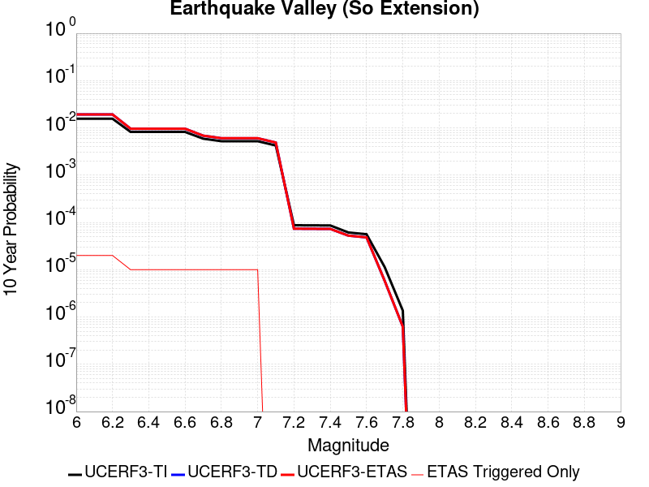 |

| Magnitude | 1 wk TI Prob | 1 wk TD Prob | 1 wk ETAS Prob | 1 wk ETAS/TD Gain | 1 wk ETAS Triggered Only | 1 mo TI Prob | 1 mo TD Prob | 1 mo ETAS Prob | 1 mo ETAS/TD Gain | 1 mo ETAS Triggered Only | 1 yr TI Prob | 1 yr TD Prob | 1 yr ETAS Prob | 1 yr ETAS/TD Gain | 1 yr ETAS Triggered Only | 10 yr TI Prob | 10 yr TD Prob | 10 yr ETAS Prob | 10 yr ETAS/TD Gain | 10 yr ETAS Triggered Only |
|-----|-----|-----|-----|-----|-----|-----|-----|-----|-----|-----|-----|-----|-----|-----|-----|-----|-----|-----|-----|-----|
| 6.0 | 3.0194888E-5 | 3.7072114E-5 | 5.2668263E-5 | 1.4206977 | 1.5596732E-5 | 1.2940024E-4 | 1.5887388E-4 | 1.7446812E-4 | 1.0981549 | 1.5596732E-5 | 0.0015743093 | 0.0019331174 | 0.0019642506 | 1.0161052 | 3.1193464E-5 | 0.01563203 | 0.019213019 | 0.019243613 | 1.0015924 | 3.1193464E-5 |
| 6.1 | 3.0194888E-5 | 3.7072114E-5 | 5.2668263E-5 | 1.4206977 | 1.5596732E-5 | 1.2940024E-4 | 1.5887388E-4 | 1.7446812E-4 | 1.0981549 | 1.5596732E-5 | 0.0015743093 | 0.0019331174 | 0.0019642506 | 1.0161052 | 3.1193464E-5 | 0.01563203 | 0.019213019 | 0.019243613 | 1.0015924 | 3.1193464E-5 |
| 6.2 | 3.0194888E-5 | 3.7072114E-5 | 5.2668263E-5 | 1.4206977 | 1.5596732E-5 | 1.2940024E-4 | 1.5887388E-4 | 1.7446812E-4 | 1.0981549 | 1.5596732E-5 | 0.0015743093 | 0.0019331174 | 0.0019642506 | 1.0161052 | 3.1193464E-5 | 0.01563203 | 0.019213019 | 0.019243613 | 1.0015924 | 3.1193464E-5 |
| 6.3 | 1.5795305E-5 | 1.844658E-5 | 1.844658E-5 | 1.0 | 0.0 | 6.769241E-5 | 7.9055004E-5 | 7.9055004E-5 | 1.0 | 0.0 | 8.238434E-4 | 9.6218096E-4 | 9.777627E-4 | 1.0161942 | 1.5596732E-5 | 0.008207959 | 0.009591061 | 0.009606508 | 1.0016105 | 1.5596732E-5 |
| 6.4 | 1.5795305E-5 | 1.844658E-5 | 1.844658E-5 | 1.0 | 0.0 | 6.769241E-5 | 7.9055004E-5 | 7.9055004E-5 | 1.0 | 0.0 | 8.238434E-4 | 9.6218096E-4 | 9.777627E-4 | 1.0161942 | 1.5596732E-5 | 0.008207959 | 0.009591061 | 0.009606508 | 1.0016105 | 1.5596732E-5 |
| 6.5 | 1.5795305E-5 | 1.844658E-5 | 1.844658E-5 | 1.0 | 0.0 | 6.769241E-5 | 7.9055004E-5 | 7.9055004E-5 | 1.0 | 0.0 | 8.238434E-4 | 9.6218096E-4 | 9.777627E-4 | 1.0161942 | 1.5596732E-5 | 0.008207959 | 0.009591061 | 0.009606508 | 1.0016105 | 1.5596732E-5 |
| 6.6 | 1.5795305E-5 | 1.844658E-5 | 1.844658E-5 | 1.0 | 0.0 | 6.769241E-5 | 7.9055004E-5 | 7.9055004E-5 | 1.0 | 0.0 | 8.238434E-4 | 9.6218096E-4 | 9.777627E-4 | 1.0161942 | 1.5596732E-5 | 0.008207959 | 0.009591061 | 0.009606508 | 1.0016105 | 1.5596732E-5 |
| 6.7 | 1.1363076E-5 | 1.3138294E-5 | 1.3138294E-5 | 1.0 | 0.0 | 4.8697988E-5 | 5.6306188E-5 | 5.6306188E-5 | 1.0 | 0.0 | 5.927367E-4 | 6.8538834E-4 | 7.009744E-4 | 1.0227405 | 1.5596732E-5 | 0.0059115817 | 0.0068402183 | 0.0068557085 | 1.0022645 | 1.5596732E-5 |
| 6.8 | 1.0049611E-5 | 1.1594334E-5 | 1.1594334E-5 | 1.0 | 0.0 | 4.306905E-5 | 4.9689468E-5 | 4.9689468E-5 | 1.0 | 0.0 | 5.242395E-4 | 6.048745E-4 | 6.204618E-4 | 1.0257695 | 1.5596732E-5 | 0.0052300454 | 0.006039458 | 0.0060549607 | 1.0025669 | 1.5596732E-5 |
| 6.9 | 1.0049611E-5 | 1.1594334E-5 | 1.1594334E-5 | 1.0 | 0.0 | 4.306905E-5 | 4.9689468E-5 | 4.9689468E-5 | 1.0 | 0.0 | 5.242395E-4 | 6.048745E-4 | 6.204618E-4 | 1.0257695 | 1.5596732E-5 | 0.0052300454 | 0.006039458 | 0.0060549607 | 1.0025669 | 1.5596732E-5 |
| 7.0 | 1.0049611E-5 | 1.1594334E-5 | 1.1594334E-5 | 1.0 | 0.0 | 4.306905E-5 | 4.9689468E-5 | 4.9689468E-5 | 1.0 | 0.0 | 5.242395E-4 | 6.048745E-4 | 6.204618E-4 | 1.0257695 | 1.5596732E-5 | 0.0052300454 | 0.006039458 | 0.0060549607 | 1.0025669 | 1.5596732E-5 |
| 7.1 | 8.140254E-6 | 9.383458E-6 | 9.383458E-6 | 1.0 | 0.0 | 3.4886336E-5 | 4.0214578E-5 | 4.0214578E-5 | 1.0 | 0.0 | 4.2465836E-4 | 4.8956956E-4 | 4.8956956E-4 | 1.0 | 0.0 | 0.0042384774 | 0.0048914864 | 0.0048914864 | 1.0 | 0.0 |
| 7.2 | 1.673835E-7 | 1.4154125E-7 | 1.4154125E-7 | 1.0 | 0.0 | 7.173577E-7 | 6.066052E-7 | 6.066052E-7 | 1.0 | 0.0 | 8.733795E-6 | 7.385397E-6 | 7.385397E-6 | 1.0 | 0.0 | 8.733451E-5 | 7.385187E-5 | 7.385187E-5 | 1.0 | 0.0 |
| 7.3 | 1.6632116E-7 | 1.4052354E-7 | 1.4052354E-7 | 1.0 | 0.0 | 7.1280476E-7 | 6.0224363E-7 | 6.0224363E-7 | 1.0 | 0.0 | 8.678364E-6 | 7.332295E-6 | 7.332295E-6 | 1.0 | 0.0 | 8.6780245E-5 | 7.332089E-5 | 7.332089E-5 | 1.0 | 0.0 |
| 7.4 | 1.6569169E-7 | 1.3996983E-7 | 1.3996983E-7 | 1.0 | 0.0 | 7.1010703E-7 | 5.9987053E-7 | 5.9987053E-7 | 1.0 | 0.0 | 8.645519E-6 | 7.303403E-6 | 7.303403E-6 | 1.0 | 0.0 | 8.645182E-5 | 7.303199E-5 | 7.303199E-5 | 1.0 | 0.0 |
| 7.5 | 1.1764555E-7 | 1.0095917E-7 | 1.0095917E-7 | 1.0 | 0.0 | 5.041951E-7 | 4.326821E-7 | 4.326821E-7 | 1.0 | 0.0 | 6.138558E-6 | 5.267894E-6 | 5.267894E-6 | 1.0 | 0.0 | 6.1383886E-5 | 5.2677904E-5 | 5.2677904E-5 | 1.0 | 0.0 |
| 7.6 | 1.07927605E-7 | 9.260736E-8 | 9.260736E-8 | 1.0 | 0.0 | 4.6254678E-7 | 3.9688865E-7 | 3.9688865E-7 | 1.0 | 0.0 | 5.6314925E-6 | 4.832111E-6 | 4.832111E-6 | 1.0 | 0.0 | 5.63135E-5 | 4.8320264E-5 | 4.8320264E-5 | 1.0 | 0.0 |
| 7.7 | 2.1826905E-8 | 1.1180516E-8 | 1.1180516E-8 | 1.0 | 0.0 | 9.3543875E-8 | 4.7916494E-8 | 4.7916494E-8 | 1.0 | 0.0 | 1.1388961E-6 | 5.833832E-7 | 5.833832E-7 | 1.0 | 0.0 | 1.1388902E-5 | 5.8338223E-6 | 5.8338223E-6 | 1.0 | 0.0 |
| 7.8 | 2.6169649E-9 | 1.1969472E-9 | 1.1969472E-9 | 1.0 | 0.0 | 1.1215564E-8 | 5.1297735E-9 | 5.1297735E-9 | 1.0 | 0.0 | 1.3654947E-7 | 6.2454994E-8 | 6.2454994E-8 | 1.0 | 0.0 | 1.365494E-6 | 6.245499E-7 | 6.245499E-7 | 1.0 | 0.0 |

## Superstition Hills
*[(top)](#table-of-contents)*

| 1 Week | 1 Month | 1 Year | 10 Year |
|-----|-----|-----|-----|
|  |  |  |  |

| Magnitude | 1 wk TI Prob | 1 wk TD Prob | 1 wk ETAS Prob | 1 wk ETAS/TD Gain | 1 wk ETAS Triggered Only | 1 mo TI Prob | 1 mo TD Prob | 1 mo ETAS Prob | 1 mo ETAS/TD Gain | 1 mo ETAS Triggered Only | 1 yr TI Prob | 1 yr TD Prob | 1 yr ETAS Prob | 1 yr ETAS/TD Gain | 1 yr ETAS Triggered Only | 10 yr TI Prob | 10 yr TD Prob | 10 yr ETAS Prob | 10 yr ETAS/TD Gain | 10 yr ETAS Triggered Only |
|-----|-----|-----|-----|-----|-----|-----|-----|-----|-----|-----|-----|-----|-----|-----|-----|-----|-----|-----|-----|-----|
| 6.0 | 6.6865185E-5 | 1.41376995E-5 | 2.973421E-5 | 2.103186 | 1.5596732E-5 | 2.8653358E-4 | 6.0588824E-5 | 7.618461E-5 | 1.2574037 | 1.5596732E-5 | 0.0034829667 | 7.374355E-4 | 7.686059E-4 | 1.0422688 | 3.1193464E-5 | 0.03428881 | 0.0075204074 | 0.0075513665 | 1.0041167 | 3.1193464E-5 |
| 6.1 | 6.544851E-5 | 1.41376995E-5 | 2.973421E-5 | 2.103186 | 1.5596732E-5 | 2.8046346E-4 | 6.0588824E-5 | 7.618461E-5 | 1.2574037 | 1.5596732E-5 | 0.0034092965 | 7.374355E-4 | 7.686059E-4 | 1.0422688 | 3.1193464E-5 | 0.033574644 | 0.007520407 | 0.0075513655 | 1.0041167 | 3.1193464E-5 |
| 6.2 | 6.544851E-5 | 1.41376995E-5 | 2.973421E-5 | 2.103186 | 1.5596732E-5 | 2.8046346E-4 | 6.0588824E-5 | 7.618461E-5 | 1.2574037 | 1.5596732E-5 | 0.0034092965 | 7.374355E-4 | 7.686059E-4 | 1.0422688 | 3.1193464E-5 | 0.033574644 | 0.007520407 | 0.0075513655 | 1.0041167 | 3.1193464E-5 |
| 6.3 | 5.2402065E-5 | 1.4137698E-5 | 2.9734209E-5 | 2.103186 | 1.5596732E-5 | 2.2456095E-4 | 6.058882E-5 | 7.61846E-5 | 1.2574037 | 1.5596732E-5 | 0.0027306017 | 7.374354E-4 | 7.6860585E-4 | 1.0422688 | 3.1193464E-5 | 0.02697292 | 0.007520402 | 0.0075513604 | 1.0041167 | 3.1193464E-5 |
| 6.4 | 4.542238E-5 | 1.4137698E-5 | 2.9734209E-5 | 2.1031861 | 1.5596732E-5 | 1.9465282E-4 | 6.0588816E-5 | 7.61846E-5 | 1.2574037 | 1.5596732E-5 | 0.0023673223 | 7.3743536E-4 | 7.6860585E-4 | 1.0422688 | 3.1193464E-5 | 0.023422617 | 0.0075203986 | 0.0075513576 | 1.0041167 | 3.1193464E-5 |
| 6.5 | 2.9672969E-5 | 1.4137696E-5 | 2.9734207E-5 | 2.1031861 | 1.5596732E-5 | 1.2716366E-4 | 6.058881E-5 | 7.6184595E-5 | 1.2574037 | 1.5596732E-5 | 0.0015471181 | 7.374353E-4 | 7.6860574E-4 | 1.0422688 | 3.1193464E-5 | 0.015363912 | 0.007520392 | 0.007551351 | 1.0041167 | 3.1193464E-5 |
| 6.6 | 2.6056105E-5 | 1.3803458E-5 | 2.9399975E-5 | 2.129899 | 1.5596732E-5 | 1.1166424E-4 | 5.9156428E-5 | 7.4752235E-5 | 1.2636367 | 1.5596732E-5 | 0.0013586642 | 7.200076E-4 | 7.511786E-4 | 1.0432926 | 3.1193464E-5 | 0.013503874 | 0.0073448285 | 0.007375793 | 1.0042158 | 3.1193464E-5 |
| 6.7 | 1.4611248E-5 | 1.3383359E-5 | 2.897988E-5 | 2.165367 | 1.5596732E-5 | 6.261813E-5 | 5.7356083E-5 | 7.2951916E-5 | 1.2719125 | 1.5596732E-5 | 7.6210906E-4 | 6.981025E-4 | 7.292742E-4 | 1.044652 | 3.1193464E-5 | 0.0075950073 | 0.00712602 | 0.007156991 | 1.0043463 | 3.1193464E-5 |
| 6.8 | 1.30607E-5 | 1.09787925E-5 | 2.6575352E-5 | 2.4206078 | 1.5596732E-5 | 5.597323E-5 | 4.705117E-5 | 6.264717E-5 | 1.3314688 | 1.5596732E-5 | 6.8126095E-4 | 5.7270617E-4 | 6.038817E-4 | 1.0544356 | 3.1193464E-5 | 0.006791762 | 0.00587438 | 0.0059053903 | 1.005279 | 3.1193464E-5 |
| 6.9 | 1.0443096E-5 | 8.195349E-6 | 2.3791952E-5 | 2.903104 | 1.5596732E-5 | 4.4755358E-5 | 3.5122466E-5 | 5.071865E-5 | 1.4440515 | 1.5596732E-5 | 5.447602E-4 | 4.2753448E-4 | 4.587146E-4 | 1.0729301 | 3.1193464E-5 | 0.005434267 | 0.0044094524 | 0.0044405083 | 1.007043 | 3.1193464E-5 |
| 7.0 | 8.045912E-6 | 6.739692E-6 | 2.2336319E-5 | 3.3141453 | 1.5596732E-5 | 3.4482026E-5 | 2.888408E-5 | 4.448036E-5 | 1.5399611 | 1.5596732E-5 | 4.197378E-4 | 3.5160795E-4 | 3.8279046E-4 | 1.0886854 | 3.1193464E-5 | 0.0041894587 | 0.0036334093 | 0.0036644896 | 1.008554 | 3.1193464E-5 |
| 7.1 | 8.045912E-6 | 6.739692E-6 | 2.2336319E-5 | 3.3141453 | 1.5596732E-5 | 3.4482026E-5 | 2.888408E-5 | 4.448036E-5 | 1.5399611 | 1.5596732E-5 | 4.197378E-4 | 3.5160795E-4 | 3.8279046E-4 | 1.0886854 | 3.1193464E-5 | 0.0041894587 | 0.0036334093 | 0.0036644896 | 1.008554 | 3.1193464E-5 |
| 7.2 | 7.375506E-6 | 6.2466297E-6 | 2.1843263E-5 | 3.4968078 | 1.5596732E-5 | 3.1608928E-5 | 2.6771E-5 | 4.2367315E-5 | 1.5825824 | 1.5596732E-5 | 3.8477074E-4 | 3.2588904E-4 | 3.5707233E-4 | 1.0956868 | 3.1193464E-5 | 0.003841052 | 0.003373887 | 0.0034049752 | 1.0092144 | 3.1193464E-5 |
| 7.3 | 6.6063913E-6 | 5.7990574E-6 | 2.1395697E-5 | 3.689513 | 1.5596732E-5 | 2.8312797E-5 | 2.485287E-5 | 4.0449213E-5 | 1.6275469 | 1.5596732E-5 | 3.446538E-4 | 3.025424E-4 | 3.3372644E-4 | 1.1030732 | 3.1193464E-5 | 0.0034411973 | 0.003138153 | 0.0031692488 | 1.0099089 | 3.1193464E-5 |
| 7.4 | 6.4313126E-6 | 5.680481E-6 | 2.1277123E-5 | 3.745655 | 1.5596732E-5 | 2.7562477E-5 | 2.4344696E-5 | 3.994105E-5 | 1.6406468 | 1.5596732E-5 | 3.355215E-4 | 2.9635706E-4 | 3.275413E-4 | 1.1052252 | 3.1193464E-5 | 0.0033501536 | 0.0030759154 | 0.003107013 | 1.01011 | 3.1193464E-5 |
| 7.5 | 6.0742927E-6 | 5.4763104E-6 | 2.1072956E-5 | 3.8480208 | 1.5596732E-5 | 2.6032423E-5 | 2.3469694E-5 | 3.906606E-5 | 1.6645321 | 1.5596732E-5 | 3.1689866E-4 | 2.8570674E-4 | 3.168913E-4 | 1.1091489 | 3.1193464E-5 | 0.0031644711 | 0.002967756 | 0.0029988568 | 1.0104796 | 3.1193464E-5 |
| 7.6 | 5.6987187E-6 | 5.294521E-6 | 2.089117E-5 | 3.9458091 | 1.5596732E-5 | 2.4422852E-5 | 2.269061E-5 | 3.8286988E-5 | 1.6873493 | 1.5596732E-5 | 2.9730765E-4 | 2.7622381E-4 | 3.0740869E-4 | 1.112897 | 3.1193464E-5 | 0.002969102 | 0.0028710118 | 0.0029021157 | 1.0108337 | 3.1193464E-5 |
| 7.7 | 5.1658035E-6 | 4.925535E-6 | 2.052219E-5 | 4.166489 | 1.5596732E-5 | 2.2138971E-5 | 2.1109268E-5 | 3.670567E-5 | 1.7388414 | 1.5596732E-5 | 2.6950863E-4 | 2.5697565E-4 | 2.881611E-4 | 1.1213557 | 3.1193464E-5 | 0.00269182 | 0.0026760625 | 0.0027071724 | 1.0116253 | 3.1193464E-5 |
| 7.8 | 3.6864697E-6 | 4.1964995E-6 | 1.9793164E-5 | 4.7165895 | 1.5596732E-5 | 1.579906E-5 | 1.7984876E-5 | 3.3581327E-5 | 1.8671981 | 1.5596732E-5 | 1.9233658E-4 | 2.1894433E-4 | 2.5013095E-4 | 1.1424409 | 3.1193464E-5 | 0.0019217018 | 0.0022892624 | 0.0023203844 | 1.0135947 | 3.1193464E-5 |
| 7.9 | 3.0265903E-6 | 3.5637288E-6 | 1.9160405E-5 | 5.3765044 | 1.5596732E-5 | 1.2971037E-5 | 1.5273037E-5 | 3.086953E-5 | 2.0211782 | 1.5596732E-5 | 1.5791094E-4 | 1.859338E-4 | 2.0152763E-4 | 1.0838677 | 1.5596732E-5 | 0.0015779877 | 0.0019534735 | 0.00196904 | 1.0079685 | 1.5596732E-5 |
| 8.0 | 2.5271493E-6 | 3.0867361E-6 | 1.8683419E-5 | 6.0528073 | 1.5596732E-5 | 1.0830595E-5 | 1.3228804E-5 | 2.8825329E-5 | 2.1789823 | 1.5596732E-5 | 1.3185451E-4 | 1.610492E-4 | 1.7664343E-4 | 1.0968289 | 1.5596732E-5 | 0.0013177631 | 0.0016973554 | 0.0017129256 | 1.0091733 | 1.5596732E-5 |
| 8.1 | 2.3749135E-6 | 2.917377E-6 | 1.8514062E-5 | 6.3461328 | 1.5596732E-5 | 1.0178161E-5 | 1.25029865E-5 | 2.8099523E-5 | 2.2474248 | 1.5596732E-5 | 1.2391206E-4 | 1.5221364E-4 | 1.67808E-4 | 1.1024505 | 1.5596732E-5 | 0.0012384299 | 0.001604949 | 0.0016205207 | 1.0097023 | 1.5596732E-5 |
| 8.2 | 1.7186406E-9 | 1.1440594E-9 | 1.1440594E-9 | 1.0 | 0.0 | 7.3656024E-9 | 4.9031117E-9 | 4.9031117E-9 | 1.0 | 0.0 | 8.9676206E-8 | 5.969538E-8 | 5.969538E-8 | 1.0 | 0.0 | 8.9676166E-7 | 6.389059E-7 | 6.389059E-7 | 1.0 | 0.0 |

## Malibu Coast alt 1
*[(top)](#table-of-contents)*

| 1 Week | 1 Month | 1 Year | 10 Year |
|-----|-----|-----|-----|
|  |  |  |  |

| Magnitude | 1 wk TI Prob | 1 wk TD Prob | 1 wk ETAS Prob | 1 wk ETAS/TD Gain | 1 wk ETAS Triggered Only | 1 mo TI Prob | 1 mo TD Prob | 1 mo ETAS Prob | 1 mo ETAS/TD Gain | 1 mo ETAS Triggered Only | 1 yr TI Prob | 1 yr TD Prob | 1 yr ETAS Prob | 1 yr ETAS/TD Gain | 1 yr ETAS Triggered Only | 10 yr TI Prob | 10 yr TD Prob | 10 yr ETAS Prob | 10 yr ETAS/TD Gain | 10 yr ETAS Triggered Only |
|-----|-----|-----|-----|-----|-----|-----|-----|-----|-----|-----|-----|-----|-----|-----|-----|-----|-----|-----|-----|-----|
| 6.0 | 1.6572556E-5 | 1.7598066E-5 | 1.7598066E-5 | 1.0 | 0.0 | 7.102331E-5 | 7.541821E-5 | 7.541821E-5 | 1.0 | 0.0 | 8.6436566E-4 | 9.178488E-4 | 9.178488E-4 | 1.0 | 0.0 | 0.0086101135 | 0.009142512 | 0.009173421 | 1.0033808 | 3.1193464E-5 |
| 6.1 | 1.6572556E-5 | 1.7598066E-5 | 1.7598066E-5 | 1.0 | 0.0 | 7.102331E-5 | 7.541821E-5 | 7.541821E-5 | 1.0 | 0.0 | 8.6436566E-4 | 9.178488E-4 | 9.178488E-4 | 1.0 | 0.0 | 0.0086101135 | 0.009142512 | 0.009173421 | 1.0033808 | 3.1193464E-5 |
| 6.2 | 1.1085717E-5 | 1.1557147E-5 | 1.1557147E-5 | 1.0 | 0.0 | 4.750935E-5 | 4.952971E-5 | 4.952971E-5 | 1.0 | 0.0 | 5.782728E-4 | 6.028609E-4 | 6.028609E-4 | 1.0 | 0.0 | 0.0057677035 | 0.0060126255 | 0.0060436316 | 1.0051568 | 3.1193464E-5 |
| 6.3 | 1.0208568E-5 | 1.0592237E-5 | 1.0592237E-5 | 1.0 | 0.0 | 4.375027E-5 | 4.539453E-5 | 4.539453E-5 | 1.0 | 0.0 | 5.325294E-4 | 5.5254117E-4 | 5.5254117E-4 | 1.0 | 0.0 | 0.0053125503 | 0.0055119814 | 0.0055430033 | 1.005628 | 3.1193464E-5 |
| 6.4 | 9.0682315E-6 | 9.342637E-6 | 9.342637E-6 | 1.0 | 0.0 | 3.8863272E-5 | 4.003927E-5 | 4.003927E-5 | 1.0 | 0.0 | 4.730576E-4 | 4.8737114E-4 | 4.8737114E-4 | 1.0 | 0.0 | 0.0047205184 | 0.004863236 | 0.004894278 | 1.006383 | 3.1193464E-5 |
| 6.5 | 7.605796E-6 | 7.748587E-6 | 7.748587E-6 | 1.0 | 0.0 | 3.259586E-5 | 3.3207816E-5 | 3.3207816E-5 | 1.0 | 0.0 | 3.9678233E-4 | 4.0423148E-4 | 4.0423148E-4 | 1.0 | 0.0 | 0.0039607463 | 0.0040351 | 0.0040661674 | 1.0076994 | 3.1193464E-5 |
| 6.6 | 5.889873E-6 | 5.8795385E-6 | 5.8795385E-6 | 1.0 | 0.0 | 2.5242069E-5 | 2.519778E-5 | 2.519778E-5 | 1.0 | 0.0 | 3.0727885E-4 | 3.0673988E-4 | 3.0673988E-4 | 1.0 | 0.0 | 0.003068543 | 0.0030631777 | 0.0030942757 | 1.0101522 | 3.1193464E-5 |
| 6.7 | 5.66586E-6 | 5.641641E-6 | 5.641641E-6 | 1.0 | 0.0 | 2.428203E-5 | 2.417824E-5 | 2.417824E-5 | 1.0 | 0.0 | 2.955936E-4 | 2.9433038E-4 | 2.9433038E-4 | 1.0 | 0.0 | 0.0029520073 | 0.0029394177 | 0.0029705195 | 1.0105809 | 3.1193464E-5 |
| 6.8 | 5.521556E-6 | 5.489427E-6 | 5.489427E-6 | 1.0 | 0.0 | 2.3663597E-5 | 2.3525903E-5 | 2.3525903E-5 | 1.0 | 0.0 | 2.880662E-4 | 2.8639034E-4 | 2.8639034E-4 | 1.0 | 0.0 | 0.0028769306 | 0.002860224 | 0.0028913284 | 1.0108747 | 3.1193464E-5 |
| 6.9 | 5.29752E-6 | 5.2499317E-6 | 5.2499317E-6 | 1.0 | 0.0 | 2.270346E-5 | 2.2499513E-5 | 2.2499513E-5 | 1.0 | 0.0 | 2.7637955E-4 | 2.7389723E-4 | 2.7389723E-4 | 1.0 | 0.0 | 0.0027603607 | 0.0027356069 | 0.002766715 | 1.0113716 | 3.1193464E-5 |
| 7.0 | 5.106743E-6 | 5.0476788E-6 | 5.0476788E-6 | 1.0 | 0.0 | 2.1885859E-5 | 2.163273E-5 | 2.163273E-5 | 1.0 | 0.0 | 2.6642776E-4 | 2.6334674E-4 | 2.6334674E-4 | 1.0 | 0.0 | 0.0026610855 | 0.0026303562 | 0.0026614675 | 1.0118278 | 3.1193464E-5 |
| 7.1 | 4.8469647E-6 | 4.770373E-6 | 4.770373E-6 | 1.0 | 0.0 | 2.0772539E-5 | 2.0444295E-5 | 2.0444295E-5 | 1.0 | 0.0 | 2.528763E-4 | 2.4888094E-4 | 2.4888094E-4 | 1.0 | 0.0 | 0.0025258875 | 0.00248603 | 0.002517146 | 1.0125163 | 3.1193464E-5 |
| 7.2 | 4.545514E-6 | 4.4481935E-6 | 4.4481935E-6 | 1.0 | 0.0 | 1.9480629E-5 | 1.9063547E-5 | 1.9063547E-5 | 1.0 | 0.0 | 2.3715083E-4 | 2.3207403E-4 | 2.3207403E-4 | 1.0 | 0.0 | 0.0023689792 | 0.0023183243 | 0.0023494454 | 1.013424 | 3.1193464E-5 |
| 7.3 | 3.794097E-6 | 3.6519348E-6 | 3.6519348E-6 | 1.0 | 0.0 | 1.6260314E-5 | 1.5651056E-5 | 1.5651056E-5 | 1.0 | 0.0 | 1.9795135E-4 | 1.9053498E-4 | 1.9053498E-4 | 1.0 | 0.0 | 0.001977751 | 0.0019037209 | 0.0019348549 | 1.0163543 | 3.1193464E-5 |
| 7.4 | 2.808217E-6 | 2.719077E-6 | 2.719077E-6 | 1.0 | 0.0 | 1.203516E-5 | 1.1653135E-5 | 1.1653135E-5 | 1.0 | 0.0 | 1.4651821E-4 | 1.418677E-4 | 1.418677E-4 | 1.0 | 0.0 | 0.0014642165 | 0.001417774 | 0.0014489233 | 1.0219705 | 3.1193464E-5 |
| 7.5 | 1.83809E-6 | 1.8190691E-6 | 1.8190691E-6 | 1.0 | 0.0 | 7.877505E-6 | 7.795988E-6 | 7.795988E-6 | 1.0 | 0.0 | 9.59044E-5 | 9.491203E-5 | 9.491203E-5 | 1.0 | 0.0 | 9.5863023E-4 | 9.48717E-4 | 9.642989E-4 | 1.0164242 | 1.5596732E-5 |
| 7.6 | 1.1292672E-6 | 1.1001447E-6 | 1.1001447E-6 | 1.0 | 0.0 | 4.839708E-6 | 4.714897E-6 | 4.714897E-6 | 1.0 | 0.0 | 5.8921847E-5 | 5.7402376E-5 | 5.7402376E-5 | 1.0 | 0.0 | 5.890623E-4 | 5.738771E-4 | 5.738771E-4 | 1.0 | 0.0 |
| 7.7 | 5.065272E-7 | 4.609151E-7 | 4.609151E-7 | 1.0 | 0.0 | 2.170829E-6 | 1.975349E-6 | 1.975349E-6 | 1.0 | 0.0 | 2.6429525E-5 | 2.404962E-5 | 2.404962E-5 | 1.0 | 0.0 | 2.642638E-4 | 2.4047129E-4 | 2.4047129E-4 | 1.0 | 0.0 |
| 7.8 | 8.952991E-8 | 6.707874E-8 | 6.707874E-8 | 1.0 | 0.0 | 3.8369956E-7 | 2.8748025E-7 | 2.8748025E-7 | 1.0 | 0.0 | 4.671532E-6 | 3.5000667E-6 | 3.5000667E-6 | 1.0 | 0.0 | 4.671434E-5 | 3.5000136E-5 | 3.5000136E-5 | 1.0 | 0.0 |
| 7.9 | 8.007447E-10 | 6.1608785E-10 | 6.1608785E-10 | 1.0 | 0.0 | 3.4317629E-9 | 2.6403764E-9 | 2.6403764E-9 | 1.0 | 0.0 | 4.1781714E-8 | 3.2146584E-8 | 3.2146584E-8 | 1.0 | 0.0 | 4.1781706E-7 | 3.214658E-7 | 3.214658E-7 | 1.0 | 0.0 |

## Hunting Creek - Bartlett Springs connector 2011
*[(top)](#table-of-contents)*

| 1 Week | 1 Month | 1 Year | 10 Year |
|-----|-----|-----|-----|
|  |  | 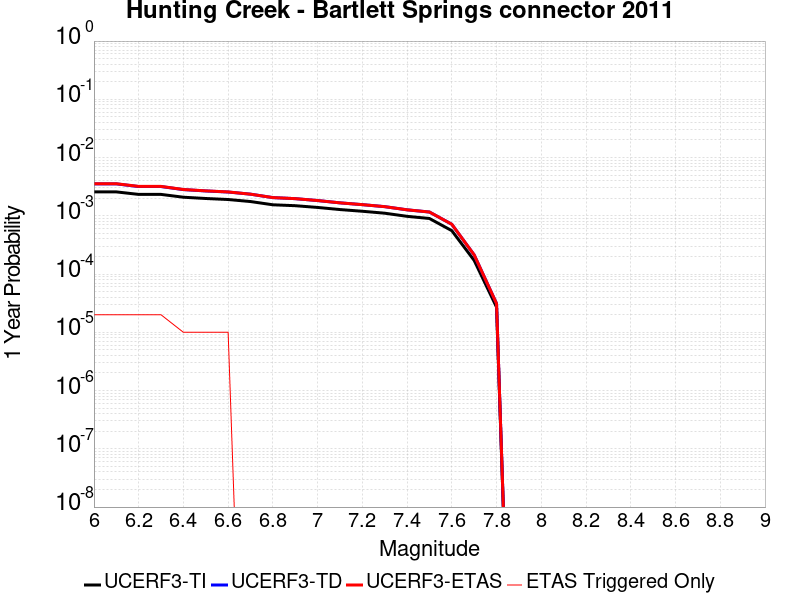 |  |

| Magnitude | 1 wk TI Prob | 1 wk TD Prob | 1 wk ETAS Prob | 1 wk ETAS/TD Gain | 1 wk ETAS Triggered Only | 1 mo TI Prob | 1 mo TD Prob | 1 mo ETAS Prob | 1 mo ETAS/TD Gain | 1 mo ETAS Triggered Only | 1 yr TI Prob | 1 yr TD Prob | 1 yr ETAS Prob | 1 yr ETAS/TD Gain | 1 yr ETAS Triggered Only | 10 yr TI Prob | 10 yr TD Prob | 10 yr ETAS Prob | 10 yr ETAS/TD Gain | 10 yr ETAS Triggered Only |
|-----|-----|-----|-----|-----|-----|-----|-----|-----|-----|-----|-----|-----|-----|-----|-----|-----|-----|-----|-----|-----|
| 6.0 | 4.940016E-5 | 6.786822E-5 | 6.786822E-5 | 1.0 | 0.0 | 2.1169778E-4 | 2.9083234E-4 | 2.9083234E-4 | 1.0 | 0.0 | 0.002574374 | 0.003535177 | 0.0035507188 | 1.0043963 | 1.5596732E-5 | 0.025447546 | 0.034773834 | 0.034803946 | 1.0008658 | 3.1193464E-5 |
| 6.1 | 4.940016E-5 | 6.786822E-5 | 6.786822E-5 | 1.0 | 0.0 | 2.1169778E-4 | 2.9083234E-4 | 2.9083234E-4 | 1.0 | 0.0 | 0.002574374 | 0.003535177 | 0.0035507188 | 1.0043963 | 1.5596732E-5 | 0.025447546 | 0.034773834 | 0.034803946 | 1.0008658 | 3.1193464E-5 |
| 6.2 | 4.472471E-5 | 6.1002804E-5 | 6.1002804E-5 | 1.0 | 0.0 | 1.9166325E-4 | 2.6141506E-4 | 2.6141506E-4 | 1.0 | 0.0 | 0.0023310026 | 0.003178107 | 0.0031936544 | 1.004892 | 1.5596732E-5 | 0.02306703 | 0.031316914 | 0.03134713 | 1.0009649 | 3.1193464E-5 |
| 6.3 | 4.472471E-5 | 6.1002804E-5 | 6.1002804E-5 | 1.0 | 0.0 | 1.9166325E-4 | 2.6141506E-4 | 2.6141506E-4 | 1.0 | 0.0 | 0.0023310026 | 0.003178107 | 0.0031936544 | 1.004892 | 1.5596732E-5 | 0.02306703 | 0.031316914 | 0.03134713 | 1.0009649 | 3.1193464E-5 |
| 6.4 | 4.0001003E-5 | 5.4103755E-5 | 5.4103755E-5 | 1.0 | 0.0 | 1.714216E-4 | 2.31853E-4 | 2.31853E-4 | 1.0 | 0.0 | 0.0020850603 | 0.0028191248 | 0.0028191248 | 1.0 | 0.0 | 0.02065605 | 0.027828315 | 0.027843479 | 1.0005449 | 1.5596732E-5 |
| 6.5 | 3.8033053E-5 | 5.1266547E-5 | 5.1266547E-5 | 1.0 | 0.0 | 1.6298861E-4 | 2.1969559E-4 | 2.1969559E-4 | 1.0 | 0.0 | 0.0019825802 | 0.0026714746 | 0.0026714746 | 1.0 | 0.0 | 0.019649856 | 0.026390454 | 0.02640564 | 1.0005754 | 1.5596732E-5 |
| 6.6 | 3.653754E-5 | 4.913017E-5 | 4.913017E-5 | 1.0 | 0.0 | 1.5658008E-4 | 2.1054115E-4 | 2.1054115E-4 | 1.0 | 0.0 | 0.0019046954 | 0.0025602852 | 0.0025602852 | 1.0 | 0.0 | 0.018884527 | 0.025306415 | 0.025321616 | 1.0006007 | 1.5596732E-5 |
| 6.7 | 3.372024E-5 | 4.514011E-5 | 4.514011E-5 | 1.0 | 0.0 | 1.4450731E-4 | 1.9344354E-4 | 1.9344354E-4 | 1.0 | 0.0 | 0.0017579567 | 0.002352639 | 0.002352639 | 1.0 | 0.0 | 0.017441148 | 0.023278099 | 0.023293331 | 1.0006545 | 1.5596732E-5 |
| 6.8 | 2.9650024E-5 | 3.9411374E-5 | 3.9411374E-5 | 1.0 | 0.0 | 1.2706534E-4 | 1.6889503E-4 | 1.6889503E-4 | 1.0 | 0.0 | 0.0015459227 | 0.0020543463 | 0.0020543463 | 1.0 | 0.0 | 0.015352124 | 0.020351216 | 0.020366495 | 1.0007508 | 1.5596732E-5 |
| 6.9 | 2.860775E-5 | 3.7812544E-5 | 3.7812544E-5 | 1.0 | 0.0 | 1.2259888E-4 | 1.6204377E-4 | 1.6204377E-4 | 1.0 | 0.0 | 0.0014916194 | 0.001971107 | 0.001971107 | 1.0 | 0.0 | 0.014816469 | 0.01953584 | 0.019551132 | 1.0007827 | 1.5596732E-5 |
| 7.0 | 2.6696067E-5 | 3.506726E-5 | 3.506726E-5 | 1.0 | 0.0 | 1.144067E-4 | 1.5027967E-4 | 1.5027967E-4 | 1.0 | 0.0 | 0.0013920115 | 0.0018281302 | 0.0018281302 | 1.0 | 0.0 | 0.013833242 | 0.018131364 | 0.018146679 | 1.0008446 | 1.5596732E-5 |
| 7.1 | 2.456087E-5 | 3.2013093E-5 | 3.2013093E-5 | 1.0 | 0.0 | 1.0525662E-4 | 1.371918E-4 | 1.371918E-4 | 1.0 | 0.0 | 0.001280746 | 0.0016690396 | 0.0016690396 | 1.0 | 0.0 | 0.012733897 | 0.016566366 | 0.016581705 | 1.0009259 | 1.5596732E-5 |
| 7.2 | 2.295761E-5 | 2.9822932E-5 | 2.9822932E-5 | 1.0 | 0.0 | 9.8386045E-5 | 1.2780636E-4 | 1.2780636E-4 | 1.0 | 0.0 | 0.0011971919 | 0.001554941 | 0.001554941 | 1.0 | 0.0 | 0.011907627 | 0.015442089 | 0.015442089 | 1.0 | 0.0 |
| 7.3 | 2.1256936E-5 | 2.7541912E-5 | 2.7541912E-5 | 1.0 | 0.0 | 9.109797E-5 | 1.1803147E-4 | 1.1803147E-4 | 1.0 | 0.0 | 0.0011085535 | 0.0014360948 | 0.0014360948 | 1.0 | 0.0 | 0.011030397 | 0.014269472 | 0.014269472 | 1.0 | 0.0 |
| 7.4 | 1.8784336E-5 | 2.4306766E-5 | 2.4306766E-5 | 1.0 | 0.0 | 8.050181E-5 | 1.0416774E-4 | 1.0416774E-4 | 1.0 | 0.0 | 9.796688E-4 | 0.001267512 | 0.001267512 | 1.0 | 0.0 | 0.009753612 | 0.012603902 | 0.012603902 | 1.0 | 0.0 |
| 7.5 | 1.7248298E-5 | 2.2268887E-5 | 2.2268887E-5 | 1.0 | 0.0 | 7.391918E-5 | 9.543464E-5 | 9.543464E-5 | 1.0 | 0.0 | 8.9959445E-4 | 0.0011613049 | 0.0011613049 | 1.0 | 0.0 | 0.008959615 | 0.01155334 | 0.01155334 | 1.0 | 0.0 |
| 7.6 | 1.0653709E-5 | 1.3722118E-5 | 1.3722118E-5 | 1.0 | 0.0 | 4.5657955E-5 | 5.8807767E-5 | 5.8807767E-5 | 1.0 | 0.0 | 5.557438E-4 | 7.157521E-4 | 7.157521E-4 | 1.0 | 0.0 | 0.0055435603 | 0.0071348166 | 0.0071348166 | 1.0 | 0.0 |
| 7.7 | 3.286316E-6 | 4.0903437E-6 | 4.0903437E-6 | 1.0 | 0.0 | 1.4084137E-5 | 1.7529928E-5 | 1.7529928E-5 | 1.0 | 0.0 | 1.7146087E-4 | 2.1340612E-4 | 2.1340612E-4 | 1.0 | 0.0 | 0.0017132863 | 0.0021320276 | 0.0021320276 | 1.0 | 0.0 |
| 7.8 | 5.1855085E-7 | 5.9720696E-7 | 5.9720696E-7 | 1.0 | 0.0 | 2.222359E-6 | 2.5594559E-6 | 2.5594559E-6 | 1.0 | 0.0 | 2.7056883E-5 | 3.116094E-5 | 3.116094E-5 | 1.0 | 0.0 | 2.705359E-4 | 3.1156495E-4 | 3.1156495E-4 | 1.0 | 0.0 |

## Los Alamos extension
*[(top)](#table-of-contents)*

| 1 Week | 1 Month | 1 Year | 10 Year |
|-----|-----|-----|-----|
|  |  |  |  |

| Magnitude | 1 wk TI Prob | 1 wk TD Prob | 1 wk ETAS Prob | 1 wk ETAS/TD Gain | 1 wk ETAS Triggered Only | 1 mo TI Prob | 1 mo TD Prob | 1 mo ETAS Prob | 1 mo ETAS/TD Gain | 1 mo ETAS Triggered Only | 1 yr TI Prob | 1 yr TD Prob | 1 yr ETAS Prob | 1 yr ETAS/TD Gain | 1 yr ETAS Triggered Only | 10 yr TI Prob | 10 yr TD Prob | 10 yr ETAS Prob | 10 yr ETAS/TD Gain | 10 yr ETAS Triggered Only |
|-----|-----|-----|-----|-----|-----|-----|-----|-----|-----|-----|-----|-----|-----|-----|-----|-----|-----|-----|-----|-----|
| 6.0 | 4.0146506E-6 | 4.0861596E-6 | 1.9682828E-5 | 4.81695 | 1.5596732E-5 | 1.7205533E-5 | 1.7512002E-5 | 3.310846E-5 | 1.8906153 | 1.5596732E-5 | 2.0945723E-4 | 2.1318886E-4 | 2.2878227E-4 | 1.0731436 | 1.5596732E-5 | 0.0020925992 | 0.0021299527 | 0.0021610796 | 1.014614 | 3.1193464E-5 |
| 6.1 | 4.0146506E-6 | 4.0861596E-6 | 1.9682828E-5 | 4.81695 | 1.5596732E-5 | 1.7205533E-5 | 1.7512002E-5 | 3.310846E-5 | 1.8906153 | 1.5596732E-5 | 2.0945723E-4 | 2.1318886E-4 | 2.2878227E-4 | 1.0731436 | 1.5596732E-5 | 0.0020925992 | 0.0021299527 | 0.0021610796 | 1.014614 | 3.1193464E-5 |
| 6.2 | 4.0146506E-6 | 4.0861596E-6 | 1.9682828E-5 | 4.81695 | 1.5596732E-5 | 1.7205533E-5 | 1.7512002E-5 | 3.310846E-5 | 1.8906153 | 1.5596732E-5 | 2.0945723E-4 | 2.1318886E-4 | 2.2878227E-4 | 1.0731436 | 1.5596732E-5 | 0.0020925992 | 0.0021299527 | 0.0021610796 | 1.014614 | 3.1193464E-5 |
| 6.3 | 4.0146506E-6 | 4.0861596E-6 | 1.9682828E-5 | 4.81695 | 1.5596732E-5 | 1.7205533E-5 | 1.7512002E-5 | 3.310846E-5 | 1.8906153 | 1.5596732E-5 | 2.0945723E-4 | 2.1318886E-4 | 2.2878227E-4 | 1.0731436 | 1.5596732E-5 | 0.0020925992 | 0.0021299527 | 0.0021610796 | 1.014614 | 3.1193464E-5 |
| 6.4 | 4.0146506E-6 | 4.0861596E-6 | 1.9682828E-5 | 4.81695 | 1.5596732E-5 | 1.7205533E-5 | 1.7512002E-5 | 3.310846E-5 | 1.8906153 | 1.5596732E-5 | 2.0945723E-4 | 2.1318886E-4 | 2.2878227E-4 | 1.0731436 | 1.5596732E-5 | 0.0020925992 | 0.0021299527 | 0.0021610796 | 1.014614 | 3.1193464E-5 |
| 6.5 | 4.0146506E-6 | 4.0861596E-6 | 1.9682828E-5 | 4.81695 | 1.5596732E-5 | 1.7205533E-5 | 1.7512002E-5 | 3.310846E-5 | 1.8906153 | 1.5596732E-5 | 2.0945723E-4 | 2.1318886E-4 | 2.2878227E-4 | 1.0731436 | 1.5596732E-5 | 0.0020925992 | 0.0021299527 | 0.0021610796 | 1.014614 | 3.1193464E-5 |
| 6.6 | 4.0146506E-6 | 4.0861596E-6 | 1.9682828E-5 | 4.81695 | 1.5596732E-5 | 1.7205533E-5 | 1.7512002E-5 | 3.310846E-5 | 1.8906153 | 1.5596732E-5 | 2.0945723E-4 | 2.1318886E-4 | 2.2878227E-4 | 1.0731436 | 1.5596732E-5 | 0.0020925992 | 0.0021299527 | 0.0021610796 | 1.014614 | 3.1193464E-5 |
| 6.7 | 4.0146506E-6 | 4.0861596E-6 | 1.9682828E-5 | 4.81695 | 1.5596732E-5 | 1.7205533E-5 | 1.7512002E-5 | 3.310846E-5 | 1.8906153 | 1.5596732E-5 | 2.0945723E-4 | 2.1318886E-4 | 2.2878227E-4 | 1.0731436 | 1.5596732E-5 | 0.0020925992 | 0.0021299527 | 0.0021610796 | 1.014614 | 3.1193464E-5 |
| 6.8 | 3.6584688E-6 | 3.7188588E-6 | 1.9315532E-5 | 5.1939406 | 1.5596732E-5 | 1.5679057E-5 | 1.5937874E-5 | 3.1534357E-5 | 1.9785798 | 1.5596732E-5 | 1.9087581E-4 | 1.9402728E-4 | 2.0962098E-4 | 1.0803686 | 1.5596732E-5 | 0.0019071194 | 0.0019386712 | 0.0019542377 | 1.0080295 | 1.5596732E-5 |
| 6.9 | 3.644631E-6 | 3.7045688E-6 | 1.9301242E-5 | 5.2101183 | 1.5596732E-5 | 1.5619753E-5 | 1.5876632E-5 | 3.1473115E-5 | 1.9823546 | 1.5596732E-5 | 1.901539E-4 | 1.9328178E-4 | 2.088755E-4 | 1.0806787 | 1.5596732E-5 | 0.0018999127 | 0.0019312293 | 0.0019467958 | 1.0080605 | 1.5596732E-5 |
| 7.0 | 3.6318522E-6 | 3.6913295E-6 | 1.9288003E-5 | 5.2252183 | 1.5596732E-5 | 1.5564989E-5 | 1.5819893E-5 | 3.1416377E-5 | 1.985878 | 1.5596732E-5 | 1.8948725E-4 | 1.925911E-4 | 2.0818484E-4 | 1.080968 | 1.5596732E-5 | 0.0018932576 | 0.0019243343 | 0.001939901 | 1.0080894 | 1.5596732E-5 |
| 7.1 | 3.5001724E-6 | 3.5554E-6 | 1.9152076E-5 | 5.386757 | 1.5596732E-5 | 1.5000653E-5 | 1.5237345E-5 | 3.083384E-5 | 2.0235703 | 1.5596732E-5 | 1.8261763E-4 | 1.854998E-4 | 2.0109363E-4 | 1.0840639 | 1.5596732E-5 | 0.0018246764 | 0.0018535402 | 0.0018691081 | 1.008399 | 1.5596732E-5 |
| 7.2 | 2.5204702E-6 | 2.5436943E-6 | 2.5436943E-6 | 1.0 | 0.0 | 1.080197E-5 | 1.0901502E-5 | 1.0901502E-5 | 1.0 | 0.0 | 1.3150605E-4 | 1.3271775E-4 | 1.3271775E-4 | 1.0 | 0.0 | 0.0013142825 | 0.0013263905 | 0.0013263905 | 1.0 | 0.0 |
| 7.3 | 2.1399692E-6 | 2.1501316E-6 | 2.1501316E-6 | 1.0 | 0.0 | 9.1712645E-6 | 9.2148175E-6 | 9.2148175E-6 | 1.0 | 0.0 | 1.1165442E-4 | 1.1218466E-4 | 1.1218466E-4 | 1.0 | 0.0 | 0.0011159834 | 0.0011212835 | 0.0011212835 | 1.0 | 0.0 |
| 7.4 | 1.9660122E-6 | 1.9702363E-6 | 1.9702363E-6 | 1.0 | 0.0 | 8.42574E-6 | 8.4438425E-6 | 8.4438425E-6 | 1.0 | 0.0 | 1.0257855E-4 | 1.0279897E-4 | 1.0279897E-4 | 1.0 | 0.0 | 0.0010253121 | 0.0010275173 | 0.0010275173 | 1.0 | 0.0 |
| 7.5 | 1.7204633E-6 | 1.7150983E-6 | 1.7150983E-6 | 1.0 | 0.0 | 7.373393E-6 | 7.3504007E-6 | 7.3504007E-6 | 1.0 | 0.0 | 8.976737E-5 | 8.948748E-5 | 8.948748E-5 | 1.0 | 0.0 | 8.9731114E-4 | 8.9451746E-4 | 8.9451746E-4 | 1.0 | 0.0 |
| 7.6 | 1.3717638E-6 | 1.3535827E-6 | 1.3535827E-6 | 1.0 | 0.0 | 5.878974E-6 | 5.8010555E-6 | 5.8010555E-6 | 1.0 | 0.0 | 7.157416E-5 | 7.062559E-5 | 7.062559E-5 | 1.0 | 0.0 | 7.1551115E-4 | 7.060341E-4 | 7.060341E-4 | 1.0 | 0.0 |
| 7.7 | 8.272564E-7 | 7.957636E-7 | 7.957636E-7 | 1.0 | 0.0 | 3.5453797E-6 | 3.410411E-6 | 3.410411E-6 | 1.0 | 0.0 | 4.3164142E-5 | 4.1520965E-5 | 4.1520965E-5 | 1.0 | 0.0 | 4.315576E-4 | 4.1513226E-4 | 4.1513226E-4 | 1.0 | 0.0 |
| 7.8 | 3.9708277E-7 | 3.6719027E-7 | 3.6719027E-7 | 1.0 | 0.0 | 1.7017821E-6 | 1.5736716E-6 | 1.5736716E-6 | 1.0 | 0.0 | 2.0719E-5 | 1.9159284E-5 | 1.9159284E-5 | 1.0 | 0.0 | 2.071707E-4 | 1.9157639E-4 | 1.9157639E-4 | 1.0 | 0.0 |
| 7.9 | 9.292528E-8 | 7.889087E-8 | 7.889087E-8 | 1.0 | 0.0 | 3.9825116E-7 | 3.381037E-7 | 3.381037E-7 | 1.0 | 0.0 | 4.848697E-6 | 4.116405E-6 | 4.116405E-6 | 1.0 | 0.0 | 4.8485912E-5 | 4.1163294E-5 | 4.1163294E-5 | 1.0 | 0.0 |
| 8.0 | 7.880441E-11 | 8.2353124E-11 | 8.2353124E-11 | 1.0 | 0.0 | 3.3773329E-10 | 3.52942E-10 | 3.52942E-10 | 1.0 | 0.0 | 4.1119033E-9 | 4.2970694E-9 | 4.2970694E-9 | 1.0 | 0.0 | 4.1119034E-8 | 4.2970694E-8 | 4.2970694E-8 | 1.0 | 0.0 |

## Emerson-Copper Mtn 2011
*[(top)](#table-of-contents)*

| 1 Week | 1 Month | 1 Year | 10 Year |
|-----|-----|-----|-----|
|  |  |  |  |

| Magnitude | 1 wk TI Prob | 1 wk TD Prob | 1 wk ETAS Prob | 1 wk ETAS/TD Gain | 1 wk ETAS Triggered Only | 1 mo TI Prob | 1 mo TD Prob | 1 mo ETAS Prob | 1 mo ETAS/TD Gain | 1 mo ETAS Triggered Only | 1 yr TI Prob | 1 yr TD Prob | 1 yr ETAS Prob | 1 yr ETAS/TD Gain | 1 yr ETAS Triggered Only | 10 yr TI Prob | 10 yr TD Prob | 10 yr ETAS Prob | 10 yr ETAS/TD Gain | 10 yr ETAS Triggered Only |
|-----|-----|-----|-----|-----|-----|-----|-----|-----|-----|-----|-----|-----|-----|-----|-----|-----|-----|-----|-----|-----|
| 6.0 | 2.1364202E-5 | 9.968114E-6 | 2.5564688E-5 | 2.5646467 | 1.5596732E-5 | 9.1557646E-5 | 4.2719836E-5 | 5.83159E-5 | 1.3650779 | 1.5596732E-5 | 0.0011141442 | 5.199986E-4 | 5.5117585E-4 | 1.0599564 | 3.1193464E-5 | 0.011085749 | 0.005188688 | 0.00521972 | 1.0059806 | 3.1193464E-5 |
| 6.1 | 2.1364202E-5 | 9.968114E-6 | 2.5564688E-5 | 2.5646467 | 1.5596732E-5 | 9.1557646E-5 | 4.2719836E-5 | 5.83159E-5 | 1.3650779 | 1.5596732E-5 | 0.0011141442 | 5.199986E-4 | 5.5117585E-4 | 1.0599564 | 3.1193464E-5 | 0.011085749 | 0.005188688 | 0.00521972 | 1.0059806 | 3.1193464E-5 |
| 6.2 | 2.1364202E-5 | 9.968114E-6 | 2.5564688E-5 | 2.5646467 | 1.5596732E-5 | 9.1557646E-5 | 4.2719836E-5 | 5.83159E-5 | 1.3650779 | 1.5596732E-5 | 0.0011141442 | 5.199986E-4 | 5.5117585E-4 | 1.0599564 | 3.1193464E-5 | 0.011085749 | 0.005188688 | 0.00521972 | 1.0059806 | 3.1193464E-5 |
| 6.3 | 1.7751237E-5 | 8.089227E-6 | 2.3685832E-5 | 2.9280713 | 1.5596732E-5 | 7.607452E-5 | 3.466769E-5 | 5.026388E-5 | 1.4498768 | 1.5596732E-5 | 9.258136E-4 | 4.2200365E-4 | 4.5318395E-4 | 1.0738863 | 3.1193464E-5 | 0.00921966 | 0.0042126453 | 0.0042437073 | 1.0073736 | 3.1193464E-5 |
| 6.4 | 1.7751237E-5 | 8.089227E-6 | 2.3685832E-5 | 2.9280713 | 1.5596732E-5 | 7.607452E-5 | 3.466769E-5 | 5.026388E-5 | 1.4498768 | 1.5596732E-5 | 9.258136E-4 | 4.2200365E-4 | 4.5318395E-4 | 1.0738863 | 3.1193464E-5 | 0.00921966 | 0.0042126453 | 0.0042437073 | 1.0073736 | 3.1193464E-5 |
| 6.5 | 1.5886664E-5 | 6.603819E-6 | 2.2200447E-5 | 3.3617587 | 1.5596732E-5 | 6.808392E-5 | 2.8301802E-5 | 4.389809E-5 | 1.5510706 | 1.5596732E-5 | 8.286065E-4 | 3.4452465E-4 | 3.7570737E-4 | 1.0905094 | 3.1193464E-5 | 0.008255237 | 0.0034403696 | 0.0034714558 | 1.0090357 | 3.1193464E-5 |
| 6.6 | 1.5886664E-5 | 6.603819E-6 | 2.2200447E-5 | 3.3617587 | 1.5596732E-5 | 6.808392E-5 | 2.8301802E-5 | 4.389809E-5 | 1.5510706 | 1.5596732E-5 | 8.286065E-4 | 3.4452465E-4 | 3.7570737E-4 | 1.0905094 | 3.1193464E-5 | 0.008255237 | 0.0034403696 | 0.0034714558 | 1.0090357 | 3.1193464E-5 |
| 6.7 | 1.428471E-5 | 5.470403E-6 | 2.1067048E-5 | 3.8510964 | 1.5596732E-5 | 6.121875E-5 | 2.3444394E-5 | 3.904076E-5 | 1.6652492 | 1.5596732E-5 | 7.450834E-4 | 2.8540206E-4 | 3.165866E-4 | 1.1092653 | 3.1193464E-5 | 0.007425902 | 0.0028507432 | 0.0028818478 | 1.010911 | 3.1193464E-5 |
| 6.8 | 1.3490684E-5 | 5.073699E-6 | 2.067035E-5 | 4.07402 | 1.5596732E-5 | 5.7815934E-5 | 2.1744265E-5 | 3.7340655E-5 | 1.7172647 | 1.5596732E-5 | 7.0368167E-4 | 2.6470813E-4 | 2.9589332E-4 | 1.1178098 | 3.1193464E-5 | 0.007014576 | 0.002644309 | 0.0026754201 | 1.0117652 | 3.1193464E-5 |
| 6.9 | 1.2235421E-5 | 4.289677E-6 | 1.9886342E-5 | 4.63586 | 1.5596732E-5 | 5.2436466E-5 | 1.838422E-5 | 3.3980665E-5 | 1.8483604 | 1.5596732E-5 | 6.38227E-4 | 2.238085E-4 | 2.54995E-4 | 1.1393445 | 3.1193464E-5 | 0.0063639707 | 0.0022361854 | 0.002267309 | 1.0139182 | 3.1193464E-5 |
| 7.0 | 1.1009851E-5 | 3.7189886E-6 | 1.9315661E-5 | 5.1937943 | 1.5596732E-5 | 4.7184225E-5 | 1.5938444E-5 | 3.1534928E-5 | 1.9785448 | 1.5596732E-5 | 5.743165E-4 | 1.9403672E-4 | 2.2522412E-4 | 1.1607294 | 3.1193464E-5 | 0.005728345 | 0.0019390108 | 0.0019701438 | 1.0160561 | 3.1193464E-5 |
| 7.1 | 9.726373E-6 | 3.2117953E-6 | 1.8808476E-5 | 5.8560634 | 1.5596732E-5 | 4.168379E-5 | 1.3764783E-5 | 2.93613E-5 | 2.1330738 | 1.5596732E-5 | 5.07382E-4 | 1.6757673E-4 | 1.9876496E-4 | 1.1861131 | 3.1193464E-5 | 0.0050622504 | 0.0016748349 | 0.0017059761 | 1.0185935 | 3.1193464E-5 |
| 7.2 | 3.9335127E-6 | 1.1524792E-6 | 1.6749193E-5 | 14.533184 | 1.5596732E-5 | 1.6857803E-5 | 4.9391874E-6 | 2.0535841E-5 | 4.157737 | 1.5596732E-5 | 2.0522442E-4 | 6.0133007E-5 | 9.13246E-5 | 1.5187099 | 3.1193464E-5 | 0.00205035 | 6.011733E-4 | 6.32348E-4 | 1.0518564 | 3.1193464E-5 |
| 7.3 | 2.661632E-6 | 6.911505E-7 | 1.6287871E-5 | 23.566317 | 1.5596732E-5 | 1.14069435E-5 | 2.9620703E-6 | 1.8558754E-5 | 6.2654676 | 1.5596732E-5 | 1.3887069E-4 | 3.6062618E-5 | 6.725496E-5 | 1.8649493 | 3.1193464E-5 | 0.0013878393 | 3.605687E-4 | 3.9175092E-4 | 1.0864806 | 3.1193464E-5 |
| 7.4 | 2.0893426E-6 | 5.4618386E-7 | 1.6142907E-5 | 29.55581 | 1.5596732E-5 | 8.954295E-6 | 2.3407858E-6 | 1.793748E-5 | 7.6630163 | 1.5596732E-5 | 1.0901308E-4 | 2.84987E-5 | 5.9691272E-5 | 2.094526 | 3.1193464E-5 | 0.0010895962 | 2.84951E-4 | 3.1613559E-4 | 1.1094384 | 3.1193464E-5 |
| 7.5 | 1.1681728E-6 | 3.6030585E-7 | 3.6030585E-7 | 1.0 | 0.0 | 5.0064455E-6 | 1.544167E-6 | 1.544167E-6 | 1.0 | 0.0 | 6.0951766E-5 | 1.8800076E-5 | 1.8800076E-5 | 1.0 | 0.0 | 6.093505E-4 | 1.8798532E-4 | 1.8798532E-4 | 1.0 | 0.0 |
| 7.6 | 1.3154387E-7 | 7.1197384E-8 | 7.1197384E-8 | 1.0 | 0.0 | 5.6375933E-7 | 3.051316E-7 | 3.051316E-7 | 1.0 | 0.0 | 6.863748E-6 | 3.7149728E-6 | 3.7149728E-6 | 1.0 | 0.0 | 6.863536E-5 | 3.7149264E-5 | 3.7149264E-5 | 1.0 | 0.0 |

## Malibu Coast (Extension) alt 1
*[(top)](#table-of-contents)*

| 1 Week | 1 Month | 1 Year | 10 Year |
|-----|-----|-----|-----|
|  |  |  |  |

| Magnitude | 1 wk TI Prob | 1 wk TD Prob | 1 wk ETAS Prob | 1 wk ETAS/TD Gain | 1 wk ETAS Triggered Only | 1 mo TI Prob | 1 mo TD Prob | 1 mo ETAS Prob | 1 mo ETAS/TD Gain | 1 mo ETAS Triggered Only | 1 yr TI Prob | 1 yr TD Prob | 1 yr ETAS Prob | 1 yr ETAS/TD Gain | 1 yr ETAS Triggered Only | 10 yr TI Prob | 10 yr TD Prob | 10 yr ETAS Prob | 10 yr ETAS/TD Gain | 10 yr ETAS Triggered Only |
|-----|-----|-----|-----|-----|-----|-----|-----|-----|-----|-----|-----|-----|-----|-----|-----|-----|-----|-----|-----|-----|
| 6.0 | 8.930738E-6 | 9.329276E-6 | 9.329276E-6 | 1.0 | 0.0 | 3.827403E-5 | 3.998201E-5 | 3.998201E-5 | 1.0 | 0.0 | 4.6588664E-4 | 4.8667393E-4 | 5.022631E-4 | 1.032032 | 1.5596732E-5 | 0.0046491115 | 0.004856264 | 0.004887306 | 1.0063921 | 3.1193464E-5 |
| 6.1 | 7.199952E-6 | 7.5302964E-6 | 7.5302964E-6 | 1.0 | 0.0 | 3.0856572E-5 | 3.2272303E-5 | 3.2272303E-5 | 1.0 | 0.0 | 3.75614E-4 | 3.9284505E-4 | 4.0843565E-4 | 1.0396864 | 1.5596732E-5 | 0.0037497976 | 0.003921572 | 0.0039526434 | 1.0079231 | 3.1193464E-5 |
| 6.2 | 6.3721413E-6 | 6.6667917E-6 | 6.6667917E-6 | 1.0 | 0.0 | 2.7308892E-5 | 2.8571652E-5 | 2.8571652E-5 | 1.0 | 0.0 | 3.3243504E-4 | 3.4780471E-4 | 3.6339602E-4 | 1.0448278 | 1.5596732E-5 | 0.0033193815 | 0.0034726437 | 0.003503729 | 1.0089514 | 3.1193464E-5 |
| 6.3 | 6.016345E-6 | 6.295158E-6 | 6.295158E-6 | 1.0 | 0.0 | 2.578408E-5 | 2.6978973E-5 | 2.6978973E-5 | 1.0 | 0.0 | 3.1387596E-4 | 3.2841982E-4 | 3.440114E-4 | 1.0474746 | 1.5596732E-5 | 0.00313433 | 0.0032793807 | 0.0033104718 | 1.0094808 | 3.1193464E-5 |
| 6.4 | 5.8104883E-6 | 6.0795446E-6 | 6.0795446E-6 | 1.0 | 0.0 | 2.4901856E-5 | 2.6054933E-5 | 2.6054933E-5 | 1.0 | 0.0 | 3.031379E-4 | 3.1717293E-4 | 3.3276473E-4 | 1.0491586 | 1.5596732E-5 | 0.0030272473 | 0.0031672374 | 0.003198332 | 1.0098176 | 3.1193464E-5 |
| 6.5 | 5.476925E-6 | 5.7275133E-6 | 5.7275133E-6 | 1.0 | 0.0 | 2.3472323E-5 | 2.4546256E-5 | 2.4546256E-5 | 1.0 | 0.0 | 2.8573806E-4 | 2.9880996E-4 | 3.1440204E-4 | 1.0521805 | 1.5596732E-5 | 0.0028537093 | 0.002984114 | 0.0030152143 | 1.010422 | 3.1193464E-5 |
| 6.6 | 5.222387E-6 | 5.45858E-6 | 5.45858E-6 | 1.0 | 0.0 | 2.2381464E-5 | 2.3393704E-5 | 2.3393704E-5 | 1.0 | 0.0 | 2.7246025E-4 | 2.8478142E-4 | 3.003737E-4 | 1.0547518 | 1.5596732E-5 | 0.0027212645 | 0.0028441956 | 0.0028753001 | 1.0109363 | 3.1193464E-5 |
| 6.7 | 5.0337076E-6 | 5.259103E-6 | 5.259103E-6 | 1.0 | 0.0 | 2.1572854E-5 | 2.253882E-5 | 2.253882E-5 | 1.0 | 0.0 | 2.6261783E-4 | 2.7437587E-4 | 2.899683E-4 | 1.0568289 | 1.5596732E-5 | 0.002623077 | 0.002740401 | 0.002771509 | 1.0113516 | 3.1193464E-5 |
| 6.8 | 4.5675624E-6 | 4.7587164E-6 | 4.7587164E-6 | 1.0 | 0.0 | 1.9575122E-5 | 2.039434E-5 | 2.039434E-5 | 1.0 | 0.0 | 2.3830103E-4 | 2.48273E-4 | 2.6386583E-4 | 1.0628053 | 1.5596732E-5 | 0.0023804565 | 0.002479976 | 0.002511092 | 1.0125469 | 3.1193464E-5 |
| 6.9 | 4.2802412E-6 | 4.4520207E-6 | 4.4520207E-6 | 1.0 | 0.0 | 1.8343762E-5 | 1.907995E-5 | 1.907995E-5 | 1.0 | 0.0 | 2.2331243E-4 | 2.3227377E-4 | 2.4786688E-4 | 1.0671325 | 1.5596732E-5 | 0.0022308815 | 0.0023203269 | 0.002351448 | 1.0134124 | 3.1193464E-5 |
| 7.0 | 3.9794063E-6 | 4.130099E-6 | 4.130099E-6 | 1.0 | 0.0 | 1.7054486E-5 | 1.7700306E-5 | 1.7700306E-5 | 1.0 | 0.0 | 2.0761859E-4 | 2.1548003E-4 | 2.310734E-4 | 1.0723658 | 1.5596732E-5 | 0.0020742472 | 0.0021527244 | 0.0021838509 | 1.014459 | 3.1193464E-5 |
| 7.1 | 3.7730424E-6 | 3.911217E-6 | 3.911217E-6 | 1.0 | 0.0 | 1.6170083E-5 | 1.6762251E-5 | 1.6762251E-5 | 1.0 | 0.0 | 1.9685295E-4 | 2.0406142E-4 | 2.1965498E-4 | 1.0764159 | 1.5596732E-5 | 0.0019667868 | 0.0020387534 | 0.0020698833 | 1.015269 | 3.1193464E-5 |
| 7.2 | 3.424985E-6 | 3.541337E-6 | 3.541337E-6 | 1.0 | 0.0 | 1.4678424E-5 | 1.5177071E-5 | 1.5177071E-5 | 1.0 | 0.0 | 1.7869516E-4 | 1.8476529E-4 | 2.0035914E-4 | 1.0843982 | 1.5596732E-5 | 0.0017855153 | 0.0018461287 | 0.0018772647 | 1.0168655 | 3.1193464E-5 |
| 7.3 | 2.6966375E-6 | 2.7596534E-6 | 2.7596534E-6 | 1.0 | 0.0 | 1.15569665E-5 | 1.1827032E-5 | 1.1827032E-5 | 1.0 | 0.0 | 1.4069698E-4 | 1.4398464E-4 | 1.4398464E-4 | 1.0 | 0.0 | 0.0014060794 | 0.0014389176 | 0.001454492 | 1.0108236 | 1.5596732E-5 |
| 7.4 | 2.215957E-6 | 2.249378E-6 | 2.249378E-6 | 1.0 | 0.0 | 9.496924E-6 | 9.640156E-6 | 9.640156E-6 | 1.0 | 0.0 | 1.1561892E-4 | 1.17362615E-4 | 1.17362615E-4 | 1.0 | 0.0 | 0.0011555878 | 0.0011730101 | 0.0011885884 | 1.0132807 | 1.5596732E-5 |
| 7.5 | 1.2040218E-6 | 1.2219067E-6 | 1.2219067E-6 | 1.0 | 0.0 | 5.160083E-6 | 5.2367322E-6 | 5.2367322E-6 | 1.0 | 0.0 | 6.2822204E-5 | 6.375537E-5 | 6.375537E-5 | 1.0 | 0.0 | 6.280445E-4 | 6.3737266E-4 | 6.3737266E-4 | 1.0 | 0.0 |
| 7.6 | 6.6157446E-7 | 6.678975E-7 | 6.678975E-7 | 1.0 | 0.0 | 2.835316E-6 | 2.8624147E-6 | 2.8624147E-6 | 1.0 | 0.0 | 3.4519428E-5 | 3.484936E-5 | 3.484936E-5 | 1.0 | 0.0 | 3.4514067E-4 | 3.4844046E-4 | 3.4844046E-4 | 1.0 | 0.0 |
| 7.7 | 2.6012302E-7 | 2.4357593E-7 | 2.4357593E-7 | 1.0 | 0.0 | 1.1148124E-6 | 1.0438964E-6 | 1.0438964E-6 | 1.0 | 0.0 | 1.3572758E-5 | 1.2709375E-5 | 1.2709375E-5 | 1.0 | 0.0 | 1.3571928E-4 | 1.2708755E-4 | 1.2708755E-4 | 1.0 | 0.0 |
| 7.8 | 2.8323132E-8 | 2.0266649E-8 | 2.0266649E-8 | 1.0 | 0.0 | 1.2138484E-7 | 8.685707E-8 | 8.685707E-8 | 1.0 | 0.0 | 1.4778595E-6 | 1.0574844E-6 | 1.0574844E-6 | 1.0 | 0.0 | 1.4778497E-5 | 1.0574801E-5 | 1.0574801E-5 | 1.0 | 0.0 |

## Compton
*[(top)](#table-of-contents)*

| 1 Week | 1 Month | 1 Year | 10 Year |
|-----|-----|-----|-----|
|  |  |  |  |

| Magnitude | 1 wk TI Prob | 1 wk TD Prob | 1 wk ETAS Prob | 1 wk ETAS/TD Gain | 1 wk ETAS Triggered Only | 1 mo TI Prob | 1 mo TD Prob | 1 mo ETAS Prob | 1 mo ETAS/TD Gain | 1 mo ETAS Triggered Only | 1 yr TI Prob | 1 yr TD Prob | 1 yr ETAS Prob | 1 yr ETAS/TD Gain | 1 yr ETAS Triggered Only | 10 yr TI Prob | 10 yr TD Prob | 10 yr ETAS Prob | 10 yr ETAS/TD Gain | 10 yr ETAS Triggered Only |
|-----|-----|-----|-----|-----|-----|-----|-----|-----|-----|-----|-----|-----|-----|-----|-----|-----|-----|-----|-----|-----|
| 6.0 | 1.06050875E-5 | 6.358671E-6 | 2.1955302E-5 | 3.4528134 | 1.5596732E-5 | 4.5449582E-5 | 2.7251177E-5 | 4.284748E-5 | 1.5723168 | 1.5596732E-5 | 5.5320817E-4 | 3.317354E-4 | 3.4732698E-4 | 1.0469999 | 1.5596732E-5 | 0.0055183303 | 0.0033126862 | 0.0033437763 | 1.0093852 | 3.1193464E-5 |
| 6.1 | 1.06050875E-5 | 6.358671E-6 | 2.1955302E-5 | 3.4528134 | 1.5596732E-5 | 4.5449582E-5 | 2.7251177E-5 | 4.284748E-5 | 1.5723168 | 1.5596732E-5 | 5.5320817E-4 | 3.317354E-4 | 3.4732698E-4 | 1.0469999 | 1.5596732E-5 | 0.0055183303 | 0.0033126862 | 0.0033437763 | 1.0093852 | 3.1193464E-5 |
| 6.2 | 1.06050875E-5 | 6.358671E-6 | 2.1955302E-5 | 3.4528134 | 1.5596732E-5 | 4.5449582E-5 | 2.7251177E-5 | 4.284748E-5 | 1.5723168 | 1.5596732E-5 | 5.5320817E-4 | 3.317354E-4 | 3.4732698E-4 | 1.0469999 | 1.5596732E-5 | 0.0055183303 | 0.0033126862 | 0.0033437763 | 1.0093852 | 3.1193464E-5 |
| 6.3 | 1.06050875E-5 | 6.358671E-6 | 2.1955302E-5 | 3.4528134 | 1.5596732E-5 | 4.5449582E-5 | 2.7251177E-5 | 4.284748E-5 | 1.5723168 | 1.5596732E-5 | 5.5320817E-4 | 3.317354E-4 | 3.4732698E-4 | 1.0469999 | 1.5596732E-5 | 0.0055183303 | 0.0033126862 | 0.0033437763 | 1.0093852 | 3.1193464E-5 |
| 6.4 | 1.06050875E-5 | 6.358671E-6 | 2.1955302E-5 | 3.4528134 | 1.5596732E-5 | 4.5449582E-5 | 2.7251177E-5 | 4.284748E-5 | 1.5723168 | 1.5596732E-5 | 5.5320817E-4 | 3.317354E-4 | 3.4732698E-4 | 1.0469999 | 1.5596732E-5 | 0.0055183303 | 0.0033126862 | 0.0033437763 | 1.0093852 | 3.1193464E-5 |
| 6.5 | 1.06050875E-5 | 6.358671E-6 | 2.1955302E-5 | 3.4528134 | 1.5596732E-5 | 4.5449582E-5 | 2.7251177E-5 | 4.284748E-5 | 1.5723168 | 1.5596732E-5 | 5.5320817E-4 | 3.317354E-4 | 3.4732698E-4 | 1.0469999 | 1.5596732E-5 | 0.0055183303 | 0.0033126862 | 0.0033437763 | 1.0093852 | 3.1193464E-5 |
| 6.6 | 1.06050875E-5 | 6.358671E-6 | 2.1955302E-5 | 3.4528134 | 1.5596732E-5 | 4.5449582E-5 | 2.7251177E-5 | 4.284748E-5 | 1.5723168 | 1.5596732E-5 | 5.5320817E-4 | 3.317354E-4 | 3.4732698E-4 | 1.0469999 | 1.5596732E-5 | 0.0055183303 | 0.0033126862 | 0.0033437763 | 1.0093852 | 3.1193464E-5 |
| 6.7 | 1.06050875E-5 | 6.358671E-6 | 2.1955302E-5 | 3.4528134 | 1.5596732E-5 | 4.5449582E-5 | 2.7251177E-5 | 4.284748E-5 | 1.5723168 | 1.5596732E-5 | 5.5320817E-4 | 3.317354E-4 | 3.4732698E-4 | 1.0469999 | 1.5596732E-5 | 0.0055183303 | 0.0033126862 | 0.0033437763 | 1.0093852 | 3.1193464E-5 |
| 6.8 | 1.06050875E-5 | 6.358671E-6 | 2.1955302E-5 | 3.4528134 | 1.5596732E-5 | 4.5449582E-5 | 2.7251177E-5 | 4.284748E-5 | 1.5723168 | 1.5596732E-5 | 5.5320817E-4 | 3.317354E-4 | 3.4732698E-4 | 1.0469999 | 1.5596732E-5 | 0.0055183303 | 0.0033126862 | 0.0033437763 | 1.0093852 | 3.1193464E-5 |
| 6.9 | 1.06050875E-5 | 6.358671E-6 | 2.1955302E-5 | 3.4528134 | 1.5596732E-5 | 4.5449582E-5 | 2.7251177E-5 | 4.284748E-5 | 1.5723168 | 1.5596732E-5 | 5.5320817E-4 | 3.317354E-4 | 3.4732698E-4 | 1.0469999 | 1.5596732E-5 | 0.0055183303 | 0.0033126862 | 0.0033437763 | 1.0093852 | 3.1193464E-5 |
| 7.0 | 7.672486E-6 | 4.2720512E-6 | 4.2720512E-6 | 1.0 | 0.0 | 3.288167E-5 | 1.8308665E-5 | 1.8308665E-5 | 1.0 | 0.0 | 4.0026082E-4 | 2.2288582E-4 | 2.2288582E-4 | 1.0 | 0.0 | 0.0039954064 | 0.002226685 | 0.0022422469 | 1.0069889 | 1.5596732E-5 |
| 7.1 | 7.163992E-6 | 3.883762E-6 | 3.883762E-6 | 1.0 | 0.0 | 3.0702464E-5 | 1.6644592E-5 | 1.6644592E-5 | 1.0 | 0.0 | 3.7373835E-4 | 2.0262963E-4 | 2.0262963E-4 | 1.0 | 0.0 | 0.0037311043 | 0.0020245055 | 0.0020400707 | 1.0076884 | 1.5596732E-5 |
| 7.2 | 6.3689185E-6 | 3.3102428E-6 | 3.3102428E-6 | 1.0 | 0.0 | 2.729508E-5 | 1.418668E-5 | 1.418668E-5 | 1.0 | 0.0 | 3.322669E-4 | 1.7270957E-4 | 1.7270957E-4 | 1.0 | 0.0 | 0.0033177056 | 0.0017257951 | 0.001741365 | 1.0090219 | 1.5596732E-5 |
| 7.3 | 4.4987873E-6 | 2.4480942E-6 | 2.4480942E-6 | 1.0 | 0.0 | 1.9280375E-5 | 1.0491792E-5 | 1.0491792E-5 | 1.0 | 0.0 | 2.3471327E-4 | 1.2773038E-4 | 1.2773038E-4 | 1.0 | 0.0 | 0.002344655 | 0.0012765999 | 0.0012921768 | 1.0122018 | 1.5596732E-5 |
| 7.4 | 2.987296E-6 | 1.7394335E-6 | 1.7394335E-6 | 1.0 | 0.0 | 1.2802635E-5 | 7.454694E-6 | 7.454694E-6 | 1.0 | 0.0 | 1.5586092E-4 | 9.0757174E-5 | 9.0757174E-5 | 1.0 | 0.0 | 0.0015575165 | 9.072069E-4 | 9.072069E-4 | 1.0 | 0.0 |
| 7.5 | 2.4111696E-6 | 1.4472155E-6 | 1.4472155E-6 | 1.0 | 0.0 | 1.0333543E-5 | 6.2023378E-6 | 6.2023378E-6 | 1.0 | 0.0 | 1.2580362E-4 | 7.551089E-5 | 7.551089E-5 | 1.0 | 0.0 | 0.0012573242 | 7.54857E-4 | 7.54857E-4 | 1.0 | 0.0 |
| 7.6 | 1.8783096E-6 | 1.1360459E-6 | 1.1360459E-6 | 1.0 | 0.0 | 8.049874E-6 | 4.8687593E-6 | 4.8687593E-6 | 1.0 | 0.0 | 9.8002805E-5 | 5.927557E-5 | 5.927557E-5 | 1.0 | 0.0 | 9.795959E-4 | 5.926016E-4 | 5.926016E-4 | 1.0 | 0.0 |
| 7.7 | 6.6646817E-7 | 3.560237E-7 | 3.560237E-7 | 1.0 | 0.0 | 2.856289E-6 | 1.525815E-6 | 1.525815E-6 | 1.0 | 0.0 | 3.4774763E-5 | 1.8576653E-5 | 1.8576653E-5 | 1.0 | 0.0 | 3.4769322E-4 | 1.8575235E-4 | 1.8575235E-4 | 1.0 | 0.0 |
| 7.8 | 7.054689E-8 | 4.1342968E-8 | 4.1342968E-8 | 1.0 | 0.0 | 3.0234378E-7 | 1.7718413E-7 | 1.7718413E-7 | 1.0 | 0.0 | 3.6810293E-6 | 2.1572148E-6 | 2.1572148E-6 | 1.0 | 0.0 | 3.6809684E-5 | 2.1571948E-5 | 2.1571948E-5 | 1.0 | 0.0 |
| 7.9 | 7.420925E-9 | 4.0131285E-9 | 4.0131285E-9 | 1.0 | 0.0 | 3.1803964E-8 | 1.7199122E-8 | 1.7199122E-8 | 1.0 | 0.0 | 3.872132E-7 | 2.093993E-7 | 2.093993E-7 | 1.0 | 0.0 | 3.872125E-6 | 2.0939913E-6 | 2.0939913E-6 | 1.0 | 0.0 |

## White Wolf
*[(top)](#table-of-contents)*

| 1 Week | 1 Month | 1 Year | 10 Year |
|-----|-----|-----|-----|
|  |  |  |  |

| Magnitude | 1 wk TI Prob | 1 wk TD Prob | 1 wk ETAS Prob | 1 wk ETAS/TD Gain | 1 wk ETAS Triggered Only | 1 mo TI Prob | 1 mo TD Prob | 1 mo ETAS Prob | 1 mo ETAS/TD Gain | 1 mo ETAS Triggered Only | 1 yr TI Prob | 1 yr TD Prob | 1 yr ETAS Prob | 1 yr ETAS/TD Gain | 1 yr ETAS Triggered Only | 10 yr TI Prob | 10 yr TD Prob | 10 yr ETAS Prob | 10 yr ETAS/TD Gain | 10 yr ETAS Triggered Only |
|-----|-----|-----|-----|-----|-----|-----|-----|-----|-----|-----|-----|-----|-----|-----|-----|-----|-----|-----|-----|-----|
| 6.0 | 2.0037822E-5 | 1.0469162E-6 | 1.0469162E-6 | 1.0 | 0.0 | 8.587355E-5 | 4.486776E-6 | 4.486776E-6 | 1.0 | 0.0 | 0.001045009 | 5.4625183E-5 | 5.4625183E-5 | 1.0 | 0.0 | 0.010401085 | 5.461226E-4 | 5.7729904E-4 | 1.0570868 | 3.1193464E-5 |
| 6.1 | 2.0037822E-5 | 1.0469162E-6 | 1.0469162E-6 | 1.0 | 0.0 | 8.587355E-5 | 4.486776E-6 | 4.486776E-6 | 1.0 | 0.0 | 0.001045009 | 5.4625183E-5 | 5.4625183E-5 | 1.0 | 0.0 | 0.010401085 | 5.461226E-4 | 5.7729904E-4 | 1.0570868 | 3.1193464E-5 |
| 6.2 | 2.0037822E-5 | 1.0469162E-6 | 1.0469162E-6 | 1.0 | 0.0 | 8.587355E-5 | 4.486776E-6 | 4.486776E-6 | 1.0 | 0.0 | 0.001045009 | 5.4625183E-5 | 5.4625183E-5 | 1.0 | 0.0 | 0.010401085 | 5.461226E-4 | 5.7729904E-4 | 1.0570868 | 3.1193464E-5 |
| 6.3 | 2.0037822E-5 | 1.0469162E-6 | 1.0469162E-6 | 1.0 | 0.0 | 8.587355E-5 | 4.486776E-6 | 4.486776E-6 | 1.0 | 0.0 | 0.001045009 | 5.4625183E-5 | 5.4625183E-5 | 1.0 | 0.0 | 0.010401085 | 5.461226E-4 | 5.7729904E-4 | 1.0570868 | 3.1193464E-5 |
| 6.4 | 1.132487E-5 | 1.0469162E-6 | 1.0469162E-6 | 1.0 | 0.0 | 4.8534253E-5 | 4.486776E-6 | 4.486776E-6 | 1.0 | 0.0 | 5.907443E-4 | 5.4625183E-5 | 5.4625183E-5 | 1.0 | 0.0 | 0.005891764 | 5.461226E-4 | 5.7729904E-4 | 1.0570868 | 3.1193464E-5 |
| 6.5 | 1.132487E-5 | 1.0469162E-6 | 1.0469162E-6 | 1.0 | 0.0 | 4.8534253E-5 | 4.486776E-6 | 4.486776E-6 | 1.0 | 0.0 | 5.907443E-4 | 5.4625183E-5 | 5.4625183E-5 | 1.0 | 0.0 | 0.005891764 | 5.461226E-4 | 5.7729904E-4 | 1.0570868 | 3.1193464E-5 |
| 6.6 | 9.347473E-6 | 1.0469162E-6 | 1.0469162E-6 | 1.0 | 0.0 | 4.0059982E-5 | 4.486776E-6 | 4.486776E-6 | 1.0 | 0.0 | 4.8762115E-4 | 5.4625183E-5 | 5.4625183E-5 | 1.0 | 0.0 | 0.0048655253 | 5.461226E-4 | 5.7729904E-4 | 1.0570868 | 3.1193464E-5 |
| 6.7 | 7.842647E-6 | 1.0048342E-6 | 1.0048342E-6 | 1.0 | 0.0 | 3.361091E-5 | 4.3064256E-6 | 4.3064256E-6 | 1.0 | 0.0 | 4.0913603E-4 | 5.2429517E-5 | 5.2429517E-5 | 1.0 | 0.0 | 0.004083836 | 5.2417646E-4 | 5.5535353E-4 | 1.0594783 | 3.1193464E-5 |
| 6.8 | 6.26597E-6 | 9.734822E-7 | 9.734822E-7 | 1.0 | 0.0 | 2.685388E-5 | 4.17206E-6 | 4.17206E-6 | 1.0 | 0.0 | 3.2689696E-4 | 5.0793697E-5 | 5.0793697E-5 | 1.0 | 0.0 | 0.003264165 | 5.078258E-4 | 5.390034E-4 | 1.0613943 | 3.1193464E-5 |
| 6.9 | 5.258436E-6 | 9.183254E-7 | 9.183254E-7 | 1.0 | 0.0 | 2.2535958E-5 | 3.9356746E-6 | 3.9356746E-6 | 1.0 | 0.0 | 2.7434074E-4 | 4.7915833E-5 | 4.7915833E-5 | 1.0 | 0.0 | 0.0027400232 | 4.790598E-4 | 5.1023834E-4 | 1.0650827 | 3.1193464E-5 |
| 7.0 | 4.675028E-6 | 8.6611794E-7 | 8.6611794E-7 | 1.0 | 0.0 | 2.003568E-5 | 3.7119291E-6 | 3.7119291E-6 | 1.0 | 0.0 | 2.4390711E-4 | 4.5191846E-5 | 4.5191846E-5 | 1.0 | 0.0 | 0.0024363957 | 4.518313E-4 | 4.8301066E-4 | 1.0690067 | 3.1193464E-5 |
| 7.1 | 2.8270078E-6 | 6.8741696E-7 | 6.8741696E-7 | 1.0 | 0.0 | 1.2115692E-5 | 2.9460696E-6 | 2.9460696E-6 | 1.0 | 0.0 | 1.4749856E-4 | 3.5867848E-5 | 3.5867848E-5 | 1.0 | 0.0 | 0.001474007 | 3.586247E-4 | 3.7421583E-4 | 1.0434748 | 1.5596732E-5 |
| 7.2 | 1.6881406E-6 | 2.2706382E-7 | 2.2706382E-7 | 1.0 | 0.0 | 7.2348685E-6 | 9.731303E-7 | 9.731303E-7 | 1.0 | 0.0 | 8.808096E-5 | 1.1847799E-5 | 1.1847799E-5 | 1.0 | 0.0 | 8.8046055E-4 | 1.1847183E-4 | 1.1847183E-4 | 1.0 | 0.0 |
| 7.3 | 9.086107E-7 | 1.5266386E-7 | 1.5266386E-7 | 1.0 | 0.0 | 3.8940398E-6 | 6.5427355E-7 | 6.5427355E-7 | 1.0 | 0.0 | 4.7408903E-5 | 7.965752E-6 | 7.965752E-6 | 1.0 | 0.0 | 4.739879E-4 | 7.965475E-5 | 7.965475E-5 | 1.0 | 0.0 |
| 7.4 | 1.9717383E-7 | 9.003913E-8 | 9.003913E-8 | 1.0 | 0.0 | 8.450304E-7 | 3.8588192E-7 | 3.8588192E-7 | 1.0 | 0.0 | 1.0288197E-5 | 4.6981027E-6 | 4.6981027E-6 | 1.0 | 0.0 | 1.028772E-4 | 4.6980065E-5 | 4.6980065E-5 | 1.0 | 0.0 |
| 7.5 | 1.086975E-7 | 6.6597195E-8 | 6.6597195E-8 | 1.0 | 0.0 | 4.6584634E-7 | 2.8541652E-7 | 2.8541652E-7 | 1.0 | 0.0 | 5.6716644E-6 | 3.474941E-6 | 3.474941E-6 | 1.0 | 0.0 | 5.6715195E-5 | 3.474889E-5 | 3.474889E-5 | 1.0 | 0.0 |
| 7.6 | 2.4217808E-8 | 1.5820765E-8 | 1.5820765E-8 | 1.0 | 0.0 | 1.03790605E-7 | 6.780328E-8 | 6.780328E-8 | 1.0 | 0.0 | 1.2636499E-6 | 8.255046E-7 | 8.255046E-7 | 1.0 | 0.0 | 1.2636427E-5 | 8.2550205E-6 | 8.2550205E-6 | 1.0 | 0.0 |

## Greenville (So) 2011 CFM
*[(top)](#table-of-contents)*

| 1 Week | 1 Month | 1 Year | 10 Year |
|-----|-----|-----|-----|
|  |  | 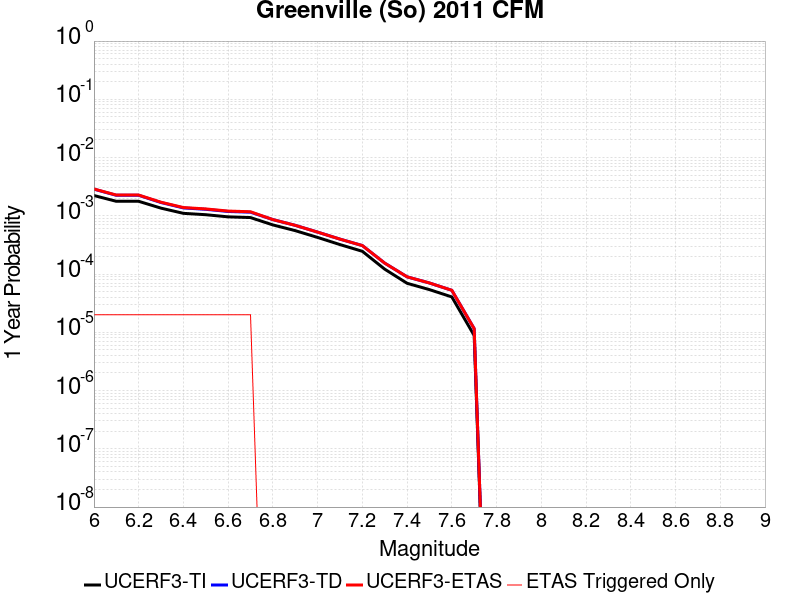 |  |

| Magnitude | 1 wk TI Prob | 1 wk TD Prob | 1 wk ETAS Prob | 1 wk ETAS/TD Gain | 1 wk ETAS Triggered Only | 1 mo TI Prob | 1 mo TD Prob | 1 mo ETAS Prob | 1 mo ETAS/TD Gain | 1 mo ETAS Triggered Only | 1 yr TI Prob | 1 yr TD Prob | 1 yr ETAS Prob | 1 yr ETAS/TD Gain | 1 yr ETAS Triggered Only | 10 yr TI Prob | 10 yr TD Prob | 10 yr ETAS Prob | 10 yr ETAS/TD Gain | 10 yr ETAS Triggered Only |
|-----|-----|-----|-----|-----|-----|-----|-----|-----|-----|-----|-----|-----|-----|-----|-----|-----|-----|-----|-----|-----|
| 6.0 | 4.279693E-5 | 5.5040087E-5 | 8.6231834E-5 | 1.5667095 | 3.1193464E-5 | 1.8340252E-4 | 2.3586681E-4 | 2.670529E-4 | 1.1322191 | 3.1193464E-5 | 0.0022306389 | 0.0028682416 | 0.0028993457 | 1.0108442 | 3.1193464E-5 | 0.022083808 | 0.028338138 | 0.028368447 | 1.0010695 | 3.1193464E-5 |
| 6.1 | 3.4037297E-5 | 4.3192387E-5 | 7.43845E-5 | 1.7221669 | 3.1193464E-5 | 1.4586597E-4 | 1.8509831E-4 | 2.1628599E-4 | 1.1684926 | 3.1193464E-5 | 0.0017744715 | 0.0022514379 | 0.002282561 | 1.0138237 | 3.1193464E-5 | 0.01760369 | 0.022302566 | 0.022333063 | 1.0013674 | 3.1193464E-5 |
| 6.2 | 3.4037297E-5 | 4.3192387E-5 | 7.43845E-5 | 1.7221669 | 3.1193464E-5 | 1.4586597E-4 | 1.8509831E-4 | 2.1628599E-4 | 1.1684926 | 3.1193464E-5 | 0.0017744715 | 0.0022514379 | 0.002282561 | 1.0138237 | 3.1193464E-5 | 0.01760369 | 0.022302566 | 0.022333063 | 1.0013674 | 3.1193464E-5 |
| 6.3 | 2.5956324E-5 | 3.2428903E-5 | 6.362135E-5 | 1.9618719 | 3.1193464E-5 | 1.11236644E-4 | 1.3897405E-4 | 1.7016318E-4 | 1.2244241 | 3.1193464E-5 | 0.0013534647 | 0.0016907708 | 0.0017219116 | 1.0184181 | 3.1193464E-5 | 0.013452509 | 0.016785882 | 0.016816553 | 1.0018271 | 3.1193464E-5 |
| 6.4 | 2.1145053E-5 | 2.6197677E-5 | 5.739032E-5 | 2.1906645 | 3.1193464E-5 | 9.061851E-5 | 1.1227112E-4 | 1.4346107E-4 | 1.2778093 | 3.1193464E-5 | 0.0011027219 | 0.0013660751 | 0.001397226 | 1.0228032 | 3.1193464E-5 | 0.01097266 | 0.01358018 | 0.01361095 | 1.0022658 | 3.1193464E-5 |
| 6.5 | 2.0030959E-5 | 2.479578E-5 | 5.598847E-5 | 2.2579837 | 3.1193464E-5 | 8.584414E-5 | 1.06263484E-4 | 1.3745362E-4 | 1.2935171 | 3.1193464E-5 | 0.0010446513 | 0.0012930221 | 0.0013241753 | 1.0240933 | 3.1193464E-5 | 0.010397541 | 0.012858339 | 0.012889131 | 1.0023948 | 3.1193464E-5 |
| 6.6 | 1.8395405E-5 | 2.2754466E-5 | 5.3947217E-5 | 2.3708408 | 3.1193464E-5 | 7.8835066E-5 | 9.751565E-5 | 1.2870607E-4 | 1.3198504 | 3.1193464E-5 | 9.5939427E-4 | 0.0011866348 | 0.0012177912 | 1.0262561 | 3.1193464E-5 | 0.009552629 | 0.011806041 | 0.011836866 | 1.0026109 | 3.1193464E-5 |
| 6.7 | 1.7883482E-5 | 2.212551E-5 | 5.3318283E-5 | 2.4098103 | 3.1193464E-5 | 7.664124E-5 | 9.482033E-5 | 1.2601084E-4 | 1.3289433 | 3.1193464E-5 | 9.3270757E-4 | 0.0011538545 | 0.0011850119 | 1.0270029 | 3.1193464E-5 | 0.009288026 | 0.011481688 | 0.0115125235 | 1.0026857 | 3.1193464E-5 |
| 6.8 | 1.3373564E-5 | 1.6505966E-5 | 1.6505966E-5 | 1.0 | 0.0 | 5.7314013E-5 | 7.073802E-5 | 7.073802E-5 | 1.0 | 0.0 | 6.975747E-4 | 8.609098E-4 | 8.609098E-4 | 1.0 | 0.0 | 0.0069538904 | 0.008577357 | 0.008577357 | 1.0 | 0.0 |
| 6.9 | 1.06692905E-5 | 1.3152582E-5 | 1.3152582E-5 | 1.0 | 0.0 | 4.5724726E-5 | 5.6367055E-5 | 5.6367055E-5 | 1.0 | 0.0 | 5.5655633E-4 | 6.86064E-4 | 6.86064E-4 | 1.0 | 0.0 | 0.005551645 | 0.006840693 | 0.006840693 | 1.0 | 0.0 |
| 7.0 | 8.157512E-6 | 1.0062639E-5 | 1.0062639E-5 | 1.0 | 0.0 | 3.4960296E-5 | 4.3124903E-5 | 4.3124903E-5 | 1.0 | 0.0 | 4.2555845E-4 | 5.2492286E-4 | 5.2492286E-4 | 1.0 | 0.0 | 0.004247444 | 0.0052373074 | 0.0052373074 | 1.0 | 0.0 |
| 7.1 | 6.1467113E-6 | 7.6274314E-6 | 7.6274314E-6 | 1.0 | 0.0 | 2.6342783E-5 | 3.268859E-5 | 3.268859E-5 | 1.0 | 0.0 | 3.206762E-4 | 3.9791173E-4 | 3.9791173E-4 | 1.0 | 0.0 | 0.0032021382 | 0.0039721807 | 0.0039721807 | 1.0 | 0.0 |
| 7.2 | 4.713467E-6 | 5.9141557E-6 | 5.9141557E-6 | 1.0 | 0.0 | 2.0200418E-5 | 2.5346139E-5 | 2.5346139E-5 | 1.0 | 0.0 | 2.4591232E-4 | 3.0854615E-4 | 3.0854615E-4 | 1.0 | 0.0 | 0.0024564038 | 0.0030813308 | 0.0030813308 | 1.0 | 0.0 |
| 7.3 | 2.3266216E-6 | 2.954009E-6 | 2.954009E-6 | 1.0 | 0.0 | 9.971197E-6 | 1.2659978E-5 | 1.2659978E-5 | 1.0 | 0.0 | 1.2139256E-4 | 1.5412449E-4 | 1.5412449E-4 | 1.0 | 0.0 | 0.0012132627 | 0.0015402455 | 0.0015402455 | 1.0 | 0.0 |
| 7.4 | 1.3314E-6 | 1.7179472E-6 | 1.7179472E-6 | 1.0 | 0.0 | 5.7059874E-6 | 7.36261E-6 | 7.36261E-6 | 1.0 | 0.0 | 6.946818E-5 | 8.963614E-5 | 8.963614E-5 | 1.0 | 0.0 | 6.9446466E-4 | 8.9603866E-4 | 8.9603866E-4 | 1.0 | 0.0 |
| 7.5 | 1.0362941E-6 | 1.3468821E-6 | 1.3468821E-6 | 1.0 | 0.0 | 4.4412527E-6 | 5.772339E-6 | 5.772339E-6 | 1.0 | 0.0 | 5.407091E-5 | 7.027601E-5 | 7.027601E-5 | 1.0 | 0.0 | 5.405776E-4 | 7.025681E-4 | 7.025681E-4 | 1.0 | 0.0 |
| 7.6 | 7.764784E-7 | 1.0088593E-6 | 1.0088593E-6 | 1.0 | 0.0 | 3.3277602E-6 | 4.323676E-6 | 4.323676E-6 | 1.0 | 0.0 | 4.0514726E-5 | 5.263952E-5 | 5.263952E-5 | 1.0 | 0.0 | 4.050734E-4 | 5.262919E-4 | 5.262919E-4 | 1.0 | 0.0 |
| 7.7 | 1.6927763E-7 | 2.2139248E-7 | 2.2139248E-7 | 1.0 | 0.0 | 7.2547533E-7 | 9.4882455E-7 | 9.4882455E-7 | 1.0 | 0.0 | 8.832627E-6 | 1.15518815E-5 | 1.15518815E-5 | 1.0 | 0.0 | 8.8322755E-5 | 1.15515526E-4 | 1.15515526E-4 | 1.0 | 0.0 |

## Morales (East)
*[(top)](#table-of-contents)*

| 1 Week | 1 Month | 1 Year | 10 Year |
|-----|-----|-----|-----|
|  |  |  |  |

| Magnitude | 1 wk TI Prob | 1 wk TD Prob | 1 wk ETAS Prob | 1 wk ETAS/TD Gain | 1 wk ETAS Triggered Only | 1 mo TI Prob | 1 mo TD Prob | 1 mo ETAS Prob | 1 mo ETAS/TD Gain | 1 mo ETAS Triggered Only | 1 yr TI Prob | 1 yr TD Prob | 1 yr ETAS Prob | 1 yr ETAS/TD Gain | 1 yr ETAS Triggered Only | 10 yr TI Prob | 10 yr TD Prob | 10 yr ETAS Prob | 10 yr ETAS/TD Gain | 10 yr ETAS Triggered Only |
|-----|-----|-----|-----|-----|-----|-----|-----|-----|-----|-----|-----|-----|-----|-----|-----|-----|-----|-----|-----|-----|
| 6.0 | 1.4942771E-6 | 2.123479E-6 | 1.7720176E-5 | 8.34488 | 1.5596732E-5 | 6.404029E-6 | 9.100596E-6 | 2.4697185E-5 | 2.7137988 | 1.5596732E-5 | 7.7966266E-5 | 1.107947E-4 | 1.4198471E-4 | 1.2815117 | 3.1193464E-5 | 7.793892E-4 | 0.0011074544 | 0.0011386133 | 1.0281357 | 3.1193464E-5 |
| 6.1 | 1.4942771E-6 | 2.123479E-6 | 1.7720176E-5 | 8.34488 | 1.5596732E-5 | 6.404029E-6 | 9.100596E-6 | 2.4697185E-5 | 2.7137988 | 1.5596732E-5 | 7.7966266E-5 | 1.107947E-4 | 1.4198471E-4 | 1.2815117 | 3.1193464E-5 | 7.793892E-4 | 0.0011074544 | 0.0011386133 | 1.0281357 | 3.1193464E-5 |
| 6.2 | 1.4942771E-6 | 2.123479E-6 | 1.7720176E-5 | 8.34488 | 1.5596732E-5 | 6.404029E-6 | 9.100596E-6 | 2.4697185E-5 | 2.7137988 | 1.5596732E-5 | 7.7966266E-5 | 1.107947E-4 | 1.4198471E-4 | 1.2815117 | 3.1193464E-5 | 7.793892E-4 | 0.0011074544 | 0.0011386133 | 1.0281357 | 3.1193464E-5 |
| 6.3 | 1.4942771E-6 | 2.123479E-6 | 1.7720176E-5 | 8.34488 | 1.5596732E-5 | 6.404029E-6 | 9.100596E-6 | 2.4697185E-5 | 2.7137988 | 1.5596732E-5 | 7.7966266E-5 | 1.107947E-4 | 1.4198471E-4 | 1.2815117 | 3.1193464E-5 | 7.793892E-4 | 0.0011074544 | 0.0011386133 | 1.0281357 | 3.1193464E-5 |
| 6.4 | 8.798845E-7 | 1.5022731E-6 | 1.5022731E-6 | 1.0 | 0.0 | 3.7709283E-6 | 6.438298E-6 | 6.438298E-6 | 1.0 | 0.0 | 4.5910085E-5 | 7.8383564E-5 | 7.8383564E-5 | 1.0 | 0.0 | 4.59006E-4 | 7.835727E-4 | 7.835727E-4 | 1.0 | 0.0 |
| 6.5 | 7.1751725E-7 | 1.3384229E-6 | 1.3384229E-6 | 1.0 | 0.0 | 3.0750705E-6 | 5.7360858E-6 | 5.7360858E-6 | 1.0 | 0.0 | 3.7438338E-5 | 6.9834685E-5 | 6.9834685E-5 | 1.0 | 0.0 | 3.743203E-4 | 6.9813756E-4 | 6.9813756E-4 | 1.0 | 0.0 |
| 6.6 | 7.1751725E-7 | 1.3384229E-6 | 1.3384229E-6 | 1.0 | 0.0 | 3.0750705E-6 | 5.7360858E-6 | 5.7360858E-6 | 1.0 | 0.0 | 3.7438338E-5 | 6.9834685E-5 | 6.9834685E-5 | 1.0 | 0.0 | 3.743203E-4 | 6.9813756E-4 | 6.9813756E-4 | 1.0 | 0.0 |
| 6.7 | 7.159057E-7 | 1.3358889E-6 | 1.3358889E-6 | 1.0 | 0.0 | 3.0681638E-6 | 5.725226E-6 | 5.725226E-6 | 1.0 | 0.0 | 3.7354253E-5 | 6.970247E-5 | 6.970247E-5 | 1.0 | 0.0 | 3.7347974E-4 | 6.968163E-4 | 6.968163E-4 | 1.0 | 0.0 |
| 6.8 | 7.032203E-7 | 1.3174443E-6 | 1.3174443E-6 | 1.0 | 0.0 | 3.0137978E-6 | 5.646178E-6 | 5.646178E-6 | 1.0 | 0.0 | 3.669237E-5 | 6.8740126E-5 | 6.8740126E-5 | 1.0 | 0.0 | 3.6686313E-4 | 6.871988E-4 | 6.871988E-4 | 1.0 | 0.0 |
| 6.9 | 6.941549E-7 | 1.3025061E-6 | 1.3025061E-6 | 1.0 | 0.0 | 2.974946E-6 | 5.582158E-6 | 5.582158E-6 | 1.0 | 0.0 | 3.6219368E-5 | 6.7960726E-5 | 6.7960726E-5 | 1.0 | 0.0 | 3.6213463E-4 | 6.7940954E-4 | 6.7940954E-4 | 1.0 | 0.0 |
| 7.0 | 6.2932247E-7 | 1.18774E-6 | 1.18774E-6 | 1.0 | 0.0 | 2.6970936E-6 | 5.090305E-6 | 5.090305E-6 | 1.0 | 0.0 | 3.283662E-5 | 6.1972765E-5 | 6.1972765E-5 | 1.0 | 0.0 | 3.283177E-4 | 6.1956374E-4 | 6.1956374E-4 | 1.0 | 0.0 |
| 7.1 | 5.6200963E-7 | 1.0640374E-6 | 1.0640374E-6 | 1.0 | 0.0 | 2.4086105E-6 | 4.5601523E-6 | 4.5601523E-6 | 1.0 | 0.0 | 2.9324437E-5 | 5.551849E-5 | 5.551849E-5 | 1.0 | 0.0 | 2.9320567E-4 | 5.550534E-4 | 5.550534E-4 | 1.0 | 0.0 |
| 7.2 | 4.91044E-7 | 9.285713E-7 | 9.285713E-7 | 1.0 | 0.0 | 2.1044725E-6 | 3.9795855E-6 | 3.9795855E-6 | 1.0 | 0.0 | 2.5621652E-5 | 4.8450413E-5 | 4.8450413E-5 | 1.0 | 0.0 | 2.56187E-4 | 4.8440482E-4 | 4.8440482E-4 | 1.0 | 0.0 |
| 7.3 | 4.2978448E-7 | 7.9739846E-7 | 7.9739846E-7 | 1.0 | 0.0 | 1.8419321E-6 | 3.4174175E-6 | 3.4174175E-6 | 1.0 | 0.0 | 2.2425293E-5 | 4.1606294E-5 | 4.1606294E-5 | 1.0 | 0.0 | 2.242303E-4 | 4.1599068E-4 | 4.1599068E-4 | 1.0 | 0.0 |
| 7.4 | 3.774317E-7 | 6.806746E-7 | 6.806746E-7 | 1.0 | 0.0 | 1.6175634E-6 | 2.9171736E-6 | 2.9171736E-6 | 1.0 | 0.0 | 1.9693656E-5 | 3.5516037E-5 | 3.5516037E-5 | 1.0 | 0.0 | 1.969191E-4 | 3.551089E-4 | 3.551089E-4 | 1.0 | 0.0 |
| 7.5 | 1.0603232E-7 | 9.840901E-8 | 9.840901E-8 | 1.0 | 0.0 | 4.5442414E-7 | 4.2175284E-7 | 4.2175284E-7 | 1.0 | 0.0 | 5.5326E-6 | 5.134829E-6 | 5.134829E-6 | 1.0 | 0.0 | 5.532462E-5 | 5.134967E-5 | 5.134967E-5 | 1.0 | 0.0 |
| 7.6 | 9.960384E-8 | 8.755334E-8 | 8.755334E-8 | 1.0 | 0.0 | 4.2687353E-7 | 3.7522852E-7 | 3.7522852E-7 | 1.0 | 0.0 | 5.197173E-6 | 4.568398E-6 | 4.568398E-6 | 1.0 | 0.0 | 5.1970514E-5 | 4.5685607E-5 | 4.5685607E-5 | 1.0 | 0.0 |
| 7.7 | 6.499468E-8 | 4.1038682E-8 | 4.1038682E-8 | 1.0 | 0.0 | 2.785486E-7 | 1.7588006E-7 | 1.7588006E-7 | 1.0 | 0.0 | 3.3913238E-6 | 2.1413375E-6 | 2.1413375E-6 | 1.0 | 0.0 | 3.3912722E-5 | 2.1415728E-5 | 2.1415728E-5 | 1.0 | 0.0 |
| 7.8 | 2.2517119E-8 | 7.1312614E-9 | 7.1312614E-9 | 1.0 | 0.0 | 9.6501935E-8 | 3.0562546E-8 | 3.0562546E-8 | 1.0 | 0.0 | 1.1749105E-6 | 3.7209892E-7 | 3.7209892E-7 | 1.0 | 0.0 | 1.1749043E-5 | 3.7235213E-6 | 3.7235213E-6 | 1.0 | 0.0 |
| 7.9 | 8.493023E-9 | 9.970124E-10 | 9.970124E-10 | 1.0 | 0.0 | 3.639867E-8 | 4.2729082E-9 | 4.2729082E-9 | 1.0 | 0.0 | 4.4315374E-7 | 5.202266E-8 | 5.202266E-8 | 1.0 | 0.0 | 4.4315284E-6 | 5.2233156E-7 | 5.2233156E-7 | 1.0 | 0.0 |
| 8.0 | 1.4971842E-9 | 5.5458416E-11 | 5.5458416E-11 | 1.0 | 0.0 | 6.4165038E-9 | 2.376762E-10 | 2.376762E-10 | 1.0 | 0.0 | 7.812093E-8 | 2.8937068E-9 | 2.8937068E-9 | 1.0 | 0.0 | 7.81209E-7 | 3.019288E-8 | 3.019288E-8 | 1.0 | 0.0 |

## Puente Hills
*[(top)](#table-of-contents)*

| 1 Week | 1 Month | 1 Year | 10 Year |
|-----|-----|-----|-----|
|  |  |  |  |

| Magnitude | 1 wk TI Prob | 1 wk TD Prob | 1 wk ETAS Prob | 1 wk ETAS/TD Gain | 1 wk ETAS Triggered Only | 1 mo TI Prob | 1 mo TD Prob | 1 mo ETAS Prob | 1 mo ETAS/TD Gain | 1 mo ETAS Triggered Only | 1 yr TI Prob | 1 yr TD Prob | 1 yr ETAS Prob | 1 yr ETAS/TD Gain | 1 yr ETAS Triggered Only | 10 yr TI Prob | 10 yr TD Prob | 10 yr ETAS Prob | 10 yr ETAS/TD Gain | 10 yr ETAS Triggered Only |
|-----|-----|-----|-----|-----|-----|-----|-----|-----|-----|-----|-----|-----|-----|-----|-----|-----|-----|-----|-----|-----|
| 6.0 | 1.2101656E-5 | 8.098625E-6 | 2.369523E-5 | 2.9258337 | 1.5596732E-5 | 5.1863204E-5 | 3.4707962E-5 | 5.0304152E-5 | 1.4493548 | 1.5596732E-5 | 6.312516E-4 | 4.2249315E-4 | 4.3808328E-4 | 1.0369004 | 1.5596732E-5 | 0.0062946146 | 0.0042174594 | 0.0042485213 | 1.0073651 | 3.1193464E-5 |
| 6.1 | 1.2101656E-5 | 8.098625E-6 | 2.369523E-5 | 2.9258337 | 1.5596732E-5 | 5.1863204E-5 | 3.4707962E-5 | 5.0304152E-5 | 1.4493548 | 1.5596732E-5 | 6.312516E-4 | 4.2249315E-4 | 4.3808328E-4 | 1.0369004 | 1.5596732E-5 | 0.0062946146 | 0.0042174594 | 0.0042485213 | 1.0073651 | 3.1193464E-5 |
| 6.2 | 1.2101656E-5 | 8.098625E-6 | 2.369523E-5 | 2.9258337 | 1.5596732E-5 | 5.1863204E-5 | 3.4707962E-5 | 5.0304152E-5 | 1.4493548 | 1.5596732E-5 | 6.312516E-4 | 4.2249315E-4 | 4.3808328E-4 | 1.0369004 | 1.5596732E-5 | 0.0062946146 | 0.0042174594 | 0.0042485213 | 1.0073651 | 3.1193464E-5 |
| 6.3 | 1.2101656E-5 | 8.098625E-6 | 2.369523E-5 | 2.9258337 | 1.5596732E-5 | 5.1863204E-5 | 3.4707962E-5 | 5.0304152E-5 | 1.4493548 | 1.5596732E-5 | 6.312516E-4 | 4.2249315E-4 | 4.3808328E-4 | 1.0369004 | 1.5596732E-5 | 0.0062946146 | 0.0042174594 | 0.0042485213 | 1.0073651 | 3.1193464E-5 |
| 6.4 | 1.2101656E-5 | 8.098625E-6 | 2.369523E-5 | 2.9258337 | 1.5596732E-5 | 5.1863204E-5 | 3.4707962E-5 | 5.0304152E-5 | 1.4493548 | 1.5596732E-5 | 6.312516E-4 | 4.2249315E-4 | 4.3808328E-4 | 1.0369004 | 1.5596732E-5 | 0.0062946146 | 0.0042174594 | 0.0042485213 | 1.0073651 | 3.1193464E-5 |
| 6.5 | 1.2101656E-5 | 8.098625E-6 | 2.369523E-5 | 2.9258337 | 1.5596732E-5 | 5.1863204E-5 | 3.4707962E-5 | 5.0304152E-5 | 1.4493548 | 1.5596732E-5 | 6.312516E-4 | 4.2249315E-4 | 4.3808328E-4 | 1.0369004 | 1.5596732E-5 | 0.0062946146 | 0.0042174594 | 0.0042485213 | 1.0073651 | 3.1193464E-5 |
| 6.6 | 1.0222488E-5 | 6.3991847E-6 | 2.1995816E-5 | 3.4372842 | 1.5596732E-5 | 4.3809923E-5 | 2.7424803E-5 | 4.3021104E-5 | 1.5686934 | 1.5596732E-5 | 5.332553E-4 | 3.3384826E-4 | 3.494398E-4 | 1.0467024 | 1.5596732E-5 | 0.0053197746 | 0.0033337125 | 0.003364802 | 1.0093257 | 3.1193464E-5 |
| 6.7 | 1.0222488E-5 | 6.3991847E-6 | 2.1995816E-5 | 3.4372842 | 1.5596732E-5 | 4.3809923E-5 | 2.7424803E-5 | 4.3021104E-5 | 1.5686934 | 1.5596732E-5 | 5.332553E-4 | 3.3384826E-4 | 3.494398E-4 | 1.0467024 | 1.5596732E-5 | 0.0053197746 | 0.0033337125 | 0.003364802 | 1.0093257 | 3.1193464E-5 |
| 6.8 | 8.6367845E-6 | 5.0282533E-6 | 2.0624906E-5 | 4.1018033 | 1.5596732E-5 | 3.7014266E-5 | 2.1549482E-5 | 3.7145877E-5 | 1.723748 | 1.5596732E-5 | 4.505555E-4 | 2.623339E-4 | 2.7792653E-4 | 1.0594381 | 1.5596732E-5 | 0.004496431 | 0.0026202986 | 0.0026514104 | 1.0118734 | 3.1193464E-5 |
| 6.9 | 8.066481E-6 | 4.836117E-6 | 4.836117E-6 | 1.0 | 0.0 | 3.4570177E-5 | 2.0726053E-5 | 2.0726053E-5 | 1.0 | 0.0 | 4.2081063E-4 | 2.52311E-4 | 2.52311E-4 | 1.0 | 0.0 | 0.0042001465 | 0.0025202993 | 0.0025358568 | 1.0061729 | 1.5596732E-5 |
| 7.0 | 7.393828E-6 | 4.417296E-6 | 4.417296E-6 | 1.0 | 0.0 | 3.168745E-5 | 1.8931134E-5 | 1.8931134E-5 | 1.0 | 0.0 | 3.857264E-4 | 2.3046264E-4 | 2.3046264E-4 | 1.0 | 0.0 | 0.0038505755 | 0.0023022818 | 0.0023022818 | 1.0 | 0.0 |
| 7.1 | 6.4660953E-6 | 3.8044495E-6 | 3.8044495E-6 | 1.0 | 0.0 | 2.7711543E-5 | 1.6304684E-5 | 1.6304684E-5 | 1.0 | 0.0 | 3.373358E-4 | 1.984918E-4 | 1.984918E-4 | 1.0 | 0.0 | 0.0033682417 | 0.001983181 | 0.001983181 | 1.0 | 0.0 |
| 7.2 | 5.143232E-6 | 2.7865456E-6 | 2.7865456E-6 | 1.0 | 0.0 | 2.2042237E-5 | 1.1942284E-5 | 1.1942284E-5 | 1.0 | 0.0 | 2.6833118E-4 | 1.453877E-4 | 1.453877E-4 | 1.0 | 0.0 | 0.002680074 | 0.0014529356 | 0.0014529356 | 1.0 | 0.0 |
| 7.3 | 3.928255E-6 | 2.0913774E-6 | 2.0913774E-6 | 1.0 | 0.0 | 1.683527E-5 | 8.963015E-6 | 8.963015E-6 | 1.0 | 0.0 | 2.0495013E-4 | 1.0911931E-4 | 1.0911931E-4 | 1.0 | 0.0 | 0.002047612 | 0.001090664 | 0.001090664 | 1.0 | 0.0 |
| 7.4 | 2.7894434E-6 | 1.3546753E-6 | 1.3546753E-6 | 1.0 | 0.0 | 1.1954703E-5 | 5.8057385E-6 | 5.8057385E-6 | 1.0 | 0.0 | 1.4553878E-4 | 7.068262E-5 | 7.068262E-5 | 1.0 | 0.0 | 0.001454435 | 7.066058E-4 | 7.066058E-4 | 1.0 | 0.0 |
| 7.5 | 2.041735E-6 | 8.787305E-7 | 8.787305E-7 | 1.0 | 0.0 | 8.750263E-6 | 3.7659825E-6 | 3.7659825E-6 | 1.0 | 0.0 | 1.06529245E-4 | 4.5849905E-5 | 4.5849905E-5 | 1.0 | 0.0 | 0.0010647819 | 4.5840783E-4 | 4.5840783E-4 | 1.0 | 0.0 |
| 7.6 | 1.6959062E-6 | 6.6986263E-7 | 6.6986263E-7 | 1.0 | 0.0 | 7.268149E-6 | 2.8708366E-6 | 2.8708366E-6 | 1.0 | 0.0 | 8.848612E-5 | 3.4951907E-5 | 3.4951907E-5 | 1.0 | 0.0 | 8.84509E-4 | 3.4946698E-4 | 3.4946698E-4 | 1.0 | 0.0 |
| 7.7 | 1.4767965E-6 | 5.407607E-7 | 5.407607E-7 | 1.0 | 0.0 | 6.3291122E-6 | 2.317544E-6 | 2.317544E-6 | 1.0 | 0.0 | 7.705422E-5 | 2.8215758E-5 | 2.8215758E-5 | 1.0 | 0.0 | 7.702751E-4 | 2.8212433E-4 | 2.8212433E-4 | 1.0 | 0.0 |
| 7.8 | 1.8432911E-7 | 7.28201E-8 | 7.28201E-8 | 1.0 | 0.0 | 7.8998164E-7 | 3.1208612E-7 | 3.1208612E-7 | 1.0 | 0.0 | 9.617985E-6 | 3.7996451E-6 | 3.7996451E-6 | 1.0 | 0.0 | 9.617568E-5 | 3.7996128E-5 | 3.7996128E-5 | 1.0 | 0.0 |

## San Diego Trough south
*[(top)](#table-of-contents)*

| 1 Week | 1 Month | 1 Year | 10 Year |
|-----|-----|-----|-----|
|  |  |  | 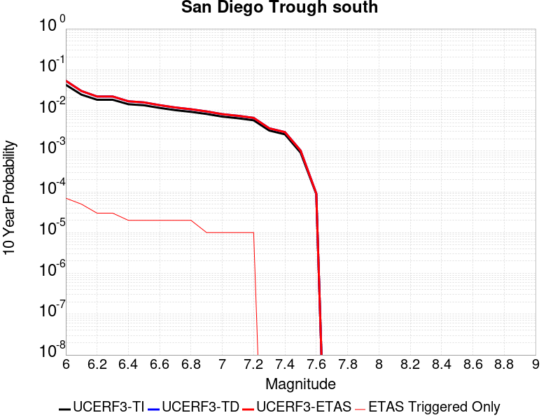 |

| Magnitude | 1 wk TI Prob | 1 wk TD Prob | 1 wk ETAS Prob | 1 wk ETAS/TD Gain | 1 wk ETAS Triggered Only | 1 mo TI Prob | 1 mo TD Prob | 1 mo ETAS Prob | 1 mo ETAS/TD Gain | 1 mo ETAS Triggered Only | 1 yr TI Prob | 1 yr TD Prob | 1 yr ETAS Prob | 1 yr ETAS/TD Gain | 1 yr ETAS Triggered Only | 10 yr TI Prob | 10 yr TD Prob | 10 yr ETAS Prob | 10 yr ETAS/TD Gain | 10 yr ETAS Triggered Only |
|-----|-----|-----|-----|-----|-----|-----|-----|-----|-----|-----|-----|-----|-----|-----|-----|-----|-----|-----|-----|-----|
| 6.0 | 8.279495E-5 | 1.04241306E-4 | 1.04241306E-4 | 1.0 | 0.0 | 3.5478722E-4 | 4.4667677E-4 | 4.4667677E-4 | 1.0 | 0.0 | 0.004310982 | 0.0054256152 | 0.0054566395 | 1.0057181 | 3.1193464E-5 | 0.042283054 | 0.05299221 | 0.053021748 | 1.0005574 | 3.1193464E-5 |
| 6.1 | 4.6961468E-5 | 5.772944E-5 | 5.772944E-5 | 1.0 | 0.0 | 2.0124791E-4 | 2.473894E-4 | 2.473894E-4 | 1.0 | 0.0 | 0.00244744 | 0.0030079768 | 0.0030235266 | 1.0051695 | 1.5596732E-5 | 0.024206603 | 0.029679462 | 0.029694596 | 1.0005099 | 1.5596732E-5 |
| 6.2 | 3.5079658E-5 | 4.214154E-5 | 4.214154E-5 | 1.0 | 0.0 | 1.5033272E-4 | 1.8059435E-4 | 1.8059435E-4 | 1.0 | 0.0 | 0.0018287642 | 0.0021965632 | 0.0021965632 | 1.0 | 0.0 | 0.018137876 | 0.021751117 | 0.021751117 | 1.0 | 0.0 |
| 6.3 | 3.5079658E-5 | 4.214154E-5 | 4.214154E-5 | 1.0 | 0.0 | 1.5033272E-4 | 1.8059435E-4 | 1.8059435E-4 | 1.0 | 0.0 | 0.0018287642 | 0.0021965632 | 0.0021965632 | 1.0 | 0.0 | 0.018137876 | 0.021751117 | 0.021751117 | 1.0 | 0.0 |
| 6.4 | 2.7196904E-5 | 3.2087162E-5 | 3.2087162E-5 | 1.0 | 0.0 | 1.16552954E-4 | 1.3750927E-4 | 1.3750927E-4 | 1.0 | 0.0 | 0.0014181085 | 0.0016729041 | 0.0016729041 | 1.0 | 0.0 | 0.014090929 | 0.016604643 | 0.016604643 | 1.0 | 0.0 |
| 6.5 | 2.5584688E-5 | 3.010164E-5 | 3.010164E-5 | 1.0 | 0.0 | 1.0964406E-4 | 1.2900073E-4 | 1.2900073E-4 | 1.0 | 0.0 | 0.0013340989 | 0.0015694655 | 0.0015694655 | 1.0 | 0.0 | 0.013261181 | 0.015585314 | 0.015585314 | 1.0 | 0.0 |
| 6.6 | 2.2034688E-5 | 2.5742738E-5 | 2.5742738E-5 | 1.0 | 0.0 | 9.443096E-5 | 1.1032141E-4 | 1.1032141E-4 | 1.0 | 0.0 | 0.0011490905 | 0.0013423424 | 0.0013423424 | 1.0 | 0.0 | 0.011431668 | 0.013343317 | 0.013343317 | 1.0 | 0.0 |
| 6.7 | 1.9394853E-5 | 2.254176E-5 | 2.254176E-5 | 1.0 | 0.0 | 8.311815E-5 | 9.6603995E-5 | 9.6603995E-5 | 1.0 | 0.0 | 0.0010114936 | 0.0011755243 | 0.0011755243 | 1.0 | 0.0 | 0.01006902 | 0.011693766 | 0.011693766 | 1.0 | 0.0 |
| 6.8 | 1.7615313E-5 | 2.0403182E-5 | 2.0403182E-5 | 1.0 | 0.0 | 7.549201E-5 | 8.74393E-5 | 8.74393E-5 | 1.0 | 0.0 | 9.1872766E-4 | 0.0010640579 | 0.0010640579 | 1.0 | 0.0 | 0.009149387 | 0.010590198 | 0.010590198 | 1.0 | 0.0 |
| 6.9 | 1.5621423E-5 | 1.8026114E-5 | 1.8026114E-5 | 1.0 | 0.0 | 6.6947236E-5 | 7.725251E-5 | 7.725251E-5 | 1.0 | 0.0 | 8.147778E-4 | 9.40147E-4 | 9.40147E-4 | 1.0 | 0.0 | 0.008117969 | 0.009362142 | 0.009362142 | 1.0 | 0.0 |
| 7.0 | 1.3444376E-5 | 1.544809E-5 | 1.544809E-5 | 1.0 | 0.0 | 5.7617483E-5 | 6.620443E-5 | 6.620443E-5 | 1.0 | 0.0 | 7.0126704E-4 | 8.057436E-4 | 8.057436E-4 | 1.0 | 0.0 | 0.006990582 | 0.008028555 | 0.008028555 | 1.0 | 0.0 |
| 7.1 | 1.2268361E-5 | 1.407303E-5 | 1.407303E-5 | 1.0 | 0.0 | 5.2577634E-5 | 6.0311606E-5 | 6.0311606E-5 | 1.0 | 0.0 | 6.399447E-4 | 7.3404907E-4 | 7.3404907E-4 | 1.0 | 0.0 | 0.0063810493 | 0.0073165493 | 0.0073165493 | 1.0 | 0.0 |
| 7.2 | 1.0922655E-5 | 1.2513563E-5 | 1.2513563E-5 | 1.0 | 0.0 | 4.681054E-5 | 5.3628468E-5 | 5.3628468E-5 | 1.0 | 0.0 | 5.697693E-4 | 6.5273355E-4 | 6.5273355E-4 | 1.0 | 0.0 | 0.0056831064 | 0.0065084435 | 0.0065084435 | 1.0 | 0.0 |
| 7.3 | 6.1106753E-6 | 6.928925E-6 | 6.928925E-6 | 1.0 | 0.0 | 2.6188345E-5 | 2.9695057E-5 | 2.9695057E-5 | 1.0 | 0.0 | 3.1879646E-4 | 3.6147775E-4 | 3.6147775E-4 | 1.0 | 0.0 | 0.0031833951 | 0.003608943 | 0.003608943 | 1.0 | 0.0 |
| 7.4 | 4.933187E-6 | 5.5895525E-6 | 5.5895525E-6 | 1.0 | 0.0 | 2.114206E-5 | 2.3955008E-5 | 2.3955008E-5 | 1.0 | 0.0 | 2.5737417E-4 | 2.9161357E-4 | 2.9161357E-4 | 1.0 | 0.0 | 0.002570763 | 0.0029123505 | 0.0029123505 | 1.0 | 0.0 |
| 7.5 | 1.7489613E-6 | 1.969678E-6 | 1.969678E-6 | 1.0 | 0.0 | 7.495527E-6 | 8.4414505E-6 | 8.4414505E-6 | 1.0 | 0.0 | 9.125422E-5 | 1.02770035E-4 | 1.02770035E-4 | 1.0 | 0.0 | 9.1216754E-4 | 0.0010272472 | 0.0010272472 | 1.0 | 0.0 |
| 7.6 | 1.6988751E-7 | 1.7533823E-7 | 1.7533823E-7 | 1.0 | 0.0 | 7.2808916E-7 | 7.5144936E-7 | 7.5144936E-7 | 1.0 | 0.0 | 8.864449E-6 | 9.14886E-6 | 9.14886E-6 | 1.0 | 0.0 | 8.8640954E-5 | 9.1485024E-5 | 9.1485024E-5 | 1.0 | 0.0 |

## Hosgri (Extension)
*[(top)](#table-of-contents)*

| 1 Week | 1 Month | 1 Year | 10 Year |
|-----|-----|-----|-----|
|  |  |  | 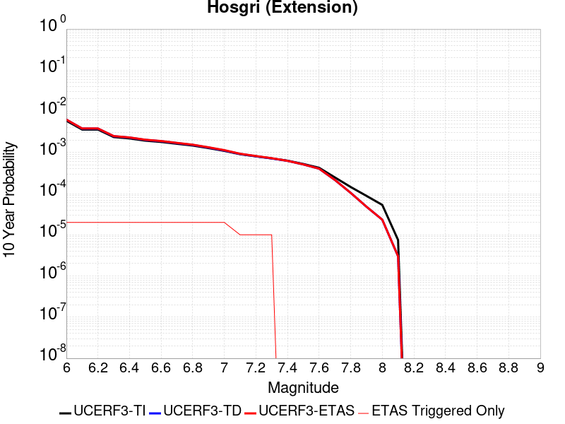 |

| Magnitude | 1 wk TI Prob | 1 wk TD Prob | 1 wk ETAS Prob | 1 wk ETAS/TD Gain | 1 wk ETAS Triggered Only | 1 mo TI Prob | 1 mo TD Prob | 1 mo ETAS Prob | 1 mo ETAS/TD Gain | 1 mo ETAS Triggered Only | 1 yr TI Prob | 1 yr TD Prob | 1 yr ETAS Prob | 1 yr ETAS/TD Gain | 1 yr ETAS Triggered Only | 10 yr TI Prob | 10 yr TD Prob | 10 yr ETAS Prob | 10 yr ETAS/TD Gain | 10 yr ETAS Triggered Only |
|-----|-----|-----|-----|-----|-----|-----|-----|-----|-----|-----|-----|-----|-----|-----|-----|-----|-----|-----|-----|-----|
| 6.0 | 1.1369135E-5 | 1.2083072E-5 | 1.2083072E-5 | 1.0 | 0.0 | 4.8723956E-5 | 5.1783692E-5 | 5.1783692E-5 | 1.0 | 0.0 | 5.9305265E-4 | 6.3030684E-4 | 6.4589374E-4 | 1.024729 | 1.5596732E-5 | 0.005914725 | 0.0062874397 | 0.0063029383 | 1.002465 | 1.5596732E-5 |
| 6.1 | 6.934979E-6 | 7.324555E-6 | 7.324555E-6 | 1.0 | 0.0 | 2.9721E-5 | 3.1390595E-5 | 3.1390595E-5 | 1.0 | 0.0 | 3.617931E-4 | 3.8211764E-4 | 3.9770838E-4 | 1.0408009 | 1.5596732E-5 | 0.0036120464 | 0.0038150186 | 0.0038305558 | 1.0040727 | 1.5596732E-5 |
| 6.2 | 6.934979E-6 | 7.324555E-6 | 7.324555E-6 | 1.0 | 0.0 | 2.9721E-5 | 3.1390595E-5 | 3.1390595E-5 | 1.0 | 0.0 | 3.617931E-4 | 3.8211764E-4 | 3.9770838E-4 | 1.0408009 | 1.5596732E-5 | 0.0036120464 | 0.0038150186 | 0.0038305558 | 1.0040727 | 1.5596732E-5 |
| 6.3 | 4.5484676E-6 | 4.76933E-6 | 4.76933E-6 | 1.0 | 0.0 | 1.9493287E-5 | 2.043983E-5 | 2.043983E-5 | 1.0 | 0.0 | 2.3730492E-4 | 2.4882692E-4 | 2.6441977E-4 | 1.0626655 | 1.5596732E-5 | 0.0023705168 | 0.0024855258 | 0.0025010838 | 1.0062594 | 1.5596732E-5 |
| 6.4 | 4.218095E-6 | 4.4168614E-6 | 4.4168614E-6 | 1.0 | 0.0 | 1.8077424E-5 | 1.8929271E-5 | 1.8929271E-5 | 1.0 | 0.0 | 2.2007042E-4 | 2.3043984E-4 | 2.4603296E-4 | 1.0676669 | 1.5596732E-5 | 0.002198526 | 0.0023020422 | 0.0023176032 | 1.0067595 | 1.5596732E-5 |
| 6.5 | 3.717374E-6 | 3.8838775E-6 | 3.8838775E-6 | 1.0 | 0.0 | 1.5931506E-5 | 1.6645085E-5 | 1.6645085E-5 | 1.0 | 0.0 | 1.9394881E-4 | 2.0263524E-4 | 2.1822882E-4 | 1.0769539 | 1.5596732E-5 | 0.0019377962 | 0.0020245234 | 0.0020400886 | 1.0076883 | 1.5596732E-5 |
| 6.6 | 3.4605036E-6 | 3.608306E-6 | 3.608306E-6 | 1.0 | 0.0 | 1.4830645E-5 | 1.5464078E-5 | 1.5464078E-5 | 1.0 | 0.0 | 1.8054814E-4 | 1.8825903E-4 | 2.0385282E-4 | 1.0828316 | 1.5596732E-5 | 0.0018040152 | 0.0018810101 | 0.0018965775 | 1.0082761 | 1.5596732E-5 |
| 6.7 | 3.123439E-6 | 3.2465687E-6 | 3.2465687E-6 | 1.0 | 0.0 | 1.33860985E-5 | 1.3913792E-5 | 1.3913792E-5 | 1.0 | 0.0 | 1.6296357E-4 | 1.6938736E-4 | 1.8498144E-4 | 1.0920618 | 1.5596732E-5 | 0.001628441 | 0.0016925934 | 0.0017081638 | 1.0091991 | 1.5596732E-5 |
| 6.8 | 2.8290783E-6 | 2.9305404E-6 | 2.9305404E-6 | 1.0 | 0.0 | 1.2124565E-5 | 1.2559399E-5 | 1.2559399E-5 | 1.0 | 0.0 | 1.4760658E-4 | 1.5290003E-4 | 1.6849439E-4 | 1.1019905 | 1.5596732E-5 | 0.0014750857 | 0.001527957 | 0.0015435299 | 1.0101919 | 1.5596732E-5 |
| 6.9 | 2.454112E-6 | 2.5283196E-6 | 2.5283196E-6 | 1.0 | 0.0 | 1.0517581E-5 | 1.0835611E-5 | 1.0835611E-5 | 1.0 | 0.0 | 1.2804402E-4 | 1.3191563E-4 | 1.475103E-4 | 1.118217 | 1.5596732E-5 | 0.0012797028 | 0.0013183793 | 0.0013339556 | 1.0118146 | 1.5596732E-5 |
| 7.0 | 2.1008145E-6 | 2.1498704E-6 | 2.1498704E-6 | 1.0 | 0.0 | 9.003459E-6 | 9.213698E-6 | 9.213698E-6 | 1.0 | 0.0 | 1.096116E-4 | 1.1217103E-4 | 1.2776602E-4 | 1.1390285 | 1.5596732E-5 | 0.0010955755 | 0.0011211479 | 0.001136727 | 1.0138958 | 1.5596732E-5 |
| 7.1 | 1.744384E-6 | 1.7686352E-6 | 1.7686352E-6 | 1.0 | 0.0 | 7.47591E-6 | 7.5798434E-6 | 7.5798434E-6 | 1.0 | 0.0 | 9.1015405E-5 | 9.22807E-5 | 9.22807E-5 | 1.0 | 0.0 | 9.097813E-4 | 9.2242553E-4 | 9.2242553E-4 | 1.0 | 0.0 |
| 7.2 | 1.5456587E-6 | 1.5562882E-6 | 1.5562882E-6 | 1.0 | 0.0 | 6.6242346E-6 | 6.66979E-6 | 6.66979E-6 | 1.0 | 0.0 | 8.064707E-5 | 8.120168E-5 | 8.120168E-5 | 1.0 | 0.0 | 8.0617814E-4 | 8.117213E-4 | 8.117213E-4 | 1.0 | 0.0 |
| 7.3 | 1.3775123E-6 | 1.3766082E-6 | 1.3766082E-6 | 1.0 | 0.0 | 5.9036106E-6 | 5.899736E-6 | 5.899736E-6 | 1.0 | 0.0 | 7.187409E-5 | 7.182693E-5 | 7.182693E-5 | 1.0 | 0.0 | 7.185085E-4 | 7.180382E-4 | 7.180382E-4 | 1.0 | 0.0 |
| 7.4 | 1.214491E-6 | 1.2023461E-6 | 1.2023461E-6 | 1.0 | 0.0 | 5.2049513E-6 | 5.1529014E-6 | 5.1529014E-6 | 1.0 | 0.0 | 6.336844E-5 | 6.2734776E-5 | 6.2734776E-5 | 1.0 | 0.0 | 6.335037E-4 | 6.271715E-4 | 6.271715E-4 | 1.0 | 0.0 |
| 7.5 | 1.0101123E-6 | 9.842246E-7 | 9.842246E-7 | 1.0 | 0.0 | 4.3290456E-6 | 4.2180986E-6 | 4.2180986E-6 | 1.0 | 0.0 | 5.2704854E-5 | 5.1354145E-5 | 5.1354145E-5 | 1.0 | 0.0 | 5.2692357E-4 | 5.1342335E-4 | 5.1342335E-4 | 1.0 | 0.0 |
| 7.6 | 8.1558215E-7 | 7.765966E-7 | 7.765966E-7 | 1.0 | 0.0 | 3.4953473E-6 | 3.328267E-6 | 3.328267E-6 | 1.0 | 0.0 | 4.255502E-5 | 4.0520903E-5 | 4.0520903E-5 | 1.0 | 0.0 | 4.2546875E-4 | 4.0513556E-4 | 4.0513556E-4 | 1.0 | 0.0 |
| 7.7 | 4.757816E-7 | 4.1308888E-7 | 4.1308888E-7 | 1.0 | 0.0 | 2.0390623E-6 | 1.7703798E-6 | 1.7703798E-6 | 1.0 | 0.0 | 2.4825302E-5 | 2.155416E-5 | 2.155416E-5 | 1.0 | 0.0 | 2.482253E-4 | 2.1552083E-4 | 2.1552083E-4 | 1.0 | 0.0 |
| 7.8 | 2.782787E-7 | 2.0047722E-7 | 2.0047722E-7 | 1.0 | 0.0 | 1.1926223E-6 | 8.5918776E-7 | 8.5918776E-7 | 1.0 | 0.0 | 1.452008E-5 | 1.04605615E-5 | 1.04605615E-5 | 1.0 | 0.0 | 1.4519131E-4 | 1.04600724E-4 | 1.04600724E-4 | 1.0 | 0.0 |
| 7.9 | 1.6948086E-7 | 9.244227E-8 | 9.244227E-8 | 1.0 | 0.0 | 7.2634634E-7 | 3.961811E-7 | 3.961811E-7 | 1.0 | 0.0 | 8.843231E-6 | 4.8234942E-6 | 4.8234942E-6 | 1.0 | 0.0 | 8.842879E-5 | 4.8233902E-5 | 4.8233902E-5 | 1.0 | 0.0 |
| 8.0 | 1.0225492E-7 | 4.4738776E-8 | 4.4738776E-8 | 1.0 | 0.0 | 4.382353E-7 | 1.917376E-7 | 1.917376E-7 | 1.0 | 0.0 | 5.335502E-6 | 2.3344028E-6 | 2.3344028E-6 | 1.0 | 0.0 | 5.335374E-5 | 2.3343786E-5 | 2.3343786E-5 | 1.0 | 0.0 |
| 8.1 | 1.43711345E-8 | 5.787707E-9 | 5.787707E-9 | 1.0 | 0.0 | 6.1590576E-8 | 2.480446E-8 | 2.480446E-8 | 1.0 | 0.0 | 7.4986497E-7 | 3.0199428E-7 | 3.0199428E-7 | 1.0 | 0.0 | 7.4986247E-6 | 3.0199392E-6 | 3.0199392E-6 | 1.0 | 0.0 |

## Sargent 2011 CFM
*[(top)](#table-of-contents)*

| 1 Week | 1 Month | 1 Year | 10 Year |
|-----|-----|-----|-----|
|  |  |  |  |

| Magnitude | 1 wk TI Prob | 1 wk TD Prob | 1 wk ETAS Prob | 1 wk ETAS/TD Gain | 1 wk ETAS Triggered Only | 1 mo TI Prob | 1 mo TD Prob | 1 mo ETAS Prob | 1 mo ETAS/TD Gain | 1 mo ETAS Triggered Only | 1 yr TI Prob | 1 yr TD Prob | 1 yr ETAS Prob | 1 yr ETAS/TD Gain | 1 yr ETAS Triggered Only | 10 yr TI Prob | 10 yr TD Prob | 10 yr ETAS Prob | 10 yr ETAS/TD Gain | 10 yr ETAS Triggered Only |
|-----|-----|-----|-----|-----|-----|-----|-----|-----|-----|-----|-----|-----|-----|-----|-----|-----|-----|-----|-----|-----|
| 6.0 | 3.7327867E-5 | 3.664913E-5 | 3.664913E-5 | 1.0 | 0.0 | 1.5996677E-4 | 1.5706103E-4 | 1.5706103E-4 | 1.0 | 0.0 | 0.0019458556 | 0.0019110236 | 0.0019265906 | 1.0081458 | 1.5596732E-5 | 0.01928905 | 0.019018095 | 0.019048695 | 1.001609 | 3.1193464E-5 |
| 6.1 | 2.3771476E-5 | 1.8479273E-5 | 1.8479273E-5 | 1.0 | 0.0 | 1.01873775E-4 | 7.919498E-5 | 7.919498E-5 | 1.0 | 0.0 | 0.0012396075 | 9.638493E-4 | 9.79431E-4 | 1.0161661 | 1.5596732E-5 | 0.012327154 | 0.009636091 | 0.009651538 | 1.001603 | 1.5596732E-5 |
| 6.2 | 2.3112721E-5 | 1.7710632E-5 | 1.7710632E-5 | 1.0 | 0.0 | 9.9050754E-5 | 7.590099E-5 | 7.590099E-5 | 1.0 | 0.0 | 0.0012052758 | 9.237792E-4 | 9.393615E-4 | 1.016868 | 1.5596732E-5 | 0.011987597 | 0.009238743 | 0.009254196 | 1.0016726 | 1.5596732E-5 |
| 6.3 | 1.728509E-5 | 1.0458927E-5 | 1.0458927E-5 | 1.0 | 0.0 | 7.407686E-5 | 4.482347E-5 | 4.482347E-5 | 1.0 | 0.0 | 9.015125E-4 | 5.456343E-4 | 5.456343E-4 | 1.0 | 0.0 | 0.008978641 | 0.0054791216 | 0.0054791216 | 1.0 | 0.0 |
| 6.4 | 1.48395575E-5 | 7.4559816E-6 | 7.4559816E-6 | 1.0 | 0.0 | 6.3596555E-5 | 3.195403E-5 | 3.195403E-5 | 1.0 | 0.0 | 7.7401294E-4 | 3.8900663E-4 | 3.8900663E-4 | 1.0 | 0.0 | 0.0077132257 | 0.003918666 | 0.003918666 | 1.0 | 0.0 |
| 6.5 | 1.4358964E-5 | 6.894759E-6 | 6.894759E-6 | 1.0 | 0.0 | 6.1536964E-5 | 2.9548846E-5 | 2.9548846E-5 | 1.0 | 0.0 | 7.48955E-4 | 3.5973339E-4 | 3.5973339E-4 | 1.0 | 0.0 | 0.0074643586 | 0.0036269152 | 0.0036269152 | 1.0 | 0.0 |
| 6.6 | 9.772591E-6 | 1.3736154E-6 | 1.3736154E-6 | 1.0 | 0.0 | 4.188186E-5 | 5.88691E-6 | 5.88691E-6 | 1.0 | 0.0 | 5.097923E-4 | 7.16708E-5 | 7.16708E-5 | 1.0 | 0.0 | 0.005086244 | 7.483097E-4 | 7.483097E-4 | 1.0 | 0.0 |
| 6.7 | 9.752745E-6 | 1.3523068E-6 | 1.3523068E-6 | 1.0 | 0.0 | 4.179681E-5 | 5.795587E-6 | 5.795587E-6 | 1.0 | 0.0 | 5.0875737E-4 | 7.055902E-5 | 7.055902E-5 | 1.0 | 0.0 | 0.005075942 | 7.371994E-4 | 7.371994E-4 | 1.0 | 0.0 |
| 6.8 | 9.608213E-6 | 1.2361709E-6 | 1.2361709E-6 | 1.0 | 0.0 | 4.1177405E-5 | 5.2978644E-6 | 5.2978644E-6 | 1.0 | 0.0 | 5.012196E-4 | 6.449961E-5 | 6.449961E-5 | 1.0 | 0.0 | 0.005000906 | 6.7634037E-4 | 6.7634037E-4 | 1.0 | 0.0 |
| 6.9 | 9.427164E-6 | 1.12094E-6 | 1.12094E-6 | 1.0 | 0.0 | 4.04015E-5 | 4.80402E-6 | 4.80402E-6 | 1.0 | 0.0 | 4.9177726E-4 | 5.8487396E-5 | 5.8487396E-5 | 1.0 | 0.0 | 0.004906904 | 6.1557174E-4 | 6.1557174E-4 | 1.0 | 0.0 |
| 7.0 | 9.247601E-6 | 9.873988E-7 | 9.873988E-7 | 1.0 | 0.0 | 3.9631974E-5 | 4.2317024E-6 | 4.2317024E-6 | 1.0 | 0.0 | 4.8241246E-4 | 5.1519775E-5 | 5.1519775E-5 | 1.0 | 0.0 | 0.0048136655 | 5.4542476E-4 | 5.4542476E-4 | 1.0 | 0.0 |
| 7.1 | 8.995454E-6 | 8.2711284E-7 | 8.2711284E-7 | 1.0 | 0.0 | 3.8551374E-5 | 3.5447645E-6 | 3.5447645E-6 | 1.0 | 0.0 | 4.6926187E-4 | 4.3156666E-5 | 4.3156666E-5 | 1.0 | 0.0 | 0.004682722 | 4.609069E-4 | 4.609069E-4 | 1.0 | 0.0 |
| 7.2 | 8.520861E-6 | 5.2766507E-7 | 5.2766507E-7 | 1.0 | 0.0 | 3.6517464E-5 | 2.2614197E-6 | 2.2614197E-6 | 1.0 | 0.0 | 4.445094E-4 | 2.7532446E-5 | 2.7532446E-5 | 1.0 | 0.0 | 0.004436213 | 3.0297207E-4 | 3.0297207E-4 | 1.0 | 0.0 |
| 7.3 | 8.043592E-6 | 3.456507E-7 | 3.456507E-7 | 1.0 | 0.0 | 3.4472083E-5 | 1.4813593E-6 | 1.4813593E-6 | 1.0 | 0.0 | 4.196168E-4 | 1.8035402E-5 | 1.8035402E-5 | 1.0 | 0.0 | 0.004188253 | 2.0669671E-4 | 2.0669671E-4 | 1.0 | 0.0 |
| 7.4 | 7.662316E-6 | 2.928958E-7 | 2.928958E-7 | 1.0 | 0.0 | 3.2838085E-5 | 1.2552671E-6 | 1.2552671E-6 | 1.0 | 0.0 | 3.9973034E-4 | 1.528277E-5 | 1.528277E-5 | 1.0 | 0.0 | 0.0039901207 | 1.7736501E-4 | 1.7736501E-4 | 1.0 | 0.0 |
| 7.5 | 6.961638E-6 | 2.3574503E-7 | 2.3574503E-7 | 1.0 | 0.0 | 2.9835252E-5 | 1.0103355E-6 | 1.0103355E-6 | 1.0 | 0.0 | 3.6318362E-4 | 1.2300766E-5 | 1.2300766E-5 | 1.0 | 0.0 | 0.0036259065 | 1.4409334E-4 | 1.4409334E-4 | 1.0 | 0.0 |
| 7.6 | 6.282332E-6 | 1.6892966E-7 | 1.6892966E-7 | 1.0 | 0.0 | 2.6924003E-5 | 7.2398404E-7 | 7.2398404E-7 | 1.0 | 0.0 | 3.2775043E-4 | 8.814471E-6 | 8.814471E-6 | 1.0 | 0.0 | 0.0032726745 | 1.05050465E-4 | 1.05050465E-4 | 1.0 | 0.0 |
| 7.7 | 4.934408E-6 | 5.001089E-8 | 5.001089E-8 | 1.0 | 0.0 | 2.114729E-5 | 2.1433237E-7 | 2.1433237E-7 | 1.0 | 0.0 | 2.5743784E-4 | 2.6094935E-6 | 2.6094935E-6 | 1.0 | 0.0 | 0.0025713982 | 3.2545366E-5 | 3.2545366E-5 | 1.0 | 0.0 |
| 7.8 | 2.373212E-6 | 3.5172643E-8 | 3.5172643E-8 | 1.0 | 0.0 | 1.0170869E-5 | 1.507399E-7 | 1.507399E-7 | 1.0 | 0.0 | 1.238233E-4 | 1.8352566E-6 | 1.8352566E-6 | 1.0 | 0.0 | 0.0012375432 | 2.4125171E-5 | 2.4125171E-5 | 1.0 | 0.0 |
| 7.9 | 1.8227792E-6 | 3.0619603E-8 | 3.0619603E-8 | 1.0 | 0.0 | 7.811887E-6 | 1.3122687E-7 | 1.3122687E-7 | 1.0 | 0.0 | 9.510558E-5 | 1.5976858E-6 | 1.5976858E-6 | 1.0 | 0.0 | 9.5064886E-4 | 2.1410624E-5 | 2.1410624E-5 | 1.0 | 0.0 |
| 8.0 | 1.9095137E-7 | 1.326461E-8 | 1.326461E-8 | 1.0 | 0.0 | 8.1836276E-7 | 5.684833E-8 | 5.684833E-8 | 1.0 | 0.0 | 9.963521E-6 | 6.921282E-7 | 6.921282E-7 | 1.0 | 0.0 | 9.963074E-5 | 8.463319E-6 | 8.463319E-6 | 1.0 | 0.0 |

## Owens Valley Keough Hot Springs
*[(top)](#table-of-contents)*

| 1 Week | 1 Month | 1 Year | 10 Year |
|-----|-----|-----|-----|
|  |  |  |  |

| Magnitude | 1 wk TI Prob | 1 wk TD Prob | 1 wk ETAS Prob | 1 wk ETAS/TD Gain | 1 wk ETAS Triggered Only | 1 mo TI Prob | 1 mo TD Prob | 1 mo ETAS Prob | 1 mo ETAS/TD Gain | 1 mo ETAS Triggered Only | 1 yr TI Prob | 1 yr TD Prob | 1 yr ETAS Prob | 1 yr ETAS/TD Gain | 1 yr ETAS Triggered Only | 10 yr TI Prob | 10 yr TD Prob | 10 yr ETAS Prob | 10 yr ETAS/TD Gain | 10 yr ETAS Triggered Only |
|-----|-----|-----|-----|-----|-----|-----|-----|-----|-----|-----|-----|-----|-----|-----|-----|-----|-----|-----|-----|-----|
| 6.0 | 1.5708529E-5 | 4.950656E-6 | 4.950656E-6 | 1.0 | 0.0 | 6.7320536E-5 | 2.1216953E-5 | 3.681335E-5 | 1.7350914 | 1.5596732E-5 | 8.193192E-4 | 2.582909E-4 | 2.894763E-4 | 1.1207376 | 3.1193464E-5 | 0.008163051 | 0.0025805652 | 0.002611678 | 1.0120566 | 3.1193464E-5 |
| 6.1 | 1.5708529E-5 | 4.950656E-6 | 4.950656E-6 | 1.0 | 0.0 | 6.7320536E-5 | 2.1216953E-5 | 3.681335E-5 | 1.7350914 | 1.5596732E-5 | 8.193192E-4 | 2.582909E-4 | 2.894763E-4 | 1.1207376 | 3.1193464E-5 | 0.008163051 | 0.0025805652 | 0.002611678 | 1.0120566 | 3.1193464E-5 |
| 6.2 | 1.5708529E-5 | 4.950656E-6 | 4.950656E-6 | 1.0 | 0.0 | 6.7320536E-5 | 2.1216953E-5 | 3.681335E-5 | 1.7350914 | 1.5596732E-5 | 8.193192E-4 | 2.582909E-4 | 2.894763E-4 | 1.1207376 | 3.1193464E-5 | 0.008163051 | 0.0025805652 | 0.002611678 | 1.0120566 | 3.1193464E-5 |
| 6.3 | 1.5708529E-5 | 4.950656E-6 | 4.950656E-6 | 1.0 | 0.0 | 6.7320536E-5 | 2.1216953E-5 | 3.681335E-5 | 1.7350914 | 1.5596732E-5 | 8.193192E-4 | 2.582909E-4 | 2.894763E-4 | 1.1207376 | 3.1193464E-5 | 0.008163051 | 0.0025805652 | 0.002611678 | 1.0120566 | 3.1193464E-5 |
| 6.4 | 1.4622509E-5 | 3.7265204E-6 | 3.7265204E-6 | 1.0 | 0.0 | 6.266639E-5 | 1.5970723E-5 | 3.1567204E-5 | 1.976567 | 1.5596732E-5 | 7.626962E-4 | 1.944295E-4 | 2.256169E-4 | 1.1604047 | 3.1193464E-5 | 0.007600839 | 0.0019430731 | 0.001974206 | 1.0160224 | 3.1193464E-5 |
| 6.5 | 1.3335527E-5 | 2.2777172E-6 | 2.2777172E-6 | 1.0 | 0.0 | 5.7151006E-5 | 9.761612E-6 | 2.5358191E-5 | 2.5977461 | 1.5596732E-5 | 6.955913E-4 | 1.18841825E-4 | 1.5003158E-4 | 1.2624476 | 3.1193464E-5 | 0.0069341804 | 0.0011880046 | 0.001219161 | 1.0262258 | 3.1193464E-5 |
| 6.6 | 1.3332855E-5 | 2.2748663E-6 | 2.2748663E-6 | 1.0 | 0.0 | 5.7139558E-5 | 9.749395E-6 | 2.5345973E-5 | 2.5997484 | 1.5596732E-5 | 6.9545204E-4 | 1.186931E-4 | 1.4988285E-4 | 1.2627765 | 3.1193464E-5 | 0.0069327964 | 0.0011865189 | 0.0012176753 | 1.0262587 | 3.1193464E-5 |
| 6.7 | 1.3318214E-5 | 2.2640966E-6 | 2.2640966E-6 | 1.0 | 0.0 | 5.707681E-5 | 9.703239E-6 | 2.5299818E-5 | 2.6073582 | 1.5596732E-5 | 6.946886E-4 | 1.1813121E-4 | 1.4932099E-4 | 1.2640265 | 3.1193464E-5 | 0.0069252094 | 0.001180906 | 0.0012120627 | 1.0263836 | 3.1193464E-5 |
| 6.8 | 1.2441338E-5 | 1.6777863E-6 | 1.6777863E-6 | 1.0 | 0.0 | 5.331893E-5 | 7.1904947E-6 | 7.1904947E-6 | 1.0 | 0.0 | 6.489646E-4 | 8.7541055E-5 | 1.03136415E-4 | 1.1781492 | 1.5596732E-5 | 0.0064707273 | 8.752499E-4 | 8.90833E-4 | 1.0178041 | 1.5596732E-5 |
| 6.9 | 1.1130476E-5 | 1.0303868E-6 | 1.0303868E-6 | 1.0 | 0.0 | 4.7701167E-5 | 4.415936E-6 | 4.415936E-6 | 1.0 | 0.0 | 5.806069E-4 | 5.3762706E-5 | 6.93586E-5 | 1.2900876 | 1.5596732E-5 | 0.0057909233 | 5.37651E-4 | 5.532393E-4 | 1.0289935 | 1.5596732E-5 |
| 7.0 | 1.0986073E-5 | 9.579413E-7 | 9.579413E-7 | 1.0 | 0.0 | 4.7082318E-5 | 4.1054564E-6 | 4.1054564E-6 | 1.0 | 0.0 | 5.730765E-4 | 4.99828E-5 | 6.557875E-5 | 1.3120264 | 1.5596732E-5 | 0.0057160086 | 4.9986853E-4 | 5.154575E-4 | 1.0311861 | 1.5596732E-5 |
| 7.1 | 1.0451338E-5 | 8.0002656E-7 | 8.0002656E-7 | 1.0 | 0.0 | 4.4790682E-5 | 3.4286807E-6 | 3.4286807E-6 | 1.0 | 0.0 | 5.451901E-4 | 4.1743395E-5 | 4.1743395E-5 | 1.0 | 0.0 | 0.005438545 | 4.1750458E-4 | 4.1750458E-4 | 1.0 | 0.0 |
| 7.2 | 9.989061E-6 | 6.544956E-7 | 6.544956E-7 | 1.0 | 0.0 | 4.280956E-5 | 2.804978E-6 | 2.804978E-6 | 1.0 | 0.0 | 5.2108173E-4 | 3.4150078E-5 | 3.4150078E-5 | 1.0 | 0.0 | 0.0051986156 | 3.415851E-4 | 3.415851E-4 | 1.0 | 0.0 |
| 7.3 | 9.465365E-6 | 5.4600474E-7 | 5.4600474E-7 | 1.0 | 0.0 | 4.056522E-5 | 2.3400182E-6 | 2.3400182E-6 | 1.0 | 0.0 | 4.937696E-4 | 2.8489352E-5 | 2.8489352E-5 | 1.0 | 0.0 | 0.0049267393 | 2.8498896E-4 | 2.8498896E-4 | 1.0 | 0.0 |
| 7.4 | 6.3824805E-6 | 4.016335E-7 | 4.016335E-7 | 1.0 | 0.0 | 2.73532E-5 | 1.7212853E-6 | 1.7212853E-6 | 1.0 | 0.0 | 3.3297433E-4 | 2.095645E-5 | 2.095645E-5 | 1.0 | 0.0 | 0.0033247585 | 2.0963654E-4 | 2.0963654E-4 | 1.0 | 0.0 |
| 7.5 | 1.6192645E-6 | 2.516124E-7 | 2.516124E-7 | 1.0 | 0.0 | 6.9396865E-6 | 1.0783383E-6 | 1.0783383E-6 | 1.0 | 0.0 | 8.448741E-5 | 1.31286915E-5 | 1.31286915E-5 | 1.0 | 0.0 | 8.4455294E-4 | 1.3127929E-4 | 1.3127929E-4 | 1.0 | 0.0 |
| 7.6 | 5.7062545E-7 | 1.07924045E-7 | 1.07924045E-7 | 1.0 | 0.0 | 2.4455355E-6 | 4.6253152E-7 | 4.6253152E-7 | 1.0 | 0.0 | 2.9773988E-5 | 5.6313074E-6 | 5.6313074E-6 | 1.0 | 0.0 | 2.977E-4 | 5.6311732E-5 | 5.6311732E-5 | 1.0 | 0.0 |
| 7.7 | 2.5988817E-7 | 4.5457977E-8 | 4.5457977E-8 | 1.0 | 0.0 | 1.113806E-6 | 1.9481989E-7 | 1.9481989E-7 | 1.0 | 0.0 | 1.3560503E-5 | 2.3719301E-6 | 2.3719301E-6 | 1.0 | 0.0 | 1.3559677E-4 | 2.371909E-5 | 2.371909E-5 | 1.0 | 0.0 |

## Del Valle
*[(top)](#table-of-contents)*

| 1 Week | 1 Month | 1 Year | 10 Year |
|-----|-----|-----|-----|
|  |  |  |  |

| Magnitude | 1 wk TI Prob | 1 wk TD Prob | 1 wk ETAS Prob | 1 wk ETAS/TD Gain | 1 wk ETAS Triggered Only | 1 mo TI Prob | 1 mo TD Prob | 1 mo ETAS Prob | 1 mo ETAS/TD Gain | 1 mo ETAS Triggered Only | 1 yr TI Prob | 1 yr TD Prob | 1 yr ETAS Prob | 1 yr ETAS/TD Gain | 1 yr ETAS Triggered Only | 10 yr TI Prob | 10 yr TD Prob | 10 yr ETAS Prob | 10 yr ETAS/TD Gain | 10 yr ETAS Triggered Only |
|-----|-----|-----|-----|-----|-----|-----|-----|-----|-----|-----|-----|-----|-----|-----|-----|-----|-----|-----|-----|-----|
| 6.0 | 1.0716125E-5 | 8.767882E-6 | 8.767882E-6 | 1.0 | 0.0 | 4.592544E-5 | 3.7576207E-5 | 5.3172353E-5 | 1.4150537 | 1.5596732E-5 | 5.589988E-4 | 4.5741405E-4 | 4.8859324E-4 | 1.068164 | 3.1193464E-5 | 0.0055759475 | 0.00456668 | 0.0045977314 | 1.0067995 | 3.1193464E-5 |
| 6.1 | 1.0716125E-5 | 8.767882E-6 | 8.767882E-6 | 1.0 | 0.0 | 4.592544E-5 | 3.7576207E-5 | 5.3172353E-5 | 1.4150537 | 1.5596732E-5 | 5.589988E-4 | 4.5741405E-4 | 4.8859324E-4 | 1.068164 | 3.1193464E-5 | 0.0055759475 | 0.00456668 | 0.0045977314 | 1.0067995 | 3.1193464E-5 |
| 6.2 | 1.0716125E-5 | 8.767882E-6 | 8.767882E-6 | 1.0 | 0.0 | 4.592544E-5 | 3.7576207E-5 | 5.3172353E-5 | 1.4150537 | 1.5596732E-5 | 5.589988E-4 | 4.5741405E-4 | 4.8859324E-4 | 1.068164 | 3.1193464E-5 | 0.0055759475 | 0.00456668 | 0.0045977314 | 1.0067995 | 3.1193464E-5 |
| 6.3 | 7.1293784E-6 | 4.865823E-6 | 4.865823E-6 | 1.0 | 0.0 | 3.055412E-5 | 2.0853364E-5 | 3.6449772E-5 | 1.7479084 | 1.5596732E-5 | 3.7193293E-4 | 2.5386087E-4 | 2.850464E-4 | 1.122845 | 3.1193464E-5 | 0.0037131102 | 0.0025357946 | 0.0025669092 | 1.0122701 | 3.1193464E-5 |
| 6.4 | 7.1293784E-6 | 4.865823E-6 | 4.865823E-6 | 1.0 | 0.0 | 3.055412E-5 | 2.0853364E-5 | 3.6449772E-5 | 1.7479084 | 1.5596732E-5 | 3.7193293E-4 | 2.5386087E-4 | 2.850464E-4 | 1.122845 | 3.1193464E-5 | 0.0037131102 | 0.0025357946 | 0.0025669092 | 1.0122701 | 3.1193464E-5 |
| 6.5 | 7.1293784E-6 | 4.865823E-6 | 4.865823E-6 | 1.0 | 0.0 | 3.055412E-5 | 2.0853364E-5 | 3.6449772E-5 | 1.7479084 | 1.5596732E-5 | 3.7193293E-4 | 2.5386087E-4 | 2.850464E-4 | 1.122845 | 3.1193464E-5 | 0.0037131102 | 0.0025357946 | 0.0025669092 | 1.0122701 | 3.1193464E-5 |
| 6.6 | 7.1293784E-6 | 4.865823E-6 | 4.865823E-6 | 1.0 | 0.0 | 3.055412E-5 | 2.0853364E-5 | 3.6449772E-5 | 1.7479084 | 1.5596732E-5 | 3.7193293E-4 | 2.5386087E-4 | 2.850464E-4 | 1.122845 | 3.1193464E-5 | 0.0037131102 | 0.0025357946 | 0.0025669092 | 1.0122701 | 3.1193464E-5 |
| 6.7 | 7.12272E-6 | 4.8631987E-6 | 4.8631987E-6 | 1.0 | 0.0 | 3.0525585E-5 | 2.0842117E-5 | 3.6438523E-5 | 1.748312 | 1.5596732E-5 | 3.7158563E-4 | 2.5372396E-4 | 2.849095E-4 | 1.1229113 | 3.1193464E-5 | 0.003709649 | 0.0025344288 | 0.0025655432 | 1.0122766 | 3.1193464E-5 |
| 6.8 | 6.7558703E-6 | 4.5594015E-6 | 4.5594015E-6 | 1.0 | 0.0 | 2.895341E-5 | 1.9540148E-5 | 3.5136574E-5 | 1.7981733 | 1.5596732E-5 | 3.5245073E-4 | 2.3787597E-4 | 2.69062E-4 | 1.1311021 | 3.1193464E-5 | 0.0035189227 | 0.0023762889 | 0.002407408 | 1.0130957 | 3.1193464E-5 |
| 6.9 | 6.6700386E-6 | 4.502539E-6 | 4.502539E-6 | 1.0 | 0.0 | 2.8585566E-5 | 1.9296456E-5 | 3.4892888E-5 | 1.8082535 | 1.5596732E-5 | 3.479737E-4 | 2.3490966E-4 | 2.660958E-4 | 1.132758 | 3.1193464E-5 | 0.003474293 | 0.0023466884 | 0.0023778088 | 1.0132613 | 3.1193464E-5 |
| 7.0 | 6.3181424E-6 | 4.0987034E-6 | 4.0987034E-6 | 1.0 | 0.0 | 2.7077473E-5 | 1.7565755E-5 | 3.3162214E-5 | 1.8878899 | 1.5596732E-5 | 3.2961834E-4 | 2.1384252E-4 | 2.450293E-4 | 1.14584 | 3.1193464E-5 | 0.0032912986 | 0.002136422 | 0.002167549 | 1.0145696 | 3.1193464E-5 |
| 7.1 | 6.248759E-6 | 4.033895E-6 | 4.033895E-6 | 1.0 | 0.0 | 2.678012E-5 | 1.7288008E-5 | 3.288447E-5 | 1.9021549 | 1.5596732E-5 | 3.2599916E-4 | 2.104616E-4 | 2.416485E-4 | 1.1481833 | 3.1193464E-5 | 0.0032552136 | 0.0021026772 | 0.002133805 | 1.0148039 | 3.1193464E-5 |
| 7.2 | 6.0411944E-6 | 3.869888E-6 | 3.869888E-6 | 1.0 | 0.0 | 2.5890577E-5 | 1.658513E-5 | 3.2181604E-5 | 1.9403888 | 1.5596732E-5 | 3.1517216E-4 | 2.0190567E-4 | 2.1749926E-4 | 1.077232 | 1.5596732E-5 | 0.0031472554 | 0.0020172757 | 0.0020328409 | 1.007716 | 1.5596732E-5 |
| 7.3 | 4.7691183E-6 | 3.0781202E-6 | 3.0781202E-6 | 1.0 | 0.0 | 2.0438918E-5 | 1.3191879E-5 | 2.8788403E-5 | 2.1822824 | 1.5596732E-5 | 2.488154E-4 | 1.605995E-4 | 1.7619373E-4 | 1.0971001 | 1.5596732E-5 | 0.00248537 | 0.0016048603 | 0.001620432 | 1.0097028 | 1.5596732E-5 |
| 7.4 | 3.5524722E-6 | 2.1893363E-6 | 2.1893363E-6 | 1.0 | 0.0 | 1.5224792E-5 | 9.382837E-6 | 9.382837E-6 | 1.0 | 0.0 | 1.8534607E-4 | 1.1423013E-4 | 1.1423013E-4 | 1.0 | 0.0 | 0.0018519156 | 0.0011417224 | 0.0011417224 | 1.0 | 0.0 |
| 7.5 | 2.7133442E-6 | 1.5916097E-6 | 1.5916097E-6 | 1.0 | 0.0 | 1.1628566E-5 | 6.821167E-6 | 6.821167E-6 | 1.0 | 0.0 | 1.415686E-4 | 8.304456E-5 | 8.304456E-5 | 1.0 | 0.0 | 0.0014147845 | 8.301372E-4 | 8.301372E-4 | 1.0 | 0.0 |
| 7.6 | 1.915338E-6 | 1.173914E-6 | 1.173914E-6 | 1.0 | 0.0 | 8.208566E-6 | 5.0310505E-6 | 5.0310505E-6 | 1.0 | 0.0 | 9.993471E-5 | 6.125133E-5 | 6.125133E-5 | 1.0 | 0.0 | 9.988978E-4 | 6.123454E-4 | 6.123454E-4 | 1.0 | 0.0 |
| 7.7 | 1.2120448E-6 | 7.180313E-7 | 7.180313E-7 | 1.0 | 0.0 | 5.194467E-6 | 3.0772733E-6 | 3.0772733E-6 | 1.0 | 0.0 | 6.3240805E-5 | 3.746516E-5 | 3.746516E-5 | 1.0 | 0.0 | 6.322281E-4 | 3.7458882E-4 | 3.7458882E-4 | 1.0 | 0.0 |
| 7.8 | 6.272381E-7 | 3.932549E-7 | 3.932549E-7 | 1.0 | 0.0 | 2.6881603E-6 | 1.6853771E-6 | 1.6853771E-6 | 1.0 | 0.0 | 3.272786E-5 | 2.0519275E-5 | 2.0519275E-5 | 1.0 | 0.0 | 3.272304E-4 | 2.0517396E-4 | 2.0517396E-4 | 1.0 | 0.0 |
| 7.9 | 2.0292627E-7 | 1.2004622E-7 | 1.2004622E-7 | 1.0 | 0.0 | 8.6968373E-7 | 5.1448376E-7 | 5.1448376E-7 | 1.0 | 0.0 | 1.0588348E-5 | 6.263822E-6 | 6.263822E-6 | 1.0 | 0.0 | 1.0587843E-4 | 6.263647E-5 | 6.263647E-5 | 1.0 | 0.0 |
| 8.0 | 4.374492E-8 | 2.189964E-8 | 2.189964E-8 | 1.0 | 0.0 | 1.8747821E-7 | 9.385559E-8 | 9.385559E-8 | 1.0 | 0.0 | 2.2825448E-6 | 1.1426913E-6 | 1.1426913E-6 | 1.0 | 0.0 | 2.2825214E-5 | 1.1426858E-5 | 1.1426858E-5 | 1.0 | 0.0 |

## San Gorgonio Pass
*[(top)](#table-of-contents)*

| 1 Week | 1 Month | 1 Year | 10 Year |
|-----|-----|-----|-----|
|  |  |  |  |

| Magnitude | 1 wk TI Prob | 1 wk TD Prob | 1 wk ETAS Prob | 1 wk ETAS/TD Gain | 1 wk ETAS Triggered Only | 1 mo TI Prob | 1 mo TD Prob | 1 mo ETAS Prob | 1 mo ETAS/TD Gain | 1 mo ETAS Triggered Only | 1 yr TI Prob | 1 yr TD Prob | 1 yr ETAS Prob | 1 yr ETAS/TD Gain | 1 yr ETAS Triggered Only | 10 yr TI Prob | 10 yr TD Prob | 10 yr ETAS Prob | 10 yr ETAS/TD Gain | 10 yr ETAS Triggered Only |
|-----|-----|-----|-----|-----|-----|-----|-----|-----|-----|-----|-----|-----|-----|-----|-----|-----|-----|-----|-----|-----|
| 6.0 | 7.644328E-6 | 1.3314231E-5 | 1.3314231E-5 | 1.0 | 0.0 | 3.2760996E-5 | 5.705979E-5 | 5.705979E-5 | 1.0 | 0.0 | 3.987921E-4 | 6.944901E-4 | 6.944901E-4 | 1.0 | 0.0 | 0.003980772 | 0.0069299806 | 0.006960958 | 1.00447 | 3.1193464E-5 |
| 6.1 | 7.644328E-6 | 1.3314231E-5 | 1.3314231E-5 | 1.0 | 0.0 | 3.2760996E-5 | 5.705979E-5 | 5.705979E-5 | 1.0 | 0.0 | 3.987921E-4 | 6.944901E-4 | 6.944901E-4 | 1.0 | 0.0 | 0.003980772 | 0.0069299806 | 0.006960958 | 1.00447 | 3.1193464E-5 |
| 6.2 | 7.644328E-6 | 1.3314231E-5 | 1.3314231E-5 | 1.0 | 0.0 | 3.2760996E-5 | 5.705979E-5 | 5.705979E-5 | 1.0 | 0.0 | 3.987921E-4 | 6.944901E-4 | 6.944901E-4 | 1.0 | 0.0 | 0.003980772 | 0.0069299806 | 0.006960958 | 1.00447 | 3.1193464E-5 |
| 6.3 | 7.644328E-6 | 1.3314231E-5 | 1.3314231E-5 | 1.0 | 0.0 | 3.2760996E-5 | 5.705979E-5 | 5.705979E-5 | 1.0 | 0.0 | 3.987921E-4 | 6.944901E-4 | 6.944901E-4 | 1.0 | 0.0 | 0.003980772 | 0.0069299806 | 0.006960958 | 1.00447 | 3.1193464E-5 |
| 6.4 | 7.644328E-6 | 1.3314231E-5 | 1.3314231E-5 | 1.0 | 0.0 | 3.2760996E-5 | 5.705979E-5 | 5.705979E-5 | 1.0 | 0.0 | 3.987921E-4 | 6.944901E-4 | 6.944901E-4 | 1.0 | 0.0 | 0.003980772 | 0.0069299806 | 0.006960958 | 1.00447 | 3.1193464E-5 |
| 6.5 | 7.644328E-6 | 1.3314231E-5 | 1.3314231E-5 | 1.0 | 0.0 | 3.2760996E-5 | 5.705979E-5 | 5.705979E-5 | 1.0 | 0.0 | 3.987921E-4 | 6.944901E-4 | 6.944901E-4 | 1.0 | 0.0 | 0.003980772 | 0.0069299806 | 0.006960958 | 1.00447 | 3.1193464E-5 |
| 6.6 | 7.644328E-6 | 1.3314231E-5 | 1.3314231E-5 | 1.0 | 0.0 | 3.2760996E-5 | 5.705979E-5 | 5.705979E-5 | 1.0 | 0.0 | 3.987921E-4 | 6.944901E-4 | 6.944901E-4 | 1.0 | 0.0 | 0.003980772 | 0.0069299806 | 0.006960958 | 1.00447 | 3.1193464E-5 |
| 6.7 | 6.987586E-6 | 1.2618505E-5 | 1.2618505E-5 | 1.0 | 0.0 | 2.9946454E-5 | 5.4078235E-5 | 5.4078235E-5 | 1.0 | 0.0 | 3.645371E-4 | 6.582117E-4 | 6.582117E-4 | 1.0 | 0.0 | 0.0036393967 | 0.0065693567 | 0.006584851 | 1.0023586 | 1.5596732E-5 |
| 6.8 | 6.987586E-6 | 1.2618505E-5 | 1.2618505E-5 | 1.0 | 0.0 | 2.9946454E-5 | 5.4078235E-5 | 5.4078235E-5 | 1.0 | 0.0 | 3.645371E-4 | 6.582117E-4 | 6.582117E-4 | 1.0 | 0.0 | 0.0036393967 | 0.0065693567 | 0.006584851 | 1.0023586 | 1.5596732E-5 |
| 6.9 | 5.504702E-6 | 1.1049368E-5 | 1.1049368E-5 | 1.0 | 0.0 | 2.3591367E-5 | 4.7353606E-5 | 4.7353606E-5 | 1.0 | 0.0 | 2.8718702E-4 | 5.7638274E-4 | 5.7638274E-4 | 1.0 | 0.0 | 0.0028681618 | 0.005755309 | 0.005770816 | 1.0026944 | 1.5596732E-5 |
| 7.0 | 5.4825764E-6 | 1.102571E-5 | 1.102571E-5 | 1.0 | 0.0 | 2.3496545E-5 | 4.7252215E-5 | 4.7252215E-5 | 1.0 | 0.0 | 2.8603288E-4 | 5.751489E-4 | 5.751489E-4 | 1.0 | 0.0 | 0.00285665 | 0.005743035 | 0.005758542 | 1.0027002 | 1.5596732E-5 |
| 7.1 | 5.4692787E-6 | 1.101142E-5 | 1.101142E-5 | 1.0 | 0.0 | 2.3439556E-5 | 4.7190973E-5 | 4.7190973E-5 | 1.0 | 0.0 | 2.8533922E-4 | 5.744037E-4 | 5.744037E-4 | 1.0 | 0.0 | 0.0028497311 | 0.0057356213 | 0.005751129 | 1.0027037 | 1.5596732E-5 |
| 7.2 | 5.453661E-6 | 1.0994446E-5 | 1.0994446E-5 | 1.0 | 0.0 | 2.3372622E-5 | 4.7118232E-5 | 4.7118232E-5 | 1.0 | 0.0 | 2.8452452E-4 | 5.7351857E-4 | 5.7351857E-4 | 1.0 | 0.0 | 0.002841605 | 0.0057268157 | 0.005742323 | 1.0027078 | 1.5596732E-5 |
| 7.3 | 5.4422303E-6 | 1.0981369E-5 | 1.0981369E-5 | 1.0 | 0.0 | 2.3323635E-5 | 4.706219E-5 | 4.706219E-5 | 1.0 | 0.0 | 2.8392827E-4 | 5.728366E-4 | 5.728366E-4 | 1.0 | 0.0 | 0.0028356577 | 0.005720031 | 0.0057355384 | 1.002711 | 1.5596732E-5 |
| 7.4 | 5.398595E-6 | 1.0928734E-5 | 1.0928734E-5 | 1.0 | 0.0 | 2.313663E-5 | 4.683662E-5 | 4.683662E-5 | 1.0 | 0.0 | 2.8165206E-4 | 5.700917E-4 | 5.700917E-4 | 1.0 | 0.0 | 0.0028129534 | 0.005692723 | 0.0057082316 | 1.0027242 | 1.5596732E-5 |
| 7.5 | 5.3578788E-6 | 1.0855281E-5 | 1.0855281E-5 | 1.0 | 0.0 | 2.2962136E-5 | 4.6521833E-5 | 4.6521833E-5 | 1.0 | 0.0 | 2.7952815E-4 | 5.662612E-4 | 5.662612E-4 | 1.0 | 0.0 | 0.002791768 | 0.0056546377 | 0.0056701466 | 1.0027426 | 1.5596732E-5 |
| 7.6 | 4.8091474E-6 | 9.60368E-6 | 9.60368E-6 | 1.0 | 0.0 | 2.0610469E-5 | 4.1158008E-5 | 4.1158008E-5 | 1.0 | 0.0 | 2.5090357E-4 | 5.0098833E-4 | 5.0098833E-4 | 1.0 | 0.0 | 0.0025062046 | 0.0050053033 | 0.005020822 | 1.0031004 | 1.5596732E-5 |
| 7.7 | 1.5991155E-6 | 3.352866E-6 | 3.352866E-6 | 1.0 | 0.0 | 6.853334E-6 | 1.4369349E-5 | 1.4369349E-5 | 1.0 | 0.0 | 8.343615E-5 | 1.7493303E-4 | 1.7493303E-4 | 1.0 | 0.0 | 8.340483E-4 | 0.0017534072 | 0.0017689766 | 1.0088795 | 1.5596732E-5 |
| 7.8 | 9.258398E-7 | 2.0579948E-6 | 2.0579948E-6 | 1.0 | 0.0 | 3.967879E-6 | 8.819949E-6 | 8.819949E-6 | 1.0 | 0.0 | 4.8307855E-5 | 1.073776E-4 | 1.073776E-4 | 1.0 | 0.0 | 4.8297356E-4 | 0.001078687 | 0.0010942669 | 1.0144434 | 1.5596732E-5 |
| 7.9 | 5.975575E-7 | 1.2291794E-6 | 1.2291794E-6 | 1.0 | 0.0 | 2.5609581E-6 | 5.2679006E-6 | 5.2679006E-6 | 1.0 | 0.0 | 3.117922E-5 | 6.4134816E-5 | 6.4134816E-5 | 1.0 | 0.0 | 3.1174847E-4 | 6.463092E-4 | 6.463092E-4 | 1.0 | 0.0 |
| 8.0 | 3.4413725E-7 | 6.7148494E-7 | 6.7148494E-7 | 1.0 | 0.0 | 1.4748731E-6 | 2.8777895E-6 | 2.8777895E-6 | 1.0 | 0.0 | 1.7956432E-5 | 3.503653E-5 | 3.503653E-5 | 1.0 | 0.0 | 1.7954981E-4 | 3.5373896E-4 | 3.5373896E-4 | 1.0 | 0.0 |
| 8.1 | 1.1787731E-8 | 9.634385E-9 | 9.634385E-9 | 1.0 | 0.0 | 5.0518846E-8 | 4.129022E-8 | 4.129022E-8 | 1.0 | 0.0 | 6.1506677E-7 | 5.027083E-7 | 5.027083E-7 | 1.0 | 0.0 | 6.1506507E-6 | 5.2424944E-6 | 5.2424944E-6 | 1.0 | 0.0 |

## Elsinore (Stepovers Combined)
*[(top)](#table-of-contents)*

| 1 Week | 1 Month | 1 Year | 10 Year |
|-----|-----|-----|-----|
|  |  |  |  |

| Magnitude | 1 wk TI Prob | 1 wk TD Prob | 1 wk ETAS Prob | 1 wk ETAS/TD Gain | 1 wk ETAS Triggered Only | 1 mo TI Prob | 1 mo TD Prob | 1 mo ETAS Prob | 1 mo ETAS/TD Gain | 1 mo ETAS Triggered Only | 1 yr TI Prob | 1 yr TD Prob | 1 yr ETAS Prob | 1 yr ETAS/TD Gain | 1 yr ETAS Triggered Only | 10 yr TI Prob | 10 yr TD Prob | 10 yr ETAS Prob | 10 yr ETAS/TD Gain | 10 yr ETAS Triggered Only |
|-----|-----|-----|-----|-----|-----|-----|-----|-----|-----|-----|-----|-----|-----|-----|-----|-----|-----|-----|-----|-----|
| 6.0 | 2.144392E-5 | 1.9760193E-5 | 3.5356614E-5 | 1.789285 | 1.5596732E-5 | 9.189928E-5 | 8.468392E-5 | 1.1587473E-4 | 1.3683205 | 3.1193464E-5 | 0.0011182994 | 0.0010305607 | 0.001061722 | 1.0302372 | 3.1193464E-5 | 0.011126885 | 0.010264917 | 0.010295791 | 1.0030077 | 3.1193464E-5 |
| 6.1 | 2.144392E-5 | 1.9760193E-5 | 3.5356614E-5 | 1.789285 | 1.5596732E-5 | 9.189928E-5 | 8.468392E-5 | 1.1587473E-4 | 1.3683205 | 3.1193464E-5 | 0.0011182994 | 0.0010305607 | 0.001061722 | 1.0302372 | 3.1193464E-5 | 0.011126885 | 0.010264917 | 0.010295791 | 1.0030077 | 3.1193464E-5 |
| 6.2 | 2.144392E-5 | 1.9760193E-5 | 3.5356614E-5 | 1.789285 | 1.5596732E-5 | 9.189928E-5 | 8.468392E-5 | 1.1587473E-4 | 1.3683205 | 3.1193464E-5 | 0.0011182994 | 0.0010305607 | 0.001061722 | 1.0302372 | 3.1193464E-5 | 0.011126885 | 0.010264917 | 0.010295791 | 1.0030077 | 3.1193464E-5 |
| 6.3 | 1.9751555E-5 | 1.7741453E-5 | 3.3337907E-5 | 1.8790969 | 1.5596732E-5 | 8.4646774E-5 | 7.603267E-5 | 1.07223765E-4 | 1.4102327 | 3.1193464E-5 | 0.0010300872 | 9.253213E-4 | 9.5648586E-4 | 1.0336797 | 3.1193464E-5 | 0.010253254 | 0.009221276 | 0.009252182 | 1.0033516 | 3.1193464E-5 |
| 6.4 | 1.9751555E-5 | 1.7741453E-5 | 3.3337907E-5 | 1.8790969 | 1.5596732E-5 | 8.4646774E-5 | 7.603267E-5 | 1.07223765E-4 | 1.4102327 | 3.1193464E-5 | 0.0010300872 | 9.253213E-4 | 9.5648586E-4 | 1.0336797 | 3.1193464E-5 | 0.010253254 | 0.009221276 | 0.009252182 | 1.0033516 | 3.1193464E-5 |
| 6.5 | 1.9751555E-5 | 1.7741453E-5 | 3.3337907E-5 | 1.8790969 | 1.5596732E-5 | 8.4646774E-5 | 7.603267E-5 | 1.07223765E-4 | 1.4102327 | 3.1193464E-5 | 0.0010300872 | 9.253213E-4 | 9.5648586E-4 | 1.0336797 | 3.1193464E-5 | 0.010253254 | 0.009221276 | 0.009252182 | 1.0033516 | 3.1193464E-5 |
| 6.6 | 1.9188685E-5 | 1.7003393E-5 | 3.259986E-5 | 1.9172561 | 1.5596732E-5 | 8.2234634E-5 | 7.286974E-5 | 8.8465335E-5 | 1.2140201 | 1.5596732E-5 | 0.0010007467 | 8.868442E-4 | 9.0242707E-4 | 1.0175712 | 1.5596732E-5 | 0.00996252 | 0.0088398475 | 0.008855307 | 1.0017488 | 1.5596732E-5 |
| 6.7 | 1.7608272E-5 | 1.4732616E-5 | 3.0329118E-5 | 2.0586376 | 1.5596732E-5 | 7.546184E-5 | 6.3138315E-5 | 7.873406E-5 | 1.2470093 | 1.5596732E-5 | 9.183606E-4 | 7.684476E-4 | 7.8403234E-4 | 1.0202808 | 1.5596732E-5 | 0.009145746 | 0.00766491 | 0.0076803872 | 1.0020192 | 1.5596732E-5 |
| 6.8 | 1.697165E-5 | 1.3783365E-5 | 2.937988E-5 | 2.1315463 | 1.5596732E-5 | 7.273361E-5 | 5.9070277E-5 | 7.466609E-5 | 1.2640213 | 1.5596732E-5 | 8.8517193E-4 | 7.18952E-4 | 7.345375E-4 | 1.0216781 | 1.5596732E-5 | 0.008816543 | 0.007172675 | 0.00718816 | 1.0021589 | 1.5596732E-5 |
| 6.9 | 1.600365E-5 | 1.2846671E-5 | 2.8443203E-5 | 2.2140522 | 1.5596732E-5 | 6.858527E-5 | 5.5056043E-5 | 7.065191E-5 | 1.2832726 | 1.5596732E-5 | 8.347058E-4 | 6.7010894E-4 | 6.8569527E-4 | 1.0232593 | 1.5596732E-5 | 0.008315775 | 0.0066867657 | 0.0067022583 | 1.0023168 | 1.5596732E-5 |
| 7.0 | 1.3314581E-5 | 1.0447548E-5 | 2.6044116E-5 | 2.4928448 | 1.5596732E-5 | 5.7061243E-5 | 4.4774453E-5 | 6.0370487E-5 | 1.3483243 | 1.5596732E-5 | 6.944992E-4 | 5.449953E-4 | 5.6058355E-4 | 1.0286025 | 1.5596732E-5 | 0.006923327 | 0.0054405155 | 0.005456027 | 1.0028511 | 1.5596732E-5 |
| 7.1 | 1.2865345E-5 | 9.937536E-6 | 2.5534111E-5 | 2.569461 | 1.5596732E-5 | 5.5136024E-5 | 4.258876E-5 | 5.8184825E-5 | 1.3662015 | 1.5596732E-5 | 6.710743E-4 | 5.183973E-4 | 5.3398596E-4 | 1.0300709 | 1.5596732E-5 | 0.0066905143 | 0.0051752133 | 0.0051907296 | 1.0029981 | 1.5596732E-5 |
| 7.2 | 1.1650051E-5 | 8.633809E-6 | 2.4230405E-5 | 2.806456 | 1.5596732E-5 | 4.9927836E-5 | 3.7001522E-5 | 5.259768E-5 | 1.4215003 | 1.5596732E-5 | 6.0770183E-4 | 4.504022E-4 | 4.659919E-4 | 1.0346129 | 1.5596732E-5 | 0.0060604266 | 0.0044963174 | 0.004511844 | 1.0034531 | 1.5596732E-5 |
| 7.3 | 1.0008533E-5 | 7.2010425E-6 | 2.2797662E-5 | 3.1658835 | 1.5596732E-5 | 4.2893007E-5 | 3.0861254E-5 | 4.6457502E-5 | 1.5053667 | 1.5596732E-5 | 5.220972E-4 | 3.7567242E-4 | 3.912633E-4 | 1.0415013 | 1.5596732E-5 | 0.005208723 | 0.003750761 | 0.0037662992 | 1.0041426 | 1.5596732E-5 |
| 7.4 | 9.116759E-6 | 6.410068E-6 | 2.20067E-5 | 3.4331458 | 1.5596732E-5 | 3.907124E-5 | 2.747144E-5 | 4.3067743E-5 | 1.5677279 | 1.5596732E-5 | 4.7558855E-4 | 3.3441483E-4 | 3.5000633E-4 | 1.0466232 | 1.5596732E-5 | 0.00474572 | 0.0033392678 | 0.0033548125 | 1.0046551 | 1.5596732E-5 |
| 7.5 | 7.870524E-6 | 5.3825365E-6 | 2.0979183E-5 | 3.8976388 | 1.5596732E-5 | 3.3730383E-5 | 2.3067816E-5 | 3.8664188E-5 | 1.6761096 | 1.5596732E-5 | 4.1059E-4 | 2.8081573E-4 | 2.9640808E-4 | 1.0555252 | 1.5596732E-5 | 0.0040983222 | 0.0028047354 | 0.0028202885 | 1.0055453 | 1.5596732E-5 |
| 7.6 | 6.9774537E-6 | 4.6776067E-6 | 2.0274265E-5 | 4.3343244 | 1.5596732E-5 | 2.990303E-5 | 2.0046738E-5 | 3.564316E-5 | 1.7780027 | 1.5596732E-5 | 3.640086E-4 | 2.4404288E-4 | 2.596358E-4 | 1.0638942 | 1.5596732E-5 | 0.003634129 | 0.0024378651 | 0.0024534238 | 1.0063821 | 1.5596732E-5 |
| 7.7 | 4.1616954E-6 | 2.32834E-6 | 1.7925035E-5 | 7.6986322 | 1.5596732E-5 | 1.7835715E-5 | 9.978567E-6 | 2.5575142E-5 | 2.5630076 | 1.5596732E-5 | 2.171282E-4 | 1.2148302E-4 | 1.3707786E-4 | 1.1283705 | 1.5596732E-5 | 0.0021691616 | 0.0012142392 | 0.0012298169 | 1.0128293 | 1.5596732E-5 |
| 7.8 | 2.2692414E-7 | 9.3854695E-8 | 9.3854695E-8 | 1.0 | 0.0 | 9.725317E-7 | 4.0223435E-7 | 4.0223435E-7 | 1.0 | 0.0 | 1.1840509E-5 | 4.8971956E-6 | 4.8971956E-6 | 1.0 | 0.0 | 1.1839878E-4 | 4.8971204E-5 | 4.8971204E-5 | 1.0 | 0.0 |
| 7.9 | 6.676829E-9 | 3.439853E-9 | 3.439853E-9 | 1.0 | 0.0 | 2.861498E-8 | 1.4742227E-8 | 1.4742227E-8 | 1.0 | 0.0 | 3.4838732E-7 | 1.7948659E-7 | 1.7948659E-7 | 1.0 | 0.0 | 3.4838679E-6 | 1.7948646E-6 | 1.7948646E-6 | 1.0 | 0.0 |

## Morales (West)
*[(top)](#table-of-contents)*

| 1 Week | 1 Month | 1 Year | 10 Year |
|-----|-----|-----|-----|
|  |  |  |  |

| Magnitude | 1 wk TI Prob | 1 wk TD Prob | 1 wk ETAS Prob | 1 wk ETAS/TD Gain | 1 wk ETAS Triggered Only | 1 mo TI Prob | 1 mo TD Prob | 1 mo ETAS Prob | 1 mo ETAS/TD Gain | 1 mo ETAS Triggered Only | 1 yr TI Prob | 1 yr TD Prob | 1 yr ETAS Prob | 1 yr ETAS/TD Gain | 1 yr ETAS Triggered Only | 10 yr TI Prob | 10 yr TD Prob | 10 yr ETAS Prob | 10 yr ETAS/TD Gain | 10 yr ETAS Triggered Only |
|-----|-----|-----|-----|-----|-----|-----|-----|-----|-----|-----|-----|-----|-----|-----|-----|-----|-----|-----|-----|-----|
| 6.0 | 1.4027072E-6 | 1.4791576E-6 | 1.4791576E-6 | 1.0 | 0.0 | 6.0115885E-6 | 6.339236E-6 | 6.339236E-6 | 1.0 | 0.0 | 7.318863E-5 | 7.7178156E-5 | 9.2773684E-5 | 1.2020718 | 1.5596732E-5 | 7.316453E-4 | 7.715821E-4 | 8.027515E-4 | 1.0403967 | 3.1193464E-5 |
| 6.1 | 1.4027072E-6 | 1.4791576E-6 | 1.4791576E-6 | 1.0 | 0.0 | 6.0115885E-6 | 6.339236E-6 | 6.339236E-6 | 1.0 | 0.0 | 7.318863E-5 | 7.7178156E-5 | 9.2773684E-5 | 1.2020718 | 1.5596732E-5 | 7.316453E-4 | 7.715821E-4 | 8.027515E-4 | 1.0403967 | 3.1193464E-5 |
| 6.2 | 1.4027072E-6 | 1.4791576E-6 | 1.4791576E-6 | 1.0 | 0.0 | 6.0115885E-6 | 6.339236E-6 | 6.339236E-6 | 1.0 | 0.0 | 7.318863E-5 | 7.7178156E-5 | 9.2773684E-5 | 1.2020718 | 1.5596732E-5 | 7.316453E-4 | 7.715821E-4 | 8.027515E-4 | 1.0403967 | 3.1193464E-5 |
| 6.3 | 1.4027072E-6 | 1.4791576E-6 | 1.4791576E-6 | 1.0 | 0.0 | 6.0115885E-6 | 6.339236E-6 | 6.339236E-6 | 1.0 | 0.0 | 7.318863E-5 | 7.7178156E-5 | 9.2773684E-5 | 1.2020718 | 1.5596732E-5 | 7.316453E-4 | 7.715821E-4 | 8.027515E-4 | 1.0403967 | 3.1193464E-5 |
| 6.4 | 6.504502E-7 | 7.2038824E-7 | 7.2038824E-7 | 1.0 | 0.0 | 2.7876408E-6 | 3.0873746E-6 | 3.0873746E-6 | 1.0 | 0.0 | 3.3939E-5 | 3.758815E-5 | 3.758815E-5 | 1.0 | 0.0 | 3.3933815E-4 | 3.758191E-4 | 3.758191E-4 | 1.0 | 0.0 |
| 6.5 | 6.504502E-7 | 7.2038824E-7 | 7.2038824E-7 | 1.0 | 0.0 | 2.7876408E-6 | 3.0873746E-6 | 3.0873746E-6 | 1.0 | 0.0 | 3.3939E-5 | 3.758815E-5 | 3.758815E-5 | 1.0 | 0.0 | 3.3933815E-4 | 3.758191E-4 | 3.758191E-4 | 1.0 | 0.0 |
| 6.6 | 5.8056526E-7 | 6.500143E-7 | 6.500143E-7 | 1.0 | 0.0 | 2.4881344E-6 | 2.7857725E-6 | 2.7857725E-6 | 1.0 | 0.0 | 3.0292615E-5 | 3.3916258E-5 | 3.3916258E-5 | 1.0 | 0.0 | 3.0288487E-4 | 3.3911143E-4 | 3.3911143E-4 | 1.0 | 0.0 |
| 6.7 | 5.741448E-7 | 6.435454E-7 | 6.435454E-7 | 1.0 | 0.0 | 2.4606184E-6 | 2.7580488E-6 | 2.7580488E-6 | 1.0 | 0.0 | 2.9957617E-5 | 3.3578734E-5 | 3.3578734E-5 | 1.0 | 0.0 | 2.9953578E-4 | 3.357372E-4 | 3.357372E-4 | 1.0 | 0.0 |
| 6.8 | 5.299428E-7 | 5.8909023E-7 | 5.8909023E-7 | 1.0 | 0.0 | 2.2711813E-6 | 2.52467E-6 | 2.52467E-6 | 1.0 | 0.0 | 2.7651282E-5 | 3.073743E-5 | 3.073743E-5 | 1.0 | 0.0 | 2.7647841E-4 | 3.0733226E-4 | 3.0733226E-4 | 1.0 | 0.0 |
| 6.9 | 4.82394E-7 | 5.3416807E-7 | 5.3416807E-7 | 1.0 | 0.0 | 2.0674013E-6 | 2.2892896E-6 | 2.2892896E-6 | 1.0 | 0.0 | 2.517032E-5 | 2.7871749E-5 | 2.7871749E-5 | 1.0 | 0.0 | 2.516747E-4 | 2.7868294E-4 | 2.7868294E-4 | 1.0 | 0.0 |
| 7.0 | 4.3264512E-7 | 4.759864E-7 | 4.759864E-7 | 1.0 | 0.0 | 1.8541921E-6 | 2.0399402E-6 | 2.0399402E-6 | 1.0 | 0.0 | 2.2574555E-5 | 2.4835992E-5 | 2.4835992E-5 | 1.0 | 0.0 | 2.2572262E-4 | 2.4833248E-4 | 2.4833248E-4 | 1.0 | 0.0 |
| 7.1 | 3.7388565E-7 | 4.000384E-7 | 4.000384E-7 | 1.0 | 0.0 | 1.6023661E-6 | 1.7144492E-6 | 1.7144492E-6 | 1.0 | 0.0 | 1.9508632E-5 | 2.0873222E-5 | 2.0873222E-5 | 1.0 | 0.0 | 1.950692E-4 | 2.0871284E-4 | 2.0871284E-4 | 1.0 | 0.0 |
| 7.2 | 3.1592543E-7 | 3.3199075E-7 | 3.3199075E-7 | 1.0 | 0.0 | 1.3539654E-6 | 1.4228168E-6 | 1.4228168E-6 | 1.0 | 0.0 | 1.6484404E-5 | 1.7322658E-5 | 1.7322658E-5 | 1.0 | 0.0 | 1.6483181E-4 | 1.7321325E-4 | 1.7321325E-4 | 1.0 | 0.0 |
| 7.3 | 2.2677783E-7 | 2.1793869E-7 | 2.1793869E-7 | 1.0 | 0.0 | 9.719047E-7 | 9.3402264E-7 | 9.3402264E-7 | 1.0 | 0.0 | 1.1832874E-5 | 1.1371666E-5 | 1.1371666E-5 | 1.0 | 0.0 | 1.18322445E-4 | 1.1371089E-4 | 1.1371089E-4 | 1.0 | 0.0 |
| 7.4 | 1.2295531E-7 | 8.350771E-8 | 8.350771E-8 | 1.0 | 0.0 | 5.269512E-7 | 3.5789014E-7 | 3.5789014E-7 | 1.0 | 0.0 | 6.4156125E-6 | 4.3573036E-6 | 4.3573036E-6 | 1.0 | 0.0 | 6.415427E-5 | 4.357219E-5 | 4.357219E-5 | 1.0 | 0.0 |
| 7.5 | 9.9632544E-8 | 5.443089E-8 | 5.443089E-8 | 1.0 | 0.0 | 4.2699656E-7 | 2.3327522E-7 | 2.3327522E-7 | 1.0 | 0.0 | 5.198671E-6 | 2.840122E-6 | 2.840122E-6 | 1.0 | 0.0 | 5.198549E-5 | 2.8400864E-5 | 2.8400864E-5 | 1.0 | 0.0 |
| 7.6 | 8.125894E-8 | 3.594956E-8 | 3.594956E-8 | 1.0 | 0.0 | 3.4825257E-7 | 1.5406955E-7 | 1.5406955E-7 | 1.0 | 0.0 | 4.2399665E-6 | 1.8757952E-6 | 1.8757952E-6 | 1.0 | 0.0 | 4.2398857E-5 | 1.8757797E-5 | 1.8757797E-5 | 1.0 | 0.0 |
| 7.7 | 5.1810765E-8 | 1.1642662E-8 | 1.1642662E-8 | 1.0 | 0.0 | 2.2204613E-7 | 4.9897128E-8 | 4.9897128E-8 | 1.0 | 0.0 | 2.7034082E-6 | 6.074974E-7 | 6.074974E-7 | 1.0 | 0.0 | 2.7033753E-5 | 6.0749603E-6 | 6.0749603E-6 | 1.0 | 0.0 |
| 7.8 | 2.6315043E-8 | 2.3383624E-9 | 2.3383624E-9 | 1.0 | 0.0 | 1.1277875E-7 | 1.0021558E-8 | 1.0021558E-8 | 1.0 | 0.0 | 1.3730804E-6 | 1.2201247E-7 | 1.2201247E-7 | 1.0 | 0.0 | 1.3730719E-5 | 1.2201268E-6 | 1.2201268E-6 | 1.0 | 0.0 |
| 7.9 | 1.24281545E-8 | 4.207228E-10 | 4.207228E-10 | 1.0 | 0.0 | 5.3263516E-8 | 1.8031033E-9 | 1.8031033E-9 | 1.0 | 0.0 | 6.4848314E-7 | 2.1952776E-8 | 2.1952776E-8 | 1.0 | 0.0 | 6.4848123E-6 | 2.195305E-7 | 2.195305E-7 | 1.0 | 0.0 |
| 8.0 | 5.954214E-9 | 1.8509339E-10 | 1.8509339E-10 | 1.0 | 0.0 | 2.551806E-8 | 7.9326146E-10 | 7.9326146E-10 | 1.0 | 0.0 | 3.1068234E-7 | 9.657958E-9 | 9.657958E-9 | 1.0 | 0.0 | 3.1068191E-6 | 9.658236E-8 | 9.658236E-8 | 1.0 | 0.0 |
| 8.1 | 1.2586262E-9 | 8.346668E-11 | 8.346668E-11 | 1.0 | 0.0 | 5.3941123E-9 | 3.5771386E-10 | 3.5771386E-10 | 1.0 | 0.0 | 6.567332E-8 | 4.355168E-9 | 4.355168E-9 | 1.0 | 0.0 | 6.56733E-7 | 4.3554458E-8 | 4.3554458E-8 | 1.0 | 0.0 |

## Great Valley 07 (Orestimba)
*[(top)](#table-of-contents)*

| 1 Week | 1 Month | 1 Year | 10 Year |
|-----|-----|-----|-----|
|  |  |  |  |

| Magnitude | 1 wk TI Prob | 1 wk TD Prob | 1 wk ETAS Prob | 1 wk ETAS/TD Gain | 1 wk ETAS Triggered Only | 1 mo TI Prob | 1 mo TD Prob | 1 mo ETAS Prob | 1 mo ETAS/TD Gain | 1 mo ETAS Triggered Only | 1 yr TI Prob | 1 yr TD Prob | 1 yr ETAS Prob | 1 yr ETAS/TD Gain | 1 yr ETAS Triggered Only | 10 yr TI Prob | 10 yr TD Prob | 10 yr ETAS Prob | 10 yr ETAS/TD Gain | 10 yr ETAS Triggered Only |
|-----|-----|-----|-----|-----|-----|-----|-----|-----|-----|-----|-----|-----|-----|-----|-----|-----|-----|-----|-----|-----|
| 6.0 | 2.9687902E-5 | 3.27575E-5 | 3.27575E-5 | 1.0 | 0.0 | 1.2722766E-4 | 1.4038214E-4 | 1.4038214E-4 | 1.0 | 0.0 | 0.0015478961 | 0.0017078844 | 0.0017390247 | 1.0182332 | 3.1193464E-5 | 0.015371585 | 0.016955135 | 0.0169858 | 1.0018085 | 3.1193464E-5 |
| 6.1 | 2.9687902E-5 | 3.27575E-5 | 3.27575E-5 | 1.0 | 0.0 | 1.2722766E-4 | 1.4038214E-4 | 1.4038214E-4 | 1.0 | 0.0 | 0.0015478961 | 0.0017078844 | 0.0017390247 | 1.0182332 | 3.1193464E-5 | 0.015371585 | 0.016955135 | 0.0169858 | 1.0018085 | 3.1193464E-5 |
| 6.2 | 1.9231524E-5 | 2.1159167E-5 | 2.1159167E-5 | 1.0 | 0.0 | 8.2418206E-5 | 9.067912E-5 | 9.067912E-5 | 1.0 | 0.0 | 0.0010029797 | 0.0011034822 | 0.0011346412 | 1.028237 | 3.1193464E-5 | 0.00998465 | 0.01098244 | 0.011013291 | 1.0028092 | 3.1193464E-5 |
| 6.3 | 1.324766E-5 | 1.4548534E-5 | 1.4548534E-5 | 1.0 | 0.0 | 5.6774446E-5 | 6.234942E-5 | 6.234942E-5 | 1.0 | 0.0 | 6.910097E-4 | 7.5884897E-4 | 7.7443384E-4 | 1.0205375 | 1.5596732E-5 | 0.006888649 | 0.0075635235 | 0.0075790025 | 1.0020465 | 1.5596732E-5 |
| 6.4 | 7.818645E-6 | 8.57284E-6 | 8.57284E-6 | 1.0 | 0.0 | 3.3508048E-5 | 3.6740246E-5 | 3.6740246E-5 | 1.0 | 0.0 | 4.078841E-4 | 4.4722404E-4 | 4.4722404E-4 | 1.0 | 0.0 | 0.004071363 | 0.0044635804 | 0.0044635804 | 1.0 | 0.0 |
| 6.5 | 5.3076565E-6 | 5.8178007E-6 | 5.8178007E-6 | 1.0 | 0.0 | 2.27469E-5 | 2.4933206E-5 | 2.4933206E-5 | 1.0 | 0.0 | 2.7690834E-4 | 3.035216E-4 | 3.035216E-4 | 1.0 | 0.0 | 0.0027656353 | 0.00303128 | 0.00303128 | 1.0 | 0.0 |
| 6.6 | 3.6003578E-6 | 3.9484953E-6 | 3.9484953E-6 | 1.0 | 0.0 | 1.5430012E-5 | 1.6922022E-5 | 1.6922022E-5 | 1.0 | 0.0 | 1.8784421E-4 | 2.0600771E-4 | 2.0600771E-4 | 1.0 | 0.0 | 0.0018768552 | 0.0020583214 | 0.0020583214 | 1.0 | 0.0 |
| 6.7 | 2.5361826E-6 | 2.7834678E-6 | 2.7834678E-6 | 1.0 | 0.0 | 1.0869308E-5 | 1.1929101E-5 | 1.1929101E-5 | 1.0 | 0.0 | 1.3232579E-4 | 1.4522845E-4 | 1.4522845E-4 | 1.0 | 0.0 | 0.0013224703 | 0.0014514653 | 0.0014514653 | 1.0 | 0.0 |
| 6.8 | 1.2115831E-6 | 1.3313797E-6 | 1.3313797E-6 | 1.0 | 0.0 | 5.1924885E-6 | 5.7059065E-6 | 5.7059065E-6 | 1.0 | 0.0 | 6.3216714E-5 | 6.9468166E-5 | 6.9468166E-5 | 1.0 | 0.0 | 6.3198735E-4 | 6.945596E-4 | 6.945596E-4 | 1.0 | 0.0 |

## Green Valley 2011 CFM
*[(top)](#table-of-contents)*

| 1 Week | 1 Month | 1 Year | 10 Year |
|-----|-----|-----|-----|
|  |  |  |  |

| Magnitude | 1 wk TI Prob | 1 wk TD Prob | 1 wk ETAS Prob | 1 wk ETAS/TD Gain | 1 wk ETAS Triggered Only | 1 mo TI Prob | 1 mo TD Prob | 1 mo ETAS Prob | 1 mo ETAS/TD Gain | 1 mo ETAS Triggered Only | 1 yr TI Prob | 1 yr TD Prob | 1 yr ETAS Prob | 1 yr ETAS/TD Gain | 1 yr ETAS Triggered Only | 10 yr TI Prob | 10 yr TD Prob | 10 yr ETAS Prob | 10 yr ETAS/TD Gain | 10 yr ETAS Triggered Only |
|-----|-----|-----|-----|-----|-----|-----|-----|-----|-----|-----|-----|-----|-----|-----|-----|-----|-----|-----|-----|-----|
| 6.0 | 9.9629346E-5 | 1.7305532E-4 | 1.7305532E-4 | 1.0 | 0.0 | 4.2691303E-4 | 7.4143766E-4 | 7.4143766E-4 | 1.0 | 0.0 | 0.0051852856 | 0.008986705 | 0.008986705 | 1.0 | 0.0 | 0.050659515 | 0.085522056 | 0.085550584 | 1.0003335 | 3.1193464E-5 |
| 6.1 | 9.88615E-5 | 1.7152846E-4 | 1.7152846E-4 | 1.0 | 0.0 | 4.2362334E-4 | 7.348976E-4 | 7.348976E-4 | 1.0 | 0.0 | 0.0051454236 | 0.0089077335 | 0.0089077335 | 1.0 | 0.0 | 0.050279044 | 0.084809676 | 0.08483823 | 1.0003366 | 3.1193464E-5 |
| 6.2 | 9.696895E-5 | 1.6791887E-4 | 1.6791887E-4 | 1.0 | 0.0 | 4.15515E-4 | 7.194366E-4 | 7.194366E-4 | 1.0 | 0.0 | 0.0050471667 | 0.008721114 | 0.008721114 | 1.0 | 0.0 | 0.04934063 | 0.0831186 | 0.083147205 | 1.000344 | 3.1193464E-5 |
| 6.3 | 9.275224E-5 | 1.5971228E-4 | 1.5971228E-4 | 1.0 | 0.0 | 3.9744904E-4 | 6.842841E-4 | 6.842841E-4 | 1.0 | 0.0 | 0.0048282105 | 0.008296439 | 0.008296439 | 1.0 | 0.0 | 0.047246475 | 0.07925707 | 0.07928579 | 1.0003624 | 3.1193464E-5 |
| 6.4 | 8.391499E-5 | 1.4367796E-4 | 1.4367796E-4 | 1.0 | 0.0 | 3.595861E-4 | 6.156248E-4 | 6.156248E-4 | 1.0 | 0.0 | 0.004369175 | 0.0074670846 | 0.0074670846 | 1.0 | 0.0 | 0.04284265 | 0.071630865 | 0.071659826 | 1.0004042 | 3.1193464E-5 |
| 6.5 | 5.9519385E-5 | 9.9340905E-5 | 9.9340905E-5 | 1.0 | 0.0 | 2.5505814E-4 | 4.2568138E-4 | 4.2568138E-4 | 1.0 | 0.0 | 0.0031009112 | 0.005168295 | 0.005168295 | 1.0 | 0.0 | 0.030579966 | 0.050145864 | 0.050160676 | 1.0002954 | 1.5596732E-5 |
| 6.6 | 4.5361558E-5 | 7.402609E-5 | 7.402609E-5 | 1.0 | 0.0 | 1.9439218E-4 | 3.1721895E-4 | 3.1721895E-4 | 1.0 | 0.0 | 0.0023641558 | 0.0038539418 | 0.0038539418 | 1.0 | 0.0 | 0.023391623 | 0.037665963 | 0.037680972 | 1.0003985 | 1.5596732E-5 |
| 6.7 | 3.8808106E-5 | 6.2651976E-5 | 6.2651976E-5 | 1.0 | 0.0 | 1.6630985E-4 | 2.6848342E-4 | 2.6848342E-4 | 1.0 | 0.0 | 0.0020229418 | 0.0032626586 | 0.0032626586 | 1.0 | 0.0 | 0.020046256 | 0.032005914 | 0.032021012 | 1.0004717 | 1.5596732E-5 |
| 6.8 | 2.2284667E-5 | 3.1285235E-5 | 3.1285235E-5 | 1.0 | 0.0 | 9.550222E-5 | 1.3407279E-4 | 1.3407279E-4 | 1.0 | 0.0 | 0.0011621192 | 0.0016311078 | 0.0016311078 | 1.0 | 0.0 | 0.011560607 | 0.016165998 | 0.016181342 | 1.0009491 | 1.5596732E-5 |
| 6.9 | 1.8050168E-5 | 2.4448054E-5 | 2.4448054E-5 | 1.0 | 0.0 | 7.735557E-5 | 1.047732E-4 | 1.047732E-4 | 1.0 | 0.0 | 9.4139716E-4 | 0.0012748708 | 0.0012748708 | 1.0 | 0.0 | 0.009374191 | 0.012667833 | 0.012683231 | 1.0012156 | 1.5596732E-5 |
| 7.0 | 1.4763166E-5 | 1.9582854E-5 | 1.9582854E-5 | 1.0 | 0.0 | 6.326917E-5 | 8.3923835E-5 | 8.3923835E-5 | 1.0 | 0.0 | 7.7002996E-4 | 0.0010212966 | 0.0010212966 | 1.0 | 0.0 | 0.007673672 | 0.010165343 | 0.010180782 | 1.0015187 | 1.5596732E-5 |
| 7.1 | 1.2399713E-5 | 1.6303715E-5 | 1.6303715E-5 | 1.0 | 0.0 | 5.3140546E-5 | 6.98712E-5 | 6.98712E-5 | 1.0 | 0.0 | 6.467941E-4 | 8.503518E-4 | 8.503518E-4 | 1.0 | 0.0 | 0.006449148 | 0.008471259 | 0.0084867235 | 1.0018256 | 1.5596732E-5 |
| 7.2 | 1.0584195E-5 | 1.3921742E-5 | 1.3921742E-5 | 1.0 | 0.0 | 4.5360044E-5 | 5.9663253E-5 | 5.9663253E-5 | 1.0 | 0.0 | 5.521186E-4 | 7.261596E-4 | 7.261596E-4 | 1.0 | 0.0 | 0.0055074887 | 0.007238285 | 0.007238285 | 1.0 | 0.0 |
| 7.3 | 7.998173E-6 | 1.054402E-5 | 1.054402E-5 | 1.0 | 0.0 | 3.4277433E-5 | 4.518788E-5 | 4.518788E-5 | 1.0 | 0.0 | 4.1724785E-4 | 5.500247E-4 | 5.500247E-4 | 1.0 | 0.0 | 0.004164653 | 0.0054868995 | 0.0054868995 | 1.0 | 0.0 |
| 7.4 | 6.7571127E-6 | 8.932697E-6 | 8.932697E-6 | 1.0 | 0.0 | 2.8958733E-5 | 3.828243E-5 | 3.828243E-5 | 1.0 | 0.0 | 3.5251552E-4 | 4.6598984E-4 | 4.6598984E-4 | 1.0 | 0.0 | 0.0035195686 | 0.0046503306 | 0.0046503306 | 1.0 | 0.0 |
| 7.5 | 5.69878E-6 | 7.516314E-6 | 7.516314E-6 | 1.0 | 0.0 | 2.4423114E-5 | 3.221238E-5 | 3.221238E-5 | 1.0 | 0.0 | 2.9731085E-4 | 3.9211605E-4 | 3.9211605E-4 | 1.0 | 0.0 | 0.002969134 | 0.0039143935 | 0.0039143935 | 1.0 | 0.0 |
| 7.6 | 4.503664E-6 | 5.9356807E-6 | 5.9356807E-6 | 1.0 | 0.0 | 1.9301275E-5 | 2.5438389E-5 | 2.5438389E-5 | 1.0 | 0.0 | 2.3496768E-4 | 3.096692E-4 | 3.096692E-4 | 1.0 | 0.0 | 0.002347194 | 0.003092502 | 0.003092502 | 1.0 | 0.0 |
| 7.7 | 1.0873546E-6 | 1.4106979E-6 | 1.4106979E-6 | 1.0 | 0.0 | 4.6600826E-6 | 6.045834E-6 | 6.045834E-6 | 1.0 | 0.0 | 5.6735033E-5 | 7.360557E-5 | 7.360557E-5 | 1.0 | 0.0 | 5.672055E-4 | 7.35814E-4 | 7.35814E-4 | 1.0 | 0.0 |
| 7.8 | 4.9373917E-8 | 6.1777136E-8 | 6.1777136E-8 | 1.0 | 0.0 | 2.1160248E-7 | 2.6475914E-7 | 2.6475914E-7 | 1.0 | 0.0 | 2.5762572E-6 | 3.223439E-6 | 3.223439E-6 | 1.0 | 0.0 | 2.5762274E-5 | 3.2232296E-5 | 3.2232296E-5 | 1.0 | 0.0 |

## Johnson Valley (No) 2011 rev
*[(top)](#table-of-contents)*

| 1 Week | 1 Month | 1 Year | 10 Year |
|-----|-----|-----|-----|
|  |  | 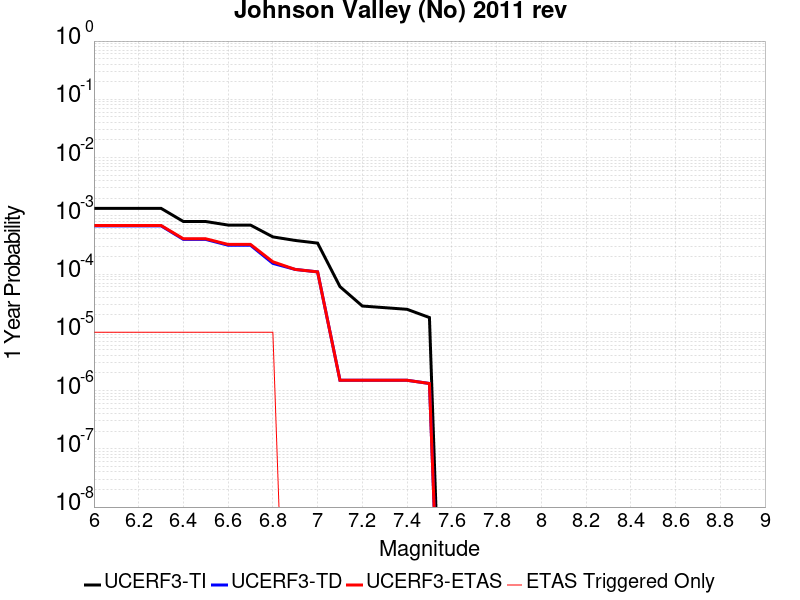 |  |

| Magnitude | 1 wk TI Prob | 1 wk TD Prob | 1 wk ETAS Prob | 1 wk ETAS/TD Gain | 1 wk ETAS Triggered Only | 1 mo TI Prob | 1 mo TD Prob | 1 mo ETAS Prob | 1 mo ETAS/TD Gain | 1 mo ETAS Triggered Only | 1 yr TI Prob | 1 yr TD Prob | 1 yr ETAS Prob | 1 yr ETAS/TD Gain | 1 yr ETAS Triggered Only | 10 yr TI Prob | 10 yr TD Prob | 10 yr ETAS Prob | 10 yr ETAS/TD Gain | 10 yr ETAS Triggered Only |
|-----|-----|-----|-----|-----|-----|-----|-----|-----|-----|-----|-----|-----|-----|-----|-----|-----|-----|-----|-----|-----|
| 6.0 | 2.577707E-5 | 1.2900938E-5 | 1.2900938E-5 | 1.0 | 0.0 | 1.1046848E-4 | 5.5288787E-5 | 5.5288787E-5 | 1.0 | 0.0 | 0.0013441239 | 6.7297276E-4 | 6.8855897E-4 | 1.0231602 | 1.5596732E-5 | 0.013360229 | 0.006713257 | 0.006744241 | 1.0046153 | 3.1193464E-5 |
| 6.1 | 2.577707E-5 | 1.2900938E-5 | 1.2900938E-5 | 1.0 | 0.0 | 1.1046848E-4 | 5.5288787E-5 | 5.5288787E-5 | 1.0 | 0.0 | 0.0013441239 | 6.7297276E-4 | 6.8855897E-4 | 1.0231602 | 1.5596732E-5 | 0.013360229 | 0.006713257 | 0.006744241 | 1.0046153 | 3.1193464E-5 |
| 6.2 | 2.577707E-5 | 1.2900938E-5 | 1.2900938E-5 | 1.0 | 0.0 | 1.1046848E-4 | 5.5288787E-5 | 5.5288787E-5 | 1.0 | 0.0 | 0.0013441239 | 6.7297276E-4 | 6.8855897E-4 | 1.0231602 | 1.5596732E-5 | 0.013360229 | 0.006713257 | 0.006744241 | 1.0046153 | 3.1193464E-5 |
| 6.3 | 2.577707E-5 | 1.2900938E-5 | 1.2900938E-5 | 1.0 | 0.0 | 1.1046848E-4 | 5.5288787E-5 | 5.5288787E-5 | 1.0 | 0.0 | 0.0013441239 | 6.7297276E-4 | 6.8855897E-4 | 1.0231602 | 1.5596732E-5 | 0.013360229 | 0.006713257 | 0.006744241 | 1.0046153 | 3.1193464E-5 |
| 6.4 | 1.5296591E-5 | 7.536742E-6 | 7.536742E-6 | 1.0 | 0.0 | 6.555518E-5 | 3.2300028E-5 | 3.2300028E-5 | 1.0 | 0.0 | 7.97842E-4 | 3.9320064E-4 | 4.0879124E-4 | 1.0396504 | 1.5596732E-5 | 0.007949836 | 0.0039268904 | 0.0039579617 | 1.0079124 | 3.1193464E-5 |
| 6.5 | 1.5296591E-5 | 7.536742E-6 | 7.536742E-6 | 1.0 | 0.0 | 6.555518E-5 | 3.2300028E-5 | 3.2300028E-5 | 1.0 | 0.0 | 7.97842E-4 | 3.9320064E-4 | 4.0879124E-4 | 1.0396504 | 1.5596732E-5 | 0.007949836 | 0.0039268904 | 0.0039579617 | 1.0079124 | 3.1193464E-5 |
| 6.6 | 1.3289383E-5 | 5.9917306E-6 | 5.9917306E-6 | 1.0 | 0.0 | 5.6953253E-5 | 2.5678688E-5 | 2.5678688E-5 | 1.0 | 0.0 | 6.9318525E-4 | 3.1261015E-4 | 3.28202E-4 | 1.0498763 | 1.5596732E-5 | 0.0069102696 | 0.0031233684 | 0.0031389163 | 1.004978 | 1.5596732E-5 |
| 6.7 | 1.3289383E-5 | 5.9917306E-6 | 5.9917306E-6 | 1.0 | 0.0 | 5.6953253E-5 | 2.5678688E-5 | 2.5678688E-5 | 1.0 | 0.0 | 6.9318525E-4 | 3.1261015E-4 | 3.28202E-4 | 1.0498763 | 1.5596732E-5 | 0.0069102696 | 0.0031233684 | 0.0031389163 | 1.004978 | 1.5596732E-5 |
| 6.8 | 8.330789E-6 | 2.9211888E-6 | 2.9211888E-6 | 1.0 | 0.0 | 3.570289E-5 | 1.2519352E-5 | 1.2519352E-5 | 1.0 | 0.0 | 4.34596E-4 | 1.5241816E-4 | 1.6801251E-4 | 1.1023129 | 1.5596732E-5 | 0.0043374705 | 0.0015236961 | 0.0015392691 | 1.0102205 | 1.5596732E-5 |
| 6.9 | 7.2359003E-6 | 2.3013247E-6 | 2.3013247E-6 | 1.0 | 0.0 | 3.1010633E-5 | 9.8628125E-6 | 9.8628125E-6 | 1.0 | 0.0 | 3.7748902E-4 | 1.2007845E-4 | 1.2007845E-4 | 1.0 | 0.0 | 0.0037684843 | 0.0012006586 | 0.0012006586 | 1.0 | 0.0 |
| 7.0 | 6.5149957E-6 | 2.088482E-6 | 2.088482E-6 | 1.0 | 0.0 | 2.792111E-5 | 8.950637E-6 | 8.950637E-6 | 1.0 | 0.0 | 3.398865E-4 | 1.0897385E-4 | 1.0897385E-4 | 1.0 | 0.0 | 0.003393671 | 0.0010897239 | 0.0010897239 | 1.0 | 0.0 |
| 7.1 | 1.1662233E-6 | 2.8802024E-8 | 2.8802024E-8 | 1.0 | 0.0 | 4.9980904E-6 | 1.2343725E-7 | 1.2343725E-7 | 1.0 | 0.0 | 6.0850052E-5 | 1.5028476E-6 | 1.5028476E-6 | 1.0 | 0.0 | 6.083339E-4 | 1.50283895E-5 | 1.50283895E-5 | 1.0 | 0.0 |
| 7.2 | 5.413881E-7 | 2.8802024E-8 | 2.8802024E-8 | 1.0 | 0.0 | 2.3202326E-6 | 1.2343725E-7 | 1.2343725E-7 | 1.0 | 0.0 | 2.8248465E-5 | 1.5028476E-6 | 1.5028476E-6 | 1.0 | 0.0 | 2.8244875E-4 | 1.50283895E-5 | 1.50283895E-5 | 1.0 | 0.0 |
| 7.3 | 5.076821E-7 | 2.8802024E-8 | 2.8802024E-8 | 1.0 | 0.0 | 2.1757785E-6 | 1.2343723E-7 | 1.2343723E-7 | 1.0 | 0.0 | 2.648978E-5 | 1.5028475E-6 | 1.5028475E-6 | 1.0 | 0.0 | 2.6486625E-4 | 1.50283895E-5 | 1.50283895E-5 | 1.0 | 0.0 |
| 7.4 | 4.7568687E-7 | 2.8783948E-8 | 2.8783948E-8 | 1.0 | 0.0 | 2.0386565E-6 | 1.2335977E-7 | 1.2335977E-7 | 1.0 | 0.0 | 2.482036E-5 | 1.5019043E-6 | 1.5019043E-6 | 1.0 | 0.0 | 2.4817587E-4 | 1.5018958E-5 | 1.5018958E-5 | 1.0 | 0.0 |
| 7.5 | 3.435626E-7 | 2.5357679E-8 | 2.5357679E-8 | 1.0 | 0.0 | 1.4724103E-6 | 1.0867576E-7 | 1.0867576E-7 | 1.0 | 0.0 | 1.7926448E-5 | 1.3231268E-6 | 1.3231268E-6 | 1.0 | 0.0 | 1.7925001E-4 | 1.3231205E-5 | 1.3231205E-5 | 1.0 | 0.0 |

## Greenville (No) 2011 CFM
*[(top)](#table-of-contents)*

| 1 Week | 1 Month | 1 Year | 10 Year |
|-----|-----|-----|-----|
| 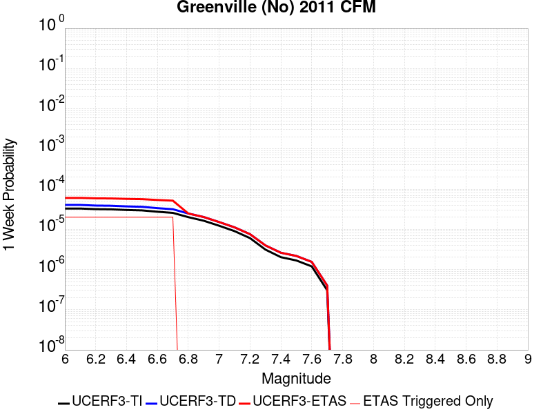 |  |  |  |

| Magnitude | 1 wk TI Prob | 1 wk TD Prob | 1 wk ETAS Prob | 1 wk ETAS/TD Gain | 1 wk ETAS Triggered Only | 1 mo TI Prob | 1 mo TD Prob | 1 mo ETAS Prob | 1 mo ETAS/TD Gain | 1 mo ETAS Triggered Only | 1 yr TI Prob | 1 yr TD Prob | 1 yr ETAS Prob | 1 yr ETAS/TD Gain | 1 yr ETAS Triggered Only | 10 yr TI Prob | 10 yr TD Prob | 10 yr ETAS Prob | 10 yr ETAS/TD Gain | 10 yr ETAS Triggered Only |
|-----|-----|-----|-----|-----|-----|-----|-----|-----|-----|-----|-----|-----|-----|-----|-----|-----|-----|-----|-----|-----|
| 6.0 | 3.286654E-5 | 4.036648E-5 | 7.155869E-5 | 1.7727253 | 3.1193464E-5 | 1.4084899E-4 | 1.7298796E-4 | 2.0417603E-4 | 1.1802903 | 3.1193464E-5 | 0.0017134876 | 0.002104132 | 0.0021352598 | 1.0147936 | 3.1193464E-5 | 0.017003356 | 0.020846982 | 0.020877525 | 1.0014651 | 3.1193464E-5 |
| 6.1 | 3.286654E-5 | 4.036648E-5 | 7.155869E-5 | 1.7727253 | 3.1193464E-5 | 1.4084899E-4 | 1.7298796E-4 | 2.0417603E-4 | 1.1802903 | 3.1193464E-5 | 0.0017134876 | 0.002104132 | 0.0021352598 | 1.0147936 | 3.1193464E-5 | 0.017003356 | 0.020846982 | 0.020877525 | 1.0014651 | 3.1193464E-5 |
| 6.2 | 3.1697953E-5 | 3.8929385E-5 | 7.0121634E-5 | 1.801252 | 3.1193464E-5 | 1.358413E-4 | 1.6682976E-4 | 1.9801802E-4 | 1.1869466 | 3.1193464E-5 | 0.0016526132 | 0.002029298 | 0.0020604283 | 1.0153403 | 3.1193464E-5 | 0.01640377 | 0.020112377 | 0.020142943 | 1.0015198 | 3.1193464E-5 |
| 6.3 | 3.1363317E-5 | 3.851826E-5 | 6.971052E-5 | 1.8098044 | 3.1193464E-5 | 1.344073E-4 | 1.6506804E-4 | 1.9625634E-4 | 1.1889422 | 3.1193464E-5 | 0.0016351803 | 0.0020078886 | 0.0020390195 | 1.0155042 | 3.1193464E-5 | 0.016232004 | 0.019902144 | 0.019932717 | 1.0015361 | 3.1193464E-5 |
| 6.4 | 3.0228604E-5 | 3.7125395E-5 | 6.83177E-5 | 1.8401878 | 3.1193464E-5 | 1.2954473E-4 | 1.5909935E-4 | 1.9028784E-4 | 1.1960316 | 3.1193464E-5 | 0.0015760659 | 0.0019353506 | 0.0019664837 | 1.0160866 | 3.1193464E-5 | 0.015649348 | 0.019189484 | 0.01922008 | 1.0015943 | 3.1193464E-5 |
| 6.5 | 2.9537814E-5 | 3.6280853E-5 | 6.747318E-5 | 1.8597463 | 3.1193464E-5 | 1.2658449E-4 | 1.554803E-4 | 1.8666891E-4 | 1.2005953 | 3.1193464E-5 | 0.0015400766 | 0.0018913659 | 0.0019225003 | 1.0164614 | 3.1193464E-5 | 0.01529447 | 0.018757146 | 0.018787755 | 1.0016319 | 3.1193464E-5 |
| 6.6 | 2.7345395E-5 | 3.3590182E-5 | 6.4782595E-5 | 1.928617 | 3.1193464E-5 | 1.1718928E-4 | 1.4395016E-4 | 1.7513914E-4 | 1.216665 | 3.1193464E-5 | 0.0014258457 | 0.0017512152 | 0.0017823541 | 1.0177813 | 3.1193464E-5 | 0.014167317 | 0.01737797 | 0.01740862 | 1.0017638 | 3.1193464E-5 |
| 6.7 | 2.5615784E-5 | 3.1567088E-5 | 6.2759565E-5 | 1.9881328 | 3.1193464E-5 | 1.09777306E-4 | 1.3528067E-4 | 1.6646992E-4 | 1.2305521 | 3.1193464E-5 | 0.0013357193 | 0.0016458282 | 0.0016769704 | 1.0189219 | 3.1193464E-5 | 0.013277191 | 0.016340064 | 0.01637075 | 1.0018778 | 3.1193464E-5 |
| 6.8 | 2.0059057E-5 | 2.4712073E-5 | 2.4712073E-5 | 1.0 | 0.0 | 8.596455E-5 | 1.0590468E-4 | 1.0590468E-4 | 1.0 | 0.0 | 0.0010461159 | 0.001288643 | 0.001288643 | 1.0 | 0.0 | 0.0104120495 | 0.012813724 | 0.012813724 | 1.0 | 0.0 |
| 6.9 | 1.6321746E-5 | 2.018467E-5 | 2.018467E-5 | 1.0 | 0.0 | 6.9948466E-5 | 8.650293E-5 | 8.650293E-5 | 1.0 | 0.0 | 8.5128983E-4 | 0.0010526767 | 0.0010526767 | 1.0 | 0.0 | 0.008480361 | 0.010478431 | 0.010478431 | 1.0 | 0.0 |
| 7.0 | 1.22527645E-5 | 1.5135633E-5 | 1.5135633E-5 | 1.0 | 0.0 | 5.2510793E-5 | 6.486541E-5 | 6.486541E-5 | 1.0 | 0.0 | 6.3913135E-4 | 7.894544E-4 | 7.894544E-4 | 1.0 | 0.0 | 0.0063729626 | 0.007867137 | 0.007867137 | 1.0 | 0.0 |
| 7.1 | 8.996482E-6 | 1.1164954E-5 | 1.1164954E-5 | 1.0 | 0.0 | 3.8555783E-5 | 4.7848935E-5 | 4.7848935E-5 | 1.0 | 0.0 | 4.6931554E-4 | 5.824063E-4 | 5.824063E-4 | 1.0 | 0.0 | 0.004683256 | 0.0058090906 | 0.0058090906 | 1.0 | 0.0 |
| 7.2 | 6.0273087E-6 | 7.569474E-6 | 7.569474E-6 | 1.0 | 0.0 | 2.5831067E-5 | 3.2440203E-5 | 3.2440203E-5 | 1.0 | 0.0 | 3.1444785E-4 | 3.9488857E-4 | 3.9488857E-4 | 1.0 | 0.0 | 0.0031400328 | 0.003942066 | 0.003942066 | 1.0 | 0.0 |
| 7.3 | 3.1209995E-6 | 3.9663746E-6 | 3.9663746E-6 | 1.0 | 0.0 | 1.3375643E-5 | 1.699864E-5 | 1.699864E-5 | 1.0 | 0.0 | 1.6283628E-4 | 2.0693893E-4 | 2.0693893E-4 | 1.0 | 0.0 | 0.0016271701 | 0.0020675526 | 0.0020675526 | 1.0 | 0.0 |
| 7.4 | 2.0254208E-6 | 2.6096043E-6 | 2.6096043E-6 | 1.0 | 0.0 | 8.680347E-6 | 1.1183971E-5 | 1.1183971E-5 | 1.0 | 0.0 | 1.0567809E-4 | 1.361564E-4 | 1.361564E-4 | 1.0 | 0.0 | 0.0010562785 | 0.0013607866 | 0.0013607866 | 1.0 | 0.0 |
| 7.5 | 1.6763418E-6 | 2.173353E-6 | 2.173353E-6 | 1.0 | 0.0 | 7.184302E-6 | 9.314337E-6 | 9.314337E-6 | 1.0 | 0.0 | 8.746537E-5 | 1.1339621E-4 | 1.1339621E-4 | 1.0 | 0.0 | 8.743095E-4 | 0.0011334305 | 0.0011334305 | 1.0 | 0.0 |
| 7.6 | 1.1935462E-6 | 1.5458467E-6 | 1.5458467E-6 | 1.0 | 0.0 | 5.115188E-6 | 6.6250404E-6 | 6.6250404E-6 | 1.0 | 0.0 | 6.2275634E-5 | 8.065693E-5 | 8.065693E-5 | 1.0 | 0.0 | 6.2258187E-4 | 8.0630725E-4 | 8.0630725E-4 | 1.0 | 0.0 |
| 7.7 | 3.0464201E-7 | 3.9846822E-7 | 3.9846822E-7 | 1.0 | 0.0 | 1.3056081E-6 | 1.7077199E-6 | 1.7077199E-6 | 1.0 | 0.0 | 1.589566E-5 | 2.0791296E-5 | 2.0791296E-5 | 1.0 | 0.0 | 1.5894524E-4 | 2.0789822E-4 | 2.0789822E-4 | 1.0 | 0.0 |

## Sheephole
*[(top)](#table-of-contents)*

| 1 Week | 1 Month | 1 Year | 10 Year |
|-----|-----|-----|-----|
|  |  |  |  |

| Magnitude | 1 wk TI Prob | 1 wk TD Prob | 1 wk ETAS Prob | 1 wk ETAS/TD Gain | 1 wk ETAS Triggered Only | 1 mo TI Prob | 1 mo TD Prob | 1 mo ETAS Prob | 1 mo ETAS/TD Gain | 1 mo ETAS Triggered Only | 1 yr TI Prob | 1 yr TD Prob | 1 yr ETAS Prob | 1 yr ETAS/TD Gain | 1 yr ETAS Triggered Only | 10 yr TI Prob | 10 yr TD Prob | 10 yr ETAS Prob | 10 yr ETAS/TD Gain | 10 yr ETAS Triggered Only |
|-----|-----|-----|-----|-----|-----|-----|-----|-----|-----|-----|-----|-----|-----|-----|-----|-----|-----|-----|-----|-----|
| 6.0 | 4.5579695E-6 | 4.7412627E-6 | 2.033792E-5 | 4.289558 | 1.5596732E-5 | 1.9534009E-5 | 2.031957E-5 | 3.5915982E-5 | 1.7675563 | 1.5596732E-5 | 2.3780059E-4 | 2.473682E-4 | 2.6296108E-4 | 1.063035 | 1.5596732E-5 | 0.0023754628 | 0.002471473 | 0.0025025895 | 1.0125902 | 3.1193464E-5 |
| 6.1 | 4.5579695E-6 | 4.7412627E-6 | 2.033792E-5 | 4.289558 | 1.5596732E-5 | 1.9534009E-5 | 2.031957E-5 | 3.5915982E-5 | 1.7675563 | 1.5596732E-5 | 2.3780059E-4 | 2.473682E-4 | 2.6296108E-4 | 1.063035 | 1.5596732E-5 | 0.0023754628 | 0.002471473 | 0.0025025895 | 1.0125902 | 3.1193464E-5 |
| 6.2 | 2.6677674E-6 | 2.7873941E-6 | 1.8384082E-5 | 6.5954366 | 1.5596732E-5 | 1.1433239E-5 | 1.1945926E-5 | 2.7542472E-5 | 2.3055952 | 1.5596732E-5 | 1.3919079E-4 | 1.4543302E-4 | 1.6102749E-4 | 1.1072278 | 1.5596732E-5 | 0.0013910364 | 0.0014534844 | 0.0014846325 | 1.02143 | 3.1193464E-5 |
| 6.3 | 2.6677674E-6 | 2.7873941E-6 | 1.8384082E-5 | 6.5954366 | 1.5596732E-5 | 1.1433239E-5 | 1.1945926E-5 | 2.7542472E-5 | 2.3055952 | 1.5596732E-5 | 1.3919079E-4 | 1.4543302E-4 | 1.6102749E-4 | 1.1072278 | 1.5596732E-5 | 0.0013910364 | 0.0014534844 | 0.0014846325 | 1.02143 | 3.1193464E-5 |
| 6.4 | 2.2159759E-6 | 2.3228788E-6 | 1.7919574E-5 | 7.7143817 | 1.5596732E-5 | 9.497005E-6 | 9.955161E-6 | 2.5551737E-5 | 2.5666823 | 1.5596732E-5 | 1.156199E-4 | 1.2119815E-4 | 1.36793E-4 | 1.1286722 | 1.5596732E-5 | 0.0011555976 | 0.0012113999 | 0.0012425556 | 1.0257187 | 3.1193464E-5 |
| 6.5 | 2.1986082E-6 | 2.304759E-6 | 1.7901453E-5 | 7.7671695 | 1.5596732E-5 | 9.4225725E-6 | 9.877506E-6 | 2.5474083E-5 | 2.5789995 | 1.5596732E-5 | 1.1471378E-4 | 1.2025281E-4 | 1.3584766E-4 | 1.129684 | 1.5596732E-5 | 0.0011465458 | 0.0012019566 | 0.0012331126 | 1.025921 | 3.1193464E-5 |
| 6.6 | 1.5232331E-6 | 1.6018919E-6 | 1.7198598E-5 | 10.736429 | 1.5596732E-5 | 6.5281256E-6 | 6.865234E-6 | 2.2461858E-5 | 3.271827 | 1.5596732E-5 | 7.947703E-5 | 8.35812E-5 | 9.917663E-5 | 1.1865901 | 1.5596732E-5 | 7.9448614E-4 | 8.3551643E-4 | 8.5110014E-4 | 1.0186516 | 1.5596732E-5 |
| 6.7 | 1.3137362E-6 | 1.382819E-6 | 1.6979528E-5 | 12.278923 | 1.5596732E-5 | 5.6302856E-6 | 5.926355E-6 | 2.1522994E-5 | 3.6317422 | 1.5596732E-5 | 6.854657E-5 | 7.215112E-5 | 8.7746725E-5 | 1.216152 | 1.5596732E-5 | 6.8525434E-4 | 7.212908E-4 | 7.3687633E-4 | 1.0216078 | 1.5596732E-5 |
| 6.8 | 1.2275751E-6 | 1.2922847E-6 | 1.6888995E-5 | 13.069098 | 1.5596732E-5 | 5.2610258E-6 | 5.5383516E-6 | 2.1134996E-5 | 3.8161166 | 1.5596732E-5 | 6.4051106E-5 | 6.7427485E-5 | 8.302316E-5 | 1.2312956 | 1.5596732E-5 | 6.4032647E-4 | 6.740836E-4 | 6.896698E-4 | 1.0231221 | 1.5596732E-5 |
| 6.9 | 1.1837088E-6 | 1.246102E-6 | 1.6842814E-5 | 13.5164 | 1.5596732E-5 | 5.0730278E-6 | 5.340427E-6 | 2.0937076E-5 | 3.920487 | 1.5596732E-5 | 6.176237E-5 | 6.501789E-5 | 8.061361E-5 | 1.239868 | 1.5596732E-5 | 6.17452E-4 | 6.5000186E-4 | 6.655884E-4 | 1.0239793 | 1.5596732E-5 |
| 7.0 | 9.849371E-7 | 1.0366288E-6 | 1.6633343E-5 | 16.045612 | 1.5596732E-5 | 4.2211523E-6 | 4.442688E-6 | 2.003935E-5 | 4.5106363 | 1.5596732E-5 | 5.1391315E-5 | 5.4088487E-5 | 6.968437E-5 | 1.2883402 | 1.5596732E-5 | 5.137943E-4 | 5.407633E-4 | 5.563516E-4 | 1.0288265 | 1.5596732E-5 |
| 7.1 | 8.1643645E-7 | 8.591669E-7 | 1.6455884E-5 | 19.153303 | 1.5596732E-5 | 3.4990085E-6 | 3.682139E-6 | 1.9278812E-5 | 5.2357645 | 1.5596732E-5 | 4.2599597E-5 | 4.482921E-5 | 6.0425242E-5 | 1.3478988 | 1.5596732E-5 | 4.259143E-4 | 4.4821028E-4 | 4.6380004E-4 | 1.0347822 | 1.5596732E-5 |
| 7.2 | 5.7295756E-7 | 6.029502E-7 | 1.6199672E-5 | 26.867346 | 1.5596732E-5 | 2.45553E-6 | 2.58407E-6 | 1.818076E-5 | 7.0357075 | 1.5596732E-5 | 2.9895667E-5 | 3.1460666E-5 | 4.7056907E-5 | 1.4957378 | 1.5596732E-5 | 2.9891645E-4 | 3.145688E-4 | 3.3016063E-4 | 1.0495657 | 1.5596732E-5 |

## Elsinore (Coyote Mountains)
*[(top)](#table-of-contents)*

| 1 Week | 1 Month | 1 Year | 10 Year |
|-----|-----|-----|-----|
|  |  |  |  |

| Magnitude | 1 wk TI Prob | 1 wk TD Prob | 1 wk ETAS Prob | 1 wk ETAS/TD Gain | 1 wk ETAS Triggered Only | 1 mo TI Prob | 1 mo TD Prob | 1 mo ETAS Prob | 1 mo ETAS/TD Gain | 1 mo ETAS Triggered Only | 1 yr TI Prob | 1 yr TD Prob | 1 yr ETAS Prob | 1 yr ETAS/TD Gain | 1 yr ETAS Triggered Only | 10 yr TI Prob | 10 yr TD Prob | 10 yr ETAS Prob | 10 yr ETAS/TD Gain | 10 yr ETAS Triggered Only |
|-----|-----|-----|-----|-----|-----|-----|-----|-----|-----|-----|-----|-----|-----|-----|-----|-----|-----|-----|-----|-----|
| 6.0 | 4.20513E-5 | 4.8631882E-5 | 6.4227854E-5 | 1.3206944 | 1.5596732E-5 | 1.8020741E-4 | 2.0840895E-4 | 2.2400243E-4 | 1.0748216 | 1.5596732E-5 | 0.0021918174 | 0.002535 | 0.0025661143 | 1.0122739 | 3.1193464E-5 | 0.021703249 | 0.025111282 | 0.025141694 | 1.001211 | 3.1193464E-5 |
| 6.1 | 4.20513E-5 | 4.8631882E-5 | 6.4227854E-5 | 1.3206944 | 1.5596732E-5 | 1.8020741E-4 | 2.0840895E-4 | 2.2400243E-4 | 1.0748216 | 1.5596732E-5 | 0.0021918174 | 0.002535 | 0.0025661143 | 1.0122739 | 3.1193464E-5 | 0.021703249 | 0.025111282 | 0.025141694 | 1.001211 | 3.1193464E-5 |
| 6.2 | 2.3413893E-5 | 2.469566E-5 | 4.0292005E-5 | 1.631542 | 1.5596732E-5 | 1.0034139E-4 | 1.0583479E-4 | 1.21429875E-4 | 1.147353 | 1.5596732E-5 | 0.0012209718 | 0.0012878707 | 0.0013190239 | 1.0241897 | 3.1193464E-5 | 0.012142851 | 0.01281264 | 0.012843434 | 1.0024034 | 3.1193464E-5 |
| 6.3 | 2.3413893E-5 | 2.469566E-5 | 4.0292005E-5 | 1.631542 | 1.5596732E-5 | 1.0034139E-4 | 1.0583479E-4 | 1.21429875E-4 | 1.147353 | 1.5596732E-5 | 0.0012209718 | 0.0012878707 | 0.0013190239 | 1.0241897 | 3.1193464E-5 | 0.012142851 | 0.01281264 | 0.012843434 | 1.0024034 | 3.1193464E-5 |
| 6.4 | 1.6894814E-5 | 1.6568361E-5 | 3.2164833E-5 | 1.9413407 | 1.5596732E-5 | 7.240433E-5 | 7.1005554E-5 | 8.6601176E-5 | 1.2196395 | 1.5596732E-5 | 8.811662E-4 | 8.6418656E-4 | 8.953531E-4 | 1.0360645 | 3.1193464E-5 | 0.0087768035 | 0.00861194 | 0.008642865 | 1.003591 | 3.1193464E-5 |
| 6.5 | 1.6894814E-5 | 1.6568361E-5 | 3.2164833E-5 | 1.9413407 | 1.5596732E-5 | 7.240433E-5 | 7.1005554E-5 | 8.6601176E-5 | 1.2196395 | 1.5596732E-5 | 8.811662E-4 | 8.6418656E-4 | 8.953531E-4 | 1.0360645 | 3.1193464E-5 | 0.0087768035 | 0.00861194 | 0.008642865 | 1.003591 | 3.1193464E-5 |
| 6.6 | 1.1910969E-5 | 1.0530774E-5 | 2.612734E-5 | 2.4810467 | 1.5596732E-5 | 5.1046012E-5 | 4.5131183E-5 | 6.072721E-5 | 1.345571 | 1.5596732E-5 | 6.21308E-4 | 5.4934516E-4 | 5.6493335E-4 | 1.0283759 | 1.5596732E-5 | 0.0061957375 | 0.005481174 | 0.0054966854 | 1.0028299 | 1.5596732E-5 |
| 6.7 | 9.1486E-6 | 7.2028593E-6 | 2.2799479E-5 | 3.165337 | 1.5596732E-5 | 3.9207694E-5 | 3.0869054E-5 | 4.6465302E-5 | 1.505239 | 1.5596732E-5 | 4.7724912E-4 | 3.757697E-4 | 3.913606E-4 | 1.0414904 | 1.5596732E-5 | 0.0047622547 | 0.0037517229 | 0.003767261 | 1.0041416 | 1.5596732E-5 |
| 6.8 | 7.90441E-6 | 5.7290276E-6 | 2.132567E-5 | 3.722389 | 1.5596732E-5 | 3.3875604E-5 | 2.4552752E-5 | 4.0149098E-5 | 1.6352179 | 1.5596732E-5 | 4.1235742E-4 | 2.9889002E-4 | 3.144821E-4 | 1.0521666 | 1.5596732E-5 | 0.0041159308 | 0.002985009 | 0.003000559 | 1.0052094 | 1.5596732E-5 |
| 6.9 | 7.77015E-6 | 5.582982E-6 | 2.1179625E-5 | 3.7936046 | 1.5596732E-5 | 3.3300217E-5 | 2.3926852E-5 | 3.952321E-5 | 1.651835 | 1.5596732E-5 | 4.0535472E-4 | 2.9127175E-4 | 3.0686395E-4 | 1.0535314 | 1.5596732E-5 | 0.004046161 | 0.002909027 | 0.0029245785 | 1.005346 | 1.5596732E-5 |
| 7.0 | 7.675798E-6 | 5.47984E-6 | 2.1076487E-5 | 3.8461862 | 1.5596732E-5 | 3.289586E-5 | 2.3484827E-5 | 3.908119E-5 | 1.6641039 | 1.5596732E-5 | 4.004335E-4 | 2.858915E-4 | 3.014838E-4 | 1.0545391 | 1.5596732E-5 | 0.003997127 | 0.0028553635 | 0.002870916 | 1.0054467 | 1.5596732E-5 |
| 7.1 | 7.447814E-6 | 5.238714E-6 | 2.0835363E-5 | 3.9771903 | 1.5596732E-5 | 3.191881E-5 | 2.2451446E-5 | 3.8047827E-5 | 1.6946715 | 1.5596732E-5 | 3.8854225E-4 | 2.7331332E-4 | 2.8890578E-4 | 1.0570498 | 1.5596732E-5 | 0.003878636 | 0.0027298962 | 0.0027454502 | 1.0056977 | 1.5596732E-5 |
| 7.2 | 7.128185E-6 | 4.905372E-6 | 2.0502026E-5 | 4.179505 | 1.5596732E-5 | 3.0549007E-5 | 2.102286E-5 | 3.661926E-5 | 1.7418783 | 1.5596732E-5 | 3.7187067E-4 | 2.5592445E-4 | 2.715172E-4 | 1.0609272 | 1.5596732E-5 | 0.00371249 | 0.0025564157 | 0.0025719726 | 1.0060854 | 1.5596732E-5 |
| 7.3 | 7.0913875E-6 | 4.874047E-6 | 2.0470703E-5 | 4.1999393 | 1.5596732E-5 | 3.0391306E-5 | 2.0888614E-5 | 3.6485017E-5 | 1.7466463 | 1.5596732E-5 | 3.6995133E-4 | 2.5429038E-4 | 2.6988314E-4 | 1.0613188 | 1.5596732E-5 | 0.0036933604 | 0.0025401122 | 0.0025556695 | 1.0061246 | 1.5596732E-5 |
| 7.4 | 7.051521E-6 | 4.837899E-6 | 2.0434554E-5 | 4.2238493 | 1.5596732E-5 | 3.0220453E-5 | 2.0733693E-5 | 3.63301E-5 | 1.7522253 | 1.5596732E-5 | 3.6787192E-4 | 2.5240466E-4 | 2.6799747E-4 | 1.061777 | 1.5596732E-5 | 0.0036726352 | 0.0025212981 | 0.0025368556 | 1.0061704 | 1.5596732E-5 |
| 7.5 | 6.910666E-6 | 4.733448E-6 | 2.0330106E-5 | 4.2949886 | 1.5596732E-5 | 2.9616802E-5 | 2.0286056E-5 | 3.588247E-5 | 1.7688245 | 1.5596732E-5 | 3.605249E-4 | 2.4695593E-4 | 2.625488E-4 | 1.0631404 | 1.5596732E-5 | 0.0035994058 | 0.0024669329 | 0.002482491 | 1.0063068 | 1.5596732E-5 |
| 7.6 | 6.341753E-6 | 4.3065565E-6 | 1.990322E-5 | 4.621609 | 1.5596732E-5 | 2.7178658E-5 | 1.8456547E-5 | 3.4052988E-5 | 1.8450358 | 1.5596732E-5 | 3.3084993E-4 | 2.2468645E-4 | 2.4027967E-4 | 1.0694 | 1.5596732E-5 | 0.0033035777 | 0.002244708 | 0.0022602696 | 1.0069326 | 1.5596732E-5 |
| 7.7 | 3.9205916E-6 | 2.2439415E-6 | 1.7840637E-5 | 7.9505806 | 1.5596732E-5 | 1.6802427E-5 | 9.616861E-6 | 2.5213441E-5 | 2.6217954 | 1.5596732E-5 | 2.0455034E-4 | 1.1707973E-4 | 1.3267463E-4 | 1.133199 | 1.5596732E-5 | 0.0020436216 | 0.0011702535 | 0.001185832 | 1.0133121 | 1.5596732E-5 |
| 7.8 | 2.0846227E-7 | 8.486417E-8 | 8.486417E-8 | 1.0 | 0.0 | 8.9340944E-7 | 3.6370355E-7 | 3.6370355E-7 | 1.0 | 0.0 | 1.0877206E-5 | 4.428085E-6 | 4.428085E-6 | 1.0 | 0.0 | 1.0876673E-4 | 4.4280296E-5 | 4.4280296E-5 | 1.0 | 0.0 |
| 7.9 | 4.4969806E-9 | 2.2691855E-9 | 2.2691855E-9 | 1.0 | 0.0 | 1.9272775E-8 | 9.72508E-9 | 9.72508E-9 | 1.0 | 0.0 | 2.3464601E-7 | 1.18402845E-7 | 1.18402845E-7 | 1.0 | 0.0 | 2.3464577E-6 | 1.184028E-6 | 1.184028E-6 | 1.0 | 0.0 |

## Pitas Point (Lower)-Montalvo
*[(top)](#table-of-contents)*

| 1 Week | 1 Month | 1 Year | 10 Year |
|-----|-----|-----|-----|
|  |  |  |  |

| Magnitude | 1 wk TI Prob | 1 wk TD Prob | 1 wk ETAS Prob | 1 wk ETAS/TD Gain | 1 wk ETAS Triggered Only | 1 mo TI Prob | 1 mo TD Prob | 1 mo ETAS Prob | 1 mo ETAS/TD Gain | 1 mo ETAS Triggered Only | 1 yr TI Prob | 1 yr TD Prob | 1 yr ETAS Prob | 1 yr ETAS/TD Gain | 1 yr ETAS Triggered Only | 10 yr TI Prob | 10 yr TD Prob | 10 yr ETAS Prob | 10 yr ETAS/TD Gain | 10 yr ETAS Triggered Only |
|-----|-----|-----|-----|-----|-----|-----|-----|-----|-----|-----|-----|-----|-----|-----|-----|-----|-----|-----|-----|-----|
| 6.0 | 5.2543637E-6 | 4.8378706E-6 | 3.6031182E-5 | 7.447736 | 3.1193464E-5 | 2.2518509E-5 | 2.0733567E-5 | 5.192638E-5 | 2.5044596 | 3.1193464E-5 | 2.7412834E-4 | 2.5240227E-4 | 2.8358784E-4 | 1.1235551 | 3.1193464E-5 | 0.0027379042 | 0.0025211885 | 0.0025523033 | 1.0123414 | 3.1193464E-5 |
| 6.1 | 5.2543637E-6 | 4.8378706E-6 | 3.6031182E-5 | 7.447736 | 3.1193464E-5 | 2.2518509E-5 | 2.0733567E-5 | 5.192638E-5 | 2.5044596 | 3.1193464E-5 | 2.7412834E-4 | 2.5240227E-4 | 2.8358784E-4 | 1.1235551 | 3.1193464E-5 | 0.0027379042 | 0.0025211885 | 0.0025523033 | 1.0123414 | 3.1193464E-5 |
| 6.2 | 5.2543637E-6 | 4.8378706E-6 | 3.6031182E-5 | 7.447736 | 3.1193464E-5 | 2.2518509E-5 | 2.0733567E-5 | 5.192638E-5 | 2.5044596 | 3.1193464E-5 | 2.7412834E-4 | 2.5240227E-4 | 2.8358784E-4 | 1.1235551 | 3.1193464E-5 | 0.0027379042 | 0.0025211885 | 0.0025523033 | 1.0123414 | 3.1193464E-5 |
| 6.3 | 5.2543637E-6 | 4.8378706E-6 | 3.6031182E-5 | 7.447736 | 3.1193464E-5 | 2.2518509E-5 | 2.0733567E-5 | 5.192638E-5 | 2.5044596 | 3.1193464E-5 | 2.7412834E-4 | 2.5240227E-4 | 2.8358784E-4 | 1.1235551 | 3.1193464E-5 | 0.0027379042 | 0.0025211885 | 0.0025523033 | 1.0123414 | 3.1193464E-5 |
| 6.4 | 5.2543637E-6 | 4.8378706E-6 | 3.6031182E-5 | 7.447736 | 3.1193464E-5 | 2.2518509E-5 | 2.0733567E-5 | 5.192638E-5 | 2.5044596 | 3.1193464E-5 | 2.7412834E-4 | 2.5240227E-4 | 2.8358784E-4 | 1.1235551 | 3.1193464E-5 | 0.0027379042 | 0.0025211885 | 0.0025523033 | 1.0123414 | 3.1193464E-5 |
| 6.5 | 5.2543637E-6 | 4.8378706E-6 | 3.6031182E-5 | 7.447736 | 3.1193464E-5 | 2.2518509E-5 | 2.0733567E-5 | 5.192638E-5 | 2.5044596 | 3.1193464E-5 | 2.7412834E-4 | 2.5240227E-4 | 2.8358784E-4 | 1.1235551 | 3.1193464E-5 | 0.0027379042 | 0.0025211885 | 0.0025523033 | 1.0123414 | 3.1193464E-5 |
| 6.6 | 5.2543637E-6 | 4.8378706E-6 | 3.6031182E-5 | 7.447736 | 3.1193464E-5 | 2.2518509E-5 | 2.0733567E-5 | 5.192638E-5 | 2.5044596 | 3.1193464E-5 | 2.7412834E-4 | 2.5240227E-4 | 2.8358784E-4 | 1.1235551 | 3.1193464E-5 | 0.0027379042 | 0.0025211885 | 0.0025523033 | 1.0123414 | 3.1193464E-5 |
| 6.7 | 5.2543637E-6 | 4.8378706E-6 | 3.6031182E-5 | 7.447736 | 3.1193464E-5 | 2.2518509E-5 | 2.0733567E-5 | 5.192638E-5 | 2.5044596 | 3.1193464E-5 | 2.7412834E-4 | 2.5240227E-4 | 2.8358784E-4 | 1.1235551 | 3.1193464E-5 | 0.0027379042 | 0.0025211885 | 0.0025523033 | 1.0123414 | 3.1193464E-5 |
| 6.8 | 5.2543637E-6 | 4.8378706E-6 | 3.6031182E-5 | 7.447736 | 3.1193464E-5 | 2.2518509E-5 | 2.0733567E-5 | 5.192638E-5 | 2.5044596 | 3.1193464E-5 | 2.7412834E-4 | 2.5240227E-4 | 2.8358784E-4 | 1.1235551 | 3.1193464E-5 | 0.0027379042 | 0.0025211885 | 0.0025523033 | 1.0123414 | 3.1193464E-5 |
| 6.9 | 5.2543637E-6 | 4.8378706E-6 | 3.6031182E-5 | 7.447736 | 3.1193464E-5 | 2.2518509E-5 | 2.0733567E-5 | 5.192638E-5 | 2.5044596 | 3.1193464E-5 | 2.7412834E-4 | 2.5240227E-4 | 2.8358784E-4 | 1.1235551 | 3.1193464E-5 | 0.0027379042 | 0.0025211885 | 0.0025523033 | 1.0123414 | 3.1193464E-5 |
| 7.0 | 5.2543637E-6 | 4.8378706E-6 | 3.6031182E-5 | 7.447736 | 3.1193464E-5 | 2.2518509E-5 | 2.0733567E-5 | 5.192638E-5 | 2.5044596 | 3.1193464E-5 | 2.7412834E-4 | 2.5240227E-4 | 2.8358784E-4 | 1.1235551 | 3.1193464E-5 | 0.0027379042 | 0.0025211885 | 0.0025523033 | 1.0123414 | 3.1193464E-5 |
| 7.1 | 5.2543637E-6 | 4.8378706E-6 | 3.6031182E-5 | 7.447736 | 3.1193464E-5 | 2.2518509E-5 | 2.0733567E-5 | 5.192638E-5 | 2.5044596 | 3.1193464E-5 | 2.7412834E-4 | 2.5240227E-4 | 2.8358784E-4 | 1.1235551 | 3.1193464E-5 | 0.0027379042 | 0.0025211885 | 0.0025523033 | 1.0123414 | 3.1193464E-5 |
| 7.2 | 5.2458695E-6 | 4.8290244E-6 | 3.6022335E-5 | 7.4595475 | 3.1193464E-5 | 2.2482105E-5 | 2.0695656E-5 | 5.1888474E-5 | 2.5072157 | 3.1193464E-5 | 2.7368523E-4 | 2.519408E-4 | 2.831264E-4 | 1.1237814 | 3.1193464E-5 | 0.0027334841 | 0.0025165842 | 0.002547699 | 1.0123639 | 3.1193464E-5 |
| 7.3 | 5.22665E-6 | 4.8089414E-6 | 3.6002253E-5 | 7.486523 | 3.1193464E-5 | 2.2399736E-5 | 2.0609588E-5 | 5.1802406E-5 | 2.51351 | 3.1193464E-5 | 2.7268266E-4 | 2.5089315E-4 | 2.820788E-4 | 1.1242985 | 3.1193464E-5 | 0.002723483 | 0.0025061315 | 0.0025372468 | 1.0124156 | 3.1193464E-5 |
| 7.4 | 5.210642E-6 | 4.792154E-6 | 3.5985468E-5 | 7.509247 | 3.1193464E-5 | 2.233113E-5 | 2.0537642E-5 | 5.1730465E-5 | 2.5188122 | 3.1193464E-5 | 2.718476E-4 | 2.5001742E-4 | 2.8120307E-4 | 1.1247339 | 3.1193464E-5 | 0.002715153 | 0.0024973939 | 0.0025285094 | 1.0124592 | 3.1193464E-5 |
| 7.5 | 5.1226016E-6 | 4.7000403E-6 | 3.5893358E-5 | 7.6368184 | 3.1193464E-5 | 2.1953823E-5 | 2.0142877E-5 | 5.133571E-5 | 2.5485787 | 3.1193464E-5 | 2.67255E-4 | 2.4521223E-4 | 2.7639806E-4 | 1.1271789 | 3.1193464E-5 | 0.0026693381 | 0.0024494485 | 0.0024805653 | 1.0127037 | 3.1193464E-5 |
| 7.6 | 4.8796987E-6 | 4.4449403E-6 | 3.5638262E-5 | 8.0177145 | 3.1193464E-5 | 2.0912828E-5 | 1.9049607E-5 | 5.0242474E-5 | 2.6374547 | 3.1193464E-5 | 2.5458392E-4 | 2.3190459E-4 | 2.630908E-4 | 1.1344787 | 3.1193464E-5 | 0.0025429246 | 0.0023166565 | 0.0023477776 | 1.0134337 | 3.1193464E-5 |
| 7.7 | 4.0834398E-6 | 3.6091124E-6 | 1.9205787E-5 | 5.321471 | 1.5596732E-5 | 1.7500339E-5 | 1.5467534E-5 | 3.1064024E-5 | 2.0083373 | 1.5596732E-5 | 2.1304579E-4 | 1.8830119E-4 | 2.0389498E-4 | 1.082813 | 1.5596732E-5 | 0.0021284167 | 0.00188144 | 0.0018970075 | 1.0082742 | 1.5596732E-5 |
| 7.8 | 2.5445438E-6 | 2.121228E-6 | 2.121228E-6 | 1.0 | 0.0 | 1.0905142E-5 | 9.090945E-6 | 9.090945E-6 | 1.0 | 0.0 | 1.3276201E-4 | 1.1067669E-4 | 1.1067669E-4 | 1.0 | 0.0 | 0.0013268272 | 0.0011062203 | 0.0011062203 | 1.0 | 0.0 |
| 7.9 | 4.1677114E-7 | 3.3293693E-7 | 3.3293693E-7 | 1.0 | 0.0 | 1.7861609E-6 | 1.4268718E-6 | 1.4268718E-6 | 1.0 | 0.0 | 2.1746291E-5 | 1.737203E-5 | 1.737203E-5 | 1.0 | 0.0 | 2.1744163E-4 | 1.7370703E-4 | 1.7370703E-4 | 1.0 | 0.0 |
| 8.0 | 7.791402E-9 | 5.683497E-9 | 5.683497E-9 | 1.0 | 0.0 | 3.3391725E-8 | 2.4357844E-8 | 2.4357844E-8 | 1.0 | 0.0 | 4.0654416E-7 | 2.9655675E-7 | 2.9655675E-7 | 1.0 | 0.0 | 4.065434E-6 | 2.9655655E-6 | 2.9655655E-6 | 1.0 | 0.0 |

## Newport-Inglewood alt 1
*[(top)](#table-of-contents)*

| 1 Week | 1 Month | 1 Year | 10 Year |
|-----|-----|-----|-----|
|  |  |  |  |

| Magnitude | 1 wk TI Prob | 1 wk TD Prob | 1 wk ETAS Prob | 1 wk ETAS/TD Gain | 1 wk ETAS Triggered Only | 1 mo TI Prob | 1 mo TD Prob | 1 mo ETAS Prob | 1 mo ETAS/TD Gain | 1 mo ETAS Triggered Only | 1 yr TI Prob | 1 yr TD Prob | 1 yr ETAS Prob | 1 yr ETAS/TD Gain | 1 yr ETAS Triggered Only | 10 yr TI Prob | 10 yr TD Prob | 10 yr ETAS Prob | 10 yr ETAS/TD Gain | 10 yr ETAS Triggered Only |
|-----|-----|-----|-----|-----|-----|-----|-----|-----|-----|-----|-----|-----|-----|-----|-----|-----|-----|-----|-----|-----|
| 6.0 | 2.9668912E-5 | 3.0404817E-5 | 3.0404817E-5 | 1.0 | 0.0 | 1.2714628E-4 | 1.303026E-4 | 1.458973E-4 | 1.1196806 | 1.5596732E-5 | 0.0015469068 | 0.0015857625 | 0.0016013345 | 1.0098199 | 1.5596732E-5 | 0.015361829 | 0.015792042 | 0.015822744 | 1.0019441 | 3.1193464E-5 |
| 6.1 | 2.9668912E-5 | 3.0404817E-5 | 3.0404817E-5 | 1.0 | 0.0 | 1.2714628E-4 | 1.303026E-4 | 1.458973E-4 | 1.1196806 | 1.5596732E-5 | 0.0015469068 | 0.0015857625 | 0.0016013345 | 1.0098199 | 1.5596732E-5 | 0.015361829 | 0.015792042 | 0.015822744 | 1.0019441 | 3.1193464E-5 |
| 6.2 | 2.9668912E-5 | 3.0404817E-5 | 3.0404817E-5 | 1.0 | 0.0 | 1.2714628E-4 | 1.303026E-4 | 1.458973E-4 | 1.1196806 | 1.5596732E-5 | 0.0015469068 | 0.0015857625 | 0.0016013345 | 1.0098199 | 1.5596732E-5 | 0.015361829 | 0.015792042 | 0.015822744 | 1.0019441 | 3.1193464E-5 |
| 6.3 | 2.9668912E-5 | 3.0404817E-5 | 3.0404817E-5 | 1.0 | 0.0 | 1.2714628E-4 | 1.303026E-4 | 1.458973E-4 | 1.1196806 | 1.5596732E-5 | 0.0015469068 | 0.0015857625 | 0.0016013345 | 1.0098199 | 1.5596732E-5 | 0.015361829 | 0.015792042 | 0.015822744 | 1.0019441 | 3.1193464E-5 |
| 6.4 | 1.275942E-5 | 1.0272503E-5 | 1.0272503E-5 | 1.0 | 0.0 | 5.4682085E-5 | 4.402429E-5 | 5.9620335E-5 | 1.35426 | 1.5596732E-5 | 6.65551E-4 | 5.358681E-4 | 5.5145647E-4 | 1.0290899 | 1.5596732E-5 | 0.0066356123 | 0.005346184 | 0.0053616976 | 1.0029018 | 1.5596732E-5 |
| 6.5 | 1.275942E-5 | 1.0272503E-5 | 1.0272503E-5 | 1.0 | 0.0 | 5.4682085E-5 | 4.402429E-5 | 5.9620335E-5 | 1.35426 | 1.5596732E-5 | 6.65551E-4 | 5.358681E-4 | 5.5145647E-4 | 1.0290899 | 1.5596732E-5 | 0.0066356123 | 0.005346184 | 0.0053616976 | 1.0029018 | 1.5596732E-5 |
| 6.6 | 1.1255358E-5 | 8.661884E-6 | 8.661884E-6 | 1.0 | 0.0 | 4.8236358E-5 | 3.712184E-5 | 5.271799E-5 | 1.4201341 | 1.5596732E-5 | 5.871194E-4 | 4.518664E-4 | 4.6745606E-4 | 1.0345006 | 1.5596732E-5 | 0.005855706 | 0.004509653 | 0.0045251795 | 1.0034429 | 1.5596732E-5 |
| 6.7 | 1.0504745E-5 | 7.8997955E-6 | 7.8997955E-6 | 1.0 | 0.0 | 4.5019555E-5 | 3.3855835E-5 | 4.9452035E-5 | 1.4606651 | 1.5596732E-5 | 5.4797524E-4 | 4.1211807E-4 | 4.2770838E-4 | 1.0378298 | 1.5596732E-5 | 0.0054662596 | 0.004113668 | 0.0041292007 | 1.0037758 | 1.5596732E-5 |
| 6.8 | 1.0476007E-5 | 7.881176E-6 | 7.881176E-6 | 1.0 | 0.0 | 4.4896402E-5 | 3.3776043E-5 | 4.9372244E-5 | 1.4617535 | 1.5596732E-5 | 5.464766E-4 | 4.1114696E-4 | 4.2673727E-4 | 1.037919 | 1.5596732E-5 | 0.005451347 | 0.0041039926 | 0.0041195257 | 1.0037848 | 1.5596732E-5 |
| 6.9 | 9.076797E-6 | 6.4896312E-6 | 6.4896312E-6 | 1.0 | 0.0 | 3.889998E-5 | 2.781241E-5 | 4.340871E-5 | 1.5607675 | 1.5596732E-5 | 4.7350433E-4 | 3.385638E-4 | 3.5415526E-4 | 1.0460517 | 1.5596732E-5 | 0.004724967 | 0.0033805177 | 0.0033960617 | 1.0045981 | 1.5596732E-5 |
| 7.0 | 8.73795E-6 | 6.2120125E-6 | 6.2120125E-6 | 1.0 | 0.0 | 3.7447822E-5 | 2.6622642E-5 | 4.2218955E-5 | 1.585829 | 1.5596732E-5 | 4.5583185E-4 | 3.2408274E-4 | 3.3967439E-4 | 1.0481101 | 1.5596732E-5 | 0.0045489795 | 0.0032361327 | 0.003251679 | 1.004804 | 1.5596732E-5 |
| 7.1 | 8.391299E-6 | 5.95579E-6 | 5.95579E-6 | 1.0 | 0.0 | 3.5962214E-5 | 2.5524565E-5 | 4.11209E-5 | 1.6110322 | 1.5596732E-5 | 4.37752E-4 | 3.1071753E-4 | 3.263094E-4 | 1.0501802 | 1.5596732E-5 | 0.004368907 | 0.0031028606 | 0.0031184088 | 1.005011 | 1.5596732E-5 |
| 7.2 | 7.796882E-6 | 5.4965344E-6 | 5.4965344E-6 | 1.0 | 0.0 | 3.341478E-5 | 2.3556364E-5 | 3.915273E-5 | 1.6620871 | 1.5596732E-5 | 4.06749E-4 | 2.867612E-4 | 3.0235347E-4 | 1.0543736 | 1.5596732E-5 | 0.0040600533 | 0.0028639357 | 0.0028794878 | 1.0054303 | 1.5596732E-5 |
| 7.3 | 6.4738833E-6 | 4.6478162E-6 | 4.6478162E-6 | 1.0 | 0.0 | 2.774492E-5 | 1.9919062E-5 | 3.551548E-5 | 1.7829897 | 1.5596732E-5 | 3.3774204E-4 | 2.4248775E-4 | 2.580807E-4 | 1.0643041 | 1.5596732E-5 | 0.0033722918 | 0.0024222482 | 0.0024378072 | 1.0064234 | 1.5596732E-5 |
| 7.4 | 5.382145E-6 | 3.8857597E-6 | 3.8857597E-6 | 1.0 | 0.0 | 2.3066134E-5 | 1.665315E-5 | 3.2249623E-5 | 1.9365478 | 1.5596732E-5 | 2.8079396E-4 | 2.0273338E-4 | 2.1832695E-4 | 1.0769166 | 1.5596732E-5 | 0.0028043943 | 0.0020254988 | 0.002041064 | 1.0076846 | 1.5596732E-5 |
| 7.5 | 3.648244E-6 | 2.5737843E-6 | 2.5737843E-6 | 1.0 | 0.0 | 1.5635238E-5 | 1.1030458E-5 | 2.6627016E-5 | 2.4139538 | 1.5596732E-5 | 1.9034238E-4 | 1.3428765E-4 | 1.4988228E-4 | 1.1161286 | 1.5596732E-5 | 0.0019017943 | 0.0013420755 | 0.0013576513 | 1.0116057 | 1.5596732E-5 |
| 7.6 | 2.2906888E-6 | 1.5479842E-6 | 1.5479842E-6 | 1.0 | 0.0 | 9.817201E-6 | 6.634202E-6 | 6.634202E-6 | 1.0 | 0.0 | 1.1951787E-4 | 8.076848E-5 | 8.076848E-5 | 1.0 | 0.0 | 0.0011945361 | 8.07398E-4 | 8.07398E-4 | 1.0 | 0.0 |
| 7.7 | 6.0479874E-7 | 3.397512E-7 | 3.397512E-7 | 1.0 | 0.0 | 2.5919921E-6 | 1.4560758E-6 | 1.4560758E-6 | 1.0 | 0.0 | 3.1557047E-5 | 1.7727592E-5 | 1.7727592E-5 | 1.0 | 0.0 | 3.1552566E-4 | 1.7726317E-4 | 1.7726317E-4 | 1.0 | 0.0 |
| 7.8 | 1.16056995E-8 | 9.782373E-9 | 9.782373E-9 | 1.0 | 0.0 | 4.9738713E-8 | 4.1924455E-8 | 4.1924455E-8 | 1.0 | 0.0 | 6.0556863E-7 | 5.1043025E-7 | 5.1043025E-7 | 1.0 | 0.0 | 6.05567E-6 | 5.1043025E-6 | 5.1043025E-6 | 1.0 | 0.0 |

## San Jose
*[(top)](#table-of-contents)*

| 1 Week | 1 Month | 1 Year | 10 Year |
|-----|-----|-----|-----|
|  |  |  |  |

| Magnitude | 1 wk TI Prob | 1 wk TD Prob | 1 wk ETAS Prob | 1 wk ETAS/TD Gain | 1 wk ETAS Triggered Only | 1 mo TI Prob | 1 mo TD Prob | 1 mo ETAS Prob | 1 mo ETAS/TD Gain | 1 mo ETAS Triggered Only | 1 yr TI Prob | 1 yr TD Prob | 1 yr ETAS Prob | 1 yr ETAS/TD Gain | 1 yr ETAS Triggered Only | 10 yr TI Prob | 10 yr TD Prob | 10 yr ETAS Prob | 10 yr ETAS/TD Gain | 10 yr ETAS Triggered Only |
|-----|-----|-----|-----|-----|-----|-----|-----|-----|-----|-----|-----|-----|-----|-----|-----|-----|-----|-----|-----|-----|
| 6.0 | 5.0851277E-6 | 4.1256726E-6 | 1.972234E-5 | 4.7803936 | 1.5596732E-5 | 2.1793223E-5 | 1.768135E-5 | 3.3277804E-5 | 1.8820851 | 1.5596732E-5 | 2.653002E-4 | 2.152518E-4 | 2.3084517E-4 | 1.0724425 | 1.5596732E-5 | 0.0026498367 | 0.0021507242 | 0.0021818506 | 1.0144725 | 3.1193464E-5 |
| 6.1 | 5.0851277E-6 | 4.1256726E-6 | 1.972234E-5 | 4.7803936 | 1.5596732E-5 | 2.1793223E-5 | 1.768135E-5 | 3.3277804E-5 | 1.8820851 | 1.5596732E-5 | 2.653002E-4 | 2.152518E-4 | 2.3084517E-4 | 1.0724425 | 1.5596732E-5 | 0.0026498367 | 0.0021507242 | 0.0021818506 | 1.0144725 | 3.1193464E-5 |
| 6.2 | 5.0851277E-6 | 4.1256726E-6 | 1.972234E-5 | 4.7803936 | 1.5596732E-5 | 2.1793223E-5 | 1.768135E-5 | 3.3277804E-5 | 1.8820851 | 1.5596732E-5 | 2.653002E-4 | 2.152518E-4 | 2.3084517E-4 | 1.0724425 | 1.5596732E-5 | 0.0026498367 | 0.0021507242 | 0.0021818506 | 1.0144725 | 3.1193464E-5 |
| 6.3 | 5.0851277E-6 | 4.1256726E-6 | 1.972234E-5 | 4.7803936 | 1.5596732E-5 | 2.1793223E-5 | 1.768135E-5 | 3.3277804E-5 | 1.8820851 | 1.5596732E-5 | 2.653002E-4 | 2.152518E-4 | 2.3084517E-4 | 1.0724425 | 1.5596732E-5 | 0.0026498367 | 0.0021507242 | 0.0021818506 | 1.0144725 | 3.1193464E-5 |
| 6.4 | 4.3115124E-6 | 3.3237832E-6 | 1.8920462E-5 | 5.6924477 | 1.5596732E-5 | 1.8477778E-5 | 1.424472E-5 | 2.9841229E-5 | 2.0948975 | 1.5596732E-5 | 2.2494372E-4 | 1.7341787E-4 | 1.890119E-4 | 1.0899217 | 1.5596732E-5 | 0.0022471617 | 0.0017330751 | 0.0017486449 | 1.0089839 | 1.5596732E-5 |
| 6.5 | 4.3115124E-6 | 3.3237832E-6 | 1.8920462E-5 | 5.6924477 | 1.5596732E-5 | 1.8477778E-5 | 1.424472E-5 | 2.9841229E-5 | 2.0948975 | 1.5596732E-5 | 2.2494372E-4 | 1.7341787E-4 | 1.890119E-4 | 1.0899217 | 1.5596732E-5 | 0.0022471617 | 0.0017330751 | 0.0017486449 | 1.0089839 | 1.5596732E-5 |
| 6.6 | 3.110396E-6 | 2.0799866E-6 | 2.0799866E-6 | 1.0 | 0.0 | 1.33302E-5 | 8.9141995E-6 | 8.9141995E-6 | 1.0 | 0.0 | 1.622831E-4 | 1.0852526E-4 | 1.0852526E-4 | 1.0 | 0.0 | 0.0016216465 | 0.0010847825 | 0.0010847825 | 1.0 | 0.0 |
| 6.7 | 3.110396E-6 | 2.0799866E-6 | 2.0799866E-6 | 1.0 | 0.0 | 1.33302E-5 | 8.9141995E-6 | 8.9141995E-6 | 1.0 | 0.0 | 1.622831E-4 | 1.0852526E-4 | 1.0852526E-4 | 1.0 | 0.0 | 0.0016216465 | 0.0010847825 | 0.0010847825 | 1.0 | 0.0 |
| 6.8 | 2.856651E-6 | 1.902435E-6 | 1.902435E-6 | 1.0 | 0.0 | 1.2242733E-5 | 8.153269E-6 | 8.153269E-6 | 1.0 | 0.0 | 1.4904508E-4 | 9.926178E-5 | 9.926178E-5 | 1.0 | 0.0 | 0.0014894515 | 9.922314E-4 | 9.922314E-4 | 1.0 | 0.0 |
| 6.9 | 2.1618725E-6 | 1.4186642E-6 | 1.4186642E-6 | 1.0 | 0.0 | 9.265135E-6 | 6.0799757E-6 | 6.0799757E-6 | 1.0 | 0.0 | 1.12797185E-4 | 7.402128E-5 | 7.402128E-5 | 1.0 | 0.0 | 0.0011273995 | 7.4000744E-4 | 7.4000744E-4 | 1.0 | 0.0 |
| 7.0 | 1.9684312E-6 | 1.3256331E-6 | 1.3256331E-6 | 1.0 | 0.0 | 8.436106E-6 | 5.681273E-6 | 5.681273E-6 | 1.0 | 0.0 | 1.02704755E-4 | 6.9167385E-5 | 6.9167385E-5 | 1.0 | 0.0 | 0.001026573 | 6.914992E-4 | 6.914992E-4 | 1.0 | 0.0 |
| 7.1 | 1.6070337E-6 | 1.1155087E-6 | 1.1155087E-6 | 1.0 | 0.0 | 6.887269E-6 | 4.780743E-6 | 4.780743E-6 | 1.0 | 0.0 | 8.384928E-5 | 5.8204052E-5 | 5.8204052E-5 | 1.0 | 0.0 | 8.3817646E-4 | 5.819267E-4 | 5.819267E-4 | 1.0 | 0.0 |
| 7.2 | 1.0631658E-6 | 6.4037624E-7 | 6.4037624E-7 | 1.0 | 0.0 | 4.556417E-6 | 2.7444669E-6 | 2.7444669E-6 | 1.0 | 0.0 | 5.5472963E-5 | 3.3413387E-5 | 3.3413387E-5 | 1.0 | 0.0 | 5.545912E-4 | 3.3411747E-4 | 3.3411747E-4 | 1.0 | 0.0 |
| 7.3 | 7.060711E-7 | 4.5824706E-7 | 4.5824706E-7 | 1.0 | 0.0 | 3.0260155E-6 | 1.9639147E-6 | 1.9639147E-6 | 1.0 | 0.0 | 3.6841117E-5 | 2.3910407E-5 | 2.3910407E-5 | 1.0 | 0.0 | 3.6835007E-4 | 2.3911172E-4 | 2.3911172E-4 | 1.0 | 0.0 |
| 7.4 | 3.3677085E-7 | 2.3233133E-7 | 2.3233133E-7 | 1.0 | 0.0 | 1.4433028E-6 | 9.957054E-7 | 9.957054E-7 | 1.0 | 0.0 | 1.757207E-5 | 1.21226485E-5 | 1.21226485E-5 | 1.0 | 0.0 | 1.7570681E-4 | 1.2125263E-4 | 1.2125263E-4 | 1.0 | 0.0 |
| 7.5 | 3.129161E-7 | 1.9530925E-7 | 1.9530925E-7 | 1.0 | 0.0 | 1.3410682E-6 | 8.370394E-7 | 8.370394E-7 | 1.0 | 0.0 | 1.6327383E-5 | 1.0190909E-5 | 1.0190909E-5 | 1.0 | 0.0 | 1.6326184E-4 | 1.0193714E-4 | 1.0193714E-4 | 1.0 | 0.0 |
| 7.6 | 2.8008668E-7 | 1.4242323E-7 | 1.4242323E-7 | 1.0 | 0.0 | 1.2003709E-6 | 6.1038514E-7 | 6.1038514E-7 | 1.0 | 0.0 | 1.46144175E-5 | 7.4314153E-6 | 7.4314153E-6 | 1.0 | 0.0 | 1.4613457E-4 | 7.434427E-5 | 7.434427E-5 | 1.0 | 0.0 |
| 7.7 | 2.7852005E-7 | 1.4016913E-7 | 1.4016913E-7 | 1.0 | 0.0 | 1.1936568E-6 | 6.007248E-7 | 6.007248E-7 | 1.0 | 0.0 | 1.4532674E-5 | 7.3138012E-6 | 7.3138012E-6 | 1.0 | 0.0 | 1.4531724E-4 | 7.316821E-5 | 7.316821E-5 | 1.0 | 0.0 |
| 7.8 | 1.1810797E-7 | 7.5190094E-8 | 7.5190094E-8 | 1.0 | 0.0 | 5.0617695E-7 | 3.222432E-7 | 3.222432E-7 | 1.0 | 0.0 | 6.1626865E-6 | 3.9233046E-6 | 3.9233046E-6 | 1.0 | 0.0 | 6.162516E-5 | 3.9250725E-5 | 3.9250725E-5 | 1.0 | 0.0 |

## Pittville 2011 CFM
*[(top)](#table-of-contents)*

| 1 Week | 1 Month | 1 Year | 10 Year |
|-----|-----|-----|-----|
|  |  |  |  |

| Magnitude | 1 wk TI Prob | 1 wk TD Prob | 1 wk ETAS Prob | 1 wk ETAS/TD Gain | 1 wk ETAS Triggered Only | 1 mo TI Prob | 1 mo TD Prob | 1 mo ETAS Prob | 1 mo ETAS/TD Gain | 1 mo ETAS Triggered Only | 1 yr TI Prob | 1 yr TD Prob | 1 yr ETAS Prob | 1 yr ETAS/TD Gain | 1 yr ETAS Triggered Only | 10 yr TI Prob | 10 yr TD Prob | 10 yr ETAS Prob | 10 yr ETAS/TD Gain | 10 yr ETAS Triggered Only |
|-----|-----|-----|-----|-----|-----|-----|-----|-----|-----|-----|-----|-----|-----|-----|-----|-----|-----|-----|-----|-----|
| 6.0 | 2.5031832E-5 | 2.7056969E-5 | 2.7056969E-5 | 1.0 | 0.0 | 1.0727487E-4 | 1.1595384E-4 | 1.3154876E-4 | 1.1344925 | 1.5596732E-5 | 0.001305289 | 0.0014109211 | 0.0014264958 | 1.0110387 | 1.5596732E-5 | 0.012976485 | 0.014029415 | 0.014044793 | 1.0010961 | 1.5596732E-5 |
| 6.1 | 1.2540113E-5 | 1.3513067E-5 | 1.3513067E-5 | 1.0 | 0.0 | 5.3742235E-5 | 5.7911984E-5 | 5.7911984E-5 | 1.0 | 0.0 | 6.541153E-4 | 7.048728E-4 | 7.048728E-4 | 1.0 | 0.0 | 0.0065219323 | 0.0070286044 | 0.0070286044 | 1.0 | 0.0 |
| 6.2 | 6.603218E-6 | 7.107189E-6 | 7.107189E-6 | 1.0 | 0.0 | 2.8299199E-5 | 3.0459063E-5 | 3.0459063E-5 | 1.0 | 0.0 | 3.4448825E-4 | 3.7078248E-4 | 3.7078248E-4 | 1.0 | 0.0 | 0.0034395473 | 0.0037022792 | 0.0037022792 | 1.0 | 0.0 |
| 6.3 | 6.603218E-6 | 7.107189E-6 | 7.107189E-6 | 1.0 | 0.0 | 2.8299199E-5 | 3.0459063E-5 | 3.0459063E-5 | 1.0 | 0.0 | 3.4448825E-4 | 3.7078248E-4 | 3.7078248E-4 | 1.0 | 0.0 | 0.0034395473 | 0.0037022792 | 0.0037022792 | 1.0 | 0.0 |
| 6.4 | 3.9389015E-6 | 4.239175E-6 | 4.239175E-6 | 1.0 | 0.0 | 1.6880897E-5 | 1.8167784E-5 | 1.8167784E-5 | 1.0 | 0.0 | 2.0550552E-4 | 2.2117342E-4 | 2.2117342E-4 | 1.0 | 0.0 | 0.0020531558 | 0.002209838 | 0.002209838 | 1.0 | 0.0 |
| 6.5 | 2.4533072E-6 | 2.6412686E-6 | 2.6412686E-6 | 1.0 | 0.0 | 1.0514132E-5 | 1.1319685E-5 | 1.1319685E-5 | 1.0 | 0.0 | 1.2800204E-4 | 1.3781038E-4 | 1.3781038E-4 | 1.0 | 0.0 | 0.0012792832 | 0.0013774394 | 0.0013774394 | 1.0 | 0.0 |
| 6.6 | 1.3482367E-6 | 1.452993E-6 | 1.452993E-6 | 1.0 | 0.0 | 5.778144E-6 | 6.2271047E-6 | 6.2271047E-6 | 1.0 | 0.0 | 7.0346636E-5 | 7.58135E-5 | 7.58135E-5 | 1.0 | 0.0 | 7.032437E-4 | 7.5798744E-4 | 7.5798744E-4 | 1.0 | 0.0 |

## Butano 2011 CFM
*[(top)](#table-of-contents)*

| 1 Week | 1 Month | 1 Year | 10 Year |
|-----|-----|-----|-----|
|  |  |  | 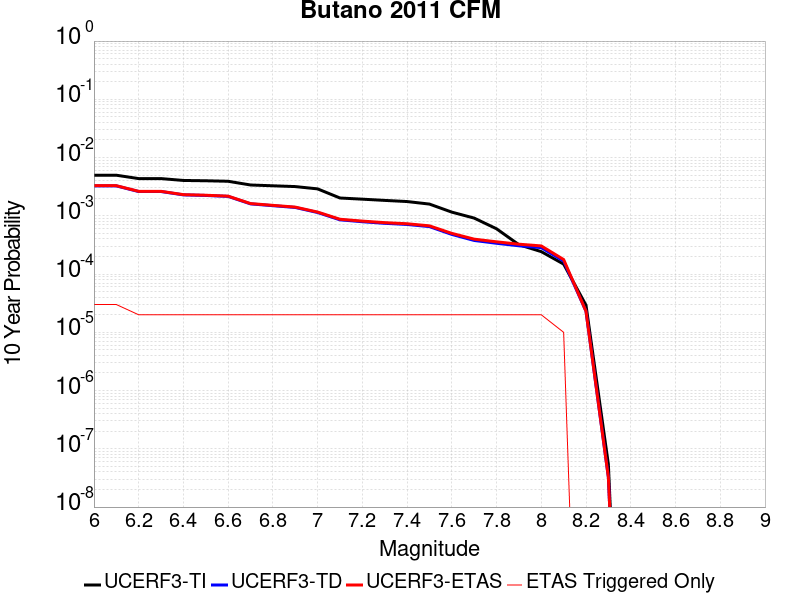 |

| Magnitude | 1 wk TI Prob | 1 wk TD Prob | 1 wk ETAS Prob | 1 wk ETAS/TD Gain | 1 wk ETAS Triggered Only | 1 mo TI Prob | 1 mo TD Prob | 1 mo ETAS Prob | 1 mo ETAS/TD Gain | 1 mo ETAS Triggered Only | 1 yr TI Prob | 1 yr TD Prob | 1 yr ETAS Prob | 1 yr ETAS/TD Gain | 1 yr ETAS Triggered Only | 10 yr TI Prob | 10 yr TD Prob | 10 yr ETAS Prob | 10 yr ETAS/TD Gain | 10 yr ETAS Triggered Only |
|-----|-----|-----|-----|-----|-----|-----|-----|-----|-----|-----|-----|-----|-----|-----|-----|-----|-----|-----|-----|-----|
| 6.0 | 9.561135E-6 | 6.2256954E-6 | 6.2256954E-6 | 1.0 | 0.0 | 4.097565E-5 | 2.6681291E-5 | 4.2277607E-5 | 1.5845412 | 1.5596732E-5 | 4.9876433E-4 | 3.247985E-4 | 3.559818E-4 | 1.0960082 | 3.1193464E-5 | 0.004976464 | 0.003260905 | 0.0032919967 | 1.0095347 | 3.1193464E-5 |
| 6.1 | 9.561135E-6 | 6.2256954E-6 | 6.2256954E-6 | 1.0 | 0.0 | 4.097565E-5 | 2.6681291E-5 | 4.2277607E-5 | 1.5845412 | 1.5596732E-5 | 4.9876433E-4 | 3.247985E-4 | 3.559818E-4 | 1.0960082 | 3.1193464E-5 | 0.004976464 | 0.003260905 | 0.0032919967 | 1.0095347 | 3.1193464E-5 |
| 6.2 | 8.364741E-6 | 4.9787805E-6 | 4.9787805E-6 | 1.0 | 0.0 | 3.5848396E-5 | 2.1337464E-5 | 2.1337464E-5 | 1.0 | 0.0 | 4.3636683E-4 | 2.5975425E-4 | 2.7534692E-4 | 1.0600286 | 1.5596732E-5 | 0.0043551093 | 0.0026121214 | 0.0026276773 | 1.0059553 | 1.5596732E-5 |
| 6.3 | 8.364741E-6 | 4.9787805E-6 | 4.9787805E-6 | 1.0 | 0.0 | 3.5848396E-5 | 2.1337464E-5 | 2.1337464E-5 | 1.0 | 0.0 | 4.3636683E-4 | 2.5975425E-4 | 2.7534692E-4 | 1.0600286 | 1.5596732E-5 | 0.0043551093 | 0.0026121214 | 0.0026276773 | 1.0059553 | 1.5596732E-5 |
| 6.4 | 7.768282E-6 | 4.3567284E-6 | 4.3567284E-6 | 1.0 | 0.0 | 3.329221E-5 | 1.8671566E-5 | 1.8671566E-5 | 1.0 | 0.0 | 4.0525728E-4 | 2.2730397E-4 | 2.4289715E-4 | 1.0686005 | 1.5596732E-5 | 0.0040451903 | 0.0022883145 | 0.0023038755 | 1.0068002 | 1.5596732E-5 |
| 6.5 | 7.673437E-6 | 4.2562915E-6 | 4.2562915E-6 | 1.0 | 0.0 | 3.2885746E-5 | 1.8241128E-5 | 1.8241128E-5 | 1.0 | 0.0 | 4.0031038E-4 | 2.2206445E-4 | 2.3765773E-4 | 1.0702195 | 1.5596732E-5 | 0.0039959005 | 0.002236025 | 0.0022515869 | 1.0069596 | 1.5596732E-5 |
| 6.6 | 7.5244197E-6 | 4.101255E-6 | 4.101255E-6 | 1.0 | 0.0 | 3.2247113E-5 | 1.7576695E-5 | 1.7576695E-5 | 1.0 | 0.0 | 3.9253788E-4 | 2.1397659E-4 | 2.2956998E-4 | 1.0728743 | 1.5596732E-5 | 0.003918452 | 0.0021553051 | 0.0021708682 | 1.0072209 | 1.5596732E-5 |
| 6.7 | 6.4921405E-6 | 3.0413205E-6 | 3.0413205E-6 | 1.0 | 0.0 | 2.7823162E-5 | 1.3034165E-5 | 1.3034165E-5 | 1.0 | 0.0 | 3.3869434E-4 | 1.586795E-4 | 1.7427375E-4 | 1.0982752 | 1.5596732E-5 | 0.003381786 | 0.0016031476 | 0.0016187194 | 1.0097132 | 1.5596732E-5 |
| 6.8 | 6.2890294E-6 | 2.8280872E-6 | 2.8280872E-6 | 1.0 | 0.0 | 2.6952705E-5 | 1.2120317E-5 | 1.2120317E-5 | 1.0 | 0.0 | 3.2809976E-4 | 1.4755495E-4 | 1.6314938E-4 | 1.1056856 | 1.5596732E-5 | 0.0032761577 | 0.0014920565 | 0.00150763 | 1.0104376 | 1.5596732E-5 |
| 6.9 | 6.0965517E-6 | 2.6346027E-6 | 2.6346027E-6 | 1.0 | 0.0 | 2.6127816E-5 | 1.1291106E-5 | 1.1291106E-5 | 1.0 | 0.0 | 3.1805973E-4 | 1.374606E-4 | 1.5305518E-4 | 1.1134477 | 1.5596732E-5 | 0.0031760489 | 0.001391243 | 0.001406818 | 1.0111951 | 1.5596732E-5 |
| 7.0 | 5.566252E-6 | 2.1520116E-6 | 2.1520116E-6 | 1.0 | 0.0 | 2.3855147E-5 | 9.222874E-6 | 9.222874E-6 | 1.0 | 0.0 | 2.9039773E-4 | 1.1228274E-4 | 1.2787772E-4 | 1.1388903 | 1.5596732E-5 | 0.0029001853 | 0.0011397449 | 0.0011553239 | 1.0136688 | 1.5596732E-5 |
| 7.1 | 3.878588E-6 | 1.6034423E-6 | 1.6034423E-6 | 1.0 | 0.0 | 1.6622414E-5 | 6.8718773E-6 | 6.8718773E-6 | 1.0 | 0.0 | 2.023591E-4 | 8.36619E-5 | 9.9257326E-5 | 1.1864102 | 1.5596732E-5 | 0.0020217493 | 8.533922E-4 | 8.6897565E-4 | 1.0182606 | 1.5596732E-5 |
| 7.2 | 3.7038085E-6 | 1.4845051E-6 | 1.4845051E-6 | 1.0 | 0.0 | 1.587337E-5 | 6.362149E-6 | 6.362149E-6 | 1.0 | 0.0 | 1.9324113E-4 | 7.745641E-5 | 9.305194E-5 | 1.2013458 | 1.5596732E-5 | 0.0019307317 | 7.913504E-4 | 8.069347E-4 | 1.0196934 | 1.5596732E-5 |
| 7.3 | 3.5277278E-6 | 1.3926247E-6 | 1.3926247E-6 | 1.0 | 0.0 | 1.5118746E-5 | 5.9683775E-6 | 5.9683775E-6 | 1.0 | 0.0 | 1.8405518E-4 | 7.266257E-5 | 8.825817E-5 | 1.2146304 | 1.5596732E-5 | 0.0018390282 | 7.433578E-4 | 7.58943E-4 | 1.0209658 | 1.5596732E-5 |
| 7.4 | 3.3711294E-6 | 1.3298818E-6 | 1.3298818E-6 | 1.0 | 0.0 | 1.4447617E-5 | 5.699481E-6 | 5.699481E-6 | 1.0 | 0.0 | 1.7588554E-4 | 6.9388974E-5 | 8.4984626E-5 | 1.2247568 | 1.5596732E-5 | 0.0017574639 | 7.10591E-4 | 7.261766E-4 | 1.0219333 | 1.5596732E-5 |
| 7.5 | 3.0496426E-6 | 1.2188874E-6 | 1.2188874E-6 | 1.0 | 0.0 | 1.3069831E-5 | 5.223793E-6 | 5.223793E-6 | 1.0 | 0.0 | 1.5911358E-4 | 6.359782E-5 | 7.919356E-5 | 1.2452245 | 1.5596732E-5 | 0.001589997 | 6.526465E-4 | 6.68233E-4 | 1.023882 | 1.5596732E-5 |
| 7.6 | 2.2179781E-6 | 8.870908E-7 | 8.870908E-7 | 1.0 | 0.0 | 9.505586E-6 | 3.801812E-6 | 3.801812E-6 | 1.0 | 0.0 | 1.1572436E-4 | 4.6286077E-5 | 6.1882085E-5 | 1.3369482 | 1.5596732E-5 | 0.0011566412 | 4.7951055E-4 | 4.950998E-4 | 1.0325108 | 1.5596732E-5 |
| 7.7 | 1.7519328E-6 | 6.9309675E-7 | 6.9309675E-7 | 1.0 | 0.0 | 7.508262E-6 | 2.9704113E-6 | 2.9704113E-6 | 1.0 | 0.0 | 9.140925E-5 | 3.6164158E-5 | 5.1760322E-5 | 1.4312603 | 1.5596732E-5 | 9.137166E-4 | 3.7759746E-4 | 3.9318833E-4 | 1.0412896 | 1.5596732E-5 |
| 7.8 | 1.1478974E-6 | 6.174061E-7 | 6.174061E-7 | 1.0 | 0.0 | 4.9195505E-6 | 2.6460236E-6 | 2.6460236E-6 | 1.0 | 0.0 | 5.9893882E-5 | 3.221486E-5 | 4.781109E-5 | 1.4841315 | 1.5596732E-5 | 5.9877743E-4 | 3.377777E-4 | 3.5336913E-4 | 1.0461589 | 1.5596732E-5 |
| 7.9 | 6.1154634E-7 | 5.581767E-7 | 5.581767E-7 | 1.0 | 0.0 | 2.6209104E-6 | 2.3921834E-6 | 2.3921834E-6 | 1.0 | 0.0 | 3.1909116E-5 | 2.9124443E-5 | 4.472072E-5 | 1.5355047 | 1.5596732E-5 | 3.1904536E-4 | 3.0563958E-4 | 3.2123152E-4 | 1.0510142 | 1.5596732E-5 |
| 8.0 | 4.6520046E-7 | 5.189283E-7 | 5.189283E-7 | 1.0 | 0.0 | 1.9937147E-6 | 2.2239765E-6 | 2.2239765E-6 | 1.0 | 0.0 | 2.4273206E-5 | 2.7076578E-5 | 4.2672888E-5 | 1.5760074 | 1.5596732E-5 | 2.4270554E-4 | 2.8419052E-4 | 2.9978284E-4 | 1.0548656 | 1.5596732E-5 |
| 8.1 | 2.8425194E-7 | 3.0570487E-7 | 3.0570487E-7 | 1.0 | 0.0 | 1.218222E-6 | 1.3101632E-6 | 1.3101632E-6 | 1.0 | 0.0 | 1.4831752E-5 | 1.5951118E-5 | 3.1547603E-5 | 1.9777672 | 1.5596732E-5 | 1.4830762E-4 | 1.6740595E-4 | 1.8300005E-4 | 1.0931516 | 1.5596732E-5 |
| 8.2 | 5.585778E-8 | 4.0522167E-8 | 4.0522167E-8 | 1.0 | 0.0 | 2.3939046E-7 | 1.7366644E-7 | 1.7366644E-7 | 1.0 | 0.0 | 2.914575E-6 | 2.1143867E-6 | 2.1143867E-6 | 1.0 | 0.0 | 2.9145367E-5 | 2.2976306E-5 | 2.2976306E-5 | 1.0 | 0.0 |
| 8.3 | 1.0371215E-10 | 5.356804E-11 | 5.356804E-11 | 1.0 | 0.0 | 4.4448079E-10 | 2.2957702E-10 | 2.2957702E-10 | 1.0 | 0.0 | 5.4115543E-9 | 2.795101E-9 | 2.795101E-9 | 1.0 | 0.0 | 5.4115542E-8 | 3.2150194E-8 | 3.2150194E-8 | 1.0 | 0.0 |

## Carson Range (Genoa)
*[(top)](#table-of-contents)*

| 1 Week | 1 Month | 1 Year | 10 Year |
|-----|-----|-----|-----|
|  |  |  | 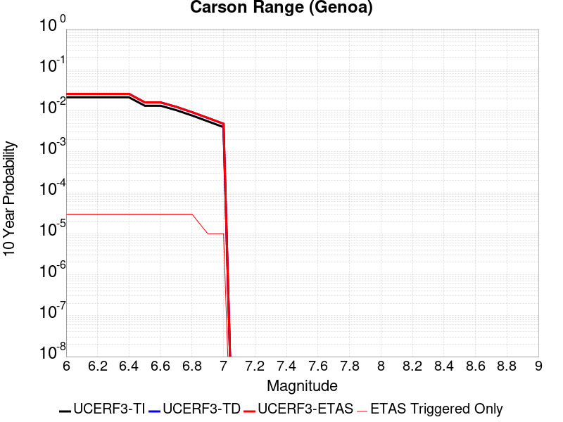 |

| Magnitude | 1 wk TI Prob | 1 wk TD Prob | 1 wk ETAS Prob | 1 wk ETAS/TD Gain | 1 wk ETAS Triggered Only | 1 mo TI Prob | 1 mo TD Prob | 1 mo ETAS Prob | 1 mo ETAS/TD Gain | 1 mo ETAS Triggered Only | 1 yr TI Prob | 1 yr TD Prob | 1 yr ETAS Prob | 1 yr ETAS/TD Gain | 1 yr ETAS Triggered Only | 10 yr TI Prob | 10 yr TD Prob | 10 yr ETAS Prob | 10 yr ETAS/TD Gain | 10 yr ETAS Triggered Only |
|-----|-----|-----|-----|-----|-----|-----|-----|-----|-----|-----|-----|-----|-----|-----|-----|-----|-----|-----|-----|-----|
| 6.0 | 4.1268457E-5 | 5.0146893E-5 | 6.574284E-5 | 1.3110052 | 1.5596732E-5 | 1.7685282E-4 | 2.148998E-4 | 2.3049318E-4 | 1.0725611 | 1.5596732E-5 | 0.0021510567 | 0.0026136558 | 0.0026292116 | 1.0059518 | 1.5596732E-5 | 0.02130354 | 0.025868816 | 0.02588401 | 1.0005873 | 1.5596732E-5 |
| 6.1 | 4.1268457E-5 | 5.0146893E-5 | 6.574284E-5 | 1.3110052 | 1.5596732E-5 | 1.7685282E-4 | 2.148998E-4 | 2.3049318E-4 | 1.0725611 | 1.5596732E-5 | 0.0021510567 | 0.0026136558 | 0.0026292116 | 1.0059518 | 1.5596732E-5 | 0.02130354 | 0.025868816 | 0.02588401 | 1.0005873 | 1.5596732E-5 |
| 6.2 | 4.1268457E-5 | 5.0146893E-5 | 6.574284E-5 | 1.3110052 | 1.5596732E-5 | 1.7685282E-4 | 2.148998E-4 | 2.3049318E-4 | 1.0725611 | 1.5596732E-5 | 0.0021510567 | 0.0026136558 | 0.0026292116 | 1.0059518 | 1.5596732E-5 | 0.02130354 | 0.025868816 | 0.02588401 | 1.0005873 | 1.5596732E-5 |
| 6.3 | 4.1268457E-5 | 5.0146893E-5 | 6.574284E-5 | 1.3110052 | 1.5596732E-5 | 1.7685282E-4 | 2.148998E-4 | 2.3049318E-4 | 1.0725611 | 1.5596732E-5 | 0.0021510567 | 0.0026136558 | 0.0026292116 | 1.0059518 | 1.5596732E-5 | 0.02130354 | 0.025868816 | 0.02588401 | 1.0005873 | 1.5596732E-5 |
| 6.4 | 4.1268457E-5 | 5.0146893E-5 | 6.574284E-5 | 1.3110052 | 1.5596732E-5 | 1.7685282E-4 | 2.148998E-4 | 2.3049318E-4 | 1.0725611 | 1.5596732E-5 | 0.0021510567 | 0.0026136558 | 0.0026292116 | 1.0059518 | 1.5596732E-5 | 0.02130354 | 0.025868816 | 0.02588401 | 1.0005873 | 1.5596732E-5 |
| 6.5 | 2.5677185E-5 | 3.0978295E-5 | 4.6574543E-5 | 1.5034573 | 1.5596732E-5 | 1.1004044E-4 | 1.3275839E-4 | 1.4835305E-4 | 1.1174664 | 1.5596732E-5 | 0.0013389189 | 0.0016153135 | 0.0016308851 | 1.00964 | 1.5596732E-5 | 0.0133088045 | 0.016053649 | 0.016068997 | 1.0009559 | 1.5596732E-5 |
| 6.6 | 2.5677185E-5 | 3.0978295E-5 | 4.6574543E-5 | 1.5034573 | 1.5596732E-5 | 1.1004044E-4 | 1.3275839E-4 | 1.4835305E-4 | 1.1174664 | 1.5596732E-5 | 0.0013389189 | 0.0016153135 | 0.0016308851 | 1.00964 | 1.5596732E-5 | 0.0133088045 | 0.016053649 | 0.016068997 | 1.0009559 | 1.5596732E-5 |
| 6.7 | 1.9969408E-5 | 2.406347E-5 | 3.9659826E-5 | 1.6481341 | 1.5596732E-5 | 8.558037E-5 | 1.0312595E-4 | 1.1872107E-4 | 1.151224 | 1.5596732E-5 | 0.0010414429 | 0.0012549888 | 0.001270566 | 1.0124122 | 1.5596732E-5 | 0.010365757 | 0.012494174 | 0.012509575 | 1.0012327 | 1.5596732E-5 |
| 6.8 | 1.4783156E-5 | 1.7817569E-5 | 3.341402E-5 | 1.8753413 | 1.5596732E-5 | 6.335485E-5 | 7.635951E-5 | 9.1955044E-5 | 1.2042384 | 1.5596732E-5 | 7.710722E-4 | 9.294106E-4 | 9.449929E-4 | 1.0167657 | 1.5596732E-5 | 0.0076840227 | 0.009268024 | 0.009283476 | 1.0016673 | 1.5596732E-5 |
| 6.9 | 1.06660555E-5 | 1.2877026E-5 | 1.2877026E-5 | 1.0 | 0.0 | 4.5710865E-5 | 5.5186738E-5 | 5.5186738E-5 | 1.0 | 0.0 | 5.5638765E-4 | 6.718066E-4 | 6.718066E-4 | 1.0 | 0.0 | 0.005549967 | 0.006709056 | 0.006709056 | 1.0 | 0.0 |
| 7.0 | 7.664838E-6 | 9.258307E-6 | 9.258307E-6 | 1.0 | 0.0 | 3.2848893E-5 | 3.9678456E-5 | 3.9678456E-5 | 1.0 | 0.0 | 3.998619E-4 | 4.830852E-4 | 4.830852E-4 | 1.0 | 0.0 | 0.0039914316 | 0.00483085 | 0.00483085 | 1.0 | 0.0 |

## Santa Susana East (connector)
*[(top)](#table-of-contents)*

| 1 Week | 1 Month | 1 Year | 10 Year |
|-----|-----|-----|-----|
|  |  |  |  |

| Magnitude | 1 wk TI Prob | 1 wk TD Prob | 1 wk ETAS Prob | 1 wk ETAS/TD Gain | 1 wk ETAS Triggered Only | 1 mo TI Prob | 1 mo TD Prob | 1 mo ETAS Prob | 1 mo ETAS/TD Gain | 1 mo ETAS Triggered Only | 1 yr TI Prob | 1 yr TD Prob | 1 yr ETAS Prob | 1 yr ETAS/TD Gain | 1 yr ETAS Triggered Only | 10 yr TI Prob | 10 yr TD Prob | 10 yr ETAS Prob | 10 yr ETAS/TD Gain | 10 yr ETAS Triggered Only |
|-----|-----|-----|-----|-----|-----|-----|-----|-----|-----|-----|-----|-----|-----|-----|-----|-----|-----|-----|-----|-----|
| 6.0 | 2.858397E-5 | 3.202091E-5 | 3.202091E-5 | 1.0 | 0.0 | 1.2249697E-4 | 1.3722685E-4 | 1.3722685E-4 | 1.0 | 0.0 | 0.0014903803 | 0.0016697381 | 0.0016853088 | 1.0093253 | 1.5596732E-5 | 0.014804244 | 0.016599052 | 0.016629728 | 1.001848 | 3.1193464E-5 |
| 6.1 | 2.858397E-5 | 3.202091E-5 | 3.202091E-5 | 1.0 | 0.0 | 1.2249697E-4 | 1.3722685E-4 | 1.3722685E-4 | 1.0 | 0.0 | 0.0014903803 | 0.0016697381 | 0.0016853088 | 1.0093253 | 1.5596732E-5 | 0.014804244 | 0.016599052 | 0.016629728 | 1.001848 | 3.1193464E-5 |
| 6.2 | 2.858397E-5 | 3.202091E-5 | 3.202091E-5 | 1.0 | 0.0 | 1.2249697E-4 | 1.3722685E-4 | 1.3722685E-4 | 1.0 | 0.0 | 0.0014903803 | 0.0016697381 | 0.0016853088 | 1.0093253 | 1.5596732E-5 | 0.014804244 | 0.016599052 | 0.016629728 | 1.001848 | 3.1193464E-5 |
| 6.3 | 1.943582E-5 | 2.036718E-5 | 2.036718E-5 | 1.0 | 0.0 | 8.329371E-5 | 8.7285625E-5 | 8.7285625E-5 | 1.0 | 0.0 | 0.001013629 | 0.0010622967 | 0.0010778768 | 1.0146664 | 1.5596732E-5 | 0.010090181 | 0.010583619 | 0.010614482 | 1.0029161 | 3.1193464E-5 |
| 6.4 | 1.943582E-5 | 2.036718E-5 | 2.036718E-5 | 1.0 | 0.0 | 8.329371E-5 | 8.7285625E-5 | 8.7285625E-5 | 1.0 | 0.0 | 0.001013629 | 0.0010622967 | 0.0010778768 | 1.0146664 | 1.5596732E-5 | 0.010090181 | 0.010583619 | 0.010614482 | 1.0029161 | 3.1193464E-5 |
| 6.5 | 1.943582E-5 | 2.036718E-5 | 2.036718E-5 | 1.0 | 0.0 | 8.329371E-5 | 8.7285625E-5 | 8.7285625E-5 | 1.0 | 0.0 | 0.001013629 | 0.0010622967 | 0.0010778768 | 1.0146664 | 1.5596732E-5 | 0.010090181 | 0.010583619 | 0.010614482 | 1.0029161 | 3.1193464E-5 |
| 6.6 | 1.943582E-5 | 2.036718E-5 | 2.036718E-5 | 1.0 | 0.0 | 8.329371E-5 | 8.7285625E-5 | 8.7285625E-5 | 1.0 | 0.0 | 0.001013629 | 0.0010622967 | 0.0010778768 | 1.0146664 | 1.5596732E-5 | 0.010090181 | 0.010583619 | 0.010614482 | 1.0029161 | 3.1193464E-5 |
| 6.7 | 1.9404439E-5 | 2.03546E-5 | 2.03546E-5 | 1.0 | 0.0 | 8.3159226E-5 | 8.723172E-5 | 8.723172E-5 | 1.0 | 0.0 | 0.0010119933 | 0.0010616409 | 0.0010772211 | 1.0146755 | 1.5596732E-5 | 0.010073971 | 0.010577125 | 0.010607988 | 1.002918 | 3.1193464E-5 |
| 6.8 | 1.2217526E-5 | 1.1592998E-5 | 1.1592998E-5 | 1.0 | 0.0 | 5.2359774E-5 | 4.9683425E-5 | 4.9683425E-5 | 1.0 | 0.0 | 6.372938E-4 | 6.0474465E-4 | 6.2033196E-4 | 1.025775 | 1.5596732E-5 | 0.0063546924 | 0.006033037 | 0.006064042 | 1.0051392 | 3.1193464E-5 |
| 6.9 | 1.2217526E-5 | 1.1592998E-5 | 1.1592998E-5 | 1.0 | 0.0 | 5.2359774E-5 | 4.9683425E-5 | 4.9683425E-5 | 1.0 | 0.0 | 6.372938E-4 | 6.0474465E-4 | 6.2033196E-4 | 1.025775 | 1.5596732E-5 | 0.0063546924 | 0.006033037 | 0.006064042 | 1.0051392 | 3.1193464E-5 |
| 7.0 | 9.276017E-6 | 8.059113E-6 | 8.059113E-6 | 1.0 | 0.0 | 3.9753755E-5 | 3.4538618E-5 | 3.4538618E-5 | 1.0 | 0.0 | 4.8389446E-4 | 4.2042998E-4 | 4.3602014E-4 | 1.0370815 | 1.5596732E-5 | 0.0048284214 | 0.0041970722 | 0.0042281346 | 1.007401 | 3.1193464E-5 |
| 7.1 | 9.130355E-6 | 7.942286E-6 | 7.942286E-6 | 1.0 | 0.0 | 3.9129503E-5 | 3.4037945E-5 | 3.4037945E-5 | 1.0 | 0.0 | 4.7629757E-4 | 4.1433662E-4 | 4.2992688E-4 | 1.0376271 | 1.5596732E-5 | 0.00475278 | 0.004136367 | 0.004167431 | 1.0075101 | 3.1193464E-5 |
| 7.2 | 8.851015E-6 | 7.741445E-6 | 7.741445E-6 | 1.0 | 0.0 | 3.7932372E-5 | 3.317722E-5 | 3.317722E-5 | 1.0 | 0.0 | 4.6172875E-4 | 4.038612E-4 | 4.1945162E-4 | 1.0386034 | 1.5596732E-5 | 0.0046077054 | 0.0040319953 | 0.0040630633 | 1.0077053 | 3.1193464E-5 |
| 7.3 | 8.573006E-6 | 7.550166E-6 | 7.550166E-6 | 1.0 | 0.0 | 3.6740938E-5 | 3.2357475E-5 | 3.2357475E-5 | 1.0 | 0.0 | 4.472291E-4 | 3.9388443E-4 | 4.0947503E-4 | 1.0395817 | 1.5596732E-5 | 0.004463301 | 0.0039325804 | 0.003963651 | 1.0079008 | 3.1193464E-5 |
| 7.4 | 7.852282E-6 | 6.817687E-6 | 6.817687E-6 | 1.0 | 0.0 | 3.36522E-5 | 2.9218349E-5 | 2.9218349E-5 | 1.0 | 0.0 | 4.096385E-4 | 3.5567835E-4 | 3.7126953E-4 | 1.043835 | 1.5596732E-5 | 0.0040888423 | 0.0035517553 | 0.003582838 | 1.0087514 | 3.1193464E-5 |
| 7.5 | 4.8869324E-6 | 4.279055E-6 | 4.279055E-6 | 1.0 | 0.0 | 2.0943828E-5 | 1.8338687E-5 | 1.8338687E-5 | 1.0 | 0.0 | 2.5496128E-4 | 2.232523E-4 | 2.3884555E-4 | 1.0698459 | 1.5596732E-5 | 0.0025466895 | 0.0022304445 | 0.0022615683 | 1.0139542 | 3.1193464E-5 |
| 7.6 | 1.3894544E-6 | 1.1568179E-6 | 1.1568179E-6 | 1.0 | 0.0 | 5.954791E-6 | 4.957783E-6 | 4.957783E-6 | 1.0 | 0.0 | 7.249717E-5 | 6.0359558E-5 | 6.0359558E-5 | 1.0 | 0.0 | 7.247352E-4 | 6.0345343E-4 | 6.1904074E-4 | 1.0258301 | 1.5596732E-5 |
| 7.7 | 2.9924632E-7 | 2.371928E-7 | 2.371928E-7 | 1.0 | 0.0 | 1.2824837E-6 | 1.0165402E-6 | 1.0165402E-6 | 1.0 | 0.0 | 1.5614127E-5 | 1.2376314E-5 | 1.2376314E-5 | 1.0 | 0.0 | 1.5613029E-4 | 1.2375697E-4 | 1.3935176E-4 | 1.1260115 | 1.5596732E-5 |
| 7.8 | 4.8188564E-8 | 2.6323061E-8 | 2.6323061E-8 | 1.0 | 0.0 | 2.065224E-7 | 1.1281311E-7 | 1.1281311E-7 | 1.0 | 0.0 | 2.5144072E-6 | 1.3734989E-6 | 1.3734989E-6 | 1.0 | 0.0 | 2.5143789E-5 | 1.3734912E-5 | 1.3734912E-5 | 1.0 | 0.0 |
| 7.9 | 2.6127251E-9 | 2.7681102E-9 | 2.7681102E-9 | 1.0 | 0.0 | 1.1197393E-8 | 1.186333E-8 | 1.186333E-8 | 1.0 | 0.0 | 1.3632825E-7 | 1.4443603E-7 | 1.4443603E-7 | 1.0 | 0.0 | 1.3632817E-6 | 1.4443604E-6 | 1.4443604E-6 | 1.0 | 0.0 |

## Point Reyes 2011 CFM
*[(top)](#table-of-contents)*

| 1 Week | 1 Month | 1 Year | 10 Year |
|-----|-----|-----|-----|
|  |  |  |  |

| Magnitude | 1 wk TI Prob | 1 wk TD Prob | 1 wk ETAS Prob | 1 wk ETAS/TD Gain | 1 wk ETAS Triggered Only | 1 mo TI Prob | 1 mo TD Prob | 1 mo ETAS Prob | 1 mo ETAS/TD Gain | 1 mo ETAS Triggered Only | 1 yr TI Prob | 1 yr TD Prob | 1 yr ETAS Prob | 1 yr ETAS/TD Gain | 1 yr ETAS Triggered Only | 10 yr TI Prob | 10 yr TD Prob | 10 yr ETAS Prob | 10 yr ETAS/TD Gain | 10 yr ETAS Triggered Only |
|-----|-----|-----|-----|-----|-----|-----|-----|-----|-----|-----|-----|-----|-----|-----|-----|-----|-----|-----|-----|-----|
| 6.0 | 8.8644965E-6 | 8.967163E-6 | 8.967163E-6 | 1.0 | 0.0 | 3.7990147E-5 | 3.843017E-5 | 3.843017E-5 | 1.0 | 0.0 | 4.624319E-4 | 4.6779314E-4 | 4.8338258E-4 | 1.0333254 | 1.5596732E-5 | 0.0046147075 | 0.004668713 | 0.004684237 | 1.0033251 | 1.5596732E-5 |
| 6.1 | 4.526405E-6 | 4.5392185E-6 | 4.5392185E-6 | 1.0 | 0.0 | 1.9398734E-5 | 1.9453653E-5 | 1.9453653E-5 | 1.0 | 0.0 | 2.36154E-4 | 2.3682354E-4 | 2.524166E-4 | 1.0658424 | 1.5596732E-5 | 0.002359032 | 0.0023658178 | 0.0023813776 | 1.0065769 | 1.5596732E-5 |
| 6.2 | 4.526405E-6 | 4.5392185E-6 | 4.5392185E-6 | 1.0 | 0.0 | 1.9398734E-5 | 1.9453653E-5 | 1.9453653E-5 | 1.0 | 0.0 | 2.36154E-4 | 2.3682354E-4 | 2.524166E-4 | 1.0658424 | 1.5596732E-5 | 0.002359032 | 0.0023658178 | 0.0023813776 | 1.0065769 | 1.5596732E-5 |
| 6.3 | 2.6842322E-6 | 2.660676E-6 | 2.660676E-6 | 1.0 | 0.0 | 1.1503801E-5 | 1.1402849E-5 | 1.1402849E-5 | 1.0 | 0.0 | 1.4004979E-4 | 1.3882104E-4 | 1.544156E-4 | 1.1123358 | 1.5596732E-5 | 0.0013996155 | 0.0013873649 | 0.00140294 | 1.0112264 | 1.5596732E-5 |
| 6.4 | 2.6842322E-6 | 2.660676E-6 | 2.660676E-6 | 1.0 | 0.0 | 1.1503801E-5 | 1.1402849E-5 | 1.1402849E-5 | 1.0 | 0.0 | 1.4004979E-4 | 1.3882104E-4 | 1.544156E-4 | 1.1123358 | 1.5596732E-5 | 0.0013996155 | 0.0013873649 | 0.00140294 | 1.0112264 | 1.5596732E-5 |
| 6.5 | 1.9281833E-6 | 1.8906262E-6 | 1.8906262E-6 | 1.0 | 0.0 | 8.263617E-6 | 8.102659E-6 | 8.102659E-6 | 1.0 | 0.0 | 1.0060489E-4 | 9.86455E-5 | 1.1424069E-4 | 1.1580933 | 1.5596732E-5 | 0.0010055936 | 9.860279E-4 | 0.0010016093 | 1.0158021 | 1.5596732E-5 |
| 6.6 | 1.4726726E-6 | 1.4269577E-6 | 1.4269577E-6 | 1.0 | 0.0 | 6.3114385E-6 | 6.1155188E-6 | 6.1155188E-6 | 1.0 | 0.0 | 7.683905E-5 | 7.445395E-5 | 9.0049514E-5 | 1.209466 | 1.5596732E-5 | 7.6812494E-4 | 7.4429717E-4 | 7.5988227E-4 | 1.0209394 | 1.5596732E-5 |
| 6.7 | 8.572307E-7 | 8.007212E-7 | 8.007212E-7 | 1.0 | 0.0 | 3.6738406E-6 | 3.431658E-6 | 3.431658E-6 | 1.0 | 0.0 | 4.472809E-5 | 4.1779647E-5 | 4.1779647E-5 | 1.0 | 0.0 | 4.471909E-4 | 4.1772184E-4 | 4.1772184E-4 | 1.0 | 0.0 |
| 6.8 | 6.6745434E-7 | 6.0773E-7 | 6.0773E-7 | 1.0 | 0.0 | 2.8605155E-6 | 2.6045543E-6 | 2.6045543E-6 | 1.0 | 0.0 | 3.482622E-5 | 3.171E-5 | 3.171E-5 | 1.0 | 0.0 | 3.4820763E-4 | 3.1705803E-4 | 3.1705803E-4 | 1.0 | 0.0 |
| 6.9 | 4.291521E-7 | 3.6535937E-7 | 3.6535937E-7 | 1.0 | 0.0 | 1.839222E-6 | 1.565825E-6 | 1.565825E-6 | 1.0 | 0.0 | 2.2392298E-5 | 1.9063755E-5 | 1.9063755E-5 | 1.0 | 0.0 | 2.2390042E-4 | 1.9062385E-4 | 1.9062385E-4 | 1.0 | 0.0 |
| 7.0 | 2.6812808E-7 | 2.0187414E-7 | 2.0187414E-7 | 1.0 | 0.0 | 1.1491198E-6 | 8.651746E-7 | 8.651746E-7 | 1.0 | 0.0 | 1.3990444E-5 | 1.0533451E-5 | 1.0533451E-5 | 1.0 | 0.0 | 1.3989564E-4 | 1.0533186E-4 | 1.0533186E-4 | 1.0 | 0.0 |
| 7.1 | 1.9451231E-7 | 1.2725499E-7 | 1.2725499E-7 | 1.0 | 0.0 | 8.336239E-7 | 5.453784E-7 | 5.453784E-7 | 1.0 | 0.0 | 1.0149324E-5 | 6.6399616E-6 | 6.6399616E-6 | 1.0 | 0.0 | 1.014886E-4 | 6.639991E-5 | 6.639991E-5 | 1.0 | 0.0 |
| 7.2 | 1.6715143E-7 | 1.00428394E-7 | 1.00428394E-7 | 1.0 | 0.0 | 7.1636305E-7 | 4.3040734E-7 | 4.3040734E-7 | 1.0 | 0.0 | 8.721685E-6 | 5.2401965E-6 | 5.2401965E-6 | 1.0 | 0.0 | 8.721343E-5 | 5.2402997E-5 | 5.2402997E-5 | 1.0 | 0.0 |
| 7.3 | 1.5503173E-7 | 9.0131024E-8 | 9.0131024E-8 | 1.0 | 0.0 | 6.644215E-7 | 3.8627576E-7 | 3.8627576E-7 | 1.0 | 0.0 | 8.089301E-6 | 4.702897E-6 | 4.702897E-6 | 1.0 | 0.0 | 8.089007E-5 | 4.7030244E-5 | 4.7030244E-5 | 1.0 | 0.0 |
| 7.4 | 1.4251614E-7 | 8.097624E-8 | 8.097624E-8 | 1.0 | 0.0 | 6.1078333E-7 | 3.47041E-7 | 3.47041E-7 | 1.0 | 0.0 | 7.4362615E-6 | 4.225216E-6 | 4.225216E-6 | 1.0 | 0.0 | 7.436013E-5 | 4.2253625E-5 | 4.2253625E-5 | 1.0 | 0.0 |
| 7.5 | 1.2710186E-7 | 7.0296394E-8 | 7.0296394E-8 | 1.0 | 0.0 | 5.447221E-7 | 3.0127023E-7 | 3.0127023E-7 | 1.0 | 0.0 | 6.6319717E-6 | 3.667959E-6 | 3.667959E-6 | 1.0 | 0.0 | 6.6317734E-5 | 3.6681253E-5 | 3.6681253E-5 | 1.0 | 0.0 |
| 7.6 | 1.0144708E-7 | 5.4952274E-8 | 5.4952274E-8 | 1.0 | 0.0 | 4.347731E-7 | 2.3550973E-7 | 2.3550973E-7 | 1.0 | 0.0 | 5.2933497E-6 | 2.8673273E-6 | 2.8673273E-6 | 1.0 | 0.0 | 5.293224E-5 | 2.8675171E-5 | 2.8675171E-5 | 1.0 | 0.0 |
| 7.7 | 7.090527E-8 | 3.98231E-8 | 3.98231E-8 | 1.0 | 0.0 | 3.038797E-7 | 1.7067042E-7 | 1.7067042E-7 | 1.0 | 0.0 | 3.699729E-6 | 2.0779103E-6 | 2.0779103E-6 | 1.0 | 0.0 | 3.6996673E-5 | 2.0781177E-5 | 2.0781177E-5 | 1.0 | 0.0 |
| 7.8 | 3.8712045E-8 | 2.7440025E-8 | 2.7440025E-8 | 1.0 | 0.0 | 1.6590876E-7 | 1.176001E-7 | 1.176001E-7 | 1.0 | 0.0 | 2.0199373E-6 | 1.4317802E-6 | 1.4317802E-6 | 1.0 | 0.0 | 2.0199188E-5 | 1.4319979E-5 | 1.4319979E-5 | 1.0 | 0.0 |
| 7.9 | 1.7068782E-8 | 1.1833354E-8 | 1.1833354E-8 | 1.0 | 0.0 | 7.315192E-8 | 5.0714362E-8 | 5.0714362E-8 | 1.0 | 0.0 | 8.906242E-7 | 6.174472E-7 | 6.174472E-7 | 1.0 | 0.0 | 8.906207E-6 | 6.1767228E-6 | 6.1767228E-6 | 1.0 | 0.0 |
| 8.0 | 1.0172592E-8 | 7.0280843E-9 | 7.0280843E-9 | 1.0 | 0.0 | 4.359682E-8 | 3.0120354E-8 | 3.0120354E-8 | 1.0 | 0.0 | 5.3079117E-7 | 3.6671526E-7 | 3.6671526E-7 | 1.0 | 0.0 | 5.307899E-6 | 3.6694146E-6 | 3.6694146E-6 | 1.0 | 0.0 |
| 8.1 | 3.7861243E-9 | 3.5452439E-9 | 3.5452439E-9 | 1.0 | 0.0 | 1.6226247E-8 | 1.5193901E-8 | 1.5193901E-8 | 1.0 | 0.0 | 1.9755454E-7 | 1.8498575E-7 | 1.8498575E-7 | 1.0 | 0.0 | 1.9755437E-6 | 1.8518531E-6 | 1.8518531E-6 | 1.0 | 0.0 |

## Bartlett Springs 2011 CFM
*[(top)](#table-of-contents)*

| 1 Week | 1 Month | 1 Year | 10 Year |
|-----|-----|-----|-----|
|  |  |  |  |

| Magnitude | 1 wk TI Prob | 1 wk TD Prob | 1 wk ETAS Prob | 1 wk ETAS/TD Gain | 1 wk ETAS Triggered Only | 1 mo TI Prob | 1 mo TD Prob | 1 mo ETAS Prob | 1 mo ETAS/TD Gain | 1 mo ETAS Triggered Only | 1 yr TI Prob | 1 yr TD Prob | 1 yr ETAS Prob | 1 yr ETAS/TD Gain | 1 yr ETAS Triggered Only | 10 yr TI Prob | 10 yr TD Prob | 10 yr ETAS Prob | 10 yr ETAS/TD Gain | 10 yr ETAS Triggered Only |
|-----|-----|-----|-----|-----|-----|-----|-----|-----|-----|-----|-----|-----|-----|-----|-----|-----|-----|-----|-----|-----|
| 6.0 | 6.2326144E-5 | 8.060613E-5 | 8.060613E-5 | 1.0 | 0.0 | 2.6708472E-4 | 3.454099E-4 | 3.454099E-4 | 1.0 | 0.0 | 0.003246908 | 0.0041973945 | 0.0041973945 | 1.0 | 0.0 | 0.031998757 | 0.04119771 | 0.041212663 | 1.000363 | 1.5596732E-5 |
| 6.1 | 6.227657E-5 | 8.054363E-5 | 8.054363E-5 | 1.0 | 0.0 | 2.668723E-4 | 3.4514212E-4 | 3.4514212E-4 | 1.0 | 0.0 | 0.0032443295 | 0.004194147 | 0.004194147 | 1.0 | 0.0 | 0.031973712 | 0.041166443 | 0.0411814 | 1.0003632 | 1.5596732E-5 |
| 6.2 | 6.22452E-5 | 8.050423E-5 | 8.050423E-5 | 1.0 | 0.0 | 2.6673786E-4 | 3.4497332E-4 | 3.4497332E-4 | 1.0 | 0.0 | 0.0032426978 | 0.0041921 | 0.0041921 | 1.0 | 0.0 | 0.03195787 | 0.041146737 | 0.04116169 | 1.0003635 | 1.5596732E-5 |
| 6.3 | 6.219006E-5 | 8.043407E-5 | 8.043407E-5 | 1.0 | 0.0 | 2.6650162E-4 | 3.4467268E-4 | 3.4467268E-4 | 1.0 | 0.0 | 0.00323983 | 0.0041884542 | 0.0041884542 | 1.0 | 0.0 | 0.031930014 | 0.041111637 | 0.041126594 | 1.0003638 | 1.5596732E-5 |
| 6.4 | 5.2175856E-5 | 6.725342E-5 | 6.725342E-5 | 1.0 | 0.0 | 2.2359163E-4 | 2.8819745E-4 | 2.8819745E-4 | 1.0 | 0.0 | 0.0027188298 | 0.0035032115 | 0.0035032115 | 1.0 | 0.0 | 0.026858058 | 0.034489222 | 0.03450428 | 1.0004367 | 1.5596732E-5 |
| 6.5 | 5.205166E-5 | 6.7096094E-5 | 6.7096094E-5 | 1.0 | 0.0 | 2.2305945E-4 | 2.8752335E-4 | 2.8752335E-4 | 1.0 | 0.0 | 0.0027123666 | 0.0034950306 | 0.0034950306 | 1.0 | 0.0 | 0.026794989 | 0.034409966 | 0.034425028 | 1.0004376 | 1.5596732E-5 |
| 6.6 | 5.0085426E-5 | 6.449277E-5 | 6.449277E-5 | 1.0 | 0.0 | 2.1463417E-4 | 2.763686E-4 | 2.763686E-4 | 1.0 | 0.0 | 0.0026100394 | 0.0033596456 | 0.0033596456 | 1.0 | 0.0 | 0.025795965 | 0.033097573 | 0.033112653 | 1.0004556 | 1.5596732E-5 |
| 6.7 | 4.8930866E-5 | 6.3017396E-5 | 6.3017396E-5 | 1.0 | 0.0 | 2.0968684E-4 | 2.7004688E-4 | 2.7004688E-4 | 1.0 | 0.0 | 0.0025499484 | 0.0032829174 | 0.0032829174 | 1.0 | 0.0 | 0.025208864 | 0.03235294 | 0.03236803 | 1.0004665 | 1.5596732E-5 |
| 6.8 | 4.5679535E-5 | 5.8741858E-5 | 5.8741858E-5 | 1.0 | 0.0 | 1.9575475E-4 | 2.5172674E-4 | 2.5172674E-4 | 1.0 | 0.0 | 0.002380709 | 0.0030605064 | 0.0030605064 | 1.0 | 0.0 | 0.023553653 | 0.03019042 | 0.030205546 | 1.000501 | 1.5596732E-5 |
| 6.9 | 4.1439176E-5 | 5.3220094E-5 | 5.3220094E-5 | 1.0 | 0.0 | 1.7758438E-4 | 2.2806633E-4 | 2.2806633E-4 | 1.0 | 0.0 | 0.002159946 | 0.0027731995 | 0.0027731995 | 1.0 | 0.0 | 0.021390721 | 0.027390772 | 0.027405942 | 1.0005538 | 1.5596732E-5 |
| 7.0 | 3.5920104E-5 | 4.600871E-5 | 4.600871E-5 | 1.0 | 0.0 | 1.5393422E-4 | 1.9716538E-4 | 1.9716538E-4 | 1.0 | 0.0 | 0.001872538 | 0.0023978627 | 0.0023978627 | 1.0 | 0.0 | 0.018568378 | 0.023723004 | 0.023738232 | 1.0006418 | 1.5596732E-5 |
| 7.1 | 3.338812E-5 | 4.2689582E-5 | 4.2689582E-5 | 1.0 | 0.0 | 1.430841E-4 | 1.829426E-4 | 1.829426E-4 | 1.0 | 0.0 | 0.0017406568 | 0.0022250658 | 0.0022250658 | 1.0 | 0.0 | 0.017270854 | 0.02203054 | 0.022045793 | 1.0006924 | 1.5596732E-5 |
| 7.2 | 2.8619615E-5 | 3.6401652E-5 | 3.6401652E-5 | 1.0 | 0.0 | 1.2264973E-4 | 1.5599781E-4 | 1.5599781E-4 | 1.0 | 0.0 | 0.0014922376 | 0.0018976285 | 0.0018976285 | 1.0 | 0.0 | 0.014822568 | 0.01881613 | 0.01881613 | 1.0 | 0.0 |
| 7.3 | 2.6376783E-5 | 3.342276E-5 | 3.342276E-5 | 1.0 | 0.0 | 1.13038455E-4 | 1.4323258E-4 | 1.4323258E-4 | 1.0 | 0.0 | 0.0013753743 | 0.001742471 | 0.001742471 | 1.0 | 0.0 | 0.01366893 | 0.01728972 | 0.01728972 | 1.0 | 0.0 |
| 7.4 | 2.3738676E-5 | 2.9978975E-5 | 2.9978975E-5 | 1.0 | 0.0 | 1.0173322E-4 | 1.2847505E-4 | 1.2847505E-4 | 1.0 | 0.0 | 0.0012378981 | 0.0015630693 | 0.0015630693 | 1.0 | 0.0 | 0.012310251 | 0.015522073 | 0.015522073 | 1.0 | 0.0 |
| 7.5 | 2.1789481E-5 | 2.7439388E-5 | 2.7439388E-5 | 1.0 | 0.0 | 9.338015E-5 | 1.1759212E-4 | 1.1759212E-4 | 1.0 | 0.0 | 0.0011363103 | 0.0014307518 | 0.0014307518 | 1.0 | 0.0 | 0.011305175 | 0.014216576 | 0.014216576 | 1.0 | 0.0 |
| 7.6 | 1.3895281E-5 | 1.7368426E-5 | 1.7368426E-5 | 1.0 | 0.0 | 5.9549846E-5 | 7.4434E-5 | 7.4434E-5 | 1.0 | 0.0 | 7.2477816E-4 | 9.0586004E-4 | 9.0586004E-4 | 1.0 | 0.0 | 0.0072241887 | 0.009022084 | 0.009022084 | 1.0 | 0.0 |
| 7.7 | 4.245981E-6 | 5.1624675E-6 | 5.1624675E-6 | 1.0 | 0.0 | 1.8196934E-5 | 2.2124674E-5 | 2.2124674E-5 | 1.0 | 0.0 | 2.2152514E-4 | 2.693348E-4 | 2.693348E-4 | 1.0 | 0.0 | 0.0022130446 | 0.0026901034 | 0.0026901034 | 1.0 | 0.0 |
| 7.8 | 6.145192E-7 | 7.047006E-7 | 7.047006E-7 | 1.0 | 0.0 | 2.633651E-6 | 3.020142E-6 | 3.020142E-6 | 1.0 | 0.0 | 3.206423E-5 | 3.676962E-5 | 3.676962E-5 | 1.0 | 0.0 | 3.2059604E-4 | 3.6763478E-4 | 3.6763478E-4 | 1.0 | 0.0 |

## Elsinore (Temecula) rev
*[(top)](#table-of-contents)*

| 1 Week | 1 Month | 1 Year | 10 Year |
|-----|-----|-----|-----|
|  |  |  |  |

| Magnitude | 1 wk TI Prob | 1 wk TD Prob | 1 wk ETAS Prob | 1 wk ETAS/TD Gain | 1 wk ETAS Triggered Only | 1 mo TI Prob | 1 mo TD Prob | 1 mo ETAS Prob | 1 mo ETAS/TD Gain | 1 mo ETAS Triggered Only | 1 yr TI Prob | 1 yr TD Prob | 1 yr ETAS Prob | 1 yr ETAS/TD Gain | 1 yr ETAS Triggered Only | 10 yr TI Prob | 10 yr TD Prob | 10 yr ETAS Prob | 10 yr ETAS/TD Gain | 10 yr ETAS Triggered Only |
|-----|-----|-----|-----|-----|-----|-----|-----|-----|-----|-----|-----|-----|-----|-----|-----|-----|-----|-----|-----|-----|
| 6.0 | 2.9514995E-5 | 2.2517117E-5 | 3.8113496E-5 | 1.6926455 | 1.5596732E-5 | 1.264867E-4 | 9.649849E-5 | 1.1209371E-4 | 1.1616111 | 1.5596732E-5 | 0.0015388876 | 0.0011742581 | 0.0011898364 | 1.0132666 | 1.5596732E-5 | 0.015282745 | 0.011696897 | 0.011712312 | 1.0013179 | 1.5596732E-5 |
| 6.1 | 2.9514995E-5 | 2.2517117E-5 | 3.8113496E-5 | 1.6926455 | 1.5596732E-5 | 1.264867E-4 | 9.649849E-5 | 1.1209371E-4 | 1.1616111 | 1.5596732E-5 | 0.0015388876 | 0.0011742581 | 0.0011898364 | 1.0132666 | 1.5596732E-5 | 0.015282745 | 0.011696897 | 0.011712312 | 1.0013179 | 1.5596732E-5 |
| 6.2 | 2.9514995E-5 | 2.2517117E-5 | 3.8113496E-5 | 1.6926455 | 1.5596732E-5 | 1.264867E-4 | 9.649849E-5 | 1.1209371E-4 | 1.1616111 | 1.5596732E-5 | 0.0015388876 | 0.0011742581 | 0.0011898364 | 1.0132666 | 1.5596732E-5 | 0.015282745 | 0.011696897 | 0.011712312 | 1.0013179 | 1.5596732E-5 |
| 6.3 | 2.3223649E-5 | 1.8406454E-5 | 3.4002896E-5 | 1.8473356 | 1.5596732E-5 | 9.952613E-5 | 7.888251E-5 | 9.447802E-5 | 1.1977054 | 1.5596732E-5 | 0.001211057 | 9.599888E-4 | 9.755705E-4 | 1.0162312 | 1.5596732E-5 | 0.012044783 | 0.009569948 | 0.009585395 | 1.0016142 | 1.5596732E-5 |
| 6.4 | 2.3223649E-5 | 1.8406454E-5 | 3.4002896E-5 | 1.8473356 | 1.5596732E-5 | 9.952613E-5 | 7.888251E-5 | 9.447802E-5 | 1.1977054 | 1.5596732E-5 | 0.001211057 | 9.599888E-4 | 9.755705E-4 | 1.0162312 | 1.5596732E-5 | 0.012044783 | 0.009569948 | 0.009585395 | 1.0016142 | 1.5596732E-5 |
| 6.5 | 1.8338875E-5 | 1.4750118E-5 | 3.0346619E-5 | 2.0573814 | 1.5596732E-5 | 7.8592806E-5 | 6.321331E-5 | 7.8809055E-5 | 1.2467161 | 1.5596732E-5 | 9.5644733E-4 | 7.69359E-4 | 7.8494375E-4 | 1.0202568 | 1.5596732E-5 | 0.009523412 | 0.0076739118 | 0.0076893885 | 1.0020168 | 1.5596732E-5 |
| 6.6 | 1.8223333E-5 | 1.4612673E-5 | 3.0209176E-5 | 2.0673273 | 1.5596732E-5 | 7.809766E-5 | 6.262429E-5 | 7.8220044E-5 | 1.2490368 | 1.5596732E-5 | 9.504242E-4 | 7.6219277E-4 | 7.777776E-4 | 1.0204474 | 1.5596732E-5 | 0.009463696 | 0.0076027405 | 0.0076182187 | 1.0020359 | 1.5596732E-5 |
| 6.7 | 1.7512752E-5 | 1.402721E-5 | 2.9623723E-5 | 2.1118755 | 1.5596732E-5 | 7.505249E-5 | 6.011528E-5 | 7.571107E-5 | 1.2594315 | 1.5596732E-5 | 9.13381E-4 | 7.3166634E-4 | 7.472516E-4 | 1.0213012 | 1.5596732E-5 | 0.00909636 | 0.00729892 | 0.0073144026 | 1.0021212 | 1.5596732E-5 |
| 6.8 | 1.7417142E-5 | 1.3951195E-5 | 2.9547708E-5 | 2.117934 | 1.5596732E-5 | 7.4642754E-5 | 5.9789512E-5 | 7.538531E-5 | 1.2608451 | 1.5596732E-5 | 9.083966E-4 | 7.277028E-4 | 7.4328814E-4 | 1.0214173 | 1.5596732E-5 | 0.009046922 | 0.0072594886 | 0.007274972 | 1.0021329 | 1.5596732E-5 |
| 6.9 | 1.6402591E-5 | 1.2988613E-5 | 2.8585142E-5 | 2.2007847 | 1.5596732E-5 | 7.0294926E-5 | 5.5664343E-5 | 7.1260205E-5 | 1.2801769 | 1.5596732E-5 | 8.5550465E-4 | 6.775103E-4 | 6.930965E-4 | 1.023005 | 1.5596732E-5 | 0.008522186 | 0.006760169 | 0.00677566 | 1.0022916 | 1.5596732E-5 |
| 7.0 | 1.3912486E-5 | 1.0878233E-5 | 2.6474794E-5 | 2.4337404 | 1.5596732E-5 | 5.9623577E-5 | 4.6620182E-5 | 6.221619E-5 | 1.3345333 | 1.5596732E-5 | 7.2567526E-4 | 5.674556E-4 | 5.830435E-4 | 1.0274698 | 1.5596732E-5 | 0.0072331014 | 0.005663986 | 0.0056794942 | 1.0027381 | 1.5596732E-5 |
| 7.1 | 1.3405147E-5 | 1.03274215E-5 | 2.5923991E-5 | 2.5102096 | 1.5596732E-5 | 5.7449364E-5 | 4.425964E-5 | 5.985568E-5 | 1.3523761 | 1.5596732E-5 | 6.9922156E-4 | 5.3873047E-4 | 5.543188E-4 | 1.0289353 | 1.5596732E-5 | 0.0069702556 | 0.005377577 | 0.0053930897 | 1.0028847 | 1.5596732E-5 |
| 7.2 | 1.21402E-5 | 8.996737E-6 | 2.4593328E-5 | 2.733583 | 1.5596732E-5 | 5.202839E-5 | 3.8556886E-5 | 5.4153013E-5 | 1.4044967 | 1.5596732E-5 | 6.332616E-4 | 4.6933076E-4 | 4.8492017E-4 | 1.0332162 | 1.5596732E-5 | 0.0063146 | 0.004684821 | 0.0047003445 | 1.0033137 | 1.5596732E-5 |
| 7.3 | 1.05047775E-5 | 7.571771E-6 | 2.3168384E-5 | 3.0598369 | 1.5596732E-5 | 4.5019697E-5 | 3.245005E-5 | 4.8046277E-5 | 1.4806225 | 1.5596732E-5 | 5.4797693E-4 | 3.950092E-4 | 4.1059978E-4 | 1.0394689 | 1.5596732E-5 | 0.005466277 | 0.00394346 | 0.0039589955 | 1.0039395 | 1.5596732E-5 |
| 7.4 | 9.624483E-6 | 6.7868696E-6 | 2.2383494E-5 | 3.2980587 | 1.5596732E-5 | 4.124713E-5 | 2.9086266E-5 | 4.4682543E-5 | 1.5362076 | 1.5596732E-5 | 5.0206814E-4 | 3.5406914E-4 | 3.6966035E-4 | 1.0440344 | 1.5596732E-5 | 0.005009353 | 0.003535204 | 0.0035507455 | 1.0043962 | 1.5596732E-5 |
| 7.5 | 8.215151E-6 | 5.635538E-6 | 2.1232181E-5 | 3.767552 | 1.5596732E-5 | 3.5207315E-5 | 2.4152088E-5 | 3.9748444E-5 | 1.6457559 | 1.5596732E-5 | 4.2856473E-4 | 2.9401327E-4 | 3.096054E-4 | 1.0530322 | 1.5596732E-5 | 0.004277392 | 0.002936371 | 0.002951922 | 1.005296 | 1.5596732E-5 |
| 7.6 | 6.975058E-6 | 4.676045E-6 | 2.0272702E-5 | 4.335438 | 1.5596732E-5 | 2.9892764E-5 | 2.0040046E-5 | 3.5636465E-5 | 1.7782626 | 1.5596732E-5 | 3.6388362E-4 | 2.439614E-4 | 2.5955433E-4 | 1.0639155 | 1.5596732E-5 | 0.0036328835 | 0.002437052 | 0.0024526108 | 1.0063843 | 1.5596732E-5 |
| 7.7 | 4.159604E-6 | 2.3269924E-6 | 1.7923687E-5 | 7.7025123 | 1.5596732E-5 | 1.7826753E-5 | 9.97279E-6 | 2.5569367E-5 | 2.5639129 | 1.5596732E-5 | 2.1701909E-4 | 1.21412704E-4 | 1.3700753E-4 | 1.1284449 | 1.5596732E-5 | 0.0021680726 | 0.0012135367 | 0.0012291146 | 1.0128367 | 1.5596732E-5 |
| 7.8 | 2.2692414E-7 | 9.3854695E-8 | 9.3854695E-8 | 1.0 | 0.0 | 9.725317E-7 | 4.0223435E-7 | 4.0223435E-7 | 1.0 | 0.0 | 1.1840509E-5 | 4.8971956E-6 | 4.8971956E-6 | 1.0 | 0.0 | 1.1839878E-4 | 4.8971204E-5 | 4.8971204E-5 | 1.0 | 0.0 |
| 7.9 | 6.676829E-9 | 3.439853E-9 | 3.439853E-9 | 1.0 | 0.0 | 2.861498E-8 | 1.4742227E-8 | 1.4742227E-8 | 1.0 | 0.0 | 3.4838732E-7 | 1.7948659E-7 | 1.7948659E-7 | 1.0 | 0.0 | 3.4838679E-6 | 1.7948646E-6 | 1.7948646E-6 | 1.0 | 0.0 |

## Elsinore (Julian)
*[(top)](#table-of-contents)*

| 1 Week | 1 Month | 1 Year | 10 Year |
|-----|-----|-----|-----|
| 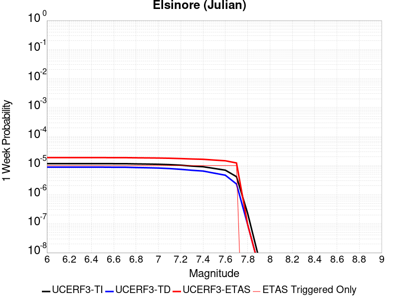 |  |  |  |

| Magnitude | 1 wk TI Prob | 1 wk TD Prob | 1 wk ETAS Prob | 1 wk ETAS/TD Gain | 1 wk ETAS Triggered Only | 1 mo TI Prob | 1 mo TD Prob | 1 mo ETAS Prob | 1 mo ETAS/TD Gain | 1 mo ETAS Triggered Only | 1 yr TI Prob | 1 yr TD Prob | 1 yr ETAS Prob | 1 yr ETAS/TD Gain | 1 yr ETAS Triggered Only | 10 yr TI Prob | 10 yr TD Prob | 10 yr ETAS Prob | 10 yr ETAS/TD Gain | 10 yr ETAS Triggered Only |
|-----|-----|-----|-----|-----|-----|-----|-----|-----|-----|-----|-----|-----|-----|-----|-----|-----|-----|-----|-----|-----|
| 6.0 | 1.1710231E-5 | 8.845509E-6 | 2.4442103E-5 | 2.7632217 | 1.5596732E-5 | 5.0185736E-5 | 3.7908783E-5 | 5.3504922E-5 | 1.4114124 | 1.5596732E-5 | 6.1084004E-4 | 4.614434E-4 | 4.770329E-4 | 1.0337843 | 1.5596732E-5 | 0.006091637 | 0.0046050567 | 0.0046205814 | 1.0033712 | 1.5596732E-5 |
| 6.1 | 1.1710231E-5 | 8.845509E-6 | 2.4442103E-5 | 2.7632217 | 1.5596732E-5 | 5.0185736E-5 | 3.7908783E-5 | 5.3504922E-5 | 1.4114124 | 1.5596732E-5 | 6.1084004E-4 | 4.614434E-4 | 4.770329E-4 | 1.0337843 | 1.5596732E-5 | 0.006091637 | 0.0046050567 | 0.0046205814 | 1.0033712 | 1.5596732E-5 |
| 6.2 | 1.1710231E-5 | 8.845509E-6 | 2.4442103E-5 | 2.7632217 | 1.5596732E-5 | 5.0185736E-5 | 3.7908783E-5 | 5.3504922E-5 | 1.4114124 | 1.5596732E-5 | 6.1084004E-4 | 4.614434E-4 | 4.770329E-4 | 1.0337843 | 1.5596732E-5 | 0.006091637 | 0.0046050567 | 0.0046205814 | 1.0033712 | 1.5596732E-5 |
| 6.3 | 1.1710231E-5 | 8.845509E-6 | 2.4442103E-5 | 2.7632217 | 1.5596732E-5 | 5.0185736E-5 | 3.7908783E-5 | 5.3504922E-5 | 1.4114124 | 1.5596732E-5 | 6.1084004E-4 | 4.614434E-4 | 4.770329E-4 | 1.0337843 | 1.5596732E-5 | 0.006091637 | 0.0046050567 | 0.0046205814 | 1.0033712 | 1.5596732E-5 |
| 6.4 | 1.1710231E-5 | 8.845509E-6 | 2.4442103E-5 | 2.7632217 | 1.5596732E-5 | 5.0185736E-5 | 3.7908783E-5 | 5.3504922E-5 | 1.4114124 | 1.5596732E-5 | 6.1084004E-4 | 4.614434E-4 | 4.770329E-4 | 1.0337843 | 1.5596732E-5 | 0.006091637 | 0.0046050567 | 0.0046205814 | 1.0033712 | 1.5596732E-5 |
| 6.5 | 1.1710231E-5 | 8.845509E-6 | 2.4442103E-5 | 2.7632217 | 1.5596732E-5 | 5.0185736E-5 | 3.7908783E-5 | 5.3504922E-5 | 1.4114124 | 1.5596732E-5 | 6.1084004E-4 | 4.614434E-4 | 4.770329E-4 | 1.0337843 | 1.5596732E-5 | 0.006091637 | 0.0046050567 | 0.0046205814 | 1.0033712 | 1.5596732E-5 |
| 6.6 | 1.1650619E-5 | 8.777881E-6 | 2.4374474E-5 | 2.7768064 | 1.5596732E-5 | 4.993027E-5 | 3.7618956E-5 | 5.32151E-5 | 1.414582 | 1.5596732E-5 | 6.0773146E-4 | 4.5791623E-4 | 4.7350582E-4 | 1.0340446 | 1.5596732E-5 | 0.0060607214 | 0.004569931 | 0.004585456 | 1.0033973 | 1.5596732E-5 |
| 6.7 | 1.1650619E-5 | 8.777881E-6 | 2.4374474E-5 | 2.7768064 | 1.5596732E-5 | 4.993027E-5 | 3.7618956E-5 | 5.32151E-5 | 1.414582 | 1.5596732E-5 | 6.0773146E-4 | 4.5791623E-4 | 4.7350582E-4 | 1.0340446 | 1.5596732E-5 | 0.0060607214 | 0.004569931 | 0.004585456 | 1.0033973 | 1.5596732E-5 |
| 6.8 | 1.1442698E-5 | 8.561041E-6 | 2.4157638E-5 | 2.821811 | 1.5596732E-5 | 4.9039216E-5 | 3.6689667E-5 | 5.2285828E-5 | 1.4250832 | 1.5596732E-5 | 5.968889E-4 | 4.4660683E-4 | 4.621966E-4 | 1.0349071 | 1.5596732E-5 | 0.0059528816 | 0.004457295 | 0.004472822 | 1.0034835 | 1.5596732E-5 |
| 6.9 | 1.1300589E-5 | 8.408907E-6 | 2.4005507E-5 | 2.8547714 | 1.5596732E-5 | 4.8430196E-5 | 3.6037683E-5 | 5.1633855E-5 | 1.4327738 | 1.5596732E-5 | 5.894781E-4 | 4.3867214E-4 | 4.5426204E-4 | 1.0355388 | 1.5596732E-5 | 0.005879169 | 0.0043782624 | 0.004393791 | 1.0035467 | 1.5596732E-5 |
| 7.0 | 1.1117729E-5 | 8.226087E-6 | 2.382269E-5 | 2.895993 | 1.5596732E-5 | 4.764654E-5 | 3.525419E-5 | 5.0850373E-5 | 1.4423922 | 1.5596732E-5 | 5.799422E-4 | 4.291369E-4 | 4.4472693E-4 | 1.0363288 | 1.5596732E-5 | 0.0057843104 | 0.004283281 | 0.004298811 | 1.0036258 | 1.5596732E-5 |
| 7.1 | 1.08053955E-5 | 7.9117535E-6 | 2.350836E-5 | 2.971321 | 1.5596732E-5 | 4.6308014E-5 | 3.3907087E-5 | 4.9503287E-5 | 1.4599688 | 1.5596732E-5 | 5.6365423E-4 | 4.127422E-4 | 4.2833248E-4 | 1.0377724 | 1.5596732E-5 | 0.005622267 | 0.0041199517 | 0.0041354843 | 1.0037701 | 1.5596732E-5 |
| 7.2 | 1.032804E-5 | 7.433021E-6 | 2.3029635E-5 | 3.0982876 | 1.5596732E-5 | 4.4262277E-5 | 3.1855423E-5 | 4.745166E-5 | 1.4895943 | 1.5596732E-5 | 5.387599E-4 | 3.8777234E-4 | 4.0336302E-4 | 1.0402057 | 1.5596732E-5 | 0.0053745564 | 0.0038711445 | 0.0038866808 | 1.0040134 | 1.5596732E-5 |
| 7.3 | 9.622426E-6 | 6.8978457E-6 | 2.2494469E-5 | 3.2610862 | 1.5596732E-5 | 4.1238312E-5 | 2.9561868E-5 | 4.515814E-5 | 1.5275806 | 1.5596732E-5 | 5.019608E-4 | 3.5985775E-4 | 3.7544884E-4 | 1.0433258 | 1.5596732E-5 | 0.005008285 | 0.0035929221 | 0.0036084626 | 1.0043254 | 1.5596732E-5 |
| 7.4 | 9.144434E-6 | 6.4963933E-6 | 2.2093023E-5 | 3.4008136 | 1.5596732E-5 | 3.9189843E-5 | 2.7841395E-5 | 4.3437693E-5 | 1.5601838 | 1.5596732E-5 | 4.7703186E-4 | 3.3891766E-4 | 3.545091E-4 | 1.0460036 | 1.5596732E-5 | 0.0047600917 | 0.0033841513 | 0.0033996953 | 1.0045931 | 1.5596732E-5 |
| 7.5 | 7.988981E-6 | 5.4983307E-6 | 2.1094977E-5 | 3.8366146 | 1.5596732E-5 | 3.4238044E-5 | 2.356407E-5 | 3.9160434E-5 | 1.6618706 | 1.5596732E-5 | 4.1676845E-4 | 2.8685606E-4 | 3.0244832E-4 | 1.0543557 | 1.5596732E-5 | 0.0041598766 | 0.002864985 | 0.002880537 | 1.0054283 | 1.5596732E-5 |
| 7.6 | 6.9554876E-6 | 4.6625346E-6 | 2.0259193E-5 | 4.3451033 | 1.5596732E-5 | 2.9808893E-5 | 1.9982144E-5 | 3.5578563E-5 | 1.7805178 | 1.5596732E-5 | 3.6286283E-4 | 2.4325661E-4 | 2.5884956E-4 | 1.0641007 | 1.5596732E-5 | 0.0036227088 | 0.0024300197 | 0.0024455783 | 1.0064027 | 1.5596732E-5 |
| 7.7 | 4.1557314E-6 | 2.3246462E-6 | 1.792134E-5 | 7.709277 | 1.5596732E-5 | 1.7810156E-5 | 9.962735E-6 | 2.5559311E-5 | 2.5654914 | 1.5596732E-5 | 2.1681708E-4 | 1.2129029E-4 | 1.3688512E-4 | 1.1285745 | 1.5596732E-5 | 0.0021660565 | 0.001212314 | 0.0012278918 | 1.0128497 | 1.5596732E-5 |
| 7.8 | 2.2597293E-7 | 9.332915E-8 | 9.332915E-8 | 1.0 | 0.0 | 9.684551E-7 | 3.99982E-7 | 3.99982E-7 | 1.0 | 0.0 | 1.1790877E-5 | 4.8697734E-6 | 4.8697734E-6 | 1.0 | 0.0 | 1.17902506E-4 | 4.8696995E-5 | 4.8696995E-5 | 1.0 | 0.0 |
| 7.9 | 6.676829E-9 | 3.439853E-9 | 3.439853E-9 | 1.0 | 0.0 | 2.861498E-8 | 1.4742227E-8 | 1.4742227E-8 | 1.0 | 0.0 | 3.4838732E-7 | 1.7948659E-7 | 1.7948659E-7 | 1.0 | 0.0 | 3.4838679E-6 | 1.7948646E-6 | 1.7948646E-6 | 1.0 | 0.0 |

## Goose Lake 2011 CFM
*[(top)](#table-of-contents)*

| 1 Week | 1 Month | 1 Year | 10 Year |
|-----|-----|-----|-----|
|  |  |  |  |

| Magnitude | 1 wk TI Prob | 1 wk TD Prob | 1 wk ETAS Prob | 1 wk ETAS/TD Gain | 1 wk ETAS Triggered Only | 1 mo TI Prob | 1 mo TD Prob | 1 mo ETAS Prob | 1 mo ETAS/TD Gain | 1 mo ETAS Triggered Only | 1 yr TI Prob | 1 yr TD Prob | 1 yr ETAS Prob | 1 yr ETAS/TD Gain | 1 yr ETAS Triggered Only | 10 yr TI Prob | 10 yr TD Prob | 10 yr ETAS Prob | 10 yr ETAS/TD Gain | 10 yr ETAS Triggered Only |
|-----|-----|-----|-----|-----|-----|-----|-----|-----|-----|-----|-----|-----|-----|-----|-----|-----|-----|-----|-----|-----|
| 6.0 | 3.780968E-6 | 3.8230223E-6 | 3.8230223E-6 | 1.0 | 0.0 | 1.6204049E-5 | 1.6384285E-5 | 1.6384285E-5 | 1.0 | 0.0 | 1.9726643E-4 | 1.994615E-4 | 2.1505512E-4 | 1.0781786 | 1.5596732E-5 | 0.001970914 | 0.001992933 | 0.0020084986 | 1.0078105 | 1.5596732E-5 |
| 6.1 | 2.2035124E-6 | 2.229801E-6 | 2.229801E-6 | 1.0 | 0.0 | 9.443591E-6 | 9.556257E-6 | 9.556257E-6 | 1.0 | 0.0 | 1.1496965E-4 | 1.163414E-4 | 1.163414E-4 | 1.0 | 0.0 | 0.0011491019 | 0.0011628233 | 0.0011628233 | 1.0 | 0.0 |
| 6.2 | 1.5624689E-6 | 1.5826923E-6 | 1.5826923E-6 | 1.0 | 0.0 | 6.6962784E-6 | 6.7829496E-6 | 6.7829496E-6 | 1.0 | 0.0 | 8.152414E-5 | 8.2579325E-5 | 8.2579325E-5 | 1.0 | 0.0 | 8.1494235E-4 | 8.2549086E-4 | 8.2549086E-4 | 1.0 | 0.0 |
| 6.3 | 1.5624689E-6 | 1.5826923E-6 | 1.5826923E-6 | 1.0 | 0.0 | 6.6962784E-6 | 6.7829496E-6 | 6.7829496E-6 | 1.0 | 0.0 | 8.152414E-5 | 8.2579325E-5 | 8.2579325E-5 | 1.0 | 0.0 | 8.1494235E-4 | 8.2549086E-4 | 8.2549086E-4 | 1.0 | 0.0 |
| 6.4 | 1.256464E-6 | 1.2738695E-6 | 1.2738695E-6 | 1.0 | 0.0 | 5.3848344E-6 | 5.4594293E-6 | 5.4594293E-6 | 1.0 | 0.0 | 6.5558386E-5 | 6.646655E-5 | 6.646655E-5 | 1.0 | 0.0 | 6.553905E-4 | 6.644687E-4 | 6.644687E-4 | 1.0 | 0.0 |
| 6.5 | 1.0910911E-6 | 1.1069404E-6 | 1.1069404E-6 | 1.0 | 0.0 | 4.6760965E-6 | 4.7440217E-6 | 4.7440217E-6 | 1.0 | 0.0 | 5.692999E-5 | 5.7756948E-5 | 5.7756948E-5 | 1.0 | 0.0 | 5.6915404E-4 | 5.7742064E-4 | 5.7742064E-4 | 1.0 | 0.0 |
| 6.6 | 9.546601E-7 | 9.691246E-7 | 9.691246E-7 | 1.0 | 0.0 | 4.091394E-6 | 4.1533845E-6 | 4.1533845E-6 | 1.0 | 0.0 | 4.9811584E-5 | 5.056629E-5 | 5.056629E-5 | 1.0 | 0.0 | 4.980042E-4 | 5.055487E-4 | 5.055487E-4 | 1.0 | 0.0 |
| 6.7 | 7.790316E-7 | 7.9159634E-7 | 7.9159634E-7 | 1.0 | 0.0 | 3.3387028E-6 | 3.3925514E-6 | 3.3925514E-6 | 1.0 | 0.0 | 4.0647945E-5 | 4.1303538E-5 | 4.1303538E-5 | 1.0 | 0.0 | 4.0640513E-4 | 4.129592E-4 | 4.129592E-4 | 1.0 | 0.0 |
| 6.8 | 6.3714384E-7 | 6.4787395E-7 | 6.4787395E-7 | 1.0 | 0.0 | 2.7306137E-6 | 2.7765998E-6 | 2.7765998E-6 | 1.0 | 0.0 | 3.3244716E-5 | 3.3804583E-5 | 3.3804583E-5 | 1.0 | 0.0 | 3.323974E-4 | 3.379949E-4 | 3.379949E-4 | 1.0 | 0.0 |
| 6.9 | 4.92586E-7 | 5.0139147E-7 | 5.0139147E-7 | 1.0 | 0.0 | 2.1110811E-6 | 2.1488188E-6 | 2.1488188E-6 | 1.0 | 0.0 | 2.5702111E-5 | 2.616156E-5 | 2.616156E-5 | 1.0 | 0.0 | 2.569914E-4 | 2.6158517E-4 | 2.6158517E-4 | 1.0 | 0.0 |
| 7.0 | 3.130245E-7 | 3.190354E-7 | 3.190354E-7 | 1.0 | 0.0 | 1.3415328E-6 | 1.3672939E-6 | 1.3672939E-6 | 1.0 | 0.0 | 1.6333039E-5 | 1.6646678E-5 | 1.6646678E-5 | 1.0 | 0.0 | 1.6331839E-4 | 1.6645451E-4 | 1.6645451E-4 | 1.0 | 0.0 |
| 7.1 | 1.7680084E-7 | 1.8023923E-7 | 1.8023923E-7 | 1.0 | 0.0 | 7.5771766E-7 | 7.724536E-7 | 7.724536E-7 | 1.0 | 0.0 | 9.225173E-6 | 9.404583E-6 | 9.404583E-6 | 1.0 | 0.0 | 9.22479E-5 | 9.4041956E-5 | 9.4041956E-5 | 1.0 | 0.0 |
| 7.2 | 4.8641045E-8 | 4.9402068E-8 | 4.9402068E-8 | 1.0 | 0.0 | 2.084616E-7 | 2.1172312E-7 | 2.1172312E-7 | 1.0 | 0.0 | 2.538017E-6 | 2.577726E-6 | 2.577726E-6 | 1.0 | 0.0 | 2.537988E-5 | 2.5776973E-5 | 2.5776973E-5 | 1.0 | 0.0 |
| 7.3 | 5.3911844E-9 | 5.4758145E-9 | 5.4758145E-9 | 1.0 | 0.0 | 2.3105075E-8 | 2.3467775E-8 | 2.3467775E-8 | 1.0 | 0.0 | 2.8130427E-7 | 2.8572015E-7 | 2.8572015E-7 | 1.0 | 0.0 | 2.8130391E-6 | 2.8571992E-6 | 2.8571992E-6 | 1.0 | 0.0 |

## Robinson Creek
*[(top)](#table-of-contents)*

| 1 Week | 1 Month | 1 Year | 10 Year |
|-----|-----|-----|-----|
|  |  |  |  |

| Magnitude | 1 wk TI Prob | 1 wk TD Prob | 1 wk ETAS Prob | 1 wk ETAS/TD Gain | 1 wk ETAS Triggered Only | 1 mo TI Prob | 1 mo TD Prob | 1 mo ETAS Prob | 1 mo ETAS/TD Gain | 1 mo ETAS Triggered Only | 1 yr TI Prob | 1 yr TD Prob | 1 yr ETAS Prob | 1 yr ETAS/TD Gain | 1 yr ETAS Triggered Only | 10 yr TI Prob | 10 yr TD Prob | 10 yr ETAS Prob | 10 yr ETAS/TD Gain | 10 yr ETAS Triggered Only |
|-----|-----|-----|-----|-----|-----|-----|-----|-----|-----|-----|-----|-----|-----|-----|-----|-----|-----|-----|-----|-----|
| 6.0 | 1.3705327E-5 | 1.5285013E-5 | 3.0881507E-5 | 2.020378 | 1.5596732E-5 | 5.8735794E-5 | 6.55072E-5 | 8.110291E-5 | 1.2380762 | 1.5596732E-5 | 7.1487366E-4 | 7.9755014E-4 | 8.131344E-4 | 1.0195402 | 1.5596732E-5 | 0.0071257832 | 0.007975501 | 0.007990974 | 1.00194 | 1.5596732E-5 |
| 6.1 | 1.3705327E-5 | 1.5285013E-5 | 3.0881507E-5 | 2.020378 | 1.5596732E-5 | 5.8735794E-5 | 6.55072E-5 | 8.110291E-5 | 1.2380762 | 1.5596732E-5 | 7.1487366E-4 | 7.9755014E-4 | 8.131344E-4 | 1.0195402 | 1.5596732E-5 | 0.0071257832 | 0.007975501 | 0.007990974 | 1.00194 | 1.5596732E-5 |
| 6.2 | 1.3705327E-5 | 1.5285013E-5 | 3.0881507E-5 | 2.020378 | 1.5596732E-5 | 5.8735794E-5 | 6.55072E-5 | 8.110291E-5 | 1.2380762 | 1.5596732E-5 | 7.1487366E-4 | 7.9755014E-4 | 8.131344E-4 | 1.0195402 | 1.5596732E-5 | 0.0071257832 | 0.007975501 | 0.007990974 | 1.00194 | 1.5596732E-5 |
| 6.3 | 1.3705327E-5 | 1.5285013E-5 | 3.0881507E-5 | 2.020378 | 1.5596732E-5 | 5.8735794E-5 | 6.55072E-5 | 8.110291E-5 | 1.2380762 | 1.5596732E-5 | 7.1487366E-4 | 7.9755014E-4 | 8.131344E-4 | 1.0195402 | 1.5596732E-5 | 0.0071257832 | 0.007975501 | 0.007990974 | 1.00194 | 1.5596732E-5 |
| 6.4 | 1.3705327E-5 | 1.5285013E-5 | 3.0881507E-5 | 2.020378 | 1.5596732E-5 | 5.8735794E-5 | 6.55072E-5 | 8.110291E-5 | 1.2380762 | 1.5596732E-5 | 7.1487366E-4 | 7.9755014E-4 | 8.131344E-4 | 1.0195402 | 1.5596732E-5 | 0.0071257832 | 0.007975501 | 0.007990974 | 1.00194 | 1.5596732E-5 |

## Sierra Madre (San Fernando)
*[(top)](#table-of-contents)*

| 1 Week | 1 Month | 1 Year | 10 Year |
|-----|-----|-----|-----|
|  |  |  |  |

| Magnitude | 1 wk TI Prob | 1 wk TD Prob | 1 wk ETAS Prob | 1 wk ETAS/TD Gain | 1 wk ETAS Triggered Only | 1 mo TI Prob | 1 mo TD Prob | 1 mo ETAS Prob | 1 mo ETAS/TD Gain | 1 mo ETAS Triggered Only | 1 yr TI Prob | 1 yr TD Prob | 1 yr ETAS Prob | 1 yr ETAS/TD Gain | 1 yr ETAS Triggered Only | 10 yr TI Prob | 10 yr TD Prob | 10 yr ETAS Prob | 10 yr ETAS/TD Gain | 10 yr ETAS Triggered Only |
|-----|-----|-----|-----|-----|-----|-----|-----|-----|-----|-----|-----|-----|-----|-----|-----|-----|-----|-----|-----|-----|
| 6.0 | 1.0346413E-5 | 6.2872605E-6 | 6.2872605E-6 | 1.0 | 0.0 | 4.4341014E-5 | 2.694513E-5 | 2.694513E-5 | 1.0 | 0.0 | 5.3971814E-4 | 3.280087E-4 | 3.280087E-4 | 1.0 | 0.0 | 0.0053840918 | 0.0032753581 | 0.0032909038 | 1.0047462 | 1.5596732E-5 |
| 6.1 | 1.0346413E-5 | 6.2872605E-6 | 6.2872605E-6 | 1.0 | 0.0 | 4.4341014E-5 | 2.694513E-5 | 2.694513E-5 | 1.0 | 0.0 | 5.3971814E-4 | 3.280087E-4 | 3.280087E-4 | 1.0 | 0.0 | 0.0053840918 | 0.0032753581 | 0.0032909038 | 1.0047462 | 1.5596732E-5 |
| 6.2 | 1.0346413E-5 | 6.2872605E-6 | 6.2872605E-6 | 1.0 | 0.0 | 4.4341014E-5 | 2.694513E-5 | 2.694513E-5 | 1.0 | 0.0 | 5.3971814E-4 | 3.280087E-4 | 3.280087E-4 | 1.0 | 0.0 | 0.0053840918 | 0.0032753581 | 0.0032909038 | 1.0047462 | 1.5596732E-5 |
| 6.3 | 1.0346413E-5 | 6.2872605E-6 | 6.2872605E-6 | 1.0 | 0.0 | 4.4341014E-5 | 2.694513E-5 | 2.694513E-5 | 1.0 | 0.0 | 5.3971814E-4 | 3.280087E-4 | 3.280087E-4 | 1.0 | 0.0 | 0.0053840918 | 0.0032753581 | 0.0032909038 | 1.0047462 | 1.5596732E-5 |
| 6.4 | 1.0249558E-5 | 6.2872605E-6 | 6.2872605E-6 | 1.0 | 0.0 | 4.392594E-5 | 2.694513E-5 | 2.694513E-5 | 1.0 | 0.0 | 5.3466705E-4 | 3.280087E-4 | 3.280087E-4 | 1.0 | 0.0 | 0.0053338245 | 0.0032753581 | 0.0032909038 | 1.0047462 | 1.5596732E-5 |
| 6.5 | 1.0249558E-5 | 6.2872605E-6 | 6.2872605E-6 | 1.0 | 0.0 | 4.392594E-5 | 2.694513E-5 | 2.694513E-5 | 1.0 | 0.0 | 5.3466705E-4 | 3.280087E-4 | 3.280087E-4 | 1.0 | 0.0 | 0.0053338245 | 0.0032753581 | 0.0032909038 | 1.0047462 | 1.5596732E-5 |
| 6.6 | 9.9035515E-6 | 6.2872605E-6 | 6.2872605E-6 | 1.0 | 0.0 | 4.2443102E-5 | 2.694513E-5 | 2.694513E-5 | 1.0 | 0.0 | 5.166222E-4 | 3.280087E-4 | 3.280087E-4 | 1.0 | 0.0 | 0.0051542283 | 0.0032753581 | 0.0032909038 | 1.0047462 | 1.5596732E-5 |
| 6.7 | 9.87217E-6 | 6.2746817E-6 | 6.2746817E-6 | 1.0 | 0.0 | 4.2308613E-5 | 2.689122E-5 | 2.689122E-5 | 1.0 | 0.0 | 5.149856E-4 | 3.2735255E-4 | 3.2735255E-4 | 1.0 | 0.0 | 0.005137938 | 0.0032688158 | 0.0032843617 | 1.0047557 | 1.5596732E-5 |
| 6.8 | 9.4359175E-6 | 6.1786586E-6 | 6.1786586E-6 | 1.0 | 0.0 | 4.043902E-5 | 2.6479704E-5 | 2.6479704E-5 | 1.0 | 0.0 | 4.9223384E-4 | 3.2234378E-4 | 3.2234378E-4 | 1.0 | 0.0 | 0.0049114493 | 0.0032188739 | 0.0032344204 | 1.0048298 | 1.5596732E-5 |
| 6.9 | 8.700447E-6 | 6.039922E-6 | 6.039922E-6 | 1.0 | 0.0 | 3.72871E-5 | 2.5885129E-5 | 2.5885129E-5 | 1.0 | 0.0 | 4.5387587E-4 | 3.1510694E-4 | 3.1510694E-4 | 1.0 | 0.0 | 0.0045295 | 0.003146711 | 0.0031622585 | 1.0049409 | 1.5596732E-5 |
| 7.0 | 8.648878E-6 | 6.0148373E-6 | 6.0148373E-6 | 1.0 | 0.0 | 3.7066096E-5 | 2.5777625E-5 | 2.5777625E-5 | 1.0 | 0.0 | 4.5118626E-4 | 3.1379846E-4 | 3.1379846E-4 | 1.0 | 0.0 | 0.004502713 | 0.003133663 | 0.003149211 | 1.0049616 | 1.5596732E-5 |
| 7.1 | 8.505786E-6 | 5.9244676E-6 | 5.9244676E-6 | 1.0 | 0.0 | 3.645286E-5 | 2.5390334E-5 | 2.5390334E-5 | 1.0 | 0.0 | 4.437232E-4 | 3.0908454E-4 | 3.0908454E-4 | 1.0 | 0.0 | 0.0044283825 | 0.0030866556 | 0.0031022043 | 1.0050373 | 1.5596732E-5 |
| 7.2 | 8.139752E-6 | 5.6987624E-6 | 5.6987624E-6 | 1.0 | 0.0 | 3.4884186E-5 | 2.4423045E-5 | 2.4423045E-5 | 1.0 | 0.0 | 4.246322E-4 | 2.9731105E-4 | 2.9731105E-4 | 1.0 | 0.0 | 0.004238217 | 0.0029692391 | 0.0029847894 | 1.0052372 | 1.5596732E-5 |
| 7.3 | 7.8816E-6 | 5.552077E-6 | 5.552077E-6 | 1.0 | 0.0 | 3.3777847E-5 | 2.3794404E-5 | 2.3794404E-5 | 1.0 | 0.0 | 4.111677E-4 | 2.896594E-4 | 2.896594E-4 | 1.0 | 0.0 | 0.004104078 | 0.0028929242 | 0.0029084757 | 1.0053757 | 1.5596732E-5 |
| 7.4 | 7.5810603E-6 | 5.3563126E-6 | 5.3563126E-6 | 1.0 | 0.0 | 3.2489854E-5 | 2.2955428E-5 | 2.2955428E-5 | 1.0 | 0.0 | 3.9549218E-4 | 2.7944756E-4 | 2.7944756E-4 | 1.0 | 0.0 | 0.0039478904 | 0.0027910667 | 0.0028066197 | 1.0055724 | 1.5596732E-5 |
| 7.5 | 6.349153E-6 | 4.407576E-6 | 4.407576E-6 | 1.0 | 0.0 | 2.7210372E-5 | 1.888948E-5 | 1.888948E-5 | 1.0 | 0.0 | 3.312359E-4 | 2.2995596E-4 | 2.2995596E-4 | 1.0 | 0.0 | 0.0033074263 | 0.0022972622 | 0.002312823 | 1.0067737 | 1.5596732E-5 |
| 7.6 | 4.430576E-6 | 2.8905868E-6 | 2.8905868E-6 | 1.0 | 0.0 | 1.8988047E-5 | 1.2388171E-5 | 1.2388171E-5 | 1.0 | 0.0 | 2.3115493E-4 | 1.5081577E-4 | 1.5081577E-4 | 1.0 | 0.0 | 0.0023091463 | 0.0015071568 | 0.00152273 | 1.0103328 | 1.5596732E-5 |
| 7.7 | 3.005066E-6 | 1.7510115E-6 | 1.7510115E-6 | 1.0 | 0.0 | 1.2878791E-5 | 7.504313E-6 | 7.504313E-6 | 1.0 | 0.0 | 1.56788E-4 | 9.1361195E-5 | 9.1361195E-5 | 1.0 | 0.0 | 0.0015667742 | 9.132375E-4 | 9.2882E-4 | 1.0170629 | 1.5596732E-5 |
| 7.8 | 1.8459098E-6 | 1.0582091E-6 | 1.0582091E-6 | 1.0 | 0.0 | 7.911018E-6 | 4.535174E-6 | 4.535174E-6 | 1.0 | 0.0 | 9.631238E-5 | 5.5214347E-5 | 5.5214347E-5 | 1.0 | 0.0 | 9.627065E-4 | 5.5200676E-4 | 5.5200676E-4 | 1.0 | 0.0 |
| 7.9 | 9.839262E-7 | 5.23421E-7 | 5.23421E-7 | 1.0 | 0.0 | 4.2168194E-6 | 2.2432312E-6 | 2.2432312E-6 | 1.0 | 0.0 | 5.1338568E-5 | 2.7310998E-5 | 2.7310998E-5 | 1.0 | 0.0 | 5.132671E-4 | 2.730767E-4 | 2.730767E-4 | 1.0 | 0.0 |
| 8.0 | 1.210983E-7 | 6.613821E-8 | 6.613821E-8 | 1.0 | 0.0 | 5.1899264E-7 | 2.8344945E-7 | 2.8344945E-7 | 1.0 | 0.0 | 6.3187167E-6 | 3.4509917E-6 | 3.4509917E-6 | 1.0 | 0.0 | 6.318537E-5 | 3.45094E-5 | 3.45094E-5 | 1.0 | 0.0 |

## Hayward (So) extension 2011 CFM
*[(top)](#table-of-contents)*

| 1 Week | 1 Month | 1 Year | 10 Year |
|-----|-----|-----|-----|
|  |  |  | 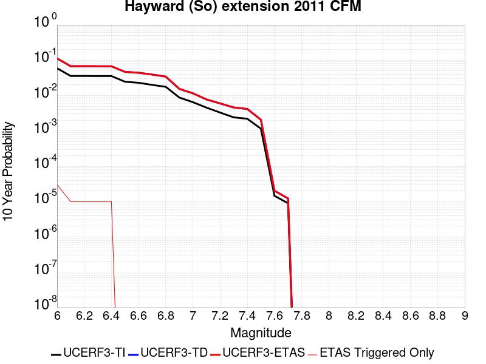 |

| Magnitude | 1 wk TI Prob | 1 wk TD Prob | 1 wk ETAS Prob | 1 wk ETAS/TD Gain | 1 wk ETAS Triggered Only | 1 mo TI Prob | 1 mo TD Prob | 1 mo ETAS Prob | 1 mo ETAS/TD Gain | 1 mo ETAS Triggered Only | 1 yr TI Prob | 1 yr TD Prob | 1 yr ETAS Prob | 1 yr ETAS/TD Gain | 1 yr ETAS Triggered Only | 10 yr TI Prob | 10 yr TD Prob | 10 yr ETAS Prob | 10 yr ETAS/TD Gain | 10 yr ETAS Triggered Only |
|-----|-----|-----|-----|-----|-----|-----|-----|-----|-----|-----|-----|-----|-----|-----|-----|-----|-----|-----|-----|-----|
| 6.0 | 1.1721256E-4 | 2.3697627E-4 | 2.3697627E-4 | 1.0 | 0.0 | 5.022428E-4 | 0.0010129517 | 0.0010129517 | 1.0 | 0.0 | 0.0060976758 | 0.012248711 | 0.012248711 | 1.0 | 0.0 | 0.0593305 | 0.112843215 | 0.11285705 | 1.0001227 | 1.5596732E-5 |
| 6.1 | 6.99169E-5 | 1.3822885E-4 | 1.3822885E-4 | 1.0 | 0.0 | 2.9960944E-4 | 5.9128006E-4 | 5.9128006E-4 | 1.0 | 0.0 | 0.0036416445 | 0.0071720886 | 0.0071720886 | 1.0 | 0.0 | 0.035825435 | 0.067803554 | 0.06781809 | 1.0002145 | 1.5596732E-5 |
| 6.2 | 6.99169E-5 | 1.3822885E-4 | 1.3822885E-4 | 1.0 | 0.0 | 2.9960944E-4 | 5.9128006E-4 | 5.9128006E-4 | 1.0 | 0.0 | 0.0036416445 | 0.0071720886 | 0.0071720886 | 1.0 | 0.0 | 0.035825435 | 0.067803554 | 0.06781809 | 1.0002145 | 1.5596732E-5 |
| 6.3 | 6.970908E-5 | 1.379104E-4 | 1.379104E-4 | 1.0 | 0.0 | 2.9871898E-4 | 5.899159E-4 | 5.899159E-4 | 1.0 | 0.0 | 0.0036308395 | 0.007155625 | 0.007155625 | 1.0 | 0.0 | 0.035720866 | 0.067652516 | 0.06766706 | 1.0002149 | 1.5596732E-5 |
| 6.4 | 6.9517155E-5 | 1.375792E-4 | 1.375792E-4 | 1.0 | 0.0 | 2.9789665E-4 | 5.884971E-4 | 5.884971E-4 | 1.0 | 0.0 | 0.0036208609 | 0.0071385372 | 0.0071385372 | 1.0 | 0.0 | 0.03562429 | 0.06749655 | 0.0675111 | 1.0002155 | 1.5596732E-5 |
| 6.5 | 4.786248E-5 | 9.41498E-5 | 9.41498E-5 | 1.0 | 0.0 | 2.0510878E-4 | 4.034394E-4 | 4.034394E-4 | 1.0 | 0.0 | 0.0024943394 | 0.004901227 | 0.004901227 | 1.0 | 0.0 | 0.02466527 | 0.046901822 | 0.046901822 | 1.0 | 0.0 |
| 6.6 | 4.4662214E-5 | 8.881654E-5 | 8.881654E-5 | 1.0 | 0.0 | 1.9139545E-4 | 3.805894E-4 | 3.805894E-4 | 1.0 | 0.0 | 0.0023277493 | 0.0046242937 | 0.0046242937 | 1.0 | 0.0 | 0.02303517 | 0.044293344 | 0.044293344 | 1.0 | 0.0 |
| 6.7 | 3.884542E-5 | 7.8648096E-5 | 7.8648096E-5 | 1.0 | 0.0 | 1.6646975E-4 | 3.370222E-4 | 3.370222E-4 | 1.0 | 0.0 | 0.002024885 | 0.0040959697 | 0.0040959697 | 1.0 | 0.0 | 0.020065336 | 0.039333146 | 0.039333146 | 1.0 | 0.0 |
| 6.8 | 3.4221863E-5 | 6.855653E-5 | 6.855653E-5 | 1.0 | 0.0 | 1.4665688E-4 | 2.93783E-4 | 2.93783E-4 | 1.0 | 0.0 | 0.0017840851 | 0.0035713627 | 0.0035713627 | 1.0 | 0.0 | 0.017698295 | 0.034421004 | 0.034421004 | 1.0 | 0.0 |
| 6.9 | 1.6927712E-5 | 3.0061563E-5 | 3.0061563E-5 | 1.0 | 0.0 | 7.2545314E-5 | 1.2882923E-4 | 1.2882923E-4 | 1.0 | 0.0 | 8.828813E-4 | 0.0015674243 | 0.0015674243 | 1.0 | 0.0 | 0.008793819 | 0.01546327 | 0.01546327 | 1.0 | 0.0 |
| 7.0 | 1.2509653E-5 | 2.2462571E-5 | 2.2462571E-5 | 1.0 | 0.0 | 5.3611697E-5 | 9.6264856E-5 | 9.6264856E-5 | 1.0 | 0.0 | 6.525269E-4 | 0.0011714385 | 0.0011714385 | 1.0 | 0.0 | 0.0065061417 | 0.01158231 | 0.01158231 | 1.0 | 0.0 |
| 7.1 | 8.751583E-6 | 1.4925648E-5 | 1.4925648E-5 | 1.0 | 0.0 | 3.750624E-5 | 6.3965526E-5 | 6.3965526E-5 | 1.0 | 0.0 | 4.5654282E-4 | 7.785079E-4 | 7.785079E-4 | 1.0 | 0.0 | 0.0045560603 | 0.007763496 | 0.007763496 | 1.0 | 0.0 |
| 7.2 | 6.354379E-6 | 1.1498636E-5 | 1.1498636E-5 | 1.0 | 0.0 | 2.7232769E-5 | 4.9278966E-5 | 4.9278966E-5 | 1.0 | 0.0 | 3.3150852E-4 | 5.99811E-4 | 5.99811E-4 | 1.0 | 0.0 | 0.0033101442 | 0.0060003046 | 0.0060003046 | 1.0 | 0.0 |
| 7.3 | 4.645554E-6 | 8.818172E-6 | 8.818172E-6 | 1.0 | 0.0 | 1.9909365E-5 | 3.779164E-5 | 3.779164E-5 | 1.0 | 0.0 | 2.4236954E-4 | 4.6002E-4 | 4.6002E-4 | 1.0 | 0.0 | 0.0024210536 | 0.004610708 | 0.004610708 | 1.0 | 0.0 |
| 7.4 | 4.23437E-6 | 7.992532E-6 | 7.992532E-6 | 1.0 | 0.0 | 1.8147173E-5 | 3.425328E-5 | 3.425328E-5 | 1.0 | 0.0 | 2.2091944E-4 | 4.1695772E-4 | 4.1695772E-4 | 1.0 | 0.0 | 0.0022069993 | 0.004181972 | 0.004181972 | 1.0 | 0.0 |
| 7.5 | 2.2187417E-6 | 3.9522306E-6 | 3.9522306E-6 | 1.0 | 0.0 | 9.508858E-6 | 1.6938036E-5 | 1.6938036E-5 | 1.0 | 0.0 | 1.157642E-4 | 2.0620368E-4 | 2.0620368E-4 | 1.0 | 0.0 | 0.0011570391 | 0.0020734754 | 0.0020734754 | 1.0 | 0.0 |
| 7.6 | 2.7952495E-8 | 3.878529E-8 | 3.878529E-8 | 1.0 | 0.0 | 1.1979641E-7 | 1.6622266E-7 | 1.6622266E-7 | 1.0 | 0.0 | 1.4585203E-6 | 2.0237592E-6 | 2.0237592E-6 | 1.0 | 0.0 | 1.4585107E-5 | 2.0328182E-5 | 2.0328182E-5 | 1.0 | 0.0 |
| 7.7 | 1.7192724E-8 | 2.3436517E-8 | 2.3436517E-8 | 1.0 | 0.0 | 7.36831E-8 | 1.0044221E-7 | 1.0044221E-7 | 1.0 | 0.0 | 8.9709135E-7 | 1.2228833E-6 | 1.2228833E-6 | 1.0 | 0.0 | 8.970877E-6 | 1.2296933E-5 | 1.2296933E-5 | 1.0 | 0.0 |

## Concord 2011 CFM
*[(top)](#table-of-contents)*

| 1 Week | 1 Month | 1 Year | 10 Year |
|-----|-----|-----|-----|
|  |  |  |  |

| Magnitude | 1 wk TI Prob | 1 wk TD Prob | 1 wk ETAS Prob | 1 wk ETAS/TD Gain | 1 wk ETAS Triggered Only | 1 mo TI Prob | 1 mo TD Prob | 1 mo ETAS Prob | 1 mo ETAS/TD Gain | 1 mo ETAS Triggered Only | 1 yr TI Prob | 1 yr TD Prob | 1 yr ETAS Prob | 1 yr ETAS/TD Gain | 1 yr ETAS Triggered Only | 10 yr TI Prob | 10 yr TD Prob | 10 yr ETAS Prob | 10 yr ETAS/TD Gain | 10 yr ETAS Triggered Only |
|-----|-----|-----|-----|-----|-----|-----|-----|-----|-----|-----|-----|-----|-----|-----|-----|-----|-----|-----|-----|-----|
| 6.0 | 5.7865112E-5 | 9.759152E-5 | 9.759152E-5 | 1.0 | 0.0 | 2.4796976E-4 | 4.1818706E-4 | 4.1818706E-4 | 1.0 | 0.0 | 0.0030148525 | 0.005079467 | 0.005079467 | 1.0 | 0.0 | 0.029742775 | 0.049248982 | 0.04926381 | 1.0003011 | 1.5596732E-5 |
| 6.1 | 5.7865112E-5 | 9.759152E-5 | 9.759152E-5 | 1.0 | 0.0 | 2.4796976E-4 | 4.1818706E-4 | 4.1818706E-4 | 1.0 | 0.0 | 0.0030148525 | 0.005079467 | 0.005079467 | 1.0 | 0.0 | 0.029742775 | 0.049248982 | 0.04926381 | 1.0003011 | 1.5596732E-5 |
| 6.2 | 5.6789337E-5 | 9.5795076E-5 | 9.5795076E-5 | 1.0 | 0.0 | 2.4336016E-4 | 4.104905E-4 | 4.104905E-4 | 1.0 | 0.0 | 0.0029588845 | 0.0049861916 | 0.0049861916 | 1.0 | 0.0 | 0.029197963 | 0.04836556 | 0.0483804 | 1.0003068 | 1.5596732E-5 |
| 6.3 | 5.203322E-5 | 8.803056E-5 | 8.803056E-5 | 1.0 | 0.0 | 2.2298045E-4 | 3.7722368E-4 | 3.7722368E-4 | 1.0 | 0.0 | 0.0027114071 | 0.0045838105 | 0.0045838105 | 1.0 | 0.0 | 0.026785625 | 0.04453672 | 0.044551622 | 1.0003346 | 1.5596732E-5 |
| 6.4 | 4.7120942E-5 | 7.897404E-5 | 7.897404E-5 | 1.0 | 0.0 | 2.0193127E-4 | 3.3842045E-4 | 3.3842045E-4 | 1.0 | 0.0 | 0.0024557412 | 0.00411323 | 0.00411323 | 1.0 | 0.0 | 0.024287801 | 0.040065527 | 0.0400805 | 1.0003737 | 1.5596732E-5 |
| 6.5 | 2.9598437E-5 | 4.667486E-5 | 4.667486E-5 | 1.0 | 0.0 | 1.2684427E-4 | 2.0002096E-4 | 2.0002096E-4 | 1.0 | 0.0 | 0.001543235 | 0.0024327459 | 0.0024327459 | 1.0 | 0.0 | 0.015325619 | 0.023909973 | 0.023909973 | 1.0 | 0.0 |
| 6.6 | 2.0443718E-5 | 2.998433E-5 | 2.998433E-5 | 1.0 | 0.0 | 8.7613E-5 | 1.2849816E-4 | 1.2849816E-4 | 1.0 | 0.0 | 0.0010661662 | 0.0015633785 | 0.0015633785 | 1.0 | 0.0 | 0.010610655 | 0.015466996 | 0.015466996 | 1.0 | 0.0 |
| 6.7 | 1.798539E-5 | 2.5557381E-5 | 2.5557381E-5 | 1.0 | 0.0 | 7.7077966E-5 | 1.0952716E-4 | 1.0952716E-4 | 1.0 | 0.0 | 9.380202E-4 | 0.001332699 | 0.001332699 | 1.0 | 0.0 | 0.009340706 | 0.013217433 | 0.013217433 | 1.0 | 0.0 |
| 6.8 | 1.613555E-5 | 2.1959211E-5 | 2.1959211E-5 | 1.0 | 0.0 | 6.915052E-5 | 9.4107585E-5 | 9.4107585E-5 | 1.0 | 0.0 | 8.4158237E-4 | 0.0011451716 | 0.0011451716 | 1.0 | 0.0 | 0.008384023 | 0.0113782035 | 0.0113782035 | 1.0 | 0.0 |
| 6.9 | 1.2916435E-5 | 1.7081054E-5 | 1.7081054E-5 | 1.0 | 0.0 | 5.5354973E-5 | 7.32025E-5 | 7.32025E-5 | 1.0 | 0.0 | 6.7373837E-4 | 8.908818E-4 | 8.908818E-4 | 1.0 | 0.0 | 0.006716994 | 0.008867139 | 0.008867139 | 1.0 | 0.0 |
| 7.0 | 9.81129E-6 | 1.2630829E-5 | 1.2630829E-5 | 1.0 | 0.0 | 4.2047708E-5 | 5.413101E-5 | 5.413101E-5 | 1.0 | 0.0 | 5.118106E-4 | 6.588474E-4 | 6.588474E-4 | 1.0 | 0.0 | 0.005106334 | 0.006569153 | 0.006569153 | 1.0 | 0.0 |
| 7.1 | 8.0889195E-6 | 1.0418261E-5 | 1.0418261E-5 | 1.0 | 0.0 | 3.4666336E-5 | 4.4648932E-5 | 4.4648932E-5 | 1.0 | 0.0 | 4.219809E-4 | 5.434662E-4 | 5.434662E-4 | 1.0 | 0.0 | 0.004211805 | 0.0054215975 | 0.0054215975 | 1.0 | 0.0 |
| 7.2 | 6.267438E-6 | 8.115699E-6 | 8.115699E-6 | 1.0 | 0.0 | 2.6860173E-5 | 3.4781104E-5 | 3.4781104E-5 | 1.0 | 0.0 | 3.2697353E-4 | 4.233784E-4 | 4.233784E-4 | 1.0 | 0.0 | 0.0032649285 | 0.004225969 | 0.004225969 | 1.0 | 0.0 |
| 7.3 | 3.6761196E-6 | 4.8401653E-6 | 4.8401653E-6 | 1.0 | 0.0 | 1.5754704E-5 | 2.0743402E-5 | 2.0743402E-5 | 1.0 | 0.0 | 1.9179663E-4 | 2.5252186E-4 | 2.5252186E-4 | 1.0 | 0.0 | 0.0019163118 | 0.002522487 | 0.002522487 | 1.0 | 0.0 |
| 7.4 | 2.8044356E-6 | 3.7096036E-6 | 3.7096036E-6 | 1.0 | 0.0 | 1.2018954E-5 | 1.5898204E-5 | 1.5898204E-5 | 1.0 | 0.0 | 1.4632095E-4 | 1.9354356E-4 | 1.9354356E-4 | 1.0 | 0.0 | 0.0014622464 | 0.0019338481 | 0.0019338481 | 1.0 | 0.0 |
| 7.5 | 2.4578699E-6 | 3.2447442E-6 | 3.2447442E-6 | 1.0 | 0.0 | 1.0533685E-5 | 1.3905973E-5 | 1.3905973E-5 | 1.0 | 0.0 | 1.2824008E-4 | 1.6929218E-4 | 1.6929218E-4 | 1.0 | 0.0 | 0.0012816609 | 0.001691713 | 0.001691713 | 1.0 | 0.0 |
| 7.6 | 1.7713267E-6 | 2.3351192E-6 | 2.3351192E-6 | 1.0 | 0.0 | 7.591378E-6 | 1.0007616E-5 | 1.0007616E-5 | 1.0 | 0.0 | 9.2421105E-5 | 1.21836E-4 | 1.21836E-4 | 1.0 | 0.0 | 9.2382677E-4 | 0.0012177454 | 0.0012177454 | 1.0 | 0.0 |
| 7.7 | 5.1912366E-7 | 6.8290143E-7 | 6.8290143E-7 | 1.0 | 0.0 | 2.2248137E-6 | 2.9267171E-6 | 2.9267171E-6 | 1.0 | 0.0 | 2.708677E-5 | 3.5632213E-5 | 3.5632213E-5 | 1.0 | 0.0 | 2.708347E-4 | 3.5627294E-4 | 3.5627294E-4 | 1.0 | 0.0 |

## Great Valley 08 (Quinto)
*[(top)](#table-of-contents)*

| 1 Week | 1 Month | 1 Year | 10 Year |
|-----|-----|-----|-----|
|  |  |  |  |

| Magnitude | 1 wk TI Prob | 1 wk TD Prob | 1 wk ETAS Prob | 1 wk ETAS/TD Gain | 1 wk ETAS Triggered Only | 1 mo TI Prob | 1 mo TD Prob | 1 mo ETAS Prob | 1 mo ETAS/TD Gain | 1 mo ETAS Triggered Only | 1 yr TI Prob | 1 yr TD Prob | 1 yr ETAS Prob | 1 yr ETAS/TD Gain | 1 yr ETAS Triggered Only | 10 yr TI Prob | 10 yr TD Prob | 10 yr ETAS Prob | 10 yr ETAS/TD Gain | 10 yr ETAS Triggered Only |
|-----|-----|-----|-----|-----|-----|-----|-----|-----|-----|-----|-----|-----|-----|-----|-----|-----|-----|-----|-----|-----|
| 6.0 | 7.737697E-6 | 8.253038E-6 | 2.384964E-5 | 2.8898013 | 1.5596732E-5 | 3.3161137E-5 | 3.536979E-5 | 5.096597E-5 | 1.4409463 | 1.5596732E-5 | 4.0366207E-4 | 4.3056096E-4 | 4.4615098E-4 | 1.0362086 | 1.5596732E-5 | 0.004029296 | 0.0042991205 | 0.0043146503 | 1.0036123 | 1.5596732E-5 |
| 6.1 | 7.737697E-6 | 8.253038E-6 | 2.384964E-5 | 2.8898013 | 1.5596732E-5 | 3.3161137E-5 | 3.536979E-5 | 5.096597E-5 | 1.4409463 | 1.5596732E-5 | 4.0366207E-4 | 4.3056096E-4 | 4.4615098E-4 | 1.0362086 | 1.5596732E-5 | 0.004029296 | 0.0042991205 | 0.0043146503 | 1.0036123 | 1.5596732E-5 |
| 6.2 | 7.737697E-6 | 8.253038E-6 | 2.384964E-5 | 2.8898013 | 1.5596732E-5 | 3.3161137E-5 | 3.536979E-5 | 5.096597E-5 | 1.4409463 | 1.5596732E-5 | 4.0366207E-4 | 4.3056096E-4 | 4.4615098E-4 | 1.0362086 | 1.5596732E-5 | 0.004029296 | 0.0042991205 | 0.0043146503 | 1.0036123 | 1.5596732E-5 |
| 6.3 | 5.374012E-6 | 5.7505736E-6 | 5.7505736E-6 | 1.0 | 0.0 | 2.3031276E-5 | 2.4645145E-5 | 2.4645145E-5 | 1.0 | 0.0 | 2.803697E-4 | 3.0002446E-4 | 3.0002446E-4 | 1.0 | 0.0 | 0.0028001624 | 0.0029972875 | 0.0029972875 | 1.0 | 0.0 |
| 6.4 | 5.374012E-6 | 5.7505736E-6 | 5.7505736E-6 | 1.0 | 0.0 | 2.3031276E-5 | 2.4645145E-5 | 2.4645145E-5 | 1.0 | 0.0 | 2.803697E-4 | 3.0002446E-4 | 3.0002446E-4 | 1.0 | 0.0 | 0.0028001624 | 0.0029972875 | 0.0029972875 | 1.0 | 0.0 |
| 6.5 | 3.65427E-6 | 3.941324E-6 | 3.941324E-6 | 1.0 | 0.0 | 1.5661062E-5 | 1.689132E-5 | 1.689132E-5 | 1.0 | 0.0 | 1.9065675E-4 | 2.0563944E-4 | 2.0563944E-4 | 1.0 | 0.0 | 0.0019049325 | 0.0020551833 | 0.0020551833 | 1.0 | 0.0 |
| 6.6 | 3.6143538E-6 | 3.8985104E-6 | 3.8985104E-6 | 1.0 | 0.0 | 1.5489995E-5 | 1.6707834E-5 | 1.6707834E-5 | 1.0 | 0.0 | 1.8857437E-4 | 2.0340596E-4 | 2.0340596E-4 | 1.0 | 0.0 | 0.0018841444 | 0.0020328893 | 0.0020328893 | 1.0 | 0.0 |
| 6.7 | 2.4821015E-6 | 2.6857067E-6 | 2.6857067E-6 | 1.0 | 0.0 | 1.0637535E-5 | 1.1510153E-5 | 1.1510153E-5 | 1.0 | 0.0 | 1.2950429E-4 | 1.4013276E-4 | 1.4013276E-4 | 1.0 | 0.0 | 0.0012942884 | 0.0014009989 | 0.0014009989 | 1.0 | 0.0 |
| 6.8 | 4.7110538E-7 | 5.193021E-7 | 5.193021E-7 | 1.0 | 0.0 | 2.0190216E-6 | 2.2255786E-6 | 2.2255786E-6 | 1.0 | 0.0 | 2.458131E-5 | 2.70961E-5 | 2.70961E-5 | 1.0 | 0.0 | 2.457859E-4 | 2.7092977E-4 | 2.7092977E-4 | 1.0 | 0.0 |
| 6.9 | 3.958685E-7 | 4.3703452E-7 | 4.3703452E-7 | 1.0 | 0.0 | 1.6965782E-6 | 1.8730038E-6 | 1.8730038E-6 | 1.0 | 0.0 | 2.0655643E-5 | 2.28036E-5 | 2.28036E-5 | 1.0 | 0.0 | 2.0653724E-4 | 2.2801422E-4 | 2.2801422E-4 | 1.0 | 0.0 |
| 7.0 | 2.70294E-7 | 2.9920008E-7 | 2.9920008E-7 | 1.0 | 0.0 | 1.1584025E-6 | 1.2822856E-6 | 1.2822856E-6 | 1.0 | 0.0 | 1.4103458E-5 | 1.5611728E-5 | 1.5611728E-5 | 1.0 | 0.0 | 1.4102564E-4 | 1.5610759E-4 | 1.5610759E-4 | 1.0 | 0.0 |
| 7.1 | 1.4828602E-7 | 1.6469107E-7 | 1.6469107E-7 | 1.0 | 0.0 | 6.3551136E-7 | 7.058187E-7 | 7.058187E-7 | 1.0 | 0.0 | 7.737323E-6 | 8.593317E-6 | 8.593317E-6 | 1.0 | 0.0 | 7.737054E-5 | 8.593065E-5 | 8.593065E-5 | 1.0 | 0.0 |

## Garberville - Briceland 2011 CFM
*[(top)](#table-of-contents)*

| 1 Week | 1 Month | 1 Year | 10 Year |
|-----|-----|-----|-----|
|  |  |  |  |

| Magnitude | 1 wk TI Prob | 1 wk TD Prob | 1 wk ETAS Prob | 1 wk ETAS/TD Gain | 1 wk ETAS Triggered Only | 1 mo TI Prob | 1 mo TD Prob | 1 mo ETAS Prob | 1 mo ETAS/TD Gain | 1 mo ETAS Triggered Only | 1 yr TI Prob | 1 yr TD Prob | 1 yr ETAS Prob | 1 yr ETAS/TD Gain | 1 yr ETAS Triggered Only | 10 yr TI Prob | 10 yr TD Prob | 10 yr ETAS Prob | 10 yr ETAS/TD Gain | 10 yr ETAS Triggered Only |
|-----|-----|-----|-----|-----|-----|-----|-----|-----|-----|-----|-----|-----|-----|-----|-----|-----|-----|-----|-----|-----|
| 6.0 | 4.8399295E-5 | 6.452381E-5 | 6.452381E-5 | 1.0 | 0.0 | 2.0740906E-4 | 2.7650563E-4 | 2.7650563E-4 | 1.0 | 0.0 | 0.002522281 | 0.003362017 | 0.0033775612 | 1.0046235 | 1.5596732E-5 | 0.024938442 | 0.03317861 | 0.03319369 | 1.0004545 | 1.5596732E-5 |
| 6.1 | 4.8399295E-5 | 6.452381E-5 | 6.452381E-5 | 1.0 | 0.0 | 2.0740906E-4 | 2.7650563E-4 | 2.7650563E-4 | 1.0 | 0.0 | 0.002522281 | 0.003362017 | 0.0033775612 | 1.0046235 | 1.5596732E-5 | 0.024938442 | 0.03317861 | 0.03319369 | 1.0004545 | 1.5596732E-5 |
| 6.2 | 4.8399295E-5 | 6.452381E-5 | 6.452381E-5 | 1.0 | 0.0 | 2.0740906E-4 | 2.7650563E-4 | 2.7650563E-4 | 1.0 | 0.0 | 0.002522281 | 0.003362017 | 0.0033775612 | 1.0046235 | 1.5596732E-5 | 0.024938442 | 0.03317861 | 0.03319369 | 1.0004545 | 1.5596732E-5 |
| 6.3 | 4.8399295E-5 | 6.452381E-5 | 6.452381E-5 | 1.0 | 0.0 | 2.0740906E-4 | 2.7650563E-4 | 2.7650563E-4 | 1.0 | 0.0 | 0.002522281 | 0.003362017 | 0.0033775612 | 1.0046235 | 1.5596732E-5 | 0.024938442 | 0.03317861 | 0.03319369 | 1.0004545 | 1.5596732E-5 |
| 6.4 | 4.8399295E-5 | 6.452381E-5 | 6.452381E-5 | 1.0 | 0.0 | 2.0740906E-4 | 2.7650563E-4 | 2.7650563E-4 | 1.0 | 0.0 | 0.002522281 | 0.003362017 | 0.0033775612 | 1.0046235 | 1.5596732E-5 | 0.024938442 | 0.03317861 | 0.03319369 | 1.0004545 | 1.5596732E-5 |
| 6.5 | 4.8399295E-5 | 6.452381E-5 | 6.452381E-5 | 1.0 | 0.0 | 2.0740906E-4 | 2.7650563E-4 | 2.7650563E-4 | 1.0 | 0.0 | 0.002522281 | 0.003362017 | 0.0033775612 | 1.0046235 | 1.5596732E-5 | 0.024938442 | 0.03317861 | 0.03319369 | 1.0004545 | 1.5596732E-5 |
| 6.6 | 4.8399295E-5 | 6.452381E-5 | 6.452381E-5 | 1.0 | 0.0 | 2.0740906E-4 | 2.7650563E-4 | 2.7650563E-4 | 1.0 | 0.0 | 0.002522281 | 0.003362017 | 0.0033775612 | 1.0046235 | 1.5596732E-5 | 0.024938442 | 0.03317861 | 0.03319369 | 1.0004545 | 1.5596732E-5 |
| 6.7 | 3.495179E-5 | 4.6308873E-5 | 4.6308873E-5 | 1.0 | 0.0 | 1.4978478E-4 | 1.9845461E-4 | 1.9845461E-4 | 1.0 | 0.0 | 0.0018221042 | 0.002414053 | 0.0024296122 | 1.0064452 | 1.5596732E-5 | 0.018072363 | 0.023930617 | 0.02394584 | 1.0006361 | 1.5596732E-5 |
| 6.8 | 2.7517597E-5 | 3.6241618E-5 | 3.6241618E-5 | 1.0 | 0.0 | 1.1792722E-4 | 1.5531474E-4 | 1.5531474E-4 | 1.0 | 0.0 | 0.0014348183 | 0.0018897996 | 0.0018897996 | 1.0 | 0.0 | 0.014255894 | 0.018783508 | 0.018783508 | 1.0 | 0.0 |
| 6.9 | 2.74461E-5 | 3.6159345E-5 | 3.6159345E-5 | 1.0 | 0.0 | 1.1762084E-4 | 1.5496218E-4 | 1.5496218E-4 | 1.0 | 0.0 | 0.001431093 | 0.0018855145 | 0.0018855145 | 1.0 | 0.0 | 0.014219119 | 0.018741382 | 0.018741382 | 1.0 | 0.0 |
| 7.0 | 1.9023773E-5 | 2.4707579E-5 | 2.4707579E-5 | 1.0 | 0.0 | 8.152791E-5 | 1.0588763E-4 | 1.0588763E-4 | 1.0 | 0.0 | 9.921503E-4 | 0.0012888284 | 0.0012888284 | 1.0 | 0.0 | 0.009877323 | 0.012852574 | 0.012852574 | 1.0 | 0.0 |
| 7.1 | 5.566844E-6 | 6.512147E-6 | 6.512147E-6 | 1.0 | 0.0 | 2.3857683E-5 | 2.7908927E-5 | 2.7908927E-5 | 1.0 | 0.0 | 2.9042858E-4 | 3.3974246E-4 | 3.3974246E-4 | 1.0 | 0.0 | 0.002900493 | 0.0033926512 | 0.0033926512 | 1.0 | 0.0 |
| 7.2 | 4.011353E-6 | 4.6746213E-6 | 4.6746213E-6 | 1.0 | 0.0 | 1.7191402E-5 | 2.0033956E-5 | 2.0033956E-5 | 1.0 | 0.0 | 2.0928521E-4 | 2.4388955E-4 | 2.4388955E-4 | 1.0 | 0.0 | 0.0020908823 | 0.0024365564 | 0.0024365564 | 1.0 | 0.0 |
| 7.3 | 2.0974871E-6 | 2.4395908E-6 | 2.4395908E-6 | 1.0 | 0.0 | 8.989199E-6 | 1.0455362E-5 | 1.0455362E-5 | 1.0 | 0.0 | 1.09438006E-4 | 1.272891E-4 | 1.272891E-4 | 1.0 | 0.0 | 0.0010938413 | 0.0012724071 | 0.0012724071 | 1.0 | 0.0 |

## Ozena
*[(top)](#table-of-contents)*

| 1 Week | 1 Month | 1 Year | 10 Year |
|-----|-----|-----|-----|
|  |  | 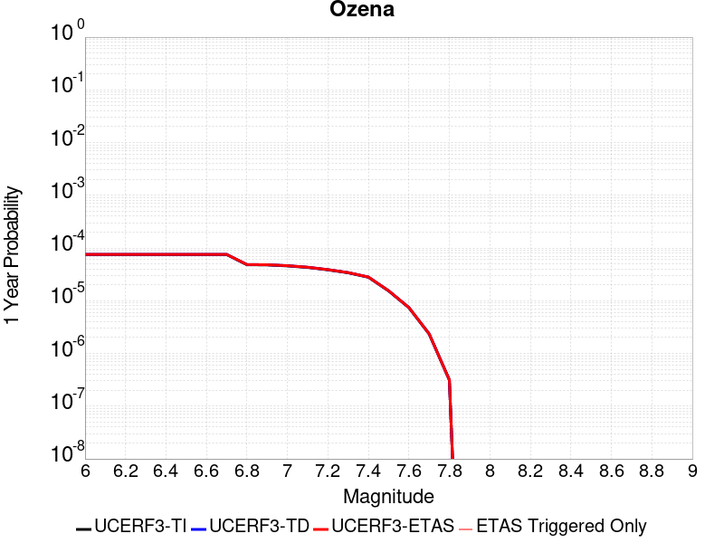 |  |

| Magnitude | 1 wk TI Prob | 1 wk TD Prob | 1 wk ETAS Prob | 1 wk ETAS/TD Gain | 1 wk ETAS Triggered Only | 1 mo TI Prob | 1 mo TD Prob | 1 mo ETAS Prob | 1 mo ETAS/TD Gain | 1 mo ETAS Triggered Only | 1 yr TI Prob | 1 yr TD Prob | 1 yr ETAS Prob | 1 yr ETAS/TD Gain | 1 yr ETAS Triggered Only | 10 yr TI Prob | 10 yr TD Prob | 10 yr ETAS Prob | 10 yr ETAS/TD Gain | 10 yr ETAS Triggered Only |
|-----|-----|-----|-----|-----|-----|-----|-----|-----|-----|-----|-----|-----|-----|-----|-----|-----|-----|-----|-----|-----|
| 6.0 | 1.4377547E-6 | 1.4513782E-6 | 1.4513782E-6 | 1.0 | 0.0 | 6.161791E-6 | 6.2201793E-6 | 6.2201793E-6 | 1.0 | 0.0 | 7.5017226E-5 | 7.572832E-5 | 7.572832E-5 | 1.0 | 0.0 | 7.4991904E-4 | 7.570518E-4 | 7.7263673E-4 | 1.0205864 | 1.5596732E-5 |
| 6.1 | 1.4377547E-6 | 1.4513782E-6 | 1.4513782E-6 | 1.0 | 0.0 | 6.161791E-6 | 6.2201793E-6 | 6.2201793E-6 | 1.0 | 0.0 | 7.5017226E-5 | 7.572832E-5 | 7.572832E-5 | 1.0 | 0.0 | 7.4991904E-4 | 7.570518E-4 | 7.7263673E-4 | 1.0205864 | 1.5596732E-5 |
| 6.2 | 1.4377547E-6 | 1.4513782E-6 | 1.4513782E-6 | 1.0 | 0.0 | 6.161791E-6 | 6.2201793E-6 | 6.2201793E-6 | 1.0 | 0.0 | 7.5017226E-5 | 7.572832E-5 | 7.572832E-5 | 1.0 | 0.0 | 7.4991904E-4 | 7.570518E-4 | 7.7263673E-4 | 1.0205864 | 1.5596732E-5 |
| 6.3 | 1.4377547E-6 | 1.4513782E-6 | 1.4513782E-6 | 1.0 | 0.0 | 6.161791E-6 | 6.2201793E-6 | 6.2201793E-6 | 1.0 | 0.0 | 7.5017226E-5 | 7.572832E-5 | 7.572832E-5 | 1.0 | 0.0 | 7.4991904E-4 | 7.570518E-4 | 7.7263673E-4 | 1.0205864 | 1.5596732E-5 |
| 6.4 | 1.4377547E-6 | 1.4513782E-6 | 1.4513782E-6 | 1.0 | 0.0 | 6.161791E-6 | 6.2201793E-6 | 6.2201793E-6 | 1.0 | 0.0 | 7.5017226E-5 | 7.572832E-5 | 7.572832E-5 | 1.0 | 0.0 | 7.4991904E-4 | 7.570518E-4 | 7.7263673E-4 | 1.0205864 | 1.5596732E-5 |
| 6.5 | 1.4377547E-6 | 1.4513782E-6 | 1.4513782E-6 | 1.0 | 0.0 | 6.161791E-6 | 6.2201793E-6 | 6.2201793E-6 | 1.0 | 0.0 | 7.5017226E-5 | 7.572832E-5 | 7.572832E-5 | 1.0 | 0.0 | 7.4991904E-4 | 7.570518E-4 | 7.7263673E-4 | 1.0205864 | 1.5596732E-5 |
| 6.6 | 1.4377547E-6 | 1.4513782E-6 | 1.4513782E-6 | 1.0 | 0.0 | 6.161791E-6 | 6.2201793E-6 | 6.2201793E-6 | 1.0 | 0.0 | 7.5017226E-5 | 7.572832E-5 | 7.572832E-5 | 1.0 | 0.0 | 7.4991904E-4 | 7.570518E-4 | 7.7263673E-4 | 1.0205864 | 1.5596732E-5 |
| 6.7 | 1.4377547E-6 | 1.4513782E-6 | 1.4513782E-6 | 1.0 | 0.0 | 6.161791E-6 | 6.2201793E-6 | 6.2201793E-6 | 1.0 | 0.0 | 7.5017226E-5 | 7.572832E-5 | 7.572832E-5 | 1.0 | 0.0 | 7.4991904E-4 | 7.570518E-4 | 7.7263673E-4 | 1.0205864 | 1.5596732E-5 |
| 6.8 | 9.223257E-7 | 9.317624E-7 | 9.317624E-7 | 1.0 | 0.0 | 3.9528186E-6 | 3.9932615E-6 | 3.9932615E-6 | 1.0 | 0.0 | 4.81245E-5 | 4.8616912E-5 | 4.8616912E-5 | 1.0 | 0.0 | 4.811408E-4 | 4.860668E-4 | 5.01656E-4 | 1.0320721 | 1.5596732E-5 |
| 6.9 | 9.141515E-7 | 9.235371E-7 | 9.235371E-7 | 1.0 | 0.0 | 3.917786E-6 | 3.9580104E-6 | 3.9580104E-6 | 1.0 | 0.0 | 4.7698002E-5 | 4.818775E-5 | 4.818775E-5 | 1.0 | 0.0 | 4.7687767E-4 | 4.8177704E-4 | 4.9736624E-4 | 1.0323577 | 1.5596732E-5 |
| 7.0 | 8.767648E-7 | 8.8585773E-7 | 8.8585773E-7 | 1.0 | 0.0 | 3.757558E-6 | 3.7965276E-6 | 3.7965276E-6 | 1.0 | 0.0 | 4.5747307E-5 | 4.6221783E-5 | 4.6221783E-5 | 1.0 | 0.0 | 4.5737892E-4 | 4.6212564E-4 | 4.7771516E-4 | 1.0337344 | 1.5596732E-5 |
| 7.1 | 8.199402E-7 | 8.2853984E-7 | 8.2853984E-7 | 1.0 | 0.0 | 3.5140247E-6 | 3.5508804E-6 | 3.5508804E-6 | 1.0 | 0.0 | 4.2782412E-5 | 4.323115E-5 | 4.323115E-5 | 1.0 | 0.0 | 4.2774176E-4 | 4.322311E-4 | 4.478211E-4 | 1.0360687 | 1.5596732E-5 |
| 7.2 | 7.38705E-7 | 7.464262E-7 | 7.464262E-7 | 1.0 | 0.0 | 3.1658747E-6 | 3.198966E-6 | 3.198966E-6 | 1.0 | 0.0 | 3.8543843E-5 | 3.894675E-5 | 3.894675E-5 | 1.0 | 0.0 | 3.853716E-4 | 3.8940276E-4 | 4.049934E-4 | 1.0400374 | 1.5596732E-5 |
| 7.3 | 6.490017E-7 | 6.557802E-7 | 6.557802E-7 | 1.0 | 0.0 | 2.7814328E-6 | 2.8104837E-6 | 2.8104837E-6 | 1.0 | 0.0 | 3.386342E-5 | 3.4217133E-5 | 3.4217133E-5 | 1.0 | 0.0 | 3.3858258E-4 | 3.4212202E-4 | 3.5771343E-4 | 1.0455726 | 1.5596732E-5 |
| 7.4 | 5.346736E-7 | 5.4022604E-7 | 5.4022604E-7 | 1.0 | 0.0 | 2.291456E-6 | 2.3152527E-6 | 2.3152527E-6 | 1.0 | 0.0 | 2.789812E-5 | 2.8187867E-5 | 2.8187867E-5 | 1.0 | 0.0 | 2.789462E-4 | 2.8184598E-4 | 2.974383E-4 | 1.0553222 | 1.5596732E-5 |
| 7.5 | 2.939325E-7 | 2.9666057E-7 | 2.9666057E-7 | 1.0 | 0.0 | 1.25971E-6 | 1.271402E-6 | 1.271402E-6 | 1.0 | 0.0 | 1.5336862E-5 | 1.5479225E-5 | 1.5479225E-5 | 1.0 | 0.0 | 1.5335804E-4 | 1.5478309E-4 | 1.5478309E-4 | 1.0 | 0.0 |
| 7.6 | 1.4151905E-7 | 1.4253266E-7 | 1.4253266E-7 | 1.0 | 0.0 | 6.065101E-7 | 6.108541E-7 | 6.108541E-7 | 1.0 | 0.0 | 7.3842357E-6 | 7.4371237E-6 | 7.4371237E-6 | 1.0 | 0.0 | 7.38399E-5 | 7.436883E-5 | 7.436883E-5 | 1.0 | 0.0 |
| 7.7 | 4.4957577E-8 | 4.5252243E-8 | 4.5252243E-8 | 1.0 | 0.0 | 1.9267533E-7 | 1.9393818E-7 | 1.9393818E-7 | 1.0 | 0.0 | 2.3458194E-6 | 2.3611947E-6 | 2.3611947E-6 | 1.0 | 0.0 | 2.3457947E-5 | 2.3611707E-5 | 2.3611707E-5 | 1.0 | 0.0 |
| 7.8 | 5.9993255E-9 | 6.0412972E-9 | 6.0412972E-9 | 1.0 | 0.0 | 2.5711394E-8 | 2.5891273E-8 | 2.5891273E-8 | 1.0 | 0.0 | 3.1303617E-7 | 3.1522623E-7 | 3.1522623E-7 | 1.0 | 0.0 | 3.1303573E-6 | 3.1522588E-6 | 3.1522588E-6 | 1.0 | 0.0 |

## Great Valley 10 (Panoche)
*[(top)](#table-of-contents)*

| 1 Week | 1 Month | 1 Year | 10 Year |
|-----|-----|-----|-----|
|  |  |  |  |

| Magnitude | 1 wk TI Prob | 1 wk TD Prob | 1 wk ETAS Prob | 1 wk ETAS/TD Gain | 1 wk ETAS Triggered Only | 1 mo TI Prob | 1 mo TD Prob | 1 mo ETAS Prob | 1 mo ETAS/TD Gain | 1 mo ETAS Triggered Only | 1 yr TI Prob | 1 yr TD Prob | 1 yr ETAS Prob | 1 yr ETAS/TD Gain | 1 yr ETAS Triggered Only | 10 yr TI Prob | 10 yr TD Prob | 10 yr ETAS Prob | 10 yr ETAS/TD Gain | 10 yr ETAS Triggered Only |
|-----|-----|-----|-----|-----|-----|-----|-----|-----|-----|-----|-----|-----|-----|-----|-----|-----|-----|-----|-----|-----|
| 6.0 | 1.6014626E-5 | 1.6575399E-5 | 1.6575399E-5 | 1.0 | 0.0 | 6.863231E-5 | 7.103552E-5 | 7.103552E-5 | 1.0 | 0.0 | 8.35278E-4 | 8.645185E-4 | 8.645185E-4 | 1.0 | 0.0 | 0.008321454 | 0.008612172 | 0.0086276345 | 1.0017954 | 1.5596732E-5 |
| 6.1 | 1.6014626E-5 | 1.6575399E-5 | 1.6575399E-5 | 1.0 | 0.0 | 6.863231E-5 | 7.103552E-5 | 7.103552E-5 | 1.0 | 0.0 | 8.35278E-4 | 8.645185E-4 | 8.645185E-4 | 1.0 | 0.0 | 0.008321454 | 0.008612172 | 0.0086276345 | 1.0017954 | 1.5596732E-5 |
| 6.2 | 1.56782E-5 | 1.6198446E-5 | 1.6198446E-5 | 1.0 | 0.0 | 6.719056E-5 | 6.94201E-5 | 6.94201E-5 | 1.0 | 0.0 | 8.17738E-4 | 8.4486604E-4 | 8.4486604E-4 | 1.0 | 0.0 | 0.008147354 | 0.008417147 | 0.008432613 | 1.0018374 | 1.5596732E-5 |
| 6.3 | 1.5263338E-5 | 1.5723514E-5 | 1.5723514E-5 | 1.0 | 0.0 | 6.541267E-5 | 6.738478E-5 | 6.738478E-5 | 1.0 | 0.0 | 7.961082E-4 | 8.201049E-4 | 8.201049E-4 | 1.0 | 0.0 | 0.007932622 | 0.008171377 | 0.008171377 | 1.0 | 0.0 |
| 6.4 | 1.4720723E-5 | 1.5099376E-5 | 1.5099376E-5 | 1.0 | 0.0 | 6.308728E-5 | 6.471004E-5 | 6.471004E-5 | 1.0 | 0.0 | 7.67817E-4 | 7.8756385E-4 | 7.8756385E-4 | 1.0 | 0.0 | 0.007651695 | 0.007848303 | 0.007848303 | 1.0 | 0.0 |
| 6.5 | 1.408264E-5 | 1.4355969E-5 | 1.4355969E-5 | 1.0 | 0.0 | 6.0352773E-5 | 6.1524166E-5 | 6.1524166E-5 | 1.0 | 0.0 | 7.3454727E-4 | 7.488031E-4 | 7.488031E-4 | 1.0 | 0.0 | 0.0073212404 | 0.0074633555 | 0.0074633555 | 1.0 | 0.0 |
| 6.6 | 1.3197086E-5 | 1.3321889E-5 | 1.3321889E-5 | 1.0 | 0.0 | 5.6557717E-5 | 5.709259E-5 | 5.709259E-5 | 1.0 | 0.0 | 6.8837265E-4 | 6.9488434E-4 | 6.9488434E-4 | 1.0 | 0.0 | 0.006862442 | 0.0069276537 | 0.0069276537 | 1.0 | 0.0 |
| 6.7 | 1.017583E-5 | 9.745382E-6 | 9.745382E-6 | 1.0 | 0.0 | 4.360997E-5 | 4.176527E-5 | 4.176527E-5 | 1.0 | 0.0 | 5.30822E-4 | 5.0837593E-4 | 5.0837593E-4 | 1.0 | 0.0 | 0.0052955584 | 0.005072382 | 0.005072382 | 1.0 | 0.0 |
| 6.8 | 8.557912E-6 | 7.872707E-6 | 7.872707E-6 | 1.0 | 0.0 | 3.667625E-5 | 3.373975E-5 | 3.373975E-5 | 1.0 | 0.0 | 4.4644187E-4 | 4.1070607E-4 | 4.1070607E-4 | 1.0 | 0.0 | 0.0044554602 | 0.004099677 | 0.004099677 | 1.0 | 0.0 |
| 6.9 | 6.14664E-6 | 5.092071E-6 | 5.092071E-6 | 1.0 | 0.0 | 2.6342475E-5 | 2.1822989E-5 | 2.1822989E-5 | 1.0 | 0.0 | 3.2067244E-4 | 2.6566387E-4 | 2.6566387E-4 | 1.0 | 0.0 | 0.003202101 | 0.002653601 | 0.002653601 | 1.0 | 0.0 |
| 7.0 | 3.2310581E-6 | 1.6951219E-6 | 1.6951219E-6 | 1.0 | 0.0 | 1.3847319E-5 | 7.264788E-6 | 7.264788E-6 | 1.0 | 0.0 | 1.6857806E-4 | 8.8445304E-5 | 8.8445304E-5 | 1.0 | 0.0 | 0.0016845023 | 8.841104E-4 | 8.841104E-4 | 1.0 | 0.0 |
| 7.1 | 2.544492E-6 | 9.1889206E-7 | 9.1889206E-7 | 1.0 | 0.0 | 1.090492E-5 | 3.938103E-6 | 3.938103E-6 | 1.0 | 0.0 | 1.327593E-4 | 4.79454E-5 | 4.79454E-5 | 1.0 | 0.0 | 0.0013268003 | 4.793553E-4 | 4.793553E-4 | 1.0 | 0.0 |
| 7.2 | 2.4479045E-6 | 8.841304E-7 | 8.841304E-7 | 1.0 | 0.0 | 1.0490977E-5 | 3.789125E-6 | 3.789125E-6 | 1.0 | 0.0 | 1.2772017E-4 | 4.6131667E-5 | 4.6131667E-5 | 1.0 | 0.0 | 0.0012764678 | 4.6122566E-4 | 4.6122566E-4 | 1.0 | 0.0 |
| 7.3 | 2.0559578E-6 | 7.892787E-7 | 7.892787E-7 | 1.0 | 0.0 | 8.811218E-6 | 3.3826188E-6 | 3.3826188E-6 | 1.0 | 0.0 | 1.072713E-4 | 4.1182655E-5 | 4.1182655E-5 | 1.0 | 0.0 | 0.0010721954 | 4.1175485E-4 | 4.1175485E-4 | 1.0 | 0.0 |
| 7.4 | 1.727687E-6 | 7.387757E-7 | 7.387757E-7 | 1.0 | 0.0 | 7.404352E-6 | 3.1661782E-6 | 3.1661782E-6 | 1.0 | 0.0 | 9.0144255E-5 | 3.8547583E-5 | 3.8547583E-5 | 1.0 | 0.0 | 9.0107694E-4 | 3.854136E-4 | 3.854136E-4 | 1.0 | 0.0 |
| 7.5 | 1.5002679E-6 | 6.546144E-7 | 6.546144E-7 | 1.0 | 0.0 | 6.4297037E-6 | 2.8054874E-6 | 2.8054874E-6 | 1.0 | 0.0 | 7.827883E-5 | 3.4156317E-5 | 3.4156317E-5 | 1.0 | 0.0 | 7.825126E-4 | 3.4151482E-4 | 3.4151482E-4 | 1.0 | 0.0 |

## Earthquake Valley (No  Extension)
*[(top)](#table-of-contents)*

| 1 Week | 1 Month | 1 Year | 10 Year |
|-----|-----|-----|-----|
|  |  |  |  |

| Magnitude | 1 wk TI Prob | 1 wk TD Prob | 1 wk ETAS Prob | 1 wk ETAS/TD Gain | 1 wk ETAS Triggered Only | 1 mo TI Prob | 1 mo TD Prob | 1 mo ETAS Prob | 1 mo ETAS/TD Gain | 1 mo ETAS Triggered Only | 1 yr TI Prob | 1 yr TD Prob | 1 yr ETAS Prob | 1 yr ETAS/TD Gain | 1 yr ETAS Triggered Only | 10 yr TI Prob | 10 yr TD Prob | 10 yr ETAS Prob | 10 yr ETAS/TD Gain | 10 yr ETAS Triggered Only |
|-----|-----|-----|-----|-----|-----|-----|-----|-----|-----|-----|-----|-----|-----|-----|-----|-----|-----|-----|-----|-----|
| 6.0 | 2.1859703E-5 | 2.5198362E-5 | 2.5198362E-5 | 1.0 | 0.0 | 9.3681076E-5 | 1.07989326E-4 | 1.07989326E-4 | 1.0 | 0.0 | 0.0011399703 | 0.001314122 | 0.0013296983 | 1.011853 | 1.5596732E-5 | 0.011341401 | 0.013077871 | 0.013093264 | 1.001177 | 1.5596732E-5 |
| 6.1 | 2.1859703E-5 | 2.5198362E-5 | 2.5198362E-5 | 1.0 | 0.0 | 9.3681076E-5 | 1.07989326E-4 | 1.07989326E-4 | 1.0 | 0.0 | 0.0011399703 | 0.001314122 | 0.0013296983 | 1.011853 | 1.5596732E-5 | 0.011341401 | 0.013077871 | 0.013093264 | 1.001177 | 1.5596732E-5 |
| 6.2 | 2.1859703E-5 | 2.5198362E-5 | 2.5198362E-5 | 1.0 | 0.0 | 9.3681076E-5 | 1.07989326E-4 | 1.07989326E-4 | 1.0 | 0.0 | 0.0011399703 | 0.001314122 | 0.0013296983 | 1.011853 | 1.5596732E-5 | 0.011341401 | 0.013077871 | 0.013093264 | 1.001177 | 1.5596732E-5 |
| 6.3 | 2.1859703E-5 | 2.5198362E-5 | 2.5198362E-5 | 1.0 | 0.0 | 9.3681076E-5 | 1.07989326E-4 | 1.07989326E-4 | 1.0 | 0.0 | 0.0011399703 | 0.001314122 | 0.0013296983 | 1.011853 | 1.5596732E-5 | 0.011341401 | 0.013077871 | 0.013093264 | 1.001177 | 1.5596732E-5 |
| 6.4 | 2.1859703E-5 | 2.5198362E-5 | 2.5198362E-5 | 1.0 | 0.0 | 9.3681076E-5 | 1.07989326E-4 | 1.07989326E-4 | 1.0 | 0.0 | 0.0011399703 | 0.001314122 | 0.0013296983 | 1.011853 | 1.5596732E-5 | 0.011341401 | 0.013077871 | 0.013093264 | 1.001177 | 1.5596732E-5 |
| 6.5 | 2.1859703E-5 | 2.5198362E-5 | 2.5198362E-5 | 1.0 | 0.0 | 9.3681076E-5 | 1.07989326E-4 | 1.07989326E-4 | 1.0 | 0.0 | 0.0011399703 | 0.001314122 | 0.0013296983 | 1.011853 | 1.5596732E-5 | 0.011341401 | 0.013077871 | 0.013093264 | 1.001177 | 1.5596732E-5 |
| 6.6 | 1.597E-5 | 1.8356275E-5 | 1.8356275E-5 | 1.0 | 0.0 | 6.8441055E-5 | 7.866787E-5 | 7.866787E-5 | 1.0 | 0.0 | 8.329513E-4 | 9.574478E-4 | 9.730296E-4 | 1.0162743 | 1.5596732E-5 | 0.008298361 | 0.009541836 | 0.0095572835 | 1.001619 | 1.5596732E-5 |
| 6.7 | 1.597E-5 | 1.8356275E-5 | 1.8356275E-5 | 1.0 | 0.0 | 6.8441055E-5 | 7.866787E-5 | 7.866787E-5 | 1.0 | 0.0 | 8.329513E-4 | 9.574478E-4 | 9.730296E-4 | 1.0162743 | 1.5596732E-5 | 0.008298361 | 0.009541836 | 0.0095572835 | 1.001619 | 1.5596732E-5 |
| 6.8 | 1.5315149E-5 | 1.7602091E-5 | 1.7602091E-5 | 1.0 | 0.0 | 6.5634704E-5 | 7.543584E-5 | 7.543584E-5 | 1.0 | 0.0 | 7.988095E-4 | 9.181311E-4 | 9.337135E-4 | 1.0169718 | 1.5596732E-5 | 0.007959441 | 0.009151919 | 0.009167373 | 1.0016886 | 1.5596732E-5 |
| 6.9 | 1.3634728E-5 | 1.5675821E-5 | 1.5675821E-5 | 1.0 | 0.0 | 5.8433237E-5 | 6.718082E-5 | 6.718082E-5 | 1.0 | 0.0 | 7.1119244E-4 | 8.177017E-4 | 8.332857E-4 | 1.0190582 | 1.5596732E-5 | 0.007089207 | 0.008155 | 0.008170471 | 1.001897 | 1.5596732E-5 |
| 7.0 | 1.3496271E-5 | 1.5517853E-5 | 1.5517853E-5 | 1.0 | 0.0 | 5.783988E-5 | 6.650385E-5 | 6.650385E-5 | 1.0 | 0.0 | 7.03973E-4 | 8.094657E-4 | 8.250498E-4 | 1.0192523 | 1.5596732E-5 | 0.007017471 | 0.0080732405 | 0.008088712 | 1.0019163 | 1.5596732E-5 |
| 7.1 | 8.242798E-6 | 9.4726E-6 | 9.4726E-6 | 1.0 | 0.0 | 3.53258E-5 | 4.0596606E-5 | 4.0596606E-5 | 1.0 | 0.0 | 4.300067E-4 | 4.9421866E-4 | 4.9421866E-4 | 1.0 | 0.0 | 0.004291756 | 0.0049377717 | 0.0049377717 | 1.0 | 0.0 |
| 7.2 | 2.6506527E-7 | 2.2560312E-7 | 2.2560312E-7 | 1.0 | 0.0 | 1.1359936E-6 | 9.668702E-7 | 9.668702E-7 | 1.0 | 0.0 | 1.3830633E-5 | 1.17715845E-5 | 1.17715845E-5 | 1.0 | 0.0 | 1.3829772E-4 | 1.1771003E-4 | 1.1771003E-4 | 1.0 | 0.0 |
| 7.3 | 2.5810488E-7 | 2.1955442E-7 | 2.1955442E-7 | 1.0 | 0.0 | 1.1061633E-6 | 9.409472E-7 | 9.409472E-7 | 1.0 | 0.0 | 1.3467455E-5 | 1.1455976E-5 | 1.1455976E-5 | 1.0 | 0.0 | 1.3466639E-4 | 1.1455427E-4 | 1.1455427E-4 | 1.0 | 0.0 |
| 7.4 | 2.2676066E-7 | 1.9110601E-7 | 1.9110601E-7 | 1.0 | 0.0 | 9.71831E-7 | 8.190255E-7 | 8.190255E-7 | 1.0 | 0.0 | 1.1831979E-5 | 9.9715935E-6 | 9.9715935E-6 | 1.0 | 0.0 | 1.1831349E-4 | 9.9711855E-5 | 9.9711855E-5 | 1.0 | 0.0 |
| 7.5 | 1.5553917E-7 | 1.3112096E-7 | 1.3112096E-7 | 1.0 | 0.0 | 6.6659624E-7 | 5.619469E-7 | 5.619469E-7 | 1.0 | 0.0 | 8.115779E-6 | 6.8416834E-6 | 6.8416834E-6 | 1.0 | 0.0 | 8.115482E-5 | 6.841495E-5 | 6.841495E-5 | 1.0 | 0.0 |
| 7.6 | 1.3448629E-7 | 1.1288419E-7 | 1.1288419E-7 | 1.0 | 0.0 | 5.7636964E-7 | 4.837893E-7 | 4.837893E-7 | 1.0 | 0.0 | 7.017278E-6 | 5.890121E-6 | 5.890121E-6 | 1.0 | 0.0 | 7.0170565E-5 | 5.889986E-5 | 5.889986E-5 | 1.0 | 0.0 |
| 7.7 | 2.9719402E-8 | 1.458206E-8 | 1.458206E-8 | 1.0 | 0.0 | 1.2736886E-7 | 6.249454E-8 | 6.249454E-8 | 1.0 | 0.0 | 1.5507147E-6 | 7.608708E-7 | 7.608708E-7 | 1.0 | 0.0 | 1.550704E-5 | 7.6086876E-6 | 7.6086876E-6 | 1.0 | 0.0 |
| 7.8 | 7.4390196E-9 | 3.2502152E-9 | 3.2502152E-9 | 1.0 | 0.0 | 3.1881513E-8 | 1.3929493E-8 | 1.3929493E-8 | 1.0 | 0.0 | 3.8815733E-7 | 1.6959156E-7 | 1.6959156E-7 | 1.0 | 0.0 | 3.8815665E-6 | 1.6959145E-6 | 1.6959145E-6 | 1.0 | 0.0 |
| 7.9 | 1.5373532E-9 | 8.440161E-10 | 8.440161E-10 | 1.0 | 0.0 | 6.5886567E-9 | 3.6172119E-9 | 3.6172119E-9 | 1.0 | 0.0 | 8.021689E-8 | 4.4039556E-8 | 4.4039556E-8 | 1.0 | 0.0 | 8.0216864E-7 | 4.4039552E-7 | 4.4039552E-7 | 1.0 | 0.0 |

## Hector Mine
*[(top)](#table-of-contents)*

| 1 Week | 1 Month | 1 Year | 10 Year |
|-----|-----|-----|-----|
|  |  |  |  |

| Magnitude | 1 wk TI Prob | 1 wk TD Prob | 1 wk ETAS Prob | 1 wk ETAS/TD Gain | 1 wk ETAS Triggered Only | 1 mo TI Prob | 1 mo TD Prob | 1 mo ETAS Prob | 1 mo ETAS/TD Gain | 1 mo ETAS Triggered Only | 1 yr TI Prob | 1 yr TD Prob | 1 yr ETAS Prob | 1 yr ETAS/TD Gain | 1 yr ETAS Triggered Only | 10 yr TI Prob | 10 yr TD Prob | 10 yr ETAS Prob | 10 yr ETAS/TD Gain | 10 yr ETAS Triggered Only |
|-----|-----|-----|-----|-----|-----|-----|-----|-----|-----|-----|-----|-----|-----|-----|-----|-----|-----|-----|-----|-----|
| 6.0 | 1.8760093E-5 | 2.7963818E-6 | 1.839307E-5 | 6.5774527 | 1.5596732E-5 | 8.039792E-5 | 1.1984461E-5 | 2.7581005E-5 | 2.3013973 | 1.5596732E-5 | 9.78405E-4 | 1.4590504E-4 | 1.614995E-4 | 1.1068809 | 1.5596732E-5 | 0.009741086 | 0.0014584847 | 0.0014740586 | 1.0106782 | 1.5596732E-5 |
| 6.1 | 1.8760093E-5 | 2.7963818E-6 | 1.839307E-5 | 6.5774527 | 1.5596732E-5 | 8.039792E-5 | 1.1984461E-5 | 2.7581005E-5 | 2.3013973 | 1.5596732E-5 | 9.78405E-4 | 1.4590504E-4 | 1.614995E-4 | 1.1068809 | 1.5596732E-5 | 0.009741086 | 0.0014584847 | 0.0014740586 | 1.0106782 | 1.5596732E-5 |
| 6.2 | 1.8760093E-5 | 2.7963818E-6 | 1.839307E-5 | 6.5774527 | 1.5596732E-5 | 8.039792E-5 | 1.1984461E-5 | 2.7581005E-5 | 2.3013973 | 1.5596732E-5 | 9.78405E-4 | 1.4590504E-4 | 1.614995E-4 | 1.1068809 | 1.5596732E-5 | 0.009741086 | 0.0014584847 | 0.0014740586 | 1.0106782 | 1.5596732E-5 |
| 6.3 | 1.8760093E-5 | 2.7963818E-6 | 1.839307E-5 | 6.5774527 | 1.5596732E-5 | 8.039792E-5 | 1.1984461E-5 | 2.7581005E-5 | 2.3013973 | 1.5596732E-5 | 9.78405E-4 | 1.4590504E-4 | 1.614995E-4 | 1.1068809 | 1.5596732E-5 | 0.009741086 | 0.0014584847 | 0.0014740586 | 1.0106782 | 1.5596732E-5 |
| 6.4 | 1.0888055E-5 | 2.7963818E-6 | 1.839307E-5 | 6.5774527 | 1.5596732E-5 | 4.666226E-5 | 1.1984461E-5 | 2.7581005E-5 | 2.3013973 | 1.5596732E-5 | 5.679649E-4 | 1.4590504E-4 | 1.614995E-4 | 1.1068809 | 1.5596732E-5 | 0.0056651547 | 0.0014584847 | 0.0014740586 | 1.0106782 | 1.5596732E-5 |
| 6.5 | 1.0888055E-5 | 2.7963818E-6 | 1.839307E-5 | 6.5774527 | 1.5596732E-5 | 4.666226E-5 | 1.1984461E-5 | 2.7581005E-5 | 2.3013973 | 1.5596732E-5 | 5.679649E-4 | 1.4590504E-4 | 1.614995E-4 | 1.1068809 | 1.5596732E-5 | 0.0056651547 | 0.0014584847 | 0.0014740586 | 1.0106782 | 1.5596732E-5 |
| 6.6 | 1.0730738E-5 | 2.7963818E-6 | 1.839307E-5 | 6.5774527 | 1.5596732E-5 | 4.5988065E-5 | 1.1984461E-5 | 2.7581005E-5 | 2.3013973 | 1.5596732E-5 | 5.5976084E-4 | 1.4590504E-4 | 1.614995E-4 | 1.1068809 | 1.5596732E-5 | 0.0055835294 | 0.0014584847 | 0.0014740586 | 1.0106782 | 1.5596732E-5 |
| 6.7 | 7.881326E-6 | 2.7710626E-6 | 1.836775E-5 | 6.628414 | 1.5596732E-5 | 3.3776672E-5 | 1.1875951E-5 | 2.7472495E-5 | 2.3132882 | 1.5596732E-5 | 4.111534E-4 | 1.445841E-4 | 1.6017858E-4 | 1.1078575 | 1.5596732E-5 | 0.0041039353 | 0.0014452925 | 0.0014608667 | 1.0107758 | 1.5596732E-5 |
| 6.8 | 7.5683483E-6 | 2.7328138E-6 | 1.8329501E-5 | 6.7071905 | 1.5596732E-5 | 3.2435375E-5 | 1.1712029E-5 | 2.7308577E-5 | 2.3316693 | 1.5596732E-5 | 3.9482914E-4 | 1.4258861E-4 | 1.5818313E-4 | 1.1093671 | 1.5596732E-5 | 0.0039412836 | 0.0014253634 | 0.0014409379 | 1.0109267 | 1.5596732E-5 |
| 6.9 | 6.473048E-6 | 2.5138945E-6 | 1.8110586E-5 | 7.2041945 | 1.5596732E-5 | 2.7741338E-5 | 1.07738115E-5 | 2.6370375E-5 | 2.4476364 | 1.5596732E-5 | 3.3769844E-4 | 1.3116724E-4 | 1.4676191E-4 | 1.1188916 | 1.5596732E-5 | 0.0033718573 | 0.0013112876 | 0.001326864 | 1.0118786 | 1.5596732E-5 |
| 7.0 | 4.9959954E-6 | 1.8565124E-6 | 1.7453214E-5 | 9.401076 | 1.5596732E-5 | 2.1411232E-5 | 7.956478E-6 | 2.3553084E-5 | 2.9602401 | 1.5596732E-5 | 2.6065056E-4 | 9.686937E-5 | 1.1246459E-4 | 1.1609923 | 1.5596732E-5 | 0.0026034506 | 9.6862105E-4 | 9.842027E-4 | 1.0160863 | 1.5596732E-5 |
| 7.1 | 1.2997541E-6 | 1.5602147E-7 | 1.5602147E-7 | 1.0 | 0.0 | 5.5703626E-6 | 6.686633E-7 | 6.686633E-7 | 1.0 | 0.0 | 6.7817055E-5 | 8.140949E-6 | 8.140949E-6 | 1.0 | 0.0 | 6.779636E-4 | 8.1406906E-5 | 8.1406906E-5 | 1.0 | 0.0 |
| 7.2 | 8.392699E-7 | 9.727592E-8 | 9.727592E-8 | 1.0 | 0.0 | 3.596866E-6 | 4.1689677E-7 | 4.1689677E-7 | 1.0 | 0.0 | 4.3790962E-5 | 5.0757085E-6 | 5.0757085E-6 | 1.0 | 0.0 | 4.3782333E-4 | 5.0756116E-5 | 5.0756116E-5 | 1.0 | 0.0 |
| 7.3 | 3.13015E-7 | 4.829262E-8 | 4.829262E-8 | 1.0 | 0.0 | 1.3414921E-6 | 2.0696835E-7 | 2.0696835E-7 | 1.0 | 0.0 | 1.6332544E-5 | 2.5198376E-6 | 2.5198376E-6 | 1.0 | 0.0 | 1.6331344E-4 | 2.5198176E-5 | 2.5198176E-5 | 1.0 | 0.0 |

## Elmore Ranch
*[(top)](#table-of-contents)*

| 1 Week | 1 Month | 1 Year | 10 Year |
|-----|-----|-----|-----|
|  |  |  |  |

| Magnitude | 1 wk TI Prob | 1 wk TD Prob | 1 wk ETAS Prob | 1 wk ETAS/TD Gain | 1 wk ETAS Triggered Only | 1 mo TI Prob | 1 mo TD Prob | 1 mo ETAS Prob | 1 mo ETAS/TD Gain | 1 mo ETAS Triggered Only | 1 yr TI Prob | 1 yr TD Prob | 1 yr ETAS Prob | 1 yr ETAS/TD Gain | 1 yr ETAS Triggered Only | 10 yr TI Prob | 10 yr TD Prob | 10 yr ETAS Prob | 10 yr ETAS/TD Gain | 10 yr ETAS Triggered Only |
|-----|-----|-----|-----|-----|-----|-----|-----|-----|-----|-----|-----|-----|-----|-----|-----|-----|-----|-----|-----|-----|
| 6.0 | 9.102099E-5 | 8.952015E-5 | 1.0511548E-4 | 1.1742103 | 1.5596732E-5 | 3.9003167E-4 | 3.8361453E-4 | 3.9920528E-4 | 1.0406417 | 1.5596732E-5 | 0.0047383 | 0.004662009 | 0.0046775327 | 1.0033299 | 1.5596732E-5 | 0.046385348 | 0.045870975 | 0.045885857 | 1.0003244 | 1.5596732E-5 |
| 6.1 | 3.8306698E-5 | 4.1498504E-5 | 5.709459E-5 | 1.3758228 | 1.5596732E-5 | 1.6416123E-4 | 1.7784268E-4 | 1.9343664E-4 | 1.087684 | 1.5596732E-5 | 0.0019968306 | 0.0021631396 | 0.0021787025 | 1.0071946 | 1.5596732E-5 | 0.019789828 | 0.021628205 | 0.021643464 | 1.0007055 | 1.5596732E-5 |
| 6.2 | 3.8306698E-5 | 4.1498504E-5 | 5.709459E-5 | 1.3758228 | 1.5596732E-5 | 1.6416123E-4 | 1.7784268E-4 | 1.9343664E-4 | 1.087684 | 1.5596732E-5 | 0.0019968306 | 0.0021631396 | 0.0021787025 | 1.0071946 | 1.5596732E-5 | 0.019789828 | 0.021628205 | 0.021643464 | 1.0007055 | 1.5596732E-5 |
| 6.3 | 3.3197924E-5 | 3.6554302E-5 | 5.2150463E-5 | 1.4266573 | 1.5596732E-5 | 1.4226905E-4 | 1.5665586E-4 | 1.7225015E-4 | 1.0995449 | 1.5596732E-5 | 0.0017307495 | 0.001905917 | 0.001921484 | 1.0081677 | 1.5596732E-5 | 0.017173318 | 0.01908996 | 0.019105257 | 1.0008014 | 1.5596732E-5 |
| 6.4 | 2.5148964E-5 | 2.7420487E-5 | 2.7420487E-5 | 1.0 | 0.0 | 1.0777682E-4 | 1.17514726E-4 | 1.17514726E-4 | 1.0 | 0.0 | 0.0013113929 | 0.0014304507 | 0.0014304507 | 1.0 | 0.0 | 0.01303681 | 0.014387194 | 0.014387194 | 1.0 | 0.0 |
| 6.5 | 2.5148964E-5 | 2.7420487E-5 | 2.7420487E-5 | 1.0 | 0.0 | 1.0777682E-4 | 1.17514726E-4 | 1.17514726E-4 | 1.0 | 0.0 | 0.0013113929 | 0.0014304507 | 0.0014304507 | 1.0 | 0.0 | 0.01303681 | 0.014387194 | 0.014387194 | 1.0 | 0.0 |

## Reliz 2011 CFM
*[(top)](#table-of-contents)*

| 1 Week | 1 Month | 1 Year | 10 Year |
|-----|-----|-----|-----|
|  |  |  |  |

| Magnitude | 1 wk TI Prob | 1 wk TD Prob | 1 wk ETAS Prob | 1 wk ETAS/TD Gain | 1 wk ETAS Triggered Only | 1 mo TI Prob | 1 mo TD Prob | 1 mo ETAS Prob | 1 mo ETAS/TD Gain | 1 mo ETAS Triggered Only | 1 yr TI Prob | 1 yr TD Prob | 1 yr ETAS Prob | 1 yr ETAS/TD Gain | 1 yr ETAS Triggered Only | 10 yr TI Prob | 10 yr TD Prob | 10 yr ETAS Prob | 10 yr ETAS/TD Gain | 10 yr ETAS Triggered Only |
|-----|-----|-----|-----|-----|-----|-----|-----|-----|-----|-----|-----|-----|-----|-----|-----|-----|-----|-----|-----|-----|
| 6.0 | 1.6002472E-5 | 1.6282804E-5 | 1.6282804E-5 | 1.0 | 0.0 | 6.8580215E-5 | 6.9781694E-5 | 8.537734E-5 | 1.2234919 | 1.5596732E-5 | 8.3464425E-4 | 8.4928074E-4 | 8.6486427E-4 | 1.018349 | 1.5596732E-5 | 0.008315164 | 0.008462547 | 0.008478012 | 1.0018275 | 1.5596732E-5 |
| 6.1 | 1.6002472E-5 | 1.6282804E-5 | 1.6282804E-5 | 1.0 | 0.0 | 6.8580215E-5 | 6.9781694E-5 | 8.537734E-5 | 1.2234919 | 1.5596732E-5 | 8.3464425E-4 | 8.4928074E-4 | 8.6486427E-4 | 1.018349 | 1.5596732E-5 | 0.008315164 | 0.008462547 | 0.008478012 | 1.0018275 | 1.5596732E-5 |
| 6.2 | 1.6002472E-5 | 1.6282804E-5 | 1.6282804E-5 | 1.0 | 0.0 | 6.8580215E-5 | 6.9781694E-5 | 8.537734E-5 | 1.2234919 | 1.5596732E-5 | 8.3464425E-4 | 8.4928074E-4 | 8.6486427E-4 | 1.018349 | 1.5596732E-5 | 0.008315164 | 0.008462547 | 0.008478012 | 1.0018275 | 1.5596732E-5 |
| 6.3 | 7.792404E-6 | 7.803802E-6 | 7.803802E-6 | 1.0 | 0.0 | 3.339559E-5 | 3.344444E-5 | 3.344444E-5 | 1.0 | 0.0 | 4.0651546E-4 | 4.0711078E-4 | 4.0711078E-4 | 1.0 | 0.0 | 0.0040577264 | 0.004063926 | 0.004063926 | 1.0 | 0.0 |
| 6.4 | 7.792404E-6 | 7.803802E-6 | 7.803802E-6 | 1.0 | 0.0 | 3.339559E-5 | 3.344444E-5 | 3.344444E-5 | 1.0 | 0.0 | 4.0651546E-4 | 4.0711078E-4 | 4.0711078E-4 | 1.0 | 0.0 | 0.0040577264 | 0.004063926 | 0.004063926 | 1.0 | 0.0 |
| 6.5 | 5.9659374E-6 | 5.928738E-6 | 5.928738E-6 | 1.0 | 0.0 | 2.5568053E-5 | 2.5408632E-5 | 2.5408632E-5 | 1.0 | 0.0 | 3.1124658E-4 | 3.093064E-4 | 3.093064E-4 | 1.0 | 0.0 | 0.00310811 | 0.0030889767 | 0.0030889767 | 1.0 | 0.0 |
| 6.6 | 5.2350692E-6 | 5.178986E-6 | 5.178986E-6 | 1.0 | 0.0 | 2.2435817E-5 | 2.2195467E-5 | 2.2195467E-5 | 1.0 | 0.0 | 2.7312184E-4 | 2.7019644E-4 | 2.7019644E-4 | 1.0 | 0.0 | 0.002727864 | 0.0026988892 | 0.0026988892 | 1.0 | 0.0 |
| 6.7 | 4.580206E-6 | 4.5061206E-6 | 4.5061206E-6 | 1.0 | 0.0 | 1.9629308E-5 | 1.9311801E-5 | 1.9311801E-5 | 1.0 | 0.0 | 2.389606E-4 | 2.350959E-4 | 2.350959E-4 | 1.0 | 0.0 | 0.002387038 | 0.0023486738 | 0.0023486738 | 1.0 | 0.0 |
| 6.8 | 4.0765017E-6 | 3.9882384E-6 | 3.9882384E-6 | 1.0 | 0.0 | 1.7470604E-5 | 1.7092338E-5 | 1.7092338E-5 | 1.0 | 0.0 | 2.1268385E-4 | 2.0807938E-4 | 2.0807938E-4 | 1.0 | 0.0 | 0.002124804 | 0.0020790435 | 0.0020790435 | 1.0 | 0.0 |
| 6.9 | 3.5752896E-6 | 3.4725176E-6 | 3.4725176E-6 | 1.0 | 0.0 | 1.532258E-5 | 1.4882134E-5 | 1.4882134E-5 | 1.0 | 0.0 | 1.8653645E-4 | 1.8117494E-4 | 1.8117494E-4 | 1.0 | 0.0 | 0.0018637994 | 0.0018104686 | 0.0018104686 | 1.0 | 0.0 |
| 7.0 | 3.0259848E-6 | 2.9079417E-6 | 2.9079417E-6 | 1.0 | 0.0 | 1.2968442E-5 | 1.2462548E-5 | 1.2462548E-5 | 1.0 | 0.0 | 1.5787935E-4 | 1.5172097E-4 | 1.5172097E-4 | 1.0 | 0.0 | 0.0015776722 | 0.001516369 | 0.001516369 | 1.0 | 0.0 |
| 7.1 | 2.5861116E-6 | 2.455167E-6 | 2.455167E-6 | 1.0 | 0.0 | 1.1083288E-5 | 1.05221025E-5 | 1.05221025E-5 | 1.0 | 0.0 | 1.3493067E-4 | 1.2809907E-4 | 1.2809907E-4 | 1.0 | 0.0 | 0.0013484878 | 0.001280447 | 0.001280447 | 1.0 | 0.0 |
| 7.2 | 2.1482588E-6 | 2.003237E-6 | 2.003237E-6 | 1.0 | 0.0 | 9.20679E-6 | 8.585273E-6 | 8.585273E-6 | 1.0 | 0.0 | 1.12086906E-4 | 1.0452068E-4 | 1.0452068E-4 | 1.0 | 0.0 | 0.0011203039 | 0.0010449095 | 0.0010449095 | 1.0 | 0.0 |
| 7.3 | 1.7194744E-6 | 1.5611241E-6 | 1.5611241E-6 | 1.0 | 0.0 | 7.3691554E-6 | 6.690515E-6 | 6.690515E-6 | 1.0 | 0.0 | 8.971577E-5 | 8.1453974E-5 | 8.1453974E-5 | 1.0 | 0.0 | 8.967956E-4 | 8.1443513E-4 | 8.1443513E-4 | 1.0 | 0.0 |
| 7.4 | 1.2755178E-6 | 1.10563E-6 | 1.10563E-6 | 1.0 | 0.0 | 5.4664933E-6 | 4.7384056E-6 | 4.7384056E-6 | 1.0 | 0.0 | 6.655252E-5 | 5.768856E-5 | 5.768856E-5 | 1.0 | 0.0 | 6.6532596E-4 | 5.7692965E-4 | 5.7692965E-4 | 1.0 | 0.0 |
| 7.5 | 8.8463224E-7 | 7.0580273E-7 | 7.0580273E-7 | 1.0 | 0.0 | 3.7912755E-6 | 3.0248652E-6 | 3.0248652E-6 | 1.0 | 0.0 | 4.6157802E-5 | 3.6827114E-5 | 3.6827114E-5 | 1.0 | 0.0 | 4.6148215E-4 | 3.684038E-4 | 3.684038E-4 | 1.0 | 0.0 |
| 7.6 | 5.291355E-7 | 3.500777E-7 | 3.500777E-7 | 1.0 | 0.0 | 2.2677216E-6 | 1.5003321E-6 | 1.5003321E-6 | 1.0 | 0.0 | 2.760916E-5 | 1.8266392E-5 | 1.8266392E-5 | 1.0 | 0.0 | 2.760573E-4 | 1.8284164E-4 | 1.8284164E-4 | 1.0 | 0.0 |
| 7.7 | 2.9663357E-7 | 1.351113E-7 | 1.351113E-7 | 1.0 | 0.0 | 1.2712861E-6 | 5.7904833E-7 | 5.7904833E-7 | 1.0 | 0.0 | 1.5477797E-5 | 7.049891E-6 | 7.049891E-6 | 1.0 | 0.0 | 1.547672E-4 | 7.068132E-5 | 7.068132E-5 | 1.0 | 0.0 |
| 7.8 | 1.2509386E-7 | 2.7157126E-8 | 2.7157126E-8 | 1.0 | 0.0 | 5.3611643E-7 | 1.1638769E-7 | 1.1638769E-7 | 1.0 | 0.0 | 6.527198E-6 | 1.4170191E-6 | 1.4170191E-6 | 1.0 | 0.0 | 6.527006E-5 | 1.4326506E-5 | 1.4326506E-5 | 1.0 | 0.0 |
| 7.9 | 6.213493E-8 | 1.1482114E-8 | 1.1482114E-8 | 1.0 | 0.0 | 2.6629255E-7 | 4.920906E-8 | 4.920906E-8 | 1.0 | 0.0 | 3.242107E-6 | 5.9912014E-7 | 5.9912014E-7 | 1.0 | 0.0 | 3.2420594E-5 | 6.1224223E-6 | 6.1224223E-6 | 1.0 | 0.0 |
| 8.0 | 5.92383E-9 | 1.677887E-9 | 1.677887E-9 | 1.0 | 0.0 | 2.5387841E-8 | 7.190944E-9 | 7.190944E-9 | 1.0 | 0.0 | 3.0909692E-7 | 8.754974E-8 | 8.754974E-8 | 1.0 | 0.0 | 3.090965E-6 | 9.003061E-7 | 9.003061E-7 | 1.0 | 0.0 |

## Peralta Hills
*[(top)](#table-of-contents)*

| 1 Week | 1 Month | 1 Year | 10 Year |
|-----|-----|-----|-----|
|  |  |  |  |

| Magnitude | 1 wk TI Prob | 1 wk TD Prob | 1 wk ETAS Prob | 1 wk ETAS/TD Gain | 1 wk ETAS Triggered Only | 1 mo TI Prob | 1 mo TD Prob | 1 mo ETAS Prob | 1 mo ETAS/TD Gain | 1 mo ETAS Triggered Only | 1 yr TI Prob | 1 yr TD Prob | 1 yr ETAS Prob | 1 yr ETAS/TD Gain | 1 yr ETAS Triggered Only | 10 yr TI Prob | 10 yr TD Prob | 10 yr ETAS Prob | 10 yr ETAS/TD Gain | 10 yr ETAS Triggered Only |
|-----|-----|-----|-----|-----|-----|-----|-----|-----|-----|-----|-----|-----|-----|-----|-----|-----|-----|-----|-----|-----|
| 6.0 | 3.8850067E-6 | 3.839512E-6 | 3.839512E-6 | 1.0 | 0.0 | 1.6649923E-5 | 1.645499E-5 | 3.2051463E-5 | 1.9478265 | 1.5596732E-5 | 2.0269395E-4 | 2.0032849E-4 | 2.1592209E-4 | 1.0778402 | 1.5596732E-5 | 0.0020250916 | 0.0020022066 | 0.002017772 | 1.0077741 | 1.5596732E-5 |
| 6.1 | 3.8850067E-6 | 3.839512E-6 | 3.839512E-6 | 1.0 | 0.0 | 1.6649923E-5 | 1.645499E-5 | 3.2051463E-5 | 1.9478265 | 1.5596732E-5 | 2.0269395E-4 | 2.0032849E-4 | 2.1592209E-4 | 1.0778402 | 1.5596732E-5 | 0.0020250916 | 0.0020022066 | 0.002017772 | 1.0077741 | 1.5596732E-5 |
| 6.2 | 3.8850067E-6 | 3.839512E-6 | 3.839512E-6 | 1.0 | 0.0 | 1.6649923E-5 | 1.645499E-5 | 3.2051463E-5 | 1.9478265 | 1.5596732E-5 | 2.0269395E-4 | 2.0032849E-4 | 2.1592209E-4 | 1.0778402 | 1.5596732E-5 | 0.0020250916 | 0.0020022066 | 0.002017772 | 1.0077741 | 1.5596732E-5 |
| 6.3 | 3.8850067E-6 | 3.839512E-6 | 3.839512E-6 | 1.0 | 0.0 | 1.6649923E-5 | 1.645499E-5 | 3.2051463E-5 | 1.9478265 | 1.5596732E-5 | 2.0269395E-4 | 2.0032849E-4 | 2.1592209E-4 | 1.0778402 | 1.5596732E-5 | 0.0020250916 | 0.0020022066 | 0.002017772 | 1.0077741 | 1.5596732E-5 |
| 6.4 | 3.8850067E-6 | 3.839512E-6 | 3.839512E-6 | 1.0 | 0.0 | 1.6649923E-5 | 1.645499E-5 | 3.2051463E-5 | 1.9478265 | 1.5596732E-5 | 2.0269395E-4 | 2.0032849E-4 | 2.1592209E-4 | 1.0778402 | 1.5596732E-5 | 0.0020250916 | 0.0020022066 | 0.002017772 | 1.0077741 | 1.5596732E-5 |
| 6.5 | 1.5587785E-6 | 1.4430796E-6 | 1.4430796E-6 | 1.0 | 0.0 | 6.6804623E-6 | 6.184613E-6 | 6.184613E-6 | 1.0 | 0.0 | 8.133159E-5 | 7.529531E-5 | 7.529531E-5 | 1.0 | 0.0 | 8.1301836E-4 | 7.52722E-4 | 7.52722E-4 | 1.0 | 0.0 |
| 6.6 | 1.5587785E-6 | 1.4430796E-6 | 1.4430796E-6 | 1.0 | 0.0 | 6.6804623E-6 | 6.184613E-6 | 6.184613E-6 | 1.0 | 0.0 | 8.133159E-5 | 7.529531E-5 | 7.529531E-5 | 1.0 | 0.0 | 8.1301836E-4 | 7.52722E-4 | 7.52722E-4 | 1.0 | 0.0 |
| 6.7 | 1.5018579E-6 | 1.3837022E-6 | 1.3837022E-6 | 1.0 | 0.0 | 6.436518E-6 | 5.93014E-6 | 5.93014E-6 | 1.0 | 0.0 | 7.836179E-5 | 7.21973E-5 | 7.21973E-5 | 1.0 | 0.0 | 7.833416E-4 | 7.21762E-4 | 7.21762E-4 | 1.0 | 0.0 |
| 6.8 | 1.4584314E-6 | 1.3381342E-6 | 1.3381342E-6 | 1.0 | 0.0 | 6.250405E-6 | 5.7348498E-6 | 5.7348498E-6 | 1.0 | 0.0 | 7.6096025E-5 | 6.98198E-5 | 6.98198E-5 | 1.0 | 0.0 | 7.6069974E-4 | 6.98002E-4 | 6.98002E-4 | 1.0 | 0.0 |
| 6.9 | 1.1382393E-6 | 9.862285E-7 | 9.862285E-7 | 1.0 | 0.0 | 4.8781594E-6 | 4.226687E-6 | 4.226687E-6 | 1.0 | 0.0 | 5.9389975E-5 | 5.1458785E-5 | 5.1458785E-5 | 1.0 | 0.0 | 5.93741E-4 | 5.144769E-4 | 5.144769E-4 | 1.0 | 0.0 |
| 7.0 | 9.970413E-7 | 8.309642E-7 | 8.309642E-7 | 1.0 | 0.0 | 4.273027E-6 | 3.561271E-6 | 3.561271E-6 | 1.0 | 0.0 | 5.2022864E-5 | 4.335768E-5 | 4.335768E-5 | 1.0 | 0.0 | 5.2010687E-4 | 4.33499E-4 | 4.33499E-4 | 1.0 | 0.0 |
| 7.1 | 9.684443E-7 | 7.99408E-7 | 7.99408E-7 | 1.0 | 0.0 | 4.150469E-6 | 3.4260302E-6 | 3.4260302E-6 | 1.0 | 0.0 | 5.053079E-5 | 4.1711188E-5 | 4.1711188E-5 | 1.0 | 0.0 | 5.05193E-4 | 4.170403E-4 | 4.170403E-4 | 1.0 | 0.0 |
| 7.2 | 9.240811E-7 | 7.5031426E-7 | 7.5031426E-7 | 1.0 | 0.0 | 3.960342E-6 | 3.215629E-6 | 3.215629E-6 | 1.0 | 0.0 | 4.8216094E-5 | 3.9149647E-5 | 3.9149647E-5 | 1.0 | 0.0 | 4.8205635E-4 | 3.9143403E-4 | 3.9143403E-4 | 1.0 | 0.0 |
| 7.3 | 8.158643E-7 | 6.350017E-7 | 6.350017E-7 | 1.0 | 0.0 | 3.4965567E-6 | 2.7214332E-6 | 2.7214332E-6 | 1.0 | 0.0 | 4.2569747E-5 | 3.313301E-5 | 3.313301E-5 | 1.0 | 0.0 | 4.2561593E-4 | 3.3128684E-4 | 3.3128684E-4 | 1.0 | 0.0 |
| 7.4 | 6.3822824E-7 | 4.7957286E-7 | 4.7957286E-7 | 1.0 | 0.0 | 2.7352612E-6 | 2.0553111E-6 | 2.0553111E-6 | 1.0 | 0.0 | 3.3301294E-5 | 2.5023177E-5 | 2.5023177E-5 | 1.0 | 0.0 | 3.3296304E-4 | 2.5020874E-4 | 2.5020874E-4 | 1.0 | 0.0 |
| 7.5 | 4.0292628E-7 | 2.7846056E-7 | 2.7846056E-7 | 1.0 | 0.0 | 1.7268258E-6 | 1.193402E-6 | 1.193402E-6 | 1.0 | 0.0 | 2.1023901E-5 | 1.4529601E-5 | 1.4529601E-5 | 1.0 | 0.0 | 2.1021912E-4 | 1.452893E-4 | 1.452893E-4 | 1.0 | 0.0 |
| 7.6 | 3.672993E-7 | 2.485495E-7 | 2.485495E-7 | 1.0 | 0.0 | 1.5741389E-6 | 1.0652118E-6 | 1.0652118E-6 | 1.0 | 0.0 | 1.9164972E-5 | 1.2968904E-5 | 1.2968904E-5 | 1.0 | 0.0 | 1.916332E-4 | 1.296842E-4 | 1.296842E-4 | 1.0 | 0.0 |
| 7.7 | 2.8466823E-7 | 1.7859877E-7 | 1.7859877E-7 | 1.0 | 0.0 | 1.2200061E-6 | 7.6542324E-7 | 7.6542324E-7 | 1.0 | 0.0 | 1.4853474E-5 | 9.319015E-6 | 9.319015E-6 | 1.0 | 0.0 | 1.485248E-4 | 9.3188835E-5 | 9.3188835E-5 | 1.0 | 0.0 |

## Great Valley 05 Pittsburg - Kirby Hills alt1
*[(top)](#table-of-contents)*

| 1 Week | 1 Month | 1 Year | 10 Year |
|-----|-----|-----|-----|
| 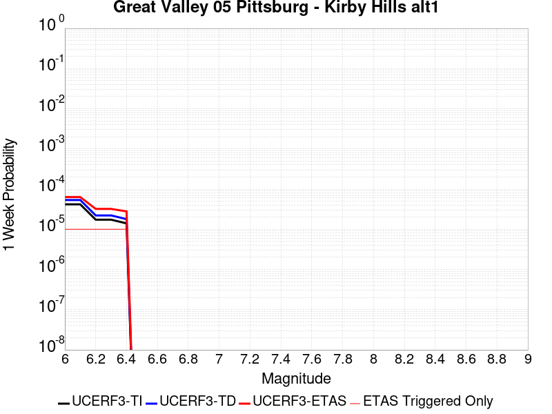 |  |  |  |

| Magnitude | 1 wk TI Prob | 1 wk TD Prob | 1 wk ETAS Prob | 1 wk ETAS/TD Gain | 1 wk ETAS Triggered Only | 1 mo TI Prob | 1 mo TD Prob | 1 mo ETAS Prob | 1 mo ETAS/TD Gain | 1 mo ETAS Triggered Only | 1 yr TI Prob | 1 yr TD Prob | 1 yr ETAS Prob | 1 yr ETAS/TD Gain | 1 yr ETAS Triggered Only | 10 yr TI Prob | 10 yr TD Prob | 10 yr ETAS Prob | 10 yr ETAS/TD Gain | 10 yr ETAS Triggered Only |
|-----|-----|-----|-----|-----|-----|-----|-----|-----|-----|-----|-----|-----|-----|-----|-----|-----|-----|-----|-----|-----|
| 6.0 | 4.187212E-5 | 5.3442072E-5 | 6.903797E-5 | 1.291828 | 1.5596732E-5 | 1.794396E-4 | 2.290231E-4 | 2.4461627E-4 | 1.0680856 | 1.5596732E-5 | 0.002182488 | 0.0027857882 | 0.0028013415 | 1.005583 | 1.5596732E-5 | 0.021611776 | 0.02760304 | 0.027618205 | 1.0005494 | 1.5596732E-5 |
| 6.1 | 4.187212E-5 | 5.3442072E-5 | 6.903797E-5 | 1.291828 | 1.5596732E-5 | 1.794396E-4 | 2.290231E-4 | 2.4461627E-4 | 1.0680856 | 1.5596732E-5 | 0.002182488 | 0.0027857882 | 0.0028013415 | 1.005583 | 1.5596732E-5 | 0.021611776 | 0.02760304 | 0.027618205 | 1.0005494 | 1.5596732E-5 |
| 6.2 | 1.7353306E-5 | 2.2154374E-5 | 3.775076E-5 | 1.7039868 | 1.5596732E-5 | 7.436919E-5 | 9.494618E-5 | 1.1054143E-4 | 1.1642536 | 1.5596732E-5 | 9.050688E-4 | 0.0011557543 | 0.001171333 | 1.0134792 | 1.5596732E-5 | 0.009013915 | 0.011535114 | 0.01155053 | 1.0013365 | 1.5596732E-5 |
| 6.3 | 1.7353306E-5 | 2.2154374E-5 | 3.775076E-5 | 1.7039868 | 1.5596732E-5 | 7.436919E-5 | 9.494618E-5 | 1.1054143E-4 | 1.1642536 | 1.5596732E-5 | 9.050688E-4 | 0.0011557543 | 0.001171333 | 1.0134792 | 1.5596732E-5 | 0.009013915 | 0.011535114 | 0.01155053 | 1.0013365 | 1.5596732E-5 |
| 6.4 | 1.4028824E-5 | 1.7900597E-5 | 3.3497046E-5 | 1.8712811 | 1.5596732E-5 | 6.0122147E-5 | 7.671684E-5 | 9.231237E-5 | 1.203287 | 1.5596732E-5 | 7.3174125E-4 | 9.340275E-4 | 9.496097E-4 | 1.0166827 | 1.5596732E-5 | 0.0072933645 | 0.009338138 | 0.009353588 | 1.0016546 | 1.5596732E-5 |

## Antelope Valley 2011
*[(top)](#table-of-contents)*

| 1 Week | 1 Month | 1 Year | 10 Year |
|-----|-----|-----|-----|
|  |  |  |  |

| Magnitude | 1 wk TI Prob | 1 wk TD Prob | 1 wk ETAS Prob | 1 wk ETAS/TD Gain | 1 wk ETAS Triggered Only | 1 mo TI Prob | 1 mo TD Prob | 1 mo ETAS Prob | 1 mo ETAS/TD Gain | 1 mo ETAS Triggered Only | 1 yr TI Prob | 1 yr TD Prob | 1 yr ETAS Prob | 1 yr ETAS/TD Gain | 1 yr ETAS Triggered Only | 10 yr TI Prob | 10 yr TD Prob | 10 yr ETAS Prob | 10 yr ETAS/TD Gain | 10 yr ETAS Triggered Only |
|-----|-----|-----|-----|-----|-----|-----|-----|-----|-----|-----|-----|-----|-----|-----|-----|-----|-----|-----|-----|-----|
| 6.0 | 3.1646934E-5 | 3.6904403E-5 | 3.6904403E-5 | 1.0 | 0.0 | 1.3562266E-4 | 1.5815363E-4 | 1.7374789E-4 | 1.098602 | 1.5596732E-5 | 0.0016499552 | 0.0019240845 | 0.0019396512 | 1.0080905 | 1.5596732E-5 | 0.016377583 | 0.019100651 | 0.019115949 | 1.000801 | 1.5596732E-5 |
| 6.1 | 3.1646934E-5 | 3.6904403E-5 | 3.6904403E-5 | 1.0 | 0.0 | 1.3562266E-4 | 1.5815363E-4 | 1.7374789E-4 | 1.098602 | 1.5596732E-5 | 0.0016499552 | 0.0019240845 | 0.0019396512 | 1.0080905 | 1.5596732E-5 | 0.016377583 | 0.019100651 | 0.019115949 | 1.000801 | 1.5596732E-5 |
| 6.2 | 3.1646934E-5 | 3.6904403E-5 | 3.6904403E-5 | 1.0 | 0.0 | 1.3562266E-4 | 1.5815363E-4 | 1.7374789E-4 | 1.098602 | 1.5596732E-5 | 0.0016499552 | 0.0019240845 | 0.0019396512 | 1.0080905 | 1.5596732E-5 | 0.016377583 | 0.019100651 | 0.019115949 | 1.000801 | 1.5596732E-5 |
| 6.3 | 3.1646934E-5 | 3.6904403E-5 | 3.6904403E-5 | 1.0 | 0.0 | 1.3562266E-4 | 1.5815363E-4 | 1.7374789E-4 | 1.098602 | 1.5596732E-5 | 0.0016499552 | 0.0019240845 | 0.0019396512 | 1.0080905 | 1.5596732E-5 | 0.016377583 | 0.019100651 | 0.019115949 | 1.000801 | 1.5596732E-5 |
| 6.4 | 3.1646934E-5 | 3.6904403E-5 | 3.6904403E-5 | 1.0 | 0.0 | 1.3562266E-4 | 1.5815363E-4 | 1.7374789E-4 | 1.098602 | 1.5596732E-5 | 0.0016499552 | 0.0019240845 | 0.0019396512 | 1.0080905 | 1.5596732E-5 | 0.016377583 | 0.019100651 | 0.019115949 | 1.000801 | 1.5596732E-5 |
| 6.5 | 1.8034107E-5 | 2.0940959E-5 | 2.0940959E-5 | 1.0 | 0.0 | 7.7286735E-5 | 8.974457E-5 | 8.974457E-5 | 1.0 | 0.0 | 9.405598E-4 | 0.0010922146 | 0.0010922146 | 1.0 | 0.0 | 0.009365888 | 0.010880542 | 0.010880542 | 1.0 | 0.0 |
| 6.6 | 1.8034107E-5 | 2.0940959E-5 | 2.0940959E-5 | 1.0 | 0.0 | 7.7286735E-5 | 8.974457E-5 | 8.974457E-5 | 1.0 | 0.0 | 9.405598E-4 | 0.0010922146 | 0.0010922146 | 1.0 | 0.0 | 0.009365888 | 0.010880542 | 0.010880542 | 1.0 | 0.0 |
| 6.7 | 1.3567667E-5 | 1.5749509E-5 | 1.5749509E-5 | 1.0 | 0.0 | 5.814585E-5 | 6.749675E-5 | 6.749675E-5 | 1.0 | 0.0 | 7.076958E-4 | 8.2156935E-4 | 8.2156935E-4 | 1.0 | 0.0 | 0.007054463 | 0.008195754 | 0.008195754 | 1.0 | 0.0 |
| 6.8 | 9.867387E-6 | 1.1467935E-5 | 1.1467935E-5 | 1.0 | 0.0 | 4.2288117E-5 | 4.91479E-5 | 4.91479E-5 | 1.0 | 0.0 | 5.1473617E-4 | 5.9830636E-4 | 5.9830636E-4 | 1.0 | 0.0 | 0.005135455 | 0.005976268 | 0.005976268 | 1.0 | 0.0 |
| 6.9 | 7.273233E-6 | 8.454864E-6 | 8.454864E-6 | 1.0 | 0.0 | 3.1170628E-5 | 3.623513E-5 | 3.623513E-5 | 1.0 | 0.0 | 3.794363E-4 | 4.411627E-4 | 4.411627E-4 | 1.0 | 0.0 | 0.0037878908 | 0.004411627 | 0.004411627 | 1.0 | 0.0 |

## Los Alamos 2011 CFM
*[(top)](#table-of-contents)*

| 1 Week | 1 Month | 1 Year | 10 Year |
|-----|-----|-----|-----|
|  |  |  |  |

| Magnitude | 1 wk TI Prob | 1 wk TD Prob | 1 wk ETAS Prob | 1 wk ETAS/TD Gain | 1 wk ETAS Triggered Only | 1 mo TI Prob | 1 mo TD Prob | 1 mo ETAS Prob | 1 mo ETAS/TD Gain | 1 mo ETAS Triggered Only | 1 yr TI Prob | 1 yr TD Prob | 1 yr ETAS Prob | 1 yr ETAS/TD Gain | 1 yr ETAS Triggered Only | 10 yr TI Prob | 10 yr TD Prob | 10 yr ETAS Prob | 10 yr ETAS/TD Gain | 10 yr ETAS Triggered Only |
|-----|-----|-----|-----|-----|-----|-----|-----|-----|-----|-----|-----|-----|-----|-----|-----|-----|-----|-----|-----|-----|
| 6.0 | 4.6284417E-6 | 4.751731E-6 | 2.0348389E-5 | 4.2823105 | 1.5596732E-5 | 1.9836029E-5 | 2.0364414E-5 | 3.5960828E-5 | 1.765866 | 1.5596732E-5 | 2.4147688E-4 | 2.4791027E-4 | 2.6350314E-4 | 1.0628972 | 1.5596732E-5 | 0.0024121467 | 0.0024765113 | 0.0024920695 | 1.0062822 | 1.5596732E-5 |
| 6.1 | 4.6284417E-6 | 4.751731E-6 | 2.0348389E-5 | 4.2823105 | 1.5596732E-5 | 1.9836029E-5 | 2.0364414E-5 | 3.5960828E-5 | 1.765866 | 1.5596732E-5 | 2.4147688E-4 | 2.4791027E-4 | 2.6350314E-4 | 1.0628972 | 1.5596732E-5 | 0.0024121467 | 0.0024765113 | 0.0024920695 | 1.0062822 | 1.5596732E-5 |
| 6.2 | 4.6284417E-6 | 4.751731E-6 | 2.0348389E-5 | 4.2823105 | 1.5596732E-5 | 1.9836029E-5 | 2.0364414E-5 | 3.5960828E-5 | 1.765866 | 1.5596732E-5 | 2.4147688E-4 | 2.4791027E-4 | 2.6350314E-4 | 1.0628972 | 1.5596732E-5 | 0.0024121467 | 0.0024765113 | 0.0024920695 | 1.0062822 | 1.5596732E-5 |
| 6.3 | 4.6284417E-6 | 4.751731E-6 | 2.0348389E-5 | 4.2823105 | 1.5596732E-5 | 1.9836029E-5 | 2.0364414E-5 | 3.5960828E-5 | 1.765866 | 1.5596732E-5 | 2.4147688E-4 | 2.4791027E-4 | 2.6350314E-4 | 1.0628972 | 1.5596732E-5 | 0.0024121467 | 0.0024765113 | 0.0024920695 | 1.0062822 | 1.5596732E-5 |
| 6.4 | 4.6284417E-6 | 4.751731E-6 | 2.0348389E-5 | 4.2823105 | 1.5596732E-5 | 1.9836029E-5 | 2.0364414E-5 | 3.5960828E-5 | 1.765866 | 1.5596732E-5 | 2.4147688E-4 | 2.4791027E-4 | 2.6350314E-4 | 1.0628972 | 1.5596732E-5 | 0.0024121467 | 0.0024765113 | 0.0024920695 | 1.0062822 | 1.5596732E-5 |
| 6.5 | 4.6284417E-6 | 4.751731E-6 | 2.0348389E-5 | 4.2823105 | 1.5596732E-5 | 1.9836029E-5 | 2.0364414E-5 | 3.5960828E-5 | 1.765866 | 1.5596732E-5 | 2.4147688E-4 | 2.4791027E-4 | 2.6350314E-4 | 1.0628972 | 1.5596732E-5 | 0.0024121467 | 0.0024765113 | 0.0024920695 | 1.0062822 | 1.5596732E-5 |
| 6.6 | 4.6284417E-6 | 4.751731E-6 | 2.0348389E-5 | 4.2823105 | 1.5596732E-5 | 1.9836029E-5 | 2.0364414E-5 | 3.5960828E-5 | 1.765866 | 1.5596732E-5 | 2.4147688E-4 | 2.4791027E-4 | 2.6350314E-4 | 1.0628972 | 1.5596732E-5 | 0.0024121467 | 0.0024765113 | 0.0024920695 | 1.0062822 | 1.5596732E-5 |
| 6.7 | 4.062321E-6 | 4.166349E-6 | 1.9763014E-5 | 4.7434855 | 1.5596732E-5 | 1.7409831E-5 | 1.7855667E-5 | 3.345212E-5 | 1.8734735 | 1.5596732E-5 | 2.1194408E-4 | 2.1737257E-4 | 2.3296592E-4 | 1.0717355 | 1.5596732E-5 | 0.0021174205 | 0.0021717492 | 0.002187312 | 1.007166 | 1.5596732E-5 |
| 6.8 | 4.062321E-6 | 4.166349E-6 | 1.9763014E-5 | 4.7434855 | 1.5596732E-5 | 1.7409831E-5 | 1.7855667E-5 | 3.345212E-5 | 1.8734735 | 1.5596732E-5 | 2.1194408E-4 | 2.1737257E-4 | 2.3296592E-4 | 1.0717355 | 1.5596732E-5 | 0.0021174205 | 0.0021717492 | 0.002187312 | 1.007166 | 1.5596732E-5 |
| 6.9 | 3.2936077E-6 | 3.372958E-6 | 1.8969637E-5 | 5.624036 | 1.5596732E-5 | 1.4115385E-5 | 1.4455459E-5 | 3.0051964E-5 | 2.0789354 | 1.5596732E-5 | 1.7184127E-4 | 1.7598194E-4 | 1.9157592E-4 | 1.0886112 | 1.5596732E-5 | 0.0017170844 | 0.0017585184 | 0.0017740877 | 1.0088537 | 1.5596732E-5 |
| 7.0 | 3.1687898E-6 | 3.2448156E-6 | 1.8841496E-5 | 5.8066463 | 1.5596732E-5 | 1.3580457E-5 | 1.3906283E-5 | 2.9502797E-5 | 2.1215444 | 1.5596732E-5 | 1.6532952E-4 | 1.6929678E-4 | 1.8489087E-4 | 1.092111 | 1.5596732E-5 | 0.0016520657 | 0.0016917696 | 0.00170734 | 1.0092036 | 1.5596732E-5 |
| 7.1 | 2.9379228E-6 | 3.0073259E-6 | 1.860401E-5 | 6.18623 | 1.5596732E-5 | 1.25910365E-5 | 1.288848E-5 | 2.848501E-5 | 2.210114 | 1.5596732E-5 | 1.5328509E-4 | 1.5690686E-4 | 1.7250114E-4 | 1.0993856 | 1.5596732E-5 | 0.001531794 | 0.0015680499 | 0.0015836222 | 1.009931 | 1.5596732E-5 |
| 7.2 | 2.0020686E-6 | 2.0416298E-6 | 2.0416298E-6 | 1.0 | 0.0 | 8.580266E-6 | 8.749813E-6 | 8.749813E-6 | 1.0 | 0.0 | 1.0445973E-4 | 1.0652381E-4 | 1.0652381E-4 | 1.0 | 0.0 | 0.0010441064 | 0.001064732 | 0.001064732 | 1.0 | 0.0 |
| 7.3 | 1.7364243E-6 | 1.7678802E-6 | 1.7678802E-6 | 1.0 | 0.0 | 7.441797E-6 | 7.576608E-6 | 7.576608E-6 | 1.0 | 0.0 | 9.0600115E-5 | 9.2241324E-5 | 9.2241324E-5 | 1.0 | 0.0 | 9.0563187E-4 | 9.2203356E-4 | 9.2203356E-4 | 1.0 | 0.0 |
| 7.4 | 1.5718434E-6 | 1.5983177E-6 | 1.5983177E-6 | 1.0 | 0.0 | 6.7364545E-6 | 6.849915E-6 | 6.849915E-6 | 1.0 | 0.0 | 8.201325E-5 | 8.339455E-5 | 8.339455E-5 | 1.0 | 0.0 | 8.198299E-4 | 8.3363557E-4 | 8.3363557E-4 | 1.0 | 0.0 |
| 7.5 | 1.3841119E-6 | 1.4042793E-6 | 1.4042793E-6 | 1.0 | 0.0 | 5.9318945E-6 | 6.0183256E-6 | 6.0183256E-6 | 1.0 | 0.0 | 7.221842E-5 | 7.327068E-5 | 7.327068E-5 | 1.0 | 0.0 | 7.2194956E-4 | 7.324681E-4 | 7.324681E-4 | 1.0 | 0.0 |
| 7.6 | 1.0843726E-6 | 1.093442E-6 | 1.093442E-6 | 1.0 | 0.0 | 4.647303E-6 | 4.6861724E-6 | 4.6861724E-6 | 1.0 | 0.0 | 5.6579443E-5 | 5.705268E-5 | 5.705268E-5 | 1.0 | 0.0 | 5.656504E-4 | 5.703829E-4 | 5.703829E-4 | 1.0 | 0.0 |
| 7.7 | 5.544814E-7 | 5.5018705E-7 | 5.5018705E-7 | 1.0 | 0.0 | 2.3763469E-6 | 2.3579425E-6 | 2.3579425E-6 | 1.0 | 0.0 | 2.8931638E-5 | 2.8707573E-5 | 2.8707573E-5 | 1.0 | 0.0 | 2.8927872E-4 | 2.870388E-4 | 2.870388E-4 | 1.0 | 0.0 |
| 7.8 | 2.0707465E-7 | 1.977846E-7 | 1.977846E-7 | 1.0 | 0.0 | 8.874625E-7 | 8.4764804E-7 | 8.4764804E-7 | 1.0 | 0.0 | 1.08048025E-5 | 1.0320066E-5 | 1.0320066E-5 | 1.0 | 0.0 | 1.0804277E-4 | 1.0319592E-4 | 1.0319592E-4 | 1.0 | 0.0 |
| 7.9 | 3.9821284E-8 | 3.433109E-8 | 3.433109E-8 | 1.0 | 0.0 | 1.7066264E-7 | 1.4713324E-7 | 1.4713324E-7 | 1.0 | 0.0 | 2.0778157E-6 | 1.7913457E-6 | 1.7913457E-6 | 1.0 | 0.0 | 2.0777963E-5 | 1.7913319E-5 | 1.7913319E-5 | 1.0 | 0.0 |
| 8.0 | 7.880441E-11 | 8.2353124E-11 | 8.2353124E-11 | 1.0 | 0.0 | 3.3773329E-10 | 3.52942E-10 | 3.52942E-10 | 1.0 | 0.0 | 4.1119033E-9 | 4.2970694E-9 | 4.2970694E-9 | 1.0 | 0.0 | 4.1119034E-8 | 4.2970694E-8 | 4.2970694E-8 | 1.0 | 0.0 |

## Earthquake Valley
*[(top)](#table-of-contents)*

| 1 Week | 1 Month | 1 Year | 10 Year |
|-----|-----|-----|-----|
|  |  |  |  |

| Magnitude | 1 wk TI Prob | 1 wk TD Prob | 1 wk ETAS Prob | 1 wk ETAS/TD Gain | 1 wk ETAS Triggered Only | 1 mo TI Prob | 1 mo TD Prob | 1 mo ETAS Prob | 1 mo ETAS/TD Gain | 1 mo ETAS Triggered Only | 1 yr TI Prob | 1 yr TD Prob | 1 yr ETAS Prob | 1 yr ETAS/TD Gain | 1 yr ETAS Triggered Only | 10 yr TI Prob | 10 yr TD Prob | 10 yr ETAS Prob | 10 yr ETAS/TD Gain | 10 yr ETAS Triggered Only |
|-----|-----|-----|-----|-----|-----|-----|-----|-----|-----|-----|-----|-----|-----|-----|-----|-----|-----|-----|-----|-----|
| 6.0 | 1.9416384E-5 | 2.258408E-5 | 2.258408E-5 | 1.0 | 0.0 | 8.321042E-5 | 9.6785996E-5 | 9.6785996E-5 | 1.0 | 0.0 | 0.001012616 | 0.0011778527 | 0.0011934311 | 1.013226 | 1.5596732E-5 | 0.010080142 | 0.011727943 | 0.0117433565 | 1.0013143 | 1.5596732E-5 |
| 6.1 | 1.9416384E-5 | 2.258408E-5 | 2.258408E-5 | 1.0 | 0.0 | 8.321042E-5 | 9.6785996E-5 | 9.6785996E-5 | 1.0 | 0.0 | 0.001012616 | 0.0011778527 | 0.0011934311 | 1.013226 | 1.5596732E-5 | 0.010080142 | 0.011727943 | 0.0117433565 | 1.0013143 | 1.5596732E-5 |
| 6.2 | 1.9416384E-5 | 2.258408E-5 | 2.258408E-5 | 1.0 | 0.0 | 8.321042E-5 | 9.6785996E-5 | 9.6785996E-5 | 1.0 | 0.0 | 0.001012616 | 0.0011778527 | 0.0011934311 | 1.013226 | 1.5596732E-5 | 0.010080142 | 0.011727943 | 0.0117433565 | 1.0013143 | 1.5596732E-5 |
| 6.3 | 1.9416384E-5 | 2.258408E-5 | 2.258408E-5 | 1.0 | 0.0 | 8.321042E-5 | 9.6785996E-5 | 9.6785996E-5 | 1.0 | 0.0 | 0.001012616 | 0.0011778527 | 0.0011934311 | 1.013226 | 1.5596732E-5 | 0.010080142 | 0.011727943 | 0.0117433565 | 1.0013143 | 1.5596732E-5 |
| 6.4 | 1.9416384E-5 | 2.258408E-5 | 2.258408E-5 | 1.0 | 0.0 | 8.321042E-5 | 9.6785996E-5 | 9.6785996E-5 | 1.0 | 0.0 | 0.001012616 | 0.0011778527 | 0.0011934311 | 1.013226 | 1.5596732E-5 | 0.010080142 | 0.011727943 | 0.0117433565 | 1.0013143 | 1.5596732E-5 |
| 6.5 | 1.9389157E-5 | 2.255267E-5 | 2.255267E-5 | 1.0 | 0.0 | 8.309374E-5 | 9.665139E-5 | 9.665139E-5 | 1.0 | 0.0 | 0.0010111968 | 0.0011762156 | 0.001191794 | 1.0132445 | 1.5596732E-5 | 0.010066078 | 0.011711745 | 0.011727159 | 1.0013161 | 1.5596732E-5 |
| 6.6 | 1.9389157E-5 | 2.255267E-5 | 2.255267E-5 | 1.0 | 0.0 | 8.309374E-5 | 9.665139E-5 | 9.665139E-5 | 1.0 | 0.0 | 0.0010111968 | 0.0011762156 | 0.001191794 | 1.0132445 | 1.5596732E-5 | 0.010066078 | 0.011711745 | 0.011727159 | 1.0013161 | 1.5596732E-5 |
| 6.7 | 1.4925434E-5 | 1.7208227E-5 | 1.7208227E-5 | 1.0 | 0.0 | 6.396457E-5 | 7.374794E-5 | 7.374794E-5 | 1.0 | 0.0 | 7.7849044E-4 | 8.9759636E-4 | 9.131791E-4 | 1.0173606 | 1.5596732E-5 | 0.007757689 | 0.008948085 | 0.008963542 | 1.0017275 | 1.5596732E-5 |
| 6.8 | 1.3570335E-5 | 1.5616843E-5 | 1.5616843E-5 | 1.0 | 0.0 | 5.8157282E-5 | 6.692807E-5 | 6.692807E-5 | 1.0 | 0.0 | 7.0783484E-4 | 8.1462675E-4 | 8.3021075E-4 | 1.0191302 | 1.5596732E-5 | 0.0070558446 | 0.008124476 | 0.0081399465 | 1.0019041 | 1.5596732E-5 |
| 6.9 | 1.3570335E-5 | 1.5616843E-5 | 1.5616843E-5 | 1.0 | 0.0 | 5.8157282E-5 | 6.692807E-5 | 6.692807E-5 | 1.0 | 0.0 | 7.0783484E-4 | 8.1462675E-4 | 8.3021075E-4 | 1.0191302 | 1.5596732E-5 | 0.0070558446 | 0.008124476 | 0.0081399465 | 1.0019041 | 1.5596732E-5 |
| 7.0 | 1.3433392E-5 | 1.5460388E-5 | 1.5460388E-5 | 1.0 | 0.0 | 5.757041E-5 | 6.6257584E-5 | 6.6257584E-5 | 1.0 | 0.0 | 7.0069433E-4 | 8.064695E-4 | 8.220537E-4 | 1.019324 | 1.5596732E-5 | 0.006984891 | 0.008043497 | 0.008058968 | 1.0019234 | 1.5596732E-5 |
| 7.1 | 8.181609E-6 | 9.416851E-6 | 9.416851E-6 | 1.0 | 0.0 | 3.5063567E-5 | 4.0357685E-5 | 4.0357685E-5 | 1.0 | 0.0 | 4.268153E-4 | 4.9131113E-4 | 4.9131113E-4 | 1.0 | 0.0 | 0.0042599645 | 0.0049088253 | 0.0049088253 | 1.0 | 0.0 |
| 7.2 | 2.0663983E-7 | 1.726294E-7 | 1.726294E-7 | 1.0 | 0.0 | 8.855989E-7 | 7.398401E-7 | 7.398401E-7 | 1.0 | 0.0 | 1.0782113E-5 | 9.00752E-6 | 9.00752E-6 | 1.0 | 0.0 | 1.07815904E-4 | 9.00719E-5 | 9.00719E-5 | 1.0 | 0.0 |
| 7.3 | 2.0462376E-7 | 1.7078433E-7 | 1.7078433E-7 | 1.0 | 0.0 | 8.7695867E-7 | 7.319327E-7 | 7.319327E-7 | 1.0 | 0.0 | 1.0676919E-5 | 8.911247E-6 | 8.911247E-6 | 1.0 | 0.0 | 1.0676406E-4 | 8.910926E-5 | 8.910926E-5 | 1.0 | 0.0 |
| 7.4 | 2.0171088E-7 | 1.6860913E-7 | 1.6860913E-7 | 1.0 | 0.0 | 8.644749E-7 | 7.2261037E-7 | 7.2261037E-7 | 1.0 | 0.0 | 1.0524931E-5 | 8.79775E-6 | 8.79775E-6 | 1.0 | 0.0 | 1.05244326E-4 | 8.7974375E-5 | 8.7974375E-5 | 1.0 | 0.0 |
| 7.5 | 1.4847944E-7 | 1.2559275E-7 | 1.2559275E-7 | 1.0 | 0.0 | 6.363403E-7 | 5.3825454E-7 | 5.3825454E-7 | 1.0 | 0.0 | 7.747416E-6 | 6.5532317E-6 | 6.5532317E-6 | 1.0 | 0.0 | 7.747146E-5 | 6.55306E-5 | 6.55306E-5 | 1.0 | 0.0 |
| 7.6 | 1.3185847E-7 | 1.1123213E-7 | 1.1123213E-7 | 1.0 | 0.0 | 5.6510765E-7 | 4.7670906E-7 | 4.7670906E-7 | 1.0 | 0.0 | 6.8801637E-6 | 5.8039195E-6 | 5.8039195E-6 | 1.0 | 0.0 | 6.8799505E-5 | 5.803789E-5 | 5.803789E-5 | 1.0 | 0.0 |
| 7.7 | 2.8609954E-8 | 1.4170958E-8 | 1.4170958E-8 | 1.0 | 0.0 | 1.2261408E-7 | 6.0732674E-8 | 6.0732674E-8 | 1.0 | 0.0 | 1.4928254E-6 | 7.394201E-7 | 7.394201E-7 | 1.0 | 0.0 | 1.4928154E-5 | 7.394182E-6 | 7.394182E-6 | 1.0 | 0.0 |
| 7.8 | 6.527266E-9 | 2.923417E-9 | 2.923417E-9 | 1.0 | 0.0 | 2.7973995E-8 | 1.2528931E-8 | 1.2528931E-8 | 1.0 | 0.0 | 3.4058334E-7 | 1.5253973E-7 | 1.5253973E-7 | 1.0 | 0.0 | 3.4058282E-6 | 1.5253964E-6 | 1.5253964E-6 | 1.0 | 0.0 |
| 7.9 | 1.2898267E-9 | 7.127684E-10 | 7.127684E-10 | 1.0 | 0.0 | 5.527829E-9 | 3.0547218E-9 | 3.0547218E-9 | 1.0 | 0.0 | 6.7301315E-8 | 3.719124E-8 | 3.719124E-8 | 1.0 | 0.0 | 6.7301295E-7 | 3.719124E-7 | 3.719124E-7 | 1.0 | 0.0 |

## Great Valley 03a Dunnigan Hills
*[(top)](#table-of-contents)*

| 1 Week | 1 Month | 1 Year | 10 Year |
|-----|-----|-----|-----|
|  |  |  |  |

| Magnitude | 1 wk TI Prob | 1 wk TD Prob | 1 wk ETAS Prob | 1 wk ETAS/TD Gain | 1 wk ETAS Triggered Only | 1 mo TI Prob | 1 mo TD Prob | 1 mo ETAS Prob | 1 mo ETAS/TD Gain | 1 mo ETAS Triggered Only | 1 yr TI Prob | 1 yr TD Prob | 1 yr ETAS Prob | 1 yr ETAS/TD Gain | 1 yr ETAS Triggered Only | 10 yr TI Prob | 10 yr TD Prob | 10 yr ETAS Prob | 10 yr ETAS/TD Gain | 10 yr ETAS Triggered Only |
|-----|-----|-----|-----|-----|-----|-----|-----|-----|-----|-----|-----|-----|-----|-----|-----|-----|-----|-----|-----|-----|
| 6.0 | 1.6591328E-5 | 1.8107954E-5 | 3.3704404E-5 | 1.8613037 | 1.5596732E-5 | 7.110376E-5 | 7.7603596E-5 | 9.3199116E-5 | 1.2009639 | 1.5596732E-5 | 8.6534437E-4 | 9.444834E-4 | 9.600654E-4 | 1.0164979 | 1.5596732E-5 | 0.008619824 | 0.009411525 | 0.009426975 | 1.0016416 | 1.5596732E-5 |
| 6.1 | 8.041125E-6 | 8.769726E-6 | 8.769726E-6 | 1.0 | 0.0 | 3.4461507E-5 | 3.7584115E-5 | 3.7584115E-5 | 1.0 | 0.0 | 4.194881E-4 | 4.5751085E-4 | 4.5751085E-4 | 1.0 | 0.0 | 0.004186971 | 0.004567687 | 0.004567687 | 1.0 | 0.0 |
| 6.2 | 3.2807004E-6 | 3.5795688E-6 | 3.5795688E-6 | 1.0 | 0.0 | 1.4060069E-5 | 1.5340942E-5 | 1.5340942E-5 | 1.0 | 0.0 | 1.7116789E-4 | 1.8676413E-4 | 1.8676413E-4 | 1.0 | 0.0 | 0.0017103611 | 0.0018664796 | 0.0018664796 | 1.0 | 0.0 |
| 6.3 | 1.9339366E-6 | 2.1103806E-6 | 2.1103806E-6 | 1.0 | 0.0 | 8.288273E-6 | 9.044474E-6 | 9.044474E-6 | 1.0 | 0.0 | 1.00905054E-4 | 1.1011375E-4 | 1.1011375E-4 | 1.0 | 0.0 | 0.0010085925 | 0.0011008718 | 0.0011008718 | 1.0 | 0.0 |
| 6.4 | 1.3142635E-6 | 1.4339867E-6 | 1.4339867E-6 | 1.0 | 0.0 | 5.6325457E-6 | 6.145657E-6 | 6.145657E-6 | 1.0 | 0.0 | 6.857408E-5 | 7.482337E-5 | 7.482337E-5 | 1.0 | 0.0 | 6.8552926E-4 | 7.4823375E-4 | 7.4823375E-4 | 1.0 | 0.0 |

## Great Valley 04a Trout Creek
*[(top)](#table-of-contents)*

| 1 Week | 1 Month | 1 Year | 10 Year |
|-----|-----|-----|-----|
|  |  |  | 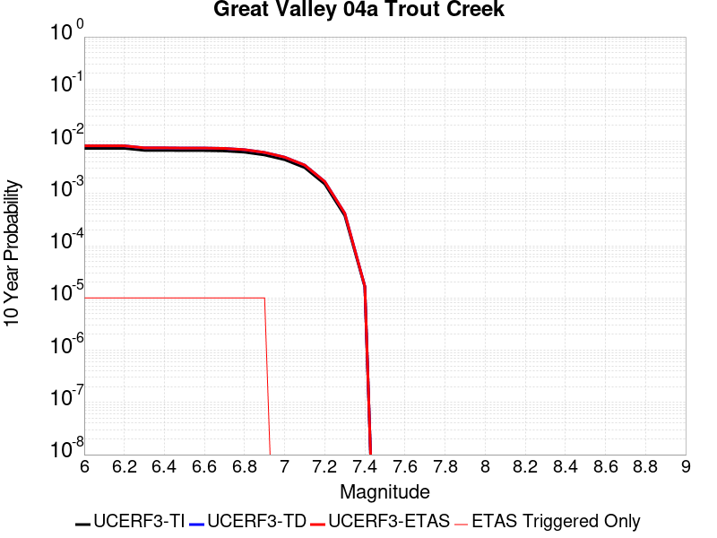 |

| Magnitude | 1 wk TI Prob | 1 wk TD Prob | 1 wk ETAS Prob | 1 wk ETAS/TD Gain | 1 wk ETAS Triggered Only | 1 mo TI Prob | 1 mo TD Prob | 1 mo ETAS Prob | 1 mo ETAS/TD Gain | 1 mo ETAS Triggered Only | 1 yr TI Prob | 1 yr TD Prob | 1 yr ETAS Prob | 1 yr ETAS/TD Gain | 1 yr ETAS Triggered Only | 10 yr TI Prob | 10 yr TD Prob | 10 yr ETAS Prob | 10 yr ETAS/TD Gain | 10 yr ETAS Triggered Only |
|-----|-----|-----|-----|-----|-----|-----|-----|-----|-----|-----|-----|-----|-----|-----|-----|-----|-----|-----|-----|-----|
| 6.0 | 1.4088538E-5 | 1.5719554E-5 | 1.5719554E-5 | 1.0 | 0.0 | 6.037805E-5 | 6.7367844E-5 | 6.7367844E-5 | 1.0 | 0.0 | 7.3485484E-4 | 8.199074E-4 | 8.3549134E-4 | 1.019007 | 1.5596732E-5 | 0.007324295 | 0.008170108 | 0.008185578 | 1.0018934 | 1.5596732E-5 |
| 6.1 | 1.4088538E-5 | 1.5719554E-5 | 1.5719554E-5 | 1.0 | 0.0 | 6.037805E-5 | 6.7367844E-5 | 6.7367844E-5 | 1.0 | 0.0 | 7.3485484E-4 | 8.199074E-4 | 8.3549134E-4 | 1.019007 | 1.5596732E-5 | 0.007324295 | 0.008170108 | 0.008185578 | 1.0018934 | 1.5596732E-5 |
| 6.2 | 1.4088538E-5 | 1.5719554E-5 | 1.5719554E-5 | 1.0 | 0.0 | 6.037805E-5 | 6.7367844E-5 | 6.7367844E-5 | 1.0 | 0.0 | 7.3485484E-4 | 8.199074E-4 | 8.3549134E-4 | 1.019007 | 1.5596732E-5 | 0.007324295 | 0.008170108 | 0.008185578 | 1.0018934 | 1.5596732E-5 |
| 6.3 | 1.2882862E-5 | 1.4378603E-5 | 1.4378603E-5 | 1.0 | 0.0 | 5.5211098E-5 | 6.1621184E-5 | 6.1621184E-5 | 1.0 | 0.0 | 6.7198783E-4 | 7.4999005E-4 | 7.655751E-4 | 1.0207803 | 1.5596732E-5 | 0.0066995937 | 0.0074756527 | 0.007491133 | 1.0020708 | 1.5596732E-5 |
| 6.4 | 1.2882862E-5 | 1.4378603E-5 | 1.4378603E-5 | 1.0 | 0.0 | 5.5211098E-5 | 6.1621184E-5 | 6.1621184E-5 | 1.0 | 0.0 | 6.7198783E-4 | 7.4999005E-4 | 7.655751E-4 | 1.0207803 | 1.5596732E-5 | 0.0066995937 | 0.0074756527 | 0.007491133 | 1.0020708 | 1.5596732E-5 |
| 6.5 | 1.2762329E-5 | 1.424516E-5 | 1.424516E-5 | 1.0 | 0.0 | 5.469455E-5 | 6.1049315E-5 | 6.1049315E-5 | 1.0 | 0.0 | 6.657027E-4 | 7.430323E-4 | 7.586174E-4 | 1.0209751 | 1.5596732E-5 | 0.00663712 | 0.0074065393 | 0.00742202 | 1.0020902 | 1.5596732E-5 |
| 6.6 | 1.2762329E-5 | 1.424516E-5 | 1.424516E-5 | 1.0 | 0.0 | 5.469455E-5 | 6.1049315E-5 | 6.1049315E-5 | 1.0 | 0.0 | 6.657027E-4 | 7.430323E-4 | 7.586174E-4 | 1.0209751 | 1.5596732E-5 | 0.00663712 | 0.0074065393 | 0.00742202 | 1.0020902 | 1.5596732E-5 |
| 6.7 | 1.2557959E-5 | 1.4019395E-5 | 1.4019395E-5 | 1.0 | 0.0 | 5.3818712E-5 | 6.0081795E-5 | 6.0081795E-5 | 1.0 | 0.0 | 6.5504585E-4 | 7.312607E-4 | 7.46846E-4 | 1.021313 | 1.5596732E-5 | 0.006531183 | 0.007289598 | 0.0073050815 | 1.002124 | 1.5596732E-5 |
| 6.8 | 1.1871544E-5 | 1.3258823E-5 | 1.3258823E-5 | 1.0 | 0.0 | 5.0877054E-5 | 5.6822348E-5 | 5.6822348E-5 | 1.0 | 0.0 | 6.1925204E-4 | 6.916025E-4 | 7.0718845E-4 | 1.022536 | 1.5596732E-5 | 0.0061752927 | 0.0068955184 | 0.0069110077 | 1.0022463 | 1.5596732E-5 |
| 6.9 | 1.0500373E-5 | 1.1731261E-5 | 1.1731261E-5 | 1.0 | 0.0 | 4.5000823E-5 | 5.0275914E-5 | 5.0275914E-5 | 1.0 | 0.0 | 5.4774724E-4 | 6.119459E-4 | 6.275331E-4 | 1.0254716 | 1.5596732E-5 | 0.005463991 | 0.0061034737 | 0.0061189756 | 1.0025398 | 1.5596732E-5 |
| 7.0 | 8.524332E-6 | 9.5334835E-6 | 9.5334835E-6 | 1.0 | 0.0 | 3.653234E-5 | 4.0857187E-5 | 4.0857187E-5 | 1.0 | 0.0 | 4.4469046E-4 | 4.9733004E-4 | 4.9733004E-4 | 1.0 | 0.0 | 0.0044380166 | 0.004962902 | 0.004962902 | 1.0 | 0.0 |
| 7.1 | 6.006849E-6 | 6.711559E-6 | 6.711559E-6 | 1.0 | 0.0 | 2.5743384E-5 | 2.876354E-5 | 2.876354E-5 | 1.0 | 0.0 | 3.1338062E-4 | 3.501454E-4 | 3.501454E-4 | 1.0 | 0.0 | 0.0031293905 | 0.0034964874 | 0.0034964874 | 1.0 | 0.0 |
| 7.2 | 2.9122193E-6 | 3.2465305E-6 | 3.2465305E-6 | 1.0 | 0.0 | 1.248088E-5 | 1.3913637E-5 | 1.3913637E-5 | 1.0 | 0.0 | 1.5194413E-4 | 1.6938712E-4 | 1.6938712E-4 | 1.0 | 0.0 | 0.0015184027 | 0.0016927521 | 0.0016927521 | 1.0 | 0.0 |
| 7.3 | 7.2194007E-7 | 7.988761E-7 | 7.988761E-7 | 1.0 | 0.0 | 3.0940253E-6 | 3.4237528E-6 | 3.4237528E-6 | 1.0 | 0.0 | 3.7669106E-5 | 4.1683852E-5 | 4.1683852E-5 | 1.0 | 0.0 | 3.766272E-4 | 4.168053E-4 | 4.168053E-4 | 1.0 | 0.0 |
| 7.4 | 3.112171E-8 | 3.2068368E-8 | 3.2068368E-8 | 1.0 | 0.0 | 1.3337875E-7 | 1.3743585E-7 | 1.3743585E-7 | 1.0 | 0.0 | 1.6238852E-6 | 1.6732803E-6 | 1.6732803E-6 | 1.0 | 0.0 | 1.6238733E-5 | 1.6732685E-5 | 1.6732685E-5 | 1.0 | 0.0 |

## Monterey Bay-Tularcitos
*[(top)](#table-of-contents)*

| 1 Week | 1 Month | 1 Year | 10 Year |
|-----|-----|-----|-----|
|  | 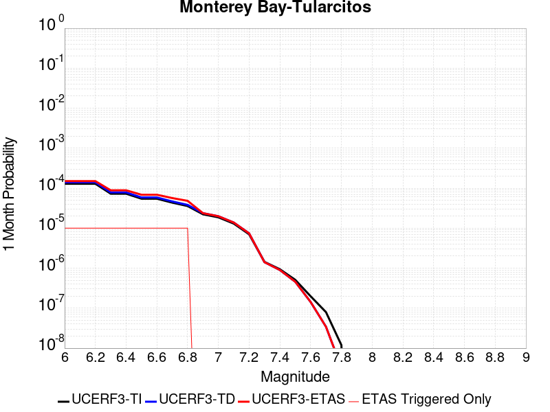 | 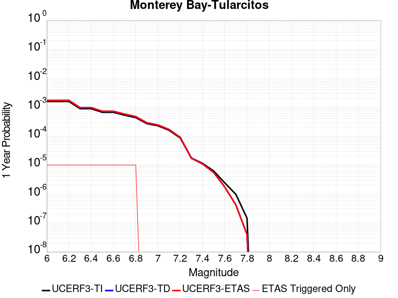 |  |

| Magnitude | 1 wk TI Prob | 1 wk TD Prob | 1 wk ETAS Prob | 1 wk ETAS/TD Gain | 1 wk ETAS Triggered Only | 1 mo TI Prob | 1 mo TD Prob | 1 mo ETAS Prob | 1 mo ETAS/TD Gain | 1 mo ETAS Triggered Only | 1 yr TI Prob | 1 yr TD Prob | 1 yr ETAS Prob | 1 yr ETAS/TD Gain | 1 yr ETAS Triggered Only | 10 yr TI Prob | 10 yr TD Prob | 10 yr ETAS Prob | 10 yr ETAS/TD Gain | 10 yr ETAS Triggered Only |
|-----|-----|-----|-----|-----|-----|-----|-----|-----|-----|-----|-----|-----|-----|-----|-----|-----|-----|-----|-----|-----|
| 6.0 | 3.0131365E-5 | 3.279877E-5 | 3.279877E-5 | 1.0 | 0.0 | 1.2912804E-4 | 1.4055918E-4 | 1.5615372E-4 | 1.1109464 | 1.5596732E-5 | 0.001571 | 0.0017100703 | 0.0017256403 | 1.009105 | 1.5596732E-5 | 0.015599402 | 0.016979916 | 0.01699525 | 1.0009029 | 1.5596732E-5 |
| 6.1 | 3.0131365E-5 | 3.279877E-5 | 3.279877E-5 | 1.0 | 0.0 | 1.2912804E-4 | 1.4055918E-4 | 1.5615372E-4 | 1.1109464 | 1.5596732E-5 | 0.001571 | 0.0017100703 | 0.0017256403 | 1.009105 | 1.5596732E-5 | 0.015599402 | 0.016979916 | 0.01699525 | 1.0009029 | 1.5596732E-5 |
| 6.2 | 3.0131365E-5 | 3.279877E-5 | 3.279877E-5 | 1.0 | 0.0 | 1.2912804E-4 | 1.4055918E-4 | 1.5615372E-4 | 1.1109464 | 1.5596732E-5 | 0.001571 | 0.0017100703 | 0.0017256403 | 1.009105 | 1.5596732E-5 | 0.015599402 | 0.016979916 | 0.01699525 | 1.0009029 | 1.5596732E-5 |
| 6.3 | 1.6998249E-5 | 1.8330798E-5 | 1.8330798E-5 | 1.0 | 0.0 | 7.28476E-5 | 7.85583E-5 | 9.415381E-5 | 1.1985214 | 1.5596732E-5 | 8.865586E-4 | 9.5604634E-4 | 9.716282E-4 | 1.0162982 | 1.5596732E-5 | 0.0088303005 | 0.009521258 | 0.009536706 | 1.0016226 | 1.5596732E-5 |
| 6.4 | 1.6998249E-5 | 1.8330798E-5 | 1.8330798E-5 | 1.0 | 0.0 | 7.28476E-5 | 7.85583E-5 | 9.415381E-5 | 1.1985214 | 1.5596732E-5 | 8.865586E-4 | 9.5604634E-4 | 9.716282E-4 | 1.0162982 | 1.5596732E-5 | 0.0088303005 | 0.009521258 | 0.009536706 | 1.0016226 | 1.5596732E-5 |
| 6.5 | 1.27470785E-5 | 1.3693312E-5 | 1.3693312E-5 | 1.0 | 0.0 | 5.4629192E-5 | 5.8684363E-5 | 7.428018E-5 | 1.2657576 | 1.5596732E-5 | 6.649074E-4 | 7.1425823E-4 | 7.2984386E-4 | 1.0218207 | 1.5596732E-5 | 0.0066292146 | 0.007120678 | 0.0071361642 | 1.0021747 | 1.5596732E-5 |
| 6.6 | 1.2739422E-5 | 1.36854E-5 | 1.36854E-5 | 1.0 | 0.0 | 5.4596385E-5 | 5.8650454E-5 | 7.4246265E-5 | 1.2659112 | 1.5596732E-5 | 6.645082E-4 | 7.1384566E-4 | 7.294313E-4 | 1.0218333 | 1.5596732E-5 | 0.0066252467 | 0.007116579 | 0.0071320646 | 1.002176 | 1.5596732E-5 |
| 6.7 | 1.0160109E-5 | 1.0885755E-5 | 1.0885755E-5 | 1.0 | 0.0 | 4.35426E-5 | 4.665244E-5 | 6.2248444E-5 | 1.334302 | 1.5596732E-5 | 5.300022E-4 | 5.6785246E-4 | 5.8344036E-4 | 1.0274506 | 1.5596732E-5 | 0.005287399 | 0.0056647263 | 0.0056802346 | 1.0027378 | 1.5596732E-5 |
| 6.8 | 8.349859E-6 | 8.932587E-6 | 8.932587E-6 | 1.0 | 0.0 | 3.578462E-5 | 3.8281985E-5 | 5.387812E-5 | 1.4074014 | 1.5596732E-5 | 4.3559066E-4 | 4.6598914E-4 | 4.815786E-4 | 1.0334545 | 1.5596732E-5 | 0.004347378 | 0.004650685 | 0.004666209 | 1.0033381 | 1.5596732E-5 |
| 6.9 | 5.193639E-6 | 5.53643E-6 | 5.53643E-6 | 1.0 | 0.0 | 2.2258262E-5 | 2.372736E-5 | 2.372736E-5 | 1.0 | 0.0 | 2.7096065E-4 | 2.8884556E-4 | 2.8884556E-4 | 1.0 | 0.0 | 0.0027063051 | 0.0028850222 | 0.0028850222 | 1.0 | 0.0 |
| 7.0 | 4.359381E-6 | 4.643366E-6 | 4.643366E-6 | 1.0 | 0.0 | 1.8682927E-5 | 1.9900004E-5 | 1.9900004E-5 | 1.0 | 0.0 | 2.274409E-4 | 2.422586E-4 | 2.422586E-4 | 1.0 | 0.0 | 0.0022720827 | 0.002420238 | 0.002420238 | 1.0 | 0.0 |
| 7.1 | 3.0398533E-6 | 3.2310427E-6 | 3.2310427E-6 | 1.0 | 0.0 | 1.3027877E-5 | 1.3847267E-5 | 1.3847267E-5 | 1.0 | 0.0 | 1.5860285E-4 | 1.6858005E-4 | 1.6858005E-4 | 1.0 | 0.0 | 0.001584897 | 0.0016847793 | 0.0016847793 | 1.0 | 0.0 |
| 7.2 | 1.642335E-6 | 1.7333153E-6 | 1.7333153E-6 | 1.0 | 0.0 | 7.0385595E-6 | 7.428485E-6 | 7.428485E-6 | 1.0 | 0.0 | 8.569109E-5 | 9.044012E-5 | 9.044012E-5 | 1.0 | 0.0 | 8.5658056E-4 | 9.042358E-4 | 9.042358E-4 | 1.0 | 0.0 |
| 7.3 | 3.356842E-7 | 3.2952389E-7 | 3.2952389E-7 | 1.0 | 0.0 | 1.4386458E-6 | 1.4122444E-6 | 1.4122444E-6 | 1.0 | 0.0 | 1.7515373E-5 | 1.7193941E-5 | 1.7193941E-5 | 1.0 | 0.0 | 1.7513991E-4 | 1.719262E-4 | 1.719262E-4 | 1.0 | 0.0 |
| 7.4 | 2.1973483E-7 | 2.1006413E-7 | 2.1006413E-7 | 1.0 | 0.0 | 9.417204E-7 | 9.0027453E-7 | 9.0027453E-7 | 1.0 | 0.0 | 1.1465385E-5 | 1.0960787E-5 | 1.0960787E-5 | 1.0 | 0.0 | 1.1464794E-4 | 1.096025E-4 | 1.096025E-4 | 1.0 | 0.0 |
| 7.5 | 1.1944135E-7 | 1.0696043E-7 | 1.0696043E-7 | 1.0 | 0.0 | 5.118914E-7 | 4.5840173E-7 | 4.5840173E-7 | 1.0 | 0.0 | 6.23226E-6 | 5.581027E-6 | 5.581027E-6 | 1.0 | 0.0 | 6.2320854E-5 | 5.5808883E-5 | 5.5808883E-5 | 1.0 | 0.0 |
| 7.6 | 4.636058E-8 | 3.336489E-8 | 3.336489E-8 | 1.0 | 0.0 | 1.9868818E-7 | 1.4299238E-7 | 1.4299238E-7 | 1.0 | 0.0 | 2.419026E-6 | 1.7409308E-6 | 1.7409308E-6 | 1.0 | 0.0 | 2.4189996E-5 | 1.7409173E-5 | 1.7409173E-5 | 1.0 | 0.0 |
| 7.7 | 1.8588572E-8 | 8.003744E-9 | 8.003744E-9 | 1.0 | 0.0 | 7.9665305E-8 | 3.430176E-8 | 3.430176E-8 | 1.0 | 0.0 | 9.699246E-7 | 4.1762385E-7 | 4.1762385E-7 | 1.0 | 0.0 | 9.699204E-6 | 4.176231E-6 | 4.176231E-6 | 1.0 | 0.0 |
| 7.8 | 2.7960154E-9 | 7.6099427E-10 | 7.6099427E-10 | 1.0 | 0.0 | 1.1982923E-8 | 3.2614043E-9 | 3.2614043E-9 | 1.0 | 0.0 | 1.4589209E-7 | 3.9707597E-8 | 3.9707597E-8 | 1.0 | 0.0 | 1.4589199E-6 | 3.9707595E-7 | 3.9707595E-7 | 1.0 | 0.0 |

## West Tahoe
*[(top)](#table-of-contents)*

| 1 Week | 1 Month | 1 Year | 10 Year |
|-----|-----|-----|-----|
|  |  |  |  |

| Magnitude | 1 wk TI Prob | 1 wk TD Prob | 1 wk ETAS Prob | 1 wk ETAS/TD Gain | 1 wk ETAS Triggered Only | 1 mo TI Prob | 1 mo TD Prob | 1 mo ETAS Prob | 1 mo ETAS/TD Gain | 1 mo ETAS Triggered Only | 1 yr TI Prob | 1 yr TD Prob | 1 yr ETAS Prob | 1 yr ETAS/TD Gain | 1 yr ETAS Triggered Only | 10 yr TI Prob | 10 yr TD Prob | 10 yr ETAS Prob | 10 yr ETAS/TD Gain | 10 yr ETAS Triggered Only |
|-----|-----|-----|-----|-----|-----|-----|-----|-----|-----|-----|-----|-----|-----|-----|-----|-----|-----|-----|-----|-----|
| 6.0 | 1.952444E-5 | 2.118317E-5 | 3.677957E-5 | 1.7362638 | 1.5596732E-5 | 8.367348E-5 | 9.078217E-5 | 1.06377476E-4 | 1.1717883 | 1.5596732E-5 | 0.0010182485 | 0.0011047672 | 0.0011203466 | 1.0141021 | 1.5596732E-5 | 0.010135954 | 0.010998235 | 0.011013661 | 1.0014025 | 1.5596732E-5 |
| 6.1 | 1.952444E-5 | 2.118317E-5 | 3.677957E-5 | 1.7362638 | 1.5596732E-5 | 8.367348E-5 | 9.078217E-5 | 1.06377476E-4 | 1.1717883 | 1.5596732E-5 | 0.0010182485 | 0.0011047672 | 0.0011203466 | 1.0141021 | 1.5596732E-5 | 0.010135954 | 0.010998235 | 0.011013661 | 1.0014025 | 1.5596732E-5 |
| 6.2 | 1.952444E-5 | 2.118317E-5 | 3.677957E-5 | 1.7362638 | 1.5596732E-5 | 8.367348E-5 | 9.078217E-5 | 1.06377476E-4 | 1.1717883 | 1.5596732E-5 | 0.0010182485 | 0.0011047672 | 0.0011203466 | 1.0141021 | 1.5596732E-5 | 0.010135954 | 0.010998235 | 0.011013661 | 1.0014025 | 1.5596732E-5 |
| 6.3 | 1.952444E-5 | 2.118317E-5 | 3.677957E-5 | 1.7362638 | 1.5596732E-5 | 8.367348E-5 | 9.078217E-5 | 1.06377476E-4 | 1.1717883 | 1.5596732E-5 | 0.0010182485 | 0.0011047672 | 0.0011203466 | 1.0141021 | 1.5596732E-5 | 0.010135954 | 0.010998235 | 0.011013661 | 1.0014025 | 1.5596732E-5 |
| 6.4 | 1.952444E-5 | 2.118317E-5 | 3.677957E-5 | 1.7362638 | 1.5596732E-5 | 8.367348E-5 | 9.078217E-5 | 1.06377476E-4 | 1.1717883 | 1.5596732E-5 | 0.0010182485 | 0.0011047672 | 0.0011203466 | 1.0141021 | 1.5596732E-5 | 0.010135954 | 0.010998235 | 0.011013661 | 1.0014025 | 1.5596732E-5 |
| 6.5 | 1.2685271E-5 | 1.3690627E-5 | 2.9287145E-5 | 2.1392112 | 1.5596732E-5 | 5.4364315E-5 | 5.8672893E-5 | 7.4268704E-5 | 1.2658095 | 1.5596732E-5 | 6.616845E-4 | 7.141248E-4 | 7.297104E-4 | 1.0218247 | 1.5596732E-5 | 0.0065971776 | 0.00711995 | 0.0071354355 | 1.002175 | 1.5596732E-5 |
| 6.6 | 1.2685271E-5 | 1.3690627E-5 | 2.9287145E-5 | 2.1392112 | 1.5596732E-5 | 5.4364315E-5 | 5.8672893E-5 | 7.4268704E-5 | 1.2658095 | 1.5596732E-5 | 6.616845E-4 | 7.141248E-4 | 7.297104E-4 | 1.0218247 | 1.5596732E-5 | 0.0065971776 | 0.00711995 | 0.0071354355 | 1.002175 | 1.5596732E-5 |
| 6.7 | 9.117886E-6 | 9.809846E-6 | 2.5406425E-5 | 2.58989 | 1.5596732E-5 | 3.9076072E-5 | 4.2041564E-5 | 5.7637637E-5 | 1.370968 | 1.5596732E-5 | 4.756473E-4 | 5.11743E-4 | 5.273317E-4 | 1.030462 | 1.5596732E-5 | 0.0047463053 | 0.0051063634 | 0.0051218807 | 1.0030388 | 1.5596732E-5 |
| 6.8 | 8.786828E-6 | 9.457863E-6 | 2.5054447E-5 | 2.64906 | 1.5596732E-5 | 3.7657293E-5 | 4.053311E-5 | 5.6129207E-5 | 1.3847743 | 1.5596732E-5 | 4.5838108E-4 | 4.933859E-4 | 5.0897495E-4 | 1.0315961 | 1.5596732E-5 | 0.0045743673 | 0.0049236063 | 0.004939126 | 1.0031521 | 1.5596732E-5 |
| 6.9 | 6.7562123E-6 | 7.2638086E-6 | 2.2860426E-5 | 3.147168 | 1.5596732E-5 | 2.8954875E-5 | 3.1130265E-5 | 4.672651E-5 | 1.5009995 | 1.5596732E-5 | 3.5246857E-4 | 3.789498E-4 | 3.9454064E-4 | 1.0411422 | 1.5596732E-5 | 0.0035191004 | 0.0037835082 | 0.003799046 | 1.0041066 | 1.5596732E-5 |
| 7.0 | 5.1792854E-6 | 5.567338E-6 | 2.1163982E-5 | 3.8014543 | 1.5596732E-5 | 2.2196748E-5 | 2.3859824E-5 | 3.9456183E-5 | 1.6536661 | 1.5596732E-5 | 2.702119E-4 | 2.9045844E-4 | 3.0605064E-4 | 1.0536814 | 1.5596732E-5 | 0.0026988357 | 0.0029011632 | 0.0029167149 | 1.0053605 | 1.5596732E-5 |
| 7.1 | 4.090765E-6 | 4.3974223E-6 | 1.9994084E-5 | 4.5467734 | 1.5596732E-5 | 1.7531731E-5 | 1.884598E-5 | 3.4442415E-5 | 1.8275737 | 1.5596732E-5 | 2.134279E-4 | 2.2942905E-4 | 2.450222E-4 | 1.067965 | 1.5596732E-5 | 0.0021322304 | 0.0022922563 | 0.0023078173 | 1.0067885 | 1.5596732E-5 |
| 7.2 | 2.2356758E-6 | 2.4023684E-6 | 2.4023684E-6 | 1.0 | 0.0 | 9.581432E-6 | 1.0295834E-5 | 1.0295834E-5 | 1.0 | 0.0 | 1.1664769E-4 | 1.2534647E-4 | 1.2534647E-4 | 1.0 | 0.0 | 0.0011658648 | 0.0012529434 | 0.0012529434 | 1.0 | 0.0 |

## Calaveras (No) 2011 CFM
*[(top)](#table-of-contents)*

| 1 Week | 1 Month | 1 Year | 10 Year |
|-----|-----|-----|-----|
|  |  |  |  |

| Magnitude | 1 wk TI Prob | 1 wk TD Prob | 1 wk ETAS Prob | 1 wk ETAS/TD Gain | 1 wk ETAS Triggered Only | 1 mo TI Prob | 1 mo TD Prob | 1 mo ETAS Prob | 1 mo ETAS/TD Gain | 1 mo ETAS Triggered Only | 1 yr TI Prob | 1 yr TD Prob | 1 yr ETAS Prob | 1 yr ETAS/TD Gain | 1 yr ETAS Triggered Only | 10 yr TI Prob | 10 yr TD Prob | 10 yr ETAS Prob | 10 yr ETAS/TD Gain | 10 yr ETAS Triggered Only |
|-----|-----|-----|-----|-----|-----|-----|-----|-----|-----|-----|-----|-----|-----|-----|-----|-----|-----|-----|-----|-----|
| 6.0 | 4.8694856E-5 | 6.747121E-5 | 8.306688E-5 | 1.2311457 | 1.5596732E-5 | 2.0867554E-4 | 2.8913133E-4 | 3.0472354E-4 | 1.0539278 | 1.5596732E-5 | 0.0025376645 | 0.003514627 | 0.003530169 | 1.0044221 | 1.5596732E-5 | 0.02508881 | 0.034771245 | 0.0347863 | 1.000433 | 1.5596732E-5 |
| 6.1 | 4.8694856E-5 | 6.747121E-5 | 8.306688E-5 | 1.2311457 | 1.5596732E-5 | 2.0867554E-4 | 2.8913133E-4 | 3.0472354E-4 | 1.0539278 | 1.5596732E-5 | 0.0025376645 | 0.003514627 | 0.003530169 | 1.0044221 | 1.5596732E-5 | 0.02508881 | 0.034771245 | 0.0347863 | 1.000433 | 1.5596732E-5 |
| 6.2 | 4.7541962E-5 | 6.580218E-5 | 8.1397884E-5 | 1.2370089 | 1.5596732E-5 | 2.0373536E-4 | 2.8197994E-4 | 2.9757226E-4 | 1.055296 | 1.5596732E-5 | 0.0024776561 | 0.003427859 | 0.0034434022 | 1.0045344 | 1.5596732E-5 | 0.024502134 | 0.033932675 | 0.033947743 | 1.000444 | 1.5596732E-5 |
| 6.3 | 4.6717287E-5 | 6.4635555E-5 | 8.023128E-5 | 1.2412871 | 1.5596732E-5 | 2.0020158E-4 | 2.7698115E-4 | 2.925736E-4 | 1.0562941 | 1.5596732E-5 | 0.0024347296 | 0.0033672103 | 0.0033827545 | 1.0046164 | 1.5596732E-5 | 0.024082264 | 0.033345193 | 0.03336027 | 1.0004522 | 1.5596732E-5 |
| 6.4 | 4.6276386E-5 | 6.399742E-5 | 7.959315E-5 | 1.2436931 | 1.5596732E-5 | 1.983123E-4 | 2.7424688E-4 | 2.898393E-4 | 1.0568556 | 1.5596732E-5 | 0.0024117786 | 0.0033340224 | 0.003349567 | 1.0046625 | 1.5596732E-5 | 0.02385771 | 0.033024073 | 0.033039153 | 1.0004567 | 1.5596732E-5 |
| 6.5 | 4.5720994E-5 | 6.319881E-5 | 7.8794554E-5 | 1.2467728 | 1.5596732E-5 | 1.9593239E-4 | 2.70825E-4 | 2.864175E-4 | 1.0575742 | 1.5596732E-5 | 0.002382867 | 0.0032924965 | 0.003308042 | 1.0047214 | 1.5596732E-5 | 0.023574775 | 0.032622032 | 0.03263712 | 1.0004625 | 1.5596732E-5 |
| 6.6 | 4.549134E-5 | 6.28519E-5 | 7.844765E-5 | 1.248135 | 1.5596732E-5 | 1.949483E-4 | 2.6933852E-4 | 2.8493104E-4 | 1.057892 | 1.5596732E-5 | 0.0023709119 | 0.0032744533 | 0.003289999 | 1.0047475 | 1.5596732E-5 | 0.023457756 | 0.032447387 | 0.032462478 | 1.000465 | 1.5596732E-5 |
| 6.7 | 3.701047E-5 | 5.0359427E-5 | 6.595537E-5 | 1.3096926 | 1.5596732E-5 | 1.5860666E-4 | 2.1580851E-4 | 2.3140186E-4 | 1.0722556 | 1.5596732E-5 | 0.0019293258 | 0.002624346 | 0.0026399018 | 1.0059274 | 1.5596732E-5 | 0.019126613 | 0.026125323 | 0.026140513 | 1.0005814 | 1.5596732E-5 |
| 6.8 | 3.5523568E-5 | 4.8341022E-5 | 6.3937E-5 | 1.3226241 | 1.5596732E-5 | 1.5223498E-4 | 2.071596E-4 | 2.227531E-4 | 1.0752729 | 1.5596732E-5 | 0.0018518851 | 0.0025192937 | 0.0025348512 | 1.0061753 | 1.5596732E-5 | 0.018365284 | 0.025097553 | 0.025112757 | 1.0006058 | 1.5596732E-5 |
| 6.9 | 3.2946147E-5 | 4.466269E-5 | 6.0258728E-5 | 1.349196 | 1.5596732E-5 | 1.4119013E-4 | 1.9139773E-4 | 2.0699148E-4 | 1.081473 | 1.5596732E-5 | 0.0017176344 | 0.0023278191 | 0.0023433797 | 1.0066845 | 1.5596732E-5 | 0.017044188 | 0.023219598 | 0.023234833 | 1.0006561 | 1.5596732E-5 |
| 7.0 | 2.7682381E-5 | 3.702223E-5 | 5.2618383E-5 | 1.4212645 | 1.5596732E-5 | 1.1863338E-4 | 1.5865723E-4 | 1.7425149E-4 | 1.098289 | 1.5596732E-5 | 0.0014434044 | 0.0019299705 | 0.001945537 | 1.0080657 | 1.5596732E-5 | 0.01434065 | 0.01931092 | 0.019326214 | 1.000792 | 1.5596732E-5 |
| 7.1 | 2.471967E-5 | 3.328669E-5 | 4.8882903E-5 | 1.468542 | 1.5596732E-5 | 1.05937135E-4 | 1.4264962E-4 | 1.5824412E-4 | 1.1093204 | 1.5596732E-5 | 0.0012890215 | 0.0017354045 | 0.0017509741 | 1.0089718 | 1.5596732E-5 | 0.0128157 | 0.017385952 | 0.017401278 | 1.0008814 | 1.5596732E-5 |
| 7.2 | 1.9748062E-5 | 2.6774684E-5 | 4.2370997E-5 | 1.5825022 | 1.5596732E-5 | 8.463181E-5 | 1.1474373E-4 | 1.3033867E-4 | 1.1359111 | 1.5596732E-5 | 0.0010299052 | 0.0013961331 | 0.0014117081 | 1.0111557 | 1.5596732E-5 | 0.01025145 | 0.014030739 | 0.014046117 | 1.001096 | 1.5596732E-5 |
| 7.3 | 1.1603734E-5 | 1.5783844E-5 | 3.138033E-5 | 1.9881296 | 1.5596732E-5 | 4.9729337E-5 | 6.764337E-5 | 8.323905E-5 | 1.2305573 | 1.5596732E-5 | 6.052865E-4 | 8.232611E-4 | 8.38845E-4 | 1.0189295 | 1.5596732E-5 | 0.0060364045 | 0.008308666 | 0.008324133 | 1.0018616 | 1.5596732E-5 |
| 7.4 | 4.885381E-6 | 6.0349853E-6 | 6.0349853E-6 | 1.0 | 0.0 | 2.0937177E-5 | 2.5863968E-5 | 2.5863968E-5 | 1.0 | 0.0 | 2.5488032E-4 | 3.148485E-4 | 3.148485E-4 | 1.0 | 0.0 | 0.0025458818 | 0.0032010598 | 0.0032010598 | 1.0 | 0.0 |
| 7.5 | 3.0571264E-6 | 4.155299E-6 | 4.155299E-6 | 1.0 | 0.0 | 1.3101904E-5 | 1.7808303E-5 | 1.7808303E-5 | 1.0 | 0.0 | 1.5950401E-4 | 2.1679462E-4 | 2.1679462E-4 | 1.0 | 0.0 | 0.0015938957 | 0.002221121 | 0.002221121 | 1.0 | 0.0 |
| 7.6 | 1.764948E-6 | 2.7955498E-6 | 2.7955498E-6 | 1.0 | 0.0 | 7.564041E-6 | 1.1980874E-5 | 1.1980874E-5 | 1.0 | 0.0 | 9.208831E-5 | 1.4585744E-4 | 1.4585744E-4 | 1.0 | 0.0 | 9.205016E-4 | 0.0015123509 | 0.0015123509 | 1.0 | 0.0 |
| 7.7 | 1.3173734E-6 | 2.058471E-6 | 2.058471E-6 | 1.0 | 0.0 | 5.645874E-6 | 8.8219895E-6 | 8.8219895E-6 | 1.0 | 0.0 | 6.873634E-5 | 1.0740245E-4 | 1.0740245E-4 | 1.0 | 0.0 | 6.8715087E-4 | 0.0011261401 | 0.0011261401 | 1.0 | 0.0 |
| 7.8 | 9.4429885E-7 | 1.5489635E-6 | 1.5489635E-6 | 1.0 | 0.0 | 4.0469886E-6 | 6.638398E-6 | 6.638398E-6 | 1.0 | 0.0 | 4.9270973E-5 | 8.081952E-5 | 8.081952E-5 | 1.0 | 0.0 | 4.926005E-4 | 8.5014524E-4 | 8.5014524E-4 | 1.0 | 0.0 |
| 7.9 | 6.388233E-7 | 1.1148749E-6 | 1.1148749E-6 | 1.0 | 0.0 | 2.7378112E-6 | 4.7780263E-6 | 4.7780263E-6 | 1.0 | 0.0 | 3.3332344E-5 | 5.817093E-5 | 5.817093E-5 | 1.0 | 0.0 | 3.3327343E-4 | 6.0963054E-4 | 6.0963054E-4 | 1.0 | 0.0 |
| 8.0 | 3.087986E-7 | 5.7543696E-7 | 5.7543696E-7 | 1.0 | 0.0 | 1.323422E-6 | 2.466156E-6 | 2.466156E-6 | 1.0 | 0.0 | 1.6112543E-5 | 3.002504E-5 | 3.002504E-5 | 1.0 | 0.0 | 1.6111376E-4 | 3.110302E-4 | 3.110302E-4 | 1.0 | 0.0 |
| 8.1 | 1.6725647E-7 | 2.7410047E-7 | 2.7410047E-7 | 1.0 | 0.0 | 7.168133E-7 | 1.1747159E-6 | 1.1747159E-6 | 1.0 | 0.0 | 8.7271665E-6 | 1.4302073E-5 | 1.4302073E-5 | 1.0 | 0.0 | 8.726824E-5 | 1.48486E-4 | 1.48486E-4 | 1.0 | 0.0 |

## Anacapa-Dume alt 1
*[(top)](#table-of-contents)*

| 1 Week | 1 Month | 1 Year | 10 Year |
|-----|-----|-----|-----|
|  |  |  |  |

| Magnitude | 1 wk TI Prob | 1 wk TD Prob | 1 wk ETAS Prob | 1 wk ETAS/TD Gain | 1 wk ETAS Triggered Only | 1 mo TI Prob | 1 mo TD Prob | 1 mo ETAS Prob | 1 mo ETAS/TD Gain | 1 mo ETAS Triggered Only | 1 yr TI Prob | 1 yr TD Prob | 1 yr ETAS Prob | 1 yr ETAS/TD Gain | 1 yr ETAS Triggered Only | 10 yr TI Prob | 10 yr TD Prob | 10 yr ETAS Prob | 10 yr ETAS/TD Gain | 10 yr ETAS Triggered Only |
|-----|-----|-----|-----|-----|-----|-----|-----|-----|-----|-----|-----|-----|-----|-----|-----|-----|-----|-----|-----|-----|
| 6.0 | 5.1871802E-6 | 5.3673907E-6 | 5.3673907E-6 | 1.0 | 0.0 | 2.2230583E-5 | 2.3002905E-5 | 2.3002905E-5 | 1.0 | 0.0 | 2.7062374E-4 | 2.8002524E-4 | 2.8002524E-4 | 1.0 | 0.0 | 0.002702944 | 0.0027968092 | 0.0028123623 | 1.005561 | 1.5596732E-5 |
| 6.1 | 5.1871802E-6 | 5.3673907E-6 | 5.3673907E-6 | 1.0 | 0.0 | 2.2230583E-5 | 2.3002905E-5 | 2.3002905E-5 | 1.0 | 0.0 | 2.7062374E-4 | 2.8002524E-4 | 2.8002524E-4 | 1.0 | 0.0 | 0.002702944 | 0.0027968092 | 0.0028123623 | 1.005561 | 1.5596732E-5 |
| 6.2 | 5.1871802E-6 | 5.3673907E-6 | 5.3673907E-6 | 1.0 | 0.0 | 2.2230583E-5 | 2.3002905E-5 | 2.3002905E-5 | 1.0 | 0.0 | 2.7062374E-4 | 2.8002524E-4 | 2.8002524E-4 | 1.0 | 0.0 | 0.002702944 | 0.0027968092 | 0.0028123623 | 1.005561 | 1.5596732E-5 |
| 6.3 | 5.1871802E-6 | 5.3673907E-6 | 5.3673907E-6 | 1.0 | 0.0 | 2.2230583E-5 | 2.3002905E-5 | 2.3002905E-5 | 1.0 | 0.0 | 2.7062374E-4 | 2.8002524E-4 | 2.8002524E-4 | 1.0 | 0.0 | 0.002702944 | 0.0027968092 | 0.0028123623 | 1.005561 | 1.5596732E-5 |
| 6.4 | 5.1871802E-6 | 5.3673907E-6 | 5.3673907E-6 | 1.0 | 0.0 | 2.2230583E-5 | 2.3002905E-5 | 2.3002905E-5 | 1.0 | 0.0 | 2.7062374E-4 | 2.8002524E-4 | 2.8002524E-4 | 1.0 | 0.0 | 0.002702944 | 0.0027968092 | 0.0028123623 | 1.005561 | 1.5596732E-5 |
| 6.5 | 5.1871802E-6 | 5.3673907E-6 | 5.3673907E-6 | 1.0 | 0.0 | 2.2230583E-5 | 2.3002905E-5 | 2.3002905E-5 | 1.0 | 0.0 | 2.7062374E-4 | 2.8002524E-4 | 2.8002524E-4 | 1.0 | 0.0 | 0.002702944 | 0.0027968092 | 0.0028123623 | 1.005561 | 1.5596732E-5 |
| 6.6 | 5.1871802E-6 | 5.3673907E-6 | 5.3673907E-6 | 1.0 | 0.0 | 2.2230583E-5 | 2.3002905E-5 | 2.3002905E-5 | 1.0 | 0.0 | 2.7062374E-4 | 2.8002524E-4 | 2.8002524E-4 | 1.0 | 0.0 | 0.002702944 | 0.0027968092 | 0.0028123623 | 1.005561 | 1.5596732E-5 |
| 6.7 | 4.7693475E-6 | 4.9366918E-6 | 4.9366918E-6 | 1.0 | 0.0 | 2.04399E-5 | 2.1157082E-5 | 2.1157082E-5 | 1.0 | 0.0 | 2.4882736E-4 | 2.5755778E-4 | 2.5755778E-4 | 1.0 | 0.0 | 0.0024854892 | 0.002572669 | 0.0025882255 | 1.0060469 | 1.5596732E-5 |
| 6.8 | 4.753408E-6 | 4.92024E-6 | 4.92024E-6 | 1.0 | 0.0 | 2.037159E-5 | 2.1086576E-5 | 2.1086576E-5 | 1.0 | 0.0 | 2.4799586E-4 | 2.5669957E-4 | 2.5669957E-4 | 1.0 | 0.0 | 0.002477193 | 0.0025641066 | 0.0025796634 | 1.0060672 | 1.5596732E-5 |
| 6.9 | 3.800069E-6 | 3.937126E-6 | 3.937126E-6 | 1.0 | 0.0 | 1.6285909E-5 | 1.687329E-5 | 1.687329E-5 | 1.0 | 0.0 | 1.9826289E-4 | 2.0541316E-4 | 2.0541316E-4 | 1.0 | 0.0 | 0.001980861 | 0.0020522568 | 0.0020678216 | 1.0075842 | 1.5596732E-5 |
| 7.0 | 3.6671938E-6 | 3.7999182E-6 | 3.7999182E-6 | 1.0 | 0.0 | 1.571645E-5 | 1.6285263E-5 | 1.6285263E-5 | 1.0 | 0.0 | 1.9133097E-4 | 1.9825528E-4 | 1.9825528E-4 | 1.0 | 0.0 | 0.0019116632 | 0.0019808074 | 0.001996373 | 1.0078583 | 1.5596732E-5 |
| 7.1 | 3.2394885E-6 | 3.3587933E-6 | 3.3587933E-6 | 1.0 | 0.0 | 1.3883448E-5 | 1.4394749E-5 | 1.4394749E-5 | 1.0 | 0.0 | 1.6901788E-4 | 1.7524208E-4 | 1.7524208E-4 | 1.0 | 0.0 | 0.0016888938 | 0.0017510501 | 0.0017510501 | 1.0 | 0.0 |
| 7.2 | 3.0935948E-6 | 3.2079258E-6 | 3.2079258E-6 | 1.0 | 0.0 | 1.3258196E-5 | 1.3748182E-5 | 1.3748182E-5 | 1.0 | 0.0 | 1.6140658E-4 | 1.6737137E-4 | 1.6737137E-4 | 1.0 | 0.0 | 0.001612894 | 0.0016724641 | 0.0016724641 | 1.0 | 0.0 |
| 7.3 | 2.5604163E-6 | 2.647073E-6 | 2.647073E-6 | 1.0 | 0.0 | 1.0973167E-5 | 1.1344549E-5 | 1.1344549E-5 | 1.0 | 0.0 | 1.3359012E-4 | 1.3811118E-4 | 1.3811118E-4 | 1.0 | 0.0 | 0.0013350984 | 0.0013802581 | 0.0013802581 | 1.0 | 0.0 |
| 7.4 | 2.1429005E-6 | 2.2106028E-6 | 2.2106028E-6 | 1.0 | 0.0 | 9.1838265E-6 | 9.473977E-6 | 9.473977E-6 | 1.0 | 0.0 | 1.11807356E-4 | 1.1533959E-4 | 1.1533959E-4 | 1.0 | 0.0 | 0.0011175112 | 0.0011527999 | 0.0011527999 | 1.0 | 0.0 |
| 7.5 | 1.7237151E-6 | 1.7761449E-6 | 1.7761449E-6 | 1.0 | 0.0 | 7.3873293E-6 | 7.6120277E-6 | 7.6120277E-6 | 1.0 | 0.0 | 8.993702E-5 | 9.267252E-5 | 9.267252E-5 | 1.0 | 0.0 | 8.990063E-4 | 9.2634105E-4 | 9.2634105E-4 | 1.0 | 0.0 |
| 7.6 | 9.541696E-7 | 9.823206E-7 | 9.823206E-7 | 1.0 | 0.0 | 4.089292E-6 | 4.2099387E-6 | 4.2099387E-6 | 1.0 | 0.0 | 4.9785995E-5 | 5.1254807E-5 | 5.1254807E-5 | 1.0 | 0.0 | 4.9774844E-4 | 5.1243114E-4 | 5.1243114E-4 | 1.0 | 0.0 |
| 7.7 | 2.7226676E-7 | 2.7172416E-7 | 2.7172416E-7 | 1.0 | 0.0 | 1.166857E-6 | 1.1645316E-6 | 1.1645316E-6 | 1.0 | 0.0 | 1.4206392E-5 | 1.4178081E-5 | 1.4178081E-5 | 1.0 | 0.0 | 1.4205484E-4 | 1.4177183E-4 | 1.4177183E-4 | 1.0 | 0.0 |
| 7.8 | 4.5017995E-8 | 4.2157676E-8 | 4.2157676E-8 | 1.0 | 0.0 | 1.9293425E-7 | 1.8067574E-7 | 1.8067574E-7 | 1.0 | 0.0 | 2.348972E-6 | 2.1997253E-6 | 2.1997253E-6 | 1.0 | 0.0 | 2.348947E-5 | 2.1997055E-5 | 2.1997055E-5 | 1.0 | 0.0 |
| 7.9 | 8.007447E-10 | 6.1608785E-10 | 6.1608785E-10 | 1.0 | 0.0 | 3.4317629E-9 | 2.6403764E-9 | 2.6403764E-9 | 1.0 | 0.0 | 4.1781714E-8 | 3.2146584E-8 | 3.2146584E-8 | 1.0 | 0.0 | 4.1781706E-7 | 3.214658E-7 | 3.214658E-7 | 1.0 | 0.0 |

## Hayward (So) 2011 CFM
*[(top)](#table-of-contents)*

| 1 Week | 1 Month | 1 Year | 10 Year |
|-----|-----|-----|-----|
|  |  | 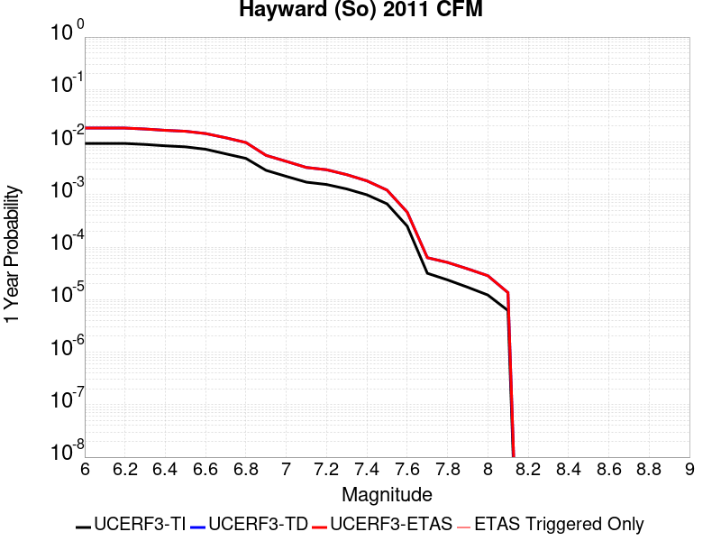 |  |

| Magnitude | 1 wk TI Prob | 1 wk TD Prob | 1 wk ETAS Prob | 1 wk ETAS/TD Gain | 1 wk ETAS Triggered Only | 1 mo TI Prob | 1 mo TD Prob | 1 mo ETAS Prob | 1 mo ETAS/TD Gain | 1 mo ETAS Triggered Only | 1 yr TI Prob | 1 yr TD Prob | 1 yr ETAS Prob | 1 yr ETAS/TD Gain | 1 yr ETAS Triggered Only | 10 yr TI Prob | 10 yr TD Prob | 10 yr ETAS Prob | 10 yr ETAS/TD Gain | 10 yr ETAS Triggered Only |
|-----|-----|-----|-----|-----|-----|-----|-----|-----|-----|-----|-----|-----|-----|-----|-----|-----|-----|-----|-----|-----|
| 6.0 | 1.8091932E-4 | 3.570541E-4 | 3.570541E-4 | 1.0 | 0.0 | 7.751381E-4 | 0.0015293444 | 0.0015293444 | 1.0 | 0.0 | 0.00939654 | 0.018463207 | 0.018463207 | 1.0 | 0.0 | 0.090090066 | 0.16673161 | 0.1667446 | 1.000078 | 1.5596732E-5 |
| 6.1 | 1.8091932E-4 | 3.570541E-4 | 3.570541E-4 | 1.0 | 0.0 | 7.751381E-4 | 0.0015293444 | 0.0015293444 | 1.0 | 0.0 | 0.00939654 | 0.018463207 | 0.018463207 | 1.0 | 0.0 | 0.090090066 | 0.16673161 | 0.1667446 | 1.000078 | 1.5596732E-5 |
| 6.2 | 1.8091932E-4 | 3.570541E-4 | 3.570541E-4 | 1.0 | 0.0 | 7.751381E-4 | 0.0015293444 | 0.0015293444 | 1.0 | 0.0 | 0.00939654 | 0.018463207 | 0.018463207 | 1.0 | 0.0 | 0.090090066 | 0.16673161 | 0.1667446 | 1.000078 | 1.5596732E-5 |
| 6.3 | 1.7322872E-4 | 3.426234E-4 | 3.426234E-4 | 1.0 | 0.0 | 7.4219756E-4 | 0.0014675693 | 0.0014675693 | 1.0 | 0.0 | 0.0089988755 | 0.017723544 | 0.017723544 | 1.0 | 0.0 | 0.08643075 | 0.16066726 | 0.16068034 | 1.0000814 | 1.5596732E-5 |
| 6.4 | 1.6334097E-4 | 3.234411E-4 | 3.234411E-4 | 1.0 | 0.0 | 6.998449E-4 | 0.0013854484 | 0.0013854484 | 1.0 | 0.0 | 0.008487372 | 0.016739385 | 0.016739385 | 1.0 | 0.0 | 0.081704415 | 0.15255594 | 0.15256916 | 1.0000867 | 1.5596732E-5 |
| 6.5 | 1.5600289E-4 | 3.1018828E-4 | 3.1018828E-4 | 1.0 | 0.0 | 6.684125E-4 | 0.0013287093 | 0.0013287093 | 1.0 | 0.0 | 0.008107598 | 0.016058935 | 0.016058935 | 1.0 | 0.0 | 0.078181036 | 0.14683272 | 0.14684603 | 1.0000906 | 1.5596732E-5 |
| 6.6 | 1.4046066E-4 | 2.8032906E-4 | 2.8032906E-4 | 1.0 | 0.0 | 6.018354E-4 | 0.0012008639 | 0.0012008639 | 1.0 | 0.0 | 0.0073027555 | 0.014524006 | 0.014524006 | 1.0 | 0.0 | 0.07067384 | 0.13391982 | 0.13393334 | 1.0001009 | 1.5596732E-5 |
| 6.7 | 1.14696966E-4 | 2.3271477E-4 | 2.3271477E-4 | 1.0 | 0.0 | 4.914658E-4 | 9.969729E-4 | 9.969729E-4 | 1.0 | 0.0 | 0.0059671924 | 0.012071652 | 0.012071652 | 1.0 | 0.0 | 0.058094822 | 0.11274672 | 0.11276056 | 1.0001228 | 1.5596732E-5 |
| 6.8 | 9.3874296E-5 | 1.8861453E-4 | 1.8861453E-4 | 1.0 | 0.0 | 4.0225635E-4 | 8.0810126E-4 | 8.0810126E-4 | 1.0 | 0.0 | 0.0048864787 | 0.009794984 | 0.009794984 | 1.0 | 0.0 | 0.047804173 | 0.09259856 | 0.09259856 | 1.0 | 0.0 |
| 6.9 | 5.551852E-5 | 1.072948E-4 | 1.072948E-4 | 1.0 | 0.0 | 2.3791482E-4 | 4.5975443E-4 | 4.5975443E-4 | 1.0 | 0.0 | 0.0028927654 | 0.0055832625 | 0.0055832625 | 1.0 | 0.0 | 0.028553981 | 0.054245494 | 0.054245494 | 1.0 | 0.0 |
| 7.0 | 4.2662363E-5 | 8.2464416E-5 | 8.2464416E-5 | 1.0 | 0.0 | 1.8282588E-4 | 3.5337146E-4 | 3.5337146E-4 | 1.0 | 0.0 | 0.0022236328 | 0.0042938837 | 0.0042938837 | 1.0 | 0.0 | 0.022015138 | 0.042064495 | 0.042064495 | 1.0 | 0.0 |
| 7.1 | 3.305886E-5 | 6.3019055E-5 | 6.3019055E-5 | 1.0 | 0.0 | 1.4167312E-4 | 2.700538E-4 | 2.700538E-4 | 1.0 | 0.0 | 0.0017235056 | 0.0032829668 | 0.0032829668 | 1.0 | 0.0 | 0.017101998 | 0.032452874 | 0.032452874 | 1.0 | 0.0 |
| 7.2 | 2.9856887E-5 | 5.7013647E-5 | 5.7013647E-5 | 1.0 | 0.0 | 1.2795182E-4 | 2.4432142E-4 | 2.4432142E-4 | 1.0 | 0.0 | 0.0015567001 | 0.0029705726 | 0.0029705726 | 1.0 | 0.0 | 0.015458403 | 0.029453589 | 0.029453589 | 1.0 | 0.0 |
| 7.3 | 2.4559737E-5 | 4.599088E-5 | 4.599088E-5 | 1.0 | 0.0 | 1.0525176E-4 | 1.9708896E-4 | 1.9708896E-4 | 1.0 | 0.0 | 0.0012806869 | 0.0023969305 | 0.0023969305 | 1.0 | 0.0 | 0.012733313 | 0.023857482 | 0.023857482 | 1.0 | 0.0 |
| 7.4 | 1.9002231E-5 | 3.5049303E-5 | 3.5049303E-5 | 1.0 | 0.0 | 8.143559E-5 | 1.502027E-4 | 1.502027E-4 | 1.0 | 0.0 | 9.910273E-4 | 0.0018271938 | 0.0018271938 | 1.0 | 0.0 | 0.009866194 | 0.018258283 | 0.018258283 | 1.0 | 0.0 |
| 7.5 | 1.2783333E-5 | 2.3330069E-5 | 2.3330069E-5 | 1.0 | 0.0 | 5.4784563E-5 | 9.998221E-5 | 9.998221E-5 | 1.0 | 0.0 | 6.667979E-4 | 0.0012166094 | 0.0012166094 | 1.0 | 0.0 | 0.006648007 | 0.012209582 | 0.012209582 | 1.0 | 0.0 |
| 7.6 | 4.8149627E-6 | 8.887544E-6 | 8.887544E-6 | 1.0 | 0.0 | 2.063539E-5 | 3.8088925E-5 | 3.8088925E-5 | 1.0 | 0.0 | 2.5120692E-4 | 4.636352E-4 | 4.636352E-4 | 1.0 | 0.0 | 0.0025092314 | 0.0046812436 | 0.0046812436 | 1.0 | 0.0 |
| 7.7 | 6.0838227E-7 | 1.2056693E-6 | 1.2056693E-6 | 1.0 | 0.0 | 2.6073499E-6 | 5.1671436E-6 | 5.1671436E-6 | 1.0 | 0.0 | 3.174402E-5 | 6.290816E-5 | 6.290816E-5 | 1.0 | 0.0 | 3.1739488E-4 | 6.5293367E-4 | 6.5293367E-4 | 1.0 | 0.0 |
| 7.8 | 4.5542808E-7 | 9.792182E-7 | 9.792182E-7 | 1.0 | 0.0 | 1.9518332E-6 | 4.1966427E-6 | 4.1966427E-6 | 1.0 | 0.0 | 2.376331E-5 | 5.1092928E-5 | 5.1092928E-5 | 1.0 | 0.0 | 2.3760769E-4 | 5.321372E-4 | 5.321372E-4 | 1.0 | 0.0 |
| 7.9 | 3.3016747E-7 | 7.386335E-7 | 7.386335E-7 | 1.0 | 0.0 | 1.4150027E-6 | 3.1655684E-6 | 3.1655684E-6 | 1.0 | 0.0 | 1.7227521E-5 | 3.8540114E-5 | 3.8540114E-5 | 1.0 | 0.0 | 1.7226185E-4 | 3.9930744E-4 | 3.9930744E-4 | 1.0 | 0.0 |
| 8.0 | 2.347038E-7 | 5.4714894E-7 | 5.4714894E-7 | 1.0 | 0.0 | 1.0058731E-6 | 2.344922E-6 | 2.344922E-6 | 1.0 | 0.0 | 1.2246436E-5 | 2.8549053E-5 | 2.8549053E-5 | 1.0 | 0.0 | 1.2245761E-4 | 2.9355253E-4 | 2.9355253E-4 | 1.0 | 0.0 |
| 8.1 | 1.18822804E-7 | 2.6058973E-7 | 2.6058973E-7 | 1.0 | 0.0 | 5.092405E-7 | 1.1168127E-6 | 1.1168127E-6 | 1.0 | 0.0 | 6.1999854E-6 | 1.359711E-5 | 1.359711E-5 | 1.0 | 0.0 | 6.199812E-5 | 1.3917852E-4 | 1.3917852E-4 | 1.0 | 0.0 |

## Los Osos 2011
*[(top)](#table-of-contents)*

| 1 Week | 1 Month | 1 Year | 10 Year |
|-----|-----|-----|-----|
|  |  |  |  |

| Magnitude | 1 wk TI Prob | 1 wk TD Prob | 1 wk ETAS Prob | 1 wk ETAS/TD Gain | 1 wk ETAS Triggered Only | 1 mo TI Prob | 1 mo TD Prob | 1 mo ETAS Prob | 1 mo ETAS/TD Gain | 1 mo ETAS Triggered Only | 1 yr TI Prob | 1 yr TD Prob | 1 yr ETAS Prob | 1 yr ETAS/TD Gain | 1 yr ETAS Triggered Only | 10 yr TI Prob | 10 yr TD Prob | 10 yr ETAS Prob | 10 yr ETAS/TD Gain | 10 yr ETAS Triggered Only |
|-----|-----|-----|-----|-----|-----|-----|-----|-----|-----|-----|-----|-----|-----|-----|-----|-----|-----|-----|-----|-----|
| 6.0 | 4.8871775E-6 | 4.9814835E-6 | 4.9814835E-6 | 1.0 | 0.0 | 2.0944879E-5 | 2.1349055E-5 | 2.1349055E-5 | 1.0 | 0.0 | 2.5497406E-4 | 2.5989654E-4 | 2.5989654E-4 | 1.0 | 0.0 | 0.002546817 | 0.0025962002 | 0.0026117566 | 1.0059919 | 1.5596732E-5 |
| 6.1 | 4.8871775E-6 | 4.9814835E-6 | 4.9814835E-6 | 1.0 | 0.0 | 2.0944879E-5 | 2.1349055E-5 | 2.1349055E-5 | 1.0 | 0.0 | 2.5497406E-4 | 2.5989654E-4 | 2.5989654E-4 | 1.0 | 0.0 | 0.002546817 | 0.0025962002 | 0.0026117566 | 1.0059919 | 1.5596732E-5 |
| 6.2 | 4.8871775E-6 | 4.9814835E-6 | 4.9814835E-6 | 1.0 | 0.0 | 2.0944879E-5 | 2.1349055E-5 | 2.1349055E-5 | 1.0 | 0.0 | 2.5497406E-4 | 2.5989654E-4 | 2.5989654E-4 | 1.0 | 0.0 | 0.002546817 | 0.0025962002 | 0.0026117566 | 1.0059919 | 1.5596732E-5 |
| 6.3 | 4.8871775E-6 | 4.9814835E-6 | 4.9814835E-6 | 1.0 | 0.0 | 2.0944879E-5 | 2.1349055E-5 | 2.1349055E-5 | 1.0 | 0.0 | 2.5497406E-4 | 2.5989654E-4 | 2.5989654E-4 | 1.0 | 0.0 | 0.002546817 | 0.0025962002 | 0.0026117566 | 1.0059919 | 1.5596732E-5 |
| 6.4 | 4.8871775E-6 | 4.9814835E-6 | 4.9814835E-6 | 1.0 | 0.0 | 2.0944879E-5 | 2.1349055E-5 | 2.1349055E-5 | 1.0 | 0.0 | 2.5497406E-4 | 2.5989654E-4 | 2.5989654E-4 | 1.0 | 0.0 | 0.002546817 | 0.0025962002 | 0.0026117566 | 1.0059919 | 1.5596732E-5 |
| 6.5 | 3.1724062E-6 | 3.223395E-6 | 3.223395E-6 | 1.0 | 0.0 | 1.3595956E-5 | 1.3814477E-5 | 1.3814477E-5 | 1.0 | 0.0 | 1.6551818E-4 | 1.681784E-4 | 1.681784E-4 | 1.0 | 0.0 | 0.0016539496 | 0.0016805249 | 0.0016805249 | 1.0 | 0.0 |
| 6.6 | 3.1022591E-6 | 3.1511045E-6 | 3.1511045E-6 | 1.0 | 0.0 | 1.3295328E-5 | 1.3504664E-5 | 1.3504664E-5 | 1.0 | 0.0 | 1.618586E-4 | 1.64407E-4 | 1.64407E-4 | 1.0 | 0.0 | 0.0016174077 | 0.0016428665 | 0.0016428665 | 1.0 | 0.0 |
| 6.7 | 2.611518E-6 | 2.6491832E-6 | 2.6491832E-6 | 1.0 | 0.0 | 1.1192172E-5 | 1.1353593E-5 | 1.1353593E-5 | 1.0 | 0.0 | 1.3625617E-4 | 1.3822126E-4 | 1.3822126E-4 | 1.0 | 0.0 | 0.0013617266 | 0.0013813575 | 0.0013813575 | 1.0 | 0.0 |
| 6.8 | 2.4780884E-6 | 2.5121592E-6 | 2.5121592E-6 | 1.0 | 0.0 | 1.0620336E-5 | 1.0766353E-5 | 1.0766353E-5 | 1.0 | 0.0 | 1.2929492E-4 | 1.3107249E-4 | 1.3107249E-4 | 1.0 | 0.0 | 0.0012921972 | 0.001309956 | 0.001309956 | 1.0 | 0.0 |
| 6.9 | 2.1376322E-6 | 2.1635055E-6 | 2.1635055E-6 | 1.0 | 0.0 | 9.161248E-6 | 9.272134E-6 | 9.272134E-6 | 1.0 | 0.0 | 1.1153249E-4 | 1.128824E-4 | 1.128824E-4 | 1.0 | 0.0 | 0.0011147653 | 0.0011282525 | 0.0011282525 | 1.0 | 0.0 |
| 7.0 | 1.9282882E-6 | 1.9494585E-6 | 1.9494585E-6 | 1.0 | 0.0 | 8.264066E-6 | 8.354796E-6 | 8.354796E-6 | 1.0 | 0.0 | 1.0061036E-4 | 1.017149E-4 | 1.017149E-4 | 1.0 | 0.0 | 0.0010056482 | 0.0010166848 | 0.0010166848 | 1.0 | 0.0 |
| 7.1 | 1.6353226E-6 | 1.6501118E-6 | 1.6501118E-6 | 1.0 | 0.0 | 7.0085066E-6 | 7.0718884E-6 | 7.0718884E-6 | 1.0 | 0.0 | 8.532523E-5 | 8.609685E-5 | 8.609685E-5 | 1.0 | 0.0 | 8.529247E-4 | 8.6063566E-4 | 8.6063566E-4 | 1.0 | 0.0 |
| 7.2 | 1.4446276E-6 | 1.4553341E-6 | 1.4553341E-6 | 1.0 | 0.0 | 6.191247E-6 | 6.237131E-6 | 6.237131E-6 | 1.0 | 0.0 | 7.537582E-5 | 7.593443E-5 | 7.593443E-5 | 1.0 | 0.0 | 7.535026E-4 | 7.590854E-4 | 7.590854E-4 | 1.0 | 0.0 |
| 7.3 | 1.2014582E-6 | 1.2069073E-6 | 1.2069073E-6 | 1.0 | 0.0 | 5.149096E-6 | 5.1724496E-6 | 5.1724496E-6 | 1.0 | 0.0 | 6.268844E-5 | 6.297276E-5 | 6.297276E-5 | 1.0 | 0.0 | 6.267076E-4 | 6.295495E-4 | 6.295495E-4 | 1.0 | 0.0 |
| 7.4 | 9.707733E-7 | 9.709773E-7 | 9.709773E-7 | 1.0 | 0.0 | 4.16045E-6 | 4.161325E-6 | 4.161325E-6 | 1.0 | 0.0 | 5.0652303E-5 | 5.066295E-5 | 5.066295E-5 | 1.0 | 0.0 | 5.064076E-4 | 5.065143E-4 | 5.065143E-4 | 1.0 | 0.0 |
| 7.5 | 7.174908E-7 | 7.1149134E-7 | 7.1149134E-7 | 1.0 | 0.0 | 3.074957E-6 | 3.0492452E-6 | 3.0492452E-6 | 1.0 | 0.0 | 3.743696E-5 | 3.712393E-5 | 3.712393E-5 | 1.0 | 0.0 | 3.7430652E-4 | 3.7117745E-4 | 3.7117745E-4 | 1.0 | 0.0 |
| 7.6 | 4.5535776E-7 | 4.420792E-7 | 4.420792E-7 | 1.0 | 0.0 | 1.9515319E-6 | 1.8946238E-6 | 1.8946238E-6 | 1.0 | 0.0 | 2.3759641E-5 | 2.3066801E-5 | 2.3066801E-5 | 1.0 | 0.0 | 2.37571E-4 | 2.3064416E-4 | 2.3064416E-4 | 1.0 | 0.0 |
| 7.7 | 2.1173553E-7 | 1.9060796E-7 | 1.9060796E-7 | 1.0 | 0.0 | 9.0743765E-7 | 8.1689103E-7 | 8.1689103E-7 | 1.0 | 0.0 | 1.1047998E-5 | 9.945603E-6 | 9.945603E-6 | 1.0 | 0.0 | 1.1047449E-4 | 9.945161E-5 | 9.945161E-5 | 1.0 | 0.0 |
| 7.8 | 9.873608E-8 | 7.3675665E-8 | 7.3675665E-8 | 1.0 | 0.0 | 4.2315455E-7 | 3.157528E-7 | 3.157528E-7 | 1.0 | 0.0 | 5.1518946E-6 | 3.8442836E-6 | 3.8442836E-6 | 1.0 | 0.0 | 5.1517753E-5 | 3.8442176E-5 | 3.8442176E-5 | 1.0 | 0.0 |
| 7.9 | 5.4399106E-8 | 3.1880155E-8 | 3.1880155E-8 | 1.0 | 0.0 | 2.33139E-7 | 1.3662923E-7 | 1.3662923E-7 | 1.0 | 0.0 | 2.8384638E-6 | 1.6634596E-6 | 1.6634596E-6 | 1.0 | 0.0 | 2.8384275E-5 | 1.6634473E-5 | 1.6634473E-5 | 1.0 | 0.0 |
| 8.0 | 1.817203E-8 | 8.420727E-9 | 8.420727E-9 | 1.0 | 0.0 | 7.7880124E-8 | 3.608883E-8 | 3.608883E-8 | 1.0 | 0.0 | 9.481901E-7 | 4.393814E-7 | 4.393814E-7 | 1.0 | 0.0 | 9.481861E-6 | 4.3938057E-6 | 4.3938057E-6 | 1.0 | 0.0 |

## San Andreas (Peninsula) 2011 CFM
*[(top)](#table-of-contents)*

| 1 Week | 1 Month | 1 Year | 10 Year |
|-----|-----|-----|-----|
|  |  |  |  |

| Magnitude | 1 wk TI Prob | 1 wk TD Prob | 1 wk ETAS Prob | 1 wk ETAS/TD Gain | 1 wk ETAS Triggered Only | 1 mo TI Prob | 1 mo TD Prob | 1 mo ETAS Prob | 1 mo ETAS/TD Gain | 1 mo ETAS Triggered Only | 1 yr TI Prob | 1 yr TD Prob | 1 yr ETAS Prob | 1 yr ETAS/TD Gain | 1 yr ETAS Triggered Only | 10 yr TI Prob | 10 yr TD Prob | 10 yr ETAS Prob | 10 yr ETAS/TD Gain | 10 yr ETAS Triggered Only |
|-----|-----|-----|-----|-----|-----|-----|-----|-----|-----|-----|-----|-----|-----|-----|-----|-----|-----|-----|-----|-----|
| 6.0 | 8.6200685E-5 | 2.52136E-5 | 2.52136E-5 | 1.0 | 0.0 | 3.6937918E-4 | 1.0805382E-4 | 1.2364886E-4 | 1.1443267 | 1.5596732E-5 | 0.0044879215 | 0.001314763 | 0.0013303392 | 1.0118471 | 1.5596732E-5 | 0.043983612 | 0.014774441 | 0.014789807 | 1.0010401 | 1.5596732E-5 |
| 6.1 | 8.6200685E-5 | 2.52136E-5 | 2.52136E-5 | 1.0 | 0.0 | 3.6937918E-4 | 1.0805382E-4 | 1.2364886E-4 | 1.1443267 | 1.5596732E-5 | 0.0044879215 | 0.001314763 | 0.0013303392 | 1.0118471 | 1.5596732E-5 | 0.043983612 | 0.014774441 | 0.014789807 | 1.0010401 | 1.5596732E-5 |
| 6.2 | 8.6200685E-5 | 2.52136E-5 | 2.52136E-5 | 1.0 | 0.0 | 3.6937918E-4 | 1.0805382E-4 | 1.2364886E-4 | 1.1443267 | 1.5596732E-5 | 0.0044879215 | 0.001314763 | 0.0013303392 | 1.0118471 | 1.5596732E-5 | 0.043983612 | 0.014774441 | 0.014789807 | 1.0010401 | 1.5596732E-5 |
| 6.3 | 8.551163E-5 | 2.490552E-5 | 2.490552E-5 | 1.0 | 0.0 | 3.6642692E-4 | 1.06733576E-4 | 1.2232864E-4 | 1.1461121 | 1.5596732E-5 | 0.004452125 | 0.0012987083 | 0.0013142847 | 1.0119938 | 1.5596732E-5 | 0.043639794 | 0.014601416 | 0.014616786 | 1.0010526 | 1.5596732E-5 |
| 6.4 | 8.551163E-5 | 2.490552E-5 | 2.490552E-5 | 1.0 | 0.0 | 3.6642692E-4 | 1.06733576E-4 | 1.2232864E-4 | 1.1461121 | 1.5596732E-5 | 0.004452125 | 0.0012987083 | 0.0013142847 | 1.0119938 | 1.5596732E-5 | 0.043639794 | 0.014601416 | 0.014616786 | 1.0010526 | 1.5596732E-5 |
| 6.5 | 8.511146E-5 | 2.4726973E-5 | 2.4726973E-5 | 1.0 | 0.0 | 3.647124E-4 | 1.05968444E-4 | 1.2156352E-4 | 1.1471672 | 1.5596732E-5 | 0.004431336 | 0.0012894038 | 0.0013049804 | 1.0120804 | 1.5596732E-5 | 0.04344007 | 0.0145011945 | 0.014516565 | 1.00106 | 1.5596732E-5 |
| 6.6 | 8.4985084E-5 | 2.4657606E-5 | 2.4657606E-5 | 1.0 | 0.0 | 3.6417096E-4 | 1.05671184E-4 | 1.2126626E-4 | 1.1475812 | 1.5596732E-5 | 0.0044247704 | 0.001285789 | 0.0013013657 | 1.0121145 | 1.5596732E-5 | 0.043376986 | 0.014463263 | 0.014478633 | 1.0010628 | 1.5596732E-5 |
| 6.7 | 8.462618E-5 | 2.4486113E-5 | 2.4486113E-5 | 1.0 | 0.0 | 3.6263323E-4 | 1.0493627E-4 | 1.2053136E-4 | 1.1486149 | 1.5596732E-5 | 0.004406125 | 0.0012768519 | 0.0012924287 | 1.0121994 | 1.5596732E-5 | 0.043197807 | 0.01436807 | 0.014383443 | 1.0010699 | 1.5596732E-5 |
| 6.8 | 8.42337E-5 | 2.438192E-5 | 2.438192E-5 | 1.0 | 0.0 | 3.6095164E-4 | 1.04489765E-4 | 1.20084864E-4 | 1.14925 | 1.5596732E-5 | 0.004385734 | 0.0012714221 | 0.001286999 | 1.0122516 | 1.5596732E-5 | 0.043001823 | 0.014308756 | 0.01432413 | 1.0010744 | 1.5596732E-5 |
| 6.9 | 8.365989E-5 | 2.4186513E-5 | 2.4186513E-5 | 1.0 | 0.0 | 3.5849313E-4 | 1.03652375E-4 | 1.1924749E-4 | 1.150456 | 1.5596732E-5 | 0.004355922 | 0.0012612387 | 0.0012768158 | 1.0123506 | 1.5596732E-5 | 0.04271523 | 0.014201242 | 0.014216617 | 1.0010827 | 1.5596732E-5 |
| 7.0 | 8.30936E-5 | 2.3948E-5 | 2.3948E-5 | 1.0 | 0.0 | 3.560668E-4 | 1.02630256E-4 | 1.1822538E-4 | 1.1519545 | 1.5596732E-5 | 0.004326499 | 0.0012488087 | 0.001264386 | 1.0124737 | 1.5596732E-5 | 0.042432297 | 0.014072227 | 0.014087604 | 1.0010928 | 1.5596732E-5 |
| 7.1 | 8.041264E-5 | 2.3634402E-5 | 2.3634402E-5 | 1.0 | 0.0 | 3.4458007E-4 | 1.0128637E-4 | 1.1688152E-4 | 1.1539708 | 1.5596732E-5 | 0.0041871946 | 0.0012324656 | 0.001248043 | 1.0126393 | 1.5596732E-5 | 0.041091725 | 0.013895032 | 0.013910412 | 1.0011069 | 1.5596732E-5 |
| 7.2 | 7.8427016E-5 | 2.3058019E-5 | 2.3058019E-5 | 1.0 | 0.0 | 3.3607247E-4 | 9.8816345E-5 | 1.1441153E-4 | 1.15782 | 1.5596732E-5 | 0.004084008 | 0.0012024266 | 0.0012180045 | 1.0129554 | 1.5596732E-5 | 0.040097635 | 0.013579085 | 0.013594469 | 1.001133 | 1.5596732E-5 |
| 7.3 | 7.721087E-5 | 2.2842805E-5 | 2.2842805E-5 | 1.0 | 0.0 | 3.3086175E-4 | 9.7894066E-5 | 1.13489274E-4 | 1.1593069 | 1.5596732E-5 | 0.004020803 | 0.0011912102 | 0.0012067884 | 1.0130776 | 1.5596732E-5 | 0.03948827 | 0.013462781 | 0.013478168 | 1.0011429 | 1.5596732E-5 |
| 7.4 | 7.3536525E-5 | 2.0960428E-5 | 2.0960428E-5 | 1.0 | 0.0 | 3.1511846E-4 | 8.982732E-5 | 1.0542265E-4 | 1.1736145 | 1.5596732E-5 | 0.0038298194 | 0.0010931002 | 0.0011086799 | 1.0142528 | 1.5596732E-5 | 0.037644852 | 0.012419564 | 0.012434967 | 1.0012403 | 1.5596732E-5 |
| 7.5 | 6.806207E-5 | 1.876674E-5 | 1.876674E-5 | 1.0 | 0.0 | 2.9166197E-4 | 8.042641E-5 | 9.602189E-5 | 1.1939099 | 1.5596732E-5 | 0.0035452035 | 9.787527E-4 | 9.943342E-4 | 1.0159197 | 1.5596732E-5 | 0.034891766 | 0.01117254 | 0.011187961 | 1.0013804 | 1.5596732E-5 |
| 7.6 | 5.6731416E-5 | 1.4177827E-5 | 1.4177827E-5 | 1.0 | 0.0 | 2.43112E-4 | 6.07607E-5 | 7.635648E-5 | 1.2566755 | 1.5596732E-5 | 0.0029558712 | 7.395106E-4 | 7.550958E-4 | 1.021075 | 1.5596732E-5 | 0.02916862 | 0.008485565 | 0.00850103 | 1.0018225 | 1.5596732E-5 |
| 7.7 | 4.946994E-5 | 1.3246218E-5 | 1.3246218E-5 | 1.0 | 0.0 | 2.1199681E-4 | 5.6768273E-5 | 7.236412E-5 | 1.2747282 | 1.5596732E-5 | 0.002578006 | 6.9093466E-4 | 7.0652063E-4 | 1.0225577 | 1.5596732E-5 | 0.02548303 | 0.0079078935 | 0.007923367 | 1.0019567 | 1.5596732E-5 |
| 7.8 | 3.9718198E-5 | 1.2982541E-5 | 1.2982541E-5 | 1.0 | 0.0 | 1.7020974E-4 | 5.5638273E-5 | 7.1234135E-5 | 1.2803081 | 1.5596732E-5 | 0.0020703338 | 6.771856E-4 | 6.9277175E-4 | 1.0230161 | 1.5596732E-5 | 0.020511515 | 0.0077184658 | 0.0077339425 | 1.0020051 | 1.5596732E-5 |
| 7.9 | 2.4115114E-5 | 1.218559E-5 | 1.218559E-5 | 1.0 | 0.0 | 1.0334639E-4 | 5.2222913E-5 | 6.781883E-5 | 1.2986412 | 1.5596732E-5 | 0.001257516 | 6.3562865E-4 | 6.5121544E-4 | 1.024522 | 1.5596732E-5 | 0.012504238 | 0.007159044 | 0.007174529 | 1.002163 | 1.5596732E-5 |
| 8.0 | 1.7756569E-5 | 1.1410005E-5 | 1.1410005E-5 | 1.0 | 0.0 | 7.6097356E-5 | 4.8899106E-5 | 6.449507E-5 | 1.3189418 | 1.5596732E-5 | 9.260915E-4 | 5.951841E-4 | 6.107716E-4 | 1.0261893 | 1.5596732E-5 | 0.009222416 | 0.006659493 | 0.006674986 | 1.0023265 | 1.5596732E-5 |
| 8.1 | 1.3159258E-5 | 9.746194E-6 | 9.746194E-6 | 1.0 | 0.0 | 5.6395602E-5 | 4.1768737E-5 | 5.7364818E-5 | 1.3733913 | 1.5596732E-5 | 6.864001E-4 | 5.0841586E-4 | 5.2400463E-4 | 1.0306615 | 1.5596732E-5 | 0.0068428386 | 0.005689538 | 0.005705046 | 1.0027257 | 1.5596732E-5 |
| 8.2 | 8.635426E-6 | 5.466912E-6 | 5.466912E-6 | 1.0 | 0.0 | 3.700844E-5 | 2.3429413E-5 | 2.3429413E-5 | 1.0 | 0.0 | 4.5048463E-4 | 2.8521585E-4 | 2.8521585E-4 | 1.0 | 0.0 | 0.004495725 | 0.0032445018 | 0.0032445018 | 1.0 | 0.0 |
| 8.3 | 1.983087E-6 | 7.6599065E-7 | 7.6599065E-7 | 1.0 | 0.0 | 8.498917E-6 | 3.282813E-6 | 3.282813E-6 | 1.0 | 0.0 | 1.034694E-4 | 3.9967534E-5 | 3.9967534E-5 | 1.0 | 0.0 | 0.0010342124 | 4.719687E-4 | 4.719687E-4 | 1.0 | 0.0 |

## East Huasna 2011 CFM
*[(top)](#table-of-contents)*

| 1 Week | 1 Month | 1 Year | 10 Year |
|-----|-----|-----|-----|
|  |  | 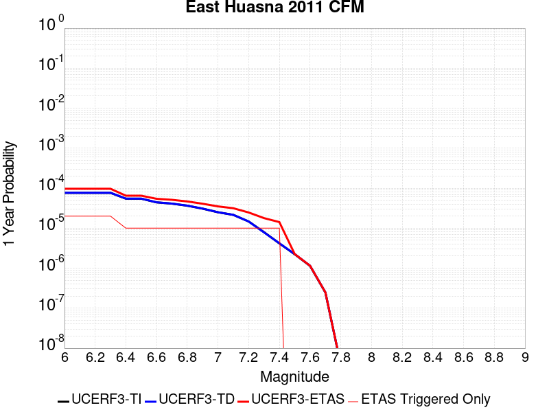 |  |

| Magnitude | 1 wk TI Prob | 1 wk TD Prob | 1 wk ETAS Prob | 1 wk ETAS/TD Gain | 1 wk ETAS Triggered Only | 1 mo TI Prob | 1 mo TD Prob | 1 mo ETAS Prob | 1 mo ETAS/TD Gain | 1 mo ETAS Triggered Only | 1 yr TI Prob | 1 yr TD Prob | 1 yr ETAS Prob | 1 yr ETAS/TD Gain | 1 yr ETAS Triggered Only | 10 yr TI Prob | 10 yr TD Prob | 10 yr ETAS Prob | 10 yr ETAS/TD Gain | 10 yr ETAS Triggered Only |
|-----|-----|-----|-----|-----|-----|-----|-----|-----|-----|-----|-----|-----|-----|-----|-----|-----|-----|-----|-----|-----|
| 6.0 | 1.4658423E-6 | 1.4715657E-6 | 1.7068274E-5 | 11.598716 | 1.5596732E-5 | 6.282166E-6 | 6.3066955E-6 | 2.1903328E-5 | 3.4730277 | 1.5596732E-5 | 7.6482684E-5 | 7.678138E-5 | 9.237692E-5 | 1.203116 | 1.5596732E-5 | 7.645637E-4 | 7.6755555E-4 | 7.831403E-4 | 1.0203044 | 1.5596732E-5 |
| 6.1 | 1.4658423E-6 | 1.4715657E-6 | 1.7068274E-5 | 11.598716 | 1.5596732E-5 | 6.282166E-6 | 6.3066955E-6 | 2.1903328E-5 | 3.4730277 | 1.5596732E-5 | 7.6482684E-5 | 7.678138E-5 | 9.237692E-5 | 1.203116 | 1.5596732E-5 | 7.645637E-4 | 7.6755555E-4 | 7.831403E-4 | 1.0203044 | 1.5596732E-5 |
| 6.2 | 1.4658423E-6 | 1.4715657E-6 | 1.7068274E-5 | 11.598716 | 1.5596732E-5 | 6.282166E-6 | 6.3066955E-6 | 2.1903328E-5 | 3.4730277 | 1.5596732E-5 | 7.6482684E-5 | 7.678138E-5 | 9.237692E-5 | 1.203116 | 1.5596732E-5 | 7.645637E-4 | 7.6755555E-4 | 7.831403E-4 | 1.0203044 | 1.5596732E-5 |
| 6.3 | 1.4658423E-6 | 1.4715657E-6 | 1.7068274E-5 | 11.598716 | 1.5596732E-5 | 6.282166E-6 | 6.3066955E-6 | 2.1903328E-5 | 3.4730277 | 1.5596732E-5 | 7.6482684E-5 | 7.678138E-5 | 9.237692E-5 | 1.203116 | 1.5596732E-5 | 7.645637E-4 | 7.6755555E-4 | 7.831403E-4 | 1.0203044 | 1.5596732E-5 |
| 6.4 | 1.0488257E-6 | 1.0527513E-6 | 1.6649466E-5 | 15.815194 | 1.5596732E-5 | 4.4949593E-6 | 4.5117836E-6 | 2.0108444E-5 | 4.4568725 | 1.5596732E-5 | 5.472476E-5 | 5.49296E-5 | 7.052547E-5 | 1.2839248 | 1.5596732E-5 | 5.4711284E-4 | 5.491621E-4 | 5.647503E-4 | 1.0283854 | 1.5596732E-5 |
| 6.5 | 1.0488257E-6 | 1.0527513E-6 | 1.6649466E-5 | 15.815194 | 1.5596732E-5 | 4.4949593E-6 | 4.5117836E-6 | 2.0108444E-5 | 4.4568725 | 1.5596732E-5 | 5.472476E-5 | 5.49296E-5 | 7.052547E-5 | 1.2839248 | 1.5596732E-5 | 5.4711284E-4 | 5.491621E-4 | 5.647503E-4 | 1.0283854 | 1.5596732E-5 |
| 6.6 | 8.463064E-7 | 8.49363E-7 | 1.644608E-5 | 19.36284 | 1.5596732E-5 | 3.6270226E-6 | 3.6401223E-6 | 1.9236797E-5 | 5.2846565 | 1.5596732E-5 | 4.4158103E-5 | 4.4317596E-5 | 5.9913637E-5 | 1.3519152 | 1.5596732E-5 | 4.414933E-4 | 4.4308844E-4 | 4.5867826E-4 | 1.0351844 | 1.5596732E-5 |
| 6.7 | 7.876149E-7 | 7.902531E-7 | 1.6386972E-5 | 20.736359 | 1.5596732E-5 | 3.375488E-6 | 3.3867946E-6 | 1.8983474E-5 | 5.6051445 | 1.5596732E-5 | 4.109579E-5 | 4.1233452E-5 | 5.682954E-5 | 1.3782387 | 1.5596732E-5 | 4.108819E-4 | 4.1225864E-4 | 4.2784892E-4 | 1.0378168 | 1.5596732E-5 |
| 6.8 | 6.9940785E-7 | 7.0165754E-7 | 1.6298378E-5 | 23.228394 | 1.5596732E-5 | 2.9974588E-6 | 3.0071003E-6 | 1.8603785E-5 | 6.1866193 | 1.5596732E-5 | 3.649345E-5 | 3.6610836E-5 | 5.2206997E-5 | 1.4259984 | 1.5596732E-5 | 3.6487455E-4 | 3.660485E-4 | 3.8163955E-4 | 1.0425928 | 1.5596732E-5 |
| 6.9 | 5.899658E-7 | 5.9155974E-7 | 1.6188282E-5 | 27.365421 | 1.5596732E-5 | 2.5284223E-6 | 2.5352535E-6 | 1.8131945E-5 | 7.1519256 | 1.5596732E-5 | 3.0783107E-5 | 3.086628E-5 | 4.6462526E-5 | 1.5052844 | 1.5596732E-5 | 3.0778843E-4 | 3.086202E-4 | 3.242121E-4 | 1.0505214 | 1.5596732E-5 |
| 7.0 | 4.793814E-7 | 4.8032706E-7 | 1.607705E-5 | 33.471046 | 1.5596732E-5 | 2.05449E-6 | 2.058543E-6 | 1.7655242E-5 | 8.576571 | 1.5596732E-5 | 2.501313E-5 | 2.5062474E-5 | 4.0658815E-5 | 1.6222985 | 1.5596732E-5 | 2.5010316E-4 | 2.5059667E-4 | 2.6618948E-4 | 1.0622228 | 1.5596732E-5 |
| 7.1 | 4.1256908E-7 | 4.129939E-7 | 1.6009719E-5 | 38.765026 | 1.5596732E-5 | 1.768152E-6 | 1.7699726E-6 | 1.7366676E-5 | 9.811833 | 1.5596732E-5 | 2.1527037E-5 | 2.1549205E-5 | 3.71456E-5 | 1.7237573 | 1.5596732E-5 | 2.1524953E-4 | 2.154713E-4 | 2.3106467E-4 | 1.0723686 | 1.5596732E-5 |
| 7.2 | 2.822599E-7 | 2.8161398E-7 | 1.587834E-5 | 56.383354 | 1.5596732E-5 | 1.2096847E-6 | 1.2069165E-6 | 1.680363E-5 | 13.922776 | 1.5596732E-5 | 1.47278115E-5 | 1.469411E-5 | 3.0290612E-5 | 2.0614119 | 1.5596732E-5 | 1.4726835E-4 | 1.4693146E-4 | 1.625259E-4 | 1.106134 | 1.5596732E-5 |
| 7.3 | 1.5261652E-7 | 1.5075E-7 | 1.5747479E-5 | 104.460884 | 1.5596732E-5 | 6.540707E-7 | 6.4607127E-7 | 1.6242791E-5 | 25.140867 | 1.5596732E-5 | 7.963281E-6 | 7.8658895E-6 | 2.3462497E-5 | 2.9828155 | 1.5596732E-5 | 7.962996E-5 | 7.865613E-5 | 9.4251634E-5 | 1.1982745 | 1.5596732E-5 |
| 7.4 | 7.976414E-8 | 8.057865E-8 | 1.5677308E-5 | 194.55908 | 1.5596732E-5 | 3.418463E-7 | 3.45337E-7 | 1.5942063E-5 | 46.16378 | 1.5596732E-5 | 4.1619705E-6 | 4.2044703E-6 | 1.9801135E-5 | 4.7095437 | 1.5596732E-5 | 4.161893E-5 | 4.2043914E-5 | 5.7639987E-5 | 1.3709472 | 1.5596732E-5 |
| 7.5 | 4.2715055E-8 | 4.3202512E-8 | 4.3202512E-8 | 1.0 | 0.0 | 1.830645E-7 | 1.8515361E-7 | 1.8515361E-7 | 1.0 | 0.0 | 2.228808E-6 | 2.2542429E-6 | 2.2542429E-6 | 1.0 | 0.0 | 2.2287857E-5 | 2.2542203E-5 | 2.2542203E-5 | 1.0 | 0.0 |
| 7.6 | 2.1807532E-8 | 2.2057476E-8 | 2.2057476E-8 | 1.0 | 0.0 | 9.346085E-8 | 9.4532034E-8 | 9.4532034E-8 | 1.0 | 0.0 | 1.1378852E-6 | 1.1509269E-6 | 1.1509269E-6 | 1.0 | 0.0 | 1.1378794E-5 | 1.1509211E-5 | 1.1509211E-5 | 1.0 | 0.0 |
| 7.7 | 4.7196043E-9 | 4.767283E-9 | 4.767283E-9 | 1.0 | 0.0 | 2.0226874E-8 | 2.0431212E-8 | 2.0431212E-8 | 1.0 | 0.0 | 2.4626218E-7 | 2.4874998E-7 | 2.4874998E-7 | 1.0 | 0.0 | 2.462619E-6 | 2.487497E-6 | 2.487497E-6 | 1.0 | 0.0 |
| 7.8 | 7.400003E-11 | 7.4654505E-11 | 7.4654505E-11 | 1.0 | 0.0 | 3.171432E-10 | 3.1994773E-10 | 3.1994773E-10 | 1.0 | 0.0 | 3.861218E-9 | 3.895363E-9 | 3.895363E-9 | 1.0 | 0.0 | 3.861218E-8 | 3.895363E-8 | 3.895363E-8 | 1.0 | 0.0 |

## West Napa 2011 CFM
*[(top)](#table-of-contents)*

| 1 Week | 1 Month | 1 Year | 10 Year |
|-----|-----|-----|-----|
|  |  |  |  |

| Magnitude | 1 wk TI Prob | 1 wk TD Prob | 1 wk ETAS Prob | 1 wk ETAS/TD Gain | 1 wk ETAS Triggered Only | 1 mo TI Prob | 1 mo TD Prob | 1 mo ETAS Prob | 1 mo ETAS/TD Gain | 1 mo ETAS Triggered Only | 1 yr TI Prob | 1 yr TD Prob | 1 yr ETAS Prob | 1 yr ETAS/TD Gain | 1 yr ETAS Triggered Only | 10 yr TI Prob | 10 yr TD Prob | 10 yr ETAS Prob | 10 yr ETAS/TD Gain | 10 yr ETAS Triggered Only |
|-----|-----|-----|-----|-----|-----|-----|-----|-----|-----|-----|-----|-----|-----|-----|-----|-----|-----|-----|-----|-----|
| 6.0 | 3.773104E-5 | 4.452845E-5 | 6.0124486E-5 | 1.3502488 | 1.5596732E-5 | 1.6169442E-4 | 1.9082405E-4 | 2.064178E-4 | 1.081718 | 1.5596732E-5 | 0.001966852 | 0.0023211248 | 0.0023366853 | 1.0067039 | 1.5596732E-5 | 0.019495348 | 0.023002245 | 0.023017483 | 1.0006624 | 1.5596732E-5 |
| 6.1 | 3.773104E-5 | 4.452845E-5 | 6.0124486E-5 | 1.3502488 | 1.5596732E-5 | 1.6169442E-4 | 1.9082405E-4 | 2.064178E-4 | 1.081718 | 1.5596732E-5 | 0.001966852 | 0.0023211248 | 0.0023366853 | 1.0067039 | 1.5596732E-5 | 0.019495348 | 0.023002245 | 0.023017483 | 1.0006624 | 1.5596732E-5 |
| 6.2 | 3.773104E-5 | 4.452845E-5 | 6.0124486E-5 | 1.3502488 | 1.5596732E-5 | 1.6169442E-4 | 1.9082405E-4 | 2.064178E-4 | 1.081718 | 1.5596732E-5 | 0.001966852 | 0.0023211248 | 0.0023366853 | 1.0067039 | 1.5596732E-5 | 0.019495348 | 0.023002245 | 0.023017483 | 1.0006624 | 1.5596732E-5 |
| 6.3 | 2.147964E-5 | 2.4987039E-5 | 4.058338E-5 | 1.6241772 | 1.5596732E-5 | 9.2052345E-5 | 1.0708343E-4 | 1.226785E-4 | 1.1456347 | 1.5596732E-5 | 0.001120161 | 0.0013030528 | 0.0013186291 | 1.0119538 | 1.5596732E-5 | 0.011145315 | 0.0129647385 | 0.012980133 | 1.0011874 | 1.5596732E-5 |
| 6.4 | 2.147964E-5 | 2.4987039E-5 | 4.058338E-5 | 1.6241772 | 1.5596732E-5 | 9.2052345E-5 | 1.0708343E-4 | 1.226785E-4 | 1.1456347 | 1.5596732E-5 | 0.001120161 | 0.0013030528 | 0.0013186291 | 1.0119538 | 1.5596732E-5 | 0.011145315 | 0.0129647385 | 0.012980133 | 1.0011874 | 1.5596732E-5 |
| 6.5 | 1.688201E-5 | 1.9547346E-5 | 3.5143774E-5 | 1.7978795 | 1.5596732E-5 | 7.234947E-5 | 8.377206E-5 | 9.9367484E-5 | 1.186165 | 1.5596732E-5 | 8.804988E-4 | 0.0010195201 | 0.001035101 | 1.0152825 | 1.5596732E-5 | 0.008770182 | 0.010157098 | 0.010172537 | 1.0015199 | 1.5596732E-5 |
| 6.6 | 1.6846381E-5 | 1.9507039E-5 | 3.5103465E-5 | 1.7995281 | 1.5596732E-5 | 7.219678E-5 | 8.359933E-5 | 9.919475E-5 | 1.1865497 | 1.5596732E-5 | 8.7864127E-4 | 0.001017419 | 0.001033 | 1.0153141 | 1.5596732E-5 | 0.008751754 | 0.010136279 | 0.010151718 | 1.0015231 | 1.5596732E-5 |
| 6.7 | 1.3396501E-5 | 1.5467655E-5 | 3.1064144E-5 | 2.0083294 | 1.5596732E-5 | 5.7412315E-5 | 6.628862E-5 | 8.188432E-5 | 1.2352695 | 1.5596732E-5 | 6.9877075E-4 | 8.0682867E-4 | 8.224128E-4 | 1.0193154 | 1.5596732E-5 | 0.0069657755 | 0.008046719 | 0.00806219 | 1.0019227 | 1.5596732E-5 |
| 6.8 | 1.0139058E-5 | 1.1672149E-5 | 2.72687E-5 | 2.336219 | 1.5596732E-5 | 4.3452383E-5 | 5.0022853E-5 | 6.5618806E-5 | 1.3117765 | 1.5596732E-5 | 5.289043E-4 | 6.0891354E-4 | 6.245008E-4 | 1.0255984 | 1.5596732E-5 | 0.005276473 | 0.006079373 | 0.006094875 | 1.0025499 | 1.5596732E-5 |
| 6.9 | 7.761281E-6 | 8.890694E-6 | 2.4487286E-5 | 2.7542605 | 1.5596732E-5 | 3.326221E-5 | 3.8102706E-5 | 5.369884E-5 | 1.4093183 | 1.5596732E-5 | 4.0489217E-4 | 4.6385307E-4 | 4.7944256E-4 | 1.0336087 | 1.5596732E-5 | 0.0040415525 | 0.004635363 | 0.004650887 | 1.0033492 | 1.5596732E-5 |
| 7.0 | 2.2109202E-6 | 2.3666025E-6 | 2.3666025E-6 | 1.0 | 0.0 | 9.475338E-6 | 1.0142544E-5 | 1.0142544E-5 | 1.0 | 0.0 | 1.1535613E-4 | 1.2347854E-4 | 1.2347854E-4 | 1.0 | 0.0 | 0.0011529627 | 0.0012355851 | 0.0012355851 | 1.0 | 0.0 |
| 7.1 | 1.9008926E-6 | 2.0132914E-6 | 2.0132914E-6 | 1.0 | 0.0 | 8.146657E-6 | 8.6283635E-6 | 8.6283635E-6 | 1.0 | 0.0 | 9.918104E-5 | 1.05045285E-4 | 1.05045285E-4 | 1.0 | 0.0 | 9.913679E-4 | 0.001051437 | 0.001051437 | 1.0 | 0.0 |
| 7.2 | 1.8495944E-6 | 1.9560982E-6 | 1.9560982E-6 | 1.0 | 0.0 | 7.926808E-6 | 8.383251E-6 | 8.383251E-6 | 1.0 | 0.0 | 9.650462E-5 | 1.0206133E-4 | 1.0206133E-4 | 1.0 | 0.0 | 9.6462725E-4 | 0.0010216252 | 0.0010216252 | 1.0 | 0.0 |
| 7.3 | 1.7883189E-6 | 1.8880608E-6 | 1.8880608E-6 | 1.0 | 0.0 | 7.664201E-6 | 8.091664E-6 | 8.091664E-6 | 1.0 | 0.0 | 9.330765E-5 | 9.8511584E-5 | 9.8511584E-5 | 1.0 | 0.0 | 9.3268487E-4 | 9.861597E-4 | 9.861597E-4 | 1.0 | 0.0 |
| 7.4 | 1.6520572E-6 | 1.741484E-6 | 1.741484E-6 | 1.0 | 0.0 | 7.0802257E-6 | 7.463482E-6 | 7.463482E-6 | 1.0 | 0.0 | 8.6198335E-5 | 9.086413E-5 | 9.086413E-5 | 1.0 | 0.0 | 8.616491E-4 | 9.0974604E-4 | 9.0974604E-4 | 1.0 | 0.0 |
| 7.5 | 1.4040345E-6 | 1.4800074E-6 | 1.4800074E-6 | 1.0 | 0.0 | 6.0172765E-6 | 6.3428733E-6 | 6.3428733E-6 | 1.0 | 0.0 | 7.325788E-5 | 7.7221775E-5 | 7.7221775E-5 | 1.0 | 0.0 | 7.3233736E-4 | 7.7339396E-4 | 7.7339396E-4 | 1.0 | 0.0 |
| 7.6 | 1.3013842E-7 | 1.4415936E-7 | 1.4415936E-7 | 1.0 | 0.0 | 5.57736E-7 | 6.1782566E-7 | 6.1782566E-7 | 1.0 | 0.0 | 6.790414E-6 | 7.5220014E-6 | 7.5220014E-6 | 1.0 | 0.0 | 6.790207E-5 | 7.614869E-5 | 7.614869E-5 | 1.0 | 0.0 |
| 7.7 | 8.541512E-8 | 9.716316E-8 | 9.716316E-8 | 1.0 | 0.0 | 3.6606474E-7 | 4.1641349E-7 | 4.1641349E-7 | 1.0 | 0.0 | 4.456829E-6 | 5.0698222E-6 | 5.0698222E-6 | 1.0 | 0.0 | 4.4567398E-5 | 5.160297E-5 | 5.160297E-5 | 1.0 | 0.0 |
| 7.8 | 5.6074793E-8 | 6.89534E-8 | 6.89534E-8 | 1.0 | 0.0 | 2.403205E-7 | 2.9551452E-7 | 2.9551452E-7 | 1.0 | 0.0 | 2.9258983E-6 | 3.5978833E-6 | 3.5978833E-6 | 1.0 | 0.0 | 2.9258597E-5 | 3.681433E-5 | 3.681433E-5 | 1.0 | 0.0 |
| 7.9 | 2.9475839E-8 | 3.8566046E-8 | 3.8566046E-8 | 1.0 | 0.0 | 1.2632502E-7 | 1.6528305E-7 | 1.6528305E-7 | 1.0 | 0.0 | 1.538006E-6 | 2.0123193E-6 | 2.0123193E-6 | 1.0 | 0.0 | 1.5379954E-5 | 2.0665891E-5 | 2.0665891E-5 | 1.0 | 0.0 |
| 8.0 | 1.3337122E-8 | 2.163124E-8 | 2.163124E-8 | 1.0 | 0.0 | 5.7159088E-8 | 9.270532E-8 | 9.270532E-8 | 1.0 | 0.0 | 6.959117E-7 | 1.1286867E-6 | 1.1286867E-6 | 1.0 | 0.0 | 6.959095E-6 | 1.1645628E-5 | 1.1645628E-5 | 1.0 | 0.0 |
| 8.1 | 2.6589986E-10 | 4.8615456E-10 | 4.8615456E-10 | 1.0 | 0.0 | 1.1395708E-9 | 2.0835205E-9 | 2.0835205E-9 | 1.0 | 0.0 | 1.3874274E-8 | 2.536686E-8 | 2.536686E-8 | 1.0 | 0.0 | 1.3874273E-7 | 2.6035906E-7 | 2.6035906E-7 | 1.0 | 0.0 |

## Hat Creek-McArthur-Mayfield
*[(top)](#table-of-contents)*

| 1 Week | 1 Month | 1 Year | 10 Year |
|-----|-----|-----|-----|
|  | 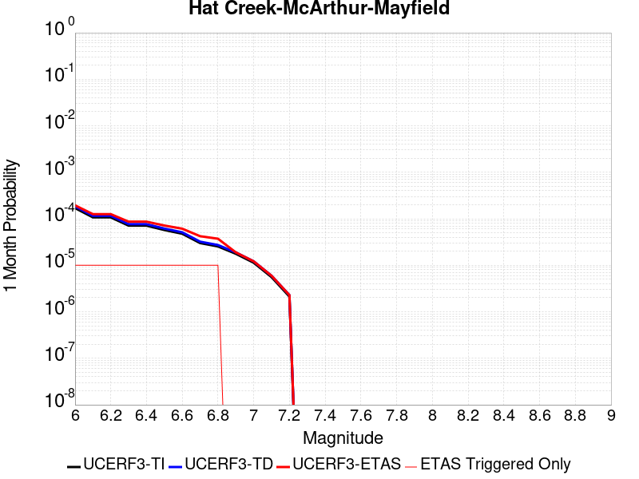 |  |  |

| Magnitude | 1 wk TI Prob | 1 wk TD Prob | 1 wk ETAS Prob | 1 wk ETAS/TD Gain | 1 wk ETAS Triggered Only | 1 mo TI Prob | 1 mo TD Prob | 1 mo ETAS Prob | 1 mo ETAS/TD Gain | 1 mo ETAS Triggered Only | 1 yr TI Prob | 1 yr TD Prob | 1 yr ETAS Prob | 1 yr ETAS/TD Gain | 1 yr ETAS Triggered Only | 10 yr TI Prob | 10 yr TD Prob | 10 yr ETAS Prob | 10 yr ETAS/TD Gain | 10 yr ETAS Triggered Only |
|-----|-----|-----|-----|-----|-----|-----|-----|-----|-----|-----|-----|-----|-----|-----|-----|-----|-----|-----|-----|-----|
| 6.0 | 3.967457E-5 | 4.315831E-5 | 5.875437E-5 | 1.3613685 | 1.5596732E-5 | 1.7002279E-4 | 1.8495171E-4 | 2.0054556E-4 | 1.084313 | 1.5596732E-5 | 0.002068062 | 0.002249576 | 0.0022651376 | 1.0069176 | 1.5596732E-5 | 0.02048922 | 0.022280399 | 0.022295648 | 1.0006844 | 1.5596732E-5 |
| 6.1 | 2.5044013E-5 | 2.7071164E-5 | 4.2667474E-5 | 1.5761225 | 1.5596732E-5 | 1.0732707E-4 | 1.1601429E-4 | 1.3160921E-4 | 1.1344224 | 1.5596732E-5 | 0.0013059238 | 0.0014115906 | 0.0014271653 | 1.0110334 | 1.5596732E-5 | 0.01298276 | 0.01402966 | 0.014045038 | 1.0010961 | 1.5596732E-5 |
| 6.2 | 2.5044013E-5 | 2.7071164E-5 | 4.2667474E-5 | 1.5761225 | 1.5596732E-5 | 1.0732707E-4 | 1.1601429E-4 | 1.3160921E-4 | 1.1344224 | 1.5596732E-5 | 0.0013059238 | 0.0014115906 | 0.0014271653 | 1.0110334 | 1.5596732E-5 | 0.01298276 | 0.01402966 | 0.014045038 | 1.0010961 | 1.5596732E-5 |
| 6.3 | 1.6624012E-5 | 1.7891072E-5 | 3.3487522E-5 | 1.871745 | 1.5596732E-5 | 7.124382E-5 | 7.6673816E-5 | 9.226935E-5 | 1.2034011 | 1.5596732E-5 | 8.670483E-4 | 9.331125E-4 | 9.486947E-4 | 1.0166992 | 1.5596732E-5 | 0.008636732 | 0.009292879 | 0.009308331 | 1.0016627 | 1.5596732E-5 |
| 6.4 | 1.6624012E-5 | 1.7891072E-5 | 3.3487522E-5 | 1.871745 | 1.5596732E-5 | 7.124382E-5 | 7.6673816E-5 | 9.226935E-5 | 1.2034011 | 1.5596732E-5 | 8.670483E-4 | 9.331125E-4 | 9.486947E-4 | 1.0166992 | 1.5596732E-5 | 0.008636732 | 0.009292879 | 0.009308331 | 1.0016627 | 1.5596732E-5 |
| 6.5 | 1.3394842E-5 | 1.4392137E-5 | 2.9988643E-5 | 2.0836825 | 1.5596732E-5 | 5.7405203E-5 | 6.167916E-5 | 7.7274926E-5 | 1.2528532 | 1.5596732E-5 | 6.986842E-4 | 7.506906E-4 | 7.662756E-4 | 1.0207609 | 1.5596732E-5 | 0.006964916 | 0.0074821403 | 0.007497621 | 1.0020689 | 1.5596732E-5 |
| 6.6 | 1.1137514E-5 | 1.1954546E-5 | 2.755109E-5 | 2.304654 | 1.5596732E-5 | 4.7731326E-5 | 5.1232782E-5 | 6.682872E-5 | 1.3044131 | 1.5596732E-5 | 5.809739E-4 | 6.2358467E-4 | 6.3917163E-4 | 1.0249958 | 1.5596732E-5 | 0.005794574 | 0.00621877 | 0.00623427 | 1.0024924 | 1.5596732E-5 |
| 6.7 | 7.0200663E-6 | 7.5242897E-6 | 2.3120903E-5 | 3.0728354 | 1.5596732E-5 | 3.008565E-5 | 3.2246568E-5 | 4.7842794E-5 | 1.4836555 | 1.5596732E-5 | 3.6623122E-4 | 3.925328E-4 | 4.0812342E-4 | 1.039718 | 1.5596732E-5 | 0.0036562826 | 0.0039185574 | 0.003934093 | 1.0039647 | 1.5596732E-5 |
| 6.8 | 5.940172E-6 | 6.3654766E-6 | 2.1962109E-5 | 3.4501908 | 1.5596732E-5 | 2.545763E-5 | 2.7280335E-5 | 4.287664E-5 | 1.571705 | 1.5596732E-5 | 3.0990256E-4 | 3.3208873E-4 | 3.476803E-4 | 1.04695 | 1.5596732E-5 | 0.0030947074 | 0.0033160534 | 0.0033315984 | 1.0046878 | 1.5596732E-5 |
| 6.9 | 4.129831E-6 | 4.423547E-6 | 4.423547E-6 | 1.0 | 0.0 | 1.7699154E-5 | 1.8957926E-5 | 1.8957926E-5 | 1.0 | 0.0 | 2.154659E-4 | 2.3078908E-4 | 2.3078908E-4 | 1.0 | 0.0 | 0.002152571 | 0.0023055724 | 0.0023055724 | 1.0 | 0.0 |
| 7.0 | 2.6512955E-6 | 2.8374002E-6 | 2.8374002E-6 | 1.0 | 0.0 | 1.1362646E-5 | 1.2160232E-5 | 1.2160232E-5 | 1.0 | 0.0 | 1.3833142E-4 | 1.480412E-4 | 1.480412E-4 | 1.0 | 0.0 | 0.0013824535 | 0.0014794683 | 0.0014794683 | 1.0 | 0.0 |
| 7.1 | 1.2992575E-6 | 1.3909317E-6 | 1.3909317E-6 | 1.0 | 0.0 | 5.568235E-6 | 5.961124E-6 | 5.961124E-6 | 1.0 | 0.0 | 6.779115E-5 | 7.257448E-5 | 7.257448E-5 | 1.0 | 0.0 | 6.7770475E-4 | 7.2552945E-4 | 7.2552945E-4 | 1.0 | 0.0 |
| 7.2 | 4.968191E-7 | 5.3271475E-7 | 5.3271475E-7 | 1.0 | 0.0 | 2.1292228E-6 | 2.283062E-6 | 2.283062E-6 | 1.0 | 0.0 | 2.592298E-5 | 2.7796052E-5 | 2.7796052E-5 | 1.0 | 0.0 | 2.5919956E-4 | 2.7793812E-4 | 2.7793812E-4 | 1.0 | 0.0 |

## San Joaquin Hills
*[(top)](#table-of-contents)*

| 1 Week | 1 Month | 1 Year | 10 Year |
|-----|-----|-----|-----|
|  |  |  |  |

| Magnitude | 1 wk TI Prob | 1 wk TD Prob | 1 wk ETAS Prob | 1 wk ETAS/TD Gain | 1 wk ETAS Triggered Only | 1 mo TI Prob | 1 mo TD Prob | 1 mo ETAS Prob | 1 mo ETAS/TD Gain | 1 mo ETAS Triggered Only | 1 yr TI Prob | 1 yr TD Prob | 1 yr ETAS Prob | 1 yr ETAS/TD Gain | 1 yr ETAS Triggered Only | 10 yr TI Prob | 10 yr TD Prob | 10 yr ETAS Prob | 10 yr ETAS/TD Gain | 10 yr ETAS Triggered Only |
|-----|-----|-----|-----|-----|-----|-----|-----|-----|-----|-----|-----|-----|-----|-----|-----|-----|-----|-----|-----|-----|
| 6.0 | 3.4525704E-6 | 2.8139818E-6 | 2.8139818E-6 | 1.0 | 0.0 | 1.4796647E-5 | 1.2059867E-5 | 2.765641E-5 | 2.2932599 | 1.5596732E-5 | 1.8013427E-4 | 1.4681912E-4 | 1.6241356E-4 | 1.1062154 | 1.5596732E-5 | 0.0017998833 | 0.0014672345 | 0.0014828083 | 1.0106144 | 1.5596732E-5 |
| 6.1 | 3.4525704E-6 | 2.8139818E-6 | 2.8139818E-6 | 1.0 | 0.0 | 1.4796647E-5 | 1.2059867E-5 | 2.765641E-5 | 2.2932599 | 1.5596732E-5 | 1.8013427E-4 | 1.4681912E-4 | 1.6241356E-4 | 1.1062154 | 1.5596732E-5 | 0.0017998833 | 0.0014672345 | 0.0014828083 | 1.0106144 | 1.5596732E-5 |
| 6.2 | 3.4525704E-6 | 2.8139818E-6 | 2.8139818E-6 | 1.0 | 0.0 | 1.4796647E-5 | 1.2059867E-5 | 2.765641E-5 | 2.2932599 | 1.5596732E-5 | 1.8013427E-4 | 1.4681912E-4 | 1.6241356E-4 | 1.1062154 | 1.5596732E-5 | 0.0017998833 | 0.0014672345 | 0.0014828083 | 1.0106144 | 1.5596732E-5 |
| 6.3 | 3.4525704E-6 | 2.8139818E-6 | 2.8139818E-6 | 1.0 | 0.0 | 1.4796647E-5 | 1.2059867E-5 | 2.765641E-5 | 2.2932599 | 1.5596732E-5 | 1.8013427E-4 | 1.4681912E-4 | 1.6241356E-4 | 1.1062154 | 1.5596732E-5 | 0.0017998833 | 0.0014672345 | 0.0014828083 | 1.0106144 | 1.5596732E-5 |
| 6.4 | 3.4525704E-6 | 2.8139818E-6 | 2.8139818E-6 | 1.0 | 0.0 | 1.4796647E-5 | 1.2059867E-5 | 2.765641E-5 | 2.2932599 | 1.5596732E-5 | 1.8013427E-4 | 1.4681912E-4 | 1.6241356E-4 | 1.1062154 | 1.5596732E-5 | 0.0017998833 | 0.0014672345 | 0.0014828083 | 1.0106144 | 1.5596732E-5 |
| 6.5 | 3.4525704E-6 | 2.8139818E-6 | 2.8139818E-6 | 1.0 | 0.0 | 1.4796647E-5 | 1.2059867E-5 | 2.765641E-5 | 2.2932599 | 1.5596732E-5 | 1.8013427E-4 | 1.4681912E-4 | 1.6241356E-4 | 1.1062154 | 1.5596732E-5 | 0.0017998833 | 0.0014672345 | 0.0014828083 | 1.0106144 | 1.5596732E-5 |
| 6.6 | 3.4525704E-6 | 2.8139818E-6 | 2.8139818E-6 | 1.0 | 0.0 | 1.4796647E-5 | 1.2059867E-5 | 2.765641E-5 | 2.2932599 | 1.5596732E-5 | 1.8013427E-4 | 1.4681912E-4 | 1.6241356E-4 | 1.1062154 | 1.5596732E-5 | 0.0017998833 | 0.0014672345 | 0.0014828083 | 1.0106144 | 1.5596732E-5 |
| 6.7 | 3.4525704E-6 | 2.8139818E-6 | 2.8139818E-6 | 1.0 | 0.0 | 1.4796647E-5 | 1.2059867E-5 | 2.765641E-5 | 2.2932599 | 1.5596732E-5 | 1.8013427E-4 | 1.4681912E-4 | 1.6241356E-4 | 1.1062154 | 1.5596732E-5 | 0.0017998833 | 0.0014672345 | 0.0014828083 | 1.0106144 | 1.5596732E-5 |
| 6.8 | 3.388654E-6 | 2.7484202E-6 | 2.7484202E-6 | 1.0 | 0.0 | 1.4522722E-5 | 1.1778891E-5 | 2.7375438E-5 | 2.32411 | 1.5596732E-5 | 1.767998E-4 | 1.4339869E-4 | 1.5899318E-4 | 1.1087493 | 1.5596732E-5 | 0.001766592 | 0.0014330745 | 0.0014486489 | 1.0108678 | 1.5596732E-5 |
| 6.9 | 3.2694352E-6 | 2.6283346E-6 | 2.6283346E-6 | 1.0 | 0.0 | 1.401179E-5 | 1.1264243E-5 | 2.6860798E-5 | 2.3846076 | 1.5596732E-5 | 1.7058018E-4 | 1.3713364E-4 | 1.5272823E-4 | 1.1137182 | 1.5596732E-5 | 0.0017044931 | 0.0013705015 | 0.0013860768 | 1.0113647 | 1.5596732E-5 |
| 7.0 | 3.246912E-6 | 2.6069915E-6 | 2.6069915E-6 | 1.0 | 0.0 | 1.39152635E-5 | 1.1172774E-5 | 2.676933E-5 | 2.3959432 | 1.5596732E-5 | 1.6940516E-4 | 1.3602014E-4 | 1.5161476E-4 | 1.1146493 | 1.5596732E-5 | 0.0016927607 | 0.0013593802 | 0.0013749556 | 1.0114578 | 1.5596732E-5 |
| 7.1 | 3.1864927E-6 | 2.5523198E-6 | 2.5523198E-6 | 1.0 | 0.0 | 1.3656326E-5 | 1.0938467E-5 | 2.6535028E-5 | 2.4258451 | 1.5596732E-5 | 1.6625308E-4 | 1.3316782E-4 | 1.4876247E-4 | 1.1171052 | 1.5596732E-5 | 0.0016612876 | 0.0013308912 | 0.0013464672 | 1.0117034 | 1.5596732E-5 |
| 7.2 | 3.0220644E-6 | 2.3991677E-6 | 2.3991677E-6 | 1.0 | 0.0 | 1.295164E-5 | 1.0282108E-5 | 2.5878679E-5 | 2.5168653 | 1.5596732E-5 | 1.576748E-4 | 1.2517757E-4 | 1.4077235E-4 | 1.1245812 | 1.5596732E-5 | 0.0015756298 | 0.0012510809 | 0.0012666582 | 1.012451 | 1.5596732E-5 |
| 7.3 | 2.787619E-6 | 2.2173858E-6 | 2.2173858E-6 | 1.0 | 0.0 | 1.1946884E-5 | 9.503048E-6 | 2.509963E-5 | 2.641219 | 1.5596732E-5 | 1.454436E-4 | 1.1569356E-4 | 1.3128849E-4 | 1.1347951 | 1.5596732E-5 | 0.0014534845 | 0.0011563431 | 0.0011719218 | 1.0134724 | 1.5596732E-5 |
| 7.4 | 2.4593792E-6 | 1.9226306E-6 | 1.9226306E-6 | 1.0 | 0.0 | 1.0540153E-5 | 8.23982E-6 | 2.3836423E-5 | 2.8928328 | 1.5596732E-5 | 1.2831882E-4 | 1.0031529E-4 | 1.1591045E-4 | 1.1554615 | 1.5596732E-5 | 0.0012824474 | 0.0010027088 | 0.00101829 | 1.015539 | 1.5596732E-5 |
| 7.5 | 1.926764E-6 | 1.4383021E-6 | 1.4383021E-6 | 1.0 | 0.0 | 8.257534E-6 | 6.1641376E-6 | 2.1760772E-5 | 3.5302217 | 1.5596732E-5 | 1.00530844E-4 | 7.504586E-5 | 9.064141E-5 | 1.2078137 | 1.5596732E-5 | 0.0010048538 | 7.502115E-4 | 7.657965E-4 | 1.0207741 | 1.5596732E-5 |
| 7.6 | 1.1609359E-6 | 8.14558E-7 | 8.14558E-7 | 1.0 | 0.0 | 4.97543E-6 | 3.4909585E-6 | 3.4909585E-6 | 1.0 | 0.0 | 6.0574173E-5 | 4.2501633E-5 | 4.2501633E-5 | 1.0 | 0.0 | 6.055767E-4 | 4.249394E-4 | 4.249394E-4 | 1.0 | 0.0 |
| 7.7 | 5.1168536E-7 | 2.7155914E-7 | 2.7155914E-7 | 1.0 | 0.0 | 2.1929354E-6 | 1.1638244E-6 | 1.1638244E-6 | 1.0 | 0.0 | 2.669866E-5 | 1.41694845E-5 | 1.41694845E-5 | 1.0 | 0.0 | 2.6695454E-4 | 1.4168715E-4 | 1.4168715E-4 | 1.0 | 0.0 |
| 7.8 | 1.16056995E-8 | 9.782373E-9 | 9.782373E-9 | 1.0 | 0.0 | 4.9738713E-8 | 4.1924455E-8 | 4.1924455E-8 | 1.0 | 0.0 | 6.0556863E-7 | 5.1043025E-7 | 5.1043025E-7 | 1.0 | 0.0 | 6.05567E-6 | 5.1043025E-6 | 5.1043025E-6 | 1.0 | 0.0 |

## Sisar
*[(top)](#table-of-contents)*

| 1 Week | 1 Month | 1 Year | 10 Year |
|-----|-----|-----|-----|
|  |  |  |  |

| Magnitude | 1 wk TI Prob | 1 wk TD Prob | 1 wk ETAS Prob | 1 wk ETAS/TD Gain | 1 wk ETAS Triggered Only | 1 mo TI Prob | 1 mo TD Prob | 1 mo ETAS Prob | 1 mo ETAS/TD Gain | 1 mo ETAS Triggered Only | 1 yr TI Prob | 1 yr TD Prob | 1 yr ETAS Prob | 1 yr ETAS/TD Gain | 1 yr ETAS Triggered Only | 10 yr TI Prob | 10 yr TD Prob | 10 yr ETAS Prob | 10 yr ETAS/TD Gain | 10 yr ETAS Triggered Only |
|-----|-----|-----|-----|-----|-----|-----|-----|-----|-----|-----|-----|-----|-----|-----|-----|-----|-----|-----|-----|-----|
| 6.0 | 4.544193E-6 | 3.839576E-6 | 3.839576E-6 | 1.0 | 0.0 | 1.9474966E-5 | 1.6455224E-5 | 1.6455224E-5 | 1.0 | 0.0 | 2.3708193E-4 | 2.0032428E-4 | 2.0032428E-4 | 1.0 | 0.0 | 0.0023682916 | 0.002001471 | 0.0020170363 | 1.0077771 | 1.5596732E-5 |
| 6.1 | 4.544193E-6 | 3.839576E-6 | 3.839576E-6 | 1.0 | 0.0 | 1.9474966E-5 | 1.6455224E-5 | 1.6455224E-5 | 1.0 | 0.0 | 2.3708193E-4 | 2.0032428E-4 | 2.0032428E-4 | 1.0 | 0.0 | 0.0023682916 | 0.002001471 | 0.0020170363 | 1.0077771 | 1.5596732E-5 |
| 6.2 | 4.544193E-6 | 3.839576E-6 | 3.839576E-6 | 1.0 | 0.0 | 1.9474966E-5 | 1.6455224E-5 | 1.6455224E-5 | 1.0 | 0.0 | 2.3708193E-4 | 2.0032428E-4 | 2.0032428E-4 | 1.0 | 0.0 | 0.0023682916 | 0.002001471 | 0.0020170363 | 1.0077771 | 1.5596732E-5 |
| 6.3 | 4.544193E-6 | 3.839576E-6 | 3.839576E-6 | 1.0 | 0.0 | 1.9474966E-5 | 1.6455224E-5 | 1.6455224E-5 | 1.0 | 0.0 | 2.3708193E-4 | 2.0032428E-4 | 2.0032428E-4 | 1.0 | 0.0 | 0.0023682916 | 0.002001471 | 0.0020170363 | 1.0077771 | 1.5596732E-5 |
| 6.4 | 4.544193E-6 | 3.839576E-6 | 3.839576E-6 | 1.0 | 0.0 | 1.9474966E-5 | 1.6455224E-5 | 1.6455224E-5 | 1.0 | 0.0 | 2.3708193E-4 | 2.0032428E-4 | 2.0032428E-4 | 1.0 | 0.0 | 0.0023682916 | 0.002001471 | 0.0020170363 | 1.0077771 | 1.5596732E-5 |
| 6.5 | 4.544193E-6 | 3.839576E-6 | 3.839576E-6 | 1.0 | 0.0 | 1.9474966E-5 | 1.6455224E-5 | 1.6455224E-5 | 1.0 | 0.0 | 2.3708193E-4 | 2.0032428E-4 | 2.0032428E-4 | 1.0 | 0.0 | 0.0023682916 | 0.002001471 | 0.0020170363 | 1.0077771 | 1.5596732E-5 |
| 6.6 | 4.544193E-6 | 3.839576E-6 | 3.839576E-6 | 1.0 | 0.0 | 1.9474966E-5 | 1.6455224E-5 | 1.6455224E-5 | 1.0 | 0.0 | 2.3708193E-4 | 2.0032428E-4 | 2.0032428E-4 | 1.0 | 0.0 | 0.0023682916 | 0.002001471 | 0.0020170363 | 1.0077771 | 1.5596732E-5 |
| 6.7 | 4.544193E-6 | 3.839576E-6 | 3.839576E-6 | 1.0 | 0.0 | 1.9474966E-5 | 1.6455224E-5 | 1.6455224E-5 | 1.0 | 0.0 | 2.3708193E-4 | 2.0032428E-4 | 2.0032428E-4 | 1.0 | 0.0 | 0.0023682916 | 0.002001471 | 0.0020170363 | 1.0077771 | 1.5596732E-5 |
| 6.8 | 4.544193E-6 | 3.839576E-6 | 3.839576E-6 | 1.0 | 0.0 | 1.9474966E-5 | 1.6455224E-5 | 1.6455224E-5 | 1.0 | 0.0 | 2.3708193E-4 | 2.0032428E-4 | 2.0032428E-4 | 1.0 | 0.0 | 0.0023682916 | 0.002001471 | 0.0020170363 | 1.0077771 | 1.5596732E-5 |
| 6.9 | 4.542225E-6 | 3.8375383E-6 | 3.8375383E-6 | 1.0 | 0.0 | 1.9466532E-5 | 1.6446491E-5 | 1.6446491E-5 | 1.0 | 0.0 | 2.3697925E-4 | 2.0021795E-4 | 2.0021795E-4 | 1.0 | 0.0 | 0.002367267 | 0.0020004094 | 0.002015975 | 1.0077811 | 1.5596732E-5 |
| 7.0 | 4.5278484E-6 | 3.822602E-6 | 3.822602E-6 | 1.0 | 0.0 | 1.940492E-5 | 1.638248E-5 | 1.638248E-5 | 1.0 | 0.0 | 2.3622929E-4 | 1.9943877E-4 | 1.9943877E-4 | 1.0 | 0.0 | 0.0023597833 | 0.0019926317 | 0.0020081974 | 1.0078115 | 1.5596732E-5 |
| 7.1 | 4.5132488E-6 | 3.8073897E-6 | 3.8073897E-6 | 1.0 | 0.0 | 1.9342351E-5 | 1.6317284E-5 | 1.6317284E-5 | 1.0 | 0.0 | 2.3546767E-4 | 1.9864515E-4 | 1.9864515E-4 | 1.0 | 0.0 | 0.0023521832 | 0.0019847096 | 0.0020002755 | 1.0078429 | 1.5596732E-5 |
| 7.2 | 4.448859E-6 | 3.7398502E-6 | 3.7398502E-6 | 1.0 | 0.0 | 1.9066398E-5 | 1.6027832E-5 | 1.6027832E-5 | 1.0 | 0.0 | 2.3210866E-4 | 1.9512173E-4 | 1.9512173E-4 | 1.0 | 0.0 | 0.0023186638 | 0.0019495375 | 0.001965104 | 1.0079846 | 1.5596732E-5 |
| 7.3 | 4.3424366E-6 | 3.6336846E-6 | 3.6336846E-6 | 1.0 | 0.0 | 1.861031E-5 | 1.5572843E-5 | 1.5572843E-5 | 1.0 | 0.0 | 2.2655698E-4 | 1.895832E-4 | 1.895832E-4 | 1.0 | 0.0 | 0.0022632615 | 0.0018942481 | 0.0019098154 | 1.0082182 | 1.5596732E-5 |
| 7.4 | 4.218641E-6 | 3.5330384E-6 | 3.5330384E-6 | 1.0 | 0.0 | 1.8079765E-5 | 1.5141507E-5 | 1.5141507E-5 | 1.0 | 0.0 | 2.2009891E-4 | 1.8433259E-4 | 1.8433259E-4 | 1.0 | 0.0 | 0.0021988105 | 0.0018418302 | 0.0018573982 | 1.0084524 | 1.5596732E-5 |
| 7.5 | 3.983779E-6 | 3.3478068E-6 | 3.3478068E-6 | 1.0 | 0.0 | 1.7073227E-5 | 1.4347666E-5 | 1.4347666E-5 | 1.0 | 0.0 | 2.0784672E-4 | 1.7466917E-4 | 1.7466917E-4 | 1.0 | 0.0 | 0.0020765243 | 0.0017453518 | 0.0017609213 | 1.0089206 | 1.5596732E-5 |
| 7.6 | 2.777393E-6 | 2.35225E-6 | 2.35225E-6 | 1.0 | 0.0 | 1.1903058E-5 | 1.0081033E-5 | 1.0081033E-5 | 1.0 | 0.0 | 1.449101E-4 | 1.2272975E-4 | 1.2272975E-4 | 1.0 | 0.0 | 0.0014481564 | 0.0012266274 | 0.001242205 | 1.0126995 | 1.5596732E-5 |
| 7.7 | 1.9028433E-6 | 1.593867E-6 | 1.593867E-6 | 1.0 | 0.0 | 8.155017E-6 | 6.8308404E-6 | 6.8308404E-6 | 1.0 | 0.0 | 9.928281E-5 | 8.3162355E-5 | 8.3162355E-5 | 1.0 | 0.0 | 9.923846E-4 | 8.313171E-4 | 8.4690086E-4 | 1.0187459 | 1.5596732E-5 |
| 7.8 | 4.9095956E-7 | 4.3583708E-7 | 4.3583708E-7 | 1.0 | 0.0 | 2.1041105E-6 | 1.8678718E-6 | 1.8678718E-6 | 1.0 | 0.0 | 2.5617246E-5 | 2.2741104E-5 | 2.2741104E-5 | 1.0 | 0.0 | 2.5614293E-4 | 2.2738794E-4 | 2.2738794E-4 | 1.0 | 0.0 |
| 7.9 | 1.16657894E-7 | 1.0335569E-7 | 1.0335569E-7 | 1.0 | 0.0 | 4.999623E-7 | 4.4295288E-7 | 4.4295288E-7 | 1.0 | 0.0 | 6.087024E-6 | 5.3929384E-6 | 5.3929384E-6 | 1.0 | 0.0 | 6.0868573E-5 | 5.3928103E-5 | 5.3928103E-5 | 1.0 | 0.0 |
| 8.0 | 2.5100346E-9 | 1.7067566E-9 | 1.7067566E-9 | 1.0 | 0.0 | 1.0757291E-8 | 7.3146724E-9 | 7.3146724E-9 | 1.0 | 0.0 | 1.3097001E-7 | 8.905613E-8 | 8.905613E-8 | 1.0 | 0.0 | 1.3096993E-6 | 8.9056095E-7 | 8.9056095E-7 | 1.0 | 0.0 |

## Northridge
*[(top)](#table-of-contents)*

| 1 Week | 1 Month | 1 Year | 10 Year |
|-----|-----|-----|-----|
|  |  |  |  |

| Magnitude | 1 wk TI Prob | 1 wk TD Prob | 1 wk ETAS Prob | 1 wk ETAS/TD Gain | 1 wk ETAS Triggered Only | 1 mo TI Prob | 1 mo TD Prob | 1 mo ETAS Prob | 1 mo ETAS/TD Gain | 1 mo ETAS Triggered Only | 1 yr TI Prob | 1 yr TD Prob | 1 yr ETAS Prob | 1 yr ETAS/TD Gain | 1 yr ETAS Triggered Only | 10 yr TI Prob | 10 yr TD Prob | 10 yr ETAS Prob | 10 yr ETAS/TD Gain | 10 yr ETAS Triggered Only |
|-----|-----|-----|-----|-----|-----|-----|-----|-----|-----|-----|-----|-----|-----|-----|-----|-----|-----|-----|-----|-----|
| 6.0 | 1.8340852E-5 | 7.5880193E-6 | 7.5880193E-6 | 1.0 | 0.0 | 7.860128E-5 | 3.251969E-5 | 3.251969E-5 | 1.0 | 0.0 | 9.565505E-4 | 3.958575E-4 | 4.1144804E-4 | 1.0393842 | 1.5596732E-5 | 0.009524435 | 0.003951746 | 0.003967281 | 1.0039312 | 1.5596732E-5 |
| 6.1 | 1.8340852E-5 | 7.5880193E-6 | 7.5880193E-6 | 1.0 | 0.0 | 7.860128E-5 | 3.251969E-5 | 3.251969E-5 | 1.0 | 0.0 | 9.565505E-4 | 3.958575E-4 | 4.1144804E-4 | 1.0393842 | 1.5596732E-5 | 0.009524435 | 0.003951746 | 0.003967281 | 1.0039312 | 1.5596732E-5 |
| 6.2 | 1.8340852E-5 | 7.5880193E-6 | 7.5880193E-6 | 1.0 | 0.0 | 7.860128E-5 | 3.251969E-5 | 3.251969E-5 | 1.0 | 0.0 | 9.565505E-4 | 3.958575E-4 | 4.1144804E-4 | 1.0393842 | 1.5596732E-5 | 0.009524435 | 0.003951746 | 0.003967281 | 1.0039312 | 1.5596732E-5 |
| 6.3 | 1.8340852E-5 | 7.5880193E-6 | 7.5880193E-6 | 1.0 | 0.0 | 7.860128E-5 | 3.251969E-5 | 3.251969E-5 | 1.0 | 0.0 | 9.565505E-4 | 3.958575E-4 | 4.1144804E-4 | 1.0393842 | 1.5596732E-5 | 0.009524435 | 0.003951746 | 0.003967281 | 1.0039312 | 1.5596732E-5 |
| 6.4 | 1.7361892E-5 | 7.5880193E-6 | 7.5880193E-6 | 1.0 | 0.0 | 7.440598E-5 | 3.251969E-5 | 3.251969E-5 | 1.0 | 0.0 | 9.055163E-4 | 3.958575E-4 | 4.1144804E-4 | 1.0393842 | 1.5596732E-5 | 0.009018354 | 0.003951746 | 0.003967281 | 1.0039312 | 1.5596732E-5 |
| 6.5 | 1.7361892E-5 | 7.5880193E-6 | 7.5880193E-6 | 1.0 | 0.0 | 7.440598E-5 | 3.251969E-5 | 3.251969E-5 | 1.0 | 0.0 | 9.055163E-4 | 3.958575E-4 | 4.1144804E-4 | 1.0393842 | 1.5596732E-5 | 0.009018354 | 0.003951746 | 0.003967281 | 1.0039312 | 1.5596732E-5 |
| 6.6 | 1.5458201E-5 | 7.5880193E-6 | 7.5880193E-6 | 1.0 | 0.0 | 6.624775E-5 | 3.251969E-5 | 3.251969E-5 | 1.0 | 0.0 | 8.0626784E-4 | 3.958575E-4 | 4.1144804E-4 | 1.0393842 | 1.5596732E-5 | 0.008033488 | 0.003951746 | 0.003967281 | 1.0039312 | 1.5596732E-5 |
| 6.7 | 1.2538368E-5 | 6.381603E-6 | 6.381603E-6 | 1.0 | 0.0 | 5.3734755E-5 | 2.7349442E-5 | 2.7349442E-5 | 1.0 | 0.0 | 6.5402425E-4 | 3.3292902E-4 | 3.4852055E-4 | 1.0468314 | 1.5596732E-5 | 0.0065210275 | 0.0033243506 | 0.0033398955 | 1.0046761 | 1.5596732E-5 |
| 6.8 | 1.1438097E-5 | 6.3502566E-6 | 6.3502566E-6 | 1.0 | 0.0 | 4.9019498E-5 | 2.7215105E-5 | 2.7215105E-5 | 1.0 | 0.0 | 5.9664896E-4 | 3.3129397E-4 | 3.3129397E-4 | 1.0 | 0.0 | 0.005950495 | 0.0033080487 | 0.0033080487 | 1.0 | 0.0 |
| 6.9 | 1.1204891E-5 | 6.2867084E-6 | 6.2867084E-6 | 1.0 | 0.0 | 4.8020076E-5 | 2.694276E-5 | 2.694276E-5 | 1.0 | 0.0 | 5.8448757E-4 | 3.2797916E-4 | 3.2797916E-4 | 1.0 | 0.0 | 0.0058295266 | 0.0032749989 | 0.0032749989 | 1.0 | 0.0 |
| 7.0 | 1.061046E-5 | 6.115359E-6 | 6.115359E-6 | 1.0 | 0.0 | 4.5472607E-5 | 2.6208421E-5 | 2.6208421E-5 | 1.0 | 0.0 | 5.534883E-4 | 3.1904122E-4 | 3.1904122E-4 | 1.0 | 0.0 | 0.0055211177 | 0.0031858785 | 0.0031858785 | 1.0 | 0.0 |
| 7.1 | 1.0266979E-5 | 6.004274E-6 | 6.004274E-6 | 1.0 | 0.0 | 4.40006E-5 | 2.5732352E-5 | 2.5732352E-5 | 1.0 | 0.0 | 5.355756E-4 | 3.1324677E-4 | 3.1324677E-4 | 1.0 | 0.0 | 0.0053428668 | 0.003128098 | 0.003128098 | 1.0 | 0.0 |
| 7.2 | 9.91273E-6 | 5.819984E-6 | 5.819984E-6 | 1.0 | 0.0 | 4.248244E-5 | 2.4942554E-5 | 2.4942554E-5 | 1.0 | 0.0 | 5.171009E-4 | 3.036337E-4 | 3.036337E-4 | 1.0 | 0.0 | 0.0051589934 | 0.0030322333 | 0.0030322333 | 1.0 | 0.0 |
| 7.3 | 8.4959265E-6 | 5.193062E-6 | 5.193062E-6 | 1.0 | 0.0 | 3.6410605E-5 | 2.225579E-5 | 2.225579E-5 | 1.0 | 0.0 | 4.4320893E-4 | 2.709308E-4 | 2.709308E-4 | 1.0 | 0.0 | 0.00442326 | 0.0027060313 | 0.0027060313 | 1.0 | 0.0 |
| 7.4 | 8.0847185E-6 | 4.9819355E-6 | 4.9819355E-6 | 1.0 | 0.0 | 3.4648332E-5 | 2.135098E-5 | 2.135098E-5 | 1.0 | 0.0 | 4.2176177E-4 | 2.599174E-4 | 2.599174E-4 | 1.0 | 0.0 | 0.0042096223 | 0.00259616 | 0.00259616 | 1.0 | 0.0 |
| 7.5 | 6.8220684E-6 | 4.2533075E-6 | 4.2533075E-6 | 1.0 | 0.0 | 2.9237108E-5 | 1.8228335E-5 | 1.8228335E-5 | 1.0 | 0.0 | 3.5590364E-4 | 2.2190758E-4 | 2.2190758E-4 | 1.0 | 0.0 | 0.0035533418 | 0.002216881 | 0.002216881 | 1.0 | 0.0 |
| 7.6 | 4.4224143E-6 | 2.8999582E-6 | 2.8999582E-6 | 1.0 | 0.0 | 1.8953066E-5 | 1.2428334E-5 | 1.2428334E-5 | 1.0 | 0.0 | 2.3072914E-4 | 1.5130457E-4 | 1.5130457E-4 | 1.0 | 0.0 | 0.0023048974 | 0.0015120271 | 0.0015120271 | 1.0 | 0.0 |
| 7.7 | 2.5297056E-6 | 1.6045905E-6 | 1.6045905E-6 | 1.0 | 0.0 | 1.0841551E-5 | 6.8767986E-6 | 6.8767986E-6 | 1.0 | 0.0 | 1.319879E-4 | 8.3721854E-5 | 8.3721854E-5 | 1.0 | 0.0 | 0.0013190953 | 8.369078E-4 | 8.369078E-4 | 1.0 | 0.0 |
| 7.8 | 1.2508156E-6 | 8.780076E-7 | 8.780076E-7 | 1.0 | 0.0 | 5.3606273E-6 | 3.7628845E-6 | 3.7628845E-6 | 1.0 | 0.0 | 6.526368E-5 | 4.581217E-5 | 4.581217E-5 | 1.0 | 0.0 | 6.524452E-4 | 4.5802852E-4 | 4.5802852E-4 | 1.0 | 0.0 |
| 7.9 | 2.262199E-7 | 1.4664671E-7 | 1.4664671E-7 | 1.0 | 0.0 | 9.695135E-7 | 6.284858E-7 | 6.284858E-7 | 1.0 | 0.0 | 1.1803763E-5 | 7.651788E-6 | 7.651788E-6 | 1.0 | 0.0 | 1.1803136E-4 | 7.651533E-5 | 7.651533E-5 | 1.0 | 0.0 |
| 8.0 | 2.865362E-9 | 1.2753101E-9 | 1.2753101E-9 | 1.0 | 0.0 | 1.2280123E-8 | 5.4656146E-9 | 5.4656146E-9 | 1.0 | 0.0 | 1.4951048E-7 | 6.654386E-8 | 6.654386E-8 | 1.0 | 0.0 | 1.4951038E-6 | 6.654386E-7 | 6.654386E-7 | 1.0 | 0.0 |

## Round Valley
*[(top)](#table-of-contents)*

| 1 Week | 1 Month | 1 Year | 10 Year |
|-----|-----|-----|-----|
|  |  |  |  |

| Magnitude | 1 wk TI Prob | 1 wk TD Prob | 1 wk ETAS Prob | 1 wk ETAS/TD Gain | 1 wk ETAS Triggered Only | 1 mo TI Prob | 1 mo TD Prob | 1 mo ETAS Prob | 1 mo ETAS/TD Gain | 1 mo ETAS Triggered Only | 1 yr TI Prob | 1 yr TD Prob | 1 yr ETAS Prob | 1 yr ETAS/TD Gain | 1 yr ETAS Triggered Only | 10 yr TI Prob | 10 yr TD Prob | 10 yr ETAS Prob | 10 yr ETAS/TD Gain | 10 yr ETAS Triggered Only |
|-----|-----|-----|-----|-----|-----|-----|-----|-----|-----|-----|-----|-----|-----|-----|-----|-----|-----|-----|-----|-----|
| 6.0 | 1.588152E-5 | 1.3670716E-5 | 1.3670716E-5 | 1.0 | 0.0 | 6.806188E-5 | 5.8587688E-5 | 5.8587688E-5 | 1.0 | 0.0 | 8.283384E-4 | 7.13111E-4 | 7.2869664E-4 | 1.0218558 | 1.5596732E-5 | 0.008252576 | 0.0071121147 | 0.0071276007 | 1.0021774 | 1.5596732E-5 |
| 6.1 | 1.588152E-5 | 1.3670716E-5 | 1.3670716E-5 | 1.0 | 0.0 | 6.806188E-5 | 5.8587688E-5 | 5.8587688E-5 | 1.0 | 0.0 | 8.283384E-4 | 7.13111E-4 | 7.2869664E-4 | 1.0218558 | 1.5596732E-5 | 0.008252576 | 0.0071121147 | 0.0071276007 | 1.0021774 | 1.5596732E-5 |
| 6.2 | 1.588152E-5 | 1.3670716E-5 | 1.3670716E-5 | 1.0 | 0.0 | 6.806188E-5 | 5.8587688E-5 | 5.8587688E-5 | 1.0 | 0.0 | 8.283384E-4 | 7.13111E-4 | 7.2869664E-4 | 1.0218558 | 1.5596732E-5 | 0.008252576 | 0.0071121147 | 0.0071276007 | 1.0021774 | 1.5596732E-5 |
| 6.3 | 1.588152E-5 | 1.3670716E-5 | 1.3670716E-5 | 1.0 | 0.0 | 6.806188E-5 | 5.8587688E-5 | 5.8587688E-5 | 1.0 | 0.0 | 8.283384E-4 | 7.13111E-4 | 7.2869664E-4 | 1.0218558 | 1.5596732E-5 | 0.008252576 | 0.0071121147 | 0.0071276007 | 1.0021774 | 1.5596732E-5 |
| 6.4 | 1.588152E-5 | 1.3670716E-5 | 1.3670716E-5 | 1.0 | 0.0 | 6.806188E-5 | 5.8587688E-5 | 5.8587688E-5 | 1.0 | 0.0 | 8.283384E-4 | 7.13111E-4 | 7.2869664E-4 | 1.0218558 | 1.5596732E-5 | 0.008252576 | 0.0071121147 | 0.0071276007 | 1.0021774 | 1.5596732E-5 |
| 6.5 | 1.0646776E-5 | 7.953037E-6 | 7.953037E-6 | 1.0 | 0.0 | 4.5628243E-5 | 3.408405E-5 | 3.408405E-5 | 1.0 | 0.0 | 5.553823E-4 | 4.1490266E-4 | 4.1490266E-4 | 1.0 | 0.0 | 0.005539963 | 0.0041421093 | 0.0041421093 | 1.0 | 0.0 |
| 6.6 | 8.632956E-6 | 5.768742E-6 | 5.768742E-6 | 1.0 | 0.0 | 3.6997862E-5 | 2.4722967E-5 | 2.4722967E-5 | 1.0 | 0.0 | 4.5035584E-4 | 3.009644E-4 | 3.009644E-4 | 1.0 | 0.0 | 0.0044944426 | 0.003005946 | 0.003005946 | 1.0 | 0.0 |
| 6.7 | 8.632956E-6 | 5.768742E-6 | 5.768742E-6 | 1.0 | 0.0 | 3.6997862E-5 | 2.4722967E-5 | 2.4722967E-5 | 1.0 | 0.0 | 4.5035584E-4 | 3.009644E-4 | 3.009644E-4 | 1.0 | 0.0 | 0.0044944426 | 0.003005946 | 0.003005946 | 1.0 | 0.0 |
| 6.8 | 7.143895E-6 | 4.2018346E-6 | 4.2018346E-6 | 1.0 | 0.0 | 3.0616335E-5 | 1.8007748E-5 | 1.8007748E-5 | 1.0 | 0.0 | 3.726901E-4 | 2.1922393E-4 | 2.1922393E-4 | 1.0 | 0.0 | 0.0037206567 | 0.0021902416 | 0.0021902416 | 1.0 | 0.0 |
| 6.9 | 6.5120694E-6 | 3.6644687E-6 | 3.6644687E-6 | 1.0 | 0.0 | 2.790857E-5 | 1.570478E-5 | 1.570478E-5 | 1.0 | 0.0 | 3.3973387E-4 | 1.9119044E-4 | 1.9119044E-4 | 1.0 | 0.0 | 0.0033921495 | 0.0019104085 | 0.0019104085 | 1.0 | 0.0 |
| 7.0 | 5.0614435E-6 | 2.6836676E-6 | 2.6836676E-6 | 1.0 | 0.0 | 2.169172E-5 | 1.1501388E-5 | 1.1501388E-5 | 1.0 | 0.0 | 2.6406467E-4 | 1.4002144E-4 | 1.4002144E-4 | 1.0 | 0.0 | 0.0026375111 | 0.0013994334 | 0.0013994334 | 1.0 | 0.0 |
| 7.1 | 4.41728E-6 | 2.3575074E-6 | 2.3575074E-6 | 1.0 | 0.0 | 1.8931061E-5 | 1.0103569E-5 | 1.0103569E-5 | 1.0 | 0.0 | 2.304613E-4 | 1.23005E-4 | 1.23005E-4 | 1.0 | 0.0 | 0.0023022245 | 0.0012294657 | 0.0012294657 | 1.0 | 0.0 |
| 7.2 | 2.535495E-6 | 1.1208391E-6 | 1.1208391E-6 | 1.0 | 0.0 | 1.0866362E-5 | 4.8035904E-6 | 4.8035904E-6 | 1.0 | 0.0 | 1.3228992E-4 | 5.8482667E-5 | 5.8482667E-5 | 1.0 | 0.0 | 0.0013221119 | 5.84724E-4 | 5.84724E-4 | 1.0 | 0.0 |
| 7.3 | 7.900015E-7 | 4.0889498E-7 | 4.0889498E-7 | 1.0 | 0.0 | 3.3857161E-6 | 1.752407E-6 | 1.752407E-6 | 1.0 | 0.0 | 4.1220315E-5 | 2.1335554E-5 | 2.1335554E-5 | 1.0 | 0.0 | 4.121267E-4 | 2.1335555E-4 | 2.1335555E-4 | 1.0 | 0.0 |

## San Andreas (North Coast) 2011 CFM
*[(top)](#table-of-contents)*

| 1 Week | 1 Month | 1 Year | 10 Year |
|-----|-----|-----|-----|
|  |  |  |  |

| Magnitude | 1 wk TI Prob | 1 wk TD Prob | 1 wk ETAS Prob | 1 wk ETAS/TD Gain | 1 wk ETAS Triggered Only | 1 mo TI Prob | 1 mo TD Prob | 1 mo ETAS Prob | 1 mo ETAS/TD Gain | 1 mo ETAS Triggered Only | 1 yr TI Prob | 1 yr TD Prob | 1 yr ETAS Prob | 1 yr ETAS/TD Gain | 1 yr ETAS Triggered Only | 10 yr TI Prob | 10 yr TD Prob | 10 yr ETAS Prob | 10 yr ETAS/TD Gain | 10 yr ETAS Triggered Only |
|-----|-----|-----|-----|-----|-----|-----|-----|-----|-----|-----|-----|-----|-----|-----|-----|-----|-----|-----|-----|-----|
| 6.0 | 1.5333705E-4 | 7.1106435E-5 | 8.670206E-5 | 1.2193278 | 1.5596732E-5 | 6.5699324E-4 | 3.0470645E-4 | 3.2029842E-4 | 1.0511705 | 1.5596732E-5 | 0.007969595 | 0.0037035241 | 0.0037190632 | 1.0041957 | 1.5596732E-5 | 0.0768977 | 0.03935284 | 0.039367825 | 1.0003808 | 1.5596732E-5 |
| 6.1 | 1.5333705E-4 | 7.1106435E-5 | 8.670206E-5 | 1.2193278 | 1.5596732E-5 | 6.5699324E-4 | 3.0470645E-4 | 3.2029842E-4 | 1.0511705 | 1.5596732E-5 | 0.007969595 | 0.0037035241 | 0.0037190632 | 1.0041957 | 1.5596732E-5 | 0.0768977 | 0.03935284 | 0.039367825 | 1.0003808 | 1.5596732E-5 |
| 6.2 | 1.3912938E-4 | 6.050204E-5 | 7.609783E-5 | 1.2577729 | 1.5596732E-5 | 5.961325E-4 | 2.5926883E-4 | 2.7486152E-4 | 1.060141 | 1.5596732E-5 | 0.007233787 | 0.003152056 | 0.0031676036 | 1.0049325 | 1.5596732E-5 | 0.07002798 | 0.03369227 | 0.03370734 | 1.0004473 | 1.5596732E-5 |
| 6.3 | 1.3912938E-4 | 6.050204E-5 | 7.609783E-5 | 1.2577729 | 1.5596732E-5 | 5.961325E-4 | 2.5926883E-4 | 2.7486152E-4 | 1.060141 | 1.5596732E-5 | 0.007233787 | 0.003152056 | 0.0031676036 | 1.0049325 | 1.5596732E-5 | 0.07002798 | 0.03369227 | 0.03370734 | 1.0004473 | 1.5596732E-5 |
| 6.4 | 1.2623647E-4 | 5.0442024E-5 | 6.603797E-5 | 1.3091855 | 1.5596732E-5 | 5.4090127E-4 | 2.161623E-4 | 2.3175565E-4 | 1.0721372 | 1.5596732E-5 | 0.0065656058 | 0.0026286195 | 0.0026441754 | 1.0059178 | 1.5596732E-5 | 0.06374981 | 0.028303223 | 0.028318377 | 1.0005355 | 1.5596732E-5 |
| 6.5 | 1.1736096E-4 | 4.3523814E-5 | 5.9119866E-5 | 1.3583338 | 1.5596732E-5 | 5.028786E-4 | 1.8651738E-4 | 2.021112E-4 | 1.0836052 | 1.5596732E-5 | 0.006105373 | 0.0022685004 | 0.0022840616 | 1.0068598 | 1.5596732E-5 | 0.05940335 | 0.024579322 | 0.024594534 | 1.0006189 | 1.5596732E-5 |
| 6.6 | 1.1586959E-4 | 4.2423668E-5 | 5.8019737E-5 | 1.3676265 | 1.5596732E-5 | 4.964894E-4 | 1.8180315E-4 | 1.9739704E-4 | 1.0857735 | 1.5596732E-5 | 0.006028018 | 0.0022112224 | 0.0022267846 | 1.0070379 | 1.5596732E-5 | 0.058671024 | 0.023984991 | 0.024000214 | 1.0006347 | 1.5596732E-5 |
| 6.7 | 1.13693764E-4 | 4.073593E-5 | 5.6332025E-5 | 1.3828585 | 1.5596732E-5 | 4.87168E-4 | 1.7457096E-4 | 1.9016497E-4 | 1.0893276 | 1.5596732E-5 | 0.005915152 | 0.0021233456 | 0.0021389092 | 1.0073297 | 1.5596732E-5 | 0.057601593 | 0.023076393 | 0.02309163 | 1.0006603 | 1.5596732E-5 |
| 6.8 | 1.1204889E-4 | 3.9953447E-5 | 5.5549557E-5 | 1.390357 | 1.5596732E-5 | 4.8012115E-4 | 1.7121792E-4 | 1.8681197E-4 | 1.0910773 | 1.5596732E-5 | 0.005829819 | 0.002082601 | 0.0020981652 | 1.0074735 | 1.5596732E-5 | 0.05679232 | 0.022636656 | 0.022651898 | 1.0006734 | 1.5596732E-5 |
| 6.9 | 1.1005794E-4 | 3.900957E-5 | 5.460569E-5 | 1.3998024 | 1.5596732E-5 | 4.7159163E-4 | 1.6717325E-4 | 1.8276737E-4 | 1.0932813 | 1.5596732E-5 | 0.0057265228 | 0.0020334502 | 0.0020490151 | 1.0076544 | 1.5596732E-5 | 0.055811852 | 0.022102542 | 0.022117794 | 1.0006901 | 1.5596732E-5 |
| 7.0 | 1.0647948E-4 | 3.7166337E-5 | 5.2762487E-5 | 1.4196311 | 1.5596732E-5 | 4.562608E-4 | 1.5927466E-4 | 1.7486891E-4 | 1.0979079 | 1.5596732E-5 | 0.0055408357 | 0.0019374598 | 0.0019530264 | 1.0080345 | 1.5596732E-5 | 0.054047033 | 0.021062272 | 0.02107754 | 1.0007249 | 1.5596732E-5 |
| 7.1 | 1.04795035E-4 | 3.6215948E-5 | 5.1812116E-5 | 1.4306436 | 1.5596732E-5 | 4.4904428E-4 | 1.5520205E-4 | 1.7079637E-4 | 1.1004775 | 1.5596732E-5 | 0.0054534175 | 0.0018879628 | 0.0019035301 | 1.0082456 | 1.5596732E-5 | 0.053215165 | 0.020530313 | 0.020545589 | 1.0007441 | 1.5596732E-5 |
| 7.2 | 1.02724036E-4 | 3.5124547E-5 | 5.072073E-5 | 1.4440252 | 1.5596732E-5 | 4.401716E-4 | 1.5052517E-4 | 1.6611956E-4 | 1.1035998 | 1.5596732E-5 | 0.0053459285 | 0.0018311188 | 0.001846687 | 1.008502 | 1.5596732E-5 | 0.052191395 | 0.019919246 | 0.019934533 | 1.0007674 | 1.5596732E-5 |
| 7.3 | 1.00650694E-4 | 3.4592013E-5 | 5.0188206E-5 | 1.4508611 | 1.5596732E-5 | 4.312888E-4 | 1.4824314E-4 | 1.6383757E-4 | 1.1051949 | 1.5596732E-5 | 0.005238306 | 0.0018033815 | 0.00181895 | 1.008633 | 1.5596732E-5 | 0.051165357 | 0.019596443 | 0.019611733 | 1.0007803 | 1.5596732E-5 |
| 7.4 | 9.672919E-5 | 3.338123E-5 | 4.897744E-5 | 1.467215 | 1.5596732E-5 | 4.144878E-4 | 1.4305465E-4 | 1.5864916E-4 | 1.1090108 | 1.5596732E-5 | 0.005034718 | 0.0017403142 | 0.0017558838 | 1.0089464 | 1.5596732E-5 | 0.049221683 | 0.018869769 | 0.01888507 | 1.000811 | 1.5596732E-5 |
| 7.5 | 8.7600405E-5 | 2.2700917E-5 | 2.2700917E-5 | 1.0 | 0.0 | 3.753763E-4 | 9.728602E-5 | 9.728602E-5 | 1.0 | 0.0 | 0.0045606326 | 0.0011838155 | 0.0011838155 | 1.0 | 0.0 | 0.04468165 | 0.013130207 | 0.013130207 | 1.0 | 0.0 |
| 7.6 | 7.9562284E-5 | 1.9226305E-5 | 1.9226305E-5 | 1.0 | 0.0 | 3.4093665E-4 | 8.239586E-5 | 8.239586E-5 | 1.0 | 0.0 | 0.0041430052 | 0.0010027094 | 0.0010027094 | 1.0 | 0.0 | 0.040666126 | 0.011221658 | 0.011221658 | 1.0 | 0.0 |
| 7.7 | 6.3866544E-5 | 1.1941707E-5 | 1.1941707E-5 | 1.0 | 0.0 | 2.7368503E-4 | 5.117774E-5 | 5.117774E-5 | 1.0 | 0.0 | 0.0033270244 | 6.2291115E-4 | 6.2291115E-4 | 1.0 | 0.0 | 0.032776527 | 0.007210334 | 0.007210334 | 1.0 | 0.0 |
| 7.8 | 4.2543215E-5 | 9.076524E-6 | 9.076524E-6 | 1.0 | 0.0 | 1.8231533E-4 | 3.8898812E-5 | 3.8898812E-5 | 1.0 | 0.0 | 0.0022174292 | 4.7349022E-4 | 4.7349022E-4 | 1.0 | 0.0 | 0.021954332 | 0.005490525 | 0.005490525 | 1.0 | 0.0 |
| 7.9 | 2.2636612E-5 | 7.81435E-6 | 7.81435E-6 | 1.0 | 0.0 | 9.7010445E-5 | 3.3489643E-5 | 3.3489643E-5 | 1.0 | 0.0 | 0.0011804621 | 4.076602E-4 | 4.076602E-4 | 1.0 | 0.0 | 0.011742111 | 0.0046832846 | 0.0046832846 | 1.0 | 0.0 |
| 8.0 | 1.5167874E-5 | 7.0494675E-6 | 7.0494675E-6 | 1.0 | 0.0 | 6.500356E-5 | 3.0211655E-5 | 3.0211655E-5 | 1.0 | 0.0 | 7.9113094E-4 | 3.677649E-4 | 3.677649E-4 | 1.0 | 0.0 | 0.007883203 | 0.004215588 | 0.004215588 | 1.0 | 0.0 |
| 8.1 | 1.0681047E-5 | 6.386992E-6 | 6.386992E-6 | 1.0 | 0.0 | 4.5775112E-5 | 2.7372536E-5 | 2.7372536E-5 | 1.0 | 0.0 | 5.5716943E-4 | 3.3320975E-4 | 3.3320975E-4 | 1.0 | 0.0 | 0.0055577457 | 0.003817393 | 0.003817393 | 1.0 | 0.0 |
| 8.2 | 8.226114E-6 | 5.1150587E-6 | 5.1150587E-6 | 1.0 | 0.0 | 3.52543E-5 | 2.1921496E-5 | 2.1921496E-5 | 1.0 | 0.0 | 4.2913653E-4 | 2.668616E-4 | 2.668616E-4 | 1.0 | 0.0 | 0.004283088 | 0.0030450926 | 0.0030450926 | 1.0 | 0.0 |
| 8.3 | 1.983087E-6 | 7.6599065E-7 | 7.6599065E-7 | 1.0 | 0.0 | 8.498917E-6 | 3.282813E-6 | 3.282813E-6 | 1.0 | 0.0 | 1.034694E-4 | 3.9967534E-5 | 3.9967534E-5 | 1.0 | 0.0 | 0.0010342124 | 4.719687E-4 | 4.719687E-4 | 1.0 | 0.0 |

## Channel Islands Western Deep Ramp
*[(top)](#table-of-contents)*

| 1 Week | 1 Month | 1 Year | 10 Year |
|-----|-----|-----|-----|
| 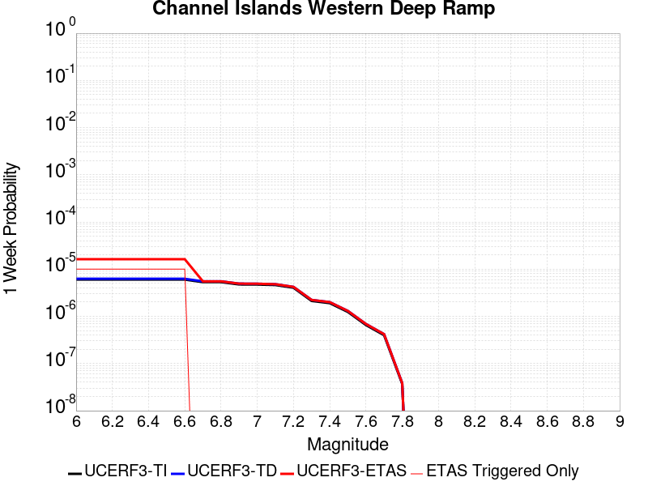 |  |  | 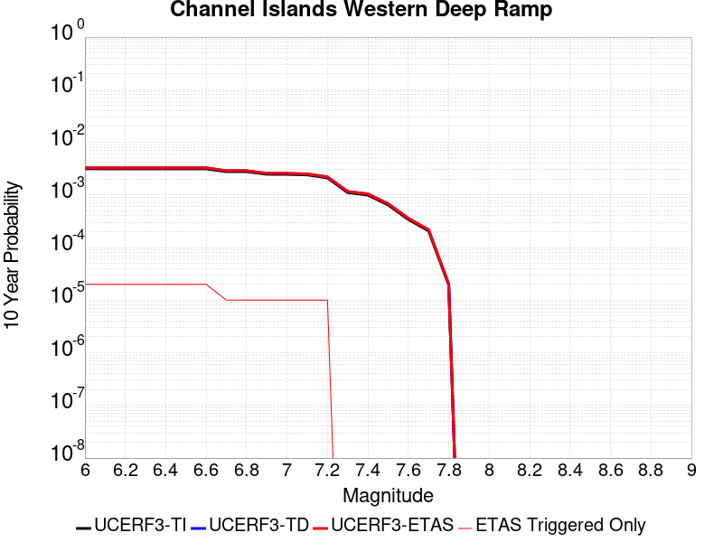 |

| Magnitude | 1 wk TI Prob | 1 wk TD Prob | 1 wk ETAS Prob | 1 wk ETAS/TD Gain | 1 wk ETAS Triggered Only | 1 mo TI Prob | 1 mo TD Prob | 1 mo ETAS Prob | 1 mo ETAS/TD Gain | 1 mo ETAS Triggered Only | 1 yr TI Prob | 1 yr TD Prob | 1 yr ETAS Prob | 1 yr ETAS/TD Gain | 1 yr ETAS Triggered Only | 10 yr TI Prob | 10 yr TD Prob | 10 yr ETAS Prob | 10 yr ETAS/TD Gain | 10 yr ETAS Triggered Only |
|-----|-----|-----|-----|-----|-----|-----|-----|-----|-----|-----|-----|-----|-----|-----|-----|-----|-----|-----|-----|-----|
| 6.0 | 6.0213506E-6 | 6.2548684E-6 | 6.2548684E-6 | 1.0 | 0.0 | 2.5805533E-5 | 2.6806329E-5 | 2.6806329E-5 | 1.0 | 0.0 | 3.1413708E-4 | 3.2632265E-4 | 3.2632265E-4 | 1.0 | 0.0 | 0.0031369338 | 0.0032588763 | 0.0032744221 | 1.0047703 | 1.5596732E-5 |
| 6.1 | 6.0213506E-6 | 6.2548684E-6 | 6.2548684E-6 | 1.0 | 0.0 | 2.5805533E-5 | 2.6806329E-5 | 2.6806329E-5 | 1.0 | 0.0 | 3.1413708E-4 | 3.2632265E-4 | 3.2632265E-4 | 1.0 | 0.0 | 0.0031369338 | 0.0032588763 | 0.0032744221 | 1.0047703 | 1.5596732E-5 |
| 6.2 | 6.0213506E-6 | 6.2548684E-6 | 6.2548684E-6 | 1.0 | 0.0 | 2.5805533E-5 | 2.6806329E-5 | 2.6806329E-5 | 1.0 | 0.0 | 3.1413708E-4 | 3.2632265E-4 | 3.2632265E-4 | 1.0 | 0.0 | 0.0031369338 | 0.0032588763 | 0.0032744221 | 1.0047703 | 1.5596732E-5 |
| 6.3 | 6.0213506E-6 | 6.2548684E-6 | 6.2548684E-6 | 1.0 | 0.0 | 2.5805533E-5 | 2.6806329E-5 | 2.6806329E-5 | 1.0 | 0.0 | 3.1413708E-4 | 3.2632265E-4 | 3.2632265E-4 | 1.0 | 0.0 | 0.0031369338 | 0.0032588763 | 0.0032744221 | 1.0047703 | 1.5596732E-5 |
| 6.4 | 6.0213506E-6 | 6.2548684E-6 | 6.2548684E-6 | 1.0 | 0.0 | 2.5805533E-5 | 2.6806329E-5 | 2.6806329E-5 | 1.0 | 0.0 | 3.1413708E-4 | 3.2632265E-4 | 3.2632265E-4 | 1.0 | 0.0 | 0.0031369338 | 0.0032588763 | 0.0032744221 | 1.0047703 | 1.5596732E-5 |
| 6.5 | 6.0213506E-6 | 6.2548684E-6 | 6.2548684E-6 | 1.0 | 0.0 | 2.5805533E-5 | 2.6806329E-5 | 2.6806329E-5 | 1.0 | 0.0 | 3.1413708E-4 | 3.2632265E-4 | 3.2632265E-4 | 1.0 | 0.0 | 0.0031369338 | 0.0032588763 | 0.0032744221 | 1.0047703 | 1.5596732E-5 |
| 6.6 | 6.0213506E-6 | 6.2548684E-6 | 6.2548684E-6 | 1.0 | 0.0 | 2.5805533E-5 | 2.6806329E-5 | 2.6806329E-5 | 1.0 | 0.0 | 3.1413708E-4 | 3.2632265E-4 | 3.2632265E-4 | 1.0 | 0.0 | 0.0031369338 | 0.0032588763 | 0.0032744221 | 1.0047703 | 1.5596732E-5 |
| 6.7 | 5.313309E-6 | 5.5252403E-6 | 5.5252403E-6 | 1.0 | 0.0 | 2.2771126E-5 | 2.367941E-5 | 2.367941E-5 | 1.0 | 0.0 | 2.772032E-4 | 2.8826276E-4 | 2.8826276E-4 | 1.0 | 0.0 | 0.0027685766 | 0.0028792918 | 0.0028948435 | 1.0054013 | 1.5596732E-5 |
| 6.8 | 5.313309E-6 | 5.5252403E-6 | 5.5252403E-6 | 1.0 | 0.0 | 2.2771126E-5 | 2.367941E-5 | 2.367941E-5 | 1.0 | 0.0 | 2.772032E-4 | 2.8826276E-4 | 2.8826276E-4 | 1.0 | 0.0 | 0.0027685766 | 0.0028792918 | 0.0028948435 | 1.0054013 | 1.5596732E-5 |
| 6.9 | 4.744377E-6 | 4.9394303E-6 | 4.9394303E-6 | 1.0 | 0.0 | 2.0332885E-5 | 2.1168837E-5 | 2.1168837E-5 | 1.0 | 0.0 | 2.4752476E-4 | 2.5770385E-4 | 2.5770385E-4 | 1.0 | 0.0 | 0.0024724922 | 0.0025744175 | 0.002589974 | 1.0060427 | 1.5596732E-5 |
| 7.0 | 4.722209E-6 | 4.9164732E-6 | 4.9164732E-6 | 1.0 | 0.0 | 2.0237881E-5 | 2.107045E-5 | 2.107045E-5 | 1.0 | 0.0 | 2.4636835E-4 | 2.5650626E-4 | 2.5650626E-4 | 1.0 | 0.0 | 0.002460954 | 0.0025624693 | 0.0025780261 | 1.006071 | 1.5596732E-5 |
| 7.1 | 4.611174E-6 | 4.801409E-6 | 4.801409E-6 | 1.0 | 0.0 | 1.9762025E-5 | 2.0577325E-5 | 2.0577325E-5 | 1.0 | 0.0 | 2.4057609E-4 | 2.5050386E-4 | 2.5050386E-4 | 1.0 | 0.0 | 0.002403158 | 0.002502582 | 0.0025181395 | 1.0062166 | 1.5596732E-5 |
| 7.2 | 4.043994E-6 | 4.2120264E-6 | 4.2120264E-6 | 1.0 | 0.0 | 1.7331287E-5 | 1.8051438E-5 | 1.8051438E-5 | 1.0 | 0.0 | 2.10988E-4 | 2.1975765E-4 | 2.1975765E-4 | 1.0 | 0.0 | 0.002107878 | 0.0021957543 | 0.0022113167 | 1.0070876 | 1.5596732E-5 |
| 7.3 | 2.1233036E-6 | 2.2297875E-6 | 2.2297875E-6 | 1.0 | 0.0 | 9.099841E-6 | 9.556197E-6 | 9.556197E-6 | 1.0 | 0.0 | 1.1078493E-4 | 1.1634055E-4 | 1.1634055E-4 | 1.0 | 0.0 | 0.0011072971 | 0.001162802 | 0.001162802 | 1.0 | 0.0 |
| 7.4 | 1.9051884E-6 | 2.0014973E-6 | 2.0014973E-6 | 1.0 | 0.0 | 8.165067E-6 | 8.577817E-6 | 8.577817E-6 | 1.0 | 0.0 | 9.940516E-5 | 1.0442998E-4 | 1.0442998E-4 | 1.0 | 0.0 | 9.93607E-4 | 0.0010438144 | 0.0010438144 | 1.0 | 0.0 |
| 7.5 | 1.2408497E-6 | 1.3038839E-6 | 1.3038839E-6 | 1.0 | 0.0 | 5.317916E-6 | 5.588062E-6 | 5.588062E-6 | 1.0 | 0.0 | 6.4743705E-5 | 6.8032554E-5 | 6.8032554E-5 | 1.0 | 0.0 | 6.4724847E-4 | 6.8011944E-4 | 6.8011944E-4 | 1.0 | 0.0 |
| 7.6 | 6.5440025E-7 | 6.886718E-7 | 6.886718E-7 | 1.0 | 0.0 | 2.8045695E-6 | 2.9514472E-6 | 2.9514472E-6 | 1.0 | 0.0 | 3.4145098E-5 | 3.593329E-5 | 3.593329E-5 | 1.0 | 0.0 | 3.4139853E-4 | 3.5927625E-4 | 3.5927625E-4 | 1.0 | 0.0 |
| 7.7 | 3.985963E-7 | 4.1930787E-7 | 4.1930787E-7 | 1.0 | 0.0 | 1.7082689E-6 | 1.7970326E-6 | 1.7970326E-6 | 1.0 | 0.0 | 2.0797976E-5 | 2.1878664E-5 | 2.1878664E-5 | 1.0 | 0.0 | 2.0796029E-4 | 2.1876628E-4 | 2.1876628E-4 | 1.0 | 0.0 |
| 7.8 | 3.706329E-8 | 3.8591796E-8 | 3.8591796E-8 | 1.0 | 0.0 | 1.5884267E-7 | 1.653934E-7 | 1.653934E-7 | 1.0 | 0.0 | 1.9339077E-6 | 2.0136629E-6 | 2.0136629E-6 | 1.0 | 0.0 | 1.933891E-5 | 2.0136458E-5 | 2.0136458E-5 | 1.0 | 0.0 |

## Hartley Springs 2011 CFM
*[(top)](#table-of-contents)*

| 1 Week | 1 Month | 1 Year | 10 Year |
|-----|-----|-----|-----|
|  |  |  |  |

| Magnitude | 1 wk TI Prob | 1 wk TD Prob | 1 wk ETAS Prob | 1 wk ETAS/TD Gain | 1 wk ETAS Triggered Only | 1 mo TI Prob | 1 mo TD Prob | 1 mo ETAS Prob | 1 mo ETAS/TD Gain | 1 mo ETAS Triggered Only | 1 yr TI Prob | 1 yr TD Prob | 1 yr ETAS Prob | 1 yr ETAS/TD Gain | 1 yr ETAS Triggered Only | 10 yr TI Prob | 10 yr TD Prob | 10 yr ETAS Prob | 10 yr ETAS/TD Gain | 10 yr ETAS Triggered Only |
|-----|-----|-----|-----|-----|-----|-----|-----|-----|-----|-----|-----|-----|-----|-----|-----|-----|-----|-----|-----|-----|
| 6.0 | 1.4352418E-5 | 1.4434182E-5 | 1.4434182E-5 | 1.0 | 0.0 | 6.1508916E-5 | 6.1860235E-5 | 6.1860235E-5 | 1.0 | 0.0 | 7.486137E-4 | 7.5305253E-4 | 7.686375E-4 | 1.0206958 | 1.5596732E-5 | 0.007460968 | 0.0075211283 | 0.007536608 | 1.0020581 | 1.5596732E-5 |
| 6.1 | 1.4352418E-5 | 1.4434182E-5 | 1.4434182E-5 | 1.0 | 0.0 | 6.1508916E-5 | 6.1860235E-5 | 6.1860235E-5 | 1.0 | 0.0 | 7.486137E-4 | 7.5305253E-4 | 7.686375E-4 | 1.0206958 | 1.5596732E-5 | 0.007460968 | 0.0075211283 | 0.007536608 | 1.0020581 | 1.5596732E-5 |
| 6.2 | 1.4352418E-5 | 1.4434182E-5 | 1.4434182E-5 | 1.0 | 0.0 | 6.1508916E-5 | 6.1860235E-5 | 6.1860235E-5 | 1.0 | 0.0 | 7.486137E-4 | 7.5305253E-4 | 7.686375E-4 | 1.0206958 | 1.5596732E-5 | 0.007460968 | 0.0075211283 | 0.007536608 | 1.0020581 | 1.5596732E-5 |
| 6.3 | 1.4352418E-5 | 1.4434182E-5 | 1.4434182E-5 | 1.0 | 0.0 | 6.1508916E-5 | 6.1860235E-5 | 6.1860235E-5 | 1.0 | 0.0 | 7.486137E-4 | 7.5305253E-4 | 7.686375E-4 | 1.0206958 | 1.5596732E-5 | 0.007460968 | 0.0075211283 | 0.007536608 | 1.0020581 | 1.5596732E-5 |
| 6.4 | 1.4352418E-5 | 1.4434182E-5 | 1.4434182E-5 | 1.0 | 0.0 | 6.1508916E-5 | 6.1860235E-5 | 6.1860235E-5 | 1.0 | 0.0 | 7.486137E-4 | 7.5305253E-4 | 7.686375E-4 | 1.0206958 | 1.5596732E-5 | 0.007460968 | 0.0075211283 | 0.007536608 | 1.0020581 | 1.5596732E-5 |
| 6.5 | 1.2279858E-5 | 1.2133106E-5 | 1.2133106E-5 | 1.0 | 0.0 | 5.26269E-5 | 5.1998883E-5 | 5.1998883E-5 | 1.0 | 0.0 | 6.4054417E-4 | 6.3306064E-4 | 6.486475E-4 | 1.0246215 | 1.5596732E-5 | 0.0063870098 | 0.006328085 | 0.0063435826 | 1.002449 | 1.5596732E-5 |
| 6.6 | 1.2279858E-5 | 1.2133106E-5 | 1.2133106E-5 | 1.0 | 0.0 | 5.26269E-5 | 5.1998883E-5 | 5.1998883E-5 | 1.0 | 0.0 | 6.4054417E-4 | 6.3306064E-4 | 6.486475E-4 | 1.0246215 | 1.5596732E-5 | 0.0063870098 | 0.006328085 | 0.0063435826 | 1.002449 | 1.5596732E-5 |
| 6.7 | 2.1282601E-6 | 8.8948315E-7 | 8.8948315E-7 | 1.0 | 0.0 | 9.121083E-6 | 3.8120663E-6 | 3.8120663E-6 | 1.0 | 0.0 | 1.11043526E-4 | 4.641118E-5 | 4.641118E-5 | 1.0 | 0.0 | 0.0011098806 | 4.6404017E-4 | 4.6404017E-4 | 1.0 | 0.0 |
| 6.8 | 2.00516E-6 | 8.517597E-7 | 8.517597E-7 | 1.0 | 0.0 | 8.593515E-6 | 3.650395E-6 | 3.650395E-6 | 1.0 | 0.0 | 1.04621024E-4 | 4.444291E-5 | 4.444291E-5 | 1.0 | 0.0 | 0.0010457177 | 4.4436535E-4 | 4.4436535E-4 | 1.0 | 0.0 |
| 6.9 | 2.00516E-6 | 8.517597E-7 | 8.517597E-7 | 1.0 | 0.0 | 8.593515E-6 | 3.650395E-6 | 3.650395E-6 | 1.0 | 0.0 | 1.04621024E-4 | 4.444291E-5 | 4.444291E-5 | 1.0 | 0.0 | 0.0010457177 | 4.4436535E-4 | 4.4436535E-4 | 1.0 | 0.0 |
| 7.0 | 1.8366732E-6 | 8.237307E-7 | 8.237307E-7 | 1.0 | 0.0 | 7.871433E-6 | 3.5302712E-6 | 3.5302712E-6 | 1.0 | 0.0 | 9.583048E-5 | 4.298046E-5 | 4.298046E-5 | 1.0 | 0.0 | 9.5789164E-4 | 4.2974652E-4 | 4.2974652E-4 | 1.0 | 0.0 |
| 7.1 | 1.5097997E-6 | 7.1902616E-7 | 7.1902616E-7 | 1.0 | 0.0 | 6.470554E-6 | 3.0815384E-6 | 3.0815384E-6 | 1.0 | 0.0 | 7.877615E-5 | 3.7517326E-5 | 3.7517326E-5 | 1.0 | 0.0 | 7.874823E-4 | 3.7513362E-4 | 3.7513362E-4 | 1.0 | 0.0 |
| 7.2 | 1.3490993E-6 | 6.405254E-7 | 6.405254E-7 | 1.0 | 0.0 | 5.7818415E-6 | 2.7451074E-6 | 2.7451074E-6 | 1.0 | 0.0 | 7.0391645E-5 | 3.3421402E-5 | 3.3421402E-5 | 1.0 | 0.0 | 7.0369354E-4 | 3.341867E-4 | 3.341867E-4 | 1.0 | 0.0 |
| 7.3 | 7.900015E-7 | 4.0889498E-7 | 4.0889498E-7 | 1.0 | 0.0 | 3.3857161E-6 | 1.752407E-6 | 1.752407E-6 | 1.0 | 0.0 | 4.1220315E-5 | 2.1335554E-5 | 2.1335554E-5 | 1.0 | 0.0 | 4.121267E-4 | 2.1335555E-4 | 2.1335555E-4 | 1.0 | 0.0 |

## San Gregorio (North) 2011 CFM
*[(top)](#table-of-contents)*

| 1 Week | 1 Month | 1 Year | 10 Year |
|-----|-----|-----|-----|
|  |  |  |  |

| Magnitude | 1 wk TI Prob | 1 wk TD Prob | 1 wk ETAS Prob | 1 wk ETAS/TD Gain | 1 wk ETAS Triggered Only | 1 mo TI Prob | 1 mo TD Prob | 1 mo ETAS Prob | 1 mo ETAS/TD Gain | 1 mo ETAS Triggered Only | 1 yr TI Prob | 1 yr TD Prob | 1 yr ETAS Prob | 1 yr ETAS/TD Gain | 1 yr ETAS Triggered Only | 10 yr TI Prob | 10 yr TD Prob | 10 yr ETAS Prob | 10 yr ETAS/TD Gain | 10 yr ETAS Triggered Only |
|-----|-----|-----|-----|-----|-----|-----|-----|-----|-----|-----|-----|-----|-----|-----|-----|-----|-----|-----|-----|-----|
| 6.0 | 5.0283932E-5 | 4.3057815E-5 | 5.8653874E-5 | 1.3622121 | 1.5596732E-5 | 2.1548476E-4 | 1.8452053E-4 | 2.0011437E-4 | 1.0845101 | 1.5596732E-5 | 0.0026203706 | 0.002244237 | 0.0022597988 | 1.006934 | 1.5596732E-5 | 0.02589687 | 0.022293162 | 0.022308411 | 1.000684 | 1.5596732E-5 |
| 6.1 | 5.0283932E-5 | 4.3057815E-5 | 5.8653874E-5 | 1.3622121 | 1.5596732E-5 | 2.1548476E-4 | 1.8452053E-4 | 2.0011437E-4 | 1.0845101 | 1.5596732E-5 | 0.0026203706 | 0.002244237 | 0.0022597988 | 1.006934 | 1.5596732E-5 | 0.02589687 | 0.022293162 | 0.022308411 | 1.000684 | 1.5596732E-5 |
| 6.2 | 4.2998647E-5 | 3.4441564E-5 | 5.0037757E-5 | 1.4528306 | 1.5596732E-5 | 1.842669E-4 | 1.475984E-4 | 1.6319283E-4 | 1.1056545 | 1.5596732E-5 | 0.0022411412 | 0.00179554 | 0.0018111088 | 1.0086708 | 1.5596732E-5 | 0.022186736 | 0.017886506 | 0.017901825 | 1.0008564 | 1.5596732E-5 |
| 6.3 | 4.2998647E-5 | 3.4441564E-5 | 5.0037757E-5 | 1.4528306 | 1.5596732E-5 | 1.842669E-4 | 1.475984E-4 | 1.6319283E-4 | 1.1056545 | 1.5596732E-5 | 0.0022411412 | 0.00179554 | 0.0018111088 | 1.0086708 | 1.5596732E-5 | 0.022186736 | 0.017886506 | 0.017901825 | 1.0008564 | 1.5596732E-5 |
| 6.4 | 4.1101295E-5 | 3.2326872E-5 | 4.79231E-5 | 1.482454 | 1.5596732E-5 | 1.7613651E-4 | 1.3853642E-4 | 1.5413099E-4 | 1.1125666 | 1.5596732E-5 | 0.0021423528 | 0.0016853869 | 0.0017009573 | 1.0092385 | 1.5596732E-5 | 0.02121817 | 0.016801886 | 0.01681722 | 1.0009127 | 1.5596732E-5 |
| 6.5 | 4.1032585E-5 | 3.2244905E-5 | 4.7841135E-5 | 1.4836804 | 1.5596732E-5 | 1.7584208E-4 | 1.3818518E-4 | 1.5377975E-4 | 1.1128527 | 1.5596732E-5 | 0.0021387753 | 0.0016811171 | 0.0016966877 | 1.009262 | 1.5596732E-5 | 0.021183075 | 0.016759839 | 0.016775174 | 1.000915 | 1.5596732E-5 |
| 6.6 | 4.011629E-5 | 3.1266558E-5 | 4.68628E-5 | 1.4988155 | 1.5596732E-5 | 1.7191563E-4 | 1.339927E-4 | 1.4958733E-4 | 1.1163843 | 1.5596732E-5 | 0.0020910634 | 0.0016301516 | 0.0016457229 | 1.009552 | 1.5596732E-5 | 0.020714961 | 0.01625741 | 0.016272753 | 1.0009438 | 1.5596732E-5 |
| 6.7 | 3.8583938E-5 | 2.9453593E-5 | 4.5049866E-5 | 1.5295202 | 1.5596732E-5 | 1.6534925E-4 | 1.2622366E-4 | 1.4181843E-4 | 1.1235486 | 1.5596732E-5 | 0.0020112682 | 0.0015357039 | 0.0015512767 | 1.0101405 | 1.5596732E-5 | 0.019931622 | 0.015325955 | 0.015341313 | 1.0010021 | 1.5596732E-5 |
| 6.8 | 3.44341E-5 | 2.4450854E-5 | 4.0047205E-5 | 1.6378652 | 1.5596732E-5 | 1.4756636E-4 | 1.0478523E-4 | 1.20380326E-4 | 1.1488291 | 1.5596732E-5 | 0.0017951399 | 0.0012750238 | 0.0012906006 | 1.0122169 | 1.5596732E-5 | 0.017807078 | 0.012751131 | 0.01276653 | 1.0012076 | 1.5596732E-5 |
| 6.9 | 3.221199E-5 | 2.1778029E-5 | 3.7374422E-5 | 1.7161525 | 1.5596732E-5 | 1.3804408E-4 | 9.333112E-5 | 1.089264E-4 | 1.1670961 | 1.5596732E-5 | 0.0016793909 | 0.0011357224 | 0.0011513013 | 1.0137173 | 1.5596732E-5 | 0.01666756 | 0.011372583 | 0.011388003 | 1.0013559 | 1.5596732E-5 |
| 7.0 | 2.9186718E-5 | 1.8146875E-5 | 3.3743323E-5 | 1.8594564 | 1.5596732E-5 | 1.2507994E-4 | 7.7770026E-5 | 9.336554E-5 | 1.2005337 | 1.5596732E-5 | 0.0015217843 | 9.464431E-4 | 9.620251E-4 | 1.0164638 | 1.5596732E-5 | 0.015114053 | 0.009496798 | 0.009512247 | 1.0016267 | 1.5596732E-5 |
| 7.1 | 2.6840138E-5 | 1.5284508E-5 | 3.0881E-5 | 2.0204117 | 1.5596732E-5 | 1.1502409E-4 | 6.55034E-5 | 8.109911E-5 | 1.23809 | 1.5596732E-5 | 0.0013995186 | 7.9721404E-4 | 8.1279833E-4 | 1.0195484 | 1.5596732E-5 | 0.013907375 | 0.008015723 | 0.008031194 | 1.0019301 | 1.5596732E-5 |
| 7.2 | 2.453002E-5 | 1.2606672E-5 | 2.8203205E-5 | 2.2371652 | 1.5596732E-5 | 1.05124425E-4 | 5.4027478E-5 | 6.962336E-5 | 1.2886659 | 1.5596732E-5 | 0.0012791384 | 6.575866E-4 | 6.7317305E-4 | 1.0237025 | 1.5596732E-5 | 0.012718005 | 0.00662763 | 0.006643123 | 1.0023377 | 1.5596732E-5 |
| 7.3 | 2.3330727E-5 | 1.1488677E-5 | 2.7085229E-5 | 2.3575585 | 1.5596732E-5 | 9.9985E-5 | 4.923626E-5 | 6.4832224E-5 | 1.3167577 | 1.5596732E-5 | 0.0012166376 | 5.9928704E-4 | 6.148744E-4 | 1.0260099 | 1.5596732E-5 | 0.012099981 | 0.006046564 | 0.0060620666 | 1.0025638 | 1.5596732E-5 |
| 7.4 | 2.2136466E-5 | 1.0368981E-5 | 2.596555E-5 | 2.5041564 | 1.5596732E-5 | 9.486712E-5 | 4.4437733E-5 | 6.003377E-5 | 1.3509638 | 1.5596732E-5 | 0.0011543952 | 5.4089533E-4 | 5.5648363E-4 | 1.0288194 | 1.5596732E-5 | 0.011484168 | 0.005464249 | 0.0054797605 | 1.0028387 | 1.5596732E-5 |
| 7.5 | 2.0994974E-5 | 9.427217E-6 | 9.427217E-6 | 1.0 | 0.0 | 8.997535E-5 | 4.0401734E-5 | 4.0401734E-5 | 1.0 | 0.0 | 0.0010948994 | 4.9178035E-4 | 4.9178035E-4 | 1.0 | 0.0 | 0.010895205 | 0.004973358 | 0.004973358 | 1.0 | 0.0 |
| 7.6 | 1.7091823E-5 | 6.893766E-6 | 6.893766E-6 | 1.0 | 0.0 | 7.3248615E-5 | 2.9544377E-5 | 2.9544377E-5 | 1.0 | 0.0 | 8.9143694E-4 | 3.596435E-4 | 3.596435E-4 | 1.0 | 0.0 | 0.008878695 | 0.0036482841 | 0.0036482841 | 1.0 | 0.0 |
| 7.7 | 1.2772179E-5 | 4.0208706E-6 | 4.0208706E-6 | 1.0 | 0.0 | 5.473676E-5 | 1.7232189E-5 | 1.7232189E-5 | 1.0 | 0.0 | 6.6621625E-4 | 2.0978172E-4 | 2.0978172E-4 | 1.0 | 0.0 | 0.006642225 | 0.002136922 | 0.002136922 | 1.0 | 0.0 |
| 7.8 | 7.041923E-6 | 1.940626E-6 | 1.940626E-6 | 1.0 | 0.0 | 3.017932E-5 | 8.316942E-6 | 8.316942E-6 | 1.0 | 0.0 | 3.6737128E-4 | 1.0125406E-4 | 1.0125406E-4 | 1.0 | 0.0 | 0.0036676454 | 0.0010379003 | 0.0010379003 | 1.0 | 0.0 |
| 7.9 | 2.946768E-6 | 1.0033551E-6 | 1.0033551E-6 | 1.0 | 0.0 | 1.2628945E-5 | 4.300086E-6 | 4.300086E-6 | 1.0 | 0.0 | 1.5374656E-4 | 5.235229E-5 | 5.235229E-5 | 1.0 | 0.0 | 0.0015364023 | 5.3400313E-4 | 5.3400313E-4 | 1.0 | 0.0 |
| 8.0 | 1.1433375E-6 | 5.18146E-7 | 5.18146E-7 | 1.0 | 0.0 | 4.9000087E-6 | 2.2206239E-6 | 2.2206239E-6 | 1.0 | 0.0 | 5.965597E-5 | 2.703576E-5 | 2.703576E-5 | 1.0 | 0.0 | 5.963996E-4 | 2.7398416E-4 | 2.7398416E-4 | 1.0 | 0.0 |
| 8.1 | 2.6675295E-7 | 1.62899E-7 | 1.62899E-7 | 1.0 | 0.0 | 1.1432264E-6 | 6.9813836E-7 | 6.9813836E-7 | 1.0 | 0.0 | 1.3918692E-5 | 8.499802E-6 | 8.499802E-6 | 1.0 | 0.0 | 1.391782E-4 | 8.63795E-5 | 8.63795E-5 | 1.0 | 0.0 |
| 8.2 | 1.2704569E-8 | 9.431393E-9 | 9.431393E-9 | 1.0 | 0.0 | 5.444815E-8 | 4.042026E-8 | 4.042026E-8 | 1.0 | 0.0 | 6.629061E-7 | 4.9211656E-7 | 4.9211656E-7 | 1.0 | 0.0 | 6.629041E-6 | 5.1121438E-6 | 5.1121438E-6 | 1.0 | 0.0 |

## Mission Hills 2011
*[(top)](#table-of-contents)*

| 1 Week | 1 Month | 1 Year | 10 Year |
|-----|-----|-----|-----|
|  |  |  |  |

| Magnitude | 1 wk TI Prob | 1 wk TD Prob | 1 wk ETAS Prob | 1 wk ETAS/TD Gain | 1 wk ETAS Triggered Only | 1 mo TI Prob | 1 mo TD Prob | 1 mo ETAS Prob | 1 mo ETAS/TD Gain | 1 mo ETAS Triggered Only | 1 yr TI Prob | 1 yr TD Prob | 1 yr ETAS Prob | 1 yr ETAS/TD Gain | 1 yr ETAS Triggered Only | 10 yr TI Prob | 10 yr TD Prob | 10 yr ETAS Prob | 10 yr ETAS/TD Gain | 10 yr ETAS Triggered Only |
|-----|-----|-----|-----|-----|-----|-----|-----|-----|-----|-----|-----|-----|-----|-----|-----|-----|-----|-----|-----|-----|
| 6.0 | 1.8765717E-5 | 1.9054645E-5 | 1.9054645E-5 | 1.0 | 0.0 | 8.0422025E-5 | 8.166215E-5 | 8.166215E-5 | 1.0 | 0.0 | 9.786983E-4 | 9.941267E-4 | 9.941267E-4 | 1.0 | 0.0 | 0.009743992 | 0.009930461 | 0.009945902 | 1.001555 | 1.5596732E-5 |
| 6.1 | 1.8765717E-5 | 1.9054645E-5 | 1.9054645E-5 | 1.0 | 0.0 | 8.0422025E-5 | 8.166215E-5 | 8.166215E-5 | 1.0 | 0.0 | 9.786983E-4 | 9.941267E-4 | 9.941267E-4 | 1.0 | 0.0 | 0.009743992 | 0.009930461 | 0.009945902 | 1.001555 | 1.5596732E-5 |
| 6.2 | 1.8765717E-5 | 1.9054645E-5 | 1.9054645E-5 | 1.0 | 0.0 | 8.0422025E-5 | 8.166215E-5 | 8.166215E-5 | 1.0 | 0.0 | 9.786983E-4 | 9.941267E-4 | 9.941267E-4 | 1.0 | 0.0 | 0.009743992 | 0.009930461 | 0.009945902 | 1.001555 | 1.5596732E-5 |
| 6.3 | 1.8765717E-5 | 1.9054645E-5 | 1.9054645E-5 | 1.0 | 0.0 | 8.0422025E-5 | 8.166215E-5 | 8.166215E-5 | 1.0 | 0.0 | 9.786983E-4 | 9.941267E-4 | 9.941267E-4 | 1.0 | 0.0 | 0.009743992 | 0.009930461 | 0.009945902 | 1.001555 | 1.5596732E-5 |
| 6.4 | 4.566357E-6 | 2.5148488E-6 | 2.5148488E-6 | 1.0 | 0.0 | 1.9569954E-5 | 1.0777889E-5 | 1.0777889E-5 | 1.0 | 0.0 | 2.3823815E-4 | 1.3121472E-4 | 1.3121472E-4 | 1.0 | 0.0 | 0.002379829 | 0.0013115506 | 0.0013115506 | 1.0 | 0.0 |
| 6.5 | 4.566357E-6 | 2.5148488E-6 | 2.5148488E-6 | 1.0 | 0.0 | 1.9569954E-5 | 1.0777889E-5 | 1.0777889E-5 | 1.0 | 0.0 | 2.3823815E-4 | 1.3121472E-4 | 1.3121472E-4 | 1.0 | 0.0 | 0.002379829 | 0.0013115506 | 0.0013115506 | 1.0 | 0.0 |
| 6.6 | 4.566357E-6 | 2.5148488E-6 | 2.5148488E-6 | 1.0 | 0.0 | 1.9569954E-5 | 1.0777889E-5 | 1.0777889E-5 | 1.0 | 0.0 | 2.3823815E-4 | 1.3121472E-4 | 1.3121472E-4 | 1.0 | 0.0 | 0.002379829 | 0.0013115506 | 0.0013115506 | 1.0 | 0.0 |
| 6.7 | 2.3266773E-6 | 1.3296187E-6 | 1.3296187E-6 | 1.0 | 0.0 | 9.971435E-6 | 5.698354E-6 | 5.698354E-6 | 1.0 | 0.0 | 1.2139547E-4 | 6.937531E-5 | 6.937531E-5 | 1.0 | 0.0 | 0.0012132917 | 6.9354265E-4 | 6.9354265E-4 | 1.0 | 0.0 |
| 6.8 | 2.032735E-6 | 1.1894115E-6 | 1.1894115E-6 | 1.0 | 0.0 | 8.711692E-6 | 5.097468E-6 | 5.097468E-6 | 1.0 | 0.0 | 1.06059684E-4 | 6.205996E-5 | 6.205996E-5 | 1.0 | 0.0 | 0.0010600908 | 6.2043115E-4 | 6.2043115E-4 | 1.0 | 0.0 |
| 6.9 | 1.3186259E-6 | 1.0561778E-6 | 1.0561778E-6 | 1.0 | 0.0 | 5.6512413E-6 | 4.5264687E-6 | 4.5264687E-6 | 1.0 | 0.0 | 6.8801695E-5 | 5.5108394E-5 | 5.5108394E-5 | 1.0 | 0.0 | 6.8780396E-4 | 5.5095024E-4 | 5.5095024E-4 | 1.0 | 0.0 |
| 7.0 | 1.2726016E-6 | 1.0159088E-6 | 1.0159088E-6 | 1.0 | 0.0 | 5.4539955E-6 | 4.3538876E-6 | 4.3538876E-6 | 1.0 | 0.0 | 6.6400375E-5 | 5.300732E-5 | 5.300732E-5 | 1.0 | 0.0 | 6.6380535E-4 | 5.299496E-4 | 5.299496E-4 | 1.0 | 0.0 |
| 7.1 | 1.2063913E-6 | 9.570072E-7 | 9.570072E-7 | 1.0 | 0.0 | 5.170238E-6 | 4.101453E-6 | 4.101453E-6 | 1.0 | 0.0 | 6.294583E-5 | 4.9934075E-5 | 4.9934075E-5 | 1.0 | 0.0 | 6.2928005E-4 | 4.992311E-4 | 4.992311E-4 | 1.0 | 0.0 |
| 7.2 | 9.105806E-7 | 7.3765557E-7 | 7.3765557E-7 | 1.0 | 0.0 | 3.9024826E-6 | 3.1613772E-6 | 3.1613772E-6 | 1.0 | 0.0 | 4.7511687E-5 | 3.8489103E-5 | 3.8489103E-5 | 1.0 | 0.0 | 4.7501532E-4 | 3.8482592E-4 | 3.8482592E-4 | 1.0 | 0.0 |
| 7.3 | 7.020432E-7 | 5.710089E-7 | 5.710089E-7 | 1.0 | 0.0 | 3.0087533E-6 | 2.447179E-6 | 2.447179E-6 | 1.0 | 0.0 | 3.6630954E-5 | 2.979401E-5 | 2.979401E-5 | 1.0 | 0.0 | 3.6624918E-4 | 2.9790145E-4 | 2.9790145E-4 | 1.0 | 0.0 |
| 7.4 | 5.3900635E-7 | 4.4480825E-7 | 4.4480825E-7 | 1.0 | 0.0 | 2.3100251E-6 | 1.9063198E-6 | 1.9063198E-6 | 1.0 | 0.0 | 2.8124194E-5 | 2.3209208E-5 | 2.3209208E-5 | 1.0 | 0.0 | 2.8120633E-4 | 2.3206905E-4 | 2.3206905E-4 | 1.0 | 0.0 |
| 7.5 | 2.907075E-7 | 2.2875415E-7 | 2.2875415E-7 | 1.0 | 0.0 | 1.2458887E-6 | 9.803746E-7 | 9.803746E-7 | 1.0 | 0.0 | 1.5168589E-5 | 1.1935997E-5 | 1.1935997E-5 | 1.0 | 0.0 | 1.5167553E-4 | 1.1935373E-4 | 1.1935373E-4 | 1.0 | 0.0 |
| 7.6 | 1.6903675E-7 | 1.2353402E-7 | 1.2353402E-7 | 1.0 | 0.0 | 7.2444305E-7 | 5.294314E-7 | 5.294314E-7 | 1.0 | 0.0 | 8.820059E-6 | 6.4458095E-6 | 6.4458095E-6 | 1.0 | 0.0 | 8.8197085E-5 | 6.445635E-5 | 6.445635E-5 | 1.0 | 0.0 |
| 7.7 | 7.168073E-8 | 3.9135116E-8 | 3.9135116E-8 | 1.0 | 0.0 | 3.072031E-7 | 1.6772192E-7 | 1.6772192E-7 | 1.0 | 0.0 | 3.7401915E-6 | 2.0420127E-6 | 2.0420127E-6 | 1.0 | 0.0 | 3.7401285E-5 | 2.041995E-5 | 2.041995E-5 | 1.0 | 0.0 |
| 7.8 | 6.564101E-8 | 3.3835356E-8 | 3.3835356E-8 | 1.0 | 0.0 | 2.813186E-7 | 1.4500866E-7 | 1.4500866E-7 | 1.0 | 0.0 | 3.4250486E-6 | 1.7654792E-6 | 1.7654792E-6 | 1.0 | 0.0 | 3.424996E-5 | 1.7654662E-5 | 1.7654662E-5 | 1.0 | 0.0 |
| 7.9 | 1.0029074E-8 | 3.7292542E-9 | 3.7292542E-9 | 1.0 | 0.0 | 4.2981743E-8 | 1.5982518E-8 | 1.5982518E-8 | 1.0 | 0.0 | 5.2330256E-7 | 1.9458714E-7 | 1.9458714E-7 | 1.0 | 0.0 | 5.2330133E-6 | 1.945871E-6 | 1.945871E-6 | 1.0 | 0.0 |

## Burnt Mtn
*[(top)](#table-of-contents)*

| 1 Week | 1 Month | 1 Year | 10 Year |
|-----|-----|-----|-----|
|  |  |  |  |

| Magnitude | 1 wk TI Prob | 1 wk TD Prob | 1 wk ETAS Prob | 1 wk ETAS/TD Gain | 1 wk ETAS Triggered Only | 1 mo TI Prob | 1 mo TD Prob | 1 mo ETAS Prob | 1 mo ETAS/TD Gain | 1 mo ETAS Triggered Only | 1 yr TI Prob | 1 yr TD Prob | 1 yr ETAS Prob | 1 yr ETAS/TD Gain | 1 yr ETAS Triggered Only | 10 yr TI Prob | 10 yr TD Prob | 10 yr ETAS Prob | 10 yr ETAS/TD Gain | 10 yr ETAS Triggered Only |
|-----|-----|-----|-----|-----|-----|-----|-----|-----|-----|-----|-----|-----|-----|-----|-----|-----|-----|-----|-----|-----|
| 6.0 | 1.5673151E-5 | 1.1749407E-5 | 1.1749407E-5 | 1.0 | 0.0 | 6.716892E-5 | 5.0354356E-5 | 6.5950306E-5 | 1.3097239 | 1.5596732E-5 | 8.1747473E-4 | 6.1302073E-4 | 6.2860793E-4 | 1.0254269 | 1.5596732E-5 | 0.008144741 | 0.006125938 | 0.006141439 | 1.0025305 | 1.5596732E-5 |
| 6.1 | 1.5673151E-5 | 1.1749407E-5 | 1.1749407E-5 | 1.0 | 0.0 | 6.716892E-5 | 5.0354356E-5 | 6.5950306E-5 | 1.3097239 | 1.5596732E-5 | 8.1747473E-4 | 6.1302073E-4 | 6.2860793E-4 | 1.0254269 | 1.5596732E-5 | 0.008144741 | 0.006125938 | 0.006141439 | 1.0025305 | 1.5596732E-5 |
| 6.2 | 1.5673151E-5 | 1.1749407E-5 | 1.1749407E-5 | 1.0 | 0.0 | 6.716892E-5 | 5.0354356E-5 | 6.5950306E-5 | 1.3097239 | 1.5596732E-5 | 8.1747473E-4 | 6.1302073E-4 | 6.2860793E-4 | 1.0254269 | 1.5596732E-5 | 0.008144741 | 0.006125938 | 0.006141439 | 1.0025305 | 1.5596732E-5 |
| 6.3 | 1.5673151E-5 | 1.1749407E-5 | 1.1749407E-5 | 1.0 | 0.0 | 6.716892E-5 | 5.0354356E-5 | 6.5950306E-5 | 1.3097239 | 1.5596732E-5 | 8.1747473E-4 | 6.1302073E-4 | 6.2860793E-4 | 1.0254269 | 1.5596732E-5 | 0.008144741 | 0.006125938 | 0.006141439 | 1.0025305 | 1.5596732E-5 |
| 6.4 | 1.5673151E-5 | 1.1749407E-5 | 1.1749407E-5 | 1.0 | 0.0 | 6.716892E-5 | 5.0354356E-5 | 6.5950306E-5 | 1.3097239 | 1.5596732E-5 | 8.1747473E-4 | 6.1302073E-4 | 6.2860793E-4 | 1.0254269 | 1.5596732E-5 | 0.008144741 | 0.006125938 | 0.006141439 | 1.0025305 | 1.5596732E-5 |
| 6.5 | 1.36191375E-5 | 1.0078299E-5 | 1.0078299E-5 | 1.0 | 0.0 | 5.8366426E-5 | 4.3192707E-5 | 5.8788766E-5 | 1.3610808 | 1.5596732E-5 | 7.103795E-4 | 5.2587123E-4 | 5.4145977E-4 | 1.0296433 | 1.5596732E-5 | 0.0070811296 | 0.0052587125 | 0.005274227 | 1.0029503 | 1.5596732E-5 |

## Point Reyes 2011 connector
*[(top)](#table-of-contents)*

| 1 Week | 1 Month | 1 Year | 10 Year |
|-----|-----|-----|-----|
|  |  |  |  |

| Magnitude | 1 wk TI Prob | 1 wk TD Prob | 1 wk ETAS Prob | 1 wk ETAS/TD Gain | 1 wk ETAS Triggered Only | 1 mo TI Prob | 1 mo TD Prob | 1 mo ETAS Prob | 1 mo ETAS/TD Gain | 1 mo ETAS Triggered Only | 1 yr TI Prob | 1 yr TD Prob | 1 yr ETAS Prob | 1 yr ETAS/TD Gain | 1 yr ETAS Triggered Only | 10 yr TI Prob | 10 yr TD Prob | 10 yr ETAS Prob | 10 yr ETAS/TD Gain | 10 yr ETAS Triggered Only |
|-----|-----|-----|-----|-----|-----|-----|-----|-----|-----|-----|-----|-----|-----|-----|-----|-----|-----|-----|-----|-----|
| 6.0 | 3.7893044E-6 | 3.419046E-6 | 1.9015724E-5 | 5.5617046 | 1.5596732E-5 | 1.6239776E-5 | 1.4652984E-5 | 3.0249486E-5 | 2.064391 | 1.5596732E-5 | 1.9770133E-4 | 1.783876E-4 | 1.9398156E-4 | 1.087416 | 1.5596732E-5 | 0.0019752553 | 0.0017829017 | 0.0017984706 | 1.0087323 | 1.5596732E-5 |
| 6.1 | 1.7449562E-6 | 1.3500958E-6 | 1.3500958E-6 | 1.0 | 0.0 | 7.478362E-6 | 5.786112E-6 | 5.786112E-6 | 1.0 | 0.0 | 9.104525E-5 | 7.044369E-5 | 7.044369E-5 | 1.0 | 0.0 | 9.1007963E-4 | 7.044673E-4 | 7.044673E-4 | 1.0 | 0.0 |
| 6.2 | 1.7449562E-6 | 1.3500958E-6 | 1.3500958E-6 | 1.0 | 0.0 | 7.478362E-6 | 5.786112E-6 | 5.786112E-6 | 1.0 | 0.0 | 9.104525E-5 | 7.044369E-5 | 7.044369E-5 | 1.0 | 0.0 | 9.1007963E-4 | 7.044673E-4 | 7.044673E-4 | 1.0 | 0.0 |
| 6.3 | 1.5739171E-6 | 1.1773358E-6 | 1.1773358E-6 | 1.0 | 0.0 | 6.7453416E-6 | 5.0457156E-6 | 5.0457156E-6 | 1.0 | 0.0 | 8.212144E-5 | 6.14299E-5 | 6.14299E-5 | 1.0 | 0.0 | 8.2091097E-4 | 6.1438145E-4 | 6.1438145E-4 | 1.0 | 0.0 |
| 6.4 | 1.5138507E-6 | 1.1166904E-6 | 1.1166904E-6 | 1.0 | 0.0 | 6.4879155E-6 | 4.7858075E-6 | 4.7858075E-6 | 1.0 | 0.0 | 7.898751E-5 | 5.8265687E-5 | 5.8265687E-5 | 1.0 | 0.0 | 7.8959437E-4 | 5.827562E-4 | 5.827562E-4 | 1.0 | 0.0 |
| 6.5 | 1.3662817E-6 | 9.671372E-7 | 9.671372E-7 | 1.0 | 0.0 | 5.8554797E-6 | 4.1448675E-6 | 4.1448675E-6 | 1.0 | 0.0 | 7.128814E-5 | 5.046261E-5 | 5.046261E-5 | 1.0 | 0.0 | 7.126527E-4 | 5.047615E-4 | 5.047615E-4 | 1.0 | 0.0 |
| 6.6 | 1.2022703E-6 | 8.0703006E-7 | 8.0703006E-7 | 1.0 | 0.0 | 5.1525767E-6 | 3.4586958E-6 | 3.4586958E-6 | 1.0 | 0.0 | 6.273081E-5 | 4.210882E-5 | 4.210882E-5 | 1.0 | 0.0 | 6.271311E-4 | 4.2125754E-4 | 4.2125754E-4 | 1.0 | 0.0 |
| 6.7 | 1.0194848E-6 | 6.265979E-7 | 6.265979E-7 | 1.0 | 0.0 | 4.3692135E-6 | 2.6854168E-6 | 2.6854168E-6 | 1.0 | 0.0 | 5.319387E-5 | 3.2694465E-5 | 3.2694465E-5 | 1.0 | 0.0 | 5.3181144E-4 | 3.271452E-4 | 3.271452E-4 | 1.0 | 0.0 |
| 6.8 | 9.212307E-7 | 5.3645635E-7 | 5.3645635E-7 | 1.0 | 0.0 | 3.9481256E-6 | 2.2990966E-6 | 2.2990966E-6 | 1.0 | 0.0 | 4.806737E-5 | 2.7991146E-5 | 2.7991146E-5 | 1.0 | 0.0 | 4.8056975E-4 | 2.8012466E-4 | 2.8012466E-4 | 1.0 | 0.0 |
| 6.9 | 8.1306075E-7 | 4.350046E-7 | 4.350046E-7 | 1.0 | 0.0 | 3.4845416E-6 | 1.8643041E-6 | 1.8643041E-6 | 1.0 | 0.0 | 4.2423468E-5 | 2.2697668E-5 | 2.2697668E-5 | 1.0 | 0.0 | 4.241537E-4 | 2.2720183E-4 | 2.2720183E-4 | 1.0 | 0.0 |
| 7.0 | 6.773335E-7 | 3.1073702E-7 | 3.1073702E-7 | 1.0 | 0.0 | 2.9028547E-6 | 1.3317294E-6 | 1.3317294E-6 | 1.0 | 0.0 | 3.5341684E-5 | 1.6213686E-5 | 1.6213686E-5 | 1.0 | 0.0 | 3.5336064E-4 | 1.6237324E-4 | 1.6237324E-4 | 1.0 | 0.0 |
| 7.1 | 5.7279397E-7 | 2.1742792E-7 | 2.1742792E-7 | 1.0 | 0.0 | 2.454829E-6 | 9.3183365E-7 | 9.3183365E-7 | 1.0 | 0.0 | 2.9887131E-5 | 1.1345015E-5 | 1.1345015E-5 | 1.0 | 0.0 | 2.9883112E-4 | 1.13692506E-4 | 1.13692506E-4 | 1.0 | 0.0 |
| 7.2 | 5.185539E-7 | 1.7429139E-7 | 1.7429139E-7 | 1.0 | 0.0 | 2.222372E-6 | 7.469629E-7 | 7.469629E-7 | 1.0 | 0.0 | 2.7057044E-5 | 9.094235E-6 | 9.094235E-6 | 1.0 | 0.0 | 2.7053748E-4 | 9.118677E-5 | 9.118677E-5 | 1.0 | 0.0 |
| 7.3 | 4.7599846E-7 | 1.5520465E-7 | 1.5520465E-7 | 1.0 | 0.0 | 2.0399918E-6 | 6.6516264E-7 | 6.6516264E-7 | 1.0 | 0.0 | 2.4836616E-5 | 8.0983245E-6 | 8.0983245E-6 | 1.0 | 0.0 | 2.4833842E-4 | 8.122844E-5 | 8.122844E-5 | 1.0 | 0.0 |
| 7.4 | 4.3987393E-7 | 1.3893278E-7 | 1.3893278E-7 | 1.0 | 0.0 | 1.8851727E-6 | 5.9542606E-7 | 5.9542606E-7 | 1.0 | 0.0 | 2.2951735E-5 | 7.249288E-6 | 7.249288E-6 | 1.0 | 0.0 | 2.2949366E-4 | 7.273859E-5 | 7.273859E-5 | 1.0 | 0.0 |
| 7.5 | 3.980054E-7 | 1.218581E-7 | 1.218581E-7 | 1.0 | 0.0 | 1.7057363E-6 | 5.222489E-7 | 5.222489E-7 | 1.0 | 0.0 | 2.0767142E-5 | 6.358361E-6 | 6.358361E-6 | 1.0 | 0.0 | 2.0765202E-4 | 6.382455E-5 | 6.382455E-5 | 1.0 | 0.0 |
| 7.6 | 3.4188398E-7 | 9.8577246E-8 | 9.8577246E-8 | 1.0 | 0.0 | 1.4652163E-6 | 4.2247387E-7 | 4.2247387E-7 | 1.0 | 0.0 | 1.7838862E-5 | 5.143607E-6 | 5.143607E-6 | 1.0 | 0.0 | 1.783743E-4 | 5.166426E-5 | 5.166426E-5 | 1.0 | 0.0 |
| 7.7 | 2.6611437E-7 | 7.213626E-8 | 7.213626E-8 | 1.0 | 0.0 | 1.1404896E-6 | 3.0915538E-7 | 3.0915538E-7 | 1.0 | 0.0 | 1.3885373E-5 | 3.7639602E-6 | 3.7639602E-6 | 1.0 | 0.0 | 1.3884505E-4 | 3.78245E-5 | 3.78245E-5 | 1.0 | 0.0 |
| 7.8 | 1.5107078E-7 | 5.0054087E-8 | 5.0054087E-8 | 1.0 | 0.0 | 6.474461E-7 | 2.145175E-7 | 2.145175E-7 | 1.0 | 0.0 | 7.882627E-6 | 2.6117473E-6 | 2.6117473E-6 | 1.0 | 0.0 | 7.8823476E-5 | 2.6281212E-5 | 2.6281212E-5 | 1.0 | 0.0 |
| 7.9 | 4.3228205E-8 | 2.1818217E-8 | 2.1818217E-8 | 1.0 | 0.0 | 1.8526373E-7 | 9.350663E-8 | 9.350663E-8 | 1.0 | 0.0 | 2.2555835E-6 | 1.1384427E-6 | 1.1384427E-6 | 1.0 | 0.0 | 2.2555607E-5 | 1.1461557E-5 | 1.1461557E-5 | 1.0 | 0.0 |
| 8.0 | 1.9149928E-8 | 1.30497515E-8 | 1.30497515E-8 | 1.0 | 0.0 | 8.207112E-8 | 5.5927494E-8 | 5.5927494E-8 | 1.0 | 0.0 | 9.992154E-7 | 6.80917E-7 | 6.80917E-7 | 1.0 | 0.0 | 9.992109E-6 | 6.857356E-6 | 6.857356E-6 | 1.0 | 0.0 |
| 8.1 | 6.7792816E-9 | 6.4085857E-9 | 6.4085857E-9 | 1.0 | 0.0 | 2.9054062E-8 | 2.7465362E-8 | 2.7465362E-8 | 1.0 | 0.0 | 3.5373316E-7 | 3.3439076E-7 | 3.3439076E-7 | 1.0 | 0.0 | 3.537326E-6 | 3.3694284E-6 | 3.3694284E-6 | 1.0 | 0.0 |

## Rinconada 2011 CFM
*[(top)](#table-of-contents)*

| 1 Week | 1 Month | 1 Year | 10 Year |
|-----|-----|-----|-----|
|  |  |  |  |

| Magnitude | 1 wk TI Prob | 1 wk TD Prob | 1 wk ETAS Prob | 1 wk ETAS/TD Gain | 1 wk ETAS Triggered Only | 1 mo TI Prob | 1 mo TD Prob | 1 mo ETAS Prob | 1 mo ETAS/TD Gain | 1 mo ETAS Triggered Only | 1 yr TI Prob | 1 yr TD Prob | 1 yr ETAS Prob | 1 yr ETAS/TD Gain | 1 yr ETAS Triggered Only | 10 yr TI Prob | 10 yr TD Prob | 10 yr ETAS Prob | 10 yr ETAS/TD Gain | 10 yr ETAS Triggered Only |
|-----|-----|-----|-----|-----|-----|-----|-----|-----|-----|-----|-----|-----|-----|-----|-----|-----|-----|-----|-----|-----|
| 6.0 | 1.5752368E-5 | 1.6274716E-5 | 3.1871194E-5 | 1.9583256 | 1.5596732E-5 | 6.75084E-5 | 6.974694E-5 | 8.534257E-5 | 1.2236032 | 1.5596732E-5 | 8.2160486E-4 | 8.488412E-4 | 8.6442474E-4 | 1.0183586 | 1.5596732E-5 | 0.008185739 | 0.00845637 | 0.0084718345 | 1.0018288 | 1.5596732E-5 |
| 6.1 | 1.0966133E-5 | 1.1323029E-5 | 2.6919583E-5 | 2.377419 | 1.5596732E-5 | 4.6996865E-5 | 4.852637E-5 | 6.4122345E-5 | 1.3213917 | 1.5596732E-5 | 5.720366E-4 | 5.906491E-4 | 6.0623663E-4 | 1.0263904 | 1.5596732E-5 | 0.0057056635 | 0.0058908886 | 0.0059063938 | 1.002632 | 1.5596732E-5 |
| 6.2 | 1.0966133E-5 | 1.1323029E-5 | 2.6919583E-5 | 2.377419 | 1.5596732E-5 | 4.6996865E-5 | 4.852637E-5 | 6.4122345E-5 | 1.3213917 | 1.5596732E-5 | 5.720366E-4 | 5.906491E-4 | 6.0623663E-4 | 1.0263904 | 1.5596732E-5 | 0.0057056635 | 0.0058908886 | 0.0059063938 | 1.002632 | 1.5596732E-5 |
| 6.3 | 8.926149E-6 | 9.212771E-6 | 2.4809358E-5 | 2.6929312 | 1.5596732E-5 | 3.8254362E-5 | 3.948271E-5 | 5.5078825E-5 | 1.3950113 | 1.5596732E-5 | 4.6564735E-4 | 4.805963E-4 | 4.9618556E-4 | 1.0324373 | 1.5596732E-5 | 0.0046467283 | 0.0047956146 | 0.0048111365 | 1.0032367 | 1.5596732E-5 |
| 6.4 | 7.676955E-6 | 7.920191E-6 | 2.3516799E-5 | 2.969221 | 1.5596732E-5 | 3.290082E-5 | 3.3943234E-5 | 4.9539434E-5 | 1.459479 | 1.5596732E-5 | 4.0049385E-4 | 4.1318068E-4 | 4.28771E-4 | 1.0377324 | 1.5596732E-5 | 0.0039977287 | 0.004124151 | 0.0041396837 | 1.0037662 | 1.5596732E-5 |
| 6.5 | 6.1671026E-6 | 6.3589546E-6 | 2.1955586E-5 | 3.4527037 | 1.5596732E-5 | 2.6430173E-5 | 2.725238E-5 | 4.2848686E-5 | 1.5722915 | 1.5596732E-5 | 3.2173982E-4 | 3.317473E-4 | 3.4733882E-4 | 1.0469983 | 1.5596732E-5 | 0.003212744 | 0.0033125326 | 0.0033280775 | 1.0046928 | 1.5596732E-5 |
| 6.6 | 5.553456E-6 | 5.7248126E-6 | 2.1321453E-5 | 3.7243934 | 1.5596732E-5 | 2.3800309E-5 | 2.453468E-5 | 4.0131028E-5 | 1.6356858 | 1.5596732E-5 | 2.897302E-4 | 2.9866883E-4 | 3.1426092E-4 | 1.0522052 | 1.5596732E-5 | 0.0028935277 | 0.002982683 | 0.0029982333 | 1.0052135 | 1.5596732E-5 |
| 6.7 | 4.787857E-6 | 4.9333094E-6 | 2.0529964E-5 | 4.161499 | 1.5596732E-5 | 2.0519226E-5 | 2.1142583E-5 | 3.6738984E-5 | 1.7376772 | 1.5596732E-5 | 2.4979294E-4 | 2.573806E-4 | 2.729733E-4 | 1.0605823 | 1.5596732E-5 | 0.0024951235 | 0.0025708308 | 0.0025863873 | 1.0060512 | 1.5596732E-5 |
| 6.8 | 3.9955166E-6 | 4.1134763E-6 | 1.9710144E-5 | 4.7916026 | 1.5596732E-5 | 1.7123532E-5 | 1.7629065E-5 | 3.322552E-5 | 1.8847013 | 1.5596732E-5 | 2.0845905E-4 | 2.1461274E-4 | 2.3020613E-4 | 1.0726582 | 1.5596732E-5 | 0.002082636 | 0.0021440585 | 0.0021596218 | 1.0072588 | 1.5596732E-5 |
| 6.9 | 3.4250072E-6 | 3.5224464E-6 | 1.9119123E-5 | 5.427797 | 1.5596732E-5 | 1.46785205E-5 | 1.5096111E-5 | 3.069261E-5 | 2.0331466 | 1.5596732E-5 | 1.7869633E-4 | 1.8377967E-4 | 1.9937353E-4 | 1.0848509 | 1.5596732E-5 | 0.001785527 | 0.0018362794 | 0.0018518475 | 1.008478 | 1.5596732E-5 |
| 7.0 | 2.7712713E-6 | 2.8467E-6 | 1.8443387E-5 | 6.4788656 | 1.5596732E-5 | 1.1876823E-5 | 1.2200086E-5 | 2.7796626E-5 | 2.278396 | 1.5596732E-5 | 1.4459073E-4 | 1.4852593E-4 | 1.6412034E-4 | 1.1049945 | 1.5596732E-5 | 0.0014449668 | 0.0014842682 | 0.0014998418 | 1.0104924 | 1.5596732E-5 |
| 7.1 | 2.227358E-6 | 2.2856984E-6 | 1.7882394E-5 | 7.8236012 | 1.5596732E-5 | 9.545785E-6 | 9.795814E-6 | 2.5392392E-5 | 2.5921676 | 1.5596732E-5 | 1.16213734E-4 | 1.19257515E-4 | 1.3485238E-4 | 1.1307664 | 1.5596732E-5 | 0.0011615298 | 0.0011919362 | 0.0012075143 | 1.0130696 | 1.5596732E-5 |
| 7.2 | 1.581796E-6 | 1.6209011E-6 | 1.7217606E-5 | 10.622244 | 1.5596732E-5 | 6.779108E-6 | 6.9467005E-6 | 2.2543323E-5 | 3.2451842 | 1.5596732E-5 | 8.253252E-5 | 8.457281E-5 | 1.0016822E-4 | 1.1844022 | 1.5596732E-5 | 8.250187E-4 | 8.454067E-4 | 8.6099026E-4 | 1.0184332 | 1.5596732E-5 |
| 7.3 | 1.0306567E-6 | 1.0546477E-6 | 1.6651362E-5 | 15.788554 | 1.5596732E-5 | 4.4170924E-6 | 4.519911E-6 | 2.0116571E-5 | 4.450657 | 1.5596732E-5 | 5.3776774E-5 | 5.5028526E-5 | 7.06244E-5 | 1.2834144 | 1.5596732E-5 | 5.376376E-4 | 5.5014924E-4 | 5.657374E-4 | 1.0283344 | 1.5596732E-5 |
| 7.4 | 6.535541E-7 | 6.682742E-7 | 1.6264994E-5 | 24.338804 | 1.5596732E-5 | 2.800943E-6 | 2.864029E-6 | 1.8460716E-5 | 6.445715 | 1.5596732E-5 | 3.4100947E-5 | 3.4868997E-5 | 5.0465183E-5 | 1.4472795 | 1.5596732E-5 | 3.4095717E-4 | 3.4863537E-4 | 3.6422667E-4 | 1.0447209 | 1.5596732E-5 |
| 7.5 | 3.2656962E-7 | 3.3316687E-7 | 3.3316687E-7 | 1.0 | 0.0 | 1.3995833E-6 | 1.4278572E-6 | 1.4278572E-6 | 1.0 | 0.0 | 1.7039794E-5 | 1.7384024E-5 | 1.7384024E-5 | 1.0 | 0.0 | 1.7038487E-4 | 1.7382667E-4 | 1.7382667E-4 | 1.0 | 0.0 |
| 7.6 | 9.754343E-8 | 9.82099E-8 | 9.82099E-8 | 1.0 | 0.0 | 4.180432E-7 | 4.208995E-7 | 4.208995E-7 | 1.0 | 0.0 | 5.089664E-6 | 5.1244397E-6 | 5.1244397E-6 | 1.0 | 0.0 | 5.0895473E-5 | 5.1243223E-5 | 5.1243223E-5 | 1.0 | 0.0 |
| 7.7 | 6.0001453E-9 | 5.8490435E-9 | 5.8490435E-9 | 1.0 | 0.0 | 2.5714908E-8 | 2.506733E-8 | 2.506733E-8 | 1.0 | 0.0 | 3.1307894E-7 | 3.051947E-7 | 3.051947E-7 | 1.0 | 0.0 | 3.1307852E-6 | 3.051943E-6 | 3.051943E-6 | 1.0 | 0.0 |
| 7.8 | 7.400003E-11 | 7.4654505E-11 | 7.4654505E-11 | 1.0 | 0.0 | 3.171432E-10 | 3.1994773E-10 | 3.1994773E-10 | 1.0 | 0.0 | 3.861218E-9 | 3.895363E-9 | 3.895363E-9 | 1.0 | 0.0 | 3.861218E-8 | 3.895363E-8 | 3.895363E-8 | 1.0 | 0.0 |

## Shoreline
*[(top)](#table-of-contents)*

| 1 Week | 1 Month | 1 Year | 10 Year |
|-----|-----|-----|-----|
|  |  | 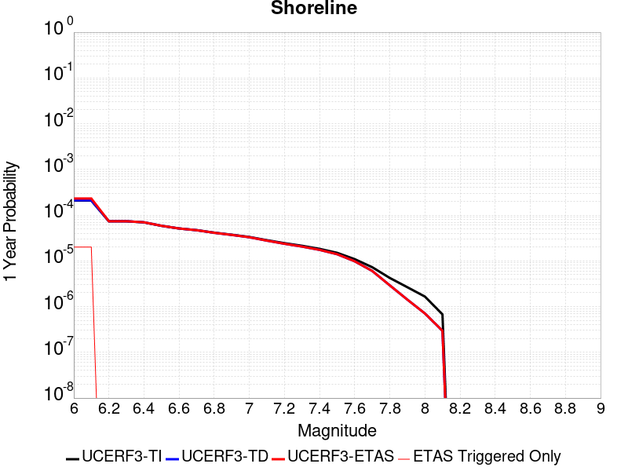 |  |

| Magnitude | 1 wk TI Prob | 1 wk TD Prob | 1 wk ETAS Prob | 1 wk ETAS/TD Gain | 1 wk ETAS Triggered Only | 1 mo TI Prob | 1 mo TD Prob | 1 mo ETAS Prob | 1 mo ETAS/TD Gain | 1 mo ETAS Triggered Only | 1 yr TI Prob | 1 yr TD Prob | 1 yr ETAS Prob | 1 yr ETAS/TD Gain | 1 yr ETAS Triggered Only | 10 yr TI Prob | 10 yr TD Prob | 10 yr ETAS Prob | 10 yr ETAS/TD Gain | 10 yr ETAS Triggered Only |
|-----|-----|-----|-----|-----|-----|-----|-----|-----|-----|-----|-----|-----|-----|-----|-----|-----|-----|-----|-----|-----|
| 6.0 | 3.9888673E-6 | 4.047929E-6 | 4.047929E-6 | 1.0 | 0.0 | 1.7095033E-5 | 1.7348184E-5 | 3.2944645E-5 | 1.8990256 | 1.5596732E-5 | 2.0811215E-4 | 2.1119925E-4 | 2.2679269E-4 | 1.0738329 | 1.5596732E-5 | 0.0020791737 | 0.002110534 | 0.002126098 | 1.0073744 | 1.5596732E-5 |
| 6.1 | 3.9888673E-6 | 4.047929E-6 | 4.047929E-6 | 1.0 | 0.0 | 1.7095033E-5 | 1.7348184E-5 | 3.2944645E-5 | 1.8990256 | 1.5596732E-5 | 2.0811215E-4 | 2.1119925E-4 | 2.2679269E-4 | 1.0738329 | 1.5596732E-5 | 0.0020791737 | 0.002110534 | 0.002126098 | 1.0073744 | 1.5596732E-5 |
| 6.2 | 1.4039653E-6 | 1.4100891E-6 | 1.4100891E-6 | 1.0 | 0.0 | 6.0169805E-6 | 6.0432253E-6 | 6.0432253E-6 | 1.0 | 0.0 | 7.325427E-5 | 7.357384E-5 | 7.357384E-5 | 1.0 | 0.0 | 7.3230127E-4 | 7.355009E-4 | 7.355009E-4 | 1.0 | 0.0 |
| 6.3 | 1.4039653E-6 | 1.4100891E-6 | 1.4100891E-6 | 1.0 | 0.0 | 6.0169805E-6 | 6.0432253E-6 | 6.0432253E-6 | 1.0 | 0.0 | 7.325427E-5 | 7.357384E-5 | 7.357384E-5 | 1.0 | 0.0 | 7.3230127E-4 | 7.355009E-4 | 7.355009E-4 | 1.0 | 0.0 |
| 6.4 | 1.3314152E-6 | 1.3361605E-6 | 1.3361605E-6 | 1.0 | 0.0 | 5.7060524E-6 | 5.7263896E-6 | 5.7263896E-6 | 1.0 | 0.0 | 6.946897E-5 | 6.971662E-5 | 6.971662E-5 | 1.0 | 0.0 | 6.9447263E-4 | 6.9695286E-4 | 6.9695286E-4 | 1.0 | 0.0 |
| 6.5 | 1.1187026E-6 | 1.120364E-6 | 1.120364E-6 | 1.0 | 0.0 | 4.794431E-6 | 4.8015513E-6 | 4.8015513E-6 | 1.0 | 0.0 | 5.8370628E-5 | 5.8457343E-5 | 5.8457343E-5 | 1.0 | 0.0 | 5.83553E-4 | 5.844222E-4 | 5.844222E-4 | 1.0 | 0.0 |
| 6.6 | 9.793089E-7 | 9.784919E-7 | 9.784919E-7 | 1.0 | 0.0 | 4.1970316E-6 | 4.1935305E-6 | 4.1935305E-6 | 1.0 | 0.0 | 5.1097657E-5 | 5.105505E-5 | 5.105505E-5 | 1.0 | 0.0 | 5.108591E-4 | 5.1043445E-4 | 5.1043445E-4 | 1.0 | 0.0 |
| 6.7 | 8.995986E-7 | 8.9728E-7 | 8.9728E-7 | 1.0 | 0.0 | 3.8554167E-6 | 3.84548E-6 | 3.84548E-6 | 1.0 | 0.0 | 4.693869E-5 | 4.6817724E-5 | 4.6817724E-5 | 1.0 | 0.0 | 4.6928777E-4 | 4.6807955E-4 | 4.6807955E-4 | 1.0 | 0.0 |
| 6.8 | 7.931612E-7 | 7.8804027E-7 | 7.8804027E-7 | 1.0 | 0.0 | 3.3992578E-6 | 3.377311E-6 | 3.377311E-6 | 1.0 | 0.0 | 4.1385178E-5 | 4.1117994E-5 | 4.1117994E-5 | 1.0 | 0.0 | 4.1377472E-4 | 4.1110438E-4 | 4.1110438E-4 | 1.0 | 0.0 |
| 6.9 | 7.1465956E-7 | 7.078006E-7 | 7.078006E-7 | 1.0 | 0.0 | 3.062823E-6 | 3.0334277E-6 | 3.0334277E-6 | 1.0 | 0.0 | 3.7289232E-5 | 3.6931357E-5 | 3.6931357E-5 | 1.0 | 0.0 | 3.7282976E-4 | 3.6925258E-4 | 3.6925258E-4 | 1.0 | 0.0 |
| 7.0 | 6.389046E-7 | 6.299458E-7 | 6.299458E-7 | 1.0 | 0.0 | 2.7381598E-6 | 2.699765E-6 | 2.699765E-6 | 1.0 | 0.0 | 3.3336586E-5 | 3.2869146E-5 | 3.2869146E-5 | 1.0 | 0.0 | 3.3331584E-4 | 3.2864307E-4 | 3.2864307E-4 | 1.0 | 0.0 |
| 7.1 | 5.4300875E-7 | 5.3111313E-7 | 5.3111313E-7 | 1.0 | 0.0 | 2.3271782E-6 | 2.276197E-6 | 2.276197E-6 | 1.0 | 0.0 | 2.8333026E-5 | 2.7712347E-5 | 2.7712347E-5 | 1.0 | 0.0 | 2.8329415E-4 | 2.77089E-4 | 2.77089E-4 | 1.0 | 0.0 |
| 7.2 | 4.6768855E-7 | 4.5348952E-7 | 4.5348952E-7 | 1.0 | 0.0 | 2.0043778E-6 | 1.9435251E-6 | 1.9435251E-6 | 1.0 | 0.0 | 2.4403027E-5 | 2.3662162E-5 | 2.3662162E-5 | 1.0 | 0.0 | 2.4400349E-4 | 2.3659648E-4 | 2.3659648E-4 | 1.0 | 0.0 |
| 7.3 | 4.0966103E-7 | 3.9385662E-7 | 3.9385662E-7 | 1.0 | 0.0 | 1.7556889E-6 | 1.6879559E-6 | 1.6879559E-6 | 1.0 | 0.0 | 2.1375303E-5 | 2.055067E-5 | 2.055067E-5 | 1.0 | 0.0 | 2.1373246E-4 | 2.0548773E-4 | 2.0548773E-4 | 1.0 | 0.0 |
| 7.4 | 3.5105785E-7 | 3.3363975E-7 | 3.3363975E-7 | 1.0 | 0.0 | 1.5045327E-6 | 1.4298838E-6 | 1.4298838E-6 | 1.0 | 0.0 | 1.8317533E-5 | 1.7408696E-5 | 1.7408696E-5 | 1.0 | 0.0 | 1.8316023E-4 | 1.7407336E-4 | 1.7407336E-4 | 1.0 | 0.0 |
| 7.5 | 2.8737534E-7 | 2.6820038E-7 | 2.6820038E-7 | 1.0 | 0.0 | 1.2316079E-6 | 1.1494297E-6 | 1.1494297E-6 | 1.0 | 0.0 | 1.4994724E-5 | 1.3994217E-5 | 1.3994217E-5 | 1.0 | 0.0 | 1.4993713E-4 | 1.3993339E-4 | 1.3993339E-4 | 1.0 | 0.0 |
| 7.6 | 2.0924051E-7 | 1.8778988E-7 | 1.8778988E-7 | 1.0 | 0.0 | 8.967448E-7 | 8.048135E-7 | 8.048135E-7 | 1.0 | 0.0 | 1.0917813E-5 | 9.79856E-6 | 9.79856E-6 | 1.0 | 0.0 | 1.0917276E-4 | 9.798129E-5 | 9.798129E-5 | 1.0 | 0.0 |
| 7.7 | 1.392265E-7 | 1.15433906E-7 | 1.15433906E-7 | 1.0 | 0.0 | 5.9668486E-7 | 4.9471663E-7 | 4.9471663E-7 | 1.0 | 0.0 | 7.2646135E-6 | 6.023158E-6 | 6.023158E-6 | 1.0 | 0.0 | 7.2643765E-5 | 6.0229955E-5 | 6.0229955E-5 | 1.0 | 0.0 |
| 7.8 | 8.1080074E-8 | 5.586722E-8 | 5.586722E-8 | 1.0 | 0.0 | 3.4748598E-7 | 2.394309E-7 | 2.394309E-7 | 1.0 | 0.0 | 4.2306337E-6 | 2.9150672E-6 | 2.9150672E-6 | 1.0 | 0.0 | 4.230553E-5 | 2.9150291E-5 | 2.9150291E-5 | 1.0 | 0.0 |
| 7.9 | 5.0859036E-8 | 2.7244445E-8 | 2.7244445E-8 | 1.0 | 0.0 | 2.1796728E-7 | 1.16761896E-7 | 1.16761896E-7 | 1.0 | 0.0 | 2.6537484E-6 | 1.4215751E-6 | 1.4215751E-6 | 1.0 | 0.0 | 2.6537167E-5 | 1.4215661E-5 | 1.4215661E-5 | 1.0 | 0.0 |
| 8.0 | 3.1760536E-8 | 1.3577206E-8 | 1.3577206E-8 | 1.0 | 0.0 | 1.3611657E-7 | 5.8188025E-8 | 5.8188025E-8 | 1.0 | 0.0 | 1.6572179E-6 | 7.0843896E-7 | 7.0843896E-7 | 1.0 | 0.0 | 1.6572056E-5 | 7.084367E-6 | 7.084367E-6 | 1.0 | 0.0 |
| 8.1 | 1.2947896E-8 | 5.6628693E-9 | 5.6628693E-9 | 1.0 | 0.0 | 5.5490982E-8 | 2.426944E-8 | 2.426944E-8 | 1.0 | 0.0 | 6.756025E-7 | 2.954804E-7 | 2.954804E-7 | 1.0 | 0.0 | 6.7560045E-6 | 2.9548003E-6 | 2.9548003E-6 | 1.0 | 0.0 |

