# Parent Section Magnitude-Probability Distributions

Only fault sections with at least one triggered aftershock are plotted. Sections are sorted by total supraseismogenic trigger rate (decreasing)

## Table Of Contents

* [Tank Canyon](#tank-canyon)
* [Garlock (Central)](#garlock-central)
* [Little Lake](#little-lake)
* [Owl Lake](#owl-lake)
* [Airport Lake](#airport-lake)
* [Panamint Valley](#panamint-valley)
* [Garlock (East)](#garlock-east)
* [Hunter Mountain-Saline Valley](#hunter-mountain-saline-valley)
* [Ash Hill](#ash-hill)
* [Blackwater](#blackwater)
* [Garlock (West)](#garlock-west)
* [McLean Lake](#mclean-lake)
* [Death Valley (So)](#death-valley-so)
* [Goldstone Lake](#goldstone-lake)
* [San Andreas (Mojave S)](#san-andreas-mojave-s)
* [Gravel Hills-Harper Lk](#gravel-hills-harper-lk)
* [San Andreas (Mojave N)](#san-andreas-mojave-n)
* [Coyote Canyon](#coyote-canyon)
* [Nelson Lake](#nelson-lake)
* [So Sierra Nevada](#so-sierra-nevada)
* [Towne Pass](#towne-pass)
* [San Andreas (San Bernardino N)](#san-andreas-san-bernardino-n)
* [Lenwood-Lockhart-Old Woman Springs](#lenwood-lockhart-old-woman-springs)
* [Bicycle Lake](#bicycle-lake)
* [Garlic Springs](#garlic-springs)
* [Paradise](#paradise)
* [Death Valley (Black Mtns Frontal)](#death-valley-black-mtns-frontal)
* [San Andreas (San Bernardino S)](#san-andreas-san-bernardino-s)
* [Coyote Lake](#coyote-lake)
* [San Andreas (Big Bend)](#san-andreas-big-bend)
* [Helendale-So Lockhart](#helendale-so-lockhart)
* [San Andreas (Parkfield)](#san-andreas-parkfield)
* [Death Valley (No)](#death-valley-no)
* [Death Valley (Fish Lake Valley)](#death-valley-fish-lake-valley)
* [San Andreas (Carrizo) rev](#san-andreas-carrizo-rev)
* [San Andreas (Cholame) rev](#san-andreas-cholame-rev)
* [San Andreas (San Gorgonio Pass-Garnet HIll)](#san-andreas-san-gorgonio-pass-garnet-hill)
* [San Jacinto (San Bernardino)](#san-jacinto-san-bernardino)
* [San Andreas (Creeping Section) 2011 CFM](#san-andreas-creeping-section-2011-cfm)
* [San Andreas (Coachella) rev](#san-andreas-coachella-rev)
* [Cady](#cady)
* [Lake Isabella (Seismicity)](#lake-isabella-seismicity)
* [San Jacinto (San Jacinto Valley) rev](#san-jacinto-san-jacinto-valley-rev)
* [Red Pass](#red-pass)
* [San Jacinto (Stepovers Combined)](#san-jacinto-stepovers-combined)
* [Sierra Nevada  (No Extension)](#sierra-nevada--no-extension)
* [San Jacinto (Anza) rev](#san-jacinto-anza-rev)
* [Cleghorn Lake](#cleghorn-lake)
* [Baker](#baker)
* [Ludlow](#ludlow)
* [Santa Ynez (East)](#santa-ynez-east)
* [Manix-Afton Hills](#manix-afton-hills)
* [San Andreas (North Branch Mill Creek)](#san-andreas-north-branch-mill-creek)
* [Calico-Hidalgo](#calico-hidalgo)
* [Elsinore (Glen Ivy) rev](#elsinore-glen-ivy-rev)
* [Santa Ynez (West)](#santa-ynez-west)
* [Pleito](#pleito)
* [White Wolf (Extension)](#white-wolf-extension)
* [Red Mountain](#red-mountain)
* [San Jacinto (Coyote Creek)](#san-jacinto-coyote-creek)
* [Scodie Lineament](#scodie-lineament)
* [Mission Creek](#mission-creek)
* [Mission Ridge-Arroyo Parida-Santa Ana](#mission-ridge-arroyo-parida-santa-ana)
* [San Jacinto (Lytle Creek connector)](#san-jacinto-lytle-creek-connector)
* [Brawley (Seismic Zone) alt 1](#brawley-seismic-zone-alt-1)
* [Lost Hills](#lost-hills)
* [San Jacinto (Borrego)](#san-jacinto-borrego)
* [Imperial](#imperial)
* [Big Pine (Central)](#big-pine-central)
* [Cleghorn Pass](#cleghorn-pass)
* [Calaveras (So) - Paicines extension 2011 CFM](#calaveras-so---paicines-extension-2011-cfm)
* [Santa Cruz Island](#santa-cruz-island)
* [Channel Islands Thrust](#channel-islands-thrust)
* [Santa Rosa Island](#santa-rosa-island)
* [Pisgah-Bullion Mtn-Mesquite Lk](#pisgah-bullion-mtn-mesquite-lk)
* [Kern Canyon (North Kern) 2011](#kern-canyon-north-kern-2011)
* [Pinto Mtn](#pinto-mtn)
* [Ventura-Pitas Point](#ventura-pitas-point)
* [Deep Springs](#deep-springs)
* [Big Pine (East)](#big-pine-east)
* [Great Valley 09 (Laguna Seca)](#great-valley-09-laguna-seca)
* [Independence rev 2011](#independence-rev-2011)
* [Rose Canyon](#rose-canyon)
* [Cleghorn](#cleghorn)
* [Calaveras (So) 2011 CFM](#calaveras-so-2011-cfm)
* [Hunting Creek - Berryessa 2011 CFM](#hunting-creek---berryessa-2011-cfm)
* [Cucamonga](#cucamonga)
* [Likely 2011 CFM](#likely-2011-cfm)
* [Elysian Park (Upper)](#elysian-park-upper)
* [San Jacinto (Superstition Mtn)](#san-jacinto-superstition-mtn)
* [Owens Valley](#owens-valley)
* [Chino alt 1](#chino-alt-1)
* [Hosgri](#hosgri)
* [San Juan](#san-juan)
* [San Diego Trough north alt1](#san-diego-trough-north-alt1)
* [San Andreas (Santa Cruz Mts) 2011 CFM](#san-andreas-santa-cruz-mts-2011-cfm)
* [Palos Verdes](#palos-verdes)
* [White Mountains](#white-mountains)
* [Santa Ynez River](#santa-ynez-river)
* [Santa Cruz Catalina Ridge alt1](#santa-cruz-catalina-ridge-alt1)
* [San Cayetano](#san-cayetano)
* [San Jacinto (Clark) rev](#san-jacinto-clark-rev)
* [Ortigalita (North)](#ortigalita-north)
* [San Clemente](#san-clemente)
* [Pitas Point (Lower West)](#pitas-point-lower-west)
* [Kern Canyon (South Kern) 2011](#kern-canyon-south-kern-2011)
* [Camp Rock 2011](#camp-rock-2011)
* [Oceanside alt1](#oceanside-alt1)
* [San Pedro Basin](#san-pedro-basin)
* [North Frontal  (West)](#north-frontal--west)
* [Bullion Mountains](#bullion-mountains)
* [Great Valley 03 Mysterious Ridge](#great-valley-03-mysterious-ridge)
* [Santa Susana alt 1](#santa-susana-alt-1)
* [Coronado Bank alt1](#coronado-bank-alt1)
* [Tin Mountain](#tin-mountain)
* [Oak Ridge (Onshore)](#oak-ridge-onshore)
* [Oceanic - West Huasna](#oceanic---west-huasna)
* [Blue Cut](#blue-cut)
* [Mono Lake 2011 CFM](#mono-lake-2011-cfm)
* [Calaveras (Central) 2011 CFM](#calaveras-central-2011-cfm)
* [Verdugo](#verdugo)
* [Newport-Inglewood (Offshore)](#newport-inglewood-offshore)
* [Raymond](#raymond)
* [Simi-Santa Rosa](#simi-santa-rosa)
* [Ortigalita (South)](#ortigalita-south)
* [Hunting Creek - Bartlett Springs connector 2011](#hunting-creek---bartlett-springs-connector-2011)
* [Whittier alt 1](#whittier-alt-1)
* [Homestead Valley 2011](#homestead-valley-2011)
* [Dry Mountain](#dry-mountain)
* [Pine Mtn](#pine-mtn)
* [Carlsbad](#carlsbad)
* [North Frontal  (East)](#north-frontal--east)
* [Morales (East)](#morales-east)
* [San Diego Trough south](#san-diego-trough-south)
* [San Luis Range 2011 CFM](#san-luis-range-2011-cfm)
* [Hosgri (Extension)](#hosgri-extension)
* [Sargent 2011 CFM](#sargent-2011-cfm)
* [Del Valle](#del-valle)
* [Morales (West)](#morales-west)
* [Great Valley 07 (Orestimba)](#great-valley-07-orestimba)
* [Sierra Madre](#sierra-madre)
* [Newport-Inglewood alt 1](#newport-inglewood-alt-1)
* [Pittville 2011 CFM](#pittville-2011-cfm)
* [Butano 2011 CFM](#butano-2011-cfm)
* [Kern Canyon (Lake Isabella) 2011](#kern-canyon-lake-isabella-2011)
* [Santa Susana East (connector)](#santa-susana-east-connector)
* [San Gabriel](#san-gabriel)
* [Bartlett Springs 2011 CFM](#bartlett-springs-2011-cfm)
* [Earthquake Valley (So Extension)](#earthquake-valley-so-extension)
* [Superstition Hills](#superstition-hills)
* [Sierra Madre (San Fernando)](#sierra-madre-san-fernando)
* [Hayward (So) extension 2011 CFM](#hayward-so-extension-2011-cfm)
* [Great Valley 08 (Quinto)](#great-valley-08-quinto)
* [Ozena](#ozena)
* [Great Valley 10 (Panoche)](#great-valley-10-panoche)
* [Earthquake Valley (No  Extension)](#earthquake-valley-no--extension)
* [Reliz 2011 CFM](#reliz-2011-cfm)
* [Peralta Hills](#peralta-hills)
* [Great Valley 05 Pittsburg - Kirby Hills alt1](#great-valley-05-pittsburg---kirby-hills-alt1)
* [Emerson-Copper Mtn 2011](#emerson-copper-mtn-2011)
* [Antelope Valley 2011](#antelope-valley-2011)
* [Santa Monica alt 1](#santa-monica-alt-1)
* [Compton](#compton)
* [White Wolf](#white-wolf)
* [Greenville (So) 2011 CFM](#greenville-so-2011-cfm)
* [Earthquake Valley](#earthquake-valley)
* [Puente Hills](#puente-hills)
* [Great Valley 03a Dunnigan Hills](#great-valley-03a-dunnigan-hills)
* [Great Valley 04a Trout Creek](#great-valley-04a-trout-creek)
* [Monterey Bay-Tularcitos](#monterey-bay-tularcitos)
* [Calaveras (No) 2011 CFM](#calaveras-no-2011-cfm)
* [Owens Valley Keough Hot Springs](#owens-valley-keough-hot-springs)
* [Anacapa-Dume alt 1](#anacapa-dume-alt-1)
* [San Gorgonio Pass](#san-gorgonio-pass)
* [Elsinore (Stepovers Combined)](#elsinore-stepovers-combined)
* [Hayward (So) 2011 CFM](#hayward-so-2011-cfm)
* [Los Osos 2011](#los-osos-2011)
* [San Andreas (Peninsula) 2011 CFM](#san-andreas-peninsula-2011-cfm)
* [East Huasna 2011 CFM](#east-huasna-2011-cfm)
* [Green Valley 2011 CFM](#green-valley-2011-cfm)
* [San Gabriel (Extension)](#san-gabriel-extension)
* [West Napa 2011 CFM](#west-napa-2011-cfm)
* [Hat Creek-McArthur-Mayfield](#hat-creek-mcarthur-mayfield)
* [San Joaquin Hills](#san-joaquin-hills)
* [Greenville (No) 2011 CFM](#greenville-no-2011-cfm)
* [Sisar](#sisar)
* [Northridge](#northridge)
* [Round Valley](#round-valley)
* [Sheephole](#sheephole)
* [Elsinore (Coyote Mountains)](#elsinore-coyote-mountains)
* [San Andreas (North Coast) 2011 CFM](#san-andreas-north-coast-2011-cfm)
* [Channel Islands Western Deep Ramp](#channel-islands-western-deep-ramp)
* [San Gregorio (North) 2011 CFM](#san-gregorio-north-2011-cfm)
* [Pitas Point (Lower)-Montalvo](#pitas-point-lower-montalvo)
* [Mission Hills 2011](#mission-hills-2011)
* [Burnt Mtn](#burnt-mtn)
* [San Jose](#san-jose)
* [Point Reyes 2011 connector](#point-reyes-2011-connector)
* [Rinconada 2011 CFM](#rinconada-2011-cfm)
* [Shoreline](#shoreline)

## Tank Canyon
*[(top)](#table-of-contents)*

| 1 Week | 1 Month | 1 Year | 10 Year |
|-----|-----|-----|-----|
|  |  |  |  |

| Magnitude | 1 wk TI Prob | 1 wk TD Prob | 1 wk ETAS Prob | 1 wk ETAS/TD Gain | 1 wk ETAS Triggered Only | 1 mo TI Prob | 1 mo TD Prob | 1 mo ETAS Prob | 1 mo ETAS/TD Gain | 1 mo ETAS Triggered Only | 1 yr TI Prob | 1 yr TD Prob | 1 yr ETAS Prob | 1 yr ETAS/TD Gain | 1 yr ETAS Triggered Only | 10 yr TI Prob | 10 yr TD Prob | 10 yr ETAS Prob | 10 yr ETAS/TD Gain | 10 yr ETAS Triggered Only |
|-----|-----|-----|-----|-----|-----|-----|-----|-----|-----|-----|-----|-----|-----|-----|-----|-----|-----|-----|-----|-----|
| 6.0 | 4.8284557E-5 | 5.7964822E-5 | 0.0428412 | 739.0896 | 0.042785715 | 2.0691741E-4 | 2.4840087E-4 | 0.057781726 | 232.61484 | 0.057547618 | 0.0025163088 | 0.0030207601 | 0.09213171 | 30.499514 | 0.08938095 | 0.02488006 | 0.029863637 | 0.14919041 | 4.9957213 | 0.123 |
| 6.1 | 1.7796336E-5 | 2.0873314E-5 | 0.018306205 | 877.0148 | 0.018285714 | 7.626778E-5 | 8.945422E-5 | 0.026563276 | 296.94827 | 0.026476191 | 9.281647E-4 | 0.0010885983 | 0.045873128 | 42.13963 | 0.044833332 | 0.009242975 | 0.010836744 | 0.07621572 | 7.0330834 | 0.06609524 |
| 6.2 | 1.7796336E-5 | 2.0873314E-5 | 0.018306205 | 877.0148 | 0.018285714 | 7.626778E-5 | 8.945422E-5 | 0.026563276 | 296.94827 | 0.026476191 | 9.281647E-4 | 0.0010885983 | 0.045873128 | 42.13963 | 0.044833332 | 0.009242975 | 0.010836744 | 0.07621572 | 7.0330834 | 0.06609524 |
| 6.3 | 1.3515912E-5 | 1.5759564E-5 | 0.014348867 | 910.48627 | 0.014333333 | 5.792405E-5 | 6.753938E-5 | 0.021185162 | 313.67123 | 0.021119047 | 7.049971E-4 | 8.2200574E-4 | 0.036958944 | 44.961903 | 0.036166668 | 0.007027647 | 0.0081922645 | 0.0622694 | 7.601 | 0.05452381 |
| 6.4 | 1.0870146E-5 | 1.2618021E-5 | 0.011250571 | 891.62726 | 0.011238095 | 4.658551E-5 | 5.4076212E-5 | 0.016981732 | 314.03333 | 0.016928572 | 5.67031E-4 | 6.581969E-4 | 0.029853255 | 45.356113 | 0.029214285 | 0.005655863 | 0.0065644905 | 0.05048853 | 7.691158 | 0.044214286 |
| 6.5 | 7.964826E-6 | 9.196094E-6 | 0.007366271 | 801.0217 | 0.007357143 | 3.4134522E-5 | 3.9411298E-5 | 0.011396106 | 289.1584 | 0.011357143 | 4.1550855E-4 | 4.7973756E-4 | 0.020160768 | 42.024574 | 0.019690476 | 0.0041473247 | 0.004788321 | 0.035142276 | 7.3391647 | 0.0305 |
| 6.6 | 6.6317E-6 | 7.6122988E-6 | 0.005483761 | 720.3817 | 0.0054761907 | 2.8421264E-5 | 3.2623782E-5 | 0.008532346 | 261.53763 | 0.0085 | 3.4597394E-4 | 3.9713128E-4 | 0.015367374 | 38.695957 | 0.01497619 | 0.0034543579 | 0.003965368 | 0.02689788 | 6.783199 | 0.02302381 |
| 6.7 | 4.793663E-6 | 5.4307857E-6 | 0.0031244615 | 575.32404 | 0.0031190477 | 2.0544108E-5 | 2.3274613E-5 | 0.0048564957 | 208.66063 | 0.004833333 | 2.500958E-4 | 2.8333595E-4 | 0.008852336 | 31.243252 | 0.008571428 | 0.0024981452 | 0.0028304397 | 0.015603707 | 5.5128207 | 0.012809523 |
| 6.8 | 4.382823E-6 | 4.9692567E-6 | 0.002981145 | 599.91766 | 0.0029761905 | 1.8783392E-5 | 2.1296666E-5 | 0.004640246 | 217.88603 | 0.0046190475 | 2.286638E-4 | 2.5926033E-4 | 0.00828099 | 31.940828 | 0.00802381 | 0.0022842865 | 0.002590253 | 0.014464178 | 5.5840797 | 0.011904762 |
| 6.9 | 2.729601E-6 | 3.0735416E-6 | 0.0013125933 | 427.06213 | 0.0013095238 | 1.1698237E-5 | 1.3172262E-5 | 0.0022988564 | 174.52252 | 0.0022857143 | 1.4241673E-4 | 1.6036171E-4 | 0.00415972 | 25.93961 | 0.004 | 0.001423255 | 0.0016026258 | 0.0075692385 | 4.723023 | 0.0059761903 |
| 7.0 | 1.8987357E-6 | 2.126939E-6 | 6.9260166E-4 | 325.63306 | 6.904762E-4 | 8.137413E-6 | 9.115425E-6 | 0.0011043436 | 121.15107 | 0.0010952381 | 9.90685E-5 | 1.1097535E-4 | 0.0020869465 | 18.805496 | 0.0019761904 | 9.902435E-4 | 0.0011092679 | 0.0041772895 | 3.7658074 | 0.0030714285 |
| 7.1 | 1.4928986E-6 | 1.6641272E-6 | 3.349969E-4 | 201.30487 | 3.3333333E-4 | 6.398121E-6 | 7.1319573E-6 | 5.547471E-4 | 77.78329 | 5.4761907E-4 | 7.789434E-5 | 8.682871E-5 | 0.0010867419 | 12.515927 | 0.001 | 7.786704E-4 | 8.6800574E-4 | 0.0024618593 | 2.8362246 | 0.0015952381 |
| 7.2 | 1.069082E-6 | 1.1828573E-6 | 1.2023033E-4 | 101.64399 | 1.1904762E-4 | 4.581772E-6 | 5.0693816E-6 | 1.717352E-4 | 33.876953 | 1.6666666E-4 | 5.5781646E-5 | 6.171851E-5 | 4.664554E-4 | 7.557789 | 4.047619E-4 | 5.576765E-4 | 6.170659E-4 | 0.0013547057 | 2.1953988 | 7.3809526E-4 |
| 7.3 | 8.776551E-7 | 9.770005E-7 | 2.4786501E-5 | 25.369999 | 2.3809524E-5 | 3.7613736E-6 | 4.1871413E-6 | 5.180599E-5 | 12.37264 | 4.7619047E-5 | 4.579376E-5 | 5.097777E-5 | 2.6525257E-4 | 5.2032986 | 2.1428571E-4 | 4.5784327E-4 | 5.097118E-4 | 9.3806477E-4 | 1.8403827 | 4.2857142E-4 |
| 7.4 | 7.55721E-7 | 8.510244E-7 | 2.4660529E-5 | 28.97746 | 2.3809524E-5 | 3.2388E-6 | 3.6472454E-6 | 5.126612E-5 | 14.05612 | 4.7619047E-5 | 3.9431678E-5 | 4.4404827E-5 | 2.1106409E-4 | 4.753179 | 1.6666666E-4 | 3.942468E-4 | 4.440104E-4 | 8.2479365E-4 | 1.8575999 | 3.8095238E-4 |
| 7.5 | 5.587665E-7 | 6.305619E-7 | 2.444007E-5 | 38.759193 | 2.3809524E-5 | 2.3947114E-6 | 2.702408E-6 | 2.6511867E-5 | 9.81046 | 2.3809524E-5 | 2.915522E-5 | 3.290182E-5 | 1.2813677E-4 | 3.8945198 | 9.5238094E-5 | 2.9151395E-4 | 3.290182E-4 | 5.194317E-4 | 1.5787325 | 1.9047619E-4 |

## Garlock (Central)
*[(top)](#table-of-contents)*

| 1 Week | 1 Month | 1 Year | 10 Year |
|-----|-----|-----|-----|
|  |  | 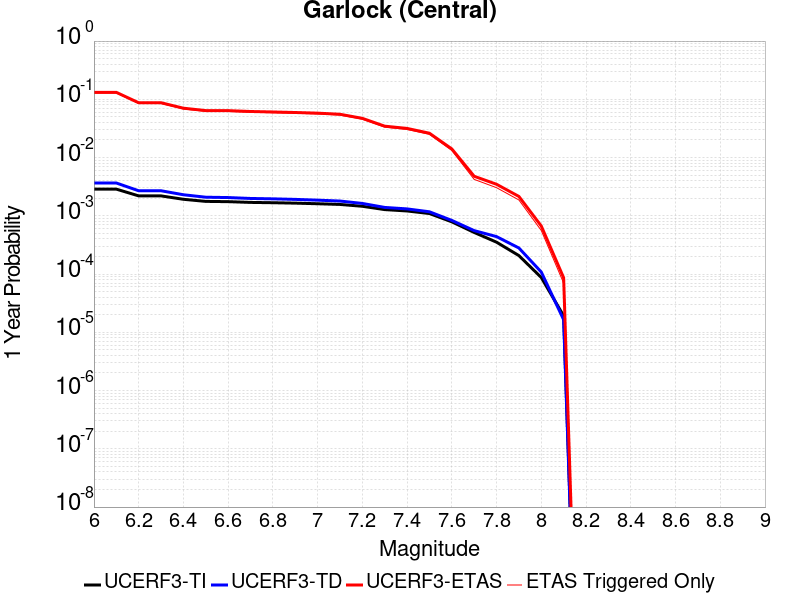 |  |

| Magnitude | 1 wk TI Prob | 1 wk TD Prob | 1 wk ETAS Prob | 1 wk ETAS/TD Gain | 1 wk ETAS Triggered Only | 1 mo TI Prob | 1 mo TD Prob | 1 mo ETAS Prob | 1 mo ETAS/TD Gain | 1 mo ETAS Triggered Only | 1 yr TI Prob | 1 yr TD Prob | 1 yr ETAS Prob | 1 yr ETAS/TD Gain | 1 yr ETAS Triggered Only | 10 yr TI Prob | 10 yr TD Prob | 10 yr ETAS Prob | 10 yr ETAS/TD Gain | 10 yr ETAS Triggered Only |
|-----|-----|-----|-----|-----|-----|-----|-----|-----|-----|-----|-----|-----|-----|-----|-----|-----|-----|-----|-----|-----|
| 6.0 | 5.5131142E-5 | 7.024681E-5 | 0.07182711 | 1022.4964 | 0.071761906 | 2.3625491E-4 | 3.010234E-4 | 0.09034534 | 300.12732 | 0.09007143 | 0.0028726095 | 0.0036588663 | 0.12896062 | 35.24606 | 0.12576191 | 0.028357591 | 0.036079824 | 0.1904677 | 5.279064 | 0.16016667 |
| 6.1 | 5.5131142E-5 | 7.024681E-5 | 0.07182711 | 1022.4964 | 0.071761906 | 2.3625491E-4 | 3.010234E-4 | 0.09034534 | 300.12732 | 0.09007143 | 0.0028726095 | 0.0036588663 | 0.12896062 | 35.24606 | 0.12576191 | 0.028357591 | 0.036079824 | 0.1904677 | 5.279064 | 0.16016667 |
| 6.2 | 4.216245E-5 | 5.1661493E-5 | 0.045620736 | 883.07043 | 0.045571428 | 1.806837E-4 | 2.2138779E-4 | 0.05811333 | 262.49564 | 0.05790476 | 0.0021976046 | 0.0026920962 | 0.084613815 | 31.430458 | 0.08214286 | 0.021759989 | 0.026689773 | 0.13127427 | 4.9185233 | 0.10745238 |
| 6.3 | 4.216245E-5 | 5.1661493E-5 | 0.045620736 | 883.07043 | 0.045571428 | 1.806837E-4 | 2.2138779E-4 | 0.05811333 | 262.49564 | 0.05790476 | 0.0021976046 | 0.0026920962 | 0.084613815 | 31.430458 | 0.08214286 | 0.021759989 | 0.026689773 | 0.13127427 | 4.9185233 | 0.10745238 |
| 6.4 | 3.6858168E-5 | 4.411054E-5 | 0.03609014 | 818.1749 | 0.03604762 | 1.5795401E-4 | 1.8903162E-4 | 0.046204142 | 244.42546 | 0.04602381 | 0.0019213937 | 0.002299056 | 0.06845613 | 29.775757 | 0.06630953 | 0.019048655 | 0.02284894 | 0.10902436 | 4.7715282 | 0.08819047 |
| 6.5 | 3.39199E-5 | 4.0018083E-5 | 0.032919656 | 822.61945 | 0.03288095 | 1.453629E-4 | 1.7149492E-4 | 0.042045265 | 245.16916 | 0.041880954 | 0.0017683565 | 0.002085973 | 0.06217465 | 29.806068 | 0.060214285 | 0.017543508 | 0.020759864 | 0.09956538 | 4.7960515 | 0.08047619 |
| 6.6 | 3.3571985E-5 | 3.9472274E-5 | 0.03289532 | 833.37787 | 0.032857142 | 1.4387199E-4 | 1.6915603E-4 | 0.04201922 | 248.40508 | 0.041857142 | 0.0017502342 | 0.0020575512 | 0.06212418 | 30.193262 | 0.060190476 | 0.017365133 | 0.020481179 | 0.099285804 | 4.8476605 | 0.08045238 |
| 6.7 | 3.2580007E-5 | 3.8088703E-5 | 0.03163212 | 830.4857 | 0.031595238 | 1.3962112E-4 | 1.632272E-4 | 0.04046617 | 247.91316 | 0.040309522 | 0.0016985617 | 0.0019855013 | 0.059870344 | 30.153767 | 0.058 | 0.016856372 | 0.019773813 | 0.095904715 | 4.8500867 | 0.07766667 |
| 6.8 | 3.2185937E-5 | 3.7515918E-5 | 0.031179205 | 831.09265 | 0.031142857 | 1.3793244E-4 | 1.6077272E-4 | 0.03989248 | 248.12965 | 0.039738096 | 0.0016780337 | 0.001955672 | 0.059034303 | 30.186197 | 0.057190478 | 0.016654192 | 0.019480614 | 0.09453704 | 4.8528776 | 0.07654762 |
| 6.9 | 3.165394E-5 | 3.6720503E-5 | 0.030607026 | 833.51324 | 0.030571429 | 1.3565269E-4 | 1.5736422E-4 | 0.03919884 | 249.09627 | 0.039047617 | 0.0016503202 | 0.001914247 | 0.05787834 | 30.235563 | 0.056071427 | 0.01638118 | 0.019073246 | 0.09271282 | 4.8608828 | 0.07507143 |
| 7.0 | 3.0903822E-5 | 3.5625766E-5 | 0.029844088 | 837.71075 | 0.029809523 | 1.3243823E-4 | 1.5267303E-4 | 0.03831351 | 250.9514 | 0.03816667 | 0.0016112428 | 0.0018572307 | 0.056541197 | 30.443819 | 0.054785714 | 0.015996104 | 0.018512413 | 0.09053491 | 4.890497 | 0.073380955 |
| 7.1 | 3.0069863E-5 | 3.4392073E-5 | 0.028414369 | 826.1895 | 0.028380953 | 1.2886449E-4 | 1.4738638E-4 | 0.036665812 | 248.7734 | 0.036523808 | 0.0015677959 | 0.0017929734 | 0.054246377 | 30.254982 | 0.05254762 | 0.01556781 | 0.017880075 | 0.08686231 | 4.8580503 | 0.0702381 |
| 7.2 | 2.7957109E-5 | 3.128145E-5 | 0.024173383 | 772.77045 | 0.024142858 | 1.1981068E-4 | 1.340566E-4 | 0.03127274 | 233.28012 | 0.031142857 | 0.0014577188 | 0.0016309366 | 0.04636738 | 28.429909 | 0.044809524 | 0.014481937 | 0.016283695 | 0.07523641 | 4.6203523 | 0.05992857 |
| 7.3 | 2.4519275E-5 | 2.6714795E-5 | 0.017383395 | 650.7029 | 0.017357143 | 1.0507837E-4 | 1.1448703E-4 | 0.022730945 | 198.54602 | 0.022619048 | 0.0012785783 | 0.001393003 | 0.034014165 | 24.417868 | 0.03266667 | 0.012712469 | 0.013928054 | 0.057878688 | 4.1555476 | 0.04457143 |
| 7.4 | 2.3225532E-5 | 2.51994E-5 | 0.015929561 | 632.14044 | 0.015904762 | 9.95342E-5 | 1.0799304E-4 | 0.020772427 | 192.34969 | 0.020666666 | 0.0012111551 | 0.0013140367 | 0.031060612 | 23.637554 | 0.029785715 | 0.012045753 | 0.013145725 | 0.053512763 | 4.070735 | 0.04090476 |
| 7.5 | 2.097765E-5 | 2.2483688E-5 | 0.01328409 | 590.83234 | 0.013261905 | 8.9901114E-5 | 9.635517E-5 | 0.017142331 | 177.90775 | 0.01704762 | 0.0010939965 | 0.0011725046 | 0.025762687 | 21.972353 | 0.024619048 | 0.010886264 | 0.011740365 | 0.045294132 | 3.8579834 | 0.03395238 |
| 7.6 | 1.511254E-5 | 1.5991332E-5 | 0.0067301695 | 420.8636 | 0.006714286 | 6.476642E-5 | 6.853253E-5 | 0.00868699 | 126.75717 | 0.008619048 | 7.882459E-4 | 8.3407195E-4 | 0.013656701 | 16.37353 | 0.012833334 | 0.007854558 | 0.008383559 | 0.026563194 | 3.1684866 | 0.018333333 |
| 7.7 | 9.934069E-6 | 1.0678794E-5 | 0.0021058945 | 197.20341 | 0.002095238 | 4.2573887E-5 | 4.5765457E-5 | 0.0027361186 | 59.78567 | 0.0026904761 | 5.182138E-4 | 5.570524E-4 | 0.00457862 | 8.219372 | 0.0040238095 | 0.00517007 | 0.005627684 | 0.0114281885 | 2.0307093 | 0.0058333334 |
| 7.8 | 6.7562896E-6 | 8.428449E-6 | 0.0014607972 | 173.31743 | 0.0014523809 | 2.8955206E-5 | 3.6121426E-5 | 0.0018931972 | 52.41203 | 0.0018571429 | 3.5247262E-4 | 4.3968976E-4 | 0.0032003801 | 7.2787232 | 0.0027619048 | 0.0035191406 | 0.004446654 | 0.008428868 | 1.8955528 | 0.004 |
| 7.9 | 3.975453E-6 | 5.37103E-6 | 9.339375E-4 | 173.88423 | 9.2857145E-4 | 1.7037546E-5 | 2.3018498E-5 | 0.0012372762 | 53.75139 | 0.0012142857 | 2.0741238E-4 | 2.8021427E-4 | 0.002065428 | 7.370888 | 0.0017857143 | 0.002072189 | 0.0028336283 | 0.0053265444 | 1.8797611 | 0.0025 |
| 8.0 | 1.6729537E-6 | 2.0775144E-6 | 2.8779122E-4 | 138.5267 | 2.8571428E-4 | 7.169782E-6 | 8.903603E-6 | 3.898526E-4 | 43.78594 | 3.8095238E-4 | 8.7288594E-5 | 1.0839601E-4 | 6.797626E-4 | 6.271104 | 5.7142857E-4 | 8.7254314E-4 | 0.0010969337 | 0.0018817862 | 1.7154967 | 7.857143E-4 |
| 8.1 | 3.6733252E-7 | 3.1489964E-7 | 7.1743445E-5 | 227.82956 | 7.142857E-5 | 1.5742813E-6 | 1.3495693E-6 | 7.277804E-5 | 53.92687 | 7.142857E-5 | 1.9166706E-5 | 1.6430899E-5 | 1.3547656E-4 | 8.245232 | 1.1904762E-4 | 1.9165053E-4 | 1.6638759E-4 | 3.3302652E-4 | 2.0015106 | 1.6666666E-4 |

## Little Lake
*[(top)](#table-of-contents)*

| 1 Week | 1 Month | 1 Year | 10 Year |
|-----|-----|-----|-----|
|  |  |  |  |

| Magnitude | 1 wk TI Prob | 1 wk TD Prob | 1 wk ETAS Prob | 1 wk ETAS/TD Gain | 1 wk ETAS Triggered Only | 1 mo TI Prob | 1 mo TD Prob | 1 mo ETAS Prob | 1 mo ETAS/TD Gain | 1 mo ETAS Triggered Only | 1 yr TI Prob | 1 yr TD Prob | 1 yr ETAS Prob | 1 yr ETAS/TD Gain | 1 yr ETAS Triggered Only | 10 yr TI Prob | 10 yr TD Prob | 10 yr ETAS Prob | 10 yr ETAS/TD Gain | 10 yr ETAS Triggered Only |
|-----|-----|-----|-----|-----|-----|-----|-----|-----|-----|-----|-----|-----|-----|-----|-----|-----|-----|-----|-----|-----|
| 6.0 | 2.8424427E-5 | 3.120572E-5 | 0.03510154 | 1124.8431 | 0.03507143 | 1.2181328E-4 | 1.337327E-4 | 0.044151656 | 330.14853 | 0.044023808 | 0.0014820677 | 0.0016271127 | 0.062195066 | 38.22419 | 0.060666665 | 0.014722223 | 0.016165402 | 0.09056204 | 5.602214 | 0.07561905 |
| 6.1 | 2.8424427E-5 | 3.120572E-5 | 0.03510154 | 1124.8431 | 0.03507143 | 1.2181328E-4 | 1.337327E-4 | 0.044151656 | 330.14853 | 0.044023808 | 0.0014820677 | 0.0016271127 | 0.062195066 | 38.22419 | 0.060666665 | 0.014722223 | 0.016165402 | 0.09056204 | 5.602214 | 0.07561905 |
| 6.2 | 2.8424427E-5 | 3.120572E-5 | 0.03510154 | 1124.8431 | 0.03507143 | 1.2181328E-4 | 1.337327E-4 | 0.044151656 | 330.14853 | 0.044023808 | 0.0014820677 | 0.0016271127 | 0.062195066 | 38.22419 | 0.060666665 | 0.014722223 | 0.016165402 | 0.09056204 | 5.602214 | 0.07561905 |
| 6.3 | 1.48860645E-5 | 1.6081389E-5 | 0.023801412 | 1480.0594 | 0.023785714 | 6.379586E-5 | 6.8918576E-5 | 0.029757349 | 431.77542 | 0.029690476 | 7.7643775E-4 | 8.3878887E-4 | 0.040829025 | 48.676167 | 0.04002381 | 0.007737305 | 0.008359048 | 0.05758694 | 6.8891745 | 0.049642857 |
| 6.4 | 1.48860645E-5 | 1.6081389E-5 | 0.023801412 | 1480.0594 | 0.023785714 | 6.379586E-5 | 6.8918576E-5 | 0.029757349 | 431.77542 | 0.029690476 | 7.7643775E-4 | 8.3878887E-4 | 0.040829025 | 48.676167 | 0.04002381 | 0.007737305 | 0.008359048 | 0.05758694 | 6.8891745 | 0.049642857 |
| 6.5 | 1.2797581E-5 | 1.3765565E-5 | 0.021822989 | 1585.3319 | 0.021809524 | 5.4845623E-5 | 5.899409E-5 | 0.027438331 | 465.10306 | 0.027380953 | 6.675408E-4 | 7.18042E-4 | 0.03754872 | 52.293205 | 0.036857143 | 0.006655392 | 0.00715977 | 0.052759502 | 7.368882 | 0.04592857 |
| 6.6 | 9.661896E-6 | 1.0289038E-5 | 0.01910533 | 1856.8628 | 0.019095238 | 4.1407468E-5 | 4.409522E-5 | 0.023947803 | 543.0929 | 0.023904761 | 5.040193E-4 | 5.367433E-4 | 0.032686144 | 60.89716 | 0.032166667 | 0.005028777 | 0.0053560743 | 0.044976056 | 8.397205 | 0.039833333 |
| 6.7 | 7.767871E-6 | 8.199687E-6 | 0.01629378 | 1987.1223 | 0.016285714 | 3.329045E-5 | 3.5141118E-5 | 0.020605847 | 586.37427 | 0.02057143 | 4.0523586E-4 | 4.2777284E-4 | 0.028225401 | 65.982216 | 0.027809523 | 0.004044977 | 0.004270846 | 0.03871833 | 9.065729 | 0.03459524 |
| 6.8 | 6.4235196E-6 | 6.7357446E-6 | 0.01331617 | 1976.941 | 0.013309523 | 2.752908E-5 | 2.8867229E-5 | 0.01671886 | 579.16406 | 0.016690476 | 3.35115E-4 | 3.5141467E-4 | 0.0226531 | 64.462585 | 0.022309523 | 0.003346101 | 0.00350985 | 0.031055685 | 8.848151 | 0.027642857 |
| 6.9 | 3.1283696E-6 | 3.1121804E-6 | 0.008145944 | 2617.4395 | 0.008142857 | 1.3407229E-5 | 1.3337856E-5 | 0.009870349 | 740.02515 | 0.009857143 | 1.6322079E-4 | 1.6237781E-4 | 0.013350712 | 82.220055 | 0.013190476 | 0.0016310095 | 0.00162274 | 0.01823859 | 11.239379 | 0.016642857 |
| 7.0 | 2.290603E-6 | 2.2286815E-6 | 0.0046450756 | 2084.2258 | 0.0046428572 | 9.816834E-6 | 9.551463E-6 | 0.005747592 | 601.7499 | 0.0057380954 | 1.19513395E-4 | 1.162839E-4 | 0.007710639 | 66.30874 | 0.0075952383 | 0.0011944914 | 0.0011623327 | 0.010793982 | 9.286482 | 0.009642857 |
| 7.1 | 1.293693E-6 | 1.1776827E-6 | 0.0022630799 | 1921.6378 | 0.0022619048 | 5.5443866E-6 | 5.0472063E-6 | 0.0027193192 | 538.77716 | 0.0027142856 | 6.750081E-5 | 6.14487E-5 | 0.0035136174 | 57.179688 | 0.003452381 | 6.7480316E-4 | 6.143856E-4 | 0.0050402363 | 8.203702 | 0.0044285716 |
| 7.2 | 4.715842E-7 | 3.0917857E-7 | 2.4118695E-5 | 78.00895 | 2.3809524E-5 | 2.0210737E-6 | 1.3250503E-6 | 4.8944035E-5 | 36.93749 | 4.7619047E-5 | 2.4606294E-5 | 1.6132375E-5 | 1.11368936E-4 | 6.9034433 | 9.5238094E-5 | 2.460357E-4 | 1.6131258E-4 | 2.565353E-4 | 1.5902995 | 9.5238094E-5 |
| 7.3 | 3.9430947E-7 | 2.3097488E-7 | 2.3097488E-7 | 1.0 | 0.0 | 1.6898966E-6 | 9.89892E-7 | 2.4799392E-5 | 25.052626 | 2.3809524E-5 | 2.0574296E-5 | 1.2051869E-5 | 8.347958E-5 | 6.926692 | 7.142857E-5 | 2.0572392E-4 | 1.20512224E-4 | 1.9193218E-4 | 1.5926367 | 7.142857E-5 |
| 7.4 | 3.547123E-7 | 1.9679135E-7 | 1.9679135E-7 | 1.0 | 0.0 | 1.5201948E-6 | 8.4339126E-7 | 2.4652894E-5 | 29.230675 | 2.3809524E-5 | 1.8508214E-5 | 1.0268241E-5 | 5.78868E-5 | 5.63746 | 4.7619047E-5 | 1.8506673E-4 | 1.02677724E-4 | 1.5029189E-4 | 1.4637243 | 4.7619047E-5 |
| 7.5 | 2.6354266E-7 | 1.4423138E-7 | 1.4423138E-7 | 1.0 | 0.0 | 1.129468E-6 | 6.181344E-7 | 2.4427643E-5 | 39.51834 | 2.3809524E-5 | 1.3751187E-5 | 7.5257603E-6 | 5.514445E-5 | 7.3274255 | 4.7619047E-5 | 1.3750336E-4 | 7.5255106E-5 | 1.2287057E-4 | 1.6327207 | 4.7619047E-5 |
| 7.6 | 1.269913E-7 | 7.572556E-8 | 7.572556E-8 | 1.0 | 0.0 | 5.4424834E-7 | 3.245381E-7 | 3.245381E-7 | 1.0 | 0.0 | 6.6262032E-6 | 3.9512443E-6 | 2.7760674E-5 | 7.0258055 | 2.3809524E-5 | 6.626006E-5 | 3.9511775E-5 | 6.332036E-5 | 1.6025693 | 2.3809524E-5 |

## Owl Lake
*[(top)](#table-of-contents)*

| 1 Week | 1 Month | 1 Year | 10 Year |
|-----|-----|-----|-----|
|  |  |  |  |

| Magnitude | 1 wk TI Prob | 1 wk TD Prob | 1 wk ETAS Prob | 1 wk ETAS/TD Gain | 1 wk ETAS Triggered Only | 1 mo TI Prob | 1 mo TD Prob | 1 mo ETAS Prob | 1 mo ETAS/TD Gain | 1 mo ETAS Triggered Only | 1 yr TI Prob | 1 yr TD Prob | 1 yr ETAS Prob | 1 yr ETAS/TD Gain | 1 yr ETAS Triggered Only | 10 yr TI Prob | 10 yr TD Prob | 10 yr ETAS Prob | 10 yr ETAS/TD Gain | 10 yr ETAS Triggered Only |
|-----|-----|-----|-----|-----|-----|-----|-----|-----|-----|-----|-----|-----|-----|-----|-----|-----|-----|-----|-----|-----|
| 6.0 | 5.0320643E-5 | 6.635816E-5 | 0.017589005 | 265.06168 | 0.01752381 | 2.1564208E-4 | 2.843674E-4 | 0.024801204 | 87.21536 | 0.02452381 | 0.0026222812 | 0.0034577388 | 0.04229916 | 12.233186 | 0.03897619 | 0.02591553 | 0.034140717 | 0.087354966 | 2.5586739 | 0.055095237 |
| 6.1 | 5.0320643E-5 | 6.635816E-5 | 0.017589005 | 265.06168 | 0.01752381 | 2.1564208E-4 | 2.843674E-4 | 0.024801204 | 87.21536 | 0.02452381 | 0.0026222812 | 0.0034577388 | 0.04229916 | 12.233186 | 0.03897619 | 0.02591553 | 0.034140717 | 0.087354966 | 2.5586739 | 0.055095237 |
| 6.2 | 2.4125871E-5 | 3.0981035E-5 | 0.014268635 | 460.5603 | 0.014238095 | 1.0339249E-4 | 1.3277028E-4 | 0.020082502 | 151.2575 | 0.019952381 | 0.0012580766 | 0.001615439 | 0.033563744 | 20.776857 | 0.032 | 0.012509781 | 0.016070465 | 0.060441002 | 3.760999 | 0.04509524 |
| 6.3 | 1.7433485E-5 | 2.2355514E-5 | 0.012950638 | 579.30396 | 0.012928572 | 7.471279E-5 | 9.580672E-5 | 0.01785601 | 186.37534 | 0.017761905 | 9.0924866E-4 | 0.0011659743 | 0.029680308 | 25.45537 | 0.028547619 | 0.009055373 | 0.011628896 | 0.05106961 | 4.391613 | 0.039904762 |
| 6.4 | 1.7433485E-5 | 2.2355514E-5 | 0.012950638 | 579.30396 | 0.012928572 | 7.471279E-5 | 9.580672E-5 | 0.01785601 | 186.37534 | 0.017761905 | 9.0924866E-4 | 0.0011659743 | 0.029680308 | 25.45537 | 0.028547619 | 0.009055373 | 0.011628896 | 0.05106961 | 4.391613 | 0.039904762 |
| 6.5 | 1.5182742E-5 | 1.9429144E-5 | 0.012495377 | 643.1254 | 0.012476191 | 6.506727E-5 | 8.326596E-5 | 0.017034234 | 204.57622 | 0.01695238 | 7.919061E-4 | 0.0010134429 | 0.027819581 | 27.450567 | 0.026833333 | 0.0078909 | 0.010118429 | 0.047121145 | 4.656963 | 0.037380952 |
| 6.6 | 6.7271576E-6 | 8.547361E-6 | 0.010151318 | 1187.6552 | 0.010142857 | 2.8830356E-5 | 3.6631063E-5 | 0.013226624 | 361.0767 | 0.013190476 | 3.5095305E-4 | 4.458976E-4 | 0.019770611 | 44.3389 | 0.019333333 | 0.0035039932 | 0.004467813 | 0.030162025 | 6.75096 | 0.025809525 |
| 6.7 | 6.682835E-6 | 8.479807E-6 | 0.010151251 | 1197.1088 | 0.010142857 | 2.8640408E-5 | 3.6341557E-5 | 0.013226339 | 363.94528 | 0.013190476 | 3.4864116E-4 | 4.4237426E-4 | 0.019743357 | 44.630436 | 0.019309524 | 0.003480947 | 0.0044327388 | 0.030080447 | 6.785973 | 0.025761904 |
| 6.8 | 6.5774975E-6 | 8.32628E-6 | 0.010032052 | 1204.866 | 0.01002381 | 2.8188972E-5 | 3.5683603E-5 | 0.013106646 | 367.30164 | 0.013071429 | 3.4314668E-4 | 4.343669E-4 | 0.019616507 | 45.161148 | 0.019190475 | 0.0034261728 | 0.004352885 | 0.02983671 | 6.854468 | 0.025595238 |
| 6.9 | 6.363419E-6 | 7.999454E-6 | 0.009960301 | 1245.1224 | 0.009952381 | 2.727151E-5 | 3.428296E-5 | 0.013010029 | 379.4897 | 0.01297619 | 3.3198006E-4 | 4.1732067E-4 | 0.019433191 | 46.56657 | 0.01902381 | 0.0033148455 | 0.0041828766 | 0.029481374 | 7.0481095 | 0.025404762 |
| 7.0 | 6.1342453E-6 | 7.6316555E-6 | 0.009936127 | 1301.9623 | 0.009928571 | 2.6289357E-5 | 3.2706717E-5 | 0.012937047 | 395.5471 | 0.012904762 | 3.2002592E-4 | 3.9813702E-4 | 0.019247772 | 48.344593 | 0.018857142 | 0.0031956544 | 0.003991571 | 0.028962925 | 7.256022 | 0.02507143 |
| 7.1 | 5.842926E-6 | 7.142211E-6 | 0.0092689805 | 1297.7747 | 0.009261905 | 2.504087E-5 | 3.0609146E-5 | 0.012125477 | 396.139 | 0.012095238 | 3.0482994E-4 | 3.7260808E-4 | 0.018056493 | 48.459747 | 0.017690476 | 0.0030441214 | 0.0037370329 | 0.02703061 | 7.2331743 | 0.023380952 |
| 7.2 | 4.77173E-6 | 5.358483E-6 | 0.0058862795 | 1098.4973 | 0.0058809523 | 2.045011E-5 | 2.2964748E-5 | 0.0078085004 | 340.02115 | 0.007785714 | 2.4895166E-4 | 2.79564E-4 | 0.011823955 | 42.29427 | 0.0115476195 | 0.0024867293 | 0.002808645 | 0.017885229 | 6.367921 | 0.015119048 |
| 7.3 | 3.0494948E-6 | 2.710463E-6 | 0.0010503266 | 387.5082 | 0.001047619 | 1.3069198E-5 | 1.1616219E-5 | 0.0015830265 | 136.27727 | 0.0015714286 | 1.5910587E-4 | 1.4141845E-4 | 0.0026886773 | 19.012209 | 0.002547619 | 0.0015899199 | 0.0014232415 | 0.005108465 | 3.5893173 | 0.0036904763 |
| 7.4 | 2.7263884E-6 | 2.3056762E-6 | 6.451613E-4 | 279.81436 | 6.4285717E-4 | 1.1684469E-5 | 9.881433E-6 | 0.0010336809 | 104.6084 | 0.0010238095 | 1.4224913E-4 | 1.20299905E-4 | 0.0017391527 | 14.456809 | 0.0016190476 | 0.0014215811 | 0.0012112238 | 0.003684415 | 3.0418944 | 0.0024761904 |
| 7.5 | 2.6090431E-6 | 2.1656133E-6 | 5.25974E-4 | 242.87532 | 5.238095E-4 | 1.1181565E-5 | 9.281167E-6 | 8.9022535E-4 | 95.9174 | 8.809524E-4 | 1.3612706E-4 | 1.1299244E-4 | 0.0014461752 | 12.798865 | 0.0013333333 | 0.001360437 | 0.0011379806 | 0.0032546169 | 2.8599932 | 0.0021190476 |
| 7.6 | 2.3008756E-6 | 1.8727933E-6 | 3.8282445E-4 | 204.41362 | 3.8095238E-4 | 9.860858E-6 | 8.0262325E-6 | 6.2706886E-4 | 78.12742 | 6.190476E-4 | 1.20049335E-4 | 9.7715085E-5 | 0.001050003 | 10.745557 | 9.5238094E-4 | 0.001199845 | 9.849932E-4 | 0.002554874 | 2.5937986 | 0.0015714286 |
| 7.7 | 1.7184348E-6 | 1.3419171E-6 | 2.8705582E-4 | 213.91472 | 2.8571428E-4 | 7.3646997E-6 | 5.7510606E-6 | 3.8670126E-4 | 67.23999 | 3.8095238E-4 | 8.966153E-5 | 7.0016955E-5 | 6.414055E-4 | 9.160717 | 5.7142857E-4 | 8.962536E-4 | 7.078345E-4 | 0.0016595413 | 2.344533 | 9.5238094E-4 |
| 7.8 | 8.4612907E-7 | 8.4058576E-7 | 7.22691E-5 | 85.974686 | 7.142857E-5 | 3.6262625E-6 | 3.6025056E-6 | 1.226497E-4 | 34.045666 | 1.1904762E-4 | 4.4148852E-5 | 4.3859643E-5 | 2.10519E-4 | 4.799834 | 1.6666666E-4 | 4.414008E-4 | 4.4398365E-4 | 7.0577214E-4 | 1.5896354 | 2.6190476E-4 |
| 7.9 | 2.716738E-7 | 3.768106E-7 | 2.4186325E-5 | 64.18696 | 2.3809524E-5 | 1.1643157E-6 | 1.6149015E-6 | 2.5424388E-5 | 15.743614 | 2.3809524E-5 | 1.4175452E-5 | 1.966126E-5 | 6.727937E-5 | 3.4219258 | 4.7619047E-5 | 1.4174548E-4 | 1.9836679E-4 | 2.697812E-4 | 1.3600119 | 7.142857E-5 |
| 8.0 | 2.1995428E-8 | 3.384878E-8 | 3.384878E-8 | 1.0 | 0.0 | 9.426611E-8 | 1.4506621E-7 | 1.4506621E-7 | 1.0 | 0.0 | 1.1476893E-6 | 1.7661803E-6 | 1.7661803E-6 | 1.0 | 0.0 | 1.14768345E-5 | 1.7963059E-5 | 1.7963059E-5 | 1.0 | 0.0 |

## Airport Lake
*[(top)](#table-of-contents)*

| 1 Week | 1 Month | 1 Year | 10 Year |
|-----|-----|-----|-----|
|  | 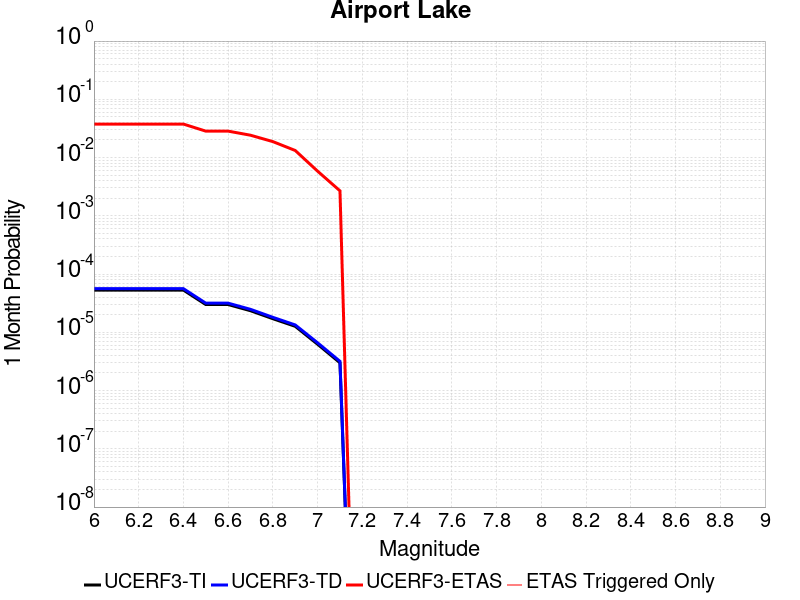 | 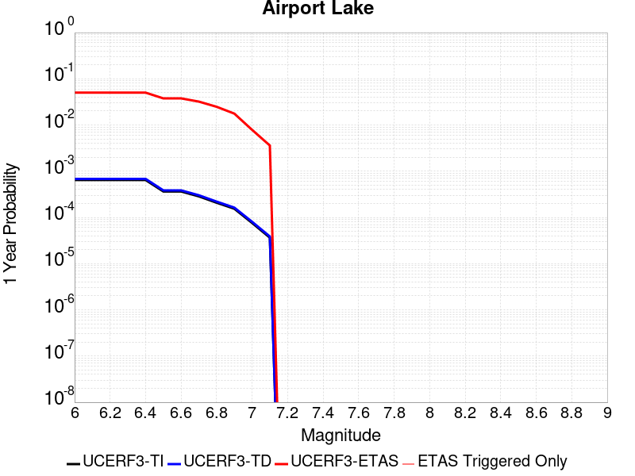 |  |

| Magnitude | 1 wk TI Prob | 1 wk TD Prob | 1 wk ETAS Prob | 1 wk ETAS/TD Gain | 1 wk ETAS Triggered Only | 1 mo TI Prob | 1 mo TD Prob | 1 mo ETAS Prob | 1 mo ETAS/TD Gain | 1 mo ETAS Triggered Only | 1 yr TI Prob | 1 yr TD Prob | 1 yr ETAS Prob | 1 yr ETAS/TD Gain | 1 yr ETAS Triggered Only | 10 yr TI Prob | 10 yr TD Prob | 10 yr ETAS Prob | 10 yr ETAS/TD Gain | 10 yr ETAS Triggered Only |
|-----|-----|-----|-----|-----|-----|-----|-----|-----|-----|-----|-----|-----|-----|-----|-----|-----|-----|-----|-----|-----|
| 6.0 | 1.2387061E-5 | 1.3103157E-5 | 0.030441277 | 2323.2017 | 0.030428572 | 5.3086325E-5 | 5.615534E-5 | 0.03743501 | 666.6331 | 0.037380952 | 6.461343E-4 | 6.8350515E-4 | 0.050102085 | 73.30169 | 0.04945238 | 0.0064425888 | 0.0068168393 | 0.067542896 | 9.908242 | 0.061142858 |
| 6.1 | 1.2387061E-5 | 1.3103157E-5 | 0.030441277 | 2323.2017 | 0.030428572 | 5.3086325E-5 | 5.615534E-5 | 0.03743501 | 666.6331 | 0.037380952 | 6.461343E-4 | 6.8350515E-4 | 0.050102085 | 73.30169 | 0.04945238 | 0.0064425888 | 0.0068168393 | 0.067542896 | 9.908242 | 0.061142858 |
| 6.2 | 1.2387061E-5 | 1.3103157E-5 | 0.030441277 | 2323.2017 | 0.030428572 | 5.3086325E-5 | 5.615534E-5 | 0.03743501 | 666.6331 | 0.037380952 | 6.461343E-4 | 6.8350515E-4 | 0.050102085 | 73.30169 | 0.04945238 | 0.0064425888 | 0.0068168393 | 0.067542896 | 9.908242 | 0.061142858 |
| 6.3 | 1.2387061E-5 | 1.3103157E-5 | 0.030441277 | 2323.2017 | 0.030428572 | 5.3086325E-5 | 5.615534E-5 | 0.03743501 | 666.6331 | 0.037380952 | 6.461343E-4 | 6.8350515E-4 | 0.050102085 | 73.30169 | 0.04945238 | 0.0064425888 | 0.0068168393 | 0.067542896 | 9.908242 | 0.061142858 |
| 6.4 | 1.2387061E-5 | 1.3103157E-5 | 0.030441277 | 2323.2017 | 0.030428572 | 5.3086325E-5 | 5.615534E-5 | 0.03743501 | 666.6331 | 0.037380952 | 6.461343E-4 | 6.8350515E-4 | 0.050102085 | 73.30169 | 0.04945238 | 0.0064425888 | 0.0068168393 | 0.067542896 | 9.908242 | 0.061142858 |
| 6.5 | 6.9922594E-6 | 7.384925E-6 | 0.022721503 | 3076.7412 | 0.022714285 | 2.996648E-5 | 3.1649324E-5 | 0.027983146 | 884.1625 | 0.02795238 | 3.6478083E-4 | 3.8526783E-4 | 0.037442412 | 97.18541 | 0.03707143 | 0.003641826 | 0.0038465366 | 0.049693312 | 12.918976 | 0.04602381 |
| 6.6 | 6.9922594E-6 | 7.384925E-6 | 0.022721503 | 3076.7412 | 0.022714285 | 2.996648E-5 | 3.1649324E-5 | 0.027983146 | 884.1625 | 0.02795238 | 3.6478083E-4 | 3.8526783E-4 | 0.037442412 | 97.18541 | 0.03707143 | 0.003641826 | 0.0038465366 | 0.049693312 | 12.918976 | 0.04602381 |
| 6.7 | 5.477277E-6 | 5.7860684E-6 | 0.019386627 | 3350.5698 | 0.019380953 | 2.3473833E-5 | 2.4797222E-5 | 0.024048012 | 969.7865 | 0.02402381 | 2.8575645E-4 | 3.0186825E-4 | 0.03231601 | 107.05336 | 0.03202381 | 0.0028538927 | 0.003014966 | 0.042514563 | 14.101175 | 0.039619047 |
| 6.8 | 3.9950432E-6 | 4.2190873E-6 | 0.015337488 | 3635.2622 | 0.015333333 | 1.7121502E-5 | 1.8081691E-5 | 0.018922502 | 1046.5006 | 0.018904762 | 2.0843433E-4 | 2.2012512E-4 | 0.025190817 | 114.43864 | 0.02497619 | 0.0020823893 | 0.0021993418 | 0.03315492 | 15.074928 | 0.03102381 |
| 6.9 | 2.95695E-6 | 3.1230243E-6 | 0.010550709 | 3378.3628 | 0.010547619 | 1.2672582E-5 | 1.3384334E-5 | 0.012965592 | 968.714 | 0.012952381 | 1.5427776E-4 | 1.6294434E-4 | 0.017588675 | 107.94284 | 0.017428571 | 0.001541707 | 0.0016284712 | 0.02342625 | 14.385425 | 0.021833334 |
| 7.0 | 1.456072E-6 | 1.540812E-6 | 0.0043824865 | 2844.2708 | 0.0043809526 | 6.2402937E-6 | 6.603469E-6 | 0.005435139 | 823.0733 | 0.0054285713 | 7.597293E-5 | 8.039528E-5 | 0.0072702933 | 90.43185 | 0.007190476 | 7.594696E-4 | 8.0376083E-4 | 0.009820317 | 12.217959 | 0.00902381 |
| 7.1 | 6.995192E-7 | 7.4089746E-7 | 0.0021435965 | 2893.2432 | 0.002142857 | 2.997936E-6 | 3.1752747E-6 | 0.0025745956 | 810.8261 | 0.0025714287 | 3.649926E-5 | 3.865897E-5 | 0.0032766291 | 84.75728 | 0.0032380952 | 3.6493264E-4 | 3.865897E-4 | 0.0045516454 | 11.773841 | 0.004166667 |

## Panamint Valley
*[(top)](#table-of-contents)*

| 1 Week | 1 Month | 1 Year | 10 Year |
|-----|-----|-----|-----|
|  |  |  |  |

| Magnitude | 1 wk TI Prob | 1 wk TD Prob | 1 wk ETAS Prob | 1 wk ETAS/TD Gain | 1 wk ETAS Triggered Only | 1 mo TI Prob | 1 mo TD Prob | 1 mo ETAS Prob | 1 mo ETAS/TD Gain | 1 mo ETAS Triggered Only | 1 yr TI Prob | 1 yr TD Prob | 1 yr ETAS Prob | 1 yr ETAS/TD Gain | 1 yr ETAS Triggered Only | 10 yr TI Prob | 10 yr TD Prob | 10 yr ETAS Prob | 10 yr ETAS/TD Gain | 10 yr ETAS Triggered Only |
|-----|-----|-----|-----|-----|-----|-----|-----|-----|-----|-----|-----|-----|-----|-----|-----|-----|-----|-----|-----|-----|
| 6.0 | 3.0211835E-5 | 3.3984514E-5 | 0.016914364 | 497.70798 | 0.016880952 | 1.2947287E-4 | 1.4563995E-4 | 0.023118485 | 158.73724 | 0.02297619 | 0.0015751923 | 0.0017717537 | 0.038278386 | 21.604801 | 0.03657143 | 0.015640736 | 0.017583137 | 0.068715595 | 3.9080396 | 0.052047618 |
| 6.1 | 3.0211835E-5 | 3.3984514E-5 | 0.016914364 | 497.70798 | 0.016880952 | 1.2947287E-4 | 1.4563995E-4 | 0.023118485 | 158.73724 | 0.02297619 | 0.0015751923 | 0.0017717537 | 0.038278386 | 21.604801 | 0.03657143 | 0.015640736 | 0.017583137 | 0.068715595 | 3.9080396 | 0.052047618 |
| 6.2 | 3.0211835E-5 | 3.3984514E-5 | 0.016914364 | 497.70798 | 0.016880952 | 1.2947287E-4 | 1.4563995E-4 | 0.023118485 | 158.73724 | 0.02297619 | 0.0015751923 | 0.0017717537 | 0.038278386 | 21.604801 | 0.03657143 | 0.015640736 | 0.017583137 | 0.068715595 | 3.9080396 | 0.052047618 |
| 6.3 | 2.8573924E-5 | 3.210268E-5 | 0.016531574 | 514.9593 | 0.0165 | 1.2245393E-4 | 1.3757581E-4 | 0.022348806 | 162.44719 | 0.022214286 | 0.001489857 | 0.0016737265 | 0.036805302 | 21.990034 | 0.035190478 | 0.01479908 | 0.016617801 | 0.0655996 | 3.94755 | 0.049809523 |
| 6.4 | 2.8573924E-5 | 3.210268E-5 | 0.016531574 | 514.9593 | 0.0165 | 1.2245393E-4 | 1.3757581E-4 | 0.022348806 | 162.44719 | 0.022214286 | 0.001489857 | 0.0016737265 | 0.036805302 | 21.990034 | 0.035190478 | 0.01479908 | 0.016617801 | 0.0655996 | 3.94755 | 0.049809523 |
| 6.5 | 2.7468774E-5 | 3.0828433E-5 | 0.016268423 | 527.7084 | 0.016238095 | 1.1771801E-4 | 1.3211532E-4 | 0.021938758 | 166.05763 | 0.021809524 | 0.0014322745 | 0.0016073446 | 0.03598058 | 22.385105 | 0.03442857 | 0.014230782 | 0.015963677 | 0.06383002 | 3.9984534 | 0.04864286 |
| 6.6 | 2.6135967E-5 | 2.925248E-5 | 0.015933549 | 544.69055 | 0.015904762 | 1.1200648E-4 | 1.253619E-4 | 0.02145602 | 171.15265 | 0.021333333 | 0.0013628257 | 0.0015252391 | 0.03495037 | 22.914684 | 0.03347619 | 0.013544982 | 0.015154043 | 0.06174664 | 4.0745983 | 0.047309525 |
| 6.7 | 2.4498746E-5 | 2.7341335E-5 | 0.0155031085 | 567.02094 | 0.0154761905 | 1.04990395E-4 | 1.1717203E-4 | 0.020852838 | 177.96771 | 0.020738095 | 0.0012775084 | 0.0014256609 | 0.03376045 | 23.68056 | 0.032380953 | 0.012701893 | 0.014171274 | 0.0590969 | 4.1701894 | 0.045571428 |
| 6.8 | 2.2244329E-5 | 2.4935423E-5 | 0.014929325 | 598.71954 | 0.014904762 | 9.532935E-5 | 1.0686185E-4 | 0.019985689 | 187.02362 | 0.019880952 | 0.0011600169 | 0.0013002884 | 0.03204597 | 24.645283 | 0.030785715 | 0.011539802 | 0.0129325185 | 0.05539992 | 4.2837687 | 0.04302381 |
| 6.9 | 1.9902658E-5 | 2.2290267E-5 | 0.01352199 | 606.632 | 0.0135 | 8.529431E-5 | 9.552632E-5 | 0.017927157 | 187.66719 | 0.017833333 | 0.0010379635 | 0.0011624309 | 0.028297517 | 24.343397 | 0.027166666 | 0.010331288 | 0.011568608 | 0.049152534 | 4.2487855 | 0.03802381 |
| 7.0 | 1.8353881E-5 | 2.0566185E-5 | 0.012877445 | 626.1465 | 0.012857143 | 7.865712E-5 | 8.813792E-5 | 0.016872372 | 191.43149 | 0.016785715 | 9.5722964E-4 | 0.0010725686 | 0.026545217 | 24.749203 | 0.0255 | 0.009531168 | 0.010678849 | 0.045611307 | 4.271182 | 0.035309523 |
| 7.1 | 1.7667631E-5 | 1.9772613E-5 | 0.012329053 | 623.54193 | 0.012309524 | 7.571623E-5 | 8.473711E-5 | 0.016035765 | 189.24136 | 0.01595238 | 9.2145515E-4 | 0.0010312037 | 0.025268089 | 24.50349 | 0.024261905 | 0.009176437 | 0.010269073 | 0.04356645 | 4.2424912 | 0.03364286 |
| 7.2 | 1.6381597E-5 | 1.8158249E-5 | 0.011137004 | 613.33026 | 0.011119047 | 7.020495E-5 | 7.781885E-5 | 0.0143386135 | 184.25632 | 0.014261905 | 8.544101E-4 | 9.4704994E-4 | 0.02256941 | 23.831278 | 0.021642856 | 0.008511325 | 0.009434792 | 0.03929326 | 4.164719 | 0.030142857 |
| 7.3 | 1.4520491E-5 | 1.5966476E-5 | 0.009587242 | 600.46075 | 0.009571428 | 6.222919E-5 | 6.842605E-5 | 0.012305683 | 179.83917 | 0.0122380955 | 7.57377E-4 | 8.327849E-4 | 0.019483907 | 23.396084 | 0.018666666 | 0.0075480095 | 0.00829975 | 0.03413118 | 4.112314 | 0.026047619 |
| 7.4 | 1.2852287E-5 | 1.4145411E-5 | 0.009323537 | 659.12103 | 0.009309524 | 5.5080065E-5 | 6.062187E-5 | 0.011964662 | 197.36545 | 0.011904762 | 6.7039346E-4 | 7.378371E-4 | 0.018914891 | 25.635592 | 0.018190477 | 0.0066837464 | 0.0073567946 | 0.032503754 | 4.4181952 | 0.025333334 |
| 7.5 | 1.1637851E-5 | 1.2836797E-5 | 0.009250813 | 720.6481 | 0.009238095 | 4.987555E-5 | 5.5013777E-5 | 0.01184008 | 215.22028 | 0.011785714 | 6.070656E-4 | 6.6960254E-4 | 0.018538581 | 27.68595 | 0.017880952 | 0.006054099 | 0.0066787465 | 0.031227972 | 4.6757236 | 0.024714286 |
| 7.6 | 3.0068115E-6 | 3.3330316E-6 | 0.003741416 | 1122.5264 | 0.0037380953 | 1.2886271E-5 | 1.4284384E-5 | 0.0046808845 | 327.6924 | 0.0046666665 | 1.5687906E-4 | 1.7390578E-4 | 0.0071726884 | 41.244682 | 0.007 | 0.0015676835 | 0.0017391363 | 0.011484064 | 6.6033144 | 0.009761904 |

## Garlock (East)
*[(top)](#table-of-contents)*

| 1 Week | 1 Month | 1 Year | 10 Year |
|-----|-----|-----|-----|
|  | 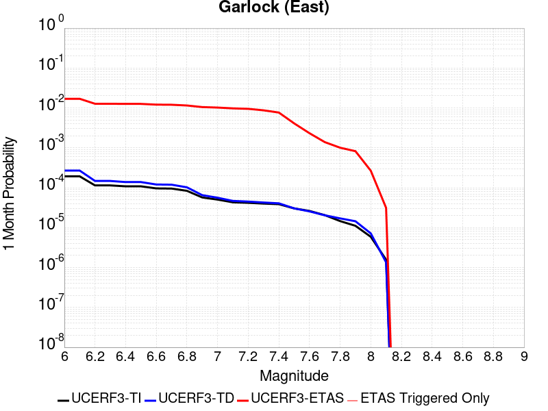 |  |  |

| Magnitude | 1 wk TI Prob | 1 wk TD Prob | 1 wk ETAS Prob | 1 wk ETAS/TD Gain | 1 wk ETAS Triggered Only | 1 mo TI Prob | 1 mo TD Prob | 1 mo ETAS Prob | 1 mo ETAS/TD Gain | 1 mo ETAS Triggered Only | 1 yr TI Prob | 1 yr TD Prob | 1 yr ETAS Prob | 1 yr ETAS/TD Gain | 1 yr ETAS Triggered Only | 10 yr TI Prob | 10 yr TD Prob | 10 yr ETAS Prob | 10 yr ETAS/TD Gain | 10 yr ETAS Triggered Only |
|-----|-----|-----|-----|-----|-----|-----|-----|-----|-----|-----|-----|-----|-----|-----|-----|-----|-----|-----|-----|-----|
| 6.0 | 4.5092507E-5 | 6.290325E-5 | 0.011657412 | 185.32289 | 0.011595238 | 1.9323928E-4 | 2.6956003E-4 | 0.016217642 | 60.163376 | 0.01595238 | 0.0023501497 | 0.0032774 | 0.029215919 | 8.914359 | 0.026023809 | 0.023254504 | 0.032351844 | 0.0696063 | 2.1515403 | 0.0385 |
| 6.1 | 4.5092507E-5 | 6.290325E-5 | 0.011657412 | 185.32289 | 0.011595238 | 1.9323928E-4 | 2.6956003E-4 | 0.016217642 | 60.163376 | 0.01595238 | 0.0023501497 | 0.0032774 | 0.029215919 | 8.914359 | 0.026023809 | 0.023254504 | 0.032351844 | 0.0696063 | 2.1515403 | 0.0385 |
| 6.2 | 2.6674514E-5 | 3.4509674E-5 | 0.009081816 | 263.16727 | 0.009047619 | 1.1431433E-4 | 1.4789042E-4 | 0.012503206 | 84.543724 | 0.012357143 | 0.0013908884 | 0.0017991117 | 0.021073896 | 11.7135 | 0.019309524 | 0.01382215 | 0.017890299 | 0.04517892 | 2.5253305 | 0.027785715 |
| 6.3 | 2.6674514E-5 | 3.4509674E-5 | 0.009081816 | 263.16727 | 0.009047619 | 1.1431433E-4 | 1.4789042E-4 | 0.012503206 | 84.543724 | 0.012357143 | 0.0013908884 | 0.0017991117 | 0.021073896 | 11.7135 | 0.019309524 | 0.01382215 | 0.017890299 | 0.04517892 | 2.5253305 | 0.027785715 |
| 6.4 | 2.5312667E-5 | 3.233893E-5 | 0.009008239 | 278.55713 | 0.00897619 | 1.0847834E-4 | 1.3858822E-4 | 0.012398793 | 89.46499 | 0.012261905 | 0.0013199237 | 0.0016860351 | 0.020796617 | 12.334629 | 0.019142857 | 0.013121112 | 0.016778335 | 0.04384034 | 2.6129136 | 0.02752381 |
| 6.5 | 2.5312667E-5 | 3.233893E-5 | 0.009008239 | 278.55713 | 0.00897619 | 1.0847834E-4 | 1.3858822E-4 | 0.012398793 | 89.46499 | 0.012261905 | 0.0013199237 | 0.0016860351 | 0.020796617 | 12.334629 | 0.019142857 | 0.013121112 | 0.016778335 | 0.04384034 | 2.6129136 | 0.02752381 |
| 6.6 | 2.246556E-5 | 2.8133776E-5 | 0.008646939 | 307.3508 | 0.008619048 | 9.627742E-5 | 1.20567885E-4 | 0.011833441 | 98.14754 | 0.011714286 | 0.0011715472 | 0.0014669491 | 0.019654516 | 13.398226 | 0.018214285 | 0.011653901 | 0.01461866 | 0.04049665 | 2.7702026 | 0.026261905 |
| 6.7 | 2.2241198E-5 | 2.7803519E-5 | 0.008575185 | 308.42084 | 0.008547619 | 9.531594E-5 | 1.1915263E-4 | 0.011713009 | 98.30257 | 0.011595238 | 0.0011598538 | 0.0014497414 | 0.01954252 | 13.480005 | 0.018119048 | 0.011538187 | 0.014448853 | 0.040213976 | 2.783195 | 0.026142858 |
| 6.8 | 1.9528685E-5 | 2.389819E-5 | 0.008357032 | 349.69308 | 0.008333334 | 8.369167E-5 | 1.0241691E-4 | 0.01126794 | 110.02031 | 0.011166667 | 0.0010184698 | 0.0012462323 | 0.018177487 | 14.585954 | 0.01695238 | 0.010138147 | 0.012436427 | 0.036514167 | 2.9360657 | 0.024380952 |
| 6.9 | 1.3318621E-5 | 1.5198884E-5 | 0.007824604 | 514.81433 | 0.007809524 | 5.7078556E-5 | 6.513648E-5 | 0.010326372 | 158.5344 | 0.010261904 | 6.9470983E-4 | 7.927538E-4 | 0.015780862 | 19.906384 | 0.015 | 0.0069254204 | 0.007939888 | 0.028867632 | 3.6357732 | 0.021095239 |
| 7.0 | 1.1760853E-5 | 1.31077895E-5 | 0.007679674 | 585.8863 | 0.0076666665 | 5.0402683E-5 | 5.6175057E-5 | 0.010079421 | 179.42877 | 0.01002381 | 6.134799E-4 | 6.8372174E-4 | 0.015292774 | 22.366957 | 0.014619048 | 0.0061178906 | 0.00685652 | 0.027026791 | 3.941765 | 0.020309525 |
| 7.1 | 1.0064758E-5 | 1.0902931E-5 | 0.0074155843 | 680.14594 | 0.007404762 | 4.3133965E-5 | 4.672603E-5 | 0.009712941 | 207.87004 | 0.009666666 | 5.2502943E-4 | 5.687444E-4 | 0.014441802 | 25.39243 | 0.013880952 | 0.005237907 | 0.0057129986 | 0.02460445 | 4.306749 | 0.019 |
| 7.2 | 9.768808E-6 | 1.0498807E-5 | 0.0072008995 | 685.87787 | 0.007190476 | 4.186565E-5 | 4.499413E-5 | 0.00949695 | 211.07086 | 0.009452381 | 5.095951E-4 | 5.4766936E-4 | 0.014016479 | 25.59296 | 0.01347619 | 0.0050842804 | 0.0055032647 | 0.023735704 | 4.3130226 | 0.018333333 |
| 7.3 | 9.344516E-6 | 9.944468E-6 | 0.0064146426 | 645.0464 | 0.0064047617 | 4.004731E-5 | 4.261847E-5 | 0.008637491 | 202.67012 | 0.008595238 | 4.8746695E-4 | 5.1875977E-4 | 0.012893289 | 24.854065 | 0.012380952 | 0.0048639905 | 0.0052149445 | 0.021960493 | 4.211069 | 0.016833333 |
| 7.4 | 9.023491E-6 | 9.490661E-6 | 0.0056046755 | 590.5464 | 0.005595238 | 3.867153E-5 | 4.0673647E-5 | 0.0075403685 | 185.38708 | 0.0075 | 4.7072413E-4 | 4.950925E-4 | 0.011299265 | 22.822533 | 0.010809524 | 0.004697283 | 0.0049783974 | 0.019761575 | 3.9694653 | 0.014857143 |
| 7.5 | 7.081253E-6 | 7.087672E-6 | 0.0030784945 | 434.34494 | 0.0030714285 | 3.0347876E-5 | 3.0375388E-5 | 0.0040540625 | 133.46538 | 0.0040238095 | 3.6942272E-4 | 3.6975832E-4 | 0.0062009348 | 16.770237 | 0.0058333334 | 0.003688092 | 0.0037243143 | 0.011623357 | 3.120939 | 0.007928572 |
| 7.6 | 6.116396E-6 | 5.959245E-6 | 0.0018869004 | 316.63416 | 0.0018809524 | 2.6212863E-5 | 2.5539372E-5 | 0.0024540487 | 96.08885 | 0.0024285715 | 3.1909486E-4 | 3.1089774E-4 | 0.0040478306 | 13.0198145 | 0.0037380953 | 0.0031863707 | 0.0031357552 | 0.0084286295 | 2.6879106 | 0.005309524 |
| 7.7 | 4.797145E-6 | 4.757281E-6 | 0.0011952278 | 251.24179 | 0.0011904762 | 2.055903E-5 | 2.0388188E-5 | 0.0015441666 | 75.7383 | 0.0015238095 | 2.5027743E-4 | 2.4819805E-4 | 0.0025809524 | 10.398761 | 0.0023333333 | 0.0024999576 | 0.0025093474 | 0.0056918175 | 2.2682462 | 0.0031904762 |
| 7.8 | 3.4028885E-6 | 3.978462E-6 | 8.373085E-4 | 210.46036 | 8.3333335E-4 | 1.4583726E-5 | 1.7050439E-5 | 0.0010646516 | 62.441303 | 0.001047619 | 1.775424E-4 | 2.0756939E-4 | 0.001826281 | 8.798411 | 0.0016190476 | 0.0017740062 | 0.0021012232 | 0.0043346155 | 2.0629013 | 0.0022380953 |
| 7.9 | 2.5928412E-6 | 3.3724489E-6 | 7.414652E-4 | 219.85959 | 7.3809526E-4 | 1.1112129E-5 | 1.4453272E-5 | 9.4301126E-4 | 65.24552 | 9.2857145E-4 | 1.3528178E-4 | 1.7595445E-4 | 0.0015090532 | 8.5763855 | 0.0013333333 | 0.0013519945 | 0.0017812408 | 0.0036350756 | 2.0407548 | 0.0018571429 |
| 8.0 | 1.3743648E-6 | 1.6734747E-6 | 2.635778E-4 | 157.50331 | 2.6190476E-4 | 5.8901214E-6 | 7.1720146E-6 | 3.166936E-4 | 44.156853 | 3.095238E-4 | 7.1709874E-5 | 8.731581E-5 | 5.634647E-4 | 6.453181 | 4.7619047E-4 | 7.1686733E-4 | 8.837234E-4 | 0.0015022239 | 1.6998802 | 6.190476E-4 |
| 8.1 | 3.6733252E-7 | 3.1489964E-7 | 7.1743445E-5 | 227.82956 | 7.142857E-5 | 1.5742813E-6 | 1.3495693E-6 | 7.277804E-5 | 53.92687 | 7.142857E-5 | 1.9166706E-5 | 1.6430899E-5 | 1.3547656E-4 | 8.245232 | 1.1904762E-4 | 1.9165053E-4 | 1.6638759E-4 | 3.3302652E-4 | 2.0015106 | 1.6666666E-4 |

## Hunter Mountain-Saline Valley
*[(top)](#table-of-contents)*

| 1 Week | 1 Month | 1 Year | 10 Year |
|-----|-----|-----|-----|
|  |  |  |  |

| Magnitude | 1 wk TI Prob | 1 wk TD Prob | 1 wk ETAS Prob | 1 wk ETAS/TD Gain | 1 wk ETAS Triggered Only | 1 mo TI Prob | 1 mo TD Prob | 1 mo ETAS Prob | 1 mo ETAS/TD Gain | 1 mo ETAS Triggered Only | 1 yr TI Prob | 1 yr TD Prob | 1 yr ETAS Prob | 1 yr ETAS/TD Gain | 1 yr ETAS Triggered Only | 10 yr TI Prob | 10 yr TD Prob | 10 yr ETAS Prob | 10 yr ETAS/TD Gain | 10 yr ETAS Triggered Only |
|-----|-----|-----|-----|-----|-----|-----|-----|-----|-----|-----|-----|-----|-----|-----|-----|-----|-----|-----|-----|-----|
| 6.0 | 4.5103672E-5 | 5.4570177E-5 | 0.009649285 | 176.82341 | 0.009595238 | 1.9328714E-4 | 2.3385242E-4 | 0.01249289 | 53.422108 | 0.012261905 | 0.002350731 | 0.0028435152 | 0.021647038 | 7.6127734 | 0.018857142 | 0.023260195 | 0.028091887 | 0.053639185 | 1.9094191 | 0.026285714 |
| 6.1 | 4.5103672E-5 | 5.4570177E-5 | 0.009649285 | 176.82341 | 0.009595238 | 1.9328714E-4 | 2.3385242E-4 | 0.01249289 | 53.422108 | 0.012261905 | 0.002350731 | 0.0028435152 | 0.021647038 | 7.6127734 | 0.018857142 | 0.023260195 | 0.028091887 | 0.053639185 | 1.9094191 | 0.026285714 |
| 6.2 | 3.9363465E-5 | 4.706337E-5 | 0.009594233 | 203.85776 | 0.009547619 | 1.6868966E-4 | 2.0168544E-4 | 0.012413507 | 61.548855 | 0.012214285 | 0.002051862 | 0.0024528175 | 0.021168703 | 8.630362 | 0.018761905 | 0.020330196 | 0.024273481 | 0.049781762 | 2.0508702 | 0.026142858 |
| 6.3 | 3.9363465E-5 | 4.706337E-5 | 0.009594233 | 203.85776 | 0.009547619 | 1.6868966E-4 | 2.0168544E-4 | 0.012413507 | 61.548855 | 0.012214285 | 0.002051862 | 0.0024528175 | 0.021168703 | 8.630362 | 0.018761905 | 0.020330196 | 0.024273481 | 0.049781762 | 2.0508702 | 0.026142858 |
| 6.4 | 3.2311684E-5 | 3.795099E-5 | 0.009489973 | 250.05865 | 0.009452381 | 1.384713E-4 | 1.6263737E-4 | 0.0122797135 | 75.50365 | 0.012119047 | 0.0016845843 | 0.0019783843 | 0.02051307 | 10.368598 | 0.018571429 | 0.016718714 | 0.019616475 | 0.04503642 | 2.2958467 | 0.025928572 |
| 6.5 | 3.2311684E-5 | 3.795099E-5 | 0.009489973 | 250.05865 | 0.009452381 | 1.384713E-4 | 1.6263737E-4 | 0.0122797135 | 75.50365 | 0.012119047 | 0.0016845843 | 0.0019783843 | 0.02051307 | 10.368598 | 0.018571429 | 0.016718714 | 0.019616475 | 0.04503642 | 2.2958467 | 0.025928572 |
| 6.6 | 2.9305844E-5 | 3.418183E-5 | 0.009462431 | 276.82632 | 0.009428571 | 1.2559042E-4 | 1.4648569E-4 | 0.012239952 | 83.55732 | 0.012095238 | 0.0015279909 | 0.001782067 | 0.020272866 | 11.37604 | 0.01852381 | 0.015175272 | 0.01768569 | 0.04310892 | 2.4375026 | 0.025880953 |
| 6.7 | 2.7826512E-5 | 3.2344276E-5 | 0.009436802 | 291.7611 | 0.009404762 | 1.19251024E-4 | 1.386113E-4 | 0.012208367 | 88.07627 | 0.012071429 | 0.0014509142 | 0.0016863465 | 0.020155149 | 11.951962 | 0.0185 | 0.014414776 | 0.016743187 | 0.042143986 | 2.517083 | 0.025833333 |
| 6.8 | 2.3389874E-5 | 2.6866714E-5 | 0.009359949 | 348.38458 | 0.009333333 | 1.0023846E-4 | 1.15138246E-4 | 0.0121137565 | 105.21053 | 0.012 | 0.00121972 | 0.001400954 | 0.019779932 | 14.118902 | 0.018404761 | 0.01213047 | 0.013927434 | 0.039283585 | 2.8205903 | 0.025714286 |
| 6.9 | 2.069209E-5 | 2.3570032E-5 | 0.009332875 | 395.9636 | 0.009309524 | 8.867737E-5 | 1.01010715E-4 | 0.012052184 | 119.3159 | 0.011952381 | 0.0010791123 | 0.0012291478 | 0.019539947 | 15.89715 | 0.018333333 | 0.010738871 | 0.012228523 | 0.037557807 | 3.071328 | 0.025642857 |
| 7.0 | 1.7462342E-5 | 1.9633546E-5 | 0.009328974 | 475.15485 | 0.009309524 | 7.483646E-5 | 8.414118E-5 | 0.012035516 | 143.03955 | 0.011952381 | 9.1075303E-4 | 0.0010239601 | 0.01929095 | 18.839554 | 0.018285714 | 0.009070295 | 0.0101960525 | 0.03545962 | 3.4777792 | 0.02552381 |
| 7.1 | 1.4807709E-5 | 1.6441749E-5 | 0.009325813 | 567.2032 | 0.009309524 | 6.3460066E-5 | 7.046283E-5 | 0.011998193 | 170.27692 | 0.011928571 | 7.723524E-4 | 8.575638E-4 | 0.019080019 | 22.249096 | 0.018238096 | 0.007696735 | 0.008545532 | 0.033780407 | 3.9529908 | 0.025452381 |
| 7.2 | 1.4180048E-5 | 1.5698337E-5 | 0.009325076 | 594.01685 | 0.009309524 | 6.077022E-5 | 6.727694E-5 | 0.0119950455 | 178.29356 | 0.011928571 | 7.396263E-4 | 8.188051E-4 | 0.019041967 | 23.255798 | 0.018238096 | 0.0073716943 | 0.008160833 | 0.033381887 | 4.0905 | 0.02542857 |
| 7.3 | 1.3730402E-5 | 1.5172075E-5 | 0.009324554 | 614.5866 | 0.009309524 | 5.8843252E-5 | 6.502165E-5 | 0.011969009 | 184.0773 | 0.011904762 | 7.161811E-4 | 7.9136714E-4 | 0.01899124 | 23.998013 | 0.018214285 | 0.007138774 | 0.007888422 | 0.033045538 | 4.1891184 | 0.025357142 |
| 7.4 | 1.2810095E-5 | 1.4109277E-5 | 0.009323502 | 660.80646 | 0.009309524 | 5.489925E-5 | 6.0467017E-5 | 0.011964509 | 197.86835 | 0.011904762 | 6.681934E-4 | 7.359531E-4 | 0.01888925 | 25.666378 | 0.018166667 | 0.006661878 | 0.007338053 | 0.03243822 | 4.4205484 | 0.025285713 |
| 7.5 | 1.1595659E-5 | 1.2800664E-5 | 0.009250778 | 722.6795 | 0.009238095 | 4.9694736E-5 | 5.4858923E-5 | 0.011839926 | 215.825 | 0.011785714 | 6.0486543E-4 | 6.6771836E-4 | 0.018512938 | 27.725668 | 0.017857144 | 0.006032217 | 0.0066599925 | 0.03116238 | 4.6790414 | 0.024666667 |
| 7.6 | 2.997694E-6 | 3.3251579E-6 | 0.003741408 | 1125.182 | 0.0037380953 | 1.28471975E-5 | 1.425064E-5 | 0.004680851 | 328.466 | 0.0046666665 | 1.564034E-4 | 1.73495E-4 | 0.0071722805 | 41.33998 | 0.007 | 0.0015629337 | 0.001735031 | 0.011479999 | 6.6165957 | 0.009761904 |

## Ash Hill
*[(top)](#table-of-contents)*

| 1 Week | 1 Month | 1 Year | 10 Year |
|-----|-----|-----|-----|
|  |  |  |  |

| Magnitude | 1 wk TI Prob | 1 wk TD Prob | 1 wk ETAS Prob | 1 wk ETAS/TD Gain | 1 wk ETAS Triggered Only | 1 mo TI Prob | 1 mo TD Prob | 1 mo ETAS Prob | 1 mo ETAS/TD Gain | 1 mo ETAS Triggered Only | 1 yr TI Prob | 1 yr TD Prob | 1 yr ETAS Prob | 1 yr ETAS/TD Gain | 1 yr ETAS Triggered Only | 10 yr TI Prob | 10 yr TD Prob | 10 yr ETAS Prob | 10 yr ETAS/TD Gain | 10 yr ETAS Triggered Only |
|-----|-----|-----|-----|-----|-----|-----|-----|-----|-----|-----|-----|-----|-----|-----|-----|-----|-----|-----|-----|-----|
| 6.0 | 2.1545662E-5 | 2.3194447E-5 | 0.0048326068 | 208.35188 | 0.004809524 | 9.2335285E-5 | 9.940143E-5 | 0.0073605846 | 74.04907 | 0.007261905 | 0.0011236023 | 0.0012096206 | 0.013456693 | 11.1247225 | 0.012261905 | 0.011179381 | 0.012038348 | 0.030997803 | 2.5749216 | 0.019190475 |
| 6.1 | 2.1545662E-5 | 2.3194447E-5 | 0.0048326068 | 208.35188 | 0.004809524 | 9.2335285E-5 | 9.940143E-5 | 0.0073605846 | 74.04907 | 0.007261905 | 0.0011236023 | 0.0012096206 | 0.013456693 | 11.1247225 | 0.012261905 | 0.011179381 | 0.012038348 | 0.030997803 | 2.5749216 | 0.019190475 |
| 6.2 | 2.1545662E-5 | 2.3194447E-5 | 0.0048326068 | 208.35188 | 0.004809524 | 9.2335285E-5 | 9.940143E-5 | 0.0073605846 | 74.04907 | 0.007261905 | 0.0011236023 | 0.0012096206 | 0.013456693 | 11.1247225 | 0.012261905 | 0.011179381 | 0.012038348 | 0.030997803 | 2.5749216 | 0.019190475 |
| 6.3 | 1.0025529E-5 | 1.0746934E-5 | 0.0021773903 | 202.60571 | 0.0021666666 | 4.2965847E-5 | 4.605755E-5 | 0.0033078121 | 71.81911 | 0.0032619047 | 5.229836E-4 | 5.6061964E-4 | 0.006152721 | 10.974858 | 0.005595238 | 0.005217545 | 0.0055933665 | 0.014543026 | 2.600049 | 0.009 |
| 6.4 | 1.0025529E-5 | 1.0746934E-5 | 0.0021773903 | 202.60571 | 0.0021666666 | 4.2965847E-5 | 4.605755E-5 | 0.0033078121 | 71.81911 | 0.0032619047 | 5.229836E-4 | 5.6061964E-4 | 0.006152721 | 10.974858 | 0.005595238 | 0.005217545 | 0.0055933665 | 0.014543026 | 2.600049 | 0.009 |
| 6.5 | 6.9617327E-6 | 7.456634E-6 | 0.0014122081 | 189.38948 | 0.0014047619 | 2.9835655E-5 | 3.195666E-5 | 0.0021271277 | 66.5629 | 0.002095238 | 3.6318856E-4 | 3.8901155E-4 | 0.004149453 | 10.666657 | 0.0037619048 | 0.0036259557 | 0.0038841602 | 0.010003158 | 2.575372 | 0.006142857 |
| 6.6 | 4.9919777E-6 | 5.3466883E-6 | 9.815319E-4 | 183.57755 | 9.761905E-4 | 2.1394015E-5 | 2.2914215E-5 | 0.0015228798 | 66.46005 | 0.0015 | 2.60441E-4 | 2.7895154E-4 | 0.0028734657 | 10.300949 | 0.0025952382 | 0.0026013597 | 0.0027866727 | 0.0071554165 | 2.5677278 | 0.0043809526 |
| 6.7 | 3.6630722E-6 | 3.924624E-6 | 7.658264E-4 | 195.13371 | 7.6190475E-4 | 1.5698786E-5 | 1.681974E-5 | 0.0012072759 | 71.77732 | 0.0011904762 | 1.9111596E-4 | 2.0476682E-4 | 0.0022043572 | 10.765207 | 0.002 | 0.0019095168 | 0.0020463446 | 0.005562943 | 2.7184782 | 0.0035238096 |
| 6.8 | 2.5599613E-6 | 2.744925E-6 | 5.7417195E-4 | 209.17581 | 5.7142857E-4 | 1.0971216E-5 | 1.1763939E-5 | 9.165152E-4 | 77.90887 | 9.047619E-4 | 1.3356637E-4 | 1.4322149E-4 | 0.0016192006 | 11.30557 | 0.0014761905 | 0.0013348613 | 0.0014317769 | 0.004023299 | 2.8100042 | 0.0025952382 |
| 6.9 | 1.7684905E-6 | 1.8968707E-6 | 3.114201E-4 | 164.1757 | 3.095238E-4 | 7.579223E-6 | 8.129446E-6 | 5.319347E-4 | 65.43308 | 5.238095E-4 | 9.2273134E-5 | 9.8976E-5 | 0.0010750699 | 10.861924 | 9.761905E-4 | 9.223483E-4 | 9.8976E-4 | 0.0027974928 | 2.8264353 | 0.0018095238 |

## Blackwater
*[(top)](#table-of-contents)*

| 1 Week | 1 Month | 1 Year | 10 Year |
|-----|-----|-----|-----|
|  |  |  |  |

| Magnitude | 1 wk TI Prob | 1 wk TD Prob | 1 wk ETAS Prob | 1 wk ETAS/TD Gain | 1 wk ETAS Triggered Only | 1 mo TI Prob | 1 mo TD Prob | 1 mo ETAS Prob | 1 mo ETAS/TD Gain | 1 mo ETAS Triggered Only | 1 yr TI Prob | 1 yr TD Prob | 1 yr ETAS Prob | 1 yr ETAS/TD Gain | 1 yr ETAS Triggered Only | 10 yr TI Prob | 10 yr TD Prob | 10 yr ETAS Prob | 10 yr ETAS/TD Gain | 10 yr ETAS Triggered Only |
|-----|-----|-----|-----|-----|-----|-----|-----|-----|-----|-----|-----|-----|-----|-----|-----|-----|-----|-----|-----|-----|
| 6.0 | 3.0708583E-5 | 3.3095846E-5 | 0.00410439 | 124.01524 | 0.0040714284 | 1.3160157E-4 | 1.4183241E-4 | 0.0058076954 | 40.94759 | 0.0056666667 | 0.0016010714 | 0.0017255784 | 0.011209185 | 6.4959 | 0.0095 | 0.015895851 | 0.017135633 | 0.03157438 | 1.8426152 | 0.0146904765 |
| 6.1 | 3.0708583E-5 | 3.3095846E-5 | 0.00410439 | 124.01524 | 0.0040714284 | 1.3160157E-4 | 1.4183241E-4 | 0.0058076954 | 40.94759 | 0.0056666667 | 0.0016010714 | 0.0017255784 | 0.011209185 | 6.4959 | 0.0095 | 0.015895851 | 0.017135633 | 0.03157438 | 1.8426152 | 0.0146904765 |
| 6.2 | 1.1707779E-5 | 1.2545122E-5 | 0.0015125263 | 120.56689 | 0.0015 | 5.017523E-5 | 5.3763757E-5 | 0.0023393552 | 43.51175 | 0.0022857143 | 6.107122E-4 | 6.5438676E-4 | 0.0043900358 | 6.708626 | 0.0037380953 | 0.006090366 | 0.0065255696 | 0.012604686 | 1.9315842 | 0.0061190478 |
| 6.3 | 1.1707779E-5 | 1.2545122E-5 | 0.0015125263 | 120.56689 | 0.0015 | 5.017523E-5 | 5.3763757E-5 | 0.0023393552 | 43.51175 | 0.0022857143 | 6.107122E-4 | 6.5438676E-4 | 0.0043900358 | 6.708626 | 0.0037380953 | 0.006090366 | 0.0065255696 | 0.012604686 | 1.9315842 | 0.0061190478 |
| 6.4 | 7.929244E-6 | 8.480098E-6 | 9.6085295E-4 | 113.30682 | 9.5238094E-4 | 3.3982033E-5 | 3.6342793E-5 | 0.0016077142 | 44.2375 | 0.0015714286 | 4.136527E-4 | 4.423877E-4 | 0.0030126788 | 6.8100414 | 0.0025714287 | 0.0041288356 | 0.0044154758 | 0.008611154 | 1.950221 | 0.004214286 |
| 6.5 | 5.8832115E-6 | 6.285991E-6 | 7.4437656E-4 | 118.418335 | 7.3809526E-4 | 2.521352E-5 | 2.6939697E-5 | 0.0011697661 | 43.42165 | 0.0011428571 | 3.0693135E-4 | 3.27944E-4 | 0.0021844779 | 6.661131 | 0.0018571429 | 0.0030650778 | 0.0032748538 | 0.006241298 | 1.9058248 | 0.0029761905 |
| 6.6 | 5.8832115E-6 | 6.285991E-6 | 7.4437656E-4 | 118.418335 | 7.3809526E-4 | 2.521352E-5 | 2.6939697E-5 | 0.0011697661 | 43.42165 | 0.0011428571 | 3.0693135E-4 | 3.27944E-4 | 0.0021844779 | 6.661131 | 0.0018571429 | 0.0030650778 | 0.0032748538 | 0.006241298 | 1.9058248 | 0.0029761905 |
| 6.7 | 3.0715053E-6 | 3.2814662E-6 | 4.0804205E-4 | 124.34748 | 4.047619E-4 | 1.3163528E-5 | 1.4063357E-5 | 5.378655E-4 | 38.245884 | 5.238095E-4 | 1.6025416E-4 | 1.7120909E-4 | 0.001123427 | 6.561725 | 9.5238094E-4 | 0.0016013865 | 0.0017108864 | 0.0031370136 | 1.8335605 | 0.0014285714 |
| 6.8 | 2.2722281E-6 | 2.4287538E-6 | 2.8814236E-4 | 118.63795 | 2.8571428E-4 | 9.738084E-6 | 1.0408908E-5 | 3.6754805E-4 | 35.310913 | 3.5714285E-4 | 1.1855473E-4 | 1.26722E-4 | 7.933042E-4 | 6.260193 | 6.6666666E-4 | 0.001184915 | 0.0012665876 | 0.0022891003 | 1.8072973 | 0.0010238095 |
| 6.9 | 9.952399E-7 | 1.0653489E-6 | 1.4392234E-4 | 135.0941 | 1.4285714E-4 | 4.265307E-6 | 4.5657757E-6 | 1.4742227E-4 | 32.288548 | 1.4285714E-4 | 5.1928873E-5 | 5.5587418E-5 | 2.936694E-4 | 5.2830195 | 2.3809524E-4 | 5.191674E-4 | 5.557858E-4 | 9.127301E-4 | 1.6422337 | 3.5714285E-4 |
| 7.0 | 4.7385504E-7 | 5.0755597E-7 | 7.193609E-5 | 141.73036 | 7.142857E-5 | 2.0308057E-6 | 2.1752398E-6 | 7.360365E-5 | 33.837032 | 7.142857E-5 | 2.4724779E-5 | 2.6483543E-5 | 1.693369E-4 | 6.3940425 | 1.4285714E-4 | 2.4722028E-4 | 2.6483546E-4 | 5.2667083E-4 | 1.988672 | 2.6190476E-4 |

## Garlock (West)
*[(top)](#table-of-contents)*

| 1 Week | 1 Month | 1 Year | 10 Year |
|-----|-----|-----|-----|
|  | 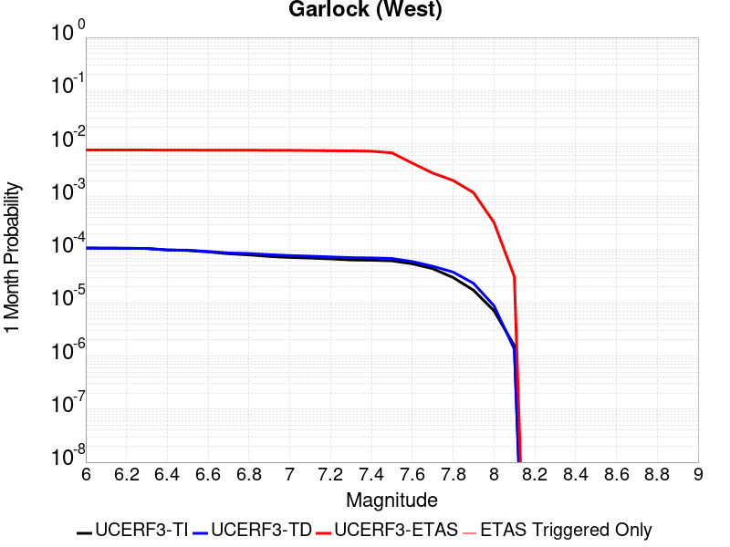 | 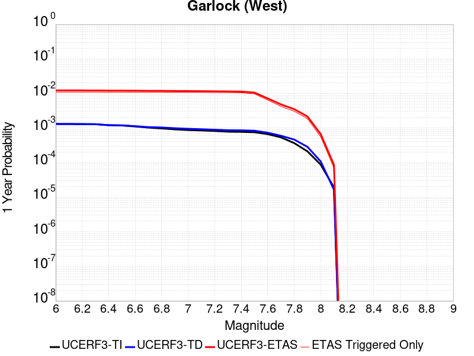 |  |

| Magnitude | 1 wk TI Prob | 1 wk TD Prob | 1 wk ETAS Prob | 1 wk ETAS/TD Gain | 1 wk ETAS Triggered Only | 1 mo TI Prob | 1 mo TD Prob | 1 mo ETAS Prob | 1 mo ETAS/TD Gain | 1 mo ETAS Triggered Only | 1 yr TI Prob | 1 yr TD Prob | 1 yr ETAS Prob | 1 yr ETAS/TD Gain | 1 yr ETAS Triggered Only | 10 yr TI Prob | 10 yr TD Prob | 10 yr ETAS Prob | 10 yr ETAS/TD Gain | 10 yr ETAS Triggered Only |
|-----|-----|-----|-----|-----|-----|-----|-----|-----|-----|-----|-----|-----|-----|-----|-----|-----|-----|-----|-----|-----|
| 6.0 | 2.5181727E-5 | 2.51973E-5 | 0.0053822054 | 213.60246 | 0.005357143 | 1.0791722E-4 | 1.0798398E-4 | 0.0072262627 | 66.91977 | 0.0071190475 | 0.0013131002 | 0.0013139155 | 0.011633672 | 8.854201 | 0.010333333 | 0.013053683 | 0.013141977 | 0.027404424 | 2.085259 | 0.014452381 |
| 6.1 | 2.5077732E-5 | 2.5098372E-5 | 0.0053821066 | 214.44048 | 0.005357143 | 1.0747157E-4 | 1.0756004E-4 | 0.0072258417 | 67.17962 | 0.0071190475 | 0.001307681 | 0.0013087603 | 0.01162857 | 8.8851795 | 0.010333333 | 0.013000126 | 0.013091032 | 0.027354216 | 2.0895386 | 0.014452381 |
| 6.2 | 2.494612E-5 | 2.498005E-5 | 0.0053819893 | 215.45149 | 0.005357143 | 1.0690756E-4 | 1.0705298E-4 | 0.0072253384 | 67.4931 | 0.0071190475 | 0.0013008224 | 0.0013025942 | 0.011622467 | 8.922554 | 0.010333333 | 0.012932341 | 0.013030097 | 0.027294163 | 2.0947013 | 0.014452381 |
| 6.3 | 2.4733758E-5 | 2.479942E-5 | 0.0053818095 | 217.01352 | 0.005357143 | 1.0599751E-4 | 1.06278916E-4 | 0.00722457 | 67.977455 | 0.0071190475 | 0.0012897556 | 0.0012931811 | 0.011613152 | 8.980298 | 0.010333333 | 0.012822957 | 0.012937066 | 0.027202476 | 2.1026773 | 0.014452381 |
| 6.4 | 2.3237335E-5 | 2.317873E-5 | 0.0053325794 | 230.06348 | 0.005309524 | 9.958477E-5 | 9.933365E-5 | 0.0071700597 | 72.18158 | 0.0070714285 | 0.0012117702 | 0.001208719 | 0.01143444 | 9.459965 | 0.010238095 | 0.012051838 | 0.012101916 | 0.026238266 | 2.1681085 | 0.014309524 |
| 6.5 | 2.2732203E-5 | 2.2993298E-5 | 0.005332395 | 231.91084 | 0.005309524 | 9.742009E-5 | 9.8539E-5 | 0.007169271 | 72.75567 | 0.0070714285 | 0.0011854442 | 0.0011990548 | 0.011424874 | 9.528234 | 0.010238095 | 0.011791403 | 0.012006322 | 0.02614404 | 2.177523 | 0.014309524 |
| 6.6 | 2.1319436E-5 | 2.17735E-5 | 0.005331182 | 244.84726 | 0.005309524 | 9.136581E-5 | 9.331167E-5 | 0.0071640806 | 76.775826 | 0.0070714285 | 0.001111811 | 0.0011354799 | 0.01136195 | 10.006298 | 0.010238095 | 0.011062649 | 0.011377227 | 0.025523948 | 2.2434244 | 0.014309524 |
| 6.7 | 1.970802E-5 | 2.0393396E-5 | 0.005329809 | 261.34976 | 0.005309524 | 8.446021E-5 | 8.739735E-5 | 0.0071582077 | 81.904175 | 0.0070714285 | 0.001027818 | 0.001063545 | 0.011290751 | 10.616148 | 0.010238095 | 0.010230771 | 0.010664964 | 0.024798322 | 2.3252137 | 0.014285714 |
| 6.8 | 1.8744462E-5 | 1.9901045E-5 | 0.0053293193 | 267.79092 | 0.005309524 | 8.033094E-5 | 8.5287415E-5 | 0.0071561127 | 83.90585 | 0.0070714285 | 9.775903E-4 | 0.0010378812 | 0.0112653505 | 10.85418 | 0.010238095 | 0.009733009 | 0.01041075 | 0.02454774 | 2.357922 | 0.014285714 |
| 6.9 | 1.7559682E-5 | 1.8953415E-5 | 0.005328377 | 281.13016 | 0.005309524 | 7.5253614E-5 | 8.12264E-5 | 0.0071520805 | 88.051186 | 0.0070714285 | 9.158276E-4 | 9.884841E-4 | 0.011216459 | 11.347131 | 0.010238095 | 0.0091206245 | 0.009921231 | 0.024065213 | 2.4256277 | 0.014285714 |
| 7.0 | 1.6794445E-5 | 1.8216237E-5 | 0.0053276434 | 292.46674 | 0.005309524 | 7.197421E-5 | 7.8067256E-5 | 0.007125136 | 91.269196 | 0.007047619 | 8.759337E-4 | 9.5005584E-4 | 0.011154638 | 11.741034 | 0.010214286 | 0.008724891 | 0.009540141 | 0.023571655 | 2.470787 | 0.014166667 |
| 7.1 | 1.6337795E-5 | 1.7717046E-5 | 0.0052795284 | 297.9915 | 0.0052619046 | 7.0017246E-5 | 7.5927994E-5 | 0.007027781 | 92.5585 | 0.0069523808 | 8.521265E-4 | 9.240326E-4 | 0.01103373 | 11.9408455 | 0.010119048 | 0.008488664 | 0.009281996 | 0.023152048 | 2.4942963 | 0.014 |
| 7.2 | 1.5780008E-5 | 1.7165687E-5 | 0.00527898 | 307.53098 | 0.0052619046 | 6.762685E-5 | 7.356516E-5 | 0.0070254346 | 95.49948 | 0.0069523808 | 8.2304585E-4 | 8.9528906E-4 | 0.011005277 | 12.292429 | 0.010119048 | 0.008200042 | 0.008996838 | 0.022870881 | 2.5421023 | 0.014 |
| 7.3 | 1.5058865E-5 | 1.6618762E-5 | 0.005230818 | 314.75375 | 0.0052142856 | 6.45364E-5 | 7.122133E-5 | 0.0069754915 | 97.94105 | 0.006904762 | 7.854473E-4 | 8.667759E-4 | 0.010858108 | 12.527007 | 0.01 | 0.00782677 | 0.008713539 | 0.022426335 | 2.5737345 | 0.013833334 |
| 7.4 | 1.4887923E-5 | 1.6454731E-5 | 0.0051830364 | 314.98758 | 0.0051666666 | 6.380382E-5 | 7.051838E-5 | 0.00690337 | 97.894615 | 0.0068333335 | 7.7653467E-4 | 8.582243E-4 | 0.010730697 | 12.503371 | 0.009880953 | 0.0077382675 | 0.008628399 | 0.02215354 | 2.5675147 | 0.013642857 |
| 7.5 | 1.4509299E-5 | 1.6046748E-5 | 0.0047302567 | 294.7798 | 0.0047142855 | 6.218123E-5 | 6.876997E-5 | 0.0063302442 | 92.04954 | 0.0062619047 | 7.567935E-4 | 8.36954E-4 | 0.009877001 | 11.801127 | 0.009047619 | 0.0075422134 | 0.008416704 | 0.02097676 | 2.4922771 | 0.012666667 |
| 7.6 | 1.2756717E-5 | 1.4050848E-5 | 0.0031092456 | 221.28525 | 0.003095238 | 5.4670498E-5 | 6.0216535E-5 | 0.004155208 | 69.00443 | 0.004095238 | 6.6541E-4 | 7.328904E-4 | 0.0068236613 | 9.3106165 | 0.006095238 | 0.006634211 | 0.0073816874 | 0.016197084 | 2.194225 | 0.008880952 |
| 7.7 | 1.0328985E-5 | 1.1460557E-5 | 0.0021066747 | 183.81956 | 0.002095238 | 4.4266326E-5 | 4.911575E-5 | 0.0027394597 | 55.775585 | 0.0026904761 | 5.388092E-4 | 5.978206E-4 | 0.0046192245 | 7.726774 | 0.0040238095 | 0.0053750467 | 0.006038511 | 0.01183662 | 1.9601884 | 0.0058333334 |
| 7.8 | 7.0306583E-6 | 8.899601E-6 | 0.0014612676 | 164.19473 | 0.0014523809 | 3.0131043E-5 | 3.814059E-5 | 0.0018952126 | 49.690174 | 0.0018571429 | 3.667837E-4 | 4.642629E-4 | 0.0032248853 | 6.946248 | 0.0027619048 | 0.003661789 | 0.0046952725 | 0.008676492 | 1.8479208 | 0.004 |
| 7.9 | 4.060633E-6 | 5.4653938E-6 | 9.3403173E-4 | 170.89926 | 9.2857145E-4 | 1.7402595E-5 | 2.3422906E-5 | 0.0012376802 | 52.840588 | 0.0012142857 | 2.11856E-4 | 2.851367E-4 | 0.0020703417 | 7.260875 | 0.0017857143 | 0.0021165414 | 0.002884201 | 0.0053769904 | 1.8642912 | 0.0025 |
| 8.0 | 1.6729537E-6 | 2.0775144E-6 | 2.8779122E-4 | 138.5267 | 2.8571428E-4 | 7.169782E-6 | 8.903603E-6 | 3.898526E-4 | 43.78594 | 3.8095238E-4 | 8.7288594E-5 | 1.0839601E-4 | 6.797626E-4 | 6.271104 | 5.7142857E-4 | 8.7254314E-4 | 0.0010969337 | 0.0018817862 | 1.7154967 | 7.857143E-4 |
| 8.1 | 3.6733252E-7 | 3.1489964E-7 | 7.1743445E-5 | 227.82956 | 7.142857E-5 | 1.5742813E-6 | 1.3495693E-6 | 7.277804E-5 | 53.92687 | 7.142857E-5 | 1.9166706E-5 | 1.6430899E-5 | 1.3547656E-4 | 8.245232 | 1.1904762E-4 | 1.9165053E-4 | 1.6638759E-4 | 3.3302652E-4 | 2.0015106 | 1.6666666E-4 |

## McLean Lake
*[(top)](#table-of-contents)*

| 1 Week | 1 Month | 1 Year | 10 Year |
|-----|-----|-----|-----|
|  |  |  |  |

| Magnitude | 1 wk TI Prob | 1 wk TD Prob | 1 wk ETAS Prob | 1 wk ETAS/TD Gain | 1 wk ETAS Triggered Only | 1 mo TI Prob | 1 mo TD Prob | 1 mo ETAS Prob | 1 mo ETAS/TD Gain | 1 mo ETAS Triggered Only | 1 yr TI Prob | 1 yr TD Prob | 1 yr ETAS Prob | 1 yr ETAS/TD Gain | 1 yr ETAS Triggered Only | 10 yr TI Prob | 10 yr TD Prob | 10 yr ETAS Prob | 10 yr ETAS/TD Gain | 10 yr ETAS Triggered Only |
|-----|-----|-----|-----|-----|-----|-----|-----|-----|-----|-----|-----|-----|-----|-----|-----|-----|-----|-----|-----|-----|
| 6.0 | 1.7360222E-5 | 1.8501627E-5 | 0.0022089372 | 119.39151 | 0.0021904763 | 7.439883E-5 | 7.9290556E-5 | 0.0035075902 | 44.237175 | 0.0034285714 | 9.0542925E-4 | 9.6498354E-4 | 0.007625217 | 7.9019136 | 0.006666667 | 0.009017491 | 0.0096127745 | 0.021521002 | 2.238792 | 0.012023809 |
| 6.1 | 9.062689E-6 | 9.592193E-6 | 0.001200057 | 125.107666 | 0.0011904762 | 3.8839516E-5 | 4.1108804E-5 | 0.0018505582 | 45.016106 | 0.0018095238 | 4.727685E-4 | 5.003936E-4 | 0.0040462376 | 8.086109 | 0.003547619 | 0.0047176396 | 0.004993552 | 0.011437403 | 2.2904346 | 0.0064761904 |
| 6.2 | 9.062689E-6 | 9.592193E-6 | 0.001200057 | 125.107666 | 0.0011904762 | 3.8839516E-5 | 4.1108804E-5 | 0.0018505582 | 45.016106 | 0.0018095238 | 4.727685E-4 | 5.003936E-4 | 0.0040462376 | 8.086109 | 0.003547619 | 0.0047176396 | 0.004993552 | 0.011437403 | 2.2904346 | 0.0064761904 |
| 6.3 | 7.2575485E-6 | 7.66771E-6 | 9.1242266E-4 | 118.99547 | 9.047619E-4 | 3.110341E-5 | 3.2861237E-5 | 0.001437577 | 43.74689 | 0.0014047619 | 3.786182E-4 | 4.0001926E-4 | 0.0030180193 | 7.544685 | 0.0026190476 | 0.0037797375 | 0.0039936965 | 0.008926299 | 2.235097 | 0.004952381 |
| 6.4 | 7.2575485E-6 | 7.66771E-6 | 9.1242266E-4 | 118.99547 | 9.047619E-4 | 3.110341E-5 | 3.2861237E-5 | 0.001437577 | 43.74689 | 0.0014047619 | 3.786182E-4 | 4.0001926E-4 | 0.0030180193 | 7.544685 | 0.0026190476 | 0.0037797375 | 0.0039936965 | 0.008926299 | 2.235097 | 0.004952381 |
| 6.5 | 6.06582E-6 | 6.4038773E-6 | 6.968756E-4 | 108.8209 | 6.904762E-4 | 2.5996113E-5 | 2.7444936E-5 | 0.0011702707 | 42.64068 | 0.0011428571 | 3.164567E-4 | 3.3409733E-4 | 0.0025000402 | 7.4829693 | 0.0021666666 | 0.0031600643 | 0.0033365893 | 0.007584274 | 2.273062 | 0.004261905 |
| 6.6 | 5.598744E-6 | 5.910262E-6 | 6.2495423E-4 | 105.740524 | 6.190476E-4 | 2.3994397E-5 | 2.5329486E-5 | 0.001072922 | 42.35862 | 0.001047619 | 2.9209262E-4 | 3.0834923E-4 | 0.0023077326 | 7.484152 | 0.002 | 0.0029170897 | 0.003079843 | 0.0070437877 | 2.2870605 | 0.0039761905 |
| 6.7 | 5.246996E-6 | 5.539162E-6 | 5.531552E-4 | 99.86261 | 5.4761907E-4 | 2.2486933E-5 | 2.3739085E-5 | 9.760974E-4 | 41.117733 | 9.5238094E-4 | 2.73744E-4 | 2.8899137E-4 | 0.0021694002 | 7.5067987 | 0.0018809524 | 0.0027340704 | 0.0028867796 | 0.0066853063 | 2.3158352 | 0.0038095238 |
| 6.8 | 4.02324E-6 | 4.2469046E-6 | 4.328165E-4 | 101.91341 | 4.2857142E-4 | 1.7242342E-5 | 1.8200926E-5 | 7.0866453E-4 | 38.93563 | 6.904762E-4 | 2.099053E-4 | 2.2157968E-4 | 0.0016498346 | 7.445784 | 0.0014285714 | 0.0020970714 | 0.002214172 | 0.0051837726 | 2.341179 | 0.0029761905 |
| 6.9 | 6.835972E-7 | 7.1399285E-7 | 9.595202E-5 | 134.38794 | 9.5238094E-5 | 2.9296991E-6 | 3.0599674E-6 | 1.2210722E-4 | 39.904747 | 1.1904762E-4 | 3.56685E-5 | 3.7254784E-5 | 2.2772388E-4 | 6.1126075 | 1.9047619E-4 | 3.5662777E-4 | 3.7251666E-4 | 9.437324E-4 | 2.5333965 | 5.7142857E-4 |

## Death Valley (So)
*[(top)](#table-of-contents)*

| 1 Week | 1 Month | 1 Year | 10 Year |
|-----|-----|-----|-----|
| 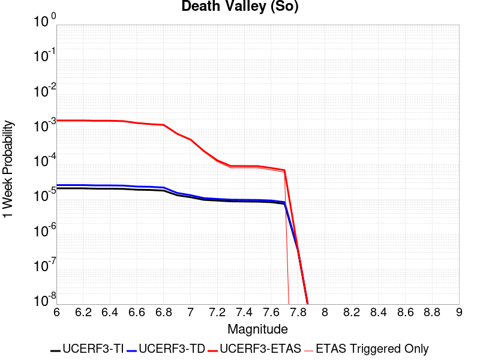 |  |  |  |

| Magnitude | 1 wk TI Prob | 1 wk TD Prob | 1 wk ETAS Prob | 1 wk ETAS/TD Gain | 1 wk ETAS Triggered Only | 1 mo TI Prob | 1 mo TD Prob | 1 mo ETAS Prob | 1 mo ETAS/TD Gain | 1 mo ETAS Triggered Only | 1 yr TI Prob | 1 yr TD Prob | 1 yr ETAS Prob | 1 yr ETAS/TD Gain | 1 yr ETAS Triggered Only | 10 yr TI Prob | 10 yr TD Prob | 10 yr ETAS Prob | 10 yr ETAS/TD Gain | 10 yr ETAS Triggered Only |
|-----|-----|-----|-----|-----|-----|-----|-----|-----|-----|-----|-----|-----|-----|-----|-----|-----|-----|-----|-----|-----|
| 6.0 | 2.0684236E-5 | 2.5617775E-5 | 0.0020017577 | 78.1394 | 0.0019761904 | 8.864371E-5 | 1.0978594E-4 | 0.0028713874 | 26.154419 | 0.0027619048 | 0.0010787029 | 0.0013358411 | 0.0067809387 | 5.076156 | 0.005452381 | 0.010734817 | 0.013281397 | 0.022302823 | 1.6792529 | 0.009142857 |
| 6.1 | 2.0684236E-5 | 2.5617775E-5 | 0.0020017577 | 78.1394 | 0.0019761904 | 8.864371E-5 | 1.0978594E-4 | 0.0028713874 | 26.154419 | 0.0027619048 | 0.0010787029 | 0.0013358411 | 0.0067809387 | 5.076156 | 0.005452381 | 0.010734817 | 0.013281397 | 0.022302823 | 1.6792529 | 0.009142857 |
| 6.2 | 2.0684236E-5 | 2.5617775E-5 | 0.0020017577 | 78.1394 | 0.0019761904 | 8.864371E-5 | 1.0978594E-4 | 0.0028713874 | 26.154419 | 0.0027619048 | 0.0010787029 | 0.0013358411 | 0.0067809387 | 5.076156 | 0.005452381 | 0.010734817 | 0.013281397 | 0.022302823 | 1.6792529 | 0.009142857 |
| 6.3 | 2.0240292E-5 | 2.511786E-5 | 0.0019298319 | 76.83106 | 0.0019047619 | 8.6741224E-5 | 1.07643624E-4 | 0.002821637 | 26.212767 | 0.0027142856 | 0.0010555626 | 0.00130979 | 0.006659916 | 5.0847206 | 0.005357143 | 0.010505628 | 0.013023956 | 0.021836242 | 1.6766213 | 0.008928572 |
| 6.4 | 2.0240292E-5 | 2.511786E-5 | 0.0019298319 | 76.83106 | 0.0019047619 | 8.6741224E-5 | 1.07643624E-4 | 0.002821637 | 26.212767 | 0.0027142856 | 0.0010555626 | 0.00130979 | 0.006659916 | 5.0847206 | 0.005357143 | 0.010505628 | 0.013023956 | 0.021836242 | 1.6766213 | 0.008928572 |
| 6.5 | 1.9962767E-5 | 2.4807114E-5 | 0.0018580949 | 74.9017 | 0.0018333333 | 8.55519E-5 | 1.0631196E-4 | 0.0027488882 | 25.85681 | 0.0026428571 | 0.0010410968 | 0.0012935963 | 0.0065249153 | 5.044012 | 0.0052380953 | 0.010362327 | 0.012863902 | 0.021513095 | 1.6723615 | 0.008761905 |
| 6.6 | 1.8937297E-5 | 2.3310964E-5 | 0.0016423209 | 70.45272 | 0.0016190476 | 8.115732E-5 | 9.990039E-5 | 0.0024568078 | 24.592573 | 0.0023571427 | 9.876423E-4 | 0.0012156231 | 0.0059241783 | 4.8733673 | 0.0047142855 | 0.009832645 | 0.012092789 | 0.019972526 | 1.6516062 | 0.00797619 |
| 6.7 | 1.8621096E-5 | 2.2911607E-5 | 0.0015228773 | 66.4675 | 0.0015 | 7.980225E-5 | 9.818898E-5 | 0.0023360644 | 23.791513 | 0.0022380953 | 9.711593E-4 | 0.0011948098 | 0.0057607763 | 4.821501 | 0.0045714285 | 0.009669261 | 0.011886904 | 0.019556543 | 1.6452177 | 0.007761905 |
| 6.8 | 1.7830353E-5 | 2.1805688E-5 | 0.0014265369 | 65.4204 | 0.0014047619 | 7.641356E-5 | 9.344968E-5 | 0.0021408773 | 22.909414 | 0.002047619 | 9.29938E-4 | 0.00113717 | 0.005275316 | 4.638986 | 0.004142857 | 0.009260561 | 0.011316354 | 0.018472541 | 1.6323756 | 0.007238095 |
| 6.9 | 1.3135183E-5 | 1.5303925E-5 | 6.581512E-4 | 43.005386 | 6.4285717E-4 | 5.6292425E-5 | 6.558664E-5 | 0.001041713 | 15.883008 | 9.761905E-4 | 6.8514474E-4 | 7.982312E-4 | 0.0030107494 | 3.771776 | 0.0022142858 | 0.006830362 | 0.007954649 | 0.012300752 | 1.5463603 | 0.0043809526 |
| 7.0 | 1.1507512E-5 | 1.3154199E-5 | 5.131476E-4 | 39.010174 | 5.0E-4 | 4.9316975E-5 | 5.6373956E-5 | 7.7061943E-4 | 13.669777 | 7.142857E-4 | 6.002687E-4 | 6.8614254E-4 | 0.0024468384 | 3.566079 | 0.0017619048 | 0.0059864987 | 0.0068409415 | 0.010151472 | 1.483929 | 0.0033333334 |
| 7.1 | 9.715903E-6 | 1.0865278E-5 | 2.9657647E-4 | 27.2958 | 2.8571428E-4 | 4.1638916E-5 | 4.656467E-5 | 4.036909E-4 | 8.669468 | 3.5714285E-4 | 5.068359E-4 | 5.667817E-4 | 0.0015424188 | 2.7213633 | 9.761905E-4 | 0.0050568148 | 0.0056538144 | 0.0075478074 | 1.3349938 | 0.0019047619 |
| 7.2 | 9.233269E-6 | 1.02863105E-5 | 2.0076054E-4 | 19.517256 | 1.9047619E-4 | 3.9570554E-5 | 4.4083466E-5 | 2.821682E-4 | 6.4007716 | 2.3809524E-4 | 4.81665E-4 | 5.3658825E-4 | 0.0011791005 | 2.1974027 | 6.4285717E-4 | 0.0048062233 | 0.0053533576 | 0.0067269173 | 1.256579 | 0.0013809524 |
| 7.3 | 8.8041315E-6 | 9.808164E-6 | 1.5266391E-4 | 15.564983 | 1.4285714E-4 | 3.7731446E-5 | 4.2034335E-5 | 2.3250251E-4 | 5.5312524 | 1.9047619E-4 | 4.592835E-4 | 5.1165203E-4 | 0.001058991 | 2.0697482 | 5.4761907E-4 | 0.0045833546 | 0.005105167 | 0.006218502 | 1.2180799 | 0.0011190476 |
| 7.4 | 8.708749E-6 | 9.707175E-6 | 1.5256293E-4 | 15.716512 | 1.4285714E-4 | 3.7322676E-5 | 4.160154E-5 | 2.3206981E-4 | 5.578395 | 1.9047619E-4 | 4.5430884E-4 | 5.0638523E-4 | 0.0010299295 | 2.0338855 | 5.238095E-4 | 0.004533812 | 0.0050527398 | 0.006142444 | 1.215666 | 0.0010952381 |
| 7.5 | 8.612678E-6 | 9.604817E-6 | 1.5246059E-4 | 15.873346 | 1.4285714E-4 | 3.6910955E-5 | 4.1162875E-5 | 2.3163123E-4 | 5.6271877 | 1.9047619E-4 | 4.492982E-4 | 5.01047E-4 | 9.769988E-4 | 1.9499147 | 4.7619047E-4 | 0.004483909 | 0.0049995985 | 0.00604198 | 1.208493 | 0.001047619 |
| 7.6 | 8.319024E-6 | 9.283916E-6 | 1.2833043E-4 | 13.822877 | 1.1904762E-4 | 3.5652476E-5 | 3.978763E-5 | 2.0644767E-4 | 5.18874 | 1.6666666E-4 | 4.3398244E-4 | 4.8431093E-4 | 9.1267476E-4 | 1.8844811 | 4.2857142E-4 | 0.0043313587 | 0.0048329784 | 0.0057333675 | 1.1863011 | 9.047619E-4 |
| 7.7 | 7.4718328E-6 | 8.34517E-6 | 1.273918E-4 | 15.265333 | 1.1904762E-4 | 3.2021748E-5 | 3.5764548E-5 | 2.0242525E-4 | 5.6599417 | 1.6666666E-4 | 3.8979502E-4 | 4.353504E-4 | 8.637352E-4 | 1.9840001 | 4.2857142E-4 | 0.00389112 | 0.0043453807 | 0.005198799 | 1.1963967 | 8.5714285E-4 |
| 7.8 | 3.4586725E-7 | 3.6482615E-7 | 3.6482615E-7 | 1.0 | 0.0 | 1.4822873E-6 | 1.5635396E-6 | 1.5635396E-6 | 1.0 | 0.0 | 1.80467E-5 | 1.9035933E-5 | 1.9035933E-5 | 1.0 | 0.0 | 1.8045233E-4 | 1.9034347E-4 | 2.1414846E-4 | 1.1250633 | 2.3809524E-5 |
| 7.9 | 2.5591178E-9 | 2.6696718E-9 | 2.6696718E-9 | 1.0 | 0.0 | 1.0967647E-8 | 1.14414505E-8 | 1.14414505E-8 | 1.0 | 0.0 | 1.335311E-7 | 1.3929966E-7 | 1.3929966E-7 | 1.0 | 0.0 | 1.3353102E-6 | 1.3929966E-6 | 1.3929966E-6 | 1.0 | 0.0 |

## Goldstone Lake
*[(top)](#table-of-contents)*

| 1 Week | 1 Month | 1 Year | 10 Year |
|-----|-----|-----|-----|
|  |  | 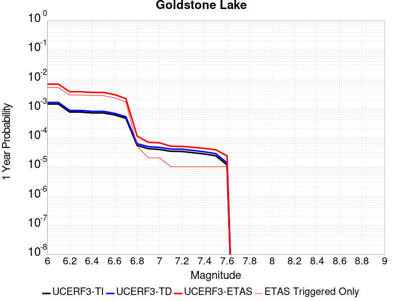 |  |

| Magnitude | 1 wk TI Prob | 1 wk TD Prob | 1 wk ETAS Prob | 1 wk ETAS/TD Gain | 1 wk ETAS Triggered Only | 1 mo TI Prob | 1 mo TD Prob | 1 mo ETAS Prob | 1 mo ETAS/TD Gain | 1 mo ETAS Triggered Only | 1 yr TI Prob | 1 yr TD Prob | 1 yr ETAS Prob | 1 yr ETAS/TD Gain | 1 yr ETAS Triggered Only | 10 yr TI Prob | 10 yr TD Prob | 10 yr ETAS Prob | 10 yr ETAS/TD Gain | 10 yr ETAS Triggered Only |
|-----|-----|-----|-----|-----|-----|-----|-----|-----|-----|-----|-----|-----|-----|-----|-----|-----|-----|-----|-----|-----|
| 6.0 | 2.671352E-5 | 3.037609E-5 | 0.0014112865 | 46.46044 | 0.0013809524 | 1.1448149E-4 | 1.3017785E-4 | 0.002272756 | 17.458853 | 0.002142857 | 0.001392921 | 0.0015839594 | 0.0058391136 | 3.6864035 | 0.004261905 | 0.013842222 | 0.015746197 | 0.023807703 | 1.5119654 | 0.008190476 |
| 6.1 | 2.671352E-5 | 3.037609E-5 | 0.0014112865 | 46.46044 | 0.0013809524 | 1.1448149E-4 | 1.3017785E-4 | 0.002272756 | 17.458853 | 0.002142857 | 0.001392921 | 0.0015839594 | 0.0058391136 | 3.6864035 | 0.004261905 | 0.013842222 | 0.015746197 | 0.023807703 | 1.5119654 | 0.008190476 |
| 6.2 | 1.4197047E-5 | 1.6096245E-5 | 7.7798875E-4 | 48.333557 | 7.6190475E-4 | 6.0843064E-5 | 6.8982634E-5 | 0.0012117609 | 17.566174 | 0.0011428571 | 7.4051257E-4 | 8.3963864E-4 | 0.0032423814 | 3.8616393 | 0.002404762 | 0.007380498 | 0.0083743585 | 0.013143606 | 1.5695059 | 0.004809524 |
| 6.3 | 1.4197047E-5 | 1.6096245E-5 | 7.7798875E-4 | 48.333557 | 7.6190475E-4 | 6.0843064E-5 | 6.8982634E-5 | 0.0012117609 | 17.566174 | 0.0011428571 | 7.4051257E-4 | 8.3963864E-4 | 0.0032423814 | 3.8616393 | 0.002404762 | 0.007380498 | 0.0083743585 | 0.013143606 | 1.5695059 | 0.004809524 |
| 6.4 | 1.3238931E-5 | 1.500846E-5 | 7.5309264E-4 | 50.177876 | 7.3809526E-4 | 5.6737044E-5 | 6.4320935E-5 | 0.0011594886 | 18.026613 | 0.0010952381 | 6.9055456E-4 | 7.82924E-4 | 0.0030668487 | 3.917173 | 0.0022857143 | 0.006884126 | 0.0078112837 | 0.012417874 | 1.5897354 | 0.0046428572 |
| 6.5 | 1.3238931E-5 | 1.500846E-5 | 7.5309264E-4 | 50.177876 | 7.3809526E-4 | 5.6737044E-5 | 6.4320935E-5 | 0.0011594886 | 18.026613 | 0.0010952381 | 6.9055456E-4 | 7.82924E-4 | 0.0030668487 | 3.917173 | 0.0022857143 | 0.006884126 | 0.0078112837 | 0.012417874 | 1.5897354 | 0.0046428572 |
| 6.6 | 1.1328278E-5 | 1.2855166E-5 | 6.080856E-4 | 47.302822 | 5.952381E-4 | 4.8548856E-5 | 5.5092944E-5 | 9.59805E-4 | 17.42156 | 9.047619E-4 | 5.90922E-4 | 6.7064585E-4 | 0.0025979239 | 3.8737643 | 0.0019285714 | 0.0058935313 | 0.0066956086 | 0.010668826 | 1.5934064 | 0.004 |
| 6.7 | 8.651175E-6 | 9.824565E-6 | 4.145825E-4 | 42.198563 | 4.047619E-4 | 3.707594E-5 | 4.2105108E-5 | 6.849352E-4 | 16.267271 | 6.4285717E-4 | 4.5130608E-4 | 5.1259965E-4 | 0.0018214522 | 3.5533624 | 0.0013095238 | 0.0045039062 | 0.005123051 | 0.008107682 | 1.5825886 | 0.003 |
| 6.8 | 1.0215377E-6 | 1.1754702E-6 | 1.1754702E-6 | 1.0 | 0.0 | 4.378012E-6 | 5.0377203E-6 | 5.2656527E-5 | 10.452452 | 4.7619047E-5 | 5.3300988E-5 | 6.1332634E-5 | 1.0894876E-4 | 1.7763587 | 4.7619047E-5 | 5.3288206E-4 | 6.1316835E-4 | 7.0834806E-4 | 1.155226 | 9.5238094E-5 |
| 6.9 | 7.9360774E-7 | 9.2833966E-7 | 9.2833966E-7 | 1.0 | 0.0 | 3.4011714E-6 | 3.9785928E-6 | 2.7788023E-5 | 6.9843845 | 2.3809524E-5 | 4.1408475E-5 | 4.843836E-5 | 7.224673E-5 | 1.4915189 | 2.3809524E-5 | 4.140076E-4 | 4.8428503E-4 | 5.55679E-4 | 1.1474214 | 7.142857E-5 |
| 7.0 | 7.4382757E-7 | 8.7473285E-7 | 8.7473285E-7 | 1.0 | 0.0 | 3.1878285E-6 | 3.74885E-6 | 2.7558284E-5 | 7.35113 | 2.3809524E-5 | 3.8811122E-5 | 4.564136E-5 | 6.94498E-5 | 1.5216417 | 2.3809524E-5 | 3.8804344E-4 | 4.5632652E-4 | 5.2772247E-4 | 1.1564581 | 7.142857E-5 |
| 7.1 | 6.4709513E-7 | 7.7113E-7 | 7.7113E-7 | 1.0 | 0.0 | 2.773262E-6 | 3.3048389E-6 | 3.3048389E-6 | 1.0 | 0.0 | 3.376394E-5 | 4.0235733E-5 | 4.0235733E-5 | 1.0 | 0.0 | 3.375881E-4 | 4.0229043E-4 | 4.498903E-4 | 1.1183223 | 4.7619047E-5 |
| 7.2 | 6.356704E-7 | 7.5883594E-7 | 7.5883594E-7 | 1.0 | 0.0 | 2.7242988E-6 | 3.2521505E-6 | 3.2521505E-6 | 1.0 | 0.0 | 3.3167835E-5 | 3.959427E-5 | 3.959427E-5 | 1.0 | 0.0 | 3.3162883E-4 | 3.958781E-4 | 4.434783E-4 | 1.1202395 | 4.7619047E-5 |
| 7.3 | 5.7695723E-7 | 6.8965653E-7 | 6.8965653E-7 | 1.0 | 0.0 | 2.4726714E-6 | 2.9556677E-6 | 2.9556677E-6 | 1.0 | 0.0 | 3.0104358E-5 | 3.5984718E-5 | 3.5984718E-5 | 1.0 | 0.0 | 3.0100282E-4 | 3.5979465E-4 | 3.8359562E-4 | 1.0661515 | 2.3809524E-5 |
| 7.4 | 5.209647E-7 | 6.193514E-7 | 6.193514E-7 | 1.0 | 0.0 | 2.232704E-6 | 2.6543607E-6 | 2.6543607E-6 | 1.0 | 0.0 | 2.718283E-5 | 3.2316417E-5 | 3.2316417E-5 | 1.0 | 0.0 | 2.7179506E-4 | 3.2312275E-4 | 3.469246E-4 | 1.0736619 | 2.3809524E-5 |
| 7.5 | 4.512955E-7 | 5.348885E-7 | 5.348885E-7 | 1.0 | 0.0 | 1.934122E-6 | 2.2923775E-6 | 2.2923775E-6 | 1.0 | 0.0 | 2.3547682E-5 | 2.7909393E-5 | 2.7909393E-5 | 1.0 | 0.0 | 2.3545188E-4 | 2.7906417E-4 | 3.0286706E-4 | 1.0852953 | 2.3809524E-5 |
| 7.6 | 2.21172E-7 | 2.603961E-7 | 2.603961E-7 | 1.0 | 0.0 | 9.478797E-7 | 1.1159829E-6 | 1.1159829E-6 | 1.0 | 0.0 | 1.1540374E-5 | 1.3587036E-5 | 1.3587036E-5 | 1.0 | 0.0 | 1.1539775E-4 | 1.3586486E-4 | 1.3586486E-4 | 1.0 | 0.0 |

## San Andreas (Mojave S)
*[(top)](#table-of-contents)*

| 1 Week | 1 Month | 1 Year | 10 Year |
|-----|-----|-----|-----|
|  |  |  | 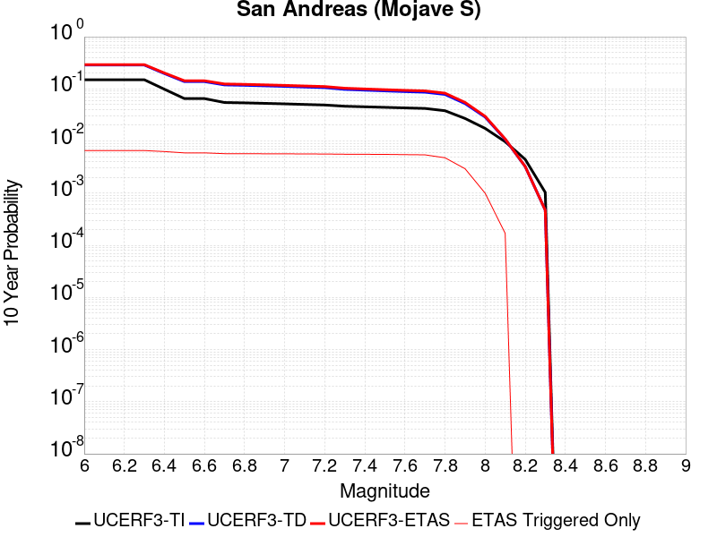 |

| Magnitude | 1 wk TI Prob | 1 wk TD Prob | 1 wk ETAS Prob | 1 wk ETAS/TD Gain | 1 wk ETAS Triggered Only | 1 mo TI Prob | 1 mo TD Prob | 1 mo ETAS Prob | 1 mo ETAS/TD Gain | 1 mo ETAS Triggered Only | 1 yr TI Prob | 1 yr TD Prob | 1 yr ETAS Prob | 1 yr ETAS/TD Gain | 1 yr ETAS Triggered Only | 10 yr TI Prob | 10 yr TD Prob | 10 yr ETAS Prob | 10 yr ETAS/TD Gain | 10 yr ETAS Triggered Only |
|-----|-----|-----|-----|-----|-----|-----|-----|-----|-----|-----|-----|-----|-----|-----|-----|-----|-----|-----|-----|-----|
| 6.0 | 3.1064058E-4 | 6.7460834E-4 | 0.0029111938 | 4.315384 | 0.0022380953 | 0.0013306376 | 0.0028881032 | 0.005879439 | 2.035744 | 0.003 | 0.016080605 | 0.03462235 | 0.038920578 | 1.1241461 | 0.004452381 | 0.1496549 | 0.28660452 | 0.29129255 | 1.0163572 | 0.0065714284 |
| 6.1 | 3.1064058E-4 | 6.7460834E-4 | 0.0029111938 | 4.315384 | 0.0022380953 | 0.0013306376 | 0.0028881032 | 0.005879439 | 2.035744 | 0.003 | 0.016080605 | 0.03462235 | 0.038920578 | 1.1241461 | 0.004452381 | 0.1496549 | 0.28660452 | 0.29129255 | 1.0163572 | 0.0065714284 |
| 6.2 | 3.1064058E-4 | 6.7460834E-4 | 0.0029111938 | 4.315384 | 0.0022380953 | 0.0013306376 | 0.0028881032 | 0.005879439 | 2.035744 | 0.003 | 0.016080605 | 0.03462235 | 0.038920578 | 1.1241461 | 0.004452381 | 0.1496549 | 0.28660452 | 0.29129255 | 1.0163572 | 0.0065714284 |
| 6.3 | 3.1064058E-4 | 6.7460834E-4 | 0.0029111938 | 4.315384 | 0.0022380953 | 0.0013306376 | 0.0028881032 | 0.005879439 | 2.035744 | 0.003 | 0.016080605 | 0.03462235 | 0.038920578 | 1.1241461 | 0.004452381 | 0.1496549 | 0.28660452 | 0.29129255 | 1.0163572 | 0.0065714284 |
| 6.4 | 1.9872203E-4 | 4.3179357E-4 | 0.0025023278 | 5.7951946 | 0.0020714286 | 8.5138786E-4 | 0.0018492596 | 0.004653588 | 2.51646 | 0.0028095238 | 0.010316478 | 0.02228844 | 0.026385516 | 1.1838207 | 0.004190476 | 0.098504856 | 0.19699748 | 0.2020258 | 1.0255249 | 0.0062619047 |
| 6.5 | 1.291105E-4 | 2.875267E-4 | 0.0022155435 | 7.7055235 | 0.0019285714 | 5.5321335E-4 | 0.0012316781 | 0.0038237197 | 3.1044798 | 0.0025952382 | 0.006714592 | 0.0148934 | 0.018693097 | 1.2551262 | 0.0038571428 | 0.065152965 | 0.13803436 | 0.14302145 | 1.0361294 | 0.0057857144 |
| 6.6 | 1.291105E-4 | 2.875267E-4 | 0.0022155435 | 7.7055235 | 0.0019285714 | 5.5321335E-4 | 0.0012316781 | 0.0038237197 | 3.1044798 | 0.0025952382 | 0.006714592 | 0.0148934 | 0.018693097 | 1.2551262 | 0.0038571428 | 0.065152965 | 0.13803436 | 0.14302145 | 1.0361294 | 0.0057857144 |
| 6.7 | 1.08001186E-4 | 2.4333889E-4 | 0.0021000297 | 8.630063 | 0.0018571429 | 4.6278012E-4 | 0.0010424647 | 0.0035160738 | 3.3728468 | 0.0024761904 | 0.0056198016 | 0.012618446 | 0.016309373 | 1.2925024 | 0.0037380953 | 0.054797906 | 0.119176775 | 0.124063246 | 1.0410019 | 0.005547619 |
| 6.8 | 1.0624356E-4 | 2.3851555E-4 | 0.0020952155 | 8.784398 | 0.0018571429 | 4.5525006E-4 | 0.0010218095 | 0.00349547 | 3.4208624 | 0.0024761904 | 0.0055285925 | 0.012369843 | 0.016038183 | 1.2965552 | 0.0037142858 | 0.053930566 | 0.11712591 | 0.12200274 | 1.0416375 | 0.0055238097 |
| 6.9 | 1.0393785E-4 | 2.3221898E-4 | 0.0020889307 | 8.995521 | 0.0018571429 | 4.4537184E-4 | 9.948451E-4 | 0.0034685722 | 3.4865448 | 0.0024761904 | 0.0054089287 | 0.012045221 | 0.015714768 | 1.3046474 | 0.0037142858 | 0.05279156 | 0.11442335 | 0.11931511 | 1.0427514 | 0.0055238097 |
| 7.0 | 1.0155622E-4 | 2.2591476E-4 | 0.002082638 | 9.21869 | 0.0018571429 | 4.3516833E-4 | 9.6784724E-4 | 0.003441641 | 3.5559757 | 0.0024761904 | 0.005285311 | 0.0117200995 | 0.015390853 | 1.3132015 | 0.0037142858 | 0.05161361 | 0.111683756 | 0.11659064 | 1.0439355 | 0.0055238097 |
| 7.1 | 9.885595E-5 | 2.1879886E-4 | 0.0020755355 | 9.486043 | 0.0018571429 | 4.2359953E-4 | 9.3737274E-4 | 0.003411242 | 3.6391523 | 0.0024761904 | 0.0051451353 | 0.011352993 | 0.01502511 | 1.3234493 | 0.0037142858 | 0.05027629 | 0.1085682 | 0.11344985 | 1.044964 | 0.0054761907 |
| 7.2 | 9.6411415E-5 | 2.124288E-4 | 0.002069177 | 9.740568 | 0.0018571429 | 4.1312634E-4 | 9.1009185E-4 | 0.0033840288 | 3.7183378 | 0.0024761904 | 0.005018219 | 0.011024255 | 0.014697595 | 1.3332051 | 0.0037142858 | 0.049064007 | 0.105758004 | 0.11063375 | 1.0461029 | 0.005452381 |
| 7.3 | 9.1180635E-5 | 1.9471257E-4 | 0.0020514939 | 10.536011 | 0.0018571429 | 3.907156E-4 | 8.342157E-4 | 0.0033083404 | 3.9658093 | 0.0024761904 | 0.004746591 | 0.01010939 | 0.013786126 | 1.3636951 | 0.0037142858 | 0.046464786 | 0.09795115 | 0.102869466 | 1.0502119 | 0.005452381 |
| 7.4 | 8.887388E-5 | 1.8719878E-4 | 0.002043994 | 10.918842 | 0.0018571429 | 3.8083247E-4 | 8.020339E-4 | 0.0032762385 | 4.084913 | 0.0024761904 | 0.0046267817 | 0.00972114 | 0.013399319 | 1.3783691 | 0.0037142858 | 0.045316286 | 0.09458615 | 0.09952281 | 1.0521922 | 0.005452381 |
| 7.5 | 8.6750515E-5 | 1.8051457E-4 | 0.0020373221 | 11.286193 | 0.0018571429 | 3.7173493E-4 | 7.7340455E-4 | 0.00324768 | 4.199199 | 0.0024761904 | 0.004516484 | 0.009375632 | 0.013031508 | 1.3899338 | 0.0036904763 | 0.04425787 | 0.091549896 | 0.09648148 | 1.0538677 | 0.0054285713 |
| 7.6 | 8.453092E-5 | 1.7439072E-4 | 0.0020074043 | 11.510959 | 0.0018333333 | 3.6222505E-4 | 7.471748E-4 | 0.0031739317 | 4.2479105 | 0.0024285715 | 0.0044011753 | 0.009058985 | 0.012668841 | 1.3984836 | 0.003642857 | 0.04315024 | 0.08870898 | 0.0935909 | 1.055033 | 0.005357143 |
| 7.7 | 8.259102E-5 | 1.6961215E-4 | 0.001978829 | 11.666788 | 0.0018095238 | 3.539135E-4 | 7.2670676E-4 | 0.0030821366 | 4.2412386 | 0.0023571427 | 0.004300386 | 0.008811831 | 0.012351788 | 1.4017279 | 0.0035714286 | 0.042181134 | 0.08645982 | 0.09128854 | 1.0558492 | 0.0052857143 |
| 7.8 | 7.444844E-5 | 1.5283503E-4 | 0.0017240234 | 11.28029 | 0.0015714286 | 3.1902574E-4 | 6.548429E-4 | 0.0027725028 | 4.2338443 | 0.0021190476 | 0.0038772223 | 0.007943616 | 0.011061507 | 1.3925028 | 0.0031428572 | 0.03810269 | 0.078290746 | 0.08250427 | 1.053819 | 0.0045714285 |
| 7.9 | 5.2586525E-5 | 1.00064186E-4 | 0.0011475784 | 11.468423 | 0.001047619 | 2.2535135E-4 | 4.2877605E-4 | 0.001856735 | 4.330314 | 0.0014285714 | 0.0027402006 | 0.005207864 | 0.00729219 | 1.4002267 | 0.002095238 | 0.027066574 | 0.052200034 | 0.05495317 | 1.052742 | 0.0029047618 |
| 8.0 | 3.379877E-5 | 5.4074168E-5 | 4.1119772E-4 | 7.604328 | 3.5714285E-4 | 1.4484383E-4 | 2.3172585E-4 | 7.55414E-4 | 3.259947 | 5.238095E-4 | 0.0017620471 | 0.002817614 | 0.003577372 | 1.2696459 | 7.6190475E-4 | 0.017481409 | 0.028834904 | 0.029852314 | 1.035284 | 0.001047619 |
| 8.1 | 1.8668277E-5 | 1.9309397E-5 | 1.14545655E-4 | 5.93212 | 9.5238094E-5 | 8.000444E-5 | 8.275194E-5 | 2.2559725E-4 | 2.726187 | 1.4285714E-4 | 9.736188E-4 | 0.0010070398 | 0.0012211098 | 1.2125734 | 2.1428571E-4 | 0.009693642 | 0.010798888 | 0.011081517 | 1.026172 | 2.8571428E-4 |
| 8.2 | 8.541571E-6 | 5.460819E-6 | 5.460819E-6 | 1.0 | 0.0 | 3.660622E-5 | 2.3403301E-5 | 2.3403301E-5 | 1.0 | 0.0 | 4.455896E-4 | 2.84898E-4 | 2.84898E-4 | 1.0 | 0.0 | 0.0044469717 | 0.0032408056 | 0.0032408056 | 1.0 | 0.0 |
| 8.3 | 1.983087E-6 | 7.6599065E-7 | 7.6599065E-7 | 1.0 | 0.0 | 8.498917E-6 | 3.282813E-6 | 3.282813E-6 | 1.0 | 0.0 | 1.034694E-4 | 3.9967534E-5 | 3.9967534E-5 | 1.0 | 0.0 | 0.0010342124 | 4.719687E-4 | 4.719687E-4 | 1.0 | 0.0 |

## Gravel Hills-Harper Lk
*[(top)](#table-of-contents)*

| 1 Week | 1 Month | 1 Year | 10 Year |
|-----|-----|-----|-----|
|  |  | 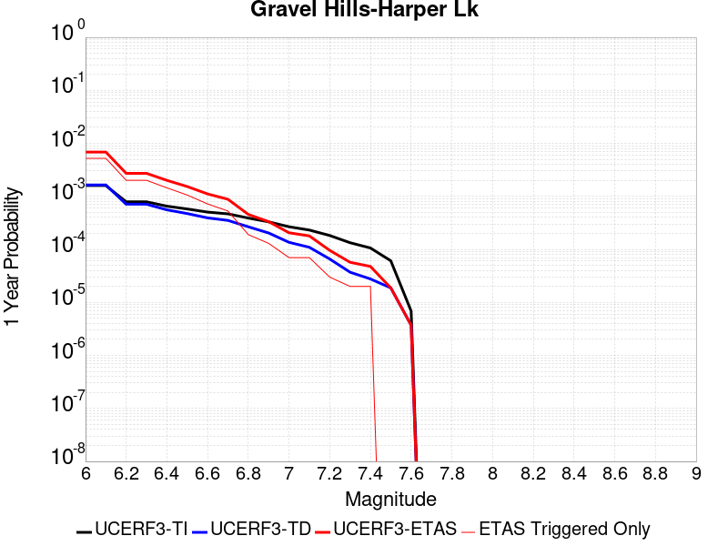 | 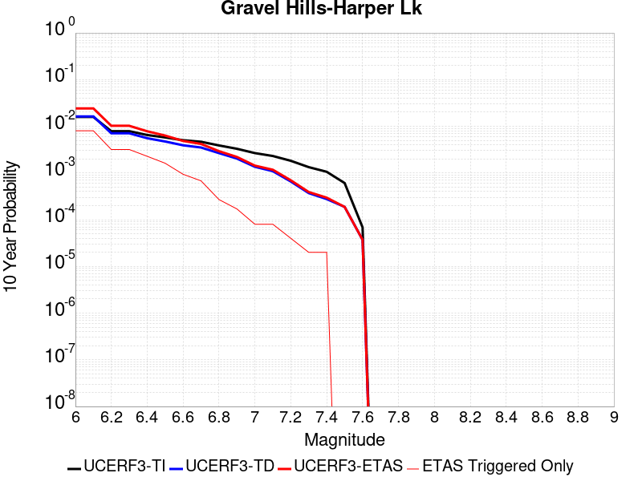 |

| Magnitude | 1 wk TI Prob | 1 wk TD Prob | 1 wk ETAS Prob | 1 wk ETAS/TD Gain | 1 wk ETAS Triggered Only | 1 mo TI Prob | 1 mo TD Prob | 1 mo ETAS Prob | 1 mo ETAS/TD Gain | 1 mo ETAS Triggered Only | 1 yr TI Prob | 1 yr TD Prob | 1 yr ETAS Prob | 1 yr ETAS/TD Gain | 1 yr ETAS Triggered Only | 10 yr TI Prob | 10 yr TD Prob | 10 yr ETAS Prob | 10 yr ETAS/TD Gain | 10 yr ETAS Triggered Only |
|-----|-----|-----|-----|-----|-----|-----|-----|-----|-----|-----|-----|-----|-----|-----|-----|-----|-----|-----|-----|-----|
| 6.0 | 3.0679566E-5 | 3.1464646E-5 | 0.0018409315 | 58.50794 | 0.0018095238 | 1.3147724E-4 | 1.3484273E-4 | 0.0028725688 | 21.303102 | 0.0027380954 | 0.0015995599 | 0.0016406906 | 0.0062759304 | 3.825176 | 0.0046428572 | 0.015880952 | 0.01630734 | 0.023661612 | 1.4509794 | 0.0074761906 |
| 6.1 | 3.0679566E-5 | 3.1464646E-5 | 0.0018409315 | 58.50794 | 0.0018095238 | 1.3147724E-4 | 1.3484273E-4 | 0.0028725688 | 21.303102 | 0.0027380954 | 0.0015995599 | 0.0016406906 | 0.0062759304 | 3.825176 | 0.0046428572 | 0.015880952 | 0.01630734 | 0.023661612 | 1.4509794 | 0.0074761906 |
| 6.2 | 1.514536E-5 | 1.3635206E-5 | 5.6124676E-4 | 41.16159 | 5.4761907E-4 | 6.490707E-5 | 5.843536E-5 | 9.631444E-4 | 16.48222 | 9.047619E-4 | 7.8995706E-4 | 7.1123015E-4 | 0.0023291262 | 3.2747855 | 0.0016190476 | 0.007871548 | 0.0070907404 | 0.00980942 | 1.3834127 | 0.0027380954 |
| 6.3 | 1.514536E-5 | 1.3635206E-5 | 5.6124676E-4 | 41.16159 | 5.4761907E-4 | 6.490707E-5 | 5.843536E-5 | 9.631444E-4 | 16.48222 | 9.047619E-4 | 7.8995706E-4 | 7.1123015E-4 | 0.0023291262 | 3.2747855 | 0.0016190476 | 0.007871548 | 0.0070907404 | 0.00980942 | 1.3834127 | 0.0027380954 |
| 6.4 | 1.2532521E-5 | 1.06896905E-5 | 3.6782873E-4 | 34.40967 | 3.5714285E-4 | 5.37097E-5 | 4.581219E-5 | 6.6483143E-4 | 14.512109 | 6.190476E-4 | 6.537194E-4 | 5.576265E-4 | 0.0016760501 | 3.005686 | 0.0011190476 | 0.0065179965 | 0.005562863 | 0.0073386435 | 1.3192207 | 0.0017857143 |
| 6.5 | 1.1094058E-5 | 9.083664E-6 | 3.4241396E-4 | 37.69558 | 3.3333333E-4 | 4.7545094E-5 | 3.892943E-5 | 5.8652717E-4 | 15.0664215 | 5.4761907E-4 | 5.787078E-4 | 4.7386673E-4 | 0.0013306034 | 2.8079696 | 8.5714285E-4 | 0.0057720304 | 0.0047289706 | 0.0060796957 | 1.2856277 | 0.0013571428 |
| 6.6 | 9.688328E-6 | 7.5316952E-6 | 1.5038776E-4 | 19.96732 | 1.4285714E-4 | 4.1520743E-5 | 3.227831E-5 | 3.656009E-4 | 11.326519 | 3.3333333E-4 | 5.053978E-4 | 3.9292008E-4 | 9.165238E-4 | 2.3325958 | 5.238095E-4 | 0.0050424994 | 0.0039225104 | 0.0046814266 | 1.1934772 | 7.6190475E-4 |
| 6.7 | 8.974824E-6 | 6.749413E-6 | 7.81775E-5 | 11.582859 | 7.142857E-5 | 3.8462964E-5 | 2.8925748E-5 | 1.7177875E-4 | 5.938611 | 1.4285714E-4 | 4.6818596E-4 | 3.5211627E-4 | 6.1392883E-4 | 1.74354 | 2.6190476E-4 | 0.004672008 | 0.0035158044 | 0.003990321 | 1.1349666 | 4.7619047E-4 |
| 6.8 | 7.4780046E-6 | 5.1161933E-6 | 5.1161933E-6 | 1.0 | 0.0 | 3.20482E-5 | 2.1926366E-5 | 9.3353374E-5 | 4.257585 | 7.142857E-5 | 3.9011694E-4 | 2.669222E-4 | 4.0974122E-4 | 1.5350586 | 1.4285714E-4 | 0.0038943281 | 0.0026661542 | 0.0029036147 | 1.0890648 | 2.3809524E-4 |
| 6.9 | 6.3409307E-6 | 3.9074966E-6 | 3.9074966E-6 | 1.0 | 0.0 | 2.7175134E-5 | 1.6746313E-5 | 6.436456E-5 | 3.8435066 | 4.7619047E-5 | 3.3080703E-4 | 2.0386827E-4 | 2.9908697E-4 | 1.4670599 | 9.5238094E-5 | 0.0033031502 | 0.0020369107 | 0.002179477 | 1.0699914 | 1.4285714E-4 |
| 7.0 | 5.1239335E-6 | 2.6058565E-6 | 2.6058565E-6 | 1.0 | 0.0 | 2.195953E-5 | 1.116791E-5 | 3.497717E-5 | 3.1319351 | 2.3809524E-5 | 2.6732447E-4 | 1.3596108E-4 | 2.0737993E-4 | 1.525289 | 7.142857E-5 | 0.0026700313 | 0.0013588042 | 0.0014301357 | 1.0524958 | 7.142857E-5 |
| 7.1 | 4.438899E-6 | 2.0984728E-6 | 2.0984728E-6 | 1.0 | 0.0 | 1.9023713E-5 | 8.993425E-6 | 3.2802734E-5 | 3.647413 | 2.3809524E-5 | 2.315891E-4 | 1.0948967E-4 | 1.8091041E-4 | 1.6523058 | 7.142857E-5 | 0.002313479 | 0.0010943791 | 0.0011657295 | 1.0651971 | 7.142857E-5 |
| 7.2 | 3.50367E-6 | 1.2615716E-6 | 1.2615716E-6 | 1.0 | 0.0 | 1.5015643E-5 | 5.4067245E-6 | 5.4067245E-6 | 1.0 | 0.0 | 1.8280011E-4 | 6.582497E-5 | 1.1344088E-4 | 1.7233716 | 4.7619047E-5 | 0.0018264982 | 6.580629E-4 | 7.0565066E-4 | 1.0723149 | 4.7619047E-5 |
| 7.3 | 2.561638E-6 | 7.1191585E-7 | 7.1191585E-7 | 1.0 | 0.0 | 1.0978401E-5 | 3.0510646E-6 | 3.0510646E-6 | 1.0 | 0.0 | 1.3365384E-4 | 3.71461E-5 | 6.0954735E-5 | 1.6409459 | 2.3809524E-5 | 0.0013357349 | 3.7140088E-4 | 3.9520155E-4 | 1.0640836 | 2.3809524E-5 |
| 7.4 | 2.0368864E-6 | 5.304837E-7 | 5.304837E-7 | 1.0 | 0.0 | 8.729483E-6 | 2.2734996E-6 | 2.2734996E-6 | 1.0 | 0.0 | 1.06276275E-4 | 2.7679513E-5 | 5.1488376E-5 | 1.860162 | 2.3809524E-5 | 0.0010622547 | 2.767612E-4 | 3.0056413E-4 | 1.0860053 | 2.3809524E-5 |
| 7.5 | 1.1681728E-6 | 3.6030585E-7 | 3.6030585E-7 | 1.0 | 0.0 | 5.0064455E-6 | 1.544167E-6 | 1.544167E-6 | 1.0 | 0.0 | 6.0951766E-5 | 1.8800076E-5 | 1.8800076E-5 | 1.0 | 0.0 | 6.093505E-4 | 1.8798532E-4 | 1.8798532E-4 | 1.0 | 0.0 |
| 7.6 | 1.3154387E-7 | 7.1197384E-8 | 7.1197384E-8 | 1.0 | 0.0 | 5.6375933E-7 | 3.051316E-7 | 3.051316E-7 | 1.0 | 0.0 | 6.863748E-6 | 3.7149728E-6 | 3.7149728E-6 | 1.0 | 0.0 | 6.863536E-5 | 3.7149264E-5 | 3.7149264E-5 | 1.0 | 0.0 |

## San Andreas (Mojave N)
*[(top)](#table-of-contents)*

| 1 Week | 1 Month | 1 Year | 10 Year |
|-----|-----|-----|-----|
| 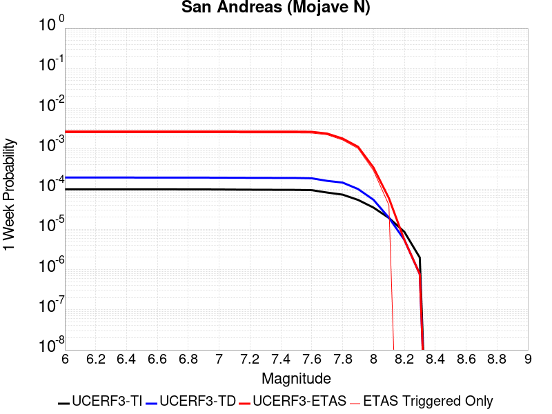 |  |  |  |

| Magnitude | 1 wk TI Prob | 1 wk TD Prob | 1 wk ETAS Prob | 1 wk ETAS/TD Gain | 1 wk ETAS Triggered Only | 1 mo TI Prob | 1 mo TD Prob | 1 mo ETAS Prob | 1 mo ETAS/TD Gain | 1 mo ETAS Triggered Only | 1 yr TI Prob | 1 yr TD Prob | 1 yr ETAS Prob | 1 yr ETAS/TD Gain | 1 yr ETAS Triggered Only | 10 yr TI Prob | 10 yr TD Prob | 10 yr ETAS Prob | 10 yr ETAS/TD Gain | 10 yr ETAS Triggered Only |
|-----|-----|-----|-----|-----|-----|-----|-----|-----|-----|-----|-----|-----|-----|-----|-----|-----|-----|-----|-----|-----|
| 6.0 | 9.877682E-5 | 1.9400702E-4 | 0.0026221073 | 13.515528 | 0.0024285715 | 4.2326056E-4 | 8.311939E-4 | 0.0040665977 | 4.892478 | 0.0032380952 | 0.0051410277 | 0.010072956 | 0.014739755 | 1.4632999 | 0.0047142855 | 0.05023708 | 0.09831428 | 0.10434698 | 1.0613614 | 0.006690476 |
| 6.1 | 9.877682E-5 | 1.9400702E-4 | 0.0026221073 | 13.515528 | 0.0024285715 | 4.2326056E-4 | 8.311939E-4 | 0.0040665977 | 4.892478 | 0.0032380952 | 0.0051410277 | 0.010072956 | 0.014739755 | 1.4632999 | 0.0047142855 | 0.05023708 | 0.09831428 | 0.10434698 | 1.0613614 | 0.006690476 |
| 6.2 | 9.877682E-5 | 1.9400702E-4 | 0.0026221073 | 13.515528 | 0.0024285715 | 4.2326056E-4 | 8.311939E-4 | 0.0040665977 | 4.892478 | 0.0032380952 | 0.0051410277 | 0.010072956 | 0.014739755 | 1.4632999 | 0.0047142855 | 0.05023708 | 0.09831428 | 0.10434698 | 1.0613614 | 0.006690476 |
| 6.3 | 9.877682E-5 | 1.9400702E-4 | 0.0026221073 | 13.515528 | 0.0024285715 | 4.2326056E-4 | 8.311939E-4 | 0.0040665977 | 4.892478 | 0.0032380952 | 0.0051410277 | 0.010072956 | 0.014739755 | 1.4632999 | 0.0047142855 | 0.05023708 | 0.09831428 | 0.10434698 | 1.0613614 | 0.006690476 |
| 6.4 | 9.877682E-5 | 1.9400702E-4 | 0.0026221073 | 13.515528 | 0.0024285715 | 4.2326056E-4 | 8.311939E-4 | 0.0040665977 | 4.892478 | 0.0032380952 | 0.0051410277 | 0.010072956 | 0.014739755 | 1.4632999 | 0.0047142855 | 0.05023708 | 0.09831428 | 0.10434698 | 1.0613614 | 0.006690476 |
| 6.5 | 9.861474E-5 | 1.9374468E-4 | 0.0026218456 | 13.532477 | 0.0024285715 | 4.2256617E-4 | 8.300703E-4 | 0.0040654778 | 4.897751 | 0.0032380952 | 0.0051326132 | 0.010059402 | 0.014726265 | 1.4639304 | 0.0047142855 | 0.050156746 | 0.098192066 | 0.10422559 | 1.0614462 | 0.006690476 |
| 6.6 | 9.861474E-5 | 1.9374468E-4 | 0.0026218456 | 13.532477 | 0.0024285715 | 4.2256617E-4 | 8.300703E-4 | 0.0040654778 | 4.897751 | 0.0032380952 | 0.0051326132 | 0.010059402 | 0.014726265 | 1.4639304 | 0.0047142855 | 0.050156746 | 0.098192066 | 0.10422559 | 1.0614462 | 0.006690476 |
| 6.7 | 9.8552715E-5 | 1.9364421E-4 | 0.0026217455 | 13.538981 | 0.0024285715 | 4.223004E-4 | 8.2964E-4 | 0.004065049 | 4.8997746 | 0.0032380952 | 0.0051293927 | 0.010054212 | 0.014721099 | 1.4641724 | 0.0047142855 | 0.050125998 | 0.098145254 | 0.10417909 | 1.0614786 | 0.006690476 |
| 6.8 | 9.8464974E-5 | 1.9349584E-4 | 0.0026215974 | 13.548597 | 0.0024285715 | 4.219245E-4 | 8.290045E-4 | 0.0040644156 | 4.902766 | 0.0032380952 | 0.0051248376 | 0.010046546 | 0.01471347 | 1.4645301 | 0.0047142855 | 0.05008251 | 0.09807528 | 0.104109585 | 1.0615273 | 0.006690476 |
| 6.9 | 9.825824E-5 | 1.9317595E-4 | 0.0026212782 | 13.569383 | 0.0024285715 | 4.2103877E-4 | 8.276344E-4 | 0.00406305 | 4.9092326 | 0.0032380952 | 0.0051141046 | 0.010030019 | 0.01469702 | 1.4653033 | 0.0047142855 | 0.049980022 | 0.09792438 | 0.103959695 | 1.0616324 | 0.006690476 |
| 7.0 | 9.781462E-5 | 1.924896E-4 | 0.0026205936 | 13.614208 | 0.0024285715 | 4.1913814E-4 | 8.246948E-4 | 0.0040601194 | 4.923178 | 0.0032380952 | 0.005091073 | 0.009994558 | 0.014661727 | 1.4669709 | 0.0047142855 | 0.04976007 | 0.09760077 | 0.103638254 | 1.0618589 | 0.006690476 |
| 7.1 | 9.7121134E-5 | 1.9150671E-4 | 0.002619613 | 13.678962 | 0.0024285715 | 4.1616702E-4 | 8.204851E-4 | 0.0040559233 | 4.9433236 | 0.0032380952 | 0.005055068 | 0.009943774 | 0.014587609 | 1.4670093 | 0.004690476 | 0.04941613 | 0.09713728 | 0.103156365 | 1.0619648 | 0.006666667 |
| 7.2 | 9.663819E-5 | 1.9081456E-4 | 0.0026189226 | 13.724961 | 0.0024285715 | 4.1409794E-4 | 8.175206E-4 | 0.0040529687 | 4.957635 | 0.0032380952 | 0.0050299936 | 0.00990801 | 0.014552013 | 1.468712 | 0.004690476 | 0.049176537 | 0.09681055 | 0.10283181 | 1.0621964 | 0.006666667 |
| 7.3 | 9.6277574E-5 | 1.9033969E-4 | 0.0026184488 | 13.756715 | 0.0024285715 | 4.125529E-4 | 8.154867E-4 | 0.004050941 | 4.9675136 | 0.0032380952 | 0.0050112694 | 0.009883473 | 0.014527591 | 1.4698873 | 0.004690476 | 0.04899759 | 0.09658401 | 0.10260678 | 1.0623579 | 0.006666667 |
| 7.4 | 9.593308E-5 | 1.897375E-4 | 0.002617848 | 13.79721 | 0.0024285715 | 4.1107697E-4 | 8.129075E-4 | 0.0040483703 | 4.980112 | 0.0032380952 | 0.0049933824 | 0.009852355 | 0.014496619 | 1.4713862 | 0.004690476 | 0.04882661 | 0.09630218 | 0.10232684 | 1.0625598 | 0.006666667 |
| 7.5 | 9.561707E-5 | 1.8919831E-4 | 0.0026173103 | 13.833687 | 0.0024285715 | 4.0972308E-4 | 8.1059814E-4 | 0.0040460685 | 4.9914603 | 0.0032380952 | 0.0049769743 | 0.009824493 | 0.014468888 | 1.4727364 | 0.004690476 | 0.048669744 | 0.09604836 | 0.102074705 | 1.0627428 | 0.006666667 |
| 7.6 | 9.418194E-5 | 1.8572104E-4 | 0.0025900363 | 13.945842 | 0.002404762 | 4.0357444E-4 | 7.957047E-4 | 0.0040074326 | 5.0363317 | 0.0032142857 | 0.004902454 | 0.009644784 | 0.014266442 | 1.4791873 | 0.0046666665 | 0.047957025 | 0.094430685 | 0.100446254 | 1.0637035 | 0.006642857 |
| 7.7 | 8.202141E-5 | 1.6021315E-4 | 0.0023265327 | 14.521483 | 0.0021666666 | 3.51473E-4 | 6.8644714E-4 | 0.0035416288 | 5.159361 | 0.0028571428 | 0.00427079 | 0.008325525 | 0.012504724 | 1.5019743 | 0.004214286 | 0.04189639 | 0.08223219 | 0.08784806 | 1.0682927 | 0.0061190478 |
| 7.8 | 7.2859846E-5 | 1.4516473E-4 | 0.0017163652 | 11.823569 | 0.0015714286 | 3.1221908E-4 | 6.219862E-4 | 0.0027397159 | 4.4047856 | 0.0021190476 | 0.003794643 | 0.0075464295 | 0.010665569 | 1.4133265 | 0.0031428572 | 0.037304975 | 0.07472468 | 0.07895451 | 1.0566056 | 0.0045714285 |
| 7.9 | 5.3874453E-5 | 1.0045676E-4 | 0.0011479706 | 11.427509 | 0.001047619 | 2.3087008E-4 | 4.3045796E-4 | 0.0018584145 | 4.317296 | 0.0014285714 | 0.0028072202 | 0.0052282433 | 0.007312527 | 1.3986585 | 0.002095238 | 0.02772022 | 0.05242443 | 0.05517691 | 1.0525038 | 0.0029047618 |
| 8.0 | 3.468538E-5 | 5.4260272E-5 | 4.1138375E-4 | 7.581675 | 3.5714285E-4 | 1.4864317E-4 | 2.325233E-4 | 7.5621105E-4 | 3.2521946 | 5.238095E-4 | 0.0018082283 | 0.002827298 | 0.0035870485 | 1.2687197 | 7.6190475E-4 | 0.017935853 | 0.028947512 | 0.029964805 | 1.0351427 | 0.001047619 |
| 8.1 | 1.9152367E-5 | 1.940263E-5 | 1.14638875E-4 | 5.9084196 | 9.5238094E-5 | 8.207899E-5 | 8.3151484E-5 | 2.2599674E-4 | 2.717892 | 1.4285714E-4 | 9.988535E-4 | 0.0010118998 | 0.0012259686 | 1.2115514 | 2.1428571E-4 | 0.009943757 | 0.01085625 | 0.011138863 | 1.0260322 | 2.8571428E-4 |
| 8.2 | 8.643924E-6 | 5.4748625E-6 | 5.4748625E-6 | 1.0 | 0.0 | 3.704486E-5 | 2.3463486E-5 | 2.3463486E-5 | 1.0 | 0.0 | 4.5092785E-4 | 2.8563058E-4 | 2.8563058E-4 | 1.0 | 0.0 | 0.0045001395 | 0.0032487072 | 0.0032487072 | 1.0 | 0.0 |
| 8.3 | 1.983087E-6 | 7.6599065E-7 | 7.6599065E-7 | 1.0 | 0.0 | 8.498917E-6 | 3.282813E-6 | 3.282813E-6 | 1.0 | 0.0 | 1.034694E-4 | 3.9967534E-5 | 3.9967534E-5 | 1.0 | 0.0 | 0.0010342124 | 4.719687E-4 | 4.719687E-4 | 1.0 | 0.0 |

## Coyote Canyon
*[(top)](#table-of-contents)*

| 1 Week | 1 Month | 1 Year | 10 Year |
|-----|-----|-----|-----|
|  |  |  |  |

| Magnitude | 1 wk TI Prob | 1 wk TD Prob | 1 wk ETAS Prob | 1 wk ETAS/TD Gain | 1 wk ETAS Triggered Only | 1 mo TI Prob | 1 mo TD Prob | 1 mo ETAS Prob | 1 mo ETAS/TD Gain | 1 mo ETAS Triggered Only | 1 yr TI Prob | 1 yr TD Prob | 1 yr ETAS Prob | 1 yr ETAS/TD Gain | 1 yr ETAS Triggered Only | 10 yr TI Prob | 10 yr TD Prob | 10 yr ETAS Prob | 10 yr ETAS/TD Gain | 10 yr ETAS Triggered Only |
|-----|-----|-----|-----|-----|-----|-----|-----|-----|-----|-----|-----|-----|-----|-----|-----|-----|-----|-----|-----|-----|
| 6.0 | 3.5090034E-5 | 4.0364324E-5 | 0.0010641325 | 26.363195 | 0.0010238095 | 1.503772E-4 | 1.7297994E-4 | 0.0015774989 | 9.119548 | 0.0014047619 | 0.0018293047 | 0.0021042528 | 0.0050029024 | 2.3775196 | 0.0029047618 | 0.018143194 | 0.020869201 | 0.026627423 | 1.2759196 | 0.0058809523 |
| 6.1 | 3.5090034E-5 | 4.0364324E-5 | 0.0010641325 | 26.363195 | 0.0010238095 | 1.503772E-4 | 1.7297994E-4 | 0.0015774989 | 9.119548 | 0.0014047619 | 0.0018293047 | 0.0021042528 | 0.0050029024 | 2.3775196 | 0.0029047618 | 0.018143194 | 0.020869201 | 0.026627423 | 1.2759196 | 0.0058809523 |
| 6.2 | 1.841879E-5 | 2.1059794E-5 | 4.7343122E-4 | 22.480335 | 4.5238095E-4 | 7.8935285E-5 | 9.0253714E-5 | 7.806676E-4 | 8.649701 | 6.904762E-4 | 9.606133E-4 | 0.001098387 | 0.0027394397 | 2.494057 | 0.0016428571 | 0.0095647145 | 0.010939667 | 0.014495574 | 1.3250471 | 0.003595238 |
| 6.3 | 1.841879E-5 | 2.1059794E-5 | 4.7343122E-4 | 22.480335 | 4.5238095E-4 | 7.8935285E-5 | 9.0253714E-5 | 7.806676E-4 | 8.649701 | 6.904762E-4 | 9.606133E-4 | 0.001098387 | 0.0027394397 | 2.494057 | 0.0016428571 | 0.0095647145 | 0.010939667 | 0.014495574 | 1.3250471 | 0.003595238 |
| 6.4 | 1.712201E-5 | 1.9565212E-5 | 4.7193732E-4 | 24.121248 | 4.5238095E-4 | 7.337798E-5 | 8.3848776E-5 | 7.742671E-4 | 9.234089 | 6.904762E-4 | 8.930107E-4 | 0.0010204813 | 0.0025903063 | 2.5383182 | 0.0015714286 | 0.008894307 | 0.010167871 | 0.013538013 | 1.3314502 | 0.003404762 |
| 6.5 | 1.4744935E-5 | 1.6836972E-5 | 3.9778295E-4 | 23.625563 | 3.8095238E-4 | 6.3191044E-5 | 7.215698E-5 | 6.911599E-4 | 9.57856 | 6.190476E-4 | 7.6907943E-4 | 8.7825063E-4 | 0.0023055675 | 2.6251817 | 0.0014285714 | 0.007664232 | 0.008756994 | 0.0118251275 | 1.3503637 | 0.003095238 |
| 6.6 | 1.2017839E-5 | 1.37240895E-5 | 3.4705285E-4 | 25.28786 | 3.3333333E-4 | 5.150401E-5 | 5.88167E-5 | 6.3021167E-4 | 10.714843 | 5.7142857E-4 | 6.268809E-4 | 7.159466E-4 | 0.001929363 | 2.6948419 | 0.0012142857 | 0.0062511545 | 0.0071450938 | 0.009887264 | 1.3837837 | 0.0027619048 |
| 6.7 | 1.00956095E-5 | 1.1533517E-5 | 3.2105375E-4 | 27.836588 | 3.095238E-4 | 4.326618E-5 | 4.942891E-5 | 5.732125E-4 | 11.596706 | 5.238095E-4 | 5.266384E-4 | 6.017178E-4 | 0.0016962969 | 2.8190904 | 0.0010952381 | 0.005253921 | 0.0060094125 | 0.00842339 | 1.4016993 | 0.0024285715 |

## Nelson Lake
*[(top)](#table-of-contents)*

| 1 Week | 1 Month | 1 Year | 10 Year |
|-----|-----|-----|-----|
|  |  | 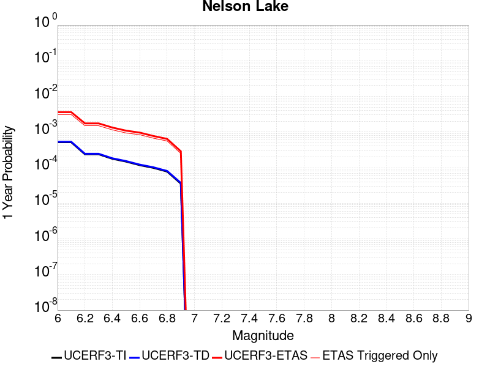 |  |

| Magnitude | 1 wk TI Prob | 1 wk TD Prob | 1 wk ETAS Prob | 1 wk ETAS/TD Gain | 1 wk ETAS Triggered Only | 1 mo TI Prob | 1 mo TD Prob | 1 mo ETAS Prob | 1 mo ETAS/TD Gain | 1 mo ETAS Triggered Only | 1 yr TI Prob | 1 yr TD Prob | 1 yr ETAS Prob | 1 yr ETAS/TD Gain | 1 yr ETAS Triggered Only | 10 yr TI Prob | 10 yr TD Prob | 10 yr ETAS Prob | 10 yr ETAS/TD Gain | 10 yr ETAS Triggered Only |
|-----|-----|-----|-----|-----|-----|-----|-----|-----|-----|-----|-----|-----|-----|-----|-----|-----|-----|-----|-----|-----|
| 6.0 | 9.913453E-6 | 1.0192255E-5 | 7.4827997E-4 | 73.41653 | 7.3809526E-4 | 4.2485535E-5 | 4.3680422E-5 | 0.001353147 | 30.978342 | 0.0013095238 | 5.1713863E-4 | 5.316897E-4 | 0.0032683292 | 6.1470613 | 0.0027380954 | 0.0051593683 | 0.005305204 | 0.010941808 | 2.0624669 | 0.0056666667 |
| 6.1 | 9.913453E-6 | 1.0192255E-5 | 7.4827997E-4 | 73.41653 | 7.3809526E-4 | 4.2485535E-5 | 4.3680422E-5 | 0.001353147 | 30.978342 | 0.0013095238 | 5.1713863E-4 | 5.316897E-4 | 0.0032683292 | 6.1470613 | 0.0027380954 | 0.0051593683 | 0.005305204 | 0.010941808 | 2.0624669 | 0.0056666667 |
| 6.2 | 4.5596407E-6 | 4.696313E-6 | 4.0945632E-4 | 87.18676 | 4.047619E-4 | 1.954117E-5 | 2.0126909E-5 | 6.391621E-4 | 31.756596 | 6.190476E-4 | 2.3788778E-4 | 2.4501883E-4 | 0.0015542217 | 6.343275 | 0.0013095238 | 0.0023763329 | 0.0024476128 | 0.0051315036 | 2.096534 | 0.0026904761 |
| 6.3 | 4.5596407E-6 | 4.696313E-6 | 4.0945632E-4 | 87.18676 | 4.047619E-4 | 1.954117E-5 | 2.0126909E-5 | 6.391621E-4 | 31.756596 | 6.190476E-4 | 2.3788778E-4 | 2.4501883E-4 | 0.0015542217 | 6.343275 | 0.0013095238 | 0.0023763329 | 0.0024476128 | 0.0051315036 | 2.096534 | 0.0026904761 |
| 6.4 | 3.4025713E-6 | 3.5098972E-6 | 2.6541375E-4 | 75.61866 | 2.6190476E-4 | 1.4582367E-5 | 1.5042335E-5 | 3.95989E-4 | 26.324968 | 3.8095238E-4 | 1.7752586E-4 | 1.8312587E-4 | 0.0010401118 | 5.6797643 | 8.5714285E-4 | 0.001773841 | 0.0018298327 | 0.003826173 | 2.090996 | 0.002 |
| 6.5 | 2.8352947E-6 | 2.927856E-6 | 2.1721295E-4 | 74.18839 | 2.1428571E-4 | 1.2151207E-5 | 1.2547898E-5 | 3.2206782E-4 | 25.667072 | 3.095238E-4 | 1.479309E-4 | 1.5276071E-4 | 7.955196E-4 | 5.2076197 | 6.4285717E-4 | 0.0014783246 | 0.0015266308 | 0.0032382994 | 2.1212065 | 0.0017142857 |
| 6.6 | 2.251518E-6 | 2.3290677E-6 | 2.1661428E-4 | 93.00472 | 2.1428571E-4 | 9.649328E-6 | 9.981683E-6 | 3.195024E-4 | 32.00887 | 3.095238E-4 | 1.1747423E-4 | 1.2152085E-4 | 6.4526673E-4 | 5.309926 | 5.238095E-4 | 0.0011741214 | 0.0012146058 | 0.0026652226 | 2.194311 | 0.0014523809 |
| 6.7 | 1.8911853E-6 | 1.9591396E-6 | 1.6862548E-4 | 86.07119 | 1.6666666E-4 | 8.105055E-6 | 8.39629E-6 | 1.9887088E-4 | 23.685568 | 1.9047619E-4 | 9.867457E-5 | 1.0222061E-4 | 4.8313406E-4 | 4.726386 | 3.8095238E-4 | 9.863076E-4 | 0.0010217935 | 0.0022348384 | 2.1871724 | 0.0012142857 |
| 6.8 | 1.4874814E-6 | 1.5438305E-6 | 1.4440075E-4 | 93.53407 | 1.4285714E-4 | 6.374905E-6 | 6.6164025E-6 | 1.494726E-4 | 22.591219 | 1.4285714E-4 | 7.76117E-5 | 8.055224E-5 | 3.662435E-4 | 4.546658 | 2.8571428E-4 | 7.75846E-4 | 8.0528157E-4 | 0.001780686 | 2.211259 | 9.761905E-4 |
| 6.9 | 6.835972E-7 | 7.1399285E-7 | 9.595202E-5 | 134.38794 | 9.5238094E-5 | 2.9296991E-6 | 3.0599674E-6 | 1.2210722E-4 | 39.904747 | 1.1904762E-4 | 3.56685E-5 | 3.7254784E-5 | 2.2772388E-4 | 6.1126075 | 1.9047619E-4 | 3.5662777E-4 | 3.7251666E-4 | 9.437324E-4 | 2.5333965 | 5.7142857E-4 |

## So Sierra Nevada
*[(top)](#table-of-contents)*

| 1 Week | 1 Month | 1 Year | 10 Year |
|-----|-----|-----|-----|
|  |  |  |  |

| Magnitude | 1 wk TI Prob | 1 wk TD Prob | 1 wk ETAS Prob | 1 wk ETAS/TD Gain | 1 wk ETAS Triggered Only | 1 mo TI Prob | 1 mo TD Prob | 1 mo ETAS Prob | 1 mo ETAS/TD Gain | 1 mo ETAS Triggered Only | 1 yr TI Prob | 1 yr TD Prob | 1 yr ETAS Prob | 1 yr ETAS/TD Gain | 1 yr ETAS Triggered Only | 10 yr TI Prob | 10 yr TD Prob | 10 yr ETAS Prob | 10 yr ETAS/TD Gain | 10 yr ETAS Triggered Only |
|-----|-----|-----|-----|-----|-----|-----|-----|-----|-----|-----|-----|-----|-----|-----|-----|-----|-----|-----|-----|-----|
| 6.0 | 1.15488665E-5 | 1.1079643E-5 | 0.001701537 | 153.57329 | 0.0016904762 | 4.9494203E-5 | 4.748339E-5 | 0.0023330892 | 49.13485 | 0.0022857143 | 6.024253E-4 | 5.7796965E-4 | 0.004647045 | 8.040292 | 0.0040714284 | 0.006007948 | 0.005765934 | 0.01206275 | 2.092072 | 0.0063333334 |
| 6.1 | 1.15488665E-5 | 1.1079643E-5 | 0.001701537 | 153.57329 | 0.0016904762 | 4.9494203E-5 | 4.748339E-5 | 0.0023330892 | 49.13485 | 0.0022857143 | 6.024253E-4 | 5.7796965E-4 | 0.004647045 | 8.040292 | 0.0040714284 | 0.006007948 | 0.005765934 | 0.01206275 | 2.092072 | 0.0063333334 |
| 6.2 | 1.15488665E-5 | 1.1079643E-5 | 0.001701537 | 153.57329 | 0.0016904762 | 4.9494203E-5 | 4.748339E-5 | 0.0023330892 | 49.13485 | 0.0022857143 | 6.024253E-4 | 5.7796965E-4 | 0.004647045 | 8.040292 | 0.0040714284 | 0.006007948 | 0.005765934 | 0.01206275 | 2.092072 | 0.0063333334 |
| 6.3 | 1.15488665E-5 | 1.1079643E-5 | 0.001701537 | 153.57329 | 0.0016904762 | 4.9494203E-5 | 4.748339E-5 | 0.0023330892 | 49.13485 | 0.0022857143 | 6.024253E-4 | 5.7796965E-4 | 0.004647045 | 8.040292 | 0.0040714284 | 0.006007948 | 0.005765934 | 0.01206275 | 2.092072 | 0.0063333334 |
| 6.4 | 1.15488665E-5 | 1.1079643E-5 | 0.001701537 | 153.57329 | 0.0016904762 | 4.9494203E-5 | 4.748339E-5 | 0.0023330892 | 49.13485 | 0.0022857143 | 6.024253E-4 | 5.7796965E-4 | 0.004647045 | 8.040292 | 0.0040714284 | 0.006007948 | 0.005765934 | 0.01206275 | 2.092072 | 0.0063333334 |
| 6.5 | 1.15488665E-5 | 1.1079643E-5 | 0.001701537 | 153.57329 | 0.0016904762 | 4.9494203E-5 | 4.748339E-5 | 0.0023330892 | 49.13485 | 0.0022857143 | 6.024253E-4 | 5.7796965E-4 | 0.004647045 | 8.040292 | 0.0040714284 | 0.006007948 | 0.005765934 | 0.01206275 | 2.092072 | 0.0063333334 |
| 6.6 | 7.587044E-6 | 6.935635E-6 | 9.831194E-4 | 141.749 | 9.761905E-4 | 3.2515498E-5 | 2.9723828E-5 | 0.0012915911 | 43.453053 | 0.0012619047 | 3.9580427E-4 | 3.6183043E-4 | 0.002575315 | 7.1174636 | 0.0022142858 | 0.003951 | 0.0036127048 | 0.006886549 | 1.906203 | 0.0032857142 |
| 6.7 | 7.587044E-6 | 6.935635E-6 | 9.831194E-4 | 141.749 | 9.761905E-4 | 3.2515498E-5 | 2.9723828E-5 | 0.0012915911 | 43.453053 | 0.0012619047 | 3.9580427E-4 | 3.6183043E-4 | 0.002575315 | 7.1174636 | 0.0022142858 | 0.003951 | 0.0036127048 | 0.006886549 | 1.906203 | 0.0032857142 |
| 6.8 | 5.9026956E-6 | 5.1793927E-6 | 7.908896E-4 | 152.6993 | 7.857143E-4 | 2.5297022E-5 | 2.2197215E-5 | 9.74557E-4 | 43.904472 | 9.5238094E-4 | 3.0794772E-4 | 2.7021873E-4 | 0.0017222072 | 6.373382 | 0.0014523809 | 0.0030752132 | 0.002699018 | 0.0049548177 | 1.8357854 | 0.0022619048 |
| 6.9 | 5.0118915E-6 | 4.2524252E-6 | 5.5186916E-4 | 129.7775 | 5.4761907E-4 | 2.1479358E-5 | 1.8224557E-5 | 7.0868817E-4 | 38.88644 | 6.904762E-4 | 2.614798E-4 | 2.2186211E-4 | 0.0012692488 | 5.72089 | 0.001047619 | 0.0026117235 | 0.0022164788 | 0.0038794512 | 1.7502768 | 0.0016666667 |
| 7.0 | 4.4924795E-6 | 3.7139177E-6 | 4.3228376E-4 | 116.39562 | 4.2857142E-4 | 1.925334E-5 | 1.5916696E-5 | 5.873362E-4 | 36.900635 | 5.7142857E-4 | 2.3438422E-4 | 1.9376918E-4 | 0.0010745509 | 5.54552 | 8.809524E-4 | 0.0023413717 | 0.0019360651 | 0.0033618708 | 1.7364451 | 0.0014285714 |
| 7.1 | 3.9118436E-6 | 3.1119775E-6 | 3.1263483E-4 | 100.461784 | 3.095238E-4 | 1.6764936E-5 | 1.3336982E-5 | 4.419027E-4 | 33.133636 | 4.2857142E-4 | 2.0409399E-4 | 1.6236622E-4 | 8.527303E-4 | 5.2518945 | 6.904762E-4 | 0.0020390663 | 0.001622532 | 0.0026446804 | 1.6299711 | 0.0010238095 |
| 7.2 | 3.4200818E-6 | 2.6054543E-6 | 1.9308114E-4 | 74.10652 | 1.9047619E-4 | 1.4657411E-5 | 1.11661875E-5 | 3.2068655E-4 | 28.719429 | 3.095238E-4 | 1.7843937E-4 | 1.3594035E-4 | 6.8348495E-4 | 5.0278296 | 5.4761907E-4 | 0.0017829615 | 0.0013586218 | 0.002071937 | 1.5250286 | 7.142857E-4 |
| 7.3 | 2.6593618E-6 | 1.8284203E-6 | 9.706634E-5 | 53.087543 | 9.5238094E-5 | 1.13972155E-5 | 7.836065E-6 | 1.7450143E-4 | 22.269012 | 1.6666666E-4 | 1.3875226E-4 | 9.540021E-5 | 3.5728E-4 | 3.745065 | 2.6190476E-4 | 0.0013866565 | 9.5362146E-4 | 0.0013342105 | 1.3990988 | 3.8095238E-4 |
| 7.4 | 2.2577992E-6 | 1.436438E-6 | 7.286491E-5 | 50.726105 | 7.142857E-5 | 9.676246E-6 | 6.15615E-6 | 1.4901241E-4 | 24.205456 | 1.4285714E-4 | 1.1780193E-4 | 7.49488E-5 | 2.8921844E-4 | 3.8588803 | 2.1428571E-4 | 0.001177395 | 7.492603E-4 | 0.0010347605 | 1.3810427 | 2.8571428E-4 |
| 7.5 | 1.489319E-6 | 7.353936E-7 | 4.8354406E-5 | 65.7531 | 4.7619047E-5 | 6.3827797E-6 | 3.1516831E-6 | 9.838948E-5 | 31.218075 | 9.5238094E-5 | 7.770758E-5 | 3.8371072E-5 | 1.5741412E-4 | 4.1024165 | 1.1904762E-4 | 7.7680405E-4 | 3.836449E-4 | 5.264472E-4 | 1.3722253 | 1.4285714E-4 |
| 7.6 | 1.0680322E-6 | 4.6596554E-7 | 4.6596554E-7 | 1.0 | 0.0 | 4.577273E-6 | 1.9969937E-6 | 2.580647E-5 | 12.92266 | 2.3809524E-5 | 5.5726876E-5 | 2.4313129E-5 | 7.193102E-5 | 2.9585257 | 4.7619047E-5 | 5.5712904E-4 | 2.4310495E-4 | 3.1451616E-4 | 1.2937464 | 7.142857E-5 |
| 7.7 | 5.509146E-7 | 1.5580486E-7 | 1.5580486E-7 | 1.0 | 0.0 | 2.3610605E-6 | 6.677349E-7 | 6.677349E-7 | 1.0 | 0.0 | 2.8745531E-5 | 8.129644E-6 | 8.129644E-6 | 1.0 | 0.0 | 2.8741814E-4 | 8.1293576E-5 | 8.1293576E-5 | 1.0 | 0.0 |

## Towne Pass
*[(top)](#table-of-contents)*

| 1 Week | 1 Month | 1 Year | 10 Year |
|-----|-----|-----|-----|
|  |  |  |  |

| Magnitude | 1 wk TI Prob | 1 wk TD Prob | 1 wk ETAS Prob | 1 wk ETAS/TD Gain | 1 wk ETAS Triggered Only | 1 mo TI Prob | 1 mo TD Prob | 1 mo ETAS Prob | 1 mo ETAS/TD Gain | 1 mo ETAS Triggered Only | 1 yr TI Prob | 1 yr TD Prob | 1 yr ETAS Prob | 1 yr ETAS/TD Gain | 1 yr ETAS Triggered Only | 10 yr TI Prob | 10 yr TD Prob | 10 yr ETAS Prob | 10 yr ETAS/TD Gain | 10 yr ETAS Triggered Only |
|-----|-----|-----|-----|-----|-----|-----|-----|-----|-----|-----|-----|-----|-----|-----|-----|-----|-----|-----|-----|-----|
| 6.0 | 3.849728E-6 | 3.8945414E-6 | 0.0011467473 | 294.4499 | 0.0011428571 | 1.649873E-5 | 1.669081E-5 | 0.0021118938 | 126.53035 | 0.002095238 | 2.0085352E-4 | 2.0319603E-4 | 0.0037024848 | 18.221247 | 0.0035 | 0.0020067208 | 0.0020305314 | 0.008065871 | 3.9722953 | 0.006047619 |
| 6.1 | 3.849728E-6 | 3.8945414E-6 | 0.0011467473 | 294.4499 | 0.0011428571 | 1.649873E-5 | 1.669081E-5 | 0.0021118938 | 126.53035 | 0.002095238 | 2.0085352E-4 | 2.0319603E-4 | 0.0037024848 | 18.221247 | 0.0035 | 0.0020067208 | 0.0020305314 | 0.008065871 | 3.9722953 | 0.006047619 |
| 6.2 | 3.849728E-6 | 3.8945414E-6 | 0.0011467473 | 294.4499 | 0.0011428571 | 1.649873E-5 | 1.669081E-5 | 0.0021118938 | 126.53035 | 0.002095238 | 2.0085352E-4 | 2.0319603E-4 | 0.0037024848 | 18.221247 | 0.0035 | 0.0020067208 | 0.0020305314 | 0.008065871 | 3.9722953 | 0.006047619 |
| 6.3 | 3.849728E-6 | 3.8945414E-6 | 0.0011467473 | 294.4499 | 0.0011428571 | 1.649873E-5 | 1.669081E-5 | 0.0021118938 | 126.53035 | 0.002095238 | 2.0085352E-4 | 2.0319603E-4 | 0.0037024848 | 18.221247 | 0.0035 | 0.0020067208 | 0.0020305314 | 0.008065871 | 3.9722953 | 0.006047619 |
| 6.4 | 3.849728E-6 | 3.8945414E-6 | 0.0011467473 | 294.4499 | 0.0011428571 | 1.649873E-5 | 1.669081E-5 | 0.0021118938 | 126.53035 | 0.002095238 | 2.0085352E-4 | 2.0319603E-4 | 0.0037024848 | 18.221247 | 0.0035 | 0.0020067208 | 0.0020305314 | 0.008065871 | 3.9722953 | 0.006047619 |
| 6.5 | 1.1953545E-6 | 1.203052E-6 | 1.2025053E-4 | 99.95455 | 1.1904762E-4 | 5.1229376E-6 | 5.1559277E-6 | 3.6229694E-4 | 70.26804 | 3.5714285E-4 | 6.236998E-5 | 6.277173E-5 | 5.3893233E-4 | 8.585589 | 4.7619047E-4 | 6.235248E-4 | 6.275517E-4 | 0.001579335 | 2.5166612 | 9.5238094E-4 |
| 6.6 | 1.1953545E-6 | 1.203052E-6 | 1.2025053E-4 | 99.95455 | 1.1904762E-4 | 5.1229376E-6 | 5.1559277E-6 | 3.6229694E-4 | 70.26804 | 3.5714285E-4 | 6.236998E-5 | 6.277173E-5 | 5.3893233E-4 | 8.585589 | 4.7619047E-4 | 6.235248E-4 | 6.275517E-4 | 0.001579335 | 2.5166612 | 9.5238094E-4 |
| 6.7 | 8.375951E-7 | 8.4106705E-7 | 7.226958E-5 | 85.92606 | 7.142857E-5 | 3.5896885E-6 | 3.6045683E-6 | 2.4169894E-4 | 67.053505 | 2.3809524E-4 | 4.370358E-5 | 4.3884793E-5 | 3.2958653E-4 | 7.5102673 | 2.8571428E-4 | 4.3694986E-4 | 4.38767E-4 | 9.623467E-4 | 2.1932979 | 5.238095E-4 |
| 6.8 | 6.38041E-7 | 6.392156E-7 | 7.206774E-5 | 112.74402 | 7.142857E-5 | 2.7344586E-6 | 2.7394929E-6 | 1.694057E-4 | 61.83834 | 1.6666666E-4 | 3.3291526E-5 | 3.3352855E-5 | 2.2382269E-4 | 6.7107506 | 1.9047619E-4 | 3.3286537E-4 | 3.334823E-4 | 6.905061E-4 | 2.0705929 | 3.5714285E-4 |
| 6.9 | 5.3460053E-7 | 5.345333E-7 | 4.8153557E-5 | 90.08523 | 4.7619047E-5 | 2.2911431E-6 | 2.2908553E-6 | 1.213382E-4 | 52.966335 | 1.1904762E-4 | 2.789431E-5 | 2.789084E-5 | 1.70744E-4 | 6.1218667 | 1.4285714E-4 | 2.789081E-4 | 2.7887672E-4 | 5.407084E-4 | 1.9388798 | 2.6190476E-4 |
| 7.0 | 3.557783E-7 | 3.5324226E-7 | 4.7972273E-5 | 135.80559 | 4.7619047E-5 | 1.5247632E-6 | 1.5138945E-6 | 7.2942355E-5 | 48.181927 | 7.142857E-5 | 1.8563835E-5 | 1.843152E-5 | 8.9858775E-5 | 4.8752775 | 7.142857E-5 | 1.8562283E-4 | 1.8430075E-4 | 3.0332644E-4 | 1.6458231 | 1.1904762E-4 |
| 7.1 | 3.037942E-7 | 3.0002218E-7 | 4.7919057E-5 | 159.71837 | 4.7619047E-5 | 1.3019744E-6 | 1.2858087E-6 | 7.271429E-5 | 56.551403 | 7.142857E-5 | 1.5851423E-5 | 1.5654618E-5 | 8.708207E-5 | 5.5627084 | 7.142857E-5 | 1.5850292E-4 | 1.5653588E-4 | 2.5175908E-4 | 1.6083153 | 9.5238094E-5 |
| 7.2 | 2.0808248E-7 | 2.0217689E-7 | 2.4011695E-5 | 118.76578 | 2.3809524E-5 | 8.917818E-7 | 8.6647213E-7 | 2.4675976E-5 | 28.478672 | 2.3809524E-5 | 1.0857389E-5 | 1.0549252E-5 | 3.4358523E-5 | 3.2569633 | 2.3809524E-5 | 1.0856859E-4 | 1.0548797E-4 | 1.53102E-4 | 1.4513693 | 4.7619047E-5 |
| 7.3 | 1.1162073E-7 | 1.0636894E-7 | 1.0636894E-7 | 1.0 | 0.0 | 4.7837443E-7 | 4.558668E-7 | 4.558668E-7 | 1.0 | 0.0 | 5.8241935E-6 | 5.550166E-6 | 5.550166E-6 | 1.0 | 0.0 | 5.8240406E-5 | 5.5500474E-5 | 7.930868E-5 | 1.428973 | 2.3809524E-5 |

## San Andreas (San Bernardino N)
*[(top)](#table-of-contents)*

| 1 Week | 1 Month | 1 Year | 10 Year |
|-----|-----|-----|-----|
|  | 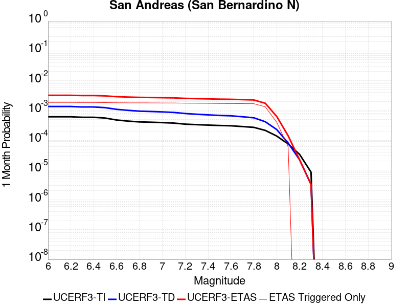 |  |  |

| Magnitude | 1 wk TI Prob | 1 wk TD Prob | 1 wk ETAS Prob | 1 wk ETAS/TD Gain | 1 wk ETAS Triggered Only | 1 mo TI Prob | 1 mo TD Prob | 1 mo ETAS Prob | 1 mo ETAS/TD Gain | 1 mo ETAS Triggered Only | 1 yr TI Prob | 1 yr TD Prob | 1 yr ETAS Prob | 1 yr ETAS/TD Gain | 1 yr ETAS Triggered Only | 10 yr TI Prob | 10 yr TD Prob | 10 yr ETAS Prob | 10 yr ETAS/TD Gain | 10 yr ETAS Triggered Only |
|-----|-----|-----|-----|-----|-----|-----|-----|-----|-----|-----|-----|-----|-----|-----|-----|-----|-----|-----|-----|-----|
| 6.0 | 1.4273766E-4 | 3.1606483E-4 | 0.0016965808 | 5.367825 | 0.0013809524 | 6.115894E-4 | 0.0013538664 | 0.0032798268 | 2.422563 | 0.0019285714 | 0.0074207084 | 0.016360244 | 0.019170642 | 1.1717823 | 0.0028571428 | 0.07177748 | 0.15026689 | 0.15386814 | 1.0239657 | 0.004238095 |
| 6.1 | 1.4273766E-4 | 3.1606483E-4 | 0.0016965808 | 5.367825 | 0.0013809524 | 6.115894E-4 | 0.0013538664 | 0.0032798268 | 2.422563 | 0.0019285714 | 0.0074207084 | 0.016360244 | 0.019170642 | 1.1717823 | 0.0028571428 | 0.07177748 | 0.15026689 | 0.15386814 | 1.0239657 | 0.004238095 |
| 6.2 | 1.4273766E-4 | 3.1606483E-4 | 0.0016965808 | 5.367825 | 0.0013809524 | 6.115894E-4 | 0.0013538664 | 0.0032798268 | 2.422563 | 0.0019285714 | 0.0074207084 | 0.016360244 | 0.019170642 | 1.1717823 | 0.0028571428 | 0.07177748 | 0.15026689 | 0.15386814 | 1.0239657 | 0.004238095 |
| 6.3 | 1.3730655E-4 | 3.0511338E-4 | 0.0016618421 | 5.446638 | 0.0013571428 | 5.883239E-4 | 0.0013069791 | 0.0032092517 | 2.4554727 | 0.0019047619 | 0.0071393442 | 0.015797773 | 0.018539479 | 1.1735501 | 0.0027857143 | 0.06914291 | 0.14556676 | 0.1491269 | 1.0244571 | 0.004166667 |
| 6.4 | 1.3730655E-4 | 3.0511338E-4 | 0.0016618421 | 5.446638 | 0.0013571428 | 5.883239E-4 | 0.0013069791 | 0.0032092517 | 2.4554727 | 0.0019047619 | 0.0071393442 | 0.015797773 | 0.018539479 | 1.1735501 | 0.0027857143 | 0.06914291 | 0.14556676 | 0.1491269 | 1.0244571 | 0.004166667 |
| 6.5 | 1.2942807E-4 | 2.8925808E-4 | 0.0016222057 | 5.6081605 | 0.0013333333 | 5.545738E-4 | 0.0012390936 | 0.0030939353 | 2.4969342 | 0.0018571429 | 0.0067310524 | 0.01498286 | 0.017656477 | 1.1784451 | 0.0027142856 | 0.06530788 | 0.13870941 | 0.1422366 | 1.0254287 | 0.004095238 |
| 6.6 | 1.1125901E-4 | 2.536472E-4 | 0.0015866423 | 6.255312 | 0.0013333333 | 4.767372E-4 | 0.0010866089 | 0.00291795 | 2.685373 | 0.0018333333 | 0.005788839 | 0.013149847 | 0.015804945 | 1.2019109 | 0.0026904761 | 0.056403454 | 0.122999296 | 0.12656994 | 1.0290298 | 0.0040714284 |
| 6.7 | 1.02209575E-4 | 2.3499702E-4 | 0.001544213 | 6.571203 | 0.0013095238 | 4.3796748E-4 | 0.0010067427 | 0.0028144447 | 2.795595 | 0.0018095238 | 0.0053192247 | 0.012188629 | 0.014822793 | 1.2161164 | 0.0026666666 | 0.051936906 | 0.114790924 | 0.11826853 | 1.0302951 | 0.0039285715 |
| 6.8 | 9.610582E-5 | 2.2025521E-4 | 0.0015294906 | 6.9441743 | 0.0013095238 | 4.1181705E-4 | 9.436101E-4 | 0.0027514265 | 2.9158509 | 0.0018095238 | 0.0050023515 | 0.011428202 | 0.014064393 | 1.2306743 | 0.0026666666 | 0.048912346 | 0.1081929 | 0.11169643 | 1.0323822 | 0.0039285715 |
| 6.9 | 9.3877505E-5 | 2.1481077E-4 | 0.0015240533 | 7.0948644 | 0.0013095238 | 4.0227012E-4 | 9.2029345E-4 | 0.0027281519 | 2.964437 | 0.0018095238 | 0.0048866454 | 0.011147255 | 0.013784196 | 1.2365551 | 0.0026666666 | 0.04780577 | 0.10578323 | 0.109296225 | 1.0332093 | 0.0039285715 |
| 7.0 | 9.1019785E-5 | 2.0808022E-4 | 0.0015173316 | 7.292051 | 0.0013095238 | 3.900265E-4 | 8.914682E-4 | 0.0026993789 | 3.0280147 | 0.0018095238 | 0.0047382377 | 0.010799837 | 0.013414152 | 1.2420698 | 0.0026428571 | 0.046384744 | 0.102753714 | 0.10625725 | 1.0340964 | 0.003904762 |
| 7.1 | 8.771155E-5 | 1.9982594E-4 | 0.0015090881 | 7.5520124 | 0.0013095238 | 3.758525E-4 | 8.5611636E-4 | 0.002664091 | 3.1118329 | 0.0018095238 | 0.0045664064 | 0.0103736 | 0.01298904 | 1.2521248 | 0.0026428571 | 0.044737056 | 0.09906527 | 0.1025403 | 1.0350783 | 0.0038571428 |
| 7.2 | 8.0830236E-5 | 1.8388197E-4 | 0.001493165 | 8.120235 | 0.0013095238 | 3.4636928E-4 | 7.8782777E-4 | 0.0025721353 | 3.2648447 | 0.0017857143 | 0.0042088944 | 0.009549725 | 0.012143761 | 1.2716347 | 0.0026190476 | 0.041300658 | 0.09179615 | 0.09525597 | 1.0376903 | 0.0038095238 |
| 7.3 | 7.7668235E-5 | 1.7331762E-4 | 0.0014826144 | 8.55432 | 0.0013095238 | 3.328214E-4 | 7.425784E-4 | 0.0025269666 | 3.4029627 | 0.0017857143 | 0.0040445733 | 0.009003494 | 0.011598961 | 1.2882733 | 0.0026190476 | 0.03971748 | 0.08706327 | 0.09051938 | 1.0396966 | 0.0037857143 |
| 7.4 | 7.520177E-5 | 1.6551897E-4 | 0.001474826 | 8.910314 | 0.0013095238 | 3.2225347E-4 | 7.0917426E-4 | 0.0024936222 | 3.5162332 | 0.0017857143 | 0.0039163795 | 0.008600081 | 0.011196605 | 1.3019185 | 0.0026190476 | 0.038480744 | 0.08351955 | 0.08698908 | 1.0415416 | 0.0037857143 |
| 7.5 | 7.274697E-5 | 1.5839566E-4 | 0.001467712 | 9.266113 | 0.0013095238 | 3.1173544E-4 | 6.78662E-4 | 0.0024631643 | 3.6294422 | 0.0017857143 | 0.003788775 | 0.008231463 | 0.010805339 | 1.3126875 | 0.0025952382 | 0.03724827 | 0.08023631 | 0.08369637 | 1.0431234 | 0.0037619048 |
| 7.6 | 7.1185845E-5 | 1.540943E-4 | 0.0014634163 | 9.496888 | 0.0013095238 | 3.0504653E-4 | 6.6023704E-4 | 0.0024209786 | 3.6668322 | 0.0017619048 | 0.0037076178 | 0.008008812 | 0.0105596455 | 1.3185035 | 0.0025714287 | 0.036463667 | 0.07822598 | 0.081649706 | 1.0437672 | 0.0037142858 |
| 7.7 | 6.709961E-5 | 1.4318313E-4 | 0.0014525194 | 10.144487 | 0.0013095238 | 2.8753807E-4 | 6.1349774E-4 | 0.0023505266 | 3.8313534 | 0.0017380952 | 0.003495157 | 0.0074437927 | 0.0099724475 | 1.3396999 | 0.002547619 | 0.034406938 | 0.07305469 | 0.07647557 | 1.0468261 | 0.0036904763 |
| 7.8 | 6.300812E-5 | 1.3202413E-4 | 0.001441375 | 10.917512 | 0.0013095238 | 2.7000686E-4 | 5.65695E-4 | 0.002302807 | 4.070757 | 0.0017380952 | 0.0032823787 | 0.006865616 | 0.009395744 | 1.3685217 | 0.002547619 | 0.032343175 | 0.06771354 | 0.07115412 | 1.0508108 | 0.0036904763 |
| 7.9 | 4.983037E-5 | 9.723488E-5 | 0.001144752 | 11.77306 | 0.001047619 | 2.1354125E-4 | 4.1665437E-4 | 0.0018446306 | 4.427244 | 0.0014285714 | 0.0025967648 | 0.0050609782 | 0.0071456125 | 1.4119034 | 0.002095238 | 0.025666296 | 0.05064886 | 0.053383894 | 1.0539999 | 0.0028809523 |
| 8.0 | 3.2211527E-5 | 5.3304586E-5 | 4.1042842E-4 | 7.6996827 | 3.5714285E-4 | 1.380421E-4 | 2.2842824E-4 | 7.521181E-4 | 3.2925794 | 5.238095E-4 | 0.0016793669 | 0.0027775685 | 0.003537357 | 1.2735444 | 7.6190475E-4 | 0.016667323 | 0.028361378 | 0.029379286 | 1.0358906 | 0.001047619 |
| 8.1 | 1.743376E-5 | 1.8824427E-5 | 1.1406073E-4 | 6.0591874 | 9.5238094E-5 | 7.471398E-5 | 8.067362E-5 | 2.2351924E-4 | 2.7706609 | 1.4285714E-4 | 9.0926304E-4 | 9.817594E-4 | 0.0011958347 | 1.2180527 | 2.1428571E-4 | 0.009055517 | 0.010484105 | 0.010766824 | 1.0269665 | 2.8571428E-4 |
| 8.2 | 7.831616E-6 | 5.1551065E-6 | 5.1551065E-6 | 1.0 | 0.0 | 3.3563636E-5 | 2.2093127E-5 | 2.2093127E-5 | 1.0 | 0.0 | 4.0856065E-4 | 2.6895068E-4 | 2.6895068E-4 | 1.0 | 0.0 | 0.004078103 | 0.0030418145 | 0.0030418145 | 1.0 | 0.0 |
| 8.3 | 1.983087E-6 | 7.6599065E-7 | 7.6599065E-7 | 1.0 | 0.0 | 8.498917E-6 | 3.282813E-6 | 3.282813E-6 | 1.0 | 0.0 | 1.034694E-4 | 3.9967534E-5 | 3.9967534E-5 | 1.0 | 0.0 | 0.0010342124 | 4.719687E-4 | 4.719687E-4 | 1.0 | 0.0 |

## Lenwood-Lockhart-Old Woman Springs
*[(top)](#table-of-contents)*

| 1 Week | 1 Month | 1 Year | 10 Year |
|-----|-----|-----|-----|
|  |  |  |  |

| Magnitude | 1 wk TI Prob | 1 wk TD Prob | 1 wk ETAS Prob | 1 wk ETAS/TD Gain | 1 wk ETAS Triggered Only | 1 mo TI Prob | 1 mo TD Prob | 1 mo ETAS Prob | 1 mo ETAS/TD Gain | 1 mo ETAS Triggered Only | 1 yr TI Prob | 1 yr TD Prob | 1 yr ETAS Prob | 1 yr ETAS/TD Gain | 1 yr ETAS Triggered Only | 10 yr TI Prob | 10 yr TD Prob | 10 yr ETAS Prob | 10 yr ETAS/TD Gain | 10 yr ETAS Triggered Only |
|-----|-----|-----|-----|-----|-----|-----|-----|-----|-----|-----|-----|-----|-----|-----|-----|-----|-----|-----|-----|-----|
| 6.0 | 3.744542E-5 | 4.396252E-5 | 0.0011391524 | 25.911901 | 0.0010952381 | 1.604705E-4 | 1.8839816E-4 | 0.0016405055 | 8.707651 | 0.0014523809 | 0.0019519776 | 0.0022915069 | 0.0045482283 | 1.9848199 | 0.0022619048 | 0.019349206 | 0.022696787 | 0.02632677 | 1.1599338 | 0.0037142858 |
| 6.1 | 3.744542E-5 | 4.396252E-5 | 0.0011391524 | 25.911901 | 0.0010952381 | 1.604705E-4 | 1.8839816E-4 | 0.0016405055 | 8.707651 | 0.0014523809 | 0.0019519776 | 0.0022915069 | 0.0045482283 | 1.9848199 | 0.0022619048 | 0.019349206 | 0.022696787 | 0.02632677 | 1.1599338 | 0.0037142858 |
| 6.2 | 3.744542E-5 | 4.396252E-5 | 0.0011391524 | 25.911901 | 0.0010952381 | 1.604705E-4 | 1.8839816E-4 | 0.0016405055 | 8.707651 | 0.0014523809 | 0.0019519776 | 0.0022915069 | 0.0045482283 | 1.9848199 | 0.0022619048 | 0.019349206 | 0.022696787 | 0.02632677 | 1.1599338 | 0.0037142858 |
| 6.3 | 2.1079984E-5 | 2.5353434E-5 | 3.348694E-4 | 13.208049 | 3.095238E-4 | 9.0339665E-5 | 1.0865316E-4 | 6.085988E-4 | 5.601299 | 5.0E-4 | 0.0010993304 | 0.0013220694 | 0.0023445254 | 1.7733754 | 0.0010238095 | 0.010939079 | 0.0131442575 | 0.0149065 | 1.1340693 | 0.0017857143 |
| 6.4 | 2.1079984E-5 | 2.5353434E-5 | 3.348694E-4 | 13.208049 | 3.095238E-4 | 9.0339665E-5 | 1.0865316E-4 | 6.085988E-4 | 5.601299 | 5.0E-4 | 0.0010993304 | 0.0013220694 | 0.0023445254 | 1.7733754 | 0.0010238095 | 0.010939079 | 0.0131442575 | 0.0149065 | 1.1340693 | 0.0017857143 |
| 6.5 | 1.7397282E-5 | 2.066241E-5 | 3.0637078E-4 | 14.827447 | 2.8571428E-4 | 7.455765E-5 | 8.8550245E-5 | 4.932763E-4 | 5.570581 | 4.047619E-4 | 9.073613E-4 | 0.0010775778 | 0.0018862293 | 1.7504344 | 8.095238E-4 | 0.009036654 | 0.010724821 | 0.01218518 | 1.1361662 | 0.0014761905 |
| 6.6 | 1.52050325E-5 | 1.7679693E-5 | 2.5577072E-4 | 14.46692 | 2.3809524E-4 | 6.51628E-5 | 7.576796E-5 | 4.566915E-4 | 6.027501 | 3.8095238E-4 | 7.9306826E-4 | 9.220924E-4 | 0.0016832947 | 1.8255162 | 7.6190475E-4 | 0.007902439 | 0.009183526 | 0.010575388 | 1.1515607 | 0.0014047619 |
| 6.7 | 1.332523E-5 | 1.5264002E-5 | 2.0573729E-4 | 13.478594 | 1.9047619E-4 | 5.7106878E-5 | 6.5415545E-5 | 3.9872708E-4 | 6.0952954 | 3.3333333E-4 | 6.950544E-4 | 7.961491E-4 | 0.0014384944 | 1.8068154 | 6.4285717E-4 | 0.006928845 | 0.007933599 | 0.009185492 | 1.1577964 | 0.0012619047 |
| 6.8 | 1.1525329E-5 | 1.3030979E-5 | 1.7969547E-4 | 13.789867 | 1.6666666E-4 | 4.9393333E-5 | 5.584588E-5 | 3.4154422E-4 | 6.115835 | 2.8571428E-4 | 6.011979E-4 | 6.797157E-4 | 0.0012269625 | 1.8051113 | 5.4761907E-4 | 0.00599574 | 0.006776819 | 0.0078646345 | 1.1605201 | 0.0010952381 |
| 6.9 | 1.0253909E-5 | 1.15144385E-5 | 1.7817918E-4 | 15.474414 | 1.6666666E-4 | 4.3944583E-5 | 4.9346683E-5 | 2.8743016E-4 | 5.8247113 | 2.3809524E-4 | 5.3489394E-4 | 6.0063385E-4 | 0.0010765383 | 1.7923371 | 4.7619047E-4 | 0.0053360825 | 0.0059904843 | 0.006913493 | 1.1540792 | 9.2857145E-4 |
| 7.0 | 8.104563E-6 | 8.991279E-6 | 1.04228515E-4 | 11.592179 | 9.5238094E-5 | 3.4733377E-5 | 3.8533497E-5 | 1.5757653E-4 | 4.089339 | 1.1904762E-4 | 4.2279682E-4 | 4.6904673E-4 | 7.7842537E-4 | 1.6595901 | 3.095238E-4 | 0.0042199334 | 0.0046808156 | 0.0053206636 | 1.1366959 | 6.4285717E-4 |
| 7.1 | 6.7986157E-6 | 7.515816E-6 | 1.027532E-4 | 13.671596 | 9.5238094E-5 | 2.91366E-5 | 3.2210253E-5 | 1.5125403E-4 | 4.695835 | 1.1904762E-4 | 3.5468035E-4 | 3.920914E-4 | 6.5389345E-4 | 1.6677067 | 2.6190476E-4 | 0.003541148 | 0.003914213 | 0.0044122557 | 1.1272396 | 5.0E-4 |
| 7.2 | 5.6893327E-6 | 6.2800136E-6 | 7.770814E-5 | 12.37388 | 7.142857E-5 | 2.4382627E-5 | 2.6914078E-5 | 1.221496E-4 | 4.5385027 | 9.5238094E-5 | 2.9681803E-4 | 3.2763163E-4 | 4.942437E-4 | 1.5085348 | 1.6666666E-4 | 0.002964219 | 0.0032716845 | 0.003627659 | 1.1088046 | 3.5714285E-4 |
| 7.3 | 4.253348E-6 | 4.7069107E-6 | 5.2325733E-5 | 11.11679 | 4.7619047E-5 | 1.8228506E-5 | 2.0172329E-5 | 9.159946E-5 | 4.5408473 | 7.142857E-5 | 2.2190946E-4 | 2.4557224E-4 | 3.6459064E-4 | 1.4846573 | 1.1904762E-4 | 0.00221688 | 0.0024531898 | 0.0026907008 | 1.0968173 | 2.3809524E-4 |
| 7.4 | 2.5448119E-6 | 2.852045E-6 | 5.0470957E-5 | 17.69641 | 4.7619047E-5 | 1.0906291E-5 | 1.2223002E-5 | 5.9841466E-5 | 4.8958077 | 4.7619047E-5 | 1.3277601E-4 | 1.4880655E-4 | 2.2022448E-4 | 1.4799381 | 7.142857E-5 | 0.001326967 | 0.0014872311 | 0.00165365 | 1.1118984 | 1.6666666E-4 |
| 7.5 | 4.3706837E-8 | 4.562909E-8 | 4.562909E-8 | 1.0 | 0.0 | 1.8731501E-7 | 1.9555324E-7 | 1.9555324E-7 | 1.0 | 0.0 | 2.2805577E-6 | 2.3808586E-6 | 2.3808586E-6 | 1.0 | 0.0 | 2.2805343E-5 | 2.3808387E-5 | 2.3808387E-5 | 1.0 | 0.0 |

## Bicycle Lake
*[(top)](#table-of-contents)*

| 1 Week | 1 Month | 1 Year | 10 Year |
|-----|-----|-----|-----|
| 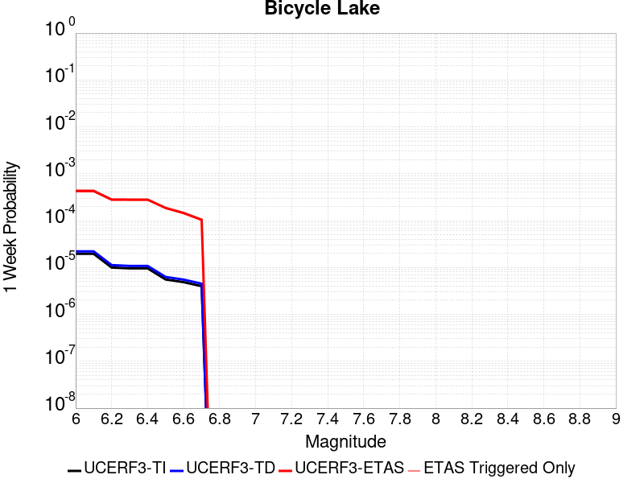 |  |  |  |

| Magnitude | 1 wk TI Prob | 1 wk TD Prob | 1 wk ETAS Prob | 1 wk ETAS/TD Gain | 1 wk ETAS Triggered Only | 1 mo TI Prob | 1 mo TD Prob | 1 mo ETAS Prob | 1 mo ETAS/TD Gain | 1 mo ETAS Triggered Only | 1 yr TI Prob | 1 yr TD Prob | 1 yr ETAS Prob | 1 yr ETAS/TD Gain | 1 yr ETAS Triggered Only | 10 yr TI Prob | 10 yr TD Prob | 10 yr ETAS Prob | 10 yr ETAS/TD Gain | 10 yr ETAS Triggered Only |
|-----|-----|-----|-----|-----|-----|-----|-----|-----|-----|-----|-----|-----|-----|-----|-----|-----|-----|-----|-----|-----|
| 6.0 | 1.9621975E-5 | 2.2097078E-5 | 3.0780505E-4 | 13.929672 | 2.8571428E-4 | 8.4091465E-5 | 9.4699084E-5 | 5.470372E-4 | 5.7765837 | 4.5238095E-4 | 0.0010233327 | 0.0011524865 | 0.0024367191 | 2.1143146 | 0.0012857143 | 0.01018633 | 0.011478408 | 0.014679335 | 1.2788651 | 0.0032380952 |
| 6.1 | 1.9621975E-5 | 2.2097078E-5 | 3.0780505E-4 | 13.929672 | 2.8571428E-4 | 8.4091465E-5 | 9.4699084E-5 | 5.470372E-4 | 5.7765837 | 4.5238095E-4 | 0.0010233327 | 0.0011524865 | 0.0024367191 | 2.1143146 | 0.0012857143 | 0.01018633 | 0.011478408 | 0.014679335 | 1.2788651 | 0.0032380952 |
| 6.2 | 9.9971285E-6 | 1.1255639E-5 | 1.7792043E-4 | 15.807225 | 1.6666666E-4 | 4.2844134E-5 | 4.8237856E-5 | 3.8155512E-4 | 7.9098687 | 3.3333333E-4 | 5.2150246E-4 | 5.871896E-4 | 0.0013962381 | 2.3778317 | 8.095238E-4 | 0.0052028033 | 0.005861487 | 0.008015454 | 1.3674779 | 0.0021666666 |
| 6.3 | 9.589428E-6 | 1.0798346E-5 | 1.7746321E-4 | 16.434296 | 1.6666666E-4 | 4.10969E-5 | 4.62781E-5 | 3.79596E-4 | 8.202498 | 3.3333333E-4 | 5.002399E-4 | 5.6334207E-4 | 0.0013724099 | 2.4361928 | 8.095238E-4 | 0.0049911533 | 0.0056242296 | 0.007731359 | 1.3746521 | 0.0021190476 |
| 6.4 | 9.589428E-6 | 1.0798346E-5 | 1.7746321E-4 | 16.434296 | 1.6666666E-4 | 4.10969E-5 | 4.62781E-5 | 3.79596E-4 | 8.202498 | 3.3333333E-4 | 5.002399E-4 | 5.6334207E-4 | 0.0013724099 | 2.4361928 | 8.095238E-4 | 0.0049911533 | 0.0056242296 | 0.007731359 | 1.3746521 | 0.0021190476 |
| 6.5 | 5.557707E-6 | 6.2856016E-6 | 1.01523096E-4 | 16.151691 | 9.5238094E-5 | 2.3818526E-5 | 2.6938165E-5 | 1.9360034E-4 | 7.186842 | 1.6666666E-4 | 2.8995197E-4 | 3.2794967E-4 | 8.277857E-4 | 2.5241241 | 5.0E-4 | 0.0028957394 | 0.0032772934 | 0.004558794 | 1.3910241 | 0.0012857143 |
| 6.6 | 4.8742945E-6 | 5.5132896E-6 | 1.0075086E-4 | 18.274181 | 9.5238094E-5 | 2.0889667E-5 | 2.3628318E-5 | 1.9029104E-4 | 8.053516 | 1.6666666E-4 | 2.54302E-4 | 2.87663E-4 | 7.3991384E-4 | 2.572155 | 4.5238095E-4 | 0.002540112 | 0.0028754752 | 0.004086269 | 1.4210762 | 0.0012142857 |
| 6.7 | 3.991108E-6 | 4.5159104E-6 | 9.9753575E-5 | 22.089361 | 9.5238094E-5 | 1.7104636E-5 | 1.9353902E-5 | 1.8601734E-4 | 9.6113615 | 1.6666666E-4 | 2.0822904E-4 | 2.3563375E-4 | 5.9269246E-4 | 2.5153122 | 3.5714285E-4 | 0.0020803404 | 0.0023563374 | 0.003353981 | 1.4233874 | 0.001 |

## Garlic Springs
*[(top)](#table-of-contents)*

| 1 Week | 1 Month | 1 Year | 10 Year |
|-----|-----|-----|-----|
|  |  |  |  |

| Magnitude | 1 wk TI Prob | 1 wk TD Prob | 1 wk ETAS Prob | 1 wk ETAS/TD Gain | 1 wk ETAS Triggered Only | 1 mo TI Prob | 1 mo TD Prob | 1 mo ETAS Prob | 1 mo ETAS/TD Gain | 1 mo ETAS Triggered Only | 1 yr TI Prob | 1 yr TD Prob | 1 yr ETAS Prob | 1 yr ETAS/TD Gain | 1 yr ETAS Triggered Only | 10 yr TI Prob | 10 yr TD Prob | 10 yr ETAS Prob | 10 yr ETAS/TD Gain | 10 yr ETAS Triggered Only |
|-----|-----|-----|-----|-----|-----|-----|-----|-----|-----|-----|-----|-----|-----|-----|-----|-----|-----|-----|-----|-----|
| 6.0 | 1.6760017E-5 | 1.8776833E-5 | 3.0448576E-4 | 16.216034 | 2.8571428E-4 | 7.182667E-5 | 8.0470316E-5 | 5.5662246E-4 | 6.917115 | 4.7619047E-4 | 8.7413884E-4 | 9.794032E-4 | 0.0022162858 | 2.2628942 | 0.0012380952 | 0.008707083 | 0.009762413 | 0.012332316 | 1.2632446 | 0.0025952382 |
| 6.1 | 9.852767E-6 | 1.09735865E-5 | 1.300199E-4 | 11.848441 | 1.1904762E-4 | 4.222546E-5 | 4.702921E-5 | 2.8511326E-4 | 6.0624714 | 2.3809524E-4 | 5.139737E-4 | 5.7250116E-4 | 0.0012387861 | 2.1638143 | 6.6666666E-4 | 0.005127866 | 0.005717221 | 0.007232319 | 1.265006 | 0.0015238095 |
| 6.2 | 9.852767E-6 | 1.09735865E-5 | 1.300199E-4 | 11.848441 | 1.1904762E-4 | 4.222546E-5 | 4.702921E-5 | 2.8511326E-4 | 6.0624714 | 2.3809524E-4 | 5.139737E-4 | 5.7250116E-4 | 0.0012387861 | 2.1638143 | 6.6666666E-4 | 0.005127866 | 0.005717221 | 0.007232319 | 1.265006 | 0.0015238095 |
| 6.3 | 4.3167724E-6 | 4.7780286E-6 | 1.0001567E-4 | 20.932413 | 9.5238094E-5 | 1.8500323E-5 | 2.0477235E-5 | 1.8714048E-4 | 9.138953 | 1.6666666E-4 | 2.2521814E-4 | 2.4930484E-4 | 6.3016225E-4 | 2.5276775 | 3.8095238E-4 | 0.0022499003 | 0.00249251 | 0.003276266 | 1.3144444 | 7.857143E-4 |
| 6.4 | 4.3167724E-6 | 4.7780286E-6 | 1.0001567E-4 | 20.932413 | 9.5238094E-5 | 1.8500323E-5 | 2.0477235E-5 | 1.8714048E-4 | 9.138953 | 1.6666666E-4 | 2.2521814E-4 | 2.4930484E-4 | 6.3016225E-4 | 2.5276775 | 3.8095238E-4 | 0.0022499003 | 0.00249251 | 0.003276266 | 1.3144444 | 7.857143E-4 |
| 6.5 | 4.3167724E-6 | 4.7780286E-6 | 1.0001567E-4 | 20.932413 | 9.5238094E-5 | 1.8500323E-5 | 2.0477235E-5 | 1.8714048E-4 | 9.138953 | 1.6666666E-4 | 2.2521814E-4 | 2.4930484E-4 | 6.3016225E-4 | 2.5276775 | 3.8095238E-4 | 0.0022499003 | 0.00249251 | 0.003276266 | 1.3144444 | 7.857143E-4 |
| 6.6 | 4.301311E-6 | 4.760897E-6 | 9.999854E-5 | 21.004139 | 9.5238094E-5 | 1.8434059E-5 | 2.0403815E-5 | 1.8706708E-4 | 9.168241 | 1.6666666E-4 | 2.2441156E-4 | 2.4841115E-4 | 6.292689E-4 | 2.533175 | 3.8095238E-4 | 0.0022418506 | 0.002483593 | 0.003267356 | 1.3155762 | 7.857143E-4 |
| 6.7 | 3.8599724E-6 | 4.27106E-6 | 7.5699325E-5 | 17.72378 | 7.142857E-5 | 1.6542634E-5 | 1.8304541E-5 | 1.6115907E-4 | 8.804321 | 1.4285714E-4 | 2.0138794E-4 | 2.228578E-4 | 5.5611687E-4 | 2.4953887 | 3.3333333E-4 | 0.0020120554 | 0.002228578 | 0.0029175153 | 1.3091377 | 6.904762E-4 |

## Paradise
*[(top)](#table-of-contents)*

| 1 Week | 1 Month | 1 Year | 10 Year |
|-----|-----|-----|-----|
|  |  |  |  |

| Magnitude | 1 wk TI Prob | 1 wk TD Prob | 1 wk ETAS Prob | 1 wk ETAS/TD Gain | 1 wk ETAS Triggered Only | 1 mo TI Prob | 1 mo TD Prob | 1 mo ETAS Prob | 1 mo ETAS/TD Gain | 1 mo ETAS Triggered Only | 1 yr TI Prob | 1 yr TD Prob | 1 yr ETAS Prob | 1 yr ETAS/TD Gain | 1 yr ETAS Triggered Only | 10 yr TI Prob | 10 yr TD Prob | 10 yr ETAS Prob | 10 yr ETAS/TD Gain | 10 yr ETAS Triggered Only |
|-----|-----|-----|-----|-----|-----|-----|-----|-----|-----|-----|-----|-----|-----|-----|-----|-----|-----|-----|-----|-----|
| 6.0 | 1.4851273E-5 | 1.6694692E-5 | 4.690681E-4 | 28.096842 | 4.5238095E-4 | 6.364676E-5 | 7.154685E-5 | 7.14358E-4 | 9.984479 | 6.4285717E-4 | 7.7462377E-4 | 8.707584E-4 | 0.0022267194 | 2.5572186 | 0.0013571428 | 0.0077192914 | 0.008675844 | 0.01127217 | 1.2992591 | 0.0026190476 |
| 6.1 | 1.4851273E-5 | 1.6694692E-5 | 4.690681E-4 | 28.096842 | 4.5238095E-4 | 6.364676E-5 | 7.154685E-5 | 7.14358E-4 | 9.984479 | 6.4285717E-4 | 7.7462377E-4 | 8.707584E-4 | 0.0022267194 | 2.5572186 | 0.0013571428 | 0.0077192914 | 0.008675844 | 0.01127217 | 1.2992591 | 0.0026190476 |
| 6.2 | 1.4851273E-5 | 1.6694692E-5 | 4.690681E-4 | 28.096842 | 4.5238095E-4 | 6.364676E-5 | 7.154685E-5 | 7.14358E-4 | 9.984479 | 6.4285717E-4 | 7.7462377E-4 | 8.707584E-4 | 0.0022267194 | 2.5572186 | 0.0013571428 | 0.0077192914 | 0.008675844 | 0.01127217 | 1.2992591 | 0.0026190476 |
| 6.3 | 1.0426831E-5 | 1.188862E-5 | 2.0236254E-4 | 17.021534 | 1.9047619E-4 | 4.4685654E-5 | 5.0950268E-5 | 3.3665E-4 | 6.6074233 | 2.8571428E-4 | 5.43912E-4 | 6.201489E-4 | 0.0011912232 | 1.9208663 | 5.7142857E-4 | 0.0054258266 | 0.0061847917 | 0.0073442427 | 1.187468 | 0.0011666666 |
| 6.4 | 1.0426831E-5 | 1.188862E-5 | 2.0236254E-4 | 17.021534 | 1.9047619E-4 | 4.4685654E-5 | 5.0950268E-5 | 3.3665E-4 | 6.6074233 | 2.8571428E-4 | 5.43912E-4 | 6.201489E-4 | 0.0011912232 | 1.9208663 | 5.7142857E-4 | 0.0054258266 | 0.0061847917 | 0.0073442427 | 1.187468 | 0.0011666666 |
| 6.5 | 9.25027E-6 | 1.06199595E-5 | 1.7728486E-4 | 16.693552 | 1.6666666E-4 | 3.964341E-5 | 4.551335E-5 | 2.8359774E-4 | 6.2310896 | 2.3809524E-4 | 4.8255164E-4 | 5.53989E-4 | 9.82323E-4 | 1.7731814 | 4.2857142E-4 | 0.0048150513 | 0.0055265795 | 0.006473697 | 1.171375 | 9.5238094E-4 |
| 6.6 | 7.904275E-6 | 9.159525E-6 | 1.0439675E-4 | 11.397615 | 9.5238094E-5 | 3.3875025E-5 | 3.9254537E-5 | 2.0591466E-4 | 5.245627 | 1.6666666E-4 | 4.1235037E-4 | 4.7782314E-4 | 7.158046E-4 | 1.4980534 | 2.3809524E-4 | 0.0041158604 | 0.0047683544 | 0.0052896664 | 1.1093274 | 5.238095E-4 |
| 6.7 | 7.2061953E-6 | 8.407248E-6 | 5.6025896E-5 | 6.663999 | 4.7619047E-5 | 3.088333E-5 | 3.6030586E-5 | 1.3126525E-4 | 3.6431615 | 9.5238094E-5 | 3.7593965E-4 | 4.3858777E-4 | 5.8138225E-4 | 1.3255779 | 1.4285714E-4 | 0.003753043 | 0.004377591 | 0.0047331704 | 1.0812272 | 3.5714285E-4 |
| 6.8 | 6.6948724E-6 | 7.842166E-6 | 5.546084E-5 | 7.072133 | 4.7619047E-5 | 2.8691995E-5 | 3.360887E-5 | 1.2884376E-4 | 3.833624 | 9.5238094E-5 | 3.4926904E-4 | 4.0911473E-4 | 5.281136E-4 | 1.2908694 | 1.1904762E-4 | 0.003487206 | 0.0040839734 | 0.004368521 | 1.0696741 | 2.8571428E-4 |
| 6.9 | 6.0421025E-6 | 7.130621E-6 | 5.474933E-5 | 7.678059 | 4.7619047E-5 | 2.5894467E-5 | 3.0559466E-5 | 1.01985854E-4 | 3.337292 | 7.142857E-5 | 3.1521954E-4 | 3.7200135E-4 | 4.6720402E-4 | 1.2559202 | 9.5238094E-5 | 0.0031477278 | 0.0037141247 | 0.0039750566 | 1.070254 | 2.6190476E-4 |
| 7.0 | 4.134091E-6 | 5.0803087E-6 | 2.8889712E-5 | 5.6866055 | 2.3809524E-5 | 1.7717413E-5 | 2.177258E-5 | 6.939059E-5 | 3.1870635 | 4.7619047E-5 | 2.1568815E-4 | 2.6505045E-4 | 3.126569E-4 | 1.1796126 | 4.7619047E-5 | 0.0021547892 | 0.0026474963 | 0.0027899754 | 1.0538164 | 1.4285714E-4 |
| 7.1 | 3.7674888E-6 | 4.6318696E-6 | 2.8441284E-5 | 6.1403465 | 2.3809524E-5 | 1.6146281E-5 | 1.9850726E-5 | 4.3659777E-5 | 2.1994045 | 2.3809524E-5 | 1.9656324E-4 | 2.4165731E-4 | 2.6546107E-4 | 1.0985022 | 2.3809524E-5 | 0.0019638946 | 0.002414096 | 0.002532856 | 1.0491945 | 1.1904762E-4 |
| 7.2 | 3.4065345E-6 | 4.156723E-6 | 4.156723E-6 | 1.0 | 0.0 | 1.4599351E-5 | 1.7814415E-5 | 1.7814415E-5 | 1.0 | 0.0 | 1.777326E-4 | 2.1687041E-4 | 2.1687041E-4 | 1.0 | 0.0 | 0.0017759053 | 0.002166736 | 0.0022617676 | 1.0438594 | 9.5238094E-5 |
| 7.3 | 2.9934936E-6 | 3.6293168E-6 | 3.6293168E-6 | 1.0 | 0.0 | 1.2829195E-5 | 1.555413E-5 | 1.555413E-5 | 1.0 | 0.0 | 1.5618425E-4 | 1.8935655E-4 | 1.8935655E-4 | 1.0 | 0.0 | 0.0015607453 | 0.0018920974 | 0.0019633907 | 1.0376796 | 7.142857E-5 |
| 7.4 | 2.4049796E-6 | 2.8889842E-6 | 2.8889842E-6 | 1.0 | 0.0 | 1.0307015E-5 | 1.238131E-5 | 1.238131E-5 | 1.0 | 0.0 | 1.2548068E-4 | 1.5073347E-4 | 1.5073347E-4 | 1.0 | 0.0 | 0.0012540985 | 0.0015064536 | 0.0015777746 | 1.0473436 | 7.142857E-5 |
| 7.5 | 1.2710091E-6 | 1.5134682E-6 | 1.5134682E-6 | 1.0 | 0.0 | 5.44717E-6 | 6.4862834E-6 | 6.4862834E-6 | 1.0 | 0.0 | 6.631728E-5 | 7.8968886E-5 | 7.8968886E-5 | 1.0 | 0.0 | 6.6297496E-4 | 7.8953087E-4 | 8.371123E-4 | 1.0602654 | 4.7619047E-5 |
| 7.6 | 2.21172E-7 | 2.603961E-7 | 2.603961E-7 | 1.0 | 0.0 | 9.478797E-7 | 1.1159829E-6 | 1.1159829E-6 | 1.0 | 0.0 | 1.1540374E-5 | 1.3587036E-5 | 1.3587036E-5 | 1.0 | 0.0 | 1.1539775E-4 | 1.3586486E-4 | 1.3586486E-4 | 1.0 | 0.0 |

## Death Valley (Black Mtns Frontal)
*[(top)](#table-of-contents)*

| 1 Week | 1 Month | 1 Year | 10 Year |
|-----|-----|-----|-----|
|  |  |  |  |

| Magnitude | 1 wk TI Prob | 1 wk TD Prob | 1 wk ETAS Prob | 1 wk ETAS/TD Gain | 1 wk ETAS Triggered Only | 1 mo TI Prob | 1 mo TD Prob | 1 mo ETAS Prob | 1 mo ETAS/TD Gain | 1 mo ETAS Triggered Only | 1 yr TI Prob | 1 yr TD Prob | 1 yr ETAS Prob | 1 yr ETAS/TD Gain | 1 yr ETAS Triggered Only | 10 yr TI Prob | 10 yr TD Prob | 10 yr ETAS Prob | 10 yr ETAS/TD Gain | 10 yr ETAS Triggered Only |
|-----|-----|-----|-----|-----|-----|-----|-----|-----|-----|-----|-----|-----|-----|-----|-----|-----|-----|-----|-----|-----|
| 6.0 | 1.6707214E-5 | 1.867027E-5 | 5.4247E-4 | 29.055286 | 5.238095E-4 | 7.160038E-5 | 8.001302E-5 | 8.418568E-4 | 10.521497 | 7.6190475E-4 | 8.71386E-4 | 9.737309E-4 | 0.0024246976 | 2.4901106 | 0.0014523809 | 0.00867977 | 0.009695496 | 0.0121948365 | 1.2577835 | 0.0025238094 |
| 6.1 | 1.6707214E-5 | 1.867027E-5 | 5.4247E-4 | 29.055286 | 5.238095E-4 | 7.160038E-5 | 8.001302E-5 | 8.418568E-4 | 10.521497 | 7.6190475E-4 | 8.71386E-4 | 9.737309E-4 | 0.0024246976 | 2.4901106 | 0.0014523809 | 0.00867977 | 0.009695496 | 0.0121948365 | 1.2577835 | 0.0025238094 |
| 6.2 | 1.6707214E-5 | 1.867027E-5 | 5.4247E-4 | 29.055286 | 5.238095E-4 | 7.160038E-5 | 8.001302E-5 | 8.418568E-4 | 10.521497 | 7.6190475E-4 | 8.71386E-4 | 9.737309E-4 | 0.0024246976 | 2.4901106 | 0.0014523809 | 0.00867977 | 0.009695496 | 0.0121948365 | 1.2577835 | 0.0025238094 |
| 6.3 | 1.6707214E-5 | 1.867027E-5 | 5.4247E-4 | 29.055286 | 5.238095E-4 | 7.160038E-5 | 8.001302E-5 | 8.418568E-4 | 10.521497 | 7.6190475E-4 | 8.71386E-4 | 9.737309E-4 | 0.0024246976 | 2.4901106 | 0.0014523809 | 0.00867977 | 0.009695496 | 0.0121948365 | 1.2577835 | 0.0025238094 |
| 6.4 | 1.5515609E-5 | 1.7338214E-5 | 3.98284E-4 | 22.971455 | 3.8095238E-4 | 6.649377E-5 | 7.4304546E-5 | 5.9807516E-4 | 8.048971 | 5.238095E-4 | 8.0926094E-4 | 9.042885E-4 | 0.0020461122 | 2.2626762 | 0.0011428571 | 0.008063202 | 0.009006773 | 0.011106735 | 1.2331536 | 0.0021190476 |
| 6.5 | 1.5515609E-5 | 1.7338214E-5 | 3.98284E-4 | 22.971455 | 3.8095238E-4 | 6.649377E-5 | 7.4304546E-5 | 5.9807516E-4 | 8.048971 | 5.238095E-4 | 8.0926094E-4 | 9.042885E-4 | 0.0020461122 | 2.2626762 | 0.0011428571 | 0.008063202 | 0.009006773 | 0.011106735 | 1.2331536 | 0.0021190476 |
| 6.6 | 1.5041828E-5 | 1.6809145E-5 | 3.73946E-4 | 22.24658 | 3.5714285E-4 | 6.4463384E-5 | 7.203723E-5 | 5.481934E-4 | 7.609862 | 4.7619047E-4 | 7.8455906E-4 | 8.767063E-4 | 0.0018758297 | 2.1396327 | 0.001 | 0.00781795 | 0.008733132 | 0.010668463 | 1.2216078 | 0.001952381 |
| 6.7 | 1.4634985E-5 | 1.6356016E-5 | 3.496839E-4 | 21.379528 | 3.3333333E-4 | 6.271985E-5 | 7.009536E-5 | 5.224446E-4 | 7.4533405 | 4.5238095E-4 | 7.6334673E-4 | 8.5308263E-4 | 0.0018284403 | 2.1433332 | 9.761905E-4 | 0.007607299 | 0.008498715 | 0.0104108965 | 1.2249964 | 0.0019285714 |
| 6.8 | 1.4209158E-5 | 1.5882048E-5 | 3.015918E-4 | 18.98948 | 2.8571428E-4 | 6.089497E-5 | 6.8064175E-5 | 4.7279854E-4 | 6.946364 | 4.047619E-4 | 7.4114406E-4 | 8.2837185E-4 | 0.0017085945 | 2.0625935 | 8.809524E-4 | 0.007386771 | 0.008253456 | 0.010000819 | 1.2117128 | 0.0017619048 |
| 6.9 | 1.3780098E-5 | 1.5404594E-5 | 2.5349617E-4 | 16.455881 | 2.3809524E-4 | 5.9056227E-5 | 6.6018045E-5 | 4.2313733E-4 | 6.409419 | 3.5714285E-4 | 7.1877235E-4 | 8.0347876E-4 | 0.0016361425 | 2.0363233 | 8.3333335E-4 | 0.0071645193 | 0.008006332 | 0.009683275 | 1.2094519 | 0.0016904762 |
| 7.0 | 1.3585064E-5 | 1.5188155E-5 | 2.5327978E-4 | 16.676138 | 2.3809524E-4 | 5.8220405E-5 | 6.50905E-5 | 4.222101E-4 | 6.486509 | 3.5714285E-4 | 7.086029E-4 | 7.9219416E-4 | 0.0016248673 | 2.0510974 | 8.3333335E-4 | 0.007063476 | 0.007894293 | 0.0095241815 | 1.206464 | 0.0016428571 |
| 7.1 | 1.3398601E-5 | 1.49813395E-5 | 2.53073E-4 | 16.89255 | 2.3809524E-4 | 5.742131E-5 | 6.420419E-5 | 3.9751612E-4 | 6.191436 | 3.3333333E-4 | 6.9888023E-4 | 7.8141113E-4 | 0.0015903023 | 2.0351672 | 8.095238E-4 | 0.0069668638 | 0.007787224 | 0.009370039 | 1.203258 | 0.0015952381 |
| 7.2 | 1.3126312E-5 | 1.4679561E-5 | 2.2896213E-4 | 15.5973425 | 2.1428571E-4 | 5.6254412E-5 | 6.291092E-5 | 3.4860722E-4 | 5.5412836 | 2.8571428E-4 | 6.846822E-4 | 7.6567667E-4 | 0.0014318329 | 1.8700229 | 6.6666666E-4 | 0.006825765 | 0.00763097 | 0.009025012 | 1.1826822 | 0.0014047619 |
| 7.3 | 1.2922429E-5 | 1.4453788E-5 | 2.0492723E-4 | 14.178098 | 1.9047619E-4 | 5.5380664E-5 | 6.194336E-5 | 3.2383192E-4 | 5.2278705 | 2.6190476E-4 | 6.74051E-4 | 7.53905E-4 | 0.0013962775 | 1.8520603 | 6.4285717E-4 | 0.006720101 | 0.007514055 | 0.008790108 | 1.1698222 | 0.0012857143 |
| 7.4 | 1.2768878E-5 | 1.4283772E-5 | 2.0475723E-4 | 14.334956 | 1.9047619E-4 | 5.4722615E-5 | 6.1214756E-5 | 3.2310348E-4 | 5.278196 | 2.6190476E-4 | 6.660441E-4 | 7.4504025E-4 | 0.0013636267 | 1.8302724 | 6.190476E-4 | 0.0066405144 | 0.0074260035 | 0.008678538 | 1.1686686 | 0.0012619047 |
| 7.5 | 1.2521929E-5 | 1.40120155E-5 | 2.0448554E-4 | 14.593585 | 1.9047619E-4 | 5.366431E-5 | 6.005014E-5 | 3.2193918E-4 | 5.3611727 | 2.6190476E-4 | 6.531671E-4 | 7.3087064E-4 | 0.0013018816 | 1.7812749 | 5.7142857E-4 | 0.006512506 | 0.0072852457 | 0.008490685 | 1.1654631 | 0.0012142857 |
| 7.6 | 1.1301089E-5 | 1.2648149E-5 | 1.5550348E-4 | 12.294565 | 1.4285714E-4 | 4.8432343E-5 | 5.4205255E-5 | 2.6847934E-4 | 4.9530134 | 2.1428571E-4 | 5.895042E-4 | 6.5975444E-4 | 0.0011356308 | 1.7212931 | 4.7619047E-4 | 0.0058794282 | 0.00657851 | 0.0075955847 | 1.1546056 | 0.0010238095 |
| 7.7 | 9.189108E-6 | 1.0283358E-5 | 1.2932975E-4 | 12.576607 | 1.1904762E-4 | 3.93813E-5 | 4.407082E-5 | 2.1073014E-4 | 4.7816253 | 1.6666666E-4 | 4.7936183E-4 | 5.3643517E-4 | 9.6477673E-4 | 1.7984964 | 4.2857142E-4 | 0.004783291 | 0.005351914 | 0.0062755155 | 1.1725742 | 9.2857145E-4 |
| 7.8 | 3.4586725E-7 | 3.6482615E-7 | 3.6482615E-7 | 1.0 | 0.0 | 1.4822873E-6 | 1.5635396E-6 | 1.5635396E-6 | 1.0 | 0.0 | 1.80467E-5 | 1.9035933E-5 | 1.9035933E-5 | 1.0 | 0.0 | 1.8045233E-4 | 1.9034347E-4 | 2.1414846E-4 | 1.1250633 | 2.3809524E-5 |
| 7.9 | 2.5591178E-9 | 2.6696718E-9 | 2.6696718E-9 | 1.0 | 0.0 | 1.0967647E-8 | 1.14414505E-8 | 1.14414505E-8 | 1.0 | 0.0 | 1.335311E-7 | 1.3929966E-7 | 1.3929966E-7 | 1.0 | 0.0 | 1.3353102E-6 | 1.3929966E-6 | 1.3929966E-6 | 1.0 | 0.0 |

## San Andreas (San Bernardino S)
*[(top)](#table-of-contents)*

| 1 Week | 1 Month | 1 Year | 10 Year |
|-----|-----|-----|-----|
|  |  |  |  |

| Magnitude | 1 wk TI Prob | 1 wk TD Prob | 1 wk ETAS Prob | 1 wk ETAS/TD Gain | 1 wk ETAS Triggered Only | 1 mo TI Prob | 1 mo TD Prob | 1 mo ETAS Prob | 1 mo ETAS/TD Gain | 1 mo ETAS Triggered Only | 1 yr TI Prob | 1 yr TD Prob | 1 yr ETAS Prob | 1 yr ETAS/TD Gain | 1 yr ETAS Triggered Only | 10 yr TI Prob | 10 yr TD Prob | 10 yr ETAS Prob | 10 yr ETAS/TD Gain | 10 yr ETAS Triggered Only |
|-----|-----|-----|-----|-----|-----|-----|-----|-----|-----|-----|-----|-----|-----|-----|-----|-----|-----|-----|-----|-----|
| 6.0 | 1.2336002E-4 | 3.0004102E-4 | 0.0010379148 | 3.459243 | 7.3809526E-4 | 5.2857865E-4 | 0.0012852824 | 0.0022602184 | 1.7585381 | 9.761905E-4 | 0.006416472 | 0.015540994 | 0.017111441 | 1.1010519 | 0.0015952381 | 0.06234337 | 0.14283717 | 0.14475559 | 1.0134307 | 0.0022380953 |
| 6.1 | 1.2336002E-4 | 3.0004102E-4 | 0.0010379148 | 3.459243 | 7.3809526E-4 | 5.2857865E-4 | 0.0012852824 | 0.0022602184 | 1.7585381 | 9.761905E-4 | 0.006416472 | 0.015540994 | 0.017111441 | 1.1010519 | 0.0015952381 | 0.06234337 | 0.14283717 | 0.14475559 | 1.0134307 | 0.0022380953 |
| 6.2 | 1.2336002E-4 | 3.0004102E-4 | 0.0010379148 | 3.459243 | 7.3809526E-4 | 5.2857865E-4 | 0.0012852824 | 0.0022602184 | 1.7585381 | 9.761905E-4 | 0.006416472 | 0.015540994 | 0.017111441 | 1.1010519 | 0.0015952381 | 0.06234337 | 0.14283717 | 0.14475559 | 1.0134307 | 0.0022380953 |
| 6.3 | 1.1712257E-4 | 2.8792414E-4 | 0.0010258069 | 3.5627677 | 7.3809526E-4 | 5.018573E-4 | 0.0012334028 | 0.002208389 | 1.790485 | 9.761905E-4 | 0.006093008 | 0.014918125 | 0.016489565 | 1.1053376 | 0.0015952381 | 0.059286322 | 0.13754563 | 0.13947588 | 1.0140336 | 0.0022380953 |
| 6.4 | 1.1712257E-4 | 2.8792414E-4 | 0.0010258069 | 3.5627677 | 7.3809526E-4 | 5.018573E-4 | 0.0012334028 | 0.002208389 | 1.790485 | 9.761905E-4 | 0.006093008 | 0.014918125 | 0.016489565 | 1.1053376 | 0.0015952381 | 0.059286322 | 0.13754563 | 0.13947588 | 1.0140336 | 0.0022380953 |
| 6.5 | 1.0689076E-4 | 2.680528E-4 | 9.821471E-4 | 3.664006 | 7.142857E-4 | 4.5802278E-4 | 0.0011483167 | 0.0020758219 | 1.8077085 | 9.2857145E-4 | 0.0055621783 | 0.01389575 | 0.015421864 | 1.109826 | 0.001547619 | 0.05425003 | 0.12879294 | 0.1307013 | 1.0148172 | 0.0021904763 |
| 6.6 | 9.7648895E-5 | 2.50501E-4 | 9.4080425E-4 | 3.7556903 | 6.904762E-4 | 4.1842813E-4 | 0.0010731576 | 0.0019769487 | 1.8421791 | 9.047619E-4 | 0.005082469 | 0.012991785 | 0.014495797 | 1.1157664 | 0.0015238095 | 0.049677886 | 0.12095292 | 0.12285752 | 1.0157466 | 0.0021666666 |
| 6.7 | 8.757013E-5 | 2.3120902E-4 | 9.215256E-4 | 3.9856818 | 6.904762E-4 | 3.7524657E-4 | 9.905418E-4 | 0.0018944076 | 1.9124962 | 9.047619E-4 | 0.00455906 | 0.011997245 | 0.013432202 | 1.1196072 | 0.0014523809 | 0.04466656 | 0.11226123 | 0.11410011 | 1.0163804 | 0.0020714286 |
| 6.8 | 8.562978E-5 | 2.2680782E-4 | 9.171274E-4 | 4.043632 | 6.904762E-4 | 3.6693315E-4 | 9.7169366E-4 | 0.0018755764 | 1.9302137 | 9.047619E-4 | 0.004458263 | 0.011770263 | 0.01320555 | 1.1219417 | 0.0014523809 | 0.043698758 | 0.11027153 | 0.11211454 | 1.0167134 | 0.0020714286 |
| 6.9 | 6.124075E-5 | 1.7065753E-4 | 8.372104E-4 | 4.9057927 | 6.6666666E-4 | 2.6243398E-4 | 7.311852E-4 | 0.0016114934 | 2.203947 | 8.809524E-4 | 0.0031904527 | 0.008866051 | 0.010234759 | 1.1543764 | 0.0013809524 | 0.031450346 | 0.08418263 | 0.08592705 | 1.0207218 | 0.0019047619 |
| 7.0 | 5.8598747E-5 | 1.649477E-4 | 7.838932E-4 | 4.752374 | 6.190476E-4 | 2.5111332E-4 | 7.06728E-4 | 0.0015394725 | 2.1783094 | 8.3333335E-4 | 0.0030530186 | 0.008570663 | 0.009892569 | 1.1542361 | 0.0013333333 | 0.03011414 | 0.081500374 | 0.083206154 | 1.0209298 | 0.0018571429 |
| 7.1 | 5.613814E-5 | 1.5913323E-4 | 7.7808235E-4 | 4.8895025 | 6.190476E-4 | 2.4056983E-4 | 6.818221E-4 | 0.0015145872 | 2.221382 | 8.3333335E-4 | 0.0029250039 | 0.008269769 | 0.009592076 | 1.1598965 | 0.0013333333 | 0.028868021 | 0.07879931 | 0.08051011 | 1.0217109 | 0.0018571429 |
| 7.2 | 4.991222E-5 | 1.4519796E-4 | 7.641557E-4 | 5.262854 | 6.190476E-4 | 2.1389198E-4 | 6.2212895E-4 | 0.0014073544 | 2.2621586 | 7.857143E-4 | 0.002601025 | 0.007548217 | 0.008824226 | 1.1690478 | 0.0012857143 | 0.025707912 | 0.07225321 | 0.0739099 | 1.022929 | 0.0017857143 |
| 7.3 | 4.7410045E-5 | 1.3714004E-4 | 7.561028E-4 | 5.513363 | 6.190476E-4 | 2.0317009E-4 | 5.8761094E-4 | 0.0013728635 | 2.3363478 | 7.857143E-4 | 0.0024707897 | 0.0071307817 | 0.008407327 | 1.1790191 | 0.0012857143 | 0.024434982 | 0.06853558 | 0.07019891 | 1.0242696 | 0.0017857143 |
| 7.4 | 4.5556746E-5 | 1.3121912E-4 | 7.501855E-4 | 5.7170444 | 6.190476E-4 | 1.952286E-4 | 5.622468E-4 | 0.0013475192 | 2.396669 | 7.857143E-4 | 0.002374317 | 0.0068239477 | 0.008100889 | 1.1871264 | 0.0012857143 | 0.023491086 | 0.065788016 | 0.06745625 | 1.0253577 | 0.0017857143 |
| 7.5 | 4.3084514E-5 | 1.2357246E-4 | 7.425436E-4 | 6.0089726 | 6.190476E-4 | 1.8463485E-4 | 5.2948913E-4 | 0.0013147873 | 2.4831245 | 7.857143E-4 | 0.0022456115 | 0.0064275465 | 0.0076813404 | 1.1950657 | 0.0012619047 | 0.022230545 | 0.062188786 | 0.06384112 | 1.0265696 | 0.0017619048 |
| 7.6 | 3.408608E-5 | 9.83552E-5 | 7.1734196E-4 | 7.2933807 | 6.190476E-4 | 1.4607502E-4 | 4.214543E-4 | 0.0011830379 | 2.8070374 | 7.6190475E-4 | 0.0017770125 | 0.0051191594 | 0.0063509163 | 1.2406172 | 0.0012380952 | 0.017628696 | 0.050020292 | 0.05167145 | 1.0330096 | 0.0017380952 |
| 7.7 | 2.8315713E-5 | 8.248679E-5 | 7.0148334E-4 | 8.5041895 | 6.190476E-4 | 1.2134742E-4 | 3.5346695E-4 | 0.0010913013 | 3.087421 | 7.3809526E-4 | 0.0014764034 | 0.0042949775 | 0.005504048 | 1.281508 | 0.0012142857 | 0.01466633 | 0.0422714 | 0.043844815 | 1.0372217 | 0.0016428571 |
| 7.8 | 2.6222975E-5 | 7.463088E-5 | 6.936323E-4 | 9.294173 | 6.190476E-4 | 1.1237934E-4 | 3.1980744E-4 | 0.0010576666 | 3.3071983 | 7.3809526E-4 | 0.0013673597 | 0.0038867102 | 0.0050962763 | 1.3112056 | 0.0012142857 | 0.013589768 | 0.03843674 | 0.039993558 | 1.0405034 | 0.0016190476 |
| 7.9 | 2.1469694E-5 | 5.787864E-5 | 6.05466E-4 | 10.460958 | 5.4761907E-4 | 9.200973E-5 | 2.4802773E-4 | 8.9072547E-4 | 3.591233 | 6.4285717E-4 | 0.0011196428 | 0.0030155594 | 0.0040600193 | 1.346357 | 0.001047619 | 0.011140184 | 0.030152109 | 0.03149142 | 1.0444186 | 0.0013809524 |
| 8.0 | 1.2420249E-5 | 3.131896E-5 | 2.4559797E-4 | 7.8418303 | 2.1428571E-4 | 5.322855E-5 | 1.342172E-4 | 3.960868E-4 | 2.9510882 | 2.6190476E-4 | 6.478649E-4 | 0.0016328706 | 0.0020369717 | 1.2474788 | 4.047619E-4 | 0.0064597935 | 0.016522504 | 0.017037658 | 1.031179 | 5.238095E-4 |
| 8.1 | 4.9197724E-6 | 7.822348E-6 | 7.822348E-6 | 1.0 | 0.0 | 2.1084568E-5 | 3.352392E-5 | 3.352392E-5 | 1.0 | 0.0 | 2.566744E-4 | 4.0807744E-4 | 4.3187724E-4 | 1.0583218 | 2.3809524E-5 | 0.002563781 | 0.0043843705 | 0.0044080755 | 1.0054067 | 2.3809524E-5 |
| 8.2 | 2.5634774E-6 | 2.9067196E-6 | 2.9067196E-6 | 1.0 | 0.0 | 1.0986286E-5 | 1.2457311E-5 | 1.2457311E-5 | 1.0 | 0.0 | 1.3374983E-4 | 1.5165724E-4 | 1.5165724E-4 | 1.0 | 0.0 | 0.0013366934 | 0.0017049741 | 0.0017049741 | 1.0 | 0.0 |
| 8.3 | 5.2850464E-7 | 3.2088764E-7 | 3.2088764E-7 | 1.0 | 0.0 | 2.2650179E-6 | 1.375232E-6 | 1.375232E-6 | 1.0 | 0.0 | 2.7576245E-5 | 1.6743334E-5 | 1.6743334E-5 | 1.0 | 0.0 | 2.7572823E-4 | 1.9870348E-4 | 1.9870348E-4 | 1.0 | 0.0 |

## Coyote Lake
*[(top)](#table-of-contents)*

| 1 Week | 1 Month | 1 Year | 10 Year |
|-----|-----|-----|-----|
|  |  |  |  |

| Magnitude | 1 wk TI Prob | 1 wk TD Prob | 1 wk ETAS Prob | 1 wk ETAS/TD Gain | 1 wk ETAS Triggered Only | 1 mo TI Prob | 1 mo TD Prob | 1 mo ETAS Prob | 1 mo ETAS/TD Gain | 1 mo ETAS Triggered Only | 1 yr TI Prob | 1 yr TD Prob | 1 yr ETAS Prob | 1 yr ETAS/TD Gain | 1 yr ETAS Triggered Only | 10 yr TI Prob | 10 yr TD Prob | 10 yr ETAS Prob | 10 yr ETAS/TD Gain | 10 yr ETAS Triggered Only |
|-----|-----|-----|-----|-----|-----|-----|-----|-----|-----|-----|-----|-----|-----|-----|-----|-----|-----|-----|-----|-----|
| 6.0 | 1.980352E-5 | 2.1706745E-5 | 2.3598781E-4 | 10.871635 | 2.1428571E-4 | 8.486947E-5 | 9.302599E-5 | 5.4536486E-4 | 5.8624997 | 4.5238095E-4 | 0.0010327959 | 0.0011320751 | 0.0020120302 | 1.7772939 | 8.809524E-4 | 0.010280091 | 0.011270258 | 0.0128946 | 1.1441264 | 0.0016428571 |
| 6.1 | 1.980352E-5 | 2.1706745E-5 | 2.3598781E-4 | 10.871635 | 2.1428571E-4 | 8.486947E-5 | 9.302599E-5 | 5.4536486E-4 | 5.8624997 | 4.5238095E-4 | 0.0010327959 | 0.0011320751 | 0.0020120302 | 1.7772939 | 8.809524E-4 | 0.010280091 | 0.011270258 | 0.0128946 | 1.1441264 | 0.0016428571 |
| 6.2 | 1.980352E-5 | 2.1706745E-5 | 2.3598781E-4 | 10.871635 | 2.1428571E-4 | 8.486947E-5 | 9.302599E-5 | 5.4536486E-4 | 5.8624997 | 4.5238095E-4 | 0.0010327959 | 0.0011320751 | 0.0020120302 | 1.7772939 | 8.809524E-4 | 0.010280091 | 0.011270258 | 0.0128946 | 1.1441264 | 0.0016428571 |
| 6.3 | 1.5344787E-5 | 1.682067E-5 | 1.8348453E-4 | 10.9082775 | 1.6666666E-4 | 6.576172E-5 | 7.2086936E-5 | 4.2920405E-4 | 5.953978 | 3.5714285E-4 | 8.003548E-4 | 8.773662E-4 | 0.0015910253 | 1.8134106 | 7.142857E-4 | 0.007974784 | 0.00874507 | 0.010043141 | 1.1484348 | 0.0013095238 |
| 6.4 | 1.5344787E-5 | 1.682067E-5 | 1.8348453E-4 | 10.9082775 | 1.6666666E-4 | 6.576172E-5 | 7.2086936E-5 | 4.2920405E-4 | 5.953978 | 3.5714285E-4 | 8.003548E-4 | 8.773662E-4 | 0.0015910253 | 1.8134106 | 7.142857E-4 | 0.007974784 | 0.00874507 | 0.010043141 | 1.1484348 | 0.0013095238 |
| 6.5 | 1.4189697E-5 | 1.5557987E-5 | 1.8222207E-4 | 11.712444 | 1.6666666E-4 | 6.081157E-5 | 6.6675726E-5 | 3.7617888E-4 | 5.641917 | 3.095238E-4 | 7.401293E-4 | 8.115349E-4 | 0.0014776605 | 1.820822 | 6.6666666E-4 | 0.0073766913 | 0.008091656 | 0.009296116 | 1.1488521 | 0.0012142857 |
| 6.6 | 1.3469301E-5 | 1.4771577E-5 | 1.8143578E-4 | 12.282763 | 1.6666666E-4 | 5.7724297E-5 | 6.330556E-5 | 3.7280977E-4 | 5.8890524 | 3.095238E-4 | 7.025667E-4 | 7.7053264E-4 | 0.0014128945 | 1.8336594 | 6.4285717E-4 | 0.0070034964 | 0.0076845144 | 0.008842216 | 1.1506538 | 0.0011666666 |
| 6.7 | 1.3027966E-5 | 1.4281745E-5 | 1.5713685E-4 | 11.002636 | 1.4285714E-4 | 5.5832945E-5 | 6.120638E-5 | 3.4690317E-4 | 5.667762 | 2.8571428E-4 | 6.7955407E-4 | 7.4499263E-4 | 0.0013397873 | 1.79839 | 5.952381E-4 | 0.006774798 | 0.0074308286 | 0.008494296 | 1.1431155 | 0.0010714285 |
| 6.8 | 5.695434E-6 | 6.2244176E-6 | 7.765254E-5 | 12.4754715 | 7.142857E-5 | 2.4408775E-5 | 2.6675973E-5 | 1.4572042E-4 | 5.4626093 | 1.1904762E-4 | 2.971363E-4 | 3.2476155E-4 | 5.1517587E-4 | 1.5863204 | 1.9047619E-4 | 0.0029673933 | 0.0032458105 | 0.0035068651 | 1.0804282 | 2.6190476E-4 |
| 6.9 | 4.385688E-6 | 4.7930553E-6 | 7.622129E-5 | 15.902442 | 7.142857E-5 | 1.879567E-5 | 2.0541665E-5 | 1.3958685E-4 | 6.795303 | 1.1904762E-4 | 2.2881327E-4 | 2.5009477E-4 | 4.1671976E-4 | 1.6662474 | 1.6666666E-4 | 0.002285778 | 0.0025009478 | 0.0026909476 | 1.0759711 | 1.9047619E-4 |

## San Andreas (Big Bend)
*[(top)](#table-of-contents)*

| 1 Week | 1 Month | 1 Year | 10 Year |
|-----|-----|-----|-----|
|  |  | 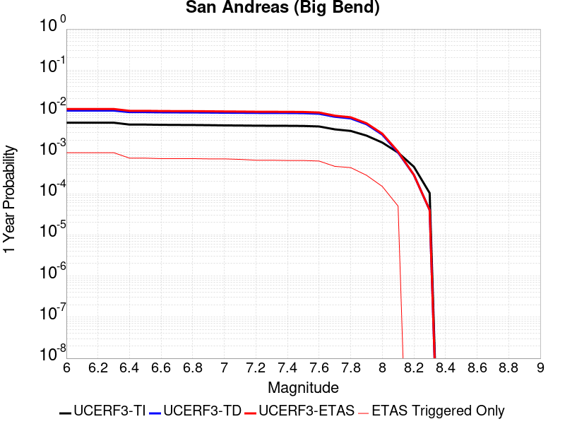 |  |

| Magnitude | 1 wk TI Prob | 1 wk TD Prob | 1 wk ETAS Prob | 1 wk ETAS/TD Gain | 1 wk ETAS Triggered Only | 1 mo TI Prob | 1 mo TD Prob | 1 mo ETAS Prob | 1 mo ETAS/TD Gain | 1 mo ETAS Triggered Only | 1 yr TI Prob | 1 yr TD Prob | 1 yr ETAS Prob | 1 yr ETAS/TD Gain | 1 yr ETAS Triggered Only | 10 yr TI Prob | 10 yr TD Prob | 10 yr ETAS Prob | 10 yr ETAS/TD Gain | 10 yr ETAS Triggered Only |
|-----|-----|-----|-----|-----|-----|-----|-----|-----|-----|-----|-----|-----|-----|-----|-----|-----|-----|-----|-----|-----|
| 6.0 | 1.0179969E-4 | 2.0072258E-4 | 5.1018427E-4 | 2.5417383 | 3.095238E-4 | 4.362114E-4 | 8.599571E-4 | 0.0014546833 | 1.6915766 | 5.952381E-4 | 0.0052979486 | 0.010419999 | 0.011338894 | 1.0881858 | 9.2857145E-4 | 0.051734097 | 0.10144902 | 0.10301079 | 1.0153946 | 0.0017380952 |
| 6.1 | 1.0179969E-4 | 2.0072258E-4 | 5.1018427E-4 | 2.5417383 | 3.095238E-4 | 4.362114E-4 | 8.599571E-4 | 0.0014546833 | 1.6915766 | 5.952381E-4 | 0.0052979486 | 0.010419999 | 0.011338894 | 1.0881858 | 9.2857145E-4 | 0.051734097 | 0.10144902 | 0.10301079 | 1.0153946 | 0.0017380952 |
| 6.2 | 1.0179969E-4 | 2.0072258E-4 | 5.1018427E-4 | 2.5417383 | 3.095238E-4 | 4.362114E-4 | 8.599571E-4 | 0.0014546833 | 1.6915766 | 5.952381E-4 | 0.0052979486 | 0.010419999 | 0.011338894 | 1.0881858 | 9.2857145E-4 | 0.051734097 | 0.10144902 | 0.10301079 | 1.0153946 | 0.0017380952 |
| 6.3 | 1.0179969E-4 | 2.0072258E-4 | 5.1018427E-4 | 2.5417383 | 3.095238E-4 | 4.362114E-4 | 8.599571E-4 | 0.0014546833 | 1.6915766 | 5.952381E-4 | 0.0052979486 | 0.010419999 | 0.011338894 | 1.0881858 | 9.2857145E-4 | 0.051734097 | 0.10144902 | 0.10301079 | 1.0153946 | 0.0017380952 |
| 6.4 | 9.1639464E-5 | 1.8429532E-4 | 4.2234667E-4 | 2.2916842 | 2.3809524E-4 | 3.9268145E-4 | 7.895982E-4 | 0.001241622 | 1.5724732 | 4.5238095E-4 | 0.0047704205 | 0.009571102 | 0.01025497 | 1.0714513 | 6.904762E-4 | 0.046693064 | 0.09377527 | 0.09491884 | 1.0121948 | 0.0012619047 |
| 6.5 | 9.1639464E-5 | 1.8429532E-4 | 4.2234667E-4 | 2.2916842 | 2.3809524E-4 | 3.9268145E-4 | 7.895982E-4 | 0.001241622 | 1.5724732 | 4.5238095E-4 | 0.0047704205 | 0.009571102 | 0.01025497 | 1.0714513 | 6.904762E-4 | 0.046693064 | 0.09377527 | 0.09491884 | 1.0121948 | 0.0012619047 |
| 6.6 | 9.042622E-5 | 1.823659E-4 | 3.9661254E-4 | 2.1748173 | 2.1428571E-4 | 3.8748336E-4 | 7.8133424E-4 | 0.0012095708 | 1.5480837 | 4.2857142E-4 | 0.0047074095 | 0.009471365 | 0.010131718 | 1.069721 | 6.6666666E-4 | 0.046089325 | 0.092869274 | 0.09399239 | 1.0120935 | 0.0012380952 |
| 6.7 | 8.9836685E-5 | 1.8150927E-4 | 3.9575607E-4 | 2.180363 | 2.1428571E-4 | 3.8495753E-4 | 7.776651E-4 | 0.0012059032 | 1.5506717 | 4.2857142E-4 | 0.00467679 | 0.00942708 | 0.010087462 | 1.0700516 | 6.6666666E-4 | 0.045795817 | 0.09246355 | 0.09356556 | 1.0119183 | 0.0012142857 |
| 6.8 | 8.9471854E-5 | 1.8097709E-4 | 3.9522402E-4 | 2.1838346 | 2.1428571E-4 | 3.8339442E-4 | 7.7538576E-4 | 0.0012036249 | 1.5522918 | 4.2857142E-4 | 0.004657841 | 0.009399569 | 0.010059969 | 1.0702586 | 6.6666666E-4 | 0.04561414 | 0.092210755 | 0.093313076 | 1.0119543 | 0.0012142857 |
| 6.9 | 8.858234E-5 | 1.7979681E-4 | 3.94044E-4 | 2.1916072 | 2.1428571E-4 | 3.7958333E-4 | 7.703304E-4 | 0.0011985718 | 1.5559189 | 4.2857142E-4 | 0.004611638 | 0.009338548 | 0.00999899 | 1.070722 | 6.6666666E-4 | 0.04517103 | 0.09165087 | 0.092753865 | 1.0120348 | 0.0012142857 |
| 7.0 | 8.7433385E-5 | 1.7818481E-4 | 3.9243235E-4 | 2.2023895 | 2.1428571E-4 | 3.746607E-4 | 7.634259E-4 | 0.0011916702 | 1.5609506 | 4.2857142E-4 | 0.004551957 | 0.009255203 | 0.009915699 | 1.0713649 | 6.6666666E-4 | 0.044598386 | 0.09088532 | 0.0919676 | 1.0119082 | 0.0011904762 |
| 7.1 | 8.684964E-5 | 1.7730435E-4 | 3.9155208E-4 | 2.2083614 | 2.1428571E-4 | 3.7215967E-4 | 7.596547E-4 | 0.0011879005 | 1.5637375 | 4.2857142E-4 | 0.0045216335 | 0.009209678 | 0.009846615 | 1.0691595 | 6.4285717E-4 | 0.04430731 | 0.09046686 | 0.09152798 | 1.0117294 | 0.0011666666 |
| 7.2 | 8.606521E-5 | 1.762105E-4 | 3.9045844E-4 | 2.2158637 | 2.1428571E-4 | 3.6879873E-4 | 7.549695E-4 | 0.0011832174 | 1.5672387 | 4.2857142E-4 | 0.0044808835 | 0.0091531165 | 0.009790089 | 1.0695908 | 6.4285717E-4 | 0.043916024 | 0.089947365 | 0.091009095 | 1.0118039 | 0.0011666666 |
| 7.3 | 8.568266E-5 | 1.7563057E-4 | 3.8987864E-4 | 2.2198792 | 2.1428571E-4 | 3.6715972E-4 | 7.524855E-4 | 0.0011807344 | 1.5691125 | 4.2857142E-4 | 0.0044610105 | 0.009123127 | 0.009760119 | 1.0698217 | 6.4285717E-4 | 0.043725148 | 0.08966853 | 0.09073058 | 1.0118442 | 0.0011666666 |
| 7.4 | 8.5432206E-5 | 1.7525644E-4 | 3.895046E-4 | 2.2224839 | 2.1428571E-4 | 3.6608664E-4 | 7.50883E-4 | 0.0011791326 | 1.570328 | 4.2857142E-4 | 0.004447999 | 0.009103781 | 0.009740785 | 1.0699714 | 6.4285717E-4 | 0.043600157 | 0.08948871 | 0.090550974 | 1.0118704 | 0.0011666666 |
| 7.5 | 8.4791965E-5 | 1.7394972E-4 | 3.8819818E-4 | 2.2316687 | 2.1428571E-4 | 3.633435E-4 | 7.4528606E-4 | 0.001173538 | 1.5746143 | 4.2857142E-4 | 0.0044147377 | 0.009036204 | 0.009673253 | 1.0704995 | 6.4285717E-4 | 0.043280575 | 0.088866346 | 0.089929335 | 1.0119617 | 0.0011666666 |
| 7.6 | 8.241105E-5 | 1.6840403E-4 | 3.5884813E-4 | 2.1308763 | 1.9047619E-4 | 3.531424E-4 | 7.215321E-4 | 0.0011260019 | 1.5605708 | 4.047619E-4 | 0.0042910352 | 0.008749358 | 0.00936299 | 1.0701344 | 6.190476E-4 | 0.042091176 | 0.086243294 | 0.087265834 | 1.0118564 | 0.0011190476 |
| 7.7 | 7.00432E-5 | 1.42045E-4 | 2.8488185E-4 | 2.0055747 | 1.4285714E-4 | 3.001506E-4 | 6.0862233E-4 | 8.941627E-4 | 1.4691586 | 2.8571428E-4 | 0.0036482112 | 0.0073848404 | 0.00783388 | 1.0608057 | 4.5238095E-4 | 0.035888977 | 0.07351733 | 0.07422322 | 1.0096017 | 7.6190475E-4 |
| 7.8 | 6.415362E-5 | 1.2968935E-4 | 2.7252795E-4 | 2.1013906 | 1.4285714E-4 | 2.749151E-4 | 5.556931E-4 | 8.412486E-4 | 1.5138727 | 2.8571428E-4 | 0.0033419547 | 0.0067446055 | 0.0071702865 | 1.0631143 | 4.2857142E-4 | 0.03292141 | 0.06725231 | 0.06787413 | 1.0092462 | 6.6666666E-4 |
| 7.9 | 4.939911E-5 | 9.3411545E-5 | 2.1244804E-4 | 2.2743232 | 1.1904762E-4 | 2.116933E-4 | 4.0027377E-4 | 6.144737E-4 | 1.5351336 | 2.1428571E-4 | 0.0025743195 | 0.004862453 | 0.0051704715 | 1.0633464 | 3.095238E-4 | 0.025447013 | 0.048914436 | 0.049322046 | 1.0083331 | 4.2857142E-4 |
| 8.0 | 3.344983E-5 | 5.222685E-5 | 1.236517E-4 | 2.3675885 | 7.142857E-5 | 1.4334853E-4 | 2.2381016E-4 | 3.6663533E-4 | 1.6381532 | 1.4285714E-4 | 0.0017438711 | 0.0027214854 | 0.0029114434 | 1.0697993 | 1.9047619E-4 | 0.017302496 | 0.027922187 | 0.028176779 | 1.009118 | 2.6190476E-4 |
| 8.1 | 1.9104898E-5 | 1.9173063E-5 | 4.298213E-5 | 2.2417977 | 2.3809524E-5 | 8.1875565E-5 | 8.216769E-5 | 1.5359039E-4 | 1.869231 | 7.142857E-5 | 9.963791E-4 | 9.999331E-4 | 0.001095076 | 1.0951493 | 9.5238094E-5 | 0.009919235 | 0.010749801 | 0.010867569 | 1.0109553 | 1.1904762E-4 |
| 8.2 | 8.643924E-6 | 5.4748625E-6 | 5.4748625E-6 | 1.0 | 0.0 | 3.704486E-5 | 2.3463486E-5 | 2.3463486E-5 | 1.0 | 0.0 | 4.5092785E-4 | 2.8563058E-4 | 2.8563058E-4 | 1.0 | 0.0 | 0.0045001395 | 0.0032487072 | 0.0032487072 | 1.0 | 0.0 |
| 8.3 | 1.983087E-6 | 7.6599065E-7 | 7.6599065E-7 | 1.0 | 0.0 | 8.498917E-6 | 3.282813E-6 | 3.282813E-6 | 1.0 | 0.0 | 1.034694E-4 | 3.9967534E-5 | 3.9967534E-5 | 1.0 | 0.0 | 0.0010342124 | 4.719687E-4 | 4.719687E-4 | 1.0 | 0.0 |

## Helendale-So Lockhart
*[(top)](#table-of-contents)*

| 1 Week | 1 Month | 1 Year | 10 Year |
|-----|-----|-----|-----|
|  |  |  |  |

| Magnitude | 1 wk TI Prob | 1 wk TD Prob | 1 wk ETAS Prob | 1 wk ETAS/TD Gain | 1 wk ETAS Triggered Only | 1 mo TI Prob | 1 mo TD Prob | 1 mo ETAS Prob | 1 mo ETAS/TD Gain | 1 mo ETAS Triggered Only | 1 yr TI Prob | 1 yr TD Prob | 1 yr ETAS Prob | 1 yr ETAS/TD Gain | 1 yr ETAS Triggered Only | 10 yr TI Prob | 10 yr TD Prob | 10 yr ETAS Prob | 10 yr ETAS/TD Gain | 10 yr ETAS Triggered Only |
|-----|-----|-----|-----|-----|-----|-----|-----|-----|-----|-----|-----|-----|-----|-----|-----|-----|-----|-----|-----|-----|
| 6.0 | 1.7296055E-5 | 1.8103729E-5 | 3.0381285E-4 | 16.781782 | 2.8571428E-4 | 7.412385E-5 | 7.7585224E-5 | 5.299311E-4 | 6.8303094 | 4.5238095E-4 | 9.0208417E-4 | 9.4421144E-4 | 0.001800545 | 1.9069299 | 8.5714285E-4 | 0.008984311 | 0.009404116 | 0.010772082 | 1.1454645 | 0.0013809524 |
| 6.1 | 1.7296055E-5 | 1.8103729E-5 | 3.0381285E-4 | 16.781782 | 2.8571428E-4 | 7.412385E-5 | 7.7585224E-5 | 5.299311E-4 | 6.8303094 | 4.5238095E-4 | 9.0208417E-4 | 9.4421144E-4 | 0.001800545 | 1.9069299 | 8.5714285E-4 | 0.008984311 | 0.009404116 | 0.010772082 | 1.1454645 | 0.0013809524 |
| 6.2 | 1.7296055E-5 | 1.8103729E-5 | 3.0381285E-4 | 16.781782 | 2.8571428E-4 | 7.412385E-5 | 7.7585224E-5 | 5.299311E-4 | 6.8303094 | 4.5238095E-4 | 9.0208417E-4 | 9.4421144E-4 | 0.001800545 | 1.9069299 | 8.5714285E-4 | 0.008984311 | 0.009404116 | 0.010772082 | 1.1454645 | 0.0013809524 |
| 6.3 | 1.0669118E-5 | 1.1135425E-5 | 2.2541876E-4 | 20.243391 | 2.1428571E-4 | 4.5723988E-5 | 4.772239E-5 | 3.810398E-4 | 7.984508 | 3.3333333E-4 | 5.5654737E-4 | 5.80868E-4 | 0.0011043733 | 1.9012465 | 5.238095E-4 | 0.0055515557 | 0.0057937936 | 0.006669642 | 1.1511701 | 8.809524E-4 |
| 6.4 | 1.0669118E-5 | 1.1135425E-5 | 2.2541876E-4 | 20.243391 | 2.1428571E-4 | 4.5723988E-5 | 4.772239E-5 | 3.810398E-4 | 7.984508 | 3.3333333E-4 | 5.5654737E-4 | 5.80868E-4 | 0.0011043733 | 1.9012465 | 5.238095E-4 | 0.0055515557 | 0.0057937936 | 0.006669642 | 1.1511701 | 8.809524E-4 |
| 6.5 | 8.790038E-6 | 9.170197E-6 | 1.9964464E-4 | 21.77103 | 1.9047619E-4 | 3.767105E-5 | 3.930026E-5 | 3.488119E-4 | 8.875563 | 3.095238E-4 | 4.585485E-4 | 4.7837716E-4 | 9.5433986E-4 | 1.9949528 | 4.7619047E-4 | 0.0045760344 | 0.004773638 | 0.005531906 | 1.1588448 | 7.6190475E-4 |
| 6.6 | 7.396949E-6 | 7.715537E-6 | 1.2676224E-4 | 16.429478 | 1.1904762E-4 | 3.1700827E-5 | 3.3066175E-5 | 2.7115355E-4 | 8.20033 | 2.3809524E-4 | 3.858892E-4 | 4.025073E-4 | 7.595064E-4 | 1.8869382 | 3.5714285E-4 | 0.003852198 | 0.00401789 | 0.0046107364 | 1.1475517 | 5.952381E-4 |
| 6.7 | 6.4600285E-6 | 6.738031E-6 | 1.01975485E-4 | 15.1343155 | 9.5238094E-5 | 2.7685543E-5 | 2.887696E-5 | 2.431565E-4 | 8.420432 | 2.1428571E-4 | 3.3701936E-4 | 3.5152107E-4 | 6.847372E-4 | 1.9479266 | 3.3333333E-4 | 0.0033650869 | 0.003509732 | 0.004055429 | 1.1554811 | 5.4761907E-4 |
| 6.8 | 5.600104E-6 | 5.836009E-6 | 1.0107355E-4 | 17.318949 | 9.5238094E-5 | 2.4000226E-5 | 2.5011232E-5 | 2.1548267E-4 | 8.615436 | 1.9047619E-4 | 2.9216358E-4 | 3.044698E-4 | 6.138994E-4 | 2.01629 | 3.095238E-4 | 0.0029177975 | 0.003040588 | 0.0035390677 | 1.1639419 | 5.0E-4 |
| 6.9 | 4.839122E-6 | 5.0395092E-6 | 1.00277124E-4 | 19.898191 | 9.5238094E-5 | 2.0738931E-5 | 2.159772E-5 | 1.8826079E-4 | 8.716697 | 1.6666666E-4 | 2.5246723E-4 | 2.6292098E-4 | 5.247569E-4 | 1.995873 | 2.6190476E-4 | 0.002521806 | 0.002626147 | 0.0030298457 | 1.1537229 | 4.047619E-4 |
| 7.0 | 3.6937633E-6 | 3.845208E-6 | 7.527351E-5 | 19.575926 | 7.142857E-5 | 1.5830317E-5 | 1.647936E-5 | 1.1171589E-4 | 6.7791395 | 9.5238094E-5 | 1.9271708E-4 | 2.0061806E-4 | 3.9105603E-4 | 1.9492564 | 1.9047619E-4 | 0.0019255003 | 0.002004401 | 0.0022895425 | 1.1422578 | 2.8571428E-4 |
| 7.1 | 2.7858857E-6 | 2.8978538E-6 | 7.432622E-5 | 25.648712 | 7.142857E-5 | 1.1939455E-5 | 1.2419316E-5 | 1.07656226E-4 | 8.668451 | 9.5238094E-5 | 1.4535317E-4 | 1.511949E-4 | 3.4164227E-4 | 2.2596152 | 1.9047619E-4 | 0.0014525814 | 0.0015109418 | 0.0017724507 | 1.1730769 | 2.6190476E-4 |
| 7.2 | 2.1672065E-6 | 2.2540128E-6 | 4.9872953E-5 | 22.126295 | 4.7619047E-5 | 9.2879945E-6 | 9.66002E-6 | 8.10879E-5 | 8.394176 | 7.142857E-5 | 1.1307546E-4 | 1.1760458E-4 | 2.604449E-4 | 2.2145815 | 1.4285714E-4 | 0.0011301794 | 0.0011754417 | 0.001365694 | 1.161856 | 1.9047619E-4 |
| 7.3 | 1.4823496E-6 | 1.5422102E-6 | 2.5351697E-5 | 16.438549 | 2.3809524E-5 | 6.3529114E-6 | 6.6094562E-6 | 5.422819E-5 | 8.204637 | 4.7619047E-5 | 7.734395E-5 | 8.046731E-5 | 1.5189014E-4 | 1.8876004 | 7.142857E-5 | 7.731704E-4 | 8.0439687E-4 | 9.2334877E-4 | 1.1478771 | 1.1904762E-4 |
| 7.4 | 4.2321457E-7 | 4.4108765E-7 | 2.4250601E-5 | 54.979095 | 2.3809524E-5 | 1.8137755E-6 | 1.8903745E-6 | 2.5699854E-5 | 13.595112 | 2.3809524E-5 | 2.2082493E-5 | 2.3015113E-5 | 7.063307E-5 | 3.0689862 | 4.7619047E-5 | 2.2080299E-4 | 2.3013182E-4 | 3.0154394E-4 | 1.3103096 | 7.142857E-5 |
| 7.5 | 5.6942316E-8 | 5.9415648E-8 | 5.9415648E-8 | 1.0 | 0.0 | 2.440385E-7 | 2.5463845E-7 | 2.5463845E-7 | 1.0 | 0.0 | 2.9711643E-6 | 3.1002196E-6 | 3.1002196E-6 | 1.0 | 0.0 | 2.9711247E-5 | 3.1001844E-5 | 3.1001844E-5 | 1.0 | 0.0 |

## San Andreas (Parkfield)
*[(top)](#table-of-contents)*

| 1 Week | 1 Month | 1 Year | 10 Year |
|-----|-----|-----|-----|
|  |  |  |  |

| Magnitude | 1 wk TI Prob | 1 wk TD Prob | 1 wk ETAS Prob | 1 wk ETAS/TD Gain | 1 wk ETAS Triggered Only | 1 mo TI Prob | 1 mo TD Prob | 1 mo ETAS Prob | 1 mo ETAS/TD Gain | 1 mo ETAS Triggered Only | 1 yr TI Prob | 1 yr TD Prob | 1 yr ETAS Prob | 1 yr ETAS/TD Gain | 1 yr ETAS Triggered Only | 10 yr TI Prob | 10 yr TD Prob | 10 yr ETAS Prob | 10 yr ETAS/TD Gain | 10 yr ETAS Triggered Only |
|-----|-----|-----|-----|-----|-----|-----|-----|-----|-----|-----|-----|-----|-----|-----|-----|-----|-----|-----|-----|-----|
| 6.0 | 5.556969E-4 | 7.7782426E-4 | 9.4436127E-4 | 1.2141062 | 1.6666666E-4 | 0.0023793848 | 0.0033298214 | 0.0036145842 | 1.085519 | 2.8571428E-4 | 0.028586963 | 0.040191233 | 0.040671136 | 1.0119405 | 5.0E-4 | 0.25176284 | 0.33716413 | 0.33784276 | 1.0020127 | 0.0010238095 |
| 6.1 | 1.925858E-4 | 3.0276453E-4 | 4.4557842E-4 | 1.4716996 | 1.4285714E-4 | 8.2510663E-4 | 0.0012970108 | 0.0015110186 | 1.1650008 | 2.1428571E-4 | 0.0099994885 | 0.015778083 | 0.01612959 | 1.0222782 | 3.5714285E-4 | 0.095613256 | 0.1497237 | 0.15039176 | 1.004462 | 7.857143E-4 |
| 6.2 | 9.4306815E-5 | 1.8242796E-4 | 3.0145387E-4 | 1.6524543 | 1.1904762E-4 | 4.0410945E-4 | 7.816011E-4 | 9.719284E-4 | 1.2435095 | 1.9047619E-4 | 0.0049089384 | 0.009474681 | 0.009781272 | 1.032359 | 3.095238E-4 | 0.048019063 | 0.09185409 | 0.092502765 | 1.0070621 | 7.142857E-4 |
| 6.3 | 9.283051E-5 | 1.7939322E-4 | 2.9841947E-4 | 1.6634936 | 1.1904762E-4 | 3.9778434E-4 | 7.686027E-4 | 9.589325E-4 | 1.247631 | 1.9047619E-4 | 0.0048322747 | 0.009317789 | 0.009624429 | 1.032909 | 3.095238E-4 | 0.047285385 | 0.09050704 | 0.09115668 | 1.0071777 | 7.142857E-4 |
| 6.4 | 9.138826E-5 | 1.770153E-4 | 2.9604186E-4 | 1.6724082 | 1.1904762E-4 | 3.916052E-4 | 7.5841765E-4 | 9.4874937E-4 | 1.250959 | 1.9047619E-4 | 0.0047573745 | 0.00919484 | 0.009501518 | 1.0333532 | 3.095238E-4 | 0.046568092 | 0.08940927 | 0.0900597 | 1.0072746 | 7.142857E-4 |
| 6.5 | 9.000255E-5 | 1.7459576E-4 | 2.936226E-4 | 1.6817281 | 1.1904762E-4 | 3.8566816E-4 | 7.480541E-4 | 9.383878E-4 | 1.2544384 | 1.9047619E-4 | 0.0046854047 | 0.009069731 | 0.009376449 | 1.0338176 | 3.095238E-4 | 0.045878403 | 0.088295065 | 0.08894628 | 1.0073755 | 7.142857E-4 |
| 6.6 | 8.8109264E-5 | 1.7140752E-4 | 2.9043472E-4 | 1.6944107 | 1.1904762E-4 | 3.7755648E-4 | 7.3439797E-4 | 9.247343E-4 | 1.2591733 | 1.9047619E-4 | 0.0045870654 | 0.008904854 | 0.009211621 | 1.0344495 | 3.095238E-4 | 0.04493529 | 0.0868267 | 0.08747896 | 1.0075123 | 7.142857E-4 |
| 6.7 | 8.738073E-5 | 1.7007832E-4 | 2.891057E-4 | 1.6998386 | 1.1904762E-4 | 3.7443507E-4 | 7.287046E-4 | 9.1904204E-4 | 1.2611996 | 1.9047619E-4 | 0.0045492216 | 0.008836143 | 0.009142932 | 1.0347198 | 3.095238E-4 | 0.04457213 | 0.08622707 | 0.08687976 | 1.0075694 | 7.142857E-4 |
| 6.8 | 8.710195E-5 | 1.6953335E-4 | 2.8856078E-4 | 1.7020887 | 1.1904762E-4 | 3.7324068E-4 | 7.263703E-4 | 9.1670814E-4 | 1.2620397 | 1.9047619E-4 | 0.0045347405 | 0.008807961 | 0.009114758 | 1.0348319 | 3.095238E-4 | 0.04443313 | 0.08597467 | 0.08662754 | 1.0075938 | 7.142857E-4 |
| 6.9 | 8.6801556E-5 | 1.689429E-4 | 2.879704E-4 | 1.7045429 | 1.1904762E-4 | 3.7195362E-4 | 7.2384125E-4 | 9.1417955E-4 | 1.2629559 | 1.9047619E-4 | 0.0045191357 | 0.008777418 | 0.009084225 | 1.0349541 | 3.095238E-4 | 0.044283327 | 0.085700735 | 0.0863538 | 1.0076203 | 7.142857E-4 |
| 7.0 | 8.5571606E-5 | 1.6647128E-4 | 2.854991E-4 | 1.715005 | 1.1904762E-4 | 3.6668387E-4 | 7.132544E-4 | 9.035947E-4 | 1.2668618 | 1.9047619E-4 | 0.004455241 | 0.008649553 | 0.0089564 | 1.0354754 | 3.095238E-4 | 0.043669727 | 0.08454914 | 0.08520303 | 1.007734 | 7.142857E-4 |
| 7.1 | 7.82589E-5 | 1.5128135E-4 | 2.7031096E-4 | 1.7868096 | 1.1904762E-4 | 3.3535215E-4 | 6.481883E-4 | 8.38541E-4 | 1.2936689 | 1.9047619E-4 | 0.0040752706 | 0.007863307 | 0.008170397 | 1.0390536 | 3.095238E-4 | 0.040013418 | 0.07746111 | 0.07807613 | 1.0079398 | 6.6666666E-4 |
| 7.2 | 7.690929E-5 | 1.4865391E-4 | 2.6768382E-4 | 1.8007184 | 1.1904762E-4 | 3.2956956E-4 | 6.369334E-4 | 8.2728826E-4 | 1.2988615 | 1.9047619E-4 | 0.004005129 | 0.007727258 | 0.0080343895 | 1.0397465 | 3.095238E-4 | 0.0393371 | 0.07623427 | 0.076850116 | 1.0080783 | 6.6666666E-4 |
| 7.3 | 7.5543794E-5 | 1.4561978E-4 | 2.6465007E-4 | 1.8174046 | 1.1904762E-4 | 3.2371894E-4 | 6.2393624E-4 | 8.1429357E-4 | 1.305091 | 1.9047619E-4 | 0.003934157 | 0.007570127 | 0.007877308 | 1.040578 | 3.095238E-4 | 0.038652334 | 0.074797355 | 0.07539213 | 1.0079517 | 6.4285717E-4 |
| 7.4 | 7.4214564E-5 | 1.4262961E-4 | 2.6166026E-4 | 1.8345437 | 1.1904762E-4 | 3.1802364E-4 | 6.111273E-4 | 8.0148707E-4 | 1.3114896 | 1.9047619E-4 | 0.003865065 | 0.00741525 | 0.0077224784 | 1.041432 | 3.095238E-4 | 0.03798529 | 0.07337123 | 0.07396692 | 1.0081189 | 6.4285717E-4 |
| 7.5 | 6.149578E-5 | 1.11907226E-4 | 2.3094153E-4 | 2.0636873 | 1.1904762E-4 | 2.6352672E-4 | 4.7951436E-4 | 6.698992E-4 | 1.3970368 | 1.9047619E-4 | 0.0032037178 | 0.0058224914 | 0.006130213 | 1.0528505 | 3.095238E-4 | 0.03157923 | 0.058557566 | 0.059162777 | 1.0103353 | 6.4285717E-4 |
| 7.6 | 6.0643448E-5 | 1.10193796E-4 | 2.292283E-4 | 2.0802286 | 1.1904762E-4 | 2.598746E-4 | 4.7217376E-4 | 6.6256E-4 | 1.4032123 | 1.9047619E-4 | 0.0031593828 | 0.0057335934 | 0.006041343 | 1.0536747 | 3.095238E-4 | 0.031148417 | 0.057718582 | 0.058324333 | 1.010495 | 6.4285717E-4 |
| 7.7 | 5.1652263E-5 | 9.174698E-5 | 1.8697634E-4 | 2.0379562 | 9.5238094E-5 | 2.2134806E-4 | 3.931421E-4 | 5.5974326E-4 | 1.4237683 | 1.6666666E-4 | 0.002691582 | 0.0047760103 | 0.00506036 | 1.059537 | 2.8571428E-4 | 0.026592141 | 0.04853623 | 0.048989307 | 1.0093348 | 4.7619047E-4 |
| 7.8 | 4.8090482E-5 | 8.559635E-5 | 1.808263E-4 | 2.1125467 | 9.5238094E-5 | 2.060858E-4 | 3.6678996E-4 | 5.333955E-4 | 1.454226 | 1.6666666E-4 | 0.0025062072 | 0.0044565317 | 0.004740973 | 1.0638256 | 2.8571428E-4 | 0.024781305 | 0.04530245 | 0.04573434 | 1.0095334 | 4.5238095E-4 |
| 7.9 | 3.970278E-5 | 6.750426E-5 | 1.3892801E-4 | 2.0580628 | 7.142857E-5 | 1.7014367E-4 | 2.892719E-4 | 4.082851E-4 | 1.4114232 | 1.1904762E-4 | 0.002069531 | 0.0035162016 | 0.0037297339 | 1.0607281 | 2.1428571E-4 | 0.020503636 | 0.035881363 | 0.03617978 | 1.0083168 | 3.095238E-4 |
| 8.0 | 2.8982335E-5 | 4.069796E-5 | 1.1212363E-4 | 2.7550182 | 7.142857E-5 | 1.2420409E-4 | 1.7440817E-4 | 2.9343503E-4 | 1.6824615 | 1.1904762E-4 | 0.0015111357 | 0.0021213528 | 0.0022876658 | 1.0783995 | 1.6666666E-4 | 0.015009012 | 0.022010697 | 0.022243552 | 1.0105791 | 2.3809524E-4 |
| 8.1 | 1.8836186E-5 | 1.8681134E-5 | 4.2490214E-5 | 2.2744985 | 2.3809524E-5 | 8.0724014E-5 | 8.005955E-5 | 1.276748E-4 | 1.5947477 | 4.7619047E-5 | 9.823717E-4 | 9.742898E-4 | 0.0010456487 | 1.0732421 | 7.142857E-5 | 0.009780403 | 0.010488115 | 0.010582355 | 1.0089853 | 9.5238094E-5 |
| 8.2 | 8.643924E-6 | 5.4748625E-6 | 5.4748625E-6 | 1.0 | 0.0 | 3.704486E-5 | 2.3463486E-5 | 2.3463486E-5 | 1.0 | 0.0 | 4.5092785E-4 | 2.8563058E-4 | 2.8563058E-4 | 1.0 | 0.0 | 0.0045001395 | 0.0032487072 | 0.0032487072 | 1.0 | 0.0 |
| 8.3 | 1.983087E-6 | 7.6599065E-7 | 7.6599065E-7 | 1.0 | 0.0 | 8.498917E-6 | 3.282813E-6 | 3.282813E-6 | 1.0 | 0.0 | 1.034694E-4 | 3.9967534E-5 | 3.9967534E-5 | 1.0 | 0.0 | 0.0010342124 | 4.719687E-4 | 4.719687E-4 | 1.0 | 0.0 |

## Death Valley (No)
*[(top)](#table-of-contents)*

| 1 Week | 1 Month | 1 Year | 10 Year |
|-----|-----|-----|-----|
|  |  |  |  |

| Magnitude | 1 wk TI Prob | 1 wk TD Prob | 1 wk ETAS Prob | 1 wk ETAS/TD Gain | 1 wk ETAS Triggered Only | 1 mo TI Prob | 1 mo TD Prob | 1 mo ETAS Prob | 1 mo ETAS/TD Gain | 1 mo ETAS Triggered Only | 1 yr TI Prob | 1 yr TD Prob | 1 yr ETAS Prob | 1 yr ETAS/TD Gain | 1 yr ETAS Triggered Only | 10 yr TI Prob | 10 yr TD Prob | 10 yr ETAS Prob | 10 yr ETAS/TD Gain | 10 yr ETAS Triggered Only |
|-----|-----|-----|-----|-----|-----|-----|-----|-----|-----|-----|-----|-----|-----|-----|-----|-----|-----|-----|-----|-----|
| 6.0 | 2.0074807E-5 | 2.2500084E-5 | 2.6058996E-4 | 11.581734 | 2.3809524E-4 | 8.603206E-5 | 9.642541E-5 | 4.2972658E-4 | 4.45657 | 3.3333333E-4 | 0.001046937 | 0.0011733545 | 0.0018154574 | 1.5472369 | 6.4285717E-4 | 0.010420183 | 0.011672506 | 0.013013808 | 1.1149112 | 0.0013571428 |
| 6.1 | 2.0074807E-5 | 2.2500084E-5 | 2.6058996E-4 | 11.581734 | 2.3809524E-4 | 8.603206E-5 | 9.642541E-5 | 4.2972658E-4 | 4.45657 | 3.3333333E-4 | 0.001046937 | 0.0011733545 | 0.0018154574 | 1.5472369 | 6.4285717E-4 | 0.010420183 | 0.011672506 | 0.013013808 | 1.1149112 | 0.0013571428 |
| 6.2 | 2.0074807E-5 | 2.2500084E-5 | 2.6058996E-4 | 11.581734 | 2.3809524E-4 | 8.603206E-5 | 9.642541E-5 | 4.2972658E-4 | 4.45657 | 3.3333333E-4 | 0.001046937 | 0.0011733545 | 0.0018154574 | 1.5472369 | 6.4285717E-4 | 0.010420183 | 0.011672506 | 0.013013808 | 1.1149112 | 0.0013571428 |
| 6.3 | 1.9050609E-5 | 2.1336948E-5 | 2.594271E-4 | 12.158586 | 2.3809524E-4 | 8.164292E-5 | 9.1440896E-5 | 4.009364E-4 | 4.384651 | 3.095238E-4 | 9.935491E-4 | 0.001112731 | 0.0017310898 | 1.5557127 | 6.190476E-4 | 0.009891188 | 0.011072419 | 0.012390989 | 1.119086 | 0.0013333333 |
| 6.4 | 1.9050609E-5 | 2.1336948E-5 | 2.594271E-4 | 12.158586 | 2.3809524E-4 | 8.164292E-5 | 9.1440896E-5 | 4.009364E-4 | 4.384651 | 3.095238E-4 | 9.935491E-4 | 0.001112731 | 0.0017310898 | 1.5557127 | 6.190476E-4 | 0.009891188 | 0.011072419 | 0.012390989 | 1.119086 | 0.0013333333 |
| 6.5 | 1.8367004E-5 | 2.0561009E-5 | 2.5865136E-4 | 12.579701 | 2.3809524E-4 | 7.8713354E-5 | 8.811567E-5 | 3.976122E-4 | 4.512389 | 3.095238E-4 | 9.5791375E-4 | 0.0010722869 | 0.0016906706 | 1.5766963 | 6.190476E-4 | 0.009537951 | 0.0106719155 | 0.011991019 | 1.1236051 | 0.0013333333 |
| 6.6 | 1.779439E-5 | 1.9910927E-5 | 2.580014E-4 | 12.95778 | 2.3809524E-4 | 7.625944E-5 | 8.53298E-5 | 3.948272E-4 | 4.6270733 | 3.095238E-4 | 9.280632E-4 | 0.0010384015 | 0.0016568063 | 1.5955354 | 6.190476E-4 | 0.009241969 | 0.010336253 | 0.011632241 | 1.1253828 | 0.0013095238 |
| 6.7 | 1.7025437E-5 | 1.9043426E-5 | 2.0951599E-4 | 11.002011 | 1.9047619E-4 | 7.296412E-5 | 8.161216E-5 | 3.4349554E-4 | 4.208877 | 2.6190476E-4 | 8.87976E-4 | 9.931813E-4 | 0.0015640423 | 1.5747803 | 5.7142857E-4 | 0.008844362 | 0.009888145 | 0.011137572 | 1.126356 | 0.0012619047 |
| 6.8 | 1.6545107E-5 | 1.8512545E-5 | 2.089852E-4 | 11.288842 | 1.9047619E-4 | 7.090568E-5 | 7.93371E-5 | 3.4122108E-4 | 4.300902 | 2.6190476E-4 | 8.629347E-4 | 9.655073E-4 | 0.0015363841 | 1.5912714 | 5.7142857E-4 | 0.008595915 | 0.009613829 | 0.010840021 | 1.1275446 | 0.0012380952 |
| 6.9 | 1.615478E-5 | 1.8087594E-5 | 2.0856033E-4 | 11.530574 | 1.9047619E-4 | 6.9232934E-5 | 7.751599E-5 | 3.3940046E-4 | 4.378457 | 2.6190476E-4 | 8.4258494E-4 | 9.433546E-4 | 0.0015142441 | 1.6051695 | 5.7142857E-4 | 0.008393973 | 0.009394196 | 0.01062066 | 1.1305555 | 0.0012380952 |
| 7.0 | 1.5894311E-5 | 1.780555E-5 | 2.0827835E-4 | 11.697384 | 1.9047619E-4 | 6.81167E-5 | 7.6307304E-5 | 3.3819207E-4 | 4.4319754 | 2.6190476E-4 | 8.2900526E-4 | 9.286515E-4 | 0.0014995494 | 1.6147602 | 5.7142857E-4 | 0.008259195 | 0.009248397 | 0.010475042 | 1.1326332 | 0.0012380952 |
| 7.1 | 1.5602263E-5 | 1.7483504E-5 | 2.0795636E-4 | 11.894433 | 1.9047619E-4 | 6.6865134E-5 | 7.492718E-5 | 3.368123E-4 | 4.4951954 | 2.6190476E-4 | 8.137789E-4 | 9.118627E-4 | 0.0014827702 | 1.6260893 | 5.7142857E-4 | 0.008108052 | 0.009081894 | 0.010308745 | 1.1350876 | 0.0012380952 |
| 7.2 | 1.5323829E-5 | 1.717063E-5 | 2.0764355E-4 | 12.092949 | 1.9047619E-4 | 6.56719E-5 | 7.358637E-5 | 3.3547185E-4 | 4.5588856 | 2.6190476E-4 | 7.99262E-4 | 8.9555193E-4 | 0.0014664688 | 1.6375028 | 5.7142857E-4 | 0.007963934 | 0.008920107 | 0.010123561 | 1.1349148 | 0.0012142857 |
| 7.3 | 1.4556212E-5 | 1.6302456E-5 | 2.0677554E-4 | 12.683705 | 1.9047619E-4 | 6.238227E-5 | 6.9865826E-5 | 3.317523E-4 | 4.74842 | 2.6190476E-4 | 7.592395E-4 | 8.5029035E-4 | 0.001421233 | 1.6714679 | 5.7142857E-4 | 0.0075665074 | 0.008471014 | 0.009675014 | 1.1421317 | 0.0012142857 |
| 7.4 | 1.411725E-5 | 1.580796E-5 | 2.0628114E-4 | 13.049194 | 1.9047619E-4 | 6.0501097E-5 | 6.7746674E-5 | 3.2963368E-4 | 4.8656807 | 2.6190476E-4 | 7.363519E-4 | 8.245094E-4 | 0.0013954669 | 1.6924814 | 5.7142857E-4 | 0.0073391674 | 0.008215138 | 0.009419449 | 1.1465964 | 0.0012142857 |
| 7.5 | 1.3503312E-5 | 1.5126289E-5 | 2.055996E-4 | 13.592203 | 1.9047619E-4 | 5.7870053E-5 | 6.482538E-5 | 3.2671317E-4 | 5.039896 | 2.6190476E-4 | 7.043401E-4 | 7.8896893E-4 | 0.0013361559 | 1.6935469 | 5.4761907E-4 | 0.007021119 | 0.007862304 | 0.009043421 | 1.1502252 | 0.0011904762 |
| 7.6 | 1.1279839E-5 | 1.2626327E-5 | 1.5548167E-4 | 12.314085 | 1.4285714E-4 | 4.834127E-5 | 5.4111737E-5 | 2.6838586E-4 | 4.9598455 | 2.1428571E-4 | 5.88396E-4 | 6.5861654E-4 | 0.0011344934 | 1.72254 | 4.7619047E-4 | 0.005868405 | 0.006567199 | 0.0075842845 | 1.1548736 | 0.0010238095 |
| 7.7 | 9.189108E-6 | 1.0283358E-5 | 1.2932975E-4 | 12.576607 | 1.1904762E-4 | 3.93813E-5 | 4.407082E-5 | 2.1073014E-4 | 4.7816253 | 1.6666666E-4 | 4.7936183E-4 | 5.3643517E-4 | 9.6477673E-4 | 1.7984964 | 4.2857142E-4 | 0.004783291 | 0.005351914 | 0.0062755155 | 1.1725742 | 9.2857145E-4 |
| 7.8 | 3.4586725E-7 | 3.6482615E-7 | 3.6482615E-7 | 1.0 | 0.0 | 1.4822873E-6 | 1.5635396E-6 | 1.5635396E-6 | 1.0 | 0.0 | 1.80467E-5 | 1.9035933E-5 | 1.9035933E-5 | 1.0 | 0.0 | 1.8045233E-4 | 1.9034347E-4 | 2.1414846E-4 | 1.1250633 | 2.3809524E-5 |
| 7.9 | 2.5591178E-9 | 2.6696718E-9 | 2.6696718E-9 | 1.0 | 0.0 | 1.0967647E-8 | 1.14414505E-8 | 1.14414505E-8 | 1.0 | 0.0 | 1.335311E-7 | 1.3929966E-7 | 1.3929966E-7 | 1.0 | 0.0 | 1.3353102E-6 | 1.3929966E-6 | 1.3929966E-6 | 1.0 | 0.0 |

## Death Valley (Fish Lake Valley)
*[(top)](#table-of-contents)*

| 1 Week | 1 Month | 1 Year | 10 Year |
|-----|-----|-----|-----|
|  |  |  | 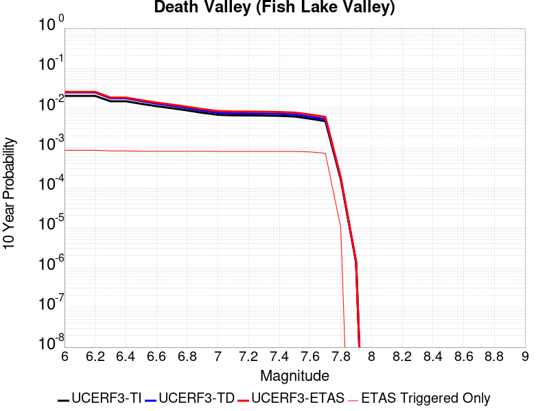 |

| Magnitude | 1 wk TI Prob | 1 wk TD Prob | 1 wk ETAS Prob | 1 wk ETAS/TD Gain | 1 wk ETAS Triggered Only | 1 mo TI Prob | 1 mo TD Prob | 1 mo ETAS Prob | 1 mo ETAS/TD Gain | 1 mo ETAS Triggered Only | 1 yr TI Prob | 1 yr TD Prob | 1 yr ETAS Prob | 1 yr ETAS/TD Gain | 1 yr ETAS Triggered Only | 10 yr TI Prob | 10 yr TD Prob | 10 yr ETAS Prob | 10 yr ETAS/TD Gain | 10 yr ETAS Triggered Only |
|-----|-----|-----|-----|-----|-----|-----|-----|-----|-----|-----|-----|-----|-----|-----|-----|-----|-----|-----|-----|-----|
| 6.0 | 3.872328E-5 | 4.7267473E-5 | 2.1392627E-4 | 4.5258665 | 1.6666666E-4 | 1.6594635E-4 | 2.0256084E-4 | 4.4060787E-4 | 2.1751876 | 2.3809524E-4 | 0.0020185246 | 0.002463534 | 0.002986053 | 1.2121015 | 5.238095E-4 | 0.02000288 | 0.024388181 | 0.02541025 | 1.0419084 | 0.001047619 |
| 6.1 | 3.872328E-5 | 4.7267473E-5 | 2.1392627E-4 | 4.5258665 | 1.6666666E-4 | 1.6594635E-4 | 2.0256084E-4 | 4.4060787E-4 | 2.1751876 | 2.3809524E-4 | 0.0020185246 | 0.002463534 | 0.002986053 | 1.2121015 | 5.238095E-4 | 0.02000288 | 0.024388181 | 0.02541025 | 1.0419084 | 0.001047619 |
| 6.2 | 3.872328E-5 | 4.7267473E-5 | 2.1392627E-4 | 4.5258665 | 1.6666666E-4 | 1.6594635E-4 | 2.0256084E-4 | 4.4060787E-4 | 2.1751876 | 2.3809524E-4 | 0.0020185246 | 0.002463534 | 0.002986053 | 1.2121015 | 5.238095E-4 | 0.02000288 | 0.024388181 | 0.02541025 | 1.0419084 | 0.001047619 |
| 6.3 | 2.8356371E-5 | 3.3609853E-5 | 1.764622E-4 | 5.250312 | 1.4285714E-4 | 1.2152165E-4 | 1.4403471E-4 | 3.5828957E-4 | 2.4875224 | 2.1428571E-4 | 0.0014785219 | 0.0017522911 | 0.002251415 | 1.2848407 | 5.0E-4 | 0.014687235 | 0.017391782 | 0.01837439 | 1.0564984 | 0.001 |
| 6.4 | 2.8356371E-5 | 3.3609853E-5 | 1.764622E-4 | 5.250312 | 1.4285714E-4 | 1.2152165E-4 | 1.4403471E-4 | 3.5828957E-4 | 2.4875224 | 2.1428571E-4 | 0.0014785219 | 0.0017522911 | 0.002251415 | 1.2848407 | 5.0E-4 | 0.014687235 | 0.017391782 | 0.01837439 | 1.0564984 | 0.001 |
| 6.5 | 2.4448687E-5 | 2.8607552E-5 | 1.4765176E-4 | 5.1612864 | 1.1904762E-4 | 1.0477588E-4 | 1.2259831E-4 | 3.1305116E-4 | 2.5534701 | 1.9047619E-4 | 0.0012748998 | 0.0014916632 | 0.0019671433 | 1.3187584 | 4.7619047E-4 | 0.012676105 | 0.014821377 | 0.0157831 | 1.0648875 | 9.761905E-4 |
| 6.6 | 2.1298161E-5 | 2.4660083E-5 | 1.4370476E-4 | 5.827424 | 1.1904762E-4 | 9.127464E-5 | 1.0568198E-4 | 2.9613805E-4 | 2.8021622 | 1.9047619E-4 | 0.0011107022 | 0.0012859525 | 0.0017615306 | 1.3698256 | 4.7619047E-4 | 0.011051672 | 0.012788526 | 0.013752231 | 1.0753571 | 9.761905E-4 |
| 6.7 | 1.8959729E-5 | 2.1781025E-5 | 1.4082606E-4 | 6.465538 | 1.1904762E-4 | 8.125345E-5 | 9.334405E-5 | 2.8380248E-4 | 3.0403914 | 1.9047619E-4 | 9.888117E-4 | 0.001135897 | 0.0016115465 | 1.4187436 | 4.7619047E-4 | 0.009844234 | 0.01130357 | 0.012268726 | 1.0853851 | 9.761905E-4 |
| 6.8 | 1.6691629E-5 | 1.9018353E-5 | 1.3806371E-4 | 7.259499 | 1.1904762E-4 | 7.153359E-5 | 8.150477E-5 | 2.7196543E-4 | 3.336804 | 1.9047619E-4 | 8.7057345E-4 | 9.918857E-4 | 0.0014676038 | 1.4796098 | 4.7619047E-4 | 0.008671708 | 0.009876343 | 0.010842893 | 1.0978651 | 9.761905E-4 |
| 6.9 | 1.450505E-5 | 1.638954E-5 | 1.3543521E-4 | 8.263515 | 1.1904762E-4 | 6.216302E-5 | 7.0239046E-5 | 2.6070187E-4 | 3.7116373 | 1.9047619E-4 | 7.5657194E-4 | 8.5483363E-4 | 0.001330617 | 1.5565802 | 4.7619047E-4 | 0.007540013 | 0.008516385 | 0.009484262 | 1.1136488 | 9.761905E-4 |
| 7.0 | 1.2940855E-5 | 1.4537972E-5 | 1.3358386E-4 | 9.188618 | 1.1904762E-4 | 5.545963E-5 | 6.230414E-5 | 2.5276846E-4 | 4.057009 | 1.9047619E-4 | 6.750118E-4 | 7.5829466E-4 | 0.0012341241 | 1.6274993 | 4.7619047E-4 | 0.006729651 | 0.0075576897 | 0.008526502 | 1.128189 | 9.761905E-4 |
| 7.1 | 1.2544658E-5 | 1.4078208E-5 | 1.3312415E-4 | 9.456044 | 1.1904762E-4 | 5.3761712E-5 | 6.0333812E-5 | 2.507985E-4 | 4.1568484 | 1.9047619E-4 | 6.5435225E-4 | 7.343222E-4 | 0.001210163 | 1.648 | 4.7619047E-4 | 0.006524288 | 0.007319551 | 0.008288596 | 1.1323913 | 9.761905E-4 |
| 7.2 | 1.2489416E-5 | 1.4015674E-5 | 1.3306162E-4 | 9.4937725 | 1.1904762E-4 | 5.3524967E-5 | 6.0065824E-5 | 2.5053057E-4 | 4.1709337 | 1.9047619E-4 | 6.514716E-4 | 7.310616E-4 | 0.001206904 | 1.6508923 | 4.7619047E-4 | 0.006495651 | 0.0072871596 | 0.008256236 | 1.1329842 | 9.761905E-4 |
| 7.3 | 1.2368307E-5 | 1.3879812E-5 | 1.3292578E-4 | 9.576915 | 1.1904762E-4 | 5.3005948E-5 | 5.9483587E-5 | 2.4994844E-4 | 4.2019734 | 1.9047619E-4 | 6.451563E-4 | 7.2397763E-4 | 0.0011998233 | 1.6572658 | 4.7619047E-4 | 0.0064328653 | 0.007216782 | 0.008185928 | 1.1342906 | 9.761905E-4 |
| 7.4 | 1.2161707E-5 | 1.36478675E-5 | 1.3269387E-4 | 9.722681 | 1.1904762E-4 | 5.212056E-5 | 5.8489582E-5 | 2.4895463E-4 | 4.2563925 | 1.9047619E-4 | 6.3438306E-4 | 7.118836E-4 | 0.0011877351 | 1.66844 | 4.7619047E-4 | 0.006325751 | 0.0070966207 | 0.008065883 | 1.136581 | 9.761905E-4 |
| 7.5 | 1.1707948E-5 | 1.3145515E-5 | 1.3219156E-4 | 10.056021 | 1.1904762E-4 | 5.0175953E-5 | 5.6336736E-5 | 2.468022E-4 | 4.3808393 | 1.9047619E-4 | 6.10721E-4 | 6.856895E-4 | 0.0011615534 | 1.6939933 | 4.7619047E-4 | 0.0060904534 | 0.006836321 | 0.0078058382 | 1.1418185 | 9.761905E-4 |
| 7.6 | 1.0319538E-5 | 1.1579622E-5 | 1.3062586E-4 | 11.280667 | 1.1904762E-4 | 4.4225842E-5 | 4.9626036E-5 | 2.4009278E-4 | 4.8380404 | 1.9047619E-4 | 5.383166E-4 | 6.040347E-4 | 0.0010561424 | 1.7484797 | 4.5238095E-4 | 0.0053701443 | 0.0060244603 | 0.0069711036 | 1.1571333 | 9.5238094E-4 |
| 7.7 | 8.937764E-6 | 1.0022779E-5 | 1.0525992E-4 | 10.502069 | 9.5238094E-5 | 3.830414E-5 | 4.295409E-5 | 1.858051E-4 | 4.3256674 | 1.4285714E-4 | 4.6625308E-4 | 5.228456E-4 | 9.273959E-4 | 1.7737471 | 4.047619E-4 | 0.0046527605 | 0.005216664 | 0.0061167064 | 1.1725321 | 9.047619E-4 |
| 7.8 | 3.108007E-7 | 3.284654E-7 | 3.284654E-7 | 1.0 | 0.0 | 1.3320023E-6 | 1.407708E-6 | 1.407708E-6 | 1.0 | 0.0 | 1.6217007E-5 | 1.7138715E-5 | 1.7138715E-5 | 1.0 | 0.0 | 1.6215823E-4 | 1.7137431E-4 | 1.9517976E-4 | 1.1389091 | 2.3809524E-5 |
| 7.9 | 2.5591178E-9 | 2.6696718E-9 | 2.6696718E-9 | 1.0 | 0.0 | 1.0967647E-8 | 1.14414505E-8 | 1.14414505E-8 | 1.0 | 0.0 | 1.335311E-7 | 1.3929966E-7 | 1.3929966E-7 | 1.0 | 0.0 | 1.3353102E-6 | 1.3929966E-6 | 1.3929966E-6 | 1.0 | 0.0 |

## San Andreas (Carrizo) rev
*[(top)](#table-of-contents)*

| 1 Week | 1 Month | 1 Year | 10 Year |
|-----|-----|-----|-----|
|  |  |  |  |

| Magnitude | 1 wk TI Prob | 1 wk TD Prob | 1 wk ETAS Prob | 1 wk ETAS/TD Gain | 1 wk ETAS Triggered Only | 1 mo TI Prob | 1 mo TD Prob | 1 mo ETAS Prob | 1 mo ETAS/TD Gain | 1 mo ETAS Triggered Only | 1 yr TI Prob | 1 yr TD Prob | 1 yr ETAS Prob | 1 yr ETAS/TD Gain | 1 yr ETAS Triggered Only | 10 yr TI Prob | 10 yr TD Prob | 10 yr ETAS Prob | 10 yr ETAS/TD Gain | 10 yr ETAS Triggered Only |
|-----|-----|-----|-----|-----|-----|-----|-----|-----|-----|-----|-----|-----|-----|-----|-----|-----|-----|-----|-----|-----|
| 6.0 | 1.1674632E-4 | 2.432302E-4 | 4.3366005E-4 | 1.7829202 | 1.9047619E-4 | 5.002454E-4 | 0.0010420004 | 0.0014225558 | 1.3652163 | 3.8095238E-4 | 0.006073493 | 0.012613042 | 0.013177264 | 1.0447332 | 5.7142857E-4 | 0.0591016 | 0.12061418 | 0.12153544 | 1.0076381 | 0.001047619 |
| 6.1 | 1.1674632E-4 | 2.432302E-4 | 4.3366005E-4 | 1.7829202 | 1.9047619E-4 | 5.002454E-4 | 0.0010420004 | 0.0014225558 | 1.3652163 | 3.8095238E-4 | 0.006073493 | 0.012613042 | 0.013177264 | 1.0447332 | 5.7142857E-4 | 0.0591016 | 0.12061418 | 0.12153544 | 1.0076381 | 0.001047619 |
| 6.2 | 1.1674632E-4 | 2.432302E-4 | 4.3366005E-4 | 1.7829202 | 1.9047619E-4 | 5.002454E-4 | 0.0010420004 | 0.0014225558 | 1.3652163 | 3.8095238E-4 | 0.006073493 | 0.012613042 | 0.013177264 | 1.0447332 | 5.7142857E-4 | 0.0591016 | 0.12061418 | 0.12153544 | 1.0076381 | 0.001047619 |
| 6.3 | 1.1674632E-4 | 2.432302E-4 | 4.3366005E-4 | 1.7829202 | 1.9047619E-4 | 5.002454E-4 | 0.0010420004 | 0.0014225558 | 1.3652163 | 3.8095238E-4 | 0.006073493 | 0.012613042 | 0.013177264 | 1.0447332 | 5.7142857E-4 | 0.0591016 | 0.12061418 | 0.12153544 | 1.0076381 | 0.001047619 |
| 6.4 | 1.1674632E-4 | 2.432302E-4 | 4.3366005E-4 | 1.7829202 | 1.9047619E-4 | 5.002454E-4 | 0.0010420004 | 0.0014225558 | 1.3652163 | 3.8095238E-4 | 0.006073493 | 0.012613042 | 0.013177264 | 1.0447332 | 5.7142857E-4 | 0.0591016 | 0.12061418 | 0.12153544 | 1.0076381 | 0.001047619 |
| 6.5 | 1.13136164E-4 | 2.3643032E-4 | 4.268615E-4 | 1.805443 | 1.9047619E-4 | 4.847792E-4 | 0.0010128808 | 0.0013934474 | 1.3757268 | 3.8095238E-4 | 0.0058862255 | 0.012262545 | 0.012826965 | 1.0460281 | 5.7142857E-4 | 0.057327334 | 0.117585555 | 0.118509986 | 1.0078619 | 0.001047619 |
| 6.6 | 1.13136164E-4 | 2.3643032E-4 | 4.268615E-4 | 1.805443 | 1.9047619E-4 | 4.847792E-4 | 0.0010128808 | 0.0013934474 | 1.3757268 | 3.8095238E-4 | 0.0058862255 | 0.012262545 | 0.012826965 | 1.0460281 | 5.7142857E-4 | 0.057327334 | 0.117585555 | 0.118509986 | 1.0078619 | 0.001047619 |
| 6.7 | 1.1149675E-4 | 2.3334254E-4 | 4.237743E-4 | 1.8161038 | 1.9047619E-4 | 4.777557E-4 | 9.996577E-4 | 0.0013802293 | 1.3807019 | 3.8095238E-4 | 0.0058011734 | 0.012103349 | 0.012667862 | 1.046641 | 5.7142857E-4 | 0.05652051 | 0.1162071 | 0.11713298 | 1.0079675 | 0.001047619 |
| 6.8 | 1.1103589E-4 | 2.3236412E-4 | 4.2279606E-4 | 1.819541 | 1.9047619E-4 | 4.7578133E-4 | 9.954676E-4 | 0.0013760409 | 1.3823059 | 3.8095238E-4 | 0.005777263 | 0.012052901 | 0.012617443 | 1.0468386 | 5.7142857E-4 | 0.056293584 | 0.1157674 | 0.116693735 | 1.0080017 | 0.001047619 |
| 6.9 | 1.1053259E-4 | 2.3128795E-4 | 4.217201E-4 | 1.8233552 | 1.9047619E-4 | 4.7362508E-4 | 9.90859E-4 | 0.001371434 | 1.3840858 | 3.8095238E-4 | 0.0057511497 | 0.01199741 | 0.012561983 | 1.0470579 | 5.7142857E-4 | 0.05604569 | 0.11528359 | 0.11621044 | 1.0080397 | 0.001047619 |
| 7.0 | 1.1005377E-4 | 2.3029637E-4 | 4.207287E-4 | 1.8269011 | 1.9047619E-4 | 4.7157376E-4 | 9.866126E-4 | 0.0013671891 | 1.3857406 | 3.8095238E-4 | 0.0057263062 | 0.011946279 | 0.012510881 | 1.0472617 | 5.7142857E-4 | 0.055809796 | 0.11483591 | 0.115763225 | 1.0080751 | 0.001047619 |
| 7.1 | 1.0308142E-4 | 2.1539345E-4 | 4.058286E-4 | 1.884127 | 1.9047619E-4 | 4.417027E-4 | 9.227892E-4 | 0.00130339 | 1.4124461 | 3.8095238E-4 | 0.0053644776 | 0.011177397 | 0.011742439 | 1.0505521 | 5.7142857E-4 | 0.052368138 | 0.108092256 | 0.1090054 | 1.0084478 | 0.0010238095 |
| 7.2 | 1.0027479E-4 | 2.094724E-4 | 3.999087E-4 | 1.9091235 | 1.9047619E-4 | 4.296783E-4 | 8.9743105E-4 | 0.0012542534 | 1.3976042 | 3.5714285E-4 | 0.0052187922 | 0.010871782 | 0.011413448 | 1.049823 | 5.4761907E-4 | 0.050979212 | 0.10539625 | 0.106290855 | 1.008488 | 0.001 |
| 7.3 | 9.816942E-5 | 2.0422463E-4 | 3.9466194E-4 | 1.9324893 | 1.9047619E-4 | 4.2065824E-4 | 8.7495585E-4 | 0.0012317862 | 1.4078267 | 3.5714285E-4 | 0.005109493 | 0.010600842 | 0.011142655 | 1.0511105 | 5.4761907E-4 | 0.049935985 | 0.102979995 | 0.103877015 | 1.0087106 | 0.001 |
| 7.4 | 9.5634205E-5 | 1.9791997E-4 | 3.8835846E-4 | 1.9621994 | 1.9047619E-4 | 4.0979648E-4 | 8.479536E-4 | 0.0012047936 | 1.4208249 | 3.5714285E-4 | 0.0049778637 | 0.010275229 | 0.010817221 | 1.0527475 | 5.4761907E-4 | 0.048678253 | 0.10006632 | 0.10096625 | 1.0089934 | 0.001 |
| 7.5 | 8.052417E-5 | 1.611261E-4 | 3.515716E-4 | 2.1819656 | 1.9047619E-4 | 3.4505792E-4 | 6.903579E-4 | 0.0010472542 | 1.5169729 | 3.5714285E-4 | 0.0041929903 | 0.008372796 | 0.0089158295 | 1.0648569 | 5.4761907E-4 | 0.04114753 | 0.08281049 | 0.08372768 | 1.0110757 | 0.001 |
| 7.6 | 7.897024E-5 | 1.5765853E-4 | 3.481047E-4 | 2.207966 | 1.9047619E-4 | 3.384E-4 | 6.755046E-4 | 0.0010324062 | 1.5283481 | 3.5714285E-4 | 0.0041122385 | 0.008193332 | 0.008736464 | 1.0662895 | 5.4761907E-4 | 0.040369697 | 0.08115171 | 0.08204868 | 1.011053 | 9.761905E-4 |
| 7.7 | 6.707427E-5 | 1.3276102E-4 | 2.7559922E-4 | 2.0759044 | 1.4285714E-4 | 2.8742946E-4 | 5.688518E-4 | 8.5440354E-4 | 1.5019791 | 2.8571428E-4 | 0.003493839 | 0.00690381 | 0.0073294225 | 1.061649 | 4.2857142E-4 | 0.034394164 | 0.069048055 | 0.06969086 | 1.0093094 | 6.904762E-4 |
| 7.8 | 6.147705E-5 | 1.2197486E-4 | 2.648146E-4 | 2.1710587 | 1.4285714E-4 | 2.6344648E-4 | 5.226447E-4 | 8.082097E-4 | 1.5463845 | 2.8571428E-4 | 0.0032027436 | 0.006344659 | 0.006746853 | 1.063391 | 4.047619E-4 | 0.031569764 | 0.06351457 | 0.064072 | 1.0087764 | 5.952381E-4 |
| 7.9 | 4.7636717E-5 | 8.87977E-5 | 2.0783475E-4 | 2.340542 | 1.1904762E-4 | 2.0414138E-4 | 3.8050607E-4 | 5.9471023E-4 | 1.5629455 | 2.1428571E-4 | 0.0024825884 | 0.0046228287 | 0.004930922 | 1.066646 | 3.095238E-4 | 0.024550365 | 0.046628095 | 0.04703668 | 1.0087627 | 4.2857142E-4 |
| 8.0 | 3.3554235E-5 | 5.2136907E-5 | 1.2356175E-4 | 2.369948 | 7.142857E-5 | 1.4379594E-4 | 2.2342477E-4 | 3.6625E-4 | 1.6392542 | 1.4285714E-4 | 0.0017493097 | 0.002716805 | 0.0029067637 | 1.06992 | 1.9047619E-4 | 0.017356034 | 0.027880952 | 0.028135555 | 1.0091318 | 2.6190476E-4 |
| 8.1 | 1.9175432E-5 | 1.9184976E-5 | 4.299404E-5 | 2.2410266 | 2.3809524E-5 | 8.217783E-5 | 8.2218736E-5 | 1.5364143E-4 | 1.8686913 | 7.142857E-5 | 0.0010000558 | 0.0010005541 | 0.0010956968 | 1.0950902 | 9.5238094E-5 | 0.009955673 | 0.0107580265 | 0.010875793 | 1.0109469 | 1.1904762E-4 |
| 8.2 | 8.643924E-6 | 5.4748625E-6 | 5.4748625E-6 | 1.0 | 0.0 | 3.704486E-5 | 2.3463486E-5 | 2.3463486E-5 | 1.0 | 0.0 | 4.5092785E-4 | 2.8563058E-4 | 2.8563058E-4 | 1.0 | 0.0 | 0.0045001395 | 0.0032487072 | 0.0032487072 | 1.0 | 0.0 |
| 8.3 | 1.983087E-6 | 7.6599065E-7 | 7.6599065E-7 | 1.0 | 0.0 | 8.498917E-6 | 3.282813E-6 | 3.282813E-6 | 1.0 | 0.0 | 1.034694E-4 | 3.9967534E-5 | 3.9967534E-5 | 1.0 | 0.0 | 0.0010342124 | 4.719687E-4 | 4.719687E-4 | 1.0 | 0.0 |

## San Andreas (Cholame) rev
*[(top)](#table-of-contents)*

| 1 Week | 1 Month | 1 Year | 10 Year |
|-----|-----|-----|-----|
| 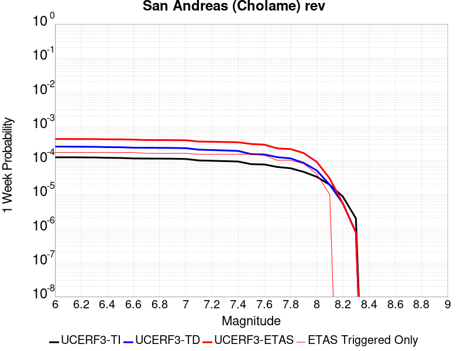 |  |  |  |

| Magnitude | 1 wk TI Prob | 1 wk TD Prob | 1 wk ETAS Prob | 1 wk ETAS/TD Gain | 1 wk ETAS Triggered Only | 1 mo TI Prob | 1 mo TD Prob | 1 mo ETAS Prob | 1 mo ETAS/TD Gain | 1 mo ETAS Triggered Only | 1 yr TI Prob | 1 yr TD Prob | 1 yr ETAS Prob | 1 yr ETAS/TD Gain | 1 yr ETAS Triggered Only | 10 yr TI Prob | 10 yr TD Prob | 10 yr ETAS Prob | 10 yr ETAS/TD Gain | 10 yr ETAS Triggered Only |
|-----|-----|-----|-----|-----|-----|-----|-----|-----|-----|-----|-----|-----|-----|-----|-----|-----|-----|-----|-----|-----|
| 6.0 | 1.2302514E-4 | 2.5204287E-4 | 4.1866754E-4 | 1.6610965 | 1.6666666E-4 | 5.27144E-4 | 0.0010797381 | 0.0014127116 | 1.3083835 | 3.3333333E-4 | 0.0063991086 | 0.0130670825 | 0.013584048 | 1.0395623 | 5.238095E-4 | 0.06217949 | 0.12439073 | 0.12526634 | 1.0070392 | 0.001 |
| 6.1 | 1.2302514E-4 | 2.5204287E-4 | 4.1866754E-4 | 1.6610965 | 1.6666666E-4 | 5.27144E-4 | 0.0010797381 | 0.0014127116 | 1.3083835 | 3.3333333E-4 | 0.0063991086 | 0.0130670825 | 0.013584048 | 1.0395623 | 5.238095E-4 | 0.06217949 | 0.12439073 | 0.12526634 | 1.0070392 | 0.001 |
| 6.2 | 1.2203569E-4 | 2.5021084E-4 | 4.168358E-4 | 1.6659383 | 1.6666666E-4 | 5.2290526E-4 | 0.0010718931 | 0.0014048691 | 1.310643 | 3.3333333E-4 | 0.006347804 | 0.01297271 | 0.013489724 | 1.039854 | 5.238095E-4 | 0.061695136 | 0.12357691 | 0.12445333 | 1.0070921 | 0.001 |
| 6.3 | 1.2142645E-4 | 2.4907055E-4 | 4.1569571E-4 | 1.6689878 | 1.6666666E-4 | 5.202953E-4 | 0.0010670102 | 0.0013999878 | 1.3120661 | 3.3333333E-4 | 0.006316212 | 0.012913967 | 0.013431012 | 1.0400376 | 5.238095E-4 | 0.06139677 | 0.12307103 | 0.12394796 | 1.0071254 | 0.001 |
| 6.4 | 1.1865206E-4 | 2.44126E-4 | 4.10752E-4 | 1.6825409 | 1.6666666E-4 | 5.0840975E-4 | 0.0010458364 | 0.0013788211 | 1.3183908 | 3.3333333E-4 | 0.006172335 | 0.012659196 | 0.013176375 | 1.040854 | 5.238095E-4 | 0.060036868 | 0.1208638 | 0.12174294 | 1.0072738 | 0.001 |
| 6.5 | 1.17443946E-4 | 2.4205919E-4 | 4.086855E-4 | 1.6883701 | 1.6666666E-4 | 5.032341E-4 | 0.0010369857 | 0.0013699733 | 1.3211112 | 3.3333333E-4 | 0.006109677 | 0.012552682 | 0.0130699165 | 1.041205 | 5.238095E-4 | 0.059444077 | 0.11993805 | 0.120818116 | 1.0073377 | 0.001 |
| 6.6 | 1.13579066E-4 | 2.3514954E-4 | 4.01777E-4 | 1.7086022 | 1.6666666E-4 | 4.866766E-4 | 0.001007396 | 0.0013403936 | 1.3305528 | 3.3333333E-4 | 0.0059092017 | 0.012196515 | 0.012713935 | 1.0424237 | 5.238095E-4 | 0.057545185 | 0.11685214 | 0.11773529 | 1.0075579 | 0.001 |
| 6.7 | 1.1271412E-4 | 2.3359268E-4 | 4.0022042E-4 | 1.713326 | 1.6666666E-4 | 4.829711E-4 | 0.0010007289 | 0.0013337287 | 1.3327572 | 3.3333333E-4 | 0.005864331 | 0.012116249 | 0.012633711 | 1.0427082 | 5.238095E-4 | 0.057119697 | 0.116155714 | 0.117039554 | 1.0076091 | 0.001 |
| 6.8 | 1.1217975E-4 | 2.3247694E-4 | 3.9910487E-4 | 1.7167503 | 1.6666666E-4 | 4.8068175E-4 | 9.959509E-4 | 0.0013289523 | 1.3343552 | 3.3333333E-4 | 0.005836608 | 0.012058721 | 0.012576214 | 1.0429144 | 5.238095E-4 | 0.056856725 | 0.11565396 | 0.11653831 | 1.0076464 | 0.001 |
| 6.9 | 1.1146753E-4 | 2.3096445E-4 | 3.9759264E-4 | 1.7214451 | 1.6666666E-4 | 4.7763053E-4 | 9.894737E-4 | 0.0013224771 | 1.3365461 | 3.3333333E-4 | 0.0057996577 | 0.011980731 | 0.012498265 | 1.0431972 | 5.238095E-4 | 0.056506127 | 0.11497439 | 0.11585941 | 1.0076976 | 0.001 |
| 7.0 | 1.0965793E-4 | 2.2719789E-4 | 3.938267E-4 | 1.7334082 | 1.6666666E-4 | 4.698779E-4 | 9.733434E-4 | 0.0013063523 | 1.3421289 | 3.3333333E-4 | 0.005705768 | 0.011786487 | 0.012304123 | 1.0439178 | 5.238095E-4 | 0.055614736 | 0.11327597 | 0.11416269 | 1.007828 | 0.001 |
| 7.1 | 9.927982E-5 | 2.0538924E-4 | 3.7202166E-4 | 1.8113008 | 1.6666666E-4 | 4.2541555E-4 | 8.7994366E-4 | 0.0012129836 | 1.3784788 | 3.3333333E-4 | 0.0051671406 | 0.010660981 | 0.011179206 | 1.0486095 | 5.238095E-4 | 0.05048634 | 0.1033706 | 0.10424588 | 1.0084674 | 9.761905E-4 |
| 7.2 | 9.696786E-5 | 2.0043184E-4 | 3.670651E-4 | 1.8313712 | 1.6666666E-4 | 4.1551032E-4 | 8.5871184E-4 | 0.0011679699 | 1.3601418 | 3.095238E-4 | 0.00504711 | 0.010404981 | 0.010899778 | 1.0475539 | 5.0E-4 | 0.04934009 | 0.1011086 | 0.10196469 | 1.008467 | 9.5238094E-4 |
| 7.3 | 9.4727984E-5 | 1.9472468E-4 | 3.613589E-4 | 1.8557426 | 1.6666666E-4 | 4.0591392E-4 | 8.3426846E-4 | 0.0011435341 | 1.3707027 | 3.095238E-4 | 0.0049308087 | 0.010110183 | 0.010605128 | 1.0489551 | 5.0E-4 | 0.048228268 | 0.09847952 | 0.09933811 | 1.0087185 | 9.5238094E-4 |
| 7.4 | 9.220358E-5 | 1.8843076E-4 | 3.55066E-4 | 1.8843316 | 1.6666666E-4 | 3.9509835E-4 | 8.073114E-4 | 0.0011165853 | 1.3830912 | 3.095238E-4 | 0.004799717 | 0.009784967 | 0.010280074 | 1.0505987 | 5.0E-4 | 0.046973653 | 0.095557496 | 0.09641887 | 1.0090142 | 9.5238094E-4 |
| 7.5 | 7.71631E-5 | 1.5177966E-4 | 3.1842102E-4 | 2.0979164 | 1.6666666E-4 | 3.306571E-4 | 6.503223E-4 | 9.596448E-4 | 1.475645 | 3.095238E-4 | 0.0040183207 | 0.007889002 | 0.008385057 | 1.0628793 | 5.0E-4 | 0.03946433 | 0.07828531 | 0.07916313 | 1.0112132 | 9.5238094E-4 |
| 7.6 | 7.5634416E-5 | 1.483744E-4 | 3.1501634E-4 | 2.123118 | 1.6666666E-4 | 3.241072E-4 | 6.3573546E-4 | 9.450625E-4 | 1.4865656 | 3.095238E-4 | 0.0039388672 | 0.0077126776 | 0.0082088215 | 1.0643283 | 5.0E-4 | 0.038697794 | 0.07664872 | 0.07750612 | 1.0111861 | 9.2857145E-4 |
| 7.7 | 6.3783E-5 | 1.235872E-4 | 2.4262011E-4 | 1.9631491 | 1.1904762E-4 | 2.7332708E-4 | 5.29552E-4 | 7.6752115E-4 | 1.4493783 | 2.3809524E-4 | 0.0033226798 | 0.0064282627 | 0.006806766 | 1.0588812 | 3.8095238E-4 | 0.032734364 | 0.06454029 | 0.06514166 | 1.0093178 | 6.4285717E-4 |
| 7.8 | 5.863422E-5 | 1.1416107E-4 | 2.331951E-4 | 2.0426848 | 1.1904762E-4 | 2.512653E-4 | 4.8917E-4 | 7.271488E-4 | 1.486495 | 2.3809524E-4 | 0.003054864 | 0.0059394026 | 0.006294424 | 1.0597739 | 3.5714285E-4 | 0.030132094 | 0.059659187 | 0.060174134 | 1.0086315 | 5.4761907E-4 |
| 7.9 | 4.595283E-5 | 8.426331E-5 | 1.7949338E-4 | 2.1301486 | 9.5238094E-5 | 1.9692584E-4 | 3.610785E-4 | 5.27685E-4 | 1.4614135 | 1.6666666E-4 | 0.0023949358 | 0.0043872762 | 0.0046480317 | 1.0594345 | 2.6190476E-4 | 0.023692891 | 0.044362005 | 0.04472606 | 1.0082064 | 3.8095238E-4 |
| 8.0 | 3.2950178E-5 | 5.0772942E-5 | 1.2219789E-4 | 2.406752 | 7.142857E-5 | 1.412074E-4 | 2.1758018E-4 | 3.6040624E-4 | 1.6564295 | 1.4285714E-4 | 0.0017178444 | 0.0026458222 | 0.0028357946 | 1.0718008 | 1.9047619E-4 | 0.017046256 | 0.027180137 | 0.027434923 | 1.009374 | 2.6190476E-4 |
| 8.1 | 1.9177472E-5 | 1.9185145E-5 | 4.2994212E-5 | 2.2410157 | 2.3809524E-5 | 8.218658E-5 | 8.221946E-5 | 1.5364216E-4 | 1.8686836 | 7.142857E-5 | 0.0010001622 | 0.0010005629 | 0.0010957057 | 1.0950893 | 9.5238094E-5 | 0.009956728 | 0.010758142 | 0.01087591 | 1.0109468 | 1.1904762E-4 |
| 8.2 | 8.643924E-6 | 5.4748625E-6 | 5.4748625E-6 | 1.0 | 0.0 | 3.704486E-5 | 2.3463486E-5 | 2.3463486E-5 | 1.0 | 0.0 | 4.5092785E-4 | 2.8563058E-4 | 2.8563058E-4 | 1.0 | 0.0 | 0.0045001395 | 0.0032487072 | 0.0032487072 | 1.0 | 0.0 |
| 8.3 | 1.983087E-6 | 7.6599065E-7 | 7.6599065E-7 | 1.0 | 0.0 | 8.498917E-6 | 3.282813E-6 | 3.282813E-6 | 1.0 | 0.0 | 1.034694E-4 | 3.9967534E-5 | 3.9967534E-5 | 1.0 | 0.0 | 0.0010342124 | 4.719687E-4 | 4.719687E-4 | 1.0 | 0.0 |

## San Andreas (San Gorgonio Pass-Garnet HIll)
*[(top)](#table-of-contents)*

| 1 Week | 1 Month | 1 Year | 10 Year |
|-----|-----|-----|-----|
|  |  |  |  |

| Magnitude | 1 wk TI Prob | 1 wk TD Prob | 1 wk ETAS Prob | 1 wk ETAS/TD Gain | 1 wk ETAS Triggered Only | 1 mo TI Prob | 1 mo TD Prob | 1 mo ETAS Prob | 1 mo ETAS/TD Gain | 1 mo ETAS Triggered Only | 1 yr TI Prob | 1 yr TD Prob | 1 yr ETAS Prob | 1 yr ETAS/TD Gain | 1 yr ETAS Triggered Only | 10 yr TI Prob | 10 yr TD Prob | 10 yr ETAS Prob | 10 yr ETAS/TD Gain | 10 yr ETAS Triggered Only |
|-----|-----|-----|-----|-----|-----|-----|-----|-----|-----|-----|-----|-----|-----|-----|-----|-----|-----|-----|-----|-----|
| 6.0 | 8.31567E-5 | 2.3382473E-4 | 5.432762E-4 | 2.3234332 | 3.095238E-4 | 3.5633717E-4 | 0.0010017233 | 0.0014060799 | 1.4036608 | 4.047619E-4 | 0.004329778 | 0.012127888 | 0.01278647 | 1.054303 | 6.6666666E-4 | 0.042463828 | 0.11257892 | 0.11348747 | 1.0080703 | 0.0010238095 |
| 6.1 | 8.31567E-5 | 2.3382473E-4 | 5.432762E-4 | 2.3234332 | 3.095238E-4 | 3.5633717E-4 | 0.0010017233 | 0.0014060799 | 1.4036608 | 4.047619E-4 | 0.004329778 | 0.012127888 | 0.01278647 | 1.054303 | 6.6666666E-4 | 0.042463828 | 0.11257892 | 0.11348747 | 1.0080703 | 0.0010238095 |
| 6.2 | 8.31567E-5 | 2.3382473E-4 | 5.432762E-4 | 2.3234332 | 3.095238E-4 | 3.5633717E-4 | 0.0010017233 | 0.0014060799 | 1.4036608 | 4.047619E-4 | 0.004329778 | 0.012127888 | 0.01278647 | 1.054303 | 6.6666666E-4 | 0.042463828 | 0.11257892 | 0.11348747 | 1.0080703 | 0.0010238095 |
| 6.3 | 8.31567E-5 | 2.3382473E-4 | 5.432762E-4 | 2.3234332 | 3.095238E-4 | 3.5633717E-4 | 0.0010017233 | 0.0014060799 | 1.4036608 | 4.047619E-4 | 0.004329778 | 0.012127888 | 0.01278647 | 1.054303 | 6.6666666E-4 | 0.042463828 | 0.11257892 | 0.11348747 | 1.0080703 | 0.0010238095 |
| 6.4 | 8.059055E-5 | 2.2940808E-4 | 5.388609E-4 | 2.3489184 | 3.095238E-4 | 3.4534236E-4 | 9.828096E-4 | 0.0013871737 | 1.4114369 | 4.047619E-4 | 0.0041964394 | 0.011900152 | 0.012558885 | 1.0553551 | 6.6666666E-4 | 0.041180745 | 0.11056015 | 0.111449584 | 1.0080448 | 0.001 |
| 6.5 | 8.059055E-5 | 2.2940808E-4 | 5.388609E-4 | 2.3489184 | 3.095238E-4 | 3.4534236E-4 | 9.828096E-4 | 0.0013871737 | 1.4114369 | 4.047619E-4 | 0.0041964394 | 0.011900152 | 0.012558885 | 1.0553551 | 6.6666666E-4 | 0.041180745 | 0.11056015 | 0.111449584 | 1.0080448 | 0.001 |
| 6.6 | 7.619237E-5 | 2.218517E-4 | 5.3130684E-4 | 2.3948739 | 3.095238E-4 | 3.2649786E-4 | 9.5044886E-4 | 0.001354826 | 1.4254591 | 4.047619E-4 | 0.0039678677 | 0.01151087 | 0.012169863 | 1.0572495 | 6.6666666E-4 | 0.03897764 | 0.10709683 | 0.10798973 | 1.0083374 | 0.001 |
| 6.7 | 7.440636E-5 | 2.1860997E-4 | 5.280661E-4 | 2.4155629 | 3.095238E-4 | 3.188454E-4 | 9.3656575E-4 | 0.0013409485 | 1.431772 | 4.047619E-4 | 0.0038750346 | 0.011343609 | 0.012002712 | 1.0581036 | 6.6666666E-4 | 0.038081564 | 0.105605274 | 0.10649967 | 1.0084692 | 0.001 |
| 6.8 | 7.3735864E-5 | 2.1708169E-4 | 5.265383E-4 | 2.4255307 | 3.095238E-4 | 3.1597257E-4 | 9.3002064E-4 | 0.0013344061 | 1.4348134 | 4.047619E-4 | 0.0038401815 | 0.011264749 | 0.011923905 | 1.058515 | 6.6666666E-4 | 0.03774495 | 0.10490683 | 0.10580192 | 1.0085323 | 0.001 |
| 6.9 | 7.27575E-5 | 2.1477141E-4 | 5.2422873E-4 | 2.4408684 | 3.095238E-4 | 3.117806E-4 | 9.201265E-4 | 0.001324516 | 1.4394933 | 4.047619E-4 | 0.003789323 | 0.011145527 | 0.011804762 | 1.0591481 | 6.6666666E-4 | 0.037253562 | 0.103854746 | 0.10475089 | 1.0086288 | 0.001 |
| 7.0 | 7.102591E-5 | 2.1061185E-4 | 5.200705E-4 | 2.4693315 | 3.095238E-4 | 3.0436125E-4 | 9.023122E-4 | 0.0013067089 | 1.4481782 | 4.047619E-4 | 0.003699303 | 0.010930831 | 0.011590211 | 1.0603229 | 6.6666666E-4 | 0.03638325 | 0.10195695 | 0.10285499 | 1.008808 | 0.001 |
| 7.1 | 7.028513E-5 | 2.0896831E-4 | 5.1842746E-4 | 2.4808903 | 3.095238E-4 | 3.0118722E-4 | 8.9527335E-4 | 0.0012996729 | 1.4517051 | 4.047619E-4 | 0.0036607897 | 0.010845989 | 0.011505425 | 1.0608 | 6.6666666E-4 | 0.036010686 | 0.101199985 | 0.102098785 | 1.0088814 | 0.001 |
| 7.2 | 6.8498244E-5 | 2.0504706E-4 | 5.145074E-4 | 2.509216 | 3.095238E-4 | 2.9353087E-4 | 8.784794E-4 | 0.0012828857 | 1.4603481 | 4.047619E-4 | 0.003567883 | 0.010643536 | 0.011303107 | 1.0619692 | 6.6666666E-4 | 0.035111405 | 0.09939202 | 0.10027119 | 1.0088454 | 9.761905E-4 |
| 7.3 | 6.622592E-5 | 1.9732013E-4 | 5.0678285E-4 | 2.5683284 | 3.095238E-4 | 2.8379448E-4 | 8.453858E-4 | 0.0012498056 | 1.4783849 | 4.047619E-4 | 0.0034497243 | 0.0102444785 | 0.010904316 | 1.064409 | 6.6666666E-4 | 0.033966612 | 0.095888525 | 0.09677111 | 1.0092043 | 9.761905E-4 |
| 7.4 | 5.1050705E-5 | 1.4689034E-4 | 4.5636867E-4 | 3.1068666 | 3.095238E-4 | 2.1877038E-4 | 6.29379E-4 | 0.0010100916 | 1.604902 | 3.8095238E-4 | 0.002660276 | 0.0076359594 | 0.008273908 | 1.0835453 | 6.4285717E-4 | 0.02628654 | 0.07286301 | 0.073746 | 1.0121185 | 9.5238094E-4 |
| 7.5 | 3.9302922E-5 | 1.1129847E-4 | 3.9698096E-4 | 3.5668142 | 2.8571428E-4 | 1.6843023E-4 | 4.7690657E-4 | 8.338791E-4 | 1.7485167 | 3.5714285E-4 | 0.0020487092 | 0.005790949 | 0.0064064115 | 1.1062801 | 6.190476E-4 | 0.020299247 | 0.05600951 | 0.056886073 | 1.0156503 | 9.2857145E-4 |
| 7.6 | 2.9851626E-5 | 8.4949745E-5 | 3.7063975E-4 | 4.3630476 | 2.8571428E-4 | 1.2792926E-4 | 3.6401965E-4 | 7.210325E-4 | 1.9807516 | 3.5714285E-4 | 0.0015564259 | 0.0044229585 | 0.005039268 | 1.1393433 | 6.190476E-4 | 0.0154556995 | 0.04319374 | 0.044082202 | 1.0205692 | 9.2857145E-4 |
| 7.7 | 2.1135214E-5 | 6.3529005E-5 | 3.4922513E-4 | 5.497098 | 2.8571428E-4 | 9.0576345E-5 | 2.7223877E-4 | 6.292844E-4 | 2.3115165 | 3.5714285E-4 | 0.0011022091 | 0.0033094748 | 0.0039264737 | 1.186434 | 6.190476E-4 | 0.010967582 | 0.032582592 | 0.03341181 | 1.0254496 | 8.5714285E-4 |
| 7.8 | 1.883379E-5 | 5.564028E-5 | 3.4133866E-4 | 6.1347404 | 2.8571428E-4 | 8.0713755E-5 | 2.3843657E-4 | 5.954943E-4 | 2.4974957 | 3.5714285E-4 | 9.822468E-4 | 0.0028991038 | 0.003516357 | 1.2129116 | 6.190476E-4 | 0.0097791655 | 0.028695205 | 0.029504627 | 1.0282075 | 8.3333335E-4 |
| 7.9 | 1.5156185E-5 | 4.1658426E-5 | 3.2736082E-4 | 7.8582134 | 2.8571428E-4 | 6.495346E-5 | 1.785239E-4 | 5.117977E-4 | 2.8668303 | 3.3333333E-4 | 7.9052144E-4 | 0.0021713632 | 0.0027177932 | 1.251653 | 5.4761907E-4 | 0.007877152 | 0.021759422 | 0.022481458 | 1.0331826 | 7.3809526E-4 |
| 8.0 | 1.1405907E-5 | 2.9974231E-5 | 2.2044471E-4 | 7.3544745 | 1.9047619E-4 | 4.8881542E-5 | 1.2845467E-4 | 3.4271285E-4 | 2.6679673 | 2.1428571E-4 | 5.9497025E-4 | 0.0015628147 | 0.0019193994 | 1.2281682 | 3.5714285E-4 | 0.005933798 | 0.015772851 | 0.016218096 | 1.0282286 | 4.5238095E-4 |
| 8.1 | 4.3511436E-6 | 7.369219E-6 | 7.369219E-6 | 1.0 | 0.0 | 1.8647626E-5 | 3.1581985E-5 | 3.1581985E-5 | 1.0 | 0.0 | 2.2701119E-4 | 3.8444297E-4 | 4.0824333E-4 | 1.0619087 | 2.3809524E-5 | 0.0022677942 | 0.0041163345 | 0.004140046 | 1.0057603 | 2.3809524E-5 |
| 8.2 | 2.3042528E-6 | 2.7329415E-6 | 2.7329415E-6 | 1.0 | 0.0 | 9.875332E-6 | 1.1712554E-5 | 1.1712554E-5 | 1.0 | 0.0 | 1.2022553E-4 | 1.4259106E-4 | 1.4259106E-4 | 1.0 | 0.0 | 0.0012016051 | 0.0015979785 | 0.0015979785 | 1.0 | 0.0 |
| 8.3 | 5.202968E-7 | 3.1598344E-7 | 3.1598344E-7 | 1.0 | 0.0 | 2.2298414E-6 | 1.3542141E-6 | 1.3542141E-6 | 1.0 | 0.0 | 2.714798E-5 | 1.6487444E-5 | 1.6487444E-5 | 1.0 | 0.0 | 2.7144665E-4 | 1.9563142E-4 | 1.9563142E-4 | 1.0 | 0.0 |

## San Jacinto (San Bernardino)
*[(top)](#table-of-contents)*

| 1 Week | 1 Month | 1 Year | 10 Year |
|-----|-----|-----|-----|
|  |  |  |  |

| Magnitude | 1 wk TI Prob | 1 wk TD Prob | 1 wk ETAS Prob | 1 wk ETAS/TD Gain | 1 wk ETAS Triggered Only | 1 mo TI Prob | 1 mo TD Prob | 1 mo ETAS Prob | 1 mo ETAS/TD Gain | 1 mo ETAS Triggered Only | 1 yr TI Prob | 1 yr TD Prob | 1 yr ETAS Prob | 1 yr ETAS/TD Gain | 1 yr ETAS Triggered Only | 10 yr TI Prob | 10 yr TD Prob | 10 yr ETAS Prob | 10 yr ETAS/TD Gain | 10 yr ETAS Triggered Only |
|-----|-----|-----|-----|-----|-----|-----|-----|-----|-----|-----|-----|-----|-----|-----|-----|-----|-----|-----|-----|-----|
| 6.0 | 3.409352E-5 | 3.5986508E-5 | 3.6930785E-4 | 10.262397 | 3.3333333E-4 | 1.461069E-4 | 1.542188E-4 | 6.303358E-4 | 4.0872827 | 4.7619047E-4 | 0.0017774 | 0.0018759987 | 0.002493885 | 1.329364 | 6.190476E-4 | 0.01763251 | 0.019349935 | 0.020167144 | 1.0422331 | 8.3333335E-4 |
| 6.1 | 3.409352E-5 | 3.5986508E-5 | 3.6930785E-4 | 10.262397 | 3.3333333E-4 | 1.461069E-4 | 1.542188E-4 | 6.303358E-4 | 4.0872827 | 4.7619047E-4 | 0.0017774 | 0.0018759987 | 0.002493885 | 1.329364 | 6.190476E-4 | 0.01763251 | 0.019349935 | 0.020167144 | 1.0422331 | 8.3333335E-4 |
| 6.2 | 3.409352E-5 | 3.5986508E-5 | 3.6930785E-4 | 10.262397 | 3.3333333E-4 | 1.461069E-4 | 1.542188E-4 | 6.303358E-4 | 4.0872827 | 4.7619047E-4 | 0.0017774 | 0.0018759987 | 0.002493885 | 1.329364 | 6.190476E-4 | 0.01763251 | 0.019349935 | 0.020167144 | 1.0422331 | 8.3333335E-4 |
| 6.3 | 3.409352E-5 | 3.5986508E-5 | 3.6930785E-4 | 10.262397 | 3.3333333E-4 | 1.461069E-4 | 1.542188E-4 | 6.303358E-4 | 4.0872827 | 4.7619047E-4 | 0.0017774 | 0.0018759987 | 0.002493885 | 1.329364 | 6.190476E-4 | 0.01763251 | 0.019349935 | 0.020167144 | 1.0422331 | 8.3333335E-4 |
| 6.4 | 3.400795E-5 | 3.5879173E-5 | 3.6920054E-4 | 10.290108 | 3.3333333E-4 | 1.4574021E-4 | 1.5375883E-4 | 6.298761E-4 | 4.09652 | 4.7619047E-4 | 0.0017729428 | 0.0018704084 | 0.002488298 | 1.3303502 | 6.190476E-4 | 0.017588645 | 0.019295016 | 0.02011227 | 1.0423557 | 8.3333335E-4 |
| 6.5 | 3.341482E-5 | 3.5139812E-5 | 3.6846142E-4 | 10.485584 | 3.3333333E-4 | 1.4319851E-4 | 1.5059051E-4 | 6.2670925E-4 | 4.161679 | 4.7619047E-4 | 0.0017420477 | 0.0018318989 | 0.0024498126 | 1.3373077 | 6.190476E-4 | 0.017284546 | 0.018916558 | 0.019734127 | 1.0432198 | 8.3333335E-4 |
| 6.6 | 3.3364955E-5 | 3.5077028E-5 | 3.6839867E-4 | 10.502562 | 3.3333333E-4 | 1.4298483E-4 | 1.5032147E-4 | 6.264404E-4 | 4.167338 | 4.7619047E-4 | 0.0017394501 | 0.001828629 | 0.0024465446 | 1.337912 | 6.190476E-4 | 0.017258976 | 0.018884424 | 0.01970202 | 1.0432948 | 8.3333335E-4 |
| 6.7 | 3.335922E-5 | 3.5066805E-5 | 3.6838846E-4 | 10.505333 | 3.3333333E-4 | 1.4296026E-4 | 1.5027766E-4 | 6.2639656E-4 | 4.1682615 | 4.7619047E-4 | 0.0017391514 | 0.0018280965 | 0.0024460123 | 1.3380105 | 6.190476E-4 | 0.017256035 | 0.018879214 | 0.019696815 | 1.043307 | 8.3333335E-4 |
| 6.8 | 3.327683E-5 | 3.496087E-5 | 3.6828255E-4 | 10.534136 | 3.3333333E-4 | 1.4260718E-4 | 1.498237E-4 | 6.2594283E-4 | 4.1778626 | 4.7619047E-4 | 0.0017348597 | 0.0018225788 | 0.0024404982 | 1.3390357 | 6.190476E-4 | 0.017213784 | 0.018824987 | 0.019642632 | 1.043434 | 8.3333335E-4 |
| 6.9 | 3.3235785E-5 | 3.4901823E-5 | 3.6822353E-4 | 10.550266 | 3.3333333E-4 | 1.4243131E-4 | 1.4957068E-4 | 6.256899E-4 | 4.1832395 | 4.7619047E-4 | 0.0017327217 | 0.0018195034 | 0.0024374246 | 1.3396099 | 6.190476E-4 | 0.017192734 | 0.018794855 | 0.019612527 | 1.0435051 | 8.3333335E-4 |
| 7.0 | 3.3197095E-5 | 3.4841752E-5 | 3.6816348E-4 | 10.566731 | 3.3333333E-4 | 1.422655E-4 | 1.4931326E-4 | 6.2543264E-4 | 4.188728 | 4.7619047E-4 | 0.0017307063 | 0.0018163746 | 0.002434298 | 1.3401959 | 6.190476E-4 | 0.017172894 | 0.018764233 | 0.019581929 | 1.0435774 | 8.3333335E-4 |
| 7.1 | 3.3129716E-5 | 3.4721965E-5 | 3.6804372E-4 | 10.599738 | 3.3333333E-4 | 1.4197677E-4 | 1.4879994E-4 | 6.2491954E-4 | 4.19973 | 4.7619047E-4 | 0.0017271966 | 0.0018101353 | 0.0024280625 | 1.3413706 | 6.190476E-4 | 0.017138338 | 0.018703312 | 0.01952106 | 1.043722 | 8.3333335E-4 |
| 7.2 | 3.3034008E-5 | 3.458941E-5 | 3.679112E-4 | 10.636527 | 3.3333333E-4 | 1.4156665E-4 | 1.4823192E-4 | 6.243518E-4 | 4.2119927 | 4.7619047E-4 | 0.0017222111 | 0.0018032312 | 0.0024211626 | 1.3426801 | 6.190476E-4 | 0.017089253 | 0.018635705 | 0.019453509 | 1.0438837 | 8.3333335E-4 |
| 7.3 | 3.2956614E-5 | 3.445717E-5 | 3.6777902E-4 | 10.673512 | 3.3333333E-4 | 1.4123498E-4 | 1.4766524E-4 | 6.2378537E-4 | 4.2243214 | 4.7619047E-4 | 0.0017181796 | 0.0017963431 | 0.0024142787 | 1.3439964 | 6.190476E-4 | 0.017049557 | 0.018568452 | 0.019386312 | 1.0440457 | 8.3333335E-4 |
| 7.4 | 3.2915937E-5 | 3.4378863E-5 | 3.6770073E-4 | 10.695546 | 3.3333333E-4 | 1.4106068E-4 | 1.4732967E-4 | 6.2345E-4 | 4.231666 | 4.7619047E-4 | 0.0017160608 | 0.0017922645 | 0.0024102025 | 1.3447807 | 6.190476E-4 | 0.017028693 | 0.018528719 | 0.019346612 | 1.0441419 | 8.3333335E-4 |
| 7.5 | 3.281791E-5 | 3.4243778E-5 | 3.675657E-4 | 10.733795 | 3.3333333E-4 | 1.406406E-4 | 1.4675081E-4 | 6.228714E-4 | 4.2444158 | 4.7619047E-4 | 0.0017109542 | 0.0017852283 | 0.0024031708 | 1.3461419 | 6.190476E-4 | 0.016978411 | 0.018459605 | 0.019277556 | 1.0443103 | 8.3333335E-4 |
| 7.6 | 3.2521442E-5 | 3.396873E-5 | 3.6729075E-4 | 10.8126135 | 3.3333333E-4 | 1.3937015E-4 | 1.4557215E-4 | 6.216933E-4 | 4.2706885 | 4.7619047E-4 | 0.0016955109 | 0.0017709016 | 0.0023888529 | 1.3489473 | 6.190476E-4 | 0.016826328 | 0.018317232 | 0.019135302 | 1.0446612 | 8.3333335E-4 |
| 7.7 | 3.0287873E-5 | 3.245276E-5 | 3.6577528E-4 | 11.271006 | 3.3333333E-4 | 1.297987E-4 | 1.3907586E-4 | 6.152001E-4 | 4.4234858 | 4.7619047E-4 | 0.0015791537 | 0.0016919347 | 0.002309935 | 1.3652625 | 6.190476E-4 | 0.01567979 | 0.01752809 | 0.018346816 | 1.0467094 | 8.3333335E-4 |
| 7.8 | 2.6316151E-5 | 2.9663592E-5 | 3.6298705E-4 | 12.236787 | 3.3333333E-4 | 1.1277862E-4 | 1.2712348E-4 | 6.0325343E-4 | 4.745413 | 4.7619047E-4 | 0.0013722149 | 0.0015466306 | 0.0021647208 | 1.3996366 | 6.190476E-4 | 0.013637724 | 0.016069634 | 0.016889576 | 1.0510243 | 8.3333335E-4 |
| 7.9 | 2.0761147E-5 | 2.34181E-5 | 3.3293467E-4 | 14.216979 | 3.095238E-4 | 8.897331E-5 | 1.0035944E-4 | 5.52695E-4 | 5.5071554 | 4.5238095E-4 | 0.0010827117 | 0.0012211921 | 0.0017919228 | 1.4673555 | 5.7142857E-4 | 0.010774517 | 0.012793174 | 0.013568836 | 1.0606309 | 7.857143E-4 |
| 8.0 | 1.5738568E-5 | 1.6033575E-5 | 1.3507929E-4 | 8.424776 | 1.1904762E-4 | 6.744926E-5 | 6.871352E-5 | 3.0679238E-4 | 4.464804 | 2.3809524E-4 | 8.2088535E-4 | 8.3626667E-4 | 0.0011693212 | 1.3982636 | 3.3333333E-4 | 0.008178596 | 0.008865921 | 0.009290692 | 1.0479106 | 4.2857142E-4 |
| 8.1 | 1.0105832E-5 | 8.3304985E-6 | 7.975847E-5 | 9.574274 | 7.142857E-5 | 4.3309992E-5 | 3.570165E-5 | 1.5474502E-4 | 4.334394 | 1.1904762E-4 | 5.2717153E-4 | 4.345814E-4 | 6.0117565E-4 | 1.3833442 | 1.6666666E-4 | 0.005259227 | 0.004677232 | 0.0049142134 | 1.050667 | 2.3809524E-4 |
| 8.2 | 4.189207E-6 | 1.5784357E-6 | 1.5784357E-6 | 1.0 | 0.0 | 1.7953622E-5 | 6.7647065E-6 | 6.7647065E-6 | 1.0 | 0.0 | 2.1856341E-4 | 8.235722E-5 | 8.235722E-5 | 1.0 | 0.0 | 0.0021834858 | 9.565867E-4 | 9.565867E-4 | 1.0 | 0.0 |
| 8.3 | 1.2758221E-6 | 3.6149942E-7 | 3.6149942E-7 | 1.0 | 0.0 | 5.4677976E-6 | 1.5492824E-6 | 1.5492824E-6 | 1.0 | 0.0 | 6.65684E-5 | 1.8862354E-5 | 1.8862354E-5 | 1.0 | 0.0 | 6.6548464E-4 | 2.2751294E-4 | 2.2751294E-4 | 1.0 | 0.0 |

## San Andreas (Creeping Section) 2011 CFM
*[(top)](#table-of-contents)*

| 1 Week | 1 Month | 1 Year | 10 Year |
|-----|-----|-----|-----|
|  |  |  |  |

| Magnitude | 1 wk TI Prob | 1 wk TD Prob | 1 wk ETAS Prob | 1 wk ETAS/TD Gain | 1 wk ETAS Triggered Only | 1 mo TI Prob | 1 mo TD Prob | 1 mo ETAS Prob | 1 mo ETAS/TD Gain | 1 mo ETAS Triggered Only | 1 yr TI Prob | 1 yr TD Prob | 1 yr ETAS Prob | 1 yr ETAS/TD Gain | 1 yr ETAS Triggered Only | 10 yr TI Prob | 10 yr TD Prob | 10 yr ETAS Prob | 10 yr ETAS/TD Gain | 10 yr ETAS Triggered Only |
|-----|-----|-----|-----|-----|-----|-----|-----|-----|-----|-----|-----|-----|-----|-----|-----|-----|-----|-----|-----|-----|
| 6.0 | 5.986481E-4 | 0.001228691 | 0.0013951529 | 1.1354791 | 1.6666666E-4 | 0.0025631124 | 0.005246795 | 0.005483641 | 1.0451411 | 2.3809524E-4 | 0.030762846 | 0.061203245 | 0.06151618 | 1.005113 | 3.3333333E-4 | 0.26835477 | 0.425928 | 0.4262287 | 1.000706 | 5.238095E-4 |
| 6.1 | 5.015945E-4 | 0.0010230356 | 0.0011419614 | 1.116248 | 1.1904762E-4 | 0.00214792 | 0.004369436 | 0.004535374 | 1.0379771 | 1.6666666E-4 | 0.025839351 | 0.051246606 | 0.05149509 | 1.0048487 | 2.6190476E-4 | 0.23032776 | 0.37284943 | 0.37308836 | 1.0006407 | 3.8095238E-4 |
| 6.2 | 4.073338E-4 | 8.1157376E-4 | 9.305247E-4 | 1.1465683 | 1.1904762E-4 | 0.0017445484 | 0.0034683137 | 0.0036344023 | 1.0478874 | 1.6666666E-4 | 0.021034058 | 0.04093177 | 0.041182954 | 1.0061367 | 2.6190476E-4 | 0.19150782 | 0.31302592 | 0.31328762 | 1.000836 | 3.8095238E-4 |
| 6.3 | 3.464099E-4 | 6.7455834E-4 | 7.9352566E-4 | 1.1763632 | 1.1904762E-4 | 0.0014837692 | 0.0028832308 | 0.003049417 | 1.0576389 | 1.6666666E-4 | 0.017915873 | 0.034187846 | 0.034440797 | 1.0073988 | 2.6190476E-4 | 0.16538359 | 0.27130842 | 0.271586 | 1.0010232 | 3.8095238E-4 |
| 6.4 | 2.935057E-4 | 5.5516965E-4 | 6.741512E-4 | 1.2143157 | 1.1904762E-4 | 0.0012572751 | 0.0023727308 | 0.002539002 | 1.0700759 | 1.6666666E-4 | 0.015200248 | 0.02826279 | 0.028517293 | 1.0090048 | 2.6190476E-4 | 0.14201577 | 0.23297668 | 0.23326887 | 1.0012542 | 3.8095238E-4 |
| 6.5 | 2.3409708E-4 | 4.2132285E-4 | 5.403203E-4 | 1.2824377 | 1.1904762E-4 | 0.0010028875 | 0.0018017791 | 0.0019681456 | 1.0923345 | 1.6666666E-4 | 0.012141965 | 0.021586355 | 0.021842606 | 1.011871 | 2.6190476E-4 | 0.11499573 | 0.1868149 | 0.1871247 | 1.0016582 | 3.8095238E-4 |
| 6.6 | 1.5842178E-4 | 2.5068692E-4 | 3.4590115E-4 | 1.3798133 | 9.5238094E-5 | 6.7877385E-4 | 0.0010739256 | 0.0011928454 | 1.1107337 | 1.1904762E-4 | 0.0082328 | 0.012995283 | 0.013206784 | 1.0162752 | 2.1428571E-4 | 0.07934396 | 0.12313759 | 0.12342988 | 1.0023737 | 3.3333333E-4 |
| 6.7 | 1.5616413E-4 | 2.4605254E-4 | 3.412672E-4 | 1.3869689 | 9.5238094E-5 | 6.691031E-4 | 0.0010540807 | 0.0011730028 | 1.1128207 | 1.1904762E-4 | 0.0081159435 | 0.012757154 | 0.012968706 | 1.016583 | 2.1428571E-4 | 0.0782586 | 0.12116472 | 0.12145766 | 1.0024177 | 3.3333333E-4 |
| 6.8 | 1.5538467E-4 | 2.442914E-4 | 3.3950625E-4 | 1.3897592 | 9.5238094E-5 | 6.6576427E-4 | 0.001046539 | 0.0011654621 | 1.1136346 | 1.1904762E-4 | 0.008075596 | 0.012666538 | 0.01287811 | 1.0167031 | 2.1428571E-4 | 0.07788358 | 0.12039561 | 0.1206888 | 1.0024353 | 3.3333333E-4 |
| 6.9 | 1.5153569E-4 | 2.3538464E-4 | 3.306003E-4 | 1.404511 | 9.5238094E-5 | 6.49277E-4 | 0.0010084033 | 0.0011273308 | 1.1179365 | 1.1904762E-4 | 0.007876333 | 0.012208726 | 0.012420396 | 1.0173376 | 2.1428571E-4 | 0.07602952 | 0.11646574 | 0.116760254 | 1.0025288 | 3.3333333E-4 |
| 7.0 | 1.4588932E-4 | 2.2395732E-4 | 3.1917408E-4 | 1.4251559 | 9.5238094E-5 | 6.250901E-4 | 9.59466E-4 | 0.0010783994 | 1.1239579 | 1.1904762E-4 | 0.0075839474 | 0.011619428 | 0.011831224 | 1.0182277 | 2.1428571E-4 | 0.073302895 | 0.11131206 | 0.11160829 | 1.0026612 | 3.3333333E-4 |
| 7.1 | 1.1565079E-4 | 1.6281323E-4 | 2.580358E-4 | 1.5848578 | 9.5238094E-5 | 4.955521E-4 | 6.9758523E-4 | 8.165498E-4 | 1.1705377 | 1.1904762E-4 | 0.006016669 | 0.008460228 | 0.008672701 | 1.0251143 | 2.1428571E-4 | 0.058563538 | 0.08366478 | 0.08394841 | 1.0033901 | 3.095238E-4 |
| 7.2 | 1.0393792E-4 | 1.4615392E-4 | 2.4137809E-4 | 1.6515335 | 9.5238094E-5 | 4.4537216E-4 | 6.262243E-4 | 7.451974E-4 | 1.1899848 | 1.1904762E-4 | 0.005408933 | 0.0075977976 | 0.0078104553 | 1.0279894 | 2.1428571E-4 | 0.052791595 | 0.07561503 | 0.07590116 | 1.003784 | 3.095238E-4 |
| 7.3 | 9.332884E-5 | 1.2780601E-4 | 2.2303192E-4 | 1.7450818 | 9.5238094E-5 | 3.999194E-4 | 5.4762565E-4 | 6.666081E-4 | 1.2172697 | 1.1904762E-4 | 0.0048581534 | 0.0066470946 | 0.006859956 | 1.0320232 | 2.1428571E-4 | 0.047533102 | 0.06647954 | 0.066746265 | 1.0040121 | 2.8571428E-4 |
| 7.4 | 8.670252E-5 | 1.1702972E-4 | 1.8844992E-4 | 1.6102742 | 7.142857E-5 | 3.715293E-4 | 5.014601E-4 | 5.9665047E-4 | 1.1898264 | 9.5238094E-5 | 0.004513991 | 0.0060883067 | 0.006277623 | 1.0310951 | 1.9047619E-4 | 0.044233937 | 0.061148684 | 0.061394572 | 1.0040212 | 2.6190476E-4 |
| 7.5 | 7.3036405E-5 | 9.005699E-5 | 1.6147913E-4 | 1.7930772 | 7.142857E-5 | 3.129756E-4 | 3.859015E-4 | 4.8110285E-4 | 1.2466985 | 9.5238094E-5 | 0.0038038217 | 0.0046882504 | 0.0048778336 | 1.0404379 | 1.9047619E-4 | 0.03739367 | 0.047875606 | 0.048124973 | 1.0052086 | 2.6190476E-4 |
| 7.6 | 6.3935775E-5 | 8.280209E-5 | 1.5422475E-4 | 1.8625706 | 7.142857E-5 | 2.7398168E-4 | 3.5481792E-4 | 4.5002223E-4 | 1.2683188 | 9.5238094E-5 | 0.0033306254 | 0.00431137 | 0.004501025 | 1.0439895 | 1.9047619E-4 | 0.032811474 | 0.043990135 | 0.04424052 | 1.0056918 | 2.6190476E-4 |
| 7.7 | 5.5050095E-5 | 6.661729E-5 | 1.1423317E-4 | 1.7147675 | 4.7619047E-5 | 2.3590765E-4 | 2.8547147E-4 | 3.5687964E-4 | 1.2501413 | 7.142857E-5 | 0.0028683927 | 0.0034700802 | 0.0036361683 | 1.047863 | 1.6666666E-4 | 0.0283165 | 0.03579509 | 0.03602466 | 1.0064136 | 2.3809524E-4 |
| 7.8 | 5.027131E-5 | 6.1627725E-5 | 1.0924383E-4 | 1.7726412 | 4.7619047E-5 | 2.1543067E-4 | 2.640921E-4 | 3.355018E-4 | 1.270397 | 7.142857E-5 | 0.0026197135 | 0.003210584 | 0.0033767156 | 1.0517449 | 1.6666666E-4 | 0.025890453 | 0.03312572 | 0.033332907 | 1.0062546 | 2.1428571E-4 |
| 7.9 | 3.7271806E-5 | 5.0224386E-5 | 7.4032716E-5 | 1.4740392 | 2.3809524E-5 | 1.5972654E-4 | 2.1522962E-4 | 2.628384E-4 | 1.2212 | 4.7619047E-5 | 0.0019429359 | 0.0026172737 | 0.0027360097 | 1.0453663 | 1.1904762E-4 | 0.019260362 | 0.027066687 | 0.027205678 | 1.005135 | 1.4285714E-4 |
| 8.0 | 2.7310243E-5 | 3.1428404E-5 | 5.523718E-5 | 1.757556 | 2.3809524E-5 | 1.17038646E-4 | 1.3468621E-4 | 1.8229884E-4 | 1.3535079 | 4.7619047E-5 | 0.0014240141 | 0.0016385721 | 0.0017336541 | 1.0580274 | 9.5238094E-5 | 0.014149235 | 0.01721387 | 0.017330868 | 1.0067967 | 1.1904762E-4 |
| 8.1 | 1.7940547E-5 | 1.7400796E-5 | 4.1209907E-5 | 2.368277 | 2.3809524E-5 | 7.688579E-5 | 7.457271E-5 | 1.2218821E-4 | 1.638511 | 4.7619047E-5 | 9.3568244E-4 | 9.075451E-4 | 9.789089E-4 | 1.0786338 | 7.142857E-5 | 0.009317525 | 0.009799073 | 0.009869802 | 1.0072179 | 7.142857E-5 |
| 8.2 | 8.643924E-6 | 5.4748625E-6 | 5.4748625E-6 | 1.0 | 0.0 | 3.704486E-5 | 2.3463486E-5 | 2.3463486E-5 | 1.0 | 0.0 | 4.5092785E-4 | 2.8563058E-4 | 2.8563058E-4 | 1.0 | 0.0 | 0.0045001395 | 0.0032487072 | 0.0032487072 | 1.0 | 0.0 |
| 8.3 | 1.983087E-6 | 7.6599065E-7 | 7.6599065E-7 | 1.0 | 0.0 | 8.498917E-6 | 3.282813E-6 | 3.282813E-6 | 1.0 | 0.0 | 1.034694E-4 | 3.9967534E-5 | 3.9967534E-5 | 1.0 | 0.0 | 0.0010342124 | 4.719687E-4 | 4.719687E-4 | 1.0 | 0.0 |

## San Andreas (Coachella) rev
*[(top)](#table-of-contents)*

| 1 Week | 1 Month | 1 Year | 10 Year |
|-----|-----|-----|-----|
|  |  |  |  |

| Magnitude | 1 wk TI Prob | 1 wk TD Prob | 1 wk ETAS Prob | 1 wk ETAS/TD Gain | 1 wk ETAS Triggered Only | 1 mo TI Prob | 1 mo TD Prob | 1 mo ETAS Prob | 1 mo ETAS/TD Gain | 1 mo ETAS Triggered Only | 1 yr TI Prob | 1 yr TD Prob | 1 yr ETAS Prob | 1 yr ETAS/TD Gain | 1 yr ETAS Triggered Only | 10 yr TI Prob | 10 yr TD Prob | 10 yr ETAS Prob | 10 yr ETAS/TD Gain | 10 yr ETAS Triggered Only |
|-----|-----|-----|-----|-----|-----|-----|-----|-----|-----|-----|-----|-----|-----|-----|-----|-----|-----|-----|-----|-----|
| 6.0 | 1.1925945E-4 | 3.2729402E-4 | 5.1770784E-4 | 1.5817822 | 1.9047619E-4 | 5.110118E-4 | 0.0014019393 | 0.0016634769 | 1.1865542 | 2.6190476E-4 | 0.0062038354 | 0.016936364 | 0.017334271 | 1.0234942 | 4.047619E-4 | 0.060334753 | 0.15265316 | 0.15317771 | 1.0034362 | 6.190476E-4 |
| 6.1 | 1.1925945E-4 | 3.2729402E-4 | 5.1770784E-4 | 1.5817822 | 1.9047619E-4 | 5.110118E-4 | 0.0014019393 | 0.0016634769 | 1.1865542 | 2.6190476E-4 | 0.0062038354 | 0.016936364 | 0.017334271 | 1.0234942 | 4.047619E-4 | 0.060334753 | 0.15265316 | 0.15317771 | 1.0034362 | 6.190476E-4 |
| 6.2 | 1.07432395E-4 | 3.0230157E-4 | 4.9272017E-4 | 1.6298962 | 1.9047619E-4 | 4.603433E-4 | 0.0012949388 | 0.0015565044 | 1.2019907 | 2.6190476E-4 | 0.005590286 | 0.015653009 | 0.016051434 | 1.0254537 | 4.047619E-4 | 0.05451731 | 0.14182423 | 0.14235549 | 1.0037458 | 6.190476E-4 |
| 6.3 | 1.0718766E-4 | 3.0175463E-4 | 4.921733E-4 | 1.6310383 | 1.9047619E-4 | 4.592948E-4 | 0.0012925972 | 0.0015541634 | 1.2023572 | 2.6190476E-4 | 0.005577586 | 0.015624908 | 0.016023345 | 1.0255002 | 4.047619E-4 | 0.054396555 | 0.14159249 | 0.1421239 | 1.003753 | 6.190476E-4 |
| 6.4 | 1.0355944E-4 | 2.9383553E-4 | 4.8425575E-4 | 1.6480504 | 1.9047619E-4 | 4.4375064E-4 | 0.0012586913 | 0.0015202664 | 1.2078152 | 2.6190476E-4 | 0.0053892885 | 0.015217941 | 0.015616544 | 1.0261929 | 4.047619E-4 | 0.052604496 | 0.13815255 | 0.13868608 | 1.0038619 | 6.190476E-4 |
| 6.5 | 1.0227914E-4 | 2.9102986E-4 | 4.8145064E-4 | 1.6542997 | 1.9047619E-4 | 4.382655E-4 | 0.0012466786 | 0.0015082569 | 1.2098202 | 2.6190476E-4 | 0.0053228354 | 0.01507372 | 0.015472381 | 1.0264474 | 4.047619E-4 | 0.051971316 | 0.13693172 | 0.137466 | 1.0039018 | 6.190476E-4 |
| 6.6 | 1.0116757E-4 | 2.8868738E-4 | 4.791086E-4 | 1.6596104 | 1.9047619E-4 | 4.3350324E-4 | 0.0012366489 | 0.0014982298 | 1.211524 | 2.6190476E-4 | 0.0052651367 | 0.01495329 | 0.015352 | 1.0266637 | 4.047619E-4 | 0.051421247 | 0.1359099 | 0.1364448 | 1.0039358 | 6.190476E-4 |
| 6.7 | 1.0050676E-4 | 2.8727303E-4 | 4.776945E-4 | 1.6628588 | 1.9047619E-4 | 4.3067214E-4 | 0.0012305931 | 0.0014921755 | 1.2125661 | 2.6190476E-4 | 0.005230834 | 0.014880571 | 0.015279309 | 1.026796 | 4.047619E-4 | 0.051094085 | 0.13529462 | 0.13582991 | 1.0039566 | 6.190476E-4 |
| 6.8 | 9.976819E-5 | 2.853096E-4 | 4.7573145E-4 | 1.6674218 | 1.9047619E-4 | 4.2750788E-4 | 0.0012221863 | 0.001483771 | 1.2140301 | 2.6190476E-4 | 0.0051924936 | 0.0147796115 | 0.015178391 | 1.0269817 | 4.047619E-4 | 0.050728295 | 0.13444631 | 0.13498212 | 1.0039854 | 6.190476E-4 |
| 6.9 | 9.77719E-5 | 2.8027873E-4 | 4.7070155E-4 | 1.6794051 | 1.9047619E-4 | 4.1895514E-4 | 0.0012006456 | 0.0014622358 | 1.2178748 | 2.6190476E-4 | 0.0050888555 | 0.014520878 | 0.0149197625 | 1.0274698 | 4.047619E-4 | 0.049738888 | 0.1322748 | 0.13281198 | 1.004061 | 6.190476E-4 |
| 7.0 | 8.500761E-5 | 2.4762485E-4 | 4.380539E-4 | 1.7690222 | 1.9047619E-4 | 3.6426744E-4 | 0.001060821 | 0.0013224479 | 1.2466269 | 2.6190476E-4 | 0.0044259406 | 0.012839786 | 0.01323935 | 1.0311192 | 4.047619E-4 | 0.04338823 | 0.11813272 | 0.11867864 | 1.0046213 | 6.190476E-4 |
| 7.1 | 8.319876E-5 | 2.4365232E-4 | 4.340821E-4 | 1.7815635 | 1.9047619E-4 | 3.5651738E-4 | 0.0010438096 | 0.0013054409 | 1.2506505 | 2.6190476E-4 | 0.004331963 | 0.012635092 | 0.01303474 | 1.0316299 | 4.047619E-4 | 0.042484846 | 0.116353 | 0.11690002 | 1.0047014 | 6.190476E-4 |
| 7.2 | 7.563917E-5 | 2.2413683E-4 | 4.1457033E-4 | 1.8496305 | 1.9047619E-4 | 3.2412758E-4 | 9.602359E-4 | 0.0012218892 | 1.2724886 | 2.6190476E-4 | 0.0039391145 | 0.011628893 | 0.012028948 | 1.0344018 | 4.047619E-4 | 0.03870018 | 0.10775925 | 0.108311586 | 1.0051256 | 6.190476E-4 |
| 7.3 | 7.082985E-5 | 2.0729867E-4 | 3.9773536E-4 | 1.9186586 | 1.9047619E-4 | 3.0352117E-4 | 8.881233E-4 | 0.0011497955 | 1.2946349 | 2.6190476E-4 | 0.0036891096 | 0.010759917 | 0.011160323 | 1.0372128 | 4.047619E-4 | 0.03628465 | 0.100282 | 0.10083897 | 1.0055541 | 6.190476E-4 |
| 7.4 | 5.146215E-5 | 1.4273795E-4 | 3.3318694E-4 | 2.3342564 | 1.9047619E-4 | 2.2053342E-4 | 6.115915E-4 | 8.495411E-4 | 1.3890662 | 2.3809524E-4 | 0.0026816884 | 0.0074208933 | 0.0077990186 | 1.0509541 | 3.8095238E-4 | 0.02649557 | 0.070849575 | 0.07140264 | 1.0078062 | 5.952381E-4 |
| 7.5 | 4.0285166E-5 | 1.09416E-4 | 2.7606444E-4 | 2.5230718 | 1.6666666E-4 | 1.7263928E-4 | 4.6884175E-4 | 6.83027E-4 | 1.4568391 | 2.1428571E-4 | 0.002099857 | 0.0056932783 | 0.006048388 | 1.0623735 | 3.5714285E-4 | 0.020801254 | 0.055011146 | 0.05555114 | 1.009816 | 5.7142857E-4 |
| 7.6 | 3.1168736E-5 | 8.4389096E-5 | 2.510417E-4 | 2.974812 | 1.6666666E-4 | 1.3357346E-4 | 3.6161754E-4 | 5.7582575E-4 | 1.5923612 | 2.1428571E-4 | 0.0016250437 | 0.0043938323 | 0.004749406 | 1.0809256 | 3.5714285E-4 | 0.016132116 | 0.04281005 | 0.043357015 | 1.0127766 | 5.7142857E-4 |
| 7.7 | 2.2100989E-5 | 6.238755E-5 | 2.2904383E-4 | 3.6713064 | 1.6666666E-4 | 9.4715084E-5 | 2.6734784E-4 | 4.8157628E-4 | 1.8013097 | 2.1428571E-4 | 0.001152546 | 0.0032501083 | 0.0036060906 | 1.1095293 | 3.5714285E-4 | 0.011465867 | 0.0319002 | 0.03238425 | 1.0151739 | 5.0E-4 |
| 7.8 | 1.7484861E-5 | 5.179572E-5 | 2.1845376E-4 | 4.2176027 | 1.6666666E-4 | 7.493296E-5 | 2.2196278E-4 | 4.3620093E-4 | 1.9651985 | 2.1428571E-4 | 9.1192697E-4 | 0.0026990508 | 0.0030552296 | 1.1319646 | 3.5714285E-4 | 0.009081938 | 0.026640115 | 0.027103622 | 1.0173987 | 4.7619047E-4 |
| 7.9 | 1.3967285E-5 | 3.822255E-5 | 2.0488285E-4 | 5.360261 | 1.6666666E-4 | 5.985842E-5 | 1.6380067E-4 | 3.5424565E-4 | 2.1626632 | 1.9047619E-4 | 7.2853256E-4 | 0.00199245 | 0.0022775952 | 1.1431128 | 2.8571428E-4 | 0.0072614877 | 0.019909438 | 0.020282805 | 1.0187533 | 3.8095238E-4 |
| 8.0 | 1.1887396E-5 | 3.106521E-5 | 1.7391791E-4 | 5.598479 | 1.4285714E-4 | 5.094499E-5 | 1.3312983E-4 | 2.997743E-4 | 2.251744 | 1.6666666E-4 | 6.200787E-4 | 0.0016196516 | 0.0018811321 | 1.1614425 | 2.6190476E-4 | 0.006183513 | 0.016279267 | 0.016630596 | 1.0215814 | 3.5714285E-4 |
| 8.1 | 5.100864E-6 | 8.973418E-6 | 3.278273E-5 | 3.6533158 | 2.3809524E-5 | 2.1860664E-5 | 3.8456936E-5 | 6.226554E-5 | 1.6190978 | 2.3809524E-5 | 2.6612106E-4 | 4.6811273E-4 | 5.157095E-4 | 1.101678 | 4.7619047E-5 | 0.002658026 | 0.004917731 | 0.004965116 | 1.0096356 | 4.7619047E-5 |
| 8.2 | 2.3004484E-6 | 2.7864487E-6 | 2.7864487E-6 | 1.0 | 0.0 | 9.859027E-6 | 1.1941868E-5 | 1.1941868E-5 | 1.0 | 0.0 | 1.2002704E-4 | 1.4538258E-4 | 1.4538258E-4 | 1.0 | 0.0 | 0.0011996223 | 0.0015973912 | 0.0015973912 | 1.0 | 0.0 |
| 8.3 | 1.0424446E-7 | 5.8161504E-8 | 5.8161504E-8 | 1.0 | 0.0 | 4.4676187E-7 | 2.4926356E-7 | 2.4926356E-7 | 1.0 | 0.0 | 5.439312E-6 | 3.03478E-6 | 3.03478E-6 | 1.0 | 0.0 | 5.4391792E-5 | 3.190716E-5 | 3.190716E-5 | 1.0 | 0.0 |

## Cady
*[(top)](#table-of-contents)*

| 1 Week | 1 Month | 1 Year | 10 Year |
|-----|-----|-----|-----|
|  |  | 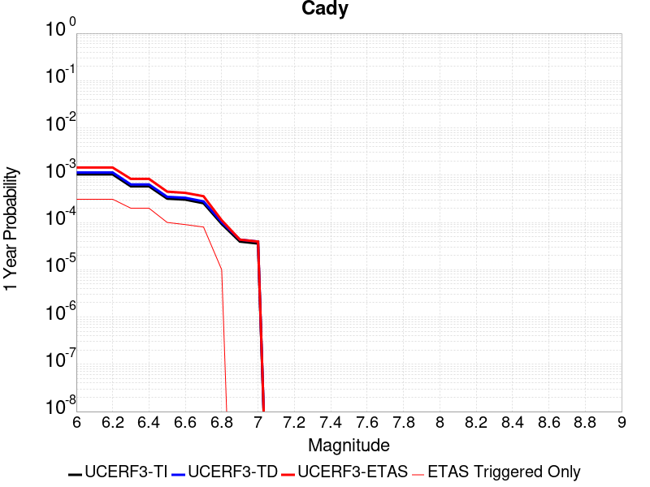 |  |

| Magnitude | 1 wk TI Prob | 1 wk TD Prob | 1 wk ETAS Prob | 1 wk ETAS/TD Gain | 1 wk ETAS Triggered Only | 1 mo TI Prob | 1 mo TD Prob | 1 mo ETAS Prob | 1 mo ETAS/TD Gain | 1 mo ETAS Triggered Only | 1 yr TI Prob | 1 yr TD Prob | 1 yr ETAS Prob | 1 yr ETAS/TD Gain | 1 yr ETAS Triggered Only | 10 yr TI Prob | 10 yr TD Prob | 10 yr ETAS Prob | 10 yr ETAS/TD Gain | 10 yr ETAS Triggered Only |
|-----|-----|-----|-----|-----|-----|-----|-----|-----|-----|-----|-----|-----|-----|-----|-----|-----|-----|-----|-----|-----|
| 6.0 | 1.9892565E-5 | 2.1858728E-5 | 1.6471275E-4 | 7.535331 | 1.4285714E-4 | 8.525106E-5 | 9.3677416E-5 | 2.6032847E-4 | 2.7789886 | 1.6666666E-4 | 0.0010374374 | 0.0011400167 | 0.0014967524 | 1.3129215 | 3.5714285E-4 | 0.010326075 | 0.011350701 | 0.011868564 | 1.045624 | 5.238095E-4 |
| 6.1 | 1.9892565E-5 | 2.1858728E-5 | 1.6471275E-4 | 7.535331 | 1.4285714E-4 | 8.525106E-5 | 9.3677416E-5 | 2.6032847E-4 | 2.7789886 | 1.6666666E-4 | 0.0010374374 | 0.0011400167 | 0.0014967524 | 1.3129215 | 3.5714285E-4 | 0.010326075 | 0.011350701 | 0.011868564 | 1.045624 | 5.238095E-4 |
| 6.2 | 1.9892565E-5 | 2.1858728E-5 | 1.6471275E-4 | 7.535331 | 1.4285714E-4 | 8.525106E-5 | 9.3677416E-5 | 2.6032847E-4 | 2.7789886 | 1.6666666E-4 | 0.0010374374 | 0.0011400167 | 0.0014967524 | 1.3129215 | 3.5714285E-4 | 0.010326075 | 0.011350701 | 0.011868564 | 1.045624 | 5.238095E-4 |
| 6.3 | 1.1117327E-5 | 1.2176583E-5 | 1.0741352E-4 | 8.821319 | 9.5238094E-5 | 4.764482E-5 | 5.2184492E-5 | 1.4741762E-4 | 2.8249316 | 9.5238094E-5 | 5.7992124E-4 | 6.351925E-4 | 8.493421E-4 | 1.3371413 | 2.1428571E-4 | 0.0057841022 | 0.0063368753 | 0.0066917553 | 1.0560023 | 3.5714285E-4 |
| 6.4 | 1.1117327E-5 | 1.2176583E-5 | 1.0741352E-4 | 8.821319 | 9.5238094E-5 | 4.764482E-5 | 5.2184492E-5 | 1.4741762E-4 | 2.8249316 | 9.5238094E-5 | 5.7992124E-4 | 6.351925E-4 | 8.493421E-4 | 1.3371413 | 2.1428571E-4 | 0.0057841022 | 0.0063368753 | 0.0066917553 | 1.0560023 | 3.5714285E-4 |
| 6.5 | 6.103093E-6 | 6.672021E-6 | 5.429075E-5 | 8.137077 | 4.7619047E-5 | 2.615585E-5 | 2.8594131E-5 | 7.6211814E-5 | 2.6652958 | 4.7619047E-5 | 3.1840094E-4 | 3.480905E-4 | 4.908979E-4 | 1.4102595 | 1.4285714E-4 | 0.0031794512 | 0.0034766865 | 0.003713954 | 1.0682453 | 2.3809524E-4 |
| 6.6 | 5.817237E-6 | 6.3656585E-6 | 3.0175031E-5 | 4.7402844 | 2.3809524E-5 | 2.4930776E-5 | 2.728118E-5 | 5.1090054E-5 | 1.8727217 | 2.3809524E-5 | 3.034899E-4 | 3.3211018E-4 | 4.5111825E-4 | 1.3583392 | 1.1904762E-4 | 0.0030307577 | 0.0033173605 | 0.0035309354 | 1.064381 | 2.1428571E-4 |
| 6.7 | 4.8846314E-6 | 5.3405684E-6 | 2.9149965E-5 | 5.4582143 | 2.3809524E-5 | 2.0933967E-5 | 2.2888014E-5 | 4.6696994E-5 | 2.040238 | 2.3809524E-5 | 2.5484123E-4 | 2.7863772E-4 | 3.9765218E-4 | 1.4271297 | 1.1904762E-4 | 0.0025454918 | 0.0027840391 | 0.0029502418 | 1.0596983 | 1.6666666E-4 |
| 6.8 | 1.7788773E-6 | 1.9399079E-6 | 2.5749385E-5 | 13.273509 | 2.3809524E-5 | 7.6237375E-6 | 8.313874E-6 | 3.21232E-5 | 3.8638065 | 2.3809524E-5 | 9.281505E-5 | 1.01218284E-4 | 1.250254E-4 | 1.2352057 | 2.3809524E-5 | 9.2776294E-4 | 0.0010118765 | 0.0010594473 | 1.0470126 | 4.7619047E-5 |
| 6.9 | 7.5455404E-7 | 8.297092E-7 | 8.297092E-7 | 1.0 | 0.0 | 3.233799E-6 | 3.5558937E-6 | 3.5558937E-6 | 1.0 | 0.0 | 3.937079E-5 | 4.3292483E-5 | 4.3292483E-5 | 1.0 | 0.0 | 3.9363815E-4 | 4.3287344E-4 | 4.3287344E-4 | 1.0 | 0.0 |
| 7.0 | 6.8578805E-7 | 7.541816E-7 | 7.541816E-7 | 1.0 | 0.0 | 2.9390883E-6 | 3.2322048E-6 | 3.2322048E-6 | 1.0 | 0.0 | 3.578281E-5 | 3.9351715E-5 | 3.9351715E-5 | 1.0 | 0.0 | 3.577705E-4 | 3.9347992E-4 | 3.9347992E-4 | 1.0 | 0.0 |

## Lake Isabella (Seismicity)
*[(top)](#table-of-contents)*

| 1 Week | 1 Month | 1 Year | 10 Year |
|-----|-----|-----|-----|
|  |  |  |  |

| Magnitude | 1 wk TI Prob | 1 wk TD Prob | 1 wk ETAS Prob | 1 wk ETAS/TD Gain | 1 wk ETAS Triggered Only | 1 mo TI Prob | 1 mo TD Prob | 1 mo ETAS Prob | 1 mo ETAS/TD Gain | 1 mo ETAS Triggered Only | 1 yr TI Prob | 1 yr TD Prob | 1 yr ETAS Prob | 1 yr ETAS/TD Gain | 1 yr ETAS Triggered Only | 10 yr TI Prob | 10 yr TD Prob | 10 yr ETAS Prob | 10 yr ETAS/TD Gain | 10 yr ETAS Triggered Only |
|-----|-----|-----|-----|-----|-----|-----|-----|-----|-----|-----|-----|-----|-----|-----|-----|-----|-----|-----|-----|-----|
| 6.0 | 9.431637E-6 | 9.741651E-6 | 2.0021599E-4 | 20.55257 | 1.9047619E-4 | 4.0420677E-5 | 4.1749343E-5 | 2.7983464E-4 | 6.7027316 | 2.3809524E-4 | 4.920106E-4 | 5.0819275E-4 | 8.651541E-4 | 1.7024133 | 3.5714285E-4 | 0.004909227 | 0.005071599 | 0.0056401296 | 1.1121008 | 5.7142857E-4 |
| 6.1 | 9.431637E-6 | 9.741651E-6 | 2.0021599E-4 | 20.55257 | 1.9047619E-4 | 4.0420677E-5 | 4.1749343E-5 | 2.7983464E-4 | 6.7027316 | 2.3809524E-4 | 4.920106E-4 | 5.0819275E-4 | 8.651541E-4 | 1.7024133 | 3.5714285E-4 | 0.004909227 | 0.005071599 | 0.0056401296 | 1.1121008 | 5.7142857E-4 |
| 6.2 | 9.431637E-6 | 9.741651E-6 | 2.0021599E-4 | 20.55257 | 1.9047619E-4 | 4.0420677E-5 | 4.1749343E-5 | 2.7983464E-4 | 6.7027316 | 2.3809524E-4 | 4.920106E-4 | 5.0819275E-4 | 8.651541E-4 | 1.7024133 | 3.5714285E-4 | 0.004909227 | 0.005071599 | 0.0056401296 | 1.1121008 | 5.7142857E-4 |
| 6.3 | 9.431637E-6 | 9.741651E-6 | 2.0021599E-4 | 20.55257 | 1.9047619E-4 | 4.0420677E-5 | 4.1749343E-5 | 2.7983464E-4 | 6.7027316 | 2.3809524E-4 | 4.920106E-4 | 5.0819275E-4 | 8.651541E-4 | 1.7024133 | 3.5714285E-4 | 0.004909227 | 0.005071599 | 0.0056401296 | 1.1121008 | 5.7142857E-4 |
| 6.4 | 5.144063E-6 | 5.3000763E-6 | 1.4815647E-4 | 27.953648 | 1.4285714E-4 | 2.2045799E-5 | 2.2714434E-5 | 2.131863E-4 | 9.385499 | 1.9047619E-4 | 2.6837454E-4 | 2.765166E-4 | 5.14546E-4 | 1.8608142 | 2.3809524E-4 | 0.0026805066 | 0.0027620657 | 0.0030469908 | 1.1031566 | 2.8571428E-4 |
| 6.5 | 5.144063E-6 | 5.3000763E-6 | 1.4815647E-4 | 27.953648 | 1.4285714E-4 | 2.2045799E-5 | 2.2714434E-5 | 2.131863E-4 | 9.385499 | 1.9047619E-4 | 2.6837454E-4 | 2.765166E-4 | 5.14546E-4 | 1.8608142 | 2.3809524E-4 | 0.0026805066 | 0.0027620657 | 0.0030469908 | 1.1031566 | 2.8571428E-4 |
| 6.6 | 3.4009804E-6 | 3.498786E-6 | 9.873655E-5 | 28.22023 | 9.5238094E-5 | 1.4575549E-5 | 1.4994721E-5 | 1.5784972E-4 | 10.5270195 | 1.4285714E-4 | 1.7744285E-4 | 1.8254704E-4 | 3.7298846E-4 | 2.0432458 | 1.9047619E-4 | 0.0017730123 | 0.0018241286 | 0.0020142572 | 1.1042299 | 1.9047619E-4 |
| 6.7 | 3.3880428E-6 | 3.4856528E-6 | 9.8723416E-5 | 28.322792 | 9.5238094E-5 | 1.4520103E-5 | 1.4938435E-5 | 1.5779345E-4 | 10.562917 | 1.4285714E-4 | 1.767679E-4 | 1.8186188E-4 | 3.7230342E-4 | 2.0471768 | 1.9047619E-4 | 0.0017662736 | 0.0018172882 | 0.0020074183 | 1.104623 | 1.9047619E-4 |
| 6.8 | 2.6582E-6 | 2.7337003E-6 | 2.6543159E-5 | 9.709609 | 2.3809524E-5 | 1.1392236E-5 | 1.1715813E-5 | 5.9334303E-5 | 5.064463 | 4.7619047E-5 | 1.3869164E-4 | 1.4263204E-4 | 2.1405041E-4 | 1.5007178 | 7.142857E-5 | 0.0013860512 | 0.0014255369 | 0.0014968637 | 1.050035 | 7.142857E-5 |
| 6.9 | 2.406011E-6 | 2.4743288E-6 | 2.6283793E-5 | 10.622595 | 2.3809524E-5 | 1.0311434E-5 | 1.0604231E-5 | 5.8222773E-5 | 5.490523 | 4.7619047E-5 | 1.2553448E-4 | 1.2910018E-4 | 2.0051953E-4 | 1.5532087 | 7.142857E-5 | 0.0012546359 | 0.0012903814 | 0.0013617178 | 1.0552832 | 7.142857E-5 |
| 7.0 | 1.6953097E-6 | 1.7429371E-6 | 2.555242E-5 | 14.660551 | 2.3809524E-5 | 7.265593E-6 | 7.469715E-6 | 5.5088407E-5 | 7.3749003 | 4.7619047E-5 | 8.8455E-5 | 9.094104E-5 | 1.3855576E-4 | 1.5235779 | 4.7619047E-5 | 8.84198E-4 | 9.09141E-4 | 9.567167E-4 | 1.0523305 | 4.7619047E-5 |
| 7.1 | 3.5013824E-7 | 3.5714822E-7 | 3.5714822E-7 | 1.0 | 0.0 | 1.5005916E-6 | 1.5306344E-6 | 1.5306344E-6 | 1.0 | 0.0 | 1.826955E-5 | 1.8635317E-5 | 1.8635317E-5 | 1.0 | 0.0 | 1.8268047E-4 | 1.863378E-4 | 1.863378E-4 | 1.0 | 0.0 |
| 7.2 | 2.2321095E-7 | 2.2750574E-7 | 2.2750574E-7 | 1.0 | 0.0 | 9.56618E-7 | 9.750242E-7 | 9.750242E-7 | 1.0 | 0.0 | 1.1646762E-5 | 1.1870856E-5 | 1.1870856E-5 | 1.0 | 0.0 | 1.1646151E-4 | 1.1870232E-4 | 1.1870232E-4 | 1.0 | 0.0 |
| 7.3 | 1.5760406E-7 | 1.6060922E-7 | 1.6060922E-7 | 1.0 | 0.0 | 6.7544585E-7 | 6.8832503E-7 | 6.8832503E-7 | 1.0 | 0.0 | 8.223522E-6 | 8.380326E-6 | 8.380326E-6 | 1.0 | 0.0 | 8.2232174E-5 | 8.3800165E-5 | 8.3800165E-5 | 1.0 | 0.0 |
| 7.4 | 1.1216497E-7 | 1.1431706E-7 | 1.1431706E-7 | 1.0 | 0.0 | 4.8070694E-7 | 4.899302E-7 | 4.899302E-7 | 1.0 | 0.0 | 5.852591E-6 | 5.964884E-6 | 5.964884E-6 | 1.0 | 0.0 | 5.8524372E-5 | 5.9647282E-5 | 5.9647282E-5 | 1.0 | 0.0 |
| 7.5 | 4.885185E-8 | 4.9787737E-8 | 4.9787737E-8 | 1.0 | 0.0 | 2.0936506E-7 | 2.13376E-7 | 2.13376E-7 | 1.0 | 0.0 | 2.5490165E-6 | 2.59785E-6 | 2.59785E-6 | 1.0 | 0.0 | 2.5489873E-5 | 2.5978214E-5 | 2.5978214E-5 | 1.0 | 0.0 |
| 7.6 | 1.504641E-9 | 1.5317903E-9 | 1.5317903E-9 | 1.0 | 0.0 | 6.4484613E-9 | 6.5648154E-9 | 6.5648154E-9 | 1.0 | 0.0 | 7.851001E-8 | 7.992663E-8 | 7.992663E-8 | 1.0 | 0.0 | 7.8509987E-7 | 7.992663E-7 | 7.992663E-7 | 1.0 | 0.0 |

## San Jacinto (San Jacinto Valley) rev
*[(top)](#table-of-contents)*

| 1 Week | 1 Month | 1 Year | 10 Year |
|-----|-----|-----|-----|
|  |  |  |  |

| Magnitude | 1 wk TI Prob | 1 wk TD Prob | 1 wk ETAS Prob | 1 wk ETAS/TD Gain | 1 wk ETAS Triggered Only | 1 mo TI Prob | 1 mo TD Prob | 1 mo ETAS Prob | 1 mo ETAS/TD Gain | 1 mo ETAS Triggered Only | 1 yr TI Prob | 1 yr TD Prob | 1 yr ETAS Prob | 1 yr ETAS/TD Gain | 1 yr ETAS Triggered Only | 10 yr TI Prob | 10 yr TD Prob | 10 yr ETAS Prob | 10 yr ETAS/TD Gain | 10 yr ETAS Triggered Only |
|-----|-----|-----|-----|-----|-----|-----|-----|-----|-----|-----|-----|-----|-----|-----|-----|-----|-----|-----|-----|-----|
| 6.0 | 3.652694E-5 | 3.4402394E-5 | 2.0106332E-4 | 5.8444576 | 1.6666666E-4 | 1.5653463E-4 | 1.474305E-4 | 4.569087E-4 | 3.0991461 | 3.095238E-4 | 0.0019041431 | 0.00179349 | 0.0022212928 | 1.2385309 | 4.2857142E-4 | 0.018879099 | 0.018526595 | 0.019064069 | 1.0290109 | 5.4761907E-4 |
| 6.1 | 3.652694E-5 | 3.4402394E-5 | 2.0106332E-4 | 5.8444576 | 1.6666666E-4 | 1.5653463E-4 | 1.474305E-4 | 4.569087E-4 | 3.0991461 | 3.095238E-4 | 0.0019041431 | 0.00179349 | 0.0022212928 | 1.2385309 | 4.2857142E-4 | 0.018879099 | 0.018526595 | 0.019064069 | 1.0290109 | 5.4761907E-4 |
| 6.2 | 3.652694E-5 | 3.4402394E-5 | 2.0106332E-4 | 5.8444576 | 1.6666666E-4 | 1.5653463E-4 | 1.474305E-4 | 4.569087E-4 | 3.0991461 | 3.095238E-4 | 0.0019041431 | 0.00179349 | 0.0022212928 | 1.2385309 | 4.2857142E-4 | 0.018879099 | 0.018526595 | 0.019064069 | 1.0290109 | 5.4761907E-4 |
| 6.3 | 3.652694E-5 | 3.4402394E-5 | 2.0106332E-4 | 5.8444576 | 1.6666666E-4 | 1.5653463E-4 | 1.474305E-4 | 4.569087E-4 | 3.0991461 | 3.095238E-4 | 0.0019041431 | 0.00179349 | 0.0022212928 | 1.2385309 | 4.2857142E-4 | 0.018879099 | 0.018526595 | 0.019064069 | 1.0290109 | 5.4761907E-4 |
| 6.4 | 3.646941E-5 | 3.432397E-5 | 2.0098491E-4 | 5.8555264 | 1.6666666E-4 | 1.5628811E-4 | 1.4709444E-4 | 4.565727E-4 | 3.1039426 | 3.095238E-4 | 0.0019011468 | 0.0017894056 | 0.0022172101 | 1.2390764 | 4.2857142E-4 | 0.018849645 | 0.018486476 | 0.019023972 | 1.029075 | 5.4761907E-4 |
| 6.5 | 3.646941E-5 | 3.432397E-5 | 2.0098491E-4 | 5.8555264 | 1.6666666E-4 | 1.5628811E-4 | 1.4709444E-4 | 4.565727E-4 | 3.1039426 | 3.095238E-4 | 0.0019011468 | 0.0017894056 | 0.0022172101 | 1.2390764 | 4.2857142E-4 | 0.018849645 | 0.018486476 | 0.019023972 | 1.029075 | 5.4761907E-4 |
| 6.6 | 3.6442503E-5 | 3.4287354E-5 | 2.009483E-4 | 5.860712 | 1.6666666E-4 | 1.561728E-4 | 1.4693754E-4 | 4.5641587E-4 | 3.1061897 | 3.095238E-4 | 0.0018997455 | 0.0017874985 | 0.002215304 | 1.2393318 | 4.2857142E-4 | 0.018835869 | 0.018467745 | 0.01900525 | 1.0291051 | 5.4761907E-4 |
| 6.7 | 3.6432113E-5 | 3.4272925E-5 | 2.0093388E-4 | 5.862758 | 1.6666666E-4 | 1.5612828E-4 | 1.4687571E-4 | 4.5635406E-4 | 3.1070764 | 3.095238E-4 | 0.0018992044 | 0.0017867472 | 0.0022145528 | 1.2394327 | 4.2857142E-4 | 0.018830549 | 0.018460369 | 0.018997878 | 1.029117 | 5.4761907E-4 |
| 6.8 | 3.6409598E-5 | 3.424198E-5 | 2.0090294E-4 | 5.8671527 | 1.6666666E-4 | 1.560318E-4 | 1.4674311E-4 | 4.562215E-4 | 3.1089807 | 3.095238E-4 | 0.0018980318 | 0.0017851355 | 0.0022129419 | 1.2396493 | 4.2857142E-4 | 0.018819023 | 0.018444523 | 0.018982042 | 1.0291425 | 5.4761907E-4 |
| 6.9 | 3.638078E-5 | 3.4202407E-5 | 2.0086337E-4 | 5.872785 | 1.6666666E-4 | 1.5590832E-4 | 1.4657351E-4 | 4.5605196E-4 | 3.1114213 | 3.095238E-4 | 0.0018965311 | 0.001783074 | 0.0022108813 | 1.2399268 | 4.2857142E-4 | 0.018804269 | 0.018424258 | 0.018961787 | 1.029175 | 5.4761907E-4 |
| 7.0 | 3.6294874E-5 | 3.408442E-5 | 2.007454E-4 | 5.889653 | 1.6666666E-4 | 1.5554018E-4 | 1.4606792E-4 | 4.3174048E-4 | 2.9557514 | 2.8571428E-4 | 0.0018920569 | 0.001776929 | 0.0021809717 | 1.2273825 | 4.047619E-4 | 0.018760284 | 0.018363839 | 0.01887803 | 1.0280001 | 5.238095E-4 |
| 7.1 | 3.6260717E-5 | 3.4040702E-5 | 2.0070169E-4 | 5.8959327 | 1.6666666E-4 | 1.5539382E-4 | 1.4588058E-4 | 4.315532E-4 | 2.9582634 | 2.8571428E-4 | 0.001890278 | 0.0017746518 | 0.0021786955 | 1.2276748 | 4.047619E-4 | 0.018742796 | 0.018341439 | 0.018855643 | 1.028035 | 5.238095E-4 |
| 7.2 | 3.6210204E-5 | 3.397492E-5 | 2.0063593E-4 | 5.9054127 | 1.6666666E-4 | 1.5517735E-4 | 1.455987E-4 | 4.312714E-4 | 2.9620552 | 2.8571428E-4 | 0.001887647 | 0.0017712255 | 0.0021752703 | 1.228116 | 4.047619E-4 | 0.01871693 | 0.01830772 | 0.01882194 | 1.0280876 | 5.238095E-4 |
| 7.3 | 3.6119454E-5 | 3.386321E-5 | 2.0052423E-4 | 5.921596 | 1.6666666E-4 | 1.5478847E-4 | 1.4511998E-4 | 4.307928E-4 | 2.9685285 | 2.8571428E-4 | 0.0018829206 | 0.0017654065 | 0.0021694538 | 1.2288693 | 4.047619E-4 | 0.018670462 | 0.018250274 | 0.018764522 | 1.0281776 | 5.238095E-4 |
| 7.4 | 3.607848E-5 | 3.381071E-5 | 2.0047174E-4 | 5.9292383 | 1.6666666E-4 | 1.5461289E-4 | 1.44895E-4 | 4.305679E-4 | 2.9715855 | 2.8571428E-4 | 0.0018807866 | 0.0017626719 | 0.0021667203 | 1.229225 | 4.047619E-4 | 0.018649481 | 0.018223269 | 0.018737532 | 1.0282202 | 5.238095E-4 |
| 7.5 | 3.5856774E-5 | 3.3620483E-5 | 2.0028155E-4 | 5.957129 | 1.6666666E-4 | 1.5366284E-4 | 1.4407984E-4 | 4.2975295E-4 | 2.9827418 | 2.8571428E-4 | 0.0018692396 | 0.0017527633 | 0.0021568157 | 1.2305231 | 4.047619E-4 | 0.018535944 | 0.018124366 | 0.018638682 | 1.028377 | 5.238095E-4 |
| 7.6 | 3.286655E-5 | 3.2143445E-5 | 1.9880476E-4 | 6.1849236 | 1.6666666E-4 | 1.4084904E-4 | 1.3775036E-4 | 4.2342528E-4 | 3.0738597 | 2.8571428E-4 | 0.001713488 | 0.0016758227 | 0.0020799062 | 1.2411255 | 4.047619E-4 | 0.017003361 | 0.017344031 | 0.017858755 | 1.0296773 | 5.238095E-4 |
| 7.7 | 2.8882527E-5 | 2.9236293E-5 | 1.9589809E-4 | 6.7005105 | 1.6666666E-4 | 1.237764E-4 | 1.2529238E-4 | 4.1097088E-4 | 3.2800944 | 2.8571428E-4 | 0.0015059357 | 0.0015243685 | 0.0019285134 | 1.2651228 | 4.047619E-4 | 0.014957713 | 0.015830461 | 0.016345978 | 1.0325649 | 5.238095E-4 |
| 7.8 | 2.4950225E-5 | 2.6527203E-5 | 1.9318945E-4 | 7.282692 | 1.6666666E-4 | 1.0692515E-4 | 1.1368306E-4 | 3.9936486E-4 | 3.512967 | 2.8571428E-4 | 0.0013010362 | 0.0013832134 | 0.0017874155 | 1.2922195 | 4.047619E-4 | 0.012934455 | 0.014411755 | 0.014928015 | 1.0358222 | 5.238095E-4 |
| 7.9 | 1.9881603E-5 | 2.1507445E-5 | 1.8817052E-4 | 8.749087 | 1.6666666E-4 | 8.520408E-5 | 9.217151E-5 | 3.7785945E-4 | 4.0995255 | 2.8571428E-4 | 0.001036866 | 0.0011216112 | 0.0015021364 | 1.3392664 | 3.8095238E-4 | 0.010320415 | 0.011777027 | 0.012271138 | 1.0419556 | 5.0E-4 |
| 8.0 | 1.563292E-5 | 1.5937347E-5 | 1.3498307E-4 | 8.469607 | 1.1904762E-4 | 6.6996516E-5 | 6.8301124E-5 | 3.063801E-4 | 4.4857254 | 2.3809524E-4 | 8.153773E-4 | 8.3124964E-4 | 0.0011643058 | 1.4006693 | 3.3333333E-4 | 0.00812392 | 0.008810506 | 0.009235302 | 1.0482147 | 4.2857142E-4 |
| 8.1 | 1.0045313E-5 | 8.301802E-6 | 7.972978E-5 | 9.603912 | 7.142857E-5 | 4.305063E-5 | 3.5578672E-5 | 1.5462206E-4 | 4.34592 | 1.1904762E-4 | 5.2401534E-4 | 4.3308473E-4 | 5.9967925E-4 | 1.3846695 | 1.6666666E-4 | 0.0052278144 | 0.0046591135 | 0.0048960997 | 1.050865 | 2.3809524E-4 |
| 8.2 | 4.1554413E-6 | 1.5655598E-6 | 1.5655598E-6 | 1.0 | 0.0 | 1.7808914E-5 | 6.709525E-6 | 6.709525E-6 | 1.0 | 0.0 | 2.1680194E-4 | 8.168544E-5 | 8.168544E-5 | 1.0 | 0.0 | 0.0021659054 | 9.482903E-4 | 9.482903E-4 | 1.0 | 0.0 |
| 8.3 | 1.2758221E-6 | 3.6149942E-7 | 3.6149942E-7 | 1.0 | 0.0 | 5.4677976E-6 | 1.5492824E-6 | 1.5492824E-6 | 1.0 | 0.0 | 6.65684E-5 | 1.8862354E-5 | 1.8862354E-5 | 1.0 | 0.0 | 6.6548464E-4 | 2.2751294E-4 | 2.2751294E-4 | 1.0 | 0.0 |

## Red Pass
*[(top)](#table-of-contents)*

| 1 Week | 1 Month | 1 Year | 10 Year |
|-----|-----|-----|-----|
|  |  |  |  |

| Magnitude | 1 wk TI Prob | 1 wk TD Prob | 1 wk ETAS Prob | 1 wk ETAS/TD Gain | 1 wk ETAS Triggered Only | 1 mo TI Prob | 1 mo TD Prob | 1 mo ETAS Prob | 1 mo ETAS/TD Gain | 1 mo ETAS Triggered Only | 1 yr TI Prob | 1 yr TD Prob | 1 yr ETAS Prob | 1 yr ETAS/TD Gain | 1 yr ETAS Triggered Only | 10 yr TI Prob | 10 yr TD Prob | 10 yr ETAS Prob | 10 yr ETAS/TD Gain | 10 yr ETAS Triggered Only |
|-----|-----|-----|-----|-----|-----|-----|-----|-----|-----|-----|-----|-----|-----|-----|-----|-----|-----|-----|-----|-----|
| 6.0 | 8.258278E-6 | 8.551265E-6 | 3.2360585E-5 | 3.784304 | 2.3809524E-5 | 3.539214E-5 | 3.6647863E-5 | 6.0456514E-5 | 1.64966 | 2.3809524E-5 | 4.308141E-4 | 4.4611428E-4 | 6.127066E-4 | 1.3734297 | 1.6666666E-4 | 0.0042997985 | 0.004453945 | 0.0048806076 | 1.0957943 | 4.2857142E-4 |
| 6.1 | 3.649988E-6 | 3.7753161E-6 | 3.7753161E-6 | 1.0 | 0.0 | 1.5642712E-5 | 1.6179853E-5 | 1.6179853E-5 | 1.0 | 0.0 | 1.9043336E-4 | 1.9697666E-4 | 2.4458632E-4 | 1.2417021 | 4.7619047E-5 | 0.0019027026 | 0.001968488 | 0.002182352 | 1.1086438 | 2.1428571E-4 |
| 6.2 | 3.649988E-6 | 3.7753161E-6 | 3.7753161E-6 | 1.0 | 0.0 | 1.5642712E-5 | 1.6179853E-5 | 1.6179853E-5 | 1.0 | 0.0 | 1.9043336E-4 | 1.9697666E-4 | 2.4458632E-4 | 1.2417021 | 4.7619047E-5 | 0.0019027026 | 0.001968488 | 0.002182352 | 1.1086438 | 2.1428571E-4 |
| 6.3 | 1.3924937E-6 | 1.4411166E-6 | 1.4411166E-6 | 1.0 | 0.0 | 5.9678164E-6 | 6.1762075E-6 | 6.1762075E-6 | 1.0 | 0.0 | 7.265574E-5 | 7.519415E-5 | 7.519415E-5 | 1.0 | 0.0 | 7.263199E-4 | 7.518258E-4 | 7.9940906E-4 | 1.0632902 | 4.7619047E-5 |
| 6.4 | 1.3924937E-6 | 1.4411166E-6 | 1.4411166E-6 | 1.0 | 0.0 | 5.9678164E-6 | 6.1762075E-6 | 6.1762075E-6 | 1.0 | 0.0 | 7.265574E-5 | 7.519415E-5 | 7.519415E-5 | 1.0 | 0.0 | 7.263199E-4 | 7.518258E-4 | 7.9940906E-4 | 1.0632902 | 4.7619047E-5 |
| 6.5 | 9.876812E-7 | 1.0221912E-6 | 1.0221912E-6 | 1.0 | 0.0 | 4.2329125E-6 | 4.3808195E-6 | 4.3808195E-6 | 1.0 | 0.0 | 5.153449E-5 | 5.3336476E-5 | 5.3336476E-5 | 1.0 | 0.0 | 5.1522546E-4 | 5.333648E-4 | 5.8095844E-4 | 1.0892328 | 4.7619047E-5 |

## San Jacinto (Stepovers Combined)
*[(top)](#table-of-contents)*

| 1 Week | 1 Month | 1 Year | 10 Year |
|-----|-----|-----|-----|
|  |  |  | 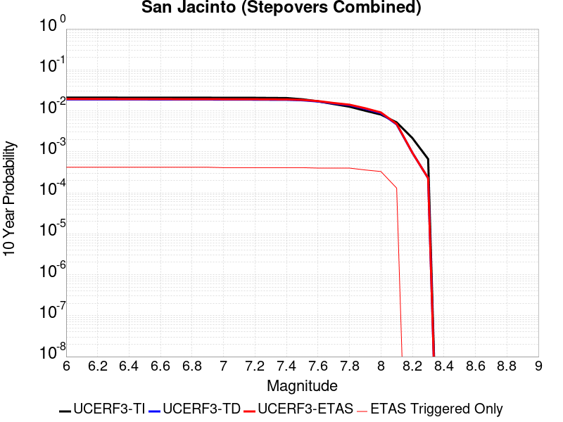 |

| Magnitude | 1 wk TI Prob | 1 wk TD Prob | 1 wk ETAS Prob | 1 wk ETAS/TD Gain | 1 wk ETAS Triggered Only | 1 mo TI Prob | 1 mo TD Prob | 1 mo ETAS Prob | 1 mo ETAS/TD Gain | 1 mo ETAS Triggered Only | 1 yr TI Prob | 1 yr TD Prob | 1 yr ETAS Prob | 1 yr ETAS/TD Gain | 1 yr ETAS Triggered Only | 10 yr TI Prob | 10 yr TD Prob | 10 yr ETAS Prob | 10 yr ETAS/TD Gain | 10 yr ETAS Triggered Only |
|-----|-----|-----|-----|-----|-----|-----|-----|-----|-----|-----|-----|-----|-----|-----|-----|-----|-----|-----|-----|-----|
| 6.0 | 4.0667746E-5 | 3.5272755E-5 | 1.7812486E-4 | 5.0499277 | 1.4285714E-4 | 1.742787E-4 | 1.5116022E-4 | 4.368313E-4 | 2.8898563 | 2.8571428E-4 | 0.0021197782 | 0.0018388226 | 0.0022428404 | 1.2197154 | 4.047619E-4 | 0.020996714 | 0.018986892 | 0.019500755 | 1.0270642 | 5.238095E-4 |
| 6.1 | 4.0667746E-5 | 3.5272755E-5 | 1.7812486E-4 | 5.0499277 | 1.4285714E-4 | 1.742787E-4 | 1.5116022E-4 | 4.368313E-4 | 2.8898563 | 2.8571428E-4 | 0.0021197782 | 0.0018388226 | 0.0022428404 | 1.2197154 | 4.047619E-4 | 0.020996714 | 0.018986892 | 0.019500755 | 1.0270642 | 5.238095E-4 |
| 6.2 | 4.0667746E-5 | 3.5272755E-5 | 1.7812486E-4 | 5.0499277 | 1.4285714E-4 | 1.742787E-4 | 1.5116022E-4 | 4.368313E-4 | 2.8898563 | 2.8571428E-4 | 0.0021197782 | 0.0018388226 | 0.0022428404 | 1.2197154 | 4.047619E-4 | 0.020996714 | 0.018986892 | 0.019500755 | 1.0270642 | 5.238095E-4 |
| 6.3 | 4.0667746E-5 | 3.5272755E-5 | 1.7812486E-4 | 5.0499277 | 1.4285714E-4 | 1.742787E-4 | 1.5116022E-4 | 4.368313E-4 | 2.8898563 | 2.8571428E-4 | 0.0021197782 | 0.0018388226 | 0.0022428404 | 1.2197154 | 4.047619E-4 | 0.020996714 | 0.018986892 | 0.019500755 | 1.0270642 | 5.238095E-4 |
| 6.4 | 4.0577226E-5 | 3.5144654E-5 | 1.7799677E-4 | 5.0646896 | 1.4285714E-4 | 1.738908E-4 | 1.5061127E-4 | 4.362825E-4 | 2.8967454 | 2.8571428E-4 | 0.0021150648 | 0.0018321523 | 0.0022361726 | 1.2205168 | 4.047619E-4 | 0.020950472 | 0.018921461 | 0.01943536 | 1.0271596 | 5.238095E-4 |
| 6.5 | 4.0577226E-5 | 3.5144654E-5 | 1.7799677E-4 | 5.0646896 | 1.4285714E-4 | 1.738908E-4 | 1.5061127E-4 | 4.362825E-4 | 2.8967454 | 2.8571428E-4 | 0.0021150648 | 0.0018321523 | 0.0022361726 | 1.2205168 | 4.047619E-4 | 0.020950472 | 0.018921461 | 0.01943536 | 1.0271596 | 5.238095E-4 |
| 6.6 | 4.053861E-5 | 3.509E-5 | 1.7794213E-4 | 5.071021 | 1.4285714E-4 | 1.7372532E-4 | 1.5037706E-4 | 4.360484E-4 | 2.8997 | 2.8571428E-4 | 0.0021130538 | 0.0018293057 | 0.0022333271 | 1.2208606 | 4.047619E-4 | 0.020930743 | 0.018893538 | 0.019407451 | 1.0272005 | 5.238095E-4 |
| 6.7 | 4.0516545E-5 | 3.5059067E-5 | 1.779112E-4 | 5.074613 | 1.4285714E-4 | 1.7363077E-4 | 1.5024451E-4 | 4.3591586E-4 | 2.9013762 | 2.8571428E-4 | 0.002111905 | 0.001827695 | 0.002231717 | 1.2210555 | 4.047619E-4 | 0.020919468 | 0.018877735 | 0.019391656 | 1.0272237 | 5.238095E-4 |
| 6.8 | 4.049434E-5 | 3.5030633E-5 | 1.7788277E-4 | 5.077921 | 1.4285714E-4 | 1.7353562E-4 | 1.5012265E-4 | 4.3579403E-4 | 2.90292 | 2.8571428E-4 | 0.0021107488 | 0.0018262138 | 0.0022302365 | 1.2212352 | 4.047619E-4 | 0.020908125 | 0.018863149 | 0.019377077 | 1.0272452 | 5.238095E-4 |
| 6.9 | 4.046386E-5 | 3.499319E-5 | 1.7784533E-4 | 5.082284 | 1.4285714E-4 | 1.73405E-4 | 1.4996222E-4 | 4.3563364E-4 | 2.904956 | 2.8571428E-4 | 0.0021091616 | 0.0018242638 | 0.0022282873 | 1.2214721 | 4.047619E-4 | 0.020892553 | 0.01884392 | 0.01935786 | 1.0272734 | 5.238095E-4 |
| 7.0 | 4.036382E-5 | 3.487376E-5 | 1.7772592E-4 | 5.0962653 | 1.4285714E-4 | 1.7297632E-4 | 1.4945042E-4 | 4.1131605E-4 | 2.7521906 | 2.6190476E-4 | 0.0021039525 | 0.0018180435 | 0.0021983034 | 1.2091588 | 3.8095238E-4 | 0.02084144 | 0.018782536 | 0.019273145 | 1.0261204 | 5.0E-4 |
| 7.1 | 4.0343282E-5 | 3.4852223E-5 | 1.7770438E-4 | 5.0987964 | 1.4285714E-4 | 1.7288832E-4 | 1.4935812E-4 | 4.1122377E-4 | 2.7532735 | 2.6190476E-4 | 0.002102883 | 0.0018169218 | 0.002197182 | 1.2092881 | 3.8095238E-4 | 0.020830948 | 0.018771412 | 0.019262027 | 1.0261363 | 5.0E-4 |
| 7.2 | 4.0257353E-5 | 3.4756722E-5 | 1.776089E-4 | 5.110059 | 1.4285714E-4 | 1.725201E-4 | 1.489489E-4 | 4.1081465E-4 | 2.7580912 | 2.6190476E-4 | 0.0020984085 | 0.0018119477 | 0.0021922097 | 1.2098638 | 3.8095238E-4 | 0.020787042 | 0.018722152 | 0.019212792 | 1.0262064 | 5.0E-4 |
| 7.3 | 3.9940667E-5 | 3.4584376E-5 | 1.7743658E-4 | 5.1305413 | 1.4285714E-4 | 1.7116306E-4 | 1.4821035E-4 | 4.100763E-4 | 2.766853 | 2.6190476E-4 | 0.0020819185 | 0.0018029709 | 0.0021832364 | 1.2109106 | 3.8095238E-4 | 0.020625217 | 0.018630784 | 0.019121468 | 1.0263373 | 5.0E-4 |
| 7.4 | 3.9721202E-5 | 3.4469766E-5 | 1.7732198E-4 | 5.1442757 | 1.4285714E-4 | 1.7022261E-4 | 1.4771923E-4 | 4.095853E-4 | 2.7727284 | 2.6190476E-4 | 0.0020704903 | 0.0017970012 | 0.002177269 | 1.2116125 | 3.8095238E-4 | 0.020513052 | 0.018569905 | 0.019060621 | 1.0264252 | 5.0E-4 |
| 7.5 | 3.7036873E-5 | 3.3537188E-5 | 1.7638954E-4 | 5.259521 | 1.4285714E-4 | 1.5871979E-4 | 1.437229E-4 | 4.0559002E-4 | 2.822028 | 2.6190476E-4 | 0.0019307006 | 0.0017484248 | 0.0021287112 | 1.2175022 | 3.8095238E-4 | 0.019140124 | 0.018071463 | 0.018562429 | 1.0271679 | 5.0E-4 |
| 7.6 | 3.2940967E-5 | 3.1317984E-5 | 1.7417065E-4 | 5.561362 | 1.4285714E-4 | 1.4116794E-4 | 1.3421304E-4 | 3.9608264E-4 | 2.9511487 | 2.6190476E-4 | 0.0017173645 | 0.0016328214 | 0.0020131518 | 1.2329283 | 3.8095238E-4 | 0.01704153 | 0.016904354 | 0.0173959 | 1.0290781 | 5.0E-4 |
| 7.7 | 2.8236149E-5 | 2.7883889E-5 | 1.7073705E-4 | 6.123143 | 1.4285714E-4 | 1.2100645E-4 | 1.19496915E-4 | 3.813704E-4 | 3.1914663 | 2.6190476E-4 | 0.0014722579 | 0.001453905 | 0.0018343036 | 1.2616391 | 3.8095238E-4 | 0.014625421 | 0.015115095 | 0.015607538 | 1.0325795 | 5.0E-4 |
| 7.8 | 2.4329287E-5 | 2.5207537E-5 | 1.6806107E-4 | 6.6670966 | 1.4285714E-4 | 1.042642E-4 | 1.0802783E-4 | 3.699043E-4 | 3.4241574 | 2.6190476E-4 | 0.0012686774 | 0.0013144462 | 0.0016948978 | 1.2894387 | 3.8095238E-4 | 0.012614589 | 0.013712396 | 0.01420554 | 1.0359634 | 5.0E-4 |
| 7.9 | 1.9370926E-5 | 2.0421452E-5 | 1.6327568E-4 | 7.995302 | 1.4285714E-4 | 8.301561E-5 | 8.7517576E-5 | 3.4939943E-4 | 3.9923344 | 2.6190476E-4 | 0.0010102465 | 0.0010650064 | 0.0014217689 | 1.3349862 | 3.5714285E-4 | 0.0100566605 | 0.011199483 | 0.01167034 | 1.0420427 | 4.7619047E-4 |
| 8.0 | 1.5583017E-5 | 1.588647E-5 | 1.349322E-4 | 8.49353 | 1.1904762E-4 | 6.6782646E-5 | 6.808309E-5 | 3.061621E-4 | 4.496889 | 2.3809524E-4 | 8.127754E-4 | 8.285971E-4 | 0.0011616542 | 1.4019531 | 3.3333333E-4 | 0.008098091 | 0.008781809 | 0.009206617 | 1.0483736 | 4.2857142E-4 |
| 8.1 | 1.0024873E-5 | 8.292404E-6 | 7.972038E-5 | 9.613664 | 7.142857E-5 | 4.2963035E-5 | 3.5538393E-5 | 1.5458178E-4 | 4.3497124 | 1.1904762E-4 | 5.229494E-4 | 4.3259456E-4 | 5.9918914E-4 | 1.3851056 | 1.6666666E-4 | 0.0052172043 | 0.0046534105 | 0.0048903977 | 1.0509276 | 2.3809524E-4 |
| 8.2 | 4.142796E-6 | 1.5610041E-6 | 1.5610041E-6 | 1.0 | 0.0 | 1.775472E-5 | 6.69E-6 | 6.69E-6 | 1.0 | 0.0 | 2.1614227E-4 | 8.144774E-5 | 8.144774E-5 | 1.0 | 0.0 | 0.0021593217 | 9.454649E-4 | 9.454649E-4 | 1.0 | 0.0 |
| 8.3 | 1.2750878E-6 | 3.612133E-7 | 3.612133E-7 | 1.0 | 0.0 | 5.4646503E-6 | 1.548056E-6 | 1.548056E-6 | 1.0 | 0.0 | 6.653009E-5 | 1.8847424E-5 | 1.8847424E-5 | 1.0 | 0.0 | 6.6510175E-4 | 2.2734253E-4 | 2.2734253E-4 | 1.0 | 0.0 |

## Sierra Nevada  (No Extension)
*[(top)](#table-of-contents)*

| 1 Week | 1 Month | 1 Year | 10 Year |
|-----|-----|-----|-----|
| 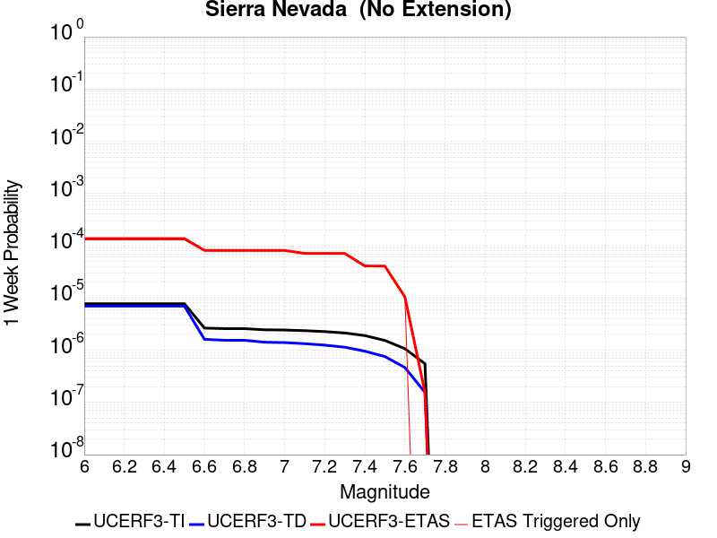 |  |  | 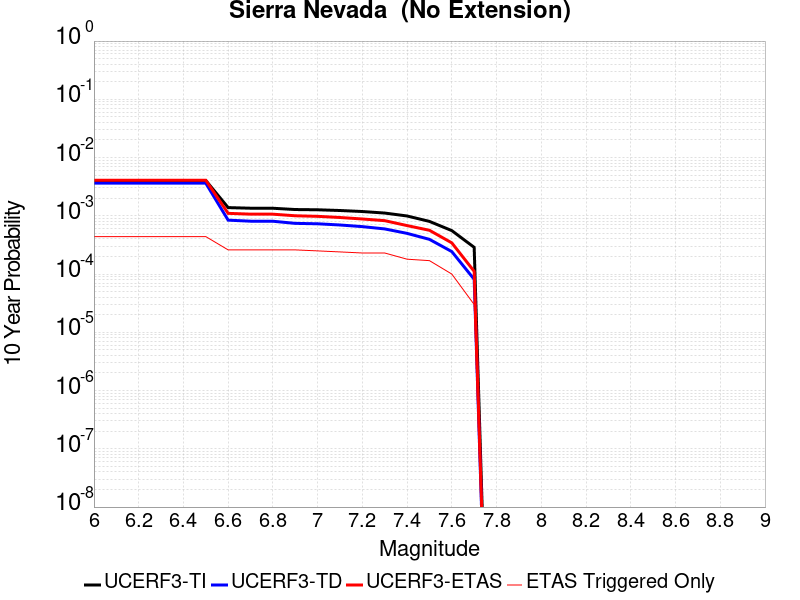 |

| Magnitude | 1 wk TI Prob | 1 wk TD Prob | 1 wk ETAS Prob | 1 wk ETAS/TD Gain | 1 wk ETAS Triggered Only | 1 mo TI Prob | 1 mo TD Prob | 1 mo ETAS Prob | 1 mo ETAS/TD Gain | 1 mo ETAS Triggered Only | 1 yr TI Prob | 1 yr TD Prob | 1 yr ETAS Prob | 1 yr ETAS/TD Gain | 1 yr ETAS Triggered Only | 10 yr TI Prob | 10 yr TD Prob | 10 yr ETAS Prob | 10 yr ETAS/TD Gain | 10 yr ETAS Triggered Only |
|-----|-----|-----|-----|-----|-----|-----|-----|-----|-----|-----|-----|-----|-----|-----|-----|-----|-----|-----|-----|-----|
| 6.0 | 7.7690465E-6 | 6.976322E-6 | 1.4983247E-4 | 21.477287 | 1.4285714E-4 | 3.329549E-5 | 2.9898381E-5 | 2.4417767E-4 | 8.16692 | 2.1428571E-4 | 4.0529718E-4 | 3.6398784E-4 | 6.7339896E-4 | 1.850059 | 3.095238E-4 | 0.004045588 | 0.0036374326 | 0.004088168 | 1.1239158 | 4.5238095E-4 |
| 6.1 | 7.7690465E-6 | 6.976322E-6 | 1.4983247E-4 | 21.477287 | 1.4285714E-4 | 3.329549E-5 | 2.9898381E-5 | 2.4417767E-4 | 8.16692 | 2.1428571E-4 | 4.0529718E-4 | 3.6398784E-4 | 6.7339896E-4 | 1.850059 | 3.095238E-4 | 0.004045588 | 0.0036374326 | 0.004088168 | 1.1239158 | 4.5238095E-4 |
| 6.2 | 7.7690465E-6 | 6.976322E-6 | 1.4983247E-4 | 21.477287 | 1.4285714E-4 | 3.329549E-5 | 2.9898381E-5 | 2.4417767E-4 | 8.16692 | 2.1428571E-4 | 4.0529718E-4 | 3.6398784E-4 | 6.7339896E-4 | 1.850059 | 3.095238E-4 | 0.004045588 | 0.0036374326 | 0.004088168 | 1.1239158 | 4.5238095E-4 |
| 6.3 | 7.7690465E-6 | 6.976322E-6 | 1.4983247E-4 | 21.477287 | 1.4285714E-4 | 3.329549E-5 | 2.9898381E-5 | 2.4417767E-4 | 8.16692 | 2.1428571E-4 | 4.0529718E-4 | 3.6398784E-4 | 6.7339896E-4 | 1.850059 | 3.095238E-4 | 0.004045588 | 0.0036374326 | 0.004088168 | 1.1239158 | 4.5238095E-4 |
| 6.4 | 7.7690465E-6 | 6.976322E-6 | 1.4983247E-4 | 21.477287 | 1.4285714E-4 | 3.329549E-5 | 2.9898381E-5 | 2.4417767E-4 | 8.16692 | 2.1428571E-4 | 4.0529718E-4 | 3.6398784E-4 | 6.7339896E-4 | 1.850059 | 3.095238E-4 | 0.004045588 | 0.0036374326 | 0.004088168 | 1.1239158 | 4.5238095E-4 |
| 6.5 | 7.7690465E-6 | 6.976322E-6 | 1.4983247E-4 | 21.477287 | 1.4285714E-4 | 3.329549E-5 | 2.9898381E-5 | 2.4417767E-4 | 8.16692 | 2.1428571E-4 | 4.0529718E-4 | 3.6398784E-4 | 6.7339896E-4 | 1.850059 | 3.095238E-4 | 0.004045588 | 0.0036374326 | 0.004088168 | 1.1239158 | 4.5238095E-4 |
| 6.6 | 2.653E-6 | 1.614854E-6 | 4.9233826E-5 | 30.488096 | 4.7619047E-5 | 1.136995E-5 | 6.9207845E-6 | 1.2596758E-4 | 18.201344 | 1.1904762E-4 | 1.3842035E-4 | 8.425733E-5 | 2.5090994E-4 | 2.9779007 | 1.6666666E-4 | 0.0013833415 | 8.422573E-4 | 0.001032573 | 1.2259592 | 1.9047619E-4 |
| 6.7 | 2.5902466E-6 | 1.5501876E-6 | 4.916916E-5 | 31.718203 | 4.7619047E-5 | 1.11010095E-5 | 6.643644E-6 | 1.2569047E-4 | 18.918905 | 1.1904762E-4 | 1.351464E-4 | 8.0883394E-5 | 2.4753658E-4 | 3.060413 | 1.6666666E-4 | 0.0013506424 | 8.0854254E-4 | 9.988648E-4 | 1.2353892 | 1.9047619E-4 |
| 6.8 | 2.5853892E-6 | 1.5469877E-6 | 4.9165963E-5 | 31.78174 | 4.7619047E-5 | 1.1080193E-5 | 6.629931E-6 | 1.2567676E-4 | 18.955969 | 1.1904762E-4 | 1.34893E-4 | 8.071645E-5 | 2.4736967E-4 | 3.0646749 | 1.6666666E-4 | 0.0013481114 | 8.068743E-4 | 9.971968E-4 | 1.2358763 | 1.9047619E-4 |
| 6.9 | 2.458257E-6 | 1.4220619E-6 | 4.9041042E-5 | 34.485867 | 4.7619047E-5 | 1.0535345E-5 | 6.094537E-6 | 1.2514144E-4 | 20.533377 | 1.1904762E-4 | 1.2826028E-4 | 7.4198484E-5 | 2.4085278E-4 | 3.2460608 | 1.6666666E-4 | 0.0012818627 | 7.4173906E-4 | 9.32074E-4 | 1.2566063 | 1.9047619E-4 |
| 7.0 | 2.4341468E-6 | 1.3990258E-6 | 4.9018006E-5 | 35.037243 | 4.7619047E-5 | 1.0432016E-5 | 5.9958115E-6 | 1.2504272E-4 | 20.855013 | 1.1904762E-4 | 1.270024E-4 | 7.2996576E-5 | 2.3965108E-4 | 3.2830455 | 1.6666666E-4 | 0.0012692984 | 7.297279E-4 | 9.200651E-4 | 1.2608331 | 1.9047619E-4 |
| 7.1 | 2.3652476E-6 | 1.3339754E-6 | 4.895296E-5 | 36.69705 | 4.7619047E-5 | 1.0136736E-5 | 5.717025E-6 | 1.2476396E-4 | 21.82323 | 1.1904762E-4 | 1.2340778E-4 | 6.9602575E-5 | 2.3625763E-4 | 3.3943808 | 1.6666666E-4 | 0.0012333926 | 6.9580943E-4 | 8.861531E-4 | 1.2735572 | 1.9047619E-4 |
| 7.2 | 2.272158E-6 | 1.2502821E-6 | 4.886927E-5 | 39.086594 | 4.7619047E-5 | 9.737784E-6 | 5.3583412E-6 | 1.0059593E-4 | 18.773706 | 9.5238094E-5 | 1.1855107E-4 | 6.5235865E-5 | 2.0808369E-4 | 3.189713 | 1.4285714E-4 | 0.0011848784 | 6.5216864E-4 | 8.187266E-4 | 1.255391 | 1.6666666E-4 |
| 7.3 | 2.1382127E-6 | 1.1419703E-6 | 4.8760965E-5 | 42.69898 | 4.7619047E-5 | 9.163737E-6 | 4.8941492E-6 | 1.0013178E-4 | 20.459486 | 9.5238094E-5 | 1.1156279E-4 | 5.958465E-5 | 2.0243328E-4 | 3.3974066 | 1.4285714E-4 | 0.001115068 | 5.956879E-4 | 7.622553E-4 | 1.279622 | 1.6666666E-4 |
| 7.4 | 1.9048055E-6 | 9.575242E-7 | 4.8576527E-5 | 50.73138 | 4.7619047E-5 | 8.163426E-6 | 4.1036687E-6 | 9.934137E-5 | 24.207941 | 9.5238094E-5 | 9.9385186E-5 | 4.996103E-5 | 1.690027E-4 | 3.3826904 | 1.1904762E-4 | 9.934074E-4 | 4.994987E-4 | 6.4228446E-4 | 1.2858582 | 1.4285714E-4 |
| 7.5 | 1.5373403E-6 | 7.560042E-7 | 4.8375015E-5 | 63.98776 | 4.7619047E-5 | 6.5885843E-6 | 3.2400142E-6 | 9.84778E-5 | 30.39425 | 9.5238094E-5 | 8.021306E-5 | 3.9446462E-5 | 1.5848939E-4 | 4.017835 | 1.1904762E-4 | 8.0184115E-4 | 3.943951E-4 | 5.371959E-4 | 1.3620756 | 1.4285714E-4 |
| 7.6 | 1.0680322E-6 | 4.6596554E-7 | 4.6596554E-7 | 1.0 | 0.0 | 4.577273E-6 | 1.9969937E-6 | 2.580647E-5 | 12.92266 | 2.3809524E-5 | 5.5726876E-5 | 2.4313129E-5 | 7.193102E-5 | 2.9585257 | 4.7619047E-5 | 5.5712904E-4 | 2.4310495E-4 | 3.1451616E-4 | 1.2937464 | 7.142857E-5 |
| 7.7 | 5.509146E-7 | 1.5580486E-7 | 1.5580486E-7 | 1.0 | 0.0 | 2.3610605E-6 | 6.677349E-7 | 6.677349E-7 | 1.0 | 0.0 | 2.8745531E-5 | 8.129644E-6 | 8.129644E-6 | 1.0 | 0.0 | 2.8741814E-4 | 8.1293576E-5 | 8.1293576E-5 | 1.0 | 0.0 |

## San Jacinto (Anza) rev
*[(top)](#table-of-contents)*

| 1 Week | 1 Month | 1 Year | 10 Year |
|-----|-----|-----|-----|
|  |  |  |  |

| Magnitude | 1 wk TI Prob | 1 wk TD Prob | 1 wk ETAS Prob | 1 wk ETAS/TD Gain | 1 wk ETAS Triggered Only | 1 mo TI Prob | 1 mo TD Prob | 1 mo ETAS Prob | 1 mo ETAS/TD Gain | 1 mo ETAS Triggered Only | 1 yr TI Prob | 1 yr TD Prob | 1 yr ETAS Prob | 1 yr ETAS/TD Gain | 1 yr ETAS Triggered Only | 10 yr TI Prob | 10 yr TD Prob | 10 yr ETAS Prob | 10 yr ETAS/TD Gain | 10 yr ETAS Triggered Only |
|-----|-----|-----|-----|-----|-----|-----|-----|-----|-----|-----|-----|-----|-----|-----|-----|-----|-----|-----|-----|-----|
| 6.0 | 6.3015636E-5 | 4.3302647E-5 | 1.6234511E-4 | 3.7490804 | 1.1904762E-4 | 2.7003905E-4 | 1.8556965E-4 | 4.236207E-4 | 2.2828126 | 2.3809524E-4 | 0.0032827691 | 0.0022569813 | 0.0026133182 | 1.157882 | 3.5714285E-4 | 0.032346968 | 0.023296192 | 0.023714779 | 1.017968 | 4.2857142E-4 |
| 6.1 | 6.3015636E-5 | 4.3302647E-5 | 1.6234511E-4 | 3.7490804 | 1.1904762E-4 | 2.7003905E-4 | 1.8556965E-4 | 4.236207E-4 | 2.2828126 | 2.3809524E-4 | 0.0032827691 | 0.0022569813 | 0.0026133182 | 1.157882 | 3.5714285E-4 | 0.032346968 | 0.023296192 | 0.023714779 | 1.017968 | 4.2857142E-4 |
| 6.2 | 6.3015636E-5 | 4.3302647E-5 | 1.6234511E-4 | 3.7490804 | 1.1904762E-4 | 2.7003905E-4 | 1.8556965E-4 | 4.236207E-4 | 2.2828126 | 2.3809524E-4 | 0.0032827691 | 0.0022569813 | 0.0026133182 | 1.157882 | 3.5714285E-4 | 0.032346968 | 0.023296192 | 0.023714779 | 1.017968 | 4.2857142E-4 |
| 6.3 | 6.3015636E-5 | 4.3302647E-5 | 1.6234511E-4 | 3.7490804 | 1.1904762E-4 | 2.7003905E-4 | 1.8556965E-4 | 4.236207E-4 | 2.2828126 | 2.3809524E-4 | 0.0032827691 | 0.0022569813 | 0.0026133182 | 1.157882 | 3.5714285E-4 | 0.032346968 | 0.023296192 | 0.023714779 | 1.017968 | 4.2857142E-4 |
| 6.4 | 6.3015636E-5 | 4.3302647E-5 | 1.6234511E-4 | 3.7490804 | 1.1904762E-4 | 2.7003905E-4 | 1.8556965E-4 | 4.236207E-4 | 2.2828126 | 2.3809524E-4 | 0.0032827691 | 0.0022569813 | 0.0026133182 | 1.157882 | 3.5714285E-4 | 0.032346968 | 0.023296192 | 0.023714779 | 1.017968 | 4.2857142E-4 |
| 6.5 | 5.811017E-5 | 4.0082516E-5 | 1.5912537E-4 | 3.9699447 | 1.1904762E-4 | 2.4901982E-4 | 1.7177092E-4 | 4.0982527E-4 | 2.3858826 | 2.3809524E-4 | 0.0030276014 | 0.002089311 | 0.0024457076 | 1.170581 | 3.5714285E-4 | 0.02986684 | 0.021593736 | 0.022013053 | 1.0194185 | 4.2857142E-4 |
| 6.6 | 5.811017E-5 | 4.0082516E-5 | 1.5912537E-4 | 3.9699447 | 1.1904762E-4 | 2.4901982E-4 | 1.7177092E-4 | 4.0982527E-4 | 2.3858826 | 2.3809524E-4 | 0.0030276014 | 0.002089311 | 0.0024457076 | 1.170581 | 3.5714285E-4 | 0.02986684 | 0.021593736 | 0.022013053 | 1.0194185 | 4.2857142E-4 |
| 6.7 | 5.712442E-5 | 3.9505223E-5 | 1.5854814E-4 | 4.013346 | 1.1904762E-4 | 2.4479596E-4 | 1.6929714E-4 | 4.0735208E-4 | 2.4061368 | 2.3809524E-4 | 0.0029763177 | 0.0020592497 | 0.002415657 | 1.1730764 | 3.5714285E-4 | 0.029367693 | 0.021285562 | 0.02170501 | 1.0197058 | 4.2857142E-4 |
| 6.8 | 5.6967532E-5 | 3.9361643E-5 | 1.5840458E-4 | 4.0243382 | 1.1904762E-4 | 2.4412372E-4 | 1.6868189E-4 | 4.0673694E-4 | 2.4112663 | 2.3809524E-4 | 0.0029681553 | 0.002051773 | 0.0024081832 | 1.1737083 | 3.5714285E-4 | 0.029288229 | 0.021210281 | 0.021629762 | 1.0197773 | 4.2857142E-4 |
| 6.9 | 5.6211324E-5 | 3.9066435E-5 | 1.5810941E-4 | 4.047193 | 1.1904762E-4 | 2.4088343E-4 | 1.6741687E-4 | 4.0547224E-4 | 2.4219317 | 2.3809524E-4 | 0.0029288116 | 0.0020364004 | 0.002392816 | 1.1750224 | 3.5714285E-4 | 0.028905109 | 0.021049714 | 0.021469263 | 1.0199314 | 4.2857142E-4 |
| 7.0 | 5.4383527E-5 | 3.792697E-5 | 1.5697007E-4 | 4.1387453 | 1.1904762E-4 | 2.3305144E-4 | 1.6253405E-4 | 4.005906E-4 | 2.4646564 | 2.3809524E-4 | 0.0028337094 | 0.001977061 | 0.0023334976 | 1.1802862 | 3.5714285E-4 | 0.027978465 | 0.020440677 | 0.020860488 | 1.020538 | 4.2857142E-4 |
| 7.1 | 5.1393665E-5 | 3.6389913E-5 | 1.554332E-4 | 4.2713265 | 1.1904762E-4 | 2.2023996E-4 | 1.5594746E-4 | 3.9400556E-4 | 2.5265276 | 2.3809524E-4 | 0.0026781242 | 0.0018970112 | 0.0022534765 | 1.1879089 | 3.5714285E-4 | 0.026460782 | 0.019614287 | 0.020034451 | 1.0214214 | 4.2857142E-4 |
| 7.2 | 4.785222E-5 | 3.4741795E-5 | 1.5378528E-4 | 4.426521 | 1.1904762E-4 | 2.0506482E-4 | 1.4888494E-4 | 3.869447E-4 | 2.5989516 | 2.3809524E-4 | 0.0024938055 | 0.0018111705 | 0.0021676666 | 1.1968318 | 3.5714285E-4 | 0.024660049 | 0.018728992 | 0.019149536 | 1.0224543 | 4.2857142E-4 |
| 7.3 | 4.2143256E-5 | 3.383628E-5 | 1.5287987E-4 | 4.5182233 | 1.1904762E-4 | 1.8060145E-4 | 1.4500458E-4 | 3.830653E-4 | 2.641746 | 2.3809524E-4 | 0.002196605 | 0.0017640047 | 0.0021205174 | 1.2021042 | 3.5714285E-4 | 0.02175019 | 0.01823724 | 0.018657997 | 1.0230712 | 4.2857142E-4 |
| 7.4 | 4.0264713E-5 | 3.347446E-5 | 1.525181E-4 | 4.556252 | 1.1904762E-4 | 1.7255165E-4 | 1.4345412E-4 | 3.815152E-4 | 2.659493 | 2.3809524E-4 | 0.002098792 | 0.0017451581 | 0.0021016777 | 1.2042907 | 3.5714285E-4 | 0.020790804 | 0.018041821 | 0.01846266 | 1.0233258 | 4.2857142E-4 |
| 7.5 | 3.694492E-5 | 3.218847E-5 | 1.5123225E-4 | 4.6983366 | 1.1904762E-4 | 1.5832575E-4 | 1.379433E-4 | 3.760057E-4 | 2.7257988 | 2.3809524E-4 | 0.0019259118 | 0.001678169 | 0.0020347126 | 1.2124598 | 3.5714285E-4 | 0.01909306 | 0.01735827 | 0.017779402 | 1.0242612 | 4.2857142E-4 |
| 7.6 | 3.200565E-5 | 2.9504106E-5 | 1.485482E-4 | 5.034832 | 1.1904762E-4 | 1.3715986E-4 | 1.2644005E-4 | 3.645052E-4 | 2.8828301 | 2.3809524E-4 | 0.001668642 | 0.0015383229 | 0.0018949163 | 1.2318066 | 3.5714285E-4 | 0.01656168 | 0.0159463 | 0.016368037 | 1.0264473 | 4.2857142E-4 |
| 7.7 | 2.731642E-5 | 2.6092788E-5 | 1.451373E-4 | 5.562353 | 1.1904762E-4 | 1.1706512E-4 | 1.1182144E-4 | 3.4989006E-4 | 3.1290069 | 2.3809524E-4 | 0.001424336 | 0.0013605768 | 0.0017172338 | 1.2621366 | 3.5714285E-4 | 0.014152412 | 0.014167004 | 0.014589504 | 1.0298228 | 4.2857142E-4 |
| 7.8 | 2.3466424E-5 | 2.3504817E-5 | 1.4254964E-4 | 6.0646987 | 1.1904762E-4 | 1.0056651E-4 | 1.0073105E-4 | 3.3880232E-4 | 3.3634348 | 2.3809524E-4 | 0.0012237094 | 0.0012257113 | 0.0015824165 | 1.2910188 | 3.5714285E-4 | 0.012169928 | 0.012808893 | 0.013231975 | 1.0330303 | 4.2857142E-4 |
| 7.9 | 1.8611925E-5 | 1.8908117E-5 | 1.3795348E-4 | 7.295993 | 1.1904762E-4 | 7.9762955E-5 | 8.1032274E-5 | 3.1910822E-4 | 3.9380386 | 2.3809524E-4 | 9.7068126E-4 | 9.861222E-4 | 0.0013191268 | 1.3376911 | 3.3333333E-4 | 0.0096645225 | 0.010393824 | 0.01079438 | 1.0385377 | 4.047619E-4 |
| 8.0 | 1.5460775E-5 | 1.5740965E-5 | 1.3478671E-4 | 8.5627985 | 1.1904762E-4 | 6.6258784E-5 | 6.7459536E-5 | 3.055387E-4 | 4.5292144 | 2.3809524E-4 | 8.0640207E-4 | 8.21011E-4 | 0.0011540707 | 1.4056702 | 3.3333333E-4 | 0.008034821 | 0.0087028835 | 0.009104122 | 1.0461042 | 4.047619E-4 |
| 8.1 | 9.983884E-6 | 8.269952E-6 | 7.969793E-5 | 9.63705 | 7.142857E-5 | 4.2787375E-5 | 3.544217E-5 | 1.5448558E-4 | 4.3588066 | 1.1904762E-4 | 5.2081177E-4 | 4.314235E-4 | 5.980183E-4 | 1.3861513 | 1.6666666E-4 | 0.0051959283 | 0.004640022 | 0.0048770127 | 1.0510753 | 2.3809524E-4 |
| 8.2 | 4.1226E-6 | 1.5529788E-6 | 1.5529788E-6 | 1.0 | 0.0 | 1.7668166E-5 | 6.6556063E-6 | 6.6556063E-6 | 1.0 | 0.0 | 2.1508869E-4 | 8.102902E-5 | 8.102902E-5 | 1.0 | 0.0 | 0.0021488064 | 9.4050163E-4 | 9.4050163E-4 | 1.0 | 0.0 |
| 8.3 | 1.2750878E-6 | 3.612133E-7 | 3.612133E-7 | 1.0 | 0.0 | 5.4646503E-6 | 1.548056E-6 | 1.548056E-6 | 1.0 | 0.0 | 6.653009E-5 | 1.8847424E-5 | 1.8847424E-5 | 1.0 | 0.0 | 6.6510175E-4 | 2.2734253E-4 | 2.2734253E-4 | 1.0 | 0.0 |

## Cleghorn Lake
*[(top)](#table-of-contents)*

| 1 Week | 1 Month | 1 Year | 10 Year |
|-----|-----|-----|-----|
| 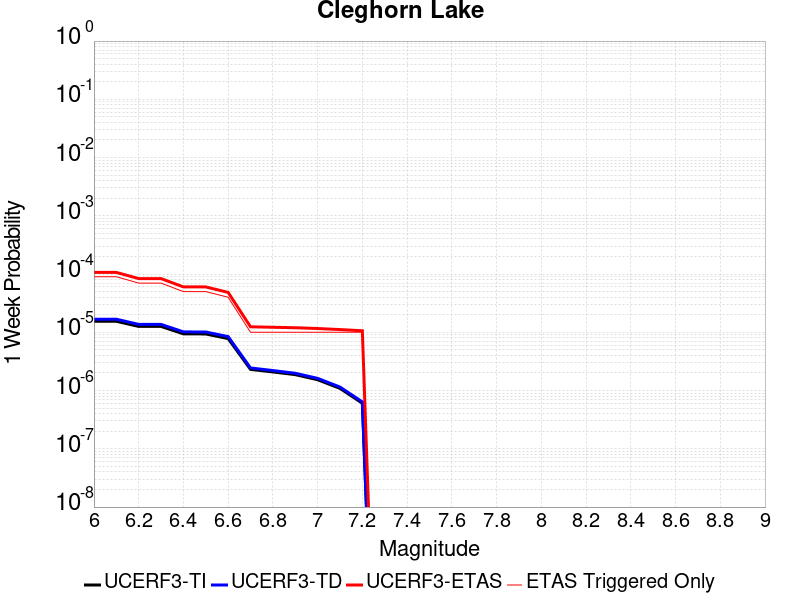 |  |  |  |

| Magnitude | 1 wk TI Prob | 1 wk TD Prob | 1 wk ETAS Prob | 1 wk ETAS/TD Gain | 1 wk ETAS Triggered Only | 1 mo TI Prob | 1 mo TD Prob | 1 mo ETAS Prob | 1 mo ETAS/TD Gain | 1 mo ETAS Triggered Only | 1 yr TI Prob | 1 yr TD Prob | 1 yr ETAS Prob | 1 yr ETAS/TD Gain | 1 yr ETAS Triggered Only | 10 yr TI Prob | 10 yr TD Prob | 10 yr ETAS Prob | 10 yr ETAS/TD Gain | 10 yr ETAS Triggered Only |
|-----|-----|-----|-----|-----|-----|-----|-----|-----|-----|-----|-----|-----|-----|-----|-----|-----|-----|-----|-----|-----|
| 6.0 | 1.5467183E-5 | 1.6794203E-5 | 1.120307E-4 | 6.6707954 | 9.5238094E-5 | 6.6286244E-5 | 7.197348E-5 | 2.1482035E-4 | 2.9847152 | 1.4285714E-4 | 8.067362E-4 | 8.759797E-4 | 0.0012090211 | 1.380193 | 3.3333333E-4 | 0.008038137 | 0.008730696 | 0.009108322 | 1.0432527 | 3.8095238E-4 |
| 6.1 | 1.5467183E-5 | 1.6794203E-5 | 1.120307E-4 | 6.6707954 | 9.5238094E-5 | 6.6286244E-5 | 7.197348E-5 | 2.1482035E-4 | 2.9847152 | 1.4285714E-4 | 8.067362E-4 | 8.759797E-4 | 0.0012090211 | 1.380193 | 3.3333333E-4 | 0.008038137 | 0.008730696 | 0.009108322 | 1.0432527 | 3.8095238E-4 |
| 6.2 | 1.2624631E-5 | 1.3681544E-5 | 8.510914E-5 | 6.220726 | 7.142857E-5 | 5.410444E-5 | 5.863415E-5 | 1.7767478E-4 | 3.0302272 | 1.1904762E-4 | 6.585225E-4 | 7.1368564E-4 | 9.99196E-4 | 1.4000506 | 2.8571428E-4 | 0.0065657445 | 0.0071187317 | 0.0074260524 | 1.0431707 | 3.095238E-4 |
| 6.3 | 1.2624631E-5 | 1.3681544E-5 | 8.510914E-5 | 6.220726 | 7.142857E-5 | 5.410444E-5 | 5.863415E-5 | 1.7767478E-4 | 3.0302272 | 1.1904762E-4 | 6.585225E-4 | 7.1368564E-4 | 9.99196E-4 | 1.4000506 | 2.8571428E-4 | 0.0065657445 | 0.0071187317 | 0.0074260524 | 1.0431707 | 3.095238E-4 |
| 6.4 | 9.417684E-6 | 1.0170118E-5 | 5.7788682E-5 | 5.682204 | 4.7619047E-5 | 4.036088E-5 | 4.3585722E-5 | 1.3881967E-4 | 3.1849804 | 9.5238094E-5 | 4.912829E-4 | 5.3056807E-4 | 7.447401E-4 | 1.4036655 | 2.1428571E-4 | 0.004901982 | 0.005297049 | 0.005533883 | 1.0447105 | 2.3809524E-4 |
| 6.5 | 9.368219E-6 | 1.0117545E-5 | 5.773611E-5 | 5.706534 | 4.7619047E-5 | 4.014889E-5 | 4.3360415E-5 | 1.3859438E-4 | 3.1963344 | 9.5238094E-5 | 4.8870314E-4 | 5.2782625E-4 | 7.419989E-4 | 1.4057635 | 2.1428571E-4 | 0.004876298 | 0.0052697617 | 0.005506602 | 1.0449433 | 2.3809524E-4 |
| 6.6 | 7.803798E-6 | 8.441831E-6 | 5.6060475E-5 | 6.6407957 | 4.7619047E-5 | 3.3444423E-5 | 3.6179E-5 | 1.3141365E-4 | 3.6323185 | 9.5238094E-5 | 4.0710976E-4 | 4.4043022E-4 | 6.308225E-4 | 1.4322871 | 1.9047619E-4 | 0.0040636472 | 0.0043994905 | 0.0046128333 | 1.0484927 | 2.1428571E-4 |
| 6.7 | 2.3108669E-6 | 2.4438336E-6 | 2.62533E-5 | 10.74267 | 2.3809524E-5 | 9.903678E-6 | 1.0473532E-5 | 5.8092082E-5 | 5.546561 | 4.7619047E-5 | 1.205706E-4 | 1.2750797E-4 | 1.9892745E-4 | 1.5601176 | 7.142857E-5 | 0.001205052 | 0.0012743667 | 0.0013457043 | 1.0559788 | 7.142857E-5 |
| 6.8 | 2.0882828E-6 | 2.2062823E-6 | 2.6015754E-5 | 11.791671 | 2.3809524E-5 | 8.949753E-6 | 9.455462E-6 | 5.707406E-5 | 6.036094 | 4.7619047E-5 | 1.08957785E-4 | 1.1511434E-4 | 1.8653469E-4 | 1.6204296 | 7.142857E-5 | 0.0010890438 | 0.0011505639 | 0.0012219104 | 1.0620099 | 7.142857E-5 |
| 6.9 | 1.876935E-6 | 1.981051E-6 | 2.5790529E-5 | 13.018609 | 2.3809524E-5 | 8.043982E-6 | 8.490192E-6 | 5.6108835E-5 | 6.608665 | 4.7619047E-5 | 9.7931086E-5 | 1.03363345E-4 | 1.7478454E-4 | 1.6909721 | 7.142857E-5 | 9.788794E-4 | 0.0010331686 | 0.0011045234 | 1.069064 | 7.142857E-5 |
| 7.0 | 1.5357559E-6 | 1.6202807E-6 | 2.5429767E-5 | 15.694667 | 2.3809524E-5 | 6.5817944E-6 | 6.9440425E-6 | 5.456276E-5 | 7.857492 | 4.7619047E-5 | 8.01304E-5 | 8.454057E-5 | 1.5596309E-4 | 1.8448315 | 7.142857E-5 | 8.010151E-4 | 8.450965E-4 | 9.1646466E-4 | 1.0844498 | 7.142857E-5 |
| 7.1 | 1.0905424E-6 | 1.1497619E-6 | 2.4959258E-5 | 21.708197 | 2.3809524E-5 | 4.6737446E-6 | 4.9275427E-6 | 5.2546355E-5 | 10.663806 | 4.7619047E-5 | 5.6901354E-5 | 5.999128E-5 | 1.0760747E-4 | 1.7937186 | 4.7619047E-5 | 5.6886784E-4 | 5.997606E-4 | 6.473511E-4 | 1.0793492 | 4.7619047E-5 |
| 7.2 | 6.06668E-7 | 6.387277E-7 | 2.4448236E-5 | 38.27646 | 2.3809524E-5 | 2.600003E-6 | 2.7374022E-6 | 5.035632E-5 | 18.39566 | 4.7619047E-5 | 3.1654577E-5 | 3.3327433E-5 | 8.094489E-5 | 2.4287767 | 4.7619047E-5 | 3.1650066E-4 | 3.3323118E-4 | 3.8083436E-4 | 1.1428533 | 4.7619047E-5 |

## Baker
*[(top)](#table-of-contents)*

| 1 Week | 1 Month | 1 Year | 10 Year |
|-----|-----|-----|-----|
|  |  |  |  |

| Magnitude | 1 wk TI Prob | 1 wk TD Prob | 1 wk ETAS Prob | 1 wk ETAS/TD Gain | 1 wk ETAS Triggered Only | 1 mo TI Prob | 1 mo TD Prob | 1 mo ETAS Prob | 1 mo ETAS/TD Gain | 1 mo ETAS Triggered Only | 1 yr TI Prob | 1 yr TD Prob | 1 yr ETAS Prob | 1 yr ETAS/TD Gain | 1 yr ETAS Triggered Only | 10 yr TI Prob | 10 yr TD Prob | 10 yr ETAS Prob | 10 yr ETAS/TD Gain | 10 yr ETAS Triggered Only |
|-----|-----|-----|-----|-----|-----|-----|-----|-----|-----|-----|-----|-----|-----|-----|-----|-----|-----|-----|-----|-----|
| 6.0 | 5.695525E-6 | 5.8348373E-6 | 7.7262994E-5 | 13.241671 | 7.142857E-5 | 2.4409164E-5 | 2.5006228E-5 | 1.20241944E-4 | 4.80848 | 9.5238094E-5 | 2.9714106E-4 | 3.044123E-4 | 5.4243504E-4 | 1.7819091 | 2.3809524E-4 | 0.0029674405 | 0.0030403486 | 0.00344388 | 1.1327254 | 4.047619E-4 |
| 6.1 | 5.695525E-6 | 5.8348373E-6 | 7.7262994E-5 | 13.241671 | 7.142857E-5 | 2.4409164E-5 | 2.5006228E-5 | 1.20241944E-4 | 4.80848 | 9.5238094E-5 | 2.9714106E-4 | 3.044123E-4 | 5.4243504E-4 | 1.7819091 | 2.3809524E-4 | 0.0029674405 | 0.0030403486 | 0.00344388 | 1.1327254 | 4.047619E-4 |
| 6.2 | 5.695525E-6 | 5.8348373E-6 | 7.7262994E-5 | 13.241671 | 7.142857E-5 | 2.4409164E-5 | 2.5006228E-5 | 1.20241944E-4 | 4.80848 | 9.5238094E-5 | 2.9714106E-4 | 3.044123E-4 | 5.4243504E-4 | 1.7819091 | 2.3809524E-4 | 0.0029674405 | 0.0030403486 | 0.00344388 | 1.1327254 | 4.047619E-4 |
| 6.3 | 3.2995713E-6 | 3.383667E-6 | 5.1002553E-5 | 15.073159 | 4.7619047E-5 | 1.4140943E-5 | 1.4501353E-5 | 6.211971E-5 | 4.283718 | 4.7619047E-5 | 1.7215237E-4 | 1.7654014E-4 | 3.4317738E-4 | 1.9439057 | 1.6666666E-4 | 0.0017201907 | 0.001764046 | 0.0020017212 | 1.134733 | 2.3809524E-4 |
| 6.4 | 3.2995713E-6 | 3.383667E-6 | 5.1002553E-5 | 15.073159 | 4.7619047E-5 | 1.4140943E-5 | 1.4501353E-5 | 6.211971E-5 | 4.283718 | 4.7619047E-5 | 1.7215237E-4 | 1.7654014E-4 | 3.4317738E-4 | 1.9439057 | 1.6666666E-4 | 0.0017201907 | 0.001764046 | 0.0020017212 | 1.134733 | 2.3809524E-4 |
| 6.5 | 2.782202E-6 | 2.8558404E-6 | 5.047475E-5 | 17.67422 | 4.7619047E-5 | 1.1923668E-5 | 1.223926E-5 | 5.9857724E-5 | 4.8906326 | 4.7619047E-5 | 1.4516099E-4 | 1.4900314E-4 | 3.1564498E-4 | 2.118378 | 1.6666666E-4 | 0.001450662 | 0.0014890651 | 0.0017268058 | 1.1596577 | 2.3809524E-4 |
| 6.6 | 2.3163404E-6 | 2.38092E-6 | 2.6190388E-5 | 11.000113 | 2.3809524E-5 | 9.927136E-6 | 1.0203904E-5 | 3.4013185E-5 | 3.3333502 | 2.3809524E-5 | 1.20856166E-4 | 1.2422565E-4 | 2.6706504E-4 | 2.1498382 | 1.4285714E-4 | 0.0012079047 | 0.0012415823 | 0.001455602 | 1.1723765 | 2.1428571E-4 |
| 6.7 | 2.037056E-6 | 2.0965003E-6 | 2.5905974E-5 | 12.3567705 | 2.3809524E-5 | 8.7302105E-6 | 8.984972E-6 | 3.2794283E-5 | 3.6499035 | 2.3809524E-5 | 1.0628513E-4 | 1.093867E-4 | 2.284213E-4 | 2.0881999 | 1.1904762E-4 | 0.0010623431 | 0.0010933448 | 0.0012360457 | 1.1305178 | 1.4285714E-4 |
| 6.8 | 1.8356744E-6 | 1.8915287E-6 | 2.5701007E-5 | 13.587427 | 2.3809524E-5 | 7.867153E-6 | 8.106527E-6 | 3.1915857E-5 | 3.9370568 | 2.3809524E-5 | 9.577837E-5 | 9.869264E-5 | 2.177285E-4 | 2.2061272 | 1.1904762E-4 | 9.57371E-4 | 9.86502E-4 | 0.0011292183 | 1.1446689 | 1.4285714E-4 |
| 6.9 | 1.6310546E-6 | 1.6832072E-6 | 2.549269E-5 | 15.145308 | 2.3809524E-5 | 6.9902153E-6 | 7.213726E-6 | 3.102308E-5 | 4.3005624 | 2.3809524E-5 | 8.510255E-5 | 8.782368E-5 | 1.8305342E-4 | 2.0843287 | 9.5238094E-5 | 8.5069967E-4 | 8.7790104E-4 | 9.968441E-4 | 1.1354858 | 1.1904762E-4 |
| 7.0 | 1.2058036E-6 | 1.2508665E-6 | 2.506036E-5 | 20.034399 | 2.3809524E-5 | 5.1677193E-6 | 5.3608455E-6 | 2.9170242E-5 | 5.441351 | 2.3809524E-5 | 6.291517E-5 | 6.5266366E-5 | 1.6049824E-4 | 2.4591265 | 9.5238094E-5 | 6.289736E-4 | 6.524743E-4 | 7.7144423E-4 | 1.1823366 | 1.1904762E-4 |
| 7.1 | 1.052382E-6 | 1.0951609E-6 | 2.4904659E-5 | 22.74064 | 2.3809524E-5 | 4.5102006E-6 | 4.693538E-6 | 2.8502951E-5 | 6.072807 | 2.3809524E-5 | 5.491031E-5 | 5.7142337E-5 | 1.52375E-4 | 2.6665866 | 9.5238094E-5 | 5.4896745E-4 | 5.7127734E-4 | 6.9025694E-4 | 1.2082695 | 1.1904762E-4 |
| 7.2 | 1.0067454E-6 | 1.0487711E-6 | 2.485827E-5 | 23.702284 | 2.3809524E-5 | 4.3146156E-6 | 4.4947255E-6 | 2.8304143E-5 | 6.2971907 | 2.3809524E-5 | 5.252918E-5 | 5.4721917E-5 | 1.499548E-4 | 2.7403061 | 9.5238094E-5 | 5.251676E-4 | 5.470853E-4 | 6.6606776E-4 | 1.2174844 | 1.1904762E-4 |
| 7.3 | 9.3596316E-7 | 9.767723E-7 | 2.4786274E-5 | 25.37569 | 2.3809524E-5 | 4.0112645E-6 | 4.1861604E-6 | 2.7995584E-5 | 6.687652 | 2.3809524E-5 | 4.8836053E-5 | 5.096532E-5 | 1.4619857E-4 | 2.8685892 | 9.5238094E-5 | 4.8825322E-4 | 5.095371E-4 | 6.2852405E-4 | 1.2335197 | 1.1904762E-4 |
| 7.4 | 8.8117395E-7 | 9.2076635E-7 | 2.4730269E-5 | 26.858355 | 2.3809524E-5 | 3.7764542E-6 | 3.9461356E-6 | 2.7755565E-5 | 7.0336065 | 2.3809524E-5 | 4.5977362E-5 | 4.8043148E-5 | 1.19468285E-4 | 2.4866874 | 7.142857E-5 | 4.596785E-4 | 4.8032837E-4 | 5.7552074E-4 | 1.1981819 | 9.5238094E-5 |
| 7.5 | 8.292386E-7 | 8.6745956E-7 | 2.4676963E-5 | 28.447392 | 2.3809524E-5 | 3.5538749E-6 | 3.7176785E-6 | 2.7527114E-5 | 7.404382 | 2.3809524E-5 | 4.326757E-5 | 4.5261804E-5 | 9.28787E-5 | 2.0520325 | 4.7619047E-5 | 4.3259145E-4 | 4.5252658E-4 | 5.2392285E-4 | 1.1577725 | 7.142857E-5 |
| 7.6 | 7.553842E-7 | 7.9144706E-7 | 2.4600951E-5 | 31.08351 | 2.3809524E-5 | 3.2373566E-6 | 3.3919116E-6 | 2.7201355E-5 | 8.019476 | 2.3809524E-5 | 3.9414106E-5 | 4.129575E-5 | 6.510429E-5 | 1.5765374 | 2.3809524E-5 | 3.9407116E-4 | 4.1288146E-4 | 4.6048083E-4 | 1.1152859 | 4.7619047E-5 |
| 7.7 | 6.5285366E-7 | 6.852797E-7 | 2.4494788E-5 | 35.74422 | 2.3809524E-5 | 2.797941E-6 | 2.9369096E-6 | 2.6746364E-5 | 9.106976 | 2.3809524E-5 | 3.40644E-5 | 3.5756293E-5 | 5.9564965E-5 | 1.6658596 | 2.3809524E-5 | 3.405918E-4 | 3.5750607E-4 | 4.051081E-4 | 1.1331502 | 4.7619047E-5 |
| 7.8 | 3.4586725E-7 | 3.6482615E-7 | 3.6482615E-7 | 1.0 | 0.0 | 1.4822873E-6 | 1.5635396E-6 | 1.5635396E-6 | 1.0 | 0.0 | 1.80467E-5 | 1.9035933E-5 | 1.9035933E-5 | 1.0 | 0.0 | 1.8045233E-4 | 1.9034347E-4 | 2.1414846E-4 | 1.1250633 | 2.3809524E-5 |
| 7.9 | 2.5591178E-9 | 2.6696718E-9 | 2.6696718E-9 | 1.0 | 0.0 | 1.0967647E-8 | 1.14414505E-8 | 1.14414505E-8 | 1.0 | 0.0 | 1.335311E-7 | 1.3929966E-7 | 1.3929966E-7 | 1.0 | 0.0 | 1.3353102E-6 | 1.3929966E-6 | 1.3929966E-6 | 1.0 | 0.0 |

## Ludlow
*[(top)](#table-of-contents)*

| 1 Week | 1 Month | 1 Year | 10 Year |
|-----|-----|-----|-----|
|  |  | 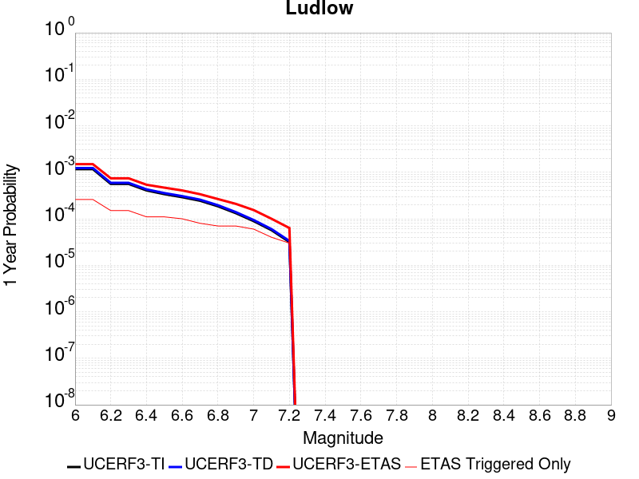 |  |

| Magnitude | 1 wk TI Prob | 1 wk TD Prob | 1 wk ETAS Prob | 1 wk ETAS/TD Gain | 1 wk ETAS Triggered Only | 1 mo TI Prob | 1 mo TD Prob | 1 mo ETAS Prob | 1 mo ETAS/TD Gain | 1 mo ETAS Triggered Only | 1 yr TI Prob | 1 yr TD Prob | 1 yr ETAS Prob | 1 yr ETAS/TD Gain | 1 yr ETAS Triggered Only | 10 yr TI Prob | 10 yr TD Prob | 10 yr ETAS Prob | 10 yr ETAS/TD Gain | 10 yr ETAS Triggered Only |
|-----|-----|-----|-----|-----|-----|-----|-----|-----|-----|-----|-----|-----|-----|-----|-----|-----|-----|-----|-----|-----|
| 6.0 | 2.2407607E-5 | 2.3657254E-5 | 1.6651102E-4 | 7.038476 | 1.4285714E-4 | 9.602906E-5 | 1.0138454E-4 | 2.6803432E-4 | 2.6437395 | 1.6666666E-4 | 0.0011685267 | 0.001233702 | 0.0014952836 | 1.2120298 | 2.6190476E-4 | 0.011624013 | 0.012273042 | 0.012649319 | 1.0306588 | 3.8095238E-4 |
| 6.1 | 2.2407607E-5 | 2.3657254E-5 | 1.6651102E-4 | 7.038476 | 1.4285714E-4 | 9.602906E-5 | 1.0138454E-4 | 2.6803432E-4 | 2.6437395 | 1.6666666E-4 | 0.0011685267 | 0.001233702 | 0.0014952836 | 1.2120298 | 2.6190476E-4 | 0.011624013 | 0.012273042 | 0.012649319 | 1.0306588 | 3.8095238E-4 |
| 6.2 | 1.0781252E-5 | 1.1365663E-5 | 5.898417E-5 | 5.189681 | 4.7619047E-5 | 4.620455E-5 | 4.8709102E-5 | 1.20134195E-4 | 2.4663603 | 7.142857E-5 | 5.623952E-4 | 5.9287593E-4 | 7.594438E-4 | 1.2809489 | 1.6666666E-4 | 0.00560974 | 0.0059133614 | 0.0061500487 | 1.0400258 | 2.3809524E-4 |
| 6.3 | 1.0781252E-5 | 1.1365663E-5 | 5.898417E-5 | 5.189681 | 4.7619047E-5 | 4.620455E-5 | 4.8709102E-5 | 1.20134195E-4 | 2.4663603 | 7.142857E-5 | 5.623952E-4 | 5.9287593E-4 | 7.594438E-4 | 1.2809489 | 1.6666666E-4 | 0.00560974 | 0.0059133614 | 0.0061500487 | 1.0400258 | 2.3809524E-4 |
| 6.4 | 7.814439E-6 | 8.237729E-6 | 3.2047057E-5 | 3.890278 | 2.3809524E-5 | 3.3490025E-5 | 3.530408E-5 | 8.292145E-5 | 2.348778 | 4.7619047E-5 | 4.0766477E-4 | 4.2974384E-4 | 5.4874027E-4 | 1.2769009 | 1.1904762E-4 | 0.0040691774 | 0.0042892746 | 0.0044315187 | 1.0331628 | 1.4285714E-4 |
| 6.5 | 6.4986366E-6 | 6.85092E-6 | 3.066028E-5 | 4.4753523 | 2.3809524E-5 | 2.7851002E-5 | 2.9360759E-5 | 7.697841E-5 | 2.6218126 | 4.7619047E-5 | 3.390332E-4 | 3.5740953E-4 | 4.764146E-4 | 1.3329656 | 1.1904762E-4 | 0.003385164 | 0.0035684432 | 0.0037107905 | 1.0398906 | 1.4285714E-4 |
| 6.6 | 5.582177E-6 | 5.8860055E-6 | 2.969539E-5 | 5.0450835 | 2.3809524E-5 | 2.3923398E-5 | 2.5225498E-5 | 7.2843344E-5 | 2.887687 | 4.7619047E-5 | 2.9122844E-4 | 3.0707786E-4 | 4.2608893E-4 | 1.3875599 | 1.1904762E-4 | 0.0029084706 | 0.003066609 | 0.003209028 | 1.0464419 | 1.4285714E-4 |
| 6.7 | 4.6858763E-6 | 4.940427E-6 | 2.8749833E-5 | 5.819301 | 2.3809524E-5 | 2.0082172E-5 | 2.1173091E-5 | 6.879113E-5 | 3.2489886 | 4.7619047E-5 | 2.4447302E-4 | 2.5775246E-4 | 3.7676937E-4 | 1.461749 | 1.1904762E-4 | 0.0024420423 | 0.0025745912 | 0.0027170805 | 1.0553445 | 1.4285714E-4 |
| 6.8 | 3.5584908E-6 | 3.7520183E-6 | 2.7561453E-5 | 7.345767 | 2.3809524E-5 | 1.5250586E-5 | 1.6079981E-5 | 6.3698266E-5 | 3.9613392 | 4.7619047E-5 | 1.8566006E-4 | 1.957566E-4 | 2.9097605E-4 | 1.4864175 | 9.5238094E-5 | 0.0018550502 | 0.0019558826 | 0.0020746975 | 1.0607474 | 1.1904762E-4 |
| 6.9 | 2.532834E-6 | 2.6710034E-6 | 2.6480464E-5 | 9.914051 | 2.3809524E-5 | 1.0854958E-5 | 1.1447109E-5 | 5.9065613E-5 | 5.1598716 | 4.7619047E-5 | 1.3215111E-4 | 1.3935992E-4 | 2.3458475E-4 | 1.6833013 | 9.5238094E-5 | 0.0013207254 | 0.0013927529 | 0.0015116347 | 1.0853574 | 1.1904762E-4 |
| 7.0 | 1.7083285E-6 | 1.8019439E-6 | 2.5611425E-5 | 14.213221 | 2.3809524E-5 | 7.3213873E-6 | 7.722595E-6 | 5.5341276E-5 | 7.1661506 | 4.7619047E-5 | 8.913424E-5 | 9.40187E-5 | 1.6544055E-4 | 1.7596558 | 7.142857E-5 | 8.9098496E-4 | 9.3980576E-4 | 0.0010349543 | 1.1012428 | 9.5238094E-5 |
| 7.1 | 1.0905424E-6 | 1.1497619E-6 | 2.4959258E-5 | 21.708197 | 2.3809524E-5 | 4.6737446E-6 | 4.9275427E-6 | 5.2546355E-5 | 10.663806 | 4.7619047E-5 | 5.6901354E-5 | 5.999128E-5 | 1.0760747E-4 | 1.7937186 | 4.7619047E-5 | 5.6886784E-4 | 5.997606E-4 | 6.473511E-4 | 1.0793492 | 4.7619047E-5 |
| 7.2 | 6.06668E-7 | 6.387277E-7 | 2.4448236E-5 | 38.27646 | 2.3809524E-5 | 2.600003E-6 | 2.7374022E-6 | 5.035632E-5 | 18.39566 | 4.7619047E-5 | 3.1654577E-5 | 3.3327433E-5 | 8.094489E-5 | 2.4287767 | 4.7619047E-5 | 3.1650066E-4 | 3.3323118E-4 | 3.8083436E-4 | 1.1428533 | 4.7619047E-5 |

## Santa Ynez (East)
*[(top)](#table-of-contents)*

| 1 Week | 1 Month | 1 Year | 10 Year |
|-----|-----|-----|-----|
|  |  | 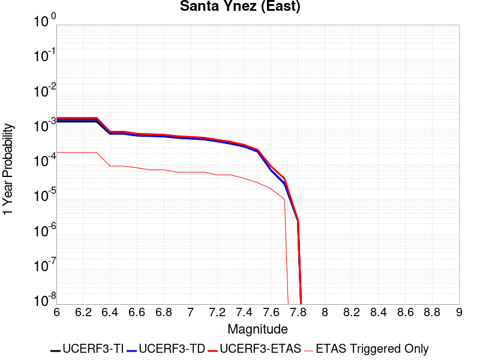 |  |

| Magnitude | 1 wk TI Prob | 1 wk TD Prob | 1 wk ETAS Prob | 1 wk ETAS/TD Gain | 1 wk ETAS Triggered Only | 1 mo TI Prob | 1 mo TD Prob | 1 mo ETAS Prob | 1 mo ETAS/TD Gain | 1 mo ETAS Triggered Only | 1 yr TI Prob | 1 yr TD Prob | 1 yr ETAS Prob | 1 yr ETAS/TD Gain | 1 yr ETAS Triggered Only | 10 yr TI Prob | 10 yr TD Prob | 10 yr ETAS Prob | 10 yr ETAS/TD Gain | 10 yr ETAS Triggered Only |
|-----|-----|-----|-----|-----|-----|-----|-----|-----|-----|-----|-----|-----|-----|-----|-----|-----|-----|-----|-----|-----|
| 6.0 | 3.2269712E-5 | 3.67505E-5 | 8.43678E-5 | 2.295691 | 4.7619047E-5 | 1.3829143E-4 | 1.5749598E-4 | 2.5271907E-4 | 1.6046065 | 9.5238094E-5 | 0.0016823979 | 0.0019164166 | 0.0022015832 | 1.148802 | 2.8571428E-4 | 0.016697178 | 0.019056441 | 0.019430134 | 1.0196098 | 3.8095238E-4 |
| 6.1 | 3.2269712E-5 | 3.67505E-5 | 8.43678E-5 | 2.295691 | 4.7619047E-5 | 1.3829143E-4 | 1.5749598E-4 | 2.5271907E-4 | 1.6046065 | 9.5238094E-5 | 0.0016823979 | 0.0019164166 | 0.0022015832 | 1.148802 | 2.8571428E-4 | 0.016697178 | 0.019056441 | 0.019430134 | 1.0196098 | 3.8095238E-4 |
| 6.2 | 3.2269712E-5 | 3.67505E-5 | 8.43678E-5 | 2.295691 | 4.7619047E-5 | 1.3829143E-4 | 1.5749598E-4 | 2.5271907E-4 | 1.6046065 | 9.5238094E-5 | 0.0016823979 | 0.0019164166 | 0.0022015832 | 1.148802 | 2.8571428E-4 | 0.016697178 | 0.019056441 | 0.019430134 | 1.0196098 | 3.8095238E-4 |
| 6.3 | 3.2269712E-5 | 3.67505E-5 | 8.43678E-5 | 2.295691 | 4.7619047E-5 | 1.3829143E-4 | 1.5749598E-4 | 2.5271907E-4 | 1.6046065 | 9.5238094E-5 | 0.0016823979 | 0.0019164166 | 0.0022015832 | 1.148802 | 2.8571428E-4 | 0.016697178 | 0.019056441 | 0.019430134 | 1.0196098 | 3.8095238E-4 |
| 6.4 | 1.4404779E-5 | 1.4849382E-5 | 1.4849382E-5 | 1.0 | 0.0 | 6.1733306E-5 | 6.363868E-5 | 6.363868E-5 | 1.0 | 0.0 | 7.513438E-4 | 7.745306E-4 | 7.983217E-4 | 1.0307168 | 2.3809524E-5 | 0.0074880854 | 0.007718862 | 0.007766113 | 1.0061215 | 4.7619047E-5 |
| 6.5 | 1.4404779E-5 | 1.4849382E-5 | 1.4849382E-5 | 1.0 | 0.0 | 6.1733306E-5 | 6.363868E-5 | 6.363868E-5 | 1.0 | 0.0 | 7.513438E-4 | 7.745306E-4 | 7.983217E-4 | 1.0307168 | 2.3809524E-5 | 0.0074880854 | 0.007718862 | 0.007766113 | 1.0061215 | 4.7619047E-5 |
| 6.6 | 1.280208E-5 | 1.3011947E-5 | 1.3011947E-5 | 1.0 | 0.0 | 5.4864904E-5 | 5.5764307E-5 | 5.5764307E-5 | 1.0 | 0.0 | 6.6777546E-4 | 6.787207E-4 | 7.025141E-4 | 1.0350562 | 2.3809524E-5 | 0.006657724 | 0.0067666885 | 0.0068139853 | 1.0069896 | 4.7619047E-5 |
| 6.7 | 1.2457027E-5 | 1.2628468E-5 | 1.2628468E-5 | 1.0 | 0.0 | 5.3386164E-5 | 5.412089E-5 | 5.412089E-5 | 1.0 | 0.0 | 6.497827E-4 | 6.587243E-4 | 6.825181E-4 | 1.0361211 | 2.3809524E-5 | 0.00647886 | 0.006567915 | 0.006615221 | 1.0072026 | 4.7619047E-5 |
| 6.8 | 1.2095134E-5 | 1.2230915E-5 | 1.2230915E-5 | 1.0 | 0.0 | 5.1835254E-5 | 5.241716E-5 | 5.241716E-5 | 1.0 | 0.0 | 6.309115E-4 | 6.379937E-4 | 6.61788E-4 | 1.0372956 | 2.3809524E-5 | 0.0062912325 | 0.006361809 | 0.006409125 | 1.0074375 | 4.7619047E-5 |
| 6.9 | 1.1104036E-5 | 1.1157347E-5 | 1.1157347E-5 | 1.0 | 0.0 | 4.758786E-5 | 4.781633E-5 | 4.781633E-5 | 1.0 | 0.0 | 5.7922816E-4 | 5.820096E-4 | 6.0580525E-4 | 1.0408853 | 2.3809524E-5 | 0.005777207 | 0.0058049993 | 0.0058523417 | 1.0081555 | 4.7619047E-5 |
| 7.0 | 1.0577444E-5 | 1.058168E-5 | 1.058168E-5 | 1.0 | 0.0 | 4.5331115E-5 | 4.5349276E-5 | 4.5349276E-5 | 1.0 | 0.0 | 5.5176654E-4 | 5.519888E-4 | 5.757852E-4 | 1.0431103 | 2.3809524E-5 | 0.0055039856 | 0.0055063153 | 0.0055536726 | 1.0086005 | 4.7619047E-5 |
| 7.1 | 1.0021775E-5 | 9.980988E-6 | 9.980988E-6 | 1.0 | 0.0 | 4.294976E-5 | 4.2774966E-5 | 4.2774966E-5 | 1.0 | 0.0 | 5.2278786E-4 | 5.2066194E-4 | 5.444591E-4 | 1.0457056 | 2.3809524E-5 | 0.0052155964 | 0.0051945536 | 0.0052419254 | 1.0091195 | 4.7619047E-5 |
| 7.2 | 8.874109E-6 | 8.748793E-6 | 8.748793E-6 | 1.0 | 0.0 | 3.8031343E-5 | 3.7494297E-5 | 3.7494297E-5 | 1.0 | 0.0 | 4.629332E-4 | 4.5639853E-4 | 4.801972E-4 | 1.0521444 | 2.3809524E-5 | 0.0046197 | 0.0045547304 | 0.0046021324 | 1.0104072 | 4.7619047E-5 |
| 7.3 | 7.5504267E-6 | 7.5051175E-6 | 7.5051175E-6 | 1.0 | 0.0 | 3.235857E-5 | 3.21644E-5 | 3.21644E-5 | 1.0 | 0.0 | 3.9389438E-4 | 3.915322E-4 | 4.153324E-4 | 1.0607873 | 2.3809524E-5 | 0.0039319694 | 0.003908531 | 0.003955964 | 1.0121357 | 4.7619047E-5 |
| 7.4 | 6.309394E-6 | 6.1831556E-6 | 6.1831556E-6 | 1.0 | 0.0 | 2.703998E-5 | 2.6498974E-5 | 2.6498974E-5 | 1.0 | 0.0 | 3.2916202E-4 | 3.225782E-4 | 3.4638005E-4 | 1.0737863 | 2.3809524E-5 | 0.003286749 | 0.003221197 | 0.0032686626 | 1.0147355 | 4.7619047E-5 |
| 7.5 | 4.6103073E-6 | 4.4408903E-6 | 4.4408903E-6 | 1.0 | 0.0 | 1.975831E-5 | 1.9032252E-5 | 1.9032252E-5 | 1.0 | 0.0 | 2.4053088E-4 | 2.3169373E-4 | 2.5549773E-4 | 1.1027391 | 2.3809524E-5 | 0.002402707 | 0.002314591 | 0.0023621 | 1.0205258 | 4.7619047E-5 |
| 7.6 | 1.2858658E-6 | 1.3008173E-6 | 1.3008173E-6 | 1.0 | 0.0 | 5.5108417E-6 | 5.5749197E-6 | 5.5749197E-6 | 1.0 | 0.0 | 6.7092435E-5 | 6.78726E-5 | 6.78726E-5 | 1.0 | 0.0 | 6.707218E-4 | 6.785256E-4 | 6.785256E-4 | 1.0 | 0.0 |
| 7.7 | 5.3302307E-7 | 5.612138E-7 | 5.612138E-7 | 1.0 | 0.0 | 2.2843826E-6 | 2.4052001E-6 | 2.4052001E-6 | 1.0 | 0.0 | 2.7812002E-5 | 2.9282954E-5 | 2.9282954E-5 | 1.0 | 0.0 | 2.7808524E-4 | 2.9279452E-4 | 2.9279452E-4 | 1.0 | 0.0 |
| 7.8 | 4.613933E-8 | 4.80301E-8 | 4.80301E-8 | 1.0 | 0.0 | 1.9773998E-7 | 2.0584326E-7 | 2.0584326E-7 | 1.0 | 0.0 | 2.4074816E-6 | 2.5061388E-6 | 2.5061388E-6 | 1.0 | 0.0 | 2.4074554E-5 | 2.5061116E-5 | 2.5061116E-5 | 1.0 | 0.0 |

## Manix-Afton Hills
*[(top)](#table-of-contents)*

| 1 Week | 1 Month | 1 Year | 10 Year |
|-----|-----|-----|-----|
|  |  |  | 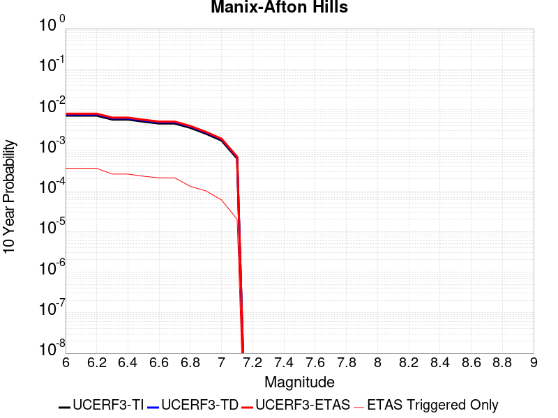 |

| Magnitude | 1 wk TI Prob | 1 wk TD Prob | 1 wk ETAS Prob | 1 wk ETAS/TD Gain | 1 wk ETAS Triggered Only | 1 mo TI Prob | 1 mo TD Prob | 1 mo ETAS Prob | 1 mo ETAS/TD Gain | 1 mo ETAS Triggered Only | 1 yr TI Prob | 1 yr TD Prob | 1 yr ETAS Prob | 1 yr ETAS/TD Gain | 1 yr ETAS Triggered Only | 10 yr TI Prob | 10 yr TD Prob | 10 yr ETAS Prob | 10 yr ETAS/TD Gain | 10 yr ETAS Triggered Only |
|-----|-----|-----|-----|-----|-----|-----|-----|-----|-----|-----|-----|-----|-----|-----|-----|-----|-----|-----|-----|-----|
| 6.0 | 1.3783202E-5 | 1.47110895E-5 | 8.613861E-5 | 5.855352 | 7.142857E-5 | 5.906953E-5 | 6.30461E-5 | 1.582782E-4 | 2.5105152 | 9.5238094E-5 | 7.189342E-4 | 7.6733343E-4 | 9.5766346E-4 | 1.2480408 | 1.9047619E-4 | 0.0071661277 | 0.007648596 | 0.00797938 | 1.0432477 | 3.3333333E-4 |
| 6.1 | 1.3783202E-5 | 1.47110895E-5 | 8.613861E-5 | 5.855352 | 7.142857E-5 | 5.906953E-5 | 6.30461E-5 | 1.582782E-4 | 2.5105152 | 9.5238094E-5 | 7.189342E-4 | 7.6733343E-4 | 9.5766346E-4 | 1.2480408 | 1.9047619E-4 | 0.0071661277 | 0.007648596 | 0.00797938 | 1.0432477 | 3.3333333E-4 |
| 6.2 | 1.3783202E-5 | 1.47110895E-5 | 8.613861E-5 | 5.855352 | 7.142857E-5 | 5.906953E-5 | 6.30461E-5 | 1.582782E-4 | 2.5105152 | 9.5238094E-5 | 7.189342E-4 | 7.6733343E-4 | 9.5766346E-4 | 1.2480408 | 1.9047619E-4 | 0.0071661277 | 0.007648596 | 0.00797938 | 1.0432477 | 3.3333333E-4 |
| 6.3 | 1.10494875E-5 | 1.1793136E-5 | 8.322087E-5 | 7.0567207 | 7.142857E-5 | 4.7354086E-5 | 5.054109E-5 | 1.2196605E-4 | 2.4132059 | 7.142857E-5 | 5.763835E-4 | 6.151744E-4 | 7.8173855E-4 | 1.2707592 | 1.6666666E-4 | 0.005748908 | 0.0061357557 | 0.0063960534 | 1.0424231 | 2.6190476E-4 |
| 6.4 | 1.10494875E-5 | 1.1793136E-5 | 8.322087E-5 | 7.0567207 | 7.142857E-5 | 4.7354086E-5 | 5.054109E-5 | 1.2196605E-4 | 2.4132059 | 7.142857E-5 | 5.763835E-4 | 6.151744E-4 | 7.8173855E-4 | 1.2707592 | 1.6666666E-4 | 0.005748908 | 0.0061357557 | 0.0063960534 | 1.0424231 | 2.6190476E-4 |
| 6.5 | 9.788949E-6 | 1.045432E-5 | 8.188214E-5 | 7.832374 | 7.142857E-5 | 4.1951964E-5 | 4.480351E-5 | 1.1622888E-4 | 2.5941913 | 7.142857E-5 | 5.1064545E-4 | 5.453555E-4 | 7.1193126E-4 | 1.3054444 | 1.6666666E-4 | 0.0050947363 | 0.0054410985 | 0.005701578 | 1.0478727 | 2.6190476E-4 |
| 6.6 | 8.810006E-6 | 9.4136285E-6 | 8.084153E-5 | 8.587712 | 7.142857E-5 | 3.775662E-5 | 4.0343548E-5 | 1.1176924E-4 | 2.7704365 | 7.142857E-5 | 4.5958988E-4 | 4.9108086E-4 | 6.3386786E-4 | 1.2907606 | 1.4285714E-4 | 0.0045864056 | 0.004900839 | 0.0051377676 | 1.0483445 | 2.3809524E-4 |
| 6.7 | 8.80128E-6 | 9.404108E-6 | 8.083201E-5 | 8.595393 | 7.142857E-5 | 3.7719226E-5 | 4.0302748E-5 | 1.1172844E-4 | 2.772229 | 7.142857E-5 | 4.591348E-4 | 4.9058435E-4 | 6.333714E-4 | 1.2910551 | 1.4285714E-4 | 0.004581874 | 0.0048958957 | 0.0051328256 | 1.0483935 | 2.3809524E-4 |
| 6.8 | 6.8994877E-6 | 7.380076E-6 | 5.499877E-5 | 7.4523315 | 4.7619047E-5 | 2.9568899E-5 | 3.162856E-5 | 7.92461E-5 | 2.5055234 | 4.7619047E-5 | 3.5994186E-4 | 3.8501783E-4 | 4.564189E-4 | 1.1854488 | 7.142857E-5 | 0.003593594 | 0.0038443129 | 0.003939185 | 1.0246785 | 9.5238094E-5 |
| 6.9 | 4.9328037E-6 | 5.2709615E-6 | 2.908036E-5 | 5.5170884 | 2.3809524E-5 | 2.1140417E-5 | 2.2589675E-5 | 4.6398658E-5 | 2.0539765 | 2.3809524E-5 | 2.5735417E-4 | 2.7500073E-4 | 3.2260668E-4 | 1.1731122 | 4.7619047E-5 | 0.0025705635 | 0.0027472095 | 0.0027946976 | 1.017286 | 4.7619047E-5 |
| 7.0 | 3.347973E-6 | 3.59003E-6 | 2.7399468E-5 | 7.6321 | 2.3809524E-5 | 1.4348378E-5 | 1.5385775E-5 | 3.9194932E-5 | 2.5474787 | 2.3809524E-5 | 1.746775E-4 | 1.8730981E-4 | 2.1111488E-4 | 1.1270893 | 2.3809524E-5 | 0.0017454025 | 0.0018719219 | 0.001895687 | 1.0126954 | 2.3809524E-5 |
| 7.1 | 1.2073567E-6 | 1.293482E-6 | 1.293482E-6 | 1.0 | 0.0 | 5.1743755E-6 | 5.543492E-6 | 5.543492E-6 | 1.0 | 0.0 | 6.29962E-5 | 6.749156E-5 | 6.749156E-5 | 1.0 | 0.0 | 6.297835E-4 | 6.7487074E-4 | 6.7487074E-4 | 1.0 | 0.0 |

## San Andreas (North Branch Mill Creek)
*[(top)](#table-of-contents)*

| 1 Week | 1 Month | 1 Year | 10 Year |
|-----|-----|-----|-----|
|  |  |  |  |

| Magnitude | 1 wk TI Prob | 1 wk TD Prob | 1 wk ETAS Prob | 1 wk ETAS/TD Gain | 1 wk ETAS Triggered Only | 1 mo TI Prob | 1 mo TD Prob | 1 mo ETAS Prob | 1 mo ETAS/TD Gain | 1 mo ETAS Triggered Only | 1 yr TI Prob | 1 yr TD Prob | 1 yr ETAS Prob | 1 yr ETAS/TD Gain | 1 yr ETAS Triggered Only | 10 yr TI Prob | 10 yr TD Prob | 10 yr ETAS Prob | 10 yr ETAS/TD Gain | 10 yr ETAS Triggered Only |
|-----|-----|-----|-----|-----|-----|-----|-----|-----|-----|-----|-----|-----|-----|-----|-----|-----|-----|-----|-----|-----|
| 6.0 | 1.3461156E-5 | 2.3499893E-5 | 1.1873575E-4 | 5.052608 | 9.5238094E-5 | 5.7689394E-5 | 1.00709956E-4 | 2.4355271E-4 | 2.4183578 | 1.4285714E-4 | 7.02142E-4 | 0.0012254574 | 0.0014157002 | 1.1552422 | 1.9047619E-4 | 0.0069992766 | 0.01222957 | 0.012582345 | 1.028846 | 3.5714285E-4 |
| 6.1 | 1.3461156E-5 | 2.3499893E-5 | 1.1873575E-4 | 5.052608 | 9.5238094E-5 | 5.7689394E-5 | 1.00709956E-4 | 2.4355271E-4 | 2.4183578 | 1.4285714E-4 | 7.02142E-4 | 0.0012254574 | 0.0014157002 | 1.1552422 | 1.9047619E-4 | 0.0069992766 | 0.01222957 | 0.012582345 | 1.028846 | 3.5714285E-4 |
| 6.2 | 1.3461156E-5 | 2.3499893E-5 | 1.1873575E-4 | 5.052608 | 9.5238094E-5 | 5.7689394E-5 | 1.00709956E-4 | 2.4355271E-4 | 2.4183578 | 1.4285714E-4 | 7.02142E-4 | 0.0012254574 | 0.0014157002 | 1.1552422 | 1.9047619E-4 | 0.0069992766 | 0.01222957 | 0.012582345 | 1.028846 | 3.5714285E-4 |
| 6.3 | 1.3461156E-5 | 2.3499893E-5 | 1.1873575E-4 | 5.052608 | 9.5238094E-5 | 5.7689394E-5 | 1.00709956E-4 | 2.4355271E-4 | 2.4183578 | 1.4285714E-4 | 7.02142E-4 | 0.0012254574 | 0.0014157002 | 1.1552422 | 1.9047619E-4 | 0.0069992766 | 0.01222957 | 0.012582345 | 1.028846 | 3.5714285E-4 |
| 6.4 | 1.3461156E-5 | 2.3499893E-5 | 1.1873575E-4 | 5.052608 | 9.5238094E-5 | 5.7689394E-5 | 1.00709956E-4 | 2.4355271E-4 | 2.4183578 | 1.4285714E-4 | 7.02142E-4 | 0.0012254574 | 0.0014157002 | 1.1552422 | 1.9047619E-4 | 0.0069992766 | 0.01222957 | 0.012582345 | 1.028846 | 3.5714285E-4 |
| 6.5 | 1.3450706E-5 | 2.3488852E-5 | 1.1872471E-4 | 5.054513 | 9.5238094E-5 | 5.764461E-5 | 1.0066265E-4 | 2.435054E-4 | 2.4190245 | 1.4285714E-4 | 7.0159714E-4 | 0.001224882 | 0.0014151249 | 1.1553153 | 1.9047619E-4 | 0.006993862 | 0.01222388 | 0.012576656 | 1.0288596 | 3.5714285E-4 |
| 6.6 | 1.3074523E-5 | 2.3103135E-5 | 1.18339034E-4 | 5.122206 | 9.5238094E-5 | 5.6032466E-5 | 9.9009696E-5 | 2.418527E-4 | 2.4427173 | 1.4285714E-4 | 6.8198174E-4 | 0.0012047797 | 0.0013950265 | 1.15791 | 1.9047619E-4 | 0.006798926 | 0.012025044 | 0.012377893 | 1.0293428 | 3.5714285E-4 |
| 6.7 | 1.3050216E-5 | 2.3078432E-5 | 1.1831433E-4 | 5.126619 | 9.5238094E-5 | 5.59283E-5 | 9.890384E-5 | 2.4174685E-4 | 2.4442616 | 1.4285714E-4 | 6.8071426E-4 | 0.0012034923 | 0.0013937393 | 1.158079 | 1.9047619E-4 | 0.0067863287 | 0.012012309 | 0.012365162 | 1.0293742 | 3.5714285E-4 |
| 6.8 | 1.29049395E-5 | 2.292684E-5 | 1.1816275E-4 | 5.1539044 | 9.5238094E-5 | 5.530571E-5 | 9.825421E-5 | 2.4109731E-4 | 2.4538116 | 1.4285714E-4 | 6.73139E-4 | 0.0011955918 | 0.0013858402 | 1.159125 | 1.9047619E-4 | 0.0067110364 | 0.011934154 | 0.012287035 | 1.029569 | 3.5714285E-4 |
| 6.9 | 1.2867369E-5 | 2.2886245E-5 | 1.1812216E-4 | 5.161273 | 9.5238094E-5 | 5.51447E-5 | 9.8080236E-5 | 2.4092337E-4 | 2.4563906 | 1.4285714E-4 | 6.711799E-4 | 0.0011934759 | 0.0013837249 | 1.1594074 | 1.9047619E-4 | 0.006691564 | 0.011913223 | 0.012266112 | 1.0296216 | 3.5714285E-4 |
| 7.0 | 1.2495996E-5 | 2.2286325E-5 | 1.175223E-4 | 5.273292 | 9.5238094E-5 | 5.3553173E-5 | 9.550934E-5 | 2.3835285E-4 | 2.4955971 | 1.4285714E-4 | 6.518148E-4 | 0.0011622087 | 0.0013524636 | 1.163701 | 1.9047619E-4 | 0.0064990623 | 0.0116038285 | 0.011956827 | 1.0304209 | 3.5714285E-4 |
| 7.1 | 1.2452067E-5 | 2.2231397E-5 | 1.17467374E-4 | 5.28385 | 9.5238094E-5 | 5.3364907E-5 | 9.527396E-5 | 2.3811749E-4 | 2.4992926 | 1.4285714E-4 | 6.4952404E-4 | 0.0011593461 | 0.0013496014 | 1.1641058 | 1.9047619E-4 | 0.0064762887 | 0.0115755 | 0.011928509 | 1.0304962 | 3.5714285E-4 |
| 7.2 | 1.2002777E-5 | 2.1609963E-5 | 1.16846E-4 | 5.407043 | 9.5238094E-5 | 5.143946E-5 | 9.2610855E-5 | 2.3545478E-4 | 2.5424101 | 1.4285714E-4 | 6.2609545E-4 | 0.0011269567 | 0.0013172182 | 1.1688278 | 1.9047619E-4 | 0.006243344 | 0.011254923 | 0.0115845045 | 1.0292833 | 3.3333333E-4 |
| 7.3 | 1.1923425E-5 | 2.1479793E-5 | 1.1671584E-4 | 5.4337506 | 9.5238094E-5 | 5.109939E-5 | 9.205302E-5 | 2.3489702E-4 | 2.5517578 | 1.4285714E-4 | 6.219575E-4 | 0.001120172 | 0.0013104348 | 1.1698514 | 1.9047619E-4 | 0.0062021962 | 0.011187789 | 0.011517393 | 1.029461 | 3.3333333E-4 |
| 7.4 | 1.16105175E-5 | 2.0853771E-5 | 1.1608988E-4 | 5.566853 | 9.5238094E-5 | 4.975841E-5 | 8.937026E-5 | 2.3221463E-4 | 2.5983434 | 1.4285714E-4 | 6.0564023E-4 | 0.0010875424 | 0.0012778114 | 1.1749532 | 1.9047619E-4 | 0.006039923 | 0.010865397 | 0.011195108 | 1.0303451 | 3.3333333E-4 |
| 7.5 | 1.1037265E-5 | 1.9553907E-5 | 1.1479014E-4 | 5.8704453 | 9.5238094E-5 | 4.7301706E-5 | 8.379978E-5 | 2.2664494E-4 | 2.7046008 | 1.4285714E-4 | 5.757461E-4 | 0.0010197869 | 0.0012100689 | 1.18659 | 1.9047619E-4 | 0.005742567 | 0.010194898 | 0.010524833 | 1.0323628 | 3.3333333E-4 |
| 7.6 | 1.0720915E-5 | 1.899582E-5 | 1.14232105E-4 | 6.0135393 | 9.5238094E-5 | 4.5945973E-5 | 8.140812E-5 | 2.2425364E-4 | 2.7546837 | 1.4285714E-4 | 5.592486E-4 | 9.906954E-4 | 0.0011809829 | 1.1920747 | 1.9047619E-4 | 0.005578433 | 0.009906623 | 0.0102366535 | 1.0333142 | 3.3333333E-4 |
| 7.7 | 9.276279E-6 | 1.6441649E-5 | 1.1167818E-4 | 6.792395 | 9.5238094E-5 | 3.9754876E-5 | 7.0462316E-5 | 2.133094E-4 | 3.0272834 | 1.4285714E-4 | 4.839081E-4 | 8.575427E-4 | 0.0010478556 | 1.2219281 | 1.9047619E-4 | 0.0048285574 | 0.008586041 | 0.008916512 | 1.0384893 | 3.3333333E-4 |
| 7.8 | 5.8346777E-6 | 1.1155013E-5 | 1.0639204E-4 | 9.5376 | 9.5238094E-5 | 2.5005522E-5 | 4.7806327E-5 | 1.9065663E-4 | 3.9881048 | 1.4285714E-4 | 3.043997E-4 | 5.818867E-4 | 7.7225204E-4 | 1.3271519 | 1.9047619E-4 | 0.0030398308 | 0.0058469265 | 0.0061783106 | 1.0566766 | 3.3333333E-4 |
| 7.9 | 4.690204E-6 | 8.509093E-6 | 1.0374638E-4 | 12.192412 | 9.5238094E-5 | 2.0100719E-5 | 3.6467034E-5 | 1.7931897E-4 | 4.9172897 | 1.4285714E-4 | 2.4469878E-4 | 4.4389578E-4 | 6.342874E-4 | 1.4289106 | 1.9047619E-4 | 0.002444295 | 0.0044707474 | 0.004778887 | 1.0689236 | 3.095238E-4 |
| 8.0 | 2.9570454E-6 | 4.846947E-6 | 2.8656355E-5 | 5.9122486 | 2.3809524E-5 | 1.267299E-5 | 2.0772464E-5 | 4.4581495E-5 | 2.1461823 | 2.3809524E-5 | 1.5428272E-4 | 2.5287544E-4 | 2.7667894E-4 | 1.0941314 | 2.3809524E-5 | 0.0015417566 | 0.002549644 | 0.0026446395 | 1.0372583 | 9.5238094E-5 |
| 8.1 | 1.6376824E-6 | 2.1968929E-6 | 2.6006364E-5 | 11.837794 | 2.3809524E-5 | 7.01862E-6 | 9.41522E-6 | 3.322452E-5 | 3.5288095 | 2.3809524E-5 | 8.544835E-5 | 1.14624294E-4 | 1.3843109E-4 | 1.2076942 | 2.3809524E-5 | 8.54155E-4 | 0.0011606582 | 0.0011844401 | 1.02049 | 2.3809524E-5 |
| 8.2 | 6.9631557E-7 | 4.5360213E-7 | 4.5360213E-7 | 1.0 | 0.0 | 2.984206E-6 | 1.9440076E-6 | 1.9440076E-6 | 1.0 | 0.0 | 3.63321E-5 | 2.3668037E-5 | 2.3668037E-5 | 1.0 | 0.0 | 3.6326164E-4 | 2.451564E-4 | 2.451564E-4 | 1.0 | 0.0 |
| 8.3 | 1.7876137E-7 | 8.360375E-8 | 8.360375E-8 | 1.0 | 0.0 | 7.661199E-7 | 3.5830175E-7 | 3.5830175E-7 | 1.0 | 0.0 | 9.32747E-6 | 4.3623154E-6 | 4.3623154E-6 | 1.0 | 0.0 | 9.3270784E-5 | 4.5817014E-5 | 4.5817014E-5 | 1.0 | 0.0 |

## Calico-Hidalgo
*[(top)](#table-of-contents)*

| 1 Week | 1 Month | 1 Year | 10 Year |
|-----|-----|-----|-----|
|  |  |  |  |

| Magnitude | 1 wk TI Prob | 1 wk TD Prob | 1 wk ETAS Prob | 1 wk ETAS/TD Gain | 1 wk ETAS Triggered Only | 1 mo TI Prob | 1 mo TD Prob | 1 mo ETAS Prob | 1 mo ETAS/TD Gain | 1 mo ETAS Triggered Only | 1 yr TI Prob | 1 yr TD Prob | 1 yr ETAS Prob | 1 yr ETAS/TD Gain | 1 yr ETAS Triggered Only | 10 yr TI Prob | 10 yr TD Prob | 10 yr ETAS Prob | 10 yr ETAS/TD Gain | 10 yr ETAS Triggered Only |
|-----|-----|-----|-----|-----|-----|-----|-----|-----|-----|-----|-----|-----|-----|-----|-----|-----|-----|-----|-----|-----|
| 6.0 | 4.0906612E-5 | 5.0703686E-5 | 7.4512005E-5 | 1.4695579 | 2.3809524E-5 | 1.7530227E-4 | 2.172857E-4 | 3.125031E-4 | 1.4382129 | 9.5238094E-5 | 0.0021322158 | 0.002642648 | 0.002761381 | 1.0449295 | 1.1904762E-4 | 0.02111873 | 0.026152607 | 0.02650041 | 1.013299 | 3.5714285E-4 |
| 6.1 | 4.0906612E-5 | 5.0703686E-5 | 7.4512005E-5 | 1.4695579 | 2.3809524E-5 | 1.7530227E-4 | 2.172857E-4 | 3.125031E-4 | 1.4382129 | 9.5238094E-5 | 0.0021322158 | 0.002642648 | 0.002761381 | 1.0449295 | 1.1904762E-4 | 0.02111873 | 0.026152607 | 0.02650041 | 1.013299 | 3.5714285E-4 |
| 6.2 | 4.0906612E-5 | 5.0703686E-5 | 7.4512005E-5 | 1.4695579 | 2.3809524E-5 | 1.7530227E-4 | 2.172857E-4 | 3.125031E-4 | 1.4382129 | 9.5238094E-5 | 0.0021322158 | 0.002642648 | 0.002761381 | 1.0449295 | 1.1904762E-4 | 0.02111873 | 0.026152607 | 0.02650041 | 1.013299 | 3.5714285E-4 |
| 6.3 | 2.4242801E-5 | 3.0090669E-5 | 5.3899475E-5 | 1.7912356 | 2.3809524E-5 | 1.0389358E-4 | 1.2895382E-4 | 1.5276027E-4 | 1.1846123 | 2.3809524E-5 | 0.0012641704 | 0.0015689151 | 0.0015926873 | 1.015152 | 2.3809524E-5 | 0.01257003 | 0.01558206 | 0.01576957 | 1.0120336 | 1.9047619E-4 |
| 6.4 | 2.4242801E-5 | 3.0090669E-5 | 5.3899475E-5 | 1.7912356 | 2.3809524E-5 | 1.0389358E-4 | 1.2895382E-4 | 1.5276027E-4 | 1.1846123 | 2.3809524E-5 | 0.0012641704 | 0.0015689151 | 0.0015926873 | 1.015152 | 2.3809524E-5 | 0.01257003 | 0.01558206 | 0.01576957 | 1.0120336 | 1.9047619E-4 |
| 6.5 | 2.0286952E-5 | 2.5315738E-5 | 4.9124657E-5 | 1.940479 | 2.3809524E-5 | 8.694118E-5 | 1.0849161E-4 | 1.3229855E-4 | 1.2194358 | 2.3809524E-5 | 0.0010579949 | 0.001320102 | 0.0013438802 | 1.0180123 | 2.3809524E-5 | 0.010529719 | 0.013124538 | 0.013312514 | 1.0143225 | 1.9047619E-4 |
| 6.6 | 2.0269223E-5 | 2.5296687E-5 | 4.910561E-5 | 1.9411873 | 2.3809524E-5 | 8.6865206E-5 | 1.08409964E-4 | 1.3221691E-4 | 1.219601 | 2.3809524E-5 | 0.0010570707 | 0.0013191093 | 0.0013428874 | 1.0180259 | 2.3809524E-5 | 0.010520565 | 0.013114728 | 0.013302706 | 1.0143334 | 1.9047619E-4 |
| 6.7 | 1.799852E-5 | 2.25406E-5 | 4.634959E-5 | 2.0562713 | 2.3809524E-5 | 7.713423E-5 | 9.659908E-5 | 1.204063E-4 | 1.246454 | 2.3809524E-5 | 9.3870464E-4 | 0.0011754738 | 0.0011992553 | 1.0202315 | 2.3809524E-5 | 0.009347493 | 0.011694173 | 0.011858891 | 1.0140854 | 1.6666666E-4 |
| 6.8 | 1.7458793E-5 | 2.184212E-5 | 4.5651122E-5 | 2.09005 | 2.3809524E-5 | 7.4821255E-5 | 9.3605806E-5 | 1.174131E-4 | 1.2543356 | 2.3809524E-5 | 9.10568E-4 | 0.0011390693 | 0.0011628518 | 1.0208788 | 2.3809524E-5 | 0.009068459 | 0.011333893 | 0.011498671 | 1.0145385 | 1.6666666E-4 |
| 6.9 | 1.542884E-5 | 1.9025927E-5 | 4.2835E-5 | 2.2514014 | 2.3809524E-5 | 6.612192E-5 | 8.153721E-5 | 1.0534479E-4 | 1.2919842 | 2.3809524E-5 | 8.04737E-4 | 9.922766E-4 | 0.0010160625 | 1.0239711 | 2.3809524E-5 | 0.008018291 | 0.009879857 | 0.010044877 | 1.0167027 | 1.6666666E-4 |
| 7.0 | 1.468253E-5 | 1.8030598E-5 | 4.1839692E-5 | 2.3204827 | 2.3809524E-5 | 6.292361E-5 | 7.7271776E-5 | 1.01079466E-4 | 1.3081032 | 2.3809524E-5 | 7.658257E-4 | 9.4039086E-4 | 9.64178E-4 | 1.0252949 | 2.3809524E-5 | 0.0076319184 | 0.009365481 | 0.009530587 | 1.0176291 | 1.6666666E-4 |
| 7.1 | 1.3139281E-5 | 1.6200942E-5 | 4.001008E-5 | 2.4696143 | 2.3809524E-5 | 5.6309986E-5 | 6.943083E-5 | 9.3238705E-5 | 1.3429005 | 2.3809524E-5 | 6.853584E-4 | 8.4500515E-4 | 8.6879457E-4 | 1.028153 | 2.3809524E-5 | 0.0068324856 | 0.0084192185 | 0.008584482 | 1.0196294 | 1.6666666E-4 |
| 7.2 | 1.1127404E-5 | 1.3866597E-5 | 1.3866597E-5 | 1.0 | 0.0 | 4.7688E-5 | 5.942698E-5 | 5.942698E-5 | 1.0 | 0.0 | 5.8044674E-4 | 7.232942E-4 | 7.232942E-4 | 1.0 | 0.0 | 0.0057893298 | 0.0072105085 | 0.007352336 | 1.0196695 | 1.4285714E-4 |
| 7.3 | 9.808154E-6 | 1.2176215E-5 | 1.2176215E-5 | 1.0 | 0.0 | 4.2034266E-5 | 5.2182797E-5 | 5.2182797E-5 | 1.0 | 0.0 | 5.11647E-4 | 6.3515105E-4 | 6.3515105E-4 | 1.0 | 0.0 | 0.0051047057 | 0.006334433 | 0.006429068 | 1.0149398 | 9.5238094E-5 |
| 7.4 | 7.942452E-6 | 9.792144E-6 | 9.792144E-6 | 1.0 | 0.0 | 3.4038632E-5 | 4.1965708E-5 | 4.1965708E-5 | 1.0 | 0.0 | 4.1434157E-4 | 5.1082217E-4 | 5.1082217E-4 | 1.0 | 0.0 | 0.0041356985 | 0.005097421 | 0.0051684855 | 1.0139413 | 7.142857E-5 |
| 7.5 | 4.7121216E-6 | 5.772836E-6 | 5.772836E-6 | 1.0 | 0.0 | 2.019465E-5 | 2.4740535E-5 | 2.4740535E-5 | 1.0 | 0.0 | 2.4584212E-4 | 3.0118204E-4 | 3.0118204E-4 | 1.0 | 0.0 | 0.0024557032 | 0.0030084911 | 0.003055967 | 1.0157806 | 4.7619047E-5 |
| 7.6 | 2.21172E-7 | 2.603961E-7 | 2.603961E-7 | 1.0 | 0.0 | 9.478797E-7 | 1.1159829E-6 | 1.1159829E-6 | 1.0 | 0.0 | 1.1540374E-5 | 1.3587036E-5 | 1.3587036E-5 | 1.0 | 0.0 | 1.1539775E-4 | 1.3586486E-4 | 1.3586486E-4 | 1.0 | 0.0 |

## Elsinore (Glen Ivy) rev
*[(top)](#table-of-contents)*

| 1 Week | 1 Month | 1 Year | 10 Year |
|-----|-----|-----|-----|
|  |  |  |  |

| Magnitude | 1 wk TI Prob | 1 wk TD Prob | 1 wk ETAS Prob | 1 wk ETAS/TD Gain | 1 wk ETAS Triggered Only | 1 mo TI Prob | 1 mo TD Prob | 1 mo ETAS Prob | 1 mo ETAS/TD Gain | 1 mo ETAS Triggered Only | 1 yr TI Prob | 1 yr TD Prob | 1 yr ETAS Prob | 1 yr ETAS/TD Gain | 1 yr ETAS Triggered Only | 10 yr TI Prob | 10 yr TD Prob | 10 yr ETAS Prob | 10 yr ETAS/TD Gain | 10 yr ETAS Triggered Only |
|-----|-----|-----|-----|-----|-----|-----|-----|-----|-----|-----|-----|-----|-----|-----|-----|-----|-----|-----|-----|-----|
| 6.0 | 1.6204086E-4 | 2.9360707E-4 | 3.888172E-4 | 1.3242774 | 9.5238094E-5 | 6.94276E-4 | 0.0012578638 | 0.0014005413 | 1.1134284 | 1.4285714E-4 | 0.008420097 | 0.015234485 | 0.015422059 | 1.0123125 | 1.9047619E-4 | 0.081081145 | 0.13969168 | 0.13989651 | 1.0014664 | 2.3809524E-4 |
| 6.1 | 1.6204086E-4 | 2.9360707E-4 | 3.888172E-4 | 1.3242774 | 9.5238094E-5 | 6.94276E-4 | 0.0012578638 | 0.0014005413 | 1.1134284 | 1.4285714E-4 | 0.008420097 | 0.015234485 | 0.015422059 | 1.0123125 | 1.9047619E-4 | 0.081081145 | 0.13969168 | 0.13989651 | 1.0014664 | 2.3809524E-4 |
| 6.2 | 1.6204086E-4 | 2.9360707E-4 | 3.888172E-4 | 1.3242774 | 9.5238094E-5 | 6.94276E-4 | 0.0012578638 | 0.0014005413 | 1.1134284 | 1.4285714E-4 | 0.008420097 | 0.015234485 | 0.015422059 | 1.0123125 | 1.9047619E-4 | 0.081081145 | 0.13969168 | 0.13989651 | 1.0014664 | 2.3809524E-4 |
| 6.3 | 1.0111737E-4 | 1.7703383E-4 | 2.4844974E-4 | 1.4034027 | 7.142857E-5 | 4.332882E-4 | 7.5861247E-4 | 9.013612E-4 | 1.1881709 | 1.4285714E-4 | 0.005262531 | 0.009217682 | 0.009406403 | 1.0204737 | 1.9047619E-4 | 0.0513964 | 0.0870191 | 0.087193 | 1.0019984 | 1.9047619E-4 |
| 6.4 | 1.0111737E-4 | 1.7703383E-4 | 2.4844974E-4 | 1.4034027 | 7.142857E-5 | 4.332882E-4 | 7.5861247E-4 | 9.013612E-4 | 1.1881709 | 1.4285714E-4 | 0.005262531 | 0.009217682 | 0.009406403 | 1.0204737 | 1.9047619E-4 | 0.0513964 | 0.0870191 | 0.087193 | 1.0019984 | 1.9047619E-4 |
| 6.5 | 3.6624708E-5 | 4.6391084E-5 | 4.6391084E-5 | 1.0 | 0.0 | 1.569536E-4 | 1.9880582E-4 | 2.2261062E-4 | 1.1197389 | 2.3809524E-5 | 0.001909235 | 0.0024181372 | 0.0024418891 | 1.0098224 | 2.3809524E-5 | 0.01892915 | 0.023739954 | 0.023763198 | 1.0009791 | 2.3809524E-5 |
| 6.6 | 2.5051324E-5 | 2.614772E-5 | 2.614772E-5 | 1.0 | 0.0 | 1.073584E-4 | 1.12057096E-4 | 1.12057096E-4 | 1.0 | 0.0 | 0.0013063047 | 0.0013634858 | 0.0013634858 | 1.0 | 0.0 | 0.012986525 | 0.013564618 | 0.013564618 | 1.0 | 0.0 |
| 6.7 | 2.2189772E-5 | 2.2072849E-5 | 2.2072849E-5 | 1.0 | 0.0 | 9.509556E-5 | 9.4594696E-5 | 9.4594696E-5 | 1.0 | 0.0 | 0.0011571734 | 0.0011511183 | 0.0011511183 | 1.0 | 0.0 | 0.011511663 | 0.011465415 | 0.011465415 | 1.0 | 0.0 |
| 6.8 | 1.6654378E-5 | 1.4437705E-5 | 1.4437705E-5 | 1.0 | 0.0 | 7.137396E-5 | 6.187444E-5 | 6.187444E-5 | 1.0 | 0.0 | 8.686314E-4 | 7.530661E-4 | 7.530661E-4 | 1.0 | 0.0 | 0.008652439 | 0.00751048 | 0.00751048 | 1.0 | 0.0 |
| 6.9 | 1.5042909E-5 | 1.2332022E-5 | 1.2332022E-5 | 1.0 | 0.0 | 6.446802E-5 | 5.285047E-5 | 5.285047E-5 | 1.0 | 0.0 | 7.8461546E-4 | 6.4326765E-4 | 6.4326765E-4 | 1.0 | 0.0 | 0.007818509 | 0.00641828 | 0.00641828 | 1.0 | 0.0 |
| 7.0 | 1.4361385E-5 | 1.1451324E-5 | 1.1451324E-5 | 1.0 | 0.0 | 6.154734E-5 | 4.9076196E-5 | 4.9076196E-5 | 1.0 | 0.0 | 7.490812E-4 | 5.973418E-4 | 5.973418E-4 | 1.0 | 0.0 | 0.007465612 | 0.0059613534 | 0.0059613534 | 1.0 | 0.0 |
| 7.1 | 1.3265571E-5 | 1.0244926E-5 | 1.0244926E-5 | 1.0 | 0.0 | 5.6851208E-5 | 4.39061E-5 | 4.39061E-5 | 1.0 | 0.0 | 6.919436E-4 | 5.344282E-4 | 5.344282E-4 | 1.0 | 0.0 | 0.006897931 | 0.0053347866 | 0.0053347866 | 1.0 | 0.0 |
| 7.2 | 1.1596403E-5 | 8.505067E-6 | 8.505067E-6 | 1.0 | 0.0 | 4.9697923E-5 | 3.6449786E-5 | 3.6449786E-5 | 1.0 | 0.0 | 6.049042E-4 | 4.436875E-4 | 4.436875E-4 | 1.0 | 0.0 | 0.006032603 | 0.0044294316 | 0.0044294316 | 1.0 | 0.0 |
| 7.3 | 1.0150827E-5 | 7.2387597E-6 | 7.2387597E-6 | 1.0 | 0.0 | 4.3502816E-5 | 3.1022897E-5 | 3.1022897E-5 | 1.0 | 0.0 | 5.2951806E-4 | 3.7763975E-4 | 3.7763975E-4 | 1.0 | 0.0 | 0.005282581 | 0.0037703665 | 0.0037703665 | 1.0 | 0.0 |
| 7.4 | 9.080705E-6 | 6.352519E-6 | 6.352519E-6 | 1.0 | 0.0 | 3.8916725E-5 | 2.7224805E-5 | 2.7224805E-5 | 1.0 | 0.0 | 4.7370812E-4 | 3.3141294E-4 | 3.3141294E-4 | 1.0 | 0.0 | 0.004726996 | 0.0033093381 | 0.0033093381 | 1.0 | 0.0 |
| 7.5 | 7.671649E-6 | 5.2256332E-6 | 5.2256332E-6 | 1.0 | 0.0 | 3.287808E-5 | 2.2395385E-5 | 2.2395385E-5 | 1.0 | 0.0 | 4.0021708E-4 | 2.7263095E-4 | 2.7263095E-4 | 1.0 | 0.0 | 0.0039949706 | 0.00272309 | 0.00272309 | 1.0 | 0.0 |
| 7.6 | 6.990086E-6 | 4.687545E-6 | 4.687545E-6 | 1.0 | 0.0 | 2.9957167E-5 | 2.008933E-5 | 2.008933E-5 | 1.0 | 0.0 | 3.6466747E-4 | 2.445613E-4 | 2.445613E-4 | 1.0 | 0.0 | 0.0036406964 | 0.002443038 | 0.002443038 | 1.0 | 0.0 |
| 7.7 | 4.163505E-6 | 2.3295343E-6 | 2.3295343E-6 | 1.0 | 0.0 | 1.7843471E-5 | 9.983683E-6 | 9.983683E-6 | 1.0 | 0.0 | 2.172226E-4 | 1.21545316E-4 | 1.21545316E-4 | 1.0 | 0.0 | 0.0021701038 | 0.0012148614 | 0.0012148614 | 1.0 | 0.0 |
| 7.8 | 2.2692414E-7 | 9.3854695E-8 | 9.3854695E-8 | 1.0 | 0.0 | 9.725317E-7 | 4.0223435E-7 | 4.0223435E-7 | 1.0 | 0.0 | 1.1840509E-5 | 4.8971956E-6 | 4.8971956E-6 | 1.0 | 0.0 | 1.1839878E-4 | 4.8971204E-5 | 4.8971204E-5 | 1.0 | 0.0 |
| 7.9 | 6.676829E-9 | 3.439853E-9 | 3.439853E-9 | 1.0 | 0.0 | 2.861498E-8 | 1.4742227E-8 | 1.4742227E-8 | 1.0 | 0.0 | 3.4838732E-7 | 1.7948659E-7 | 1.7948659E-7 | 1.0 | 0.0 | 3.4838679E-6 | 1.7948646E-6 | 1.7948646E-6 | 1.0 | 0.0 |

## Santa Ynez (West)
*[(top)](#table-of-contents)*

| 1 Week | 1 Month | 1 Year | 10 Year |
|-----|-----|-----|-----|
|  |  |  |  |

| Magnitude | 1 wk TI Prob | 1 wk TD Prob | 1 wk ETAS Prob | 1 wk ETAS/TD Gain | 1 wk ETAS Triggered Only | 1 mo TI Prob | 1 mo TD Prob | 1 mo ETAS Prob | 1 mo ETAS/TD Gain | 1 mo ETAS Triggered Only | 1 yr TI Prob | 1 yr TD Prob | 1 yr ETAS Prob | 1 yr ETAS/TD Gain | 1 yr ETAS Triggered Only | 10 yr TI Prob | 10 yr TD Prob | 10 yr ETAS Prob | 10 yr ETAS/TD Gain | 10 yr ETAS Triggered Only |
|-----|-----|-----|-----|-----|-----|-----|-----|-----|-----|-----|-----|-----|-----|-----|-----|-----|-----|-----|-----|-----|
| 6.0 | 4.7352758E-5 | 5.4972126E-5 | 1.2639677E-4 | 2.2992883 | 7.142857E-5 | 2.0292461E-4 | 2.3557522E-4 | 3.0698697E-4 | 1.3031378 | 7.142857E-5 | 0.0024678076 | 0.0028645284 | 0.002983235 | 1.0414402 | 1.1904762E-4 | 0.024405818 | 0.028304417 | 0.028512638 | 1.0073565 | 2.1428571E-4 |
| 6.1 | 4.7352758E-5 | 5.4972126E-5 | 1.2639677E-4 | 2.2992883 | 7.142857E-5 | 2.0292461E-4 | 2.3557522E-4 | 3.0698697E-4 | 1.3031378 | 7.142857E-5 | 0.0024678076 | 0.0028645284 | 0.002983235 | 1.0414402 | 1.1904762E-4 | 0.024405818 | 0.028304417 | 0.028489502 | 1.0065391 | 1.9047619E-4 |
| 6.2 | 3.0415853E-5 | 3.392511E-5 | 8.1542545E-5 | 2.4036043 | 4.7619047E-5 | 1.3034715E-4 | 1.4538545E-4 | 1.9299757E-4 | 1.3274889 | 4.7619047E-5 | 0.0015858212 | 0.0017686661 | 0.0018399683 | 1.0403141 | 7.142857E-5 | 0.015745522 | 0.017549807 | 0.017666765 | 1.0066644 | 1.1904762E-4 |
| 6.3 | 3.0415853E-5 | 3.392511E-5 | 8.1542545E-5 | 2.4036043 | 4.7619047E-5 | 1.3034715E-4 | 1.4538545E-4 | 1.9299757E-4 | 1.3274889 | 4.7619047E-5 | 0.0015858212 | 0.0017686661 | 0.0018399683 | 1.0403141 | 7.142857E-5 | 0.015745522 | 0.017549807 | 0.017666765 | 1.0066644 | 1.1904762E-4 |
| 6.4 | 2.5452082E-5 | 2.7912422E-5 | 7.5530144E-5 | 2.7059686 | 4.7619047E-5 | 1.09075794E-4 | 1.196193E-4 | 1.6723265E-4 | 1.3980408 | 4.7619047E-5 | 0.0013271887 | 0.0014554089 | 0.0015267334 | 1.0490066 | 7.142857E-5 | 0.013192902 | 0.014460951 | 0.014578277 | 1.0081133 | 1.1904762E-4 |
| 6.5 | 2.3143784E-5 | 2.5128256E-5 | 7.274611E-5 | 2.894992 | 4.7619047E-5 | 9.9183875E-5 | 1.0768817E-4 | 1.5530208E-4 | 1.4421463 | 4.7619047E-5 | 0.0012068948 | 0.0013103267 | 0.0013816617 | 1.0544406 | 7.142857E-5 | 0.012003611 | 0.01302768 | 0.013145177 | 1.009019 | 1.1904762E-4 |
| 6.6 | 1.9118515E-5 | 2.035434E-5 | 6.797242E-5 | 3.3394558 | 4.7619047E-5 | 8.193392E-5 | 8.7230015E-5 | 1.3484492E-4 | 1.5458544 | 4.7619047E-5 | 9.97089E-4 | 0.001061516 | 0.0011328687 | 1.0672178 | 7.142857E-5 | 0.00992627 | 0.010565365 | 0.010683155 | 1.0111487 | 1.1904762E-4 |
| 6.7 | 1.722807E-5 | 1.8146347E-5 | 6.576453E-5 | 3.6241195 | 4.7619047E-5 | 7.3832496E-5 | 7.776777E-5 | 1.2538311E-4 | 1.6122761 | 4.7619047E-5 | 8.985399E-4 | 9.464169E-4 | 0.001017778 | 1.0754012 | 7.142857E-5 | 0.008949154 | 0.0094245095 | 0.009542435 | 1.0125127 | 1.1904762E-4 |
| 6.8 | 1.5317364E-5 | 1.5926486E-5 | 6.354477E-5 | 3.9898806 | 4.7619047E-5 | 6.56442E-5 | 6.82546E-5 | 1.158704E-4 | 1.6976203 | 4.7619047E-5 | 7.98925E-4 | 8.306873E-4 | 9.020565E-4 | 1.0859159 | 7.142857E-5 | 0.007960589 | 0.00827631 | 0.008394372 | 1.0142651 | 1.1904762E-4 |
| 6.9 | 1.3071226E-5 | 1.3329624E-5 | 6.0948038E-5 | 4.572375 | 4.7619047E-5 | 5.6018336E-5 | 5.7125722E-5 | 1.0474205E-4 | 1.8335357 | 4.7619047E-5 | 6.8180985E-4 | 6.9528597E-4 | 7.6666486E-4 | 1.1026613 | 7.142857E-5 | 0.0067972173 | 0.006931367 | 0.0070495894 | 1.0170561 | 1.1904762E-4 |
| 7.0 | 1.1836986E-5 | 1.19327815E-5 | 5.955126E-5 | 4.99056 | 4.7619047E-5 | 5.0728955E-5 | 5.11395E-5 | 9.8756114E-5 | 1.9311122 | 4.7619047E-5 | 6.1745E-4 | 6.2244723E-4 | 6.938313E-4 | 1.114683 | 7.142857E-5 | 0.006157372 | 0.006207231 | 0.0063255397 | 1.0190598 | 1.1904762E-4 |
| 7.1 | 1.0597169E-5 | 1.0542201E-5 | 3.4351473E-5 | 3.2584727 | 2.3809524E-5 | 4.541565E-5 | 4.5180084E-5 | 6.8988535E-5 | 1.5269678 | 2.3809524E-5 | 5.5279525E-4 | 5.4992986E-4 | 5.975227E-4 | 1.0865436 | 4.7619047E-5 | 0.0055142213 | 0.005485821 | 0.0055568577 | 1.0129491 | 7.142857E-5 |
| 7.2 | 9.59113E-6 | 9.459144E-6 | 3.3268443E-5 | 3.517067 | 2.3809524E-5 | 4.11042E-5 | 4.0538565E-5 | 6.434712E-5 | 1.5873064 | 2.3809524E-5 | 5.0032866E-4 | 4.934463E-4 | 5.4104184E-4 | 1.0964553 | 4.7619047E-5 | 0.004992037 | 0.0049236254 | 0.004994702 | 1.0144359 | 7.142857E-5 |
| 7.3 | 8.586084E-6 | 8.379583E-6 | 3.218891E-5 | 3.8413494 | 2.3809524E-5 | 3.679698E-5 | 3.5912013E-5 | 5.972068E-5 | 1.6629723 | 2.3809524E-5 | 4.4791115E-4 | 4.3714207E-4 | 4.8474027E-4 | 1.108885 | 4.7619047E-5 | 0.004470094 | 0.004362933 | 0.00443405 | 1.0163002 | 7.142857E-5 |
| 7.4 | 7.2622997E-6 | 6.9515427E-6 | 3.07609E-5 | 4.4250464 | 2.3809524E-5 | 3.112377E-5 | 2.979199E-5 | 5.3600805E-5 | 1.7991682 | 2.3809524E-5 | 3.78866E-4 | 3.626581E-4 | 4.1025988E-4 | 1.131258 | 4.7619047E-5 | 0.0037822074 | 0.0036207628 | 0.003691933 | 1.0196561 | 7.142857E-5 |
| 7.5 | 5.627296E-6 | 5.251588E-6 | 2.9060986E-5 | 5.5337524 | 2.3809524E-5 | 2.411676E-5 | 2.2506614E-5 | 4.6315603E-5 | 2.0578663 | 2.3809524E-5 | 2.9358198E-4 | 2.739843E-4 | 3.2159028E-4 | 1.1737545 | 4.7619047E-5 | 0.0029319443 | 0.002736537 | 0.0028077702 | 1.0260304 | 7.142857E-5 |
| 7.6 | 2.265244E-6 | 2.0608625E-6 | 2.5870337E-5 | 12.553161 | 2.3809524E-5 | 9.708152E-6 | 8.832238E-6 | 3.264155E-5 | 3.6957283 | 2.3809524E-5 | 1.18190335E-4 | 1.0752728E-4 | 1.3133424E-4 | 1.221404 | 2.3809524E-5 | 0.001181275 | 0.0010747612 | 0.001098545 | 1.0221295 | 2.3809524E-5 |
| 7.7 | 1.3099874E-6 | 1.1016252E-6 | 1.1016252E-6 | 1.0 | 0.0 | 5.61422E-6 | 4.7212425E-6 | 4.7212425E-6 | 1.0 | 0.0 | 6.8350986E-5 | 5.7479636E-5 | 5.7479636E-5 | 1.0 | 0.0 | 6.832996E-4 | 5.7465007E-4 | 5.7465007E-4 | 1.0 | 0.0 |
| 7.8 | 7.903951E-7 | 6.0711415E-7 | 6.0711415E-7 | 1.0 | 0.0 | 3.3874032E-6 | 2.6019152E-6 | 2.6019152E-6 | 1.0 | 0.0 | 4.1240855E-5 | 3.167787E-5 | 3.167787E-5 | 1.0 | 0.0 | 4.12332E-4 | 3.167349E-4 | 3.167349E-4 | 1.0 | 0.0 |
| 7.9 | 7.0753297E-9 | 5.0899476E-9 | 5.0899476E-9 | 1.0 | 0.0 | 3.032284E-8 | 2.181406E-8 | 2.181406E-8 | 1.0 | 0.0 | 3.6918053E-7 | 2.6558615E-7 | 2.6558615E-7 | 1.0 | 0.0 | 3.691799E-6 | 2.6558594E-6 | 2.6558594E-6 | 1.0 | 0.0 |

## Pleito
*[(top)](#table-of-contents)*

| 1 Week | 1 Month | 1 Year | 10 Year |
|-----|-----|-----|-----|
|  |  |  |  |

| Magnitude | 1 wk TI Prob | 1 wk TD Prob | 1 wk ETAS Prob | 1 wk ETAS/TD Gain | 1 wk ETAS Triggered Only | 1 mo TI Prob | 1 mo TD Prob | 1 mo ETAS Prob | 1 mo ETAS/TD Gain | 1 mo ETAS Triggered Only | 1 yr TI Prob | 1 yr TD Prob | 1 yr ETAS Prob | 1 yr ETAS/TD Gain | 1 yr ETAS Triggered Only | 10 yr TI Prob | 10 yr TD Prob | 10 yr ETAS Prob | 10 yr ETAS/TD Gain | 10 yr ETAS Triggered Only |
|-----|-----|-----|-----|-----|-----|-----|-----|-----|-----|-----|-----|-----|-----|-----|-----|-----|-----|-----|-----|-----|
| 6.0 | 1.6763008E-5 | 2.4763838E-5 | 7.238171E-5 | 2.9228792 | 4.7619047E-5 | 7.183948E-5 | 1.0612683E-4 | 1.7754782E-4 | 1.6729777 | 7.142857E-5 | 8.742947E-4 | 0.0012914003 | 0.0014578517 | 1.1288922 | 1.6666666E-4 | 0.00870863 | 0.0129538905 | 0.013282905 | 1.025399 | 3.3333333E-4 |
| 6.1 | 1.6763008E-5 | 2.4763838E-5 | 7.238171E-5 | 2.9228792 | 4.7619047E-5 | 7.183948E-5 | 1.0612683E-4 | 1.7754782E-4 | 1.6729777 | 7.142857E-5 | 8.742947E-4 | 0.0012914003 | 0.0014578517 | 1.1288922 | 1.6666666E-4 | 0.00870863 | 0.0129538905 | 0.013282905 | 1.025399 | 3.3333333E-4 |
| 6.2 | 1.6763008E-5 | 2.4763838E-5 | 7.238171E-5 | 2.9228792 | 4.7619047E-5 | 7.183948E-5 | 1.0612683E-4 | 1.7754782E-4 | 1.6729777 | 7.142857E-5 | 8.742947E-4 | 0.0012914003 | 0.0014578517 | 1.1288922 | 1.6666666E-4 | 0.00870863 | 0.0129538905 | 0.013282905 | 1.025399 | 3.3333333E-4 |
| 6.3 | 1.6763008E-5 | 2.4763838E-5 | 7.238171E-5 | 2.9228792 | 4.7619047E-5 | 7.183948E-5 | 1.0612683E-4 | 1.7754782E-4 | 1.6729777 | 7.142857E-5 | 8.742947E-4 | 0.0012914003 | 0.0014578517 | 1.1288922 | 1.6666666E-4 | 0.00870863 | 0.0129538905 | 0.013282905 | 1.025399 | 3.3333333E-4 |
| 6.4 | 1.6763008E-5 | 2.4763838E-5 | 7.238171E-5 | 2.9228792 | 4.7619047E-5 | 7.183948E-5 | 1.0612683E-4 | 1.7754782E-4 | 1.6729777 | 7.142857E-5 | 8.742947E-4 | 0.0012914003 | 0.0014578517 | 1.1288922 | 1.6666666E-4 | 0.00870863 | 0.0129538905 | 0.013282905 | 1.025399 | 3.3333333E-4 |
| 6.5 | 1.6763008E-5 | 2.4763838E-5 | 7.238171E-5 | 2.9228792 | 4.7619047E-5 | 7.183948E-5 | 1.0612683E-4 | 1.7754782E-4 | 1.6729777 | 7.142857E-5 | 8.742947E-4 | 0.0012914003 | 0.0014578517 | 1.1288922 | 1.6666666E-4 | 0.00870863 | 0.0129538905 | 0.013282905 | 1.025399 | 3.3333333E-4 |
| 6.6 | 9.910213E-6 | 1.7214623E-5 | 4.1023737E-5 | 2.383075 | 2.3809524E-5 | 4.247165E-5 | 7.377489E-5 | 1.21390425E-4 | 1.6454165 | 4.7619047E-5 | 5.169696E-4 | 8.978429E-4 | 9.692073E-4 | 1.0794843 | 7.142857E-5 | 0.0051576863 | 0.009050702 | 0.0091922665 | 1.0156412 | 1.4285714E-4 |
| 6.7 | 9.910213E-6 | 1.7214623E-5 | 4.1023737E-5 | 2.383075 | 2.3809524E-5 | 4.247165E-5 | 7.377489E-5 | 1.21390425E-4 | 1.6454165 | 4.7619047E-5 | 5.169696E-4 | 8.978429E-4 | 9.692073E-4 | 1.0794843 | 7.142857E-5 | 0.0051576863 | 0.009050702 | 0.0091922665 | 1.0156412 | 1.4285714E-4 |
| 6.8 | 8.300162E-6 | 1.5474232E-5 | 1.5474232E-5 | 1.0 | 0.0 | 3.557164E-5 | 6.631646E-5 | 9.0124406E-5 | 1.3590051 | 2.3809524E-5 | 4.3299864E-4 | 8.071053E-4 | 8.3089556E-4 | 1.029476 | 2.3809524E-5 | 0.004321559 | 0.008150139 | 0.0082209855 | 1.0086926 | 7.142857E-5 |
| 6.9 | 8.183114E-6 | 1.5345448E-5 | 1.5345448E-5 | 1.0 | 0.0 | 3.5070017E-5 | 6.576455E-5 | 8.957251E-5 | 1.3620181 | 2.3809524E-5 | 4.2689382E-4 | 8.003907E-4 | 8.241812E-4 | 1.0297235 | 2.3809524E-5 | 0.0042607468 | 0.008083483 | 0.0081543345 | 1.008765 | 7.142857E-5 |
| 7.0 | 7.1748823E-6 | 1.413244E-5 | 1.413244E-5 | 1.0 | 0.0 | 3.0749135E-5 | 6.0566195E-5 | 8.4374275E-5 | 1.3930919 | 2.3809524E-5 | 3.743064E-4 | 7.371445E-4 | 7.6093647E-4 | 1.0322759 | 2.3809524E-5 | 0.0037367654 | 0.007454939 | 0.007525835 | 1.0095099 | 7.142857E-5 |
| 7.1 | 7.1671807E-6 | 1.412281E-5 | 1.412281E-5 | 1.0 | 0.0 | 3.0716128E-5 | 6.052493E-5 | 8.433301E-5 | 1.3933599 | 2.3809524E-5 | 3.7390468E-4 | 7.366424E-4 | 7.6043437E-4 | 1.0322978 | 2.3809524E-5 | 0.0037327618 | 0.0074499524 | 0.0075208484 | 1.0095164 | 7.142857E-5 |
| 7.2 | 7.0649667E-6 | 1.39701015E-5 | 1.39701015E-5 | 1.0 | 0.0 | 3.0278077E-5 | 5.9870494E-5 | 8.367859E-5 | 1.39766 | 2.3809524E-5 | 3.6857324E-4 | 7.2868E-4 | 7.5247214E-4 | 1.0326511 | 2.3809524E-5 | 0.0036796255 | 0.0073707094 | 0.0074179773 | 1.006413 | 4.7619047E-5 |
| 7.3 | 7.02082E-6 | 1.3913556E-5 | 1.3913556E-5 | 1.0 | 0.0 | 3.008888E-5 | 5.9628168E-5 | 8.343627E-5 | 1.3992761 | 2.3809524E-5 | 3.6627054E-4 | 7.2573166E-4 | 7.4952387E-4 | 1.0327837 | 2.3809524E-5 | 0.0036566744 | 0.007341209 | 0.0073884786 | 1.006439 | 4.7619047E-5 |
| 7.4 | 6.987146E-6 | 1.3873118E-5 | 1.3873118E-5 | 1.0 | 0.0 | 2.9944567E-5 | 5.945487E-5 | 8.326298E-5 | 1.40044 | 2.3809524E-5 | 3.6451413E-4 | 7.2362315E-4 | 7.474154E-4 | 1.0328794 | 2.3809524E-5 | 0.0036391679 | 0.007320144 | 0.007367415 | 1.0064576 | 4.7619047E-5 |
| 7.5 | 6.9494554E-6 | 1.3830024E-5 | 1.3830024E-5 | 1.0 | 0.0 | 2.9783041E-5 | 5.9270187E-5 | 8.30783E-5 | 1.4016879 | 2.3809524E-5 | 3.625482E-4 | 7.2137616E-4 | 7.451685E-4 | 1.0329819 | 2.3809524E-5 | 0.0036195726 | 0.0072977724 | 0.007345044 | 1.0064775 | 4.7619047E-5 |
| 7.6 | 6.92694E-6 | 1.3789138E-5 | 1.3789138E-5 | 1.0 | 0.0 | 2.9686547E-5 | 5.909497E-5 | 8.290309E-5 | 1.4028789 | 2.3809524E-5 | 3.6137376E-4 | 7.1924424E-4 | 7.430367E-4 | 1.0330797 | 2.3809524E-5 | 0.0036078666 | 0.0072765257 | 0.0073237983 | 1.0064965 | 4.7619047E-5 |
| 7.7 | 6.395867E-6 | 1.2668219E-5 | 1.2668219E-5 | 1.0 | 0.0 | 2.741057E-5 | 5.429124E-5 | 7.809947E-5 | 1.4385281 | 2.3809524E-5 | 3.336726E-4 | 6.6079566E-4 | 6.845895E-4 | 1.0360078 | 2.3809524E-5 | 0.0033317201 | 0.0066951844 | 0.0067424844 | 1.0070648 | 4.7619047E-5 |
| 7.8 | 5.8664327E-6 | 1.153586E-5 | 1.153586E-5 | 1.0 | 0.0 | 2.5141611E-5 | 4.9438466E-5 | 7.324681E-5 | 1.4815754 | 2.3809524E-5 | 3.060561E-4 | 6.017473E-4 | 6.255425E-4 | 1.0395435 | 2.3809524E-5 | 0.0030563495 | 0.0061006667 | 0.006147995 | 1.0077579 | 4.7619047E-5 |
| 7.9 | 3.7167474E-6 | 7.1140853E-6 | 7.1140853E-6 | 1.0 | 0.0 | 1.592882E-5 | 3.0488582E-5 | 3.0488582E-5 | 1.0 | 0.0 | 1.9391612E-4 | 3.7113542E-4 | 3.7113542E-4 | 1.0 | 0.0 | 0.0019374699 | 0.0037674906 | 0.0037912105 | 1.0062959 | 2.3809524E-5 |
| 8.0 | 1.0903841E-6 | 1.2879392E-6 | 1.2879392E-6 | 1.0 | 0.0 | 4.6730665E-6 | 5.5197274E-6 | 5.5197274E-6 | 1.0 | 0.0 | 5.68931E-5 | 6.720063E-5 | 6.720063E-5 | 1.0 | 0.0 | 5.6878536E-4 | 6.941948E-4 | 6.941948E-4 | 1.0 | 0.0 |
| 8.1 | 2.6894583E-7 | 1.1060341E-7 | 1.1060341E-7 | 1.0 | 0.0 | 1.1526245E-6 | 4.740145E-7 | 4.740145E-7 | 1.0 | 0.0 | 1.4033113E-5 | 5.7711113E-6 | 5.7711113E-6 | 1.0 | 0.0 | 1.4032227E-4 | 6.456908E-5 | 6.456908E-5 | 1.0 | 0.0 |
| 8.2 | 5.2967013E-9 | 2.4578228E-9 | 2.4578228E-9 | 1.0 | 0.0 | 2.2700148E-8 | 1.0533527E-8 | 1.0533527E-8 | 1.0 | 0.0 | 2.7637427E-7 | 1.2824569E-7 | 1.2824569E-7 | 1.0 | 0.0 | 2.7637393E-6 | 1.4592787E-6 | 1.4592787E-6 | 1.0 | 0.0 |

## White Wolf (Extension)
*[(top)](#table-of-contents)*

| 1 Week | 1 Month | 1 Year | 10 Year |
|-----|-----|-----|-----|
|  |  |  | 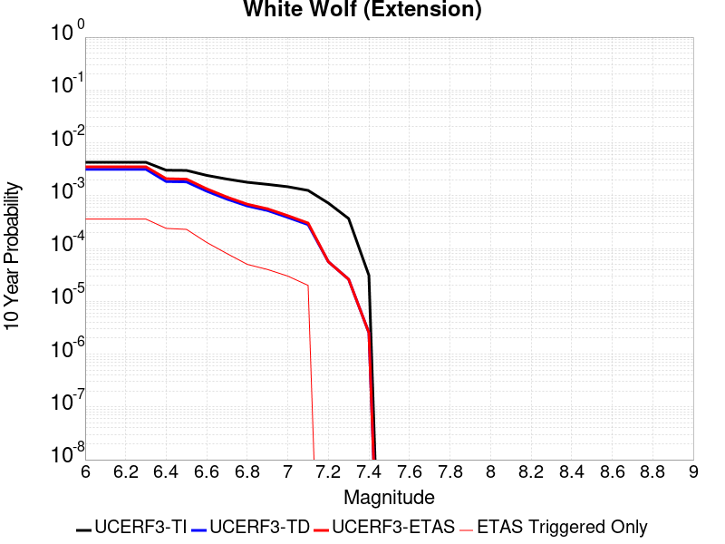 |

| Magnitude | 1 wk TI Prob | 1 wk TD Prob | 1 wk ETAS Prob | 1 wk ETAS/TD Gain | 1 wk ETAS Triggered Only | 1 mo TI Prob | 1 mo TD Prob | 1 mo ETAS Prob | 1 mo ETAS/TD Gain | 1 mo ETAS Triggered Only | 1 yr TI Prob | 1 yr TD Prob | 1 yr ETAS Prob | 1 yr ETAS/TD Gain | 1 yr ETAS Triggered Only | 10 yr TI Prob | 10 yr TD Prob | 10 yr ETAS Prob | 10 yr ETAS/TD Gain | 10 yr ETAS Triggered Only |
|-----|-----|-----|-----|-----|-----|-----|-----|-----|-----|-----|-----|-----|-----|-----|-----|-----|-----|-----|-----|-----|
| 6.0 | 8.222555E-6 | 6.0666657E-6 | 7.7494806E-5 | 12.77387 | 7.142857E-5 | 3.5239045E-5 | 2.5999774E-5 | 1.212354E-4 | 4.6629405 | 9.5238094E-5 | 4.289509E-4 | 3.1650788E-4 | 5.545278E-4 | 1.7520188 | 2.3809524E-4 | 0.0042812387 | 0.003161223 | 0.0034935025 | 1.1051111 | 3.3333333E-4 |
| 6.1 | 8.222555E-6 | 6.0666657E-6 | 7.7494806E-5 | 12.77387 | 7.142857E-5 | 3.5239045E-5 | 2.5999774E-5 | 1.212354E-4 | 4.6629405 | 9.5238094E-5 | 4.289509E-4 | 3.1650788E-4 | 5.545278E-4 | 1.7520188 | 2.3809524E-4 | 0.0042812387 | 0.003161223 | 0.0034935025 | 1.1051111 | 3.3333333E-4 |
| 6.2 | 8.222555E-6 | 6.0666657E-6 | 7.7494806E-5 | 12.77387 | 7.142857E-5 | 3.5239045E-5 | 2.5999774E-5 | 1.212354E-4 | 4.6629405 | 9.5238094E-5 | 4.289509E-4 | 3.1650788E-4 | 5.545278E-4 | 1.7520188 | 2.3809524E-4 | 0.0042812387 | 0.003161223 | 0.0034935025 | 1.1051111 | 3.3333333E-4 |
| 6.3 | 8.222555E-6 | 6.0666657E-6 | 7.7494806E-5 | 12.77387 | 7.142857E-5 | 3.5239045E-5 | 2.5999774E-5 | 1.212354E-4 | 4.6629405 | 9.5238094E-5 | 4.289509E-4 | 3.1650788E-4 | 5.545278E-4 | 1.7520188 | 2.3809524E-4 | 0.0042812387 | 0.003161223 | 0.0034935025 | 1.1051111 | 3.3333333E-4 |
| 6.4 | 5.821773E-6 | 3.5571766E-6 | 2.7366616E-5 | 7.693353 | 2.3809524E-5 | 2.4950215E-5 | 1.5244959E-5 | 6.2863284E-5 | 4.123545 | 4.7619047E-5 | 3.0372653E-4 | 1.8559267E-4 | 3.0461818E-4 | 1.6413267 | 1.1904762E-4 | 0.0030331176 | 0.001854485 | 0.0020683734 | 1.1153357 | 2.1428571E-4 |
| 6.5 | 5.766023E-6 | 3.4991106E-6 | 2.7308552E-5 | 7.804426 | 2.3809524E-5 | 2.4711293E-5 | 1.4996108E-5 | 6.261444E-5 | 4.1753793 | 4.7619047E-5 | 3.0081844E-4 | 1.8256342E-4 | 3.0158932E-4 | 1.65197 | 1.1904762E-4 | 0.0030041158 | 0.0018242426 | 0.0020381373 | 1.1172513 | 2.1428571E-4 |
| 6.6 | 4.643576E-6 | 2.332624E-6 | 2.6142092E-5 | 11.207161 | 2.3809524E-5 | 1.9900888E-5 | 9.996925E-6 | 3.380621E-5 | 3.3816612 | 2.3809524E-5 | 2.4226638E-4 | 1.2170619E-4 | 1.6931944E-4 | 1.3912147 | 4.7619047E-5 | 0.0024200242 | 0.0012164378 | 0.0013353406 | 1.0977467 | 1.1904762E-4 |
| 6.7 | 3.9529173E-6 | 1.6483477E-6 | 2.5457832E-5 | 15.444454 | 2.3809524E-5 | 1.6940963E-5 | 7.0643296E-6 | 3.0873685E-5 | 4.370363 | 2.3809524E-5 | 2.0623671E-4 | 8.6005006E-5 | 1.09812485E-4 | 1.276815 | 2.3809524E-5 | 0.002060454 | 8.597357E-4 | 9.311029E-4 | 1.0830106 | 7.142857E-5 |
| 6.8 | 3.4377522E-6 | 1.2245237E-6 | 2.5034018E-5 | 20.443882 | 2.3809524E-5 | 1.473314E-5 | 5.2479486E-6 | 2.9057348E-5 | 5.536896 | 2.3809524E-5 | 1.7936122E-4 | 6.3891996E-5 | 8.77E-5 | 1.3726289 | 2.3809524E-5 | 0.0017921652 | 6.387454E-4 | 6.86334E-4 | 1.0745033 | 4.7619047E-5 |
| 6.9 | 3.1367306E-6 | 1.0033783E-6 | 2.4812878E-5 | 24.729334 | 2.3809524E-5 | 1.3443062E-5 | 4.3001864E-6 | 2.8109607E-5 | 6.5368347 | 2.3809524E-5 | 1.63657E-4 | 5.235359E-5 | 7.6161865E-5 | 1.4547592 | 2.3809524E-5 | 0.0016353652 | 5.2342017E-4 | 5.710143E-4 | 1.0909292 | 4.7619047E-5 |
| 7.0 | 2.8298145E-6 | 7.4286646E-7 | 7.4286646E-7 | 1.0 | 0.0 | 1.2127721E-5 | 3.1837099E-6 | 3.1837099E-6 | 1.0 | 0.0 | 1.47645E-4 | 3.8761027E-5 | 3.8761027E-5 | 1.0 | 0.0 | 0.0014754693 | 3.8754768E-4 | 4.1134798E-4 | 1.0614126 | 2.3809524E-5 |
| 7.1 | 2.4091064E-6 | 5.4227525E-7 | 5.4227525E-7 | 1.0 | 0.0 | 1.03247E-5 | 2.3240348E-6 | 2.3240348E-6 | 1.0 | 0.0 | 1.2569598E-4 | 2.8294799E-5 | 2.8294799E-5 | 1.0 | 0.0 | 0.001256249 | 2.8291598E-4 | 3.0671878E-4 | 1.0841337 | 2.3809524E-5 |
| 7.2 | 1.3875518E-6 | 1.0743063E-7 | 1.0743063E-7 | 1.0 | 0.0 | 5.9466374E-6 | 4.6041689E-7 | 4.6041689E-7 | 1.0 | 0.0 | 7.23979E-5 | 5.6055624E-6 | 5.6055624E-6 | 1.0 | 0.0 | 7.2374323E-4 | 5.6054323E-5 | 5.6054323E-5 | 1.0 | 0.0 |
| 7.3 | 7.056077E-7 | 5.002034E-8 | 5.002034E-8 | 1.0 | 0.0 | 3.0240296E-6 | 2.1437286E-7 | 2.1437286E-7 | 1.0 | 0.0 | 3.681694E-5 | 2.609987E-6 | 2.609987E-6 | 1.0 | 0.0 | 3.681084E-4 | 2.609961E-5 | 2.609961E-5 | 1.0 | 0.0 |
| 7.4 | 5.9334678E-8 | 4.8683537E-9 | 4.8683537E-9 | 1.0 | 0.0 | 2.5429145E-7 | 2.0864372E-8 | 2.0864372E-8 | 1.0 | 0.0 | 3.095994E-6 | 2.5402372E-7 | 2.5402372E-7 | 1.0 | 0.0 | 3.095951E-5 | 2.5402353E-6 | 2.5402353E-6 | 1.0 | 0.0 |

## Red Mountain
*[(top)](#table-of-contents)*

| 1 Week | 1 Month | 1 Year | 10 Year |
|-----|-----|-----|-----|
|  |  | 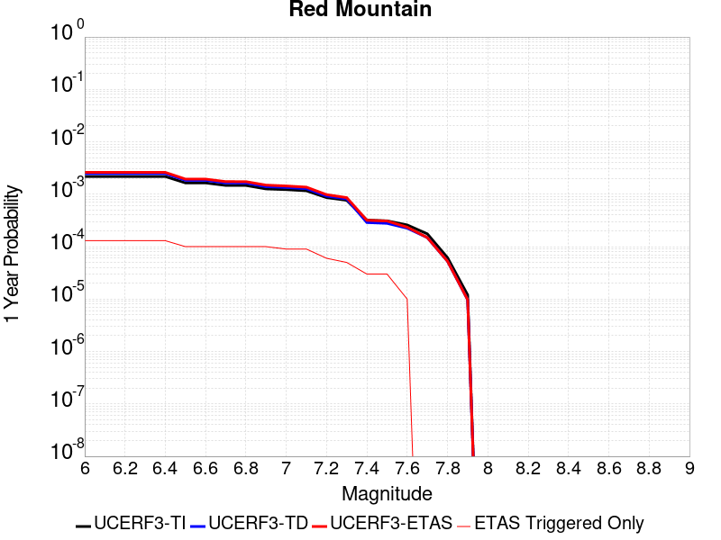 |  |

| Magnitude | 1 wk TI Prob | 1 wk TD Prob | 1 wk ETAS Prob | 1 wk ETAS/TD Gain | 1 wk ETAS Triggered Only | 1 mo TI Prob | 1 mo TD Prob | 1 mo ETAS Prob | 1 mo ETAS/TD Gain | 1 mo ETAS Triggered Only | 1 yr TI Prob | 1 yr TD Prob | 1 yr ETAS Prob | 1 yr ETAS/TD Gain | 1 yr ETAS Triggered Only | 10 yr TI Prob | 10 yr TD Prob | 10 yr ETAS Prob | 10 yr ETAS/TD Gain | 10 yr ETAS Triggered Only |
|-----|-----|-----|-----|-----|-----|-----|-----|-----|-----|-----|-----|-----|-----|-----|-----|-----|-----|-----|-----|-----|
| 6.0 | 4.1810763E-5 | 4.7589947E-5 | 1.4282351E-4 | 3.0011277 | 9.5238094E-5 | 1.7917668E-4 | 2.039419E-4 | 2.9916057E-4 | 1.4668912 | 9.5238094E-5 | 0.0021792934 | 0.0024803306 | 0.0026703344 | 1.0766042 | 1.9047619E-4 | 0.021580452 | 0.024544092 | 0.024799569 | 1.0104089 | 2.6190476E-4 |
| 6.1 | 4.1810763E-5 | 4.7589947E-5 | 1.4282351E-4 | 3.0011277 | 9.5238094E-5 | 1.7917668E-4 | 2.039419E-4 | 2.9916057E-4 | 1.4668912 | 9.5238094E-5 | 0.0021792934 | 0.0024803306 | 0.0026703344 | 1.0766042 | 1.9047619E-4 | 0.021580452 | 0.024544092 | 0.024799569 | 1.0104089 | 2.6190476E-4 |
| 6.2 | 4.1810763E-5 | 4.7589947E-5 | 1.4282351E-4 | 3.0011277 | 9.5238094E-5 | 1.7917668E-4 | 2.039419E-4 | 2.9916057E-4 | 1.4668912 | 9.5238094E-5 | 0.0021792934 | 0.0024803306 | 0.0026703344 | 1.0766042 | 1.9047619E-4 | 0.021580452 | 0.024544092 | 0.024799569 | 1.0104089 | 2.6190476E-4 |
| 6.3 | 4.1810763E-5 | 4.7589947E-5 | 1.4282351E-4 | 3.0011277 | 9.5238094E-5 | 1.7917668E-4 | 2.039419E-4 | 2.9916057E-4 | 1.4668912 | 9.5238094E-5 | 0.0021792934 | 0.0024803306 | 0.0026703344 | 1.0766042 | 1.9047619E-4 | 0.021580452 | 0.024544092 | 0.024799569 | 1.0104089 | 2.6190476E-4 |
| 6.4 | 4.1810763E-5 | 4.7589947E-5 | 1.4282351E-4 | 3.0011277 | 9.5238094E-5 | 1.7917668E-4 | 2.039419E-4 | 2.9916057E-4 | 1.4668912 | 9.5238094E-5 | 0.0021792934 | 0.0024803306 | 0.0026703344 | 1.0766042 | 1.9047619E-4 | 0.021580452 | 0.024544092 | 0.024799569 | 1.0104089 | 2.6190476E-4 |
| 6.5 | 3.154503E-5 | 3.5359728E-5 | 8.2977094E-5 | 2.3466554 | 4.7619047E-5 | 1.3518598E-4 | 1.5153342E-4 | 1.9914524E-4 | 1.3142003 | 4.7619047E-5 | 0.0016446467 | 0.0018434501 | 0.001986044 | 1.0773516 | 1.4285714E-4 | 0.01632528 | 0.018291233 | 0.018478226 | 1.010223 | 1.9047619E-4 |
| 6.6 | 3.1535834E-5 | 3.534911E-5 | 8.296647E-5 | 2.3470597 | 4.7619047E-5 | 1.3514658E-4 | 1.5148791E-4 | 1.9909974E-4 | 1.3142946 | 4.7619047E-5 | 0.0016441676 | 0.001842897 | 0.001985491 | 1.0773748 | 1.4285714E-4 | 0.01632056 | 0.018285794 | 0.018472787 | 1.0102261 | 1.9047619E-4 |
| 6.7 | 2.8267326E-5 | 3.146934E-5 | 7.908689E-5 | 2.5131412 | 4.7619047E-5 | 1.2114006E-4 | 1.348621E-4 | 1.8247473E-4 | 1.3530468 | 4.7619047E-5 | 0.0014738824 | 0.0016407946 | 0.0017834173 | 1.086923 | 1.4285714E-4 | 0.014641452 | 0.016295563 | 0.016482936 | 1.0114983 | 1.9047619E-4 |
| 6.8 | 2.8212884E-5 | 3.1407224E-5 | 7.902478E-5 | 2.5161338 | 4.7619047E-5 | 1.20906756E-4 | 1.3459593E-4 | 1.8220856E-4 | 1.353745 | 4.7619047E-5 | 0.0014710457 | 0.0016375587 | 0.0017801819 | 1.087095 | 1.4285714E-4 | 0.014613459 | 0.01626368 | 0.016451059 | 1.0115212 | 1.9047619E-4 |
| 6.9 | 2.4227871E-5 | 2.6706979E-5 | 7.432475E-5 | 2.7829714 | 4.7619047E-5 | 1.03829596E-4 | 1.14453884E-4 | 1.6206749E-4 | 1.4160068 | 4.7619047E-5 | 0.0012633923 | 0.0013926612 | 0.0015353194 | 1.1024357 | 1.4285714E-4 | 0.012562336 | 0.013847026 | 0.0140348645 | 1.0135653 | 1.9047619E-4 |
| 7.0 | 2.348524E-5 | 2.5835763E-5 | 7.345358E-5 | 2.843097 | 4.7619047E-5 | 1.0064714E-4 | 1.1072042E-4 | 1.583342E-4 | 1.4300361 | 4.7619047E-5 | 0.0012246901 | 0.0013472632 | 0.0014899279 | 1.1058922 | 1.4285714E-4 | 0.012179627 | 0.01339859 | 0.013586514 | 1.0140257 | 1.9047619E-4 |
| 7.1 | 2.2311642E-5 | 2.4462828E-5 | 7.2080715E-5 | 2.9465404 | 4.7619047E-5 | 9.561782E-5 | 1.048369E-4 | 1.5245096E-4 | 1.4541726 | 4.7619047E-5 | 0.0011635252 | 0.0012757168 | 0.0014183917 | 1.111839 | 1.4285714E-4 | 0.01157452 | 0.012691451 | 0.01287951 | 1.0148177 | 1.9047619E-4 |
| 7.2 | 1.6533986E-5 | 1.7670347E-5 | 6.528855E-5 | 3.6948087 | 4.7619047E-5 | 7.085802E-5 | 7.572822E-5 | 1.2334366E-4 | 1.6287675 | 4.7619047E-5 | 8.623549E-4 | 9.216645E-4 | 0.0010168148 | 1.1032375 | 9.5238094E-5 | 0.008590161 | 0.009184699 | 0.009302653 | 1.0128424 | 1.1904762E-4 |
| 7.3 | 1.4703092E-5 | 1.555952E-5 | 3.9368675E-5 | 2.5301983 | 2.3809524E-5 | 6.301173E-5 | 6.66823E-5 | 9.049024E-5 | 1.3570353 | 2.3809524E-5 | 7.668978E-4 | 8.1161625E-4 | 8.829869E-4 | 1.0879364 | 7.142857E-5 | 0.0076425658 | 0.008092596 | 0.008187063 | 1.0116733 | 9.5238094E-5 |
| 7.4 | 6.1331984E-6 | 5.528872E-6 | 2.9338264E-5 | 5.3063745 | 2.3809524E-5 | 2.6284872E-5 | 2.3694953E-5 | 4.7503912E-5 | 2.0048115 | 2.3809524E-5 | 3.199713E-4 | 2.8844838E-4 | 3.360537E-4 | 1.1650393 | 4.7619047E-5 | 0.0031951098 | 0.0028807942 | 0.0029520171 | 1.0247233 | 7.142857E-5 |
| 7.5 | 5.954766E-6 | 5.3385015E-6 | 2.91479E-5 | 5.45994 | 2.3809524E-5 | 2.5520176E-5 | 2.2879094E-5 | 4.6688074E-5 | 2.0406435 | 2.3809524E-5 | 3.1066386E-4 | 2.785179E-4 | 3.2612367E-4 | 1.1709254 | 4.7619047E-5 | 0.003102299 | 0.0027817423 | 0.0028529721 | 1.0256062 | 7.142857E-5 |
| 7.6 | 4.9726646E-6 | 4.315295E-6 | 2.8124716E-5 | 6.5174494 | 2.3809524E-5 | 2.1311245E-5 | 1.8493993E-5 | 4.2303076E-5 | 2.2873955 | 2.3809524E-5 | 2.5943352E-4 | 2.2514143E-4 | 2.4894558E-4 | 1.1057298 | 2.3809524E-5 | 0.0025913084 | 0.002249168 | 0.002272924 | 1.0105621 | 2.3809524E-5 |
| 7.7 | 3.3613894E-6 | 2.8526642E-6 | 2.8526642E-6 | 1.0 | 0.0 | 1.4405875E-5 | 1.2225649E-5 | 1.2225649E-5 | 1.0 | 0.0 | 1.7537741E-4 | 1.4883737E-4 | 1.4883737E-4 | 1.0 | 0.0 | 0.0017523908 | 0.0014874031 | 0.0014874031 | 1.0 | 0.0 |
| 7.8 | 1.1828961E-6 | 1.0122756E-6 | 1.0122756E-6 | 1.0 | 0.0 | 5.069545E-6 | 4.338317E-6 | 4.338317E-6 | 1.0 | 0.0 | 6.171996E-5 | 5.281776E-5 | 5.281776E-5 | 1.0 | 0.0 | 6.170282E-4 | 5.2805495E-4 | 5.2805495E-4 | 1.0 | 0.0 |
| 7.9 | 2.2967266E-7 | 1.8618952E-7 | 1.8618952E-7 | 1.0 | 0.0 | 9.843111E-7 | 7.9795484E-7 | 7.9795484E-7 | 1.0 | 0.0 | 1.19839215E-5 | 9.7150605E-6 | 9.7150605E-6 | 1.0 | 0.0 | 1.1983275E-4 | 9.714664E-5 | 9.714664E-5 | 1.0 | 0.0 |

## San Jacinto (Coyote Creek)
*[(top)](#table-of-contents)*

| 1 Week | 1 Month | 1 Year | 10 Year |
|-----|-----|-----|-----|
|  |  |  |  |

| Magnitude | 1 wk TI Prob | 1 wk TD Prob | 1 wk ETAS Prob | 1 wk ETAS/TD Gain | 1 wk ETAS Triggered Only | 1 mo TI Prob | 1 mo TD Prob | 1 mo ETAS Prob | 1 mo ETAS/TD Gain | 1 mo ETAS Triggered Only | 1 yr TI Prob | 1 yr TD Prob | 1 yr ETAS Prob | 1 yr ETAS/TD Gain | 1 yr ETAS Triggered Only | 10 yr TI Prob | 10 yr TD Prob | 10 yr ETAS Prob | 10 yr ETAS/TD Gain | 10 yr ETAS Triggered Only |
|-----|-----|-----|-----|-----|-----|-----|-----|-----|-----|-----|-----|-----|-----|-----|-----|-----|-----|-----|-----|-----|
| 6.0 | 2.7374346E-5 | 2.4145214E-5 | 1.1938101E-4 | 4.944293 | 9.5238094E-5 | 1.1731335E-4 | 1.034754E-4 | 2.4631777E-4 | 2.3804476 | 1.4285714E-4 | 0.0014273542 | 0.0012590875 | 0.0014731034 | 1.169977 | 2.1428571E-4 | 0.01418221 | 0.012928318 | 0.013210339 | 1.0218141 | 2.8571428E-4 |
| 6.1 | 2.7374346E-5 | 2.4145214E-5 | 1.1938101E-4 | 4.944293 | 9.5238094E-5 | 1.1731335E-4 | 1.034754E-4 | 2.4631777E-4 | 2.3804476 | 1.4285714E-4 | 0.0014273542 | 0.0012590875 | 0.0014731034 | 1.169977 | 2.1428571E-4 | 0.01418221 | 0.012928318 | 0.013210339 | 1.0218141 | 2.8571428E-4 |
| 6.2 | 2.7374346E-5 | 2.4145214E-5 | 1.1938101E-4 | 4.944293 | 9.5238094E-5 | 1.1731335E-4 | 1.034754E-4 | 2.4631777E-4 | 2.3804476 | 1.4285714E-4 | 0.0014273542 | 0.0012590875 | 0.0014731034 | 1.169977 | 2.1428571E-4 | 0.01418221 | 0.012928318 | 0.013210339 | 1.0218141 | 2.8571428E-4 |
| 6.3 | 2.7374346E-5 | 2.4145214E-5 | 1.1938101E-4 | 4.944293 | 9.5238094E-5 | 1.1731335E-4 | 1.034754E-4 | 2.4631777E-4 | 2.3804476 | 1.4285714E-4 | 0.0014273542 | 0.0012590875 | 0.0014731034 | 1.169977 | 2.1428571E-4 | 0.01418221 | 0.012928318 | 0.013210339 | 1.0218141 | 2.8571428E-4 |
| 6.4 | 2.7374346E-5 | 2.4145214E-5 | 1.1938101E-4 | 4.944293 | 9.5238094E-5 | 1.1731335E-4 | 1.034754E-4 | 2.4631777E-4 | 2.3804476 | 1.4285714E-4 | 0.0014273542 | 0.0012590875 | 0.0014731034 | 1.169977 | 2.1428571E-4 | 0.01418221 | 0.012928318 | 0.013210339 | 1.0218141 | 2.8571428E-4 |
| 6.5 | 2.7282445E-5 | 2.4031293E-5 | 1.192671E-4 | 4.9629917 | 9.5238094E-5 | 1.16919524E-4 | 1.029872E-4 | 2.4582964E-4 | 2.386992 | 1.4285714E-4 | 0.0014225657 | 0.0012531505 | 0.0014671677 | 1.1707833 | 2.1428571E-4 | 0.014134934 | 0.012869646 | 0.013151683 | 1.021915 | 2.8571428E-4 |
| 6.6 | 2.7282445E-5 | 2.4031293E-5 | 1.192671E-4 | 4.9629917 | 9.5238094E-5 | 1.16919524E-4 | 1.029872E-4 | 2.4582964E-4 | 2.386992 | 1.4285714E-4 | 0.0014225657 | 0.0012531505 | 0.0014671677 | 1.1707833 | 2.1428571E-4 | 0.014134934 | 0.012869646 | 0.013151683 | 1.021915 | 2.8571428E-4 |
| 6.7 | 2.7216198E-5 | 2.3956412E-5 | 1.1919223E-4 | 4.9753785 | 9.5238094E-5 | 1.1663563E-4 | 1.02666316E-4 | 2.455088E-4 | 2.3913276 | 1.4285714E-4 | 0.0014191137 | 0.0012492483 | 0.0014632663 | 1.1713175 | 2.1428571E-4 | 0.014100855 | 0.0128310565 | 0.013113105 | 1.0219817 | 2.8571428E-4 |
| 6.8 | 2.7078617E-5 | 2.387363E-5 | 1.1910945E-4 | 4.989164 | 9.5238094E-5 | 1.1604605E-4 | 1.0231156E-4 | 2.4515408E-4 | 2.3961523 | 1.4285714E-4 | 0.001411945 | 0.0012449342 | 0.001458953 | 1.1719118 | 2.1428571E-4 | 0.014030075 | 0.012788199 | 0.013070259 | 1.0220563 | 2.8571428E-4 |
| 6.9 | 2.6982952E-5 | 2.3793142E-5 | 1.1902897E-4 | 5.002659 | 9.5238094E-5 | 1.15636096E-4 | 1.0196664E-4 | 2.448092E-4 | 2.4008756 | 1.4285714E-4 | 0.0014069602 | 0.0012407395 | 0.0014547593 | 1.1724938 | 2.1428571E-4 | 0.013980856 | 0.012746515 | 0.013028587 | 1.0221294 | 2.8571428E-4 |
| 7.0 | 2.6449972E-5 | 2.3370165E-5 | 1.1860603E-4 | 5.0751047 | 9.5238094E-5 | 1.1335209E-4 | 1.00154015E-4 | 2.4299684E-4 | 2.4262316 | 1.4285714E-4 | 0.001379188 | 0.0012186957 | 0.0014327202 | 1.1756177 | 2.1428571E-4 | 0.0137065975 | 0.0125278765 | 0.012810011 | 1.0225205 | 2.8571428E-4 |
| 7.1 | 2.6257849E-5 | 2.3196202E-5 | 1.18432086E-4 | 5.105667 | 9.5238094E-5 | 1.1252879E-4 | 9.940852E-5 | 2.4225147E-4 | 2.4369285 | 1.4285714E-4 | 0.0013691769 | 0.0012096294 | 0.0014236558 | 1.1769357 | 2.1428571E-4 | 0.013607717 | 0.012437741 | 0.012719902 | 1.0226859 | 2.8571428E-4 |
| 7.2 | 2.5270041E-5 | 2.2390966E-5 | 1.1762693E-4 | 5.2533207 | 9.5238094E-5 | 1.0829568E-4 | 9.595777E-5 | 2.388012E-4 | 2.4886074 | 1.4285714E-4 | 0.0013177024 | 0.0011676621 | 0.0013816976 | 1.1833026 | 2.1428571E-4 | 0.013099162 | 0.012018777 | 0.012301058 | 1.0234866 | 2.8571428E-4 |
| 7.3 | 2.339701E-5 | 2.1122814E-5 | 1.163589E-4 | 5.5086837 | 9.5238094E-5 | 1.0026905E-4 | 9.0523215E-5 | 2.3336743E-4 | 2.5779843 | 1.4285714E-4 | 0.001220092 | 0.0011015651 | 0.0013156147 | 1.1943141 | 2.1428571E-4 | 0.012134149 | 0.011357696 | 0.011640165 | 1.0248703 | 2.8571428E-4 |
| 7.4 | 2.296333E-5 | 2.0853171E-5 | 1.1608928E-4 | 5.5669847 | 9.5238094E-5 | 9.841056E-5 | 8.936768E-5 | 2.3221206E-4 | 2.5983896 | 1.4285714E-4 | 0.0011974899 | 0.0010875105 | 0.0013015631 | 1.1968281 | 2.1428571E-4 | 0.011910575 | 0.01121681 | 0.011499319 | 1.0251863 | 2.8571428E-4 |
| 7.5 | 2.2188895E-5 | 2.0376096E-5 | 1.1561225E-4 | 5.673916 | 9.5238094E-5 | 9.50918E-5 | 8.732321E-5 | 2.3016788E-4 | 2.6358156 | 1.4285714E-4 | 0.0011571277 | 0.0010626436 | 0.0012767016 | 1.2014391 | 2.1428571E-4 | 0.011511209 | 0.010966429 | 0.0112490095 | 1.0257678 | 2.8571428E-4 |
| 7.6 | 2.0013189E-5 | 1.8962366E-5 | 1.1419866E-4 | 6.0223846 | 9.5238094E-5 | 8.5767984E-5 | 8.1264756E-5 | 2.2411029E-4 | 2.7577796 | 1.4285714E-4 | 0.001043725 | 9.889511E-4 | 0.0012030249 | 1.2164655 | 2.1428571E-4 | 0.010388365 | 0.010224434 | 0.010507227 | 1.0276586 | 2.8571428E-4 |
| 7.7 | 1.7230794E-5 | 1.674371E-5 | 1.1198021E-4 | 6.687897 | 9.5238094E-5 | 7.384417E-5 | 7.175679E-5 | 2.1460369E-4 | 2.990709 | 1.4285714E-4 | 8.986819E-4 | 8.7328954E-4 | 0.0010873881 | 1.2451633 | 2.1428571E-4 | 0.008950562 | 0.009062956 | 0.009346081 | 1.0312397 | 2.8571428E-4 |
| 7.8 | 1.4478809E-5 | 1.4990978E-5 | 1.10227644E-4 | 7.352932 | 9.5238094E-5 | 6.205057E-5 | 6.424547E-5 | 2.0709344E-4 | 3.2234714 | 1.4285714E-4 | 7.552038E-4 | 7.819085E-4 | 9.960267E-4 | 1.2738404 | 2.1428571E-4 | 0.0075264242 | 0.008141387 | 0.008424776 | 1.0348084 | 2.8571428E-4 |
| 7.9 | 1.1114467E-5 | 1.1645102E-5 | 1.06882086E-4 | 9.178287 | 9.5238094E-5 | 4.7632562E-5 | 4.990663E-5 | 1.9275665E-4 | 3.8623455 | 1.4285714E-4 | 5.797721E-4 | 6.074444E-4 | 7.9780485E-4 | 1.3133793 | 1.9047619E-4 | 0.0057826187 | 0.0063803247 | 0.0066405586 | 1.0407869 | 2.6190476E-4 |
| 8.0 | 9.327402E-6 | 9.899186E-6 | 1.05136336E-4 | 10.620706 | 9.5238094E-5 | 3.9973966E-5 | 4.2424395E-5 | 1.8527548E-4 | 4.367192 | 1.4285714E-4 | 4.8657437E-4 | 5.1639514E-4 | 7.0677296E-4 | 1.368667 | 1.9047619E-4 | 0.0048551033 | 0.0054499684 | 0.005710446 | 1.0477943 | 2.6190476E-4 |
| 8.1 | 7.0235833E-6 | 6.827495E-6 | 7.825558E-5 | 11.461829 | 7.142857E-5 | 3.0100724E-5 | 2.9260367E-5 | 1.2449568E-4 | 4.2547545 | 9.5238094E-5 | 3.664147E-4 | 3.5618723E-4 | 4.7519247E-4 | 1.3341086 | 1.1904762E-4 | 0.003658111 | 0.0037876023 | 0.003977357 | 1.0500989 | 1.9047619E-4 |
| 8.2 | 2.0358202E-6 | 8.994527E-7 | 8.994527E-7 | 1.0 | 0.0 | 8.724915E-6 | 3.854792E-6 | 3.854792E-6 | 1.0 | 0.0 | 1.06220665E-4 | 4.69311E-5 | 4.69311E-5 | 1.0 | 0.0 | 0.001061699 | 5.3254166E-4 | 5.3254166E-4 | 1.0 | 0.0 |
| 8.3 | 2.0051264E-7 | 6.617272E-8 | 6.617272E-8 | 1.0 | 0.0 | 8.5933965E-7 | 2.8359733E-7 | 2.8359733E-7 | 1.0 | 0.0 | 1.046241E-5 | 3.4527925E-6 | 3.4527925E-6 | 1.0 | 0.0 | 1.0461917E-4 | 4.01389E-5 | 4.01389E-5 | 1.0 | 0.0 |

## Scodie Lineament
*[(top)](#table-of-contents)*

| 1 Week | 1 Month | 1 Year | 10 Year |
|-----|-----|-----|-----|
|  |  |  | 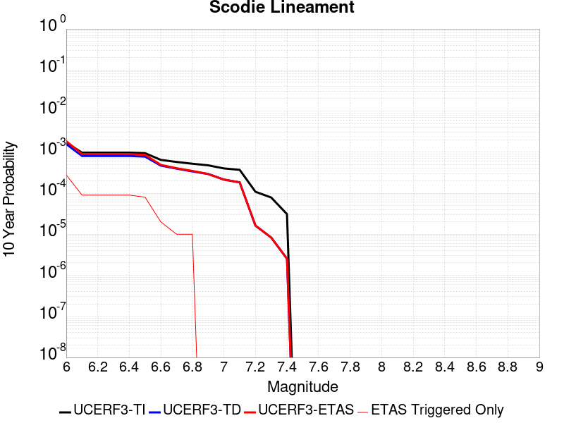 |

| Magnitude | 1 wk TI Prob | 1 wk TD Prob | 1 wk ETAS Prob | 1 wk ETAS/TD Gain | 1 wk ETAS Triggered Only | 1 mo TI Prob | 1 mo TD Prob | 1 mo ETAS Prob | 1 mo ETAS/TD Gain | 1 mo ETAS Triggered Only | 1 yr TI Prob | 1 yr TD Prob | 1 yr ETAS Prob | 1 yr ETAS/TD Gain | 1 yr ETAS Triggered Only | 10 yr TI Prob | 10 yr TD Prob | 10 yr ETAS Prob | 10 yr ETAS/TD Gain | 10 yr ETAS Triggered Only |
|-----|-----|-----|-----|-----|-----|-----|-----|-----|-----|-----|-----|-----|-----|-----|-----|-----|-----|-----|-----|-----|
| 6.0 | 3.2919327E-6 | 3.0133422E-6 | 9.825115E-5 | 32.605373 | 9.5238094E-5 | 1.4108206E-5 | 1.2914278E-5 | 1.08151144E-4 | 8.37454 | 9.5238094E-5 | 1.7175387E-4 | 1.5722317E-4 | 3.476694E-4 | 2.2113116 | 1.9047619E-4 | 0.0017162118 | 0.0015714309 | 0.0018566962 | 1.1815321 | 2.8571428E-4 |
| 6.1 | 1.8663811E-6 | 1.5490499E-6 | 1.5490499E-6 | 1.0 | 0.0 | 7.998751E-6 | 6.6387715E-6 | 6.6387715E-6 | 1.0 | 0.0 | 9.738045E-5 | 8.082454E-5 | 1.2843974E-4 | 1.5891181 | 4.7619047E-5 | 9.7337784E-4 | 8.080003E-4 | 9.031614E-4 | 1.1177737 | 9.5238094E-5 |
| 6.2 | 1.8663811E-6 | 1.5490499E-6 | 1.5490499E-6 | 1.0 | 0.0 | 7.998751E-6 | 6.6387715E-6 | 6.6387715E-6 | 1.0 | 0.0 | 9.738045E-5 | 8.082454E-5 | 1.2843974E-4 | 1.5891181 | 4.7619047E-5 | 9.7337784E-4 | 8.080003E-4 | 9.031614E-4 | 1.1177737 | 9.5238094E-5 |
| 6.3 | 1.8663811E-6 | 1.5490499E-6 | 1.5490499E-6 | 1.0 | 0.0 | 7.998751E-6 | 6.6387715E-6 | 6.6387715E-6 | 1.0 | 0.0 | 9.738045E-5 | 8.082454E-5 | 1.2843974E-4 | 1.5891181 | 4.7619047E-5 | 9.7337784E-4 | 8.080003E-4 | 9.031614E-4 | 1.1177737 | 9.5238094E-5 |
| 6.4 | 1.8663811E-6 | 1.5490499E-6 | 1.5490499E-6 | 1.0 | 0.0 | 7.998751E-6 | 6.6387715E-6 | 6.6387715E-6 | 1.0 | 0.0 | 9.738045E-5 | 8.082454E-5 | 1.2843974E-4 | 1.5891181 | 4.7619047E-5 | 9.7337784E-4 | 8.080003E-4 | 9.031614E-4 | 1.1177737 | 9.5238094E-5 |
| 6.5 | 1.8106311E-6 | 1.4909839E-6 | 1.4909839E-6 | 1.0 | 0.0 | 7.759824E-6 | 6.3899183E-6 | 6.3899183E-6 | 1.0 | 0.0 | 9.447177E-5 | 7.7794975E-5 | 1.2541031E-4 | 1.612062 | 4.7619047E-5 | 9.4431615E-4 | 7.7772606E-4 | 8.728901E-4 | 1.1223619 | 9.5238094E-5 |
| 6.6 | 1.2414679E-6 | 8.997558E-7 | 8.997558E-7 | 1.0 | 0.0 | 5.320566E-6 | 3.856091E-6 | 3.856091E-6 | 1.0 | 0.0 | 6.477596E-5 | 4.6946985E-5 | 4.6946985E-5 | 1.0 | 0.0 | 6.475708E-4 | 4.693793E-4 | 4.931777E-4 | 1.0507017 | 2.3809524E-5 |
| 6.7 | 1.1062215E-6 | 7.594311E-7 | 7.594311E-7 | 1.0 | 0.0 | 4.7409408E-6 | 3.2547011E-6 | 3.2547011E-6 | 1.0 | 0.0 | 5.7719422E-5 | 3.9625334E-5 | 3.9625334E-5 | 1.0 | 0.0 | 5.770443E-4 | 3.961897E-4 | 3.961897E-4 | 1.0 | 0.0 |
| 6.8 | 1.0006736E-6 | 6.500397E-7 | 6.500397E-7 | 1.0 | 0.0 | 4.288594E-6 | 2.7858816E-6 | 2.7858816E-6 | 1.0 | 0.0 | 5.221238E-5 | 3.3917644E-5 | 3.3917644E-5 | 1.0 | 0.0 | 5.220012E-4 | 3.3913075E-4 | 3.3913075E-4 | 1.0 | 0.0 |
| 6.9 | 9.167364E-7 | 5.631625E-7 | 5.631625E-7 | 1.0 | 0.0 | 3.9288643E-6 | 2.4135516E-6 | 2.4135516E-6 | 1.0 | 0.0 | 4.7832873E-5 | 2.9384651E-5 | 2.9384651E-5 | 1.0 | 0.0 | 4.782258E-4 | 2.9381333E-4 | 2.9381333E-4 | 1.0 | 0.0 |
| 7.0 | 7.6987664E-7 | 4.113383E-7 | 4.113383E-7 | 1.0 | 0.0 | 3.2994672E-6 | 1.7628774E-6 | 1.7628774E-6 | 1.0 | 0.0 | 4.0170275E-5 | 2.1462862E-5 | 2.1462862E-5 | 1.0 | 0.0 | 4.0163012E-4 | 2.1461173E-4 | 2.1461173E-4 | 1.0 | 0.0 |
| 7.1 | 7.1038727E-7 | 3.5211494E-7 | 3.5211494E-7 | 1.0 | 0.0 | 3.0445133E-6 | 1.5090633E-6 | 1.5090633E-6 | 1.0 | 0.0 | 3.706632E-5 | 1.8372726E-5 | 1.8372726E-5 | 1.0 | 0.0 | 3.7060137E-4 | 1.8371557E-4 | 1.8371557E-4 | 1.0 | 0.0 |
| 7.2 | 2.0799602E-7 | 3.1186854E-8 | 3.1186854E-8 | 1.0 | 0.0 | 8.914113E-7 | 1.3365793E-7 | 1.3365793E-7 | 1.0 | 0.0 | 1.0852878E-5 | 1.6272843E-6 | 1.6272843E-6 | 1.0 | 0.0 | 1.08523476E-4 | 1.627273E-5 | 1.627273E-5 | 1.0 | 0.0 |
| 7.3 | 1.5048182E-7 | 1.5945696E-8 | 1.5945696E-8 | 1.0 | 0.0 | 6.449219E-7 | 6.83387E-8 | 6.83387E-8 | 1.0 | 0.0 | 7.851896E-6 | 8.320234E-7 | 8.320234E-7 | 1.0 | 0.0 | 7.851618E-5 | 8.320206E-6 | 8.320206E-6 | 1.0 | 0.0 |
| 7.4 | 5.9334678E-8 | 4.8683537E-9 | 4.8683537E-9 | 1.0 | 0.0 | 2.5429145E-7 | 2.0864372E-8 | 2.0864372E-8 | 1.0 | 0.0 | 3.095994E-6 | 2.5402372E-7 | 2.5402372E-7 | 1.0 | 0.0 | 3.095951E-5 | 2.5402353E-6 | 2.5402353E-6 | 1.0 | 0.0 |

## Mission Creek
*[(top)](#table-of-contents)*

| 1 Week | 1 Month | 1 Year | 10 Year |
|-----|-----|-----|-----|
|  |  |  |  |

| Magnitude | 1 wk TI Prob | 1 wk TD Prob | 1 wk ETAS Prob | 1 wk ETAS/TD Gain | 1 wk ETAS Triggered Only | 1 mo TI Prob | 1 mo TD Prob | 1 mo ETAS Prob | 1 mo ETAS/TD Gain | 1 mo ETAS Triggered Only | 1 yr TI Prob | 1 yr TD Prob | 1 yr ETAS Prob | 1 yr ETAS/TD Gain | 1 yr ETAS Triggered Only | 10 yr TI Prob | 10 yr TD Prob | 10 yr ETAS Prob | 10 yr ETAS/TD Gain | 10 yr ETAS Triggered Only |
|-----|-----|-----|-----|-----|-----|-----|-----|-----|-----|-----|-----|-----|-----|-----|-----|-----|-----|-----|-----|-----|
| 6.0 | 1.1549387E-5 | 1.632237E-5 | 1.3536804E-4 | 8.2934065 | 1.1904762E-4 | 4.9496433E-5 | 6.9951224E-5 | 2.1279838E-4 | 3.0420966 | 1.4285714E-4 | 6.0245243E-4 | 8.513384E-4 | 0.0010178632 | 1.1956035 | 1.6666666E-4 | 0.006008218 | 0.008509998 | 0.008769674 | 1.0305142 | 2.6190476E-4 |
| 6.1 | 1.1549387E-5 | 1.632237E-5 | 1.3536804E-4 | 8.2934065 | 1.1904762E-4 | 4.9496433E-5 | 6.9951224E-5 | 2.1279838E-4 | 3.0420966 | 1.4285714E-4 | 6.0245243E-4 | 8.513384E-4 | 0.0010178632 | 1.1956035 | 1.6666666E-4 | 0.006008218 | 0.008509998 | 0.008769674 | 1.0305142 | 2.6190476E-4 |
| 6.2 | 1.1549387E-5 | 1.632237E-5 | 1.3536804E-4 | 8.2934065 | 1.1904762E-4 | 4.9496433E-5 | 6.9951224E-5 | 2.1279838E-4 | 3.0420966 | 1.4285714E-4 | 6.0245243E-4 | 8.513384E-4 | 0.0010178632 | 1.1956035 | 1.6666666E-4 | 0.006008218 | 0.008509998 | 0.008769674 | 1.0305142 | 2.6190476E-4 |
| 6.3 | 1.1549387E-5 | 1.632237E-5 | 1.3536804E-4 | 8.2934065 | 1.1904762E-4 | 4.9496433E-5 | 6.9951224E-5 | 2.1279838E-4 | 3.0420966 | 1.4285714E-4 | 6.0245243E-4 | 8.513384E-4 | 0.0010178632 | 1.1956035 | 1.6666666E-4 | 0.006008218 | 0.008509998 | 0.008769674 | 1.0305142 | 2.6190476E-4 |
| 6.4 | 1.1549387E-5 | 1.632237E-5 | 1.3536804E-4 | 8.2934065 | 1.1904762E-4 | 4.9496433E-5 | 6.9951224E-5 | 2.1279838E-4 | 3.0420966 | 1.4285714E-4 | 6.0245243E-4 | 8.513384E-4 | 0.0010178632 | 1.1956035 | 1.6666666E-4 | 0.006008218 | 0.008509998 | 0.008769674 | 1.0305142 | 2.6190476E-4 |
| 6.5 | 1.1549387E-5 | 1.632237E-5 | 1.3536804E-4 | 8.2934065 | 1.1904762E-4 | 4.9496433E-5 | 6.9951224E-5 | 2.1279838E-4 | 3.0420966 | 1.4285714E-4 | 6.0245243E-4 | 8.513384E-4 | 0.0010178632 | 1.1956035 | 1.6666666E-4 | 0.006008218 | 0.008509998 | 0.008769674 | 1.0305142 | 2.6190476E-4 |
| 6.6 | 9.202681E-6 | 1.3845646E-5 | 1.3289161E-4 | 9.59808 | 1.1904762E-4 | 3.9439463E-5 | 5.9337188E-5 | 2.0218585E-4 | 3.4074054 | 1.4285714E-4 | 4.800697E-4 | 7.221998E-4 | 8.887461E-4 | 1.2306098 | 1.6666666E-4 | 0.004790339 | 0.0072271815 | 0.007487193 | 1.035977 | 2.6190476E-4 |
| 6.7 | 9.019164E-6 | 1.3651316E-5 | 1.3269731E-4 | 9.720477 | 1.1904762E-4 | 3.8652986E-5 | 5.8504378E-5 | 2.0135316E-4 | 3.4416769 | 1.4285714E-4 | 4.7049852E-4 | 7.12067E-4 | 8.78615E-4 | 1.2338938 | 1.6666666E-4 | 0.004695036 | 0.007126506 | 0.0073865443 | 1.0364889 | 2.6190476E-4 |
| 6.8 | 8.673558E-6 | 1.3273427E-5 | 1.3231946E-4 | 9.968749 | 1.1904762E-4 | 3.717186E-5 | 5.6884925E-5 | 1.9973394E-4 | 3.5111928 | 1.4285714E-4 | 4.524734E-4 | 6.923627E-4 | 8.58914E-4 | 1.2405549 | 1.6666666E-4 | 0.0045155324 | 0.006930694 | 0.0071907835 | 1.0375272 | 2.6190476E-4 |
| 6.9 | 7.002255E-6 | 1.1477657E-5 | 1.3052391E-4 | 11.372 | 1.1904762E-4 | 3.000932E-5 | 4.9189068E-5 | 1.9203918E-4 | 3.9041028 | 1.4285714E-4 | 3.653022E-4 | 5.9871917E-4 | 7.652861E-4 | 1.2782054 | 1.6666666E-4 | 0.0036470229 | 0.005999517 | 0.006236184 | 1.0394477 | 2.3809524E-4 |
| 7.0 | 5.84644E-6 | 9.67498E-6 | 1.2872144E-4 | 13.30457 | 1.1904762E-4 | 2.5055931E-5 | 4.1463565E-5 | 1.8431479E-4 | 4.445223 | 1.4285714E-4 | 3.0501327E-4 | 5.047066E-4 | 6.712891E-4 | 1.3300582 | 1.6666666E-4 | 0.0030459496 | 0.0050638523 | 0.0053007416 | 1.0467805 | 2.3809524E-4 |
| 7.1 | 5.54703E-6 | 9.329456E-6 | 1.2837596E-4 | 13.760284 | 1.1904762E-4 | 2.377277E-5 | 3.9982795E-5 | 1.8283422E-4 | 4.5728226 | 1.4285714E-4 | 2.8939504E-4 | 4.8668624E-4 | 6.532718E-4 | 1.3422853 | 1.6666666E-4 | 0.0028901845 | 0.004884446 | 0.0051213787 | 1.0485075 | 2.3809524E-4 |
| 7.2 | 4.384709E-6 | 7.68157E-6 | 1.2672828E-4 | 16.497704 | 1.1904762E-4 | 1.8791474E-5 | 3.2920623E-5 | 1.7577306E-4 | 5.3392997 | 1.4285714E-4 | 2.2876218E-4 | 4.0073853E-4 | 5.673384E-4 | 1.4157321 | 1.6666666E-4 | 0.0022852682 | 0.004028366 | 0.0042417883 | 1.05298 | 2.1428571E-4 |
| 7.3 | 3.7888456E-6 | 6.915452E-6 | 1.2596225E-4 | 18.21461 | 1.1904762E-4 | 1.623781E-5 | 2.9637333E-5 | 1.7249024E-4 | 5.8200326 | 1.4285714E-4 | 1.9767738E-4 | 3.6077813E-4 | 5.273847E-4 | 1.4617977 | 1.6666666E-4 | 0.0019750162 | 0.0036301152 | 0.003843623 | 1.0588157 | 2.1428571E-4 |
| 7.4 | 2.1982462E-6 | 5.0237763E-6 | 1.240708E-4 | 24.696718 | 1.1904762E-4 | 9.421021E-6 | 2.1530293E-5 | 1.6438436E-4 | 7.6350265 | 1.4285714E-4 | 1.1469489E-4 | 2.621E-4 | 4.2872297E-4 | 1.635723 | 1.6666666E-4 | 0.0011463572 | 0.0026458844 | 0.0028596031 | 1.0807741 | 2.1428571E-4 |
| 7.5 | 2.051923E-6 | 4.615016E-6 | 1.2366209E-4 | 26.795591 | 1.1904762E-4 | 8.793926E-6 | 1.9778492E-5 | 1.6263282E-4 | 8.222711 | 1.4285714E-4 | 1.0706078E-4 | 2.4077666E-4 | 4.074032E-4 | 1.6920377 | 1.6666666E-4 | 0.0010700922 | 0.0024335422 | 0.0026473063 | 1.0878408 | 2.1428571E-4 |
| 7.6 | 1.8733427E-6 | 4.1233748E-6 | 1.2317051E-4 | 29.871284 | 1.1904762E-4 | 8.028587E-6 | 1.7671488E-5 | 1.605261E-4 | 9.083904 | 1.4285714E-4 | 9.774366E-5 | 2.151292E-4 | 3.8176E-4 | 1.7745615 | 1.6666666E-4 | 9.770069E-4 | 0.0021780801 | 0.0023918992 | 1.0981686 | 2.1428571E-4 |
| 7.7 | 1.8411953E-6 | 4.0430496E-6 | 1.2309018E-4 | 30.444887 | 1.1904762E-4 | 7.890813E-6 | 1.732724E-5 | 1.6018191E-4 | 9.2445135 | 1.4285714E-4 | 9.606641E-5 | 2.1093882E-4 | 3.7757034E-4 | 1.7899518 | 1.6666666E-4 | 9.6024893E-4 | 0.0021363653 | 0.0023501932 | 1.1000896 | 2.1428571E-4 |
| 7.8 | 1.7194251E-6 | 3.7104276E-6 | 1.227576E-4 | 33.08449 | 1.1904762E-4 | 7.368944E-6 | 1.5901736E-5 | 1.5875661E-4 | 9.983603 | 1.4285714E-4 | 8.97132E-5 | 1.9358651E-4 | 3.602209E-4 | 1.8607749 | 1.6666666E-4 | 8.967699E-4 | 0.0019623525 | 0.0021762177 | 1.1089841 | 2.1428571E-4 |
| 7.9 | 1.4035052E-6 | 2.9500632E-6 | 1.2199733E-4 | 41.35414 | 1.1904762E-4 | 6.0150082E-6 | 1.2643067E-5 | 1.554984E-4 | 12.299105 | 1.4285714E-4 | 7.3230265E-5 | 1.5391852E-4 | 3.2055954E-4 | 2.0826573 | 1.6666666E-4 | 7.3206134E-4 | 0.0015631086 | 0.0017770594 | 1.1368752 | 2.1428571E-4 |
| 8.0 | 3.9318823E-7 | 5.528522E-7 | 2.4362364E-5 | 44.06668 | 2.3809524E-5 | 1.6850913E-6 | 2.3693647E-6 | 4.99883E-5 | 21.097767 | 4.7619047E-5 | 2.0515794E-5 | 2.8846638E-5 | 7.646431E-5 | 2.6507185 | 4.7619047E-5 | 2.0513899E-4 | 2.9899E-4 | 3.703972E-4 | 1.2388281 | 7.142857E-5 |
| 8.1 | 1.596793E-7 | 1.1380002E-7 | 1.1380002E-7 | 1.0 | 0.0 | 6.8433974E-7 | 4.877143E-7 | 4.877143E-7 | 1.0 | 0.0 | 8.331805E-6 | 5.937906E-6 | 5.937906E-6 | 1.0 | 0.0 | 8.331492E-5 | 6.549966E-5 | 6.549966E-5 | 1.0 | 0.0 |
| 8.2 | 4.9003038E-8 | 2.5444924E-8 | 2.5444924E-8 | 1.0 | 0.0 | 2.10013E-7 | 1.0904967E-7 | 1.0904967E-7 | 1.0 | 0.0 | 2.5569052E-6 | 1.327679E-6 | 1.327679E-6 | 1.0 | 0.0 | 2.556876E-5 | 1.495635E-5 | 1.495635E-5 | 1.0 | 0.0 |

## Mission Ridge-Arroyo Parida-Santa Ana
*[(top)](#table-of-contents)*

| 1 Week | 1 Month | 1 Year | 10 Year |
|-----|-----|-----|-----|
| 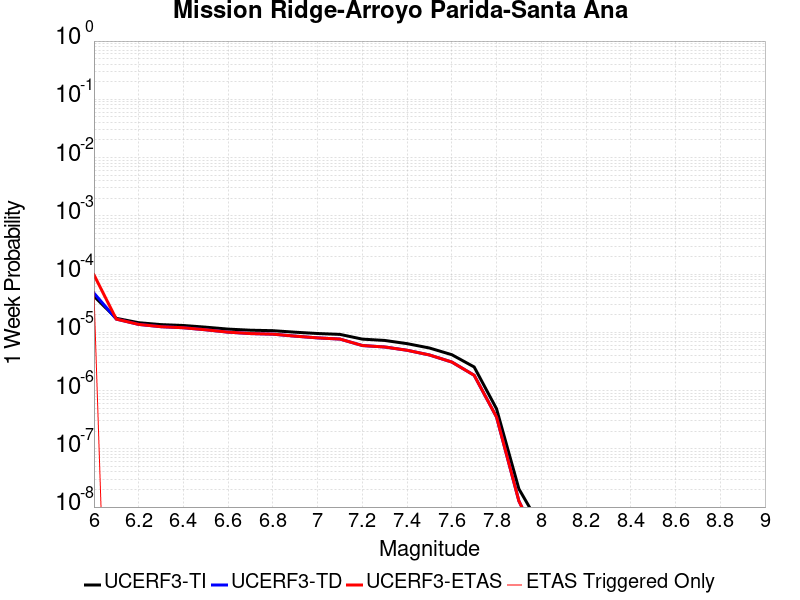 |  |  |  |

| Magnitude | 1 wk TI Prob | 1 wk TD Prob | 1 wk ETAS Prob | 1 wk ETAS/TD Gain | 1 wk ETAS Triggered Only | 1 mo TI Prob | 1 mo TD Prob | 1 mo ETAS Prob | 1 mo ETAS/TD Gain | 1 mo ETAS Triggered Only | 1 yr TI Prob | 1 yr TD Prob | 1 yr ETAS Prob | 1 yr ETAS/TD Gain | 1 yr ETAS Triggered Only | 10 yr TI Prob | 10 yr TD Prob | 10 yr ETAS Prob | 10 yr ETAS/TD Gain | 10 yr ETAS Triggered Only |
|-----|-----|-----|-----|-----|-----|-----|-----|-----|-----|-----|-----|-----|-----|-----|-----|-----|-----|-----|-----|-----|
| 6.0 | 4.169034E-5 | 4.7138263E-5 | 9.4755065E-5 | 2.0101519 | 4.7619047E-5 | 1.7866064E-4 | 2.0201034E-4 | 2.734245E-4 | 1.3535173 | 7.142857E-5 | 0.0021730233 | 0.00245745 | 0.0026712092 | 1.0869842 | 2.1428571E-4 | 0.021518968 | 0.024384614 | 0.024616905 | 1.009526 | 2.3809524E-4 |
| 6.1 | 1.73813E-5 | 1.6854226E-5 | 1.6854226E-5 | 1.0 | 0.0 | 7.4489166E-5 | 7.223046E-5 | 9.603826E-5 | 1.3296089 | 2.3809524E-5 | 9.065282E-4 | 8.790618E-4 | 9.26639E-4 | 1.0541227 | 4.7619047E-5 | 0.009028391 | 0.008756988 | 0.00880419 | 1.0053902 | 4.7619047E-5 |
| 6.2 | 1.4622182E-5 | 1.367329E-5 | 1.367329E-5 | 1.0 | 0.0 | 6.2664985E-5 | 5.8598518E-5 | 8.2406645E-5 | 1.4062923 | 2.3809524E-5 | 7.6267915E-4 | 7.132073E-4 | 7.607924E-4 | 1.0667199 | 4.7619047E-5 | 0.007600669 | 0.007109627 | 0.0071569076 | 1.0066502 | 4.7619047E-5 |
| 6.3 | 1.3552434E-5 | 1.2482201E-5 | 1.2482201E-5 | 1.0 | 0.0 | 5.8080568E-5 | 5.3494066E-5 | 7.730232E-5 | 1.4450634 | 2.3809524E-5 | 7.069015E-4 | 6.510988E-4 | 6.986868E-4 | 1.0730888 | 4.7619047E-5 | 0.00704657 | 0.006492275 | 0.006539585 | 1.0072871 | 4.7619047E-5 |
| 6.4 | 1.30977305E-5 | 1.1979156E-5 | 1.1979156E-5 | 1.0 | 0.0 | 5.613192E-5 | 5.1338247E-5 | 7.514655E-5 | 1.4637537 | 2.3809524E-5 | 6.831918E-4 | 6.248669E-4 | 6.7245617E-4 | 1.0761591 | 4.7619047E-5 | 0.006810953 | 0.0062314444 | 0.006278767 | 1.0075941 | 4.7619047E-5 |
| 6.5 | 1.225205E-5 | 1.1048803E-5 | 1.1048803E-5 | 1.0 | 0.0 | 5.2507727E-5 | 4.7351168E-5 | 7.1159564E-5 | 1.5028049 | 2.3809524E-5 | 6.3909404E-4 | 5.7635066E-4 | 6.239423E-4 | 1.082574 | 4.7619047E-5 | 0.006372592 | 0.005748869 | 0.0057962146 | 1.0082356 | 4.7619047E-5 |
| 6.6 | 1.1352241E-5 | 1.0063535E-5 | 1.0063535E-5 | 1.0 | 0.0 | 4.8651553E-5 | 4.3128734E-5 | 6.693723E-5 | 1.5520333 | 2.3809524E-5 | 5.921717E-4 | 5.2496797E-4 | 5.72562E-4 | 1.0906608 | 4.7619047E-5 | 0.0059059616 | 0.0052375244 | 0.005284894 | 1.0090443 | 4.7619047E-5 |
| 6.7 | 1.0864116E-5 | 9.517027E-6 | 9.517027E-6 | 1.0 | 0.0 | 4.6559664E-5 | 4.0786632E-5 | 6.459519E-5 | 1.5837343 | 2.3809524E-5 | 5.667165E-4 | 4.964661E-4 | 5.4406154E-4 | 1.0958683 | 4.7619047E-5 | 0.005652734 | 0.004953804 | 0.005001187 | 1.009565 | 4.7619047E-5 |
| 6.8 | 1.0666365E-5 | 9.299779E-6 | 9.299779E-6 | 1.0 | 0.0 | 4.571219E-5 | 3.9855597E-5 | 6.366417E-5 | 1.597371 | 2.3809524E-5 | 5.564038E-4 | 4.8513585E-4 | 5.327318E-4 | 1.0981085 | 4.7619047E-5 | 0.005550127 | 0.0048410003 | 0.004888389 | 1.009789 | 4.7619047E-5 |
| 6.9 | 1.0038665E-5 | 8.592046E-6 | 8.592046E-6 | 1.0 | 0.0 | 4.302214E-5 | 3.682254E-5 | 6.0631188E-5 | 1.6465781 | 2.3809524E-5 | 5.236687E-4 | 4.4822405E-4 | 4.9582176E-4 | 1.1061918 | 4.7619047E-5 | 0.005224364 | 0.004473411 | 0.0045208167 | 1.0105973 | 4.7619047E-5 |
| 7.0 | 9.5379955E-6 | 8.025073E-6 | 8.025073E-6 | 1.0 | 0.0 | 4.0876483E-5 | 3.4392728E-5 | 5.8201433E-5 | 1.6922599 | 2.3809524E-5 | 4.975576E-4 | 4.1865272E-4 | 4.6625183E-4 | 1.113696 | 4.7619047E-5 | 0.00496445 | 0.0041788397 | 0.00422626 | 1.0113477 | 4.7619047E-5 |
| 7.1 | 9.207389E-6 | 7.652375E-6 | 7.652375E-6 | 1.0 | 0.0 | 3.945964E-5 | 3.279549E-5 | 5.6604233E-5 | 1.7259761 | 2.3809524E-5 | 4.803152E-4 | 3.9921363E-4 | 4.4681368E-4 | 1.1192344 | 4.7619047E-5 | 0.004792784 | 0.003985161 | 0.0040325904 | 1.0119015 | 4.7619047E-5 |
| 7.2 | 7.638091E-6 | 5.9311183E-6 | 5.9311183E-6 | 1.0 | 0.0 | 3.2734264E-5 | 2.541883E-5 | 4.922775E-5 | 1.9366646 | 2.3809524E-5 | 3.984668E-4 | 3.0943064E-4 | 3.332328E-4 | 1.0769224 | 2.3809524E-5 | 0.0039775306 | 0.0030900547 | 0.0031137906 | 1.0076814 | 2.3809524E-5 |
| 7.3 | 7.2500147E-6 | 5.5961527E-6 | 5.5961527E-6 | 1.0 | 0.0 | 3.1071122E-5 | 2.3983293E-5 | 4.7792248E-5 | 1.9927307 | 2.3809524E-5 | 3.7822526E-4 | 2.9195778E-4 | 3.1576035E-4 | 1.0815275 | 2.3809524E-5 | 0.0037758215 | 0.0029157975 | 0.0029395376 | 1.0081419 | 2.3809524E-5 |
| 7.4 | 6.3899715E-6 | 4.9184964E-6 | 4.9184964E-6 | 1.0 | 0.0 | 2.7385306E-5 | 2.10791E-5 | 2.10791E-5 | 1.0 | 0.0 | 3.3336508E-4 | 2.5660804E-4 | 2.5660804E-4 | 1.0 | 0.0 | 0.0033286542 | 0.0025631618 | 0.0025631618 | 1.0 | 0.0 |
| 7.5 | 5.379025E-6 | 4.0838527E-6 | 4.0838527E-6 | 1.0 | 0.0 | 2.305276E-5 | 1.7502109E-5 | 1.7502109E-5 | 1.0 | 0.0 | 2.806312E-4 | 2.1306744E-4 | 2.1306744E-4 | 1.0 | 0.0 | 0.0028027708 | 0.002128643 | 0.002128643 | 1.0 | 0.0 |
| 7.6 | 4.1270696E-6 | 3.0883439E-6 | 3.0883439E-6 | 1.0 | 0.0 | 1.768732E-5 | 1.3235693E-5 | 1.3235693E-5 | 1.0 | 0.0 | 2.1532185E-4 | 1.6113273E-4 | 1.6113273E-4 | 1.0 | 0.0 | 0.0021511333 | 0.001610167 | 0.001610167 | 1.0 | 0.0 |
| 7.7 | 2.5406805E-6 | 1.8282013E-6 | 1.8282013E-6 | 1.0 | 0.0 | 1.0888585E-5 | 7.835125E-6 | 7.835125E-6 | 1.0 | 0.0 | 1.3256045E-4 | 9.538854E-5 | 9.538854E-5 | 1.0 | 0.0 | 0.0013248142 | 9.534821E-4 | 9.534821E-4 | 1.0 | 0.0 |
| 7.8 | 4.8608285E-7 | 3.5098864E-7 | 3.5098864E-7 | 1.0 | 0.0 | 2.0832106E-6 | 1.5042363E-6 | 1.5042363E-6 | 1.0 | 0.0 | 2.5362791E-5 | 1.8313924E-5 | 1.8313924E-5 | 1.0 | 0.0 | 2.5359896E-4 | 1.8312426E-4 | 1.8312426E-4 | 1.0 | 0.0 |
| 7.9 | 2.0472514E-8 | 1.2688783E-8 | 1.2688783E-8 | 1.0 | 0.0 | 8.7739345E-8 | 5.43805E-8 | 5.43805E-8 | 1.0 | 0.0 | 1.068226E-6 | 6.6208236E-7 | 6.6208236E-7 | 1.0 | 0.0 | 1.0682209E-5 | 6.620805E-6 | 6.620805E-6 | 1.0 | 0.0 |
| 8.0 | 4.443582E-9 | 2.0321211E-9 | 2.0321211E-9 | 1.0 | 0.0 | 1.9043922E-8 | 8.70909E-9 | 8.70909E-9 | 1.0 | 0.0 | 2.3185973E-7 | 1.0603316E-7 | 1.0603316E-7 | 1.0 | 0.0 | 2.3185949E-6 | 1.0603312E-6 | 1.0603312E-6 | 1.0 | 0.0 |

## San Jacinto (Lytle Creek connector)
*[(top)](#table-of-contents)*

| 1 Week | 1 Month | 1 Year | 10 Year |
|-----|-----|-----|-----|
|  |  |  |  |

| Magnitude | 1 wk TI Prob | 1 wk TD Prob | 1 wk ETAS Prob | 1 wk ETAS/TD Gain | 1 wk ETAS Triggered Only | 1 mo TI Prob | 1 mo TD Prob | 1 mo ETAS Prob | 1 mo ETAS/TD Gain | 1 mo ETAS Triggered Only | 1 yr TI Prob | 1 yr TD Prob | 1 yr ETAS Prob | 1 yr ETAS/TD Gain | 1 yr ETAS Triggered Only | 10 yr TI Prob | 10 yr TD Prob | 10 yr ETAS Prob | 10 yr ETAS/TD Gain | 10 yr ETAS Triggered Only |
|-----|-----|-----|-----|-----|-----|-----|-----|-----|-----|-----|-----|-----|-----|-----|-----|-----|-----|-----|-----|-----|
| 6.0 | 6.693995E-6 | 6.660216E-6 | 1.2570704E-4 | 18.87432 | 1.1904762E-4 | 2.8688235E-5 | 2.854347E-5 | 1.7139653E-4 | 6.0047545 | 1.4285714E-4 | 3.492233E-4 | 3.4746144E-4 | 5.140702E-4 | 1.4795029 | 1.6666666E-4 | 0.00348675 | 0.0035493854 | 0.0038103606 | 1.0735269 | 2.6190476E-4 |
| 6.1 | 6.693995E-6 | 6.660216E-6 | 1.2570704E-4 | 18.87432 | 1.1904762E-4 | 2.8688235E-5 | 2.854347E-5 | 1.7139653E-4 | 6.0047545 | 1.4285714E-4 | 3.492233E-4 | 3.4746144E-4 | 5.140702E-4 | 1.4795029 | 1.6666666E-4 | 0.00348675 | 0.0035493854 | 0.0038103606 | 1.0735269 | 2.6190476E-4 |
| 6.2 | 6.693995E-6 | 6.660216E-6 | 1.2570704E-4 | 18.87432 | 1.1904762E-4 | 2.8688235E-5 | 2.854347E-5 | 1.7139653E-4 | 6.0047545 | 1.4285714E-4 | 3.492233E-4 | 3.4746144E-4 | 5.140702E-4 | 1.4795029 | 1.6666666E-4 | 0.00348675 | 0.0035493854 | 0.0038103606 | 1.0735269 | 2.6190476E-4 |
| 6.3 | 6.693995E-6 | 6.660216E-6 | 1.2570704E-4 | 18.87432 | 1.1904762E-4 | 2.8688235E-5 | 2.854347E-5 | 1.7139653E-4 | 6.0047545 | 1.4285714E-4 | 3.492233E-4 | 3.4746144E-4 | 5.140702E-4 | 1.4795029 | 1.6666666E-4 | 0.00348675 | 0.0035493854 | 0.0038103606 | 1.0735269 | 2.6190476E-4 |
| 6.4 | 6.693995E-6 | 6.660216E-6 | 1.2570704E-4 | 18.87432 | 1.1904762E-4 | 2.8688235E-5 | 2.854347E-5 | 1.7139653E-4 | 6.0047545 | 1.4285714E-4 | 3.492233E-4 | 3.4746144E-4 | 5.140702E-4 | 1.4795029 | 1.6666666E-4 | 0.00348675 | 0.0035493854 | 0.0038103606 | 1.0735269 | 2.6190476E-4 |
| 6.5 | 6.6561875E-6 | 6.6204343E-6 | 1.2566727E-4 | 18.981726 | 1.1904762E-4 | 2.8526205E-5 | 2.837298E-5 | 1.7122607E-4 | 6.034828 | 1.4285714E-4 | 3.472512E-4 | 3.4538636E-4 | 5.1199546E-4 | 1.4823847 | 1.6666666E-4 | 0.0034670907 | 0.003528701 | 0.0037896815 | 1.0739594 | 2.6190476E-4 |
| 6.6 | 6.6561875E-6 | 6.6204343E-6 | 1.2566727E-4 | 18.981726 | 1.1904762E-4 | 2.8526205E-5 | 2.837298E-5 | 1.7122607E-4 | 6.034828 | 1.4285714E-4 | 3.472512E-4 | 3.4538636E-4 | 5.1199546E-4 | 1.4823847 | 1.6666666E-4 | 0.0034670907 | 0.003528701 | 0.0037896815 | 1.0739594 | 2.6190476E-4 |
| 6.7 | 6.5802237E-6 | 6.539611E-6 | 1.2558645E-4 | 19.203964 | 1.1904762E-4 | 2.8200653E-5 | 2.8026603E-5 | 1.7087975E-4 | 6.097055 | 1.4285714E-4 | 3.4328885E-4 | 3.4117055E-4 | 5.0778035E-4 | 1.4883475 | 1.6666666E-4 | 0.0034275902 | 0.0034866752 | 0.003747667 | 1.074854 | 2.6190476E-4 |
| 6.8 | 6.575632E-6 | 6.5341005E-6 | 1.2558095E-4 | 19.219315 | 1.1904762E-4 | 2.8180975E-5 | 2.8002989E-5 | 1.7085613E-4 | 6.1013536 | 1.4285714E-4 | 3.4304935E-4 | 3.4088313E-4 | 5.07493E-4 | 1.4887595 | 1.6666666E-4 | 0.0034252026 | 0.00348381 | 0.0037448024 | 1.0749158 | 2.6190476E-4 |
| 6.9 | 6.570433E-6 | 6.525495E-6 | 1.2557233E-4 | 19.243343 | 1.1904762E-4 | 2.8158694E-5 | 2.7966107E-5 | 1.7081926E-4 | 6.1080813 | 1.4285714E-4 | 3.4277816E-4 | 3.4043423E-4 | 5.0704414E-4 | 1.4894042 | 1.6666666E-4 | 0.0034224992 | 0.0034793352 | 0.0037403288 | 1.0750124 | 2.6190476E-4 |
| 7.0 | 6.5643826E-6 | 6.515616E-6 | 1.2556245E-4 | 19.271004 | 1.1904762E-4 | 2.8132765E-5 | 2.792377E-5 | 1.7077693E-4 | 6.115826 | 1.4285714E-4 | 3.424626E-4 | 3.3991894E-4 | 5.0652894E-4 | 1.4901463 | 1.6666666E-4 | 0.0034193532 | 0.0034741985 | 0.0037351933 | 1.0751238 | 2.6190476E-4 |
| 7.1 | 6.557402E-6 | 6.5043278E-6 | 1.2555117E-4 | 19.302713 | 1.1904762E-4 | 2.8102848E-5 | 2.7875392E-5 | 1.7072856E-4 | 6.124705 | 1.4285714E-4 | 3.4209844E-4 | 3.3933012E-4 | 5.0594023E-4 | 1.4909971 | 1.6666666E-4 | 0.0034157229 | 0.0034683298 | 0.0037293262 | 1.0752513 | 2.6190476E-4 |
| 7.2 | 6.546394E-6 | 6.4862943E-6 | 1.2553314E-4 | 19.3536 | 1.1904762E-4 | 2.8055672E-5 | 2.7798109E-5 | 1.7065128E-4 | 6.1389527 | 1.4285714E-4 | 3.4152428E-4 | 3.3838948E-4 | 5.0499977E-4 | 1.4923624 | 1.6666666E-4 | 0.0034099987 | 0.0034589572 | 0.003719956 | 1.0754559 | 2.6190476E-4 |
| 7.3 | 6.5364216E-6 | 6.4670803E-6 | 1.2551394E-4 | 19.408129 | 1.1904762E-4 | 2.8012933E-5 | 2.7715765E-5 | 1.7056895E-4 | 6.154221 | 1.4285714E-4 | 3.4100408E-4 | 3.3738726E-4 | 5.0399767E-4 | 1.4938256 | 1.6666666E-4 | 0.003404813 | 0.0034489788 | 0.0037099803 | 1.075675 | 2.6190476E-4 |
| 7.4 | 6.5269523E-6 | 6.4481674E-6 | 1.2549502E-4 | 19.462122 | 1.1904762E-4 | 2.7972354E-5 | 2.7634711E-5 | 1.7048791E-4 | 6.169339 | 1.4285714E-4 | 3.4051016E-4 | 3.3640073E-4 | 5.0301134E-4 | 1.4952742 | 1.6666666E-4 | 0.0033998888 | 0.003439161 | 0.0037001648 | 1.0758917 | 2.6190476E-4 |
| 7.5 | 6.5111835E-6 | 6.424442E-6 | 1.254713E-4 | 19.530302 | 1.1904762E-4 | 2.7904773E-5 | 2.7533031E-5 | 1.7038624E-4 | 6.18843 | 1.4285714E-4 | 3.3968766E-4 | 3.3516317E-4 | 5.0177396E-4 | 1.4971036 | 1.6666666E-4 | 0.0033916887 | 0.003426834 | 0.0036878414 | 1.0761657 | 2.6190476E-4 |
| 7.6 | 6.4768806E-6 | 6.383551E-6 | 1.2543041E-4 | 19.649002 | 1.1904762E-4 | 2.7757764E-5 | 2.735779E-5 | 1.7021103E-4 | 6.221666 | 1.4285714E-4 | 3.3789838E-4 | 3.3303024E-4 | 4.996414E-4 | 1.5002884 | 1.6666666E-4 | 0.0033738504 | 0.0034055663 | 0.003666579 | 1.076643 | 2.6190476E-4 |
| 7.7 | 6.1655364E-6 | 6.1760365E-6 | 1.2522293E-4 | 20.275612 | 1.1904762E-4 | 2.642346E-5 | 2.646846E-5 | 1.6932182E-4 | 6.3971167 | 1.4285714E-4 | 3.2165812E-4 | 3.2220592E-4 | 4.8881886E-4 | 1.5171009 | 1.6666666E-4 | 0.0032119295 | 0.0032971818 | 0.003558223 | 1.0791711 | 2.6190476E-4 |
| 7.8 | 5.5043524E-6 | 5.737097E-6 | 1.2478403E-4 | 21.75038 | 1.1904762E-4 | 2.3589868E-5 | 2.4587327E-5 | 1.6744096E-4 | 6.8100514 | 1.4285714E-4 | 2.871688E-4 | 2.9930964E-4 | 4.6592642E-4 | 1.5566703 | 1.6666666E-4 | 0.0028679797 | 0.0030672832 | 0.0033283848 | 1.0851246 | 2.6190476E-4 |
| 7.9 | 3.889249E-6 | 4.076761E-6 | 7.550504E-5 | 18.520842 | 7.142857E-5 | 1.6668104E-5 | 1.7471715E-5 | 1.1270815E-4 | 6.4508915 | 9.5238094E-5 | 2.0291525E-4 | 2.1269741E-4 | 3.3171973E-4 | 1.5595851 | 1.1904762E-4 | 0.0020273007 | 0.0021943315 | 0.0024081469 | 1.0974399 | 2.1428571E-4 |
| 8.0 | 2.668535E-6 | 2.5315155E-6 | 2.6340978E-5 | 10.405222 | 2.3809524E-5 | 1.1436528E-5 | 1.0849307E-5 | 3.4658573E-5 | 3.1945426 | 2.3809524E-5 | 1.3923083E-4 | 1.3208234E-4 | 1.7969508E-4 | 1.3604779 | 4.7619047E-5 | 0.0013914363 | 0.0013757964 | 0.0014709034 | 1.0691288 | 9.5238094E-5 |
| 8.1 | 1.5911459E-6 | 1.218661E-6 | 1.218661E-6 | 1.0 | 0.0 | 6.8191785E-6 | 5.2228224E-6 | 5.2228224E-6 | 1.0 | 0.0 | 8.3020335E-5 | 6.3586034E-5 | 6.3586034E-5 | 1.0 | 0.0 | 8.298933E-4 | 6.6932244E-4 | 7.1690965E-4 | 1.0710975 | 4.7619047E-5 |
| 8.2 | 6.1294963E-7 | 2.1812275E-7 | 2.1812275E-7 | 1.0 | 0.0 | 2.6269242E-6 | 9.3481145E-7 | 9.3481145E-7 | 1.0 | 0.0 | 3.1982334E-5 | 1.138127E-5 | 1.138127E-5 | 1.0 | 0.0 | 3.1977732E-4 | 1.2784546E-4 | 1.2784546E-4 | 1.0 | 0.0 |
| 8.3 | 1.762871E-7 | 4.7546838E-8 | 4.7546838E-8 | 1.0 | 0.0 | 7.5551594E-7 | 2.0377215E-7 | 2.0377215E-7 | 1.0 | 0.0 | 9.1983675E-6 | 2.480923E-6 | 2.480923E-6 | 1.0 | 0.0 | 9.197987E-5 | 2.868753E-5 | 2.868753E-5 | 1.0 | 0.0 |

## Brawley (Seismic Zone) alt 1
*[(top)](#table-of-contents)*

| 1 Week | 1 Month | 1 Year | 10 Year |
|-----|-----|-----|-----|
|  |  | 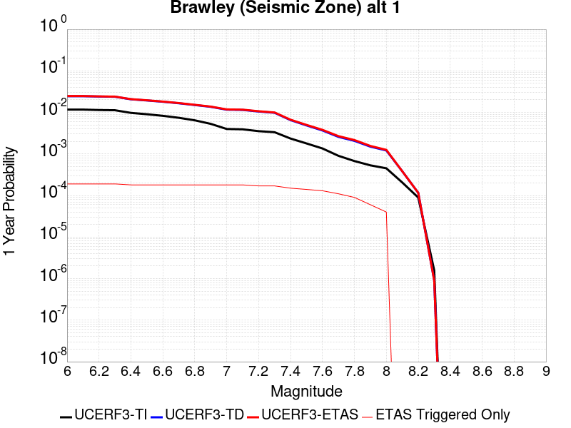 |  |

| Magnitude | 1 wk TI Prob | 1 wk TD Prob | 1 wk ETAS Prob | 1 wk ETAS/TD Gain | 1 wk ETAS Triggered Only | 1 mo TI Prob | 1 mo TD Prob | 1 mo ETAS Prob | 1 mo ETAS/TD Gain | 1 mo ETAS Triggered Only | 1 yr TI Prob | 1 yr TD Prob | 1 yr ETAS Prob | 1 yr ETAS/TD Gain | 1 yr ETAS Triggered Only | 10 yr TI Prob | 10 yr TD Prob | 10 yr ETAS Prob | 10 yr ETAS/TD Gain | 10 yr ETAS Triggered Only |
|-----|-----|-----|-----|-----|-----|-----|-----|-----|-----|-----|-----|-----|-----|-----|-----|-----|-----|-----|-----|-----|
| 6.0 | 2.2521618E-4 | 4.7632487E-4 | 5.001231E-4 | 1.049962 | 2.3809524E-5 | 9.6485513E-4 | 0.0020398323 | 0.002134876 | 1.0465939 | 9.5238094E-5 | 0.011683988 | 0.024546238 | 0.024708813 | 1.0066233 | 1.6666666E-4 | 0.11088423 | 0.21350002 | 0.21370602 | 1.0009648 | 2.6190476E-4 |
| 6.1 | 2.2521618E-4 | 4.7632487E-4 | 5.001231E-4 | 1.049962 | 2.3809524E-5 | 9.6485513E-4 | 0.0020398323 | 0.002134876 | 1.0465939 | 9.5238094E-5 | 0.011683988 | 0.024546238 | 0.024708813 | 1.0066233 | 1.6666666E-4 | 0.11088423 | 0.21350002 | 0.21370602 | 1.0009648 | 2.6190476E-4 |
| 6.2 | 2.198148E-4 | 4.6717093E-4 | 4.9096934E-4 | 1.0509416 | 2.3809524E-5 | 9.417233E-4 | 0.0020006616 | 0.002095709 | 1.0475081 | 9.5238094E-5 | 0.011405343 | 0.024080504 | 0.024243155 | 1.0067545 | 1.6666666E-4 | 0.10837428 | 0.20993657 | 0.21014349 | 1.0009856 | 2.6190476E-4 |
| 6.3 | 2.1704129E-4 | 4.615278E-4 | 4.853263E-4 | 1.0515647 | 2.3809524E-5 | 9.298453E-4 | 0.0019765133 | 0.0020715632 | 1.0480896 | 9.5238094E-5 | 0.011262234 | 0.02379366 | 0.023956362 | 1.006838 | 1.6666666E-4 | 0.107082725 | 0.20782755 | 0.20803502 | 1.0009983 | 2.6190476E-4 |
| 6.4 | 1.876142E-4 | 4.00449E-4 | 4.24249E-4 | 1.0594332 | 2.3809524E-5 | 8.038131E-4 | 0.0017150956 | 0.0018101704 | 1.0554341 | 9.5238094E-5 | 0.00974259 | 0.020680401 | 0.020843621 | 1.0078925 | 1.6666666E-4 | 0.093263686 | 0.18457815 | 0.18479171 | 1.001157 | 2.6190476E-4 |
| 6.5 | 1.7390939E-4 | 3.7477075E-4 | 3.9857134E-4 | 1.0635071 | 2.3809524E-5 | 7.45113E-4 | 0.0016051838 | 0.0017002691 | 1.0592363 | 9.5238094E-5 | 0.009034078 | 0.019368723 | 0.01953216 | 1.0084382 | 1.6666666E-4 | 0.086755216 | 0.17440031 | 0.17461655 | 1.0012399 | 2.6190476E-4 |
| 6.6 | 1.591791E-4 | 3.4891962E-4 | 3.7272082E-4 | 1.068214 | 2.3809524E-5 | 6.8201777E-4 | 0.0014945229 | 0.0015896186 | 1.0636295 | 9.5238094E-5 | 0.008271996 | 0.018045569 | 0.018209228 | 1.0090692 | 1.6666666E-4 | 0.07970774 | 0.16380852 | 0.16402753 | 1.0013369 | 2.6190476E-4 |
| 6.7 | 1.4268003E-4 | 3.20582E-4 | 3.443839E-4 | 1.0742459 | 2.3809524E-5 | 6.1134255E-4 | 0.0013732077 | 0.001468315 | 1.0692593 | 9.5238094E-5 | 0.007417723 | 0.016592601 | 0.016756503 | 1.0098779 | 1.6666666E-4 | 0.07174956 | 0.15193306 | 0.15215518 | 1.0014619 | 2.6190476E-4 |
| 6.8 | 1.239713E-4 | 2.9053655E-4 | 3.1433918E-4 | 1.0819263 | 2.3809524E-5 | 5.3119735E-4 | 0.0012445687 | 0.0013396882 | 1.0764277 | 9.5238094E-5 | 0.0064481674 | 0.015048777 | 0.015212935 | 1.0109085 | 1.6666666E-4 | 0.06264243 | 0.13837762 | 0.13860328 | 1.0016308 | 2.6190476E-4 |
| 6.9 | 1.0180238E-4 | 2.625439E-4 | 2.8634717E-4 | 1.090664 | 2.3809524E-5 | 4.3622297E-4 | 0.0011247073 | 0.0012198382 | 1.0845829 | 9.5238094E-5 | 0.005298089 | 0.013608336 | 0.013772734 | 1.0120807 | 1.6666666E-4 | 0.05173543 | 0.124961674 | 0.12519085 | 1.001834 | 2.6190476E-4 |
| 7.0 | 7.6619996E-5 | 2.23993E-4 | 2.477972E-4 | 1.106272 | 2.3809524E-5 | 3.283301E-4 | 9.5962E-4 | 0.0010547667 | 1.0991504 | 9.5238094E-5 | 0.0039900932 | 0.011621496 | 0.011786225 | 1.0141746 | 1.6666666E-4 | 0.039192066 | 0.107266866 | 0.10750067 | 1.0021797 | 2.6190476E-4 |
| 7.1 | 7.5127435E-5 | 2.2082464E-4 | 2.446289E-4 | 1.1077971 | 2.3809524E-5 | 3.2193496E-4 | 9.4605127E-4 | 0.0010411992 | 1.1005738 | 9.5238094E-5 | 0.0039125155 | 0.011458045 | 0.011622801 | 1.0143791 | 1.6666666E-4 | 0.038443442 | 0.10583085 | 0.106065035 | 1.0022129 | 2.6190476E-4 |
| 7.2 | 6.788582E-5 | 2.0210193E-4 | 2.2590665E-4 | 1.1177857 | 2.3809524E-5 | 2.9090676E-4 | 8.6586666E-4 | 9.372334E-4 | 1.0824223 | 7.142857E-5 | 0.0035360386 | 0.0104916105 | 0.0106329685 | 1.0134735 | 1.4285714E-4 | 0.034803 | 0.09750131 | 0.09771619 | 1.0022038 | 2.3809524E-4 |
| 7.3 | 6.399602E-5 | 1.8841137E-4 | 2.1221642E-4 | 1.1263461 | 2.3809524E-5 | 2.7423984E-4 | 8.072303E-4 | 8.786012E-4 | 1.0884145 | 7.142857E-5 | 0.0033337586 | 0.009784332 | 0.00992579 | 1.0144577 | 1.4285714E-4 | 0.03284188 | 0.09139617 | 0.091612495 | 1.002367 | 2.3809524E-4 |
| 7.4 | 4.506759E-5 | 1.2529209E-4 | 1.4909863E-4 | 1.1900083 | 2.3809524E-5 | 1.9313251E-4 | 5.368565E-4 | 5.8444997E-4 | 1.0886521 | 4.7619047E-5 | 0.0023488526 | 0.0065168133 | 0.006635085 | 1.0181487 | 1.1904762E-4 | 0.023241805 | 0.062363707 | 0.06256463 | 1.0032218 | 2.1428571E-4 |
| 7.5 | 3.43289E-5 | 9.33541E-5 | 9.33541E-5 | 1.0 | 0.0 | 1.4711556E-4 | 4.00028E-4 | 4.2382797E-4 | 1.0594958 | 2.3809524E-5 | 0.0017896603 | 0.0048595266 | 0.0049543018 | 1.019503 | 9.5238094E-5 | 0.01775316 | 0.04705519 | 0.047236703 | 1.0038575 | 1.9047619E-4 |
| 7.6 | 2.5980507E-5 | 7.053101E-5 | 7.053101E-5 | 1.0 | 0.0 | 1.1134028E-4 | 3.0224086E-4 | 3.260432E-4 | 1.0787529 | 2.3809524E-5 | 0.001354725 | 0.003673598 | 0.0037684862 | 1.0258298 | 9.5238094E-5 | 0.013464959 | 0.035840835 | 0.036024485 | 1.005124 | 1.9047619E-4 |
| 7.7 | 1.7292105E-5 | 4.9407296E-5 | 4.9407296E-5 | 1.0 | 0.0 | 7.4106916E-5 | 2.117284E-4 | 2.3553289E-4 | 1.1124294 | 2.3809524E-5 | 9.018782E-4 | 0.0025747516 | 0.0026697444 | 1.036894 | 9.5238094E-5 | 0.008982267 | 0.025290398 | 0.025429642 | 1.0055058 | 1.4285714E-4 |
| 7.8 | 1.2927471E-5 | 3.9693266E-5 | 3.9693266E-5 | 1.0 | 0.0 | 5.5402274E-5 | 1.7010293E-4 | 1.939084E-4 | 1.1399474 | 2.3809524E-5 | 6.743139E-4 | 0.0020690386 | 0.0021640796 | 1.0459349 | 9.5238094E-5 | 0.0067227143 | 0.020431727 | 0.020571666 | 1.006849 | 1.4285714E-4 |
| 7.9 | 1.0200774E-5 | 2.874569E-5 | 2.874569E-5 | 1.0 | 0.0 | 4.371687E-5 | 1.2319001E-4 | 1.2319001E-4 | 1.0 | 0.0 | 5.321229E-4 | 0.0014988075 | 0.0015225813 | 1.0158619 | 2.3809524E-5 | 0.005308505 | 0.014991644 | 0.0150620015 | 1.0046932 | 7.142857E-5 |
| 8.0 | 8.650396E-6 | 2.3277367E-5 | 2.3277367E-5 | 1.0 | 0.0 | 3.70726E-5 | 9.975634E-5 | 9.975634E-5 | 1.0 | 0.0 | 4.5126543E-4 | 0.0012138576 | 0.0012376382 | 1.019591 | 2.3809524E-5 | 0.0045035016 | 0.012211097 | 0.0122816535 | 1.0057781 | 7.142857E-5 |
| 8.1 | 3.9368224E-6 | 7.3279825E-6 | 7.3279825E-6 | 1.0 | 0.0 | 1.6871985E-5 | 3.140526E-5 | 3.140526E-5 | 1.0 | 0.0 | 2.0539707E-4 | 3.8229208E-4 | 3.8229208E-4 | 1.0 | 0.0 | 0.0020520731 | 0.004001185 | 0.004001185 | 1.0 | 0.0 |
| 8.2 | 1.7101195E-6 | 2.217876E-6 | 2.217876E-6 | 1.0 | 0.0 | 7.329063E-6 | 9.505149E-6 | 9.505149E-6 | 1.0 | 0.0 | 8.922769E-5 | 1.1571907E-4 | 1.1571907E-4 | 1.0 | 0.0 | 8.9191867E-4 | 0.0012666774 | 0.0012666774 | 1.0 | 0.0 |
| 8.3 | 3.0346666E-8 | 1.721586E-8 | 1.721586E-8 | 1.0 | 0.0 | 1.3005713E-7 | 7.378226E-8 | 7.378226E-8 | 1.0 | 0.0 | 1.5834444E-6 | 8.9829894E-7 | 8.9829894E-7 | 1.0 | 0.0 | 1.5834332E-5 | 9.367729E-6 | 9.367729E-6 | 1.0 | 0.0 |

## Lost Hills
*[(top)](#table-of-contents)*

| 1 Week | 1 Month | 1 Year | 10 Year |
|-----|-----|-----|-----|
|  |  |  |  |

| Magnitude | 1 wk TI Prob | 1 wk TD Prob | 1 wk ETAS Prob | 1 wk ETAS/TD Gain | 1 wk ETAS Triggered Only | 1 mo TI Prob | 1 mo TD Prob | 1 mo ETAS Prob | 1 mo ETAS/TD Gain | 1 mo ETAS Triggered Only | 1 yr TI Prob | 1 yr TD Prob | 1 yr ETAS Prob | 1 yr ETAS/TD Gain | 1 yr ETAS Triggered Only | 10 yr TI Prob | 10 yr TD Prob | 10 yr ETAS Prob | 10 yr ETAS/TD Gain | 10 yr ETAS Triggered Only |
|-----|-----|-----|-----|-----|-----|-----|-----|-----|-----|-----|-----|-----|-----|-----|-----|-----|-----|-----|-----|-----|
| 6.0 | 2.233523E-5 | 2.5106583E-5 | 7.272443E-5 | 2.8966281 | 4.7619047E-5 | 9.571891E-5 | 1.0759615E-4 | 1.7901704E-4 | 1.6637866 | 7.142857E-5 | 0.0011647546 | 0.001309364 | 0.0014044774 | 1.0726409 | 9.5238094E-5 | 0.011586686 | 0.013033091 | 0.013197585 | 1.0126213 | 1.6666666E-4 |
| 6.1 | 2.233523E-5 | 2.5106583E-5 | 7.272443E-5 | 2.8966281 | 4.7619047E-5 | 9.571891E-5 | 1.0759615E-4 | 1.7901704E-4 | 1.6637866 | 7.142857E-5 | 0.0011647546 | 0.001309364 | 0.0014044774 | 1.0726409 | 9.5238094E-5 | 0.011586686 | 0.013033091 | 0.013197585 | 1.0126213 | 1.6666666E-4 |
| 6.2 | 2.233523E-5 | 2.5106583E-5 | 7.272443E-5 | 2.8966281 | 4.7619047E-5 | 9.571891E-5 | 1.0759615E-4 | 1.7901704E-4 | 1.6637866 | 7.142857E-5 | 0.0011647546 | 0.001309364 | 0.0014044774 | 1.0726409 | 9.5238094E-5 | 0.011586686 | 0.013033091 | 0.013197585 | 1.0126213 | 1.6666666E-4 |
| 6.3 | 2.233523E-5 | 2.5106583E-5 | 7.272443E-5 | 2.8966281 | 4.7619047E-5 | 9.571891E-5 | 1.0759615E-4 | 1.7901704E-4 | 1.6637866 | 7.142857E-5 | 0.0011647546 | 0.001309364 | 0.0014044774 | 1.0726409 | 9.5238094E-5 | 0.011586686 | 0.013033091 | 0.013197585 | 1.0126213 | 1.6666666E-4 |
| 6.4 | 1.2288092E-5 | 1.3781108E-5 | 3.7590304E-5 | 2.7276692 | 2.3809524E-5 | 5.2662188E-5 | 5.906108E-5 | 1.0667732E-4 | 1.8062202 | 4.7619047E-5 | 6.409735E-4 | 7.189252E-4 | 7.6651E-4 | 1.0661888 | 4.7619047E-5 | 0.006391279 | 0.0071752006 | 0.0072697555 | 1.013178 | 9.5238094E-5 |
| 6.5 | 1.2288092E-5 | 1.3781108E-5 | 3.7590304E-5 | 2.7276692 | 2.3809524E-5 | 5.2662188E-5 | 5.906108E-5 | 1.0667732E-4 | 1.8062202 | 4.7619047E-5 | 6.409735E-4 | 7.189252E-4 | 7.6651E-4 | 1.0661888 | 4.7619047E-5 | 0.006391279 | 0.0071752006 | 0.0072697555 | 1.013178 | 9.5238094E-5 |
| 6.6 | 8.58281E-6 | 9.63377E-6 | 9.63377E-6 | 1.0 | 0.0 | 3.6782953E-5 | 4.12874E-5 | 4.12874E-5 | 1.0 | 0.0 | 4.4774043E-4 | 5.026414E-4 | 5.026414E-4 | 1.0 | 0.0 | 0.0044683935 | 0.005023205 | 0.005070585 | 1.0094322 | 4.7619047E-5 |
| 6.7 | 7.205685E-6 | 8.088302E-6 | 8.088302E-6 | 1.0 | 0.0 | 3.088114E-5 | 3.466415E-5 | 3.466415E-5 | 1.0 | 0.0 | 3.7591302E-4 | 4.2203604E-4 | 4.2203604E-4 | 1.0 | 0.0 | 0.0037527776 | 0.0042203604 | 0.0042677782 | 1.0112356 | 4.7619047E-5 |

## San Jacinto (Borrego)
*[(top)](#table-of-contents)*

| 1 Week | 1 Month | 1 Year | 10 Year |
|-----|-----|-----|-----|
|  |  |  |  |

| Magnitude | 1 wk TI Prob | 1 wk TD Prob | 1 wk ETAS Prob | 1 wk ETAS/TD Gain | 1 wk ETAS Triggered Only | 1 mo TI Prob | 1 mo TD Prob | 1 mo ETAS Prob | 1 mo ETAS/TD Gain | 1 mo ETAS Triggered Only | 1 yr TI Prob | 1 yr TD Prob | 1 yr ETAS Prob | 1 yr ETAS/TD Gain | 1 yr ETAS Triggered Only | 10 yr TI Prob | 10 yr TD Prob | 10 yr ETAS Prob | 10 yr ETAS/TD Gain | 10 yr ETAS Triggered Only |
|-----|-----|-----|-----|-----|-----|-----|-----|-----|-----|-----|-----|-----|-----|-----|-----|-----|-----|-----|-----|-----|
| 6.0 | 3.543992E-5 | 2.7926513E-5 | 9.935309E-5 | 3.557662 | 7.142857E-5 | 1.5187653E-4 | 1.1967963E-4 | 2.1490632E-4 | 1.79568 | 9.5238094E-5 | 0.0018475284 | 0.0014561379 | 0.0015987869 | 1.097964 | 1.4285714E-4 | 0.018322436 | 0.014869647 | 0.015080746 | 1.0141966 | 2.1428571E-4 |
| 6.1 | 3.542281E-5 | 2.7926513E-5 | 9.935309E-5 | 3.557662 | 7.142857E-5 | 1.5180321E-4 | 1.1967963E-4 | 2.1490632E-4 | 1.79568 | 9.5238094E-5 | 0.0018466372 | 0.0014561379 | 0.0015987869 | 1.097964 | 1.4285714E-4 | 0.018313672 | 0.014869647 | 0.015080746 | 1.0141966 | 2.1428571E-4 |
| 6.2 | 3.4688688E-5 | 2.7926511E-5 | 9.935309E-5 | 3.557662 | 7.142857E-5 | 1.4865733E-4 | 1.1967963E-4 | 2.1490632E-4 | 1.79568 | 9.5238094E-5 | 0.0018084005 | 0.0014561379 | 0.0015987869 | 1.097964 | 1.4285714E-4 | 0.017937548 | 0.014869647 | 0.015080746 | 1.0141966 | 2.1428571E-4 |
| 6.3 | 3.2087122E-5 | 2.7771865E-5 | 9.919845E-5 | 3.5719047 | 7.142857E-5 | 1.3750899E-4 | 1.1901691E-4 | 2.1424367E-4 | 1.8001112 | 9.5238094E-5 | 0.0016728862 | 0.00144808 | 0.0015907303 | 1.0985099 | 1.4285714E-4 | 0.016603488 | 0.014790683 | 0.015001799 | 1.0142736 | 2.1428571E-4 |
| 6.4 | 3.1828724E-5 | 2.7738852E-5 | 9.916544E-5 | 3.5749657 | 7.142857E-5 | 1.364017E-4 | 1.1887544E-4 | 2.1410221E-4 | 1.8010634 | 9.5238094E-5 | 0.0016594254 | 0.0014463598 | 0.0015890104 | 1.0986272 | 1.4285714E-4 | 0.016470885 | 0.014773762 | 0.0149848815 | 1.0142902 | 2.1428571E-4 |
| 6.5 | 3.1563577E-5 | 2.747857E-5 | 9.890518E-5 | 3.599357 | 7.142857E-5 | 1.3526545E-4 | 1.1776006E-4 | 2.1298694E-4 | 1.8086518 | 9.5238094E-5 | 0.0016456128 | 0.0014327979 | 0.0015754504 | 1.0995622 | 1.4285714E-4 | 0.0163348 | 0.014640348 | 0.014851497 | 1.0144224 | 2.1428571E-4 |
| 6.6 | 3.1467625E-5 | 2.7322796E-5 | 9.874941E-5 | 3.614177 | 7.142857E-5 | 1.3485427E-4 | 1.1709251E-4 | 2.1231946E-4 | 1.8132625 | 9.5238094E-5 | 0.0016406142 | 0.0014246812 | 0.0015673348 | 1.1001302 | 1.4285714E-4 | 0.016285548 | 0.014560594 | 0.01477176 | 1.0145025 | 2.1428571E-4 |
| 6.7 | 3.1223695E-5 | 2.6940816E-5 | 9.836746E-5 | 3.651243 | 7.142857E-5 | 1.3380898E-4 | 1.15455594E-4 | 2.1068269E-4 | 1.8247942 | 9.5238094E-5 | 0.0016279068 | 0.0014047775 | 0.001547434 | 1.1015509 | 1.4285714E-4 | 0.01616033 | 0.014364966 | 0.014576173 | 1.0147029 | 2.1428571E-4 |
| 6.8 | 3.1015585E-5 | 2.6761822E-5 | 9.818848E-5 | 3.6689758 | 7.142857E-5 | 1.3291716E-4 | 1.1468855E-4 | 2.0991573E-4 | 1.8303111 | 9.5238094E-5 | 0.001617065 | 0.0013954508 | 0.0015381086 | 1.1022307 | 1.4285714E-4 | 0.016053487 | 0.014272246 | 0.014483473 | 1.0147998 | 2.1428571E-4 |
| 6.9 | 2.6641965E-5 | 2.2184247E-5 | 9.3611234E-5 | 4.2197165 | 7.142857E-5 | 1.1417485E-4 | 9.50719E-5 | 1.9030094E-4 | 2.001653 | 9.5238094E-5 | 0.0013891924 | 0.0011568897 | 0.0012995815 | 1.123341 | 1.4285714E-4 | 0.0138054015 | 0.011882438 | 0.012094178 | 1.0178195 | 2.1428571E-4 |
| 7.0 | 2.3854353E-5 | 2.0479023E-5 | 9.1906135E-5 | 4.4878182 | 7.142857E-5 | 1.02228936E-4 | 8.77643E-5 | 1.8299404E-4 | 2.0850623 | 9.5238094E-5 | 0.0012439266 | 0.0010680092 | 0.0012107138 | 1.1336174 | 1.4285714E-4 | 0.012369866 | 0.0109828 | 0.011194733 | 1.0192968 | 2.1428571E-4 |
| 7.1 | 2.3672901E-5 | 2.031551E-5 | 9.174263E-5 | 4.515891 | 7.142857E-5 | 1.0145135E-4 | 8.7063585E-5 | 1.8229338E-4 | 2.093796 | 9.5238094E-5 | 0.0012344702 | 0.0010594862 | 0.001202192 | 1.1346934 | 1.4285714E-4 | 0.0122763505 | 0.010897976 | 0.011109927 | 1.0194486 | 2.1428571E-4 |
| 7.2 | 2.2717244E-5 | 1.9542893E-5 | 9.097007E-5 | 4.654893 | 7.142857E-5 | 9.735599E-5 | 8.375258E-5 | 1.789827E-4 | 2.137041 | 9.5238094E-5 | 0.0011846646 | 0.001019213 | 0.0011619246 | 1.1400213 | 1.4285714E-4 | 0.01178369 | 0.010495341 | 0.010707378 | 1.020203 | 2.1428571E-4 |
| 7.3 | 2.1016205E-5 | 1.8384526E-5 | 8.981179E-5 | 4.885184 | 7.142857E-5 | 9.006634E-5 | 7.878846E-5 | 1.7401905E-4 | 2.208687 | 9.5238094E-5 | 0.001096006 | 9.5882936E-4 | 0.0011015495 | 1.1488483 | 1.4285714E-4 | 0.010906163 | 0.009890967 | 0.010103133 | 1.0214505 | 2.1428571E-4 |
| 7.4 | 2.0683625E-5 | 1.8187047E-5 | 8.961432E-5 | 4.9273705 | 7.142857E-5 | 8.86411E-5 | 7.794217E-5 | 1.7317284E-4 | 2.221812 | 9.5238094E-5 | 0.001078671 | 9.485349E-4 | 0.0010912565 | 1.1504654 | 1.4285714E-4 | 0.010734501 | 0.009787692 | 0.009999881 | 1.021679 | 2.1428571E-4 |
| 7.5 | 1.9993966E-5 | 1.7782075E-5 | 8.9209374E-5 | 5.016815 | 7.142857E-5 | 8.568561E-5 | 7.620667E-5 | 1.7143751E-4 | 2.249639 | 9.5238094E-5 | 0.001042723 | 9.2742336E-4 | 0.001070148 | 1.1538937 | 1.4285714E-4 | 0.010378438 | 0.009574614 | 0.009786849 | 1.0221664 | 2.1428571E-4 |
| 7.6 | 1.788966E-5 | 1.6435291E-5 | 8.786269E-5 | 5.3459773 | 7.142857E-5 | 7.666772E-5 | 7.043507E-5 | 1.6566645E-4 | 2.352045 | 9.5238094E-5 | 9.3302975E-4 | 8.572113E-4 | 9.99946E-4 | 1.1665105 | 1.4285714E-4 | 0.00929122 | 0.008866487 | 0.009078872 | 1.0239538 | 2.1428571E-4 |
| 7.7 | 1.5125781E-5 | 1.4237377E-5 | 8.5664935E-5 | 6.016904 | 7.142857E-5 | 6.4823165E-5 | 6.1015908E-5 | 1.5624819E-4 | 2.560778 | 9.5238094E-5 | 7.889362E-4 | 7.426163E-4 | 8.8536734E-4 | 1.1922272 | 1.4285714E-4 | 0.007861412 | 0.0077142045 | 0.007926837 | 1.0275638 | 2.1428571E-4 |
| 7.8 | 1.250089E-5 | 1.26304985E-5 | 8.405817E-5 | 6.6551743 | 7.142857E-5 | 5.3574146E-5 | 5.412959E-5 | 1.4936253E-4 | 2.759351 | 9.5238094E-5 | 6.5207E-4 | 6.588291E-4 | 8.0159213E-4 | 1.2166921 | 1.4285714E-4 | 0.006501599 | 0.0068677636 | 0.007080578 | 1.0309874 | 2.1428571E-4 |
| 7.9 | 9.561E-6 | 9.754616E-6 | 8.1182494E-5 | 8.322469 | 7.142857E-5 | 4.0975072E-5 | 4.1804833E-5 | 1.3703895E-4 | 3.2780647 | 9.5238094E-5 | 4.987573E-4 | 5.088555E-4 | 6.2784256E-4 | 1.2338326 | 1.1904762E-4 | 0.0049763937 | 0.0053523467 | 0.0055418033 | 1.0353969 | 1.9047619E-4 |
| 8.0 | 8.01699E-6 | 8.293488E-6 | 7.972147E-5 | 9.612538 | 7.142857E-5 | 3.4358076E-5 | 3.554304E-5 | 1.3077774E-4 | 3.6794195 | 9.5238094E-5 | 4.1822926E-4 | 4.3265108E-4 | 5.516472E-4 | 1.2750394 | 1.1904762E-4 | 0.0041744304 | 0.004573375 | 0.00476298 | 1.0414585 | 1.9047619E-4 |
| 8.1 | 6.541947E-6 | 6.4622354E-6 | 7.789035E-5 | 12.053158 | 7.142857E-5 | 2.8036617E-5 | 2.7695003E-5 | 1.2293046E-4 | 4.4387236 | 9.5238094E-5 | 3.4129233E-4 | 3.37135E-4 | 4.5614247E-4 | 1.3529966 | 1.1904762E-4 | 0.0034076865 | 0.0035806994 | 0.0037704937 | 1.0530047 | 1.9047619E-4 |
| 8.2 | 1.7968189E-6 | 7.9713476E-7 | 7.9713476E-7 | 1.0 | 0.0 | 7.70063E-6 | 3.4162877E-6 | 3.4162877E-6 | 1.0 | 0.0 | 9.3751136E-5 | 4.159253E-5 | 4.159253E-5 | 1.0 | 0.0 | 9.371159E-4 | 4.712058E-4 | 4.712058E-4 | 1.0 | 0.0 |
| 8.3 | 1.5167889E-7 | 4.897714E-8 | 4.897714E-8 | 1.0 | 0.0 | 6.500522E-7 | 2.09902E-7 | 2.09902E-7 | 1.0 | 0.0 | 7.9143565E-6 | 2.5555544E-6 | 2.5555544E-6 | 1.0 | 0.0 | 7.914075E-5 | 2.969505E-5 | 2.969505E-5 | 1.0 | 0.0 |

## Imperial
*[(top)](#table-of-contents)*

| 1 Week | 1 Month | 1 Year | 10 Year |
|-----|-----|-----|-----|
|  |  |  |  |

| Magnitude | 1 wk TI Prob | 1 wk TD Prob | 1 wk ETAS Prob | 1 wk ETAS/TD Gain | 1 wk ETAS Triggered Only | 1 mo TI Prob | 1 mo TD Prob | 1 mo ETAS Prob | 1 mo ETAS/TD Gain | 1 mo ETAS Triggered Only | 1 yr TI Prob | 1 yr TD Prob | 1 yr ETAS Prob | 1 yr ETAS/TD Gain | 1 yr ETAS Triggered Only | 10 yr TI Prob | 10 yr TD Prob | 10 yr ETAS Prob | 10 yr ETAS/TD Gain | 10 yr ETAS Triggered Only |
|-----|-----|-----|-----|-----|-----|-----|-----|-----|-----|-----|-----|-----|-----|-----|-----|-----|-----|-----|-----|-----|
| 6.0 | 2.7496446E-4 | 5.0552754E-4 | 5.2932504E-4 | 1.0470746 | 2.3809524E-5 | 0.0011778869 | 0.002164787 | 0.0022598188 | 1.0438989 | 9.5238094E-5 | 0.0142467655 | 0.026038699 | 0.026177837 | 1.0053434 | 1.4285714E-4 | 0.13367249 | 0.2280438 | 0.22820921 | 1.0007254 | 2.1428571E-4 |
| 6.1 | 2.5356023E-4 | 4.8656776E-4 | 5.103657E-4 | 1.0489098 | 2.3809524E-5 | 0.001086234 | 0.0020836622 | 0.0021787018 | 1.0456119 | 9.5238094E-5 | 0.013144928 | 0.025071215 | 0.02521049 | 1.0055552 | 1.4285714E-4 | 0.123940155 | 0.21947981 | 0.21964706 | 1.0007621 | 2.1428571E-4 |
| 6.2 | 2.4820742E-4 | 4.7752203E-4 | 5.013202E-4 | 1.0498368 | 2.3809524E-5 | 0.0010633124 | 0.0020449557 | 0.002139999 | 1.046477 | 9.5238094E-5 | 0.01286919 | 0.024611235 | 0.024750575 | 1.0056617 | 1.4285714E-4 | 0.12148927 | 0.21598552 | 0.21615353 | 1.0007778 | 2.1428571E-4 |
| 6.3 | 2.3205351E-4 | 4.5890483E-4 | 4.827034E-4 | 1.0518595 | 2.3809524E-5 | 9.94136E-4 | 0.0019652895 | 0.0020603403 | 1.0483649 | 9.5238094E-5 | 0.012036599 | 0.02366133 | 0.023800807 | 1.0058948 | 1.4285714E-4 | 0.11405133 | 0.20793462 | 0.20810434 | 1.0008162 | 2.1428571E-4 |
| 6.4 | 2.0304754E-4 | 3.987652E-4 | 4.225652E-4 | 1.0596843 | 2.3809524E-5 | 8.6991355E-4 | 0.0017078889 | 0.0018029644 | 1.0556684 | 9.5238094E-5 | 0.010539869 | 0.020595672 | 0.020735586 | 1.0067934 | 1.4285714E-4 | 0.100537635 | 0.1850669 | 0.18524152 | 1.0009435 | 2.1428571E-4 |
| 6.5 | 1.854992E-4 | 3.6988858E-4 | 3.9368932E-4 | 1.0643456 | 2.3809524E-5 | 7.9475436E-4 | 0.0015842861 | 0.0016793733 | 1.060019 | 9.5238094E-5 | 0.009633281 | 0.01911948 | 0.019259607 | 1.007329 | 1.4285714E-4 | 0.0922623 | 0.173298 | 0.17347515 | 1.0010222 | 2.1428571E-4 |
| 6.6 | 1.6586106E-4 | 3.403506E-4 | 3.6415205E-4 | 1.0699321 | 2.3809524E-5 | 7.106394E-4 | 0.0014578402 | 0.0015529395 | 1.065233 | 9.5238094E-5 | 0.008617763 | 0.01760642 | 0.017746761 | 1.007971 | 1.4285714E-4 | 0.08291132 | 0.16077545 | 0.16095528 | 1.0011185 | 2.1428571E-4 |
| 6.7 | 1.4224656E-4 | 3.076692E-4 | 3.3147138E-4 | 1.077363 | 2.3809524E-5 | 6.094856E-4 | 0.001317924 | 0.0014130366 | 1.0721685 | 9.5238094E-5 | 0.0073952693 | 0.015929576 | 0.01607016 | 1.0088252 | 1.4285714E-4 | 0.07153955 | 0.14648417 | 0.14666706 | 1.0012486 | 2.1428571E-4 |
| 6.8 | 1.2317259E-4 | 2.779122E-4 | 3.017151E-4 | 1.085649 | 2.3809524E-5 | 5.2777573E-4 | 0.0011905148 | 0.0012856395 | 1.0799022 | 9.5238094E-5 | 0.0064067547 | 0.0143995695 | 0.01454037 | 1.009778 | 1.4285714E-4 | 0.06225166 | 0.13293684 | 0.13312262 | 1.0013976 | 2.1428571E-4 |
| 6.9 | 9.859898E-5 | 2.5014306E-4 | 2.739466E-4 | 1.0951598 | 2.3809524E-5 | 4.2249862E-4 | 0.0010716055 | 0.0011667415 | 1.088779 | 9.5238094E-5 | 0.0051317946 | 0.012969712 | 0.013110716 | 1.0108718 | 1.4285714E-4 | 0.05014893 | 0.11940631 | 0.11959501 | 1.0015804 | 2.1428571E-4 |
| 7.0 | 7.3191884E-5 | 2.1266776E-4 | 2.3647222E-4 | 1.1119326 | 2.3809524E-5 | 3.136418E-4 | 9.1111806E-4 | 0.0010062694 | 1.1044335 | 9.5238094E-5 | 0.003811904 | 0.011037128 | 0.011178408 | 1.0128005 | 1.4285714E-4 | 0.037471764 | 0.10206493 | 0.10225734 | 1.0018852 | 2.1428571E-4 |
| 7.1 | 7.1760296E-5 | 2.0968143E-4 | 2.3348596E-4 | 1.1135272 | 2.3809524E-5 | 3.0750787E-4 | 8.983284E-4 | 9.934809E-4 | 1.1059217 | 9.5238094E-5 | 0.003737482 | 0.010882978 | 0.01102428 | 1.0129838 | 1.4285714E-4 | 0.03675245 | 0.10070146 | 0.10089416 | 1.0019137 | 2.1428571E-4 |
| 7.2 | 6.46614E-5 | 1.9136685E-4 | 2.1517182E-4 | 1.1243944 | 2.3809524E-5 | 2.7709085E-4 | 8.1988896E-4 | 8.9125894E-4 | 1.0870484 | 7.142857E-5 | 0.0033683628 | 0.0099370815 | 0.010054946 | 1.0118611 | 1.1904762E-4 | 0.033177625 | 0.09250898 | 0.09268183 | 1.0018685 | 1.9047619E-4 |
| 7.3 | 6.088115E-5 | 1.78084E-4 | 2.0188927E-4 | 1.1336745 | 2.3809524E-5 | 2.6089314E-4 | 7.6299673E-4 | 8.343708E-4 | 1.0935444 | 7.142857E-5 | 0.0031717476 | 0.009250494 | 0.00936844 | 1.0127503 | 1.1904762E-4 | 0.031268585 | 0.08655989 | 0.086733885 | 1.00201 | 1.9047619E-4 |
| 7.4 | 4.199346E-5 | 1.1510366E-4 | 1.3891044E-4 | 1.2068291 | 2.3809524E-5 | 1.7995955E-4 | 4.9320905E-4 | 5.408046E-4 | 1.0965018 | 4.7619047E-5 | 0.0021888057 | 0.0059884563 | 0.006083124 | 1.0158083 | 9.5238094E-5 | 0.02167372 | 0.057439793 | 0.05759689 | 1.0027349 | 1.6666666E-4 |
| 7.5 | 3.130448E-5 | 8.33328E-5 | 8.33328E-5 | 1.0 | 0.0 | 1.3415517E-4 | 3.57092E-4 | 3.8089303E-4 | 1.0666523 | 2.3809524E-5 | 0.0016321153 | 0.004338988 | 0.0044101067 | 1.0163906 | 7.142857E-5 | 0.016201803 | 0.04213201 | 0.042268846 | 1.0032479 | 1.4285714E-4 |
| 7.6 | 2.3074248E-5 | 6.0844646E-5 | 6.0844646E-5 | 1.0 | 0.0 | 9.888588E-5 | 2.6073685E-4 | 2.8454015E-4 | 1.0912925 | 2.3809524E-5 | 0.0012032706 | 0.0031698733 | 0.0032410754 | 1.0224621 | 7.142857E-5 | 0.011967761 | 0.031026395 | 0.03116482 | 1.0044615 | 1.4285714E-4 |
| 7.7 | 1.45864815E-5 | 4.0124698E-5 | 4.0124698E-5 | 1.0 | 0.0 | 6.2511994E-5 | 1.7195169E-4 | 1.9575712E-4 | 1.1384425 | 2.3809524E-5 | 7.608177E-4 | 0.0020915072 | 0.0021627864 | 1.0340803 | 7.142857E-5 | 0.007582182 | 0.020627763 | 0.020721037 | 1.0045217 | 9.5238094E-5 |
| 7.8 | 1.0352979E-5 | 3.0960902E-5 | 3.0960902E-5 | 1.0 | 0.0 | 4.4369157E-5 | 1.3268284E-4 | 1.564892E-4 | 1.1794231 | 2.3809524E-5 | 5.400606E-4 | 0.0016142189 | 0.0016855322 | 1.0441782 | 7.142857E-5 | 0.0053875 | 0.016016833 | 0.016110545 | 1.0058509 | 9.5238094E-5 |
| 7.9 | 8.137906E-6 | 2.2149103E-5 | 2.2149103E-5 | 1.0 | 0.0 | 3.4876273E-5 | 9.492128E-5 | 9.492128E-5 | 1.0 | 0.0 | 4.2453592E-4 | 0.0011550548 | 0.0011788368 | 1.0205895 | 2.3809524E-5 | 0.004237258 | 0.011617903 | 0.011664968 | 1.0040511 | 4.7619047E-5 |
| 8.0 | 6.93792E-6 | 1.8008766E-5 | 1.8008766E-5 | 1.0 | 0.0 | 2.9733603E-5 | 7.717814E-5 | 7.717814E-5 | 1.0 | 0.0 | 3.6194647E-4 | 9.3923963E-4 | 9.630268E-4 | 1.025326 | 2.3809524E-5 | 0.0036135751 | 0.00950155 | 0.009548717 | 1.0049641 | 4.7619047E-5 |
| 8.1 | 3.4286315E-6 | 6.379872E-6 | 6.379872E-6 | 1.0 | 0.0 | 1.4694053E-5 | 2.7342023E-5 | 2.7342023E-5 | 1.0 | 0.0 | 1.7888541E-4 | 3.328384E-4 | 3.328384E-4 | 1.0 | 0.0 | 0.0017874148 | 0.003486031 | 0.003486031 | 1.0 | 0.0 |
| 8.2 | 1.4906886E-6 | 1.9366646E-6 | 1.9366646E-6 | 1.0 | 0.0 | 6.3886496E-6 | 8.299965E-6 | 8.299965E-6 | 1.0 | 0.0 | 7.7779034E-5 | 1.0104742E-4 | 1.0104742E-4 | 1.0 | 0.0 | 7.775182E-4 | 0.0011075331 | 0.0011075331 | 1.0 | 0.0 |
| 8.3 | 2.5758007E-8 | 1.4500102E-8 | 1.4500102E-8 | 1.0 | 0.0 | 1.10391454E-7 | 6.214329E-8 | 6.214329E-8 | 1.0 | 0.0 | 1.3440151E-6 | 7.565946E-7 | 7.565946E-7 | 1.0 | 0.0 | 1.344007E-5 | 7.887763E-6 | 7.887763E-6 | 1.0 | 0.0 |

## Big Pine (Central)
*[(top)](#table-of-contents)*

| 1 Week | 1 Month | 1 Year | 10 Year |
|-----|-----|-----|-----|
|  |  |  |  |

| Magnitude | 1 wk TI Prob | 1 wk TD Prob | 1 wk ETAS Prob | 1 wk ETAS/TD Gain | 1 wk ETAS Triggered Only | 1 mo TI Prob | 1 mo TD Prob | 1 mo ETAS Prob | 1 mo ETAS/TD Gain | 1 mo ETAS Triggered Only | 1 yr TI Prob | 1 yr TD Prob | 1 yr ETAS Prob | 1 yr ETAS/TD Gain | 1 yr ETAS Triggered Only | 10 yr TI Prob | 10 yr TD Prob | 10 yr ETAS Prob | 10 yr ETAS/TD Gain | 10 yr ETAS Triggered Only |
|-----|-----|-----|-----|-----|-----|-----|-----|-----|-----|-----|-----|-----|-----|-----|-----|-----|-----|-----|-----|-----|
| 6.0 | 1.2706755E-5 | 1.4250529E-5 | 3.8059712E-5 | 2.670758 | 2.3809524E-5 | 5.4456385E-5 | 6.107247E-5 | 8.4880536E-5 | 1.3898331 | 2.3809524E-5 | 6.628048E-4 | 7.433402E-4 | 7.9092383E-4 | 1.0640132 | 4.7619047E-5 | 0.006608314 | 0.0074135666 | 0.007578998 | 1.0223147 | 1.6666666E-4 |
| 6.1 | 8.342579E-6 | 9.510762E-6 | 9.510762E-6 | 1.0 | 0.0 | 3.5753423E-5 | 4.0759893E-5 | 4.0759893E-5 | 1.0 | 0.0 | 4.3521097E-4 | 4.961604E-4 | 4.961604E-4 | 1.0 | 0.0 | 0.0043435963 | 0.0049540824 | 0.0050251572 | 1.0143467 | 7.142857E-5 |
| 6.2 | 6.923899E-6 | 7.967147E-6 | 7.967147E-6 | 1.0 | 0.0 | 2.9673516E-5 | 3.4144578E-5 | 3.4144578E-5 | 1.0 | 0.0 | 3.6121515E-4 | 4.156502E-4 | 4.156502E-4 | 1.0 | 0.0 | 0.003606286 | 0.0041520367 | 0.004199458 | 1.0114212 | 4.7619047E-5 |
| 6.3 | 2.728396E-6 | 3.4242908E-6 | 3.4242908E-6 | 1.0 | 0.0 | 1.1693074E-5 | 1.4675454E-5 | 1.4675454E-5 | 1.0 | 0.0 | 1.4235388E-4 | 1.7865987E-4 | 1.7865987E-4 | 1.0 | 0.0 | 0.0014226272 | 0.0017866704 | 0.0018342044 | 1.0266048 | 4.7619047E-5 |
| 6.4 | 2.7136944E-6 | 3.408584E-6 | 3.408584E-6 | 1.0 | 0.0 | 1.1630066E-5 | 1.4608141E-5 | 1.4608141E-5 | 1.0 | 0.0 | 1.4158686E-4 | 1.7784047E-4 | 1.7784047E-4 | 1.0 | 0.0 | 0.0014149669 | 0.0017784894 | 0.0018260238 | 1.0267273 | 4.7619047E-5 |
| 6.5 | 2.6971882E-6 | 3.3909291E-6 | 3.3909291E-6 | 1.0 | 0.0 | 1.1559327E-5 | 1.45324775E-5 | 1.45324775E-5 | 1.0 | 0.0 | 1.4072572E-4 | 1.7691942E-4 | 1.7691942E-4 | 1.0 | 0.0 | 0.0014063664 | 0.0017692937 | 0.0018168285 | 1.0268666 | 4.7619047E-5 |
| 6.6 | 2.669092E-6 | 3.3609497E-6 | 3.3609497E-6 | 1.0 | 0.0 | 1.1438916E-5 | 1.4403995E-5 | 1.4403995E-5 | 1.0 | 0.0 | 1.3925991E-4 | 1.753554E-4 | 1.753554E-4 | 1.0 | 0.0 | 0.0013917267 | 0.0017536782 | 0.0018012137 | 1.0271062 | 4.7619047E-5 |
| 6.7 | 2.6408059E-6 | 3.3309752E-6 | 3.3309752E-6 | 1.0 | 0.0 | 1.1317691E-5 | 1.4275535E-5 | 1.4275535E-5 | 1.0 | 0.0 | 1.3778417E-4 | 1.7379165E-4 | 1.7379165E-4 | 1.0 | 0.0 | 0.0013769877 | 0.0017380653 | 0.0017856015 | 1.0273501 | 4.7619047E-5 |
| 6.8 | 2.1786943E-6 | 2.8544325E-6 | 2.8544325E-6 | 1.0 | 0.0 | 9.337228E-6 | 1.2233229E-5 | 1.2233229E-5 | 1.0 | 0.0 | 1.1367482E-4 | 1.4893012E-4 | 1.4893012E-4 | 1.0 | 0.0 | 0.0011361669 | 0.0014897975 | 0.0015373456 | 1.0319158 | 4.7619047E-5 |
| 6.9 | 1.4411696E-6 | 2.068499E-6 | 2.068499E-6 | 1.0 | 0.0 | 6.1764263E-6 | 8.864968E-6 | 8.864968E-6 | 1.0 | 0.0 | 7.51954E-5 | 1.079259E-4 | 1.079259E-4 | 1.0 | 0.0 | 7.5169955E-4 | 0.0010801847 | 0.0011277522 | 1.0440365 | 4.7619047E-5 |
| 7.0 | 1.0073411E-6 | 1.554261E-6 | 1.554261E-6 | 1.0 | 0.0 | 4.317169E-6 | 6.6611024E-6 | 6.6611024E-6 | 1.0 | 0.0 | 5.2560266E-5 | 8.1096056E-5 | 8.1096056E-5 | 1.0 | 0.0 | 5.2547833E-4 | 8.1210316E-4 | 8.358933E-4 | 1.0292945 | 2.3809524E-5 |
| 7.1 | 8.947104E-7 | 1.4302494E-6 | 1.4302494E-6 | 1.0 | 0.0 | 3.834468E-6 | 6.129627E-6 | 6.129627E-6 | 1.0 | 0.0 | 4.6683643E-5 | 7.46258E-5 | 7.46258E-5 | 1.0 | 0.0 | 4.6673836E-4 | 7.474457E-4 | 7.712374E-4 | 1.0318307 | 2.3809524E-5 |
| 7.2 | 5.215166E-7 | 1.0111678E-6 | 1.0111678E-6 | 1.0 | 0.0 | 2.2350691E-6 | 4.3335694E-6 | 4.3335694E-6 | 1.0 | 0.0 | 2.7211627E-5 | 5.2759973E-5 | 5.2759973E-5 | 1.0 | 0.0 | 2.7208295E-4 | 5.2890263E-4 | 5.526996E-4 | 1.044993 | 2.3809524E-5 |
| 7.3 | 4.4024807E-7 | 9.219589E-7 | 9.219589E-7 | 1.0 | 0.0 | 1.8867761E-6 | 3.9512465E-6 | 3.9512465E-6 | 1.0 | 0.0 | 2.2971257E-5 | 4.810541E-5 | 4.810541E-5 | 1.0 | 0.0 | 2.2968883E-4 | 4.8237795E-4 | 5.06176E-4 | 1.0493349 | 2.3809524E-5 |
| 7.4 | 3.6130905E-7 | 8.358523E-7 | 8.358523E-7 | 1.0 | 0.0 | 1.5484665E-6 | 3.5822195E-6 | 3.5822195E-6 | 1.0 | 0.0 | 1.8852415E-5 | 4.3612687E-5 | 4.3612687E-5 | 1.0 | 0.0 | 1.8850817E-4 | 4.374597E-4 | 4.612588E-4 | 1.054403 | 2.3809524E-5 |
| 7.5 | 3.408184E-7 | 8.108147E-7 | 8.108147E-7 | 1.0 | 0.0 | 1.4606494E-6 | 3.4749157E-6 | 3.4749157E-6 | 1.0 | 0.0 | 1.7783263E-5 | 4.2306317E-5 | 4.2306317E-5 | 1.0 | 0.0 | 1.778184E-4 | 4.2437963E-4 | 4.4817905E-4 | 1.0560805 | 2.3809524E-5 |
| 7.6 | 3.1428627E-7 | 7.7316E-7 | 7.7316E-7 | 1.0 | 0.0 | 1.3469405E-6 | 3.3135389E-6 | 3.3135389E-6 | 1.0 | 0.0 | 1.6398877E-5 | 4.0341627E-5 | 4.0341627E-5 | 1.0 | 0.0 | 1.6397667E-4 | 4.0471106E-4 | 4.2851095E-4 | 1.0588071 | 2.3809524E-5 |
| 7.7 | 1.7972785E-7 | 5.077752E-7 | 5.077752E-7 | 1.0 | 0.0 | 7.70262E-7 | 2.1761778E-6 | 2.1761778E-6 | 1.0 | 0.0 | 9.377899E-6 | 2.6494654E-5 | 2.6494654E-5 | 1.0 | 0.0 | 9.377503E-5 | 2.662899E-4 | 2.662899E-4 | 1.0 | 0.0 |
| 7.8 | 4.9230927E-8 | 1.198079E-7 | 1.198079E-7 | 1.0 | 0.0 | 2.1098968E-7 | 5.134623E-7 | 5.134623E-7 | 1.0 | 0.0 | 2.5687964E-6 | 6.2513873E-6 | 6.2513873E-6 | 1.0 | 0.0 | 2.5687666E-5 | 6.295415E-5 | 6.295415E-5 | 1.0 | 0.0 |
| 7.9 | 3.6805972E-9 | 4.105293E-9 | 4.105293E-9 | 1.0 | 0.0 | 1.5773987E-8 | 1.7594115E-8 | 1.7594115E-8 | 1.0 | 0.0 | 1.9204828E-7 | 2.1420831E-7 | 2.1420831E-7 | 1.0 | 0.0 | 1.920481E-6 | 2.1900614E-6 | 2.1900614E-6 | 1.0 | 0.0 |

## Cleghorn Pass
*[(top)](#table-of-contents)*

| 1 Week | 1 Month | 1 Year | 10 Year |
|-----|-----|-----|-----|
|  |  |  |  |

| Magnitude | 1 wk TI Prob | 1 wk TD Prob | 1 wk ETAS Prob | 1 wk ETAS/TD Gain | 1 wk ETAS Triggered Only | 1 mo TI Prob | 1 mo TD Prob | 1 mo ETAS Prob | 1 mo ETAS/TD Gain | 1 mo ETAS Triggered Only | 1 yr TI Prob | 1 yr TD Prob | 1 yr ETAS Prob | 1 yr ETAS/TD Gain | 1 yr ETAS Triggered Only | 10 yr TI Prob | 10 yr TD Prob | 10 yr ETAS Prob | 10 yr ETAS/TD Gain | 10 yr ETAS Triggered Only |
|-----|-----|-----|-----|-----|-----|-----|-----|-----|-----|-----|-----|-----|-----|-----|-----|-----|-----|-----|-----|-----|
| 6.0 | 1.0522846E-5 | 1.1040642E-5 | 3.48499E-5 | 3.1565106 | 2.3809524E-5 | 4.509713E-5 | 4.7316473E-5 | 1.18741664E-4 | 2.5095205 | 7.142857E-5 | 5.4891926E-4 | 5.759784E-4 | 7.187533E-4 | 1.2478822 | 1.4285714E-4 | 0.0054756533 | 0.005750022 | 0.0059394026 | 1.0329357 | 1.9047619E-4 |
| 6.1 | 1.0522846E-5 | 1.1040642E-5 | 3.48499E-5 | 3.1565106 | 2.3809524E-5 | 4.509713E-5 | 4.7316473E-5 | 1.18741664E-4 | 2.5095205 | 7.142857E-5 | 5.4891926E-4 | 5.759784E-4 | 7.187533E-4 | 1.2478822 | 1.4285714E-4 | 0.0054756533 | 0.005750022 | 0.0059394026 | 1.0329357 | 1.9047619E-4 |
| 6.2 | 2.1045846E-6 | 2.2082024E-6 | 2.6017673E-5 | 11.782287 | 2.3809524E-5 | 9.019617E-6 | 9.463714E-6 | 3.3273012E-5 | 3.5158515 | 2.3809524E-5 | 1.098083E-4 | 1.1521882E-4 | 1.6283238E-4 | 1.4132446 | 4.7619047E-5 | 0.0010975406 | 0.0011520023 | 0.0012233485 | 1.0619324 | 7.142857E-5 |
| 6.3 | 2.1045846E-6 | 2.2082024E-6 | 2.6017673E-5 | 11.782287 | 2.3809524E-5 | 9.019617E-6 | 9.463714E-6 | 3.3273012E-5 | 3.5158515 | 2.3809524E-5 | 1.098083E-4 | 1.1521882E-4 | 1.6283238E-4 | 1.4132446 | 4.7619047E-5 | 0.0010975406 | 0.0011520023 | 0.0012233485 | 1.0619324 | 7.142857E-5 |
| 6.4 | 1.7259927E-6 | 1.810877E-6 | 2.5620358E-5 | 14.148038 | 2.3809524E-5 | 7.3970905E-6 | 7.760902E-6 | 3.1570242E-5 | 4.0678573 | 2.3809524E-5 | 9.005586E-5 | 9.4488976E-5 | 1.4210353E-4 | 1.5039164 | 4.7619047E-5 | 9.001937E-4 | 9.448898E-4 | 0.0010162509 | 1.0755231 | 7.142857E-5 |

## Calaveras (So) - Paicines extension 2011 CFM
*[(top)](#table-of-contents)*

| 1 Week | 1 Month | 1 Year | 10 Year |
|-----|-----|-----|-----|
|  |  |  |  |

| Magnitude | 1 wk TI Prob | 1 wk TD Prob | 1 wk ETAS Prob | 1 wk ETAS/TD Gain | 1 wk ETAS Triggered Only | 1 mo TI Prob | 1 mo TD Prob | 1 mo ETAS Prob | 1 mo ETAS/TD Gain | 1 mo ETAS Triggered Only | 1 yr TI Prob | 1 yr TD Prob | 1 yr ETAS Prob | 1 yr ETAS/TD Gain | 1 yr ETAS Triggered Only | 10 yr TI Prob | 10 yr TD Prob | 10 yr ETAS Prob | 10 yr ETAS/TD Gain | 10 yr ETAS Triggered Only |
|-----|-----|-----|-----|-----|-----|-----|-----|-----|-----|-----|-----|-----|-----|-----|-----|-----|-----|-----|-----|-----|
| 6.0 | 1.5183659E-4 | 3.0533716E-4 | 3.767439E-4 | 1.233862 | 7.142857E-5 | 6.5056595E-4 | 0.0013069661 | 0.0013783013 | 1.0545808 | 7.142857E-5 | 0.007891912 | 0.01569571 | 0.015812889 | 1.0074657 | 1.1904762E-4 | 0.076174594 | 0.13848671 | 0.1386098 | 1.0008887 | 1.4285714E-4 |
| 6.1 | 1.5024997E-4 | 3.0227835E-4 | 3.7368535E-4 | 1.2362292 | 7.142857E-5 | 6.437695E-4 | 0.00129387 | 0.0013652062 | 1.0551339 | 7.142857E-5 | 0.0078097614 | 0.015539104 | 0.015656302 | 1.0075421 | 1.1904762E-4 | 0.075409345 | 0.13715632 | 0.13727959 | 1.0008987 | 1.4285714E-4 |
| 6.2 | 1.2743923E-4 | 2.5306802E-4 | 3.2447852E-4 | 1.2821791 | 7.142857E-5 | 5.460538E-4 | 0.0010841049 | 0.0011554561 | 1.0658157 | 7.142857E-5 | 0.0066279583 | 0.013046704 | 0.013164198 | 1.0090057 | 1.1904762E-4 | 0.064337276 | 0.11725405 | 0.11738015 | 1.0010755 | 1.4285714E-4 |
| 6.3 | 1.1525114E-4 | 2.2595265E-4 | 2.9736507E-4 | 1.3160504 | 7.142857E-5 | 4.9383997E-4 | 9.6799526E-4 | 0.0010393547 | 1.0737188 | 7.142857E-5 | 0.0059959386 | 0.011667927 | 0.011785585 | 1.0100839 | 1.1904762E-4 | 0.058367174 | 0.10637007 | 0.106497735 | 1.0012002 | 1.4285714E-4 |
| 6.4 | 1.07200925E-4 | 2.0836305E-4 | 2.7977672E-4 | 1.3427368 | 7.142857E-5 | 4.5935164E-4 | 8.926636E-4 | 9.640284E-4 | 1.0799459 | 7.142857E-5 | 0.0055782744 | 0.010772766 | 0.01089053 | 1.0109317 | 1.1904762E-4 | 0.0544031 | 0.09919256 | 0.099321246 | 1.0012974 | 1.4285714E-4 |
| 6.5 | 9.69631E-5 | 1.8729115E-4 | 2.5870634E-4 | 1.3813057 | 7.142857E-5 | 4.1548995E-4 | 8.024135E-4 | 8.7378477E-4 | 1.0889457 | 7.142857E-5 | 0.0050468626 | 0.009694662 | 0.009812556 | 1.0121607 | 1.1904762E-4 | 0.04933773 | 0.090084255 | 0.090214245 | 1.0014429 | 1.4285714E-4 |
| 6.6 | 8.0552316E-5 | 1.5070537E-4 | 1.9831724E-4 | 1.3159268 | 4.7619047E-5 | 3.4517853E-4 | 6.456994E-4 | 6.9328764E-4 | 1.0737004 | 4.7619047E-5 | 0.0041944524 | 0.007826256 | 0.007920749 | 1.0120738 | 9.5238094E-5 | 0.04116161 | 0.074854024 | 0.07496416 | 1.0014714 | 1.1904762E-4 |
| 6.7 | 7.815757E-5 | 1.4610609E-4 | 1.9371818E-4 | 1.3258734 | 4.7619047E-5 | 3.34918E-4 | 6.260017E-4 | 6.735909E-4 | 1.076021 | 4.7619047E-5 | 0.004070005 | 0.0075890915 | 0.0076599782 | 1.0093405 | 7.142857E-5 | 0.039962657 | 0.072703585 | 0.0727919 | 1.0012147 | 9.5238094E-5 |
| 6.8 | 6.965264E-5 | 1.2721405E-4 | 1.7482703E-4 | 1.3742746 | 4.7619047E-5 | 2.9847719E-4 | 5.450839E-4 | 5.92677E-4 | 1.0873133 | 4.7619047E-5 | 0.0036279052 | 0.00661342 | 0.006684376 | 1.0107291 | 7.142857E-5 | 0.03569247 | 0.06379891 | 0.06388807 | 1.0013975 | 9.5238094E-5 |
| 6.9 | 5.8000453E-5 | 1.01435086E-4 | 1.490493E-4 | 1.4694058 | 4.7619047E-5 | 2.4854968E-4 | 4.3464993E-4 | 4.822483E-4 | 1.1095096 | 4.7619047E-5 | 0.0030218933 | 0.0052791284 | 0.00535018 | 1.013459 | 7.142857E-5 | 0.029811295 | 0.051501602 | 0.051591936 | 1.001754 | 9.5238094E-5 |
| 7.0 | 4.9865852E-5 | 8.567692E-5 | 1.3329189E-4 | 1.5557503 | 4.7619047E-5 | 2.1369329E-4 | 3.671356E-4 | 4.1473715E-4 | 1.1296567 | 4.7619047E-5 | 0.0025986114 | 0.0044608037 | 0.0045319134 | 1.015941 | 7.142857E-5 | 0.025684336 | 0.043781694 | 0.043872762 | 1.0020801 | 9.5238094E-5 |
| 7.1 | 4.283875E-5 | 7.112159E-5 | 1.1873725E-4 | 1.6694965 | 4.7619047E-5 | 1.8358172E-4 | 3.047715E-4 | 3.5237605E-4 | 1.1561974 | 4.7619047E-5 | 0.0022328163 | 0.003704336 | 0.0037755 | 1.0192109 | 7.142857E-5 | 0.022105146 | 0.03673583 | 0.036804635 | 1.0018729 | 7.142857E-5 |
| 7.2 | 3.450115E-5 | 5.5776054E-5 | 1.0339245E-4 | 1.8537067 | 4.7619047E-5 | 1.478537E-4 | 2.390185E-4 | 2.8662616E-4 | 1.1991799 | 4.7619047E-5 | 0.0017986323 | 0.0029061958 | 0.0029774169 | 1.0245066 | 7.142857E-5 | 0.017841442 | 0.029079199 | 0.029148549 | 1.0023849 | 7.142857E-5 |
| 7.3 | 2.5709045E-5 | 4.0588155E-5 | 8.820527E-5 | 2.1731777 | 4.7619047E-5 | 1.1017697E-4 | 1.7393773E-4 | 2.215485E-4 | 1.273723 | 4.7619047E-5 | 0.0013405791 | 0.002115652 | 0.0021869293 | 1.0336906 | 7.142857E-5 | 0.013325208 | 0.021297242 | 0.02136715 | 1.0032824 | 7.142857E-5 |
| 7.4 | 1.8003093E-5 | 2.8509934E-5 | 5.231878E-5 | 1.835107 | 2.3809524E-5 | 7.715383E-5 | 1.2217973E-4 | 1.4598634E-4 | 1.1948491 | 2.3809524E-5 | 9.3894306E-4 | 0.0014865254 | 0.0015340737 | 1.0319861 | 4.7619047E-5 | 0.009349857 | 0.015052196 | 0.015099098 | 1.003116 | 4.7619047E-5 |
| 7.5 | 1.5595824E-5 | 2.5822499E-5 | 4.9631406E-5 | 1.9220219 | 2.3809524E-5 | 6.683753E-5 | 1.1066317E-4 | 1.3447006E-4 | 1.2151293 | 2.3809524E-5 | 8.134431E-4 | 0.0013464936 | 0.0013940486 | 1.0353177 | 4.7619047E-5 | 0.008104719 | 0.01365213 | 0.013699099 | 1.0034404 | 4.7619047E-5 |
| 7.6 | 1.1110309E-5 | 1.9222098E-5 | 4.3031163E-5 | 2.23863 | 2.3809524E-5 | 4.761474E-5 | 8.2377825E-5 | 1.0618538E-4 | 1.2890046 | 2.3809524E-5 | 5.795553E-4 | 0.0010024898 | 0.0010500612 | 1.0474532 | 4.7619047E-5 | 0.0057804612 | 0.010203943 | 0.010251076 | 1.0046191 | 4.7619047E-5 |
| 7.7 | 6.2140443E-6 | 1.0437076E-5 | 3.424635E-5 | 3.281221 | 2.3809524E-5 | 2.6631347E-5 | 4.4729557E-5 | 6.8538015E-5 | 1.5322758 | 2.3809524E-5 | 3.241884E-4 | 5.444464E-4 | 5.9203955E-4 | 1.0874156 | 4.7619047E-5 | 0.0032371588 | 0.005619835 | 0.0056671863 | 1.0084257 | 4.7619047E-5 |
| 7.8 | 5.305533E-6 | 9.433038E-6 | 3.3242337E-5 | 3.524033 | 2.3809524E-5 | 2.27378E-5 | 4.042668E-5 | 6.423524E-5 | 1.5889319 | 2.3809524E-5 | 2.7679754E-4 | 4.920837E-4 | 5.396794E-4 | 1.0967226 | 4.7619047E-5 | 0.0027645302 | 0.005074324 | 0.005121702 | 1.0093367 | 4.7619047E-5 |
| 7.9 | 3.363505E-6 | 7.3848937E-6 | 3.1194242E-5 | 4.224061 | 2.3809524E-5 | 1.4414942E-5 | 3.164916E-5 | 5.545793E-5 | 1.7522718 | 2.3809524E-5 | 1.7548777E-4 | 3.8526047E-4 | 4.0906083E-4 | 1.0617774 | 2.3809524E-5 | 0.0017534926 | 0.003948527 | 0.0039722426 | 1.0060061 | 2.3809524E-5 |
| 8.0 | 2.0271132E-6 | 4.413104E-6 | 2.8222523E-5 | 6.395164 | 2.3809524E-5 | 8.687599E-6 | 1.8913164E-5 | 4.2722237E-5 | 2.2588625 | 2.3809524E-5 | 1.05766376E-4 | 2.302435E-4 | 2.5404754E-4 | 1.1033864 | 2.3809524E-5 | 0.0010571606 | 0.002351099 | 0.0023748525 | 1.0101032 | 2.3809524E-5 |
| 8.1 | 1.2206116E-6 | 2.3751331E-6 | 2.61846E-5 | 11.024477 | 2.3809524E-5 | 5.2311816E-6 | 1.0179103E-5 | 3.3988385E-5 | 3.3390355 | 2.3809524E-5 | 6.3687774E-5 | 1.2392356E-4 | 1.4773014E-4 | 1.192107 | 2.3809524E-5 | 6.366953E-4 | 0.0012705477 | 0.001294327 | 1.0187157 | 2.3809524E-5 |

## Santa Cruz Island
*[(top)](#table-of-contents)*

| 1 Week | 1 Month | 1 Year | 10 Year |
|-----|-----|-----|-----|
|  |  |  | 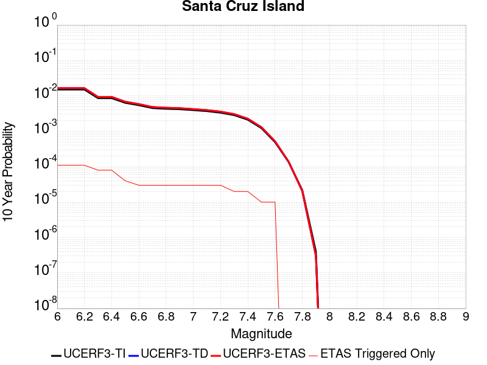 |

| Magnitude | 1 wk TI Prob | 1 wk TD Prob | 1 wk ETAS Prob | 1 wk ETAS/TD Gain | 1 wk ETAS Triggered Only | 1 mo TI Prob | 1 mo TD Prob | 1 mo ETAS Prob | 1 mo ETAS/TD Gain | 1 mo ETAS Triggered Only | 1 yr TI Prob | 1 yr TD Prob | 1 yr ETAS Prob | 1 yr ETAS/TD Gain | 1 yr ETAS Triggered Only | 10 yr TI Prob | 10 yr TD Prob | 10 yr ETAS Prob | 10 yr ETAS/TD Gain | 10 yr ETAS Triggered Only |
|-----|-----|-----|-----|-----|-----|-----|-----|-----|-----|-----|-----|-----|-----|-----|-----|-----|-----|-----|-----|-----|
| 6.0 | 2.9164563E-5 | 3.1599742E-5 | 5.5408516E-5 | 1.7534482 | 2.3809524E-5 | 1.2498499E-4 | 1.3542121E-4 | 1.8303382E-4 | 1.351589 | 4.7619047E-5 | 0.0015206301 | 0.0016476426 | 0.0017189534 | 1.0432806 | 7.142857E-5 | 0.015102667 | 0.016368 | 0.016485099 | 1.0071541 | 1.1904762E-4 |
| 6.1 | 2.9164563E-5 | 3.1599742E-5 | 5.5408516E-5 | 1.7534482 | 2.3809524E-5 | 1.2498499E-4 | 1.3542121E-4 | 1.8303382E-4 | 1.351589 | 4.7619047E-5 | 0.0015206301 | 0.0016476426 | 0.0017189534 | 1.0432806 | 7.142857E-5 | 0.015102667 | 0.016368 | 0.016485099 | 1.0071541 | 1.1904762E-4 |
| 6.2 | 2.9164563E-5 | 3.1599742E-5 | 5.5408516E-5 | 1.7534482 | 2.3809524E-5 | 1.2498499E-4 | 1.3542121E-4 | 1.8303382E-4 | 1.351589 | 4.7619047E-5 | 0.0015206301 | 0.0016476426 | 0.0017189534 | 1.0432806 | 7.142857E-5 | 0.015102667 | 0.016368 | 0.016485099 | 1.0071541 | 1.1904762E-4 |
| 6.3 | 1.6635553E-5 | 1.780436E-5 | 4.1613457E-5 | 2.3372624 | 2.3809524E-5 | 7.1293274E-5 | 7.630226E-5 | 1.2391768E-4 | 1.6240367 | 4.7619047E-5 | 8.6765E-4 | 9.2860236E-4 | 9.999647E-4 | 1.0768491 | 7.142857E-5 | 0.008642701 | 0.009249094 | 0.00936704 | 1.0127522 | 1.1904762E-4 |
| 6.4 | 1.6635553E-5 | 1.780436E-5 | 4.1613457E-5 | 2.3372624 | 2.3809524E-5 | 7.1293274E-5 | 7.630226E-5 | 1.2391768E-4 | 1.6240367 | 4.7619047E-5 | 8.6765E-4 | 9.2860236E-4 | 9.999647E-4 | 1.0768491 | 7.142857E-5 | 0.008642701 | 0.009249094 | 0.00936704 | 1.0127522 | 1.1904762E-4 |
| 6.5 | 1.2238748E-5 | 1.3042995E-5 | 1.3042995E-5 | 1.0 | 0.0 | 5.2450723E-5 | 5.5897377E-5 | 5.5897377E-5 | 1.0 | 0.0 | 6.3840044E-4 | 6.8034173E-4 | 6.8034173E-4 | 1.0 | 0.0 | 0.0063656955 | 0.0067829876 | 0.006830284 | 1.0069728 | 4.7619047E-5 |
| 6.6 | 1.0489767E-5 | 1.1156636E-5 | 1.1156636E-5 | 1.0 | 0.0 | 4.495537E-5 | 4.781329E-5 | 4.781329E-5 | 1.0 | 0.0 | 5.4719415E-4 | 5.819735E-4 | 5.819735E-4 | 1.0 | 0.0 | 0.005458487 | 0.0058047357 | 0.005828407 | 1.0040779 | 2.3809524E-5 |
| 6.7 | 8.699222E-6 | 9.236782E-6 | 9.236782E-6 | 1.0 | 0.0 | 3.7281847E-5 | 3.958561E-5 | 3.958561E-5 | 1.0 | 0.0 | 4.5381195E-4 | 4.8184878E-4 | 4.8184878E-4 | 1.0 | 0.0 | 0.0045288634 | 0.004808108 | 0.004831803 | 1.0049281 | 2.3809524E-5 |
| 6.8 | 8.307732E-6 | 8.8169045E-6 | 8.8169045E-6 | 1.0 | 0.0 | 3.560408E-5 | 3.7786187E-5 | 3.7786187E-5 | 1.0 | 0.0 | 4.3339343E-4 | 4.5995016E-4 | 4.5995016E-4 | 1.0 | 0.0 | 0.004325492 | 0.0045900354 | 0.0046137357 | 1.0051634 | 2.3809524E-5 |
| 6.9 | 8.073121E-6 | 8.564939E-6 | 8.564939E-6 | 1.0 | 0.0 | 3.459863E-5 | 3.6706366E-5 | 3.6706366E-5 | 1.0 | 0.0 | 4.2115687E-4 | 4.468088E-4 | 4.468088E-4 | 1.0 | 0.0 | 0.004203596 | 0.004459156 | 0.0044828593 | 1.0053157 | 2.3809524E-5 |
| 7.0 | 7.617019E-6 | 8.074664E-6 | 8.074664E-6 | 1.0 | 0.0 | 3.264396E-5 | 3.4605247E-5 | 3.4605247E-5 | 1.0 | 0.0 | 3.9736772E-4 | 4.212378E-4 | 4.212378E-4 | 1.0 | 0.0 | 0.003966579 | 0.0042044413 | 0.0042281505 | 1.0056392 | 2.3809524E-5 |
| 7.1 | 7.1224836E-6 | 7.545788E-6 | 7.545788E-6 | 1.0 | 0.0 | 3.052457E-5 | 3.2338692E-5 | 3.2338692E-5 | 1.0 | 0.0 | 3.715733E-4 | 3.936528E-4 | 3.936528E-4 | 1.0 | 0.0 | 0.003709526 | 0.003929598 | 0.003953314 | 1.0060352 | 2.3809524E-5 |
| 7.2 | 6.441115E-6 | 6.8273835E-6 | 6.8273835E-6 | 1.0 | 0.0 | 2.7604487E-5 | 2.9259887E-5 | 2.9259887E-5 | 1.0 | 0.0 | 3.360328E-4 | 3.5618112E-4 | 3.5618112E-4 | 1.0 | 0.0 | 0.0033552512 | 0.003556131 | 0.003579856 | 1.0066715 | 2.3809524E-5 |
| 7.3 | 5.494274E-6 | 5.8199944E-6 | 5.8199944E-6 | 1.0 | 0.0 | 2.3546674E-5 | 2.4942596E-5 | 2.4942596E-5 | 1.0 | 0.0 | 2.8664304E-4 | 3.0363398E-4 | 3.0363398E-4 | 1.0 | 0.0 | 0.002862736 | 0.0030322142 | 0.0030322142 | 1.0 | 0.0 |
| 7.4 | 4.0802624E-6 | 4.312256E-6 | 4.312256E-6 | 1.0 | 0.0 | 1.7486722E-5 | 1.8480967E-5 | 1.8480967E-5 | 1.0 | 0.0 | 2.1288003E-4 | 2.2498262E-4 | 2.2498262E-4 | 1.0 | 0.0 | 0.0021267622 | 0.0022475575 | 0.0022475575 | 1.0 | 0.0 |
| 7.5 | 2.3584746E-6 | 2.4753094E-6 | 2.4753094E-6 | 1.0 | 0.0 | 1.0107709E-5 | 1.0608426E-5 | 1.0608426E-5 | 1.0 | 0.0 | 1.2305441E-4 | 1.2915E-4 | 1.2915E-4 | 1.0 | 0.0 | 0.0012298629 | 0.0012907543 | 0.0012907543 | 1.0 | 0.0 |
| 7.6 | 9.4981914E-7 | 9.86093E-7 | 9.86093E-7 | 1.0 | 0.0 | 4.0706473E-6 | 4.2261063E-6 | 4.2261063E-6 | 1.0 | 0.0 | 4.9559E-5 | 5.145164E-5 | 5.145164E-5 | 1.0 | 0.0 | 4.954795E-4 | 5.1439856E-4 | 5.1439856E-4 | 1.0 | 0.0 |
| 7.7 | 2.6013532E-7 | 2.6416603E-7 | 2.6416603E-7 | 1.0 | 0.0 | 1.1148652E-6 | 1.1321397E-6 | 1.1321397E-6 | 1.0 | 0.0 | 1.3573399E-5 | 1.3783714E-5 | 1.3783714E-5 | 1.0 | 0.0 | 1.357257E-4 | 1.3782867E-4 | 1.3782867E-4 | 1.0 | 0.0 |
| 7.8 | 4.1522263E-8 | 3.965679E-8 | 3.965679E-8 | 1.0 | 0.0 | 1.7795254E-7 | 1.6995766E-7 | 1.6995766E-7 | 1.0 | 0.0 | 2.16657E-6 | 2.0692328E-6 | 2.0692328E-6 | 1.0 | 0.0 | 2.1665488E-5 | 2.0692156E-5 | 2.0692156E-5 | 1.0 | 0.0 |
| 7.9 | 7.7242046E-10 | 5.9468175E-10 | 5.9468175E-10 | 1.0 | 0.0 | 3.3103735E-9 | 2.5486364E-9 | 2.5486364E-9 | 1.0 | 0.0 | 4.0303796E-8 | 3.1029646E-8 | 3.1029646E-8 | 1.0 | 0.0 | 4.030379E-7 | 3.1029643E-7 | 3.1029643E-7 | 1.0 | 0.0 |

## Channel Islands Thrust
*[(top)](#table-of-contents)*

| 1 Week | 1 Month | 1 Year | 10 Year |
|-----|-----|-----|-----|
|  |  | 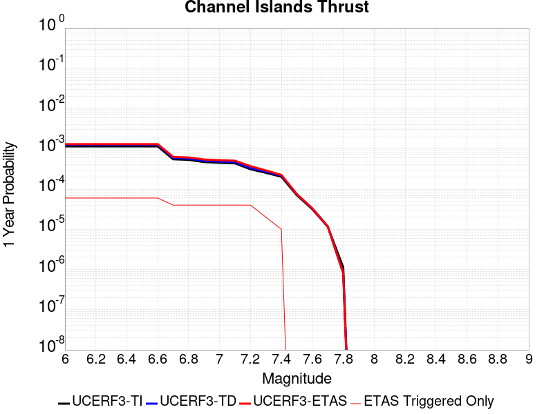 |  |

| Magnitude | 1 wk TI Prob | 1 wk TD Prob | 1 wk ETAS Prob | 1 wk ETAS/TD Gain | 1 wk ETAS Triggered Only | 1 mo TI Prob | 1 mo TD Prob | 1 mo ETAS Prob | 1 mo ETAS/TD Gain | 1 mo ETAS Triggered Only | 1 yr TI Prob | 1 yr TD Prob | 1 yr ETAS Prob | 1 yr ETAS/TD Gain | 1 yr ETAS Triggered Only | 10 yr TI Prob | 10 yr TD Prob | 10 yr ETAS Prob | 10 yr ETAS/TD Gain | 10 yr ETAS Triggered Only |
|-----|-----|-----|-----|-----|-----|-----|-----|-----|-----|-----|-----|-----|-----|-----|-----|-----|-----|-----|-----|-----|
| 6.0 | 2.2156251E-5 | 2.4092022E-5 | 2.4092022E-5 | 1.0 | 0.0 | 9.495191E-5 | 1.03248036E-4 | 1.270551E-4 | 1.2305813 | 2.3809524E-5 | 0.0011554264 | 0.0012564264 | 0.0013277653 | 1.0567791 | 7.142857E-5 | 0.011494373 | 0.0125038205 | 0.012691915 | 1.015043 | 1.9047619E-4 |
| 6.1 | 2.2156251E-5 | 2.4092022E-5 | 2.4092022E-5 | 1.0 | 0.0 | 9.495191E-5 | 1.03248036E-4 | 1.270551E-4 | 1.2305813 | 2.3809524E-5 | 0.0011554264 | 0.0012564264 | 0.0013277653 | 1.0567791 | 7.142857E-5 | 0.011494373 | 0.0125038205 | 0.012691915 | 1.015043 | 1.9047619E-4 |
| 6.2 | 2.2156251E-5 | 2.4092022E-5 | 2.4092022E-5 | 1.0 | 0.0 | 9.495191E-5 | 1.03248036E-4 | 1.270551E-4 | 1.2305813 | 2.3809524E-5 | 0.0011554264 | 0.0012564264 | 0.0013277653 | 1.0567791 | 7.142857E-5 | 0.011494373 | 0.0125038205 | 0.012691915 | 1.015043 | 1.9047619E-4 |
| 6.3 | 2.2156251E-5 | 2.4092022E-5 | 2.4092022E-5 | 1.0 | 0.0 | 9.495191E-5 | 1.03248036E-4 | 1.270551E-4 | 1.2305813 | 2.3809524E-5 | 0.0011554264 | 0.0012564264 | 0.0013277653 | 1.0567791 | 7.142857E-5 | 0.011494373 | 0.0125038205 | 0.012691915 | 1.015043 | 1.9047619E-4 |
| 6.4 | 2.2156251E-5 | 2.4092022E-5 | 2.4092022E-5 | 1.0 | 0.0 | 9.495191E-5 | 1.03248036E-4 | 1.270551E-4 | 1.2305813 | 2.3809524E-5 | 0.0011554264 | 0.0012564264 | 0.0013277653 | 1.0567791 | 7.142857E-5 | 0.011494373 | 0.0125038205 | 0.012691915 | 1.015043 | 1.9047619E-4 |
| 6.5 | 2.2156251E-5 | 2.4092022E-5 | 2.4092022E-5 | 1.0 | 0.0 | 9.495191E-5 | 1.03248036E-4 | 1.270551E-4 | 1.2305813 | 2.3809524E-5 | 0.0011554264 | 0.0012564264 | 0.0013277653 | 1.0567791 | 7.142857E-5 | 0.011494373 | 0.0125038205 | 0.012691915 | 1.015043 | 1.9047619E-4 |
| 6.6 | 2.2156251E-5 | 2.4092022E-5 | 2.4092022E-5 | 1.0 | 0.0 | 9.495191E-5 | 1.03248036E-4 | 1.270551E-4 | 1.2305813 | 2.3809524E-5 | 0.0011554264 | 0.0012564264 | 0.0013277653 | 1.0567791 | 7.142857E-5 | 0.011494373 | 0.0125038205 | 0.012691915 | 1.015043 | 1.9047619E-4 |
| 6.7 | 1.0601296E-5 | 1.1379544E-5 | 1.1379544E-5 | 1.0 | 0.0 | 4.5433335E-5 | 4.876859E-5 | 4.876859E-5 | 1.0 | 0.0 | 5.5301044E-4 | 5.936007E-4 | 6.173961E-4 | 1.0400865 | 2.3809524E-5 | 0.005516363 | 0.005920653 | 0.005991659 | 1.0119929 | 7.142857E-5 |
| 6.8 | 1.0246747E-5 | 1.0996669E-5 | 1.0996669E-5 | 1.0 | 0.0 | 4.391389E-5 | 4.7127756E-5 | 4.7127756E-5 | 1.0 | 0.0 | 5.345204E-4 | 5.7363417E-4 | 5.9743004E-4 | 1.0414827 | 2.3809524E-5 | 0.0053323656 | 0.005722025 | 0.005793045 | 1.0124117 | 7.142857E-5 |
| 6.9 | 9.049551E-6 | 9.699645E-6 | 9.699645E-6 | 1.0 | 0.0 | 3.878322E-5 | 4.1569267E-5 | 4.1569267E-5 | 1.0 | 0.0 | 4.7208337E-4 | 5.059924E-4 | 5.2978983E-4 | 1.0470313 | 2.3809524E-5 | 0.0047108172 | 0.0050488203 | 0.005119888 | 1.0140761 | 7.142857E-5 |
| 7.0 | 8.6542195E-6 | 9.274603E-6 | 9.274603E-6 | 1.0 | 0.0 | 3.7088983E-5 | 3.9747716E-5 | 3.9747716E-5 | 1.0 | 0.0 | 4.5146482E-4 | 4.8382508E-4 | 5.076231E-4 | 1.0491872 | 2.3809524E-5 | 0.004505487 | 0.004828129 | 0.0048992126 | 1.0147228 | 7.142857E-5 |
| 7.1 | 8.391028E-6 | 8.992924E-6 | 8.992924E-6 | 1.0 | 0.0 | 3.5961057E-5 | 3.854056E-5 | 3.854056E-5 | 1.0 | 0.0 | 4.3773788E-4 | 4.6913436E-4 | 4.9293274E-4 | 1.0507282 | 2.3809524E-5 | 0.004368766 | 0.0046818503 | 0.004752944 | 1.015185 | 7.142857E-5 |
| 7.2 | 5.965188E-6 | 6.3716952E-6 | 6.3716952E-6 | 1.0 | 0.0 | 2.556484E-5 | 2.7306982E-5 | 2.7306982E-5 | 1.0 | 0.0 | 3.1120746E-4 | 3.3241234E-4 | 3.5621395E-4 | 1.0716027 | 2.3809524E-5 | 0.00310772 | 0.0033192092 | 0.0033904007 | 1.0214484 | 7.142857E-5 |
| 7.3 | 4.877518E-6 | 5.2060063E-6 | 5.2060063E-6 | 1.0 | 0.0 | 2.0903482E-5 | 2.2311267E-5 | 2.2311267E-5 | 1.0 | 0.0 | 2.5447016E-4 | 2.716063E-4 | 2.716063E-4 | 1.0 | 0.0 | 0.0025417898 | 0.0027127895 | 0.0027365345 | 1.008753 | 2.3809524E-5 |
| 7.4 | 3.8829853E-6 | 4.141863E-6 | 4.141863E-6 | 1.0 | 0.0 | 1.664126E-5 | 1.7750723E-5 | 1.7750723E-5 | 1.0 | 0.0 | 2.0258849E-4 | 2.1609402E-4 | 2.1609402E-4 | 1.0 | 0.0 | 0.002024039 | 0.0021588807 | 0.0021588807 | 1.0 | 0.0 |
| 7.5 | 1.3489616E-6 | 1.4277903E-6 | 1.4277903E-6 | 1.0 | 0.0 | 5.7812517E-6 | 6.119087E-6 | 6.119087E-6 | 1.0 | 0.0 | 7.038446E-5 | 7.449738E-5 | 7.449738E-5 | 1.0 | 0.0 | 7.036218E-4 | 7.44728E-4 | 7.44728E-4 | 1.0 | 0.0 |
| 7.6 | 6.058192E-7 | 6.353778E-7 | 6.353778E-7 | 1.0 | 0.0 | 2.5963652E-6 | 2.7230449E-6 | 2.7230449E-6 | 1.0 | 0.0 | 3.161029E-5 | 3.3152584E-5 | 3.3152584E-5 | 1.0 | 0.0 | 3.1605794E-4 | 3.31478E-4 | 3.31478E-4 | 1.0 | 0.0 |
| 7.7 | 2.2170494E-7 | 2.2607902E-7 | 2.2607902E-7 | 1.0 | 0.0 | 9.5016367E-7 | 9.689098E-7 | 9.689098E-7 | 1.0 | 0.0 | 1.1568181E-5 | 1.1796425E-5 | 1.1796425E-5 | 1.0 | 0.0 | 1.1567579E-4 | 1.1795909E-4 | 1.1795909E-4 | 1.0 | 0.0 |
| 7.8 | 2.1613102E-8 | 1.5466682E-8 | 1.5466682E-8 | 1.0 | 0.0 | 9.262757E-8 | 6.628578E-8 | 6.628578E-8 | 1.0 | 0.0 | 1.1277401E-6 | 8.070291E-7 | 8.070291E-7 | 1.0 | 0.0 | 1.1277344E-5 | 8.070269E-6 | 8.070269E-6 | 1.0 | 0.0 |

## Santa Rosa Island
*[(top)](#table-of-contents)*

| 1 Week | 1 Month | 1 Year | 10 Year |
|-----|-----|-----|-----|
|  |  | 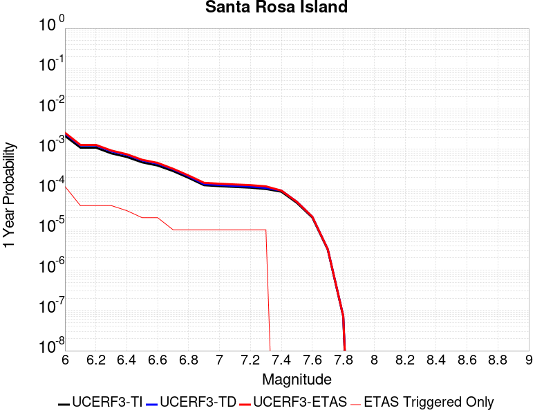 |  |

| Magnitude | 1 wk TI Prob | 1 wk TD Prob | 1 wk ETAS Prob | 1 wk ETAS/TD Gain | 1 wk ETAS Triggered Only | 1 mo TI Prob | 1 mo TD Prob | 1 mo ETAS Prob | 1 mo ETAS/TD Gain | 1 mo ETAS Triggered Only | 1 yr TI Prob | 1 yr TD Prob | 1 yr ETAS Prob | 1 yr ETAS/TD Gain | 1 yr ETAS Triggered Only | 10 yr TI Prob | 10 yr TD Prob | 10 yr ETAS Prob | 10 yr ETAS/TD Gain | 10 yr ETAS Triggered Only |
|-----|-----|-----|-----|-----|-----|-----|-----|-----|-----|-----|-----|-----|-----|-----|-----|-----|-----|-----|-----|-----|
| 6.0 | 4.1143165E-5 | 4.7091133E-5 | 9.470794E-5 | 2.0111628 | 4.7619047E-5 | 1.7631594E-4 | 2.0180465E-4 | 2.7321881E-4 | 1.3538777 | 7.142857E-5 | 0.002144533 | 0.0024544 | 0.0025731553 | 1.0483847 | 1.1904762E-4 | 0.021239553 | 0.024293551 | 0.024432939 | 1.0057375 | 1.4285714E-4 |
| 6.1 | 2.1061249E-5 | 2.3864959E-5 | 4.7673915E-5 | 1.9976532 | 2.3809524E-5 | 9.0259375E-5 | 1.0227455E-4 | 1.2608164E-4 | 1.2327763 | 2.3809524E-5 | 0.0010983539 | 0.0012445104 | 0.0012682902 | 1.0191078 | 2.3809524E-5 | 0.01092941 | 0.012378449 | 0.012425478 | 1.0037993 | 4.7619047E-5 |
| 6.2 | 2.1061249E-5 | 2.3864959E-5 | 4.7673915E-5 | 1.9976532 | 2.3809524E-5 | 9.0259375E-5 | 1.0227455E-4 | 1.2608164E-4 | 1.2327763 | 2.3809524E-5 | 0.0010983539 | 0.0012445104 | 0.0012682902 | 1.0191078 | 2.3809524E-5 | 0.01092941 | 0.012378449 | 0.012425478 | 1.0037993 | 4.7619047E-5 |
| 6.3 | 1.5158236E-5 | 1.7074419E-5 | 4.0883537E-5 | 2.394432 | 2.3809524E-5 | 6.496225E-5 | 7.3174095E-5 | 9.698188E-5 | 1.325358 | 2.3809524E-5 | 7.906284E-4 | 8.905424E-4 | 9.1433077E-4 | 1.0267122 | 2.3809524E-5 | 0.007878214 | 0.008870989 | 0.008918186 | 1.0053203 | 4.7619047E-5 |
| 6.4 | 1.2341918E-5 | 1.3852917E-5 | 1.3852917E-5 | 1.0 | 0.0 | 5.2892858E-5 | 5.9368336E-5 | 5.9368336E-5 | 1.0 | 0.0 | 6.437803E-4 | 7.225779E-4 | 7.225779E-4 | 1.0 | 0.0 | 0.006419184 | 0.007203121 | 0.007226759 | 1.0032816 | 2.3809524E-5 |
| 6.5 | 9.061158E-6 | 1.0117031E-5 | 1.0117031E-5 | 1.0 | 0.0 | 3.883296E-5 | 4.3358013E-5 | 4.3358013E-5 | 1.0 | 0.0 | 4.726887E-4 | 5.277613E-4 | 5.277613E-4 | 1.0 | 0.0 | 0.004716845 | 0.0052656173 | 0.0052656173 | 1.0 | 0.0 |
| 6.6 | 7.5461685E-6 | 8.400733E-6 | 8.400733E-6 | 1.0 | 0.0 | 3.2340322E-5 | 3.600267E-5 | 3.600267E-5 | 1.0 | 0.0 | 3.936723E-4 | 4.3824865E-4 | 4.3824865E-4 | 1.0 | 0.0 | 0.003929756 | 0.0043742736 | 0.0043742736 | 1.0 | 0.0 |
| 6.7 | 5.5023775E-6 | 6.087381E-6 | 6.087381E-6 | 1.0 | 0.0 | 2.3581404E-5 | 2.6088532E-5 | 2.6088532E-5 | 1.0 | 0.0 | 2.8706578E-4 | 3.1758484E-4 | 3.1758484E-4 | 1.0 | 0.0 | 0.0028669522 | 0.0031716314 | 0.0031716314 | 1.0 | 0.0 |
| 6.8 | 3.7351679E-6 | 4.0831405E-6 | 4.0831405E-6 | 1.0 | 0.0 | 1.6007763E-5 | 1.749907E-5 | 1.749907E-5 | 1.0 | 0.0 | 1.948771E-4 | 2.1303284E-4 | 2.1303284E-4 | 1.0 | 0.0 | 0.0019470629 | 0.0021285315 | 0.0021285315 | 1.0 | 0.0 |
| 6.9 | 2.456366E-6 | 2.6292705E-6 | 2.6292705E-6 | 1.0 | 0.0 | 1.0527241E-5 | 1.1268254E-5 | 1.1268254E-5 | 1.0 | 0.0 | 1.2816161E-4 | 1.3718237E-4 | 1.3718237E-4 | 1.0 | 0.0 | 0.0012808773 | 0.0013709799 | 0.0013709799 | 1.0 | 0.0 |
| 7.0 | 2.3245157E-6 | 2.4827782E-6 | 2.4827782E-6 | 1.0 | 0.0 | 9.962172E-6 | 1.0640435E-5 | 1.0640435E-5 | 1.0 | 0.0 | 1.2128269E-4 | 1.2953962E-4 | 1.2953962E-4 | 1.0 | 0.0 | 0.0012121652 | 0.0012946434 | 0.0012946434 | 1.0 | 0.0 |
| 7.1 | 2.2248344E-6 | 2.37325E-6 | 2.37325E-6 | 1.0 | 0.0 | 9.53497E-6 | 1.0171032E-5 | 1.0171032E-5 | 1.0 | 0.0 | 1.1608207E-4 | 1.2382529E-4 | 1.2382529E-4 | 1.0 | 0.0 | 0.0011602144 | 0.001237565 | 0.001237565 | 1.0 | 0.0 |
| 7.2 | 2.1350402E-6 | 2.276154E-6 | 2.276154E-6 | 1.0 | 0.0 | 9.150141E-6 | 9.754909E-6 | 9.754909E-6 | 1.0 | 0.0 | 1.1139726E-4 | 1.1875956E-4 | 1.1875956E-4 | 1.0 | 0.0 | 0.0011134144 | 0.0011869629 | 0.0011869629 | 1.0 | 0.0 |
| 7.3 | 1.9793572E-6 | 2.108719E-6 | 2.108719E-6 | 1.0 | 0.0 | 8.482932E-6 | 9.037336E-6 | 9.037336E-6 | 1.0 | 0.0 | 1.032748E-4 | 1.10024026E-4 | 1.10024026E-4 | 1.0 | 0.0 | 0.0010322682 | 0.0010996973 | 0.0010996973 | 1.0 | 0.0 |
| 7.4 | 1.6951194E-6 | 1.8045733E-6 | 1.8045733E-6 | 1.0 | 0.0 | 7.264777E-6 | 7.733863E-6 | 7.733863E-6 | 1.0 | 0.0 | 8.844508E-5 | 9.415573E-5 | 9.415573E-5 | 1.0 | 0.0 | 8.840988E-4 | 9.4116E-4 | 9.4116E-4 | 1.0 | 0.0 |
| 7.5 | 8.987207E-7 | 9.5122147E-7 | 9.5122147E-7 | 1.0 | 0.0 | 3.8516546E-6 | 4.076657E-6 | 4.076657E-6 | 1.0 | 0.0 | 4.6892885E-5 | 4.963218E-5 | 4.963218E-5 | 1.0 | 0.0 | 4.688299E-4 | 4.9621216E-4 | 4.9621216E-4 | 1.0 | 0.0 |
| 7.6 | 3.8783037E-7 | 4.052932E-7 | 4.052932E-7 | 1.0 | 0.0 | 1.6621291E-6 | 1.7369698E-6 | 1.7369698E-6 | 1.0 | 0.0 | 2.0236233E-5 | 2.1147409E-5 | 2.1147409E-5 | 1.0 | 0.0 | 2.023439E-4 | 2.1145462E-4 | 2.1145462E-4 | 1.0 | 0.0 |
| 7.7 | 6.181804E-8 | 6.339035E-8 | 6.339035E-8 | 1.0 | 0.0 | 2.6493444E-7 | 2.7167292E-7 | 2.7167292E-7 | 1.0 | 0.0 | 3.225572E-6 | 3.3076128E-6 | 3.3076128E-6 | 1.0 | 0.0 | 3.225525E-5 | 3.307564E-5 | 3.307564E-5 | 1.0 | 0.0 |
| 7.8 | 1.3704449E-9 | 1.3964153E-9 | 1.3964153E-9 | 1.0 | 0.0 | 5.873335E-9 | 5.984637E-9 | 5.984637E-9 | 1.0 | 0.0 | 7.1507856E-8 | 7.286295E-8 | 7.286295E-8 | 1.0 | 0.0 | 7.1507833E-7 | 7.286294E-7 | 7.286294E-7 | 1.0 | 0.0 |

## Pisgah-Bullion Mtn-Mesquite Lk
*[(top)](#table-of-contents)*

| 1 Week | 1 Month | 1 Year | 10 Year |
|-----|-----|-----|-----|
|  |  |  |  |

| Magnitude | 1 wk TI Prob | 1 wk TD Prob | 1 wk ETAS Prob | 1 wk ETAS/TD Gain | 1 wk ETAS Triggered Only | 1 mo TI Prob | 1 mo TD Prob | 1 mo ETAS Prob | 1 mo ETAS/TD Gain | 1 mo ETAS Triggered Only | 1 yr TI Prob | 1 yr TD Prob | 1 yr ETAS Prob | 1 yr ETAS/TD Gain | 1 yr ETAS Triggered Only | 10 yr TI Prob | 10 yr TD Prob | 10 yr ETAS Prob | 10 yr ETAS/TD Gain | 10 yr ETAS Triggered Only |
|-----|-----|-----|-----|-----|-----|-----|-----|-----|-----|-----|-----|-----|-----|-----|-----|-----|-----|-----|-----|-----|
| 6.0 | 3.0240792E-5 | 2.4091114E-5 | 7.1709015E-5 | 2.9765751 | 4.7619047E-5 | 1.2959696E-4 | 1.03244114E-4 | 1.7466531E-4 | 1.6917702 | 7.142857E-5 | 0.0015767008 | 0.0012563728 | 0.0013990504 | 1.1135632 | 1.4285714E-4 | 0.015655609 | 0.012502721 | 0.012690815 | 1.0150443 | 1.9047619E-4 |
| 6.1 | 3.0240792E-5 | 2.4091114E-5 | 7.1709015E-5 | 2.9765751 | 4.7619047E-5 | 1.2959696E-4 | 1.03244114E-4 | 1.7466531E-4 | 1.6917702 | 7.142857E-5 | 0.0015767008 | 0.0012563728 | 0.0013990504 | 1.1135632 | 1.4285714E-4 | 0.015655609 | 0.012502721 | 0.012690815 | 1.0150443 | 1.9047619E-4 |
| 6.2 | 3.0240792E-5 | 2.4091114E-5 | 7.1709015E-5 | 2.9765751 | 4.7619047E-5 | 1.2959696E-4 | 1.03244114E-4 | 1.7466531E-4 | 1.6917702 | 7.142857E-5 | 0.0015767008 | 0.0012563728 | 0.0013990504 | 1.1135632 | 1.4285714E-4 | 0.015655609 | 0.012502721 | 0.012690815 | 1.0150443 | 1.9047619E-4 |
| 6.3 | 2.0498217E-5 | 1.36380695E-5 | 3.744727E-5 | 2.7457895 | 2.3809524E-5 | 8.784654E-5 | 5.844765E-5 | 1.0606392E-4 | 1.8146822 | 4.7619047E-5 | 0.0010690069 | 7.1138405E-4 | 7.589692E-4 | 1.066891 | 4.7619047E-5 | 0.01063879 | 0.0070926943 | 0.0071636164 | 1.0099993 | 7.142857E-5 |
| 6.4 | 2.0498217E-5 | 1.36380695E-5 | 3.744727E-5 | 2.7457895 | 2.3809524E-5 | 8.784654E-5 | 5.844765E-5 | 1.0606392E-4 | 1.8146822 | 4.7619047E-5 | 0.0010690069 | 7.1138405E-4 | 7.589692E-4 | 1.066891 | 4.7619047E-5 | 0.01063879 | 0.0070926943 | 0.0071636164 | 1.0099993 | 7.142857E-5 |
| 6.5 | 1.7316182E-5 | 1.0477042E-5 | 3.4286317E-5 | 3.2725186 | 2.3809524E-5 | 7.42101E-5 | 4.4900895E-5 | 9.25178E-5 | 2.0604892 | 4.7619047E-5 | 9.0313336E-4 | 5.465413E-4 | 5.941343E-4 | 1.0870804 | 4.7619047E-5 | 0.008994718 | 0.0054529672 | 0.005524006 | 1.0130275 | 7.142857E-5 |
| 6.6 | 1.5251077E-5 | 8.414273E-6 | 8.414273E-6 | 1.0 | 0.0 | 6.536012E-5 | 3.6060712E-5 | 5.9869377E-5 | 1.6602384 | 2.3809524E-5 | 7.9546886E-4 | 4.3895794E-4 | 4.6275702E-4 | 1.0542172 | 2.3809524E-5 | 0.007926274 | 0.0043816264 | 0.0044290368 | 1.0108203 | 4.7619047E-5 |
| 6.7 | 1.2997425E-5 | 6.4114965E-6 | 6.4114965E-6 | 1.0 | 0.0 | 5.570206E-5 | 2.7477578E-5 | 5.1286446E-5 | 1.8664836 | 2.3809524E-5 | 6.7796157E-4 | 3.3449283E-4 | 3.5829438E-4 | 1.0711572 | 2.3809524E-5 | 0.0067589693 | 0.0033403537 | 0.0033878137 | 1.0142081 | 4.7619047E-5 |
| 6.8 | 1.035386E-5 | 4.3332193E-6 | 4.3332193E-6 | 1.0 | 0.0 | 4.437293E-5 | 1.8570812E-5 | 4.2379896E-5 | 2.28207 | 2.3809524E-5 | 5.401065E-4 | 2.2607706E-4 | 2.498812E-4 | 1.1052922 | 2.3809524E-5 | 0.0053879567 | 0.0022585576 | 0.002306069 | 1.0210363 | 4.7619047E-5 |
| 6.9 | 8.816252E-6 | 3.580638E-6 | 3.580638E-6 | 1.0 | 0.0 | 3.778339E-5 | 1.5345504E-5 | 1.5345504E-5 | 1.0 | 0.0 | 4.5991567E-4 | 1.8681608E-4 | 1.8681608E-4 | 1.0 | 0.0 | 0.00458965 | 0.0018666488 | 0.0018904138 | 1.0127314 | 2.3809524E-5 |
| 7.0 | 6.8232207E-6 | 2.5675843E-6 | 2.5675843E-6 | 1.0 | 0.0 | 2.9242048E-5 | 1.1003888E-5 | 1.1003888E-5 | 1.0 | 0.0 | 3.5596377E-4 | 1.3396442E-4 | 1.3396442E-4 | 1.0 | 0.0 | 0.0035539411 | 0.0013388677 | 0.0013388677 | 1.0 | 0.0 |
| 7.1 | 5.837013E-6 | 2.22738E-6 | 2.22738E-6 | 1.0 | 0.0 | 2.501553E-5 | 9.545881E-6 | 9.545881E-6 | 1.0 | 0.0 | 3.045215E-4 | 1.16215204E-4 | 1.16215204E-4 | 1.0 | 0.0 | 0.0030410455 | 0.0011615733 | 0.0011615733 | 1.0 | 0.0 |
| 7.2 | 4.278052E-6 | 1.6275711E-6 | 1.6275711E-6 | 1.0 | 0.0 | 1.833438E-5 | 6.9752873E-6 | 6.9752873E-6 | 1.0 | 0.0 | 2.231982E-4 | 8.492105E-5 | 8.492105E-5 | 1.0 | 0.0 | 0.0022297418 | 8.489092E-4 | 8.489092E-4 | 1.0 | 0.0 |
| 7.3 | 1.8803692E-6 | 8.344926E-7 | 8.344926E-7 | 1.0 | 0.0 | 8.0587E-6 | 3.5763926E-6 | 3.5763926E-6 | 1.0 | 0.0 | 9.811026E-5 | 4.354186E-5 | 4.354186E-5 | 1.0 | 0.0 | 9.806695E-4 | 4.3534773E-4 | 4.3534773E-4 | 1.0 | 0.0 |

## Kern Canyon (North Kern) 2011
*[(top)](#table-of-contents)*

| 1 Week | 1 Month | 1 Year | 10 Year |
|-----|-----|-----|-----|
|  |  | 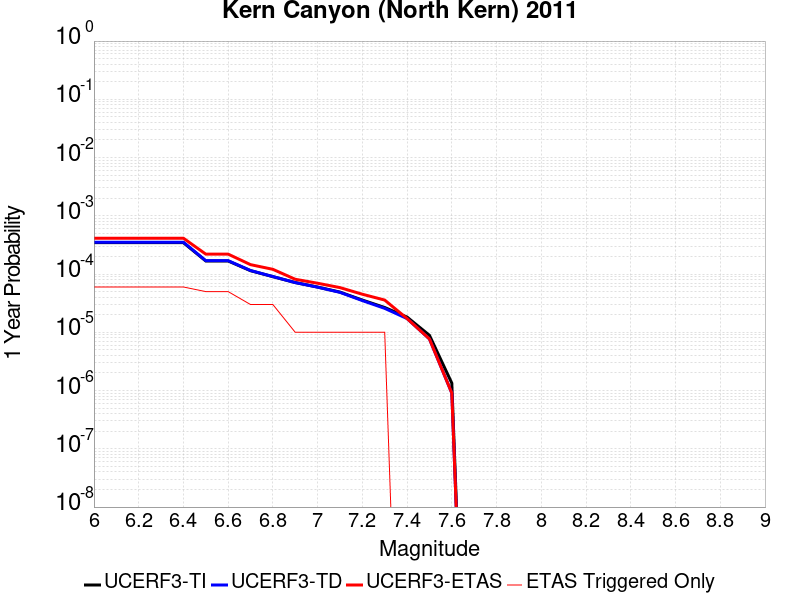 |  |

| Magnitude | 1 wk TI Prob | 1 wk TD Prob | 1 wk ETAS Prob | 1 wk ETAS/TD Gain | 1 wk ETAS Triggered Only | 1 mo TI Prob | 1 mo TD Prob | 1 mo ETAS Prob | 1 mo ETAS/TD Gain | 1 mo ETAS Triggered Only | 1 yr TI Prob | 1 yr TD Prob | 1 yr ETAS Prob | 1 yr ETAS/TD Gain | 1 yr ETAS Triggered Only | 10 yr TI Prob | 10 yr TD Prob | 10 yr ETAS Prob | 10 yr ETAS/TD Gain | 10 yr ETAS Triggered Only |
|-----|-----|-----|-----|-----|-----|-----|-----|-----|-----|-----|-----|-----|-----|-----|-----|-----|-----|-----|-----|-----|
| 6.0 | 6.6264497E-6 | 6.75733E-6 | 7.818542E-5 | 11.57046 | 7.142857E-5 | 2.8398761E-5 | 2.895971E-5 | 1.2419505E-4 | 4.288546 | 9.5238094E-5 | 3.4570007E-4 | 3.5253543E-4 | 4.4773993E-4 | 1.2700566 | 9.5238094E-5 | 0.0034516277 | 0.0035205502 | 0.0036629045 | 1.0404352 | 1.4285714E-4 |
| 6.1 | 6.6264497E-6 | 6.75733E-6 | 7.818542E-5 | 11.57046 | 7.142857E-5 | 2.8398761E-5 | 2.895971E-5 | 1.2419505E-4 | 4.288546 | 9.5238094E-5 | 3.4570007E-4 | 3.5253543E-4 | 4.4773993E-4 | 1.2700566 | 9.5238094E-5 | 0.0034516277 | 0.0035205502 | 0.0036629045 | 1.0404352 | 1.4285714E-4 |
| 6.2 | 6.6264497E-6 | 6.75733E-6 | 7.818542E-5 | 11.57046 | 7.142857E-5 | 2.8398761E-5 | 2.895971E-5 | 1.2419505E-4 | 4.288546 | 9.5238094E-5 | 3.4570007E-4 | 3.5253543E-4 | 4.4773993E-4 | 1.2700566 | 9.5238094E-5 | 0.0034516277 | 0.0035205502 | 0.0036629045 | 1.0404352 | 1.4285714E-4 |
| 6.3 | 6.6264497E-6 | 6.75733E-6 | 7.818542E-5 | 11.57046 | 7.142857E-5 | 2.8398761E-5 | 2.895971E-5 | 1.2419505E-4 | 4.288546 | 9.5238094E-5 | 3.4570007E-4 | 3.5253543E-4 | 4.4773993E-4 | 1.2700566 | 9.5238094E-5 | 0.0034516277 | 0.0035205502 | 0.0036629045 | 1.0404352 | 1.4285714E-4 |
| 6.4 | 6.6264497E-6 | 6.75733E-6 | 7.818542E-5 | 11.57046 | 7.142857E-5 | 2.8398761E-5 | 2.895971E-5 | 1.2419505E-4 | 4.288546 | 9.5238094E-5 | 3.4570007E-4 | 3.5253543E-4 | 4.4773993E-4 | 1.2700566 | 9.5238094E-5 | 0.0034516277 | 0.0035205502 | 0.0036629045 | 1.0404352 | 1.4285714E-4 |
| 6.5 | 3.2162225E-6 | 3.2570915E-6 | 5.0875984E-5 | 15.620067 | 4.7619047E-5 | 1.3783738E-5 | 1.3958893E-5 | 8.538647E-5 | 6.116994 | 7.142857E-5 | 1.6780409E-4 | 1.6993708E-4 | 2.4135351E-4 | 1.4202522 | 7.142857E-5 | 0.0016767744 | 0.001698151 | 0.0017932274 | 1.0559882 | 9.5238094E-5 |
| 6.6 | 3.2162225E-6 | 3.2570915E-6 | 5.0875984E-5 | 15.620067 | 4.7619047E-5 | 1.3783738E-5 | 1.3958893E-5 | 8.538647E-5 | 6.116994 | 7.142857E-5 | 1.6780409E-4 | 1.6993708E-4 | 2.4135351E-4 | 1.4202522 | 7.142857E-5 | 0.0016767744 | 0.001698151 | 0.0017932274 | 1.0559882 | 9.5238094E-5 |
| 6.7 | 2.1908265E-6 | 2.2071222E-6 | 2.6016593E-5 | 11.787564 | 2.3809524E-5 | 9.389223E-6 | 9.459061E-6 | 3.326836E-5 | 3.517089 | 2.3809524E-5 | 1.1430779E-4 | 1.1515819E-4 | 1.6277176E-4 | 1.4134623 | 4.7619047E-5 | 0.0011424901 | 0.0011510046 | 0.0012223509 | 1.0619862 | 7.142857E-5 |
| 6.8 | 1.7303895E-6 | 1.7365529E-6 | 2.5546035E-5 | 14.710773 | 2.3809524E-5 | 7.415934E-6 | 7.4423488E-6 | 3.1251697E-5 | 4.199171 | 2.3809524E-5 | 9.028525E-5 | 9.0606925E-5 | 1.3822166E-4 | 1.5255088 | 4.7619047E-5 | 9.024858E-4 | 9.057096E-4 | 9.770734E-4 | 1.0787933 | 7.142857E-5 |
| 6.9 | 1.3700314E-6 | 1.3688622E-6 | 2.5178353E-5 | 18.393637 | 2.3809524E-5 | 5.87155E-6 | 5.8665396E-6 | 2.9675924E-5 | 5.0585055 | 2.3809524E-5 | 7.148377E-5 | 7.142282E-5 | 9.523064E-5 | 1.3333364 | 2.3809524E-5 | 7.146078E-4 | 7.140032E-4 | 7.377958E-4 | 1.0333227 | 2.3809524E-5 |
| 7.0 | 1.1467797E-6 | 1.1413804E-6 | 2.4950878E-5 | 21.860264 | 2.3809524E-5 | 4.9147607E-6 | 4.8916213E-6 | 2.8701028E-5 | 5.8673854 | 2.3809524E-5 | 5.983557E-5 | 5.9553895E-5 | 8.3362E-5 | 1.3997741 | 2.3809524E-5 | 5.981946E-4 | 5.953825E-4 | 6.191778E-4 | 1.0399665 | 2.3809524E-5 |
| 7.1 | 9.3952065E-7 | 9.3026904E-7 | 2.4739771E-5 | 26.594212 | 2.3809524E-5 | 4.026511E-6 | 3.9868614E-6 | 2.779629E-5 | 6.9719734 | 2.3809524E-5 | 4.9021666E-5 | 4.8538972E-5 | 7.234734E-5 | 1.4905001 | 2.3809524E-5 | 4.901085E-4 | 4.8528548E-4 | 5.0908345E-4 | 1.0490391 | 2.3809524E-5 |
| 7.2 | 6.858055E-7 | 6.7193E-7 | 2.4481438E-5 | 36.434505 | 2.3809524E-5 | 2.939163E-6 | 2.879697E-6 | 2.6689153E-5 | 9.268042 | 2.3809524E-5 | 3.5783723E-5 | 3.5059755E-5 | 5.8868445E-5 | 1.6790888 | 2.3809524E-5 | 3.5777962E-4 | 3.5054312E-4 | 3.7434432E-4 | 1.067898 | 2.3809524E-5 |
| 7.3 | 5.1101983E-7 | 4.9393E-7 | 2.4303443E-5 | 49.204227 | 2.3809524E-5 | 2.1900833E-6 | 2.116841E-6 | 2.5926314E-5 | 12.247643 | 2.3809524E-5 | 2.6663936E-5 | 2.5772239E-5 | 4.958115E-5 | 1.92382 | 2.3809524E-5 | 2.6660739E-4 | 2.57693E-4 | 2.8149638E-4 | 1.0923711 | 2.3809524E-5 |
| 7.4 | 3.4999414E-7 | 3.2995905E-7 | 3.2995905E-7 | 1.0 | 0.0 | 1.499974E-6 | 1.4141094E-6 | 1.4141094E-6 | 1.0 | 0.0 | 1.8262032E-5 | 1.721665E-5 | 1.721665E-5 | 1.0 | 0.0 | 1.826053E-4 | 1.7215339E-4 | 1.7215339E-4 | 1.0 | 0.0 |
| 7.5 | 1.7021522E-7 | 1.4750044E-7 | 1.4750044E-7 | 1.0 | 0.0 | 7.2949354E-7 | 6.321446E-7 | 6.321446E-7 | 1.0 | 0.0 | 8.881548E-6 | 7.696334E-6 | 7.696334E-6 | 1.0 | 0.0 | 8.8811925E-5 | 7.696076E-5 | 7.696076E-5 | 1.0 | 0.0 |
| 7.6 | 2.572245E-8 | 1.7352555E-8 | 1.7352555E-8 | 1.0 | 0.0 | 1.10239064E-7 | 7.436809E-8 | 7.436809E-8 | 1.0 | 0.0 | 1.3421597E-6 | 9.054312E-7 | 9.054312E-7 | 1.0 | 0.0 | 1.3421517E-5 | 9.05428E-6 | 9.05428E-6 | 1.0 | 0.0 |

## Pinto Mtn
*[(top)](#table-of-contents)*

| 1 Week | 1 Month | 1 Year | 10 Year |
|-----|-----|-----|-----|
|  |  |  |  |

| Magnitude | 1 wk TI Prob | 1 wk TD Prob | 1 wk ETAS Prob | 1 wk ETAS/TD Gain | 1 wk ETAS Triggered Only | 1 mo TI Prob | 1 mo TD Prob | 1 mo ETAS Prob | 1 mo ETAS/TD Gain | 1 mo ETAS Triggered Only | 1 yr TI Prob | 1 yr TD Prob | 1 yr ETAS Prob | 1 yr ETAS/TD Gain | 1 yr ETAS Triggered Only | 10 yr TI Prob | 10 yr TD Prob | 10 yr ETAS Prob | 10 yr ETAS/TD Gain | 10 yr ETAS Triggered Only |
|-----|-----|-----|-----|-----|-----|-----|-----|-----|-----|-----|-----|-----|-----|-----|-----|-----|-----|-----|-----|-----|
| 6.0 | 4.4194956E-5 | 4.785362E-5 | 4.785362E-5 | 1.0 | 0.0 | 1.893932E-4 | 2.0507174E-4 | 2.0507174E-4 | 1.0 | 0.0 | 0.0023034236 | 0.0024940541 | 0.0025415544 | 1.0190454 | 4.7619047E-5 | 0.022796938 | 0.024678145 | 0.024817476 | 1.005646 | 1.4285714E-4 |
| 6.1 | 4.4194956E-5 | 4.785362E-5 | 4.785362E-5 | 1.0 | 0.0 | 1.893932E-4 | 2.0507174E-4 | 2.0507174E-4 | 1.0 | 0.0 | 0.0023034236 | 0.0024940541 | 0.0025415544 | 1.0190454 | 4.7619047E-5 | 0.022796938 | 0.024678145 | 0.024817476 | 1.005646 | 1.4285714E-4 |
| 6.2 | 4.4194956E-5 | 4.785362E-5 | 4.785362E-5 | 1.0 | 0.0 | 1.893932E-4 | 2.0507174E-4 | 2.0507174E-4 | 1.0 | 0.0 | 0.0023034236 | 0.0024940541 | 0.0025415544 | 1.0190454 | 4.7619047E-5 | 0.022796938 | 0.024678145 | 0.024817476 | 1.005646 | 1.4285714E-4 |
| 6.3 | 4.4194956E-5 | 4.785362E-5 | 4.785362E-5 | 1.0 | 0.0 | 1.893932E-4 | 2.0507174E-4 | 2.0507174E-4 | 1.0 | 0.0 | 0.0023034236 | 0.0024940541 | 0.0025415544 | 1.0190454 | 4.7619047E-5 | 0.022796938 | 0.024678145 | 0.024817476 | 1.005646 | 1.4285714E-4 |
| 6.4 | 3.729929E-5 | 3.9603186E-5 | 3.9603186E-5 | 1.0 | 0.0 | 1.5984432E-4 | 1.6971743E-4 | 1.6971743E-4 | 1.0 | 0.0 | 0.0019443673 | 0.002064445 | 0.0021119658 | 1.0230186 | 4.7619047E-5 | 0.019274427 | 0.02046269 | 0.020602625 | 1.0068384 | 1.4285714E-4 |
| 6.5 | 3.729929E-5 | 3.9603186E-5 | 3.9603186E-5 | 1.0 | 0.0 | 1.5984432E-4 | 1.6971743E-4 | 1.6971743E-4 | 1.0 | 0.0 | 0.0019443673 | 0.002064445 | 0.0021119658 | 1.0230186 | 4.7619047E-5 | 0.019274427 | 0.02046269 | 0.020602625 | 1.0068384 | 1.4285714E-4 |
| 6.6 | 3.0204548E-5 | 3.1205298E-5 | 3.1205298E-5 | 1.0 | 0.0 | 1.2944164E-4 | 1.3373033E-4 | 1.3373033E-4 | 1.0 | 0.0 | 0.0015748127 | 0.0016269855 | 0.0016269855 | 1.0 | 0.0 | 0.015636992 | 0.01615461 | 0.016248308 | 1.0058001 | 9.5238094E-5 |
| 6.7 | 2.9857754E-5 | 3.081468E-5 | 3.081468E-5 | 1.0 | 0.0 | 1.2795553E-4 | 1.3205643E-4 | 1.3205643E-4 | 1.0 | 0.0 | 0.0015567453 | 0.001606636 | 0.001606636 | 1.0 | 0.0 | 0.015458848 | 0.01595405 | 0.016047768 | 1.0058743 | 9.5238094E-5 |
| 6.8 | 2.4819734E-5 | 2.5009364E-5 | 2.5009364E-5 | 1.0 | 0.0 | 1.0636595E-4 | 1.07178705E-4 | 1.07178705E-4 | 1.0 | 0.0 | 0.0012942362 | 0.0013041412 | 0.0013041412 | 1.0 | 0.0 | 0.012867244 | 0.0129672475 | 0.013061251 | 1.0072492 | 9.5238094E-5 |
| 6.9 | 2.331124E-5 | 2.3337643E-5 | 2.3337643E-5 | 1.0 | 0.0 | 9.990149E-5 | 1.00014746E-4 | 1.00014746E-4 | 1.0 | 0.0 | 0.001215622 | 0.0012170197 | 0.0012170197 | 1.0 | 0.0 | 0.012089936 | 0.012105742 | 0.012176305 | 1.005829 | 7.142857E-5 |
| 7.0 | 2.1818534E-5 | 2.1760772E-5 | 2.1760772E-5 | 1.0 | 0.0 | 9.3504656E-5 | 9.325723E-5 | 9.325723E-5 | 1.0 | 0.0 | 0.0011378246 | 0.0011348352 | 0.0011348352 | 1.0 | 0.0 | 0.011320163 | 0.011292503 | 0.011339585 | 1.0041692 | 4.7619047E-5 |
| 7.1 | 2.066081E-5 | 2.0540418E-5 | 2.0540418E-5 | 1.0 | 0.0 | 8.854332E-5 | 8.8027504E-5 | 8.8027504E-5 | 1.0 | 0.0 | 0.0010774818 | 0.0010712275 | 0.0010712275 | 1.0 | 0.0 | 0.010722724 | 0.010662688 | 0.0107098 | 1.0044184 | 4.7619047E-5 |
| 7.2 | 1.8990233E-5 | 1.9053701E-5 | 1.9053701E-5 | 1.0 | 0.0 | 8.138417E-5 | 8.1656275E-5 | 8.1656275E-5 | 1.0 | 0.0 | 9.904018E-4 | 9.937311E-4 | 9.937311E-4 | 1.0 | 0.0 | 0.009859995 | 0.009894874 | 0.009918448 | 1.0023824 | 2.3809524E-5 |
| 7.3 | 1.3335872E-5 | 1.4906372E-5 | 1.4906372E-5 | 1.0 | 0.0 | 5.7152483E-5 | 6.388296E-5 | 6.388296E-5 | 1.0 | 0.0 | 6.956093E-4 | 7.775102E-4 | 7.775102E-4 | 1.0 | 0.0 | 0.006934359 | 0.0077491994 | 0.0077728243 | 1.0030487 | 2.3809524E-5 |
| 7.4 | 9.414066E-6 | 1.186061E-5 | 1.186061E-5 | 1.0 | 0.0 | 4.0345374E-5 | 5.0830247E-5 | 5.0830247E-5 | 1.0 | 0.0 | 4.910942E-4 | 6.1869196E-4 | 6.1869196E-4 | 1.0 | 0.0 | 0.0049001034 | 0.006170644 | 0.0061943065 | 1.0038347 | 2.3809524E-5 |
| 7.5 | 7.2101157E-6 | 9.157893E-6 | 9.157893E-6 | 1.0 | 0.0 | 3.090013E-5 | 3.924757E-5 | 3.924757E-5 | 1.0 | 0.0 | 3.7614413E-4 | 4.7774217E-4 | 4.7774217E-4 | 1.0 | 0.0 | 0.0037550807 | 0.004767927 | 0.004791623 | 1.0049698 | 2.3809524E-5 |
| 7.6 | 3.296375E-6 | 4.5453176E-6 | 4.5453176E-6 | 1.0 | 0.0 | 1.4127245E-5 | 1.9479796E-5 | 1.9479796E-5 | 1.0 | 0.0 | 1.7198564E-4 | 2.3714209E-4 | 2.3714209E-4 | 1.0 | 0.0 | 0.0017185259 | 0.0023690276 | 0.0023690276 | 1.0 | 0.0 |
| 7.7 | 2.5741092E-6 | 3.584251E-6 | 3.584251E-6 | 1.0 | 0.0 | 1.103185E-5 | 1.5360993E-5 | 1.5360993E-5 | 1.0 | 0.0 | 1.3430449E-4 | 1.8700535E-4 | 1.8700535E-4 | 1.0 | 0.0 | 0.0013422335 | 0.0018686098 | 0.0018686098 | 1.0 | 0.0 |

## Ventura-Pitas Point
*[(top)](#table-of-contents)*

| 1 Week | 1 Month | 1 Year | 10 Year |
|-----|-----|-----|-----|
|  |  |  |  |

| Magnitude | 1 wk TI Prob | 1 wk TD Prob | 1 wk ETAS Prob | 1 wk ETAS/TD Gain | 1 wk ETAS Triggered Only | 1 mo TI Prob | 1 mo TD Prob | 1 mo ETAS Prob | 1 mo ETAS/TD Gain | 1 mo ETAS Triggered Only | 1 yr TI Prob | 1 yr TD Prob | 1 yr ETAS Prob | 1 yr ETAS/TD Gain | 1 yr ETAS Triggered Only | 10 yr TI Prob | 10 yr TD Prob | 10 yr ETAS Prob | 10 yr ETAS/TD Gain | 10 yr ETAS Triggered Only |
|-----|-----|-----|-----|-----|-----|-----|-----|-----|-----|-----|-----|-----|-----|-----|-----|-----|-----|-----|-----|-----|
| 6.0 | 3.3179622E-5 | 3.3735185E-5 | 5.7543904E-5 | 1.7057534 | 2.3809524E-5 | 1.4219063E-4 | 1.445728E-4 | 1.9218496E-4 | 1.3293301 | 4.7619047E-5 | 0.0017297962 | 0.0017590096 | 0.0018540801 | 1.0540478 | 9.5238094E-5 | 0.017163932 | 0.0174764 | 0.017640155 | 1.00937 | 1.6666666E-4 |
| 6.1 | 3.3179622E-5 | 3.3735185E-5 | 5.7543904E-5 | 1.7057534 | 2.3809524E-5 | 1.4219063E-4 | 1.445728E-4 | 1.9218496E-4 | 1.3293301 | 4.7619047E-5 | 0.0017297962 | 0.0017590096 | 0.0018540801 | 1.0540478 | 9.5238094E-5 | 0.017163932 | 0.0174764 | 0.017640155 | 1.00937 | 1.6666666E-4 |
| 6.2 | 3.3179622E-5 | 3.3735185E-5 | 5.7543904E-5 | 1.7057534 | 2.3809524E-5 | 1.4219063E-4 | 1.445728E-4 | 1.9218496E-4 | 1.3293301 | 4.7619047E-5 | 0.0017297962 | 0.0017590096 | 0.0018540801 | 1.0540478 | 9.5238094E-5 | 0.017163932 | 0.0174764 | 0.017640155 | 1.00937 | 1.6666666E-4 |
| 6.3 | 3.3179622E-5 | 3.3735185E-5 | 5.7543904E-5 | 1.7057534 | 2.3809524E-5 | 1.4219063E-4 | 1.445728E-4 | 1.9218496E-4 | 1.3293301 | 4.7619047E-5 | 0.0017297962 | 0.0017590096 | 0.0018540801 | 1.0540478 | 9.5238094E-5 | 0.017163932 | 0.0174764 | 0.017640155 | 1.00937 | 1.6666666E-4 |
| 6.4 | 1.8754668E-5 | 1.701961E-5 | 1.701961E-5 | 1.0 | 0.0 | 8.037467E-5 | 7.293928E-5 | 7.293928E-5 | 1.0 | 0.0 | 9.781223E-4 | 8.8769704E-4 | 9.114854E-4 | 1.0267979 | 2.3809524E-5 | 0.009738282 | 0.008843848 | 0.008891046 | 1.0053368 | 4.7619047E-5 |
| 6.5 | 1.8754668E-5 | 1.701961E-5 | 1.701961E-5 | 1.0 | 0.0 | 8.037467E-5 | 7.293928E-5 | 7.293928E-5 | 1.0 | 0.0 | 9.781223E-4 | 8.8769704E-4 | 9.114854E-4 | 1.0267979 | 2.3809524E-5 | 0.009738282 | 0.008843848 | 0.008891046 | 1.0053368 | 4.7619047E-5 |
| 6.6 | 1.4361558E-5 | 1.2122275E-5 | 1.2122275E-5 | 1.0 | 0.0 | 6.154808E-5 | 5.1951585E-5 | 5.1951585E-5 | 1.0 | 0.0 | 7.490902E-4 | 6.3232926E-4 | 6.5612374E-4 | 1.0376298 | 2.3809524E-5 | 0.0074657016 | 0.0063055577 | 0.0063528763 | 1.0075043 | 4.7619047E-5 |
| 6.7 | 1.4361558E-5 | 1.2122275E-5 | 1.2122275E-5 | 1.0 | 0.0 | 6.154808E-5 | 5.1951585E-5 | 5.1951585E-5 | 1.0 | 0.0 | 7.490902E-4 | 6.3232926E-4 | 6.5612374E-4 | 1.0376298 | 2.3809524E-5 | 0.0074657016 | 0.0063055577 | 0.0063528763 | 1.0075043 | 4.7619047E-5 |
| 6.8 | 1.3663846E-5 | 1.13444175E-5 | 1.13444175E-5 | 1.0 | 0.0 | 5.8558027E-5 | 4.861804E-5 | 4.861804E-5 | 1.0 | 0.0 | 7.127108E-4 | 5.917658E-4 | 6.155612E-4 | 1.0402108 | 2.3809524E-5 | 0.007104293 | 0.005902116 | 0.005949454 | 1.0080205 | 4.7619047E-5 |
| 6.9 | 1.3644157E-5 | 1.1322519E-5 | 1.1322519E-5 | 1.0 | 0.0 | 5.8473648E-5 | 4.8524187E-5 | 4.8524187E-5 | 1.0 | 0.0 | 7.116841E-4 | 5.9062376E-4 | 6.1441923E-4 | 1.0402887 | 2.3809524E-5 | 0.007094092 | 0.0058907564 | 0.005938095 | 1.008036 | 4.7619047E-5 |
| 7.0 | 1.3568845E-5 | 1.1242086E-5 | 1.1242086E-5 | 1.0 | 0.0 | 5.8150898E-5 | 4.817949E-5 | 4.817949E-5 | 1.0 | 0.0 | 7.077572E-4 | 5.864293E-4 | 6.1022484E-4 | 1.040577 | 2.3809524E-5 | 0.007055073 | 0.0058490336 | 0.005896374 | 1.0080937 | 4.7619047E-5 |
| 7.1 | 1.306572E-5 | 1.072054E-5 | 1.072054E-5 | 1.0 | 0.0 | 5.599474E-5 | 4.5944373E-5 | 4.5944373E-5 | 1.0 | 0.0 | 6.815227E-4 | 5.5923103E-4 | 5.830272E-4 | 1.0425516 | 2.3809524E-5 | 0.0067943637 | 0.0055784425 | 0.005602119 | 1.0042443 | 2.3809524E-5 |
| 7.2 | 1.232604E-5 | 9.995143E-6 | 9.995143E-6 | 1.0 | 0.0 | 5.2824813E-5 | 4.2835632E-5 | 4.2835632E-5 | 1.0 | 0.0 | 6.429523E-4 | 5.214008E-4 | 5.451979E-4 | 1.0456407 | 2.3809524E-5 | 0.0064109527 | 0.005201967 | 0.0052256524 | 1.0045532 | 2.3809524E-5 |
| 7.3 | 1.0917261E-5 | 8.84384E-6 | 8.84384E-6 | 1.0 | 0.0 | 4.678742E-5 | 3.790163E-5 | 3.790163E-5 | 1.0 | 0.0 | 5.69488E-4 | 4.6135622E-4 | 4.8515474E-4 | 1.0515839 | 2.3809524E-5 | 0.0056803077 | 0.00460415 | 0.00462785 | 1.0051475 | 2.3809524E-5 |
| 7.4 | 1.039959E-5 | 8.423562E-6 | 8.423562E-6 | 1.0 | 0.0 | 4.456891E-5 | 3.610049E-5 | 3.610049E-5 | 1.0 | 0.0 | 5.424914E-4 | 4.3943635E-4 | 4.632354E-4 | 1.0541582 | 2.3809524E-5 | 0.0054116896 | 0.004385836 | 0.004409541 | 1.005405 | 2.3809524E-5 |
| 7.5 | 9.015877E-6 | 7.2975445E-6 | 7.2975445E-6 | 1.0 | 0.0 | 3.86389E-5 | 3.1274823E-5 | 3.1274823E-5 | 1.0 | 0.0 | 4.7032707E-4 | 3.8070587E-4 | 4.045063E-4 | 1.0625167 | 2.3809524E-5 | 0.004693329 | 0.0038006818 | 0.0038244007 | 1.0062407 | 2.3809524E-5 |
| 7.6 | 4.900162E-6 | 3.8741155E-6 | 3.8741155E-6 | 1.0 | 0.0 | 2.1000526E-5 | 1.6603248E-5 | 1.6603248E-5 | 1.0 | 0.0 | 2.556514E-4 | 2.0212591E-4 | 2.0212591E-4 | 1.0 | 0.0 | 0.0025535747 | 0.0020194345 | 0.0020194345 | 1.0 | 0.0 |
| 7.7 | 3.8850626E-6 | 3.1267302E-6 | 3.1267302E-6 | 1.0 | 0.0 | 1.6650163E-5 | 1.3400205E-5 | 1.3400205E-5 | 1.0 | 0.0 | 2.0269687E-4 | 1.6313537E-4 | 1.6313537E-4 | 1.0 | 0.0 | 0.002025121 | 0.0016301654 | 0.0016301654 | 1.0 | 0.0 |
| 7.8 | 2.4654719E-6 | 2.029875E-6 | 2.029875E-6 | 1.0 | 0.0 | 1.0566265E-5 | 8.699436E-6 | 8.699436E-6 | 1.0 | 0.0 | 1.2863669E-4 | 1.0591053E-4 | 1.0591053E-4 | 1.0 | 0.0 | 0.0012856225 | 0.0010586053 | 0.0010586053 | 1.0 | 0.0 |
| 7.9 | 4.095894E-7 | 3.2764765E-7 | 3.2764765E-7 | 1.0 | 0.0 | 1.7553821E-6 | 1.4042034E-6 | 1.4042034E-6 | 1.0 | 0.0 | 2.1371567E-5 | 1.7096047E-5 | 1.7096047E-5 | 1.0 | 0.0 | 2.1369511E-4 | 1.7094762E-4 | 1.7094762E-4 | 1.0 | 0.0 |
| 8.0 | 7.791402E-9 | 5.683497E-9 | 5.683497E-9 | 1.0 | 0.0 | 3.3391725E-8 | 2.4357844E-8 | 2.4357844E-8 | 1.0 | 0.0 | 4.0654416E-7 | 2.9655675E-7 | 2.9655675E-7 | 1.0 | 0.0 | 4.065434E-6 | 2.9655655E-6 | 2.9655655E-6 | 1.0 | 0.0 |

## Deep Springs
*[(top)](#table-of-contents)*

| 1 Week | 1 Month | 1 Year | 10 Year |
|-----|-----|-----|-----|
|  |  |  | 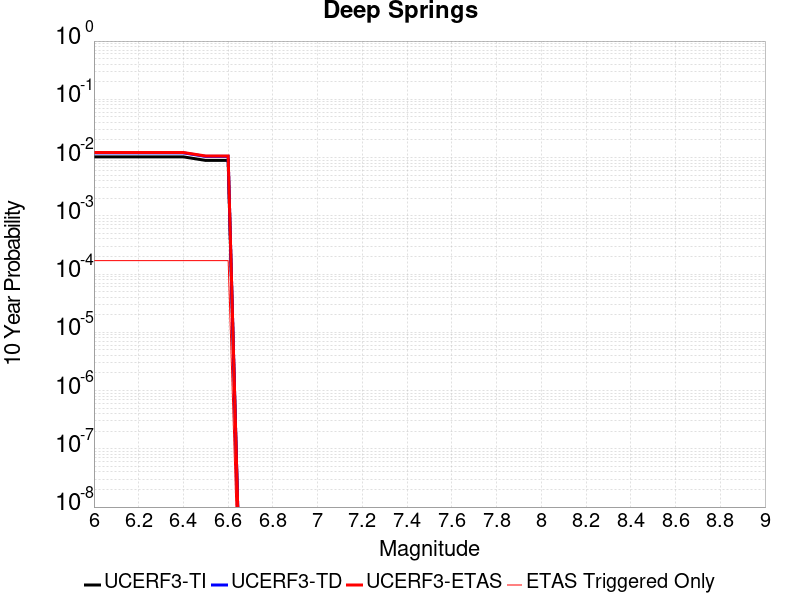 |

| Magnitude | 1 wk TI Prob | 1 wk TD Prob | 1 wk ETAS Prob | 1 wk ETAS/TD Gain | 1 wk ETAS Triggered Only | 1 mo TI Prob | 1 mo TD Prob | 1 mo ETAS Prob | 1 mo ETAS/TD Gain | 1 mo ETAS Triggered Only | 1 yr TI Prob | 1 yr TD Prob | 1 yr ETAS Prob | 1 yr ETAS/TD Gain | 1 yr ETAS Triggered Only | 10 yr TI Prob | 10 yr TD Prob | 10 yr ETAS Prob | 10 yr ETAS/TD Gain | 10 yr ETAS Triggered Only |
|-----|-----|-----|-----|-----|-----|-----|-----|-----|-----|-----|-----|-----|-----|-----|-----|-----|-----|-----|-----|-----|
| 6.0 | 1.9810619E-5 | 2.311252E-5 | 2.311252E-5 | 1.0 | 0.0 | 8.489989E-5 | 9.905276E-5 | 1.466671E-4 | 1.4806967 | 4.7619047E-5 | 0.001033166 | 0.0012058079 | 0.0012771504 | 1.0591657 | 7.142857E-5 | 0.010283757 | 0.012042425 | 0.012183562 | 1.01172 | 1.4285714E-4 |
| 6.1 | 1.9810619E-5 | 2.311252E-5 | 2.311252E-5 | 1.0 | 0.0 | 8.489989E-5 | 9.905276E-5 | 1.466671E-4 | 1.4806967 | 4.7619047E-5 | 0.001033166 | 0.0012058079 | 0.0012771504 | 1.0591657 | 7.142857E-5 | 0.010283757 | 0.012042425 | 0.012183562 | 1.01172 | 1.4285714E-4 |
| 6.2 | 1.9810619E-5 | 2.311252E-5 | 2.311252E-5 | 1.0 | 0.0 | 8.489989E-5 | 9.905276E-5 | 1.466671E-4 | 1.4806967 | 4.7619047E-5 | 0.001033166 | 0.0012058079 | 0.0012771504 | 1.0591657 | 7.142857E-5 | 0.010283757 | 0.012042425 | 0.012183562 | 1.01172 | 1.4285714E-4 |
| 6.3 | 1.9810619E-5 | 2.311252E-5 | 2.311252E-5 | 1.0 | 0.0 | 8.489989E-5 | 9.905276E-5 | 1.466671E-4 | 1.4806967 | 4.7619047E-5 | 0.001033166 | 0.0012058079 | 0.0012771504 | 1.0591657 | 7.142857E-5 | 0.010283757 | 0.012042425 | 0.012183562 | 1.01172 | 1.4285714E-4 |
| 6.4 | 1.9810619E-5 | 2.311252E-5 | 2.311252E-5 | 1.0 | 0.0 | 8.489989E-5 | 9.905276E-5 | 1.466671E-4 | 1.4806967 | 4.7619047E-5 | 0.001033166 | 0.0012058079 | 0.0012771504 | 1.0591657 | 7.142857E-5 | 0.010283757 | 0.012042425 | 0.012183562 | 1.01172 | 1.4285714E-4 |
| 6.5 | 1.7190405E-5 | 2.0050555E-5 | 2.0050555E-5 | 1.0 | 0.0 | 7.367108E-5 | 8.593095E-5 | 1.3354591E-4 | 1.5541072 | 4.7619047E-5 | 8.9657627E-4 | 0.0010462094 | 0.0011175632 | 1.0682023 | 7.142857E-5 | 0.008929676 | 0.010462056 | 0.010603419 | 1.0135119 | 1.4285714E-4 |
| 6.6 | 1.7190405E-5 | 2.0050555E-5 | 2.0050555E-5 | 1.0 | 0.0 | 7.367108E-5 | 8.593095E-5 | 1.3354591E-4 | 1.5541072 | 4.7619047E-5 | 8.9657627E-4 | 0.0010462094 | 0.0011175632 | 1.0682023 | 7.142857E-5 | 0.008929676 | 0.010462056 | 0.010603419 | 1.0135119 | 1.4285714E-4 |

## Big Pine (East)
*[(top)](#table-of-contents)*

| 1 Week | 1 Month | 1 Year | 10 Year |
|-----|-----|-----|-----|
|  |  | 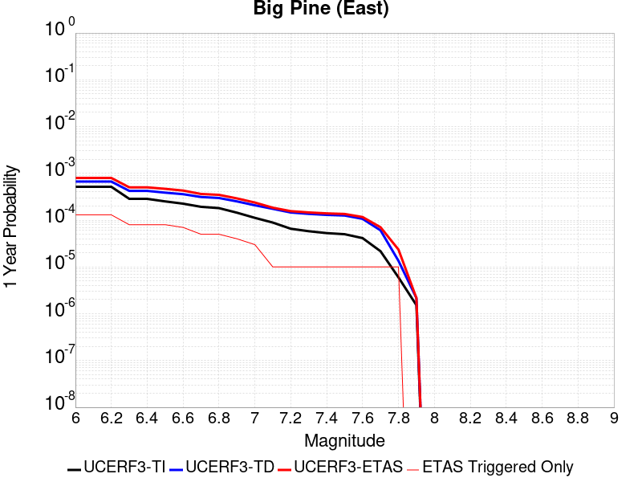 |  |

| Magnitude | 1 wk TI Prob | 1 wk TD Prob | 1 wk ETAS Prob | 1 wk ETAS/TD Gain | 1 wk ETAS Triggered Only | 1 mo TI Prob | 1 mo TD Prob | 1 mo ETAS Prob | 1 mo ETAS/TD Gain | 1 mo ETAS Triggered Only | 1 yr TI Prob | 1 yr TD Prob | 1 yr ETAS Prob | 1 yr ETAS/TD Gain | 1 yr ETAS Triggered Only | 10 yr TI Prob | 10 yr TD Prob | 10 yr ETAS Prob | 10 yr ETAS/TD Gain | 10 yr ETAS Triggered Only |
|-----|-----|-----|-----|-----|-----|-----|-----|-----|-----|-----|-----|-----|-----|-----|-----|-----|-----|-----|-----|-----|
| 6.0 | 9.916913E-6 | 1.2816984E-5 | 3.6626203E-5 | 2.8576303 | 2.3809524E-5 | 4.250036E-5 | 5.49289E-5 | 1.0254533E-4 | 1.8668739 | 4.7619047E-5 | 5.173191E-4 | 6.685763E-4 | 7.399571E-4 | 1.1067654 | 7.142857E-5 | 0.0051611643 | 0.006670441 | 0.006835996 | 1.0248191 | 1.6666666E-4 |
| 6.1 | 9.916913E-6 | 1.2816984E-5 | 3.6626203E-5 | 2.8576303 | 2.3809524E-5 | 4.250036E-5 | 5.49289E-5 | 1.0254533E-4 | 1.8668739 | 4.7619047E-5 | 5.173191E-4 | 6.685763E-4 | 7.399571E-4 | 1.1067654 | 7.142857E-5 | 0.0051611643 | 0.006670441 | 0.006835996 | 1.0248191 | 1.6666666E-4 |
| 6.2 | 9.916913E-6 | 1.2816984E-5 | 3.6626203E-5 | 2.8576303 | 2.3809524E-5 | 4.250036E-5 | 5.49289E-5 | 1.0254533E-4 | 1.8668739 | 4.7619047E-5 | 5.173191E-4 | 6.685763E-4 | 7.399571E-4 | 1.1067654 | 7.142857E-5 | 0.0051611643 | 0.006670441 | 0.006835996 | 1.0248191 | 1.6666666E-4 |
| 6.3 | 5.479711E-6 | 8.112951E-6 | 3.192228E-5 | 3.934731 | 2.3809524E-5 | 2.3484265E-5 | 3.4769346E-5 | 8.238674E-5 | 2.369522 | 4.7619047E-5 | 2.858834E-4 | 4.2323777E-4 | 4.946361E-4 | 1.1686956 | 7.142857E-5 | 0.0028551589 | 0.004227244 | 0.004369497 | 1.0336516 | 1.4285714E-4 |
| 6.4 | 5.465009E-6 | 8.097245E-6 | 3.1906577E-5 | 3.9404237 | 2.3809524E-5 | 2.3421257E-5 | 3.4702036E-5 | 8.231943E-5 | 2.3721788 | 4.7619047E-5 | 2.851165E-4 | 4.2241855E-4 | 4.93817E-4 | 1.1690229 | 7.142857E-5 | 0.0028475097 | 0.0042190826 | 0.004361337 | 1.0337169 | 1.4285714E-4 |
| 6.5 | 4.826767E-6 | 7.422301E-6 | 3.1231648E-5 | 4.207812 | 2.3809524E-5 | 2.068598E-5 | 3.180949E-5 | 7.942702E-5 | 2.49696 | 4.7619047E-5 | 2.518227E-4 | 3.872145E-4 | 4.586154E-4 | 1.1843963 | 7.142857E-5 | 0.0025153751 | 0.003868283 | 0.0040105875 | 1.0367875 | 1.4285714E-4 |
| 6.6 | 4.3146847E-6 | 6.8822374E-6 | 6.8822374E-6 | 1.0 | 0.0 | 1.8491375E-5 | 2.9494982E-5 | 5.3303804E-5 | 1.8072159 | 2.3809524E-5 | 2.2510924E-4 | 3.590447E-4 | 4.0664664E-4 | 1.1325794 | 4.7619047E-5 | 0.0022488134 | 0.0035874986 | 0.003706119 | 1.033065 | 1.1904762E-4 |
| 6.7 | 3.6968106E-6 | 5.9954727E-6 | 5.9954727E-6 | 1.0 | 0.0 | 1.5843378E-5 | 2.5694639E-5 | 4.950355E-5 | 1.9266101 | 2.3809524E-5 | 1.9287605E-4 | 3.1278885E-4 | 3.60393E-4 | 1.1521926 | 4.7619047E-5 | 0.0019270873 | 0.0031262483 | 0.0032211887 | 1.0303688 | 9.5238094E-5 |
| 6.8 | 3.4671132E-6 | 5.702177E-6 | 5.702177E-6 | 1.0 | 0.0 | 1.4858972E-5 | 2.4437682E-5 | 4.8246624E-5 | 1.9742718 | 2.3809524E-5 | 1.8089297E-4 | 2.974896E-4 | 3.4509448E-4 | 1.160022 | 4.7619047E-5 | 0.0018074579 | 0.002973667 | 0.0030686222 | 1.0319319 | 9.5238094E-5 |
| 6.9 | 2.7686972E-6 | 4.825223E-6 | 4.825223E-6 | 1.0 | 0.0 | 1.1865792E-5 | 2.0679368E-5 | 4.44884E-5 | 2.1513424 | 2.3809524E-5 | 1.4445644E-4 | 2.5174298E-4 | 2.9935004E-4 | 1.1891098 | 4.7619047E-5 | 0.0014436257 | 0.0025172636 | 0.002612262 | 1.0377387 | 9.5238094E-5 |
| 7.0 | 2.1472624E-6 | 3.9850406E-6 | 3.9850406E-6 | 1.0 | 0.0 | 9.20252E-6 | 1.7078637E-5 | 1.7078637E-5 | 1.0 | 0.0 | 1.12034926E-4 | 2.079131E-4 | 2.3171767E-4 | 1.1144929 | 2.3809524E-5 | 0.0011197845 | 0.0020798394 | 0.0021273594 | 1.0228479 | 4.7619047E-5 |
| 7.1 | 1.7018335E-6 | 3.344876E-6 | 3.344876E-6 | 1.0 | 0.0 | 7.293552E-6 | 1.4335106E-5 | 1.4335106E-5 | 1.0 | 0.0 | 8.879537E-5 | 1.7451629E-4 | 1.7451629E-4 | 1.0 | 0.0 | 8.87599E-4 | 0.0017464145 | 0.0017701824 | 1.0136095 | 2.3809524E-5 |
| 7.2 | 1.25603E-6 | 2.794484E-6 | 2.794484E-6 | 1.0 | 0.0 | 5.3829745E-6 | 1.1976307E-5 | 1.1976307E-5 | 1.0 | 0.0 | 6.553574E-5 | 1.4580201E-4 | 1.4580201E-4 | 1.0 | 0.0 | 6.551642E-4 | 0.001459661 | 0.0014834359 | 1.0162879 | 2.3809524E-5 |
| 7.3 | 1.112297E-6 | 2.610332E-6 | 2.610332E-6 | 1.0 | 0.0 | 4.7669787E-6 | 1.118709E-5 | 1.118709E-5 | 1.0 | 0.0 | 5.803642E-5 | 1.3619453E-4 | 1.3619453E-4 | 1.0 | 0.0 | 5.802127E-4 | 0.0013635408 | 0.0013873179 | 1.0174377 | 2.3809524E-5 |
| 7.4 | 1.0137181E-6 | 2.4834917E-6 | 2.4834917E-6 | 1.0 | 0.0 | 4.3444993E-6 | 1.0643494E-5 | 1.0643494E-5 | 1.0 | 0.0 | 5.2892992E-5 | 1.2957705E-4 | 1.2957705E-4 | 1.0 | 0.0 | 5.288041E-4 | 0.0012972289 | 0.0013210075 | 1.0183303 | 2.3809524E-5 |
| 7.5 | 9.598608E-7 | 2.4071483E-6 | 2.4071483E-6 | 1.0 | 0.0 | 4.1136827E-6 | 1.031631E-5 | 1.031631E-5 | 1.0 | 0.0 | 5.0082934E-5 | 1.2559404E-4 | 1.2559404E-4 | 1.0 | 0.0 | 5.007165E-4 | 0.0012572526 | 0.0012810322 | 1.018914 | 2.3809524E-5 |
| 7.6 | 7.929459E-7 | 2.0448588E-6 | 2.0448588E-6 | 1.0 | 0.0 | 3.3983351E-6 | 8.763653E-6 | 8.763653E-6 | 1.0 | 0.0 | 4.1373947E-5 | 1.06692416E-4 | 1.06692416E-4 | 1.0 | 0.0 | 4.1366243E-4 | 0.0010685222 | 0.0010923063 | 1.0222589 | 2.3809524E-5 |
| 7.7 | 4.155788E-7 | 1.1605589E-6 | 1.1605589E-6 | 1.0 | 0.0 | 1.7810507E-6 | 4.9738146E-6 | 4.9738146E-6 | 1.0 | 0.0 | 2.1684076E-5 | 6.0554554E-5 | 6.0554554E-5 | 1.0 | 0.0 | 2.1681961E-4 | 6.0857297E-4 | 6.0857297E-4 | 1.0 | 0.0 |
| 7.8 | 1.14666925E-7 | 2.592015E-7 | 2.592015E-7 | 1.0 | 0.0 | 4.914296E-7 | 1.1108631E-6 | 1.1108631E-6 | 1.0 | 0.0 | 5.9831386E-6 | 1.3524678E-5 | 1.3524678E-5 | 1.0 | 0.0 | 5.9829777E-5 | 1.3634123E-4 | 1.3634123E-4 | 1.0 | 0.0 |
| 7.9 | 2.9231824E-8 | 4.1463963E-8 | 4.1463963E-8 | 1.0 | 0.0 | 1.2527924E-7 | 1.7770269E-7 | 1.7770269E-7 | 1.0 | 0.0 | 1.5252737E-6 | 2.1635283E-6 | 2.1635283E-6 | 1.0 | 0.0 | 1.5252632E-5 | 2.1967755E-5 | 2.1967755E-5 | 1.0 | 0.0 |

## Great Valley 09 (Laguna Seca)
*[(top)](#table-of-contents)*

| 1 Week | 1 Month | 1 Year | 10 Year |
|-----|-----|-----|-----|
|  |  |  |  |

| Magnitude | 1 wk TI Prob | 1 wk TD Prob | 1 wk ETAS Prob | 1 wk ETAS/TD Gain | 1 wk ETAS Triggered Only | 1 mo TI Prob | 1 mo TD Prob | 1 mo ETAS Prob | 1 mo ETAS/TD Gain | 1 mo ETAS Triggered Only | 1 yr TI Prob | 1 yr TD Prob | 1 yr ETAS Prob | 1 yr ETAS/TD Gain | 1 yr ETAS Triggered Only | 10 yr TI Prob | 10 yr TD Prob | 10 yr ETAS Prob | 10 yr ETAS/TD Gain | 10 yr ETAS Triggered Only |
|-----|-----|-----|-----|-----|-----|-----|-----|-----|-----|-----|-----|-----|-----|-----|-----|-----|-----|-----|-----|-----|
| 6.0 | 5.4353277E-5 | 7.05022E-5 | 9.4310046E-5 | 1.3376894 | 2.3809524E-5 | 2.3292181E-4 | 3.0211566E-4 | 3.25918E-4 | 1.0787855 | 2.3809524E-5 | 0.0028321352 | 0.0036721937 | 0.003695916 | 1.00646 | 2.3809524E-5 | 0.02796312 | 0.03611547 | 0.03620727 | 1.0025418 | 9.5238094E-5 |
| 6.1 | 4.5578287E-5 | 5.822118E-5 | 8.202932E-5 | 1.4089257 | 2.3809524E-5 | 1.953209E-4 | 2.4949326E-4 | 2.7329684E-4 | 1.0954077 | 2.3809524E-5 | 0.0023754383 | 0.003033432 | 0.0030571693 | 1.0078253 | 2.3809524E-5 | 0.023502063 | 0.029919548 | 0.030011935 | 1.0030879 | 9.5238094E-5 |
| 6.2 | 2.8536782E-5 | 3.4737273E-5 | 3.4737273E-5 | 1.0 | 0.0 | 1.2229476E-4 | 1.4886224E-4 | 1.4886224E-4 | 1.0 | 0.0 | 0.0014879217 | 0.001810813 | 0.001810813 | 1.0 | 0.0 | 0.014779986 | 0.017958116 | 0.0179815 | 1.001302 | 2.3809524E-5 |
| 6.3 | 2.3698774E-5 | 2.8213295E-5 | 2.8213295E-5 | 1.0 | 0.0 | 1.01562226E-4 | 1.20905075E-4 | 1.20905075E-4 | 1.0 | 0.0 | 0.0012358186 | 0.0014710218 | 0.0014710218 | 1.0 | 0.0 | 0.012289686 | 0.014611342 | 0.014611342 | 1.0 | 0.0 |
| 6.4 | 1.9191197E-5 | 2.2123184E-5 | 2.2123184E-5 | 1.0 | 0.0 | 8.2245395E-5 | 9.4806666E-5 | 9.4806666E-5 | 1.0 | 0.0 | 0.0010008777 | 0.0011536429 | 0.0011536429 | 1.0 | 0.0 | 0.009963818 | 0.011476948 | 0.011476948 | 1.0 | 0.0 |
| 6.5 | 1.5203241E-5 | 1.6802203E-5 | 1.6802203E-5 | 1.0 | 0.0 | 6.5155116E-5 | 7.200386E-5 | 7.200386E-5 | 1.0 | 0.0 | 7.9297484E-4 | 8.7626575E-4 | 8.7626575E-4 | 1.0 | 0.0 | 0.007901512 | 0.0087295165 | 0.0087295165 | 1.0 | 0.0 |
| 6.6 | 1.0984925E-5 | 1.1242595E-5 | 1.1242595E-5 | 1.0 | 0.0 | 4.70774E-5 | 4.8181686E-5 | 4.8181686E-5 | 1.0 | 0.0 | 5.730166E-4 | 5.8645656E-4 | 5.8645656E-4 | 1.0 | 0.0 | 0.005715413 | 0.0058494853 | 0.0058494853 | 1.0 | 0.0 |
| 6.7 | 9.134616E-6 | 9.019894E-6 | 9.019894E-6 | 1.0 | 0.0 | 3.9147766E-5 | 3.865613E-5 | 3.865613E-5 | 1.0 | 0.0 | 4.7651984E-4 | 4.7053912E-4 | 4.7053912E-4 | 1.0 | 0.0 | 0.004754993 | 0.0046956735 | 0.0046956735 | 1.0 | 0.0 |
| 6.8 | 7.785589E-6 | 7.4519444E-6 | 7.4519444E-6 | 1.0 | 0.0 | 3.3366385E-5 | 3.1936524E-5 | 3.1936524E-5 | 1.0 | 0.0 | 4.0616E-4 | 3.8875983E-4 | 3.8875983E-4 | 1.0 | 0.0 | 0.0040541845 | 0.0038810016 | 0.0038810016 | 1.0 | 0.0 |
| 6.9 | 5.579095E-6 | 4.898492E-6 | 4.898492E-6 | 1.0 | 0.0 | 2.3910188E-5 | 2.0993377E-5 | 2.0993377E-5 | 1.0 | 0.0 | 2.9106764E-4 | 2.5556577E-4 | 2.5556577E-4 | 1.0 | 0.0 | 0.002906867 | 0.002552856 | 0.002552856 | 1.0 | 0.0 |
| 7.0 | 2.6816688E-6 | 1.5216126E-6 | 1.5216126E-6 | 1.0 | 0.0 | 1.1492816E-5 | 6.521181E-6 | 6.521181E-6 | 1.0 | 0.0 | 1.3991605E-4 | 7.939258E-5 | 7.939258E-5 | 1.0 | 0.0 | 0.0013982799 | 7.9365086E-4 | 7.9365086E-4 | 1.0 | 0.0 |
| 7.1 | 1.9951021E-6 | 7.453827E-7 | 7.453827E-7 | 1.0 | 0.0 | 8.55041E-6 | 3.1944935E-6 | 3.1944935E-6 | 1.0 | 0.0 | 1.0409627E-4 | 3.8892307E-5 | 3.8892307E-5 | 1.0 | 0.0 | 0.0010404752 | 3.8885913E-4 | 3.8885913E-4 | 1.0 | 0.0 |
| 7.2 | 1.9951021E-6 | 7.453827E-7 | 7.453827E-7 | 1.0 | 0.0 | 8.55041E-6 | 3.1944935E-6 | 3.1944935E-6 | 1.0 | 0.0 | 1.0409627E-4 | 3.8892307E-5 | 3.8892307E-5 | 1.0 | 0.0 | 0.0010404752 | 3.8885913E-4 | 3.8885913E-4 | 1.0 | 0.0 |
| 7.3 | 1.7087556E-6 | 6.578881E-7 | 6.578881E-7 | 1.0 | 0.0 | 7.3232177E-6 | 2.8195177E-6 | 2.8195177E-6 | 1.0 | 0.0 | 8.915652E-5 | 3.4327128E-5 | 3.4327128E-5 | 1.0 | 0.0 | 8.9120766E-4 | 3.432223E-4 | 3.432223E-4 | 1.0 | 0.0 |
| 7.4 | 1.3804846E-6 | 6.073852E-7 | 6.073852E-7 | 1.0 | 0.0 | 5.916349E-6 | 2.6030768E-6 | 2.6030768E-6 | 1.0 | 0.0 | 7.2029165E-5 | 3.169204E-5 | 3.169204E-5 | 1.0 | 0.0 | 7.200583E-4 | 3.1687922E-4 | 3.1687922E-4 | 1.0 | 0.0 |
| 7.5 | 1.3804846E-6 | 6.073852E-7 | 6.073852E-7 | 1.0 | 0.0 | 5.916349E-6 | 2.6030768E-6 | 2.6030768E-6 | 1.0 | 0.0 | 7.2029165E-5 | 3.169204E-5 | 3.169204E-5 | 1.0 | 0.0 | 7.200583E-4 | 3.1687922E-4 | 3.1687922E-4 | 1.0 | 0.0 |

## Independence rev 2011
*[(top)](#table-of-contents)*

| 1 Week | 1 Month | 1 Year | 10 Year |
|-----|-----|-----|-----|
|  |  |  |  |

| Magnitude | 1 wk TI Prob | 1 wk TD Prob | 1 wk ETAS Prob | 1 wk ETAS/TD Gain | 1 wk ETAS Triggered Only | 1 mo TI Prob | 1 mo TD Prob | 1 mo ETAS Prob | 1 mo ETAS/TD Gain | 1 mo ETAS Triggered Only | 1 yr TI Prob | 1 yr TD Prob | 1 yr ETAS Prob | 1 yr ETAS/TD Gain | 1 yr ETAS Triggered Only | 10 yr TI Prob | 10 yr TD Prob | 10 yr ETAS Prob | 10 yr ETAS/TD Gain | 10 yr ETAS Triggered Only |
|-----|-----|-----|-----|-----|-----|-----|-----|-----|-----|-----|-----|-----|-----|-----|-----|-----|-----|-----|-----|-----|
| 6.0 | 4.422171E-6 | 4.326227E-6 | 4.326227E-6 | 1.0 | 0.0 | 1.8952025E-5 | 1.8540857E-5 | 6.6159024E-5 | 3.5682826 | 4.7619047E-5 | 2.3071647E-4 | 2.2571455E-4 | 3.2093114E-4 | 1.4218452 | 9.5238094E-5 | 0.0023047708 | 0.0022551466 | 0.0023976816 | 1.0632043 | 1.4285714E-4 |
| 6.1 | 4.422171E-6 | 4.326227E-6 | 4.326227E-6 | 1.0 | 0.0 | 1.8952025E-5 | 1.8540857E-5 | 6.6159024E-5 | 3.5682826 | 4.7619047E-5 | 2.3071647E-4 | 2.2571455E-4 | 3.2093114E-4 | 1.4218452 | 9.5238094E-5 | 0.0023047708 | 0.0022551466 | 0.0023976816 | 1.0632043 | 1.4285714E-4 |
| 6.2 | 4.422171E-6 | 4.326227E-6 | 4.326227E-6 | 1.0 | 0.0 | 1.8952025E-5 | 1.8540857E-5 | 6.6159024E-5 | 3.5682826 | 4.7619047E-5 | 2.3071647E-4 | 2.2571455E-4 | 3.2093114E-4 | 1.4218452 | 9.5238094E-5 | 0.0023047708 | 0.0022551466 | 0.0023976816 | 1.0632043 | 1.4285714E-4 |
| 6.3 | 4.422171E-6 | 4.326227E-6 | 4.326227E-6 | 1.0 | 0.0 | 1.8952025E-5 | 1.8540857E-5 | 6.6159024E-5 | 3.5682826 | 4.7619047E-5 | 2.3071647E-4 | 2.2571455E-4 | 3.2093114E-4 | 1.4218452 | 9.5238094E-5 | 0.0023047708 | 0.0022551466 | 0.0023976816 | 1.0632043 | 1.4285714E-4 |
| 6.4 | 4.422171E-6 | 4.326227E-6 | 4.326227E-6 | 1.0 | 0.0 | 1.8952025E-5 | 1.8540857E-5 | 6.6159024E-5 | 3.5682826 | 4.7619047E-5 | 2.3071647E-4 | 2.2571455E-4 | 3.2093114E-4 | 1.4218452 | 9.5238094E-5 | 0.0023047708 | 0.0022551466 | 0.0023976816 | 1.0632043 | 1.4285714E-4 |
| 6.5 | 4.422171E-6 | 4.326227E-6 | 4.326227E-6 | 1.0 | 0.0 | 1.8952025E-5 | 1.8540857E-5 | 6.6159024E-5 | 3.5682826 | 4.7619047E-5 | 2.3071647E-4 | 2.2571455E-4 | 3.2093114E-4 | 1.4218452 | 9.5238094E-5 | 0.0023047708 | 0.0022551466 | 0.0023976816 | 1.0632043 | 1.4285714E-4 |
| 6.6 | 2.663744E-6 | 2.5319862E-6 | 2.5319862E-6 | 1.0 | 0.0 | 1.1415996E-5 | 1.0851327E-5 | 5.8469857E-5 | 5.388268 | 4.7619047E-5 | 1.3898089E-4 | 1.3210738E-4 | 2.0352652E-4 | 1.5406142 | 7.142857E-5 | 0.0013889399 | 0.0013203367 | 0.0014392273 | 1.0900456 | 1.1904762E-4 |
| 6.7 | 2.663744E-6 | 2.5319862E-6 | 2.5319862E-6 | 1.0 | 0.0 | 1.1415996E-5 | 1.0851327E-5 | 5.8469857E-5 | 5.388268 | 4.7619047E-5 | 1.3898089E-4 | 1.3210738E-4 | 2.0352652E-4 | 1.5406142 | 7.142857E-5 | 0.0013889399 | 0.0013203367 | 0.0014392273 | 1.0900456 | 1.1904762E-4 |
| 6.8 | 1.9716529E-6 | 1.8322585E-6 | 1.8322585E-6 | 1.0 | 0.0 | 8.449913E-6 | 7.852514E-6 | 5.5471188E-5 | 7.0641317 | 4.7619047E-5 | 1.0287284E-4 | 9.5600284E-5 | 1.6702202E-4 | 1.7470871 | 7.142857E-5 | 0.0010282523 | 9.556045E-4 | 0.0010745383 | 1.1244593 | 1.1904762E-4 |
| 6.9 | 1.8788617E-6 | 1.7429993E-6 | 1.7429993E-6 | 1.0 | 0.0 | 8.0522395E-6 | 7.4699765E-6 | 5.508867E-5 | 7.3746777 | 4.7619047E-5 | 9.80316E-5 | 9.0943286E-5 | 1.6236537E-4 | 1.7853475 | 7.142857E-5 | 9.798837E-4 | 9.0907275E-4 | 0.0010280121 | 1.130836 | 1.1904762E-4 |
| 7.0 | 1.5045488E-6 | 1.3849503E-6 | 1.3849503E-6 | 1.0 | 0.0 | 6.44805E-6 | 5.9354884E-6 | 5.3554253E-5 | 9.02272 | 4.7619047E-5 | 7.8502184E-5 | 7.226223E-5 | 1.4368564E-4 | 1.988392 | 7.142857E-5 | 7.8474457E-4 | 7.2239246E-4 | 8.413541E-4 | 1.1646773 | 1.1904762E-4 |
| 7.1 | 1.272341E-6 | 1.1625096E-6 | 1.1625096E-6 | 1.0 | 0.0 | 5.4528787E-6 | 4.982175E-6 | 5.2600986E-5 | 10.557836 | 4.7619047E-5 | 6.6386776E-5 | 6.0656326E-5 | 1.3208056E-4 | 2.1775234 | 7.142857E-5 | 6.636695E-4 | 6.064009E-4 | 7.253763E-4 | 1.1961993 | 1.1904762E-4 |
| 7.2 | 1.0416892E-6 | 9.4098806E-7 | 9.4098806E-7 | 1.0 | 0.0 | 4.464375E-6 | 4.0328E-6 | 2.7842227E-5 | 6.903945 | 2.3809524E-5 | 5.4352407E-5 | 4.909825E-5 | 9.671496E-5 | 1.969825 | 4.7619047E-5 | 5.4339116E-4 | 4.9087586E-4 | 5.622694E-4 | 1.145441 | 7.142857E-5 |
| 7.3 | 7.9450155E-7 | 7.235002E-7 | 7.235002E-7 | 1.0 | 0.0 | 3.4050022E-6 | 3.1007114E-6 | 2.6910162E-5 | 8.678705 | 2.3809524E-5 | 4.1455114E-5 | 3.775052E-5 | 8.536777E-5 | 2.2613668 | 4.7619047E-5 | 4.144738E-4 | 3.7744216E-4 | 4.4884378E-4 | 1.1891723 | 7.142857E-5 |
| 7.4 | 5.3893444E-7 | 5.019512E-7 | 5.019512E-7 | 1.0 | 0.0 | 2.309717E-6 | 2.1512178E-6 | 2.596069E-5 | 12.067904 | 2.3809524E-5 | 2.8120441E-5 | 2.6190766E-5 | 7.3808566E-5 | 2.818114 | 4.7619047E-5 | 2.8116882E-4 | 2.6187726E-4 | 3.332871E-4 | 1.2726845 | 7.142857E-5 |
| 7.5 | 3.8852085E-7 | 3.682554E-7 | 3.682554E-7 | 1.0 | 0.0 | 1.6650882E-6 | 1.5782365E-6 | 2.5387722E-5 | 16.086134 | 2.3809524E-5 | 2.027226E-5 | 1.9214862E-5 | 6.6832996E-5 | 3.4781928 | 4.7619047E-5 | 2.0270412E-4 | 1.9213221E-4 | 2.6354706E-4 | 1.3716964 | 7.142857E-5 |
| 7.6 | 2.414929E-7 | 2.345755E-7 | 2.345755E-7 | 1.0 | 0.0 | 1.0349692E-6 | 1.0053232E-6 | 2.4814823E-5 | 24.683428 | 2.3809524E-5 | 1.2600677E-5 | 1.2239742E-5 | 5.985821E-5 | 4.890479 | 4.7619047E-5 | 1.2599962E-4 | 1.223908E-4 | 1.9381063E-4 | 1.5835391 | 7.142857E-5 |
| 7.7 | 6.8298014E-8 | 6.85897E-8 | 6.85897E-8 | 1.0 | 0.0 | 2.9270575E-7 | 2.9395582E-7 | 2.9395582E-7 | 1.0 | 0.0 | 3.5636867E-6 | 3.5789067E-6 | 3.5789067E-6 | 1.0 | 0.0 | 3.5636294E-5 | 3.5788536E-5 | 3.5788536E-5 | 1.0 | 0.0 |

## Rose Canyon
*[(top)](#table-of-contents)*

| 1 Week | 1 Month | 1 Year | 10 Year |
|-----|-----|-----|-----|
|  |  |  |  |

| Magnitude | 1 wk TI Prob | 1 wk TD Prob | 1 wk ETAS Prob | 1 wk ETAS/TD Gain | 1 wk ETAS Triggered Only | 1 mo TI Prob | 1 mo TD Prob | 1 mo ETAS Prob | 1 mo ETAS/TD Gain | 1 mo ETAS Triggered Only | 1 yr TI Prob | 1 yr TD Prob | 1 yr ETAS Prob | 1 yr ETAS/TD Gain | 1 yr ETAS Triggered Only | 10 yr TI Prob | 10 yr TD Prob | 10 yr ETAS Prob | 10 yr ETAS/TD Gain | 10 yr ETAS Triggered Only |
|-----|-----|-----|-----|-----|-----|-----|-----|-----|-----|-----|-----|-----|-----|-----|-----|-----|-----|-----|-----|-----|
| 6.0 | 4.5923203E-5 | 4.9714225E-5 | 7.352256E-5 | 1.478904 | 2.3809524E-5 | 1.9679888E-4 | 2.1304491E-4 | 2.6065382E-4 | 1.2234689 | 4.7619047E-5 | 0.0023933933 | 0.0025909345 | 0.0026859257 | 1.0366629 | 9.5238094E-5 | 0.023677798 | 0.02563999 | 0.025779186 | 1.0054288 | 1.4285714E-4 |
| 6.1 | 4.5923203E-5 | 4.9714225E-5 | 7.352256E-5 | 1.478904 | 2.3809524E-5 | 1.9679888E-4 | 2.1304491E-4 | 2.6065382E-4 | 1.2234689 | 4.7619047E-5 | 0.0023933933 | 0.0025909345 | 0.0026859257 | 1.0366629 | 9.5238094E-5 | 0.023677798 | 0.02563999 | 0.025732787 | 1.0036192 | 9.5238094E-5 |
| 6.2 | 2.8844734E-5 | 2.9668723E-5 | 5.347754E-5 | 1.8024888 | 2.3809524E-5 | 1.2361443E-4 | 1.2714567E-4 | 1.5095217E-4 | 1.187238 | 2.3809524E-5 | 0.0015039665 | 0.0015468939 | 0.0015944393 | 1.0307361 | 4.7619047E-5 | 0.0149382865 | 0.015374276 | 0.015421163 | 1.0030497 | 4.7619047E-5 |
| 6.3 | 2.3171577E-5 | 2.3161238E-5 | 4.697021E-5 | 2.0279663 | 2.3809524E-5 | 9.9302975E-5 | 9.9258745E-5 | 1.2306591E-4 | 1.2398494 | 2.3809524E-5 | 0.0012083431 | 0.0012078186 | 0.0012553801 | 1.039378 | 4.7619047E-5 | 0.012017938 | 0.012022437 | 0.012069483 | 1.0039133 | 4.7619047E-5 |
| 6.4 | 2.0066604E-5 | 1.9667024E-5 | 4.347608E-5 | 2.210608 | 2.3809524E-5 | 8.599689E-5 | 8.4284584E-5 | 1.080921E-4 | 1.2824658 | 2.3809524E-5 | 0.0010465092 | 0.0010256917 | 0.001073262 | 1.0463786 | 4.7619047E-5 | 0.010415946 | 0.010217559 | 0.010264691 | 1.0046129 | 4.7619047E-5 |
| 6.5 | 1.776989E-5 | 1.7113807E-5 | 4.0922925E-5 | 2.3912227 | 2.3809524E-5 | 7.615444E-5 | 7.334287E-5 | 9.7150645E-5 | 1.3246093 | 2.3809524E-5 | 9.267859E-4 | 8.925905E-4 | 9.4016705E-4 | 1.0533017 | 4.7619047E-5 | 0.009229303 | 0.008896211 | 0.008943406 | 1.0053052 | 4.7619047E-5 |
| 6.6 | 1.5227364E-5 | 1.433926E-5 | 3.8148442E-5 | 2.6604192 | 2.3809524E-5 | 6.52585E-5 | 6.1452556E-5 | 8.526062E-5 | 1.3874218 | 2.3809524E-5 | 7.942326E-4 | 7.479332E-4 | 7.9551665E-4 | 1.0636199 | 4.7619047E-5 | 0.007914 | 0.007458359 | 0.007505623 | 1.006337 | 4.7619047E-5 |
| 6.7 | 1.2703898E-5 | 1.1673274E-5 | 1.1673274E-5 | 1.0 | 0.0 | 5.4444143E-5 | 5.0027378E-5 | 5.0027378E-5 | 1.0 | 0.0 | 6.626558E-4 | 6.089174E-4 | 6.327124E-4 | 1.0390776 | 2.3809524E-5 | 0.006606833 | 0.0060750856 | 0.0060987505 | 1.0038954 | 2.3809524E-5 |
| 6.8 | 1.1554917E-5 | 1.0609337E-5 | 1.0609337E-5 | 1.0 | 0.0 | 4.9520135E-5 | 4.546782E-5 | 4.546782E-5 | 1.0 | 0.0 | 6.0274085E-4 | 5.5343413E-4 | 5.772305E-4 | 1.0429976 | 2.3809524E-5 | 0.0060110865 | 0.0055225673 | 0.0055462453 | 1.0042875 | 2.3809524E-5 |
| 6.9 | 8.732078E-6 | 7.881357E-6 | 7.881357E-6 | 1.0 | 0.0 | 3.7422655E-5 | 3.3776825E-5 | 3.3776825E-5 | 1.0 | 0.0 | 4.5552556E-4 | 4.111582E-4 | 4.3495794E-4 | 1.0578846 | 2.3809524E-5 | 0.0045459294 | 0.0041048084 | 0.0041285204 | 1.0057766 | 2.3809524E-5 |
| 7.0 | 5.9337494E-6 | 5.1074853E-6 | 5.1074853E-6 | 1.0 | 0.0 | 2.5430107E-5 | 2.188904E-5 | 2.188904E-5 | 1.0 | 0.0 | 3.0956755E-4 | 2.664666E-4 | 2.902698E-4 | 1.0893289 | 2.3809524E-5 | 0.0030913667 | 0.0026614866 | 0.0026852328 | 1.0089221 | 2.3809524E-5 |
| 7.1 | 5.013409E-6 | 4.1773833E-6 | 4.1773833E-6 | 1.0 | 0.0 | 2.1485863E-5 | 1.7902948E-5 | 1.7902948E-5 | 1.0 | 0.0 | 2.6155898E-4 | 2.179467E-4 | 2.4175104E-4 | 1.1092209 | 2.3809524E-5 | 0.0026125133 | 0.0021773411 | 0.002201099 | 1.0109113 | 2.3809524E-5 |
| 7.2 | 4.120763E-6 | 3.2821383E-6 | 3.2821383E-6 | 1.0 | 0.0 | 1.7660293E-5 | 1.4066231E-5 | 1.4066231E-5 | 1.0 | 0.0 | 2.1499286E-4 | 1.7124301E-4 | 1.7124301E-4 | 1.0 | 0.0 | 0.0021478499 | 0.00171112 | 0.00171112 | 1.0 | 0.0 |
| 7.3 | 3.2081239E-6 | 2.4405372E-6 | 2.4405372E-6 | 1.0 | 0.0 | 1.374903E-5 | 1.0459404E-5 | 1.0459404E-5 | 1.0 | 0.0 | 1.6738157E-4 | 1.2733586E-4 | 1.2733586E-4 | 1.0 | 0.0 | 0.0016725556 | 0.001272636 | 0.001272636 | 1.0 | 0.0 |
| 7.4 | 2.4194755E-6 | 1.7680634E-6 | 1.7680634E-6 | 1.0 | 0.0 | 1.0369139E-5 | 7.577393E-6 | 7.577393E-6 | 1.0 | 0.0 | 1.2623696E-4 | 9.2250906E-5 | 9.2250906E-5 | 1.0 | 0.0 | 0.0012616527 | 9.2213147E-4 | 9.2213147E-4 | 1.0 | 0.0 |
| 7.5 | 1.3842889E-6 | 9.3786275E-7 | 9.3786275E-7 | 1.0 | 0.0 | 5.9326535E-6 | 4.019406E-6 | 4.019406E-6 | 1.0 | 0.0 | 7.222766E-5 | 4.8935202E-5 | 4.8935202E-5 | 1.0 | 0.0 | 7.220419E-4 | 4.892478E-4 | 4.892478E-4 | 1.0 | 0.0 |
| 7.6 | 1.0021575E-6 | 6.411463E-7 | 6.411463E-7 | 1.0 | 0.0 | 4.2949537E-6 | 2.7477672E-6 | 2.7477672E-6 | 1.0 | 0.0 | 5.2289808E-5 | 3.3453573E-5 | 3.3453573E-5 | 1.0 | 0.0 | 5.2277505E-4 | 3.344875E-4 | 3.344875E-4 | 1.0 | 0.0 |
| 7.7 | 8.7620116E-8 | 6.4492404E-8 | 6.4492404E-8 | 1.0 | 0.0 | 3.7551473E-7 | 2.76396E-7 | 2.76396E-7 | 1.0 | 0.0 | 4.5718825E-6 | 3.3651165E-6 | 3.3651165E-6 | 1.0 | 0.0 | 4.5717883E-5 | 3.3650686E-5 | 3.3650686E-5 | 1.0 | 0.0 |

## Cleghorn
*[(top)](#table-of-contents)*

| 1 Week | 1 Month | 1 Year | 10 Year |
|-----|-----|-----|-----|
|  | 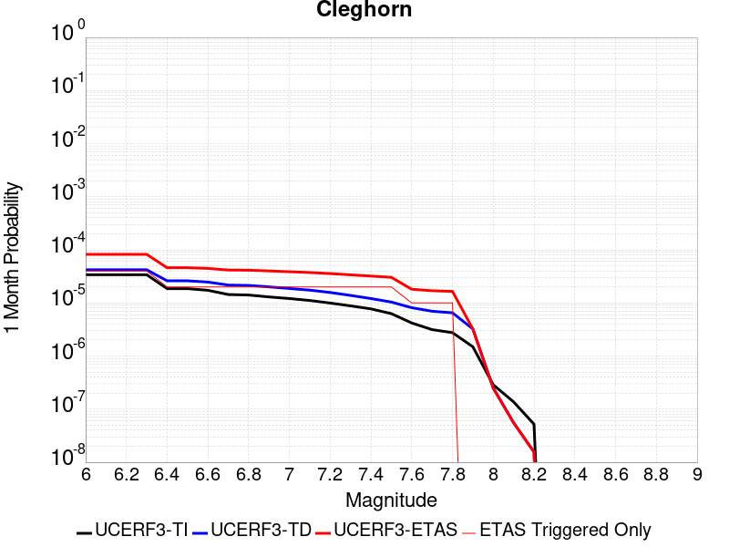 |  |  |

| Magnitude | 1 wk TI Prob | 1 wk TD Prob | 1 wk ETAS Prob | 1 wk ETAS/TD Gain | 1 wk ETAS Triggered Only | 1 mo TI Prob | 1 mo TD Prob | 1 mo ETAS Prob | 1 mo ETAS/TD Gain | 1 mo ETAS Triggered Only | 1 yr TI Prob | 1 yr TD Prob | 1 yr ETAS Prob | 1 yr ETAS/TD Gain | 1 yr ETAS Triggered Only | 10 yr TI Prob | 10 yr TD Prob | 10 yr ETAS Prob | 10 yr ETAS/TD Gain | 10 yr ETAS Triggered Only |
|-----|-----|-----|-----|-----|-----|-----|-----|-----|-----|-----|-----|-----|-----|-----|-----|-----|-----|-----|-----|-----|
| 6.0 | 7.9267165E-6 | 9.831582E-6 | 5.745016E-5 | 5.8434296 | 4.7619047E-5 | 3.39712E-5 | 4.2134732E-5 | 8.9751775E-5 | 2.1301138 | 4.7619047E-5 | 4.1352084E-4 | 5.128803E-4 | 5.842722E-4 | 1.1391981 | 7.142857E-5 | 0.004127522 | 0.0051320773 | 0.0052505136 | 1.0230777 | 1.1904762E-4 |
| 6.1 | 7.9267165E-6 | 9.831582E-6 | 5.745016E-5 | 5.8434296 | 4.7619047E-5 | 3.39712E-5 | 4.2134732E-5 | 8.9751775E-5 | 2.1301138 | 4.7619047E-5 | 4.1352084E-4 | 5.128803E-4 | 5.842722E-4 | 1.1391981 | 7.142857E-5 | 0.004127522 | 0.0051320773 | 0.0052505136 | 1.0230777 | 1.1904762E-4 |
| 6.2 | 7.9267165E-6 | 9.831582E-6 | 5.745016E-5 | 5.8434296 | 4.7619047E-5 | 3.39712E-5 | 4.2134732E-5 | 8.9751775E-5 | 2.1301138 | 4.7619047E-5 | 4.1352084E-4 | 5.128803E-4 | 5.842722E-4 | 1.1391981 | 7.142857E-5 | 0.004127522 | 0.0051320773 | 0.0052505136 | 1.0230777 | 1.1904762E-4 |
| 6.3 | 7.9267165E-6 | 9.831582E-6 | 5.745016E-5 | 5.8434296 | 4.7619047E-5 | 3.39712E-5 | 4.2134732E-5 | 8.9751775E-5 | 2.1301138 | 4.7619047E-5 | 4.1352084E-4 | 5.128803E-4 | 5.842722E-4 | 1.1391981 | 7.142857E-5 | 0.004127522 | 0.0051320773 | 0.0052505136 | 1.0230777 | 1.1904762E-4 |
| 6.4 | 4.3445207E-6 | 6.0914435E-6 | 6.0914435E-6 | 1.0 | 0.0 | 1.8619241E-5 | 2.610593E-5 | 2.610593E-5 | 1.0 | 0.0 | 2.2666567E-4 | 3.1779436E-4 | 3.4159631E-4 | 1.0748974 | 2.3809524E-5 | 0.0022643462 | 0.0031875873 | 0.0032587883 | 1.022337 | 7.142857E-5 |
| 6.5 | 4.3445207E-6 | 6.0914435E-6 | 6.0914435E-6 | 1.0 | 0.0 | 1.8619241E-5 | 2.610593E-5 | 2.610593E-5 | 1.0 | 0.0 | 2.2666567E-4 | 3.1779436E-4 | 3.4159631E-4 | 1.0748974 | 2.3809524E-5 | 0.0022643462 | 0.0031875873 | 0.0032587883 | 1.022337 | 7.142857E-5 |
| 6.6 | 4.040109E-6 | 5.773851E-6 | 5.773851E-6 | 1.0 | 0.0 | 1.7314638E-5 | 2.4744846E-5 | 2.4744846E-5 | 1.0 | 0.0 | 2.1078532E-4 | 3.012278E-4 | 3.2503015E-4 | 1.0790178 | 2.3809524E-5 | 0.002105855 | 0.003022377 | 0.0030935898 | 1.0235618 | 7.142857E-5 |
| 6.7 | 3.3632055E-6 | 5.067348E-6 | 5.067348E-6 | 1.0 | 0.0 | 1.4413658E-5 | 2.1717027E-5 | 2.1717027E-5 | 1.0 | 0.0 | 1.7547216E-4 | 2.6437303E-4 | 2.8817626E-4 | 1.0900365 | 2.3809524E-5 | 0.0017533366 | 0.0026547113 | 0.0027259502 | 1.026835 | 7.142857E-5 |
| 6.8 | 3.2902772E-6 | 4.9892556E-6 | 4.9892556E-6 | 1.0 | 0.0 | 1.4101111E-5 | 2.1382351E-5 | 2.1382351E-5 | 1.0 | 0.0 | 1.716675E-4 | 2.6029933E-4 | 2.8410266E-4 | 1.0914459 | 2.3809524E-5 | 0.0017153495 | 0.0026140702 | 0.002685312 | 1.0272533 | 7.142857E-5 |
| 6.9 | 3.031547E-6 | 4.6910186E-6 | 4.6910186E-6 | 1.0 | 0.0 | 1.299228E-5 | 2.0104211E-5 | 2.0104211E-5 | 1.0 | 0.0 | 1.5816953E-4 | 2.4474156E-4 | 2.6854523E-4 | 1.0972606 | 2.3809524E-5 | 0.00158057 | 0.0024588439 | 0.0025300968 | 1.0289782 | 7.142857E-5 |
| 7.0 | 2.8259715E-6 | 4.3705895E-6 | 4.3705895E-6 | 1.0 | 0.0 | 1.211125E-5 | 1.8730963E-5 | 1.8730963E-5 | 1.0 | 0.0 | 1.4744449E-4 | 2.2802586E-4 | 2.5182994E-4 | 1.104392 | 2.3809524E-5 | 0.001473467 | 0.0022920412 | 0.002363306 | 1.0310923 | 7.142857E-5 |
| 7.1 | 2.5962665E-6 | 4.0658106E-6 | 4.0658106E-6 | 1.0 | 0.0 | 1.1126809E-5 | 1.7424789E-5 | 1.7424789E-5 | 1.0 | 0.0 | 1.3546048E-4 | 2.1212637E-4 | 2.3593083E-4 | 1.1122184 | 2.3809524E-5 | 0.0013537793 | 0.002133366 | 0.0022046422 | 1.0334102 | 7.142857E-5 |
| 7.2 | 2.3247253E-6 | 3.6763672E-6 | 3.6763672E-6 | 1.0 | 0.0 | 9.96307E-6 | 1.5755764E-5 | 1.5755764E-5 | 1.0 | 0.0 | 1.21293626E-4 | 1.9180974E-4 | 2.156147E-4 | 1.1241071 | 2.3809524E-5 | 0.0012122744 | 0.0019305905 | 0.0020018811 | 1.0369269 | 7.142857E-5 |
| 7.3 | 2.056928E-6 | 3.2350938E-6 | 3.2350938E-6 | 1.0 | 0.0 | 8.815376E-6 | 1.3864615E-5 | 1.3864615E-5 | 1.0 | 0.0 | 1.0732192E-4 | 1.6878877E-4 | 1.6878877E-4 | 1.0 | 0.0 | 0.001072701 | 0.0017008206 | 0.0017245896 | 1.013975 | 2.3809524E-5 |
| 7.4 | 1.8055999E-6 | 2.8255042E-6 | 2.8255042E-6 | 1.0 | 0.0 | 7.738263E-6 | 1.2109249E-5 | 1.2109249E-5 | 1.0 | 0.0 | 9.4209274E-5 | 1.4742027E-4 | 1.4742027E-4 | 1.0 | 0.0 | 9.4169343E-4 | 0.0014875771 | 0.0015113512 | 1.0159818 | 2.3809524E-5 |
| 7.5 | 1.4683443E-6 | 2.4247483E-6 | 2.4247483E-6 | 1.0 | 0.0 | 6.292889E-6 | 1.0391738E-5 | 1.0391738E-5 | 1.0 | 0.0 | 7.661323E-5 | 1.2651215E-4 | 1.2651215E-4 | 1.0 | 0.0 | 7.658682E-4 | 0.0012787961 | 0.0013025752 | 1.0185949 | 2.3809524E-5 |
| 7.6 | 9.804088E-7 | 1.900266E-6 | 1.900266E-6 | 1.0 | 0.0 | 4.201745E-6 | 8.143972E-6 | 8.143972E-6 | 1.0 | 0.0 | 5.1155046E-5 | 9.91484E-5 | 9.91484E-5 | 1.0 | 0.0 | 5.114327E-4 | 0.001005471 | 0.001005471 | 1.0 | 0.0 |
| 7.7 | 7.3434086E-7 | 1.6284146E-6 | 1.6284146E-6 | 1.0 | 0.0 | 3.1471714E-6 | 6.978901E-6 | 6.978901E-6 | 1.0 | 0.0 | 3.831614E-5 | 8.4964835E-5 | 8.4964835E-5 | 1.0 | 0.0 | 3.8309532E-4 | 8.6378685E-4 | 8.6378685E-4 | 1.0 | 0.0 |
| 7.8 | 6.434184E-7 | 1.5220047E-6 | 1.5220047E-6 | 1.0 | 0.0 | 2.7575045E-6 | 6.5228614E-6 | 6.5228614E-6 | 1.0 | 0.0 | 3.35721E-5 | 7.941297E-5 | 7.941297E-5 | 1.0 | 0.0 | 3.3567028E-4 | 8.079678E-4 | 8.079678E-4 | 1.0 | 0.0 |
| 7.9 | 3.4943926E-7 | 7.574459E-7 | 7.574459E-7 | 1.0 | 0.0 | 1.497596E-6 | 3.2461926E-6 | 3.2461926E-6 | 1.0 | 0.0 | 1.8233079E-5 | 3.952169E-5 | 3.952169E-5 | 1.0 | 0.0 | 1.8231584E-4 | 4.040099E-4 | 4.040099E-4 | 1.0 | 0.0 |
| 8.0 | 6.717524E-8 | 5.838828E-8 | 5.838828E-8 | 1.0 | 0.0 | 2.8789387E-7 | 2.5023547E-7 | 2.5023547E-7 | 1.0 | 0.0 | 3.505102E-6 | 3.0466126E-6 | 3.0466126E-6 | 1.0 | 0.0 | 3.5050467E-5 | 3.273506E-5 | 3.273506E-5 | 1.0 | 0.0 |
| 8.1 | 3.1984914E-8 | 1.2956093E-8 | 1.2956093E-8 | 1.0 | 0.0 | 1.370782E-7 | 5.552611E-8 | 5.552611E-8 | 1.0 | 0.0 | 1.6689258E-6 | 6.760302E-7 | 6.760302E-7 | 1.0 | 0.0 | 1.6689133E-5 | 7.74454E-6 | 7.74454E-6 | 1.0 | 0.0 |
| 8.2 | 1.21887656E-8 | 3.6495305E-9 | 3.6495305E-9 | 1.0 | 0.0 | 5.2237567E-8 | 1.5640845E-8 | 1.5640845E-8 | 1.0 | 0.0 | 6.359922E-7 | 1.9042727E-7 | 1.9042727E-7 | 1.0 | 0.0 | 6.3599036E-6 | 2.2470974E-6 | 2.2470974E-6 | 1.0 | 0.0 |

## Calaveras (So) 2011 CFM
*[(top)](#table-of-contents)*

| 1 Week | 1 Month | 1 Year | 10 Year |
|-----|-----|-----|-----|
|  |  |  |  |

| Magnitude | 1 wk TI Prob | 1 wk TD Prob | 1 wk ETAS Prob | 1 wk ETAS/TD Gain | 1 wk ETAS Triggered Only | 1 mo TI Prob | 1 mo TD Prob | 1 mo ETAS Prob | 1 mo ETAS/TD Gain | 1 mo ETAS Triggered Only | 1 yr TI Prob | 1 yr TD Prob | 1 yr ETAS Prob | 1 yr ETAS/TD Gain | 1 yr ETAS Triggered Only | 10 yr TI Prob | 10 yr TD Prob | 10 yr ETAS Prob | 10 yr ETAS/TD Gain | 10 yr ETAS Triggered Only |
|-----|-----|-----|-----|-----|-----|-----|-----|-----|-----|-----|-----|-----|-----|-----|-----|-----|-----|-----|-----|-----|
| 6.0 | 1.5950744E-4 | 3.071188E-4 | 3.3092103E-4 | 1.0775017 | 2.3809524E-5 | 6.834242E-4 | 0.0013155643 | 0.0013393424 | 1.0180745 | 2.3809524E-5 | 0.00828899 | 0.01585904 | 0.015952768 | 1.00591 | 9.5238094E-5 | 0.079865426 | 0.14440064 | 0.1445025 | 1.0007054 | 1.1904762E-4 |
| 6.1 | 1.3584697E-4 | 2.6036944E-4 | 2.8417277E-4 | 1.0914214 | 2.3809524E-5 | 5.8207137E-4 | 0.0011153965 | 0.0011391795 | 1.0213225 | 2.3809524E-5 | 0.007063716 | 0.013462106 | 0.013556062 | 1.0069793 | 9.5238094E-5 | 0.06843361 | 0.12402854 | 0.12413283 | 1.0008408 | 1.1904762E-4 |
| 6.2 | 1.14676266E-4 | 2.1726108E-4 | 2.4106544E-4 | 1.1095656 | 2.3809524E-5 | 4.9137714E-4 | 9.307893E-4 | 9.5457665E-4 | 1.0255561 | 2.3809524E-5 | 0.0059661185 | 0.011245592 | 0.011316217 | 1.0062803 | 7.142857E-5 | 0.058084648 | 0.105019294 | 0.10510453 | 1.0008116 | 9.5238094E-5 |
| 6.3 | 8.691518E-5 | 1.5987165E-4 | 1.8367736E-4 | 1.1489052 | 2.3809524E-5 | 3.7244044E-4 | 6.8496726E-4 | 7.0876046E-4 | 1.0347363 | 2.3809524E-5 | 0.004525038 | 0.008300893 | 0.0083717285 | 1.0085335 | 7.142857E-5 | 0.044339992 | 0.0793347 | 0.079422385 | 1.0011052 | 9.5238094E-5 |
| 6.4 | 8.50982E-5 | 1.5693568E-4 | 1.8074148E-4 | 1.1516913 | 2.3809524E-5 | 3.646556E-4 | 6.7239115E-4 | 6.9618464E-4 | 1.0353864 | 2.3809524E-5 | 0.0044306475 | 0.008148931 | 0.008219777 | 1.0086939 | 7.142857E-5 | 0.04343345 | 0.077940844 | 0.078028664 | 1.0011266 | 9.5238094E-5 |
| 6.5 | 8.4062965E-5 | 1.5518135E-4 | 1.7898719E-4 | 1.1534065 | 2.3809524E-5 | 3.602201E-4 | 6.648764E-4 | 6.886701E-4 | 1.0357866 | 2.3809524E-5 | 0.004376863 | 0.008058134 | 0.008128986 | 1.0087928 | 7.142857E-5 | 0.042916555 | 0.077112116 | 0.07720001 | 1.0011399 | 9.5238094E-5 |
| 6.6 | 8.194716E-5 | 1.5154095E-4 | 1.7534687E-4 | 1.1570923 | 2.3809524E-5 | 3.5115483E-4 | 6.492825E-4 | 6.7307655E-4 | 1.0366467 | 2.3809524E-5 | 0.0042669317 | 0.007869979 | 0.007940846 | 1.0090047 | 7.142857E-5 | 0.04185927 | 0.07539739 | 0.075485446 | 1.0011679 | 9.5238094E-5 |
| 6.7 | 8.012326E-5 | 1.4821833E-4 | 1.7202432E-4 | 1.1606144 | 2.3809524E-5 | 3.433402E-4 | 6.350497E-4 | 6.588441E-4 | 1.0374686 | 2.3809524E-5 | 0.004172157 | 0.007698474 | 0.0077457265 | 1.0061378 | 4.7619047E-5 | 0.040946912 | 0.073839515 | 0.07390567 | 1.000896 | 7.142857E-5 |
| 6.8 | 7.119773E-5 | 1.2880519E-4 | 1.5261164E-4 | 1.1848253 | 2.3809524E-5 | 3.0509746E-4 | 5.519001E-4 | 5.756965E-4 | 1.0431172 | 2.3809524E-5 | 0.0037082357 | 0.0066958875 | 0.006743188 | 1.0070641 | 4.7619047E-5 | 0.036469642 | 0.06468402 | 0.06472855 | 1.0006886 | 4.7619047E-5 |
| 6.9 | 5.7343088E-5 | 9.9189E-5 | 1.2299616E-4 | 1.2400181 | 2.3809524E-5 | 2.4573295E-4 | 4.2502693E-4 | 4.4882632E-4 | 1.0559951 | 2.3809524E-5 | 0.0029876942 | 0.0051625078 | 0.005209881 | 1.0091764 | 4.7619047E-5 | 0.02947844 | 0.050509132 | 0.050554346 | 1.0008951 | 4.7619047E-5 |
| 7.0 | 4.8746577E-5 | 8.284751E-5 | 1.0665506E-4 | 1.2873659 | 2.3809524E-5 | 2.0889717E-4 | 3.550128E-4 | 3.7881386E-4 | 1.0670428 | 2.3809524E-5 | 0.0025403565 | 0.004313781 | 0.0043611946 | 1.0109912 | 4.7619047E-5 | 0.025115121 | 0.04248505 | 0.04253065 | 1.0010732 | 4.7619047E-5 |
| 7.1 | 4.2998014E-5 | 7.264914E-5 | 9.645693E-5 | 1.3277092 | 2.3809524E-5 | 1.8426418E-4 | 3.1131663E-4 | 3.3511873E-4 | 1.0764563 | 2.3809524E-5 | 0.002241108 | 0.0037837527 | 0.0038311917 | 1.0125375 | 4.7619047E-5 | 0.022186412 | 0.037423246 | 0.03746908 | 1.0012249 | 4.7619047E-5 |
| 7.2 | 3.221292E-5 | 5.390566E-5 | 7.77139E-5 | 1.4416649 | 2.3809524E-5 | 1.3804805E-4 | 2.3100396E-4 | 2.5480796E-4 | 1.103046 | 2.3809524E-5 | 0.0016794393 | 0.0028088738 | 0.0028563591 | 1.0169054 | 4.7619047E-5 | 0.016668037 | 0.028035998 | 0.028082281 | 1.0016509 | 4.7619047E-5 |
| 7.3 | 2.3756531E-5 | 3.9471706E-5 | 6.328029E-5 | 1.603181 | 2.3809524E-5 | 1.0180973E-4 | 1.6915359E-4 | 1.9295908E-4 | 1.140733 | 2.3809524E-5 | 0.0012388286 | 0.0020575167 | 0.0021050377 | 1.0230963 | 4.7619047E-5 | 0.012319452 | 0.02064345 | 0.020690087 | 1.0022591 | 4.7619047E-5 |
| 7.4 | 1.5997684E-5 | 2.734085E-5 | 2.734085E-5 | 1.0 | 0.0 | 6.8559704E-5 | 1.1716982E-4 | 1.1716982E-4 | 1.0 | 0.0 | 8.343947E-4 | 0.0014256114 | 0.001449387 | 1.0166775 | 2.3809524E-5 | 0.008312687 | 0.014376549 | 0.0144000165 | 1.0016323 | 2.3809524E-5 |
| 7.5 | 1.3814293E-5 | 2.4782603E-5 | 2.4782603E-5 | 1.0 | 0.0 | 5.9202768E-5 | 1.0620684E-4 | 1.0620684E-4 | 1.0 | 0.0 | 7.205553E-4 | 0.0012923037 | 0.0013160824 | 1.0184003 | 2.3809524E-5 | 0.007182234 | 0.013055766 | 0.013079264 | 1.0017998 | 2.3809524E-5 |
| 7.6 | 8.817309E-6 | 1.6429829E-5 | 1.6429829E-5 | 1.0 | 0.0 | 3.7787922E-5 | 7.041166E-5 | 7.041166E-5 | 1.0 | 0.0 | 4.5997082E-4 | 8.5692614E-4 | 8.8071526E-4 | 1.027761 | 2.3809524E-5 | 0.004590199 | 0.008719863 | 0.008743466 | 1.0027066 | 2.3809524E-5 |
| 7.7 | 4.0352206E-6 | 7.706877E-6 | 7.706877E-6 | 1.0 | 0.0 | 1.7293689E-5 | 3.3029053E-5 | 3.3029053E-5 | 1.0 | 0.0 | 2.1053031E-4 | 4.020546E-4 | 4.2585455E-4 | 1.0591959 | 2.3809524E-5 | 0.0021033096 | 0.0041649863 | 0.0041886964 | 1.0056928 | 2.3809524E-5 |
| 7.8 | 3.413169E-6 | 6.7868646E-6 | 6.7868646E-6 | 1.0 | 0.0 | 1.4627784E-5 | 2.9086239E-5 | 2.9086239E-5 | 1.0 | 0.0 | 1.7807873E-4 | 3.5406748E-4 | 3.7786856E-4 | 1.0672219 | 2.3809524E-5 | 0.0017793609 | 0.0036663096 | 0.0036900318 | 1.0064703 | 2.3809524E-5 |
| 7.9 | 2.4740732E-6 | 5.278809E-6 | 5.278809E-6 | 1.0 | 0.0 | 1.06031275E-5 | 2.2623271E-5 | 2.2623271E-5 | 1.0 | 0.0 | 1.2908543E-4 | 2.7540355E-4 | 2.7540355E-4 | 1.0 | 0.0 | 0.0012901047 | 0.002834638 | 0.002834638 | 1.0 | 0.0 |
| 8.0 | 1.5231818E-6 | 3.2887135E-6 | 3.2887135E-6 | 1.0 | 0.0 | 6.527906E-6 | 1.409441E-5 | 1.409441E-5 | 1.0 | 0.0 | 7.9474354E-5 | 1.7158597E-4 | 1.7158597E-4 | 1.0 | 0.0 | 7.944594E-4 | 0.001756374 | 0.001756374 | 1.0 | 0.0 |
| 8.1 | 1.0104524E-6 | 2.0456548E-6 | 2.0456548E-6 | 1.0 | 0.0 | 4.330503E-6 | 8.767062E-6 | 8.767062E-6 | 1.0 | 0.0 | 5.2722597E-5 | 1.06733794E-4 | 1.06733794E-4 | 1.0 | 0.0 | 5.271009E-4 | 0.0010929212 | 0.0010929212 | 1.0 | 0.0 |

## Hunting Creek - Berryessa 2011 CFM
*[(top)](#table-of-contents)*

| 1 Week | 1 Month | 1 Year | 10 Year |
|-----|-----|-----|-----|
|  |  |  |  |

| Magnitude | 1 wk TI Prob | 1 wk TD Prob | 1 wk ETAS Prob | 1 wk ETAS/TD Gain | 1 wk ETAS Triggered Only | 1 mo TI Prob | 1 mo TD Prob | 1 mo ETAS Prob | 1 mo ETAS/TD Gain | 1 mo ETAS Triggered Only | 1 yr TI Prob | 1 yr TD Prob | 1 yr ETAS Prob | 1 yr ETAS/TD Gain | 1 yr ETAS Triggered Only | 10 yr TI Prob | 10 yr TD Prob | 10 yr ETAS Prob | 10 yr ETAS/TD Gain | 10 yr ETAS Triggered Only |
|-----|-----|-----|-----|-----|-----|-----|-----|-----|-----|-----|-----|-----|-----|-----|-----|-----|-----|-----|-----|-----|
| 6.0 | 1.1270982E-4 | 2.0012174E-4 | 2.0012174E-4 | 1.0 | 0.0 | 4.8295266E-4 | 8.5739547E-4 | 8.5739547E-4 | 1.0 | 0.0 | 0.0058641075 | 0.010386313 | 0.010433437 | 1.0045372 | 4.7619047E-5 | 0.057117578 | 0.09803703 | 0.09810145 | 1.0006572 | 7.142857E-5 |
| 6.1 | 1.1239393E-4 | 1.9960315E-4 | 1.9960315E-4 | 1.0 | 0.0 | 4.8159933E-4 | 8.551744E-4 | 8.551744E-4 | 1.0 | 0.0 | 0.0058477195 | 0.010359551 | 0.010406677 | 1.004549 | 4.7619047E-5 | 0.056962132 | 0.09779551 | 0.09785995 | 1.000659 | 7.142857E-5 |
| 6.2 | 7.596265E-5 | 1.2940196E-4 | 1.2940196E-4 | 1.0 | 0.0 | 3.2551357E-4 | 5.5444165E-4 | 5.5444165E-4 | 1.0 | 0.0 | 0.0039559277 | 0.0067210156 | 0.006744665 | 1.0035187 | 2.3809524E-5 | 0.038862433 | 0.0645915 | 0.06461377 | 1.0003448 | 2.3809524E-5 |
| 6.3 | 6.78794E-5 | 1.145119E-4 | 1.145119E-4 | 1.0 | 0.0 | 2.9087928E-4 | 4.906513E-4 | 4.906513E-4 | 1.0 | 0.0 | 0.003535705 | 0.005952679 | 0.005952679 | 1.0 | 0.0 | 0.034799766 | 0.057465393 | 0.057487834 | 1.0003905 | 2.3809524E-5 |
| 6.4 | 6.2165134E-5 | 1.0436625E-4 | 1.0436625E-4 | 1.0 | 0.0 | 2.6639478E-4 | 4.4721062E-4 | 4.4721062E-4 | 1.0 | 0.0 | 0.0032385332 | 0.005427573 | 0.005427573 | 1.0 | 0.0 | 0.03191742 | 0.052550517 | 0.052573077 | 1.0004293 | 2.3809524E-5 |
| 6.5 | 5.4368087E-5 | 9.071415E-5 | 9.071415E-5 | 1.0 | 0.0 | 2.3298527E-4 | 3.8872007E-4 | 3.8872007E-4 | 1.0 | 0.0 | 0.0028329059 | 0.0047198683 | 0.0047198683 | 1.0 | 0.0 | 0.027970633 | 0.045880128 | 0.045902845 | 1.0004952 | 2.3809524E-5 |
| 6.6 | 4.729947E-5 | 7.847572E-5 | 7.847572E-5 | 1.0 | 0.0 | 2.0269625E-4 | 3.362842E-4 | 3.362842E-4 | 1.0 | 0.0 | 0.002465034 | 0.0040849647 | 0.0040849647 | 1.0 | 0.0 | 0.02437869 | 0.03985155 | 0.03987441 | 1.0005736 | 2.3809524E-5 |
| 6.7 | 3.6875328E-5 | 6.0451803E-5 | 6.0451803E-5 | 1.0 | 0.0 | 1.5802756E-4 | 2.59056E-4 | 2.59056E-4 | 1.0 | 0.0 | 0.0019222875 | 0.0031482063 | 0.0031482063 | 1.0 | 0.0 | 0.019057442 | 0.03089237 | 0.030915445 | 1.000747 | 2.3809524E-5 |
| 6.8 | 2.0292036E-5 | 2.8976308E-5 | 2.8976308E-5 | 1.0 | 0.0 | 8.6962966E-5 | 1.2417832E-4 | 1.2417832E-4 | 1.0 | 0.0 | 0.0010582599 | 0.0015108072 | 0.0015108072 | 1.0 | 0.0 | 0.010532344 | 0.014978523 | 0.015001976 | 1.0015658 | 2.3809524E-5 |
| 6.9 | 1.7871042E-5 | 2.4472254E-5 | 2.4472254E-5 | 1.0 | 0.0 | 7.658793E-5 | 1.048769E-4 | 1.048769E-4 | 1.0 | 0.0 | 9.320591E-4 | 0.0012761299 | 0.0012761299 | 1.0 | 0.0 | 0.009281595 | 0.012679775 | 0.012703283 | 1.001854 | 2.3809524E-5 |
| 7.0 | 1.6415532E-5 | 2.1906277E-5 | 2.1906277E-5 | 1.0 | 0.0 | 7.035038E-5 | 9.3880684E-5 | 9.3880684E-5 | 1.0 | 0.0 | 8.561793E-4 | 0.0011424015 | 0.0011424015 | 1.0 | 0.0 | 0.008528882 | 0.01136452 | 0.011388058 | 1.0020713 | 2.3809524E-5 |
| 7.1 | 1.5409885E-5 | 2.0346342E-5 | 2.0346342E-5 | 1.0 | 0.0 | 6.6040695E-5 | 8.7195716E-5 | 8.7195716E-5 | 1.0 | 0.0 | 8.0374884E-4 | 0.0010610938 | 0.0010610938 | 1.0 | 0.0 | 0.00800848 | 0.010560595 | 0.010584153 | 1.0022308 | 2.3809524E-5 |
| 7.2 | 1.4497423E-5 | 1.9054964E-5 | 1.9054964E-5 | 1.0 | 0.0 | 6.213033E-5 | 8.166159E-5 | 8.166159E-5 | 1.0 | 0.0 | 7.5617427E-4 | 9.937795E-4 | 9.937795E-4 | 1.0 | 0.0 | 0.0075360634 | 0.009893929 | 0.009893929 | 1.0 | 0.0 |
| 7.3 | 1.3615175E-5 | 1.7826127E-5 | 1.7826127E-5 | 1.0 | 0.0 | 5.8349444E-5 | 7.639547E-5 | 7.639547E-5 | 1.0 | 0.0 | 7.101729E-4 | 9.297209E-4 | 9.297209E-4 | 1.0 | 0.0 | 0.0070790765 | 0.009258823 | 0.009258823 | 1.0 | 0.0 |
| 7.4 | 1.2252825E-5 | 1.602625E-5 | 1.602625E-5 | 1.0 | 0.0 | 5.251105E-5 | 6.868213E-5 | 6.868213E-5 | 1.0 | 0.0 | 6.391345E-4 | 8.35887E-4 | 8.35887E-4 | 1.0 | 0.0 | 0.0063729943 | 0.008327872 | 0.008327872 | 1.0 | 0.0 |
| 7.5 | 1.0913301E-5 | 1.4241117E-5 | 1.4241117E-5 | 1.0 | 0.0 | 4.6770452E-5 | 6.1031948E-5 | 6.1031948E-5 | 1.0 | 0.0 | 5.6928146E-4 | 7.4281334E-4 | 7.4281334E-4 | 1.0 | 0.0 | 0.0056782532 | 0.0074036797 | 0.0074036797 | 1.0 | 0.0 |
| 7.6 | 8.623192E-6 | 1.12346415E-5 | 1.12346415E-5 | 1.0 | 0.0 | 3.6956015E-5 | 4.814759E-5 | 4.814759E-5 | 1.0 | 0.0 | 4.4984656E-4 | 5.8604183E-4 | 5.8604183E-4 | 1.0 | 0.0 | 0.00448937 | 0.0058452785 | 0.0058452785 | 1.0 | 0.0 |
| 7.7 | 2.0993634E-6 | 2.662584E-6 | 2.662584E-6 | 1.0 | 0.0 | 8.997241E-6 | 1.1411025E-5 | 1.1411025E-5 | 1.0 | 0.0 | 1.09535904E-4 | 1.3892044E-4 | 1.3892044E-4 | 1.0 | 0.0 | 0.0010948193 | 0.0013883426 | 0.0013883426 | 1.0 | 0.0 |
| 7.8 | 1.8428308E-7 | 2.167437E-7 | 2.167437E-7 | 1.0 | 0.0 | 7.897844E-7 | 9.289013E-7 | 9.289013E-7 | 1.0 | 0.0 | 9.615583E-6 | 1.1309318E-5 | 1.1309318E-5 | 1.0 | 0.0 | 9.615166E-5 | 1.13086026E-4 | 1.13086026E-4 | 1.0 | 0.0 |

## Cucamonga
*[(top)](#table-of-contents)*

| 1 Week | 1 Month | 1 Year | 10 Year |
|-----|-----|-----|-----|
|  |  |  |  |

| Magnitude | 1 wk TI Prob | 1 wk TD Prob | 1 wk ETAS Prob | 1 wk ETAS/TD Gain | 1 wk ETAS Triggered Only | 1 mo TI Prob | 1 mo TD Prob | 1 mo ETAS Prob | 1 mo ETAS/TD Gain | 1 mo ETAS Triggered Only | 1 yr TI Prob | 1 yr TD Prob | 1 yr ETAS Prob | 1 yr ETAS/TD Gain | 1 yr ETAS Triggered Only | 10 yr TI Prob | 10 yr TD Prob | 10 yr ETAS Prob | 10 yr ETAS/TD Gain | 10 yr ETAS Triggered Only |
|-----|-----|-----|-----|-----|-----|-----|-----|-----|-----|-----|-----|-----|-----|-----|-----|-----|-----|-----|-----|-----|
| 6.0 | 1.1848348E-5 | 1.1737008E-5 | 1.1737008E-5 | 1.0 | 0.0 | 5.0777642E-5 | 5.030051E-5 | 7.410884E-5 | 1.4733218 | 2.3809524E-5 | 6.180424E-4 | 6.1223935E-4 | 6.5982924E-4 | 1.0777309 | 4.7619047E-5 | 0.0061632637 | 0.0061067017 | 0.0062250225 | 1.0193756 | 1.1904762E-4 |
| 6.1 | 1.1848348E-5 | 1.1737008E-5 | 1.1737008E-5 | 1.0 | 0.0 | 5.0777642E-5 | 5.030051E-5 | 7.410884E-5 | 1.4733218 | 2.3809524E-5 | 6.180424E-4 | 6.1223935E-4 | 6.5982924E-4 | 1.0777309 | 4.7619047E-5 | 0.0061632637 | 0.0061067017 | 0.0062250225 | 1.0193756 | 1.1904762E-4 |
| 6.2 | 1.1848348E-5 | 1.1737008E-5 | 1.1737008E-5 | 1.0 | 0.0 | 5.0777642E-5 | 5.030051E-5 | 7.410884E-5 | 1.4733218 | 2.3809524E-5 | 6.180424E-4 | 6.1223935E-4 | 6.5982924E-4 | 1.0777309 | 4.7619047E-5 | 0.0061632637 | 0.0061067017 | 0.0062250225 | 1.0193756 | 1.1904762E-4 |
| 6.3 | 1.1848348E-5 | 1.1737008E-5 | 1.1737008E-5 | 1.0 | 0.0 | 5.0777642E-5 | 5.030051E-5 | 7.410884E-5 | 1.4733218 | 2.3809524E-5 | 6.180424E-4 | 6.1223935E-4 | 6.5982924E-4 | 1.0777309 | 4.7619047E-5 | 0.0061632637 | 0.0061067017 | 0.0062250225 | 1.0193756 | 1.1904762E-4 |
| 6.4 | 1.1848348E-5 | 1.1737008E-5 | 1.1737008E-5 | 1.0 | 0.0 | 5.0777642E-5 | 5.030051E-5 | 7.410884E-5 | 1.4733218 | 2.3809524E-5 | 6.180424E-4 | 6.1223935E-4 | 6.5982924E-4 | 1.0777309 | 4.7619047E-5 | 0.0061632637 | 0.0061067017 | 0.0062250225 | 1.0193756 | 1.1904762E-4 |
| 6.5 | 1.16988695E-5 | 1.15760395E-5 | 1.15760395E-5 | 1.0 | 0.0 | 5.013705E-5 | 4.9610666E-5 | 7.341901E-5 | 1.4799037 | 2.3809524E-5 | 6.102476E-4 | 6.0384517E-4 | 6.5143546E-4 | 1.0788121 | 4.7619047E-5 | 0.006085745 | 0.006023216 | 0.0061415466 | 1.0196457 | 1.1904762E-4 |
| 6.6 | 1.16988695E-5 | 1.15760395E-5 | 1.15760395E-5 | 1.0 | 0.0 | 5.013705E-5 | 4.9610666E-5 | 7.341901E-5 | 1.4799037 | 2.3809524E-5 | 6.102476E-4 | 6.0384517E-4 | 6.5143546E-4 | 1.0788121 | 4.7619047E-5 | 0.006085745 | 0.006023216 | 0.0061415466 | 1.0196457 | 1.1904762E-4 |
| 6.7 | 1.1397107E-5 | 1.11149475E-5 | 1.11149475E-5 | 1.0 | 0.0 | 4.884383E-5 | 4.7634636E-5 | 7.144302E-5 | 1.4998126 | 2.3809524E-5 | 5.9451134E-4 | 5.797998E-4 | 6.273913E-4 | 1.0820825 | 4.7619047E-5 | 0.005929234 | 0.0057840226 | 0.005902382 | 1.0204631 | 1.1904762E-4 |
| 6.8 | 1.058387E-5 | 9.784992E-6 | 9.784992E-6 | 1.0 | 0.0 | 4.5358654E-5 | 4.193501E-5 | 6.574354E-5 | 1.5677482 | 2.3809524E-5 | 5.521017E-4 | 5.1044027E-4 | 5.58035E-4 | 1.0932425 | 4.7619047E-5 | 0.00550732 | 0.0050936877 | 0.0052121286 | 1.0232526 | 1.1904762E-4 |
| 6.9 | 9.690046E-6 | 8.57948E-6 | 8.57948E-6 | 1.0 | 0.0 | 4.1528107E-5 | 3.6768684E-5 | 6.0577335E-5 | 1.6475252 | 2.3809524E-5 | 5.054874E-4 | 4.475672E-4 | 4.9516495E-4 | 1.1063477 | 4.7619047E-5 | 0.005043391 | 0.004467594 | 0.00458611 | 1.0265279 | 1.1904762E-4 |
| 7.0 | 9.381461E-6 | 8.187101E-6 | 8.187101E-6 | 1.0 | 0.0 | 4.020564E-5 | 3.5087105E-5 | 5.8895796E-5 | 1.6785594 | 2.3809524E-5 | 4.893937E-4 | 4.2710215E-4 | 4.7470085E-4 | 1.1114458 | 4.7619047E-5 | 0.0048831734 | 0.0042637475 | 0.0043822876 | 1.0278019 | 1.1904762E-4 |
| 7.1 | 8.946492E-6 | 7.781886E-6 | 7.781886E-6 | 1.0 | 0.0 | 3.8341543E-5 | 3.3350516E-5 | 3.3350516E-5 | 1.0 | 0.0 | 4.667083E-4 | 4.0596718E-4 | 4.2976704E-4 | 1.0586251 | 2.3809524E-5 | 0.0046572937 | 0.004053192 | 0.004148044 | 1.0234019 | 9.5238094E-5 |
| 7.2 | 8.251016E-6 | 6.9752796E-6 | 6.9752796E-6 | 1.0 | 0.0 | 3.5361016E-5 | 2.9893714E-5 | 2.9893714E-5 | 1.0 | 0.0 | 4.3043532E-4 | 3.6389544E-4 | 3.876963E-4 | 1.0654057 | 2.3809524E-5 | 0.0042960253 | 0.0036339292 | 0.0037288212 | 1.0261128 | 9.5238094E-5 |
| 7.3 | 7.717881E-6 | 6.4863502E-6 | 6.4863502E-6 | 1.0 | 0.0 | 3.3076216E-5 | 2.7798349E-5 | 2.7798349E-5 | 1.0 | 0.0 | 4.026285E-4 | 3.3839257E-4 | 3.3839257E-4 | 1.0 | 0.0 | 0.004018998 | 0.00337971 | 0.0034271681 | 1.014042 | 4.7619047E-5 |
| 7.4 | 7.275623E-6 | 6.031997E-6 | 6.031997E-6 | 1.0 | 0.0 | 3.118087E-5 | 2.585116E-5 | 2.585116E-5 | 1.0 | 0.0 | 3.7956095E-4 | 3.1469265E-4 | 3.1469265E-4 | 1.0 | 0.0 | 0.0037891332 | 0.0031434062 | 0.0031908758 | 1.0151012 | 4.7619047E-5 |
| 7.5 | 6.5109502E-6 | 5.1006014E-6 | 5.1006014E-6 | 1.0 | 0.0 | 2.7903774E-5 | 2.1859538E-5 | 2.1859538E-5 | 1.0 | 0.0 | 3.3967546E-4 | 2.661075E-4 | 2.661075E-4 | 1.0 | 0.0 | 0.0033915674 | 0.002658813 | 0.0027063056 | 1.0178623 | 4.7619047E-5 |
| 7.6 | 5.4495326E-6 | 3.90857E-6 | 3.90857E-6 | 1.0 | 0.0 | 2.335493E-5 | 1.6750908E-5 | 1.6750908E-5 | 1.0 | 0.0 | 2.8430918E-4 | 2.0392328E-4 | 2.0392328E-4 | 1.0 | 0.0 | 0.0028394572 | 0.002038282 | 0.0020620432 | 1.0116574 | 2.3809524E-5 |
| 7.7 | 4.7997164E-6 | 3.2002547E-6 | 3.2002547E-6 | 1.0 | 0.0 | 2.057005E-5 | 1.3715306E-5 | 1.3715306E-5 | 1.0 | 0.0 | 2.504116E-4 | 1.6697108E-4 | 1.6697108E-4 | 1.0 | 0.0 | 0.002501296 | 0.0016693877 | 0.0016931574 | 1.0142386 | 2.3809524E-5 |
| 7.8 | 3.3941733E-6 | 2.0641899E-6 | 2.0641899E-6 | 1.0 | 0.0 | 1.4546376E-5 | 8.846498E-6 | 8.846498E-6 | 1.0 | 0.0 | 1.7708774E-4 | 1.07700806E-4 | 1.07700806E-4 | 1.0 | 0.0 | 0.0017694668 | 0.001076723 | 0.001076723 | 1.0 | 0.0 |
| 7.9 | 9.750552E-7 | 5.155946E-7 | 5.155946E-7 | 1.0 | 0.0 | 4.178801E-6 | 2.2096892E-6 | 2.2096892E-6 | 1.0 | 0.0 | 5.0875715E-5 | 2.690264E-5 | 2.690264E-5 | 1.0 | 0.0 | 5.086407E-4 | 2.6899425E-4 | 2.6899425E-4 | 1.0 | 0.0 |
| 8.0 | 1.133857E-7 | 6.053707E-8 | 6.053707E-8 | 1.0 | 0.0 | 4.8593864E-7 | 2.5944456E-7 | 2.5944456E-7 | 1.0 | 0.0 | 5.9162867E-6 | 3.158733E-6 | 3.158733E-6 | 1.0 | 0.0 | 5.916129E-5 | 3.1586897E-5 | 3.1586897E-5 | 1.0 | 0.0 |

## Likely 2011 CFM
*[(top)](#table-of-contents)*

| 1 Week | 1 Month | 1 Year | 10 Year |
|-----|-----|-----|-----|
|  |  |  |  |

| Magnitude | 1 wk TI Prob | 1 wk TD Prob | 1 wk ETAS Prob | 1 wk ETAS/TD Gain | 1 wk ETAS Triggered Only | 1 mo TI Prob | 1 mo TD Prob | 1 mo ETAS Prob | 1 mo ETAS/TD Gain | 1 mo ETAS Triggered Only | 1 yr TI Prob | 1 yr TD Prob | 1 yr ETAS Prob | 1 yr ETAS/TD Gain | 1 yr ETAS Triggered Only | 10 yr TI Prob | 10 yr TD Prob | 10 yr ETAS Prob | 10 yr ETAS/TD Gain | 10 yr ETAS Triggered Only |
|-----|-----|-----|-----|-----|-----|-----|-----|-----|-----|-----|-----|-----|-----|-----|-----|-----|-----|-----|-----|-----|
| 6.0 | 2.5315949E-5 | 2.7104748E-5 | 5.0913626E-5 | 1.8784025 | 2.3809524E-5 | 1.0849241E-4 | 1.16158284E-4 | 1.8757855E-4 | 1.614853 | 7.142857E-5 | 0.0013200947 | 0.0014133542 | 0.0014846819 | 1.0504669 | 7.142857E-5 | 0.013122803 | 0.01404831 | 0.014118736 | 1.0050131 | 7.142857E-5 |
| 6.1 | 2.5315949E-5 | 2.7104748E-5 | 5.0913626E-5 | 1.8784025 | 2.3809524E-5 | 1.0849241E-4 | 1.16158284E-4 | 1.6377181E-4 | 1.409902 | 4.7619047E-5 | 0.0013200947 | 0.0014133542 | 0.0014609059 | 1.0336446 | 4.7619047E-5 | 0.013122803 | 0.01404831 | 0.014095261 | 1.003342 | 4.7619047E-5 |
| 6.2 | 1.6375941E-5 | 1.7465842E-5 | 1.7465842E-5 | 1.0 | 0.0 | 7.0180715E-5 | 7.485153E-5 | 9.865927E-5 | 1.3180662 | 2.3809524E-5 | 8.5411523E-4 | 9.109487E-4 | 9.3473645E-4 | 1.0261133 | 2.3809524E-5 | 0.008508399 | 0.009073433 | 0.00912062 | 1.0052006 | 4.7619047E-5 |
| 6.3 | 1.1945543E-5 | 1.2712587E-5 | 1.2712587E-5 | 1.0 | 0.0 | 5.119418E-5 | 5.4481407E-5 | 7.828963E-5 | 1.4369973 | 2.3809524E-5 | 6.2311086E-4 | 6.631146E-4 | 6.869083E-4 | 1.0358818 | 2.3809524E-5 | 0.0062136655 | 0.0066119144 | 0.0066592186 | 1.0071543 | 4.7619047E-5 |
| 6.4 | 9.192729E-6 | 9.768488E-6 | 9.768488E-6 | 1.0 | 0.0 | 3.939681E-5 | 4.1864292E-5 | 6.5672815E-5 | 1.5687072 | 2.3809524E-5 | 4.7955062E-4 | 5.0958124E-4 | 5.333786E-4 | 1.0466999 | 2.3809524E-5 | 0.004785171 | 0.0050844094 | 0.005131786 | 1.0093181 | 4.7619047E-5 |
| 6.5 | 7.67906E-6 | 8.152622E-6 | 8.152622E-6 | 1.0 | 0.0 | 3.2909844E-5 | 3.4939352E-5 | 5.8748043E-5 | 1.6814291 | 2.3809524E-5 | 4.006037E-4 | 4.2530545E-4 | 4.4910485E-4 | 1.0559584 | 2.3809524E-5 | 0.0039988225 | 0.004245108 | 0.004292525 | 1.0111698 | 4.7619047E-5 |
| 6.6 | 6.4884057E-6 | 6.8847507E-6 | 6.8847507E-6 | 1.0 | 0.0 | 2.7807157E-5 | 2.9505749E-5 | 5.331457E-5 | 1.8069215 | 2.3809524E-5 | 3.3849955E-4 | 3.591747E-4 | 3.8297568E-4 | 1.0662657 | 2.3809524E-5 | 0.003379844 | 0.0035860867 | 0.003633535 | 1.0132312 | 4.7619047E-5 |
| 6.7 | 4.6060636E-6 | 4.884041E-6 | 4.884041E-6 | 1.0 | 0.0 | 1.9740122E-5 | 2.0931442E-5 | 4.4740467E-5 | 2.1374767 | 2.3809524E-5 | 2.403095E-4 | 2.5481134E-4 | 2.7861478E-4 | 1.093416 | 2.3809524E-5 | 0.002400498 | 0.0025452746 | 0.0025690235 | 1.0093306 | 2.3809524E-5 |
| 6.8 | 3.2795615E-6 | 3.4773732E-6 | 3.4773732E-6 | 1.0 | 0.0 | 1.4055187E-5 | 1.4902946E-5 | 3.8712114E-5 | 2.597615 | 2.3809524E-5 | 1.7110848E-4 | 1.8142881E-4 | 2.0523401E-4 | 1.1312096 | 2.3809524E-5 | 0.0017097679 | 0.0018128622 | 0.0018366285 | 1.0131098 | 2.3809524E-5 |
| 6.9 | 2.3289967E-6 | 2.4705569E-6 | 2.4705569E-6 | 1.0 | 0.0 | 9.981376E-6 | 1.058806E-5 | 3.4397333E-5 | 3.2486906 | 2.3809524E-5 | 1.2151648E-4 | 1.2890245E-4 | 1.527089E-4 | 1.1846858 | 2.3809524E-5 | 0.0012145005 | 0.0012883197 | 0.0013120986 | 1.0184573 | 2.3809524E-5 |
| 7.0 | 1.211292E-6 | 1.2863958E-6 | 1.2863958E-6 | 1.0 | 0.0 | 5.1912407E-6 | 5.5131145E-6 | 5.5131145E-6 | 1.0 | 0.0 | 6.320152E-5 | 6.712041E-5 | 6.712041E-5 | 1.0 | 0.0 | 6.3183554E-4 | 6.710312E-4 | 6.710312E-4 | 1.0 | 0.0 |

## Elysian Park (Upper)
*[(top)](#table-of-contents)*

| 1 Week | 1 Month | 1 Year | 10 Year |
|-----|-----|-----|-----|
|  |  |  | 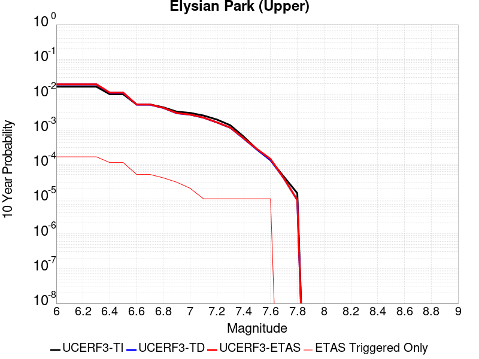 |

| Magnitude | 1 wk TI Prob | 1 wk TD Prob | 1 wk ETAS Prob | 1 wk ETAS/TD Gain | 1 wk ETAS Triggered Only | 1 mo TI Prob | 1 mo TD Prob | 1 mo ETAS Prob | 1 mo ETAS/TD Gain | 1 mo ETAS Triggered Only | 1 yr TI Prob | 1 yr TD Prob | 1 yr ETAS Prob | 1 yr ETAS/TD Gain | 1 yr ETAS Triggered Only | 10 yr TI Prob | 10 yr TD Prob | 10 yr ETAS Prob | 10 yr ETAS/TD Gain | 10 yr ETAS Triggered Only |
|-----|-----|-----|-----|-----|-----|-----|-----|-----|-----|-----|-----|-----|-----|-----|-----|-----|-----|-----|-----|-----|
| 6.0 | 3.1876025E-5 | 3.7035516E-5 | 6.0844155E-5 | 1.6428598 | 2.3809524E-5 | 1.3660437E-4 | 1.587167E-4 | 2.063282E-4 | 1.2999778 | 4.7619047E-5 | 0.0016618895 | 0.0019311075 | 0.0019786346 | 1.0246114 | 4.7619047E-5 | 0.016495159 | 0.019189782 | 0.019283194 | 1.0048677 | 9.5238094E-5 |
| 6.1 | 3.1876025E-5 | 3.7035516E-5 | 6.0844155E-5 | 1.6428598 | 2.3809524E-5 | 1.3660437E-4 | 1.587167E-4 | 2.063282E-4 | 1.2999778 | 4.7619047E-5 | 0.0016618895 | 0.0019311075 | 0.0019786346 | 1.0246114 | 4.7619047E-5 | 0.016495159 | 0.019189782 | 0.019283194 | 1.0048677 | 9.5238094E-5 |
| 6.2 | 3.1876025E-5 | 3.7035516E-5 | 6.0844155E-5 | 1.6428598 | 2.3809524E-5 | 1.3660437E-4 | 1.587167E-4 | 2.063282E-4 | 1.2999778 | 4.7619047E-5 | 0.0016618895 | 0.0019311075 | 0.0019786346 | 1.0246114 | 4.7619047E-5 | 0.016495159 | 0.019189782 | 0.019283194 | 1.0048677 | 9.5238094E-5 |
| 6.3 | 3.1876025E-5 | 3.7035516E-5 | 6.0844155E-5 | 1.6428598 | 2.3809524E-5 | 1.3660437E-4 | 1.587167E-4 | 2.063282E-4 | 1.2999778 | 4.7619047E-5 | 0.0016618895 | 0.0019311075 | 0.0019786346 | 1.0246114 | 4.7619047E-5 | 0.016495159 | 0.019189782 | 0.019283194 | 1.0048677 | 9.5238094E-5 |
| 6.4 | 1.9273462E-5 | 2.1202266E-5 | 2.1202266E-5 | 1.0 | 0.0 | 8.259794E-5 | 9.086466E-5 | 9.086466E-5 | 1.0 | 0.0 | 0.001005166 | 0.0011058892 | 0.0011058892 | 1.0 | 0.0 | 0.010006315 | 0.011020724 | 0.01104427 | 1.0021366 | 2.3809524E-5 |
| 6.5 | 1.9273462E-5 | 2.1202266E-5 | 2.1202266E-5 | 1.0 | 0.0 | 8.259794E-5 | 9.086466E-5 | 9.086466E-5 | 1.0 | 0.0 | 0.001005166 | 0.0011058892 | 0.0011058892 | 1.0 | 0.0 | 0.010006315 | 0.011020724 | 0.01104427 | 1.0021366 | 2.3809524E-5 |
| 6.6 | 9.813258E-6 | 9.665599E-6 | 9.665599E-6 | 1.0 | 0.0 | 4.205614E-5 | 4.1423376E-5 | 4.1423376E-5 | 1.0 | 0.0 | 5.119132E-4 | 5.0422014E-4 | 5.0422014E-4 | 1.0 | 0.0 | 0.005107356 | 0.0050314846 | 0.0050551747 | 1.0047083 | 2.3809524E-5 |
| 6.7 | 9.801478E-6 | 9.653168E-6 | 9.653168E-6 | 1.0 | 0.0 | 4.2005657E-5 | 4.1370105E-5 | 4.1370105E-5 | 1.0 | 0.0 | 5.112989E-4 | 5.035719E-4 | 5.035719E-4 | 1.0 | 0.0 | 0.0051012407 | 0.0050250315 | 0.005048721 | 1.0047144 | 2.3809524E-5 |
| 6.8 | 8.102489E-6 | 7.773004E-6 | 7.773004E-6 | 1.0 | 0.0 | 3.4724493E-5 | 3.3312477E-5 | 3.3312477E-5 | 1.0 | 0.0 | 4.2268867E-4 | 4.055089E-4 | 4.055089E-4 | 1.0 | 0.0 | 0.004218856 | 0.0040481836 | 0.0040718964 | 1.0058577 | 2.3809524E-5 |
| 6.9 | 6.08275E-6 | 5.4814514E-6 | 5.4814514E-6 | 1.0 | 0.0 | 2.6068668E-5 | 2.3491726E-5 | 2.3491726E-5 | 1.0 | 0.0 | 3.173398E-4 | 2.85975E-4 | 2.85975E-4 | 1.0 | 0.0 | 0.0031688702 | 0.0028561477 | 0.0028561477 | 1.0 | 0.0 |
| 7.0 | 5.5995934E-6 | 4.98278E-6 | 4.98278E-6 | 1.0 | 0.0 | 2.3998036E-5 | 2.13546E-5 | 2.13546E-5 | 1.0 | 0.0 | 2.9213692E-4 | 2.599619E-4 | 2.599619E-4 | 1.0 | 0.0 | 0.0029175316 | 0.0025966454 | 0.0025966454 | 1.0 | 0.0 |
| 7.1 | 4.709881E-6 | 4.0874015E-6 | 4.0874015E-6 | 1.0 | 0.0 | 2.0185047E-5 | 1.7517319E-5 | 1.7517319E-5 | 1.0 | 0.0 | 2.4572524E-4 | 2.132529E-4 | 2.132529E-4 | 1.0 | 0.0 | 0.002454537 | 0.002130524 | 0.002130524 | 1.0 | 0.0 |
| 7.2 | 3.6063436E-6 | 2.9779544E-6 | 2.9779544E-6 | 1.0 | 0.0 | 1.5455667E-5 | 1.27626E-5 | 1.27626E-5 | 1.0 | 0.0 | 1.881565E-4 | 1.5537368E-4 | 1.5537368E-4 | 1.0 | 0.0 | 0.0018799726 | 0.0015526618 | 0.0015526618 | 1.0 | 0.0 |
| 7.3 | 2.471135E-6 | 2.0954615E-6 | 2.0954615E-6 | 1.0 | 0.0 | 1.0590536E-5 | 8.980519E-6 | 8.980519E-6 | 1.0 | 0.0 | 1.2893214E-4 | 1.093324E-4 | 1.093324E-4 | 1.0 | 0.0 | 0.0012885736 | 0.0010927934 | 0.0010927934 | 1.0 | 0.0 |
| 7.4 | 1.163943E-6 | 1.0275091E-6 | 1.0275091E-6 | 1.0 | 0.0 | 4.988318E-6 | 4.4036033E-6 | 4.4036033E-6 | 1.0 | 0.0 | 6.0731076E-5 | 5.3612584E-5 | 5.3612584E-5 | 1.0 | 0.0 | 6.071448E-4 | 5.359995E-4 | 5.359995E-4 | 1.0 | 0.0 |
| 7.5 | 4.99459E-7 | 4.917604E-7 | 4.917604E-7 | 1.0 | 0.0 | 2.140537E-6 | 2.1075427E-6 | 2.1075427E-6 | 1.0 | 0.0 | 2.6060725E-5 | 2.5659048E-5 | 2.5659048E-5 | 1.0 | 0.0 | 2.605767E-4 | 2.5656243E-4 | 2.5656243E-4 | 1.0 | 0.0 |
| 7.6 | 2.4667852E-7 | 2.4778336E-7 | 2.4778336E-7 | 1.0 | 0.0 | 1.0571932E-6 | 1.0619283E-6 | 1.0619283E-6 | 1.0 | 0.0 | 1.2871251E-5 | 1.2928905E-5 | 1.2928905E-5 | 1.0 | 0.0 | 1.2870505E-4 | 1.2928189E-4 | 1.2928189E-4 | 1.0 | 0.0 |
| 7.7 | 8.2312795E-8 | 7.3864456E-8 | 7.3864456E-8 | 1.0 | 0.0 | 3.527691E-7 | 3.165619E-7 | 3.165619E-7 | 1.0 | 0.0 | 4.294955E-6 | 3.8541357E-6 | 3.8541357E-6 | 1.0 | 0.0 | 4.2948723E-5 | 3.8540802E-5 | 3.8540802E-5 | 1.0 | 0.0 |
| 7.8 | 2.7819295E-8 | 1.7566023E-8 | 1.7566023E-8 | 1.0 | 0.0 | 1.1922555E-7 | 7.5282955E-8 | 7.5282955E-8 | 1.0 | 0.0 | 1.45157E-6 | 9.165697E-7 | 9.165697E-7 | 1.0 | 0.0 | 1.45156055E-5 | 9.165675E-6 | 9.165675E-6 | 1.0 | 0.0 |

## San Jacinto (Superstition Mtn)
*[(top)](#table-of-contents)*

| 1 Week | 1 Month | 1 Year | 10 Year |
|-----|-----|-----|-----|
|  |  |  | 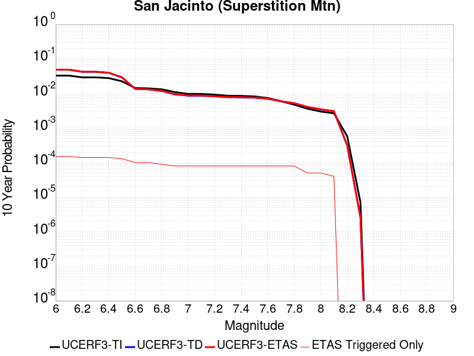 |

| Magnitude | 1 wk TI Prob | 1 wk TD Prob | 1 wk ETAS Prob | 1 wk ETAS/TD Gain | 1 wk ETAS Triggered Only | 1 mo TI Prob | 1 mo TD Prob | 1 mo ETAS Prob | 1 mo ETAS/TD Gain | 1 mo ETAS Triggered Only | 1 yr TI Prob | 1 yr TD Prob | 1 yr ETAS Prob | 1 yr ETAS/TD Gain | 1 yr ETAS Triggered Only | 10 yr TI Prob | 10 yr TD Prob | 10 yr ETAS Prob | 10 yr ETAS/TD Gain | 10 yr ETAS Triggered Only |
|-----|-----|-----|-----|-----|-----|-----|-----|-----|-----|-----|-----|-----|-----|-----|-----|-----|-----|-----|-----|-----|
| 6.0 | 6.4193904E-5 | 9.599367E-5 | 1.19800905E-4 | 1.2480084 | 2.3809524E-5 | 2.7508775E-4 | 4.1134638E-4 | 4.589458E-4 | 1.1157162 | 4.7619047E-5 | 0.0033440501 | 0.0049980893 | 0.0050928514 | 1.0189596 | 9.5238094E-5 | 0.03294174 | 0.048823986 | 0.04893722 | 1.0023192 | 1.1904762E-4 |
| 6.1 | 6.4193904E-5 | 9.599367E-5 | 1.19800905E-4 | 1.2480084 | 2.3809524E-5 | 2.7508775E-4 | 4.1134638E-4 | 4.589458E-4 | 1.1157162 | 4.7619047E-5 | 0.0033440501 | 0.0049980893 | 0.0050928514 | 1.0189596 | 9.5238094E-5 | 0.03294174 | 0.048823986 | 0.04893722 | 1.0023192 | 1.1904762E-4 |
| 6.2 | 5.7023593E-5 | 8.3144434E-5 | 1.0695198E-4 | 1.2863396 | 2.3809524E-5 | 2.4436394E-4 | 3.5629404E-4 | 4.0389612E-4 | 1.1336033 | 4.7619047E-5 | 0.002971072 | 0.0043308944 | 0.00442572 | 1.0218952 | 9.5238094E-5 | 0.029316625 | 0.04250403 | 0.042618018 | 1.0026819 | 1.1904762E-4 |
| 6.3 | 5.6940098E-5 | 8.298979E-5 | 1.0679734E-4 | 1.2868732 | 2.3809524E-5 | 2.4400617E-4 | 3.5563146E-4 | 4.0323357E-4 | 1.1338524 | 4.7619047E-5 | 0.002966728 | 0.00432286 | 0.0044176863 | 1.021936 | 9.5238094E-5 | 0.029274331 | 0.042427283 | 0.04254128 | 1.0026869 | 1.1904762E-4 |
| 6.4 | 5.4171585E-5 | 7.7483564E-5 | 1.0129124E-4 | 1.307261 | 2.3809524E-5 | 2.3214328E-4 | 3.3203943E-4 | 3.7964268E-4 | 1.1433662 | 4.7619047E-5 | 0.0028226813 | 0.0040367353 | 0.0041315886 | 1.0234976 | 9.5238094E-5 | 0.02787096 | 0.03971653 | 0.03983085 | 1.0028784 | 1.1904762E-4 |
| 6.5 | 4.375144E-5 | 5.642133E-5 | 8.022951E-5 | 1.4219713 | 2.3809524E-5 | 1.874927E-4 | 2.4178992E-4 | 2.8939746E-4 | 1.1968963 | 4.7619047E-5 | 0.0022803338 | 0.002940994 | 0.0030359519 | 1.0322877 | 9.5238094E-5 | 0.022570757 | 0.029236801 | 0.029352369 | 1.0039527 | 1.1904762E-4 |
| 6.6 | 2.772192E-5 | 2.5488358E-5 | 4.9297276E-5 | 1.9341094 | 2.3809524E-5 | 1.1880282E-4 | 1.09231354E-4 | 1.568452E-4 | 1.4358991 | 4.7619047E-5 | 0.0014454646 | 0.0013290998 | 0.0014004334 | 1.0536706 | 7.142857E-5 | 0.014360986 | 0.01354049 | 0.013634439 | 1.0069383 | 9.5238094E-5 |
| 6.7 | 2.7124124E-5 | 2.4699386E-5 | 4.8508322E-5 | 1.9639485 | 2.3809524E-5 | 1.1624106E-4 | 1.05850326E-4 | 1.5346434E-4 | 1.4498239 | 4.7619047E-5 | 0.0014143161 | 0.001287985 | 0.0013593216 | 1.0553862 | 7.142857E-5 | 0.014053487 | 0.013133943 | 0.01322793 | 1.007156 | 9.5238094E-5 |
| 6.8 | 2.5475807E-5 | 2.216446E-5 | 4.5973455E-5 | 2.074197 | 2.3809524E-5 | 1.0917746E-4 | 9.4987154E-5 | 1.4260168E-4 | 1.5012733 | 4.7619047E-5 | 0.001328425 | 0.001155867 | 0.001227213 | 1.0617251 | 7.142857E-5 | 0.0132051185 | 0.011822182 | 0.011916294 | 1.0079607 | 9.5238094E-5 |
| 6.9 | 2.1162023E-5 | 1.7626244E-5 | 4.143535E-5 | 2.350776 | 2.3809524E-5 | 9.069123E-5 | 7.5538876E-5 | 1.2315433E-4 | 1.6303437 | 4.7619047E-5 | 0.0011036064 | 9.193016E-4 | 9.906645E-4 | 1.0776273 | 7.142857E-5 | 0.010981417 | 0.00944688 | 0.009541218 | 1.0099862 | 9.5238094E-5 |
| 7.0 | 1.8754288E-5 | 1.6161559E-5 | 3.99707E-5 | 2.4731958 | 2.3809524E-5 | 8.037304E-5 | 6.9261994E-5 | 1.16877745E-4 | 1.6874729 | 4.7619047E-5 | 9.781026E-4 | 8.4294105E-4 | 9.143094E-4 | 1.0846659 | 7.142857E-5 | 0.009738087 | 0.008670042 | 0.008764454 | 1.0108895 | 9.5238094E-5 |
| 7.1 | 1.8678527E-5 | 1.6086702E-5 | 3.9895844E-5 | 2.480051 | 2.3809524E-5 | 8.0048376E-5 | 6.89412E-5 | 1.1655696E-4 | 1.6906722 | 4.7619047E-5 | 9.7415317E-4 | 8.3903834E-4 | 9.10407E-4 | 1.08506 | 7.142857E-5 | 0.009698939 | 0.008630998 | 0.008725414 | 1.0109392 | 9.5238094E-5 |
| 7.2 | 1.7804578E-5 | 1.5381282E-5 | 3.919044E-5 | 2.5479307 | 2.3809524E-5 | 7.6303106E-5 | 6.5918124E-5 | 1.1353403E-4 | 1.7223493 | 4.7619047E-5 | 9.285943E-4 | 8.022599E-4 | 8.7363116E-4 | 1.0889628 | 7.142857E-5 | 0.009247236 | 0.008262311 | 0.008356763 | 1.0114316 | 9.5238094E-5 |
| 7.3 | 1.6583685E-5 | 1.4530388E-5 | 3.8339567E-5 | 2.6385782 | 2.3809524E-5 | 7.1070994E-5 | 6.227162E-5 | 1.098877E-4 | 1.7646514 | 4.7619047E-5 | 8.649459E-4 | 7.5789524E-4 | 8.2926964E-4 | 1.0941745 | 7.142857E-5 | 0.00861587 | 0.007817623 | 0.007912117 | 1.0120872 | 9.5238094E-5 |
| 7.4 | 1.6387552E-5 | 1.4395274E-5 | 3.8204456E-5 | 2.653958 | 2.3809524E-5 | 7.023047E-5 | 6.169258E-5 | 1.0930869E-4 | 1.7718288 | 4.7619047E-5 | 8.5472054E-4 | 7.5085036E-4 | 8.222253E-4 | 1.0950588 | 7.142857E-5 | 0.008514405 | 0.0077470057 | 0.007841506 | 1.0121983 | 9.5238094E-5 |
| 7.5 | 1.5790754E-5 | 1.4035962E-5 | 3.784515E-5 | 2.696299 | 2.3809524E-5 | 6.767291E-5 | 6.0152746E-5 | 1.0776893E-4 | 1.7915878 | 4.7619047E-5 | 8.236062E-4 | 7.321156E-4 | 8.0349186E-4 | 1.0974932 | 7.142857E-5 | 0.008205604 | 0.007557569 | 0.0076520876 | 1.0125065 | 9.5238094E-5 |
| 7.6 | 1.4248672E-5 | 1.3054932E-5 | 3.6864145E-5 | 2.8237715 | 2.3809524E-5 | 6.106431E-5 | 5.594852E-5 | 1.03564904E-4 | 1.8510749 | 4.7619047E-5 | 7.432043E-4 | 6.8096205E-4 | 7.52342E-4 | 1.1048222 | 7.142857E-5 | 0.007407237 | 0.0070401574 | 0.007134725 | 1.0134326 | 9.5238094E-5 |
| 7.7 | 1.15449975E-5 | 1.090368E-5 | 3.4712943E-5 | 3.183599 | 2.3809524E-5 | 4.947762E-5 | 4.6729223E-5 | 9.434605E-5 | 2.0189946 | 4.7619047E-5 | 6.022235E-4 | 5.687805E-4 | 6.401685E-4 | 1.1255106 | 7.142857E-5 | 0.006005941 | 0.0059101824 | 0.0060048574 | 1.016019 | 9.5238094E-5 |
| 7.8 | 9.1391985E-6 | 9.514299E-6 | 3.3323595E-5 | 3.5024753 | 2.3809524E-5 | 3.9167408E-5 | 4.0774932E-5 | 8.839204E-5 | 2.1678035 | 4.7619047E-5 | 4.767588E-4 | 4.963223E-4 | 5.6771544E-4 | 1.1438442 | 7.142857E-5 | 0.0047573727 | 0.0051766867 | 0.0052714315 | 1.0183023 | 9.5238094E-5 |
| 7.9 | 6.973017E-6 | 7.3821784E-6 | 3.119153E-5 | 4.225247 | 2.3809524E-5 | 2.9884017E-5 | 3.1637526E-5 | 7.925507E-5 | 2.505097 | 4.7619047E-5 | 3.6377716E-4 | 3.8511935E-4 | 4.3272006E-4 | 1.1235999 | 4.7619047E-5 | 0.0036318225 | 0.0040517948 | 0.004122934 | 1.0175575 | 7.142857E-5 |
| 8.0 | 5.7638235E-6 | 6.259972E-6 | 3.0069346E-5 | 4.8034315 | 2.3809524E-5 | 2.4701867E-5 | 2.6828178E-5 | 7.444595E-5 | 2.7749162 | 4.7619047E-5 | 3.0070372E-4 | 3.2658462E-4 | 3.741881E-4 | 1.1457616 | 4.7619047E-5 | 0.0030029714 | 0.0034534496 | 0.0035246313 | 1.0206119 | 7.142857E-5 |
| 8.1 | 5.1124434E-6 | 5.4956718E-6 | 2.9305065E-5 | 5.33239 | 2.3809524E-5 | 2.1910288E-5 | 2.355267E-5 | 7.1170594E-5 | 3.0217636 | 4.7619047E-5 | 2.6672508E-4 | 2.867165E-4 | 3.343219E-4 | 1.1660365 | 4.7619047E-5 | 0.0026640517 | 0.003040336 | 0.0031115476 | 1.0234222 | 7.142857E-5 |
| 8.2 | 1.1075938E-6 | 5.336568E-7 | 5.336568E-7 | 1.0 | 0.0 | 4.7468216E-6 | 2.2870988E-6 | 2.2870988E-6 | 1.0 | 0.0 | 5.779102E-5 | 2.7845093E-5 | 2.7845093E-5 | 1.0 | 0.0 | 5.777599E-4 | 3.1346595E-4 | 3.1346595E-4 | 1.0 | 0.0 |
| 8.3 | 1.3584393E-8 | 4.473836E-9 | 4.473836E-9 | 1.0 | 0.0 | 5.8218827E-8 | 1.9173582E-8 | 1.9173582E-8 | 1.0 | 0.0 | 7.0881396E-7 | 2.3343837E-7 | 2.3343837E-7 | 1.0 | 0.0 | 7.0881174E-6 | 2.6163038E-6 | 2.6163038E-6 | 1.0 | 0.0 |

## Owens Valley
*[(top)](#table-of-contents)*

| 1 Week | 1 Month | 1 Year | 10 Year |
|-----|-----|-----|-----|
| 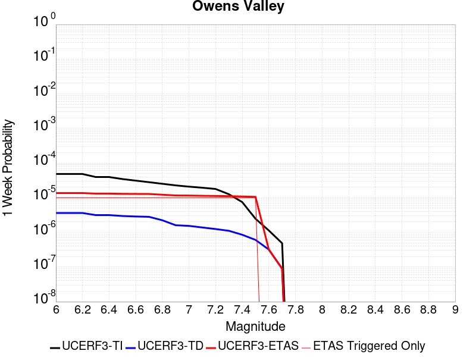 |  |  |  |

| Magnitude | 1 wk TI Prob | 1 wk TD Prob | 1 wk ETAS Prob | 1 wk ETAS/TD Gain | 1 wk ETAS Triggered Only | 1 mo TI Prob | 1 mo TD Prob | 1 mo ETAS Prob | 1 mo ETAS/TD Gain | 1 mo ETAS Triggered Only | 1 yr TI Prob | 1 yr TD Prob | 1 yr ETAS Prob | 1 yr ETAS/TD Gain | 1 yr ETAS Triggered Only | 10 yr TI Prob | 10 yr TD Prob | 10 yr ETAS Prob | 10 yr ETAS/TD Gain | 10 yr ETAS Triggered Only |
|-----|-----|-----|-----|-----|-----|-----|-----|-----|-----|-----|-----|-----|-----|-----|-----|-----|-----|-----|-----|-----|
| 6.0 | 4.83821E-5 | 3.626567E-6 | 2.7436005E-5 | 7.565283 | 2.3809524E-5 | 2.0733538E-4 | 1.5542342E-5 | 8.6969805E-5 | 5.595669 | 7.142857E-5 | 0.002521386 | 1.8921259E-4 | 3.0823768E-4 | 1.6290549 | 1.1904762E-4 | 0.024929691 | 0.001925011 | 0.0020438295 | 1.0617235 | 1.1904762E-4 |
| 6.1 | 4.83821E-5 | 3.626567E-6 | 2.7436005E-5 | 7.565283 | 2.3809524E-5 | 2.0733538E-4 | 1.5542342E-5 | 8.6969805E-5 | 5.595669 | 7.142857E-5 | 0.002521386 | 1.8921259E-4 | 3.0823768E-4 | 1.6290549 | 1.1904762E-4 | 0.024929691 | 0.001925011 | 0.0020438295 | 1.0617235 | 1.1904762E-4 |
| 6.2 | 4.83821E-5 | 3.626567E-6 | 2.7436005E-5 | 7.565283 | 2.3809524E-5 | 2.0733538E-4 | 1.5542342E-5 | 8.6969805E-5 | 5.595669 | 7.142857E-5 | 0.002521386 | 1.8921259E-4 | 3.0823768E-4 | 1.6290549 | 1.1904762E-4 | 0.024929691 | 0.001925011 | 0.0020438295 | 1.0617235 | 1.1904762E-4 |
| 6.3 | 3.953008E-5 | 3.1553948E-6 | 2.6964843E-5 | 8.545632 | 2.3809524E-5 | 1.6940363E-4 | 1.3523055E-5 | 8.495066E-5 | 6.2819133 | 7.142857E-5 | 0.002060538 | 1.6463149E-4 | 2.836595E-4 | 1.7229967 | 1.1904762E-4 | 0.020415364 | 0.0016592 | 0.00177805 | 1.071631 | 1.1904762E-4 |
| 6.4 | 3.953008E-5 | 3.1553948E-6 | 2.6964843E-5 | 8.545632 | 2.3809524E-5 | 1.6940363E-4 | 1.3523055E-5 | 8.495066E-5 | 6.2819133 | 7.142857E-5 | 0.002060538 | 1.6463149E-4 | 2.836595E-4 | 1.7229967 | 1.1904762E-4 | 0.020415364 | 0.0016592 | 0.00177805 | 1.071631 | 1.1904762E-4 |
| 6.5 | 3.457342E-5 | 2.9715961E-6 | 2.678105E-5 | 9.012344 | 2.3809524E-5 | 1.4816338E-4 | 1.2735354E-5 | 8.416302E-5 | 6.608612 | 7.142857E-5 | 0.0018023965 | 1.550426E-4 | 2.7407176E-4 | 1.767719 | 1.1904762E-4 | 0.017878477 | 0.001555719 | 0.0016745813 | 1.0764035 | 1.1904762E-4 |
| 6.6 | 3.1127765E-5 | 2.8744932E-6 | 2.6683949E-5 | 9.28301 | 2.3809524E-5 | 1.3339789E-4 | 1.2319203E-5 | 8.374689E-5 | 6.7980776 | 7.142857E-5 | 0.0016229092 | 1.4997667E-4 | 2.690064E-4 | 1.7936553 | 1.1904762E-4 | 0.016111081 | 0.0015012559 | 0.0016201248 | 1.0791796 | 1.1904762E-4 |
| 6.7 | 2.806885E-5 | 2.8104134E-6 | 2.661987E-5 | 9.47187 | 2.3809524E-5 | 1.2028952E-4 | 1.20445775E-5 | 8.347229E-5 | 6.9302797 | 7.142857E-5 | 0.001463541 | 1.4663354E-4 | 2.656637E-4 | 1.8117526 | 1.1904762E-4 | 0.014539397 | 0.0014657511 | 0.0015846242 | 1.0811005 | 1.1904762E-4 |
| 6.8 | 2.524524E-5 | 2.2353688E-6 | 2.604484E-5 | 11.65125 | 2.3809524E-5 | 1.0818939E-4 | 9.580118E-6 | 8.1008E-5 | 8.455846 | 7.142857E-5 | 0.0013164099 | 1.16632E-4 | 2.3566574E-4 | 2.0205925 | 1.1904762E-4 | 0.01308639 | 0.0011659812 | 0.00128489 | 1.1019818 | 1.1904762E-4 |
| 6.9 | 2.2704568E-5 | 1.6081682E-6 | 2.5417654E-5 | 15.805345 | 2.3809524E-5 | 9.730166E-5 | 6.8921313E-6 | 7.832021E-5 | 11.363714 | 7.142857E-5 | 0.0011840039 | 8.390849E-5 | 2.0294612E-4 | 2.4186602 | 1.1904762E-4 | 0.011777153 | 8.3897985E-4 | 9.5792755E-4 | 1.1417767 | 1.1904762E-4 |
| 7.0 | 2.0871712E-5 | 1.5395453E-6 | 2.5349033E-5 | 16.465273 | 2.3809524E-5 | 8.944713E-5 | 6.598035E-6 | 7.802613E-5 | 11.825663 | 7.142857E-5 | 0.0010884746 | 8.032813E-5 | 1.9936619E-4 | 2.4818976 | 1.1904762E-4 | 0.010831586 | 8.0316263E-4 | 9.2211465E-4 | 1.1481045 | 1.1904762E-4 |
| 7.1 | 1.944928E-5 | 1.3864178E-6 | 2.5195908E-5 | 18.173388 | 2.3809524E-5 | 8.335139E-5 | 5.941777E-6 | 7.736992E-5 | 13.021344 | 7.142857E-5 | 0.0010143308 | 7.233874E-5 | 1.6756995E-4 | 2.316462 | 9.5238094E-5 | 0.010097133 | 7.2330976E-4 | 8.18479E-4 | 1.1315746 | 9.5238094E-5 |
| 7.2 | 1.7876306E-5 | 1.2489141E-6 | 2.5058409E-5 | 20.064156 | 2.3809524E-5 | 7.6610486E-5 | 5.352478E-6 | 7.678067E-5 | 14.344882 | 7.142857E-5 | 9.3233347E-4 | 6.516448E-5 | 1.6039638E-4 | 2.461408 | 9.5238094E-5 | 0.009284316 | 6.5159105E-4 | 7.467671E-4 | 1.1460671 | 9.5238094E-5 |
| 7.3 | 1.2618672E-5 | 1.1115209E-6 | 2.4921019E-5 | 22.420649 | 2.3809524E-5 | 5.40789E-5 | 4.763652E-6 | 7.6191885E-5 | 15.994426 | 7.142857E-5 | 6.582117E-4 | 5.799593E-5 | 1.532285E-4 | 2.6420562 | 9.5238094E-5 | 0.0065626553 | 5.7994033E-4 | 6.751232E-4 | 1.1641253 | 9.5238094E-5 |
| 7.4 | 7.4874442E-6 | 8.5486437E-7 | 2.4664369E-5 | 28.85179 | 2.3809524E-5 | 3.208865E-5 | 3.6636993E-6 | 7.509201E-5 | 20.496225 | 7.142857E-5 | 3.906093E-4 | 4.4604632E-5 | 1.16030016E-4 | 2.6012998 | 7.142857E-5 | 0.003899234 | 4.4604883E-4 | 5.1744556E-4 | 1.1600648 | 7.142857E-5 |
| 7.5 | 2.4734156E-6 | 6.068616E-7 | 2.4416371E-5 | 40.23384 | 2.3809524E-5 | 1.060031E-5 | 2.6008327E-6 | 7.4029216E-5 | 28.46366 | 7.142857E-5 | 1.2905113E-4 | 3.166468E-5 | 1.0309099E-4 | 3.2557092 | 7.142857E-5 | 0.0012897621 | 3.1660203E-4 | 3.88008E-4 | 1.2255385 | 7.142857E-5 |
| 7.6 | 1.1328841E-6 | 3.196531E-7 | 3.196531E-7 | 1.0 | 0.0 | 4.8552088E-6 | 1.3699412E-6 | 2.5179432E-5 | 18.379936 | 2.3809524E-5 | 5.9110564E-5 | 1.6678909E-5 | 4.0488034E-5 | 2.427499 | 2.3809524E-5 | 5.9094845E-4 | 1.6677675E-4 | 1.905823E-4 | 1.142739 | 2.3809524E-5 |
| 7.7 | 4.8613185E-7 | 8.964689E-8 | 8.964689E-8 | 1.0 | 0.0 | 2.0834207E-6 | 3.8420092E-7 | 3.8420092E-7 | 1.0 | 0.0 | 2.536535E-5 | 4.6776368E-6 | 4.6776368E-6 | 1.0 | 0.0 | 2.5362454E-4 | 4.677545E-5 | 4.677545E-5 | 1.0 | 0.0 |

## Chino alt 1
*[(top)](#table-of-contents)*

| 1 Week | 1 Month | 1 Year | 10 Year |
|-----|-----|-----|-----|
| 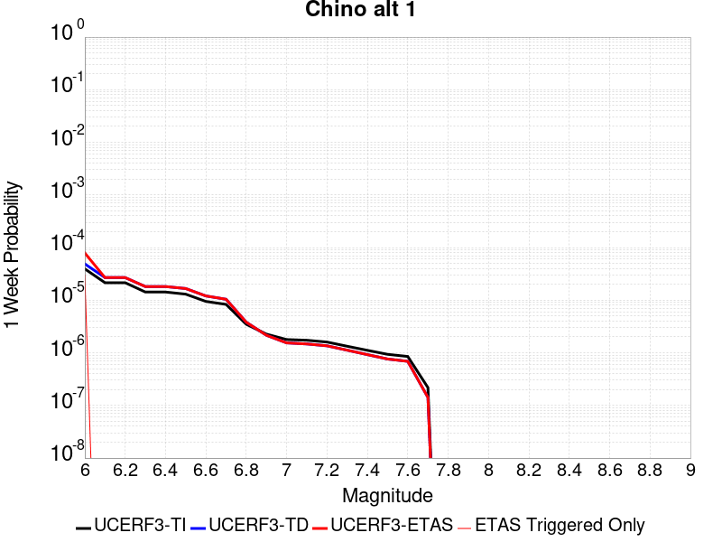 |  |  |  |

| Magnitude | 1 wk TI Prob | 1 wk TD Prob | 1 wk ETAS Prob | 1 wk ETAS/TD Gain | 1 wk ETAS Triggered Only | 1 mo TI Prob | 1 mo TD Prob | 1 mo ETAS Prob | 1 mo ETAS/TD Gain | 1 mo ETAS Triggered Only | 1 yr TI Prob | 1 yr TD Prob | 1 yr ETAS Prob | 1 yr ETAS/TD Gain | 1 yr ETAS Triggered Only | 10 yr TI Prob | 10 yr TD Prob | 10 yr ETAS Prob | 10 yr ETAS/TD Gain | 10 yr ETAS Triggered Only |
|-----|-----|-----|-----|-----|-----|-----|-----|-----|-----|-----|-----|-----|-----|-----|-----|-----|-----|-----|-----|-----|
| 6.0 | 3.939946E-5 | 4.8948554E-5 | 4.8948554E-5 | 1.0 | 0.0 | 1.6884391E-4 | 2.097656E-4 | 2.097656E-4 | 1.0 | 0.0 | 0.0020537362 | 0.0025513945 | 0.0025751435 | 1.0093081 | 2.3809524E-5 | 0.020348595 | 0.025277847 | 0.02534747 | 1.0027543 | 7.142857E-5 |
| 6.1 | 2.1505624E-5 | 2.6879026E-5 | 2.6879026E-5 | 1.0 | 0.0 | 9.2163704E-5 | 1.1519137E-4 | 1.1519137E-4 | 1.0 | 0.0 | 0.0011215154 | 0.001401664 | 0.0014254402 | 1.0169628 | 2.3809524E-5 | 0.011158722 | 0.013945141 | 0.014015574 | 1.0050507 | 7.142857E-5 |
| 6.2 | 2.1505624E-5 | 2.6879026E-5 | 2.6879026E-5 | 1.0 | 0.0 | 9.2163704E-5 | 1.1519137E-4 | 1.1519137E-4 | 1.0 | 0.0 | 0.0011215154 | 0.001401664 | 0.0014254402 | 1.0169628 | 2.3809524E-5 | 0.011158722 | 0.013945141 | 0.014015574 | 1.0050507 | 7.142857E-5 |
| 6.3 | 1.4290785E-5 | 1.8165128E-5 | 1.8165128E-5 | 1.0 | 0.0 | 6.1244784E-5 | 7.784848E-5 | 7.784848E-5 | 1.0 | 0.0 | 7.454001E-4 | 9.4743853E-4 | 9.4743853E-4 | 1.0 | 0.0 | 0.007429048 | 0.0094444575 | 0.009468042 | 1.0024972 | 2.3809524E-5 |
| 6.4 | 1.4290785E-5 | 1.8165128E-5 | 1.8165128E-5 | 1.0 | 0.0 | 6.1244784E-5 | 7.784848E-5 | 7.784848E-5 | 1.0 | 0.0 | 7.454001E-4 | 9.4743853E-4 | 9.4743853E-4 | 1.0 | 0.0 | 0.007429048 | 0.0094444575 | 0.009468042 | 1.0024972 | 2.3809524E-5 |
| 6.5 | 1.3017944E-5 | 1.6652088E-5 | 1.6652088E-5 | 1.0 | 0.0 | 5.5789995E-5 | 7.136439E-5 | 7.136439E-5 | 1.0 | 0.0 | 6.790315E-4 | 8.685589E-4 | 8.685589E-4 | 1.0 | 0.0 | 0.0067696036 | 0.008661949 | 0.008661949 | 1.0 | 0.0 |
| 6.6 | 9.470016E-6 | 1.2039424E-5 | 1.2039424E-5 | 1.0 | 0.0 | 4.058515E-5 | 5.1596704E-5 | 5.1596704E-5 | 1.0 | 0.0 | 4.940122E-4 | 6.280428E-4 | 6.280428E-4 | 1.0 | 0.0 | 0.004929154 | 0.0062718987 | 0.0062718987 | 1.0 | 0.0 |
| 6.7 | 8.314155E-6 | 1.0407736E-5 | 1.0407736E-5 | 1.0 | 0.0 | 3.5631605E-5 | 4.4604003E-5 | 4.4604003E-5 | 1.0 | 0.0 | 4.3372845E-4 | 5.429507E-4 | 5.429507E-4 | 1.0 | 0.0 | 0.004328829 | 0.005425775 | 0.005425775 | 1.0 | 0.0 |
| 6.8 | 3.4856364E-6 | 3.8133708E-6 | 3.8133708E-6 | 1.0 | 0.0 | 1.4938357E-5 | 1.6342927E-5 | 1.6342927E-5 | 1.0 | 0.0 | 1.8185932E-4 | 1.9895904E-4 | 1.9895904E-4 | 1.0 | 0.0 | 0.0018171056 | 0.0019894864 | 0.0019894864 | 1.0 | 0.0 |
| 6.9 | 2.2645952E-6 | 2.1529022E-6 | 2.1529022E-6 | 1.0 | 0.0 | 9.705372E-6 | 9.226692E-6 | 9.226692E-6 | 1.0 | 0.0 | 1.18156495E-4 | 1.123294E-4 | 1.123294E-4 | 1.0 | 0.0 | 0.0011809369 | 0.0011233423 | 0.0011233423 | 1.0 | 0.0 |
| 7.0 | 1.7864003E-6 | 1.5430785E-6 | 1.5430785E-6 | 1.0 | 0.0 | 7.655979E-6 | 6.613177E-6 | 6.613177E-6 | 1.0 | 0.0 | 9.3207556E-5 | 8.051251E-5 | 8.051251E-5 | 1.0 | 0.0 | 9.316847E-4 | 8.0528046E-4 | 8.0528046E-4 | 1.0 | 0.0 |
| 7.1 | 1.7315456E-6 | 1.4733511E-6 | 1.4733511E-6 | 1.0 | 0.0 | 7.420889E-6 | 6.3143466E-6 | 6.3143466E-6 | 1.0 | 0.0 | 9.034557E-5 | 7.6874516E-5 | 7.6874516E-5 | 1.0 | 0.0 | 9.0308854E-4 | 7.6891703E-4 | 7.6891703E-4 | 1.0 | 0.0 |
| 7.2 | 1.6008337E-6 | 1.3574215E-6 | 1.3574215E-6 | 1.0 | 0.0 | 6.860698E-6 | 5.817508E-6 | 5.817508E-6 | 1.0 | 0.0 | 8.352579E-5 | 7.082591E-5 | 7.082591E-5 | 1.0 | 0.0 | 8.34944E-4 | 7.0845755E-4 | 7.0845755E-4 | 1.0 | 0.0 |
| 7.3 | 1.3320939E-6 | 1.121782E-6 | 1.121782E-6 | 1.0 | 0.0 | 5.7089615E-6 | 4.807629E-6 | 4.807629E-6 | 1.0 | 0.0 | 6.9504385E-5 | 5.8531357E-5 | 5.8531357E-5 | 1.0 | 0.0 | 6.9482654E-4 | 5.8530393E-4 | 5.8530393E-4 | 1.0 | 0.0 |
| 7.4 | 1.114294E-6 | 9.237111E-7 | 9.237111E-7 | 1.0 | 0.0 | 4.775537E-6 | 3.958756E-6 | 3.958756E-6 | 1.0 | 0.0 | 5.8140613E-5 | 4.8196827E-5 | 4.8196827E-5 | 1.0 | 0.0 | 5.81254E-4 | 4.8188053E-4 | 4.8188053E-4 | 1.0 | 0.0 |
| 7.5 | 9.354081E-7 | 7.6234323E-7 | 7.6234323E-7 | 1.0 | 0.0 | 4.0088858E-6 | 3.2671815E-6 | 3.2671815E-6 | 1.0 | 0.0 | 4.8807087E-5 | 3.9777242E-5 | 3.9777242E-5 | 1.0 | 0.0 | 4.879637E-4 | 3.977046E-4 | 3.977046E-4 | 1.0 | 0.0 |
| 7.6 | 8.521771E-7 | 6.88071E-7 | 6.88071E-7 | 1.0 | 0.0 | 3.6521824E-6 | 2.9488726E-6 | 2.9488726E-6 | 1.0 | 0.0 | 4.4464414E-5 | 3.5901965E-5 | 3.5901965E-5 | 1.0 | 0.0 | 4.4455516E-4 | 3.589648E-4 | 3.589648E-4 | 1.0 | 0.0 |
| 7.7 | 2.1803626E-7 | 1.418649E-7 | 1.418649E-7 | 1.0 | 0.0 | 9.344408E-7 | 6.079923E-7 | 6.079923E-7 | 1.0 | 0.0 | 1.1376757E-5 | 7.4022914E-6 | 7.4022914E-6 | 1.0 | 0.0 | 1.13761744E-4 | 7.402141E-5 | 7.402141E-5 | 1.0 | 0.0 |

## Hosgri
*[(top)](#table-of-contents)*

| 1 Week | 1 Month | 1 Year | 10 Year |
|-----|-----|-----|-----|
| 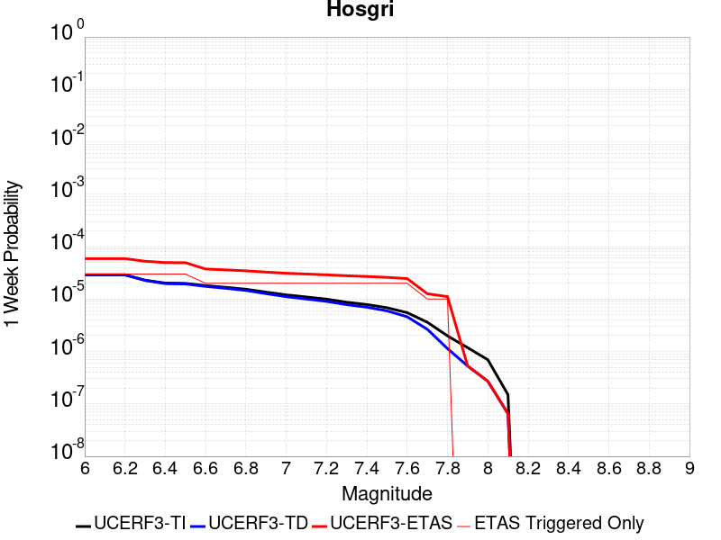 |  |  |  |

| Magnitude | 1 wk TI Prob | 1 wk TD Prob | 1 wk ETAS Prob | 1 wk ETAS/TD Gain | 1 wk ETAS Triggered Only | 1 mo TI Prob | 1 mo TD Prob | 1 mo ETAS Prob | 1 mo ETAS/TD Gain | 1 mo ETAS Triggered Only | 1 yr TI Prob | 1 yr TD Prob | 1 yr ETAS Prob | 1 yr ETAS/TD Gain | 1 yr ETAS Triggered Only | 10 yr TI Prob | 10 yr TD Prob | 10 yr ETAS Prob | 10 yr ETAS/TD Gain | 10 yr ETAS Triggered Only |
|-----|-----|-----|-----|-----|-----|-----|-----|-----|-----|-----|-----|-----|-----|-----|-----|-----|-----|-----|-----|-----|
| 6.0 | 2.883978E-5 | 2.9128416E-5 | 2.9128416E-5 | 1.0 | 0.0 | 1.235932E-4 | 1.2483024E-4 | 1.2483024E-4 | 1.0 | 0.0 | 0.0015037085 | 0.001518776 | 0.0015663226 | 1.0313059 | 4.7619047E-5 | 0.01493574 | 0.01508774 | 0.015158091 | 1.0046628 | 7.142857E-5 |
| 6.1 | 2.883978E-5 | 2.9128416E-5 | 2.9128416E-5 | 1.0 | 0.0 | 1.235932E-4 | 1.2483024E-4 | 1.2483024E-4 | 1.0 | 0.0 | 0.0015037085 | 0.001518776 | 0.0015663226 | 1.0313059 | 4.7619047E-5 | 0.01493574 | 0.01508774 | 0.015158091 | 1.0046628 | 7.142857E-5 |
| 6.2 | 2.883978E-5 | 2.9128416E-5 | 2.9128416E-5 | 1.0 | 0.0 | 1.235932E-4 | 1.2483024E-4 | 1.2483024E-4 | 1.0 | 0.0 | 0.0015037085 | 0.001518776 | 0.0015663226 | 1.0313059 | 4.7619047E-5 | 0.01493574 | 0.01508774 | 0.015158091 | 1.0046628 | 7.142857E-5 |
| 6.3 | 2.2914428E-5 | 2.2641969E-5 | 2.2641969E-5 | 1.0 | 0.0 | 9.8200995E-5 | 9.703343E-5 | 9.703343E-5 | 1.0 | 0.0 | 0.0011949413 | 0.0011807467 | 0.0012283095 | 1.040282 | 4.7619047E-5 | 0.011885363 | 0.011746133 | 0.011816722 | 1.0060096 | 7.142857E-5 |
| 6.4 | 2.0195741E-5 | 1.969656E-5 | 1.969656E-5 | 1.0 | 0.0 | 8.65503E-5 | 8.4411105E-5 | 8.4411105E-5 | 1.0 | 0.0 | 0.0010532405 | 0.0010272227 | 0.0010747928 | 1.0463095 | 4.7619047E-5 | 0.010482626 | 0.010225792 | 0.010296491 | 1.0069137 | 7.142857E-5 |
| 6.5 | 1.9924333E-5 | 1.940898E-5 | 1.940898E-5 | 1.0 | 0.0 | 8.53872E-5 | 8.3178704E-5 | 8.3178704E-5 | 1.0 | 0.0 | 0.0010390934 | 0.0010122322 | 0.0010598031 | 1.046996 | 4.7619047E-5 | 0.010342481 | 0.010077253 | 0.010147962 | 1.0070167 | 7.142857E-5 |
| 6.6 | 1.809694E-5 | 1.74583E-5 | 1.74583E-5 | 1.0 | 0.0 | 7.7556004E-5 | 7.4819145E-5 | 7.4819145E-5 | 1.0 | 0.0 | 9.438353E-4 | 9.105437E-4 | 9.5811946E-4 | 1.0522498 | 4.7619047E-5 | 0.009398366 | 0.009069073 | 0.0091398535 | 1.0078046 | 7.142857E-5 |
| 6.7 | 1.675989E-5 | 1.6042764E-5 | 1.6042764E-5 | 1.0 | 0.0 | 7.182612E-5 | 6.87529E-5 | 6.87529E-5 | 1.0 | 0.0 | 8.7413215E-4 | 8.3674624E-4 | 8.6053583E-4 | 1.028431 | 2.3809524E-5 | 0.008707017 | 0.0083368635 | 0.008384085 | 1.0056642 | 4.7619047E-5 |
| 6.8 | 1.5401129E-5 | 1.4614083E-5 | 1.4614083E-5 | 1.0 | 0.0 | 6.6003166E-5 | 6.2630286E-5 | 6.2630286E-5 | 1.0 | 0.0 | 8.032922E-4 | 7.622578E-4 | 7.860492E-4 | 1.0312117 | 2.3809524E-5 | 0.008003947 | 0.007597296 | 0.0076445537 | 1.0062202 | 4.7619047E-5 |
| 6.9 | 1.356559E-5 | 1.2689968E-5 | 1.2689968E-5 | 1.0 | 0.0 | 5.8136946E-5 | 5.4384444E-5 | 5.4384444E-5 | 1.0 | 0.0 | 7.0758746E-4 | 6.619299E-4 | 6.857237E-4 | 1.035946 | 2.3809524E-5 | 0.007053386 | 0.006600388 | 0.0066476925 | 1.007167 | 4.7619047E-5 |
| 7.0 | 1.2030819E-5 | 1.1095962E-5 | 1.1095962E-5 | 1.0 | 0.0 | 5.155963E-5 | 4.7553254E-5 | 4.7553254E-5 | 1.0 | 0.0 | 6.275577E-4 | 5.7880714E-4 | 6.026029E-4 | 1.0411117 | 2.3809524E-5 | 0.006257884 | 0.005773757 | 0.005797429 | 1.0041 | 2.3809524E-5 |
| 7.1 | 1.0972698E-5 | 1.0022179E-5 | 1.0022179E-5 | 1.0 | 0.0 | 4.7025E-5 | 4.2951488E-5 | 4.2951488E-5 | 1.0 | 0.0 | 5.72379E-4 | 5.22809E-4 | 5.22809E-4 | 1.0 | 0.0 | 0.0057090693 | 0.005216542 | 0.005216542 | 1.0 | 0.0 |
| 7.2 | 9.961926E-6 | 9.034746E-6 | 9.034746E-6 | 1.0 | 0.0 | 4.2693267E-5 | 3.8719765E-5 | 3.8719765E-5 | 1.0 | 0.0 | 5.1966653E-4 | 4.713112E-4 | 4.713112E-4 | 1.0 | 0.0 | 0.00518453 | 0.0047038626 | 0.0047038626 | 1.0 | 0.0 |
| 7.3 | 8.700929E-6 | 7.8281E-6 | 7.8281E-6 | 1.0 | 0.0 | 3.7289166E-5 | 3.354857E-5 | 3.354857E-5 | 1.0 | 0.0 | 4.53901E-4 | 4.0837732E-4 | 4.0837732E-4 | 1.0 | 0.0 | 0.00452975 | 0.004077008 | 0.004077008 | 1.0 | 0.0 |
| 7.4 | 7.866285E-6 | 6.998739E-6 | 6.998739E-6 | 1.0 | 0.0 | 3.3712215E-5 | 2.9994251E-5 | 2.9994251E-5 | 1.0 | 0.0 | 4.103689E-4 | 3.6511885E-4 | 3.6511885E-4 | 1.0 | 0.0 | 0.004096119 | 0.0036459267 | 0.0036459267 | 1.0 | 0.0 |
| 7.5 | 6.8381305E-6 | 5.9596955E-6 | 5.9596955E-6 | 1.0 | 0.0 | 2.9305946E-5 | 2.5541302E-5 | 2.5541302E-5 | 1.0 | 0.0 | 3.5674145E-4 | 3.10921E-4 | 3.10921E-4 | 1.0 | 0.0 | 0.0035616932 | 0.0031055948 | 0.0031055948 | 1.0 | 0.0 |
| 7.6 | 5.503376E-6 | 4.5952443E-6 | 4.5952443E-6 | 1.0 | 0.0 | 2.3585684E-5 | 1.9693754E-5 | 1.9693754E-5 | 1.0 | 0.0 | 2.8711787E-4 | 2.397451E-4 | 2.397451E-4 | 1.0 | 0.0 | 0.002867472 | 0.0023955975 | 0.0023955975 | 1.0 | 0.0 |
| 7.7 | 3.6144982E-6 | 2.6522112E-6 | 2.6522112E-6 | 1.0 | 0.0 | 1.5490614E-5 | 1.1366569E-5 | 1.1366569E-5 | 1.0 | 0.0 | 1.8858191E-4 | 1.383792E-4 | 1.383792E-4 | 1.0 | 0.0 | 0.0018842196 | 0.0013836613 | 0.0013836613 | 1.0 | 0.0 |
| 7.8 | 1.9853494E-6 | 1.1361129E-6 | 1.1361129E-6 | 1.0 | 0.0 | 8.508612E-6 | 4.8690463E-6 | 4.8690463E-6 | 1.0 | 0.0 | 1.0358743E-4 | 5.9279027E-5 | 5.9279027E-5 | 1.0 | 0.0 | 0.0010353916 | 5.9336185E-4 | 5.9336185E-4 | 1.0 | 0.0 |
| 7.9 | 1.1818757E-6 | 5.2951856E-7 | 5.2951856E-7 | 1.0 | 0.0 | 5.0651715E-6 | 2.2693632E-6 | 2.2693632E-6 | 1.0 | 0.0 | 6.1666724E-5 | 2.7629147E-5 | 2.7629147E-5 | 1.0 | 0.0 | 6.1649614E-4 | 2.7694515E-4 | 2.7694515E-4 | 1.0 | 0.0 |
| 8.0 | 6.962958E-7 | 2.7139782E-7 | 2.7139782E-7 | 1.0 | 0.0 | 2.9841215E-6 | 1.163133E-6 | 1.163133E-6 | 1.0 | 0.0 | 3.6331072E-5 | 1.4161053E-5 | 1.4161053E-5 | 1.0 | 0.0 | 3.6325134E-4 | 1.4217179E-4 | 1.4217179E-4 | 1.0 | 0.0 |
| 8.1 | 1.5033264E-7 | 6.527624E-8 | 6.527624E-8 | 1.0 | 0.0 | 6.442826E-7 | 2.7975528E-7 | 2.7975528E-7 | 1.0 | 0.0 | 7.844113E-6 | 3.4060151E-6 | 3.4060151E-6 | 1.0 | 0.0 | 7.843835E-5 | 3.407693E-5 | 3.407693E-5 | 1.0 | 0.0 |

## San Juan
*[(top)](#table-of-contents)*

| 1 Week | 1 Month | 1 Year | 10 Year |
|-----|-----|-----|-----|
|  |  |  |  |

| Magnitude | 1 wk TI Prob | 1 wk TD Prob | 1 wk ETAS Prob | 1 wk ETAS/TD Gain | 1 wk ETAS Triggered Only | 1 mo TI Prob | 1 mo TD Prob | 1 mo ETAS Prob | 1 mo ETAS/TD Gain | 1 mo ETAS Triggered Only | 1 yr TI Prob | 1 yr TD Prob | 1 yr ETAS Prob | 1 yr ETAS/TD Gain | 1 yr ETAS Triggered Only | 10 yr TI Prob | 10 yr TD Prob | 10 yr ETAS Prob | 10 yr ETAS/TD Gain | 10 yr ETAS Triggered Only |
|-----|-----|-----|-----|-----|-----|-----|-----|-----|-----|-----|-----|-----|-----|-----|-----|-----|-----|-----|-----|-----|
| 6.0 | 8.682808E-6 | 8.7491635E-6 | 8.7491635E-6 | 1.0 | 0.0 | 3.72115E-5 | 3.74959E-5 | 6.1304534E-5 | 1.6349663 | 2.3809524E-5 | 4.5295584E-4 | 4.564218E-4 | 4.8022048E-4 | 1.0521418 | 2.3809524E-5 | 0.004520337 | 0.004555385 | 0.004650189 | 1.0208114 | 9.5238094E-5 |
| 6.1 | 8.682808E-6 | 8.7491635E-6 | 8.7491635E-6 | 1.0 | 0.0 | 3.72115E-5 | 3.74959E-5 | 6.1304534E-5 | 1.6349663 | 2.3809524E-5 | 4.5295584E-4 | 4.564218E-4 | 4.8022048E-4 | 1.0521418 | 2.3809524E-5 | 0.004520337 | 0.004555385 | 0.004650189 | 1.0208114 | 9.5238094E-5 |
| 6.2 | 8.682808E-6 | 8.7491635E-6 | 8.7491635E-6 | 1.0 | 0.0 | 3.72115E-5 | 3.74959E-5 | 6.1304534E-5 | 1.6349663 | 2.3809524E-5 | 4.5295584E-4 | 4.564218E-4 | 4.8022048E-4 | 1.0521418 | 2.3809524E-5 | 0.004520337 | 0.004555385 | 0.004650189 | 1.0208114 | 9.5238094E-5 |
| 6.3 | 6.3054235E-6 | 6.2825848E-6 | 6.2825848E-6 | 1.0 | 0.0 | 2.7022963E-5 | 2.6925094E-5 | 5.0733976E-5 | 1.8842636 | 2.3809524E-5 | 3.2895492E-4 | 3.2776513E-4 | 3.5156682E-4 | 1.0726182 | 2.3809524E-5 | 0.003284684 | 0.003273017 | 0.0033442117 | 1.021752 | 7.142857E-5 |
| 6.4 | 6.1490473E-6 | 6.1144656E-6 | 6.1144656E-6 | 1.0 | 0.0 | 2.6352795E-5 | 2.6204598E-5 | 5.00135E-5 | 1.9085772 | 2.3809524E-5 | 3.2079802E-4 | 3.1899565E-4 | 3.4279758E-4 | 1.0746152 | 2.3809524E-5 | 0.0032033534 | 0.0031855737 | 0.0032567747 | 1.022351 | 7.142857E-5 |
| 6.5 | 5.204848E-6 | 5.137233E-6 | 5.137233E-6 | 1.0 | 0.0 | 2.23063E-5 | 2.2016533E-5 | 4.5825534E-5 | 2.0814145 | 2.3809524E-5 | 2.7154534E-4 | 2.6801927E-4 | 2.9182242E-4 | 1.0888113 | 2.3809524E-5 | 0.0027121378 | 0.0026771144 | 0.0027483518 | 1.0266098 | 7.142857E-5 |
| 6.6 | 4.5179986E-6 | 4.4150297E-6 | 4.4150297E-6 | 1.0 | 0.0 | 1.9362706E-5 | 1.8921424E-5 | 1.8921424E-5 | 1.0 | 0.0 | 2.3571544E-4 | 2.3034477E-4 | 2.3034477E-4 | 1.0 | 0.0 | 0.0023546559 | 0.0023011973 | 0.0023487066 | 1.0206455 | 4.7619047E-5 |
| 6.7 | 3.9442616E-6 | 3.819828E-6 | 3.819828E-6 | 1.0 | 0.0 | 1.6903869E-5 | 1.6370592E-5 | 1.6370592E-5 | 1.0 | 0.0 | 2.0578515E-4 | 1.992944E-4 | 1.992944E-4 | 1.0 | 0.0 | 0.002055947 | 0.0019912818 | 0.002038806 | 1.0238662 | 4.7619047E-5 |
| 6.8 | 3.4536245E-6 | 3.3163353E-6 | 3.3163353E-6 | 1.0 | 0.0 | 1.4801163E-5 | 1.4212792E-5 | 1.4212792E-5 | 1.0 | 0.0 | 1.8018926E-4 | 1.7302761E-4 | 1.7302761E-4 | 1.0 | 0.0 | 0.0018004322 | 0.0017290477 | 0.0017528161 | 1.0137465 | 2.3809524E-5 |
| 6.9 | 3.059865E-6 | 2.9120315E-6 | 2.9120315E-6 | 1.0 | 0.0 | 1.3113641E-5 | 1.2480078E-5 | 1.2480078E-5 | 1.0 | 0.0 | 1.596469E-4 | 1.5193493E-4 | 1.5193493E-4 | 1.0 | 0.0 | 0.0015953224 | 0.0015184252 | 0.0015421986 | 1.0156566 | 2.3809524E-5 |
| 7.0 | 2.6504351E-6 | 2.4920002E-6 | 2.4920002E-6 | 1.0 | 0.0 | 1.1358958E-5 | 1.0679961E-5 | 1.0679961E-5 | 1.0 | 0.0 | 1.3828653E-4 | 1.300213E-4 | 1.300213E-4 | 1.0 | 0.0 | 0.0013820052 | 0.0012995641 | 0.0013233428 | 1.0182973 | 2.3809524E-5 |
| 7.1 | 2.2039317E-6 | 2.0338296E-6 | 2.0338296E-6 | 1.0 | 0.0 | 9.445387E-6 | 8.716386E-6 | 8.716386E-6 | 1.0 | 0.0 | 1.1499152E-4 | 1.0611736E-4 | 1.0611736E-4 | 1.0 | 0.0 | 0.0011493203 | 0.0010607769 | 0.0010845611 | 1.0224216 | 2.3809524E-5 |
| 7.2 | 1.0786707E-6 | 8.7701903E-7 | 8.7701903E-7 | 1.0 | 0.0 | 4.622866E-6 | 3.7586476E-6 | 3.7586476E-6 | 1.0 | 0.0 | 5.628194E-5 | 4.5760586E-5 | 4.5760586E-5 | 1.0 | 0.0 | 5.6267687E-4 | 4.5757066E-4 | 4.813693E-4 | 1.0520108 | 2.3809524E-5 |
| 7.3 | 6.846433E-7 | 4.868805E-7 | 4.868805E-7 | 1.0 | 0.0 | 2.9341822E-6 | 2.086629E-6 | 2.086629E-6 | 1.0 | 0.0 | 3.5723086E-5 | 2.5404412E-5 | 2.5404412E-5 | 1.0 | 0.0 | 3.571734E-4 | 2.540486E-4 | 2.540486E-4 | 1.0 | 0.0 |
| 7.4 | 5.23043E-7 | 3.2628162E-7 | 3.2628162E-7 | 1.0 | 0.0 | 2.2416111E-6 | 1.398349E-6 | 1.398349E-6 | 1.0 | 0.0 | 2.7291273E-5 | 1.7024766E-5 | 1.7024766E-5 | 1.0 | 0.0 | 2.7287923E-4 | 1.7026656E-4 | 1.7026656E-4 | 1.0 | 0.0 |
| 7.5 | 4.648444E-7 | 2.7234944E-7 | 2.7234944E-7 | 1.0 | 0.0 | 1.9921886E-6 | 1.1672114E-6 | 1.1672114E-6 | 1.0 | 0.0 | 2.4254627E-5 | 1.42107065E-5 | 1.42107065E-5 | 1.0 | 0.0 | 2.425198E-4 | 1.421276E-4 | 1.421276E-4 | 1.0 | 0.0 |
| 7.6 | 3.9906567E-7 | 2.2083314E-7 | 2.2083314E-7 | 1.0 | 0.0 | 1.7102802E-6 | 9.464274E-7 | 9.464274E-7 | 1.0 | 0.0 | 2.0822463E-5 | 1.1522693E-5 | 1.1522693E-5 | 1.0 | 0.0 | 2.0820512E-4 | 1.15245566E-4 | 1.15245566E-4 | 1.0 | 0.0 |
| 7.7 | 1.8784601E-7 | 5.3666906E-8 | 5.3666906E-8 | 1.0 | 0.0 | 8.0505407E-7 | 2.30001E-7 | 2.30001E-7 | 1.0 | 0.0 | 9.80149E-6 | 2.8002585E-6 | 2.8002585E-6 | 1.0 | 0.0 | 9.801057E-5 | 2.8011282E-5 | 2.8011282E-5 | 1.0 | 0.0 |
| 7.8 | 1.00154914E-7 | 1.2415832E-8 | 1.2415832E-8 | 1.0 | 0.0 | 4.2923529E-7 | 5.3210716E-8 | 5.3210716E-8 | 1.0 | 0.0 | 5.225927E-6 | 6.4784024E-7 | 6.4784024E-7 | 1.0 | 0.0 | 5.225804E-5 | 6.484273E-6 | 6.484273E-6 | 1.0 | 0.0 |
| 7.9 | 6.171429E-8 | 4.2966155E-9 | 4.2966155E-9 | 1.0 | 0.0 | 2.6448978E-7 | 1.8414067E-8 | 1.8414067E-8 | 1.0 | 0.0 | 3.2201583E-6 | 2.2419121E-7 | 2.2419121E-7 | 1.0 | 0.0 | 3.2201115E-5 | 2.2472002E-6 | 2.2472002E-6 | 1.0 | 0.0 |
| 8.0 | 1.3974572E-8 | 3.3788217E-10 | 3.3788217E-10 | 1.0 | 0.0 | 5.989102E-8 | 1.448067E-9 | 1.448067E-9 | 1.0 | 0.0 | 7.2917294E-7 | 1.763022E-8 | 1.763022E-8 | 1.0 | 0.0 | 7.2917055E-6 | 1.8060365E-7 | 1.8060365E-7 | 1.0 | 0.0 |
| 8.1 | 1.8403477E-9 | 1.1302803E-10 | 1.1302803E-10 | 1.0 | 0.0 | 7.887204E-9 | 4.844063E-10 | 4.844063E-10 | 1.0 | 0.0 | 9.602671E-8 | 5.8976446E-9 | 5.8976446E-9 | 1.0 | 0.0 | 9.602667E-7 | 6.021993E-8 | 6.021993E-8 | 1.0 | 0.0 |

## San Diego Trough north alt1
*[(top)](#table-of-contents)*

| 1 Week | 1 Month | 1 Year | 10 Year |
|-----|-----|-----|-----|
|  |  |  |  |

| Magnitude | 1 wk TI Prob | 1 wk TD Prob | 1 wk ETAS Prob | 1 wk ETAS/TD Gain | 1 wk ETAS Triggered Only | 1 mo TI Prob | 1 mo TD Prob | 1 mo ETAS Prob | 1 mo ETAS/TD Gain | 1 mo ETAS Triggered Only | 1 yr TI Prob | 1 yr TD Prob | 1 yr ETAS Prob | 1 yr ETAS/TD Gain | 1 yr ETAS Triggered Only | 10 yr TI Prob | 10 yr TD Prob | 10 yr ETAS Prob | 10 yr ETAS/TD Gain | 10 yr ETAS Triggered Only |
|-----|-----|-----|-----|-----|-----|-----|-----|-----|-----|-----|-----|-----|-----|-----|-----|-----|-----|-----|-----|-----|
| 6.0 | 7.329252E-5 | 8.821093E-5 | 1.1201835E-4 | 1.269892 | 2.3809524E-5 | 3.14073E-4 | 3.7799572E-4 | 4.2559675E-4 | 1.1259301 | 4.7619047E-5 | 0.0038171355 | 0.004593027 | 0.0046641272 | 1.01548 | 7.142857E-5 | 0.03752231 | 0.045044992 | 0.045135938 | 1.002019 | 9.5238094E-5 |
| 6.1 | 3.7940346E-5 | 4.4885E-5 | 4.4885E-5 | 1.0 | 0.0 | 1.6259136E-4 | 1.9235066E-4 | 1.9235066E-4 | 1.0 | 0.0 | 0.0019777524 | 0.0023394432 | 0.002363197 | 1.0101537 | 2.3809524E-5 | 0.019602431 | 0.023156688 | 0.023179945 | 1.0010043 | 2.3809524E-5 |
| 6.2 | 2.8645263E-5 | 3.329678E-5 | 3.329678E-5 | 1.0 | 0.0 | 1.2275964E-4 | 1.4269284E-4 | 1.4269284E-4 | 1.0 | 0.0 | 0.0014935739 | 0.0017359189 | 0.0017596871 | 1.013692 | 2.3809524E-5 | 0.0148357535 | 0.017226247 | 0.017249648 | 1.0013584 | 2.3809524E-5 |
| 6.3 | 2.8645263E-5 | 3.329678E-5 | 3.329678E-5 | 1.0 | 0.0 | 1.2275964E-4 | 1.4269284E-4 | 1.4269284E-4 | 1.0 | 0.0 | 0.0014935739 | 0.0017359189 | 0.0017596871 | 1.013692 | 2.3809524E-5 | 0.0148357535 | 0.017226247 | 0.017249648 | 1.0013584 | 2.3809524E-5 |
| 6.4 | 2.2204576E-5 | 2.5448318E-5 | 2.5448318E-5 | 1.0 | 0.0 | 9.5159E-5 | 1.0905972E-4 | 1.0905972E-4 | 1.0 | 0.0 | 0.001157945 | 0.0013270034 | 0.0013270034 | 1.0 | 0.0 | 0.011519298 | 0.013191955 | 0.013191955 | 1.0 | 0.0 |
| 6.5 | 2.1004838E-5 | 2.4024694E-5 | 2.4024694E-5 | 1.0 | 0.0 | 9.0017624E-5 | 1.0295896E-4 | 1.0295896E-4 | 1.0 | 0.0 | 0.0010954136 | 0.0012528138 | 0.0012528138 | 1.0 | 0.0 | 0.010900296 | 0.012458589 | 0.012458589 | 1.0 | 0.0 |
| 6.6 | 1.820557E-5 | 2.0704787E-5 | 2.0704787E-5 | 1.0 | 0.0 | 7.802154E-5 | 8.873181E-5 | 8.873181E-5 | 1.0 | 0.0 | 9.4949827E-4 | 0.0010797799 | 0.0010797799 | 1.0 | 0.0 | 0.009454516 | 0.010746004 | 0.010746004 | 1.0 | 0.0 |
| 6.7 | 1.5884485E-5 | 1.7983646E-5 | 1.7983646E-5 | 1.0 | 0.0 | 6.807459E-5 | 7.707051E-5 | 7.707051E-5 | 1.0 | 0.0 | 8.284929E-4 | 9.3793223E-4 | 9.3793223E-4 | 1.0 | 0.0 | 0.008254109 | 0.009340104 | 0.009340104 | 1.0 | 0.0 |
| 6.8 | 1.4331171E-5 | 1.6201066E-5 | 1.6201066E-5 | 1.0 | 0.0 | 6.141786E-5 | 6.94313E-5 | 6.94313E-5 | 1.0 | 0.0 | 7.4750587E-4 | 8.450002E-4 | 8.450002E-4 | 1.0 | 0.0 | 0.0074499645 | 0.008418139 | 0.008418139 | 1.0 | 0.0 |
| 6.9 | 1.2574203E-5 | 1.4205835E-5 | 1.4205835E-5 | 1.0 | 0.0 | 5.3888325E-5 | 6.0880735E-5 | 6.0880735E-5 | 1.0 | 0.0 | 6.558929E-4 | 7.409723E-4 | 7.409723E-4 | 1.0 | 0.0 | 0.0065396037 | 0.007385203 | 0.007385203 | 1.0 | 0.0 |
| 7.0 | 1.0883844E-5 | 1.2289262E-5 | 1.2289262E-5 | 1.0 | 0.0 | 4.664421E-5 | 5.2667205E-5 | 5.2667205E-5 | 1.0 | 0.0 | 5.677453E-4 | 6.4103556E-4 | 6.4103556E-4 | 1.0 | 0.0 | 0.00566297 | 0.006391993 | 0.006391993 | 1.0 | 0.0 |
| 7.1 | 9.393088E-6 | 1.060702E-5 | 1.060702E-5 | 1.0 | 0.0 | 4.025547E-5 | 4.545787E-5 | 4.545787E-5 | 1.0 | 0.0 | 4.900001E-4 | 5.533098E-4 | 5.533098E-4 | 1.0 | 0.0 | 0.0048892107 | 0.005519418 | 0.005519418 | 1.0 | 0.0 |
| 7.2 | 8.190791E-6 | 9.258625E-6 | 9.258625E-6 | 1.0 | 0.0 | 3.510292E-5 | 3.9679224E-5 | 3.9679224E-5 | 1.0 | 0.0 | 4.2729423E-4 | 4.8298817E-4 | 4.8298817E-4 | 1.0 | 0.0 | 0.0042647356 | 0.004819465 | 0.004819465 | 1.0 | 0.0 |
| 7.3 | 6.268162E-6 | 7.089716E-6 | 7.089716E-6 | 1.0 | 0.0 | 2.6863276E-5 | 3.0384144E-5 | 3.0384144E-5 | 1.0 | 0.0 | 3.2701128E-4 | 3.6986457E-4 | 3.6986457E-4 | 1.0 | 0.0 | 0.003265305 | 0.003692536 | 0.003692536 | 1.0 | 0.0 |
| 7.4 | 4.985186E-6 | 5.6426816E-6 | 5.6426816E-6 | 1.0 | 0.0 | 2.1364907E-5 | 2.4182698E-5 | 2.4182698E-5 | 1.0 | 0.0 | 2.600867E-4 | 2.9438498E-4 | 2.9438498E-4 | 1.0 | 0.0 | 0.002597825 | 0.0029399914 | 0.0029399914 | 1.0 | 0.0 |
| 7.5 | 1.7489613E-6 | 1.969678E-6 | 1.969678E-6 | 1.0 | 0.0 | 7.495527E-6 | 8.4414505E-6 | 8.4414505E-6 | 1.0 | 0.0 | 9.125422E-5 | 1.02770035E-4 | 1.02770035E-4 | 1.0 | 0.0 | 9.1216754E-4 | 0.0010272472 | 0.0010272472 | 1.0 | 0.0 |
| 7.6 | 1.6988751E-7 | 1.7533823E-7 | 1.7533823E-7 | 1.0 | 0.0 | 7.2808916E-7 | 7.5144936E-7 | 7.5144936E-7 | 1.0 | 0.0 | 8.864449E-6 | 9.14886E-6 | 9.14886E-6 | 1.0 | 0.0 | 8.8640954E-5 | 9.1485024E-5 | 9.1485024E-5 | 1.0 | 0.0 |

## San Andreas (Santa Cruz Mts) 2011 CFM
*[(top)](#table-of-contents)*

| 1 Week | 1 Month | 1 Year | 10 Year |
|-----|-----|-----|-----|
|  |  |  |  |

| Magnitude | 1 wk TI Prob | 1 wk TD Prob | 1 wk ETAS Prob | 1 wk ETAS/TD Gain | 1 wk ETAS Triggered Only | 1 mo TI Prob | 1 mo TD Prob | 1 mo ETAS Prob | 1 mo ETAS/TD Gain | 1 mo ETAS Triggered Only | 1 yr TI Prob | 1 yr TD Prob | 1 yr ETAS Prob | 1 yr ETAS/TD Gain | 1 yr ETAS Triggered Only | 10 yr TI Prob | 10 yr TD Prob | 10 yr ETAS Prob | 10 yr ETAS/TD Gain | 10 yr ETAS Triggered Only |
|-----|-----|-----|-----|-----|-----|-----|-----|-----|-----|-----|-----|-----|-----|-----|-----|-----|-----|-----|-----|-----|
| 6.0 | 1.7221631E-4 | 1.3793171E-4 | 1.3793171E-4 | 1.0 | 0.0 | 7.378611E-4 | 5.9100403E-4 | 6.385949E-4 | 1.0805255 | 4.7619047E-5 | 0.008946515 | 0.007172124 | 0.00724304 | 1.0098878 | 7.142857E-5 | 0.08594794 | 0.0705551 | 0.07064361 | 1.0012546 | 9.5238094E-5 |
| 6.1 | 1.7221631E-4 | 1.3793171E-4 | 1.3793171E-4 | 1.0 | 0.0 | 7.378611E-4 | 5.9100403E-4 | 6.385949E-4 | 1.0805255 | 4.7619047E-5 | 0.008946515 | 0.007172124 | 0.00724304 | 1.0098878 | 7.142857E-5 | 0.08594794 | 0.0705551 | 0.07064361 | 1.0012546 | 9.5238094E-5 |
| 6.2 | 1.7221631E-4 | 1.3793171E-4 | 1.3793171E-4 | 1.0 | 0.0 | 7.378611E-4 | 5.9100403E-4 | 6.385949E-4 | 1.0805255 | 4.7619047E-5 | 0.008946515 | 0.007172124 | 0.00724304 | 1.0098878 | 7.142857E-5 | 0.08594794 | 0.0705551 | 0.07064361 | 1.0012546 | 9.5238094E-5 |
| 6.3 | 1.716926E-4 | 1.3712609E-4 | 1.3712609E-4 | 1.0 | 0.0 | 7.3561794E-4 | 5.875529E-4 | 6.3514395E-4 | 1.0809988 | 4.7619047E-5 | 0.008919428 | 0.0071303817 | 0.007201301 | 1.0099461 | 7.142857E-5 | 0.08569809 | 0.070167266 | 0.07025582 | 1.0012621 | 9.5238094E-5 |
| 6.4 | 1.6392978E-4 | 1.3588481E-4 | 1.3588481E-4 | 1.0 | 0.0 | 7.02367E-4 | 5.822355E-4 | 6.0603116E-4 | 1.0408695 | 2.3809524E-5 | 0.008517839 | 0.007066063 | 0.0071133454 | 1.0066915 | 4.7619047E-5 | 0.08198654 | 0.06940135 | 0.06946783 | 1.0009577 | 7.142857E-5 |
| 6.5 | 1.5742714E-4 | 1.2648388E-4 | 1.2648388E-4 | 1.0 | 0.0 | 6.745133E-4 | 5.4196286E-4 | 5.657595E-4 | 1.0439082 | 2.3809524E-5 | 0.00818132 | 0.0065787593 | 0.006626065 | 1.0071907 | 4.7619047E-5 | 0.078865945 | 0.06486309 | 0.06492989 | 1.0010298 | 7.142857E-5 |
| 6.6 | 1.3038084E-4 | 1.1588213E-4 | 1.1588213E-4 | 1.0 | 0.0 | 5.5865536E-4 | 4.9654447E-4 | 5.2034215E-4 | 1.0479267 | 2.3809524E-5 | 0.006780438 | 0.0060289134 | 0.006076245 | 1.0078509 | 4.7619047E-5 | 0.0657725 | 0.05932738 | 0.05939457 | 1.0011325 | 7.142857E-5 |
| 6.7 | 1.2867592E-4 | 1.1314701E-4 | 1.1314701E-4 | 1.0 | 0.0 | 5.5135164E-4 | 4.8482692E-4 | 5.086249E-4 | 1.0490855 | 2.3809524E-5 | 0.0066920654 | 0.00588703 | 0.0059343693 | 1.0080411 | 4.7619047E-5 | 0.06494093 | 0.058038417 | 0.0581057 | 1.0011593 | 7.142857E-5 |
| 6.8 | 1.2801298E-4 | 1.1252261E-4 | 1.1252261E-4 | 1.0 | 0.0 | 5.485117E-4 | 4.8215193E-4 | 5.0594995E-4 | 1.049358 | 2.3809524E-5 | 0.0066577005 | 0.0058546383 | 0.0059019784 | 1.008086 | 4.7619047E-5 | 0.06461738 | 0.057752274 | 0.057819575 | 1.0011654 | 7.142857E-5 |
| 6.9 | 1.269149E-4 | 1.1094465E-4 | 1.1094465E-4 | 1.0 | 0.0 | 5.4380763E-4 | 4.7539172E-4 | 4.9918995E-4 | 1.0500602 | 2.3809524E-5 | 0.006600777 | 0.005772772 | 0.005820116 | 1.0082012 | 4.7619047E-5 | 0.06408122 | 0.0570241 | 0.057091452 | 1.0011811 | 7.142857E-5 |
| 7.0 | 1.2030331E-4 | 1.0824504E-4 | 1.0824504E-4 | 1.0 | 0.0 | 5.154837E-4 | 4.638261E-4 | 4.8762458E-4 | 1.0513091 | 2.3809524E-5 | 0.006257969 | 0.0056326967 | 0.0056800474 | 1.0084064 | 4.7619047E-5 | 0.06084648 | 0.055696685 | 0.055764135 | 1.001211 | 7.142857E-5 |
| 7.1 | 8.049617E-5 | 5.3926604E-5 | 5.3926604E-5 | 1.0 | 0.0 | 3.4493793E-4 | 2.3109373E-4 | 2.5489775E-4 | 1.1030059 | 2.3809524E-5 | 0.0041915346 | 0.0028099709 | 0.002857456 | 1.0168989 | 4.7619047E-5 | 0.041133516 | 0.029618956 | 0.029665165 | 1.0015601 | 4.7619047E-5 |
| 7.2 | 7.093979E-5 | 4.2937932E-5 | 4.2937932E-5 | 1.0 | 0.0 | 3.0399222E-4 | 1.8400686E-4 | 2.07812E-4 | 1.1293709 | 2.3809524E-5 | 0.0036948253 | 0.0022380045 | 0.002285517 | 1.0212299 | 4.7619047E-5 | 0.03633994 | 0.023941692 | 0.02398817 | 1.0019413 | 4.7619047E-5 |
| 7.3 | 6.193693E-5 | 2.8894141E-5 | 2.8894141E-5 | 1.0 | 0.0 | 2.6541698E-4 | 1.2382616E-4 | 1.4763275E-4 | 1.192258 | 2.3809524E-5 | 0.0032266637 | 0.0015065427 | 0.0015540901 | 1.0315605 | 4.7619047E-5 | 0.031802133 | 0.016499156 | 0.01654599 | 1.0028385 | 4.7619047E-5 |
| 7.4 | 5.906492E-5 | 2.702346E-5 | 2.702346E-5 | 1.0 | 0.0 | 2.5311083E-4 | 1.1580969E-4 | 1.3961646E-4 | 1.205568 | 2.3809524E-5 | 0.0030772698 | 0.0014090725 | 0.0014566245 | 1.033747 | 4.7619047E-5 | 0.030350044 | 0.015471023 | 0.015517904 | 1.0030303 | 4.7619047E-5 |
| 7.5 | 5.424296E-5 | 2.4678277E-5 | 2.4678277E-5 | 1.0 | 0.0 | 2.324491E-4 | 1.05759755E-4 | 1.2956676E-4 | 1.2251046 | 2.3809524E-5 | 0.002826395 | 0.0012868657 | 0.0013344234 | 1.0369563 | 4.7619047E-5 | 0.027907165 | 0.014163188 | 0.014210132 | 1.0033145 | 4.7619047E-5 |
| 7.6 | 4.43084E-5 | 1.990431E-5 | 1.990431E-5 | 1.0 | 0.0 | 1.8987931E-4 | 8.53014E-5 | 1.0910889E-4 | 1.2790985 | 2.3809524E-5 | 0.0023093296 | 0.0010380499 | 0.0010856196 | 1.045826 | 4.7619047E-5 | 0.022854783 | 0.011412679 | 0.011459756 | 1.0041249 | 4.7619047E-5 |
| 7.7 | 4.118098E-5 | 1.8936442E-5 | 1.8936442E-5 | 1.0 | 0.0 | 1.7647797E-4 | 8.115366E-5 | 1.0496125E-4 | 1.2933644 | 2.3809524E-5 | 0.002146502 | 9.875982E-4 | 0.0010351702 | 1.0481694 | 4.7619047E-5 | 0.021258866 | 0.010870468 | 0.0109175695 | 1.004333 | 4.7619047E-5 |
| 7.8 | 3.5408906E-5 | 1.856446E-5 | 1.856446E-5 | 1.0 | 0.0 | 1.5174363E-4 | 7.955955E-5 | 1.0336718E-4 | 1.2992429 | 2.3809524E-5 | 0.0018459131 | 9.682073E-4 | 0.0010157803 | 1.0491351 | 4.7619047E-5 | 0.018306552 | 0.010652021 | 0.010699132 | 1.0044228 | 4.7619047E-5 |
| 7.9 | 2.5860836E-5 | 1.7315993E-5 | 1.7315993E-5 | 1.0 | 0.0 | 1.10827445E-4 | 7.420929E-5 | 9.8017044E-5 | 1.3208191 | 2.3809524E-5 | 0.001348489 | 9.031238E-4 | 9.506999E-4 | 1.0526794 | 4.7619047E-5 | 0.013403354 | 0.009907599 | 0.009954746 | 1.0047587 | 4.7619047E-5 |
| 8.0 | 1.9777332E-5 | 1.4839596E-5 | 1.4839596E-5 | 1.0 | 0.0 | 8.4757245E-5 | 6.3596715E-5 | 8.7404725E-5 | 1.3743591 | 2.3809524E-5 | 0.0010314309 | 7.740152E-4 | 8.2159735E-4 | 1.0614744 | 4.7619047E-5 | 0.010266567 | 0.008508967 | 0.008556182 | 1.0055487 | 4.7619047E-5 |
| 8.1 | 1.468494E-5 | 1.2107374E-5 | 1.2107374E-5 | 1.0 | 0.0 | 6.293394E-5 | 5.1887713E-5 | 7.5696E-5 | 1.4588425 | 2.3809524E-5 | 7.6595135E-4 | 6.3155E-4 | 6.7913893E-4 | 1.0753527 | 4.7619047E-5 | 0.0076331664 | 0.006969149 | 0.007016436 | 1.0067853 | 4.7619047E-5 |
| 8.2 | 8.63836E-6 | 5.469061E-6 | 5.469061E-6 | 1.0 | 0.0 | 3.7021015E-5 | 2.3438623E-5 | 2.3438623E-5 | 1.0 | 0.0 | 4.5063766E-4 | 2.8532793E-4 | 2.8532793E-4 | 1.0 | 0.0 | 0.004497249 | 0.00324569 | 0.00324569 | 1.0 | 0.0 |
| 8.3 | 1.983087E-6 | 7.6599065E-7 | 7.6599065E-7 | 1.0 | 0.0 | 8.498917E-6 | 3.282813E-6 | 3.282813E-6 | 1.0 | 0.0 | 1.034694E-4 | 3.9967534E-5 | 3.9967534E-5 | 1.0 | 0.0 | 0.0010342124 | 4.719687E-4 | 4.719687E-4 | 1.0 | 0.0 |

## Palos Verdes
*[(top)](#table-of-contents)*

| 1 Week | 1 Month | 1 Year | 10 Year |
|-----|-----|-----|-----|
|  |  |  |  |

| Magnitude | 1 wk TI Prob | 1 wk TD Prob | 1 wk ETAS Prob | 1 wk ETAS/TD Gain | 1 wk ETAS Triggered Only | 1 mo TI Prob | 1 mo TD Prob | 1 mo ETAS Prob | 1 mo ETAS/TD Gain | 1 mo ETAS Triggered Only | 1 yr TI Prob | 1 yr TD Prob | 1 yr ETAS Prob | 1 yr ETAS/TD Gain | 1 yr ETAS Triggered Only | 10 yr TI Prob | 10 yr TD Prob | 10 yr ETAS Prob | 10 yr ETAS/TD Gain | 10 yr ETAS Triggered Only |
|-----|-----|-----|-----|-----|-----|-----|-----|-----|-----|-----|-----|-----|-----|-----|-----|-----|-----|-----|-----|-----|
| 6.0 | 6.126063E-5 | 7.622612E-5 | 1.2384154E-4 | 1.6246601 | 4.7619047E-5 | 2.6251914E-4 | 3.2664582E-4 | 3.742493E-4 | 1.1457343 | 4.7619047E-5 | 0.0031914865 | 0.003970174 | 0.004017604 | 1.0119466 | 4.7619047E-5 | 0.031460393 | 0.039048895 | 0.039140414 | 1.0023437 | 9.5238094E-5 |
| 6.1 | 6.126063E-5 | 7.622612E-5 | 1.2384154E-4 | 1.6246601 | 4.7619047E-5 | 2.6251914E-4 | 3.2664582E-4 | 3.742493E-4 | 1.1457343 | 4.7619047E-5 | 0.0031914865 | 0.003970174 | 0.004017604 | 1.0119466 | 4.7619047E-5 | 0.031460393 | 0.039048895 | 0.039140414 | 1.0023437 | 9.5238094E-5 |
| 6.2 | 6.126063E-5 | 7.622612E-5 | 1.2384154E-4 | 1.6246601 | 4.7619047E-5 | 2.6251914E-4 | 3.2664582E-4 | 3.742493E-4 | 1.1457343 | 4.7619047E-5 | 0.0031914865 | 0.003970174 | 0.004017604 | 1.0119466 | 4.7619047E-5 | 0.031460393 | 0.039048895 | 0.039140414 | 1.0023437 | 9.5238094E-5 |
| 6.3 | 4.0838047E-5 | 4.9749437E-5 | 7.355778E-5 | 1.478565 | 2.3809524E-5 | 1.7500846E-4 | 2.1319572E-4 | 2.3700016E-4 | 1.1116554 | 2.3809524E-5 | 0.0021286458 | 0.0025927818 | 0.0026165296 | 1.0091592 | 2.3809524E-5 | 0.021083709 | 0.025646681 | 0.02569308 | 1.0018091 | 4.7619047E-5 |
| 6.4 | 4.0838047E-5 | 4.9749437E-5 | 7.355778E-5 | 1.478565 | 2.3809524E-5 | 1.7500846E-4 | 2.1319572E-4 | 2.3700016E-4 | 1.1116554 | 2.3809524E-5 | 0.0021286458 | 0.0025927818 | 0.0026165296 | 1.0091592 | 2.3809524E-5 | 0.021083709 | 0.025646681 | 0.02569308 | 1.0018091 | 4.7619047E-5 |
| 6.5 | 3.0512005E-5 | 3.656162E-5 | 6.0370276E-5 | 1.6511924 | 2.3809524E-5 | 1.3075917E-4 | 1.5668393E-4 | 1.8048972E-4 | 1.1519351 | 2.3809524E-5 | 0.0015908304 | 0.0019060767 | 0.0019298408 | 1.0124676 | 2.3809524E-5 | 0.015794903 | 0.018909154 | 0.018932512 | 1.0012354 | 2.3809524E-5 |
| 6.6 | 2.9255087E-5 | 3.515442E-5 | 5.8963105E-5 | 1.6772602 | 2.3809524E-5 | 1.2537291E-4 | 1.5065377E-4 | 1.744597E-4 | 1.1580175 | 2.3809524E-5 | 0.0015253464 | 0.0018327828 | 0.0018565487 | 1.0129671 | 2.3809524E-5 | 0.015149189 | 0.018188225 | 0.018211601 | 1.0012852 | 2.3809524E-5 |
| 6.7 | 2.287198E-5 | 2.7248278E-5 | 5.105715E-5 | 1.8737754 | 2.3809524E-5 | 9.801909E-5 | 1.16773626E-4 | 1.4058036E-4 | 1.2038709 | 2.3809524E-5 | 0.001192729 | 0.0014208833 | 0.0014446591 | 1.016733 | 2.3809524E-5 | 0.011863477 | 0.014127217 | 0.01415069 | 1.0016615 | 2.3809524E-5 |
| 6.8 | 2.1325764E-5 | 2.5431877E-5 | 4.9240796E-5 | 1.936184 | 2.3809524E-5 | 9.139293E-5 | 1.0898971E-4 | 1.3279665E-4 | 1.2184328 | 2.3809524E-5 | 0.001112141 | 0.0013262323 | 0.0013500103 | 1.017929 | 2.3809524E-5 | 0.011065915 | 0.013192211 | 0.013215707 | 1.001781 | 2.3809524E-5 |
| 6.9 | 1.9009392E-5 | 2.2613547E-5 | 4.6422534E-5 | 2.0528638 | 2.3809524E-5 | 8.1466285E-5 | 9.6912096E-5 | 1.2071931E-4 | 1.2456578 | 2.3809524E-5 | 9.914007E-4 | 0.0011793535 | 0.0012031349 | 1.0201648 | 2.3809524E-5 | 0.009869894 | 0.011739632 | 0.011763163 | 1.0020043 | 2.3809524E-5 |
| 7.0 | 1.7098473E-5 | 2.0319356E-5 | 4.4128396E-5 | 2.171742 | 2.3809524E-5 | 7.3277115E-5 | 8.708052E-5 | 1.1088797E-4 | 1.2733958 | 2.3809524E-5 | 8.917837E-4 | 0.001059775 | 0.0010835592 | 1.0224428 | 2.3809524E-5 | 0.008882134 | 0.010555646 | 0.010579205 | 1.0022318 | 2.3809524E-5 |
| 7.1 | 1.5982785E-5 | 1.899476E-5 | 4.2803833E-5 | 2.2534547 | 2.3809524E-5 | 6.849585E-5 | 8.1404054E-5 | 1.05211635E-4 | 1.2924619 | 2.3809524E-5 | 8.336179E-4 | 9.907284E-4 | 0.0010145144 | 1.0240085 | 2.3809524E-5 | 0.008304977 | 0.009871479 | 0.009895054 | 1.0023881 | 2.3809524E-5 |
| 7.2 | 1.4468002E-5 | 1.7197237E-5 | 4.100635E-5 | 2.3844733 | 2.3809524E-5 | 6.200425E-5 | 7.370083E-5 | 9.75086E-5 | 1.3230326 | 2.3809524E-5 | 7.546402E-4 | 8.970222E-4 | 9.208104E-4 | 1.0265191 | 2.3809524E-5 | 0.007520827 | 0.008942284 | 0.008965881 | 1.0026388 | 2.3809524E-5 |
| 7.3 | 5.288233E-6 | 6.2036747E-6 | 6.2036747E-6 | 1.0 | 0.0 | 2.2663658E-5 | 2.6587102E-5 | 2.6587102E-5 | 1.0 | 0.0 | 2.7589512E-4 | 3.236848E-4 | 3.236848E-4 | 1.0 | 0.0 | 0.0027555283 | 0.0032355562 | 0.0032355562 | 1.0 | 0.0 |
| 7.4 | 8.279556E-7 | 8.408347E-7 | 8.408347E-7 | 1.0 | 0.0 | 3.5483763E-6 | 3.6035726E-6 | 3.6035726E-6 | 1.0 | 0.0 | 4.3200624E-5 | 4.3872686E-5 | 4.3872686E-5 | 1.0 | 0.0 | 4.3192226E-4 | 4.3864746E-4 | 4.3864746E-4 | 1.0 | 0.0 |
| 7.5 | 6.559831E-7 | 6.667229E-7 | 6.667229E-7 | 1.0 | 0.0 | 2.8113532E-6 | 2.857381E-6 | 2.857381E-6 | 1.0 | 0.0 | 3.4227687E-5 | 3.4788125E-5 | 3.4788125E-5 | 1.0 | 0.0 | 3.4222414E-4 | 3.4783344E-4 | 3.4783344E-4 | 1.0 | 0.0 |
| 7.6 | 3.5018968E-7 | 3.5620027E-7 | 3.5620027E-7 | 1.0 | 0.0 | 1.500812E-6 | 1.526572E-6 | 1.526572E-6 | 1.0 | 0.0 | 1.8272232E-5 | 1.8585903E-5 | 1.8585903E-5 | 1.0 | 0.0 | 1.8270731E-4 | 1.8584808E-4 | 1.8584808E-4 | 1.0 | 0.0 |
| 7.7 | 1.1986104E-7 | 1.2198376E-7 | 1.2198376E-7 | 1.0 | 0.0 | 5.1369005E-7 | 5.2278745E-7 | 5.2278745E-7 | 1.0 | 0.0 | 6.2541585E-6 | 6.364919E-6 | 6.364919E-6 | 1.0 | 0.0 | 6.2539824E-5 | 6.364741E-5 | 6.364741E-5 | 1.0 | 0.0 |
| 7.8 | 3.0445005E-8 | 3.1027582E-8 | 3.1027582E-8 | 1.0 | 0.0 | 1.3047858E-7 | 1.3297536E-7 | 1.3297536E-7 | 1.0 | 0.0 | 1.5885756E-6 | 1.6189739E-6 | 1.6189739E-6 | 1.0 | 0.0 | 1.5885644E-5 | 1.6189642E-5 | 1.6189642E-5 | 1.0 | 0.0 |

## White Mountains
*[(top)](#table-of-contents)*

| 1 Week | 1 Month | 1 Year | 10 Year |
|-----|-----|-----|-----|
|  |  |  |  |

| Magnitude | 1 wk TI Prob | 1 wk TD Prob | 1 wk ETAS Prob | 1 wk ETAS/TD Gain | 1 wk ETAS Triggered Only | 1 mo TI Prob | 1 mo TD Prob | 1 mo ETAS Prob | 1 mo ETAS/TD Gain | 1 mo ETAS Triggered Only | 1 yr TI Prob | 1 yr TD Prob | 1 yr ETAS Prob | 1 yr ETAS/TD Gain | 1 yr ETAS Triggered Only | 10 yr TI Prob | 10 yr TD Prob | 10 yr ETAS Prob | 10 yr ETAS/TD Gain | 10 yr ETAS Triggered Only |
|-----|-----|-----|-----|-----|-----|-----|-----|-----|-----|-----|-----|-----|-----|-----|-----|-----|-----|-----|-----|-----|
| 6.0 | 3.503579E-5 | 3.378405E-5 | 5.759277E-5 | 1.7047325 | 2.3809524E-5 | 1.5014476E-4 | 1.4478143E-4 | 1.6858752E-4 | 1.1644276 | 2.3809524E-5 | 0.0018264796 | 0.0017614096 | 0.0018327123 | 1.0404805 | 7.142857E-5 | 0.018115403 | 0.017486818 | 0.017580392 | 1.0053511 | 9.5238094E-5 |
| 6.1 | 3.503579E-5 | 3.378405E-5 | 5.759277E-5 | 1.7047325 | 2.3809524E-5 | 1.5014476E-4 | 1.4478143E-4 | 1.6858752E-4 | 1.1644276 | 2.3809524E-5 | 0.0018264796 | 0.0017614096 | 0.0018327123 | 1.0404805 | 7.142857E-5 | 0.018115403 | 0.017486818 | 0.017580392 | 1.0053511 | 9.5238094E-5 |
| 6.2 | 3.503579E-5 | 3.378405E-5 | 5.759277E-5 | 1.7047325 | 2.3809524E-5 | 1.5014476E-4 | 1.4478143E-4 | 1.6858752E-4 | 1.1644276 | 2.3809524E-5 | 0.0018264796 | 0.0017614096 | 0.0018327123 | 1.0404805 | 7.142857E-5 | 0.018115403 | 0.017486818 | 0.017580392 | 1.0053511 | 9.5238094E-5 |
| 6.3 | 1.7818425E-5 | 1.5916074E-5 | 1.5916074E-5 | 1.0 | 0.0 | 7.636245E-5 | 6.821004E-5 | 6.821004E-5 | 1.0 | 0.0 | 9.293162E-4 | 8.301551E-4 | 8.5394486E-4 | 1.028657 | 2.3809524E-5 | 0.009254395 | 0.008271999 | 0.008319224 | 1.005709 | 4.7619047E-5 |
| 6.4 | 1.7818425E-5 | 1.5916074E-5 | 1.5916074E-5 | 1.0 | 0.0 | 7.636245E-5 | 6.821004E-5 | 6.821004E-5 | 1.0 | 0.0 | 9.293162E-4 | 8.301551E-4 | 8.5394486E-4 | 1.028657 | 2.3809524E-5 | 0.009254395 | 0.008271999 | 0.008319224 | 1.005709 | 4.7619047E-5 |
| 6.5 | 1.3397557E-5 | 1.13362685E-5 | 1.13362685E-5 | 1.0 | 0.0 | 5.741684E-5 | 4.858314E-5 | 4.858314E-5 | 1.0 | 0.0 | 6.988258E-4 | 5.913462E-4 | 6.1514165E-4 | 1.0402395 | 2.3809524E-5 | 0.006966323 | 0.005898432 | 0.00594577 | 1.0080255 | 4.7619047E-5 |
| 6.6 | 1.0818695E-5 | 8.625366E-6 | 8.625366E-6 | 1.0 | 0.0 | 4.6365014E-5 | 3.6965357E-5 | 3.6965357E-5 | 1.0 | 0.0 | 5.6434784E-4 | 4.4996463E-4 | 4.4996463E-4 | 1.0 | 0.0 | 0.005629168 | 0.004490972 | 0.004490972 | 1.0 | 0.0 |
| 6.7 | 9.067908E-6 | 6.802442E-6 | 6.802442E-6 | 1.0 | 0.0 | 3.8861883E-5 | 2.9153016E-5 | 2.9153016E-5 | 1.0 | 0.0 | 4.7304068E-4 | 3.5488335E-4 | 3.5488335E-4 | 1.0 | 0.0 | 0.00472035 | 0.0035434833 | 0.0035434833 | 1.0 | 0.0 |
| 6.8 | 7.295947E-6 | 4.936391E-6 | 4.936391E-6 | 1.0 | 0.0 | 3.126797E-5 | 2.1155796E-5 | 2.1155796E-5 | 1.0 | 0.0 | 3.8062103E-4 | 2.575425E-4 | 2.575425E-4 | 1.0 | 0.0 | 0.0037996976 | 0.0025725532 | 0.0025725532 | 1.0 | 0.0 |
| 6.9 | 6.2243444E-6 | 3.832213E-6 | 3.832213E-6 | 1.0 | 0.0 | 2.6675489E-5 | 1.642367E-5 | 1.642367E-5 | 1.0 | 0.0 | 3.2472567E-4 | 1.9994036E-4 | 1.9994036E-4 | 1.0 | 0.0 | 0.0032425157 | 0.0019976576 | 0.0019976576 | 1.0 | 0.0 |
| 7.0 | 4.9878413E-6 | 2.6795342E-6 | 2.6795342E-6 | 1.0 | 0.0 | 2.1376287E-5 | 1.14836685E-5 | 1.14836685E-5 | 1.0 | 0.0 | 2.602252E-4 | 1.3980496E-4 | 1.3980496E-4 | 1.0 | 0.0 | 0.002599207 | 0.0013971963 | 0.0013971963 | 1.0 | 0.0 |
| 7.1 | 4.0252844E-6 | 1.8857575E-6 | 1.8857575E-6 | 1.0 | 0.0 | 1.7251105E-5 | 8.081794E-6 | 8.081794E-6 | 1.0 | 0.0 | 2.1001195E-4 | 9.8391516E-5 | 9.8391516E-5 | 1.0 | 0.0 | 0.0020981359 | 9.834924E-4 | 9.834924E-4 | 1.0 | 0.0 |
| 7.2 | 3.3284066E-6 | 1.281964E-6 | 1.281964E-6 | 1.0 | 0.0 | 1.4264522E-5 | 5.494121E-6 | 5.494121E-6 | 1.0 | 0.0 | 1.736567E-4 | 6.688897E-5 | 6.688897E-5 | 1.0 | 0.0 | 0.0017352107 | 6.6869846E-4 | 6.6869846E-4 | 1.0 | 0.0 |
| 7.3 | 2.458226E-6 | 6.05722E-7 | 6.05722E-7 | 1.0 | 0.0 | 1.0535211E-5 | 2.5959491E-6 | 2.5959491E-6 | 1.0 | 0.0 | 1.2825865E-4 | 3.1605257E-5 | 3.1605257E-5 | 1.0 | 0.0 | 0.0012818464 | 3.160114E-4 | 3.160114E-4 | 1.0 | 0.0 |
| 7.4 | 1.965953E-6 | 3.1089303E-7 | 3.1089303E-7 | 1.0 | 0.0 | 8.425486E-6 | 1.332398E-6 | 1.332398E-6 | 1.0 | 0.0 | 1.0257547E-4 | 1.6221828E-5 | 1.6221828E-5 | 1.0 | 0.0 | 0.0010252813 | 1.6220656E-4 | 1.6220656E-4 | 1.0 | 0.0 |
| 7.5 | 1.2014192E-6 | 1.8244253E-7 | 1.8244253E-7 | 1.0 | 0.0 | 5.148929E-6 | 7.8189635E-7 | 7.8189635E-7 | 1.0 | 0.0 | 6.2686406E-5 | 9.519547E-6 | 9.519547E-6 | 1.0 | 0.0 | 6.266873E-4 | 9.519148E-5 | 9.519148E-5 | 1.0 | 0.0 |
| 7.6 | 2.5612175E-7 | 4.8946475E-8 | 4.8946475E-8 | 1.0 | 0.0 | 1.0976642E-6 | 2.0977059E-7 | 2.0977059E-7 | 1.0 | 0.0 | 1.3363979E-5 | 2.5539543E-6 | 2.5539543E-6 | 1.0 | 0.0 | 1.3363175E-4 | 2.5539286E-5 | 2.5539286E-5 | 1.0 | 0.0 |

## Santa Ynez River
*[(top)](#table-of-contents)*

| 1 Week | 1 Month | 1 Year | 10 Year |
|-----|-----|-----|-----|
|  |  |  |  |

| Magnitude | 1 wk TI Prob | 1 wk TD Prob | 1 wk ETAS Prob | 1 wk ETAS/TD Gain | 1 wk ETAS Triggered Only | 1 mo TI Prob | 1 mo TD Prob | 1 mo ETAS Prob | 1 mo ETAS/TD Gain | 1 mo ETAS Triggered Only | 1 yr TI Prob | 1 yr TD Prob | 1 yr ETAS Prob | 1 yr ETAS/TD Gain | 1 yr ETAS Triggered Only | 10 yr TI Prob | 10 yr TD Prob | 10 yr ETAS Prob | 10 yr ETAS/TD Gain | 10 yr ETAS Triggered Only |
|-----|-----|-----|-----|-----|-----|-----|-----|-----|-----|-----|-----|-----|-----|-----|-----|-----|-----|-----|-----|-----|
| 6.0 | 1.6396456E-5 | 1.7209435E-5 | 6.482766E-5 | 3.7669837 | 4.7619047E-5 | 7.026863E-5 | 7.375284E-5 | 1.2136837E-4 | 1.6456095 | 4.7619047E-5 | 8.551848E-4 | 8.976064E-4 | 9.4518275E-4 | 1.0530035 | 4.7619047E-5 | 0.0085190125 | 0.008943358 | 0.009014148 | 1.0079154 | 7.142857E-5 |
| 6.1 | 1.6396456E-5 | 1.7209435E-5 | 6.482766E-5 | 3.7669837 | 4.7619047E-5 | 7.026863E-5 | 7.375284E-5 | 1.2136837E-4 | 1.6456095 | 4.7619047E-5 | 8.551848E-4 | 8.976064E-4 | 9.4518275E-4 | 1.0530035 | 4.7619047E-5 | 0.0085190125 | 0.008943358 | 0.009014148 | 1.0079154 | 7.142857E-5 |
| 6.2 | 1.6396456E-5 | 1.7209435E-5 | 6.482766E-5 | 3.7669837 | 4.7619047E-5 | 7.026863E-5 | 7.375284E-5 | 1.2136837E-4 | 1.6456095 | 4.7619047E-5 | 8.551848E-4 | 8.976064E-4 | 9.4518275E-4 | 1.0530035 | 4.7619047E-5 | 0.0085190125 | 0.008943358 | 0.009014148 | 1.0079154 | 7.142857E-5 |
| 6.3 | 9.736976E-6 | 1.012233E-5 | 5.7740897E-5 | 5.7043085 | 4.7619047E-5 | 4.172923E-5 | 4.338072E-5 | 9.09977E-5 | 2.0976532 | 4.7619047E-5 | 5.0793495E-4 | 5.280373E-4 | 5.756312E-4 | 1.0901335 | 4.7619047E-5 | 0.005067755 | 0.005268332 | 0.005339384 | 1.0134866 | 7.142857E-5 |
| 6.4 | 9.736976E-6 | 1.012233E-5 | 5.7740897E-5 | 5.7043085 | 4.7619047E-5 | 4.172923E-5 | 4.338072E-5 | 9.09977E-5 | 2.0976532 | 4.7619047E-5 | 5.0793495E-4 | 5.280373E-4 | 5.756312E-4 | 1.0901335 | 4.7619047E-5 | 0.005067755 | 0.005268332 | 0.005339384 | 1.0134866 | 7.142857E-5 |
| 6.5 | 7.081964E-6 | 7.3298966E-6 | 5.4948596E-5 | 7.496504 | 4.7619047E-5 | 3.035092E-5 | 3.1413474E-5 | 7.903102E-5 | 2.5158322 | 4.7619047E-5 | 3.694598E-4 | 3.8239348E-4 | 4.2999434E-4 | 1.1244813 | 4.7619047E-5 | 0.0036884616 | 0.0038175168 | 0.003864954 | 1.0124263 | 4.7619047E-5 |
| 6.6 | 5.873247E-6 | 6.059743E-6 | 5.36785E-5 | 8.858214 | 4.7619047E-5 | 2.5170815E-5 | 2.5970074E-5 | 7.3587886E-5 | 2.8335648 | 4.7619047E-5 | 3.064116E-4 | 3.1614062E-4 | 3.6374462E-4 | 1.1505785 | 4.7619047E-5 | 0.0030598943 | 0.0031569963 | 0.0032044651 | 1.015036 | 4.7619047E-5 |
| 6.7 | 4.973277E-6 | 5.115901E-6 | 5.2734704E-5 | 10.308 | 4.7619047E-5 | 2.1313872E-5 | 2.1925109E-5 | 6.9543115E-5 | 3.171848 | 4.7619047E-5 | 2.5946548E-4 | 2.66906E-4 | 3.1451232E-4 | 1.1783637 | 4.7619047E-5 | 0.0025916274 | 0.0026659032 | 0.0027133953 | 1.0178146 | 4.7619047E-5 |
| 6.8 | 4.396492E-6 | 4.5109778E-6 | 5.212981E-5 | 11.5562105 | 4.7619047E-5 | 1.884197E-5 | 1.9332621E-5 | 6.695075E-5 | 3.4630973 | 4.7619047E-5 | 2.2937685E-4 | 2.3534958E-4 | 2.8295742E-4 | 1.2022856 | 4.7619047E-5 | 0.0022914023 | 0.0023510386 | 0.0023985459 | 1.0202068 | 4.7619047E-5 |
| 6.9 | 3.5255632E-6 | 3.6013332E-6 | 5.122021E-5 | 14.2225685 | 4.7619047E-5 | 1.5109469E-5 | 1.5434196E-5 | 6.305251E-5 | 4.0852475 | 4.7619047E-5 | 1.8394225E-4 | 1.8789528E-4 | 2.3550539E-4 | 1.2533864 | 4.7619047E-5 | 0.0018379007 | 0.0018773803 | 0.00192491 | 1.025317 | 4.7619047E-5 |
| 7.0 | 3.211603E-6 | 3.273654E-6 | 5.0892544E-5 | 15.546098 | 4.7619047E-5 | 1.376394E-5 | 1.4029872E-5 | 6.164825E-5 | 4.394071 | 4.7619047E-5 | 1.6756308E-4 | 1.7080043E-4 | 2.1841135E-4 | 1.2787517 | 4.7619047E-5 | 0.0016743679 | 0.0017067058 | 0.0017542435 | 1.0278535 | 4.7619047E-5 |
| 7.1 | 2.5094619E-6 | 2.5409204E-6 | 2.5409204E-6 | 1.0 | 0.0 | 1.0754793E-5 | 1.0889614E-5 | 1.0889614E-5 | 1.0 | 0.0 | 1.3093173E-4 | 1.3257304E-4 | 1.3257304E-4 | 1.0 | 0.0 | 0.0013085462 | 0.0013249456 | 0.0013249456 | 1.0 | 0.0 |
| 7.2 | 2.0515774E-6 | 2.0619375E-6 | 2.0619375E-6 | 1.0 | 0.0 | 8.792445E-6 | 8.836846E-6 | 8.836846E-6 | 1.0 | 0.0 | 1.0704277E-4 | 1.0758333E-4 | 1.0758333E-4 | 1.0 | 0.0 | 0.0010699122 | 0.0010753168 | 0.0010753168 | 1.0 | 0.0 |
| 7.3 | 1.6845745E-6 | 1.6773907E-6 | 1.6773907E-6 | 1.0 | 0.0 | 7.219585E-6 | 7.1887976E-6 | 7.1887976E-6 | 1.0 | 0.0 | 8.78949E-5 | 8.752012E-5 | 8.752012E-5 | 1.0 | 0.0 | 8.7860145E-4 | 8.7485946E-4 | 8.7485946E-4 | 1.0 | 0.0 |
| 7.4 | 1.3600285E-6 | 1.3333357E-6 | 1.3333357E-6 | 1.0 | 0.0 | 5.82868E-6 | 5.714284E-6 | 5.714284E-6 | 1.0 | 0.0 | 7.096187E-5 | 6.956921E-5 | 6.956921E-5 | 1.0 | 0.0 | 7.0939213E-4 | 6.954765E-4 | 6.954765E-4 | 1.0 | 0.0 |
| 7.5 | 9.735342E-7 | 9.290103E-7 | 9.290103E-7 | 1.0 | 0.0 | 4.172283E-6 | 3.9814668E-6 | 3.9814668E-6 | 1.0 | 0.0 | 5.079636E-5 | 4.8473295E-5 | 4.8473295E-5 | 1.0 | 0.0 | 5.0784746E-4 | 4.8462892E-4 | 4.8462892E-4 | 1.0 | 0.0 |
| 7.6 | 5.067187E-7 | 4.77857E-7 | 4.77857E-7 | 1.0 | 0.0 | 2.1716498E-6 | 2.047957E-6 | 2.047957E-6 | 1.0 | 0.0 | 2.6439517E-5 | 2.4933597E-5 | 2.4933597E-5 | 1.0 | 0.0 | 2.643637E-4 | 2.4930874E-4 | 2.4930874E-4 | 1.0 | 0.0 |
| 7.7 | 2.769089E-7 | 2.5759124E-7 | 2.5759124E-7 | 1.0 | 0.0 | 1.1867519E-6 | 1.1039621E-6 | 1.1039621E-6 | 1.0 | 0.0 | 1.4448608E-5 | 1.34406555E-5 | 1.34406555E-5 | 1.0 | 0.0 | 1.444767E-4 | 1.3439846E-4 | 1.3439846E-4 | 1.0 | 0.0 |
| 7.8 | 1.7044663E-7 | 1.5449015E-7 | 1.5449015E-7 | 1.0 | 0.0 | 7.3048534E-7 | 6.621005E-7 | 6.621005E-7 | 1.0 | 0.0 | 8.893623E-6 | 8.061043E-6 | 8.061043E-6 | 1.0 | 0.0 | 8.893267E-5 | 8.060753E-5 | 8.060753E-5 | 1.0 | 0.0 |
| 7.9 | 4.8344287E-8 | 4.0910923E-8 | 4.0910923E-8 | 1.0 | 0.0 | 2.0718979E-7 | 1.7533252E-7 | 1.7533252E-7 | 1.0 | 0.0 | 2.5225327E-6 | 2.1346711E-6 | 2.1346711E-6 | 1.0 | 0.0 | 2.5225041E-5 | 2.1346512E-5 | 2.1346512E-5 | 1.0 | 0.0 |

## Santa Cruz Catalina Ridge alt1
*[(top)](#table-of-contents)*

| 1 Week | 1 Month | 1 Year | 10 Year |
|-----|-----|-----|-----|
|  |  |  |  |

| Magnitude | 1 wk TI Prob | 1 wk TD Prob | 1 wk ETAS Prob | 1 wk ETAS/TD Gain | 1 wk ETAS Triggered Only | 1 mo TI Prob | 1 mo TD Prob | 1 mo ETAS Prob | 1 mo ETAS/TD Gain | 1 mo ETAS Triggered Only | 1 yr TI Prob | 1 yr TD Prob | 1 yr ETAS Prob | 1 yr ETAS/TD Gain | 1 yr ETAS Triggered Only | 10 yr TI Prob | 10 yr TD Prob | 10 yr ETAS Prob | 10 yr ETAS/TD Gain | 10 yr ETAS Triggered Only |
|-----|-----|-----|-----|-----|-----|-----|-----|-----|-----|-----|-----|-----|-----|-----|-----|-----|-----|-----|-----|-----|
| 6.0 | 3.2833184E-5 | 3.65584E-5 | 8.417571E-5 | 2.3024998 | 4.7619047E-5 | 1.4070606E-4 | 1.5667039E-4 | 2.0428197E-4 | 1.3038965 | 4.7619047E-5 | 0.00171175 | 0.0019059596 | 0.001977252 | 1.037405 | 7.142857E-5 | 0.016986247 | 0.018913029 | 0.019006466 | 1.0049404 | 9.5238094E-5 |
| 6.1 | 1.9835548E-5 | 2.1659505E-5 | 4.5468514E-5 | 2.0992405 | 2.3809524E-5 | 8.500672E-5 | 9.282326E-5 | 1.16630574E-4 | 1.2564801 | 2.3809524E-5 | 0.0010344655 | 0.0011295575 | 0.0011771227 | 1.0421096 | 4.7619047E-5 | 0.010296632 | 0.011240295 | 0.011310921 | 1.0062833 | 7.142857E-5 |
| 6.2 | 1.9835548E-5 | 2.1659505E-5 | 4.5468514E-5 | 2.0992405 | 2.3809524E-5 | 8.500672E-5 | 9.282326E-5 | 1.16630574E-4 | 1.2564801 | 2.3809524E-5 | 0.0010344655 | 0.0011295575 | 0.0011771227 | 1.0421096 | 4.7619047E-5 | 0.010296632 | 0.011240295 | 0.011310921 | 1.0062833 | 7.142857E-5 |
| 6.3 | 1.5728183E-5 | 1.703395E-5 | 1.703395E-5 | 1.0 | 0.0 | 6.7404755E-5 | 7.300063E-5 | 7.300063E-5 | 1.0 | 0.0 | 8.2034385E-4 | 8.884264E-4 | 9.1221475E-4 | 1.0267758 | 2.3809524E-5 | 0.008173222 | 0.008849427 | 0.008896625 | 1.0053334 | 4.7619047E-5 |
| 6.4 | 1.5728183E-5 | 1.703395E-5 | 1.703395E-5 | 1.0 | 0.0 | 6.7404755E-5 | 7.300063E-5 | 7.300063E-5 | 1.0 | 0.0 | 8.2034385E-4 | 8.884264E-4 | 9.1221475E-4 | 1.0267758 | 2.3809524E-5 | 0.008173222 | 0.008849427 | 0.008896625 | 1.0053334 | 4.7619047E-5 |
| 6.5 | 1.3707734E-5 | 1.4794522E-5 | 1.4794522E-5 | 1.0 | 0.0 | 5.8746107E-5 | 6.3403575E-5 | 6.3403575E-5 | 1.0 | 0.0 | 7.1499916E-4 | 7.716686E-4 | 7.954598E-4 | 1.0308307 | 2.3809524E-5 | 0.0071270303 | 0.0076902895 | 0.0077375425 | 1.0061445 | 4.7619047E-5 |
| 6.6 | 1.2539813E-5 | 1.3510219E-5 | 1.3510219E-5 | 1.0 | 0.0 | 5.3740947E-5 | 5.789967E-5 | 5.789967E-5 | 1.0 | 0.0 | 6.540996E-4 | 7.0470315E-4 | 7.284959E-4 | 1.0337628 | 2.3809524E-5 | 0.0065217763 | 0.0070249885 | 0.007072273 | 1.0067309 | 4.7619047E-5 |
| 6.7 | 1.1504083E-5 | 1.2377375E-5 | 1.2377375E-5 | 1.0 | 0.0 | 4.930228E-5 | 5.3044827E-5 | 5.3044827E-5 | 1.0 | 0.0 | 6.0008996E-4 | 6.456314E-4 | 6.694255E-4 | 1.036854 | 2.3809524E-5 | 0.005984721 | 0.006437786 | 0.0064850985 | 1.0073491 | 4.7619047E-5 |
| 6.8 | 1.012739E-5 | 1.0877071E-5 | 1.0877071E-5 | 1.0 | 0.0 | 4.340238E-5 | 4.6615194E-5 | 4.6615194E-5 | 1.0 | 0.0 | 5.282958E-4 | 5.673937E-4 | 5.911897E-4 | 1.0419391 | 2.3809524E-5 | 0.0052704164 | 0.0056596193 | 0.005706969 | 1.0083662 | 4.7619047E-5 |
| 6.9 | 8.9607865E-6 | 9.609117E-6 | 9.609117E-6 | 1.0 | 0.0 | 3.8402806E-5 | 4.1181287E-5 | 4.1181287E-5 | 1.0 | 0.0 | 4.6745385E-4 | 5.012679E-4 | 5.2506546E-4 | 1.0474747 | 2.3809524E-5 | 0.0046647177 | 0.005001492 | 0.0050488724 | 1.0094733 | 4.7619047E-5 |
| 7.0 | 8.046829E-6 | 8.619746E-6 | 8.619746E-6 | 1.0 | 0.0 | 3.4485955E-5 | 3.694125E-5 | 3.694125E-5 | 1.0 | 0.0 | 4.1978562E-4 | 4.496677E-4 | 4.7346653E-4 | 1.0529253 | 2.3809524E-5 | 0.004189935 | 0.0044876686 | 0.0045350743 | 1.0105635 | 4.7619047E-5 |
| 7.1 | 7.136131E-6 | 7.637656E-6 | 7.637656E-6 | 1.0 | 0.0 | 3.0583058E-5 | 3.2732405E-5 | 3.2732405E-5 | 1.0 | 0.0 | 3.7228514E-4 | 3.9844486E-4 | 4.222449E-4 | 1.0597323 | 2.3809524E-5 | 0.0037166206 | 0.003977381 | 0.004024811 | 1.0119249 | 4.7619047E-5 |
| 7.2 | 6.362014E-6 | 6.8049585E-6 | 6.8049585E-6 | 1.0 | 0.0 | 2.726549E-5 | 2.9163786E-5 | 2.9163786E-5 | 1.0 | 0.0 | 3.3190678E-4 | 3.550119E-4 | 3.7881295E-4 | 1.0670431 | 2.3809524E-5 | 0.0033141149 | 0.003544516 | 0.0035919663 | 1.013387 | 4.7619047E-5 |
| 7.3 | 5.004101E-6 | 5.351715E-6 | 5.351715E-6 | 1.0 | 0.0 | 2.1445969E-5 | 2.2935723E-5 | 2.2935723E-5 | 1.0 | 0.0 | 2.6107338E-4 | 2.792072E-4 | 2.792072E-4 | 1.0 | 0.0 | 0.002607669 | 0.0027886187 | 0.0028123618 | 1.0085143 | 2.3809524E-5 |
| 7.4 | 3.4901443E-6 | 3.7320526E-6 | 3.7320526E-6 | 1.0 | 0.0 | 1.4957676E-5 | 1.5994416E-5 | 1.5994416E-5 | 1.0 | 0.0 | 1.8209449E-4 | 1.9471499E-4 | 1.9471499E-4 | 1.0 | 0.0 | 0.0018194534 | 0.0019454823 | 0.0019454823 | 1.0 | 0.0 |
| 7.5 | 1.1215045E-6 | 1.189387E-6 | 1.189387E-6 | 1.0 | 0.0 | 4.806439E-6 | 5.097363E-6 | 5.097363E-6 | 1.0 | 0.0 | 5.851682E-5 | 6.205866E-5 | 6.205866E-5 | 1.0 | 0.0 | 5.850142E-4 | 6.2041637E-4 | 6.2041637E-4 | 1.0 | 0.0 |
| 7.6 | 2.8599047E-7 | 2.9951994E-7 | 2.9951994E-7 | 1.0 | 0.0 | 1.2256729E-6 | 1.2836562E-6 | 1.2836562E-6 | 1.0 | 0.0 | 1.4922465E-5 | 1.5628404E-5 | 1.5628404E-5 | 1.0 | 0.0 | 1.4921463E-4 | 1.5627318E-4 | 1.5627318E-4 | 1.0 | 0.0 |
| 7.7 | 2.0781519E-7 | 2.1744323E-7 | 2.1744323E-7 | 1.0 | 0.0 | 8.906362E-7 | 9.3189925E-7 | 9.3189925E-7 | 1.0 | 0.0 | 1.08434415E-5 | 1.13458145E-5 | 1.13458145E-5 | 1.0 | 0.0 | 1.0842913E-4 | 1.1345245E-4 | 1.1345245E-4 | 1.0 | 0.0 |
| 7.8 | 3.614776E-8 | 3.764102E-8 | 3.764102E-8 | 1.0 | 0.0 | 1.5491896E-7 | 1.6131864E-7 | 1.6131864E-7 | 1.0 | 0.0 | 1.8861368E-6 | 1.9640527E-6 | 1.9640527E-6 | 1.0 | 0.0 | 1.8861208E-5 | 1.9640367E-5 | 1.9640367E-5 | 1.0 | 0.0 |

## San Cayetano
*[(top)](#table-of-contents)*

| 1 Week | 1 Month | 1 Year | 10 Year |
|-----|-----|-----|-----|
|  |  |  |  |

| Magnitude | 1 wk TI Prob | 1 wk TD Prob | 1 wk ETAS Prob | 1 wk ETAS/TD Gain | 1 wk ETAS Triggered Only | 1 mo TI Prob | 1 mo TD Prob | 1 mo ETAS Prob | 1 mo ETAS/TD Gain | 1 mo ETAS Triggered Only | 1 yr TI Prob | 1 yr TD Prob | 1 yr ETAS Prob | 1 yr ETAS/TD Gain | 1 yr ETAS Triggered Only | 10 yr TI Prob | 10 yr TD Prob | 10 yr ETAS Prob | 10 yr ETAS/TD Gain | 10 yr ETAS Triggered Only |
|-----|-----|-----|-----|-----|-----|-----|-----|-----|-----|-----|-----|-----|-----|-----|-----|-----|-----|-----|-----|-----|
| 6.0 | 2.3476267E-5 | 1.816928E-5 | 1.816928E-5 | 1.0 | 0.0 | 1.0060869E-4 | 7.786603E-5 | 1.016737E-4 | 1.3057517 | 2.3809524E-5 | 0.0012242225 | 9.476103E-4 | 9.951842E-4 | 1.0502042 | 4.7619047E-5 | 0.012175002 | 0.009436584 | 0.0095073385 | 1.0074979 | 7.142857E-5 |
| 6.1 | 2.3476267E-5 | 1.816928E-5 | 1.816928E-5 | 1.0 | 0.0 | 1.0060869E-4 | 7.786603E-5 | 1.016737E-4 | 1.3057517 | 2.3809524E-5 | 0.0012242225 | 9.476103E-4 | 9.951842E-4 | 1.0502042 | 4.7619047E-5 | 0.012175002 | 0.009436584 | 0.0095073385 | 1.0074979 | 7.142857E-5 |
| 6.2 | 2.3476267E-5 | 1.816928E-5 | 1.816928E-5 | 1.0 | 0.0 | 1.0060869E-4 | 7.786603E-5 | 1.016737E-4 | 1.3057517 | 2.3809524E-5 | 0.0012242225 | 9.476103E-4 | 9.951842E-4 | 1.0502042 | 4.7619047E-5 | 0.012175002 | 0.009436584 | 0.0095073385 | 1.0074979 | 7.142857E-5 |
| 6.3 | 2.3476267E-5 | 1.816928E-5 | 1.816928E-5 | 1.0 | 0.0 | 1.0060869E-4 | 7.786603E-5 | 1.016737E-4 | 1.3057517 | 2.3809524E-5 | 0.0012242225 | 9.476103E-4 | 9.951842E-4 | 1.0502042 | 4.7619047E-5 | 0.012175002 | 0.009436584 | 0.0095073385 | 1.0074979 | 7.142857E-5 |
| 6.4 | 2.3476267E-5 | 1.816928E-5 | 1.816928E-5 | 1.0 | 0.0 | 1.0060869E-4 | 7.786603E-5 | 1.016737E-4 | 1.3057517 | 2.3809524E-5 | 0.0012242225 | 9.476103E-4 | 9.951842E-4 | 1.0502042 | 4.7619047E-5 | 0.012175002 | 0.009436584 | 0.0095073385 | 1.0074979 | 7.142857E-5 |
| 6.5 | 2.3476267E-5 | 1.816928E-5 | 1.816928E-5 | 1.0 | 0.0 | 1.0060869E-4 | 7.786603E-5 | 1.016737E-4 | 1.3057517 | 2.3809524E-5 | 0.0012242225 | 9.476103E-4 | 9.951842E-4 | 1.0502042 | 4.7619047E-5 | 0.012175002 | 0.009436584 | 0.0095073385 | 1.0074979 | 7.142857E-5 |
| 6.6 | 2.3476267E-5 | 1.816928E-5 | 1.816928E-5 | 1.0 | 0.0 | 1.0060869E-4 | 7.786603E-5 | 1.016737E-4 | 1.3057517 | 2.3809524E-5 | 0.0012242225 | 9.476103E-4 | 9.951842E-4 | 1.0502042 | 4.7619047E-5 | 0.012175002 | 0.009436584 | 0.0095073385 | 1.0074979 | 7.142857E-5 |
| 6.7 | 2.3476267E-5 | 1.816928E-5 | 1.816928E-5 | 1.0 | 0.0 | 1.0060869E-4 | 7.786603E-5 | 1.016737E-4 | 1.3057517 | 2.3809524E-5 | 0.0012242225 | 9.476103E-4 | 9.951842E-4 | 1.0502042 | 4.7619047E-5 | 0.012175002 | 0.009436584 | 0.0095073385 | 1.0074979 | 7.142857E-5 |
| 6.8 | 2.3241924E-5 | 1.7936987E-5 | 1.7936987E-5 | 1.0 | 0.0 | 9.960445E-5 | 7.687056E-5 | 1.00678255E-4 | 1.3097115 | 2.3809524E-5 | 0.0012120095 | 9.3550084E-4 | 9.830754E-4 | 1.0508546 | 4.7619047E-5 | 0.012054204 | 0.009316482 | 0.009387245 | 1.0075954 | 7.142857E-5 |
| 6.9 | 2.2761007E-5 | 1.7432423E-5 | 1.7432423E-5 | 1.0 | 0.0 | 9.7543525E-5 | 7.470827E-5 | 9.851601E-5 | 1.3186762 | 2.3809524E-5 | 0.0011869454 | 9.09197E-4 | 9.5677277E-4 | 1.0523273 | 4.7619047E-5 | 0.011806256 | 0.009055603 | 0.009126385 | 1.0078163 | 7.142857E-5 |
| 7.0 | 2.240283E-5 | 1.7066168E-5 | 1.7066168E-5 | 1.0 | 0.0 | 9.600859E-5 | 7.313869E-5 | 9.6946475E-5 | 1.3255155 | 2.3809524E-5 | 0.0011682777 | 8.9010317E-4 | 9.3767984E-4 | 1.0534507 | 4.7619047E-5 | 0.011621549 | 0.008866196 | 0.00893699 | 1.0079849 | 7.142857E-5 |
| 7.1 | 2.1871154E-5 | 1.6586018E-5 | 1.6586018E-5 | 1.0 | 0.0 | 9.373015E-5 | 7.108101E-5 | 9.488885E-5 | 1.3349394 | 2.3809524E-5 | 0.0011405671 | 8.6507114E-4 | 9.12649E-4 | 1.0549988 | 4.7619047E-5 | 0.011347309 | 0.008617838 | 0.008665047 | 1.005478 | 4.7619047E-5 |
| 7.2 | 2.0714133E-5 | 1.5564561E-5 | 1.5564561E-5 | 1.0 | 0.0 | 8.8771834E-5 | 6.670357E-5 | 9.051151E-5 | 1.3569214 | 2.3809524E-5 | 0.0010802611 | 8.1181666E-4 | 8.5939706E-4 | 1.0586097 | 4.7619047E-5 | 0.010750249 | 0.008089285 | 0.008136519 | 1.0058391 | 4.7619047E-5 |
| 7.3 | 1.8408395E-5 | 1.3996864E-5 | 1.3996864E-5 | 1.0 | 0.0 | 7.8890735E-5 | 5.99852E-5 | 8.37933E-5 | 1.3968995 | 2.3809524E-5 | 9.600714E-4 | 7.300781E-4 | 7.776624E-4 | 1.065177 | 4.7619047E-5 | 0.009559342 | 0.0072775153 | 0.007324788 | 1.0064957 | 4.7619047E-5 |
| 7.4 | 1.6856795E-5 | 1.28500815E-5 | 1.28500815E-5 | 1.0 | 0.0 | 7.2241404E-5 | 5.5070628E-5 | 5.5070628E-5 | 1.0 | 0.0 | 8.7918417E-4 | 6.7028153E-4 | 6.940751E-4 | 1.0354979 | 2.3809524E-5 | 0.00875714 | 0.0066832784 | 0.006706929 | 1.0035387 | 2.3809524E-5 |
| 7.5 | 1.2822778E-5 | 9.577542E-6 | 9.577542E-6 | 1.0 | 0.0 | 5.495361E-5 | 4.1045972E-5 | 4.1045972E-5 | 1.0 | 0.0 | 6.688548E-4 | 4.996217E-4 | 5.2341935E-4 | 1.0476313 | 2.3809524E-5 | 0.006668452 | 0.0049851555 | 0.005008846 | 1.0047523 | 2.3809524E-5 |
| 7.6 | 5.6272684E-6 | 3.854903E-6 | 3.854903E-6 | 1.0 | 0.0 | 2.4116642E-5 | 1.652091E-5 | 1.652091E-5 | 1.0 | 0.0 | 2.9358055E-4 | 2.0112359E-4 | 2.0112359E-4 | 1.0 | 0.0 | 0.0029319301 | 0.0020094267 | 0.0020094267 | 1.0 | 0.0 |
| 7.7 | 3.5261346E-6 | 2.3407013E-6 | 2.3407013E-6 | 1.0 | 0.0 | 1.5111918E-5 | 1.0031539E-5 | 1.0031539E-5 | 1.0 | 0.0 | 1.8397206E-4 | 1.2212721E-4 | 1.2212721E-4 | 1.0 | 0.0 | 0.0018381984 | 0.0012206084 | 0.0012206084 | 1.0 | 0.0 |
| 7.8 | 1.4826929E-6 | 1.056428E-6 | 1.056428E-6 | 1.0 | 0.0 | 6.354383E-6 | 4.5275406E-6 | 4.5275406E-6 | 1.0 | 0.0 | 7.736187E-5 | 5.5121433E-5 | 5.5121433E-5 | 1.0 | 0.0 | 7.733494E-4 | 5.5107963E-4 | 5.5107963E-4 | 1.0 | 0.0 |
| 7.9 | 2.7568166E-7 | 1.6978244E-7 | 1.6978244E-7 | 1.0 | 0.0 | 1.1814923E-6 | 7.2763885E-7 | 7.2763885E-7 | 1.0 | 0.0 | 1.4384574E-5 | 8.858967E-6 | 8.858967E-6 | 1.0 | 0.0 | 1.4383643E-4 | 8.8586174E-5 | 8.8586174E-5 | 1.0 | 0.0 |
| 8.0 | 5.407832E-8 | 2.6887697E-8 | 2.6887697E-8 | 1.0 | 0.0 | 2.3176422E-7 | 1.15232986E-7 | 1.15232986E-7 | 1.0 | 0.0 | 2.8217257E-6 | 1.4029607E-6 | 1.4029607E-6 | 1.0 | 0.0 | 2.8216898E-5 | 1.4029522E-5 | 1.4029522E-5 | 1.0 | 0.0 |

## San Jacinto (Clark) rev
*[(top)](#table-of-contents)*

| 1 Week | 1 Month | 1 Year | 10 Year |
|-----|-----|-----|-----|
|  |  |  |  |

| Magnitude | 1 wk TI Prob | 1 wk TD Prob | 1 wk ETAS Prob | 1 wk ETAS/TD Gain | 1 wk ETAS Triggered Only | 1 mo TI Prob | 1 mo TD Prob | 1 mo ETAS Prob | 1 mo ETAS/TD Gain | 1 mo ETAS Triggered Only | 1 yr TI Prob | 1 yr TD Prob | 1 yr ETAS Prob | 1 yr ETAS/TD Gain | 1 yr ETAS Triggered Only | 10 yr TI Prob | 10 yr TD Prob | 10 yr ETAS Prob | 10 yr ETAS/TD Gain | 10 yr ETAS Triggered Only |
|-----|-----|-----|-----|-----|-----|-----|-----|-----|-----|-----|-----|-----|-----|-----|-----|-----|-----|-----|-----|-----|
| 6.0 | 4.482615E-5 | 2.1154196E-5 | 2.1154196E-5 | 1.0 | 0.0 | 1.9209793E-4 | 9.065773E-5 | 1.6207983E-4 | 1.7878213 | 7.142857E-5 | 0.0023362834 | 0.0011032083 | 0.0011983413 | 1.086233 | 9.5238094E-5 | 0.02311874 | 0.011503847 | 0.011597989 | 1.0081836 | 9.5238094E-5 |
| 6.1 | 4.482615E-5 | 2.1154196E-5 | 2.1154196E-5 | 1.0 | 0.0 | 1.9209793E-4 | 9.065773E-5 | 1.6207983E-4 | 1.7878213 | 7.142857E-5 | 0.0023362834 | 0.0011032083 | 0.0011983413 | 1.086233 | 9.5238094E-5 | 0.02311874 | 0.011503847 | 0.011597989 | 1.0081836 | 9.5238094E-5 |
| 6.2 | 4.482615E-5 | 2.1154196E-5 | 2.1154196E-5 | 1.0 | 0.0 | 1.9209793E-4 | 9.065773E-5 | 1.6207983E-4 | 1.7878213 | 7.142857E-5 | 0.0023362834 | 0.0011032083 | 0.0011983413 | 1.086233 | 9.5238094E-5 | 0.02311874 | 0.011503847 | 0.011597989 | 1.0081836 | 9.5238094E-5 |
| 6.3 | 4.482615E-5 | 2.1154196E-5 | 2.1154196E-5 | 1.0 | 0.0 | 1.9209793E-4 | 9.065773E-5 | 1.6207983E-4 | 1.7878213 | 7.142857E-5 | 0.0023362834 | 0.0011032083 | 0.0011983413 | 1.086233 | 9.5238094E-5 | 0.02311874 | 0.011503847 | 0.011597989 | 1.0081836 | 9.5238094E-5 |
| 6.4 | 4.482615E-5 | 2.1154196E-5 | 2.1154196E-5 | 1.0 | 0.0 | 1.9209793E-4 | 9.065773E-5 | 1.6207983E-4 | 1.7878213 | 7.142857E-5 | 0.0023362834 | 0.0011032083 | 0.0011983413 | 1.086233 | 9.5238094E-5 | 0.02311874 | 0.011503847 | 0.011597989 | 1.0081836 | 9.5238094E-5 |
| 6.5 | 3.7294863E-5 | 1.7356087E-5 | 1.7356087E-5 | 1.0 | 0.0 | 1.5982533E-4 | 7.438113E-5 | 1.458044E-4 | 1.9602334 | 7.142857E-5 | 0.0019441366 | 9.052186E-4 | 0.0010003705 | 1.1051148 | 9.5238094E-5 | 0.01927216 | 0.0094941035 | 0.009588437 | 1.0099361 | 9.5238094E-5 |
| 6.6 | 3.7294863E-5 | 1.7356087E-5 | 1.7356087E-5 | 1.0 | 0.0 | 1.5982533E-4 | 7.438113E-5 | 1.458044E-4 | 1.9602334 | 7.142857E-5 | 0.0019441366 | 9.052186E-4 | 0.0010003705 | 1.1051148 | 9.5238094E-5 | 0.01927216 | 0.0094941035 | 0.009588437 | 1.0099361 | 9.5238094E-5 |
| 6.7 | 3.6039248E-5 | 1.6604314E-5 | 1.6604314E-5 | 1.0 | 0.0 | 1.5444479E-4 | 7.1159426E-5 | 1.4258291E-4 | 2.003711 | 7.142857E-5 | 0.0018787434 | 8.6602574E-4 | 9.6118136E-4 | 1.1098762 | 9.5238094E-5 | 0.01862939 | 0.009096047 | 0.009190419 | 1.010375 | 9.5238094E-5 |
| 6.8 | 3.5031844E-5 | 1.6232942E-5 | 1.6232942E-5 | 1.0 | 0.0 | 1.5012783E-4 | 6.956792E-5 | 1.4099151E-4 | 2.0266745 | 7.142857E-5 | 0.0018262739 | 8.4666436E-4 | 9.418218E-4 | 1.112391 | 9.5238094E-5 | 0.01811338 | 0.008895969 | 0.00899036 | 1.0106105 | 9.5238094E-5 |
| 6.9 | 3.435112E-5 | 1.6063195E-5 | 1.6063195E-5 | 1.0 | 0.0 | 1.4721078E-4 | 6.884047E-5 | 1.4026412E-4 | 2.0375242 | 7.142857E-5 | 0.0017908178 | 8.3781447E-4 | 9.329728E-4 | 1.1135792 | 9.5238094E-5 | 0.017764548 | 0.008804181 | 0.0088985795 | 1.0107222 | 9.5238094E-5 |
| 7.0 | 2.8959772E-5 | 1.4336745E-5 | 1.4336745E-5 | 1.0 | 0.0 | 1.241074E-4 | 6.144176E-5 | 1.3286594E-4 | 2.1624696 | 7.142857E-5 | 0.0015099603 | 7.477995E-4 | 8.429664E-4 | 1.1272626 | 9.5238094E-5 | 0.014997416 | 0.007868037 | 0.007962525 | 1.0120091 | 9.5238094E-5 |
| 7.1 | 2.6002877E-5 | 1.2829002E-5 | 1.2829002E-5 | 1.0 | 0.0 | 1.11436144E-4 | 5.498029E-5 | 1.2640494E-4 | 2.2990954 | 7.142857E-5 | 0.0013558907 | 6.691816E-4 | 7.6435594E-4 | 1.142225 | 9.5238094E-5 | 0.013476475 | 0.0070465137 | 0.0071410807 | 1.0134203 | 9.5238094E-5 |
| 7.2 | 2.2544838E-5 | 1.1262543E-5 | 1.1262543E-5 | 1.0 | 0.0 | 9.661716E-5 | 4.8267157E-5 | 1.1969228E-4 | 2.479787 | 7.142857E-5 | 0.001175679 | 5.874956E-4 | 6.826778E-4 | 1.1620134 | 9.5238094E-5 | 0.011694785 | 0.0061927503 | 0.0062873983 | 1.0152837 | 9.5238094E-5 |
| 7.3 | 1.75334E-5 | 1.0811715E-5 | 1.0811715E-5 | 1.0 | 0.0 | 7.514098E-5 | 4.6335106E-5 | 1.1776037E-4 | 2.5414934 | 7.142857E-5 | 9.144575E-4 | 5.6398526E-4 | 6.5916963E-4 | 1.168771 | 9.5238094E-5 | 0.009107036 | 0.0059337732 | 0.0060284464 | 1.015955 | 9.5238094E-5 |
| 7.4 | 1.5924552E-5 | 1.0611516E-5 | 1.0611516E-5 | 1.0 | 0.0 | 6.82463E-5 | 4.547714E-5 | 1.1690246E-4 | 2.5705764 | 7.142857E-5 | 8.305819E-4 | 5.535449E-4 | 6.4873026E-4 | 1.1719561 | 9.5238094E-5 | 0.008274844 | 0.0058210334 | 0.005915717 | 1.0162657 | 9.5238094E-5 |
| 7.5 | 1.3428931E-5 | 9.8519E-6 | 9.8519E-6 | 1.0 | 0.0 | 5.7551293E-5 | 4.2221753E-5 | 1.1364731E-4 | 2.6916769 | 7.142857E-5 | 7.004617E-4 | 5.1392964E-4 | 6.091188E-4 | 1.1852182 | 9.5238094E-5 | 0.006982579 | 0.0054066023 | 0.0055013257 | 1.01752 | 9.5238094E-5 |
| 7.6 | 1.0688787E-5 | 8.614839E-6 | 8.614839E-6 | 1.0 | 0.0 | 4.5808283E-5 | 3.692022E-5 | 1.08346154E-4 | 2.934602 | 7.142857E-5 | 5.5757316E-4 | 4.4941145E-4 | 5.4460677E-4 | 1.2118222 | 9.5238094E-5 | 0.005561762 | 0.0047416524 | 0.0048364387 | 1.0199902 | 9.5238094E-5 |
| 7.7 | 8.81236E-6 | 7.4680274E-6 | 7.4680274E-6 | 1.0 | 0.0 | 3.776671E-5 | 3.2005442E-5 | 1.03431725E-4 | 3.231692 | 7.142857E-5 | 4.597127E-4 | 3.8959677E-4 | 4.8479775E-4 | 1.2443577 | 9.5238094E-5 | 0.0045876284 | 0.0041346536 | 0.004229498 | 1.0229388 | 9.5238094E-5 |
| 7.8 | 7.780431E-6 | 6.696579E-6 | 6.696579E-6 | 1.0 | 0.0 | 3.3344273E-5 | 2.8699309E-5 | 1.0012583E-4 | 3.4887888 | 7.142857E-5 | 4.0589093E-4 | 3.4935825E-4 | 4.4456308E-4 | 1.2725135 | 9.5238094E-5 | 0.0040515037 | 0.0037227906 | 0.0038176742 | 1.0254872 | 9.5238094E-5 |
| 7.9 | 6.5437994E-6 | 5.780382E-6 | 5.780382E-6 | 1.0 | 0.0 | 2.8044553E-5 | 2.477283E-5 | 9.6199634E-5 | 3.8832717 | 7.142857E-5 | 3.4138895E-4 | 3.0156763E-4 | 3.96777E-4 | 1.3157148 | 9.5238094E-5 | 0.0034086495 | 0.0032344845 | 0.0033294146 | 1.0293493 | 9.5238094E-5 |
| 8.0 | 5.4488164E-6 | 4.8133406E-6 | 4.8133406E-6 | 1.0 | 0.0 | 2.3351862E-5 | 2.062844E-5 | 9.205554E-5 | 4.4625545 | 7.142857E-5 | 2.8427184E-4 | 2.5112246E-4 | 3.4633666E-4 | 1.3791543 | 9.5238094E-5 | 0.0028390845 | 0.002710839 | 0.002805819 | 1.035037 | 9.5238094E-5 |
| 8.1 | 2.8397242E-6 | 1.3670389E-6 | 1.3670389E-6 | 1.0 | 0.0 | 1.217019E-5 | 5.858725E-6 | 2.966811E-5 | 5.063919 | 2.3809524E-5 | 1.4816198E-4 | 7.132765E-5 | 1.189433E-4 | 1.6675622 | 4.7619047E-5 | 0.0014806325 | 8.115382E-4 | 8.591186E-4 | 1.0586299 | 4.7619047E-5 |
| 8.2 | 2.030244E-6 | 6.318974E-7 | 6.318974E-7 | 1.0 | 0.0 | 8.701017E-6 | 2.708129E-6 | 2.708129E-6 | 1.0 | 0.0 | 1.05929736E-4 | 3.2970976E-5 | 3.2970976E-5 | 1.0 | 0.0 | 0.0010587925 | 3.9486602E-4 | 3.9486602E-4 | 1.0 | 0.0 |
| 8.3 | 1.0659804E-6 | 2.9250086E-7 | 2.9250086E-7 | 1.0 | 0.0 | 4.568479E-6 | 1.2535745E-6 | 1.2535745E-6 | 1.0 | 0.0 | 5.5619817E-5 | 1.5262167E-5 | 1.5262167E-5 | 1.0 | 0.0 | 5.5605895E-4 | 1.8566217E-4 | 1.8566217E-4 | 1.0 | 0.0 |

## Ortigalita (North)
*[(top)](#table-of-contents)*

| 1 Week | 1 Month | 1 Year | 10 Year |
|-----|-----|-----|-----|
|  |  |  |  |

| Magnitude | 1 wk TI Prob | 1 wk TD Prob | 1 wk ETAS Prob | 1 wk ETAS/TD Gain | 1 wk ETAS Triggered Only | 1 mo TI Prob | 1 mo TD Prob | 1 mo ETAS Prob | 1 mo ETAS/TD Gain | 1 mo ETAS Triggered Only | 1 yr TI Prob | 1 yr TD Prob | 1 yr ETAS Prob | 1 yr ETAS/TD Gain | 1 yr ETAS Triggered Only | 10 yr TI Prob | 10 yr TD Prob | 10 yr ETAS Prob | 10 yr ETAS/TD Gain | 10 yr ETAS Triggered Only |
|-----|-----|-----|-----|-----|-----|-----|-----|-----|-----|-----|-----|-----|-----|-----|-----|-----|-----|-----|-----|-----|
| 6.0 | 7.711876E-5 | 1.05064966E-4 | 1.28872E-4 | 1.2265934 | 2.3809524E-5 | 3.3046713E-4 | 4.502116E-4 | 4.740104E-4 | 1.0528613 | 2.3809524E-5 | 0.004016016 | 0.0054681194 | 0.0054917987 | 1.0043304 | 2.3809524E-5 | 0.039442103 | 0.053454787 | 0.053522397 | 1.0012648 | 7.142857E-5 |
| 6.1 | 4.607858E-5 | 6.0239203E-5 | 8.404729E-5 | 1.3952259 | 2.3809524E-5 | 1.9746469E-4 | 2.5814527E-4 | 2.8194863E-4 | 1.0922092 | 2.3809524E-5 | 0.0024014818 | 0.0031387596 | 0.0031624944 | 1.0075618 | 2.3809524E-5 | 0.023756953 | 0.030975068 | 0.03099814 | 1.0007448 | 2.3809524E-5 |
| 6.2 | 4.607858E-5 | 6.0239203E-5 | 8.404729E-5 | 1.3952259 | 2.3809524E-5 | 1.9746469E-4 | 2.5814527E-4 | 2.8194863E-4 | 1.0922092 | 2.3809524E-5 | 0.0024014818 | 0.0031387596 | 0.0031624944 | 1.0075618 | 2.3809524E-5 | 0.023756953 | 0.030975068 | 0.03099814 | 1.0007448 | 2.3809524E-5 |
| 6.3 | 3.327423E-5 | 4.2475127E-5 | 6.628364E-5 | 1.5605283 | 2.3809524E-5 | 1.4259605E-4 | 1.8202531E-4 | 2.058305E-4 | 1.1307795 | 2.3809524E-5 | 0.0017347244 | 0.002214197 | 0.002237954 | 1.0107293 | 2.3809524E-5 | 0.017212452 | 0.021945644 | 0.021968931 | 1.0010611 | 2.3809524E-5 |
| 6.4 | 2.7732503E-5 | 3.4998593E-5 | 5.8807283E-5 | 1.6802757 | 2.3809524E-5 | 1.1884817E-4 | 1.4998685E-4 | 1.7379281E-4 | 1.1587203 | 2.3809524E-5 | 0.001446016 | 0.0018248095 | 0.0018485755 | 1.0130239 | 2.3809524E-5 | 0.014366428 | 0.018121224 | 0.018144602 | 1.0012901 | 2.3809524E-5 |
| 6.5 | 2.7689714E-5 | 3.4948407E-5 | 5.87571E-5 | 1.6812526 | 2.3809524E-5 | 1.186648E-4 | 1.497718E-4 | 1.7357776E-4 | 1.1589482 | 2.3809524E-5 | 0.0014437864 | 0.0018221956 | 0.0018459617 | 1.0130426 | 2.3809524E-5 | 0.014344421 | 0.01809551 | 0.018118888 | 1.001292 | 2.3809524E-5 |
| 6.6 | 2.2976905E-5 | 2.8718265E-5 | 5.2527106E-5 | 1.8290486 | 2.3809524E-5 | 9.846873E-5 | 1.230739E-4 | 1.468805E-4 | 1.1934333 | 2.3809524E-5 | 0.0011981975 | 0.0014976363 | 0.0015214102 | 1.0158743 | 2.3809524E-5 | 0.011917574 | 0.014898697 | 0.014922152 | 1.0015743 | 2.3809524E-5 |
| 6.7 | 1.9871539E-5 | 2.4904411E-5 | 4.8713344E-5 | 1.9560126 | 2.3809524E-5 | 8.516096E-5 | 1.0673023E-4 | 1.3053721E-4 | 1.2230575 | 2.3809524E-5 | 0.0010363415 | 0.0012989145 | 0.0013226932 | 1.0183065 | 2.3809524E-5 | 0.010315218 | 0.012936919 | 0.012960421 | 1.0018166 | 2.3809524E-5 |
| 6.8 | 6.5640475E-6 | 7.6054926E-6 | 3.1414835E-5 | 4.130546 | 2.3809524E-5 | 2.813133E-5 | 3.2594577E-5 | 5.6403325E-5 | 1.7304512 | 2.3809524E-5 | 3.424451E-4 | 3.9676955E-4 | 4.2056965E-4 | 1.0599847 | 2.3809524E-5 | 0.0034191788 | 0.003960899 | 0.0039846143 | 1.0059873 | 2.3809524E-5 |
| 6.9 | 5.6219683E-6 | 6.5018376E-6 | 3.0311207E-5 | 4.6619444 | 2.3809524E-5 | 2.4093928E-5 | 2.7864735E-5 | 5.1673596E-5 | 1.8544441 | 2.3809524E-5 | 2.933041E-4 | 3.3920293E-4 | 3.6300436E-4 | 1.0701687 | 2.3809524E-5 | 0.0029291727 | 0.003387109 | 0.0034108376 | 1.0070057 | 2.3809524E-5 |
| 7.0 | 3.875591E-6 | 4.4847548E-6 | 2.8294173E-5 | 6.308967 | 2.3809524E-5 | 1.6609569E-5 | 1.9220248E-5 | 4.3029315E-5 | 2.238749 | 2.3809524E-5 | 2.0220275E-4 | 2.339835E-4 | 2.5778747E-4 | 1.1017334 | 2.3809524E-5 | 0.0020201886 | 0.0023375798 | 0.0023613337 | 1.0101618 | 2.3809524E-5 |
| 7.1 | 1.6017933E-6 | 1.8570418E-6 | 1.8570418E-6 | 1.0 | 0.0 | 6.8648105E-6 | 7.958732E-6 | 7.958732E-6 | 1.0 | 0.0 | 8.357586E-5 | 9.689432E-5 | 9.689432E-5 | 1.0 | 0.0 | 8.3544437E-4 | 9.686254E-4 | 9.686254E-4 | 1.0 | 0.0 |

## San Clemente
*[(top)](#table-of-contents)*

| 1 Week | 1 Month | 1 Year | 10 Year |
|-----|-----|-----|-----|
|  |  |  |  |

| Magnitude | 1 wk TI Prob | 1 wk TD Prob | 1 wk ETAS Prob | 1 wk ETAS/TD Gain | 1 wk ETAS Triggered Only | 1 mo TI Prob | 1 mo TD Prob | 1 mo ETAS Prob | 1 mo ETAS/TD Gain | 1 mo ETAS Triggered Only | 1 yr TI Prob | 1 yr TD Prob | 1 yr ETAS Prob | 1 yr ETAS/TD Gain | 1 yr ETAS Triggered Only | 10 yr TI Prob | 10 yr TD Prob | 10 yr ETAS Prob | 10 yr ETAS/TD Gain | 10 yr ETAS Triggered Only |
|-----|-----|-----|-----|-----|-----|-----|-----|-----|-----|-----|-----|-----|-----|-----|-----|-----|-----|-----|-----|-----|
| 6.0 | 6.681379E-5 | 8.163422E-5 | 8.163422E-5 | 1.0 | 0.0 | 2.8631336E-4 | 3.498173E-4 | 3.498173E-4 | 1.0 | 0.0 | 0.003480294 | 0.0042512873 | 0.004274996 | 1.0055767 | 2.3809524E-5 | 0.03426291 | 0.041755714 | 0.041801345 | 1.0010928 | 4.7619047E-5 |
| 6.1 | 6.681379E-5 | 8.163422E-5 | 8.163422E-5 | 1.0 | 0.0 | 2.8631336E-4 | 3.498173E-4 | 3.498173E-4 | 1.0 | 0.0 | 0.003480294 | 0.0042512873 | 0.004274996 | 1.0055767 | 2.3809524E-5 | 0.03426291 | 0.041755714 | 0.041801345 | 1.0010928 | 4.7619047E-5 |
| 6.2 | 3.9400576E-5 | 4.6451984E-5 | 4.6451984E-5 | 1.0 | 0.0 | 1.6884868E-4 | 1.9906509E-4 | 1.9906509E-4 | 1.0 | 0.0 | 0.0020537945 | 0.002420985 | 0.0024447367 | 1.0098108 | 2.3809524E-5 | 0.020349167 | 0.02395286 | 0.023999339 | 1.0019404 | 4.7619047E-5 |
| 6.3 | 3.2590255E-5 | 3.7929087E-5 | 3.7929087E-5 | 1.0 | 0.0 | 1.3966505E-4 | 1.6254328E-4 | 1.6254328E-4 | 1.0 | 0.0 | 0.0016990956 | 0.0019771985 | 0.0020009608 | 1.0120182 | 2.3809524E-5 | 0.01686163 | 0.019599866 | 0.019646551 | 1.0023819 | 4.7619047E-5 |
| 6.4 | 2.9454652E-5 | 3.4097775E-5 | 3.4097775E-5 | 1.0 | 0.0 | 1.2622811E-4 | 1.4612528E-4 | 1.4612528E-4 | 1.0 | 0.0 | 0.0015357438 | 0.0017776482 | 0.0018014153 | 1.01337 | 2.3809524E-5 | 0.015251739 | 0.017637458 | 0.017684236 | 1.0026523 | 4.7619047E-5 |
| 6.5 | 2.790836E-5 | 3.2247463E-5 | 3.2247463E-5 | 1.0 | 0.0 | 1.1960178E-4 | 1.3819622E-4 | 1.3819622E-4 | 1.0 | 0.0 | 0.001455179 | 0.0016812651 | 0.0017050345 | 1.0141379 | 2.3809524E-5 | 0.014456868 | 0.016688475 | 0.016735299 | 1.0028058 | 4.7619047E-5 |
| 6.6 | 2.2492153E-5 | 2.5762707E-5 | 2.5762707E-5 | 1.0 | 0.0 | 9.639138E-5 | 1.1040701E-4 | 1.1040701E-4 | 1.0 | 0.0 | 0.0011729331 | 0.0013433908 | 0.0013671684 | 1.0176996 | 2.3809524E-5 | 0.011667615 | 0.013354415 | 0.013401398 | 1.0035182 | 4.7619047E-5 |
| 6.7 | 1.9862755E-5 | 2.2666423E-5 | 2.2666423E-5 | 1.0 | 0.0 | 8.512331E-5 | 9.713826E-5 | 9.713826E-5 | 1.0 | 0.0 | 0.0010358836 | 0.0011820279 | 0.0012058093 | 1.0201192 | 2.3809524E-5 | 0.010310682 | 0.011758701 | 0.01178223 | 1.002001 | 2.3809524E-5 |
| 6.8 | 1.6697575E-5 | 1.897771E-5 | 1.897771E-5 | 1.0 | 0.0 | 7.155907E-5 | 8.133056E-5 | 8.133056E-5 | 1.0 | 0.0 | 8.7088346E-4 | 9.897591E-4 | 0.001013545 | 1.0240321 | 2.3809524E-5 | 0.008674784 | 0.0098545365 | 0.009878112 | 1.0023923 | 2.3809524E-5 |
| 6.9 | 1.5218415E-5 | 1.72694E-5 | 1.72694E-5 | 1.0 | 0.0 | 6.522015E-5 | 7.4009666E-5 | 7.4009666E-5 | 1.0 | 0.0 | 7.93766E-4 | 9.00704E-4 | 9.244921E-4 | 1.0264106 | 2.3809524E-5 | 0.007909367 | 0.008971481 | 0.008995076 | 1.0026301 | 2.3809524E-5 |
| 7.0 | 1.2392958E-5 | 1.4033016E-5 | 1.4033016E-5 | 1.0 | 0.0 | 5.3111595E-5 | 6.014015E-5 | 6.014015E-5 | 1.0 | 0.0 | 6.4644177E-4 | 7.319679E-4 | 7.5576006E-4 | 1.0325043 | 2.3809524E-5 | 0.0064456454 | 0.0072963564 | 0.0073199924 | 1.0032394 | 2.3809524E-5 |
| 7.1 | 1.0934128E-5 | 1.2375138E-5 | 1.2375138E-5 | 1.0 | 0.0 | 4.6859706E-5 | 5.303527E-5 | 5.303527E-5 | 1.0 | 0.0 | 5.7036756E-4 | 6.455204E-4 | 6.455204E-4 | 1.0 | 0.0 | 0.0056890585 | 0.0064371997 | 0.0064371997 | 1.0 | 0.0 |
| 7.2 | 9.5798805E-6 | 1.0844935E-5 | 1.0844935E-5 | 1.0 | 0.0 | 4.1055984E-5 | 4.6477508E-5 | 4.6477508E-5 | 1.0 | 0.0 | 4.9974193E-4 | 5.657239E-4 | 5.657239E-4 | 1.0 | 0.0 | 0.0049861963 | 0.0056435615 | 0.0056435615 | 1.0 | 0.0 |
| 7.3 | 8.0167365E-6 | 9.083918E-6 | 9.083918E-6 | 1.0 | 0.0 | 3.4356988E-5 | 3.8930535E-5 | 3.8930535E-5 | 1.0 | 0.0 | 4.1821605E-4 | 4.7388324E-4 | 4.7388324E-4 | 1.0 | 0.0 | 0.0041742986 | 0.0047294297 | 0.0047294297 | 1.0 | 0.0 |
| 7.4 | 2.9581017E-6 | 3.3623792E-6 | 3.3623792E-6 | 1.0 | 0.0 | 1.2677518E-5 | 1.4410146E-5 | 1.4410146E-5 | 1.0 | 0.0 | 1.5433785E-4 | 1.7543444E-4 | 1.7543444E-4 | 1.0 | 0.0 | 0.001542307 | 0.0017534546 | 0.0017534546 | 1.0 | 0.0 |

## Pitas Point (Lower West)
*[(top)](#table-of-contents)*

| 1 Week | 1 Month | 1 Year | 10 Year |
|-----|-----|-----|-----|
| 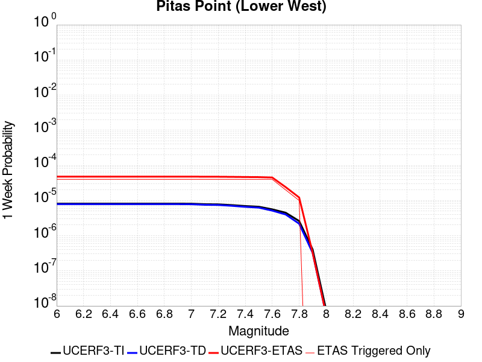 |  |  | 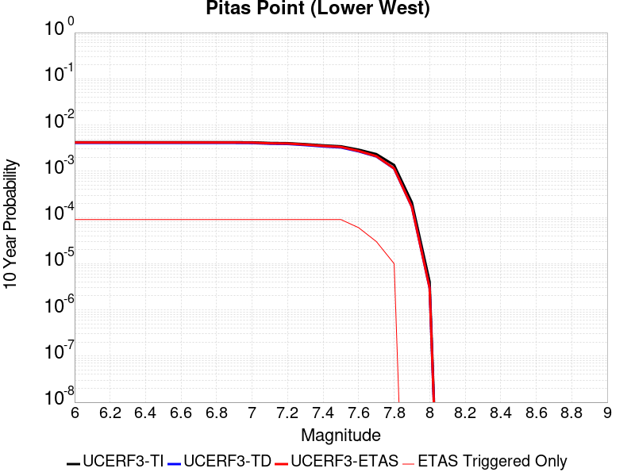 |

| Magnitude | 1 wk TI Prob | 1 wk TD Prob | 1 wk ETAS Prob | 1 wk ETAS/TD Gain | 1 wk ETAS Triggered Only | 1 mo TI Prob | 1 mo TD Prob | 1 mo ETAS Prob | 1 mo ETAS/TD Gain | 1 mo ETAS Triggered Only | 1 yr TI Prob | 1 yr TD Prob | 1 yr ETAS Prob | 1 yr ETAS/TD Gain | 1 yr ETAS Triggered Only | 10 yr TI Prob | 10 yr TD Prob | 10 yr ETAS Prob | 10 yr ETAS/TD Gain | 10 yr ETAS Triggered Only |
|-----|-----|-----|-----|-----|-----|-----|-----|-----|-----|-----|-----|-----|-----|-----|-----|-----|-----|-----|-----|-----|
| 6.0 | 8.151497E-6 | 7.855762E-6 | 3.16651E-5 | 4.030812 | 2.3809524E-5 | 3.493452E-5 | 3.3667122E-5 | 5.7475845E-5 | 1.7071803 | 2.3809524E-5 | 4.252448E-4 | 4.0982084E-4 | 4.574204E-4 | 1.1161472 | 4.7619047E-5 | 0.0042443196 | 0.0040907315 | 0.004161868 | 1.0173897 | 7.142857E-5 |
| 6.1 | 8.151497E-6 | 7.855762E-6 | 3.16651E-5 | 4.030812 | 2.3809524E-5 | 3.493452E-5 | 3.3667122E-5 | 5.7475845E-5 | 1.7071803 | 2.3809524E-5 | 4.252448E-4 | 4.0982084E-4 | 4.574204E-4 | 1.1161472 | 4.7619047E-5 | 0.0042443196 | 0.0040907315 | 0.004161868 | 1.0173897 | 7.142857E-5 |
| 6.2 | 8.151497E-6 | 7.855762E-6 | 3.16651E-5 | 4.030812 | 2.3809524E-5 | 3.493452E-5 | 3.3667122E-5 | 5.7475845E-5 | 1.7071803 | 2.3809524E-5 | 4.252448E-4 | 4.0982084E-4 | 4.574204E-4 | 1.1161472 | 4.7619047E-5 | 0.0042443196 | 0.0040907315 | 0.004161868 | 1.0173897 | 7.142857E-5 |
| 6.3 | 8.151497E-6 | 7.855762E-6 | 3.16651E-5 | 4.030812 | 2.3809524E-5 | 3.493452E-5 | 3.3667122E-5 | 5.7475845E-5 | 1.7071803 | 2.3809524E-5 | 4.252448E-4 | 4.0982084E-4 | 4.574204E-4 | 1.1161472 | 4.7619047E-5 | 0.0042443196 | 0.0040907315 | 0.004161868 | 1.0173897 | 7.142857E-5 |
| 6.4 | 8.151497E-6 | 7.855762E-6 | 3.16651E-5 | 4.030812 | 2.3809524E-5 | 3.493452E-5 | 3.3667122E-5 | 5.7475845E-5 | 1.7071803 | 2.3809524E-5 | 4.252448E-4 | 4.0982084E-4 | 4.574204E-4 | 1.1161472 | 4.7619047E-5 | 0.0042443196 | 0.0040907315 | 0.004161868 | 1.0173897 | 7.142857E-5 |
| 6.5 | 8.151497E-6 | 7.855762E-6 | 3.16651E-5 | 4.030812 | 2.3809524E-5 | 3.493452E-5 | 3.3667122E-5 | 5.7475845E-5 | 1.7071803 | 2.3809524E-5 | 4.252448E-4 | 4.0982084E-4 | 4.574204E-4 | 1.1161472 | 4.7619047E-5 | 0.0042443196 | 0.0040907315 | 0.004161868 | 1.0173897 | 7.142857E-5 |
| 6.6 | 8.151497E-6 | 7.855762E-6 | 3.16651E-5 | 4.030812 | 2.3809524E-5 | 3.493452E-5 | 3.3667122E-5 | 5.7475845E-5 | 1.7071803 | 2.3809524E-5 | 4.252448E-4 | 4.0982084E-4 | 4.574204E-4 | 1.1161472 | 4.7619047E-5 | 0.0042443196 | 0.0040907315 | 0.004161868 | 1.0173897 | 7.142857E-5 |
| 6.7 | 8.151497E-6 | 7.855762E-6 | 3.16651E-5 | 4.030812 | 2.3809524E-5 | 3.493452E-5 | 3.3667122E-5 | 5.7475845E-5 | 1.7071803 | 2.3809524E-5 | 4.252448E-4 | 4.0982084E-4 | 4.574204E-4 | 1.1161472 | 4.7619047E-5 | 0.0042443196 | 0.0040907315 | 0.004161868 | 1.0173897 | 7.142857E-5 |
| 6.8 | 8.151497E-6 | 7.855762E-6 | 3.16651E-5 | 4.030812 | 2.3809524E-5 | 3.493452E-5 | 3.3667122E-5 | 5.7475845E-5 | 1.7071803 | 2.3809524E-5 | 4.252448E-4 | 4.0982084E-4 | 4.574204E-4 | 1.1161472 | 4.7619047E-5 | 0.0042443196 | 0.0040907315 | 0.004161868 | 1.0173897 | 7.142857E-5 |
| 6.9 | 8.151497E-6 | 7.855762E-6 | 3.16651E-5 | 4.030812 | 2.3809524E-5 | 3.493452E-5 | 3.3667122E-5 | 5.7475845E-5 | 1.7071803 | 2.3809524E-5 | 4.252448E-4 | 4.0982084E-4 | 4.574204E-4 | 1.1161472 | 4.7619047E-5 | 0.0042443196 | 0.0040907315 | 0.004161868 | 1.0173897 | 7.142857E-5 |
| 7.0 | 8.103535E-6 | 7.805192E-6 | 3.161453E-5 | 4.050449 | 2.3809524E-5 | 3.4728975E-5 | 3.3450397E-5 | 5.7259127E-5 | 1.7117622 | 2.3809524E-5 | 4.2274324E-4 | 4.0718322E-4 | 4.547829E-4 | 1.1168998 | 4.7619047E-5 | 0.0042193993 | 0.004064452 | 0.00413559 | 1.0175025 | 7.142857E-5 |
| 7.1 | 7.853298E-6 | 7.540883E-6 | 3.1350228E-5 | 4.157368 | 2.3809524E-5 | 3.3656554E-5 | 3.2317676E-5 | 5.6126428E-5 | 1.7367101 | 2.3809524E-5 | 4.096915E-4 | 3.9339735E-4 | 4.4099765E-4 | 1.120998 | 4.7619047E-5 | 0.00408937 | 0.0039270855 | 0.0039982335 | 1.0181173 | 7.142857E-5 |
| 7.2 | 7.771102E-6 | 7.453165E-6 | 3.1262512E-5 | 4.194528 | 2.3809524E-5 | 3.33043E-5 | 3.194175E-5 | 5.5750512E-5 | 1.7453808 | 2.3809524E-5 | 4.0540437E-4 | 3.8882208E-4 | 4.3642262E-4 | 1.1224225 | 4.7619047E-5 | 0.0040466557 | 0.0038814936 | 0.0039526448 | 1.0183309 | 7.142857E-5 |
| 7.3 | 7.3945344E-6 | 7.0492697E-6 | 3.0858624E-5 | 4.3775635 | 2.3809524E-5 | 3.1690477E-5 | 3.021081E-5 | 5.4019612E-5 | 1.7880889 | 2.3809524E-5 | 3.8576324E-4 | 3.6775516E-4 | 4.1535668E-4 | 1.1294382 | 4.7619047E-5 | 0.0038509427 | 0.0036715334 | 0.0037426997 | 1.0193833 | 7.142857E-5 |
| 7.4 | 6.964645E-6 | 6.5901186E-6 | 3.0399486E-5 | 4.612889 | 2.3809524E-5 | 2.9848137E-5 | 2.8243063E-5 | 5.2051913E-5 | 1.8429983 | 2.3809524E-5 | 3.6334046E-4 | 3.4380553E-4 | 3.914082E-4 | 1.1384581 | 4.7619047E-5 | 0.0036274698 | 0.0034327896 | 0.003503973 | 1.0207363 | 7.142857E-5 |
| 7.5 | 6.6525035E-6 | 6.259157E-6 | 3.0068531E-5 | 4.8039265 | 2.3809524E-5 | 2.851042E-5 | 2.6824686E-5 | 5.063357E-5 | 1.8875737 | 2.3809524E-5 | 3.4705905E-4 | 3.265421E-4 | 3.741456E-4 | 1.1457806 | 4.7619047E-5 | 0.0034651754 | 0.0032606742 | 0.0033318698 | 1.0218346 | 7.142857E-5 |
| 7.6 | 5.613338E-6 | 5.151386E-6 | 2.8960787E-5 | 5.6219406 | 2.3809524E-5 | 2.405694E-5 | 2.2077185E-5 | 4.5886183E-5 | 2.0784435 | 2.3809524E-5 | 2.928539E-4 | 2.6875688E-4 | 2.9256E-4 | 1.0885675 | 2.3809524E-5 | 0.0029246826 | 0.0026843501 | 0.0027080956 | 1.0088459 | 2.3809524E-5 |
| 7.7 | 4.494704E-6 | 3.996911E-6 | 3.996911E-6 | 1.0 | 0.0 | 1.9262876E-5 | 1.7129507E-5 | 1.7129507E-5 | 1.0 | 0.0 | 2.3450027E-4 | 2.0853203E-4 | 2.0853203E-4 | 1.0 | 0.0 | 0.0023425296 | 0.0020833875 | 0.0020833875 | 1.0 | 0.0 |
| 7.8 | 2.6075882E-6 | 2.1836374E-6 | 2.1836374E-6 | 1.0 | 0.0 | 1.117533E-5 | 9.358413E-6 | 9.358413E-6 | 1.0 | 0.0 | 1.3605114E-4 | 1.1393277E-4 | 1.1393277E-4 | 1.0 | 0.0 | 0.0013596788 | 0.0011387484 | 0.0011387484 | 1.0 | 0.0 |
| 7.9 | 4.045984E-7 | 3.242375E-7 | 3.242375E-7 | 1.0 | 0.0 | 1.733992E-6 | 1.3895885E-6 | 1.3895885E-6 | 1.0 | 0.0 | 2.1111147E-5 | 1.6918111E-5 | 1.6918111E-5 | 1.0 | 0.0 | 2.1109142E-4 | 1.6916855E-4 | 1.6916855E-4 | 1.0 | 0.0 |
| 8.0 | 7.791402E-9 | 5.683497E-9 | 5.683497E-9 | 1.0 | 0.0 | 3.3391725E-8 | 2.4357844E-8 | 2.4357844E-8 | 1.0 | 0.0 | 4.0654416E-7 | 2.9655675E-7 | 2.9655675E-7 | 1.0 | 0.0 | 4.065434E-6 | 2.9655655E-6 | 2.9655655E-6 | 1.0 | 0.0 |

## Kern Canyon (South Kern) 2011
*[(top)](#table-of-contents)*

| 1 Week | 1 Month | 1 Year | 10 Year |
|-----|-----|-----|-----|
|  |  | 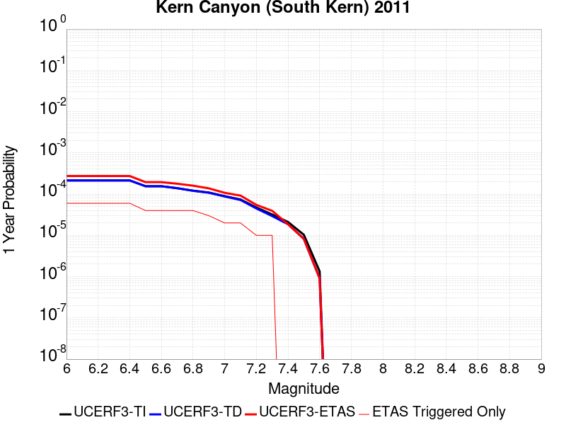 |  |

| Magnitude | 1 wk TI Prob | 1 wk TD Prob | 1 wk ETAS Prob | 1 wk ETAS/TD Gain | 1 wk ETAS Triggered Only | 1 mo TI Prob | 1 mo TD Prob | 1 mo ETAS Prob | 1 mo ETAS/TD Gain | 1 mo ETAS Triggered Only | 1 yr TI Prob | 1 yr TD Prob | 1 yr ETAS Prob | 1 yr ETAS/TD Gain | 1 yr ETAS Triggered Only | 10 yr TI Prob | 10 yr TD Prob | 10 yr ETAS Prob | 10 yr ETAS/TD Gain | 10 yr ETAS Triggered Only |
|-----|-----|-----|-----|-----|-----|-----|-----|-----|-----|-----|-----|-----|-----|-----|-----|-----|-----|-----|-----|-----|
| 6.0 | 4.105075E-6 | 4.1137264E-6 | 7.5542004E-5 | 18.3634 | 7.142857E-5 | 1.7593058E-5 | 1.763014E-5 | 8.905745E-5 | 5.0514317 | 7.142857E-5 | 2.1417443E-4 | 2.1462646E-4 | 2.860397E-4 | 1.3327327 | 7.142857E-5 | 0.0021396813 | 0.0021442557 | 0.0022155312 | 1.0332402 | 7.142857E-5 |
| 6.1 | 4.105075E-6 | 4.1137264E-6 | 7.5542004E-5 | 18.3634 | 7.142857E-5 | 1.7593058E-5 | 1.763014E-5 | 8.905745E-5 | 5.0514317 | 7.142857E-5 | 2.1417443E-4 | 2.1462646E-4 | 2.860397E-4 | 1.3327327 | 7.142857E-5 | 0.0021396813 | 0.0021442557 | 0.0022155312 | 1.0332402 | 7.142857E-5 |
| 6.2 | 4.105075E-6 | 4.1137264E-6 | 7.5542004E-5 | 18.3634 | 7.142857E-5 | 1.7593058E-5 | 1.763014E-5 | 8.905745E-5 | 5.0514317 | 7.142857E-5 | 2.1417443E-4 | 2.1462646E-4 | 2.860397E-4 | 1.3327327 | 7.142857E-5 | 0.0021396813 | 0.0021442557 | 0.0022155312 | 1.0332402 | 7.142857E-5 |
| 6.3 | 4.105075E-6 | 4.1137264E-6 | 7.5542004E-5 | 18.3634 | 7.142857E-5 | 1.7593058E-5 | 1.763014E-5 | 8.905745E-5 | 5.0514317 | 7.142857E-5 | 2.1417443E-4 | 2.1462646E-4 | 2.860397E-4 | 1.3327327 | 7.142857E-5 | 0.0021396813 | 0.0021442557 | 0.0022155312 | 1.0332402 | 7.142857E-5 |
| 6.4 | 4.105075E-6 | 4.1137264E-6 | 7.5542004E-5 | 18.3634 | 7.142857E-5 | 1.7593058E-5 | 1.763014E-5 | 8.905745E-5 | 5.0514317 | 7.142857E-5 | 2.1417443E-4 | 2.1462646E-4 | 2.860397E-4 | 1.3327327 | 7.142857E-5 | 0.0021396813 | 0.0021442557 | 0.0022155312 | 1.0332402 | 7.142857E-5 |
| 6.5 | 2.9849807E-6 | 2.9731548E-6 | 5.059206E-5 | 17.016289 | 4.7619047E-5 | 1.2792712E-5 | 1.274203E-5 | 6.036047E-5 | 4.737116 | 4.7619047E-5 | 1.5574014E-4 | 1.5512333E-4 | 2.0273498E-4 | 1.3069278 | 4.7619047E-5 | 0.0015563103 | 0.0015501656 | 0.0015977109 | 1.0306711 | 4.7619047E-5 |
| 6.6 | 2.9849807E-6 | 2.9731548E-6 | 5.059206E-5 | 17.016289 | 4.7619047E-5 | 1.2792712E-5 | 1.274203E-5 | 6.036047E-5 | 4.737116 | 4.7619047E-5 | 1.5574014E-4 | 1.5512333E-4 | 2.0273498E-4 | 1.3069278 | 4.7619047E-5 | 0.0015563103 | 0.0015501656 | 0.0015977109 | 1.0306711 | 4.7619047E-5 |
| 6.7 | 2.6756725E-6 | 2.6582206E-6 | 5.0277144E-5 | 18.913832 | 4.7619047E-5 | 1.1467117E-5 | 1.1392325E-5 | 5.9010832E-5 | 5.179876 | 4.7619047E-5 | 1.396032E-4 | 1.3869285E-4 | 1.8630529E-4 | 1.3432941 | 4.7619047E-5 | 0.0013951553 | 0.0013860738 | 0.0014336269 | 1.0343077 | 4.7619047E-5 |
| 6.8 | 2.3283721E-6 | 2.3047787E-6 | 4.9923718E-5 | 21.660957 | 4.7619047E-5 | 9.9787E-6 | 9.877586E-6 | 5.7496163E-5 | 5.820872 | 4.7619047E-5 | 1.214839E-4 | 1.20253055E-4 | 1.6786637E-4 | 1.3959427 | 4.7619047E-5 | 0.001214175 | 0.0012018873 | 0.0012494491 | 1.0395726 | 4.7619047E-5 |
| 6.9 | 2.0972677E-6 | 2.0696411E-6 | 2.5879115E-5 | 12.504156 | 2.3809524E-5 | 8.988259E-6 | 8.869861E-6 | 3.2679174E-5 | 3.684294 | 2.3809524E-5 | 1.0942656E-4 | 1.0798526E-4 | 1.3179221E-4 | 1.2204648 | 2.3809524E-5 | 0.0010937268 | 0.0010793337 | 0.0011031176 | 1.0220356 | 2.3809524E-5 |
| 7.0 | 1.7132242E-6 | 1.6787036E-6 | 2.5488187E-5 | 15.183257 | 2.3809524E-5 | 7.3423685E-6 | 7.194424E-6 | 3.1003776E-5 | 4.3094172 | 2.3809524E-5 | 8.938967E-5 | 8.758863E-5 | 1.1139607E-4 | 1.2718097 | 2.3809524E-5 | 8.935372E-4 | 8.7554497E-4 | 8.993336E-4 | 1.0271702 | 2.3809524E-5 |
| 7.1 | 1.4215541E-6 | 1.3815752E-6 | 2.5191066E-5 | 18.233583 | 2.3809524E-5 | 6.0923603E-6 | 5.9210233E-6 | 2.9730407E-5 | 5.02116 | 2.3809524E-5 | 7.417196E-5 | 7.20861E-5 | 9.5893905E-5 | 1.3302691 | 2.3809524E-5 | 7.414721E-4 | 7.206299E-4 | 7.4442226E-4 | 1.0330161 | 2.3809524E-5 |
| 7.2 | 9.097853E-7 | 8.6037755E-7 | 2.466988E-5 | 28.67332 | 2.3809524E-5 | 3.899074E-6 | 3.6873273E-6 | 2.7496762E-5 | 7.457099 | 2.3809524E-5 | 4.7470192E-5 | 4.4892295E-5 | 6.870075E-5 | 1.5303462 | 2.3809524E-5 | 4.7460053E-4 | 4.4883334E-4 | 4.7263218E-4 | 1.0530238 | 2.3809524E-5 |
| 7.3 | 6.144169E-7 | 5.628206E-7 | 2.4372332E-5 | 43.303905 | 2.3809524E-5 | 2.6332125E-6 | 2.4120861E-6 | 2.6221553E-5 | 10.870902 | 2.3809524E-5 | 3.205889E-5 | 2.9366758E-5 | 5.3175583E-5 | 1.8107406 | 2.3809524E-5 | 3.2054266E-4 | 2.936293E-4 | 3.174318E-4 | 1.0810632 | 2.3809524E-5 |
| 7.4 | 4.049844E-7 | 3.5728314E-7 | 3.5728314E-7 | 1.0 | 0.0 | 1.7356463E-6 | 1.5312125E-6 | 1.5312125E-6 | 1.0 | 0.0 | 2.1131287E-5 | 1.8642357E-5 | 1.8642357E-5 | 1.0 | 0.0 | 2.1129279E-4 | 1.8640817E-4 | 1.8640817E-4 | 1.0 | 0.0 |
| 7.5 | 1.9871162E-7 | 1.583044E-7 | 1.583044E-7 | 1.0 | 0.0 | 8.5162094E-7 | 6.7844724E-7 | 6.7844724E-7 | 1.0 | 0.0 | 1.0368436E-5 | 8.260065E-6 | 8.260065E-6 | 1.0 | 0.0 | 1.0367952E-4 | 8.259767E-5 | 8.259767E-5 | 1.0 | 0.0 |
| 7.6 | 2.572245E-8 | 1.7352555E-8 | 1.7352555E-8 | 1.0 | 0.0 | 1.10239064E-7 | 7.436809E-8 | 7.436809E-8 | 1.0 | 0.0 | 1.3421597E-6 | 9.054312E-7 | 9.054312E-7 | 1.0 | 0.0 | 1.3421517E-5 | 9.05428E-6 | 9.05428E-6 | 1.0 | 0.0 |

## Camp Rock 2011
*[(top)](#table-of-contents)*

| 1 Week | 1 Month | 1 Year | 10 Year |
|-----|-----|-----|-----|
|  |  |  |  |

| Magnitude | 1 wk TI Prob | 1 wk TD Prob | 1 wk ETAS Prob | 1 wk ETAS/TD Gain | 1 wk ETAS Triggered Only | 1 mo TI Prob | 1 mo TD Prob | 1 mo ETAS Prob | 1 mo ETAS/TD Gain | 1 mo ETAS Triggered Only | 1 yr TI Prob | 1 yr TD Prob | 1 yr ETAS Prob | 1 yr ETAS/TD Gain | 1 yr ETAS Triggered Only | 10 yr TI Prob | 10 yr TD Prob | 10 yr ETAS Prob | 10 yr ETAS/TD Gain | 10 yr ETAS Triggered Only |
|-----|-----|-----|-----|-----|-----|-----|-----|-----|-----|-----|-----|-----|-----|-----|-----|-----|-----|-----|-----|-----|
| 6.0 | 1.6710783E-5 | 4.25026E-6 | 4.25026E-6 | 1.0 | 0.0 | 7.161568E-5 | 1.8215276E-5 | 4.2024367E-5 | 2.3070946 | 2.3809524E-5 | 8.7157206E-4 | 2.2174895E-4 | 2.931617E-4 | 1.3220432 | 7.142857E-5 | 0.008681616 | 0.0022153298 | 0.0022866 | 1.0321715 | 7.142857E-5 |
| 6.1 | 1.6710783E-5 | 4.25026E-6 | 4.25026E-6 | 1.0 | 0.0 | 7.161568E-5 | 1.8215276E-5 | 4.2024367E-5 | 2.3070946 | 2.3809524E-5 | 8.7157206E-4 | 2.2174895E-4 | 2.931617E-4 | 1.3220432 | 7.142857E-5 | 0.008681616 | 0.0022153298 | 0.0022866 | 1.0321715 | 7.142857E-5 |
| 6.2 | 1.6710783E-5 | 4.25026E-6 | 4.25026E-6 | 1.0 | 0.0 | 7.161568E-5 | 1.8215276E-5 | 4.2024367E-5 | 2.3070946 | 2.3809524E-5 | 8.7157206E-4 | 2.2174895E-4 | 2.931617E-4 | 1.3220432 | 7.142857E-5 | 0.008681616 | 0.0022153298 | 0.0022866 | 1.0321715 | 7.142857E-5 |
| 6.3 | 1.6710783E-5 | 4.25026E-6 | 4.25026E-6 | 1.0 | 0.0 | 7.161568E-5 | 1.8215276E-5 | 4.2024367E-5 | 2.3070946 | 2.3809524E-5 | 8.7157206E-4 | 2.2174895E-4 | 2.931617E-4 | 1.3220432 | 7.142857E-5 | 0.008681616 | 0.0022153298 | 0.0022866 | 1.0321715 | 7.142857E-5 |
| 6.4 | 7.982846E-6 | 3.6820884E-6 | 3.6820884E-6 | 1.0 | 0.0 | 3.421175E-5 | 1.5780286E-5 | 3.9589435E-5 | 2.5087907 | 2.3809524E-5 | 4.1644843E-4 | 1.9210839E-4 | 2.6352322E-4 | 1.3717425 | 7.142857E-5 | 0.0041566887 | 0.001919458 | 0.0019907495 | 1.0371414 | 7.142857E-5 |
| 6.5 | 7.982846E-6 | 3.6820884E-6 | 3.6820884E-6 | 1.0 | 0.0 | 3.421175E-5 | 1.5780286E-5 | 3.9589435E-5 | 2.5087907 | 2.3809524E-5 | 4.1644843E-4 | 1.9210839E-4 | 2.6352322E-4 | 1.3717425 | 7.142857E-5 | 0.0041566887 | 0.001919458 | 0.0019907495 | 1.0371414 | 7.142857E-5 |
| 6.6 | 7.048869E-6 | 3.4243571E-6 | 3.4243571E-6 | 1.0 | 0.0 | 3.0209088E-5 | 1.4675736E-5 | 3.848491E-5 | 2.6223497 | 2.3809524E-5 | 3.677336E-4 | 1.7866275E-4 | 2.5007856E-4 | 1.3997241 | 7.142857E-5 | 0.0036712566 | 0.0017852228 | 0.0018565238 | 1.0399396 | 7.142857E-5 |
| 6.7 | 6.987307E-6 | 3.3623348E-6 | 3.3623348E-6 | 1.0 | 0.0 | 2.9945259E-5 | 1.4409929E-5 | 3.821911E-5 | 2.652276 | 2.3809524E-5 | 3.6452254E-4 | 1.7542706E-4 | 2.468431E-4 | 1.4070982 | 7.142857E-5 | 0.0036392517 | 0.001752917 | 0.0018242203 | 1.040677 | 7.142857E-5 |
| 6.8 | 6.3737602E-6 | 3.1179077E-6 | 3.1179077E-6 | 1.0 | 0.0 | 2.731583E-5 | 1.3362394E-5 | 3.71716E-5 | 2.7818067 | 2.3809524E-5 | 3.3251947E-4 | 1.626753E-4 | 2.3409225E-4 | 1.4390154 | 7.142857E-5 | 0.0033202237 | 0.0016255907 | 0.0016969033 | 1.0438687 | 7.142857E-5 |
| 6.9 | 6.112211E-6 | 2.9331156E-6 | 2.9331156E-6 | 1.0 | 0.0 | 2.6194928E-5 | 1.2570436E-5 | 3.637966E-5 | 2.8940651 | 2.3809524E-5 | 3.1887658E-4 | 1.5303459E-4 | 2.2445223E-4 | 1.4666765 | 7.142857E-5 | 0.003184194 | 0.0015293199 | 0.0016006392 | 1.0466347 | 7.142857E-5 |
| 7.0 | 5.5140117E-6 | 2.641923E-6 | 2.641923E-6 | 1.0 | 0.0 | 2.3631264E-5 | 1.132248E-5 | 3.5131732E-5 | 3.1028304 | 2.3809524E-5 | 2.8767265E-4 | 1.3784273E-4 | 2.0926144E-4 | 1.5181175 | 7.142857E-5 | 0.0028730053 | 0.0013775975 | 0.0014489277 | 1.0517787 | 7.142857E-5 |
| 7.1 | 4.8151105E-6 | 2.1342705E-6 | 2.1342705E-6 | 1.0 | 0.0 | 2.0636026E-5 | 9.146843E-6 | 3.2956148E-5 | 3.6030083 | 2.3809524E-5 | 2.5121463E-4 | 1.1135734E-4 | 1.8277795E-4 | 1.6413642 | 7.142857E-5 | 0.0025093083 | 0.0011130372 | 0.0011843863 | 1.064103 | 7.142857E-5 |
| 7.2 | 3.818335E-6 | 1.2937425E-6 | 1.2937425E-6 | 1.0 | 0.0 | 1.6364189E-5 | 5.5445994E-6 | 5.5445994E-6 | 1.0 | 0.0 | 1.9921579E-4 | 6.750349E-5 | 1.1511932E-4 | 1.7053833 | 4.7619047E-5 | 0.0019903728 | 6.748381E-4 | 7.22425E-4 | 1.070516 | 4.7619047E-5 |
| 7.3 | 2.7166698E-6 | 7.3835776E-7 | 7.3835776E-7 | 1.0 | 0.0 | 1.1642818E-5 | 3.1643867E-6 | 3.1643867E-6 | 1.0 | 0.0 | 1.4174209E-4 | 3.8525748E-5 | 6.233435E-5 | 1.617992 | 2.3809524E-5 | 0.0014165172 | 3.851927E-4 | 4.0899304E-4 | 1.0617882 | 2.3809524E-5 |
| 7.4 | 2.0893426E-6 | 5.4618386E-7 | 5.4618386E-7 | 1.0 | 0.0 | 8.954295E-6 | 2.3407858E-6 | 2.3407858E-6 | 1.0 | 0.0 | 1.0901308E-4 | 2.84987E-5 | 5.2307547E-5 | 1.8354362 | 2.3809524E-5 | 0.0010895962 | 2.84951E-4 | 3.0875375E-4 | 1.0835327 | 2.3809524E-5 |
| 7.5 | 1.1681728E-6 | 3.6030585E-7 | 3.6030585E-7 | 1.0 | 0.0 | 5.0064455E-6 | 1.544167E-6 | 1.544167E-6 | 1.0 | 0.0 | 6.0951766E-5 | 1.8800076E-5 | 1.8800076E-5 | 1.0 | 0.0 | 6.093505E-4 | 1.8798532E-4 | 1.8798532E-4 | 1.0 | 0.0 |
| 7.6 | 1.3154387E-7 | 7.1197384E-8 | 7.1197384E-8 | 1.0 | 0.0 | 5.6375933E-7 | 3.051316E-7 | 3.051316E-7 | 1.0 | 0.0 | 6.863748E-6 | 3.7149728E-6 | 3.7149728E-6 | 1.0 | 0.0 | 6.863536E-5 | 3.7149264E-5 | 3.7149264E-5 | 1.0 | 0.0 |

## Oceanside alt1
*[(top)](#table-of-contents)*

| 1 Week | 1 Month | 1 Year | 10 Year |
|-----|-----|-----|-----|
|  |  |  |  |

| Magnitude | 1 wk TI Prob | 1 wk TD Prob | 1 wk ETAS Prob | 1 wk ETAS/TD Gain | 1 wk ETAS Triggered Only | 1 mo TI Prob | 1 mo TD Prob | 1 mo ETAS Prob | 1 mo ETAS/TD Gain | 1 mo ETAS Triggered Only | 1 yr TI Prob | 1 yr TD Prob | 1 yr ETAS Prob | 1 yr ETAS/TD Gain | 1 yr ETAS Triggered Only | 10 yr TI Prob | 10 yr TD Prob | 10 yr ETAS Prob | 10 yr ETAS/TD Gain | 10 yr ETAS Triggered Only |
|-----|-----|-----|-----|-----|-----|-----|-----|-----|-----|-----|-----|-----|-----|-----|-----|-----|-----|-----|-----|-----|
| 6.0 | 1.1617542E-5 | 1.1423493E-5 | 1.1423493E-5 | 1.0 | 0.0 | 4.9788516E-5 | 4.8956997E-5 | 7.276535E-5 | 1.4863117 | 2.3809524E-5 | 6.060066E-4 | 5.9590454E-4 | 6.434952E-4 | 1.079863 | 4.7619047E-5 | 0.0060435664 | 0.005944664 | 0.005992 | 1.0079628 | 4.7619047E-5 |
| 6.1 | 1.1617542E-5 | 1.1423493E-5 | 1.1423493E-5 | 1.0 | 0.0 | 4.9788516E-5 | 4.8956997E-5 | 7.276535E-5 | 1.4863117 | 2.3809524E-5 | 6.060066E-4 | 5.9590454E-4 | 6.434952E-4 | 1.079863 | 4.7619047E-5 | 0.0060435664 | 0.005944664 | 0.005992 | 1.0079628 | 4.7619047E-5 |
| 6.2 | 1.1617542E-5 | 1.1423493E-5 | 1.1423493E-5 | 1.0 | 0.0 | 4.9788516E-5 | 4.8956997E-5 | 7.276535E-5 | 1.4863117 | 2.3809524E-5 | 6.060066E-4 | 5.9590454E-4 | 6.434952E-4 | 1.079863 | 4.7619047E-5 | 0.0060435664 | 0.005944664 | 0.005992 | 1.0079628 | 4.7619047E-5 |
| 6.3 | 1.1617542E-5 | 1.1423493E-5 | 1.1423493E-5 | 1.0 | 0.0 | 4.9788516E-5 | 4.8956997E-5 | 7.276535E-5 | 1.4863117 | 2.3809524E-5 | 6.060066E-4 | 5.9590454E-4 | 6.434952E-4 | 1.079863 | 4.7619047E-5 | 0.0060435664 | 0.005944664 | 0.005992 | 1.0079628 | 4.7619047E-5 |
| 6.4 | 1.1617542E-5 | 1.1423493E-5 | 1.1423493E-5 | 1.0 | 0.0 | 4.9788516E-5 | 4.8956997E-5 | 7.276535E-5 | 1.4863117 | 2.3809524E-5 | 6.060066E-4 | 5.9590454E-4 | 6.434952E-4 | 1.079863 | 4.7619047E-5 | 0.0060435664 | 0.005944664 | 0.005992 | 1.0079628 | 4.7619047E-5 |
| 6.5 | 1.1617542E-5 | 1.1423493E-5 | 1.1423493E-5 | 1.0 | 0.0 | 4.9788516E-5 | 4.8956997E-5 | 7.276535E-5 | 1.4863117 | 2.3809524E-5 | 6.060066E-4 | 5.9590454E-4 | 6.434952E-4 | 1.079863 | 4.7619047E-5 | 0.0060435664 | 0.005944664 | 0.005992 | 1.0079628 | 4.7619047E-5 |
| 6.6 | 7.561768E-6 | 7.1336153E-6 | 7.1336153E-6 | 1.0 | 0.0 | 3.2407173E-5 | 3.0572286E-5 | 5.4381082E-5 | 1.7787706 | 2.3809524E-5 | 3.9448592E-4 | 3.7215507E-4 | 4.197564E-4 | 1.1279073 | 4.7619047E-5 | 0.0039378637 | 0.00371543 | 0.0037628722 | 1.012769 | 4.7619047E-5 |
| 6.7 | 7.1042605E-6 | 6.6556854E-6 | 6.6556854E-6 | 1.0 | 0.0 | 3.0446476E-5 | 2.8524059E-5 | 5.2332904E-5 | 1.8346934 | 2.3809524E-5 | 3.706228E-4 | 3.472259E-4 | 3.9482838E-4 | 1.1370938 | 4.7619047E-5 | 0.0037000529 | 0.003466917 | 0.0035143709 | 1.0136876 | 4.7619047E-5 |
| 6.8 | 6.285554E-6 | 5.799706E-6 | 5.799706E-6 | 1.0 | 0.0 | 2.693781E-5 | 2.4855648E-5 | 4.866458E-5 | 1.9578882 | 2.3809524E-5 | 3.2791847E-4 | 3.0257605E-4 | 3.501807E-4 | 1.1573311 | 4.7619047E-5 | 0.0032743502 | 0.0030216982 | 0.0030691733 | 1.0157114 | 4.7619047E-5 |
| 6.9 | 6.148883E-6 | 5.6565445E-6 | 5.6565445E-6 | 1.0 | 0.0 | 2.635209E-5 | 2.424211E-5 | 4.8051057E-5 | 1.9821317 | 2.3809524E-5 | 3.2078946E-4 | 2.9510827E-4 | 3.4271326E-4 | 1.1613137 | 4.7619047E-5 | 0.003203268 | 0.0029472208 | 0.0029946996 | 1.0161097 | 4.7619047E-5 |
| 7.0 | 5.253857E-6 | 4.722404E-6 | 4.722404E-6 | 1.0 | 0.0 | 2.2516335E-5 | 2.0238718E-5 | 4.404776E-5 | 2.1764104 | 2.3809524E-5 | 2.7410188E-4 | 2.4637886E-4 | 2.9398614E-4 | 1.1932281 | 4.7619047E-5 | 0.0027376404 | 0.0024610884 | 0.0025085902 | 1.0193012 | 4.7619047E-5 |
| 7.1 | 4.730754E-6 | 4.17851E-6 | 4.17851E-6 | 1.0 | 0.0 | 2.0274503E-5 | 1.7907778E-5 | 4.1716878E-5 | 2.3295393 | 2.3809524E-5 | 2.468141E-4 | 2.1800565E-4 | 2.656143E-4 | 1.2183827 | 4.7619047E-5 | 0.0024654015 | 0.0021779444 | 0.0022254598 | 1.0218166 | 4.7619047E-5 |
| 7.2 | 3.7998386E-6 | 3.214026E-6 | 3.214026E-6 | 1.0 | 0.0 | 1.6284921E-5 | 1.37743245E-5 | 3.7583522E-5 | 2.72852 | 2.3809524E-5 | 1.9825088E-4 | 1.6768962E-4 | 1.9149516E-4 | 1.1419618 | 2.3809524E-5 | 0.001980741 | 0.001675643 | 0.0016994127 | 1.0141854 | 2.3809524E-5 |
| 7.3 | 3.2656465E-6 | 2.698376E-6 | 2.698376E-6 | 1.0 | 0.0 | 1.3995553E-5 | 1.1564418E-5 | 3.5373665E-5 | 3.0588367 | 2.3809524E-5 | 1.7038253E-4 | 1.407878E-4 | 1.6459398E-4 | 1.1690925 | 2.3809524E-5 | 0.0017025196 | 0.0014069972 | 0.0014307732 | 1.0168984 | 2.3809524E-5 |
| 7.4 | 2.593703E-6 | 2.0680277E-6 | 2.0680277E-6 | 1.0 | 0.0 | 1.1115822E-5 | 8.862946E-6 | 3.267226E-5 | 3.686388 | 2.3809524E-5 | 1.3532673E-4 | 1.0790111E-4 | 1.3170808E-4 | 1.2206367 | 2.3809524E-5 | 0.0013524436 | 0.0010784961 | 0.00110228 | 1.0220528 | 2.3809524E-5 |
| 7.5 | 1.8715585E-6 | 1.4137177E-6 | 1.4137177E-6 | 1.0 | 0.0 | 8.020941E-6 | 6.0587763E-6 | 2.9868155E-5 | 4.929734 | 2.3809524E-5 | 9.7650576E-5 | 7.376316E-5 | 9.757093E-5 | 1.3227596 | 2.3809524E-5 | 9.7607676E-4 | 7.3739287E-4 | 7.6118484E-4 | 1.032265 | 2.3809524E-5 |
| 7.6 | 1.2246786E-6 | 8.5268175E-7 | 8.5268175E-7 | 1.0 | 0.0 | 5.248612E-6 | 3.6543456E-6 | 3.6543456E-6 | 1.0 | 0.0 | 6.389998E-5 | 4.4490793E-5 | 4.4490793E-5 | 1.0 | 0.0 | 6.3881604E-4 | 4.4482335E-4 | 4.4482335E-4 | 1.0 | 0.0 |
| 7.7 | 5.140719E-7 | 2.734703E-7 | 2.734703E-7 | 1.0 | 0.0 | 2.2031636E-6 | 1.1720151E-6 | 1.1720151E-6 | 1.0 | 0.0 | 2.6823185E-5 | 1.4269205E-5 | 1.4269205E-5 | 1.0 | 0.0 | 2.6819948E-4 | 1.4268424E-4 | 1.4268424E-4 | 1.0 | 0.0 |
| 7.8 | 1.16056995E-8 | 9.782373E-9 | 9.782373E-9 | 1.0 | 0.0 | 4.9738713E-8 | 4.1924455E-8 | 4.1924455E-8 | 1.0 | 0.0 | 6.0556863E-7 | 5.1043025E-7 | 5.1043025E-7 | 1.0 | 0.0 | 6.05567E-6 | 5.1043025E-6 | 5.1043025E-6 | 1.0 | 0.0 |

## San Pedro Basin
*[(top)](#table-of-contents)*

| 1 Week | 1 Month | 1 Year | 10 Year |
|-----|-----|-----|-----|
|  |  |  |  |

| Magnitude | 1 wk TI Prob | 1 wk TD Prob | 1 wk ETAS Prob | 1 wk ETAS/TD Gain | 1 wk ETAS Triggered Only | 1 mo TI Prob | 1 mo TD Prob | 1 mo ETAS Prob | 1 mo ETAS/TD Gain | 1 mo ETAS Triggered Only | 1 yr TI Prob | 1 yr TD Prob | 1 yr ETAS Prob | 1 yr ETAS/TD Gain | 1 yr ETAS Triggered Only | 10 yr TI Prob | 10 yr TD Prob | 10 yr ETAS Prob | 10 yr ETAS/TD Gain | 10 yr ETAS Triggered Only |
|-----|-----|-----|-----|-----|-----|-----|-----|-----|-----|-----|-----|-----|-----|-----|-----|-----|-----|-----|-----|-----|
| 6.0 | 5.3449043E-5 | 6.336954E-5 | 8.717755E-5 | 1.3757013 | 2.3809524E-5 | 2.2904722E-4 | 2.715589E-4 | 2.9536197E-4 | 1.0876534 | 2.3809524E-5 | 0.0027850836 | 0.0033018254 | 0.0033255562 | 1.0071872 | 2.3809524E-5 | 0.027504366 | 0.03258945 | 0.03265855 | 1.0021204 | 7.142857E-5 |
| 6.1 | 5.3449043E-5 | 6.336954E-5 | 8.717755E-5 | 1.3757013 | 2.3809524E-5 | 2.2904722E-4 | 2.715589E-4 | 2.9536197E-4 | 1.0876534 | 2.3809524E-5 | 0.0027850836 | 0.0033018254 | 0.0033255562 | 1.0071872 | 2.3809524E-5 | 0.027504366 | 0.03258945 | 0.03265855 | 1.0021204 | 7.142857E-5 |
| 6.2 | 2.3189454E-5 | 2.6642796E-5 | 2.6642796E-5 | 1.0 | 0.0 | 9.9379584E-5 | 1.14178685E-4 | 1.14178685E-4 | 1.0 | 0.0 | 0.0012092749 | 0.0013892864 | 0.0013892864 | 1.0 | 0.0 | 0.012027155 | 0.013810883 | 0.013857845 | 1.0034003 | 4.7619047E-5 |
| 6.3 | 2.3189454E-5 | 2.6642796E-5 | 2.6642796E-5 | 1.0 | 0.0 | 9.9379584E-5 | 1.14178685E-4 | 1.14178685E-4 | 1.0 | 0.0 | 0.0012092749 | 0.0013892864 | 0.0013892864 | 1.0 | 0.0 | 0.012027155 | 0.013810883 | 0.013857845 | 1.0034003 | 4.7619047E-5 |
| 6.4 | 1.966056E-5 | 2.2463413E-5 | 2.2463413E-5 | 1.0 | 0.0 | 8.425682E-5 | 9.626844E-5 | 9.626844E-5 | 1.0 | 0.0 | 0.001025344 | 0.0011714783 | 0.0011714783 | 1.0 | 0.0 | 0.010206259 | 0.011657117 | 0.011680649 | 1.0020187 | 2.3809524E-5 |
| 6.5 | 1.7342953E-5 | 1.9745148E-5 | 1.9745148E-5 | 1.0 | 0.0 | 7.4324824E-5 | 8.4619525E-5 | 8.4619525E-5 | 1.0 | 0.0 | 9.04529E-4 | 0.0010297928 | 0.0010297928 | 1.0 | 0.0 | 0.009008561 | 0.010253931 | 0.010277497 | 1.0022982 | 2.3809524E-5 |
| 6.6 | 1.439804E-5 | 1.6322716E-5 | 1.6322716E-5 | 1.0 | 0.0 | 6.170443E-5 | 6.99528E-5 | 6.99528E-5 | 1.0 | 0.0 | 7.509924E-4 | 8.513747E-4 | 8.513747E-4 | 1.0 | 0.0 | 0.0074845953 | 0.008484332 | 0.00850794 | 1.0027825 | 2.3809524E-5 |
| 6.7 | 1.2634884E-5 | 1.4285297E-5 | 1.4285297E-5 | 1.0 | 0.0 | 5.414838E-5 | 6.1221435E-5 | 6.1221435E-5 | 1.0 | 0.0 | 6.590571E-4 | 7.4514654E-4 | 7.4514654E-4 | 1.0 | 0.0 | 0.006571059 | 0.007429501 | 0.007429501 | 1.0 | 0.0 |
| 6.8 | 1.146091E-5 | 1.2933192E-5 | 1.2933192E-5 | 1.0 | 0.0 | 4.911726E-5 | 5.5426954E-5 | 5.5426954E-5 | 1.0 | 0.0 | 5.9783855E-4 | 6.7464396E-4 | 6.7464396E-4 | 1.0 | 0.0 | 0.0059623276 | 0.006728899 | 0.006728899 | 1.0 | 0.0 |
| 6.9 | 9.109035E-6 | 1.0235011E-5 | 1.0235011E-5 | 1.0 | 0.0 | 3.9038136E-5 | 4.3863754E-5 | 4.3863754E-5 | 1.0 | 0.0 | 4.7518566E-4 | 5.3393835E-4 | 5.3393835E-4 | 1.0 | 0.0 | 0.0047417083 | 0.005329309 | 0.005329309 | 1.0 | 0.0 |
| 7.0 | 5.9351028E-6 | 6.583964E-6 | 6.583964E-6 | 1.0 | 0.0 | 2.5435906E-5 | 2.8216817E-5 | 2.8216817E-5 | 1.0 | 0.0 | 3.0963816E-4 | 3.435092E-4 | 3.435092E-4 | 1.0 | 0.0 | 0.0030920706 | 0.0034320992 | 0.0034320992 | 1.0 | 0.0 |
| 7.1 | 2.1557585E-6 | 2.209648E-6 | 2.209648E-6 | 1.0 | 0.0 | 9.238933E-6 | 9.469887E-6 | 9.469887E-6 | 1.0 | 0.0 | 1.1247819E-4 | 1.1528993E-4 | 1.1528993E-4 | 1.0 | 0.0 | 0.0011242128 | 0.0011523166 | 0.0011523166 | 1.0 | 0.0 |
| 7.2 | 2.1251979E-6 | 2.1779945E-6 | 2.1779945E-6 | 1.0 | 0.0 | 9.107958E-6 | 9.334229E-6 | 9.334229E-6 | 1.0 | 0.0 | 1.1088375E-4 | 1.1363847E-4 | 1.1363847E-4 | 1.0 | 0.0 | 0.0011082845 | 0.0011358189 | 0.0011358189 | 1.0 | 0.0 |
| 7.3 | 1.7145798E-6 | 1.7442874E-6 | 1.7442874E-6 | 1.0 | 0.0 | 7.3481783E-6 | 7.4754967E-6 | 7.4754967E-6 | 1.0 | 0.0 | 8.94604E-5 | 9.1010465E-5 | 9.1010465E-5 | 1.0 | 0.0 | 8.9424395E-4 | 9.0974104E-4 | 9.0974104E-4 | 1.0 | 0.0 |
| 7.4 | 1.4467993E-6 | 1.4641868E-6 | 1.4641868E-6 | 1.0 | 0.0 | 6.200554E-6 | 6.2750714E-6 | 6.2750714E-6 | 1.0 | 0.0 | 7.548913E-5 | 7.639639E-5 | 7.639639E-5 | 1.0 | 0.0 | 7.546349E-4 | 7.6370855E-4 | 7.6370855E-4 | 1.0 | 0.0 |
| 7.5 | 1.2803735E-6 | 1.2931497E-6 | 1.2931497E-6 | 1.0 | 0.0 | 5.487303E-6 | 5.5420587E-6 | 5.5420587E-6 | 1.0 | 0.0 | 6.680587E-5 | 6.7472545E-5 | 6.7472545E-5 | 1.0 | 0.0 | 6.678579E-4 | 6.7452766E-4 | 6.7452766E-4 | 1.0 | 0.0 |
| 7.6 | 6.755009E-7 | 6.769465E-7 | 6.769465E-7 | 1.0 | 0.0 | 2.8950008E-6 | 2.9011965E-6 | 2.9011965E-6 | 1.0 | 0.0 | 3.5246063E-5 | 3.5321555E-5 | 3.5321555E-5 | 1.0 | 0.0 | 3.5240475E-4 | 3.5316512E-4 | 3.5316512E-4 | 1.0 | 0.0 |
| 7.7 | 6.211885E-8 | 4.569953E-8 | 4.569953E-8 | 1.0 | 0.0 | 2.6622362E-7 | 1.9585512E-7 | 1.9585512E-7 | 1.0 | 0.0 | 3.2412677E-6 | 2.3845337E-6 | 2.3845337E-6 | 1.0 | 0.0 | 3.2412205E-5 | 2.3845101E-5 | 2.3845101E-5 | 1.0 | 0.0 |
| 7.8 | 2.6580573E-9 | 1.5138163E-9 | 1.5138163E-9 | 1.0 | 0.0 | 1.1391674E-8 | 6.487784E-9 | 6.487784E-9 | 1.0 | 0.0 | 1.3869362E-7 | 7.898877E-8 | 7.898877E-8 | 1.0 | 0.0 | 1.3869354E-6 | 7.898877E-7 | 7.898877E-7 | 1.0 | 0.0 |

## North Frontal  (West)
*[(top)](#table-of-contents)*

| 1 Week | 1 Month | 1 Year | 10 Year |
|-----|-----|-----|-----|
|  |  | 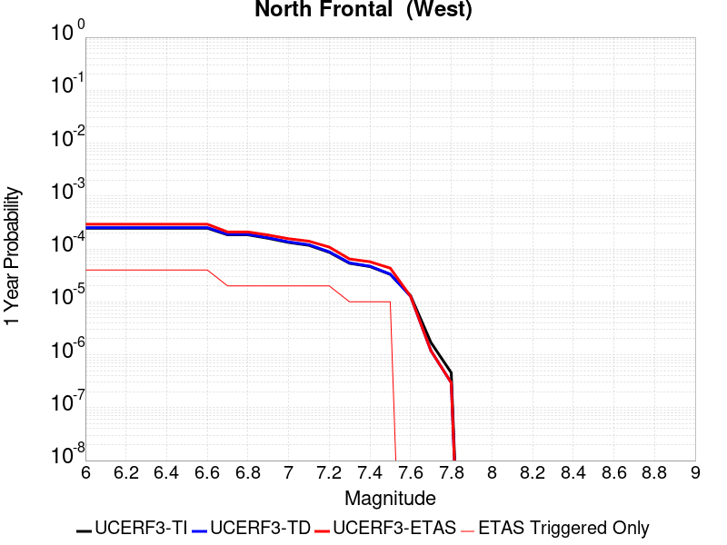 | 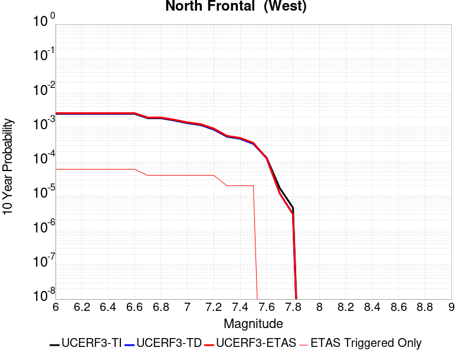 |

| Magnitude | 1 wk TI Prob | 1 wk TD Prob | 1 wk ETAS Prob | 1 wk ETAS/TD Gain | 1 wk ETAS Triggered Only | 1 mo TI Prob | 1 mo TD Prob | 1 mo ETAS Prob | 1 mo ETAS/TD Gain | 1 mo ETAS Triggered Only | 1 yr TI Prob | 1 yr TD Prob | 1 yr ETAS Prob | 1 yr ETAS/TD Gain | 1 yr ETAS Triggered Only | 10 yr TI Prob | 10 yr TD Prob | 10 yr ETAS Prob | 10 yr ETAS/TD Gain | 10 yr ETAS Triggered Only |
|-----|-----|-----|-----|-----|-----|-----|-----|-----|-----|-----|-----|-----|-----|-----|-----|-----|-----|-----|-----|-----|
| 6.0 | 4.7316266E-6 | 4.8526726E-6 | 4.8526726E-6 | 1.0 | 0.0 | 2.0278241E-5 | 2.0797012E-5 | 2.0797012E-5 | 1.0 | 0.0 | 2.4685962E-4 | 2.5317568E-4 | 2.7697915E-4 | 1.0940197 | 2.3809524E-5 | 0.0024658558 | 0.0025290183 | 0.0026002664 | 1.0281721 | 7.142857E-5 |
| 6.1 | 4.7316266E-6 | 4.8526726E-6 | 4.8526726E-6 | 1.0 | 0.0 | 2.0278241E-5 | 2.0797012E-5 | 2.0797012E-5 | 1.0 | 0.0 | 2.4685962E-4 | 2.5317568E-4 | 2.7697915E-4 | 1.0940197 | 2.3809524E-5 | 0.0024658558 | 0.0025290183 | 0.0026002664 | 1.0281721 | 7.142857E-5 |
| 6.2 | 4.7316266E-6 | 4.8526726E-6 | 4.8526726E-6 | 1.0 | 0.0 | 2.0278241E-5 | 2.0797012E-5 | 2.0797012E-5 | 1.0 | 0.0 | 2.4685962E-4 | 2.5317568E-4 | 2.7697915E-4 | 1.0940197 | 2.3809524E-5 | 0.0024658558 | 0.0025290183 | 0.0026002664 | 1.0281721 | 7.142857E-5 |
| 6.3 | 4.7316266E-6 | 4.8526726E-6 | 4.8526726E-6 | 1.0 | 0.0 | 2.0278241E-5 | 2.0797012E-5 | 2.0797012E-5 | 1.0 | 0.0 | 2.4685962E-4 | 2.5317568E-4 | 2.7697915E-4 | 1.0940197 | 2.3809524E-5 | 0.0024658558 | 0.0025290183 | 0.0026002664 | 1.0281721 | 7.142857E-5 |
| 6.4 | 4.7316266E-6 | 4.8526726E-6 | 4.8526726E-6 | 1.0 | 0.0 | 2.0278241E-5 | 2.0797012E-5 | 2.0797012E-5 | 1.0 | 0.0 | 2.4685962E-4 | 2.5317568E-4 | 2.7697915E-4 | 1.0940197 | 2.3809524E-5 | 0.0024658558 | 0.0025290183 | 0.0026002664 | 1.0281721 | 7.142857E-5 |
| 6.5 | 4.7316266E-6 | 4.8526726E-6 | 4.8526726E-6 | 1.0 | 0.0 | 2.0278241E-5 | 2.0797012E-5 | 2.0797012E-5 | 1.0 | 0.0 | 2.4685962E-4 | 2.5317568E-4 | 2.7697915E-4 | 1.0940197 | 2.3809524E-5 | 0.0024658558 | 0.0025290183 | 0.0026002664 | 1.0281721 | 7.142857E-5 |
| 6.6 | 4.7316266E-6 | 4.8526726E-6 | 4.8526726E-6 | 1.0 | 0.0 | 2.0278241E-5 | 2.0797012E-5 | 2.0797012E-5 | 1.0 | 0.0 | 2.4685962E-4 | 2.5317568E-4 | 2.7697915E-4 | 1.0940197 | 2.3809524E-5 | 0.0024658558 | 0.0025290183 | 0.0026002664 | 1.0281721 | 7.142857E-5 |
| 6.7 | 3.5382777E-6 | 3.6308859E-6 | 3.6308859E-6 | 1.0 | 0.0 | 1.516396E-5 | 1.5560852E-5 | 1.5560852E-5 | 1.0 | 0.0 | 1.8460557E-4 | 1.8943768E-4 | 2.1324269E-4 | 1.1256615 | 2.3809524E-5 | 0.0018445229 | 0.0018928389 | 0.0019641323 | 1.0376648 | 7.142857E-5 |
| 6.8 | 3.5382777E-6 | 3.6308859E-6 | 3.6308859E-6 | 1.0 | 0.0 | 1.516396E-5 | 1.5560852E-5 | 1.5560852E-5 | 1.0 | 0.0 | 1.8460557E-4 | 1.8943768E-4 | 2.1324269E-4 | 1.1256615 | 2.3809524E-5 | 0.0018445229 | 0.0018928389 | 0.0019641323 | 1.0376648 | 7.142857E-5 |
| 6.9 | 3.0428037E-6 | 3.1227605E-6 | 3.1227605E-6 | 1.0 | 0.0 | 1.30405215E-5 | 1.33831945E-5 | 1.33831945E-5 | 1.0 | 0.0 | 1.5875678E-4 | 1.6292889E-4 | 1.8673454E-4 | 1.1461107 | 2.3809524E-5 | 0.0015864341 | 0.0016281615 | 0.0016994738 | 1.0437993 | 7.142857E-5 |
| 7.0 | 2.538778E-6 | 2.6060904E-6 | 2.6060904E-6 | 1.0 | 0.0 | 1.0880432E-5 | 1.1168913E-5 | 1.1168913E-5 | 1.0 | 0.0 | 1.324612E-4 | 1.3597352E-4 | 1.597798E-4 | 1.1750803 | 2.3809524E-5 | 0.0013238228 | 0.0013589499 | 0.0014302814 | 1.0524901 | 7.142857E-5 |
| 7.1 | 2.2418935E-6 | 2.3012074E-6 | 2.3012074E-6 | 1.0 | 0.0 | 9.60808E-6 | 9.862282E-6 | 9.862282E-6 | 1.0 | 0.0 | 1.1697209E-4 | 1.2006712E-4 | 1.4387378E-4 | 1.198278 | 2.3809524E-5 | 0.0011691054 | 0.0012000664 | 0.0012714092 | 1.0594491 | 7.142857E-5 |
| 7.2 | 1.6526745E-6 | 1.6924851E-6 | 1.6924851E-6 | 1.0 | 0.0 | 7.082872E-6 | 7.253489E-6 | 7.253489E-6 | 1.0 | 0.0 | 8.623055E-5 | 8.8307905E-5 | 1.12115325E-4 | 1.2695956 | 2.3809524E-5 | 8.61971E-4 | 8.827532E-4 | 9.541187E-4 | 1.0808443 | 7.142857E-5 |
| 7.3 | 1.0246019E-6 | 1.0442261E-6 | 1.0442261E-6 | 1.0 | 0.0 | 4.391144E-6 | 4.4752474E-6 | 4.4752474E-6 | 1.0 | 0.0 | 5.3460866E-5 | 5.448489E-5 | 5.448489E-5 | 1.0 | 0.0 | 5.344801E-4 | 5.4472685E-4 | 5.6852336E-4 | 1.0436853 | 2.3809524E-5 |
| 7.4 | 8.9045164E-7 | 9.0565584E-7 | 9.0565584E-7 | 1.0 | 0.0 | 3.8162157E-6 | 3.8813773E-6 | 3.8813773E-6 | 1.0 | 0.0 | 4.646144E-5 | 4.7254853E-5 | 4.7254853E-5 | 1.0 | 0.0 | 4.6451724E-4 | 4.7245892E-4 | 4.962572E-4 | 1.050371 | 2.3809524E-5 |
| 7.5 | 6.3357E-7 | 6.4027006E-7 | 6.4027006E-7 | 1.0 | 0.0 | 2.7152971E-6 | 2.744012E-6 | 2.744012E-6 | 1.0 | 0.0 | 3.305824E-5 | 3.34079E-5 | 3.34079E-5 | 1.0 | 0.0 | 3.3053322E-4 | 3.3403534E-4 | 3.5783692E-4 | 1.0712546 | 2.3809524E-5 |
| 7.6 | 2.5087024E-7 | 2.4361097E-7 | 2.4361097E-7 | 1.0 | 0.0 | 1.0751578E-6 | 1.0440467E-6 | 1.0440467E-6 | 1.0 | 0.0 | 1.3089967E-5 | 1.2711216E-5 | 1.2711216E-5 | 1.0 | 0.0 | 1.3089196E-4 | 1.2710695E-4 | 1.2710695E-4 | 1.0 | 0.0 |
| 7.7 | 3.282987E-8 | 2.2874195E-8 | 2.2874195E-8 | 1.0 | 0.0 | 1.4069944E-7 | 9.803227E-8 | 9.803227E-8 | 1.0 | 0.0 | 1.7130144E-6 | 1.1935423E-6 | 1.1935423E-6 | 1.0 | 0.0 | 1.7130013E-5 | 1.1935367E-5 | 1.1935367E-5 | 1.0 | 0.0 |
| 7.8 | 8.77499E-9 | 5.6815956E-9 | 5.6815956E-9 | 1.0 | 0.0 | 3.7607098E-8 | 2.4349696E-8 | 2.4349696E-8 | 1.0 | 0.0 | 4.578663E-7 | 2.9645753E-7 | 2.9645753E-7 | 1.0 | 0.0 | 4.5786537E-6 | 2.9645726E-6 | 2.9645726E-6 | 1.0 | 0.0 |

## Bullion Mountains
*[(top)](#table-of-contents)*

| 1 Week | 1 Month | 1 Year | 10 Year |
|-----|-----|-----|-----|
|  |  |  |  |

| Magnitude | 1 wk TI Prob | 1 wk TD Prob | 1 wk ETAS Prob | 1 wk ETAS/TD Gain | 1 wk ETAS Triggered Only | 1 mo TI Prob | 1 mo TD Prob | 1 mo ETAS Prob | 1 mo ETAS/TD Gain | 1 mo ETAS Triggered Only | 1 yr TI Prob | 1 yr TD Prob | 1 yr ETAS Prob | 1 yr ETAS/TD Gain | 1 yr ETAS Triggered Only | 10 yr TI Prob | 10 yr TD Prob | 10 yr ETAS Prob | 10 yr ETAS/TD Gain | 10 yr ETAS Triggered Only |
|-----|-----|-----|-----|-----|-----|-----|-----|-----|-----|-----|-----|-----|-----|-----|-----|-----|-----|-----|-----|-----|
| 6.0 | 1.6420427E-5 | 1.4692089E-5 | 3.8501264E-5 | 2.6205437 | 2.3809524E-5 | 7.037136E-5 | 6.296479E-5 | 8.6772816E-5 | 1.3781165 | 2.3809524E-5 | 8.5643446E-4 | 7.663651E-4 | 8.1394764E-4 | 1.0620886 | 4.7619047E-5 | 0.008531413 | 0.007641016 | 0.007711899 | 1.0092766 | 7.142857E-5 |
| 6.1 | 1.6420427E-5 | 1.4692089E-5 | 3.8501264E-5 | 2.6205437 | 2.3809524E-5 | 7.037136E-5 | 6.296479E-5 | 8.6772816E-5 | 1.3781165 | 2.3809524E-5 | 8.5643446E-4 | 7.663651E-4 | 8.1394764E-4 | 1.0620886 | 4.7619047E-5 | 0.008531413 | 0.007641016 | 0.007711899 | 1.0092766 | 7.142857E-5 |
| 6.2 | 1.6420427E-5 | 1.4692089E-5 | 3.8501264E-5 | 2.6205437 | 2.3809524E-5 | 7.037136E-5 | 6.296479E-5 | 8.6772816E-5 | 1.3781165 | 2.3809524E-5 | 8.5643446E-4 | 7.663651E-4 | 8.1394764E-4 | 1.0620886 | 4.7619047E-5 | 0.008531413 | 0.007641016 | 0.007711899 | 1.0092766 | 7.142857E-5 |
| 6.3 | 1.2046778E-5 | 9.862335E-6 | 9.862335E-6 | 1.0 | 0.0 | 5.1628023E-5 | 4.2266598E-5 | 4.2266598E-5 | 1.0 | 0.0 | 6.283899E-4 | 5.144975E-4 | 5.382948E-4 | 1.0462534 | 2.3809524E-5 | 0.0062661595 | 0.005135345 | 0.005159032 | 1.0046126 | 2.3809524E-5 |
| 6.4 | 1.2046778E-5 | 9.862335E-6 | 9.862335E-6 | 1.0 | 0.0 | 5.1628023E-5 | 4.2266598E-5 | 4.2266598E-5 | 1.0 | 0.0 | 6.283899E-4 | 5.144975E-4 | 5.382948E-4 | 1.0462534 | 2.3809524E-5 | 0.0062661595 | 0.005135345 | 0.005159032 | 1.0046126 | 2.3809524E-5 |
| 6.5 | 1.0244343E-5 | 7.879458E-6 | 7.879458E-6 | 1.0 | 0.0 | 4.390359E-5 | 3.3768785E-5 | 3.3768785E-5 | 1.0 | 0.0 | 5.343951E-4 | 4.110781E-4 | 4.3487785E-4 | 1.0578959 | 2.3809524E-5 | 0.005331118 | 0.004105208 | 0.00412892 | 1.005776 | 2.3809524E-5 |
| 6.6 | 9.605408E-6 | 7.1774966E-6 | 7.1774966E-6 | 1.0 | 0.0 | 4.1165385E-5 | 3.076045E-5 | 3.076045E-5 | 1.0 | 0.0 | 5.010733E-4 | 3.744645E-4 | 3.9826508E-4 | 1.063559 | 2.3809524E-5 | 0.00499945 | 0.003740332 | 0.0037640526 | 1.0063418 | 2.3809524E-5 |
| 6.7 | 8.60418E-6 | 6.1240044E-6 | 6.1240044E-6 | 1.0 | 0.0 | 3.687454E-5 | 2.624558E-5 | 2.624558E-5 | 1.0 | 0.0 | 4.48855E-4 | 3.1951256E-4 | 3.1951256E-4 | 1.0 | 0.0 | 0.004479495 | 0.0031924439 | 0.0031924439 | 1.0 | 0.0 |
| 6.8 | 5.187994E-6 | 2.5631666E-6 | 2.5631666E-6 | 1.0 | 0.0 | 2.223407E-5 | 1.0984976E-5 | 1.0984976E-5 | 1.0 | 0.0 | 2.7066618E-4 | 1.3373788E-4 | 1.3373788E-4 | 1.0 | 0.0 | 0.0027033675 | 0.0013369655 | 0.0013369655 | 1.0 | 0.0 |
| 6.9 | 4.5302368E-6 | 2.3443165E-6 | 2.3443165E-6 | 1.0 | 0.0 | 1.9415156E-5 | 1.0047055E-5 | 1.0047055E-5 | 1.0 | 0.0 | 2.3635388E-4 | 1.2232E-4 | 1.2232E-4 | 1.0 | 0.0 | 0.0023610266 | 0.0012229157 | 0.0012229157 | 1.0 | 0.0 |
| 7.0 | 3.431668E-6 | 1.6882402E-6 | 1.6882402E-6 | 1.0 | 0.0 | 1.4707065E-5 | 7.235315E-6 | 7.235315E-6 | 1.0 | 0.0 | 1.7904381E-4 | 8.808996E-5 | 8.808996E-5 | 1.0 | 0.0 | 0.0017889962 | 8.808996E-4 | 8.808996E-4 | 1.0 | 0.0 |

## Great Valley 03 Mysterious Ridge
*[(top)](#table-of-contents)*

| 1 Week | 1 Month | 1 Year | 10 Year |
|-----|-----|-----|-----|
|  |  | 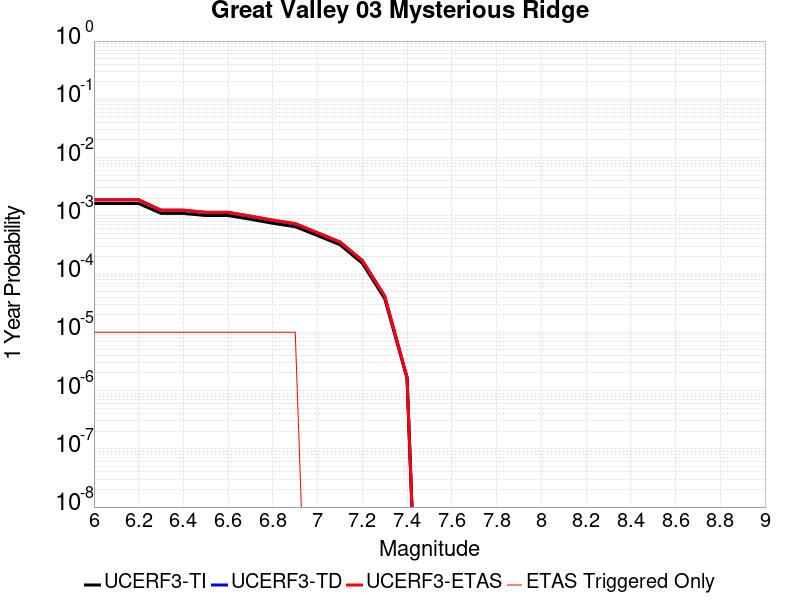 |  |

| Magnitude | 1 wk TI Prob | 1 wk TD Prob | 1 wk ETAS Prob | 1 wk ETAS/TD Gain | 1 wk ETAS Triggered Only | 1 mo TI Prob | 1 mo TD Prob | 1 mo ETAS Prob | 1 mo ETAS/TD Gain | 1 mo ETAS Triggered Only | 1 yr TI Prob | 1 yr TD Prob | 1 yr ETAS Prob | 1 yr ETAS/TD Gain | 1 yr ETAS Triggered Only | 10 yr TI Prob | 10 yr TD Prob | 10 yr ETAS Prob | 10 yr ETAS/TD Gain | 10 yr ETAS Triggered Only |
|-----|-----|-----|-----|-----|-----|-----|-----|-----|-----|-----|-----|-----|-----|-----|-----|-----|-----|-----|-----|-----|
| 6.0 | 3.1182444E-5 | 3.603423E-5 | 3.603423E-5 | 1.0 | 0.0 | 1.336322E-4 | 1.544242E-4 | 1.544242E-4 | 1.0 | 0.0 | 0.0016257578 | 0.0018786696 | 0.0019024344 | 1.0126498 | 2.3809524E-5 | 0.016139153 | 0.018646652 | 0.018670017 | 1.0012531 | 2.3809524E-5 |
| 6.1 | 3.1182444E-5 | 3.603423E-5 | 3.603423E-5 | 1.0 | 0.0 | 1.336322E-4 | 1.544242E-4 | 1.544242E-4 | 1.0 | 0.0 | 0.0016257578 | 0.0018786696 | 0.0019024344 | 1.0126498 | 2.3809524E-5 | 0.016139153 | 0.018646652 | 0.018670017 | 1.0012531 | 2.3809524E-5 |
| 6.2 | 3.1182444E-5 | 3.603423E-5 | 3.603423E-5 | 1.0 | 0.0 | 1.336322E-4 | 1.544242E-4 | 1.544242E-4 | 1.0 | 0.0 | 0.0016257578 | 0.0018786696 | 0.0019024344 | 1.0126498 | 2.3809524E-5 | 0.016139153 | 0.018646652 | 0.018670017 | 1.0012531 | 2.3809524E-5 |
| 6.3 | 2.106934E-5 | 2.3850307E-5 | 2.3850307E-5 | 1.0 | 0.0 | 9.0294045E-5 | 1.0221177E-4 | 1.0221177E-4 | 1.0 | 0.0 | 0.0010987755 | 0.0012437489 | 0.0012675289 | 1.0191195 | 2.3809524E-5 | 0.010933585 | 0.012371127 | 0.0123946415 | 1.0019008 | 2.3809524E-5 |
| 6.4 | 2.106934E-5 | 2.3850307E-5 | 2.3850307E-5 | 1.0 | 0.0 | 9.0294045E-5 | 1.0221177E-4 | 1.0221177E-4 | 1.0 | 0.0 | 0.0010987755 | 0.0012437489 | 0.0012675289 | 1.0191195 | 2.3809524E-5 | 0.010933585 | 0.012371127 | 0.0123946415 | 1.0019008 | 2.3809524E-5 |
| 6.5 | 1.9389783E-5 | 2.1884984E-5 | 2.1884984E-5 | 1.0 | 0.0 | 8.309642E-5 | 9.3789575E-5 | 9.3789575E-5 | 1.0 | 0.0 | 0.0010112294 | 0.0011413174 | 0.0011650998 | 1.0208377 | 2.3809524E-5 | 0.010066401 | 0.011357434 | 0.011380973 | 1.0020726 | 2.3809524E-5 |
| 6.6 | 1.9370193E-5 | 2.1864906E-5 | 2.1864906E-5 | 1.0 | 0.0 | 8.301247E-5 | 9.370353E-5 | 9.370353E-5 | 1.0 | 0.0 | 0.0010102082 | 0.001140271 | 0.0011640533 | 1.0208567 | 2.3809524E-5 | 0.010056281 | 0.011347076 | 0.011370615 | 1.0020745 | 2.3809524E-5 |
| 6.7 | 1.6723505E-5 | 1.8799281E-5 | 1.8799281E-5 | 1.0 | 0.0 | 7.16702E-5 | 8.056597E-5 | 8.056597E-5 | 1.0 | 0.0 | 8.722353E-4 | 9.804688E-4 | 0.0010042549 | 1.02426 | 2.3809524E-5 | 0.008688197 | 0.009763439 | 0.009787017 | 1.0024148 | 2.3809524E-5 |
| 6.8 | 1.426937E-5 | 1.599721E-5 | 1.599721E-5 | 1.0 | 0.0 | 6.115301E-5 | 6.855775E-5 | 6.855775E-5 | 1.0 | 0.0 | 7.4428355E-4 | 8.343854E-4 | 8.5817504E-4 | 1.0285116 | 2.3809524E-5 | 0.007417957 | 0.008314005 | 0.008337616 | 1.0028399 | 2.3809524E-5 |
| 6.9 | 1.2469891E-5 | 1.3956928E-5 | 1.3956928E-5 | 1.0 | 0.0 | 5.3441294E-5 | 5.9814105E-5 | 5.9814105E-5 | 1.0 | 0.0 | 6.504535E-4 | 7.280055E-4 | 7.5179763E-4 | 1.0326813 | 2.3809524E-5 | 0.006485529 | 0.00725743 | 0.007281067 | 1.0032569 | 2.3809524E-5 |
| 7.0 | 8.7746275E-6 | 9.791734E-6 | 9.791734E-6 | 1.0 | 0.0 | 3.7605005E-5 | 4.196394E-5 | 4.196394E-5 | 1.0 | 0.0 | 4.5774475E-4 | 5.1079853E-4 | 5.1079853E-4 | 1.0 | 0.0 | 0.00456803 | 0.005096977 | 0.005096977 | 1.0 | 0.0 |
| 7.1 | 6.1067153E-6 | 6.813725E-6 | 6.813725E-6 | 1.0 | 0.0 | 2.6171374E-5 | 2.9201385E-5 | 2.9201385E-5 | 1.0 | 0.0 | 3.1858988E-4 | 3.5547445E-4 | 3.5547445E-4 | 1.0 | 0.0 | 0.0031813353 | 0.003549609 | 0.003549609 | 1.0 | 0.0 |
| 7.2 | 2.939283E-6 | 3.2741057E-6 | 3.2741057E-6 | 1.0 | 0.0 | 1.2596866E-5 | 1.4031816E-5 | 1.4031816E-5 | 1.0 | 0.0 | 1.5335606E-4 | 1.7082572E-4 | 1.7082572E-4 | 1.0 | 0.0 | 0.0015325027 | 0.001707116 | 0.001707116 | 1.0 | 0.0 |
| 7.3 | 7.2387763E-7 | 8.008505E-7 | 8.008505E-7 | 1.0 | 0.0 | 3.102329E-6 | 3.4322145E-6 | 3.4322145E-6 | 1.0 | 0.0 | 3.77702E-5 | 4.178687E-5 | 4.178687E-5 | 1.0 | 0.0 | 3.7763783E-4 | 4.1783508E-4 | 4.1783508E-4 | 1.0 | 0.0 |
| 7.4 | 3.112171E-8 | 3.2068368E-8 | 3.2068368E-8 | 1.0 | 0.0 | 1.3337875E-7 | 1.3743585E-7 | 1.3743585E-7 | 1.0 | 0.0 | 1.6238852E-6 | 1.6732803E-6 | 1.6732803E-6 | 1.0 | 0.0 | 1.6238733E-5 | 1.6732685E-5 | 1.6732685E-5 | 1.0 | 0.0 |

## Santa Susana alt 1
*[(top)](#table-of-contents)*

| 1 Week | 1 Month | 1 Year | 10 Year |
|-----|-----|-----|-----|
|  |  |  |  |

| Magnitude | 1 wk TI Prob | 1 wk TD Prob | 1 wk ETAS Prob | 1 wk ETAS/TD Gain | 1 wk ETAS Triggered Only | 1 mo TI Prob | 1 mo TD Prob | 1 mo ETAS Prob | 1 mo ETAS/TD Gain | 1 mo ETAS Triggered Only | 1 yr TI Prob | 1 yr TD Prob | 1 yr ETAS Prob | 1 yr ETAS/TD Gain | 1 yr ETAS Triggered Only | 10 yr TI Prob | 10 yr TD Prob | 10 yr ETAS Prob | 10 yr ETAS/TD Gain | 10 yr ETAS Triggered Only |
|-----|-----|-----|-----|-----|-----|-----|-----|-----|-----|-----|-----|-----|-----|-----|-----|-----|-----|-----|-----|-----|
| 6.0 | 2.674877E-5 | 2.7198023E-5 | 2.7198023E-5 | 1.0 | 0.0 | 1.1463255E-4 | 1.1655839E-4 | 1.4036514E-4 | 1.2042474 | 2.3809524E-5 | 0.0013947578 | 0.0014182882 | 0.0014658397 | 1.0335274 | 4.7619047E-5 | 0.013860362 | 0.014104128 | 0.014174549 | 1.004993 | 7.142857E-5 |
| 6.1 | 2.674877E-5 | 2.7198023E-5 | 2.7198023E-5 | 1.0 | 0.0 | 1.1463255E-4 | 1.1655839E-4 | 1.4036514E-4 | 1.2042474 | 2.3809524E-5 | 0.0013947578 | 0.0014182882 | 0.0014658397 | 1.0335274 | 4.7619047E-5 | 0.013860362 | 0.014104128 | 0.014174549 | 1.004993 | 7.142857E-5 |
| 6.2 | 2.674877E-5 | 2.7198023E-5 | 2.7198023E-5 | 1.0 | 0.0 | 1.1463255E-4 | 1.1655839E-4 | 1.4036514E-4 | 1.2042474 | 2.3809524E-5 | 0.0013947578 | 0.0014182882 | 0.0014658397 | 1.0335274 | 4.7619047E-5 | 0.013860362 | 0.014104128 | 0.014174549 | 1.004993 | 7.142857E-5 |
| 6.3 | 2.674877E-5 | 2.7198023E-5 | 2.7198023E-5 | 1.0 | 0.0 | 1.1463255E-4 | 1.1655839E-4 | 1.4036514E-4 | 1.2042474 | 2.3809524E-5 | 0.0013947578 | 0.0014182882 | 0.0014658397 | 1.0335274 | 4.7619047E-5 | 0.013860362 | 0.014104128 | 0.014174549 | 1.004993 | 7.142857E-5 |
| 6.4 | 2.674877E-5 | 2.7198023E-5 | 2.7198023E-5 | 1.0 | 0.0 | 1.1463255E-4 | 1.1655839E-4 | 1.4036514E-4 | 1.2042474 | 2.3809524E-5 | 0.0013947578 | 0.0014182882 | 0.0014658397 | 1.0335274 | 4.7619047E-5 | 0.013860362 | 0.014104128 | 0.014174549 | 1.004993 | 7.142857E-5 |
| 6.5 | 2.674877E-5 | 2.7198023E-5 | 2.7198023E-5 | 1.0 | 0.0 | 1.1463255E-4 | 1.1655839E-4 | 1.4036514E-4 | 1.2042474 | 2.3809524E-5 | 0.0013947578 | 0.0014182882 | 0.0014658397 | 1.0335274 | 4.7619047E-5 | 0.013860362 | 0.014104128 | 0.014174549 | 1.004993 | 7.142857E-5 |
| 6.6 | 2.6647976E-5 | 2.7074359E-5 | 2.7074359E-5 | 1.0 | 0.0 | 1.14200615E-4 | 1.1602845E-4 | 1.3983522E-4 | 1.2051804 | 2.3809524E-5 | 0.0013895056 | 0.0014118447 | 0.0014593966 | 1.0336807 | 4.7619047E-5 | 0.013808494 | 0.014040513 | 0.014110939 | 1.0050159 | 7.142857E-5 |
| 6.7 | 2.6647976E-5 | 2.7074359E-5 | 2.7074359E-5 | 1.0 | 0.0 | 1.14200615E-4 | 1.1602845E-4 | 1.3983522E-4 | 1.2051804 | 2.3809524E-5 | 0.0013895056 | 0.0014118447 | 0.0014593966 | 1.0336807 | 4.7619047E-5 | 0.013808494 | 0.014040513 | 0.014110939 | 1.0050159 | 7.142857E-5 |
| 6.8 | 1.9073179E-5 | 1.7637283E-5 | 1.7637283E-5 | 1.0 | 0.0 | 8.1739636E-5 | 7.558627E-5 | 9.9394E-5 | 1.3149742 | 2.3809524E-5 | 9.947256E-4 | 9.198925E-4 | 9.674677E-4 | 1.0517182 | 4.7619047E-5 | 0.009902848 | 0.009163101 | 0.009233875 | 1.0077238 | 7.142857E-5 |
| 6.9 | 1.9041876E-5 | 1.7619415E-5 | 1.7619415E-5 | 1.0 | 0.0 | 8.160549E-5 | 7.55097E-5 | 9.9317425E-5 | 1.3152937 | 2.3809524E-5 | 9.930939E-4 | 9.1896096E-4 | 9.6653623E-4 | 1.0517707 | 4.7619047E-5 | 0.0098866755 | 0.0091538625 | 0.009224637 | 1.0077317 | 7.142857E-5 |
| 7.0 | 1.5917482E-5 | 1.3863864E-5 | 1.3863864E-5 | 1.0 | 0.0 | 6.8215995E-5 | 5.9415237E-5 | 8.322334E-5 | 1.4007071 | 2.3809524E-5 | 8.302132E-4 | 7.231451E-4 | 7.707297E-4 | 1.0658023 | 4.7619047E-5 | 0.008271185 | 0.0072088144 | 0.007279728 | 1.009837 | 7.142857E-5 |
| 7.1 | 1.577788E-5 | 1.3743872E-5 | 1.3743872E-5 | 1.0 | 0.0 | 6.761774E-5 | 5.8901005E-5 | 8.270913E-5 | 1.4042057 | 2.3809524E-5 | 8.2293496E-4 | 7.1688846E-4 | 7.6447334E-4 | 1.066377 | 4.7619047E-5 | 0.008198941 | 0.007146652 | 0.00721757 | 1.0099232 | 7.142857E-5 |
| 7.2 | 1.5416446E-5 | 1.3469944E-5 | 1.3469944E-5 | 1.0 | 0.0 | 6.606882E-5 | 5.772708E-5 | 8.153523E-5 | 1.412426 | 2.3809524E-5 | 8.0409093E-4 | 7.026052E-4 | 7.501908E-4 | 1.0677273 | 4.7619047E-5 | 0.008011877 | 0.0070047234 | 0.0070756515 | 1.0101258 | 7.142857E-5 |
| 7.3 | 1.4534083E-5 | 1.2717879E-5 | 1.2717879E-5 | 1.0 | 0.0 | 6.228744E-5 | 5.4504082E-5 | 7.831231E-5 | 1.4368155 | 2.3809524E-5 | 7.580857E-4 | 6.633896E-4 | 7.1097707E-4 | 1.0717338 | 4.7619047E-5 | 0.007555048 | 0.0066149444 | 0.0066859005 | 1.0107267 | 7.142857E-5 |
| 7.4 | 1.2858995E-5 | 1.1229652E-5 | 1.1229652E-5 | 1.0 | 0.0 | 5.5108816E-5 | 4.8126214E-5 | 4.8126214E-5 | 1.0 | 0.0 | 6.7074323E-4 | 5.857831E-4 | 6.095787E-4 | 1.0406219 | 2.3809524E-5 | 0.0066872234 | 0.005843165 | 0.005890506 | 1.0081019 | 4.7619047E-5 |
| 7.5 | 8.827668E-6 | 7.805457E-6 | 7.805457E-6 | 1.0 | 0.0 | 3.7832317E-5 | 3.3451546E-5 | 3.3451546E-5 | 1.0 | 0.0 | 4.605111E-4 | 4.071989E-4 | 4.3099874E-4 | 1.0584477 | 2.3809524E-5 | 0.0045955796 | 0.0040647765 | 0.004112202 | 1.0116674 | 4.7619047E-5 |
| 7.6 | 3.2533426E-6 | 2.871988E-6 | 2.871988E-6 | 1.0 | 0.0 | 1.3942822E-5 | 1.2308465E-5 | 1.2308465E-5 | 1.0 | 0.0 | 1.6974064E-4 | 1.4984563E-4 | 1.4984563E-4 | 1.0 | 0.0 | 0.0016961104 | 0.0014974826 | 0.0015212565 | 1.0158759 | 2.3809524E-5 |
| 7.7 | 1.2751709E-6 | 1.1491089E-6 | 1.1491089E-6 | 1.0 | 0.0 | 5.4650063E-6 | 4.9247437E-6 | 4.9247437E-6 | 1.0 | 0.0 | 6.653442E-5 | 5.9957198E-5 | 5.9957198E-5 | 1.0 | 0.0 | 6.6514505E-4 | 5.994191E-4 | 6.2321435E-4 | 1.0396972 | 2.3809524E-5 |
| 7.8 | 3.067544E-7 | 3.2400436E-7 | 3.2400436E-7 | 1.0 | 0.0 | 1.3146611E-6 | 1.3885895E-6 | 1.3885895E-6 | 1.0 | 0.0 | 1.600588E-5 | 1.6905957E-5 | 1.6905957E-5 | 1.0 | 0.0 | 1.6004729E-4 | 1.6904772E-4 | 1.6904772E-4 | 1.0 | 0.0 |
| 7.9 | 7.622999E-8 | 8.087964E-8 | 8.087964E-8 | 1.0 | 0.0 | 3.2669993E-7 | 3.4662696E-7 | 3.4662696E-7 | 1.0 | 0.0 | 3.977564E-6 | 4.2201773E-6 | 4.2201773E-6 | 1.0 | 0.0 | 3.977493E-5 | 4.220118E-5 | 4.220118E-5 | 1.0 | 0.0 |

## Coronado Bank alt1
*[(top)](#table-of-contents)*

| 1 Week | 1 Month | 1 Year | 10 Year |
|-----|-----|-----|-----|
|  |  |  |  |

| Magnitude | 1 wk TI Prob | 1 wk TD Prob | 1 wk ETAS Prob | 1 wk ETAS/TD Gain | 1 wk ETAS Triggered Only | 1 mo TI Prob | 1 mo TD Prob | 1 mo ETAS Prob | 1 mo ETAS/TD Gain | 1 mo ETAS Triggered Only | 1 yr TI Prob | 1 yr TD Prob | 1 yr ETAS Prob | 1 yr ETAS/TD Gain | 1 yr ETAS Triggered Only | 10 yr TI Prob | 10 yr TD Prob | 10 yr ETAS Prob | 10 yr ETAS/TD Gain | 10 yr ETAS Triggered Only |
|-----|-----|-----|-----|-----|-----|-----|-----|-----|-----|-----|-----|-----|-----|-----|-----|-----|-----|-----|-----|-----|
| 6.0 | 7.533492E-5 | 9.394913E-5 | 9.394913E-5 | 1.0 | 0.0 | 3.22824E-4 | 4.0258127E-4 | 4.263812E-4 | 1.0591184 | 2.3809524E-5 | 0.0039233007 | 0.0048909658 | 0.0049383515 | 1.0096885 | 4.7619047E-5 | 0.03854755 | 0.04790356 | 0.04797157 | 1.0014197 | 7.142857E-5 |
| 6.1 | 4.1807285E-5 | 5.049283E-5 | 5.049283E-5 | 1.0 | 0.0 | 1.7916178E-4 | 2.1638049E-4 | 2.1638049E-4 | 1.0 | 0.0 | 0.0021791123 | 0.0026313474 | 0.0026313474 | 1.0 | 0.0 | 0.021578677 | 0.026011046 | 0.026011046 | 1.0 | 0.0 |
| 6.2 | 4.1807285E-5 | 5.049283E-5 | 5.049283E-5 | 1.0 | 0.0 | 1.7916178E-4 | 2.1638049E-4 | 2.1638049E-4 | 1.0 | 0.0 | 0.0021791123 | 0.0026313474 | 0.0026313474 | 1.0 | 0.0 | 0.021578677 | 0.026011046 | 0.026011046 | 1.0 | 0.0 |
| 6.3 | 3.1793104E-5 | 3.7711117E-5 | 3.7711117E-5 | 1.0 | 0.0 | 1.3624904E-4 | 1.6160926E-4 | 1.6160926E-4 | 1.0 | 0.0 | 0.0016575698 | 0.001965848 | 0.001965848 | 1.0 | 0.0 | 0.016452603 | 0.019488465 | 0.019488465 | 1.0 | 0.0 |
| 6.4 | 2.9878007E-5 | 3.5335794E-5 | 3.5335794E-5 | 1.0 | 0.0 | 1.2804232E-4 | 1.5143053E-4 | 1.5143053E-4 | 1.0 | 0.0 | 0.0015578003 | 0.0018421387 | 0.0018421387 | 1.0 | 0.0 | 0.015469253 | 0.01827244 | 0.01827244 | 1.0 | 0.0 |
| 6.5 | 2.4512565E-5 | 2.8764043E-5 | 2.8764043E-5 | 1.0 | 0.0 | 1.0504962E-4 | 1.2326881E-4 | 1.2326881E-4 | 1.0 | 0.0 | 0.0012782287 | 0.0014997921 | 0.0014997921 | 1.0 | 0.0 | 0.012709012 | 0.014899683 | 0.014899683 | 1.0 | 0.0 |
| 6.6 | 2.1317413E-5 | 2.490667E-5 | 2.490667E-5 | 1.0 | 0.0 | 9.135714E-5 | 1.0673863E-4 | 1.0673863E-4 | 1.0 | 0.0 | 0.0011117056 | 0.0012987906 | 0.0012987906 | 1.0 | 0.0 | 0.011061605 | 0.012914404 | 0.012914404 | 1.0 | 0.0 |
| 6.7 | 1.8585655E-5 | 2.163488E-5 | 2.163488E-5 | 1.0 | 0.0 | 7.9650374E-5 | 9.271773E-5 | 9.271773E-5 | 1.0 | 0.0 | 9.6931186E-4 | 0.0011282742 | 0.0011282742 | 1.0 | 0.0 | 0.0096509475 | 0.011227623 | 0.011227623 | 1.0 | 0.0 |
| 6.8 | 1.5862879E-5 | 1.8419474E-5 | 1.8419474E-5 | 1.0 | 0.0 | 6.798199E-5 | 7.893833E-5 | 7.893833E-5 | 1.0 | 0.0 | 8.273665E-4 | 9.6066965E-4 | 9.6066965E-4 | 1.0 | 0.0 | 0.008242928 | 0.00956715 | 0.00956715 | 1.0 | 0.0 |
| 6.9 | 1.3021509E-5 | 1.5095265E-5 | 1.5095265E-5 | 1.0 | 0.0 | 5.5805274E-5 | 6.469249E-5 | 6.469249E-5 | 1.0 | 0.0 | 6.792174E-4 | 7.8736455E-4 | 7.8736455E-4 | 1.0 | 0.0 | 0.006771452 | 0.007847573 | 0.007847573 | 1.0 | 0.0 |
| 7.0 | 1.0974371E-5 | 1.2720104E-5 | 1.2720104E-5 | 1.0 | 0.0 | 4.7032172E-5 | 5.451369E-5 | 5.451369E-5 | 1.0 | 0.0 | 5.7246623E-4 | 6.6351966E-4 | 6.6351966E-4 | 1.0 | 0.0 | 0.0057099373 | 0.006617135 | 0.006617135 | 1.0 | 0.0 |
| 7.1 | 8.766221E-6 | 1.01638325E-5 | 1.01638325E-5 | 1.0 | 0.0 | 3.7568978E-5 | 4.355865E-5 | 4.355865E-5 | 1.0 | 0.0 | 4.573063E-4 | 5.3021475E-4 | 5.3021475E-4 | 1.0 | 0.0 | 0.0045636636 | 0.0052911965 | 0.0052911965 | 1.0 | 0.0 |
| 7.2 | 8.026024E-7 | 8.331765E-7 | 8.331765E-7 | 1.0 | 0.0 | 3.43972E-6 | 3.5707515E-6 | 3.5707515E-6 | 1.0 | 0.0 | 4.1877785E-5 | 4.3473043E-5 | 4.3473043E-5 | 1.0 | 0.0 | 4.1869894E-4 | 4.3464647E-4 | 4.3464647E-4 | 1.0 | 0.0 |
| 7.3 | 3.7293114E-7 | 3.7000953E-7 | 3.7000953E-7 | 1.0 | 0.0 | 1.5982754E-6 | 1.5857541E-6 | 1.5857541E-6 | 1.0 | 0.0 | 1.9458828E-5 | 1.9306386E-5 | 1.9306386E-5 | 1.0 | 0.0 | 1.9457124E-4 | 1.9304715E-4 | 1.9304715E-4 | 1.0 | 0.0 |
| 7.4 | 2.0557036E-7 | 1.9674363E-7 | 1.9674363E-7 | 1.0 | 0.0 | 8.810155E-7 | 8.431867E-7 | 8.431867E-7 | 1.0 | 0.0 | 1.0726311E-5 | 1.026575E-5 | 1.026575E-5 | 1.0 | 0.0 | 1.0725793E-4 | 1.0265279E-4 | 1.0265279E-4 | 1.0 | 0.0 |
| 7.5 | 6.845446E-8 | 6.279369E-8 | 6.279369E-8 | 1.0 | 0.0 | 2.9337625E-7 | 2.691158E-7 | 2.691158E-7 | 1.0 | 0.0 | 3.5718497E-6 | 3.2764797E-6 | 3.2764797E-6 | 1.0 | 0.0 | 3.5717923E-5 | 3.2764325E-5 | 3.2764325E-5 | 1.0 | 0.0 |
| 7.6 | 6.0975145E-9 | 5.53185E-9 | 5.53185E-9 | 1.0 | 0.0 | 2.6132206E-8 | 2.370793E-8 | 2.370793E-8 | 1.0 | 0.0 | 3.1815955E-7 | 2.88644E-7 | 2.88644E-7 | 1.0 | 0.0 | 3.181591E-6 | 2.8864374E-6 | 2.8864374E-6 | 1.0 | 0.0 |

## Tin Mountain
*[(top)](#table-of-contents)*

| 1 Week | 1 Month | 1 Year | 10 Year |
|-----|-----|-----|-----|
|  |  |  |  |

| Magnitude | 1 wk TI Prob | 1 wk TD Prob | 1 wk ETAS Prob | 1 wk ETAS/TD Gain | 1 wk ETAS Triggered Only | 1 mo TI Prob | 1 mo TD Prob | 1 mo ETAS Prob | 1 mo ETAS/TD Gain | 1 mo ETAS Triggered Only | 1 yr TI Prob | 1 yr TD Prob | 1 yr ETAS Prob | 1 yr ETAS/TD Gain | 1 yr ETAS Triggered Only | 10 yr TI Prob | 10 yr TD Prob | 10 yr ETAS Prob | 10 yr ETAS/TD Gain | 10 yr ETAS Triggered Only |
|-----|-----|-----|-----|-----|-----|-----|-----|-----|-----|-----|-----|-----|-----|-----|-----|-----|-----|-----|-----|-----|
| 6.0 | 4.083776E-6 | 4.1815365E-6 | 2.7990962E-5 | 6.693941 | 2.3809524E-5 | 1.750178E-5 | 1.792077E-5 | 4.1729865E-5 | 2.3285756 | 2.3809524E-5 | 2.1306332E-4 | 2.1816725E-4 | 2.8958023E-4 | 1.3273314 | 7.142857E-5 | 0.0021285915 | 0.0021798965 | 0.0022511692 | 1.0326955 | 7.142857E-5 |
| 6.1 | 4.083776E-6 | 4.1815365E-6 | 2.7990962E-5 | 6.693941 | 2.3809524E-5 | 1.750178E-5 | 1.792077E-5 | 4.1729865E-5 | 2.3285756 | 2.3809524E-5 | 2.1306332E-4 | 2.1816725E-4 | 2.8958023E-4 | 1.3273314 | 7.142857E-5 | 0.0021285915 | 0.0021798965 | 0.0022511692 | 1.0326955 | 7.142857E-5 |
| 6.2 | 4.083776E-6 | 4.1815365E-6 | 2.7990962E-5 | 6.693941 | 2.3809524E-5 | 1.750178E-5 | 1.792077E-5 | 4.1729865E-5 | 2.3285756 | 2.3809524E-5 | 2.1306332E-4 | 2.1816725E-4 | 2.8958023E-4 | 1.3273314 | 7.142857E-5 | 0.0021285915 | 0.0021798965 | 0.0022511692 | 1.0326955 | 7.142857E-5 |
| 6.3 | 4.083776E-6 | 4.1815365E-6 | 2.7990962E-5 | 6.693941 | 2.3809524E-5 | 1.750178E-5 | 1.792077E-5 | 4.1729865E-5 | 2.3285756 | 2.3809524E-5 | 2.1306332E-4 | 2.1816725E-4 | 2.8958023E-4 | 1.3273314 | 7.142857E-5 | 0.0021285915 | 0.0021798965 | 0.0022511692 | 1.0326955 | 7.142857E-5 |
| 6.4 | 4.083776E-6 | 4.1815365E-6 | 2.7990962E-5 | 6.693941 | 2.3809524E-5 | 1.750178E-5 | 1.792077E-5 | 4.1729865E-5 | 2.3285756 | 2.3809524E-5 | 2.1306332E-4 | 2.1816725E-4 | 2.8958023E-4 | 1.3273314 | 7.142857E-5 | 0.0021285915 | 0.0021798965 | 0.0022511692 | 1.0326955 | 7.142857E-5 |
| 6.5 | 2.3143427E-6 | 2.3731573E-6 | 2.6182624E-5 | 11.032824 | 2.3809524E-5 | 9.9185745E-6 | 1.0170638E-5 | 3.397992E-5 | 3.340982 | 2.3809524E-5 | 1.2075195E-4 | 1.2382126E-4 | 1.7143441E-4 | 1.3845313 | 4.7619047E-5 | 0.0012068636 | 0.0012375986 | 0.0012851587 | 1.0384294 | 4.7619047E-5 |
| 6.6 | 2.3143427E-6 | 2.3731573E-6 | 2.6182624E-5 | 11.032824 | 2.3809524E-5 | 9.9185745E-6 | 1.0170638E-5 | 3.397992E-5 | 3.340982 | 2.3809524E-5 | 1.2075195E-4 | 1.2382126E-4 | 1.7143441E-4 | 1.3845313 | 4.7619047E-5 | 0.0012068636 | 0.0012375986 | 0.0012851587 | 1.0384294 | 4.7619047E-5 |
| 6.7 | 1.7029532E-6 | 1.7497915E-6 | 2.5559273E-5 | 14.607039 | 2.3809524E-5 | 7.2983503E-6 | 7.499088E-6 | 3.1308435E-5 | 4.1749654 | 2.3809524E-5 | 8.885379E-5 | 9.1298105E-5 | 1.389128E-4 | 1.52153 | 4.7619047E-5 | 8.881827E-4 | 9.1265864E-4 | 9.602342E-4 | 1.0521286 | 4.7619047E-5 |
| 6.8 | 1.2914646E-6 | 1.3299378E-6 | 2.513943E-5 | 18.90271 | 2.3809524E-5 | 5.534837E-6 | 5.6997237E-6 | 2.9509112E-5 | 5.177288 | 2.3809524E-5 | 6.738455E-5 | 6.939237E-5 | 1.1700811E-4 | 1.6861813 | 4.7619047E-5 | 6.736412E-4 | 6.9375033E-4 | 7.413364E-4 | 1.0685924 | 4.7619047E-5 |
| 6.9 | 5.8708974E-7 | 6.1169936E-7 | 6.1169936E-7 | 1.0 | 0.0 | 2.5160964E-6 | 2.6215664E-6 | 2.6215664E-6 | 1.0 | 0.0 | 3.0633044E-5 | 3.1917145E-5 | 3.1917145E-5 | 1.0 | 0.0 | 3.0628822E-4 | 3.191297E-4 | 3.191297E-4 | 1.0 | 0.0 |
| 7.0 | 4.6248786E-7 | 4.832015E-7 | 4.832015E-7 | 1.0 | 0.0 | 1.9820893E-6 | 2.0708624E-6 | 2.0708624E-6 | 1.0 | 0.0 | 2.413167E-5 | 2.5212494E-5 | 2.5212494E-5 | 1.0 | 0.0 | 2.412905E-4 | 2.5210003E-4 | 2.5210003E-4 | 1.0 | 0.0 |
| 7.1 | 3.804606E-7 | 3.987147E-7 | 3.987147E-7 | 1.0 | 0.0 | 1.6305444E-6 | 1.7087764E-6 | 1.7087764E-6 | 1.0 | 0.0 | 1.9851697E-5 | 2.0804187E-5 | 2.0804187E-5 | 1.0 | 0.0 | 1.9849923E-4 | 2.0802575E-4 | 2.0802575E-4 | 1.0 | 0.0 |
| 7.2 | 3.5864858E-7 | 3.7616863E-7 | 3.7616863E-7 | 1.0 | 0.0 | 1.5370645E-6 | 1.6121504E-6 | 1.6121504E-6 | 1.0 | 0.0 | 1.87136E-5 | 1.9627789E-5 | 1.9627789E-5 | 1.0 | 0.0 | 1.8712023E-4 | 1.9626386E-4 | 1.9626386E-4 | 1.0 | 0.0 |
| 7.3 | 3.342063E-7 | 3.506347E-7 | 3.506347E-7 | 1.0 | 0.0 | 1.4323119E-6 | 1.5027196E-6 | 1.5027196E-6 | 1.0 | 0.0 | 1.7438259E-5 | 1.829549E-5 | 1.829549E-5 | 1.0 | 0.0 | 1.743689E-4 | 1.8294314E-4 | 1.8294314E-4 | 1.0 | 0.0 |
| 7.4 | 2.971242E-7 | 3.1165817E-7 | 3.1165817E-7 | 1.0 | 0.0 | 1.2733886E-6 | 1.3356774E-6 | 1.3356774E-6 | 1.0 | 0.0 | 1.5503398E-5 | 1.6261785E-5 | 1.6261785E-5 | 1.0 | 0.0 | 1.5502315E-4 | 1.6260923E-4 | 1.6260923E-4 | 1.0 | 0.0 |
| 7.5 | 1.4326713E-7 | 1.5012525E-7 | 1.5012525E-7 | 1.0 | 0.0 | 6.140018E-7 | 6.433939E-7 | 6.433939E-7 | 1.0 | 0.0 | 7.4754466E-6 | 7.8333205E-6 | 7.8333205E-6 | 1.0 | 0.0 | 7.475195E-5 | 7.833321E-5 | 7.833321E-5 | 1.0 | 0.0 |

## Oak Ridge (Onshore)
*[(top)](#table-of-contents)*

| 1 Week | 1 Month | 1 Year | 10 Year |
|-----|-----|-----|-----|
|  |  |  |  |

| Magnitude | 1 wk TI Prob | 1 wk TD Prob | 1 wk ETAS Prob | 1 wk ETAS/TD Gain | 1 wk ETAS Triggered Only | 1 mo TI Prob | 1 mo TD Prob | 1 mo ETAS Prob | 1 mo ETAS/TD Gain | 1 mo ETAS Triggered Only | 1 yr TI Prob | 1 yr TD Prob | 1 yr ETAS Prob | 1 yr ETAS/TD Gain | 1 yr ETAS Triggered Only | 10 yr TI Prob | 10 yr TD Prob | 10 yr ETAS Prob | 10 yr ETAS/TD Gain | 10 yr ETAS Triggered Only |
|-----|-----|-----|-----|-----|-----|-----|-----|-----|-----|-----|-----|-----|-----|-----|-----|-----|-----|-----|-----|-----|
| 6.0 | 3.155064E-5 | 2.9525974E-5 | 5.3334796E-5 | 1.8063687 | 2.3809524E-5 | 1.3521002E-4 | 1.2653397E-4 | 1.5034048E-4 | 1.1881433 | 2.3809524E-5 | 0.001644939 | 0.0015395004 | 0.0015870462 | 1.0308839 | 4.7619047E-5 | 0.01632816 | 0.015292859 | 0.015363195 | 1.0045993 | 7.142857E-5 |
| 6.1 | 3.155064E-5 | 2.9525974E-5 | 5.3334796E-5 | 1.8063687 | 2.3809524E-5 | 1.3521002E-4 | 1.2653397E-4 | 1.5034048E-4 | 1.1881433 | 2.3809524E-5 | 0.001644939 | 0.0015395004 | 0.0015870462 | 1.0308839 | 4.7619047E-5 | 0.01632816 | 0.015292859 | 0.015363195 | 1.0045993 | 7.142857E-5 |
| 6.2 | 3.155064E-5 | 2.9525974E-5 | 5.3334796E-5 | 1.8063687 | 2.3809524E-5 | 1.3521002E-4 | 1.2653397E-4 | 1.5034048E-4 | 1.1881433 | 2.3809524E-5 | 0.001644939 | 0.0015395004 | 0.0015870462 | 1.0308839 | 4.7619047E-5 | 0.01632816 | 0.015292859 | 0.015363195 | 1.0045993 | 7.142857E-5 |
| 6.3 | 3.155064E-5 | 2.9525974E-5 | 5.3334796E-5 | 1.8063687 | 2.3809524E-5 | 1.3521002E-4 | 1.2653397E-4 | 1.5034048E-4 | 1.1881433 | 2.3809524E-5 | 0.001644939 | 0.0015395004 | 0.0015870462 | 1.0308839 | 4.7619047E-5 | 0.01632816 | 0.015292859 | 0.015363195 | 1.0045993 | 7.142857E-5 |
| 6.4 | 3.155064E-5 | 2.9525974E-5 | 5.3334796E-5 | 1.8063687 | 2.3809524E-5 | 1.3521002E-4 | 1.2653397E-4 | 1.5034048E-4 | 1.1881433 | 2.3809524E-5 | 0.001644939 | 0.0015395004 | 0.0015870462 | 1.0308839 | 4.7619047E-5 | 0.01632816 | 0.015292859 | 0.015363195 | 1.0045993 | 7.142857E-5 |
| 6.5 | 3.155064E-5 | 2.9525974E-5 | 5.3334796E-5 | 1.8063687 | 2.3809524E-5 | 1.3521002E-4 | 1.2653397E-4 | 1.5034048E-4 | 1.1881433 | 2.3809524E-5 | 0.001644939 | 0.0015395004 | 0.0015870462 | 1.0308839 | 4.7619047E-5 | 0.01632816 | 0.015292859 | 0.015363195 | 1.0045993 | 7.142857E-5 |
| 6.6 | 3.155064E-5 | 2.9525974E-5 | 5.3334796E-5 | 1.8063687 | 2.3809524E-5 | 1.3521002E-4 | 1.2653397E-4 | 1.5034048E-4 | 1.1881433 | 2.3809524E-5 | 0.001644939 | 0.0015395004 | 0.0015870462 | 1.0308839 | 4.7619047E-5 | 0.01632816 | 0.015292859 | 0.015363195 | 1.0045993 | 7.142857E-5 |
| 6.7 | 3.098897E-5 | 2.8864175E-5 | 5.267301E-5 | 1.8248577 | 2.3809524E-5 | 1.328031E-4 | 1.2369796E-4 | 1.4750453E-4 | 1.1924573 | 2.3809524E-5 | 0.0016156785 | 0.0015050198 | 0.0015525672 | 1.0315925 | 4.7619047E-5 | 0.016039822 | 0.014952714 | 0.015023074 | 1.0047055 | 7.142857E-5 |
| 6.8 | 3.0449872E-5 | 2.8239372E-5 | 5.2048224E-5 | 1.8431084 | 2.3809524E-5 | 1.3049292E-4 | 1.2102048E-4 | 1.4482712E-4 | 1.1967158 | 2.3809524E-5 | 0.0015875935 | 0.0014724657 | 0.0015200146 | 1.032292 | 4.7619047E-5 | 0.015762992 | 0.014631462 | 0.014701845 | 1.0048105 | 7.142857E-5 |
| 6.9 | 2.697928E-5 | 2.4219773E-5 | 2.4219773E-5 | 1.0 | 0.0 | 1.15620365E-4 | 1.0379502E-4 | 1.0379502E-4 | 1.0 | 0.0 | 0.0014067689 | 0.0012629933 | 0.0012867728 | 1.0188278 | 2.3809524E-5 | 0.0139789665 | 0.01256087 | 0.012607891 | 1.0037434 | 4.7619047E-5 |
| 7.0 | 2.4893961E-5 | 2.1862043E-5 | 2.1862043E-5 | 1.0 | 0.0 | 1.0668404E-4 | 9.3691204E-5 | 9.3691204E-5 | 1.0 | 0.0 | 0.0012981043 | 0.0011401111 | 0.0011638935 | 1.0208597 | 2.3809524E-5 | 0.012905477 | 0.011344905 | 0.011391984 | 1.0041498 | 4.7619047E-5 |
| 7.1 | 2.0945363E-5 | 1.7354487E-5 | 1.7354487E-5 | 1.0 | 0.0 | 8.976275E-5 | 7.437428E-5 | 7.437428E-5 | 1.0 | 0.0 | 0.0010923136 | 9.051354E-4 | 9.289234E-4 | 1.0262811 | 2.3809524E-5 | 0.0108696 | 0.009015423 | 0.009062612 | 1.0052344 | 4.7619047E-5 |
| 7.2 | 2.0439404E-5 | 1.6809423E-5 | 1.6809423E-5 | 1.0 | 0.0 | 8.7594504E-5 | 7.203843E-5 | 7.203843E-5 | 1.0 | 0.0 | 0.0010659413 | 8.767196E-4 | 9.005082E-4 | 1.0271337 | 2.3809524E-5 | 0.010608427 | 0.008733526 | 0.008780729 | 1.0054048 | 4.7619047E-5 |
| 7.3 | 1.8463334E-5 | 1.5381811E-5 | 1.5381811E-5 | 1.0 | 0.0 | 7.912617E-5 | 6.59204E-5 | 6.59204E-5 | 1.0 | 0.0 | 9.6293533E-4 | 8.0228975E-4 | 8.2608016E-4 | 1.0296532 | 2.3809524E-5 | 0.009587734 | 0.007994797 | 0.008042036 | 1.0059086 | 4.7619047E-5 |
| 7.4 | 1.763139E-5 | 1.451684E-5 | 1.451684E-5 | 1.0 | 0.0 | 7.556091E-5 | 6.221356E-5 | 6.221356E-5 | 1.0 | 0.0 | 9.1956573E-4 | 7.571909E-4 | 7.809824E-4 | 1.0314207 | 2.3809524E-5 | 0.009157699 | 0.007546914 | 0.0075941733 | 1.0062621 | 4.7619047E-5 |
| 7.5 | 1.3594944E-5 | 1.1163356E-5 | 1.1163356E-5 | 1.0 | 0.0 | 5.8262744E-5 | 4.784209E-5 | 4.784209E-5 | 1.0 | 0.0 | 7.0911803E-4 | 5.8232434E-4 | 6.0612E-4 | 1.0408633 | 2.3809524E-5 | 0.007068595 | 0.0058082556 | 0.005855598 | 1.0081509 | 4.7619047E-5 |
| 7.6 | 6.9889534E-6 | 5.6367144E-6 | 5.6367144E-6 | 1.0 | 0.0 | 2.9952313E-5 | 2.4157125E-5 | 2.4157125E-5 | 1.0 | 0.0 | 3.646084E-4 | 2.9407372E-4 | 2.9407372E-4 | 1.0 | 0.0 | 0.0036401073 | 0.0029368899 | 0.0029606295 | 1.0080832 | 2.3809524E-5 |
| 7.7 | 4.0824193E-6 | 3.2832586E-6 | 3.2832586E-6 | 1.0 | 0.0 | 1.7495966E-5 | 1.4071033E-5 | 1.4071033E-5 | 1.0 | 0.0 | 2.1299256E-4 | 1.713015E-4 | 1.713015E-4 | 1.0 | 0.0 | 0.0021278851 | 0.0017117079 | 0.0017354767 | 1.013886 | 2.3809524E-5 |
| 7.8 | 1.7023609E-6 | 1.4370495E-6 | 1.4370495E-6 | 1.0 | 0.0 | 7.295812E-6 | 6.1587693E-6 | 6.1587693E-6 | 1.0 | 0.0 | 8.882289E-5 | 7.498047E-5 | 7.498047E-5 | 1.0 | 0.0 | 8.8787393E-4 | 7.495545E-4 | 7.495545E-4 | 1.0 | 0.0 |
| 7.9 | 2.721225E-7 | 2.2616497E-7 | 2.2616497E-7 | 1.0 | 0.0 | 1.1662388E-6 | 9.692781E-7 | 9.692781E-7 | 1.0 | 0.0 | 1.4198865E-5 | 1.1800899E-5 | 1.1800899E-5 | 1.0 | 0.0 | 1.4197957E-4 | 1.1800301E-4 | 1.1800301E-4 | 1.0 | 0.0 |
| 8.0 | 9.364255E-9 | 5.1206666E-9 | 5.1206666E-9 | 1.0 | 0.0 | 4.0132523E-8 | 2.1945715E-8 | 2.1945715E-8 | 1.0 | 0.0 | 4.8861335E-7 | 2.6718905E-7 | 2.6718905E-7 | 1.0 | 0.0 | 4.8861225E-6 | 2.6718876E-6 | 2.6718876E-6 | 1.0 | 0.0 |

## Oceanic - West Huasna
*[(top)](#table-of-contents)*

| 1 Week | 1 Month | 1 Year | 10 Year |
|-----|-----|-----|-----|
|  |  |  |  |

| Magnitude | 1 wk TI Prob | 1 wk TD Prob | 1 wk ETAS Prob | 1 wk ETAS/TD Gain | 1 wk ETAS Triggered Only | 1 mo TI Prob | 1 mo TD Prob | 1 mo ETAS Prob | 1 mo ETAS/TD Gain | 1 mo ETAS Triggered Only | 1 yr TI Prob | 1 yr TD Prob | 1 yr ETAS Prob | 1 yr ETAS/TD Gain | 1 yr ETAS Triggered Only | 10 yr TI Prob | 10 yr TD Prob | 10 yr ETAS Prob | 10 yr ETAS/TD Gain | 10 yr ETAS Triggered Only |
|-----|-----|-----|-----|-----|-----|-----|-----|-----|-----|-----|-----|-----|-----|-----|-----|-----|-----|-----|-----|-----|
| 6.0 | 3.195567E-5 | 2.7926868E-5 | 2.7926868E-5 | 1.0 | 0.0 | 1.3694567E-4 | 1.1968133E-4 | 1.4348801E-4 | 1.1989172 | 2.3809524E-5 | 0.0016660384 | 0.0014561893 | 0.001503739 | 1.0326536 | 4.7619047E-5 | 0.016536033 | 0.014471028 | 0.014541423 | 1.0048646 | 7.142857E-5 |
| 6.1 | 2.1156782E-5 | 1.7573486E-5 | 1.7573486E-5 | 1.0 | 0.0 | 9.066878E-5 | 7.531282E-5 | 7.531282E-5 | 1.0 | 0.0 | 0.0011033333 | 9.165572E-4 | 9.4034494E-4 | 1.0259533 | 2.3809524E-5 | 0.010978713 | 0.009128777 | 0.009175962 | 1.0051688 | 4.7619047E-5 |
| 6.2 | 1.6195117E-5 | 1.3327152E-5 | 1.3327152E-5 | 1.0 | 0.0 | 6.9405796E-5 | 5.7115132E-5 | 5.7115132E-5 | 1.0 | 0.0 | 8.44688E-4 | 6.9515745E-4 | 7.189504E-4 | 1.0342268 | 2.3809524E-5 | 0.008414844 | 0.006930123 | 0.006953768 | 1.0034119 | 2.3809524E-5 |
| 6.3 | 1.3559345E-5 | 1.1179142E-5 | 1.1179142E-5 | 1.0 | 0.0 | 5.811018E-5 | 4.7909736E-5 | 4.7909736E-5 | 1.0 | 0.0 | 7.072618E-4 | 5.831459E-4 | 5.831459E-4 | 1.0 | 0.0 | 0.0070501505 | 0.0058162753 | 0.0058162753 | 1.0 | 0.0 |
| 6.4 | 1.2120619E-5 | 1.0000977E-5 | 1.0000977E-5 | 1.0 | 0.0 | 5.1944477E-5 | 4.2860633E-5 | 4.2860633E-5 | 1.0 | 0.0 | 6.322405E-4 | 5.2170374E-4 | 5.2170374E-4 | 1.0 | 0.0 | 0.006304447 | 0.0052048573 | 0.0052048573 | 1.0 | 0.0 |
| 6.5 | 1.13511915E-5 | 9.3674735E-6 | 9.3674735E-6 | 1.0 | 0.0 | 4.8647056E-5 | 4.01457E-5 | 4.01457E-5 | 1.0 | 0.0 | 5.9211696E-4 | 4.886647E-4 | 4.886647E-4 | 1.0 | 0.0 | 0.0059054173 | 0.0048759608 | 0.0048759608 | 1.0 | 0.0 |
| 6.6 | 9.850605E-6 | 8.135418E-6 | 8.135418E-6 | 1.0 | 0.0 | 4.2216197E-5 | 3.4865614E-5 | 3.4865614E-5 | 1.0 | 0.0 | 5.1386096E-4 | 4.2440637E-4 | 4.2440637E-4 | 1.0 | 0.0 | 0.0051267436 | 0.004235991 | 0.004235991 | 1.0 | 0.0 |
| 6.7 | 8.8558645E-6 | 7.318433E-6 | 7.318433E-6 | 1.0 | 0.0 | 3.7953152E-5 | 3.1364336E-5 | 3.1364336E-5 | 1.0 | 0.0 | 4.6198163E-4 | 3.8179406E-4 | 3.8179406E-4 | 1.0 | 0.0 | 0.004610224 | 0.0038114067 | 0.0038114067 | 1.0 | 0.0 |
| 6.8 | 7.67136E-6 | 6.391756E-6 | 6.391756E-6 | 1.0 | 0.0 | 3.2876844E-5 | 2.7392953E-5 | 2.7392953E-5 | 1.0 | 0.0 | 4.0020206E-4 | 3.3345833E-4 | 3.3345833E-4 | 1.0 | 0.0 | 0.003994821 | 0.0033296007 | 0.0033296007 | 1.0 | 0.0 |
| 6.9 | 6.534529E-6 | 5.4583297E-6 | 5.4583297E-6 | 1.0 | 0.0 | 2.8004823E-5 | 2.3392633E-5 | 2.3392633E-5 | 1.0 | 0.0 | 3.4090536E-4 | 2.847682E-4 | 2.847682E-4 | 1.0 | 0.0 | 0.0034038287 | 0.0028440498 | 0.0028440498 | 1.0 | 0.0 |
| 7.0 | 5.460525E-6 | 4.5699517E-6 | 4.5699517E-6 | 1.0 | 0.0 | 2.3402039E-5 | 1.958536E-5 | 1.958536E-5 | 1.0 | 0.0 | 2.8488258E-4 | 2.3842578E-4 | 2.3842578E-4 | 1.0 | 0.0 | 0.0028451765 | 0.0023817138 | 0.0023817138 | 1.0 | 0.0 |
| 7.1 | 4.4825083E-6 | 3.7524428E-6 | 3.7524428E-6 | 1.0 | 0.0 | 1.9210609E-5 | 1.60818E-5 | 1.60818E-5 | 1.0 | 0.0 | 2.3386406E-4 | 1.9577841E-4 | 1.9577841E-4 | 1.0 | 0.0 | 0.002336181 | 0.0019560715 | 0.0019560715 | 1.0 | 0.0 |
| 7.2 | 2.821708E-6 | 2.4249334E-6 | 2.4249334E-6 | 1.0 | 0.0 | 1.2092979E-5 | 1.039253E-5 | 1.039253E-5 | 1.0 | 0.0 | 1.4722206E-4 | 1.2652173E-4 | 1.2652173E-4 | 1.0 | 0.0 | 0.0014712457 | 0.0012644994 | 0.0012644994 | 1.0 | 0.0 |
| 7.3 | 2.0644757E-6 | 1.7687412E-6 | 1.7687412E-6 | 1.0 | 0.0 | 8.847723E-6 | 7.5802973E-6 | 7.5802973E-6 | 1.0 | 0.0 | 1.0771569E-4 | 9.228622E-5 | 9.228622E-5 | 1.0 | 0.0 | 0.001076635 | 9.2248066E-4 | 9.2248066E-4 | 1.0 | 0.0 |
| 7.4 | 1.6980367E-6 | 1.4379892E-6 | 1.4379892E-6 | 1.0 | 0.0 | 7.27728E-6 | 6.162796E-6 | 6.162796E-6 | 1.0 | 0.0 | 8.8597284E-5 | 7.5029464E-5 | 7.5029464E-5 | 1.0 | 0.0 | 8.8561967E-4 | 7.500429E-4 | 7.500429E-4 | 1.0 | 0.0 |
| 7.5 | 1.3637683E-6 | 1.1302635E-6 | 1.1302635E-6 | 1.0 | 0.0 | 5.844708E-6 | 4.8439774E-6 | 4.8439774E-6 | 1.0 | 0.0 | 7.1156996E-5 | 5.897383E-5 | 5.897383E-5 | 1.0 | 0.0 | 7.1134215E-4 | 5.895833E-4 | 5.895833E-4 | 1.0 | 0.0 |
| 7.6 | 9.802994E-7 | 7.677247E-7 | 7.677247E-7 | 1.0 | 0.0 | 4.2012766E-6 | 3.2902446E-6 | 3.2902446E-6 | 1.0 | 0.0 | 5.1149345E-5 | 4.0057992E-5 | 4.0057992E-5 | 1.0 | 0.0 | 5.113757E-4 | 4.0050913E-4 | 4.0050913E-4 | 1.0 | 0.0 |
| 7.7 | 5.986191E-7 | 4.0050548E-7 | 4.0050548E-7 | 1.0 | 0.0 | 2.5655079E-6 | 1.7164509E-6 | 1.7164509E-6 | 1.0 | 0.0 | 3.1234613E-5 | 2.089759E-5 | 2.089759E-5 | 1.0 | 0.0 | 3.123022E-4 | 2.089576E-4 | 2.089576E-4 | 1.0 | 0.0 |
| 7.8 | 2.9189815E-7 | 1.5285792E-7 | 1.5285792E-7 | 1.0 | 0.0 | 1.2509914E-6 | 6.5510517E-7 | 6.5510517E-7 | 1.0 | 0.0 | 1.5230714E-5 | 7.9758765E-6 | 7.9758765E-6 | 1.0 | 0.0 | 1.522967E-4 | 7.9757214E-5 | 7.9757214E-5 | 1.0 | 0.0 |
| 7.9 | 1.2057845E-7 | 4.621248E-8 | 4.621248E-8 | 1.0 | 0.0 | 5.1676466E-7 | 1.9805347E-7 | 1.9805347E-7 | 1.0 | 0.0 | 6.2915915E-6 | 2.4112983E-6 | 2.4112983E-6 | 1.0 | 0.0 | 6.2914136E-5 | 2.4114026E-5 | 2.4114026E-5 | 1.0 | 0.0 |
| 8.0 | 3.3806387E-9 | 9.011393E-10 | 9.011393E-10 | 1.0 | 0.0 | 1.4488451E-8 | 3.8620254E-9 | 3.8620254E-9 | 1.0 | 0.0 | 1.7639688E-7 | 4.702016E-8 | 4.702016E-8 | 1.0 | 0.0 | 1.7639674E-6 | 4.7129527E-7 | 4.7129527E-7 | 1.0 | 0.0 |

## Blue Cut
*[(top)](#table-of-contents)*

| 1 Week | 1 Month | 1 Year | 10 Year |
|-----|-----|-----|-----|
|  |  |  |  |

| Magnitude | 1 wk TI Prob | 1 wk TD Prob | 1 wk ETAS Prob | 1 wk ETAS/TD Gain | 1 wk ETAS Triggered Only | 1 mo TI Prob | 1 mo TD Prob | 1 mo ETAS Prob | 1 mo ETAS/TD Gain | 1 mo ETAS Triggered Only | 1 yr TI Prob | 1 yr TD Prob | 1 yr ETAS Prob | 1 yr ETAS/TD Gain | 1 yr ETAS Triggered Only | 10 yr TI Prob | 10 yr TD Prob | 10 yr ETAS Prob | 10 yr ETAS/TD Gain | 10 yr ETAS Triggered Only |
|-----|-----|-----|-----|-----|-----|-----|-----|-----|-----|-----|-----|-----|-----|-----|-----|-----|-----|-----|-----|-----|
| 6.0 | 2.1227985E-5 | 2.2719574E-5 | 2.2719574E-5 | 1.0 | 0.0 | 9.097391E-5 | 9.73663E-5 | 9.73663E-5 | 1.0 | 0.0 | 0.0011070445 | 0.0011848481 | 0.0012086295 | 1.0200711 | 2.3809524E-5 | 0.011015458 | 0.011791152 | 0.011861738 | 1.0059863 | 7.142857E-5 |
| 6.1 | 2.1227985E-5 | 2.2719574E-5 | 2.2719574E-5 | 1.0 | 0.0 | 9.097391E-5 | 9.73663E-5 | 9.73663E-5 | 1.0 | 0.0 | 0.0011070445 | 0.0011848481 | 0.0012086295 | 1.0200711 | 2.3809524E-5 | 0.011015458 | 0.011791152 | 0.011861738 | 1.0059863 | 7.142857E-5 |
| 6.2 | 2.1227985E-5 | 2.2719574E-5 | 2.2719574E-5 | 1.0 | 0.0 | 9.097391E-5 | 9.73663E-5 | 9.73663E-5 | 1.0 | 0.0 | 0.0011070445 | 0.0011848481 | 0.0012086295 | 1.0200711 | 2.3809524E-5 | 0.011015458 | 0.011791152 | 0.011861738 | 1.0059863 | 7.142857E-5 |
| 6.3 | 1.1613981E-5 | 1.2353542E-5 | 1.2353542E-5 | 1.0 | 0.0 | 4.9773254E-5 | 5.2942745E-5 | 5.2942745E-5 | 1.0 | 0.0 | 6.0582085E-4 | 6.443998E-4 | 6.6819397E-4 | 1.0369246 | 2.3809524E-5 | 0.0060417196 | 0.0064265593 | 0.0064738723 | 1.0073621 | 4.7619047E-5 |
| 6.4 | 1.1613981E-5 | 1.2353542E-5 | 1.2353542E-5 | 1.0 | 0.0 | 4.9773254E-5 | 5.2942745E-5 | 5.2942745E-5 | 1.0 | 0.0 | 6.0582085E-4 | 6.443998E-4 | 6.6819397E-4 | 1.0369246 | 2.3809524E-5 | 0.0060417196 | 0.0064265593 | 0.0064738723 | 1.0073621 | 4.7619047E-5 |
| 6.5 | 8.931326E-6 | 9.4816E-6 | 9.4816E-6 | 1.0 | 0.0 | 3.8276554E-5 | 4.0634844E-5 | 4.0634844E-5 | 1.0 | 0.0 | 4.6591737E-4 | 4.946261E-4 | 4.946261E-4 | 1.0 | 0.0 | 0.0046494175 | 0.004936161 | 0.004959853 | 1.0047997 | 2.3809524E-5 |
| 6.6 | 7.345353E-6 | 7.79028E-6 | 7.79028E-6 | 1.0 | 0.0 | 3.1479703E-5 | 3.338653E-5 | 3.338653E-5 | 1.0 | 0.0 | 3.83198E-4 | 4.064132E-4 | 4.064132E-4 | 1.0 | 0.0 | 0.0038253788 | 0.0040574907 | 0.0040812036 | 1.0058442 | 2.3809524E-5 |
| 6.7 | 6.2775666E-6 | 6.655149E-6 | 6.655149E-6 | 1.0 | 0.0 | 2.690358E-5 | 2.8521798E-5 | 2.8521798E-5 | 1.0 | 0.0 | 3.2750185E-4 | 3.472051E-4 | 3.472051E-4 | 1.0 | 0.0 | 0.0032701963 | 0.003467367 | 0.003491094 | 1.006843 | 2.3809524E-5 |
| 6.8 | 5.5234095E-6 | 5.8551113E-6 | 5.8551113E-6 | 1.0 | 0.0 | 2.367154E-5 | 2.5093133E-5 | 2.5093133E-5 | 1.0 | 0.0 | 2.8816288E-4 | 3.0547334E-4 | 3.0547334E-4 | 1.0 | 0.0 | 0.002877895 | 0.0030512505 | 0.0030749873 | 1.0077794 | 2.3809524E-5 |
| 6.9 | 4.7780054E-6 | 5.0654203E-6 | 5.0654203E-6 | 1.0 | 0.0 | 2.0477004E-5 | 2.1708804E-5 | 2.1708804E-5 | 1.0 | 0.0 | 2.4927902E-4 | 2.642797E-4 | 2.642797E-4 | 1.0 | 0.0 | 0.0024899957 | 0.002640346 | 0.0026640927 | 1.0089937 | 2.3809524E-5 |
| 7.0 | 3.883171E-6 | 4.118487E-6 | 4.118487E-6 | 1.0 | 0.0 | 1.6642054E-5 | 1.7650578E-5 | 1.7650578E-5 | 1.0 | 0.0 | 2.0259817E-4 | 2.1488148E-4 | 2.1488148E-4 | 1.0 | 0.0 | 0.0020241356 | 0.0021474129 | 0.0021711711 | 1.0110637 | 2.3809524E-5 |
| 7.1 | 2.8358215E-6 | 3.0097158E-6 | 3.0097158E-6 | 1.0 | 0.0 | 1.2153464E-5 | 1.2898756E-5 | 1.2898756E-5 | 1.0 | 0.0 | 1.4795837E-4 | 1.5703762E-4 | 1.5703762E-4 | 1.0 | 0.0 | 0.001478599 | 0.0015699116 | 0.0015936837 | 1.0151423 | 2.3809524E-5 |

## Mono Lake 2011 CFM
*[(top)](#table-of-contents)*

| 1 Week | 1 Month | 1 Year | 10 Year |
|-----|-----|-----|-----|
|  | 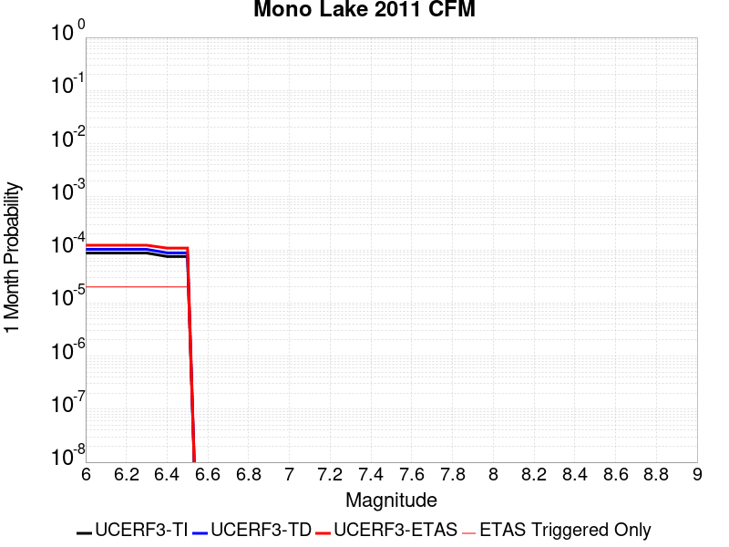 |  |  |

| Magnitude | 1 wk TI Prob | 1 wk TD Prob | 1 wk ETAS Prob | 1 wk ETAS/TD Gain | 1 wk ETAS Triggered Only | 1 mo TI Prob | 1 mo TD Prob | 1 mo ETAS Prob | 1 mo ETAS/TD Gain | 1 mo ETAS Triggered Only | 1 yr TI Prob | 1 yr TD Prob | 1 yr ETAS Prob | 1 yr ETAS/TD Gain | 1 yr ETAS Triggered Only | 10 yr TI Prob | 10 yr TD Prob | 10 yr ETAS Prob | 10 yr ETAS/TD Gain | 10 yr ETAS Triggered Only |
|-----|-----|-----|-----|-----|-----|-----|-----|-----|-----|-----|-----|-----|-----|-----|-----|-----|-----|-----|-----|-----|
| 6.0 | 2.0341662E-5 | 2.3828166E-5 | 7.144608E-5 | 2.9983876 | 4.7619047E-5 | 8.717564E-5 | 1.0211971E-4 | 1.497339E-4 | 1.4662585 | 4.7619047E-5 | 0.0010608466 | 0.0012431298 | 0.0013144696 | 1.0573872 | 7.142857E-5 | 0.010557966 | 0.012413835 | 0.012484377 | 1.0056825 | 7.142857E-5 |
| 6.1 | 2.0341662E-5 | 2.3828166E-5 | 7.144608E-5 | 2.9983876 | 4.7619047E-5 | 8.717564E-5 | 1.0211971E-4 | 1.497339E-4 | 1.4662585 | 4.7619047E-5 | 0.0010608466 | 0.0012431298 | 0.0013144696 | 1.0573872 | 7.142857E-5 | 0.010557966 | 0.012413835 | 0.012484377 | 1.0056825 | 7.142857E-5 |
| 6.2 | 2.0341662E-5 | 2.3828166E-5 | 7.144608E-5 | 2.9983876 | 4.7619047E-5 | 8.717564E-5 | 1.0211971E-4 | 1.497339E-4 | 1.4662585 | 4.7619047E-5 | 0.0010608466 | 0.0012431298 | 0.0013144696 | 1.0573872 | 7.142857E-5 | 0.010557966 | 0.012413835 | 0.012484377 | 1.0056825 | 7.142857E-5 |
| 6.3 | 2.0341662E-5 | 2.3828166E-5 | 7.144608E-5 | 2.9983876 | 4.7619047E-5 | 8.717564E-5 | 1.0211971E-4 | 1.497339E-4 | 1.4662585 | 4.7619047E-5 | 0.0010608466 | 0.0012431298 | 0.0013144696 | 1.0573872 | 7.142857E-5 | 0.010557966 | 0.012413835 | 0.012484377 | 1.0056825 | 7.142857E-5 |
| 6.4 | 1.749821E-5 | 2.0490985E-5 | 6.810906E-5 | 3.3238547 | 4.7619047E-5 | 7.499018E-5 | 8.781851E-5 | 1.3543338E-4 | 1.5421963 | 4.7619047E-5 | 9.1262296E-4 | 0.0010691903 | 0.0011405426 | 1.0667348 | 7.142857E-5 | 0.009088841 | 0.010691865 | 0.010762529 | 1.0066092 | 7.142857E-5 |
| 6.5 | 1.749821E-5 | 2.0490985E-5 | 6.810906E-5 | 3.3238547 | 4.7619047E-5 | 7.499018E-5 | 8.781851E-5 | 1.3543338E-4 | 1.5421963 | 4.7619047E-5 | 9.1262296E-4 | 0.0010691903 | 0.0011405426 | 1.0667348 | 7.142857E-5 | 0.009088841 | 0.010691865 | 0.010762529 | 1.0066092 | 7.142857E-5 |

## Calaveras (Central) 2011 CFM
*[(top)](#table-of-contents)*

| 1 Week | 1 Month | 1 Year | 10 Year |
|-----|-----|-----|-----|
| 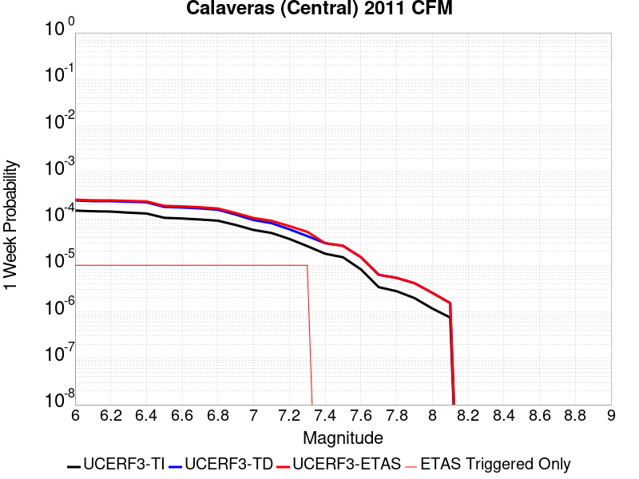 |  |  |  |

| Magnitude | 1 wk TI Prob | 1 wk TD Prob | 1 wk ETAS Prob | 1 wk ETAS/TD Gain | 1 wk ETAS Triggered Only | 1 mo TI Prob | 1 mo TD Prob | 1 mo ETAS Prob | 1 mo ETAS/TD Gain | 1 mo ETAS Triggered Only | 1 yr TI Prob | 1 yr TD Prob | 1 yr ETAS Prob | 1 yr ETAS/TD Gain | 1 yr ETAS Triggered Only | 10 yr TI Prob | 10 yr TD Prob | 10 yr ETAS Prob | 10 yr ETAS/TD Gain | 10 yr ETAS Triggered Only |
|-----|-----|-----|-----|-----|-----|-----|-----|-----|-----|-----|-----|-----|-----|-----|-----|-----|-----|-----|-----|-----|
| 6.0 | 1.5010907E-4 | 2.481574E-4 | 2.71961E-4 | 1.0959214 | 2.3809524E-5 | 6.4316596E-4 | 0.0010621005 | 0.0010858848 | 1.0223936 | 2.3809524E-5 | 0.0078024664 | 0.012850073 | 0.012897081 | 1.0036582 | 4.7619047E-5 | 0.07534136 | 0.120401435 | 0.12046426 | 1.0005218 | 7.142857E-5 |
| 6.1 | 1.4521465E-4 | 2.397987E-4 | 2.636025E-4 | 1.0992658 | 2.3809524E-5 | 6.222001E-4 | 0.0010263061 | 0.0010500911 | 1.0231755 | 2.3809524E-5 | 0.0075490056 | 0.012419341 | 0.012466369 | 1.0037867 | 4.7619047E-5 | 0.07297657 | 0.11667323 | 0.11673632 | 1.0005407 | 7.142857E-5 |
| 6.2 | 1.429998E-4 | 2.3911126E-4 | 2.629151E-4 | 1.0995513 | 2.3809524E-5 | 6.127123E-4 | 0.0010233623 | 0.0010471474 | 1.0232421 | 2.3809524E-5 | 0.007434286 | 0.01238394 | 0.01243097 | 1.0037977 | 4.7619047E-5 | 0.07190444 | 0.1163272 | 0.11639032 | 1.0005426 | 7.142857E-5 |
| 6.3 | 1.3536277E-4 | 2.3242626E-4 | 2.5623027E-4 | 1.1024152 | 2.3809524E-5 | 5.799972E-4 | 9.947343E-4 | 0.0010185202 | 1.0239117 | 2.3809524E-5 | 0.0070386264 | 0.012040132 | 0.0120871775 | 1.0039074 | 4.7619047E-5 | 0.0681982 | 0.11323977 | 0.11330312 | 1.0005593 | 7.142857E-5 |
| 6.4 | 1.2993296E-4 | 2.2666177E-4 | 2.504659E-4 | 1.1050205 | 2.3809524E-5 | 5.5673666E-4 | 9.700479E-4 | 9.938343E-4 | 1.0245209 | 2.3809524E-5 | 0.006757223 | 0.011742937 | 0.011789997 | 1.0040075 | 4.7619047E-5 | 0.06555412 | 0.11051771 | 0.11058125 | 1.0005748 | 7.142857E-5 |
| 6.5 | 1.0498927E-4 | 1.7981697E-4 | 2.0362221E-4 | 1.132386 | 2.3809524E-5 | 4.498764E-4 | 7.704157E-4 | 7.9420686E-4 | 1.0308809 | 2.3809524E-5 | 0.005463498 | 0.00933924 | 0.009386415 | 1.0050511 | 4.7619047E-5 | 0.053311124 | 0.089199215 | 0.089242585 | 1.0004863 | 4.7619047E-5 |
| 6.6 | 1.0157505E-4 | 1.7469203E-4 | 1.984974E-4 | 1.1362704 | 2.3809524E-5 | 4.35249E-4 | 7.484645E-4 | 7.722562E-4 | 1.0317874 | 2.3809524E-5 | 0.0052862884 | 0.009074297 | 0.009121483 | 1.0052 | 4.7619047E-5 | 0.05162293 | 0.08677671 | 0.0868202 | 1.0005012 | 4.7619047E-5 |
| 6.7 | 9.660386E-5 | 1.6728524E-4 | 1.9109077E-4 | 1.1423051 | 2.3809524E-5 | 4.1395082E-4 | 7.1673887E-4 | 7.405313E-4 | 1.0331954 | 2.3809524E-5 | 0.0050282106 | 0.008691208 | 0.008738413 | 1.0054314 | 4.7619047E-5 | 0.049159497 | 0.083266065 | 0.08330972 | 1.0005243 | 4.7619047E-5 |
| 6.8 | 9.089927E-5 | 1.5643016E-4 | 1.8023596E-4 | 1.1521816 | 2.3809524E-5 | 3.8951015E-4 | 6.702439E-4 | 6.940375E-4 | 1.0354998 | 2.3809524E-5 | 0.0047319788 | 0.008129478 | 0.00817671 | 1.0058099 | 4.7619047E-5 | 0.046324775 | 0.078159414 | 0.07820331 | 1.0005616 | 4.7619047E-5 |
| 6.9 | 7.353187E-5 | 1.2295354E-4 | 1.4676014E-4 | 1.1936227 | 2.3809524E-5 | 3.150985E-4 | 5.2683795E-4 | 5.506349E-4 | 1.0451695 | 2.3809524E-5 | 0.0038295772 | 0.006395508 | 0.0064428225 | 1.0073981 | 4.7619047E-5 | 0.037642512 | 0.062187865 | 0.06223252 | 1.0007181 | 4.7619047E-5 |
| 7.0 | 5.746064E-5 | 9.3887444E-5 | 1.1769473E-4 | 1.2535727 | 2.3809524E-5 | 2.4623662E-4 | 4.0231308E-4 | 4.2611302E-4 | 1.0591577 | 2.3809524E-5 | 0.0029938098 | 0.004887232 | 0.0049346182 | 1.0096959 | 4.7619047E-5 | 0.02953797 | 0.04798685 | 0.048032183 | 1.0009447 | 4.7619047E-5 |
| 7.1 | 4.9557195E-5 | 8.052461E-5 | 1.0433222E-4 | 1.2956563 | 2.3809524E-5 | 2.123707E-4 | 3.4506017E-4 | 3.6886148E-4 | 1.0689772 | 2.3809524E-5 | 0.0025825473 | 0.0041930773 | 0.004240497 | 1.0113089 | 4.7619047E-5 | 0.0255274 | 0.041373078 | 0.041418727 | 1.0011034 | 4.7619047E-5 |
| 7.2 | 3.687595E-5 | 5.9524526E-5 | 8.3332634E-5 | 1.3999714 | 2.3809524E-5 | 1.5803022E-4 | 2.5508032E-4 | 2.788838E-4 | 1.0933175 | 2.3809524E-5 | 0.0019223199 | 0.0031012094 | 0.0031486808 | 1.0153074 | 4.7619047E-5 | 0.01905776 | 0.030883716 | 0.030929865 | 1.0014943 | 4.7619047E-5 |
| 7.3 | 2.5846984E-5 | 4.247213E-5 | 6.628064E-5 | 1.5605679 | 2.3809524E-5 | 1.1076809E-4 | 1.8201082E-4 | 2.05816E-4 | 1.13079 | 2.3809524E-5 | 0.0013477671 | 0.002213747 | 0.0022612605 | 1.021463 | 4.7619047E-5 | 0.013396223 | 0.02217554 | 0.022222102 | 1.0020998 | 4.7619047E-5 |
| 7.4 | 1.7747854E-5 | 2.9936204E-5 | 2.9936204E-5 | 1.0 | 0.0 | 7.6060016E-5 | 1.2829172E-4 | 1.2829172E-4 | 1.0 | 0.0 | 9.2563726E-4 | 0.0015608355 | 0.0015846079 | 1.0152305 | 2.3809524E-5 | 0.009217911 | 0.015709236 | 0.015732672 | 1.0014918 | 2.3809524E-5 |
| 7.5 | 1.4883479E-5 | 2.6243379E-5 | 2.6243379E-5 | 1.0 | 0.0 | 6.378478E-5 | 1.1246678E-4 | 1.1246678E-4 | 1.0 | 0.0 | 7.76303E-4 | 0.0013684258 | 0.0013922028 | 1.0173753 | 2.3809524E-5 | 0.0077359667 | 0.013802425 | 0.0138259055 | 1.0017012 | 2.3809524E-5 |
| 7.6 | 8.166975E-6 | 1.4963478E-5 | 1.4963478E-5 | 1.0 | 0.0 | 3.5000852E-5 | 6.412763E-5 | 6.412763E-5 | 1.0 | 0.0 | 4.2605202E-4 | 7.804755E-4 | 8.042664E-4 | 1.0304826 | 2.3809524E-5 | 0.004252361 | 0.00793984 | 0.00796346 | 1.002975 | 2.3809524E-5 |
| 7.7 | 3.3858064E-6 | 6.253914E-6 | 6.253914E-6 | 1.0 | 0.0 | 1.4510518E-5 | 2.6802214E-5 | 2.6802214E-5 | 1.0 | 0.0 | 1.7665124E-4 | 3.2626814E-4 | 3.500699E-4 | 1.0729516 | 2.3809524E-5 | 0.0017651088 | 0.0033882293 | 0.003411958 | 1.0070033 | 2.3809524E-5 |
| 7.8 | 2.7721615E-6 | 5.3663807E-6 | 5.3663807E-6 | 1.0 | 0.0 | 1.1880637E-5 | 2.2998573E-5 | 2.2998573E-5 | 1.0 | 0.0 | 1.4463716E-4 | 2.799717E-4 | 3.0377455E-4 | 1.0850188 | 2.3809524E-5 | 0.0014454306 | 0.0029074624 | 0.0029312028 | 1.0081652 | 2.3809524E-5 |
| 7.9 | 1.9736292E-6 | 4.1284193E-6 | 4.1284193E-6 | 1.0 | 0.0 | 8.4583835E-6 | 1.7693106E-5 | 1.7693106E-5 | 1.0 | 0.0 | 1.0297595E-4 | 2.1539231E-4 | 2.1539231E-4 | 1.0 | 0.0 | 0.0010292825 | 0.0022236116 | 0.0022236116 | 1.0 | 0.0 |
| 8.0 | 1.1767289E-6 | 2.5544743E-6 | 2.5544743E-6 | 1.0 | 0.0 | 5.0431145E-6 | 1.0947701E-5 | 1.0947701E-5 | 1.0 | 0.0 | 6.139818E-5 | 1.3328013E-4 | 1.3328013E-4 | 1.0 | 0.0 | 6.1381224E-4 | 0.0013660848 | 0.0013660848 | 1.0 | 0.0 |
| 8.1 | 7.5112825E-7 | 1.5409794E-6 | 1.5409794E-6 | 1.0 | 0.0 | 3.2191172E-6 | 6.6041807E-6 | 6.6041807E-6 | 1.0 | 0.0 | 3.9192048E-5 | 8.0402955E-5 | 8.0402955E-5 | 1.0 | 0.0 | 3.9185135E-4 | 8.235564E-4 | 8.235564E-4 | 1.0 | 0.0 |

## Verdugo
*[(top)](#table-of-contents)*

| 1 Week | 1 Month | 1 Year | 10 Year |
|-----|-----|-----|-----|
|  |  |  |  |

| Magnitude | 1 wk TI Prob | 1 wk TD Prob | 1 wk ETAS Prob | 1 wk ETAS/TD Gain | 1 wk ETAS Triggered Only | 1 mo TI Prob | 1 mo TD Prob | 1 mo ETAS Prob | 1 mo ETAS/TD Gain | 1 mo ETAS Triggered Only | 1 yr TI Prob | 1 yr TD Prob | 1 yr ETAS Prob | 1 yr ETAS/TD Gain | 1 yr ETAS Triggered Only | 10 yr TI Prob | 10 yr TD Prob | 10 yr ETAS Prob | 10 yr ETAS/TD Gain | 10 yr ETAS Triggered Only |
|-----|-----|-----|-----|-----|-----|-----|-----|-----|-----|-----|-----|-----|-----|-----|-----|-----|-----|-----|-----|-----|
| 6.0 | 5.392987E-6 | 4.216517E-6 | 4.216517E-6 | 1.0 | 0.0 | 2.3112598E-5 | 1.8070665E-5 | 1.8070665E-5 | 1.0 | 0.0 | 2.8135953E-4 | 2.1998861E-4 | 2.4379289E-4 | 1.1082069 | 2.3809524E-5 | 0.0028100356 | 0.0021977562 | 0.0022452706 | 1.0216196 | 4.7619047E-5 |
| 6.1 | 5.392987E-6 | 4.216517E-6 | 4.216517E-6 | 1.0 | 0.0 | 2.3112598E-5 | 1.8070665E-5 | 1.8070665E-5 | 1.0 | 0.0 | 2.8135953E-4 | 2.1998861E-4 | 2.4379289E-4 | 1.1082069 | 2.3809524E-5 | 0.0028100356 | 0.0021977562 | 0.0022452706 | 1.0216196 | 4.7619047E-5 |
| 6.2 | 5.392987E-6 | 4.216517E-6 | 4.216517E-6 | 1.0 | 0.0 | 2.3112598E-5 | 1.8070665E-5 | 1.8070665E-5 | 1.0 | 0.0 | 2.8135953E-4 | 2.1998861E-4 | 2.4379289E-4 | 1.1082069 | 2.3809524E-5 | 0.0028100356 | 0.0021977562 | 0.0022452706 | 1.0216196 | 4.7619047E-5 |
| 6.3 | 5.392987E-6 | 4.216517E-6 | 4.216517E-6 | 1.0 | 0.0 | 2.3112598E-5 | 1.8070665E-5 | 1.8070665E-5 | 1.0 | 0.0 | 2.8135953E-4 | 2.1998861E-4 | 2.4379289E-4 | 1.1082069 | 2.3809524E-5 | 0.0028100356 | 0.0021977562 | 0.0022452706 | 1.0216196 | 4.7619047E-5 |
| 6.4 | 5.392987E-6 | 4.216517E-6 | 4.216517E-6 | 1.0 | 0.0 | 2.3112598E-5 | 1.8070665E-5 | 1.8070665E-5 | 1.0 | 0.0 | 2.8135953E-4 | 2.1998861E-4 | 2.4379289E-4 | 1.1082069 | 2.3809524E-5 | 0.0028100356 | 0.0021977562 | 0.0022452706 | 1.0216196 | 4.7619047E-5 |
| 6.5 | 4.9154837E-6 | 3.722465E-6 | 3.722465E-6 | 1.0 | 0.0 | 2.1066187E-5 | 1.5953325E-5 | 1.5953325E-5 | 1.0 | 0.0 | 2.5645064E-4 | 1.9421462E-4 | 1.9421462E-4 | 1.0 | 0.0 | 0.002561549 | 0.0019404698 | 0.0019404698 | 1.0 | 0.0 |
| 6.6 | 4.9154837E-6 | 3.722465E-6 | 3.722465E-6 | 1.0 | 0.0 | 2.1066187E-5 | 1.5953325E-5 | 1.5953325E-5 | 1.0 | 0.0 | 2.5645064E-4 | 1.9421462E-4 | 1.9421462E-4 | 1.0 | 0.0 | 0.002561549 | 0.0019404698 | 0.0019404698 | 1.0 | 0.0 |
| 6.7 | 4.817006E-6 | 3.6206518E-6 | 3.6206518E-6 | 1.0 | 0.0 | 2.0644147E-5 | 1.5516987E-5 | 1.5516987E-5 | 1.0 | 0.0 | 2.513135E-4 | 1.8890314E-4 | 1.8890314E-4 | 1.0 | 0.0 | 0.0025102948 | 0.0018874453 | 0.0018874453 | 1.0 | 0.0 |
| 6.8 | 4.507407E-6 | 3.3071042E-6 | 3.3071042E-6 | 1.0 | 0.0 | 1.9317316E-5 | 1.4173227E-5 | 1.4173227E-5 | 1.0 | 0.0 | 2.3516294E-4 | 1.7254551E-4 | 1.7254551E-4 | 1.0 | 0.0 | 0.0023491425 | 0.0017241298 | 0.0017241298 | 1.0 | 0.0 |
| 6.9 | 4.3573054E-6 | 3.161011E-6 | 3.161011E-6 | 1.0 | 0.0 | 1.8674033E-5 | 1.354712E-5 | 1.354712E-5 | 1.0 | 0.0 | 2.2733262E-4 | 1.6492383E-4 | 1.6492383E-4 | 1.0 | 0.0 | 0.0022710022 | 0.0016480266 | 0.0016480266 | 1.0 | 0.0 |
| 7.0 | 4.171527E-6 | 2.9836704E-6 | 2.9836704E-6 | 1.0 | 0.0 | 1.787785E-5 | 1.2787096E-5 | 1.2787096E-5 | 1.0 | 0.0 | 2.1764109E-4 | 1.5567189E-4 | 1.5567189E-4 | 1.0 | 0.0 | 0.0021742806 | 0.0015556397 | 0.0015556397 | 1.0 | 0.0 |
| 7.1 | 4.0405484E-6 | 2.882261E-6 | 2.882261E-6 | 1.0 | 0.0 | 1.731652E-5 | 1.235249E-5 | 1.235249E-5 | 1.0 | 0.0 | 2.1080824E-4 | 1.503813E-4 | 1.503813E-4 | 1.0 | 0.0 | 0.0021060838 | 0.0015028063 | 0.0015028063 | 1.0 | 0.0 |
| 7.2 | 3.8306007E-6 | 2.7018452E-6 | 2.7018452E-6 | 1.0 | 0.0 | 1.6416758E-5 | 1.15792855E-5 | 1.15792855E-5 | 1.0 | 0.0 | 1.9985568E-4 | 1.4096878E-4 | 1.4096878E-4 | 1.0 | 0.0 | 0.0019967605 | 0.0014088044 | 0.0014088044 | 1.0 | 0.0 |
| 7.3 | 3.5750938E-6 | 2.5121758E-6 | 2.5121758E-6 | 1.0 | 0.0 | 1.532174E-5 | 1.0766424E-5 | 1.0766424E-5 | 1.0 | 0.0 | 1.8652623E-4 | 1.3107344E-4 | 1.3107344E-4 | 1.0 | 0.0 | 0.0018636974 | 0.0013099718 | 0.0013099718 | 1.0 | 0.0 |
| 7.4 | 3.3510041E-6 | 2.3408586E-6 | 2.3408586E-6 | 1.0 | 0.0 | 1.4361368E-5 | 1.0032213E-5 | 1.0032213E-5 | 1.0 | 0.0 | 1.7483562E-4 | 1.2213545E-4 | 1.2213545E-4 | 1.0 | 0.0 | 0.0017469813 | 0.0012206937 | 0.0012206937 | 1.0 | 0.0 |
| 7.5 | 2.948287E-6 | 2.0391124E-6 | 2.0391124E-6 | 1.0 | 0.0 | 1.2635454E-5 | 8.739024E-6 | 8.739024E-6 | 1.0 | 0.0 | 1.538258E-4 | 1.0639253E-4 | 1.0639253E-4 | 1.0 | 0.0 | 0.0015371935 | 0.0010634261 | 0.0010634261 | 1.0 | 0.0 |
| 7.6 | 2.0134323E-6 | 1.4471265E-6 | 1.4471265E-6 | 1.0 | 0.0 | 8.628967E-6 | 6.2019562E-6 | 6.2019562E-6 | 1.0 | 0.0 | 1.05052604E-4 | 7.550629E-5 | 7.550629E-5 | 1.0 | 0.0 | 0.0010500296 | 7.548152E-4 | 7.548152E-4 | 1.0 | 0.0 |
| 7.7 | 5.726436E-7 | 4.045248E-7 | 4.045248E-7 | 1.0 | 0.0 | 2.4541846E-6 | 1.7336766E-6 | 1.7336766E-6 | 1.0 | 0.0 | 2.9879287E-5 | 2.1107335E-5 | 2.1107335E-5 | 1.0 | 0.0 | 2.987527E-4 | 2.1105584E-4 | 2.1105584E-4 | 1.0 | 0.0 |
| 7.8 | 1.6248204E-7 | 1.0687696E-7 | 1.0687696E-7 | 1.0 | 0.0 | 6.963514E-7 | 4.5804404E-7 | 4.5804404E-7 | 1.0 | 0.0 | 8.478045E-6 | 5.5766723E-6 | 5.5766723E-6 | 1.0 | 0.0 | 8.477722E-5 | 5.5765355E-5 | 5.5765355E-5 | 1.0 | 0.0 |
| 7.9 | 4.4475744E-8 | 3.0375546E-8 | 3.0375546E-8 | 1.0 | 0.0 | 1.9061031E-7 | 1.301809E-7 | 1.301809E-7 | 1.0 | 0.0 | 2.320678E-6 | 1.5849514E-6 | 1.5849514E-6 | 1.0 | 0.0 | 2.3206538E-5 | 1.5849415E-5 | 1.5849415E-5 | 1.0 | 0.0 |

## Newport-Inglewood (Offshore)
*[(top)](#table-of-contents)*

| 1 Week | 1 Month | 1 Year | 10 Year |
|-----|-----|-----|-----|
|  |  |  |  |

| Magnitude | 1 wk TI Prob | 1 wk TD Prob | 1 wk ETAS Prob | 1 wk ETAS/TD Gain | 1 wk ETAS Triggered Only | 1 mo TI Prob | 1 mo TD Prob | 1 mo ETAS Prob | 1 mo ETAS/TD Gain | 1 mo ETAS Triggered Only | 1 yr TI Prob | 1 yr TD Prob | 1 yr ETAS Prob | 1 yr ETAS/TD Gain | 1 yr ETAS Triggered Only | 10 yr TI Prob | 10 yr TD Prob | 10 yr ETAS Prob | 10 yr ETAS/TD Gain | 10 yr ETAS Triggered Only |
|-----|-----|-----|-----|-----|-----|-----|-----|-----|-----|-----|-----|-----|-----|-----|-----|-----|-----|-----|-----|-----|
| 6.0 | 1.9626508E-5 | 1.8965357E-5 | 1.8965357E-5 | 1.0 | 0.0 | 8.411089E-5 | 8.1277634E-5 | 8.1277634E-5 | 1.0 | 0.0 | 0.001023569 | 9.891186E-4 | 0.0010129046 | 1.0240476 | 2.3809524E-5 | 0.010188672 | 0.009848503 | 0.009872079 | 1.0023937 | 2.3809524E-5 |
| 6.1 | 1.331886E-5 | 1.2218092E-5 | 1.2218092E-5 | 1.0 | 0.0 | 5.707958E-5 | 5.2362207E-5 | 5.2362207E-5 | 1.0 | 0.0 | 6.947222E-4 | 6.3732493E-4 | 6.611193E-4 | 1.0373347 | 2.3809524E-5 | 0.006925544 | 0.006355149 | 0.006378807 | 1.0037227 | 2.3809524E-5 |
| 6.2 | 1.2250852E-5 | 1.1076029E-5 | 1.1076029E-5 | 1.0 | 0.0 | 5.2502597E-5 | 4.7467838E-5 | 4.7467838E-5 | 1.0 | 0.0 | 6.3903164E-4 | 5.777687E-4 | 6.015645E-4 | 1.0411856 | 2.3809524E-5 | 0.006371971 | 0.0057627866 | 0.005786459 | 1.0041078 | 2.3809524E-5 |
| 6.3 | 1.2106258E-5 | 1.0918891E-5 | 1.0918891E-5 | 1.0 | 0.0 | 5.1882926E-5 | 4.6794412E-5 | 4.6794412E-5 | 1.0 | 0.0 | 6.3149154E-4 | 5.69574E-4 | 5.9337E-4 | 1.0417786 | 2.3809524E-5 | 0.0062970007 | 0.005681259 | 0.0057049333 | 1.0041671 | 2.3809524E-5 |
| 6.4 | 1.1348758E-5 | 1.0109362E-5 | 1.0109362E-5 | 1.0 | 0.0 | 4.8636626E-5 | 4.3325123E-5 | 4.3325123E-5 | 1.0 | 0.0 | 5.919901E-4 | 5.273565E-4 | 5.5115344E-4 | 1.045125 | 2.3809524E-5 | 0.005904155 | 0.0052611465 | 0.0052848305 | 1.0045017 | 2.3809524E-5 |
| 6.5 | 1.100837E-5 | 9.7433895E-6 | 9.7433895E-6 | 1.0 | 0.0 | 4.7177873E-5 | 4.1756717E-5 | 4.1756717E-5 | 1.0 | 0.0 | 5.7423924E-4 | 5.082702E-4 | 5.320676E-4 | 1.0468204 | 2.3809524E-5 | 0.005727576 | 0.0050711688 | 0.0050948574 | 1.0046712 | 2.3809524E-5 |
| 6.6 | 1.0634696E-5 | 9.345544E-6 | 9.345544E-6 | 1.0 | 0.0 | 4.557647E-5 | 4.0051716E-5 | 4.0051716E-5 | 1.0 | 0.0 | 5.5475225E-4 | 4.8752132E-4 | 5.113192E-4 | 1.048814 | 2.3809524E-5 | 0.0055336943 | 0.0048646047 | 0.0048882985 | 1.0048707 | 2.3809524E-5 |
| 6.7 | 9.9780855E-6 | 8.667911E-6 | 8.667911E-6 | 1.0 | 0.0 | 4.276252E-5 | 3.7147664E-5 | 3.7147664E-5 | 1.0 | 0.0 | 5.205093E-4 | 4.5217964E-4 | 4.759784E-4 | 1.0526313 | 2.3809524E-5 | 0.0051929182 | 0.004512675 | 0.004536377 | 1.0052524 | 2.3809524E-5 |
| 6.8 | 9.59546E-6 | 8.27295E-6 | 8.27295E-6 | 1.0 | 0.0 | 4.1122752E-5 | 3.5455025E-5 | 3.5455025E-5 | 1.0 | 0.0 | 5.0055445E-4 | 4.315801E-4 | 4.5537934E-4 | 1.0551444 | 2.3809524E-5 | 0.004994285 | 0.004307495 | 0.0043312022 | 1.0055037 | 2.3809524E-5 |
| 6.9 | 9.000614E-6 | 7.70684E-6 | 7.70684E-6 | 1.0 | 0.0 | 3.857349E-5 | 3.30289E-5 | 3.30289E-5 | 1.0 | 0.0 | 4.6953102E-4 | 4.0205332E-4 | 4.2585327E-4 | 1.059196 | 2.3809524E-5 | 0.004685402 | 0.0040133307 | 0.004037045 | 1.0059088 | 2.3809524E-5 |
| 7.0 | 7.4070194E-6 | 6.148904E-6 | 6.148904E-6 | 1.0 | 0.0 | 3.1743984E-5 | 2.635218E-5 | 2.635218E-5 | 1.0 | 0.0 | 3.8641447E-4 | 3.207907E-4 | 3.445926E-4 | 1.0741975 | 2.3809524E-5 | 0.0038574322 | 0.0032032963 | 0.0032270295 | 1.007409 | 2.3809524E-5 |
| 7.1 | 6.299615E-6 | 5.0565927E-6 | 5.0565927E-6 | 1.0 | 0.0 | 2.699807E-5 | 2.1670932E-5 | 2.1670932E-5 | 1.0 | 0.0 | 3.2865192E-4 | 2.638118E-4 | 2.8761502E-4 | 1.0902281 | 2.3809524E-5 | 0.003281663 | 0.002635001 | 0.0026587476 | 1.0090121 | 2.3809524E-5 |
| 7.2 | 5.096653E-6 | 3.892769E-6 | 3.892769E-6 | 1.0 | 0.0 | 2.1842614E-5 | 1.668319E-5 | 1.668319E-5 | 1.0 | 0.0 | 2.6590136E-4 | 2.0309901E-4 | 2.0309901E-4 | 1.0 | 0.0 | 0.0026558342 | 0.0020291451 | 0.0020291451 | 1.0 | 0.0 |
| 7.3 | 3.9753018E-6 | 2.9099103E-6 | 2.9099103E-6 | 1.0 | 0.0 | 1.7036897E-5 | 1.2470985E-5 | 1.2470985E-5 | 1.0 | 0.0 | 2.0740448E-4 | 1.5182374E-4 | 1.5182374E-4 | 1.0 | 0.0 | 0.00207211 | 0.0015172083 | 0.0015172083 | 1.0 | 0.0 |
| 7.4 | 3.0568392E-6 | 2.1449955E-6 | 2.1449955E-6 | 1.0 | 0.0 | 1.3100675E-5 | 9.192806E-6 | 9.192806E-6 | 1.0 | 0.0 | 1.5948903E-4 | 1.1191672E-4 | 1.1191672E-4 | 1.0 | 0.0 | 0.0015937461 | 0.0011186098 | 0.0011186098 | 1.0 | 0.0 |
| 7.5 | 1.7279019E-6 | 1.1469883E-6 | 1.1469883E-6 | 1.0 | 0.0 | 7.405273E-6 | 4.915655E-6 | 4.915655E-6 | 1.0 | 0.0 | 9.015547E-5 | 5.9846494E-5 | 5.9846494E-5 | 1.0 | 0.0 | 9.01189E-4 | 5.9830764E-4 | 5.9830764E-4 | 1.0 | 0.0 |
| 7.6 | 1.1156416E-6 | 7.223012E-7 | 7.223012E-7 | 1.0 | 0.0 | 4.7813123E-6 | 3.095573E-6 | 3.095573E-6 | 1.0 | 0.0 | 5.821092E-5 | 3.7687976E-5 | 3.7687976E-5 | 1.0 | 0.0 | 5.8195676E-4 | 3.7681818E-4 | 3.7681818E-4 | 1.0 | 0.0 |
| 7.7 | 9.117973E-8 | 6.734145E-8 | 6.734145E-8 | 1.0 | 0.0 | 3.907702E-7 | 2.886062E-7 | 2.886062E-7 | 1.0 | 0.0 | 4.757617E-6 | 3.513775E-6 | 3.513775E-6 | 1.0 | 0.0 | 4.7575148E-5 | 3.5137225E-5 | 3.5137225E-5 | 1.0 | 0.0 |

## Raymond
*[(top)](#table-of-contents)*

| 1 Week | 1 Month | 1 Year | 10 Year |
|-----|-----|-----|-----|
| 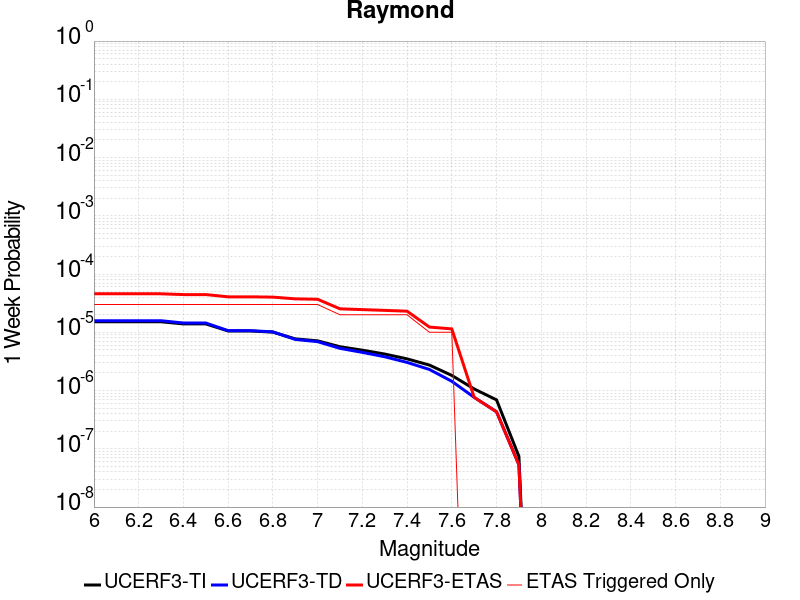 |  |  | 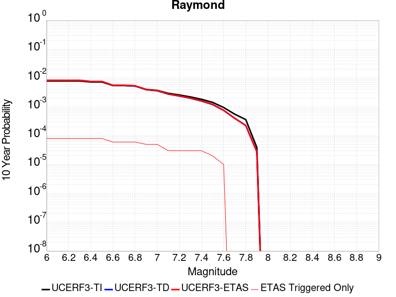 |

| Magnitude | 1 wk TI Prob | 1 wk TD Prob | 1 wk ETAS Prob | 1 wk ETAS/TD Gain | 1 wk ETAS Triggered Only | 1 mo TI Prob | 1 mo TD Prob | 1 mo ETAS Prob | 1 mo ETAS/TD Gain | 1 mo ETAS Triggered Only | 1 yr TI Prob | 1 yr TD Prob | 1 yr ETAS Prob | 1 yr ETAS/TD Gain | 1 yr ETAS Triggered Only | 10 yr TI Prob | 10 yr TD Prob | 10 yr ETAS Prob | 10 yr ETAS/TD Gain | 10 yr ETAS Triggered Only |
|-----|-----|-----|-----|-----|-----|-----|-----|-----|-----|-----|-----|-----|-----|-----|-----|-----|-----|-----|-----|-----|
| 6.0 | 1.5157413E-5 | 1.5810128E-5 | 1.5810128E-5 | 1.0 | 0.0 | 6.4958724E-5 | 6.7756075E-5 | 6.7756075E-5 | 1.0 | 0.0 | 7.905855E-4 | 8.2464307E-4 | 8.2464307E-4 | 1.0 | 0.0 | 0.007877788 | 0.008218348 | 0.008265576 | 1.0057466 | 4.7619047E-5 |
| 6.1 | 1.5157413E-5 | 1.5810128E-5 | 1.5810128E-5 | 1.0 | 0.0 | 6.4958724E-5 | 6.7756075E-5 | 6.7756075E-5 | 1.0 | 0.0 | 7.905855E-4 | 8.2464307E-4 | 8.2464307E-4 | 1.0 | 0.0 | 0.007877788 | 0.008218348 | 0.008265576 | 1.0057466 | 4.7619047E-5 |
| 6.2 | 1.5157413E-5 | 1.5810128E-5 | 1.5810128E-5 | 1.0 | 0.0 | 6.4958724E-5 | 6.7756075E-5 | 6.7756075E-5 | 1.0 | 0.0 | 7.905855E-4 | 8.2464307E-4 | 8.2464307E-4 | 1.0 | 0.0 | 0.007877788 | 0.008218348 | 0.008265576 | 1.0057466 | 4.7619047E-5 |
| 6.3 | 1.5157413E-5 | 1.5810128E-5 | 1.5810128E-5 | 1.0 | 0.0 | 6.4958724E-5 | 6.7756075E-5 | 6.7756075E-5 | 1.0 | 0.0 | 7.905855E-4 | 8.2464307E-4 | 8.2464307E-4 | 1.0 | 0.0 | 0.007877788 | 0.008218348 | 0.008265576 | 1.0057466 | 4.7619047E-5 |
| 6.4 | 1.3941944E-5 | 1.445469E-5 | 1.445469E-5 | 1.0 | 0.0 | 5.9749822E-5 | 6.1947336E-5 | 6.1947336E-5 | 1.0 | 0.0 | 7.2721124E-4 | 7.5397117E-4 | 7.5397117E-4 | 1.0 | 0.0 | 0.007248361 | 0.0075164647 | 0.007563726 | 1.0062877 | 4.7619047E-5 |
| 6.5 | 1.3941944E-5 | 1.445469E-5 | 1.445469E-5 | 1.0 | 0.0 | 5.9749822E-5 | 6.1947336E-5 | 6.1947336E-5 | 1.0 | 0.0 | 7.2721124E-4 | 7.5397117E-4 | 7.5397117E-4 | 1.0 | 0.0 | 0.007248361 | 0.0075164647 | 0.007563726 | 1.0062877 | 4.7619047E-5 |
| 6.6 | 1.0542609E-5 | 1.0671113E-5 | 1.0671113E-5 | 1.0 | 0.0 | 4.5181827E-5 | 4.573257E-5 | 4.573257E-5 | 1.0 | 0.0 | 5.499499E-4 | 5.5665727E-4 | 5.5665727E-4 | 1.0 | 0.0 | 0.005485909 | 0.00555319 | 0.0055768676 | 1.0042638 | 2.3809524E-5 |
| 6.7 | 1.0542609E-5 | 1.0671113E-5 | 1.0671113E-5 | 1.0 | 0.0 | 4.5181827E-5 | 4.573257E-5 | 4.573257E-5 | 1.0 | 0.0 | 5.499499E-4 | 5.5665727E-4 | 5.5665727E-4 | 1.0 | 0.0 | 0.005485909 | 0.00555319 | 0.0055768676 | 1.0042638 | 2.3809524E-5 |
| 6.8 | 1.0079132E-5 | 1.0176646E-5 | 1.0176646E-5 | 1.0 | 0.0 | 4.3195567E-5 | 4.3613498E-5 | 4.3613498E-5 | 1.0 | 0.0 | 5.257791E-4 | 5.3087034E-4 | 5.3087034E-4 | 1.0 | 0.0 | 0.0052453685 | 0.005296571 | 0.0053202547 | 1.0044714 | 2.3809524E-5 |
| 6.9 | 7.721598E-6 | 7.5489047E-6 | 7.5489047E-6 | 1.0 | 0.0 | 3.3092143E-5 | 3.2352054E-5 | 3.2352054E-5 | 1.0 | 0.0 | 4.0282236E-4 | 3.9381627E-4 | 3.9381627E-4 | 1.0 | 0.0 | 0.0040209293 | 0.0039313175 | 0.0039313175 | 1.0 | 0.0 |
| 7.0 | 7.137566E-6 | 6.9113057E-6 | 6.9113057E-6 | 1.0 | 0.0 | 3.058921E-5 | 2.961955E-5 | 2.961955E-5 | 1.0 | 0.0 | 3.7236E-4 | 3.6055944E-4 | 3.6055944E-4 | 1.0 | 0.0 | 0.0037173668 | 0.0035998628 | 0.0035998628 | 1.0 | 0.0 |
| 7.1 | 5.654976E-6 | 5.29954E-6 | 5.29954E-6 | 1.0 | 0.0 | 2.4235387E-5 | 2.2712118E-5 | 2.2712118E-5 | 1.0 | 0.0 | 2.9502588E-4 | 2.7648517E-4 | 2.7648517E-4 | 1.0 | 0.0 | 0.0029463451 | 0.002761443 | 0.002761443 | 1.0 | 0.0 |
| 7.2 | 4.9358455E-6 | 4.5266574E-6 | 4.5266574E-6 | 1.0 | 0.0 | 2.1153453E-5 | 1.9399817E-5 | 1.9399817E-5 | 1.0 | 0.0 | 2.5751285E-4 | 2.3616731E-4 | 2.3616731E-4 | 1.0 | 0.0 | 0.0025721465 | 0.0023591854 | 0.0023591854 | 1.0 | 0.0 |
| 7.3 | 4.2368597E-6 | 3.8056164E-6 | 3.8056164E-6 | 1.0 | 0.0 | 1.8157843E-5 | 1.6309683E-5 | 1.6309683E-5 | 1.0 | 0.0 | 2.2104931E-4 | 1.9855241E-4 | 1.9855241E-4 | 1.0 | 0.0 | 0.0022082955 | 0.0019837688 | 0.0019837688 | 1.0 | 0.0 |
| 7.4 | 3.4999923E-6 | 3.043744E-6 | 3.043744E-6 | 1.0 | 0.0 | 1.49998805E-5 | 1.3044552E-5 | 1.3044552E-5 | 1.0 | 0.0 | 1.8260824E-4 | 1.5880594E-4 | 1.5880594E-4 | 1.0 | 0.0 | 0.0018245826 | 0.0015869403 | 0.0015869403 | 1.0 | 0.0 |
| 7.5 | 2.738017E-6 | 2.3020468E-6 | 2.3020468E-6 | 1.0 | 0.0 | 1.1734306E-5 | 9.865878E-6 | 9.865878E-6 | 1.0 | 0.0 | 1.428558E-4 | 1.2011051E-4 | 1.2011051E-4 | 1.0 | 0.0 | 0.0014276401 | 0.0012004703 | 0.0012004703 | 1.0 | 0.0 |
| 7.6 | 1.8186392E-6 | 1.442312E-6 | 1.442312E-6 | 1.0 | 0.0 | 7.794145E-6 | 6.181323E-6 | 6.181323E-6 | 1.0 | 0.0 | 9.488958E-5 | 7.5255055E-5 | 7.5255055E-5 | 1.0 | 0.0 | 9.4849075E-4 | 7.523072E-4 | 7.523072E-4 | 1.0 | 0.0 |
| 7.7 | 1.0660348E-6 | 7.6438056E-7 | 7.6438056E-7 | 1.0 | 0.0 | 4.5687125E-6 | 3.2759126E-6 | 3.2759126E-6 | 1.0 | 0.0 | 5.5622655E-5 | 3.9883522E-5 | 3.9883522E-5 | 1.0 | 0.0 | 5.5608735E-4 | 3.9877277E-4 | 3.9877277E-4 | 1.0 | 0.0 |
| 7.8 | 6.913602E-7 | 4.3204133E-7 | 4.3204133E-7 | 1.0 | 0.0 | 2.962969E-6 | 1.8516045E-6 | 1.8516045E-6 | 1.0 | 0.0 | 3.607355E-5 | 2.2543056E-5 | 2.2543056E-5 | 1.0 | 0.0 | 3.6067693E-4 | 2.2541556E-4 | 2.2541556E-4 | 1.0 | 0.0 |
| 7.9 | 7.425201E-8 | 5.3222113E-8 | 5.3222113E-8 | 1.0 | 0.0 | 3.1822285E-7 | 2.2809476E-7 | 2.2809476E-7 | 1.0 | 0.0 | 3.874356E-6 | 2.7770516E-6 | 2.7770516E-6 | 1.0 | 0.0 | 3.8742884E-5 | 2.7770298E-5 | 2.7770298E-5 | 1.0 | 0.0 |

## Simi-Santa Rosa
*[(top)](#table-of-contents)*

| 1 Week | 1 Month | 1 Year | 10 Year |
|-----|-----|-----|-----|
|  |  |  |  |

| Magnitude | 1 wk TI Prob | 1 wk TD Prob | 1 wk ETAS Prob | 1 wk ETAS/TD Gain | 1 wk ETAS Triggered Only | 1 mo TI Prob | 1 mo TD Prob | 1 mo ETAS Prob | 1 mo ETAS/TD Gain | 1 mo ETAS Triggered Only | 1 yr TI Prob | 1 yr TD Prob | 1 yr ETAS Prob | 1 yr ETAS/TD Gain | 1 yr ETAS Triggered Only | 10 yr TI Prob | 10 yr TD Prob | 10 yr ETAS Prob | 10 yr ETAS/TD Gain | 10 yr ETAS Triggered Only |
|-----|-----|-----|-----|-----|-----|-----|-----|-----|-----|-----|-----|-----|-----|-----|-----|-----|-----|-----|-----|-----|
| 6.0 | 2.198912E-5 | 2.2275442E-5 | 2.2275442E-5 | 1.0 | 0.0 | 9.4235686E-5 | 9.5462936E-5 | 9.5462936E-5 | 1.0 | 0.0 | 0.0011467156 | 0.0011616853 | 0.0011854672 | 1.0204718 | 2.3809524E-5 | 0.011408163 | 0.011560575 | 0.011607643 | 1.0040715 | 4.7619047E-5 |
| 6.1 | 2.198912E-5 | 2.2275442E-5 | 2.2275442E-5 | 1.0 | 0.0 | 9.4235686E-5 | 9.5462936E-5 | 9.5462936E-5 | 1.0 | 0.0 | 0.0011467156 | 0.0011616853 | 0.0011854672 | 1.0204718 | 2.3809524E-5 | 0.011408163 | 0.011560575 | 0.011607643 | 1.0040715 | 4.7619047E-5 |
| 6.2 | 1.69983E-5 | 1.6668559E-5 | 1.6668559E-5 | 1.0 | 0.0 | 7.284782E-5 | 7.143489E-5 | 7.143489E-5 | 1.0 | 0.0 | 8.865613E-4 | 8.6940196E-4 | 8.9319074E-4 | 1.0273622 | 2.3809524E-5 | 0.008830327 | 0.008662928 | 0.008710134 | 1.0054493 | 4.7619047E-5 |
| 6.3 | 1.69983E-5 | 1.6668559E-5 | 1.6668559E-5 | 1.0 | 0.0 | 7.284782E-5 | 7.143489E-5 | 7.143489E-5 | 1.0 | 0.0 | 8.865613E-4 | 8.6940196E-4 | 8.9319074E-4 | 1.0273622 | 2.3809524E-5 | 0.008830327 | 0.008662928 | 0.008710134 | 1.0054493 | 4.7619047E-5 |
| 6.4 | 1.4666188E-5 | 1.4052543E-5 | 1.4052543E-5 | 1.0 | 0.0 | 6.285358E-5 | 6.0223934E-5 | 6.0223934E-5 | 1.0 | 0.0 | 7.6497364E-4 | 7.3300465E-4 | 7.567967E-4 | 1.0324583 | 2.3809524E-5 | 0.0076234564 | 0.007308344 | 0.007355615 | 1.006468 | 4.7619047E-5 |
| 6.5 | 1.4666188E-5 | 1.4052543E-5 | 1.4052543E-5 | 1.0 | 0.0 | 6.285358E-5 | 6.0223934E-5 | 6.0223934E-5 | 1.0 | 0.0 | 7.6497364E-4 | 7.3300465E-4 | 7.567967E-4 | 1.0324583 | 2.3809524E-5 | 0.0076234564 | 0.007308344 | 0.007355615 | 1.006468 | 4.7619047E-5 |
| 6.6 | 1.4377586E-5 | 1.3729583E-5 | 1.3729583E-5 | 1.0 | 0.0 | 6.1616774E-5 | 5.883988E-5 | 5.883988E-5 | 1.0 | 0.0 | 7.4992597E-4 | 7.1616494E-4 | 7.3995744E-4 | 1.0332221 | 2.3809524E-5 | 0.007474003 | 0.0071410383 | 0.0071883174 | 1.0066208 | 4.7619047E-5 |
| 6.7 | 1.3881404E-5 | 1.320755E-5 | 1.320755E-5 | 1.0 | 0.0 | 5.9490372E-5 | 5.66027E-5 | 5.66027E-5 | 1.0 | 0.0 | 7.240546E-4 | 6.8894465E-4 | 7.127378E-4 | 1.0345356 | 2.3809524E-5 | 0.007217 | 0.006870538 | 0.00691783 | 1.0068833 | 4.7619047E-5 |
| 6.8 | 1.0176516E-5 | 9.154151E-6 | 9.154151E-6 | 1.0 | 0.0 | 4.3612912E-5 | 3.9231574E-5 | 3.9231574E-5 | 1.0 | 0.0 | 5.308578E-4 | 4.7755634E-4 | 4.7755634E-4 | 1.0 | 0.0 | 0.0052959146 | 0.004766934 | 0.004766934 | 1.0 | 0.0 |
| 6.9 | 9.699797E-6 | 8.774719E-6 | 8.774719E-6 | 1.0 | 0.0 | 4.15699E-5 | 3.7605492E-5 | 3.7605492E-5 | 1.0 | 0.0 | 5.05996E-4 | 4.577671E-4 | 4.577671E-4 | 1.0 | 0.0 | 0.005048454 | 0.0045698597 | 0.0045698597 | 1.0 | 0.0 |
| 7.0 | 7.4049476E-6 | 6.559333E-6 | 6.559333E-6 | 1.0 | 0.0 | 3.1735104E-5 | 2.8111197E-5 | 2.8111197E-5 | 1.0 | 0.0 | 3.8630638E-4 | 3.422127E-4 | 3.422127E-4 | 1.0 | 0.0 | 0.0038563553 | 0.0034180996 | 0.0034180996 | 1.0 | 0.0 |
| 7.1 | 3.873439E-6 | 2.7595095E-6 | 2.7595095E-6 | 1.0 | 0.0 | 1.6600346E-5 | 1.1826417E-5 | 1.1826417E-5 | 1.0 | 0.0 | 2.0209046E-4 | 1.4397735E-4 | 1.4397735E-4 | 1.0 | 0.0 | 0.0020190678 | 0.0014388643 | 0.0014388643 | 1.0 | 0.0 |
| 7.2 | 3.417706E-6 | 2.3676484E-6 | 2.3676484E-6 | 1.0 | 0.0 | 1.4647229E-5 | 1.0147027E-5 | 1.0147027E-5 | 1.0 | 0.0 | 1.7831543E-4 | 1.2353327E-4 | 1.2353327E-4 | 1.0 | 0.0 | 0.0017817242 | 0.0012346683 | 0.0012346683 | 1.0 | 0.0 |
| 7.3 | 1.90225E-6 | 1.4073753E-6 | 1.4073753E-6 | 1.0 | 0.0 | 8.152474E-6 | 6.0315947E-6 | 6.0315947E-6 | 1.0 | 0.0 | 9.9251854E-5 | 7.343221E-5 | 7.343221E-5 | 1.0 | 0.0 | 9.920754E-4 | 7.340817E-4 | 7.340817E-4 | 1.0 | 0.0 |
| 7.4 | 1.5170556E-6 | 1.1024773E-6 | 1.1024773E-6 | 1.0 | 0.0 | 6.5016507E-6 | 4.724894E-6 | 4.724894E-6 | 1.0 | 0.0 | 7.915472E-5 | 5.7524077E-5 | 5.7524077E-5 | 1.0 | 0.0 | 7.9126534E-4 | 5.7509297E-4 | 5.7509297E-4 | 1.0 | 0.0 |
| 7.5 | 1.178732E-6 | 8.535102E-7 | 8.535102E-7 | 1.0 | 0.0 | 5.0516987E-6 | 3.6578958E-6 | 3.6578958E-6 | 1.0 | 0.0 | 6.1502695E-5 | 4.453398E-5 | 4.453398E-5 | 1.0 | 0.0 | 6.148568E-4 | 4.452515E-4 | 4.452515E-4 | 1.0 | 0.0 |
| 7.6 | 6.8722386E-7 | 4.793198E-7 | 4.793198E-7 | 1.0 | 0.0 | 2.9452417E-6 | 2.054226E-6 | 2.054226E-6 | 1.0 | 0.0 | 3.5857727E-5 | 2.5009915E-5 | 2.5009915E-5 | 1.0 | 0.0 | 3.5851944E-4 | 2.5007114E-4 | 2.5007114E-4 | 1.0 | 0.0 |
| 7.7 | 5.5126515E-7 | 3.6731157E-7 | 3.6731157E-7 | 1.0 | 0.0 | 2.3625628E-6 | 1.5741915E-6 | 1.5741915E-6 | 1.0 | 0.0 | 2.8763823E-5 | 1.9165615E-5 | 1.9165615E-5 | 1.0 | 0.0 | 2.87601E-4 | 1.9163972E-4 | 1.9163972E-4 | 1.0 | 0.0 |
| 7.8 | 3.3860243E-7 | 2.0075942E-7 | 2.0075942E-7 | 1.0 | 0.0 | 1.4511525E-6 | 8.6039717E-7 | 8.6039717E-7 | 1.0 | 0.0 | 1.7667637E-5 | 1.0475286E-5 | 1.0475286E-5 | 1.0 | 0.0 | 1.7666233E-4 | 1.04747975E-4 | 1.04747975E-4 | 1.0 | 0.0 |
| 7.9 | 2.7955386E-7 | 1.4649108E-7 | 1.4649108E-7 | 1.0 | 0.0 | 1.1980875E-6 | 6.278188E-7 | 6.278188E-7 | 1.0 | 0.0 | 1.4586617E-5 | 7.643667E-6 | 7.643667E-6 | 1.0 | 0.0 | 1.458566E-4 | 7.643409E-5 | 7.643409E-5 | 1.0 | 0.0 |
| 8.0 | 5.6259015E-8 | 3.3355324E-8 | 3.3355324E-8 | 1.0 | 0.0 | 2.4111003E-7 | 1.4295138E-7 | 1.4295138E-7 | 1.0 | 0.0 | 2.9355108E-6 | 1.7404317E-6 | 1.7404317E-6 | 1.0 | 0.0 | 2.935472E-5 | 1.7404194E-5 | 1.7404194E-5 | 1.0 | 0.0 |

## Ortigalita (South)
*[(top)](#table-of-contents)*

| 1 Week | 1 Month | 1 Year | 10 Year |
|-----|-----|-----|-----|
| 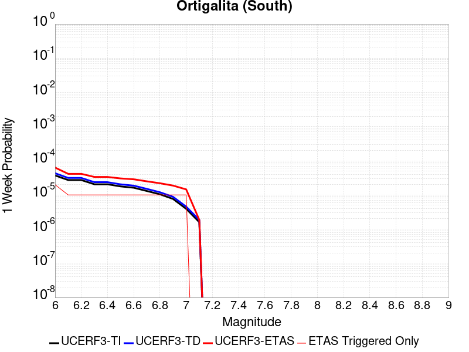 |  |  |  |

| Magnitude | 1 wk TI Prob | 1 wk TD Prob | 1 wk ETAS Prob | 1 wk ETAS/TD Gain | 1 wk ETAS Triggered Only | 1 mo TI Prob | 1 mo TD Prob | 1 mo ETAS Prob | 1 mo ETAS/TD Gain | 1 mo ETAS Triggered Only | 1 yr TI Prob | 1 yr TD Prob | 1 yr ETAS Prob | 1 yr ETAS/TD Gain | 1 yr ETAS Triggered Only | 10 yr TI Prob | 10 yr TD Prob | 10 yr ETAS Prob | 10 yr ETAS/TD Gain | 10 yr ETAS Triggered Only |
|-----|-----|-----|-----|-----|-----|-----|-----|-----|-----|-----|-----|-----|-----|-----|-----|-----|-----|-----|-----|-----|
| 6.0 | 3.72394E-5 | 4.325562E-5 | 6.706411E-5 | 1.550414 | 2.3809524E-5 | 1.5958765E-4 | 1.8536893E-4 | 2.0917405E-4 | 1.1284201 | 2.3809524E-5 | 0.0019412481 | 0.0022546875 | 0.0023021991 | 1.0210724 | 4.7619047E-5 | 0.019243775 | 0.022334497 | 0.022381052 | 1.0020845 | 4.7619047E-5 |
| 6.1 | 2.7299884E-5 | 3.149204E-5 | 5.5300814E-5 | 1.7560251 | 2.3809524E-5 | 1.16994255E-4 | 1.3495922E-4 | 1.5876554E-4 | 1.1763964 | 2.3809524E-5 | 0.0014234743 | 0.0016419457 | 0.0016657162 | 1.014477 | 2.3809524E-5 | 0.014143906 | 0.01630407 | 0.016327491 | 1.0014366 | 2.3809524E-5 |
| 6.2 | 2.7299884E-5 | 3.149204E-5 | 5.5300814E-5 | 1.7560251 | 2.3809524E-5 | 1.16994255E-4 | 1.3495922E-4 | 1.5876554E-4 | 1.1763964 | 2.3809524E-5 | 0.0014234743 | 0.0016419457 | 0.0016657162 | 1.014477 | 2.3809524E-5 | 0.014143906 | 0.01630407 | 0.016327491 | 1.0014366 | 2.3809524E-5 |
| 6.3 | 2.0546433E-5 | 2.363145E-5 | 4.744041E-5 | 2.0075116 | 2.3809524E-5 | 8.805317E-5 | 1.0127382E-4 | 1.2508093E-4 | 1.2350767 | 2.3809524E-5 | 0.00107152 | 0.0012323303 | 0.0012561105 | 1.0192969 | 2.3809524E-5 | 0.010663681 | 0.01225703 | 0.012280548 | 1.0019187 | 2.3809524E-5 |
| 6.4 | 2.0546433E-5 | 2.363145E-5 | 4.744041E-5 | 2.0075116 | 2.3809524E-5 | 8.805317E-5 | 1.0127382E-4 | 1.2508093E-4 | 1.2350767 | 2.3809524E-5 | 0.00107152 | 0.0012323303 | 0.0012561105 | 1.0192969 | 2.3809524E-5 | 0.010663681 | 0.01225703 | 0.012280548 | 1.0019187 | 2.3809524E-5 |
| 6.5 | 1.7779594E-5 | 2.0446974E-5 | 4.4256012E-5 | 2.1644285 | 2.3809524E-5 | 7.619603E-5 | 8.762702E-5 | 1.11434456E-4 | 1.2716906 | 2.3809524E-5 | 9.272918E-4 | 0.0010663504 | 0.0010901345 | 1.0223043 | 2.3809524E-5 | 0.009234319 | 0.010613803 | 0.01063736 | 1.0022194 | 2.3809524E-5 |
| 6.6 | 1.6272212E-5 | 1.8714967E-5 | 4.2524047E-5 | 2.2721944 | 2.3809524E-5 | 6.973618E-5 | 8.0204605E-5 | 1.0401222E-4 | 1.296836 | 2.3809524E-5 | 8.487073E-4 | 9.760658E-4 | 9.998521E-4 | 1.0243696 | 2.3809524E-5 | 0.008454733 | 0.009719091 | 0.009742668 | 1.0024259 | 2.3809524E-5 |
| 6.7 | 1.3051484E-5 | 1.5038758E-5 | 3.8847924E-5 | 2.5831869 | 2.3809524E-5 | 5.593373E-5 | 6.445028E-5 | 8.825827E-5 | 1.3694009 | 2.3809524E-5 | 6.807804E-4 | 7.844092E-4 | 8.0820004E-4 | 1.0303296 | 2.3809524E-5 | 0.006786986 | 0.007817388 | 0.007841011 | 1.003022 | 2.3809524E-5 |
| 6.8 | 1.04277415E-5 | 1.1987235E-5 | 3.5796475E-5 | 2.986216 | 2.3809524E-5 | 4.4689557E-5 | 5.1372896E-5 | 7.51812E-5 | 1.4634409 | 2.3809524E-5 | 5.439595E-4 | 6.2529295E-4 | 6.490876E-4 | 1.0380536 | 2.3809524E-5 | 0.0054262993 | 0.00623609 | 0.006259751 | 1.0037942 | 2.3809524E-5 |
| 6.9 | 7.639968E-6 | 8.791503E-6 | 3.260082E-5 | 3.7082188 | 2.3809524E-5 | 3.274231E-5 | 3.767736E-5 | 6.148599E-5 | 1.631908 | 2.3809524E-5 | 3.9856473E-4 | 4.586312E-4 | 4.8242978E-4 | 1.0518905 | 2.3809524E-5 | 0.003978506 | 0.004577433 | 0.0046011335 | 1.0051777 | 2.3809524E-5 |
| 7.0 | 3.919831E-6 | 4.5334014E-6 | 2.8342818E-5 | 6.2519984 | 2.3809524E-5 | 1.679917E-5 | 1.942873E-5 | 4.3237793E-5 | 2.2254565 | 2.3809524E-5 | 2.045107E-4 | 2.3652123E-4 | 2.6032512E-4 | 1.1006417 | 2.3809524E-5 | 0.0020432258 | 0.0023629034 | 0.0023866568 | 1.0100526 | 2.3809524E-5 |
| 7.1 | 1.6017933E-6 | 1.8570418E-6 | 1.8570418E-6 | 1.0 | 0.0 | 6.8648105E-6 | 7.958732E-6 | 7.958732E-6 | 1.0 | 0.0 | 8.357586E-5 | 9.689432E-5 | 9.689432E-5 | 1.0 | 0.0 | 8.3544437E-4 | 9.686254E-4 | 9.686254E-4 | 1.0 | 0.0 |

## Hunting Creek - Bartlett Springs connector 2011
*[(top)](#table-of-contents)*

| 1 Week | 1 Month | 1 Year | 10 Year |
|-----|-----|-----|-----|
|  | 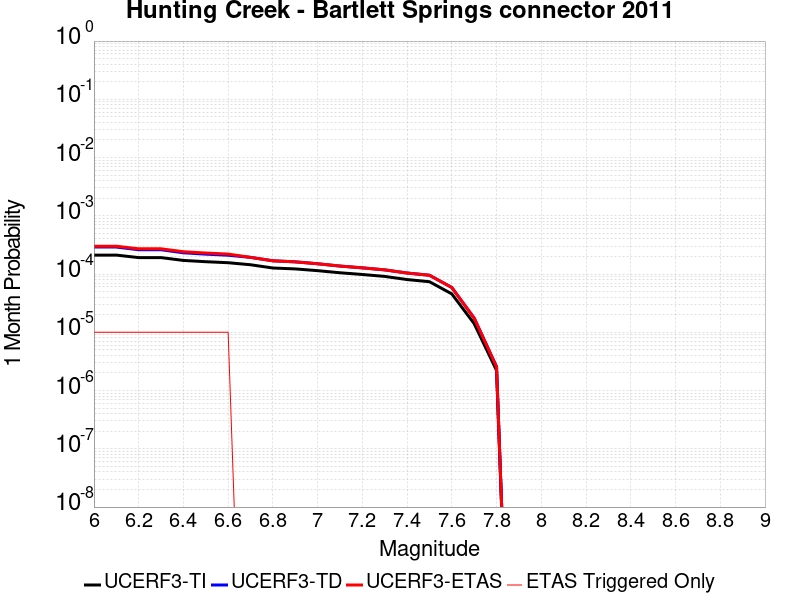 |  |  |

| Magnitude | 1 wk TI Prob | 1 wk TD Prob | 1 wk ETAS Prob | 1 wk ETAS/TD Gain | 1 wk ETAS Triggered Only | 1 mo TI Prob | 1 mo TD Prob | 1 mo ETAS Prob | 1 mo ETAS/TD Gain | 1 mo ETAS Triggered Only | 1 yr TI Prob | 1 yr TD Prob | 1 yr ETAS Prob | 1 yr ETAS/TD Gain | 1 yr ETAS Triggered Only | 10 yr TI Prob | 10 yr TD Prob | 10 yr ETAS Prob | 10 yr ETAS/TD Gain | 10 yr ETAS Triggered Only |
|-----|-----|-----|-----|-----|-----|-----|-----|-----|-----|-----|-----|-----|-----|-----|-----|-----|-----|-----|-----|-----|
| 6.0 | 4.940016E-5 | 6.786822E-5 | 6.786822E-5 | 1.0 | 0.0 | 2.1169778E-4 | 2.9083234E-4 | 2.9083234E-4 | 1.0 | 0.0 | 0.002574374 | 0.003535177 | 0.0035589025 | 1.0067112 | 2.3809524E-5 | 0.025447546 | 0.034773834 | 0.034819797 | 1.0013218 | 4.7619047E-5 |
| 6.1 | 4.940016E-5 | 6.786822E-5 | 6.786822E-5 | 1.0 | 0.0 | 2.1169778E-4 | 2.9083234E-4 | 2.9083234E-4 | 1.0 | 0.0 | 0.002574374 | 0.003535177 | 0.0035589025 | 1.0067112 | 2.3809524E-5 | 0.025447546 | 0.034773834 | 0.034819797 | 1.0013218 | 4.7619047E-5 |
| 6.2 | 4.472471E-5 | 6.1002804E-5 | 6.1002804E-5 | 1.0 | 0.0 | 1.9166325E-4 | 2.6141506E-4 | 2.6141506E-4 | 1.0 | 0.0 | 0.0023310026 | 0.003178107 | 0.003201841 | 1.0074679 | 2.3809524E-5 | 0.02306703 | 0.031316914 | 0.03136304 | 1.001473 | 4.7619047E-5 |
| 6.3 | 4.472471E-5 | 6.1002804E-5 | 6.1002804E-5 | 1.0 | 0.0 | 1.9166325E-4 | 2.6141506E-4 | 2.6141506E-4 | 1.0 | 0.0 | 0.0023310026 | 0.003178107 | 0.003201841 | 1.0074679 | 2.3809524E-5 | 0.02306703 | 0.031316914 | 0.03136304 | 1.001473 | 4.7619047E-5 |
| 6.4 | 4.0001003E-5 | 5.4103755E-5 | 5.4103755E-5 | 1.0 | 0.0 | 1.714216E-4 | 2.31853E-4 | 2.31853E-4 | 1.0 | 0.0 | 0.0020850603 | 0.0028191248 | 0.0028191248 | 1.0 | 0.0 | 0.02065605 | 0.027828315 | 0.027851462 | 1.0008317 | 2.3809524E-5 |
| 6.5 | 3.8033053E-5 | 5.1266547E-5 | 5.1266547E-5 | 1.0 | 0.0 | 1.6298861E-4 | 2.1969559E-4 | 2.1969559E-4 | 1.0 | 0.0 | 0.0019825802 | 0.0026714746 | 0.0026714746 | 1.0 | 0.0 | 0.019649856 | 0.026390454 | 0.026413636 | 1.0008783 | 2.3809524E-5 |
| 6.6 | 3.653754E-5 | 4.913017E-5 | 4.913017E-5 | 1.0 | 0.0 | 1.5658008E-4 | 2.1054115E-4 | 2.1054115E-4 | 1.0 | 0.0 | 0.0019046954 | 0.0025602852 | 0.0025602852 | 1.0 | 0.0 | 0.018884527 | 0.025306415 | 0.025329622 | 1.0009171 | 2.3809524E-5 |
| 6.7 | 3.372024E-5 | 4.514011E-5 | 4.514011E-5 | 1.0 | 0.0 | 1.4450731E-4 | 1.9344354E-4 | 1.9344354E-4 | 1.0 | 0.0 | 0.0017579567 | 0.002352639 | 0.002352639 | 1.0 | 0.0 | 0.017441148 | 0.023278099 | 0.023301354 | 1.000999 | 2.3809524E-5 |
| 6.8 | 2.9650024E-5 | 3.9411374E-5 | 3.9411374E-5 | 1.0 | 0.0 | 1.2706534E-4 | 1.6889503E-4 | 1.6889503E-4 | 1.0 | 0.0 | 0.0015459227 | 0.0020543463 | 0.0020543463 | 1.0 | 0.0 | 0.015352124 | 0.020351216 | 0.02037454 | 1.0011461 | 2.3809524E-5 |
| 6.9 | 2.860775E-5 | 3.7812544E-5 | 3.7812544E-5 | 1.0 | 0.0 | 1.2259888E-4 | 1.6204377E-4 | 1.6204377E-4 | 1.0 | 0.0 | 0.0014916194 | 0.001971107 | 0.001971107 | 1.0 | 0.0 | 0.014816469 | 0.01953584 | 0.019559184 | 1.001195 | 2.3809524E-5 |
| 7.0 | 2.6696067E-5 | 3.506726E-5 | 3.506726E-5 | 1.0 | 0.0 | 1.144067E-4 | 1.5027967E-4 | 1.5027967E-4 | 1.0 | 0.0 | 0.0013920115 | 0.0018281302 | 0.0018281302 | 1.0 | 0.0 | 0.013833242 | 0.018131364 | 0.018154742 | 1.0012894 | 2.3809524E-5 |
| 7.1 | 2.456087E-5 | 3.2013093E-5 | 3.2013093E-5 | 1.0 | 0.0 | 1.0525662E-4 | 1.371918E-4 | 1.371918E-4 | 1.0 | 0.0 | 0.001280746 | 0.0016690396 | 0.0016690396 | 1.0 | 0.0 | 0.012733897 | 0.016566366 | 0.016589781 | 1.0014135 | 2.3809524E-5 |
| 7.2 | 2.295761E-5 | 2.9822932E-5 | 2.9822932E-5 | 1.0 | 0.0 | 9.8386045E-5 | 1.2780636E-4 | 1.2780636E-4 | 1.0 | 0.0 | 0.0011971919 | 0.001554941 | 0.001554941 | 1.0 | 0.0 | 0.011907627 | 0.015442089 | 0.015442089 | 1.0 | 0.0 |
| 7.3 | 2.1256936E-5 | 2.7541912E-5 | 2.7541912E-5 | 1.0 | 0.0 | 9.109797E-5 | 1.1803147E-4 | 1.1803147E-4 | 1.0 | 0.0 | 0.0011085535 | 0.0014360948 | 0.0014360948 | 1.0 | 0.0 | 0.011030397 | 0.014269472 | 0.014269472 | 1.0 | 0.0 |
| 7.4 | 1.8784336E-5 | 2.4306766E-5 | 2.4306766E-5 | 1.0 | 0.0 | 8.050181E-5 | 1.0416774E-4 | 1.0416774E-4 | 1.0 | 0.0 | 9.796688E-4 | 0.001267512 | 0.001267512 | 1.0 | 0.0 | 0.009753612 | 0.012603902 | 0.012603902 | 1.0 | 0.0 |
| 7.5 | 1.7248298E-5 | 2.2268887E-5 | 2.2268887E-5 | 1.0 | 0.0 | 7.391918E-5 | 9.543464E-5 | 9.543464E-5 | 1.0 | 0.0 | 8.9959445E-4 | 0.0011613049 | 0.0011613049 | 1.0 | 0.0 | 0.008959615 | 0.01155334 | 0.01155334 | 1.0 | 0.0 |
| 7.6 | 1.0653709E-5 | 1.3722118E-5 | 1.3722118E-5 | 1.0 | 0.0 | 4.5657955E-5 | 5.8807767E-5 | 5.8807767E-5 | 1.0 | 0.0 | 5.557438E-4 | 7.157521E-4 | 7.157521E-4 | 1.0 | 0.0 | 0.0055435603 | 0.0071348166 | 0.0071348166 | 1.0 | 0.0 |
| 7.7 | 3.286316E-6 | 4.0903437E-6 | 4.0903437E-6 | 1.0 | 0.0 | 1.4084137E-5 | 1.7529928E-5 | 1.7529928E-5 | 1.0 | 0.0 | 1.7146087E-4 | 2.1340612E-4 | 2.1340612E-4 | 1.0 | 0.0 | 0.0017132863 | 0.0021320276 | 0.0021320276 | 1.0 | 0.0 |
| 7.8 | 5.1855085E-7 | 5.9720696E-7 | 5.9720696E-7 | 1.0 | 0.0 | 2.222359E-6 | 2.5594559E-6 | 2.5594559E-6 | 1.0 | 0.0 | 2.7056883E-5 | 3.116094E-5 | 3.116094E-5 | 1.0 | 0.0 | 2.705359E-4 | 3.1156495E-4 | 3.1156495E-4 | 1.0 | 0.0 |

## Whittier alt 1
*[(top)](#table-of-contents)*

| 1 Week | 1 Month | 1 Year | 10 Year |
|-----|-----|-----|-----|
|  |  |  |  |

| Magnitude | 1 wk TI Prob | 1 wk TD Prob | 1 wk ETAS Prob | 1 wk ETAS/TD Gain | 1 wk ETAS Triggered Only | 1 mo TI Prob | 1 mo TD Prob | 1 mo ETAS Prob | 1 mo ETAS/TD Gain | 1 mo ETAS Triggered Only | 1 yr TI Prob | 1 yr TD Prob | 1 yr ETAS Prob | 1 yr ETAS/TD Gain | 1 yr ETAS Triggered Only | 10 yr TI Prob | 10 yr TD Prob | 10 yr ETAS Prob | 10 yr ETAS/TD Gain | 10 yr ETAS Triggered Only |
|-----|-----|-----|-----|-----|-----|-----|-----|-----|-----|-----|-----|-----|-----|-----|-----|-----|-----|-----|-----|-----|
| 6.0 | 4.2554693E-5 | 4.725218E-5 | 4.725218E-5 | 1.0 | 0.0 | 1.8236451E-4 | 2.0249544E-4 | 2.0249544E-4 | 1.0 | 0.0 | 0.002218027 | 0.0024629154 | 0.0024866662 | 1.0096434 | 2.3809524E-5 | 0.02196019 | 0.024390234 | 0.024413463 | 1.0009524 | 2.3809524E-5 |
| 6.1 | 4.2554693E-5 | 4.725218E-5 | 4.725218E-5 | 1.0 | 0.0 | 1.8236451E-4 | 2.0249544E-4 | 2.0249544E-4 | 1.0 | 0.0 | 0.002218027 | 0.0024629154 | 0.0024866662 | 1.0096434 | 2.3809524E-5 | 0.02196019 | 0.024390234 | 0.024413463 | 1.0009524 | 2.3809524E-5 |
| 6.2 | 4.2554693E-5 | 4.725218E-5 | 4.725218E-5 | 1.0 | 0.0 | 1.8236451E-4 | 2.0249544E-4 | 2.0249544E-4 | 1.0 | 0.0 | 0.002218027 | 0.0024629154 | 0.0024866662 | 1.0096434 | 2.3809524E-5 | 0.02196019 | 0.024390234 | 0.024413463 | 1.0009524 | 2.3809524E-5 |
| 6.3 | 1.9617712E-5 | 1.8268593E-5 | 1.8268593E-5 | 1.0 | 0.0 | 8.40732E-5 | 7.829172E-5 | 7.829172E-5 | 1.0 | 0.0 | 0.0010231105 | 9.52804E-4 | 9.52804E-4 | 1.0 | 0.0 | 0.01018413 | 0.009490474 | 0.009490474 | 1.0 | 0.0 |
| 6.4 | 1.5611336E-5 | 1.3604271E-5 | 1.3604271E-5 | 1.0 | 0.0 | 6.690401E-5 | 5.8302747E-5 | 5.8302747E-5 | 1.0 | 0.0 | 8.142519E-4 | 7.0961076E-4 | 7.0961076E-4 | 1.0 | 0.0 | 0.008112748 | 0.0070754145 | 0.0070754145 | 1.0 | 0.0 |
| 6.5 | 1.5150166E-5 | 1.3100925E-5 | 1.3100925E-5 | 1.0 | 0.0 | 6.492767E-5 | 5.6145647E-5 | 5.6145647E-5 | 1.0 | 0.0 | 7.9020765E-4 | 6.8336475E-4 | 6.8336475E-4 | 1.0 | 0.0 | 0.007874036 | 0.0068145846 | 0.0068145846 | 1.0 | 0.0 |
| 6.6 | 1.295588E-5 | 1.0380725E-5 | 1.0380725E-5 | 1.0 | 0.0 | 5.552402E-5 | 4.4488075E-5 | 4.4488075E-5 | 1.0 | 0.0 | 6.7579525E-4 | 5.4150965E-4 | 5.4150965E-4 | 1.0 | 0.0 | 0.006737438 | 0.0054033357 | 0.0054033357 | 1.0 | 0.0 |
| 6.7 | 1.2542085E-5 | 9.899369E-6 | 9.899369E-6 | 1.0 | 0.0 | 5.3750682E-5 | 4.242519E-5 | 4.242519E-5 | 1.0 | 0.0 | 6.542181E-4 | 5.164061E-4 | 5.164061E-4 | 1.0 | 0.0 | 0.006522954 | 0.0051534795 | 0.0051534795 | 1.0 | 0.0 |
| 6.8 | 1.2195878E-5 | 9.495415E-6 | 9.495415E-6 | 1.0 | 0.0 | 5.2267E-5 | 4.069401E-5 | 4.069401E-5 | 1.0 | 0.0 | 6.36165E-4 | 4.9533875E-4 | 4.9533875E-4 | 1.0 | 0.0 | 0.0063434686 | 0.004943688 | 0.004943688 | 1.0 | 0.0 |
| 6.9 | 1.1580298E-5 | 8.772933E-6 | 8.772933E-6 | 1.0 | 0.0 | 4.9628903E-5 | 3.7597754E-5 | 3.7597754E-5 | 1.0 | 0.0 | 6.040644E-4 | 4.5765814E-4 | 4.5765814E-4 | 1.0 | 0.0 | 0.00602425 | 0.0045684157 | 0.0045684157 | 1.0 | 0.0 |
| 7.0 | 1.0964795E-5 | 8.083994E-6 | 8.083994E-6 | 1.0 | 0.0 | 4.6991136E-5 | 3.4645236E-5 | 3.4645236E-5 | 1.0 | 0.0 | 5.7196687E-4 | 4.2172565E-4 | 4.2172565E-4 | 1.0 | 0.0 | 0.0057049696 | 0.004210462 | 0.004210462 | 1.0 | 0.0 |
| 7.1 | 1.0230601E-5 | 7.3266697E-6 | 7.3266697E-6 | 1.0 | 0.0 | 4.3844695E-5 | 3.1399642E-5 | 3.1399642E-5 | 1.0 | 0.0 | 5.336784E-4 | 3.8222488E-4 | 3.8222488E-4 | 1.0 | 0.0 | 0.005323986 | 0.0038168381 | 0.0038168381 | 1.0 | 0.0 |
| 7.2 | 9.40865E-6 | 6.543289E-6 | 6.543289E-6 | 1.0 | 0.0 | 4.032216E-5 | 2.8042374E-5 | 2.8042374E-5 | 1.0 | 0.0 | 4.908117E-4 | 3.4136363E-4 | 3.4136363E-4 | 1.0 | 0.0 | 0.0048972913 | 0.003409485 | 0.003409485 | 1.0 | 0.0 |
| 7.3 | 8.237384E-6 | 5.5977525E-6 | 5.5977525E-6 | 1.0 | 0.0 | 3.5302593E-5 | 2.3990153E-5 | 2.3990153E-5 | 1.0 | 0.0 | 4.2972428E-4 | 2.92042E-4 | 2.92042E-4 | 1.0 | 0.0 | 0.0042889426 | 0.002916903 | 0.002916903 | 1.0 | 0.0 |
| 7.4 | 7.5316966E-6 | 5.027819E-6 | 5.027819E-6 | 1.0 | 0.0 | 3.2278298E-5 | 2.1547625E-5 | 2.1547625E-5 | 1.0 | 0.0 | 3.9291743E-4 | 2.6231175E-4 | 2.6231175E-4 | 1.0 | 0.0 | 0.0039222343 | 0.0026201333 | 0.0026201333 | 1.0 | 0.0 |
| 7.5 | 6.149649E-6 | 3.933841E-6 | 3.933841E-6 | 1.0 | 0.0 | 2.6355372E-5 | 1.6859214E-5 | 1.6859214E-5 | 1.0 | 0.0 | 3.208294E-4 | 2.052425E-4 | 2.052425E-4 | 1.0 | 0.0 | 0.003203666 | 0.0020506186 | 0.0020506186 | 1.0 | 0.0 |
| 7.6 | 5.457711E-6 | 3.3953788E-6 | 3.3953788E-6 | 1.0 | 0.0 | 2.338998E-5 | 1.4551547E-5 | 1.4551547E-5 | 1.0 | 0.0 | 2.8473578E-4 | 1.771515E-4 | 1.771515E-4 | 1.0 | 0.0 | 0.0028437122 | 0.0017701836 | 0.0017701836 | 1.0 | 0.0 |
| 7.7 | 4.1676276E-6 | 2.3331952E-6 | 2.3331952E-6 | 1.0 | 0.0 | 1.7861139E-5 | 9.999374E-6 | 9.999374E-6 | 1.0 | 0.0 | 2.1743766E-4 | 1.2173632E-4 | 1.2173632E-4 | 1.0 | 0.0 | 0.0021722503 | 0.0012167693 | 0.0012167693 | 1.0 | 0.0 |
| 7.8 | 2.2692414E-7 | 9.3854695E-8 | 9.3854695E-8 | 1.0 | 0.0 | 9.725317E-7 | 4.0223435E-7 | 4.0223435E-7 | 1.0 | 0.0 | 1.1840509E-5 | 4.8971956E-6 | 4.8971956E-6 | 1.0 | 0.0 | 1.1839878E-4 | 4.8971204E-5 | 4.8971204E-5 | 1.0 | 0.0 |
| 7.9 | 6.676829E-9 | 3.439853E-9 | 3.439853E-9 | 1.0 | 0.0 | 2.861498E-8 | 1.4742227E-8 | 1.4742227E-8 | 1.0 | 0.0 | 3.4838732E-7 | 1.7948659E-7 | 1.7948659E-7 | 1.0 | 0.0 | 3.4838679E-6 | 1.7948646E-6 | 1.7948646E-6 | 1.0 | 0.0 |

## Homestead Valley 2011
*[(top)](#table-of-contents)*

| 1 Week | 1 Month | 1 Year | 10 Year |
|-----|-----|-----|-----|
|  |  |  |  |

| Magnitude | 1 wk TI Prob | 1 wk TD Prob | 1 wk ETAS Prob | 1 wk ETAS/TD Gain | 1 wk ETAS Triggered Only | 1 mo TI Prob | 1 mo TD Prob | 1 mo ETAS Prob | 1 mo ETAS/TD Gain | 1 mo ETAS Triggered Only | 1 yr TI Prob | 1 yr TD Prob | 1 yr ETAS Prob | 1 yr ETAS/TD Gain | 1 yr ETAS Triggered Only | 10 yr TI Prob | 10 yr TD Prob | 10 yr ETAS Prob | 10 yr ETAS/TD Gain | 10 yr ETAS Triggered Only |
|-----|-----|-----|-----|-----|-----|-----|-----|-----|-----|-----|-----|-----|-----|-----|-----|-----|-----|-----|-----|-----|
| 6.0 | 1.539795E-5 | 6.286606E-6 | 6.286606E-6 | 1.0 | 0.0 | 6.5989545E-5 | 2.6942436E-5 | 2.6942436E-5 | 1.0 | 0.0 | 8.0312655E-4 | 3.279954E-4 | 3.517971E-4 | 1.0725672 | 2.3809524E-5 | 0.008002302 | 0.0032771337 | 0.0033245967 | 1.0144831 | 4.7619047E-5 |
| 6.1 | 1.539795E-5 | 6.286606E-6 | 6.286606E-6 | 1.0 | 0.0 | 6.5989545E-5 | 2.6942436E-5 | 2.6942436E-5 | 1.0 | 0.0 | 8.0312655E-4 | 3.279954E-4 | 3.517971E-4 | 1.0725672 | 2.3809524E-5 | 0.008002302 | 0.0032771337 | 0.0033245967 | 1.0144831 | 4.7619047E-5 |
| 6.2 | 1.539795E-5 | 6.286606E-6 | 6.286606E-6 | 1.0 | 0.0 | 6.5989545E-5 | 2.6942436E-5 | 2.6942436E-5 | 1.0 | 0.0 | 8.0312655E-4 | 3.279954E-4 | 3.517971E-4 | 1.0725672 | 2.3809524E-5 | 0.008002302 | 0.0032771337 | 0.0033245967 | 1.0144831 | 4.7619047E-5 |
| 6.3 | 1.539795E-5 | 6.286606E-6 | 6.286606E-6 | 1.0 | 0.0 | 6.5989545E-5 | 2.6942436E-5 | 2.6942436E-5 | 1.0 | 0.0 | 8.0312655E-4 | 3.279954E-4 | 3.517971E-4 | 1.0725672 | 2.3809524E-5 | 0.008002302 | 0.0032771337 | 0.0033245967 | 1.0144831 | 4.7619047E-5 |
| 6.4 | 1.539795E-5 | 6.286606E-6 | 6.286606E-6 | 1.0 | 0.0 | 6.5989545E-5 | 2.6942436E-5 | 2.6942436E-5 | 1.0 | 0.0 | 8.0312655E-4 | 3.279954E-4 | 3.517971E-4 | 1.0725672 | 2.3809524E-5 | 0.008002302 | 0.0032771337 | 0.0033245967 | 1.0144831 | 4.7619047E-5 |
| 6.5 | 1.0265258E-5 | 2.8788488E-6 | 2.8788488E-6 | 1.0 | 0.0 | 4.3993223E-5 | 1.2337905E-5 | 1.2337905E-5 | 1.0 | 0.0 | 5.3548586E-4 | 1.5021059E-4 | 1.7401653E-4 | 1.1584839 | 2.3809524E-5 | 0.005341973 | 0.0015017724 | 0.0015493201 | 1.0316609 | 4.7619047E-5 |
| 6.6 | 6.664671E-6 | 5.348204E-7 | 5.348204E-7 | 1.0 | 0.0 | 2.8562565E-5 | 2.2920863E-6 | 2.2920863E-6 | 1.0 | 0.0 | 3.476937E-4 | 2.7905911E-5 | 5.171477E-5 | 1.8531834 | 2.3809524E-5 | 0.003471502 | 2.790357E-4 | 3.028386E-4 | 1.085304 | 2.3809524E-5 |
| 6.7 | 6.5954046E-6 | 5.348204E-7 | 5.348204E-7 | 1.0 | 0.0 | 2.8265715E-5 | 2.2920863E-6 | 2.2920863E-6 | 1.0 | 0.0 | 3.4408073E-4 | 2.7905911E-5 | 5.171477E-5 | 1.8531834 | 2.3809524E-5 | 0.0034354846 | 2.790357E-4 | 3.028386E-4 | 1.085304 | 2.3809524E-5 |
| 6.8 | 4.648189E-6 | 2.3265572E-7 | 2.3265572E-7 | 1.0 | 0.0 | 1.9920659E-5 | 9.970956E-7 | 9.970956E-7 | 1.0 | 0.0 | 2.4250703E-4 | 1.2139576E-5 | 3.594881E-5 | 2.9612904 | 2.3809524E-5 | 0.0024224254 | 1.2138961E-4 | 1.4519625E-4 | 1.1961175 | 2.3809524E-5 |
| 6.9 | 4.1428534E-6 | 1.9344557E-7 | 1.9344557E-7 | 1.0 | 0.0 | 1.7754966E-5 | 8.290522E-7 | 8.290522E-7 | 1.0 | 0.0 | 2.1614527E-4 | 1.0093667E-5 | 3.390295E-5 | 3.358834 | 2.3809524E-5 | 0.0021593515 | 1.0093238E-4 | 1.247395E-4 | 1.235872 | 2.3809524E-5 |
| 7.0 | 3.0673707E-6 | 1.5367603E-7 | 1.5367603E-7 | 1.0 | 0.0 | 1.3145808E-5 | 6.586114E-7 | 6.586114E-7 | 1.0 | 0.0 | 1.6003846E-4 | 8.0185655E-6 | 3.1827898E-5 | 3.969276 | 2.3809524E-5 | 0.0015992324 | 8.0182865E-5 | 1.03990475E-4 | 1.2969165 | 2.3809524E-5 |
| 7.1 | 2.340854E-6 | 1.468766E-7 | 1.468766E-7 | 1.0 | 0.0 | 1.0032193E-5 | 6.29471E-7 | 6.29471E-7 | 1.0 | 0.0 | 1.221351E-4 | 7.663783E-6 | 3.1473126E-5 | 4.1067348 | 2.3809524E-5 | 0.00122068 | 7.663529E-5 | 1.0044299E-4 | 1.3106624 | 2.3809524E-5 |
| 7.2 | 1.3754182E-6 | 1.3922634E-7 | 1.3922634E-7 | 1.0 | 0.0 | 5.8946357E-6 | 5.966842E-7 | 5.966842E-7 | 1.0 | 0.0 | 7.176483E-5 | 7.2646067E-6 | 3.1073956E-5 | 4.2774453 | 2.3809524E-5 | 7.174166E-4 | 7.264379E-5 | 9.645158E-5 | 1.3277334 | 2.3809524E-5 |
| 7.3 | 1.2573237E-6 | 1.3827146E-7 | 1.3827146E-7 | 1.0 | 0.0 | 5.388519E-6 | 5.9259185E-7 | 5.9259185E-7 | 1.0 | 0.0 | 6.560324E-5 | 7.2147827E-6 | 3.1024134E-5 | 4.300079 | 2.3809524E-5 | 6.558388E-4 | 7.214558E-5 | 9.595338E-5 | 1.3299967 | 2.3809524E-5 |
| 7.4 | 1.0994207E-6 | 1.3106106E-7 | 1.3106106E-7 | 1.0 | 0.0 | 4.7117946E-6 | 5.616901E-7 | 5.616901E-7 | 1.0 | 0.0 | 5.736459E-5 | 6.8385566E-6 | 3.0647916E-5 | 4.4816356 | 2.3809524E-5 | 5.734978E-4 | 6.838355E-5 | 9.219145E-5 | 1.3481524 | 2.3809524E-5 |
| 7.5 | 5.5569126E-7 | 6.772991E-8 | 6.772991E-8 | 1.0 | 0.0 | 2.3815317E-6 | 2.90271E-7 | 2.90271E-7 | 1.0 | 0.0 | 2.8994764E-5 | 3.5340445E-6 | 3.5340445E-6 | 1.0 | 0.0 | 2.899098E-4 | 3.5339945E-5 | 3.5339945E-5 | 1.0 | 0.0 |

## Dry Mountain
*[(top)](#table-of-contents)*

| 1 Week | 1 Month | 1 Year | 10 Year |
|-----|-----|-----|-----|
|  |  |  |  |

| Magnitude | 1 wk TI Prob | 1 wk TD Prob | 1 wk ETAS Prob | 1 wk ETAS/TD Gain | 1 wk ETAS Triggered Only | 1 mo TI Prob | 1 mo TD Prob | 1 mo ETAS Prob | 1 mo ETAS/TD Gain | 1 mo ETAS Triggered Only | 1 yr TI Prob | 1 yr TD Prob | 1 yr ETAS Prob | 1 yr ETAS/TD Gain | 1 yr ETAS Triggered Only | 10 yr TI Prob | 10 yr TD Prob | 10 yr ETAS Prob | 10 yr ETAS/TD Gain | 10 yr ETAS Triggered Only |
|-----|-----|-----|-----|-----|-----|-----|-----|-----|-----|-----|-----|-----|-----|-----|-----|-----|-----|-----|-----|-----|
| 6.0 | 6.222801E-6 | 6.439381E-6 | 6.439381E-6 | 1.0 | 0.0 | 2.6668875E-5 | 2.7597147E-5 | 2.7597147E-5 | 1.0 | 0.0 | 3.2464517E-4 | 3.3595937E-4 | 3.3595937E-4 | 1.0 | 0.0 | 0.0032417132 | 0.0033560768 | 0.003403536 | 1.0141413 | 4.7619047E-5 |
| 6.1 | 6.222801E-6 | 6.439381E-6 | 6.439381E-6 | 1.0 | 0.0 | 2.6668875E-5 | 2.7597147E-5 | 2.7597147E-5 | 1.0 | 0.0 | 3.2464517E-4 | 3.3595937E-4 | 3.3595937E-4 | 1.0 | 0.0 | 0.0032417132 | 0.0033560768 | 0.003403536 | 1.0141413 | 4.7619047E-5 |
| 6.2 | 6.222801E-6 | 6.439381E-6 | 6.439381E-6 | 1.0 | 0.0 | 2.6668875E-5 | 2.7597147E-5 | 2.7597147E-5 | 1.0 | 0.0 | 3.2464517E-4 | 3.3595937E-4 | 3.3595937E-4 | 1.0 | 0.0 | 0.0032417132 | 0.0033560768 | 0.003403536 | 1.0141413 | 4.7619047E-5 |
| 6.3 | 6.222801E-6 | 6.439381E-6 | 6.439381E-6 | 1.0 | 0.0 | 2.6668875E-5 | 2.7597147E-5 | 2.7597147E-5 | 1.0 | 0.0 | 3.2464517E-4 | 3.3595937E-4 | 3.3595937E-4 | 1.0 | 0.0 | 0.0032417132 | 0.0033560768 | 0.003403536 | 1.0141413 | 4.7619047E-5 |
| 6.4 | 6.222801E-6 | 6.439381E-6 | 6.439381E-6 | 1.0 | 0.0 | 2.6668875E-5 | 2.7597147E-5 | 2.7597147E-5 | 1.0 | 0.0 | 3.2464517E-4 | 3.3595937E-4 | 3.3595937E-4 | 1.0 | 0.0 | 0.0032417132 | 0.0033560768 | 0.003403536 | 1.0141413 | 4.7619047E-5 |
| 6.5 | 2.8528623E-6 | 2.9521684E-6 | 2.9521684E-6 | 1.0 | 0.0 | 1.22264955E-5 | 1.2652138E-5 | 1.2652138E-5 | 1.0 | 0.0 | 1.4884741E-4 | 1.540376E-4 | 1.540376E-4 | 1.0 | 0.0 | 0.0014874774 | 0.0015401616 | 0.0015877073 | 1.0308706 | 4.7619047E-5 |
| 6.6 | 2.8528623E-6 | 2.9521684E-6 | 2.9521684E-6 | 1.0 | 0.0 | 1.22264955E-5 | 1.2652138E-5 | 1.2652138E-5 | 1.0 | 0.0 | 1.4884741E-4 | 1.540376E-4 | 1.540376E-4 | 1.0 | 0.0 | 0.0014874774 | 0.0015401616 | 0.0015877073 | 1.0308706 | 4.7619047E-5 |
| 6.7 | 2.541E-6 | 2.6293578E-6 | 2.6293578E-6 | 1.0 | 0.0 | 1.0889954E-5 | 1.1268677E-5 | 1.1268677E-5 | 1.0 | 0.0 | 1.3257713E-4 | 1.3719614E-4 | 1.3719614E-4 | 1.0 | 0.0 | 0.0013249806 | 0.0013719613 | 0.0014195151 | 1.0346612 | 4.7619047E-5 |

## Pine Mtn
*[(top)](#table-of-contents)*

| 1 Week | 1 Month | 1 Year | 10 Year |
|-----|-----|-----|-----|
|  |  |  |  |

| Magnitude | 1 wk TI Prob | 1 wk TD Prob | 1 wk ETAS Prob | 1 wk ETAS/TD Gain | 1 wk ETAS Triggered Only | 1 mo TI Prob | 1 mo TD Prob | 1 mo ETAS Prob | 1 mo ETAS/TD Gain | 1 mo ETAS Triggered Only | 1 yr TI Prob | 1 yr TD Prob | 1 yr ETAS Prob | 1 yr ETAS/TD Gain | 1 yr ETAS Triggered Only | 10 yr TI Prob | 10 yr TD Prob | 10 yr ETAS Prob | 10 yr ETAS/TD Gain | 10 yr ETAS Triggered Only |
|-----|-----|-----|-----|-----|-----|-----|-----|-----|-----|-----|-----|-----|-----|-----|-----|-----|-----|-----|-----|-----|
| 6.0 | 6.894797E-6 | 7.225461E-6 | 7.225461E-6 | 1.0 | 0.0 | 2.9548795E-5 | 3.096591E-5 | 3.096591E-5 | 1.0 | 0.0 | 3.596972E-4 | 3.7694772E-4 | 3.7694772E-4 | 1.0 | 0.0 | 0.0035911554 | 0.003763381 | 0.0038108209 | 1.0126057 | 4.7619047E-5 |
| 6.1 | 6.894797E-6 | 7.225461E-6 | 7.225461E-6 | 1.0 | 0.0 | 2.9548795E-5 | 3.096591E-5 | 3.096591E-5 | 1.0 | 0.0 | 3.596972E-4 | 3.7694772E-4 | 3.7694772E-4 | 1.0 | 0.0 | 0.0035911554 | 0.003763381 | 0.0038108209 | 1.0126057 | 4.7619047E-5 |
| 6.2 | 6.894797E-6 | 7.225461E-6 | 7.225461E-6 | 1.0 | 0.0 | 2.9548795E-5 | 3.096591E-5 | 3.096591E-5 | 1.0 | 0.0 | 3.596972E-4 | 3.7694772E-4 | 3.7694772E-4 | 1.0 | 0.0 | 0.0035911554 | 0.003763381 | 0.0038108209 | 1.0126057 | 4.7619047E-5 |
| 6.3 | 6.894797E-6 | 7.225461E-6 | 7.225461E-6 | 1.0 | 0.0 | 2.9548795E-5 | 3.096591E-5 | 3.096591E-5 | 1.0 | 0.0 | 3.596972E-4 | 3.7694772E-4 | 3.7694772E-4 | 1.0 | 0.0 | 0.0035911554 | 0.003763381 | 0.0038108209 | 1.0126057 | 4.7619047E-5 |
| 6.4 | 6.894797E-6 | 7.225461E-6 | 7.225461E-6 | 1.0 | 0.0 | 2.9548795E-5 | 3.096591E-5 | 3.096591E-5 | 1.0 | 0.0 | 3.596972E-4 | 3.7694772E-4 | 3.7694772E-4 | 1.0 | 0.0 | 0.0035911554 | 0.003763381 | 0.0038108209 | 1.0126057 | 4.7619047E-5 |
| 6.5 | 6.894797E-6 | 7.225461E-6 | 7.225461E-6 | 1.0 | 0.0 | 2.9548795E-5 | 3.096591E-5 | 3.096591E-5 | 1.0 | 0.0 | 3.596972E-4 | 3.7694772E-4 | 3.7694772E-4 | 1.0 | 0.0 | 0.0035911554 | 0.003763381 | 0.0038108209 | 1.0126057 | 4.7619047E-5 |
| 6.6 | 6.894797E-6 | 7.225461E-6 | 7.225461E-6 | 1.0 | 0.0 | 2.9548795E-5 | 3.096591E-5 | 3.096591E-5 | 1.0 | 0.0 | 3.596972E-4 | 3.7694772E-4 | 3.7694772E-4 | 1.0 | 0.0 | 0.0035911554 | 0.003763381 | 0.0038108209 | 1.0126057 | 4.7619047E-5 |
| 6.7 | 6.0867933E-6 | 6.3971133E-6 | 6.3971133E-6 | 1.0 | 0.0 | 2.6085996E-5 | 2.7415923E-5 | 2.7415923E-5 | 1.0 | 0.0 | 3.1755073E-4 | 3.3373994E-4 | 3.3373994E-4 | 1.0 | 0.0 | 0.0031709734 | 0.0033326065 | 0.0033800667 | 1.0142412 | 4.7619047E-5 |
| 6.8 | 5.6530425E-6 | 5.9505956E-6 | 5.9505956E-6 | 1.0 | 0.0 | 2.42271E-5 | 2.5502315E-5 | 2.5502315E-5 | 1.0 | 0.0 | 2.94925E-4 | 3.104485E-4 | 3.104485E-4 | 1.0 | 0.0 | 0.002945339 | 0.0031003528 | 0.0031240885 | 1.0076559 | 2.3809524E-5 |
| 6.9 | 4.6015225E-6 | 4.863834E-6 | 4.863834E-6 | 1.0 | 0.0 | 1.9720663E-5 | 2.0844845E-5 | 2.0844845E-5 | 1.0 | 0.0 | 2.4007261E-4 | 2.5375787E-4 | 2.5375787E-4 | 1.0 | 0.0 | 0.0023981342 | 0.0025348254 | 0.0025585745 | 1.0093691 | 2.3809524E-5 |
| 7.0 | 4.4875965E-6 | 4.747473E-6 | 4.747473E-6 | 1.0 | 0.0 | 1.9232413E-5 | 2.0346162E-5 | 2.0346162E-5 | 1.0 | 0.0 | 2.3412947E-4 | 2.4768783E-4 | 2.4768783E-4 | 1.0 | 0.0 | 0.0023388295 | 0.0024742614 | 0.002498012 | 1.0095991 | 2.3809524E-5 |
| 7.1 | 3.203907E-6 | 3.4294096E-6 | 3.4294096E-6 | 1.0 | 0.0 | 1.3730958E-5 | 1.4697391E-5 | 1.4697391E-5 | 1.0 | 0.0 | 1.6716159E-4 | 1.789267E-4 | 1.789267E-4 | 1.0 | 0.0 | 0.0016703589 | 0.0017878925 | 0.0018116595 | 1.0132933 | 2.3809524E-5 |
| 7.2 | 2.2060601E-6 | 2.3784817E-6 | 2.3784817E-6 | 1.0 | 0.0 | 9.4545085E-6 | 1.0193455E-5 | 1.0193455E-5 | 1.0 | 0.0 | 1.15102564E-4 | 1.240987E-4 | 1.240987E-4 | 1.0 | 0.0 | 0.0011504296 | 0.0012403389 | 0.0012641188 | 1.0191722 | 2.3809524E-5 |
| 7.3 | 1.3765207E-6 | 1.5216481E-6 | 1.5216481E-6 | 1.0 | 0.0 | 5.899361E-6 | 6.521333E-6 | 6.521333E-6 | 1.0 | 0.0 | 7.182235E-5 | 7.939443E-5 | 7.939443E-5 | 1.0 | 0.0 | 7.1799144E-4 | 7.936697E-4 | 8.1746036E-4 | 1.0299755 | 2.3809524E-5 |
| 7.4 | 1.1245983E-6 | 1.2587075E-6 | 1.2587075E-6 | 1.0 | 0.0 | 4.819698E-6 | 5.39445E-6 | 5.39445E-6 | 1.0 | 0.0 | 5.8678244E-5 | 6.567554E-5 | 6.567554E-5 | 1.0 | 0.0 | 5.866275E-4 | 6.5656955E-4 | 6.8036345E-4 | 1.0362397 | 2.3809524E-5 |
| 7.5 | 8.031682E-7 | 9.276951E-7 | 9.276951E-7 | 1.0 | 0.0 | 3.4421448E-6 | 3.9758306E-6 | 3.9758306E-6 | 1.0 | 0.0 | 4.1907308E-5 | 4.840473E-5 | 4.840473E-5 | 1.0 | 0.0 | 4.1899405E-4 | 4.8394862E-4 | 4.8394862E-4 | 1.0 | 0.0 |
| 7.6 | 4.8953444E-7 | 6.003009E-7 | 6.003009E-7 | 1.0 | 0.0 | 2.098003E-6 | 2.5727159E-6 | 2.5727159E-6 | 1.0 | 0.0 | 2.5542888E-5 | 3.1322415E-5 | 3.1322415E-5 | 1.0 | 0.0 | 2.5539953E-4 | 3.1318486E-4 | 3.1318486E-4 | 1.0 | 0.0 |
| 7.7 | 6.634529E-8 | 6.788826E-8 | 6.788826E-8 | 1.0 | 0.0 | 2.843369E-7 | 2.9094966E-7 | 2.9094966E-7 | 1.0 | 0.0 | 3.4617963E-6 | 3.5423066E-6 | 3.5423066E-6 | 1.0 | 0.0 | 3.4617424E-5 | 3.542255E-5 | 3.542255E-5 | 1.0 | 0.0 |
| 7.8 | 9.235578E-9 | 9.488566E-9 | 9.488566E-9 | 1.0 | 0.0 | 3.9581046E-8 | 4.0665284E-8 | 4.0665284E-8 | 1.0 | 0.0 | 4.818991E-7 | 4.950997E-7 | 4.950997E-7 | 1.0 | 0.0 | 4.8189804E-6 | 4.950988E-6 | 4.950988E-6 | 1.0 | 0.0 |

## Carlsbad
*[(top)](#table-of-contents)*

| 1 Week | 1 Month | 1 Year | 10 Year |
|-----|-----|-----|-----|
|  |  |  |  |

| Magnitude | 1 wk TI Prob | 1 wk TD Prob | 1 wk ETAS Prob | 1 wk ETAS/TD Gain | 1 wk ETAS Triggered Only | 1 mo TI Prob | 1 mo TD Prob | 1 mo ETAS Prob | 1 mo ETAS/TD Gain | 1 mo ETAS Triggered Only | 1 yr TI Prob | 1 yr TD Prob | 1 yr ETAS Prob | 1 yr ETAS/TD Gain | 1 yr ETAS Triggered Only | 10 yr TI Prob | 10 yr TD Prob | 10 yr ETAS Prob | 10 yr ETAS/TD Gain | 10 yr ETAS Triggered Only |
|-----|-----|-----|-----|-----|-----|-----|-----|-----|-----|-----|-----|-----|-----|-----|-----|-----|-----|-----|-----|-----|
| 6.0 | 4.9038536E-6 | 4.9872565E-6 | 4.9872565E-6 | 1.0 | 0.0 | 2.1016345E-5 | 2.1373784E-5 | 4.51828E-5 | 2.1139355 | 2.3809524E-5 | 2.5584397E-4 | 2.601952E-4 | 2.8399852E-4 | 1.0914826 | 2.3809524E-5 | 0.002555496 | 0.0025989525 | 0.0026227003 | 1.0091374 | 2.3809524E-5 |
| 6.1 | 4.9038536E-6 | 4.9872565E-6 | 4.9872565E-6 | 1.0 | 0.0 | 2.1016345E-5 | 2.1373784E-5 | 4.51828E-5 | 2.1139355 | 2.3809524E-5 | 2.5584397E-4 | 2.601952E-4 | 2.8399852E-4 | 1.0914826 | 2.3809524E-5 | 0.002555496 | 0.0025989525 | 0.0026227003 | 1.0091374 | 2.3809524E-5 |
| 6.2 | 4.3820614E-6 | 4.4547687E-6 | 4.4547687E-6 | 1.0 | 0.0 | 1.8780129E-5 | 1.9091729E-5 | 4.2900796E-5 | 2.2470882 | 2.3809524E-5 | 2.2862408E-4 | 2.3241735E-4 | 2.5622133E-4 | 1.1024191 | 2.3809524E-5 | 0.00228389 | 0.0023217786 | 0.0023455329 | 1.010231 | 2.3809524E-5 |
| 6.3 | 4.302872E-6 | 4.373006E-6 | 4.373006E-6 | 1.0 | 0.0 | 1.8440749E-5 | 1.8741322E-5 | 4.25504E-5 | 2.2704053 | 2.3809524E-5 | 2.24493E-4 | 2.2815206E-4 | 2.5195614E-4 | 1.1043344 | 2.3809524E-5 | 0.0022426634 | 0.0022792136 | 0.0023029689 | 1.0104226 | 2.3809524E-5 |
| 6.4 | 4.0835243E-6 | 4.1476546E-6 | 4.1476546E-6 | 1.0 | 0.0 | 1.75007E-5 | 1.7775543E-5 | 4.1584644E-5 | 2.3394303 | 2.3809524E-5 | 2.1305021E-4 | 2.1639607E-4 | 2.4020045E-4 | 1.1100037 | 2.3809524E-5 | 0.0021284607 | 0.0021618877 | 0.0021856457 | 1.0109895 | 2.3809524E-5 |
| 6.5 | 3.987806E-6 | 4.0488867E-6 | 4.0488867E-6 | 1.0 | 0.0 | 1.7090486E-5 | 1.7352257E-5 | 4.116137E-5 | 2.3721044 | 2.3809524E-5 | 2.080568E-4 | 2.1124359E-4 | 2.3504808E-4 | 1.1126875 | 2.3809524E-5 | 0.002078621 | 0.0021104617 | 0.002134221 | 1.0112579 | 2.3809524E-5 |
| 6.6 | 3.8707576E-6 | 3.927488E-6 | 3.927488E-6 | 1.0 | 0.0 | 1.6588854E-5 | 1.6831984E-5 | 4.0641105E-5 | 2.4145167 | 2.3809524E-5 | 2.0195059E-4 | 2.0491047E-4 | 2.2871511E-4 | 1.116171 | 2.3809524E-5 | 0.0020176715 | 0.0020472489 | 0.0020710097 | 1.0116062 | 2.3809524E-5 |
| 6.7 | 3.3093434E-6 | 3.3423917E-6 | 3.3423917E-6 | 1.0 | 0.0 | 1.4182823E-5 | 1.4324457E-5 | 3.813364E-5 | 2.6621351 | 2.3809524E-5 | 1.7266218E-4 | 1.7438637E-4 | 1.9819173E-4 | 1.1365094 | 2.3809524E-5 | 0.001725281 | 0.0017425013 | 0.0017662693 | 1.0136402 | 2.3809524E-5 |
| 6.8 | 3.136983E-6 | 3.1664536E-6 | 3.1664536E-6 | 1.0 | 0.0 | 1.3444143E-5 | 1.3570445E-5 | 3.7379647E-5 | 2.7544894 | 2.3809524E-5 | 1.6367015E-4 | 1.6520769E-4 | 1.8901328E-4 | 1.144095 | 2.3809524E-5 | 0.0016354966 | 0.0016508545 | 0.0016746246 | 1.0143987 | 2.3809524E-5 |
| 6.9 | 2.9056644E-6 | 2.9267585E-6 | 2.9267585E-6 | 1.0 | 0.0 | 1.2452788E-5 | 1.2543191E-5 | 3.6352416E-5 | 2.8981793 | 2.3809524E-5 | 1.5160214E-4 | 1.5270269E-4 | 1.7650858E-4 | 1.155897 | 2.3809524E-5 | 0.0015149876 | 0.001525983 | 0.0015497562 | 1.015579 | 2.3809524E-5 |
| 7.0 | 2.5071035E-6 | 2.5113977E-6 | 2.5113977E-6 | 1.0 | 0.0 | 1.0744685E-5 | 1.07630885E-5 | 3.4572357E-5 | 3.2121222 | 2.3809524E-5 | 1.308087E-4 | 1.3103275E-4 | 1.5483916E-4 | 1.1816828 | 2.3809524E-5 | 0.0013073172 | 0.0013095582 | 0.0013333366 | 1.0181575 | 2.3809524E-5 |
| 7.1 | 2.1786877E-6 | 2.1678832E-6 | 2.1678832E-6 | 1.0 | 0.0 | 9.3372E-6 | 9.290896E-6 | 3.3100197E-5 | 3.5626488 | 2.3809524E-5 | 1.13674476E-4 | 1.1311081E-4 | 1.3691763E-4 | 1.2104735 | 2.3809524E-5 | 0.0011361635 | 0.0011305353 | 0.0011543179 | 1.0210366 | 2.3809524E-5 |
| 7.2 | 1.6628418E-6 | 1.6213872E-6 | 1.6213872E-6 | 1.0 | 0.0 | 7.1264453E-6 | 6.948784E-6 | 3.0758143E-5 | 4.4264064 | 2.3809524E-5 | 8.676102E-5 | 8.4598185E-5 | 1.0840569E-4 | 1.2814187 | 2.3809524E-5 | 8.672715E-4 | 8.45662E-4 | 8.694514E-4 | 1.0281311 | 2.3809524E-5 |
| 7.3 | 1.0595926E-6 | 9.816804E-7 | 9.816804E-7 | 1.0 | 0.0 | 4.541103E-6 | 4.2071947E-6 | 2.8016619E-5 | 6.659216 | 2.3809524E-5 | 5.5286528E-5 | 5.1221403E-5 | 7.5029704E-5 | 1.4648117 | 2.3809524E-5 | 5.527277E-4 | 5.1209686E-4 | 5.358942E-4 | 1.0464704 | 2.3809524E-5 |
| 7.4 | 7.956623E-7 | 7.1737975E-7 | 7.1737975E-7 | 1.0 | 0.0 | 3.4099767E-6 | 3.074481E-6 | 2.6883932E-5 | 8.744218 | 2.3809524E-5 | 4.1515676E-5 | 3.743117E-5 | 6.12398E-5 | 1.6360643 | 2.3809524E-5 | 4.150792E-4 | 3.7424936E-4 | 3.9804998E-4 | 1.0635957 | 2.3809524E-5 |
| 7.5 | 5.1043804E-7 | 4.4483627E-7 | 4.4483627E-7 | 1.0 | 0.0 | 2.1875896E-6 | 1.9064398E-6 | 2.5715919E-5 | 13.488975 | 2.3809524E-5 | 2.663358E-5 | 2.3210663E-5 | 4.7019636E-5 | 2.0257773 | 2.3809524E-5 | 2.6630386E-4 | 2.3208297E-4 | 2.5588696E-4 | 1.1025667 | 2.3809524E-5 |
| 7.6 | 2.3723294E-7 | 1.989569E-7 | 1.989569E-7 | 1.0 | 0.0 | 1.0167122E-6 | 8.5267214E-7 | 8.5267214E-7 | 1.0 | 0.0 | 1.2378401E-5 | 1.0381237E-5 | 1.0381237E-5 | 1.0 | 0.0 | 1.237771E-4 | 1.038078E-4 | 1.038078E-4 | 1.0 | 0.0 |
| 7.7 | 1.9992152E-8 | 9.8601785E-9 | 9.8601785E-9 | 1.0 | 0.0 | 8.568065E-8 | 4.225791E-8 | 4.225791E-8 | 1.0 | 0.0 | 1.0431614E-6 | 5.1449E-7 | 5.1449E-7 | 1.0 | 0.0 | 1.0431565E-5 | 5.1449E-6 | 5.1449E-6 | 1.0 | 0.0 |

## North Frontal  (East)
*[(top)](#table-of-contents)*

| 1 Week | 1 Month | 1 Year | 10 Year |
|-----|-----|-----|-----|
|  |  |  |  |

| Magnitude | 1 wk TI Prob | 1 wk TD Prob | 1 wk ETAS Prob | 1 wk ETAS/TD Gain | 1 wk ETAS Triggered Only | 1 mo TI Prob | 1 mo TD Prob | 1 mo ETAS Prob | 1 mo ETAS/TD Gain | 1 mo ETAS Triggered Only | 1 yr TI Prob | 1 yr TD Prob | 1 yr ETAS Prob | 1 yr ETAS/TD Gain | 1 yr ETAS Triggered Only | 10 yr TI Prob | 10 yr TD Prob | 10 yr ETAS Prob | 10 yr ETAS/TD Gain | 10 yr ETAS Triggered Only |
|-----|-----|-----|-----|-----|-----|-----|-----|-----|-----|-----|-----|-----|-----|-----|-----|-----|-----|-----|-----|-----|
| 6.0 | 7.135738E-6 | 7.4771765E-6 | 7.4771765E-6 | 1.0 | 0.0 | 3.0581377E-5 | 3.204476E-5 | 3.204476E-5 | 1.0 | 0.0 | 3.7226462E-4 | 3.9009505E-4 | 4.138953E-4 | 1.0610114 | 2.3809524E-5 | 0.0037164164 | 0.0038960609 | 0.0039434945 | 1.0121747 | 4.7619047E-5 |
| 6.1 | 7.135738E-6 | 7.4771765E-6 | 7.4771765E-6 | 1.0 | 0.0 | 3.0581377E-5 | 3.204476E-5 | 3.204476E-5 | 1.0 | 0.0 | 3.7226462E-4 | 3.9009505E-4 | 4.138953E-4 | 1.0610114 | 2.3809524E-5 | 0.0037164164 | 0.0038960609 | 0.0039434945 | 1.0121747 | 4.7619047E-5 |
| 6.2 | 7.135738E-6 | 7.4771765E-6 | 7.4771765E-6 | 1.0 | 0.0 | 3.0581377E-5 | 3.204476E-5 | 3.204476E-5 | 1.0 | 0.0 | 3.7226462E-4 | 3.9009505E-4 | 4.138953E-4 | 1.0610114 | 2.3809524E-5 | 0.0037164164 | 0.0038960609 | 0.0039434945 | 1.0121747 | 4.7619047E-5 |
| 6.3 | 7.135738E-6 | 7.4771765E-6 | 7.4771765E-6 | 1.0 | 0.0 | 3.0581377E-5 | 3.204476E-5 | 3.204476E-5 | 1.0 | 0.0 | 3.7226462E-4 | 3.9009505E-4 | 4.138953E-4 | 1.0610114 | 2.3809524E-5 | 0.0037164164 | 0.0038960609 | 0.0039434945 | 1.0121747 | 4.7619047E-5 |
| 6.4 | 7.135738E-6 | 7.4771765E-6 | 7.4771765E-6 | 1.0 | 0.0 | 3.0581377E-5 | 3.204476E-5 | 3.204476E-5 | 1.0 | 0.0 | 3.7226462E-4 | 3.9009505E-4 | 4.138953E-4 | 1.0610114 | 2.3809524E-5 | 0.0037164164 | 0.0038960609 | 0.0039434945 | 1.0121747 | 4.7619047E-5 |
| 6.5 | 7.135738E-6 | 7.4771765E-6 | 7.4771765E-6 | 1.0 | 0.0 | 3.0581377E-5 | 3.204476E-5 | 3.204476E-5 | 1.0 | 0.0 | 3.7226462E-4 | 3.9009505E-4 | 4.138953E-4 | 1.0610114 | 2.3809524E-5 | 0.0037164164 | 0.0038960609 | 0.0039434945 | 1.0121747 | 4.7619047E-5 |
| 6.6 | 7.135738E-6 | 7.4771765E-6 | 7.4771765E-6 | 1.0 | 0.0 | 3.0581377E-5 | 3.204476E-5 | 3.204476E-5 | 1.0 | 0.0 | 3.7226462E-4 | 3.9009505E-4 | 4.138953E-4 | 1.0610114 | 2.3809524E-5 | 0.0037164164 | 0.0038960609 | 0.0039434945 | 1.0121747 | 4.7619047E-5 |
| 6.7 | 7.135738E-6 | 7.4771765E-6 | 7.4771765E-6 | 1.0 | 0.0 | 3.0581377E-5 | 3.204476E-5 | 3.204476E-5 | 1.0 | 0.0 | 3.7226462E-4 | 3.9009505E-4 | 4.138953E-4 | 1.0610114 | 2.3809524E-5 | 0.0037164164 | 0.0038960609 | 0.0039434945 | 1.0121747 | 4.7619047E-5 |
| 6.8 | 5.959142E-6 | 6.236683E-6 | 6.236683E-6 | 1.0 | 0.0 | 2.553893E-5 | 2.6728469E-5 | 2.6728469E-5 | 1.0 | 0.0 | 3.108921E-4 | 3.253886E-4 | 3.4919035E-4 | 1.0731487 | 2.3809524E-5 | 0.0031045752 | 0.0032508948 | 0.003298359 | 1.0146004 | 4.7619047E-5 |
| 6.9 | 2.2946929E-6 | 2.3824605E-6 | 2.3824605E-6 | 1.0 | 0.0 | 9.834361E-6 | 1.0210508E-5 | 1.0210508E-5 | 1.0 | 0.0 | 1.1972676E-4 | 1.2430632E-4 | 1.2430632E-4 | 1.0 | 0.0 | 0.0011966228 | 0.0012424142 | 0.0012661943 | 1.0191401 | 2.3809524E-5 |
| 7.0 | 2.2468673E-6 | 2.3321538E-6 | 2.3321538E-6 | 1.0 | 0.0 | 9.629396E-6 | 9.994909E-6 | 9.994909E-6 | 1.0 | 0.0 | 1.1723159E-4 | 1.21681696E-4 | 1.21681696E-4 | 1.0 | 0.0 | 0.0011716976 | 0.0012161969 | 0.0012399775 | 1.0195532 | 2.3809524E-5 |
| 7.1 | 1.9921076E-6 | 2.0646032E-6 | 2.0646032E-6 | 1.0 | 0.0 | 8.537577E-6 | 8.848272E-6 | 8.848272E-6 | 1.0 | 0.0 | 1.0394004E-4 | 1.0772282E-4 | 1.0772282E-4 | 1.0 | 0.0 | 0.0010389143 | 0.0010767487 | 0.0011005326 | 1.0220886 | 2.3809524E-5 |
| 7.2 | 1.4524545E-6 | 1.5045148E-6 | 1.5045148E-6 | 1.0 | 0.0 | 6.2247905E-6 | 6.447906E-6 | 6.447906E-6 | 1.0 | 0.0 | 7.5784184E-5 | 7.850068E-5 | 7.850068E-5 | 1.0 | 0.0 | 7.575835E-4 | 7.8475394E-4 | 8.0854475E-4 | 1.0303164 | 2.3809524E-5 |
| 7.3 | 8.9802575E-7 | 9.3087283E-7 | 9.3087283E-7 | 1.0 | 0.0 | 3.848676E-6 | 3.9894494E-6 | 3.9894494E-6 | 1.0 | 0.0 | 4.685662E-5 | 4.857058E-5 | 4.857058E-5 | 1.0 | 0.0 | 4.6846745E-4 | 4.8561094E-4 | 5.094089E-4 | 1.0490062 | 2.3809524E-5 |
| 7.4 | 7.776139E-7 | 8.0604747E-7 | 8.0604747E-7 | 1.0 | 0.0 | 3.3326266E-6 | 3.4544853E-6 | 3.4544853E-6 | 1.0 | 0.0 | 4.0573974E-5 | 4.2057654E-5 | 4.2057654E-5 | 1.0 | 0.0 | 4.0566566E-4 | 4.205077E-4 | 4.4430722E-4 | 1.0565971 | 2.3809524E-5 |
| 7.5 | 5.244417E-7 | 5.441219E-7 | 5.441219E-7 | 1.0 | 0.0 | 2.2476054E-6 | 2.3319494E-6 | 2.3319494E-6 | 1.0 | 0.0 | 2.7364253E-5 | 2.839118E-5 | 2.839118E-5 | 1.0 | 0.0 | 2.7360884E-4 | 2.8388205E-4 | 3.0768482E-4 | 1.0838474 | 2.3809524E-5 |
| 7.6 | 1.5489647E-7 | 1.6089504E-7 | 1.6089504E-7 | 1.0 | 0.0 | 6.6384183E-7 | 6.895501E-7 | 6.895501E-7 | 1.0 | 0.0 | 8.082245E-6 | 8.395261E-6 | 8.395261E-6 | 1.0 | 0.0 | 8.08195E-5 | 8.395143E-5 | 8.395143E-5 | 1.0 | 0.0 |

## Morales (East)
*[(top)](#table-of-contents)*

| 1 Week | 1 Month | 1 Year | 10 Year |
|-----|-----|-----|-----|
|  |  |  |  |

| Magnitude | 1 wk TI Prob | 1 wk TD Prob | 1 wk ETAS Prob | 1 wk ETAS/TD Gain | 1 wk ETAS Triggered Only | 1 mo TI Prob | 1 mo TD Prob | 1 mo ETAS Prob | 1 mo ETAS/TD Gain | 1 mo ETAS Triggered Only | 1 yr TI Prob | 1 yr TD Prob | 1 yr ETAS Prob | 1 yr ETAS/TD Gain | 1 yr ETAS Triggered Only | 10 yr TI Prob | 10 yr TD Prob | 10 yr ETAS Prob | 10 yr ETAS/TD Gain | 10 yr ETAS Triggered Only |
|-----|-----|-----|-----|-----|-----|-----|-----|-----|-----|-----|-----|-----|-----|-----|-----|-----|-----|-----|-----|-----|
| 6.0 | 1.4942771E-6 | 2.123479E-6 | 2.5932952E-5 | 12.212483 | 2.3809524E-5 | 6.404029E-6 | 9.100596E-6 | 3.2909902E-5 | 3.6162362 | 2.3809524E-5 | 7.7966266E-5 | 1.107947E-4 | 1.5840847E-4 | 1.4297477 | 4.7619047E-5 | 7.793892E-4 | 0.0011074544 | 0.0011550207 | 1.042951 | 4.7619047E-5 |
| 6.1 | 1.4942771E-6 | 2.123479E-6 | 2.5932952E-5 | 12.212483 | 2.3809524E-5 | 6.404029E-6 | 9.100596E-6 | 3.2909902E-5 | 3.6162362 | 2.3809524E-5 | 7.7966266E-5 | 1.107947E-4 | 1.5840847E-4 | 1.4297477 | 4.7619047E-5 | 7.793892E-4 | 0.0011074544 | 0.0011550207 | 1.042951 | 4.7619047E-5 |
| 6.2 | 1.4942771E-6 | 2.123479E-6 | 2.5932952E-5 | 12.212483 | 2.3809524E-5 | 6.404029E-6 | 9.100596E-6 | 3.2909902E-5 | 3.6162362 | 2.3809524E-5 | 7.7966266E-5 | 1.107947E-4 | 1.5840847E-4 | 1.4297477 | 4.7619047E-5 | 7.793892E-4 | 0.0011074544 | 0.0011550207 | 1.042951 | 4.7619047E-5 |
| 6.3 | 1.4942771E-6 | 2.123479E-6 | 2.5932952E-5 | 12.212483 | 2.3809524E-5 | 6.404029E-6 | 9.100596E-6 | 3.2909902E-5 | 3.6162362 | 2.3809524E-5 | 7.7966266E-5 | 1.107947E-4 | 1.5840847E-4 | 1.4297477 | 4.7619047E-5 | 7.793892E-4 | 0.0011074544 | 0.0011550207 | 1.042951 | 4.7619047E-5 |
| 6.4 | 8.798845E-7 | 1.5022731E-6 | 1.5022731E-6 | 1.0 | 0.0 | 3.7709283E-6 | 6.438298E-6 | 6.438298E-6 | 1.0 | 0.0 | 4.5910085E-5 | 7.8383564E-5 | 7.8383564E-5 | 1.0 | 0.0 | 4.59006E-4 | 7.835727E-4 | 7.835727E-4 | 1.0 | 0.0 |
| 6.5 | 7.1751725E-7 | 1.3384229E-6 | 1.3384229E-6 | 1.0 | 0.0 | 3.0750705E-6 | 5.7360858E-6 | 5.7360858E-6 | 1.0 | 0.0 | 3.7438338E-5 | 6.9834685E-5 | 6.9834685E-5 | 1.0 | 0.0 | 3.743203E-4 | 6.9813756E-4 | 6.9813756E-4 | 1.0 | 0.0 |
| 6.6 | 7.1751725E-7 | 1.3384229E-6 | 1.3384229E-6 | 1.0 | 0.0 | 3.0750705E-6 | 5.7360858E-6 | 5.7360858E-6 | 1.0 | 0.0 | 3.7438338E-5 | 6.9834685E-5 | 6.9834685E-5 | 1.0 | 0.0 | 3.743203E-4 | 6.9813756E-4 | 6.9813756E-4 | 1.0 | 0.0 |
| 6.7 | 7.159057E-7 | 1.3358889E-6 | 1.3358889E-6 | 1.0 | 0.0 | 3.0681638E-6 | 5.725226E-6 | 5.725226E-6 | 1.0 | 0.0 | 3.7354253E-5 | 6.970247E-5 | 6.970247E-5 | 1.0 | 0.0 | 3.7347974E-4 | 6.968163E-4 | 6.968163E-4 | 1.0 | 0.0 |
| 6.8 | 7.032203E-7 | 1.3174443E-6 | 1.3174443E-6 | 1.0 | 0.0 | 3.0137978E-6 | 5.646178E-6 | 5.646178E-6 | 1.0 | 0.0 | 3.669237E-5 | 6.8740126E-5 | 6.8740126E-5 | 1.0 | 0.0 | 3.6686313E-4 | 6.871988E-4 | 6.871988E-4 | 1.0 | 0.0 |
| 6.9 | 6.941549E-7 | 1.3025061E-6 | 1.3025061E-6 | 1.0 | 0.0 | 2.974946E-6 | 5.582158E-6 | 5.582158E-6 | 1.0 | 0.0 | 3.6219368E-5 | 6.7960726E-5 | 6.7960726E-5 | 1.0 | 0.0 | 3.6213463E-4 | 6.7940954E-4 | 6.7940954E-4 | 1.0 | 0.0 |
| 7.0 | 6.2932247E-7 | 1.18774E-6 | 1.18774E-6 | 1.0 | 0.0 | 2.6970936E-6 | 5.090305E-6 | 5.090305E-6 | 1.0 | 0.0 | 3.283662E-5 | 6.1972765E-5 | 6.1972765E-5 | 1.0 | 0.0 | 3.283177E-4 | 6.1956374E-4 | 6.1956374E-4 | 1.0 | 0.0 |
| 7.1 | 5.6200963E-7 | 1.0640374E-6 | 1.0640374E-6 | 1.0 | 0.0 | 2.4086105E-6 | 4.5601523E-6 | 4.5601523E-6 | 1.0 | 0.0 | 2.9324437E-5 | 5.551849E-5 | 5.551849E-5 | 1.0 | 0.0 | 2.9320567E-4 | 5.550534E-4 | 5.550534E-4 | 1.0 | 0.0 |
| 7.2 | 4.91044E-7 | 9.285713E-7 | 9.285713E-7 | 1.0 | 0.0 | 2.1044725E-6 | 3.9795855E-6 | 3.9795855E-6 | 1.0 | 0.0 | 2.5621652E-5 | 4.8450413E-5 | 4.8450413E-5 | 1.0 | 0.0 | 2.56187E-4 | 4.8440482E-4 | 4.8440482E-4 | 1.0 | 0.0 |
| 7.3 | 4.2978448E-7 | 7.9739846E-7 | 7.9739846E-7 | 1.0 | 0.0 | 1.8419321E-6 | 3.4174175E-6 | 3.4174175E-6 | 1.0 | 0.0 | 2.2425293E-5 | 4.1606294E-5 | 4.1606294E-5 | 1.0 | 0.0 | 2.242303E-4 | 4.1599068E-4 | 4.1599068E-4 | 1.0 | 0.0 |
| 7.4 | 3.774317E-7 | 6.806746E-7 | 6.806746E-7 | 1.0 | 0.0 | 1.6175634E-6 | 2.9171736E-6 | 2.9171736E-6 | 1.0 | 0.0 | 1.9693656E-5 | 3.5516037E-5 | 3.5516037E-5 | 1.0 | 0.0 | 1.969191E-4 | 3.551089E-4 | 3.551089E-4 | 1.0 | 0.0 |
| 7.5 | 1.0603232E-7 | 9.840901E-8 | 9.840901E-8 | 1.0 | 0.0 | 4.5442414E-7 | 4.2175284E-7 | 4.2175284E-7 | 1.0 | 0.0 | 5.5326E-6 | 5.134829E-6 | 5.134829E-6 | 1.0 | 0.0 | 5.532462E-5 | 5.134967E-5 | 5.134967E-5 | 1.0 | 0.0 |
| 7.6 | 9.960384E-8 | 8.755334E-8 | 8.755334E-8 | 1.0 | 0.0 | 4.2687353E-7 | 3.7522852E-7 | 3.7522852E-7 | 1.0 | 0.0 | 5.197173E-6 | 4.568398E-6 | 4.568398E-6 | 1.0 | 0.0 | 5.1970514E-5 | 4.5685607E-5 | 4.5685607E-5 | 1.0 | 0.0 |
| 7.7 | 6.499468E-8 | 4.1038682E-8 | 4.1038682E-8 | 1.0 | 0.0 | 2.785486E-7 | 1.7588006E-7 | 1.7588006E-7 | 1.0 | 0.0 | 3.3913238E-6 | 2.1413375E-6 | 2.1413375E-6 | 1.0 | 0.0 | 3.3912722E-5 | 2.1415728E-5 | 2.1415728E-5 | 1.0 | 0.0 |
| 7.8 | 2.2517119E-8 | 7.1312614E-9 | 7.1312614E-9 | 1.0 | 0.0 | 9.6501935E-8 | 3.0562546E-8 | 3.0562546E-8 | 1.0 | 0.0 | 1.1749105E-6 | 3.7209892E-7 | 3.7209892E-7 | 1.0 | 0.0 | 1.1749043E-5 | 3.7235213E-6 | 3.7235213E-6 | 1.0 | 0.0 |
| 7.9 | 8.493023E-9 | 9.970124E-10 | 9.970124E-10 | 1.0 | 0.0 | 3.639867E-8 | 4.2729082E-9 | 4.2729082E-9 | 1.0 | 0.0 | 4.4315374E-7 | 5.202266E-8 | 5.202266E-8 | 1.0 | 0.0 | 4.4315284E-6 | 5.2233156E-7 | 5.2233156E-7 | 1.0 | 0.0 |
| 8.0 | 1.4971842E-9 | 5.5458416E-11 | 5.5458416E-11 | 1.0 | 0.0 | 6.4165038E-9 | 2.376762E-10 | 2.376762E-10 | 1.0 | 0.0 | 7.812093E-8 | 2.8937068E-9 | 2.8937068E-9 | 1.0 | 0.0 | 7.81209E-7 | 3.019288E-8 | 3.019288E-8 | 1.0 | 0.0 |

## San Diego Trough south
*[(top)](#table-of-contents)*

| 1 Week | 1 Month | 1 Year | 10 Year |
|-----|-----|-----|-----|
|  |  |  |  |

| Magnitude | 1 wk TI Prob | 1 wk TD Prob | 1 wk ETAS Prob | 1 wk ETAS/TD Gain | 1 wk ETAS Triggered Only | 1 mo TI Prob | 1 mo TD Prob | 1 mo ETAS Prob | 1 mo ETAS/TD Gain | 1 mo ETAS Triggered Only | 1 yr TI Prob | 1 yr TD Prob | 1 yr ETAS Prob | 1 yr ETAS/TD Gain | 1 yr ETAS Triggered Only | 10 yr TI Prob | 10 yr TD Prob | 10 yr ETAS Prob | 10 yr ETAS/TD Gain | 10 yr ETAS Triggered Only |
|-----|-----|-----|-----|-----|-----|-----|-----|-----|-----|-----|-----|-----|-----|-----|-----|-----|-----|-----|-----|-----|
| 6.0 | 8.279495E-5 | 1.04241306E-4 | 1.04241306E-4 | 1.0 | 0.0 | 3.5478722E-4 | 4.4667677E-4 | 4.4667677E-4 | 1.0 | 0.0 | 0.004310982 | 0.0054256152 | 0.0054729762 | 1.0087291 | 4.7619047E-5 | 0.042283054 | 0.05299221 | 0.053037304 | 1.000851 | 4.7619047E-5 |
| 6.1 | 4.6961468E-5 | 5.772944E-5 | 5.772944E-5 | 1.0 | 0.0 | 2.0124791E-4 | 2.473894E-4 | 2.473894E-4 | 1.0 | 0.0 | 0.00244744 | 0.0030079768 | 0.0030317146 | 1.0078917 | 2.3809524E-5 | 0.024206603 | 0.029679462 | 0.029702565 | 1.0007784 | 2.3809524E-5 |
| 6.2 | 3.5079658E-5 | 4.214154E-5 | 4.214154E-5 | 1.0 | 0.0 | 1.5033272E-4 | 1.8059435E-4 | 1.8059435E-4 | 1.0 | 0.0 | 0.0018287642 | 0.0021965632 | 0.0021965632 | 1.0 | 0.0 | 0.018137876 | 0.021751117 | 0.021751117 | 1.0 | 0.0 |
| 6.3 | 3.5079658E-5 | 4.214154E-5 | 4.214154E-5 | 1.0 | 0.0 | 1.5033272E-4 | 1.8059435E-4 | 1.8059435E-4 | 1.0 | 0.0 | 0.0018287642 | 0.0021965632 | 0.0021965632 | 1.0 | 0.0 | 0.018137876 | 0.021751117 | 0.021751117 | 1.0 | 0.0 |
| 6.4 | 2.7196904E-5 | 3.2087162E-5 | 3.2087162E-5 | 1.0 | 0.0 | 1.16552954E-4 | 1.3750927E-4 | 1.3750927E-4 | 1.0 | 0.0 | 0.0014181085 | 0.0016729041 | 0.0016729041 | 1.0 | 0.0 | 0.014090929 | 0.016604643 | 0.016604643 | 1.0 | 0.0 |
| 6.5 | 2.5584688E-5 | 3.010164E-5 | 3.010164E-5 | 1.0 | 0.0 | 1.0964406E-4 | 1.2900073E-4 | 1.2900073E-4 | 1.0 | 0.0 | 0.0013340989 | 0.0015694655 | 0.0015694655 | 1.0 | 0.0 | 0.013261181 | 0.015585314 | 0.015585314 | 1.0 | 0.0 |
| 6.6 | 2.2034688E-5 | 2.5742738E-5 | 2.5742738E-5 | 1.0 | 0.0 | 9.443096E-5 | 1.1032141E-4 | 1.1032141E-4 | 1.0 | 0.0 | 0.0011490905 | 0.0013423424 | 0.0013423424 | 1.0 | 0.0 | 0.011431668 | 0.013343317 | 0.013343317 | 1.0 | 0.0 |
| 6.7 | 1.9394853E-5 | 2.254176E-5 | 2.254176E-5 | 1.0 | 0.0 | 8.311815E-5 | 9.6603995E-5 | 9.6603995E-5 | 1.0 | 0.0 | 0.0010114936 | 0.0011755243 | 0.0011755243 | 1.0 | 0.0 | 0.01006902 | 0.011693766 | 0.011693766 | 1.0 | 0.0 |
| 6.8 | 1.7615313E-5 | 2.0403182E-5 | 2.0403182E-5 | 1.0 | 0.0 | 7.549201E-5 | 8.74393E-5 | 8.74393E-5 | 1.0 | 0.0 | 9.1872766E-4 | 0.0010640579 | 0.0010640579 | 1.0 | 0.0 | 0.009149387 | 0.010590198 | 0.010590198 | 1.0 | 0.0 |
| 6.9 | 1.5621423E-5 | 1.8026114E-5 | 1.8026114E-5 | 1.0 | 0.0 | 6.6947236E-5 | 7.725251E-5 | 7.725251E-5 | 1.0 | 0.0 | 8.147778E-4 | 9.40147E-4 | 9.40147E-4 | 1.0 | 0.0 | 0.008117969 | 0.009362142 | 0.009362142 | 1.0 | 0.0 |
| 7.0 | 1.3444376E-5 | 1.544809E-5 | 1.544809E-5 | 1.0 | 0.0 | 5.7617483E-5 | 6.620443E-5 | 6.620443E-5 | 1.0 | 0.0 | 7.0126704E-4 | 8.057436E-4 | 8.057436E-4 | 1.0 | 0.0 | 0.006990582 | 0.008028555 | 0.008028555 | 1.0 | 0.0 |
| 7.1 | 1.2268361E-5 | 1.407303E-5 | 1.407303E-5 | 1.0 | 0.0 | 5.2577634E-5 | 6.0311606E-5 | 6.0311606E-5 | 1.0 | 0.0 | 6.399447E-4 | 7.3404907E-4 | 7.3404907E-4 | 1.0 | 0.0 | 0.0063810493 | 0.0073165493 | 0.0073165493 | 1.0 | 0.0 |
| 7.2 | 1.0922655E-5 | 1.2513563E-5 | 1.2513563E-5 | 1.0 | 0.0 | 4.681054E-5 | 5.3628468E-5 | 5.3628468E-5 | 1.0 | 0.0 | 5.697693E-4 | 6.5273355E-4 | 6.5273355E-4 | 1.0 | 0.0 | 0.0056831064 | 0.0065084435 | 0.0065084435 | 1.0 | 0.0 |
| 7.3 | 6.1106753E-6 | 6.928925E-6 | 6.928925E-6 | 1.0 | 0.0 | 2.6188345E-5 | 2.9695057E-5 | 2.9695057E-5 | 1.0 | 0.0 | 3.1879646E-4 | 3.6147775E-4 | 3.6147775E-4 | 1.0 | 0.0 | 0.0031833951 | 0.003608943 | 0.003608943 | 1.0 | 0.0 |
| 7.4 | 4.933187E-6 | 5.5895525E-6 | 5.5895525E-6 | 1.0 | 0.0 | 2.114206E-5 | 2.3955008E-5 | 2.3955008E-5 | 1.0 | 0.0 | 2.5737417E-4 | 2.9161357E-4 | 2.9161357E-4 | 1.0 | 0.0 | 0.002570763 | 0.0029123505 | 0.0029123505 | 1.0 | 0.0 |
| 7.5 | 1.7489613E-6 | 1.969678E-6 | 1.969678E-6 | 1.0 | 0.0 | 7.495527E-6 | 8.4414505E-6 | 8.4414505E-6 | 1.0 | 0.0 | 9.125422E-5 | 1.02770035E-4 | 1.02770035E-4 | 1.0 | 0.0 | 9.1216754E-4 | 0.0010272472 | 0.0010272472 | 1.0 | 0.0 |
| 7.6 | 1.6988751E-7 | 1.7533823E-7 | 1.7533823E-7 | 1.0 | 0.0 | 7.2808916E-7 | 7.5144936E-7 | 7.5144936E-7 | 1.0 | 0.0 | 8.864449E-6 | 9.14886E-6 | 9.14886E-6 | 1.0 | 0.0 | 8.8640954E-5 | 9.1485024E-5 | 9.1485024E-5 | 1.0 | 0.0 |

## San Luis Range 2011 CFM
*[(top)](#table-of-contents)*

| 1 Week | 1 Month | 1 Year | 10 Year |
|-----|-----|-----|-----|
| 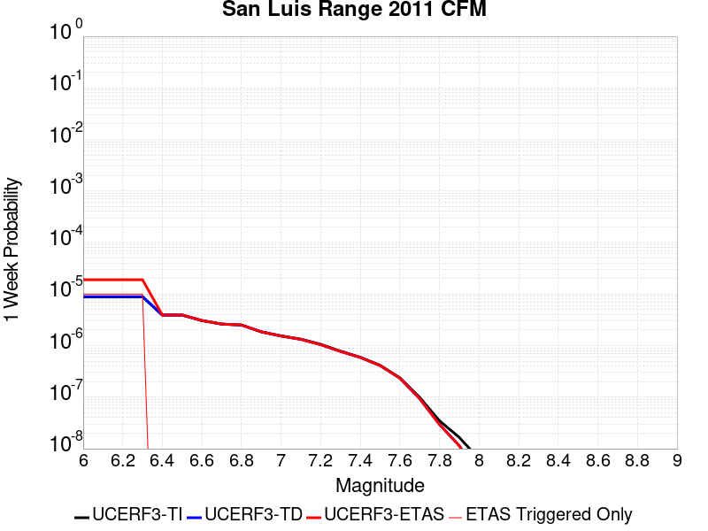 |  |  | 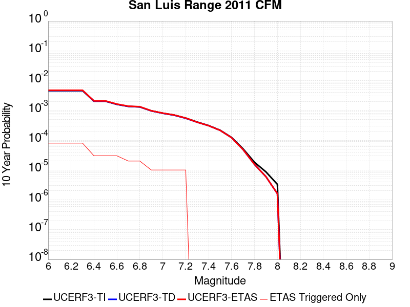 |

| Magnitude | 1 wk TI Prob | 1 wk TD Prob | 1 wk ETAS Prob | 1 wk ETAS/TD Gain | 1 wk ETAS Triggered Only | 1 mo TI Prob | 1 mo TD Prob | 1 mo ETAS Prob | 1 mo ETAS/TD Gain | 1 mo ETAS Triggered Only | 1 yr TI Prob | 1 yr TD Prob | 1 yr ETAS Prob | 1 yr ETAS/TD Gain | 1 yr ETAS Triggered Only | 10 yr TI Prob | 10 yr TD Prob | 10 yr ETAS Prob | 10 yr ETAS/TD Gain | 10 yr ETAS Triggered Only |
|-----|-----|-----|-----|-----|-----|-----|-----|-----|-----|-----|-----|-----|-----|-----|-----|-----|-----|-----|-----|-----|
| 6.0 | 8.8368415E-6 | 8.965454E-6 | 8.965454E-6 | 1.0 | 0.0 | 3.787163E-5 | 3.842285E-5 | 3.842285E-5 | 1.0 | 0.0 | 4.609895E-4 | 4.677057E-4 | 4.915041E-4 | 1.0508833 | 2.3809524E-5 | 0.0046003438 | 0.0046679964 | 0.004715393 | 1.0101535 | 4.7619047E-5 |
| 6.1 | 8.8368415E-6 | 8.965454E-6 | 8.965454E-6 | 1.0 | 0.0 | 3.787163E-5 | 3.842285E-5 | 3.842285E-5 | 1.0 | 0.0 | 4.609895E-4 | 4.677057E-4 | 4.915041E-4 | 1.0508833 | 2.3809524E-5 | 0.0046003438 | 0.0046679964 | 0.004715393 | 1.0101535 | 4.7619047E-5 |
| 6.2 | 8.8368415E-6 | 8.965454E-6 | 8.965454E-6 | 1.0 | 0.0 | 3.787163E-5 | 3.842285E-5 | 3.842285E-5 | 1.0 | 0.0 | 4.609895E-4 | 4.677057E-4 | 4.915041E-4 | 1.0508833 | 2.3809524E-5 | 0.0046003438 | 0.0046679964 | 0.004715393 | 1.0101535 | 4.7619047E-5 |
| 6.3 | 8.8368415E-6 | 8.965454E-6 | 8.965454E-6 | 1.0 | 0.0 | 3.787163E-5 | 3.842285E-5 | 3.842285E-5 | 1.0 | 0.0 | 4.609895E-4 | 4.677057E-4 | 4.915041E-4 | 1.0508833 | 2.3809524E-5 | 0.0046003438 | 0.0046679964 | 0.004715393 | 1.0101535 | 4.7619047E-5 |
| 6.4 | 3.9094193E-6 | 3.9412025E-6 | 3.9412025E-6 | 1.0 | 0.0 | 1.6754546E-5 | 1.689076E-5 | 1.689076E-5 | 1.0 | 0.0 | 2.039675E-4 | 2.056259E-4 | 2.2943052E-4 | 1.1157666 | 2.3809524E-5 | 0.0020378039 | 0.0020543851 | 0.0020781457 | 1.0115658 | 2.3809524E-5 |
| 6.5 | 3.9094193E-6 | 3.9412025E-6 | 3.9412025E-6 | 1.0 | 0.0 | 1.6754546E-5 | 1.689076E-5 | 1.689076E-5 | 1.0 | 0.0 | 2.039675E-4 | 2.056259E-4 | 2.2943052E-4 | 1.1157666 | 2.3809524E-5 | 0.0020378039 | 0.0020543851 | 0.0020781457 | 1.0115658 | 2.3809524E-5 |
| 6.6 | 3.0587726E-6 | 3.0753883E-6 | 3.0753883E-6 | 1.0 | 0.0 | 1.3108959E-5 | 1.318017E-5 | 1.318017E-5 | 1.0 | 0.0 | 1.595899E-4 | 1.6045687E-4 | 1.8426256E-4 | 1.148362 | 2.3809524E-5 | 0.0015947534 | 0.0016034221 | 0.0016271934 | 1.0148253 | 2.3809524E-5 |
| 6.7 | 2.6160574E-6 | 2.6251273E-6 | 2.6251273E-6 | 1.0 | 0.0 | 1.1211626E-5 | 1.1250498E-5 | 1.1250498E-5 | 1.0 | 0.0 | 1.3649299E-4 | 1.3696625E-4 | 1.6077251E-4 | 1.1738112 | 2.3809524E-5 | 0.0013640919 | 0.0013688246 | 0.0013926015 | 1.0173703 | 2.3809524E-5 |
| 6.8 | 2.5110312E-6 | 2.51814E-6 | 2.51814E-6 | 1.0 | 0.0 | 1.0761518E-5 | 1.0791985E-5 | 1.0791985E-5 | 1.0 | 0.0 | 1.310136E-4 | 1.3138456E-4 | 1.5519095E-4 | 1.1811963 | 2.3809524E-5 | 0.0013093639 | 0.0013130746 | 0.0013368529 | 1.0181088 | 2.3809524E-5 |
| 6.9 | 1.8564405E-6 | 1.852487E-6 | 1.852487E-6 | 1.0 | 0.0 | 7.95615E-6 | 7.939206E-6 | 7.939206E-6 | 1.0 | 0.0 | 9.686181E-5 | 9.665557E-5 | 9.665557E-5 | 1.0 | 0.0 | 9.68196E-4 | 9.661373E-4 | 9.661373E-4 | 1.0 | 0.0 |
| 7.0 | 1.546127E-6 | 1.5369537E-6 | 1.5369537E-6 | 1.0 | 0.0 | 6.626242E-6 | 6.586928E-6 | 6.586928E-6 | 1.0 | 0.0 | 8.06715E-5 | 8.0192905E-5 | 8.0192905E-5 | 1.0 | 0.0 | 8.0642226E-4 | 8.016404E-4 | 8.016404E-4 | 1.0 | 0.0 |
| 7.1 | 1.3368208E-6 | 1.3235326E-6 | 1.3235326E-6 | 1.0 | 0.0 | 5.7292195E-6 | 5.67227E-6 | 5.67227E-6 | 1.0 | 0.0 | 6.975101E-5 | 6.905771E-5 | 6.905771E-5 | 1.0 | 0.0 | 6.972912E-4 | 6.9036294E-4 | 6.9036294E-4 | 1.0 | 0.0 |
| 7.2 | 1.0623363E-6 | 1.0454368E-6 | 1.0454368E-6 | 1.0 | 0.0 | 4.5528623E-6 | 4.4804356E-6 | 4.4804356E-6 | 1.0 | 0.0 | 5.5429686E-5 | 5.4547938E-5 | 5.4547938E-5 | 1.0 | 0.0 | 5.5415864E-4 | 5.4534577E-4 | 5.4534577E-4 | 1.0 | 0.0 |
| 7.3 | 7.831679E-7 | 7.7273904E-7 | 7.7273904E-7 | 1.0 | 0.0 | 3.3564295E-6 | 3.3117344E-6 | 3.3117344E-6 | 1.0 | 0.0 | 4.086376E-5 | 4.0319625E-5 | 4.0319625E-5 | 1.0 | 0.0 | 4.0856248E-4 | 4.031232E-4 | 4.031232E-4 | 1.0 | 0.0 |
| 7.4 | 5.9558846E-7 | 5.910636E-7 | 5.910636E-7 | 1.0 | 0.0 | 2.5525194E-6 | 2.5331274E-6 | 2.5331274E-6 | 1.0 | 0.0 | 3.107648E-5 | 3.084039E-5 | 3.084039E-5 | 1.0 | 0.0 | 3.1072134E-4 | 3.083612E-4 | 3.083612E-4 | 1.0 | 0.0 |
| 7.5 | 4.1616502E-7 | 4.119631E-7 | 4.119631E-7 | 1.0 | 0.0 | 1.7835631E-6 | 1.7655549E-6 | 1.7655549E-6 | 1.0 | 0.0 | 2.1714664E-5 | 2.149542E-5 | 2.149542E-5 | 1.0 | 0.0 | 2.1712543E-4 | 2.1493346E-4 | 2.1493346E-4 | 1.0 | 0.0 |
| 7.6 | 2.3816014E-7 | 2.3376548E-7 | 2.3376548E-7 | 1.0 | 0.0 | 1.0206859E-6 | 1.0018516E-6 | 1.0018516E-6 | 1.0 | 0.0 | 1.242678E-5 | 1.2197475E-5 | 1.2197475E-5 | 1.0 | 0.0 | 1.2426086E-4 | 1.2196808E-4 | 1.2196808E-4 | 1.0 | 0.0 |
| 7.7 | 9.918777E-8 | 9.3867584E-8 | 9.3867584E-8 | 1.0 | 0.0 | 4.2509038E-7 | 4.0228957E-7 | 4.0228957E-7 | 1.0 | 0.0 | 5.1754632E-6 | 4.8978645E-6 | 4.8978645E-6 | 1.0 | 0.0 | 5.1753424E-5 | 4.897757E-5 | 4.897757E-5 | 1.0 | 0.0 |
| 7.8 | 3.4982556E-8 | 2.968655E-8 | 2.968655E-8 | 1.0 | 0.0 | 1.4992524E-7 | 1.2722806E-7 | 1.2722806E-7 | 1.0 | 0.0 | 1.8253382E-6 | 1.5490006E-6 | 1.5490006E-6 | 1.0 | 0.0 | 1.8253233E-5 | 1.5489897E-5 | 1.5489897E-5 | 1.0 | 0.0 |
| 7.9 | 1.6624908E-8 | 1.1477036E-8 | 1.1477036E-8 | 1.0 | 0.0 | 7.12496E-8 | 4.91873E-8 | 4.91873E-8 | 1.0 | 0.0 | 8.6746354E-7 | 5.988552E-7 | 5.988552E-7 | 1.0 | 0.0 | 8.674601E-6 | 5.988536E-6 | 5.988536E-6 | 1.0 | 0.0 |
| 8.0 | 6.3352315E-9 | 3.0888412E-9 | 3.0888412E-9 | 1.0 | 0.0 | 2.715099E-8 | 1.3237893E-8 | 1.3237893E-8 | 1.0 | 0.0 | 3.3056327E-7 | 1.6117131E-7 | 1.6117131E-7 | 1.0 | 0.0 | 3.3056278E-6 | 1.611712E-6 | 1.611712E-6 | 1.0 | 0.0 |

## Hosgri (Extension)
*[(top)](#table-of-contents)*

| 1 Week | 1 Month | 1 Year | 10 Year |
|-----|-----|-----|-----|
|  |  | 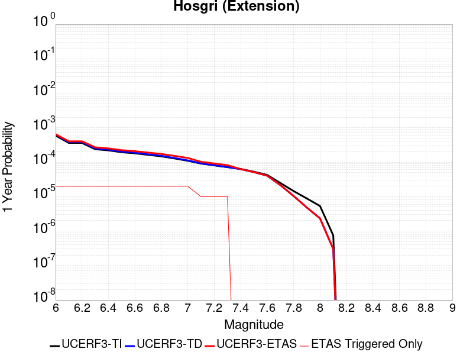 |  |

| Magnitude | 1 wk TI Prob | 1 wk TD Prob | 1 wk ETAS Prob | 1 wk ETAS/TD Gain | 1 wk ETAS Triggered Only | 1 mo TI Prob | 1 mo TD Prob | 1 mo ETAS Prob | 1 mo ETAS/TD Gain | 1 mo ETAS Triggered Only | 1 yr TI Prob | 1 yr TD Prob | 1 yr ETAS Prob | 1 yr ETAS/TD Gain | 1 yr ETAS Triggered Only | 10 yr TI Prob | 10 yr TD Prob | 10 yr ETAS Prob | 10 yr ETAS/TD Gain | 10 yr ETAS Triggered Only |
|-----|-----|-----|-----|-----|-----|-----|-----|-----|-----|-----|-----|-----|-----|-----|-----|-----|-----|-----|-----|-----|
| 6.0 | 1.1369135E-5 | 1.2083072E-5 | 1.2083072E-5 | 1.0 | 0.0 | 4.8723956E-5 | 5.1783692E-5 | 5.1783692E-5 | 1.0 | 0.0 | 5.9305265E-4 | 6.3030684E-4 | 6.541013E-4 | 1.0377507 | 2.3809524E-5 | 0.005914725 | 0.0062874397 | 0.0063110995 | 1.0037631 | 2.3809524E-5 |
| 6.1 | 6.934979E-6 | 7.324555E-6 | 7.324555E-6 | 1.0 | 0.0 | 2.9721E-5 | 3.1390595E-5 | 3.1390595E-5 | 1.0 | 0.0 | 3.617931E-4 | 3.8211764E-4 | 4.0591805E-4 | 1.0622855 | 2.3809524E-5 | 0.0036120464 | 0.0038150186 | 0.0038387373 | 1.0062172 | 2.3809524E-5 |
| 6.2 | 6.934979E-6 | 7.324555E-6 | 7.324555E-6 | 1.0 | 0.0 | 2.9721E-5 | 3.1390595E-5 | 3.1390595E-5 | 1.0 | 0.0 | 3.617931E-4 | 3.8211764E-4 | 4.0591805E-4 | 1.0622855 | 2.3809524E-5 | 0.0036120464 | 0.0038150186 | 0.0038387373 | 1.0062172 | 2.3809524E-5 |
| 6.3 | 4.5484676E-6 | 4.76933E-6 | 4.76933E-6 | 1.0 | 0.0 | 1.9493287E-5 | 2.043983E-5 | 2.043983E-5 | 1.0 | 0.0 | 2.3730492E-4 | 2.4882692E-4 | 2.726305E-4 | 1.0956633 | 2.3809524E-5 | 0.0023705168 | 0.0024855258 | 0.0025092761 | 1.0095555 | 2.3809524E-5 |
| 6.4 | 4.218095E-6 | 4.4168614E-6 | 4.4168614E-6 | 1.0 | 0.0 | 1.8077424E-5 | 1.8929271E-5 | 1.8929271E-5 | 1.0 | 0.0 | 2.2007042E-4 | 2.3043984E-4 | 2.5424387E-4 | 1.1032983 | 2.3809524E-5 | 0.002198526 | 0.0023020422 | 0.002325797 | 1.010319 | 2.3809524E-5 |
| 6.5 | 3.717374E-6 | 3.8838775E-6 | 3.8838775E-6 | 1.0 | 0.0 | 1.5931506E-5 | 1.6645085E-5 | 1.6645085E-5 | 1.0 | 0.0 | 1.9394881E-4 | 2.0263524E-4 | 2.2643994E-4 | 1.1174756 | 2.3809524E-5 | 0.0019377962 | 0.0020245234 | 0.002048285 | 1.0117368 | 2.3809524E-5 |
| 6.6 | 3.4605036E-6 | 3.608306E-6 | 3.608306E-6 | 1.0 | 0.0 | 1.4830645E-5 | 1.5464078E-5 | 1.5464078E-5 | 1.0 | 0.0 | 1.8054814E-4 | 1.8825903E-4 | 2.1206407E-4 | 1.1264484 | 2.3809524E-5 | 0.0018040152 | 0.0018810101 | 0.0019047749 | 1.012634 | 2.3809524E-5 |
| 6.7 | 3.123439E-6 | 3.2465687E-6 | 3.2465687E-6 | 1.0 | 0.0 | 1.33860985E-5 | 1.3913792E-5 | 1.3913792E-5 | 1.0 | 0.0 | 1.6296357E-4 | 1.6938736E-4 | 1.9319284E-4 | 1.1405388 | 2.3809524E-5 | 0.001628441 | 0.0016925934 | 0.0017163627 | 1.0140431 | 2.3809524E-5 |
| 6.8 | 2.8290783E-6 | 2.9305404E-6 | 2.9305404E-6 | 1.0 | 0.0 | 1.2124565E-5 | 1.2559399E-5 | 1.2559399E-5 | 1.0 | 0.0 | 1.4760658E-4 | 1.5290003E-4 | 1.7670591E-4 | 1.1556958 | 2.3809524E-5 | 0.0014750857 | 0.001527957 | 0.0015517302 | 1.0155587 | 2.3809524E-5 |
| 6.9 | 2.454112E-6 | 2.5283196E-6 | 2.5283196E-6 | 1.0 | 0.0 | 1.0517581E-5 | 1.0835611E-5 | 1.0835611E-5 | 1.0 | 0.0 | 1.2804402E-4 | 1.3191563E-4 | 1.5572201E-4 | 1.1804668 | 2.3809524E-5 | 0.0012797028 | 0.0013183793 | 0.0013421575 | 1.0180359 | 2.3809524E-5 |
| 7.0 | 2.1008145E-6 | 2.1498704E-6 | 2.1498704E-6 | 1.0 | 0.0 | 9.003459E-6 | 9.213698E-6 | 9.213698E-6 | 1.0 | 0.0 | 1.096116E-4 | 1.1217103E-4 | 1.3597788E-4 | 1.2122371 | 2.3809524E-5 | 0.0010955755 | 0.0011211479 | 0.0011449307 | 1.0212129 | 2.3809524E-5 |
| 7.1 | 1.744384E-6 | 1.7686352E-6 | 1.7686352E-6 | 1.0 | 0.0 | 7.47591E-6 | 7.5798434E-6 | 7.5798434E-6 | 1.0 | 0.0 | 9.1015405E-5 | 9.22807E-5 | 9.22807E-5 | 1.0 | 0.0 | 9.097813E-4 | 9.2242553E-4 | 9.2242553E-4 | 1.0 | 0.0 |
| 7.2 | 1.5456587E-6 | 1.5562882E-6 | 1.5562882E-6 | 1.0 | 0.0 | 6.6242346E-6 | 6.66979E-6 | 6.66979E-6 | 1.0 | 0.0 | 8.064707E-5 | 8.120168E-5 | 8.120168E-5 | 1.0 | 0.0 | 8.0617814E-4 | 8.117213E-4 | 8.117213E-4 | 1.0 | 0.0 |
| 7.3 | 1.3775123E-6 | 1.3766082E-6 | 1.3766082E-6 | 1.0 | 0.0 | 5.9036106E-6 | 5.899736E-6 | 5.899736E-6 | 1.0 | 0.0 | 7.187409E-5 | 7.182693E-5 | 7.182693E-5 | 1.0 | 0.0 | 7.185085E-4 | 7.180382E-4 | 7.180382E-4 | 1.0 | 0.0 |
| 7.4 | 1.214491E-6 | 1.2023461E-6 | 1.2023461E-6 | 1.0 | 0.0 | 5.2049513E-6 | 5.1529014E-6 | 5.1529014E-6 | 1.0 | 0.0 | 6.336844E-5 | 6.2734776E-5 | 6.2734776E-5 | 1.0 | 0.0 | 6.335037E-4 | 6.271715E-4 | 6.271715E-4 | 1.0 | 0.0 |
| 7.5 | 1.0101123E-6 | 9.842246E-7 | 9.842246E-7 | 1.0 | 0.0 | 4.3290456E-6 | 4.2180986E-6 | 4.2180986E-6 | 1.0 | 0.0 | 5.2704854E-5 | 5.1354145E-5 | 5.1354145E-5 | 1.0 | 0.0 | 5.2692357E-4 | 5.1342335E-4 | 5.1342335E-4 | 1.0 | 0.0 |
| 7.6 | 8.1558215E-7 | 7.765966E-7 | 7.765966E-7 | 1.0 | 0.0 | 3.4953473E-6 | 3.328267E-6 | 3.328267E-6 | 1.0 | 0.0 | 4.255502E-5 | 4.0520903E-5 | 4.0520903E-5 | 1.0 | 0.0 | 4.2546875E-4 | 4.0513556E-4 | 4.0513556E-4 | 1.0 | 0.0 |
| 7.7 | 4.757816E-7 | 4.1308888E-7 | 4.1308888E-7 | 1.0 | 0.0 | 2.0390623E-6 | 1.7703798E-6 | 1.7703798E-6 | 1.0 | 0.0 | 2.4825302E-5 | 2.155416E-5 | 2.155416E-5 | 1.0 | 0.0 | 2.482253E-4 | 2.1552083E-4 | 2.1552083E-4 | 1.0 | 0.0 |
| 7.8 | 2.782787E-7 | 2.0047722E-7 | 2.0047722E-7 | 1.0 | 0.0 | 1.1926223E-6 | 8.5918776E-7 | 8.5918776E-7 | 1.0 | 0.0 | 1.452008E-5 | 1.04605615E-5 | 1.04605615E-5 | 1.0 | 0.0 | 1.4519131E-4 | 1.04600724E-4 | 1.04600724E-4 | 1.0 | 0.0 |
| 7.9 | 1.6948086E-7 | 9.244227E-8 | 9.244227E-8 | 1.0 | 0.0 | 7.2634634E-7 | 3.961811E-7 | 3.961811E-7 | 1.0 | 0.0 | 8.843231E-6 | 4.8234942E-6 | 4.8234942E-6 | 1.0 | 0.0 | 8.842879E-5 | 4.8233902E-5 | 4.8233902E-5 | 1.0 | 0.0 |
| 8.0 | 1.0225492E-7 | 4.4738776E-8 | 4.4738776E-8 | 1.0 | 0.0 | 4.382353E-7 | 1.917376E-7 | 1.917376E-7 | 1.0 | 0.0 | 5.335502E-6 | 2.3344028E-6 | 2.3344028E-6 | 1.0 | 0.0 | 5.335374E-5 | 2.3343786E-5 | 2.3343786E-5 | 1.0 | 0.0 |
| 8.1 | 1.43711345E-8 | 5.787707E-9 | 5.787707E-9 | 1.0 | 0.0 | 6.1590576E-8 | 2.480446E-8 | 2.480446E-8 | 1.0 | 0.0 | 7.4986497E-7 | 3.0199428E-7 | 3.0199428E-7 | 1.0 | 0.0 | 7.4986247E-6 | 3.0199392E-6 | 3.0199392E-6 | 1.0 | 0.0 |

## Sargent 2011 CFM
*[(top)](#table-of-contents)*

| 1 Week | 1 Month | 1 Year | 10 Year |
|-----|-----|-----|-----|
|  |  |  |  |

| Magnitude | 1 wk TI Prob | 1 wk TD Prob | 1 wk ETAS Prob | 1 wk ETAS/TD Gain | 1 wk ETAS Triggered Only | 1 mo TI Prob | 1 mo TD Prob | 1 mo ETAS Prob | 1 mo ETAS/TD Gain | 1 mo ETAS Triggered Only | 1 yr TI Prob | 1 yr TD Prob | 1 yr ETAS Prob | 1 yr ETAS/TD Gain | 1 yr ETAS Triggered Only | 10 yr TI Prob | 10 yr TD Prob | 10 yr ETAS Prob | 10 yr ETAS/TD Gain | 10 yr ETAS Triggered Only |
|-----|-----|-----|-----|-----|-----|-----|-----|-----|-----|-----|-----|-----|-----|-----|-----|-----|-----|-----|-----|-----|
| 6.0 | 3.7327867E-5 | 3.664913E-5 | 3.664913E-5 | 1.0 | 0.0 | 1.5996677E-4 | 1.5706103E-4 | 1.5706103E-4 | 1.0 | 0.0 | 0.0019458556 | 0.0019110236 | 0.0019347877 | 1.0124352 | 2.3809524E-5 | 0.01928905 | 0.019018095 | 0.019064808 | 1.0024563 | 4.7619047E-5 |
| 6.1 | 2.3771476E-5 | 1.8479273E-5 | 1.8479273E-5 | 1.0 | 0.0 | 1.01873775E-4 | 7.919498E-5 | 7.919498E-5 | 1.0 | 0.0 | 0.0012396075 | 9.638493E-4 | 9.876359E-4 | 1.0246787 | 2.3809524E-5 | 0.012327154 | 0.009636091 | 0.009659671 | 1.002447 | 2.3809524E-5 |
| 6.2 | 2.3112721E-5 | 1.7710632E-5 | 1.7710632E-5 | 1.0 | 0.0 | 9.9050754E-5 | 7.590099E-5 | 7.590099E-5 | 1.0 | 0.0 | 0.0012052758 | 9.237792E-4 | 9.4756676E-4 | 1.0257503 | 2.3809524E-5 | 0.011987597 | 0.009238743 | 0.009262333 | 1.0025533 | 2.3809524E-5 |
| 6.3 | 1.728509E-5 | 1.0458927E-5 | 1.0458927E-5 | 1.0 | 0.0 | 7.407686E-5 | 4.482347E-5 | 4.482347E-5 | 1.0 | 0.0 | 9.015125E-4 | 5.456343E-4 | 5.456343E-4 | 1.0 | 0.0 | 0.008978641 | 0.0054791216 | 0.0054791216 | 1.0 | 0.0 |
| 6.4 | 1.48395575E-5 | 7.4559816E-6 | 7.4559816E-6 | 1.0 | 0.0 | 6.3596555E-5 | 3.195403E-5 | 3.195403E-5 | 1.0 | 0.0 | 7.7401294E-4 | 3.8900663E-4 | 3.8900663E-4 | 1.0 | 0.0 | 0.0077132257 | 0.003918666 | 0.003918666 | 1.0 | 0.0 |
| 6.5 | 1.4358964E-5 | 6.894759E-6 | 6.894759E-6 | 1.0 | 0.0 | 6.1536964E-5 | 2.9548846E-5 | 2.9548846E-5 | 1.0 | 0.0 | 7.48955E-4 | 3.5973339E-4 | 3.5973339E-4 | 1.0 | 0.0 | 0.0074643586 | 0.0036269152 | 0.0036269152 | 1.0 | 0.0 |
| 6.6 | 9.772591E-6 | 1.3736154E-6 | 1.3736154E-6 | 1.0 | 0.0 | 4.188186E-5 | 5.88691E-6 | 5.88691E-6 | 1.0 | 0.0 | 5.097923E-4 | 7.16708E-5 | 7.16708E-5 | 1.0 | 0.0 | 0.005086244 | 7.483097E-4 | 7.483097E-4 | 1.0 | 0.0 |
| 6.7 | 9.752745E-6 | 1.3523068E-6 | 1.3523068E-6 | 1.0 | 0.0 | 4.179681E-5 | 5.795587E-6 | 5.795587E-6 | 1.0 | 0.0 | 5.0875737E-4 | 7.055902E-5 | 7.055902E-5 | 1.0 | 0.0 | 0.005075942 | 7.371994E-4 | 7.371994E-4 | 1.0 | 0.0 |
| 6.8 | 9.608213E-6 | 1.2361709E-6 | 1.2361709E-6 | 1.0 | 0.0 | 4.1177405E-5 | 5.2978644E-6 | 5.2978644E-6 | 1.0 | 0.0 | 5.012196E-4 | 6.449961E-5 | 6.449961E-5 | 1.0 | 0.0 | 0.005000906 | 6.7634037E-4 | 6.7634037E-4 | 1.0 | 0.0 |
| 6.9 | 9.427164E-6 | 1.12094E-6 | 1.12094E-6 | 1.0 | 0.0 | 4.04015E-5 | 4.80402E-6 | 4.80402E-6 | 1.0 | 0.0 | 4.9177726E-4 | 5.8487396E-5 | 5.8487396E-5 | 1.0 | 0.0 | 0.004906904 | 6.1557174E-4 | 6.1557174E-4 | 1.0 | 0.0 |
| 7.0 | 9.247601E-6 | 9.873988E-7 | 9.873988E-7 | 1.0 | 0.0 | 3.9631974E-5 | 4.2317024E-6 | 4.2317024E-6 | 1.0 | 0.0 | 4.8241246E-4 | 5.1519775E-5 | 5.1519775E-5 | 1.0 | 0.0 | 0.0048136655 | 5.4542476E-4 | 5.4542476E-4 | 1.0 | 0.0 |
| 7.1 | 8.995454E-6 | 8.2711284E-7 | 8.2711284E-7 | 1.0 | 0.0 | 3.8551374E-5 | 3.5447645E-6 | 3.5447645E-6 | 1.0 | 0.0 | 4.6926187E-4 | 4.3156666E-5 | 4.3156666E-5 | 1.0 | 0.0 | 0.004682722 | 4.609069E-4 | 4.609069E-4 | 1.0 | 0.0 |
| 7.2 | 8.520861E-6 | 5.2766507E-7 | 5.2766507E-7 | 1.0 | 0.0 | 3.6517464E-5 | 2.2614197E-6 | 2.2614197E-6 | 1.0 | 0.0 | 4.445094E-4 | 2.7532446E-5 | 2.7532446E-5 | 1.0 | 0.0 | 0.004436213 | 3.0297207E-4 | 3.0297207E-4 | 1.0 | 0.0 |
| 7.3 | 8.043592E-6 | 3.456507E-7 | 3.456507E-7 | 1.0 | 0.0 | 3.4472083E-5 | 1.4813593E-6 | 1.4813593E-6 | 1.0 | 0.0 | 4.196168E-4 | 1.8035402E-5 | 1.8035402E-5 | 1.0 | 0.0 | 0.004188253 | 2.0669671E-4 | 2.0669671E-4 | 1.0 | 0.0 |
| 7.4 | 7.662316E-6 | 2.928958E-7 | 2.928958E-7 | 1.0 | 0.0 | 3.2838085E-5 | 1.2552671E-6 | 1.2552671E-6 | 1.0 | 0.0 | 3.9973034E-4 | 1.528277E-5 | 1.528277E-5 | 1.0 | 0.0 | 0.0039901207 | 1.7736501E-4 | 1.7736501E-4 | 1.0 | 0.0 |
| 7.5 | 6.961638E-6 | 2.3574503E-7 | 2.3574503E-7 | 1.0 | 0.0 | 2.9835252E-5 | 1.0103355E-6 | 1.0103355E-6 | 1.0 | 0.0 | 3.6318362E-4 | 1.2300766E-5 | 1.2300766E-5 | 1.0 | 0.0 | 0.0036259065 | 1.4409334E-4 | 1.4409334E-4 | 1.0 | 0.0 |
| 7.6 | 6.282332E-6 | 1.6892966E-7 | 1.6892966E-7 | 1.0 | 0.0 | 2.6924003E-5 | 7.2398404E-7 | 7.2398404E-7 | 1.0 | 0.0 | 3.2775043E-4 | 8.814471E-6 | 8.814471E-6 | 1.0 | 0.0 | 0.0032726745 | 1.05050465E-4 | 1.05050465E-4 | 1.0 | 0.0 |
| 7.7 | 4.934408E-6 | 5.001089E-8 | 5.001089E-8 | 1.0 | 0.0 | 2.114729E-5 | 2.1433237E-7 | 2.1433237E-7 | 1.0 | 0.0 | 2.5743784E-4 | 2.6094935E-6 | 2.6094935E-6 | 1.0 | 0.0 | 0.0025713982 | 3.2545366E-5 | 3.2545366E-5 | 1.0 | 0.0 |
| 7.8 | 2.373212E-6 | 3.5172643E-8 | 3.5172643E-8 | 1.0 | 0.0 | 1.0170869E-5 | 1.507399E-7 | 1.507399E-7 | 1.0 | 0.0 | 1.238233E-4 | 1.8352566E-6 | 1.8352566E-6 | 1.0 | 0.0 | 0.0012375432 | 2.4125171E-5 | 2.4125171E-5 | 1.0 | 0.0 |
| 7.9 | 1.8227792E-6 | 3.0619603E-8 | 3.0619603E-8 | 1.0 | 0.0 | 7.811887E-6 | 1.3122687E-7 | 1.3122687E-7 | 1.0 | 0.0 | 9.510558E-5 | 1.5976858E-6 | 1.5976858E-6 | 1.0 | 0.0 | 9.5064886E-4 | 2.1410624E-5 | 2.1410624E-5 | 1.0 | 0.0 |
| 8.0 | 1.9095137E-7 | 1.326461E-8 | 1.326461E-8 | 1.0 | 0.0 | 8.1836276E-7 | 5.684833E-8 | 5.684833E-8 | 1.0 | 0.0 | 9.963521E-6 | 6.921282E-7 | 6.921282E-7 | 1.0 | 0.0 | 9.963074E-5 | 8.463319E-6 | 8.463319E-6 | 1.0 | 0.0 |

## Del Valle
*[(top)](#table-of-contents)*

| 1 Week | 1 Month | 1 Year | 10 Year |
|-----|-----|-----|-----|
|  |  | 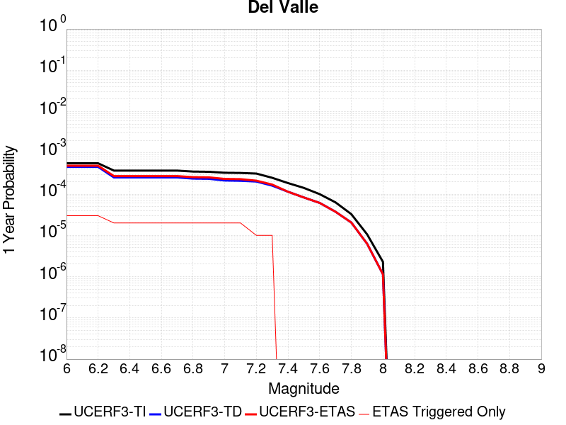 |  |

| Magnitude | 1 wk TI Prob | 1 wk TD Prob | 1 wk ETAS Prob | 1 wk ETAS/TD Gain | 1 wk ETAS Triggered Only | 1 mo TI Prob | 1 mo TD Prob | 1 mo ETAS Prob | 1 mo ETAS/TD Gain | 1 mo ETAS Triggered Only | 1 yr TI Prob | 1 yr TD Prob | 1 yr ETAS Prob | 1 yr ETAS/TD Gain | 1 yr ETAS Triggered Only | 10 yr TI Prob | 10 yr TD Prob | 10 yr ETAS Prob | 10 yr ETAS/TD Gain | 10 yr ETAS Triggered Only |
|-----|-----|-----|-----|-----|-----|-----|-----|-----|-----|-----|-----|-----|-----|-----|-----|-----|-----|-----|-----|-----|
| 6.0 | 1.0716125E-5 | 8.767882E-6 | 8.767882E-6 | 1.0 | 0.0 | 4.592544E-5 | 3.7576207E-5 | 6.138484E-5 | 1.6336092 | 2.3809524E-5 | 5.589988E-4 | 4.5741405E-4 | 5.050113E-4 | 1.1040573 | 4.7619047E-5 | 0.0055759475 | 0.00456668 | 0.0046140817 | 1.0103799 | 4.7619047E-5 |
| 6.1 | 1.0716125E-5 | 8.767882E-6 | 8.767882E-6 | 1.0 | 0.0 | 4.592544E-5 | 3.7576207E-5 | 6.138484E-5 | 1.6336092 | 2.3809524E-5 | 5.589988E-4 | 4.5741405E-4 | 5.050113E-4 | 1.1040573 | 4.7619047E-5 | 0.0055759475 | 0.00456668 | 0.0046140817 | 1.0103799 | 4.7619047E-5 |
| 6.2 | 1.0716125E-5 | 8.767882E-6 | 8.767882E-6 | 1.0 | 0.0 | 4.592544E-5 | 3.7576207E-5 | 6.138484E-5 | 1.6336092 | 2.3809524E-5 | 5.589988E-4 | 4.5741405E-4 | 5.050113E-4 | 1.1040573 | 4.7619047E-5 | 0.0055759475 | 0.00456668 | 0.0046140817 | 1.0103799 | 4.7619047E-5 |
| 6.3 | 7.1293784E-6 | 4.865823E-6 | 4.865823E-6 | 1.0 | 0.0 | 3.055412E-5 | 2.0853364E-5 | 4.4662393E-5 | 2.1417356 | 2.3809524E-5 | 3.7193293E-4 | 2.5386087E-4 | 3.0146784E-4 | 1.1875317 | 4.7619047E-5 | 0.0037131102 | 0.0025357946 | 0.002583293 | 1.0187311 | 4.7619047E-5 |
| 6.4 | 7.1293784E-6 | 4.865823E-6 | 4.865823E-6 | 1.0 | 0.0 | 3.055412E-5 | 2.0853364E-5 | 4.4662393E-5 | 2.1417356 | 2.3809524E-5 | 3.7193293E-4 | 2.5386087E-4 | 3.0146784E-4 | 1.1875317 | 4.7619047E-5 | 0.0037131102 | 0.0025357946 | 0.002583293 | 1.0187311 | 4.7619047E-5 |
| 6.5 | 7.1293784E-6 | 4.865823E-6 | 4.865823E-6 | 1.0 | 0.0 | 3.055412E-5 | 2.0853364E-5 | 4.4662393E-5 | 2.1417356 | 2.3809524E-5 | 3.7193293E-4 | 2.5386087E-4 | 3.0146784E-4 | 1.1875317 | 4.7619047E-5 | 0.0037131102 | 0.0025357946 | 0.002583293 | 1.0187311 | 4.7619047E-5 |
| 6.6 | 7.1293784E-6 | 4.865823E-6 | 4.865823E-6 | 1.0 | 0.0 | 3.055412E-5 | 2.0853364E-5 | 4.4662393E-5 | 2.1417356 | 2.3809524E-5 | 3.7193293E-4 | 2.5386087E-4 | 3.0146784E-4 | 1.1875317 | 4.7619047E-5 | 0.0037131102 | 0.0025357946 | 0.002583293 | 1.0187311 | 4.7619047E-5 |
| 6.7 | 7.12272E-6 | 4.8631987E-6 | 4.8631987E-6 | 1.0 | 0.0 | 3.0525585E-5 | 2.0842117E-5 | 4.4651144E-5 | 2.1423516 | 2.3809524E-5 | 3.7158563E-4 | 2.5372396E-4 | 3.0133093E-4 | 1.1876329 | 4.7619047E-5 | 0.003709649 | 0.0025344288 | 0.0025819272 | 1.0187413 | 4.7619047E-5 |
| 6.8 | 6.7558703E-6 | 4.5594015E-6 | 4.5594015E-6 | 1.0 | 0.0 | 2.895341E-5 | 1.9540148E-5 | 4.3349206E-5 | 2.2184687 | 2.3809524E-5 | 3.5245073E-4 | 2.3787597E-4 | 2.854837E-4 | 1.2001368 | 4.7619047E-5 | 0.0035189227 | 0.0023762889 | 0.0024237947 | 1.0199916 | 4.7619047E-5 |
| 6.9 | 6.6700386E-6 | 4.502539E-6 | 4.502539E-6 | 1.0 | 0.0 | 2.8585566E-5 | 1.9296456E-5 | 4.310552E-5 | 2.233857 | 2.3809524E-5 | 3.479737E-4 | 2.3490966E-4 | 2.8251752E-4 | 1.2026646 | 4.7619047E-5 | 0.003474293 | 0.0023466884 | 0.0023941959 | 1.0202444 | 4.7619047E-5 |
| 7.0 | 6.3181424E-6 | 4.0987034E-6 | 4.0987034E-6 | 1.0 | 0.0 | 2.7077473E-5 | 1.7565755E-5 | 4.137486E-5 | 2.3554273 | 2.3809524E-5 | 3.2961834E-4 | 2.1384252E-4 | 2.6145138E-4 | 1.2226351 | 4.7619047E-5 | 0.0032912986 | 0.002136422 | 0.0021839396 | 1.0222416 | 4.7619047E-5 |
| 7.1 | 6.248759E-6 | 4.033895E-6 | 4.033895E-6 | 1.0 | 0.0 | 2.678012E-5 | 1.7288008E-5 | 4.1097122E-5 | 2.377204 | 2.3809524E-5 | 3.2599916E-4 | 2.104616E-4 | 2.5807062E-4 | 1.2262124 | 4.7619047E-5 | 0.0032552136 | 0.0021026772 | 0.0021501961 | 1.0225992 | 4.7619047E-5 |
| 7.2 | 6.0411944E-6 | 3.869888E-6 | 3.869888E-6 | 1.0 | 0.0 | 2.5890577E-5 | 1.658513E-5 | 4.039426E-5 | 2.4355707 | 2.3809524E-5 | 3.1517216E-4 | 2.0190567E-4 | 2.2571039E-4 | 1.1179001 | 2.3809524E-5 | 0.0031472554 | 0.0020172757 | 0.0020410372 | 1.011779 | 2.3809524E-5 |
| 7.3 | 4.7691183E-6 | 3.0781202E-6 | 3.0781202E-6 | 1.0 | 0.0 | 2.0438918E-5 | 1.3191879E-5 | 3.700109E-5 | 2.8048384 | 2.3809524E-5 | 2.488154E-4 | 1.605995E-4 | 1.844052E-4 | 1.1482302 | 2.3809524E-5 | 0.00248537 | 0.0016048603 | 0.0016286316 | 1.0148121 | 2.3809524E-5 |
| 7.4 | 3.5524722E-6 | 2.1893363E-6 | 2.1893363E-6 | 1.0 | 0.0 | 1.5224792E-5 | 9.382837E-6 | 9.382837E-6 | 1.0 | 0.0 | 1.8534607E-4 | 1.1423013E-4 | 1.1423013E-4 | 1.0 | 0.0 | 0.0018519156 | 0.0011417224 | 0.0011417224 | 1.0 | 0.0 |
| 7.5 | 2.7133442E-6 | 1.5916097E-6 | 1.5916097E-6 | 1.0 | 0.0 | 1.1628566E-5 | 6.821167E-6 | 6.821167E-6 | 1.0 | 0.0 | 1.415686E-4 | 8.304456E-5 | 8.304456E-5 | 1.0 | 0.0 | 0.0014147845 | 8.301372E-4 | 8.301372E-4 | 1.0 | 0.0 |
| 7.6 | 1.915338E-6 | 1.173914E-6 | 1.173914E-6 | 1.0 | 0.0 | 8.208566E-6 | 5.0310505E-6 | 5.0310505E-6 | 1.0 | 0.0 | 9.993471E-5 | 6.125133E-5 | 6.125133E-5 | 1.0 | 0.0 | 9.988978E-4 | 6.123454E-4 | 6.123454E-4 | 1.0 | 0.0 |
| 7.7 | 1.2120448E-6 | 7.180313E-7 | 7.180313E-7 | 1.0 | 0.0 | 5.194467E-6 | 3.0772733E-6 | 3.0772733E-6 | 1.0 | 0.0 | 6.3240805E-5 | 3.746516E-5 | 3.746516E-5 | 1.0 | 0.0 | 6.322281E-4 | 3.7458882E-4 | 3.7458882E-4 | 1.0 | 0.0 |
| 7.8 | 6.272381E-7 | 3.932549E-7 | 3.932549E-7 | 1.0 | 0.0 | 2.6881603E-6 | 1.6853771E-6 | 1.6853771E-6 | 1.0 | 0.0 | 3.272786E-5 | 2.0519275E-5 | 2.0519275E-5 | 1.0 | 0.0 | 3.272304E-4 | 2.0517396E-4 | 2.0517396E-4 | 1.0 | 0.0 |
| 7.9 | 2.0292627E-7 | 1.2004622E-7 | 1.2004622E-7 | 1.0 | 0.0 | 8.6968373E-7 | 5.1448376E-7 | 5.1448376E-7 | 1.0 | 0.0 | 1.0588348E-5 | 6.263822E-6 | 6.263822E-6 | 1.0 | 0.0 | 1.0587843E-4 | 6.263647E-5 | 6.263647E-5 | 1.0 | 0.0 |
| 8.0 | 4.374492E-8 | 2.189964E-8 | 2.189964E-8 | 1.0 | 0.0 | 1.8747821E-7 | 9.385559E-8 | 9.385559E-8 | 1.0 | 0.0 | 2.2825448E-6 | 1.1426913E-6 | 1.1426913E-6 | 1.0 | 0.0 | 2.2825214E-5 | 1.1426858E-5 | 1.1426858E-5 | 1.0 | 0.0 |

## Morales (West)
*[(top)](#table-of-contents)*

| 1 Week | 1 Month | 1 Year | 10 Year |
|-----|-----|-----|-----|
|  | 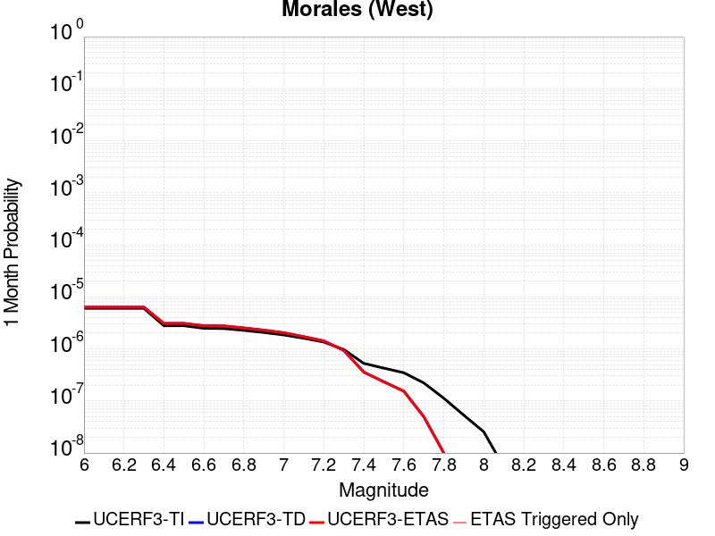 |  |  |

| Magnitude | 1 wk TI Prob | 1 wk TD Prob | 1 wk ETAS Prob | 1 wk ETAS/TD Gain | 1 wk ETAS Triggered Only | 1 mo TI Prob | 1 mo TD Prob | 1 mo ETAS Prob | 1 mo ETAS/TD Gain | 1 mo ETAS Triggered Only | 1 yr TI Prob | 1 yr TD Prob | 1 yr ETAS Prob | 1 yr ETAS/TD Gain | 1 yr ETAS Triggered Only | 10 yr TI Prob | 10 yr TD Prob | 10 yr ETAS Prob | 10 yr ETAS/TD Gain | 10 yr ETAS Triggered Only |
|-----|-----|-----|-----|-----|-----|-----|-----|-----|-----|-----|-----|-----|-----|-----|-----|-----|-----|-----|-----|-----|
| 6.0 | 1.4027072E-6 | 1.4791576E-6 | 1.4791576E-6 | 1.0 | 0.0 | 6.0115885E-6 | 6.339236E-6 | 6.339236E-6 | 1.0 | 0.0 | 7.318863E-5 | 7.7178156E-5 | 1.00985846E-4 | 1.308477 | 2.3809524E-5 | 7.316453E-4 | 7.715821E-4 | 8.1916444E-4 | 1.0616685 | 4.7619047E-5 |
| 6.1 | 1.4027072E-6 | 1.4791576E-6 | 1.4791576E-6 | 1.0 | 0.0 | 6.0115885E-6 | 6.339236E-6 | 6.339236E-6 | 1.0 | 0.0 | 7.318863E-5 | 7.7178156E-5 | 1.00985846E-4 | 1.308477 | 2.3809524E-5 | 7.316453E-4 | 7.715821E-4 | 8.1916444E-4 | 1.0616685 | 4.7619047E-5 |
| 6.2 | 1.4027072E-6 | 1.4791576E-6 | 1.4791576E-6 | 1.0 | 0.0 | 6.0115885E-6 | 6.339236E-6 | 6.339236E-6 | 1.0 | 0.0 | 7.318863E-5 | 7.7178156E-5 | 1.00985846E-4 | 1.308477 | 2.3809524E-5 | 7.316453E-4 | 7.715821E-4 | 8.1916444E-4 | 1.0616685 | 4.7619047E-5 |
| 6.3 | 1.4027072E-6 | 1.4791576E-6 | 1.4791576E-6 | 1.0 | 0.0 | 6.0115885E-6 | 6.339236E-6 | 6.339236E-6 | 1.0 | 0.0 | 7.318863E-5 | 7.7178156E-5 | 1.00985846E-4 | 1.308477 | 2.3809524E-5 | 7.316453E-4 | 7.715821E-4 | 8.1916444E-4 | 1.0616685 | 4.7619047E-5 |
| 6.4 | 6.504502E-7 | 7.2038824E-7 | 7.2038824E-7 | 1.0 | 0.0 | 2.7876408E-6 | 3.0873746E-6 | 3.0873746E-6 | 1.0 | 0.0 | 3.3939E-5 | 3.758815E-5 | 3.758815E-5 | 1.0 | 0.0 | 3.3933815E-4 | 3.758191E-4 | 3.758191E-4 | 1.0 | 0.0 |
| 6.5 | 6.504502E-7 | 7.2038824E-7 | 7.2038824E-7 | 1.0 | 0.0 | 2.7876408E-6 | 3.0873746E-6 | 3.0873746E-6 | 1.0 | 0.0 | 3.3939E-5 | 3.758815E-5 | 3.758815E-5 | 1.0 | 0.0 | 3.3933815E-4 | 3.758191E-4 | 3.758191E-4 | 1.0 | 0.0 |
| 6.6 | 5.8056526E-7 | 6.500143E-7 | 6.500143E-7 | 1.0 | 0.0 | 2.4881344E-6 | 2.7857725E-6 | 2.7857725E-6 | 1.0 | 0.0 | 3.0292615E-5 | 3.3916258E-5 | 3.3916258E-5 | 1.0 | 0.0 | 3.0288487E-4 | 3.3911143E-4 | 3.3911143E-4 | 1.0 | 0.0 |
| 6.7 | 5.741448E-7 | 6.435454E-7 | 6.435454E-7 | 1.0 | 0.0 | 2.4606184E-6 | 2.7580488E-6 | 2.7580488E-6 | 1.0 | 0.0 | 2.9957617E-5 | 3.3578734E-5 | 3.3578734E-5 | 1.0 | 0.0 | 2.9953578E-4 | 3.357372E-4 | 3.357372E-4 | 1.0 | 0.0 |
| 6.8 | 5.299428E-7 | 5.8909023E-7 | 5.8909023E-7 | 1.0 | 0.0 | 2.2711813E-6 | 2.52467E-6 | 2.52467E-6 | 1.0 | 0.0 | 2.7651282E-5 | 3.073743E-5 | 3.073743E-5 | 1.0 | 0.0 | 2.7647841E-4 | 3.0733226E-4 | 3.0733226E-4 | 1.0 | 0.0 |
| 6.9 | 4.82394E-7 | 5.3416807E-7 | 5.3416807E-7 | 1.0 | 0.0 | 2.0674013E-6 | 2.2892896E-6 | 2.2892896E-6 | 1.0 | 0.0 | 2.517032E-5 | 2.7871749E-5 | 2.7871749E-5 | 1.0 | 0.0 | 2.516747E-4 | 2.7868294E-4 | 2.7868294E-4 | 1.0 | 0.0 |
| 7.0 | 4.3264512E-7 | 4.759864E-7 | 4.759864E-7 | 1.0 | 0.0 | 1.8541921E-6 | 2.0399402E-6 | 2.0399402E-6 | 1.0 | 0.0 | 2.2574555E-5 | 2.4835992E-5 | 2.4835992E-5 | 1.0 | 0.0 | 2.2572262E-4 | 2.4833248E-4 | 2.4833248E-4 | 1.0 | 0.0 |
| 7.1 | 3.7388565E-7 | 4.000384E-7 | 4.000384E-7 | 1.0 | 0.0 | 1.6023661E-6 | 1.7144492E-6 | 1.7144492E-6 | 1.0 | 0.0 | 1.9508632E-5 | 2.0873222E-5 | 2.0873222E-5 | 1.0 | 0.0 | 1.950692E-4 | 2.0871284E-4 | 2.0871284E-4 | 1.0 | 0.0 |
| 7.2 | 3.1592543E-7 | 3.3199075E-7 | 3.3199075E-7 | 1.0 | 0.0 | 1.3539654E-6 | 1.4228168E-6 | 1.4228168E-6 | 1.0 | 0.0 | 1.6484404E-5 | 1.7322658E-5 | 1.7322658E-5 | 1.0 | 0.0 | 1.6483181E-4 | 1.7321325E-4 | 1.7321325E-4 | 1.0 | 0.0 |
| 7.3 | 2.2677783E-7 | 2.1793869E-7 | 2.1793869E-7 | 1.0 | 0.0 | 9.719047E-7 | 9.3402264E-7 | 9.3402264E-7 | 1.0 | 0.0 | 1.1832874E-5 | 1.1371666E-5 | 1.1371666E-5 | 1.0 | 0.0 | 1.18322445E-4 | 1.1371089E-4 | 1.1371089E-4 | 1.0 | 0.0 |
| 7.4 | 1.2295531E-7 | 8.350771E-8 | 8.350771E-8 | 1.0 | 0.0 | 5.269512E-7 | 3.5789014E-7 | 3.5789014E-7 | 1.0 | 0.0 | 6.4156125E-6 | 4.3573036E-6 | 4.3573036E-6 | 1.0 | 0.0 | 6.415427E-5 | 4.357219E-5 | 4.357219E-5 | 1.0 | 0.0 |
| 7.5 | 9.9632544E-8 | 5.443089E-8 | 5.443089E-8 | 1.0 | 0.0 | 4.2699656E-7 | 2.3327522E-7 | 2.3327522E-7 | 1.0 | 0.0 | 5.198671E-6 | 2.840122E-6 | 2.840122E-6 | 1.0 | 0.0 | 5.198549E-5 | 2.8400864E-5 | 2.8400864E-5 | 1.0 | 0.0 |
| 7.6 | 8.125894E-8 | 3.594956E-8 | 3.594956E-8 | 1.0 | 0.0 | 3.4825257E-7 | 1.5406955E-7 | 1.5406955E-7 | 1.0 | 0.0 | 4.2399665E-6 | 1.8757952E-6 | 1.8757952E-6 | 1.0 | 0.0 | 4.2398857E-5 | 1.8757797E-5 | 1.8757797E-5 | 1.0 | 0.0 |
| 7.7 | 5.1810765E-8 | 1.1642662E-8 | 1.1642662E-8 | 1.0 | 0.0 | 2.2204613E-7 | 4.9897128E-8 | 4.9897128E-8 | 1.0 | 0.0 | 2.7034082E-6 | 6.074974E-7 | 6.074974E-7 | 1.0 | 0.0 | 2.7033753E-5 | 6.0749603E-6 | 6.0749603E-6 | 1.0 | 0.0 |
| 7.8 | 2.6315043E-8 | 2.3383624E-9 | 2.3383624E-9 | 1.0 | 0.0 | 1.1277875E-7 | 1.0021558E-8 | 1.0021558E-8 | 1.0 | 0.0 | 1.3730804E-6 | 1.2201247E-7 | 1.2201247E-7 | 1.0 | 0.0 | 1.3730719E-5 | 1.2201268E-6 | 1.2201268E-6 | 1.0 | 0.0 |
| 7.9 | 1.24281545E-8 | 4.207228E-10 | 4.207228E-10 | 1.0 | 0.0 | 5.3263516E-8 | 1.8031033E-9 | 1.8031033E-9 | 1.0 | 0.0 | 6.4848314E-7 | 2.1952776E-8 | 2.1952776E-8 | 1.0 | 0.0 | 6.4848123E-6 | 2.195305E-7 | 2.195305E-7 | 1.0 | 0.0 |
| 8.0 | 5.954214E-9 | 1.8509339E-10 | 1.8509339E-10 | 1.0 | 0.0 | 2.551806E-8 | 7.9326146E-10 | 7.9326146E-10 | 1.0 | 0.0 | 3.1068234E-7 | 9.657958E-9 | 9.657958E-9 | 1.0 | 0.0 | 3.1068191E-6 | 9.658236E-8 | 9.658236E-8 | 1.0 | 0.0 |
| 8.1 | 1.2586262E-9 | 8.346668E-11 | 8.346668E-11 | 1.0 | 0.0 | 5.3941123E-9 | 3.5771386E-10 | 3.5771386E-10 | 1.0 | 0.0 | 6.567332E-8 | 4.355168E-9 | 4.355168E-9 | 1.0 | 0.0 | 6.56733E-7 | 4.3554458E-8 | 4.3554458E-8 | 1.0 | 0.0 |

## Great Valley 07 (Orestimba)
*[(top)](#table-of-contents)*

| 1 Week | 1 Month | 1 Year | 10 Year |
|-----|-----|-----|-----|
| 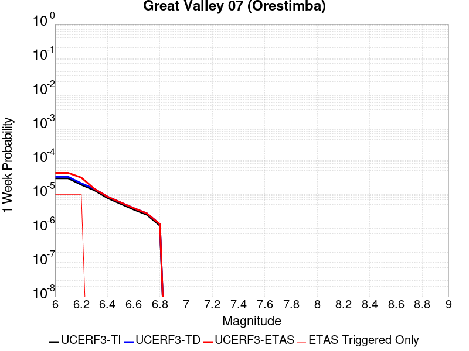 |  |  |  |

| Magnitude | 1 wk TI Prob | 1 wk TD Prob | 1 wk ETAS Prob | 1 wk ETAS/TD Gain | 1 wk ETAS Triggered Only | 1 mo TI Prob | 1 mo TD Prob | 1 mo ETAS Prob | 1 mo ETAS/TD Gain | 1 mo ETAS Triggered Only | 1 yr TI Prob | 1 yr TD Prob | 1 yr ETAS Prob | 1 yr ETAS/TD Gain | 1 yr ETAS Triggered Only | 10 yr TI Prob | 10 yr TD Prob | 10 yr ETAS Prob | 10 yr ETAS/TD Gain | 10 yr ETAS Triggered Only |
|-----|-----|-----|-----|-----|-----|-----|-----|-----|-----|-----|-----|-----|-----|-----|-----|-----|-----|-----|-----|-----|
| 6.0 | 2.9687902E-5 | 3.27575E-5 | 3.27575E-5 | 1.0 | 0.0 | 1.2722766E-4 | 1.4038214E-4 | 1.4038214E-4 | 1.0 | 0.0 | 0.0015478961 | 0.0017078844 | 0.0017554221 | 1.0278343 | 4.7619047E-5 | 0.015371585 | 0.016955135 | 0.017001947 | 1.0027609 | 4.7619047E-5 |
| 6.1 | 2.9687902E-5 | 3.27575E-5 | 3.27575E-5 | 1.0 | 0.0 | 1.2722766E-4 | 1.4038214E-4 | 1.4038214E-4 | 1.0 | 0.0 | 0.0015478961 | 0.0017078844 | 0.0017554221 | 1.0278343 | 4.7619047E-5 | 0.015371585 | 0.016955135 | 0.017001947 | 1.0027609 | 4.7619047E-5 |
| 6.2 | 1.9231524E-5 | 2.1159167E-5 | 2.1159167E-5 | 1.0 | 0.0 | 8.2418206E-5 | 9.067912E-5 | 9.067912E-5 | 1.0 | 0.0 | 0.0010029797 | 0.0011034822 | 0.0011510487 | 1.0431058 | 4.7619047E-5 | 0.00998465 | 0.01098244 | 0.011029537 | 1.0042883 | 4.7619047E-5 |
| 6.3 | 1.324766E-5 | 1.4548534E-5 | 1.4548534E-5 | 1.0 | 0.0 | 5.6774446E-5 | 6.234942E-5 | 6.234942E-5 | 1.0 | 0.0 | 6.910097E-4 | 7.5884897E-4 | 7.826404E-4 | 1.031352 | 2.3809524E-5 | 0.006888649 | 0.0075635235 | 0.007587153 | 1.0031241 | 2.3809524E-5 |
| 6.4 | 7.818645E-6 | 8.57284E-6 | 8.57284E-6 | 1.0 | 0.0 | 3.3508048E-5 | 3.6740246E-5 | 3.6740246E-5 | 1.0 | 0.0 | 4.078841E-4 | 4.4722404E-4 | 4.4722404E-4 | 1.0 | 0.0 | 0.004071363 | 0.0044635804 | 0.0044635804 | 1.0 | 0.0 |
| 6.5 | 5.3076565E-6 | 5.8178007E-6 | 5.8178007E-6 | 1.0 | 0.0 | 2.27469E-5 | 2.4933206E-5 | 2.4933206E-5 | 1.0 | 0.0 | 2.7690834E-4 | 3.035216E-4 | 3.035216E-4 | 1.0 | 0.0 | 0.0027656353 | 0.00303128 | 0.00303128 | 1.0 | 0.0 |
| 6.6 | 3.6003578E-6 | 3.9484953E-6 | 3.9484953E-6 | 1.0 | 0.0 | 1.5430012E-5 | 1.6922022E-5 | 1.6922022E-5 | 1.0 | 0.0 | 1.8784421E-4 | 2.0600771E-4 | 2.0600771E-4 | 1.0 | 0.0 | 0.0018768552 | 0.0020583214 | 0.0020583214 | 1.0 | 0.0 |
| 6.7 | 2.5361826E-6 | 2.7834678E-6 | 2.7834678E-6 | 1.0 | 0.0 | 1.0869308E-5 | 1.1929101E-5 | 1.1929101E-5 | 1.0 | 0.0 | 1.3232579E-4 | 1.4522845E-4 | 1.4522845E-4 | 1.0 | 0.0 | 0.0013224703 | 0.0014514653 | 0.0014514653 | 1.0 | 0.0 |
| 6.8 | 1.2115831E-6 | 1.3313797E-6 | 1.3313797E-6 | 1.0 | 0.0 | 5.1924885E-6 | 5.7059065E-6 | 5.7059065E-6 | 1.0 | 0.0 | 6.3216714E-5 | 6.9468166E-5 | 6.9468166E-5 | 1.0 | 0.0 | 6.3198735E-4 | 6.945596E-4 | 6.945596E-4 | 1.0 | 0.0 |

## Sierra Madre
*[(top)](#table-of-contents)*

| 1 Week | 1 Month | 1 Year | 10 Year |
|-----|-----|-----|-----|
|  |  |  | 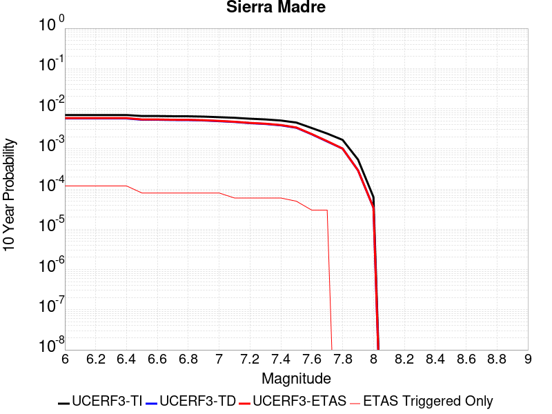 |

| Magnitude | 1 wk TI Prob | 1 wk TD Prob | 1 wk ETAS Prob | 1 wk ETAS/TD Gain | 1 wk ETAS Triggered Only | 1 mo TI Prob | 1 mo TD Prob | 1 mo ETAS Prob | 1 mo ETAS/TD Gain | 1 mo ETAS Triggered Only | 1 yr TI Prob | 1 yr TD Prob | 1 yr ETAS Prob | 1 yr ETAS/TD Gain | 1 yr ETAS Triggered Only | 10 yr TI Prob | 10 yr TD Prob | 10 yr ETAS Prob | 10 yr ETAS/TD Gain | 10 yr ETAS Triggered Only |
|-----|-----|-----|-----|-----|-----|-----|-----|-----|-----|-----|-----|-----|-----|-----|-----|-----|-----|-----|-----|-----|
| 6.0 | 1.3379373E-5 | 1.10007395E-5 | 1.10007395E-5 | 1.0 | 0.0 | 5.7338908E-5 | 4.7145186E-5 | 7.095359E-5 | 1.5050018 | 2.3809524E-5 | 6.978776E-4 | 5.738429E-4 | 5.976388E-4 | 1.0414675 | 2.3809524E-5 | 0.0069569005 | 0.0057239756 | 0.005771322 | 1.0082716 | 4.7619047E-5 |
| 6.1 | 1.3379373E-5 | 1.10007395E-5 | 1.10007395E-5 | 1.0 | 0.0 | 5.7338908E-5 | 4.7145186E-5 | 7.095359E-5 | 1.5050018 | 2.3809524E-5 | 6.978776E-4 | 5.738429E-4 | 5.976388E-4 | 1.0414675 | 2.3809524E-5 | 0.0069569005 | 0.0057239756 | 0.005771322 | 1.0082716 | 4.7619047E-5 |
| 6.2 | 1.3379373E-5 | 1.10007395E-5 | 1.10007395E-5 | 1.0 | 0.0 | 5.7338908E-5 | 4.7145186E-5 | 7.095359E-5 | 1.5050018 | 2.3809524E-5 | 6.978776E-4 | 5.738429E-4 | 5.976388E-4 | 1.0414675 | 2.3809524E-5 | 0.0069569005 | 0.0057239756 | 0.005771322 | 1.0082716 | 4.7619047E-5 |
| 6.3 | 1.3379373E-5 | 1.10007395E-5 | 1.10007395E-5 | 1.0 | 0.0 | 5.7338908E-5 | 4.7145186E-5 | 7.095359E-5 | 1.5050018 | 2.3809524E-5 | 6.978776E-4 | 5.738429E-4 | 5.976388E-4 | 1.0414675 | 2.3809524E-5 | 0.0069569005 | 0.0057239756 | 0.005771322 | 1.0082716 | 4.7619047E-5 |
| 6.4 | 1.3379373E-5 | 1.10007395E-5 | 1.10007395E-5 | 1.0 | 0.0 | 5.7338908E-5 | 4.7145186E-5 | 7.095359E-5 | 1.5050018 | 2.3809524E-5 | 6.978776E-4 | 5.738429E-4 | 5.976388E-4 | 1.0414675 | 2.3809524E-5 | 0.0069569005 | 0.0057239756 | 0.005771322 | 1.0082716 | 4.7619047E-5 |
| 6.5 | 1.26563245E-5 | 1.0230196E-5 | 1.0230196E-5 | 1.0 | 0.0 | 5.4240263E-5 | 4.3842967E-5 | 6.765145E-5 | 1.5430399 | 2.3809524E-5 | 6.601751E-4 | 5.336584E-4 | 5.574553E-4 | 1.0445919 | 2.3809524E-5 | 0.006582173 | 0.0053240913 | 0.0053714565 | 1.0088965 | 4.7619047E-5 |
| 6.6 | 1.26563245E-5 | 1.0230196E-5 | 1.0230196E-5 | 1.0 | 0.0 | 5.4240263E-5 | 4.3842967E-5 | 6.765145E-5 | 1.5430399 | 2.3809524E-5 | 6.601751E-4 | 5.336584E-4 | 5.574553E-4 | 1.0445919 | 2.3809524E-5 | 0.006582173 | 0.0053240913 | 0.0053714565 | 1.0088965 | 4.7619047E-5 |
| 6.7 | 1.2502474E-5 | 1.006634E-5 | 1.006634E-5 | 1.0 | 0.0 | 5.3580934E-5 | 4.314075E-5 | 6.6949244E-5 | 1.5518795 | 2.3809524E-5 | 6.521526E-4 | 5.251131E-4 | 5.489101E-4 | 1.0453179 | 2.3809524E-5 | 0.0065024206 | 0.0052390425 | 0.005286412 | 1.0090417 | 4.7619047E-5 |
| 6.8 | 1.2454966E-5 | 1.0018625E-5 | 1.0018625E-5 | 1.0 | 0.0 | 5.3377335E-5 | 4.2936266E-5 | 6.674477E-5 | 1.554508 | 2.3809524E-5 | 6.4967526E-4 | 5.226247E-4 | 5.464218E-4 | 1.0455338 | 2.3809524E-5 | 0.006477792 | 0.0052142753 | 0.005261646 | 1.0090848 | 4.7619047E-5 |
| 6.9 | 1.2225574E-5 | 9.792602E-6 | 9.792602E-6 | 1.0 | 0.0 | 5.2394265E-5 | 4.1967625E-5 | 6.577615E-5 | 1.5673069 | 2.3809524E-5 | 6.3771347E-4 | 5.108371E-4 | 5.3463446E-4 | 1.0465851 | 2.3809524E-5 | 0.006358865 | 0.0050969445 | 0.005144321 | 1.009295 | 4.7619047E-5 |
| 7.0 | 1.182946E-5 | 9.399144E-6 | 9.399144E-6 | 1.0 | 0.0 | 5.06967E-5 | 4.0281426E-5 | 6.408999E-5 | 1.5910556 | 2.3809524E-5 | 6.1705755E-4 | 4.9031706E-4 | 5.141149E-4 | 1.0485356 | 2.3809524E-5 | 0.006153469 | 0.004892664 | 0.00494005 | 1.0096852 | 4.7619047E-5 |
| 7.1 | 1.14369095E-5 | 8.986159E-6 | 8.986159E-6 | 1.0 | 0.0 | 4.9014405E-5 | 3.8511545E-5 | 3.8511545E-5 | 1.0 | 0.0 | 5.9658696E-4 | 4.687782E-4 | 4.687782E-4 | 1.0 | 0.0 | 0.005949879 | 0.004678199 | 0.0047018975 | 1.0050657 | 2.3809524E-5 |
| 7.2 | 1.0836419E-5 | 8.3995565E-6 | 8.3995565E-6 | 1.0 | 0.0 | 4.644097E-5 | 3.5997607E-5 | 3.5997607E-5 | 1.0 | 0.0 | 5.652721E-4 | 4.3818366E-4 | 4.3818366E-4 | 1.0 | 0.0 | 0.0056383642 | 0.004373494 | 0.0043971995 | 1.0054202 | 2.3809524E-5 |
| 7.3 | 1.0403439E-5 | 8.02082E-6 | 8.02082E-6 | 1.0 | 0.0 | 4.4585406E-5 | 3.4374494E-5 | 3.4374494E-5 | 1.0 | 0.0 | 5.426921E-4 | 4.1843E-4 | 4.1843E-4 | 1.0 | 0.0 | 0.005413687 | 0.004176717 | 0.004200427 | 1.0056767 | 2.3809524E-5 |
| 7.4 | 9.768864E-6 | 7.414448E-6 | 7.414448E-6 | 1.0 | 0.0 | 4.186589E-5 | 3.1775824E-5 | 3.1775824E-5 | 1.0 | 0.0 | 5.09598E-4 | 3.868029E-4 | 3.868029E-4 | 1.0 | 0.0 | 0.0050843097 | 0.0038615882 | 0.003885306 | 1.0061419 | 2.3809524E-5 |
| 7.5 | 8.687089E-6 | 6.4501564E-6 | 6.4501564E-6 | 1.0 | 0.0 | 3.722985E-5 | 2.764324E-5 | 2.764324E-5 | 1.0 | 0.0 | 4.5317915E-4 | 3.3650533E-4 | 3.3650533E-4 | 1.0 | 0.0 | 0.004522561 | 0.0033602451 | 0.0033839748 | 1.0070618 | 2.3809524E-5 |
| 7.6 | 6.3506063E-6 | 4.4303215E-6 | 4.4303215E-6 | 1.0 | 0.0 | 2.72166E-5 | 1.8986955E-5 | 1.8986955E-5 | 1.0 | 0.0 | 3.3131172E-4 | 2.3114192E-4 | 2.3114192E-4 | 1.0 | 0.0 | 0.003308182 | 0.0023092402 | 0.0023329947 | 1.0102867 | 2.3809524E-5 |
| 7.7 | 4.62223E-6 | 2.932967E-6 | 2.932967E-6 | 1.0 | 0.0 | 1.9809406E-5 | 1.2569798E-5 | 1.2569798E-5 | 1.0 | 0.0 | 2.4115283E-4 | 1.5302657E-4 | 1.5302657E-4 | 1.0 | 0.0 | 0.0024089129 | 0.001529413 | 0.0015531862 | 1.0155439 | 2.3809524E-5 |
| 7.8 | 3.2145008E-6 | 1.9494332E-6 | 1.9494332E-6 | 1.0 | 0.0 | 1.3776359E-5 | 8.3546865E-6 | 8.3546865E-6 | 1.0 | 0.0 | 1.6771426E-4 | 1.0171358E-4 | 1.0171358E-4 | 1.0 | 0.0 | 0.0016758774 | 0.0010168145 | 0.0010168145 | 1.0 | 0.0 |
| 7.9 | 1.0391769E-6 | 5.6026335E-7 | 5.6026335E-7 | 1.0 | 0.0 | 4.4536077E-6 | 2.4011265E-6 | 2.4011265E-6 | 1.0 | 0.0 | 5.4221324E-5 | 2.9233326E-5 | 2.9233326E-5 | 1.0 | 0.0 | 5.4208096E-4 | 2.9229524E-4 | 2.9229524E-4 | 1.0 | 0.0 |
| 8.0 | 1.210983E-7 | 6.613821E-8 | 6.613821E-8 | 1.0 | 0.0 | 5.1899264E-7 | 2.8344945E-7 | 2.8344945E-7 | 1.0 | 0.0 | 6.3187167E-6 | 3.4509917E-6 | 3.4509917E-6 | 1.0 | 0.0 | 6.318537E-5 | 3.45094E-5 | 3.45094E-5 | 1.0 | 0.0 |

## Newport-Inglewood alt 1
*[(top)](#table-of-contents)*

| 1 Week | 1 Month | 1 Year | 10 Year |
|-----|-----|-----|-----|
|  |  |  |  |

| Magnitude | 1 wk TI Prob | 1 wk TD Prob | 1 wk ETAS Prob | 1 wk ETAS/TD Gain | 1 wk ETAS Triggered Only | 1 mo TI Prob | 1 mo TD Prob | 1 mo ETAS Prob | 1 mo ETAS/TD Gain | 1 mo ETAS Triggered Only | 1 yr TI Prob | 1 yr TD Prob | 1 yr ETAS Prob | 1 yr ETAS/TD Gain | 1 yr ETAS Triggered Only | 10 yr TI Prob | 10 yr TD Prob | 10 yr ETAS Prob | 10 yr ETAS/TD Gain | 10 yr ETAS Triggered Only |
|-----|-----|-----|-----|-----|-----|-----|-----|-----|-----|-----|-----|-----|-----|-----|-----|-----|-----|-----|-----|-----|
| 6.0 | 2.9668912E-5 | 3.0404817E-5 | 3.0404817E-5 | 1.0 | 0.0 | 1.2714628E-4 | 1.303026E-4 | 1.5410902E-4 | 1.1827011 | 2.3809524E-5 | 0.0015469068 | 0.0015857625 | 0.0016095343 | 1.0149908 | 2.3809524E-5 | 0.015361829 | 0.015792042 | 0.01583891 | 1.0029677 | 4.7619047E-5 |
| 6.1 | 2.9668912E-5 | 3.0404817E-5 | 3.0404817E-5 | 1.0 | 0.0 | 1.2714628E-4 | 1.303026E-4 | 1.5410902E-4 | 1.1827011 | 2.3809524E-5 | 0.0015469068 | 0.0015857625 | 0.0016095343 | 1.0149908 | 2.3809524E-5 | 0.015361829 | 0.015792042 | 0.01583891 | 1.0029677 | 4.7619047E-5 |
| 6.2 | 2.9668912E-5 | 3.0404817E-5 | 3.0404817E-5 | 1.0 | 0.0 | 1.2714628E-4 | 1.303026E-4 | 1.5410902E-4 | 1.1827011 | 2.3809524E-5 | 0.0015469068 | 0.0015857625 | 0.0016095343 | 1.0149908 | 2.3809524E-5 | 0.015361829 | 0.015792042 | 0.01583891 | 1.0029677 | 4.7619047E-5 |
| 6.3 | 2.9668912E-5 | 3.0404817E-5 | 3.0404817E-5 | 1.0 | 0.0 | 1.2714628E-4 | 1.303026E-4 | 1.5410902E-4 | 1.1827011 | 2.3809524E-5 | 0.0015469068 | 0.0015857625 | 0.0016095343 | 1.0149908 | 2.3809524E-5 | 0.015361829 | 0.015792042 | 0.01583891 | 1.0029677 | 4.7619047E-5 |
| 6.4 | 1.275942E-5 | 1.0272503E-5 | 1.0272503E-5 | 1.0 | 0.0 | 5.4682085E-5 | 4.402429E-5 | 6.783277E-5 | 1.5408032 | 2.3809524E-5 | 6.65551E-4 | 5.358681E-4 | 5.5966486E-4 | 1.0444078 | 2.3809524E-5 | 0.0066356123 | 0.005346184 | 0.0053698663 | 1.0044297 | 2.3809524E-5 |
| 6.5 | 1.275942E-5 | 1.0272503E-5 | 1.0272503E-5 | 1.0 | 0.0 | 5.4682085E-5 | 4.402429E-5 | 6.783277E-5 | 1.5408032 | 2.3809524E-5 | 6.65551E-4 | 5.358681E-4 | 5.5966486E-4 | 1.0444078 | 2.3809524E-5 | 0.0066356123 | 0.005346184 | 0.0053698663 | 1.0044297 | 2.3809524E-5 |
| 6.6 | 1.1255358E-5 | 8.661884E-6 | 8.661884E-6 | 1.0 | 0.0 | 4.8236358E-5 | 3.712184E-5 | 6.093048E-5 | 1.6413647 | 2.3809524E-5 | 5.871194E-4 | 4.518664E-4 | 4.7566515E-4 | 1.0526677 | 2.3809524E-5 | 0.005855706 | 0.004509653 | 0.004533355 | 1.0052558 | 2.3809524E-5 |
| 6.7 | 1.0504745E-5 | 7.8997955E-6 | 7.8997955E-6 | 1.0 | 0.0 | 4.5019555E-5 | 3.3855835E-5 | 5.766455E-5 | 1.7032382 | 2.3809524E-5 | 5.4797524E-4 | 4.1211807E-4 | 4.3591778E-4 | 1.0577497 | 2.3809524E-5 | 0.0054662596 | 0.004113668 | 0.0041373796 | 1.0057641 | 2.3809524E-5 |
| 6.8 | 1.0476007E-5 | 7.881176E-6 | 7.881176E-6 | 1.0 | 0.0 | 4.4896402E-5 | 3.3776043E-5 | 5.7584763E-5 | 1.7048997 | 2.3809524E-5 | 5.464766E-4 | 4.1114696E-4 | 4.3494668E-4 | 1.0578862 | 2.3809524E-5 | 0.005451347 | 0.0041039926 | 0.0041277045 | 1.0057777 | 2.3809524E-5 |
| 6.9 | 9.076797E-6 | 6.4896312E-6 | 6.4896312E-6 | 1.0 | 0.0 | 3.889998E-5 | 2.781241E-5 | 5.162127E-5 | 1.8560517 | 2.3809524E-5 | 4.7350433E-4 | 3.385638E-4 | 3.6236527E-4 | 1.0703013 | 2.3809524E-5 | 0.004724967 | 0.0033805177 | 0.0034042466 | 1.0070194 | 2.3809524E-5 |
| 7.0 | 8.73795E-6 | 6.2120125E-6 | 6.2120125E-6 | 1.0 | 0.0 | 3.7447822E-5 | 2.6622642E-5 | 5.0431532E-5 | 1.8943099 | 2.3809524E-5 | 4.5583185E-4 | 3.2408274E-4 | 3.4788452E-4 | 1.0734437 | 2.3809524E-5 | 0.0045489795 | 0.0032361327 | 0.003259865 | 1.0073336 | 2.3809524E-5 |
| 7.1 | 8.391299E-6 | 5.95579E-6 | 5.95579E-6 | 1.0 | 0.0 | 3.5962214E-5 | 2.5524565E-5 | 4.933348E-5 | 1.9327843 | 2.3809524E-5 | 4.37752E-4 | 3.1071753E-4 | 3.3451966E-4 | 1.0766038 | 2.3809524E-5 | 0.004368907 | 0.0031028606 | 0.003126596 | 1.0076497 | 2.3809524E-5 |
| 7.2 | 7.796882E-6 | 5.4965344E-6 | 5.4965344E-6 | 1.0 | 0.0 | 3.341478E-5 | 2.3556364E-5 | 4.7365327E-5 | 2.010723 | 2.3809524E-5 | 4.06749E-4 | 2.867612E-4 | 3.105639E-4 | 1.0830053 | 2.3809524E-5 | 0.0040600533 | 0.0028639357 | 0.002887677 | 1.0082898 | 2.3809524E-5 |
| 7.3 | 6.4738833E-6 | 4.6478162E-6 | 4.6478162E-6 | 1.0 | 0.0 | 2.774492E-5 | 1.9919062E-5 | 4.3728112E-5 | 2.1952896 | 2.3809524E-5 | 3.3774204E-4 | 2.4248775E-4 | 2.662915E-4 | 1.0981648 | 2.3809524E-5 | 0.0033722918 | 0.0024222482 | 0.002446 | 1.0098057 | 2.3809524E-5 |
| 7.4 | 5.382145E-6 | 3.8857597E-6 | 3.8857597E-6 | 1.0 | 0.0 | 2.3066134E-5 | 1.665315E-5 | 4.0462277E-5 | 2.429707 | 2.3809524E-5 | 2.8079396E-4 | 2.0273338E-4 | 2.2653808E-4 | 1.1174188 | 2.3809524E-5 | 0.0028043943 | 0.0020254988 | 0.00204926 | 1.011731 | 2.3809524E-5 |
| 7.5 | 3.648244E-6 | 2.5737843E-6 | 2.5737843E-6 | 1.0 | 0.0 | 1.5635238E-5 | 1.1030458E-5 | 3.483972E-5 | 3.1585016 | 2.3809524E-5 | 1.9034238E-4 | 1.3428765E-4 | 1.5809399E-4 | 1.1772786 | 2.3809524E-5 | 0.0019017943 | 0.0013420755 | 0.001365853 | 1.017717 | 2.3809524E-5 |
| 7.6 | 2.2906888E-6 | 1.5479842E-6 | 1.5479842E-6 | 1.0 | 0.0 | 9.817201E-6 | 6.634202E-6 | 6.634202E-6 | 1.0 | 0.0 | 1.1951787E-4 | 8.076848E-5 | 8.076848E-5 | 1.0 | 0.0 | 0.0011945361 | 8.07398E-4 | 8.07398E-4 | 1.0 | 0.0 |
| 7.7 | 6.0479874E-7 | 3.397512E-7 | 3.397512E-7 | 1.0 | 0.0 | 2.5919921E-6 | 1.4560758E-6 | 1.4560758E-6 | 1.0 | 0.0 | 3.1557047E-5 | 1.7727592E-5 | 1.7727592E-5 | 1.0 | 0.0 | 3.1552566E-4 | 1.7726317E-4 | 1.7726317E-4 | 1.0 | 0.0 |
| 7.8 | 1.16056995E-8 | 9.782373E-9 | 9.782373E-9 | 1.0 | 0.0 | 4.9738713E-8 | 4.1924455E-8 | 4.1924455E-8 | 1.0 | 0.0 | 6.0556863E-7 | 5.1043025E-7 | 5.1043025E-7 | 1.0 | 0.0 | 6.05567E-6 | 5.1043025E-6 | 5.1043025E-6 | 1.0 | 0.0 |

## Pittville 2011 CFM
*[(top)](#table-of-contents)*

| 1 Week | 1 Month | 1 Year | 10 Year |
|-----|-----|-----|-----|
|  |  |  |  |

| Magnitude | 1 wk TI Prob | 1 wk TD Prob | 1 wk ETAS Prob | 1 wk ETAS/TD Gain | 1 wk ETAS Triggered Only | 1 mo TI Prob | 1 mo TD Prob | 1 mo ETAS Prob | 1 mo ETAS/TD Gain | 1 mo ETAS Triggered Only | 1 yr TI Prob | 1 yr TD Prob | 1 yr ETAS Prob | 1 yr ETAS/TD Gain | 1 yr ETAS Triggered Only | 10 yr TI Prob | 10 yr TD Prob | 10 yr ETAS Prob | 10 yr ETAS/TD Gain | 10 yr ETAS Triggered Only |
|-----|-----|-----|-----|-----|-----|-----|-----|-----|-----|-----|-----|-----|-----|-----|-----|-----|-----|-----|-----|-----|
| 6.0 | 2.5031832E-5 | 2.7056969E-5 | 2.7056969E-5 | 1.0 | 0.0 | 1.0727487E-4 | 1.1595384E-4 | 1.397606E-4 | 1.2053124 | 2.3809524E-5 | 0.001305289 | 0.0014109211 | 0.0014346971 | 1.0168513 | 2.3809524E-5 | 0.012976485 | 0.014029415 | 0.014052891 | 1.0016733 | 2.3809524E-5 |
| 6.1 | 1.2540113E-5 | 1.3513067E-5 | 1.3513067E-5 | 1.0 | 0.0 | 5.3742235E-5 | 5.7911984E-5 | 5.7911984E-5 | 1.0 | 0.0 | 6.541153E-4 | 7.048728E-4 | 7.048728E-4 | 1.0 | 0.0 | 0.0065219323 | 0.0070286044 | 0.0070286044 | 1.0 | 0.0 |
| 6.2 | 6.603218E-6 | 7.107189E-6 | 7.107189E-6 | 1.0 | 0.0 | 2.8299199E-5 | 3.0459063E-5 | 3.0459063E-5 | 1.0 | 0.0 | 3.4448825E-4 | 3.7078248E-4 | 3.7078248E-4 | 1.0 | 0.0 | 0.0034395473 | 0.0037022792 | 0.0037022792 | 1.0 | 0.0 |
| 6.3 | 6.603218E-6 | 7.107189E-6 | 7.107189E-6 | 1.0 | 0.0 | 2.8299199E-5 | 3.0459063E-5 | 3.0459063E-5 | 1.0 | 0.0 | 3.4448825E-4 | 3.7078248E-4 | 3.7078248E-4 | 1.0 | 0.0 | 0.0034395473 | 0.0037022792 | 0.0037022792 | 1.0 | 0.0 |
| 6.4 | 3.9389015E-6 | 4.239175E-6 | 4.239175E-6 | 1.0 | 0.0 | 1.6880897E-5 | 1.8167784E-5 | 1.8167784E-5 | 1.0 | 0.0 | 2.0550552E-4 | 2.2117342E-4 | 2.2117342E-4 | 1.0 | 0.0 | 0.0020531558 | 0.002209838 | 0.002209838 | 1.0 | 0.0 |
| 6.5 | 2.4533072E-6 | 2.6412686E-6 | 2.6412686E-6 | 1.0 | 0.0 | 1.0514132E-5 | 1.1319685E-5 | 1.1319685E-5 | 1.0 | 0.0 | 1.2800204E-4 | 1.3781038E-4 | 1.3781038E-4 | 1.0 | 0.0 | 0.0012792832 | 0.0013774394 | 0.0013774394 | 1.0 | 0.0 |
| 6.6 | 1.3482367E-6 | 1.452993E-6 | 1.452993E-6 | 1.0 | 0.0 | 5.778144E-6 | 6.2271047E-6 | 6.2271047E-6 | 1.0 | 0.0 | 7.0346636E-5 | 7.58135E-5 | 7.58135E-5 | 1.0 | 0.0 | 7.032437E-4 | 7.5798744E-4 | 7.5798744E-4 | 1.0 | 0.0 |

## Butano 2011 CFM
*[(top)](#table-of-contents)*

| 1 Week | 1 Month | 1 Year | 10 Year |
|-----|-----|-----|-----|
|  |  |  |  |

| Magnitude | 1 wk TI Prob | 1 wk TD Prob | 1 wk ETAS Prob | 1 wk ETAS/TD Gain | 1 wk ETAS Triggered Only | 1 mo TI Prob | 1 mo TD Prob | 1 mo ETAS Prob | 1 mo ETAS/TD Gain | 1 mo ETAS Triggered Only | 1 yr TI Prob | 1 yr TD Prob | 1 yr ETAS Prob | 1 yr ETAS/TD Gain | 1 yr ETAS Triggered Only | 10 yr TI Prob | 10 yr TD Prob | 10 yr ETAS Prob | 10 yr ETAS/TD Gain | 10 yr ETAS Triggered Only |
|-----|-----|-----|-----|-----|-----|-----|-----|-----|-----|-----|-----|-----|-----|-----|-----|-----|-----|-----|-----|-----|
| 6.0 | 9.561135E-6 | 6.2256954E-6 | 6.2256954E-6 | 1.0 | 0.0 | 4.097565E-5 | 2.6681291E-5 | 5.049018E-5 | 1.892344 | 2.3809524E-5 | 4.9876433E-4 | 3.247985E-4 | 3.7240208E-4 | 1.1465634 | 4.7619047E-5 | 0.004976464 | 0.003260905 | 0.0033083686 | 1.0145555 | 4.7619047E-5 |
| 6.1 | 9.561135E-6 | 6.2256954E-6 | 6.2256954E-6 | 1.0 | 0.0 | 4.097565E-5 | 2.6681291E-5 | 5.049018E-5 | 1.892344 | 2.3809524E-5 | 4.9876433E-4 | 3.247985E-4 | 3.7240208E-4 | 1.1465634 | 4.7619047E-5 | 0.004976464 | 0.003260905 | 0.0033083686 | 1.0145555 | 4.7619047E-5 |
| 6.2 | 8.364741E-6 | 4.9787805E-6 | 4.9787805E-6 | 1.0 | 0.0 | 3.5848396E-5 | 2.1337464E-5 | 2.1337464E-5 | 1.0 | 0.0 | 4.3636683E-4 | 2.5975425E-4 | 2.8355757E-4 | 1.091638 | 2.3809524E-5 | 0.0043551093 | 0.0026121214 | 0.0026358687 | 1.0090913 | 2.3809524E-5 |
| 6.3 | 8.364741E-6 | 4.9787805E-6 | 4.9787805E-6 | 1.0 | 0.0 | 3.5848396E-5 | 2.1337464E-5 | 2.1337464E-5 | 1.0 | 0.0 | 4.3636683E-4 | 2.5975425E-4 | 2.8355757E-4 | 1.091638 | 2.3809524E-5 | 0.0043551093 | 0.0026121214 | 0.0026358687 | 1.0090913 | 2.3809524E-5 |
| 6.4 | 7.768282E-6 | 4.3567284E-6 | 4.3567284E-6 | 1.0 | 0.0 | 3.329221E-5 | 1.8671566E-5 | 1.8671566E-5 | 1.0 | 0.0 | 4.0525728E-4 | 2.2730397E-4 | 2.5110808E-4 | 1.1047237 | 2.3809524E-5 | 0.0040451903 | 0.0022883145 | 0.0023120695 | 1.010381 | 2.3809524E-5 |
| 6.5 | 7.673437E-6 | 4.2562915E-6 | 4.2562915E-6 | 1.0 | 0.0 | 3.2885746E-5 | 1.8241128E-5 | 1.8241128E-5 | 1.0 | 0.0 | 4.0031038E-4 | 2.2206445E-4 | 2.458687E-4 | 1.1071951 | 2.3809524E-5 | 0.0039959005 | 0.002236025 | 0.0022597814 | 1.0106243 | 2.3809524E-5 |
| 6.6 | 7.5244197E-6 | 4.101255E-6 | 4.101255E-6 | 1.0 | 0.0 | 3.2247113E-5 | 1.7576695E-5 | 1.7576695E-5 | 1.0 | 0.0 | 3.9253788E-4 | 2.1397659E-4 | 2.3778102E-4 | 1.1112478 | 2.3809524E-5 | 0.003918452 | 0.0021553051 | 0.0021790634 | 1.0110232 | 2.3809524E-5 |
| 6.7 | 6.4921405E-6 | 3.0413205E-6 | 3.0413205E-6 | 1.0 | 0.0 | 2.7823162E-5 | 1.3034165E-5 | 1.3034165E-5 | 1.0 | 0.0 | 3.3869434E-4 | 1.586795E-4 | 1.8248524E-4 | 1.150024 | 2.3809524E-5 | 0.003381786 | 0.0016031476 | 0.001626919 | 1.014828 | 2.3809524E-5 |
| 6.8 | 6.2890294E-6 | 2.8280872E-6 | 2.8280872E-6 | 1.0 | 0.0 | 2.6952705E-5 | 1.2120317E-5 | 1.2120317E-5 | 1.0 | 0.0 | 3.2809976E-4 | 1.4755495E-4 | 1.7136095E-4 | 1.1613365 | 2.3809524E-5 | 0.0032761577 | 0.0014920565 | 0.0015158305 | 1.0159338 | 2.3809524E-5 |
| 6.9 | 6.0965517E-6 | 2.6346027E-6 | 2.6346027E-6 | 1.0 | 0.0 | 2.6127816E-5 | 1.1291106E-5 | 1.1291106E-5 | 1.0 | 0.0 | 3.1805973E-4 | 1.374606E-4 | 1.6126686E-4 | 1.173186 | 2.3809524E-5 | 0.0031760489 | 0.001391243 | 0.0014150194 | 1.0170901 | 2.3809524E-5 |
| 7.0 | 5.566252E-6 | 2.1520116E-6 | 2.1520116E-6 | 1.0 | 0.0 | 2.3855147E-5 | 9.222874E-6 | 9.222874E-6 | 1.0 | 0.0 | 2.9039773E-4 | 1.1228274E-4 | 1.3608958E-4 | 1.2120259 | 2.3809524E-5 | 0.0029001853 | 0.0011397449 | 0.0011635274 | 1.0208664 | 2.3809524E-5 |
| 7.1 | 3.878588E-6 | 1.6034423E-6 | 1.6034423E-6 | 1.0 | 0.0 | 1.6622414E-5 | 6.8718773E-6 | 6.8718773E-6 | 1.0 | 0.0 | 2.023591E-4 | 8.36619E-5 | 1.0746943E-4 | 1.2845684 | 2.3809524E-5 | 0.0020217493 | 8.533922E-4 | 8.771814E-4 | 1.027876 | 2.3809524E-5 |
| 7.2 | 3.7038085E-6 | 1.4845051E-6 | 1.4845051E-6 | 1.0 | 0.0 | 1.587337E-5 | 6.362149E-6 | 6.362149E-6 | 1.0 | 0.0 | 1.9324113E-4 | 7.745641E-5 | 1.0126409E-4 | 1.3073688 | 2.3809524E-5 | 0.0019307317 | 7.913504E-4 | 8.15141E-4 | 1.0300634 | 2.3809524E-5 |
| 7.3 | 3.5277278E-6 | 1.3926247E-6 | 1.3926247E-6 | 1.0 | 0.0 | 1.5118746E-5 | 5.9683775E-6 | 5.9683775E-6 | 1.0 | 0.0 | 1.8405518E-4 | 7.266257E-5 | 9.6470365E-5 | 1.3276486 | 2.3809524E-5 | 0.0018390282 | 7.433578E-4 | 7.671497E-4 | 1.0320059 | 2.3809524E-5 |
| 7.4 | 3.3711294E-6 | 1.3298818E-6 | 1.3298818E-6 | 1.0 | 0.0 | 1.4447617E-5 | 5.699481E-6 | 5.699481E-6 | 1.0 | 0.0 | 1.7588554E-4 | 6.9388974E-5 | 9.3196846E-5 | 1.3431075 | 2.3809524E-5 | 0.0017574639 | 7.10591E-4 | 7.3438353E-4 | 1.0334828 | 2.3809524E-5 |
| 7.5 | 3.0496426E-6 | 1.2188874E-6 | 1.2188874E-6 | 1.0 | 0.0 | 1.3069831E-5 | 5.223793E-6 | 5.223793E-6 | 1.0 | 0.0 | 1.5911358E-4 | 6.359782E-5 | 8.740583E-5 | 1.3743526 | 2.3809524E-5 | 0.001589997 | 6.526465E-4 | 6.764405E-4 | 1.0364577 | 2.3809524E-5 |
| 7.6 | 2.2179781E-6 | 8.870908E-7 | 8.870908E-7 | 1.0 | 0.0 | 9.505586E-6 | 3.801812E-6 | 3.801812E-6 | 1.0 | 0.0 | 1.1572436E-4 | 4.6286077E-5 | 7.00945E-5 | 1.5143754 | 2.3809524E-5 | 0.0011566412 | 4.7951055E-4 | 5.0330866E-4 | 1.04963 | 2.3809524E-5 |
| 7.7 | 1.7519328E-6 | 6.9309675E-7 | 6.9309675E-7 | 1.0 | 0.0 | 7.508262E-6 | 2.9704113E-6 | 2.9704113E-6 | 1.0 | 0.0 | 9.140925E-5 | 3.6164158E-5 | 5.997282E-5 | 1.6583498 | 2.3809524E-5 | 9.137166E-4 | 3.7759746E-4 | 4.0139802E-4 | 1.0630316 | 2.3809524E-5 |
| 7.8 | 1.1478974E-6 | 6.174061E-7 | 6.174061E-7 | 1.0 | 0.0 | 4.9195505E-6 | 2.6460236E-6 | 2.6460236E-6 | 1.0 | 0.0 | 5.9893882E-5 | 3.221486E-5 | 5.6023615E-5 | 1.7390614 | 2.3809524E-5 | 5.9877743E-4 | 3.377777E-4 | 3.6157915E-4 | 1.070465 | 2.3809524E-5 |
| 7.9 | 6.1154634E-7 | 5.581767E-7 | 5.581767E-7 | 1.0 | 0.0 | 2.6209104E-6 | 2.3921834E-6 | 2.3921834E-6 | 1.0 | 0.0 | 3.1909116E-5 | 2.9124443E-5 | 5.2933276E-5 | 1.8174862 | 2.3809524E-5 | 3.1904536E-4 | 3.0563958E-4 | 3.2944183E-4 | 1.0778768 | 2.3809524E-5 |
| 8.0 | 4.6520046E-7 | 5.189283E-7 | 5.189283E-7 | 1.0 | 0.0 | 1.9937147E-6 | 2.2239765E-6 | 2.2239765E-6 | 1.0 | 0.0 | 2.4273206E-5 | 2.7076578E-5 | 5.0885457E-5 | 1.8793164 | 2.3809524E-5 | 2.4270554E-4 | 2.8419052E-4 | 3.079933E-4 | 1.0837563 | 2.3809524E-5 |
| 8.1 | 2.8425194E-7 | 3.0570487E-7 | 3.0570487E-7 | 1.0 | 0.0 | 1.218222E-6 | 1.3101632E-6 | 1.3101632E-6 | 1.0 | 0.0 | 1.4831752E-5 | 1.5951118E-5 | 3.9760263E-5 | 2.4926317 | 2.3809524E-5 | 1.4830762E-4 | 1.6740595E-4 | 1.9121148E-4 | 1.1422025 | 2.3809524E-5 |
| 8.2 | 5.585778E-8 | 4.0522167E-8 | 4.0522167E-8 | 1.0 | 0.0 | 2.3939046E-7 | 1.7366644E-7 | 1.7366644E-7 | 1.0 | 0.0 | 2.914575E-6 | 2.1143867E-6 | 2.1143867E-6 | 1.0 | 0.0 | 2.9145367E-5 | 2.2976306E-5 | 2.2976306E-5 | 1.0 | 0.0 |
| 8.3 | 1.0371215E-10 | 5.356804E-11 | 5.356804E-11 | 1.0 | 0.0 | 4.4448079E-10 | 2.2957702E-10 | 2.2957702E-10 | 1.0 | 0.0 | 5.4115543E-9 | 2.795101E-9 | 2.795101E-9 | 1.0 | 0.0 | 5.4115542E-8 | 3.2150194E-8 | 3.2150194E-8 | 1.0 | 0.0 |

## Kern Canyon (Lake Isabella) 2011
*[(top)](#table-of-contents)*

| 1 Week | 1 Month | 1 Year | 10 Year |
|-----|-----|-----|-----|
|  |  |  |  |

| Magnitude | 1 wk TI Prob | 1 wk TD Prob | 1 wk ETAS Prob | 1 wk ETAS/TD Gain | 1 wk ETAS Triggered Only | 1 mo TI Prob | 1 mo TD Prob | 1 mo ETAS Prob | 1 mo ETAS/TD Gain | 1 mo ETAS Triggered Only | 1 yr TI Prob | 1 yr TD Prob | 1 yr ETAS Prob | 1 yr ETAS/TD Gain | 1 yr ETAS Triggered Only | 10 yr TI Prob | 10 yr TD Prob | 10 yr ETAS Prob | 10 yr ETAS/TD Gain | 10 yr ETAS Triggered Only |
|-----|-----|-----|-----|-----|-----|-----|-----|-----|-----|-----|-----|-----|-----|-----|-----|-----|-----|-----|-----|-----|
| 6.0 | 4.2387383E-6 | 4.001639E-6 | 2.7811067E-5 | 6.9499197 | 2.3809524E-5 | 1.8165894E-5 | 1.7149778E-5 | 4.0958894E-5 | 2.3883047 | 2.3809524E-5 | 2.2114732E-4 | 2.087804E-4 | 2.3258496E-4 | 1.1140171 | 2.3809524E-5 | 0.0022092736 | 0.0020860266 | 0.0021335462 | 1.0227801 | 4.7619047E-5 |
| 6.1 | 4.2387383E-6 | 4.001639E-6 | 2.7811067E-5 | 6.9499197 | 2.3809524E-5 | 1.8165894E-5 | 1.7149778E-5 | 4.0958894E-5 | 2.3883047 | 2.3809524E-5 | 2.2114732E-4 | 2.087804E-4 | 2.3258496E-4 | 1.1140171 | 2.3809524E-5 | 0.0022092736 | 0.0020860266 | 0.0021335462 | 1.0227801 | 4.7619047E-5 |
| 6.2 | 4.2387383E-6 | 4.001639E-6 | 2.7811067E-5 | 6.9499197 | 2.3809524E-5 | 1.8165894E-5 | 1.7149778E-5 | 4.0958894E-5 | 2.3883047 | 2.3809524E-5 | 2.2114732E-4 | 2.087804E-4 | 2.3258496E-4 | 1.1140171 | 2.3809524E-5 | 0.0022092736 | 0.0020860266 | 0.0021335462 | 1.0227801 | 4.7619047E-5 |
| 6.3 | 4.2387383E-6 | 4.001639E-6 | 2.7811067E-5 | 6.9499197 | 2.3809524E-5 | 1.8165894E-5 | 1.7149778E-5 | 4.0958894E-5 | 2.3883047 | 2.3809524E-5 | 2.2114732E-4 | 2.087804E-4 | 2.3258496E-4 | 1.1140171 | 2.3809524E-5 | 0.0022092736 | 0.0020860266 | 0.0021335462 | 1.0227801 | 4.7619047E-5 |
| 6.4 | 4.2387383E-6 | 4.001639E-6 | 2.7811067E-5 | 6.9499197 | 2.3809524E-5 | 1.8165894E-5 | 1.7149778E-5 | 4.0958894E-5 | 2.3883047 | 2.3809524E-5 | 2.2114732E-4 | 2.087804E-4 | 2.3258496E-4 | 1.1140171 | 2.3809524E-5 | 0.0022092736 | 0.0020860266 | 0.0021335462 | 1.0227801 | 4.7619047E-5 |
| 6.5 | 2.7857532E-6 | 2.517867E-6 | 2.632733E-5 | 10.456204 | 2.3809524E-5 | 1.1938888E-5 | 1.0790815E-5 | 3.460008E-5 | 3.206438 | 2.3809524E-5 | 1.4534626E-4 | 1.3137059E-4 | 1.5517698E-4 | 1.1812155 | 2.3809524E-5 | 0.0014525123 | 0.001312962 | 0.0013367403 | 1.0181104 | 2.3809524E-5 |
| 6.6 | 2.2233348E-6 | 1.9441236E-6 | 2.5753601E-5 | 13.246895 | 2.3809524E-5 | 9.528543E-6 | 8.331932E-6 | 3.214126E-5 | 3.8575995 | 2.3809524E-5 | 1.1600384E-4 | 1.01436635E-4 | 1.2524375E-4 | 1.2346992 | 2.3809524E-5 | 0.001159433 | 0.001013912 | 0.0010376974 | 1.0234591 | 2.3809524E-5 |
| 6.7 | 2.1635126E-6 | 1.8835036E-6 | 2.5692983E-5 | 13.641059 | 2.3809524E-5 | 9.272164E-6 | 8.072134E-6 | 3.1881464E-5 | 3.9495711 | 2.3809524E-5 | 1.1288274E-4 | 9.827388E-5 | 1.2208107E-4 | 1.2422534 | 2.3809524E-5 | 0.0011282542 | 9.823124E-4 | 0.0010060985 | 1.0242144 | 2.3809524E-5 |
| 6.8 | 1.8685711E-6 | 1.5831425E-6 | 2.5392628E-5 | 16.039383 | 2.3809524E-5 | 8.008137E-6 | 6.784879E-6 | 3.059424E-5 | 4.50918 | 2.3809524E-5 | 9.74947E-5 | 8.260282E-5 | 1.0641038E-4 | 1.2882172 | 2.3809524E-5 | 9.745194E-4 | 8.2572614E-4 | 8.4951596E-4 | 1.0288109 | 2.3809524E-5 |
| 6.9 | 1.5815071E-6 | 1.3064928E-6 | 1.3064928E-6 | 1.0 | 0.0 | 6.77787E-6 | 5.599243E-6 | 5.599243E-6 | 1.0 | 0.0 | 8.251744E-5 | 6.816868E-5 | 6.816868E-5 | 1.0 | 0.0 | 8.248681E-4 | 6.8148033E-4 | 6.8148033E-4 | 1.0 | 0.0 |
| 7.0 | 1.3772564E-6 | 1.1210718E-6 | 1.1210718E-6 | 1.0 | 0.0 | 5.9025137E-6 | 4.8045845E-6 | 4.8045845E-6 | 1.0 | 0.0 | 7.186073E-5 | 5.8494268E-5 | 5.8494268E-5 | 1.0 | 0.0 | 7.18375E-4 | 5.847908E-4 | 5.847908E-4 | 1.0 | 0.0 |
| 7.1 | 1.0916998E-6 | 8.763777E-7 | 8.763777E-7 | 1.0 | 0.0 | 4.678705E-6 | 3.7558991E-6 | 3.7558991E-6 | 1.0 | 0.0 | 5.6961744E-5 | 4.5727127E-5 | 4.5727127E-5 | 1.0 | 0.0 | 5.6947145E-4 | 4.571785E-4 | 4.571785E-4 | 1.0 | 0.0 |
| 7.2 | 7.6277024E-7 | 5.901454E-7 | 5.901454E-7 | 1.0 | 0.0 | 3.2690114E-6 | 2.5291922E-6 | 2.5291922E-6 | 1.0 | 0.0 | 3.9799485E-5 | 3.0792486E-5 | 3.0792486E-5 | 1.0 | 0.0 | 3.9792358E-4 | 3.0788282E-4 | 3.0788282E-4 | 1.0 | 0.0 |
| 7.3 | 5.3265916E-7 | 4.3824414E-7 | 4.3824414E-7 | 1.0 | 0.0 | 2.282823E-6 | 1.878188E-6 | 1.878188E-6 | 1.0 | 0.0 | 2.7793016E-5 | 2.2866701E-5 | 2.2866701E-5 | 1.0 | 0.0 | 2.778954E-4 | 2.2864387E-4 | 2.2864387E-4 | 1.0 | 0.0 |
| 7.4 | 3.4946007E-7 | 3.006571E-7 | 3.006571E-7 | 1.0 | 0.0 | 1.497685E-6 | 1.2885298E-6 | 1.2885298E-6 | 1.0 | 0.0 | 1.8234163E-5 | 1.568774E-5 | 1.568774E-5 | 1.0 | 0.0 | 1.8232666E-4 | 1.5686655E-4 | 1.5686655E-4 | 1.0 | 0.0 |
| 7.5 | 1.8317026E-7 | 1.4244812E-7 | 1.4244812E-7 | 1.0 | 0.0 | 7.850152E-7 | 6.104918E-7 | 6.104918E-7 | 1.0 | 0.0 | 9.557518E-6 | 7.432713E-6 | 7.432713E-6 | 1.0 | 0.0 | 9.5571064E-5 | 7.432472E-5 | 7.432472E-5 | 1.0 | 0.0 |
| 7.6 | 2.572245E-8 | 1.7352555E-8 | 1.7352555E-8 | 1.0 | 0.0 | 1.10239064E-7 | 7.436809E-8 | 7.436809E-8 | 1.0 | 0.0 | 1.3421597E-6 | 9.054312E-7 | 9.054312E-7 | 1.0 | 0.0 | 1.3421517E-5 | 9.05428E-6 | 9.05428E-6 | 1.0 | 0.0 |

## Santa Susana East (connector)
*[(top)](#table-of-contents)*

| 1 Week | 1 Month | 1 Year | 10 Year |
|-----|-----|-----|-----|
|  |  |  |  |

| Magnitude | 1 wk TI Prob | 1 wk TD Prob | 1 wk ETAS Prob | 1 wk ETAS/TD Gain | 1 wk ETAS Triggered Only | 1 mo TI Prob | 1 mo TD Prob | 1 mo ETAS Prob | 1 mo ETAS/TD Gain | 1 mo ETAS Triggered Only | 1 yr TI Prob | 1 yr TD Prob | 1 yr ETAS Prob | 1 yr ETAS/TD Gain | 1 yr ETAS Triggered Only | 10 yr TI Prob | 10 yr TD Prob | 10 yr ETAS Prob | 10 yr ETAS/TD Gain | 10 yr ETAS Triggered Only |
|-----|-----|-----|-----|-----|-----|-----|-----|-----|-----|-----|-----|-----|-----|-----|-----|-----|-----|-----|-----|-----|
| 6.0 | 2.858397E-5 | 3.202091E-5 | 3.202091E-5 | 1.0 | 0.0 | 1.2249697E-4 | 1.3722685E-4 | 1.3722685E-4 | 1.0 | 0.0 | 0.0014903803 | 0.0016697381 | 0.0016935079 | 1.0142356 | 2.3809524E-5 | 0.014804244 | 0.016599052 | 0.01664588 | 1.0028212 | 4.7619047E-5 |
| 6.1 | 2.858397E-5 | 3.202091E-5 | 3.202091E-5 | 1.0 | 0.0 | 1.2249697E-4 | 1.3722685E-4 | 1.3722685E-4 | 1.0 | 0.0 | 0.0014903803 | 0.0016697381 | 0.0016935079 | 1.0142356 | 2.3809524E-5 | 0.014804244 | 0.016599052 | 0.01664588 | 1.0028212 | 4.7619047E-5 |
| 6.2 | 2.858397E-5 | 3.202091E-5 | 3.202091E-5 | 1.0 | 0.0 | 1.2249697E-4 | 1.3722685E-4 | 1.3722685E-4 | 1.0 | 0.0 | 0.0014903803 | 0.0016697381 | 0.0016935079 | 1.0142356 | 2.3809524E-5 | 0.014804244 | 0.016599052 | 0.01664588 | 1.0028212 | 4.7619047E-5 |
| 6.3 | 1.943582E-5 | 2.036718E-5 | 2.036718E-5 | 1.0 | 0.0 | 8.329371E-5 | 8.7285625E-5 | 8.7285625E-5 | 1.0 | 0.0 | 0.001013629 | 0.0010622967 | 0.0010860809 | 1.0223894 | 2.3809524E-5 | 0.010090181 | 0.010583619 | 0.010630733 | 1.0044518 | 4.7619047E-5 |
| 6.4 | 1.943582E-5 | 2.036718E-5 | 2.036718E-5 | 1.0 | 0.0 | 8.329371E-5 | 8.7285625E-5 | 8.7285625E-5 | 1.0 | 0.0 | 0.001013629 | 0.0010622967 | 0.0010860809 | 1.0223894 | 2.3809524E-5 | 0.010090181 | 0.010583619 | 0.010630733 | 1.0044518 | 4.7619047E-5 |
| 6.5 | 1.943582E-5 | 2.036718E-5 | 2.036718E-5 | 1.0 | 0.0 | 8.329371E-5 | 8.7285625E-5 | 8.7285625E-5 | 1.0 | 0.0 | 0.001013629 | 0.0010622967 | 0.0010860809 | 1.0223894 | 2.3809524E-5 | 0.010090181 | 0.010583619 | 0.010630733 | 1.0044518 | 4.7619047E-5 |
| 6.6 | 1.943582E-5 | 2.036718E-5 | 2.036718E-5 | 1.0 | 0.0 | 8.329371E-5 | 8.7285625E-5 | 8.7285625E-5 | 1.0 | 0.0 | 0.001013629 | 0.0010622967 | 0.0010860809 | 1.0223894 | 2.3809524E-5 | 0.010090181 | 0.010583619 | 0.010630733 | 1.0044518 | 4.7619047E-5 |
| 6.7 | 1.9404439E-5 | 2.03546E-5 | 2.03546E-5 | 1.0 | 0.0 | 8.3159226E-5 | 8.723172E-5 | 8.723172E-5 | 1.0 | 0.0 | 0.0010119933 | 0.0010616409 | 0.0010854253 | 1.0224032 | 2.3809524E-5 | 0.010073971 | 0.010577125 | 0.010624239 | 1.0044545 | 4.7619047E-5 |
| 6.8 | 1.2217526E-5 | 1.1592998E-5 | 1.1592998E-5 | 1.0 | 0.0 | 5.2359774E-5 | 4.9683425E-5 | 4.9683425E-5 | 1.0 | 0.0 | 6.372938E-4 | 6.0474465E-4 | 6.2853977E-4 | 1.0393474 | 2.3809524E-5 | 0.0063546924 | 0.006033037 | 0.0060803685 | 1.0078454 | 4.7619047E-5 |
| 6.9 | 1.2217526E-5 | 1.1592998E-5 | 1.1592998E-5 | 1.0 | 0.0 | 5.2359774E-5 | 4.9683425E-5 | 4.9683425E-5 | 1.0 | 0.0 | 6.372938E-4 | 6.0474465E-4 | 6.2853977E-4 | 1.0393474 | 2.3809524E-5 | 0.0063546924 | 0.006033037 | 0.0060803685 | 1.0078454 | 4.7619047E-5 |
| 7.0 | 9.276017E-6 | 8.059113E-6 | 8.059113E-6 | 1.0 | 0.0 | 3.9753755E-5 | 3.4538618E-5 | 3.4538618E-5 | 1.0 | 0.0 | 4.8389446E-4 | 4.2042998E-4 | 4.442295E-4 | 1.0566076 | 2.3809524E-5 | 0.0048284214 | 0.0041970722 | 0.0042444915 | 1.0112982 | 4.7619047E-5 |
| 7.1 | 9.130355E-6 | 7.942286E-6 | 7.942286E-6 | 1.0 | 0.0 | 3.9129503E-5 | 3.4037945E-5 | 3.4037945E-5 | 1.0 | 0.0 | 4.7629757E-4 | 4.1433662E-4 | 4.3813628E-4 | 1.0574404 | 2.3809524E-5 | 0.00475278 | 0.004136367 | 0.004183789 | 1.0114647 | 4.7619047E-5 |
| 7.2 | 8.851015E-6 | 7.741445E-6 | 7.741445E-6 | 1.0 | 0.0 | 3.7932372E-5 | 3.317722E-5 | 3.317722E-5 | 1.0 | 0.0 | 4.6172875E-4 | 4.038612E-4 | 4.276611E-4 | 1.0589309 | 2.3809524E-5 | 0.0046077054 | 0.0040319953 | 0.0040794224 | 1.0117626 | 4.7619047E-5 |
| 7.3 | 8.573006E-6 | 7.550166E-6 | 7.550166E-6 | 1.0 | 0.0 | 3.6740938E-5 | 3.2357475E-5 | 3.2357475E-5 | 1.0 | 0.0 | 4.472291E-4 | 3.9388443E-4 | 4.1768458E-4 | 1.0604242 | 2.3809524E-5 | 0.004463301 | 0.0039325804 | 0.003980012 | 1.0120612 | 4.7619047E-5 |
| 7.4 | 7.852282E-6 | 6.817687E-6 | 6.817687E-6 | 1.0 | 0.0 | 3.36522E-5 | 2.9218349E-5 | 2.9218349E-5 | 1.0 | 0.0 | 4.096385E-4 | 3.5567835E-4 | 3.794794E-4 | 1.0669173 | 2.3809524E-5 | 0.0040888423 | 0.0035517553 | 0.0035992053 | 1.0133595 | 4.7619047E-5 |
| 7.5 | 4.8869324E-6 | 4.279055E-6 | 4.279055E-6 | 1.0 | 0.0 | 2.0943828E-5 | 1.8338687E-5 | 1.8338687E-5 | 1.0 | 0.0 | 2.5496128E-4 | 2.232523E-4 | 2.470565E-4 | 1.1066247 | 2.3809524E-5 | 0.0025466895 | 0.0022304445 | 0.0022779573 | 1.021302 | 4.7619047E-5 |
| 7.6 | 1.3894544E-6 | 1.1568179E-6 | 1.1568179E-6 | 1.0 | 0.0 | 5.954791E-6 | 4.957783E-6 | 4.957783E-6 | 1.0 | 0.0 | 7.249717E-5 | 6.0359558E-5 | 6.0359558E-5 | 1.0 | 0.0 | 7.247352E-4 | 6.0345343E-4 | 6.272486E-4 | 1.0394317 | 2.3809524E-5 |
| 7.7 | 2.9924632E-7 | 2.371928E-7 | 2.371928E-7 | 1.0 | 0.0 | 1.2824837E-6 | 1.0165402E-6 | 1.0165402E-6 | 1.0 | 0.0 | 1.5614127E-5 | 1.2376314E-5 | 1.2376314E-5 | 1.0 | 0.0 | 1.5613029E-4 | 1.2375697E-4 | 1.4756354E-4 | 1.1923655 | 2.3809524E-5 |
| 7.8 | 4.8188564E-8 | 2.6323061E-8 | 2.6323061E-8 | 1.0 | 0.0 | 2.065224E-7 | 1.1281311E-7 | 1.1281311E-7 | 1.0 | 0.0 | 2.5144072E-6 | 1.3734989E-6 | 1.3734989E-6 | 1.0 | 0.0 | 2.5143789E-5 | 1.3734912E-5 | 1.3734912E-5 | 1.0 | 0.0 |
| 7.9 | 2.6127251E-9 | 2.7681102E-9 | 2.7681102E-9 | 1.0 | 0.0 | 1.1197393E-8 | 1.186333E-8 | 1.186333E-8 | 1.0 | 0.0 | 1.3632825E-7 | 1.4443603E-7 | 1.4443603E-7 | 1.0 | 0.0 | 1.3632817E-6 | 1.4443604E-6 | 1.4443604E-6 | 1.0 | 0.0 |

## San Gabriel
*[(top)](#table-of-contents)*

| 1 Week | 1 Month | 1 Year | 10 Year |
|-----|-----|-----|-----|
|  |  | 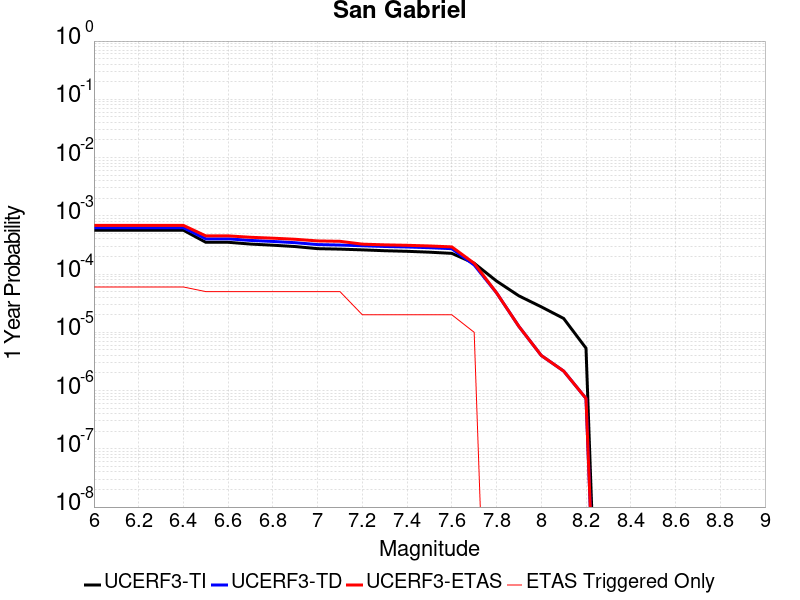 |  |

| Magnitude | 1 wk TI Prob | 1 wk TD Prob | 1 wk ETAS Prob | 1 wk ETAS/TD Gain | 1 wk ETAS Triggered Only | 1 mo TI Prob | 1 mo TD Prob | 1 mo ETAS Prob | 1 mo ETAS/TD Gain | 1 mo ETAS Triggered Only | 1 yr TI Prob | 1 yr TD Prob | 1 yr ETAS Prob | 1 yr ETAS/TD Gain | 1 yr ETAS Triggered Only | 10 yr TI Prob | 10 yr TD Prob | 10 yr ETAS Prob | 10 yr ETAS/TD Gain | 10 yr ETAS Triggered Only |
|-----|-----|-----|-----|-----|-----|-----|-----|-----|-----|-----|-----|-----|-----|-----|-----|-----|-----|-----|-----|-----|
| 6.0 | 1.083775E-5 | 1.19851875E-5 | 3.5794426E-5 | 2.9865553 | 2.3809524E-5 | 4.6446676E-5 | 5.1364143E-5 | 7.5172444E-5 | 1.4635199 | 2.3809524E-5 | 5.653415E-4 | 6.251903E-4 | 6.7277957E-4 | 1.0761197 | 4.7619047E-5 | 0.0056390543 | 0.006246409 | 0.006293731 | 1.0075758 | 4.7619047E-5 |
| 6.1 | 1.083775E-5 | 1.19851875E-5 | 3.5794426E-5 | 2.9865553 | 2.3809524E-5 | 4.6446676E-5 | 5.1364143E-5 | 7.5172444E-5 | 1.4635199 | 2.3809524E-5 | 5.653415E-4 | 6.251903E-4 | 6.7277957E-4 | 1.0761197 | 4.7619047E-5 | 0.0056390543 | 0.006246409 | 0.006293731 | 1.0075758 | 4.7619047E-5 |
| 6.2 | 1.083775E-5 | 1.19851875E-5 | 3.5794426E-5 | 2.9865553 | 2.3809524E-5 | 4.6446676E-5 | 5.1364143E-5 | 7.5172444E-5 | 1.4635199 | 2.3809524E-5 | 5.653415E-4 | 6.251903E-4 | 6.7277957E-4 | 1.0761197 | 4.7619047E-5 | 0.0056390543 | 0.006246409 | 0.006293731 | 1.0075758 | 4.7619047E-5 |
| 6.3 | 1.083775E-5 | 1.19851875E-5 | 3.5794426E-5 | 2.9865553 | 2.3809524E-5 | 4.6446676E-5 | 5.1364143E-5 | 7.5172444E-5 | 1.4635199 | 2.3809524E-5 | 5.653415E-4 | 6.251903E-4 | 6.7277957E-4 | 1.0761197 | 4.7619047E-5 | 0.0056390543 | 0.006246409 | 0.006293731 | 1.0075758 | 4.7619047E-5 |
| 6.4 | 1.083775E-5 | 1.19851875E-5 | 3.5794426E-5 | 2.9865553 | 2.3809524E-5 | 4.6446676E-5 | 5.1364143E-5 | 7.5172444E-5 | 1.4635199 | 2.3809524E-5 | 5.653415E-4 | 6.251903E-4 | 6.7277957E-4 | 1.0761197 | 4.7619047E-5 | 0.0056390543 | 0.006246409 | 0.006293731 | 1.0075758 | 4.7619047E-5 |
| 6.5 | 6.7317824E-6 | 7.716944E-6 | 7.716944E-6 | 1.0 | 0.0 | 2.8850178E-5 | 3.3072207E-5 | 3.3072207E-5 | 1.0 | 0.0 | 3.511943E-4 | 4.0258077E-4 | 4.2638072E-4 | 1.0591184 | 2.3809524E-5 | 0.003506398 | 0.0040296097 | 0.004053323 | 1.0058849 | 2.3809524E-5 |
| 6.6 | 6.7317824E-6 | 7.716944E-6 | 7.716944E-6 | 1.0 | 0.0 | 2.8850178E-5 | 3.3072207E-5 | 3.3072207E-5 | 1.0 | 0.0 | 3.511943E-4 | 4.0258077E-4 | 4.2638072E-4 | 1.0591184 | 2.3809524E-5 | 0.003506398 | 0.0040296097 | 0.004053323 | 1.0058849 | 2.3809524E-5 |
| 6.7 | 6.274881E-6 | 7.2458647E-6 | 7.2458647E-6 | 1.0 | 0.0 | 2.6892068E-5 | 3.1053343E-5 | 3.1053343E-5 | 1.0 | 0.0 | 3.2736175E-4 | 3.780098E-4 | 4.0181034E-4 | 1.0629628 | 2.3809524E-5 | 0.0032687993 | 0.0037847564 | 0.0038084758 | 1.0062671 | 2.3809524E-5 |
| 6.8 | 5.996209E-6 | 6.958585E-6 | 6.958585E-6 | 1.0 | 0.0 | 2.5697784E-5 | 2.9822171E-5 | 2.9822171E-5 | 1.0 | 0.0 | 3.128256E-4 | 3.6302538E-4 | 3.8682626E-4 | 1.0655626 | 2.3809524E-5 | 0.003123856 | 0.0036354093 | 0.0036591322 | 1.0065255 | 2.3809524E-5 |
| 6.9 | 5.686331E-6 | 6.6236316E-6 | 6.6236316E-6 | 1.0 | 0.0 | 2.4369761E-5 | 2.8386688E-5 | 2.8386688E-5 | 1.0 | 0.0 | 2.9666146E-4 | 3.4555403E-4 | 3.6935532E-4 | 1.0688787 | 2.3809524E-5 | 0.0029626573 | 0.0034612515 | 0.0034849786 | 1.006855 | 2.3809524E-5 |
| 7.0 | 5.2329838E-6 | 6.147514E-6 | 6.147514E-6 | 1.0 | 0.0 | 2.242688E-5 | 2.6346226E-5 | 2.6346226E-5 | 1.0 | 0.0 | 2.7301308E-4 | 3.2071886E-4 | 3.4452075E-4 | 1.0742142 | 2.3809524E-5 | 0.002726779 | 0.0032136322 | 0.003237365 | 1.0073851 | 2.3809524E-5 |
| 7.1 | 5.135671E-6 | 6.03764E-6 | 6.03764E-6 | 1.0 | 0.0 | 2.2009834E-5 | 2.5875348E-5 | 2.5875348E-5 | 1.0 | 0.0 | 2.6793676E-4 | 3.1498758E-4 | 3.387896E-4 | 1.075565 | 2.3809524E-5 | 0.0026761394 | 0.0031564834 | 0.0031802177 | 1.0075192 | 2.3809524E-5 |
| 7.2 | 4.989062E-6 | 5.87102E-6 | 5.87102E-6 | 1.0 | 0.0 | 2.1381518E-5 | 2.5161276E-5 | 2.5161276E-5 | 1.0 | 0.0 | 2.6028889E-4 | 3.0629625E-4 | 3.3009847E-4 | 1.0777098 | 2.3809524E-5 | 0.0025998424 | 0.003069813 | 0.0030935493 | 1.0077322 | 2.3809524E-5 |
| 7.3 | 4.8219395E-6 | 5.702574E-6 | 5.702574E-6 | 1.0 | 0.0 | 2.0665291E-5 | 2.443938E-5 | 2.443938E-5 | 1.0 | 0.0 | 2.5157086E-4 | 2.9750957E-4 | 3.21312E-4 | 1.0800056 | 2.3809524E-5 | 0.0025128627 | 0.0029821852 | 0.0030059237 | 1.0079601 | 2.3809524E-5 |
| 7.4 | 4.7118383E-6 | 5.5911332E-6 | 5.5911332E-6 | 1.0 | 0.0 | 2.0193436E-5 | 2.3961782E-5 | 2.3961782E-5 | 1.0 | 0.0 | 2.4582737E-4 | 2.916964E-4 | 3.1549897E-4 | 1.0816005 | 2.3809524E-5 | 0.002455556 | 0.0029242067 | 0.0029479465 | 1.0081184 | 2.3809524E-5 |
| 7.5 | 4.5506545E-6 | 5.4365014E-6 | 5.4365014E-6 | 1.0 | 0.0 | 1.9502659E-5 | 2.3299088E-5 | 2.3299088E-5 | 1.0 | 0.0 | 2.37419E-4 | 2.8363022E-4 | 3.07433E-4 | 1.0839218 | 2.3809524E-5 | 0.002371655 | 0.002843753 | 0.0028674947 | 1.0083487 | 2.3809524E-5 |
| 7.6 | 4.343636E-6 | 5.2293817E-6 | 5.2293817E-6 | 1.0 | 0.0 | 1.861545E-5 | 2.2411448E-5 | 2.2411448E-5 | 1.0 | 0.0 | 2.2661954E-4 | 2.7282597E-4 | 2.9662898E-4 | 1.0872462 | 2.3809524E-5 | 0.0022638857 | 0.0027359722 | 0.0027597167 | 1.0086786 | 2.3809524E-5 |
| 7.7 | 2.936235E-6 | 2.7440458E-6 | 2.7440458E-6 | 1.0 | 0.0 | 1.2583803E-5 | 1.1760143E-5 | 1.1760143E-5 | 1.0 | 0.0 | 1.5319703E-4 | 1.4317037E-4 | 1.6697649E-4 | 1.1662782 | 2.3809524E-5 | 0.0015309147 | 0.0014380751 | 0.0014618504 | 1.0165327 | 2.3809524E-5 |
| 7.8 | 1.4541639E-6 | 9.1237047E-7 | 9.1237047E-7 | 1.0 | 0.0 | 6.232116E-6 | 3.9101533E-6 | 3.9101533E-6 | 1.0 | 0.0 | 7.587337E-5 | 4.7605077E-5 | 4.7605077E-5 | 1.0 | 0.0 | 7.584747E-4 | 4.8085177E-4 | 4.8085177E-4 | 1.0 | 0.0 |
| 7.9 | 8.098958E-7 | 2.41753E-7 | 2.41753E-7 | 1.0 | 0.0 | 3.4709774E-6 | 1.0360839E-6 | 1.0360839E-6 | 1.0 | 0.0 | 4.225833E-5 | 1.2614248E-5 | 1.2614248E-5 | 1.0 | 0.0 | 4.2250296E-4 | 1.2921814E-4 | 1.2921814E-4 | 1.0 | 0.0 |
| 8.0 | 5.2473234E-7 | 7.6792055E-8 | 7.6792055E-8 | 1.0 | 0.0 | 2.248851E-6 | 3.2910876E-7 | 3.2910876E-7 | 1.0 | 0.0 | 2.7379416E-5 | 4.0068917E-6 | 4.0068917E-6 | 1.0 | 0.0 | 2.7376044E-4 | 4.21918E-5 | 4.21918E-5 | 1.0 | 0.0 |
| 8.1 | 3.3162388E-7 | 4.1496126E-8 | 4.1496126E-8 | 1.0 | 0.0 | 1.4212444E-6 | 1.7784053E-7 | 1.7784053E-7 | 1.0 | 0.0 | 1.7303513E-5 | 2.1652063E-6 | 2.1652063E-6 | 1.0 | 0.0 | 1.7302166E-4 | 2.2965523E-5 | 2.2965523E-5 | 1.0 | 0.0 |
| 8.2 | 1.0235345E-7 | 1.4043474E-8 | 1.4043474E-8 | 1.0 | 0.0 | 4.3865757E-7 | 6.0186316E-8 | 6.0186316E-8 | 1.0 | 0.0 | 5.340643E-6 | 7.327681E-7 | 7.327681E-7 | 1.0 | 0.0 | 5.3405143E-5 | 7.9273705E-6 | 7.9273705E-6 | 1.0 | 0.0 |

## Bartlett Springs 2011 CFM
*[(top)](#table-of-contents)*

| 1 Week | 1 Month | 1 Year | 10 Year |
|-----|-----|-----|-----|
|  |  |  |  |

| Magnitude | 1 wk TI Prob | 1 wk TD Prob | 1 wk ETAS Prob | 1 wk ETAS/TD Gain | 1 wk ETAS Triggered Only | 1 mo TI Prob | 1 mo TD Prob | 1 mo ETAS Prob | 1 mo ETAS/TD Gain | 1 mo ETAS Triggered Only | 1 yr TI Prob | 1 yr TD Prob | 1 yr ETAS Prob | 1 yr ETAS/TD Gain | 1 yr ETAS Triggered Only | 10 yr TI Prob | 10 yr TD Prob | 10 yr ETAS Prob | 10 yr ETAS/TD Gain | 10 yr ETAS Triggered Only |
|-----|-----|-----|-----|-----|-----|-----|-----|-----|-----|-----|-----|-----|-----|-----|-----|-----|-----|-----|-----|-----|
| 6.0 | 6.2326144E-5 | 8.060613E-5 | 8.060613E-5 | 1.0 | 0.0 | 2.6708472E-4 | 3.454099E-4 | 3.454099E-4 | 1.0 | 0.0 | 0.003246908 | 0.0041973945 | 0.0041973945 | 1.0 | 0.0 | 0.031998757 | 0.04119771 | 0.04122054 | 1.0005541 | 2.3809524E-5 |
| 6.1 | 6.227657E-5 | 8.054363E-5 | 8.054363E-5 | 1.0 | 0.0 | 2.668723E-4 | 3.4514212E-4 | 3.4514212E-4 | 1.0 | 0.0 | 0.0032443295 | 0.004194147 | 0.004194147 | 1.0 | 0.0 | 0.031973712 | 0.041166443 | 0.041189276 | 1.0005546 | 2.3809524E-5 |
| 6.2 | 6.22452E-5 | 8.050423E-5 | 8.050423E-5 | 1.0 | 0.0 | 2.6673786E-4 | 3.4497332E-4 | 3.4497332E-4 | 1.0 | 0.0 | 0.0032426978 | 0.0041921 | 0.0041921 | 1.0 | 0.0 | 0.03195787 | 0.041146737 | 0.041169565 | 1.0005548 | 2.3809524E-5 |
| 6.3 | 6.219006E-5 | 8.043407E-5 | 8.043407E-5 | 1.0 | 0.0 | 2.6650162E-4 | 3.4467268E-4 | 3.4467268E-4 | 1.0 | 0.0 | 0.00323983 | 0.0041884542 | 0.0041884542 | 1.0 | 0.0 | 0.031930014 | 0.041111637 | 0.04113447 | 1.0005553 | 2.3809524E-5 |
| 6.4 | 5.2175856E-5 | 6.725342E-5 | 6.725342E-5 | 1.0 | 0.0 | 2.2359163E-4 | 2.8819745E-4 | 2.8819745E-4 | 1.0 | 0.0 | 0.0027188298 | 0.0035032115 | 0.0035032115 | 1.0 | 0.0 | 0.026858058 | 0.034489222 | 0.03451221 | 1.0006665 | 2.3809524E-5 |
| 6.5 | 5.205166E-5 | 6.7096094E-5 | 6.7096094E-5 | 1.0 | 0.0 | 2.2305945E-4 | 2.8752335E-4 | 2.8752335E-4 | 1.0 | 0.0 | 0.0027123666 | 0.0034950306 | 0.0034950306 | 1.0 | 0.0 | 0.026794989 | 0.034409966 | 0.034432955 | 1.0006682 | 2.3809524E-5 |
| 6.6 | 5.0085426E-5 | 6.449277E-5 | 6.449277E-5 | 1.0 | 0.0 | 2.1463417E-4 | 2.763686E-4 | 2.763686E-4 | 1.0 | 0.0 | 0.0026100394 | 0.0033596456 | 0.0033596456 | 1.0 | 0.0 | 0.025795965 | 0.033097573 | 0.033120595 | 1.0006956 | 2.3809524E-5 |
| 6.7 | 4.8930866E-5 | 6.3017396E-5 | 6.3017396E-5 | 1.0 | 0.0 | 2.0968684E-4 | 2.7004688E-4 | 2.7004688E-4 | 1.0 | 0.0 | 0.0025499484 | 0.0032829174 | 0.0032829174 | 1.0 | 0.0 | 0.025208864 | 0.03235294 | 0.032375976 | 1.0007122 | 2.3809524E-5 |
| 6.8 | 4.5679535E-5 | 5.8741858E-5 | 5.8741858E-5 | 1.0 | 0.0 | 1.9575475E-4 | 2.5172674E-4 | 2.5172674E-4 | 1.0 | 0.0 | 0.002380709 | 0.0030605064 | 0.0030605064 | 1.0 | 0.0 | 0.023553653 | 0.03019042 | 0.03021351 | 1.0007648 | 2.3809524E-5 |
| 6.9 | 4.1439176E-5 | 5.3220094E-5 | 5.3220094E-5 | 1.0 | 0.0 | 1.7758438E-4 | 2.2806633E-4 | 2.2806633E-4 | 1.0 | 0.0 | 0.002159946 | 0.0027731995 | 0.0027731995 | 1.0 | 0.0 | 0.021390721 | 0.027390772 | 0.02741393 | 1.0008454 | 2.3809524E-5 |
| 7.0 | 3.5920104E-5 | 4.600871E-5 | 4.600871E-5 | 1.0 | 0.0 | 1.5393422E-4 | 1.9716538E-4 | 1.9716538E-4 | 1.0 | 0.0 | 0.001872538 | 0.0023978627 | 0.0023978627 | 1.0 | 0.0 | 0.018568378 | 0.023723004 | 0.02374625 | 1.0009798 | 2.3809524E-5 |
| 7.1 | 3.338812E-5 | 4.2689582E-5 | 4.2689582E-5 | 1.0 | 0.0 | 1.430841E-4 | 1.829426E-4 | 1.829426E-4 | 1.0 | 0.0 | 0.0017406568 | 0.0022250658 | 0.0022250658 | 1.0 | 0.0 | 0.017270854 | 0.02203054 | 0.022053825 | 1.0010569 | 2.3809524E-5 |
| 7.2 | 2.8619615E-5 | 3.6401652E-5 | 3.6401652E-5 | 1.0 | 0.0 | 1.2264973E-4 | 1.5599781E-4 | 1.5599781E-4 | 1.0 | 0.0 | 0.0014922376 | 0.0018976285 | 0.0018976285 | 1.0 | 0.0 | 0.014822568 | 0.01881613 | 0.01881613 | 1.0 | 0.0 |
| 7.3 | 2.6376783E-5 | 3.342276E-5 | 3.342276E-5 | 1.0 | 0.0 | 1.13038455E-4 | 1.4323258E-4 | 1.4323258E-4 | 1.0 | 0.0 | 0.0013753743 | 0.001742471 | 0.001742471 | 1.0 | 0.0 | 0.01366893 | 0.01728972 | 0.01728972 | 1.0 | 0.0 |
| 7.4 | 2.3738676E-5 | 2.9978975E-5 | 2.9978975E-5 | 1.0 | 0.0 | 1.0173322E-4 | 1.2847505E-4 | 1.2847505E-4 | 1.0 | 0.0 | 0.0012378981 | 0.0015630693 | 0.0015630693 | 1.0 | 0.0 | 0.012310251 | 0.015522073 | 0.015522073 | 1.0 | 0.0 |
| 7.5 | 2.1789481E-5 | 2.7439388E-5 | 2.7439388E-5 | 1.0 | 0.0 | 9.338015E-5 | 1.1759212E-4 | 1.1759212E-4 | 1.0 | 0.0 | 0.0011363103 | 0.0014307518 | 0.0014307518 | 1.0 | 0.0 | 0.011305175 | 0.014216576 | 0.014216576 | 1.0 | 0.0 |
| 7.6 | 1.3895281E-5 | 1.7368426E-5 | 1.7368426E-5 | 1.0 | 0.0 | 5.9549846E-5 | 7.4434E-5 | 7.4434E-5 | 1.0 | 0.0 | 7.2477816E-4 | 9.0586004E-4 | 9.0586004E-4 | 1.0 | 0.0 | 0.0072241887 | 0.009022084 | 0.009022084 | 1.0 | 0.0 |
| 7.7 | 4.245981E-6 | 5.1624675E-6 | 5.1624675E-6 | 1.0 | 0.0 | 1.8196934E-5 | 2.2124674E-5 | 2.2124674E-5 | 1.0 | 0.0 | 2.2152514E-4 | 2.693348E-4 | 2.693348E-4 | 1.0 | 0.0 | 0.0022130446 | 0.0026901034 | 0.0026901034 | 1.0 | 0.0 |
| 7.8 | 6.145192E-7 | 7.047006E-7 | 7.047006E-7 | 1.0 | 0.0 | 2.633651E-6 | 3.020142E-6 | 3.020142E-6 | 1.0 | 0.0 | 3.206423E-5 | 3.676962E-5 | 3.676962E-5 | 1.0 | 0.0 | 3.2059604E-4 | 3.6763478E-4 | 3.6763478E-4 | 1.0 | 0.0 |

## Earthquake Valley (So Extension)
*[(top)](#table-of-contents)*

| 1 Week | 1 Month | 1 Year | 10 Year |
|-----|-----|-----|-----|
|  |  |  |  |

| Magnitude | 1 wk TI Prob | 1 wk TD Prob | 1 wk ETAS Prob | 1 wk ETAS/TD Gain | 1 wk ETAS Triggered Only | 1 mo TI Prob | 1 mo TD Prob | 1 mo ETAS Prob | 1 mo ETAS/TD Gain | 1 mo ETAS Triggered Only | 1 yr TI Prob | 1 yr TD Prob | 1 yr ETAS Prob | 1 yr ETAS/TD Gain | 1 yr ETAS Triggered Only | 10 yr TI Prob | 10 yr TD Prob | 10 yr ETAS Prob | 10 yr ETAS/TD Gain | 10 yr ETAS Triggered Only |
|-----|-----|-----|-----|-----|-----|-----|-----|-----|-----|-----|-----|-----|-----|-----|-----|-----|-----|-----|-----|-----|
| 6.0 | 3.0194888E-5 | 3.7072114E-5 | 3.7072114E-5 | 1.0 | 0.0 | 1.2940024E-4 | 1.5887388E-4 | 1.5887388E-4 | 1.0 | 0.0 | 0.0015743093 | 0.0019331174 | 0.0019568808 | 1.0122929 | 2.3809524E-5 | 0.01563203 | 0.019213019 | 0.01923637 | 1.0012155 | 2.3809524E-5 |
| 6.1 | 3.0194888E-5 | 3.7072114E-5 | 3.7072114E-5 | 1.0 | 0.0 | 1.2940024E-4 | 1.5887388E-4 | 1.5887388E-4 | 1.0 | 0.0 | 0.0015743093 | 0.0019331174 | 0.0019568808 | 1.0122929 | 2.3809524E-5 | 0.01563203 | 0.019213019 | 0.01923637 | 1.0012155 | 2.3809524E-5 |
| 6.2 | 3.0194888E-5 | 3.7072114E-5 | 3.7072114E-5 | 1.0 | 0.0 | 1.2940024E-4 | 1.5887388E-4 | 1.5887388E-4 | 1.0 | 0.0 | 0.0015743093 | 0.0019331174 | 0.0019568808 | 1.0122929 | 2.3809524E-5 | 0.01563203 | 0.019213019 | 0.01923637 | 1.0012155 | 2.3809524E-5 |
| 6.3 | 1.5795305E-5 | 1.844658E-5 | 1.844658E-5 | 1.0 | 0.0 | 6.769241E-5 | 7.9055004E-5 | 7.9055004E-5 | 1.0 | 0.0 | 8.238434E-4 | 9.6218096E-4 | 9.859676E-4 | 1.0247215 | 2.3809524E-5 | 0.008207959 | 0.009591061 | 0.009614642 | 1.0024587 | 2.3809524E-5 |
| 6.4 | 1.5795305E-5 | 1.844658E-5 | 1.844658E-5 | 1.0 | 0.0 | 6.769241E-5 | 7.9055004E-5 | 7.9055004E-5 | 1.0 | 0.0 | 8.238434E-4 | 9.6218096E-4 | 9.859676E-4 | 1.0247215 | 2.3809524E-5 | 0.008207959 | 0.009591061 | 0.009614642 | 1.0024587 | 2.3809524E-5 |
| 6.5 | 1.5795305E-5 | 1.844658E-5 | 1.844658E-5 | 1.0 | 0.0 | 6.769241E-5 | 7.9055004E-5 | 7.9055004E-5 | 1.0 | 0.0 | 8.238434E-4 | 9.6218096E-4 | 9.859676E-4 | 1.0247215 | 2.3809524E-5 | 0.008207959 | 0.009591061 | 0.009614642 | 1.0024587 | 2.3809524E-5 |
| 6.6 | 1.5795305E-5 | 1.844658E-5 | 1.844658E-5 | 1.0 | 0.0 | 6.769241E-5 | 7.9055004E-5 | 7.9055004E-5 | 1.0 | 0.0 | 8.238434E-4 | 9.6218096E-4 | 9.859676E-4 | 1.0247215 | 2.3809524E-5 | 0.008207959 | 0.009591061 | 0.009614642 | 1.0024587 | 2.3809524E-5 |
| 6.7 | 1.1363076E-5 | 1.3138294E-5 | 1.3138294E-5 | 1.0 | 0.0 | 4.8697988E-5 | 5.6306188E-5 | 5.6306188E-5 | 1.0 | 0.0 | 5.927367E-4 | 6.8538834E-4 | 7.0918154E-4 | 1.0347149 | 2.3809524E-5 | 0.0059115817 | 0.0068402183 | 0.006863865 | 1.003457 | 2.3809524E-5 |
| 6.8 | 1.0049611E-5 | 1.1594334E-5 | 1.1594334E-5 | 1.0 | 0.0 | 4.306905E-5 | 4.9689468E-5 | 4.9689468E-5 | 1.0 | 0.0 | 5.242395E-4 | 6.048745E-4 | 6.2866963E-4 | 1.039339 | 2.3809524E-5 | 0.0052300454 | 0.006039458 | 0.0060631237 | 1.0039185 | 2.3809524E-5 |
| 6.9 | 1.0049611E-5 | 1.1594334E-5 | 1.1594334E-5 | 1.0 | 0.0 | 4.306905E-5 | 4.9689468E-5 | 4.9689468E-5 | 1.0 | 0.0 | 5.242395E-4 | 6.048745E-4 | 6.2866963E-4 | 1.039339 | 2.3809524E-5 | 0.0052300454 | 0.006039458 | 0.0060631237 | 1.0039185 | 2.3809524E-5 |
| 7.0 | 1.0049611E-5 | 1.1594334E-5 | 1.1594334E-5 | 1.0 | 0.0 | 4.306905E-5 | 4.9689468E-5 | 4.9689468E-5 | 1.0 | 0.0 | 5.242395E-4 | 6.048745E-4 | 6.2866963E-4 | 1.039339 | 2.3809524E-5 | 0.0052300454 | 0.006039458 | 0.0060631237 | 1.0039185 | 2.3809524E-5 |
| 7.1 | 8.140254E-6 | 9.383458E-6 | 9.383458E-6 | 1.0 | 0.0 | 3.4886336E-5 | 4.0214578E-5 | 4.0214578E-5 | 1.0 | 0.0 | 4.2465836E-4 | 4.8956956E-4 | 4.8956956E-4 | 1.0 | 0.0 | 0.0042384774 | 0.0048914864 | 0.0048914864 | 1.0 | 0.0 |
| 7.2 | 1.673835E-7 | 1.4154125E-7 | 1.4154125E-7 | 1.0 | 0.0 | 7.173577E-7 | 6.066052E-7 | 6.066052E-7 | 1.0 | 0.0 | 8.733795E-6 | 7.385397E-6 | 7.385397E-6 | 1.0 | 0.0 | 8.733451E-5 | 7.385187E-5 | 7.385187E-5 | 1.0 | 0.0 |
| 7.3 | 1.6632116E-7 | 1.4052354E-7 | 1.4052354E-7 | 1.0 | 0.0 | 7.1280476E-7 | 6.0224363E-7 | 6.0224363E-7 | 1.0 | 0.0 | 8.678364E-6 | 7.332295E-6 | 7.332295E-6 | 1.0 | 0.0 | 8.6780245E-5 | 7.332089E-5 | 7.332089E-5 | 1.0 | 0.0 |
| 7.4 | 1.6569169E-7 | 1.3996983E-7 | 1.3996983E-7 | 1.0 | 0.0 | 7.1010703E-7 | 5.9987053E-7 | 5.9987053E-7 | 1.0 | 0.0 | 8.645519E-6 | 7.303403E-6 | 7.303403E-6 | 1.0 | 0.0 | 8.645182E-5 | 7.303199E-5 | 7.303199E-5 | 1.0 | 0.0 |
| 7.5 | 1.1764555E-7 | 1.0095917E-7 | 1.0095917E-7 | 1.0 | 0.0 | 5.041951E-7 | 4.326821E-7 | 4.326821E-7 | 1.0 | 0.0 | 6.138558E-6 | 5.267894E-6 | 5.267894E-6 | 1.0 | 0.0 | 6.1383886E-5 | 5.2677904E-5 | 5.2677904E-5 | 1.0 | 0.0 |
| 7.6 | 1.07927605E-7 | 9.260736E-8 | 9.260736E-8 | 1.0 | 0.0 | 4.6254678E-7 | 3.9688865E-7 | 3.9688865E-7 | 1.0 | 0.0 | 5.6314925E-6 | 4.832111E-6 | 4.832111E-6 | 1.0 | 0.0 | 5.63135E-5 | 4.8320264E-5 | 4.8320264E-5 | 1.0 | 0.0 |
| 7.7 | 2.1826905E-8 | 1.1180516E-8 | 1.1180516E-8 | 1.0 | 0.0 | 9.3543875E-8 | 4.7916494E-8 | 4.7916494E-8 | 1.0 | 0.0 | 1.1388961E-6 | 5.833832E-7 | 5.833832E-7 | 1.0 | 0.0 | 1.1388902E-5 | 5.8338223E-6 | 5.8338223E-6 | 1.0 | 0.0 |
| 7.8 | 2.6169649E-9 | 1.1969472E-9 | 1.1969472E-9 | 1.0 | 0.0 | 1.1215564E-8 | 5.1297735E-9 | 5.1297735E-9 | 1.0 | 0.0 | 1.3654947E-7 | 6.2454994E-8 | 6.2454994E-8 | 1.0 | 0.0 | 1.365494E-6 | 6.245499E-7 | 6.245499E-7 | 1.0 | 0.0 |

## Superstition Hills
*[(top)](#table-of-contents)*

| 1 Week | 1 Month | 1 Year | 10 Year |
|-----|-----|-----|-----|
|  |  |  |  |

| Magnitude | 1 wk TI Prob | 1 wk TD Prob | 1 wk ETAS Prob | 1 wk ETAS/TD Gain | 1 wk ETAS Triggered Only | 1 mo TI Prob | 1 mo TD Prob | 1 mo ETAS Prob | 1 mo ETAS/TD Gain | 1 mo ETAS Triggered Only | 1 yr TI Prob | 1 yr TD Prob | 1 yr ETAS Prob | 1 yr ETAS/TD Gain | 1 yr ETAS Triggered Only | 10 yr TI Prob | 10 yr TD Prob | 10 yr ETAS Prob | 10 yr ETAS/TD Gain | 10 yr ETAS Triggered Only |
|-----|-----|-----|-----|-----|-----|-----|-----|-----|-----|-----|-----|-----|-----|-----|-----|-----|-----|-----|-----|-----|
| 6.0 | 6.6865185E-5 | 1.41376995E-5 | 3.7946887E-5 | 2.684092 | 2.3809524E-5 | 2.8653358E-4 | 6.0588824E-5 | 8.43969E-5 | 1.392945 | 2.3809524E-5 | 0.0034829667 | 7.374355E-4 | 7.6122745E-4 | 1.0322632 | 2.3809524E-5 | 0.03428881 | 0.0075204074 | 0.007544038 | 1.0031422 | 2.3809524E-5 |
| 6.1 | 6.544851E-5 | 1.41376995E-5 | 3.7946887E-5 | 2.684092 | 2.3809524E-5 | 2.8046346E-4 | 6.0588824E-5 | 8.43969E-5 | 1.392945 | 2.3809524E-5 | 0.0034092965 | 7.374355E-4 | 7.6122745E-4 | 1.0322632 | 2.3809524E-5 | 0.033574644 | 0.007520407 | 0.0075440374 | 1.0031422 | 2.3809524E-5 |
| 6.2 | 6.544851E-5 | 1.41376995E-5 | 3.7946887E-5 | 2.684092 | 2.3809524E-5 | 2.8046346E-4 | 6.0588824E-5 | 8.43969E-5 | 1.392945 | 2.3809524E-5 | 0.0034092965 | 7.374355E-4 | 7.6122745E-4 | 1.0322632 | 2.3809524E-5 | 0.033574644 | 0.007520407 | 0.0075440374 | 1.0031422 | 2.3809524E-5 |
| 6.3 | 5.2402065E-5 | 1.4137698E-5 | 3.7946884E-5 | 2.6840923 | 2.3809524E-5 | 2.2456095E-4 | 6.058882E-5 | 8.43969E-5 | 1.3929452 | 2.3809524E-5 | 0.0027306017 | 7.374354E-4 | 7.612274E-4 | 1.0322632 | 2.3809524E-5 | 0.02697292 | 0.007520402 | 0.0075440323 | 1.0031422 | 2.3809524E-5 |
| 6.4 | 4.542238E-5 | 1.4137698E-5 | 3.7946884E-5 | 2.6840923 | 2.3809524E-5 | 1.9465282E-4 | 6.0588816E-5 | 8.4396896E-5 | 1.3929452 | 2.3809524E-5 | 0.0023673223 | 7.3743536E-4 | 7.6122733E-4 | 1.0322632 | 2.3809524E-5 | 0.023422617 | 0.0075203986 | 0.007544029 | 1.0031422 | 2.3809524E-5 |
| 6.5 | 2.9672969E-5 | 1.4137696E-5 | 3.7946884E-5 | 2.6840925 | 2.3809524E-5 | 1.2716366E-4 | 6.058881E-5 | 8.4396896E-5 | 1.3929452 | 2.3809524E-5 | 0.0015471181 | 7.374353E-4 | 7.612273E-4 | 1.0322632 | 2.3809524E-5 | 0.015363912 | 0.007520392 | 0.0075440225 | 1.0031422 | 2.3809524E-5 |
| 6.6 | 2.6056105E-5 | 1.3803458E-5 | 3.7612655E-5 | 2.7248716 | 2.3809524E-5 | 1.1166424E-4 | 5.9156428E-5 | 8.296454E-5 | 1.4024603 | 2.3809524E-5 | 0.0013586642 | 7.200076E-4 | 7.4379996E-4 | 1.0330446 | 2.3809524E-5 | 0.013503874 | 0.0073448285 | 0.007368463 | 1.0032178 | 2.3809524E-5 |
| 6.7 | 1.4611248E-5 | 1.3383359E-5 | 3.7192563E-5 | 2.7790155 | 2.3809524E-5 | 6.261813E-5 | 5.7356083E-5 | 8.116424E-5 | 1.4150939 | 2.3809524E-5 | 7.6210906E-4 | 6.981025E-4 | 7.218954E-4 | 1.0340823 | 2.3809524E-5 | 0.0075950073 | 0.00712602 | 0.0071496596 | 1.0033174 | 2.3809524E-5 |
| 6.8 | 1.30607E-5 | 1.09787925E-5 | 3.4788056E-5 | 3.1686594 | 2.3809524E-5 | 5.597323E-5 | 4.705117E-5 | 7.0859576E-5 | 1.5060109 | 2.3809524E-5 | 6.8126095E-4 | 5.7270617E-4 | 5.9650204E-4 | 1.0415499 | 2.3809524E-5 | 0.006791762 | 0.00587438 | 0.0058980496 | 1.0040293 | 2.3809524E-5 |
| 6.9 | 1.0443096E-5 | 8.195349E-6 | 3.200468E-5 | 3.9052243 | 2.3809524E-5 | 4.4755358E-5 | 3.5122466E-5 | 5.8931153E-5 | 1.6778762 | 2.3809524E-5 | 5.447602E-4 | 4.2753448E-4 | 4.5133382E-4 | 1.0556664 | 2.3809524E-5 | 0.005434267 | 0.0044094524 | 0.004433157 | 1.0053759 | 2.3809524E-5 |
| 7.0 | 8.045912E-6 | 6.739692E-6 | 3.0549054E-5 | 4.532708 | 2.3809524E-5 | 3.4482026E-5 | 2.888408E-5 | 5.2692914E-5 | 1.8242892 | 2.3809524E-5 | 4.197378E-4 | 3.5160795E-4 | 3.7540912E-4 | 1.0676923 | 2.3809524E-5 | 0.0041894587 | 0.0036334093 | 0.0036571324 | 1.0065291 | 2.3809524E-5 |
| 7.1 | 8.045912E-6 | 6.739692E-6 | 3.0549054E-5 | 4.532708 | 2.3809524E-5 | 3.4482026E-5 | 2.888408E-5 | 5.2692914E-5 | 1.8242892 | 2.3809524E-5 | 4.197378E-4 | 3.5160795E-4 | 3.7540912E-4 | 1.0676923 | 2.3809524E-5 | 0.0041894587 | 0.0036334093 | 0.0036571324 | 1.0065291 | 2.3809524E-5 |
| 7.2 | 7.375506E-6 | 6.2466297E-6 | 3.0056004E-5 | 4.8115554 | 2.3809524E-5 | 3.1608928E-5 | 2.6771E-5 | 5.0579885E-5 | 1.8893536 | 2.3809524E-5 | 3.8477074E-4 | 3.2588904E-4 | 3.4969082E-4 | 1.0730364 | 2.3809524E-5 | 0.003841052 | 0.003373887 | 0.003397616 | 1.0070332 | 2.3809524E-5 |
| 7.3 | 6.6063913E-6 | 5.7990574E-6 | 2.9608444E-5 | 5.105734 | 2.3809524E-5 | 2.8312797E-5 | 2.485287E-5 | 4.86618E-5 | 1.9579953 | 2.3809524E-5 | 3.446538E-4 | 3.025424E-4 | 3.263447E-4 | 1.0786743 | 2.3809524E-5 | 0.0034411973 | 0.003138153 | 0.003161888 | 1.0075634 | 2.3809524E-5 |
| 7.4 | 6.4313126E-6 | 5.680481E-6 | 2.948987E-5 | 5.1914387 | 2.3809524E-5 | 2.7562477E-5 | 2.4344696E-5 | 4.815364E-5 | 1.977993 | 2.3809524E-5 | 3.355215E-4 | 2.9635706E-4 | 3.2015954E-4 | 1.0803169 | 2.3809524E-5 | 0.0033501536 | 0.0030759154 | 0.0030996515 | 1.0077168 | 2.3809524E-5 |
| 7.5 | 6.0742927E-6 | 5.4763104E-6 | 2.9285704E-5 | 5.3477073 | 2.3809524E-5 | 2.6032423E-5 | 2.3469694E-5 | 4.727866E-5 | 2.0144558 | 2.3809524E-5 | 3.1689866E-4 | 2.8570674E-4 | 3.0950946E-4 | 1.0833117 | 2.3809524E-5 | 0.0031644711 | 0.002967756 | 0.002991495 | 1.007999 | 2.3809524E-5 |
| 7.6 | 5.6987187E-6 | 5.294521E-6 | 2.910392E-5 | 5.496988 | 2.3809524E-5 | 2.4422852E-5 | 2.269061E-5 | 4.6499594E-5 | 2.0492878 | 2.3809524E-5 | 2.9730765E-4 | 2.7622381E-4 | 3.0002676E-4 | 1.0861727 | 2.3809524E-5 | 0.002969102 | 0.0028710118 | 0.0028947531 | 1.0082693 | 2.3809524E-5 |
| 7.7 | 5.1658035E-6 | 4.925535E-6 | 2.8734941E-5 | 5.833872 | 2.3809524E-5 | 2.2138971E-5 | 2.1109268E-5 | 4.491829E-5 | 2.1278942 | 2.3809524E-5 | 2.6950863E-4 | 2.5697565E-4 | 2.8077906E-4 | 1.0926291 | 2.3809524E-5 | 0.00269182 | 0.0026760625 | 0.0026998082 | 1.0088735 | 2.3809524E-5 |
| 7.8 | 3.6864697E-6 | 4.1964995E-6 | 2.8005923E-5 | 6.6736393 | 2.3809524E-5 | 1.579906E-5 | 1.7984876E-5 | 4.179397E-5 | 2.32384 | 2.3809524E-5 | 1.9233658E-4 | 2.1894433E-4 | 2.4274863E-4 | 1.1087232 | 2.3809524E-5 | 0.0019217018 | 0.0022892624 | 0.0023130174 | 1.0103767 | 2.3809524E-5 |
| 7.9 | 3.0265903E-6 | 3.5637288E-6 | 2.7373168E-5 | 7.681047 | 2.3809524E-5 | 1.2971037E-5 | 1.5273037E-5 | 3.9082195E-5 | 2.5589015 | 2.3809524E-5 | 1.5791094E-4 | 1.859338E-4 | 2.097389E-4 | 1.12803 | 2.3809524E-5 | 0.0015779877 | 0.0019534735 | 0.0019772367 | 1.0121645 | 2.3809524E-5 |
| 8.0 | 2.5271493E-6 | 3.0867361E-6 | 2.6896187E-5 | 8.713471 | 2.3809524E-5 | 1.0830595E-5 | 1.3228804E-5 | 3.7038015E-5 | 2.7998004 | 2.3809524E-5 | 1.3185451E-4 | 1.610492E-4 | 1.848549E-4 | 1.1478163 | 2.3809524E-5 | 0.0013177631 | 0.0016973554 | 0.0017211245 | 1.0140036 | 2.3809524E-5 |
| 8.1 | 2.3749135E-6 | 2.917377E-6 | 2.6726831E-5 | 9.161254 | 2.3809524E-5 | 1.0178161E-5 | 1.25029865E-5 | 3.6312213E-5 | 2.904283 | 2.3809524E-5 | 1.2391206E-4 | 1.5221364E-4 | 1.7601954E-4 | 1.1563979 | 2.3809524E-5 | 0.0012384299 | 0.001604949 | 0.0016287203 | 1.0148113 | 2.3809524E-5 |
| 8.2 | 1.7186406E-9 | 1.1440594E-9 | 1.1440594E-9 | 1.0 | 0.0 | 7.3656024E-9 | 4.9031117E-9 | 4.9031117E-9 | 1.0 | 0.0 | 8.9676206E-8 | 5.969538E-8 | 5.969538E-8 | 1.0 | 0.0 | 8.9676166E-7 | 6.389059E-7 | 6.389059E-7 | 1.0 | 0.0 |

## Sierra Madre (San Fernando)
*[(top)](#table-of-contents)*

| 1 Week | 1 Month | 1 Year | 10 Year |
|-----|-----|-----|-----|
|  |  |  |  |

| Magnitude | 1 wk TI Prob | 1 wk TD Prob | 1 wk ETAS Prob | 1 wk ETAS/TD Gain | 1 wk ETAS Triggered Only | 1 mo TI Prob | 1 mo TD Prob | 1 mo ETAS Prob | 1 mo ETAS/TD Gain | 1 mo ETAS Triggered Only | 1 yr TI Prob | 1 yr TD Prob | 1 yr ETAS Prob | 1 yr ETAS/TD Gain | 1 yr ETAS Triggered Only | 10 yr TI Prob | 10 yr TD Prob | 10 yr ETAS Prob | 10 yr ETAS/TD Gain | 10 yr ETAS Triggered Only |
|-----|-----|-----|-----|-----|-----|-----|-----|-----|-----|-----|-----|-----|-----|-----|-----|-----|-----|-----|-----|-----|
| 6.0 | 1.0346413E-5 | 6.2872605E-6 | 6.2872605E-6 | 1.0 | 0.0 | 4.4341014E-5 | 2.694513E-5 | 2.694513E-5 | 1.0 | 0.0 | 5.3971814E-4 | 3.280087E-4 | 3.280087E-4 | 1.0 | 0.0 | 0.0053840918 | 0.0032753581 | 0.0032990896 | 1.0072454 | 2.3809524E-5 |
| 6.1 | 1.0346413E-5 | 6.2872605E-6 | 6.2872605E-6 | 1.0 | 0.0 | 4.4341014E-5 | 2.694513E-5 | 2.694513E-5 | 1.0 | 0.0 | 5.3971814E-4 | 3.280087E-4 | 3.280087E-4 | 1.0 | 0.0 | 0.0053840918 | 0.0032753581 | 0.0032990896 | 1.0072454 | 2.3809524E-5 |
| 6.2 | 1.0346413E-5 | 6.2872605E-6 | 6.2872605E-6 | 1.0 | 0.0 | 4.4341014E-5 | 2.694513E-5 | 2.694513E-5 | 1.0 | 0.0 | 5.3971814E-4 | 3.280087E-4 | 3.280087E-4 | 1.0 | 0.0 | 0.0053840918 | 0.0032753581 | 0.0032990896 | 1.0072454 | 2.3809524E-5 |
| 6.3 | 1.0346413E-5 | 6.2872605E-6 | 6.2872605E-6 | 1.0 | 0.0 | 4.4341014E-5 | 2.694513E-5 | 2.694513E-5 | 1.0 | 0.0 | 5.3971814E-4 | 3.280087E-4 | 3.280087E-4 | 1.0 | 0.0 | 0.0053840918 | 0.0032753581 | 0.0032990896 | 1.0072454 | 2.3809524E-5 |
| 6.4 | 1.0249558E-5 | 6.2872605E-6 | 6.2872605E-6 | 1.0 | 0.0 | 4.392594E-5 | 2.694513E-5 | 2.694513E-5 | 1.0 | 0.0 | 5.3466705E-4 | 3.280087E-4 | 3.280087E-4 | 1.0 | 0.0 | 0.0053338245 | 0.0032753581 | 0.0032990896 | 1.0072454 | 2.3809524E-5 |
| 6.5 | 1.0249558E-5 | 6.2872605E-6 | 6.2872605E-6 | 1.0 | 0.0 | 4.392594E-5 | 2.694513E-5 | 2.694513E-5 | 1.0 | 0.0 | 5.3466705E-4 | 3.280087E-4 | 3.280087E-4 | 1.0 | 0.0 | 0.0053338245 | 0.0032753581 | 0.0032990896 | 1.0072454 | 2.3809524E-5 |
| 6.6 | 9.9035515E-6 | 6.2872605E-6 | 6.2872605E-6 | 1.0 | 0.0 | 4.2443102E-5 | 2.694513E-5 | 2.694513E-5 | 1.0 | 0.0 | 5.166222E-4 | 3.280087E-4 | 3.280087E-4 | 1.0 | 0.0 | 0.0051542283 | 0.0032753581 | 0.0032990896 | 1.0072454 | 2.3809524E-5 |
| 6.7 | 9.87217E-6 | 6.2746817E-6 | 6.2746817E-6 | 1.0 | 0.0 | 4.2308613E-5 | 2.689122E-5 | 2.689122E-5 | 1.0 | 0.0 | 5.149856E-4 | 3.2735255E-4 | 3.2735255E-4 | 1.0 | 0.0 | 0.005137938 | 0.0032688158 | 0.0032925475 | 1.0072601 | 2.3809524E-5 |
| 6.8 | 9.4359175E-6 | 6.1786586E-6 | 6.1786586E-6 | 1.0 | 0.0 | 4.043902E-5 | 2.6479704E-5 | 2.6479704E-5 | 1.0 | 0.0 | 4.9223384E-4 | 3.2234378E-4 | 3.2234378E-4 | 1.0 | 0.0 | 0.0049114493 | 0.0032188739 | 0.0032426068 | 1.0073731 | 2.3809524E-5 |
| 6.9 | 8.700447E-6 | 6.039922E-6 | 6.039922E-6 | 1.0 | 0.0 | 3.72871E-5 | 2.5885129E-5 | 2.5885129E-5 | 1.0 | 0.0 | 4.5387587E-4 | 3.1510694E-4 | 3.1510694E-4 | 1.0 | 0.0 | 0.0045295 | 0.003146711 | 0.0031704456 | 1.0075427 | 2.3809524E-5 |
| 7.0 | 8.648878E-6 | 6.0148373E-6 | 6.0148373E-6 | 1.0 | 0.0 | 3.7066096E-5 | 2.5777625E-5 | 2.5777625E-5 | 1.0 | 0.0 | 4.5118626E-4 | 3.1379846E-4 | 3.1379846E-4 | 1.0 | 0.0 | 0.004502713 | 0.003133663 | 0.003157398 | 1.0075742 | 2.3809524E-5 |
| 7.1 | 8.505786E-6 | 5.9244676E-6 | 5.9244676E-6 | 1.0 | 0.0 | 3.645286E-5 | 2.5390334E-5 | 2.5390334E-5 | 1.0 | 0.0 | 4.437232E-4 | 3.0908454E-4 | 3.0908454E-4 | 1.0 | 0.0 | 0.0044283825 | 0.0030866556 | 0.0031103918 | 1.0076898 | 2.3809524E-5 |
| 7.2 | 8.139752E-6 | 5.6987624E-6 | 5.6987624E-6 | 1.0 | 0.0 | 3.4884186E-5 | 2.4423045E-5 | 2.4423045E-5 | 1.0 | 0.0 | 4.246322E-4 | 2.9731105E-4 | 2.9731105E-4 | 1.0 | 0.0 | 0.004238217 | 0.0029692391 | 0.0029929779 | 1.0079949 | 2.3809524E-5 |
| 7.3 | 7.8816E-6 | 5.552077E-6 | 5.552077E-6 | 1.0 | 0.0 | 3.3777847E-5 | 2.3794404E-5 | 2.3794404E-5 | 1.0 | 0.0 | 4.111677E-4 | 2.896594E-4 | 2.896594E-4 | 1.0 | 0.0 | 0.004104078 | 0.0028929242 | 0.0029166648 | 1.0082065 | 2.3809524E-5 |
| 7.4 | 7.5810603E-6 | 5.3563126E-6 | 5.3563126E-6 | 1.0 | 0.0 | 3.2489854E-5 | 2.2955428E-5 | 2.2955428E-5 | 1.0 | 0.0 | 3.9549218E-4 | 2.7944756E-4 | 2.7944756E-4 | 1.0 | 0.0 | 0.0039478904 | 0.0027910667 | 0.0028148096 | 1.0085068 | 2.3809524E-5 |
| 7.5 | 6.349153E-6 | 4.407576E-6 | 4.407576E-6 | 1.0 | 0.0 | 2.7210372E-5 | 1.888948E-5 | 1.888948E-5 | 1.0 | 0.0 | 3.312359E-4 | 2.2995596E-4 | 2.2995596E-4 | 1.0 | 0.0 | 0.0033074263 | 0.0022972622 | 0.002321017 | 1.0103405 | 2.3809524E-5 |
| 7.6 | 4.430576E-6 | 2.8905868E-6 | 2.8905868E-6 | 1.0 | 0.0 | 1.8988047E-5 | 1.2388171E-5 | 1.2388171E-5 | 1.0 | 0.0 | 2.3115493E-4 | 1.5081577E-4 | 1.5081577E-4 | 1.0 | 0.0 | 0.0023091463 | 0.0015071568 | 0.0015309304 | 1.0157739 | 2.3809524E-5 |
| 7.7 | 3.005066E-6 | 1.7510115E-6 | 1.7510115E-6 | 1.0 | 0.0 | 1.2878791E-5 | 7.504313E-6 | 7.504313E-6 | 1.0 | 0.0 | 1.56788E-4 | 9.1361195E-5 | 9.1361195E-5 | 1.0 | 0.0 | 0.0015667742 | 9.132375E-4 | 9.370253E-4 | 1.0260477 | 2.3809524E-5 |
| 7.8 | 1.8459098E-6 | 1.0582091E-6 | 1.0582091E-6 | 1.0 | 0.0 | 7.911018E-6 | 4.535174E-6 | 4.535174E-6 | 1.0 | 0.0 | 9.631238E-5 | 5.5214347E-5 | 5.5214347E-5 | 1.0 | 0.0 | 9.627065E-4 | 5.5200676E-4 | 5.5200676E-4 | 1.0 | 0.0 |
| 7.9 | 9.839262E-7 | 5.23421E-7 | 5.23421E-7 | 1.0 | 0.0 | 4.2168194E-6 | 2.2432312E-6 | 2.2432312E-6 | 1.0 | 0.0 | 5.1338568E-5 | 2.7310998E-5 | 2.7310998E-5 | 1.0 | 0.0 | 5.132671E-4 | 2.730767E-4 | 2.730767E-4 | 1.0 | 0.0 |
| 8.0 | 1.210983E-7 | 6.613821E-8 | 6.613821E-8 | 1.0 | 0.0 | 5.1899264E-7 | 2.8344945E-7 | 2.8344945E-7 | 1.0 | 0.0 | 6.3187167E-6 | 3.4509917E-6 | 3.4509917E-6 | 1.0 | 0.0 | 6.318537E-5 | 3.45094E-5 | 3.45094E-5 | 1.0 | 0.0 |

## Hayward (So) extension 2011 CFM
*[(top)](#table-of-contents)*

| 1 Week | 1 Month | 1 Year | 10 Year |
|-----|-----|-----|-----|
|  |  | 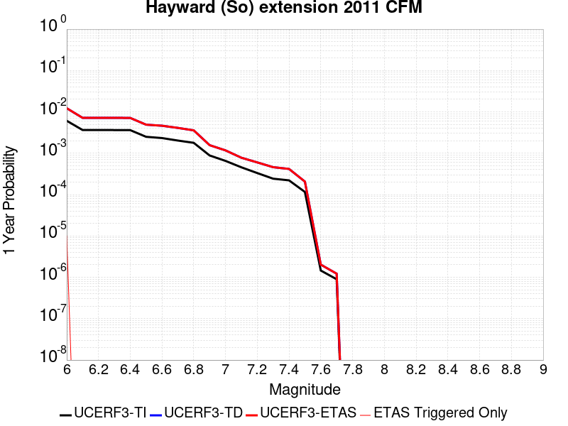 |  |

| Magnitude | 1 wk TI Prob | 1 wk TD Prob | 1 wk ETAS Prob | 1 wk ETAS/TD Gain | 1 wk ETAS Triggered Only | 1 mo TI Prob | 1 mo TD Prob | 1 mo ETAS Prob | 1 mo ETAS/TD Gain | 1 mo ETAS Triggered Only | 1 yr TI Prob | 1 yr TD Prob | 1 yr ETAS Prob | 1 yr ETAS/TD Gain | 1 yr ETAS Triggered Only | 10 yr TI Prob | 10 yr TD Prob | 10 yr ETAS Prob | 10 yr ETAS/TD Gain | 10 yr ETAS Triggered Only |
|-----|-----|-----|-----|-----|-----|-----|-----|-----|-----|-----|-----|-----|-----|-----|-----|-----|-----|-----|-----|-----|
| 6.0 | 1.1721256E-4 | 2.3697627E-4 | 2.3697627E-4 | 1.0 | 0.0 | 5.022428E-4 | 0.0010129517 | 0.0010129517 | 1.0 | 0.0 | 0.0060976758 | 0.012248711 | 0.012248711 | 1.0 | 0.0 | 0.0593305 | 0.112843215 | 0.11286434 | 1.0001872 | 2.3809524E-5 |
| 6.1 | 6.99169E-5 | 1.3822885E-4 | 1.3822885E-4 | 1.0 | 0.0 | 2.9960944E-4 | 5.9128006E-4 | 5.9128006E-4 | 1.0 | 0.0 | 0.0036416445 | 0.0071720886 | 0.0071720886 | 1.0 | 0.0 | 0.035825435 | 0.067803554 | 0.06782575 | 1.0003273 | 2.3809524E-5 |
| 6.2 | 6.99169E-5 | 1.3822885E-4 | 1.3822885E-4 | 1.0 | 0.0 | 2.9960944E-4 | 5.9128006E-4 | 5.9128006E-4 | 1.0 | 0.0 | 0.0036416445 | 0.0071720886 | 0.0071720886 | 1.0 | 0.0 | 0.035825435 | 0.067803554 | 0.06782575 | 1.0003273 | 2.3809524E-5 |
| 6.3 | 6.970908E-5 | 1.379104E-4 | 1.379104E-4 | 1.0 | 0.0 | 2.9871898E-4 | 5.899159E-4 | 5.899159E-4 | 1.0 | 0.0 | 0.0036308395 | 0.007155625 | 0.007155625 | 1.0 | 0.0 | 0.035720866 | 0.067652516 | 0.06767471 | 1.0003282 | 2.3809524E-5 |
| 6.4 | 6.9517155E-5 | 1.375792E-4 | 1.375792E-4 | 1.0 | 0.0 | 2.9789665E-4 | 5.884971E-4 | 5.884971E-4 | 1.0 | 0.0 | 0.0036208609 | 0.0071385372 | 0.0071385372 | 1.0 | 0.0 | 0.03562429 | 0.06749655 | 0.067518756 | 1.0003289 | 2.3809524E-5 |
| 6.5 | 4.786248E-5 | 9.41498E-5 | 9.41498E-5 | 1.0 | 0.0 | 2.0510878E-4 | 4.034394E-4 | 4.034394E-4 | 1.0 | 0.0 | 0.0024943394 | 0.004901227 | 0.004901227 | 1.0 | 0.0 | 0.02466527 | 0.046901822 | 0.046901822 | 1.0 | 0.0 |
| 6.6 | 4.4662214E-5 | 8.881654E-5 | 8.881654E-5 | 1.0 | 0.0 | 1.9139545E-4 | 3.805894E-4 | 3.805894E-4 | 1.0 | 0.0 | 0.0023277493 | 0.0046242937 | 0.0046242937 | 1.0 | 0.0 | 0.02303517 | 0.044293344 | 0.044293344 | 1.0 | 0.0 |
| 6.7 | 3.884542E-5 | 7.8648096E-5 | 7.8648096E-5 | 1.0 | 0.0 | 1.6646975E-4 | 3.370222E-4 | 3.370222E-4 | 1.0 | 0.0 | 0.002024885 | 0.0040959697 | 0.0040959697 | 1.0 | 0.0 | 0.020065336 | 0.039333146 | 0.039333146 | 1.0 | 0.0 |
| 6.8 | 3.4221863E-5 | 6.855653E-5 | 6.855653E-5 | 1.0 | 0.0 | 1.4665688E-4 | 2.93783E-4 | 2.93783E-4 | 1.0 | 0.0 | 0.0017840851 | 0.0035713627 | 0.0035713627 | 1.0 | 0.0 | 0.017698295 | 0.034421004 | 0.034421004 | 1.0 | 0.0 |
| 6.9 | 1.6927712E-5 | 3.0061563E-5 | 3.0061563E-5 | 1.0 | 0.0 | 7.2545314E-5 | 1.2882923E-4 | 1.2882923E-4 | 1.0 | 0.0 | 8.828813E-4 | 0.0015674243 | 0.0015674243 | 1.0 | 0.0 | 0.008793819 | 0.01546327 | 0.01546327 | 1.0 | 0.0 |
| 7.0 | 1.2509653E-5 | 2.2462571E-5 | 2.2462571E-5 | 1.0 | 0.0 | 5.3611697E-5 | 9.6264856E-5 | 9.6264856E-5 | 1.0 | 0.0 | 6.525269E-4 | 0.0011714385 | 0.0011714385 | 1.0 | 0.0 | 0.0065061417 | 0.01158231 | 0.01158231 | 1.0 | 0.0 |
| 7.1 | 8.751583E-6 | 1.4925648E-5 | 1.4925648E-5 | 1.0 | 0.0 | 3.750624E-5 | 6.3965526E-5 | 6.3965526E-5 | 1.0 | 0.0 | 4.5654282E-4 | 7.785079E-4 | 7.785079E-4 | 1.0 | 0.0 | 0.0045560603 | 0.007763496 | 0.007763496 | 1.0 | 0.0 |
| 7.2 | 6.354379E-6 | 1.1498636E-5 | 1.1498636E-5 | 1.0 | 0.0 | 2.7232769E-5 | 4.9278966E-5 | 4.9278966E-5 | 1.0 | 0.0 | 3.3150852E-4 | 5.99811E-4 | 5.99811E-4 | 1.0 | 0.0 | 0.0033101442 | 0.0060003046 | 0.0060003046 | 1.0 | 0.0 |
| 7.3 | 4.645554E-6 | 8.818172E-6 | 8.818172E-6 | 1.0 | 0.0 | 1.9909365E-5 | 3.779164E-5 | 3.779164E-5 | 1.0 | 0.0 | 2.4236954E-4 | 4.6002E-4 | 4.6002E-4 | 1.0 | 0.0 | 0.0024210536 | 0.004610708 | 0.004610708 | 1.0 | 0.0 |
| 7.4 | 4.23437E-6 | 7.992532E-6 | 7.992532E-6 | 1.0 | 0.0 | 1.8147173E-5 | 3.425328E-5 | 3.425328E-5 | 1.0 | 0.0 | 2.2091944E-4 | 4.1695772E-4 | 4.1695772E-4 | 1.0 | 0.0 | 0.0022069993 | 0.004181972 | 0.004181972 | 1.0 | 0.0 |
| 7.5 | 2.2187417E-6 | 3.9522306E-6 | 3.9522306E-6 | 1.0 | 0.0 | 9.508858E-6 | 1.6938036E-5 | 1.6938036E-5 | 1.0 | 0.0 | 1.157642E-4 | 2.0620368E-4 | 2.0620368E-4 | 1.0 | 0.0 | 0.0011570391 | 0.0020734754 | 0.0020734754 | 1.0 | 0.0 |
| 7.6 | 2.7952495E-8 | 3.878529E-8 | 3.878529E-8 | 1.0 | 0.0 | 1.1979641E-7 | 1.6622266E-7 | 1.6622266E-7 | 1.0 | 0.0 | 1.4585203E-6 | 2.0237592E-6 | 2.0237592E-6 | 1.0 | 0.0 | 1.4585107E-5 | 2.0328182E-5 | 2.0328182E-5 | 1.0 | 0.0 |
| 7.7 | 1.7192724E-8 | 2.3436517E-8 | 2.3436517E-8 | 1.0 | 0.0 | 7.36831E-8 | 1.0044221E-7 | 1.0044221E-7 | 1.0 | 0.0 | 8.9709135E-7 | 1.2228833E-6 | 1.2228833E-6 | 1.0 | 0.0 | 8.970877E-6 | 1.2296933E-5 | 1.2296933E-5 | 1.0 | 0.0 |

## Great Valley 08 (Quinto)
*[(top)](#table-of-contents)*

| 1 Week | 1 Month | 1 Year | 10 Year |
|-----|-----|-----|-----|
|  |  |  |  |

| Magnitude | 1 wk TI Prob | 1 wk TD Prob | 1 wk ETAS Prob | 1 wk ETAS/TD Gain | 1 wk ETAS Triggered Only | 1 mo TI Prob | 1 mo TD Prob | 1 mo ETAS Prob | 1 mo ETAS/TD Gain | 1 mo ETAS Triggered Only | 1 yr TI Prob | 1 yr TD Prob | 1 yr ETAS Prob | 1 yr ETAS/TD Gain | 1 yr ETAS Triggered Only | 10 yr TI Prob | 10 yr TD Prob | 10 yr ETAS Prob | 10 yr ETAS/TD Gain | 10 yr ETAS Triggered Only |
|-----|-----|-----|-----|-----|-----|-----|-----|-----|-----|-----|-----|-----|-----|-----|-----|-----|-----|-----|-----|-----|
| 6.0 | 7.737697E-6 | 8.253038E-6 | 3.2062366E-5 | 3.8849168 | 2.3809524E-5 | 3.3161137E-5 | 3.536979E-5 | 5.917847E-5 | 1.6731361 | 2.3809524E-5 | 4.0366207E-4 | 4.3056096E-4 | 4.5436024E-4 | 1.0552751 | 2.3809524E-5 | 0.004029296 | 0.0042991205 | 0.004322828 | 1.0055144 | 2.3809524E-5 |
| 6.1 | 7.737697E-6 | 8.253038E-6 | 3.2062366E-5 | 3.8849168 | 2.3809524E-5 | 3.3161137E-5 | 3.536979E-5 | 5.917847E-5 | 1.6731361 | 2.3809524E-5 | 4.0366207E-4 | 4.3056096E-4 | 4.5436024E-4 | 1.0552751 | 2.3809524E-5 | 0.004029296 | 0.0042991205 | 0.004322828 | 1.0055144 | 2.3809524E-5 |
| 6.2 | 7.737697E-6 | 8.253038E-6 | 3.2062366E-5 | 3.8849168 | 2.3809524E-5 | 3.3161137E-5 | 3.536979E-5 | 5.917847E-5 | 1.6731361 | 2.3809524E-5 | 4.0366207E-4 | 4.3056096E-4 | 4.5436024E-4 | 1.0552751 | 2.3809524E-5 | 0.004029296 | 0.0042991205 | 0.004322828 | 1.0055144 | 2.3809524E-5 |
| 6.3 | 5.374012E-6 | 5.7505736E-6 | 5.7505736E-6 | 1.0 | 0.0 | 2.3031276E-5 | 2.4645145E-5 | 2.4645145E-5 | 1.0 | 0.0 | 2.803697E-4 | 3.0002446E-4 | 3.0002446E-4 | 1.0 | 0.0 | 0.0028001624 | 0.0029972875 | 0.0029972875 | 1.0 | 0.0 |
| 6.4 | 5.374012E-6 | 5.7505736E-6 | 5.7505736E-6 | 1.0 | 0.0 | 2.3031276E-5 | 2.4645145E-5 | 2.4645145E-5 | 1.0 | 0.0 | 2.803697E-4 | 3.0002446E-4 | 3.0002446E-4 | 1.0 | 0.0 | 0.0028001624 | 0.0029972875 | 0.0029972875 | 1.0 | 0.0 |
| 6.5 | 3.65427E-6 | 3.941324E-6 | 3.941324E-6 | 1.0 | 0.0 | 1.5661062E-5 | 1.689132E-5 | 1.689132E-5 | 1.0 | 0.0 | 1.9065675E-4 | 2.0563944E-4 | 2.0563944E-4 | 1.0 | 0.0 | 0.0019049325 | 0.0020551833 | 0.0020551833 | 1.0 | 0.0 |
| 6.6 | 3.6143538E-6 | 3.8985104E-6 | 3.8985104E-6 | 1.0 | 0.0 | 1.5489995E-5 | 1.6707834E-5 | 1.6707834E-5 | 1.0 | 0.0 | 1.8857437E-4 | 2.0340596E-4 | 2.0340596E-4 | 1.0 | 0.0 | 0.0018841444 | 0.0020328893 | 0.0020328893 | 1.0 | 0.0 |
| 6.7 | 2.4821015E-6 | 2.6857067E-6 | 2.6857067E-6 | 1.0 | 0.0 | 1.0637535E-5 | 1.1510153E-5 | 1.1510153E-5 | 1.0 | 0.0 | 1.2950429E-4 | 1.4013276E-4 | 1.4013276E-4 | 1.0 | 0.0 | 0.0012942884 | 0.0014009989 | 0.0014009989 | 1.0 | 0.0 |
| 6.8 | 4.7110538E-7 | 5.193021E-7 | 5.193021E-7 | 1.0 | 0.0 | 2.0190216E-6 | 2.2255786E-6 | 2.2255786E-6 | 1.0 | 0.0 | 2.458131E-5 | 2.70961E-5 | 2.70961E-5 | 1.0 | 0.0 | 2.457859E-4 | 2.7092977E-4 | 2.7092977E-4 | 1.0 | 0.0 |
| 6.9 | 3.958685E-7 | 4.3703452E-7 | 4.3703452E-7 | 1.0 | 0.0 | 1.6965782E-6 | 1.8730038E-6 | 1.8730038E-6 | 1.0 | 0.0 | 2.0655643E-5 | 2.28036E-5 | 2.28036E-5 | 1.0 | 0.0 | 2.0653724E-4 | 2.2801422E-4 | 2.2801422E-4 | 1.0 | 0.0 |
| 7.0 | 2.70294E-7 | 2.9920008E-7 | 2.9920008E-7 | 1.0 | 0.0 | 1.1584025E-6 | 1.2822856E-6 | 1.2822856E-6 | 1.0 | 0.0 | 1.4103458E-5 | 1.5611728E-5 | 1.5611728E-5 | 1.0 | 0.0 | 1.4102564E-4 | 1.5610759E-4 | 1.5610759E-4 | 1.0 | 0.0 |
| 7.1 | 1.4828602E-7 | 1.6469107E-7 | 1.6469107E-7 | 1.0 | 0.0 | 6.3551136E-7 | 7.058187E-7 | 7.058187E-7 | 1.0 | 0.0 | 7.737323E-6 | 8.593317E-6 | 8.593317E-6 | 1.0 | 0.0 | 7.737054E-5 | 8.593065E-5 | 8.593065E-5 | 1.0 | 0.0 |

## Ozena
*[(top)](#table-of-contents)*

| 1 Week | 1 Month | 1 Year | 10 Year |
|-----|-----|-----|-----|
|  |  |  |  |

| Magnitude | 1 wk TI Prob | 1 wk TD Prob | 1 wk ETAS Prob | 1 wk ETAS/TD Gain | 1 wk ETAS Triggered Only | 1 mo TI Prob | 1 mo TD Prob | 1 mo ETAS Prob | 1 mo ETAS/TD Gain | 1 mo ETAS Triggered Only | 1 yr TI Prob | 1 yr TD Prob | 1 yr ETAS Prob | 1 yr ETAS/TD Gain | 1 yr ETAS Triggered Only | 10 yr TI Prob | 10 yr TD Prob | 10 yr ETAS Prob | 10 yr ETAS/TD Gain | 10 yr ETAS Triggered Only |
|-----|-----|-----|-----|-----|-----|-----|-----|-----|-----|-----|-----|-----|-----|-----|-----|-----|-----|-----|-----|-----|
| 6.0 | 1.4377547E-6 | 1.4513782E-6 | 1.4513782E-6 | 1.0 | 0.0 | 6.161791E-6 | 6.2201793E-6 | 6.2201793E-6 | 1.0 | 0.0 | 7.5017226E-5 | 7.572832E-5 | 7.572832E-5 | 1.0 | 0.0 | 7.4991904E-4 | 7.570518E-4 | 7.808433E-4 | 1.0314265 | 2.3809524E-5 |
| 6.1 | 1.4377547E-6 | 1.4513782E-6 | 1.4513782E-6 | 1.0 | 0.0 | 6.161791E-6 | 6.2201793E-6 | 6.2201793E-6 | 1.0 | 0.0 | 7.5017226E-5 | 7.572832E-5 | 7.572832E-5 | 1.0 | 0.0 | 7.4991904E-4 | 7.570518E-4 | 7.808433E-4 | 1.0314265 | 2.3809524E-5 |
| 6.2 | 1.4377547E-6 | 1.4513782E-6 | 1.4513782E-6 | 1.0 | 0.0 | 6.161791E-6 | 6.2201793E-6 | 6.2201793E-6 | 1.0 | 0.0 | 7.5017226E-5 | 7.572832E-5 | 7.572832E-5 | 1.0 | 0.0 | 7.4991904E-4 | 7.570518E-4 | 7.808433E-4 | 1.0314265 | 2.3809524E-5 |
| 6.3 | 1.4377547E-6 | 1.4513782E-6 | 1.4513782E-6 | 1.0 | 0.0 | 6.161791E-6 | 6.2201793E-6 | 6.2201793E-6 | 1.0 | 0.0 | 7.5017226E-5 | 7.572832E-5 | 7.572832E-5 | 1.0 | 0.0 | 7.4991904E-4 | 7.570518E-4 | 7.808433E-4 | 1.0314265 | 2.3809524E-5 |
| 6.4 | 1.4377547E-6 | 1.4513782E-6 | 1.4513782E-6 | 1.0 | 0.0 | 6.161791E-6 | 6.2201793E-6 | 6.2201793E-6 | 1.0 | 0.0 | 7.5017226E-5 | 7.572832E-5 | 7.572832E-5 | 1.0 | 0.0 | 7.4991904E-4 | 7.570518E-4 | 7.808433E-4 | 1.0314265 | 2.3809524E-5 |
| 6.5 | 1.4377547E-6 | 1.4513782E-6 | 1.4513782E-6 | 1.0 | 0.0 | 6.161791E-6 | 6.2201793E-6 | 6.2201793E-6 | 1.0 | 0.0 | 7.5017226E-5 | 7.572832E-5 | 7.572832E-5 | 1.0 | 0.0 | 7.4991904E-4 | 7.570518E-4 | 7.808433E-4 | 1.0314265 | 2.3809524E-5 |
| 6.6 | 1.4377547E-6 | 1.4513782E-6 | 1.4513782E-6 | 1.0 | 0.0 | 6.161791E-6 | 6.2201793E-6 | 6.2201793E-6 | 1.0 | 0.0 | 7.5017226E-5 | 7.572832E-5 | 7.572832E-5 | 1.0 | 0.0 | 7.4991904E-4 | 7.570518E-4 | 7.808433E-4 | 1.0314265 | 2.3809524E-5 |
| 6.7 | 1.4377547E-6 | 1.4513782E-6 | 1.4513782E-6 | 1.0 | 0.0 | 6.161791E-6 | 6.2201793E-6 | 6.2201793E-6 | 1.0 | 0.0 | 7.5017226E-5 | 7.572832E-5 | 7.572832E-5 | 1.0 | 0.0 | 7.4991904E-4 | 7.570518E-4 | 7.808433E-4 | 1.0314265 | 2.3809524E-5 |
| 6.8 | 9.223257E-7 | 9.317624E-7 | 9.317624E-7 | 1.0 | 0.0 | 3.9528186E-6 | 3.9932615E-6 | 3.9932615E-6 | 1.0 | 0.0 | 4.81245E-5 | 4.8616912E-5 | 4.8616912E-5 | 1.0 | 0.0 | 4.811408E-4 | 4.860668E-4 | 5.0986477E-4 | 1.0489602 | 2.3809524E-5 |
| 6.9 | 9.141515E-7 | 9.235371E-7 | 9.235371E-7 | 1.0 | 0.0 | 3.917786E-6 | 3.9580104E-6 | 3.9580104E-6 | 1.0 | 0.0 | 4.7698002E-5 | 4.818775E-5 | 4.818775E-5 | 1.0 | 0.0 | 4.7687767E-4 | 4.8177704E-4 | 5.055751E-4 | 1.0493964 | 2.3809524E-5 |
| 7.0 | 8.767648E-7 | 8.8585773E-7 | 8.8585773E-7 | 1.0 | 0.0 | 3.757558E-6 | 3.7965276E-6 | 3.7965276E-6 | 1.0 | 0.0 | 4.5747307E-5 | 4.6221783E-5 | 4.6221783E-5 | 1.0 | 0.0 | 4.5737892E-4 | 4.6212564E-4 | 4.8592416E-4 | 1.0514979 | 2.3809524E-5 |
| 7.1 | 8.199402E-7 | 8.2853984E-7 | 8.2853984E-7 | 1.0 | 0.0 | 3.5140247E-6 | 3.5508804E-6 | 3.5508804E-6 | 1.0 | 0.0 | 4.2782412E-5 | 4.323115E-5 | 4.323115E-5 | 1.0 | 0.0 | 4.2774176E-4 | 4.322311E-4 | 4.5603036E-4 | 1.0550613 | 2.3809524E-5 |
| 7.2 | 7.38705E-7 | 7.464262E-7 | 7.464262E-7 | 1.0 | 0.0 | 3.1658747E-6 | 3.198966E-6 | 3.198966E-6 | 1.0 | 0.0 | 3.8543843E-5 | 3.894675E-5 | 3.894675E-5 | 1.0 | 0.0 | 3.853716E-4 | 3.8940276E-4 | 4.13203E-4 | 1.0611199 | 2.3809524E-5 |
| 7.3 | 6.490017E-7 | 6.557802E-7 | 6.557802E-7 | 1.0 | 0.0 | 2.7814328E-6 | 2.8104837E-6 | 2.8104837E-6 | 1.0 | 0.0 | 3.386342E-5 | 3.4217133E-5 | 3.4217133E-5 | 1.0 | 0.0 | 3.3858258E-4 | 3.4212202E-4 | 3.6592342E-4 | 1.0695698 | 2.3809524E-5 |
| 7.4 | 5.346736E-7 | 5.4022604E-7 | 5.4022604E-7 | 1.0 | 0.0 | 2.291456E-6 | 2.3152527E-6 | 2.3152527E-6 | 1.0 | 0.0 | 2.789812E-5 | 2.8187867E-5 | 2.8187867E-5 | 1.0 | 0.0 | 2.789462E-4 | 2.8184598E-4 | 3.0564878E-4 | 1.0844532 | 2.3809524E-5 |
| 7.5 | 2.939325E-7 | 2.9666057E-7 | 2.9666057E-7 | 1.0 | 0.0 | 1.25971E-6 | 1.271402E-6 | 1.271402E-6 | 1.0 | 0.0 | 1.5336862E-5 | 1.5479225E-5 | 1.5479225E-5 | 1.0 | 0.0 | 1.5335804E-4 | 1.5478309E-4 | 1.5478309E-4 | 1.0 | 0.0 |
| 7.6 | 1.4151905E-7 | 1.4253266E-7 | 1.4253266E-7 | 1.0 | 0.0 | 6.065101E-7 | 6.108541E-7 | 6.108541E-7 | 1.0 | 0.0 | 7.3842357E-6 | 7.4371237E-6 | 7.4371237E-6 | 1.0 | 0.0 | 7.38399E-5 | 7.436883E-5 | 7.436883E-5 | 1.0 | 0.0 |
| 7.7 | 4.4957577E-8 | 4.5252243E-8 | 4.5252243E-8 | 1.0 | 0.0 | 1.9267533E-7 | 1.9393818E-7 | 1.9393818E-7 | 1.0 | 0.0 | 2.3458194E-6 | 2.3611947E-6 | 2.3611947E-6 | 1.0 | 0.0 | 2.3457947E-5 | 2.3611707E-5 | 2.3611707E-5 | 1.0 | 0.0 |
| 7.8 | 5.9993255E-9 | 6.0412972E-9 | 6.0412972E-9 | 1.0 | 0.0 | 2.5711394E-8 | 2.5891273E-8 | 2.5891273E-8 | 1.0 | 0.0 | 3.1303617E-7 | 3.1522623E-7 | 3.1522623E-7 | 1.0 | 0.0 | 3.1303573E-6 | 3.1522588E-6 | 3.1522588E-6 | 1.0 | 0.0 |

## Great Valley 10 (Panoche)
*[(top)](#table-of-contents)*

| 1 Week | 1 Month | 1 Year | 10 Year |
|-----|-----|-----|-----|
|  |  | 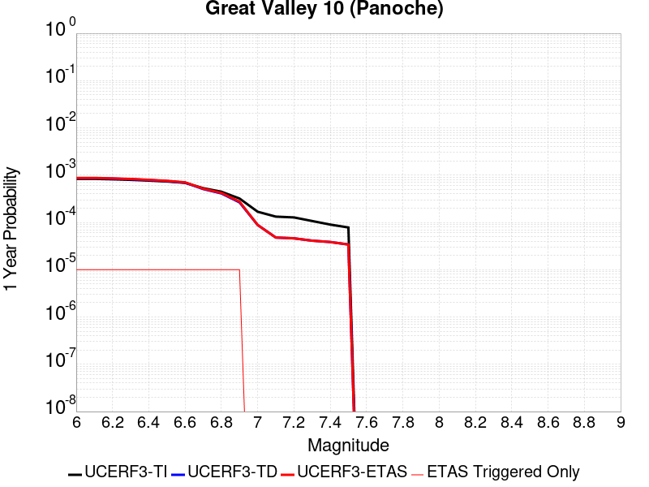 | 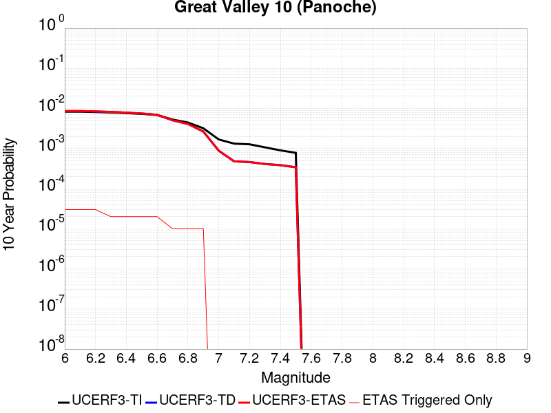 |

| Magnitude | 1 wk TI Prob | 1 wk TD Prob | 1 wk ETAS Prob | 1 wk ETAS/TD Gain | 1 wk ETAS Triggered Only | 1 mo TI Prob | 1 mo TD Prob | 1 mo ETAS Prob | 1 mo ETAS/TD Gain | 1 mo ETAS Triggered Only | 1 yr TI Prob | 1 yr TD Prob | 1 yr ETAS Prob | 1 yr ETAS/TD Gain | 1 yr ETAS Triggered Only | 10 yr TI Prob | 10 yr TD Prob | 10 yr ETAS Prob | 10 yr ETAS/TD Gain | 10 yr ETAS Triggered Only |
|-----|-----|-----|-----|-----|-----|-----|-----|-----|-----|-----|-----|-----|-----|-----|-----|-----|-----|-----|-----|-----|
| 6.0 | 1.6014626E-5 | 1.6575399E-5 | 1.6575399E-5 | 1.0 | 0.0 | 6.863231E-5 | 7.103552E-5 | 7.103552E-5 | 1.0 | 0.0 | 8.35278E-4 | 8.645185E-4 | 8.645185E-4 | 1.0 | 0.0 | 0.008321454 | 0.008612172 | 0.008635776 | 1.0027409 | 2.3809524E-5 |
| 6.1 | 1.6014626E-5 | 1.6575399E-5 | 1.6575399E-5 | 1.0 | 0.0 | 6.863231E-5 | 7.103552E-5 | 7.103552E-5 | 1.0 | 0.0 | 8.35278E-4 | 8.645185E-4 | 8.645185E-4 | 1.0 | 0.0 | 0.008321454 | 0.008612172 | 0.008635776 | 1.0027409 | 2.3809524E-5 |
| 6.2 | 1.56782E-5 | 1.6198446E-5 | 1.6198446E-5 | 1.0 | 0.0 | 6.719056E-5 | 6.94201E-5 | 6.94201E-5 | 1.0 | 0.0 | 8.17738E-4 | 8.4486604E-4 | 8.4486604E-4 | 1.0 | 0.0 | 0.008147354 | 0.008417147 | 0.008440756 | 1.0028049 | 2.3809524E-5 |
| 6.3 | 1.5263338E-5 | 1.5723514E-5 | 1.5723514E-5 | 1.0 | 0.0 | 6.541267E-5 | 6.738478E-5 | 6.738478E-5 | 1.0 | 0.0 | 7.961082E-4 | 8.201049E-4 | 8.201049E-4 | 1.0 | 0.0 | 0.007932622 | 0.008171377 | 0.008171377 | 1.0 | 0.0 |
| 6.4 | 1.4720723E-5 | 1.5099376E-5 | 1.5099376E-5 | 1.0 | 0.0 | 6.308728E-5 | 6.471004E-5 | 6.471004E-5 | 1.0 | 0.0 | 7.67817E-4 | 7.8756385E-4 | 7.8756385E-4 | 1.0 | 0.0 | 0.007651695 | 0.007848303 | 0.007848303 | 1.0 | 0.0 |
| 6.5 | 1.408264E-5 | 1.4355969E-5 | 1.4355969E-5 | 1.0 | 0.0 | 6.0352773E-5 | 6.1524166E-5 | 6.1524166E-5 | 1.0 | 0.0 | 7.3454727E-4 | 7.488031E-4 | 7.488031E-4 | 1.0 | 0.0 | 0.0073212404 | 0.0074633555 | 0.0074633555 | 1.0 | 0.0 |
| 6.6 | 1.3197086E-5 | 1.3321889E-5 | 1.3321889E-5 | 1.0 | 0.0 | 5.6557717E-5 | 5.709259E-5 | 5.709259E-5 | 1.0 | 0.0 | 6.8837265E-4 | 6.9488434E-4 | 6.9488434E-4 | 1.0 | 0.0 | 0.006862442 | 0.0069276537 | 0.0069276537 | 1.0 | 0.0 |
| 6.7 | 1.017583E-5 | 9.745382E-6 | 9.745382E-6 | 1.0 | 0.0 | 4.360997E-5 | 4.176527E-5 | 4.176527E-5 | 1.0 | 0.0 | 5.30822E-4 | 5.0837593E-4 | 5.0837593E-4 | 1.0 | 0.0 | 0.0052955584 | 0.005072382 | 0.005072382 | 1.0 | 0.0 |
| 6.8 | 8.557912E-6 | 7.872707E-6 | 7.872707E-6 | 1.0 | 0.0 | 3.667625E-5 | 3.373975E-5 | 3.373975E-5 | 1.0 | 0.0 | 4.4644187E-4 | 4.1070607E-4 | 4.1070607E-4 | 1.0 | 0.0 | 0.0044554602 | 0.004099677 | 0.004099677 | 1.0 | 0.0 |
| 6.9 | 6.14664E-6 | 5.092071E-6 | 5.092071E-6 | 1.0 | 0.0 | 2.6342475E-5 | 2.1822989E-5 | 2.1822989E-5 | 1.0 | 0.0 | 3.2067244E-4 | 2.6566387E-4 | 2.6566387E-4 | 1.0 | 0.0 | 0.003202101 | 0.002653601 | 0.002653601 | 1.0 | 0.0 |
| 7.0 | 3.2310581E-6 | 1.6951219E-6 | 1.6951219E-6 | 1.0 | 0.0 | 1.3847319E-5 | 7.264788E-6 | 7.264788E-6 | 1.0 | 0.0 | 1.6857806E-4 | 8.8445304E-5 | 8.8445304E-5 | 1.0 | 0.0 | 0.0016845023 | 8.841104E-4 | 8.841104E-4 | 1.0 | 0.0 |
| 7.1 | 2.544492E-6 | 9.1889206E-7 | 9.1889206E-7 | 1.0 | 0.0 | 1.090492E-5 | 3.938103E-6 | 3.938103E-6 | 1.0 | 0.0 | 1.327593E-4 | 4.79454E-5 | 4.79454E-5 | 1.0 | 0.0 | 0.0013268003 | 4.793553E-4 | 4.793553E-4 | 1.0 | 0.0 |
| 7.2 | 2.4479045E-6 | 8.841304E-7 | 8.841304E-7 | 1.0 | 0.0 | 1.0490977E-5 | 3.789125E-6 | 3.789125E-6 | 1.0 | 0.0 | 1.2772017E-4 | 4.6131667E-5 | 4.6131667E-5 | 1.0 | 0.0 | 0.0012764678 | 4.6122566E-4 | 4.6122566E-4 | 1.0 | 0.0 |
| 7.3 | 2.0559578E-6 | 7.892787E-7 | 7.892787E-7 | 1.0 | 0.0 | 8.811218E-6 | 3.3826188E-6 | 3.3826188E-6 | 1.0 | 0.0 | 1.072713E-4 | 4.1182655E-5 | 4.1182655E-5 | 1.0 | 0.0 | 0.0010721954 | 4.1175485E-4 | 4.1175485E-4 | 1.0 | 0.0 |
| 7.4 | 1.727687E-6 | 7.387757E-7 | 7.387757E-7 | 1.0 | 0.0 | 7.404352E-6 | 3.1661782E-6 | 3.1661782E-6 | 1.0 | 0.0 | 9.0144255E-5 | 3.8547583E-5 | 3.8547583E-5 | 1.0 | 0.0 | 9.0107694E-4 | 3.854136E-4 | 3.854136E-4 | 1.0 | 0.0 |
| 7.5 | 1.5002679E-6 | 6.546144E-7 | 6.546144E-7 | 1.0 | 0.0 | 6.4297037E-6 | 2.8054874E-6 | 2.8054874E-6 | 1.0 | 0.0 | 7.827883E-5 | 3.4156317E-5 | 3.4156317E-5 | 1.0 | 0.0 | 7.825126E-4 | 3.4151482E-4 | 3.4151482E-4 | 1.0 | 0.0 |

## Earthquake Valley (No  Extension)
*[(top)](#table-of-contents)*

| 1 Week | 1 Month | 1 Year | 10 Year |
|-----|-----|-----|-----|
| 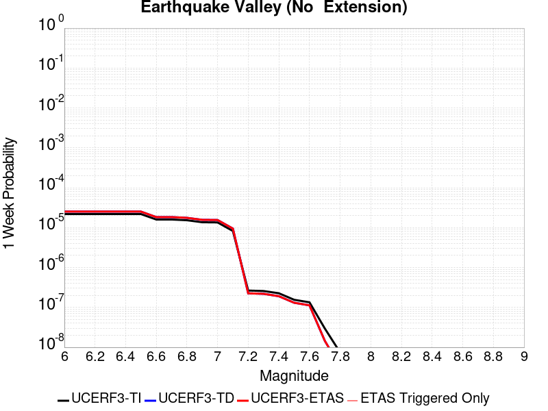 |  |  |  |

| Magnitude | 1 wk TI Prob | 1 wk TD Prob | 1 wk ETAS Prob | 1 wk ETAS/TD Gain | 1 wk ETAS Triggered Only | 1 mo TI Prob | 1 mo TD Prob | 1 mo ETAS Prob | 1 mo ETAS/TD Gain | 1 mo ETAS Triggered Only | 1 yr TI Prob | 1 yr TD Prob | 1 yr ETAS Prob | 1 yr ETAS/TD Gain | 1 yr ETAS Triggered Only | 10 yr TI Prob | 10 yr TD Prob | 10 yr ETAS Prob | 10 yr ETAS/TD Gain | 10 yr ETAS Triggered Only |
|-----|-----|-----|-----|-----|-----|-----|-----|-----|-----|-----|-----|-----|-----|-----|-----|-----|-----|-----|-----|-----|
| 6.0 | 2.1859703E-5 | 2.5198362E-5 | 2.5198362E-5 | 1.0 | 0.0 | 9.3681076E-5 | 1.07989326E-4 | 1.07989326E-4 | 1.0 | 0.0 | 0.0011399703 | 0.001314122 | 0.0013379003 | 1.0180944 | 2.3809524E-5 | 0.011341401 | 0.013077871 | 0.013101369 | 1.0017968 | 2.3809524E-5 |
| 6.1 | 2.1859703E-5 | 2.5198362E-5 | 2.5198362E-5 | 1.0 | 0.0 | 9.3681076E-5 | 1.07989326E-4 | 1.07989326E-4 | 1.0 | 0.0 | 0.0011399703 | 0.001314122 | 0.0013379003 | 1.0180944 | 2.3809524E-5 | 0.011341401 | 0.013077871 | 0.013101369 | 1.0017968 | 2.3809524E-5 |
| 6.2 | 2.1859703E-5 | 2.5198362E-5 | 2.5198362E-5 | 1.0 | 0.0 | 9.3681076E-5 | 1.07989326E-4 | 1.07989326E-4 | 1.0 | 0.0 | 0.0011399703 | 0.001314122 | 0.0013379003 | 1.0180944 | 2.3809524E-5 | 0.011341401 | 0.013077871 | 0.013101369 | 1.0017968 | 2.3809524E-5 |
| 6.3 | 2.1859703E-5 | 2.5198362E-5 | 2.5198362E-5 | 1.0 | 0.0 | 9.3681076E-5 | 1.07989326E-4 | 1.07989326E-4 | 1.0 | 0.0 | 0.0011399703 | 0.001314122 | 0.0013379003 | 1.0180944 | 2.3809524E-5 | 0.011341401 | 0.013077871 | 0.013101369 | 1.0017968 | 2.3809524E-5 |
| 6.4 | 2.1859703E-5 | 2.5198362E-5 | 2.5198362E-5 | 1.0 | 0.0 | 9.3681076E-5 | 1.07989326E-4 | 1.07989326E-4 | 1.0 | 0.0 | 0.0011399703 | 0.001314122 | 0.0013379003 | 1.0180944 | 2.3809524E-5 | 0.011341401 | 0.013077871 | 0.013101369 | 1.0017968 | 2.3809524E-5 |
| 6.5 | 2.1859703E-5 | 2.5198362E-5 | 2.5198362E-5 | 1.0 | 0.0 | 9.3681076E-5 | 1.07989326E-4 | 1.07989326E-4 | 1.0 | 0.0 | 0.0011399703 | 0.001314122 | 0.0013379003 | 1.0180944 | 2.3809524E-5 | 0.011341401 | 0.013077871 | 0.013101369 | 1.0017968 | 2.3809524E-5 |
| 6.6 | 1.597E-5 | 1.8356275E-5 | 1.8356275E-5 | 1.0 | 0.0 | 6.8441055E-5 | 7.866787E-5 | 7.866787E-5 | 1.0 | 0.0 | 8.329513E-4 | 9.574478E-4 | 9.812345E-4 | 1.0248439 | 2.3809524E-5 | 0.008298361 | 0.009541836 | 0.009565419 | 1.0024714 | 2.3809524E-5 |
| 6.7 | 1.597E-5 | 1.8356275E-5 | 1.8356275E-5 | 1.0 | 0.0 | 6.8441055E-5 | 7.866787E-5 | 7.866787E-5 | 1.0 | 0.0 | 8.329513E-4 | 9.574478E-4 | 9.812345E-4 | 1.0248439 | 2.3809524E-5 | 0.008298361 | 0.009541836 | 0.009565419 | 1.0024714 | 2.3809524E-5 |
| 6.8 | 1.5315149E-5 | 1.7602091E-5 | 1.7602091E-5 | 1.0 | 0.0 | 6.5634704E-5 | 7.543584E-5 | 7.543584E-5 | 1.0 | 0.0 | 7.988095E-4 | 9.181311E-4 | 9.4191876E-4 | 1.0259088 | 2.3809524E-5 | 0.007959441 | 0.009151919 | 0.00917551 | 1.0025778 | 2.3809524E-5 |
| 6.9 | 1.3634728E-5 | 1.5675821E-5 | 1.5675821E-5 | 1.0 | 0.0 | 5.8433237E-5 | 6.718082E-5 | 6.718082E-5 | 1.0 | 0.0 | 7.1119244E-4 | 8.177017E-4 | 8.4149174E-4 | 1.0290939 | 2.3809524E-5 | 0.007089207 | 0.008155 | 0.008178616 | 1.0028958 | 2.3809524E-5 |
| 7.0 | 1.3496271E-5 | 1.5517853E-5 | 1.5517853E-5 | 1.0 | 0.0 | 5.783988E-5 | 6.650385E-5 | 6.650385E-5 | 1.0 | 0.0 | 7.03973E-4 | 8.094657E-4 | 8.3325594E-4 | 1.0293901 | 2.3809524E-5 | 0.007017471 | 0.0080732405 | 0.008096858 | 1.0029254 | 2.3809524E-5 |
| 7.1 | 8.242798E-6 | 9.4726E-6 | 9.4726E-6 | 1.0 | 0.0 | 3.53258E-5 | 4.0596606E-5 | 4.0596606E-5 | 1.0 | 0.0 | 4.300067E-4 | 4.9421866E-4 | 4.9421866E-4 | 1.0 | 0.0 | 0.004291756 | 0.0049377717 | 0.0049377717 | 1.0 | 0.0 |
| 7.2 | 2.6506527E-7 | 2.2560312E-7 | 2.2560312E-7 | 1.0 | 0.0 | 1.1359936E-6 | 9.668702E-7 | 9.668702E-7 | 1.0 | 0.0 | 1.3830633E-5 | 1.17715845E-5 | 1.17715845E-5 | 1.0 | 0.0 | 1.3829772E-4 | 1.1771003E-4 | 1.1771003E-4 | 1.0 | 0.0 |
| 7.3 | 2.5810488E-7 | 2.1955442E-7 | 2.1955442E-7 | 1.0 | 0.0 | 1.1061633E-6 | 9.409472E-7 | 9.409472E-7 | 1.0 | 0.0 | 1.3467455E-5 | 1.1455976E-5 | 1.1455976E-5 | 1.0 | 0.0 | 1.3466639E-4 | 1.1455427E-4 | 1.1455427E-4 | 1.0 | 0.0 |
| 7.4 | 2.2676066E-7 | 1.9110601E-7 | 1.9110601E-7 | 1.0 | 0.0 | 9.71831E-7 | 8.190255E-7 | 8.190255E-7 | 1.0 | 0.0 | 1.1831979E-5 | 9.9715935E-6 | 9.9715935E-6 | 1.0 | 0.0 | 1.1831349E-4 | 9.9711855E-5 | 9.9711855E-5 | 1.0 | 0.0 |
| 7.5 | 1.5553917E-7 | 1.3112096E-7 | 1.3112096E-7 | 1.0 | 0.0 | 6.6659624E-7 | 5.619469E-7 | 5.619469E-7 | 1.0 | 0.0 | 8.115779E-6 | 6.8416834E-6 | 6.8416834E-6 | 1.0 | 0.0 | 8.115482E-5 | 6.841495E-5 | 6.841495E-5 | 1.0 | 0.0 |
| 7.6 | 1.3448629E-7 | 1.1288419E-7 | 1.1288419E-7 | 1.0 | 0.0 | 5.7636964E-7 | 4.837893E-7 | 4.837893E-7 | 1.0 | 0.0 | 7.017278E-6 | 5.890121E-6 | 5.890121E-6 | 1.0 | 0.0 | 7.0170565E-5 | 5.889986E-5 | 5.889986E-5 | 1.0 | 0.0 |
| 7.7 | 2.9719402E-8 | 1.458206E-8 | 1.458206E-8 | 1.0 | 0.0 | 1.2736886E-7 | 6.249454E-8 | 6.249454E-8 | 1.0 | 0.0 | 1.5507147E-6 | 7.608708E-7 | 7.608708E-7 | 1.0 | 0.0 | 1.550704E-5 | 7.6086876E-6 | 7.6086876E-6 | 1.0 | 0.0 |
| 7.8 | 7.4390196E-9 | 3.2502152E-9 | 3.2502152E-9 | 1.0 | 0.0 | 3.1881513E-8 | 1.3929493E-8 | 1.3929493E-8 | 1.0 | 0.0 | 3.8815733E-7 | 1.6959156E-7 | 1.6959156E-7 | 1.0 | 0.0 | 3.8815665E-6 | 1.6959145E-6 | 1.6959145E-6 | 1.0 | 0.0 |
| 7.9 | 1.5373532E-9 | 8.440161E-10 | 8.440161E-10 | 1.0 | 0.0 | 6.5886567E-9 | 3.6172119E-9 | 3.6172119E-9 | 1.0 | 0.0 | 8.021689E-8 | 4.4039556E-8 | 4.4039556E-8 | 1.0 | 0.0 | 8.0216864E-7 | 4.4039552E-7 | 4.4039552E-7 | 1.0 | 0.0 |

## Reliz 2011 CFM
*[(top)](#table-of-contents)*

| 1 Week | 1 Month | 1 Year | 10 Year |
|-----|-----|-----|-----|
|  |  |  |  |

| Magnitude | 1 wk TI Prob | 1 wk TD Prob | 1 wk ETAS Prob | 1 wk ETAS/TD Gain | 1 wk ETAS Triggered Only | 1 mo TI Prob | 1 mo TD Prob | 1 mo ETAS Prob | 1 mo ETAS/TD Gain | 1 mo ETAS Triggered Only | 1 yr TI Prob | 1 yr TD Prob | 1 yr ETAS Prob | 1 yr ETAS/TD Gain | 1 yr ETAS Triggered Only | 10 yr TI Prob | 10 yr TD Prob | 10 yr ETAS Prob | 10 yr ETAS/TD Gain | 10 yr ETAS Triggered Only |
|-----|-----|-----|-----|-----|-----|-----|-----|-----|-----|-----|-----|-----|-----|-----|-----|-----|-----|-----|-----|-----|
| 6.0 | 1.6002472E-5 | 1.6282804E-5 | 1.6282804E-5 | 1.0 | 0.0 | 6.8580215E-5 | 6.9781694E-5 | 9.358955E-5 | 1.3411764 | 2.3809524E-5 | 8.3464425E-4 | 8.4928074E-4 | 8.7307004E-4 | 1.0280111 | 2.3809524E-5 | 0.008315164 | 0.008462547 | 0.008486155 | 1.0027897 | 2.3809524E-5 |
| 6.1 | 1.6002472E-5 | 1.6282804E-5 | 1.6282804E-5 | 1.0 | 0.0 | 6.8580215E-5 | 6.9781694E-5 | 9.358955E-5 | 1.3411764 | 2.3809524E-5 | 8.3464425E-4 | 8.4928074E-4 | 8.7307004E-4 | 1.0280111 | 2.3809524E-5 | 0.008315164 | 0.008462547 | 0.008486155 | 1.0027897 | 2.3809524E-5 |
| 6.2 | 1.6002472E-5 | 1.6282804E-5 | 1.6282804E-5 | 1.0 | 0.0 | 6.8580215E-5 | 6.9781694E-5 | 9.358955E-5 | 1.3411764 | 2.3809524E-5 | 8.3464425E-4 | 8.4928074E-4 | 8.7307004E-4 | 1.0280111 | 2.3809524E-5 | 0.008315164 | 0.008462547 | 0.008486155 | 1.0027897 | 2.3809524E-5 |
| 6.3 | 7.792404E-6 | 7.803802E-6 | 7.803802E-6 | 1.0 | 0.0 | 3.339559E-5 | 3.344444E-5 | 3.344444E-5 | 1.0 | 0.0 | 4.0651546E-4 | 4.0711078E-4 | 4.0711078E-4 | 1.0 | 0.0 | 0.0040577264 | 0.004063926 | 0.004063926 | 1.0 | 0.0 |
| 6.4 | 7.792404E-6 | 7.803802E-6 | 7.803802E-6 | 1.0 | 0.0 | 3.339559E-5 | 3.344444E-5 | 3.344444E-5 | 1.0 | 0.0 | 4.0651546E-4 | 4.0711078E-4 | 4.0711078E-4 | 1.0 | 0.0 | 0.0040577264 | 0.004063926 | 0.004063926 | 1.0 | 0.0 |
| 6.5 | 5.9659374E-6 | 5.928738E-6 | 5.928738E-6 | 1.0 | 0.0 | 2.5568053E-5 | 2.5408632E-5 | 2.5408632E-5 | 1.0 | 0.0 | 3.1124658E-4 | 3.093064E-4 | 3.093064E-4 | 1.0 | 0.0 | 0.00310811 | 0.0030889767 | 0.0030889767 | 1.0 | 0.0 |
| 6.6 | 5.2350692E-6 | 5.178986E-6 | 5.178986E-6 | 1.0 | 0.0 | 2.2435817E-5 | 2.2195467E-5 | 2.2195467E-5 | 1.0 | 0.0 | 2.7312184E-4 | 2.7019644E-4 | 2.7019644E-4 | 1.0 | 0.0 | 0.002727864 | 0.0026988892 | 0.0026988892 | 1.0 | 0.0 |
| 6.7 | 4.580206E-6 | 4.5061206E-6 | 4.5061206E-6 | 1.0 | 0.0 | 1.9629308E-5 | 1.9311801E-5 | 1.9311801E-5 | 1.0 | 0.0 | 2.389606E-4 | 2.350959E-4 | 2.350959E-4 | 1.0 | 0.0 | 0.002387038 | 0.0023486738 | 0.0023486738 | 1.0 | 0.0 |
| 6.8 | 4.0765017E-6 | 3.9882384E-6 | 3.9882384E-6 | 1.0 | 0.0 | 1.7470604E-5 | 1.7092338E-5 | 1.7092338E-5 | 1.0 | 0.0 | 2.1268385E-4 | 2.0807938E-4 | 2.0807938E-4 | 1.0 | 0.0 | 0.002124804 | 0.0020790435 | 0.0020790435 | 1.0 | 0.0 |
| 6.9 | 3.5752896E-6 | 3.4725176E-6 | 3.4725176E-6 | 1.0 | 0.0 | 1.532258E-5 | 1.4882134E-5 | 1.4882134E-5 | 1.0 | 0.0 | 1.8653645E-4 | 1.8117494E-4 | 1.8117494E-4 | 1.0 | 0.0 | 0.0018637994 | 0.0018104686 | 0.0018104686 | 1.0 | 0.0 |
| 7.0 | 3.0259848E-6 | 2.9079417E-6 | 2.9079417E-6 | 1.0 | 0.0 | 1.2968442E-5 | 1.2462548E-5 | 1.2462548E-5 | 1.0 | 0.0 | 1.5787935E-4 | 1.5172097E-4 | 1.5172097E-4 | 1.0 | 0.0 | 0.0015776722 | 0.001516369 | 0.001516369 | 1.0 | 0.0 |
| 7.1 | 2.5861116E-6 | 2.455167E-6 | 2.455167E-6 | 1.0 | 0.0 | 1.1083288E-5 | 1.05221025E-5 | 1.05221025E-5 | 1.0 | 0.0 | 1.3493067E-4 | 1.2809907E-4 | 1.2809907E-4 | 1.0 | 0.0 | 0.0013484878 | 0.001280447 | 0.001280447 | 1.0 | 0.0 |
| 7.2 | 2.1482588E-6 | 2.003237E-6 | 2.003237E-6 | 1.0 | 0.0 | 9.20679E-6 | 8.585273E-6 | 8.585273E-6 | 1.0 | 0.0 | 1.12086906E-4 | 1.0452068E-4 | 1.0452068E-4 | 1.0 | 0.0 | 0.0011203039 | 0.0010449095 | 0.0010449095 | 1.0 | 0.0 |
| 7.3 | 1.7194744E-6 | 1.5611241E-6 | 1.5611241E-6 | 1.0 | 0.0 | 7.3691554E-6 | 6.690515E-6 | 6.690515E-6 | 1.0 | 0.0 | 8.971577E-5 | 8.1453974E-5 | 8.1453974E-5 | 1.0 | 0.0 | 8.967956E-4 | 8.1443513E-4 | 8.1443513E-4 | 1.0 | 0.0 |
| 7.4 | 1.2755178E-6 | 1.10563E-6 | 1.10563E-6 | 1.0 | 0.0 | 5.4664933E-6 | 4.7384056E-6 | 4.7384056E-6 | 1.0 | 0.0 | 6.655252E-5 | 5.768856E-5 | 5.768856E-5 | 1.0 | 0.0 | 6.6532596E-4 | 5.7692965E-4 | 5.7692965E-4 | 1.0 | 0.0 |
| 7.5 | 8.8463224E-7 | 7.0580273E-7 | 7.0580273E-7 | 1.0 | 0.0 | 3.7912755E-6 | 3.0248652E-6 | 3.0248652E-6 | 1.0 | 0.0 | 4.6157802E-5 | 3.6827114E-5 | 3.6827114E-5 | 1.0 | 0.0 | 4.6148215E-4 | 3.684038E-4 | 3.684038E-4 | 1.0 | 0.0 |
| 7.6 | 5.291355E-7 | 3.500777E-7 | 3.500777E-7 | 1.0 | 0.0 | 2.2677216E-6 | 1.5003321E-6 | 1.5003321E-6 | 1.0 | 0.0 | 2.760916E-5 | 1.8266392E-5 | 1.8266392E-5 | 1.0 | 0.0 | 2.760573E-4 | 1.8284164E-4 | 1.8284164E-4 | 1.0 | 0.0 |
| 7.7 | 2.9663357E-7 | 1.351113E-7 | 1.351113E-7 | 1.0 | 0.0 | 1.2712861E-6 | 5.7904833E-7 | 5.7904833E-7 | 1.0 | 0.0 | 1.5477797E-5 | 7.049891E-6 | 7.049891E-6 | 1.0 | 0.0 | 1.547672E-4 | 7.068132E-5 | 7.068132E-5 | 1.0 | 0.0 |
| 7.8 | 1.2509386E-7 | 2.7157126E-8 | 2.7157126E-8 | 1.0 | 0.0 | 5.3611643E-7 | 1.1638769E-7 | 1.1638769E-7 | 1.0 | 0.0 | 6.527198E-6 | 1.4170191E-6 | 1.4170191E-6 | 1.0 | 0.0 | 6.527006E-5 | 1.4326506E-5 | 1.4326506E-5 | 1.0 | 0.0 |
| 7.9 | 6.213493E-8 | 1.1482114E-8 | 1.1482114E-8 | 1.0 | 0.0 | 2.6629255E-7 | 4.920906E-8 | 4.920906E-8 | 1.0 | 0.0 | 3.242107E-6 | 5.9912014E-7 | 5.9912014E-7 | 1.0 | 0.0 | 3.2420594E-5 | 6.1224223E-6 | 6.1224223E-6 | 1.0 | 0.0 |
| 8.0 | 5.92383E-9 | 1.677887E-9 | 1.677887E-9 | 1.0 | 0.0 | 2.5387841E-8 | 7.190944E-9 | 7.190944E-9 | 1.0 | 0.0 | 3.0909692E-7 | 8.754974E-8 | 8.754974E-8 | 1.0 | 0.0 | 3.090965E-6 | 9.003061E-7 | 9.003061E-7 | 1.0 | 0.0 |

## Peralta Hills
*[(top)](#table-of-contents)*

| 1 Week | 1 Month | 1 Year | 10 Year |
|-----|-----|-----|-----|
|  |  |  |  |

| Magnitude | 1 wk TI Prob | 1 wk TD Prob | 1 wk ETAS Prob | 1 wk ETAS/TD Gain | 1 wk ETAS Triggered Only | 1 mo TI Prob | 1 mo TD Prob | 1 mo ETAS Prob | 1 mo ETAS/TD Gain | 1 mo ETAS Triggered Only | 1 yr TI Prob | 1 yr TD Prob | 1 yr ETAS Prob | 1 yr ETAS/TD Gain | 1 yr ETAS Triggered Only | 10 yr TI Prob | 10 yr TD Prob | 10 yr ETAS Prob | 10 yr ETAS/TD Gain | 10 yr ETAS Triggered Only |
|-----|-----|-----|-----|-----|-----|-----|-----|-----|-----|-----|-----|-----|-----|-----|-----|-----|-----|-----|-----|-----|
| 6.0 | 3.8850067E-6 | 3.839512E-6 | 3.839512E-6 | 1.0 | 0.0 | 1.6649923E-5 | 1.645499E-5 | 4.026412E-5 | 2.446925 | 2.3809524E-5 | 2.0269395E-4 | 2.0032849E-4 | 2.2413324E-4 | 1.1188287 | 2.3809524E-5 | 0.0020250916 | 0.0020022066 | 0.0020259686 | 1.0118679 | 2.3809524E-5 |
| 6.1 | 3.8850067E-6 | 3.839512E-6 | 3.839512E-6 | 1.0 | 0.0 | 1.6649923E-5 | 1.645499E-5 | 4.026412E-5 | 2.446925 | 2.3809524E-5 | 2.0269395E-4 | 2.0032849E-4 | 2.2413324E-4 | 1.1188287 | 2.3809524E-5 | 0.0020250916 | 0.0020022066 | 0.0020259686 | 1.0118679 | 2.3809524E-5 |
| 6.2 | 3.8850067E-6 | 3.839512E-6 | 3.839512E-6 | 1.0 | 0.0 | 1.6649923E-5 | 1.645499E-5 | 4.026412E-5 | 2.446925 | 2.3809524E-5 | 2.0269395E-4 | 2.0032849E-4 | 2.2413324E-4 | 1.1188287 | 2.3809524E-5 | 0.0020250916 | 0.0020022066 | 0.0020259686 | 1.0118679 | 2.3809524E-5 |
| 6.3 | 3.8850067E-6 | 3.839512E-6 | 3.839512E-6 | 1.0 | 0.0 | 1.6649923E-5 | 1.645499E-5 | 4.026412E-5 | 2.446925 | 2.3809524E-5 | 2.0269395E-4 | 2.0032849E-4 | 2.2413324E-4 | 1.1188287 | 2.3809524E-5 | 0.0020250916 | 0.0020022066 | 0.0020259686 | 1.0118679 | 2.3809524E-5 |
| 6.4 | 3.8850067E-6 | 3.839512E-6 | 3.839512E-6 | 1.0 | 0.0 | 1.6649923E-5 | 1.645499E-5 | 4.026412E-5 | 2.446925 | 2.3809524E-5 | 2.0269395E-4 | 2.0032849E-4 | 2.2413324E-4 | 1.1188287 | 2.3809524E-5 | 0.0020250916 | 0.0020022066 | 0.0020259686 | 1.0118679 | 2.3809524E-5 |
| 6.5 | 1.5587785E-6 | 1.4430796E-6 | 1.4430796E-6 | 1.0 | 0.0 | 6.6804623E-6 | 6.184613E-6 | 6.184613E-6 | 1.0 | 0.0 | 8.133159E-5 | 7.529531E-5 | 7.529531E-5 | 1.0 | 0.0 | 8.1301836E-4 | 7.52722E-4 | 7.52722E-4 | 1.0 | 0.0 |
| 6.6 | 1.5587785E-6 | 1.4430796E-6 | 1.4430796E-6 | 1.0 | 0.0 | 6.6804623E-6 | 6.184613E-6 | 6.184613E-6 | 1.0 | 0.0 | 8.133159E-5 | 7.529531E-5 | 7.529531E-5 | 1.0 | 0.0 | 8.1301836E-4 | 7.52722E-4 | 7.52722E-4 | 1.0 | 0.0 |
| 6.7 | 1.5018579E-6 | 1.3837022E-6 | 1.3837022E-6 | 1.0 | 0.0 | 6.436518E-6 | 5.93014E-6 | 5.93014E-6 | 1.0 | 0.0 | 7.836179E-5 | 7.21973E-5 | 7.21973E-5 | 1.0 | 0.0 | 7.833416E-4 | 7.21762E-4 | 7.21762E-4 | 1.0 | 0.0 |
| 6.8 | 1.4584314E-6 | 1.3381342E-6 | 1.3381342E-6 | 1.0 | 0.0 | 6.250405E-6 | 5.7348498E-6 | 5.7348498E-6 | 1.0 | 0.0 | 7.6096025E-5 | 6.98198E-5 | 6.98198E-5 | 1.0 | 0.0 | 7.6069974E-4 | 6.98002E-4 | 6.98002E-4 | 1.0 | 0.0 |
| 6.9 | 1.1382393E-6 | 9.862285E-7 | 9.862285E-7 | 1.0 | 0.0 | 4.8781594E-6 | 4.226687E-6 | 4.226687E-6 | 1.0 | 0.0 | 5.9389975E-5 | 5.1458785E-5 | 5.1458785E-5 | 1.0 | 0.0 | 5.93741E-4 | 5.144769E-4 | 5.144769E-4 | 1.0 | 0.0 |
| 7.0 | 9.970413E-7 | 8.309642E-7 | 8.309642E-7 | 1.0 | 0.0 | 4.273027E-6 | 3.561271E-6 | 3.561271E-6 | 1.0 | 0.0 | 5.2022864E-5 | 4.335768E-5 | 4.335768E-5 | 1.0 | 0.0 | 5.2010687E-4 | 4.33499E-4 | 4.33499E-4 | 1.0 | 0.0 |
| 7.1 | 9.684443E-7 | 7.99408E-7 | 7.99408E-7 | 1.0 | 0.0 | 4.150469E-6 | 3.4260302E-6 | 3.4260302E-6 | 1.0 | 0.0 | 5.053079E-5 | 4.1711188E-5 | 4.1711188E-5 | 1.0 | 0.0 | 5.05193E-4 | 4.170403E-4 | 4.170403E-4 | 1.0 | 0.0 |
| 7.2 | 9.240811E-7 | 7.5031426E-7 | 7.5031426E-7 | 1.0 | 0.0 | 3.960342E-6 | 3.215629E-6 | 3.215629E-6 | 1.0 | 0.0 | 4.8216094E-5 | 3.9149647E-5 | 3.9149647E-5 | 1.0 | 0.0 | 4.8205635E-4 | 3.9143403E-4 | 3.9143403E-4 | 1.0 | 0.0 |
| 7.3 | 8.158643E-7 | 6.350017E-7 | 6.350017E-7 | 1.0 | 0.0 | 3.4965567E-6 | 2.7214332E-6 | 2.7214332E-6 | 1.0 | 0.0 | 4.2569747E-5 | 3.313301E-5 | 3.313301E-5 | 1.0 | 0.0 | 4.2561593E-4 | 3.3128684E-4 | 3.3128684E-4 | 1.0 | 0.0 |
| 7.4 | 6.3822824E-7 | 4.7957286E-7 | 4.7957286E-7 | 1.0 | 0.0 | 2.7352612E-6 | 2.0553111E-6 | 2.0553111E-6 | 1.0 | 0.0 | 3.3301294E-5 | 2.5023177E-5 | 2.5023177E-5 | 1.0 | 0.0 | 3.3296304E-4 | 2.5020874E-4 | 2.5020874E-4 | 1.0 | 0.0 |
| 7.5 | 4.0292628E-7 | 2.7846056E-7 | 2.7846056E-7 | 1.0 | 0.0 | 1.7268258E-6 | 1.193402E-6 | 1.193402E-6 | 1.0 | 0.0 | 2.1023901E-5 | 1.4529601E-5 | 1.4529601E-5 | 1.0 | 0.0 | 2.1021912E-4 | 1.452893E-4 | 1.452893E-4 | 1.0 | 0.0 |
| 7.6 | 3.672993E-7 | 2.485495E-7 | 2.485495E-7 | 1.0 | 0.0 | 1.5741389E-6 | 1.0652118E-6 | 1.0652118E-6 | 1.0 | 0.0 | 1.9164972E-5 | 1.2968904E-5 | 1.2968904E-5 | 1.0 | 0.0 | 1.916332E-4 | 1.296842E-4 | 1.296842E-4 | 1.0 | 0.0 |
| 7.7 | 2.8466823E-7 | 1.7859877E-7 | 1.7859877E-7 | 1.0 | 0.0 | 1.2200061E-6 | 7.6542324E-7 | 7.6542324E-7 | 1.0 | 0.0 | 1.4853474E-5 | 9.319015E-6 | 9.319015E-6 | 1.0 | 0.0 | 1.485248E-4 | 9.3188835E-5 | 9.3188835E-5 | 1.0 | 0.0 |

## Great Valley 05 Pittsburg - Kirby Hills alt1
*[(top)](#table-of-contents)*

| 1 Week | 1 Month | 1 Year | 10 Year |
|-----|-----|-----|-----|
|  |  |  |  |

| Magnitude | 1 wk TI Prob | 1 wk TD Prob | 1 wk ETAS Prob | 1 wk ETAS/TD Gain | 1 wk ETAS Triggered Only | 1 mo TI Prob | 1 mo TD Prob | 1 mo ETAS Prob | 1 mo ETAS/TD Gain | 1 mo ETAS Triggered Only | 1 yr TI Prob | 1 yr TD Prob | 1 yr ETAS Prob | 1 yr ETAS/TD Gain | 1 yr ETAS Triggered Only | 10 yr TI Prob | 10 yr TD Prob | 10 yr ETAS Prob | 10 yr ETAS/TD Gain | 10 yr ETAS Triggered Only |
|-----|-----|-----|-----|-----|-----|-----|-----|-----|-----|-----|-----|-----|-----|-----|-----|-----|-----|-----|-----|-----|
| 6.0 | 4.187212E-5 | 5.3442072E-5 | 7.7250326E-5 | 1.4454964 | 2.3809524E-5 | 1.794396E-4 | 2.290231E-4 | 2.5282716E-4 | 1.1039374 | 2.3809524E-5 | 0.002182488 | 0.0027857882 | 0.0028095313 | 1.008523 | 2.3809524E-5 | 0.021611776 | 0.02760304 | 0.027626192 | 1.0008388 | 2.3809524E-5 |
| 6.1 | 4.187212E-5 | 5.3442072E-5 | 7.7250326E-5 | 1.4454964 | 2.3809524E-5 | 1.794396E-4 | 2.290231E-4 | 2.5282716E-4 | 1.1039374 | 2.3809524E-5 | 0.002182488 | 0.0027857882 | 0.0028095313 | 1.008523 | 2.3809524E-5 | 0.021611776 | 0.02760304 | 0.027626192 | 1.0008388 | 2.3809524E-5 |
| 6.2 | 1.7353306E-5 | 2.2154374E-5 | 4.596337E-5 | 2.074686 | 2.3809524E-5 | 7.436919E-5 | 9.494618E-5 | 1.1875344E-4 | 1.2507448 | 2.3809524E-5 | 9.050688E-4 | 0.0011557543 | 0.0011795362 | 1.0205771 | 2.3809524E-5 | 0.009013915 | 0.011535114 | 0.011558648 | 1.0020403 | 2.3809524E-5 |
| 6.3 | 1.7353306E-5 | 2.2154374E-5 | 4.596337E-5 | 2.074686 | 2.3809524E-5 | 7.436919E-5 | 9.494618E-5 | 1.1875344E-4 | 1.2507448 | 2.3809524E-5 | 9.050688E-4 | 0.0011557543 | 0.0011795362 | 1.0205771 | 2.3809524E-5 | 0.009013915 | 0.011535114 | 0.011558648 | 1.0020403 | 2.3809524E-5 |
| 6.4 | 1.4028824E-5 | 1.7900597E-5 | 4.1709693E-5 | 2.3300729 | 2.3809524E-5 | 6.0122147E-5 | 7.671684E-5 | 1.00524536E-4 | 1.3103321 | 2.3809524E-5 | 7.3174125E-4 | 9.340275E-4 | 9.578148E-4 | 1.0254674 | 2.3809524E-5 | 0.0072933645 | 0.009338138 | 0.009361724 | 1.0025259 | 2.3809524E-5 |

## Emerson-Copper Mtn 2011
*[(top)](#table-of-contents)*

| 1 Week | 1 Month | 1 Year | 10 Year |
|-----|-----|-----|-----|
|  |  |  |  |

| Magnitude | 1 wk TI Prob | 1 wk TD Prob | 1 wk ETAS Prob | 1 wk ETAS/TD Gain | 1 wk ETAS Triggered Only | 1 mo TI Prob | 1 mo TD Prob | 1 mo ETAS Prob | 1 mo ETAS/TD Gain | 1 mo ETAS Triggered Only | 1 yr TI Prob | 1 yr TD Prob | 1 yr ETAS Prob | 1 yr ETAS/TD Gain | 1 yr ETAS Triggered Only | 10 yr TI Prob | 10 yr TD Prob | 10 yr ETAS Prob | 10 yr ETAS/TD Gain | 10 yr ETAS Triggered Only |
|-----|-----|-----|-----|-----|-----|-----|-----|-----|-----|-----|-----|-----|-----|-----|-----|-----|-----|-----|-----|-----|
| 6.0 | 2.1364202E-5 | 9.968114E-6 | 9.968114E-6 | 1.0 | 0.0 | 9.1557646E-5 | 4.2719836E-5 | 4.2719836E-5 | 1.0 | 0.0 | 0.0011141442 | 5.199986E-4 | 5.4379576E-4 | 1.0457639 | 2.3809524E-5 | 0.011085749 | 0.005188688 | 0.005212374 | 1.0045649 | 2.3809524E-5 |
| 6.1 | 2.1364202E-5 | 9.968114E-6 | 9.968114E-6 | 1.0 | 0.0 | 9.1557646E-5 | 4.2719836E-5 | 4.2719836E-5 | 1.0 | 0.0 | 0.0011141442 | 5.199986E-4 | 5.4379576E-4 | 1.0457639 | 2.3809524E-5 | 0.011085749 | 0.005188688 | 0.005212374 | 1.0045649 | 2.3809524E-5 |
| 6.2 | 2.1364202E-5 | 9.968114E-6 | 9.968114E-6 | 1.0 | 0.0 | 9.1557646E-5 | 4.2719836E-5 | 4.2719836E-5 | 1.0 | 0.0 | 0.0011141442 | 5.199986E-4 | 5.4379576E-4 | 1.0457639 | 2.3809524E-5 | 0.011085749 | 0.005188688 | 0.005212374 | 1.0045649 | 2.3809524E-5 |
| 6.3 | 1.7751237E-5 | 8.089227E-6 | 8.089227E-6 | 1.0 | 0.0 | 7.607452E-5 | 3.466769E-5 | 3.466769E-5 | 1.0 | 0.0 | 9.258136E-4 | 4.2200365E-4 | 4.4580313E-4 | 1.0563964 | 2.3809524E-5 | 0.00921966 | 0.0042126453 | 0.0042363545 | 1.0056281 | 2.3809524E-5 |
| 6.4 | 1.7751237E-5 | 8.089227E-6 | 8.089227E-6 | 1.0 | 0.0 | 7.607452E-5 | 3.466769E-5 | 3.466769E-5 | 1.0 | 0.0 | 9.258136E-4 | 4.2200365E-4 | 4.4580313E-4 | 1.0563964 | 2.3809524E-5 | 0.00921966 | 0.0042126453 | 0.0042363545 | 1.0056281 | 2.3809524E-5 |
| 6.5 | 1.5886664E-5 | 6.603819E-6 | 6.603819E-6 | 1.0 | 0.0 | 6.808392E-5 | 2.8301802E-5 | 2.8301802E-5 | 1.0 | 0.0 | 8.286065E-4 | 3.4452465E-4 | 3.6832597E-4 | 1.0690845 | 2.3809524E-5 | 0.008255237 | 0.0034403696 | 0.0034640972 | 1.0068969 | 2.3809524E-5 |
| 6.6 | 1.5886664E-5 | 6.603819E-6 | 6.603819E-6 | 1.0 | 0.0 | 6.808392E-5 | 2.8301802E-5 | 2.8301802E-5 | 1.0 | 0.0 | 8.286065E-4 | 3.4452465E-4 | 3.6832597E-4 | 1.0690845 | 2.3809524E-5 | 0.008255237 | 0.0034403696 | 0.0034640972 | 1.0068969 | 2.3809524E-5 |
| 6.7 | 1.428471E-5 | 5.470403E-6 | 5.470403E-6 | 1.0 | 0.0 | 6.121875E-5 | 2.3444394E-5 | 2.3444394E-5 | 1.0 | 0.0 | 7.450834E-4 | 2.8540206E-4 | 3.0920477E-4 | 1.0834007 | 2.3809524E-5 | 0.007425902 | 0.0028507432 | 0.0028744848 | 1.0083282 | 2.3809524E-5 |
| 6.8 | 1.3490684E-5 | 5.073699E-6 | 5.073699E-6 | 1.0 | 0.0 | 5.7815934E-5 | 2.1744265E-5 | 2.1744265E-5 | 1.0 | 0.0 | 7.0368167E-4 | 2.6470813E-4 | 2.8851134E-4 | 1.0899225 | 2.3809524E-5 | 0.007014576 | 0.002644309 | 0.0026680557 | 1.0089803 | 2.3809524E-5 |
| 6.9 | 1.2235421E-5 | 4.289677E-6 | 4.289677E-6 | 1.0 | 0.0 | 5.2436466E-5 | 1.838422E-5 | 1.838422E-5 | 1.0 | 0.0 | 6.38227E-4 | 2.238085E-4 | 2.476127E-4 | 1.1063596 | 2.3809524E-5 | 0.0063639707 | 0.0022361854 | 0.0022599418 | 1.0106236 | 2.3809524E-5 |
| 7.0 | 1.1009851E-5 | 3.7189886E-6 | 3.7189886E-6 | 1.0 | 0.0 | 4.7184225E-5 | 1.5938444E-5 | 1.5938444E-5 | 1.0 | 0.0 | 5.743165E-4 | 1.9403672E-4 | 2.1784162E-4 | 1.1226825 | 2.3809524E-5 | 0.005728345 | 0.0019390108 | 0.0019627742 | 1.0122554 | 2.3809524E-5 |
| 7.1 | 9.726373E-6 | 3.2117953E-6 | 3.2117953E-6 | 1.0 | 0.0 | 4.168379E-5 | 1.3764783E-5 | 1.3764783E-5 | 1.0 | 0.0 | 5.07382E-4 | 1.6757673E-4 | 1.9138226E-4 | 1.1420575 | 2.3809524E-5 | 0.0050622504 | 0.0016748349 | 0.0016986044 | 1.0141922 | 2.3809524E-5 |
| 7.2 | 3.9335127E-6 | 1.1524792E-6 | 1.1524792E-6 | 1.0 | 0.0 | 1.6857803E-5 | 4.9391874E-6 | 4.9391874E-6 | 1.0 | 0.0 | 2.0522442E-4 | 6.0133007E-5 | 8.39411E-5 | 1.3959239 | 2.3809524E-5 | 0.00205035 | 6.011733E-4 | 6.249685E-4 | 1.0395813 | 2.3809524E-5 |
| 7.3 | 2.661632E-6 | 6.911505E-7 | 6.911505E-7 | 1.0 | 0.0 | 1.14069435E-5 | 2.9620703E-6 | 2.9620703E-6 | 1.0 | 0.0 | 1.3887069E-4 | 3.6062618E-5 | 5.9871283E-5 | 1.6602035 | 2.3809524E-5 | 0.0013878393 | 3.605687E-4 | 3.8436963E-4 | 1.0660094 | 2.3809524E-5 |
| 7.4 | 2.0893426E-6 | 5.4618386E-7 | 5.4618386E-7 | 1.0 | 0.0 | 8.954295E-6 | 2.3407858E-6 | 2.3407858E-6 | 1.0 | 0.0 | 1.0901308E-4 | 2.84987E-5 | 5.2307547E-5 | 1.8354362 | 2.3809524E-5 | 0.0010895962 | 2.84951E-4 | 3.0875375E-4 | 1.0835327 | 2.3809524E-5 |
| 7.5 | 1.1681728E-6 | 3.6030585E-7 | 3.6030585E-7 | 1.0 | 0.0 | 5.0064455E-6 | 1.544167E-6 | 1.544167E-6 | 1.0 | 0.0 | 6.0951766E-5 | 1.8800076E-5 | 1.8800076E-5 | 1.0 | 0.0 | 6.093505E-4 | 1.8798532E-4 | 1.8798532E-4 | 1.0 | 0.0 |
| 7.6 | 1.3154387E-7 | 7.1197384E-8 | 7.1197384E-8 | 1.0 | 0.0 | 5.6375933E-7 | 3.051316E-7 | 3.051316E-7 | 1.0 | 0.0 | 6.863748E-6 | 3.7149728E-6 | 3.7149728E-6 | 1.0 | 0.0 | 6.863536E-5 | 3.7149264E-5 | 3.7149264E-5 | 1.0 | 0.0 |

## Antelope Valley 2011
*[(top)](#table-of-contents)*

| 1 Week | 1 Month | 1 Year | 10 Year |
|-----|-----|-----|-----|
|  |  |  |  |

| Magnitude | 1 wk TI Prob | 1 wk TD Prob | 1 wk ETAS Prob | 1 wk ETAS/TD Gain | 1 wk ETAS Triggered Only | 1 mo TI Prob | 1 mo TD Prob | 1 mo ETAS Prob | 1 mo ETAS/TD Gain | 1 mo ETAS Triggered Only | 1 yr TI Prob | 1 yr TD Prob | 1 yr ETAS Prob | 1 yr ETAS/TD Gain | 1 yr ETAS Triggered Only | 10 yr TI Prob | 10 yr TD Prob | 10 yr ETAS Prob | 10 yr ETAS/TD Gain | 10 yr ETAS Triggered Only |
|-----|-----|-----|-----|-----|-----|-----|-----|-----|-----|-----|-----|-----|-----|-----|-----|-----|-----|-----|-----|-----|
| 6.0 | 3.1646934E-5 | 3.6904403E-5 | 3.6904403E-5 | 1.0 | 0.0 | 1.3562266E-4 | 1.5815363E-4 | 1.8195939E-4 | 1.150523 | 2.3809524E-5 | 0.0016499552 | 0.0019240845 | 0.0019478481 | 1.0123507 | 2.3809524E-5 | 0.016377583 | 0.019100651 | 0.019124005 | 1.0012227 | 2.3809524E-5 |
| 6.1 | 3.1646934E-5 | 3.6904403E-5 | 3.6904403E-5 | 1.0 | 0.0 | 1.3562266E-4 | 1.5815363E-4 | 1.8195939E-4 | 1.150523 | 2.3809524E-5 | 0.0016499552 | 0.0019240845 | 0.0019478481 | 1.0123507 | 2.3809524E-5 | 0.016377583 | 0.019100651 | 0.019124005 | 1.0012227 | 2.3809524E-5 |
| 6.2 | 3.1646934E-5 | 3.6904403E-5 | 3.6904403E-5 | 1.0 | 0.0 | 1.3562266E-4 | 1.5815363E-4 | 1.8195939E-4 | 1.150523 | 2.3809524E-5 | 0.0016499552 | 0.0019240845 | 0.0019478481 | 1.0123507 | 2.3809524E-5 | 0.016377583 | 0.019100651 | 0.019124005 | 1.0012227 | 2.3809524E-5 |
| 6.3 | 3.1646934E-5 | 3.6904403E-5 | 3.6904403E-5 | 1.0 | 0.0 | 1.3562266E-4 | 1.5815363E-4 | 1.8195939E-4 | 1.150523 | 2.3809524E-5 | 0.0016499552 | 0.0019240845 | 0.0019478481 | 1.0123507 | 2.3809524E-5 | 0.016377583 | 0.019100651 | 0.019124005 | 1.0012227 | 2.3809524E-5 |
| 6.4 | 3.1646934E-5 | 3.6904403E-5 | 3.6904403E-5 | 1.0 | 0.0 | 1.3562266E-4 | 1.5815363E-4 | 1.8195939E-4 | 1.150523 | 2.3809524E-5 | 0.0016499552 | 0.0019240845 | 0.0019478481 | 1.0123507 | 2.3809524E-5 | 0.016377583 | 0.019100651 | 0.019124005 | 1.0012227 | 2.3809524E-5 |
| 6.5 | 1.8034107E-5 | 2.0940959E-5 | 2.0940959E-5 | 1.0 | 0.0 | 7.7286735E-5 | 8.974457E-5 | 8.974457E-5 | 1.0 | 0.0 | 9.405598E-4 | 0.0010922146 | 0.0010922146 | 1.0 | 0.0 | 0.009365888 | 0.010880542 | 0.010880542 | 1.0 | 0.0 |
| 6.6 | 1.8034107E-5 | 2.0940959E-5 | 2.0940959E-5 | 1.0 | 0.0 | 7.7286735E-5 | 8.974457E-5 | 8.974457E-5 | 1.0 | 0.0 | 9.405598E-4 | 0.0010922146 | 0.0010922146 | 1.0 | 0.0 | 0.009365888 | 0.010880542 | 0.010880542 | 1.0 | 0.0 |
| 6.7 | 1.3567667E-5 | 1.5749509E-5 | 1.5749509E-5 | 1.0 | 0.0 | 5.814585E-5 | 6.749675E-5 | 6.749675E-5 | 1.0 | 0.0 | 7.076958E-4 | 8.2156935E-4 | 8.2156935E-4 | 1.0 | 0.0 | 0.007054463 | 0.008195754 | 0.008195754 | 1.0 | 0.0 |
| 6.8 | 9.867387E-6 | 1.1467935E-5 | 1.1467935E-5 | 1.0 | 0.0 | 4.2288117E-5 | 4.91479E-5 | 4.91479E-5 | 1.0 | 0.0 | 5.1473617E-4 | 5.9830636E-4 | 5.9830636E-4 | 1.0 | 0.0 | 0.005135455 | 0.005976268 | 0.005976268 | 1.0 | 0.0 |
| 6.9 | 7.273233E-6 | 8.454864E-6 | 8.454864E-6 | 1.0 | 0.0 | 3.1170628E-5 | 3.623513E-5 | 3.623513E-5 | 1.0 | 0.0 | 3.794363E-4 | 4.411627E-4 | 4.411627E-4 | 1.0 | 0.0 | 0.0037878908 | 0.004411627 | 0.004411627 | 1.0 | 0.0 |

## Santa Monica alt 1
*[(top)](#table-of-contents)*

| 1 Week | 1 Month | 1 Year | 10 Year |
|-----|-----|-----|-----|
|  |  |  |  |

| Magnitude | 1 wk TI Prob | 1 wk TD Prob | 1 wk ETAS Prob | 1 wk ETAS/TD Gain | 1 wk ETAS Triggered Only | 1 mo TI Prob | 1 mo TD Prob | 1 mo ETAS Prob | 1 mo ETAS/TD Gain | 1 mo ETAS Triggered Only | 1 yr TI Prob | 1 yr TD Prob | 1 yr ETAS Prob | 1 yr ETAS/TD Gain | 1 yr ETAS Triggered Only | 10 yr TI Prob | 10 yr TD Prob | 10 yr ETAS Prob | 10 yr ETAS/TD Gain | 10 yr ETAS Triggered Only |
|-----|-----|-----|-----|-----|-----|-----|-----|-----|-----|-----|-----|-----|-----|-----|-----|-----|-----|-----|-----|-----|
| 6.0 | 1.1066008E-5 | 1.148031E-5 | 1.148031E-5 | 1.0 | 0.0 | 4.742488E-5 | 4.920048E-5 | 4.920048E-5 | 1.0 | 0.0 | 5.7724497E-4 | 5.9886515E-4 | 5.9886515E-4 | 1.0 | 0.0 | 0.005757478 | 0.0059739 | 0.0059975674 | 1.0039618 | 2.3809524E-5 |
| 6.1 | 1.1066008E-5 | 1.148031E-5 | 1.148031E-5 | 1.0 | 0.0 | 4.742488E-5 | 4.920048E-5 | 4.920048E-5 | 1.0 | 0.0 | 5.7724497E-4 | 5.9886515E-4 | 5.9886515E-4 | 1.0 | 0.0 | 0.005757478 | 0.0059739 | 0.0059975674 | 1.0039618 | 2.3809524E-5 |
| 6.2 | 1.1066008E-5 | 1.148031E-5 | 1.148031E-5 | 1.0 | 0.0 | 4.742488E-5 | 4.920048E-5 | 4.920048E-5 | 1.0 | 0.0 | 5.7724497E-4 | 5.9886515E-4 | 5.9886515E-4 | 1.0 | 0.0 | 0.005757478 | 0.0059739 | 0.0059975674 | 1.0039618 | 2.3809524E-5 |
| 6.3 | 1.1066008E-5 | 1.148031E-5 | 1.148031E-5 | 1.0 | 0.0 | 4.742488E-5 | 4.920048E-5 | 4.920048E-5 | 1.0 | 0.0 | 5.7724497E-4 | 5.9886515E-4 | 5.9886515E-4 | 1.0 | 0.0 | 0.005757478 | 0.0059739 | 0.0059975674 | 1.0039618 | 2.3809524E-5 |
| 6.4 | 1.1066008E-5 | 1.148031E-5 | 1.148031E-5 | 1.0 | 0.0 | 4.742488E-5 | 4.920048E-5 | 4.920048E-5 | 1.0 | 0.0 | 5.7724497E-4 | 5.9886515E-4 | 5.9886515E-4 | 1.0 | 0.0 | 0.005757478 | 0.0059739 | 0.0059975674 | 1.0039618 | 2.3809524E-5 |
| 6.5 | 8.183544E-6 | 8.335432E-6 | 8.335432E-6 | 1.0 | 0.0 | 3.5071862E-5 | 3.57228E-5 | 3.57228E-5 | 1.0 | 0.0 | 4.2691626E-4 | 4.3483984E-4 | 4.3483984E-4 | 1.0 | 0.0 | 0.0042609703 | 0.0043400554 | 0.0043400554 | 1.0 | 0.0 |
| 6.6 | 8.1543285E-6 | 8.303646E-6 | 8.303646E-6 | 1.0 | 0.0 | 3.4946657E-5 | 3.5586578E-5 | 3.5586578E-5 | 1.0 | 0.0 | 4.2539247E-4 | 4.3318202E-4 | 4.3318202E-4 | 1.0 | 0.0 | 0.0042457907 | 0.004323542 | 0.004323542 | 1.0 | 0.0 |
| 6.7 | 8.110878E-6 | 8.257042E-6 | 8.257042E-6 | 1.0 | 0.0 | 3.4760444E-5 | 3.5386853E-5 | 3.5386853E-5 | 1.0 | 0.0 | 4.231262E-4 | 4.3075136E-4 | 4.3075136E-4 | 1.0 | 0.0 | 0.0042232145 | 0.0042993296 | 0.0042993296 | 1.0 | 0.0 |
| 6.8 | 7.644036E-6 | 7.75106E-6 | 7.75106E-6 | 1.0 | 0.0 | 3.275974E-5 | 3.3218414E-5 | 3.3218414E-5 | 1.0 | 0.0 | 3.9877684E-4 | 4.0436056E-4 | 4.0436056E-4 | 1.0 | 0.0 | 0.00398062 | 0.0040363944 | 0.0040363944 | 1.0 | 0.0 |
| 6.9 | 7.3698293E-6 | 7.455719E-6 | 7.455719E-6 | 1.0 | 0.0 | 3.15846E-5 | 3.19527E-5 | 3.19527E-5 | 1.0 | 0.0 | 3.8447464E-4 | 3.8895605E-4 | 3.8895605E-4 | 1.0 | 0.0 | 0.0038381014 | 0.0038828964 | 0.0038828964 | 1.0 | 0.0 |
| 7.0 | 7.209872E-6 | 7.2856255E-6 | 7.2856255E-6 | 1.0 | 0.0 | 3.0899086E-5 | 3.1223743E-5 | 3.1223743E-5 | 1.0 | 0.0 | 3.7613141E-4 | 3.8008415E-4 | 3.8008415E-4 | 1.0 | 0.0 | 0.0037549543 | 0.0037944836 | 0.0037944836 | 1.0 | 0.0 |
| 7.1 | 5.603456E-6 | 5.5238925E-6 | 5.5238925E-6 | 1.0 | 0.0 | 2.4014591E-5 | 2.3673612E-5 | 2.3673612E-5 | 1.0 | 0.0 | 2.923384E-4 | 2.881885E-4 | 2.881885E-4 | 1.0 | 0.0 | 0.0029195412 | 0.0028781896 | 0.0028781896 | 1.0 | 0.0 |
| 7.2 | 4.7483613E-6 | 4.5911324E-6 | 4.5911324E-6 | 1.0 | 0.0 | 2.0349962E-5 | 1.9676136E-5 | 1.9676136E-5 | 1.0 | 0.0 | 2.4773262E-4 | 2.3953074E-4 | 2.3953074E-4 | 1.0 | 0.0 | 0.0024745662 | 0.0023927398 | 0.0023927398 | 1.0 | 0.0 |
| 7.3 | 3.829015E-6 | 3.6342253E-6 | 3.6342253E-6 | 1.0 | 0.0 | 1.6409962E-5 | 1.5575159E-5 | 1.5575159E-5 | 1.0 | 0.0 | 1.9977297E-4 | 1.8961114E-4 | 1.8961114E-4 | 1.0 | 0.0 | 0.0019959346 | 0.0018945024 | 0.0018945024 | 1.0 | 0.0 |
| 7.4 | 2.610755E-6 | 2.4995716E-6 | 2.4995716E-6 | 1.0 | 0.0 | 1.1188902E-5 | 1.0712406E-5 | 1.0712406E-5 | 1.0 | 0.0 | 1.3621636E-4 | 1.3041578E-4 | 1.3041578E-4 | 1.0 | 0.0 | 0.001361329 | 0.0013033969 | 0.0013033969 | 1.0 | 0.0 |
| 7.5 | 1.792146E-6 | 1.7584184E-6 | 1.7584184E-6 | 1.0 | 0.0 | 7.680603E-6 | 7.536057E-6 | 7.536057E-6 | 1.0 | 0.0 | 9.3507326E-5 | 9.1747665E-5 | 9.1747665E-5 | 1.0 | 0.0 | 9.3467993E-4 | 9.1710105E-4 | 9.1710105E-4 | 1.0 | 0.0 |
| 7.6 | 1.1473018E-6 | 1.1029152E-6 | 1.1029152E-6 | 1.0 | 0.0 | 4.9169985E-6 | 4.726771E-6 | 4.726771E-6 | 1.0 | 0.0 | 5.986281E-5 | 5.7546935E-5 | 5.7546935E-5 | 1.0 | 0.0 | 5.984669E-4 | 5.7532196E-4 | 5.7532196E-4 | 1.0 | 0.0 |
| 7.7 | 5.330919E-7 | 4.7452556E-7 | 4.7452556E-7 | 1.0 | 0.0 | 2.2846775E-6 | 2.0336795E-6 | 2.0336795E-6 | 1.0 | 0.0 | 2.7815593E-5 | 2.4759778E-5 | 2.4759778E-5 | 1.0 | 0.0 | 2.7812112E-4 | 2.4757133E-4 | 2.4757133E-4 | 1.0 | 0.0 |
| 7.8 | 1.1668574E-7 | 8.2966224E-8 | 8.2966224E-8 | 1.0 | 0.0 | 5.000816E-7 | 3.5556948E-7 | 3.5556948E-7 | 1.0 | 0.0 | 6.0884768E-6 | 4.32905E-6 | 4.32905E-6 | 1.0 | 0.0 | 6.08831E-5 | 4.3289692E-5 | 4.3289692E-5 | 1.0 | 0.0 |
| 7.9 | 8.007447E-10 | 6.1608785E-10 | 6.1608785E-10 | 1.0 | 0.0 | 3.4317629E-9 | 2.6403764E-9 | 2.6403764E-9 | 1.0 | 0.0 | 4.1781714E-8 | 3.2146584E-8 | 3.2146584E-8 | 1.0 | 0.0 | 4.1781706E-7 | 3.214658E-7 | 3.214658E-7 | 1.0 | 0.0 |

## Compton
*[(top)](#table-of-contents)*

| 1 Week | 1 Month | 1 Year | 10 Year |
|-----|-----|-----|-----|
|  |  |  |  |

| Magnitude | 1 wk TI Prob | 1 wk TD Prob | 1 wk ETAS Prob | 1 wk ETAS/TD Gain | 1 wk ETAS Triggered Only | 1 mo TI Prob | 1 mo TD Prob | 1 mo ETAS Prob | 1 mo ETAS/TD Gain | 1 mo ETAS Triggered Only | 1 yr TI Prob | 1 yr TD Prob | 1 yr ETAS Prob | 1 yr ETAS/TD Gain | 1 yr ETAS Triggered Only | 10 yr TI Prob | 10 yr TD Prob | 10 yr ETAS Prob | 10 yr ETAS/TD Gain | 10 yr ETAS Triggered Only |
|-----|-----|-----|-----|-----|-----|-----|-----|-----|-----|-----|-----|-----|-----|-----|-----|-----|-----|-----|-----|-----|
| 6.0 | 1.06050875E-5 | 6.358671E-6 | 6.358671E-6 | 1.0 | 0.0 | 4.5449582E-5 | 2.7251177E-5 | 2.7251177E-5 | 1.0 | 0.0 | 5.5320817E-4 | 3.317354E-4 | 3.317354E-4 | 1.0 | 0.0 | 0.0055183303 | 0.0033126862 | 0.0033364168 | 1.0071635 | 2.3809524E-5 |
| 6.1 | 1.06050875E-5 | 6.358671E-6 | 6.358671E-6 | 1.0 | 0.0 | 4.5449582E-5 | 2.7251177E-5 | 2.7251177E-5 | 1.0 | 0.0 | 5.5320817E-4 | 3.317354E-4 | 3.317354E-4 | 1.0 | 0.0 | 0.0055183303 | 0.0033126862 | 0.0033364168 | 1.0071635 | 2.3809524E-5 |
| 6.2 | 1.06050875E-5 | 6.358671E-6 | 6.358671E-6 | 1.0 | 0.0 | 4.5449582E-5 | 2.7251177E-5 | 2.7251177E-5 | 1.0 | 0.0 | 5.5320817E-4 | 3.317354E-4 | 3.317354E-4 | 1.0 | 0.0 | 0.0055183303 | 0.0033126862 | 0.0033364168 | 1.0071635 | 2.3809524E-5 |
| 6.3 | 1.06050875E-5 | 6.358671E-6 | 6.358671E-6 | 1.0 | 0.0 | 4.5449582E-5 | 2.7251177E-5 | 2.7251177E-5 | 1.0 | 0.0 | 5.5320817E-4 | 3.317354E-4 | 3.317354E-4 | 1.0 | 0.0 | 0.0055183303 | 0.0033126862 | 0.0033364168 | 1.0071635 | 2.3809524E-5 |
| 6.4 | 1.06050875E-5 | 6.358671E-6 | 6.358671E-6 | 1.0 | 0.0 | 4.5449582E-5 | 2.7251177E-5 | 2.7251177E-5 | 1.0 | 0.0 | 5.5320817E-4 | 3.317354E-4 | 3.317354E-4 | 1.0 | 0.0 | 0.0055183303 | 0.0033126862 | 0.0033364168 | 1.0071635 | 2.3809524E-5 |
| 6.5 | 1.06050875E-5 | 6.358671E-6 | 6.358671E-6 | 1.0 | 0.0 | 4.5449582E-5 | 2.7251177E-5 | 2.7251177E-5 | 1.0 | 0.0 | 5.5320817E-4 | 3.317354E-4 | 3.317354E-4 | 1.0 | 0.0 | 0.0055183303 | 0.0033126862 | 0.0033364168 | 1.0071635 | 2.3809524E-5 |
| 6.6 | 1.06050875E-5 | 6.358671E-6 | 6.358671E-6 | 1.0 | 0.0 | 4.5449582E-5 | 2.7251177E-5 | 2.7251177E-5 | 1.0 | 0.0 | 5.5320817E-4 | 3.317354E-4 | 3.317354E-4 | 1.0 | 0.0 | 0.0055183303 | 0.0033126862 | 0.0033364168 | 1.0071635 | 2.3809524E-5 |
| 6.7 | 1.06050875E-5 | 6.358671E-6 | 6.358671E-6 | 1.0 | 0.0 | 4.5449582E-5 | 2.7251177E-5 | 2.7251177E-5 | 1.0 | 0.0 | 5.5320817E-4 | 3.317354E-4 | 3.317354E-4 | 1.0 | 0.0 | 0.0055183303 | 0.0033126862 | 0.0033364168 | 1.0071635 | 2.3809524E-5 |
| 6.8 | 1.06050875E-5 | 6.358671E-6 | 6.358671E-6 | 1.0 | 0.0 | 4.5449582E-5 | 2.7251177E-5 | 2.7251177E-5 | 1.0 | 0.0 | 5.5320817E-4 | 3.317354E-4 | 3.317354E-4 | 1.0 | 0.0 | 0.0055183303 | 0.0033126862 | 0.0033364168 | 1.0071635 | 2.3809524E-5 |
| 6.9 | 1.06050875E-5 | 6.358671E-6 | 6.358671E-6 | 1.0 | 0.0 | 4.5449582E-5 | 2.7251177E-5 | 2.7251177E-5 | 1.0 | 0.0 | 5.5320817E-4 | 3.317354E-4 | 3.317354E-4 | 1.0 | 0.0 | 0.0055183303 | 0.0033126862 | 0.0033364168 | 1.0071635 | 2.3809524E-5 |
| 7.0 | 7.672486E-6 | 4.2720512E-6 | 4.2720512E-6 | 1.0 | 0.0 | 3.288167E-5 | 1.8308665E-5 | 1.8308665E-5 | 1.0 | 0.0 | 4.0026082E-4 | 2.2288582E-4 | 2.2288582E-4 | 1.0 | 0.0 | 0.0039954064 | 0.002226685 | 0.0022504414 | 1.010669 | 2.3809524E-5 |
| 7.1 | 7.163992E-6 | 3.883762E-6 | 3.883762E-6 | 1.0 | 0.0 | 3.0702464E-5 | 1.6644592E-5 | 1.6644592E-5 | 1.0 | 0.0 | 3.7373835E-4 | 2.0262963E-4 | 2.0262963E-4 | 1.0 | 0.0 | 0.0037311043 | 0.0020245055 | 0.002048267 | 1.0117369 | 2.3809524E-5 |
| 7.2 | 6.3689185E-6 | 3.3102428E-6 | 3.3102428E-6 | 1.0 | 0.0 | 2.729508E-5 | 1.418668E-5 | 1.418668E-5 | 1.0 | 0.0 | 3.322669E-4 | 1.7270957E-4 | 1.7270957E-4 | 1.0 | 0.0 | 0.0033177056 | 0.0017257951 | 0.0017495636 | 1.0137725 | 2.3809524E-5 |
| 7.3 | 4.4987873E-6 | 2.4480942E-6 | 2.4480942E-6 | 1.0 | 0.0 | 1.9280375E-5 | 1.0491792E-5 | 1.0491792E-5 | 1.0 | 0.0 | 2.3471327E-4 | 1.2773038E-4 | 1.2773038E-4 | 1.0 | 0.0 | 0.002344655 | 0.0012765999 | 0.001300379 | 1.0186269 | 2.3809524E-5 |
| 7.4 | 2.987296E-6 | 1.7394335E-6 | 1.7394335E-6 | 1.0 | 0.0 | 1.2802635E-5 | 7.454694E-6 | 7.454694E-6 | 1.0 | 0.0 | 1.5586092E-4 | 9.0757174E-5 | 9.0757174E-5 | 1.0 | 0.0 | 0.0015575165 | 9.072069E-4 | 9.072069E-4 | 1.0 | 0.0 |
| 7.5 | 2.4111696E-6 | 1.4472155E-6 | 1.4472155E-6 | 1.0 | 0.0 | 1.0333543E-5 | 6.2023378E-6 | 6.2023378E-6 | 1.0 | 0.0 | 1.2580362E-4 | 7.551089E-5 | 7.551089E-5 | 1.0 | 0.0 | 0.0012573242 | 7.54857E-4 | 7.54857E-4 | 1.0 | 0.0 |
| 7.6 | 1.8783096E-6 | 1.1360459E-6 | 1.1360459E-6 | 1.0 | 0.0 | 8.049874E-6 | 4.8687593E-6 | 4.8687593E-6 | 1.0 | 0.0 | 9.8002805E-5 | 5.927557E-5 | 5.927557E-5 | 1.0 | 0.0 | 9.795959E-4 | 5.926016E-4 | 5.926016E-4 | 1.0 | 0.0 |
| 7.7 | 6.6646817E-7 | 3.560237E-7 | 3.560237E-7 | 1.0 | 0.0 | 2.856289E-6 | 1.525815E-6 | 1.525815E-6 | 1.0 | 0.0 | 3.4774763E-5 | 1.8576653E-5 | 1.8576653E-5 | 1.0 | 0.0 | 3.4769322E-4 | 1.8575235E-4 | 1.8575235E-4 | 1.0 | 0.0 |
| 7.8 | 7.054689E-8 | 4.1342968E-8 | 4.1342968E-8 | 1.0 | 0.0 | 3.0234378E-7 | 1.7718413E-7 | 1.7718413E-7 | 1.0 | 0.0 | 3.6810293E-6 | 2.1572148E-6 | 2.1572148E-6 | 1.0 | 0.0 | 3.6809684E-5 | 2.1571948E-5 | 2.1571948E-5 | 1.0 | 0.0 |
| 7.9 | 7.420925E-9 | 4.0131285E-9 | 4.0131285E-9 | 1.0 | 0.0 | 3.1803964E-8 | 1.7199122E-8 | 1.7199122E-8 | 1.0 | 0.0 | 3.872132E-7 | 2.093993E-7 | 2.093993E-7 | 1.0 | 0.0 | 3.872125E-6 | 2.0939913E-6 | 2.0939913E-6 | 1.0 | 0.0 |

## White Wolf
*[(top)](#table-of-contents)*

| 1 Week | 1 Month | 1 Year | 10 Year |
|-----|-----|-----|-----|
|  |  |  |  |

| Magnitude | 1 wk TI Prob | 1 wk TD Prob | 1 wk ETAS Prob | 1 wk ETAS/TD Gain | 1 wk ETAS Triggered Only | 1 mo TI Prob | 1 mo TD Prob | 1 mo ETAS Prob | 1 mo ETAS/TD Gain | 1 mo ETAS Triggered Only | 1 yr TI Prob | 1 yr TD Prob | 1 yr ETAS Prob | 1 yr ETAS/TD Gain | 1 yr ETAS Triggered Only | 10 yr TI Prob | 10 yr TD Prob | 10 yr ETAS Prob | 10 yr ETAS/TD Gain | 10 yr ETAS Triggered Only |
|-----|-----|-----|-----|-----|-----|-----|-----|-----|-----|-----|-----|-----|-----|-----|-----|-----|-----|-----|-----|-----|
| 6.0 | 2.0037822E-5 | 1.0469162E-6 | 1.0469162E-6 | 1.0 | 0.0 | 8.587355E-5 | 4.486776E-6 | 4.486776E-6 | 1.0 | 0.0 | 0.001045009 | 5.4625183E-5 | 5.4625183E-5 | 1.0 | 0.0 | 0.010401085 | 5.461226E-4 | 5.699191E-4 | 1.0435736 | 2.3809524E-5 |
| 6.1 | 2.0037822E-5 | 1.0469162E-6 | 1.0469162E-6 | 1.0 | 0.0 | 8.587355E-5 | 4.486776E-6 | 4.486776E-6 | 1.0 | 0.0 | 0.001045009 | 5.4625183E-5 | 5.4625183E-5 | 1.0 | 0.0 | 0.010401085 | 5.461226E-4 | 5.699191E-4 | 1.0435736 | 2.3809524E-5 |
| 6.2 | 2.0037822E-5 | 1.0469162E-6 | 1.0469162E-6 | 1.0 | 0.0 | 8.587355E-5 | 4.486776E-6 | 4.486776E-6 | 1.0 | 0.0 | 0.001045009 | 5.4625183E-5 | 5.4625183E-5 | 1.0 | 0.0 | 0.010401085 | 5.461226E-4 | 5.699191E-4 | 1.0435736 | 2.3809524E-5 |
| 6.3 | 2.0037822E-5 | 1.0469162E-6 | 1.0469162E-6 | 1.0 | 0.0 | 8.587355E-5 | 4.486776E-6 | 4.486776E-6 | 1.0 | 0.0 | 0.001045009 | 5.4625183E-5 | 5.4625183E-5 | 1.0 | 0.0 | 0.010401085 | 5.461226E-4 | 5.699191E-4 | 1.0435736 | 2.3809524E-5 |
| 6.4 | 1.132487E-5 | 1.0469162E-6 | 1.0469162E-6 | 1.0 | 0.0 | 4.8534253E-5 | 4.486776E-6 | 4.486776E-6 | 1.0 | 0.0 | 5.907443E-4 | 5.4625183E-5 | 5.4625183E-5 | 1.0 | 0.0 | 0.005891764 | 5.461226E-4 | 5.699191E-4 | 1.0435736 | 2.3809524E-5 |
| 6.5 | 1.132487E-5 | 1.0469162E-6 | 1.0469162E-6 | 1.0 | 0.0 | 4.8534253E-5 | 4.486776E-6 | 4.486776E-6 | 1.0 | 0.0 | 5.907443E-4 | 5.4625183E-5 | 5.4625183E-5 | 1.0 | 0.0 | 0.005891764 | 5.461226E-4 | 5.699191E-4 | 1.0435736 | 2.3809524E-5 |
| 6.6 | 9.347473E-6 | 1.0469162E-6 | 1.0469162E-6 | 1.0 | 0.0 | 4.0059982E-5 | 4.486776E-6 | 4.486776E-6 | 1.0 | 0.0 | 4.8762115E-4 | 5.4625183E-5 | 5.4625183E-5 | 1.0 | 0.0 | 0.0048655253 | 5.461226E-4 | 5.699191E-4 | 1.0435736 | 2.3809524E-5 |
| 6.7 | 7.842647E-6 | 1.0048342E-6 | 1.0048342E-6 | 1.0 | 0.0 | 3.361091E-5 | 4.3064256E-6 | 4.3064256E-6 | 1.0 | 0.0 | 4.0913603E-4 | 5.2429517E-5 | 5.2429517E-5 | 1.0 | 0.0 | 0.004083836 | 5.2417646E-4 | 5.479735E-4 | 1.045399 | 2.3809524E-5 |
| 6.8 | 6.26597E-6 | 9.734822E-7 | 9.734822E-7 | 1.0 | 0.0 | 2.685388E-5 | 4.17206E-6 | 4.17206E-6 | 1.0 | 0.0 | 3.2689696E-4 | 5.0793697E-5 | 5.0793697E-5 | 1.0 | 0.0 | 0.003264165 | 5.078258E-4 | 5.316232E-4 | 1.0468614 | 2.3809524E-5 |
| 6.9 | 5.258436E-6 | 9.183254E-7 | 9.183254E-7 | 1.0 | 0.0 | 2.2535958E-5 | 3.9356746E-6 | 3.9356746E-6 | 1.0 | 0.0 | 2.7434074E-4 | 4.7915833E-5 | 4.7915833E-5 | 1.0 | 0.0 | 0.0027400232 | 4.790598E-4 | 5.028579E-4 | 1.0496767 | 2.3809524E-5 |
| 7.0 | 4.675028E-6 | 8.6611794E-7 | 8.6611794E-7 | 1.0 | 0.0 | 2.003568E-5 | 3.7119291E-6 | 3.7119291E-6 | 1.0 | 0.0 | 2.4390711E-4 | 4.5191846E-5 | 4.5191846E-5 | 1.0 | 0.0 | 0.0024363957 | 4.518313E-4 | 4.7563005E-4 | 1.0526718 | 2.3809524E-5 |
| 7.1 | 2.8270078E-6 | 6.8741696E-7 | 6.8741696E-7 | 1.0 | 0.0 | 1.2115692E-5 | 2.9460696E-6 | 2.9460696E-6 | 1.0 | 0.0 | 1.4749856E-4 | 3.5867848E-5 | 3.5867848E-5 | 1.0 | 0.0 | 0.001474007 | 3.586247E-4 | 3.8242567E-4 | 1.0663674 | 2.3809524E-5 |
| 7.2 | 1.6881406E-6 | 2.2706382E-7 | 2.2706382E-7 | 1.0 | 0.0 | 7.2348685E-6 | 9.731303E-7 | 9.731303E-7 | 1.0 | 0.0 | 8.808096E-5 | 1.1847799E-5 | 1.1847799E-5 | 1.0 | 0.0 | 8.8046055E-4 | 1.1847183E-4 | 1.1847183E-4 | 1.0 | 0.0 |
| 7.3 | 9.086107E-7 | 1.5266386E-7 | 1.5266386E-7 | 1.0 | 0.0 | 3.8940398E-6 | 6.5427355E-7 | 6.5427355E-7 | 1.0 | 0.0 | 4.7408903E-5 | 7.965752E-6 | 7.965752E-6 | 1.0 | 0.0 | 4.739879E-4 | 7.965475E-5 | 7.965475E-5 | 1.0 | 0.0 |
| 7.4 | 1.9717383E-7 | 9.003913E-8 | 9.003913E-8 | 1.0 | 0.0 | 8.450304E-7 | 3.8588192E-7 | 3.8588192E-7 | 1.0 | 0.0 | 1.0288197E-5 | 4.6981027E-6 | 4.6981027E-6 | 1.0 | 0.0 | 1.028772E-4 | 4.6980065E-5 | 4.6980065E-5 | 1.0 | 0.0 |
| 7.5 | 1.086975E-7 | 6.6597195E-8 | 6.6597195E-8 | 1.0 | 0.0 | 4.6584634E-7 | 2.8541652E-7 | 2.8541652E-7 | 1.0 | 0.0 | 5.6716644E-6 | 3.474941E-6 | 3.474941E-6 | 1.0 | 0.0 | 5.6715195E-5 | 3.474889E-5 | 3.474889E-5 | 1.0 | 0.0 |
| 7.6 | 2.4217808E-8 | 1.5820765E-8 | 1.5820765E-8 | 1.0 | 0.0 | 1.03790605E-7 | 6.780328E-8 | 6.780328E-8 | 1.0 | 0.0 | 1.2636499E-6 | 8.255046E-7 | 8.255046E-7 | 1.0 | 0.0 | 1.2636427E-5 | 8.2550205E-6 | 8.2550205E-6 | 1.0 | 0.0 |

## Greenville (So) 2011 CFM
*[(top)](#table-of-contents)*

| 1 Week | 1 Month | 1 Year | 10 Year |
|-----|-----|-----|-----|
|  |  |  |  |

| Magnitude | 1 wk TI Prob | 1 wk TD Prob | 1 wk ETAS Prob | 1 wk ETAS/TD Gain | 1 wk ETAS Triggered Only | 1 mo TI Prob | 1 mo TD Prob | 1 mo ETAS Prob | 1 mo ETAS/TD Gain | 1 mo ETAS Triggered Only | 1 yr TI Prob | 1 yr TD Prob | 1 yr ETAS Prob | 1 yr ETAS/TD Gain | 1 yr ETAS Triggered Only | 10 yr TI Prob | 10 yr TD Prob | 10 yr ETAS Prob | 10 yr ETAS/TD Gain | 10 yr ETAS Triggered Only |
|-----|-----|-----|-----|-----|-----|-----|-----|-----|-----|-----|-----|-----|-----|-----|-----|-----|-----|-----|-----|-----|
| 6.0 | 4.279693E-5 | 5.5040087E-5 | 7.88483E-5 | 1.4325613 | 2.3809524E-5 | 1.8340252E-4 | 2.3586681E-4 | 2.5967072E-4 | 1.1009209 | 2.3809524E-5 | 0.0022306389 | 0.0028682416 | 0.002891983 | 1.0082773 | 2.3809524E-5 | 0.022083808 | 0.028338138 | 0.028361272 | 1.0008163 | 2.3809524E-5 |
| 6.1 | 3.4037297E-5 | 4.3192387E-5 | 6.700088E-5 | 1.5512197 | 2.3809524E-5 | 1.4586597E-4 | 1.8509831E-4 | 2.0890342E-4 | 1.128608 | 2.3809524E-5 | 0.0017744715 | 0.0022514379 | 0.0022751938 | 1.0105515 | 2.3809524E-5 | 0.01760369 | 0.022302566 | 0.022325844 | 1.0010438 | 2.3809524E-5 |
| 6.2 | 3.4037297E-5 | 4.3192387E-5 | 6.700088E-5 | 1.5512197 | 2.3809524E-5 | 1.4586597E-4 | 1.8509831E-4 | 2.0890342E-4 | 1.128608 | 2.3809524E-5 | 0.0017744715 | 0.0022514379 | 0.0022751938 | 1.0105515 | 2.3809524E-5 | 0.01760369 | 0.022302566 | 0.022325844 | 1.0010438 | 2.3809524E-5 |
| 6.3 | 2.5956324E-5 | 3.2428903E-5 | 5.6237655E-5 | 1.7341831 | 2.3809524E-5 | 1.11236644E-4 | 1.3897405E-4 | 1.6278027E-4 | 1.1712997 | 2.3809524E-5 | 0.0013534647 | 0.0016907708 | 0.0017145401 | 1.0140582 | 2.3809524E-5 | 0.013452509 | 0.016785882 | 0.016809292 | 1.0013946 | 2.3809524E-5 |
| 6.4 | 2.1145053E-5 | 2.6197677E-5 | 5.0006576E-5 | 1.9088173 | 2.3809524E-5 | 9.061851E-5 | 1.1227112E-4 | 1.3607797E-4 | 1.2120478 | 2.3809524E-5 | 0.0011027219 | 0.0013660751 | 0.0013898521 | 1.0174054 | 2.3809524E-5 | 0.01097266 | 0.01358018 | 0.013603666 | 1.0017295 | 2.3809524E-5 |
| 6.5 | 2.0030959E-5 | 2.479578E-5 | 4.8604714E-5 | 1.960201 | 2.3809524E-5 | 8.584414E-5 | 1.06263484E-4 | 1.3007048E-4 | 1.2240374 | 2.3809524E-5 | 0.0010446513 | 0.0012930221 | 0.0013168008 | 1.01839 | 2.3809524E-5 | 0.010397541 | 0.012858339 | 0.0128818415 | 1.0018278 | 2.3809524E-5 |
| 6.6 | 1.8395405E-5 | 2.2754466E-5 | 4.6563448E-5 | 2.0463433 | 2.3809524E-5 | 7.8835066E-5 | 9.751565E-5 | 1.2132285E-4 | 1.2441373 | 2.3809524E-5 | 9.5939427E-4 | 0.0011866348 | 0.0012104161 | 1.020041 | 2.3809524E-5 | 0.009552629 | 0.011806041 | 0.011829569 | 1.001993 | 2.3809524E-5 |
| 6.7 | 1.7883482E-5 | 2.212551E-5 | 4.5934506E-5 | 2.076088 | 2.3809524E-5 | 7.664124E-5 | 9.482033E-5 | 1.186276E-4 | 1.2510777 | 2.3809524E-5 | 9.3270757E-4 | 0.0011538545 | 0.0011776366 | 1.0206109 | 2.3809524E-5 | 0.009288026 | 0.011481688 | 0.011505225 | 1.0020499 | 2.3809524E-5 |
| 6.8 | 1.3373564E-5 | 1.6505966E-5 | 1.6505966E-5 | 1.0 | 0.0 | 5.7314013E-5 | 7.073802E-5 | 7.073802E-5 | 1.0 | 0.0 | 6.975747E-4 | 8.609098E-4 | 8.609098E-4 | 1.0 | 0.0 | 0.0069538904 | 0.008577357 | 0.008577357 | 1.0 | 0.0 |
| 6.9 | 1.06692905E-5 | 1.3152582E-5 | 1.3152582E-5 | 1.0 | 0.0 | 4.5724726E-5 | 5.6367055E-5 | 5.6367055E-5 | 1.0 | 0.0 | 5.5655633E-4 | 6.86064E-4 | 6.86064E-4 | 1.0 | 0.0 | 0.005551645 | 0.006840693 | 0.006840693 | 1.0 | 0.0 |
| 7.0 | 8.157512E-6 | 1.0062639E-5 | 1.0062639E-5 | 1.0 | 0.0 | 3.4960296E-5 | 4.3124903E-5 | 4.3124903E-5 | 1.0 | 0.0 | 4.2555845E-4 | 5.2492286E-4 | 5.2492286E-4 | 1.0 | 0.0 | 0.004247444 | 0.0052373074 | 0.0052373074 | 1.0 | 0.0 |
| 7.1 | 6.1467113E-6 | 7.6274314E-6 | 7.6274314E-6 | 1.0 | 0.0 | 2.6342783E-5 | 3.268859E-5 | 3.268859E-5 | 1.0 | 0.0 | 3.206762E-4 | 3.9791173E-4 | 3.9791173E-4 | 1.0 | 0.0 | 0.0032021382 | 0.0039721807 | 0.0039721807 | 1.0 | 0.0 |
| 7.2 | 4.713467E-6 | 5.9141557E-6 | 5.9141557E-6 | 1.0 | 0.0 | 2.0200418E-5 | 2.5346139E-5 | 2.5346139E-5 | 1.0 | 0.0 | 2.4591232E-4 | 3.0854615E-4 | 3.0854615E-4 | 1.0 | 0.0 | 0.0024564038 | 0.0030813308 | 0.0030813308 | 1.0 | 0.0 |
| 7.3 | 2.3266216E-6 | 2.954009E-6 | 2.954009E-6 | 1.0 | 0.0 | 9.971197E-6 | 1.2659978E-5 | 1.2659978E-5 | 1.0 | 0.0 | 1.2139256E-4 | 1.5412449E-4 | 1.5412449E-4 | 1.0 | 0.0 | 0.0012132627 | 0.0015402455 | 0.0015402455 | 1.0 | 0.0 |
| 7.4 | 1.3314E-6 | 1.7179472E-6 | 1.7179472E-6 | 1.0 | 0.0 | 5.7059874E-6 | 7.36261E-6 | 7.36261E-6 | 1.0 | 0.0 | 6.946818E-5 | 8.963614E-5 | 8.963614E-5 | 1.0 | 0.0 | 6.9446466E-4 | 8.9603866E-4 | 8.9603866E-4 | 1.0 | 0.0 |
| 7.5 | 1.0362941E-6 | 1.3468821E-6 | 1.3468821E-6 | 1.0 | 0.0 | 4.4412527E-6 | 5.772339E-6 | 5.772339E-6 | 1.0 | 0.0 | 5.407091E-5 | 7.027601E-5 | 7.027601E-5 | 1.0 | 0.0 | 5.405776E-4 | 7.025681E-4 | 7.025681E-4 | 1.0 | 0.0 |
| 7.6 | 7.764784E-7 | 1.0088593E-6 | 1.0088593E-6 | 1.0 | 0.0 | 3.3277602E-6 | 4.323676E-6 | 4.323676E-6 | 1.0 | 0.0 | 4.0514726E-5 | 5.263952E-5 | 5.263952E-5 | 1.0 | 0.0 | 4.050734E-4 | 5.262919E-4 | 5.262919E-4 | 1.0 | 0.0 |
| 7.7 | 1.6927763E-7 | 2.2139248E-7 | 2.2139248E-7 | 1.0 | 0.0 | 7.2547533E-7 | 9.4882455E-7 | 9.4882455E-7 | 1.0 | 0.0 | 8.832627E-6 | 1.15518815E-5 | 1.15518815E-5 | 1.0 | 0.0 | 8.8322755E-5 | 1.15515526E-4 | 1.15515526E-4 | 1.0 | 0.0 |

## Earthquake Valley
*[(top)](#table-of-contents)*

| 1 Week | 1 Month | 1 Year | 10 Year |
|-----|-----|-----|-----|
|  |  |  |  |

| Magnitude | 1 wk TI Prob | 1 wk TD Prob | 1 wk ETAS Prob | 1 wk ETAS/TD Gain | 1 wk ETAS Triggered Only | 1 mo TI Prob | 1 mo TD Prob | 1 mo ETAS Prob | 1 mo ETAS/TD Gain | 1 mo ETAS Triggered Only | 1 yr TI Prob | 1 yr TD Prob | 1 yr ETAS Prob | 1 yr ETAS/TD Gain | 1 yr ETAS Triggered Only | 10 yr TI Prob | 10 yr TD Prob | 10 yr ETAS Prob | 10 yr ETAS/TD Gain | 10 yr ETAS Triggered Only |
|-----|-----|-----|-----|-----|-----|-----|-----|-----|-----|-----|-----|-----|-----|-----|-----|-----|-----|-----|-----|-----|
| 6.0 | 1.9416384E-5 | 2.258408E-5 | 2.258408E-5 | 1.0 | 0.0 | 8.321042E-5 | 9.6785996E-5 | 9.6785996E-5 | 1.0 | 0.0 | 0.001012616 | 0.0011778527 | 0.0012016342 | 1.0201906 | 2.3809524E-5 | 0.010080142 | 0.011727943 | 0.011751473 | 1.0020063 | 2.3809524E-5 |
| 6.1 | 1.9416384E-5 | 2.258408E-5 | 2.258408E-5 | 1.0 | 0.0 | 8.321042E-5 | 9.6785996E-5 | 9.6785996E-5 | 1.0 | 0.0 | 0.001012616 | 0.0011778527 | 0.0012016342 | 1.0201906 | 2.3809524E-5 | 0.010080142 | 0.011727943 | 0.011751473 | 1.0020063 | 2.3809524E-5 |
| 6.2 | 1.9416384E-5 | 2.258408E-5 | 2.258408E-5 | 1.0 | 0.0 | 8.321042E-5 | 9.6785996E-5 | 9.6785996E-5 | 1.0 | 0.0 | 0.001012616 | 0.0011778527 | 0.0012016342 | 1.0201906 | 2.3809524E-5 | 0.010080142 | 0.011727943 | 0.011751473 | 1.0020063 | 2.3809524E-5 |
| 6.3 | 1.9416384E-5 | 2.258408E-5 | 2.258408E-5 | 1.0 | 0.0 | 8.321042E-5 | 9.6785996E-5 | 9.6785996E-5 | 1.0 | 0.0 | 0.001012616 | 0.0011778527 | 0.0012016342 | 1.0201906 | 2.3809524E-5 | 0.010080142 | 0.011727943 | 0.011751473 | 1.0020063 | 2.3809524E-5 |
| 6.4 | 1.9416384E-5 | 2.258408E-5 | 2.258408E-5 | 1.0 | 0.0 | 8.321042E-5 | 9.6785996E-5 | 9.6785996E-5 | 1.0 | 0.0 | 0.001012616 | 0.0011778527 | 0.0012016342 | 1.0201906 | 2.3809524E-5 | 0.010080142 | 0.011727943 | 0.011751473 | 1.0020063 | 2.3809524E-5 |
| 6.5 | 1.9389157E-5 | 2.255267E-5 | 2.255267E-5 | 1.0 | 0.0 | 8.309374E-5 | 9.665139E-5 | 9.665139E-5 | 1.0 | 0.0 | 0.0010111968 | 0.0011762156 | 0.0011999971 | 1.0202187 | 2.3809524E-5 | 0.010066078 | 0.011711745 | 0.011735275 | 1.0020092 | 2.3809524E-5 |
| 6.6 | 1.9389157E-5 | 2.255267E-5 | 2.255267E-5 | 1.0 | 0.0 | 8.309374E-5 | 9.665139E-5 | 9.665139E-5 | 1.0 | 0.0 | 0.0010111968 | 0.0011762156 | 0.0011999971 | 1.0202187 | 2.3809524E-5 | 0.010066078 | 0.011711745 | 0.011735275 | 1.0020092 | 2.3809524E-5 |
| 6.7 | 1.4925434E-5 | 1.7208227E-5 | 1.7208227E-5 | 1.0 | 0.0 | 6.396457E-5 | 7.374794E-5 | 7.374794E-5 | 1.0 | 0.0 | 7.7849044E-4 | 8.9759636E-4 | 9.213845E-4 | 1.026502 | 2.3809524E-5 | 0.007757689 | 0.008948085 | 0.008971681 | 1.002637 | 2.3809524E-5 |
| 6.8 | 1.3570335E-5 | 1.5616843E-5 | 1.5616843E-5 | 1.0 | 0.0 | 5.8157282E-5 | 6.692807E-5 | 6.692807E-5 | 1.0 | 0.0 | 7.0783484E-4 | 8.1462675E-4 | 8.3841686E-4 | 1.0292038 | 2.3809524E-5 | 0.0070558446 | 0.008124476 | 0.008148093 | 1.0029068 | 2.3809524E-5 |
| 6.9 | 1.3570335E-5 | 1.5616843E-5 | 1.5616843E-5 | 1.0 | 0.0 | 5.8157282E-5 | 6.692807E-5 | 6.692807E-5 | 1.0 | 0.0 | 7.0783484E-4 | 8.1462675E-4 | 8.3841686E-4 | 1.0292038 | 2.3809524E-5 | 0.0070558446 | 0.008124476 | 0.008148093 | 1.0029068 | 2.3809524E-5 |
| 7.0 | 1.3433392E-5 | 1.5460388E-5 | 1.5460388E-5 | 1.0 | 0.0 | 5.757041E-5 | 6.6257584E-5 | 6.6257584E-5 | 1.0 | 0.0 | 7.0069433E-4 | 8.064695E-4 | 8.302599E-4 | 1.0294993 | 2.3809524E-5 | 0.006984891 | 0.008043497 | 0.008067114 | 1.0029362 | 2.3809524E-5 |
| 7.1 | 8.181609E-6 | 9.416851E-6 | 9.416851E-6 | 1.0 | 0.0 | 3.5063567E-5 | 4.0357685E-5 | 4.0357685E-5 | 1.0 | 0.0 | 4.268153E-4 | 4.9131113E-4 | 4.9131113E-4 | 1.0 | 0.0 | 0.0042599645 | 0.0049088253 | 0.0049088253 | 1.0 | 0.0 |
| 7.2 | 2.0663983E-7 | 1.726294E-7 | 1.726294E-7 | 1.0 | 0.0 | 8.855989E-7 | 7.398401E-7 | 7.398401E-7 | 1.0 | 0.0 | 1.0782113E-5 | 9.00752E-6 | 9.00752E-6 | 1.0 | 0.0 | 1.07815904E-4 | 9.00719E-5 | 9.00719E-5 | 1.0 | 0.0 |
| 7.3 | 2.0462376E-7 | 1.7078433E-7 | 1.7078433E-7 | 1.0 | 0.0 | 8.7695867E-7 | 7.319327E-7 | 7.319327E-7 | 1.0 | 0.0 | 1.0676919E-5 | 8.911247E-6 | 8.911247E-6 | 1.0 | 0.0 | 1.0676406E-4 | 8.910926E-5 | 8.910926E-5 | 1.0 | 0.0 |
| 7.4 | 2.0171088E-7 | 1.6860913E-7 | 1.6860913E-7 | 1.0 | 0.0 | 8.644749E-7 | 7.2261037E-7 | 7.2261037E-7 | 1.0 | 0.0 | 1.0524931E-5 | 8.79775E-6 | 8.79775E-6 | 1.0 | 0.0 | 1.05244326E-4 | 8.7974375E-5 | 8.7974375E-5 | 1.0 | 0.0 |
| 7.5 | 1.4847944E-7 | 1.2559275E-7 | 1.2559275E-7 | 1.0 | 0.0 | 6.363403E-7 | 5.3825454E-7 | 5.3825454E-7 | 1.0 | 0.0 | 7.747416E-6 | 6.5532317E-6 | 6.5532317E-6 | 1.0 | 0.0 | 7.747146E-5 | 6.55306E-5 | 6.55306E-5 | 1.0 | 0.0 |
| 7.6 | 1.3185847E-7 | 1.1123213E-7 | 1.1123213E-7 | 1.0 | 0.0 | 5.6510765E-7 | 4.7670906E-7 | 4.7670906E-7 | 1.0 | 0.0 | 6.8801637E-6 | 5.8039195E-6 | 5.8039195E-6 | 1.0 | 0.0 | 6.8799505E-5 | 5.803789E-5 | 5.803789E-5 | 1.0 | 0.0 |
| 7.7 | 2.8609954E-8 | 1.4170958E-8 | 1.4170958E-8 | 1.0 | 0.0 | 1.2261408E-7 | 6.0732674E-8 | 6.0732674E-8 | 1.0 | 0.0 | 1.4928254E-6 | 7.394201E-7 | 7.394201E-7 | 1.0 | 0.0 | 1.4928154E-5 | 7.394182E-6 | 7.394182E-6 | 1.0 | 0.0 |
| 7.8 | 6.527266E-9 | 2.923417E-9 | 2.923417E-9 | 1.0 | 0.0 | 2.7973995E-8 | 1.2528931E-8 | 1.2528931E-8 | 1.0 | 0.0 | 3.4058334E-7 | 1.5253973E-7 | 1.5253973E-7 | 1.0 | 0.0 | 3.4058282E-6 | 1.5253964E-6 | 1.5253964E-6 | 1.0 | 0.0 |
| 7.9 | 1.2898267E-9 | 7.127684E-10 | 7.127684E-10 | 1.0 | 0.0 | 5.527829E-9 | 3.0547218E-9 | 3.0547218E-9 | 1.0 | 0.0 | 6.7301315E-8 | 3.719124E-8 | 3.719124E-8 | 1.0 | 0.0 | 6.7301295E-7 | 3.719124E-7 | 3.719124E-7 | 1.0 | 0.0 |

## Puente Hills
*[(top)](#table-of-contents)*

| 1 Week | 1 Month | 1 Year | 10 Year |
|-----|-----|-----|-----|
|  |  |  |  |

| Magnitude | 1 wk TI Prob | 1 wk TD Prob | 1 wk ETAS Prob | 1 wk ETAS/TD Gain | 1 wk ETAS Triggered Only | 1 mo TI Prob | 1 mo TD Prob | 1 mo ETAS Prob | 1 mo ETAS/TD Gain | 1 mo ETAS Triggered Only | 1 yr TI Prob | 1 yr TD Prob | 1 yr ETAS Prob | 1 yr ETAS/TD Gain | 1 yr ETAS Triggered Only | 10 yr TI Prob | 10 yr TD Prob | 10 yr ETAS Prob | 10 yr ETAS/TD Gain | 10 yr ETAS Triggered Only |
|-----|-----|-----|-----|-----|-----|-----|-----|-----|-----|-----|-----|-----|-----|-----|-----|-----|-----|-----|-----|-----|
| 6.0 | 1.2101656E-5 | 8.098625E-6 | 3.1907955E-5 | 3.9399226 | 2.3809524E-5 | 5.1863204E-5 | 3.4707962E-5 | 5.851666E-5 | 1.6859722 | 2.3809524E-5 | 6.312516E-4 | 4.2249315E-4 | 4.462926E-4 | 1.056331 | 2.3809524E-5 | 0.0062946146 | 0.0042174594 | 0.0042411685 | 1.0056217 | 2.3809524E-5 |
| 6.1 | 1.2101656E-5 | 8.098625E-6 | 3.1907955E-5 | 3.9399226 | 2.3809524E-5 | 5.1863204E-5 | 3.4707962E-5 | 5.851666E-5 | 1.6859722 | 2.3809524E-5 | 6.312516E-4 | 4.2249315E-4 | 4.462926E-4 | 1.056331 | 2.3809524E-5 | 0.0062946146 | 0.0042174594 | 0.0042411685 | 1.0056217 | 2.3809524E-5 |
| 6.2 | 1.2101656E-5 | 8.098625E-6 | 3.1907955E-5 | 3.9399226 | 2.3809524E-5 | 5.1863204E-5 | 3.4707962E-5 | 5.851666E-5 | 1.6859722 | 2.3809524E-5 | 6.312516E-4 | 4.2249315E-4 | 4.462926E-4 | 1.056331 | 2.3809524E-5 | 0.0062946146 | 0.0042174594 | 0.0042411685 | 1.0056217 | 2.3809524E-5 |
| 6.3 | 1.2101656E-5 | 8.098625E-6 | 3.1907955E-5 | 3.9399226 | 2.3809524E-5 | 5.1863204E-5 | 3.4707962E-5 | 5.851666E-5 | 1.6859722 | 2.3809524E-5 | 6.312516E-4 | 4.2249315E-4 | 4.462926E-4 | 1.056331 | 2.3809524E-5 | 0.0062946146 | 0.0042174594 | 0.0042411685 | 1.0056217 | 2.3809524E-5 |
| 6.4 | 1.2101656E-5 | 8.098625E-6 | 3.1907955E-5 | 3.9399226 | 2.3809524E-5 | 5.1863204E-5 | 3.4707962E-5 | 5.851666E-5 | 1.6859722 | 2.3809524E-5 | 6.312516E-4 | 4.2249315E-4 | 4.462926E-4 | 1.056331 | 2.3809524E-5 | 0.0062946146 | 0.0042174594 | 0.0042411685 | 1.0056217 | 2.3809524E-5 |
| 6.5 | 1.2101656E-5 | 8.098625E-6 | 3.1907955E-5 | 3.9399226 | 2.3809524E-5 | 5.1863204E-5 | 3.4707962E-5 | 5.851666E-5 | 1.6859722 | 2.3809524E-5 | 6.312516E-4 | 4.2249315E-4 | 4.462926E-4 | 1.056331 | 2.3809524E-5 | 0.0062946146 | 0.0042174594 | 0.0042411685 | 1.0056217 | 2.3809524E-5 |
| 6.6 | 1.0222488E-5 | 6.3991847E-6 | 3.0208555E-5 | 4.7206883 | 2.3809524E-5 | 4.3809923E-5 | 2.7424803E-5 | 5.1233674E-5 | 1.8681511 | 2.3809524E-5 | 5.332553E-4 | 3.3384826E-4 | 3.5764984E-4 | 1.0712945 | 2.3809524E-5 | 0.0053197746 | 0.0033337125 | 0.0033574428 | 1.0071182 | 2.3809524E-5 |
| 6.7 | 1.0222488E-5 | 6.3991847E-6 | 3.0208555E-5 | 4.7206883 | 2.3809524E-5 | 4.3809923E-5 | 2.7424803E-5 | 5.1233674E-5 | 1.8681511 | 2.3809524E-5 | 5.332553E-4 | 3.3384826E-4 | 3.5764984E-4 | 1.0712945 | 2.3809524E-5 | 0.0053197746 | 0.0033337125 | 0.0033574428 | 1.0071182 | 2.3809524E-5 |
| 6.8 | 8.6367845E-6 | 5.0282533E-6 | 2.8837658E-5 | 5.735124 | 2.3809524E-5 | 3.7014266E-5 | 2.1549482E-5 | 4.535849E-5 | 2.1048532 | 2.3809524E-5 | 4.505555E-4 | 2.623339E-4 | 2.861372E-4 | 1.0907365 | 2.3809524E-5 | 0.004496431 | 0.0026202986 | 0.0026440457 | 1.0090628 | 2.3809524E-5 |
| 6.9 | 8.066481E-6 | 4.836117E-6 | 4.836117E-6 | 1.0 | 0.0 | 3.4570177E-5 | 2.0726053E-5 | 2.0726053E-5 | 1.0 | 0.0 | 4.2081063E-4 | 2.52311E-4 | 2.52311E-4 | 1.0 | 0.0 | 0.0042001465 | 0.0025202993 | 0.0025202993 | 1.0 | 0.0 |
| 7.0 | 7.393828E-6 | 4.417296E-6 | 4.417296E-6 | 1.0 | 0.0 | 3.168745E-5 | 1.8931134E-5 | 1.8931134E-5 | 1.0 | 0.0 | 3.857264E-4 | 2.3046264E-4 | 2.3046264E-4 | 1.0 | 0.0 | 0.0038505755 | 0.0023022818 | 0.0023022818 | 1.0 | 0.0 |
| 7.1 | 6.4660953E-6 | 3.8044495E-6 | 3.8044495E-6 | 1.0 | 0.0 | 2.7711543E-5 | 1.6304684E-5 | 1.6304684E-5 | 1.0 | 0.0 | 3.373358E-4 | 1.984918E-4 | 1.984918E-4 | 1.0 | 0.0 | 0.0033682417 | 0.001983181 | 0.001983181 | 1.0 | 0.0 |
| 7.2 | 5.143232E-6 | 2.7865456E-6 | 2.7865456E-6 | 1.0 | 0.0 | 2.2042237E-5 | 1.1942284E-5 | 1.1942284E-5 | 1.0 | 0.0 | 2.6833118E-4 | 1.453877E-4 | 1.453877E-4 | 1.0 | 0.0 | 0.002680074 | 0.0014529356 | 0.0014529356 | 1.0 | 0.0 |
| 7.3 | 3.928255E-6 | 2.0913774E-6 | 2.0913774E-6 | 1.0 | 0.0 | 1.683527E-5 | 8.963015E-6 | 8.963015E-6 | 1.0 | 0.0 | 2.0495013E-4 | 1.0911931E-4 | 1.0911931E-4 | 1.0 | 0.0 | 0.002047612 | 0.001090664 | 0.001090664 | 1.0 | 0.0 |
| 7.4 | 2.7894434E-6 | 1.3546753E-6 | 1.3546753E-6 | 1.0 | 0.0 | 1.1954703E-5 | 5.8057385E-6 | 5.8057385E-6 | 1.0 | 0.0 | 1.4553878E-4 | 7.068262E-5 | 7.068262E-5 | 1.0 | 0.0 | 0.001454435 | 7.066058E-4 | 7.066058E-4 | 1.0 | 0.0 |
| 7.5 | 2.041735E-6 | 8.787305E-7 | 8.787305E-7 | 1.0 | 0.0 | 8.750263E-6 | 3.7659825E-6 | 3.7659825E-6 | 1.0 | 0.0 | 1.06529245E-4 | 4.5849905E-5 | 4.5849905E-5 | 1.0 | 0.0 | 0.0010647819 | 4.5840783E-4 | 4.5840783E-4 | 1.0 | 0.0 |
| 7.6 | 1.6959062E-6 | 6.6986263E-7 | 6.6986263E-7 | 1.0 | 0.0 | 7.268149E-6 | 2.8708366E-6 | 2.8708366E-6 | 1.0 | 0.0 | 8.848612E-5 | 3.4951907E-5 | 3.4951907E-5 | 1.0 | 0.0 | 8.84509E-4 | 3.4946698E-4 | 3.4946698E-4 | 1.0 | 0.0 |
| 7.7 | 1.4767965E-6 | 5.407607E-7 | 5.407607E-7 | 1.0 | 0.0 | 6.3291122E-6 | 2.317544E-6 | 2.317544E-6 | 1.0 | 0.0 | 7.705422E-5 | 2.8215758E-5 | 2.8215758E-5 | 1.0 | 0.0 | 7.702751E-4 | 2.8212433E-4 | 2.8212433E-4 | 1.0 | 0.0 |
| 7.8 | 1.8432911E-7 | 7.28201E-8 | 7.28201E-8 | 1.0 | 0.0 | 7.8998164E-7 | 3.1208612E-7 | 3.1208612E-7 | 1.0 | 0.0 | 9.617985E-6 | 3.7996451E-6 | 3.7996451E-6 | 1.0 | 0.0 | 9.617568E-5 | 3.7996128E-5 | 3.7996128E-5 | 1.0 | 0.0 |

## Great Valley 03a Dunnigan Hills
*[(top)](#table-of-contents)*

| 1 Week | 1 Month | 1 Year | 10 Year |
|-----|-----|-----|-----|
|  |  |  |  |

| Magnitude | 1 wk TI Prob | 1 wk TD Prob | 1 wk ETAS Prob | 1 wk ETAS/TD Gain | 1 wk ETAS Triggered Only | 1 mo TI Prob | 1 mo TD Prob | 1 mo ETAS Prob | 1 mo ETAS/TD Gain | 1 mo ETAS Triggered Only | 1 yr TI Prob | 1 yr TD Prob | 1 yr ETAS Prob | 1 yr ETAS/TD Gain | 1 yr ETAS Triggered Only | 10 yr TI Prob | 10 yr TD Prob | 10 yr ETAS Prob | 10 yr ETAS/TD Gain | 10 yr ETAS Triggered Only |
|-----|-----|-----|-----|-----|-----|-----|-----|-----|-----|-----|-----|-----|-----|-----|-----|-----|-----|-----|-----|-----|
| 6.0 | 1.6591328E-5 | 1.8107954E-5 | 4.1917046E-5 | 2.3148417 | 2.3809524E-5 | 7.110376E-5 | 7.7603596E-5 | 1.0141127E-4 | 1.3067857 | 2.3809524E-5 | 8.6534437E-4 | 9.444834E-4 | 9.682704E-4 | 1.0251852 | 2.3809524E-5 | 0.008619824 | 0.009411525 | 0.009435111 | 1.002506 | 2.3809524E-5 |
| 6.1 | 8.041125E-6 | 8.769726E-6 | 8.769726E-6 | 1.0 | 0.0 | 3.4461507E-5 | 3.7584115E-5 | 3.7584115E-5 | 1.0 | 0.0 | 4.194881E-4 | 4.5751085E-4 | 4.5751085E-4 | 1.0 | 0.0 | 0.004186971 | 0.004567687 | 0.004567687 | 1.0 | 0.0 |
| 6.2 | 3.2807004E-6 | 3.5795688E-6 | 3.5795688E-6 | 1.0 | 0.0 | 1.4060069E-5 | 1.5340942E-5 | 1.5340942E-5 | 1.0 | 0.0 | 1.7116789E-4 | 1.8676413E-4 | 1.8676413E-4 | 1.0 | 0.0 | 0.0017103611 | 0.0018664796 | 0.0018664796 | 1.0 | 0.0 |
| 6.3 | 1.9339366E-6 | 2.1103806E-6 | 2.1103806E-6 | 1.0 | 0.0 | 8.288273E-6 | 9.044474E-6 | 9.044474E-6 | 1.0 | 0.0 | 1.00905054E-4 | 1.1011375E-4 | 1.1011375E-4 | 1.0 | 0.0 | 0.0010085925 | 0.0011008718 | 0.0011008718 | 1.0 | 0.0 |
| 6.4 | 1.3142635E-6 | 1.4339867E-6 | 1.4339867E-6 | 1.0 | 0.0 | 5.6325457E-6 | 6.145657E-6 | 6.145657E-6 | 1.0 | 0.0 | 6.857408E-5 | 7.482337E-5 | 7.482337E-5 | 1.0 | 0.0 | 6.8552926E-4 | 7.4823375E-4 | 7.4823375E-4 | 1.0 | 0.0 |

## Great Valley 04a Trout Creek
*[(top)](#table-of-contents)*

| 1 Week | 1 Month | 1 Year | 10 Year |
|-----|-----|-----|-----|
|  |  |  |  |

| Magnitude | 1 wk TI Prob | 1 wk TD Prob | 1 wk ETAS Prob | 1 wk ETAS/TD Gain | 1 wk ETAS Triggered Only | 1 mo TI Prob | 1 mo TD Prob | 1 mo ETAS Prob | 1 mo ETAS/TD Gain | 1 mo ETAS Triggered Only | 1 yr TI Prob | 1 yr TD Prob | 1 yr ETAS Prob | 1 yr ETAS/TD Gain | 1 yr ETAS Triggered Only | 10 yr TI Prob | 10 yr TD Prob | 10 yr ETAS Prob | 10 yr ETAS/TD Gain | 10 yr ETAS Triggered Only |
|-----|-----|-----|-----|-----|-----|-----|-----|-----|-----|-----|-----|-----|-----|-----|-----|-----|-----|-----|-----|-----|
| 6.0 | 1.4088538E-5 | 1.5719554E-5 | 1.5719554E-5 | 1.0 | 0.0 | 6.037805E-5 | 6.7367844E-5 | 6.7367844E-5 | 1.0 | 0.0 | 7.3485484E-4 | 8.199074E-4 | 8.436974E-4 | 1.0290154 | 2.3809524E-5 | 0.007324295 | 0.008170108 | 0.008193723 | 1.0028905 | 2.3809524E-5 |
| 6.1 | 1.4088538E-5 | 1.5719554E-5 | 1.5719554E-5 | 1.0 | 0.0 | 6.037805E-5 | 6.7367844E-5 | 6.7367844E-5 | 1.0 | 0.0 | 7.3485484E-4 | 8.199074E-4 | 8.436974E-4 | 1.0290154 | 2.3809524E-5 | 0.007324295 | 0.008170108 | 0.008193723 | 1.0028905 | 2.3809524E-5 |
| 6.2 | 1.4088538E-5 | 1.5719554E-5 | 1.5719554E-5 | 1.0 | 0.0 | 6.037805E-5 | 6.7367844E-5 | 6.7367844E-5 | 1.0 | 0.0 | 7.3485484E-4 | 8.199074E-4 | 8.436974E-4 | 1.0290154 | 2.3809524E-5 | 0.007324295 | 0.008170108 | 0.008193723 | 1.0028905 | 2.3809524E-5 |
| 6.3 | 1.2882862E-5 | 1.4378603E-5 | 1.4378603E-5 | 1.0 | 0.0 | 5.5211098E-5 | 6.1621184E-5 | 6.1621184E-5 | 1.0 | 0.0 | 6.7198783E-4 | 7.4999005E-4 | 7.7378174E-4 | 1.0317227 | 2.3809524E-5 | 0.0066995937 | 0.0074756527 | 0.0074992846 | 1.0031612 | 2.3809524E-5 |
| 6.4 | 1.2882862E-5 | 1.4378603E-5 | 1.4378603E-5 | 1.0 | 0.0 | 5.5211098E-5 | 6.1621184E-5 | 6.1621184E-5 | 1.0 | 0.0 | 6.7198783E-4 | 7.4999005E-4 | 7.7378174E-4 | 1.0317227 | 2.3809524E-5 | 0.0066995937 | 0.0074756527 | 0.0074992846 | 1.0031612 | 2.3809524E-5 |
| 6.5 | 1.2762329E-5 | 1.424516E-5 | 1.424516E-5 | 1.0 | 0.0 | 5.469455E-5 | 6.1049315E-5 | 6.1049315E-5 | 1.0 | 0.0 | 6.657027E-4 | 7.430323E-4 | 7.668241E-4 | 1.03202 | 2.3809524E-5 | 0.00663712 | 0.0074065393 | 0.007430172 | 1.0031909 | 2.3809524E-5 |
| 6.6 | 1.2762329E-5 | 1.424516E-5 | 1.424516E-5 | 1.0 | 0.0 | 5.469455E-5 | 6.1049315E-5 | 6.1049315E-5 | 1.0 | 0.0 | 6.657027E-4 | 7.430323E-4 | 7.668241E-4 | 1.03202 | 2.3809524E-5 | 0.00663712 | 0.0074065393 | 0.007430172 | 1.0031909 | 2.3809524E-5 |
| 6.7 | 1.2557959E-5 | 1.4019395E-5 | 1.4019395E-5 | 1.0 | 0.0 | 5.3818712E-5 | 6.0081795E-5 | 6.0081795E-5 | 1.0 | 0.0 | 6.5504585E-4 | 7.312607E-4 | 7.550528E-4 | 1.0325358 | 2.3809524E-5 | 0.006531183 | 0.007289598 | 0.0073132343 | 1.0032424 | 2.3809524E-5 |
| 6.8 | 1.1871544E-5 | 1.3258823E-5 | 1.3258823E-5 | 1.0 | 0.0 | 5.0877054E-5 | 5.6822348E-5 | 5.6822348E-5 | 1.0 | 0.0 | 6.1925204E-4 | 6.916025E-4 | 7.1539555E-4 | 1.0344028 | 2.3809524E-5 | 0.0061752927 | 0.0068955184 | 0.0069191637 | 1.003429 | 2.3809524E-5 |
| 6.9 | 1.0500373E-5 | 1.1731261E-5 | 1.1731261E-5 | 1.0 | 0.0 | 4.5000823E-5 | 5.0275914E-5 | 5.0275914E-5 | 1.0 | 0.0 | 5.4774724E-4 | 6.119459E-4 | 6.357409E-4 | 1.038884 | 2.3809524E-5 | 0.005463991 | 0.0061034737 | 0.006127138 | 1.0038772 | 2.3809524E-5 |
| 7.0 | 8.524332E-6 | 9.5334835E-6 | 9.5334835E-6 | 1.0 | 0.0 | 3.653234E-5 | 4.0857187E-5 | 4.0857187E-5 | 1.0 | 0.0 | 4.4469046E-4 | 4.9733004E-4 | 4.9733004E-4 | 1.0 | 0.0 | 0.0044380166 | 0.004962902 | 0.004962902 | 1.0 | 0.0 |
| 7.1 | 6.006849E-6 | 6.711559E-6 | 6.711559E-6 | 1.0 | 0.0 | 2.5743384E-5 | 2.876354E-5 | 2.876354E-5 | 1.0 | 0.0 | 3.1338062E-4 | 3.501454E-4 | 3.501454E-4 | 1.0 | 0.0 | 0.0031293905 | 0.0034964874 | 0.0034964874 | 1.0 | 0.0 |
| 7.2 | 2.9122193E-6 | 3.2465305E-6 | 3.2465305E-6 | 1.0 | 0.0 | 1.248088E-5 | 1.3913637E-5 | 1.3913637E-5 | 1.0 | 0.0 | 1.5194413E-4 | 1.6938712E-4 | 1.6938712E-4 | 1.0 | 0.0 | 0.0015184027 | 0.0016927521 | 0.0016927521 | 1.0 | 0.0 |
| 7.3 | 7.2194007E-7 | 7.988761E-7 | 7.988761E-7 | 1.0 | 0.0 | 3.0940253E-6 | 3.4237528E-6 | 3.4237528E-6 | 1.0 | 0.0 | 3.7669106E-5 | 4.1683852E-5 | 4.1683852E-5 | 1.0 | 0.0 | 3.766272E-4 | 4.168053E-4 | 4.168053E-4 | 1.0 | 0.0 |
| 7.4 | 3.112171E-8 | 3.2068368E-8 | 3.2068368E-8 | 1.0 | 0.0 | 1.3337875E-7 | 1.3743585E-7 | 1.3743585E-7 | 1.0 | 0.0 | 1.6238852E-6 | 1.6732803E-6 | 1.6732803E-6 | 1.0 | 0.0 | 1.6238733E-5 | 1.6732685E-5 | 1.6732685E-5 | 1.0 | 0.0 |

## Monterey Bay-Tularcitos
*[(top)](#table-of-contents)*

| 1 Week | 1 Month | 1 Year | 10 Year |
|-----|-----|-----|-----|
|  |  |  |  |

| Magnitude | 1 wk TI Prob | 1 wk TD Prob | 1 wk ETAS Prob | 1 wk ETAS/TD Gain | 1 wk ETAS Triggered Only | 1 mo TI Prob | 1 mo TD Prob | 1 mo ETAS Prob | 1 mo ETAS/TD Gain | 1 mo ETAS Triggered Only | 1 yr TI Prob | 1 yr TD Prob | 1 yr ETAS Prob | 1 yr ETAS/TD Gain | 1 yr ETAS Triggered Only | 10 yr TI Prob | 10 yr TD Prob | 10 yr ETAS Prob | 10 yr ETAS/TD Gain | 10 yr ETAS Triggered Only |
|-----|-----|-----|-----|-----|-----|-----|-----|-----|-----|-----|-----|-----|-----|-----|-----|-----|-----|-----|-----|-----|
| 6.0 | 3.0131365E-5 | 3.279877E-5 | 3.279877E-5 | 1.0 | 0.0 | 1.2912804E-4 | 1.4055918E-4 | 1.6436535E-4 | 1.1693677 | 2.3809524E-5 | 0.001571 | 0.0017100703 | 0.001733839 | 1.0138993 | 2.3809524E-5 | 0.015599402 | 0.016979916 | 0.017003322 | 1.0013784 | 2.3809524E-5 |
| 6.1 | 3.0131365E-5 | 3.279877E-5 | 3.279877E-5 | 1.0 | 0.0 | 1.2912804E-4 | 1.4055918E-4 | 1.6436535E-4 | 1.1693677 | 2.3809524E-5 | 0.001571 | 0.0017100703 | 0.001733839 | 1.0138993 | 2.3809524E-5 | 0.015599402 | 0.016979916 | 0.017003322 | 1.0013784 | 2.3809524E-5 |
| 6.2 | 3.0131365E-5 | 3.279877E-5 | 3.279877E-5 | 1.0 | 0.0 | 1.2912804E-4 | 1.4055918E-4 | 1.6436535E-4 | 1.1693677 | 2.3809524E-5 | 0.001571 | 0.0017100703 | 0.001733839 | 1.0138993 | 2.3809524E-5 | 0.015599402 | 0.016979916 | 0.017003322 | 1.0013784 | 2.3809524E-5 |
| 6.3 | 1.6998249E-5 | 1.8330798E-5 | 1.8330798E-5 | 1.0 | 0.0 | 7.28476E-5 | 7.85583E-5 | 1.0236596E-4 | 1.3030571 | 2.3809524E-5 | 8.865586E-4 | 9.5604634E-4 | 9.798331E-4 | 1.0248803 | 2.3809524E-5 | 0.0088303005 | 0.009521258 | 0.009544841 | 1.0024768 | 2.3809524E-5 |
| 6.4 | 1.6998249E-5 | 1.8330798E-5 | 1.8330798E-5 | 1.0 | 0.0 | 7.28476E-5 | 7.85583E-5 | 1.0236596E-4 | 1.3030571 | 2.3809524E-5 | 8.865586E-4 | 9.5604634E-4 | 9.798331E-4 | 1.0248803 | 2.3809524E-5 | 0.0088303005 | 0.009521258 | 0.009544841 | 1.0024768 | 2.3809524E-5 |
| 6.5 | 1.27470785E-5 | 1.3693312E-5 | 1.3693312E-5 | 1.0 | 0.0 | 5.4629192E-5 | 5.8684363E-5 | 8.2492494E-5 | 1.405698 | 2.3809524E-5 | 6.649074E-4 | 7.1425823E-4 | 7.380508E-4 | 1.0333108 | 2.3809524E-5 | 0.0066292146 | 0.007120678 | 0.0071443184 | 1.0033199 | 2.3809524E-5 |
| 6.6 | 1.2739422E-5 | 1.36854E-5 | 1.36854E-5 | 1.0 | 0.0 | 5.4596385E-5 | 5.8650454E-5 | 8.245858E-5 | 1.4059325 | 2.3809524E-5 | 6.645082E-4 | 7.1384566E-4 | 7.3763815E-4 | 1.0333301 | 2.3809524E-5 | 0.0066252467 | 0.007116579 | 0.0071402187 | 1.0033219 | 2.3809524E-5 |
| 6.7 | 1.0160109E-5 | 1.0885755E-5 | 1.0885755E-5 | 1.0 | 0.0 | 4.35426E-5 | 4.665244E-5 | 7.0460854E-5 | 1.5103359 | 2.3809524E-5 | 5.300022E-4 | 5.6785246E-4 | 5.916485E-4 | 1.0419053 | 2.3809524E-5 | 0.005287399 | 0.0056647263 | 0.005688401 | 1.0041794 | 2.3809524E-5 |
| 6.8 | 8.349859E-6 | 8.932587E-6 | 8.932587E-6 | 1.0 | 0.0 | 3.578462E-5 | 3.8281985E-5 | 6.20906E-5 | 1.6219273 | 2.3809524E-5 | 4.3559066E-4 | 4.6598914E-4 | 4.897876E-4 | 1.0510708 | 2.3809524E-5 | 0.004347378 | 0.004650685 | 0.004674384 | 1.0050957 | 2.3809524E-5 |
| 6.9 | 5.193639E-6 | 5.53643E-6 | 5.53643E-6 | 1.0 | 0.0 | 2.2258262E-5 | 2.372736E-5 | 2.372736E-5 | 1.0 | 0.0 | 2.7096065E-4 | 2.8884556E-4 | 2.8884556E-4 | 1.0 | 0.0 | 0.0027063051 | 0.0028850222 | 0.0028850222 | 1.0 | 0.0 |
| 7.0 | 4.359381E-6 | 4.643366E-6 | 4.643366E-6 | 1.0 | 0.0 | 1.8682927E-5 | 1.9900004E-5 | 1.9900004E-5 | 1.0 | 0.0 | 2.274409E-4 | 2.422586E-4 | 2.422586E-4 | 1.0 | 0.0 | 0.0022720827 | 0.002420238 | 0.002420238 | 1.0 | 0.0 |
| 7.1 | 3.0398533E-6 | 3.2310427E-6 | 3.2310427E-6 | 1.0 | 0.0 | 1.3027877E-5 | 1.3847267E-5 | 1.3847267E-5 | 1.0 | 0.0 | 1.5860285E-4 | 1.6858005E-4 | 1.6858005E-4 | 1.0 | 0.0 | 0.001584897 | 0.0016847793 | 0.0016847793 | 1.0 | 0.0 |
| 7.2 | 1.642335E-6 | 1.7333153E-6 | 1.7333153E-6 | 1.0 | 0.0 | 7.0385595E-6 | 7.428485E-6 | 7.428485E-6 | 1.0 | 0.0 | 8.569109E-5 | 9.044012E-5 | 9.044012E-5 | 1.0 | 0.0 | 8.5658056E-4 | 9.042358E-4 | 9.042358E-4 | 1.0 | 0.0 |
| 7.3 | 3.356842E-7 | 3.2952389E-7 | 3.2952389E-7 | 1.0 | 0.0 | 1.4386458E-6 | 1.4122444E-6 | 1.4122444E-6 | 1.0 | 0.0 | 1.7515373E-5 | 1.7193941E-5 | 1.7193941E-5 | 1.0 | 0.0 | 1.7513991E-4 | 1.719262E-4 | 1.719262E-4 | 1.0 | 0.0 |
| 7.4 | 2.1973483E-7 | 2.1006413E-7 | 2.1006413E-7 | 1.0 | 0.0 | 9.417204E-7 | 9.0027453E-7 | 9.0027453E-7 | 1.0 | 0.0 | 1.1465385E-5 | 1.0960787E-5 | 1.0960787E-5 | 1.0 | 0.0 | 1.1464794E-4 | 1.096025E-4 | 1.096025E-4 | 1.0 | 0.0 |
| 7.5 | 1.1944135E-7 | 1.0696043E-7 | 1.0696043E-7 | 1.0 | 0.0 | 5.118914E-7 | 4.5840173E-7 | 4.5840173E-7 | 1.0 | 0.0 | 6.23226E-6 | 5.581027E-6 | 5.581027E-6 | 1.0 | 0.0 | 6.2320854E-5 | 5.5808883E-5 | 5.5808883E-5 | 1.0 | 0.0 |
| 7.6 | 4.636058E-8 | 3.336489E-8 | 3.336489E-8 | 1.0 | 0.0 | 1.9868818E-7 | 1.4299238E-7 | 1.4299238E-7 | 1.0 | 0.0 | 2.419026E-6 | 1.7409308E-6 | 1.7409308E-6 | 1.0 | 0.0 | 2.4189996E-5 | 1.7409173E-5 | 1.7409173E-5 | 1.0 | 0.0 |
| 7.7 | 1.8588572E-8 | 8.003744E-9 | 8.003744E-9 | 1.0 | 0.0 | 7.9665305E-8 | 3.430176E-8 | 3.430176E-8 | 1.0 | 0.0 | 9.699246E-7 | 4.1762385E-7 | 4.1762385E-7 | 1.0 | 0.0 | 9.699204E-6 | 4.176231E-6 | 4.176231E-6 | 1.0 | 0.0 |
| 7.8 | 2.7960154E-9 | 7.6099427E-10 | 7.6099427E-10 | 1.0 | 0.0 | 1.1982923E-8 | 3.2614043E-9 | 3.2614043E-9 | 1.0 | 0.0 | 1.4589209E-7 | 3.9707597E-8 | 3.9707597E-8 | 1.0 | 0.0 | 1.4589199E-6 | 3.9707595E-7 | 3.9707595E-7 | 1.0 | 0.0 |

## Calaveras (No) 2011 CFM
*[(top)](#table-of-contents)*

| 1 Week | 1 Month | 1 Year | 10 Year |
|-----|-----|-----|-----|
|  |  |  |  |

| Magnitude | 1 wk TI Prob | 1 wk TD Prob | 1 wk ETAS Prob | 1 wk ETAS/TD Gain | 1 wk ETAS Triggered Only | 1 mo TI Prob | 1 mo TD Prob | 1 mo ETAS Prob | 1 mo ETAS/TD Gain | 1 mo ETAS Triggered Only | 1 yr TI Prob | 1 yr TD Prob | 1 yr ETAS Prob | 1 yr ETAS/TD Gain | 1 yr ETAS Triggered Only | 10 yr TI Prob | 10 yr TD Prob | 10 yr ETAS Prob | 10 yr ETAS/TD Gain | 10 yr ETAS Triggered Only |
|-----|-----|-----|-----|-----|-----|-----|-----|-----|-----|-----|-----|-----|-----|-----|-----|-----|-----|-----|-----|-----|
| 6.0 | 4.8694856E-5 | 6.747121E-5 | 9.127912E-5 | 1.3528605 | 2.3809524E-5 | 2.0867554E-4 | 2.8913133E-4 | 3.1293396E-4 | 1.0823246 | 2.3809524E-5 | 0.0025376645 | 0.003514627 | 0.003538353 | 1.0067506 | 2.3809524E-5 | 0.02508881 | 0.034771245 | 0.034794226 | 1.0006609 | 2.3809524E-5 |
| 6.1 | 4.8694856E-5 | 6.747121E-5 | 9.127912E-5 | 1.3528605 | 2.3809524E-5 | 2.0867554E-4 | 2.8913133E-4 | 3.1293396E-4 | 1.0823246 | 2.3809524E-5 | 0.0025376645 | 0.003514627 | 0.003538353 | 1.0067506 | 2.3809524E-5 | 0.02508881 | 0.034771245 | 0.034794226 | 1.0006609 | 2.3809524E-5 |
| 6.2 | 4.7541962E-5 | 6.580218E-5 | 8.961014E-5 | 1.361811 | 2.3809524E-5 | 2.0373536E-4 | 2.8197994E-4 | 3.0578274E-4 | 1.0844132 | 2.3809524E-5 | 0.0024776561 | 0.003427859 | 0.003451587 | 1.0069221 | 2.3809524E-5 | 0.024502134 | 0.033932675 | 0.033955675 | 1.0006778 | 2.3809524E-5 |
| 6.3 | 4.6717287E-5 | 6.4635555E-5 | 8.8443536E-5 | 1.3683419 | 2.3809524E-5 | 2.0020158E-4 | 2.7698115E-4 | 3.007841E-4 | 1.085937 | 2.3809524E-5 | 0.0024347296 | 0.0033672103 | 0.0033909397 | 1.0070472 | 2.3809524E-5 | 0.024082264 | 0.033345193 | 0.033368208 | 1.0006902 | 2.3809524E-5 |
| 6.4 | 4.6276386E-5 | 6.399742E-5 | 8.780542E-5 | 1.372015 | 2.3809524E-5 | 1.983123E-4 | 2.7424688E-4 | 2.9804985E-4 | 1.086794 | 2.3809524E-5 | 0.0024117786 | 0.0033340224 | 0.0033577525 | 1.0071176 | 2.3809524E-5 | 0.02385771 | 0.033024073 | 0.033047095 | 1.0006971 | 2.3809524E-5 |
| 6.5 | 4.5720994E-5 | 6.319881E-5 | 8.700683E-5 | 1.3767163 | 2.3809524E-5 | 1.9593239E-4 | 2.70825E-4 | 2.9462806E-4 | 1.087891 | 2.3809524E-5 | 0.002382867 | 0.0032924965 | 0.0033162276 | 1.0072076 | 2.3809524E-5 | 0.023574775 | 0.032622032 | 0.032645065 | 1.0007061 | 2.3809524E-5 |
| 6.6 | 4.549134E-5 | 6.28519E-5 | 8.665992E-5 | 1.3787956 | 2.3809524E-5 | 1.949483E-4 | 2.6933852E-4 | 2.9314164E-4 | 1.0883762 | 2.3809524E-5 | 0.0023709119 | 0.0032744533 | 0.0032981848 | 1.0072474 | 2.3809524E-5 | 0.023457756 | 0.032447387 | 0.032470424 | 1.00071 | 2.3809524E-5 |
| 6.7 | 3.701047E-5 | 5.0359427E-5 | 7.416775E-5 | 1.472768 | 2.3809524E-5 | 1.5860666E-4 | 2.1580851E-4 | 2.3961288E-4 | 1.1103033 | 2.3809524E-5 | 0.0019293258 | 0.002624346 | 0.002648093 | 1.0090487 | 2.3809524E-5 | 0.019126613 | 0.026125323 | 0.026148511 | 1.0008875 | 2.3809524E-5 |
| 6.8 | 3.5523568E-5 | 4.8341022E-5 | 7.214939E-5 | 1.4925086 | 2.3809524E-5 | 1.5223498E-4 | 2.071596E-4 | 2.3096419E-4 | 1.1149094 | 2.3809524E-5 | 0.0018518851 | 0.0025192937 | 0.0025430433 | 1.0094271 | 2.3809524E-5 | 0.018365284 | 0.025097553 | 0.025120765 | 1.0009248 | 2.3809524E-5 |
| 6.9 | 3.2946147E-5 | 4.466269E-5 | 6.8471156E-5 | 1.5330727 | 2.3809524E-5 | 1.4119013E-4 | 1.9139773E-4 | 2.152027E-4 | 1.1243744 | 2.3809524E-5 | 0.0017176344 | 0.0023278191 | 0.0023515732 | 1.0102044 | 2.3809524E-5 | 0.017044188 | 0.023219598 | 0.023242855 | 1.0010016 | 2.3809524E-5 |
| 7.0 | 2.7682381E-5 | 3.702223E-5 | 6.0830873E-5 | 1.6430904 | 2.3809524E-5 | 1.1863338E-4 | 1.5865723E-4 | 1.8246297E-4 | 1.1500452 | 2.3809524E-5 | 0.0014434044 | 0.0019299705 | 0.001953734 | 1.0123129 | 2.3809524E-5 | 0.01434065 | 0.01931092 | 0.019334268 | 1.0012091 | 2.3809524E-5 |
| 7.1 | 2.471967E-5 | 3.328669E-5 | 5.7095425E-5 | 1.7152628 | 2.3809524E-5 | 1.05937135E-4 | 1.4264962E-4 | 1.6645575E-4 | 1.1668854 | 2.3809524E-5 | 0.0012890215 | 0.0017354045 | 0.0017591727 | 1.0136961 | 2.3809524E-5 | 0.0128157 | 0.017385952 | 0.017409349 | 1.0013456 | 2.3809524E-5 |
| 7.2 | 1.9748062E-5 | 2.6774684E-5 | 5.058357E-5 | 1.8892313 | 2.3809524E-5 | 8.463181E-5 | 1.1474373E-4 | 1.3855052E-4 | 1.2074779 | 2.3809524E-5 | 0.0010299052 | 0.0013961331 | 0.0014199094 | 1.0170301 | 2.3809524E-5 | 0.01025145 | 0.014030739 | 0.014054215 | 1.0016731 | 2.3809524E-5 |
| 7.3 | 1.1603734E-5 | 1.5783844E-5 | 3.9592993E-5 | 2.5084505 | 2.3809524E-5 | 4.9729337E-5 | 6.764337E-5 | 9.1451286E-5 | 1.3519622 | 2.3809524E-5 | 6.052865E-4 | 8.232611E-4 | 8.47051E-4 | 1.0288972 | 2.3809524E-5 | 0.0060364045 | 0.008308666 | 0.008332278 | 1.0028418 | 2.3809524E-5 |
| 7.4 | 4.885381E-6 | 6.0349853E-6 | 6.0349853E-6 | 1.0 | 0.0 | 2.0937177E-5 | 2.5863968E-5 | 2.5863968E-5 | 1.0 | 0.0 | 2.5488032E-4 | 3.148485E-4 | 3.148485E-4 | 1.0 | 0.0 | 0.0025458818 | 0.0032010598 | 0.0032010598 | 1.0 | 0.0 |
| 7.5 | 3.0571264E-6 | 4.155299E-6 | 4.155299E-6 | 1.0 | 0.0 | 1.3101904E-5 | 1.7808303E-5 | 1.7808303E-5 | 1.0 | 0.0 | 1.5950401E-4 | 2.1679462E-4 | 2.1679462E-4 | 1.0 | 0.0 | 0.0015938957 | 0.002221121 | 0.002221121 | 1.0 | 0.0 |
| 7.6 | 1.764948E-6 | 2.7955498E-6 | 2.7955498E-6 | 1.0 | 0.0 | 7.564041E-6 | 1.1980874E-5 | 1.1980874E-5 | 1.0 | 0.0 | 9.208831E-5 | 1.4585744E-4 | 1.4585744E-4 | 1.0 | 0.0 | 9.205016E-4 | 0.0015123509 | 0.0015123509 | 1.0 | 0.0 |
| 7.7 | 1.3173734E-6 | 2.058471E-6 | 2.058471E-6 | 1.0 | 0.0 | 5.645874E-6 | 8.8219895E-6 | 8.8219895E-6 | 1.0 | 0.0 | 6.873634E-5 | 1.0740245E-4 | 1.0740245E-4 | 1.0 | 0.0 | 6.8715087E-4 | 0.0011261401 | 0.0011261401 | 1.0 | 0.0 |
| 7.8 | 9.4429885E-7 | 1.5489635E-6 | 1.5489635E-6 | 1.0 | 0.0 | 4.0469886E-6 | 6.638398E-6 | 6.638398E-6 | 1.0 | 0.0 | 4.9270973E-5 | 8.081952E-5 | 8.081952E-5 | 1.0 | 0.0 | 4.926005E-4 | 8.5014524E-4 | 8.5014524E-4 | 1.0 | 0.0 |
| 7.9 | 6.388233E-7 | 1.1148749E-6 | 1.1148749E-6 | 1.0 | 0.0 | 2.7378112E-6 | 4.7780263E-6 | 4.7780263E-6 | 1.0 | 0.0 | 3.3332344E-5 | 5.817093E-5 | 5.817093E-5 | 1.0 | 0.0 | 3.3327343E-4 | 6.0963054E-4 | 6.0963054E-4 | 1.0 | 0.0 |
| 8.0 | 3.087986E-7 | 5.7543696E-7 | 5.7543696E-7 | 1.0 | 0.0 | 1.323422E-6 | 2.466156E-6 | 2.466156E-6 | 1.0 | 0.0 | 1.6112543E-5 | 3.002504E-5 | 3.002504E-5 | 1.0 | 0.0 | 1.6111376E-4 | 3.110302E-4 | 3.110302E-4 | 1.0 | 0.0 |
| 8.1 | 1.6725647E-7 | 2.7410047E-7 | 2.7410047E-7 | 1.0 | 0.0 | 7.168133E-7 | 1.1747159E-6 | 1.1747159E-6 | 1.0 | 0.0 | 8.7271665E-6 | 1.4302073E-5 | 1.4302073E-5 | 1.0 | 0.0 | 8.726824E-5 | 1.48486E-4 | 1.48486E-4 | 1.0 | 0.0 |

## Owens Valley Keough Hot Springs
*[(top)](#table-of-contents)*

| 1 Week | 1 Month | 1 Year | 10 Year |
|-----|-----|-----|-----|
|  |  |  |  |

| Magnitude | 1 wk TI Prob | 1 wk TD Prob | 1 wk ETAS Prob | 1 wk ETAS/TD Gain | 1 wk ETAS Triggered Only | 1 mo TI Prob | 1 mo TD Prob | 1 mo ETAS Prob | 1 mo ETAS/TD Gain | 1 mo ETAS Triggered Only | 1 yr TI Prob | 1 yr TD Prob | 1 yr ETAS Prob | 1 yr ETAS/TD Gain | 1 yr ETAS Triggered Only | 10 yr TI Prob | 10 yr TD Prob | 10 yr ETAS Prob | 10 yr ETAS/TD Gain | 10 yr ETAS Triggered Only |
|-----|-----|-----|-----|-----|-----|-----|-----|-----|-----|-----|-----|-----|-----|-----|-----|-----|-----|-----|-----|-----|
| 6.0 | 1.5708529E-5 | 4.950656E-6 | 4.950656E-6 | 1.0 | 0.0 | 6.7320536E-5 | 2.1216953E-5 | 2.1216953E-5 | 1.0 | 0.0 | 8.193192E-4 | 2.582909E-4 | 2.820943E-4 | 1.0921572 | 2.3809524E-5 | 0.008163051 | 0.0025805652 | 0.0026043132 | 1.0092027 | 2.3809524E-5 |
| 6.1 | 1.5708529E-5 | 4.950656E-6 | 4.950656E-6 | 1.0 | 0.0 | 6.7320536E-5 | 2.1216953E-5 | 2.1216953E-5 | 1.0 | 0.0 | 8.193192E-4 | 2.582909E-4 | 2.820943E-4 | 1.0921572 | 2.3809524E-5 | 0.008163051 | 0.0025805652 | 0.0026043132 | 1.0092027 | 2.3809524E-5 |
| 6.2 | 1.5708529E-5 | 4.950656E-6 | 4.950656E-6 | 1.0 | 0.0 | 6.7320536E-5 | 2.1216953E-5 | 2.1216953E-5 | 1.0 | 0.0 | 8.193192E-4 | 2.582909E-4 | 2.820943E-4 | 1.0921572 | 2.3809524E-5 | 0.008163051 | 0.0025805652 | 0.0026043132 | 1.0092027 | 2.3809524E-5 |
| 6.3 | 1.5708529E-5 | 4.950656E-6 | 4.950656E-6 | 1.0 | 0.0 | 6.7320536E-5 | 2.1216953E-5 | 2.1216953E-5 | 1.0 | 0.0 | 8.193192E-4 | 2.582909E-4 | 2.820943E-4 | 1.0921572 | 2.3809524E-5 | 0.008163051 | 0.0025805652 | 0.0026043132 | 1.0092027 | 2.3809524E-5 |
| 6.4 | 1.4622509E-5 | 3.7265204E-6 | 3.7265204E-6 | 1.0 | 0.0 | 6.266639E-5 | 1.5970723E-5 | 1.5970723E-5 | 1.0 | 0.0 | 7.626962E-4 | 1.944295E-4 | 2.182344E-4 | 1.1224346 | 2.3809524E-5 | 0.007600839 | 0.0019430731 | 0.0019668364 | 1.0122297 | 2.3809524E-5 |
| 6.5 | 1.3335527E-5 | 2.2777172E-6 | 2.2777172E-6 | 1.0 | 0.0 | 5.7151006E-5 | 9.761612E-6 | 9.761612E-6 | 1.0 | 0.0 | 6.955913E-4 | 1.18841825E-4 | 1.4264853E-4 | 1.2003225 | 2.3809524E-5 | 0.0069341804 | 0.0011880046 | 0.0012117858 | 1.0200177 | 2.3809524E-5 |
| 6.6 | 1.3332855E-5 | 2.2748663E-6 | 2.2748663E-6 | 1.0 | 0.0 | 5.7139558E-5 | 9.749395E-6 | 9.749395E-6 | 1.0 | 0.0 | 6.9545204E-4 | 1.186931E-4 | 1.4249979E-4 | 1.2005736 | 2.3809524E-5 | 0.0069327964 | 0.0011865189 | 0.0012103001 | 1.0200429 | 2.3809524E-5 |
| 6.7 | 1.3318214E-5 | 2.2640966E-6 | 2.2640966E-6 | 1.0 | 0.0 | 5.707681E-5 | 9.703239E-6 | 9.703239E-6 | 1.0 | 0.0 | 6.946886E-4 | 1.1813121E-4 | 1.4193793E-4 | 1.2015277 | 2.3809524E-5 | 0.0069252094 | 0.001180906 | 0.0012046874 | 1.0201383 | 2.3809524E-5 |
| 6.8 | 1.2441338E-5 | 1.6777863E-6 | 1.6777863E-6 | 1.0 | 0.0 | 5.331893E-5 | 7.1904947E-6 | 7.1904947E-6 | 1.0 | 0.0 | 6.489646E-4 | 8.7541055E-5 | 1.1134849E-4 | 1.2719574 | 2.3809524E-5 | 0.0064707273 | 8.752499E-4 | 8.9903857E-4 | 1.0271794 | 2.3809524E-5 |
| 6.9 | 1.1130476E-5 | 1.0303868E-6 | 1.0303868E-6 | 1.0 | 0.0 | 4.7701167E-5 | 4.415936E-6 | 4.415936E-6 | 1.0 | 0.0 | 5.806069E-4 | 5.3762706E-5 | 7.757095E-5 | 1.4428394 | 2.3809524E-5 | 0.0057909233 | 5.37651E-4 | 5.614477E-4 | 1.0442605 | 2.3809524E-5 |
| 7.0 | 1.0986073E-5 | 9.579413E-7 | 9.579413E-7 | 1.0 | 0.0 | 4.7082318E-5 | 4.1054564E-6 | 4.1054564E-6 | 1.0 | 0.0 | 5.730765E-4 | 4.99828E-5 | 7.379113E-5 | 1.4763305 | 2.3809524E-5 | 0.0057160086 | 4.9986853E-4 | 5.2366615E-4 | 1.0476078 | 2.3809524E-5 |
| 7.1 | 1.0451338E-5 | 8.0002656E-7 | 8.0002656E-7 | 1.0 | 0.0 | 4.4790682E-5 | 3.4286807E-6 | 3.4286807E-6 | 1.0 | 0.0 | 5.451901E-4 | 4.1743395E-5 | 4.1743395E-5 | 1.0 | 0.0 | 0.005438545 | 4.1750458E-4 | 4.1750458E-4 | 1.0 | 0.0 |
| 7.2 | 9.989061E-6 | 6.544956E-7 | 6.544956E-7 | 1.0 | 0.0 | 4.280956E-5 | 2.804978E-6 | 2.804978E-6 | 1.0 | 0.0 | 5.2108173E-4 | 3.4150078E-5 | 3.4150078E-5 | 1.0 | 0.0 | 0.0051986156 | 3.415851E-4 | 3.415851E-4 | 1.0 | 0.0 |
| 7.3 | 9.465365E-6 | 5.4600474E-7 | 5.4600474E-7 | 1.0 | 0.0 | 4.056522E-5 | 2.3400182E-6 | 2.3400182E-6 | 1.0 | 0.0 | 4.937696E-4 | 2.8489352E-5 | 2.8489352E-5 | 1.0 | 0.0 | 0.0049267393 | 2.8498896E-4 | 2.8498896E-4 | 1.0 | 0.0 |
| 7.4 | 6.3824805E-6 | 4.016335E-7 | 4.016335E-7 | 1.0 | 0.0 | 2.73532E-5 | 1.7212853E-6 | 1.7212853E-6 | 1.0 | 0.0 | 3.3297433E-4 | 2.095645E-5 | 2.095645E-5 | 1.0 | 0.0 | 0.0033247585 | 2.0963654E-4 | 2.0963654E-4 | 1.0 | 0.0 |
| 7.5 | 1.6192645E-6 | 2.516124E-7 | 2.516124E-7 | 1.0 | 0.0 | 6.9396865E-6 | 1.0783383E-6 | 1.0783383E-6 | 1.0 | 0.0 | 8.448741E-5 | 1.31286915E-5 | 1.31286915E-5 | 1.0 | 0.0 | 8.4455294E-4 | 1.3127929E-4 | 1.3127929E-4 | 1.0 | 0.0 |
| 7.6 | 5.7062545E-7 | 1.07924045E-7 | 1.07924045E-7 | 1.0 | 0.0 | 2.4455355E-6 | 4.6253152E-7 | 4.6253152E-7 | 1.0 | 0.0 | 2.9773988E-5 | 5.6313074E-6 | 5.6313074E-6 | 1.0 | 0.0 | 2.977E-4 | 5.6311732E-5 | 5.6311732E-5 | 1.0 | 0.0 |
| 7.7 | 2.5988817E-7 | 4.5457977E-8 | 4.5457977E-8 | 1.0 | 0.0 | 1.113806E-6 | 1.9481989E-7 | 1.9481989E-7 | 1.0 | 0.0 | 1.3560503E-5 | 2.3719301E-6 | 2.3719301E-6 | 1.0 | 0.0 | 1.3559677E-4 | 2.371909E-5 | 2.371909E-5 | 1.0 | 0.0 |

## Anacapa-Dume alt 1
*[(top)](#table-of-contents)*

| 1 Week | 1 Month | 1 Year | 10 Year |
|-----|-----|-----|-----|
|  | 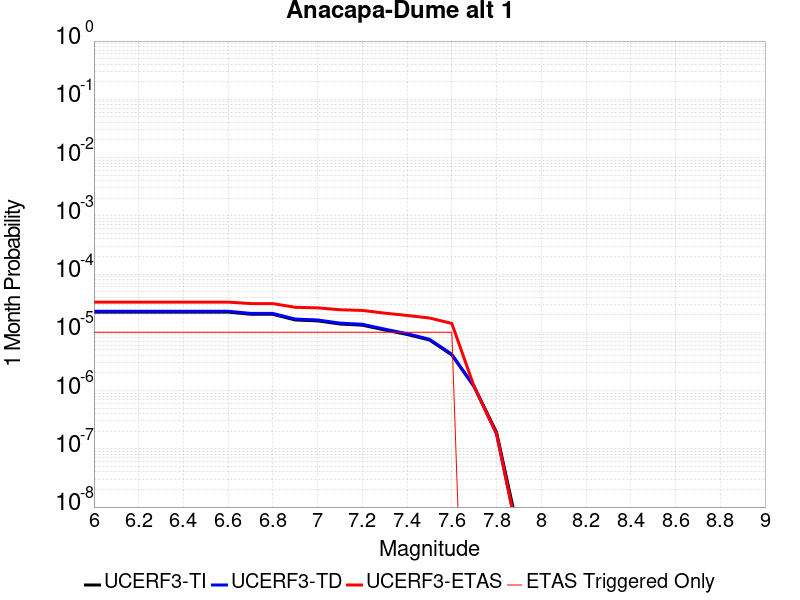 |  |  |

| Magnitude | 1 wk TI Prob | 1 wk TD Prob | 1 wk ETAS Prob | 1 wk ETAS/TD Gain | 1 wk ETAS Triggered Only | 1 mo TI Prob | 1 mo TD Prob | 1 mo ETAS Prob | 1 mo ETAS/TD Gain | 1 mo ETAS Triggered Only | 1 yr TI Prob | 1 yr TD Prob | 1 yr ETAS Prob | 1 yr ETAS/TD Gain | 1 yr ETAS Triggered Only | 10 yr TI Prob | 10 yr TD Prob | 10 yr ETAS Prob | 10 yr ETAS/TD Gain | 10 yr ETAS Triggered Only |
|-----|-----|-----|-----|-----|-----|-----|-----|-----|-----|-----|-----|-----|-----|-----|-----|-----|-----|-----|-----|-----|
| 6.0 | 5.1871802E-6 | 5.3673907E-6 | 5.3673907E-6 | 1.0 | 0.0 | 2.2230583E-5 | 2.3002905E-5 | 2.3002905E-5 | 1.0 | 0.0 | 2.7062374E-4 | 2.8002524E-4 | 2.8002524E-4 | 1.0 | 0.0 | 0.002702944 | 0.0027968092 | 0.002820552 | 1.0084893 | 2.3809524E-5 |
| 6.1 | 5.1871802E-6 | 5.3673907E-6 | 5.3673907E-6 | 1.0 | 0.0 | 2.2230583E-5 | 2.3002905E-5 | 2.3002905E-5 | 1.0 | 0.0 | 2.7062374E-4 | 2.8002524E-4 | 2.8002524E-4 | 1.0 | 0.0 | 0.002702944 | 0.0027968092 | 0.002820552 | 1.0084893 | 2.3809524E-5 |
| 6.2 | 5.1871802E-6 | 5.3673907E-6 | 5.3673907E-6 | 1.0 | 0.0 | 2.2230583E-5 | 2.3002905E-5 | 2.3002905E-5 | 1.0 | 0.0 | 2.7062374E-4 | 2.8002524E-4 | 2.8002524E-4 | 1.0 | 0.0 | 0.002702944 | 0.0027968092 | 0.002820552 | 1.0084893 | 2.3809524E-5 |
| 6.3 | 5.1871802E-6 | 5.3673907E-6 | 5.3673907E-6 | 1.0 | 0.0 | 2.2230583E-5 | 2.3002905E-5 | 2.3002905E-5 | 1.0 | 0.0 | 2.7062374E-4 | 2.8002524E-4 | 2.8002524E-4 | 1.0 | 0.0 | 0.002702944 | 0.0027968092 | 0.002820552 | 1.0084893 | 2.3809524E-5 |
| 6.4 | 5.1871802E-6 | 5.3673907E-6 | 5.3673907E-6 | 1.0 | 0.0 | 2.2230583E-5 | 2.3002905E-5 | 2.3002905E-5 | 1.0 | 0.0 | 2.7062374E-4 | 2.8002524E-4 | 2.8002524E-4 | 1.0 | 0.0 | 0.002702944 | 0.0027968092 | 0.002820552 | 1.0084893 | 2.3809524E-5 |
| 6.5 | 5.1871802E-6 | 5.3673907E-6 | 5.3673907E-6 | 1.0 | 0.0 | 2.2230583E-5 | 2.3002905E-5 | 2.3002905E-5 | 1.0 | 0.0 | 2.7062374E-4 | 2.8002524E-4 | 2.8002524E-4 | 1.0 | 0.0 | 0.002702944 | 0.0027968092 | 0.002820552 | 1.0084893 | 2.3809524E-5 |
| 6.6 | 5.1871802E-6 | 5.3673907E-6 | 5.3673907E-6 | 1.0 | 0.0 | 2.2230583E-5 | 2.3002905E-5 | 2.3002905E-5 | 1.0 | 0.0 | 2.7062374E-4 | 2.8002524E-4 | 2.8002524E-4 | 1.0 | 0.0 | 0.002702944 | 0.0027968092 | 0.002820552 | 1.0084893 | 2.3809524E-5 |
| 6.7 | 4.7693475E-6 | 4.9366918E-6 | 4.9366918E-6 | 1.0 | 0.0 | 2.04399E-5 | 2.1157082E-5 | 2.1157082E-5 | 1.0 | 0.0 | 2.4882736E-4 | 2.5755778E-4 | 2.5755778E-4 | 1.0 | 0.0 | 0.0024854892 | 0.002572669 | 0.0025964172 | 1.009231 | 2.3809524E-5 |
| 6.8 | 4.753408E-6 | 4.92024E-6 | 4.92024E-6 | 1.0 | 0.0 | 2.037159E-5 | 2.1086576E-5 | 2.1086576E-5 | 1.0 | 0.0 | 2.4799586E-4 | 2.5669957E-4 | 2.5669957E-4 | 1.0 | 0.0 | 0.002477193 | 0.0025641066 | 0.002587855 | 1.0092618 | 2.3809524E-5 |
| 6.9 | 3.800069E-6 | 3.937126E-6 | 3.937126E-6 | 1.0 | 0.0 | 1.6285909E-5 | 1.687329E-5 | 1.687329E-5 | 1.0 | 0.0 | 1.9826289E-4 | 2.0541316E-4 | 2.0541316E-4 | 1.0 | 0.0 | 0.001980861 | 0.0020522568 | 0.0020760174 | 1.0115778 | 2.3809524E-5 |
| 7.0 | 3.6671938E-6 | 3.7999182E-6 | 3.7999182E-6 | 1.0 | 0.0 | 1.571645E-5 | 1.6285263E-5 | 1.6285263E-5 | 1.0 | 0.0 | 1.9133097E-4 | 1.9825528E-4 | 1.9825528E-4 | 1.0 | 0.0 | 0.0019116632 | 0.0019808074 | 0.0020045696 | 1.0119963 | 2.3809524E-5 |
| 7.1 | 3.2394885E-6 | 3.3587933E-6 | 3.3587933E-6 | 1.0 | 0.0 | 1.3883448E-5 | 1.4394749E-5 | 1.4394749E-5 | 1.0 | 0.0 | 1.6901788E-4 | 1.7524208E-4 | 1.7524208E-4 | 1.0 | 0.0 | 0.0016888938 | 0.0017510501 | 0.0017510501 | 1.0 | 0.0 |
| 7.2 | 3.0935948E-6 | 3.2079258E-6 | 3.2079258E-6 | 1.0 | 0.0 | 1.3258196E-5 | 1.3748182E-5 | 1.3748182E-5 | 1.0 | 0.0 | 1.6140658E-4 | 1.6737137E-4 | 1.6737137E-4 | 1.0 | 0.0 | 0.001612894 | 0.0016724641 | 0.0016724641 | 1.0 | 0.0 |
| 7.3 | 2.5604163E-6 | 2.647073E-6 | 2.647073E-6 | 1.0 | 0.0 | 1.0973167E-5 | 1.1344549E-5 | 1.1344549E-5 | 1.0 | 0.0 | 1.3359012E-4 | 1.3811118E-4 | 1.3811118E-4 | 1.0 | 0.0 | 0.0013350984 | 0.0013802581 | 0.0013802581 | 1.0 | 0.0 |
| 7.4 | 2.1429005E-6 | 2.2106028E-6 | 2.2106028E-6 | 1.0 | 0.0 | 9.1838265E-6 | 9.473977E-6 | 9.473977E-6 | 1.0 | 0.0 | 1.11807356E-4 | 1.1533959E-4 | 1.1533959E-4 | 1.0 | 0.0 | 0.0011175112 | 0.0011527999 | 0.0011527999 | 1.0 | 0.0 |
| 7.5 | 1.7237151E-6 | 1.7761449E-6 | 1.7761449E-6 | 1.0 | 0.0 | 7.3873293E-6 | 7.6120277E-6 | 7.6120277E-6 | 1.0 | 0.0 | 8.993702E-5 | 9.267252E-5 | 9.267252E-5 | 1.0 | 0.0 | 8.990063E-4 | 9.2634105E-4 | 9.2634105E-4 | 1.0 | 0.0 |
| 7.6 | 9.541696E-7 | 9.823206E-7 | 9.823206E-7 | 1.0 | 0.0 | 4.089292E-6 | 4.2099387E-6 | 4.2099387E-6 | 1.0 | 0.0 | 4.9785995E-5 | 5.1254807E-5 | 5.1254807E-5 | 1.0 | 0.0 | 4.9774844E-4 | 5.1243114E-4 | 5.1243114E-4 | 1.0 | 0.0 |
| 7.7 | 2.7226676E-7 | 2.7172416E-7 | 2.7172416E-7 | 1.0 | 0.0 | 1.166857E-6 | 1.1645316E-6 | 1.1645316E-6 | 1.0 | 0.0 | 1.4206392E-5 | 1.4178081E-5 | 1.4178081E-5 | 1.0 | 0.0 | 1.4205484E-4 | 1.4177183E-4 | 1.4177183E-4 | 1.0 | 0.0 |
| 7.8 | 4.5017995E-8 | 4.2157676E-8 | 4.2157676E-8 | 1.0 | 0.0 | 1.9293425E-7 | 1.8067574E-7 | 1.8067574E-7 | 1.0 | 0.0 | 2.348972E-6 | 2.1997253E-6 | 2.1997253E-6 | 1.0 | 0.0 | 2.348947E-5 | 2.1997055E-5 | 2.1997055E-5 | 1.0 | 0.0 |
| 7.9 | 8.007447E-10 | 6.1608785E-10 | 6.1608785E-10 | 1.0 | 0.0 | 3.4317629E-9 | 2.6403764E-9 | 2.6403764E-9 | 1.0 | 0.0 | 4.1781714E-8 | 3.2146584E-8 | 3.2146584E-8 | 1.0 | 0.0 | 4.1781706E-7 | 3.214658E-7 | 3.214658E-7 | 1.0 | 0.0 |

## San Gorgonio Pass
*[(top)](#table-of-contents)*

| 1 Week | 1 Month | 1 Year | 10 Year |
|-----|-----|-----|-----|
|  |  |  |  |

| Magnitude | 1 wk TI Prob | 1 wk TD Prob | 1 wk ETAS Prob | 1 wk ETAS/TD Gain | 1 wk ETAS Triggered Only | 1 mo TI Prob | 1 mo TD Prob | 1 mo ETAS Prob | 1 mo ETAS/TD Gain | 1 mo ETAS Triggered Only | 1 yr TI Prob | 1 yr TD Prob | 1 yr ETAS Prob | 1 yr ETAS/TD Gain | 1 yr ETAS Triggered Only | 10 yr TI Prob | 10 yr TD Prob | 10 yr ETAS Prob | 10 yr ETAS/TD Gain | 10 yr ETAS Triggered Only |
|-----|-----|-----|-----|-----|-----|-----|-----|-----|-----|-----|-----|-----|-----|-----|-----|-----|-----|-----|-----|-----|
| 6.0 | 7.644328E-6 | 1.3314231E-5 | 1.3314231E-5 | 1.0 | 0.0 | 3.2760996E-5 | 5.705979E-5 | 5.705979E-5 | 1.0 | 0.0 | 3.987921E-4 | 6.944901E-4 | 6.944901E-4 | 1.0 | 0.0 | 0.003980772 | 0.0069299806 | 0.006953625 | 1.0034119 | 2.3809524E-5 |
| 6.1 | 7.644328E-6 | 1.3314231E-5 | 1.3314231E-5 | 1.0 | 0.0 | 3.2760996E-5 | 5.705979E-5 | 5.705979E-5 | 1.0 | 0.0 | 3.987921E-4 | 6.944901E-4 | 6.944901E-4 | 1.0 | 0.0 | 0.003980772 | 0.0069299806 | 0.006953625 | 1.0034119 | 2.3809524E-5 |
| 6.2 | 7.644328E-6 | 1.3314231E-5 | 1.3314231E-5 | 1.0 | 0.0 | 3.2760996E-5 | 5.705979E-5 | 5.705979E-5 | 1.0 | 0.0 | 3.987921E-4 | 6.944901E-4 | 6.944901E-4 | 1.0 | 0.0 | 0.003980772 | 0.0069299806 | 0.006953625 | 1.0034119 | 2.3809524E-5 |
| 6.3 | 7.644328E-6 | 1.3314231E-5 | 1.3314231E-5 | 1.0 | 0.0 | 3.2760996E-5 | 5.705979E-5 | 5.705979E-5 | 1.0 | 0.0 | 3.987921E-4 | 6.944901E-4 | 6.944901E-4 | 1.0 | 0.0 | 0.003980772 | 0.0069299806 | 0.006953625 | 1.0034119 | 2.3809524E-5 |
| 6.4 | 7.644328E-6 | 1.3314231E-5 | 1.3314231E-5 | 1.0 | 0.0 | 3.2760996E-5 | 5.705979E-5 | 5.705979E-5 | 1.0 | 0.0 | 3.987921E-4 | 6.944901E-4 | 6.944901E-4 | 1.0 | 0.0 | 0.003980772 | 0.0069299806 | 0.006953625 | 1.0034119 | 2.3809524E-5 |
| 6.5 | 7.644328E-6 | 1.3314231E-5 | 1.3314231E-5 | 1.0 | 0.0 | 3.2760996E-5 | 5.705979E-5 | 5.705979E-5 | 1.0 | 0.0 | 3.987921E-4 | 6.944901E-4 | 6.944901E-4 | 1.0 | 0.0 | 0.003980772 | 0.0069299806 | 0.006953625 | 1.0034119 | 2.3809524E-5 |
| 6.6 | 7.644328E-6 | 1.3314231E-5 | 1.3314231E-5 | 1.0 | 0.0 | 3.2760996E-5 | 5.705979E-5 | 5.705979E-5 | 1.0 | 0.0 | 3.987921E-4 | 6.944901E-4 | 6.944901E-4 | 1.0 | 0.0 | 0.003980772 | 0.0069299806 | 0.006953625 | 1.0034119 | 2.3809524E-5 |
| 6.7 | 6.987586E-6 | 1.2618505E-5 | 1.2618505E-5 | 1.0 | 0.0 | 2.9946454E-5 | 5.4078235E-5 | 5.4078235E-5 | 1.0 | 0.0 | 3.645371E-4 | 6.582117E-4 | 6.582117E-4 | 1.0 | 0.0 | 0.0036393967 | 0.0065693567 | 0.00659301 | 1.0036005 | 2.3809524E-5 |
| 6.8 | 6.987586E-6 | 1.2618505E-5 | 1.2618505E-5 | 1.0 | 0.0 | 2.9946454E-5 | 5.4078235E-5 | 5.4078235E-5 | 1.0 | 0.0 | 3.645371E-4 | 6.582117E-4 | 6.582117E-4 | 1.0 | 0.0 | 0.0036393967 | 0.0065693567 | 0.00659301 | 1.0036005 | 2.3809524E-5 |
| 6.9 | 5.504702E-6 | 1.1049368E-5 | 1.1049368E-5 | 1.0 | 0.0 | 2.3591367E-5 | 4.7353606E-5 | 4.7353606E-5 | 1.0 | 0.0 | 2.8718702E-4 | 5.7638274E-4 | 5.7638274E-4 | 1.0 | 0.0 | 0.0028681618 | 0.005755309 | 0.005778982 | 1.0041132 | 2.3809524E-5 |
| 7.0 | 5.4825764E-6 | 1.102571E-5 | 1.102571E-5 | 1.0 | 0.0 | 2.3496545E-5 | 4.7252215E-5 | 4.7252215E-5 | 1.0 | 0.0 | 2.8603288E-4 | 5.751489E-4 | 5.751489E-4 | 1.0 | 0.0 | 0.00285665 | 0.005743035 | 0.005766708 | 1.004122 | 2.3809524E-5 |
| 7.1 | 5.4692787E-6 | 1.101142E-5 | 1.101142E-5 | 1.0 | 0.0 | 2.3439556E-5 | 4.7190973E-5 | 4.7190973E-5 | 1.0 | 0.0 | 2.8533922E-4 | 5.744037E-4 | 5.744037E-4 | 1.0 | 0.0 | 0.0028497311 | 0.0057356213 | 0.005759294 | 1.0041274 | 2.3809524E-5 |
| 7.2 | 5.453661E-6 | 1.0994446E-5 | 1.0994446E-5 | 1.0 | 0.0 | 2.3372622E-5 | 4.7118232E-5 | 4.7118232E-5 | 1.0 | 0.0 | 2.8452452E-4 | 5.7351857E-4 | 5.7351857E-4 | 1.0 | 0.0 | 0.002841605 | 0.0057268157 | 0.0057504885 | 1.0041337 | 2.3809524E-5 |
| 7.3 | 5.4422303E-6 | 1.0981369E-5 | 1.0981369E-5 | 1.0 | 0.0 | 2.3323635E-5 | 4.706219E-5 | 4.706219E-5 | 1.0 | 0.0 | 2.8392827E-4 | 5.728366E-4 | 5.728366E-4 | 1.0 | 0.0 | 0.0028356577 | 0.005720031 | 0.0057437043 | 1.0041387 | 2.3809524E-5 |
| 7.4 | 5.398595E-6 | 1.0928734E-5 | 1.0928734E-5 | 1.0 | 0.0 | 2.313663E-5 | 4.683662E-5 | 4.683662E-5 | 1.0 | 0.0 | 2.8165206E-4 | 5.700917E-4 | 5.700917E-4 | 1.0 | 0.0 | 0.0028129534 | 0.005692723 | 0.0057163974 | 1.0041586 | 2.3809524E-5 |
| 7.5 | 5.3578788E-6 | 1.0855281E-5 | 1.0855281E-5 | 1.0 | 0.0 | 2.2962136E-5 | 4.6521833E-5 | 4.6521833E-5 | 1.0 | 0.0 | 2.7952815E-4 | 5.662612E-4 | 5.662612E-4 | 1.0 | 0.0 | 0.002791768 | 0.0056546377 | 0.005678313 | 1.0041869 | 2.3809524E-5 |
| 7.6 | 4.8091474E-6 | 9.60368E-6 | 9.60368E-6 | 1.0 | 0.0 | 2.0610469E-5 | 4.1158008E-5 | 4.1158008E-5 | 1.0 | 0.0 | 2.5090357E-4 | 5.0098833E-4 | 5.0098833E-4 | 1.0 | 0.0 | 0.0025062046 | 0.0050053033 | 0.0050289934 | 1.0047331 | 2.3809524E-5 |
| 7.7 | 1.5991155E-6 | 3.352866E-6 | 3.352866E-6 | 1.0 | 0.0 | 6.853334E-6 | 1.4369349E-5 | 1.4369349E-5 | 1.0 | 0.0 | 8.343615E-5 | 1.7493303E-4 | 1.7493303E-4 | 1.0 | 0.0 | 8.340483E-4 | 0.0017534072 | 0.001777175 | 1.0135552 | 2.3809524E-5 |
| 7.8 | 9.258398E-7 | 2.0579948E-6 | 2.0579948E-6 | 1.0 | 0.0 | 3.967879E-6 | 8.819949E-6 | 8.819949E-6 | 1.0 | 0.0 | 4.8307855E-5 | 1.073776E-4 | 1.073776E-4 | 1.0 | 0.0 | 4.8297356E-4 | 0.001078687 | 0.0011024708 | 1.0220488 | 2.3809524E-5 |
| 7.9 | 5.975575E-7 | 1.2291794E-6 | 1.2291794E-6 | 1.0 | 0.0 | 2.5609581E-6 | 5.2679006E-6 | 5.2679006E-6 | 1.0 | 0.0 | 3.117922E-5 | 6.4134816E-5 | 6.4134816E-5 | 1.0 | 0.0 | 3.1174847E-4 | 6.463092E-4 | 6.463092E-4 | 1.0 | 0.0 |
| 8.0 | 3.4413725E-7 | 6.7148494E-7 | 6.7148494E-7 | 1.0 | 0.0 | 1.4748731E-6 | 2.8777895E-6 | 2.8777895E-6 | 1.0 | 0.0 | 1.7956432E-5 | 3.503653E-5 | 3.503653E-5 | 1.0 | 0.0 | 1.7954981E-4 | 3.5373896E-4 | 3.5373896E-4 | 1.0 | 0.0 |
| 8.1 | 1.1787731E-8 | 9.634385E-9 | 9.634385E-9 | 1.0 | 0.0 | 5.0518846E-8 | 4.129022E-8 | 4.129022E-8 | 1.0 | 0.0 | 6.1506677E-7 | 5.027083E-7 | 5.027083E-7 | 1.0 | 0.0 | 6.1506507E-6 | 5.2424944E-6 | 5.2424944E-6 | 1.0 | 0.0 |

## Elsinore (Stepovers Combined)
*[(top)](#table-of-contents)*

| 1 Week | 1 Month | 1 Year | 10 Year |
|-----|-----|-----|-----|
|  |  | 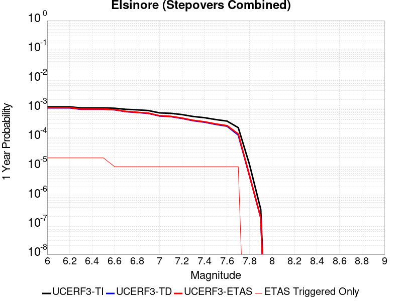 |  |

| Magnitude | 1 wk TI Prob | 1 wk TD Prob | 1 wk ETAS Prob | 1 wk ETAS/TD Gain | 1 wk ETAS Triggered Only | 1 mo TI Prob | 1 mo TD Prob | 1 mo ETAS Prob | 1 mo ETAS/TD Gain | 1 mo ETAS Triggered Only | 1 yr TI Prob | 1 yr TD Prob | 1 yr ETAS Prob | 1 yr ETAS/TD Gain | 1 yr ETAS Triggered Only | 10 yr TI Prob | 10 yr TD Prob | 10 yr ETAS Prob | 10 yr ETAS/TD Gain | 10 yr ETAS Triggered Only |
|-----|-----|-----|-----|-----|-----|-----|-----|-----|-----|-----|-----|-----|-----|-----|-----|-----|-----|-----|-----|-----|
| 6.0 | 2.144392E-5 | 1.9760193E-5 | 1.9760193E-5 | 1.0 | 0.0 | 9.189928E-5 | 8.468392E-5 | 1.08491426E-4 | 1.2811338 | 2.3809524E-5 | 0.0011182994 | 0.0010305607 | 0.0010543456 | 1.0230796 | 2.3809524E-5 | 0.011126885 | 0.010264917 | 0.0102884825 | 1.0022957 | 2.3809524E-5 |
| 6.1 | 2.144392E-5 | 1.9760193E-5 | 1.9760193E-5 | 1.0 | 0.0 | 9.189928E-5 | 8.468392E-5 | 1.08491426E-4 | 1.2811338 | 2.3809524E-5 | 0.0011182994 | 0.0010305607 | 0.0010543456 | 1.0230796 | 2.3809524E-5 | 0.011126885 | 0.010264917 | 0.0102884825 | 1.0022957 | 2.3809524E-5 |
| 6.2 | 2.144392E-5 | 1.9760193E-5 | 1.9760193E-5 | 1.0 | 0.0 | 9.189928E-5 | 8.468392E-5 | 1.08491426E-4 | 1.2811338 | 2.3809524E-5 | 0.0011182994 | 0.0010305607 | 0.0010543456 | 1.0230796 | 2.3809524E-5 | 0.011126885 | 0.010264917 | 0.0102884825 | 1.0022957 | 2.3809524E-5 |
| 6.3 | 1.9751555E-5 | 1.7741453E-5 | 1.7741453E-5 | 1.0 | 0.0 | 8.4646774E-5 | 7.603267E-5 | 9.9840385E-5 | 1.3131248 | 2.3809524E-5 | 0.0010300872 | 9.253213E-4 | 9.491088E-4 | 1.0257072 | 2.3809524E-5 | 0.010253254 | 0.009221276 | 0.009244867 | 1.0025582 | 2.3809524E-5 |
| 6.4 | 1.9751555E-5 | 1.7741453E-5 | 1.7741453E-5 | 1.0 | 0.0 | 8.4646774E-5 | 7.603267E-5 | 9.9840385E-5 | 1.3131248 | 2.3809524E-5 | 0.0010300872 | 9.253213E-4 | 9.491088E-4 | 1.0257072 | 2.3809524E-5 | 0.010253254 | 0.009221276 | 0.009244867 | 1.0025582 | 2.3809524E-5 |
| 6.5 | 1.9751555E-5 | 1.7741453E-5 | 1.7741453E-5 | 1.0 | 0.0 | 8.4646774E-5 | 7.603267E-5 | 9.9840385E-5 | 1.3131248 | 2.3809524E-5 | 0.0010300872 | 9.253213E-4 | 9.491088E-4 | 1.0257072 | 2.3809524E-5 | 0.010253254 | 0.009221276 | 0.009244867 | 1.0025582 | 2.3809524E-5 |
| 6.6 | 1.9188685E-5 | 1.7003393E-5 | 1.7003393E-5 | 1.0 | 0.0 | 8.2234634E-5 | 7.286974E-5 | 7.286974E-5 | 1.0 | 0.0 | 0.0010007467 | 8.868442E-4 | 8.868442E-4 | 1.0 | 0.0 | 0.00996252 | 0.0088398475 | 0.0088398475 | 1.0 | 0.0 |
| 6.7 | 1.7608272E-5 | 1.4732616E-5 | 1.4732616E-5 | 1.0 | 0.0 | 7.546184E-5 | 6.3138315E-5 | 6.3138315E-5 | 1.0 | 0.0 | 9.183606E-4 | 7.684476E-4 | 7.684476E-4 | 1.0 | 0.0 | 0.009145746 | 0.00766491 | 0.00766491 | 1.0 | 0.0 |
| 6.8 | 1.697165E-5 | 1.3783365E-5 | 1.3783365E-5 | 1.0 | 0.0 | 7.273361E-5 | 5.9070277E-5 | 5.9070277E-5 | 1.0 | 0.0 | 8.8517193E-4 | 7.18952E-4 | 7.18952E-4 | 1.0 | 0.0 | 0.008816543 | 0.007172675 | 0.007172675 | 1.0 | 0.0 |
| 6.9 | 1.600365E-5 | 1.2846671E-5 | 1.2846671E-5 | 1.0 | 0.0 | 6.858527E-5 | 5.5056043E-5 | 5.5056043E-5 | 1.0 | 0.0 | 8.347058E-4 | 6.7010894E-4 | 6.7010894E-4 | 1.0 | 0.0 | 0.008315775 | 0.0066867657 | 0.0066867657 | 1.0 | 0.0 |
| 7.0 | 1.3314581E-5 | 1.0447548E-5 | 1.0447548E-5 | 1.0 | 0.0 | 5.7061243E-5 | 4.4774453E-5 | 4.4774453E-5 | 1.0 | 0.0 | 6.944992E-4 | 5.449953E-4 | 5.449953E-4 | 1.0 | 0.0 | 0.006923327 | 0.0054405155 | 0.0054405155 | 1.0 | 0.0 |
| 7.1 | 1.2865345E-5 | 9.937536E-6 | 9.937536E-6 | 1.0 | 0.0 | 5.5136024E-5 | 4.258876E-5 | 4.258876E-5 | 1.0 | 0.0 | 6.710743E-4 | 5.183973E-4 | 5.183973E-4 | 1.0 | 0.0 | 0.0066905143 | 0.0051752133 | 0.0051752133 | 1.0 | 0.0 |
| 7.2 | 1.1650051E-5 | 8.633809E-6 | 8.633809E-6 | 1.0 | 0.0 | 4.9927836E-5 | 3.7001522E-5 | 3.7001522E-5 | 1.0 | 0.0 | 6.0770183E-4 | 4.504022E-4 | 4.504022E-4 | 1.0 | 0.0 | 0.0060604266 | 0.0044963174 | 0.0044963174 | 1.0 | 0.0 |
| 7.3 | 1.0008533E-5 | 7.2010425E-6 | 7.2010425E-6 | 1.0 | 0.0 | 4.2893007E-5 | 3.0861254E-5 | 3.0861254E-5 | 1.0 | 0.0 | 5.220972E-4 | 3.7567242E-4 | 3.7567242E-4 | 1.0 | 0.0 | 0.005208723 | 0.003750761 | 0.003750761 | 1.0 | 0.0 |
| 7.4 | 9.116759E-6 | 6.410068E-6 | 6.410068E-6 | 1.0 | 0.0 | 3.907124E-5 | 2.747144E-5 | 2.747144E-5 | 1.0 | 0.0 | 4.7558855E-4 | 3.3441483E-4 | 3.3441483E-4 | 1.0 | 0.0 | 0.00474572 | 0.0033392678 | 0.0033392678 | 1.0 | 0.0 |
| 7.5 | 7.870524E-6 | 5.3825365E-6 | 5.3825365E-6 | 1.0 | 0.0 | 3.3730383E-5 | 2.3067816E-5 | 2.3067816E-5 | 1.0 | 0.0 | 4.1059E-4 | 2.8081573E-4 | 2.8081573E-4 | 1.0 | 0.0 | 0.0040983222 | 0.0028047354 | 0.0028047354 | 1.0 | 0.0 |
| 7.6 | 6.9774537E-6 | 4.6776067E-6 | 4.6776067E-6 | 1.0 | 0.0 | 2.990303E-5 | 2.0046738E-5 | 2.0046738E-5 | 1.0 | 0.0 | 3.640086E-4 | 2.4404288E-4 | 2.4404288E-4 | 1.0 | 0.0 | 0.003634129 | 0.0024378651 | 0.0024378651 | 1.0 | 0.0 |
| 7.7 | 4.1616954E-6 | 2.32834E-6 | 2.32834E-6 | 1.0 | 0.0 | 1.7835715E-5 | 9.978567E-6 | 9.978567E-6 | 1.0 | 0.0 | 2.171282E-4 | 1.2148302E-4 | 1.2148302E-4 | 1.0 | 0.0 | 0.0021691616 | 0.0012142392 | 0.0012142392 | 1.0 | 0.0 |
| 7.8 | 2.2692414E-7 | 9.3854695E-8 | 9.3854695E-8 | 1.0 | 0.0 | 9.725317E-7 | 4.0223435E-7 | 4.0223435E-7 | 1.0 | 0.0 | 1.1840509E-5 | 4.8971956E-6 | 4.8971956E-6 | 1.0 | 0.0 | 1.1839878E-4 | 4.8971204E-5 | 4.8971204E-5 | 1.0 | 0.0 |
| 7.9 | 6.676829E-9 | 3.439853E-9 | 3.439853E-9 | 1.0 | 0.0 | 2.861498E-8 | 1.4742227E-8 | 1.4742227E-8 | 1.0 | 0.0 | 3.4838732E-7 | 1.7948659E-7 | 1.7948659E-7 | 1.0 | 0.0 | 3.4838679E-6 | 1.7948646E-6 | 1.7948646E-6 | 1.0 | 0.0 |

## Hayward (So) 2011 CFM
*[(top)](#table-of-contents)*

| 1 Week | 1 Month | 1 Year | 10 Year |
|-----|-----|-----|-----|
|  |  |  |  |

| Magnitude | 1 wk TI Prob | 1 wk TD Prob | 1 wk ETAS Prob | 1 wk ETAS/TD Gain | 1 wk ETAS Triggered Only | 1 mo TI Prob | 1 mo TD Prob | 1 mo ETAS Prob | 1 mo ETAS/TD Gain | 1 mo ETAS Triggered Only | 1 yr TI Prob | 1 yr TD Prob | 1 yr ETAS Prob | 1 yr ETAS/TD Gain | 1 yr ETAS Triggered Only | 10 yr TI Prob | 10 yr TD Prob | 10 yr ETAS Prob | 10 yr ETAS/TD Gain | 10 yr ETAS Triggered Only |
|-----|-----|-----|-----|-----|-----|-----|-----|-----|-----|-----|-----|-----|-----|-----|-----|-----|-----|-----|-----|-----|
| 6.0 | 1.8091932E-4 | 3.570541E-4 | 3.570541E-4 | 1.0 | 0.0 | 7.751381E-4 | 0.0015293444 | 0.0015293444 | 1.0 | 0.0 | 0.00939654 | 0.018463207 | 0.018463207 | 1.0 | 0.0 | 0.090090066 | 0.16673161 | 0.16675144 | 1.000119 | 2.3809524E-5 |
| 6.1 | 1.8091932E-4 | 3.570541E-4 | 3.570541E-4 | 1.0 | 0.0 | 7.751381E-4 | 0.0015293444 | 0.0015293444 | 1.0 | 0.0 | 0.00939654 | 0.018463207 | 0.018463207 | 1.0 | 0.0 | 0.090090066 | 0.16673161 | 0.16675144 | 1.000119 | 2.3809524E-5 |
| 6.2 | 1.8091932E-4 | 3.570541E-4 | 3.570541E-4 | 1.0 | 0.0 | 7.751381E-4 | 0.0015293444 | 0.0015293444 | 1.0 | 0.0 | 0.00939654 | 0.018463207 | 0.018463207 | 1.0 | 0.0 | 0.090090066 | 0.16673161 | 0.16675144 | 1.000119 | 2.3809524E-5 |
| 6.3 | 1.7322872E-4 | 3.426234E-4 | 3.426234E-4 | 1.0 | 0.0 | 7.4219756E-4 | 0.0014675693 | 0.0014675693 | 1.0 | 0.0 | 0.0089988755 | 0.017723544 | 0.017723544 | 1.0 | 0.0 | 0.08643075 | 0.16066726 | 0.16068724 | 1.0001243 | 2.3809524E-5 |
| 6.4 | 1.6334097E-4 | 3.234411E-4 | 3.234411E-4 | 1.0 | 0.0 | 6.998449E-4 | 0.0013854484 | 0.0013854484 | 1.0 | 0.0 | 0.008487372 | 0.016739385 | 0.016739385 | 1.0 | 0.0 | 0.081704415 | 0.15255594 | 0.15257612 | 1.0001322 | 2.3809524E-5 |
| 6.5 | 1.5600289E-4 | 3.1018828E-4 | 3.1018828E-4 | 1.0 | 0.0 | 6.684125E-4 | 0.0013287093 | 0.0013287093 | 1.0 | 0.0 | 0.008107598 | 0.016058935 | 0.016058935 | 1.0 | 0.0 | 0.078181036 | 0.14683272 | 0.14685303 | 1.0001384 | 2.3809524E-5 |
| 6.6 | 1.4046066E-4 | 2.8032906E-4 | 2.8032906E-4 | 1.0 | 0.0 | 6.018354E-4 | 0.0012008639 | 0.0012008639 | 1.0 | 0.0 | 0.0073027555 | 0.014524006 | 0.014524006 | 1.0 | 0.0 | 0.07067384 | 0.13391982 | 0.13394044 | 1.000154 | 2.3809524E-5 |
| 6.7 | 1.14696966E-4 | 2.3271477E-4 | 2.3271477E-4 | 1.0 | 0.0 | 4.914658E-4 | 9.969729E-4 | 9.969729E-4 | 1.0 | 0.0 | 0.0059671924 | 0.012071652 | 0.012071652 | 1.0 | 0.0 | 0.058094822 | 0.11274672 | 0.112767845 | 1.0001874 | 2.3809524E-5 |
| 6.8 | 9.3874296E-5 | 1.8861453E-4 | 1.8861453E-4 | 1.0 | 0.0 | 4.0225635E-4 | 8.0810126E-4 | 8.0810126E-4 | 1.0 | 0.0 | 0.0048864787 | 0.009794984 | 0.009794984 | 1.0 | 0.0 | 0.047804173 | 0.09259856 | 0.09259856 | 1.0 | 0.0 |
| 6.9 | 5.551852E-5 | 1.072948E-4 | 1.072948E-4 | 1.0 | 0.0 | 2.3791482E-4 | 4.5975443E-4 | 4.5975443E-4 | 1.0 | 0.0 | 0.0028927654 | 0.0055832625 | 0.0055832625 | 1.0 | 0.0 | 0.028553981 | 0.054245494 | 0.054245494 | 1.0 | 0.0 |
| 7.0 | 4.2662363E-5 | 8.2464416E-5 | 8.2464416E-5 | 1.0 | 0.0 | 1.8282588E-4 | 3.5337146E-4 | 3.5337146E-4 | 1.0 | 0.0 | 0.0022236328 | 0.0042938837 | 0.0042938837 | 1.0 | 0.0 | 0.022015138 | 0.042064495 | 0.042064495 | 1.0 | 0.0 |
| 7.1 | 3.305886E-5 | 6.3019055E-5 | 6.3019055E-5 | 1.0 | 0.0 | 1.4167312E-4 | 2.700538E-4 | 2.700538E-4 | 1.0 | 0.0 | 0.0017235056 | 0.0032829668 | 0.0032829668 | 1.0 | 0.0 | 0.017101998 | 0.032452874 | 0.032452874 | 1.0 | 0.0 |
| 7.2 | 2.9856887E-5 | 5.7013647E-5 | 5.7013647E-5 | 1.0 | 0.0 | 1.2795182E-4 | 2.4432142E-4 | 2.4432142E-4 | 1.0 | 0.0 | 0.0015567001 | 0.0029705726 | 0.0029705726 | 1.0 | 0.0 | 0.015458403 | 0.029453589 | 0.029453589 | 1.0 | 0.0 |
| 7.3 | 2.4559737E-5 | 4.599088E-5 | 4.599088E-5 | 1.0 | 0.0 | 1.0525176E-4 | 1.9708896E-4 | 1.9708896E-4 | 1.0 | 0.0 | 0.0012806869 | 0.0023969305 | 0.0023969305 | 1.0 | 0.0 | 0.012733313 | 0.023857482 | 0.023857482 | 1.0 | 0.0 |
| 7.4 | 1.9002231E-5 | 3.5049303E-5 | 3.5049303E-5 | 1.0 | 0.0 | 8.143559E-5 | 1.502027E-4 | 1.502027E-4 | 1.0 | 0.0 | 9.910273E-4 | 0.0018271938 | 0.0018271938 | 1.0 | 0.0 | 0.009866194 | 0.018258283 | 0.018258283 | 1.0 | 0.0 |
| 7.5 | 1.2783333E-5 | 2.3330069E-5 | 2.3330069E-5 | 1.0 | 0.0 | 5.4784563E-5 | 9.998221E-5 | 9.998221E-5 | 1.0 | 0.0 | 6.667979E-4 | 0.0012166094 | 0.0012166094 | 1.0 | 0.0 | 0.006648007 | 0.012209582 | 0.012209582 | 1.0 | 0.0 |
| 7.6 | 4.8149627E-6 | 8.887544E-6 | 8.887544E-6 | 1.0 | 0.0 | 2.063539E-5 | 3.8088925E-5 | 3.8088925E-5 | 1.0 | 0.0 | 2.5120692E-4 | 4.636352E-4 | 4.636352E-4 | 1.0 | 0.0 | 0.0025092314 | 0.0046812436 | 0.0046812436 | 1.0 | 0.0 |
| 7.7 | 6.0838227E-7 | 1.2056693E-6 | 1.2056693E-6 | 1.0 | 0.0 | 2.6073499E-6 | 5.1671436E-6 | 5.1671436E-6 | 1.0 | 0.0 | 3.174402E-5 | 6.290816E-5 | 6.290816E-5 | 1.0 | 0.0 | 3.1739488E-4 | 6.5293367E-4 | 6.5293367E-4 | 1.0 | 0.0 |
| 7.8 | 4.5542808E-7 | 9.792182E-7 | 9.792182E-7 | 1.0 | 0.0 | 1.9518332E-6 | 4.1966427E-6 | 4.1966427E-6 | 1.0 | 0.0 | 2.376331E-5 | 5.1092928E-5 | 5.1092928E-5 | 1.0 | 0.0 | 2.3760769E-4 | 5.321372E-4 | 5.321372E-4 | 1.0 | 0.0 |
| 7.9 | 3.3016747E-7 | 7.386335E-7 | 7.386335E-7 | 1.0 | 0.0 | 1.4150027E-6 | 3.1655684E-6 | 3.1655684E-6 | 1.0 | 0.0 | 1.7227521E-5 | 3.8540114E-5 | 3.8540114E-5 | 1.0 | 0.0 | 1.7226185E-4 | 3.9930744E-4 | 3.9930744E-4 | 1.0 | 0.0 |
| 8.0 | 2.347038E-7 | 5.4714894E-7 | 5.4714894E-7 | 1.0 | 0.0 | 1.0058731E-6 | 2.344922E-6 | 2.344922E-6 | 1.0 | 0.0 | 1.2246436E-5 | 2.8549053E-5 | 2.8549053E-5 | 1.0 | 0.0 | 1.2245761E-4 | 2.9355253E-4 | 2.9355253E-4 | 1.0 | 0.0 |
| 8.1 | 1.18822804E-7 | 2.6058973E-7 | 2.6058973E-7 | 1.0 | 0.0 | 5.092405E-7 | 1.1168127E-6 | 1.1168127E-6 | 1.0 | 0.0 | 6.1999854E-6 | 1.359711E-5 | 1.359711E-5 | 1.0 | 0.0 | 6.199812E-5 | 1.3917852E-4 | 1.3917852E-4 | 1.0 | 0.0 |

## Los Osos 2011
*[(top)](#table-of-contents)*

| 1 Week | 1 Month | 1 Year | 10 Year |
|-----|-----|-----|-----|
|  |  |  |  |

| Magnitude | 1 wk TI Prob | 1 wk TD Prob | 1 wk ETAS Prob | 1 wk ETAS/TD Gain | 1 wk ETAS Triggered Only | 1 mo TI Prob | 1 mo TD Prob | 1 mo ETAS Prob | 1 mo ETAS/TD Gain | 1 mo ETAS Triggered Only | 1 yr TI Prob | 1 yr TD Prob | 1 yr ETAS Prob | 1 yr ETAS/TD Gain | 1 yr ETAS Triggered Only | 10 yr TI Prob | 10 yr TD Prob | 10 yr ETAS Prob | 10 yr ETAS/TD Gain | 10 yr ETAS Triggered Only |
|-----|-----|-----|-----|-----|-----|-----|-----|-----|-----|-----|-----|-----|-----|-----|-----|-----|-----|-----|-----|-----|
| 6.0 | 4.8871775E-6 | 4.9814835E-6 | 4.9814835E-6 | 1.0 | 0.0 | 2.0944879E-5 | 2.1349055E-5 | 2.1349055E-5 | 1.0 | 0.0 | 2.5497406E-4 | 2.5989654E-4 | 2.5989654E-4 | 1.0 | 0.0 | 0.002546817 | 0.0025962002 | 0.002619948 | 1.009147 | 2.3809524E-5 |
| 6.1 | 4.8871775E-6 | 4.9814835E-6 | 4.9814835E-6 | 1.0 | 0.0 | 2.0944879E-5 | 2.1349055E-5 | 2.1349055E-5 | 1.0 | 0.0 | 2.5497406E-4 | 2.5989654E-4 | 2.5989654E-4 | 1.0 | 0.0 | 0.002546817 | 0.0025962002 | 0.002619948 | 1.009147 | 2.3809524E-5 |
| 6.2 | 4.8871775E-6 | 4.9814835E-6 | 4.9814835E-6 | 1.0 | 0.0 | 2.0944879E-5 | 2.1349055E-5 | 2.1349055E-5 | 1.0 | 0.0 | 2.5497406E-4 | 2.5989654E-4 | 2.5989654E-4 | 1.0 | 0.0 | 0.002546817 | 0.0025962002 | 0.002619948 | 1.009147 | 2.3809524E-5 |
| 6.3 | 4.8871775E-6 | 4.9814835E-6 | 4.9814835E-6 | 1.0 | 0.0 | 2.0944879E-5 | 2.1349055E-5 | 2.1349055E-5 | 1.0 | 0.0 | 2.5497406E-4 | 2.5989654E-4 | 2.5989654E-4 | 1.0 | 0.0 | 0.002546817 | 0.0025962002 | 0.002619948 | 1.009147 | 2.3809524E-5 |
| 6.4 | 4.8871775E-6 | 4.9814835E-6 | 4.9814835E-6 | 1.0 | 0.0 | 2.0944879E-5 | 2.1349055E-5 | 2.1349055E-5 | 1.0 | 0.0 | 2.5497406E-4 | 2.5989654E-4 | 2.5989654E-4 | 1.0 | 0.0 | 0.002546817 | 0.0025962002 | 0.002619948 | 1.009147 | 2.3809524E-5 |
| 6.5 | 3.1724062E-6 | 3.223395E-6 | 3.223395E-6 | 1.0 | 0.0 | 1.3595956E-5 | 1.3814477E-5 | 1.3814477E-5 | 1.0 | 0.0 | 1.6551818E-4 | 1.681784E-4 | 1.681784E-4 | 1.0 | 0.0 | 0.0016539496 | 0.0016805249 | 0.0016805249 | 1.0 | 0.0 |
| 6.6 | 3.1022591E-6 | 3.1511045E-6 | 3.1511045E-6 | 1.0 | 0.0 | 1.3295328E-5 | 1.3504664E-5 | 1.3504664E-5 | 1.0 | 0.0 | 1.618586E-4 | 1.64407E-4 | 1.64407E-4 | 1.0 | 0.0 | 0.0016174077 | 0.0016428665 | 0.0016428665 | 1.0 | 0.0 |
| 6.7 | 2.611518E-6 | 2.6491832E-6 | 2.6491832E-6 | 1.0 | 0.0 | 1.1192172E-5 | 1.1353593E-5 | 1.1353593E-5 | 1.0 | 0.0 | 1.3625617E-4 | 1.3822126E-4 | 1.3822126E-4 | 1.0 | 0.0 | 0.0013617266 | 0.0013813575 | 0.0013813575 | 1.0 | 0.0 |
| 6.8 | 2.4780884E-6 | 2.5121592E-6 | 2.5121592E-6 | 1.0 | 0.0 | 1.0620336E-5 | 1.0766353E-5 | 1.0766353E-5 | 1.0 | 0.0 | 1.2929492E-4 | 1.3107249E-4 | 1.3107249E-4 | 1.0 | 0.0 | 0.0012921972 | 0.001309956 | 0.001309956 | 1.0 | 0.0 |
| 6.9 | 2.1376322E-6 | 2.1635055E-6 | 2.1635055E-6 | 1.0 | 0.0 | 9.161248E-6 | 9.272134E-6 | 9.272134E-6 | 1.0 | 0.0 | 1.1153249E-4 | 1.128824E-4 | 1.128824E-4 | 1.0 | 0.0 | 0.0011147653 | 0.0011282525 | 0.0011282525 | 1.0 | 0.0 |
| 7.0 | 1.9282882E-6 | 1.9494585E-6 | 1.9494585E-6 | 1.0 | 0.0 | 8.264066E-6 | 8.354796E-6 | 8.354796E-6 | 1.0 | 0.0 | 1.0061036E-4 | 1.017149E-4 | 1.017149E-4 | 1.0 | 0.0 | 0.0010056482 | 0.0010166848 | 0.0010166848 | 1.0 | 0.0 |
| 7.1 | 1.6353226E-6 | 1.6501118E-6 | 1.6501118E-6 | 1.0 | 0.0 | 7.0085066E-6 | 7.0718884E-6 | 7.0718884E-6 | 1.0 | 0.0 | 8.532523E-5 | 8.609685E-5 | 8.609685E-5 | 1.0 | 0.0 | 8.529247E-4 | 8.6063566E-4 | 8.6063566E-4 | 1.0 | 0.0 |
| 7.2 | 1.4446276E-6 | 1.4553341E-6 | 1.4553341E-6 | 1.0 | 0.0 | 6.191247E-6 | 6.237131E-6 | 6.237131E-6 | 1.0 | 0.0 | 7.537582E-5 | 7.593443E-5 | 7.593443E-5 | 1.0 | 0.0 | 7.535026E-4 | 7.590854E-4 | 7.590854E-4 | 1.0 | 0.0 |
| 7.3 | 1.2014582E-6 | 1.2069073E-6 | 1.2069073E-6 | 1.0 | 0.0 | 5.149096E-6 | 5.1724496E-6 | 5.1724496E-6 | 1.0 | 0.0 | 6.268844E-5 | 6.297276E-5 | 6.297276E-5 | 1.0 | 0.0 | 6.267076E-4 | 6.295495E-4 | 6.295495E-4 | 1.0 | 0.0 |
| 7.4 | 9.707733E-7 | 9.709773E-7 | 9.709773E-7 | 1.0 | 0.0 | 4.16045E-6 | 4.161325E-6 | 4.161325E-6 | 1.0 | 0.0 | 5.0652303E-5 | 5.066295E-5 | 5.066295E-5 | 1.0 | 0.0 | 5.064076E-4 | 5.065143E-4 | 5.065143E-4 | 1.0 | 0.0 |
| 7.5 | 7.174908E-7 | 7.1149134E-7 | 7.1149134E-7 | 1.0 | 0.0 | 3.074957E-6 | 3.0492452E-6 | 3.0492452E-6 | 1.0 | 0.0 | 3.743696E-5 | 3.712393E-5 | 3.712393E-5 | 1.0 | 0.0 | 3.7430652E-4 | 3.7117745E-4 | 3.7117745E-4 | 1.0 | 0.0 |
| 7.6 | 4.5535776E-7 | 4.420792E-7 | 4.420792E-7 | 1.0 | 0.0 | 1.9515319E-6 | 1.8946238E-6 | 1.8946238E-6 | 1.0 | 0.0 | 2.3759641E-5 | 2.3066801E-5 | 2.3066801E-5 | 1.0 | 0.0 | 2.37571E-4 | 2.3064416E-4 | 2.3064416E-4 | 1.0 | 0.0 |
| 7.7 | 2.1173553E-7 | 1.9060796E-7 | 1.9060796E-7 | 1.0 | 0.0 | 9.0743765E-7 | 8.1689103E-7 | 8.1689103E-7 | 1.0 | 0.0 | 1.1047998E-5 | 9.945603E-6 | 9.945603E-6 | 1.0 | 0.0 | 1.1047449E-4 | 9.945161E-5 | 9.945161E-5 | 1.0 | 0.0 |
| 7.8 | 9.873608E-8 | 7.3675665E-8 | 7.3675665E-8 | 1.0 | 0.0 | 4.2315455E-7 | 3.157528E-7 | 3.157528E-7 | 1.0 | 0.0 | 5.1518946E-6 | 3.8442836E-6 | 3.8442836E-6 | 1.0 | 0.0 | 5.1517753E-5 | 3.8442176E-5 | 3.8442176E-5 | 1.0 | 0.0 |
| 7.9 | 5.4399106E-8 | 3.1880155E-8 | 3.1880155E-8 | 1.0 | 0.0 | 2.33139E-7 | 1.3662923E-7 | 1.3662923E-7 | 1.0 | 0.0 | 2.8384638E-6 | 1.6634596E-6 | 1.6634596E-6 | 1.0 | 0.0 | 2.8384275E-5 | 1.6634473E-5 | 1.6634473E-5 | 1.0 | 0.0 |
| 8.0 | 1.817203E-8 | 8.420727E-9 | 8.420727E-9 | 1.0 | 0.0 | 7.7880124E-8 | 3.608883E-8 | 3.608883E-8 | 1.0 | 0.0 | 9.481901E-7 | 4.393814E-7 | 4.393814E-7 | 1.0 | 0.0 | 9.481861E-6 | 4.3938057E-6 | 4.3938057E-6 | 1.0 | 0.0 |

## San Andreas (Peninsula) 2011 CFM
*[(top)](#table-of-contents)*

| 1 Week | 1 Month | 1 Year | 10 Year |
|-----|-----|-----|-----|
|  |  |  |  |

| Magnitude | 1 wk TI Prob | 1 wk TD Prob | 1 wk ETAS Prob | 1 wk ETAS/TD Gain | 1 wk ETAS Triggered Only | 1 mo TI Prob | 1 mo TD Prob | 1 mo ETAS Prob | 1 mo ETAS/TD Gain | 1 mo ETAS Triggered Only | 1 yr TI Prob | 1 yr TD Prob | 1 yr ETAS Prob | 1 yr ETAS/TD Gain | 1 yr ETAS Triggered Only | 10 yr TI Prob | 10 yr TD Prob | 10 yr ETAS Prob | 10 yr ETAS/TD Gain | 10 yr ETAS Triggered Only |
|-----|-----|-----|-----|-----|-----|-----|-----|-----|-----|-----|-----|-----|-----|-----|-----|-----|-----|-----|-----|-----|
| 6.0 | 8.6200685E-5 | 2.52136E-5 | 2.52136E-5 | 1.0 | 0.0 | 3.6937918E-4 | 1.0805382E-4 | 1.3186077E-4 | 1.220325 | 2.3809524E-5 | 0.0044879215 | 0.001314763 | 0.0013385412 | 1.0180856 | 2.3809524E-5 | 0.043983612 | 0.014774441 | 0.014797899 | 1.0015877 | 2.3809524E-5 |
| 6.1 | 8.6200685E-5 | 2.52136E-5 | 2.52136E-5 | 1.0 | 0.0 | 3.6937918E-4 | 1.0805382E-4 | 1.3186077E-4 | 1.220325 | 2.3809524E-5 | 0.0044879215 | 0.001314763 | 0.0013385412 | 1.0180856 | 2.3809524E-5 | 0.043983612 | 0.014774441 | 0.014797899 | 1.0015877 | 2.3809524E-5 |
| 6.2 | 8.6200685E-5 | 2.52136E-5 | 2.52136E-5 | 1.0 | 0.0 | 3.6937918E-4 | 1.0805382E-4 | 1.3186077E-4 | 1.220325 | 2.3809524E-5 | 0.0044879215 | 0.001314763 | 0.0013385412 | 1.0180856 | 2.3809524E-5 | 0.043983612 | 0.014774441 | 0.014797899 | 1.0015877 | 2.3809524E-5 |
| 6.3 | 8.551163E-5 | 2.490552E-5 | 2.490552E-5 | 1.0 | 0.0 | 3.6642692E-4 | 1.06733576E-4 | 1.3054056E-4 | 1.2230506 | 2.3809524E-5 | 0.004452125 | 0.0012987083 | 0.0013224869 | 1.0183095 | 2.3809524E-5 | 0.043639794 | 0.014601416 | 0.014624878 | 1.0016068 | 2.3809524E-5 |
| 6.4 | 8.551163E-5 | 2.490552E-5 | 2.490552E-5 | 1.0 | 0.0 | 3.6642692E-4 | 1.06733576E-4 | 1.3054056E-4 | 1.2230506 | 2.3809524E-5 | 0.004452125 | 0.0012987083 | 0.0013224869 | 1.0183095 | 2.3809524E-5 | 0.043639794 | 0.014601416 | 0.014624878 | 1.0016068 | 2.3809524E-5 |
| 6.5 | 8.511146E-5 | 2.4726973E-5 | 2.4726973E-5 | 1.0 | 0.0 | 3.647124E-4 | 1.05968444E-4 | 1.2977544E-4 | 1.2246612 | 2.3809524E-5 | 0.004431336 | 0.0012894038 | 0.0013131826 | 1.0184417 | 2.3809524E-5 | 0.04344007 | 0.0145011945 | 0.014524658 | 1.0016181 | 2.3809524E-5 |
| 6.6 | 8.4985084E-5 | 2.4657606E-5 | 2.4657606E-5 | 1.0 | 0.0 | 3.6417096E-4 | 1.05671184E-4 | 1.2947818E-4 | 1.2252933 | 2.3809524E-5 | 0.0044247704 | 0.001285789 | 0.0013095678 | 1.0184937 | 2.3809524E-5 | 0.043376986 | 0.014463263 | 0.014486727 | 1.0016224 | 2.3809524E-5 |
| 6.7 | 8.462618E-5 | 2.4486113E-5 | 2.4486113E-5 | 1.0 | 0.0 | 3.6263323E-4 | 1.0493627E-4 | 1.287433E-4 | 1.2268713 | 2.3809524E-5 | 0.004406125 | 0.0012768519 | 0.001300631 | 1.0186232 | 2.3809524E-5 | 0.043197807 | 0.01436807 | 0.014391538 | 1.0016333 | 2.3809524E-5 |
| 6.8 | 8.42337E-5 | 2.438192E-5 | 2.438192E-5 | 1.0 | 0.0 | 3.6095164E-4 | 1.04489765E-4 | 1.282968E-4 | 1.2278408 | 2.3809524E-5 | 0.004385734 | 0.0012714221 | 0.0012952014 | 1.0187029 | 2.3809524E-5 | 0.043001823 | 0.014308756 | 0.014332225 | 1.0016402 | 2.3809524E-5 |
| 6.9 | 8.365989E-5 | 2.4186513E-5 | 2.4186513E-5 | 1.0 | 0.0 | 3.5849313E-4 | 1.03652375E-4 | 1.2745943E-4 | 1.2296817 | 2.3809524E-5 | 0.004355922 | 0.0012612387 | 0.0012850182 | 1.018854 | 2.3809524E-5 | 0.04271523 | 0.014201242 | 0.014224713 | 1.0016527 | 2.3809524E-5 |
| 7.0 | 8.30936E-5 | 2.3948E-5 | 2.3948E-5 | 1.0 | 0.0 | 3.560668E-4 | 1.02630256E-4 | 1.2643733E-4 | 1.2319695 | 2.3809524E-5 | 0.004326499 | 0.0012488087 | 0.0012725885 | 1.019042 | 2.3809524E-5 | 0.042432297 | 0.014072227 | 0.014095701 | 1.0016681 | 2.3809524E-5 |
| 7.1 | 8.041264E-5 | 2.3634402E-5 | 2.3634402E-5 | 1.0 | 0.0 | 3.4458007E-4 | 1.0128637E-4 | 1.2509349E-4 | 1.2350476 | 2.3809524E-5 | 0.0041871946 | 0.0012324656 | 0.0012562458 | 1.0192949 | 2.3809524E-5 | 0.041091725 | 0.013895032 | 0.013918511 | 1.0016897 | 2.3809524E-5 |
| 7.2 | 7.8427016E-5 | 2.3058019E-5 | 2.3058019E-5 | 1.0 | 0.0 | 3.3607247E-4 | 9.8816345E-5 | 1.2262352E-4 | 1.2409234 | 2.3809524E-5 | 0.004084008 | 0.0012024266 | 0.0012262075 | 1.0197774 | 2.3809524E-5 | 0.040097635 | 0.013579085 | 0.013602571 | 1.0017296 | 2.3809524E-5 |
| 7.3 | 7.721087E-5 | 2.2842805E-5 | 2.2842805E-5 | 1.0 | 0.0 | 3.3086175E-4 | 9.7894066E-5 | 1.2170126E-4 | 1.2431934 | 2.3809524E-5 | 0.004020803 | 0.0011912102 | 0.0012149913 | 1.0199639 | 2.3809524E-5 | 0.03948827 | 0.013462781 | 0.01348627 | 1.0017447 | 2.3809524E-5 |
| 7.4 | 7.3536525E-5 | 2.0960428E-5 | 2.0960428E-5 | 1.0 | 0.0 | 3.1511846E-4 | 8.982732E-5 | 1.13634705E-4 | 1.265035 | 2.3809524E-5 | 0.0038298194 | 0.0010931002 | 0.0011168837 | 1.0217578 | 2.3809524E-5 | 0.037644852 | 0.012419564 | 0.012443078 | 1.0018933 | 2.3809524E-5 |
| 7.5 | 6.806207E-5 | 1.876674E-5 | 1.876674E-5 | 1.0 | 0.0 | 2.9166197E-4 | 8.042641E-5 | 1.0423402E-4 | 1.2960173 | 2.3809524E-5 | 0.0035452035 | 9.787527E-4 | 0.001002539 | 1.0243026 | 2.3809524E-5 | 0.034891766 | 0.01117254 | 0.011196082 | 1.0021073 | 2.3809524E-5 |
| 7.6 | 5.6731416E-5 | 1.4177827E-5 | 1.4177827E-5 | 1.0 | 0.0 | 2.43112E-4 | 6.07607E-5 | 8.4568775E-5 | 1.3918334 | 2.3809524E-5 | 0.0029558712 | 7.395106E-4 | 7.633025E-4 | 1.0321726 | 2.3809524E-5 | 0.02916862 | 0.008485565 | 0.008509172 | 1.0027821 | 2.3809524E-5 |
| 7.7 | 4.946994E-5 | 1.3246218E-5 | 1.3246218E-5 | 1.0 | 0.0 | 2.1199681E-4 | 5.6768273E-5 | 8.057644E-5 | 1.4193922 | 2.3809524E-5 | 0.002578006 | 6.9093466E-4 | 7.1472774E-4 | 1.0344361 | 2.3809524E-5 | 0.02548303 | 0.0079078935 | 0.007931515 | 1.002987 | 2.3809524E-5 |
| 7.8 | 3.9718198E-5 | 1.2982541E-5 | 1.2982541E-5 | 1.0 | 0.0 | 1.7020974E-4 | 5.5638273E-5 | 7.944647E-5 | 1.4279104 | 2.3809524E-5 | 0.0020703338 | 6.771856E-4 | 7.0097897E-4 | 1.0351357 | 2.3809524E-5 | 0.020511515 | 0.0077184658 | 0.0077420915 | 1.0030609 | 2.3809524E-5 |
| 7.9 | 2.4115114E-5 | 1.218559E-5 | 1.218559E-5 | 1.0 | 0.0 | 1.0334639E-4 | 5.2222913E-5 | 7.6031196E-5 | 1.4558972 | 2.3809524E-5 | 0.001257516 | 6.3562865E-4 | 6.59423E-4 | 1.0374345 | 2.3809524E-5 | 0.012504238 | 0.007159044 | 0.007182683 | 1.003302 | 2.3809524E-5 |
| 8.0 | 1.7756569E-5 | 1.1410005E-5 | 1.1410005E-5 | 1.0 | 0.0 | 7.6097356E-5 | 4.8899106E-5 | 7.2707466E-5 | 1.4868875 | 2.3809524E-5 | 9.260915E-4 | 5.951841E-4 | 6.1897945E-4 | 1.0399798 | 2.3809524E-5 | 0.009222416 | 0.006659493 | 0.006683144 | 1.0035515 | 2.3809524E-5 |
| 8.1 | 1.3159258E-5 | 9.746194E-6 | 9.746194E-6 | 1.0 | 0.0 | 5.6395602E-5 | 4.1768737E-5 | 6.557727E-5 | 1.5700084 | 2.3809524E-5 | 6.864001E-4 | 5.0841586E-4 | 5.3221325E-4 | 1.046807 | 2.3809524E-5 | 0.0068428386 | 0.005689538 | 0.005713212 | 1.004161 | 2.3809524E-5 |
| 8.2 | 8.635426E-6 | 5.466912E-6 | 5.466912E-6 | 1.0 | 0.0 | 3.700844E-5 | 2.3429413E-5 | 2.3429413E-5 | 1.0 | 0.0 | 4.5048463E-4 | 2.8521585E-4 | 2.8521585E-4 | 1.0 | 0.0 | 0.004495725 | 0.0032445018 | 0.0032445018 | 1.0 | 0.0 |
| 8.3 | 1.983087E-6 | 7.6599065E-7 | 7.6599065E-7 | 1.0 | 0.0 | 8.498917E-6 | 3.282813E-6 | 3.282813E-6 | 1.0 | 0.0 | 1.034694E-4 | 3.9967534E-5 | 3.9967534E-5 | 1.0 | 0.0 | 0.0010342124 | 4.719687E-4 | 4.719687E-4 | 1.0 | 0.0 |

## East Huasna 2011 CFM
*[(top)](#table-of-contents)*

| 1 Week | 1 Month | 1 Year | 10 Year |
|-----|-----|-----|-----|
|  |  |  |  |

| Magnitude | 1 wk TI Prob | 1 wk TD Prob | 1 wk ETAS Prob | 1 wk ETAS/TD Gain | 1 wk ETAS Triggered Only | 1 mo TI Prob | 1 mo TD Prob | 1 mo ETAS Prob | 1 mo ETAS/TD Gain | 1 mo ETAS Triggered Only | 1 yr TI Prob | 1 yr TD Prob | 1 yr ETAS Prob | 1 yr ETAS/TD Gain | 1 yr ETAS Triggered Only | 10 yr TI Prob | 10 yr TD Prob | 10 yr ETAS Prob | 10 yr ETAS/TD Gain | 10 yr ETAS Triggered Only |
|-----|-----|-----|-----|-----|-----|-----|-----|-----|-----|-----|-----|-----|-----|-----|-----|-----|-----|-----|-----|-----|
| 6.0 | 1.4658423E-6 | 1.4715657E-6 | 2.5281055E-5 | 17.179697 | 2.3809524E-5 | 6.282166E-6 | 6.3066955E-6 | 3.0116069E-5 | 4.7752533 | 2.3809524E-5 | 7.6482684E-5 | 7.678138E-5 | 1.0058908E-4 | 1.3100712 | 2.3809524E-5 | 7.645637E-4 | 7.6755555E-4 | 7.913468E-4 | 1.0309961 | 2.3809524E-5 |
| 6.1 | 1.4658423E-6 | 1.4715657E-6 | 2.5281055E-5 | 17.179697 | 2.3809524E-5 | 6.282166E-6 | 6.3066955E-6 | 3.0116069E-5 | 4.7752533 | 2.3809524E-5 | 7.6482684E-5 | 7.678138E-5 | 1.0058908E-4 | 1.3100712 | 2.3809524E-5 | 7.645637E-4 | 7.6755555E-4 | 7.913468E-4 | 1.0309961 | 2.3809524E-5 |
| 6.2 | 1.4658423E-6 | 1.4715657E-6 | 2.5281055E-5 | 17.179697 | 2.3809524E-5 | 6.282166E-6 | 6.3066955E-6 | 3.0116069E-5 | 4.7752533 | 2.3809524E-5 | 7.6482684E-5 | 7.678138E-5 | 1.0058908E-4 | 1.3100712 | 2.3809524E-5 | 7.645637E-4 | 7.6755555E-4 | 7.913468E-4 | 1.0309961 | 2.3809524E-5 |
| 6.3 | 1.4658423E-6 | 1.4715657E-6 | 2.5281055E-5 | 17.179697 | 2.3809524E-5 | 6.282166E-6 | 6.3066955E-6 | 3.0116069E-5 | 4.7752533 | 2.3809524E-5 | 7.6482684E-5 | 7.678138E-5 | 1.0058908E-4 | 1.3100712 | 2.3809524E-5 | 7.645637E-4 | 7.6755555E-4 | 7.913468E-4 | 1.0309961 | 2.3809524E-5 |
| 6.4 | 1.0488257E-6 | 1.0527513E-6 | 2.486225E-5 | 23.616453 | 2.3809524E-5 | 4.4949593E-6 | 4.5117836E-6 | 2.83212E-5 | 6.277163 | 2.3809524E-5 | 5.472476E-5 | 5.49296E-5 | 7.8737816E-5 | 1.4334315 | 2.3809524E-5 | 5.4711284E-4 | 5.491621E-4 | 5.7295855E-4 | 1.0433323 | 2.3809524E-5 |
| 6.5 | 1.0488257E-6 | 1.0527513E-6 | 2.486225E-5 | 23.616453 | 2.3809524E-5 | 4.4949593E-6 | 4.5117836E-6 | 2.83212E-5 | 6.277163 | 2.3809524E-5 | 5.472476E-5 | 5.49296E-5 | 7.8737816E-5 | 1.4334315 | 2.3809524E-5 | 5.4711284E-4 | 5.491621E-4 | 5.7295855E-4 | 1.0433323 | 2.3809524E-5 |
| 6.6 | 8.463064E-7 | 8.49363E-7 | 2.4658866E-5 | 29.032188 | 2.3809524E-5 | 3.6270226E-6 | 3.6401223E-6 | 2.744956E-5 | 7.5408344 | 2.3809524E-5 | 4.4158103E-5 | 4.4317596E-5 | 6.8126064E-5 | 1.5372238 | 2.3809524E-5 | 4.414933E-4 | 4.4308844E-4 | 4.6688743E-4 | 1.0537115 | 2.3809524E-5 |
| 6.7 | 7.876149E-7 | 7.902531E-7 | 2.4599758E-5 | 31.128962 | 2.3809524E-5 | 3.375488E-6 | 3.3867946E-6 | 2.7196238E-5 | 8.030082 | 2.3809524E-5 | 4.109579E-5 | 4.1233452E-5 | 6.504199E-5 | 1.5774084 | 2.3809524E-5 | 4.108819E-4 | 4.1225864E-4 | 4.3605833E-4 | 1.0577301 | 2.3809524E-5 |
| 6.8 | 6.9940785E-7 | 7.0165754E-7 | 2.4511164E-5 | 34.93323 | 2.3809524E-5 | 2.9974588E-6 | 3.0071003E-6 | 2.6816553E-5 | 8.917745 | 2.3809524E-5 | 3.649345E-5 | 3.6610836E-5 | 6.0419487E-5 | 1.6503171 | 2.3809524E-5 | 3.6487455E-4 | 3.660485E-4 | 3.8984933E-4 | 1.0650209 | 2.3809524E-5 |
| 6.9 | 5.899658E-7 | 5.9155974E-7 | 2.440107E-5 | 41.2487 | 2.3809524E-5 | 2.5284223E-6 | 2.5352535E-6 | 2.6344716E-5 | 10.391354 | 2.3809524E-5 | 3.0783107E-5 | 3.086628E-5 | 5.4675067E-5 | 1.7713528 | 2.3809524E-5 | 3.0778843E-4 | 3.086202E-4 | 3.3242235E-4 | 1.0771245 | 2.3809524E-5 |
| 7.0 | 4.793814E-7 | 4.8032706E-7 | 2.4289839E-5 | 50.569374 | 2.3809524E-5 | 2.05449E-6 | 2.058543E-6 | 2.5868017E-5 | 12.566178 | 2.3809524E-5 | 2.501313E-5 | 2.5062474E-5 | 4.8871403E-5 | 1.9499831 | 2.3809524E-5 | 2.5010316E-4 | 2.5059667E-4 | 2.7440023E-4 | 1.0949875 | 2.3809524E-5 |
| 7.1 | 4.1256908E-7 | 4.129939E-7 | 2.4222509E-5 | 58.65101 | 2.3809524E-5 | 1.768152E-6 | 1.7699726E-6 | 2.5579455E-5 | 14.451893 | 2.3809524E-5 | 2.1527037E-5 | 2.1549205E-5 | 4.5358214E-5 | 2.1048672 | 2.3809524E-5 | 2.1524953E-4 | 2.154713E-4 | 2.392757E-4 | 1.1104759 | 2.3809524E-5 |
| 7.2 | 2.822599E-7 | 2.8161398E-7 | 2.409113E-5 | 85.546646 | 2.3809524E-5 | 1.2096847E-6 | 1.2069165E-6 | 2.5016412E-5 | 20.727541 | 2.3809524E-5 | 1.47278115E-5 | 1.469411E-5 | 3.8503284E-5 | 2.620321 | 2.3809524E-5 | 1.4726835E-4 | 1.4693146E-4 | 1.7073749E-4 | 1.1620213 | 2.3809524E-5 |
| 7.3 | 1.5261652E-7 | 1.5075E-7 | 2.396027E-5 | 158.94043 | 2.3809524E-5 | 6.540707E-7 | 6.4607127E-7 | 2.445558E-5 | 37.85276 | 2.3809524E-5 | 7.963281E-6 | 7.8658895E-6 | 3.1675227E-5 | 4.02691 | 2.3809524E-5 | 7.962996E-5 | 7.865613E-5 | 1.0246378E-4 | 1.3026801 | 2.3809524E-5 |
| 7.4 | 7.976414E-8 | 8.057865E-8 | 2.3890101E-5 | 296.48175 | 2.3809524E-5 | 3.418463E-7 | 3.45337E-7 | 2.4154853E-5 | 69.94574 | 2.3809524E-5 | 4.1619705E-6 | 4.2044703E-6 | 2.8013894E-5 | 6.6628833 | 2.3809524E-5 | 4.161893E-5 | 4.2043914E-5 | 6.585244E-5 | 1.5662775 | 2.3809524E-5 |
| 7.5 | 4.2715055E-8 | 4.3202512E-8 | 4.3202512E-8 | 1.0 | 0.0 | 1.830645E-7 | 1.8515361E-7 | 1.8515361E-7 | 1.0 | 0.0 | 2.228808E-6 | 2.2542429E-6 | 2.2542429E-6 | 1.0 | 0.0 | 2.2287857E-5 | 2.2542203E-5 | 2.2542203E-5 | 1.0 | 0.0 |
| 7.6 | 2.1807532E-8 | 2.2057476E-8 | 2.2057476E-8 | 1.0 | 0.0 | 9.346085E-8 | 9.4532034E-8 | 9.4532034E-8 | 1.0 | 0.0 | 1.1378852E-6 | 1.1509269E-6 | 1.1509269E-6 | 1.0 | 0.0 | 1.1378794E-5 | 1.1509211E-5 | 1.1509211E-5 | 1.0 | 0.0 |
| 7.7 | 4.7196043E-9 | 4.767283E-9 | 4.767283E-9 | 1.0 | 0.0 | 2.0226874E-8 | 2.0431212E-8 | 2.0431212E-8 | 1.0 | 0.0 | 2.4626218E-7 | 2.4874998E-7 | 2.4874998E-7 | 1.0 | 0.0 | 2.462619E-6 | 2.487497E-6 | 2.487497E-6 | 1.0 | 0.0 |
| 7.8 | 7.400003E-11 | 7.4654505E-11 | 7.4654505E-11 | 1.0 | 0.0 | 3.171432E-10 | 3.1994773E-10 | 3.1994773E-10 | 1.0 | 0.0 | 3.861218E-9 | 3.895363E-9 | 3.895363E-9 | 1.0 | 0.0 | 3.861218E-8 | 3.895363E-8 | 3.895363E-8 | 1.0 | 0.0 |

## Green Valley 2011 CFM
*[(top)](#table-of-contents)*

| 1 Week | 1 Month | 1 Year | 10 Year |
|-----|-----|-----|-----|
|  |  |  |  |

| Magnitude | 1 wk TI Prob | 1 wk TD Prob | 1 wk ETAS Prob | 1 wk ETAS/TD Gain | 1 wk ETAS Triggered Only | 1 mo TI Prob | 1 mo TD Prob | 1 mo ETAS Prob | 1 mo ETAS/TD Gain | 1 mo ETAS Triggered Only | 1 yr TI Prob | 1 yr TD Prob | 1 yr ETAS Prob | 1 yr ETAS/TD Gain | 1 yr ETAS Triggered Only | 10 yr TI Prob | 10 yr TD Prob | 10 yr ETAS Prob | 10 yr ETAS/TD Gain | 10 yr ETAS Triggered Only |
|-----|-----|-----|-----|-----|-----|-----|-----|-----|-----|-----|-----|-----|-----|-----|-----|-----|-----|-----|-----|-----|
| 6.0 | 9.9629346E-5 | 1.7305532E-4 | 1.7305532E-4 | 1.0 | 0.0 | 4.2691303E-4 | 7.4143766E-4 | 7.4143766E-4 | 1.0 | 0.0 | 0.0051852856 | 0.008986705 | 0.008986705 | 1.0 | 0.0 | 0.050659515 | 0.085522056 | 0.08554383 | 1.0002546 | 2.3809524E-5 |
| 6.1 | 9.88615E-5 | 1.7152846E-4 | 1.7152846E-4 | 1.0 | 0.0 | 4.2362334E-4 | 7.348976E-4 | 7.348976E-4 | 1.0 | 0.0 | 0.0051454236 | 0.0089077335 | 0.0089077335 | 1.0 | 0.0 | 0.050279044 | 0.084809676 | 0.08483147 | 1.0002569 | 2.3809524E-5 |
| 6.2 | 9.696895E-5 | 1.6791887E-4 | 1.6791887E-4 | 1.0 | 0.0 | 4.15515E-4 | 7.194366E-4 | 7.194366E-4 | 1.0 | 0.0 | 0.0050471667 | 0.008721114 | 0.008721114 | 1.0 | 0.0 | 0.04934063 | 0.0831186 | 0.08314043 | 1.0002626 | 2.3809524E-5 |
| 6.3 | 9.275224E-5 | 1.5971228E-4 | 1.5971228E-4 | 1.0 | 0.0 | 3.9744904E-4 | 6.842841E-4 | 6.842841E-4 | 1.0 | 0.0 | 0.0048282105 | 0.008296439 | 0.008296439 | 1.0 | 0.0 | 0.047246475 | 0.07925707 | 0.07927899 | 1.0002766 | 2.3809524E-5 |
| 6.4 | 8.391499E-5 | 1.4367796E-4 | 1.4367796E-4 | 1.0 | 0.0 | 3.595861E-4 | 6.156248E-4 | 6.156248E-4 | 1.0 | 0.0 | 0.004369175 | 0.0074670846 | 0.0074670846 | 1.0 | 0.0 | 0.04284265 | 0.071630865 | 0.071652964 | 1.0003086 | 2.3809524E-5 |
| 6.5 | 5.9519385E-5 | 9.9340905E-5 | 9.9340905E-5 | 1.0 | 0.0 | 2.5505814E-4 | 4.2568138E-4 | 4.2568138E-4 | 1.0 | 0.0 | 0.0031009112 | 0.005168295 | 0.005168295 | 1.0 | 0.0 | 0.030579966 | 0.050145864 | 0.05016848 | 1.000451 | 2.3809524E-5 |
| 6.6 | 4.5361558E-5 | 7.402609E-5 | 7.402609E-5 | 1.0 | 0.0 | 1.9439218E-4 | 3.1721895E-4 | 3.1721895E-4 | 1.0 | 0.0 | 0.0023641558 | 0.0038539418 | 0.0038539418 | 1.0 | 0.0 | 0.023391623 | 0.037665963 | 0.037688877 | 1.0006083 | 2.3809524E-5 |
| 6.7 | 3.8808106E-5 | 6.2651976E-5 | 6.2651976E-5 | 1.0 | 0.0 | 1.6630985E-4 | 2.6848342E-4 | 2.6848342E-4 | 1.0 | 0.0 | 0.0020229418 | 0.0032626586 | 0.0032626586 | 1.0 | 0.0 | 0.020046256 | 0.032005914 | 0.032028962 | 1.0007201 | 2.3809524E-5 |
| 6.8 | 2.2284667E-5 | 3.1285235E-5 | 3.1285235E-5 | 1.0 | 0.0 | 9.550222E-5 | 1.3407279E-4 | 1.3407279E-4 | 1.0 | 0.0 | 0.0011621192 | 0.0016311078 | 0.0016311078 | 1.0 | 0.0 | 0.011560607 | 0.016165998 | 0.016189422 | 1.001449 | 2.3809524E-5 |
| 6.9 | 1.8050168E-5 | 2.4448054E-5 | 2.4448054E-5 | 1.0 | 0.0 | 7.735557E-5 | 1.047732E-4 | 1.047732E-4 | 1.0 | 0.0 | 9.4139716E-4 | 0.0012748708 | 0.0012748708 | 1.0 | 0.0 | 0.009374191 | 0.012667833 | 0.01269134 | 1.0018557 | 2.3809524E-5 |
| 7.0 | 1.4763166E-5 | 1.9582854E-5 | 1.9582854E-5 | 1.0 | 0.0 | 6.326917E-5 | 8.3923835E-5 | 8.3923835E-5 | 1.0 | 0.0 | 7.7002996E-4 | 0.0010212966 | 0.0010212966 | 1.0 | 0.0 | 0.007673672 | 0.010165343 | 0.01018891 | 1.0023184 | 2.3809524E-5 |
| 7.1 | 1.2399713E-5 | 1.6303715E-5 | 1.6303715E-5 | 1.0 | 0.0 | 5.3140546E-5 | 6.98712E-5 | 6.98712E-5 | 1.0 | 0.0 | 6.467941E-4 | 8.503518E-4 | 8.503518E-4 | 1.0 | 0.0 | 0.006449148 | 0.008471259 | 0.008494867 | 1.0027868 | 2.3809524E-5 |
| 7.2 | 1.0584195E-5 | 1.3921742E-5 | 1.3921742E-5 | 1.0 | 0.0 | 4.5360044E-5 | 5.9663253E-5 | 5.9663253E-5 | 1.0 | 0.0 | 5.521186E-4 | 7.261596E-4 | 7.261596E-4 | 1.0 | 0.0 | 0.0055074887 | 0.007238285 | 0.007238285 | 1.0 | 0.0 |
| 7.3 | 7.998173E-6 | 1.054402E-5 | 1.054402E-5 | 1.0 | 0.0 | 3.4277433E-5 | 4.518788E-5 | 4.518788E-5 | 1.0 | 0.0 | 4.1724785E-4 | 5.500247E-4 | 5.500247E-4 | 1.0 | 0.0 | 0.004164653 | 0.0054868995 | 0.0054868995 | 1.0 | 0.0 |
| 7.4 | 6.7571127E-6 | 8.932697E-6 | 8.932697E-6 | 1.0 | 0.0 | 2.8958733E-5 | 3.828243E-5 | 3.828243E-5 | 1.0 | 0.0 | 3.5251552E-4 | 4.6598984E-4 | 4.6598984E-4 | 1.0 | 0.0 | 0.0035195686 | 0.0046503306 | 0.0046503306 | 1.0 | 0.0 |
| 7.5 | 5.69878E-6 | 7.516314E-6 | 7.516314E-6 | 1.0 | 0.0 | 2.4423114E-5 | 3.221238E-5 | 3.221238E-5 | 1.0 | 0.0 | 2.9731085E-4 | 3.9211605E-4 | 3.9211605E-4 | 1.0 | 0.0 | 0.002969134 | 0.0039143935 | 0.0039143935 | 1.0 | 0.0 |
| 7.6 | 4.503664E-6 | 5.9356807E-6 | 5.9356807E-6 | 1.0 | 0.0 | 1.9301275E-5 | 2.5438389E-5 | 2.5438389E-5 | 1.0 | 0.0 | 2.3496768E-4 | 3.096692E-4 | 3.096692E-4 | 1.0 | 0.0 | 0.002347194 | 0.003092502 | 0.003092502 | 1.0 | 0.0 |
| 7.7 | 1.0873546E-6 | 1.4106979E-6 | 1.4106979E-6 | 1.0 | 0.0 | 4.6600826E-6 | 6.045834E-6 | 6.045834E-6 | 1.0 | 0.0 | 5.6735033E-5 | 7.360557E-5 | 7.360557E-5 | 1.0 | 0.0 | 5.672055E-4 | 7.35814E-4 | 7.35814E-4 | 1.0 | 0.0 |
| 7.8 | 4.9373917E-8 | 6.1777136E-8 | 6.1777136E-8 | 1.0 | 0.0 | 2.1160248E-7 | 2.6475914E-7 | 2.6475914E-7 | 1.0 | 0.0 | 2.5762572E-6 | 3.223439E-6 | 3.223439E-6 | 1.0 | 0.0 | 2.5762274E-5 | 3.2232296E-5 | 3.2232296E-5 | 1.0 | 0.0 |

## San Gabriel (Extension)
*[(top)](#table-of-contents)*

| 1 Week | 1 Month | 1 Year | 10 Year |
|-----|-----|-----|-----|
|  |  |  |  |

| Magnitude | 1 wk TI Prob | 1 wk TD Prob | 1 wk ETAS Prob | 1 wk ETAS/TD Gain | 1 wk ETAS Triggered Only | 1 mo TI Prob | 1 mo TD Prob | 1 mo ETAS Prob | 1 mo ETAS/TD Gain | 1 mo ETAS Triggered Only | 1 yr TI Prob | 1 yr TD Prob | 1 yr ETAS Prob | 1 yr ETAS/TD Gain | 1 yr ETAS Triggered Only | 10 yr TI Prob | 10 yr TD Prob | 10 yr ETAS Prob | 10 yr ETAS/TD Gain | 10 yr ETAS Triggered Only |
|-----|-----|-----|-----|-----|-----|-----|-----|-----|-----|-----|-----|-----|-----|-----|-----|-----|-----|-----|-----|-----|
| 6.0 | 5.6486106E-6 | 5.7168304E-6 | 5.7168304E-6 | 1.0 | 0.0 | 2.4208108E-5 | 2.450048E-5 | 2.450048E-5 | 1.0 | 0.0 | 2.9469383E-4 | 2.9825376E-4 | 2.9825376E-4 | 1.0 | 0.0 | 0.0029430336 | 0.0029786653 | 0.0030024038 | 1.0079695 | 2.3809524E-5 |
| 6.1 | 5.6486106E-6 | 5.7168304E-6 | 5.7168304E-6 | 1.0 | 0.0 | 2.4208108E-5 | 2.450048E-5 | 2.450048E-5 | 1.0 | 0.0 | 2.9469383E-4 | 2.9825376E-4 | 2.9825376E-4 | 1.0 | 0.0 | 0.0029430336 | 0.0029786653 | 0.0030024038 | 1.0079695 | 2.3809524E-5 |
| 6.2 | 5.6486106E-6 | 5.7168304E-6 | 5.7168304E-6 | 1.0 | 0.0 | 2.4208108E-5 | 2.450048E-5 | 2.450048E-5 | 1.0 | 0.0 | 2.9469383E-4 | 2.9825376E-4 | 2.9825376E-4 | 1.0 | 0.0 | 0.0029430336 | 0.0029786653 | 0.0030024038 | 1.0079695 | 2.3809524E-5 |
| 6.3 | 5.6486106E-6 | 5.7168304E-6 | 5.7168304E-6 | 1.0 | 0.0 | 2.4208108E-5 | 2.450048E-5 | 2.450048E-5 | 1.0 | 0.0 | 2.9469383E-4 | 2.9825376E-4 | 2.9825376E-4 | 1.0 | 0.0 | 0.0029430336 | 0.0029786653 | 0.0030024038 | 1.0079695 | 2.3809524E-5 |
| 6.4 | 5.6486106E-6 | 5.7168304E-6 | 5.7168304E-6 | 1.0 | 0.0 | 2.4208108E-5 | 2.450048E-5 | 2.450048E-5 | 1.0 | 0.0 | 2.9469383E-4 | 2.9825376E-4 | 2.9825376E-4 | 1.0 | 0.0 | 0.0029430336 | 0.0029786653 | 0.0030024038 | 1.0079695 | 2.3809524E-5 |
| 6.5 | 4.7134554E-6 | 4.7542544E-6 | 4.7542544E-6 | 1.0 | 0.0 | 2.0200367E-5 | 2.0375222E-5 | 2.0375222E-5 | 1.0 | 0.0 | 2.459117E-4 | 2.4804095E-4 | 2.4804095E-4 | 1.0 | 0.0 | 0.0024563975 | 0.002477729 | 0.0025014796 | 1.0095856 | 2.3809524E-5 |
| 6.6 | 4.7134554E-6 | 4.7542544E-6 | 4.7542544E-6 | 1.0 | 0.0 | 2.0200367E-5 | 2.0375222E-5 | 2.0375222E-5 | 1.0 | 0.0 | 2.459117E-4 | 2.4804095E-4 | 2.4804095E-4 | 1.0 | 0.0 | 0.0024563975 | 0.002477729 | 0.0025014796 | 1.0095856 | 2.3809524E-5 |
| 6.7 | 4.2468837E-6 | 4.2740717E-6 | 4.2740717E-6 | 1.0 | 0.0 | 1.8200803E-5 | 1.8317325E-5 | 1.8317325E-5 | 1.0 | 0.0 | 2.2157225E-4 | 2.2299135E-4 | 2.2299135E-4 | 1.0 | 0.0 | 0.0022135144 | 0.0022277518 | 0.0022515082 | 1.0106639 | 2.3809524E-5 |
| 6.8 | 4.1180615E-6 | 4.1414614E-6 | 4.1414614E-6 | 1.0 | 0.0 | 1.7648716E-5 | 1.7749004E-5 | 1.7749004E-5 | 1.0 | 0.0 | 2.1485193E-4 | 2.160734E-4 | 2.160734E-4 | 1.0 | 0.0 | 0.0021464431 | 0.0021587082 | 0.0021824664 | 1.0110058 | 2.3809524E-5 |
| 6.9 | 3.863861E-6 | 3.8797766E-6 | 3.8797766E-6 | 1.0 | 0.0 | 1.65593E-5 | 1.6627511E-5 | 1.6627511E-5 | 1.0 | 0.0 | 2.0159081E-4 | 2.0242184E-4 | 2.0242184E-4 | 1.0 | 0.0 | 0.0020140803 | 0.002022446 | 0.0020462074 | 1.0117488 | 2.3809524E-5 |
| 7.0 | 3.6947372E-6 | 3.705676E-6 | 3.705676E-6 | 1.0 | 0.0 | 1.5834492E-5 | 1.5881375E-5 | 1.5881375E-5 | 1.0 | 0.0 | 1.9276788E-4 | 1.9333926E-4 | 1.9333926E-4 | 1.0 | 0.0 | 0.0019260074 | 0.0019317807 | 0.0019555443 | 1.0123013 | 2.3809524E-5 |
| 7.1 | 3.5686835E-6 | 3.5728963E-6 | 3.5728963E-6 | 1.0 | 0.0 | 1.5294268E-5 | 1.5312327E-5 | 1.5312327E-5 | 1.0 | 0.0 | 1.861918E-4 | 1.8641229E-4 | 1.8641229E-4 | 1.0 | 0.0 | 0.0018603588 | 0.0018626289 | 0.0018863941 | 1.012759 | 2.3809524E-5 |
| 7.2 | 2.8023446E-6 | 2.7767885E-6 | 2.7767885E-6 | 1.0 | 0.0 | 1.2009994E-5 | 1.1900468E-5 | 1.1900468E-5 | 1.0 | 0.0 | 1.4621185E-4 | 1.4487868E-4 | 1.4487868E-4 | 1.0 | 0.0 | 0.001461157 | 0.0014478569 | 0.0014716319 | 1.0164208 | 2.3809524E-5 |
| 7.3 | 2.5843012E-6 | 2.5459642E-6 | 2.5459642E-6 | 1.0 | 0.0 | 1.1075529E-5 | 1.0911231E-5 | 1.0911231E-5 | 1.0 | 0.0 | 1.3483623E-4 | 1.3283623E-4 | 1.3283623E-4 | 1.0 | 0.0 | 0.0013475444 | 0.0013275818 | 0.0013513598 | 1.0179107 | 2.3809524E-5 |
| 7.4 | 2.4464468E-6 | 2.396665E-6 | 2.396665E-6 | 1.0 | 0.0 | 1.04847295E-5 | 1.0271382E-5 | 1.0271382E-5 | 1.0 | 0.0 | 1.276441E-4 | 1.25047E-4 | 1.25047E-4 | 1.0 | 0.0 | 0.0012757082 | 0.0012497796 | 0.0012735594 | 1.0190271 | 2.3809524E-5 |
| 7.5 | 2.0420266E-6 | 1.8910426E-6 | 1.8910426E-6 | 1.0 | 0.0 | 8.751514E-6 | 8.104444E-6 | 8.104444E-6 | 1.0 | 0.0 | 1.0654447E-4 | 9.8667166E-5 | 9.8667166E-5 | 1.0 | 0.0 | 0.001064934 | 9.862408E-4 | 0.0010100268 | 1.0241178 | 2.3809524E-5 |
| 7.6 | 1.8326596E-6 | 1.6398341E-6 | 1.6398341E-6 | 1.0 | 0.0 | 7.854232E-6 | 7.0278415E-6 | 7.0278415E-6 | 1.0 | 0.0 | 9.562107E-5 | 8.5560634E-5 | 8.5560634E-5 | 1.0 | 0.0 | 9.5579936E-4 | 8.5528276E-4 | 8.7907194E-4 | 1.0278144 | 2.3809524E-5 |
| 7.7 | 1.4786998E-6 | 1.2523838E-6 | 1.2523838E-6 | 1.0 | 0.0 | 6.3372695E-6 | 5.367348E-6 | 5.367348E-6 | 1.0 | 0.0 | 7.715353E-5 | 6.534551E-5 | 6.534551E-5 | 1.0 | 0.0 | 7.7126746E-4 | 6.532707E-4 | 6.7706464E-4 | 1.0364228 | 2.3809524E-5 |
| 7.8 | 7.6975533E-7 | 6.0693884E-7 | 6.0693884E-7 | 1.0 | 0.0 | 3.2989474E-6 | 2.601164E-6 | 2.601164E-6 | 1.0 | 0.0 | 4.0163945E-5 | 3.166871E-5 | 3.166871E-5 | 1.0 | 0.0 | 4.0156685E-4 | 3.1664805E-4 | 3.1664805E-4 | 1.0 | 0.0 |
| 7.9 | 1.7645915E-7 | 9.213256E-8 | 9.213256E-8 | 1.0 | 0.0 | 7.562533E-7 | 3.9485377E-7 | 3.9485377E-7 | 1.0 | 0.0 | 9.207345E-6 | 4.807334E-6 | 4.807334E-6 | 1.0 | 0.0 | 9.206964E-5 | 4.807699E-5 | 4.807699E-5 | 1.0 | 0.0 |
| 8.0 | 1.0463461E-7 | 2.4949307E-8 | 2.4949307E-8 | 1.0 | 0.0 | 4.4843398E-7 | 1.0692559E-7 | 1.0692559E-7 | 1.0 | 0.0 | 5.45967E-6 | 1.3018183E-6 | 1.3018183E-6 | 1.0 | 0.0 | 5.459536E-5 | 1.3022789E-5 | 1.3022789E-5 | 1.0 | 0.0 |
| 8.1 | 7.875717E-8 | 1.3866874E-8 | 1.3866874E-8 | 1.0 | 0.0 | 3.3753068E-7 | 5.942946E-8 | 5.942946E-8 | 1.0 | 0.0 | 4.109428E-6 | 7.235534E-7 | 7.235534E-7 | 1.0 | 0.0 | 4.109352E-5 | 7.2401926E-6 | 7.2401926E-6 | 1.0 | 0.0 |
| 8.2 | 1.33163E-8 | 1.7733891E-9 | 1.7733891E-9 | 1.0 | 0.0 | 5.7069855E-8 | 7.600239E-9 | 7.600239E-9 | 1.0 | 0.0 | 6.9482525E-7 | 9.25329E-8 | 9.25329E-8 | 1.0 | 0.0 | 6.9482307E-6 | 9.272953E-7 | 9.272953E-7 | 1.0 | 0.0 |

## West Napa 2011 CFM
*[(top)](#table-of-contents)*

| 1 Week | 1 Month | 1 Year | 10 Year |
|-----|-----|-----|-----|
|  |  |  |  |

| Magnitude | 1 wk TI Prob | 1 wk TD Prob | 1 wk ETAS Prob | 1 wk ETAS/TD Gain | 1 wk ETAS Triggered Only | 1 mo TI Prob | 1 mo TD Prob | 1 mo ETAS Prob | 1 mo ETAS/TD Gain | 1 mo ETAS Triggered Only | 1 yr TI Prob | 1 yr TD Prob | 1 yr ETAS Prob | 1 yr ETAS/TD Gain | 1 yr ETAS Triggered Only | 10 yr TI Prob | 10 yr TD Prob | 10 yr ETAS Prob | 10 yr ETAS/TD Gain | 10 yr ETAS Triggered Only |
|-----|-----|-----|-----|-----|-----|-----|-----|-----|-----|-----|-----|-----|-----|-----|-----|-----|-----|-----|-----|-----|
| 6.0 | 3.773104E-5 | 4.452845E-5 | 6.8336914E-5 | 1.5346799 | 2.3809524E-5 | 1.6169442E-4 | 1.9082405E-4 | 2.1462904E-4 | 1.1247483 | 2.3809524E-5 | 0.001966852 | 0.0023211248 | 0.0023448789 | 1.010234 | 2.3809524E-5 | 0.019495348 | 0.023002245 | 0.023025507 | 1.0010113 | 2.3809524E-5 |
| 6.1 | 3.773104E-5 | 4.452845E-5 | 6.8336914E-5 | 1.5346799 | 2.3809524E-5 | 1.6169442E-4 | 1.9082405E-4 | 2.1462904E-4 | 1.1247483 | 2.3809524E-5 | 0.001966852 | 0.0023211248 | 0.0023448789 | 1.010234 | 2.3809524E-5 | 0.019495348 | 0.023002245 | 0.023025507 | 1.0010113 | 2.3809524E-5 |
| 6.2 | 3.773104E-5 | 4.452845E-5 | 6.8336914E-5 | 1.5346799 | 2.3809524E-5 | 1.6169442E-4 | 1.9082405E-4 | 2.1462904E-4 | 1.1247483 | 2.3809524E-5 | 0.001966852 | 0.0023211248 | 0.0023448789 | 1.010234 | 2.3809524E-5 | 0.019495348 | 0.023002245 | 0.023025507 | 1.0010113 | 2.3809524E-5 |
| 6.3 | 2.147964E-5 | 2.4987039E-5 | 4.879597E-5 | 1.9528512 | 2.3809524E-5 | 9.2052345E-5 | 1.0708343E-4 | 1.308904E-4 | 1.2223217 | 2.3809524E-5 | 0.001120161 | 0.0013030528 | 0.0013268313 | 1.0182483 | 2.3809524E-5 | 0.011145315 | 0.0129647385 | 0.0129882395 | 1.0018127 | 2.3809524E-5 |
| 6.4 | 2.147964E-5 | 2.4987039E-5 | 4.879597E-5 | 1.9528512 | 2.3809524E-5 | 9.2052345E-5 | 1.0708343E-4 | 1.308904E-4 | 1.2223217 | 2.3809524E-5 | 0.001120161 | 0.0013030528 | 0.0013268313 | 1.0182483 | 2.3809524E-5 | 0.011145315 | 0.0129647385 | 0.0129882395 | 1.0018127 | 2.3809524E-5 |
| 6.5 | 1.688201E-5 | 1.9547346E-5 | 4.3356406E-5 | 2.21802 | 2.3809524E-5 | 7.234947E-5 | 8.377206E-5 | 1.0757959E-4 | 1.2841941 | 2.3809524E-5 | 8.804988E-4 | 0.0010195201 | 0.0010433054 | 1.0233299 | 2.3809524E-5 | 0.008770182 | 0.010157098 | 0.010180666 | 1.0023203 | 2.3809524E-5 |
| 6.6 | 1.6846381E-5 | 1.9507039E-5 | 4.3316097E-5 | 2.220537 | 2.3809524E-5 | 7.219678E-5 | 8.359933E-5 | 1.0740686E-4 | 1.2847815 | 2.3809524E-5 | 8.7864127E-4 | 0.001017419 | 0.0010412043 | 1.0233781 | 2.3809524E-5 | 0.008751754 | 0.010136279 | 0.010159847 | 1.0023252 | 2.3809524E-5 |
| 6.7 | 1.3396501E-5 | 1.5467655E-5 | 3.927681E-5 | 2.5392866 | 2.3809524E-5 | 5.7412315E-5 | 6.628862E-5 | 9.009657E-5 | 1.3591558 | 2.3809524E-5 | 6.9877075E-4 | 8.0682867E-4 | 8.3061896E-4 | 1.0294862 | 2.3809524E-5 | 0.0069657755 | 0.008046719 | 0.008070337 | 1.002935 | 2.3809524E-5 |
| 6.8 | 1.0139058E-5 | 1.1672149E-5 | 3.5481396E-5 | 3.0398338 | 2.3809524E-5 | 4.3452383E-5 | 5.0022853E-5 | 7.383119E-5 | 1.4759492 | 2.3809524E-5 | 5.289043E-4 | 6.0891354E-4 | 6.3270854E-4 | 1.0390779 | 2.3809524E-5 | 0.005276473 | 0.006079373 | 0.0061030374 | 1.0038927 | 2.3809524E-5 |
| 6.9 | 7.761281E-6 | 8.890694E-6 | 3.2700005E-5 | 3.678004 | 2.3809524E-5 | 3.326221E-5 | 3.8102706E-5 | 6.191132E-5 | 1.6248537 | 2.3809524E-5 | 4.0489217E-4 | 4.6385307E-4 | 4.8765153E-4 | 1.0513061 | 2.3809524E-5 | 0.0040415525 | 0.004635363 | 0.004659062 | 1.0051126 | 2.3809524E-5 |
| 7.0 | 2.2109202E-6 | 2.3666025E-6 | 2.3666025E-6 | 1.0 | 0.0 | 9.475338E-6 | 1.0142544E-5 | 1.0142544E-5 | 1.0 | 0.0 | 1.1535613E-4 | 1.2347854E-4 | 1.2347854E-4 | 1.0 | 0.0 | 0.0011529627 | 0.0012355851 | 0.0012355851 | 1.0 | 0.0 |
| 7.1 | 1.9008926E-6 | 2.0132914E-6 | 2.0132914E-6 | 1.0 | 0.0 | 8.146657E-6 | 8.6283635E-6 | 8.6283635E-6 | 1.0 | 0.0 | 9.918104E-5 | 1.05045285E-4 | 1.05045285E-4 | 1.0 | 0.0 | 9.913679E-4 | 0.001051437 | 0.001051437 | 1.0 | 0.0 |
| 7.2 | 1.8495944E-6 | 1.9560982E-6 | 1.9560982E-6 | 1.0 | 0.0 | 7.926808E-6 | 8.383251E-6 | 8.383251E-6 | 1.0 | 0.0 | 9.650462E-5 | 1.0206133E-4 | 1.0206133E-4 | 1.0 | 0.0 | 9.6462725E-4 | 0.0010216252 | 0.0010216252 | 1.0 | 0.0 |
| 7.3 | 1.7883189E-6 | 1.8880608E-6 | 1.8880608E-6 | 1.0 | 0.0 | 7.664201E-6 | 8.091664E-6 | 8.091664E-6 | 1.0 | 0.0 | 9.330765E-5 | 9.8511584E-5 | 9.8511584E-5 | 1.0 | 0.0 | 9.3268487E-4 | 9.861597E-4 | 9.861597E-4 | 1.0 | 0.0 |
| 7.4 | 1.6520572E-6 | 1.741484E-6 | 1.741484E-6 | 1.0 | 0.0 | 7.0802257E-6 | 7.463482E-6 | 7.463482E-6 | 1.0 | 0.0 | 8.6198335E-5 | 9.086413E-5 | 9.086413E-5 | 1.0 | 0.0 | 8.616491E-4 | 9.0974604E-4 | 9.0974604E-4 | 1.0 | 0.0 |
| 7.5 | 1.4040345E-6 | 1.4800074E-6 | 1.4800074E-6 | 1.0 | 0.0 | 6.0172765E-6 | 6.3428733E-6 | 6.3428733E-6 | 1.0 | 0.0 | 7.325788E-5 | 7.7221775E-5 | 7.7221775E-5 | 1.0 | 0.0 | 7.3233736E-4 | 7.7339396E-4 | 7.7339396E-4 | 1.0 | 0.0 |
| 7.6 | 1.3013842E-7 | 1.4415936E-7 | 1.4415936E-7 | 1.0 | 0.0 | 5.57736E-7 | 6.1782566E-7 | 6.1782566E-7 | 1.0 | 0.0 | 6.790414E-6 | 7.5220014E-6 | 7.5220014E-6 | 1.0 | 0.0 | 6.790207E-5 | 7.614869E-5 | 7.614869E-5 | 1.0 | 0.0 |
| 7.7 | 8.541512E-8 | 9.716316E-8 | 9.716316E-8 | 1.0 | 0.0 | 3.6606474E-7 | 4.1641349E-7 | 4.1641349E-7 | 1.0 | 0.0 | 4.456829E-6 | 5.0698222E-6 | 5.0698222E-6 | 1.0 | 0.0 | 4.4567398E-5 | 5.160297E-5 | 5.160297E-5 | 1.0 | 0.0 |
| 7.8 | 5.6074793E-8 | 6.89534E-8 | 6.89534E-8 | 1.0 | 0.0 | 2.403205E-7 | 2.9551452E-7 | 2.9551452E-7 | 1.0 | 0.0 | 2.9258983E-6 | 3.5978833E-6 | 3.5978833E-6 | 1.0 | 0.0 | 2.9258597E-5 | 3.681433E-5 | 3.681433E-5 | 1.0 | 0.0 |
| 7.9 | 2.9475839E-8 | 3.8566046E-8 | 3.8566046E-8 | 1.0 | 0.0 | 1.2632502E-7 | 1.6528305E-7 | 1.6528305E-7 | 1.0 | 0.0 | 1.538006E-6 | 2.0123193E-6 | 2.0123193E-6 | 1.0 | 0.0 | 1.5379954E-5 | 2.0665891E-5 | 2.0665891E-5 | 1.0 | 0.0 |
| 8.0 | 1.3337122E-8 | 2.163124E-8 | 2.163124E-8 | 1.0 | 0.0 | 5.7159088E-8 | 9.270532E-8 | 9.270532E-8 | 1.0 | 0.0 | 6.959117E-7 | 1.1286867E-6 | 1.1286867E-6 | 1.0 | 0.0 | 6.959095E-6 | 1.1645628E-5 | 1.1645628E-5 | 1.0 | 0.0 |
| 8.1 | 2.6589986E-10 | 4.8615456E-10 | 4.8615456E-10 | 1.0 | 0.0 | 1.1395708E-9 | 2.0835205E-9 | 2.0835205E-9 | 1.0 | 0.0 | 1.3874274E-8 | 2.536686E-8 | 2.536686E-8 | 1.0 | 0.0 | 1.3874273E-7 | 2.6035906E-7 | 2.6035906E-7 | 1.0 | 0.0 |

## Hat Creek-McArthur-Mayfield
*[(top)](#table-of-contents)*

| 1 Week | 1 Month | 1 Year | 10 Year |
|-----|-----|-----|-----|
|  |  |  |  |

| Magnitude | 1 wk TI Prob | 1 wk TD Prob | 1 wk ETAS Prob | 1 wk ETAS/TD Gain | 1 wk ETAS Triggered Only | 1 mo TI Prob | 1 mo TD Prob | 1 mo ETAS Prob | 1 mo ETAS/TD Gain | 1 mo ETAS Triggered Only | 1 yr TI Prob | 1 yr TD Prob | 1 yr ETAS Prob | 1 yr ETAS/TD Gain | 1 yr ETAS Triggered Only | 10 yr TI Prob | 10 yr TD Prob | 10 yr ETAS Prob | 10 yr ETAS/TD Gain | 10 yr ETAS Triggered Only |
|-----|-----|-----|-----|-----|-----|-----|-----|-----|-----|-----|-----|-----|-----|-----|-----|-----|-----|-----|-----|-----|
| 6.0 | 3.967457E-5 | 4.315831E-5 | 6.696681E-5 | 1.5516549 | 2.3809524E-5 | 1.7002279E-4 | 1.8495171E-4 | 2.0875684E-4 | 1.1287099 | 2.3809524E-5 | 0.002068062 | 0.002249576 | 0.0022733319 | 1.0105602 | 2.3809524E-5 | 0.02048922 | 0.022280399 | 0.022303678 | 1.0010449 | 2.3809524E-5 |
| 6.1 | 2.5044013E-5 | 2.7071164E-5 | 5.0880044E-5 | 1.8794923 | 2.3809524E-5 | 1.0732707E-4 | 1.1601429E-4 | 1.3982106E-4 | 1.2052054 | 2.3809524E-5 | 0.0013059238 | 0.0014115906 | 0.0014353666 | 1.0168433 | 2.3809524E-5 | 0.01298276 | 0.01402966 | 0.014053136 | 1.0016732 | 2.3809524E-5 |
| 6.2 | 2.5044013E-5 | 2.7071164E-5 | 5.0880044E-5 | 1.8794923 | 2.3809524E-5 | 1.0732707E-4 | 1.1601429E-4 | 1.3982106E-4 | 1.2052054 | 2.3809524E-5 | 0.0013059238 | 0.0014115906 | 0.0014353666 | 1.0168433 | 2.3809524E-5 | 0.01298276 | 0.01402966 | 0.014053136 | 1.0016732 | 2.3809524E-5 |
| 6.3 | 1.6624012E-5 | 1.7891072E-5 | 4.170017E-5 | 2.330781 | 2.3809524E-5 | 7.124382E-5 | 7.6673816E-5 | 1.0048151E-4 | 1.3105062 | 2.3809524E-5 | 8.670483E-4 | 9.331125E-4 | 9.5689984E-4 | 1.0254924 | 2.3809524E-5 | 0.008636732 | 0.009292879 | 0.009316468 | 1.0025383 | 2.3809524E-5 |
| 6.4 | 1.6624012E-5 | 1.7891072E-5 | 4.170017E-5 | 2.330781 | 2.3809524E-5 | 7.124382E-5 | 7.6673816E-5 | 1.0048151E-4 | 1.3105062 | 2.3809524E-5 | 8.670483E-4 | 9.331125E-4 | 9.5689984E-4 | 1.0254924 | 2.3809524E-5 | 0.008636732 | 0.009292879 | 0.009316468 | 1.0025383 | 2.3809524E-5 |
| 6.5 | 1.3394842E-5 | 1.4392137E-5 | 3.8201317E-5 | 2.6543186 | 2.3809524E-5 | 5.7405203E-5 | 6.167916E-5 | 8.548721E-5 | 1.3859984 | 2.3809524E-5 | 6.986842E-4 | 7.506906E-4 | 7.7448227E-4 | 1.031693 | 2.3809524E-5 | 0.006964916 | 0.0074821403 | 0.0075057717 | 1.0031583 | 2.3809524E-5 |
| 6.6 | 1.1137514E-5 | 1.1954546E-5 | 3.5763784E-5 | 2.9916472 | 2.3809524E-5 | 4.7731326E-5 | 5.1232782E-5 | 7.504109E-5 | 1.4647083 | 2.3809524E-5 | 5.809739E-4 | 6.2358467E-4 | 6.473793E-4 | 1.0381579 | 2.3809524E-5 | 0.005794574 | 0.00621877 | 0.0062424317 | 1.0038048 | 2.3809524E-5 |
| 6.7 | 7.0200663E-6 | 7.5242897E-6 | 3.1333635E-5 | 4.1643314 | 2.3809524E-5 | 3.008565E-5 | 3.2246568E-5 | 5.6055324E-5 | 1.7383347 | 2.3809524E-5 | 3.6623122E-4 | 3.925328E-4 | 4.1633297E-4 | 1.0606323 | 2.3809524E-5 | 0.0036562826 | 0.0039185574 | 0.0039422736 | 1.0060523 | 2.3809524E-5 |
| 6.8 | 5.940172E-6 | 6.3654766E-6 | 3.017485E-5 | 4.7403913 | 2.3809524E-5 | 2.545763E-5 | 2.7280335E-5 | 5.108921E-5 | 1.8727486 | 2.3809524E-5 | 3.0990256E-4 | 3.3208873E-4 | 3.5589034E-4 | 1.0716724 | 2.3809524E-5 | 0.0030947074 | 0.0033160534 | 0.003339784 | 1.0071563 | 2.3809524E-5 |
| 6.9 | 4.129831E-6 | 4.423547E-6 | 4.423547E-6 | 1.0 | 0.0 | 1.7699154E-5 | 1.8957926E-5 | 1.8957926E-5 | 1.0 | 0.0 | 2.154659E-4 | 2.3078908E-4 | 2.3078908E-4 | 1.0 | 0.0 | 0.002152571 | 0.0023055724 | 0.0023055724 | 1.0 | 0.0 |
| 7.0 | 2.6512955E-6 | 2.8374002E-6 | 2.8374002E-6 | 1.0 | 0.0 | 1.1362646E-5 | 1.2160232E-5 | 1.2160232E-5 | 1.0 | 0.0 | 1.3833142E-4 | 1.480412E-4 | 1.480412E-4 | 1.0 | 0.0 | 0.0013824535 | 0.0014794683 | 0.0014794683 | 1.0 | 0.0 |
| 7.1 | 1.2992575E-6 | 1.3909317E-6 | 1.3909317E-6 | 1.0 | 0.0 | 5.568235E-6 | 5.961124E-6 | 5.961124E-6 | 1.0 | 0.0 | 6.779115E-5 | 7.257448E-5 | 7.257448E-5 | 1.0 | 0.0 | 6.7770475E-4 | 7.2552945E-4 | 7.2552945E-4 | 1.0 | 0.0 |
| 7.2 | 4.968191E-7 | 5.3271475E-7 | 5.3271475E-7 | 1.0 | 0.0 | 2.1292228E-6 | 2.283062E-6 | 2.283062E-6 | 1.0 | 0.0 | 2.592298E-5 | 2.7796052E-5 | 2.7796052E-5 | 1.0 | 0.0 | 2.5919956E-4 | 2.7793812E-4 | 2.7793812E-4 | 1.0 | 0.0 |

## San Joaquin Hills
*[(top)](#table-of-contents)*

| 1 Week | 1 Month | 1 Year | 10 Year |
|-----|-----|-----|-----|
| 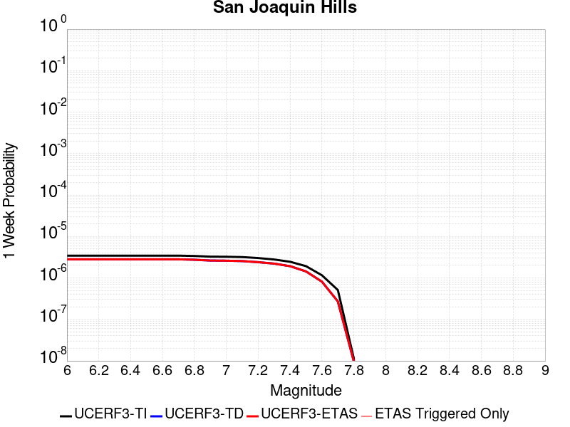 |  |  |  |

| Magnitude | 1 wk TI Prob | 1 wk TD Prob | 1 wk ETAS Prob | 1 wk ETAS/TD Gain | 1 wk ETAS Triggered Only | 1 mo TI Prob | 1 mo TD Prob | 1 mo ETAS Prob | 1 mo ETAS/TD Gain | 1 mo ETAS Triggered Only | 1 yr TI Prob | 1 yr TD Prob | 1 yr ETAS Prob | 1 yr ETAS/TD Gain | 1 yr ETAS Triggered Only | 10 yr TI Prob | 10 yr TD Prob | 10 yr ETAS Prob | 10 yr ETAS/TD Gain | 10 yr ETAS Triggered Only |
|-----|-----|-----|-----|-----|-----|-----|-----|-----|-----|-----|-----|-----|-----|-----|-----|-----|-----|-----|-----|-----|
| 6.0 | 3.4525704E-6 | 2.8139818E-6 | 2.8139818E-6 | 1.0 | 0.0 | 1.4796647E-5 | 1.2059867E-5 | 3.5869103E-5 | 2.9742537 | 2.3809524E-5 | 1.8013427E-4 | 1.4681912E-4 | 1.7062515E-4 | 1.1621453 | 2.3809524E-5 | 0.0017998833 | 0.0014672345 | 0.001491009 | 1.0162036 | 2.3809524E-5 |
| 6.1 | 3.4525704E-6 | 2.8139818E-6 | 2.8139818E-6 | 1.0 | 0.0 | 1.4796647E-5 | 1.2059867E-5 | 3.5869103E-5 | 2.9742537 | 2.3809524E-5 | 1.8013427E-4 | 1.4681912E-4 | 1.7062515E-4 | 1.1621453 | 2.3809524E-5 | 0.0017998833 | 0.0014672345 | 0.001491009 | 1.0162036 | 2.3809524E-5 |
| 6.2 | 3.4525704E-6 | 2.8139818E-6 | 2.8139818E-6 | 1.0 | 0.0 | 1.4796647E-5 | 1.2059867E-5 | 3.5869103E-5 | 2.9742537 | 2.3809524E-5 | 1.8013427E-4 | 1.4681912E-4 | 1.7062515E-4 | 1.1621453 | 2.3809524E-5 | 0.0017998833 | 0.0014672345 | 0.001491009 | 1.0162036 | 2.3809524E-5 |
| 6.3 | 3.4525704E-6 | 2.8139818E-6 | 2.8139818E-6 | 1.0 | 0.0 | 1.4796647E-5 | 1.2059867E-5 | 3.5869103E-5 | 2.9742537 | 2.3809524E-5 | 1.8013427E-4 | 1.4681912E-4 | 1.7062515E-4 | 1.1621453 | 2.3809524E-5 | 0.0017998833 | 0.0014672345 | 0.001491009 | 1.0162036 | 2.3809524E-5 |
| 6.4 | 3.4525704E-6 | 2.8139818E-6 | 2.8139818E-6 | 1.0 | 0.0 | 1.4796647E-5 | 1.2059867E-5 | 3.5869103E-5 | 2.9742537 | 2.3809524E-5 | 1.8013427E-4 | 1.4681912E-4 | 1.7062515E-4 | 1.1621453 | 2.3809524E-5 | 0.0017998833 | 0.0014672345 | 0.001491009 | 1.0162036 | 2.3809524E-5 |
| 6.5 | 3.4525704E-6 | 2.8139818E-6 | 2.8139818E-6 | 1.0 | 0.0 | 1.4796647E-5 | 1.2059867E-5 | 3.5869103E-5 | 2.9742537 | 2.3809524E-5 | 1.8013427E-4 | 1.4681912E-4 | 1.7062515E-4 | 1.1621453 | 2.3809524E-5 | 0.0017998833 | 0.0014672345 | 0.001491009 | 1.0162036 | 2.3809524E-5 |
| 6.6 | 3.4525704E-6 | 2.8139818E-6 | 2.8139818E-6 | 1.0 | 0.0 | 1.4796647E-5 | 1.2059867E-5 | 3.5869103E-5 | 2.9742537 | 2.3809524E-5 | 1.8013427E-4 | 1.4681912E-4 | 1.7062515E-4 | 1.1621453 | 2.3809524E-5 | 0.0017998833 | 0.0014672345 | 0.001491009 | 1.0162036 | 2.3809524E-5 |
| 6.7 | 3.4525704E-6 | 2.8139818E-6 | 2.8139818E-6 | 1.0 | 0.0 | 1.4796647E-5 | 1.2059867E-5 | 3.5869103E-5 | 2.9742537 | 2.3809524E-5 | 1.8013427E-4 | 1.4681912E-4 | 1.7062515E-4 | 1.1621453 | 2.3809524E-5 | 0.0017998833 | 0.0014672345 | 0.001491009 | 1.0162036 | 2.3809524E-5 |
| 6.8 | 3.388654E-6 | 2.7484202E-6 | 2.7484202E-6 | 1.0 | 0.0 | 1.4522722E-5 | 1.1778891E-5 | 3.5588135E-5 | 3.0213485 | 2.3809524E-5 | 1.767998E-4 | 1.4339869E-4 | 1.672048E-4 | 1.1660135 | 2.3809524E-5 | 0.001766592 | 0.0014330745 | 0.0014568499 | 1.0165905 | 2.3809524E-5 |
| 6.9 | 3.2694352E-6 | 2.6283346E-6 | 2.6283346E-6 | 1.0 | 0.0 | 1.401179E-5 | 1.1264243E-5 | 3.50735E-5 | 3.1137023 | 2.3809524E-5 | 1.7058018E-4 | 1.3713364E-4 | 1.609399E-4 | 1.173599 | 2.3809524E-5 | 0.0017044931 | 0.0013705015 | 0.0013942784 | 1.017349 | 2.3809524E-5 |
| 7.0 | 3.246912E-6 | 2.6069915E-6 | 2.6069915E-6 | 1.0 | 0.0 | 1.39152635E-5 | 1.1172774E-5 | 3.4982033E-5 | 3.131007 | 2.3809524E-5 | 1.6940516E-4 | 1.3602014E-4 | 1.5982644E-4 | 1.1750203 | 2.3809524E-5 | 0.0016927607 | 0.0013593802 | 0.0013831573 | 1.0174912 | 2.3809524E-5 |
| 7.1 | 3.1864927E-6 | 2.5523198E-6 | 2.5523198E-6 | 1.0 | 0.0 | 1.3656326E-5 | 1.0938467E-5 | 3.4747733E-5 | 3.1766543 | 2.3809524E-5 | 1.6625308E-4 | 1.3316782E-4 | 1.5697417E-4 | 1.1787696 | 2.3809524E-5 | 0.0016612876 | 0.0013308912 | 0.0013546691 | 1.0178661 | 2.3809524E-5 |
| 7.2 | 3.0220644E-6 | 2.3991677E-6 | 2.3991677E-6 | 1.0 | 0.0 | 1.295164E-5 | 1.0282108E-5 | 3.4091387E-5 | 3.315603 | 2.3809524E-5 | 1.576748E-4 | 1.2517757E-4 | 1.4898411E-4 | 1.1901822 | 2.3809524E-5 | 0.0015756298 | 0.0012510809 | 0.0012748607 | 1.0190073 | 2.3809524E-5 |
| 7.3 | 2.787619E-6 | 2.2173858E-6 | 2.2173858E-6 | 1.0 | 0.0 | 1.1946884E-5 | 9.503048E-6 | 3.3312346E-5 | 3.505438 | 2.3809524E-5 | 1.454436E-4 | 1.1569356E-4 | 1.3950033E-4 | 1.2057743 | 2.3809524E-5 | 0.0014534845 | 0.0011563431 | 0.0011801252 | 1.0205666 | 2.3809524E-5 |
| 7.4 | 2.4593792E-6 | 1.9226306E-6 | 1.9226306E-6 | 1.0 | 0.0 | 1.0540153E-5 | 8.23982E-6 | 3.204915E-5 | 3.8895445 | 2.3809524E-5 | 1.2831882E-4 | 1.0031529E-4 | 1.2412242E-4 | 1.2373232 | 2.3809524E-5 | 0.0012824474 | 0.0010027088 | 0.0010264944 | 1.0237213 | 2.3809524E-5 |
| 7.5 | 1.926764E-6 | 1.4383021E-6 | 1.4383021E-6 | 1.0 | 0.0 | 8.257534E-6 | 6.1641376E-6 | 2.9973515E-5 | 4.862564 | 2.3809524E-5 | 1.00530844E-4 | 7.504586E-5 | 9.885359E-5 | 1.3172425 | 2.3809524E-5 | 0.0010048538 | 7.502115E-4 | 7.7400316E-4 | 1.0317132 | 2.3809524E-5 |
| 7.6 | 1.1609359E-6 | 8.14558E-7 | 8.14558E-7 | 1.0 | 0.0 | 4.97543E-6 | 3.4909585E-6 | 3.4909585E-6 | 1.0 | 0.0 | 6.0574173E-5 | 4.2501633E-5 | 4.2501633E-5 | 1.0 | 0.0 | 6.055767E-4 | 4.249394E-4 | 4.249394E-4 | 1.0 | 0.0 |
| 7.7 | 5.1168536E-7 | 2.7155914E-7 | 2.7155914E-7 | 1.0 | 0.0 | 2.1929354E-6 | 1.1638244E-6 | 1.1638244E-6 | 1.0 | 0.0 | 2.669866E-5 | 1.41694845E-5 | 1.41694845E-5 | 1.0 | 0.0 | 2.6695454E-4 | 1.4168715E-4 | 1.4168715E-4 | 1.0 | 0.0 |
| 7.8 | 1.16056995E-8 | 9.782373E-9 | 9.782373E-9 | 1.0 | 0.0 | 4.9738713E-8 | 4.1924455E-8 | 4.1924455E-8 | 1.0 | 0.0 | 6.0556863E-7 | 5.1043025E-7 | 5.1043025E-7 | 1.0 | 0.0 | 6.05567E-6 | 5.1043025E-6 | 5.1043025E-6 | 1.0 | 0.0 |

## Greenville (No) 2011 CFM
*[(top)](#table-of-contents)*

| 1 Week | 1 Month | 1 Year | 10 Year |
|-----|-----|-----|-----|
|  |  |  |  |

| Magnitude | 1 wk TI Prob | 1 wk TD Prob | 1 wk ETAS Prob | 1 wk ETAS/TD Gain | 1 wk ETAS Triggered Only | 1 mo TI Prob | 1 mo TD Prob | 1 mo ETAS Prob | 1 mo ETAS/TD Gain | 1 mo ETAS Triggered Only | 1 yr TI Prob | 1 yr TD Prob | 1 yr ETAS Prob | 1 yr ETAS/TD Gain | 1 yr ETAS Triggered Only | 10 yr TI Prob | 10 yr TD Prob | 10 yr ETAS Prob | 10 yr ETAS/TD Gain | 10 yr ETAS Triggered Only |
|-----|-----|-----|-----|-----|-----|-----|-----|-----|-----|-----|-----|-----|-----|-----|-----|-----|-----|-----|-----|-----|
| 6.0 | 3.286654E-5 | 4.036648E-5 | 6.4175045E-5 | 1.5898103 | 2.3809524E-5 | 1.4084899E-4 | 1.7298796E-4 | 1.9679336E-4 | 1.137613 | 2.3809524E-5 | 0.0017134876 | 0.002104132 | 0.0021278914 | 1.0112917 | 2.3809524E-5 | 0.017003356 | 0.020846982 | 0.020870294 | 1.0011183 | 2.3809524E-5 |
| 6.1 | 3.286654E-5 | 4.036648E-5 | 6.4175045E-5 | 1.5898103 | 2.3809524E-5 | 1.4084899E-4 | 1.7298796E-4 | 1.9679336E-4 | 1.137613 | 2.3809524E-5 | 0.0017134876 | 0.002104132 | 0.0021278914 | 1.0112917 | 2.3809524E-5 | 0.017003356 | 0.020846982 | 0.020870294 | 1.0011183 | 2.3809524E-5 |
| 6.2 | 3.1697953E-5 | 3.8929385E-5 | 6.2737985E-5 | 1.6115842 | 2.3809524E-5 | 1.358413E-4 | 1.6682976E-4 | 1.9063531E-4 | 1.1426936 | 2.3809524E-5 | 0.0016526132 | 0.002029298 | 0.0020530594 | 1.0117091 | 2.3809524E-5 | 0.01640377 | 0.020112377 | 0.020135706 | 1.00116 | 2.3809524E-5 |
| 6.3 | 3.1363317E-5 | 3.851826E-5 | 6.2326864E-5 | 1.6181122 | 2.3809524E-5 | 1.344073E-4 | 1.6506804E-4 | 1.8887363E-4 | 1.1442169 | 2.3809524E-5 | 0.0016351803 | 0.0020078886 | 0.0020316504 | 1.0118341 | 2.3809524E-5 | 0.016232004 | 0.019902144 | 0.019925479 | 1.0011725 | 2.3809524E-5 |
| 6.4 | 3.0228604E-5 | 3.7125395E-5 | 6.0934035E-5 | 1.6413033 | 2.3809524E-5 | 1.2954473E-4 | 1.5909935E-4 | 1.8290507E-4 | 1.1496282 | 2.3809524E-5 | 0.0015760659 | 0.0019353506 | 0.001959114 | 1.0122787 | 2.3809524E-5 | 0.015649348 | 0.019189484 | 0.019212838 | 1.001217 | 2.3809524E-5 |
| 6.5 | 2.9537814E-5 | 3.6280853E-5 | 6.008951E-5 | 1.6562321 | 2.3809524E-5 | 1.2658449E-4 | 1.554803E-4 | 1.7928613E-4 | 1.1531115 | 2.3809524E-5 | 0.0015400766 | 0.0018913659 | 0.0019151303 | 1.0125648 | 2.3809524E-5 | 0.01529447 | 0.018757146 | 0.018780509 | 1.0012455 | 2.3809524E-5 |
| 6.6 | 2.7345395E-5 | 3.3590182E-5 | 5.739891E-5 | 1.7088001 | 2.3809524E-5 | 1.1718928E-4 | 1.4395016E-4 | 1.6775625E-4 | 1.1653774 | 2.3809524E-5 | 0.0014258457 | 0.0017512152 | 0.001774983 | 1.0135722 | 2.3809524E-5 | 0.014167317 | 0.01737797 | 0.017401366 | 1.0013462 | 2.3809524E-5 |
| 6.7 | 2.5615784E-5 | 3.1567088E-5 | 5.5375862E-5 | 1.7542278 | 2.3809524E-5 | 1.09777306E-4 | 1.3528067E-4 | 1.5908698E-4 | 1.1759771 | 2.3809524E-5 | 0.0013357193 | 0.0016458282 | 0.0016695986 | 1.0144428 | 2.3809524E-5 | 0.013277191 | 0.016340064 | 0.016363485 | 1.0014334 | 2.3809524E-5 |
| 6.8 | 2.0059057E-5 | 2.4712073E-5 | 2.4712073E-5 | 1.0 | 0.0 | 8.596455E-5 | 1.0590468E-4 | 1.0590468E-4 | 1.0 | 0.0 | 0.0010461159 | 0.001288643 | 0.001288643 | 1.0 | 0.0 | 0.0104120495 | 0.012813724 | 0.012813724 | 1.0 | 0.0 |
| 6.9 | 1.6321746E-5 | 2.018467E-5 | 2.018467E-5 | 1.0 | 0.0 | 6.9948466E-5 | 8.650293E-5 | 8.650293E-5 | 1.0 | 0.0 | 8.5128983E-4 | 0.0010526767 | 0.0010526767 | 1.0 | 0.0 | 0.008480361 | 0.010478431 | 0.010478431 | 1.0 | 0.0 |
| 7.0 | 1.22527645E-5 | 1.5135633E-5 | 1.5135633E-5 | 1.0 | 0.0 | 5.2510793E-5 | 6.486541E-5 | 6.486541E-5 | 1.0 | 0.0 | 6.3913135E-4 | 7.894544E-4 | 7.894544E-4 | 1.0 | 0.0 | 0.0063729626 | 0.007867137 | 0.007867137 | 1.0 | 0.0 |
| 7.1 | 8.996482E-6 | 1.1164954E-5 | 1.1164954E-5 | 1.0 | 0.0 | 3.8555783E-5 | 4.7848935E-5 | 4.7848935E-5 | 1.0 | 0.0 | 4.6931554E-4 | 5.824063E-4 | 5.824063E-4 | 1.0 | 0.0 | 0.004683256 | 0.0058090906 | 0.0058090906 | 1.0 | 0.0 |
| 7.2 | 6.0273087E-6 | 7.569474E-6 | 7.569474E-6 | 1.0 | 0.0 | 2.5831067E-5 | 3.2440203E-5 | 3.2440203E-5 | 1.0 | 0.0 | 3.1444785E-4 | 3.9488857E-4 | 3.9488857E-4 | 1.0 | 0.0 | 0.0031400328 | 0.003942066 | 0.003942066 | 1.0 | 0.0 |
| 7.3 | 3.1209995E-6 | 3.9663746E-6 | 3.9663746E-6 | 1.0 | 0.0 | 1.3375643E-5 | 1.699864E-5 | 1.699864E-5 | 1.0 | 0.0 | 1.6283628E-4 | 2.0693893E-4 | 2.0693893E-4 | 1.0 | 0.0 | 0.0016271701 | 0.0020675526 | 0.0020675526 | 1.0 | 0.0 |
| 7.4 | 2.0254208E-6 | 2.6096043E-6 | 2.6096043E-6 | 1.0 | 0.0 | 8.680347E-6 | 1.1183971E-5 | 1.1183971E-5 | 1.0 | 0.0 | 1.0567809E-4 | 1.361564E-4 | 1.361564E-4 | 1.0 | 0.0 | 0.0010562785 | 0.0013607866 | 0.0013607866 | 1.0 | 0.0 |
| 7.5 | 1.6763418E-6 | 2.173353E-6 | 2.173353E-6 | 1.0 | 0.0 | 7.184302E-6 | 9.314337E-6 | 9.314337E-6 | 1.0 | 0.0 | 8.746537E-5 | 1.1339621E-4 | 1.1339621E-4 | 1.0 | 0.0 | 8.743095E-4 | 0.0011334305 | 0.0011334305 | 1.0 | 0.0 |
| 7.6 | 1.1935462E-6 | 1.5458467E-6 | 1.5458467E-6 | 1.0 | 0.0 | 5.115188E-6 | 6.6250404E-6 | 6.6250404E-6 | 1.0 | 0.0 | 6.2275634E-5 | 8.065693E-5 | 8.065693E-5 | 1.0 | 0.0 | 6.2258187E-4 | 8.0630725E-4 | 8.0630725E-4 | 1.0 | 0.0 |
| 7.7 | 3.0464201E-7 | 3.9846822E-7 | 3.9846822E-7 | 1.0 | 0.0 | 1.3056081E-6 | 1.7077199E-6 | 1.7077199E-6 | 1.0 | 0.0 | 1.589566E-5 | 2.0791296E-5 | 2.0791296E-5 | 1.0 | 0.0 | 1.5894524E-4 | 2.0789822E-4 | 2.0789822E-4 | 1.0 | 0.0 |

## Sisar
*[(top)](#table-of-contents)*

| 1 Week | 1 Month | 1 Year | 10 Year |
|-----|-----|-----|-----|
|  |  |  |  |

| Magnitude | 1 wk TI Prob | 1 wk TD Prob | 1 wk ETAS Prob | 1 wk ETAS/TD Gain | 1 wk ETAS Triggered Only | 1 mo TI Prob | 1 mo TD Prob | 1 mo ETAS Prob | 1 mo ETAS/TD Gain | 1 mo ETAS Triggered Only | 1 yr TI Prob | 1 yr TD Prob | 1 yr ETAS Prob | 1 yr ETAS/TD Gain | 1 yr ETAS Triggered Only | 10 yr TI Prob | 10 yr TD Prob | 10 yr ETAS Prob | 10 yr ETAS/TD Gain | 10 yr ETAS Triggered Only |
|-----|-----|-----|-----|-----|-----|-----|-----|-----|-----|-----|-----|-----|-----|-----|-----|-----|-----|-----|-----|-----|
| 6.0 | 4.544193E-6 | 3.839576E-6 | 3.839576E-6 | 1.0 | 0.0 | 1.9474966E-5 | 1.6455224E-5 | 1.6455224E-5 | 1.0 | 0.0 | 2.3708193E-4 | 2.0032428E-4 | 2.0032428E-4 | 1.0 | 0.0 | 0.0023682916 | 0.002001471 | 0.0020252327 | 1.0118722 | 2.3809524E-5 |
| 6.1 | 4.544193E-6 | 3.839576E-6 | 3.839576E-6 | 1.0 | 0.0 | 1.9474966E-5 | 1.6455224E-5 | 1.6455224E-5 | 1.0 | 0.0 | 2.3708193E-4 | 2.0032428E-4 | 2.0032428E-4 | 1.0 | 0.0 | 0.0023682916 | 0.002001471 | 0.0020252327 | 1.0118722 | 2.3809524E-5 |
| 6.2 | 4.544193E-6 | 3.839576E-6 | 3.839576E-6 | 1.0 | 0.0 | 1.9474966E-5 | 1.6455224E-5 | 1.6455224E-5 | 1.0 | 0.0 | 2.3708193E-4 | 2.0032428E-4 | 2.0032428E-4 | 1.0 | 0.0 | 0.0023682916 | 0.002001471 | 0.0020252327 | 1.0118722 | 2.3809524E-5 |
| 6.3 | 4.544193E-6 | 3.839576E-6 | 3.839576E-6 | 1.0 | 0.0 | 1.9474966E-5 | 1.6455224E-5 | 1.6455224E-5 | 1.0 | 0.0 | 2.3708193E-4 | 2.0032428E-4 | 2.0032428E-4 | 1.0 | 0.0 | 0.0023682916 | 0.002001471 | 0.0020252327 | 1.0118722 | 2.3809524E-5 |
| 6.4 | 4.544193E-6 | 3.839576E-6 | 3.839576E-6 | 1.0 | 0.0 | 1.9474966E-5 | 1.6455224E-5 | 1.6455224E-5 | 1.0 | 0.0 | 2.3708193E-4 | 2.0032428E-4 | 2.0032428E-4 | 1.0 | 0.0 | 0.0023682916 | 0.002001471 | 0.0020252327 | 1.0118722 | 2.3809524E-5 |
| 6.5 | 4.544193E-6 | 3.839576E-6 | 3.839576E-6 | 1.0 | 0.0 | 1.9474966E-5 | 1.6455224E-5 | 1.6455224E-5 | 1.0 | 0.0 | 2.3708193E-4 | 2.0032428E-4 | 2.0032428E-4 | 1.0 | 0.0 | 0.0023682916 | 0.002001471 | 0.0020252327 | 1.0118722 | 2.3809524E-5 |
| 6.6 | 4.544193E-6 | 3.839576E-6 | 3.839576E-6 | 1.0 | 0.0 | 1.9474966E-5 | 1.6455224E-5 | 1.6455224E-5 | 1.0 | 0.0 | 2.3708193E-4 | 2.0032428E-4 | 2.0032428E-4 | 1.0 | 0.0 | 0.0023682916 | 0.002001471 | 0.0020252327 | 1.0118722 | 2.3809524E-5 |
| 6.7 | 4.544193E-6 | 3.839576E-6 | 3.839576E-6 | 1.0 | 0.0 | 1.9474966E-5 | 1.6455224E-5 | 1.6455224E-5 | 1.0 | 0.0 | 2.3708193E-4 | 2.0032428E-4 | 2.0032428E-4 | 1.0 | 0.0 | 0.0023682916 | 0.002001471 | 0.0020252327 | 1.0118722 | 2.3809524E-5 |
| 6.8 | 4.544193E-6 | 3.839576E-6 | 3.839576E-6 | 1.0 | 0.0 | 1.9474966E-5 | 1.6455224E-5 | 1.6455224E-5 | 1.0 | 0.0 | 2.3708193E-4 | 2.0032428E-4 | 2.0032428E-4 | 1.0 | 0.0 | 0.0023682916 | 0.002001471 | 0.0020252327 | 1.0118722 | 2.3809524E-5 |
| 6.9 | 4.542225E-6 | 3.8375383E-6 | 3.8375383E-6 | 1.0 | 0.0 | 1.9466532E-5 | 1.6446491E-5 | 1.6446491E-5 | 1.0 | 0.0 | 2.3697925E-4 | 2.0021795E-4 | 2.0021795E-4 | 1.0 | 0.0 | 0.002367267 | 0.0020004094 | 0.0020241714 | 1.0118785 | 2.3809524E-5 |
| 7.0 | 4.5278484E-6 | 3.822602E-6 | 3.822602E-6 | 1.0 | 0.0 | 1.940492E-5 | 1.638248E-5 | 1.638248E-5 | 1.0 | 0.0 | 2.3622929E-4 | 1.9943877E-4 | 1.9943877E-4 | 1.0 | 0.0 | 0.0023597833 | 0.0019926317 | 0.0020163937 | 1.011925 | 2.3809524E-5 |
| 7.1 | 4.5132488E-6 | 3.8073897E-6 | 3.8073897E-6 | 1.0 | 0.0 | 1.9342351E-5 | 1.6317284E-5 | 1.6317284E-5 | 1.0 | 0.0 | 2.3546767E-4 | 1.9864515E-4 | 1.9864515E-4 | 1.0 | 0.0 | 0.0023521832 | 0.0019847096 | 0.0020084719 | 1.0119727 | 2.3809524E-5 |
| 7.2 | 4.448859E-6 | 3.7398502E-6 | 3.7398502E-6 | 1.0 | 0.0 | 1.9066398E-5 | 1.6027832E-5 | 1.6027832E-5 | 1.0 | 0.0 | 2.3210866E-4 | 1.9512173E-4 | 1.9512173E-4 | 1.0 | 0.0 | 0.0023186638 | 0.0019495375 | 0.0019733007 | 1.0121891 | 2.3809524E-5 |
| 7.3 | 4.3424366E-6 | 3.6336846E-6 | 3.6336846E-6 | 1.0 | 0.0 | 1.861031E-5 | 1.5572843E-5 | 1.5572843E-5 | 1.0 | 0.0 | 2.2655698E-4 | 1.895832E-4 | 1.895832E-4 | 1.0 | 0.0 | 0.0022632615 | 0.0018942481 | 0.0019180125 | 1.0125456 | 2.3809524E-5 |
| 7.4 | 4.218641E-6 | 3.5330384E-6 | 3.5330384E-6 | 1.0 | 0.0 | 1.8079765E-5 | 1.5141507E-5 | 1.5141507E-5 | 1.0 | 0.0 | 2.2009891E-4 | 1.8433259E-4 | 1.8433259E-4 | 1.0 | 0.0 | 0.0021988105 | 0.0018418302 | 0.0018655959 | 1.0129033 | 2.3809524E-5 |
| 7.5 | 3.983779E-6 | 3.3478068E-6 | 3.3478068E-6 | 1.0 | 0.0 | 1.7073227E-5 | 1.4347666E-5 | 1.4347666E-5 | 1.0 | 0.0 | 2.0784672E-4 | 1.7466917E-4 | 1.7466917E-4 | 1.0 | 0.0 | 0.0020765243 | 0.0017453518 | 0.0017691198 | 1.0136179 | 2.3809524E-5 |
| 7.6 | 2.777393E-6 | 2.35225E-6 | 2.35225E-6 | 1.0 | 0.0 | 1.1903058E-5 | 1.0081033E-5 | 1.0081033E-5 | 1.0 | 0.0 | 1.449101E-4 | 1.2272975E-4 | 1.2272975E-4 | 1.0 | 0.0 | 0.0014481564 | 0.0012266274 | 0.0012504077 | 1.0193868 | 2.3809524E-5 |
| 7.7 | 1.9028433E-6 | 1.593867E-6 | 1.593867E-6 | 1.0 | 0.0 | 8.155017E-6 | 6.8308404E-6 | 6.8308404E-6 | 1.0 | 0.0 | 9.928281E-5 | 8.3162355E-5 | 8.3162355E-5 | 1.0 | 0.0 | 9.923846E-4 | 8.313171E-4 | 8.5510686E-4 | 1.0286169 | 2.3809524E-5 |
| 7.8 | 4.9095956E-7 | 4.3583708E-7 | 4.3583708E-7 | 1.0 | 0.0 | 2.1041105E-6 | 1.8678718E-6 | 1.8678718E-6 | 1.0 | 0.0 | 2.5617246E-5 | 2.2741104E-5 | 2.2741104E-5 | 1.0 | 0.0 | 2.5614293E-4 | 2.2738794E-4 | 2.2738794E-4 | 1.0 | 0.0 |
| 7.9 | 1.16657894E-7 | 1.0335569E-7 | 1.0335569E-7 | 1.0 | 0.0 | 4.999623E-7 | 4.4295288E-7 | 4.4295288E-7 | 1.0 | 0.0 | 6.087024E-6 | 5.3929384E-6 | 5.3929384E-6 | 1.0 | 0.0 | 6.0868573E-5 | 5.3928103E-5 | 5.3928103E-5 | 1.0 | 0.0 |
| 8.0 | 2.5100346E-9 | 1.7067566E-9 | 1.7067566E-9 | 1.0 | 0.0 | 1.0757291E-8 | 7.3146724E-9 | 7.3146724E-9 | 1.0 | 0.0 | 1.3097001E-7 | 8.905613E-8 | 8.905613E-8 | 1.0 | 0.0 | 1.3096993E-6 | 8.9056095E-7 | 8.9056095E-7 | 1.0 | 0.0 |

## Northridge
*[(top)](#table-of-contents)*

| 1 Week | 1 Month | 1 Year | 10 Year |
|-----|-----|-----|-----|
|  |  |  |  |

| Magnitude | 1 wk TI Prob | 1 wk TD Prob | 1 wk ETAS Prob | 1 wk ETAS/TD Gain | 1 wk ETAS Triggered Only | 1 mo TI Prob | 1 mo TD Prob | 1 mo ETAS Prob | 1 mo ETAS/TD Gain | 1 mo ETAS Triggered Only | 1 yr TI Prob | 1 yr TD Prob | 1 yr ETAS Prob | 1 yr ETAS/TD Gain | 1 yr ETAS Triggered Only | 10 yr TI Prob | 10 yr TD Prob | 10 yr ETAS Prob | 10 yr ETAS/TD Gain | 10 yr ETAS Triggered Only |
|-----|-----|-----|-----|-----|-----|-----|-----|-----|-----|-----|-----|-----|-----|-----|-----|-----|-----|-----|-----|-----|
| 6.0 | 1.8340852E-5 | 7.5880193E-6 | 7.5880193E-6 | 1.0 | 0.0 | 7.860128E-5 | 3.251969E-5 | 3.251969E-5 | 1.0 | 0.0 | 9.565505E-4 | 3.958575E-4 | 4.196576E-4 | 1.0601228 | 2.3809524E-5 | 0.009524435 | 0.003951746 | 0.0039754612 | 1.0060012 | 2.3809524E-5 |
| 6.1 | 1.8340852E-5 | 7.5880193E-6 | 7.5880193E-6 | 1.0 | 0.0 | 7.860128E-5 | 3.251969E-5 | 3.251969E-5 | 1.0 | 0.0 | 9.565505E-4 | 3.958575E-4 | 4.196576E-4 | 1.0601228 | 2.3809524E-5 | 0.009524435 | 0.003951746 | 0.0039754612 | 1.0060012 | 2.3809524E-5 |
| 6.2 | 1.8340852E-5 | 7.5880193E-6 | 7.5880193E-6 | 1.0 | 0.0 | 7.860128E-5 | 3.251969E-5 | 3.251969E-5 | 1.0 | 0.0 | 9.565505E-4 | 3.958575E-4 | 4.196576E-4 | 1.0601228 | 2.3809524E-5 | 0.009524435 | 0.003951746 | 0.0039754612 | 1.0060012 | 2.3809524E-5 |
| 6.3 | 1.8340852E-5 | 7.5880193E-6 | 7.5880193E-6 | 1.0 | 0.0 | 7.860128E-5 | 3.251969E-5 | 3.251969E-5 | 1.0 | 0.0 | 9.565505E-4 | 3.958575E-4 | 4.196576E-4 | 1.0601228 | 2.3809524E-5 | 0.009524435 | 0.003951746 | 0.0039754612 | 1.0060012 | 2.3809524E-5 |
| 6.4 | 1.7361892E-5 | 7.5880193E-6 | 7.5880193E-6 | 1.0 | 0.0 | 7.440598E-5 | 3.251969E-5 | 3.251969E-5 | 1.0 | 0.0 | 9.055163E-4 | 3.958575E-4 | 4.196576E-4 | 1.0601228 | 2.3809524E-5 | 0.009018354 | 0.003951746 | 0.0039754612 | 1.0060012 | 2.3809524E-5 |
| 6.5 | 1.7361892E-5 | 7.5880193E-6 | 7.5880193E-6 | 1.0 | 0.0 | 7.440598E-5 | 3.251969E-5 | 3.251969E-5 | 1.0 | 0.0 | 9.055163E-4 | 3.958575E-4 | 4.196576E-4 | 1.0601228 | 2.3809524E-5 | 0.009018354 | 0.003951746 | 0.0039754612 | 1.0060012 | 2.3809524E-5 |
| 6.6 | 1.5458201E-5 | 7.5880193E-6 | 7.5880193E-6 | 1.0 | 0.0 | 6.624775E-5 | 3.251969E-5 | 3.251969E-5 | 1.0 | 0.0 | 8.0626784E-4 | 3.958575E-4 | 4.196576E-4 | 1.0601228 | 2.3809524E-5 | 0.008033488 | 0.003951746 | 0.0039754612 | 1.0060012 | 2.3809524E-5 |
| 6.7 | 1.2538368E-5 | 6.381603E-6 | 6.381603E-6 | 1.0 | 0.0 | 5.3734755E-5 | 2.7349442E-5 | 2.7349442E-5 | 1.0 | 0.0 | 6.5402425E-4 | 3.3292902E-4 | 3.5673063E-4 | 1.0714915 | 2.3809524E-5 | 0.0065210275 | 0.0033243506 | 0.003348081 | 1.0071384 | 2.3809524E-5 |
| 6.8 | 1.1438097E-5 | 6.3502566E-6 | 6.3502566E-6 | 1.0 | 0.0 | 4.9019498E-5 | 2.7215105E-5 | 2.7215105E-5 | 1.0 | 0.0 | 5.9664896E-4 | 3.3129397E-4 | 3.3129397E-4 | 1.0 | 0.0 | 0.005950495 | 0.0033080487 | 0.0033080487 | 1.0 | 0.0 |
| 6.9 | 1.1204891E-5 | 6.2867084E-6 | 6.2867084E-6 | 1.0 | 0.0 | 4.8020076E-5 | 2.694276E-5 | 2.694276E-5 | 1.0 | 0.0 | 5.8448757E-4 | 3.2797916E-4 | 3.2797916E-4 | 1.0 | 0.0 | 0.0058295266 | 0.0032749989 | 0.0032749989 | 1.0 | 0.0 |
| 7.0 | 1.061046E-5 | 6.115359E-6 | 6.115359E-6 | 1.0 | 0.0 | 4.5472607E-5 | 2.6208421E-5 | 2.6208421E-5 | 1.0 | 0.0 | 5.534883E-4 | 3.1904122E-4 | 3.1904122E-4 | 1.0 | 0.0 | 0.0055211177 | 0.0031858785 | 0.0031858785 | 1.0 | 0.0 |
| 7.1 | 1.0266979E-5 | 6.004274E-6 | 6.004274E-6 | 1.0 | 0.0 | 4.40006E-5 | 2.5732352E-5 | 2.5732352E-5 | 1.0 | 0.0 | 5.355756E-4 | 3.1324677E-4 | 3.1324677E-4 | 1.0 | 0.0 | 0.0053428668 | 0.003128098 | 0.003128098 | 1.0 | 0.0 |
| 7.2 | 9.91273E-6 | 5.819984E-6 | 5.819984E-6 | 1.0 | 0.0 | 4.248244E-5 | 2.4942554E-5 | 2.4942554E-5 | 1.0 | 0.0 | 5.171009E-4 | 3.036337E-4 | 3.036337E-4 | 1.0 | 0.0 | 0.0051589934 | 0.0030322333 | 0.0030322333 | 1.0 | 0.0 |
| 7.3 | 8.4959265E-6 | 5.193062E-6 | 5.193062E-6 | 1.0 | 0.0 | 3.6410605E-5 | 2.225579E-5 | 2.225579E-5 | 1.0 | 0.0 | 4.4320893E-4 | 2.709308E-4 | 2.709308E-4 | 1.0 | 0.0 | 0.00442326 | 0.0027060313 | 0.0027060313 | 1.0 | 0.0 |
| 7.4 | 8.0847185E-6 | 4.9819355E-6 | 4.9819355E-6 | 1.0 | 0.0 | 3.4648332E-5 | 2.135098E-5 | 2.135098E-5 | 1.0 | 0.0 | 4.2176177E-4 | 2.599174E-4 | 2.599174E-4 | 1.0 | 0.0 | 0.0042096223 | 0.00259616 | 0.00259616 | 1.0 | 0.0 |
| 7.5 | 6.8220684E-6 | 4.2533075E-6 | 4.2533075E-6 | 1.0 | 0.0 | 2.9237108E-5 | 1.8228335E-5 | 1.8228335E-5 | 1.0 | 0.0 | 3.5590364E-4 | 2.2190758E-4 | 2.2190758E-4 | 1.0 | 0.0 | 0.0035533418 | 0.002216881 | 0.002216881 | 1.0 | 0.0 |
| 7.6 | 4.4224143E-6 | 2.8999582E-6 | 2.8999582E-6 | 1.0 | 0.0 | 1.8953066E-5 | 1.2428334E-5 | 1.2428334E-5 | 1.0 | 0.0 | 2.3072914E-4 | 1.5130457E-4 | 1.5130457E-4 | 1.0 | 0.0 | 0.0023048974 | 0.0015120271 | 0.0015120271 | 1.0 | 0.0 |
| 7.7 | 2.5297056E-6 | 1.6045905E-6 | 1.6045905E-6 | 1.0 | 0.0 | 1.0841551E-5 | 6.8767986E-6 | 6.8767986E-6 | 1.0 | 0.0 | 1.319879E-4 | 8.3721854E-5 | 8.3721854E-5 | 1.0 | 0.0 | 0.0013190953 | 8.369078E-4 | 8.369078E-4 | 1.0 | 0.0 |
| 7.8 | 1.2508156E-6 | 8.780076E-7 | 8.780076E-7 | 1.0 | 0.0 | 5.3606273E-6 | 3.7628845E-6 | 3.7628845E-6 | 1.0 | 0.0 | 6.526368E-5 | 4.581217E-5 | 4.581217E-5 | 1.0 | 0.0 | 6.524452E-4 | 4.5802852E-4 | 4.5802852E-4 | 1.0 | 0.0 |
| 7.9 | 2.262199E-7 | 1.4664671E-7 | 1.4664671E-7 | 1.0 | 0.0 | 9.695135E-7 | 6.284858E-7 | 6.284858E-7 | 1.0 | 0.0 | 1.1803763E-5 | 7.651788E-6 | 7.651788E-6 | 1.0 | 0.0 | 1.1803136E-4 | 7.651533E-5 | 7.651533E-5 | 1.0 | 0.0 |
| 8.0 | 2.865362E-9 | 1.2753101E-9 | 1.2753101E-9 | 1.0 | 0.0 | 1.2280123E-8 | 5.4656146E-9 | 5.4656146E-9 | 1.0 | 0.0 | 1.4951048E-7 | 6.654386E-8 | 6.654386E-8 | 1.0 | 0.0 | 1.4951038E-6 | 6.654386E-7 | 6.654386E-7 | 1.0 | 0.0 |

## Round Valley
*[(top)](#table-of-contents)*

| 1 Week | 1 Month | 1 Year | 10 Year |
|-----|-----|-----|-----|
|  |  | 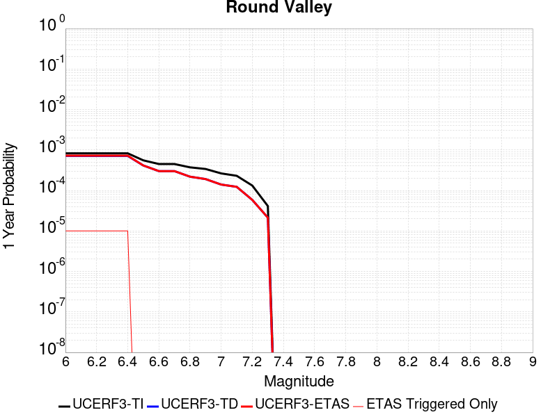 |  |

| Magnitude | 1 wk TI Prob | 1 wk TD Prob | 1 wk ETAS Prob | 1 wk ETAS/TD Gain | 1 wk ETAS Triggered Only | 1 mo TI Prob | 1 mo TD Prob | 1 mo ETAS Prob | 1 mo ETAS/TD Gain | 1 mo ETAS Triggered Only | 1 yr TI Prob | 1 yr TD Prob | 1 yr ETAS Prob | 1 yr ETAS/TD Gain | 1 yr ETAS Triggered Only | 10 yr TI Prob | 10 yr TD Prob | 10 yr ETAS Prob | 10 yr ETAS/TD Gain | 10 yr ETAS Triggered Only |
|-----|-----|-----|-----|-----|-----|-----|-----|-----|-----|-----|-----|-----|-----|-----|-----|-----|-----|-----|-----|-----|
| 6.0 | 1.588152E-5 | 1.3670716E-5 | 1.3670716E-5 | 1.0 | 0.0 | 6.806188E-5 | 5.8587688E-5 | 5.8587688E-5 | 1.0 | 0.0 | 8.283384E-4 | 7.13111E-4 | 7.369036E-4 | 1.0333644 | 2.3809524E-5 | 0.008252576 | 0.0071121147 | 0.007135755 | 1.0033239 | 2.3809524E-5 |
| 6.1 | 1.588152E-5 | 1.3670716E-5 | 1.3670716E-5 | 1.0 | 0.0 | 6.806188E-5 | 5.8587688E-5 | 5.8587688E-5 | 1.0 | 0.0 | 8.283384E-4 | 7.13111E-4 | 7.369036E-4 | 1.0333644 | 2.3809524E-5 | 0.008252576 | 0.0071121147 | 0.007135755 | 1.0033239 | 2.3809524E-5 |
| 6.2 | 1.588152E-5 | 1.3670716E-5 | 1.3670716E-5 | 1.0 | 0.0 | 6.806188E-5 | 5.8587688E-5 | 5.8587688E-5 | 1.0 | 0.0 | 8.283384E-4 | 7.13111E-4 | 7.369036E-4 | 1.0333644 | 2.3809524E-5 | 0.008252576 | 0.0071121147 | 0.007135755 | 1.0033239 | 2.3809524E-5 |
| 6.3 | 1.588152E-5 | 1.3670716E-5 | 1.3670716E-5 | 1.0 | 0.0 | 6.806188E-5 | 5.8587688E-5 | 5.8587688E-5 | 1.0 | 0.0 | 8.283384E-4 | 7.13111E-4 | 7.369036E-4 | 1.0333644 | 2.3809524E-5 | 0.008252576 | 0.0071121147 | 0.007135755 | 1.0033239 | 2.3809524E-5 |
| 6.4 | 1.588152E-5 | 1.3670716E-5 | 1.3670716E-5 | 1.0 | 0.0 | 6.806188E-5 | 5.8587688E-5 | 5.8587688E-5 | 1.0 | 0.0 | 8.283384E-4 | 7.13111E-4 | 7.369036E-4 | 1.0333644 | 2.3809524E-5 | 0.008252576 | 0.0071121147 | 0.007135755 | 1.0033239 | 2.3809524E-5 |
| 6.5 | 1.0646776E-5 | 7.953037E-6 | 7.953037E-6 | 1.0 | 0.0 | 4.5628243E-5 | 3.408405E-5 | 3.408405E-5 | 1.0 | 0.0 | 5.553823E-4 | 4.1490266E-4 | 4.1490266E-4 | 1.0 | 0.0 | 0.005539963 | 0.0041421093 | 0.0041421093 | 1.0 | 0.0 |
| 6.6 | 8.632956E-6 | 5.768742E-6 | 5.768742E-6 | 1.0 | 0.0 | 3.6997862E-5 | 2.4722967E-5 | 2.4722967E-5 | 1.0 | 0.0 | 4.5035584E-4 | 3.009644E-4 | 3.009644E-4 | 1.0 | 0.0 | 0.0044944426 | 0.003005946 | 0.003005946 | 1.0 | 0.0 |
| 6.7 | 8.632956E-6 | 5.768742E-6 | 5.768742E-6 | 1.0 | 0.0 | 3.6997862E-5 | 2.4722967E-5 | 2.4722967E-5 | 1.0 | 0.0 | 4.5035584E-4 | 3.009644E-4 | 3.009644E-4 | 1.0 | 0.0 | 0.0044944426 | 0.003005946 | 0.003005946 | 1.0 | 0.0 |
| 6.8 | 7.143895E-6 | 4.2018346E-6 | 4.2018346E-6 | 1.0 | 0.0 | 3.0616335E-5 | 1.8007748E-5 | 1.8007748E-5 | 1.0 | 0.0 | 3.726901E-4 | 2.1922393E-4 | 2.1922393E-4 | 1.0 | 0.0 | 0.0037206567 | 0.0021902416 | 0.0021902416 | 1.0 | 0.0 |
| 6.9 | 6.5120694E-6 | 3.6644687E-6 | 3.6644687E-6 | 1.0 | 0.0 | 2.790857E-5 | 1.570478E-5 | 1.570478E-5 | 1.0 | 0.0 | 3.3973387E-4 | 1.9119044E-4 | 1.9119044E-4 | 1.0 | 0.0 | 0.0033921495 | 0.0019104085 | 0.0019104085 | 1.0 | 0.0 |
| 7.0 | 5.0614435E-6 | 2.6836676E-6 | 2.6836676E-6 | 1.0 | 0.0 | 2.169172E-5 | 1.1501388E-5 | 1.1501388E-5 | 1.0 | 0.0 | 2.6406467E-4 | 1.4002144E-4 | 1.4002144E-4 | 1.0 | 0.0 | 0.0026375111 | 0.0013994334 | 0.0013994334 | 1.0 | 0.0 |
| 7.1 | 4.41728E-6 | 2.3575074E-6 | 2.3575074E-6 | 1.0 | 0.0 | 1.8931061E-5 | 1.0103569E-5 | 1.0103569E-5 | 1.0 | 0.0 | 2.304613E-4 | 1.23005E-4 | 1.23005E-4 | 1.0 | 0.0 | 0.0023022245 | 0.0012294657 | 0.0012294657 | 1.0 | 0.0 |
| 7.2 | 2.535495E-6 | 1.1208391E-6 | 1.1208391E-6 | 1.0 | 0.0 | 1.0866362E-5 | 4.8035904E-6 | 4.8035904E-6 | 1.0 | 0.0 | 1.3228992E-4 | 5.8482667E-5 | 5.8482667E-5 | 1.0 | 0.0 | 0.0013221119 | 5.84724E-4 | 5.84724E-4 | 1.0 | 0.0 |
| 7.3 | 7.900015E-7 | 4.0889498E-7 | 4.0889498E-7 | 1.0 | 0.0 | 3.3857161E-6 | 1.752407E-6 | 1.752407E-6 | 1.0 | 0.0 | 4.1220315E-5 | 2.1335554E-5 | 2.1335554E-5 | 1.0 | 0.0 | 4.121267E-4 | 2.1335555E-4 | 2.1335555E-4 | 1.0 | 0.0 |

## Sheephole
*[(top)](#table-of-contents)*

| 1 Week | 1 Month | 1 Year | 10 Year |
|-----|-----|-----|-----|
|  |  |  |  |

| Magnitude | 1 wk TI Prob | 1 wk TD Prob | 1 wk ETAS Prob | 1 wk ETAS/TD Gain | 1 wk ETAS Triggered Only | 1 mo TI Prob | 1 mo TD Prob | 1 mo ETAS Prob | 1 mo ETAS/TD Gain | 1 mo ETAS Triggered Only | 1 yr TI Prob | 1 yr TD Prob | 1 yr ETAS Prob | 1 yr ETAS/TD Gain | 1 yr ETAS Triggered Only | 10 yr TI Prob | 10 yr TD Prob | 10 yr ETAS Prob | 10 yr ETAS/TD Gain | 10 yr ETAS Triggered Only |
|-----|-----|-----|-----|-----|-----|-----|-----|-----|-----|-----|-----|-----|-----|-----|-----|-----|-----|-----|-----|-----|
| 6.0 | 4.5579695E-6 | 4.7412627E-6 | 2.8550674E-5 | 6.0217447 | 2.3809524E-5 | 1.9534009E-5 | 2.031957E-5 | 4.412861E-5 | 2.1717296 | 2.3809524E-5 | 2.3780059E-4 | 2.473682E-4 | 2.7117186E-4 | 1.0962275 | 2.3809524E-5 | 0.0023754628 | 0.002471473 | 0.002495224 | 1.0096099 | 2.3809524E-5 |
| 6.1 | 4.5579695E-6 | 4.7412627E-6 | 2.8550674E-5 | 6.0217447 | 2.3809524E-5 | 1.9534009E-5 | 2.031957E-5 | 4.412861E-5 | 2.1717296 | 2.3809524E-5 | 2.3780059E-4 | 2.473682E-4 | 2.7117186E-4 | 1.0962275 | 2.3809524E-5 | 0.0023754628 | 0.002471473 | 0.002495224 | 1.0096099 | 2.3809524E-5 |
| 6.2 | 2.6677674E-6 | 2.7873941E-6 | 2.6596852E-5 | 9.541834 | 2.3809524E-5 | 1.1433239E-5 | 1.1945926E-5 | 3.5755165E-5 | 2.9930844 | 2.3809524E-5 | 1.3919079E-4 | 1.4543302E-4 | 1.692391E-4 | 1.1636909 | 2.3809524E-5 | 0.0013910364 | 0.0014534844 | 0.0014772593 | 1.0163572 | 2.3809524E-5 |
| 6.3 | 2.6677674E-6 | 2.7873941E-6 | 2.6596852E-5 | 9.541834 | 2.3809524E-5 | 1.1433239E-5 | 1.1945926E-5 | 3.5755165E-5 | 2.9930844 | 2.3809524E-5 | 1.3919079E-4 | 1.4543302E-4 | 1.692391E-4 | 1.1636909 | 2.3809524E-5 | 0.0013910364 | 0.0014534844 | 0.0014772593 | 1.0163572 | 2.3809524E-5 |
| 6.4 | 2.2159759E-6 | 2.3228788E-6 | 2.6132348E-5 | 11.249984 | 2.3809524E-5 | 9.497005E-6 | 9.955161E-6 | 3.376445E-5 | 3.3916526 | 2.3809524E-5 | 1.156199E-4 | 1.2119815E-4 | 1.4500479E-4 | 1.1964273 | 2.3809524E-5 | 0.0011555976 | 0.0012113999 | 0.0012351805 | 1.0196308 | 2.3809524E-5 |
| 6.5 | 2.1986082E-6 | 2.304759E-6 | 2.6114229E-5 | 11.330567 | 2.3809524E-5 | 9.4225725E-6 | 9.877506E-6 | 3.3686796E-5 | 3.4104555 | 2.3809524E-5 | 1.1471378E-4 | 1.2025281E-4 | 1.4405946E-4 | 1.1979718 | 2.3809524E-5 | 0.0011465458 | 0.0012019566 | 0.0012257375 | 1.0197852 | 2.3809524E-5 |
| 6.6 | 1.5232331E-6 | 1.6018919E-6 | 2.5411378E-5 | 15.863355 | 2.3809524E-5 | 6.5281256E-6 | 6.865234E-6 | 3.0674593E-5 | 4.4681063 | 2.3809524E-5 | 7.947703E-5 | 8.35812E-5 | 1.0738874E-4 | 1.2848432 | 2.3809524E-5 | 7.9448614E-4 | 8.3551643E-4 | 8.59306E-4 | 1.028473 | 2.3809524E-5 |
| 6.7 | 1.3137362E-6 | 1.382819E-6 | 2.519231E-5 | 18.21808 | 2.3809524E-5 | 5.6302856E-6 | 5.926355E-6 | 2.9735736E-5 | 5.017543 | 2.3809524E-5 | 6.854657E-5 | 7.215112E-5 | 9.595892E-5 | 1.3299714 | 2.3809524E-5 | 6.8525434E-4 | 7.212908E-4 | 7.450832E-4 | 1.0329858 | 2.3809524E-5 |
| 6.8 | 1.2275751E-6 | 1.2922847E-6 | 2.5101777E-5 | 19.424341 | 2.3809524E-5 | 5.2610258E-6 | 5.5383516E-6 | 2.9347744E-5 | 5.299003 | 2.3809524E-5 | 6.4051106E-5 | 6.7427485E-5 | 9.12354E-5 | 1.3530892 | 2.3809524E-5 | 6.4032647E-4 | 6.740836E-4 | 6.978771E-4 | 1.0352975 | 2.3809524E-5 |
| 6.9 | 1.1837088E-6 | 1.246102E-6 | 2.5055597E-5 | 20.10718 | 2.3809524E-5 | 5.0730278E-6 | 5.340427E-6 | 2.9149824E-5 | 5.458332 | 2.3809524E-5 | 6.176237E-5 | 6.501789E-5 | 8.8825866E-5 | 1.3661758 | 2.3809524E-5 | 6.17452E-4 | 6.5000186E-4 | 6.737959E-4 | 1.0366061 | 2.3809524E-5 |
| 7.0 | 9.849371E-7 | 1.0366288E-6 | 2.4846127E-5 | 23.9682 | 2.3809524E-5 | 4.2211523E-6 | 4.442688E-6 | 2.8252105E-5 | 6.359237 | 2.3809524E-5 | 5.1391315E-5 | 5.4088487E-5 | 7.789672E-5 | 1.440172 | 2.3809524E-5 | 5.137943E-4 | 5.407633E-4 | 5.6455994E-4 | 1.0440056 | 2.3809524E-5 |
| 7.1 | 8.1643645E-7 | 8.591669E-7 | 2.466867E-5 | 28.712315 | 2.3809524E-5 | 3.4990085E-6 | 3.682139E-6 | 2.7491575E-5 | 7.4661965 | 2.3809524E-5 | 4.2599597E-5 | 4.482921E-5 | 6.8637666E-5 | 1.5310925 | 2.3809524E-5 | 4.259143E-4 | 4.4821028E-4 | 4.7200915E-4 | 1.0530975 | 2.3809524E-5 |
| 7.2 | 5.7295756E-7 | 6.029502E-7 | 2.441246E-5 | 40.488354 | 2.3809524E-5 | 2.45553E-6 | 2.58407E-6 | 2.6393533E-5 | 10.213939 | 2.3809524E-5 | 2.9895667E-5 | 3.1460666E-5 | 5.526944E-5 | 1.7567791 | 2.3809524E-5 | 2.9891645E-4 | 3.145688E-4 | 3.3837085E-4 | 1.0756656 | 2.3809524E-5 |

## Elsinore (Coyote Mountains)
*[(top)](#table-of-contents)*

| 1 Week | 1 Month | 1 Year | 10 Year |
|-----|-----|-----|-----|
|  |  |  |  |

| Magnitude | 1 wk TI Prob | 1 wk TD Prob | 1 wk ETAS Prob | 1 wk ETAS/TD Gain | 1 wk ETAS Triggered Only | 1 mo TI Prob | 1 mo TD Prob | 1 mo ETAS Prob | 1 mo ETAS/TD Gain | 1 mo ETAS Triggered Only | 1 yr TI Prob | 1 yr TD Prob | 1 yr ETAS Prob | 1 yr ETAS/TD Gain | 1 yr ETAS Triggered Only | 10 yr TI Prob | 10 yr TD Prob | 10 yr ETAS Prob | 10 yr ETAS/TD Gain | 10 yr ETAS Triggered Only |
|-----|-----|-----|-----|-----|-----|-----|-----|-----|-----|-----|-----|-----|-----|-----|-----|-----|-----|-----|-----|-----|
| 6.0 | 4.20513E-5 | 4.8631882E-5 | 4.8631882E-5 | 1.0 | 0.0 | 1.8020741E-4 | 2.0840895E-4 | 2.0840895E-4 | 1.0 | 0.0 | 0.0021918174 | 0.002535 | 0.0025587492 | 1.0093685 | 2.3809524E-5 | 0.021703249 | 0.025111282 | 0.025134495 | 1.0009243 | 2.3809524E-5 |
| 6.1 | 4.20513E-5 | 4.8631882E-5 | 4.8631882E-5 | 1.0 | 0.0 | 1.8020741E-4 | 2.0840895E-4 | 2.0840895E-4 | 1.0 | 0.0 | 0.0021918174 | 0.002535 | 0.0025587492 | 1.0093685 | 2.3809524E-5 | 0.021703249 | 0.025111282 | 0.025134495 | 1.0009243 | 2.3809524E-5 |
| 6.2 | 2.3413893E-5 | 2.469566E-5 | 2.469566E-5 | 1.0 | 0.0 | 1.0034139E-4 | 1.0583479E-4 | 1.0583479E-4 | 1.0 | 0.0 | 0.0012209718 | 0.0012878707 | 0.0013116496 | 1.0184637 | 2.3809524E-5 | 0.012142851 | 0.01281264 | 0.012836144 | 1.0018345 | 2.3809524E-5 |
| 6.3 | 2.3413893E-5 | 2.469566E-5 | 2.469566E-5 | 1.0 | 0.0 | 1.0034139E-4 | 1.0583479E-4 | 1.0583479E-4 | 1.0 | 0.0 | 0.0012209718 | 0.0012878707 | 0.0013116496 | 1.0184637 | 2.3809524E-5 | 0.012142851 | 0.01281264 | 0.012836144 | 1.0018345 | 2.3809524E-5 |
| 6.4 | 1.6894814E-5 | 1.6568361E-5 | 1.6568361E-5 | 1.0 | 0.0 | 7.240433E-5 | 7.1005554E-5 | 7.1005554E-5 | 1.0 | 0.0 | 8.811662E-4 | 8.6418656E-4 | 8.879755E-4 | 1.0275276 | 2.3809524E-5 | 0.0087768035 | 0.00861194 | 0.008635545 | 1.0027409 | 2.3809524E-5 |
| 6.5 | 1.6894814E-5 | 1.6568361E-5 | 1.6568361E-5 | 1.0 | 0.0 | 7.240433E-5 | 7.1005554E-5 | 7.1005554E-5 | 1.0 | 0.0 | 8.811662E-4 | 8.6418656E-4 | 8.879755E-4 | 1.0275276 | 2.3809524E-5 | 0.0087768035 | 0.00861194 | 0.008635545 | 1.0027409 | 2.3809524E-5 |
| 6.6 | 1.1910969E-5 | 1.0530774E-5 | 1.0530774E-5 | 1.0 | 0.0 | 5.1046012E-5 | 4.5131183E-5 | 4.5131183E-5 | 1.0 | 0.0 | 6.21308E-4 | 5.4934516E-4 | 5.4934516E-4 | 1.0 | 0.0 | 0.0061957375 | 0.005481174 | 0.005481174 | 1.0 | 0.0 |
| 6.7 | 9.1486E-6 | 7.2028593E-6 | 7.2028593E-6 | 1.0 | 0.0 | 3.9207694E-5 | 3.0869054E-5 | 3.0869054E-5 | 1.0 | 0.0 | 4.7724912E-4 | 3.757697E-4 | 3.757697E-4 | 1.0 | 0.0 | 0.0047622547 | 0.0037517229 | 0.0037517229 | 1.0 | 0.0 |
| 6.8 | 7.90441E-6 | 5.7290276E-6 | 5.7290276E-6 | 1.0 | 0.0 | 3.3875604E-5 | 2.4552752E-5 | 2.4552752E-5 | 1.0 | 0.0 | 4.1235742E-4 | 2.9889002E-4 | 2.9889002E-4 | 1.0 | 0.0 | 0.0041159308 | 0.002985009 | 0.002985009 | 1.0 | 0.0 |
| 6.9 | 7.77015E-6 | 5.582982E-6 | 5.582982E-6 | 1.0 | 0.0 | 3.3300217E-5 | 2.3926852E-5 | 2.3926852E-5 | 1.0 | 0.0 | 4.0535472E-4 | 2.9127175E-4 | 2.9127175E-4 | 1.0 | 0.0 | 0.004046161 | 0.002909027 | 0.002909027 | 1.0 | 0.0 |
| 7.0 | 7.675798E-6 | 5.47984E-6 | 5.47984E-6 | 1.0 | 0.0 | 3.289586E-5 | 2.3484827E-5 | 2.3484827E-5 | 1.0 | 0.0 | 4.004335E-4 | 2.858915E-4 | 2.858915E-4 | 1.0 | 0.0 | 0.003997127 | 0.0028553635 | 0.0028553635 | 1.0 | 0.0 |
| 7.1 | 7.447814E-6 | 5.238714E-6 | 5.238714E-6 | 1.0 | 0.0 | 3.191881E-5 | 2.2451446E-5 | 2.2451446E-5 | 1.0 | 0.0 | 3.8854225E-4 | 2.7331332E-4 | 2.7331332E-4 | 1.0 | 0.0 | 0.003878636 | 0.0027298962 | 0.0027298962 | 1.0 | 0.0 |
| 7.2 | 7.128185E-6 | 4.905372E-6 | 4.905372E-6 | 1.0 | 0.0 | 3.0549007E-5 | 2.102286E-5 | 2.102286E-5 | 1.0 | 0.0 | 3.7187067E-4 | 2.5592445E-4 | 2.5592445E-4 | 1.0 | 0.0 | 0.00371249 | 0.0025564157 | 0.0025564157 | 1.0 | 0.0 |
| 7.3 | 7.0913875E-6 | 4.874047E-6 | 4.874047E-6 | 1.0 | 0.0 | 3.0391306E-5 | 2.0888614E-5 | 2.0888614E-5 | 1.0 | 0.0 | 3.6995133E-4 | 2.5429038E-4 | 2.5429038E-4 | 1.0 | 0.0 | 0.0036933604 | 0.0025401122 | 0.0025401122 | 1.0 | 0.0 |
| 7.4 | 7.051521E-6 | 4.837899E-6 | 4.837899E-6 | 1.0 | 0.0 | 3.0220453E-5 | 2.0733693E-5 | 2.0733693E-5 | 1.0 | 0.0 | 3.6787192E-4 | 2.5240466E-4 | 2.5240466E-4 | 1.0 | 0.0 | 0.0036726352 | 0.0025212981 | 0.0025212981 | 1.0 | 0.0 |
| 7.5 | 6.910666E-6 | 4.733448E-6 | 4.733448E-6 | 1.0 | 0.0 | 2.9616802E-5 | 2.0286056E-5 | 2.0286056E-5 | 1.0 | 0.0 | 3.605249E-4 | 2.4695593E-4 | 2.4695593E-4 | 1.0 | 0.0 | 0.0035994058 | 0.0024669329 | 0.0024669329 | 1.0 | 0.0 |
| 7.6 | 6.341753E-6 | 4.3065565E-6 | 4.3065565E-6 | 1.0 | 0.0 | 2.7178658E-5 | 1.8456547E-5 | 1.8456547E-5 | 1.0 | 0.0 | 3.3084993E-4 | 2.2468645E-4 | 2.2468645E-4 | 1.0 | 0.0 | 0.0033035777 | 0.002244708 | 0.002244708 | 1.0 | 0.0 |
| 7.7 | 3.9205916E-6 | 2.2439415E-6 | 2.2439415E-6 | 1.0 | 0.0 | 1.6802427E-5 | 9.616861E-6 | 9.616861E-6 | 1.0 | 0.0 | 2.0455034E-4 | 1.1707973E-4 | 1.1707973E-4 | 1.0 | 0.0 | 0.0020436216 | 0.0011702535 | 0.0011702535 | 1.0 | 0.0 |
| 7.8 | 2.0846227E-7 | 8.486417E-8 | 8.486417E-8 | 1.0 | 0.0 | 8.9340944E-7 | 3.6370355E-7 | 3.6370355E-7 | 1.0 | 0.0 | 1.0877206E-5 | 4.428085E-6 | 4.428085E-6 | 1.0 | 0.0 | 1.0876673E-4 | 4.4280296E-5 | 4.4280296E-5 | 1.0 | 0.0 |
| 7.9 | 4.4969806E-9 | 2.2691855E-9 | 2.2691855E-9 | 1.0 | 0.0 | 1.9272775E-8 | 9.72508E-9 | 9.72508E-9 | 1.0 | 0.0 | 2.3464601E-7 | 1.18402845E-7 | 1.18402845E-7 | 1.0 | 0.0 | 2.3464577E-6 | 1.184028E-6 | 1.184028E-6 | 1.0 | 0.0 |

## San Andreas (North Coast) 2011 CFM
*[(top)](#table-of-contents)*

| 1 Week | 1 Month | 1 Year | 10 Year |
|-----|-----|-----|-----|
|  | 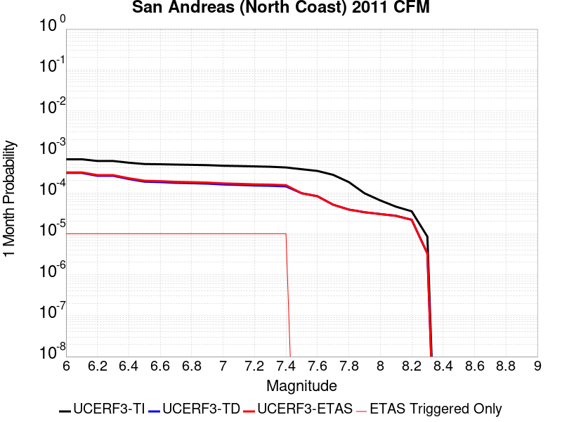 |  |  |

| Magnitude | 1 wk TI Prob | 1 wk TD Prob | 1 wk ETAS Prob | 1 wk ETAS/TD Gain | 1 wk ETAS Triggered Only | 1 mo TI Prob | 1 mo TD Prob | 1 mo ETAS Prob | 1 mo ETAS/TD Gain | 1 mo ETAS Triggered Only | 1 yr TI Prob | 1 yr TD Prob | 1 yr ETAS Prob | 1 yr ETAS/TD Gain | 1 yr ETAS Triggered Only | 10 yr TI Prob | 10 yr TD Prob | 10 yr ETAS Prob | 10 yr ETAS/TD Gain | 10 yr ETAS Triggered Only |
|-----|-----|-----|-----|-----|-----|-----|-----|-----|-----|-----|-----|-----|-----|-----|-----|-----|-----|-----|-----|-----|
| 6.0 | 1.5333705E-4 | 7.1106435E-5 | 9.491426E-5 | 1.3348197 | 2.3809524E-5 | 6.5699324E-4 | 3.0470645E-4 | 3.285087E-4 | 1.0781155 | 2.3809524E-5 | 0.007969595 | 0.0037035241 | 0.0037272456 | 1.0064051 | 2.3809524E-5 | 0.0768977 | 0.03935284 | 0.039375715 | 1.0005813 | 2.3809524E-5 |
| 6.1 | 1.5333705E-4 | 7.1106435E-5 | 9.491426E-5 | 1.3348197 | 2.3809524E-5 | 6.5699324E-4 | 3.0470645E-4 | 3.285087E-4 | 1.0781155 | 2.3809524E-5 | 0.007969595 | 0.0037035241 | 0.0037272456 | 1.0064051 | 2.3809524E-5 | 0.0768977 | 0.03935284 | 0.039375715 | 1.0005813 | 2.3809524E-5 |
| 6.2 | 1.3912938E-4 | 6.050204E-5 | 8.431012E-5 | 1.3935088 | 2.3809524E-5 | 5.961325E-4 | 2.5926883E-4 | 2.8307218E-4 | 1.0918095 | 2.3809524E-5 | 0.007233787 | 0.003152056 | 0.0031757904 | 1.0075299 | 2.3809524E-5 | 0.07002798 | 0.03369227 | 0.033715278 | 1.0006828 | 2.3809524E-5 |
| 6.3 | 1.3912938E-4 | 6.050204E-5 | 8.431012E-5 | 1.3935088 | 2.3809524E-5 | 5.961325E-4 | 2.5926883E-4 | 2.8307218E-4 | 1.0918095 | 2.3809524E-5 | 0.007233787 | 0.003152056 | 0.0031757904 | 1.0075299 | 2.3809524E-5 | 0.07002798 | 0.03369227 | 0.033715278 | 1.0006828 | 2.3809524E-5 |
| 6.4 | 1.2623647E-4 | 5.0442024E-5 | 7.425035E-5 | 1.4719938 | 2.3809524E-5 | 5.4090127E-4 | 2.161623E-4 | 2.3996667E-4 | 1.1101227 | 2.3809524E-5 | 0.0065656058 | 0.0026286195 | 0.0026523666 | 1.009034 | 2.3809524E-5 | 0.06374981 | 0.028303223 | 0.028326359 | 1.0008174 | 2.3809524E-5 |
| 6.5 | 1.1736096E-4 | 4.3523814E-5 | 6.73323E-5 | 1.5470221 | 2.3809524E-5 | 5.028786E-4 | 1.8651738E-4 | 2.1032247E-4 | 1.1276293 | 2.3809524E-5 | 0.006105373 | 0.0022685004 | 0.0022922559 | 1.0104719 | 2.3809524E-5 | 0.05940335 | 0.024579322 | 0.024602545 | 1.0009449 | 2.3809524E-5 |
| 6.6 | 1.1586959E-4 | 4.2423668E-5 | 6.623218E-5 | 1.5612082 | 2.3809524E-5 | 4.964894E-4 | 1.8180315E-4 | 2.0560835E-4 | 1.1309394 | 2.3809524E-5 | 0.006028018 | 0.0022112224 | 0.0022349793 | 1.0107437 | 2.3809524E-5 | 0.058671024 | 0.023984991 | 0.02400823 | 1.0009689 | 2.3809524E-5 |
| 6.7 | 1.13693764E-4 | 4.073593E-5 | 6.454448E-5 | 1.5844609 | 2.3809524E-5 | 4.87168E-4 | 1.7457096E-4 | 1.9837632E-4 | 1.1363649 | 2.3809524E-5 | 0.005915152 | 0.0021233456 | 0.0021471046 | 1.0111895 | 2.3809524E-5 | 0.057601593 | 0.023076393 | 0.023099653 | 1.0010079 | 2.3809524E-5 |
| 6.8 | 1.1204889E-4 | 3.9953447E-5 | 6.3762025E-5 | 1.5959078 | 2.3809524E-5 | 4.8012115E-4 | 1.7121792E-4 | 1.9502337E-4 | 1.1390359 | 2.3809524E-5 | 0.005829819 | 0.002082601 | 0.002106361 | 1.0114088 | 2.3809524E-5 | 0.05679232 | 0.022636656 | 0.022659926 | 1.0010281 | 2.3809524E-5 |
| 6.9 | 1.1005794E-4 | 3.900957E-5 | 6.2818166E-5 | 1.610327 | 2.3809524E-5 | 4.7159163E-4 | 1.6717325E-4 | 1.9097878E-4 | 1.1424004 | 2.3809524E-5 | 0.0057265228 | 0.0020334502 | 0.0020572112 | 1.0116851 | 2.3809524E-5 | 0.055811852 | 0.022102542 | 0.022125825 | 1.0010535 | 2.3809524E-5 |
| 7.0 | 1.0647948E-4 | 3.7166337E-5 | 6.0974977E-5 | 1.6405969 | 2.3809524E-5 | 4.562608E-4 | 1.5927466E-4 | 1.830804E-4 | 1.1494634 | 2.3809524E-5 | 0.0055408357 | 0.0019374598 | 0.0019612233 | 1.0122652 | 2.3809524E-5 | 0.054047033 | 0.021062272 | 0.021085579 | 1.0011066 | 2.3809524E-5 |
| 7.1 | 1.04795035E-4 | 3.6215948E-5 | 6.002461E-5 | 1.6574082 | 2.3809524E-5 | 4.4904428E-4 | 1.5520205E-4 | 1.7900788E-4 | 1.153386 | 2.3809524E-5 | 0.0054534175 | 0.0018879628 | 0.0019117274 | 1.0125874 | 2.3809524E-5 | 0.053215165 | 0.020530313 | 0.020553634 | 1.001136 | 2.3809524E-5 |
| 7.2 | 1.02724036E-4 | 3.5124547E-5 | 5.8933234E-5 | 1.6778362 | 2.3809524E-5 | 4.401716E-4 | 1.5052517E-4 | 1.7433111E-4 | 1.1581526 | 2.3809524E-5 | 0.0053459285 | 0.0018311188 | 0.0018548848 | 1.0129789 | 2.3809524E-5 | 0.052191395 | 0.019919246 | 0.019942582 | 1.0011715 | 2.3809524E-5 |
| 7.3 | 1.00650694E-4 | 3.4592013E-5 | 5.8400714E-5 | 1.6882716 | 2.3809524E-5 | 4.312888E-4 | 1.4824314E-4 | 1.7204914E-4 | 1.1605874 | 2.3809524E-5 | 0.005238306 | 0.0018033815 | 0.001827148 | 1.013179 | 2.3809524E-5 | 0.051165357 | 0.019596443 | 0.019619785 | 1.0011911 | 2.3809524E-5 |
| 7.4 | 9.672919E-5 | 3.338123E-5 | 5.7189958E-5 | 1.713237 | 2.3809524E-5 | 4.144878E-4 | 1.4305465E-4 | 1.6686077E-4 | 1.1664127 | 2.3809524E-5 | 0.005034718 | 0.0017403142 | 0.0017640822 | 1.0136573 | 2.3809524E-5 | 0.049221683 | 0.018869769 | 0.018893128 | 1.001238 | 2.3809524E-5 |
| 7.5 | 8.7600405E-5 | 2.2700917E-5 | 2.2700917E-5 | 1.0 | 0.0 | 3.753763E-4 | 9.728602E-5 | 9.728602E-5 | 1.0 | 0.0 | 0.0045606326 | 0.0011838155 | 0.0011838155 | 1.0 | 0.0 | 0.04468165 | 0.013130207 | 0.013130207 | 1.0 | 0.0 |
| 7.6 | 7.9562284E-5 | 1.9226305E-5 | 1.9226305E-5 | 1.0 | 0.0 | 3.4093665E-4 | 8.239586E-5 | 8.239586E-5 | 1.0 | 0.0 | 0.0041430052 | 0.0010027094 | 0.0010027094 | 1.0 | 0.0 | 0.040666126 | 0.011221658 | 0.011221658 | 1.0 | 0.0 |
| 7.7 | 6.3866544E-5 | 1.1941707E-5 | 1.1941707E-5 | 1.0 | 0.0 | 2.7368503E-4 | 5.117774E-5 | 5.117774E-5 | 1.0 | 0.0 | 0.0033270244 | 6.2291115E-4 | 6.2291115E-4 | 1.0 | 0.0 | 0.032776527 | 0.007210334 | 0.007210334 | 1.0 | 0.0 |
| 7.8 | 4.2543215E-5 | 9.076524E-6 | 9.076524E-6 | 1.0 | 0.0 | 1.8231533E-4 | 3.8898812E-5 | 3.8898812E-5 | 1.0 | 0.0 | 0.0022174292 | 4.7349022E-4 | 4.7349022E-4 | 1.0 | 0.0 | 0.021954332 | 0.005490525 | 0.005490525 | 1.0 | 0.0 |
| 7.9 | 2.2636612E-5 | 7.81435E-6 | 7.81435E-6 | 1.0 | 0.0 | 9.7010445E-5 | 3.3489643E-5 | 3.3489643E-5 | 1.0 | 0.0 | 0.0011804621 | 4.076602E-4 | 4.076602E-4 | 1.0 | 0.0 | 0.011742111 | 0.0046832846 | 0.0046832846 | 1.0 | 0.0 |
| 8.0 | 1.5167874E-5 | 7.0494675E-6 | 7.0494675E-6 | 1.0 | 0.0 | 6.500356E-5 | 3.0211655E-5 | 3.0211655E-5 | 1.0 | 0.0 | 7.9113094E-4 | 3.677649E-4 | 3.677649E-4 | 1.0 | 0.0 | 0.007883203 | 0.004215588 | 0.004215588 | 1.0 | 0.0 |
| 8.1 | 1.0681047E-5 | 6.386992E-6 | 6.386992E-6 | 1.0 | 0.0 | 4.5775112E-5 | 2.7372536E-5 | 2.7372536E-5 | 1.0 | 0.0 | 5.5716943E-4 | 3.3320975E-4 | 3.3320975E-4 | 1.0 | 0.0 | 0.0055577457 | 0.003817393 | 0.003817393 | 1.0 | 0.0 |
| 8.2 | 8.226114E-6 | 5.1150587E-6 | 5.1150587E-6 | 1.0 | 0.0 | 3.52543E-5 | 2.1921496E-5 | 2.1921496E-5 | 1.0 | 0.0 | 4.2913653E-4 | 2.668616E-4 | 2.668616E-4 | 1.0 | 0.0 | 0.004283088 | 0.0030450926 | 0.0030450926 | 1.0 | 0.0 |
| 8.3 | 1.983087E-6 | 7.6599065E-7 | 7.6599065E-7 | 1.0 | 0.0 | 8.498917E-6 | 3.282813E-6 | 3.282813E-6 | 1.0 | 0.0 | 1.034694E-4 | 3.9967534E-5 | 3.9967534E-5 | 1.0 | 0.0 | 0.0010342124 | 4.719687E-4 | 4.719687E-4 | 1.0 | 0.0 |

## Channel Islands Western Deep Ramp
*[(top)](#table-of-contents)*

| 1 Week | 1 Month | 1 Year | 10 Year |
|-----|-----|-----|-----|
|  |  |  |  |

| Magnitude | 1 wk TI Prob | 1 wk TD Prob | 1 wk ETAS Prob | 1 wk ETAS/TD Gain | 1 wk ETAS Triggered Only | 1 mo TI Prob | 1 mo TD Prob | 1 mo ETAS Prob | 1 mo ETAS/TD Gain | 1 mo ETAS Triggered Only | 1 yr TI Prob | 1 yr TD Prob | 1 yr ETAS Prob | 1 yr ETAS/TD Gain | 1 yr ETAS Triggered Only | 10 yr TI Prob | 10 yr TD Prob | 10 yr ETAS Prob | 10 yr ETAS/TD Gain | 10 yr ETAS Triggered Only |
|-----|-----|-----|-----|-----|-----|-----|-----|-----|-----|-----|-----|-----|-----|-----|-----|-----|-----|-----|-----|-----|
| 6.0 | 6.0213506E-6 | 6.2548684E-6 | 6.2548684E-6 | 1.0 | 0.0 | 2.5805533E-5 | 2.6806329E-5 | 2.6806329E-5 | 1.0 | 0.0 | 3.1413708E-4 | 3.2632265E-4 | 3.2632265E-4 | 1.0 | 0.0 | 0.0031369338 | 0.0032588763 | 0.0032826082 | 1.0072823 | 2.3809524E-5 |
| 6.1 | 6.0213506E-6 | 6.2548684E-6 | 6.2548684E-6 | 1.0 | 0.0 | 2.5805533E-5 | 2.6806329E-5 | 2.6806329E-5 | 1.0 | 0.0 | 3.1413708E-4 | 3.2632265E-4 | 3.2632265E-4 | 1.0 | 0.0 | 0.0031369338 | 0.0032588763 | 0.0032826082 | 1.0072823 | 2.3809524E-5 |
| 6.2 | 6.0213506E-6 | 6.2548684E-6 | 6.2548684E-6 | 1.0 | 0.0 | 2.5805533E-5 | 2.6806329E-5 | 2.6806329E-5 | 1.0 | 0.0 | 3.1413708E-4 | 3.2632265E-4 | 3.2632265E-4 | 1.0 | 0.0 | 0.0031369338 | 0.0032588763 | 0.0032826082 | 1.0072823 | 2.3809524E-5 |
| 6.3 | 6.0213506E-6 | 6.2548684E-6 | 6.2548684E-6 | 1.0 | 0.0 | 2.5805533E-5 | 2.6806329E-5 | 2.6806329E-5 | 1.0 | 0.0 | 3.1413708E-4 | 3.2632265E-4 | 3.2632265E-4 | 1.0 | 0.0 | 0.0031369338 | 0.0032588763 | 0.0032826082 | 1.0072823 | 2.3809524E-5 |
| 6.4 | 6.0213506E-6 | 6.2548684E-6 | 6.2548684E-6 | 1.0 | 0.0 | 2.5805533E-5 | 2.6806329E-5 | 2.6806329E-5 | 1.0 | 0.0 | 3.1413708E-4 | 3.2632265E-4 | 3.2632265E-4 | 1.0 | 0.0 | 0.0031369338 | 0.0032588763 | 0.0032826082 | 1.0072823 | 2.3809524E-5 |
| 6.5 | 6.0213506E-6 | 6.2548684E-6 | 6.2548684E-6 | 1.0 | 0.0 | 2.5805533E-5 | 2.6806329E-5 | 2.6806329E-5 | 1.0 | 0.0 | 3.1413708E-4 | 3.2632265E-4 | 3.2632265E-4 | 1.0 | 0.0 | 0.0031369338 | 0.0032588763 | 0.0032826082 | 1.0072823 | 2.3809524E-5 |
| 6.6 | 6.0213506E-6 | 6.2548684E-6 | 6.2548684E-6 | 1.0 | 0.0 | 2.5805533E-5 | 2.6806329E-5 | 2.6806329E-5 | 1.0 | 0.0 | 3.1413708E-4 | 3.2632265E-4 | 3.2632265E-4 | 1.0 | 0.0 | 0.0031369338 | 0.0032588763 | 0.0032826082 | 1.0072823 | 2.3809524E-5 |
| 6.7 | 5.313309E-6 | 5.5252403E-6 | 5.5252403E-6 | 1.0 | 0.0 | 2.2771126E-5 | 2.367941E-5 | 2.367941E-5 | 1.0 | 0.0 | 2.772032E-4 | 2.8826276E-4 | 2.8826276E-4 | 1.0 | 0.0 | 0.0027685766 | 0.0028792918 | 0.0029030326 | 1.0082455 | 2.3809524E-5 |
| 6.8 | 5.313309E-6 | 5.5252403E-6 | 5.5252403E-6 | 1.0 | 0.0 | 2.2771126E-5 | 2.367941E-5 | 2.367941E-5 | 1.0 | 0.0 | 2.772032E-4 | 2.8826276E-4 | 2.8826276E-4 | 1.0 | 0.0 | 0.0027685766 | 0.0028792918 | 0.0029030326 | 1.0082455 | 2.3809524E-5 |
| 6.9 | 4.744377E-6 | 4.9394303E-6 | 4.9394303E-6 | 1.0 | 0.0 | 2.0332885E-5 | 2.1168837E-5 | 2.1168837E-5 | 1.0 | 0.0 | 2.4752476E-4 | 2.5770385E-4 | 2.5770385E-4 | 1.0 | 0.0 | 0.0024724922 | 0.0025744175 | 0.0025981658 | 1.0092247 | 2.3809524E-5 |
| 7.0 | 4.722209E-6 | 4.9164732E-6 | 4.9164732E-6 | 1.0 | 0.0 | 2.0237881E-5 | 2.107045E-5 | 2.107045E-5 | 1.0 | 0.0 | 2.4636835E-4 | 2.5650626E-4 | 2.5650626E-4 | 1.0 | 0.0 | 0.002460954 | 0.0025624693 | 0.0025862178 | 1.0092678 | 2.3809524E-5 |
| 7.1 | 4.611174E-6 | 4.801409E-6 | 4.801409E-6 | 1.0 | 0.0 | 1.9762025E-5 | 2.0577325E-5 | 2.0577325E-5 | 1.0 | 0.0 | 2.4057609E-4 | 2.5050386E-4 | 2.5050386E-4 | 1.0 | 0.0 | 0.002403158 | 0.002502582 | 0.002526332 | 1.0094901 | 2.3809524E-5 |
| 7.2 | 4.043994E-6 | 4.2120264E-6 | 4.2120264E-6 | 1.0 | 0.0 | 1.7331287E-5 | 1.8051438E-5 | 1.8051438E-5 | 1.0 | 0.0 | 2.10988E-4 | 2.1975765E-4 | 2.1975765E-4 | 1.0 | 0.0 | 0.002107878 | 0.0021957543 | 0.0022195114 | 1.0108197 | 2.3809524E-5 |
| 7.3 | 2.1233036E-6 | 2.2297875E-6 | 2.2297875E-6 | 1.0 | 0.0 | 9.099841E-6 | 9.556197E-6 | 9.556197E-6 | 1.0 | 0.0 | 1.1078493E-4 | 1.1634055E-4 | 1.1634055E-4 | 1.0 | 0.0 | 0.0011072971 | 0.001162802 | 0.001162802 | 1.0 | 0.0 |
| 7.4 | 1.9051884E-6 | 2.0014973E-6 | 2.0014973E-6 | 1.0 | 0.0 | 8.165067E-6 | 8.577817E-6 | 8.577817E-6 | 1.0 | 0.0 | 9.940516E-5 | 1.0442998E-4 | 1.0442998E-4 | 1.0 | 0.0 | 9.93607E-4 | 0.0010438144 | 0.0010438144 | 1.0 | 0.0 |
| 7.5 | 1.2408497E-6 | 1.3038839E-6 | 1.3038839E-6 | 1.0 | 0.0 | 5.317916E-6 | 5.588062E-6 | 5.588062E-6 | 1.0 | 0.0 | 6.4743705E-5 | 6.8032554E-5 | 6.8032554E-5 | 1.0 | 0.0 | 6.4724847E-4 | 6.8011944E-4 | 6.8011944E-4 | 1.0 | 0.0 |
| 7.6 | 6.5440025E-7 | 6.886718E-7 | 6.886718E-7 | 1.0 | 0.0 | 2.8045695E-6 | 2.9514472E-6 | 2.9514472E-6 | 1.0 | 0.0 | 3.4145098E-5 | 3.593329E-5 | 3.593329E-5 | 1.0 | 0.0 | 3.4139853E-4 | 3.5927625E-4 | 3.5927625E-4 | 1.0 | 0.0 |
| 7.7 | 3.985963E-7 | 4.1930787E-7 | 4.1930787E-7 | 1.0 | 0.0 | 1.7082689E-6 | 1.7970326E-6 | 1.7970326E-6 | 1.0 | 0.0 | 2.0797976E-5 | 2.1878664E-5 | 2.1878664E-5 | 1.0 | 0.0 | 2.0796029E-4 | 2.1876628E-4 | 2.1876628E-4 | 1.0 | 0.0 |
| 7.8 | 3.706329E-8 | 3.8591796E-8 | 3.8591796E-8 | 1.0 | 0.0 | 1.5884267E-7 | 1.653934E-7 | 1.653934E-7 | 1.0 | 0.0 | 1.9339077E-6 | 2.0136629E-6 | 2.0136629E-6 | 1.0 | 0.0 | 1.933891E-5 | 2.0136458E-5 | 2.0136458E-5 | 1.0 | 0.0 |

## San Gregorio (North) 2011 CFM
*[(top)](#table-of-contents)*

| 1 Week | 1 Month | 1 Year | 10 Year |
|-----|-----|-----|-----|
|  |  |  |  |

| Magnitude | 1 wk TI Prob | 1 wk TD Prob | 1 wk ETAS Prob | 1 wk ETAS/TD Gain | 1 wk ETAS Triggered Only | 1 mo TI Prob | 1 mo TD Prob | 1 mo ETAS Prob | 1 mo ETAS/TD Gain | 1 mo ETAS Triggered Only | 1 yr TI Prob | 1 yr TD Prob | 1 yr ETAS Prob | 1 yr ETAS/TD Gain | 1 yr ETAS Triggered Only | 10 yr TI Prob | 10 yr TD Prob | 10 yr ETAS Prob | 10 yr ETAS/TD Gain | 10 yr ETAS Triggered Only |
|-----|-----|-----|-----|-----|-----|-----|-----|-----|-----|-----|-----|-----|-----|-----|-----|-----|-----|-----|-----|-----|
| 6.0 | 5.0283932E-5 | 4.3057815E-5 | 6.686631E-5 | 1.5529426 | 2.3809524E-5 | 2.1548476E-4 | 1.8452053E-4 | 2.0832565E-4 | 1.1290108 | 2.3809524E-5 | 0.0026203706 | 0.002244237 | 0.002267993 | 1.0105854 | 2.3809524E-5 | 0.02589687 | 0.022293162 | 0.022316441 | 1.0010442 | 2.3809524E-5 |
| 6.1 | 5.0283932E-5 | 4.3057815E-5 | 6.686631E-5 | 1.5529426 | 2.3809524E-5 | 2.1548476E-4 | 1.8452053E-4 | 2.0832565E-4 | 1.1290108 | 2.3809524E-5 | 0.0026203706 | 0.002244237 | 0.002267993 | 1.0105854 | 2.3809524E-5 | 0.02589687 | 0.022293162 | 0.022316441 | 1.0010442 | 2.3809524E-5 |
| 6.2 | 4.2998647E-5 | 3.4441564E-5 | 5.825027E-5 | 1.6912782 | 2.3809524E-5 | 1.842669E-4 | 1.475984E-4 | 1.714044E-4 | 1.1612891 | 2.3809524E-5 | 0.0022411412 | 0.00179554 | 0.0018193068 | 1.0132365 | 2.3809524E-5 | 0.022186736 | 0.017886506 | 0.01790989 | 1.0013074 | 2.3809524E-5 |
| 6.3 | 4.2998647E-5 | 3.4441564E-5 | 5.825027E-5 | 1.6912782 | 2.3809524E-5 | 1.842669E-4 | 1.475984E-4 | 1.714044E-4 | 1.1612891 | 2.3809524E-5 | 0.0022411412 | 0.00179554 | 0.0018193068 | 1.0132365 | 2.3809524E-5 | 0.022186736 | 0.017886506 | 0.01790989 | 1.0013074 | 2.3809524E-5 |
| 6.4 | 4.1101295E-5 | 3.2326872E-5 | 5.6135625E-5 | 1.7365004 | 2.3809524E-5 | 1.7613651E-4 | 1.3853642E-4 | 1.6234265E-4 | 1.1718409 | 2.3809524E-5 | 0.0021423528 | 0.0016853869 | 0.0017091562 | 1.0141032 | 2.3809524E-5 | 0.02121817 | 0.016801886 | 0.016825294 | 1.0013933 | 2.3809524E-5 |
| 6.5 | 4.1032585E-5 | 3.2244905E-5 | 5.605366E-5 | 1.7383727 | 2.3809524E-5 | 1.7584208E-4 | 1.3818518E-4 | 1.6199141E-4 | 1.1722778 | 2.3809524E-5 | 0.0021387753 | 0.0016811171 | 0.0017048866 | 1.014139 | 2.3809524E-5 | 0.021183075 | 0.016759839 | 0.016783249 | 1.0013968 | 2.3809524E-5 |
| 6.6 | 4.011629E-5 | 3.1266558E-5 | 5.5075336E-5 | 1.7614775 | 2.3809524E-5 | 1.7191563E-4 | 1.339927E-4 | 1.5779902E-4 | 1.1776689 | 2.3809524E-5 | 0.0020910634 | 0.0016301516 | 0.0016539223 | 1.0145819 | 2.3809524E-5 | 0.020714961 | 0.01625741 | 0.016280834 | 1.0014408 | 2.3809524E-5 |
| 6.7 | 3.8583938E-5 | 2.9453593E-5 | 5.3262414E-5 | 1.8083503 | 2.3809524E-5 | 1.6534925E-4 | 1.2622366E-4 | 1.5003017E-4 | 1.1886058 | 2.3809524E-5 | 0.0020112682 | 0.0015357039 | 0.0015594768 | 1.0154802 | 2.3809524E-5 | 0.019931622 | 0.015325955 | 0.015349399 | 1.0015297 | 2.3809524E-5 |
| 6.8 | 3.44341E-5 | 2.4450854E-5 | 4.8259797E-5 | 1.9737468 | 2.3809524E-5 | 1.4756636E-4 | 1.0478523E-4 | 1.2859226E-4 | 1.2271984 | 2.3809524E-5 | 0.0017951399 | 0.0012750238 | 0.001298803 | 1.0186499 | 2.3809524E-5 | 0.017807078 | 0.012751131 | 0.012774638 | 1.0018435 | 2.3809524E-5 |
| 6.9 | 3.221199E-5 | 2.1778029E-5 | 4.5587036E-5 | 2.093258 | 2.3809524E-5 | 1.3804408E-4 | 9.333112E-5 | 1.1713842E-4 | 1.2550843 | 2.3809524E-5 | 0.0016793909 | 0.0011357224 | 0.0011595049 | 1.0209404 | 2.3809524E-5 | 0.01666756 | 0.011372583 | 0.011396122 | 1.0020698 | 2.3809524E-5 |
| 7.0 | 2.9186718E-5 | 1.8146875E-5 | 4.1955966E-5 | 2.3120217 | 2.3809524E-5 | 1.2507994E-4 | 7.7770026E-5 | 1.01577694E-4 | 1.3061292 | 2.3809524E-5 | 0.0015217843 | 9.464431E-4 | 9.702301E-4 | 1.025133 | 2.3809524E-5 | 0.015114053 | 0.009496798 | 0.009520382 | 1.0024832 | 2.3809524E-5 |
| 7.1 | 2.6840138E-5 | 1.5284508E-5 | 3.909367E-5 | 2.5577314 | 2.3809524E-5 | 1.1502409E-4 | 6.55034E-5 | 8.931137E-5 | 1.3634615 | 2.3809524E-5 | 0.0013995186 | 7.9721404E-4 | 8.2100456E-4 | 1.0298421 | 2.3809524E-5 | 0.013907375 | 0.008015723 | 0.008039341 | 1.0029465 | 2.3809524E-5 |
| 7.2 | 2.453002E-5 | 1.2606672E-5 | 3.6415895E-5 | 2.8886209 | 2.3809524E-5 | 1.05124425E-4 | 5.4027478E-5 | 7.783571E-5 | 1.4406691 | 2.3809524E-5 | 0.0012791384 | 6.575866E-4 | 6.8138045E-4 | 1.0361836 | 2.3809524E-5 | 0.012718005 | 0.00662763 | 0.0066512814 | 1.0035686 | 2.3809524E-5 |
| 7.3 | 2.3330727E-5 | 1.1488677E-5 | 3.5297926E-5 | 3.07241 | 2.3809524E-5 | 9.9985E-5 | 4.923626E-5 | 7.304461E-5 | 1.4835532 | 2.3809524E-5 | 0.0012166376 | 5.9928704E-4 | 6.230823E-4 | 1.039706 | 2.3809524E-5 | 0.012099981 | 0.006046564 | 0.0060702297 | 1.0039139 | 2.3809524E-5 |
| 7.4 | 2.2136466E-5 | 1.0368981E-5 | 3.4178258E-5 | 3.2962022 | 2.3809524E-5 | 9.486712E-5 | 4.4437733E-5 | 6.82462E-5 | 1.5357714 | 2.3809524E-5 | 0.0011543952 | 5.4089533E-4 | 5.6469196E-4 | 1.0439949 | 2.3809524E-5 | 0.011484168 | 0.005464249 | 0.005487928 | 1.0043335 | 2.3809524E-5 |
| 7.5 | 2.0994974E-5 | 9.427217E-6 | 9.427217E-6 | 1.0 | 0.0 | 8.997535E-5 | 4.0401734E-5 | 4.0401734E-5 | 1.0 | 0.0 | 0.0010948994 | 4.9178035E-4 | 4.9178035E-4 | 1.0 | 0.0 | 0.010895205 | 0.004973358 | 0.004973358 | 1.0 | 0.0 |
| 7.6 | 1.7091823E-5 | 6.893766E-6 | 6.893766E-6 | 1.0 | 0.0 | 7.3248615E-5 | 2.9544377E-5 | 2.9544377E-5 | 1.0 | 0.0 | 8.9143694E-4 | 3.596435E-4 | 3.596435E-4 | 1.0 | 0.0 | 0.008878695 | 0.0036482841 | 0.0036482841 | 1.0 | 0.0 |
| 7.7 | 1.2772179E-5 | 4.0208706E-6 | 4.0208706E-6 | 1.0 | 0.0 | 5.473676E-5 | 1.7232189E-5 | 1.7232189E-5 | 1.0 | 0.0 | 6.6621625E-4 | 2.0978172E-4 | 2.0978172E-4 | 1.0 | 0.0 | 0.006642225 | 0.002136922 | 0.002136922 | 1.0 | 0.0 |
| 7.8 | 7.041923E-6 | 1.940626E-6 | 1.940626E-6 | 1.0 | 0.0 | 3.017932E-5 | 8.316942E-6 | 8.316942E-6 | 1.0 | 0.0 | 3.6737128E-4 | 1.0125406E-4 | 1.0125406E-4 | 1.0 | 0.0 | 0.0036676454 | 0.0010379003 | 0.0010379003 | 1.0 | 0.0 |
| 7.9 | 2.946768E-6 | 1.0033551E-6 | 1.0033551E-6 | 1.0 | 0.0 | 1.2628945E-5 | 4.300086E-6 | 4.300086E-6 | 1.0 | 0.0 | 1.5374656E-4 | 5.235229E-5 | 5.235229E-5 | 1.0 | 0.0 | 0.0015364023 | 5.3400313E-4 | 5.3400313E-4 | 1.0 | 0.0 |
| 8.0 | 1.1433375E-6 | 5.18146E-7 | 5.18146E-7 | 1.0 | 0.0 | 4.9000087E-6 | 2.2206239E-6 | 2.2206239E-6 | 1.0 | 0.0 | 5.965597E-5 | 2.703576E-5 | 2.703576E-5 | 1.0 | 0.0 | 5.963996E-4 | 2.7398416E-4 | 2.7398416E-4 | 1.0 | 0.0 |
| 8.1 | 2.6675295E-7 | 1.62899E-7 | 1.62899E-7 | 1.0 | 0.0 | 1.1432264E-6 | 6.9813836E-7 | 6.9813836E-7 | 1.0 | 0.0 | 1.3918692E-5 | 8.499802E-6 | 8.499802E-6 | 1.0 | 0.0 | 1.391782E-4 | 8.63795E-5 | 8.63795E-5 | 1.0 | 0.0 |
| 8.2 | 1.2704569E-8 | 9.431393E-9 | 9.431393E-9 | 1.0 | 0.0 | 5.444815E-8 | 4.042026E-8 | 4.042026E-8 | 1.0 | 0.0 | 6.629061E-7 | 4.9211656E-7 | 4.9211656E-7 | 1.0 | 0.0 | 6.629041E-6 | 5.1121438E-6 | 5.1121438E-6 | 1.0 | 0.0 |

## Pitas Point (Lower)-Montalvo
*[(top)](#table-of-contents)*

| 1 Week | 1 Month | 1 Year | 10 Year |
|-----|-----|-----|-----|
|  | 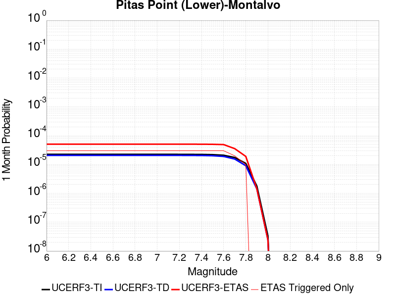 |  |  |

| Magnitude | 1 wk TI Prob | 1 wk TD Prob | 1 wk ETAS Prob | 1 wk ETAS/TD Gain | 1 wk ETAS Triggered Only | 1 mo TI Prob | 1 mo TD Prob | 1 mo ETAS Prob | 1 mo ETAS/TD Gain | 1 mo ETAS Triggered Only | 1 yr TI Prob | 1 yr TD Prob | 1 yr ETAS Prob | 1 yr ETAS/TD Gain | 1 yr ETAS Triggered Only | 10 yr TI Prob | 10 yr TD Prob | 10 yr ETAS Prob | 10 yr ETAS/TD Gain | 10 yr ETAS Triggered Only |
|-----|-----|-----|-----|-----|-----|-----|-----|-----|-----|-----|-----|-----|-----|-----|-----|-----|-----|-----|-----|-----|
| 6.0 | 5.2543637E-6 | 4.8378706E-6 | 2.8647279E-5 | 5.9214644 | 2.3809524E-5 | 2.2518509E-5 | 2.0733567E-5 | 4.4542598E-5 | 2.1483326 | 2.3809524E-5 | 2.7412834E-4 | 2.5240227E-4 | 2.7620577E-4 | 1.0943079 | 2.3809524E-5 | 0.0027379042 | 0.0025211885 | 0.002544938 | 1.0094199 | 2.3809524E-5 |
| 6.1 | 5.2543637E-6 | 4.8378706E-6 | 2.8647279E-5 | 5.9214644 | 2.3809524E-5 | 2.2518509E-5 | 2.0733567E-5 | 4.4542598E-5 | 2.1483326 | 2.3809524E-5 | 2.7412834E-4 | 2.5240227E-4 | 2.7620577E-4 | 1.0943079 | 2.3809524E-5 | 0.0027379042 | 0.0025211885 | 0.002544938 | 1.0094199 | 2.3809524E-5 |
| 6.2 | 5.2543637E-6 | 4.8378706E-6 | 2.8647279E-5 | 5.9214644 | 2.3809524E-5 | 2.2518509E-5 | 2.0733567E-5 | 4.4542598E-5 | 2.1483326 | 2.3809524E-5 | 2.7412834E-4 | 2.5240227E-4 | 2.7620577E-4 | 1.0943079 | 2.3809524E-5 | 0.0027379042 | 0.0025211885 | 0.002544938 | 1.0094199 | 2.3809524E-5 |
| 6.3 | 5.2543637E-6 | 4.8378706E-6 | 2.8647279E-5 | 5.9214644 | 2.3809524E-5 | 2.2518509E-5 | 2.0733567E-5 | 4.4542598E-5 | 2.1483326 | 2.3809524E-5 | 2.7412834E-4 | 2.5240227E-4 | 2.7620577E-4 | 1.0943079 | 2.3809524E-5 | 0.0027379042 | 0.0025211885 | 0.002544938 | 1.0094199 | 2.3809524E-5 |
| 6.4 | 5.2543637E-6 | 4.8378706E-6 | 2.8647279E-5 | 5.9214644 | 2.3809524E-5 | 2.2518509E-5 | 2.0733567E-5 | 4.4542598E-5 | 2.1483326 | 2.3809524E-5 | 2.7412834E-4 | 2.5240227E-4 | 2.7620577E-4 | 1.0943079 | 2.3809524E-5 | 0.0027379042 | 0.0025211885 | 0.002544938 | 1.0094199 | 2.3809524E-5 |
| 6.5 | 5.2543637E-6 | 4.8378706E-6 | 2.8647279E-5 | 5.9214644 | 2.3809524E-5 | 2.2518509E-5 | 2.0733567E-5 | 4.4542598E-5 | 2.1483326 | 2.3809524E-5 | 2.7412834E-4 | 2.5240227E-4 | 2.7620577E-4 | 1.0943079 | 2.3809524E-5 | 0.0027379042 | 0.0025211885 | 0.002544938 | 1.0094199 | 2.3809524E-5 |
| 6.6 | 5.2543637E-6 | 4.8378706E-6 | 2.8647279E-5 | 5.9214644 | 2.3809524E-5 | 2.2518509E-5 | 2.0733567E-5 | 4.4542598E-5 | 2.1483326 | 2.3809524E-5 | 2.7412834E-4 | 2.5240227E-4 | 2.7620577E-4 | 1.0943079 | 2.3809524E-5 | 0.0027379042 | 0.0025211885 | 0.002544938 | 1.0094199 | 2.3809524E-5 |
| 6.7 | 5.2543637E-6 | 4.8378706E-6 | 2.8647279E-5 | 5.9214644 | 2.3809524E-5 | 2.2518509E-5 | 2.0733567E-5 | 4.4542598E-5 | 2.1483326 | 2.3809524E-5 | 2.7412834E-4 | 2.5240227E-4 | 2.7620577E-4 | 1.0943079 | 2.3809524E-5 | 0.0027379042 | 0.0025211885 | 0.002544938 | 1.0094199 | 2.3809524E-5 |
| 6.8 | 5.2543637E-6 | 4.8378706E-6 | 2.8647279E-5 | 5.9214644 | 2.3809524E-5 | 2.2518509E-5 | 2.0733567E-5 | 4.4542598E-5 | 2.1483326 | 2.3809524E-5 | 2.7412834E-4 | 2.5240227E-4 | 2.7620577E-4 | 1.0943079 | 2.3809524E-5 | 0.0027379042 | 0.0025211885 | 0.002544938 | 1.0094199 | 2.3809524E-5 |
| 6.9 | 5.2543637E-6 | 4.8378706E-6 | 2.8647279E-5 | 5.9214644 | 2.3809524E-5 | 2.2518509E-5 | 2.0733567E-5 | 4.4542598E-5 | 2.1483326 | 2.3809524E-5 | 2.7412834E-4 | 2.5240227E-4 | 2.7620577E-4 | 1.0943079 | 2.3809524E-5 | 0.0027379042 | 0.0025211885 | 0.002544938 | 1.0094199 | 2.3809524E-5 |
| 7.0 | 5.2543637E-6 | 4.8378706E-6 | 2.8647279E-5 | 5.9214644 | 2.3809524E-5 | 2.2518509E-5 | 2.0733567E-5 | 4.4542598E-5 | 2.1483326 | 2.3809524E-5 | 2.7412834E-4 | 2.5240227E-4 | 2.7620577E-4 | 1.0943079 | 2.3809524E-5 | 0.0027379042 | 0.0025211885 | 0.002544938 | 1.0094199 | 2.3809524E-5 |
| 7.1 | 5.2543637E-6 | 4.8378706E-6 | 2.8647279E-5 | 5.9214644 | 2.3809524E-5 | 2.2518509E-5 | 2.0733567E-5 | 4.4542598E-5 | 2.1483326 | 2.3809524E-5 | 2.7412834E-4 | 2.5240227E-4 | 2.7620577E-4 | 1.0943079 | 2.3809524E-5 | 0.0027379042 | 0.0025211885 | 0.002544938 | 1.0094199 | 2.3809524E-5 |
| 7.2 | 5.2458695E-6 | 4.8290244E-6 | 2.8638433E-5 | 5.9304805 | 2.3809524E-5 | 2.2482105E-5 | 2.0695656E-5 | 4.4504686E-5 | 2.1504362 | 2.3809524E-5 | 2.7368523E-4 | 2.519408E-4 | 2.757443E-4 | 1.0944806 | 2.3809524E-5 | 0.0027334841 | 0.0025165842 | 0.0025403337 | 1.0094372 | 2.3809524E-5 |
| 7.3 | 5.22665E-6 | 4.8089414E-6 | 2.8618351E-5 | 5.951071 | 2.3809524E-5 | 2.2399736E-5 | 2.0609588E-5 | 4.4418623E-5 | 2.1552405 | 2.3809524E-5 | 2.7268266E-4 | 2.5089315E-4 | 2.746967E-4 | 1.0948752 | 2.3809524E-5 | 0.002723483 | 0.0025061315 | 0.0025298814 | 1.0094767 | 2.3809524E-5 |
| 7.4 | 5.210642E-6 | 4.792154E-6 | 2.8601564E-5 | 5.9684153 | 2.3809524E-5 | 2.233113E-5 | 2.0537642E-5 | 4.4346678E-5 | 2.1592877 | 2.3809524E-5 | 2.718476E-4 | 2.5001742E-4 | 2.73821E-4 | 1.0952077 | 2.3809524E-5 | 0.002715153 | 0.0024973939 | 0.002521144 | 1.0095099 | 2.3809524E-5 |
| 7.5 | 5.1226016E-6 | 4.7000403E-6 | 2.8509452E-5 | 6.0657887 | 2.3809524E-5 | 2.1953823E-5 | 2.0142877E-5 | 4.395192E-5 | 2.182008 | 2.3809524E-5 | 2.67255E-4 | 2.4521223E-4 | 2.6901593E-4 | 1.0970738 | 2.3809524E-5 | 0.0026693381 | 0.0024494485 | 0.0024731995 | 1.0096966 | 2.3809524E-5 |
| 7.6 | 4.8796987E-6 | 4.4449403E-6 | 2.8254359E-5 | 6.356521 | 2.3809524E-5 | 2.0912828E-5 | 1.9049607E-5 | 4.285868E-5 | 2.2498457 | 2.3809524E-5 | 2.5458392E-4 | 2.3190459E-4 | 2.5570858E-4 | 1.1026456 | 2.3809524E-5 | 0.0025429246 | 0.0023166565 | 0.0023404108 | 1.0102538 | 2.3809524E-5 |
| 7.7 | 4.0834398E-6 | 3.6091124E-6 | 3.6091124E-6 | 1.0 | 0.0 | 1.7500339E-5 | 1.5467534E-5 | 1.5467534E-5 | 1.0 | 0.0 | 2.1304579E-4 | 1.8830119E-4 | 1.8830119E-4 | 1.0 | 0.0 | 0.0021284167 | 0.00188144 | 0.00188144 | 1.0 | 0.0 |
| 7.8 | 2.5445438E-6 | 2.121228E-6 | 2.121228E-6 | 1.0 | 0.0 | 1.0905142E-5 | 9.090945E-6 | 9.090945E-6 | 1.0 | 0.0 | 1.3276201E-4 | 1.1067669E-4 | 1.1067669E-4 | 1.0 | 0.0 | 0.0013268272 | 0.0011062203 | 0.0011062203 | 1.0 | 0.0 |
| 7.9 | 4.1677114E-7 | 3.3293693E-7 | 3.3293693E-7 | 1.0 | 0.0 | 1.7861609E-6 | 1.4268718E-6 | 1.4268718E-6 | 1.0 | 0.0 | 2.1746291E-5 | 1.737203E-5 | 1.737203E-5 | 1.0 | 0.0 | 2.1744163E-4 | 1.7370703E-4 | 1.7370703E-4 | 1.0 | 0.0 |
| 8.0 | 7.791402E-9 | 5.683497E-9 | 5.683497E-9 | 1.0 | 0.0 | 3.3391725E-8 | 2.4357844E-8 | 2.4357844E-8 | 1.0 | 0.0 | 4.0654416E-7 | 2.9655675E-7 | 2.9655675E-7 | 1.0 | 0.0 | 4.065434E-6 | 2.9655655E-6 | 2.9655655E-6 | 1.0 | 0.0 |

## Mission Hills 2011
*[(top)](#table-of-contents)*

| 1 Week | 1 Month | 1 Year | 10 Year |
|-----|-----|-----|-----|
|  |  | 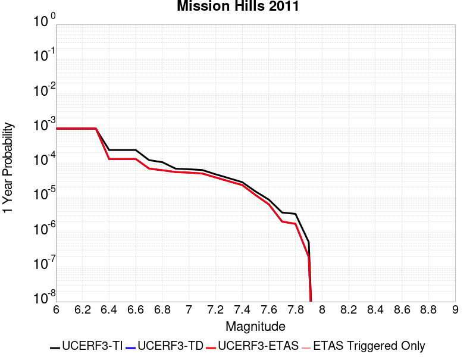 |  |

| Magnitude | 1 wk TI Prob | 1 wk TD Prob | 1 wk ETAS Prob | 1 wk ETAS/TD Gain | 1 wk ETAS Triggered Only | 1 mo TI Prob | 1 mo TD Prob | 1 mo ETAS Prob | 1 mo ETAS/TD Gain | 1 mo ETAS Triggered Only | 1 yr TI Prob | 1 yr TD Prob | 1 yr ETAS Prob | 1 yr ETAS/TD Gain | 1 yr ETAS Triggered Only | 10 yr TI Prob | 10 yr TD Prob | 10 yr ETAS Prob | 10 yr ETAS/TD Gain | 10 yr ETAS Triggered Only |
|-----|-----|-----|-----|-----|-----|-----|-----|-----|-----|-----|-----|-----|-----|-----|-----|-----|-----|-----|-----|-----|
| 6.0 | 1.8765717E-5 | 1.9054645E-5 | 1.9054645E-5 | 1.0 | 0.0 | 8.0422025E-5 | 8.166215E-5 | 8.166215E-5 | 1.0 | 0.0 | 9.786983E-4 | 9.941267E-4 | 9.941267E-4 | 1.0 | 0.0 | 0.009743992 | 0.009930461 | 0.009954033 | 1.0023738 | 2.3809524E-5 |
| 6.1 | 1.8765717E-5 | 1.9054645E-5 | 1.9054645E-5 | 1.0 | 0.0 | 8.0422025E-5 | 8.166215E-5 | 8.166215E-5 | 1.0 | 0.0 | 9.786983E-4 | 9.941267E-4 | 9.941267E-4 | 1.0 | 0.0 | 0.009743992 | 0.009930461 | 0.009954033 | 1.0023738 | 2.3809524E-5 |
| 6.2 | 1.8765717E-5 | 1.9054645E-5 | 1.9054645E-5 | 1.0 | 0.0 | 8.0422025E-5 | 8.166215E-5 | 8.166215E-5 | 1.0 | 0.0 | 9.786983E-4 | 9.941267E-4 | 9.941267E-4 | 1.0 | 0.0 | 0.009743992 | 0.009930461 | 0.009954033 | 1.0023738 | 2.3809524E-5 |
| 6.3 | 1.8765717E-5 | 1.9054645E-5 | 1.9054645E-5 | 1.0 | 0.0 | 8.0422025E-5 | 8.166215E-5 | 8.166215E-5 | 1.0 | 0.0 | 9.786983E-4 | 9.941267E-4 | 9.941267E-4 | 1.0 | 0.0 | 0.009743992 | 0.009930461 | 0.009954033 | 1.0023738 | 2.3809524E-5 |
| 6.4 | 4.566357E-6 | 2.5148488E-6 | 2.5148488E-6 | 1.0 | 0.0 | 1.9569954E-5 | 1.0777889E-5 | 1.0777889E-5 | 1.0 | 0.0 | 2.3823815E-4 | 1.3121472E-4 | 1.3121472E-4 | 1.0 | 0.0 | 0.002379829 | 0.0013115506 | 0.0013115506 | 1.0 | 0.0 |
| 6.5 | 4.566357E-6 | 2.5148488E-6 | 2.5148488E-6 | 1.0 | 0.0 | 1.9569954E-5 | 1.0777889E-5 | 1.0777889E-5 | 1.0 | 0.0 | 2.3823815E-4 | 1.3121472E-4 | 1.3121472E-4 | 1.0 | 0.0 | 0.002379829 | 0.0013115506 | 0.0013115506 | 1.0 | 0.0 |
| 6.6 | 4.566357E-6 | 2.5148488E-6 | 2.5148488E-6 | 1.0 | 0.0 | 1.9569954E-5 | 1.0777889E-5 | 1.0777889E-5 | 1.0 | 0.0 | 2.3823815E-4 | 1.3121472E-4 | 1.3121472E-4 | 1.0 | 0.0 | 0.002379829 | 0.0013115506 | 0.0013115506 | 1.0 | 0.0 |
| 6.7 | 2.3266773E-6 | 1.3296187E-6 | 1.3296187E-6 | 1.0 | 0.0 | 9.971435E-6 | 5.698354E-6 | 5.698354E-6 | 1.0 | 0.0 | 1.2139547E-4 | 6.937531E-5 | 6.937531E-5 | 1.0 | 0.0 | 0.0012132917 | 6.9354265E-4 | 6.9354265E-4 | 1.0 | 0.0 |
| 6.8 | 2.032735E-6 | 1.1894115E-6 | 1.1894115E-6 | 1.0 | 0.0 | 8.711692E-6 | 5.097468E-6 | 5.097468E-6 | 1.0 | 0.0 | 1.06059684E-4 | 6.205996E-5 | 6.205996E-5 | 1.0 | 0.0 | 0.0010600908 | 6.2043115E-4 | 6.2043115E-4 | 1.0 | 0.0 |
| 6.9 | 1.3186259E-6 | 1.0561778E-6 | 1.0561778E-6 | 1.0 | 0.0 | 5.6512413E-6 | 4.5264687E-6 | 4.5264687E-6 | 1.0 | 0.0 | 6.8801695E-5 | 5.5108394E-5 | 5.5108394E-5 | 1.0 | 0.0 | 6.8780396E-4 | 5.5095024E-4 | 5.5095024E-4 | 1.0 | 0.0 |
| 7.0 | 1.2726016E-6 | 1.0159088E-6 | 1.0159088E-6 | 1.0 | 0.0 | 5.4539955E-6 | 4.3538876E-6 | 4.3538876E-6 | 1.0 | 0.0 | 6.6400375E-5 | 5.300732E-5 | 5.300732E-5 | 1.0 | 0.0 | 6.6380535E-4 | 5.299496E-4 | 5.299496E-4 | 1.0 | 0.0 |
| 7.1 | 1.2063913E-6 | 9.570072E-7 | 9.570072E-7 | 1.0 | 0.0 | 5.170238E-6 | 4.101453E-6 | 4.101453E-6 | 1.0 | 0.0 | 6.294583E-5 | 4.9934075E-5 | 4.9934075E-5 | 1.0 | 0.0 | 6.2928005E-4 | 4.992311E-4 | 4.992311E-4 | 1.0 | 0.0 |
| 7.2 | 9.105806E-7 | 7.3765557E-7 | 7.3765557E-7 | 1.0 | 0.0 | 3.9024826E-6 | 3.1613772E-6 | 3.1613772E-6 | 1.0 | 0.0 | 4.7511687E-5 | 3.8489103E-5 | 3.8489103E-5 | 1.0 | 0.0 | 4.7501532E-4 | 3.8482592E-4 | 3.8482592E-4 | 1.0 | 0.0 |
| 7.3 | 7.020432E-7 | 5.710089E-7 | 5.710089E-7 | 1.0 | 0.0 | 3.0087533E-6 | 2.447179E-6 | 2.447179E-6 | 1.0 | 0.0 | 3.6630954E-5 | 2.979401E-5 | 2.979401E-5 | 1.0 | 0.0 | 3.6624918E-4 | 2.9790145E-4 | 2.9790145E-4 | 1.0 | 0.0 |
| 7.4 | 5.3900635E-7 | 4.4480825E-7 | 4.4480825E-7 | 1.0 | 0.0 | 2.3100251E-6 | 1.9063198E-6 | 1.9063198E-6 | 1.0 | 0.0 | 2.8124194E-5 | 2.3209208E-5 | 2.3209208E-5 | 1.0 | 0.0 | 2.8120633E-4 | 2.3206905E-4 | 2.3206905E-4 | 1.0 | 0.0 |
| 7.5 | 2.907075E-7 | 2.2875415E-7 | 2.2875415E-7 | 1.0 | 0.0 | 1.2458887E-6 | 9.803746E-7 | 9.803746E-7 | 1.0 | 0.0 | 1.5168589E-5 | 1.1935997E-5 | 1.1935997E-5 | 1.0 | 0.0 | 1.5167553E-4 | 1.1935373E-4 | 1.1935373E-4 | 1.0 | 0.0 |
| 7.6 | 1.6903675E-7 | 1.2353402E-7 | 1.2353402E-7 | 1.0 | 0.0 | 7.2444305E-7 | 5.294314E-7 | 5.294314E-7 | 1.0 | 0.0 | 8.820059E-6 | 6.4458095E-6 | 6.4458095E-6 | 1.0 | 0.0 | 8.8197085E-5 | 6.445635E-5 | 6.445635E-5 | 1.0 | 0.0 |
| 7.7 | 7.168073E-8 | 3.9135116E-8 | 3.9135116E-8 | 1.0 | 0.0 | 3.072031E-7 | 1.6772192E-7 | 1.6772192E-7 | 1.0 | 0.0 | 3.7401915E-6 | 2.0420127E-6 | 2.0420127E-6 | 1.0 | 0.0 | 3.7401285E-5 | 2.041995E-5 | 2.041995E-5 | 1.0 | 0.0 |
| 7.8 | 6.564101E-8 | 3.3835356E-8 | 3.3835356E-8 | 1.0 | 0.0 | 2.813186E-7 | 1.4500866E-7 | 1.4500866E-7 | 1.0 | 0.0 | 3.4250486E-6 | 1.7654792E-6 | 1.7654792E-6 | 1.0 | 0.0 | 3.424996E-5 | 1.7654662E-5 | 1.7654662E-5 | 1.0 | 0.0 |
| 7.9 | 1.0029074E-8 | 3.7292542E-9 | 3.7292542E-9 | 1.0 | 0.0 | 4.2981743E-8 | 1.5982518E-8 | 1.5982518E-8 | 1.0 | 0.0 | 5.2330256E-7 | 1.9458714E-7 | 1.9458714E-7 | 1.0 | 0.0 | 5.2330133E-6 | 1.945871E-6 | 1.945871E-6 | 1.0 | 0.0 |

## Burnt Mtn
*[(top)](#table-of-contents)*

| 1 Week | 1 Month | 1 Year | 10 Year |
|-----|-----|-----|-----|
|  |  |  |  |

| Magnitude | 1 wk TI Prob | 1 wk TD Prob | 1 wk ETAS Prob | 1 wk ETAS/TD Gain | 1 wk ETAS Triggered Only | 1 mo TI Prob | 1 mo TD Prob | 1 mo ETAS Prob | 1 mo ETAS/TD Gain | 1 mo ETAS Triggered Only | 1 yr TI Prob | 1 yr TD Prob | 1 yr ETAS Prob | 1 yr ETAS/TD Gain | 1 yr ETAS Triggered Only | 10 yr TI Prob | 10 yr TD Prob | 10 yr ETAS Prob | 10 yr ETAS/TD Gain | 10 yr ETAS Triggered Only |
|-----|-----|-----|-----|-----|-----|-----|-----|-----|-----|-----|-----|-----|-----|-----|-----|-----|-----|-----|-----|-----|
| 6.0 | 1.5673151E-5 | 1.1749407E-5 | 1.1749407E-5 | 1.0 | 0.0 | 6.716892E-5 | 5.0354356E-5 | 7.416268E-5 | 1.4728156 | 2.3809524E-5 | 8.1747473E-4 | 6.1302073E-4 | 6.368157E-4 | 1.0388159 | 2.3809524E-5 | 0.008144741 | 0.006125938 | 0.0061496017 | 1.0038629 | 2.3809524E-5 |
| 6.1 | 1.5673151E-5 | 1.1749407E-5 | 1.1749407E-5 | 1.0 | 0.0 | 6.716892E-5 | 5.0354356E-5 | 7.416268E-5 | 1.4728156 | 2.3809524E-5 | 8.1747473E-4 | 6.1302073E-4 | 6.368157E-4 | 1.0388159 | 2.3809524E-5 | 0.008144741 | 0.006125938 | 0.0061496017 | 1.0038629 | 2.3809524E-5 |
| 6.2 | 1.5673151E-5 | 1.1749407E-5 | 1.1749407E-5 | 1.0 | 0.0 | 6.716892E-5 | 5.0354356E-5 | 7.416268E-5 | 1.4728156 | 2.3809524E-5 | 8.1747473E-4 | 6.1302073E-4 | 6.368157E-4 | 1.0388159 | 2.3809524E-5 | 0.008144741 | 0.006125938 | 0.0061496017 | 1.0038629 | 2.3809524E-5 |
| 6.3 | 1.5673151E-5 | 1.1749407E-5 | 1.1749407E-5 | 1.0 | 0.0 | 6.716892E-5 | 5.0354356E-5 | 7.416268E-5 | 1.4728156 | 2.3809524E-5 | 8.1747473E-4 | 6.1302073E-4 | 6.368157E-4 | 1.0388159 | 2.3809524E-5 | 0.008144741 | 0.006125938 | 0.0061496017 | 1.0038629 | 2.3809524E-5 |
| 6.4 | 1.5673151E-5 | 1.1749407E-5 | 1.1749407E-5 | 1.0 | 0.0 | 6.716892E-5 | 5.0354356E-5 | 7.416268E-5 | 1.4728156 | 2.3809524E-5 | 8.1747473E-4 | 6.1302073E-4 | 6.368157E-4 | 1.0388159 | 2.3809524E-5 | 0.008144741 | 0.006125938 | 0.0061496017 | 1.0038629 | 2.3809524E-5 |
| 6.5 | 1.36191375E-5 | 1.0078299E-5 | 1.0078299E-5 | 1.0 | 0.0 | 5.8366426E-5 | 4.3192707E-5 | 6.70012E-5 | 1.5512156 | 2.3809524E-5 | 7.103795E-4 | 5.2587123E-4 | 5.496682E-4 | 1.0452526 | 2.3809524E-5 | 0.0070811296 | 0.0052587125 | 0.0052823965 | 1.0045038 | 2.3809524E-5 |

## San Jose
*[(top)](#table-of-contents)*

| 1 Week | 1 Month | 1 Year | 10 Year |
|-----|-----|-----|-----|
| 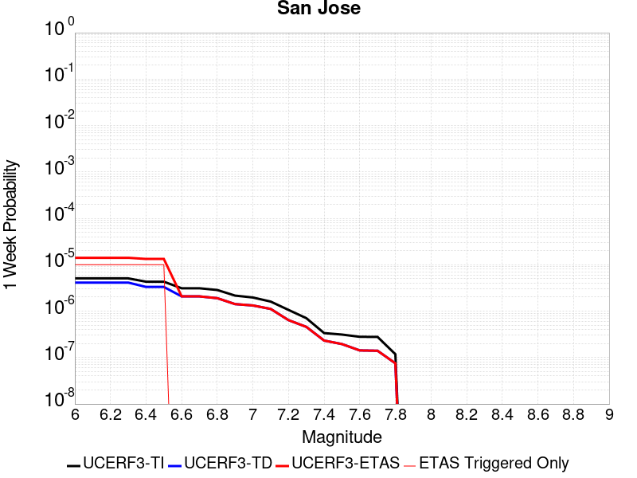 |  |  |  |

| Magnitude | 1 wk TI Prob | 1 wk TD Prob | 1 wk ETAS Prob | 1 wk ETAS/TD Gain | 1 wk ETAS Triggered Only | 1 mo TI Prob | 1 mo TD Prob | 1 mo ETAS Prob | 1 mo ETAS/TD Gain | 1 mo ETAS Triggered Only | 1 yr TI Prob | 1 yr TD Prob | 1 yr ETAS Prob | 1 yr ETAS/TD Gain | 1 yr ETAS Triggered Only | 10 yr TI Prob | 10 yr TD Prob | 10 yr ETAS Prob | 10 yr ETAS/TD Gain | 10 yr ETAS Triggered Only |
|-----|-----|-----|-----|-----|-----|-----|-----|-----|-----|-----|-----|-----|-----|-----|-----|-----|-----|-----|-----|-----|
| 6.0 | 5.0851277E-6 | 4.1256726E-6 | 2.7935099E-5 | 6.771041 | 2.3809524E-5 | 2.1793223E-5 | 1.768135E-5 | 4.1490453E-5 | 2.346566 | 2.3809524E-5 | 2.653002E-4 | 2.152518E-4 | 2.390562E-4 | 1.1105887 | 2.3809524E-5 | 0.0026498367 | 0.0021507242 | 0.0021744824 | 1.0110466 | 2.3809524E-5 |
| 6.1 | 5.0851277E-6 | 4.1256726E-6 | 2.7935099E-5 | 6.771041 | 2.3809524E-5 | 2.1793223E-5 | 1.768135E-5 | 4.1490453E-5 | 2.346566 | 2.3809524E-5 | 2.653002E-4 | 2.152518E-4 | 2.390562E-4 | 1.1105887 | 2.3809524E-5 | 0.0026498367 | 0.0021507242 | 0.0021744824 | 1.0110466 | 2.3809524E-5 |
| 6.2 | 5.0851277E-6 | 4.1256726E-6 | 2.7935099E-5 | 6.771041 | 2.3809524E-5 | 2.1793223E-5 | 1.768135E-5 | 4.1490453E-5 | 2.346566 | 2.3809524E-5 | 2.653002E-4 | 2.152518E-4 | 2.390562E-4 | 1.1105887 | 2.3809524E-5 | 0.0026498367 | 0.0021507242 | 0.0021744824 | 1.0110466 | 2.3809524E-5 |
| 6.3 | 5.0851277E-6 | 4.1256726E-6 | 2.7935099E-5 | 6.771041 | 2.3809524E-5 | 2.1793223E-5 | 1.768135E-5 | 4.1490453E-5 | 2.346566 | 2.3809524E-5 | 2.653002E-4 | 2.152518E-4 | 2.390562E-4 | 1.1105887 | 2.3809524E-5 | 0.0026498367 | 0.0021507242 | 0.0021744824 | 1.0110466 | 2.3809524E-5 |
| 6.4 | 4.3115124E-6 | 3.3237832E-6 | 2.7133228E-5 | 8.163357 | 2.3809524E-5 | 1.8477778E-5 | 1.424472E-5 | 3.8053906E-5 | 2.6714394 | 2.3809524E-5 | 2.2494372E-4 | 1.7341787E-4 | 1.9722327E-4 | 1.1372719 | 2.3809524E-5 | 0.0022471617 | 0.0017330751 | 0.0017568434 | 1.0137146 | 2.3809524E-5 |
| 6.5 | 4.3115124E-6 | 3.3237832E-6 | 2.7133228E-5 | 8.163357 | 2.3809524E-5 | 1.8477778E-5 | 1.424472E-5 | 3.8053906E-5 | 2.6714394 | 2.3809524E-5 | 2.2494372E-4 | 1.7341787E-4 | 1.9722327E-4 | 1.1372719 | 2.3809524E-5 | 0.0022471617 | 0.0017330751 | 0.0017568434 | 1.0137146 | 2.3809524E-5 |
| 6.6 | 3.110396E-6 | 2.0799866E-6 | 2.0799866E-6 | 1.0 | 0.0 | 1.33302E-5 | 8.9141995E-6 | 8.9141995E-6 | 1.0 | 0.0 | 1.622831E-4 | 1.0852526E-4 | 1.0852526E-4 | 1.0 | 0.0 | 0.0016216465 | 0.0010847825 | 0.0010847825 | 1.0 | 0.0 |
| 6.7 | 3.110396E-6 | 2.0799866E-6 | 2.0799866E-6 | 1.0 | 0.0 | 1.33302E-5 | 8.9141995E-6 | 8.9141995E-6 | 1.0 | 0.0 | 1.622831E-4 | 1.0852526E-4 | 1.0852526E-4 | 1.0 | 0.0 | 0.0016216465 | 0.0010847825 | 0.0010847825 | 1.0 | 0.0 |
| 6.8 | 2.856651E-6 | 1.902435E-6 | 1.902435E-6 | 1.0 | 0.0 | 1.2242733E-5 | 8.153269E-6 | 8.153269E-6 | 1.0 | 0.0 | 1.4904508E-4 | 9.926178E-5 | 9.926178E-5 | 1.0 | 0.0 | 0.0014894515 | 9.922314E-4 | 9.922314E-4 | 1.0 | 0.0 |
| 6.9 | 2.1618725E-6 | 1.4186642E-6 | 1.4186642E-6 | 1.0 | 0.0 | 9.265135E-6 | 6.0799757E-6 | 6.0799757E-6 | 1.0 | 0.0 | 1.12797185E-4 | 7.402128E-5 | 7.402128E-5 | 1.0 | 0.0 | 0.0011273995 | 7.4000744E-4 | 7.4000744E-4 | 1.0 | 0.0 |
| 7.0 | 1.9684312E-6 | 1.3256331E-6 | 1.3256331E-6 | 1.0 | 0.0 | 8.436106E-6 | 5.681273E-6 | 5.681273E-6 | 1.0 | 0.0 | 1.02704755E-4 | 6.9167385E-5 | 6.9167385E-5 | 1.0 | 0.0 | 0.001026573 | 6.914992E-4 | 6.914992E-4 | 1.0 | 0.0 |
| 7.1 | 1.6070337E-6 | 1.1155087E-6 | 1.1155087E-6 | 1.0 | 0.0 | 6.887269E-6 | 4.780743E-6 | 4.780743E-6 | 1.0 | 0.0 | 8.384928E-5 | 5.8204052E-5 | 5.8204052E-5 | 1.0 | 0.0 | 8.3817646E-4 | 5.819267E-4 | 5.819267E-4 | 1.0 | 0.0 |
| 7.2 | 1.0631658E-6 | 6.4037624E-7 | 6.4037624E-7 | 1.0 | 0.0 | 4.556417E-6 | 2.7444669E-6 | 2.7444669E-6 | 1.0 | 0.0 | 5.5472963E-5 | 3.3413387E-5 | 3.3413387E-5 | 1.0 | 0.0 | 5.545912E-4 | 3.3411747E-4 | 3.3411747E-4 | 1.0 | 0.0 |
| 7.3 | 7.060711E-7 | 4.5824706E-7 | 4.5824706E-7 | 1.0 | 0.0 | 3.0260155E-6 | 1.9639147E-6 | 1.9639147E-6 | 1.0 | 0.0 | 3.6841117E-5 | 2.3910407E-5 | 2.3910407E-5 | 1.0 | 0.0 | 3.6835007E-4 | 2.3911172E-4 | 2.3911172E-4 | 1.0 | 0.0 |
| 7.4 | 3.3677085E-7 | 2.3233133E-7 | 2.3233133E-7 | 1.0 | 0.0 | 1.4433028E-6 | 9.957054E-7 | 9.957054E-7 | 1.0 | 0.0 | 1.757207E-5 | 1.21226485E-5 | 1.21226485E-5 | 1.0 | 0.0 | 1.7570681E-4 | 1.2125263E-4 | 1.2125263E-4 | 1.0 | 0.0 |
| 7.5 | 3.129161E-7 | 1.9530925E-7 | 1.9530925E-7 | 1.0 | 0.0 | 1.3410682E-6 | 8.370394E-7 | 8.370394E-7 | 1.0 | 0.0 | 1.6327383E-5 | 1.0190909E-5 | 1.0190909E-5 | 1.0 | 0.0 | 1.6326184E-4 | 1.0193714E-4 | 1.0193714E-4 | 1.0 | 0.0 |
| 7.6 | 2.8008668E-7 | 1.4242323E-7 | 1.4242323E-7 | 1.0 | 0.0 | 1.2003709E-6 | 6.1038514E-7 | 6.1038514E-7 | 1.0 | 0.0 | 1.46144175E-5 | 7.4314153E-6 | 7.4314153E-6 | 1.0 | 0.0 | 1.4613457E-4 | 7.434427E-5 | 7.434427E-5 | 1.0 | 0.0 |
| 7.7 | 2.7852005E-7 | 1.4016913E-7 | 1.4016913E-7 | 1.0 | 0.0 | 1.1936568E-6 | 6.007248E-7 | 6.007248E-7 | 1.0 | 0.0 | 1.4532674E-5 | 7.3138012E-6 | 7.3138012E-6 | 1.0 | 0.0 | 1.4531724E-4 | 7.316821E-5 | 7.316821E-5 | 1.0 | 0.0 |
| 7.8 | 1.1810797E-7 | 7.5190094E-8 | 7.5190094E-8 | 1.0 | 0.0 | 5.0617695E-7 | 3.222432E-7 | 3.222432E-7 | 1.0 | 0.0 | 6.1626865E-6 | 3.9233046E-6 | 3.9233046E-6 | 1.0 | 0.0 | 6.162516E-5 | 3.9250725E-5 | 3.9250725E-5 | 1.0 | 0.0 |

## Point Reyes 2011 connector
*[(top)](#table-of-contents)*

| 1 Week | 1 Month | 1 Year | 10 Year |
|-----|-----|-----|-----|
|  |  |  |  |

| Magnitude | 1 wk TI Prob | 1 wk TD Prob | 1 wk ETAS Prob | 1 wk ETAS/TD Gain | 1 wk ETAS Triggered Only | 1 mo TI Prob | 1 mo TD Prob | 1 mo ETAS Prob | 1 mo ETAS/TD Gain | 1 mo ETAS Triggered Only | 1 yr TI Prob | 1 yr TD Prob | 1 yr ETAS Prob | 1 yr ETAS/TD Gain | 1 yr ETAS Triggered Only | 10 yr TI Prob | 10 yr TD Prob | 10 yr ETAS Prob | 10 yr ETAS/TD Gain | 10 yr ETAS Triggered Only |
|-----|-----|-----|-----|-----|-----|-----|-----|-----|-----|-----|-----|-----|-----|-----|-----|-----|-----|-----|-----|-----|
| 6.0 | 3.7893044E-6 | 3.419046E-6 | 2.7228489E-5 | 7.963768 | 2.3809524E-5 | 1.6239776E-5 | 1.4652984E-5 | 3.846216E-5 | 2.6248686 | 2.3809524E-5 | 1.9770133E-4 | 1.783876E-4 | 2.0219288E-4 | 1.1334469 | 2.3809524E-5 | 0.0019752553 | 0.0017829017 | 0.0018066688 | 1.0133306 | 2.3809524E-5 |
| 6.1 | 1.7449562E-6 | 1.3500958E-6 | 1.3500958E-6 | 1.0 | 0.0 | 7.478362E-6 | 5.786112E-6 | 5.786112E-6 | 1.0 | 0.0 | 9.104525E-5 | 7.044369E-5 | 7.044369E-5 | 1.0 | 0.0 | 9.1007963E-4 | 7.044673E-4 | 7.044673E-4 | 1.0 | 0.0 |
| 6.2 | 1.7449562E-6 | 1.3500958E-6 | 1.3500958E-6 | 1.0 | 0.0 | 7.478362E-6 | 5.786112E-6 | 5.786112E-6 | 1.0 | 0.0 | 9.104525E-5 | 7.044369E-5 | 7.044369E-5 | 1.0 | 0.0 | 9.1007963E-4 | 7.044673E-4 | 7.044673E-4 | 1.0 | 0.0 |
| 6.3 | 1.5739171E-6 | 1.1773358E-6 | 1.1773358E-6 | 1.0 | 0.0 | 6.7453416E-6 | 5.0457156E-6 | 5.0457156E-6 | 1.0 | 0.0 | 8.212144E-5 | 6.14299E-5 | 6.14299E-5 | 1.0 | 0.0 | 8.2091097E-4 | 6.1438145E-4 | 6.1438145E-4 | 1.0 | 0.0 |
| 6.4 | 1.5138507E-6 | 1.1166904E-6 | 1.1166904E-6 | 1.0 | 0.0 | 6.4879155E-6 | 4.7858075E-6 | 4.7858075E-6 | 1.0 | 0.0 | 7.898751E-5 | 5.8265687E-5 | 5.8265687E-5 | 1.0 | 0.0 | 7.8959437E-4 | 5.827562E-4 | 5.827562E-4 | 1.0 | 0.0 |
| 6.5 | 1.3662817E-6 | 9.671372E-7 | 9.671372E-7 | 1.0 | 0.0 | 5.8554797E-6 | 4.1448675E-6 | 4.1448675E-6 | 1.0 | 0.0 | 7.128814E-5 | 5.046261E-5 | 5.046261E-5 | 1.0 | 0.0 | 7.126527E-4 | 5.047615E-4 | 5.047615E-4 | 1.0 | 0.0 |
| 6.6 | 1.2022703E-6 | 8.0703006E-7 | 8.0703006E-7 | 1.0 | 0.0 | 5.1525767E-6 | 3.4586958E-6 | 3.4586958E-6 | 1.0 | 0.0 | 6.273081E-5 | 4.210882E-5 | 4.210882E-5 | 1.0 | 0.0 | 6.271311E-4 | 4.2125754E-4 | 4.2125754E-4 | 1.0 | 0.0 |
| 6.7 | 1.0194848E-6 | 6.265979E-7 | 6.265979E-7 | 1.0 | 0.0 | 4.3692135E-6 | 2.6854168E-6 | 2.6854168E-6 | 1.0 | 0.0 | 5.319387E-5 | 3.2694465E-5 | 3.2694465E-5 | 1.0 | 0.0 | 5.3181144E-4 | 3.271452E-4 | 3.271452E-4 | 1.0 | 0.0 |
| 6.8 | 9.212307E-7 | 5.3645635E-7 | 5.3645635E-7 | 1.0 | 0.0 | 3.9481256E-6 | 2.2990966E-6 | 2.2990966E-6 | 1.0 | 0.0 | 4.806737E-5 | 2.7991146E-5 | 2.7991146E-5 | 1.0 | 0.0 | 4.8056975E-4 | 2.8012466E-4 | 2.8012466E-4 | 1.0 | 0.0 |
| 6.9 | 8.1306075E-7 | 4.350046E-7 | 4.350046E-7 | 1.0 | 0.0 | 3.4845416E-6 | 1.8643041E-6 | 1.8643041E-6 | 1.0 | 0.0 | 4.2423468E-5 | 2.2697668E-5 | 2.2697668E-5 | 1.0 | 0.0 | 4.241537E-4 | 2.2720183E-4 | 2.2720183E-4 | 1.0 | 0.0 |
| 7.0 | 6.773335E-7 | 3.1073702E-7 | 3.1073702E-7 | 1.0 | 0.0 | 2.9028547E-6 | 1.3317294E-6 | 1.3317294E-6 | 1.0 | 0.0 | 3.5341684E-5 | 1.6213686E-5 | 1.6213686E-5 | 1.0 | 0.0 | 3.5336064E-4 | 1.6237324E-4 | 1.6237324E-4 | 1.0 | 0.0 |
| 7.1 | 5.7279397E-7 | 2.1742792E-7 | 2.1742792E-7 | 1.0 | 0.0 | 2.454829E-6 | 9.3183365E-7 | 9.3183365E-7 | 1.0 | 0.0 | 2.9887131E-5 | 1.1345015E-5 | 1.1345015E-5 | 1.0 | 0.0 | 2.9883112E-4 | 1.13692506E-4 | 1.13692506E-4 | 1.0 | 0.0 |
| 7.2 | 5.185539E-7 | 1.7429139E-7 | 1.7429139E-7 | 1.0 | 0.0 | 2.222372E-6 | 7.469629E-7 | 7.469629E-7 | 1.0 | 0.0 | 2.7057044E-5 | 9.094235E-6 | 9.094235E-6 | 1.0 | 0.0 | 2.7053748E-4 | 9.118677E-5 | 9.118677E-5 | 1.0 | 0.0 |
| 7.3 | 4.7599846E-7 | 1.5520465E-7 | 1.5520465E-7 | 1.0 | 0.0 | 2.0399918E-6 | 6.6516264E-7 | 6.6516264E-7 | 1.0 | 0.0 | 2.4836616E-5 | 8.0983245E-6 | 8.0983245E-6 | 1.0 | 0.0 | 2.4833842E-4 | 8.122844E-5 | 8.122844E-5 | 1.0 | 0.0 |
| 7.4 | 4.3987393E-7 | 1.3893278E-7 | 1.3893278E-7 | 1.0 | 0.0 | 1.8851727E-6 | 5.9542606E-7 | 5.9542606E-7 | 1.0 | 0.0 | 2.2951735E-5 | 7.249288E-6 | 7.249288E-6 | 1.0 | 0.0 | 2.2949366E-4 | 7.273859E-5 | 7.273859E-5 | 1.0 | 0.0 |
| 7.5 | 3.980054E-7 | 1.218581E-7 | 1.218581E-7 | 1.0 | 0.0 | 1.7057363E-6 | 5.222489E-7 | 5.222489E-7 | 1.0 | 0.0 | 2.0767142E-5 | 6.358361E-6 | 6.358361E-6 | 1.0 | 0.0 | 2.0765202E-4 | 6.382455E-5 | 6.382455E-5 | 1.0 | 0.0 |
| 7.6 | 3.4188398E-7 | 9.8577246E-8 | 9.8577246E-8 | 1.0 | 0.0 | 1.4652163E-6 | 4.2247387E-7 | 4.2247387E-7 | 1.0 | 0.0 | 1.7838862E-5 | 5.143607E-6 | 5.143607E-6 | 1.0 | 0.0 | 1.783743E-4 | 5.166426E-5 | 5.166426E-5 | 1.0 | 0.0 |
| 7.7 | 2.6611437E-7 | 7.213626E-8 | 7.213626E-8 | 1.0 | 0.0 | 1.1404896E-6 | 3.0915538E-7 | 3.0915538E-7 | 1.0 | 0.0 | 1.3885373E-5 | 3.7639602E-6 | 3.7639602E-6 | 1.0 | 0.0 | 1.3884505E-4 | 3.78245E-5 | 3.78245E-5 | 1.0 | 0.0 |
| 7.8 | 1.5107078E-7 | 5.0054087E-8 | 5.0054087E-8 | 1.0 | 0.0 | 6.474461E-7 | 2.145175E-7 | 2.145175E-7 | 1.0 | 0.0 | 7.882627E-6 | 2.6117473E-6 | 2.6117473E-6 | 1.0 | 0.0 | 7.8823476E-5 | 2.6281212E-5 | 2.6281212E-5 | 1.0 | 0.0 |
| 7.9 | 4.3228205E-8 | 2.1818217E-8 | 2.1818217E-8 | 1.0 | 0.0 | 1.8526373E-7 | 9.350663E-8 | 9.350663E-8 | 1.0 | 0.0 | 2.2555835E-6 | 1.1384427E-6 | 1.1384427E-6 | 1.0 | 0.0 | 2.2555607E-5 | 1.1461557E-5 | 1.1461557E-5 | 1.0 | 0.0 |
| 8.0 | 1.9149928E-8 | 1.30497515E-8 | 1.30497515E-8 | 1.0 | 0.0 | 8.207112E-8 | 5.5927494E-8 | 5.5927494E-8 | 1.0 | 0.0 | 9.992154E-7 | 6.80917E-7 | 6.80917E-7 | 1.0 | 0.0 | 9.992109E-6 | 6.857356E-6 | 6.857356E-6 | 1.0 | 0.0 |
| 8.1 | 6.7792816E-9 | 6.4085857E-9 | 6.4085857E-9 | 1.0 | 0.0 | 2.9054062E-8 | 2.7465362E-8 | 2.7465362E-8 | 1.0 | 0.0 | 3.5373316E-7 | 3.3439076E-7 | 3.3439076E-7 | 1.0 | 0.0 | 3.537326E-6 | 3.3694284E-6 | 3.3694284E-6 | 1.0 | 0.0 |

## Rinconada 2011 CFM
*[(top)](#table-of-contents)*

| 1 Week | 1 Month | 1 Year | 10 Year |
|-----|-----|-----|-----|
|  |  |  |  |

| Magnitude | 1 wk TI Prob | 1 wk TD Prob | 1 wk ETAS Prob | 1 wk ETAS/TD Gain | 1 wk ETAS Triggered Only | 1 mo TI Prob | 1 mo TD Prob | 1 mo ETAS Prob | 1 mo ETAS/TD Gain | 1 mo ETAS Triggered Only | 1 yr TI Prob | 1 yr TD Prob | 1 yr ETAS Prob | 1 yr ETAS/TD Gain | 1 yr ETAS Triggered Only | 10 yr TI Prob | 10 yr TD Prob | 10 yr ETAS Prob | 10 yr ETAS/TD Gain | 10 yr ETAS Triggered Only |
|-----|-----|-----|-----|-----|-----|-----|-----|-----|-----|-----|-----|-----|-----|-----|-----|-----|-----|-----|-----|-----|
| 6.0 | 1.5752368E-5 | 1.6274716E-5 | 4.008385E-5 | 2.4629526 | 2.3809524E-5 | 6.75084E-5 | 6.974694E-5 | 9.3554794E-5 | 1.3413464 | 2.3809524E-5 | 8.2160486E-4 | 8.488412E-4 | 8.7263057E-4 | 1.0280256 | 2.3809524E-5 | 0.008185739 | 0.00845637 | 0.008479978 | 1.0027918 | 2.3809524E-5 |
| 6.1 | 1.0966133E-5 | 1.1323029E-5 | 3.513228E-5 | 3.1027284 | 2.3809524E-5 | 4.6996865E-5 | 4.852637E-5 | 7.233474E-5 | 1.4906274 | 2.3809524E-5 | 5.720366E-4 | 5.906491E-4 | 6.1444455E-4 | 1.040287 | 2.3809524E-5 | 0.0057056635 | 0.0058908886 | 0.005914558 | 1.004018 | 2.3809524E-5 |
| 6.2 | 1.0966133E-5 | 1.1323029E-5 | 3.513228E-5 | 3.1027284 | 2.3809524E-5 | 4.6996865E-5 | 4.852637E-5 | 7.233474E-5 | 1.4906274 | 2.3809524E-5 | 5.720366E-4 | 5.906491E-4 | 6.1444455E-4 | 1.040287 | 2.3809524E-5 | 0.0057056635 | 0.0058908886 | 0.005914558 | 1.004018 | 2.3809524E-5 |
| 6.3 | 8.926149E-6 | 9.212771E-6 | 3.3022076E-5 | 3.5843801 | 2.3809524E-5 | 3.8254362E-5 | 3.948271E-5 | 6.329129E-5 | 1.6030129 | 2.3809524E-5 | 4.6564735E-4 | 4.805963E-4 | 5.0439435E-4 | 1.0495179 | 2.3809524E-5 | 0.0046467283 | 0.0047956146 | 0.00481931 | 1.004941 | 2.3809524E-5 |
| 6.4 | 7.676955E-6 | 7.920191E-6 | 3.1729527E-5 | 4.006157 | 2.3809524E-5 | 3.290082E-5 | 3.3943234E-5 | 5.775195E-5 | 1.7014275 | 2.3809524E-5 | 4.0049385E-4 | 4.1318068E-4 | 4.3698036E-4 | 1.0576012 | 2.3809524E-5 | 0.0039977287 | 0.004124151 | 0.0041478625 | 1.0057493 | 2.3809524E-5 |
| 6.5 | 6.1671026E-6 | 6.3589546E-6 | 3.0168327E-5 | 4.7442274 | 2.3809524E-5 | 2.6430173E-5 | 2.725238E-5 | 5.1061255E-5 | 1.8736439 | 2.3809524E-5 | 3.2173982E-4 | 3.317473E-4 | 3.555489E-4 | 1.0717462 | 2.3809524E-5 | 0.003212744 | 0.0033125326 | 0.0033362631 | 1.0071639 | 2.3809524E-5 |
| 6.6 | 5.553456E-6 | 5.7248126E-6 | 2.95342E-5 | 5.1589813 | 2.3809524E-5 | 2.3800309E-5 | 2.453468E-5 | 4.834362E-5 | 1.9704198 | 2.3809524E-5 | 2.897302E-4 | 2.9866883E-4 | 3.2247126E-4 | 1.079695 | 2.3809524E-5 | 0.0028935277 | 0.002982683 | 0.0030064217 | 1.0079588 | 2.3809524E-5 |
| 6.7 | 4.787857E-6 | 4.9333094E-6 | 2.8742716E-5 | 5.8262544 | 2.3809524E-5 | 2.0519226E-5 | 2.1142583E-5 | 4.4951605E-5 | 2.126117 | 2.3809524E-5 | 2.4979294E-4 | 2.573806E-4 | 2.8118398E-4 | 1.0924833 | 2.3809524E-5 | 0.0024951235 | 0.0025708308 | 0.002594579 | 1.0092376 | 2.3809524E-5 |
| 6.8 | 3.9955166E-6 | 4.1134763E-6 | 2.7922903E-5 | 6.788152 | 2.3809524E-5 | 1.7123532E-5 | 1.7629065E-5 | 4.143817E-5 | 2.3505597 | 2.3809524E-5 | 2.0845905E-4 | 2.1461274E-4 | 2.3841715E-4 | 1.110918 | 2.3809524E-5 | 0.002082636 | 0.0021440585 | 0.002167817 | 1.0110811 | 2.3809524E-5 |
| 6.9 | 3.4250072E-6 | 3.5224464E-6 | 2.7331886E-5 | 7.759348 | 2.3809524E-5 | 1.46785205E-5 | 1.5096111E-5 | 3.8905277E-5 | 2.577172 | 2.3809524E-5 | 1.7869633E-4 | 1.8377967E-4 | 2.0758482E-4 | 1.1295309 | 2.3809524E-5 | 0.001785527 | 0.0018362794 | 0.0018600451 | 1.0129423 | 2.3809524E-5 |
| 7.0 | 2.7712713E-6 | 2.8467E-6 | 2.6656156E-5 | 9.36388 | 2.3809524E-5 | 1.1876823E-5 | 1.2200086E-5 | 3.6009318E-5 | 2.951563 | 2.3809524E-5 | 1.4459073E-4 | 1.4852593E-4 | 1.7233191E-4 | 1.1602817 | 2.3809524E-5 | 0.0014449668 | 0.0014842682 | 0.0015080423 | 1.0160174 | 2.3809524E-5 |
| 7.1 | 2.227358E-6 | 2.2856984E-6 | 2.6095167E-5 | 11.416715 | 2.3809524E-5 | 9.545785E-6 | 9.795814E-6 | 3.3605105E-5 | 3.4305577 | 2.3809524E-5 | 1.16213734E-4 | 1.19257515E-4 | 1.430642E-4 | 1.1996242 | 2.3809524E-5 | 0.0011615298 | 0.0011919362 | 0.0012157174 | 1.0199517 | 2.3809524E-5 |
| 7.2 | 1.581796E-6 | 1.6209011E-6 | 2.5430387E-5 | 15.689042 | 2.3809524E-5 | 6.779108E-6 | 6.9467005E-6 | 3.075606E-5 | 4.427434 | 2.3809524E-5 | 8.253252E-5 | 8.457281E-5 | 1.08380314E-4 | 1.2815032 | 2.3809524E-5 | 8.250187E-4 | 8.454067E-4 | 8.6919614E-4 | 1.0281396 | 2.3809524E-5 |
| 7.3 | 1.0306567E-6 | 1.0546477E-6 | 2.4864146E-5 | 23.575785 | 2.3809524E-5 | 4.4170924E-6 | 4.519911E-6 | 2.8329327E-5 | 6.267674 | 2.3809524E-5 | 5.3776774E-5 | 5.5028526E-5 | 7.883674E-5 | 1.4326522 | 2.3809524E-5 | 5.376376E-4 | 5.5014924E-4 | 5.739457E-4 | 1.0432545 | 2.3809524E-5 |
| 7.4 | 6.535541E-7 | 6.682742E-7 | 2.4477782E-5 | 36.628353 | 2.3809524E-5 | 2.800943E-6 | 2.864029E-6 | 2.6673484E-5 | 9.313273 | 2.3809524E-5 | 3.4100947E-5 | 3.4868997E-5 | 5.867769E-5 | 1.6828041 | 2.3809524E-5 | 3.4095717E-4 | 3.4863537E-4 | 3.724366E-4 | 1.0682697 | 2.3809524E-5 |
| 7.5 | 3.2656962E-7 | 3.3316687E-7 | 3.3316687E-7 | 1.0 | 0.0 | 1.3995833E-6 | 1.4278572E-6 | 1.4278572E-6 | 1.0 | 0.0 | 1.7039794E-5 | 1.7384024E-5 | 1.7384024E-5 | 1.0 | 0.0 | 1.7038487E-4 | 1.7382667E-4 | 1.7382667E-4 | 1.0 | 0.0 |
| 7.6 | 9.754343E-8 | 9.82099E-8 | 9.82099E-8 | 1.0 | 0.0 | 4.180432E-7 | 4.208995E-7 | 4.208995E-7 | 1.0 | 0.0 | 5.089664E-6 | 5.1244397E-6 | 5.1244397E-6 | 1.0 | 0.0 | 5.0895473E-5 | 5.1243223E-5 | 5.1243223E-5 | 1.0 | 0.0 |
| 7.7 | 6.0001453E-9 | 5.8490435E-9 | 5.8490435E-9 | 1.0 | 0.0 | 2.5714908E-8 | 2.506733E-8 | 2.506733E-8 | 1.0 | 0.0 | 3.1307894E-7 | 3.051947E-7 | 3.051947E-7 | 1.0 | 0.0 | 3.1307852E-6 | 3.051943E-6 | 3.051943E-6 | 1.0 | 0.0 |
| 7.8 | 7.400003E-11 | 7.4654505E-11 | 7.4654505E-11 | 1.0 | 0.0 | 3.171432E-10 | 3.1994773E-10 | 3.1994773E-10 | 1.0 | 0.0 | 3.861218E-9 | 3.895363E-9 | 3.895363E-9 | 1.0 | 0.0 | 3.861218E-8 | 3.895363E-8 | 3.895363E-8 | 1.0 | 0.0 |

## Shoreline
*[(top)](#table-of-contents)*

| 1 Week | 1 Month | 1 Year | 10 Year |
|-----|-----|-----|-----|
|  |  |  |  |

| Magnitude | 1 wk TI Prob | 1 wk TD Prob | 1 wk ETAS Prob | 1 wk ETAS/TD Gain | 1 wk ETAS Triggered Only | 1 mo TI Prob | 1 mo TD Prob | 1 mo ETAS Prob | 1 mo ETAS/TD Gain | 1 mo ETAS Triggered Only | 1 yr TI Prob | 1 yr TD Prob | 1 yr ETAS Prob | 1 yr ETAS/TD Gain | 1 yr ETAS Triggered Only | 10 yr TI Prob | 10 yr TD Prob | 10 yr ETAS Prob | 10 yr ETAS/TD Gain | 10 yr ETAS Triggered Only |
|-----|-----|-----|-----|-----|-----|-----|-----|-----|-----|-----|-----|-----|-----|-----|-----|-----|-----|-----|-----|-----|
| 6.0 | 3.9888673E-6 | 4.047929E-6 | 4.047929E-6 | 1.0 | 0.0 | 1.7095033E-5 | 1.7348184E-5 | 4.1157295E-5 | 2.3724267 | 2.3809524E-5 | 2.0811215E-4 | 2.1119925E-4 | 2.3500375E-4 | 1.1127111 | 2.3809524E-5 | 0.0020791737 | 0.002110534 | 0.0021342933 | 1.0112574 | 2.3809524E-5 |
| 6.1 | 3.9888673E-6 | 4.047929E-6 | 4.047929E-6 | 1.0 | 0.0 | 1.7095033E-5 | 1.7348184E-5 | 4.1157295E-5 | 2.3724267 | 2.3809524E-5 | 2.0811215E-4 | 2.1119925E-4 | 2.3500375E-4 | 1.1127111 | 2.3809524E-5 | 0.0020791737 | 0.002110534 | 0.0021342933 | 1.0112574 | 2.3809524E-5 |
| 6.2 | 1.4039653E-6 | 1.4100891E-6 | 1.4100891E-6 | 1.0 | 0.0 | 6.0169805E-6 | 6.0432253E-6 | 6.0432253E-6 | 1.0 | 0.0 | 7.325427E-5 | 7.357384E-5 | 7.357384E-5 | 1.0 | 0.0 | 7.3230127E-4 | 7.355009E-4 | 7.355009E-4 | 1.0 | 0.0 |
| 6.3 | 1.4039653E-6 | 1.4100891E-6 | 1.4100891E-6 | 1.0 | 0.0 | 6.0169805E-6 | 6.0432253E-6 | 6.0432253E-6 | 1.0 | 0.0 | 7.325427E-5 | 7.357384E-5 | 7.357384E-5 | 1.0 | 0.0 | 7.3230127E-4 | 7.355009E-4 | 7.355009E-4 | 1.0 | 0.0 |
| 6.4 | 1.3314152E-6 | 1.3361605E-6 | 1.3361605E-6 | 1.0 | 0.0 | 5.7060524E-6 | 5.7263896E-6 | 5.7263896E-6 | 1.0 | 0.0 | 6.946897E-5 | 6.971662E-5 | 6.971662E-5 | 1.0 | 0.0 | 6.9447263E-4 | 6.9695286E-4 | 6.9695286E-4 | 1.0 | 0.0 |
| 6.5 | 1.1187026E-6 | 1.120364E-6 | 1.120364E-6 | 1.0 | 0.0 | 4.794431E-6 | 4.8015513E-6 | 4.8015513E-6 | 1.0 | 0.0 | 5.8370628E-5 | 5.8457343E-5 | 5.8457343E-5 | 1.0 | 0.0 | 5.83553E-4 | 5.844222E-4 | 5.844222E-4 | 1.0 | 0.0 |
| 6.6 | 9.793089E-7 | 9.784919E-7 | 9.784919E-7 | 1.0 | 0.0 | 4.1970316E-6 | 4.1935305E-6 | 4.1935305E-6 | 1.0 | 0.0 | 5.1097657E-5 | 5.105505E-5 | 5.105505E-5 | 1.0 | 0.0 | 5.108591E-4 | 5.1043445E-4 | 5.1043445E-4 | 1.0 | 0.0 |
| 6.7 | 8.995986E-7 | 8.9728E-7 | 8.9728E-7 | 1.0 | 0.0 | 3.8554167E-6 | 3.84548E-6 | 3.84548E-6 | 1.0 | 0.0 | 4.693869E-5 | 4.6817724E-5 | 4.6817724E-5 | 1.0 | 0.0 | 4.6928777E-4 | 4.6807955E-4 | 4.6807955E-4 | 1.0 | 0.0 |
| 6.8 | 7.931612E-7 | 7.8804027E-7 | 7.8804027E-7 | 1.0 | 0.0 | 3.3992578E-6 | 3.377311E-6 | 3.377311E-6 | 1.0 | 0.0 | 4.1385178E-5 | 4.1117994E-5 | 4.1117994E-5 | 1.0 | 0.0 | 4.1377472E-4 | 4.1110438E-4 | 4.1110438E-4 | 1.0 | 0.0 |
| 6.9 | 7.1465956E-7 | 7.078006E-7 | 7.078006E-7 | 1.0 | 0.0 | 3.062823E-6 | 3.0334277E-6 | 3.0334277E-6 | 1.0 | 0.0 | 3.7289232E-5 | 3.6931357E-5 | 3.6931357E-5 | 1.0 | 0.0 | 3.7282976E-4 | 3.6925258E-4 | 3.6925258E-4 | 1.0 | 0.0 |
| 7.0 | 6.389046E-7 | 6.299458E-7 | 6.299458E-7 | 1.0 | 0.0 | 2.7381598E-6 | 2.699765E-6 | 2.699765E-6 | 1.0 | 0.0 | 3.3336586E-5 | 3.2869146E-5 | 3.2869146E-5 | 1.0 | 0.0 | 3.3331584E-4 | 3.2864307E-4 | 3.2864307E-4 | 1.0 | 0.0 |
| 7.1 | 5.4300875E-7 | 5.3111313E-7 | 5.3111313E-7 | 1.0 | 0.0 | 2.3271782E-6 | 2.276197E-6 | 2.276197E-6 | 1.0 | 0.0 | 2.8333026E-5 | 2.7712347E-5 | 2.7712347E-5 | 1.0 | 0.0 | 2.8329415E-4 | 2.77089E-4 | 2.77089E-4 | 1.0 | 0.0 |
| 7.2 | 4.6768855E-7 | 4.5348952E-7 | 4.5348952E-7 | 1.0 | 0.0 | 2.0043778E-6 | 1.9435251E-6 | 1.9435251E-6 | 1.0 | 0.0 | 2.4403027E-5 | 2.3662162E-5 | 2.3662162E-5 | 1.0 | 0.0 | 2.4400349E-4 | 2.3659648E-4 | 2.3659648E-4 | 1.0 | 0.0 |
| 7.3 | 4.0966103E-7 | 3.9385662E-7 | 3.9385662E-7 | 1.0 | 0.0 | 1.7556889E-6 | 1.6879559E-6 | 1.6879559E-6 | 1.0 | 0.0 | 2.1375303E-5 | 2.055067E-5 | 2.055067E-5 | 1.0 | 0.0 | 2.1373246E-4 | 2.0548773E-4 | 2.0548773E-4 | 1.0 | 0.0 |
| 7.4 | 3.5105785E-7 | 3.3363975E-7 | 3.3363975E-7 | 1.0 | 0.0 | 1.5045327E-6 | 1.4298838E-6 | 1.4298838E-6 | 1.0 | 0.0 | 1.8317533E-5 | 1.7408696E-5 | 1.7408696E-5 | 1.0 | 0.0 | 1.8316023E-4 | 1.7407336E-4 | 1.7407336E-4 | 1.0 | 0.0 |
| 7.5 | 2.8737534E-7 | 2.6820038E-7 | 2.6820038E-7 | 1.0 | 0.0 | 1.2316079E-6 | 1.1494297E-6 | 1.1494297E-6 | 1.0 | 0.0 | 1.4994724E-5 | 1.3994217E-5 | 1.3994217E-5 | 1.0 | 0.0 | 1.4993713E-4 | 1.3993339E-4 | 1.3993339E-4 | 1.0 | 0.0 |
| 7.6 | 2.0924051E-7 | 1.8778988E-7 | 1.8778988E-7 | 1.0 | 0.0 | 8.967448E-7 | 8.048135E-7 | 8.048135E-7 | 1.0 | 0.0 | 1.0917813E-5 | 9.79856E-6 | 9.79856E-6 | 1.0 | 0.0 | 1.0917276E-4 | 9.798129E-5 | 9.798129E-5 | 1.0 | 0.0 |
| 7.7 | 1.392265E-7 | 1.15433906E-7 | 1.15433906E-7 | 1.0 | 0.0 | 5.9668486E-7 | 4.9471663E-7 | 4.9471663E-7 | 1.0 | 0.0 | 7.2646135E-6 | 6.023158E-6 | 6.023158E-6 | 1.0 | 0.0 | 7.2643765E-5 | 6.0229955E-5 | 6.0229955E-5 | 1.0 | 0.0 |
| 7.8 | 8.1080074E-8 | 5.586722E-8 | 5.586722E-8 | 1.0 | 0.0 | 3.4748598E-7 | 2.394309E-7 | 2.394309E-7 | 1.0 | 0.0 | 4.2306337E-6 | 2.9150672E-6 | 2.9150672E-6 | 1.0 | 0.0 | 4.230553E-5 | 2.9150291E-5 | 2.9150291E-5 | 1.0 | 0.0 |
| 7.9 | 5.0859036E-8 | 2.7244445E-8 | 2.7244445E-8 | 1.0 | 0.0 | 2.1796728E-7 | 1.16761896E-7 | 1.16761896E-7 | 1.0 | 0.0 | 2.6537484E-6 | 1.4215751E-6 | 1.4215751E-6 | 1.0 | 0.0 | 2.6537167E-5 | 1.4215661E-5 | 1.4215661E-5 | 1.0 | 0.0 |
| 8.0 | 3.1760536E-8 | 1.3577206E-8 | 1.3577206E-8 | 1.0 | 0.0 | 1.3611657E-7 | 5.8188025E-8 | 5.8188025E-8 | 1.0 | 0.0 | 1.6572179E-6 | 7.0843896E-7 | 7.0843896E-7 | 1.0 | 0.0 | 1.6572056E-5 | 7.084367E-6 | 7.084367E-6 | 1.0 | 0.0 |
| 8.1 | 1.2947896E-8 | 5.6628693E-9 | 5.6628693E-9 | 1.0 | 0.0 | 5.5490982E-8 | 2.426944E-8 | 2.426944E-8 | 1.0 | 0.0 | 6.756025E-7 | 2.954804E-7 | 2.954804E-7 | 1.0 | 0.0 | 6.7560045E-6 | 2.9548003E-6 | 2.9548003E-6 | 1.0 | 0.0 |

