# Parent Section Magnitude-Probability Distributions

Only fault sections with at least one triggered aftershock are plotted. Sections are sorted by total supraseismogenic trigger rate (decreasing)

## Table Of Contents

* [Garlock (Central)](#garlock-central)
* [Tank Canyon](#tank-canyon)
* [Little Lake](#little-lake)
* [Owl Lake](#owl-lake)
* [Airport Lake](#airport-lake)
* [Panamint Valley](#panamint-valley)
* [Garlock (East)](#garlock-east)
* [Hunter Mountain-Saline Valley](#hunter-mountain-saline-valley)
* [Ash Hill](#ash-hill)
* [Blackwater](#blackwater)
* [Garlock (West)](#garlock-west)
* [McLean Lake](#mclean-lake)
* [Goldstone Lake](#goldstone-lake)
* [Death Valley (So)](#death-valley-so)
* [Gravel Hills-Harper Lk](#gravel-hills-harper-lk)
* [San Andreas (Mojave S)](#san-andreas-mojave-s)
* [Coyote Canyon](#coyote-canyon)
* [San Andreas (Mojave N)](#san-andreas-mojave-n)
* [Nelson Lake](#nelson-lake)
* [So Sierra Nevada](#so-sierra-nevada)
* [Towne Pass](#towne-pass)
* [San Andreas (San Bernardino N)](#san-andreas-san-bernardino-n)
* [Lenwood-Lockhart-Old Woman Springs](#lenwood-lockhart-old-woman-springs)
* [Bicycle Lake](#bicycle-lake)
* [Paradise](#paradise)
* [Garlic Springs](#garlic-springs)
* [San Andreas (San Bernardino S)](#san-andreas-san-bernardino-s)
* [Death Valley (Black Mtns Frontal)](#death-valley-black-mtns-frontal)
* [San Andreas (Big Bend)](#san-andreas-big-bend)
* [Coyote Lake](#coyote-lake)
* [Helendale-So Lockhart](#helendale-so-lockhart)
* [San Andreas (San Gorgonio Pass-Garnet HIll)](#san-andreas-san-gorgonio-pass-garnet-hill)
* [San Andreas (Parkfield)](#san-andreas-parkfield)
* [Death Valley (No)](#death-valley-no)
* [San Andreas (Cholame) rev](#san-andreas-cholame-rev)
* [San Andreas (Carrizo) rev](#san-andreas-carrizo-rev)
* [Death Valley (Fish Lake Valley)](#death-valley-fish-lake-valley)
* [Red Pass](#red-pass)
* [San Andreas (Coachella) rev](#san-andreas-coachella-rev)
* [San Jacinto (San Bernardino)](#san-jacinto-san-bernardino)
* [San Andreas (Creeping Section) 2011 CFM](#san-andreas-creeping-section-2011-cfm)
* [Cady](#cady)
* [Elsinore (Glen Ivy) rev](#elsinore-glen-ivy-rev)
* [Sierra Nevada  (No Extension)](#sierra-nevada--no-extension)
* [Baker](#baker)
* [Ludlow](#ludlow)
* [San Jacinto (San Jacinto Valley) rev](#san-jacinto-san-jacinto-valley-rev)
* [Santa Ynez (East)](#santa-ynez-east)
* [San Jacinto (Stepovers Combined)](#san-jacinto-stepovers-combined)
* [Manix-Afton Hills](#manix-afton-hills)
* [Santa Ynez (West)](#santa-ynez-west)
* [San Andreas (North Branch Mill Creek)](#san-andreas-north-branch-mill-creek)
* [Calico-Hidalgo](#calico-hidalgo)
* [Cleghorn Lake](#cleghorn-lake)
* [Mission Ridge-Arroyo Parida-Santa Ana](#mission-ridge-arroyo-parida-santa-ana)
* [Lake Isabella (Seismicity)](#lake-isabella-seismicity)
* [San Jacinto (Anza) rev](#san-jacinto-anza-rev)
* [White Wolf (Extension)](#white-wolf-extension)
* [Lost Hills](#lost-hills)
* [Brawley (Seismic Zone) alt 1](#brawley-seismic-zone-alt-1)
* [Pleito](#pleito)
* [Scodie Lineament](#scodie-lineament)
* [Imperial](#imperial)
* [Red Mountain](#red-mountain)
* [Cleghorn Pass](#cleghorn-pass)
* [Mission Creek](#mission-creek)
* [Santa Rosa Island](#santa-rosa-island)
* [San Jacinto (Coyote Creek)](#san-jacinto-coyote-creek)
* [Big Pine (East)](#big-pine-east)
* [Pinto Mtn](#pinto-mtn)
* [Big Pine (Central)](#big-pine-central)
* [Independence rev 2011](#independence-rev-2011)
* [San Jacinto (Lytle Creek connector)](#san-jacinto-lytle-creek-connector)
* [Deep Springs](#deep-springs)
* [Elysian Park (Upper)](#elysian-park-upper)
* [Chino alt 1](#chino-alt-1)
* [San Jacinto (Superstition Mtn)](#san-jacinto-superstition-mtn)
* [Channel Islands Thrust](#channel-islands-thrust)
* [White Mountains](#white-mountains)
* [Santa Cruz Island](#santa-cruz-island)
* [San Jacinto (Borrego)](#san-jacinto-borrego)
* [Ventura-Pitas Point](#ventura-pitas-point)
* [Owens Valley](#owens-valley)
* [Pisgah-Bullion Mtn-Mesquite Lk](#pisgah-bullion-mtn-mesquite-lk)
* [Ortigalita (North)](#ortigalita-north)
* [San Diego Trough north alt1](#san-diego-trough-north-alt1)
* [Great Valley 09 (Laguna Seca)](#great-valley-09-laguna-seca)
* [Sierra Madre](#sierra-madre)
* [Santa Ynez River](#santa-ynez-river)
* [Hosgri](#hosgri)
* [Cleghorn](#cleghorn)
* [Hunting Creek - Berryessa 2011 CFM](#hunting-creek---berryessa-2011-cfm)
* [Whittier alt 1](#whittier-alt-1)
* [Calaveras (So) - Paicines extension 2011 CFM](#calaveras-so---paicines-extension-2011-cfm)
* [Tin Mountain](#tin-mountain)
* [Blue Cut](#blue-cut)
* [San Gabriel](#san-gabriel)
* [Cucamonga](#cucamonga)
* [Pine Mtn](#pine-mtn)
* [Oceanic - West Huasna](#oceanic---west-huasna)
* [San Cayetano](#san-cayetano)
* [Bullion Mountains](#bullion-mountains)
* [Rose Canyon](#rose-canyon)
* [San Jacinto (Clark) rev](#san-jacinto-clark-rev)
* [Coronado Bank alt1](#coronado-bank-alt1)
* [Santa Cruz Catalina Ridge alt1](#santa-cruz-catalina-ridge-alt1)
* [Raymond](#raymond)
* [Pitas Point (Lower West)](#pitas-point-lower-west)
* [Camp Rock 2011](#camp-rock-2011)
* [Calaveras (So) 2011 CFM](#calaveras-so-2011-cfm)
* [San Diego Trough south](#san-diego-trough-south)
* [Kern Canyon (North Kern) 2011](#kern-canyon-north-kern-2011)
* [San Luis Range 2011 CFM](#san-luis-range-2011-cfm)
* [Oak Ridge (Onshore)](#oak-ridge-onshore)
* [Sheephole](#sheephole)
* [San Pedro Basin](#san-pedro-basin)
* [Dry Mountain](#dry-mountain)
* [San Clemente](#san-clemente)
* [Hollywood](#hollywood)
* [San Andreas (Santa Cruz Mts) 2011 CFM](#san-andreas-santa-cruz-mts-2011-cfm)
* [Kern Canyon (South Kern) 2011](#kern-canyon-south-kern-2011)
* [Santa Monica alt 1](#santa-monica-alt-1)
* [North Frontal  (West)](#north-frontal--west)
* [Simi-Santa Rosa](#simi-santa-rosa)
* [Newport-Inglewood alt 1](#newport-inglewood-alt-1)
* [Palos Verdes](#palos-verdes)
* [Los Alamos extension](#los-alamos-extension)
* [Ortigalita (South)](#ortigalita-south)
* [Great Valley 07 (Orestimba)](#great-valley-07-orestimba)
* [San Gorgonio Pass](#san-gorgonio-pass)
* [Santa Susana alt 1](#santa-susana-alt-1)
* [Likely 2011 CFM](#likely-2011-cfm)
* [Mono Lake 2011 CFM](#mono-lake-2011-cfm)
* [Superstition Hills](#superstition-hills)
* [Oceanside alt1](#oceanside-alt1)
* [Calaveras (Central) 2011 CFM](#calaveras-central-2011-cfm)
* [San Gabriel (Extension)](#san-gabriel-extension)
* [Pitas Point (Lower)-Montalvo](#pitas-point-lower-montalvo)
* [Elsinore (Stepovers Combined)](#elsinore-stepovers-combined)
* [Kern Canyon (Lake Isabella) 2011](#kern-canyon-lake-isabella-2011)
* [North Frontal  (East)](#north-frontal--east)
* [Malibu Coast alt 1](#malibu-coast-alt-1)
* [Hunting Creek - Bartlett Springs connector 2011](#hunting-creek---bartlett-springs-connector-2011)
* [San Juan](#san-juan)
* [Great Valley 03 Mysterious Ridge](#great-valley-03-mysterious-ridge)
* [Malibu Coast (Extension) alt 1](#malibu-coast-extension-alt-1)
* [Carson Range (Genoa)](#carson-range-genoa)
* [Hosgri (Extension)](#hosgri-extension)
* [Green Valley 2011 CFM](#green-valley-2011-cfm)
* [Del Valle](#del-valle)
* [Great Valley 10 (Panoche)](#great-valley-10-panoche)
* [White Wolf](#white-wolf)
* [Newport-Inglewood (Offshore)](#newport-inglewood-offshore)
* [Butano 2011 CFM](#butano-2011-cfm)
* [Elsinore (Coyote Mountains)](#elsinore-coyote-mountains)
* [Los Alamos 2011 CFM](#los-alamos-2011-cfm)
* [Hayward (So) extension 2011 CFM](#hayward-so-extension-2011-cfm)
* [Carlsbad](#carlsbad)
* [Homestead Valley 2011](#homestead-valley-2011)
* [Monte Vista - Shannon 2011 CFM](#monte-vista---shannon-2011-cfm)
* [East Huasna 2011 CFM](#east-huasna-2011-cfm)
* [Great Valley 03a Dunnigan Hills](#great-valley-03a-dunnigan-hills)
* [Puente Hills](#puente-hills)
* [Santa Susana East (connector)](#santa-susana-east-connector)
* [Compton](#compton)
* [Casmalia 2011 CFM](#casmalia-2011-cfm)
* [Monterey Bay-Tularcitos](#monterey-bay-tularcitos)
* [Greenville (So) 2011 CFM](#greenville-so-2011-cfm)
* [San Joaquin Hills](#san-joaquin-hills)
* [San Andreas (Peninsula) 2011 CFM](#san-andreas-peninsula-2011-cfm)
* [Eureka Peak](#eureka-peak)
* [Northridge](#northridge)
* [Johnson Valley (No) 2011 rev](#johnson-valley-no-2011-rev)
* [Pittville 2011 CFM](#pittville-2011-cfm)
* [Greenville (No) 2011 CFM](#greenville-no-2011-cfm)
* [Sargent 2011 CFM](#sargent-2011-cfm)
* [San Jose](#san-jose)
* [Robinson Creek](#robinson-creek)
* [Calaveras (No) 2011 CFM](#calaveras-no-2011-cfm)
* [Elsinore (Temecula) rev](#elsinore-temecula-rev)
* [Morales (West)](#morales-west)
* [Rinconada 2011 CFM](#rinconada-2011-cfm)
* [Bartlett Springs 2011 CFM](#bartlett-springs-2011-cfm)
* [Great Valley 05 Pittsburg - Kirby Hills alt1](#great-valley-05-pittsburg---kirby-hills-alt1)
* [Channel Islands Western Deep Ramp](#channel-islands-western-deep-ramp)
* [Verdugo](#verdugo)
* [Concord 2011 CFM](#concord-2011-cfm)
* [Emerson-Copper Mtn 2011](#emerson-copper-mtn-2011)
* [Shoreline](#shoreline)
* [Morales (East)](#morales-east)
* [Sierra Madre (San Fernando)](#sierra-madre-san-fernando)
* [Sisar](#sisar)
* [South Klamath Lake East](#south-klamath-lake-east)
* [Great Valley 06 (Midland) 2011 CFM alt1](#great-valley-06-midland-2011-cfm-alt1)
* [Hector Mine](#hector-mine)
* [Owens Valley Keough Hot Springs](#owens-valley-keough-hot-springs)
* [West Tahoe](#west-tahoe)
* [Hat Creek-McArthur-Mayfield](#hat-creek-mcarthur-mayfield)
* [Anacapa-Dume alt 1](#anacapa-dume-alt-1)
* [Los Osos 2011](#los-osos-2011)
* [Earthquake Valley (So Extension)](#earthquake-valley-so-extension)
* [Cerro Prieto](#cerro-prieto)
* [Great Valley 04a Trout Creek](#great-valley-04a-trout-creek)
* [Northridge Hills](#northridge-hills)
* [Burnt Mtn](#burnt-mtn)
* [Ozena](#ozena)
* [Honey Lake 2011 CFM](#honey-lake-2011-cfm)
* [West Napa 2011 CFM](#west-napa-2011-cfm)
* [Great Valley 04b Gordon Valley](#great-valley-04b-gordon-valley)
* [Antelope Valley 2011](#antelope-valley-2011)
* [Earthquake Valley (No  Extension)](#earthquake-valley-no--extension)
* [Eaton Roughs 2011 CFM](#eaton-roughs-2011-cfm)
* [San Gregorio (North) 2011 CFM](#san-gregorio-north-2011-cfm)
* [Yorba Linda](#yorba-linda)
* [Reliz 2011 CFM](#reliz-2011-cfm)
* [Point Reyes 2011 connector](#point-reyes-2011-connector)
* [Mission Hills 2011](#mission-hills-2011)
* [Goose Lake 2011 CFM](#goose-lake-2011-cfm)
* [Garberville - Briceland 2011 CFM](#garberville---briceland-2011-cfm)
* [Holser alt 1](#holser-alt-1)
* [Earthquake Valley](#earthquake-valley)
* [Hayward (So) 2011 CFM](#hayward-so-2011-cfm)
* [Elsinore (Julian)](#elsinore-julian)
* [Great Valley 08 (Quinto)](#great-valley-08-quinto)
* [Clamshell-Sawpit](#clamshell-sawpit)
* [Polaris 2011 CFM](#polaris-2011-cfm)
* [Mount Diablo Thrust South](#mount-diablo-thrust-south)
* [San Andreas (North Coast) 2011 CFM](#san-andreas-north-coast-2011-cfm)
* [Davis Creek](#davis-creek)
* [Peralta Hills](#peralta-hills)
* [Point Reyes 2011 CFM](#point-reyes-2011-cfm)
* [San Luis Range - Oceano 2011 CFM](#san-luis-range---oceano-2011-cfm)
* [Elmore Ranch](#elmore-ranch)
* [Fontana (Seismicity)](#fontana-seismicity)
* [Great Valley 11](#great-valley-11)
* [Dog Valley](#dog-valley)
* [North Salt Lake](#north-salt-lake)
* [Round Valley](#round-valley)
* [Hartley Springs 2011 CFM](#hartley-springs-2011-cfm)

## Garlock (Central)
*[(top)](#table-of-contents)*

| 1 Week | 1 Month | 1 Year | 10 Year |
|-----|-----|-----|-----|
|  |  |  |  |

| Magnitude | 1 wk TI Prob | 1 wk TD Prob | 1 wk ETAS Prob | 1 wk ETAS/TD Gain | 1 wk ETAS Triggered Only | 1 mo TI Prob | 1 mo TD Prob | 1 mo ETAS Prob | 1 mo ETAS/TD Gain | 1 mo ETAS Triggered Only | 1 yr TI Prob | 1 yr TD Prob | 1 yr ETAS Prob | 1 yr ETAS/TD Gain | 1 yr ETAS Triggered Only | 10 yr TI Prob | 10 yr TD Prob | 10 yr ETAS Prob | 10 yr ETAS/TD Gain | 10 yr ETAS Triggered Only |
|-----|-----|-----|-----|-----|-----|-----|-----|-----|-----|-----|-----|-----|-----|-----|-----|-----|-----|-----|-----|-----|
| 6.0 | 5.5131142E-5 | 7.02476E-5 | 0.07370508 | 1049.2184 | 0.07364 | 2.3625491E-4 | 3.0102677E-4 | 0.09315307 | 309.4511 | 0.09288 | 0.0028726095 | 0.003658906 | 0.13173856 | 36.0049 | 0.12855 | 0.028357591 | 0.036136657 | 0.1924271 | 5.3249836 | 0.16215 |
| 6.1 | 5.5131142E-5 | 7.02476E-5 | 0.07370508 | 1049.2184 | 0.07364 | 2.3625491E-4 | 3.0102677E-4 | 0.09315307 | 309.4511 | 0.09288 | 0.0028726095 | 0.003658906 | 0.13173856 | 36.0049 | 0.12855 | 0.028357591 | 0.036136657 | 0.1924271 | 5.3249836 | 0.16215 |
| 6.2 | 4.216245E-5 | 5.1661802E-5 | 0.047219224 | 914.00653 | 0.04717 | 1.806837E-4 | 2.213891E-4 | 0.06050804 | 273.31082 | 0.0603 | 0.0021976046 | 0.002692112 | 0.08731369 | 32.433155 | 0.08485 | 0.021759989 | 0.026701318 | 0.13326779 | 4.9910564 | 0.10949 |
| 6.3 | 4.216245E-5 | 5.1661802E-5 | 0.047219224 | 914.00653 | 0.04717 | 1.806837E-4 | 2.213891E-4 | 0.06050804 | 273.31082 | 0.0603 | 0.0021976046 | 0.002692112 | 0.08731369 | 32.433155 | 0.08485 | 0.021759989 | 0.026701318 | 0.13326779 | 4.9910564 | 0.10949 |
| 6.4 | 3.6858168E-5 | 4.411026E-5 | 0.037302468 | 845.6642 | 0.03726 | 1.5795401E-4 | 1.8903041E-4 | 0.048049983 | 254.1918 | 0.04787 | 0.0019213937 | 0.0022990413 | 0.070382155 | 30.613697 | 0.06824 | 0.019048655 | 0.022866098 | 0.10994827 | 4.808353 | 0.08912 |
| 6.5 | 3.39199E-5 | 4.0018425E-5 | 0.033888664 | 846.82654 | 0.03385 | 1.453629E-4 | 1.7149639E-4 | 0.043614045 | 254.31467 | 0.04345 | 0.0017683565 | 0.0020859907 | 0.06402651 | 30.693575 | 0.06207 | 0.017543508 | 0.020758783 | 0.10066487 | 4.849266 | 0.0816 |
| 6.6 | 3.3571985E-5 | 3.947258E-5 | 0.03382814 | 857.0035 | 0.03379 | 1.4387199E-4 | 1.6915736E-4 | 0.043551818 | 257.46335 | 0.04339 | 0.0017502342 | 0.0020575672 | 0.06391004 | 31.060974 | 0.06198 | 0.017365133 | 0.020480042 | 0.10029133 | 4.8970275 | 0.08148 |
| 6.7 | 3.2580007E-5 | 3.808902E-5 | 0.032516852 | 853.7067 | 0.03248 | 1.3962112E-4 | 1.6322857E-4 | 0.041986402 | 257.22458 | 0.04183 | 0.0016985617 | 0.0019855178 | 0.061796527 | 31.123632 | 0.05993 | 0.016856372 | 0.019770874 | 0.09699333 | 4.9058695 | 0.07878 |
| 6.8 | 3.2185937E-5 | 3.7516216E-5 | 0.03188632 | 849.9344 | 0.03185 | 1.3793244E-4 | 1.60774E-4 | 0.041184176 | 256.16193 | 0.04103 | 0.0016780337 | 0.0019556875 | 0.060650673 | 31.012457 | 0.05881 | 0.016654192 | 0.019477878 | 0.09535068 | 4.895332 | 0.07738 |
| 6.9 | 3.165394E-5 | 3.672075E-5 | 0.031185577 | 849.26306 | 0.03115 | 1.3565269E-4 | 1.5736527E-4 | 0.04035104 | 256.4164 | 0.0402 | 0.0016503202 | 0.00191426 | 0.059374057 | 31.016716 | 0.05757 | 0.01638118 | 0.019071518 | 0.0934259 | 4.898713 | 0.0758 |
| 7.0 | 3.0903822E-5 | 3.562591E-5 | 0.030364545 | 852.31635 | 0.03033 | 1.3243823E-4 | 1.5267366E-4 | 0.03933669 | 257.65213 | 0.03919 | 0.0016112428 | 0.0018572382 | 0.05787301 | 31.16079 | 0.05612 | 0.015996104 | 0.018513493 | 0.09103553 | 4.917253 | 0.07389 |
| 7.1 | 3.0069863E-5 | 3.4392175E-5 | 0.0288634 | 839.2433 | 0.02883 | 1.2886449E-4 | 1.4738683E-4 | 0.037551872 | 254.78447 | 0.03741 | 0.0015677959 | 0.0017929787 | 0.05537673 | 30.885324 | 0.05368 | 0.01556781 | 0.01788099 | 0.08721859 | 4.8777275 | 0.0706 |
| 7.2 | 2.7957109E-5 | 3.128141E-5 | 0.024510516 | 783.5488 | 0.02448 | 1.1981068E-4 | 1.3405642E-4 | 0.03181981 | 237.36131 | 0.03169 | 0.0014577188 | 0.0016309345 | 0.04711663 | 28.889343 | 0.04556 | 0.014481937 | 0.016284352 | 0.07552371 | 4.637809 | 0.06022 |
| 7.3 | 2.4519275E-5 | 2.6714602E-5 | 0.017686242 | 662.044 | 0.01766 | 1.0507837E-4 | 1.1448621E-4 | 0.023091855 | 201.69989 | 0.02298 | 0.0012785783 | 0.001392993 | 0.034596678 | 24.836216 | 0.03325 | 0.012712469 | 0.01392861 | 0.058055304 | 4.1680617 | 0.04475 |
| 7.4 | 2.3225532E-5 | 2.5199166E-5 | 0.016074795 | 637.9098 | 0.01605 | 9.95342E-5 | 1.0799204E-4 | 0.02103573 | 194.78966 | 0.02093 | 0.0012111551 | 0.0013140244 | 0.031644117 | 24.081833 | 0.03037 | 0.012045753 | 0.013146196 | 0.053646676 | 4.0807757 | 0.04104 |
| 7.5 | 2.097765E-5 | 2.2483406E-5 | 0.013362183 | 594.3131 | 0.01334 | 8.9901114E-5 | 9.6353964E-5 | 0.01736469 | 180.2177 | 0.01727 | 0.0010939965 | 0.00117249 | 0.026173143 | 22.3227 | 0.02503 | 0.010886264 | 0.0117406575 | 0.045430418 | 3.8694954 | 0.03409 |
| 7.6 | 1.511254E-5 | 1.5990969E-5 | 0.007055878 | 441.24146 | 0.00704 | 6.476642E-5 | 6.8530964E-5 | 0.009047915 | 132.02667 | 0.00898 | 7.882459E-4 | 8.34053E-4 | 0.014073002 | 16.873032 | 0.01325 | 0.007854558 | 0.008383867 | 0.026550274 | 3.166829 | 0.01832 |
| 7.7 | 9.934069E-6 | 1.0678523E-5 | 0.0021706554 | 203.27301 | 0.00216 | 4.2573887E-5 | 4.5764296E-5 | 0.0027756393 | 60.650757 | 0.00273 | 5.182138E-4 | 5.570383E-4 | 0.0047746873 | 8.571561 | 0.00422 | 0.00517007 | 0.005627419 | 0.011355005 | 2.0177999 | 0.00576 |
| 7.8 | 6.7562896E-6 | 8.42837E-6 | 0.0015584154 | 184.90115 | 0.00155 | 2.8955206E-5 | 3.6121084E-5 | 0.0020160496 | 55.81365 | 0.00198 | 3.5247262E-4 | 4.3968562E-4 | 0.003478349 | 7.9109907 | 0.00304 | 0.0035191406 | 0.004446416 | 0.008577963 | 1.9291859 | 0.00415 |
| 7.9 | 3.975453E-6 | 5.3710532E-6 | 9.353661E-4 | 174.14948 | 9.3E-4 | 1.7037546E-5 | 2.3018596E-5 | 0.0011929916 | 51.827297 | 0.00117 | 2.0741238E-4 | 2.8021546E-4 | 0.0021496916 | 7.671566 | 0.00187 | 0.002072189 | 0.0028335669 | 0.005356398 | 1.8903376 | 0.00253 |
| 8.0 | 1.6729537E-6 | 2.0775192E-6 | 2.52077E-4 | 121.33558 | 2.5E-4 | 7.169782E-6 | 8.903624E-6 | 3.289008E-4 | 36.9401 | 3.2E-4 | 8.7288594E-5 | 1.0839626E-4 | 6.6833553E-4 | 6.16567 | 5.6E-4 | 8.7254314E-4 | 0.001096854 | 0.0018759985 | 1.7103447 | 7.8E-4 |
| 8.1 | 3.6733252E-7 | 3.1489736E-7 | 3.0314888E-5 | 96.269104 | 3.0E-5 | 1.5742813E-6 | 1.3495595E-6 | 3.134952E-5 | 23.229445 | 3.0E-5 | 1.9166706E-5 | 1.643078E-5 | 8.642963E-5 | 5.2602267 | 7.0E-5 | 1.9165053E-4 | 1.662928E-4 | 2.762745E-4 | 1.6613739 | 1.1E-4 |

## Tank Canyon
*[(top)](#table-of-contents)*

| 1 Week | 1 Month | 1 Year | 10 Year |
|-----|-----|-----|-----|
| 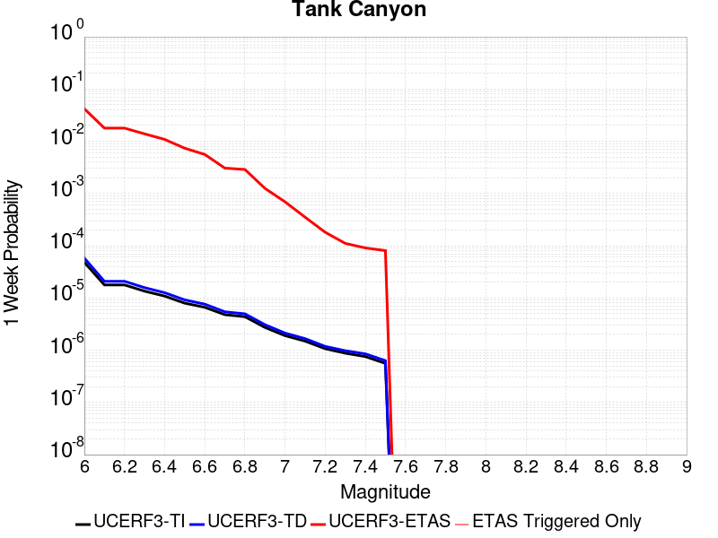 |  |  |  |

| Magnitude | 1 wk TI Prob | 1 wk TD Prob | 1 wk ETAS Prob | 1 wk ETAS/TD Gain | 1 wk ETAS Triggered Only | 1 mo TI Prob | 1 mo TD Prob | 1 mo ETAS Prob | 1 mo ETAS/TD Gain | 1 mo ETAS Triggered Only | 1 yr TI Prob | 1 yr TD Prob | 1 yr ETAS Prob | 1 yr ETAS/TD Gain | 1 yr ETAS Triggered Only | 10 yr TI Prob | 10 yr TD Prob | 10 yr ETAS Prob | 10 yr ETAS/TD Gain | 10 yr ETAS Triggered Only |
|-----|-----|-----|-----|-----|-----|-----|-----|-----|-----|-----|-----|-----|-----|-----|-----|-----|-----|-----|-----|-----|
| 6.0 | 4.8284557E-5 | 5.796445E-5 | 0.04203553 | 725.195 | 0.04198 | 2.0691741E-4 | 2.4839927E-4 | 0.056744363 | 228.44014 | 0.05651 | 0.0025163088 | 0.0030207336 | 0.09050567 | 29.961485 | 0.08775 | 0.02488006 | 0.029863616 | 0.14755087 | 4.9408236 | 0.12131 |
| 6.1 | 1.7796336E-5 | 2.0873378E-5 | 0.0178605 | 855.65936 | 0.01784 | 7.626778E-5 | 8.945448E-5 | 0.025817152 | 288.6066 | 0.02573 | 9.281647E-4 | 0.0010886024 | 0.045020726 | 41.35645 | 0.04398 | 0.009242975 | 0.010836642 | 0.07539933 | 6.9578133 | 0.06527 |
| 6.2 | 1.7796336E-5 | 2.0873378E-5 | 0.0178605 | 855.65936 | 0.01784 | 7.626778E-5 | 8.945448E-5 | 0.025817152 | 288.6066 | 0.02573 | 9.281647E-4 | 0.0010886024 | 0.045020726 | 41.35645 | 0.04398 | 0.009242975 | 0.010836642 | 0.07539933 | 6.9578133 | 0.06527 |
| 6.3 | 1.3515912E-5 | 1.5759651E-5 | 0.013875541 | 880.4472 | 0.01386 | 5.792405E-5 | 6.7539746E-5 | 0.020516159 | 303.76422 | 0.02045 | 7.049971E-4 | 8.2200987E-4 | 0.036122967 | 43.94469 | 0.03533 | 0.007027647 | 0.008192157 | 0.061362974 | 7.4904537 | 0.05361 |
| 6.4 | 1.0870146E-5 | 1.2618114E-5 | 0.010872481 | 861.6566 | 0.01086 | 4.658551E-5 | 5.4076605E-5 | 0.016213203 | 299.81915 | 0.01616 | 5.67031E-4 | 6.582015E-4 | 0.029069489 | 44.165028 | 0.02843 | 0.005655863 | 0.006564382 | 0.049917914 | 7.604358 | 0.04364 |
| 6.5 | 7.964826E-6 | 9.196184E-6 | 0.0073691285 | 801.32465 | 0.00736 | 3.4134522E-5 | 3.941168E-5 | 0.011128974 | 282.37756 | 0.01109 | 4.1550855E-4 | 4.797421E-4 | 0.020280238 | 42.27321 | 0.01981 | 0.0041473247 | 0.004788209 | 0.035012793 | 7.3122935 | 0.03037 |
| 6.6 | 6.6317E-6 | 7.612378E-6 | 0.00559757 | 735.3247 | 0.00559 | 2.8421264E-5 | 3.262412E-5 | 0.00844235 | 258.7763 | 0.00841 | 3.4597394E-4 | 3.9713533E-4 | 0.015471146 | 38.956863 | 0.01508 | 0.0034543579 | 0.0039652516 | 0.026923852 | 6.7899485 | 0.02305 |
| 6.7 | 4.793663E-6 | 5.4308593E-6 | 0.0030654143 | 564.4437 | 0.00306 | 2.0544108E-5 | 2.3274928E-5 | 0.004583169 | 196.91441 | 0.00456 | 2.500958E-4 | 2.833398E-4 | 0.008531002 | 30.108734 | 0.00825 | 0.0024981452 | 0.0028303189 | 0.015135393 | 5.347593 | 0.01234 |
| 6.8 | 4.382823E-6 | 4.969325E-6 | 0.002884955 | 580.5527 | 0.00288 | 1.8783392E-5 | 2.1296957E-5 | 0.0042712064 | 200.55478 | 0.00425 | 2.286638E-4 | 2.5926388E-4 | 0.007847296 | 30.267603 | 0.00759 | 0.0022842865 | 0.0025901233 | 0.013940648 | 5.382233 | 0.01138 |
| 6.9 | 2.729601E-6 | 3.0735862E-6 | 0.0012530697 | 407.6898 | 0.00125 | 1.1698237E-5 | 1.3172453E-5 | 0.002023146 | 153.58916 | 0.00201 | 1.4241673E-4 | 1.6036403E-4 | 0.003689798 | 23.008886 | 0.00353 | 0.001423255 | 0.0016024808 | 0.0069938274 | 4.364375 | 0.0054 |
| 7.0 | 1.8987357E-6 | 2.126971E-6 | 6.921255E-4 | 325.4043 | 6.9E-4 | 8.137413E-6 | 9.115562E-6 | 0.001059106 | 116.186584 | 0.00105 | 9.90685E-5 | 1.1097702E-4 | 0.0019707705 | 17.758368 | 0.00186 | 9.902435E-4 | 0.0011092846 | 0.0039061785 | 3.5213494 | 0.0028 |
| 7.1 | 1.4928986E-6 | 1.6641525E-6 | 3.5166356E-4 | 211.31691 | 3.5E-4 | 6.398121E-6 | 7.132066E-6 | 5.9712783E-4 | 83.72439 | 5.9E-4 | 7.789434E-5 | 8.6830034E-5 | 0.0010967423 | 12.63091 | 0.00101 | 7.786704E-4 | 8.6801895E-4 | 0.0024766214 | 2.8531883 | 0.00161 |
| 7.2 | 1.069082E-6 | 1.1828765E-6 | 1.8118267E-4 | 153.17123 | 1.8E-4 | 4.581772E-6 | 5.0694644E-6 | 2.6506814E-4 | 52.287212 | 2.6E-4 | 5.5781646E-5 | 6.171951E-5 | 5.316905E-4 | 8.614626 | 4.7E-4 | 5.576765E-4 | 6.1707594E-4 | 0.0013566193 | 2.1984642 | 7.4E-4 |
| 7.3 | 8.776551E-7 | 9.770151E-7 | 1.1097691E-4 | 113.58771 | 1.1E-4 | 3.7613736E-6 | 4.187204E-6 | 1.741865E-4 | 41.599716 | 1.7E-4 | 4.579376E-5 | 5.0978535E-5 | 3.8096172E-4 | 7.472983 | 3.3E-4 | 4.5784327E-4 | 5.097194E-4 | 0.0010194595 | 2.0000405 | 5.1E-4 |
| 7.4 | 7.55721E-7 | 8.5103835E-7 | 9.085096E-5 | 106.753075 | 9.0E-5 | 3.2388E-6 | 3.6473052E-6 | 1.436468E-4 | 39.384365 | 1.4E-4 | 3.9431678E-5 | 4.4405555E-5 | 3.2439313E-4 | 7.305238 | 2.8E-4 | 3.942468E-4 | 4.4401767E-4 | 8.9381787E-4 | 2.0130231 | 4.5E-4 |
| 7.5 | 5.587665E-7 | 6.305732E-7 | 8.0630525E-5 | 127.86862 | 8.0E-5 | 2.3947114E-6 | 2.7024564E-6 | 1.02702186E-4 | 38.00327 | 1.0E-4 | 2.915522E-5 | 3.2902408E-5 | 2.2289615E-4 | 6.774463 | 1.9E-4 | 2.9151395E-4 | 3.2902407E-4 | 5.9893524E-4 | 1.8203386 | 2.7E-4 |

## Little Lake
*[(top)](#table-of-contents)*

| 1 Week | 1 Month | 1 Year | 10 Year |
|-----|-----|-----|-----|
|  |  |  |  |

| Magnitude | 1 wk TI Prob | 1 wk TD Prob | 1 wk ETAS Prob | 1 wk ETAS/TD Gain | 1 wk ETAS Triggered Only | 1 mo TI Prob | 1 mo TD Prob | 1 mo ETAS Prob | 1 mo ETAS/TD Gain | 1 mo ETAS Triggered Only | 1 yr TI Prob | 1 yr TD Prob | 1 yr ETAS Prob | 1 yr ETAS/TD Gain | 1 yr ETAS Triggered Only | 10 yr TI Prob | 10 yr TD Prob | 10 yr ETAS Prob | 10 yr ETAS/TD Gain | 10 yr ETAS Triggered Only |
|-----|-----|-----|-----|-----|-----|-----|-----|-----|-----|-----|-----|-----|-----|-----|-----|-----|-----|-----|-----|-----|
| 6.0 | 2.8424427E-5 | 3.1205716E-5 | 0.03483012 | 1116.1455 | 0.0348 | 1.2181328E-4 | 1.3373268E-4 | 0.043777894 | 327.35376 | 0.04365 | 0.0014820677 | 0.0016271125 | 0.061419666 | 37.747646 | 0.05989 | 0.014722223 | 0.016165398 | 0.08998251 | 5.5663652 | 0.07503 |
| 6.1 | 2.8424427E-5 | 3.1205716E-5 | 0.03483012 | 1116.1455 | 0.0348 | 1.2181328E-4 | 1.3373268E-4 | 0.043777894 | 327.35376 | 0.04365 | 0.0014820677 | 0.0016271125 | 0.061419666 | 37.747646 | 0.05989 | 0.014722223 | 0.016165398 | 0.08998251 | 5.5663652 | 0.07503 |
| 6.2 | 2.8424427E-5 | 3.1205716E-5 | 0.03483012 | 1116.1455 | 0.0348 | 1.2181328E-4 | 1.3373268E-4 | 0.043777894 | 327.35376 | 0.04365 | 0.0014820677 | 0.0016271125 | 0.061419666 | 37.747646 | 0.05989 | 0.014722223 | 0.016165398 | 0.08998251 | 5.5663652 | 0.07503 |
| 6.3 | 1.48860645E-5 | 1.6081383E-5 | 0.023445705 | 1457.9407 | 0.02343 | 6.379586E-5 | 6.8918554E-5 | 0.029376898 | 426.25528 | 0.02931 | 7.7643775E-4 | 8.387886E-4 | 0.040285673 | 48.028397 | 0.03948 | 0.007737305 | 0.008359045 | 0.057018865 | 6.8212175 | 0.04907 |
| 6.4 | 1.48860645E-5 | 1.6081383E-5 | 0.023445705 | 1457.9407 | 0.02343 | 6.379586E-5 | 6.8918554E-5 | 0.029376898 | 426.25528 | 0.02931 | 7.7643775E-4 | 8.387886E-4 | 0.040285673 | 48.028397 | 0.03948 | 0.007737305 | 0.008359045 | 0.057018865 | 6.8212175 | 0.04907 |
| 6.5 | 1.2797581E-5 | 1.376556E-5 | 0.02155347 | 1565.7532 | 0.02154 | 5.4845623E-5 | 5.8994065E-5 | 0.027057402 | 458.64615 | 0.027 | 6.675408E-4 | 7.1804173E-4 | 0.037061926 | 51.61528 | 0.03637 | 0.006655392 | 0.007159767 | 0.05207586 | 7.2734013 | 0.04524 |
| 6.6 | 9.661896E-6 | 1.0289033E-5 | 0.019060094 | 1852.467 | 0.01905 | 4.1407468E-5 | 4.40952E-5 | 0.023833046 | 540.4907 | 0.02379 | 5.040193E-4 | 5.36743E-4 | 0.03228969 | 60.158566 | 0.03177 | 0.005028777 | 0.0053560715 | 0.044505257 | 8.30931 | 0.03936 |
| 6.7 | 7.767871E-6 | 8.199681E-6 | 0.016448066 | 2005.9396 | 0.01644 | 3.329045E-5 | 3.5141096E-5 | 0.020684415 | 588.6104 | 0.02065 | 4.0523586E-4 | 4.2777258E-4 | 0.028015966 | 65.49267 | 0.0276 | 0.004044977 | 0.004270843 | 0.03839448 | 8.989906 | 0.03427 |
| 6.8 | 6.4235196E-6 | 6.735739E-6 | 0.013306647 | 1975.5287 | 0.0133 | 2.752908E-5 | 2.8867207E-5 | 0.016698387 | 578.4552 | 0.01667 | 3.35115E-4 | 3.5141438E-4 | 0.02249363 | 64.00885 | 0.02215 | 0.003346101 | 0.0035098472 | 0.030813677 | 8.779207 | 0.0274 |
| 6.9 | 3.1283696E-6 | 3.1121751E-6 | 0.008333086 | 2677.5764 | 0.00833 | 1.3407229E-5 | 1.33378335E-5 | 0.010083203 | 755.9851 | 0.01007 | 1.6322079E-4 | 1.6237753E-4 | 0.013430223 | 82.70986 | 0.01327 | 0.0016310095 | 0.0016227372 | 0.018145882 | 11.182267 | 0.01655 |
| 7.0 | 2.290603E-6 | 2.2286763E-6 | 0.0050522173 | 2266.914 | 0.00505 | 9.816834E-6 | 9.551441E-6 | 0.006159493 | 644.8758 | 0.00615 | 1.19513395E-4 | 1.1628362E-4 | 0.008305332 | 71.42305 | 0.00819 | 0.0011944914 | 0.0011623299 | 0.011330497 | 9.748091 | 0.01018 |
| 7.1 | 1.293693E-6 | 1.1776774E-6 | 0.002311175 | 1962.4856 | 0.00231 | 5.5443866E-6 | 5.047183E-6 | 0.0028550327 | 565.6686 | 0.00285 | 6.750081E-5 | 6.1448416E-5 | 0.0038712143 | 62.999413 | 0.00381 | 6.7480316E-4 | 6.1438273E-4 | 0.005311495 | 8.645254 | 0.0047 |
| 7.2 | 4.715842E-7 | 3.091732E-7 | 6.0309154E-5 | 195.06592 | 6.0E-5 | 2.0210737E-6 | 1.3250274E-6 | 9.132491E-5 | 68.923035 | 9.0E-5 | 2.4606294E-5 | 1.6132095E-5 | 1.3613015E-4 | 8.438468 | 1.2E-4 | 2.460357E-4 | 1.6130977E-4 | 3.012872E-4 | 1.8677553 | 1.4E-4 |
| 7.3 | 3.9430947E-7 | 2.3096938E-7 | 5.023096E-5 | 217.47885 | 5.0E-5 | 1.6898966E-6 | 9.898685E-7 | 8.098979E-5 | 81.81874 | 8.0E-5 | 2.0574296E-5 | 1.2051582E-5 | 1.2205026E-4 | 10.127322 | 1.1E-4 | 2.0572392E-4 | 1.2050936E-4 | 2.404949E-4 | 1.9956533 | 1.2E-4 |
| 7.4 | 3.547123E-7 | 1.9678579E-7 | 2.0196781E-5 | 102.63333 | 2.0E-5 | 1.5201948E-6 | 8.433674E-7 | 5.0843326E-5 | 60.286095 | 5.0E-5 | 1.8508214E-5 | 1.02679505E-5 | 7.0267335E-5 | 6.843365 | 6.0E-5 | 1.8506673E-4 | 1.0267482E-4 | 1.7266764E-4 | 1.681694 | 7.0E-5 |
| 7.5 | 2.6354266E-7 | 1.4422719E-7 | 2.0144224E-5 | 139.67009 | 2.0E-5 | 1.129468E-6 | 6.1811636E-7 | 4.061809E-5 | 65.71269 | 4.0E-5 | 1.3751187E-5 | 7.525541E-6 | 5.7525165E-5 | 7.6439905 | 5.0E-5 | 1.3750336E-4 | 7.5252916E-5 | 1.352484E-4 | 1.7972513 | 6.0E-5 |
| 7.6 | 1.269913E-7 | 7.572344E-8 | 1.00757225E-5 | 133.0595 | 1.0E-5 | 5.4424834E-7 | 3.24529E-7 | 2.0324522E-5 | 62.627754 | 2.0E-5 | 6.6262032E-6 | 3.9511337E-6 | 3.3951015E-5 | 8.592728 | 3.0E-5 | 6.626006E-5 | 3.9510673E-5 | 7.950909E-5 | 2.0123448 | 4.0E-5 |

## Owl Lake
*[(top)](#table-of-contents)*

| 1 Week | 1 Month | 1 Year | 10 Year |
|-----|-----|-----|-----|
|  |  |  |  |

| Magnitude | 1 wk TI Prob | 1 wk TD Prob | 1 wk ETAS Prob | 1 wk ETAS/TD Gain | 1 wk ETAS Triggered Only | 1 mo TI Prob | 1 mo TD Prob | 1 mo ETAS Prob | 1 mo ETAS/TD Gain | 1 mo ETAS Triggered Only | 1 yr TI Prob | 1 yr TD Prob | 1 yr ETAS Prob | 1 yr ETAS/TD Gain | 1 yr ETAS Triggered Only | 10 yr TI Prob | 10 yr TD Prob | 10 yr ETAS Prob | 10 yr ETAS/TD Gain | 10 yr ETAS Triggered Only |
|-----|-----|-----|-----|-----|-----|-----|-----|-----|-----|-----|-----|-----|-----|-----|-----|-----|-----|-----|-----|-----|
| 6.0 | 5.0320643E-5 | 6.6358676E-5 | 0.018365145 | 276.75574 | 0.0183 | 2.1564208E-4 | 2.843643E-4 | 0.025667144 | 90.26148 | 0.02539 | 0.0026222812 | 0.003457547 | 0.04360824 | 12.61248 | 0.04029 | 0.02591553 | 0.034141295 | 0.088007234 | 2.5777357 | 0.05577 |
| 6.1 | 5.0320643E-5 | 6.6358676E-5 | 0.018365145 | 276.75574 | 0.0183 | 2.1564208E-4 | 2.843643E-4 | 0.025667144 | 90.26148 | 0.02539 | 0.0026222812 | 0.003457547 | 0.04360824 | 12.61248 | 0.04029 | 0.02591553 | 0.034141295 | 0.088007234 | 2.5777357 | 0.05577 |
| 6.2 | 2.4125871E-5 | 3.0980515E-5 | 0.015090514 | 487.09692 | 0.01506 | 1.0339249E-4 | 1.3276804E-4 | 0.020900011 | 157.41748 | 0.02077 | 0.0012580766 | 0.0016154252 | 0.03449223 | 21.351795 | 0.03293 | 0.012509781 | 0.016070755 | 0.060996965 | 3.7955256 | 0.04566 |
| 6.3 | 1.7433485E-5 | 2.2355545E-5 | 0.01370205 | 612.91504 | 0.01368 | 7.471279E-5 | 9.580685E-5 | 0.018854009 | 196.79189 | 0.01876 | 9.0924866E-4 | 0.001165962 | 0.030471753 | 26.134432 | 0.02934 | 0.009055373 | 0.0116291465 | 0.05148026 | 4.4268303 | 0.04032 |
| 6.4 | 1.7433485E-5 | 2.2355545E-5 | 0.01370205 | 612.91504 | 0.01368 | 7.471279E-5 | 9.580685E-5 | 0.018854009 | 196.79189 | 0.01876 | 9.0924866E-4 | 0.001165962 | 0.030471753 | 26.134432 | 0.02934 | 0.009055373 | 0.0116291465 | 0.05148026 | 4.4268303 | 0.04032 |
| 6.5 | 1.5182742E-5 | 1.9429277E-5 | 0.013239172 | 681.40326 | 0.01322 | 6.506727E-5 | 8.3266525E-5 | 0.018031772 | 216.55487 | 0.01795 | 7.919061E-4 | 0.0010134344 | 0.02878526 | 28.403675 | 0.0278 | 0.0078909 | 0.010118678 | 0.047615383 | 4.7056923 | 0.03788 |
| 6.6 | 6.7271576E-6 | 8.547518E-6 | 0.010818455 | 1265.6838 | 0.01081 | 2.8830356E-5 | 3.6631736E-5 | 0.013986121 | 381.80338 | 0.01395 | 3.5095305E-4 | 4.4590578E-4 | 0.020596916 | 46.191185 | 0.02016 | 0.0035039932 | 0.0044680187 | 0.03048127 | 6.8220997 | 0.02613 |
| 6.7 | 6.682835E-6 | 8.479961E-6 | 0.010808389 | 1274.58 | 0.0108 | 2.8640408E-5 | 3.6342215E-5 | 0.013975835 | 384.562 | 0.01394 | 3.4864116E-4 | 4.423823E-4 | 0.020573473 | 46.506096 | 0.02014 | 0.003480947 | 0.0044329325 | 0.030407278 | 6.8594046 | 0.02609 |
| 6.8 | 6.5774975E-6 | 8.326427E-6 | 0.010748237 | 1290.8583 | 0.01074 | 2.8188972E-5 | 3.5684232E-5 | 0.013915189 | 389.95346 | 0.01388 | 3.4314668E-4 | 4.3437455E-4 | 0.020495657 | 47.184296 | 0.02007 | 0.0034261728 | 0.0043531056 | 0.030239925 | 6.9467473 | 0.026 |
| 6.9 | 6.363419E-6 | 7.999591E-6 | 0.010707914 | 1338.5577 | 0.0107 | 2.727151E-5 | 3.428354E-5 | 0.013863809 | 404.38675 | 0.01383 | 3.3198006E-4 | 4.1732774E-4 | 0.020349007 | 48.760254 | 0.01994 | 0.0033148455 | 0.0041830647 | 0.029895058 | 7.146688 | 0.02582 |
| 7.0 | 6.1342453E-6 | 7.631779E-6 | 0.010637551 | 1393.8494 | 0.01063 | 2.6289357E-5 | 3.2707245E-5 | 0.013732259 | 419.85373 | 0.0137 | 3.2002592E-4 | 3.9814346E-4 | 0.020050315 | 50.359524 | 0.01966 | 0.0031956544 | 0.003991739 | 0.029250508 | 7.3277607 | 0.02536 |
| 7.1 | 5.842926E-6 | 7.142312E-6 | 0.009977072 | 1396.8965 | 0.00997 | 2.504087E-5 | 3.060958E-5 | 0.012940214 | 422.75046 | 0.01291 | 3.0482994E-4 | 3.7261334E-4 | 0.018875716 | 50.65765 | 0.01851 | 0.0030441214 | 0.0037371595 | 0.027388439 | 7.328678 | 0.02374 |
| 7.2 | 4.77173E-6 | 5.358478E-6 | 0.0065053236 | 1214.0244 | 0.0065 | 2.045011E-5 | 2.2964727E-5 | 0.008412772 | 366.3345 | 0.00839 | 2.4895166E-4 | 2.7956374E-4 | 0.012376181 | 44.269623 | 0.0121 | 0.0024867293 | 0.0028086212 | 0.01827506 | 6.5067725 | 0.01551 |
| 7.3 | 3.0494948E-6 | 2.710356E-6 | 0.0016327059 | 602.3953 | 0.00163 | 1.3069198E-5 | 1.1615762E-5 | 0.0020815916 | 179.20407 | 0.00207 | 1.5910587E-4 | 1.4141288E-4 | 0.0031409885 | 22.211475 | 0.003 | 0.0015899199 | 0.0014231089 | 0.0055072885 | 3.8698995 | 0.00409 |
| 7.4 | 2.7263884E-6 | 2.3055634E-6 | 0.0010623031 | 460.75644 | 0.00106 | 1.1684469E-5 | 9.880949E-6 | 0.0013898673 | 140.66132 | 0.00138 | 1.4224913E-4 | 1.2029401E-4 | 0.0021100547 | 17.540812 | 0.00199 | 0.0014215811 | 0.0012110578 | 0.003987691 | 3.2927341 | 0.00278 |
| 7.5 | 2.6090431E-6 | 2.1655019E-6 | 9.221635E-4 | 425.84286 | 9.2E-4 | 1.1181565E-5 | 9.2806895E-6 | 0.0012192695 | 131.37703 | 0.00121 | 1.3612706E-4 | 1.1298663E-4 | 0.0018427912 | 16.309816 | 0.00173 | 0.001360437 | 0.0011378126 | 0.003585025 | 3.1508043 | 0.00245 |
| 7.6 | 2.3008756E-6 | 1.8726826E-6 | 6.5187144E-4 | 348.09503 | 6.5E-4 | 9.860858E-6 | 8.025758E-6 | 8.6801883E-4 | 108.15413 | 8.6E-4 | 1.20049335E-4 | 9.770931E-5 | 0.0013475872 | 13.7918 | 0.00125 | 0.001199845 | 9.848307E-4 | 0.0027430973 | 2.7853494 | 0.00176 |
| 7.7 | 1.7184348E-6 | 1.341808E-6 | 3.813413E-4 | 284.1996 | 3.8E-4 | 7.3646997E-6 | 5.750593E-6 | 4.957478E-4 | 86.20811 | 4.9E-4 | 8.966153E-5 | 7.0011265E-5 | 7.499637E-4 | 10.712043 | 6.8E-4 | 8.962536E-4 | 7.0769014E-4 | 0.001627039 | 2.299084 | 9.2E-4 |
| 7.8 | 8.4612907E-7 | 8.4054994E-7 | 1.6084041E-4 | 191.35141 | 1.6E-4 | 3.6262625E-6 | 3.602352E-6 | 2.2360156E-4 | 62.070988 | 2.2E-4 | 4.4148852E-5 | 4.3857777E-5 | 3.4384461E-4 | 7.839992 | 3.0E-4 | 4.414008E-4 | 4.4386165E-4 | 8.3368854E-4 | 1.8782622 | 3.9E-4 |
| 7.9 | 2.716738E-7 | 3.7681625E-7 | 2.0376809E-5 | 54.07625 | 2.0E-5 | 1.1643157E-6 | 1.6149258E-6 | 2.1614893E-5 | 13.38445 | 2.0E-5 | 1.4175452E-5 | 1.9661555E-5 | 6.966057E-5 | 3.5429838 | 5.0E-5 | 1.4174548E-4 | 1.9829652E-4 | 2.6828263E-4 | 1.3529367 | 7.0E-5 |
| 8.0 | 2.1995428E-8 | 3.3853325E-8 | 3.3853325E-8 | 1.0 | 0.0 | 9.426611E-8 | 1.4508568E-7 | 1.4508568E-7 | 1.0 | 0.0 | 1.1476893E-6 | 1.7664173E-6 | 1.7664173E-6 | 1.0 | 0.0 | 1.14768345E-5 | 1.7869768E-5 | 1.7869768E-5 | 1.0 | 0.0 |

## Airport Lake
*[(top)](#table-of-contents)*

| 1 Week | 1 Month | 1 Year | 10 Year |
|-----|-----|-----|-----|
|  |  |  |  |

| Magnitude | 1 wk TI Prob | 1 wk TD Prob | 1 wk ETAS Prob | 1 wk ETAS/TD Gain | 1 wk ETAS Triggered Only | 1 mo TI Prob | 1 mo TD Prob | 1 mo ETAS Prob | 1 mo ETAS/TD Gain | 1 mo ETAS Triggered Only | 1 yr TI Prob | 1 yr TD Prob | 1 yr ETAS Prob | 1 yr ETAS/TD Gain | 1 yr ETAS Triggered Only | 10 yr TI Prob | 10 yr TD Prob | 10 yr ETAS Prob | 10 yr ETAS/TD Gain | 10 yr ETAS Triggered Only |
|-----|-----|-----|-----|-----|-----|-----|-----|-----|-----|-----|-----|-----|-----|-----|-----|-----|-----|-----|-----|-----|
| 6.0 | 1.2387061E-5 | 1.3103157E-5 | 0.030492704 | 2327.1265 | 0.03048 | 5.3086325E-5 | 5.615534E-5 | 0.03757405 | 669.10913 | 0.03752 | 6.461343E-4 | 6.8350515E-4 | 0.050169658 | 73.40055 | 0.04952 | 0.0064425888 | 0.0068168393 | 0.0672421 | 9.864118 | 0.06084 |
| 6.1 | 1.2387061E-5 | 1.3103157E-5 | 0.030492704 | 2327.1265 | 0.03048 | 5.3086325E-5 | 5.615534E-5 | 0.03757405 | 669.10913 | 0.03752 | 6.461343E-4 | 6.8350515E-4 | 0.050169658 | 73.40055 | 0.04952 | 0.0064425888 | 0.0068168393 | 0.0672421 | 9.864118 | 0.06084 |
| 6.2 | 1.2387061E-5 | 1.3103157E-5 | 0.030492704 | 2327.1265 | 0.03048 | 5.3086325E-5 | 5.615534E-5 | 0.03757405 | 669.10913 | 0.03752 | 6.461343E-4 | 6.8350515E-4 | 0.050169658 | 73.40055 | 0.04952 | 0.0064425888 | 0.0068168393 | 0.0672421 | 9.864118 | 0.06084 |
| 6.3 | 1.2387061E-5 | 1.3103157E-5 | 0.030492704 | 2327.1265 | 0.03048 | 5.3086325E-5 | 5.615534E-5 | 0.03757405 | 669.10913 | 0.03752 | 6.461343E-4 | 6.8350515E-4 | 0.050169658 | 73.40055 | 0.04952 | 0.0064425888 | 0.0068168393 | 0.0672421 | 9.864118 | 0.06084 |
| 6.4 | 1.2387061E-5 | 1.3103157E-5 | 0.030492704 | 2327.1265 | 0.03048 | 5.3086325E-5 | 5.615534E-5 | 0.03757405 | 669.10913 | 0.03752 | 6.461343E-4 | 6.8350515E-4 | 0.050169658 | 73.40055 | 0.04952 | 0.0064425888 | 0.0068168393 | 0.0672421 | 9.864118 | 0.06084 |
| 6.5 | 6.9922594E-6 | 7.384925E-6 | 0.022997215 | 3114.0757 | 0.02299 | 2.996648E-5 | 3.1649324E-5 | 0.02843075 | 898.3051 | 0.0284 | 3.6478083E-4 | 3.8526783E-4 | 0.037680894 | 97.80441 | 0.03731 | 0.003641826 | 0.0038465366 | 0.049420558 | 12.848066 | 0.04575 |
| 6.6 | 6.9922594E-6 | 7.384925E-6 | 0.022997215 | 3114.0757 | 0.02299 | 2.996648E-5 | 3.1649324E-5 | 0.02843075 | 898.3051 | 0.0284 | 3.6478083E-4 | 3.8526783E-4 | 0.037680894 | 97.80441 | 0.03731 | 0.003641826 | 0.0038465366 | 0.049420558 | 12.848066 | 0.04575 |
| 6.7 | 5.477277E-6 | 5.7860684E-6 | 0.019515673 | 3372.8728 | 0.01951 | 2.3473833E-5 | 2.4797222E-5 | 0.024184199 | 975.2785 | 0.02416 | 2.8575645E-4 | 3.0186825E-4 | 0.03209227 | 106.31217 | 0.0318 | 0.0028538927 | 0.003014966 | 0.041887414 | 13.893163 | 0.03899 |
| 6.8 | 3.9950432E-6 | 4.2190873E-6 | 0.0151641555 | 3594.1792 | 0.01516 | 1.7121502E-5 | 1.8081691E-5 | 0.018787742 | 1039.0479 | 0.01877 | 2.0843433E-4 | 2.2012512E-4 | 0.024794715 | 112.63919 | 0.02458 | 0.0020823893 | 0.0021993418 | 0.0324327 | 14.74655 | 0.0303 |
| 6.9 | 2.95695E-6 | 3.1230243E-6 | 0.010853089 | 3475.1855 | 0.01085 | 1.2672582E-5 | 1.3384334E-5 | 0.013223208 | 987.96155 | 0.01321 | 1.5427776E-4 | 1.6294434E-4 | 0.017640095 | 108.25841 | 0.01748 | 0.001541707 | 0.0016284712 | 0.023323085 | 14.322074 | 0.02173 |
| 7.0 | 1.456072E-6 | 1.540812E-6 | 0.0048115333 | 3122.7258 | 0.00481 | 6.2402937E-6 | 6.603469E-6 | 0.005836565 | 883.86346 | 0.00583 | 7.597293E-5 | 8.039528E-5 | 0.007849771 | 97.6397 | 0.00777 | 7.594696E-4 | 8.0376083E-4 | 0.010406037 | 12.946683 | 0.00961 |
| 7.1 | 6.995192E-7 | 7.4089746E-7 | 0.0021807393 | 2943.3755 | 0.00218 | 2.997936E-6 | 3.1752747E-6 | 0.0026831669 | 845.0188 | 0.00268 | 3.649926E-5 | 3.865897E-5 | 0.0035985212 | 93.08373 | 0.00356 | 3.6493264E-4 | 3.865897E-4 | 0.0047848886 | 12.377176 | 0.0044 |

## Panamint Valley
*[(top)](#table-of-contents)*

| 1 Week | 1 Month | 1 Year | 10 Year |
|-----|-----|-----|-----|
| 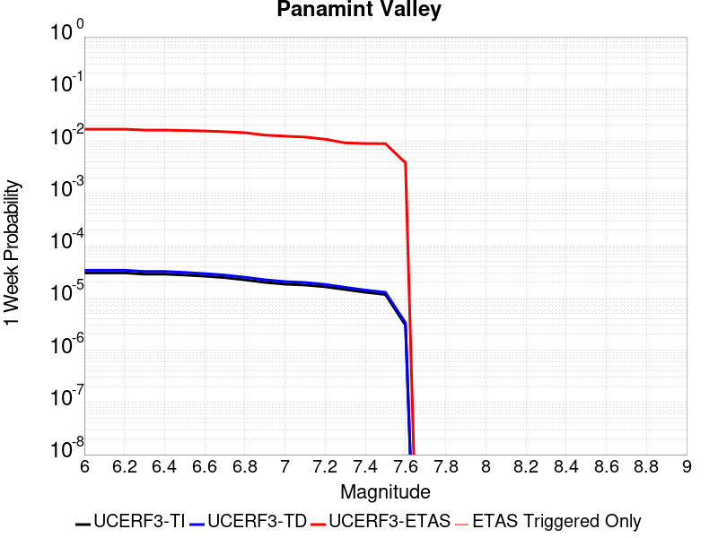 |  |  |  |

| Magnitude | 1 wk TI Prob | 1 wk TD Prob | 1 wk ETAS Prob | 1 wk ETAS/TD Gain | 1 wk ETAS Triggered Only | 1 mo TI Prob | 1 mo TD Prob | 1 mo ETAS Prob | 1 mo ETAS/TD Gain | 1 mo ETAS Triggered Only | 1 yr TI Prob | 1 yr TD Prob | 1 yr ETAS Prob | 1 yr ETAS/TD Gain | 1 yr ETAS Triggered Only | 10 yr TI Prob | 10 yr TD Prob | 10 yr ETAS Prob | 10 yr ETAS/TD Gain | 10 yr ETAS Triggered Only |
|-----|-----|-----|-----|-----|-----|-----|-----|-----|-----|-----|-----|-----|-----|-----|-----|-----|-----|-----|-----|-----|
| 6.0 | 3.0211835E-5 | 3.3984263E-5 | 0.017023407 | 500.92032 | 0.01699 | 1.2947287E-4 | 1.4563887E-4 | 0.023152288 | 158.97052 | 0.02301 | 0.0015751923 | 0.0017717406 | 0.037867673 | 21.373148 | 0.03616 | 0.015640736 | 0.017583003 | 0.06838378 | 3.8891983 | 0.05171 |
| 6.1 | 3.0211835E-5 | 3.3984263E-5 | 0.017023407 | 500.92032 | 0.01699 | 1.2947287E-4 | 1.4563887E-4 | 0.023152288 | 158.97052 | 0.02301 | 0.0015751923 | 0.0017717406 | 0.037867673 | 21.373148 | 0.03616 | 0.015640736 | 0.017583003 | 0.06838378 | 3.8891983 | 0.05171 |
| 6.2 | 3.0211835E-5 | 3.3984263E-5 | 0.017023407 | 500.92032 | 0.01699 | 1.2947287E-4 | 1.4563887E-4 | 0.023152288 | 158.97052 | 0.02301 | 0.0015751923 | 0.0017717406 | 0.037867673 | 21.373148 | 0.03616 | 0.015640736 | 0.017583003 | 0.06838378 | 3.8891983 | 0.05171 |
| 6.3 | 2.8573924E-5 | 3.2102445E-5 | 0.016381577 | 510.29068 | 0.01635 | 1.2245393E-4 | 1.375748E-4 | 0.022254532 | 161.76314 | 0.02212 | 0.001489857 | 0.0016737141 | 0.036315635 | 21.697634 | 0.0347 | 0.01479908 | 0.016618038 | 0.065354444 | 3.9327416 | 0.04956 |
| 6.4 | 2.8573924E-5 | 3.2102445E-5 | 0.016381577 | 510.29068 | 0.01635 | 1.2245393E-4 | 1.375748E-4 | 0.022254532 | 161.76314 | 0.02212 | 0.001489857 | 0.0016737141 | 0.036315635 | 21.697634 | 0.0347 | 0.01479908 | 0.016618038 | 0.065354444 | 3.9327416 | 0.04956 |
| 6.5 | 2.7468774E-5 | 3.0828138E-5 | 0.016090333 | 521.9366 | 0.01606 | 1.1771801E-4 | 1.3211406E-4 | 0.021859244 | 165.45735 | 0.02173 | 0.0014322745 | 0.0016073292 | 0.03550276 | 22.088045 | 0.03395 | 0.014230782 | 0.015963882 | 0.06362075 | 3.9852931 | 0.04843 |
| 6.6 | 2.6135967E-5 | 2.9252153E-5 | 0.015738793 | 538.0388 | 0.01571 | 1.1200648E-4 | 1.2536049E-4 | 0.021302706 | 169.93158 | 0.02118 | 0.0013628257 | 0.0015252219 | 0.034424964 | 22.570463 | 0.03295 | 0.013544982 | 0.015154343 | 0.061343603 | 4.047922 | 0.0469 |
| 6.7 | 2.4498746E-5 | 2.7341044E-5 | 0.015226926 | 556.92554 | 0.0152 | 1.04990395E-4 | 1.17170785E-4 | 0.020564774 | 175.51111 | 0.02045 | 0.0012775084 | 0.0014256459 | 0.033070467 | 23.196833 | 0.03169 | 0.012701893 | 0.014171593 | 0.058514155 | 4.1289754 | 0.04498 |
| 6.8 | 2.2244329E-5 | 2.4935374E-5 | 0.014604572 | 585.6969 | 0.01458 | 9.532935E-5 | 1.0686163E-4 | 0.01958478 | 183.27232 | 0.01948 | 0.0011600169 | 0.0013002857 | 0.031231316 | 24.01881 | 0.02997 | 0.011539802 | 0.012932955 | 0.054735243 | 4.23223 | 0.04235 |
| 6.9 | 1.9902658E-5 | 2.2290182E-5 | 0.013111998 | 588.24097 | 0.01309 | 8.529431E-5 | 9.552596E-5 | 0.017553858 | 183.76009 | 0.01746 | 0.0010379635 | 0.0011624265 | 0.027511762 | 23.667528 | 0.02638 | 0.010331288 | 0.011569021 | 0.048526455 | 4.1945167 | 0.03739 |
| 7.0 | 1.8353881E-5 | 2.056605E-5 | 0.012530309 | 609.2715 | 0.01251 | 7.865712E-5 | 8.813734E-5 | 0.016646678 | 188.87202 | 0.01656 | 9.5722964E-4 | 0.0010725616 | 0.025845962 | 24.097416 | 0.0248 | 0.009531168 | 0.01067939 | 0.045127533 | 4.225666 | 0.03482 |
| 7.1 | 1.7667631E-5 | 1.9772435E-5 | 0.012039535 | 608.905 | 0.01202 | 7.571623E-5 | 8.4736355E-5 | 0.01598339 | 188.62494 | 0.0159 | 9.2145515E-4 | 0.0010311945 | 0.024756704 | 24.007795 | 0.02375 | 0.009176437 | 0.0102695925 | 0.04336618 | 4.222775 | 0.03344 |
| 7.2 | 1.6381597E-5 | 1.8158042E-5 | 0.01093796 | 602.3755 | 0.01092 | 7.020495E-5 | 7.781795E-5 | 0.014356706 | 184.49092 | 0.01428 | 8.544101E-4 | 9.470391E-4 | 0.022236858 | 23.4804 | 0.02131 | 0.008511325 | 0.009435269 | 0.039172024 | 4.1516595 | 0.03002 |
| 7.3 | 1.4520491E-5 | 1.596657E-5 | 0.009315818 | 583.45764 | 0.0093 | 6.222919E-5 | 6.842646E-5 | 0.012307589 | 179.86594 | 0.01224 | 7.57377E-4 | 8.327899E-4 | 0.019147525 | 22.992023 | 0.01833 | 0.0075480095 | 0.008300399 | 0.033965584 | 4.092042 | 0.02588 |
| 7.4 | 1.2852287E-5 | 1.41454875E-5 | 0.009054017 | 640.064 | 0.00904 | 5.5080065E-5 | 6.06222E-5 | 0.011939902 | 196.95593 | 0.01188 | 6.7039346E-4 | 7.378411E-4 | 0.018484738 | 25.052462 | 0.01776 | 0.0066837464 | 0.007357429 | 0.032193348 | 4.3756247 | 0.02502 |
| 7.5 | 1.1637851E-5 | 1.2836868E-5 | 0.008982722 | 699.7596 | 0.00897 | 4.987555E-5 | 5.5014076E-5 | 0.011814367 | 214.75171 | 0.01176 | 6.070656E-4 | 6.696062E-4 | 0.018127909 | 27.07249 | 0.01747 | 0.006054099 | 0.0066793845 | 0.030946206 | 4.633093 | 0.02443 |
| 7.6 | 3.0068115E-6 | 3.3330623E-6 | 0.0038633202 | 1159.0903 | 0.00386 | 1.2886271E-5 | 1.4284516E-5 | 0.0049042148 | 343.32382 | 0.00489 | 1.5687906E-4 | 1.7390738E-4 | 0.0072326795 | 41.589264 | 0.00706 | 0.0015676835 | 0.0017397973 | 0.011502782 | 6.611564 | 0.00978 |

## Garlock (East)
*[(top)](#table-of-contents)*

| 1 Week | 1 Month | 1 Year | 10 Year |
|-----|-----|-----|-----|
| 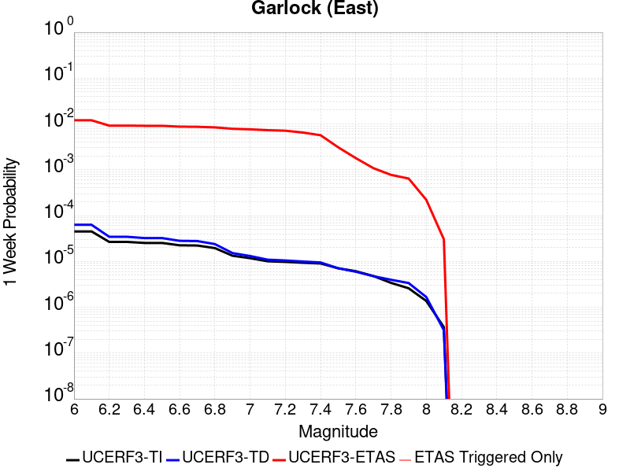 |  |  |  |

| Magnitude | 1 wk TI Prob | 1 wk TD Prob | 1 wk ETAS Prob | 1 wk ETAS/TD Gain | 1 wk ETAS Triggered Only | 1 mo TI Prob | 1 mo TD Prob | 1 mo ETAS Prob | 1 mo ETAS/TD Gain | 1 mo ETAS Triggered Only | 1 yr TI Prob | 1 yr TD Prob | 1 yr ETAS Prob | 1 yr ETAS/TD Gain | 1 yr ETAS Triggered Only | 10 yr TI Prob | 10 yr TD Prob | 10 yr ETAS Prob | 10 yr ETAS/TD Gain | 10 yr ETAS Triggered Only |
|-----|-----|-----|-----|-----|-----|-----|-----|-----|-----|-----|-----|-----|-----|-----|-----|-----|-----|-----|-----|-----|
| 6.0 | 4.5092507E-5 | 6.2904815E-5 | 0.012012153 | 190.9576 | 0.01195 | 1.9323928E-4 | 2.6956675E-4 | 0.016955068 | 62.897476 | 0.01669 | 0.0023501497 | 0.003277482 | 0.030348465 | 9.259689 | 0.02716 | 0.023254504 | 0.03235377 | 0.070217766 | 2.1703117 | 0.03913 |
| 6.1 | 4.5092507E-5 | 6.2904815E-5 | 0.012012153 | 190.9576 | 0.01195 | 1.9323928E-4 | 2.6956675E-4 | 0.016955068 | 62.897476 | 0.01669 | 0.0023501497 | 0.003277482 | 0.030348465 | 9.259689 | 0.02716 | 0.023254504 | 0.03235377 | 0.070217766 | 2.1703117 | 0.03913 |
| 6.2 | 2.6674514E-5 | 3.4511588E-5 | 0.009194195 | 266.40894 | 0.00916 | 1.1431433E-4 | 1.4789861E-4 | 0.012726038 | 86.04569 | 0.01258 | 0.0013908884 | 0.0017992114 | 0.021633461 | 12.023857 | 0.01987 | 0.01382215 | 0.017872788 | 0.04528396 | 2.5336819 | 0.02791 |
| 6.3 | 2.6674514E-5 | 3.4511588E-5 | 0.009194195 | 266.40894 | 0.00916 | 1.1431433E-4 | 1.4789861E-4 | 0.012726038 | 86.04569 | 0.01258 | 0.0013908884 | 0.0017992114 | 0.021633461 | 12.023857 | 0.01987 | 0.01382215 | 0.017872788 | 0.04528396 | 2.5336819 | 0.02791 |
| 6.4 | 2.5312667E-5 | 3.2340467E-5 | 0.009102047 | 281.4445 | 0.00907 | 1.0847834E-4 | 1.3859481E-4 | 0.012616865 | 91.03418 | 0.01248 | 0.0013199237 | 0.0016861152 | 0.021352898 | 12.663961 | 0.0197 | 0.013121112 | 0.016772287 | 0.043919202 | 2.618558 | 0.02761 |
| 6.5 | 2.5312667E-5 | 3.2340467E-5 | 0.009102047 | 281.4445 | 0.00907 | 1.0847834E-4 | 1.3859481E-4 | 0.012616865 | 91.03418 | 0.01248 | 0.0013199237 | 0.0016861152 | 0.021352898 | 12.663961 | 0.0197 | 0.013121112 | 0.016772287 | 0.043919202 | 2.618558 | 0.02761 |
| 6.6 | 2.246556E-5 | 2.8134691E-5 | 0.00873789 | 310.57352 | 0.00871 | 9.627742E-5 | 1.2057181E-4 | 0.012099127 | 100.34789 | 0.01198 | 0.0011715472 | 0.0014669969 | 0.020229433 | 13.78969 | 0.01879 | 0.011653901 | 0.014613169 | 0.04045001 | 2.768052 | 0.02622 |
| 6.7 | 2.2241198E-5 | 2.7804432E-5 | 0.008667564 | 311.7332 | 0.00864 | 9.531594E-5 | 1.1915654E-4 | 0.012007739 | 100.77282 | 0.01189 | 0.0011598538 | 0.0014497889 | 0.020112691 | 13.872842 | 0.01869 | 0.011538187 | 0.014442829 | 0.04014616 | 2.7796605 | 0.02608 |
| 6.8 | 1.9528685E-5 | 2.3898969E-5 | 0.0084136985 | 352.0528 | 0.00839 | 8.369167E-5 | 1.0242024E-4 | 0.011511251 | 112.39235 | 0.01141 | 0.0010184698 | 0.0012462728 | 0.018784389 | 15.0724535 | 0.01756 | 0.010138147 | 0.012436723 | 0.036602397 | 2.94309 | 0.02447 |
| 6.9 | 1.3318621E-5 | 1.5198818E-5 | 0.0078450795 | 516.1638 | 0.00783 | 5.7078556E-5 | 6.51362E-5 | 0.010504456 | 161.2691 | 0.01044 | 6.9470983E-4 | 7.927504E-4 | 0.016470311 | 20.776163 | 0.01569 | 0.0069254204 | 0.007940721 | 0.029170789 | 3.6735694 | 0.0214 |
| 7.0 | 1.1760853E-5 | 1.3107653E-5 | 0.0076430077 | 583.0951 | 0.00763 | 5.0402683E-5 | 5.6174475E-5 | 0.010205604 | 181.6769 | 0.01015 | 6.134799E-4 | 6.8371464E-4 | 0.015853336 | 23.187065 | 0.01518 | 0.0061178906 | 0.006857401 | 0.027216824 | 3.9689708 | 0.0205 |
| 7.1 | 1.0064758E-5 | 1.0902761E-5 | 0.007310823 | 670.5479 | 0.0073 | 4.3133965E-5 | 4.67253E-5 | 0.009756272 | 208.80063 | 0.00971 | 5.2502943E-4 | 5.6873553E-4 | 0.014930563 | 26.252207 | 0.01437 | 0.005237907 | 0.0057133473 | 0.024753937 | 4.33265 | 0.01915 |
| 7.2 | 9.768808E-6 | 1.0498628E-5 | 0.007120424 | 678.2242 | 0.00711 | 4.186565E-5 | 4.499337E-5 | 0.009494568 | 211.0215 | 0.00945 | 5.095951E-4 | 5.4766005E-4 | 0.014440048 | 26.366808 | 0.0139 | 0.0050842804 | 0.005503584 | 0.023871932 | 4.337525 | 0.01847 |
| 7.3 | 9.344516E-6 | 9.9442705E-6 | 0.00648988 | 652.625 | 0.00648 | 4.004731E-5 | 4.2617627E-5 | 0.008712248 | 204.42828 | 0.00867 | 4.8746695E-4 | 5.187495E-4 | 0.013342094 | 25.719723 | 0.01283 | 0.0048639905 | 0.005215269 | 0.022146504 | 4.2464743 | 0.01702 |
| 7.4 | 9.023491E-6 | 9.490441E-6 | 0.0056794365 | 598.43756 | 0.00567 | 3.867153E-5 | 4.0672705E-5 | 0.007660363 | 188.34161 | 0.00762 | 4.7072413E-4 | 4.95081E-4 | 0.0118394615 | 23.91419 | 0.01135 | 0.004697283 | 0.0049787266 | 0.02008315 | 4.0337925 | 0.01518 |
| 7.5 | 7.081253E-6 | 7.0873994E-6 | 0.0030970655 | 436.98193 | 0.00309 | 3.0347876E-5 | 3.0374218E-5 | 0.0041002505 | 134.99115 | 0.00407 | 3.6942272E-4 | 3.697441E-4 | 0.006477485 | 17.518833 | 0.00611 | 0.003688092 | 0.0037244745 | 0.011854083 | 3.182753 | 0.00816 |
| 7.6 | 6.116396E-6 | 5.9589424E-6 | 0.0017959483 | 301.3871 | 0.00179 | 2.6212863E-5 | 2.5538076E-5 | 0.0023254794 | 91.0593 | 0.0023 | 3.1909486E-4 | 3.1088197E-4 | 0.003989738 | 12.83361 | 0.00368 | 0.0031863707 | 0.0031359126 | 0.00814017 | 2.59579 | 0.00502 |
| 7.7 | 4.797145E-6 | 4.7571157E-6 | 0.001084752 | 228.02725 | 0.00108 | 2.055903E-5 | 2.0387479E-5 | 0.0013903596 | 68.19674 | 0.00137 | 2.5027743E-4 | 2.481894E-4 | 0.0024776359 | 9.982842 | 0.00223 | 0.0024999576 | 0.0025094065 | 0.005452004 | 2.1726267 | 0.00295 |
| 7.8 | 3.4028885E-6 | 3.978375E-6 | 7.7397533E-4 | 194.54561 | 7.7E-4 | 1.4583726E-5 | 1.7050066E-5 | 0.0010070332 | 59.0633 | 9.9E-4 | 1.775424E-4 | 2.0756487E-4 | 0.0017872369 | 8.610498 | 0.00158 | 0.0017740062 | 0.0021012141 | 0.004166865 | 1.9830748 | 0.00207 |
| 7.9 | 2.5928412E-6 | 3.372436E-6 | 6.4337027E-4 | 190.77316 | 6.4E-4 | 1.1112129E-5 | 1.4453217E-5 | 8.244415E-4 | 57.042076 | 8.1E-4 | 1.3528178E-4 | 1.7595377E-4 | 0.0014257338 | 8.102889 | 0.00125 | 0.0013519945 | 0.0017812426 | 0.003448268 | 1.9358778 | 0.00167 |
| 8.0 | 1.3743648E-6 | 1.6734741E-6 | 2.2167311E-4 | 132.46283 | 2.2E-4 | 5.8901214E-6 | 7.1720124E-6 | 2.6717014E-4 | 37.25177 | 2.6E-4 | 7.1709874E-5 | 8.731578E-5 | 5.072791E-4 | 5.809707 | 4.2E-4 | 7.1686733E-4 | 8.837377E-4 | 0.001453234 | 1.6444178 | 5.7E-4 |
| 8.1 | 3.6733252E-7 | 3.1489736E-7 | 3.0314888E-5 | 96.269104 | 3.0E-5 | 1.5742813E-6 | 1.3495595E-6 | 3.134952E-5 | 23.229445 | 3.0E-5 | 1.9166706E-5 | 1.643078E-5 | 8.642963E-5 | 5.2602267 | 7.0E-5 | 1.9165053E-4 | 1.662928E-4 | 2.762745E-4 | 1.6613739 | 1.1E-4 |

## Hunter Mountain-Saline Valley
*[(top)](#table-of-contents)*

| 1 Week | 1 Month | 1 Year | 10 Year |
|-----|-----|-----|-----|
| 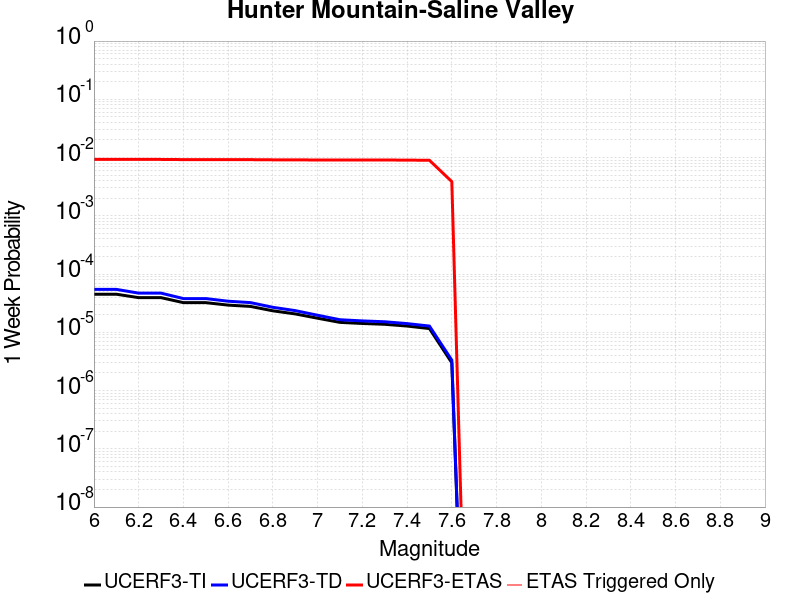 |  |  |  |

| Magnitude | 1 wk TI Prob | 1 wk TD Prob | 1 wk ETAS Prob | 1 wk ETAS/TD Gain | 1 wk ETAS Triggered Only | 1 mo TI Prob | 1 mo TD Prob | 1 mo ETAS Prob | 1 mo ETAS/TD Gain | 1 mo ETAS Triggered Only | 1 yr TI Prob | 1 yr TD Prob | 1 yr ETAS Prob | 1 yr ETAS/TD Gain | 1 yr ETAS Triggered Only | 10 yr TI Prob | 10 yr TD Prob | 10 yr ETAS Prob | 10 yr ETAS/TD Gain | 10 yr ETAS Triggered Only |
|-----|-----|-----|-----|-----|-----|-----|-----|-----|-----|-----|-----|-----|-----|-----|-----|-----|-----|-----|-----|-----|
| 6.0 | 4.5103672E-5 | 5.456906E-5 | 0.009324064 | 170.8672 | 0.00927 | 1.9328714E-4 | 2.3384714E-4 | 0.0124010015 | 53.030376 | 0.01217 | 0.002350731 | 0.0028435462 | 0.021081537 | 7.4138193 | 0.01829 | 0.023260195 | 0.028092625 | 0.05321643 | 1.8943204 | 0.02585 |
| 6.1 | 4.5103672E-5 | 5.456906E-5 | 0.009324064 | 170.8672 | 0.00927 | 1.9328714E-4 | 2.3384714E-4 | 0.0124010015 | 53.030376 | 0.01217 | 0.002350731 | 0.0028435462 | 0.021081537 | 7.4138193 | 0.01829 | 0.023260195 | 0.028092625 | 0.05321643 | 1.8943204 | 0.02585 |
| 6.2 | 3.9363465E-5 | 4.706271E-5 | 0.009286628 | 197.32454 | 0.00924 | 1.6868966E-4 | 2.016826E-4 | 0.012339234 | 61.18145 | 0.01214 | 0.002051862 | 0.0024528534 | 0.020638138 | 8.413931 | 0.01823 | 0.020330196 | 0.024274187 | 0.049379613 | 2.0342436 | 0.02573 |
| 6.3 | 3.9363465E-5 | 4.706271E-5 | 0.009286628 | 197.32454 | 0.00924 | 1.6868966E-4 | 2.016826E-4 | 0.012339234 | 61.18145 | 0.01214 | 0.002051862 | 0.0024528534 | 0.020638138 | 8.413931 | 0.01823 | 0.020330196 | 0.024274187 | 0.049379613 | 2.0342436 | 0.02573 |
| 6.4 | 3.2311684E-5 | 3.795112E-5 | 0.009227603 | 243.14441 | 0.00919 | 1.384713E-4 | 1.6263791E-4 | 0.012230675 | 75.201866 | 0.01207 | 0.0016845843 | 0.001978387 | 0.020042578 | 10.130767 | 0.0181 | 0.016718714 | 0.019617118 | 0.044675704 | 2.2773836 | 0.02556 |
| 6.5 | 3.2311684E-5 | 3.795112E-5 | 0.009227603 | 243.14441 | 0.00919 | 1.384713E-4 | 1.6263791E-4 | 0.012230675 | 75.201866 | 0.01207 | 0.0016845843 | 0.001978387 | 0.020042578 | 10.130767 | 0.0181 | 0.016718714 | 0.019617118 | 0.044675704 | 2.2773836 | 0.02556 |
| 6.6 | 2.9305844E-5 | 3.418196E-5 | 0.0092138685 | 269.55353 | 0.00918 | 1.2559042E-4 | 1.4648624E-4 | 0.01220472 | 83.31649 | 0.01206 | 0.0015279909 | 0.0017820727 | 0.019829853 | 11.12741 | 0.01808 | 0.015175272 | 0.017686324 | 0.042764794 | 2.4179583 | 0.02553 |
| 6.7 | 2.7826512E-5 | 3.2344353E-5 | 0.009202048 | 284.50244 | 0.00917 | 1.19251024E-4 | 1.3861163E-4 | 0.012186942 | 87.92149 | 0.01205 | 0.0014509142 | 0.0016863506 | 0.019725878 | 11.697377 | 0.01807 | 0.014414776 | 0.016743818 | 0.041826684 | 2.4980373 | 0.02551 |
| 6.8 | 2.3389874E-5 | 2.6866792E-5 | 0.009146621 | 340.4434 | 0.00912 | 1.0023846E-4 | 1.1513857E-4 | 0.0121137565 | 105.210236 | 0.012 | 0.00121972 | 0.001400958 | 0.019375741 | 13.830351 | 0.018 | 0.01213047 | 0.013928067 | 0.039003875 | 2.8003798 | 0.02543 |
| 6.9 | 2.069209E-5 | 2.357011E-5 | 0.009123356 | 387.07312 | 0.0091 | 8.867737E-5 | 1.0101105E-4 | 0.012059803 | 119.39093 | 0.01196 | 0.0010791123 | 0.0012291519 | 0.0191471 | 15.577491 | 0.01794 | 0.010738871 | 0.012229158 | 0.037279025 | 3.0483725 | 0.02536 |
| 7.0 | 1.7462342E-5 | 1.9633622E-5 | 0.009089456 | 462.95355 | 0.00907 | 7.483646E-5 | 8.414151E-5 | 0.012013137 | 142.77301 | 0.01193 | 9.1075303E-4 | 0.0010239641 | 0.018885655 | 18.44367 | 0.01788 | 0.009070295 | 0.010196688 | 0.035189223 | 3.4510443 | 0.02525 |
| 7.1 | 1.4807709E-5 | 1.6441827E-5 | 0.009076293 | 552.0246 | 0.00906 | 6.3460066E-5 | 7.046316E-5 | 0.011979624 | 170.01259 | 0.01191 | 7.723524E-4 | 8.575678E-4 | 0.018672278 | 21.77353 | 0.01783 | 0.007696735 | 0.008546168 | 0.033491146 | 3.9188497 | 0.02516 |
| 7.2 | 1.4180048E-5 | 1.5698413E-5 | 0.009075556 | 578.1193 | 0.00906 | 6.077022E-5 | 6.727727E-5 | 0.011966476 | 177.86804 | 0.0119 | 7.396263E-4 | 8.1880915E-4 | 0.018624218 | 22.745493 | 0.01782 | 0.0073716943 | 0.008161469 | 0.03309629 | 4.0551877 | 0.02514 |
| 7.3 | 1.3730402E-5 | 1.5172151E-5 | 0.009075034 | 598.1377 | 0.00906 | 5.8843252E-5 | 6.502197E-5 | 0.011954249 | 183.84938 | 0.01189 | 7.161811E-4 | 7.9137104E-4 | 0.018587276 | 23.487434 | 0.01781 | 0.007138774 | 0.007889058 | 0.0327712 | 4.154007 | 0.02508 |
| 7.4 | 1.2810095E-5 | 1.4109353E-5 | 0.009043982 | 640.99194 | 0.00903 | 5.489925E-5 | 6.0467344E-5 | 0.01191975 | 197.12706 | 0.01186 | 6.681934E-4 | 7.3595706E-4 | 0.018452909 | 25.073349 | 0.01773 | 0.006661878 | 0.0073386896 | 0.032135367 | 4.3788977 | 0.02498 |
| 7.5 | 1.1595659E-5 | 1.2800734E-5 | 0.008972686 | 700.9509 | 0.00896 | 4.9694736E-5 | 5.485922E-5 | 0.011794215 | 214.99057 | 0.01174 | 6.0486543E-4 | 6.67722E-4 | 0.018096076 | 27.101213 | 0.01744 | 0.006032217 | 0.006660632 | 0.03088818 | 4.6374245 | 0.02439 |
| 7.6 | 2.997694E-6 | 3.3251877E-6 | 0.0038633123 | 1161.8329 | 0.00386 | 1.28471975E-5 | 1.4250767E-5 | 0.004904181 | 344.13452 | 0.00489 | 1.564034E-4 | 1.7349655E-4 | 0.0072322716 | 41.68539 | 0.00706 | 0.0015629337 | 0.0017356955 | 0.01149872 | 6.624849 | 0.00978 |

## Ash Hill
*[(top)](#table-of-contents)*

| 1 Week | 1 Month | 1 Year | 10 Year |
|-----|-----|-----|-----|
|  |  |  |  |

| Magnitude | 1 wk TI Prob | 1 wk TD Prob | 1 wk ETAS Prob | 1 wk ETAS/TD Gain | 1 wk ETAS Triggered Only | 1 mo TI Prob | 1 mo TD Prob | 1 mo ETAS Prob | 1 mo ETAS/TD Gain | 1 mo ETAS Triggered Only | 1 yr TI Prob | 1 yr TD Prob | 1 yr ETAS Prob | 1 yr ETAS/TD Gain | 1 yr ETAS Triggered Only | 10 yr TI Prob | 10 yr TD Prob | 10 yr ETAS Prob | 10 yr ETAS/TD Gain | 10 yr ETAS Triggered Only |
|-----|-----|-----|-----|-----|-----|-----|-----|-----|-----|-----|-----|-----|-----|-----|-----|-----|-----|-----|-----|-----|
| 6.0 | 2.1545662E-5 | 2.3194447E-5 | 0.0044630915 | 192.42068 | 0.00444 | 9.2335285E-5 | 9.940143E-5 | 0.0068487306 | 68.89971 | 0.00675 | 0.0011236023 | 0.0012096206 | 0.012715686 | 10.512128 | 0.01152 | 0.011179381 | 0.012038348 | 0.030384796 | 2.5240004 | 0.01857 |
| 6.1 | 2.1545662E-5 | 2.3194447E-5 | 0.0044630915 | 192.42068 | 0.00444 | 9.2335285E-5 | 9.940143E-5 | 0.0068487306 | 68.89971 | 0.00675 | 0.0011236023 | 0.0012096206 | 0.012715686 | 10.512128 | 0.01152 | 0.011179381 | 0.012038348 | 0.030384796 | 2.5240004 | 0.01857 |
| 6.2 | 2.1545662E-5 | 2.3194447E-5 | 0.0044630915 | 192.42068 | 0.00444 | 9.2335285E-5 | 9.940143E-5 | 0.0068487306 | 68.89971 | 0.00675 | 0.0011236023 | 0.0012096206 | 0.012715686 | 10.512128 | 0.01152 | 0.011179381 | 0.012038348 | 0.030384796 | 2.5240004 | 0.01857 |
| 6.3 | 1.0025529E-5 | 1.0746934E-5 | 0.0020707247 | 192.68051 | 0.00206 | 4.2965847E-5 | 4.605755E-5 | 0.003185913 | 69.17243 | 0.00314 | 5.229836E-4 | 5.6061964E-4 | 0.0059575923 | 10.626799 | 0.0054 | 0.005217545 | 0.0055933665 | 0.01428448 | 2.5538254 | 0.00874 |
| 6.4 | 1.0025529E-5 | 1.0746934E-5 | 0.0020707247 | 192.68051 | 0.00206 | 4.2965847E-5 | 4.605755E-5 | 0.003185913 | 69.17243 | 0.00314 | 5.229836E-4 | 5.6061964E-4 | 0.0059575923 | 10.626799 | 0.0054 | 0.005217545 | 0.0055933665 | 0.01428448 | 2.5538254 | 0.00874 |
| 6.5 | 6.9617327E-6 | 7.456634E-6 | 0.0013874463 | 186.06871 | 0.00138 | 2.9835655E-5 | 3.195666E-5 | 0.0021318896 | 66.7119 | 0.0021 | 3.6318856E-4 | 3.8901155E-4 | 0.004167541 | 10.713155 | 0.00378 | 0.0036259557 | 0.0038841602 | 0.00999035 | 2.5720747 | 0.00613 |
| 6.6 | 4.9919777E-6 | 5.3466883E-6 | 9.653416E-4 | 180.54944 | 9.6E-4 | 2.1394015E-5 | 2.2914215E-5 | 0.0015328797 | 66.89645 | 0.00151 | 2.60441E-4 | 2.7895154E-4 | 0.0029981928 | 10.748077 | 0.00272 | 0.0026013597 | 0.0027866727 | 0.0072541884 | 2.603172 | 0.00448 |
| 6.7 | 3.6630722E-6 | 3.924624E-6 | 7.239218E-4 | 184.45636 | 7.2E-4 | 1.5698786E-5 | 1.681974E-5 | 0.0011967999 | 71.15448 | 0.00118 | 1.9111596E-4 | 2.0476682E-4 | 0.002274343 | 11.106989 | 0.00207 | 0.0019095168 | 0.0020463446 | 0.005479305 | 2.6776063 | 0.00344 |
| 6.8 | 2.5599613E-6 | 2.744925E-6 | 4.7274365E-4 | 172.22461 | 4.7E-4 | 1.0971216E-5 | 1.1763939E-5 | 8.317543E-4 | 70.70372 | 8.2E-4 | 1.3356637E-4 | 1.4322149E-4 | 0.0016530053 | 11.5416 | 0.00151 | 0.0013348613 | 0.0014317769 | 0.0039581545 | 2.7645051 | 0.00253 |
| 6.9 | 1.7684905E-6 | 1.8968707E-6 | 2.9189631E-4 | 153.88309 | 2.9E-4 | 7.579223E-6 | 8.129446E-6 | 5.281252E-4 | 64.96448 | 5.2E-4 | 9.2273134E-5 | 9.8976E-5 | 0.0012088661 | 12.21373 | 0.00111 | 9.223483E-4 | 9.8976E-4 | 0.002837929 | 2.86729 | 0.00185 |

## Blackwater
*[(top)](#table-of-contents)*

| 1 Week | 1 Month | 1 Year | 10 Year |
|-----|-----|-----|-----|
|  |  |  |  |

| Magnitude | 1 wk TI Prob | 1 wk TD Prob | 1 wk ETAS Prob | 1 wk ETAS/TD Gain | 1 wk ETAS Triggered Only | 1 mo TI Prob | 1 mo TD Prob | 1 mo ETAS Prob | 1 mo ETAS/TD Gain | 1 mo ETAS Triggered Only | 1 yr TI Prob | 1 yr TD Prob | 1 yr ETAS Prob | 1 yr ETAS/TD Gain | 1 yr ETAS Triggered Only | 10 yr TI Prob | 10 yr TD Prob | 10 yr ETAS Prob | 10 yr ETAS/TD Gain | 10 yr ETAS Triggered Only |
|-----|-----|-----|-----|-----|-----|-----|-----|-----|-----|-----|-----|-----|-----|-----|-----|-----|-----|-----|-----|-----|
| 6.0 | 3.0708583E-5 | 3.3095846E-5 | 0.0040329634 | 121.85708 | 0.004 | 1.3160157E-4 | 1.4183241E-4 | 0.0059410096 | 41.887535 | 0.0058 | 0.0016010714 | 0.0017255784 | 0.011518651 | 6.67524 | 0.00981 | 0.015895851 | 0.017135633 | 0.03207517 | 1.8718405 | 0.0152 |
| 6.1 | 3.0708583E-5 | 3.3095846E-5 | 0.0040329634 | 121.85708 | 0.004 | 1.3160157E-4 | 1.4183241E-4 | 0.0059410096 | 41.887535 | 0.0058 | 0.0016010714 | 0.0017255784 | 0.011518651 | 6.67524 | 0.00981 | 0.015895851 | 0.017135633 | 0.03207517 | 1.8718405 | 0.0152 |
| 6.2 | 1.1707779E-5 | 1.2545122E-5 | 0.001542526 | 122.95822 | 0.00153 | 5.017523E-5 | 5.3763757E-5 | 0.002243646 | 41.73157 | 0.00219 | 6.107122E-4 | 6.5438676E-4 | 0.0046018017 | 7.0322356 | 0.00395 | 0.006090366 | 0.0065255696 | 0.012844067 | 1.9682676 | 0.00636 |
| 6.3 | 1.1707779E-5 | 1.2545122E-5 | 0.001542526 | 122.95822 | 0.00153 | 5.017523E-5 | 5.3763757E-5 | 0.002243646 | 41.73157 | 0.00219 | 6.107122E-4 | 6.5438676E-4 | 0.0046018017 | 7.0322356 | 0.00395 | 0.006090366 | 0.0065255696 | 0.012844067 | 1.9682676 | 0.00636 |
| 6.4 | 7.929244E-6 | 8.480098E-6 | 9.884718E-4 | 116.56372 | 9.8E-4 | 3.3982033E-5 | 3.6342793E-5 | 0.0015062894 | 41.446712 | 0.00147 | 4.136527E-4 | 4.423877E-4 | 0.0031811756 | 7.190922 | 0.00274 | 0.0041288356 | 0.0044154758 | 0.008855783 | 2.0056236 | 0.00446 |
| 6.5 | 5.8832115E-6 | 6.285991E-6 | 7.1628153E-4 | 113.94887 | 7.1E-4 | 2.521352E-5 | 2.6939697E-5 | 0.0010969109 | 40.71727 | 0.00107 | 3.0693135E-4 | 3.27944E-4 | 0.0024072619 | 7.3404665 | 0.00208 | 0.0030650778 | 0.0032748538 | 0.0065540797 | 2.001335 | 0.00329 |
| 6.6 | 5.8832115E-6 | 6.285991E-6 | 7.1628153E-4 | 113.94887 | 7.1E-4 | 2.521352E-5 | 2.6939697E-5 | 0.0010969109 | 40.71727 | 0.00107 | 3.0693135E-4 | 3.27944E-4 | 0.0024072619 | 7.3404665 | 0.00208 | 0.0030650778 | 0.0032748538 | 0.0065540797 | 2.001335 | 0.00329 |
| 6.7 | 3.0715053E-6 | 3.2814662E-6 | 3.632803E-4 | 110.706696 | 3.6E-4 | 1.3163528E-5 | 1.4063357E-5 | 5.240562E-4 | 37.263947 | 5.1E-4 | 1.6025416E-4 | 1.7120909E-4 | 0.001211031 | 7.073404 | 0.00104 | 0.0016013865 | 0.0017108864 | 0.0033380976 | 1.9510925 | 0.00163 |
| 6.8 | 2.2722281E-6 | 2.4287538E-6 | 2.5242814E-4 | 103.933205 | 2.5E-4 | 9.738084E-6 | 1.0408908E-5 | 3.5040537E-4 | 33.66399 | 3.4E-4 | 1.1855473E-4 | 1.26722E-4 | 8.566295E-4 | 6.7599115 | 7.3E-4 | 0.001184915 | 0.0012665876 | 0.002415131 | 1.9068015 | 0.00115 |
| 6.9 | 9.952399E-7 | 1.0653489E-6 | 1.3106522E-4 | 123.02563 | 1.3E-4 | 4.265307E-6 | 4.5657757E-6 | 1.6456505E-4 | 36.043175 | 1.6E-4 | 5.1928873E-5 | 5.5587418E-5 | 3.5557075E-4 | 6.3966045 | 3.0E-4 | 5.191674E-4 | 5.557858E-4 | 9.755523E-4 | 1.7552669 | 4.2E-4 |
| 7.0 | 4.7385504E-7 | 5.0755597E-7 | 5.050753E-5 | 99.51126 | 5.0E-5 | 2.0308057E-6 | 2.1752398E-6 | 6.217511E-5 | 28.583107 | 6.0E-5 | 2.4724779E-5 | 2.6483543E-5 | 1.4648036E-4 | 5.5309954 | 1.2E-4 | 2.4722028E-4 | 2.6483546E-4 | 4.6478247E-4 | 1.7549859 | 2.0E-4 |

## Garlock (West)
*[(top)](#table-of-contents)*

| 1 Week | 1 Month | 1 Year | 10 Year |
|-----|-----|-----|-----|
|  |  |  |  |

| Magnitude | 1 wk TI Prob | 1 wk TD Prob | 1 wk ETAS Prob | 1 wk ETAS/TD Gain | 1 wk ETAS Triggered Only | 1 mo TI Prob | 1 mo TD Prob | 1 mo ETAS Prob | 1 mo ETAS/TD Gain | 1 mo ETAS Triggered Only | 1 yr TI Prob | 1 yr TD Prob | 1 yr ETAS Prob | 1 yr ETAS/TD Gain | 1 yr ETAS Triggered Only | 10 yr TI Prob | 10 yr TD Prob | 10 yr ETAS Prob | 10 yr ETAS/TD Gain | 10 yr ETAS Triggered Only |
|-----|-----|-----|-----|-----|-----|-----|-----|-----|-----|-----|-----|-----|-----|-----|-----|-----|-----|-----|-----|-----|
| 6.0 | 2.5181727E-5 | 2.5197181E-5 | 0.0058150515 | 230.78181 | 0.00579 | 1.0791722E-4 | 1.0798347E-4 | 0.0075971745 | 70.35498 | 0.00749 | 0.0013131002 | 0.0013139093 | 0.0122595085 | 9.33056 | 0.01096 | 0.013053683 | 0.013141794 | 0.027875587 | 2.12114 | 0.01493 |
| 6.1 | 2.5077732E-5 | 2.5098223E-5 | 0.005814953 | 231.68782 | 0.00579 | 1.0747157E-4 | 1.075594E-4 | 0.007596754 | 70.62845 | 0.00749 | 0.001307681 | 0.0013087525 | 0.012254409 | 9.363427 | 0.01096 | 0.013000126 | 0.013090835 | 0.027825389 | 2.1255627 | 0.01493 |
| 6.2 | 2.494612E-5 | 2.4979914E-5 | 0.0058148354 | 232.78043 | 0.00579 | 1.0690756E-4 | 1.070524E-4 | 0.0075962506 | 70.958244 | 0.00749 | 0.0013008224 | 0.0013025872 | 0.012248311 | 9.403065 | 0.01096 | 0.012932341 | 0.013029906 | 0.027765369 | 2.1308956 | 0.01493 |
| 6.3 | 2.4733758E-5 | 2.4799276E-5 | 0.0058146557 | 234.46877 | 0.00579 | 1.0599751E-4 | 1.06278305E-4 | 0.0075954823 | 71.46786 | 0.00749 | 0.0012897556 | 0.0012931736 | 0.012239001 | 9.464313 | 0.01096 | 0.012822957 | 0.0129368715 | 0.027673725 | 2.1391356 | 0.01493 |
| 6.4 | 2.3237335E-5 | 2.3178607E-5 | 0.005783045 | 249.49924 | 0.00576 | 9.958477E-5 | 9.933313E-5 | 0.007548593 | 75.99271 | 0.00745 | 0.0012117702 | 0.0012087126 | 0.012095538 | 10.006959 | 0.0109 | 0.012051838 | 0.012101731 | 0.026722627 | 2.2081654 | 0.0148 |
| 6.5 | 2.2732203E-5 | 2.2992977E-5 | 0.0057828603 | 251.50552 | 0.00576 | 9.742009E-5 | 9.8537625E-5 | 0.0075478037 | 76.59819 | 0.00745 | 0.0011854442 | 0.0011990381 | 0.012085969 | 10.0797205 | 0.0109 | 0.011791403 | 0.012006035 | 0.026628347 | 2.2179134 | 0.0148 |
| 6.6 | 2.1319436E-5 | 2.1773201E-5 | 0.0057816477 | 265.5396 | 0.00576 | 9.136581E-5 | 9.3310395E-5 | 0.0075426153 | 80.833595 | 0.00745 | 0.001111811 | 0.0011354643 | 0.012023088 | 10.588697 | 0.0109 | 0.011062649 | 0.011376952 | 0.025998687 | 2.2852068 | 0.01479 |
| 6.7 | 1.970802E-5 | 2.0393094E-5 | 0.005770276 | 282.95242 | 0.00575 | 8.446021E-5 | 8.739606E-5 | 0.007526746 | 86.12225 | 0.00744 | 0.001027818 | 0.0010635294 | 0.011941948 | 11.228601 | 0.01089 | 0.010230771 | 0.0106646875 | 0.025267277 | 2.3692467 | 0.01476 |
| 6.8 | 1.8744462E-5 | 1.9900775E-5 | 0.0057697864 | 289.92773 | 0.00575 | 8.033094E-5 | 8.528626E-5 | 0.007514653 | 88.11095 | 0.00743 | 9.775903E-4 | 0.0010378672 | 0.011906575 | 11.472157 | 0.01088 | 0.009733009 | 0.010410495 | 0.02500694 | 2.4020894 | 0.01475 |
| 6.9 | 1.7559682E-5 | 1.8953151E-5 | 0.0057688444 | 304.37387 | 0.00575 | 7.5253614E-5 | 8.122527E-5 | 0.0075006224 | 92.34346 | 0.00742 | 9.158276E-4 | 9.884704E-4 | 0.0118277455 | 11.965705 | 0.01085 | 0.0091206245 | 0.009921073 | 0.024495035 | 2.4689906 | 0.01472 |
| 7.0 | 1.6794445E-5 | 1.8215967E-5 | 0.0057581114 | 316.10242 | 0.00574 | 7.197421E-5 | 7.806611E-5 | 0.0074774884 | 95.78406 | 0.0074 | 8.759337E-4 | 9.5004175E-4 | 0.011769753 | 12.388669 | 0.01083 | 0.008724891 | 0.009539958 | 0.024050198 | 2.520996 | 0.01465 |
| 7.1 | 1.6337795E-5 | 1.771677E-5 | 0.0057176156 | 322.7234 | 0.0057 | 7.0017246E-5 | 7.592681E-5 | 0.0074153696 | 97.66471 | 0.00734 | 8.521265E-4 | 9.2401815E-4 | 0.011674075 | 12.634032 | 0.01076 | 0.008488664 | 0.009281721 | 0.023686765 | 2.5519798 | 0.01454 |
| 7.2 | 1.5780008E-5 | 1.71654E-5 | 0.0056570685 | 329.56232 | 0.00564 | 6.762685E-5 | 7.3563926E-5 | 0.007343029 | 99.81834 | 0.00727 | 8.2304585E-4 | 8.952741E-4 | 0.011565712 | 12.918628 | 0.01068 | 0.008200042 | 0.008996559 | 0.023316558 | 2.5917196 | 0.01445 |
| 7.3 | 1.5058865E-5 | 1.6618484E-5 | 0.0056265253 | 338.57034 | 0.00561 | 6.45364E-5 | 7.122013E-5 | 0.0073107043 | 102.649414 | 0.00724 | 7.854473E-4 | 8.667614E-4 | 0.011477556 | 13.241888 | 0.01062 | 0.00782677 | 0.008713263 | 0.02294814 | 2.6337023 | 0.01436 |
| 7.4 | 1.4887923E-5 | 1.6454453E-5 | 0.0055463635 | 337.07373 | 0.00553 | 6.380382E-5 | 7.0517184E-5 | 0.0072000143 | 102.10298 | 0.00713 | 7.7653467E-4 | 8.5820974E-4 | 0.011329216 | 13.200988 | 0.01048 | 0.0077382675 | 0.008628101 | 0.022656014 | 2.62584 | 0.01415 |
| 7.5 | 1.4509299E-5 | 1.6046468E-5 | 0.005145964 | 320.69138 | 0.00513 | 6.218123E-5 | 6.876877E-5 | 0.0067083123 | 97.54881 | 0.00664 | 7.567935E-4 | 8.369394E-4 | 0.010608754 | 12.675654 | 0.00978 | 0.0075422134 | 0.008416411 | 0.021584641 | 2.5645897 | 0.01328 |
| 7.6 | 1.2756717E-5 | 1.4050529E-5 | 0.003314004 | 235.86331 | 0.0033 | 5.4670498E-5 | 6.0215163E-5 | 0.0042899605 | 71.24386 | 0.00423 | 6.6541E-4 | 7.328737E-4 | 0.007198132 | 9.821791 | 0.00647 | 0.006634211 | 0.007381374 | 0.016275236 | 2.2049062 | 0.00896 |
| 7.7 | 1.0328985E-5 | 1.146033E-5 | 0.0021814355 | 190.34665 | 0.00217 | 4.4266326E-5 | 4.9114777E-5 | 0.0027889803 | 56.78495 | 0.00274 | 5.388092E-4 | 5.9780874E-4 | 0.004835274 | 8.088329 | 0.00424 | 0.0053750467 | 0.006038286 | 0.011793324 | 1.9530914 | 0.00579 |
| 7.8 | 7.0306583E-6 | 8.899537E-6 | 0.0015688856 | 176.28847 | 0.00156 | 3.0131043E-5 | 3.8140315E-5 | 0.0020280643 | 53.173775 | 0.00199 | 3.667837E-4 | 4.6425956E-4 | 0.003522839 | 7.588081 | 0.00306 | 0.003661789 | 0.0046950667 | 0.008855442 | 1.8861163 | 0.00418 |
| 7.9 | 4.060633E-6 | 5.465412E-6 | 9.354603E-4 | 171.16008 | 9.3E-4 | 1.7402595E-5 | 2.3422985E-5 | 0.0011933956 | 50.949764 | 0.00117 | 2.11856E-4 | 2.8513762E-4 | 0.0021546045 | 7.5563664 | 0.00187 | 0.0021165414 | 0.002884143 | 0.0054068463 | 1.8746803 | 0.00253 |
| 8.0 | 1.6729537E-6 | 2.0775192E-6 | 2.52077E-4 | 121.33558 | 2.5E-4 | 7.169782E-6 | 8.903624E-6 | 3.289008E-4 | 36.9401 | 3.2E-4 | 8.7288594E-5 | 1.0839626E-4 | 6.6833553E-4 | 6.16567 | 5.6E-4 | 8.7254314E-4 | 0.001096854 | 0.0018759985 | 1.7103447 | 7.8E-4 |
| 8.1 | 3.6733252E-7 | 3.1489736E-7 | 3.0314888E-5 | 96.269104 | 3.0E-5 | 1.5742813E-6 | 1.3495595E-6 | 3.134952E-5 | 23.229445 | 3.0E-5 | 1.9166706E-5 | 1.643078E-5 | 8.642963E-5 | 5.2602267 | 7.0E-5 | 1.9165053E-4 | 1.662928E-4 | 2.762745E-4 | 1.6613739 | 1.1E-4 |

## McLean Lake
*[(top)](#table-of-contents)*

| 1 Week | 1 Month | 1 Year | 10 Year |
|-----|-----|-----|-----|
| 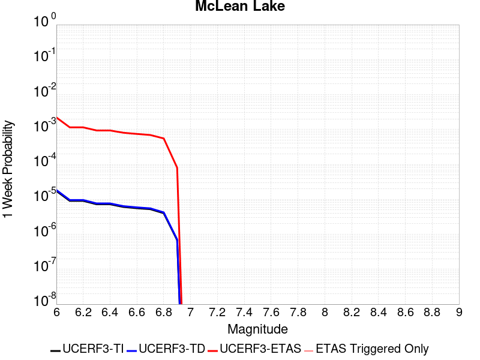 |  |  | 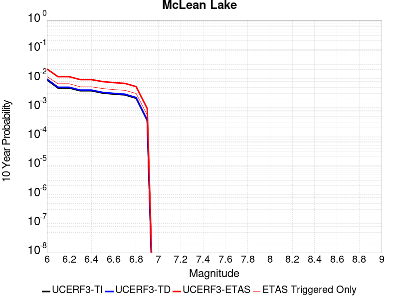 |

| Magnitude | 1 wk TI Prob | 1 wk TD Prob | 1 wk ETAS Prob | 1 wk ETAS/TD Gain | 1 wk ETAS Triggered Only | 1 mo TI Prob | 1 mo TD Prob | 1 mo ETAS Prob | 1 mo ETAS/TD Gain | 1 mo ETAS Triggered Only | 1 yr TI Prob | 1 yr TD Prob | 1 yr ETAS Prob | 1 yr ETAS/TD Gain | 1 yr ETAS Triggered Only | 10 yr TI Prob | 10 yr TD Prob | 10 yr ETAS Prob | 10 yr ETAS/TD Gain | 10 yr ETAS Triggered Only |
|-----|-----|-----|-----|-----|-----|-----|-----|-----|-----|-----|-----|-----|-----|-----|-----|-----|-----|-----|-----|-----|
| 6.0 | 1.7360222E-5 | 1.8501627E-5 | 0.002208461 | 119.365776 | 0.00219 | 7.439883E-5 | 7.9290556E-5 | 0.0035090186 | 44.25519 | 0.00343 | 9.0542925E-4 | 9.6498354E-4 | 0.007818364 | 8.10207 | 0.00686 | 0.009017491 | 0.0096127745 | 0.021309247 | 2.2167635 | 0.01181 |
| 6.1 | 9.062689E-6 | 9.592193E-6 | 0.0011495813 | 119.845505 | 0.00114 | 3.8839516E-5 | 4.1108804E-5 | 0.0018010364 | 43.811455 | 0.00176 | 4.727685E-4 | 5.003936E-4 | 0.0042984923 | 8.590221 | 0.0038 | 0.0047176396 | 0.004993552 | 0.011570544 | 2.3170972 | 0.00661 |
| 6.2 | 9.062689E-6 | 9.592193E-6 | 0.0011495813 | 119.845505 | 0.00114 | 3.8839516E-5 | 4.1108804E-5 | 0.0018010364 | 43.811455 | 0.00176 | 4.727685E-4 | 5.003936E-4 | 0.0042984923 | 8.590221 | 0.0038 | 0.0047176396 | 0.004993552 | 0.011570544 | 2.3170972 | 0.00661 |
| 6.3 | 7.2575485E-6 | 7.66771E-6 | 9.376606E-4 | 122.28693 | 9.3E-4 | 3.110341E-5 | 3.2861237E-5 | 0.0014628143 | 44.514885 | 0.00143 | 3.786182E-4 | 4.0001926E-4 | 0.003318851 | 8.296729 | 0.00292 | 0.0037797375 | 0.0039936965 | 0.009153009 | 2.291864 | 0.00518 |
| 6.4 | 7.2575485E-6 | 7.66771E-6 | 9.376606E-4 | 122.28693 | 9.3E-4 | 3.110341E-5 | 3.2861237E-5 | 0.0014628143 | 44.514885 | 0.00143 | 3.786182E-4 | 4.0001926E-4 | 0.003318851 | 8.296729 | 0.00292 | 0.0037797375 | 0.0039936965 | 0.009153009 | 2.291864 | 0.00518 |
| 6.5 | 6.06582E-6 | 6.4038773E-6 | 8.0639875E-4 | 125.92352 | 8.0E-4 | 2.5996113E-5 | 2.7444936E-5 | 0.0012874104 | 46.90885 | 0.00126 | 3.164567E-4 | 3.3409733E-4 | 0.0028832455 | 8.629956 | 0.00255 | 0.0031600643 | 0.0033365893 | 0.007841508 | 2.3501568 | 0.00452 |
| 6.6 | 5.598744E-6 | 5.910262E-6 | 7.459059E-4 | 126.20521 | 7.4E-4 | 2.3994397E-5 | 2.5329486E-5 | 0.0011853001 | 46.79527 | 0.00116 | 2.9209262E-4 | 3.0834923E-4 | 0.0026976124 | 8.748562 | 0.00239 | 0.0029170897 | 0.003079843 | 0.007227031 | 2.346558 | 0.00416 |
| 6.7 | 5.246996E-6 | 5.539162E-6 | 6.9553533E-4 | 125.56689 | 6.9E-4 | 2.2486933E-5 | 2.3739085E-5 | 0.0011137133 | 46.91475 | 0.00109 | 2.73744E-4 | 2.8899137E-4 | 0.0025083497 | 8.67967 | 0.00222 | 0.0027340704 | 0.0028867796 | 0.0067954636 | 2.3539946 | 0.00392 |
| 6.8 | 4.02324E-6 | 4.2469046E-6 | 5.5424456E-4 | 130.50554 | 5.5E-4 | 1.7242342E-5 | 1.8200926E-5 | 8.481858E-4 | 46.601246 | 8.3E-4 | 2.099053E-4 | 2.2157968E-4 | 0.0019411986 | 8.760724 | 0.00172 | 0.0020970714 | 0.002214172 | 0.0052673966 | 2.3789465 | 0.00306 |
| 6.9 | 6.835972E-7 | 7.1399285E-7 | 8.071394E-5 | 113.04586 | 8.0E-5 | 2.9296991E-6 | 3.0599674E-6 | 1.1305963E-4 | 36.947987 | 1.1E-4 | 3.56685E-5 | 3.7254784E-5 | 2.8724546E-4 | 7.710297 | 2.5E-4 | 3.5662777E-4 | 3.7251666E-4 | 9.223118E-4 | 2.475894 | 5.5E-4 |

## Goldstone Lake
*[(top)](#table-of-contents)*

| 1 Week | 1 Month | 1 Year | 10 Year |
|-----|-----|-----|-----|
|  |  |  |  |

| Magnitude | 1 wk TI Prob | 1 wk TD Prob | 1 wk ETAS Prob | 1 wk ETAS/TD Gain | 1 wk ETAS Triggered Only | 1 mo TI Prob | 1 mo TD Prob | 1 mo ETAS Prob | 1 mo ETAS/TD Gain | 1 mo ETAS Triggered Only | 1 yr TI Prob | 1 yr TD Prob | 1 yr ETAS Prob | 1 yr ETAS/TD Gain | 1 yr ETAS Triggered Only | 10 yr TI Prob | 10 yr TD Prob | 10 yr ETAS Prob | 10 yr ETAS/TD Gain | 10 yr ETAS Triggered Only |
|-----|-----|-----|-----|-----|-----|-----|-----|-----|-----|-----|-----|-----|-----|-----|-----|-----|-----|-----|-----|-----|
| 6.0 | 2.671352E-5 | 3.0376103E-5 | 0.0016303275 | 53.671383 | 0.0016 | 1.1448149E-4 | 1.3017791E-4 | 0.0026298524 | 20.201986 | 0.0025 | 0.001392921 | 0.0015839601 | 0.006675882 | 4.214678 | 0.0051 | 0.013842222 | 0.015746202 | 0.024574958 | 1.5606912 | 0.00897 |
| 6.1 | 2.671352E-5 | 3.0376103E-5 | 0.0016303275 | 53.671383 | 0.0016 | 1.1448149E-4 | 1.3017791E-4 | 0.0026298524 | 20.201986 | 0.0025 | 0.001392921 | 0.0015839601 | 0.006675882 | 4.214678 | 0.0051 | 0.013842222 | 0.015746202 | 0.024574958 | 1.5606912 | 0.00897 |
| 6.2 | 1.4197047E-5 | 1.6096254E-5 | 8.8608224E-4 | 55.048973 | 8.7E-4 | 6.0843064E-5 | 6.898268E-5 | 0.0014288889 | 20.713734 | 0.00136 | 7.4051257E-4 | 8.3963916E-4 | 0.0036772545 | 4.3795652 | 0.00284 | 0.007380498 | 0.008374364 | 0.013540734 | 1.6169268 | 0.00521 |
| 6.3 | 1.4197047E-5 | 1.6096254E-5 | 8.8608224E-4 | 55.048973 | 8.7E-4 | 6.0843064E-5 | 6.898268E-5 | 0.0014288889 | 20.713734 | 0.00136 | 7.4051257E-4 | 8.3963916E-4 | 0.0036772545 | 4.3795652 | 0.00284 | 0.007380498 | 0.008374364 | 0.013540734 | 1.6169268 | 0.00521 |
| 6.4 | 1.3238931E-5 | 1.500847E-5 | 8.349962E-4 | 55.635 | 8.2E-4 | 5.6737044E-5 | 6.432098E-5 | 0.001354238 | 21.054375 | 0.00129 | 6.9055456E-4 | 7.8292453E-4 | 0.0034808107 | 4.445908 | 0.0027 | 0.006884126 | 0.007811289 | 0.012772232 | 1.6350993 | 0.005 |
| 6.5 | 1.3238931E-5 | 1.500847E-5 | 8.349962E-4 | 55.635 | 8.2E-4 | 5.6737044E-5 | 6.432098E-5 | 0.001354238 | 21.054375 | 0.00129 | 6.9055456E-4 | 7.8292453E-4 | 0.0034808107 | 4.445908 | 0.0027 | 0.006884126 | 0.007811289 | 0.012772232 | 1.6350993 | 0.005 |
| 6.6 | 1.1328278E-5 | 1.2855176E-5 | 7.228461E-4 | 56.229965 | 7.1E-4 | 4.8548856E-5 | 5.5092984E-5 | 0.0011650318 | 21.146646 | 0.00111 | 5.90922E-4 | 6.706464E-4 | 0.0029291308 | 4.3676233 | 0.00226 | 0.0058935313 | 0.0066956137 | 0.010937023 | 1.6334609 | 0.00427 |
| 6.7 | 8.651175E-6 | 9.824575E-6 | 4.9981975E-4 | 50.874443 | 4.9E-4 | 3.707594E-5 | 4.2105148E-5 | 8.220723E-4 | 19.52427 | 7.8E-4 | 4.5130608E-4 | 5.126002E-4 | 0.0021417646 | 4.1782365 | 0.00163 | 0.0045039062 | 0.0051230565 | 0.008346458 | 1.629195 | 0.00324 |
| 6.8 | 1.0215377E-6 | 1.1754802E-6 | 1.1175468E-5 | 9.507152 | 1.0E-5 | 4.378012E-6 | 5.037763E-6 | 5.503751E-5 | 10.92499 | 5.0E-5 | 5.3300988E-5 | 6.133315E-5 | 1.1133009E-4 | 1.8151698 | 5.0E-5 | 5.3288206E-4 | 6.131735E-4 | 7.0311833E-4 | 1.1466874 | 9.0E-5 |
| 6.9 | 7.9360774E-7 | 9.283496E-7 | 9.283496E-7 | 1.0 | 0.0 | 3.4011714E-6 | 3.9786355E-6 | 2.3978555E-5 | 6.0268292 | 2.0E-5 | 4.1408475E-5 | 4.843888E-5 | 6.843791E-5 | 1.4128715 | 2.0E-5 | 4.140076E-4 | 4.842902E-4 | 5.34266E-4 | 1.1031939 | 5.0E-5 |
| 7.0 | 7.4382757E-7 | 8.747428E-7 | 8.747428E-7 | 1.0 | 0.0 | 3.1878285E-6 | 3.7488926E-6 | 2.3748818E-5 | 6.3348885 | 2.0E-5 | 3.8811122E-5 | 4.564188E-5 | 6.564097E-5 | 1.438174 | 2.0E-5 | 3.8804344E-4 | 4.563317E-4 | 5.0630886E-4 | 1.1095194 | 5.0E-5 |
| 7.1 | 6.4709513E-7 | 7.711399E-7 | 7.711399E-7 | 1.0 | 0.0 | 2.773262E-6 | 3.3048816E-6 | 1.3304849E-5 | 4.025817 | 1.0E-5 | 3.376394E-5 | 4.023625E-5 | 5.023585E-5 | 1.2485222 | 1.0E-5 | 3.375881E-4 | 4.022956E-4 | 4.4227953E-4 | 1.0993893 | 4.0E-5 |
| 7.2 | 6.356704E-7 | 7.588459E-7 | 7.588459E-7 | 1.0 | 0.0 | 2.7242988E-6 | 3.252193E-6 | 1.325216E-5 | 4.074838 | 1.0E-5 | 3.3167835E-5 | 3.959479E-5 | 4.9594393E-5 | 1.2525485 | 1.0E-5 | 3.3162883E-4 | 3.9588328E-4 | 4.3586746E-4 | 1.1009998 | 4.0E-5 |
| 7.3 | 5.7695723E-7 | 6.896648E-7 | 6.896648E-7 | 1.0 | 0.0 | 2.4726714E-6 | 2.9557032E-6 | 1.2955674E-5 | 4.38328 | 1.0E-5 | 3.0104358E-5 | 3.598515E-5 | 4.598479E-5 | 1.2778825 | 1.0E-5 | 3.0100282E-4 | 3.5979896E-4 | 3.8978818E-4 | 1.08335 | 3.0E-5 |
| 7.4 | 5.209647E-7 | 6.193583E-7 | 6.193583E-7 | 1.0 | 0.0 | 2.232704E-6 | 2.6543903E-6 | 1.2654364E-5 | 4.7673335 | 1.0E-5 | 2.718283E-5 | 3.2316777E-5 | 4.2316457E-5 | 1.3094268 | 1.0E-5 | 2.7179506E-4 | 3.2312635E-4 | 3.5311666E-4 | 1.0928129 | 3.0E-5 |
| 7.5 | 4.512955E-7 | 5.3489487E-7 | 5.3489487E-7 | 1.0 | 0.0 | 1.934122E-6 | 2.2924048E-6 | 1.2292382E-5 | 5.3622212 | 1.0E-5 | 2.3547682E-5 | 2.7909726E-5 | 3.790945E-5 | 1.358288 | 1.0E-5 | 2.3545188E-4 | 2.7906752E-4 | 3.0905916E-4 | 1.1074709 | 3.0E-5 |
| 7.6 | 2.21172E-7 | 2.6040198E-7 | 2.6040198E-7 | 1.0 | 0.0 | 9.478797E-7 | 1.1160082E-6 | 1.1115997E-5 | 9.960498 | 1.0E-5 | 1.1540374E-5 | 1.3587343E-5 | 2.3587207E-5 | 1.7359691 | 1.0E-5 | 1.1539775E-4 | 1.3586794E-4 | 1.4586658E-4 | 1.0735909 | 1.0E-5 |

## Death Valley (So)
*[(top)](#table-of-contents)*

| 1 Week | 1 Month | 1 Year | 10 Year |
|-----|-----|-----|-----|
|  |  |  |  |

| Magnitude | 1 wk TI Prob | 1 wk TD Prob | 1 wk ETAS Prob | 1 wk ETAS/TD Gain | 1 wk ETAS Triggered Only | 1 mo TI Prob | 1 mo TD Prob | 1 mo ETAS Prob | 1 mo ETAS/TD Gain | 1 mo ETAS Triggered Only | 1 yr TI Prob | 1 yr TD Prob | 1 yr ETAS Prob | 1 yr ETAS/TD Gain | 1 yr ETAS Triggered Only | 10 yr TI Prob | 10 yr TD Prob | 10 yr ETAS Prob | 10 yr ETAS/TD Gain | 10 yr ETAS Triggered Only |
|-----|-----|-----|-----|-----|-----|-----|-----|-----|-----|-----|-----|-----|-----|-----|-----|-----|-----|-----|-----|-----|
| 6.0 | 2.0684236E-5 | 2.5618314E-5 | 0.0018055728 | 70.47977 | 0.00178 | 8.864371E-5 | 1.0978825E-4 | 0.0027694963 | 25.225798 | 0.00266 | 0.0010787029 | 0.0013358692 | 0.006708682 | 5.0219603 | 0.00538 | 0.010734817 | 0.013279985 | 0.022002589 | 1.6568234 | 0.00884 |
| 6.1 | 2.0684236E-5 | 2.5618314E-5 | 0.0018055728 | 70.47977 | 0.00178 | 8.864371E-5 | 1.0978825E-4 | 0.0027694963 | 25.225798 | 0.00266 | 0.0010787029 | 0.0013358692 | 0.006708682 | 5.0219603 | 0.00538 | 0.010734817 | 0.013279985 | 0.022002589 | 1.6568234 | 0.00884 |
| 6.2 | 2.0684236E-5 | 2.5618314E-5 | 0.0018055728 | 70.47977 | 0.00178 | 8.864371E-5 | 1.0978825E-4 | 0.0027694963 | 25.225798 | 0.00266 | 0.0010787029 | 0.0013358692 | 0.006708682 | 5.0219603 | 0.00538 | 0.010734817 | 0.013279985 | 0.022002589 | 1.6568234 | 0.00884 |
| 6.3 | 2.0240292E-5 | 2.51184E-5 | 0.0017750744 | 70.6683 | 0.00175 | 8.6741224E-5 | 1.0764593E-4 | 0.002727364 | 25.336433 | 0.00262 | 0.0010555626 | 0.001309818 | 0.006522981 | 4.9800663 | 0.00522 | 0.010505628 | 0.013022543 | 0.02148094 | 1.6495196 | 0.00857 |
| 6.4 | 2.0240292E-5 | 2.51184E-5 | 0.0017750744 | 70.6683 | 0.00175 | 8.6741224E-5 | 1.0764593E-4 | 0.002727364 | 25.336433 | 0.00262 | 0.0010555626 | 0.001309818 | 0.006522981 | 4.9800663 | 0.00522 | 0.010505628 | 0.013022543 | 0.02148094 | 1.6495196 | 0.00857 |
| 6.5 | 1.9962767E-5 | 2.4807652E-5 | 0.0017347652 | 69.928635 | 0.00171 | 8.55519E-5 | 1.0631427E-4 | 0.002676041 | 25.171043 | 0.00257 | 0.0010410968 | 0.0012936244 | 0.006416988 | 4.9604726 | 0.00513 | 0.010362327 | 0.01286249 | 0.021144573 | 1.6438943 | 0.00839 |
| 6.6 | 1.8937297E-5 | 2.3311462E-5 | 0.0015332763 | 65.77349 | 0.00151 | 8.115732E-5 | 9.990252E-5 | 0.0023596766 | 23.619791 | 0.00226 | 9.876423E-4 | 0.0012156491 | 0.0058500087 | 4.812251 | 0.00464 | 0.009832645 | 0.0120915035 | 0.019658882 | 1.6258427 | 0.00766 |
| 6.7 | 1.8621096E-5 | 2.2912098E-5 | 0.00142288 | 62.101692 | 0.0014 | 7.980225E-5 | 9.8191085E-5 | 0.002227982 | 22.690266 | 0.00213 | 9.711593E-4 | 0.0011948354 | 0.0055995663 | 4.686475 | 0.00441 | 0.009669261 | 0.011885625 | 0.019187791 | 1.6143695 | 0.00739 |
| 6.8 | 1.7830353E-5 | 2.1806083E-5 | 0.0013517771 | 61.99082 | 0.00133 | 7.641356E-5 | 9.3451374E-5 | 0.0020932644 | 22.399504 | 0.002 | 9.29938E-4 | 0.0011371907 | 0.0052425168 | 4.6100597 | 0.00411 | 0.009260561 | 0.01131609 | 0.018266538 | 1.6142093 | 0.00703 |
| 6.9 | 1.3135183E-5 | 1.5304031E-5 | 7.552927E-4 | 49.352535 | 7.4E-4 | 5.6292425E-5 | 6.558709E-5 | 0.0012055123 | 18.38033 | 0.00114 | 6.8514474E-4 | 7.982367E-4 | 0.003216305 | 4.029262 | 0.00242 | 0.006830362 | 0.007955158 | 0.012330076 | 1.5499473 | 0.00441 |
| 7.0 | 1.1507512E-5 | 1.3154237E-5 | 5.131477E-4 | 39.010063 | 5.0E-4 | 4.9316975E-5 | 5.637412E-5 | 8.363302E-4 | 14.835357 | 7.8E-4 | 6.002687E-4 | 6.861445E-4 | 0.002464923 | 3.5924256 | 0.00178 | 0.0059864987 | 0.0068414924 | 0.010059326 | 1.4703408 | 0.00324 |
| 7.1 | 9.715903E-6 | 1.0865287E-5 | 2.4086279E-4 | 22.168102 | 2.3E-4 | 4.1638916E-5 | 4.6564706E-5 | 4.3654654E-4 | 9.3750515 | 3.9E-4 | 5.068359E-4 | 5.667821E-4 | 0.0015062493 | 2.6575458 | 9.4E-4 | 0.0050568148 | 0.005653834 | 0.0074337134 | 1.3148093 | 0.00179 |
| 7.2 | 9.233269E-6 | 1.0286314E-5 | 1.3028507E-4 | 12.665867 | 1.2E-4 | 3.9570554E-5 | 4.408348E-5 | 2.840729E-4 | 6.4439764 | 2.4E-4 | 4.81665E-4 | 5.365884E-4 | 0.0011562557 | 2.1548278 | 6.2E-4 | 0.0048062233 | 0.0053533595 | 0.0066464 | 1.2415382 | 0.0013 |
| 7.3 | 8.8041315E-6 | 9.808164E-6 | 8.980738E-5 | 9.15639 | 8.0E-5 | 3.7731446E-5 | 4.2034335E-5 | 2.1202718E-4 | 5.0441427 | 1.7E-4 | 4.592835E-4 | 5.1165203E-4 | 9.914065E-4 | 1.9376576 | 4.8E-4 | 0.0045833546 | 0.005105167 | 0.00611996 | 1.1987776 | 0.00102 |
| 7.4 | 8.708749E-6 | 9.707175E-6 | 8.97064E-5 | 9.241246 | 8.0E-5 | 3.7322676E-5 | 4.160154E-5 | 2.1159447E-4 | 5.0862174 | 1.7E-4 | 4.5430884E-4 | 5.0638523E-4 | 9.7614725E-4 | 1.9276772 | 4.7E-4 | 0.004533812 | 0.0050527398 | 0.0060178386 | 1.1910051 | 9.7E-4 |
| 7.5 | 8.612678E-6 | 9.604817E-6 | 8.960405E-5 | 9.329074 | 8.0E-5 | 3.6910955E-5 | 4.1162875E-5 | 2.1115589E-4 | 5.129765 | 1.7E-4 | 4.492982E-4 | 5.01047E-4 | 9.4082655E-4 | 1.8777212 | 4.4E-4 | 0.004483909 | 0.0049995985 | 0.005924949 | 1.1850849 | 9.3E-4 |
| 7.6 | 8.319024E-6 | 9.283916E-6 | 7.9283265E-5 | 8.539851 | 7.0E-5 | 3.5652476E-5 | 3.978763E-5 | 1.9978127E-4 | 5.02119 | 1.6E-4 | 4.3398244E-4 | 4.8431093E-4 | 9.041075E-4 | 1.8667915 | 4.2E-4 | 0.0043313587 | 0.0048329784 | 0.0056788702 | 1.175025 | 8.5E-4 |
| 7.7 | 7.4718328E-6 | 8.34517E-6 | 6.834467E-5 | 8.189728 | 6.0E-5 | 3.2021748E-5 | 3.5764548E-5 | 1.7575955E-4 | 4.914351 | 1.4E-4 | 3.8979502E-4 | 4.353504E-4 | 8.051893E-4 | 1.8495201 | 3.7E-4 | 0.00389112 | 0.0043453807 | 0.0050423387 | 1.1603906 | 7.0E-4 |
| 7.8 | 3.4586725E-7 | 3.6482615E-7 | 3.6482615E-7 | 1.0 | 0.0 | 1.4822873E-6 | 1.5635396E-6 | 1.5635396E-6 | 1.0 | 0.0 | 1.80467E-5 | 1.9035933E-5 | 1.9035933E-5 | 1.0 | 0.0 | 1.8045233E-4 | 1.9034347E-4 | 2.0034157E-4 | 1.0525266 | 1.0E-5 |
| 7.9 | 2.5591178E-9 | 2.6696718E-9 | 2.6696718E-9 | 1.0 | 0.0 | 1.0967647E-8 | 1.14414505E-8 | 1.14414505E-8 | 1.0 | 0.0 | 1.335311E-7 | 1.3929966E-7 | 1.3929966E-7 | 1.0 | 0.0 | 1.3353102E-6 | 1.3929966E-6 | 1.3929966E-6 | 1.0 | 0.0 |

## Gravel Hills-Harper Lk
*[(top)](#table-of-contents)*

| 1 Week | 1 Month | 1 Year | 10 Year |
|-----|-----|-----|-----|
|  |  |  |  |

| Magnitude | 1 wk TI Prob | 1 wk TD Prob | 1 wk ETAS Prob | 1 wk ETAS/TD Gain | 1 wk ETAS Triggered Only | 1 mo TI Prob | 1 mo TD Prob | 1 mo ETAS Prob | 1 mo ETAS/TD Gain | 1 mo ETAS Triggered Only | 1 yr TI Prob | 1 yr TD Prob | 1 yr ETAS Prob | 1 yr ETAS/TD Gain | 1 yr ETAS Triggered Only | 10 yr TI Prob | 10 yr TD Prob | 10 yr ETAS Prob | 10 yr ETAS/TD Gain | 10 yr ETAS Triggered Only |
|-----|-----|-----|-----|-----|-----|-----|-----|-----|-----|-----|-----|-----|-----|-----|-----|-----|-----|-----|-----|-----|
| 6.0 | 3.0679566E-5 | 3.1464628E-5 | 0.0021313985 | 67.73952 | 0.0021 | 1.3147724E-4 | 1.3484266E-4 | 0.0031144407 | 23.096851 | 0.00298 | 0.0015995599 | 0.00164069 | 0.006862109 | 4.182453 | 0.00523 | 0.015880952 | 0.016307337 | 0.024216227 | 1.4849896 | 0.00804 |
| 6.1 | 3.0679566E-5 | 3.1464628E-5 | 0.0021313985 | 67.73952 | 0.0021 | 1.3147724E-4 | 1.3484266E-4 | 0.0031144407 | 23.096851 | 0.00298 | 0.0015995599 | 0.00164069 | 0.006862109 | 4.182453 | 0.00523 | 0.015880952 | 0.016307337 | 0.024216227 | 1.4849896 | 0.00804 |
| 6.2 | 1.514536E-5 | 1.36352E-5 | 7.036258E-4 | 51.603626 | 6.9E-4 | 6.490707E-5 | 5.843533E-5 | 0.0010383781 | 17.769695 | 9.8E-4 | 7.8995706E-4 | 7.112298E-4 | 0.0027198002 | 3.8240807 | 0.00201 | 0.007871548 | 0.007090737 | 0.010258118 | 1.4466927 | 0.00319 |
| 6.3 | 1.514536E-5 | 1.36352E-5 | 7.036258E-4 | 51.603626 | 6.9E-4 | 6.490707E-5 | 5.843533E-5 | 0.0010383781 | 17.769695 | 9.8E-4 | 7.8995706E-4 | 7.112298E-4 | 0.0027198002 | 3.8240807 | 0.00201 | 0.007871548 | 0.007090737 | 0.010258118 | 1.4466927 | 0.00319 |
| 6.4 | 1.2532521E-5 | 1.0689684E-5 | 4.906845E-4 | 45.902626 | 4.8E-4 | 5.37097E-5 | 4.581216E-5 | 7.25781E-4 | 15.842541 | 6.8E-4 | 6.537194E-4 | 5.5762613E-4 | 0.0020068176 | 3.5988586 | 0.00145 | 0.0065179965 | 0.005562859 | 0.007830176 | 1.4075812 | 0.00228 |
| 6.5 | 1.1094058E-5 | 9.083657E-6 | 3.5908047E-4 | 39.530388 | 3.5E-4 | 4.7545094E-5 | 3.89294E-5 | 5.389099E-4 | 13.843264 | 5.0E-4 | 5.787078E-4 | 4.7386638E-4 | 0.0015333641 | 3.2358575 | 0.00106 | 0.0057720304 | 0.004728967 | 0.006341306 | 1.3409495 | 0.00162 |
| 6.6 | 9.688328E-6 | 7.531688E-6 | 1.9753026E-4 | 26.226559 | 1.9E-4 | 4.1520743E-5 | 3.227828E-5 | 3.6226763E-4 | 11.223264 | 3.3E-4 | 5.053978E-4 | 3.9291973E-4 | 0.0011126369 | 2.8317153 | 7.2E-4 | 0.0050424994 | 0.0039225067 | 0.00485882 | 1.2387027 | 9.4E-4 |
| 6.7 | 8.974824E-6 | 6.749406E-6 | 1.4674845E-4 | 21.742426 | 1.4E-4 | 3.8462964E-5 | 2.8925719E-5 | 2.5891906E-4 | 8.951172 | 2.3E-4 | 4.6818596E-4 | 3.5211592E-4 | 8.819293E-4 | 2.504656 | 5.3E-4 | 0.004672008 | 0.003515801 | 0.0041934103 | 1.1927326 | 6.8E-4 |
| 6.8 | 7.4780046E-6 | 5.1161865E-6 | 3.5116034E-5 | 6.863713 | 3.0E-5 | 3.20482E-5 | 2.1926337E-5 | 8.192502E-5 | 3.7363753 | 6.0E-5 | 3.9011694E-4 | 2.6692182E-4 | 4.5687112E-4 | 1.7116289 | 1.9E-4 | 0.0038943281 | 0.0026661505 | 0.0029354307 | 1.1009996 | 2.7E-4 |
| 6.9 | 6.3409307E-6 | 3.907489E-6 | 2.390741E-5 | 6.1183567 | 2.0E-5 | 2.7175134E-5 | 1.674628E-5 | 5.6745608E-5 | 3.3885503 | 4.0E-5 | 3.3080703E-4 | 2.0386786E-4 | 3.3384137E-4 | 1.637538 | 1.3E-4 | 0.0033031502 | 0.0020369065 | 0.0022065605 | 1.0832899 | 1.7E-4 |
| 7.0 | 5.1239335E-6 | 2.6058492E-6 | 1.2605823E-5 | 4.8375106 | 1.0E-5 | 2.195953E-5 | 1.1167879E-5 | 3.1167656E-5 | 2.7908304 | 2.0E-5 | 2.6732447E-4 | 1.359607E-4 | 2.0595118E-4 | 1.5147847 | 7.0E-5 | 0.0026700313 | 0.0013588005 | 0.0014386917 | 1.0587955 | 8.0E-5 |
| 7.1 | 4.438899E-6 | 2.0984692E-6 | 1.2098449E-5 | 5.7653685 | 1.0E-5 | 1.9023713E-5 | 8.99341E-6 | 2.899323E-5 | 3.2238305 | 2.0E-5 | 2.315891E-4 | 1.0948948E-4 | 1.7948182E-4 | 1.6392608 | 7.0E-5 | 0.002313479 | 0.0010943774 | 0.0011742897 | 1.0730209 | 8.0E-5 |
| 7.2 | 3.50367E-6 | 1.2615715E-6 | 1.1261559E-5 | 8.926612 | 1.0E-5 | 1.5015643E-5 | 5.406724E-6 | 1.540667E-5 | 2.8495388 | 1.0E-5 | 1.8280011E-4 | 6.5824956E-5 | 9.582299E-5 | 1.4557241 | 3.0E-5 | 0.0018264982 | 6.580628E-4 | 6.980365E-4 | 1.0607445 | 4.0E-5 |
| 7.3 | 2.561638E-6 | 7.118686E-7 | 1.0711861E-5 | 15.047526 | 1.0E-5 | 1.0978401E-5 | 3.050862E-6 | 1.30508315E-5 | 4.2777524 | 1.0E-5 | 1.3365384E-4 | 3.7143633E-5 | 5.714289E-5 | 1.5384303 | 2.0E-5 | 0.0013357349 | 3.7137623E-4 | 3.913688E-4 | 1.0538337 | 2.0E-5 |
| 7.4 | 2.0368864E-6 | 5.304471E-7 | 1.0530442E-5 | 19.85201 | 1.0E-5 | 8.729483E-6 | 2.2733427E-6 | 1.227332E-5 | 5.398799 | 1.0E-5 | 1.06276275E-4 | 2.76776E-5 | 4.7677047E-5 | 1.7225859 | 2.0E-5 | 0.0010622547 | 2.767421E-4 | 2.9673654E-4 | 1.0722494 | 2.0E-5 |
| 7.5 | 1.1681728E-6 | 3.6028484E-7 | 3.6028484E-7 | 1.0 | 0.0 | 5.0064455E-6 | 1.544077E-6 | 1.544077E-6 | 1.0 | 0.0 | 6.0951766E-5 | 1.879898E-5 | 1.879898E-5 | 1.0 | 0.0 | 6.093505E-4 | 1.8797436E-4 | 1.8797436E-4 | 1.0 | 0.0 |
| 7.6 | 1.3154387E-7 | 7.1196716E-8 | 7.1196716E-8 | 1.0 | 0.0 | 5.6375933E-7 | 3.0512876E-7 | 3.0512876E-7 | 1.0 | 0.0 | 6.863748E-6 | 3.714938E-6 | 3.714938E-6 | 1.0 | 0.0 | 6.863536E-5 | 3.7148915E-5 | 3.7148915E-5 | 1.0 | 0.0 |

## San Andreas (Mojave S)
*[(top)](#table-of-contents)*

| 1 Week | 1 Month | 1 Year | 10 Year |
|-----|-----|-----|-----|
| 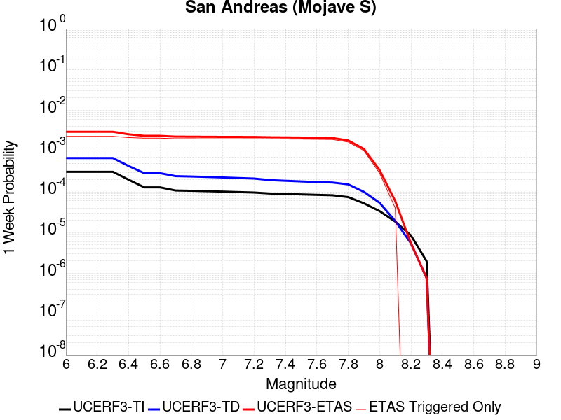 |  |  |  |

| Magnitude | 1 wk TI Prob | 1 wk TD Prob | 1 wk ETAS Prob | 1 wk ETAS/TD Gain | 1 wk ETAS Triggered Only | 1 mo TI Prob | 1 mo TD Prob | 1 mo ETAS Prob | 1 mo ETAS/TD Gain | 1 mo ETAS Triggered Only | 1 yr TI Prob | 1 yr TD Prob | 1 yr ETAS Prob | 1 yr ETAS/TD Gain | 1 yr ETAS Triggered Only | 10 yr TI Prob | 10 yr TD Prob | 10 yr ETAS Prob | 10 yr ETAS/TD Gain | 10 yr ETAS Triggered Only |
|-----|-----|-----|-----|-----|-----|-----|-----|-----|-----|-----|-----|-----|-----|-----|-----|-----|-----|-----|-----|-----|
| 6.0 | 3.1064058E-4 | 6.7462435E-4 | 0.0029730727 | 4.407005 | 0.0023 | 0.0013306376 | 0.002888172 | 0.0058795074 | 2.0357194 | 0.003 | 0.016080605 | 0.034565594 | 0.03903556 | 1.1293182 | 0.00463 | 0.1496549 | 0.28654557 | 0.29122585 | 1.0163333 | 0.00656 |
| 6.1 | 3.1064058E-4 | 6.7462435E-4 | 0.0029730727 | 4.407005 | 0.0023 | 0.0013306376 | 0.002888172 | 0.0058795074 | 2.0357194 | 0.003 | 0.016080605 | 0.034565594 | 0.03903556 | 1.1293182 | 0.00463 | 0.1496549 | 0.28654557 | 0.29122585 | 1.0163333 | 0.00656 |
| 6.2 | 3.1064058E-4 | 6.7462435E-4 | 0.0029730727 | 4.407005 | 0.0023 | 0.0013306376 | 0.002888172 | 0.0058795074 | 2.0357194 | 0.003 | 0.016080605 | 0.034565594 | 0.03903556 | 1.1293182 | 0.00463 | 0.1496549 | 0.28654557 | 0.29122585 | 1.0163333 | 0.00656 |
| 6.3 | 3.1064058E-4 | 6.7462435E-4 | 0.0029730727 | 4.407005 | 0.0023 | 0.0013306376 | 0.002888172 | 0.0058795074 | 2.0357194 | 0.003 | 0.016080605 | 0.034565594 | 0.03903556 | 1.1293182 | 0.00463 | 0.1496549 | 0.28654557 | 0.29122585 | 1.0163333 | 0.00656 |
| 6.4 | 1.9872203E-4 | 4.3181062E-4 | 0.0025808823 | 5.9768844 | 0.00215 | 8.5138786E-4 | 0.0018493326 | 0.004674099 | 2.5274518 | 0.00283 | 0.010316478 | 0.02228931 | 0.02658146 | 1.1925654 | 0.00439 | 0.098504856 | 0.19686839 | 0.20191206 | 1.0256195 | 0.00628 |
| 6.5 | 1.291105E-4 | 2.8754136E-4 | 0.0023669433 | 8.231662 | 0.00208 | 5.5321335E-4 | 0.0012317409 | 0.003938403 | 3.197428 | 0.00271 | 0.006714592 | 0.014894155 | 0.0190316 | 1.2777898 | 0.0042 | 0.065152965 | 0.13800792 | 0.14311093 | 1.0369761 | 0.00592 |
| 6.6 | 1.291105E-4 | 2.8754136E-4 | 0.0023669433 | 8.231662 | 0.00208 | 5.5321335E-4 | 0.0012317409 | 0.003938403 | 3.197428 | 0.00271 | 0.006714592 | 0.014894155 | 0.0190316 | 1.2777898 | 0.0042 | 0.065152965 | 0.13800792 | 0.14311093 | 1.0369761 | 0.00592 |
| 6.7 | 1.08001186E-4 | 2.4335351E-4 | 0.002262862 | 9.298661 | 0.00202 | 4.6278012E-4 | 0.0010425274 | 0.003659796 | 3.5105035 | 0.00262 | 0.0056198016 | 0.0126192 | 0.016647713 | 1.3192369 | 0.00408 | 0.054797906 | 0.11918431 | 0.12422258 | 1.0422729 | 0.00572 |
| 6.8 | 1.0624356E-4 | 2.3853009E-4 | 0.0022580482 | 9.466514 | 0.00202 | 4.5525006E-4 | 0.0010218718 | 0.0036391944 | 3.5613024 | 0.00262 | 0.0055285925 | 0.012370593 | 0.016390244 | 1.324936 | 0.00407 | 0.053930566 | 0.11713308 | 0.12217425 | 1.043038 | 0.00571 |
| 6.9 | 1.0393785E-4 | 2.3223337E-4 | 0.0022417665 | 9.653077 | 0.00201 | 4.4537184E-4 | 9.949068E-4 | 0.00360231 | 3.6207516 | 0.00261 | 0.0054089287 | 0.012045963 | 0.016057057 | 1.3329824 | 0.00406 | 0.05279156 | 0.114433445 | 0.11947232 | 1.0440332 | 0.00569 |
| 7.0 | 1.0155622E-4 | 2.2592908E-4 | 0.002235475 | 9.8945875 | 0.00201 | 4.3516833E-4 | 9.6790853E-4 | 0.0035753823 | 3.6939259 | 0.00261 | 0.005285311 | 0.011720838 | 0.015733251 | 1.3423316 | 0.00406 | 0.05161361 | 0.11169745 | 0.11674301 | 1.0451716 | 0.00568 |
| 7.1 | 9.885595E-5 | 2.188132E-4 | 0.0022283734 | 10.1839075 | 0.00201 | 4.2359953E-4 | 9.374342E-4 | 0.0035449874 | 3.7815855 | 0.00261 | 0.0051451353 | 0.011353733 | 0.0153577505 | 1.3526609 | 0.00405 | 0.05027629 | 0.10857607 | 0.113612615 | 1.0463872 | 0.00565 |
| 7.2 | 9.6411415E-5 | 2.1244297E-4 | 0.002222016 | 10.4593525 | 0.00201 | 4.1312634E-4 | 9.101525E-4 | 0.0035077862 | 3.8540642 | 0.0026 | 0.005018219 | 0.011024987 | 0.015020446 | 1.3624003 | 0.00404 | 0.049064007 | 0.1057697 | 0.11080422 | 1.0475988 | 0.00563 |
| 7.3 | 9.1180635E-5 | 1.9472656E-4 | 0.002184339 | 11.217468 | 0.00199 | 3.907156E-4 | 8.342756E-4 | 0.0034021316 | 4.0779467 | 0.00257 | 0.004746591 | 0.010110112 | 0.014069672 | 1.3916435 | 0.004 | 0.046464786 | 0.09796176 | 0.102995135 | 1.051381 | 0.00558 |
| 7.4 | 8.887388E-5 | 1.872126E-4 | 0.0021668419 | 11.574231 | 0.00198 | 3.8083247E-4 | 8.020931E-4 | 0.0033600398 | 4.1890893 | 0.00256 | 0.0046267817 | 0.009721855 | 0.013663162 | 1.405407 | 0.00398 | 0.045316286 | 0.094593845 | 0.099627905 | 1.0532176 | 0.00556 |
| 7.5 | 8.6750515E-5 | 1.80528E-4 | 0.0021501724 | 11.910464 | 0.00197 | 3.7173493E-4 | 7.734621E-4 | 0.0033214898 | 4.294315 | 0.00255 | 0.004516484 | 0.009376327 | 0.013299196 | 1.4183803 | 0.00396 | 0.04425787 | 0.09155606 | 0.096588835 | 1.0549694 | 0.00554 |
| 7.6 | 8.453092E-5 | 1.7440386E-4 | 0.0021240637 | 12.178995 | 0.00195 | 3.6222505E-4 | 7.4723107E-4 | 0.003265348 | 4.3699307 | 0.00252 | 0.0044011753 | 0.009059664 | 0.01295406 | 1.429861 | 0.00393 | 0.04315024 | 0.08871447 | 0.09370832 | 1.0562912 | 0.00548 |
| 7.7 | 8.259102E-5 | 1.6962511E-4 | 0.0020992977 | 12.376102 | 0.00193 | 3.539135E-4 | 7.267622E-4 | 0.00320496 | 4.409915 | 0.00248 | 0.004300386 | 0.0088125 | 0.012668219 | 1.4375284 | 0.00389 | 0.042181134 | 0.086465426 | 0.091425925 | 1.0573697 | 0.00543 |
| 7.8 | 7.444844E-5 | 1.528469E-4 | 0.0018225916 | 11.924295 | 0.00167 | 3.1902574E-4 | 6.5489375E-4 | 0.0028434596 | 4.341864 | 0.00219 | 0.0038772223 | 0.007944231 | 0.011346983 | 1.4283298 | 0.00343 | 0.03810269 | 0.078293875 | 0.08269041 | 1.0561543 | 0.00477 |
| 7.9 | 5.2586525E-5 | 1.0007023E-4 | 0.0011299672 | 11.291741 | 0.00103 | 2.2535135E-4 | 4.2880196E-4 | 0.0017582317 | 4.100335 | 0.00133 | 0.0027402006 | 0.005208178 | 0.0073469803 | 1.4106623 | 0.00215 | 0.027066574 | 0.052201588 | 0.054988116 | 1.0533801 | 0.00294 |
| 8.0 | 3.379877E-5 | 5.4075565E-5 | 3.440599E-4 | 6.362576 | 2.9E-4 | 1.4484383E-4 | 2.3173184E-4 | 6.3163915E-4 | 2.725733 | 4.0E-4 | 0.0017620471 | 0.0028176866 | 0.0035157143 | 1.2477307 | 7.0E-4 | 0.017481409 | 0.028835917 | 0.02980708 | 1.033679 | 0.001 |
| 8.1 | 1.8668277E-5 | 1.9308145E-5 | 5.930737E-5 | 3.0716248 | 4.0E-5 | 8.000444E-5 | 8.274657E-5 | 1.427416E-4 | 1.7250456 | 6.0E-5 | 9.736188E-4 | 0.0010069745 | 0.0011268536 | 1.1190488 | 1.2E-4 | 0.009693642 | 0.010798624 | 0.010966788 | 1.0155728 | 1.7E-4 |
| 8.2 | 8.541571E-6 | 5.4596358E-6 | 5.4596358E-6 | 1.0 | 0.0 | 3.660622E-5 | 2.339823E-5 | 2.339823E-5 | 1.0 | 0.0 | 4.455896E-4 | 2.848363E-4 | 2.848363E-4 | 1.0 | 0.0 | 0.0044469717 | 0.003240283 | 0.003240283 | 1.0 | 0.0 |
| 8.3 | 1.983087E-6 | 7.6564595E-7 | 7.6564595E-7 | 1.0 | 0.0 | 8.498917E-6 | 3.281336E-6 | 3.281336E-6 | 1.0 | 0.0 | 1.034694E-4 | 3.9949547E-5 | 3.9949547E-5 | 1.0 | 0.0 | 0.0010342124 | 4.717979E-4 | 4.717979E-4 | 1.0 | 0.0 |

## Coyote Canyon
*[(top)](#table-of-contents)*

| 1 Week | 1 Month | 1 Year | 10 Year |
|-----|-----|-----|-----|
|  |  | 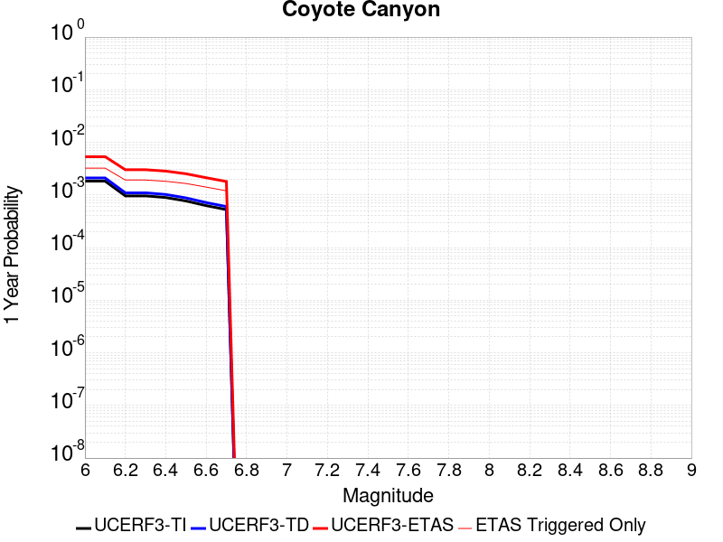 |  |

| Magnitude | 1 wk TI Prob | 1 wk TD Prob | 1 wk ETAS Prob | 1 wk ETAS/TD Gain | 1 wk ETAS Triggered Only | 1 mo TI Prob | 1 mo TD Prob | 1 mo ETAS Prob | 1 mo ETAS/TD Gain | 1 mo ETAS Triggered Only | 1 yr TI Prob | 1 yr TD Prob | 1 yr ETAS Prob | 1 yr ETAS/TD Gain | 1 yr ETAS Triggered Only | 10 yr TI Prob | 10 yr TD Prob | 10 yr ETAS Prob | 10 yr ETAS/TD Gain | 10 yr ETAS Triggered Only |
|-----|-----|-----|-----|-----|-----|-----|-----|-----|-----|-----|-----|-----|-----|-----|-----|-----|-----|-----|-----|-----|
| 6.0 | 3.5090034E-5 | 4.0364317E-5 | 0.0010703227 | 26.516558 | 0.00103 | 1.503772E-4 | 1.7297991E-4 | 0.0017027153 | 9.843428 | 0.00153 | 0.0018293047 | 0.0021042533 | 0.0053374358 | 2.5364985 | 0.00324 | 0.018143194 | 0.020869205 | 0.026910441 | 1.2894809 | 0.00617 |
| 6.1 | 3.5090034E-5 | 4.0364317E-5 | 0.0010703227 | 26.516558 | 0.00103 | 1.503772E-4 | 1.7297991E-4 | 0.0017027153 | 9.843428 | 0.00153 | 0.0018293047 | 0.0021042533 | 0.0053374358 | 2.5364985 | 0.00324 | 0.018143194 | 0.020869205 | 0.026910441 | 1.2894809 | 0.00617 |
| 6.2 | 1.841879E-5 | 2.1059794E-5 | 5.510486E-4 | 26.165909 | 5.3E-4 | 7.8935285E-5 | 9.025371E-5 | 9.101797E-4 | 10.08468 | 8.2E-4 | 9.606133E-4 | 0.0010983871 | 0.0030162781 | 2.7460978 | 0.00192 | 0.0095647145 | 0.010939668 | 0.014806894 | 1.3535049 | 0.00391 |
| 6.3 | 1.841879E-5 | 2.1059794E-5 | 5.510486E-4 | 26.165909 | 5.3E-4 | 7.8935285E-5 | 9.025371E-5 | 9.101797E-4 | 10.08468 | 8.2E-4 | 9.606133E-4 | 0.0010983871 | 0.0030162781 | 2.7460978 | 0.00192 | 0.0095647145 | 0.010939668 | 0.014806894 | 1.3535049 | 0.00391 |
| 6.4 | 1.712201E-5 | 1.9565212E-5 | 5.495548E-4 | 28.088367 | 5.3E-4 | 7.337798E-5 | 8.3848776E-5 | 8.9378085E-4 | 10.659438 | 8.1E-4 | 8.930107E-4 | 0.0010204813 | 0.0028386242 | 2.7816522 | 0.00182 | 0.008894307 | 0.010167871 | 0.013869843 | 1.3640853 | 0.00374 |
| 6.5 | 1.4744935E-5 | 1.6836972E-5 | 4.668294E-4 | 27.726446 | 4.5E-4 | 6.3191044E-5 | 7.215698E-5 | 7.7210646E-4 | 10.700371 | 7.0E-4 | 7.6907943E-4 | 8.782507E-4 | 0.0025268015 | 2.8770847 | 0.00165 | 0.007664232 | 0.008756994 | 0.012147046 | 1.3871249 | 0.00342 |
| 6.6 | 1.2017839E-5 | 1.3724089E-5 | 4.137186E-4 | 30.145432 | 4.0E-4 | 5.150401E-5 | 5.88167E-5 | 7.0877845E-4 | 12.050633 | 6.5E-4 | 6.268809E-4 | 7.159466E-4 | 0.002124937 | 2.9680107 | 0.00141 | 0.0062511545 | 0.0071450938 | 0.010133587 | 1.4182581 | 0.00301 |
| 6.7 | 1.00956095E-5 | 1.1533517E-5 | 3.515296E-4 | 30.47896 | 3.4E-4 | 4.326618E-5 | 4.942891E-5 | 6.094012E-4 | 12.328842 | 5.6E-4 | 5.266384E-4 | 6.017178E-4 | 0.0018009957 | 2.9930904 | 0.0012 | 0.005253921 | 0.0060094125 | 0.008534148 | 1.4201303 | 0.00254 |

## San Andreas (Mojave N)
*[(top)](#table-of-contents)*

| 1 Week | 1 Month | 1 Year | 10 Year |
|-----|-----|-----|-----|
|  |  |  |  |

| Magnitude | 1 wk TI Prob | 1 wk TD Prob | 1 wk ETAS Prob | 1 wk ETAS/TD Gain | 1 wk ETAS Triggered Only | 1 mo TI Prob | 1 mo TD Prob | 1 mo ETAS Prob | 1 mo ETAS/TD Gain | 1 mo ETAS Triggered Only | 1 yr TI Prob | 1 yr TD Prob | 1 yr ETAS Prob | 1 yr ETAS/TD Gain | 1 yr ETAS Triggered Only | 10 yr TI Prob | 10 yr TD Prob | 10 yr ETAS Prob | 10 yr ETAS/TD Gain | 10 yr ETAS Triggered Only |
|-----|-----|-----|-----|-----|-----|-----|-----|-----|-----|-----|-----|-----|-----|-----|-----|-----|-----|-----|-----|-----|
| 6.0 | 9.877682E-5 | 1.9402112E-4 | 0.0027035342 | 13.934226 | 0.00251 | 4.2326056E-4 | 8.312543E-4 | 0.004058569 | 4.8824644 | 0.00323 | 0.0051410277 | 0.010073684 | 0.014983719 | 1.487412 | 0.00496 | 0.05023708 | 0.09832245 | 0.104480915 | 1.0626353 | 0.00683 |
| 6.1 | 9.877682E-5 | 1.9402112E-4 | 0.0027035342 | 13.934226 | 0.00251 | 4.2326056E-4 | 8.312543E-4 | 0.004058569 | 4.8824644 | 0.00323 | 0.0051410277 | 0.010073684 | 0.014983719 | 1.487412 | 0.00496 | 0.05023708 | 0.09832245 | 0.104480915 | 1.0626353 | 0.00683 |
| 6.2 | 9.877682E-5 | 1.9402112E-4 | 0.0027035342 | 13.934226 | 0.00251 | 4.2326056E-4 | 8.312543E-4 | 0.004058569 | 4.8824644 | 0.00323 | 0.0051410277 | 0.010073684 | 0.014983719 | 1.487412 | 0.00496 | 0.05023708 | 0.09832245 | 0.104480915 | 1.0626353 | 0.00683 |
| 6.3 | 9.877682E-5 | 1.9402112E-4 | 0.0027035342 | 13.934226 | 0.00251 | 4.2326056E-4 | 8.312543E-4 | 0.004058569 | 4.8824644 | 0.00323 | 0.0051410277 | 0.010073684 | 0.014983719 | 1.487412 | 0.00496 | 0.05023708 | 0.09832245 | 0.104480915 | 1.0626353 | 0.00683 |
| 6.4 | 9.877682E-5 | 1.9402112E-4 | 0.0027035342 | 13.934226 | 0.00251 | 4.2326056E-4 | 8.312543E-4 | 0.004058569 | 4.8824644 | 0.00323 | 0.0051410277 | 0.010073684 | 0.014983719 | 1.487412 | 0.00496 | 0.05023708 | 0.09832245 | 0.104480915 | 1.0626353 | 0.00683 |
| 6.5 | 9.861474E-5 | 1.937588E-4 | 0.0027032725 | 13.95174 | 0.00251 | 4.2256617E-4 | 8.3013077E-4 | 0.0040574493 | 4.887723 | 0.00323 | 0.0051326132 | 0.0100601325 | 0.014970234 | 1.4880753 | 0.00496 | 0.050156746 | 0.09820035 | 0.10435964 | 1.0627217 | 0.00683 |
| 6.6 | 9.861474E-5 | 1.937588E-4 | 0.0027032725 | 13.95174 | 0.00251 | 4.2256617E-4 | 8.3013077E-4 | 0.0040574493 | 4.887723 | 0.00323 | 0.0051326132 | 0.0100601325 | 0.014970234 | 1.4880753 | 0.00496 | 0.050156746 | 0.09820035 | 0.10435964 | 1.0627217 | 0.00683 |
| 6.7 | 9.8552715E-5 | 1.9365833E-4 | 0.0027031722 | 13.958461 | 0.00251 | 4.223004E-4 | 8.2970044E-4 | 0.0040570204 | 4.8897414 | 0.00323 | 0.0051293927 | 0.010054941 | 0.014965069 | 1.4883298 | 0.00496 | 0.050125998 | 0.09815356 | 0.10431317 | 1.0627549 | 0.00683 |
| 6.8 | 9.8464974E-5 | 1.9350994E-4 | 0.0027030243 | 13.9684 | 0.00251 | 4.219245E-4 | 8.290649E-4 | 0.004056387 | 4.8927255 | 0.00323 | 0.0051248376 | 0.010047276 | 0.014957441 | 1.4887062 | 0.00496 | 0.05008251 | 0.09808378 | 0.10424387 | 1.0628043 | 0.00683 |
| 6.9 | 9.825824E-5 | 1.9319002E-4 | 0.002702705 | 13.98988 | 0.00251 | 4.2103877E-4 | 8.276947E-4 | 0.0040550213 | 4.899175 | 0.00323 | 0.0051141046 | 0.010030746 | 0.014940994 | 1.4895196 | 0.00496 | 0.049980022 | 0.097932965 | 0.10409408 | 1.0629116 | 0.00683 |
| 7.0 | 9.781462E-5 | 1.9250368E-4 | 0.0027020206 | 14.036202 | 0.00251 | 4.1913814E-4 | 8.247551E-4 | 0.004052091 | 4.913084 | 0.00323 | 0.005091073 | 0.009995285 | 0.014905709 | 1.491274 | 0.00496 | 0.04976007 | 0.09760912 | 0.103772454 | 1.063143 | 0.00683 |
| 7.1 | 9.7121134E-5 | 1.9152075E-4 | 0.0027010401 | 14.10312 | 0.00251 | 4.1616702E-4 | 8.205452E-4 | 0.004047895 | 4.933177 | 0.00323 | 0.005055068 | 0.0099444995 | 0.0148353735 | 1.491817 | 0.00494 | 0.04941613 | 0.09714571 | 0.10328512 | 1.063198 | 0.0068 |
| 7.2 | 9.663819E-5 | 1.9082859E-4 | 0.0026903516 | 14.098262 | 0.0025 | 4.1409794E-4 | 8.175807E-4 | 0.004034948 | 4.9352293 | 0.00322 | 0.0050299936 | 0.009908735 | 0.014789885 | 1.4926108 | 0.00493 | 0.049176537 | 0.09681883 | 0.10295143 | 1.063341 | 0.00679 |
| 7.3 | 9.6277574E-5 | 1.9035369E-4 | 0.0026898778 | 14.130947 | 0.0025 | 4.125529E-4 | 8.1554666E-4 | 0.0040329206 | 4.945052 | 0.00322 | 0.0050112694 | 0.009884195 | 0.014765467 | 1.493846 | 0.00493 | 0.04899759 | 0.09659228 | 0.102726415 | 1.0635055 | 0.00679 |
| 7.4 | 9.593308E-5 | 1.8975153E-4 | 0.002689277 | 14.172624 | 0.0025 | 4.1107697E-4 | 8.129676E-4 | 0.0040303497 | 4.957577 | 0.00322 | 0.0049933824 | 0.009853081 | 0.014734505 | 1.4954212 | 0.00493 | 0.04882661 | 0.09630986 | 0.102445915 | 1.0637116 | 0.00679 |
| 7.5 | 9.561707E-5 | 1.8921228E-4 | 0.0026887392 | 14.210174 | 0.0025 | 4.0972308E-4 | 8.106579E-4 | 0.0040280474 | 4.968862 | 0.00322 | 0.0049769743 | 0.009825215 | 0.014696875 | 1.4958324 | 0.00492 | 0.048669744 | 0.096056245 | 0.10218498 | 1.0638037 | 0.00678 |
| 7.6 | 9.418194E-5 | 1.8573487E-4 | 0.0026652743 | 14.349886 | 0.00248 | 4.0357444E-4 | 7.95764E-4 | 0.0039932174 | 5.018093 | 0.0032 | 0.004902454 | 0.009645499 | 0.014498236 | 1.503109 | 0.0049 | 0.047957025 | 0.094437465 | 0.10055001 | 1.0647259 | 0.00675 |
| 7.7 | 8.202141E-5 | 1.6022482E-4 | 0.0024098642 | 15.040518 | 0.00225 | 3.51473E-4 | 6.8649714E-4 | 0.0035745131 | 5.2068872 | 0.00289 | 0.00427079 | 0.008326128 | 0.012788661 | 1.5359672 | 0.0045 | 0.04189639 | 0.082237914 | 0.08793722 | 1.0693026 | 0.00621 |
| 7.8 | 7.2859846E-5 | 1.4517571E-4 | 0.0018149333 | 12.501632 | 0.00167 | 3.1221908E-4 | 6.2203326E-4 | 0.002810671 | 4.518522 | 0.00219 | 0.003794643 | 0.0075469986 | 0.010941188 | 1.4497403 | 0.00342 | 0.037304975 | 0.07472766 | 0.07912271 | 1.0588142 | 0.00475 |
| 7.9 | 5.3874453E-5 | 1.00462625E-4 | 0.0011303591 | 11.251539 | 0.00103 | 2.3087008E-4 | 4.3048308E-4 | 0.0017599105 | 4.0882225 | 0.00133 | 0.0028072202 | 0.0052285474 | 0.0073673064 | 1.409054 | 0.00215 | 0.02772022 | 0.052425884 | 0.055211753 | 1.0531392 | 0.00294 |
| 8.0 | 3.468538E-5 | 5.4261534E-5 | 3.442458E-4 | 6.344196 | 2.9E-4 | 1.4864317E-4 | 2.3252872E-4 | 6.324357E-4 | 2.7198176 | 4.0E-4 | 0.0018082283 | 0.0028273636 | 0.0035253845 | 1.2468804 | 7.0E-4 | 0.017935853 | 0.028948462 | 0.029919513 | 1.0335442 | 0.001 |
| 8.1 | 1.9152367E-5 | 1.9401303E-5 | 5.9400525E-5 | 3.0616772 | 4.0E-5 | 8.207899E-5 | 8.3145795E-5 | 1.431408E-4 | 1.721564 | 6.0E-5 | 9.988535E-4 | 0.0010118305 | 0.0011317091 | 1.118477 | 1.2E-4 | 0.009943757 | 0.01085595 | 0.011024105 | 1.0154896 | 1.7E-4 |
| 8.2 | 8.643924E-6 | 5.473668E-6 | 5.473668E-6 | 1.0 | 0.0 | 3.704486E-5 | 2.3458366E-5 | 2.3458366E-5 | 1.0 | 0.0 | 4.5092785E-4 | 2.8556827E-4 | 2.8556827E-4 | 1.0 | 0.0 | 0.0045001395 | 0.0032481793 | 0.0032481793 | 1.0 | 0.0 |
| 8.3 | 1.983087E-6 | 7.6564595E-7 | 7.6564595E-7 | 1.0 | 0.0 | 8.498917E-6 | 3.281336E-6 | 3.281336E-6 | 1.0 | 0.0 | 1.034694E-4 | 3.9949547E-5 | 3.9949547E-5 | 1.0 | 0.0 | 0.0010342124 | 4.717979E-4 | 4.717979E-4 | 1.0 | 0.0 |

## Nelson Lake
*[(top)](#table-of-contents)*

| 1 Week | 1 Month | 1 Year | 10 Year |
|-----|-----|-----|-----|
| 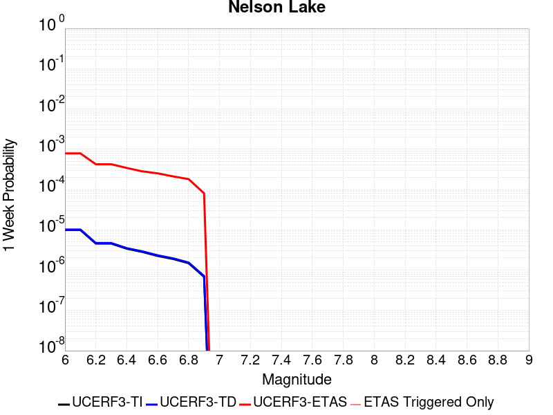 |  |  |  |

| Magnitude | 1 wk TI Prob | 1 wk TD Prob | 1 wk ETAS Prob | 1 wk ETAS/TD Gain | 1 wk ETAS Triggered Only | 1 mo TI Prob | 1 mo TD Prob | 1 mo ETAS Prob | 1 mo ETAS/TD Gain | 1 mo ETAS Triggered Only | 1 yr TI Prob | 1 yr TD Prob | 1 yr ETAS Prob | 1 yr ETAS/TD Gain | 1 yr ETAS Triggered Only | 10 yr TI Prob | 10 yr TD Prob | 10 yr ETAS Prob | 10 yr ETAS/TD Gain | 10 yr ETAS Triggered Only |
|-----|-----|-----|-----|-----|-----|-----|-----|-----|-----|-----|-----|-----|-----|-----|-----|-----|-----|-----|-----|-----|
| 6.0 | 9.913453E-6 | 1.0192255E-5 | 7.901843E-4 | 77.527916 | 7.8E-4 | 4.2485535E-5 | 4.3680422E-5 | 0.001403621 | 32.13387 | 0.00136 | 5.1713863E-4 | 5.316897E-4 | 0.0036100522 | 6.7897725 | 0.00308 | 0.0051593683 | 0.005305204 | 0.011014752 | 2.0762165 | 0.00574 |
| 6.1 | 9.913453E-6 | 1.0192255E-5 | 7.901843E-4 | 77.527916 | 7.8E-4 | 4.2485535E-5 | 4.3680422E-5 | 0.001403621 | 32.13387 | 0.00136 | 5.1713863E-4 | 5.316897E-4 | 0.0036100522 | 6.7897725 | 0.00308 | 0.0051593683 | 0.005305204 | 0.011014752 | 2.0762165 | 0.00574 |
| 6.2 | 4.5596407E-6 | 4.696313E-6 | 4.2469433E-4 | 90.431435 | 4.2E-4 | 1.954117E-5 | 2.0126909E-5 | 7.301126E-4 | 36.275448 | 7.1E-4 | 2.3788778E-4 | 2.4501883E-4 | 0.0017446512 | 7.1204786 | 0.0015 | 0.0023763329 | 0.0024476128 | 0.005310588 | 2.169701 | 0.00287 |
| 6.3 | 4.5596407E-6 | 4.696313E-6 | 4.2469433E-4 | 90.431435 | 4.2E-4 | 1.954117E-5 | 2.0126909E-5 | 7.301126E-4 | 36.275448 | 7.1E-4 | 2.3788778E-4 | 2.4501883E-4 | 0.0017446512 | 7.1204786 | 0.0015 | 0.0023763329 | 0.0024476128 | 0.005310588 | 2.169701 | 0.00287 |
| 6.4 | 3.4025713E-6 | 3.5098972E-6 | 3.435087E-4 | 97.86859 | 3.4E-4 | 1.4582367E-5 | 1.5042335E-5 | 5.4503436E-4 | 36.23336 | 5.3E-4 | 1.7752586E-4 | 1.8312587E-4 | 0.0013329153 | 7.2786837 | 0.00115 | 0.001773841 | 0.0018298327 | 0.0040457705 | 2.2110057 | 0.00222 |
| 6.5 | 2.8352947E-6 | 2.927856E-6 | 2.8292704E-4 | 96.632835 | 2.8E-4 | 1.2151207E-5 | 1.2547898E-5 | 4.7254213E-4 | 37.659065 | 4.6E-4 | 1.479309E-4 | 1.5276071E-4 | 0.0010926172 | 7.152475 | 9.4E-4 | 0.0014783246 | 0.0015266308 | 0.0034436998 | 2.2557514 | 0.00192 |
| 6.6 | 2.251518E-6 | 2.3290677E-6 | 2.523285E-4 | 108.338844 | 2.5E-4 | 9.649328E-6 | 9.981683E-6 | 4.299775E-4 | 43.07665 | 4.2E-4 | 1.1747423E-4 | 1.2152085E-4 | 9.614188E-4 | 7.9115543 | 8.4E-4 | 0.0011741214 | 0.0012146058 | 0.0028626015 | 2.3568156 | 0.00165 |
| 6.7 | 1.8911853E-6 | 1.9591396E-6 | 2.1195873E-4 | 108.1897 | 2.1E-4 | 8.105055E-6 | 8.39629E-6 | 3.183937E-4 | 37.92076 | 3.1E-4 | 9.867457E-5 | 1.0222061E-4 | 7.721521E-4 | 7.553781 | 6.7E-4 | 9.863076E-4 | 0.0010217935 | 0.002420363 | 2.3687398 | 0.0014 |
| 6.8 | 1.4874814E-6 | 1.5438305E-6 | 1.8154355E-4 | 117.59293 | 1.8E-4 | 6.374905E-6 | 6.6164025E-6 | 2.4661483E-4 | 37.273247 | 2.4E-4 | 7.76117E-5 | 8.055224E-5 | 6.4050715E-4 | 7.95145 | 5.6E-4 | 7.75846E-4 | 8.0528157E-4 | 0.0019243796 | 2.3896978 | 0.00112 |
| 6.9 | 6.835972E-7 | 7.1399285E-7 | 8.071394E-5 | 113.04586 | 8.0E-5 | 2.9296991E-6 | 3.0599674E-6 | 1.1305963E-4 | 36.947987 | 1.1E-4 | 3.56685E-5 | 3.7254784E-5 | 2.8724546E-4 | 7.710297 | 2.5E-4 | 3.5662777E-4 | 3.7251666E-4 | 9.223118E-4 | 2.475894 | 5.5E-4 |

## So Sierra Nevada
*[(top)](#table-of-contents)*

| 1 Week | 1 Month | 1 Year | 10 Year |
|-----|-----|-----|-----|
|  |  |  |  |

| Magnitude | 1 wk TI Prob | 1 wk TD Prob | 1 wk ETAS Prob | 1 wk ETAS/TD Gain | 1 wk ETAS Triggered Only | 1 mo TI Prob | 1 mo TD Prob | 1 mo ETAS Prob | 1 mo ETAS/TD Gain | 1 mo ETAS Triggered Only | 1 yr TI Prob | 1 yr TD Prob | 1 yr ETAS Prob | 1 yr ETAS/TD Gain | 1 yr ETAS Triggered Only | 10 yr TI Prob | 10 yr TD Prob | 10 yr ETAS Prob | 10 yr ETAS/TD Gain | 10 yr ETAS Triggered Only |
|-----|-----|-----|-----|-----|-----|-----|-----|-----|-----|-----|-----|-----|-----|-----|-----|-----|-----|-----|-----|-----|
| 6.0 | 1.15488665E-5 | 1.1079612E-5 | 0.0019010587 | 171.58171 | 0.00189 | 4.9494203E-5 | 4.7483256E-5 | 0.0026473599 | 55.753544 | 0.0026 | 6.024253E-4 | 5.779681E-4 | 0.0050453846 | 8.729522 | 0.00447 | 0.006007948 | 0.005765918 | 0.012427286 | 2.1553006 | 0.0067 |
| 6.1 | 1.15488665E-5 | 1.1079612E-5 | 0.0019010587 | 171.58171 | 0.00189 | 4.9494203E-5 | 4.7483256E-5 | 0.0026473599 | 55.753544 | 0.0026 | 6.024253E-4 | 5.779681E-4 | 0.0050453846 | 8.729522 | 0.00447 | 0.006007948 | 0.005765918 | 0.012427286 | 2.1553006 | 0.0067 |
| 6.2 | 1.15488665E-5 | 1.1079612E-5 | 0.0019010587 | 171.58171 | 0.00189 | 4.9494203E-5 | 4.7483256E-5 | 0.0026473599 | 55.753544 | 0.0026 | 6.024253E-4 | 5.779681E-4 | 0.0050453846 | 8.729522 | 0.00447 | 0.006007948 | 0.005765918 | 0.012427286 | 2.1553006 | 0.0067 |
| 6.3 | 1.15488665E-5 | 1.1079612E-5 | 0.0019010587 | 171.58171 | 0.00189 | 4.9494203E-5 | 4.7483256E-5 | 0.0026473599 | 55.753544 | 0.0026 | 6.024253E-4 | 5.779681E-4 | 0.0050453846 | 8.729522 | 0.00447 | 0.006007948 | 0.005765918 | 0.012427286 | 2.1553006 | 0.0067 |
| 6.4 | 1.15488665E-5 | 1.1079612E-5 | 0.0019010587 | 171.58171 | 0.00189 | 4.9494203E-5 | 4.7483256E-5 | 0.0026473599 | 55.753544 | 0.0026 | 6.024253E-4 | 5.779681E-4 | 0.0050453846 | 8.729522 | 0.00447 | 0.006007948 | 0.005765918 | 0.012427286 | 2.1553006 | 0.0067 |
| 6.5 | 1.15488665E-5 | 1.1079612E-5 | 0.0019010587 | 171.58171 | 0.00189 | 4.9494203E-5 | 4.7483256E-5 | 0.0026473599 | 55.753544 | 0.0026 | 6.024253E-4 | 5.779681E-4 | 0.0050453846 | 8.729522 | 0.00447 | 0.006007948 | 0.005765918 | 0.012427286 | 2.1553006 | 0.0067 |
| 6.6 | 7.587044E-6 | 6.9356042E-6 | 0.0010469283 | 150.94984 | 0.00104 | 3.2515498E-5 | 2.9723697E-5 | 0.0014396817 | 48.43549 | 0.00141 | 3.9580427E-4 | 3.6182883E-4 | 0.0027709568 | 7.658198 | 0.00241 | 0.003951 | 0.0036126887 | 0.0071199723 | 1.9708235 | 0.00352 |
| 6.7 | 7.587044E-6 | 6.9356042E-6 | 0.0010469283 | 150.94984 | 0.00104 | 3.2515498E-5 | 2.9723697E-5 | 0.0014396817 | 48.43549 | 0.00141 | 3.9580427E-4 | 3.6182883E-4 | 0.0027709568 | 7.658198 | 0.00241 | 0.003951 | 0.0036126887 | 0.0071199723 | 1.9708235 | 0.00352 |
| 6.8 | 5.9026956E-6 | 5.179362E-6 | 8.051752E-4 | 155.45839 | 8.0E-4 | 2.5297022E-5 | 2.2197082E-5 | 0.0010521743 | 47.401463 | 0.00103 | 3.0794772E-4 | 2.7021713E-4 | 0.0019197713 | 7.1045504 | 0.00165 | 0.0030752132 | 0.002699002 | 0.005122443 | 1.8979028 | 0.00243 |
| 6.9 | 5.0118915E-6 | 4.2523943E-6 | 6.142498E-4 | 144.44798 | 6.1E-4 | 2.1479358E-5 | 1.8224424E-5 | 8.482093E-4 | 46.542446 | 8.3E-4 | 2.614798E-4 | 2.2186051E-4 | 0.0015115743 | 6.8131742 | 0.00129 | 0.0026117235 | 0.0022164627 | 0.00407234 | 1.837315 | 0.00186 |
| 7.0 | 4.4924795E-6 | 3.7138868E-6 | 5.2371196E-4 | 141.01451 | 5.2E-4 | 1.925334E-5 | 1.5916565E-5 | 7.2590524E-4 | 45.606907 | 7.1E-4 | 2.3438422E-4 | 1.9376757E-4 | 0.0012835563 | 6.624206 | 0.00109 | 0.0023413717 | 0.0019360491 | 0.0034830482 | 1.7990495 | 0.00155 |
| 7.1 | 3.9118436E-6 | 3.1119469E-6 | 3.9311073E-4 | 126.32308 | 3.9E-4 | 1.6764936E-5 | 1.333685E-5 | 5.433298E-4 | 40.738987 | 5.3E-4 | 2.0409399E-4 | 1.6236462E-4 | 0.0010122266 | 6.2342806 | 8.5E-4 | 0.0020390663 | 0.0016225161 | 0.002780634 | 1.713779 | 0.00116 |
| 7.2 | 3.4200818E-6 | 2.6054236E-6 | 2.5260478E-4 | 96.95344 | 2.5E-4 | 1.4657411E-5 | 1.11660565E-5 | 3.6116215E-4 | 32.344646 | 3.5E-4 | 1.7843937E-4 | 1.3593875E-4 | 7.2585855E-4 | 5.3395996 | 5.9E-4 | 0.0017829615 | 0.0013586058 | 0.002137546 | 1.573338 | 7.8E-4 |
| 7.3 | 2.6593618E-6 | 1.8283897E-6 | 1.5182812E-4 | 83.03925 | 1.5E-4 | 1.13972155E-5 | 7.8359335E-6 | 2.2783421E-4 | 29.075565 | 2.2E-4 | 1.3875226E-4 | 9.539862E-5 | 4.3536618E-4 | 4.563653 | 3.4E-4 | 0.0013866565 | 9.536055E-4 | 0.0014031765 | 1.4714433 | 4.5E-4 |
| 7.4 | 2.2577992E-6 | 1.4364078E-6 | 8.1436294E-5 | 56.694412 | 8.0E-5 | 9.676246E-6 | 6.1560204E-6 | 1.561551E-4 | 25.366241 | 1.5E-4 | 1.1780193E-4 | 7.4947224E-5 | 3.0493E-4 | 4.0685964 | 2.3E-4 | 0.001177395 | 7.4924453E-4 | 0.0010590123 | 1.4134401 | 3.1E-4 |
| 7.5 | 1.489319E-6 | 7.353661E-7 | 4.0735336E-5 | 55.394638 | 4.0E-5 | 6.3827797E-6 | 3.1515651E-6 | 9.3151284E-5 | 29.55715 | 9.0E-5 | 7.770758E-5 | 3.8369635E-5 | 1.6836464E-4 | 4.3879657 | 1.3E-4 | 7.7680405E-4 | 3.8363054E-4 | 5.5356533E-4 | 1.4429647 | 1.7E-4 |
| 7.6 | 1.0680322E-6 | 4.65941E-7 | 1.0465937E-5 | 22.461935 | 1.0E-5 | 4.577273E-6 | 1.9968884E-6 | 3.1996828E-5 | 16.023342 | 3.0E-5 | 5.5726876E-5 | 2.4311848E-5 | 8.431039E-5 | 3.4678724 | 6.0E-5 | 5.5712904E-4 | 2.4309216E-4 | 3.4306783E-4 | 1.4112667 | 1.0E-4 |
| 7.7 | 5.509146E-7 | 1.5578539E-7 | 1.5578539E-7 | 1.0 | 0.0 | 2.3610605E-6 | 6.676515E-7 | 6.676515E-7 | 1.0 | 0.0 | 2.8745531E-5 | 8.128628E-6 | 1.8128547E-5 | 2.2302098 | 1.0E-5 | 2.8741814E-4 | 8.128342E-5 | 1.11280984E-4 | 1.369049 | 3.0E-5 |

## Towne Pass
*[(top)](#table-of-contents)*

| 1 Week | 1 Month | 1 Year | 10 Year |
|-----|-----|-----|-----|
|  |  |  |  |

| Magnitude | 1 wk TI Prob | 1 wk TD Prob | 1 wk ETAS Prob | 1 wk ETAS/TD Gain | 1 wk ETAS Triggered Only | 1 mo TI Prob | 1 mo TD Prob | 1 mo ETAS Prob | 1 mo ETAS/TD Gain | 1 mo ETAS Triggered Only | 1 yr TI Prob | 1 yr TD Prob | 1 yr ETAS Prob | 1 yr ETAS/TD Gain | 1 yr ETAS Triggered Only | 10 yr TI Prob | 10 yr TD Prob | 10 yr ETAS Prob | 10 yr ETAS/TD Gain | 10 yr ETAS Triggered Only |
|-----|-----|-----|-----|-----|-----|-----|-----|-----|-----|-----|-----|-----|-----|-----|-----|-----|-----|-----|-----|-----|
| 6.0 | 3.849728E-6 | 3.894542E-6 | 0.0012038898 | 309.1223 | 0.0012 | 1.649873E-5 | 1.6690812E-5 | 0.0020766563 | 124.419136 | 0.00206 | 2.0085352E-4 | 2.0319606E-4 | 0.003942436 | 19.402128 | 0.00374 | 0.0020067208 | 0.0020305319 | 0.008227922 | 4.052102 | 0.00621 |
| 6.1 | 3.849728E-6 | 3.894542E-6 | 0.0012038898 | 309.1223 | 0.0012 | 1.649873E-5 | 1.6690812E-5 | 0.0020766563 | 124.419136 | 0.00206 | 2.0085352E-4 | 2.0319606E-4 | 0.003942436 | 19.402128 | 0.00374 | 0.0020067208 | 0.0020305319 | 0.008227922 | 4.052102 | 0.00621 |
| 6.2 | 3.849728E-6 | 3.894542E-6 | 0.0012038898 | 309.1223 | 0.0012 | 1.649873E-5 | 1.6690812E-5 | 0.0020766563 | 124.419136 | 0.00206 | 2.0085352E-4 | 2.0319606E-4 | 0.003942436 | 19.402128 | 0.00374 | 0.0020067208 | 0.0020305319 | 0.008227922 | 4.052102 | 0.00621 |
| 6.3 | 3.849728E-6 | 3.894542E-6 | 0.0012038898 | 309.1223 | 0.0012 | 1.649873E-5 | 1.6690812E-5 | 0.0020766563 | 124.419136 | 0.00206 | 2.0085352E-4 | 2.0319606E-4 | 0.003942436 | 19.402128 | 0.00374 | 0.0020067208 | 0.0020305319 | 0.008227922 | 4.052102 | 0.00621 |
| 6.4 | 3.849728E-6 | 3.894542E-6 | 0.0012038898 | 309.1223 | 0.0012 | 1.649873E-5 | 1.6690812E-5 | 0.0020766563 | 124.419136 | 0.00206 | 2.0085352E-4 | 2.0319606E-4 | 0.003942436 | 19.402128 | 0.00374 | 0.0020067208 | 0.0020305319 | 0.008227922 | 4.052102 | 0.00621 |
| 6.5 | 1.1953545E-6 | 1.2030526E-6 | 2.112028E-4 | 175.55576 | 2.1E-4 | 5.1229376E-6 | 5.15593E-6 | 4.4515365E-4 | 86.33819 | 4.4E-4 | 6.236998E-5 | 6.277176E-5 | 7.9272594E-4 | 12.628703 | 7.3E-4 | 6.235248E-4 | 6.2755204E-4 | 0.0017668366 | 2.8154426 | 0.00114 |
| 6.6 | 1.1953545E-6 | 1.2030526E-6 | 2.112028E-4 | 175.55576 | 2.1E-4 | 5.1229376E-6 | 5.15593E-6 | 4.4515365E-4 | 86.33819 | 4.4E-4 | 6.236998E-5 | 6.277176E-5 | 7.9272594E-4 | 12.628703 | 7.3E-4 | 6.235248E-4 | 6.2755204E-4 | 0.0017668366 | 2.8154426 | 0.00114 |
| 6.7 | 8.375951E-7 | 8.410676E-7 | 1.2084097E-4 | 143.67569 | 1.2E-4 | 3.5896885E-6 | 3.6045708E-6 | 2.736036E-4 | 75.904625 | 2.7E-4 | 4.370358E-5 | 4.3884826E-5 | 4.8386553E-4 | 11.0258045 | 4.4E-4 | 4.3694986E-4 | 4.3876728E-4 | 0.0011084733 | 2.5263352 | 6.7E-4 |
| 6.8 | 6.38041E-7 | 6.3921624E-7 | 9.063916E-5 | 141.79733 | 9.0E-5 | 2.7344586E-6 | 2.7394954E-6 | 1.8273901E-4 | 66.70535 | 1.8E-4 | 3.3291526E-5 | 3.3352884E-5 | 3.0334387E-4 | 9.094982 | 2.7E-4 | 3.3286537E-4 | 3.334826E-4 | 7.8333257E-4 | 2.3489456 | 4.5E-4 |
| 6.9 | 5.3460053E-7 | 5.345339E-7 | 8.053449E-5 | 150.66302 | 8.0E-5 | 2.2911431E-6 | 2.2908578E-6 | 1.622905E-4 | 70.842674 | 1.6E-4 | 2.789431E-5 | 2.7890868E-5 | 2.5788444E-4 | 9.246197 | 2.3E-4 | 2.789081E-4 | 2.78877E-4 | 6.58771E-4 | 2.362228 | 3.8E-4 |
| 7.0 | 3.557783E-7 | 3.5324283E-7 | 6.035322E-5 | 170.85477 | 6.0E-5 | 1.5247632E-6 | 1.513897E-6 | 1.01513746E-4 | 67.05459 | 1.0E-4 | 1.8563835E-5 | 1.8431549E-5 | 1.3842934E-4 | 7.510456 | 1.2E-4 | 1.8562283E-4 | 1.8430105E-4 | 3.6426788E-4 | 1.9764829 | 1.8E-4 |
| 7.1 | 3.037942E-7 | 3.0002275E-7 | 4.0300012E-5 | 134.32318 | 4.0E-5 | 1.3019744E-6 | 1.2858112E-6 | 8.128571E-5 | 63.21745 | 8.0E-5 | 1.5851423E-5 | 1.5654647E-5 | 1.1565308E-4 | 7.3877797 | 1.0E-4 | 1.5850292E-4 | 1.5653619E-4 | 3.0651272E-4 | 1.9580948 | 1.5E-4 |
| 7.2 | 2.0808248E-7 | 2.0217735E-7 | 3.020217E-5 | 149.38455 | 3.0E-5 | 8.917818E-7 | 8.6647407E-7 | 6.0866423E-5 | 70.2461 | 6.0E-5 | 1.0857389E-5 | 1.0549275E-5 | 9.0548434E-5 | 8.58338 | 8.0E-5 | 1.0856859E-4 | 1.0548821E-4 | 2.154766E-4 | 2.0426605 | 1.1E-4 |
| 7.3 | 1.1162073E-7 | 1.0636902E-7 | 2.0106367E-5 | 189.02464 | 2.0E-5 | 4.7837443E-7 | 4.5586717E-7 | 3.0455854E-5 | 66.80862 | 3.0E-5 | 5.8241935E-6 | 5.5501705E-6 | 4.554995E-5 | 8.206945 | 4.0E-5 | 5.8240406E-5 | 5.550052E-5 | 1.2549663E-4 | 2.2611794 | 7.0E-5 |

## San Andreas (San Bernardino N)
*[(top)](#table-of-contents)*

| 1 Week | 1 Month | 1 Year | 10 Year |
|-----|-----|-----|-----|
|  |  |  |  |

| Magnitude | 1 wk TI Prob | 1 wk TD Prob | 1 wk ETAS Prob | 1 wk ETAS/TD Gain | 1 wk ETAS Triggered Only | 1 mo TI Prob | 1 mo TD Prob | 1 mo ETAS Prob | 1 mo ETAS/TD Gain | 1 mo ETAS Triggered Only | 1 yr TI Prob | 1 yr TD Prob | 1 yr ETAS Prob | 1 yr ETAS/TD Gain | 1 yr ETAS Triggered Only | 10 yr TI Prob | 10 yr TD Prob | 10 yr ETAS Prob | 10 yr ETAS/TD Gain | 10 yr ETAS Triggered Only |
|-----|-----|-----|-----|-----|-----|-----|-----|-----|-----|-----|-----|-----|-----|-----|-----|-----|-----|-----|-----|-----|
| 6.0 | 1.4273766E-4 | 3.160784E-4 | 0.0017156359 | 5.427881 | 0.0014 | 6.115894E-4 | 0.0013539245 | 0.003211406 | 2.3719242 | 0.00186 | 0.0074207084 | 0.016360939 | 0.019370874 | 1.1839708 | 0.00306 | 0.07177748 | 0.15021163 | 0.1539422 | 1.0248355 | 0.00439 |
| 6.1 | 1.4273766E-4 | 3.160784E-4 | 0.0017156359 | 5.427881 | 0.0014 | 6.115894E-4 | 0.0013539245 | 0.003211406 | 2.3719242 | 0.00186 | 0.0074207084 | 0.016360939 | 0.019370874 | 1.1839708 | 0.00306 | 0.07177748 | 0.15021163 | 0.1539422 | 1.0248355 | 0.00439 |
| 6.2 | 1.4273766E-4 | 3.160784E-4 | 0.0017156359 | 5.427881 | 0.0014 | 6.115894E-4 | 0.0013539245 | 0.003211406 | 2.3719242 | 0.00186 | 0.0074207084 | 0.016360939 | 0.019370874 | 1.1839708 | 0.00306 | 0.07177748 | 0.15021163 | 0.1539422 | 1.0248355 | 0.00439 |
| 6.3 | 1.3730655E-4 | 3.0512668E-4 | 0.0016947025 | 5.554095 | 0.00139 | 5.883239E-4 | 0.001307036 | 0.003154618 | 2.413566 | 0.00185 | 0.0071393442 | 0.015798455 | 0.018780585 | 1.1887609 | 0.00303 | 0.06914291 | 0.1455135 | 0.14923906 | 1.0256028 | 0.00436 |
| 6.4 | 1.3730655E-4 | 3.0512668E-4 | 0.0016947025 | 5.554095 | 0.00139 | 5.883239E-4 | 0.001307036 | 0.003154618 | 2.413566 | 0.00185 | 0.0071393442 | 0.015798455 | 0.018780585 | 1.1887609 | 0.00303 | 0.06914291 | 0.1455135 | 0.14923906 | 1.0256028 | 0.00436 |
| 6.5 | 1.2942807E-4 | 2.8927144E-4 | 0.0016688722 | 5.7692256 | 0.00138 | 5.545738E-4 | 0.0012391509 | 0.0030668832 | 2.4749877 | 0.00183 | 0.0067310524 | 0.014983548 | 0.017928747 | 1.1965622 | 0.00299 | 0.06530788 | 0.13865088 | 0.14237191 | 1.0268373 | 0.00432 |
| 6.6 | 1.1125901E-4 | 2.5365927E-4 | 0.0016333092 | 6.438989 | 0.00138 | 4.767372E-4 | 0.0010866605 | 0.0028946938 | 2.6638436 | 0.00181 | 0.005788839 | 0.0131504685 | 0.016081411 | 1.2228775 | 0.00297 | 0.056403454 | 0.12300496 | 0.12677604 | 1.0306579 | 0.0043 |
| 6.7 | 1.02209575E-4 | 2.3500937E-4 | 0.0016046874 | 6.8281846 | 0.00137 | 4.3796748E-4 | 0.0010067957 | 0.0028049834 | 2.7860503 | 0.0018 | 0.0053192247 | 0.012189267 | 0.0151033085 | 1.2390662 | 0.00295 | 0.051936906 | 0.114792764 | 0.11851949 | 1.0324647 | 0.00421 |
| 6.8 | 9.610582E-5 | 2.2026796E-4 | 0.0015899662 | 7.218327 | 0.00137 | 4.1181705E-4 | 9.436647E-4 | 0.0027419662 | 2.905657 | 0.0018 | 0.0050023515 | 0.011428859 | 0.014335259 | 1.2543036 | 0.00294 | 0.048912346 | 0.10820469 | 0.111941315 | 1.0345329 | 0.00419 |
| 6.9 | 9.3877505E-5 | 2.1482339E-4 | 0.0015745312 | 7.3294215 | 0.00136 | 4.0227012E-4 | 9.203475E-4 | 0.0027087 | 2.9431276 | 0.00179 | 0.0048866454 | 0.011147907 | 0.014035355 | 1.2590126 | 0.00292 | 0.04780577 | 0.105798274 | 0.10950921 | 1.0350755 | 0.00415 |
| 7.0 | 9.1019785E-5 | 2.0809306E-4 | 0.0015678101 | 7.534178 | 0.00136 | 3.900265E-4 | 8.915232E-4 | 0.0026699363 | 2.994803 | 0.00178 | 0.0047382377 | 0.0108004995 | 0.013669178 | 1.265606 | 0.0029 | 0.046384744 | 0.10276815 | 0.10646475 | 1.0359702 | 0.00412 |
| 7.1 | 8.771155E-5 | 1.9983841E-4 | 0.0015595666 | 7.8041387 | 0.00136 | 3.758525E-4 | 8.5616973E-4 | 0.0026346457 | 3.077247 | 0.00178 | 0.0045664064 | 0.010374243 | 0.013244158 | 1.2766385 | 0.0029 | 0.044737056 | 0.09907644 | 0.102770224 | 1.0372822 | 0.0041 |
| 7.2 | 8.0830236E-5 | 1.8389444E-4 | 0.0015336461 | 8.339818 | 0.00135 | 3.4636928E-4 | 7.8788114E-4 | 0.0025365024 | 3.2193973 | 0.00175 | 0.0042088944 | 0.009550368 | 0.012383055 | 1.2966049 | 0.00286 | 0.041300658 | 0.09180518 | 0.09549246 | 1.0401641 | 0.00406 |
| 7.3 | 7.7668235E-5 | 1.7333007E-4 | 0.0015230961 | 8.787258 | 0.00135 | 3.328214E-4 | 7.426318E-4 | 0.0024813397 | 3.3412786 | 0.00174 | 0.0040445733 | 0.009004138 | 0.011808656 | 1.3114699 | 0.00283 | 0.03971748 | 0.08706761 | 0.0907376 | 1.042151 | 0.00402 |
| 7.4 | 7.520177E-5 | 1.655312E-4 | 0.0015053094 | 9.093811 | 0.00134 | 3.2225347E-4 | 7.092266E-4 | 0.0024379997 | 3.437547 | 0.00173 | 0.0039163795 | 0.008600714 | 0.011376631 | 1.3227544 | 0.0028 | 0.038480744 | 0.08352157 | 0.08716915 | 1.0436723 | 0.00398 |
| 7.5 | 7.274697E-5 | 1.584075E-4 | 0.0014781985 | 9.331618 | 0.00132 | 3.1173544E-4 | 6.7871273E-4 | 0.002387552 | 3.5177653 | 0.00171 | 0.003788775 | 0.008232076 | 0.010959438 | 1.3313091 | 0.00275 | 0.03724827 | 0.08023654 | 0.08384201 | 1.0449356 | 0.00392 |
| 7.6 | 7.1185845E-5 | 1.5410586E-4 | 0.0014739025 | 9.56422 | 0.00132 | 3.0504653E-4 | 6.602866E-4 | 0.0023591642 | 3.5729396 | 0.0017 | 0.0037076178 | 0.0080094095 | 0.010727463 | 1.3393576 | 0.00274 | 0.036463667 | 0.07822661 | 0.081812315 | 1.0458373 | 0.00389 |
| 7.7 | 6.709961E-5 | 1.4319421E-4 | 0.0014630052 | 10.216929 | 0.00132 | 2.8753807E-4 | 6.135452E-4 | 0.0023025083 | 3.7527933 | 0.00169 | 0.003495157 | 0.0074443663 | 0.010154043 | 1.3639903 | 0.00273 | 0.034406938 | 0.07305558 | 0.07663359 | 1.0489765 | 0.00386 |
| 7.8 | 6.300812E-5 | 1.320343E-4 | 0.0014418614 | 10.920354 | 0.00131 | 2.7000686E-4 | 5.657386E-4 | 0.0022447882 | 3.9678893 | 0.00168 | 0.0032823787 | 0.006866143 | 0.009557536 | 1.3919803 | 0.00271 | 0.032343175 | 0.06771385 | 0.0712845 | 1.0527315 | 0.00383 |
| 7.9 | 4.983037E-5 | 9.7241085E-5 | 0.0011171419 | 11.488374 | 0.00102 | 2.1354125E-4 | 4.1668097E-4 | 0.0017361309 | 4.1665716 | 0.00132 | 0.0025967648 | 0.0050613005 | 0.007190469 | 1.4206762 | 0.00214 | 0.025666296 | 0.050650507 | 0.053422607 | 1.0547299 | 0.00292 |
| 8.0 | 3.2211527E-5 | 5.3306234E-5 | 3.4329077E-4 | 6.4399743 | 2.9E-4 | 1.380421E-4 | 2.2843528E-4 | 6.283439E-4 | 2.750643 | 4.0E-4 | 0.0016793669 | 0.0027776542 | 0.0034757098 | 1.2513112 | 7.0E-4 | 0.016667323 | 0.028362568 | 0.029334206 | 1.0342578 | 0.001 |
| 8.1 | 1.743376E-5 | 1.8823403E-5 | 5.882265E-5 | 3.1249745 | 4.0E-5 | 7.471398E-5 | 8.066923E-5 | 1.4066439E-4 | 1.743718 | 6.0E-5 | 9.0926304E-4 | 9.81706E-4 | 0.0011015882 | 1.1221162 | 1.2E-4 | 0.009055517 | 0.010483979 | 0.0106521975 | 1.0160452 | 1.7E-4 |
| 8.2 | 7.831616E-6 | 5.1540533E-6 | 5.1540533E-6 | 1.0 | 0.0 | 3.3563636E-5 | 2.2088612E-5 | 2.2088612E-5 | 1.0 | 0.0 | 4.0856065E-4 | 2.6889573E-4 | 2.6889573E-4 | 1.0 | 0.0 | 0.004078103 | 0.0030413668 | 0.0030413668 | 1.0 | 0.0 |
| 8.3 | 1.983087E-6 | 7.6564595E-7 | 7.6564595E-7 | 1.0 | 0.0 | 8.498917E-6 | 3.281336E-6 | 3.281336E-6 | 1.0 | 0.0 | 1.034694E-4 | 3.9949547E-5 | 3.9949547E-5 | 1.0 | 0.0 | 0.0010342124 | 4.717979E-4 | 4.717979E-4 | 1.0 | 0.0 |

## Lenwood-Lockhart-Old Woman Springs
*[(top)](#table-of-contents)*

| 1 Week | 1 Month | 1 Year | 10 Year |
|-----|-----|-----|-----|
|  |  |  |  |

| Magnitude | 1 wk TI Prob | 1 wk TD Prob | 1 wk ETAS Prob | 1 wk ETAS/TD Gain | 1 wk ETAS Triggered Only | 1 mo TI Prob | 1 mo TD Prob | 1 mo ETAS Prob | 1 mo ETAS/TD Gain | 1 mo ETAS Triggered Only | 1 yr TI Prob | 1 yr TD Prob | 1 yr ETAS Prob | 1 yr ETAS/TD Gain | 1 yr ETAS Triggered Only | 10 yr TI Prob | 10 yr TD Prob | 10 yr ETAS Prob | 10 yr ETAS/TD Gain | 10 yr ETAS Triggered Only |
|-----|-----|-----|-----|-----|-----|-----|-----|-----|-----|-----|-----|-----|-----|-----|-----|-----|-----|-----|-----|-----|
| 6.0 | 3.744542E-5 | 4.396349E-5 | 0.0013339068 | 30.34124 | 0.00129 | 1.604705E-4 | 1.8840231E-4 | 0.0018680858 | 9.915408 | 0.00168 | 0.0019519776 | 0.0022915571 | 0.0050252783 | 2.1929536 | 0.00274 | 0.019349206 | 0.022697281 | 0.02663581 | 1.1735243 | 0.00403 |
| 6.1 | 3.744542E-5 | 4.396349E-5 | 0.0013339068 | 30.34124 | 0.00129 | 1.604705E-4 | 1.8840231E-4 | 0.0018680858 | 9.915408 | 0.00168 | 0.0019519776 | 0.0022915571 | 0.0050252783 | 2.1929536 | 0.00274 | 0.019349206 | 0.022697281 | 0.02663581 | 1.1735243 | 0.00403 |
| 6.2 | 3.744542E-5 | 4.396349E-5 | 0.0013339068 | 30.34124 | 0.00129 | 1.604705E-4 | 1.8840231E-4 | 0.0018680858 | 9.915408 | 0.00168 | 0.0019519776 | 0.0022915571 | 0.0050252783 | 2.1929536 | 0.00274 | 0.019349206 | 0.022697281 | 0.02663581 | 1.1735243 | 0.00403 |
| 6.3 | 2.1079984E-5 | 2.5354384E-5 | 5.3534145E-4 | 21.114355 | 5.1E-4 | 9.0339665E-5 | 1.0865723E-4 | 8.085812E-4 | 7.441577 | 7.0E-4 | 0.0010993304 | 0.0013221189 | 0.002540506 | 1.9215411 | 0.00122 | 0.010939079 | 0.013144747 | 0.015059247 | 1.1456475 | 0.00194 |
| 6.4 | 2.1079984E-5 | 2.5354384E-5 | 5.3534145E-4 | 21.114355 | 5.1E-4 | 9.0339665E-5 | 1.0865723E-4 | 8.085812E-4 | 7.441577 | 7.0E-4 | 0.0010993304 | 0.0013221189 | 0.002540506 | 1.9215411 | 0.00122 | 0.010939079 | 0.013144747 | 0.015059247 | 1.1456475 | 0.00194 |
| 6.5 | 1.7397282E-5 | 2.0663285E-5 | 4.406546E-4 | 21.325487 | 4.2E-4 | 7.455765E-5 | 8.8554E-5 | 6.3850527E-4 | 7.2103496 | 5.5E-4 | 9.073613E-4 | 0.0010776235 | 0.002036589 | 1.8898892 | 9.6E-4 | 0.009036654 | 0.010725273 | 0.012238863 | 1.1411237 | 0.00153 |
| 6.6 | 1.52050325E-5 | 1.7680086E-5 | 3.9767337E-4 | 22.49273 | 3.8E-4 | 6.51628E-5 | 7.576964E-5 | 5.9573026E-4 | 7.862387 | 5.2E-4 | 7.9306826E-4 | 9.221128E-4 | 0.0018013014 | 1.9534501 | 8.8E-4 | 0.007902439 | 0.009183729 | 0.010600596 | 1.1542802 | 0.00143 |
| 6.7 | 1.332523E-5 | 1.5264379E-5 | 3.552592E-4 | 23.273739 | 3.4E-4 | 5.7106878E-5 | 6.541716E-5 | 5.3538644E-4 | 8.184189 | 4.7E-4 | 6.950544E-4 | 7.9616875E-4 | 0.0015855398 | 1.991462 | 7.9E-4 | 0.006928845 | 0.0079337945 | 0.009213559 | 1.1613055 | 0.00129 |
| 6.8 | 1.1525329E-5 | 1.3031365E-5 | 2.9302773E-4 | 22.486341 | 2.8E-4 | 4.9393333E-5 | 5.5847537E-5 | 4.5582518E-4 | 8.161958 | 4.0E-4 | 6.011979E-4 | 6.7973585E-4 | 0.0013093076 | 1.9262006 | 6.3E-4 | 0.00599574 | 0.0067770192 | 0.007839768 | 1.1568165 | 0.00107 |
| 6.9 | 1.0253909E-5 | 1.1514835E-5 | 2.5151207E-4 | 21.84244 | 2.4E-4 | 4.3944583E-5 | 4.934838E-5 | 3.7933208E-4 | 7.68682 | 3.3E-4 | 5.3489394E-4 | 6.006545E-4 | 0.0011403301 | 1.8984793 | 5.4E-4 | 0.0053360825 | 0.0059906896 | 0.006875358 | 1.1476738 | 8.9E-4 |
| 7.0 | 8.104563E-6 | 8.99143E-6 | 1.8898981E-4 | 21.01888 | 1.8E-4 | 3.4733377E-5 | 3.853415E-5 | 2.8852452E-4 | 7.4875026 | 2.5E-4 | 4.2279682E-4 | 4.6905465E-4 | 8.7886234E-4 | 1.8736886 | 4.1E-4 | 0.0042199334 | 0.0046808943 | 0.005337805 | 1.1403387 | 6.6E-4 |
| 7.1 | 6.7986157E-6 | 7.5159796E-6 | 1.6751478E-4 | 22.287817 | 1.6E-4 | 2.91366E-5 | 3.2210955E-5 | 2.4220419E-4 | 7.519311 | 2.1E-4 | 3.5468035E-4 | 3.9209996E-4 | 7.219706E-4 | 1.8412921 | 3.3E-4 | 0.003541148 | 0.003914298 | 0.0044521843 | 1.1374158 | 5.4E-4 |
| 7.2 | 5.6893327E-6 | 6.280132E-6 | 1.3627931E-4 | 21.700071 | 1.3E-4 | 2.4382627E-5 | 2.6914584E-5 | 1.9691001E-4 | 7.316108 | 1.7E-4 | 2.9681803E-4 | 3.276378E-4 | 5.7755585E-4 | 1.7627877 | 2.5E-4 | 0.002964219 | 0.003271746 | 0.003690372 | 1.1279519 | 4.2E-4 |
| 7.3 | 4.253348E-6 | 4.707075E-6 | 1.14706556E-4 | 24.368969 | 1.1E-4 | 1.8228506E-5 | 2.017303E-5 | 1.6017021E-4 | 7.9398184 | 1.4E-4 | 2.2190946E-4 | 2.455808E-4 | 4.4553168E-4 | 1.8141959 | 2.0E-4 | 0.00221688 | 0.0024532753 | 0.0027724903 | 1.1301179 | 3.2E-4 |
| 7.4 | 2.5448119E-6 | 2.8520594E-6 | 8.285183E-5 | 29.049826 | 8.0E-5 | 1.0906291E-5 | 1.2223064E-5 | 1.1222184E-4 | 9.181154 | 1.0E-4 | 1.3277601E-4 | 1.4880729E-4 | 2.8878645E-4 | 1.9406741 | 1.4E-4 | 0.001326967 | 0.0014872387 | 0.0017069115 | 1.1477052 | 2.2E-4 |
| 7.5 | 4.3706837E-8 | 4.562909E-8 | 4.562909E-8 | 1.0 | 0.0 | 1.8731501E-7 | 1.9555324E-7 | 1.0195551E-5 | 52.13696 | 1.0E-5 | 2.2805577E-6 | 2.3808586E-6 | 1.2380835E-5 | 5.2001553 | 1.0E-5 | 2.2805343E-5 | 2.3808387E-5 | 3.3808148E-5 | 1.4200101 | 1.0E-5 |

## Bicycle Lake
*[(top)](#table-of-contents)*

| 1 Week | 1 Month | 1 Year | 10 Year |
|-----|-----|-----|-----|
|  |  |  |  |

| Magnitude | 1 wk TI Prob | 1 wk TD Prob | 1 wk ETAS Prob | 1 wk ETAS/TD Gain | 1 wk ETAS Triggered Only | 1 mo TI Prob | 1 mo TD Prob | 1 mo ETAS Prob | 1 mo ETAS/TD Gain | 1 mo ETAS Triggered Only | 1 yr TI Prob | 1 yr TD Prob | 1 yr ETAS Prob | 1 yr ETAS/TD Gain | 1 yr ETAS Triggered Only | 10 yr TI Prob | 10 yr TD Prob | 10 yr ETAS Prob | 10 yr ETAS/TD Gain | 10 yr ETAS Triggered Only |
|-----|-----|-----|-----|-----|-----|-----|-----|-----|-----|-----|-----|-----|-----|-----|-----|-----|-----|-----|-----|-----|
| 6.0 | 1.9621975E-5 | 2.2097078E-5 | 4.32088E-4 | 19.55408 | 4.1E-4 | 8.4091465E-5 | 9.4699084E-5 | 8.146309E-4 | 8.60231 | 7.2E-4 | 0.0010233327 | 0.0011524865 | 0.0028505274 | 2.4733715 | 0.0017 | 0.01018633 | 0.011478408 | 0.015135938 | 1.3186444 | 0.0037 |
| 6.1 | 1.9621975E-5 | 2.2097078E-5 | 4.32088E-4 | 19.55408 | 4.1E-4 | 8.4091465E-5 | 9.4699084E-5 | 8.146309E-4 | 8.60231 | 7.2E-4 | 0.0010233327 | 0.0011524865 | 0.0028505274 | 2.4733715 | 0.0017 | 0.01018633 | 0.011478408 | 0.015135938 | 1.3186444 | 0.0037 |
| 6.2 | 9.9971285E-6 | 1.125564E-5 | 2.812526E-4 | 24.987705 | 2.7E-4 | 4.2844134E-5 | 4.8237856E-5 | 5.082157E-4 | 10.535619 | 4.6E-4 | 5.2150246E-4 | 5.871897E-4 | 0.001626579 | 2.7701085 | 0.00104 | 0.0052028033 | 0.005861487 | 0.008237477 | 1.4053564 | 0.00239 |
| 6.3 | 9.589428E-6 | 1.0798346E-5 | 2.8079544E-4 | 26.00356 | 2.7E-4 | 4.10969E-5 | 4.62781E-5 | 4.8625775E-4 | 10.5072975 | 4.4E-4 | 5.002399E-4 | 5.6334207E-4 | 0.0015727731 | 2.7918618 | 0.00101 | 0.0049911533 | 0.0056242296 | 0.007931181 | 1.4101809 | 0.00232 |
| 6.4 | 9.589428E-6 | 1.0798346E-5 | 2.8079544E-4 | 26.00356 | 2.7E-4 | 4.10969E-5 | 4.62781E-5 | 4.8625775E-4 | 10.5072975 | 4.4E-4 | 5.002399E-4 | 5.6334207E-4 | 0.0015727731 | 2.7918618 | 0.00101 | 0.0049911533 | 0.0056242296 | 0.007931181 | 1.4101809 | 0.00232 |
| 6.5 | 5.557707E-6 | 6.2856016E-6 | 1.8628447E-4 | 29.636698 | 1.8E-4 | 2.3818526E-5 | 2.6938165E-5 | 2.969309E-4 | 11.022684 | 2.7E-4 | 2.8995197E-4 | 3.279497E-4 | 9.577431E-4 | 2.9203963 | 6.3E-4 | 0.0028957394 | 0.0032772934 | 0.0047723777 | 1.4561948 | 0.0015 |
| 6.6 | 4.8742945E-6 | 5.5132896E-6 | 1.4551252E-4 | 26.393047 | 1.4E-4 | 2.0889667E-5 | 2.3628318E-5 | 2.4362312E-4 | 10.310641 | 2.2E-4 | 2.54302E-4 | 2.87663E-4 | 7.975163E-4 | 2.772398 | 5.1E-4 | 0.002540112 | 0.0028754752 | 0.004161766 | 1.4473315 | 0.00129 |
| 6.7 | 3.991108E-6 | 4.5159104E-6 | 1.0451546E-4 | 23.14383 | 1.0E-4 | 1.7104636E-5 | 1.9353902E-5 | 1.9935041E-4 | 10.30027 | 1.8E-4 | 2.0822904E-4 | 2.3563375E-4 | 6.655324E-4 | 2.824436 | 4.3E-4 | 0.0020803404 | 0.0023563374 | 0.0033938868 | 1.4403229 | 0.00104 |

## Paradise
*[(top)](#table-of-contents)*

| 1 Week | 1 Month | 1 Year | 10 Year |
|-----|-----|-----|-----|
| 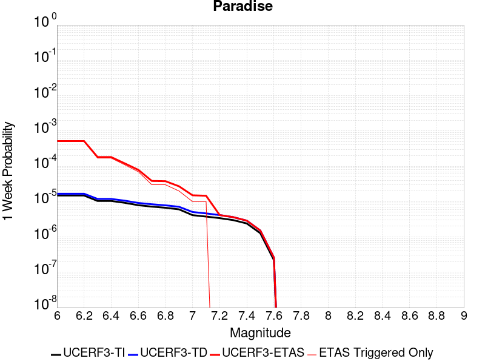 |  |  |  |

| Magnitude | 1 wk TI Prob | 1 wk TD Prob | 1 wk ETAS Prob | 1 wk ETAS/TD Gain | 1 wk ETAS Triggered Only | 1 mo TI Prob | 1 mo TD Prob | 1 mo ETAS Prob | 1 mo ETAS/TD Gain | 1 mo ETAS Triggered Only | 1 yr TI Prob | 1 yr TD Prob | 1 yr ETAS Prob | 1 yr ETAS/TD Gain | 1 yr ETAS Triggered Only | 10 yr TI Prob | 10 yr TD Prob | 10 yr ETAS Prob | 10 yr ETAS/TD Gain | 10 yr ETAS Triggered Only |
|-----|-----|-----|-----|-----|-----|-----|-----|-----|-----|-----|-----|-----|-----|-----|-----|-----|-----|-----|-----|-----|
| 6.0 | 1.4851273E-5 | 1.6694768E-5 | 5.166864E-4 | 30.949001 | 5.0E-4 | 6.364676E-5 | 7.154718E-5 | 8.214935E-4 | 11.481843 | 7.5E-4 | 7.7462377E-4 | 8.707624E-4 | 0.0026192386 | 3.007983 | 0.00175 | 0.0077192914 | 0.008675884 | 0.011798555 | 1.3599254 | 0.00315 |
| 6.1 | 1.4851273E-5 | 1.6694768E-5 | 5.166864E-4 | 30.949001 | 5.0E-4 | 6.364676E-5 | 7.154718E-5 | 8.214935E-4 | 11.481843 | 7.5E-4 | 7.7462377E-4 | 8.707624E-4 | 0.0026192386 | 3.007983 | 0.00175 | 0.0077192914 | 0.008675884 | 0.011798555 | 1.3599254 | 0.00315 |
| 6.2 | 1.4851273E-5 | 1.6694768E-5 | 5.166864E-4 | 30.949001 | 5.0E-4 | 6.364676E-5 | 7.154718E-5 | 8.214935E-4 | 11.481843 | 7.5E-4 | 7.7462377E-4 | 8.707624E-4 | 0.0026192386 | 3.007983 | 0.00175 | 0.0077192914 | 0.008675884 | 0.011798555 | 1.3599254 | 0.00315 |
| 6.3 | 1.0426831E-5 | 1.1888697E-5 | 1.8188667E-4 | 15.299126 | 1.7E-4 | 4.4685654E-5 | 5.09506E-5 | 3.5093533E-4 | 6.8877563 | 3.0E-4 | 5.43912E-4 | 6.201529E-4 | 0.0013397065 | 2.160284 | 7.2E-4 | 0.0054258266 | 0.0061848317 | 0.007496668 | 1.2121054 | 0.00132 |
| 6.4 | 1.0426831E-5 | 1.1888697E-5 | 1.8188667E-4 | 15.299126 | 1.7E-4 | 4.4685654E-5 | 5.09506E-5 | 3.5093533E-4 | 6.8877563 | 3.0E-4 | 5.43912E-4 | 6.201529E-4 | 0.0013397065 | 2.160284 | 7.2E-4 | 0.0054258266 | 0.0061848317 | 0.007496668 | 1.2121054 | 0.00132 |
| 6.5 | 9.25027E-6 | 1.0620037E-5 | 1.2061887E-4 | 11.357669 | 1.1E-4 | 3.964341E-5 | 4.551368E-5 | 2.5550413E-4 | 5.6137877 | 2.1E-4 | 4.8255164E-4 | 5.5399304E-4 | 0.0010237327 | 1.8479161 | 4.7E-4 | 0.0048150513 | 0.0055266195 | 0.0064614243 | 1.169146 | 9.4E-4 |
| 6.6 | 7.904275E-6 | 9.159602E-6 | 7.915896E-5 | 8.642183 | 7.0E-5 | 3.3875025E-5 | 3.925487E-5 | 1.7924937E-4 | 4.5662966 | 1.4E-4 | 4.1235037E-4 | 4.7782718E-4 | 6.8772683E-4 | 1.4392794 | 2.1E-4 | 0.0041158604 | 0.004768395 | 0.005275963 | 1.1064442 | 5.1E-4 |
| 6.7 | 7.2061953E-6 | 8.407326E-6 | 3.8407074E-5 | 4.5682864 | 3.0E-5 | 3.088333E-5 | 3.603092E-5 | 1.2602768E-4 | 3.4977646 | 9.0E-5 | 3.7593965E-4 | 4.3859181E-4 | 5.485436E-4 | 1.2506927 | 1.1E-4 | 0.003753043 | 0.004377631 | 0.004736055 | 1.0818763 | 3.6E-4 |
| 6.8 | 6.6948724E-6 | 7.842242E-6 | 3.7842008E-5 | 4.8254066 | 3.0E-5 | 2.8691995E-5 | 3.3609194E-5 | 1.2360617E-4 | 3.6777487 | 9.0E-5 | 3.4926904E-4 | 4.091187E-4 | 5.090778E-4 | 1.2443279 | 1.0E-4 | 0.003487206 | 0.0040840125 | 0.0043827873 | 1.0731572 | 3.0E-4 |
| 6.9 | 6.0421025E-6 | 7.1306963E-6 | 2.7130554E-5 | 3.8047552 | 2.0E-5 | 2.5894467E-5 | 3.0559786E-5 | 9.055795E-5 | 2.9633045 | 6.0E-5 | 3.1521954E-4 | 3.7200528E-4 | 4.4197924E-4 | 1.1880994 | 7.0E-5 | 0.0031477278 | 0.0037141638 | 0.003973198 | 1.0697423 | 2.6E-4 |
| 7.0 | 4.134091E-6 | 5.0803824E-6 | 1.5080332E-5 | 2.9683456 | 1.0E-5 | 1.7717413E-5 | 2.1772896E-5 | 6.177202E-5 | 2.8371067 | 4.0E-5 | 2.1568815E-4 | 2.650543E-4 | 3.0504368E-4 | 1.1508725 | 4.0E-5 | 0.0021547892 | 0.0026475347 | 0.0027971375 | 1.0565065 | 1.5E-4 |
| 7.1 | 3.7674888E-6 | 4.631936E-6 | 1.463189E-5 | 3.1589146 | 1.0E-5 | 1.6146281E-5 | 1.9851012E-5 | 4.9850416E-5 | 2.511228 | 3.0E-5 | 1.9656324E-4 | 2.4166079E-4 | 2.7165352E-4 | 1.1241109 | 3.0E-5 | 0.0019638946 | 0.0024141306 | 0.0025438168 | 1.0537196 | 1.3E-4 |
| 7.2 | 3.4065345E-6 | 4.156782E-6 | 4.156782E-6 | 1.0 | 0.0 | 1.4599351E-5 | 1.7814667E-5 | 3.7814312E-5 | 2.1226504 | 2.0E-5 | 1.777326E-4 | 2.168735E-4 | 2.3686915E-4 | 1.0921997 | 2.0E-5 | 0.0017759053 | 0.0021667667 | 0.0022765282 | 1.0506569 | 1.1E-4 |
| 7.3 | 2.9934936E-6 | 3.6293673E-6 | 3.6293673E-6 | 1.0 | 0.0 | 1.2829195E-5 | 1.5554348E-5 | 3.5554036E-5 | 2.2857943 | 2.0E-5 | 1.5618425E-4 | 1.8935918E-4 | 2.093554E-4 | 1.1055994 | 2.0E-5 | 0.0015607453 | 0.0018921237 | 0.0019619912 | 1.0369254 | 7.0E-5 |
| 7.4 | 2.4049796E-6 | 2.8890186E-6 | 2.8890186E-6 | 1.0 | 0.0 | 1.0307015E-5 | 1.2381457E-5 | 3.238121E-5 | 2.6152987 | 2.0E-5 | 1.2548068E-4 | 1.5073526E-4 | 1.7073224E-4 | 1.132663 | 2.0E-5 | 0.0012540985 | 0.0015064715 | 0.0015763661 | 1.0463961 | 7.0E-5 |
| 7.5 | 1.2710091E-6 | 1.5134859E-6 | 1.5134859E-6 | 1.0 | 0.0 | 5.44717E-6 | 6.4863593E-6 | 2.648623E-5 | 4.083374 | 2.0E-5 | 6.631728E-5 | 7.896981E-5 | 9.896823E-5 | 1.2532413 | 2.0E-5 | 6.6297496E-4 | 7.895401E-4 | 8.4949273E-4 | 1.0759336 | 6.0E-5 |
| 7.6 | 2.21172E-7 | 2.6040198E-7 | 2.6040198E-7 | 1.0 | 0.0 | 9.478797E-7 | 1.1160082E-6 | 1.1115997E-5 | 9.960498 | 1.0E-5 | 1.1540374E-5 | 1.3587343E-5 | 2.3587207E-5 | 1.7359691 | 1.0E-5 | 1.1539775E-4 | 1.3586794E-4 | 1.4586658E-4 | 1.0735909 | 1.0E-5 |

## Garlic Springs
*[(top)](#table-of-contents)*

| 1 Week | 1 Month | 1 Year | 10 Year |
|-----|-----|-----|-----|
|  |  | 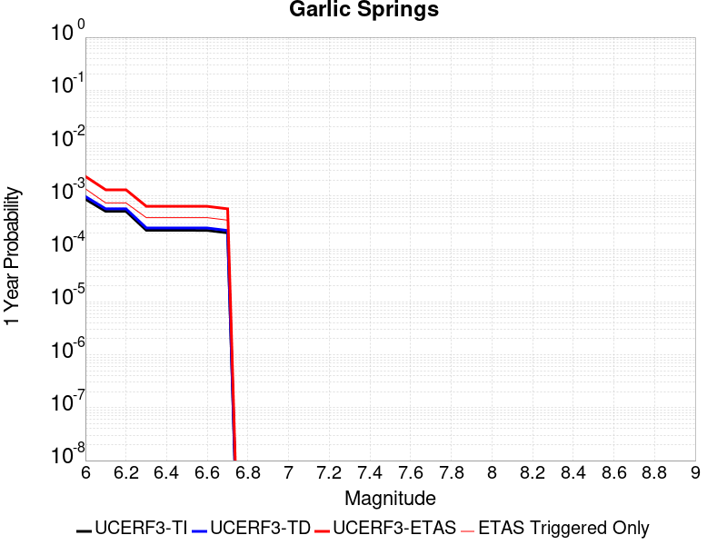 |  |

| Magnitude | 1 wk TI Prob | 1 wk TD Prob | 1 wk ETAS Prob | 1 wk ETAS/TD Gain | 1 wk ETAS Triggered Only | 1 mo TI Prob | 1 mo TD Prob | 1 mo ETAS Prob | 1 mo ETAS/TD Gain | 1 mo ETAS Triggered Only | 1 yr TI Prob | 1 yr TD Prob | 1 yr ETAS Prob | 1 yr ETAS/TD Gain | 1 yr ETAS Triggered Only | 10 yr TI Prob | 10 yr TD Prob | 10 yr ETAS Prob | 10 yr ETAS/TD Gain | 10 yr ETAS Triggered Only |
|-----|-----|-----|-----|-----|-----|-----|-----|-----|-----|-----|-----|-----|-----|-----|-----|-----|-----|-----|-----|-----|
| 6.0 | 1.6760017E-5 | 1.8776833E-5 | 3.4877064E-4 | 18.57452 | 3.3E-4 | 7.182667E-5 | 8.0470316E-5 | 6.8042206E-4 | 8.455565 | 6.0E-4 | 8.7413884E-4 | 9.794032E-4 | 0.0023480614 | 2.3974411 | 0.00137 | 0.008707083 | 0.009762413 | 0.012535078 | 1.2840143 | 0.0028 |
| 6.1 | 9.852767E-6 | 1.0973587E-5 | 1.8097172E-4 | 16.491573 | 1.7E-4 | 4.222546E-5 | 4.702921E-5 | 3.5701462E-4 | 7.591338 | 3.1E-4 | 5.139737E-4 | 5.7250116E-4 | 0.0013120775 | 2.2918339 | 7.4E-4 | 0.005127866 | 0.005717221 | 0.0073975595 | 1.2939081 | 0.00169 |
| 6.2 | 9.852767E-6 | 1.0973587E-5 | 1.8097172E-4 | 16.491573 | 1.7E-4 | 4.222546E-5 | 4.702921E-5 | 3.5701462E-4 | 7.591338 | 3.1E-4 | 5.139737E-4 | 5.7250116E-4 | 0.0013120775 | 2.2918339 | 7.4E-4 | 0.005127866 | 0.005717221 | 0.0073975595 | 1.2939081 | 0.00169 |
| 6.3 | 4.3167724E-6 | 4.7780286E-6 | 8.477765E-5 | 17.743227 | 8.0E-5 | 1.8500323E-5 | 2.0477235E-5 | 1.9047376E-4 | 9.301732 | 1.7E-4 | 2.2521814E-4 | 2.4930484E-4 | 6.392076E-4 | 2.5639598 | 3.9E-4 | 0.0022499003 | 0.00249251 | 0.003300491 | 1.3241637 | 8.1E-4 |
| 6.4 | 4.3167724E-6 | 4.7780286E-6 | 8.477765E-5 | 17.743227 | 8.0E-5 | 1.8500323E-5 | 2.0477235E-5 | 1.9047376E-4 | 9.301732 | 1.7E-4 | 2.2521814E-4 | 2.4930484E-4 | 6.392076E-4 | 2.5639598 | 3.9E-4 | 0.0022499003 | 0.00249251 | 0.003300491 | 1.3241637 | 8.1E-4 |
| 6.5 | 4.3167724E-6 | 4.7780286E-6 | 8.477765E-5 | 17.743227 | 8.0E-5 | 1.8500323E-5 | 2.0477235E-5 | 1.9047376E-4 | 9.301732 | 1.7E-4 | 2.2521814E-4 | 2.4930484E-4 | 6.392076E-4 | 2.5639598 | 3.9E-4 | 0.0022499003 | 0.00249251 | 0.003300491 | 1.3241637 | 8.1E-4 |
| 6.6 | 4.301311E-6 | 4.760897E-6 | 8.476052E-5 | 17.803476 | 8.0E-5 | 1.8434059E-5 | 2.0403815E-5 | 1.9040034E-4 | 9.331605 | 1.7E-4 | 2.2441156E-4 | 2.4841115E-4 | 6.383143E-4 | 2.5695877 | 3.9E-4 | 0.0022418506 | 0.002483593 | 0.0032816061 | 1.321314 | 8.0E-4 |
| 6.7 | 3.8599724E-6 | 4.27106E-6 | 5.4270848E-5 | 12.706646 | 5.0E-5 | 1.6542634E-5 | 1.8304541E-5 | 1.5830198E-4 | 8.648235 | 1.4E-4 | 2.0138794E-4 | 2.228578E-4 | 5.727798E-4 | 2.5701582 | 3.5E-4 | 0.0020120554 | 0.002228578 | 0.0029369958 | 1.3178788 | 7.1E-4 |

## San Andreas (San Bernardino S)
*[(top)](#table-of-contents)*

| 1 Week | 1 Month | 1 Year | 10 Year |
|-----|-----|-----|-----|
|  |  |  | 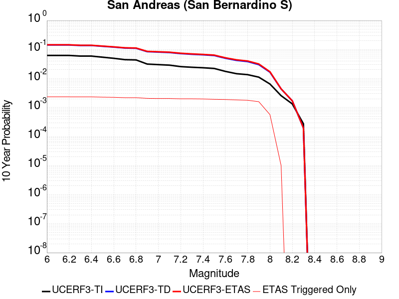 |

| Magnitude | 1 wk TI Prob | 1 wk TD Prob | 1 wk ETAS Prob | 1 wk ETAS/TD Gain | 1 wk ETAS Triggered Only | 1 mo TI Prob | 1 mo TD Prob | 1 mo ETAS Prob | 1 mo ETAS/TD Gain | 1 mo ETAS Triggered Only | 1 yr TI Prob | 1 yr TD Prob | 1 yr ETAS Prob | 1 yr ETAS/TD Gain | 1 yr ETAS Triggered Only | 10 yr TI Prob | 10 yr TD Prob | 10 yr ETAS Prob | 10 yr ETAS/TD Gain | 10 yr ETAS Triggered Only |
|-----|-----|-----|-----|-----|-----|-----|-----|-----|-----|-----|-----|-----|-----|-----|-----|-----|-----|-----|-----|-----|
| 6.0 | 1.2336002E-4 | 3.0005194E-4 | 0.0010998119 | 3.665405 | 8.0E-4 | 5.2857865E-4 | 0.0012853292 | 0.002294031 | 1.784781 | 0.00101 | 0.006416472 | 0.015541554 | 0.0171856 | 1.1057838 | 0.00167 | 0.06234337 | 0.14294699 | 0.14495249 | 1.0140297 | 0.00234 |
| 6.1 | 1.2336002E-4 | 3.0005194E-4 | 0.0010998119 | 3.665405 | 8.0E-4 | 5.2857865E-4 | 0.0012853292 | 0.002294031 | 1.784781 | 0.00101 | 0.006416472 | 0.015541554 | 0.0171856 | 1.1057838 | 0.00167 | 0.06234337 | 0.14294699 | 0.14495249 | 1.0140297 | 0.00234 |
| 6.2 | 1.2336002E-4 | 3.0005194E-4 | 0.0010998119 | 3.665405 | 8.0E-4 | 5.2857865E-4 | 0.0012853292 | 0.002294031 | 1.784781 | 0.00101 | 0.006416472 | 0.015541554 | 0.0171856 | 1.1057838 | 0.00167 | 0.06234337 | 0.14294699 | 0.14495249 | 1.0140297 | 0.00234 |
| 6.3 | 1.1712257E-4 | 2.8793467E-4 | 0.0010877043 | 3.7776082 | 8.0E-4 | 5.018573E-4 | 0.0012334478 | 0.002242202 | 1.817833 | 0.00101 | 0.006093008 | 0.014918666 | 0.016553901 | 1.10961 | 0.00166 | 0.059286322 | 0.13765779 | 0.13966705 | 1.014596 | 0.00233 |
| 6.4 | 1.1712257E-4 | 2.8793467E-4 | 0.0010877043 | 3.7776082 | 8.0E-4 | 5.018573E-4 | 0.0012334478 | 0.002242202 | 1.817833 | 0.00101 | 0.006093008 | 0.014918666 | 0.016553901 | 1.10961 | 0.00166 | 0.059286322 | 0.13765779 | 0.13966705 | 1.014596 | 0.00233 |
| 6.5 | 1.0689076E-4 | 2.6806415E-4 | 0.0010578524 | 3.9462657 | 7.9E-4 | 4.5802278E-4 | 0.0011483653 | 0.00212724 | 1.852407 | 9.8E-4 | 0.0055621783 | 0.013896335 | 0.015503684 | 1.1156671 | 0.00163 | 0.05425003 | 0.1288989 | 0.13088502 | 1.0154083 | 0.00228 |
| 6.6 | 9.7648895E-5 | 2.505129E-4 | 0.0010303175 | 4.112832 | 7.8E-4 | 4.1842813E-4 | 0.0010732086 | 0.0020421676 | 1.9028617 | 9.7E-4 | 0.005082469 | 0.012992399 | 0.014571611 | 1.1215489 | 0.0016 | 0.049677886 | 0.121077746 | 0.123055324 | 1.0163331 | 0.00225 |
| 6.7 | 8.757013E-5 | 2.3122175E-4 | 0.0010010437 | 4.3293667 | 7.7E-4 | 3.7524657E-4 | 9.905964E-4 | 0.0019496453 | 1.9681532 | 9.6E-4 | 0.00455906 | 0.011997902 | 0.013539185 | 1.1284628 | 0.00156 | 0.04466656 | 0.112373024 | 0.114316925 | 1.0172987 | 0.00219 |
| 6.8 | 8.562978E-5 | 2.2682057E-4 | 9.966459E-4 | 4.393984 | 7.7E-4 | 3.6693315E-4 | 9.7174826E-4 | 0.0019308154 | 1.9869502 | 9.6E-4 | 0.004458263 | 0.011770921 | 0.013312559 | 1.13097 | 0.00156 | 0.043698758 | 0.11037863 | 0.112326905 | 1.0176508 | 0.00219 |
| 6.9 | 6.124075E-5 | 1.7066885E-4 | 9.205408E-4 | 5.393725 | 7.5E-4 | 2.6243398E-4 | 7.312337E-4 | 0.0016605536 | 2.270893 | 9.3E-4 | 0.0031904527 | 0.008866636 | 0.010343425 | 1.1665556 | 0.00149 | 0.031450346 | 0.08420262 | 0.08609832 | 1.0225135 | 0.00207 |
| 7.0 | 5.8598747E-5 | 1.6495936E-4 | 8.9483894E-4 | 5.4246025 | 7.3E-4 | 2.5111332E-4 | 7.067779E-4 | 0.0016161348 | 2.2866232 | 9.1E-4 | 0.0030530186 | 0.008571265 | 0.010028666 | 1.1700332 | 0.00147 | 0.03011414 | 0.08151562 | 0.083398506 | 1.0230986 | 0.00205 |
| 7.1 | 5.613814E-5 | 1.5914452E-4 | 8.8902836E-4 | 5.5862956 | 7.3E-4 | 2.4056983E-4 | 6.818704E-4 | 0.00159125 | 2.3336544 | 9.1E-4 | 0.0029250039 | 0.008270353 | 0.009728195 | 1.1762733 | 0.00147 | 0.028868021 | 0.07881268 | 0.08070112 | 1.0239611 | 0.00205 |
| 7.2 | 4.991222E-5 | 1.4520933E-4 | 8.7510335E-4 | 6.0264955 | 7.3E-4 | 2.1389198E-4 | 6.221777E-4 | 0.0015016302 | 2.413507 | 8.8E-4 | 0.002601025 | 0.0075488063 | 0.0089680115 | 1.1880039 | 0.00143 | 0.025707912 | 0.07226191 | 0.07411738 | 1.0256771 | 0.002 |
| 7.3 | 4.7410045E-5 | 1.371513E-4 | 8.670512E-4 | 6.3218584 | 7.3E-4 | 2.0317009E-4 | 5.8765925E-4 | 0.0014671421 | 2.4965866 | 8.8E-4 | 0.0024707897 | 0.0071313656 | 0.008551167 | 1.1990926 | 0.00143 | 0.024434982 | 0.068541944 | 0.07040486 | 1.0271792 | 0.002 |
| 7.4 | 4.5556746E-5 | 1.3123035E-4 | 8.6113455E-4 | 6.562008 | 7.3E-4 | 1.952286E-4 | 5.6229485E-4 | 0.0014418 | 2.5641353 | 8.8E-4 | 0.002374317 | 0.0068245293 | 0.008224907 | 1.2051977 | 0.00141 | 0.023491086 | 0.06579143 | 0.06763182 | 1.027973 | 0.00197 |
| 7.5 | 4.3084514E-5 | 1.2358342E-4 | 8.334957E-4 | 6.744397 | 7.1E-4 | 1.8463485E-4 | 5.2953605E-4 | 0.0013890807 | 2.6232033 | 8.6E-4 | 0.0022456115 | 0.0064281146 | 0.007789308 | 1.2117562 | 0.00137 | 0.022230545 | 0.062190283 | 0.063990876 | 1.028953 | 0.00192 |
| 7.6 | 3.408608E-5 | 9.836477E-5 | 8.082949E-4 | 8.217321 | 7.1E-4 | 1.4607502E-4 | 4.214953E-4 | 0.0012611413 | 2.992065 | 8.4E-4 | 0.0017770125 | 0.005119656 | 0.0064627444 | 1.2623396 | 0.00135 | 0.017628696 | 0.05002244 | 0.051817894 | 1.0358931 | 0.00189 |
| 7.7 | 2.8315713E-5 | 8.2495724E-5 | 7.924372E-4 | 9.605797 | 7.1E-4 | 1.2134742E-4 | 3.5350522E-4 | 0.0011732153 | 3.3188062 | 8.2E-4 | 0.0014764034 | 0.004295442 | 0.0056197285 | 1.3083006 | 0.00133 | 0.01466633 | 0.042272415 | 0.044025056 | 1.0414606 | 0.00183 |
| 7.8 | 2.6222975E-5 | 7.463898E-5 | 7.645875E-4 | 10.24381 | 6.9E-4 | 1.1237934E-4 | 3.1984213E-4 | 0.0011195863 | 3.500434 | 8.0E-4 | 0.0013673597 | 0.003887131 | 0.0051820776 | 1.3331369 | 0.0013 | 0.013589768 | 0.038437475 | 0.040149055 | 1.044529 | 0.00178 |
| 7.9 | 2.1469694E-5 | 5.7884805E-5 | 6.878483E-4 | 11.883056 | 6.3E-4 | 9.200973E-5 | 2.4805416E-4 | 9.778731E-4 | 3.9421756 | 7.3E-4 | 0.0011196428 | 0.00301588 | 0.0042022914 | 1.393388 | 0.00119 | 0.011140184 | 0.030153265 | 0.03169532 | 1.0511407 | 0.00159 |
| 8.0 | 1.2420249E-5 | 3.1321662E-5 | 2.1131603E-4 | 6.746641 | 1.8E-4 | 5.322855E-5 | 1.342288E-4 | 3.442006E-4 | 2.564283 | 2.1E-4 | 6.478649E-4 | 0.0016330116 | 0.0020323584 | 1.2445462 | 4.0E-4 | 0.0064597935 | 0.01652369 | 0.017084273 | 1.0339259 | 5.7E-4 |
| 8.1 | 4.9197724E-6 | 7.822525E-6 | 7.822525E-6 | 1.0 | 0.0 | 2.1084568E-5 | 3.3524673E-5 | 3.3524673E-5 | 1.0 | 0.0 | 2.566744E-4 | 4.080866E-4 | 4.1808252E-4 | 1.0244946 | 1.0E-5 | 0.002563781 | 0.004384557 | 0.004394513 | 1.0022707 | 1.0E-5 |
| 8.2 | 2.5634774E-6 | 2.9065757E-6 | 2.9065757E-6 | 1.0 | 0.0 | 1.0986286E-5 | 1.2456694E-5 | 1.2456694E-5 | 1.0 | 0.0 | 1.3374983E-4 | 1.5164974E-4 | 1.5164974E-4 | 1.0 | 0.0 | 0.0013366934 | 0.001704941 | 0.001704941 | 1.0 | 0.0 |
| 8.3 | 5.2850464E-7 | 3.2080476E-7 | 3.2080476E-7 | 1.0 | 0.0 | 2.2650179E-6 | 1.3748769E-6 | 1.3748769E-6 | 1.0 | 0.0 | 2.7576245E-5 | 1.673901E-5 | 1.673901E-5 | 1.0 | 0.0 | 2.7572823E-4 | 1.986671E-4 | 1.986671E-4 | 1.0 | 0.0 |

## Death Valley (Black Mtns Frontal)
*[(top)](#table-of-contents)*

| 1 Week | 1 Month | 1 Year | 10 Year |
|-----|-----|-----|-----|
| 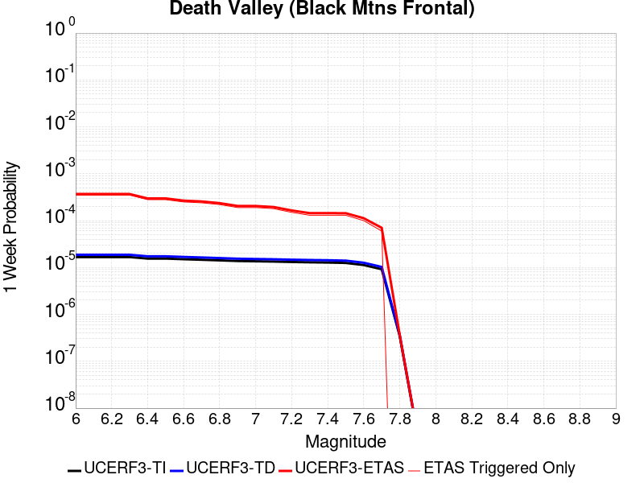 |  |  |  |

| Magnitude | 1 wk TI Prob | 1 wk TD Prob | 1 wk ETAS Prob | 1 wk ETAS/TD Gain | 1 wk ETAS Triggered Only | 1 mo TI Prob | 1 mo TD Prob | 1 mo ETAS Prob | 1 mo ETAS/TD Gain | 1 mo ETAS Triggered Only | 1 yr TI Prob | 1 yr TD Prob | 1 yr ETAS Prob | 1 yr ETAS/TD Gain | 1 yr ETAS Triggered Only | 10 yr TI Prob | 10 yr TD Prob | 10 yr ETAS Prob | 10 yr ETAS/TD Gain | 10 yr ETAS Triggered Only |
|-----|-----|-----|-----|-----|-----|-----|-----|-----|-----|-----|-----|-----|-----|-----|-----|-----|-----|-----|-----|-----|
| 6.0 | 1.6707214E-5 | 1.867027E-5 | 3.6866372E-4 | 19.746033 | 3.5E-4 | 7.160038E-5 | 8.001303E-5 | 6.199698E-4 | 7.748361 | 5.4E-4 | 8.71386E-4 | 9.737309E-4 | 0.0021026304 | 2.159355 | 0.00113 | 0.00867977 | 0.009695496 | 0.0117553305 | 1.2124525 | 0.00208 |
| 6.1 | 1.6707214E-5 | 1.867027E-5 | 3.6866372E-4 | 19.746033 | 3.5E-4 | 7.160038E-5 | 8.001303E-5 | 6.199698E-4 | 7.748361 | 5.4E-4 | 8.71386E-4 | 9.737309E-4 | 0.0021026304 | 2.159355 | 0.00113 | 0.00867977 | 0.009695496 | 0.0117553305 | 1.2124525 | 0.00208 |
| 6.2 | 1.6707214E-5 | 1.867027E-5 | 3.6866372E-4 | 19.746033 | 3.5E-4 | 7.160038E-5 | 8.001303E-5 | 6.199698E-4 | 7.748361 | 5.4E-4 | 8.71386E-4 | 9.737309E-4 | 0.0021026304 | 2.159355 | 0.00113 | 0.00867977 | 0.009695496 | 0.0117553305 | 1.2124525 | 0.00208 |
| 6.3 | 1.6707214E-5 | 1.867027E-5 | 3.6866372E-4 | 19.746033 | 3.5E-4 | 7.160038E-5 | 8.001303E-5 | 6.199698E-4 | 7.748361 | 5.4E-4 | 8.71386E-4 | 9.737309E-4 | 0.0021026304 | 2.159355 | 0.00113 | 0.00867977 | 0.009695496 | 0.0117553305 | 1.2124525 | 0.00208 |
| 6.4 | 1.5515609E-5 | 1.7338214E-5 | 2.9733335E-4 | 17.14902 | 2.8E-4 | 6.649377E-5 | 7.4304546E-5 | 4.942733E-4 | 6.6519933 | 4.2E-4 | 8.0926094E-4 | 9.042885E-4 | 0.0018334475 | 2.0275028 | 9.3E-4 | 0.008063202 | 0.009006773 | 0.010770741 | 1.1958491 | 0.00178 |
| 6.5 | 1.5515609E-5 | 1.7338214E-5 | 2.9733335E-4 | 17.14902 | 2.8E-4 | 6.649377E-5 | 7.4304546E-5 | 4.942733E-4 | 6.6519933 | 4.2E-4 | 8.0926094E-4 | 9.042885E-4 | 0.0018334475 | 2.0275028 | 9.3E-4 | 0.008063202 | 0.009006773 | 0.010770741 | 1.1958491 | 0.00178 |
| 6.6 | 1.5041828E-5 | 1.6809145E-5 | 2.6680494E-4 | 15.872606 | 2.5E-4 | 6.4463384E-5 | 7.203723E-5 | 4.5200987E-4 | 6.2746696 | 3.8E-4 | 7.8455906E-4 | 8.767063E-4 | 0.0017159699 | 1.9572916 | 8.4E-4 | 0.00781795 | 0.008733132 | 0.0103786355 | 1.1884207 | 0.00166 |
| 6.7 | 1.4634985E-5 | 1.6356016E-5 | 2.563521E-4 | 15.67326 | 2.4E-4 | 6.271985E-5 | 7.009536E-5 | 4.4006942E-4 | 6.2781534 | 3.7E-4 | 7.6334673E-4 | 8.5308263E-4 | 0.0016524002 | 1.9369755 | 8.0E-4 | 0.007607299 | 0.008498715 | 0.010104948 | 1.188997 | 0.00162 |
| 6.8 | 1.4209158E-5 | 1.5882048E-5 | 2.3587856E-4 | 14.851898 | 2.2E-4 | 6.089497E-5 | 6.8064175E-5 | 4.1804035E-4 | 6.1418557 | 3.5E-4 | 7.4114406E-4 | 8.2837185E-4 | 0.0015877424 | 1.9167024 | 7.6E-4 | 0.007386771 | 0.008253456 | 0.009780746 | 1.1850485 | 0.00154 |
| 6.9 | 1.3780098E-5 | 1.5404594E-5 | 2.0540167E-4 | 13.333794 | 1.9E-4 | 5.9056227E-5 | 6.6018045E-5 | 3.8599691E-4 | 5.8468394 | 3.2E-4 | 7.1877235E-4 | 8.0347876E-4 | 0.0015129083 | 1.8829474 | 7.1E-4 | 0.0071645193 | 0.008006332 | 0.009454643 | 1.1808957 | 0.00146 |
| 7.0 | 1.3585064E-5 | 1.5188155E-5 | 2.0518526E-4 | 13.509559 | 1.9E-4 | 5.8220405E-5 | 6.50905E-5 | 3.8506967E-4 | 5.915912 | 3.2E-4 | 7.086029E-4 | 7.9219416E-4 | 0.0015016317 | 1.8955349 | 7.1E-4 | 0.007063476 | 0.007894293 | 0.009313005 | 1.1797135 | 0.00143 |
| 7.1 | 1.3398601E-5 | 1.49813395E-5 | 1.9497864E-4 | 13.014767 | 1.8E-4 | 5.742131E-5 | 6.420419E-5 | 3.6418493E-4 | 5.672292 | 3.0E-4 | 6.9888023E-4 | 7.8141113E-4 | 0.0014508875 | 1.8567531 | 6.7E-4 | 0.0069668638 | 0.007787224 | 0.009116789 | 1.1707367 | 0.00134 |
| 7.2 | 1.3126312E-5 | 1.4679561E-5 | 1.6467736E-4 | 11.21814 | 1.5E-4 | 5.6254412E-5 | 6.291092E-5 | 3.128952E-4 | 4.9736233 | 2.5E-4 | 6.846822E-4 | 7.6567667E-4 | 0.0013452326 | 1.7569199 | 5.8E-4 | 0.006825765 | 0.00763097 | 0.008831737 | 1.1573544 | 0.00121 |
| 7.3 | 1.2922429E-5 | 1.4453788E-5 | 1.4445191E-4 | 9.994052 | 1.3E-4 | 5.5380664E-5 | 6.194336E-5 | 2.9192911E-4 | 4.712839 | 2.3E-4 | 6.74051E-4 | 7.53905E-4 | 0.0013134828 | 1.7422392 | 5.6E-4 | 0.006720101 | 0.007514055 | 0.008635564 | 1.1492548 | 0.00113 |
| 7.4 | 1.2768878E-5 | 1.4283772E-5 | 1.4428192E-4 | 10.101108 | 1.3E-4 | 5.4722615E-5 | 6.1214756E-5 | 2.9120067E-4 | 4.757034 | 2.3E-4 | 6.660441E-4 | 7.4504025E-4 | 0.0012946305 | 1.7376652 | 5.5E-4 | 0.0066405144 | 0.0074260035 | 0.008507909 | 1.1456915 | 0.00109 |
| 7.5 | 1.2521929E-5 | 1.40120155E-5 | 1.4401019E-4 | 10.277622 | 1.3E-4 | 5.366431E-5 | 6.005014E-5 | 2.9003632E-4 | 4.8299026 | 2.3E-4 | 6.531671E-4 | 7.3087064E-4 | 0.0012504905 | 1.7109601 | 5.2E-4 | 0.006512506 | 0.0072852457 | 0.008327596 | 1.1430769 | 0.00105 |
| 7.6 | 1.1301089E-5 | 1.2648149E-5 | 1.12646885E-4 | 8.906196 | 1.0E-4 | 4.8432343E-5 | 5.4205255E-5 | 2.5419443E-4 | 4.689479 | 2.0E-4 | 5.895042E-4 | 6.5975444E-4 | 0.0011294443 | 1.7119162 | 4.7E-4 | 0.0058794282 | 0.00657851 | 0.0075023924 | 1.1404394 | 9.3E-4 |
| 7.7 | 9.189108E-6 | 1.0283358E-5 | 7.028274E-5 | 6.83461 | 6.0E-5 | 3.93813E-5 | 4.407082E-5 | 1.8406464E-4 | 4.176565 | 1.4E-4 | 4.7936183E-4 | 5.3643517E-4 | 9.162313E-4 | 1.7080001 | 3.8E-4 | 0.004783291 | 0.005351914 | 0.0060879537 | 1.1375283 | 7.4E-4 |
| 7.8 | 3.4586725E-7 | 3.6482615E-7 | 3.6482615E-7 | 1.0 | 0.0 | 1.4822873E-6 | 1.5635396E-6 | 1.5635396E-6 | 1.0 | 0.0 | 1.80467E-5 | 1.9035933E-5 | 1.9035933E-5 | 1.0 | 0.0 | 1.8045233E-4 | 1.9034347E-4 | 2.0034157E-4 | 1.0525266 | 1.0E-5 |
| 7.9 | 2.5591178E-9 | 2.6696718E-9 | 2.6696718E-9 | 1.0 | 0.0 | 1.0967647E-8 | 1.14414505E-8 | 1.14414505E-8 | 1.0 | 0.0 | 1.335311E-7 | 1.3929966E-7 | 1.3929966E-7 | 1.0 | 0.0 | 1.3353102E-6 | 1.3929966E-6 | 1.3929966E-6 | 1.0 | 0.0 |

## San Andreas (Big Bend)
*[(top)](#table-of-contents)*

| 1 Week | 1 Month | 1 Year | 10 Year |
|-----|-----|-----|-----|
|  |  |  |  |

| Magnitude | 1 wk TI Prob | 1 wk TD Prob | 1 wk ETAS Prob | 1 wk ETAS/TD Gain | 1 wk ETAS Triggered Only | 1 mo TI Prob | 1 mo TD Prob | 1 mo ETAS Prob | 1 mo ETAS/TD Gain | 1 mo ETAS Triggered Only | 1 yr TI Prob | 1 yr TD Prob | 1 yr ETAS Prob | 1 yr ETAS/TD Gain | 1 yr ETAS Triggered Only | 10 yr TI Prob | 10 yr TD Prob | 10 yr ETAS Prob | 10 yr ETAS/TD Gain | 10 yr ETAS Triggered Only |
|-----|-----|-----|-----|-----|-----|-----|-----|-----|-----|-----|-----|-----|-----|-----|-----|-----|-----|-----|-----|-----|
| 6.0 | 1.0179969E-4 | 2.0073925E-4 | 5.10677E-4 | 2.5439818 | 3.1E-4 | 4.362114E-4 | 8.6002843E-4 | 0.001349607 | 1.5692586 | 4.9E-4 | 0.0052979486 | 0.010420859 | 0.011400542 | 1.0940118 | 9.9E-4 | 0.051734097 | 0.101455905 | 0.10305531 | 1.0157646 | 0.00178 |
| 6.1 | 1.0179969E-4 | 2.0073925E-4 | 5.10677E-4 | 2.5439818 | 3.1E-4 | 4.362114E-4 | 8.6002843E-4 | 0.001349607 | 1.5692586 | 4.9E-4 | 0.0052979486 | 0.010420859 | 0.011400542 | 1.0940118 | 9.9E-4 | 0.051734097 | 0.101455905 | 0.10305531 | 1.0157646 | 0.00178 |
| 6.2 | 1.0179969E-4 | 2.0073925E-4 | 5.10677E-4 | 2.5439818 | 3.1E-4 | 4.362114E-4 | 8.6002843E-4 | 0.001349607 | 1.5692586 | 4.9E-4 | 0.0052979486 | 0.010420859 | 0.011400542 | 1.0940118 | 9.9E-4 | 0.051734097 | 0.101455905 | 0.10305531 | 1.0157646 | 0.00178 |
| 6.3 | 1.0179969E-4 | 2.0073925E-4 | 5.10677E-4 | 2.5439818 | 3.1E-4 | 4.362114E-4 | 8.6002843E-4 | 0.001349607 | 1.5692586 | 4.9E-4 | 0.0052979486 | 0.010420859 | 0.011400542 | 1.0940118 | 9.9E-4 | 0.051734097 | 0.101455905 | 0.10305531 | 1.0157646 | 0.00178 |
| 6.4 | 9.1639464E-5 | 1.8430917E-4 | 4.1426677E-4 | 2.2476733 | 2.3E-4 | 3.9268145E-4 | 7.896575E-4 | 0.0011693574 | 1.4808413 | 3.8E-4 | 0.0047704205 | 0.009571818 | 0.01029483 | 1.0755355 | 7.3E-4 | 0.046693064 | 0.09378695 | 0.09498315 | 1.0127544 | 0.00132 |
| 6.5 | 9.1639464E-5 | 1.8430917E-4 | 4.1426677E-4 | 2.2476733 | 2.3E-4 | 3.9268145E-4 | 7.896575E-4 | 0.0011693574 | 1.4808413 | 3.8E-4 | 0.0047704205 | 0.009571818 | 0.01029483 | 1.0755355 | 7.3E-4 | 0.046693064 | 0.09378695 | 0.09498315 | 1.0127544 | 0.00132 |
| 6.6 | 9.042622E-5 | 1.8238011E-4 | 4.0234E-4 | 2.2060518 | 2.2E-4 | 3.8748336E-4 | 7.813951E-4 | 0.0011411138 | 1.4603544 | 3.6E-4 | 0.0047074095 | 0.0094721 | 0.010175374 | 1.074247 | 7.1E-4 | 0.046089325 | 0.09287721 | 0.0940474 | 1.0125993 | 0.00129 |
| 6.7 | 8.9836685E-5 | 1.8152347E-4 | 4.0148353E-4 | 2.2117445 | 2.2E-4 | 3.8495753E-4 | 7.7772595E-4 | 0.001137446 | 1.462528 | 3.6E-4 | 0.00467679 | 0.009427815 | 0.010131121 | 1.074599 | 7.1E-4 | 0.045795817 | 0.09247148 | 0.09363312 | 1.0125622 | 0.00128 |
| 6.8 | 8.9471854E-5 | 1.8099119E-4 | 4.0095137E-4 | 2.2153087 | 2.2E-4 | 3.8339442E-4 | 7.754462E-4 | 0.001135167 | 1.4638889 | 3.6E-4 | 0.004657841 | 0.009400298 | 0.010103623 | 1.0748196 | 7.1E-4 | 0.04561414 | 0.0922192 | 0.09338117 | 1.0126 | 0.00128 |
| 6.9 | 8.858234E-5 | 1.7981093E-4 | 3.9977135E-4 | 2.2232873 | 2.2E-4 | 3.7958333E-4 | 7.7039085E-4 | 0.0011201212 | 1.4539648 | 3.5E-4 | 0.004611638 | 0.009339278 | 0.01003274 | 1.0742522 | 7.0E-4 | 0.04517103 | 0.09165911 | 0.09280361 | 1.0124866 | 0.00126 |
| 7.0 | 8.7433385E-5 | 1.7819891E-4 | 3.981597E-4 | 2.2343554 | 2.2E-4 | 3.746607E-4 | 7.6348626E-4 | 0.0011132191 | 1.4580735 | 3.5E-4 | 0.004551957 | 0.009255932 | 0.009949452 | 1.0749272 | 7.0E-4 | 0.044598386 | 0.09089323 | 0.09200234 | 1.0122024 | 0.00122 |
| 7.1 | 8.684964E-5 | 1.7731842E-4 | 3.972794E-4 | 2.240486 | 2.2E-4 | 3.7215967E-4 | 7.597149E-4 | 0.0011094491 | 1.4603491 | 3.5E-4 | 0.0045216335 | 0.009210405 | 0.009884142 | 1.0731496 | 6.8E-4 | 0.04430731 | 0.09047475 | 0.091557086 | 1.0119629 | 0.00119 |
| 7.2 | 8.606521E-5 | 1.7622454E-4 | 3.761893E-4 | 2.1347158 | 2.0E-4 | 3.6879873E-4 | 7.550296E-4 | 0.0010847804 | 1.436739 | 3.3E-4 | 0.0044808835 | 0.009153842 | 0.009797892 | 1.0703584 | 6.5E-4 | 0.043916024 | 0.08995518 | 0.09101083 | 1.0117353 | 0.00116 |
| 7.3 | 8.568266E-5 | 1.7564454E-4 | 3.756094E-4 | 2.1384633 | 2.0E-4 | 3.6715972E-4 | 7.5254537E-4 | 0.0010822971 | 1.4381818 | 3.3E-4 | 0.0044610105 | 0.00912385 | 0.00976792 | 1.0705918 | 6.5E-4 | 0.043725148 | 0.08967623 | 0.09073221 | 1.0117754 | 0.00116 |
| 7.4 | 8.5432206E-5 | 1.752704E-4 | 3.7523534E-4 | 2.140894 | 2.0E-4 | 3.6608664E-4 | 7.509428E-4 | 0.001080695 | 1.4391176 | 3.3E-4 | 0.004447999 | 0.009104501 | 0.009738675 | 1.069655 | 6.4E-4 | 0.043600157 | 0.08949642 | 0.0905435 | 1.0116997 | 0.00115 |
| 7.5 | 8.4791965E-5 | 1.7396381E-4 | 3.73929E-4 | 2.1494644 | 2.0E-4 | 3.633435E-4 | 7.4534636E-4 | 0.0010751004 | 1.4424171 | 3.3E-4 | 0.0044147377 | 0.009036932 | 0.009671149 | 1.0701805 | 6.4E-4 | 0.043280575 | 0.08887209 | 0.089910775 | 1.0116874 | 0.00114 |
| 7.6 | 8.241105E-5 | 1.6841735E-4 | 3.4838702E-4 | 2.0685935 | 1.8E-4 | 3.531424E-4 | 7.2158914E-4 | 0.0010313655 | 1.4292973 | 3.1E-4 | 0.0042910352 | 0.008750047 | 0.009364622 | 1.0702368 | 6.2E-4 | 0.042091176 | 0.08625032 | 0.087246306 | 1.0115477 | 0.00109 |
| 7.7 | 7.00432E-5 | 1.4205615E-4 | 2.7203767E-4 | 1.9150012 | 1.3E-4 | 3.001506E-4 | 6.0867006E-4 | 8.285361E-4 | 1.3612238 | 2.2E-4 | 0.0036482112 | 0.0073854174 | 0.00784202 | 1.0618249 | 4.6E-4 | 0.035888977 | 0.07352299 | 0.07423638 | 1.0097029 | 7.7E-4 |
| 7.8 | 6.415362E-5 | 1.2969968E-4 | 2.4968412E-4 | 1.9250944 | 1.2E-4 | 2.749151E-4 | 5.557374E-4 | 7.656207E-4 | 1.3776664 | 2.1E-4 | 0.0033419547 | 0.0067451415 | 0.007172241 | 1.0633196 | 4.3E-4 | 0.03292141 | 0.06725514 | 0.06788941 | 1.0094308 | 6.8E-4 |
| 7.9 | 4.939911E-5 | 9.341721E-5 | 1.834088E-4 | 1.9633298 | 9.0E-5 | 2.116933E-4 | 4.0029807E-4 | 5.50238E-4 | 1.3745707 | 1.5E-4 | 0.0025743195 | 0.004862747 | 0.005141386 | 1.0573006 | 2.8E-4 | 0.025447013 | 0.048915803 | 0.04930575 | 1.0079718 | 4.1E-4 |
| 8.0 | 3.344983E-5 | 5.2228E-5 | 9.222591E-5 | 1.7658327 | 4.0E-5 | 1.4334853E-4 | 2.2381509E-4 | 3.037972E-4 | 1.3573579 | 8.0E-5 | 0.0017438711 | 0.0027215453 | 0.002871137 | 1.0549657 | 1.5E-4 | 0.017302496 | 0.027923161 | 0.02814674 | 1.0080069 | 2.3E-4 |
| 8.1 | 1.9104898E-5 | 1.9171663E-5 | 2.917147E-5 | 1.5215932 | 1.0E-5 | 8.1875565E-5 | 8.2161685E-5 | 1.12159214E-4 | 1.3651037 | 3.0E-5 | 9.963791E-4 | 9.9986E-4 | 0.0010498101 | 1.049957 | 5.0E-5 | 0.009919235 | 0.010749552 | 0.010808907 | 1.0055217 | 6.0E-5 |
| 8.2 | 8.643924E-6 | 5.473668E-6 | 5.473668E-6 | 1.0 | 0.0 | 3.704486E-5 | 2.3458366E-5 | 2.3458366E-5 | 1.0 | 0.0 | 4.5092785E-4 | 2.8556827E-4 | 2.8556827E-4 | 1.0 | 0.0 | 0.0045001395 | 0.0032481793 | 0.0032481793 | 1.0 | 0.0 |
| 8.3 | 1.983087E-6 | 7.6564595E-7 | 7.6564595E-7 | 1.0 | 0.0 | 8.498917E-6 | 3.281336E-6 | 3.281336E-6 | 1.0 | 0.0 | 1.034694E-4 | 3.9949547E-5 | 3.9949547E-5 | 1.0 | 0.0 | 0.0010342124 | 4.717979E-4 | 4.717979E-4 | 1.0 | 0.0 |

## Coyote Lake
*[(top)](#table-of-contents)*

| 1 Week | 1 Month | 1 Year | 10 Year |
|-----|-----|-----|-----|
|  |  |  |  |

| Magnitude | 1 wk TI Prob | 1 wk TD Prob | 1 wk ETAS Prob | 1 wk ETAS/TD Gain | 1 wk ETAS Triggered Only | 1 mo TI Prob | 1 mo TD Prob | 1 mo ETAS Prob | 1 mo ETAS/TD Gain | 1 mo ETAS Triggered Only | 1 yr TI Prob | 1 yr TD Prob | 1 yr ETAS Prob | 1 yr ETAS/TD Gain | 1 yr ETAS Triggered Only | 10 yr TI Prob | 10 yr TD Prob | 10 yr ETAS Prob | 10 yr ETAS/TD Gain | 10 yr ETAS Triggered Only |
|-----|-----|-----|-----|-----|-----|-----|-----|-----|-----|-----|-----|-----|-----|-----|-----|-----|-----|-----|-----|-----|
| 6.0 | 1.980352E-5 | 2.1706745E-5 | 2.217024E-4 | 10.213526 | 2.0E-4 | 8.486947E-5 | 9.302599E-5 | 4.829897E-4 | 5.1919866 | 3.9E-4 | 0.0010327959 | 0.0011320751 | 0.0019211808 | 1.6970435 | 7.9E-4 | 0.010280091 | 0.011270258 | 0.012812677 | 1.1368574 | 0.00156 |
| 6.1 | 1.980352E-5 | 2.1706745E-5 | 2.217024E-4 | 10.213526 | 2.0E-4 | 8.486947E-5 | 9.302599E-5 | 4.829897E-4 | 5.1919866 | 3.9E-4 | 0.0010327959 | 0.0011320751 | 0.0019211808 | 1.6970435 | 7.9E-4 | 0.010280091 | 0.011270258 | 0.012812677 | 1.1368574 | 0.00156 |
| 6.2 | 1.980352E-5 | 2.1706745E-5 | 2.217024E-4 | 10.213526 | 2.0E-4 | 8.486947E-5 | 9.302599E-5 | 4.829897E-4 | 5.1919866 | 3.9E-4 | 0.0010327959 | 0.0011320751 | 0.0019211808 | 1.6970435 | 7.9E-4 | 0.010280091 | 0.011270258 | 0.012812677 | 1.1368574 | 0.00156 |
| 6.3 | 1.5344787E-5 | 1.682067E-5 | 1.7681798E-4 | 10.511947 | 1.6E-4 | 6.576172E-5 | 7.2086936E-5 | 3.9206387E-4 | 5.4387646 | 3.2E-4 | 8.003548E-4 | 8.773662E-4 | 0.0015467784 | 1.7629791 | 6.7E-4 | 0.007974784 | 0.00874507 | 0.010053526 | 1.1496222 | 0.00132 |
| 6.4 | 1.5344787E-5 | 1.682067E-5 | 1.7681798E-4 | 10.511947 | 1.6E-4 | 6.576172E-5 | 7.2086936E-5 | 3.9206387E-4 | 5.4387646 | 3.2E-4 | 8.003548E-4 | 8.773662E-4 | 0.0015467784 | 1.7629791 | 6.7E-4 | 0.007974784 | 0.00874507 | 0.010053526 | 1.1496222 | 0.00132 |
| 6.5 | 1.4189697E-5 | 1.5557987E-5 | 1.755555E-4 | 11.283947 | 1.6E-4 | 6.081157E-5 | 6.6675726E-5 | 3.6665573E-4 | 5.499089 | 3.0E-4 | 7.401293E-4 | 8.115349E-4 | 0.0014610074 | 1.8003014 | 6.5E-4 | 0.0073766913 | 0.008091656 | 0.009361299 | 1.1569077 | 0.00128 |
| 6.6 | 1.3469301E-5 | 1.4771577E-5 | 1.7476921E-4 | 11.831452 | 1.6E-4 | 5.7724297E-5 | 6.330556E-5 | 3.6328658E-4 | 5.7386203 | 3.0E-4 | 7.025667E-4 | 7.7053264E-4 | 0.0014100395 | 1.8299543 | 6.4E-4 | 0.0070034964 | 0.0076845144 | 0.008924909 | 1.1614149 | 0.00125 |
| 6.7 | 1.3027966E-5 | 1.4281745E-5 | 1.4427988E-4 | 10.102399 | 1.3E-4 | 5.5832945E-5 | 6.120638E-5 | 3.3118986E-4 | 5.411035 | 2.7E-4 | 6.7955407E-4 | 7.4499263E-4 | 0.0013445456 | 1.8047771 | 6.0E-4 | 0.006774798 | 0.0074308286 | 0.008592134 | 1.1562822 | 0.00117 |
| 6.8 | 5.695434E-6 | 6.2244176E-6 | 5.6224108E-5 | 9.03283 | 5.0E-5 | 2.4408775E-5 | 2.6675973E-5 | 1.266733E-4 | 4.748592 | 1.0E-4 | 2.971363E-4 | 3.2476155E-4 | 5.3469336E-4 | 1.6464182 | 2.1E-4 | 0.0029673933 | 0.0032458105 | 0.0035747392 | 1.1013396 | 3.3E-4 |
| 6.9 | 4.385688E-6 | 4.7930553E-6 | 4.4792865E-5 | 9.345367 | 4.0E-5 | 1.879567E-5 | 2.0541665E-5 | 1.1053982E-4 | 5.381249 | 9.0E-5 | 2.2881327E-4 | 2.5009477E-4 | 4.2005227E-4 | 1.6795723 | 1.7E-4 | 0.002285778 | 0.0025009478 | 0.0027403475 | 1.0957236 | 2.4E-4 |

## Helendale-So Lockhart
*[(top)](#table-of-contents)*

| 1 Week | 1 Month | 1 Year | 10 Year |
|-----|-----|-----|-----|
| 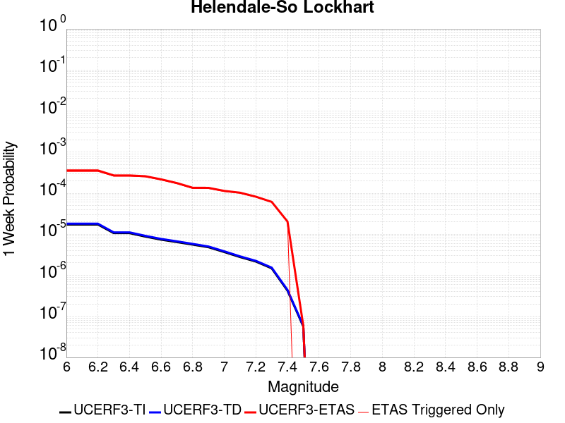 |  |  |  |

| Magnitude | 1 wk TI Prob | 1 wk TD Prob | 1 wk ETAS Prob | 1 wk ETAS/TD Gain | 1 wk ETAS Triggered Only | 1 mo TI Prob | 1 mo TD Prob | 1 mo ETAS Prob | 1 mo ETAS/TD Gain | 1 mo ETAS Triggered Only | 1 yr TI Prob | 1 yr TD Prob | 1 yr ETAS Prob | 1 yr ETAS/TD Gain | 1 yr ETAS Triggered Only | 10 yr TI Prob | 10 yr TD Prob | 10 yr ETAS Prob | 10 yr ETAS/TD Gain | 10 yr ETAS Triggered Only |
|-----|-----|-----|-----|-----|-----|-----|-----|-----|-----|-----|-----|-----|-----|-----|-----|-----|-----|-----|-----|-----|
| 6.0 | 1.7296055E-5 | 1.8103729E-5 | 3.5809758E-4 | 19.780321 | 3.4E-4 | 7.412385E-5 | 7.7585224E-5 | 5.675472E-4 | 7.315146 | 4.9E-4 | 9.0208417E-4 | 9.4421144E-4 | 0.0018233806 | 1.9311147 | 8.8E-4 | 0.008984311 | 0.009404116 | 0.01084048 | 1.1527379 | 0.00145 |
| 6.1 | 1.7296055E-5 | 1.8103729E-5 | 3.5809758E-4 | 19.780321 | 3.4E-4 | 7.412385E-5 | 7.7585224E-5 | 5.675472E-4 | 7.315146 | 4.9E-4 | 9.0208417E-4 | 9.4421144E-4 | 0.0018233806 | 1.9311147 | 8.8E-4 | 0.008984311 | 0.009404116 | 0.01084048 | 1.1527379 | 0.00145 |
| 6.2 | 1.7296055E-5 | 1.8103729E-5 | 3.5809758E-4 | 19.780321 | 3.4E-4 | 7.412385E-5 | 7.7585224E-5 | 5.675472E-4 | 7.315146 | 4.9E-4 | 9.0208417E-4 | 9.4421144E-4 | 0.0018233806 | 1.9311147 | 8.8E-4 | 0.008984311 | 0.009404116 | 0.01084048 | 1.1527379 | 0.00145 |
| 6.3 | 1.0669118E-5 | 1.1135425E-5 | 2.7113254E-4 | 24.348648 | 2.6E-4 | 4.5723988E-5 | 4.772239E-5 | 4.077052E-4 | 8.543269 | 3.6E-4 | 5.5654737E-4 | 5.80868E-4 | 0.0011905137 | 2.0495424 | 6.1E-4 | 0.0055515557 | 0.0057937936 | 0.006797942 | 1.1733145 | 0.00101 |
| 6.4 | 1.0669118E-5 | 1.1135425E-5 | 2.7113254E-4 | 24.348648 | 2.6E-4 | 4.5723988E-5 | 4.772239E-5 | 4.077052E-4 | 8.543269 | 3.6E-4 | 5.5654737E-4 | 5.80868E-4 | 0.0011905137 | 2.0495424 | 6.1E-4 | 0.0055515557 | 0.0057937936 | 0.006797942 | 1.1733145 | 0.00101 |
| 6.5 | 8.790038E-6 | 9.170197E-6 | 2.591679E-4 | 28.261978 | 2.5E-4 | 3.767105E-5 | 3.930026E-5 | 3.692873E-4 | 9.396561 | 3.3E-4 | 4.585485E-4 | 4.7837716E-4 | 0.0010381093 | 2.1700644 | 5.6E-4 | 0.0045760344 | 0.004773638 | 0.005669342 | 1.1876354 | 9.0E-4 |
| 6.6 | 7.396949E-6 | 7.715537E-6 | 2.1771391E-4 | 28.217598 | 2.1E-4 | 3.1700827E-5 | 3.3066175E-5 | 3.230566E-4 | 9.770002 | 2.9E-4 | 3.858892E-4 | 4.025073E-4 | 8.9231005E-4 | 2.2168791 | 4.9E-4 | 0.003852198 | 0.00401789 | 0.0047648763 | 1.1859151 | 7.5E-4 |
| 6.7 | 6.4600285E-6 | 6.738031E-6 | 1.7673688E-4 | 26.229752 | 1.7E-4 | 2.7685543E-5 | 2.887696E-5 | 2.7886973E-4 | 9.657171 | 2.5E-4 | 3.3701936E-4 | 3.5152107E-4 | 7.913664E-4 | 2.2512631 | 4.4E-4 | 0.0033650869 | 0.003509732 | 0.0041674157 | 1.1873885 | 6.6E-4 |
| 6.8 | 5.600104E-6 | 5.836009E-6 | 1.3583525E-4 | 23.275366 | 1.3E-4 | 2.4000226E-5 | 2.5011232E-5 | 2.2500622E-4 | 8.996207 | 2.0E-4 | 2.9216358E-4 | 3.044698E-4 | 6.643602E-4 | 2.1820233 | 3.6E-4 | 0.0029177975 | 0.003040588 | 0.0035789462 | 1.1770573 | 5.4E-4 |
| 6.9 | 4.839122E-6 | 5.0395092E-6 | 1.3503885E-4 | 26.796032 | 1.3E-4 | 2.0738931E-5 | 2.159772E-5 | 2.1159362E-4 | 9.797034 | 1.9E-4 | 2.5246723E-4 | 2.6292098E-4 | 5.928342E-4 | 2.2547998 | 3.3E-4 | 0.002521806 | 0.002626147 | 0.0030949125 | 1.1784995 | 4.7E-4 |
| 7.0 | 3.6937633E-6 | 3.845208E-6 | 1.13844784E-4 | 29.606924 | 1.1E-4 | 1.5830317E-5 | 1.647936E-5 | 1.664769E-4 | 10.102145 | 1.5E-4 | 1.9271708E-4 | 2.0061806E-4 | 4.8056187E-4 | 2.395407 | 2.8E-4 | 0.0019255003 | 0.002004401 | 0.0023836393 | 1.1892028 | 3.8E-4 |
| 7.1 | 2.7858857E-6 | 2.8978538E-6 | 1.0289757E-4 | 35.508198 | 1.0E-4 | 1.1939455E-5 | 1.2419316E-5 | 1.424177E-4 | 11.467436 | 1.3E-4 | 1.4535317E-4 | 1.511949E-4 | 3.911586E-4 | 2.5871153 | 2.4E-4 | 0.0014525814 | 0.0015109418 | 0.0018204733 | 1.2048601 | 3.1E-4 |
| 7.2 | 2.1672065E-6 | 2.2540128E-6 | 8.2253835E-5 | 36.492176 | 8.0E-5 | 9.2879945E-6 | 9.66002E-6 | 1.1965896E-4 | 12.38703 | 1.1E-4 | 1.1307546E-4 | 1.1760458E-4 | 2.975834E-4 | 2.5303726 | 1.8E-4 | 0.0011301794 | 0.0011754417 | 0.001395183 | 1.1869437 | 2.2E-4 |
| 7.3 | 1.4823496E-6 | 1.5422102E-6 | 6.1542116E-5 | 39.905144 | 6.0E-5 | 6.3529114E-6 | 6.6094562E-6 | 8.6608925E-5 | 13.103789 | 8.0E-5 | 7.734395E-5 | 8.046731E-5 | 1.9045846E-4 | 2.3669047 | 1.1E-4 | 7.731704E-4 | 8.0439687E-4 | 9.4428426E-4 | 1.1739035 | 1.4E-4 |
| 7.4 | 4.2321457E-7 | 4.4108765E-7 | 2.0441079E-5 | 46.34244 | 2.0E-5 | 1.8137755E-6 | 1.8903745E-6 | 3.189032E-5 | 16.86984 | 3.0E-5 | 2.2082493E-5 | 2.3015113E-5 | 6.3014195E-5 | 2.7379484 | 4.0E-5 | 2.2080299E-4 | 2.3013182E-4 | 2.8012032E-4 | 1.2172167 | 5.0E-5 |
| 7.5 | 5.6942316E-8 | 5.9415648E-8 | 5.9415648E-8 | 1.0 | 0.0 | 2.440385E-7 | 2.5463845E-7 | 1.02546355E-5 | 40.271355 | 1.0E-5 | 2.9711643E-6 | 3.1002196E-6 | 1.3100189E-5 | 4.225568 | 1.0E-5 | 2.9711247E-5 | 3.1001844E-5 | 4.100153E-5 | 1.3225515 | 1.0E-5 |

## San Andreas (San Gorgonio Pass-Garnet HIll)
*[(top)](#table-of-contents)*

| 1 Week | 1 Month | 1 Year | 10 Year |
|-----|-----|-----|-----|
|  |  |  |  |

| Magnitude | 1 wk TI Prob | 1 wk TD Prob | 1 wk ETAS Prob | 1 wk ETAS/TD Gain | 1 wk ETAS Triggered Only | 1 mo TI Prob | 1 mo TD Prob | 1 mo ETAS Prob | 1 mo ETAS/TD Gain | 1 mo ETAS Triggered Only | 1 yr TI Prob | 1 yr TD Prob | 1 yr ETAS Prob | 1 yr ETAS/TD Gain | 1 yr ETAS Triggered Only | 10 yr TI Prob | 10 yr TD Prob | 10 yr ETAS Prob | 10 yr ETAS/TD Gain | 10 yr ETAS Triggered Only |
|-----|-----|-----|-----|-----|-----|-----|-----|-----|-----|-----|-----|-----|-----|-----|-----|-----|-----|-----|-----|-----|
| 6.0 | 8.31567E-5 | 2.3384395E-4 | 6.0375745E-4 | 2.5818818 | 3.7E-4 | 3.5633717E-4 | 0.0010018025 | 0.0014613417 | 1.4587123 | 4.6E-4 | 0.004329778 | 0.012128622 | 0.012909041 | 1.0643452 | 7.9E-4 | 0.042463828 | 0.11258187 | 0.113620155 | 1.0092224 | 0.00117 |
| 6.1 | 8.31567E-5 | 2.3384395E-4 | 6.0375745E-4 | 2.5818818 | 3.7E-4 | 3.5633717E-4 | 0.0010018025 | 0.0014613417 | 1.4587123 | 4.6E-4 | 0.004329778 | 0.012128622 | 0.012909041 | 1.0643452 | 7.9E-4 | 0.042463828 | 0.11258187 | 0.113620155 | 1.0092224 | 0.00117 |
| 6.2 | 8.31567E-5 | 2.3384395E-4 | 6.0375745E-4 | 2.5818818 | 3.7E-4 | 3.5633717E-4 | 0.0010018025 | 0.0014613417 | 1.4587123 | 4.6E-4 | 0.004329778 | 0.012128622 | 0.012909041 | 1.0643452 | 7.9E-4 | 0.042463828 | 0.11258187 | 0.113620155 | 1.0092224 | 0.00117 |
| 6.3 | 8.31567E-5 | 2.3384395E-4 | 6.0375745E-4 | 2.5818818 | 3.7E-4 | 3.5633717E-4 | 0.0010018025 | 0.0014613417 | 1.4587123 | 4.6E-4 | 0.004329778 | 0.012128622 | 0.012909041 | 1.0643452 | 7.9E-4 | 0.042463828 | 0.11258187 | 0.113620155 | 1.0092224 | 0.00117 |
| 6.4 | 8.059055E-5 | 2.2941893E-4 | 5.893363E-4 | 2.5688217 | 3.6E-4 | 3.4534236E-4 | 9.828559E-4 | 0.0014324137 | 1.4573994 | 4.5E-4 | 0.0041964394 | 0.011900819 | 0.012671537 | 1.0647618 | 7.8E-4 | 0.041180745 | 0.110562965 | 0.11158582 | 1.0092514 | 0.00115 |
| 6.5 | 8.059055E-5 | 2.2941893E-4 | 5.893363E-4 | 2.5688217 | 3.6E-4 | 3.4534236E-4 | 9.828559E-4 | 0.0014324137 | 1.4573994 | 4.5E-4 | 0.0041964394 | 0.011900819 | 0.012671537 | 1.0647618 | 7.8E-4 | 0.041180745 | 0.110562965 | 0.11158582 | 1.0092514 | 0.00115 |
| 6.6 | 7.619237E-5 | 2.2186468E-4 | 5.817848E-4 | 2.6222508 | 3.6E-4 | 3.2649786E-4 | 9.5050444E-4 | 0.0014000767 | 1.4729829 | 4.5E-4 | 0.0039678677 | 0.0115115335 | 0.012282555 | 1.0669781 | 7.8E-4 | 0.03897764 | 0.10709954 | 0.10812638 | 1.0095876 | 0.00115 |
| 6.7 | 7.440636E-5 | 2.1862281E-4 | 5.785441E-4 | 2.6463118 | 3.6E-4 | 3.188454E-4 | 9.3662075E-4 | 0.0013861993 | 1.4800006 | 4.5E-4 | 0.0038750346 | 0.011344268 | 0.01211542 | 1.0679772 | 7.8E-4 | 0.038081564 | 0.1056081 | 0.10663665 | 1.0097393 | 0.00115 |
| 6.8 | 7.3735864E-5 | 2.1709445E-4 | 5.7701627E-4 | 2.6579044 | 3.6E-4 | 3.1597257E-4 | 9.300753E-4 | 0.0013796567 | 1.4833817 | 4.5E-4 | 0.0038401815 | 0.011265406 | 0.01203662 | 1.0684586 | 7.8E-4 | 0.03774495 | 0.104909696 | 0.1059301 | 1.0097265 | 0.00114 |
| 6.9 | 7.27575E-5 | 2.1478413E-4 | 5.747068E-4 | 2.6757414 | 3.6E-4 | 3.117806E-4 | 9.20181E-4 | 0.0013697669 | 1.4885843 | 4.5E-4 | 0.003789323 | 0.011146182 | 0.011917488 | 1.0691991 | 7.8E-4 | 0.037253562 | 0.10385753 | 0.10487913 | 1.0098366 | 0.00114 |
| 7.0 | 7.102591E-5 | 2.1062451E-4 | 5.705487E-4 | 2.7088428 | 3.6E-4 | 3.0436125E-4 | 9.023664E-4 | 0.0013519604 | 1.4982388 | 4.5E-4 | 0.003699303 | 0.010931484 | 0.011702958 | 1.0705736 | 7.8E-4 | 0.03638325 | 0.101959534 | 0.1029833 | 1.0100409 | 0.00114 |
| 7.1 | 7.028513E-5 | 2.0898094E-4 | 5.689057E-4 | 2.7222853 | 3.6E-4 | 3.0118722E-4 | 8.953274E-4 | 0.0013449244 | 1.5021595 | 4.5E-4 | 0.0036607897 | 0.010846641 | 0.01161818 | 1.0711317 | 7.8E-4 | 0.036010686 | 0.10120243 | 0.10222706 | 1.0101246 | 0.00114 |
| 7.2 | 6.8498244E-5 | 2.050596E-4 | 5.649858E-4 | 2.755227 | 3.6E-4 | 2.9353087E-4 | 8.7853306E-4 | 0.0013281377 | 1.5117675 | 4.5E-4 | 0.003567883 | 0.0106441835 | 0.011405988 | 1.0715699 | 7.7E-4 | 0.035111405 | 0.09939449 | 0.10040317 | 1.0101483 | 0.00112 |
| 7.3 | 6.622592E-5 | 1.9733235E-4 | 5.5726134E-4 | 2.8239734 | 3.6E-4 | 2.8379448E-4 | 8.4543816E-4 | 0.0012950577 | 1.5318184 | 4.5E-4 | 0.0034497243 | 0.010245111 | 0.011007221 | 1.0743878 | 7.7E-4 | 0.033966612 | 0.095891245 | 0.09690385 | 1.0105599 | 0.00112 |
| 7.4 | 5.1050705E-5 | 1.4690042E-4 | 5.068475E-4 | 3.4502797 | 3.6E-4 | 2.1877038E-4 | 6.294222E-4 | 0.0010691453 | 1.6986138 | 4.4E-4 | 0.002660276 | 0.007636482 | 0.008390678 | 1.0987623 | 7.6E-4 | 0.02628654 | 0.07286554 | 0.07389466 | 1.0141236 | 0.00111 |
| 7.5 | 3.9302922E-5 | 1.11307076E-4 | 4.5126924E-4 | 4.0542727 | 3.4E-4 | 1.6843023E-4 | 4.7694342E-4 | 8.967431E-4 | 1.8801876 | 4.2E-4 | 0.0020487092 | 0.0057913954 | 0.0065171677 | 1.1253191 | 7.3E-4 | 0.020299247 | 0.05601151 | 0.057031017 | 1.0182017 | 0.00108 |
| 7.6 | 2.9851626E-5 | 8.4956984E-5 | 4.249281E-4 | 5.001685 | 3.4E-4 | 1.2792926E-4 | 3.6405068E-4 | 7.739014E-4 | 2.1258068 | 4.1E-4 | 0.0015564259 | 0.0044233347 | 0.00514015 | 1.1620531 | 7.2E-4 | 0.0154556995 | 0.043196145 | 0.04421036 | 1.0234792 | 0.00106 |
| 7.7 | 2.1135214E-5 | 6.353527E-5 | 4.0351367E-4 | 6.3510184 | 3.4E-4 | 9.0576345E-5 | 2.722656E-4 | 6.721567E-4 | 2.4687536 | 4.0E-4 | 0.0011022091 | 0.0033098008 | 0.004017451 | 1.2138045 | 7.1E-4 | 0.010967582 | 0.03258456 | 0.03356165 | 1.0299863 | 0.00101 |
| 7.8 | 1.883379E-5 | 5.564576E-5 | 3.7562795E-4 | 6.750343 | 3.2E-4 | 8.0713755E-5 | 2.3846005E-4 | 6.1836943E-4 | 2.5931783 | 3.8E-4 | 9.822468E-4 | 0.002899389 | 0.0035674465 | 1.2304132 | 6.7E-4 | 0.0097791655 | 0.028696978 | 0.029619716 | 1.0321546 | 9.5E-4 |
| 7.9 | 1.5156185E-5 | 4.1662403E-5 | 3.5164948E-4 | 8.440452 | 3.1E-4 | 6.495346E-5 | 1.7854095E-4 | 5.384767E-4 | 3.015984 | 3.6E-4 | 7.9052144E-4 | 0.0021715704 | 0.0028002022 | 1.2894826 | 6.3E-4 | 0.007877152 | 0.021760946 | 0.022621796 | 1.0395594 | 8.8E-4 |
| 8.0 | 1.1405907E-5 | 2.9976925E-5 | 1.9997184E-4 | 6.6708584 | 1.7E-4 | 4.8881542E-5 | 1.2846621E-4 | 3.184418E-4 | 2.478798 | 1.9E-4 | 5.9497025E-4 | 0.0015629551 | 0.0019423611 | 1.2427492 | 3.8E-4 | 0.005933798 | 0.015774013 | 0.016295653 | 1.0330696 | 5.3E-4 |
| 8.1 | 4.3511436E-6 | 7.369465E-6 | 7.369465E-6 | 1.0 | 0.0 | 1.8647626E-5 | 3.158304E-5 | 3.158304E-5 | 1.0 | 0.0 | 2.2701119E-4 | 3.844558E-4 | 3.9445196E-4 | 1.0260007 | 1.0E-5 | 0.0022677942 | 0.0041165445 | 0.004126503 | 1.0024192 | 1.0E-5 |
| 8.2 | 2.3042528E-6 | 2.7328301E-6 | 2.7328301E-6 | 1.0 | 0.0 | 9.875332E-6 | 1.1712076E-5 | 1.1712076E-5 | 1.0 | 0.0 | 1.2022553E-4 | 1.4258524E-4 | 1.4258524E-4 | 1.0 | 0.0 | 0.0012016051 | 0.0015979637 | 0.0015979637 | 1.0 | 0.0 |
| 8.3 | 5.202968E-7 | 3.1590292E-7 | 3.1590292E-7 | 1.0 | 0.0 | 2.2298414E-6 | 1.353869E-6 | 1.353869E-6 | 1.0 | 0.0 | 2.714798E-5 | 1.6483244E-5 | 1.6483244E-5 | 1.0 | 0.0 | 2.7144665E-4 | 1.955901E-4 | 1.955901E-4 | 1.0 | 0.0 |

## San Andreas (Parkfield)
*[(top)](#table-of-contents)*

| 1 Week | 1 Month | 1 Year | 10 Year |
|-----|-----|-----|-----|
|  | 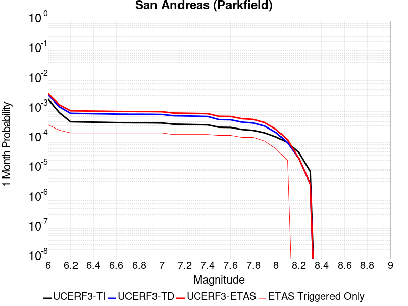 |  |  |

| Magnitude | 1 wk TI Prob | 1 wk TD Prob | 1 wk ETAS Prob | 1 wk ETAS/TD Gain | 1 wk ETAS Triggered Only | 1 mo TI Prob | 1 mo TD Prob | 1 mo ETAS Prob | 1 mo ETAS/TD Gain | 1 mo ETAS Triggered Only | 1 yr TI Prob | 1 yr TD Prob | 1 yr ETAS Prob | 1 yr ETAS/TD Gain | 1 yr ETAS Triggered Only | 10 yr TI Prob | 10 yr TD Prob | 10 yr ETAS Prob | 10 yr ETAS/TD Gain | 10 yr ETAS Triggered Only |
|-----|-----|-----|-----|-----|-----|-----|-----|-----|-----|-----|-----|-----|-----|-----|-----|-----|-----|-----|-----|-----|
| 6.0 | 5.556969E-4 | 7.778562E-4 | 9.976851E-4 | 1.2826086 | 2.2E-4 | 0.0023793848 | 0.0033299583 | 0.0036488925 | 1.0957773 | 3.2E-4 | 0.028586963 | 0.040235043 | 0.0408013 | 1.0140738 | 5.9E-4 | 0.25176284 | 0.3371973 | 0.3378866 | 1.0020442 | 0.00104 |
| 6.1 | 1.925858E-4 | 3.0278185E-4 | 4.5273642E-4 | 1.4952562 | 1.5E-4 | 8.2510663E-4 | 0.001297085 | 0.0015068125 | 1.1616915 | 2.1E-4 | 0.0099994885 | 0.01577393 | 0.01616762 | 1.0249583 | 4.0E-4 | 0.095613256 | 0.14975825 | 0.15038742 | 1.0042013 | 7.4E-4 |
| 6.2 | 9.4306815E-5 | 1.8243887E-4 | 2.9241882E-4 | 1.6028317 | 1.1E-4 | 4.0410945E-4 | 7.8164786E-4 | 9.515149E-4 | 1.2173193 | 1.7E-4 | 0.0049089384 | 0.009475246 | 0.00980212 | 1.0344976 | 3.3E-4 | 0.048019063 | 0.0918565 | 0.09241956 | 1.0061296 | 6.2E-4 |
| 6.3 | 9.283051E-5 | 1.794041E-4 | 2.8938436E-4 | 1.6130309 | 1.1E-4 | 3.9778434E-4 | 7.686494E-4 | 9.3851873E-4 | 1.2209972 | 1.7E-4 | 0.0048322747 | 0.009318355 | 0.0096452795 | 1.035084 | 3.3E-4 | 0.047285385 | 0.090509474 | 0.09107336 | 1.0062301 | 6.2E-4 |
| 6.4 | 9.138826E-5 | 1.7702584E-4 | 2.8700635E-4 | 1.6212683 | 1.1E-4 | 3.916052E-4 | 7.5846276E-4 | 9.283338E-4 | 1.2239676 | 1.7E-4 | 0.0047573745 | 0.009195387 | 0.009522353 | 1.0355575 | 3.3E-4 | 0.046568092 | 0.0894136 | 0.08997816 | 1.006314 | 6.2E-4 |
| 6.5 | 9.000255E-5 | 1.746064E-4 | 2.8458718E-4 | 1.6298784 | 1.1E-4 | 3.8566816E-4 | 7.4809964E-4 | 9.179725E-4 | 1.2270725 | 1.7E-4 | 0.0046854047 | 0.009070284 | 0.009397291 | 1.0360526 | 3.3E-4 | 0.045878403 | 0.08829608 | 0.08886133 | 1.0064018 | 6.2E-4 |
| 6.6 | 8.8109264E-5 | 1.7141816E-4 | 2.813993E-4 | 1.6415957 | 1.1E-4 | 3.7755648E-4 | 7.3444354E-4 | 9.043187E-4 | 1.2312977 | 1.7E-4 | 0.0045870654 | 0.008905404 | 0.009232465 | 1.0367261 | 3.3E-4 | 0.04493529 | 0.08682707 | 0.08739324 | 1.0065206 | 6.2E-4 |
| 6.7 | 8.738073E-5 | 1.7008898E-4 | 2.800703E-4 | 1.6466103 | 1.1E-4 | 3.7443507E-4 | 7.287503E-4 | 8.9862646E-4 | 1.233106 | 1.7E-4 | 0.0045492216 | 0.008836695 | 0.009163778 | 1.0370142 | 3.3E-4 | 0.04457213 | 0.0862268 | 0.08679334 | 1.0065703 | 6.2E-4 |
| 6.8 | 8.710195E-5 | 1.6954402E-4 | 2.7952535E-4 | 1.648689 | 1.1E-4 | 3.7324068E-4 | 7.26416E-4 | 8.962925E-4 | 1.2338557 | 1.7E-4 | 0.0045347405 | 0.008808513 | 0.009125695 | 1.0360085 | 3.2E-4 | 0.04443313 | 0.08597436 | 0.086531915 | 1.0064851 | 6.1E-4 |
| 6.9 | 8.6801556E-5 | 1.6895356E-4 | 2.7893498E-4 | 1.6509565 | 1.1E-4 | 3.7195362E-4 | 7.238869E-4 | 8.9376385E-4 | 1.2346733 | 1.7E-4 | 0.0045191357 | 0.0087779695 | 0.00909516 | 1.036135 | 3.2E-4 | 0.044283327 | 0.08570042 | 0.08625814 | 1.0065079 | 6.1E-4 |
| 7.0 | 8.5571606E-5 | 1.664819E-4 | 2.7646357E-4 | 1.6606225 | 1.1E-4 | 3.6668387E-4 | 7.132999E-4 | 8.831786E-4 | 1.238159 | 1.7E-4 | 0.004455241 | 0.008650103 | 0.008967335 | 1.0366738 | 3.2E-4 | 0.043669727 | 0.08454836 | 0.08510679 | 1.0066048 | 6.1E-4 |
| 7.1 | 7.82589E-5 | 1.5128969E-4 | 2.5127456E-4 | 1.6608837 | 1.0E-4 | 3.3535215E-4 | 6.4822397E-4 | 7.9812674E-4 | 1.2312515 | 1.5E-4 | 0.0040752706 | 0.007863738 | 0.008161379 | 1.0378498 | 3.0E-4 | 0.040013418 | 0.077460445 | 0.07799552 | 1.0069077 | 5.8E-4 |
| 7.2 | 7.690929E-5 | 1.4866212E-4 | 2.4864724E-4 | 1.6725663 | 1.0E-4 | 3.2956956E-4 | 6.369685E-4 | 7.86873E-4 | 1.2353405 | 1.5E-4 | 0.004005129 | 0.0077276826 | 0.008025364 | 1.0385215 | 3.0E-4 | 0.0393371 | 0.07623341 | 0.076769195 | 1.0070282 | 5.8E-4 |
| 7.3 | 7.5543794E-5 | 1.4562748E-4 | 2.456129E-4 | 1.6865836 | 1.0E-4 | 3.2371894E-4 | 6.239692E-4 | 7.738756E-4 | 1.2402465 | 1.5E-4 | 0.003934157 | 0.0075705256 | 0.007868255 | 1.0393274 | 3.0E-4 | 0.038652334 | 0.07479777 | 0.07532514 | 1.0070505 | 5.7E-4 |
| 7.4 | 7.4214564E-5 | 1.4263717E-4 | 2.426229E-4 | 1.7009795 | 1.0E-4 | 3.1802364E-4 | 6.1115966E-4 | 7.61068E-4 | 1.245285 | 1.5E-4 | 0.003865065 | 0.0074156416 | 0.0077134166 | 1.040155 | 3.0E-4 | 0.03798529 | 0.07337152 | 0.0738997 | 1.0071987 | 5.7E-4 |
| 7.5 | 6.149578E-5 | 1.1191443E-4 | 2.1190324E-4 | 1.8934398 | 1.0E-4 | 2.6352672E-4 | 4.795452E-4 | 6.1947806E-4 | 1.2918032 | 1.4E-4 | 0.0032037178 | 0.005822865 | 0.006111176 | 1.0495137 | 2.9E-4 | 0.03157923 | 0.058559462 | 0.05908667 | 1.0090029 | 5.6E-4 |
| 7.6 | 6.0643448E-5 | 1.102009E-4 | 2.1018987E-4 | 1.9073336 | 1.0E-4 | 2.598746E-4 | 4.7220418E-4 | 6.121381E-4 | 1.2963419 | 1.4E-4 | 0.0031593828 | 0.005733962 | 0.006022299 | 1.0502858 | 2.9E-4 | 0.031148417 | 0.05772042 | 0.058248095 | 1.0091419 | 5.6E-4 |
| 7.7 | 5.1652263E-5 | 9.175265E-5 | 1.7174531E-4 | 1.8718295 | 8.0E-5 | 2.2134806E-4 | 3.9316638E-4 | 5.131192E-4 | 1.3050942 | 1.2E-4 | 0.002691582 | 0.0047763046 | 0.005035063 | 1.0541754 | 2.6E-4 | 0.026592141 | 0.04853641 | 0.048945535 | 1.0084293 | 4.3E-4 |
| 7.8 | 4.8090482E-5 | 8.560165E-5 | 1.655948E-4 | 1.9344814 | 8.0E-5 | 2.060858E-4 | 3.6681266E-4 | 4.8676864E-4 | 1.3270224 | 1.2E-4 | 0.0025062072 | 0.004456807 | 0.0047156485 | 1.0580777 | 2.6E-4 | 0.024781305 | 0.045302264 | 0.04569369 | 1.0086403 | 4.1E-4 |
| 7.9 | 3.970278E-5 | 6.7507375E-5 | 1.2750333E-4 | 1.8887318 | 6.0E-5 | 1.7014367E-4 | 2.8928524E-4 | 3.792592E-4 | 1.3110216 | 9.0E-5 | 0.002069531 | 0.0035163634 | 0.0037156602 | 1.056677 | 2.0E-4 | 0.020503636 | 0.03588176 | 0.036161356 | 1.0077921 | 2.9E-4 |
| 8.0 | 2.8982335E-5 | 4.0698153E-5 | 7.069693E-5 | 1.7371042 | 3.0E-5 | 1.2420409E-4 | 1.7440901E-4 | 2.2440028E-4 | 1.2866324 | 5.0E-5 | 0.0015111357 | 0.0021213628 | 0.0022311294 | 1.0517435 | 1.1E-4 | 0.015009012 | 0.02201118 | 0.022187218 | 1.0079976 | 1.8E-4 |
| 8.1 | 1.8836186E-5 | 1.867974E-5 | 2.8679553E-5 | 1.5353293 | 1.0E-5 | 8.0724014E-5 | 8.005358E-5 | 1.0005198E-4 | 1.2498127 | 2.0E-5 | 9.823717E-4 | 9.742171E-4 | 0.0010141782 | 1.0410186 | 4.0E-5 | 0.009780403 | 0.010487711 | 0.010537187 | 1.0047175 | 5.0E-5 |
| 8.2 | 8.643924E-6 | 5.473668E-6 | 5.473668E-6 | 1.0 | 0.0 | 3.704486E-5 | 2.3458366E-5 | 2.3458366E-5 | 1.0 | 0.0 | 4.5092785E-4 | 2.8556827E-4 | 2.8556827E-4 | 1.0 | 0.0 | 0.0045001395 | 0.0032481793 | 0.0032481793 | 1.0 | 0.0 |
| 8.3 | 1.983087E-6 | 7.6564595E-7 | 7.6564595E-7 | 1.0 | 0.0 | 8.498917E-6 | 3.281336E-6 | 3.281336E-6 | 1.0 | 0.0 | 1.034694E-4 | 3.9949547E-5 | 3.9949547E-5 | 1.0 | 0.0 | 0.0010342124 | 4.717979E-4 | 4.717979E-4 | 1.0 | 0.0 |

## Death Valley (No)
*[(top)](#table-of-contents)*

| 1 Week | 1 Month | 1 Year | 10 Year |
|-----|-----|-----|-----|
|  |  |  | 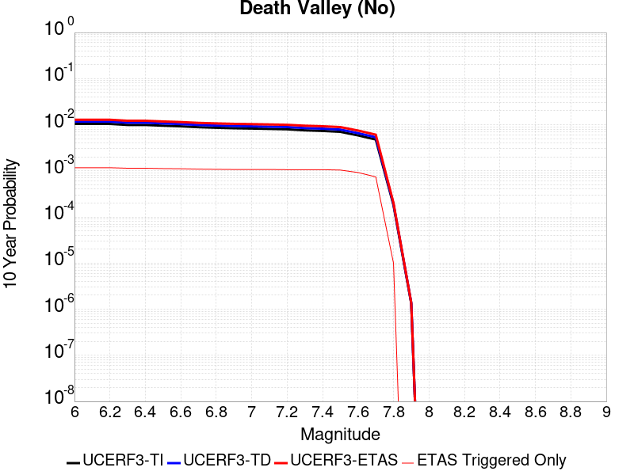 |

| Magnitude | 1 wk TI Prob | 1 wk TD Prob | 1 wk ETAS Prob | 1 wk ETAS/TD Gain | 1 wk ETAS Triggered Only | 1 mo TI Prob | 1 mo TD Prob | 1 mo ETAS Prob | 1 mo ETAS/TD Gain | 1 mo ETAS Triggered Only | 1 yr TI Prob | 1 yr TD Prob | 1 yr ETAS Prob | 1 yr ETAS/TD Gain | 1 yr ETAS Triggered Only | 10 yr TI Prob | 10 yr TD Prob | 10 yr ETAS Prob | 10 yr ETAS/TD Gain | 10 yr ETAS Triggered Only |
|-----|-----|-----|-----|-----|-----|-----|-----|-----|-----|-----|-----|-----|-----|-----|-----|-----|-----|-----|-----|-----|
| 6.0 | 2.0074807E-5 | 2.2500084E-5 | 1.9249626E-4 | 8.555358 | 1.7E-4 | 8.603206E-5 | 9.642541E-5 | 3.8639744E-4 | 4.007216 | 2.9E-4 | 0.001046937 | 0.0011733545 | 0.0017826387 | 1.519267 | 6.1E-4 | 0.010420183 | 0.011672506 | 0.012828849 | 1.0990655 | 0.00117 |
| 6.1 | 2.0074807E-5 | 2.2500084E-5 | 1.9249626E-4 | 8.555358 | 1.7E-4 | 8.603206E-5 | 9.642541E-5 | 3.8639744E-4 | 4.007216 | 2.9E-4 | 0.001046937 | 0.0011733545 | 0.0017826387 | 1.519267 | 6.1E-4 | 0.010420183 | 0.011672506 | 0.012828849 | 1.0990655 | 0.00117 |
| 6.2 | 2.0074807E-5 | 2.2500084E-5 | 1.9249626E-4 | 8.555358 | 1.7E-4 | 8.603206E-5 | 9.642541E-5 | 3.8639744E-4 | 4.007216 | 2.9E-4 | 0.001046937 | 0.0011733545 | 0.0017826387 | 1.519267 | 6.1E-4 | 0.010420183 | 0.011672506 | 0.012828849 | 1.0990655 | 0.00117 |
| 6.3 | 1.9050609E-5 | 2.1336948E-5 | 1.8133354E-4 | 8.4985695 | 1.6E-4 | 8.164292E-5 | 9.1440896E-5 | 3.614162E-4 | 3.952457 | 2.7E-4 | 9.935491E-4 | 0.001112731 | 0.0017020745 | 1.529637 | 5.9E-4 | 0.009891188 | 0.011072419 | 0.012199796 | 1.1018186 | 0.00114 |
| 6.4 | 1.9050609E-5 | 2.1336948E-5 | 1.8133354E-4 | 8.4985695 | 1.6E-4 | 8.164292E-5 | 9.1440896E-5 | 3.614162E-4 | 3.952457 | 2.7E-4 | 9.935491E-4 | 0.001112731 | 0.0017020745 | 1.529637 | 5.9E-4 | 0.009891188 | 0.011072419 | 0.012199796 | 1.1018186 | 0.00114 |
| 6.5 | 1.8367004E-5 | 2.0561009E-5 | 1.8055772E-4 | 8.78156 | 1.6E-4 | 7.8713354E-5 | 8.811567E-5 | 3.5809187E-4 | 4.0638843 | 2.7E-4 | 9.5791375E-4 | 0.0010722869 | 0.0016416756 | 1.5310042 | 5.7E-4 | 0.009537951 | 0.0106719155 | 0.011779963 | 1.1038283 | 0.00112 |
| 6.6 | 1.779439E-5 | 1.9910927E-5 | 1.7990774E-4 | 9.035628 | 1.6E-4 | 7.625944E-5 | 8.53298E-5 | 3.5530675E-4 | 4.1639237 | 2.7E-4 | 9.280632E-4 | 0.0010384015 | 0.0016078096 | 1.5483506 | 5.7E-4 | 0.009241969 | 0.010336253 | 0.0114347795 | 1.106279 | 0.00111 |
| 6.7 | 1.7025437E-5 | 1.9043426E-5 | 1.5904076E-4 | 8.351479 | 1.4E-4 | 7.296412E-5 | 8.161216E-5 | 3.3159176E-4 | 4.063019 | 2.5E-4 | 8.87976E-4 | 9.931813E-4 | 0.001542635 | 1.553226 | 5.5E-4 | 0.008844362 | 0.009888145 | 0.010967367 | 1.109143 | 0.00109 |
| 6.8 | 1.6545107E-5 | 1.8512545E-5 | 1.5850995E-4 | 8.562299 | 1.4E-4 | 7.090568E-5 | 7.93371E-5 | 3.2931726E-4 | 4.150861 | 2.5E-4 | 8.629347E-4 | 9.655073E-4 | 0.0015149763 | 1.5690987 | 5.5E-4 | 0.008595915 | 0.009613829 | 0.010683446 | 1.1112581 | 0.00108 |
| 6.9 | 1.615478E-5 | 1.8087594E-5 | 1.4808524E-4 | 8.187117 | 1.3E-4 | 6.9232934E-5 | 7.751599E-5 | 3.1749738E-4 | 4.0958953 | 2.4E-4 | 8.4258494E-4 | 9.433546E-4 | 0.0014828453 | 1.5718852 | 5.4E-4 | 0.008393973 | 0.009394196 | 0.010454143 | 1.1128302 | 0.00107 |
| 7.0 | 1.5894311E-5 | 1.780555E-5 | 1.4780324E-4 | 8.300964 | 1.3E-4 | 6.81167E-5 | 7.6307304E-5 | 3.16289E-4 | 4.1449375 | 2.4E-4 | 8.2900526E-4 | 9.286515E-4 | 0.0014681501 | 1.5809484 | 5.4E-4 | 0.008259195 | 0.009248397 | 0.010308501 | 1.1146257 | 0.00107 |
| 7.1 | 1.5602263E-5 | 1.7483504E-5 | 1.4748123E-4 | 8.435451 | 1.3E-4 | 6.6865134E-5 | 7.492718E-5 | 3.149092E-4 | 4.20287 | 2.4E-4 | 8.137789E-4 | 9.118627E-4 | 0.0014513703 | 1.5916544 | 5.4E-4 | 0.008108052 | 0.009081894 | 0.010142176 | 1.1167468 | 0.00107 |
| 7.2 | 1.5323829E-5 | 1.717063E-5 | 1.471684E-4 | 8.570937 | 1.3E-4 | 6.56719E-5 | 7.358637E-5 | 3.1356871E-4 | 4.2612333 | 2.4E-4 | 7.99262E-4 | 8.9555193E-4 | 0.0014350683 | 1.6024401 | 5.4E-4 | 0.007963934 | 0.008920107 | 0.009970651 | 1.1177727 | 0.00106 |
| 7.3 | 1.4556212E-5 | 1.6302456E-5 | 1.4630034E-4 | 8.974129 | 1.3E-4 | 6.238227E-5 | 6.9865826E-5 | 3.0984907E-4 | 4.4349155 | 2.4E-4 | 7.592395E-4 | 8.5029035E-4 | 0.0013898312 | 1.6345372 | 5.4E-4 | 0.0075665074 | 0.008471014 | 0.009522035 | 1.1240726 | 0.00106 |
| 7.4 | 1.411725E-5 | 1.580796E-5 | 1.458059E-4 | 9.223575 | 1.3E-4 | 6.0501097E-5 | 6.7746674E-5 | 3.0773043E-4 | 4.5423694 | 2.4E-4 | 7.363519E-4 | 8.245094E-4 | 0.0013640642 | 1.6543949 | 5.4E-4 | 0.0073391674 | 0.008215138 | 0.0092664305 | 1.1279701 | 0.00106 |
| 7.5 | 1.3503312E-5 | 1.5126289E-5 | 1.4512433E-4 | 9.594179 | 1.3E-4 | 5.7870053E-5 | 6.482538E-5 | 3.0480983E-4 | 4.702014 | 2.4E-4 | 7.043401E-4 | 7.8896893E-4 | 0.0013085587 | 1.658568 | 5.2E-4 | 0.007021119 | 0.007862304 | 0.008894128 | 1.1312368 | 0.00104 |
| 7.6 | 1.1279839E-5 | 1.2626327E-5 | 1.12625065E-4 | 8.91986 | 1.0E-4 | 4.834127E-5 | 5.4111737E-5 | 2.5410092E-4 | 4.6958556 | 2.0E-4 | 5.88396E-4 | 6.5861654E-4 | 0.001128307 | 1.713147 | 4.7E-4 | 0.005868405 | 0.006567199 | 0.007481157 | 1.1391702 | 9.2E-4 |
| 7.7 | 9.189108E-6 | 1.0283358E-5 | 7.028274E-5 | 6.83461 | 6.0E-5 | 3.93813E-5 | 4.407082E-5 | 1.8406464E-4 | 4.176565 | 1.4E-4 | 4.7936183E-4 | 5.3643517E-4 | 9.162313E-4 | 1.7080001 | 3.8E-4 | 0.004783291 | 0.005351914 | 0.0060879537 | 1.1375283 | 7.4E-4 |
| 7.8 | 3.4586725E-7 | 3.6482615E-7 | 3.6482615E-7 | 1.0 | 0.0 | 1.4822873E-6 | 1.5635396E-6 | 1.5635396E-6 | 1.0 | 0.0 | 1.80467E-5 | 1.9035933E-5 | 1.9035933E-5 | 1.0 | 0.0 | 1.8045233E-4 | 1.9034347E-4 | 2.0034157E-4 | 1.0525266 | 1.0E-5 |
| 7.9 | 2.5591178E-9 | 2.6696718E-9 | 2.6696718E-9 | 1.0 | 0.0 | 1.0967647E-8 | 1.14414505E-8 | 1.14414505E-8 | 1.0 | 0.0 | 1.335311E-7 | 1.3929966E-7 | 1.3929966E-7 | 1.0 | 0.0 | 1.3353102E-6 | 1.3929966E-6 | 1.3929966E-6 | 1.0 | 0.0 |

## San Andreas (Cholame) rev
*[(top)](#table-of-contents)*

| 1 Week | 1 Month | 1 Year | 10 Year |
|-----|-----|-----|-----|
|  | 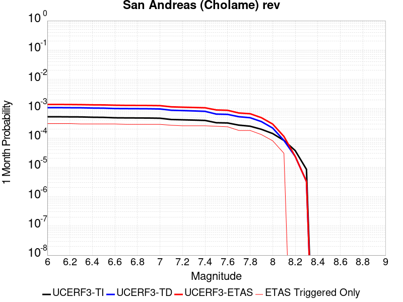 |  |  |

| Magnitude | 1 wk TI Prob | 1 wk TD Prob | 1 wk ETAS Prob | 1 wk ETAS/TD Gain | 1 wk ETAS Triggered Only | 1 mo TI Prob | 1 mo TD Prob | 1 mo ETAS Prob | 1 mo ETAS/TD Gain | 1 mo ETAS Triggered Only | 1 yr TI Prob | 1 yr TD Prob | 1 yr ETAS Prob | 1 yr ETAS/TD Gain | 1 yr ETAS Triggered Only | 10 yr TI Prob | 10 yr TD Prob | 10 yr ETAS Prob | 10 yr ETAS/TD Gain | 10 yr ETAS Triggered Only |
|-----|-----|-----|-----|-----|-----|-----|-----|-----|-----|-----|-----|-----|-----|-----|-----|-----|-----|-----|-----|-----|
| 6.0 | 1.2302514E-4 | 2.5205986E-4 | 4.22017E-4 | 1.674273 | 1.7E-4 | 5.27144E-4 | 0.0010798109 | 0.0013894762 | 1.2867773 | 3.1E-4 | 0.0063991086 | 0.013067958 | 0.013669986 | 1.046069 | 6.1E-4 | 0.06217949 | 0.12438412 | 0.12531227 | 1.007462 | 0.00106 |
| 6.1 | 1.2302514E-4 | 2.5205986E-4 | 4.22017E-4 | 1.674273 | 1.7E-4 | 5.27144E-4 | 0.0010798109 | 0.0013894762 | 1.2867773 | 3.1E-4 | 0.0063991086 | 0.013067958 | 0.013669986 | 1.046069 | 6.1E-4 | 0.06217949 | 0.12438412 | 0.12531227 | 1.007462 | 0.00106 |
| 6.2 | 1.2203569E-4 | 2.502277E-4 | 4.2018516E-4 | 1.6792113 | 1.7E-4 | 5.2290526E-4 | 0.0010719653 | 0.001381633 | 1.2888784 | 3.1E-4 | 0.006347804 | 0.012973578 | 0.013575665 | 1.0464087 | 6.1E-4 | 0.061695136 | 0.123571314 | 0.12450033 | 1.007518 | 0.00106 |
| 6.3 | 1.2142645E-4 | 2.4908737E-4 | 4.1904504E-4 | 1.6823214 | 1.7E-4 | 5.202953E-4 | 0.0010670823 | 0.0013667621 | 1.2808405 | 3.0E-4 | 0.006316212 | 0.012914834 | 0.013507085 | 1.0458583 | 6.0E-4 | 0.06139677 | 0.12306532 | 0.1239861 | 1.007482 | 0.00105 |
| 6.4 | 1.1865206E-4 | 2.4414246E-4 | 4.1410094E-4 | 1.6961448 | 1.7E-4 | 5.0840975E-4 | 0.0010459068 | 0.001345593 | 1.2865324 | 3.0E-4 | 0.006172335 | 0.012660044 | 0.013252448 | 1.0467932 | 6.0E-4 | 0.060036868 | 0.12085904 | 0.12178214 | 1.0076379 | 0.00105 |
| 6.5 | 1.17443946E-4 | 2.4207575E-4 | 4.120346E-4 | 1.7020895 | 1.7E-4 | 5.032341E-4 | 0.0010370566 | 0.0013367455 | 1.2889802 | 3.0E-4 | 0.006109677 | 0.012553536 | 0.013146004 | 1.0471953 | 6.0E-4 | 0.059444077 | 0.11993008 | 0.120854154 | 1.0077051 | 0.00105 |
| 6.6 | 1.13579066E-4 | 2.3516564E-4 | 4.0512567E-4 | 1.7227247 | 1.7E-4 | 4.866766E-4 | 0.001007465 | 0.0013071627 | 1.2974771 | 3.0E-4 | 0.0059092017 | 0.012197345 | 0.012790026 | 1.048591 | 6.0E-4 | 0.057545185 | 0.1168492 | 0.117776506 | 1.0079359 | 0.00105 |
| 6.7 | 1.1271412E-4 | 2.336088E-4 | 3.9357142E-4 | 1.6847457 | 1.6E-4 | 4.829711E-4 | 0.001000798 | 0.0012905077 | 1.2894788 | 2.9E-4 | 0.005864331 | 0.012117079 | 0.012690051 | 1.0472863 | 5.8E-4 | 0.057119697 | 0.11615275 | 0.11706311 | 1.0078377 | 0.00103 |
| 6.8 | 1.1217975E-4 | 2.3249313E-4 | 3.9245593E-4 | 1.6880324 | 1.6E-4 | 4.8068175E-4 | 9.960202E-4 | 0.0012857313 | 1.2908688 | 2.9E-4 | 0.005836608 | 0.012059555 | 0.012632561 | 1.0475147 | 5.8E-4 | 0.056856725 | 0.11565061 | 0.11656149 | 1.0078762 | 0.00103 |
| 6.9 | 1.1146753E-4 | 2.3098059E-4 | 3.9094363E-4 | 1.6925389 | 1.6E-4 | 4.7763053E-4 | 9.895428E-4 | 0.0012792558 | 1.2927747 | 2.9E-4 | 0.0057996577 | 0.011981564 | 0.012554614 | 1.0478277 | 5.8E-4 | 0.056506127 | 0.11497027 | 0.115881845 | 1.0079288 | 0.00103 |
| 7.0 | 1.0965793E-4 | 2.2721413E-4 | 3.8717777E-4 | 1.7040216 | 1.6E-4 | 4.698779E-4 | 9.734129E-4 | 0.0012631306 | 1.2976309 | 2.9E-4 | 0.005705768 | 0.011787324 | 0.012360487 | 1.0486253 | 5.8E-4 | 0.055614736 | 0.11327011 | 0.11418345 | 1.0080633 | 0.00103 |
| 7.1 | 9.927982E-5 | 2.0540332E-4 | 3.553725E-4 | 1.7301205 | 1.5E-4 | 4.2541555E-4 | 8.8000396E-4 | 0.0011497664 | 1.3065468 | 2.7E-4 | 0.0051671406 | 0.010661708 | 0.011215738 | 1.0519644 | 5.6E-4 | 0.05048634 | 0.10336573 | 0.10426237 | 1.0086744 | 0.001 |
| 7.2 | 9.696786E-5 | 2.0044584E-4 | 3.5041576E-4 | 1.7481818 | 1.5E-4 | 4.1551032E-4 | 8.587718E-4 | 0.0011185484 | 1.302498 | 2.6E-4 | 0.00504711 | 0.010405703 | 0.0109499805 | 1.0523056 | 5.5E-4 | 0.04934009 | 0.10110233 | 0.10199224 | 1.008802 | 9.9E-4 |
| 7.3 | 9.4727984E-5 | 1.9473763E-4 | 3.4470842E-4 | 1.7701172 | 1.5E-4 | 4.0591392E-4 | 8.343239E-4 | 0.0010941069 | 1.3113695 | 2.6E-4 | 0.0049308087 | 0.010110851 | 0.01065529 | 1.053847 | 5.5E-4 | 0.048228268 | 0.09847412 | 0.099366635 | 1.0090634 | 9.9E-4 |
| 7.4 | 9.220358E-5 | 1.8844259E-4 | 3.384143E-4 | 1.7958485 | 1.5E-4 | 3.9509835E-4 | 8.07362E-4 | 0.0010671521 | 1.3217765 | 2.6E-4 | 0.004799717 | 0.009785578 | 0.010330196 | 1.0556551 | 5.5E-4 | 0.046973653 | 0.09555831 | 0.096453704 | 1.0093702 | 9.9E-4 |
| 7.5 | 7.71631E-5 | 1.5179155E-4 | 3.0176877E-4 | 1.9880472 | 1.5E-4 | 3.306571E-4 | 6.5037323E-4 | 9.0021064E-4 | 1.3841447 | 2.5E-4 | 0.0040183207 | 0.007889617 | 0.008425357 | 1.0679044 | 5.4E-4 | 0.03946433 | 0.078289196 | 0.079192474 | 1.0115377 | 9.8E-4 |
| 7.6 | 7.5634416E-5 | 1.4838556E-4 | 2.883648E-4 | 1.943348 | 1.4E-4 | 3.241072E-4 | 6.357833E-4 | 8.756307E-4 | 1.3772471 | 2.4E-4 | 0.0039388672 | 0.007713256 | 0.008239168 | 1.0681828 | 5.3E-4 | 0.038697794 | 0.076654874 | 0.07754129 | 1.0115637 | 9.6E-4 |
| 7.7 | 6.3783E-5 | 1.2359623E-4 | 2.2358388E-4 | 1.8089862 | 1.0E-4 | 2.7332708E-4 | 5.2959064E-4 | 7.0949533E-4 | 1.3397051 | 1.8E-4 | 0.0033226798 | 0.0064287307 | 0.0068162233 | 1.0602752 | 3.9E-4 | 0.032734364 | 0.06454488 | 0.06516228 | 1.0095655 | 6.6E-4 |
| 7.8 | 5.863422E-5 | 1.14169685E-4 | 2.1415827E-4 | 1.8757893 | 1.0E-4 | 2.512653E-4 | 4.892069E-4 | 6.691189E-4 | 1.3677624 | 1.8E-4 | 0.003054864 | 0.0059398497 | 0.0063076518 | 1.0619211 | 3.7E-4 | 0.030132094 | 0.05966162 | 0.06021642 | 1.0092992 | 5.9E-4 |
| 7.9 | 4.595283E-5 | 8.426815E-5 | 1.6426141E-4 | 1.9492704 | 8.0E-5 | 1.9692584E-4 | 3.6109926E-4 | 4.910523E-4 | 1.3598819 | 1.3E-4 | 0.0023949358 | 0.0043875277 | 0.0046364306 | 1.0567297 | 2.5E-4 | 0.023692891 | 0.044363137 | 0.044716723 | 1.0079702 | 3.7E-4 |
| 8.0 | 3.2950178E-5 | 5.077396E-5 | 9.077193E-5 | 1.7877654 | 4.0E-5 | 1.412074E-4 | 2.1758456E-4 | 2.9756714E-4 | 1.3675932 | 8.0E-5 | 0.0017178444 | 0.0026458753 | 0.0027954786 | 1.056542 | 1.5E-4 | 0.017046256 | 0.027181072 | 0.02740482 | 1.0082318 | 2.3E-4 |
| 8.1 | 1.9177472E-5 | 1.9183733E-5 | 2.9183542E-5 | 1.5212649 | 1.0E-5 | 8.218658E-5 | 8.221342E-5 | 1.12210946E-4 | 1.364874 | 3.0E-5 | 0.0010001622 | 0.0010004893 | 0.0010504393 | 1.0499256 | 5.0E-5 | 0.009956728 | 0.010757887 | 0.010817241 | 1.0055172 | 6.0E-5 |
| 8.2 | 8.643924E-6 | 5.473668E-6 | 5.473668E-6 | 1.0 | 0.0 | 3.704486E-5 | 2.3458366E-5 | 2.3458366E-5 | 1.0 | 0.0 | 4.5092785E-4 | 2.8556827E-4 | 2.8556827E-4 | 1.0 | 0.0 | 0.0045001395 | 0.0032481793 | 0.0032481793 | 1.0 | 0.0 |
| 8.3 | 1.983087E-6 | 7.6564595E-7 | 7.6564595E-7 | 1.0 | 0.0 | 8.498917E-6 | 3.281336E-6 | 3.281336E-6 | 1.0 | 0.0 | 1.034694E-4 | 3.9949547E-5 | 3.9949547E-5 | 1.0 | 0.0 | 0.0010342124 | 4.717979E-4 | 4.717979E-4 | 1.0 | 0.0 |

## San Andreas (Carrizo) rev
*[(top)](#table-of-contents)*

| 1 Week | 1 Month | 1 Year | 10 Year |
|-----|-----|-----|-----|
| 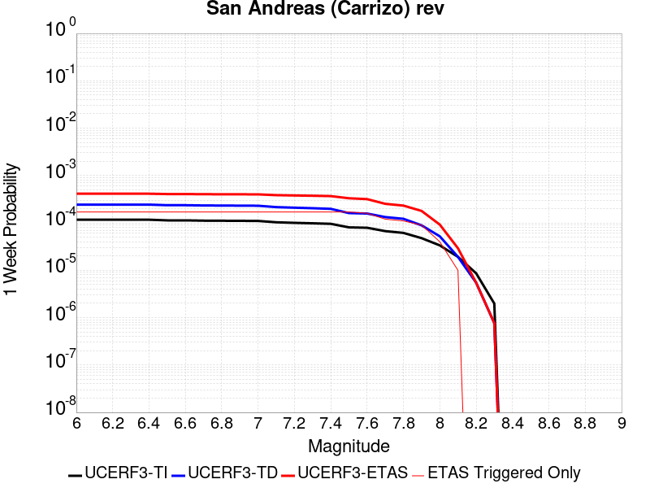 |  |  |  |

| Magnitude | 1 wk TI Prob | 1 wk TD Prob | 1 wk ETAS Prob | 1 wk ETAS/TD Gain | 1 wk ETAS Triggered Only | 1 mo TI Prob | 1 mo TD Prob | 1 mo ETAS Prob | 1 mo ETAS/TD Gain | 1 mo ETAS Triggered Only | 1 yr TI Prob | 1 yr TD Prob | 1 yr ETAS Prob | 1 yr ETAS/TD Gain | 1 yr ETAS Triggered Only | 10 yr TI Prob | 10 yr TD Prob | 10 yr ETAS Prob | 10 yr ETAS/TD Gain | 10 yr ETAS Triggered Only |
|-----|-----|-----|-----|-----|-----|-----|-----|-----|-----|-----|-----|-----|-----|-----|-----|-----|-----|-----|-----|-----|
| 6.0 | 1.1674632E-4 | 2.4324407E-4 | 4.132027E-4 | 1.6987165 | 1.7E-4 | 5.002454E-4 | 0.0010420597 | 0.0013417471 | 1.2875913 | 3.0E-4 | 0.006073493 | 0.012613757 | 0.013206189 | 1.0469671 | 6.0E-4 | 0.0591016 | 0.120640226 | 0.12158114 | 1.0077994 | 0.00107 |
| 6.1 | 1.1674632E-4 | 2.4324407E-4 | 4.132027E-4 | 1.6987165 | 1.7E-4 | 5.002454E-4 | 0.0010420597 | 0.0013417471 | 1.2875913 | 3.0E-4 | 0.006073493 | 0.012613757 | 0.013206189 | 1.0469671 | 6.0E-4 | 0.0591016 | 0.120640226 | 0.12158114 | 1.0077994 | 0.00107 |
| 6.2 | 1.1674632E-4 | 2.4324407E-4 | 4.132027E-4 | 1.6987165 | 1.7E-4 | 5.002454E-4 | 0.0010420597 | 0.0013417471 | 1.2875913 | 3.0E-4 | 0.006073493 | 0.012613757 | 0.013206189 | 1.0469671 | 6.0E-4 | 0.0591016 | 0.120640226 | 0.12158114 | 1.0077994 | 0.00107 |
| 6.3 | 1.1674632E-4 | 2.4324407E-4 | 4.132027E-4 | 1.6987165 | 1.7E-4 | 5.002454E-4 | 0.0010420597 | 0.0013417471 | 1.2875913 | 3.0E-4 | 0.006073493 | 0.012613757 | 0.013206189 | 1.0469671 | 6.0E-4 | 0.0591016 | 0.120640226 | 0.12158114 | 1.0077994 | 0.00107 |
| 6.4 | 1.1674632E-4 | 2.4324407E-4 | 4.132027E-4 | 1.6987165 | 1.7E-4 | 5.002454E-4 | 0.0010420597 | 0.0013417471 | 1.2875913 | 3.0E-4 | 0.006073493 | 0.012613757 | 0.013206189 | 1.0469671 | 6.0E-4 | 0.0591016 | 0.120640226 | 0.12158114 | 1.0077994 | 0.00107 |
| 6.5 | 1.13136164E-4 | 2.3644442E-4 | 4.0640423E-4 | 1.7188151 | 1.7E-4 | 4.847792E-4 | 0.0010129412 | 0.0013126374 | 1.2958672 | 3.0E-4 | 0.0058862255 | 0.012263271 | 0.012855913 | 1.0483266 | 6.0E-4 | 0.057327334 | 0.11761008 | 0.11855424 | 1.0080279 | 0.00107 |
| 6.6 | 1.13136164E-4 | 2.3644442E-4 | 4.0640423E-4 | 1.7188151 | 1.7E-4 | 4.847792E-4 | 0.0010129412 | 0.0013126374 | 1.2958672 | 3.0E-4 | 0.0058862255 | 0.012263271 | 0.012855913 | 1.0483266 | 6.0E-4 | 0.057327334 | 0.11761008 | 0.11855424 | 1.0080279 | 0.00107 |
| 6.7 | 1.1149675E-4 | 2.3335687E-4 | 4.0331722E-4 | 1.7283279 | 1.7E-4 | 4.777557E-4 | 9.997191E-4 | 0.0012994192 | 1.2997843 | 3.0E-4 | 0.0058011734 | 0.012104088 | 0.012696826 | 1.04897 | 6.0E-4 | 0.05652051 | 0.1162291 | 0.11717474 | 1.0081359 | 0.00107 |
| 6.8 | 1.1103589E-4 | 2.3237852E-4 | 4.02339E-4 | 1.731395 | 1.7E-4 | 4.7578133E-4 | 9.955293E-4 | 0.0012952306 | 1.3010472 | 3.0E-4 | 0.005777263 | 0.012053643 | 0.012646411 | 1.0491775 | 6.0E-4 | 0.056293584 | 0.11578894 | 0.11673505 | 1.008171 | 0.00107 |
| 6.9 | 1.1053259E-4 | 2.3130233E-4 | 4.01263E-4 | 1.7347988 | 1.7E-4 | 4.7362508E-4 | 9.909206E-4 | 0.0012906233 | 1.3024487 | 3.0E-4 | 0.0057511497 | 0.011998152 | 0.012590953 | 1.0494077 | 6.0E-4 | 0.05604569 | 0.11530445 | 0.116251074 | 1.0082098 | 0.00107 |
| 7.0 | 1.1005377E-4 | 2.3031076E-4 | 4.0027162E-4 | 1.7379631 | 1.7E-4 | 4.7157376E-4 | 9.866742E-4 | 0.0012863782 | 1.3037517 | 3.0E-4 | 0.0057263062 | 0.011947021 | 0.012539852 | 1.0496217 | 6.0E-4 | 0.055809796 | 0.11485658 | 0.11580369 | 1.008246 | 0.00107 |
| 7.1 | 1.0308142E-4 | 2.1540876E-4 | 3.8537214E-4 | 1.7890272 | 1.7E-4 | 4.417027E-4 | 9.228548E-4 | 0.001222578 | 1.3247782 | 3.0E-4 | 0.0053644776 | 0.011178188 | 0.0117714815 | 1.0530759 | 6.0E-4 | 0.052368138 | 0.10809042 | 0.10903585 | 1.0087466 | 0.00106 |
| 7.2 | 1.0027479E-4 | 2.094876E-4 | 3.79452E-4 | 1.8113339 | 1.7E-4 | 4.296783E-4 | 8.9749607E-4 | 0.0011872358 | 1.3228312 | 2.9E-4 | 0.0052187922 | 0.010872566 | 0.0114561515 | 1.053675 | 5.9E-4 | 0.050979212 | 0.10539086 | 0.1063302 | 1.0089129 | 0.00105 |
| 7.3 | 9.816942E-5 | 2.0423878E-4 | 3.7420407E-4 | 1.8321891 | 1.7E-4 | 4.2065824E-4 | 8.7501644E-4 | 0.0011647627 | 1.3311324 | 2.9E-4 | 0.005109493 | 0.010601572 | 0.011185317 | 1.0550622 | 5.9E-4 | 0.049935985 | 0.10297546 | 0.10391733 | 1.0091466 | 0.00105 |
| 7.4 | 9.5634205E-5 | 1.9793298E-4 | 3.6789934E-4 | 1.8587066 | 1.7E-4 | 4.0979648E-4 | 8.4800937E-4 | 0.0011377635 | 1.3416873 | 2.9E-4 | 0.0049778637 | 0.010275901 | 0.0108499415 | 1.0558628 | 5.8E-4 | 0.048678253 | 0.100067884 | 0.10100381 | 1.0093529 | 0.00104 |
| 7.5 | 8.052417E-5 | 1.6113915E-4 | 3.3111175E-4 | 2.0548189 | 1.7E-4 | 3.4505792E-4 | 6.9041376E-4 | 9.702205E-4 | 1.4052739 | 2.8E-4 | 0.0041929903 | 0.008373471 | 0.008938698 | 1.0675021 | 5.7E-4 | 0.04114753 | 0.082815245 | 0.08375078 | 1.0112966 | 0.00102 |
| 7.6 | 7.897024E-5 | 1.5767086E-4 | 3.1764564E-4 | 2.0146122 | 1.6E-4 | 3.384E-4 | 6.755574E-4 | 9.45375E-4 | 1.3994 | 2.7E-4 | 0.0041122385 | 0.00819397 | 0.008749382 | 1.067783 | 5.6E-4 | 0.040369697 | 0.08115866 | 0.0820775 | 1.0113215 | 0.001 |
| 7.7 | 6.707427E-5 | 1.3277122E-4 | 2.527553E-4 | 1.9036903 | 1.2E-4 | 2.8742946E-4 | 5.688955E-4 | 7.78776E-4 | 1.3689263 | 2.1E-4 | 0.003493839 | 0.0069043385 | 0.0073214388 | 1.0604113 | 4.2E-4 | 0.034394164 | 0.06905339 | 0.069705054 | 1.0094371 | 7.0E-4 |
| 7.8 | 6.147705E-5 | 1.2198445E-4 | 2.3197103E-4 | 1.9016442 | 1.1E-4 | 2.6344648E-4 | 5.226858E-4 | 7.225813E-4 | 1.382439 | 2.0E-4 | 0.0032027436 | 0.006345156 | 0.0067326818 | 1.0610743 | 3.9E-4 | 0.031569764 | 0.0635172 | 0.064097814 | 1.0091411 | 6.2E-4 |
| 7.9 | 4.7636717E-5 | 8.8802946E-5 | 1.7879496E-4 | 2.0133898 | 9.0E-5 | 2.0414138E-4 | 3.8052857E-4 | 5.304715E-4 | 1.3940386 | 1.5E-4 | 0.0024825884 | 0.004623101 | 0.004891853 | 1.0581324 | 2.7E-4 | 0.024550365 | 0.046629366 | 0.047010712 | 1.0081782 | 4.0E-4 |
| 8.0 | 3.3554235E-5 | 5.2138024E-5 | 9.213594E-5 | 1.7671543 | 4.0E-5 | 1.4379594E-4 | 2.2342955E-4 | 3.0341168E-4 | 1.3579746 | 8.0E-5 | 0.0017493097 | 0.002716863 | 0.0028664556 | 1.0550607 | 1.5E-4 | 0.017356034 | 0.027881905 | 0.028105494 | 1.0080191 | 2.3E-4 |
| 8.1 | 1.9175432E-5 | 1.9183564E-5 | 2.9183373E-5 | 1.5212696 | 1.0E-5 | 8.217783E-5 | 8.221269E-5 | 1.1221022E-4 | 1.3648772 | 3.0E-5 | 0.0010000558 | 0.0010004805 | 0.0010504305 | 1.049926 | 5.0E-5 | 0.009955673 | 0.010757771 | 0.010817125 | 1.0055174 | 6.0E-5 |
| 8.2 | 8.643924E-6 | 5.473668E-6 | 5.473668E-6 | 1.0 | 0.0 | 3.704486E-5 | 2.3458366E-5 | 2.3458366E-5 | 1.0 | 0.0 | 4.5092785E-4 | 2.8556827E-4 | 2.8556827E-4 | 1.0 | 0.0 | 0.0045001395 | 0.0032481793 | 0.0032481793 | 1.0 | 0.0 |
| 8.3 | 1.983087E-6 | 7.6564595E-7 | 7.6564595E-7 | 1.0 | 0.0 | 8.498917E-6 | 3.281336E-6 | 3.281336E-6 | 1.0 | 0.0 | 1.034694E-4 | 3.9949547E-5 | 3.9949547E-5 | 1.0 | 0.0 | 0.0010342124 | 4.717979E-4 | 4.717979E-4 | 1.0 | 0.0 |

## Death Valley (Fish Lake Valley)
*[(top)](#table-of-contents)*

| 1 Week | 1 Month | 1 Year | 10 Year |
|-----|-----|-----|-----|
|  | 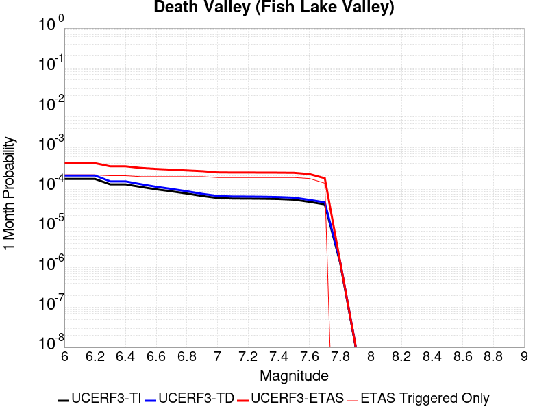 |  |  |

| Magnitude | 1 wk TI Prob | 1 wk TD Prob | 1 wk ETAS Prob | 1 wk ETAS/TD Gain | 1 wk ETAS Triggered Only | 1 mo TI Prob | 1 mo TD Prob | 1 mo ETAS Prob | 1 mo ETAS/TD Gain | 1 mo ETAS Triggered Only | 1 yr TI Prob | 1 yr TD Prob | 1 yr ETAS Prob | 1 yr ETAS/TD Gain | 1 yr ETAS Triggered Only | 10 yr TI Prob | 10 yr TD Prob | 10 yr ETAS Prob | 10 yr ETAS/TD Gain | 10 yr ETAS Triggered Only |
|-----|-----|-----|-----|-----|-----|-----|-----|-----|-----|-----|-----|-----|-----|-----|-----|-----|-----|-----|-----|-----|
| 6.0 | 3.872328E-5 | 4.7265705E-5 | 1.5726051E-4 | 3.327159 | 1.1E-4 | 1.6594635E-4 | 2.0255324E-4 | 4.125107E-4 | 2.0365543 | 2.1E-4 | 0.0020185246 | 0.0024635606 | 0.0029224274 | 1.1862617 | 4.6E-4 | 0.02000288 | 0.024388338 | 0.025237119 | 1.0348028 | 8.7E-4 |
| 6.1 | 3.872328E-5 | 4.7265705E-5 | 1.5726051E-4 | 3.327159 | 1.1E-4 | 1.6594635E-4 | 2.0255324E-4 | 4.125107E-4 | 2.0365543 | 2.1E-4 | 0.0020185246 | 0.0024635606 | 0.0029224274 | 1.1862617 | 4.6E-4 | 0.02000288 | 0.024388338 | 0.025237119 | 1.0348028 | 8.7E-4 |
| 6.2 | 3.872328E-5 | 4.7265705E-5 | 1.5726051E-4 | 3.327159 | 1.1E-4 | 1.6594635E-4 | 2.0255324E-4 | 4.125107E-4 | 2.0365543 | 2.1E-4 | 0.0020185246 | 0.0024635606 | 0.0029224274 | 1.1862617 | 4.6E-4 | 0.02000288 | 0.024388338 | 0.025237119 | 1.0348028 | 8.7E-4 |
| 6.3 | 2.8356371E-5 | 3.360979E-5 | 1.3360643E-4 | 3.9752235 | 1.0E-4 | 1.2152165E-4 | 1.4403443E-4 | 3.4400562E-4 | 2.388357 | 2.0E-4 | 0.0014785219 | 0.0017522788 | 0.0022014903 | 1.2563585 | 4.5E-4 | 0.014687235 | 0.017391816 | 0.018217206 | 1.0474585 | 8.4E-4 |
| 6.4 | 2.8356371E-5 | 3.360979E-5 | 1.3360643E-4 | 3.9752235 | 1.0E-4 | 1.2152165E-4 | 1.4403443E-4 | 3.4400562E-4 | 2.388357 | 2.0E-4 | 0.0014785219 | 0.0017522788 | 0.0022014903 | 1.2563585 | 4.5E-4 | 0.014687235 | 0.017391816 | 0.018217206 | 1.0474585 | 8.4E-4 |
| 6.5 | 2.4448687E-5 | 2.8607585E-5 | 1.18605014E-4 | 4.145929 | 9.0E-5 | 1.0477588E-4 | 1.2259845E-4 | 3.1257514E-4 | 2.5495849 | 1.9E-4 | 0.0012748998 | 0.0014916616 | 0.0019310054 | 1.294533 | 4.4E-4 | 0.012676105 | 0.014821392 | 0.015629238 | 1.0545055 | 8.2E-4 |
| 6.6 | 2.1298161E-5 | 2.4660083E-5 | 1.14657865E-4 | 4.649533 | 9.0E-5 | 9.127464E-5 | 1.0568197E-4 | 2.9566188E-4 | 2.797657 | 1.9E-4 | 0.0011107022 | 0.0012859512 | 0.0017253854 | 1.3417192 | 4.4E-4 | 0.011051672 | 0.01278853 | 0.0135980435 | 1.0633 | 8.2E-4 |
| 6.7 | 1.8959729E-5 | 2.1781027E-5 | 1.1177907E-4 | 5.1319466 | 9.0E-5 | 8.125345E-5 | 9.334406E-5 | 2.833263E-4 | 3.0352905 | 1.9E-4 | 9.888117E-4 | 0.001135897 | 0.0015753972 | 1.386919 | 4.4E-4 | 0.009844234 | 0.01130357 | 0.012114301 | 1.0717235 | 8.2E-4 |
| 6.8 | 1.6691629E-5 | 1.9018351E-5 | 1.0901664E-4 | 5.732181 | 9.0E-5 | 7.153359E-5 | 8.150477E-5 | 2.714893E-4 | 3.330962 | 1.9E-4 | 8.7057345E-4 | 9.918857E-4 | 0.0014314493 | 1.4431595 | 4.4E-4 | 0.008671708 | 0.009876343 | 0.010688245 | 1.0822067 | 8.2E-4 |
| 6.9 | 1.450505E-5 | 1.638954E-5 | 1.0638806E-4 | 6.491217 | 9.0E-5 | 6.216302E-5 | 7.0239046E-5 | 2.602257E-4 | 3.7048583 | 1.9E-4 | 7.5657194E-4 | 8.5483363E-4 | 0.0012944575 | 1.5142801 | 4.4E-4 | 0.007540013 | 0.008516386 | 0.009329402 | 1.095465 | 8.2E-4 |
| 7.0 | 1.2940855E-5 | 1.4537972E-5 | 9.453681E-5 | 6.502751 | 8.0E-5 | 5.545963E-5 | 6.230414E-5 | 2.4229292E-4 | 3.8888736 | 1.8E-4 | 6.750118E-4 | 7.5829466E-4 | 0.0011879686 | 1.5666319 | 4.3E-4 | 0.006729651 | 0.0075576897 | 0.008361568 | 1.1063656 | 8.1E-4 |
| 7.1 | 1.2544658E-5 | 1.4078208E-5 | 9.4077084E-5 | 6.6824617 | 8.0E-5 | 5.3761712E-5 | 6.0333812E-5 | 2.4032294E-4 | 3.9832218 | 1.8E-4 | 6.5435225E-4 | 7.343222E-4 | 0.0011640064 | 1.585144 | 4.3E-4 | 0.006524288 | 0.007319551 | 0.008123622 | 1.1098526 | 8.1E-4 |
| 7.2 | 1.2489416E-5 | 1.4015674E-5 | 9.4014555E-5 | 6.707815 | 8.0E-5 | 5.3524967E-5 | 6.0065824E-5 | 2.4005501E-4 | 3.9965324 | 1.8E-4 | 6.514716E-4 | 7.310616E-4 | 0.0011607473 | 1.5877557 | 4.3E-4 | 0.006495651 | 0.0072871596 | 0.008091257 | 1.1103444 | 8.1E-4 |
| 7.3 | 1.2368307E-5 | 1.3879812E-5 | 9.3878705E-5 | 6.7636867 | 8.0E-5 | 5.3005948E-5 | 5.9483587E-5 | 2.3947288E-4 | 4.025865 | 1.8E-4 | 6.451563E-4 | 7.2397763E-4 | 0.0011536663 | 1.593511 | 4.3E-4 | 0.0064328653 | 0.007216782 | 0.0080209365 | 1.1114284 | 8.1E-4 |
| 7.4 | 1.2161707E-5 | 1.36478675E-5 | 9.364678E-5 | 6.8616414 | 8.0E-5 | 5.212056E-5 | 5.8489582E-5 | 2.3847906E-4 | 4.077291 | 1.8E-4 | 6.3438306E-4 | 7.118836E-4 | 0.0011415775 | 1.6036013 | 4.3E-4 | 0.006325751 | 0.0070966207 | 0.007900872 | 1.1133288 | 8.1E-4 |
| 7.5 | 1.1707948E-5 | 1.3145515E-5 | 9.314447E-5 | 7.0856457 | 8.0E-5 | 5.0175953E-5 | 5.6336736E-5 | 2.363266E-4 | 4.1948934 | 1.8E-4 | 6.10721E-4 | 6.856895E-4 | 0.0011153946 | 1.626676 | 4.3E-4 | 0.0060904534 | 0.006836321 | 0.0076407837 | 1.1176748 | 8.1E-4 |
| 7.6 | 1.0319538E-5 | 1.1579622E-5 | 9.1578695E-5 | 7.9086084 | 8.0E-5 | 4.4225842E-5 | 4.9626036E-5 | 2.196176E-4 | 4.4254513 | 1.7E-4 | 5.383166E-4 | 6.040347E-4 | 0.001013787 | 1.6783589 | 4.1E-4 | 0.0053701443 | 0.0060244603 | 0.006809701 | 1.1303421 | 7.9E-4 |
| 7.7 | 8.937764E-6 | 1.0022779E-5 | 6.0022277E-5 | 5.9885864 | 5.0E-5 | 3.830414E-5 | 4.295409E-5 | 1.7294851E-4 | 4.026357 | 1.3E-4 | 4.6625308E-4 | 5.228456E-4 | 8.9265214E-4 | 1.7072959 | 3.7E-4 | 0.0046527605 | 0.005216664 | 0.005942856 | 1.1392062 | 7.3E-4 |
| 7.8 | 3.108007E-7 | 3.284654E-7 | 3.284654E-7 | 1.0 | 0.0 | 1.3320023E-6 | 1.407708E-6 | 1.407708E-6 | 1.0 | 0.0 | 1.6217007E-5 | 1.7138715E-5 | 1.7138715E-5 | 1.0 | 0.0 | 1.6215823E-4 | 1.7137431E-4 | 1.813726E-4 | 1.0583419 | 1.0E-5 |
| 7.9 | 2.5591178E-9 | 2.6696718E-9 | 2.6696718E-9 | 1.0 | 0.0 | 1.0967647E-8 | 1.14414505E-8 | 1.14414505E-8 | 1.0 | 0.0 | 1.335311E-7 | 1.3929966E-7 | 1.3929966E-7 | 1.0 | 0.0 | 1.3353102E-6 | 1.3929966E-6 | 1.3929966E-6 | 1.0 | 0.0 |

## Red Pass
*[(top)](#table-of-contents)*

| 1 Week | 1 Month | 1 Year | 10 Year |
|-----|-----|-----|-----|
|  |  |  |  |

| Magnitude | 1 wk TI Prob | 1 wk TD Prob | 1 wk ETAS Prob | 1 wk ETAS/TD Gain | 1 wk ETAS Triggered Only | 1 mo TI Prob | 1 mo TD Prob | 1 mo ETAS Prob | 1 mo ETAS/TD Gain | 1 mo ETAS Triggered Only | 1 yr TI Prob | 1 yr TD Prob | 1 yr ETAS Prob | 1 yr ETAS/TD Gain | 1 yr ETAS Triggered Only | 10 yr TI Prob | 10 yr TD Prob | 10 yr ETAS Prob | 10 yr ETAS/TD Gain | 10 yr ETAS Triggered Only |
|-----|-----|-----|-----|-----|-----|-----|-----|-----|-----|-----|-----|-----|-----|-----|-----|-----|-----|-----|-----|-----|
| 6.0 | 8.258278E-6 | 8.551265E-6 | 1.1855033E-4 | 13.863484 | 1.1E-4 | 3.539214E-5 | 3.6647863E-5 | 1.666431E-4 | 4.5471435 | 1.3E-4 | 4.308141E-4 | 4.4611428E-4 | 8.2594476E-4 | 1.8514197 | 3.8E-4 | 0.0042997985 | 0.004453945 | 0.005180693 | 1.1631696 | 7.3E-4 |
| 6.1 | 3.649988E-6 | 3.7753161E-6 | 3.3775203E-5 | 8.946324 | 3.0E-5 | 1.5642712E-5 | 1.6179853E-5 | 6.617904E-5 | 4.090213 | 5.0E-5 | 1.9043336E-4 | 1.9697666E-4 | 3.8693924E-4 | 1.9643912 | 1.9E-4 | 0.0019027026 | 0.001968488 | 0.0023677007 | 1.2028016 | 4.0E-4 |
| 6.2 | 3.649988E-6 | 3.7753161E-6 | 3.3775203E-5 | 8.946324 | 3.0E-5 | 1.5642712E-5 | 1.6179853E-5 | 6.617904E-5 | 4.090213 | 5.0E-5 | 1.9043336E-4 | 1.9697666E-4 | 3.8693924E-4 | 1.9643912 | 1.9E-4 | 0.0019027026 | 0.001968488 | 0.0023677007 | 1.2028016 | 4.0E-4 |
| 6.3 | 1.3924937E-6 | 1.4411166E-6 | 1.1441102E-5 | 7.9390535 | 1.0E-5 | 5.9678164E-6 | 6.1762075E-6 | 3.617602E-5 | 5.85732 | 3.0E-5 | 7.265574E-5 | 7.519415E-5 | 1.6518738E-4 | 2.1968117 | 9.0E-5 | 7.263199E-4 | 7.518258E-4 | 9.117055E-4 | 1.2126553 | 1.6E-4 |
| 6.4 | 1.3924937E-6 | 1.4411166E-6 | 1.1441102E-5 | 7.9390535 | 1.0E-5 | 5.9678164E-6 | 6.1762075E-6 | 3.617602E-5 | 5.85732 | 3.0E-5 | 7.265574E-5 | 7.519415E-5 | 1.6518738E-4 | 2.1968117 | 9.0E-5 | 7.263199E-4 | 7.518258E-4 | 9.117055E-4 | 1.2126553 | 1.6E-4 |
| 6.5 | 9.876812E-7 | 1.0221912E-6 | 1.1022181E-5 | 10.782895 | 1.0E-5 | 4.2329125E-6 | 4.3808195E-6 | 2.4380732E-5 | 5.5653358 | 2.0E-5 | 5.153449E-5 | 5.3336476E-5 | 1.1333328E-4 | 2.1248736 | 6.0E-5 | 5.1522546E-4 | 5.333648E-4 | 6.6329545E-4 | 1.2436056 | 1.3E-4 |

## San Andreas (Coachella) rev
*[(top)](#table-of-contents)*

| 1 Week | 1 Month | 1 Year | 10 Year |
|-----|-----|-----|-----|
|  |  |  |  |

| Magnitude | 1 wk TI Prob | 1 wk TD Prob | 1 wk ETAS Prob | 1 wk ETAS/TD Gain | 1 wk ETAS Triggered Only | 1 mo TI Prob | 1 mo TD Prob | 1 mo ETAS Prob | 1 mo ETAS/TD Gain | 1 mo ETAS Triggered Only | 1 yr TI Prob | 1 yr TD Prob | 1 yr ETAS Prob | 1 yr ETAS/TD Gain | 1 yr ETAS Triggered Only | 10 yr TI Prob | 10 yr TD Prob | 10 yr ETAS Prob | 10 yr ETAS/TD Gain | 10 yr ETAS Triggered Only |
|-----|-----|-----|-----|-----|-----|-----|-----|-----|-----|-----|-----|-----|-----|-----|-----|-----|-----|-----|-----|-----|
| 6.0 | 1.1925945E-4 | 3.273077E-4 | 5.3723896E-4 | 1.641388 | 2.1E-4 | 5.110118E-4 | 0.001401998 | 0.0016816054 | 1.199435 | 2.8E-4 | 0.0062038354 | 0.016937068 | 0.017438428 | 1.0296015 | 5.1E-4 | 0.060334753 | 0.15267672 | 0.15332915 | 1.0042733 | 7.7E-4 |
| 6.1 | 1.1925945E-4 | 3.273077E-4 | 5.3723896E-4 | 1.641388 | 2.1E-4 | 5.110118E-4 | 0.001401998 | 0.0016816054 | 1.199435 | 2.8E-4 | 0.0062038354 | 0.016937068 | 0.017438428 | 1.0296015 | 5.1E-4 | 0.060334753 | 0.15267672 | 0.15332915 | 1.0042733 | 7.7E-4 |
| 6.2 | 1.07432395E-4 | 3.0231563E-4 | 5.1225215E-4 | 1.6944283 | 2.1E-4 | 4.603433E-4 | 0.001294999 | 0.0015746364 | 1.2159364 | 2.8E-4 | 0.005590286 | 0.015653731 | 0.016155748 | 1.03207 | 5.1E-4 | 0.05451731 | 0.14182784 | 0.14248863 | 1.0046592 | 7.7E-4 |
| 6.3 | 1.0718766E-4 | 3.0176868E-4 | 5.117053E-4 | 1.6956873 | 2.1E-4 | 4.592948E-4 | 0.0012926573 | 0.0015722953 | 1.216328 | 2.8E-4 | 0.005577586 | 0.01562563 | 0.01612766 | 1.0321287 | 5.1E-4 | 0.054396555 | 0.14159605 | 0.14225702 | 1.004668 | 7.7E-4 |
| 6.4 | 1.0355944E-4 | 2.9384956E-4 | 5.037878E-4 | 1.7144414 | 2.1E-4 | 4.4375064E-4 | 0.0012587514 | 0.0015383989 | 1.2221626 | 2.8E-4 | 0.0053892885 | 0.015218662 | 0.0157209 | 1.0330015 | 5.1E-4 | 0.052604496 | 0.13815795 | 0.13882157 | 1.0048033 | 7.7E-4 |
| 6.5 | 1.0227914E-4 | 2.9104383E-4 | 5.0098274E-4 | 1.7213308 | 2.1E-4 | 4.382655E-4 | 0.0012467385 | 0.0015164019 | 1.2162951 | 2.7E-4 | 0.0053228354 | 0.015074439 | 0.015566901 | 1.0326687 | 5.0E-4 | 0.051971316 | 0.13694239 | 0.1375983 | 1.0047898 | 7.6E-4 |
| 6.6 | 1.0116757E-4 | 2.8870135E-4 | 4.986407E-4 | 1.7271852 | 2.1E-4 | 4.3350324E-4 | 0.0012367087 | 0.0015063748 | 1.2180514 | 2.7E-4 | 0.0052651367 | 0.014954008 | 0.015446532 | 1.0329359 | 5.0E-4 | 0.051421247 | 0.13591973 | 0.13657644 | 1.0048316 | 7.6E-4 |
| 6.7 | 1.0050676E-4 | 2.8728697E-4 | 4.9722666E-4 | 1.7307664 | 2.1E-4 | 4.3067214E-4 | 0.0012306528 | 0.0015003206 | 1.2191257 | 2.7E-4 | 0.005230834 | 0.014881288 | 0.015373847 | 1.0330993 | 5.0E-4 | 0.051094085 | 0.13530464 | 0.13596182 | 1.004857 | 7.6E-4 |
| 6.8 | 9.976819E-5 | 2.8532353E-4 | 4.952636E-4 | 1.7357966 | 2.1E-4 | 4.2750788E-4 | 0.001222246 | 0.001491916 | 1.2206348 | 2.7E-4 | 0.0051924936 | 0.014780328 | 0.015272938 | 1.0333288 | 5.0E-4 | 0.050728295 | 0.13445628 | 0.13511409 | 1.0048923 | 7.6E-4 |
| 6.9 | 9.77719E-5 | 2.802926E-4 | 4.902337E-4 | 1.7490071 | 2.1E-4 | 4.1895514E-4 | 0.0012007048 | 0.0014703806 | 1.2245979 | 2.7E-4 | 0.0050888555 | 0.0145215895 | 0.015014329 | 1.0339315 | 5.0E-4 | 0.049738888 | 0.13228476 | 0.13294423 | 1.0049852 | 7.6E-4 |
| 7.0 | 8.500761E-5 | 2.4763815E-4 | 4.5758614E-4 | 1.8478016 | 2.1E-4 | 3.6426744E-4 | 0.0010608779 | 0.0013305915 | 1.2542362 | 2.7E-4 | 0.0044259406 | 0.01284047 | 0.01333405 | 1.0384394 | 5.0E-4 | 0.04338823 | 0.11813616 | 0.11880637 | 1.0056733 | 7.6E-4 |
| 7.1 | 8.319876E-5 | 2.4366553E-4 | 4.5361437E-4 | 1.8616271 | 2.1E-4 | 3.5651738E-4 | 0.0010438662 | 0.0013135843 | 1.2583839 | 2.7E-4 | 0.004331963 | 0.012635773 | 0.013129455 | 1.0390702 | 5.0E-4 | 0.042484846 | 0.11635632 | 0.117027886 | 1.0057716 | 7.6E-4 |
| 7.2 | 7.563917E-5 | 2.2414974E-4 | 4.3410267E-4 | 1.9366637 | 2.1E-4 | 3.2412758E-4 | 9.602912E-4 | 0.0012300318 | 1.2808948 | 2.7E-4 | 0.0039391145 | 0.011629559 | 0.012123745 | 1.0424939 | 5.0E-4 | 0.03870018 | 0.10776202 | 0.108440116 | 1.0062926 | 7.6E-4 |
| 7.3 | 7.082985E-5 | 2.07311E-4 | 4.1726747E-4 | 2.0127609 | 2.1E-4 | 3.0352117E-4 | 8.881761E-4 | 0.0011579363 | 1.3037238 | 2.7E-4 | 0.0036891096 | 0.010760553 | 0.0112452805 | 1.0450467 | 4.9E-4 | 0.03628465 | 0.10028403 | 0.10095882 | 1.0067288 | 7.5E-4 |
| 7.4 | 5.146215E-5 | 1.4274761E-4 | 3.5271765E-4 | 2.470918 | 2.1E-4 | 2.2053342E-4 | 6.1163295E-4 | 8.714739E-4 | 1.4248316 | 2.6E-4 | 0.0026816884 | 0.0074213943 | 0.007887906 | 1.0628604 | 4.7E-4 | 0.02649557 | 0.07085049 | 0.07152877 | 1.0095733 | 7.3E-4 |
| 7.5 | 4.0285166E-5 | 1.0942422E-4 | 3.0940233E-4 | 2.827549 | 2.0E-4 | 1.7263928E-4 | 4.6887697E-4 | 7.187597E-4 | 1.532939 | 2.5E-4 | 0.002099857 | 0.0056937044 | 0.0061510853 | 1.080331 | 4.6E-4 | 0.020801254 | 0.055013083 | 0.055684023 | 1.0121961 | 7.1E-4 |
| 7.6 | 3.1168736E-5 | 8.439599E-5 | 2.7437997E-4 | 3.2511017 | 1.9E-4 | 1.3357346E-4 | 3.616471E-4 | 5.9156393E-4 | 1.6357491 | 2.3E-4 | 0.0016250437 | 0.004394191 | 0.0048322575 | 1.0996922 | 4.4E-4 | 0.016132116 | 0.042812478 | 0.043472935 | 1.0154268 | 6.9E-4 |
| 7.7 | 2.2100989E-5 | 6.239345E-5 | 2.4238222E-4 | 3.8847382 | 1.8E-4 | 9.4715084E-5 | 2.6737314E-4 | 4.7731696E-4 | 1.7852093 | 2.1E-4 | 0.001152546 | 0.0032504152 | 0.00366905 | 1.1287943 | 4.2E-4 | 0.011465867 | 0.031902168 | 0.03250239 | 1.0188144 | 6.2E-4 |
| 7.8 | 1.7484861E-5 | 5.180078E-5 | 2.1179249E-4 | 4.0885963 | 1.6E-4 | 7.493296E-5 | 2.2198448E-4 | 4.119423E-4 | 1.8557258 | 1.9E-4 | 9.1192697E-4 | 0.0026993142 | 0.0030782884 | 1.1403965 | 3.8E-4 | 0.009081938 | 0.026641788 | 0.027196601 | 1.0208249 | 5.7E-4 |
| 7.9 | 1.3967285E-5 | 3.8226146E-5 | 1.9822003E-4 | 5.1854568 | 1.6E-4 | 5.985842E-5 | 1.6381606E-4 | 3.4378658E-4 | 2.0986133 | 1.8E-4 | 7.2853256E-4 | 0.0019926373 | 0.0023419398 | 1.1752967 | 3.5E-4 | 0.0072614877 | 0.019911002 | 0.02042065 | 1.0255963 | 5.2E-4 |
| 8.0 | 1.1887396E-5 | 3.106798E-5 | 1.7106363E-4 | 5.5061073 | 1.4E-4 | 5.094499E-5 | 1.331417E-4 | 2.931204E-4 | 2.2015672 | 1.6E-4 | 6.200787E-4 | 0.0016197958 | 0.0019392775 | 1.1972357 | 3.2E-4 | 0.006183513 | 0.016280567 | 0.016733078 | 1.0277946 | 4.6E-4 |
| 8.1 | 5.100864E-6 | 8.973766E-6 | 1.8973677E-5 | 2.1143494 | 1.0E-5 | 2.1860664E-5 | 3.845843E-5 | 4.8458045E-5 | 1.2600111 | 1.0E-5 | 2.6612106E-4 | 4.6813092E-4 | 4.981169E-4 | 1.0640546 | 3.0E-5 | 0.002658026 | 0.004918092 | 0.0049578953 | 1.0080932 | 4.0E-5 |
| 8.2 | 2.3004484E-6 | 2.7863473E-6 | 2.7863473E-6 | 1.0 | 0.0 | 9.859027E-6 | 1.19414335E-5 | 1.19414335E-5 | 1.0 | 0.0 | 1.2002704E-4 | 1.4537729E-4 | 1.4537729E-4 | 1.0 | 0.0 | 0.0011996223 | 0.0015973782 | 0.0015973782 | 1.0 | 0.0 |
| 8.3 | 1.0424446E-7 | 5.814421E-8 | 5.814421E-8 | 1.0 | 0.0 | 4.4676187E-7 | 2.4918944E-7 | 2.4918944E-7 | 1.0 | 0.0 | 5.439312E-6 | 3.0338776E-6 | 3.0338776E-6 | 1.0 | 0.0 | 5.4391792E-5 | 3.189592E-5 | 3.189592E-5 | 1.0 | 0.0 |

## San Jacinto (San Bernardino)
*[(top)](#table-of-contents)*

| 1 Week | 1 Month | 1 Year | 10 Year |
|-----|-----|-----|-----|
|  |  |  |  |

| Magnitude | 1 wk TI Prob | 1 wk TD Prob | 1 wk ETAS Prob | 1 wk ETAS/TD Gain | 1 wk ETAS Triggered Only | 1 mo TI Prob | 1 mo TD Prob | 1 mo ETAS Prob | 1 mo ETAS/TD Gain | 1 mo ETAS Triggered Only | 1 yr TI Prob | 1 yr TD Prob | 1 yr ETAS Prob | 1 yr ETAS/TD Gain | 1 yr ETAS Triggered Only | 10 yr TI Prob | 10 yr TD Prob | 10 yr ETAS Prob | 10 yr ETAS/TD Gain | 10 yr ETAS Triggered Only |
|-----|-----|-----|-----|-----|-----|-----|-----|-----|-----|-----|-----|-----|-----|-----|-----|-----|-----|-----|-----|-----|
| 6.0 | 3.409352E-5 | 3.598562E-5 | 2.4597807E-4 | 6.8354545 | 2.1E-4 | 1.461069E-4 | 1.5421498E-4 | 4.4417026E-4 | 2.8802018 | 2.9E-4 | 0.0017774 | 0.0018759521 | 0.0023550517 | 1.25539 | 4.8E-4 | 0.01763251 | 0.019349992 | 0.020026641 | 1.034969 | 6.9E-4 |
| 6.1 | 3.409352E-5 | 3.598562E-5 | 2.4597807E-4 | 6.8354545 | 2.1E-4 | 1.461069E-4 | 1.5421498E-4 | 4.4417026E-4 | 2.8802018 | 2.9E-4 | 0.0017774 | 0.0018759521 | 0.0023550517 | 1.25539 | 4.8E-4 | 0.01763251 | 0.019349992 | 0.020026641 | 1.034969 | 6.9E-4 |
| 6.2 | 3.409352E-5 | 3.598562E-5 | 2.4597807E-4 | 6.8354545 | 2.1E-4 | 1.461069E-4 | 1.5421498E-4 | 4.4417026E-4 | 2.8802018 | 2.9E-4 | 0.0017774 | 0.0018759521 | 0.0023550517 | 1.25539 | 4.8E-4 | 0.01763251 | 0.019349992 | 0.020026641 | 1.034969 | 6.9E-4 |
| 6.3 | 3.409352E-5 | 3.598562E-5 | 2.4597807E-4 | 6.8354545 | 2.1E-4 | 1.461069E-4 | 1.5421498E-4 | 4.4417026E-4 | 2.8802018 | 2.9E-4 | 0.0017774 | 0.0018759521 | 0.0023550517 | 1.25539 | 4.8E-4 | 0.01763251 | 0.019349992 | 0.020026641 | 1.034969 | 6.9E-4 |
| 6.4 | 3.400795E-5 | 3.5878285E-5 | 2.4587076E-4 | 6.852913 | 2.1E-4 | 1.4574021E-4 | 1.5375503E-4 | 4.4371042E-4 | 2.8858273 | 2.9E-4 | 0.0017729428 | 0.0018703619 | 0.002349464 | 1.2561548 | 4.8E-4 | 0.017588645 | 0.019295074 | 0.01997176 | 1.0350704 | 6.9E-4 |
| 6.5 | 3.341482E-5 | 3.5138914E-5 | 2.4513152E-4 | 6.97607 | 2.1E-4 | 1.4319851E-4 | 1.5058667E-4 | 4.40543E-4 | 2.9255114 | 2.9E-4 | 0.0017420477 | 0.0018318522 | 0.002310973 | 1.2615498 | 4.8E-4 | 0.017284546 | 0.018916616 | 0.019583752 | 1.0352672 | 6.8E-4 |
| 6.6 | 3.3364955E-5 | 3.5076133E-5 | 2.4506878E-4 | 6.986767 | 2.1E-4 | 1.4298483E-4 | 1.5031763E-4 | 4.4027405E-4 | 2.9289582 | 2.9E-4 | 0.0017394501 | 0.0018285823 | 0.0023077046 | 1.2620184 | 4.8E-4 | 0.017258976 | 0.01888448 | 0.019551639 | 1.0353284 | 6.8E-4 |
| 6.7 | 3.335922E-5 | 3.5065907E-5 | 2.4505853E-4 | 6.988513 | 2.1E-4 | 1.4296026E-4 | 1.5027382E-4 | 4.4023024E-4 | 2.9295206 | 2.9E-4 | 0.0017391514 | 0.0018280497 | 0.0023071722 | 1.262095 | 4.8E-4 | 0.017256035 | 0.018879272 | 0.019546434 | 1.0353383 | 6.8E-4 |
| 6.8 | 3.327683E-5 | 3.4959972E-5 | 2.4495262E-4 | 7.0066595 | 2.1E-4 | 1.4260718E-4 | 1.4981985E-4 | 4.397764E-4 | 2.935368 | 2.9E-4 | 0.0017348597 | 0.001822532 | 0.0023016573 | 1.2628899 | 4.8E-4 | 0.017213784 | 0.018825045 | 0.019492242 | 1.0354421 | 6.8E-4 |
| 6.9 | 3.3235785E-5 | 3.4900928E-5 | 2.448936E-4 | 7.0168223 | 2.1E-4 | 1.4243131E-4 | 1.4956683E-4 | 4.3952346E-4 | 2.9386425 | 2.9E-4 | 0.0017327217 | 0.0018194567 | 0.0022985833 | 1.263335 | 4.8E-4 | 0.017192734 | 0.018794911 | 0.019462131 | 1.0355 | 6.8E-4 |
| 7.0 | 3.3197095E-5 | 3.4840854E-5 | 2.4483353E-4 | 7.0271964 | 2.1E-4 | 1.422655E-4 | 1.4930942E-4 | 4.3926612E-4 | 2.9419854 | 2.9E-4 | 0.0017307063 | 0.0018163278 | 0.002295456 | 1.2637894 | 4.8E-4 | 0.017172894 | 0.01876429 | 0.01943153 | 1.035559 | 6.8E-4 |
| 7.1 | 3.3129716E-5 | 3.4721066E-5 | 2.4471377E-4 | 7.0479918 | 2.1E-4 | 1.4197677E-4 | 1.4879608E-4 | 4.3875293E-4 | 2.9486861 | 2.9E-4 | 0.0017271966 | 0.0018100884 | 0.0022892195 | 1.2647004 | 4.8E-4 | 0.017138338 | 0.018703366 | 0.019360835 | 1.0351524 | 6.7E-4 |
| 7.2 | 3.3034008E-5 | 3.4588513E-5 | 2.4458126E-4 | 7.0711703 | 2.1E-4 | 1.4156665E-4 | 1.4822806E-4 | 4.381851E-4 | 2.9561546 | 2.9E-4 | 0.0017222111 | 0.0018031843 | 0.0022823187 | 1.2657157 | 4.8E-4 | 0.017089253 | 0.01863575 | 0.019293264 | 1.0352824 | 6.7E-4 |
| 7.3 | 3.2956614E-5 | 3.4456265E-5 | 2.4444904E-4 | 7.0944724 | 2.1E-4 | 1.4123498E-4 | 1.4766137E-4 | 4.3761855E-4 | 2.963663 | 2.9E-4 | 0.0017181796 | 0.0017962961 | 0.0022754339 | 1.2667365 | 4.8E-4 | 0.017049557 | 0.018568495 | 0.019226056 | 1.0354127 | 6.7E-4 |
| 7.4 | 3.2915937E-5 | 3.4377957E-5 | 2.4437075E-4 | 7.108355 | 2.1E-4 | 1.4106068E-4 | 1.473258E-4 | 4.3728307E-4 | 2.9681365 | 2.9E-4 | 0.0017160608 | 0.0017922173 | 0.002271357 | 1.2673447 | 4.8E-4 | 0.017028693 | 0.018528769 | 0.019186355 | 1.03549 | 6.7E-4 |
| 7.5 | 3.281791E-5 | 3.424287E-5 | 2.4423568E-4 | 7.1324534 | 2.1E-4 | 1.406406E-4 | 1.4674691E-4 | 4.3670434E-4 | 2.9759016 | 2.9E-4 | 0.0017109542 | 0.0017851809 | 0.002264324 | 1.2684003 | 4.8E-4 | 0.016978411 | 0.018459652 | 0.019117285 | 1.0356253 | 6.7E-4 |
| 7.6 | 3.2521442E-5 | 3.396782E-5 | 2.3396102E-4 | 6.887726 | 2.0E-4 | 1.3937015E-4 | 1.4556825E-4 | 4.2552748E-4 | 2.9232163 | 2.8E-4 | 0.0016955109 | 0.0017708542 | 0.002240022 | 1.2649386 | 4.7E-4 | 0.016826328 | 0.018317295 | 0.018965205 | 1.0353715 | 6.6E-4 |
| 7.7 | 3.0287873E-5 | 3.245191E-5 | 2.3244543E-4 | 7.162765 | 2.0E-4 | 1.297987E-4 | 1.3907222E-4 | 4.1903328E-4 | 3.0130625 | 2.8E-4 | 0.0015791537 | 0.0016918903 | 0.0021610952 | 1.2773257 | 4.7E-4 | 0.01567979 | 0.017528199 | 0.01817663 | 1.0369936 | 6.6E-4 |
| 7.8 | 2.6316151E-5 | 2.9662837E-5 | 2.296569E-4 | 7.742244 | 2.0E-4 | 1.1277862E-4 | 1.2712025E-4 | 4.0708465E-4 | 3.2023587 | 2.8E-4 | 0.0013722149 | 0.0015465913 | 0.0020158645 | 1.3034241 | 4.7E-4 | 0.013637724 | 0.016069878 | 0.01671927 | 1.0404106 | 6.6E-4 |
| 7.9 | 2.0761147E-5 | 2.3417291E-5 | 2.0341307E-4 | 8.686448 | 1.8E-4 | 8.897331E-5 | 1.0035596E-4 | 3.6032987E-4 | 3.5905178 | 2.6E-4 | 0.0010827117 | 0.0012211498 | 0.0016306492 | 1.3353392 | 4.1E-4 | 0.010774517 | 0.012793272 | 0.01335598 | 1.0439847 | 5.7E-4 |
| 8.0 | 1.5738568E-5 | 1.6032505E-5 | 9.6031225E-5 | 5.989783 | 8.0E-5 | 6.744926E-5 | 6.8708934E-5 | 2.1869862E-4 | 3.1829722 | 1.5E-4 | 8.2088535E-4 | 8.3621085E-4 | 0.0010760102 | 1.2867689 | 2.4E-4 | 0.008178596 | 0.008865741 | 0.009192815 | 1.0368919 | 3.3E-4 |
| 8.1 | 1.0105832E-5 | 8.329479E-6 | 3.8329228E-5 | 4.601636 | 3.0E-5 | 4.3309992E-5 | 3.569728E-5 | 8.5695494E-5 | 2.400617 | 5.0E-5 | 5.2717153E-4 | 4.3452822E-4 | 5.244891E-4 | 1.2070311 | 9.0E-5 | 0.005259227 | 0.0046768794 | 0.0048062713 | 1.0276663 | 1.3E-4 |
| 8.2 | 4.189207E-6 | 1.577699E-6 | 1.577699E-6 | 1.0 | 0.0 | 1.7953622E-5 | 6.7615497E-6 | 6.7615497E-6 | 1.0 | 0.0 | 2.1856341E-4 | 8.231879E-5 | 8.231879E-5 | 1.0 | 0.0 | 0.0021834858 | 9.562628E-4 | 9.562628E-4 | 1.0 | 0.0 |
| 8.3 | 1.2758221E-6 | 3.612677E-7 | 3.612677E-7 | 1.0 | 0.0 | 5.4677976E-6 | 1.5482892E-6 | 1.5482892E-6 | 1.0 | 0.0 | 6.65684E-5 | 1.8850264E-5 | 1.8850264E-5 | 1.0 | 0.0 | 6.6548464E-4 | 2.2739546E-4 | 2.2739546E-4 | 1.0 | 0.0 |

## San Andreas (Creeping Section) 2011 CFM
*[(top)](#table-of-contents)*

| 1 Week | 1 Month | 1 Year | 10 Year |
|-----|-----|-----|-----|
|  |  |  |  |

| Magnitude | 1 wk TI Prob | 1 wk TD Prob | 1 wk ETAS Prob | 1 wk ETAS/TD Gain | 1 wk ETAS Triggered Only | 1 mo TI Prob | 1 mo TD Prob | 1 mo ETAS Prob | 1 mo ETAS/TD Gain | 1 mo ETAS Triggered Only | 1 yr TI Prob | 1 yr TD Prob | 1 yr ETAS Prob | 1 yr ETAS/TD Gain | 1 yr ETAS Triggered Only | 10 yr TI Prob | 10 yr TD Prob | 10 yr ETAS Prob | 10 yr ETAS/TD Gain | 10 yr ETAS Triggered Only |
|-----|-----|-----|-----|-----|-----|-----|-----|-----|-----|-----|-----|-----|-----|-----|-----|-----|-----|-----|-----|-----|
| 6.0 | 5.986481E-4 | 0.0012275929 | 0.0013474455 | 1.0976323 | 1.2E-4 | 0.0025631124 | 0.005245547 | 0.0054345503 | 1.0360312 | 1.9E-4 | 0.030762846 | 0.06120491 | 0.061514713 | 1.0050617 | 3.3E-4 | 0.26835477 | 0.42593494 | 0.4262162 | 1.0006604 | 4.9E-4 |
| 6.1 | 5.015945E-4 | 0.0010217986 | 0.0011117066 | 1.0879899 | 9.0E-5 | 0.00214792 | 0.0043678596 | 0.004517204 | 1.0341917 | 1.5E-4 | 0.025839351 | 0.05124837 | 0.051523507 | 1.0053687 | 2.9E-4 | 0.23032776 | 0.37285668 | 0.3731138 | 1.0006896 | 4.1E-4 |
| 6.2 | 4.073338E-4 | 8.1073755E-4 | 9.0066454E-4 | 1.1109201 | 9.0E-5 | 0.0017445484 | 0.0034671477 | 0.0036166275 | 1.0431132 | 1.5E-4 | 0.021034058 | 0.04093317 | 0.041211296 | 1.0067947 | 2.9E-4 | 0.19150782 | 0.31303346 | 0.31331512 | 1.0008998 | 4.1E-4 |
| 6.3 | 3.464099E-4 | 6.7391695E-4 | 7.638563E-4 | 1.1334577 | 9.0E-5 | 0.0014837692 | 0.0028829593 | 0.003032527 | 1.0518799 | 1.5E-4 | 0.017915873 | 0.034189582 | 0.03446001 | 1.0079097 | 2.8E-4 | 0.16538359 | 0.2713166 | 0.27160805 | 1.0010743 | 4.0E-4 |
| 6.4 | 2.935057E-4 | 5.5442745E-4 | 6.4437755E-4 | 1.1622397 | 9.0E-5 | 0.0012572751 | 0.0023725363 | 0.0025221806 | 1.0630735 | 1.5E-4 | 0.015200248 | 0.02826451 | 0.028536595 | 1.0096264 | 2.8E-4 | 0.14201577 | 0.23298529 | 0.23329209 | 1.0013169 | 4.0E-4 |
| 6.5 | 2.3409708E-4 | 4.2093755E-4 | 5.108997E-4 | 1.2137184 | 9.0E-5 | 0.0010028875 | 0.0018019684 | 0.0019516982 | 1.0830923 | 1.5E-4 | 0.012141965 | 0.021587461 | 0.021861417 | 1.0126905 | 2.8E-4 | 0.11499573 | 0.18682368 | 0.18714896 | 1.001741 | 4.0E-4 |
| 6.6 | 1.5842178E-4 | 2.506933E-4 | 3.3067324E-4 | 1.319035 | 8.0E-5 | 6.7877385E-4 | 0.0010739497 | 0.0011938208 | 1.1116171 | 1.2E-4 | 0.0082328 | 0.012995575 | 0.013242326 | 1.0189873 | 2.5E-4 | 0.07934396 | 0.12314638 | 0.12346204 | 1.0025634 | 3.6E-4 |
| 6.7 | 1.5616413E-4 | 2.4605883E-4 | 3.2603912E-4 | 1.3250455 | 8.0E-5 | 6.691031E-4 | 0.0010541069 | 0.0011739803 | 1.1137204 | 1.2E-4 | 0.0081159435 | 0.01275744 | 0.013004251 | 1.0193464 | 2.5E-4 | 0.0782586 | 0.12117351 | 0.12148989 | 1.0026109 | 3.6E-4 |
| 6.8 | 1.5538467E-4 | 2.4429744E-4 | 3.242779E-4 | 1.3273896 | 8.0E-5 | 6.6576427E-4 | 0.0010465645 | 0.0011664389 | 1.1145408 | 1.2E-4 | 0.008075596 | 0.012666838 | 0.012903798 | 1.0187072 | 2.4E-4 | 0.07788358 | 0.120404355 | 0.12071221 | 1.0025569 | 3.5E-4 |
| 6.9 | 1.5153569E-4 | 2.3539034E-4 | 3.153715E-4 | 1.339781 | 8.0E-5 | 6.49277E-4 | 0.0010084276 | 0.0011283066 | 1.1188772 | 1.2E-4 | 0.007876333 | 0.01220901 | 0.01244608 | 1.0194176 | 2.4E-4 | 0.07602952 | 0.11647445 | 0.11678368 | 1.0026549 | 3.5E-4 |
| 7.0 | 1.4588932E-4 | 2.2396253E-4 | 3.0394463E-4 | 1.3571225 | 8.0E-5 | 6.250901E-4 | 9.5948833E-4 | 0.0010793732 | 1.1249467 | 1.2E-4 | 0.0075839474 | 0.011619697 | 0.011856908 | 1.0204146 | 2.4E-4 | 0.073302895 | 0.11132046 | 0.1116315 | 1.002794 | 3.5E-4 |
| 7.1 | 1.1565079E-4 | 1.6281738E-4 | 2.4280435E-4 | 1.491268 | 8.0E-5 | 4.955521E-4 | 6.9760304E-4 | 8.075263E-4 | 1.1575727 | 1.1E-4 | 0.006016669 | 0.0084604435 | 0.008688497 | 1.0269554 | 2.3E-4 | 0.058563538 | 0.08367046 | 0.08398201 | 1.0037235 | 3.4E-4 |
| 7.2 | 1.0393792E-4 | 1.4615769E-4 | 2.2614599E-4 | 1.547274 | 8.0E-5 | 4.4537216E-4 | 6.2624045E-4 | 7.3617155E-4 | 1.1755414 | 1.1E-4 | 0.005408933 | 0.0075979927 | 0.007826245 | 1.0300411 | 2.3E-4 | 0.052791595 | 0.07561969 | 0.07593398 | 1.0041562 | 3.4E-4 |
| 7.3 | 9.332884E-5 | 1.2780898E-4 | 2.0779876E-4 | 1.6258541 | 8.0E-5 | 3.999194E-4 | 5.4763845E-4 | 6.575782E-4 | 1.2007525 | 1.1E-4 | 0.0048581534 | 0.006647249 | 0.0068757203 | 1.0343708 | 2.3E-4 | 0.047533102 | 0.06648326 | 0.06678198 | 1.0044932 | 3.2E-4 |
| 7.4 | 8.670252E-5 | 1.17032345E-4 | 1.8702415E-4 | 1.5980552 | 7.0E-5 | 3.715293E-4 | 5.0147134E-4 | 6.014212E-4 | 1.1993132 | 1.0E-4 | 0.004513991 | 0.006088443 | 0.0063071037 | 1.0359141 | 2.2E-4 | 0.044233937 | 0.061151642 | 0.061442688 | 1.0047593 | 3.1E-4 |
| 7.5 | 7.3036405E-5 | 9.005856E-5 | 1.6005225E-4 | 1.777202 | 7.0E-5 | 3.129756E-4 | 3.8590826E-4 | 4.7587353E-4 | 1.233126 | 9.0E-5 | 0.0038038217 | 0.0046883323 | 0.0048973477 | 1.044582 | 2.1E-4 | 0.03739367 | 0.047877792 | 0.04816343 | 1.005966 | 3.0E-4 |
| 7.6 | 6.3935775E-5 | 8.280385E-5 | 1.5279805E-4 | 1.8453014 | 7.0E-5 | 2.7398168E-4 | 3.5482543E-4 | 4.447935E-4 | 1.2535559 | 9.0E-5 | 0.0033306254 | 0.004311461 | 0.004520556 | 1.0484974 | 2.1E-4 | 0.032811474 | 0.04399201 | 0.04427881 | 1.0065194 | 3.0E-4 |
| 7.7 | 5.5050095E-5 | 6.6618326E-5 | 1.16614996E-4 | 1.7504942 | 5.0E-5 | 2.3590765E-4 | 2.854759E-4 | 3.554559E-4 | 1.2451346 | 7.0E-5 | 0.0028683927 | 0.003470134 | 0.0036495093 | 1.0516912 | 1.8E-4 | 0.0283165 | 0.035796214 | 0.03601798 | 1.0061953 | 2.3E-4 |
| 7.8 | 5.027131E-5 | 6.162871E-5 | 1.11625624E-4 | 1.8112602 | 5.0E-5 | 2.1543067E-4 | 2.640963E-4 | 3.340778E-4 | 1.2649848 | 7.0E-5 | 0.0026197135 | 0.003210635 | 0.003390057 | 1.0558836 | 1.8E-4 | 0.025890453 | 0.03312666 | 0.03333937 | 1.0064212 | 2.2E-4 |
| 7.9 | 3.7271806E-5 | 5.022507E-5 | 8.022356E-5 | 1.5972813 | 3.0E-5 | 1.5972654E-4 | 2.1523255E-4 | 2.6522178E-4 | 1.2322569 | 5.0E-5 | 0.0019429359 | 0.002617309 | 0.0027569428 | 1.0533501 | 1.4E-4 | 0.019260362 | 0.027067466 | 0.027232863 | 1.0061105 | 1.7E-4 |
| 8.0 | 2.7310243E-5 | 3.1427757E-5 | 4.1427444E-5 | 1.3181801 | 1.0E-5 | 1.17038646E-4 | 1.3468343E-4 | 1.5468075E-4 | 1.1484764 | 2.0E-5 | 0.0014240141 | 0.0016385383 | 0.0017084236 | 1.042651 | 7.0E-5 | 0.014149235 | 0.01721386 | 0.01730231 | 1.0051384 | 9.0E-5 |
| 8.1 | 1.7940547E-5 | 1.7399378E-5 | 2.7399203E-5 | 1.5747232 | 1.0E-5 | 7.688579E-5 | 7.456663E-5 | 9.456514E-5 | 1.2681965 | 2.0E-5 | 9.3568244E-4 | 9.074711E-4 | 9.4743486E-4 | 1.0440385 | 4.0E-5 | 0.009317525 | 0.009798636 | 0.009838243 | 1.0040421 | 4.0E-5 |
| 8.2 | 8.643924E-6 | 5.473668E-6 | 5.473668E-6 | 1.0 | 0.0 | 3.704486E-5 | 2.3458366E-5 | 2.3458366E-5 | 1.0 | 0.0 | 4.5092785E-4 | 2.8556827E-4 | 2.8556827E-4 | 1.0 | 0.0 | 0.0045001395 | 0.0032481793 | 0.0032481793 | 1.0 | 0.0 |
| 8.3 | 1.983087E-6 | 7.6564595E-7 | 7.6564595E-7 | 1.0 | 0.0 | 8.498917E-6 | 3.281336E-6 | 3.281336E-6 | 1.0 | 0.0 | 1.034694E-4 | 3.9949547E-5 | 3.9949547E-5 | 1.0 | 0.0 | 0.0010342124 | 4.717979E-4 | 4.717979E-4 | 1.0 | 0.0 |

## Cady
*[(top)](#table-of-contents)*

| 1 Week | 1 Month | 1 Year | 10 Year |
|-----|-----|-----|-----|
| 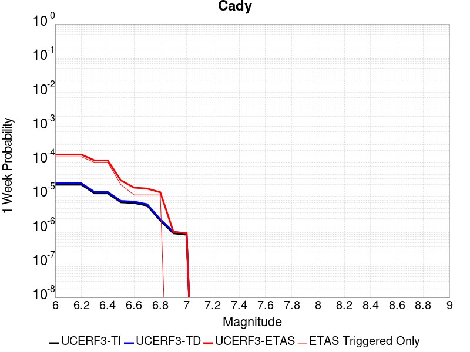 |  |  |  |

| Magnitude | 1 wk TI Prob | 1 wk TD Prob | 1 wk ETAS Prob | 1 wk ETAS/TD Gain | 1 wk ETAS Triggered Only | 1 mo TI Prob | 1 mo TD Prob | 1 mo ETAS Prob | 1 mo ETAS/TD Gain | 1 mo ETAS Triggered Only | 1 yr TI Prob | 1 yr TD Prob | 1 yr ETAS Prob | 1 yr ETAS/TD Gain | 1 yr ETAS Triggered Only | 10 yr TI Prob | 10 yr TD Prob | 10 yr ETAS Prob | 10 yr ETAS/TD Gain | 10 yr ETAS Triggered Only |
|-----|-----|-----|-----|-----|-----|-----|-----|-----|-----|-----|-----|-----|-----|-----|-----|-----|-----|-----|-----|-----|
| 6.0 | 1.9892565E-5 | 2.1858728E-5 | 1.5185589E-4 | 6.9471507 | 1.3E-4 | 8.525106E-5 | 9.3677416E-5 | 2.636615E-4 | 2.8145683 | 1.7E-4 | 0.0010374374 | 0.0011400167 | 0.0014496633 | 1.2716159 | 3.1E-4 | 0.010326075 | 0.011350701 | 0.011854911 | 1.0444212 | 5.1E-4 |
| 6.1 | 1.9892565E-5 | 2.1858728E-5 | 1.5185589E-4 | 6.9471507 | 1.3E-4 | 8.525106E-5 | 9.3677416E-5 | 2.636615E-4 | 2.8145683 | 1.7E-4 | 0.0010374374 | 0.0011400167 | 0.0014496633 | 1.2716159 | 3.1E-4 | 0.010326075 | 0.011350701 | 0.011854911 | 1.0444212 | 5.1E-4 |
| 6.2 | 1.9892565E-5 | 2.1858728E-5 | 1.5185589E-4 | 6.9471507 | 1.3E-4 | 8.525106E-5 | 9.3677416E-5 | 2.636615E-4 | 2.8145683 | 1.7E-4 | 0.0010374374 | 0.0011400167 | 0.0014496633 | 1.2716159 | 3.1E-4 | 0.010326075 | 0.011350701 | 0.011854911 | 1.0444212 | 5.1E-4 |
| 6.3 | 1.1117327E-5 | 1.2176583E-5 | 1.0217549E-4 | 8.391146 | 9.0E-5 | 4.764482E-5 | 5.2184492E-5 | 1.6217875E-4 | 3.107796 | 1.1E-4 | 5.7992124E-4 | 6.351925E-4 | 8.3506544E-4 | 1.3146652 | 2.0E-4 | 0.0057841022 | 0.0063368753 | 0.006644911 | 1.04861 | 3.1E-4 |
| 6.4 | 1.1117327E-5 | 1.2176583E-5 | 1.0217549E-4 | 8.391146 | 9.0E-5 | 4.764482E-5 | 5.2184492E-5 | 1.6217875E-4 | 3.107796 | 1.1E-4 | 5.7992124E-4 | 6.351925E-4 | 8.3506544E-4 | 1.3146652 | 2.0E-4 | 0.0057841022 | 0.0063368753 | 0.006644911 | 1.04861 | 3.1E-4 |
| 6.5 | 6.103093E-6 | 6.672021E-6 | 2.6671887E-5 | 3.9975727 | 2.0E-5 | 2.615585E-5 | 2.8594131E-5 | 6.8592984E-5 | 2.3988485 | 4.0E-5 | 3.1840094E-4 | 3.480905E-4 | 4.4805568E-4 | 1.2871816 | 1.0E-4 | 0.0031794512 | 0.0034766865 | 0.003656061 | 1.0515934 | 1.8E-4 |
| 6.6 | 5.817237E-6 | 6.3656585E-6 | 1.6365595E-5 | 2.5709193 | 1.0E-5 | 2.4930776E-5 | 2.728118E-5 | 5.7280362E-5 | 2.0996292 | 3.0E-5 | 3.034899E-4 | 3.3211018E-4 | 4.2208028E-4 | 1.2709044 | 9.0E-5 | 0.0030307577 | 0.0033173605 | 0.0034867965 | 1.0510756 | 1.7E-4 |
| 6.7 | 4.8846314E-6 | 5.3405684E-6 | 1.5340514E-5 | 2.8724499 | 1.0E-5 | 2.0933967E-5 | 2.2888014E-5 | 4.2887557E-5 | 1.8737998 | 2.0E-5 | 2.5484123E-4 | 2.7863772E-4 | 3.5861545E-4 | 1.2870312 | 8.0E-5 | 0.0025454918 | 0.0027840391 | 0.002903705 | 1.0429828 | 1.2E-4 |
| 6.8 | 1.7788773E-6 | 1.9399079E-6 | 1.1939888E-5 | 6.154874 | 1.0E-5 | 7.6237375E-6 | 8.313874E-6 | 1.831379E-5 | 2.2027988 | 1.0E-5 | 9.281505E-5 | 1.01218284E-4 | 1.11217276E-4 | 1.0987864 | 1.0E-5 | 9.2776294E-4 | 0.0010118765 | 0.0010418461 | 1.0296179 | 3.0E-5 |
| 6.9 | 7.5455404E-7 | 8.297092E-7 | 8.297092E-7 | 1.0 | 0.0 | 3.233799E-6 | 3.5558937E-6 | 3.5558937E-6 | 1.0 | 0.0 | 3.937079E-5 | 4.3292483E-5 | 4.3292483E-5 | 1.0 | 0.0 | 3.9363815E-4 | 4.3287344E-4 | 4.428691E-4 | 1.0230914 | 1.0E-5 |
| 7.0 | 6.8578805E-7 | 7.541816E-7 | 7.541816E-7 | 1.0 | 0.0 | 2.9390883E-6 | 3.2322048E-6 | 3.2322048E-6 | 1.0 | 0.0 | 3.578281E-5 | 3.9351715E-5 | 3.9351715E-5 | 1.0 | 0.0 | 3.577705E-4 | 3.9347992E-4 | 4.0347598E-4 | 1.0254042 | 1.0E-5 |

## Elsinore (Glen Ivy) rev
*[(top)](#table-of-contents)*

| 1 Week | 1 Month | 1 Year | 10 Year |
|-----|-----|-----|-----|
|  | 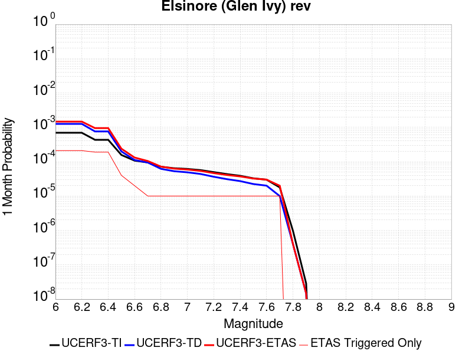 |  |  |

| Magnitude | 1 wk TI Prob | 1 wk TD Prob | 1 wk ETAS Prob | 1 wk ETAS/TD Gain | 1 wk ETAS Triggered Only | 1 mo TI Prob | 1 mo TD Prob | 1 mo ETAS Prob | 1 mo ETAS/TD Gain | 1 mo ETAS Triggered Only | 1 yr TI Prob | 1 yr TD Prob | 1 yr ETAS Prob | 1 yr ETAS/TD Gain | 1 yr ETAS Triggered Only | 10 yr TI Prob | 10 yr TD Prob | 10 yr ETAS Prob | 10 yr ETAS/TD Gain | 10 yr ETAS Triggered Only |
|-----|-----|-----|-----|-----|-----|-----|-----|-----|-----|-----|-----|-----|-----|-----|-----|-----|-----|-----|-----|-----|
| 6.0 | 1.6204086E-4 | 2.937271E-4 | 4.5368008E-4 | 1.5445633 | 1.6E-4 | 6.94276E-4 | 0.0012583778 | 0.0014681136 | 1.1666715 | 2.1E-4 | 0.008420097 | 0.0152346175 | 0.0155005045 | 1.0174528 | 2.7E-4 | 0.081081145 | 0.13962454 | 0.13995148 | 1.0023416 | 3.8E-4 |
| 6.1 | 1.6204086E-4 | 2.937271E-4 | 4.5368008E-4 | 1.5445633 | 1.6E-4 | 6.94276E-4 | 0.0012583778 | 0.0014681136 | 1.1666715 | 2.1E-4 | 0.008420097 | 0.0152346175 | 0.0155005045 | 1.0174528 | 2.7E-4 | 0.081081145 | 0.13962454 | 0.13995148 | 1.0023416 | 3.8E-4 |
| 6.2 | 1.6204086E-4 | 2.937271E-4 | 4.5368008E-4 | 1.5445633 | 1.6E-4 | 6.94276E-4 | 0.0012583778 | 0.0014681136 | 1.1666715 | 2.1E-4 | 0.008420097 | 0.0152346175 | 0.0155005045 | 1.0174528 | 2.7E-4 | 0.081081145 | 0.13962454 | 0.13995148 | 1.0023416 | 3.8E-4 |
| 6.3 | 1.0111737E-4 | 1.7703463E-4 | 2.7701692E-4 | 1.5647613 | 1.0E-4 | 4.332882E-4 | 7.5861585E-4 | 9.484717E-4 | 1.2502662 | 1.9E-4 | 0.005262531 | 0.0092177205 | 0.009475324 | 1.0279466 | 2.6E-4 | 0.0513964 | 0.08707393 | 0.0873752 | 1.0034599 | 3.3E-4 |
| 6.4 | 1.0111737E-4 | 1.7703463E-4 | 2.7701692E-4 | 1.5647613 | 1.0E-4 | 4.332882E-4 | 7.5861585E-4 | 9.484717E-4 | 1.2502662 | 1.9E-4 | 0.005262531 | 0.0092177205 | 0.009475324 | 1.0279466 | 2.6E-4 | 0.0513964 | 0.08707393 | 0.0873752 | 1.0034599 | 3.3E-4 |
| 6.5 | 3.6624708E-5 | 4.6391986E-5 | 5.639152E-5 | 1.2155445 | 1.0E-5 | 1.569536E-4 | 1.9880968E-4 | 2.3880172E-4 | 1.2011575 | 4.0E-5 | 0.001909235 | 0.0024181814 | 0.0024680605 | 1.0206267 | 5.0E-5 | 0.01892915 | 0.023697061 | 0.023784928 | 1.0037079 | 9.0E-5 |
| 6.6 | 2.5051324E-5 | 2.6147465E-5 | 3.61472E-5 | 1.3824363 | 1.0E-5 | 1.073584E-4 | 1.12056E-4 | 1.3205376E-4 | 1.1784621 | 2.0E-5 | 0.0013063047 | 0.0013634725 | 0.0013934316 | 1.0219727 | 3.0E-5 | 0.012986525 | 0.013565759 | 0.01363481 | 1.00509 | 7.0E-5 |
| 6.7 | 2.2189772E-5 | 2.2072489E-5 | 3.207227E-5 | 1.4530426 | 1.0E-5 | 9.509556E-5 | 9.459316E-5 | 1.0459221E-4 | 1.1057059 | 1.0E-5 | 0.0011571734 | 0.0011510996 | 0.0011710766 | 1.0173547 | 2.0E-5 | 0.011511663 | 0.0114663225 | 0.011505865 | 1.0034485 | 4.0E-5 |
| 6.8 | 1.6654378E-5 | 1.44376E-5 | 2.4437455E-5 | 1.6926259 | 1.0E-5 | 7.137396E-5 | 6.187399E-5 | 7.187337E-5 | 1.1616088 | 1.0E-5 | 8.686314E-4 | 7.5306057E-4 | 7.630531E-4 | 1.0132692 | 1.0E-5 | 0.008652439 | 0.0075100763 | 0.0075200014 | 1.0013216 | 1.0E-5 |
| 6.9 | 1.5042909E-5 | 1.2331886E-5 | 2.2331762E-5 | 1.810896 | 1.0E-5 | 6.446802E-5 | 5.2849886E-5 | 6.284936E-5 | 1.1892052 | 1.0E-5 | 7.8461546E-4 | 6.4326054E-4 | 6.532541E-4 | 1.0155358 | 1.0E-5 | 0.007818509 | 0.006417925 | 0.006427861 | 1.0015482 | 1.0E-5 |
| 7.0 | 1.4361385E-5 | 1.1451172E-5 | 2.1451058E-5 | 1.8732631 | 1.0E-5 | 6.154734E-5 | 4.9075545E-5 | 5.9075053E-5 | 1.2037575 | 1.0E-5 | 7.490812E-4 | 5.973339E-4 | 6.073279E-4 | 1.016731 | 1.0E-5 | 0.007465612 | 0.005960982 | 0.0059709223 | 1.0016676 | 1.0E-5 |
| 7.1 | 1.3265571E-5 | 1.0244736E-5 | 2.0244634E-5 | 1.9761012 | 1.0E-5 | 5.6851208E-5 | 4.3905282E-5 | 5.3904845E-5 | 1.227753 | 1.0E-5 | 6.919436E-4 | 5.344183E-4 | 5.4441293E-4 | 1.0187019 | 1.0E-5 | 0.006897931 | 0.0053346003 | 0.005344547 | 1.0018646 | 1.0E-5 |
| 7.2 | 1.1596403E-5 | 8.504847E-6 | 1.8504763E-5 | 2.17579 | 1.0E-5 | 4.9697923E-5 | 3.6448844E-5 | 4.644848E-5 | 1.2743471 | 1.0E-5 | 6.049042E-4 | 4.4367602E-4 | 4.536716E-4 | 1.022529 | 1.0E-5 | 0.006032603 | 0.004429357 | 0.0044393125 | 1.0022477 | 1.0E-5 |
| 7.3 | 1.0150827E-5 | 7.238537E-6 | 1.7238464E-5 | 2.3814845 | 1.0E-5 | 4.3502816E-5 | 3.102194E-5 | 4.102163E-5 | 1.3223425 | 1.0E-5 | 5.2951806E-4 | 3.776281E-4 | 3.8762434E-4 | 1.0264711 | 1.0E-5 | 0.005282581 | 0.003770271 | 0.0037802334 | 1.0026423 | 1.0E-5 |
| 7.4 | 9.080705E-6 | 6.352307E-6 | 1.6352244E-5 | 2.5742211 | 1.0E-5 | 3.8916725E-5 | 2.7223898E-5 | 3.7223625E-5 | 1.3673143 | 1.0E-5 | 4.7370812E-4 | 3.314019E-4 | 3.4139858E-4 | 1.0301648 | 1.0E-5 | 0.004726996 | 0.0033092257 | 0.0033191924 | 1.0030118 | 1.0E-5 |
| 7.5 | 7.671649E-6 | 5.225419E-6 | 1.5225367E-5 | 2.913712 | 1.0E-5 | 3.287808E-5 | 2.2394468E-5 | 3.2394244E-5 | 1.4465289 | 1.0E-5 | 4.0021708E-4 | 2.7261977E-4 | 2.8261705E-4 | 1.0366712 | 1.0E-5 | 0.0039949706 | 0.0027229784 | 0.0027329512 | 1.0036625 | 1.0E-5 |
| 7.6 | 6.990086E-6 | 4.687336E-6 | 1.4687289E-5 | 3.133398 | 1.0E-5 | 2.9957167E-5 | 2.0088435E-5 | 3.0088233E-5 | 1.4977889 | 1.0E-5 | 3.6466747E-4 | 2.445504E-4 | 2.5454795E-4 | 1.0408814 | 1.0E-5 | 0.0036406964 | 0.0024429292 | 0.0024529048 | 1.0040834 | 1.0E-5 |
| 7.7 | 4.163505E-6 | 2.329331E-6 | 1.23293075E-5 | 5.2930684 | 1.0E-5 | 1.7843471E-5 | 9.982813E-6 | 1.9982714E-5 | 2.0017116 | 1.0E-5 | 2.172226E-4 | 1.2153471E-4 | 1.315335E-4 | 1.082271 | 1.0E-5 | 0.0021701038 | 0.0012147555 | 0.0012247433 | 1.0082221 | 1.0E-5 |
| 7.8 | 2.2692414E-7 | 9.384417E-8 | 9.384417E-8 | 1.0 | 0.0 | 9.725317E-7 | 4.0218927E-7 | 4.0218927E-7 | 1.0 | 0.0 | 1.1840509E-5 | 4.8966467E-6 | 4.8966467E-6 | 1.0 | 0.0 | 1.1839878E-4 | 4.8965718E-5 | 4.8965718E-5 | 1.0 | 0.0 |
| 7.9 | 6.676829E-9 | 3.4397174E-9 | 3.4397174E-9 | 1.0 | 0.0 | 2.861498E-8 | 1.4741646E-8 | 1.4741646E-8 | 1.0 | 0.0 | 3.4838732E-7 | 1.7947953E-7 | 1.7947953E-7 | 1.0 | 0.0 | 3.4838679E-6 | 1.794794E-6 | 1.794794E-6 | 1.0 | 0.0 |

## Sierra Nevada  (No Extension)
*[(top)](#table-of-contents)*

| 1 Week | 1 Month | 1 Year | 10 Year |
|-----|-----|-----|-----|
|  |  |  |  |

| Magnitude | 1 wk TI Prob | 1 wk TD Prob | 1 wk ETAS Prob | 1 wk ETAS/TD Gain | 1 wk ETAS Triggered Only | 1 mo TI Prob | 1 mo TD Prob | 1 mo ETAS Prob | 1 mo ETAS/TD Gain | 1 mo ETAS Triggered Only | 1 yr TI Prob | 1 yr TD Prob | 1 yr ETAS Prob | 1 yr ETAS/TD Gain | 1 yr ETAS Triggered Only | 10 yr TI Prob | 10 yr TD Prob | 10 yr ETAS Prob | 10 yr ETAS/TD Gain | 10 yr ETAS Triggered Only |
|-----|-----|-----|-----|-----|-----|-----|-----|-----|-----|-----|-----|-----|-----|-----|-----|-----|-----|-----|-----|-----|
| 6.0 | 7.7690465E-6 | 6.9762887E-6 | 1.3697539E-4 | 19.63442 | 1.3E-4 | 3.329549E-5 | 2.989824E-5 | 2.3989196E-4 | 8.023615 | 2.1E-4 | 4.0529718E-4 | 3.6398612E-4 | 6.8386964E-4 | 1.8788345 | 3.2E-4 | 0.004045588 | 0.0036374154 | 0.004075815 | 1.120525 | 4.4E-4 |
| 6.1 | 7.7690465E-6 | 6.9762887E-6 | 1.3697539E-4 | 19.63442 | 1.3E-4 | 3.329549E-5 | 2.989824E-5 | 2.3989196E-4 | 8.023615 | 2.1E-4 | 4.0529718E-4 | 3.6398612E-4 | 6.8386964E-4 | 1.8788345 | 3.2E-4 | 0.004045588 | 0.0036374154 | 0.004075815 | 1.120525 | 4.4E-4 |
| 6.2 | 7.7690465E-6 | 6.9762887E-6 | 1.3697539E-4 | 19.63442 | 1.3E-4 | 3.329549E-5 | 2.989824E-5 | 2.3989196E-4 | 8.023615 | 2.1E-4 | 4.0529718E-4 | 3.6398612E-4 | 6.8386964E-4 | 1.8788345 | 3.2E-4 | 0.004045588 | 0.0036374154 | 0.004075815 | 1.120525 | 4.4E-4 |
| 6.3 | 7.7690465E-6 | 6.9762887E-6 | 1.3697539E-4 | 19.63442 | 1.3E-4 | 3.329549E-5 | 2.989824E-5 | 2.3989196E-4 | 8.023615 | 2.1E-4 | 4.0529718E-4 | 3.6398612E-4 | 6.8386964E-4 | 1.8788345 | 3.2E-4 | 0.004045588 | 0.0036374154 | 0.004075815 | 1.120525 | 4.4E-4 |
| 6.4 | 7.7690465E-6 | 6.9762887E-6 | 1.3697539E-4 | 19.63442 | 1.3E-4 | 3.329549E-5 | 2.989824E-5 | 2.3989196E-4 | 8.023615 | 2.1E-4 | 4.0529718E-4 | 3.6398612E-4 | 6.8386964E-4 | 1.8788345 | 3.2E-4 | 0.004045588 | 0.0036374154 | 0.004075815 | 1.120525 | 4.4E-4 |
| 6.5 | 7.7690465E-6 | 6.9762887E-6 | 1.3697539E-4 | 19.63442 | 1.3E-4 | 3.329549E-5 | 2.989824E-5 | 2.3989196E-4 | 8.023615 | 2.1E-4 | 4.0529718E-4 | 3.6398612E-4 | 6.8386964E-4 | 1.8788345 | 3.2E-4 | 0.004045588 | 0.0036374154 | 0.004075815 | 1.120525 | 4.4E-4 |
| 6.6 | 2.653E-6 | 1.6148208E-6 | 8.161469E-5 | 50.54102 | 8.0E-5 | 1.136995E-5 | 6.9206426E-6 | 1.6691953E-4 | 24.11908 | 1.6E-4 | 1.3842035E-4 | 8.42556E-5 | 3.0423707E-4 | 3.6108825 | 2.2E-4 | 0.0013833415 | 8.4224E-4 | 0.001102021 | 1.3084406 | 2.6E-4 |
| 6.7 | 2.5902466E-6 | 1.5501544E-6 | 8.155003E-5 | 52.60768 | 8.0E-5 | 1.11010095E-5 | 6.643502E-6 | 1.6664244E-4 | 25.083523 | 1.6E-4 | 1.351464E-4 | 8.088166E-5 | 3.0086387E-4 | 3.719803 | 2.2E-4 | 0.0013506424 | 8.0852525E-4 | 0.001068315 | 1.3213131 | 2.6E-4 |
| 6.8 | 2.5853892E-6 | 1.5469546E-6 | 8.154683E-5 | 52.714428 | 8.0E-5 | 1.1080193E-5 | 6.629789E-6 | 1.6662873E-4 | 25.133339 | 1.6E-4 | 1.34893E-4 | 8.071472E-5 | 3.0069696E-4 | 3.725429 | 2.2E-4 | 0.0013481114 | 8.06857E-4 | 0.0010666472 | 1.321978 | 2.6E-4 |
| 6.9 | 2.458257E-6 | 1.422029E-6 | 8.142192E-5 | 57.257565 | 8.0E-5 | 1.0535345E-5 | 6.0943958E-6 | 1.6609342E-4 | 27.25347 | 1.6E-4 | 1.2826028E-4 | 7.419676E-5 | 2.9418044E-4 | 3.964869 | 2.2E-4 | 0.0012818627 | 7.4172183E-4 | 0.0010015289 | 1.3502758 | 2.6E-4 |
| 7.0 | 2.4341468E-6 | 1.3989927E-6 | 8.139888E-5 | 58.183918 | 8.0E-5 | 1.0432016E-5 | 5.9956697E-6 | 1.5599477E-4 | 26.017906 | 1.5E-4 | 1.270024E-4 | 7.299485E-5 | 2.829795E-4 | 3.8767052 | 2.1E-4 | 0.0012692984 | 7.297107E-4 | 9.795282E-4 | 1.3423516 | 2.5E-4 |
| 7.1 | 2.3652476E-6 | 1.3339427E-6 | 7.133385E-5 | 53.47595 | 7.0E-5 | 1.0136736E-5 | 5.716885E-6 | 1.4571608E-4 | 25.488722 | 1.4E-4 | 1.2340778E-4 | 6.9600865E-5 | 2.6958695E-4 | 3.8733275 | 2.0E-4 | 0.0012333926 | 6.957924E-4 | 9.356254E-4 | 1.3446904 | 2.4E-4 |
| 7.2 | 2.272158E-6 | 1.2502497E-6 | 7.1250164E-5 | 56.988747 | 7.0E-5 | 9.737784E-6 | 5.358202E-6 | 1.353575E-4 | 25.26174 | 1.3E-4 | 1.1855107E-4 | 6.523417E-5 | 2.5522176E-4 | 3.9123938 | 1.9E-4 | 0.0011848784 | 6.5215176E-4 | 8.8200177E-4 | 1.3524487 | 2.3E-4 |
| 7.3 | 2.1382127E-6 | 1.1419382E-6 | 7.114186E-5 | 62.299217 | 7.0E-5 | 9.163737E-6 | 4.894012E-6 | 1.3489337E-4 | 27.562944 | 1.3E-4 | 1.1156279E-4 | 5.9582977E-5 | 2.4957166E-4 | 4.18864 | 1.9E-4 | 0.001115068 | 5.956712E-4 | 8.255342E-4 | 1.385889 | 2.3E-4 |
| 7.4 | 1.9048055E-6 | 9.574928E-7 | 4.0957453E-5 | 42.77573 | 4.0E-5 | 8.163426E-6 | 4.103534E-6 | 1.0410312E-4 | 25.369137 | 1.0E-4 | 9.9385186E-5 | 4.995939E-5 | 1.8995239E-4 | 3.802136 | 1.4E-4 | 9.934074E-4 | 4.9948227E-4 | 6.7939237E-4 | 1.3601931 | 1.8E-4 |
| 7.5 | 1.5373403E-6 | 7.559763E-7 | 4.0755946E-5 | 53.91167 | 4.0E-5 | 6.5885843E-6 | 3.2398946E-6 | 9.32396E-5 | 28.778593 | 9.0E-5 | 8.021306E-5 | 3.9445007E-5 | 1.6943988E-4 | 4.2955976 | 1.3E-4 | 8.0184115E-4 | 3.9438053E-4 | 5.643135E-4 | 1.4308858 | 1.7E-4 |
| 7.6 | 1.0680322E-6 | 4.65941E-7 | 1.0465937E-5 | 22.461935 | 1.0E-5 | 4.577273E-6 | 1.9968884E-6 | 3.1996828E-5 | 16.023342 | 3.0E-5 | 5.5726876E-5 | 2.4311848E-5 | 8.431039E-5 | 3.4678724 | 6.0E-5 | 5.5712904E-4 | 2.4309216E-4 | 3.4306783E-4 | 1.4112667 | 1.0E-4 |
| 7.7 | 5.509146E-7 | 1.5578539E-7 | 1.5578539E-7 | 1.0 | 0.0 | 2.3610605E-6 | 6.676515E-7 | 6.676515E-7 | 1.0 | 0.0 | 2.8745531E-5 | 8.128628E-6 | 1.8128547E-5 | 2.2302098 | 1.0E-5 | 2.8741814E-4 | 8.128342E-5 | 1.11280984E-4 | 1.369049 | 3.0E-5 |

## Baker
*[(top)](#table-of-contents)*

| 1 Week | 1 Month | 1 Year | 10 Year |
|-----|-----|-----|-----|
| 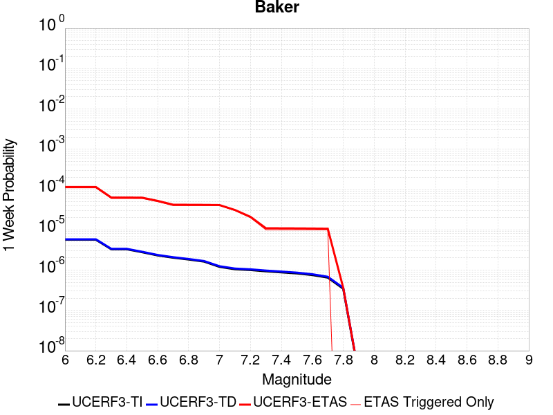 |  |  |  |

| Magnitude | 1 wk TI Prob | 1 wk TD Prob | 1 wk ETAS Prob | 1 wk ETAS/TD Gain | 1 wk ETAS Triggered Only | 1 mo TI Prob | 1 mo TD Prob | 1 mo ETAS Prob | 1 mo ETAS/TD Gain | 1 mo ETAS Triggered Only | 1 yr TI Prob | 1 yr TD Prob | 1 yr ETAS Prob | 1 yr ETAS/TD Gain | 1 yr ETAS Triggered Only | 10 yr TI Prob | 10 yr TD Prob | 10 yr ETAS Prob | 10 yr ETAS/TD Gain | 10 yr ETAS Triggered Only |
|-----|-----|-----|-----|-----|-----|-----|-----|-----|-----|-----|-----|-----|-----|-----|-----|-----|-----|-----|-----|-----|
| 6.0 | 5.695525E-6 | 5.8348373E-6 | 1.158342E-4 | 19.852173 | 1.1E-4 | 2.4409164E-5 | 2.5006228E-5 | 1.6500273E-4 | 6.5984654 | 1.4E-4 | 2.9714106E-4 | 3.044123E-4 | 5.6433317E-4 | 1.8538448 | 2.6E-4 | 0.0029674405 | 0.0030403486 | 0.0035188894 | 1.1573967 | 4.8E-4 |
| 6.1 | 5.695525E-6 | 5.8348373E-6 | 1.158342E-4 | 19.852173 | 1.1E-4 | 2.4409164E-5 | 2.5006228E-5 | 1.6500273E-4 | 6.5984654 | 1.4E-4 | 2.9714106E-4 | 3.044123E-4 | 5.6433317E-4 | 1.8538448 | 2.6E-4 | 0.0029674405 | 0.0030403486 | 0.0035188894 | 1.1573967 | 4.8E-4 |
| 6.2 | 5.695525E-6 | 5.8348373E-6 | 1.158342E-4 | 19.852173 | 1.1E-4 | 2.4409164E-5 | 2.5006228E-5 | 1.6500273E-4 | 6.5984654 | 1.4E-4 | 2.9714106E-4 | 3.044123E-4 | 5.6433317E-4 | 1.8538448 | 2.6E-4 | 0.0029674405 | 0.0030403486 | 0.0035188894 | 1.1573967 | 4.8E-4 |
| 6.3 | 3.2995713E-6 | 3.383667E-6 | 6.3383464E-5 | 18.732182 | 6.0E-5 | 1.4140943E-5 | 1.4501353E-5 | 8.450034E-5 | 5.827066 | 7.0E-5 | 1.7215237E-4 | 1.7654014E-4 | 3.3651188E-4 | 1.9061495 | 1.6E-4 | 0.0017201907 | 0.001764046 | 0.0020834815 | 1.1810812 | 3.2E-4 |
| 6.4 | 3.2995713E-6 | 3.383667E-6 | 6.3383464E-5 | 18.732182 | 6.0E-5 | 1.4140943E-5 | 1.4501353E-5 | 8.450034E-5 | 5.827066 | 7.0E-5 | 1.7215237E-4 | 1.7654014E-4 | 3.3651188E-4 | 1.9061495 | 1.6E-4 | 0.0017201907 | 0.001764046 | 0.0020834815 | 1.1810812 | 3.2E-4 |
| 6.5 | 2.782202E-6 | 2.8558404E-6 | 6.2855666E-5 | 22.009518 | 6.0E-5 | 1.1923668E-5 | 1.223926E-5 | 8.22384E-5 | 6.7192297 | 7.0E-5 | 1.4516099E-4 | 1.4900314E-4 | 3.089793E-4 | 2.073643 | 1.6E-4 | 0.001450662 | 0.0014890651 | 0.0017886184 | 1.2011687 | 3.0E-4 |
| 6.6 | 2.3163404E-6 | 2.38092E-6 | 5.23808E-5 | 22.000237 | 5.0E-5 | 9.927136E-6 | 1.0203904E-5 | 7.020329E-5 | 6.8800426 | 6.0E-5 | 1.20856166E-4 | 1.2422565E-4 | 2.74207E-4 | 2.20733 | 1.5E-4 | 0.0012079047 | 0.0012415823 | 0.0015212346 | 1.2252387 | 2.8E-4 |
| 6.7 | 2.037056E-6 | 2.0965003E-6 | 4.2096417E-5 | 20.079374 | 4.0E-5 | 8.7302105E-6 | 8.984972E-6 | 5.8984522E-5 | 6.564798 | 5.0E-5 | 1.0628513E-4 | 1.093867E-4 | 2.3937249E-4 | 2.1883142 | 1.3E-4 | 0.0010623431 | 0.0010933448 | 0.0013330823 | 1.2192699 | 2.4E-4 |
| 6.8 | 1.8356744E-6 | 1.8915287E-6 | 4.1891453E-5 | 22.146877 | 4.0E-5 | 7.867153E-6 | 8.106527E-6 | 5.810612E-5 | 7.1678195 | 5.0E-5 | 9.577837E-5 | 9.869264E-5 | 2.2867981E-4 | 2.3170907 | 1.3E-4 | 9.57371E-4 | 9.86502E-4 | 0.0012262653 | 1.2430438 | 2.4E-4 |
| 6.9 | 1.6310546E-6 | 1.6832072E-6 | 4.168314E-5 | 24.764116 | 4.0E-5 | 6.9902153E-6 | 7.213726E-6 | 4.7213438E-5 | 6.544945 | 4.0E-5 | 8.510255E-5 | 8.782368E-5 | 1.9781402E-4 | 2.2523994 | 1.1E-4 | 8.5069967E-4 | 8.7790104E-4 | 0.0010877167 | 1.2389969 | 2.1E-4 |
| 7.0 | 1.2058036E-6 | 1.2508665E-6 | 4.1250816E-5 | 32.97779 | 4.0E-5 | 5.1677193E-6 | 5.3608455E-6 | 4.536063E-5 | 8.46147 | 4.0E-5 | 6.291517E-5 | 6.5266366E-5 | 1.7525919E-4 | 2.685291 | 1.1E-4 | 6.289736E-4 | 6.524743E-4 | 8.623373E-4 | 1.3216418 | 2.1E-4 |
| 7.1 | 1.052382E-6 | 1.0951609E-6 | 3.109513E-5 | 28.393206 | 3.0E-5 | 4.5102006E-6 | 4.693538E-6 | 3.4693396E-5 | 7.3917365 | 3.0E-5 | 5.491031E-5 | 5.7142337E-5 | 1.471372E-4 | 2.5749242 | 9.0E-5 | 5.4896745E-4 | 5.7127734E-4 | 7.611688E-4 | 1.332398 | 1.9E-4 |
| 7.2 | 1.0067454E-6 | 1.0487711E-6 | 2.104875E-5 | 20.06992 | 2.0E-5 | 4.3146156E-6 | 4.4947255E-6 | 2.4494635E-5 | 5.44964 | 2.0E-5 | 5.252918E-5 | 5.4721917E-5 | 1.3471754E-4 | 2.461857 | 8.0E-5 | 5.251676E-4 | 5.470853E-4 | 6.970032E-4 | 1.2740303 | 1.5E-4 |
| 7.3 | 9.3596316E-7 | 9.767723E-7 | 1.09767625E-5 | 11.23779 | 1.0E-5 | 4.0112645E-6 | 4.1861604E-6 | 1.4186118E-5 | 3.3888137 | 1.0E-5 | 4.8836053E-5 | 5.096532E-5 | 1.00962774E-4 | 1.9810092 | 5.0E-5 | 4.8825322E-4 | 5.095371E-4 | 6.29476E-4 | 1.2353879 | 1.2E-4 |
| 7.4 | 8.8117395E-7 | 9.2076635E-7 | 1.0920757E-5 | 11.860509 | 1.0E-5 | 3.7764542E-6 | 3.9461356E-6 | 1.3946096E-5 | 3.5341148 | 1.0E-5 | 4.5977362E-5 | 4.8043148E-5 | 8.8041226E-5 | 1.8325449 | 4.0E-5 | 4.596785E-4 | 4.8032837E-4 | 5.802803E-4 | 1.2080909 | 1.0E-4 |
| 7.5 | 8.292386E-7 | 8.6745956E-7 | 1.0867451E-5 | 12.5279045 | 1.0E-5 | 3.5538749E-6 | 3.7176785E-6 | 1.3717641E-5 | 3.6898406 | 1.0E-5 | 4.326757E-5 | 4.5261804E-5 | 7.526045E-5 | 1.6627805 | 3.0E-5 | 4.3259145E-4 | 4.5252658E-4 | 5.324904E-4 | 1.1767052 | 8.0E-5 |
| 7.6 | 7.553842E-7 | 7.9144706E-7 | 1.0791439E-5 | 13.635074 | 1.0E-5 | 3.2373566E-6 | 3.3919116E-6 | 1.33918775E-5 | 3.94818 | 1.0E-5 | 3.9414106E-5 | 4.129575E-5 | 6.129492E-5 | 1.4842913 | 2.0E-5 | 3.9407116E-4 | 4.1288146E-4 | 4.8285254E-4 | 1.1694702 | 7.0E-5 |
| 7.7 | 6.5285366E-7 | 6.852797E-7 | 1.0685273E-5 | 15.592572 | 1.0E-5 | 2.797941E-6 | 2.9369096E-6 | 1.293688E-5 | 4.4049296 | 1.0E-5 | 3.40644E-5 | 3.5756293E-5 | 4.5755936E-5 | 1.279661 | 1.0E-5 | 3.405918E-4 | 3.5750607E-4 | 3.7749892E-4 | 1.0559231 | 2.0E-5 |
| 7.8 | 3.4586725E-7 | 3.6482615E-7 | 3.6482615E-7 | 1.0 | 0.0 | 1.4822873E-6 | 1.5635396E-6 | 1.5635396E-6 | 1.0 | 0.0 | 1.80467E-5 | 1.9035933E-5 | 1.9035933E-5 | 1.0 | 0.0 | 1.8045233E-4 | 1.9034347E-4 | 2.0034157E-4 | 1.0525266 | 1.0E-5 |
| 7.9 | 2.5591178E-9 | 2.6696718E-9 | 2.6696718E-9 | 1.0 | 0.0 | 1.0967647E-8 | 1.14414505E-8 | 1.14414505E-8 | 1.0 | 0.0 | 1.335311E-7 | 1.3929966E-7 | 1.3929966E-7 | 1.0 | 0.0 | 1.3353102E-6 | 1.3929966E-6 | 1.3929966E-6 | 1.0 | 0.0 |

## Ludlow
*[(top)](#table-of-contents)*

| 1 Week | 1 Month | 1 Year | 10 Year |
|-----|-----|-----|-----|
|  |  |  |  |

| Magnitude | 1 wk TI Prob | 1 wk TD Prob | 1 wk ETAS Prob | 1 wk ETAS/TD Gain | 1 wk ETAS Triggered Only | 1 mo TI Prob | 1 mo TD Prob | 1 mo ETAS Prob | 1 mo ETAS/TD Gain | 1 mo ETAS Triggered Only | 1 yr TI Prob | 1 yr TD Prob | 1 yr ETAS Prob | 1 yr ETAS/TD Gain | 1 yr ETAS Triggered Only | 10 yr TI Prob | 10 yr TD Prob | 10 yr ETAS Prob | 10 yr ETAS/TD Gain | 10 yr ETAS Triggered Only |
|-----|-----|-----|-----|-----|-----|-----|-----|-----|-----|-----|-----|-----|-----|-----|-----|-----|-----|-----|-----|-----|
| 6.0 | 2.2407607E-5 | 2.3657254E-5 | 1.2365489E-4 | 5.2269335 | 1.0E-4 | 9.602906E-5 | 1.0138454E-4 | 2.2137238E-4 | 2.1834924 | 1.2E-4 | 0.0011685267 | 0.001233702 | 0.0014933812 | 1.2104878 | 2.6E-4 | 0.011624013 | 0.012273042 | 0.012668133 | 1.0321918 | 4.0E-4 |
| 6.1 | 2.2407607E-5 | 2.3657254E-5 | 1.2365489E-4 | 5.2269335 | 1.0E-4 | 9.602906E-5 | 1.0138454E-4 | 2.2137238E-4 | 2.1834924 | 1.2E-4 | 0.0011685267 | 0.001233702 | 0.0014933812 | 1.2104878 | 2.6E-4 | 0.011624013 | 0.012273042 | 0.012668133 | 1.0321918 | 4.0E-4 |
| 6.2 | 1.0781252E-5 | 1.1365663E-5 | 4.136532E-5 | 3.6394992 | 3.0E-5 | 4.620455E-5 | 4.8709102E-5 | 9.870667E-5 | 2.0264523 | 5.0E-5 | 5.623952E-4 | 5.9287593E-4 | 7.4278703E-4 | 1.252854 | 1.5E-4 | 0.00560974 | 0.0059133614 | 0.006142001 | 1.0386649 | 2.3E-4 |
| 6.3 | 1.0781252E-5 | 1.1365663E-5 | 4.136532E-5 | 3.6394992 | 3.0E-5 | 4.620455E-5 | 4.8709102E-5 | 9.870667E-5 | 2.0264523 | 5.0E-5 | 5.623952E-4 | 5.9287593E-4 | 7.4278703E-4 | 1.252854 | 1.5E-4 | 0.00560974 | 0.0059133614 | 0.006142001 | 1.0386649 | 2.3E-4 |
| 6.4 | 7.814439E-6 | 8.237729E-6 | 1.8237646E-5 | 2.2139168 | 1.0E-5 | 3.3490025E-5 | 3.530408E-5 | 6.530302E-5 | 1.8497301 | 3.0E-5 | 4.0766477E-4 | 4.2974384E-4 | 5.3969654E-4 | 1.2558564 | 1.1E-4 | 0.0040691774 | 0.0042892746 | 0.004448588 | 1.0371424 | 1.6E-4 |
| 6.5 | 6.4986366E-6 | 6.85092E-6 | 1.685085E-5 | 2.4596481 | 1.0E-5 | 2.7851002E-5 | 2.9360759E-5 | 5.9359878E-5 | 2.0217419 | 3.0E-5 | 3.390332E-4 | 3.5740953E-4 | 4.673702E-4 | 1.3076602 | 1.1E-4 | 0.003385164 | 0.0035684432 | 0.003717908 | 1.0418851 | 1.5E-4 |
| 6.6 | 5.582177E-6 | 5.8860055E-6 | 1.5885948E-5 | 2.698935 | 1.0E-5 | 2.3923398E-5 | 2.5225498E-5 | 5.522474E-5 | 2.1892428 | 3.0E-5 | 2.9122844E-4 | 3.0707786E-4 | 4.0704716E-4 | 1.3255503 | 1.0E-4 | 0.0029084706 | 0.003066609 | 0.0031862408 | 1.0390111 | 1.2E-4 |
| 6.7 | 4.6858763E-6 | 4.940427E-6 | 1.4940378E-5 | 3.0241065 | 1.0E-5 | 2.0082172E-5 | 2.1173091E-5 | 4.117267E-5 | 1.9445752 | 2.0E-5 | 2.4447302E-4 | 2.5775246E-4 | 3.3773182E-4 | 1.3102953 | 8.0E-5 | 0.0024420423 | 0.0025745912 | 0.0026743338 | 1.0387411 | 1.0E-4 |
| 6.8 | 3.5584908E-6 | 3.7520183E-6 | 1.3751981E-5 | 3.6652222 | 1.0E-5 | 1.5250586E-5 | 1.6079981E-5 | 3.607966E-5 | 2.2437625 | 2.0E-5 | 1.8566006E-4 | 1.957566E-4 | 2.6574288E-4 | 1.3575169 | 7.0E-5 | 0.0018550502 | 0.0019558826 | 0.0020457066 | 1.045925 | 9.0E-5 |
| 6.9 | 2.532834E-6 | 2.6710034E-6 | 1.26709765E-5 | 4.7439013 | 1.0E-5 | 1.0854958E-5 | 1.1447109E-5 | 3.144688E-5 | 2.7471461 | 2.0E-5 | 1.3215111E-4 | 1.3935992E-4 | 2.0935017E-4 | 1.5022265 | 7.0E-5 | 0.0013207254 | 0.0013927529 | 0.0014826275 | 1.0645303 | 9.0E-5 |
| 7.0 | 1.7083285E-6 | 1.8019439E-6 | 1.1801926E-5 | 6.5495524 | 1.0E-5 | 7.3213873E-6 | 7.722595E-6 | 2.772244E-5 | 3.5897832 | 2.0E-5 | 8.913424E-5 | 9.40187E-5 | 1.5401306E-4 | 1.6381109 | 6.0E-5 | 8.9098496E-4 | 9.3980576E-4 | 0.0010097399 | 1.0744134 | 7.0E-5 |
| 7.1 | 1.0905424E-6 | 1.1497619E-6 | 1.114975E-5 | 9.697442 | 1.0E-5 | 4.6737446E-6 | 4.9275427E-6 | 2.4927444E-5 | 5.0587983 | 2.0E-5 | 5.6901354E-5 | 5.999128E-5 | 9.998888E-5 | 1.6667236 | 4.0E-5 | 5.6886784E-4 | 5.997606E-4 | 6.3973665E-4 | 1.0666533 | 4.0E-5 |
| 7.2 | 6.06668E-7 | 6.387277E-7 | 1.06387215E-5 | 16.656113 | 1.0E-5 | 2.600003E-6 | 2.7374022E-6 | 2.2737348E-5 | 8.306177 | 2.0E-5 | 3.1654577E-5 | 3.3327433E-5 | 6.3326435E-5 | 1.9001293 | 3.0E-5 | 3.1650066E-4 | 3.3323118E-4 | 3.632212E-4 | 1.0899976 | 3.0E-5 |

## San Jacinto (San Jacinto Valley) rev
*[(top)](#table-of-contents)*

| 1 Week | 1 Month | 1 Year | 10 Year |
|-----|-----|-----|-----|
|  |  |  |  |

| Magnitude | 1 wk TI Prob | 1 wk TD Prob | 1 wk ETAS Prob | 1 wk ETAS/TD Gain | 1 wk ETAS Triggered Only | 1 mo TI Prob | 1 mo TD Prob | 1 mo ETAS Prob | 1 mo ETAS/TD Gain | 1 mo ETAS Triggered Only | 1 yr TI Prob | 1 yr TD Prob | 1 yr ETAS Prob | 1 yr ETAS/TD Gain | 1 yr ETAS Triggered Only | 10 yr TI Prob | 10 yr TD Prob | 10 yr ETAS Prob | 10 yr ETAS/TD Gain | 10 yr ETAS Triggered Only |
|-----|-----|-----|-----|-----|-----|-----|-----|-----|-----|-----|-----|-----|-----|-----|-----|-----|-----|-----|-----|-----|
| 6.0 | 3.652694E-5 | 3.4401106E-5 | 1.5439698E-4 | 4.48814 | 1.2E-4 | 1.5653463E-4 | 1.4742499E-4 | 3.4739551E-4 | 2.3564222 | 2.0E-4 | 0.0019041431 | 0.0017934233 | 0.0021228315 | 1.1836756 | 3.3E-4 | 0.018879099 | 0.018526303 | 0.018948335 | 1.0227803 | 4.3E-4 |
| 6.1 | 3.652694E-5 | 3.4401106E-5 | 1.5439698E-4 | 4.48814 | 1.2E-4 | 1.5653463E-4 | 1.4742499E-4 | 3.4739551E-4 | 2.3564222 | 2.0E-4 | 0.0019041431 | 0.0017934233 | 0.0021228315 | 1.1836756 | 3.3E-4 | 0.018879099 | 0.018526303 | 0.018948335 | 1.0227803 | 4.3E-4 |
| 6.2 | 3.652694E-5 | 3.4401106E-5 | 1.5439698E-4 | 4.48814 | 1.2E-4 | 1.5653463E-4 | 1.4742499E-4 | 3.4739551E-4 | 2.3564222 | 2.0E-4 | 0.0019041431 | 0.0017934233 | 0.0021228315 | 1.1836756 | 3.3E-4 | 0.018879099 | 0.018526303 | 0.018948335 | 1.0227803 | 4.3E-4 |
| 6.3 | 3.652694E-5 | 3.4401106E-5 | 1.5439698E-4 | 4.48814 | 1.2E-4 | 1.5653463E-4 | 1.4742499E-4 | 3.4739551E-4 | 2.3564222 | 2.0E-4 | 0.0019041431 | 0.0017934233 | 0.0021228315 | 1.1836756 | 3.3E-4 | 0.018879099 | 0.018526303 | 0.018948335 | 1.0227803 | 4.3E-4 |
| 6.4 | 3.646941E-5 | 3.432268E-5 | 1.5431856E-4 | 4.4961104 | 1.2E-4 | 1.5628811E-4 | 1.4708891E-4 | 3.470595E-4 | 2.3595219 | 2.0E-4 | 0.0019011468 | 0.0017893389 | 0.0021187484 | 1.1840956 | 3.3E-4 | 0.018849645 | 0.018486181 | 0.018908232 | 1.0228306 | 4.3E-4 |
| 6.5 | 3.646941E-5 | 3.432268E-5 | 1.5431856E-4 | 4.4961104 | 1.2E-4 | 1.5628811E-4 | 1.4708891E-4 | 3.470595E-4 | 2.3595219 | 2.0E-4 | 0.0019011468 | 0.0017893389 | 0.0021187484 | 1.1840956 | 3.3E-4 | 0.018849645 | 0.018486181 | 0.018908232 | 1.0228306 | 4.3E-4 |
| 6.6 | 3.6442503E-5 | 3.4286066E-5 | 1.5428195E-4 | 4.499844 | 1.2E-4 | 1.561728E-4 | 1.4693203E-4 | 3.4690264E-4 | 2.3609736 | 2.0E-4 | 0.0018997455 | 0.001787432 | 0.0021168422 | 1.1842924 | 3.3E-4 | 0.018835869 | 0.01846745 | 0.01888951 | 1.0228542 | 4.3E-4 |
| 6.7 | 3.6432113E-5 | 3.427164E-5 | 1.5426753E-4 | 4.501317 | 1.2E-4 | 1.5612828E-4 | 1.4687021E-4 | 3.4684082E-4 | 2.3615465 | 2.0E-4 | 0.0018992044 | 0.0017866807 | 0.002116091 | 1.18437 | 3.3E-4 | 0.018830549 | 0.018460074 | 0.018882137 | 1.0228635 | 4.3E-4 |
| 6.8 | 3.6409598E-5 | 3.4240697E-5 | 1.542366E-4 | 4.5044813 | 1.2E-4 | 1.560318E-4 | 1.4673761E-4 | 3.4670826E-4 | 2.362777 | 2.0E-4 | 0.0018980318 | 0.0017850689 | 0.00211448 | 1.1845368 | 3.3E-4 | 0.018819023 | 0.018444229 | 0.018866299 | 1.0228835 | 4.3E-4 |
| 6.9 | 3.638078E-5 | 3.4201123E-5 | 1.5419701E-4 | 4.508537 | 1.2E-4 | 1.5590832E-4 | 1.4656801E-4 | 3.465387E-4 | 2.3643541 | 2.0E-4 | 0.0018965311 | 0.0017830075 | 0.002112419 | 1.1847506 | 3.3E-4 | 0.018804269 | 0.018423963 | 0.01884604 | 1.0229092 | 4.3E-4 |
| 7.0 | 3.6294874E-5 | 3.408314E-5 | 1.5407905E-4 | 4.5206823 | 1.2E-4 | 1.5554018E-4 | 1.4606243E-4 | 3.360347E-4 | 2.3006237 | 1.9E-4 | 0.0018920569 | 0.0017768623 | 0.0020962937 | 1.1797727 | 3.2E-4 | 0.018760284 | 0.018363545 | 0.018775832 | 1.0224514 | 4.2E-4 |
| 7.1 | 3.6260717E-5 | 3.403942E-5 | 1.5403534E-4 | 4.525204 | 1.2E-4 | 1.5539382E-4 | 1.4587509E-4 | 3.3584738E-4 | 2.3022943 | 1.9E-4 | 0.001890278 | 0.0017745851 | 0.0020940173 | 1.1800039 | 3.2E-4 | 0.018742796 | 0.018341139 | 0.018753435 | 1.0224793 | 4.2E-4 |
| 7.2 | 3.6210204E-5 | 3.397364E-5 | 1.5396957E-4 | 4.53203 | 1.2E-4 | 1.5517735E-4 | 1.455932E-4 | 3.3556554E-4 | 2.304816 | 1.9E-4 | 0.001887647 | 0.0017711588 | 0.002090592 | 1.1803527 | 3.2E-4 | 0.01871693 | 0.018307408 | 0.01871972 | 1.0225215 | 4.2E-4 |
| 7.3 | 3.6119454E-5 | 3.386193E-5 | 1.5385787E-4 | 4.543683 | 1.2E-4 | 1.5478847E-4 | 1.4511449E-4 | 3.3508692E-4 | 2.3091211 | 1.9E-4 | 0.0018829206 | 0.0017653398 | 0.002084775 | 1.1809483 | 3.2E-4 | 0.018670462 | 0.01824996 | 0.018662296 | 1.0225937 | 4.2E-4 |
| 7.4 | 3.607848E-5 | 3.380943E-5 | 1.5380538E-4 | 4.5491858 | 1.2E-4 | 1.5461289E-4 | 1.4488952E-4 | 3.3486198E-4 | 2.3111541 | 1.9E-4 | 0.0018807866 | 0.0017626052 | 0.0020820412 | 1.1812295 | 3.2E-4 | 0.018649481 | 0.018222956 | 0.0186353 | 1.0226278 | 4.2E-4 |
| 7.5 | 3.5856774E-5 | 3.3619202E-5 | 1.5361517E-4 | 4.5692687 | 1.2E-4 | 1.5366284E-4 | 1.4407437E-4 | 3.3404698E-4 | 2.3185735 | 1.9E-4 | 0.0018692396 | 0.0017526967 | 0.002072136 | 1.1822557 | 3.2E-4 | 0.018535944 | 0.018124057 | 0.018536445 | 1.0227536 | 4.2E-4 |
| 7.6 | 3.286655E-5 | 3.2142278E-5 | 1.4213874E-4 | 4.422174 | 1.1E-4 | 1.4084904E-4 | 1.3774536E-4 | 3.1772055E-4 | 2.306579 | 1.8E-4 | 0.001713488 | 0.0016757617 | 0.0019852421 | 1.1846805 | 3.1E-4 | 0.017003361 | 0.017343804 | 0.017746693 | 1.0232296 | 4.1E-4 |
| 7.7 | 2.8882527E-5 | 2.9235205E-5 | 1.3923198E-4 | 4.762477 | 1.1E-4 | 1.237764E-4 | 1.2528773E-4 | 3.0526516E-4 | 2.436513 | 1.8E-4 | 0.0015059357 | 0.0015243118 | 0.0018338392 | 1.2030605 | 3.1E-4 | 0.014957713 | 0.015830338 | 0.016233847 | 1.0254897 | 4.1E-4 |
| 7.8 | 2.4950225E-5 | 2.6526219E-5 | 1.365233E-4 | 5.1467304 | 1.1E-4 | 1.0692515E-4 | 1.1367885E-4 | 2.9365838E-4 | 2.583228 | 1.8E-4 | 0.0013010362 | 0.0013831621 | 0.0016927334 | 1.2238141 | 3.1E-4 | 0.012934455 | 0.01441176 | 0.014815851 | 1.028039 | 4.1E-4 |
| 7.9 | 1.9881603E-5 | 2.150649E-5 | 1.3150413E-4 | 6.114625 | 1.1E-4 | 8.520408E-5 | 9.216742E-5 | 2.7215082E-4 | 2.9527876 | 1.8E-4 | 0.001036866 | 0.0011215615 | 0.0013912587 | 1.2404658 | 2.7E-4 | 0.010320415 | 0.011776998 | 0.012142641 | 1.0310472 | 3.7E-4 |
| 8.0 | 1.563292E-5 | 1.5936288E-5 | 9.5935015E-5 | 6.01991 | 8.0E-5 | 6.6996516E-5 | 6.829659E-5 | 2.1828635E-4 | 3.196153 | 1.5E-4 | 8.153773E-4 | 8.3119445E-4 | 0.001070995 | 1.2885011 | 2.4E-4 | 0.00812392 | 0.008810331 | 0.009137424 | 1.0371261 | 3.3E-4 |
| 8.1 | 1.0045313E-5 | 8.300794E-6 | 3.8300546E-5 | 4.614082 | 3.0E-5 | 4.305063E-5 | 3.557435E-5 | 8.5572574E-5 | 2.405457 | 5.0E-5 | 5.2401534E-4 | 4.3303217E-4 | 5.2299316E-4 | 1.2077467 | 9.0E-5 | 0.0052278144 | 0.0046587666 | 0.0047881613 | 1.0277743 | 1.3E-4 |
| 8.2 | 4.1554413E-6 | 1.5648296E-6 | 1.5648296E-6 | 1.0 | 0.0 | 1.7808914E-5 | 6.7063957E-6 | 6.7063957E-6 | 1.0 | 0.0 | 2.1680194E-4 | 8.164734E-5 | 8.164734E-5 | 1.0 | 0.0 | 0.0021659054 | 9.479703E-4 | 9.479703E-4 | 1.0 | 0.0 |
| 8.3 | 1.2758221E-6 | 3.612677E-7 | 3.612677E-7 | 1.0 | 0.0 | 5.4677976E-6 | 1.5482892E-6 | 1.5482892E-6 | 1.0 | 0.0 | 6.65684E-5 | 1.8850264E-5 | 1.8850264E-5 | 1.0 | 0.0 | 6.6548464E-4 | 2.2739546E-4 | 2.2739546E-4 | 1.0 | 0.0 |

## Santa Ynez (East)
*[(top)](#table-of-contents)*

| 1 Week | 1 Month | 1 Year | 10 Year |
|-----|-----|-----|-----|
|  |  |  |  |

| Magnitude | 1 wk TI Prob | 1 wk TD Prob | 1 wk ETAS Prob | 1 wk ETAS/TD Gain | 1 wk ETAS Triggered Only | 1 mo TI Prob | 1 mo TD Prob | 1 mo ETAS Prob | 1 mo ETAS/TD Gain | 1 mo ETAS Triggered Only | 1 yr TI Prob | 1 yr TD Prob | 1 yr ETAS Prob | 1 yr ETAS/TD Gain | 1 yr ETAS Triggered Only | 10 yr TI Prob | 10 yr TD Prob | 10 yr ETAS Prob | 10 yr ETAS/TD Gain | 10 yr ETAS Triggered Only |
|-----|-----|-----|-----|-----|-----|-----|-----|-----|-----|-----|-----|-----|-----|-----|-----|-----|-----|-----|-----|-----|
| 6.0 | 3.2269712E-5 | 3.6750775E-5 | 9.674857E-5 | 2.6325586 | 6.0E-5 | 1.3829143E-4 | 1.5749714E-4 | 2.3748454E-4 | 1.5078658 | 8.0E-5 | 0.0016823979 | 0.0019164253 | 0.0021360037 | 1.114577 | 2.2E-4 | 0.016697178 | 0.019056438 | 0.019419387 | 1.0190461 | 3.7E-4 |
| 6.1 | 3.2269712E-5 | 3.6750775E-5 | 9.674857E-5 | 2.6325586 | 6.0E-5 | 1.3829143E-4 | 1.5749714E-4 | 2.3748454E-4 | 1.5078658 | 8.0E-5 | 0.0016823979 | 0.0019164253 | 0.0021360037 | 1.114577 | 2.2E-4 | 0.016697178 | 0.019056438 | 0.019419387 | 1.0190461 | 3.7E-4 |
| 6.2 | 3.2269712E-5 | 3.6750775E-5 | 9.674857E-5 | 2.6325586 | 6.0E-5 | 1.3829143E-4 | 1.5749714E-4 | 2.3748454E-4 | 1.5078658 | 8.0E-5 | 0.0016823979 | 0.0019164253 | 0.0021360037 | 1.114577 | 2.2E-4 | 0.016697178 | 0.019056438 | 0.019419387 | 1.0190461 | 3.7E-4 |
| 6.3 | 3.2269712E-5 | 3.6750775E-5 | 9.674857E-5 | 2.6325586 | 6.0E-5 | 1.3829143E-4 | 1.5749714E-4 | 2.3748454E-4 | 1.5078658 | 8.0E-5 | 0.0016823979 | 0.0019164253 | 0.0021360037 | 1.114577 | 2.2E-4 | 0.016697178 | 0.019056438 | 0.019419387 | 1.0190461 | 3.7E-4 |
| 6.4 | 1.4404779E-5 | 1.48492945E-5 | 4.484885E-5 | 3.020268 | 3.0E-5 | 6.1733306E-5 | 6.363831E-5 | 9.36364E-5 | 1.4713842 | 3.0E-5 | 7.513438E-4 | 7.7452604E-4 | 8.6445635E-4 | 1.1161101 | 9.0E-5 | 0.0074880854 | 0.007718817 | 0.007847813 | 1.016712 | 1.3E-4 |
| 6.5 | 1.4404779E-5 | 1.48492945E-5 | 4.484885E-5 | 3.020268 | 3.0E-5 | 6.1733306E-5 | 6.363831E-5 | 9.36364E-5 | 1.4713842 | 3.0E-5 | 7.513438E-4 | 7.7452604E-4 | 8.6445635E-4 | 1.1161101 | 9.0E-5 | 0.0074880854 | 0.007718817 | 0.007847813 | 1.016712 | 1.3E-4 |
| 6.6 | 1.280208E-5 | 1.301186E-5 | 4.301147E-5 | 3.305559 | 3.0E-5 | 5.4864904E-5 | 5.5763932E-5 | 8.576226E-5 | 1.5379522 | 3.0E-5 | 6.6777546E-4 | 6.7871617E-4 | 7.5866183E-4 | 1.1177896 | 8.0E-5 | 0.006657724 | 0.0067666434 | 0.0068858312 | 1.017614 | 1.2E-4 |
| 6.7 | 1.2457027E-5 | 1.262838E-5 | 4.2628002E-5 | 3.3755715 | 3.0E-5 | 5.3386164E-5 | 5.4120515E-5 | 8.4118896E-5 | 1.5542884 | 3.0E-5 | 6.497827E-4 | 6.5871974E-4 | 7.2867365E-4 | 1.1061968 | 7.0E-5 | 0.00647886 | 0.00656787 | 0.0066870814 | 1.0181508 | 1.2E-4 |
| 6.8 | 1.2095134E-5 | 1.2230827E-5 | 4.223046E-5 | 3.4527886 | 3.0E-5 | 5.1835254E-5 | 5.2416784E-5 | 8.2415216E-5 | 1.5723057 | 3.0E-5 | 6.309115E-4 | 6.3798914E-4 | 7.0794445E-4 | 1.1096498 | 7.0E-5 | 0.0062912325 | 0.006361764 | 0.006481 | 1.0187427 | 1.2E-4 |
| 6.9 | 1.1104036E-5 | 1.115726E-5 | 4.1156924E-5 | 3.6888022 | 3.0E-5 | 4.758786E-5 | 4.781596E-5 | 7.7814526E-5 | 1.6273756 | 3.0E-5 | 5.7922816E-4 | 5.82005E-4 | 6.4197014E-4 | 1.1030319 | 6.0E-5 | 0.005777207 | 0.0058049536 | 0.005914315 | 1.0188394 | 1.1E-4 |
| 7.0 | 1.0577444E-5 | 1.05815925E-5 | 4.0581275E-5 | 3.8350818 | 3.0E-5 | 4.5331115E-5 | 4.53489E-5 | 7.534754E-5 | 1.6615075 | 3.0E-5 | 5.5176654E-4 | 5.5198424E-4 | 6.119511E-4 | 1.1086388 | 6.0E-5 | 0.0055039856 | 0.00550627 | 0.0056156646 | 1.0198672 | 1.1E-4 |
| 7.1 | 1.0021775E-5 | 9.9809E-6 | 3.99806E-5 | 4.005711 | 3.0E-5 | 4.294976E-5 | 4.277459E-5 | 7.2773306E-5 | 1.7013209 | 3.0E-5 | 5.2278786E-4 | 5.206574E-4 | 5.8062613E-4 | 1.115179 | 6.0E-5 | 0.0052155964 | 0.005194508 | 0.005303937 | 1.0210662 | 1.1E-4 |
| 7.2 | 8.874109E-6 | 8.748706E-6 | 2.874853E-5 | 3.2860322 | 2.0E-5 | 3.8031343E-5 | 3.7493923E-5 | 5.7493173E-5 | 1.5333998 | 2.0E-5 | 4.629332E-4 | 4.56394E-4 | 5.0637114E-4 | 1.1095045 | 5.0E-5 | 0.0046197 | 0.0045546847 | 0.0046542296 | 1.0218555 | 1.0E-4 |
| 7.3 | 7.5504267E-6 | 7.5050243E-6 | 2.7504873E-5 | 3.6648614 | 2.0E-5 | 3.235857E-5 | 3.2164E-5 | 5.2163356E-5 | 1.6217933 | 2.0E-5 | 3.9389438E-4 | 3.9152734E-4 | 4.4150776E-4 | 1.127655 | 5.0E-5 | 0.0039319694 | 0.0039084824 | 0.0039881696 | 1.0203882 | 8.0E-5 |
| 7.4 | 6.309394E-6 | 6.183062E-6 | 1.6183E-5 | 2.6173117 | 1.0E-5 | 2.703998E-5 | 2.6498574E-5 | 3.649831E-5 | 1.3773688 | 1.0E-5 | 3.2916202E-4 | 3.2257332E-4 | 3.6256041E-4 | 1.1239628 | 4.0E-5 | 0.003286749 | 0.0032211484 | 0.0032809551 | 1.0185668 | 6.0E-5 |
| 7.5 | 4.6103073E-6 | 4.4408016E-6 | 1.4440757E-5 | 3.2518356 | 1.0E-5 | 1.975831E-5 | 1.9031871E-5 | 2.9031682E-5 | 1.5254244 | 1.0E-5 | 2.4053088E-4 | 2.316891E-4 | 2.6168214E-4 | 1.1294539 | 3.0E-5 | 0.002402707 | 0.002314545 | 0.0023644292 | 1.0215526 | 5.0E-5 |
| 7.6 | 1.2858658E-6 | 1.3008196E-6 | 1.1300806E-5 | 8.687451 | 1.0E-5 | 5.5108417E-6 | 5.574929E-6 | 1.5574873E-5 | 2.7937348 | 1.0E-5 | 6.7092435E-5 | 6.787272E-5 | 8.787136E-5 | 1.2946492 | 2.0E-5 | 6.707218E-4 | 6.7852676E-4 | 7.0850644E-4 | 1.0441835 | 3.0E-5 |
| 7.7 | 5.3302307E-7 | 5.612138E-7 | 1.0561208E-5 | 18.81851 | 1.0E-5 | 2.2843826E-6 | 2.4052001E-6 | 1.2405176E-5 | 5.157648 | 1.0E-5 | 2.7812002E-5 | 2.9282955E-5 | 3.9282662E-5 | 1.3414856 | 1.0E-5 | 2.7808524E-4 | 2.9279455E-4 | 3.1278867E-4 | 1.0682873 | 2.0E-5 |
| 7.8 | 4.613933E-8 | 4.80301E-8 | 4.80301E-8 | 1.0 | 0.0 | 1.9773998E-7 | 2.0584326E-7 | 2.0584326E-7 | 1.0 | 0.0 | 2.4074816E-6 | 2.5061388E-6 | 2.5061388E-6 | 1.0 | 0.0 | 2.4074554E-5 | 2.5061116E-5 | 2.5061116E-5 | 1.0 | 0.0 |

## San Jacinto (Stepovers Combined)
*[(top)](#table-of-contents)*

| 1 Week | 1 Month | 1 Year | 10 Year |
|-----|-----|-----|-----|
|  |  |  |  |

| Magnitude | 1 wk TI Prob | 1 wk TD Prob | 1 wk ETAS Prob | 1 wk ETAS/TD Gain | 1 wk ETAS Triggered Only | 1 mo TI Prob | 1 mo TD Prob | 1 mo ETAS Prob | 1 mo ETAS/TD Gain | 1 mo ETAS Triggered Only | 1 yr TI Prob | 1 yr TD Prob | 1 yr ETAS Prob | 1 yr ETAS/TD Gain | 1 yr ETAS Triggered Only | 10 yr TI Prob | 10 yr TD Prob | 10 yr ETAS Prob | 10 yr ETAS/TD Gain | 10 yr ETAS Triggered Only |
|-----|-----|-----|-----|-----|-----|-----|-----|-----|-----|-----|-----|-----|-----|-----|-----|-----|-----|-----|-----|-----|
| 6.0 | 4.0667746E-5 | 3.5271103E-5 | 1.4526723E-4 | 4.1185904 | 1.1E-4 | 1.742787E-4 | 1.5115313E-4 | 3.4112443E-4 | 2.2568135 | 1.9E-4 | 0.0021197782 | 0.0018387372 | 0.002158149 | 1.1737125 | 3.2E-4 | 0.020996714 | 0.018986495 | 0.01939852 | 1.021701 | 4.2E-4 |
| 6.1 | 4.0667746E-5 | 3.5271103E-5 | 1.4526723E-4 | 4.1185904 | 1.1E-4 | 1.742787E-4 | 1.5115313E-4 | 3.4112443E-4 | 2.2568135 | 1.9E-4 | 0.0021197782 | 0.0018387372 | 0.002158149 | 1.1737125 | 3.2E-4 | 0.020996714 | 0.018986495 | 0.01939852 | 1.021701 | 4.2E-4 |
| 6.2 | 4.0667746E-5 | 3.5271103E-5 | 1.4526723E-4 | 4.1185904 | 1.1E-4 | 1.742787E-4 | 1.5115313E-4 | 3.4112443E-4 | 2.2568135 | 1.9E-4 | 0.0021197782 | 0.0018387372 | 0.002158149 | 1.1737125 | 3.2E-4 | 0.020996714 | 0.018986495 | 0.01939852 | 1.021701 | 4.2E-4 |
| 6.3 | 4.0667746E-5 | 3.5271103E-5 | 1.4526723E-4 | 4.1185904 | 1.1E-4 | 1.742787E-4 | 1.5115313E-4 | 3.4112443E-4 | 2.2568135 | 1.9E-4 | 0.0021197782 | 0.0018387372 | 0.002158149 | 1.1737125 | 3.2E-4 | 0.020996714 | 0.018986495 | 0.01939852 | 1.021701 | 4.2E-4 |
| 6.4 | 4.0577226E-5 | 3.5143014E-5 | 1.4513914E-4 | 4.129957 | 1.1E-4 | 1.738908E-4 | 1.5060425E-4 | 3.405756E-4 | 2.2613947 | 1.9E-4 | 0.0021150648 | 0.0018320669 | 0.0021514806 | 1.1743461 | 3.2E-4 | 0.020950472 | 0.018921062 | 0.019333115 | 1.0217775 | 4.2E-4 |
| 6.5 | 4.0577226E-5 | 3.5143014E-5 | 1.4513914E-4 | 4.129957 | 1.1E-4 | 1.738908E-4 | 1.5060425E-4 | 3.405756E-4 | 2.2613947 | 1.9E-4 | 0.0021150648 | 0.0018320669 | 0.0021514806 | 1.1743461 | 3.2E-4 | 0.020950472 | 0.018921062 | 0.019333115 | 1.0217775 | 4.2E-4 |
| 6.6 | 4.053861E-5 | 3.5088357E-5 | 1.450845E-4 | 4.134833 | 1.1E-4 | 1.7372532E-4 | 1.5037002E-4 | 3.4034144E-4 | 2.2633598 | 1.9E-4 | 0.0021130538 | 0.0018292206 | 0.0021486352 | 1.1746179 | 3.2E-4 | 0.020930743 | 0.01889314 | 0.019305205 | 1.0218103 | 4.2E-4 |
| 6.7 | 4.0516545E-5 | 3.505743E-5 | 1.4505358E-4 | 4.1375985 | 1.1E-4 | 1.7363077E-4 | 1.502375E-4 | 3.4020896E-4 | 2.2644744 | 1.9E-4 | 0.002111905 | 0.0018276101 | 0.0021470252 | 1.174772 | 3.2E-4 | 0.020919468 | 0.018877337 | 0.019289408 | 1.0218289 | 4.2E-4 |
| 6.8 | 4.049434E-5 | 3.5028992E-5 | 1.4502514E-4 | 4.140146 | 1.1E-4 | 1.7353562E-4 | 1.5011564E-4 | 3.400871E-4 | 2.265501 | 1.9E-4 | 0.0021107488 | 0.0018261289 | 0.0021455446 | 1.1749141 | 3.2E-4 | 0.020908125 | 0.018862749 | 0.019274827 | 1.021846 | 4.2E-4 |
| 6.9 | 4.046386E-5 | 3.4991554E-5 | 1.449877E-4 | 4.1435056 | 1.1E-4 | 1.73405E-4 | 1.499552E-4 | 3.3992672E-4 | 2.266855 | 1.9E-4 | 0.0021091616 | 0.0018241788 | 0.0021435951 | 1.1751014 | 3.2E-4 | 0.020892553 | 0.018843522 | 0.019255608 | 1.0218688 | 4.2E-4 |
| 7.0 | 4.036382E-5 | 3.4872126E-5 | 1.4486829E-4 | 4.154272 | 1.1E-4 | 1.7297632E-4 | 1.4944343E-4 | 3.294165E-4 | 2.2042892 | 1.8E-4 | 0.0021039525 | 0.0018179584 | 0.002127395 | 1.170211 | 3.1E-4 | 0.02084144 | 0.018782137 | 0.019184435 | 1.0214193 | 4.1E-4 |
| 7.1 | 4.0343282E-5 | 3.485059E-5 | 1.4484675E-4 | 4.1562214 | 1.1E-4 | 1.7288832E-4 | 1.4935112E-4 | 3.2932425E-4 | 2.2050335 | 1.8E-4 | 0.002102883 | 0.0018168368 | 0.0021262735 | 1.1703162 | 3.1E-4 | 0.020830948 | 0.018771008 | 0.019173311 | 1.0214322 | 4.1E-4 |
| 7.2 | 4.0257353E-5 | 3.475509E-5 | 1.4475126E-4 | 4.164894 | 1.1E-4 | 1.725201E-4 | 1.489419E-4 | 3.2891508E-4 | 2.208345 | 1.8E-4 | 0.0020984085 | 0.0018118626 | 0.002121301 | 1.1707847 | 3.1E-4 | 0.020787042 | 0.018721746 | 0.01912407 | 1.0214896 | 4.1E-4 |
| 7.3 | 3.9940667E-5 | 3.458276E-5 | 1.4457895E-4 | 4.1806655 | 1.1E-4 | 1.7116306E-4 | 1.4820343E-4 | 3.2817674E-4 | 2.214367 | 1.8E-4 | 0.0020819185 | 0.0018028866 | 0.0021123278 | 1.1716365 | 3.1E-4 | 0.020625217 | 0.018630387 | 0.019032748 | 1.021597 | 4.1E-4 |
| 7.4 | 3.9721202E-5 | 3.4468165E-5 | 1.4446437E-4 | 4.191241 | 1.1E-4 | 1.7022261E-4 | 1.4771236E-4 | 3.276858E-4 | 2.2184045 | 1.8E-4 | 0.0020704903 | 0.0017969179 | 0.0021063609 | 1.1722076 | 3.1E-4 | 0.020513052 | 0.018569522 | 0.018971907 | 1.0216691 | 4.1E-4 |
| 7.5 | 3.7036873E-5 | 3.3535776E-5 | 1.4353209E-4 | 4.279969 | 1.1E-4 | 1.5871979E-4 | 1.4371685E-4 | 3.2369097E-4 | 2.2522829 | 1.8E-4 | 0.0019307006 | 0.0017483513 | 0.0020578094 | 1.1769999 | 3.1E-4 | 0.019140124 | 0.018071128 | 0.01847372 | 1.0222781 | 4.1E-4 |
| 7.6 | 3.2940967E-5 | 3.13167E-5 | 1.3131357E-4 | 4.1930842 | 1.0E-4 | 1.4116794E-4 | 1.3420754E-4 | 3.0418474E-4 | 2.2665248 | 1.7E-4 | 0.0017173645 | 0.0016327545 | 0.0019322647 | 1.1834385 | 3.0E-4 | 0.01704153 | 0.016904091 | 0.01729733 | 1.0232629 | 4.0E-4 |
| 7.7 | 2.8236149E-5 | 2.7882697E-5 | 1.278799E-4 | 4.586354 | 1.0E-4 | 1.2100645E-4 | 1.1949181E-4 | 2.894715E-4 | 2.4225218 | 1.7E-4 | 0.0014722579 | 0.0014538429 | 0.0017534067 | 1.2060497 | 3.0E-4 | 0.014625421 | 0.015114912 | 0.015508866 | 1.0260639 | 4.0E-4 |
| 7.8 | 2.4329287E-5 | 2.5206451E-5 | 1.2520394E-4 | 4.9671383 | 1.0E-4 | 1.042642E-4 | 1.08023174E-4 | 2.7800482E-4 | 2.5735664 | 1.7E-4 | 0.0012686774 | 0.0013143895 | 0.0016139953 | 1.2279428 | 3.0E-4 | 0.012614589 | 0.013712341 | 0.014106856 | 1.0287708 | 4.0E-4 |
| 7.9 | 1.9370926E-5 | 2.0420413E-5 | 1.2041837E-4 | 5.8969607 | 1.0E-4 | 8.301561E-5 | 8.751312E-5 | 2.5749824E-4 | 2.9423957 | 1.7E-4 | 0.0010102465 | 0.0010649522 | 0.0013246754 | 1.2438824 | 2.6E-4 | 0.0100566605 | 0.011199402 | 0.01155537 | 1.0317845 | 3.6E-4 |
| 8.0 | 1.5583017E-5 | 1.5885415E-5 | 9.588414E-5 | 6.035986 | 8.0E-5 | 6.6782646E-5 | 6.807858E-5 | 2.1806837E-4 | 3.2031863 | 1.5E-4 | 8.127754E-4 | 8.2854216E-4 | 0.0010683433 | 1.2894254 | 2.4E-4 | 0.008098091 | 0.008781636 | 0.009108738 | 1.0372484 | 3.3E-4 |
| 8.1 | 1.0024873E-5 | 8.291399E-6 | 3.829115E-5 | 4.618177 | 3.0E-5 | 4.2963035E-5 | 3.553409E-5 | 8.553231E-5 | 2.4070497 | 5.0E-5 | 5.229494E-4 | 4.3254215E-4 | 5.225032E-4 | 1.2079822 | 9.0E-5 | 0.0052172043 | 0.0046530655 | 0.0047824606 | 1.0278085 | 1.3E-4 |
| 8.2 | 4.142796E-6 | 1.5602761E-6 | 1.5602761E-6 | 1.0 | 0.0 | 1.775472E-5 | 6.6868806E-6 | 6.6868806E-6 | 1.0 | 0.0 | 2.1614227E-4 | 8.140976E-5 | 8.140976E-5 | 1.0 | 0.0 | 0.0021593217 | 9.4514614E-4 | 9.4514614E-4 | 1.0 | 0.0 |
| 8.3 | 1.2750878E-6 | 3.609817E-7 | 3.609817E-7 | 1.0 | 0.0 | 5.4646503E-6 | 1.5470634E-6 | 1.5470634E-6 | 1.0 | 0.0 | 6.653009E-5 | 1.8835339E-5 | 1.8835339E-5 | 1.0 | 0.0 | 6.6510175E-4 | 2.272251E-4 | 2.272251E-4 | 1.0 | 0.0 |

## Manix-Afton Hills
*[(top)](#table-of-contents)*

| 1 Week | 1 Month | 1 Year | 10 Year |
|-----|-----|-----|-----|
|  |  |  |  |

| Magnitude | 1 wk TI Prob | 1 wk TD Prob | 1 wk ETAS Prob | 1 wk ETAS/TD Gain | 1 wk ETAS Triggered Only | 1 mo TI Prob | 1 mo TD Prob | 1 mo ETAS Prob | 1 mo ETAS/TD Gain | 1 mo ETAS Triggered Only | 1 yr TI Prob | 1 yr TD Prob | 1 yr ETAS Prob | 1 yr ETAS/TD Gain | 1 yr ETAS Triggered Only | 10 yr TI Prob | 10 yr TD Prob | 10 yr ETAS Prob | 10 yr ETAS/TD Gain | 10 yr ETAS Triggered Only |
|-----|-----|-----|-----|-----|-----|-----|-----|-----|-----|-----|-----|-----|-----|-----|-----|-----|-----|-----|-----|-----|
| 6.0 | 1.3783202E-5 | 1.47110895E-5 | 8.471006E-5 | 5.758245 | 7.0E-5 | 5.906953E-5 | 6.30461E-5 | 1.630398E-4 | 2.586041 | 1.0E-4 | 7.189342E-4 | 7.6733343E-4 | 9.571877E-4 | 1.2474208 | 1.9E-4 | 0.0071661277 | 0.007648596 | 0.008005843 | 1.0467075 | 3.6E-4 |
| 6.1 | 1.3783202E-5 | 1.47110895E-5 | 8.471006E-5 | 5.758245 | 7.0E-5 | 5.906953E-5 | 6.30461E-5 | 1.630398E-4 | 2.586041 | 1.0E-4 | 7.189342E-4 | 7.6733343E-4 | 9.571877E-4 | 1.2474208 | 1.9E-4 | 0.0071661277 | 0.007648596 | 0.008005843 | 1.0467075 | 3.6E-4 |
| 6.2 | 1.3783202E-5 | 1.47110895E-5 | 8.471006E-5 | 5.758245 | 7.0E-5 | 5.906953E-5 | 6.30461E-5 | 1.630398E-4 | 2.586041 | 1.0E-4 | 7.189342E-4 | 7.6733343E-4 | 9.571877E-4 | 1.2474208 | 1.9E-4 | 0.0071661277 | 0.007648596 | 0.008005843 | 1.0467075 | 3.6E-4 |
| 6.3 | 1.10494875E-5 | 1.1793136E-5 | 7.179243E-5 | 6.0876455 | 6.0E-5 | 4.7354086E-5 | 5.054109E-5 | 1.2053755E-4 | 2.3849418 | 7.0E-5 | 5.763835E-4 | 6.151744E-4 | 7.550883E-4 | 1.2274377 | 1.4E-4 | 0.005748908 | 0.0061357557 | 0.00639416 | 1.0421146 | 2.6E-4 |
| 6.4 | 1.10494875E-5 | 1.1793136E-5 | 7.179243E-5 | 6.0876455 | 6.0E-5 | 4.7354086E-5 | 5.054109E-5 | 1.2053755E-4 | 2.3849418 | 7.0E-5 | 5.763835E-4 | 6.151744E-4 | 7.550883E-4 | 1.2274377 | 1.4E-4 | 0.005748908 | 0.0061357557 | 0.00639416 | 1.0421146 | 2.6E-4 |
| 6.5 | 9.788949E-6 | 1.045432E-5 | 7.0453694E-5 | 6.7391944 | 6.0E-5 | 4.1951964E-5 | 4.480351E-5 | 1.0480082E-4 | 2.3391209 | 6.0E-5 | 5.1064545E-4 | 5.453555E-4 | 6.752846E-4 | 1.2382467 | 1.3E-4 | 0.0050947363 | 0.0054410985 | 0.005669847 | 1.0420408 | 2.3E-4 |
| 6.6 | 8.810006E-6 | 9.4136285E-6 | 6.9413065E-5 | 7.373678 | 6.0E-5 | 3.775662E-5 | 4.0343548E-5 | 1.0034112E-4 | 2.4871666 | 6.0E-5 | 4.5958988E-4 | 4.9108086E-4 | 6.1102194E-4 | 1.244239 | 1.2E-4 | 0.0045864056 | 0.004900839 | 0.00510981 | 1.0426399 | 2.1E-4 |
| 6.7 | 8.80128E-6 | 9.404108E-6 | 6.940354E-5 | 7.3801303 | 6.0E-5 | 3.7719226E-5 | 4.0302748E-5 | 1.0030033E-4 | 2.4886723 | 6.0E-5 | 4.591348E-4 | 4.9058435E-4 | 6.105255E-4 | 1.2444862 | 1.2E-4 | 0.004581874 | 0.0048958957 | 0.0051048677 | 1.0426831 | 2.1E-4 |
| 6.8 | 6.8994877E-6 | 7.380076E-6 | 5.7379708E-5 | 7.774948 | 5.0E-5 | 2.9568899E-5 | 3.162856E-5 | 8.1626975E-5 | 2.5807998 | 5.0E-5 | 3.5994186E-4 | 3.8501783E-4 | 4.6498704E-4 | 1.2077026 | 8.0E-5 | 0.003593594 | 0.0038443129 | 0.0039738133 | 1.0336862 | 1.3E-4 |
| 6.9 | 4.9328037E-6 | 5.2709615E-6 | 4.527075E-5 | 8.588708 | 4.0E-5 | 2.1140417E-5 | 2.2589675E-5 | 6.258877E-5 | 2.7706807 | 4.0E-5 | 2.5735417E-4 | 2.7500073E-4 | 3.3498422E-4 | 1.2181213 | 6.0E-5 | 0.0025705635 | 0.0027472095 | 0.0028469348 | 1.0363005 | 1.0E-4 |
| 7.0 | 3.347973E-6 | 3.59003E-6 | 3.3589924E-5 | 9.356446 | 3.0E-5 | 1.4348378E-5 | 1.5385775E-5 | 4.5385314E-5 | 2.949823 | 3.0E-5 | 1.746775E-4 | 1.8730981E-4 | 2.2730233E-4 | 1.2135099 | 4.0E-5 | 0.0017454025 | 0.0018719219 | 0.0019318097 | 1.0319927 | 6.0E-5 |
| 7.1 | 1.2073567E-6 | 1.293482E-6 | 1.12934695E-5 | 8.73106 | 1.0E-5 | 5.1743755E-6 | 5.543492E-6 | 1.5543437E-5 | 2.8039072 | 1.0E-5 | 6.29962E-5 | 6.749156E-5 | 7.7490884E-5 | 1.1481566 | 1.0E-5 | 6.297835E-4 | 6.7487074E-4 | 6.9485727E-4 | 1.0296153 | 2.0E-5 |

## Santa Ynez (West)
*[(top)](#table-of-contents)*

| 1 Week | 1 Month | 1 Year | 10 Year |
|-----|-----|-----|-----|
|  |  |  |  |

| Magnitude | 1 wk TI Prob | 1 wk TD Prob | 1 wk ETAS Prob | 1 wk ETAS/TD Gain | 1 wk ETAS Triggered Only | 1 mo TI Prob | 1 mo TD Prob | 1 mo ETAS Prob | 1 mo ETAS/TD Gain | 1 mo ETAS Triggered Only | 1 yr TI Prob | 1 yr TD Prob | 1 yr ETAS Prob | 1 yr ETAS/TD Gain | 1 yr ETAS Triggered Only | 10 yr TI Prob | 10 yr TD Prob | 10 yr ETAS Prob | 10 yr ETAS/TD Gain | 10 yr ETAS Triggered Only |
|-----|-----|-----|-----|-----|-----|-----|-----|-----|-----|-----|-----|-----|-----|-----|-----|-----|-----|-----|-----|-----|
| 6.0 | 4.7352758E-5 | 5.497084E-5 | 1.4496589E-4 | 2.6371417 | 9.0E-5 | 2.0292461E-4 | 2.3556968E-4 | 3.4554375E-4 | 1.4668431 | 1.1E-4 | 0.0024678076 | 0.002864558 | 0.003034071 | 1.059176 | 1.7E-4 | 0.024405818 | 0.028304456 | 0.02854738 | 1.0085825 | 2.5E-4 |
| 6.1 | 4.7352758E-5 | 5.497084E-5 | 1.4496589E-4 | 2.6371417 | 9.0E-5 | 2.0292461E-4 | 2.3556968E-4 | 3.4554375E-4 | 1.4668431 | 1.1E-4 | 0.0024678076 | 0.002864558 | 0.0030240996 | 1.055695 | 1.6E-4 | 0.024405818 | 0.028304456 | 0.028527945 | 1.007896 | 2.3E-4 |
| 6.2 | 3.0415853E-5 | 3.3925004E-5 | 1.03922626E-4 | 3.063305 | 7.0E-5 | 1.3034715E-4 | 1.4538495E-4 | 2.2537333E-4 | 1.5501833 | 8.0E-5 | 0.0015858212 | 0.0017686592 | 0.0018784646 | 1.062084 | 1.1E-4 | 0.015745522 | 0.01754978 | 0.01772662 | 1.0100765 | 1.8E-4 |
| 6.3 | 3.0415853E-5 | 3.3925004E-5 | 1.03922626E-4 | 3.063305 | 7.0E-5 | 1.3034715E-4 | 1.4538495E-4 | 2.2537333E-4 | 1.5501833 | 8.0E-5 | 0.0015858212 | 0.0017686592 | 0.0018784646 | 1.062084 | 1.1E-4 | 0.015745522 | 0.01754978 | 0.01772662 | 1.0100765 | 1.8E-4 |
| 6.4 | 2.5452082E-5 | 2.7912318E-5 | 9.7910364E-5 | 3.5077832 | 7.0E-5 | 1.09075794E-4 | 1.1961885E-4 | 1.9960928E-4 | 1.668711 | 8.0E-5 | 0.0013271887 | 0.0014554056 | 0.0015652454 | 1.0754703 | 1.1E-4 | 0.013192902 | 0.01446091 | 0.0146383075 | 1.0122674 | 1.8E-4 |
| 6.5 | 2.3143784E-5 | 2.5128133E-5 | 8.512662E-5 | 3.387702 | 6.0E-5 | 9.9183875E-5 | 1.07687636E-4 | 1.776801E-4 | 1.6499583 | 7.0E-5 | 0.0012068948 | 0.001310323 | 0.001410192 | 1.076217 | 1.0E-4 | 0.012003611 | 0.013027638 | 0.013195423 | 1.0128791 | 1.7E-4 |
| 6.6 | 1.9118515E-5 | 2.0354244E-5 | 8.035302E-5 | 3.9477282 | 6.0E-5 | 8.193392E-5 | 8.722961E-5 | 1.4722437E-4 | 1.6877799 | 6.0E-5 | 9.97089E-4 | 0.001061511 | 0.0011514154 | 1.0846949 | 9.0E-5 | 0.00992627 | 0.010565317 | 0.010713732 | 1.0140474 | 1.5E-4 |
| 6.7 | 1.722807E-5 | 1.8146253E-5 | 7.814517E-5 | 4.306408 | 6.0E-5 | 7.3832496E-5 | 7.776737E-5 | 1.377627E-4 | 1.7714719 | 6.0E-5 | 8.985399E-4 | 9.4641204E-4 | 0.0010363269 | 1.095006 | 9.0E-5 | 0.008949154 | 0.009424461 | 0.0095631415 | 1.014715 | 1.4E-4 |
| 6.8 | 1.5317364E-5 | 1.5926391E-5 | 5.5925753E-5 | 3.5115144 | 4.0E-5 | 6.56442E-5 | 6.82542E-5 | 1.0825147E-4 | 1.5860045 | 4.0E-5 | 7.98925E-4 | 8.3068234E-4 | 8.906325E-4 | 1.0721698 | 6.0E-5 | 0.007960589 | 0.008276261 | 0.008375433 | 1.0119828 | 1.0E-4 |
| 6.9 | 1.3071226E-5 | 1.332953E-5 | 5.3328997E-5 | 4.000816 | 4.0E-5 | 5.6018336E-5 | 5.712532E-5 | 9.712303E-5 | 1.7001749 | 4.0E-5 | 6.8180985E-4 | 6.952811E-4 | 7.5523934E-4 | 1.086236 | 6.0E-5 | 0.0067972173 | 0.0069313184 | 0.0070306254 | 1.0143273 | 1.0E-4 |
| 7.0 | 1.1836986E-5 | 1.1932688E-5 | 5.193221E-5 | 4.3520966 | 4.0E-5 | 5.0728955E-5 | 5.1139097E-5 | 9.113705E-5 | 1.7821404 | 4.0E-5 | 6.1745E-4 | 6.2244234E-4 | 6.8240496E-4 | 1.0963345 | 6.0E-5 | 0.006157372 | 0.0062071825 | 0.0063065616 | 1.0160104 | 1.0E-4 |
| 7.1 | 1.0597169E-5 | 1.0542107E-5 | 4.0541792E-5 | 3.845701 | 3.0E-5 | 4.541565E-5 | 4.5179684E-5 | 7.517833E-5 | 1.6639853 | 3.0E-5 | 5.5279525E-4 | 5.4992497E-4 | 5.9989747E-4 | 1.0908715 | 5.0E-5 | 0.0055142213 | 0.005485772 | 0.005565333 | 1.0145031 | 8.0E-5 |
| 7.2 | 9.59113E-6 | 9.45905E-6 | 3.9458766E-5 | 4.171536 | 3.0E-5 | 4.11042E-5 | 4.053816E-5 | 7.0536946E-5 | 1.7400135 | 3.0E-5 | 5.0032866E-4 | 4.934414E-4 | 5.4341677E-4 | 1.1012791 | 5.0E-5 | 0.004992037 | 0.0049235765 | 0.0050031827 | 1.0161684 | 8.0E-5 |
| 7.3 | 8.586084E-6 | 8.379489E-6 | 3.837924E-5 | 4.5801406 | 3.0E-5 | 3.679698E-5 | 3.591161E-5 | 6.591053E-5 | 1.8353544 | 3.0E-5 | 4.4791115E-4 | 4.3713715E-4 | 4.871153E-4 | 1.1143305 | 5.0E-5 | 0.004470094 | 0.004362884 | 0.0044325786 | 1.0159744 | 7.0E-5 |
| 7.4 | 7.2622997E-6 | 6.9514485E-6 | 2.695131E-5 | 3.877078 | 2.0E-5 | 3.112377E-5 | 2.9791589E-5 | 4.9790993E-5 | 1.6713104 | 2.0E-5 | 3.78866E-4 | 3.6265317E-4 | 4.026387E-4 | 1.1102582 | 4.0E-5 | 0.0037822074 | 0.003620714 | 0.003670533 | 1.0137594 | 5.0E-5 |
| 7.5 | 5.627296E-6 | 5.2514984E-6 | 2.5251393E-5 | 4.808417 | 2.0E-5 | 2.411676E-5 | 2.2506232E-5 | 4.250578E-5 | 1.8886228 | 2.0E-5 | 2.9358198E-4 | 2.7397962E-4 | 3.039714E-4 | 1.1094671 | 3.0E-5 | 0.0029319443 | 0.0027364905 | 0.002776381 | 1.0145773 | 4.0E-5 |
| 7.6 | 2.265244E-6 | 2.0608632E-6 | 2.2060822E-5 | 10.704652 | 2.0E-5 | 9.708152E-6 | 8.832241E-6 | 2.8832064E-5 | 3.264411 | 2.0E-5 | 1.18190335E-4 | 1.0752732E-4 | 1.2752517E-4 | 1.1859792 | 2.0E-5 | 0.001181275 | 0.0010747615 | 0.00109474 | 1.0185888 | 2.0E-5 |
| 7.7 | 1.3099874E-6 | 1.1016228E-6 | 1.1101612E-5 | 10.077506 | 1.0E-5 | 5.61422E-6 | 4.7212325E-6 | 1.4721185E-5 | 3.1180809 | 1.0E-5 | 6.8350986E-5 | 5.7479516E-5 | 6.747894E-5 | 1.173965 | 1.0E-5 | 6.832996E-4 | 5.7464885E-4 | 5.846431E-4 | 1.0173919 | 1.0E-5 |
| 7.8 | 7.903951E-7 | 6.0710704E-7 | 6.0710704E-7 | 1.0 | 0.0 | 3.3874032E-6 | 2.601885E-6 | 2.601885E-6 | 1.0 | 0.0 | 4.1240855E-5 | 3.16775E-5 | 3.16775E-5 | 1.0 | 0.0 | 4.12332E-4 | 3.167312E-4 | 3.167312E-4 | 1.0 | 0.0 |
| 7.9 | 7.0753297E-9 | 5.090092E-9 | 5.090092E-9 | 1.0 | 0.0 | 3.032284E-8 | 2.181468E-8 | 2.181468E-8 | 1.0 | 0.0 | 3.6918053E-7 | 2.655937E-7 | 2.655937E-7 | 1.0 | 0.0 | 3.691799E-6 | 2.6559348E-6 | 2.6559348E-6 | 1.0 | 0.0 |

## San Andreas (North Branch Mill Creek)
*[(top)](#table-of-contents)*

| 1 Week | 1 Month | 1 Year | 10 Year |
|-----|-----|-----|-----|
|  |  | 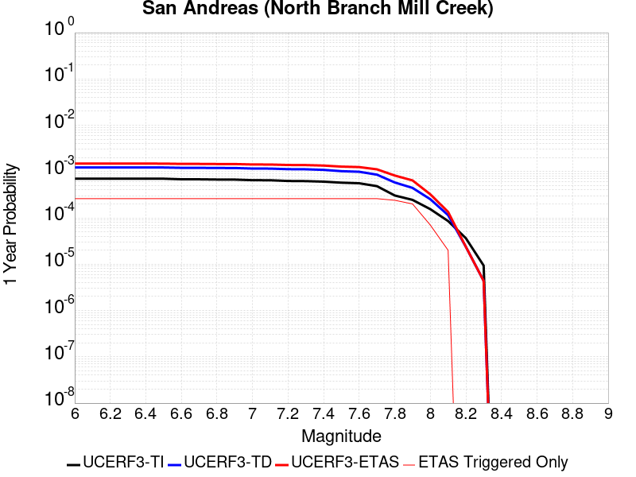 |  |

| Magnitude | 1 wk TI Prob | 1 wk TD Prob | 1 wk ETAS Prob | 1 wk ETAS/TD Gain | 1 wk ETAS Triggered Only | 1 mo TI Prob | 1 mo TD Prob | 1 mo ETAS Prob | 1 mo ETAS/TD Gain | 1 mo ETAS Triggered Only | 1 yr TI Prob | 1 yr TD Prob | 1 yr ETAS Prob | 1 yr ETAS/TD Gain | 1 yr ETAS Triggered Only | 10 yr TI Prob | 10 yr TD Prob | 10 yr ETAS Prob | 10 yr ETAS/TD Gain | 10 yr ETAS Triggered Only |
|-----|-----|-----|-----|-----|-----|-----|-----|-----|-----|-----|-----|-----|-----|-----|-----|-----|-----|-----|-----|-----|
| 6.0 | 1.3461156E-5 | 2.3500992E-5 | 1.2349864E-4 | 5.2550397 | 1.0E-4 | 5.7689394E-5 | 1.00714664E-4 | 2.4070057E-4 | 2.3899257 | 1.4E-4 | 7.02142E-4 | 0.0012255146 | 0.001485196 | 1.2118958 | 2.6E-4 | 0.0069992766 | 0.012228744 | 0.012623853 | 1.0323098 | 4.0E-4 |
| 6.1 | 1.3461156E-5 | 2.3500992E-5 | 1.2349864E-4 | 5.2550397 | 1.0E-4 | 5.7689394E-5 | 1.00714664E-4 | 2.4070057E-4 | 2.3899257 | 1.4E-4 | 7.02142E-4 | 0.0012255146 | 0.001485196 | 1.2118958 | 2.6E-4 | 0.0069992766 | 0.012228744 | 0.012623853 | 1.0323098 | 4.0E-4 |
| 6.2 | 1.3461156E-5 | 2.3500992E-5 | 1.2349864E-4 | 5.2550397 | 1.0E-4 | 5.7689394E-5 | 1.00714664E-4 | 2.4070057E-4 | 2.3899257 | 1.4E-4 | 7.02142E-4 | 0.0012255146 | 0.001485196 | 1.2118958 | 2.6E-4 | 0.0069992766 | 0.012228744 | 0.012623853 | 1.0323098 | 4.0E-4 |
| 6.3 | 1.3461156E-5 | 2.3500992E-5 | 1.2349864E-4 | 5.2550397 | 1.0E-4 | 5.7689394E-5 | 1.00714664E-4 | 2.4070057E-4 | 2.3899257 | 1.4E-4 | 7.02142E-4 | 0.0012255146 | 0.001485196 | 1.2118958 | 2.6E-4 | 0.0069992766 | 0.012228744 | 0.012623853 | 1.0323098 | 4.0E-4 |
| 6.4 | 1.3461156E-5 | 2.3500992E-5 | 1.2349864E-4 | 5.2550397 | 1.0E-4 | 5.7689394E-5 | 1.00714664E-4 | 2.4070057E-4 | 2.3899257 | 1.4E-4 | 7.02142E-4 | 0.0012255146 | 0.001485196 | 1.2118958 | 2.6E-4 | 0.0069992766 | 0.012228744 | 0.012623853 | 1.0323098 | 4.0E-4 |
| 6.5 | 1.3450706E-5 | 2.348995E-5 | 1.234876E-4 | 5.2570395 | 1.0E-4 | 5.764461E-5 | 1.00667356E-4 | 2.4065326E-4 | 2.390579 | 1.4E-4 | 7.0159714E-4 | 0.0012249392 | 0.0014846207 | 1.2119955 | 2.6E-4 | 0.006993862 | 0.012223054 | 0.0126181645 | 1.032325 | 4.0E-4 |
| 6.6 | 1.3074523E-5 | 2.3104236E-5 | 1.2310193E-4 | 5.3281107 | 1.0E-4 | 5.6032466E-5 | 9.901441E-5 | 2.3900055E-4 | 2.4137955 | 1.4E-4 | 6.8198174E-4 | 0.001204837 | 0.0014645237 | 1.2155368 | 2.6E-4 | 0.006798926 | 0.012024219 | 0.012419409 | 1.0328662 | 4.0E-4 |
| 6.7 | 1.3050216E-5 | 2.3079532E-5 | 1.2307722E-4 | 5.332743 | 1.0E-4 | 5.59283E-5 | 9.890855E-5 | 2.388947E-4 | 2.415309 | 1.4E-4 | 6.8071426E-4 | 0.0012035496 | 0.0014632366 | 1.2157676 | 2.6E-4 | 0.0067863287 | 0.012011484 | 0.01240668 | 1.0329014 | 4.0E-4 |
| 6.8 | 1.29049395E-5 | 2.2927941E-5 | 1.2292564E-4 | 5.3613906 | 1.0E-4 | 5.530571E-5 | 9.825892E-5 | 2.3824516E-4 | 2.4246671 | 1.4E-4 | 6.73139E-4 | 0.001195649 | 0.0014553382 | 1.2171952 | 2.6E-4 | 0.0067110364 | 0.011933329 | 0.012328555 | 1.0331196 | 4.0E-4 |
| 6.9 | 1.2867369E-5 | 2.2887343E-5 | 1.2288506E-4 | 5.3691273 | 1.0E-4 | 5.51447E-5 | 9.808494E-5 | 2.3807121E-4 | 2.4271944 | 1.4E-4 | 6.711799E-4 | 0.0011935332 | 0.0014532228 | 1.2175806 | 2.6E-4 | 0.006691564 | 0.011912397 | 0.012307633 | 1.0331784 | 4.0E-4 |
| 7.0 | 1.2495996E-5 | 2.2287419E-5 | 1.2228519E-4 | 5.4867363 | 1.0E-4 | 5.3553173E-5 | 9.551403E-5 | 2.3550066E-4 | 2.4656131 | 1.4E-4 | 6.518148E-4 | 0.0011622658 | 0.0014219636 | 1.223441 | 2.6E-4 | 0.0064990623 | 0.011603 | 0.011998359 | 1.0340738 | 4.0E-4 |
| 7.1 | 1.2452067E-5 | 2.2232492E-5 | 1.2223027E-4 | 5.4978213 | 1.0E-4 | 5.3364907E-5 | 9.527864E-5 | 2.3526531E-4 | 2.4692345 | 1.4E-4 | 6.4952404E-4 | 0.001159403 | 0.0014191016 | 1.2239933 | 2.6E-4 | 0.0064762887 | 0.011574671 | 0.011970041 | 1.0341582 | 4.0E-4 |
| 7.2 | 1.2002777E-5 | 2.1611015E-5 | 1.2160886E-4 | 5.62717 | 1.0E-4 | 5.143946E-5 | 9.261536E-5 | 2.326024E-4 | 2.5114882 | 1.4E-4 | 6.2609545E-4 | 0.0011270114 | 0.0013867184 | 1.2304386 | 2.6E-4 | 0.006243344 | 0.011254058 | 0.011639669 | 1.0342642 | 3.9E-4 |
| 7.3 | 1.1923425E-5 | 2.1480853E-5 | 1.21478704E-4 | 5.6552086 | 1.0E-4 | 5.109939E-5 | 9.205757E-5 | 2.3204468E-4 | 2.5206475 | 1.4E-4 | 6.219575E-4 | 0.0011202273 | 0.001379936 | 1.2318357 | 2.6E-4 | 0.0062021962 | 0.011186945 | 0.011572582 | 1.0344721 | 3.9E-4 |
| 7.4 | 1.16105175E-5 | 2.0854808E-5 | 1.20852725E-4 | 5.7949576 | 1.0E-4 | 4.975841E-5 | 8.93747E-5 | 2.2936218E-4 | 2.5662987 | 1.4E-4 | 6.0564023E-4 | 0.0010875963 | 0.0013473135 | 1.2387993 | 2.6E-4 | 0.006039923 | 0.010864409 | 0.011250172 | 1.0355071 | 3.9E-4 |
| 7.5 | 1.1037265E-5 | 1.9554842E-5 | 1.1955289E-4 | 6.113723 | 1.0E-4 | 4.7301706E-5 | 8.380379E-5 | 2.2379206E-4 | 2.670429 | 1.4E-4 | 5.757461E-4 | 0.0010198357 | 0.0012795705 | 1.254683 | 2.6E-4 | 0.005742567 | 0.010195527 | 0.010581551 | 1.0378621 | 3.9E-4 |
| 7.6 | 1.0720915E-5 | 1.8996727E-5 | 1.1899483E-4 | 6.2639647 | 1.0E-4 | 4.5945973E-5 | 8.141202E-5 | 2.2140062E-4 | 2.719508 | 1.4E-4 | 5.592486E-4 | 9.907428E-4 | 0.0012504852 | 1.2621694 | 2.6E-4 | 0.005578433 | 0.009907238 | 0.010293375 | 1.0389751 | 3.9E-4 |
| 7.7 | 9.276279E-6 | 1.6442464E-5 | 1.1644082E-4 | 7.0817137 | 1.0E-4 | 3.9754876E-5 | 7.046581E-5 | 2.1045594E-4 | 2.9866393 | 1.4E-4 | 4.839081E-4 | 8.5758517E-4 | 0.0011173622 | 1.3029169 | 2.6E-4 | 0.0048285574 | 0.008586576 | 0.008973227 | 1.0450298 | 3.9E-4 |
| 7.8 | 5.8346777E-6 | 1.11555855E-5 | 1.1115447E-4 | 9.96402 | 1.0E-4 | 2.5005522E-5 | 4.7808775E-5 | 1.8780208E-4 | 3.9281926 | 1.4E-4 | 3.043997E-4 | 5.819165E-4 | 8.2177686E-4 | 1.4121903 | 2.4E-4 | 0.0030398308 | 0.0058473335 | 0.0062151696 | 1.0629067 | 3.7E-4 |
| 7.9 | 4.690204E-6 | 8.509473E-6 | 9.850871E-5 | 11.576357 | 9.0E-5 | 2.0100719E-5 | 3.6468664E-5 | 1.6646393E-4 | 4.5645742 | 1.3E-4 | 2.4469878E-4 | 4.439156E-4 | 6.4382685E-4 | 1.4503361 | 2.0E-4 | 0.002444295 | 0.004471165 | 0.004779779 | 1.0690231 | 3.1E-4 |
| 8.0 | 2.9570454E-6 | 4.8470656E-6 | 3.4846922E-5 | 7.1892815 | 3.0E-5 | 1.267299E-5 | 2.0772974E-5 | 6.077214E-5 | 2.925539 | 4.0E-5 | 1.5428272E-4 | 2.5288164E-4 | 3.2286393E-4 | 1.2767394 | 7.0E-5 | 0.0015417566 | 0.002549932 | 0.0026596517 | 1.0430284 | 1.1E-4 |
| 8.1 | 1.6376824E-6 | 2.1968672E-6 | 1.2196845E-5 | 5.5519266 | 1.0E-5 | 7.01862E-6 | 9.415111E-6 | 1.9415018E-5 | 2.0621123 | 1.0E-5 | 8.544835E-5 | 1.1462297E-4 | 1.3462067E-4 | 1.1744651 | 2.0E-5 | 8.54155E-4 | 0.0011607445 | 0.0011907095 | 1.0258155 | 3.0E-5 |
| 8.2 | 6.9631557E-7 | 4.535001E-7 | 4.535001E-7 | 1.0 | 0.0 | 2.984206E-6 | 1.9435704E-6 | 1.9435704E-6 | 1.0 | 0.0 | 3.63321E-5 | 2.3662713E-5 | 2.3662713E-5 | 1.0 | 0.0 | 3.6326164E-4 | 2.4510184E-4 | 2.4510184E-4 | 1.0 | 0.0 |
| 8.3 | 1.7876137E-7 | 8.357368E-8 | 8.357368E-8 | 1.0 | 0.0 | 7.661199E-7 | 3.5817288E-7 | 3.5817288E-7 | 1.0 | 0.0 | 9.32747E-6 | 4.3607465E-6 | 4.3607465E-6 | 1.0 | 0.0 | 9.3270784E-5 | 4.5800018E-5 | 4.5800018E-5 | 1.0 | 0.0 |

## Calico-Hidalgo
*[(top)](#table-of-contents)*

| 1 Week | 1 Month | 1 Year | 10 Year |
|-----|-----|-----|-----|
|  |  |  |  |

| Magnitude | 1 wk TI Prob | 1 wk TD Prob | 1 wk ETAS Prob | 1 wk ETAS/TD Gain | 1 wk ETAS Triggered Only | 1 mo TI Prob | 1 mo TD Prob | 1 mo ETAS Prob | 1 mo ETAS/TD Gain | 1 mo ETAS Triggered Only | 1 yr TI Prob | 1 yr TD Prob | 1 yr ETAS Prob | 1 yr ETAS/TD Gain | 1 yr ETAS Triggered Only | 10 yr TI Prob | 10 yr TD Prob | 10 yr ETAS Prob | 10 yr ETAS/TD Gain | 10 yr ETAS Triggered Only |
|-----|-----|-----|-----|-----|-----|-----|-----|-----|-----|-----|-----|-----|-----|-----|-----|-----|-----|-----|-----|-----|
| 6.0 | 4.0906612E-5 | 5.0704355E-5 | 8.0702834E-5 | 1.5916351 | 3.0E-5 | 1.7530227E-4 | 2.1728857E-4 | 2.9727118E-4 | 1.368094 | 8.0E-5 | 0.0021322158 | 0.002642678 | 0.002762361 | 1.0452884 | 1.2E-4 | 0.02111873 | 0.026152814 | 0.026493661 | 1.0130329 | 3.5E-4 |
| 6.1 | 4.0906612E-5 | 5.0704355E-5 | 8.0702834E-5 | 1.5916351 | 3.0E-5 | 1.7530227E-4 | 2.1728857E-4 | 2.9727118E-4 | 1.368094 | 8.0E-5 | 0.0021322158 | 0.002642678 | 0.002762361 | 1.0452884 | 1.2E-4 | 0.02111873 | 0.026152814 | 0.026493661 | 1.0130329 | 3.5E-4 |
| 6.2 | 4.0906612E-5 | 5.0704355E-5 | 8.0702834E-5 | 1.5916351 | 3.0E-5 | 1.7530227E-4 | 2.1728857E-4 | 2.9727118E-4 | 1.368094 | 8.0E-5 | 0.0021322158 | 0.002642678 | 0.002762361 | 1.0452884 | 1.2E-4 | 0.02111873 | 0.026152814 | 0.026493661 | 1.0130329 | 3.5E-4 |
| 6.3 | 2.4242801E-5 | 3.0090967E-5 | 5.0090366E-5 | 1.6646312 | 2.0E-5 | 1.0389358E-4 | 1.289551E-4 | 1.6894995E-4 | 1.3101455 | 4.0E-5 | 0.0012641704 | 0.0015689312 | 0.0016288371 | 1.0381826 | 6.0E-5 | 0.01257003 | 0.015582229 | 0.015808646 | 1.0145304 | 2.3E-4 |
| 6.4 | 2.4242801E-5 | 3.0090967E-5 | 5.0090366E-5 | 1.6646312 | 2.0E-5 | 1.0389358E-4 | 1.289551E-4 | 1.6894995E-4 | 1.3101455 | 4.0E-5 | 0.0012641704 | 0.0015689312 | 0.0016288371 | 1.0381826 | 6.0E-5 | 0.01257003 | 0.015582229 | 0.015808646 | 1.0145304 | 2.3E-4 |
| 6.5 | 2.0286952E-5 | 2.5316054E-5 | 4.5315548E-5 | 1.7899925 | 2.0E-5 | 8.694118E-5 | 1.0849296E-4 | 1.4848862E-4 | 1.3686475 | 4.0E-5 | 0.0010579949 | 0.0013201186 | 0.0013800393 | 1.0453905 | 6.0E-5 | 0.010529719 | 0.013124701 | 0.013341813 | 1.0165423 | 2.2E-4 |
| 6.6 | 2.0269223E-5 | 2.5297004E-5 | 4.52965E-5 | 1.7905874 | 2.0E-5 | 8.6865206E-5 | 1.08411325E-4 | 1.4840698E-4 | 1.3689251 | 4.0E-5 | 0.0010570707 | 0.0013191258 | 0.0013790466 | 1.0454247 | 6.0E-5 | 0.010520565 | 0.01311489 | 0.013332005 | 1.0165548 | 2.2E-4 |
| 6.7 | 1.799852E-5 | 2.2540933E-5 | 4.2540483E-5 | 1.8872547 | 2.0E-5 | 7.713423E-5 | 9.660051E-5 | 1.3659665E-4 | 1.4140365 | 4.0E-5 | 9.3870464E-4 | 0.0011754911 | 0.0012254324 | 1.0424854 | 5.0E-5 | 0.009347493 | 0.011694346 | 0.011892007 | 1.0169023 | 2.0E-4 |
| 6.8 | 1.7458793E-5 | 2.184258E-5 | 4.1842144E-5 | 1.9156227 | 2.0E-5 | 7.4821255E-5 | 9.360778E-5 | 1.3360403E-4 | 1.427275 | 4.0E-5 | 9.10568E-4 | 0.0011390933 | 0.0011790477 | 1.0350757 | 4.0E-5 | 0.009068459 | 0.011334131 | 0.011521977 | 1.0165735 | 1.9E-4 |
| 6.9 | 1.542884E-5 | 1.9026285E-5 | 3.9025905E-5 | 2.0511572 | 2.0E-5 | 6.612192E-5 | 8.153875E-5 | 1.21535486E-4 | 1.4905243 | 4.0E-5 | 8.04737E-4 | 9.922953E-4 | 0.0010322556 | 1.0402706 | 4.0E-5 | 0.008018291 | 0.009880043 | 0.010068166 | 1.0190407 | 1.9E-4 |
| 7.0 | 1.468253E-5 | 1.803109E-5 | 3.8030732E-5 | 2.1091752 | 2.0E-5 | 6.292361E-5 | 7.727389E-5 | 1.172708E-4 | 1.5175992 | 4.0E-5 | 7.658257E-4 | 9.4041653E-4 | 9.80379E-4 | 1.0424943 | 4.0E-5 | 0.0076319184 | 0.009365736 | 0.009553957 | 1.0200967 | 1.9E-4 |
| 7.1 | 1.3139281E-5 | 1.620139E-5 | 3.6201065E-5 | 2.234442 | 2.0E-5 | 5.6309986E-5 | 6.943275E-5 | 1.0942997E-4 | 1.5760571 | 4.0E-5 | 6.853584E-4 | 8.4502844E-4 | 8.8499463E-4 | 1.0472957 | 4.0E-5 | 0.0068324856 | 0.008419449 | 0.008597935 | 1.0211991 | 1.8E-4 |
| 7.2 | 1.1127404E-5 | 1.3867038E-5 | 1.3867038E-5 | 1.0 | 0.0 | 4.7688E-5 | 5.9428872E-5 | 7.9427686E-5 | 1.3365167 | 2.0E-5 | 5.8044674E-4 | 7.233172E-4 | 7.4330275E-4 | 1.0276303 | 2.0E-5 | 0.0057893298 | 0.007210737 | 0.0073497277 | 1.0192755 | 1.4E-4 |
| 7.3 | 9.808154E-6 | 1.2176586E-5 | 1.2176586E-5 | 1.0 | 0.0 | 4.2034266E-5 | 5.2184383E-5 | 7.218334E-5 | 1.3832364 | 2.0E-5 | 5.11647E-4 | 6.351704E-4 | 6.5515767E-4 | 1.0314676 | 2.0E-5 | 0.0051047057 | 0.006334625 | 0.0064240554 | 1.0141176 | 9.0E-5 |
| 7.4 | 7.942452E-6 | 9.792348E-6 | 9.792348E-6 | 1.0 | 0.0 | 3.4038632E-5 | 4.1966585E-5 | 6.1965744E-5 | 1.4765496 | 2.0E-5 | 4.1434157E-4 | 5.108328E-4 | 5.308226E-4 | 1.0391318 | 2.0E-5 | 0.0041356985 | 0.005097527 | 0.0051771193 | 1.0156139 | 8.0E-5 |
| 7.5 | 4.7121216E-6 | 5.7729717E-6 | 5.7729717E-6 | 1.0 | 0.0 | 2.019465E-5 | 2.4741115E-5 | 4.474062E-5 | 1.808351 | 2.0E-5 | 2.4584212E-4 | 3.011891E-4 | 3.211831E-4 | 1.0663835 | 2.0E-5 | 0.0024557032 | 0.0030085614 | 0.003068381 | 1.019883 | 6.0E-5 |
| 7.6 | 2.21172E-7 | 2.6040198E-7 | 2.6040198E-7 | 1.0 | 0.0 | 9.478797E-7 | 1.1160082E-6 | 1.1115997E-5 | 9.960498 | 1.0E-5 | 1.1540374E-5 | 1.3587343E-5 | 2.3587207E-5 | 1.7359691 | 1.0E-5 | 1.1539775E-4 | 1.3586794E-4 | 1.4586658E-4 | 1.0735909 | 1.0E-5 |

## Cleghorn Lake
*[(top)](#table-of-contents)*

| 1 Week | 1 Month | 1 Year | 10 Year |
|-----|-----|-----|-----|
|  |  |  |  |

| Magnitude | 1 wk TI Prob | 1 wk TD Prob | 1 wk ETAS Prob | 1 wk ETAS/TD Gain | 1 wk ETAS Triggered Only | 1 mo TI Prob | 1 mo TD Prob | 1 mo ETAS Prob | 1 mo ETAS/TD Gain | 1 mo ETAS Triggered Only | 1 yr TI Prob | 1 yr TD Prob | 1 yr ETAS Prob | 1 yr ETAS/TD Gain | 1 yr ETAS Triggered Only | 10 yr TI Prob | 10 yr TD Prob | 10 yr ETAS Prob | 10 yr ETAS/TD Gain | 10 yr ETAS Triggered Only |
|-----|-----|-----|-----|-----|-----|-----|-----|-----|-----|-----|-----|-----|-----|-----|-----|-----|-----|-----|-----|-----|
| 6.0 | 1.5467183E-5 | 1.6794203E-5 | 1.0679269E-4 | 6.358902 | 9.0E-5 | 6.6286244E-5 | 7.197348E-5 | 2.3196197E-4 | 3.2228808 | 1.6E-4 | 8.067362E-4 | 8.759797E-4 | 0.0011557344 | 1.319362 | 2.8E-4 | 0.008038137 | 0.008730696 | 0.009077639 | 1.0397384 | 3.5E-4 |
| 6.1 | 1.5467183E-5 | 1.6794203E-5 | 1.0679269E-4 | 6.358902 | 9.0E-5 | 6.6286244E-5 | 7.197348E-5 | 2.3196197E-4 | 3.2228808 | 1.6E-4 | 8.067362E-4 | 8.759797E-4 | 0.0011557344 | 1.319362 | 2.8E-4 | 0.008038137 | 0.008730696 | 0.009077639 | 1.0397384 | 3.5E-4 |
| 6.2 | 1.2624631E-5 | 1.3681544E-5 | 8.3680585E-5 | 6.1163116 | 7.0E-5 | 5.410444E-5 | 5.863415E-5 | 1.8862652E-4 | 3.217008 | 1.3E-4 | 6.585225E-4 | 7.1368564E-4 | 9.535143E-4 | 1.3360425 | 2.4E-4 | 0.0065657445 | 0.0071187317 | 0.007416596 | 1.0418423 | 3.0E-4 |
| 6.3 | 1.2624631E-5 | 1.3681544E-5 | 8.3680585E-5 | 6.1163116 | 7.0E-5 | 5.410444E-5 | 5.863415E-5 | 1.8862652E-4 | 3.217008 | 1.3E-4 | 6.585225E-4 | 7.1368564E-4 | 9.535143E-4 | 1.3360425 | 2.4E-4 | 0.0065657445 | 0.0071187317 | 0.007416596 | 1.0418423 | 3.0E-4 |
| 6.4 | 9.417684E-6 | 1.0170118E-5 | 6.016961E-5 | 5.916314 | 5.0E-5 | 4.036088E-5 | 4.3585722E-5 | 1.5358093E-4 | 3.5236523 | 1.1E-4 | 4.912829E-4 | 5.3056807E-4 | 7.304619E-4 | 1.3767545 | 2.0E-4 | 0.004901982 | 0.005297049 | 0.0055556716 | 1.048824 | 2.6E-4 |
| 6.5 | 9.368219E-6 | 1.0117545E-5 | 6.011704E-5 | 5.9418607 | 5.0E-5 | 4.014889E-5 | 4.3360415E-5 | 1.5335565E-4 | 3.536766 | 1.1E-4 | 4.8870314E-4 | 5.2782625E-4 | 7.277207E-4 | 1.3787125 | 2.0E-4 | 0.004876298 | 0.0052697617 | 0.0055283913 | 1.0490781 | 2.6E-4 |
| 6.6 | 7.803798E-6 | 8.441831E-6 | 4.8441492E-5 | 5.7382684 | 4.0E-5 | 3.3444423E-5 | 3.6179E-5 | 1.2617574E-4 | 3.487541 | 9.0E-5 | 4.0710976E-4 | 4.4043022E-4 | 6.1035535E-4 | 1.3858162 | 1.7E-4 | 0.0040636472 | 0.0043994905 | 0.0046284785 | 1.0520488 | 2.3E-4 |
| 6.7 | 2.3108669E-6 | 2.4438336E-6 | 1.2443809E-5 | 5.0919213 | 1.0E-5 | 9.903678E-6 | 1.0473532E-5 | 3.0473322E-5 | 2.9095554 | 2.0E-5 | 1.205706E-4 | 1.2750797E-4 | 1.8750032E-4 | 1.4704988 | 6.0E-5 | 0.001205052 | 0.0012743667 | 0.0013342904 | 1.0470222 | 6.0E-5 |
| 6.8 | 2.0882828E-6 | 2.2062823E-6 | 1.220626E-5 | 5.5325017 | 1.0E-5 | 8.949753E-6 | 9.455462E-6 | 2.9455272E-5 | 3.1151595 | 2.0E-5 | 1.08957785E-4 | 1.1511434E-4 | 1.7510743E-4 | 1.521161 | 6.0E-5 | 0.0010890438 | 0.0011505639 | 0.0012104949 | 1.0520884 | 6.0E-5 |
| 6.9 | 1.876935E-6 | 1.981051E-6 | 1.1981031E-5 | 6.047816 | 1.0E-5 | 8.043982E-6 | 8.490192E-6 | 2.8490022E-5 | 3.3556395 | 2.0E-5 | 9.7931086E-5 | 1.03363345E-4 | 1.6335714E-4 | 1.5804166 | 6.0E-5 | 9.788794E-4 | 0.0010331686 | 0.0010931067 | 1.0580138 | 6.0E-5 |
| 7.0 | 1.5357559E-6 | 1.6202807E-6 | 1.1620265E-5 | 7.17176 | 1.0E-5 | 6.5817944E-6 | 6.9440425E-6 | 2.6943904E-5 | 3.8801467 | 2.0E-5 | 8.01304E-5 | 8.454057E-5 | 1.4453549E-4 | 1.7096585 | 6.0E-5 | 8.010151E-4 | 8.450965E-4 | 9.050458E-4 | 1.0709378 | 6.0E-5 |
| 7.1 | 1.0905424E-6 | 1.1497619E-6 | 1.114975E-5 | 9.697442 | 1.0E-5 | 4.6737446E-6 | 4.9275427E-6 | 2.4927444E-5 | 5.0587983 | 2.0E-5 | 5.6901354E-5 | 5.999128E-5 | 9.998888E-5 | 1.6667236 | 4.0E-5 | 5.6886784E-4 | 5.997606E-4 | 6.3973665E-4 | 1.0666533 | 4.0E-5 |
| 7.2 | 6.06668E-7 | 6.387277E-7 | 1.06387215E-5 | 16.656113 | 1.0E-5 | 2.600003E-6 | 2.7374022E-6 | 2.2737348E-5 | 8.306177 | 2.0E-5 | 3.1654577E-5 | 3.3327433E-5 | 6.3326435E-5 | 1.9001293 | 3.0E-5 | 3.1650066E-4 | 3.3323118E-4 | 3.632212E-4 | 1.0899976 | 3.0E-5 |

## Mission Ridge-Arroyo Parida-Santa Ana
*[(top)](#table-of-contents)*

| 1 Week | 1 Month | 1 Year | 10 Year |
|-----|-----|-----|-----|
|  |  |  |  |

| Magnitude | 1 wk TI Prob | 1 wk TD Prob | 1 wk ETAS Prob | 1 wk ETAS/TD Gain | 1 wk ETAS Triggered Only | 1 mo TI Prob | 1 mo TD Prob | 1 mo ETAS Prob | 1 mo ETAS/TD Gain | 1 mo ETAS Triggered Only | 1 yr TI Prob | 1 yr TD Prob | 1 yr ETAS Prob | 1 yr ETAS/TD Gain | 1 yr ETAS Triggered Only | 10 yr TI Prob | 10 yr TD Prob | 10 yr ETAS Prob | 10 yr ETAS/TD Gain | 10 yr ETAS Triggered Only |
|-----|-----|-----|-----|-----|-----|-----|-----|-----|-----|-----|-----|-----|-----|-----|-----|-----|-----|-----|-----|-----|
| 6.0 | 4.169034E-5 | 4.7137048E-5 | 9.713469E-5 | 2.0606868 | 5.0E-5 | 1.7866064E-4 | 2.0200513E-4 | 2.7199098E-4 | 1.3464558 | 7.0E-5 | 0.0021730233 | 0.0024574657 | 0.0026170725 | 1.0649477 | 1.6E-4 | 0.021518968 | 0.02438483 | 0.024628734 | 1.0100023 | 2.5E-4 |
| 6.1 | 1.73813E-5 | 1.6854203E-5 | 1.6854203E-5 | 1.0 | 0.0 | 7.4489166E-5 | 7.223036E-5 | 1.02228194E-4 | 1.4153078 | 3.0E-5 | 9.065282E-4 | 8.790605E-4 | 9.1902533E-4 | 1.0454631 | 4.0E-5 | 0.009028391 | 0.008757128 | 0.008856253 | 1.0113193 | 1.0E-4 |
| 6.2 | 1.4622182E-5 | 1.3673262E-5 | 1.3673262E-5 | 1.0 | 0.0 | 6.2664985E-5 | 5.85984E-5 | 8.8596644E-5 | 1.5119294 | 3.0E-5 | 7.6267915E-4 | 7.132059E-4 | 7.531774E-4 | 1.0560448 | 4.0E-5 | 0.007600669 | 0.007109767 | 0.007199127 | 1.0125686 | 9.0E-5 |
| 6.3 | 1.3552434E-5 | 1.2482174E-5 | 1.2482174E-5 | 1.0 | 0.0 | 5.8080568E-5 | 5.349395E-5 | 7.349288E-5 | 1.373854 | 2.0E-5 | 7.069015E-4 | 6.510974E-4 | 6.810778E-4 | 1.046046 | 3.0E-5 | 0.00704657 | 0.006492415 | 0.0065718954 | 1.0122421 | 8.0E-5 |
| 6.4 | 1.30977305E-5 | 1.1979128E-5 | 1.1979128E-5 | 1.0 | 0.0 | 5.613192E-5 | 5.133813E-5 | 7.1337105E-5 | 1.389554 | 2.0E-5 | 6.831918E-4 | 6.2486547E-4 | 6.548467E-4 | 1.0479803 | 3.0E-5 | 0.006810953 | 0.006231584 | 0.006301148 | 1.0111631 | 7.0E-5 |
| 6.5 | 1.225205E-5 | 1.1048776E-5 | 1.1048776E-5 | 1.0 | 0.0 | 5.2507727E-5 | 4.735105E-5 | 6.7350105E-5 | 1.4223571 | 2.0E-5 | 6.3909404E-4 | 5.7634927E-4 | 6.06332E-4 | 1.0520217 | 3.0E-5 | 0.006372592 | 0.005749009 | 0.0058186064 | 1.0121061 | 7.0E-5 |
| 6.6 | 1.1352241E-5 | 1.0063508E-5 | 1.0063508E-5 | 1.0 | 0.0 | 4.8651553E-5 | 4.3128617E-5 | 6.312776E-5 | 1.4637092 | 2.0E-5 | 5.921717E-4 | 5.249665E-4 | 5.549508E-4 | 1.0571165 | 3.0E-5 | 0.0059059616 | 0.0052376646 | 0.0053072977 | 1.0132947 | 7.0E-5 |
| 6.7 | 1.0864116E-5 | 9.517E-6 | 9.517E-6 | 1.0 | 0.0 | 4.6559664E-5 | 4.0786515E-5 | 6.07857E-5 | 1.4903381 | 2.0E-5 | 5.667165E-4 | 4.964647E-4 | 5.264498E-4 | 1.0603973 | 3.0E-5 | 0.005652734 | 0.0049539437 | 0.0050136466 | 1.0120516 | 6.0E-5 |
| 6.8 | 1.0666365E-5 | 9.299752E-6 | 9.299752E-6 | 1.0 | 0.0 | 4.571219E-5 | 3.985548E-5 | 5.9854683E-5 | 1.501793 | 2.0E-5 | 5.564038E-4 | 4.8513446E-4 | 5.151199E-4 | 1.0618086 | 3.0E-5 | 0.005550127 | 0.00484114 | 0.0049008494 | 1.0123338 | 6.0E-5 |
| 6.9 | 1.0038665E-5 | 8.592018E-6 | 8.592018E-6 | 1.0 | 0.0 | 4.302214E-5 | 3.682243E-5 | 5.682169E-5 | 1.5431273 | 2.0E-5 | 5.236687E-4 | 4.4822265E-4 | 4.782092E-4 | 1.066901 | 3.0E-5 | 0.005224364 | 0.0044735507 | 0.0045332825 | 1.0133522 | 6.0E-5 |
| 7.0 | 9.5379955E-6 | 8.025047E-6 | 8.025047E-6 | 1.0 | 0.0 | 4.0876483E-5 | 3.439261E-5 | 5.4391923E-5 | 1.5815003 | 2.0E-5 | 4.975576E-4 | 4.1865133E-4 | 4.4863875E-4 | 1.0716287 | 3.0E-5 | 0.00496445 | 0.00417898 | 0.004238729 | 1.0142976 | 6.0E-5 |
| 7.1 | 9.207389E-6 | 7.652347E-6 | 7.652347E-6 | 1.0 | 0.0 | 3.945964E-5 | 3.2795375E-5 | 5.2794716E-5 | 1.6098222 | 2.0E-5 | 4.803152E-4 | 3.992122E-4 | 4.2920024E-4 | 1.075118 | 3.0E-5 | 0.004792784 | 0.003985301 | 0.0040351017 | 1.0124961 | 5.0E-5 |
| 7.2 | 7.638091E-6 | 5.9310923E-6 | 5.9310923E-6 | 1.0 | 0.0 | 3.2734264E-5 | 2.5418722E-5 | 4.541821E-5 | 1.7868016 | 2.0E-5 | 3.984668E-4 | 3.094293E-4 | 3.294231E-4 | 1.0646151 | 2.0E-5 | 0.0039775306 | 0.0030901956 | 0.003120103 | 1.0096781 | 3.0E-5 |
| 7.3 | 7.2500147E-6 | 5.596131E-6 | 5.596131E-6 | 1.0 | 0.0 | 3.1071122E-5 | 2.3983199E-5 | 4.398272E-5 | 1.8338971 | 2.0E-5 | 3.7822526E-4 | 2.9195662E-4 | 3.1195077E-4 | 1.0684834 | 2.0E-5 | 0.0037758215 | 0.0029159402 | 0.002935882 | 1.0068388 | 2.0E-5 |
| 7.4 | 6.3899715E-6 | 4.9184864E-6 | 4.9184864E-6 | 1.0 | 0.0 | 2.7385306E-5 | 2.1079059E-5 | 3.107885E-5 | 1.4743944 | 1.0E-5 | 3.3336508E-4 | 2.566075E-4 | 2.6660494E-4 | 1.03896 | 1.0E-5 | 0.0033286542 | 0.002563311 | 0.0025732853 | 1.0038912 | 1.0E-5 |
| 7.5 | 5.379025E-6 | 4.0838477E-6 | 4.0838477E-6 | 1.0 | 0.0 | 2.305276E-5 | 1.7502087E-5 | 2.7501912E-5 | 1.5713505 | 1.0E-5 | 2.806312E-4 | 2.1306718E-4 | 2.2306504E-4 | 1.0469235 | 1.0E-5 | 0.0028027708 | 0.0021286402 | 0.0021386188 | 1.0046878 | 1.0E-5 |
| 7.6 | 4.1270696E-6 | 3.0883373E-6 | 3.0883373E-6 | 1.0 | 0.0 | 1.768732E-5 | 1.32356645E-5 | 1.32356645E-5 | 1.0 | 0.0 | 2.1532185E-4 | 1.6113237E-4 | 1.6113237E-4 | 1.0 | 0.0 | 0.0021511333 | 0.0016101635 | 0.0016101635 | 1.0 | 0.0 |
| 7.7 | 2.5406805E-6 | 1.8282044E-6 | 1.8282044E-6 | 1.0 | 0.0 | 1.0888585E-5 | 7.835139E-6 | 7.835139E-6 | 1.0 | 0.0 | 1.3256045E-4 | 9.53887E-5 | 9.53887E-5 | 1.0 | 0.0 | 0.0013248142 | 9.534837E-4 | 9.534837E-4 | 1.0 | 0.0 |
| 7.8 | 4.8608285E-7 | 3.509864E-7 | 3.509864E-7 | 1.0 | 0.0 | 2.0832106E-6 | 1.5042266E-6 | 1.5042266E-6 | 1.0 | 0.0 | 2.5362791E-5 | 1.8313805E-5 | 1.8313805E-5 | 1.0 | 0.0 | 2.5359896E-4 | 1.8312308E-4 | 1.8312308E-4 | 1.0 | 0.0 |
| 7.9 | 2.0472514E-8 | 1.2688718E-8 | 1.2688718E-8 | 1.0 | 0.0 | 8.7739345E-8 | 5.438022E-8 | 5.438022E-8 | 1.0 | 0.0 | 1.068226E-6 | 6.6207895E-7 | 6.6207895E-7 | 1.0 | 0.0 | 1.0682209E-5 | 6.620771E-6 | 6.620771E-6 | 1.0 | 0.0 |
| 8.0 | 4.443582E-9 | 2.032067E-9 | 2.032067E-9 | 1.0 | 0.0 | 1.9043922E-8 | 8.7088585E-9 | 8.7088585E-9 | 1.0 | 0.0 | 2.3185973E-7 | 1.0603035E-7 | 1.0603035E-7 | 1.0 | 0.0 | 2.3185949E-6 | 1.0603031E-6 | 1.0603031E-6 | 1.0 | 0.0 |

## Lake Isabella (Seismicity)
*[(top)](#table-of-contents)*

| 1 Week | 1 Month | 1 Year | 10 Year |
|-----|-----|-----|-----|
|  |  |  |  |

| Magnitude | 1 wk TI Prob | 1 wk TD Prob | 1 wk ETAS Prob | 1 wk ETAS/TD Gain | 1 wk ETAS Triggered Only | 1 mo TI Prob | 1 mo TD Prob | 1 mo ETAS Prob | 1 mo ETAS/TD Gain | 1 mo ETAS Triggered Only | 1 yr TI Prob | 1 yr TD Prob | 1 yr ETAS Prob | 1 yr ETAS/TD Gain | 1 yr ETAS Triggered Only | 10 yr TI Prob | 10 yr TD Prob | 10 yr ETAS Prob | 10 yr ETAS/TD Gain | 10 yr ETAS Triggered Only |
|-----|-----|-----|-----|-----|-----|-----|-----|-----|-----|-----|-----|-----|-----|-----|-----|-----|-----|-----|-----|-----|
| 6.0 | 9.431637E-6 | 9.741651E-6 | 8.9740875E-5 | 9.21208 | 8.0E-5 | 4.0420677E-5 | 4.1749343E-5 | 1.6174433E-4 | 3.8741767 | 1.2E-4 | 4.920106E-4 | 5.0819275E-4 | 7.380759E-4 | 1.4523542 | 2.3E-4 | 0.004909227 | 0.005071599 | 0.0054397224 | 1.0725853 | 3.7E-4 |
| 6.1 | 9.431637E-6 | 9.741651E-6 | 8.9740875E-5 | 9.21208 | 8.0E-5 | 4.0420677E-5 | 4.1749343E-5 | 1.6174433E-4 | 3.8741767 | 1.2E-4 | 4.920106E-4 | 5.0819275E-4 | 7.380759E-4 | 1.4523542 | 2.3E-4 | 0.004909227 | 0.005071599 | 0.0054397224 | 1.0725853 | 3.7E-4 |
| 6.2 | 9.431637E-6 | 9.741651E-6 | 8.9740875E-5 | 9.21208 | 8.0E-5 | 4.0420677E-5 | 4.1749343E-5 | 1.6174433E-4 | 3.8741767 | 1.2E-4 | 4.920106E-4 | 5.0819275E-4 | 7.380759E-4 | 1.4523542 | 2.3E-4 | 0.004909227 | 0.005071599 | 0.0054397224 | 1.0725853 | 3.7E-4 |
| 6.3 | 9.431637E-6 | 9.741651E-6 | 8.9740875E-5 | 9.21208 | 8.0E-5 | 4.0420677E-5 | 4.1749343E-5 | 1.6174433E-4 | 3.8741767 | 1.2E-4 | 4.920106E-4 | 5.0819275E-4 | 7.380759E-4 | 1.4523542 | 2.3E-4 | 0.004909227 | 0.005071599 | 0.0054397224 | 1.0725853 | 3.7E-4 |
| 6.4 | 5.144063E-6 | 5.3000763E-6 | 6.5299755E-5 | 12.320532 | 6.0E-5 | 2.2045799E-5 | 2.2714434E-5 | 1.1271239E-4 | 4.962148 | 9.0E-5 | 2.6837454E-4 | 2.765166E-4 | 4.3647236E-4 | 1.5784671 | 1.6E-4 | 0.0026805066 | 0.0027620657 | 0.0029615134 | 1.0722096 | 2.0E-4 |
| 6.5 | 5.144063E-6 | 5.3000763E-6 | 6.5299755E-5 | 12.320532 | 6.0E-5 | 2.2045799E-5 | 2.2714434E-5 | 1.1271239E-4 | 4.962148 | 9.0E-5 | 2.6837454E-4 | 2.765166E-4 | 4.3647236E-4 | 1.5784671 | 1.6E-4 | 0.0026805066 | 0.0027620657 | 0.0029615134 | 1.0722096 | 2.0E-4 |
| 6.6 | 3.4009804E-6 | 3.498786E-6 | 4.3498647E-5 | 12.432496 | 4.0E-5 | 1.4575549E-5 | 1.4994721E-5 | 8.499367E-5 | 5.6682396 | 7.0E-5 | 1.7744285E-4 | 1.8254704E-4 | 2.8252878E-4 | 1.547704 | 1.0E-4 | 0.0017730123 | 0.0018241286 | 0.0019439097 | 1.0656649 | 1.2E-4 |
| 6.7 | 3.3880428E-6 | 3.4856528E-6 | 4.3485514E-5 | 12.475573 | 4.0E-5 | 1.4520103E-5 | 1.4938435E-5 | 8.493739E-5 | 5.685829 | 7.0E-5 | 1.767679E-4 | 1.8186188E-4 | 2.8184368E-4 | 1.5497679 | 1.0E-4 | 0.0017662736 | 0.0018172882 | 0.0019370702 | 1.0659125 | 1.2E-4 |
| 6.8 | 2.6582E-6 | 2.7337003E-6 | 1.27336725E-5 | 4.6580358 | 1.0E-5 | 1.1392236E-5 | 1.1715813E-5 | 3.171558E-5 | 2.7070744 | 2.0E-5 | 1.3869164E-4 | 1.4263204E-4 | 1.8262633E-4 | 1.280402 | 4.0E-5 | 0.0013860512 | 0.0014255369 | 0.0014854514 | 1.0420294 | 6.0E-5 |
| 6.9 | 2.406011E-6 | 2.4743288E-6 | 1.2474304E-5 | 5.04149 | 1.0E-5 | 1.0311434E-5 | 1.0604231E-5 | 3.060402E-5 | 2.8860197 | 2.0E-5 | 1.2553448E-4 | 1.2910018E-4 | 1.6909502E-4 | 1.3097969 | 4.0E-5 | 0.0012546359 | 0.0012903814 | 0.001350304 | 1.0464379 | 6.0E-5 |
| 7.0 | 1.6953097E-6 | 1.7429371E-6 | 1.174292E-5 | 6.7374315 | 1.0E-5 | 7.265593E-6 | 7.469715E-6 | 2.7469567E-5 | 3.6774583 | 2.0E-5 | 8.8455E-5 | 9.094104E-5 | 1.20938304E-4 | 1.3298541 | 3.0E-5 | 8.84198E-4 | 9.09141E-4 | 9.590955E-4 | 1.054947 | 5.0E-5 |
| 7.1 | 3.5013824E-7 | 3.5714822E-7 | 3.5714822E-7 | 1.0 | 0.0 | 1.5005916E-6 | 1.5306344E-6 | 1.5306344E-6 | 1.0 | 0.0 | 1.826955E-5 | 1.8635317E-5 | 2.8635131E-5 | 1.5366055 | 1.0E-5 | 1.8268047E-4 | 1.863378E-4 | 1.9633592E-4 | 1.053656 | 1.0E-5 |
| 7.2 | 2.2321095E-7 | 2.2750574E-7 | 2.2750574E-7 | 1.0 | 0.0 | 9.56618E-7 | 9.750242E-7 | 9.750242E-7 | 1.0 | 0.0 | 1.1646762E-5 | 1.1870856E-5 | 1.1870856E-5 | 1.0 | 0.0 | 1.1646151E-4 | 1.1870232E-4 | 1.1870232E-4 | 1.0 | 0.0 |
| 7.3 | 1.5760406E-7 | 1.6060922E-7 | 1.6060922E-7 | 1.0 | 0.0 | 6.7544585E-7 | 6.8832503E-7 | 6.8832503E-7 | 1.0 | 0.0 | 8.223522E-6 | 8.380326E-6 | 8.380326E-6 | 1.0 | 0.0 | 8.2232174E-5 | 8.3800165E-5 | 8.3800165E-5 | 1.0 | 0.0 |
| 7.4 | 1.1216497E-7 | 1.1431706E-7 | 1.1431706E-7 | 1.0 | 0.0 | 4.8070694E-7 | 4.899302E-7 | 4.899302E-7 | 1.0 | 0.0 | 5.852591E-6 | 5.964884E-6 | 5.964884E-6 | 1.0 | 0.0 | 5.8524372E-5 | 5.9647282E-5 | 5.9647282E-5 | 1.0 | 0.0 |
| 7.5 | 4.885185E-8 | 4.9787737E-8 | 4.9787737E-8 | 1.0 | 0.0 | 2.0936506E-7 | 2.13376E-7 | 2.13376E-7 | 1.0 | 0.0 | 2.5490165E-6 | 2.59785E-6 | 2.59785E-6 | 1.0 | 0.0 | 2.5489873E-5 | 2.5978214E-5 | 2.5978214E-5 | 1.0 | 0.0 |
| 7.6 | 1.504641E-9 | 1.5317903E-9 | 1.5317903E-9 | 1.0 | 0.0 | 6.4484613E-9 | 6.5648154E-9 | 6.5648154E-9 | 1.0 | 0.0 | 7.851001E-8 | 7.992663E-8 | 7.992663E-8 | 1.0 | 0.0 | 7.8509987E-7 | 7.992663E-7 | 7.992663E-7 | 1.0 | 0.0 |

## San Jacinto (Anza) rev
*[(top)](#table-of-contents)*

| 1 Week | 1 Month | 1 Year | 10 Year |
|-----|-----|-----|-----|
|  |  |  |  |

| Magnitude | 1 wk TI Prob | 1 wk TD Prob | 1 wk ETAS Prob | 1 wk ETAS/TD Gain | 1 wk ETAS Triggered Only | 1 mo TI Prob | 1 mo TD Prob | 1 mo ETAS Prob | 1 mo ETAS/TD Gain | 1 mo ETAS Triggered Only | 1 yr TI Prob | 1 yr TD Prob | 1 yr ETAS Prob | 1 yr ETAS/TD Gain | 1 yr ETAS Triggered Only | 10 yr TI Prob | 10 yr TD Prob | 10 yr ETAS Prob | 10 yr ETAS/TD Gain | 10 yr ETAS Triggered Only |
|-----|-----|-----|-----|-----|-----|-----|-----|-----|-----|-----|-----|-----|-----|-----|-----|-----|-----|-----|-----|-----|
| 6.0 | 6.3015636E-5 | 4.3298347E-5 | 1.2329489E-4 | 2.8475657 | 8.0E-5 | 2.7003905E-4 | 1.8555121E-4 | 3.355234E-4 | 1.8082521 | 1.5E-4 | 0.0032827691 | 0.0022567573 | 0.0025361255 | 1.1237918 | 2.8E-4 | 0.032346968 | 0.02329361 | 0.023645226 | 1.0150949 | 3.6E-4 |
| 6.1 | 6.3015636E-5 | 4.3298347E-5 | 1.2329489E-4 | 2.8475657 | 8.0E-5 | 2.7003905E-4 | 1.8555121E-4 | 3.355234E-4 | 1.8082521 | 1.5E-4 | 0.0032827691 | 0.0022567573 | 0.0025361255 | 1.1237918 | 2.8E-4 | 0.032346968 | 0.02329361 | 0.023645226 | 1.0150949 | 3.6E-4 |
| 6.2 | 6.3015636E-5 | 4.3298347E-5 | 1.2329489E-4 | 2.8475657 | 8.0E-5 | 2.7003905E-4 | 1.8555121E-4 | 3.355234E-4 | 1.8082521 | 1.5E-4 | 0.0032827691 | 0.0022567573 | 0.0025361255 | 1.1237918 | 2.8E-4 | 0.032346968 | 0.02329361 | 0.023645226 | 1.0150949 | 3.6E-4 |
| 6.3 | 6.3015636E-5 | 4.3298347E-5 | 1.2329489E-4 | 2.8475657 | 8.0E-5 | 2.7003905E-4 | 1.8555121E-4 | 3.355234E-4 | 1.8082521 | 1.5E-4 | 0.0032827691 | 0.0022567573 | 0.0025361255 | 1.1237918 | 2.8E-4 | 0.032346968 | 0.02329361 | 0.023645226 | 1.0150949 | 3.6E-4 |
| 6.4 | 6.3015636E-5 | 4.3298347E-5 | 1.2329489E-4 | 2.8475657 | 8.0E-5 | 2.7003905E-4 | 1.8555121E-4 | 3.355234E-4 | 1.8082521 | 1.5E-4 | 0.0032827691 | 0.0022567573 | 0.0025361255 | 1.1237918 | 2.8E-4 | 0.032346968 | 0.02329361 | 0.023645226 | 1.0150949 | 3.6E-4 |
| 6.5 | 5.811017E-5 | 4.0080286E-5 | 1.2007708E-4 | 2.9959137 | 8.0E-5 | 2.4901982E-4 | 1.7176138E-4 | 3.217356E-4 | 1.8731546 | 1.5E-4 | 0.0030276014 | 0.0020891947 | 0.0023686097 | 1.1337429 | 2.8E-4 | 0.02986684 | 0.021590833 | 0.02194306 | 1.0163138 | 3.6E-4 |
| 6.6 | 5.811017E-5 | 4.0080286E-5 | 1.2007708E-4 | 2.9959137 | 8.0E-5 | 2.4901982E-4 | 1.7176138E-4 | 3.217356E-4 | 1.8731546 | 1.5E-4 | 0.0030276014 | 0.0020891947 | 0.0023686097 | 1.1337429 | 2.8E-4 | 0.02986684 | 0.021590833 | 0.02194306 | 1.0163138 | 3.6E-4 |
| 6.7 | 5.712442E-5 | 3.950301E-5 | 1.19499855E-4 | 3.025082 | 8.0E-5 | 2.4479596E-4 | 1.6928767E-4 | 3.1926227E-4 | 1.8859158 | 1.5E-4 | 0.0029763177 | 0.0020591344 | 0.002338558 | 1.1356995 | 2.8E-4 | 0.029367693 | 0.021282919 | 0.021635257 | 1.016555 | 3.6E-4 |
| 6.8 | 5.6967532E-5 | 3.93593E-5 | 1.1935615E-4 | 3.0324764 | 8.0E-5 | 2.4412372E-4 | 1.6867183E-4 | 3.1864655E-4 | 1.8891509 | 1.5E-4 | 0.0029681553 | 0.0020516508 | 0.0023310764 | 1.1361954 | 2.8E-4 | 0.029288229 | 0.02120852 | 0.021560885 | 1.0166143 | 3.6E-4 |
| 6.9 | 5.6211324E-5 | 3.9064216E-5 | 1.1906109E-4 | 3.04783 | 8.0E-5 | 2.4088343E-4 | 1.6740736E-4 | 3.1738225E-4 | 1.895868 | 1.5E-4 | 0.0029288116 | 0.0020362847 | 0.0023157145 | 1.1372253 | 2.8E-4 | 0.028905109 | 0.021047527 | 0.02139995 | 1.0167441 | 3.6E-4 |
| 7.0 | 5.4383527E-5 | 3.7925012E-5 | 1.17921976E-4 | 3.109346 | 8.0E-5 | 2.3305144E-4 | 1.6252567E-4 | 3.1250127E-4 | 1.9227811 | 1.5E-4 | 0.0028337094 | 0.001976959 | 0.0022564055 | 1.1413517 | 2.8E-4 | 0.027978465 | 0.02044095 | 0.02079359 | 1.0172517 | 3.6E-4 |
| 7.1 | 5.1393665E-5 | 3.638787E-5 | 1.1638496E-4 | 3.1984549 | 8.0E-5 | 2.2023996E-4 | 1.5593872E-4 | 3.0591534E-4 | 1.9617664 | 1.5E-4 | 0.0026781242 | 0.0018969048 | 0.0021763737 | 1.1473289 | 2.8E-4 | 0.026460782 | 0.019616077 | 0.019969014 | 1.0179923 | 3.6E-4 |
| 7.2 | 4.785222E-5 | 3.4738845E-5 | 1.1473607E-4 | 3.3028176 | 8.0E-5 | 2.0506482E-4 | 1.4887229E-4 | 2.9884995E-4 | 2.007425 | 1.5E-4 | 0.0024938055 | 0.0018110167 | 0.0020905097 | 1.1543293 | 2.8E-4 | 0.024660049 | 0.018728783 | 0.019082041 | 1.0188618 | 3.6E-4 |
| 7.3 | 4.2143256E-5 | 3.3834414E-5 | 1.1383171E-4 | 3.3643765 | 8.0E-5 | 1.8060145E-4 | 1.449966E-4 | 2.9497483E-4 | 2.034357 | 1.5E-4 | 0.002196605 | 0.0017639075 | 0.0020434135 | 1.1584585 | 2.8E-4 | 0.02175019 | 0.018236695 | 0.01859013 | 1.0193805 | 3.6E-4 |
| 7.4 | 4.0264713E-5 | 3.3472694E-5 | 1.13470014E-4 | 3.3899279 | 8.0E-5 | 1.7255165E-4 | 1.4344654E-4 | 2.9342502E-4 | 2.0455358 | 1.5E-4 | 0.002098792 | 0.0017450659 | 0.0020245772 | 1.1601723 | 2.8E-4 | 0.020790804 | 0.018041389 | 0.018394895 | 1.0195941 | 3.6E-4 |
| 7.5 | 3.694492E-5 | 3.2186905E-5 | 1.1218433E-4 | 3.4854028 | 8.0E-5 | 1.5832575E-4 | 1.379366E-4 | 2.879159E-4 | 2.087306 | 1.5E-4 | 0.0019259118 | 0.0016780876 | 0.0019576177 | 1.1665766 | 2.8E-4 | 0.01909306 | 0.017357888 | 0.01771164 | 1.0203799 | 3.6E-4 |
| 7.6 | 3.200565E-5 | 2.9502702E-5 | 1.0950034E-4 | 3.711536 | 8.0E-5 | 1.3715986E-4 | 1.2643404E-4 | 2.7641508E-4 | 2.1862395 | 1.5E-4 | 0.001668642 | 0.0015382497 | 0.001817819 | 1.181745 | 2.8E-4 | 0.01656168 | 0.015946016 | 0.016300276 | 1.0222162 | 3.6E-4 |
| 7.7 | 2.731642E-5 | 2.6091477E-5 | 1.0608939E-4 | 4.0660553 | 8.0E-5 | 1.1706512E-4 | 1.11815825E-4 | 2.6179905E-4 | 2.3413417 | 1.5E-4 | 0.001424336 | 0.0013605085 | 0.0016401275 | 1.2055254 | 2.8E-4 | 0.014152412 | 0.0141668 | 0.014521699 | 1.0250515 | 3.6E-4 |
| 7.8 | 2.3466424E-5 | 2.3503619E-5 | 1.0350174E-4 | 4.403651 | 8.0E-5 | 1.0056651E-4 | 1.0072591E-4 | 2.5071081E-4 | 2.48904 | 1.5E-4 | 0.0012237094 | 0.0012256489 | 0.0015053058 | 1.2281704 | 2.8E-4 | 0.012169928 | 0.012808796 | 0.013164185 | 1.0277457 | 3.6E-4 |
| 7.9 | 1.8611925E-5 | 1.890698E-5 | 9.890547E-5 | 5.2311616 | 8.0E-5 | 7.9762955E-5 | 8.10274E-5 | 2.3101525E-4 | 2.8510756 | 1.5E-4 | 9.7068126E-4 | 9.860628E-4 | 0.0012258262 | 1.2431521 | 2.4E-4 | 0.0096645225 | 0.010393705 | 0.010710379 | 1.0304679 | 3.2E-4 |
| 8.0 | 1.5460775E-5 | 1.5739915E-5 | 9.573866E-5 | 6.0825396 | 8.0E-5 | 6.6258784E-5 | 6.745504E-5 | 2.1744492E-4 | 3.2235534 | 1.5E-4 | 8.0640207E-4 | 8.2095637E-4 | 0.0010607593 | 1.292102 | 2.4E-4 | 0.008034821 | 0.008702706 | 0.009019921 | 1.0364501 | 3.2E-4 |
| 8.1 | 9.983884E-6 | 8.268954E-6 | 3.8268707E-5 | 4.6279984 | 3.0E-5 | 4.2787375E-5 | 3.5437897E-5 | 8.543613E-5 | 2.410869 | 5.0E-5 | 5.2081177E-4 | 4.313715E-4 | 5.2133267E-4 | 1.2085469 | 9.0E-5 | 0.0051959283 | 0.00463968 | 0.004769077 | 1.0278891 | 1.3E-4 |
| 8.2 | 4.1226E-6 | 1.5522551E-6 | 1.5522551E-6 | 1.0 | 0.0 | 1.7668166E-5 | 6.6525045E-6 | 6.6525045E-6 | 1.0 | 0.0 | 2.1508869E-4 | 8.099126E-5 | 8.099126E-5 | 1.0 | 0.0 | 0.0021488064 | 9.401847E-4 | 9.401847E-4 | 1.0 | 0.0 |
| 8.3 | 1.2750878E-6 | 3.609817E-7 | 3.609817E-7 | 1.0 | 0.0 | 5.4646503E-6 | 1.5470634E-6 | 1.5470634E-6 | 1.0 | 0.0 | 6.653009E-5 | 1.8835339E-5 | 1.8835339E-5 | 1.0 | 0.0 | 6.6510175E-4 | 2.272251E-4 | 2.272251E-4 | 1.0 | 0.0 |

## White Wolf (Extension)
*[(top)](#table-of-contents)*

| 1 Week | 1 Month | 1 Year | 10 Year |
|-----|-----|-----|-----|
|  |  |  |  |

| Magnitude | 1 wk TI Prob | 1 wk TD Prob | 1 wk ETAS Prob | 1 wk ETAS/TD Gain | 1 wk ETAS Triggered Only | 1 mo TI Prob | 1 mo TD Prob | 1 mo ETAS Prob | 1 mo ETAS/TD Gain | 1 mo ETAS Triggered Only | 1 yr TI Prob | 1 yr TD Prob | 1 yr ETAS Prob | 1 yr ETAS/TD Gain | 1 yr ETAS Triggered Only | 10 yr TI Prob | 10 yr TD Prob | 10 yr ETAS Prob | 10 yr ETAS/TD Gain | 10 yr ETAS Triggered Only |
|-----|-----|-----|-----|-----|-----|-----|-----|-----|-----|-----|-----|-----|-----|-----|-----|-----|-----|-----|-----|-----|
| 6.0 | 8.222555E-6 | 6.066615E-6 | 1.0606601E-4 | 17.483557 | 1.0E-4 | 3.5239045E-5 | 2.5999556E-5 | 1.6599592E-4 | 6.3845673 | 1.4E-4 | 4.289509E-4 | 3.1650523E-4 | 5.3643563E-4 | 1.6948712 | 2.2E-4 | 0.0042812387 | 0.0031611966 | 0.0035200585 | 1.113521 | 3.6E-4 |
| 6.1 | 8.222555E-6 | 6.066615E-6 | 1.0606601E-4 | 17.483557 | 1.0E-4 | 3.5239045E-5 | 2.5999556E-5 | 1.6599592E-4 | 6.3845673 | 1.4E-4 | 4.289509E-4 | 3.1650523E-4 | 5.3643563E-4 | 1.6948712 | 2.2E-4 | 0.0042812387 | 0.0031611966 | 0.0035200585 | 1.113521 | 3.6E-4 |
| 6.2 | 8.222555E-6 | 6.066615E-6 | 1.0606601E-4 | 17.483557 | 1.0E-4 | 3.5239045E-5 | 2.5999556E-5 | 1.6599592E-4 | 6.3845673 | 1.4E-4 | 4.289509E-4 | 3.1650523E-4 | 5.3643563E-4 | 1.6948712 | 2.2E-4 | 0.0042812387 | 0.0031611966 | 0.0035200585 | 1.113521 | 3.6E-4 |
| 6.3 | 8.222555E-6 | 6.066615E-6 | 1.0606601E-4 | 17.483557 | 1.0E-4 | 3.5239045E-5 | 2.5999556E-5 | 1.6599592E-4 | 6.3845673 | 1.4E-4 | 4.289509E-4 | 3.1650523E-4 | 5.3643563E-4 | 1.6948712 | 2.2E-4 | 0.0042812387 | 0.0031611966 | 0.0035200585 | 1.113521 | 3.6E-4 |
| 6.4 | 5.821773E-6 | 3.5571256E-6 | 7.3556876E-5 | 20.67874 | 7.0E-5 | 2.4950215E-5 | 1.5244741E-5 | 1.0524337E-4 | 6.903585 | 9.0E-5 | 3.0372653E-4 | 1.8559002E-4 | 3.1556588E-4 | 1.7003387 | 1.3E-4 | 0.0030331176 | 0.0018544586 | 0.0020940136 | 1.1291778 | 2.4E-4 |
| 6.5 | 5.766023E-6 | 3.4990599E-6 | 6.349885E-5 | 18.147404 | 6.0E-5 | 2.4711293E-5 | 1.49958905E-5 | 9.499469E-5 | 6.334715 | 8.0E-5 | 3.0081844E-4 | 1.8256076E-4 | 3.0253886E-4 | 1.6571953 | 1.2E-4 | 0.0030041158 | 0.0018242161 | 0.0020537965 | 1.1258515 | 2.3E-4 |
| 6.6 | 4.643576E-6 | 2.3325733E-6 | 3.2332504E-5 | 13.861302 | 3.0E-5 | 1.9900888E-5 | 9.9967065E-6 | 4.9996306E-5 | 5.001278 | 4.0E-5 | 2.4226638E-4 | 1.2170354E-4 | 1.7169745E-4 | 1.4107844 | 5.0E-5 | 0.0024200242 | 0.0012164112 | 0.0013462531 | 1.1067418 | 1.3E-4 |
| 6.7 | 3.9529173E-6 | 1.6482975E-6 | 2.1648264E-5 | 13.133712 | 2.0E-5 | 1.6940963E-5 | 7.064114E-6 | 2.7063972E-5 | 3.8311913 | 2.0E-5 | 2.0623671E-4 | 8.600239E-5 | 1.0600066E-4 | 1.2325317 | 2.0E-5 | 0.002060454 | 8.597095E-4 | 9.3964074E-4 | 1.0929747 | 8.0E-5 |
| 6.8 | 3.4377522E-6 | 1.2244764E-6 | 1.1224464E-5 | 9.166746 | 1.0E-5 | 1.473314E-5 | 5.247746E-6 | 1.5247693E-5 | 2.90557 | 1.0E-5 | 1.7936122E-4 | 6.388952E-5 | 7.3888885E-5 | 1.1565102 | 1.0E-5 | 0.0017921652 | 6.3872064E-4 | 6.886887E-4 | 1.0782315 | 5.0E-5 |
| 6.9 | 3.1367306E-6 | 1.0033316E-6 | 1.1003322E-5 | 10.966785 | 1.0E-5 | 1.3443062E-5 | 4.299986E-6 | 1.4299942E-5 | 3.3255792 | 1.0E-5 | 1.63657E-4 | 5.2351144E-5 | 6.235062E-5 | 1.1910077 | 1.0E-5 | 0.0016353652 | 5.233958E-4 | 5.6337484E-4 | 1.076384 | 4.0E-5 |
| 7.0 | 2.8298145E-6 | 7.4282326E-7 | 7.4282326E-7 | 1.0 | 0.0 | 1.2127721E-5 | 3.1835248E-6 | 3.1835248E-6 | 1.0 | 0.0 | 1.47645E-4 | 3.8758775E-5 | 3.8758775E-5 | 1.0 | 0.0 | 0.0014754693 | 3.8752513E-4 | 4.175135E-4 | 1.0773844 | 3.0E-5 |
| 7.1 | 2.4091064E-6 | 5.4223835E-7 | 5.4223835E-7 | 1.0 | 0.0 | 1.03247E-5 | 2.3238767E-6 | 2.3238767E-6 | 1.0 | 0.0 | 1.2569598E-4 | 2.8292874E-5 | 2.8292874E-5 | 1.0 | 0.0 | 0.001256249 | 2.8289677E-4 | 3.028911E-4 | 1.0706772 | 2.0E-5 |
| 7.2 | 1.3875518E-6 | 1.0740268E-7 | 1.0740268E-7 | 1.0 | 0.0 | 5.9466374E-6 | 4.6029712E-7 | 4.6029712E-7 | 1.0 | 0.0 | 7.23979E-5 | 5.604104E-6 | 5.604104E-6 | 1.0 | 0.0 | 7.2374323E-4 | 5.6039742E-5 | 5.6039742E-5 | 1.0 | 0.0 |
| 7.3 | 7.056077E-7 | 5.0002956E-8 | 5.0002956E-8 | 1.0 | 0.0 | 3.0240296E-6 | 2.1429837E-7 | 2.1429837E-7 | 1.0 | 0.0 | 3.681694E-5 | 2.60908E-6 | 2.60908E-6 | 1.0 | 0.0 | 3.681084E-4 | 2.609054E-5 | 2.609054E-5 | 1.0 | 0.0 |
| 7.4 | 5.9334678E-8 | 4.8638475E-9 | 4.8638475E-9 | 1.0 | 0.0 | 2.5429145E-7 | 2.084506E-8 | 2.084506E-8 | 1.0 | 0.0 | 3.095994E-6 | 2.5378858E-7 | 2.5378858E-7 | 1.0 | 0.0 | 3.095951E-5 | 2.5378843E-6 | 2.5378843E-6 | 1.0 | 0.0 |

## Lost Hills
*[(top)](#table-of-contents)*

| 1 Week | 1 Month | 1 Year | 10 Year |
|-----|-----|-----|-----|
| 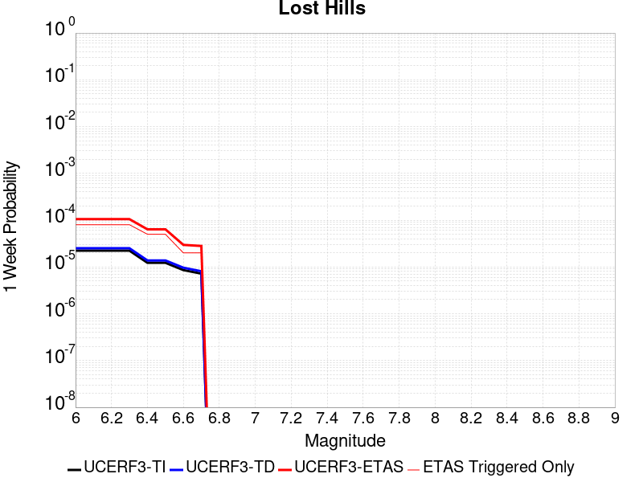 |  |  |  |

| Magnitude | 1 wk TI Prob | 1 wk TD Prob | 1 wk ETAS Prob | 1 wk ETAS/TD Gain | 1 wk ETAS Triggered Only | 1 mo TI Prob | 1 mo TD Prob | 1 mo ETAS Prob | 1 mo ETAS/TD Gain | 1 mo ETAS Triggered Only | 1 yr TI Prob | 1 yr TD Prob | 1 yr ETAS Prob | 1 yr ETAS/TD Gain | 1 yr ETAS Triggered Only | 10 yr TI Prob | 10 yr TD Prob | 10 yr ETAS Prob | 10 yr ETAS/TD Gain | 10 yr ETAS Triggered Only |
|-----|-----|-----|-----|-----|-----|-----|-----|-----|-----|-----|-----|-----|-----|-----|-----|-----|-----|-----|-----|-----|
| 6.0 | 2.233523E-5 | 2.5106583E-5 | 1.0510458E-4 | 4.1863356 | 8.0E-5 | 9.571891E-5 | 1.0759615E-4 | 2.5758002E-4 | 2.393952 | 1.5E-4 | 0.0011647546 | 0.001309364 | 0.0015290759 | 1.1678005 | 2.2E-4 | 0.011586686 | 0.013033091 | 0.013319312 | 1.0219611 | 2.9E-4 |
| 6.1 | 2.233523E-5 | 2.5106583E-5 | 1.0510458E-4 | 4.1863356 | 8.0E-5 | 9.571891E-5 | 1.0759615E-4 | 2.5758002E-4 | 2.393952 | 1.5E-4 | 0.0011647546 | 0.001309364 | 0.0015290759 | 1.1678005 | 2.2E-4 | 0.011586686 | 0.013033091 | 0.013319312 | 1.0219611 | 2.9E-4 |
| 6.2 | 2.233523E-5 | 2.5106583E-5 | 1.0510458E-4 | 4.1863356 | 8.0E-5 | 9.571891E-5 | 1.0759615E-4 | 2.5758002E-4 | 2.393952 | 1.5E-4 | 0.0011647546 | 0.001309364 | 0.0015290759 | 1.1678005 | 2.2E-4 | 0.011586686 | 0.013033091 | 0.013319312 | 1.0219611 | 2.9E-4 |
| 6.3 | 2.233523E-5 | 2.5106583E-5 | 1.0510458E-4 | 4.1863356 | 8.0E-5 | 9.571891E-5 | 1.0759615E-4 | 2.5758002E-4 | 2.393952 | 1.5E-4 | 0.0011647546 | 0.001309364 | 0.0015290759 | 1.1678005 | 2.2E-4 | 0.011586686 | 0.013033091 | 0.013319312 | 1.0219611 | 2.9E-4 |
| 6.4 | 1.2288092E-5 | 1.3781108E-5 | 6.378042E-5 | 4.6281056 | 5.0E-5 | 5.2662188E-5 | 5.906108E-5 | 1.3905636E-4 | 2.35445 | 8.0E-5 | 6.409735E-4 | 7.189252E-4 | 8.488318E-4 | 1.1806955 | 1.3E-4 | 0.006391279 | 0.0071752006 | 0.0073638377 | 1.02629 | 1.9E-4 |
| 6.5 | 1.2288092E-5 | 1.3781108E-5 | 6.378042E-5 | 4.6281056 | 5.0E-5 | 5.2662188E-5 | 5.906108E-5 | 1.3905636E-4 | 2.35445 | 8.0E-5 | 6.409735E-4 | 7.189252E-4 | 8.488318E-4 | 1.1806955 | 1.3E-4 | 0.006391279 | 0.0071752006 | 0.0073638377 | 1.02629 | 1.9E-4 |
| 6.6 | 8.58281E-6 | 9.63377E-6 | 2.9633577E-5 | 3.0760105 | 2.0E-5 | 3.6782953E-5 | 4.12874E-5 | 7.1286166E-5 | 1.726584 | 3.0E-5 | 4.4774043E-4 | 5.026414E-4 | 5.726062E-4 | 1.1391943 | 7.0E-5 | 0.0044683935 | 0.005023205 | 0.005152552 | 1.0257499 | 1.3E-4 |
| 6.7 | 7.205685E-6 | 8.088302E-6 | 2.808814E-5 | 3.472687 | 2.0E-5 | 3.088114E-5 | 3.466415E-5 | 6.466311E-5 | 1.8654175 | 3.0E-5 | 3.7591302E-4 | 4.2203604E-4 | 4.820107E-4 | 1.142108 | 6.0E-5 | 0.0037527776 | 0.0042203604 | 0.0043199384 | 1.0235946 | 1.0E-4 |

## Brawley (Seismic Zone) alt 1
*[(top)](#table-of-contents)*

| 1 Week | 1 Month | 1 Year | 10 Year |
|-----|-----|-----|-----|
|  |  |  |  |

| Magnitude | 1 wk TI Prob | 1 wk TD Prob | 1 wk ETAS Prob | 1 wk ETAS/TD Gain | 1 wk ETAS Triggered Only | 1 mo TI Prob | 1 mo TD Prob | 1 mo ETAS Prob | 1 mo ETAS/TD Gain | 1 mo ETAS Triggered Only | 1 yr TI Prob | 1 yr TD Prob | 1 yr ETAS Prob | 1 yr ETAS/TD Gain | 1 yr ETAS Triggered Only | 10 yr TI Prob | 10 yr TD Prob | 10 yr ETAS Prob | 10 yr ETAS/TD Gain | 10 yr ETAS Triggered Only |
|-----|-----|-----|-----|-----|-----|-----|-----|-----|-----|-----|-----|-----|-----|-----|-----|-----|-----|-----|-----|-----|
| 6.0 | 2.2521618E-4 | 4.763429E-4 | 5.5630476E-4 | 1.1678662 | 8.0E-5 | 9.6485513E-4 | 0.0020399094 | 0.0021596646 | 1.0587062 | 1.2E-4 | 0.011683988 | 0.024544531 | 0.024729868 | 1.0075511 | 1.9E-4 | 0.11088423 | 0.21349923 | 0.21375091 | 1.0011789 | 3.2E-4 |
| 6.1 | 2.2521618E-4 | 4.763429E-4 | 5.5630476E-4 | 1.1678662 | 8.0E-5 | 9.6485513E-4 | 0.0020399094 | 0.0021596646 | 1.0587062 | 1.2E-4 | 0.011683988 | 0.024544531 | 0.024729868 | 1.0075511 | 1.9E-4 | 0.11088423 | 0.21349923 | 0.21375091 | 1.0011789 | 3.2E-4 |
| 6.2 | 2.198148E-4 | 4.6718874E-4 | 5.471514E-4 | 1.171157 | 8.0E-5 | 9.417233E-4 | 0.0020007377 | 0.0021204976 | 1.0598578 | 1.2E-4 | 0.011405343 | 0.024078513 | 0.024263939 | 1.0077008 | 1.9E-4 | 0.10837428 | 0.20993572 | 0.21018855 | 1.0012043 | 3.2E-4 |
| 6.3 | 2.1704129E-4 | 4.615455E-4 | 5.415086E-4 | 1.1732507 | 8.0E-5 | 9.298453E-4 | 0.0019765892 | 0.0020963522 | 1.0605906 | 1.2E-4 | 0.011262234 | 0.023792034 | 0.023977512 | 1.0077958 | 1.9E-4 | 0.107082725 | 0.20782684 | 0.20808034 | 1.0012197 | 3.2E-4 |
| 6.4 | 1.876142E-4 | 4.004663E-4 | 4.7043827E-4 | 1.1747262 | 7.0E-5 | 8.038131E-4 | 0.0017151695 | 0.0018249808 | 1.0640236 | 1.1E-4 | 0.00974259 | 0.020678662 | 0.020854939 | 1.0085247 | 1.8E-4 | 0.093263686 | 0.18457787 | 0.18483065 | 1.0013695 | 3.1E-4 |
| 6.5 | 1.7390939E-4 | 3.7478763E-4 | 4.447614E-4 | 1.1867025 | 7.0E-5 | 7.45113E-4 | 0.0016052561 | 0.0017150795 | 1.0684149 | 1.1E-4 | 0.009034078 | 0.019367293 | 0.019543806 | 1.009114 | 1.8E-4 | 0.086755216 | 0.17440015 | 0.1746561 | 1.0014675 | 3.1E-4 |
| 6.6 | 1.591791E-4 | 3.4893592E-4 | 4.1891148E-4 | 1.20054 | 7.0E-5 | 6.8201777E-4 | 0.0014945926 | 0.0016044282 | 1.0734886 | 1.1E-4 | 0.008271996 | 0.018045008 | 0.01822176 | 1.0097951 | 1.8E-4 | 0.07970774 | 0.16380787 | 0.16406709 | 1.0015825 | 3.1E-4 |
| 6.7 | 1.4268003E-4 | 3.2059717E-4 | 3.9057474E-4 | 1.2182726 | 7.0E-5 | 6.1134255E-4 | 0.0013732726 | 0.0014831215 | 1.0799906 | 1.1E-4 | 0.007417723 | 0.01659171 | 0.016768722 | 1.0106688 | 1.8E-4 | 0.07174956 | 0.15193594 | 0.15219882 | 1.0017303 | 3.1E-4 |
| 6.8 | 1.239713E-4 | 2.9055026E-4 | 3.6052993E-4 | 1.2408521 | 7.0E-5 | 5.3119735E-4 | 0.0012446274 | 0.0013544905 | 1.0882698 | 1.1E-4 | 0.0064481674 | 0.015049482 | 0.015226773 | 1.0117805 | 1.8E-4 | 0.06264243 | 0.13838051 | 0.1386476 | 1.0019302 | 3.1E-4 |
| 6.9 | 1.0180238E-4 | 2.6255674E-4 | 3.325384E-4 | 1.266539 | 7.0E-5 | 4.3622297E-4 | 0.0011247622 | 0.0012346385 | 1.0976884 | 1.1E-4 | 0.005298089 | 0.013608998 | 0.013786548 | 1.0130465 | 1.8E-4 | 0.05173543 | 0.12496473 | 0.12523599 | 1.0021707 | 3.1E-4 |
| 7.0 | 7.6619996E-5 | 2.2400476E-4 | 2.9398908E-4 | 1.3124233 | 7.0E-5 | 3.283301E-4 | 9.596704E-4 | 0.0010695648 | 1.1145127 | 1.1E-4 | 0.0039900932 | 0.011622103 | 0.011800011 | 1.0153078 | 1.8E-4 | 0.039192066 | 0.10726982 | 0.10754657 | 1.0025799 | 3.1E-4 |
| 7.1 | 7.5127435E-5 | 2.2083633E-4 | 2.9082087E-4 | 1.3169068 | 7.0E-5 | 3.2193496E-4 | 9.461013E-4 | 0.0010559972 | 1.1161566 | 1.1E-4 | 0.0039125155 | 0.011458648 | 0.011636585 | 1.0155287 | 1.8E-4 | 0.038443442 | 0.10583378 | 0.10611097 | 1.0026191 | 3.1E-4 |
| 7.2 | 6.788582E-5 | 2.0211334E-4 | 2.720992E-4 | 1.3462703 | 7.0E-5 | 2.9090676E-4 | 8.6591556E-4 | 9.6582895E-4 | 1.1153847 | 1.0E-4 | 0.0035360386 | 0.0104922 | 0.010660416 | 1.0160325 | 1.7E-4 | 0.034803 | 0.097503684 | 0.09777443 | 1.0027769 | 3.0E-4 |
| 7.3 | 6.399602E-5 | 1.8842232E-4 | 2.5840913E-4 | 1.3714359 | 7.0E-5 | 2.7423984E-4 | 8.0727716E-4 | 9.0719643E-4 | 1.1237732 | 1.0E-4 | 0.0033337586 | 0.009784897 | 0.009953233 | 1.0172037 | 1.7E-4 | 0.03284188 | 0.091397986 | 0.091670565 | 1.0029824 | 3.0E-4 |
| 7.4 | 4.506759E-5 | 1.2530042E-4 | 1.9529165E-4 | 1.5585873 | 7.0E-5 | 1.9313251E-4 | 5.3689216E-4 | 6.2684383E-4 | 1.1675414 | 9.0E-5 | 0.0023488526 | 0.006517245 | 0.0066662673 | 1.0228659 | 1.5E-4 | 0.023241805 | 0.062364522 | 0.06262706 | 1.0042098 | 2.8E-4 |
| 7.5 | 3.43289E-5 | 9.336103E-5 | 1.5335543E-4 | 1.6426064 | 6.0E-5 | 1.4711556E-4 | 4.0005764E-4 | 4.8002566E-4 | 1.1998912 | 8.0E-5 | 0.0017896603 | 0.004859886 | 0.004999206 | 1.0286672 | 1.4E-4 | 0.01775316 | 0.047057066 | 0.04730483 | 1.0052652 | 2.6E-4 |
| 7.6 | 2.5980507E-5 | 7.053672E-5 | 1.20533194E-4 | 1.7088007 | 5.0E-5 | 1.1134028E-4 | 3.0226534E-4 | 3.722442E-4 | 1.2315146 | 7.0E-5 | 0.001354725 | 0.0036738948 | 0.0038034173 | 1.0352548 | 1.3E-4 | 0.013464959 | 0.03584298 | 0.03608402 | 1.0067248 | 2.5E-4 |
| 7.7 | 1.7292105E-5 | 4.9412036E-5 | 8.941006E-5 | 1.8094794 | 4.0E-5 | 7.4106916E-5 | 2.1174872E-4 | 2.6173814E-4 | 1.236079 | 5.0E-5 | 9.018782E-4 | 0.0025749984 | 0.0026847152 | 1.0426085 | 1.1E-4 | 0.008982267 | 0.025292097 | 0.02547729 | 1.0073222 | 1.9E-4 |
| 7.8 | 1.2927471E-5 | 3.9697254E-5 | 5.969646E-5 | 1.5037931 | 2.0E-5 | 5.5402274E-5 | 1.7012001E-4 | 2.0011491E-4 | 1.1763161 | 3.0E-5 | 6.743139E-4 | 0.0020692463 | 0.00215906 | 1.0434041 | 9.0E-5 | 0.0067227143 | 0.020433145 | 0.02059967 | 1.0081499 | 1.7E-4 |
| 7.9 | 1.0200774E-5 | 2.8748475E-5 | 4.87479E-5 | 1.695669 | 2.0E-5 | 4.371687E-5 | 1.2320194E-4 | 1.4319948E-4 | 1.1623151 | 2.0E-5 | 5.321229E-4 | 0.0014989526 | 0.0015588626 | 1.0399679 | 6.0E-5 | 0.005308505 | 0.014992895 | 0.015120945 | 1.0085407 | 1.3E-4 |
| 8.0 | 8.650396E-6 | 2.3279512E-5 | 3.3279277E-5 | 1.4295523 | 1.0E-5 | 3.70726E-5 | 9.976552E-5 | 1.0976452E-4 | 1.100225 | 1.0E-5 | 4.5126543E-4 | 0.0012139693 | 0.0012539207 | 1.0329098 | 4.0E-5 | 0.0045035016 | 0.012212164 | 0.012301065 | 1.0072798 | 9.0E-5 |
| 8.1 | 3.9368224E-6 | 7.3283345E-6 | 7.3283345E-6 | 1.0 | 0.0 | 1.6871985E-5 | 3.1406773E-5 | 3.1406773E-5 | 1.0 | 0.0 | 2.0539707E-4 | 3.8231048E-4 | 3.8231048E-4 | 1.0 | 0.0 | 0.0020520731 | 0.0040015313 | 0.0040015313 | 1.0 | 0.0 |
| 8.2 | 1.7101195E-6 | 2.2178374E-6 | 2.2178374E-6 | 1.0 | 0.0 | 7.329063E-6 | 9.504983E-6 | 9.504983E-6 | 1.0 | 0.0 | 8.922769E-5 | 1.15717055E-4 | 1.15717055E-4 | 1.0 | 0.0 | 8.9191867E-4 | 0.00126669 | 0.00126669 | 1.0 | 0.0 |
| 8.3 | 3.0346666E-8 | 1.721086E-8 | 1.721086E-8 | 1.0 | 0.0 | 1.3005713E-7 | 7.376083E-8 | 7.376083E-8 | 1.0 | 0.0 | 1.5834444E-6 | 8.98038E-7 | 8.98038E-7 | 1.0 | 0.0 | 1.5834332E-5 | 9.36379E-6 | 9.36379E-6 | 1.0 | 0.0 |

## Pleito
*[(top)](#table-of-contents)*

| 1 Week | 1 Month | 1 Year | 10 Year |
|-----|-----|-----|-----|
|  |  |  |  |

| Magnitude | 1 wk TI Prob | 1 wk TD Prob | 1 wk ETAS Prob | 1 wk ETAS/TD Gain | 1 wk ETAS Triggered Only | 1 mo TI Prob | 1 mo TD Prob | 1 mo ETAS Prob | 1 mo ETAS/TD Gain | 1 mo ETAS Triggered Only | 1 yr TI Prob | 1 yr TD Prob | 1 yr ETAS Prob | 1 yr ETAS/TD Gain | 1 yr ETAS Triggered Only | 10 yr TI Prob | 10 yr TD Prob | 10 yr ETAS Prob | 10 yr ETAS/TD Gain | 10 yr ETAS Triggered Only |
|-----|-----|-----|-----|-----|-----|-----|-----|-----|-----|-----|-----|-----|-----|-----|-----|-----|-----|-----|-----|-----|
| 6.0 | 1.6763008E-5 | 2.4764735E-5 | 7.47635E-5 | 3.01895 | 5.0E-5 | 7.183948E-5 | 1.0613067E-4 | 1.661243E-4 | 1.5652808 | 6.0E-5 | 8.742947E-4 | 0.001291447 | 0.0014412533 | 1.1159987 | 1.5E-4 | 0.00870863 | 0.012954412 | 0.013260396 | 1.0236201 | 3.1E-4 |
| 6.1 | 1.6763008E-5 | 2.4764735E-5 | 7.47635E-5 | 3.01895 | 5.0E-5 | 7.183948E-5 | 1.0613067E-4 | 1.661243E-4 | 1.5652808 | 6.0E-5 | 8.742947E-4 | 0.001291447 | 0.0014412533 | 1.1159987 | 1.5E-4 | 0.00870863 | 0.012954412 | 0.013260396 | 1.0236201 | 3.1E-4 |
| 6.2 | 1.6763008E-5 | 2.4764735E-5 | 7.47635E-5 | 3.01895 | 5.0E-5 | 7.183948E-5 | 1.0613067E-4 | 1.661243E-4 | 1.5652808 | 6.0E-5 | 8.742947E-4 | 0.001291447 | 0.0014412533 | 1.1159987 | 1.5E-4 | 0.00870863 | 0.012954412 | 0.013260396 | 1.0236201 | 3.1E-4 |
| 6.3 | 1.6763008E-5 | 2.4764735E-5 | 7.47635E-5 | 3.01895 | 5.0E-5 | 7.183948E-5 | 1.0613067E-4 | 1.661243E-4 | 1.5652808 | 6.0E-5 | 8.742947E-4 | 0.001291447 | 0.0014412533 | 1.1159987 | 1.5E-4 | 0.00870863 | 0.012954412 | 0.013260396 | 1.0236201 | 3.1E-4 |
| 6.4 | 1.6763008E-5 | 2.4764735E-5 | 7.47635E-5 | 3.01895 | 5.0E-5 | 7.183948E-5 | 1.0613067E-4 | 1.661243E-4 | 1.5652808 | 6.0E-5 | 8.742947E-4 | 0.001291447 | 0.0014412533 | 1.1159987 | 1.5E-4 | 0.00870863 | 0.012954412 | 0.013260396 | 1.0236201 | 3.1E-4 |
| 6.5 | 1.6763008E-5 | 2.4764735E-5 | 7.47635E-5 | 3.01895 | 5.0E-5 | 7.183948E-5 | 1.0613067E-4 | 1.661243E-4 | 1.5652808 | 6.0E-5 | 8.742947E-4 | 0.001291447 | 0.0014412533 | 1.1159987 | 1.5E-4 | 0.00870863 | 0.012954412 | 0.013260396 | 1.0236201 | 3.1E-4 |
| 6.6 | 9.910213E-6 | 1.721552E-5 | 3.7215177E-5 | 2.1617224 | 2.0E-5 | 4.247165E-5 | 7.3778734E-5 | 1.03776525E-4 | 1.4065912 | 3.0E-5 | 5.169696E-4 | 8.9788967E-4 | 9.678268E-4 | 1.0778906 | 7.0E-5 | 0.0051576863 | 0.009051226 | 0.009180049 | 1.0142328 | 1.3E-4 |
| 6.7 | 9.910213E-6 | 1.721552E-5 | 3.7215177E-5 | 2.1617224 | 2.0E-5 | 4.247165E-5 | 7.3778734E-5 | 1.03776525E-4 | 1.4065912 | 3.0E-5 | 5.169696E-4 | 8.9788967E-4 | 9.678268E-4 | 1.0778906 | 7.0E-5 | 0.0051576863 | 0.009051226 | 0.009180049 | 1.0142328 | 1.3E-4 |
| 6.8 | 8.300162E-6 | 1.5475129E-5 | 2.5474974E-5 | 1.6461881 | 1.0E-5 | 3.557164E-5 | 6.63203E-5 | 8.631898E-5 | 1.3015468 | 2.0E-5 | 4.3299864E-4 | 8.07152E-4 | 8.371278E-4 | 1.0371377 | 3.0E-5 | 0.004321559 | 0.008150663 | 0.008230011 | 1.0097351 | 8.0E-5 |
| 6.9 | 8.183114E-6 | 1.5346344E-5 | 2.5346191E-5 | 1.651611 | 1.0E-5 | 3.5070017E-5 | 6.57684E-5 | 8.576708E-5 | 1.3040774 | 2.0E-5 | 4.2689382E-4 | 8.0043747E-4 | 8.304135E-4 | 1.0374495 | 3.0E-5 | 0.0042607468 | 0.008084008 | 0.008163361 | 1.009816 | 8.0E-5 |
| 7.0 | 7.1748823E-6 | 1.4133306E-5 | 2.4133164E-5 | 1.7075386 | 1.0E-5 | 3.0749135E-5 | 6.0569906E-5 | 8.0568694E-5 | 1.330177 | 2.0E-5 | 3.743064E-4 | 7.3718966E-4 | 7.6716754E-4 | 1.0406651 | 3.0E-5 | 0.0037367654 | 0.0074553755 | 0.0075149285 | 1.0079879 | 6.0E-5 |
| 7.1 | 7.1671807E-6 | 1.4123676E-5 | 2.4123534E-5 | 1.708021 | 1.0E-5 | 3.0716128E-5 | 6.0528637E-5 | 8.0527425E-5 | 1.3304021 | 2.0E-5 | 3.7390468E-4 | 7.366875E-4 | 7.6666544E-4 | 1.0406928 | 3.0E-5 | 0.0037327618 | 0.0074503883 | 0.0075099412 | 1.0079932 | 6.0E-5 |
| 7.2 | 7.0649667E-6 | 1.3970962E-5 | 1.3970962E-5 | 1.0 | 0.0 | 3.0278077E-5 | 5.987418E-5 | 6.987358E-5 | 1.1670069 | 1.0E-5 | 3.6857324E-4 | 7.287248E-4 | 7.4871024E-4 | 1.0274252 | 2.0E-5 | 0.0036796255 | 0.0073711374 | 0.007410843 | 1.0053866 | 4.0E-5 |
| 7.3 | 7.02082E-6 | 1.3914415E-5 | 1.3914415E-5 | 1.0 | 0.0 | 3.008888E-5 | 5.9631846E-5 | 6.963125E-5 | 1.1676856 | 1.0E-5 | 3.6627054E-4 | 7.257764E-4 | 7.457619E-4 | 1.0275367 | 2.0E-5 | 0.0036566744 | 0.0073416373 | 0.0073813437 | 1.0054084 | 4.0E-5 |
| 7.4 | 6.987146E-6 | 1.3873975E-5 | 1.3873975E-5 | 1.0 | 0.0 | 2.9944567E-5 | 5.9458544E-5 | 6.945795E-5 | 1.1681744 | 1.0E-5 | 3.6451413E-4 | 7.2366785E-4 | 7.4365333E-4 | 1.027617 | 2.0E-5 | 0.0036391679 | 0.007320571 | 0.0073602786 | 1.005424 | 4.0E-5 |
| 7.5 | 6.9494554E-6 | 1.383088E-5 | 1.383088E-5 | 1.0 | 0.0 | 2.9783041E-5 | 5.9273858E-5 | 6.9273265E-5 | 1.1686984 | 1.0E-5 | 3.625482E-4 | 7.2142074E-4 | 7.4140634E-4 | 1.027703 | 2.0E-5 | 0.0036195726 | 0.007298199 | 0.007337907 | 1.0054408 | 4.0E-5 |
| 7.6 | 6.92694E-6 | 1.3789992E-5 | 1.3789992E-5 | 1.0 | 0.0 | 2.9686547E-5 | 5.909863E-5 | 6.909804E-5 | 1.1691986 | 1.0E-5 | 3.6137376E-4 | 7.192888E-4 | 7.3927443E-4 | 1.0277853 | 2.0E-5 | 0.0036078666 | 0.007276951 | 0.0073166597 | 1.0054568 | 4.0E-5 |
| 7.7 | 6.395867E-6 | 1.26690065E-5 | 1.26690065E-5 | 1.0 | 0.0 | 2.741057E-5 | 5.4294615E-5 | 6.429407E-5 | 1.1841704 | 1.0E-5 | 3.336726E-4 | 6.6083675E-4 | 6.808235E-4 | 1.0302447 | 2.0E-5 | 0.0033317201 | 0.0066955453 | 0.0067352774 | 1.0059341 | 4.0E-5 |
| 7.8 | 5.8664327E-6 | 1.1536581E-5 | 1.1536581E-5 | 1.0 | 0.0 | 2.5141611E-5 | 4.9441554E-5 | 5.944106E-5 | 1.202249 | 1.0E-5 | 3.060561E-4 | 6.0178485E-4 | 6.2177284E-4 | 1.0332144 | 2.0E-5 | 0.0030563495 | 0.0061010164 | 0.0061407723 | 1.0065163 | 4.0E-5 |
| 7.9 | 3.7167474E-6 | 7.1145205E-6 | 7.1145205E-6 | 1.0 | 0.0 | 1.592882E-5 | 3.0490448E-5 | 3.0490448E-5 | 1.0 | 0.0 | 1.9391612E-4 | 3.7115812E-4 | 3.7115812E-4 | 1.0 | 0.0 | 0.0019374699 | 0.0037676243 | 0.003787549 | 1.0052884 | 2.0E-5 |
| 8.0 | 1.0903841E-6 | 1.2879104E-6 | 1.2879104E-6 | 1.0 | 0.0 | 4.6730665E-6 | 5.5196047E-6 | 5.5196047E-6 | 1.0 | 0.0 | 5.68931E-5 | 6.719913E-5 | 6.719913E-5 | 1.0 | 0.0 | 5.6878536E-4 | 6.942094E-4 | 6.942094E-4 | 1.0 | 0.0 |
| 8.1 | 2.6894583E-7 | 1.1056095E-7 | 1.1056095E-7 | 1.0 | 0.0 | 1.1526245E-6 | 4.7383253E-7 | 4.7383253E-7 | 1.0 | 0.0 | 1.4033113E-5 | 5.768896E-6 | 5.768896E-6 | 1.0 | 0.0 | 1.4032227E-4 | 6.454915E-5 | 6.454915E-5 | 1.0 | 0.0 |
| 8.2 | 5.2967013E-9 | 2.4567874E-9 | 2.4567874E-9 | 1.0 | 0.0 | 2.2700148E-8 | 1.0529089E-8 | 1.0529089E-8 | 1.0 | 0.0 | 2.7637427E-7 | 1.2819166E-7 | 1.2819166E-7 | 1.0 | 0.0 | 2.7637393E-6 | 1.4588004E-6 | 1.4588004E-6 | 1.0 | 0.0 |

## Scodie Lineament
*[(top)](#table-of-contents)*

| 1 Week | 1 Month | 1 Year | 10 Year |
|-----|-----|-----|-----|
|  |  |  |  |

| Magnitude | 1 wk TI Prob | 1 wk TD Prob | 1 wk ETAS Prob | 1 wk ETAS/TD Gain | 1 wk ETAS Triggered Only | 1 mo TI Prob | 1 mo TD Prob | 1 mo ETAS Prob | 1 mo ETAS/TD Gain | 1 mo ETAS Triggered Only | 1 yr TI Prob | 1 yr TD Prob | 1 yr ETAS Prob | 1 yr ETAS/TD Gain | 1 yr ETAS Triggered Only | 10 yr TI Prob | 10 yr TD Prob | 10 yr ETAS Prob | 10 yr ETAS/TD Gain | 10 yr ETAS Triggered Only |
|-----|-----|-----|-----|-----|-----|-----|-----|-----|-----|-----|-----|-----|-----|-----|-----|-----|-----|-----|-----|-----|
| 6.0 | 3.2919327E-6 | 3.0133303E-6 | 1.0301303E-4 | 34.185772 | 1.0E-4 | 1.4108206E-5 | 1.2914227E-5 | 1.1291294E-4 | 8.743298 | 1.0E-4 | 1.7175387E-4 | 1.5722254E-4 | 3.471927E-4 | 2.208288 | 1.9E-4 | 0.0017162118 | 0.0015714248 | 0.0018509848 | 1.1779022 | 2.8E-4 |
| 6.1 | 1.8663811E-6 | 1.5490382E-6 | 3.1548992E-5 | 20.366827 | 3.0E-5 | 7.998751E-6 | 6.6387206E-6 | 3.663852E-5 | 5.518913 | 3.0E-5 | 9.738045E-5 | 8.082393E-5 | 1.3081988E-4 | 1.6185787 | 5.0E-5 | 9.7337784E-4 | 8.079941E-4 | 8.979214E-4 | 1.1112969 | 9.0E-5 |
| 6.2 | 1.8663811E-6 | 1.5490382E-6 | 3.1548992E-5 | 20.366827 | 3.0E-5 | 7.998751E-6 | 6.6387206E-6 | 3.663852E-5 | 5.518913 | 3.0E-5 | 9.738045E-5 | 8.082393E-5 | 1.3081988E-4 | 1.6185787 | 5.0E-5 | 9.7337784E-4 | 8.079941E-4 | 8.979214E-4 | 1.1112969 | 9.0E-5 |
| 6.3 | 1.8663811E-6 | 1.5490382E-6 | 3.1548992E-5 | 20.366827 | 3.0E-5 | 7.998751E-6 | 6.6387206E-6 | 3.663852E-5 | 5.518913 | 3.0E-5 | 9.738045E-5 | 8.082393E-5 | 1.3081988E-4 | 1.6185787 | 5.0E-5 | 9.7337784E-4 | 8.079941E-4 | 8.979214E-4 | 1.1112969 | 9.0E-5 |
| 6.4 | 1.8663811E-6 | 1.5490382E-6 | 3.1548992E-5 | 20.366827 | 3.0E-5 | 7.998751E-6 | 6.6387206E-6 | 3.663852E-5 | 5.518913 | 3.0E-5 | 9.738045E-5 | 8.082393E-5 | 1.3081988E-4 | 1.6185787 | 5.0E-5 | 9.7337784E-4 | 8.079941E-4 | 8.979214E-4 | 1.1112969 | 9.0E-5 |
| 6.5 | 1.8106311E-6 | 1.4909722E-6 | 2.1490941E-5 | 14.414047 | 2.0E-5 | 7.759824E-6 | 6.389868E-6 | 2.638974E-5 | 4.1299353 | 2.0E-5 | 9.447177E-5 | 7.779436E-5 | 1.1779125E-4 | 1.5141361 | 4.0E-5 | 9.4431615E-4 | 7.7771995E-4 | 8.576577E-4 | 1.1027848 | 8.0E-5 |
| 6.6 | 1.2414679E-6 | 8.9974395E-7 | 8.9974395E-7 | 1.0 | 0.0 | 5.320566E-6 | 3.85604E-6 | 3.85604E-6 | 1.0 | 0.0 | 6.477596E-5 | 4.6946367E-5 | 4.6946367E-5 | 1.0 | 0.0 | 6.475708E-4 | 4.6937316E-4 | 4.893638E-4 | 1.04259 | 2.0E-5 |
| 6.7 | 1.1062215E-6 | 7.594193E-7 | 7.594193E-7 | 1.0 | 0.0 | 4.7409408E-6 | 3.2546504E-6 | 3.2546504E-6 | 1.0 | 0.0 | 5.7719422E-5 | 3.962472E-5 | 3.962472E-5 | 1.0 | 0.0 | 5.770443E-4 | 3.9618355E-4 | 4.0617958E-4 | 1.0252309 | 1.0E-5 |
| 6.8 | 1.0006736E-6 | 6.5002786E-7 | 6.5002786E-7 | 1.0 | 0.0 | 4.288594E-6 | 2.7858312E-6 | 2.7858312E-6 | 1.0 | 0.0 | 5.221238E-5 | 3.391703E-5 | 3.391703E-5 | 1.0 | 0.0 | 5.220012E-4 | 3.3912458E-4 | 3.491212E-4 | 1.0294777 | 1.0E-5 |
| 6.9 | 9.167364E-7 | 5.6315065E-7 | 5.6315065E-7 | 1.0 | 0.0 | 3.9288643E-6 | 2.413501E-6 | 2.413501E-6 | 1.0 | 0.0 | 4.7832873E-5 | 2.9384037E-5 | 2.9384037E-5 | 1.0 | 0.0 | 4.782258E-4 | 2.9380718E-4 | 2.9380718E-4 | 1.0 | 0.0 |
| 7.0 | 7.6987664E-7 | 4.113265E-7 | 4.113265E-7 | 1.0 | 0.0 | 3.2994672E-6 | 1.7628269E-6 | 1.7628269E-6 | 1.0 | 0.0 | 4.0170275E-5 | 2.1462245E-5 | 2.1462245E-5 | 1.0 | 0.0 | 4.0163012E-4 | 2.1460558E-4 | 2.1460558E-4 | 1.0 | 0.0 |
| 7.1 | 7.1038727E-7 | 3.5210306E-7 | 3.5210306E-7 | 1.0 | 0.0 | 3.0445133E-6 | 1.5090123E-6 | 1.5090123E-6 | 1.0 | 0.0 | 3.706632E-5 | 1.8372106E-5 | 1.8372106E-5 | 1.0 | 0.0 | 3.7060137E-4 | 1.8370937E-4 | 1.8370937E-4 | 1.0 | 0.0 |
| 7.2 | 2.0799602E-7 | 3.1178534E-8 | 3.1178534E-8 | 1.0 | 0.0 | 8.914113E-7 | 1.3362228E-7 | 1.3362228E-7 | 1.0 | 0.0 | 1.0852878E-5 | 1.6268501E-6 | 1.6268501E-6 | 1.0 | 0.0 | 1.08523476E-4 | 1.626839E-5 | 1.626839E-5 | 1.0 | 0.0 |
| 7.3 | 1.5048182E-7 | 1.5939106E-8 | 1.5939106E-8 | 1.0 | 0.0 | 6.449219E-7 | 6.8310456E-8 | 6.8310456E-8 | 1.0 | 0.0 | 7.851896E-6 | 8.316795E-7 | 8.316795E-7 | 1.0 | 0.0 | 7.851618E-5 | 8.316767E-6 | 8.316767E-6 | 1.0 | 0.0 |
| 7.4 | 5.9334678E-8 | 4.8638475E-9 | 4.8638475E-9 | 1.0 | 0.0 | 2.5429145E-7 | 2.084506E-8 | 2.084506E-8 | 1.0 | 0.0 | 3.095994E-6 | 2.5378858E-7 | 2.5378858E-7 | 1.0 | 0.0 | 3.095951E-5 | 2.5378843E-6 | 2.5378843E-6 | 1.0 | 0.0 |

## Imperial
*[(top)](#table-of-contents)*

| 1 Week | 1 Month | 1 Year | 10 Year |
|-----|-----|-----|-----|
|  |  |  |  |

| Magnitude | 1 wk TI Prob | 1 wk TD Prob | 1 wk ETAS Prob | 1 wk ETAS/TD Gain | 1 wk ETAS Triggered Only | 1 mo TI Prob | 1 mo TD Prob | 1 mo ETAS Prob | 1 mo ETAS/TD Gain | 1 mo ETAS Triggered Only | 1 yr TI Prob | 1 yr TD Prob | 1 yr ETAS Prob | 1 yr ETAS/TD Gain | 1 yr ETAS Triggered Only | 10 yr TI Prob | 10 yr TD Prob | 10 yr ETAS Prob | 10 yr ETAS/TD Gain | 10 yr ETAS Triggered Only |
|-----|-----|-----|-----|-----|-----|-----|-----|-----|-----|-----|-----|-----|-----|-----|-----|-----|-----|-----|-----|-----|
| 6.0 | 2.7496446E-4 | 5.055345E-4 | 5.854941E-4 | 1.1581683 | 8.0E-5 | 0.0011778869 | 0.002164817 | 0.002284557 | 1.0553119 | 1.2E-4 | 0.0142467655 | 0.026048409 | 0.026213981 | 1.0063564 | 1.7E-4 | 0.13367249 | 0.22807029 | 0.22828643 | 1.0009477 | 2.8E-4 |
| 6.1 | 2.5356023E-4 | 4.8657708E-4 | 5.56543E-4 | 1.1437922 | 7.0E-5 | 0.001086234 | 0.002083702 | 0.0021934728 | 1.0526806 | 1.1E-4 | 0.013144928 | 0.02507094 | 0.025226926 | 1.0062219 | 1.6E-4 | 0.123940155 | 0.21949561 | 0.21970636 | 1.0009601 | 2.7E-4 |
| 6.2 | 2.4820742E-4 | 4.775311E-4 | 5.474977E-4 | 1.1465173 | 7.0E-5 | 0.0010633124 | 0.0020449946 | 0.0021547696 | 1.0536798 | 1.1E-4 | 0.01286919 | 0.024610676 | 0.024766738 | 1.0063412 | 1.6E-4 | 0.12148927 | 0.21600136 | 0.21621305 | 1.00098 | 2.7E-4 |
| 6.3 | 2.3205351E-4 | 4.5892023E-4 | 5.2888814E-4 | 1.152462 | 7.0E-5 | 9.94136E-4 | 0.0019653554 | 0.0020751392 | 1.0558596 | 1.1E-4 | 0.012036599 | 0.023661187 | 0.023817401 | 1.0066022 | 1.6E-4 | 0.11405133 | 0.20793827 | 0.20815213 | 1.0010284 | 2.7E-4 |
| 6.4 | 2.0304754E-4 | 3.9878016E-4 | 4.5875623E-4 | 1.1503989 | 6.0E-5 | 8.6991355E-4 | 0.0017079529 | 0.0018077822 | 1.0584496 | 1.0E-4 | 0.010539869 | 0.020595418 | 0.020742329 | 1.0071331 | 1.5E-4 | 0.100537635 | 0.18507113 | 0.185283 | 1.0011449 | 2.6E-4 |
| 6.5 | 1.854992E-4 | 3.6990462E-4 | 4.2988244E-4 | 1.162144 | 6.0E-5 | 7.9475436E-4 | 0.0015843548 | 0.0016841963 | 1.0630171 | 1.0E-4 | 0.009633281 | 0.01911443 | 0.019261561 | 1.0076975 | 1.5E-4 | 0.0922623 | 0.1733039 | 0.17351884 | 1.0012403 | 2.6E-4 |
| 6.6 | 1.6586106E-4 | 3.4036173E-4 | 4.0034132E-4 | 1.176223 | 6.0E-5 | 7.106394E-4 | 0.0014578878 | 0.0015577421 | 1.0684924 | 1.0E-4 | 0.008617763 | 0.017607626 | 0.017754983 | 1.0083691 | 1.5E-4 | 0.08291132 | 0.16078055 | 0.16099875 | 1.0013571 | 2.6E-4 |
| 6.7 | 1.4224656E-4 | 3.076812E-4 | 3.6766275E-4 | 1.194947 | 6.0E-5 | 6.094856E-4 | 0.0013179756 | 0.0014178437 | 1.075774 | 1.0E-4 | 0.0073952693 | 0.015928522 | 0.016076133 | 1.0092671 | 1.5E-4 | 0.07153955 | 0.14648798 | 0.14670989 | 1.0015149 | 2.6E-4 |
| 6.8 | 1.2317259E-4 | 2.779231E-4 | 3.3790641E-4 | 1.2158271 | 6.0E-5 | 5.2777573E-4 | 0.0011905615 | 0.0012904424 | 1.083894 | 1.0E-4 | 0.0064067547 | 0.014400131 | 0.014547971 | 1.0102665 | 1.5E-4 | 0.06225166 | 0.13294089 | 0.13316631 | 1.0016958 | 2.6E-4 |
| 6.9 | 9.859898E-5 | 2.5015484E-4 | 3.1013982E-4 | 1.2397915 | 6.0E-5 | 4.2249862E-4 | 0.0010716559 | 0.0011715487 | 1.0932136 | 1.0E-4 | 0.0051317946 | 0.012970319 | 0.013118373 | 1.0114149 | 1.5E-4 | 0.05014893 | 0.119408876 | 0.119637825 | 1.0019174 | 2.6E-4 |
| 7.0 | 7.3191884E-5 | 2.1267848E-4 | 2.7266573E-4 | 1.282056 | 6.0E-5 | 3.136418E-4 | 9.11164E-4 | 0.0010110729 | 1.1096498 | 1.0E-4 | 0.003811904 | 0.011037681 | 0.011186025 | 1.0134398 | 1.5E-4 | 0.037471764 | 0.10206756 | 0.102301024 | 1.0022874 | 2.6E-4 |
| 7.1 | 7.1760296E-5 | 2.0969207E-4 | 2.696795E-4 | 1.2860738 | 6.0E-5 | 3.0750787E-4 | 8.9837395E-4 | 9.982841E-4 | 1.1112123 | 1.0E-4 | 0.003737482 | 0.010883528 | 0.011031896 | 1.0136323 | 1.5E-4 | 0.03675245 | 0.10070406 | 0.10093788 | 1.0023218 | 2.6E-4 |
| 7.2 | 6.46614E-5 | 1.9137723E-4 | 2.5136574E-4 | 1.3134569 | 6.0E-5 | 2.7709085E-4 | 8.199333E-4 | 9.0985955E-4 | 1.109675 | 9.0E-5 | 0.0033683628 | 0.009937617 | 0.010076226 | 1.0139478 | 1.4E-4 | 0.033177625 | 0.092511006 | 0.092737876 | 1.0024524 | 2.5E-4 |
| 7.3 | 6.088115E-5 | 1.780939E-4 | 2.3808322E-4 | 1.3368409 | 6.0E-5 | 2.6089314E-4 | 7.6303916E-4 | 8.529705E-4 | 1.1178594 | 9.0E-5 | 0.0031717476 | 0.009251006 | 0.009389711 | 1.0149935 | 1.4E-4 | 0.031268585 | 0.08656135 | 0.08678971 | 1.0026381 | 2.5E-4 |
| 7.4 | 4.199346E-5 | 1.1511097E-4 | 1.7510405E-4 | 1.5211762 | 6.0E-5 | 1.7995955E-4 | 4.932403E-4 | 5.732009E-4 | 1.1621127 | 8.0E-5 | 0.0021888057 | 0.005988835 | 0.0061081164 | 1.0199172 | 1.2E-4 | 0.02167372 | 0.05744024 | 0.05765703 | 1.0037742 | 2.3E-4 |
| 7.5 | 3.130448E-5 | 8.333871E-5 | 1.3333454E-4 | 1.5999113 | 5.0E-5 | 1.3415517E-4 | 3.5711733E-4 | 4.2709234E-4 | 1.195944 | 7.0E-5 | 0.0016321153 | 0.0043392954 | 0.004448818 | 1.0252397 | 1.1E-4 | 0.016201803 | 0.042133506 | 0.042334657 | 1.0047742 | 2.1E-4 |
| 7.6 | 2.3074248E-5 | 6.0849357E-5 | 1.00846926E-4 | 1.6573211 | 4.0E-5 | 9.888588E-5 | 2.6075702E-4 | 3.2074138E-4 | 1.2300392 | 6.0E-5 | 0.0012032706 | 0.0031701182 | 0.0032698014 | 1.0314445 | 1.0E-4 | 0.011967761 | 0.03102816 | 0.031221956 | 1.0062457 | 2.0E-4 |
| 7.7 | 1.45864815E-5 | 4.0128452E-5 | 7.012725E-5 | 1.7475692 | 3.0E-5 | 6.2511994E-5 | 1.7196777E-4 | 2.119609E-4 | 1.2325617 | 4.0E-5 | 7.608177E-4 | 0.0020917025 | 0.0021715353 | 1.0381664 | 8.0E-5 | 0.007582182 | 0.02062909 | 0.0207662 | 1.0066465 | 1.4E-4 |
| 7.8 | 1.0352979E-5 | 3.096395E-5 | 4.096364E-5 | 1.3229462 | 1.0E-5 | 4.4369157E-5 | 1.326959E-4 | 1.5269325E-4 | 1.1507006 | 2.0E-5 | 5.400606E-4 | 0.0016143778 | 0.001674281 | 1.037106 | 6.0E-5 | 0.0053875 | 0.016017893 | 0.01613597 | 1.0073717 | 1.2E-4 |
| 7.9 | 8.137906E-6 | 2.2151205E-5 | 3.2150983E-5 | 1.4514327 | 1.0E-5 | 3.4876273E-5 | 9.493029E-5 | 1.0492934E-4 | 1.1053305 | 1.0E-5 | 4.2453592E-4 | 0.0011551644 | 0.0011951182 | 1.0345871 | 4.0E-5 | 0.004237258 | 0.011618842 | 0.011707797 | 1.0076561 | 9.0E-5 |
| 8.0 | 6.93792E-6 | 1.8010365E-5 | 1.8010365E-5 | 1.0 | 0.0 | 2.9733603E-5 | 7.7185E-5 | 7.7185E-5 | 1.0 | 0.0 | 3.6194647E-4 | 9.3932304E-4 | 9.593042E-4 | 1.021272 | 2.0E-5 | 0.0036135751 | 0.009502415 | 0.009561845 | 1.0062542 | 6.0E-5 |
| 8.1 | 3.4286315E-6 | 6.380179E-6 | 6.380179E-6 | 1.0 | 0.0 | 1.4694053E-5 | 2.734334E-5 | 2.734334E-5 | 1.0 | 0.0 | 1.7888541E-4 | 3.3285443E-4 | 3.3285443E-4 | 1.0 | 0.0 | 0.0017874148 | 0.0034863674 | 0.0034863674 | 1.0 | 0.0 |
| 8.2 | 1.4906886E-6 | 1.936633E-6 | 1.936633E-6 | 1.0 | 0.0 | 6.3886496E-6 | 8.2998295E-6 | 8.2998295E-6 | 1.0 | 0.0 | 7.7779034E-5 | 1.0104576E-4 | 1.0104576E-4 | 1.0 | 0.0 | 7.775182E-4 | 0.0011075423 | 0.0011075423 | 1.0 | 0.0 |
| 8.3 | 2.5758007E-8 | 1.4495866E-8 | 1.4495866E-8 | 1.0 | 0.0 | 1.10391454E-7 | 6.212514E-8 | 6.212514E-8 | 1.0 | 0.0 | 1.3440151E-6 | 7.563736E-7 | 7.563736E-7 | 1.0 | 0.0 | 1.344007E-5 | 7.884359E-6 | 7.884359E-6 | 1.0 | 0.0 |

## Red Mountain
*[(top)](#table-of-contents)*

| 1 Week | 1 Month | 1 Year | 10 Year |
|-----|-----|-----|-----|
|  | 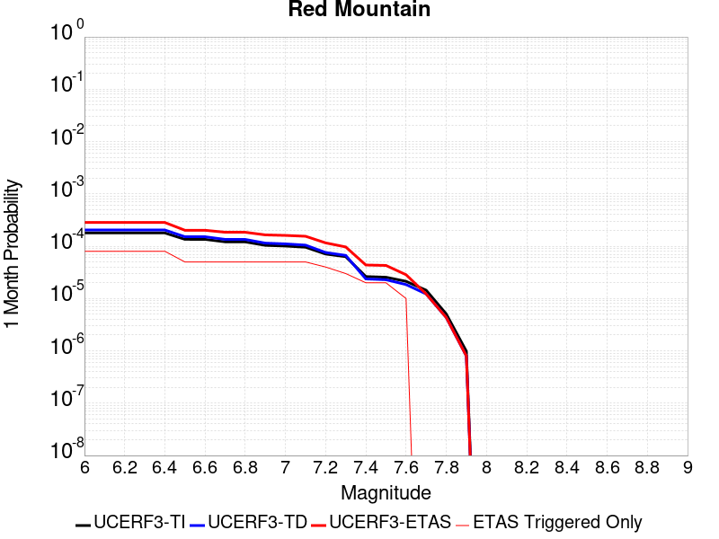 |  |  |

| Magnitude | 1 wk TI Prob | 1 wk TD Prob | 1 wk ETAS Prob | 1 wk ETAS/TD Gain | 1 wk ETAS Triggered Only | 1 mo TI Prob | 1 mo TD Prob | 1 mo ETAS Prob | 1 mo ETAS/TD Gain | 1 mo ETAS Triggered Only | 1 yr TI Prob | 1 yr TD Prob | 1 yr ETAS Prob | 1 yr ETAS/TD Gain | 1 yr ETAS Triggered Only | 10 yr TI Prob | 10 yr TD Prob | 10 yr ETAS Prob | 10 yr ETAS/TD Gain | 10 yr ETAS Triggered Only |
|-----|-----|-----|-----|-----|-----|-----|-----|-----|-----|-----|-----|-----|-----|-----|-----|-----|-----|-----|-----|-----|
| 6.0 | 4.1810763E-5 | 4.7590016E-5 | 1.17586686E-4 | 2.4708269 | 7.0E-5 | 1.7917668E-4 | 2.039422E-4 | 2.8392588E-4 | 1.392188 | 8.0E-5 | 0.0021792934 | 0.0024803334 | 0.002610011 | 1.0522823 | 1.3E-4 | 0.021580452 | 0.02454411 | 0.024748957 | 1.0083461 | 2.1E-4 |
| 6.1 | 4.1810763E-5 | 4.7590016E-5 | 1.17586686E-4 | 2.4708269 | 7.0E-5 | 1.7917668E-4 | 2.039422E-4 | 2.8392588E-4 | 1.392188 | 8.0E-5 | 0.0021792934 | 0.0024803334 | 0.002610011 | 1.0522823 | 1.3E-4 | 0.021580452 | 0.02454411 | 0.024748957 | 1.0083461 | 2.1E-4 |
| 6.2 | 4.1810763E-5 | 4.7590016E-5 | 1.17586686E-4 | 2.4708269 | 7.0E-5 | 1.7917668E-4 | 2.039422E-4 | 2.8392588E-4 | 1.392188 | 8.0E-5 | 0.0021792934 | 0.0024803334 | 0.002610011 | 1.0522823 | 1.3E-4 | 0.021580452 | 0.02454411 | 0.024748957 | 1.0083461 | 2.1E-4 |
| 6.3 | 4.1810763E-5 | 4.7590016E-5 | 1.17586686E-4 | 2.4708269 | 7.0E-5 | 1.7917668E-4 | 2.039422E-4 | 2.8392588E-4 | 1.392188 | 8.0E-5 | 0.0021792934 | 0.0024803334 | 0.002610011 | 1.0522823 | 1.3E-4 | 0.021580452 | 0.02454411 | 0.024748957 | 1.0083461 | 2.1E-4 |
| 6.4 | 4.1810763E-5 | 4.7590016E-5 | 1.17586686E-4 | 2.4708269 | 7.0E-5 | 1.7917668E-4 | 2.039422E-4 | 2.8392588E-4 | 1.392188 | 8.0E-5 | 0.0021792934 | 0.0024803334 | 0.002610011 | 1.0522823 | 1.3E-4 | 0.021580452 | 0.02454411 | 0.024748957 | 1.0083461 | 2.1E-4 |
| 6.5 | 3.154503E-5 | 3.5359757E-5 | 7.5358344E-5 | 2.1311896 | 4.0E-5 | 1.3518598E-4 | 1.5153353E-4 | 2.0152595E-4 | 1.3299099 | 5.0E-5 | 0.0016446467 | 0.0018434518 | 0.0019432674 | 1.054146 | 1.0E-4 | 0.01632528 | 0.018291244 | 0.018458135 | 1.009124 | 1.7E-4 |
| 6.6 | 3.1535834E-5 | 3.5349138E-5 | 7.534772E-5 | 2.1315293 | 4.0E-5 | 1.3514658E-4 | 1.5148803E-4 | 2.0148046E-4 | 1.3300091 | 5.0E-5 | 0.0016441676 | 0.0018428987 | 0.0019427144 | 1.0541624 | 1.0E-4 | 0.01632056 | 0.018285805 | 0.018452697 | 1.0091268 | 1.7E-4 |
| 6.7 | 2.8267326E-5 | 3.1469353E-5 | 6.146841E-5 | 1.9532784 | 3.0E-5 | 1.2114006E-4 | 1.3486217E-4 | 1.8485542E-4 | 1.3706989 | 5.0E-5 | 0.0014738824 | 0.0016407954 | 0.0017406313 | 1.0608461 | 1.0E-4 | 0.014641452 | 0.01629557 | 0.016462801 | 1.0102623 | 1.7E-4 |
| 6.8 | 2.8212884E-5 | 3.1407242E-5 | 6.1406296E-5 | 1.9551637 | 3.0E-5 | 1.20906756E-4 | 1.3459599E-4 | 1.8458927E-4 | 1.3714321 | 5.0E-5 | 0.0014710457 | 0.0016375595 | 0.0017373958 | 1.0609665 | 1.0E-4 | 0.014613459 | 0.016263688 | 0.016430924 | 1.0102828 | 1.7E-4 |
| 6.9 | 2.4227871E-5 | 2.6706994E-5 | 5.6706194E-5 | 2.1232712 | 3.0E-5 | 1.03829596E-4 | 1.1445395E-4 | 1.6444823E-4 | 1.4368069 | 5.0E-5 | 0.0012633923 | 0.0013926621 | 0.0014925228 | 1.071705 | 1.0E-4 | 0.012562336 | 0.0138470335 | 0.014004818 | 1.0113949 | 1.6E-4 |
| 7.0 | 2.348524E-5 | 2.5835778E-5 | 5.5835004E-5 | 2.1611505 | 3.0E-5 | 1.0064714E-4 | 1.10720495E-4 | 1.6071496E-4 | 1.4515376 | 5.0E-5 | 0.0012246901 | 0.001347264 | 0.0014371427 | 1.066712 | 9.0E-5 | 0.012179627 | 0.013398598 | 0.013556454 | 1.0117816 | 1.6E-4 |
| 7.1 | 2.2311642E-5 | 2.4462845E-5 | 5.446211E-5 | 2.2263196 | 3.0E-5 | 9.561782E-5 | 1.04836974E-4 | 1.5483172E-4 | 1.476881 | 5.0E-5 | 0.0011635252 | 0.0012757176 | 0.0013656027 | 1.0704585 | 9.0E-5 | 0.01157452 | 0.01269146 | 0.012849429 | 1.0124469 | 1.6E-4 |
| 7.2 | 1.6533986E-5 | 1.7670362E-5 | 3.7670008E-5 | 2.1318188 | 2.0E-5 | 7.085802E-5 | 7.572828E-5 | 1.15725255E-4 | 1.5281643 | 4.0E-5 | 8.623549E-4 | 9.2166534E-4 | 9.8161E-4 | 1.0650395 | 6.0E-5 | 0.008590161 | 0.009184707 | 0.009293697 | 1.0118665 | 1.1E-4 |
| 7.3 | 1.4703092E-5 | 1.5559537E-5 | 2.555938E-5 | 1.6426827 | 1.0E-5 | 6.301173E-5 | 6.668237E-5 | 9.668037E-5 | 1.449864 | 3.0E-5 | 7.668978E-4 | 8.1161706E-4 | 8.6157647E-4 | 1.0615554 | 5.0E-5 | 0.0076425658 | 0.008092604 | 0.008191794 | 1.012257 | 1.0E-4 |
| 7.4 | 6.1331984E-6 | 5.5288874E-6 | 1.5528833E-5 | 2.8086722 | 1.0E-5 | 2.6284872E-5 | 2.3695018E-5 | 4.3694545E-5 | 1.8440393 | 2.0E-5 | 3.199713E-4 | 2.884492E-4 | 3.1844055E-4 | 1.1039745 | 3.0E-5 | 0.0031951098 | 0.0028808024 | 0.0029306584 | 1.0173063 | 5.0E-5 |
| 7.5 | 5.954766E-6 | 5.338517E-6 | 1.5338464E-5 | 2.8731694 | 1.0E-5 | 2.5520176E-5 | 2.2879161E-5 | 4.2878703E-5 | 1.874138 | 2.0E-5 | 3.1066386E-4 | 2.785187E-4 | 3.0851035E-4 | 1.1076827 | 3.0E-5 | 0.003102299 | 0.0027817504 | 0.0028316113 | 1.0179243 | 5.0E-5 |
| 7.6 | 4.9726646E-6 | 4.315309E-6 | 1.4315266E-5 | 3.317321 | 1.0E-5 | 2.1311245E-5 | 1.8494053E-5 | 2.8493867E-5 | 1.5407044 | 1.0E-5 | 2.5943352E-4 | 2.2514217E-4 | 2.3513992E-4 | 1.0444064 | 1.0E-5 | 0.0025913084 | 0.0022491754 | 0.0022691304 | 1.0088722 | 2.0E-5 |
| 7.7 | 3.3613894E-6 | 2.8526886E-6 | 2.8526886E-6 | 1.0 | 0.0 | 1.4405875E-5 | 1.22257525E-5 | 1.22257525E-5 | 1.0 | 0.0 | 1.7537741E-4 | 1.4883863E-4 | 1.4883863E-4 | 1.0 | 0.0 | 0.0017523908 | 0.0014874157 | 0.0014974009 | 1.006713 | 1.0E-5 |
| 7.8 | 1.1828961E-6 | 1.0122935E-6 | 1.0122935E-6 | 1.0 | 0.0 | 5.069545E-6 | 4.338394E-6 | 4.338394E-6 | 1.0 | 0.0 | 6.171996E-5 | 5.281869E-5 | 5.281869E-5 | 1.0 | 0.0 | 6.170282E-4 | 5.280643E-4 | 5.280643E-4 | 1.0 | 0.0 |
| 7.9 | 2.2967266E-7 | 1.861919E-7 | 1.861919E-7 | 1.0 | 0.0 | 9.843111E-7 | 7.97965E-7 | 7.97965E-7 | 1.0 | 0.0 | 1.19839215E-5 | 9.715184E-6 | 9.715184E-6 | 1.0 | 0.0 | 1.1983275E-4 | 9.714788E-5 | 9.714788E-5 | 1.0 | 0.0 |

## Cleghorn Pass
*[(top)](#table-of-contents)*

| 1 Week | 1 Month | 1 Year | 10 Year |
|-----|-----|-----|-----|
|  | 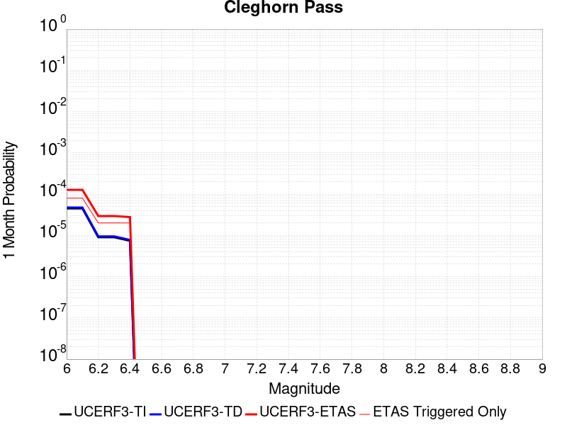 | 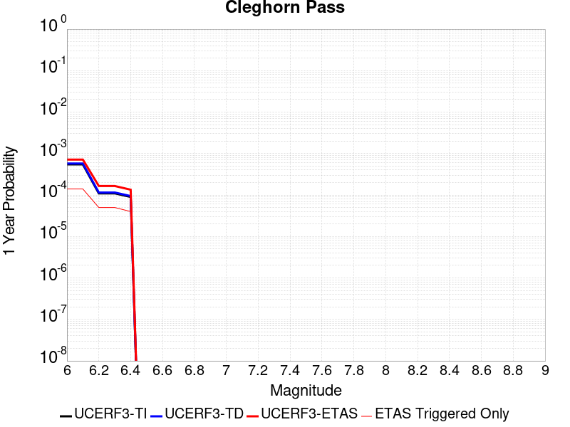 |  |

| Magnitude | 1 wk TI Prob | 1 wk TD Prob | 1 wk ETAS Prob | 1 wk ETAS/TD Gain | 1 wk ETAS Triggered Only | 1 mo TI Prob | 1 mo TD Prob | 1 mo ETAS Prob | 1 mo ETAS/TD Gain | 1 mo ETAS Triggered Only | 1 yr TI Prob | 1 yr TD Prob | 1 yr ETAS Prob | 1 yr ETAS/TD Gain | 1 yr ETAS Triggered Only | 10 yr TI Prob | 10 yr TD Prob | 10 yr ETAS Prob | 10 yr ETAS/TD Gain | 10 yr ETAS Triggered Only |
|-----|-----|-----|-----|-----|-----|-----|-----|-----|-----|-----|-----|-----|-----|-----|-----|-----|-----|-----|-----|-----|
| 6.0 | 1.0522846E-5 | 1.1040642E-5 | 3.104042E-5 | 2.8114688 | 2.0E-5 | 4.509713E-5 | 4.7316473E-5 | 1.2731268E-4 | 2.690663 | 8.0E-5 | 5.4891926E-4 | 5.759784E-4 | 7.158978E-4 | 1.2429247 | 1.4E-4 | 0.0054756533 | 0.005750022 | 0.005968757 | 1.0380408 | 2.2E-4 |
| 6.1 | 1.0522846E-5 | 1.1040642E-5 | 3.104042E-5 | 2.8114688 | 2.0E-5 | 4.509713E-5 | 4.7316473E-5 | 1.2731268E-4 | 2.690663 | 8.0E-5 | 5.4891926E-4 | 5.759784E-4 | 7.158978E-4 | 1.2429247 | 1.4E-4 | 0.0054756533 | 0.005750022 | 0.005968757 | 1.0380408 | 2.2E-4 |
| 6.2 | 2.1045846E-6 | 2.2082024E-6 | 2.2208158E-5 | 10.05712 | 2.0E-5 | 9.019617E-6 | 9.463714E-6 | 2.9463525E-5 | 3.113315 | 2.0E-5 | 1.098083E-4 | 1.1521882E-4 | 1.6521306E-4 | 1.4339069 | 5.0E-5 | 0.0010975406 | 0.0011520023 | 0.0012418986 | 1.0780349 | 9.0E-5 |
| 6.3 | 2.1045846E-6 | 2.2082024E-6 | 2.2208158E-5 | 10.05712 | 2.0E-5 | 9.019617E-6 | 9.463714E-6 | 2.9463525E-5 | 3.113315 | 2.0E-5 | 1.098083E-4 | 1.1521882E-4 | 1.6521306E-4 | 1.4339069 | 5.0E-5 | 0.0010975406 | 0.0011520023 | 0.0012418986 | 1.0780349 | 9.0E-5 |
| 6.4 | 1.7259927E-6 | 1.810877E-6 | 2.1810842E-5 | 12.044352 | 2.0E-5 | 7.3970905E-6 | 7.760902E-6 | 2.7760747E-5 | 3.5770001 | 2.0E-5 | 9.005586E-5 | 9.4488976E-5 | 1.344852E-4 | 1.4232898 | 4.0E-5 | 9.001937E-4 | 9.448898E-4 | 0.0010148237 | 1.0740128 | 7.0E-5 |

## Mission Creek
*[(top)](#table-of-contents)*

| 1 Week | 1 Month | 1 Year | 10 Year |
|-----|-----|-----|-----|
|  |  |  |  |

| Magnitude | 1 wk TI Prob | 1 wk TD Prob | 1 wk ETAS Prob | 1 wk ETAS/TD Gain | 1 wk ETAS Triggered Only | 1 mo TI Prob | 1 mo TD Prob | 1 mo ETAS Prob | 1 mo ETAS/TD Gain | 1 mo ETAS Triggered Only | 1 yr TI Prob | 1 yr TD Prob | 1 yr ETAS Prob | 1 yr ETAS/TD Gain | 1 yr ETAS Triggered Only | 10 yr TI Prob | 10 yr TD Prob | 10 yr ETAS Prob | 10 yr ETAS/TD Gain | 10 yr ETAS Triggered Only |
|-----|-----|-----|-----|-----|-----|-----|-----|-----|-----|-----|-----|-----|-----|-----|-----|-----|-----|-----|-----|-----|
| 6.0 | 1.1549387E-5 | 1.6322783E-5 | 1.1632115E-4 | 7.1263065 | 1.0E-4 | 4.9496433E-5 | 6.995299E-5 | 1.8994459E-4 | 2.7153177 | 1.2E-4 | 6.0245243E-4 | 8.5135986E-4 | 0.0010212151 | 1.1995106 | 1.7E-4 | 0.006008218 | 0.008510157 | 0.008767944 | 1.0302917 | 2.6E-4 |
| 6.1 | 1.1549387E-5 | 1.6322783E-5 | 1.1632115E-4 | 7.1263065 | 1.0E-4 | 4.9496433E-5 | 6.995299E-5 | 1.8994459E-4 | 2.7153177 | 1.2E-4 | 6.0245243E-4 | 8.5135986E-4 | 0.0010212151 | 1.1995106 | 1.7E-4 | 0.006008218 | 0.008510157 | 0.008767944 | 1.0302917 | 2.6E-4 |
| 6.2 | 1.1549387E-5 | 1.6322783E-5 | 1.1632115E-4 | 7.1263065 | 1.0E-4 | 4.9496433E-5 | 6.995299E-5 | 1.8994459E-4 | 2.7153177 | 1.2E-4 | 6.0245243E-4 | 8.5135986E-4 | 0.0010212151 | 1.1995106 | 1.7E-4 | 0.006008218 | 0.008510157 | 0.008767944 | 1.0302917 | 2.6E-4 |
| 6.3 | 1.1549387E-5 | 1.6322783E-5 | 1.1632115E-4 | 7.1263065 | 1.0E-4 | 4.9496433E-5 | 6.995299E-5 | 1.8994459E-4 | 2.7153177 | 1.2E-4 | 6.0245243E-4 | 8.5135986E-4 | 0.0010212151 | 1.1995106 | 1.7E-4 | 0.006008218 | 0.008510157 | 0.008767944 | 1.0302917 | 2.6E-4 |
| 6.4 | 1.1549387E-5 | 1.6322783E-5 | 1.1632115E-4 | 7.1263065 | 1.0E-4 | 4.9496433E-5 | 6.995299E-5 | 1.8994459E-4 | 2.7153177 | 1.2E-4 | 6.0245243E-4 | 8.5135986E-4 | 0.0010212151 | 1.1995106 | 1.7E-4 | 0.006008218 | 0.008510157 | 0.008767944 | 1.0302917 | 2.6E-4 |
| 6.5 | 1.1549387E-5 | 1.6322783E-5 | 1.1632115E-4 | 7.1263065 | 1.0E-4 | 4.9496433E-5 | 6.995299E-5 | 1.8994459E-4 | 2.7153177 | 1.2E-4 | 6.0245243E-4 | 8.5135986E-4 | 0.0010212151 | 1.1995106 | 1.7E-4 | 0.006008218 | 0.008510157 | 0.008767944 | 1.0302917 | 2.6E-4 |
| 6.6 | 9.202681E-6 | 1.3846059E-5 | 1.13844675E-4 | 8.222172 | 1.0E-4 | 3.9439463E-5 | 5.9338956E-5 | 1.7933184E-4 | 3.0221603 | 1.2E-4 | 4.800697E-4 | 7.2222133E-4 | 8.920985E-4 | 1.235215 | 1.7E-4 | 0.004790339 | 0.0072273402 | 0.0074755335 | 1.0343409 | 2.5E-4 |
| 6.7 | 9.019164E-6 | 1.3651728E-5 | 1.1365036E-4 | 8.32498 | 1.0E-4 | 3.8652986E-5 | 5.8506146E-5 | 1.7849913E-4 | 3.0509465 | 1.2E-4 | 4.7049852E-4 | 7.1208854E-4 | 8.819675E-4 | 1.2385644 | 1.7E-4 | 0.004695036 | 0.0071266647 | 0.0073748827 | 1.0348295 | 2.5E-4 |
| 6.8 | 8.673558E-6 | 1.3273839E-5 | 1.1327251E-4 | 8.533516 | 1.0E-4 | 3.717186E-5 | 5.688669E-5 | 1.7687987E-4 | 3.1093366 | 1.2E-4 | 4.524734E-4 | 6.923842E-4 | 8.622665E-4 | 1.2453585 | 1.7E-4 | 0.0045155324 | 0.0069308523 | 0.0071791196 | 1.0358206 | 2.5E-4 |
| 6.9 | 7.002255E-6 | 1.1478069E-5 | 1.1147692E-4 | 9.712168 | 1.0E-4 | 3.000932E-5 | 4.9190832E-5 | 1.6918493E-4 | 3.439359 | 1.2E-4 | 3.653022E-4 | 5.9874065E-4 | 7.6863886E-4 | 1.2837592 | 1.7E-4 | 0.0036470229 | 0.005999676 | 0.0062382356 | 1.0397621 | 2.4E-4 |
| 7.0 | 5.84644E-6 | 9.675359E-6 | 1.09674394E-4 | 11.335434 | 1.0E-4 | 2.5055931E-5 | 4.146519E-5 | 1.6146022E-4 | 3.8938737 | 1.2E-4 | 3.0501327E-4 | 5.047263E-4 | 6.746405E-4 | 1.3366462 | 1.7E-4 | 0.0030459496 | 0.005063994 | 0.0053027784 | 1.0471535 | 2.4E-4 |
| 7.1 | 5.54703E-6 | 9.329834E-6 | 1.093289E-4 | 11.7182045 | 1.0E-4 | 2.377277E-5 | 3.9984414E-5 | 1.5997962E-4 | 4.0010495 | 1.2E-4 | 2.8939504E-4 | 4.8670598E-4 | 6.566232E-4 | 1.3491168 | 1.7E-4 | 0.0028901845 | 0.0048845876 | 0.005123415 | 1.0488942 | 2.4E-4 |
| 7.2 | 4.384709E-6 | 7.681918E-6 | 1.0768115E-4 | 14.017483 | 1.0E-4 | 1.8791474E-5 | 3.292211E-5 | 1.5291816E-4 | 4.644847 | 1.2E-4 | 2.2876218E-4 | 4.0075663E-4 | 5.706885E-4 | 1.4240276 | 1.7E-4 | 0.0022852682 | 0.004028542 | 0.004257615 | 1.0568626 | 2.3E-4 |
| 7.3 | 3.7888456E-6 | 6.915788E-6 | 1.069151E-4 | 15.459568 | 1.0E-4 | 1.623781E-5 | 2.9638775E-5 | 1.4963522E-4 | 5.04863 | 1.2E-4 | 1.9767738E-4 | 3.6079568E-4 | 5.3073437E-4 | 1.4710108 | 1.7E-4 | 0.0019750162 | 0.00363027 | 0.0038494712 | 1.0603815 | 2.2E-4 |
| 7.4 | 2.1982462E-6 | 5.0241033E-6 | 1.050236E-4 | 20.90395 | 1.0E-4 | 9.421021E-6 | 2.1531694E-5 | 1.415291E-4 | 6.5730596 | 1.2E-4 | 1.1469489E-4 | 2.6211704E-4 | 4.3207247E-4 | 1.6483953 | 1.7E-4 | 0.0011463572 | 0.0026460327 | 0.0028654505 | 1.0829233 | 2.2E-4 |
| 7.5 | 2.051923E-6 | 4.6153277E-6 | 1.0461487E-4 | 22.666834 | 1.0E-4 | 8.793926E-6 | 1.9779825E-5 | 1.3977745E-4 | 7.0666676 | 1.2E-4 | 1.0706078E-4 | 2.4079291E-4 | 4.1075196E-4 | 1.7058308 | 1.7E-4 | 0.0010700922 | 0.0024335932 | 0.0026530577 | 1.0901814 | 2.2E-4 |
| 7.6 | 1.8733427E-6 | 4.1236603E-6 | 1.04123246E-4 | 25.250198 | 1.0E-4 | 8.028587E-6 | 1.7672712E-5 | 1.3767059E-4 | 7.7900095 | 1.2E-4 | 9.774366E-5 | 2.151441E-4 | 3.8510753E-4 | 1.789998 | 1.7E-4 | 9.770069E-4 | 0.0021782513 | 0.002397772 | 1.1007785 | 2.2E-4 |
| 7.7 | 1.8411953E-6 | 4.0433315E-6 | 1.0404293E-4 | 25.73198 | 1.0E-4 | 7.890813E-6 | 1.732845E-5 | 1.3732637E-4 | 7.924908 | 1.2E-4 | 9.606641E-5 | 2.1095353E-4 | 3.8091766E-4 | 1.8056947 | 1.7E-4 | 9.6024893E-4 | 0.0021365292 | 0.0023560592 | 1.1027508 | 2.2E-4 |
| 7.8 | 1.7194251E-6 | 3.71068E-6 | 1.0371031E-4 | 27.949139 | 1.0E-4 | 7.368944E-6 | 1.5902819E-5 | 1.359009E-4 | 8.545712 | 1.2E-4 | 8.97132E-5 | 1.9359968E-4 | 3.6356677E-4 | 1.8779306 | 1.7E-4 | 8.967699E-4 | 0.0019624757 | 0.0021820439 | 1.1118833 | 2.2E-4 |
| 7.9 | 1.4035052E-6 | 2.9502596E-6 | 1.0294996E-4 | 34.89522 | 1.0E-4 | 6.0150082E-6 | 1.2643909E-5 | 1.326424E-4 | 10.490616 | 1.2E-4 | 7.3230265E-5 | 1.5392878E-4 | 3.1390417E-4 | 2.0392818 | 1.6E-4 | 7.3206134E-4 | 0.0015631174 | 0.001772789 | 1.1341369 | 2.1E-4 |
| 8.0 | 3.9318823E-7 | 5.528477E-7 | 1.05528425E-5 | 19.088152 | 1.0E-5 | 1.6850913E-6 | 2.3693453E-6 | 2.2369299E-5 | 9.44113 | 2.0E-5 | 2.0515794E-5 | 2.8846403E-5 | 4.8845828E-5 | 1.6933073 | 2.0E-5 | 2.0513899E-4 | 2.990952E-4 | 3.3908326E-4 | 1.1336967 | 4.0E-5 |
| 8.1 | 1.596793E-7 | 1.13775044E-7 | 1.13775044E-7 | 1.0 | 0.0 | 6.8433974E-7 | 4.876072E-7 | 4.876072E-7 | 1.0 | 0.0 | 8.331805E-6 | 5.936602E-6 | 5.936602E-6 | 1.0 | 0.0 | 8.331492E-5 | 6.5494125E-5 | 6.5494125E-5 | 1.0 | 0.0 |
| 8.2 | 4.9003038E-8 | 2.5435753E-8 | 2.5435753E-8 | 1.0 | 0.0 | 2.10013E-7 | 1.09010365E-7 | 1.09010365E-7 | 1.0 | 0.0 | 2.5569052E-6 | 1.3272004E-6 | 1.3272004E-6 | 1.0 | 0.0 | 2.556876E-5 | 1.4952613E-5 | 1.4952613E-5 | 1.0 | 0.0 |

## Santa Rosa Island
*[(top)](#table-of-contents)*

| 1 Week | 1 Month | 1 Year | 10 Year |
|-----|-----|-----|-----|
|  |  |  |  |

| Magnitude | 1 wk TI Prob | 1 wk TD Prob | 1 wk ETAS Prob | 1 wk ETAS/TD Gain | 1 wk ETAS Triggered Only | 1 mo TI Prob | 1 mo TD Prob | 1 mo ETAS Prob | 1 mo ETAS/TD Gain | 1 mo ETAS Triggered Only | 1 yr TI Prob | 1 yr TD Prob | 1 yr ETAS Prob | 1 yr ETAS/TD Gain | 1 yr ETAS Triggered Only | 10 yr TI Prob | 10 yr TD Prob | 10 yr ETAS Prob | 10 yr ETAS/TD Gain | 10 yr ETAS Triggered Only |
|-----|-----|-----|-----|-----|-----|-----|-----|-----|-----|-----|-----|-----|-----|-----|-----|-----|-----|-----|-----|-----|
| 6.0 | 4.1143165E-5 | 4.709113E-5 | 9.708877E-5 | 2.061721 | 5.0E-5 | 1.7631594E-4 | 2.0180462E-4 | 2.8178847E-4 | 1.396343 | 8.0E-5 | 0.002144533 | 0.0024543991 | 0.0025741046 | 1.0487719 | 1.2E-4 | 0.021239553 | 0.024293557 | 0.024459427 | 1.0068277 | 1.7E-4 |
| 6.1 | 2.1061249E-5 | 2.3864959E-5 | 5.386424E-5 | 2.2570431 | 3.0E-5 | 9.0259375E-5 | 1.0227455E-4 | 1.4227047E-4 | 1.3910642 | 4.0E-5 | 0.0010983539 | 0.0012445103 | 0.0012844605 | 1.0321012 | 4.0E-5 | 0.01092941 | 0.01237845 | 0.012457459 | 1.0063828 | 8.0E-5 |
| 6.2 | 2.1061249E-5 | 2.3864959E-5 | 5.386424E-5 | 2.2570431 | 3.0E-5 | 9.0259375E-5 | 1.0227455E-4 | 1.4227047E-4 | 1.3910642 | 4.0E-5 | 0.0010983539 | 0.0012445103 | 0.0012844605 | 1.0321012 | 4.0E-5 | 0.01092941 | 0.01237845 | 0.012457459 | 1.0063828 | 8.0E-5 |
| 6.3 | 1.5158236E-5 | 1.7074419E-5 | 4.7073907E-5 | 2.7569845 | 3.0E-5 | 6.496225E-5 | 7.3174095E-5 | 1.1317117E-4 | 1.5466015 | 4.0E-5 | 7.906284E-4 | 8.9054246E-4 | 9.3050685E-4 | 1.0448765 | 4.0E-5 | 0.007878214 | 0.00887099 | 0.008940369 | 1.0078208 | 7.0E-5 |
| 6.4 | 1.2341918E-5 | 1.3852917E-5 | 3.385264E-5 | 2.4437194 | 2.0E-5 | 5.2892858E-5 | 5.9368336E-5 | 8.936656E-5 | 1.5052899 | 3.0E-5 | 6.437803E-4 | 7.225779E-4 | 7.5255625E-4 | 1.041488 | 3.0E-5 | 0.006419184 | 0.0072031217 | 0.0072527616 | 1.0068915 | 5.0E-5 |
| 6.5 | 9.061158E-6 | 1.0117032E-5 | 2.011693E-5 | 1.9884223 | 1.0E-5 | 3.883296E-5 | 4.3358017E-5 | 6.335715E-5 | 1.4612557 | 2.0E-5 | 4.726887E-4 | 5.277613E-4 | 5.4775074E-4 | 1.0378759 | 2.0E-5 | 0.004716845 | 0.0052656177 | 0.0052954596 | 1.0056673 | 3.0E-5 |
| 6.6 | 7.5461685E-6 | 8.400734E-6 | 1.840065E-5 | 2.1903622 | 1.0E-5 | 3.2340322E-5 | 3.600267E-5 | 5.600195E-5 | 1.5554943 | 2.0E-5 | 3.936723E-4 | 4.3824868E-4 | 4.582399E-4 | 1.0456161 | 2.0E-5 | 0.003929756 | 0.0043742736 | 0.0044041425 | 1.0068283 | 3.0E-5 |
| 6.7 | 5.5023775E-6 | 6.087381E-6 | 6.087381E-6 | 1.0 | 0.0 | 2.3581404E-5 | 2.6088532E-5 | 3.6088273E-5 | 1.3833002 | 1.0E-5 | 2.8706578E-4 | 3.1758484E-4 | 3.2758166E-4 | 1.0314777 | 1.0E-5 | 0.0028669522 | 0.0031716316 | 0.0031915682 | 1.0062859 | 2.0E-5 |
| 6.8 | 3.7351679E-6 | 4.0831405E-6 | 4.0831405E-6 | 1.0 | 0.0 | 1.6007763E-5 | 1.7499071E-5 | 2.7498896E-5 | 1.5714489 | 1.0E-5 | 1.948771E-4 | 2.1303285E-4 | 2.2303071E-4 | 1.0469311 | 1.0E-5 | 0.0019470629 | 0.0021285315 | 0.002148489 | 1.0093762 | 2.0E-5 |
| 6.9 | 2.456366E-6 | 2.6292707E-6 | 2.6292707E-6 | 1.0 | 0.0 | 1.0527241E-5 | 1.1268255E-5 | 2.1268143E-5 | 1.8874389 | 1.0E-5 | 1.2816161E-4 | 1.3718239E-4 | 1.4718101E-4 | 1.0728856 | 1.0E-5 | 0.0012808773 | 0.0013709799 | 0.0013909526 | 1.0145681 | 2.0E-5 |
| 7.0 | 2.3245157E-6 | 2.4827784E-6 | 2.4827784E-6 | 1.0 | 0.0 | 9.962172E-6 | 1.0640436E-5 | 2.064033E-5 | 1.9398011 | 1.0E-5 | 1.2128269E-4 | 1.2953962E-4 | 1.3953833E-4 | 1.0771865 | 1.0E-5 | 0.0012121652 | 0.0012946434 | 0.0013146175 | 1.0154283 | 2.0E-5 |
| 7.1 | 2.2248344E-6 | 2.37325E-6 | 2.37325E-6 | 1.0 | 0.0 | 9.53497E-6 | 1.0171032E-5 | 2.017093E-5 | 1.9831743 | 1.0E-5 | 1.1608207E-4 | 1.238253E-4 | 1.3382405E-4 | 1.0807489 | 1.0E-5 | 0.0011602144 | 0.0012375651 | 0.0012575403 | 1.0161408 | 2.0E-5 |
| 7.2 | 2.1350402E-6 | 2.2761542E-6 | 2.2761542E-6 | 1.0 | 0.0 | 9.150141E-6 | 9.75491E-6 | 1.9754812E-5 | 2.0251148 | 1.0E-5 | 1.1139726E-4 | 1.1875957E-4 | 1.2875839E-4 | 1.0841937 | 1.0E-5 | 0.0011134144 | 0.0011869629 | 0.0012069392 | 1.0168297 | 2.0E-5 |
| 7.3 | 1.9793572E-6 | 2.1087192E-6 | 2.1087192E-6 | 1.0 | 0.0 | 8.482932E-6 | 9.037337E-6 | 1.9037247E-5 | 2.1065106 | 1.0E-5 | 1.032748E-4 | 1.1002403E-4 | 1.2002294E-4 | 1.0908792 | 1.0E-5 | 0.0010322682 | 0.0010996974 | 0.0011196755 | 1.0181668 | 2.0E-5 |
| 7.4 | 1.6951194E-6 | 1.8045735E-6 | 1.8045735E-6 | 1.0 | 0.0 | 7.264777E-6 | 7.733864E-6 | 7.733864E-6 | 1.0 | 0.0 | 8.844508E-5 | 9.415574E-5 | 9.415574E-5 | 1.0 | 0.0 | 8.840988E-4 | 9.411601E-4 | 9.5115067E-4 | 1.0106152 | 1.0E-5 |
| 7.5 | 8.987207E-7 | 9.512216E-7 | 9.512216E-7 | 1.0 | 0.0 | 3.8516546E-6 | 4.0766577E-6 | 4.0766577E-6 | 1.0 | 0.0 | 4.6892885E-5 | 4.9632188E-5 | 4.9632188E-5 | 1.0 | 0.0 | 4.688299E-4 | 4.962122E-4 | 4.962122E-4 | 1.0 | 0.0 |
| 7.6 | 3.8783037E-7 | 4.0529335E-7 | 4.0529335E-7 | 1.0 | 0.0 | 1.6621291E-6 | 1.7369704E-6 | 1.7369704E-6 | 1.0 | 0.0 | 2.0236233E-5 | 2.1147416E-5 | 2.1147416E-5 | 1.0 | 0.0 | 2.023439E-4 | 2.114547E-4 | 2.114547E-4 | 1.0 | 0.0 |
| 7.7 | 6.181804E-8 | 6.339047E-8 | 6.339047E-8 | 1.0 | 0.0 | 2.6493444E-7 | 2.7167343E-7 | 2.7167343E-7 | 1.0 | 0.0 | 3.225572E-6 | 3.307619E-6 | 3.307619E-6 | 1.0 | 0.0 | 3.225525E-5 | 3.3075703E-5 | 3.3075703E-5 | 1.0 | 0.0 |
| 7.8 | 1.3704449E-9 | 1.3964153E-9 | 1.3964153E-9 | 1.0 | 0.0 | 5.873335E-9 | 5.984637E-9 | 5.984637E-9 | 1.0 | 0.0 | 7.1507856E-8 | 7.286295E-8 | 7.286295E-8 | 1.0 | 0.0 | 7.1507833E-7 | 7.286294E-7 | 7.286294E-7 | 1.0 | 0.0 |

## San Jacinto (Coyote Creek)
*[(top)](#table-of-contents)*

| 1 Week | 1 Month | 1 Year | 10 Year |
|-----|-----|-----|-----|
|  | 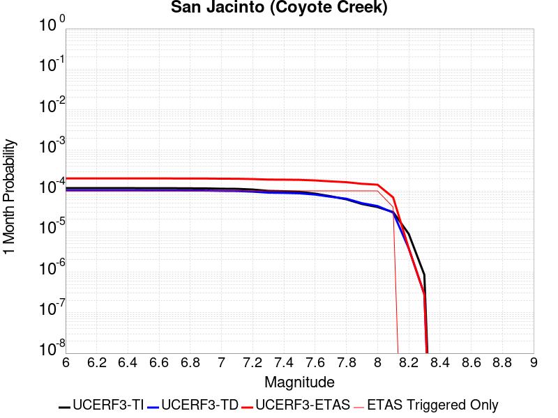 |  |  |

| Magnitude | 1 wk TI Prob | 1 wk TD Prob | 1 wk ETAS Prob | 1 wk ETAS/TD Gain | 1 wk ETAS Triggered Only | 1 mo TI Prob | 1 mo TD Prob | 1 mo ETAS Prob | 1 mo ETAS/TD Gain | 1 mo ETAS Triggered Only | 1 yr TI Prob | 1 yr TD Prob | 1 yr ETAS Prob | 1 yr ETAS/TD Gain | 1 yr ETAS Triggered Only | 10 yr TI Prob | 10 yr TD Prob | 10 yr ETAS Prob | 10 yr ETAS/TD Gain | 10 yr ETAS Triggered Only |
|-----|-----|-----|-----|-----|-----|-----|-----|-----|-----|-----|-----|-----|-----|-----|-----|-----|-----|-----|-----|-----|
| 6.0 | 2.7374346E-5 | 2.41444E-5 | 9.4142706E-5 | 3.8991532 | 7.0E-5 | 1.1731335E-4 | 1.034719E-4 | 2.0346156E-4 | 1.9663459 | 1.0E-4 | 0.0014273542 | 0.001259045 | 0.001428831 | 1.134853 | 1.7E-4 | 0.01418221 | 0.012928195 | 0.013155221 | 1.0175606 | 2.3E-4 |
| 6.1 | 2.7374346E-5 | 2.41444E-5 | 9.4142706E-5 | 3.8991532 | 7.0E-5 | 1.1731335E-4 | 1.034719E-4 | 2.0346156E-4 | 1.9663459 | 1.0E-4 | 0.0014273542 | 0.001259045 | 0.001428831 | 1.134853 | 1.7E-4 | 0.01418221 | 0.012928195 | 0.013155221 | 1.0175606 | 2.3E-4 |
| 6.2 | 2.7374346E-5 | 2.41444E-5 | 9.4142706E-5 | 3.8991532 | 7.0E-5 | 1.1731335E-4 | 1.034719E-4 | 2.0346156E-4 | 1.9663459 | 1.0E-4 | 0.0014273542 | 0.001259045 | 0.001428831 | 1.134853 | 1.7E-4 | 0.01418221 | 0.012928195 | 0.013155221 | 1.0175606 | 2.3E-4 |
| 6.3 | 2.7374346E-5 | 2.41444E-5 | 9.4142706E-5 | 3.8991532 | 7.0E-5 | 1.1731335E-4 | 1.034719E-4 | 2.0346156E-4 | 1.9663459 | 1.0E-4 | 0.0014273542 | 0.001259045 | 0.001428831 | 1.134853 | 1.7E-4 | 0.01418221 | 0.012928195 | 0.013155221 | 1.0175606 | 2.3E-4 |
| 6.4 | 2.7374346E-5 | 2.41444E-5 | 9.4142706E-5 | 3.8991532 | 7.0E-5 | 1.1731335E-4 | 1.034719E-4 | 2.0346156E-4 | 1.9663459 | 1.0E-4 | 0.0014273542 | 0.001259045 | 0.001428831 | 1.134853 | 1.7E-4 | 0.01418221 | 0.012928195 | 0.013155221 | 1.0175606 | 2.3E-4 |
| 6.5 | 2.7282445E-5 | 2.4030476E-5 | 9.4028794E-5 | 3.9128976 | 7.0E-5 | 1.16919524E-4 | 1.0298371E-4 | 2.029734E-4 | 1.9709274 | 1.0E-4 | 0.0014225657 | 0.001253108 | 0.001422895 | 1.1354927 | 1.7E-4 | 0.014134934 | 0.012869522 | 0.013096563 | 1.0176417 | 2.3E-4 |
| 6.6 | 2.7282445E-5 | 2.4030476E-5 | 9.4028794E-5 | 3.9128976 | 7.0E-5 | 1.16919524E-4 | 1.0298371E-4 | 2.029734E-4 | 1.9709274 | 1.0E-4 | 0.0014225657 | 0.001253108 | 0.001422895 | 1.1354927 | 1.7E-4 | 0.014134934 | 0.012869522 | 0.013096563 | 1.0176417 | 2.3E-4 |
| 6.7 | 2.7216198E-5 | 2.3955597E-5 | 9.395392E-5 | 3.9220028 | 7.0E-5 | 1.1663563E-4 | 1.02662816E-4 | 2.0265255E-4 | 1.9739624 | 1.0E-4 | 0.0014191137 | 0.0012492058 | 0.0014189935 | 1.1359165 | 1.7E-4 | 0.014100855 | 0.012830934 | 0.013057983 | 1.0176954 | 2.3E-4 |
| 6.8 | 2.7078617E-5 | 2.3872815E-5 | 9.3871146E-5 | 3.9321353 | 7.0E-5 | 1.1604605E-4 | 1.0230807E-4 | 2.0229784E-4 | 1.97734 | 1.0E-4 | 0.001411945 | 0.0012448917 | 0.00141468 | 1.1363881 | 1.7E-4 | 0.014030075 | 0.0127880825 | 0.013015141 | 1.0177555 | 2.3E-4 |
| 6.9 | 2.6982952E-5 | 2.3792329E-5 | 9.3790666E-5 | 3.9420547 | 7.0E-5 | 1.15636096E-4 | 1.0196315E-4 | 2.0195296E-4 | 1.9806464 | 1.0E-4 | 0.0014069602 | 0.0012406971 | 0.0014104862 | 1.1368498 | 1.7E-4 | 0.013980856 | 0.012746378 | 0.012973446 | 1.0178144 | 2.3E-4 |
| 7.0 | 2.6449972E-5 | 2.3369357E-5 | 9.336772E-5 | 3.9953055 | 7.0E-5 | 1.1335209E-4 | 1.0015055E-4 | 2.0014054E-4 | 1.9983968 | 1.0E-4 | 0.001379188 | 0.0012186535 | 0.0013884464 | 1.1393282 | 1.7E-4 | 0.0137065975 | 0.012527733 | 0.012754852 | 1.0181292 | 2.3E-4 |
| 7.1 | 2.6257849E-5 | 2.3195396E-5 | 9.3193776E-5 | 4.0177703 | 7.0E-5 | 1.1252879E-4 | 9.940507E-5 | 1.9939513E-4 | 2.005885 | 1.0E-4 | 0.0013691769 | 0.0012095873 | 0.0013793817 | 1.1403738 | 1.7E-4 | 0.013607717 | 0.012437661 | 0.0126648005 | 1.0182623 | 2.3E-4 |
| 7.2 | 2.5270041E-5 | 2.2390155E-5 | 9.238859E-5 | 4.126304 | 7.0E-5 | 1.0829568E-4 | 9.5954296E-5 | 1.959447E-4 | 2.0420628 | 1.0E-4 | 0.0013177024 | 0.0011676198 | 0.0013374212 | 1.1454253 | 1.7E-4 | 0.013099162 | 0.0120187905 | 0.012246026 | 1.0189067 | 2.3E-4 |
| 7.3 | 2.339701E-5 | 2.1122027E-5 | 9.112055E-5 | 4.314006 | 7.0E-5 | 1.0026905E-4 | 9.051985E-5 | 1.905108E-4 | 2.1046302 | 1.0E-4 | 0.001220092 | 0.001101524 | 0.0012713367 | 1.1541617 | 1.7E-4 | 0.012134149 | 0.011357642 | 0.01158503 | 1.0200207 | 2.3E-4 |
| 7.4 | 2.296333E-5 | 2.0852396E-5 | 9.085094E-5 | 4.3568583 | 7.0E-5 | 9.841056E-5 | 8.936436E-5 | 1.8935543E-4 | 2.1189144 | 1.0E-4 | 0.0011974899 | 0.0010874701 | 0.0012572852 | 1.1561562 | 1.7E-4 | 0.011910575 | 0.011216754 | 0.011444174 | 1.020275 | 2.3E-4 |
| 7.5 | 2.2188895E-5 | 2.037534E-5 | 9.037391E-5 | 4.4354553 | 7.0E-5 | 9.50918E-5 | 8.731998E-5 | 1.8731125E-4 | 2.1451132 | 1.0E-4 | 0.0011571277 | 0.0010626042 | 0.0012324237 | 1.1598142 | 1.7E-4 | 0.011511209 | 0.010966369 | 0.011193847 | 1.0207433 | 2.3E-4 |
| 7.6 | 2.0013189E-5 | 1.8961666E-5 | 8.896034E-5 | 4.691589 | 7.0E-5 | 8.5767984E-5 | 8.126176E-5 | 1.8125364E-4 | 2.2304912 | 1.0E-4 | 0.001043725 | 9.889146E-4 | 0.0011587465 | 1.1717356 | 1.7E-4 | 0.010388365 | 0.010224371 | 0.01045202 | 1.0222653 | 2.3E-4 |
| 7.7 | 1.7230794E-5 | 1.6743043E-5 | 8.674187E-5 | 5.180771 | 7.0E-5 | 7.384417E-5 | 7.175393E-5 | 1.7174675E-4 | 2.3935518 | 1.0E-4 | 8.986819E-4 | 8.732547E-4 | 0.0010431063 | 1.194504 | 1.7E-4 | 0.008950562 | 0.00906292 | 0.009290836 | 1.0251482 | 2.3E-4 |
| 7.8 | 1.4478809E-5 | 1.499039E-5 | 8.498934E-5 | 5.6695886 | 7.0E-5 | 6.205057E-5 | 6.424295E-5 | 1.6423652E-4 | 2.5564911 | 1.0E-4 | 7.552038E-4 | 7.8187784E-4 | 9.5174497E-4 | 1.2172552 | 1.7E-4 | 0.0075264242 | 0.008141388 | 0.008369516 | 1.0280207 | 2.3E-4 |
| 7.9 | 1.1114467E-5 | 1.1644517E-5 | 8.16437E-5 | 7.011343 | 7.0E-5 | 4.7632562E-5 | 4.990412E-5 | 1.4989913E-4 | 3.0037425 | 1.0E-4 | 5.797721E-4 | 6.074139E-4 | 7.473288E-4 | 1.2303454 | 1.4E-4 | 0.0057826187 | 0.0063803545 | 0.0065790787 | 1.0311462 | 2.0E-4 |
| 8.0 | 9.327402E-6 | 9.8986575E-6 | 7.989797E-5 | 8.071596 | 7.0E-5 | 3.9973966E-5 | 4.2422133E-5 | 1.4241789E-4 | 3.35716 | 1.0E-4 | 4.8657437E-4 | 5.163676E-4 | 6.562953E-4 | 1.2709846 | 1.4E-4 | 0.0048551033 | 0.00544994 | 0.00564885 | 1.0364976 | 2.0E-4 |
| 8.1 | 7.0235833E-6 | 6.826985E-6 | 3.682678E-5 | 5.394296 | 3.0E-5 | 3.0100724E-5 | 2.9258183E-5 | 6.925701E-5 | 2.367099 | 4.0E-5 | 3.664147E-4 | 3.5616063E-4 | 4.2613572E-4 | 1.1964705 | 7.0E-5 | 0.003658111 | 0.0037874572 | 0.0038970406 | 1.0289333 | 1.1E-4 |
| 8.2 | 2.0358202E-6 | 8.9912584E-7 | 8.9912584E-7 | 1.0 | 0.0 | 8.724915E-6 | 3.853391E-6 | 3.853391E-6 | 1.0 | 0.0 | 1.06220665E-4 | 4.6914047E-5 | 4.6914047E-5 | 1.0 | 0.0 | 0.001061699 | 5.3239096E-4 | 5.3239096E-4 | 1.0 | 0.0 |
| 8.3 | 2.0051264E-7 | 6.61379E-8 | 6.61379E-8 | 1.0 | 0.0 | 8.5933965E-7 | 2.8344812E-7 | 2.8344812E-7 | 1.0 | 0.0 | 1.046241E-5 | 3.450976E-6 | 3.450976E-6 | 1.0 | 0.0 | 1.0461917E-4 | 4.0120205E-5 | 4.0120205E-5 | 1.0 | 0.0 |

## Big Pine (East)
*[(top)](#table-of-contents)*

| 1 Week | 1 Month | 1 Year | 10 Year |
|-----|-----|-----|-----|
| 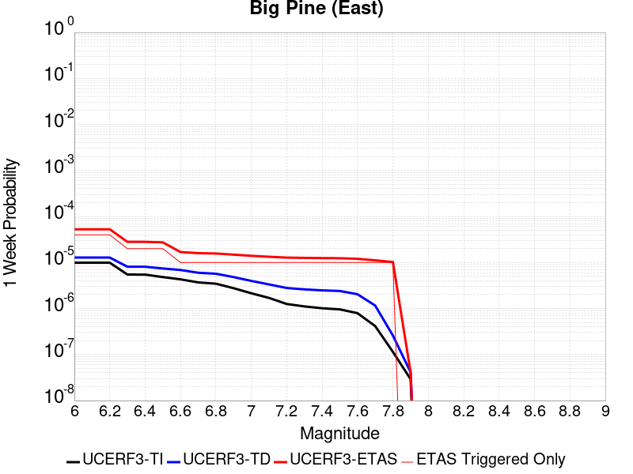 | 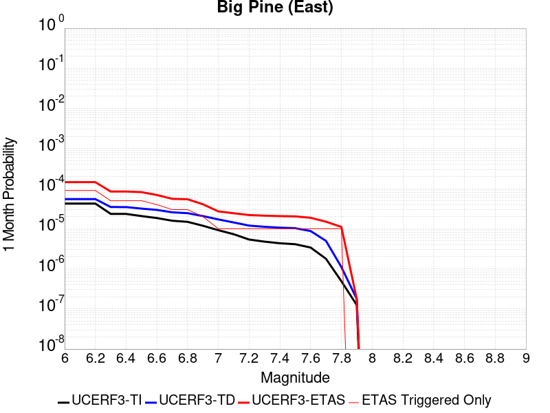 |  |  |

| Magnitude | 1 wk TI Prob | 1 wk TD Prob | 1 wk ETAS Prob | 1 wk ETAS/TD Gain | 1 wk ETAS Triggered Only | 1 mo TI Prob | 1 mo TD Prob | 1 mo ETAS Prob | 1 mo ETAS/TD Gain | 1 mo ETAS Triggered Only | 1 yr TI Prob | 1 yr TD Prob | 1 yr ETAS Prob | 1 yr ETAS/TD Gain | 1 yr ETAS Triggered Only | 10 yr TI Prob | 10 yr TD Prob | 10 yr ETAS Prob | 10 yr ETAS/TD Gain | 10 yr ETAS Triggered Only |
|-----|-----|-----|-----|-----|-----|-----|-----|-----|-----|-----|-----|-----|-----|-----|-----|-----|-----|-----|-----|-----|
| 6.0 | 9.916913E-6 | 1.28172705E-5 | 5.281676E-5 | 4.120749 | 4.0E-5 | 4.250036E-5 | 5.493013E-5 | 1.4492519E-4 | 2.638355 | 9.0E-5 | 5.173191E-4 | 6.685912E-4 | 7.985043E-4 | 1.1943086 | 1.3E-4 | 0.0051611643 | 0.006670449 | 0.006879048 | 1.0312722 | 2.1E-4 |
| 6.1 | 9.916913E-6 | 1.28172705E-5 | 5.281676E-5 | 4.120749 | 4.0E-5 | 4.250036E-5 | 5.493013E-5 | 1.4492519E-4 | 2.638355 | 9.0E-5 | 5.173191E-4 | 6.685912E-4 | 7.985043E-4 | 1.1943086 | 1.3E-4 | 0.0051611643 | 0.006670449 | 0.006879048 | 1.0312722 | 2.1E-4 |
| 6.2 | 9.916913E-6 | 1.28172705E-5 | 5.281676E-5 | 4.120749 | 4.0E-5 | 4.250036E-5 | 5.493013E-5 | 1.4492519E-4 | 2.638355 | 9.0E-5 | 5.173191E-4 | 6.685912E-4 | 7.985043E-4 | 1.1943086 | 1.3E-4 | 0.0051611643 | 0.006670449 | 0.006879048 | 1.0312722 | 2.1E-4 |
| 6.3 | 5.479711E-6 | 8.1132375E-6 | 2.8113076E-5 | 3.4650872 | 2.0E-5 | 2.3484265E-5 | 3.4770575E-5 | 8.4768835E-5 | 2.4379475 | 5.0E-5 | 2.858834E-4 | 4.232527E-4 | 5.0321885E-4 | 1.1889324 | 8.0E-5 | 0.0028551589 | 0.0042272513 | 0.0043666596 | 1.0329784 | 1.4E-4 |
| 6.4 | 5.465009E-6 | 8.0975315E-6 | 2.8097369E-5 | 3.4698687 | 2.0E-5 | 2.3421257E-5 | 3.4703262E-5 | 8.4701525E-5 | 2.4407368 | 5.0E-5 | 2.851165E-4 | 4.2243348E-4 | 5.023997E-4 | 1.1892989 | 8.0E-5 | 0.0028475097 | 0.00421909 | 0.0043585 | 1.0330426 | 1.4E-4 |
| 6.5 | 4.826767E-6 | 7.4225877E-6 | 2.7422439E-5 | 3.6944582 | 2.0E-5 | 2.068598E-5 | 3.1810716E-5 | 8.180913E-5 | 2.5717473 | 5.0E-5 | 2.518227E-4 | 3.8722943E-4 | 4.6719846E-4 | 1.2065159 | 8.0E-5 | 0.0025153751 | 0.0038682907 | 0.0040077493 | 1.0360518 | 1.4E-4 |
| 6.6 | 4.3146847E-6 | 6.8825234E-6 | 1.6882455E-5 | 2.4529455 | 1.0E-5 | 1.8491375E-5 | 2.949621E-5 | 6.949503E-5 | 2.3560665 | 4.0E-5 | 2.2510924E-4 | 3.5905963E-4 | 4.290345E-4 | 1.1948837 | 7.0E-5 | 0.0022488134 | 0.0035875062 | 0.0037170397 | 1.0361068 | 1.3E-4 |
| 6.7 | 3.6968106E-6 | 5.9957474E-6 | 1.5995687E-5 | 2.6678388 | 1.0E-5 | 1.5843378E-5 | 2.5695816E-5 | 5.5695047E-5 | 2.1674752 | 3.0E-5 | 1.9287605E-4 | 3.128032E-4 | 3.6278754E-4 | 1.1597949 | 5.0E-5 | 0.0019270873 | 0.0031262499 | 0.0032259373 | 1.0318872 | 1.0E-4 |
| 6.8 | 3.4671132E-6 | 5.7024477E-6 | 1.5702391E-5 | 2.753623 | 1.0E-5 | 1.4858972E-5 | 2.4438841E-5 | 5.4438107E-5 | 2.227524 | 3.0E-5 | 1.8089297E-4 | 2.9750372E-4 | 3.4748882E-4 | 1.1680151 | 5.0E-5 | 0.0018074579 | 0.0029736666 | 0.0030733694 | 1.0335286 | 1.0E-4 |
| 6.9 | 2.7686972E-6 | 4.8254797E-6 | 1.4825431E-5 | 3.0723228 | 1.0E-5 | 1.1865792E-5 | 2.0680467E-5 | 4.0680054E-5 | 1.9670762 | 2.0E-5 | 1.4445644E-4 | 2.5175634E-4 | 2.9174628E-4 | 1.1588438 | 4.0E-5 | 0.0014436257 | 0.002517256 | 0.0025970545 | 1.0317006 | 8.0E-5 |
| 7.0 | 2.1472624E-6 | 3.985277E-6 | 1.3985237E-5 | 3.5092258 | 1.0E-5 | 9.20252E-6 | 1.707965E-5 | 2.7079479E-5 | 1.5854821 | 1.0E-5 | 1.12034926E-4 | 2.0792543E-4 | 2.3791919E-4 | 1.1442525 | 3.0E-5 | 0.0011197845 | 0.0020798238 | 0.0021297198 | 1.0239905 | 5.0E-5 |
| 7.1 | 1.7018335E-6 | 3.3450835E-6 | 1.334505E-5 | 3.989452 | 1.0E-5 | 7.293552E-6 | 1.4335996E-5 | 2.4335852E-5 | 1.6975348 | 1.0E-5 | 8.879537E-5 | 1.7452713E-4 | 1.8452539E-4 | 1.0572877 | 1.0E-5 | 8.87599E-4 | 0.0017463792 | 0.0017663443 | 1.0114323 | 2.0E-5 |
| 7.2 | 1.25603E-6 | 2.794679E-6 | 1.2794651E-5 | 4.5782185 | 1.0E-5 | 5.3829745E-6 | 1.1977142E-5 | 2.1977023E-5 | 1.8349137 | 1.0E-5 | 6.553574E-5 | 1.4581217E-4 | 1.5581072E-4 | 1.0685713 | 1.0E-5 | 6.551642E-4 | 0.0014596173 | 0.0014795881 | 1.0136822 | 2.0E-5 |
| 7.3 | 1.112297E-6 | 2.610519E-6 | 1.2610492E-5 | 4.830646 | 1.0E-5 | 4.7669787E-6 | 1.1187892E-5 | 2.118778E-5 | 1.8938135 | 1.0E-5 | 5.803642E-5 | 1.3620428E-4 | 1.4620292E-4 | 1.0734091 | 1.0E-5 | 5.802127E-4 | 0.001363502 | 0.0013834747 | 1.0146481 | 2.0E-5 |
| 7.4 | 1.0137181E-6 | 2.4836752E-6 | 1.2483651E-5 | 5.0262814 | 1.0E-5 | 4.3444993E-6 | 1.064428E-5 | 2.0644173E-5 | 1.9394617 | 1.0E-5 | 5.2892992E-5 | 1.2958662E-4 | 1.3958532E-4 | 1.0771585 | 1.0E-5 | 5.288041E-4 | 0.0012971918 | 0.0013171658 | 1.0153979 | 2.0E-5 |
| 7.5 | 9.598608E-7 | 2.407328E-6 | 1.2407304E-5 | 5.153973 | 1.0E-5 | 4.1136827E-6 | 1.03170805E-5 | 2.0316978E-5 | 1.9692564 | 1.0E-5 | 5.0082934E-5 | 1.2560343E-4 | 1.3560218E-4 | 1.0796057 | 1.0E-5 | 5.007165E-4 | 0.0012572132 | 0.0012771881 | 1.0158882 | 2.0E-5 |
| 7.6 | 7.929459E-7 | 2.0450152E-6 | 1.2044995E-5 | 5.8899293 | 1.0E-5 | 3.3983351E-6 | 8.764322E-6 | 1.8764234E-5 | 2.1409795 | 1.0E-5 | 4.1373947E-5 | 1.0670057E-4 | 1.16699506E-4 | 1.0937102 | 1.0E-5 | 4.1366243E-4 | 0.0010685825 | 0.0010885611 | 1.0186964 | 2.0E-5 |
| 7.7 | 4.155788E-7 | 1.1606729E-6 | 1.1160661E-5 | 9.615682 | 1.0E-5 | 1.7810507E-6 | 4.974303E-6 | 1.4974254E-5 | 3.0103219 | 1.0E-5 | 2.1684076E-5 | 6.05605E-5 | 7.0559894E-5 | 1.1651142 | 1.0E-5 | 2.1681961E-4 | 6.085995E-4 | 6.185935E-4 | 1.0164212 | 1.0E-5 |
| 7.8 | 1.14666925E-7 | 2.592197E-7 | 1.0259217E-5 | 39.57731 | 1.0E-5 | 4.914296E-7 | 1.1109411E-6 | 1.111093E-5 | 10.001368 | 1.0E-5 | 5.9831386E-6 | 1.3525627E-5 | 2.3525492E-5 | 1.7393272 | 1.0E-5 | 5.9829777E-5 | 1.3636416E-4 | 1.463628E-4 | 1.073323 | 1.0E-5 |
| 7.9 | 2.9231824E-8 | 4.1462318E-8 | 4.1462318E-8 | 1.0 | 0.0 | 1.2527924E-7 | 1.7769564E-7 | 1.7769564E-7 | 1.0 | 0.0 | 1.5252737E-6 | 2.1634426E-6 | 2.1634426E-6 | 1.0 | 0.0 | 1.5252632E-5 | 2.197062E-5 | 2.197062E-5 | 1.0 | 0.0 |

## Pinto Mtn
*[(top)](#table-of-contents)*

| 1 Week | 1 Month | 1 Year | 10 Year |
|-----|-----|-----|-----|
|  |  |  | 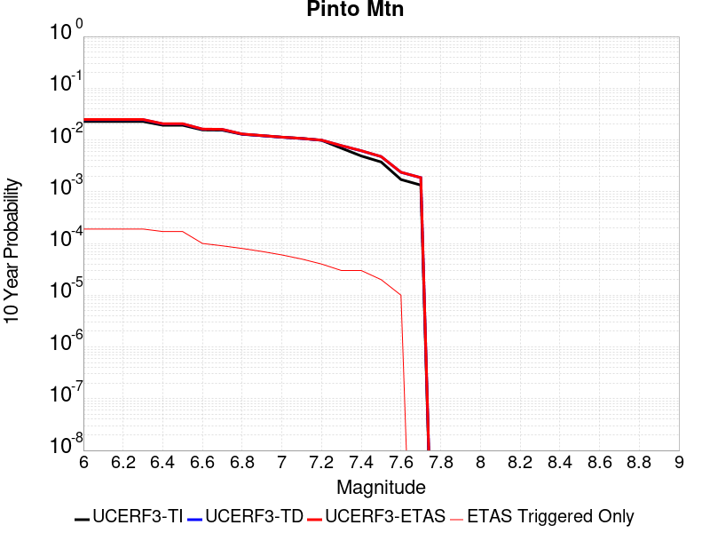 |

| Magnitude | 1 wk TI Prob | 1 wk TD Prob | 1 wk ETAS Prob | 1 wk ETAS/TD Gain | 1 wk ETAS Triggered Only | 1 mo TI Prob | 1 mo TD Prob | 1 mo ETAS Prob | 1 mo ETAS/TD Gain | 1 mo ETAS Triggered Only | 1 yr TI Prob | 1 yr TD Prob | 1 yr ETAS Prob | 1 yr ETAS/TD Gain | 1 yr ETAS Triggered Only | 10 yr TI Prob | 10 yr TD Prob | 10 yr ETAS Prob | 10 yr ETAS/TD Gain | 10 yr ETAS Triggered Only |
|-----|-----|-----|-----|-----|-----|-----|-----|-----|-----|-----|-----|-----|-----|-----|-----|-----|-----|-----|-----|-----|
| 6.0 | 4.4194956E-5 | 4.7853926E-5 | 7.785249E-5 | 1.6268778 | 3.0E-5 | 1.893932E-4 | 2.0507304E-4 | 2.550628E-4 | 1.2437656 | 5.0E-5 | 0.0023034236 | 0.0024940688 | 0.0026137694 | 1.0479941 | 1.2E-4 | 0.022796938 | 0.024678305 | 0.024863616 | 1.0075091 | 1.9E-4 |
| 6.1 | 4.4194956E-5 | 4.7853926E-5 | 7.785249E-5 | 1.6268778 | 3.0E-5 | 1.893932E-4 | 2.0507304E-4 | 2.550628E-4 | 1.2437656 | 5.0E-5 | 0.0023034236 | 0.0024940688 | 0.0026137694 | 1.0479941 | 1.2E-4 | 0.022796938 | 0.024678305 | 0.024863616 | 1.0075091 | 1.9E-4 |
| 6.2 | 4.4194956E-5 | 4.7853926E-5 | 7.785249E-5 | 1.6268778 | 3.0E-5 | 1.893932E-4 | 2.0507304E-4 | 2.550628E-4 | 1.2437656 | 5.0E-5 | 0.0023034236 | 0.0024940688 | 0.0026137694 | 1.0479941 | 1.2E-4 | 0.022796938 | 0.024678305 | 0.024863616 | 1.0075091 | 1.9E-4 |
| 6.3 | 4.4194956E-5 | 4.7853926E-5 | 7.785249E-5 | 1.6268778 | 3.0E-5 | 1.893932E-4 | 2.0507304E-4 | 2.550628E-4 | 1.2437656 | 5.0E-5 | 0.0023034236 | 0.0024940688 | 0.0026137694 | 1.0479941 | 1.2E-4 | 0.022796938 | 0.024678305 | 0.024863616 | 1.0075091 | 1.9E-4 |
| 6.4 | 3.729929E-5 | 3.960349E-5 | 5.96027E-5 | 1.504986 | 2.0E-5 | 1.5984432E-4 | 1.6971873E-4 | 2.0971194E-4 | 1.2356441 | 4.0E-5 | 0.0019443673 | 0.0020644604 | 0.002164254 | 1.0483388 | 1.0E-4 | 0.019274427 | 0.020462848 | 0.020629369 | 1.0081377 | 1.7E-4 |
| 6.5 | 3.729929E-5 | 3.960349E-5 | 5.96027E-5 | 1.504986 | 2.0E-5 | 1.5984432E-4 | 1.6971873E-4 | 2.0971194E-4 | 1.2356441 | 4.0E-5 | 0.0019443673 | 0.0020644604 | 0.002164254 | 1.0483388 | 1.0E-4 | 0.019274427 | 0.020462848 | 0.020629369 | 1.0081377 | 1.7E-4 |
| 6.6 | 3.0204548E-5 | 3.12056E-5 | 4.1205287E-5 | 1.3204453 | 1.0E-5 | 1.2944164E-4 | 1.3373162E-4 | 1.5372895E-4 | 1.1495333 | 2.0E-5 | 0.0015748127 | 0.0016270012 | 0.0016569524 | 1.0184088 | 3.0E-5 | 0.015636992 | 0.016154764 | 0.01625315 | 1.0060902 | 1.0E-4 |
| 6.7 | 2.9857754E-5 | 3.0814987E-5 | 3.0814987E-5 | 1.0 | 0.0 | 1.2795553E-4 | 1.3205773E-4 | 1.4205641E-4 | 1.0757145 | 1.0E-5 | 0.0015567453 | 0.0016066517 | 0.0016266196 | 1.0124283 | 2.0E-5 | 0.015458848 | 0.015954204 | 0.016042769 | 1.0055511 | 9.0E-5 |
| 6.8 | 2.4819734E-5 | 2.5009665E-5 | 2.5009665E-5 | 1.0 | 0.0 | 1.0636595E-4 | 1.0718E-4 | 1.17178926E-4 | 1.093291 | 1.0E-5 | 0.0012942362 | 0.001304157 | 0.0013241309 | 1.0153155 | 2.0E-5 | 0.012867244 | 0.012967403 | 0.013046366 | 1.0060893 | 8.0E-5 |
| 6.9 | 2.331124E-5 | 2.3337945E-5 | 2.3337945E-5 | 1.0 | 0.0 | 9.990149E-5 | 1.0001605E-4 | 1.1001505E-4 | 1.0999739 | 1.0E-5 | 0.001215622 | 0.0012170355 | 0.0012370112 | 1.0164133 | 2.0E-5 | 0.012089936 | 0.012105897 | 0.01217505 | 1.0057123 | 7.0E-5 |
| 7.0 | 2.1818534E-5 | 2.1761074E-5 | 2.1761074E-5 | 1.0 | 0.0 | 9.3504656E-5 | 9.3258524E-5 | 1.0325759E-4 | 1.1072189 | 1.0E-5 | 0.0011378246 | 0.0011348509 | 0.0011548282 | 1.0176035 | 2.0E-5 | 0.011320163 | 0.01129266 | 0.011351981 | 1.0052532 | 6.0E-5 |
| 7.1 | 2.066081E-5 | 2.0540718E-5 | 2.0540718E-5 | 1.0 | 0.0 | 8.854332E-5 | 8.8028784E-5 | 9.802791E-5 | 1.1135892 | 1.0E-5 | 0.0010774818 | 0.0010712431 | 0.0010812324 | 1.0093249 | 1.0E-5 | 0.010722724 | 0.0106628435 | 0.010712311 | 1.0046391 | 5.0E-5 |
| 7.2 | 1.8990233E-5 | 1.9054001E-5 | 1.9054001E-5 | 1.0 | 0.0 | 8.138417E-5 | 8.165756E-5 | 9.1656744E-5 | 1.1224526 | 1.0E-5 | 9.904018E-4 | 9.937467E-4 | 0.0010037367 | 1.0100529 | 1.0E-5 | 0.009859995 | 0.009895029 | 0.009934633 | 1.0040025 | 4.0E-5 |
| 7.3 | 1.3335872E-5 | 1.4906713E-5 | 1.4906713E-5 | 1.0 | 0.0 | 5.7152483E-5 | 6.388442E-5 | 7.388378E-5 | 1.1565228 | 1.0E-5 | 6.956093E-4 | 7.77528E-4 | 7.875202E-4 | 1.0128512 | 1.0E-5 | 0.006934359 | 0.007749376 | 0.0077791433 | 1.0038413 | 3.0E-5 |
| 7.4 | 9.414066E-6 | 1.186096E-5 | 1.186096E-5 | 1.0 | 0.0 | 4.0345374E-5 | 5.083175E-5 | 6.083124E-5 | 1.1967175 | 1.0E-5 | 4.910942E-4 | 6.1871024E-4 | 6.2870403E-4 | 1.0161526 | 1.0E-5 | 0.0049001034 | 0.0061708256 | 0.0062006405 | 1.0048316 | 3.0E-5 |
| 7.5 | 7.2101157E-6 | 9.158192E-6 | 9.158192E-6 | 1.0 | 0.0 | 3.090013E-5 | 3.9248847E-5 | 4.9248454E-5 | 1.2547746 | 1.0E-5 | 3.7614413E-4 | 4.7775774E-4 | 4.87753E-4 | 1.0209211 | 1.0E-5 | 0.0037550807 | 0.004768082 | 0.0047879866 | 1.0041746 | 2.0E-5 |
| 7.6 | 3.296375E-6 | 4.5455017E-6 | 4.5455017E-6 | 1.0 | 0.0 | 1.4127245E-5 | 1.9480583E-5 | 2.9480389E-5 | 1.5133216 | 1.0E-5 | 1.7198564E-4 | 2.3715167E-4 | 2.4714932E-4 | 1.042157 | 1.0E-5 | 0.0017185259 | 0.0023691233 | 0.0023790996 | 1.004211 | 1.0E-5 |
| 7.7 | 2.5741092E-6 | 3.5844084E-6 | 3.5844084E-6 | 1.0 | 0.0 | 1.103185E-5 | 1.5361667E-5 | 1.5361667E-5 | 1.0 | 0.0 | 1.3430449E-4 | 1.8701357E-4 | 1.8701357E-4 | 1.0 | 0.0 | 0.0013422335 | 0.0018686918 | 0.0018686918 | 1.0 | 0.0 |

## Big Pine (Central)
*[(top)](#table-of-contents)*

| 1 Week | 1 Month | 1 Year | 10 Year |
|-----|-----|-----|-----|
|  |  |  |  |

| Magnitude | 1 wk TI Prob | 1 wk TD Prob | 1 wk ETAS Prob | 1 wk ETAS/TD Gain | 1 wk ETAS Triggered Only | 1 mo TI Prob | 1 mo TD Prob | 1 mo ETAS Prob | 1 mo ETAS/TD Gain | 1 mo ETAS Triggered Only | 1 yr TI Prob | 1 yr TD Prob | 1 yr ETAS Prob | 1 yr ETAS/TD Gain | 1 yr ETAS Triggered Only | 10 yr TI Prob | 10 yr TD Prob | 10 yr ETAS Prob | 10 yr ETAS/TD Gain | 10 yr ETAS Triggered Only |
|-----|-----|-----|-----|-----|-----|-----|-----|-----|-----|-----|-----|-----|-----|-----|-----|-----|-----|-----|-----|-----|
| 6.0 | 1.2706755E-5 | 1.4250602E-5 | 3.425032E-5 | 2.4034295 | 2.0E-5 | 5.4456385E-5 | 6.107279E-5 | 9.107096E-5 | 1.4911871 | 3.0E-5 | 6.628048E-4 | 7.433441E-4 | 8.232846E-4 | 1.1075418 | 8.0E-5 | 0.006608314 | 0.007413639 | 0.007582379 | 1.0227607 | 1.7E-4 |
| 6.1 | 8.342579E-6 | 9.510835E-6 | 1.951074E-5 | 2.0514224 | 1.0E-5 | 3.5753423E-5 | 4.076021E-5 | 5.07598E-5 | 1.2453274 | 1.0E-5 | 4.3521097E-4 | 4.9616426E-4 | 5.361444E-4 | 1.0805784 | 4.0E-5 | 0.0043435963 | 0.004954155 | 0.0050536594 | 1.0200851 | 1.0E-4 |
| 6.2 | 6.923899E-6 | 7.967221E-6 | 1.7967142E-5 | 2.2551327 | 1.0E-5 | 2.9673516E-5 | 3.4144894E-5 | 4.4144555E-5 | 1.2928596 | 1.0E-5 | 3.6121515E-4 | 4.1565404E-4 | 4.5563743E-4 | 1.0961939 | 4.0E-5 | 0.003606286 | 0.0041521094 | 0.0042417357 | 1.0215857 | 9.0E-5 |
| 6.3 | 2.728396E-6 | 3.4243646E-6 | 1.342433E-5 | 3.9202397 | 1.0E-5 | 1.1693074E-5 | 1.4675771E-5 | 2.4675624E-5 | 1.6813852 | 1.0E-5 | 1.4235388E-4 | 1.7866373E-4 | 1.8866194E-4 | 1.055961 | 1.0E-5 | 0.0014226272 | 0.0017867433 | 0.0018366539 | 1.0279338 | 5.0E-5 |
| 6.4 | 2.7136944E-6 | 3.4086581E-6 | 1.3408624E-5 | 3.9336958 | 1.0E-5 | 1.1630066E-5 | 1.4608458E-5 | 2.4608311E-5 | 1.6845249 | 1.0E-5 | 1.4158686E-4 | 1.7784433E-4 | 1.8784255E-4 | 1.056219 | 1.0E-5 | 0.0014149669 | 0.0017785623 | 0.0018284734 | 1.0280626 | 5.0E-5 |
| 6.5 | 2.6971882E-6 | 3.3910032E-6 | 1.3390969E-5 | 3.9489698 | 1.0E-5 | 1.1559327E-5 | 1.4532795E-5 | 2.453265E-5 | 1.6880889 | 1.0E-5 | 1.4072572E-4 | 1.7692328E-4 | 1.869215E-4 | 1.0565116 | 1.0E-5 | 0.0014063664 | 0.0017693666 | 0.0018192781 | 1.0282087 | 5.0E-5 |
| 6.6 | 2.669092E-6 | 3.3610236E-6 | 1.336099E-5 | 3.975274 | 1.0E-5 | 1.1438916E-5 | 1.4404312E-5 | 2.4404168E-5 | 1.6942265 | 1.0E-5 | 1.3925991E-4 | 1.7535927E-4 | 1.8535751E-4 | 1.0570158 | 1.0E-5 | 0.0013917267 | 0.0017537511 | 0.0018036634 | 1.0284603 | 5.0E-5 |
| 6.7 | 2.6408059E-6 | 3.3310494E-6 | 1.3331016E-5 | 4.002047 | 1.0E-5 | 1.1317691E-5 | 1.4275853E-5 | 2.4275709E-5 | 1.7004735 | 1.0E-5 | 1.3778417E-4 | 1.737955E-4 | 1.8379377E-4 | 1.0575289 | 1.0E-5 | 0.0013769877 | 0.0017381381 | 0.0017880512 | 1.0287164 | 5.0E-5 |
| 6.8 | 2.1786943E-6 | 2.8545066E-6 | 1.2854478E-5 | 4.5032225 | 1.0E-5 | 9.337228E-6 | 1.2233547E-5 | 2.2233424E-5 | 1.8174144 | 1.0E-5 | 1.1367482E-4 | 1.4893398E-4 | 1.5893248E-4 | 1.0671339 | 1.0E-5 | 0.0011361669 | 0.0014898704 | 0.0015397959 | 1.03351 | 5.0E-5 |
| 6.9 | 1.4411696E-6 | 2.0685677E-6 | 1.2068547E-5 | 5.834253 | 1.0E-5 | 6.1764263E-6 | 8.865261E-6 | 1.8865174E-5 | 2.1279883 | 1.0E-5 | 7.51954E-5 | 1.0792949E-4 | 1.1792841E-4 | 1.0926431 | 1.0E-5 | 7.5169955E-4 | 0.0010802548 | 0.0011202117 | 1.0369883 | 4.0E-5 |
| 7.0 | 1.0073411E-6 | 1.5543274E-6 | 1.1554312E-5 | 7.433641 | 1.0E-5 | 4.317169E-6 | 6.661387E-6 | 1.666132E-5 | 2.501179 | 1.0E-5 | 5.2560266E-5 | 8.109952E-5 | 9.109871E-5 | 1.1232953 | 1.0E-5 | 5.2547833E-4 | 8.1217213E-4 | 8.321559E-4 | 1.0246053 | 2.0E-5 |
| 7.1 | 8.947104E-7 | 1.430316E-6 | 1.1430302E-5 | 7.9914517 | 1.0E-5 | 3.834468E-6 | 6.1299124E-6 | 1.612985E-5 | 2.6313348 | 1.0E-5 | 4.6683643E-5 | 7.462928E-5 | 8.462853E-5 | 1.1339856 | 1.0E-5 | 4.6673836E-4 | 7.4751483E-4 | 7.6749985E-4 | 1.0267353 | 2.0E-5 |
| 7.2 | 5.215166E-7 | 1.0112277E-6 | 1.1011218E-5 | 10.88896 | 1.0E-5 | 2.2350691E-6 | 4.333826E-6 | 1.4333783E-5 | 3.30742 | 1.0E-5 | 2.7211627E-5 | 5.27631E-5 | 6.276257E-5 | 1.1895164 | 1.0E-5 | 2.7208295E-4 | 5.289683E-4 | 5.489577E-4 | 1.0377895 | 2.0E-5 |
| 7.3 | 4.4024807E-7 | 9.220183E-7 | 1.0922009E-5 | 11.845762 | 1.0E-5 | 1.8867761E-6 | 3.951501E-6 | 1.3951461E-5 | 3.530674 | 1.0E-5 | 2.2971257E-5 | 4.8108504E-5 | 5.8108024E-5 | 1.2078534 | 1.0E-5 | 2.2968883E-4 | 4.824433E-4 | 5.024337E-4 | 1.0414356 | 2.0E-5 |
| 7.4 | 3.6130905E-7 | 8.359109E-7 | 1.0835903E-5 | 12.962988 | 1.0E-5 | 1.5484665E-6 | 3.5824705E-6 | 1.3582435E-5 | 3.7913597 | 1.0E-5 | 1.8852415E-5 | 4.3615746E-5 | 5.361531E-5 | 1.229265 | 1.0E-5 | 1.8850817E-4 | 4.3752496E-4 | 4.575162E-4 | 1.0456917 | 2.0E-5 |
| 7.5 | 3.408184E-7 | 8.1087245E-7 | 1.0810864E-5 | 13.332386 | 1.0E-5 | 1.4606494E-6 | 3.475163E-6 | 1.3475128E-5 | 3.8775527 | 1.0E-5 | 1.7783263E-5 | 4.230933E-5 | 5.2308907E-5 | 1.2363445 | 1.0E-5 | 1.778184E-4 | 4.2444657E-4 | 4.4443808E-4 | 1.0471002 | 2.0E-5 |
| 7.6 | 3.1428627E-7 | 7.732167E-7 | 1.0773209E-5 | 13.932975 | 1.0E-5 | 1.3469405E-6 | 3.313782E-6 | 1.3313748E-5 | 4.01769 | 1.0E-5 | 1.6398877E-5 | 4.0344585E-5 | 5.034418E-5 | 1.2478547 | 1.0E-5 | 1.6397667E-4 | 4.0477706E-4 | 4.2476895E-4 | 1.04939 | 2.0E-5 |
| 7.7 | 1.7972785E-7 | 5.0782415E-7 | 1.0507819E-5 | 20.691845 | 1.0E-5 | 7.70262E-7 | 2.1763874E-6 | 1.2176366E-5 | 5.59476 | 1.0E-5 | 9.377899E-6 | 2.6497206E-5 | 3.6496942E-5 | 1.3773882 | 1.0E-5 | 9.377503E-5 | 2.6633305E-4 | 2.7633036E-4 | 1.037537 | 1.0E-5 |
| 7.8 | 4.9230927E-8 | 1.1981747E-7 | 1.0119817E-5 | 84.46027 | 1.0E-5 | 2.1098968E-7 | 5.135033E-7 | 1.0513499E-5 | 20.47406 | 1.0E-5 | 2.5687964E-6 | 6.2518866E-6 | 1.6251824E-5 | 2.599507 | 1.0E-5 | 2.5687666E-5 | 6.2971965E-5 | 7.2971336E-5 | 1.1587908 | 1.0E-5 |
| 7.9 | 3.6805972E-9 | 4.1051638E-9 | 4.1051638E-9 | 1.0 | 0.0 | 1.5773987E-8 | 1.7593557E-8 | 1.7593557E-8 | 1.0 | 0.0 | 1.9204828E-7 | 2.1420155E-7 | 2.1420155E-7 | 1.0 | 0.0 | 1.920481E-6 | 2.1898923E-6 | 2.1898923E-6 | 1.0 | 0.0 |

## Independence rev 2011
*[(top)](#table-of-contents)*

| 1 Week | 1 Month | 1 Year | 10 Year |
|-----|-----|-----|-----|
|  |  |  |  |

| Magnitude | 1 wk TI Prob | 1 wk TD Prob | 1 wk ETAS Prob | 1 wk ETAS/TD Gain | 1 wk ETAS Triggered Only | 1 mo TI Prob | 1 mo TD Prob | 1 mo ETAS Prob | 1 mo ETAS/TD Gain | 1 mo ETAS Triggered Only | 1 yr TI Prob | 1 yr TD Prob | 1 yr ETAS Prob | 1 yr ETAS/TD Gain | 1 yr ETAS Triggered Only | 10 yr TI Prob | 10 yr TD Prob | 10 yr ETAS Prob | 10 yr ETAS/TD Gain | 10 yr ETAS Triggered Only |
|-----|-----|-----|-----|-----|-----|-----|-----|-----|-----|-----|-----|-----|-----|-----|-----|-----|-----|-----|-----|-----|
| 6.0 | 4.422171E-6 | 4.3262253E-6 | 4.432605E-5 | 10.245895 | 4.0E-5 | 1.8952025E-5 | 1.8540852E-5 | 1.08539185E-4 | 5.8540564 | 9.0E-5 | 2.3071647E-4 | 2.2571447E-4 | 3.6568285E-4 | 1.6201127 | 1.4E-4 | 0.0023047708 | 0.0022551457 | 0.002444717 | 1.0840617 | 1.9E-4 |
| 6.1 | 4.422171E-6 | 4.3262253E-6 | 4.432605E-5 | 10.245895 | 4.0E-5 | 1.8952025E-5 | 1.8540852E-5 | 1.08539185E-4 | 5.8540564 | 9.0E-5 | 2.3071647E-4 | 2.2571447E-4 | 3.6568285E-4 | 1.6201127 | 1.4E-4 | 0.0023047708 | 0.0022551457 | 0.002444717 | 1.0840617 | 1.9E-4 |
| 6.2 | 4.422171E-6 | 4.3262253E-6 | 4.432605E-5 | 10.245895 | 4.0E-5 | 1.8952025E-5 | 1.8540852E-5 | 1.08539185E-4 | 5.8540564 | 9.0E-5 | 2.3071647E-4 | 2.2571447E-4 | 3.6568285E-4 | 1.6201127 | 1.4E-4 | 0.0023047708 | 0.0022551457 | 0.002444717 | 1.0840617 | 1.9E-4 |
| 6.3 | 4.422171E-6 | 4.3262253E-6 | 4.432605E-5 | 10.245895 | 4.0E-5 | 1.8952025E-5 | 1.8540852E-5 | 1.08539185E-4 | 5.8540564 | 9.0E-5 | 2.3071647E-4 | 2.2571447E-4 | 3.6568285E-4 | 1.6201127 | 1.4E-4 | 0.0023047708 | 0.0022551457 | 0.002444717 | 1.0840617 | 1.9E-4 |
| 6.4 | 4.422171E-6 | 4.3262253E-6 | 4.432605E-5 | 10.245895 | 4.0E-5 | 1.8952025E-5 | 1.8540852E-5 | 1.08539185E-4 | 5.8540564 | 9.0E-5 | 2.3071647E-4 | 2.2571447E-4 | 3.6568285E-4 | 1.6201127 | 1.4E-4 | 0.0023047708 | 0.0022551457 | 0.002444717 | 1.0840617 | 1.9E-4 |
| 6.5 | 4.422171E-6 | 4.3262253E-6 | 4.432605E-5 | 10.245895 | 4.0E-5 | 1.8952025E-5 | 1.8540852E-5 | 1.08539185E-4 | 5.8540564 | 9.0E-5 | 2.3071647E-4 | 2.2571447E-4 | 3.6568285E-4 | 1.6201127 | 1.4E-4 | 0.0023047708 | 0.0022551457 | 0.002444717 | 1.0840617 | 1.9E-4 |
| 6.6 | 2.663744E-6 | 2.5319846E-6 | 4.2531883E-5 | 16.797844 | 4.0E-5 | 1.1415996E-5 | 1.08513195E-5 | 1.00850346E-4 | 9.293832 | 9.0E-5 | 1.3898089E-4 | 1.321073E-4 | 2.6209012E-4 | 1.9839185 | 1.3E-4 | 0.0013889399 | 0.0013203359 | 0.0014901115 | 1.1285851 | 1.7E-4 |
| 6.7 | 2.663744E-6 | 2.5319846E-6 | 4.2531883E-5 | 16.797844 | 4.0E-5 | 1.1415996E-5 | 1.08513195E-5 | 1.00850346E-4 | 9.293832 | 9.0E-5 | 1.3898089E-4 | 1.321073E-4 | 2.6209012E-4 | 1.9839185 | 1.3E-4 | 0.0013889399 | 0.0013203359 | 0.0014901115 | 1.1285851 | 1.7E-4 |
| 6.8 | 1.9716529E-6 | 1.8322567E-6 | 3.18322E-5 | 17.373222 | 3.0E-5 | 8.449913E-6 | 7.852505E-6 | 8.785188E-5 | 11.187751 | 8.0E-5 | 1.0287284E-4 | 9.560019E-5 | 2.0558968E-4 | 2.1505153 | 1.1E-4 | 0.0010282523 | 9.5560355E-4 | 0.0011054602 | 1.1568189 | 1.5E-4 |
| 6.9 | 1.8788617E-6 | 1.7429976E-6 | 3.1742944E-5 | 18.211699 | 3.0E-5 | 8.0522395E-6 | 7.4699688E-6 | 8.746937E-5 | 11.70947 | 8.0E-5 | 9.80316E-5 | 9.09432E-5 | 2.009332E-4 | 2.2094362 | 1.1E-4 | 9.798837E-4 | 9.090718E-4 | 0.0010589354 | 1.1648535 | 1.5E-4 |
| 7.0 | 1.5045488E-6 | 1.3849498E-6 | 3.138491E-5 | 22.661406 | 3.0E-5 | 6.44805E-6 | 5.9354857E-6 | 8.593501E-5 | 14.478177 | 8.0E-5 | 7.8502184E-5 | 7.226219E-5 | 1.8225424E-4 | 2.5221245 | 1.1E-4 | 7.8474457E-4 | 7.223921E-4 | 8.722837E-4 | 1.2074934 | 1.5E-4 |
| 7.1 | 1.272341E-6 | 1.1625089E-6 | 2.1162487E-5 | 18.20415 | 2.0E-5 | 5.4528787E-6 | 4.9821715E-6 | 7.498182E-5 | 15.050029 | 7.0E-5 | 6.6386776E-5 | 6.0656283E-5 | 1.6065022E-4 | 2.6485338 | 1.0E-4 | 6.636695E-4 | 6.064005E-4 | 7.463156E-4 | 1.2307305 | 1.4E-4 |
| 7.2 | 1.0416892E-6 | 9.409871E-7 | 2.0940968E-5 | 22.254257 | 2.0E-5 | 4.464375E-6 | 4.032796E-6 | 6.403255E-5 | 15.877956 | 6.0E-5 | 5.4352407E-5 | 4.9098202E-5 | 1.3909378E-4 | 2.832971 | 9.0E-5 | 5.4339116E-4 | 4.908754E-4 | 6.1081647E-4 | 1.2443413 | 1.2E-4 |
| 7.3 | 7.9450155E-7 | 7.2350036E-7 | 2.0723486E-5 | 28.643366 | 2.0E-5 | 3.4050022E-6 | 3.1007123E-6 | 6.3100524E-5 | 20.350332 | 6.0E-5 | 4.1455114E-5 | 3.7750528E-5 | 1.2774713E-4 | 3.3839827 | 9.0E-5 | 4.144738E-4 | 3.7744228E-4 | 4.8740074E-4 | 1.2913253 | 1.1E-4 |
| 7.4 | 5.3893444E-7 | 5.0195166E-7 | 2.0501942E-5 | 40.844456 | 2.0E-5 | 2.309717E-6 | 2.1512196E-6 | 6.215109E-5 | 28.891096 | 6.0E-5 | 2.8120441E-5 | 2.6190788E-5 | 1.1618843E-4 | 4.4362326 | 9.0E-5 | 2.8116882E-4 | 2.6187746E-4 | 3.7184867E-4 | 1.4199338 | 1.1E-4 |
| 7.5 | 3.8852085E-7 | 3.6825622E-7 | 2.0368248E-5 | 55.30999 | 2.0E-5 | 1.6650882E-6 | 1.57824E-6 | 6.157815E-5 | 39.01697 | 6.0E-5 | 2.027226E-5 | 1.9214905E-5 | 1.0921318E-4 | 5.683774 | 9.0E-5 | 2.0270412E-4 | 1.9213265E-4 | 3.0211153E-4 | 1.5724111 | 1.1E-4 |
| 7.6 | 2.414929E-7 | 2.3457605E-7 | 1.0234574E-5 | 43.63009 | 1.0E-5 | 1.0349692E-6 | 1.0053255E-6 | 3.1005296E-5 | 30.84105 | 3.0E-5 | 1.2600677E-5 | 1.2239771E-5 | 6.223916E-5 | 5.084994 | 5.0E-5 | 1.2599962E-4 | 1.223911E-4 | 1.9238252E-4 | 1.5718671 | 7.0E-5 |
| 7.7 | 6.8298014E-8 | 6.8589785E-8 | 6.8589785E-8 | 1.0 | 0.0 | 2.9270575E-7 | 2.939562E-7 | 2.939562E-7 | 1.0 | 0.0 | 3.5636867E-6 | 3.5789112E-6 | 3.5789112E-6 | 1.0 | 0.0 | 3.5636294E-5 | 3.5788584E-5 | 4.5788227E-5 | 1.2794087 | 1.0E-5 |

## San Jacinto (Lytle Creek connector)
*[(top)](#table-of-contents)*

| 1 Week | 1 Month | 1 Year | 10 Year |
|-----|-----|-----|-----|
|  |  |  |  |

| Magnitude | 1 wk TI Prob | 1 wk TD Prob | 1 wk ETAS Prob | 1 wk ETAS/TD Gain | 1 wk ETAS Triggered Only | 1 mo TI Prob | 1 mo TD Prob | 1 mo ETAS Prob | 1 mo ETAS/TD Gain | 1 mo ETAS Triggered Only | 1 yr TI Prob | 1 yr TD Prob | 1 yr ETAS Prob | 1 yr ETAS/TD Gain | 1 yr ETAS Triggered Only | 10 yr TI Prob | 10 yr TD Prob | 10 yr ETAS Prob | 10 yr ETAS/TD Gain | 10 yr ETAS Triggered Only |
|-----|-----|-----|-----|-----|-----|-----|-----|-----|-----|-----|-----|-----|-----|-----|-----|-----|-----|-----|-----|-----|
| 6.0 | 6.693995E-6 | 6.660123E-6 | 7.665966E-5 | 11.510246 | 7.0E-5 | 2.8688235E-5 | 2.8543072E-5 | 1.08540786E-4 | 3.8027017 | 8.0E-5 | 3.492233E-4 | 3.4745657E-4 | 4.6741488E-4 | 1.3452469 | 1.2E-4 | 0.00348675 | 0.0035491167 | 0.0037284777 | 1.0505369 | 1.8E-4 |
| 6.1 | 6.693995E-6 | 6.660123E-6 | 7.665966E-5 | 11.510246 | 7.0E-5 | 2.8688235E-5 | 2.8543072E-5 | 1.08540786E-4 | 3.8027017 | 8.0E-5 | 3.492233E-4 | 3.4745657E-4 | 4.6741488E-4 | 1.3452469 | 1.2E-4 | 0.00348675 | 0.0035491167 | 0.0037284777 | 1.0505369 | 1.8E-4 |
| 6.2 | 6.693995E-6 | 6.660123E-6 | 7.665966E-5 | 11.510246 | 7.0E-5 | 2.8688235E-5 | 2.8543072E-5 | 1.08540786E-4 | 3.8027017 | 8.0E-5 | 3.492233E-4 | 3.4745657E-4 | 4.6741488E-4 | 1.3452469 | 1.2E-4 | 0.00348675 | 0.0035491167 | 0.0037284777 | 1.0505369 | 1.8E-4 |
| 6.3 | 6.693995E-6 | 6.660123E-6 | 7.665966E-5 | 11.510246 | 7.0E-5 | 2.8688235E-5 | 2.8543072E-5 | 1.08540786E-4 | 3.8027017 | 8.0E-5 | 3.492233E-4 | 3.4745657E-4 | 4.6741488E-4 | 1.3452469 | 1.2E-4 | 0.00348675 | 0.0035491167 | 0.0037284777 | 1.0505369 | 1.8E-4 |
| 6.4 | 6.693995E-6 | 6.660123E-6 | 7.665966E-5 | 11.510246 | 7.0E-5 | 2.8688235E-5 | 2.8543072E-5 | 1.08540786E-4 | 3.8027017 | 8.0E-5 | 3.492233E-4 | 3.4745657E-4 | 4.6741488E-4 | 1.3452469 | 1.2E-4 | 0.00348675 | 0.0035491167 | 0.0037284777 | 1.0505369 | 1.8E-4 |
| 6.5 | 6.6561875E-6 | 6.620341E-6 | 7.661988E-5 | 11.573403 | 7.0E-5 | 2.8526205E-5 | 2.8372582E-5 | 1.0837031E-4 | 3.8195436 | 8.0E-5 | 3.472512E-4 | 3.453815E-4 | 4.6534007E-4 | 1.3473219 | 1.2E-4 | 0.0034670907 | 0.0035284322 | 0.003707797 | 1.0508342 | 1.8E-4 |
| 6.6 | 6.6561875E-6 | 6.620341E-6 | 7.661988E-5 | 11.573403 | 7.0E-5 | 2.8526205E-5 | 2.8372582E-5 | 1.0837031E-4 | 3.8195436 | 8.0E-5 | 3.472512E-4 | 3.453815E-4 | 4.6534007E-4 | 1.3473219 | 1.2E-4 | 0.0034670907 | 0.0035284322 | 0.003707797 | 1.0508342 | 1.8E-4 |
| 6.7 | 6.5802237E-6 | 6.539518E-6 | 7.653906E-5 | 11.704083 | 7.0E-5 | 2.8200653E-5 | 2.8026205E-5 | 1.0802396E-4 | 3.8543916 | 8.0E-5 | 3.4328885E-4 | 3.4116567E-4 | 4.6112473E-4 | 1.3516153 | 1.2E-4 | 0.0034275902 | 0.0034864065 | 0.003665779 | 1.0514491 | 1.8E-4 |
| 6.8 | 6.575632E-6 | 6.5340073E-6 | 7.653355E-5 | 11.71311 | 7.0E-5 | 2.8180975E-5 | 2.8002589E-5 | 1.0800035E-4 | 3.8567986 | 8.0E-5 | 3.4304935E-4 | 3.4087826E-4 | 4.6083736E-4 | 1.3519119 | 1.2E-4 | 0.0034252026 | 0.0034835413 | 0.0036629143 | 1.0514915 | 1.8E-4 |
| 6.9 | 6.570433E-6 | 6.525401E-6 | 7.652494E-5 | 11.72724 | 7.0E-5 | 2.8158694E-5 | 2.7965707E-5 | 1.0796347E-4 | 3.8605664 | 8.0E-5 | 3.4277816E-4 | 3.4042934E-4 | 4.603885E-4 | 1.352376 | 1.2E-4 | 0.0034224992 | 0.0034790665 | 0.0036584402 | 1.051558 | 1.8E-4 |
| 7.0 | 6.5643826E-6 | 6.5155223E-6 | 7.651507E-5 | 11.743505 | 7.0E-5 | 2.8132765E-5 | 2.7923368E-5 | 1.07921136E-4 | 3.864904 | 8.0E-5 | 3.424626E-4 | 3.3991406E-4 | 4.5987326E-4 | 1.3529104 | 1.2E-4 | 0.0034193532 | 0.0034739296 | 0.0036533044 | 1.0516346 | 1.8E-4 |
| 7.1 | 6.557402E-6 | 6.504234E-6 | 7.650378E-5 | 11.762151 | 7.0E-5 | 2.8102848E-5 | 2.7874992E-5 | 1.0787276E-4 | 3.8698761 | 8.0E-5 | 3.4209844E-4 | 3.3932526E-4 | 4.5928452E-4 | 1.353523 | 1.2E-4 | 0.0034157229 | 0.0034680606 | 0.0036474364 | 1.0517222 | 1.8E-4 |
| 7.2 | 6.546394E-6 | 6.4862006E-6 | 7.648575E-5 | 11.792072 | 7.0E-5 | 2.8055672E-5 | 2.7797707E-5 | 1.0779548E-4 | 3.8778553 | 8.0E-5 | 3.4152428E-4 | 3.383846E-4 | 4.5834397E-4 | 1.3545061 | 1.2E-4 | 0.0034099987 | 0.0034586883 | 0.0036380657 | 1.0518628 | 1.8E-4 |
| 7.3 | 6.5364216E-6 | 6.4669857E-6 | 7.646653E-5 | 11.824139 | 7.0E-5 | 2.8012933E-5 | 2.771536E-5 | 1.0771314E-4 | 3.8864062 | 8.0E-5 | 3.4100408E-4 | 3.373823E-4 | 4.5734184E-4 | 1.3555596 | 1.2E-4 | 0.003404813 | 0.0034487103 | 0.0036280896 | 1.0520134 | 1.8E-4 |
| 7.4 | 6.5269523E-6 | 6.4480723E-6 | 7.644762E-5 | 11.855887 | 7.0E-5 | 2.7972354E-5 | 2.7634303E-5 | 1.0763209E-4 | 3.8948727 | 8.0E-5 | 3.4051016E-4 | 3.3639578E-4 | 4.563554E-4 | 1.3566027 | 1.2E-4 | 0.0033998888 | 0.0034388923 | 0.0036182732 | 1.0521624 | 1.8E-4 |
| 7.5 | 6.5111835E-6 | 6.424346E-6 | 7.6423894E-5 | 11.895981 | 7.0E-5 | 2.7904773E-5 | 2.753262E-5 | 1.0753042E-4 | 3.9055643 | 8.0E-5 | 3.3968766E-4 | 3.3515817E-4 | 4.5511796E-4 | 1.3579199 | 1.2E-4 | 0.0033916887 | 0.0034265644 | 0.0036059476 | 1.0523508 | 1.8E-4 |
| 7.6 | 6.4768806E-6 | 6.383454E-6 | 7.638301E-5 | 11.965779 | 7.0E-5 | 2.7757764E-5 | 2.7357375E-5 | 1.0735518E-4 | 3.9241772 | 8.0E-5 | 3.3789838E-4 | 3.330252E-4 | 4.5298523E-4 | 1.360213 | 1.2E-4 | 0.0033738504 | 0.0034052972 | 0.003584684 | 1.0526788 | 1.8E-4 |
| 7.7 | 6.1655364E-6 | 6.1759456E-6 | 7.6175515E-5 | 12.334227 | 7.0E-5 | 2.642346E-5 | 2.646807E-5 | 1.0646595E-4 | 4.02243 | 8.0E-5 | 3.2165812E-4 | 3.2220117E-4 | 4.421625E-4 | 1.3723181 | 1.2E-4 | 0.0032119295 | 0.0032969362 | 0.003476343 | 1.0544162 | 1.8E-4 |
| 7.8 | 5.5043524E-6 | 5.7370175E-6 | 7.5736614E-5 | 13.201391 | 7.0E-5 | 2.3589868E-5 | 2.4586987E-5 | 1.0458502E-4 | 4.2536736 | 8.0E-5 | 2.871688E-4 | 2.993055E-4 | 4.1926958E-4 | 1.4008081 | 1.2E-4 | 0.0028679797 | 0.0030670585 | 0.0032465064 | 1.0585082 | 1.8E-4 |
| 7.9 | 3.889249E-6 | 4.0766436E-6 | 5.407644E-5 | 13.264941 | 5.0E-5 | 1.6668104E-5 | 1.7471213E-5 | 7.747016E-5 | 4.4341607 | 6.0E-5 | 2.0291525E-4 | 2.126913E-4 | 3.0267215E-4 | 1.4230585 | 9.0E-5 | 0.0020273007 | 0.0021941073 | 0.0023437783 | 1.0682149 | 1.5E-4 |
| 8.0 | 2.668535E-6 | 2.5313454E-6 | 3.253127E-5 | 12.851376 | 3.0E-5 | 1.1436528E-5 | 1.0848577E-5 | 4.0848252E-5 | 3.7653093 | 3.0E-5 | 1.3923083E-4 | 1.3207346E-4 | 1.8206685E-4 | 1.3785272 | 5.0E-5 | 0.0013914363 | 0.0013755665 | 0.0014554565 | 1.0580778 | 8.0E-5 |
| 8.1 | 1.5911459E-6 | 1.2185134E-6 | 1.2185134E-6 | 1.0 | 0.0 | 6.8191785E-6 | 5.2221894E-6 | 5.2221894E-6 | 1.0 | 0.0 | 8.3020335E-5 | 6.357832E-5 | 7.357769E-5 | 1.1572763 | 1.0E-5 | 8.298933E-4 | 6.6911156E-4 | 6.9909147E-4 | 1.0448055 | 3.0E-5 |
| 8.2 | 6.1294963E-7 | 2.1802066E-7 | 2.1802066E-7 | 1.0 | 0.0 | 2.6269242E-6 | 9.3437393E-7 | 9.3437393E-7 | 1.0 | 0.0 | 3.1982334E-5 | 1.1375943E-5 | 1.1375943E-5 | 1.0 | 0.0 | 3.1977732E-4 | 1.2778955E-4 | 1.2778955E-4 | 1.0 | 0.0 |
| 8.3 | 1.762871E-7 | 4.7516316E-8 | 4.7516316E-8 | 1.0 | 0.0 | 7.5551594E-7 | 2.0364133E-7 | 2.0364133E-7 | 1.0 | 0.0 | 9.1983675E-6 | 2.4793305E-6 | 2.4793305E-6 | 1.0 | 0.0 | 9.197987E-5 | 2.8671833E-5 | 2.8671833E-5 | 1.0 | 0.0 |

## Deep Springs
*[(top)](#table-of-contents)*

| 1 Week | 1 Month | 1 Year | 10 Year |
|-----|-----|-----|-----|
|  |  |  |  |

| Magnitude | 1 wk TI Prob | 1 wk TD Prob | 1 wk ETAS Prob | 1 wk ETAS/TD Gain | 1 wk ETAS Triggered Only | 1 mo TI Prob | 1 mo TD Prob | 1 mo ETAS Prob | 1 mo ETAS/TD Gain | 1 mo ETAS Triggered Only | 1 yr TI Prob | 1 yr TD Prob | 1 yr ETAS Prob | 1 yr ETAS/TD Gain | 1 yr ETAS Triggered Only | 10 yr TI Prob | 10 yr TD Prob | 10 yr ETAS Prob | 10 yr ETAS/TD Gain | 10 yr ETAS Triggered Only |
|-----|-----|-----|-----|-----|-----|-----|-----|-----|-----|-----|-----|-----|-----|-----|-----|-----|-----|-----|-----|-----|
| 6.0 | 1.9810619E-5 | 2.311252E-5 | 5.3111828E-5 | 2.297968 | 3.0E-5 | 8.489989E-5 | 9.9052755E-5 | 1.6904583E-4 | 1.7066242 | 7.0E-5 | 0.001033166 | 0.0012058078 | 0.0012956993 | 1.0745487 | 9.0E-5 | 0.010283757 | 0.01204243 | 0.012210383 | 1.0139468 | 1.7E-4 |
| 6.1 | 1.9810619E-5 | 2.311252E-5 | 5.3111828E-5 | 2.297968 | 3.0E-5 | 8.489989E-5 | 9.9052755E-5 | 1.6904583E-4 | 1.7066242 | 7.0E-5 | 0.001033166 | 0.0012058078 | 0.0012956993 | 1.0745487 | 9.0E-5 | 0.010283757 | 0.01204243 | 0.012210383 | 1.0139468 | 1.7E-4 |
| 6.2 | 1.9810619E-5 | 2.311252E-5 | 5.3111828E-5 | 2.297968 | 3.0E-5 | 8.489989E-5 | 9.9052755E-5 | 1.6904583E-4 | 1.7066242 | 7.0E-5 | 0.001033166 | 0.0012058078 | 0.0012956993 | 1.0745487 | 9.0E-5 | 0.010283757 | 0.01204243 | 0.012210383 | 1.0139468 | 1.7E-4 |
| 6.3 | 1.9810619E-5 | 2.311252E-5 | 5.3111828E-5 | 2.297968 | 3.0E-5 | 8.489989E-5 | 9.9052755E-5 | 1.6904583E-4 | 1.7066242 | 7.0E-5 | 0.001033166 | 0.0012058078 | 0.0012956993 | 1.0745487 | 9.0E-5 | 0.010283757 | 0.01204243 | 0.012210383 | 1.0139468 | 1.7E-4 |
| 6.4 | 1.9810619E-5 | 2.311252E-5 | 5.3111828E-5 | 2.297968 | 3.0E-5 | 8.489989E-5 | 9.9052755E-5 | 1.6904583E-4 | 1.7066242 | 7.0E-5 | 0.001033166 | 0.0012058078 | 0.0012956993 | 1.0745487 | 9.0E-5 | 0.010283757 | 0.01204243 | 0.012210383 | 1.0139468 | 1.7E-4 |
| 6.5 | 1.7190405E-5 | 2.0050558E-5 | 5.0049955E-5 | 2.4961877 | 3.0E-5 | 7.367108E-5 | 8.593096E-5 | 1.5592495E-4 | 1.8145374 | 7.0E-5 | 8.9657627E-4 | 0.0010462092 | 0.001136115 | 1.0859349 | 9.0E-5 | 0.008929676 | 0.010462061 | 0.010630283 | 1.0160792 | 1.7E-4 |
| 6.6 | 1.7190405E-5 | 2.0050558E-5 | 5.0049955E-5 | 2.4961877 | 3.0E-5 | 7.367108E-5 | 8.593096E-5 | 1.5592495E-4 | 1.8145374 | 7.0E-5 | 8.9657627E-4 | 0.0010462092 | 0.001136115 | 1.0859349 | 9.0E-5 | 0.008929676 | 0.010462061 | 0.010630283 | 1.0160792 | 1.7E-4 |

## Elysian Park (Upper)
*[(top)](#table-of-contents)*

| 1 Week | 1 Month | 1 Year | 10 Year |
|-----|-----|-----|-----|
|  |  |  |  |

| Magnitude | 1 wk TI Prob | 1 wk TD Prob | 1 wk ETAS Prob | 1 wk ETAS/TD Gain | 1 wk ETAS Triggered Only | 1 mo TI Prob | 1 mo TD Prob | 1 mo ETAS Prob | 1 mo ETAS/TD Gain | 1 mo ETAS Triggered Only | 1 yr TI Prob | 1 yr TD Prob | 1 yr ETAS Prob | 1 yr ETAS/TD Gain | 1 yr ETAS Triggered Only | 10 yr TI Prob | 10 yr TD Prob | 10 yr ETAS Prob | 10 yr ETAS/TD Gain | 10 yr ETAS Triggered Only |
|-----|-----|-----|-----|-----|-----|-----|-----|-----|-----|-----|-----|-----|-----|-----|-----|-----|-----|-----|-----|-----|
| 6.0 | 3.1876025E-5 | 3.7035275E-5 | 8.7033426E-5 | 2.3500142 | 5.0E-5 | 1.3660437E-4 | 1.5871569E-4 | 2.1870616E-4 | 1.3779745 | 6.0E-5 | 0.0016618895 | 0.001931122 | 0.0020009868 | 1.0361784 | 7.0E-5 | 0.016495159 | 0.019189863 | 0.019346792 | 1.0081778 | 1.6E-4 |
| 6.1 | 3.1876025E-5 | 3.7035275E-5 | 8.7033426E-5 | 2.3500142 | 5.0E-5 | 1.3660437E-4 | 1.5871569E-4 | 2.1870616E-4 | 1.3779745 | 6.0E-5 | 0.0016618895 | 0.001931122 | 0.0020009868 | 1.0361784 | 7.0E-5 | 0.016495159 | 0.019189863 | 0.019346792 | 1.0081778 | 1.6E-4 |
| 6.2 | 3.1876025E-5 | 3.7035275E-5 | 8.7033426E-5 | 2.3500142 | 5.0E-5 | 1.3660437E-4 | 1.5871569E-4 | 2.1870616E-4 | 1.3779745 | 6.0E-5 | 0.0016618895 | 0.001931122 | 0.0020009868 | 1.0361784 | 7.0E-5 | 0.016495159 | 0.019189863 | 0.019346792 | 1.0081778 | 1.6E-4 |
| 6.3 | 3.1876025E-5 | 3.7035275E-5 | 8.7033426E-5 | 2.3500142 | 5.0E-5 | 1.3660437E-4 | 1.5871569E-4 | 2.1870616E-4 | 1.3779745 | 6.0E-5 | 0.0016618895 | 0.001931122 | 0.0020009868 | 1.0361784 | 7.0E-5 | 0.016495159 | 0.019189863 | 0.019346792 | 1.0081778 | 1.6E-4 |
| 6.4 | 1.9273462E-5 | 2.120244E-5 | 6.1201594E-5 | 2.8865352 | 4.0E-5 | 8.259794E-5 | 9.086542E-5 | 1.3086178E-4 | 1.4401715 | 4.0E-5 | 0.001005166 | 0.0011058967 | 0.0011458525 | 1.0361297 | 4.0E-5 | 0.010006315 | 0.011020744 | 0.011129532 | 1.0098711 | 1.1E-4 |
| 6.5 | 1.9273462E-5 | 2.120244E-5 | 6.1201594E-5 | 2.8865352 | 4.0E-5 | 8.259794E-5 | 9.086542E-5 | 1.3086178E-4 | 1.4401715 | 4.0E-5 | 0.001005166 | 0.0011058967 | 0.0011458525 | 1.0361297 | 4.0E-5 | 0.010006315 | 0.011020744 | 0.011129532 | 1.0098711 | 1.1E-4 |
| 6.6 | 9.813258E-6 | 9.665589E-6 | 1.9665491E-5 | 2.034588 | 1.0E-5 | 4.205614E-5 | 4.1423333E-5 | 5.1422918E-5 | 1.2413999 | 1.0E-5 | 5.119132E-4 | 5.042196E-4 | 5.1421457E-4 | 1.0198226 | 1.0E-5 | 0.005107356 | 0.0050314795 | 0.005081228 | 1.0098875 | 5.0E-5 |
| 6.7 | 9.801478E-6 | 9.653158E-6 | 1.9653062E-5 | 2.0359204 | 1.0E-5 | 4.2005657E-5 | 4.137006E-5 | 5.1369647E-5 | 1.2417107 | 1.0E-5 | 5.112989E-4 | 5.0357135E-4 | 5.135663E-4 | 1.0198481 | 1.0E-5 | 0.0051012407 | 0.005025026 | 0.005074775 | 1.0099002 | 5.0E-5 |
| 6.8 | 8.102489E-6 | 7.772994E-6 | 1.7772916E-5 | 2.2864957 | 1.0E-5 | 3.4724493E-5 | 3.3312434E-5 | 4.3312102E-5 | 1.3001782 | 1.0E-5 | 4.2268867E-4 | 4.0550836E-4 | 4.1550433E-4 | 1.0246505 | 1.0E-5 | 0.004218856 | 0.0040481784 | 0.004088016 | 1.009841 | 4.0E-5 |
| 6.9 | 6.08275E-6 | 5.481441E-6 | 1.5481386E-5 | 2.8243277 | 1.0E-5 | 2.6068668E-5 | 2.3491682E-5 | 3.3491448E-5 | 1.4256725 | 1.0E-5 | 3.173398E-4 | 2.8597447E-4 | 2.959716E-4 | 1.0349581 | 1.0E-5 | 0.0031688702 | 0.0028561424 | 0.0028860567 | 1.0104737 | 3.0E-5 |
| 7.0 | 5.5995934E-6 | 4.9827686E-6 | 1.4982719E-5 | 3.0069063 | 1.0E-5 | 2.3998036E-5 | 2.1354552E-5 | 3.135434E-5 | 1.4682742 | 1.0E-5 | 2.9213692E-4 | 2.5996132E-4 | 2.6995872E-4 | 1.0384573 | 1.0E-5 | 0.0029175316 | 0.0025966396 | 0.0026165876 | 1.0076822 | 2.0E-5 |
| 7.1 | 4.709881E-6 | 4.0873906E-6 | 1.408735E-5 | 3.4465387 | 1.0E-5 | 2.0185047E-5 | 1.7517272E-5 | 2.7517097E-5 | 1.5708551 | 1.0E-5 | 2.4572524E-4 | 2.1325232E-4 | 2.232502E-4 | 1.0468827 | 1.0E-5 | 0.002454537 | 0.0021305184 | 0.002140497 | 1.0046837 | 1.0E-5 |
| 7.2 | 3.6063436E-6 | 2.9779412E-6 | 1.2977912E-5 | 4.3580146 | 1.0E-5 | 1.5455667E-5 | 1.27625435E-5 | 2.2762415E-5 | 1.7835329 | 1.0E-5 | 1.881565E-4 | 1.55373E-4 | 1.6537144E-4 | 1.0643512 | 1.0E-5 | 0.0018799726 | 0.0015526549 | 0.0015626394 | 1.0064306 | 1.0E-5 |
| 7.3 | 2.471135E-6 | 2.0954562E-6 | 1.20954355E-5 | 5.77222 | 1.0E-5 | 1.0590536E-5 | 8.980496E-6 | 1.8980407E-5 | 2.1135142 | 1.0E-5 | 1.2893214E-4 | 1.0933213E-4 | 1.1933104E-4 | 1.0914544 | 1.0E-5 | 0.0012885736 | 0.0010927906 | 0.0011027798 | 1.0091408 | 1.0E-5 |
| 7.4 | 1.163943E-6 | 1.0275061E-6 | 1.1027496E-5 | 10.732292 | 1.0E-5 | 4.988318E-6 | 4.40359E-6 | 1.4403546E-5 | 3.2708642 | 1.0E-5 | 6.0731076E-5 | 5.361242E-5 | 6.3611886E-5 | 1.1865139 | 1.0E-5 | 6.071448E-4 | 5.3599785E-4 | 5.459925E-4 | 1.0186468 | 1.0E-5 |
| 7.5 | 4.99459E-7 | 4.917601E-7 | 1.0491755E-5 | 21.33511 | 1.0E-5 | 2.140537E-6 | 2.1075416E-6 | 1.2107521E-5 | 5.744855 | 1.0E-5 | 2.6060725E-5 | 2.5659032E-5 | 3.5658777E-5 | 1.3897163 | 1.0E-5 | 2.605767E-4 | 2.5656226E-4 | 2.665597E-4 | 1.0389669 | 1.0E-5 |
| 7.6 | 2.4667852E-7 | 2.4778313E-7 | 1.0247781E-5 | 41.35786 | 1.0E-5 | 1.0571932E-6 | 1.0619274E-6 | 1.1061917E-5 | 10.41683 | 1.0E-5 | 1.2871251E-5 | 1.2928893E-5 | 2.2928763E-5 | 1.7734514 | 1.0E-5 | 1.2870505E-4 | 1.2928178E-4 | 1.3928048E-4 | 1.0773405 | 1.0E-5 |
| 7.7 | 8.2312795E-8 | 7.3864214E-8 | 7.3864214E-8 | 1.0 | 0.0 | 3.527691E-7 | 3.165609E-7 | 3.165609E-7 | 1.0 | 0.0 | 4.294955E-6 | 3.854123E-6 | 3.854123E-6 | 1.0 | 0.0 | 4.2948723E-5 | 3.854068E-5 | 3.854068E-5 | 1.0 | 0.0 |
| 7.8 | 2.7819295E-8 | 1.7565618E-8 | 1.7565618E-8 | 1.0 | 0.0 | 1.1922555E-7 | 7.528122E-8 | 7.528122E-8 | 1.0 | 0.0 | 1.45157E-6 | 9.1654863E-7 | 9.1654863E-7 | 1.0 | 0.0 | 1.45156055E-5 | 9.165463E-6 | 9.165463E-6 | 1.0 | 0.0 |

## Chino alt 1
*[(top)](#table-of-contents)*

| 1 Week | 1 Month | 1 Year | 10 Year |
|-----|-----|-----|-----|
|  |  |  |  |

| Magnitude | 1 wk TI Prob | 1 wk TD Prob | 1 wk ETAS Prob | 1 wk ETAS/TD Gain | 1 wk ETAS Triggered Only | 1 mo TI Prob | 1 mo TD Prob | 1 mo ETAS Prob | 1 mo ETAS/TD Gain | 1 mo ETAS Triggered Only | 1 yr TI Prob | 1 yr TD Prob | 1 yr ETAS Prob | 1 yr ETAS/TD Gain | 1 yr ETAS Triggered Only | 10 yr TI Prob | 10 yr TD Prob | 10 yr ETAS Prob | 10 yr ETAS/TD Gain | 10 yr ETAS Triggered Only |
|-----|-----|-----|-----|-----|-----|-----|-----|-----|-----|-----|-----|-----|-----|-----|-----|-----|-----|-----|-----|-----|
| 6.0 | 3.939946E-5 | 4.894798E-5 | 7.894651E-5 | 1.6128656 | 3.0E-5 | 1.6884391E-4 | 2.0976314E-4 | 2.7974843E-4 | 1.3336397 | 7.0E-5 | 0.0020537362 | 0.002551385 | 0.0026411554 | 1.035185 | 9.0E-5 | 0.020348595 | 0.025280168 | 0.025406882 | 1.0050124 | 1.3E-4 |
| 6.1 | 2.1505624E-5 | 2.6878823E-5 | 2.6878823E-5 | 1.0 | 0.0 | 9.2163704E-5 | 1.15190494E-4 | 1.351882E-4 | 1.1736054 | 2.0E-5 | 0.0011215154 | 0.0014016517 | 0.0014415955 | 1.0284978 | 4.0E-5 | 0.011158722 | 0.013947425 | 0.014026309 | 1.0056559 | 8.0E-5 |
| 6.2 | 2.1505624E-5 | 2.6878823E-5 | 2.6878823E-5 | 1.0 | 0.0 | 9.2163704E-5 | 1.15190494E-4 | 1.351882E-4 | 1.1736054 | 2.0E-5 | 0.0011215154 | 0.0014016517 | 0.0014415955 | 1.0284978 | 4.0E-5 | 0.011158722 | 0.013947425 | 0.014026309 | 1.0056559 | 8.0E-5 |
| 6.3 | 1.4290785E-5 | 1.8164832E-5 | 1.8164832E-5 | 1.0 | 0.0 | 6.1244784E-5 | 7.784722E-5 | 8.7846434E-5 | 1.1284467 | 1.0E-5 | 7.454001E-4 | 9.4742293E-4 | 9.67404E-4 | 1.0210899 | 2.0E-5 | 0.007429048 | 0.00944674 | 0.009496268 | 1.0052428 | 5.0E-5 |
| 6.4 | 1.4290785E-5 | 1.8164832E-5 | 1.8164832E-5 | 1.0 | 0.0 | 6.1244784E-5 | 7.784722E-5 | 8.7846434E-5 | 1.1284467 | 1.0E-5 | 7.454001E-4 | 9.4742293E-4 | 9.67404E-4 | 1.0210899 | 2.0E-5 | 0.007429048 | 0.00944674 | 0.009496268 | 1.0052428 | 5.0E-5 |
| 6.5 | 1.3017944E-5 | 1.6651793E-5 | 1.6651793E-5 | 1.0 | 0.0 | 5.5789995E-5 | 7.1363116E-5 | 8.136241E-5 | 1.1401184 | 1.0E-5 | 6.790315E-4 | 8.6854334E-4 | 8.88526E-4 | 1.023007 | 2.0E-5 | 0.0067696036 | 0.008664233 | 0.0087038865 | 1.0045767 | 4.0E-5 |
| 6.6 | 9.470016E-6 | 1.2039209E-5 | 1.2039209E-5 | 1.0 | 0.0 | 4.058515E-5 | 5.159578E-5 | 5.159578E-5 | 1.0 | 0.0 | 4.940122E-4 | 6.280315E-4 | 6.3802523E-4 | 1.0159128 | 1.0E-5 | 0.004929154 | 0.006273248 | 0.0063030594 | 1.0047522 | 3.0E-5 |
| 6.7 | 8.314155E-6 | 1.040749E-5 | 1.040749E-5 | 1.0 | 0.0 | 3.5631605E-5 | 4.4602948E-5 | 4.4602948E-5 | 1.0 | 0.0 | 4.3372845E-4 | 5.4293784E-4 | 5.529324E-4 | 1.0184083 | 1.0E-5 | 0.004328829 | 0.0054270807 | 0.005456918 | 1.0054978 | 3.0E-5 |
| 6.8 | 3.4856364E-6 | 3.8134033E-6 | 3.8134033E-6 | 1.0 | 0.0 | 1.4938357E-5 | 1.6343065E-5 | 1.6343065E-5 | 1.0 | 0.0 | 1.8185932E-4 | 1.9896074E-4 | 1.9896074E-4 | 1.0 | 0.0 | 0.0018171056 | 0.0019894529 | 0.0019894529 | 1.0 | 0.0 |
| 6.9 | 2.2645952E-6 | 2.152909E-6 | 2.152909E-6 | 1.0 | 0.0 | 9.705372E-6 | 9.226722E-6 | 9.226722E-6 | 1.0 | 0.0 | 1.18156495E-4 | 1.12329755E-4 | 1.12329755E-4 | 1.0 | 0.0 | 0.0011809369 | 0.0011233138 | 0.0011233138 | 1.0 | 0.0 |
| 7.0 | 1.7864003E-6 | 1.5430741E-6 | 1.5430741E-6 | 1.0 | 0.0 | 7.655979E-6 | 6.613158E-6 | 6.613158E-6 | 1.0 | 0.0 | 9.3207556E-5 | 8.051228E-5 | 8.051228E-5 | 1.0 | 0.0 | 9.316847E-4 | 8.052856E-4 | 8.052856E-4 | 1.0 | 0.0 |
| 7.1 | 1.7315456E-6 | 1.4733466E-6 | 1.4733466E-6 | 1.0 | 0.0 | 7.420889E-6 | 6.314328E-6 | 6.314328E-6 | 1.0 | 0.0 | 9.034557E-5 | 7.687428E-5 | 7.687428E-5 | 1.0 | 0.0 | 9.0308854E-4 | 7.68921E-4 | 7.68921E-4 | 1.0 | 0.0 |
| 7.2 | 1.6008337E-6 | 1.3574178E-6 | 1.3574178E-6 | 1.0 | 0.0 | 6.860698E-6 | 5.817492E-6 | 5.817492E-6 | 1.0 | 0.0 | 8.352579E-5 | 7.082572E-5 | 7.082572E-5 | 1.0 | 0.0 | 8.34944E-4 | 7.0846075E-4 | 7.0846075E-4 | 1.0 | 0.0 |
| 7.3 | 1.3320939E-6 | 1.1217794E-6 | 1.1217794E-6 | 1.0 | 0.0 | 5.7089615E-6 | 4.8076176E-6 | 4.8076176E-6 | 1.0 | 0.0 | 6.9504385E-5 | 5.853122E-5 | 5.853122E-5 | 1.0 | 0.0 | 6.9482654E-4 | 5.8530655E-4 | 5.8530655E-4 | 1.0 | 0.0 |
| 7.4 | 1.114294E-6 | 9.237087E-7 | 9.237087E-7 | 1.0 | 0.0 | 4.775537E-6 | 3.9587458E-6 | 3.9587458E-6 | 1.0 | 0.0 | 5.8140613E-5 | 4.81967E-5 | 4.81967E-5 | 1.0 | 0.0 | 5.81254E-4 | 4.8187698E-4 | 4.8187698E-4 | 1.0 | 0.0 |
| 7.5 | 9.354081E-7 | 7.6233886E-7 | 7.6233886E-7 | 1.0 | 0.0 | 4.0088858E-6 | 3.2671626E-6 | 3.2671626E-6 | 1.0 | 0.0 | 4.8807087E-5 | 3.9777013E-5 | 3.9777013E-5 | 1.0 | 0.0 | 4.879637E-4 | 3.9770233E-4 | 3.9770233E-4 | 1.0 | 0.0 |
| 7.6 | 8.521771E-7 | 6.880688E-7 | 6.880688E-7 | 1.0 | 0.0 | 3.6521824E-6 | 2.948863E-6 | 2.948863E-6 | 1.0 | 0.0 | 4.4464414E-5 | 3.590185E-5 | 3.590185E-5 | 1.0 | 0.0 | 4.4455516E-4 | 3.5896365E-4 | 3.5896365E-4 | 1.0 | 0.0 |
| 7.7 | 2.1803626E-7 | 1.4186368E-7 | 1.4186368E-7 | 1.0 | 0.0 | 9.344408E-7 | 6.0798715E-7 | 6.0798715E-7 | 1.0 | 0.0 | 1.1376757E-5 | 7.4022278E-6 | 7.4022278E-6 | 1.0 | 0.0 | 1.13761744E-4 | 7.402077E-5 | 7.402077E-5 | 1.0 | 0.0 |

## San Jacinto (Superstition Mtn)
*[(top)](#table-of-contents)*

| 1 Week | 1 Month | 1 Year | 10 Year |
|-----|-----|-----|-----|
|  | 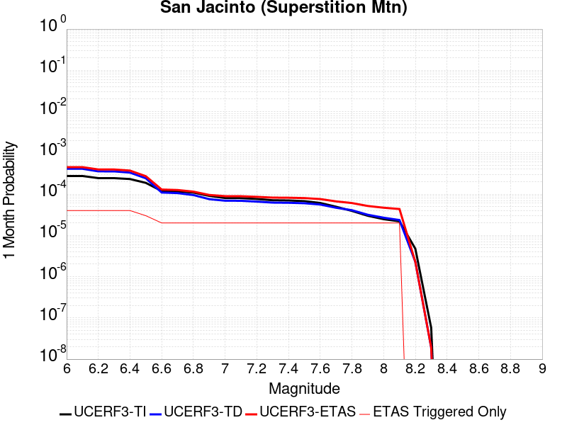 | 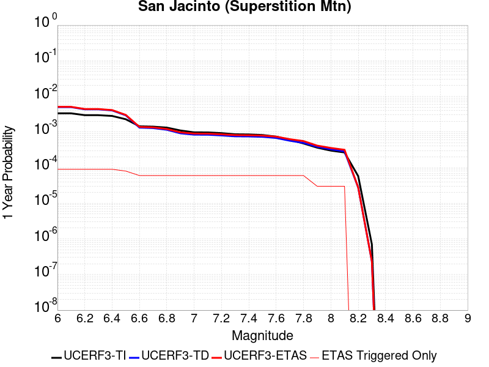 |  |

| Magnitude | 1 wk TI Prob | 1 wk TD Prob | 1 wk ETAS Prob | 1 wk ETAS/TD Gain | 1 wk ETAS Triggered Only | 1 mo TI Prob | 1 mo TD Prob | 1 mo ETAS Prob | 1 mo ETAS/TD Gain | 1 mo ETAS Triggered Only | 1 yr TI Prob | 1 yr TD Prob | 1 yr ETAS Prob | 1 yr ETAS/TD Gain | 1 yr ETAS Triggered Only | 10 yr TI Prob | 10 yr TD Prob | 10 yr ETAS Prob | 10 yr ETAS/TD Gain | 10 yr ETAS Triggered Only |
|-----|-----|-----|-----|-----|-----|-----|-----|-----|-----|-----|-----|-----|-----|-----|-----|-----|-----|-----|-----|-----|
| 6.0 | 6.4193904E-5 | 9.599558E-5 | 1.0599462E-4 | 1.1041615 | 1.0E-5 | 2.7508775E-4 | 4.1135435E-4 | 4.513379E-4 | 1.0971998 | 4.0E-5 | 0.0033440501 | 0.0049981694 | 0.0050877198 | 1.0179166 | 9.0E-5 | 0.03294174 | 0.048820045 | 0.048962723 | 1.0029225 | 1.5E-4 |
| 6.1 | 6.4193904E-5 | 9.599558E-5 | 1.0599462E-4 | 1.1041615 | 1.0E-5 | 2.7508775E-4 | 4.1135435E-4 | 4.513379E-4 | 1.0971998 | 4.0E-5 | 0.0033440501 | 0.0049981694 | 0.0050877198 | 1.0179166 | 9.0E-5 | 0.03294174 | 0.048820045 | 0.048962723 | 1.0029225 | 1.5E-4 |
| 6.2 | 5.7023593E-5 | 8.3144616E-5 | 9.314378E-5 | 1.1202624 | 1.0E-5 | 2.4436394E-4 | 3.5629462E-4 | 3.9628037E-4 | 1.1122266 | 4.0E-5 | 0.002971072 | 0.0043309047 | 0.004420515 | 1.0206909 | 9.0E-5 | 0.029316625 | 0.042502448 | 0.0426365 | 1.0031539 | 1.4E-4 |
| 6.3 | 5.6940098E-5 | 8.298998E-5 | 9.298915E-5 | 1.1204865 | 1.0E-5 | 2.4400617E-4 | 3.5563204E-4 | 3.9561783E-4 | 1.1124358 | 4.0E-5 | 0.002966728 | 0.00432287 | 0.004412481 | 1.0207295 | 9.0E-5 | 0.029274331 | 0.04242582 | 0.04255988 | 1.0031599 | 1.4E-4 |
| 6.4 | 5.4171585E-5 | 7.748391E-5 | 8.748314E-5 | 1.1290491 | 1.0E-5 | 2.3214328E-4 | 3.3204095E-4 | 3.7202766E-4 | 1.1204271 | 4.0E-5 | 0.0028226813 | 0.0040367534 | 0.00412639 | 1.0222051 | 9.0E-5 | 0.02787096 | 0.039715026 | 0.039849468 | 1.0033851 | 1.4E-4 |
| 6.5 | 4.375144E-5 | 5.6421442E-5 | 6.642088E-5 | 1.1772276 | 1.0E-5 | 1.874927E-4 | 2.417904E-4 | 2.7178315E-4 | 1.1240444 | 3.0E-5 | 0.0022803338 | 0.002941 | 0.0030207646 | 1.0271217 | 8.0E-5 | 0.022570757 | 0.029235592 | 0.029361792 | 1.0043167 | 1.3E-4 |
| 6.6 | 2.772192E-5 | 2.5488029E-5 | 3.5487774E-5 | 1.392331 | 1.0E-5 | 1.1880282E-4 | 1.0922994E-4 | 1.2922776E-4 | 1.18308 | 2.0E-5 | 0.0014454646 | 0.0013290826 | 0.0013890029 | 1.0450839 | 6.0E-5 | 0.014360986 | 0.013540891 | 0.013639537 | 1.007285 | 1.0E-4 |
| 6.7 | 2.7124124E-5 | 2.4699055E-5 | 3.469881E-5 | 1.4048638 | 1.0E-5 | 1.1624106E-4 | 1.0584891E-4 | 1.2584678E-4 | 1.1889286 | 2.0E-5 | 0.0014143161 | 0.0012879678 | 0.0013478905 | 1.046525 | 6.0E-5 | 0.014053487 | 0.013134248 | 0.013232934 | 1.0075136 | 1.0E-4 |
| 6.8 | 2.5475807E-5 | 2.2164071E-5 | 3.2163847E-5 | 1.4511707 | 1.0E-5 | 1.0917746E-4 | 9.498548E-5 | 1.1498358E-4 | 1.2105385 | 2.0E-5 | 0.001328425 | 0.0011558468 | 0.0012157774 | 1.05185 | 6.0E-5 | 0.0132051185 | 0.011821818 | 0.011910754 | 1.0075231 | 9.0E-5 |
| 6.9 | 2.1162023E-5 | 1.762564E-5 | 2.7625465E-5 | 1.5673453 | 1.0E-5 | 9.069123E-5 | 7.553629E-5 | 9.5534786E-5 | 1.2647533 | 2.0E-5 | 0.0011036064 | 9.1927015E-4 | 9.79215E-4 | 1.0652092 | 6.0E-5 | 0.010981417 | 0.009446762 | 0.009526006 | 1.0083885 | 8.0E-5 |
| 7.0 | 1.8754288E-5 | 1.616099E-5 | 2.6160827E-5 | 1.6187639 | 1.0E-5 | 8.037304E-5 | 6.9259564E-5 | 8.9258174E-5 | 1.2887487 | 2.0E-5 | 9.781026E-4 | 8.429114E-4 | 9.0286083E-4 | 1.0711218 | 6.0E-5 | 0.009738087 | 0.008669995 | 0.008749301 | 1.0091472 | 8.0E-5 |
| 7.1 | 1.8678527E-5 | 1.6086136E-5 | 2.6085974E-5 | 1.6216433 | 1.0E-5 | 8.0048376E-5 | 6.8938774E-5 | 8.893739E-5 | 1.2900925 | 2.0E-5 | 9.7415317E-4 | 8.3900883E-4 | 8.989585E-4 | 1.071453 | 6.0E-5 | 0.009698939 | 0.008631011 | 0.00871032 | 1.0091889 | 8.0E-5 |
| 7.2 | 1.7804578E-5 | 1.5380709E-5 | 2.5380556E-5 | 1.6501551 | 1.0E-5 | 7.6303106E-5 | 6.591567E-5 | 8.5914355E-5 | 1.303398 | 2.0E-5 | 9.285943E-4 | 8.022301E-4 | 8.6218194E-4 | 1.0747315 | 6.0E-5 | 0.009247236 | 0.008262424 | 0.008341762 | 1.0096024 | 8.0E-5 |
| 7.3 | 1.6583685E-5 | 1.4529837E-5 | 2.4529692E-5 | 1.688229 | 1.0E-5 | 7.1070994E-5 | 6.226926E-5 | 8.226801E-5 | 1.3211658 | 2.0E-5 | 8.649459E-4 | 7.5786654E-4 | 8.1782107E-4 | 1.0791097 | 6.0E-5 | 0.00861587 | 0.007817646 | 0.00789702 | 1.0101533 | 8.0E-5 |
| 7.4 | 1.6387552E-5 | 1.4394727E-5 | 2.4394583E-5 | 1.6946888 | 1.0E-5 | 7.023047E-5 | 6.169024E-5 | 8.168901E-5 | 1.3241804 | 2.0E-5 | 8.5472054E-4 | 7.508219E-4 | 8.1077684E-4 | 1.0798525 | 6.0E-5 | 0.008514405 | 0.0077470187 | 0.007826399 | 1.0102465 | 8.0E-5 |
| 7.5 | 1.5790754E-5 | 1.40354305E-5 | 2.4035291E-5 | 1.7124726 | 1.0E-5 | 6.767291E-5 | 6.015047E-5 | 8.0149264E-5 | 1.3324795 | 2.0E-5 | 8.236062E-4 | 7.320879E-4 | 7.920439E-4 | 1.0818974 | 6.0E-5 | 0.008205604 | 0.007557581 | 0.007636977 | 1.0105054 | 8.0E-5 |
| 7.6 | 1.4248672E-5 | 1.3054444E-5 | 2.3054314E-5 | 1.7660127 | 1.0E-5 | 6.106431E-5 | 5.5946428E-5 | 7.594531E-5 | 1.3574648 | 2.0E-5 | 7.432043E-4 | 6.809366E-4 | 7.4089575E-4 | 1.088054 | 6.0E-5 | 0.007407237 | 0.007040175 | 0.007119612 | 1.0112834 | 8.0E-5 |
| 7.7 | 1.15449975E-5 | 1.0903222E-5 | 2.0903113E-5 | 1.9171501 | 1.0E-5 | 4.947762E-5 | 4.672726E-5 | 6.672632E-5 | 1.4279957 | 2.0E-5 | 6.022235E-4 | 5.6875666E-4 | 6.2872254E-4 | 1.1054332 | 6.0E-5 | 0.006005941 | 0.0059102564 | 0.0059897834 | 1.0134557 | 8.0E-5 |
| 7.8 | 9.1391985E-6 | 9.5139185E-6 | 1.9513824E-5 | 2.0510817 | 1.0E-5 | 3.9167408E-5 | 4.0773306E-5 | 6.077249E-5 | 1.490497 | 2.0E-5 | 4.767588E-4 | 4.963025E-4 | 5.5627275E-4 | 1.120834 | 6.0E-5 | 0.0047573727 | 0.005176809 | 0.005256395 | 1.0153736 | 8.0E-5 |
| 7.9 | 6.973017E-6 | 7.3817937E-6 | 1.738172E-5 | 2.3546743 | 1.0E-5 | 2.9884017E-5 | 3.163588E-5 | 5.1635245E-5 | 1.6321737 | 2.0E-5 | 3.6377716E-4 | 3.8509927E-4 | 4.1508774E-4 | 1.077872 | 3.0E-5 | 0.0036318225 | 0.004051976 | 0.0041017733 | 1.0122896 | 5.0E-5 |
| 8.0 | 5.7638235E-6 | 6.259641E-6 | 1.6259579E-5 | 2.5975256 | 1.0E-5 | 2.4701867E-5 | 2.682676E-5 | 4.6826222E-5 | 1.7455043 | 2.0E-5 | 3.0070372E-4 | 3.2656736E-4 | 3.5655755E-4 | 1.0918347 | 3.0E-5 | 0.0030029714 | 0.0034535413 | 0.0035033687 | 1.0144279 | 5.0E-5 |
| 8.1 | 5.1124434E-6 | 5.4953657E-6 | 1.549531E-5 | 2.8197052 | 1.0E-5 | 2.1910288E-5 | 2.3551356E-5 | 4.3550885E-5 | 1.849188 | 2.0E-5 | 2.6672508E-4 | 2.8670052E-4 | 3.1669193E-4 | 1.1046088 | 3.0E-5 | 0.0026640517 | 0.0030403896 | 0.0030802682 | 1.0131162 | 4.0E-5 |
| 8.2 | 1.1075938E-6 | 5.3348367E-7 | 5.3348367E-7 | 1.0 | 0.0 | 4.7468216E-6 | 2.2863567E-6 | 2.2863567E-6 | 1.0 | 0.0 | 5.779102E-5 | 2.7836059E-5 | 2.7836059E-5 | 1.0 | 0.0 | 5.777599E-4 | 3.133962E-4 | 3.133962E-4 | 1.0 | 0.0 |
| 8.3 | 1.3584393E-8 | 4.4718784E-9 | 4.4718784E-9 | 1.0 | 0.0 | 5.8218827E-8 | 1.9165192E-8 | 1.9165192E-8 | 1.0 | 0.0 | 7.0881396E-7 | 2.3333622E-7 | 2.3333622E-7 | 1.0 | 0.0 | 7.0881174E-6 | 2.6140672E-6 | 2.6140672E-6 | 1.0 | 0.0 |

## Channel Islands Thrust
*[(top)](#table-of-contents)*

| 1 Week | 1 Month | 1 Year | 10 Year |
|-----|-----|-----|-----|
|  |  |  |  |

| Magnitude | 1 wk TI Prob | 1 wk TD Prob | 1 wk ETAS Prob | 1 wk ETAS/TD Gain | 1 wk ETAS Triggered Only | 1 mo TI Prob | 1 mo TD Prob | 1 mo ETAS Prob | 1 mo ETAS/TD Gain | 1 mo ETAS Triggered Only | 1 yr TI Prob | 1 yr TD Prob | 1 yr ETAS Prob | 1 yr ETAS/TD Gain | 1 yr ETAS Triggered Only | 10 yr TI Prob | 10 yr TD Prob | 10 yr ETAS Prob | 10 yr ETAS/TD Gain | 10 yr ETAS Triggered Only |
|-----|-----|-----|-----|-----|-----|-----|-----|-----|-----|-----|-----|-----|-----|-----|-----|-----|-----|-----|-----|-----|
| 6.0 | 2.2156251E-5 | 2.4092022E-5 | 3.409178E-5 | 1.4150652 | 1.0E-5 | 9.495191E-5 | 1.03248036E-4 | 1.2324598E-4 | 1.1936883 | 2.0E-5 | 0.0011554264 | 0.0012564266 | 0.0013163511 | 1.0476944 | 6.0E-5 | 0.011494373 | 0.0125038205 | 0.01264207 | 1.0110565 | 1.4E-4 |
| 6.1 | 2.2156251E-5 | 2.4092022E-5 | 3.409178E-5 | 1.4150652 | 1.0E-5 | 9.495191E-5 | 1.03248036E-4 | 1.2324598E-4 | 1.1936883 | 2.0E-5 | 0.0011554264 | 0.0012564266 | 0.0013163511 | 1.0476944 | 6.0E-5 | 0.011494373 | 0.0125038205 | 0.01264207 | 1.0110565 | 1.4E-4 |
| 6.2 | 2.2156251E-5 | 2.4092022E-5 | 3.409178E-5 | 1.4150652 | 1.0E-5 | 9.495191E-5 | 1.03248036E-4 | 1.2324598E-4 | 1.1936883 | 2.0E-5 | 0.0011554264 | 0.0012564266 | 0.0013163511 | 1.0476944 | 6.0E-5 | 0.011494373 | 0.0125038205 | 0.01264207 | 1.0110565 | 1.4E-4 |
| 6.3 | 2.2156251E-5 | 2.4092022E-5 | 3.409178E-5 | 1.4150652 | 1.0E-5 | 9.495191E-5 | 1.03248036E-4 | 1.2324598E-4 | 1.1936883 | 2.0E-5 | 0.0011554264 | 0.0012564266 | 0.0013163511 | 1.0476944 | 6.0E-5 | 0.011494373 | 0.0125038205 | 0.01264207 | 1.0110565 | 1.4E-4 |
| 6.4 | 2.2156251E-5 | 2.4092022E-5 | 3.409178E-5 | 1.4150652 | 1.0E-5 | 9.495191E-5 | 1.03248036E-4 | 1.2324598E-4 | 1.1936883 | 2.0E-5 | 0.0011554264 | 0.0012564266 | 0.0013163511 | 1.0476944 | 6.0E-5 | 0.011494373 | 0.0125038205 | 0.01264207 | 1.0110565 | 1.4E-4 |
| 6.5 | 2.2156251E-5 | 2.4092022E-5 | 3.409178E-5 | 1.4150652 | 1.0E-5 | 9.495191E-5 | 1.03248036E-4 | 1.2324598E-4 | 1.1936883 | 2.0E-5 | 0.0011554264 | 0.0012564266 | 0.0013163511 | 1.0476944 | 6.0E-5 | 0.011494373 | 0.0125038205 | 0.01264207 | 1.0110565 | 1.4E-4 |
| 6.6 | 2.2156251E-5 | 2.4092022E-5 | 3.409178E-5 | 1.4150652 | 1.0E-5 | 9.495191E-5 | 1.03248036E-4 | 1.2324598E-4 | 1.1936883 | 2.0E-5 | 0.0011554264 | 0.0012564266 | 0.0013163511 | 1.0476944 | 6.0E-5 | 0.011494373 | 0.0125038205 | 0.01264207 | 1.0110565 | 1.4E-4 |
| 6.7 | 1.0601296E-5 | 1.1379544E-5 | 1.1379544E-5 | 1.0 | 0.0 | 4.5433335E-5 | 4.876859E-5 | 5.8768102E-5 | 1.20504 | 1.0E-5 | 5.5301044E-4 | 5.936007E-4 | 6.3357694E-4 | 1.0673454 | 4.0E-5 | 0.005516363 | 0.005920653 | 0.005990239 | 1.011753 | 7.0E-5 |
| 6.8 | 1.0246747E-5 | 1.0996669E-5 | 1.0996669E-5 | 1.0 | 0.0 | 4.391389E-5 | 4.7127756E-5 | 5.7127287E-5 | 1.2121792 | 1.0E-5 | 5.345204E-4 | 5.7363417E-4 | 6.1361125E-4 | 1.0696908 | 4.0E-5 | 0.0053323656 | 0.005722025 | 0.0057916245 | 1.0121634 | 7.0E-5 |
| 6.9 | 9.049551E-6 | 9.699645E-6 | 9.699645E-6 | 1.0 | 0.0 | 3.878322E-5 | 4.1569267E-5 | 5.156885E-5 | 1.2405523 | 1.0E-5 | 4.7208337E-4 | 5.059924E-4 | 5.4597214E-4 | 1.0790125 | 4.0E-5 | 0.0047108172 | 0.0050488203 | 0.005118467 | 1.0137947 | 7.0E-5 |
| 7.0 | 8.6542195E-6 | 9.274603E-6 | 9.274603E-6 | 1.0 | 0.0 | 3.7088983E-5 | 3.9747716E-5 | 4.974732E-5 | 1.2515768 | 1.0E-5 | 4.5146482E-4 | 4.8382508E-4 | 5.2380573E-4 | 1.0826344 | 4.0E-5 | 0.004505487 | 0.0048281294 | 0.0048977914 | 1.0144284 | 7.0E-5 |
| 7.1 | 8.391028E-6 | 8.992925E-6 | 8.992925E-6 | 1.0 | 0.0 | 3.5961057E-5 | 3.8540562E-5 | 4.8540176E-5 | 1.2594569 | 1.0E-5 | 4.3773788E-4 | 4.6913436E-4 | 5.0911563E-4 | 1.0852234 | 4.0E-5 | 0.004368766 | 0.0046818503 | 0.0047515226 | 1.0148814 | 7.0E-5 |
| 7.2 | 5.965188E-6 | 6.3716957E-6 | 6.3716957E-6 | 1.0 | 0.0 | 2.556484E-5 | 2.7306984E-5 | 3.7306712E-5 | 1.3661966 | 1.0E-5 | 3.1120746E-4 | 3.3241237E-4 | 3.7239905E-4 | 1.1202924 | 4.0E-5 | 0.00310772 | 0.0033192094 | 0.0033889771 | 1.0210193 | 7.0E-5 |
| 7.3 | 4.877518E-6 | 5.206007E-6 | 5.206007E-6 | 1.0 | 0.0 | 2.0903482E-5 | 2.231127E-5 | 3.2311047E-5 | 1.448194 | 1.0E-5 | 2.5447016E-4 | 2.716063E-4 | 2.9160085E-4 | 1.073616 | 2.0E-5 | 0.0025417898 | 0.0027127897 | 0.002752681 | 1.014705 | 4.0E-5 |
| 7.4 | 3.8829853E-6 | 4.141863E-6 | 4.141863E-6 | 1.0 | 0.0 | 1.664126E-5 | 1.7750723E-5 | 1.7750723E-5 | 1.0 | 0.0 | 2.0258849E-4 | 2.1609403E-4 | 2.2609187E-4 | 1.0462662 | 1.0E-5 | 0.002024039 | 0.002158881 | 0.0021788375 | 1.0092441 | 2.0E-5 |
| 7.5 | 1.3489616E-6 | 1.4277905E-6 | 1.4277905E-6 | 1.0 | 0.0 | 5.7812517E-6 | 6.119088E-6 | 6.119088E-6 | 1.0 | 0.0 | 7.038446E-5 | 7.449739E-5 | 7.449739E-5 | 1.0 | 0.0 | 7.036218E-4 | 7.4472814E-4 | 7.4472814E-4 | 1.0 | 0.0 |
| 7.6 | 6.058192E-7 | 6.35378E-7 | 6.35378E-7 | 1.0 | 0.0 | 2.5963652E-6 | 2.7230458E-6 | 2.7230458E-6 | 1.0 | 0.0 | 3.161029E-5 | 3.3152595E-5 | 3.3152595E-5 | 1.0 | 0.0 | 3.1605794E-4 | 3.314781E-4 | 3.314781E-4 | 1.0 | 0.0 |
| 7.7 | 2.2170494E-7 | 2.2607924E-7 | 2.2607924E-7 | 1.0 | 0.0 | 9.5016367E-7 | 9.689107E-7 | 9.689107E-7 | 1.0 | 0.0 | 1.1568181E-5 | 1.17964355E-5 | 1.17964355E-5 | 1.0 | 0.0 | 1.1567579E-4 | 1.179592E-4 | 1.179592E-4 | 1.0 | 0.0 |
| 7.8 | 2.1613102E-8 | 1.5466837E-8 | 1.5466837E-8 | 1.0 | 0.0 | 9.262757E-8 | 6.628645E-8 | 6.628645E-8 | 1.0 | 0.0 | 1.1277401E-6 | 8.070372E-7 | 8.070372E-7 | 1.0 | 0.0 | 1.1277344E-5 | 8.07035E-6 | 8.07035E-6 | 1.0 | 0.0 |

## White Mountains
*[(top)](#table-of-contents)*

| 1 Week | 1 Month | 1 Year | 10 Year |
|-----|-----|-----|-----|
|  |  | 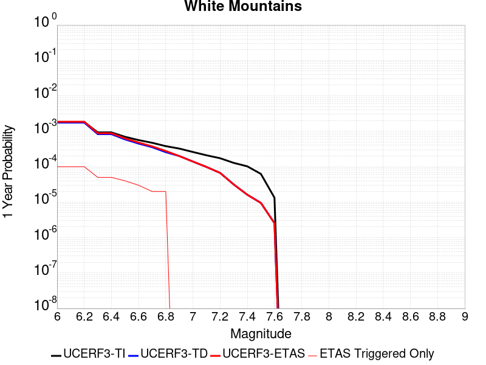 |  |

| Magnitude | 1 wk TI Prob | 1 wk TD Prob | 1 wk ETAS Prob | 1 wk ETAS/TD Gain | 1 wk ETAS Triggered Only | 1 mo TI Prob | 1 mo TD Prob | 1 mo ETAS Prob | 1 mo ETAS/TD Gain | 1 mo ETAS Triggered Only | 1 yr TI Prob | 1 yr TD Prob | 1 yr ETAS Prob | 1 yr ETAS/TD Gain | 1 yr ETAS Triggered Only | 10 yr TI Prob | 10 yr TD Prob | 10 yr ETAS Prob | 10 yr ETAS/TD Gain | 10 yr ETAS Triggered Only |
|-----|-----|-----|-----|-----|-----|-----|-----|-----|-----|-----|-----|-----|-----|-----|-----|-----|-----|-----|-----|-----|
| 6.0 | 3.503579E-5 | 3.3784127E-5 | 6.378311E-5 | 1.887961 | 3.0E-5 | 1.5014476E-4 | 1.4478175E-4 | 2.0477307E-4 | 1.4143568 | 6.0E-5 | 0.0018264796 | 0.0017614134 | 0.0018612372 | 1.0566726 | 1.0E-4 | 0.018115403 | 0.017486857 | 0.017634233 | 1.0084279 | 1.5E-4 |
| 6.1 | 3.503579E-5 | 3.3784127E-5 | 6.378311E-5 | 1.887961 | 3.0E-5 | 1.5014476E-4 | 1.4478175E-4 | 2.0477307E-4 | 1.4143568 | 6.0E-5 | 0.0018264796 | 0.0017614134 | 0.0018612372 | 1.0566726 | 1.0E-4 | 0.018115403 | 0.017486857 | 0.017634233 | 1.0084279 | 1.5E-4 |
| 6.2 | 3.503579E-5 | 3.3784127E-5 | 6.378311E-5 | 1.887961 | 3.0E-5 | 1.5014476E-4 | 1.4478175E-4 | 2.0477307E-4 | 1.4143568 | 6.0E-5 | 0.0018264796 | 0.0017614134 | 0.0018612372 | 1.0566726 | 1.0E-4 | 0.018115403 | 0.017486857 | 0.017634233 | 1.0084279 | 1.5E-4 |
| 6.3 | 1.7818425E-5 | 1.591616E-5 | 1.591616E-5 | 1.0 | 0.0 | 7.636245E-5 | 6.821041E-5 | 8.8209046E-5 | 1.2931904 | 2.0E-5 | 9.293162E-4 | 8.301596E-4 | 8.8011805E-4 | 1.0601794 | 5.0E-5 | 0.009254395 | 0.0082720425 | 0.008351381 | 1.0095911 | 8.0E-5 |
| 6.4 | 1.7818425E-5 | 1.591616E-5 | 1.591616E-5 | 1.0 | 0.0 | 7.636245E-5 | 6.821041E-5 | 8.8209046E-5 | 1.2931904 | 2.0E-5 | 9.293162E-4 | 8.301596E-4 | 8.8011805E-4 | 1.0601794 | 5.0E-5 | 0.009254395 | 0.0082720425 | 0.008351381 | 1.0095911 | 8.0E-5 |
| 6.5 | 1.3397557E-5 | 1.1336374E-5 | 1.1336374E-5 | 1.0 | 0.0 | 5.741684E-5 | 4.8583595E-5 | 6.858262E-5 | 1.4116416 | 2.0E-5 | 6.988258E-4 | 5.913517E-4 | 6.3132803E-4 | 1.0676017 | 4.0E-5 | 0.006966323 | 0.005898487 | 0.005948192 | 1.0084268 | 5.0E-5 |
| 6.6 | 1.0818695E-5 | 8.625434E-6 | 8.625434E-6 | 1.0 | 0.0 | 4.6365014E-5 | 3.6965648E-5 | 5.696491E-5 | 1.5410229 | 2.0E-5 | 5.6434784E-4 | 4.4996818E-4 | 4.7995467E-4 | 1.0666413 | 3.0E-5 | 0.005629168 | 0.0044910074 | 0.0045208726 | 1.00665 | 3.0E-5 |
| 6.7 | 9.067908E-6 | 6.802476E-6 | 6.802476E-6 | 1.0 | 0.0 | 3.8861883E-5 | 2.915316E-5 | 3.915287E-5 | 1.343006 | 1.0E-5 | 4.7304068E-4 | 3.548851E-4 | 3.74878E-4 | 1.0563363 | 2.0E-5 | 0.00472035 | 0.003543501 | 0.0035634302 | 1.0056242 | 2.0E-5 |
| 6.8 | 7.295947E-6 | 4.9364285E-6 | 4.9364285E-6 | 1.0 | 0.0 | 3.126797E-5 | 2.1155956E-5 | 3.1155745E-5 | 1.4726701 | 1.0E-5 | 3.8062103E-4 | 2.5754445E-4 | 2.775393E-4 | 1.0776365 | 2.0E-5 | 0.0037996976 | 0.0025725728 | 0.0025925213 | 1.0077543 | 2.0E-5 |
| 6.9 | 6.2243444E-6 | 3.8322546E-6 | 3.8322546E-6 | 1.0 | 0.0 | 2.6675489E-5 | 1.6423846E-5 | 1.6423846E-5 | 1.0 | 0.0 | 3.2472567E-4 | 1.9994251E-4 | 1.9994251E-4 | 1.0 | 0.0 | 0.0032425157 | 0.001997679 | 0.001997679 | 1.0 | 0.0 |
| 7.0 | 4.9878413E-6 | 2.679564E-6 | 2.679564E-6 | 1.0 | 0.0 | 2.1376287E-5 | 1.1483797E-5 | 1.1483797E-5 | 1.0 | 0.0 | 2.602252E-4 | 1.3980652E-4 | 1.3980652E-4 | 1.0 | 0.0 | 0.002599207 | 0.0013972119 | 0.0013972119 | 1.0 | 0.0 |
| 7.1 | 4.0252844E-6 | 1.885702E-6 | 1.885702E-6 | 1.0 | 0.0 | 1.7251105E-5 | 8.081555E-6 | 8.081555E-6 | 1.0 | 0.0 | 2.1001195E-4 | 9.838863E-5 | 9.838863E-5 | 1.0 | 0.0 | 0.0020981359 | 9.834635E-4 | 9.834635E-4 | 1.0 | 0.0 |
| 7.2 | 3.3284066E-6 | 1.2818929E-6 | 1.2818929E-6 | 1.0 | 0.0 | 1.4264522E-5 | 5.4938155E-6 | 5.4938155E-6 | 1.0 | 0.0 | 1.736567E-4 | 6.688525E-5 | 6.688525E-5 | 1.0 | 0.0 | 0.0017352107 | 6.6866126E-4 | 6.6866126E-4 | 1.0 | 0.0 |
| 7.3 | 2.458226E-6 | 6.056684E-7 | 6.056684E-7 | 1.0 | 0.0 | 1.0535211E-5 | 2.5957193E-6 | 2.5957193E-6 | 1.0 | 0.0 | 1.2825865E-4 | 3.160246E-5 | 3.160246E-5 | 1.0 | 0.0 | 0.0012818464 | 3.1598343E-4 | 3.1598343E-4 | 1.0 | 0.0 |
| 7.4 | 1.965953E-6 | 3.1084684E-7 | 3.1084684E-7 | 1.0 | 0.0 | 8.425486E-6 | 1.3322001E-6 | 1.3322001E-6 | 1.0 | 0.0 | 1.0257547E-4 | 1.6219417E-5 | 1.6219417E-5 | 1.0 | 0.0 | 0.0010252813 | 1.6218246E-4 | 1.6218246E-4 | 1.0 | 0.0 |
| 7.5 | 1.2014192E-6 | 1.8241002E-7 | 1.8241002E-7 | 1.0 | 0.0 | 5.148929E-6 | 7.8175697E-7 | 7.8175697E-7 | 1.0 | 0.0 | 6.2686406E-5 | 9.51785E-6 | 9.51785E-6 | 1.0 | 0.0 | 6.266873E-4 | 9.517451E-5 | 9.517451E-5 | 1.0 | 0.0 |
| 7.6 | 2.5612175E-7 | 4.893784E-8 | 4.893784E-8 | 1.0 | 0.0 | 1.0976642E-6 | 2.0973359E-7 | 2.0973359E-7 | 1.0 | 0.0 | 1.3363979E-5 | 2.5535037E-6 | 2.5535037E-6 | 1.0 | 0.0 | 1.3363175E-4 | 2.553478E-5 | 2.553478E-5 | 1.0 | 0.0 |

## Santa Cruz Island
*[(top)](#table-of-contents)*

| 1 Week | 1 Month | 1 Year | 10 Year |
|-----|-----|-----|-----|
|  |  |  |  |

| Magnitude | 1 wk TI Prob | 1 wk TD Prob | 1 wk ETAS Prob | 1 wk ETAS/TD Gain | 1 wk ETAS Triggered Only | 1 mo TI Prob | 1 mo TD Prob | 1 mo ETAS Prob | 1 mo ETAS/TD Gain | 1 mo ETAS Triggered Only | 1 yr TI Prob | 1 yr TD Prob | 1 yr ETAS Prob | 1 yr ETAS/TD Gain | 1 yr ETAS Triggered Only | 10 yr TI Prob | 10 yr TD Prob | 10 yr ETAS Prob | 10 yr ETAS/TD Gain | 10 yr ETAS Triggered Only |
|-----|-----|-----|-----|-----|-----|-----|-----|-----|-----|-----|-----|-----|-----|-----|-----|-----|-----|-----|-----|-----|
| 6.0 | 2.9164563E-5 | 3.1599742E-5 | 7.159848E-5 | 2.265793 | 4.0E-5 | 1.2498499E-4 | 1.3542121E-4 | 1.8541444E-4 | 1.3691684 | 5.0E-5 | 0.0015206301 | 0.0016476426 | 0.0017075437 | 1.0363556 | 6.0E-5 | 0.015102667 | 0.016368 | 0.016476199 | 1.0066104 | 1.1E-4 |
| 6.1 | 2.9164563E-5 | 3.1599742E-5 | 7.159848E-5 | 2.265793 | 4.0E-5 | 1.2498499E-4 | 1.3542121E-4 | 1.8541444E-4 | 1.3691684 | 5.0E-5 | 0.0015206301 | 0.0016476426 | 0.0017075437 | 1.0363556 | 6.0E-5 | 0.015102667 | 0.016368 | 0.016476199 | 1.0066104 | 1.1E-4 |
| 6.2 | 2.9164563E-5 | 3.1599742E-5 | 7.159848E-5 | 2.265793 | 4.0E-5 | 1.2498499E-4 | 1.3542121E-4 | 1.8541444E-4 | 1.3691684 | 5.0E-5 | 0.0015206301 | 0.0016476426 | 0.0017075437 | 1.0363556 | 6.0E-5 | 0.015102667 | 0.016368 | 0.016476199 | 1.0066104 | 1.1E-4 |
| 6.3 | 1.6635553E-5 | 1.780436E-5 | 4.7803824E-5 | 2.6849506 | 3.0E-5 | 7.1293274E-5 | 7.630227E-5 | 1.1629921E-4 | 1.5241908 | 4.0E-5 | 8.6765E-4 | 9.286024E-4 | 9.78556E-4 | 1.0537944 | 5.0E-5 | 0.008642701 | 0.009249094 | 0.009328354 | 1.0085695 | 8.0E-5 |
| 6.4 | 1.6635553E-5 | 1.780436E-5 | 4.7803824E-5 | 2.6849506 | 3.0E-5 | 7.1293274E-5 | 7.630227E-5 | 1.1629921E-4 | 1.5241908 | 4.0E-5 | 8.6765E-4 | 9.286024E-4 | 9.78556E-4 | 1.0537944 | 5.0E-5 | 0.008642701 | 0.009249094 | 0.009328354 | 1.0085695 | 8.0E-5 |
| 6.5 | 1.2238748E-5 | 1.3042996E-5 | 2.3042865E-5 | 1.766685 | 1.0E-5 | 5.2450723E-5 | 5.5897377E-5 | 6.589682E-5 | 1.1788893 | 1.0E-5 | 6.3840044E-4 | 6.8034173E-4 | 6.9033494E-4 | 1.0146885 | 1.0E-5 | 0.0063656955 | 0.006782988 | 0.0068227164 | 1.0058571 | 4.0E-5 |
| 6.6 | 1.0489767E-5 | 1.1156636E-5 | 2.1156524E-5 | 1.8963175 | 1.0E-5 | 4.495537E-5 | 4.781329E-5 | 5.7812813E-5 | 1.2091368 | 1.0E-5 | 5.4719415E-4 | 5.819736E-4 | 5.919677E-4 | 1.0171729 | 1.0E-5 | 0.005458487 | 0.005804736 | 0.005834562 | 1.0051382 | 3.0E-5 |
| 6.7 | 8.699222E-6 | 9.236783E-6 | 1.923669E-5 | 2.082618 | 1.0E-5 | 3.7281847E-5 | 3.958561E-5 | 4.958522E-5 | 1.252607 | 1.0E-5 | 4.5381195E-4 | 4.818488E-4 | 4.9184397E-4 | 1.0207434 | 1.0E-5 | 0.0045288634 | 0.004808108 | 0.0048379637 | 1.0062095 | 3.0E-5 |
| 6.8 | 8.307732E-6 | 8.8169045E-6 | 1.8816816E-5 | 2.1341748 | 1.0E-5 | 3.560408E-5 | 3.7786187E-5 | 4.7785812E-5 | 1.264637 | 1.0E-5 | 4.3339343E-4 | 4.5995016E-4 | 4.6994555E-4 | 1.0217315 | 1.0E-5 | 0.004325492 | 0.0045900354 | 0.004619898 | 1.0065058 | 3.0E-5 |
| 6.9 | 8.073121E-6 | 8.564939E-6 | 1.8564853E-5 | 2.1675406 | 1.0E-5 | 3.459863E-5 | 3.670637E-5 | 4.6706E-5 | 1.2724223 | 1.0E-5 | 4.2115687E-4 | 4.4680882E-4 | 4.5680435E-4 | 1.0223709 | 1.0E-5 | 0.004203596 | 0.004459156 | 0.0044890223 | 1.0066978 | 3.0E-5 |
| 7.0 | 7.617019E-6 | 8.074665E-6 | 1.8074585E-5 | 2.2384315 | 1.0E-5 | 3.264396E-5 | 3.4605247E-5 | 4.46049E-5 | 1.2889636 | 1.0E-5 | 3.9736772E-4 | 4.2123784E-4 | 4.3123364E-4 | 1.0237296 | 1.0E-5 | 0.003966579 | 0.0042044413 | 0.0042343154 | 1.0071054 | 3.0E-5 |
| 7.1 | 7.1224836E-6 | 7.5457883E-6 | 1.7545713E-5 | 2.3252325 | 1.0E-5 | 3.052457E-5 | 3.2338692E-5 | 4.2338368E-5 | 1.3092171 | 1.0E-5 | 3.715733E-4 | 3.9365282E-4 | 4.0364888E-4 | 1.0253931 | 1.0E-5 | 0.003709526 | 0.0039295983 | 0.00395948 | 1.0076044 | 3.0E-5 |
| 7.2 | 6.441115E-6 | 6.8273835E-6 | 1.6827315E-5 | 2.46468 | 1.0E-5 | 2.7604487E-5 | 2.9259889E-5 | 3.9259598E-5 | 1.3417548 | 1.0E-5 | 3.360328E-4 | 3.5618115E-4 | 3.6617758E-4 | 1.0280656 | 1.0E-5 | 0.0033552512 | 0.0035561312 | 0.0035860245 | 1.0084062 | 3.0E-5 |
| 7.3 | 5.494274E-6 | 5.8199944E-6 | 1.5819936E-5 | 2.7182047 | 1.0E-5 | 2.3546674E-5 | 2.4942596E-5 | 3.4942346E-5 | 1.4009106 | 1.0E-5 | 2.8664304E-4 | 3.03634E-4 | 3.1363097E-4 | 1.0329244 | 1.0E-5 | 0.002862736 | 0.0030322145 | 0.0030521539 | 1.0065758 | 2.0E-5 |
| 7.4 | 4.0802624E-6 | 4.3122564E-6 | 1.4312213E-5 | 3.3189616 | 1.0E-5 | 1.7486722E-5 | 1.8480969E-5 | 2.8480783E-5 | 1.5410872 | 1.0E-5 | 2.1288003E-4 | 2.2498264E-4 | 2.3498038E-4 | 1.0444379 | 1.0E-5 | 0.0021267622 | 0.0022475577 | 0.0022675127 | 1.0088786 | 2.0E-5 |
| 7.5 | 2.3584746E-6 | 2.4753099E-6 | 1.2475285E-5 | 5.0398884 | 1.0E-5 | 1.0107709E-5 | 1.0608428E-5 | 2.0608322E-5 | 1.9426367 | 1.0E-5 | 1.2305441E-4 | 1.2915001E-4 | 1.3914872E-4 | 1.0774194 | 1.0E-5 | 0.0012298629 | 0.0012907545 | 0.0013007416 | 1.0077374 | 1.0E-5 |
| 7.6 | 9.4981914E-7 | 9.860934E-7 | 1.0986084E-5 | 11.141018 | 1.0E-5 | 4.0706473E-6 | 4.2261076E-6 | 1.4226065E-5 | 3.3662336 | 1.0E-5 | 4.9559E-5 | 5.1451658E-5 | 6.1451145E-5 | 1.1943471 | 1.0E-5 | 4.954795E-4 | 5.1439874E-4 | 5.243936E-4 | 1.0194302 | 1.0E-5 |
| 7.7 | 2.6013532E-7 | 2.6416632E-7 | 2.6416632E-7 | 1.0 | 0.0 | 1.1148652E-6 | 1.1321408E-6 | 1.1321408E-6 | 1.0 | 0.0 | 1.3573399E-5 | 1.3783729E-5 | 1.3783729E-5 | 1.0 | 0.0 | 1.357257E-4 | 1.378288E-4 | 1.378288E-4 | 1.0 | 0.0 |
| 7.8 | 4.1522263E-8 | 3.965698E-8 | 3.965698E-8 | 1.0 | 0.0 | 1.7795254E-7 | 1.6995848E-7 | 1.6995848E-7 | 1.0 | 0.0 | 2.16657E-6 | 2.0692428E-6 | 2.0692428E-6 | 1.0 | 0.0 | 2.1665488E-5 | 2.0692256E-5 | 2.0692256E-5 | 1.0 | 0.0 |
| 7.9 | 7.7242046E-10 | 5.9475225E-10 | 5.9475225E-10 | 1.0 | 0.0 | 3.3103735E-9 | 2.5489382E-9 | 2.5489382E-9 | 1.0 | 0.0 | 4.0303796E-8 | 3.1033323E-8 | 3.1033323E-8 | 1.0 | 0.0 | 4.030379E-7 | 3.103332E-7 | 3.103332E-7 | 1.0 | 0.0 |

## San Jacinto (Borrego)
*[(top)](#table-of-contents)*

| 1 Week | 1 Month | 1 Year | 10 Year |
|-----|-----|-----|-----|
|  | 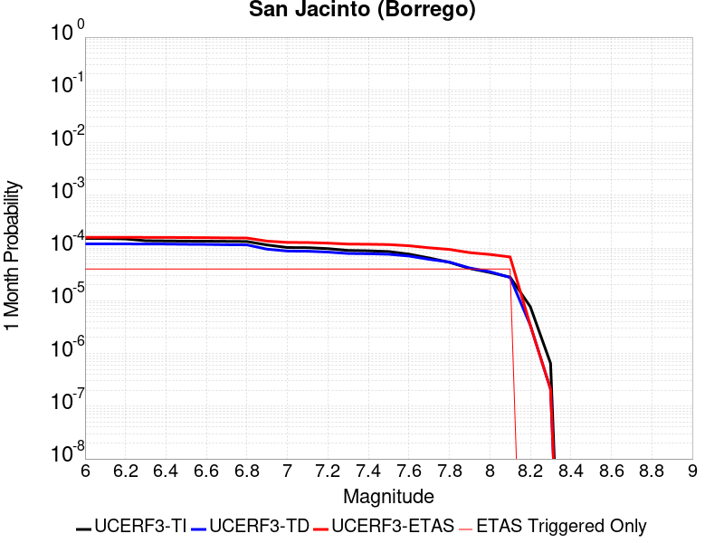 |  |  |

| Magnitude | 1 wk TI Prob | 1 wk TD Prob | 1 wk ETAS Prob | 1 wk ETAS/TD Gain | 1 wk ETAS Triggered Only | 1 mo TI Prob | 1 mo TD Prob | 1 mo ETAS Prob | 1 mo ETAS/TD Gain | 1 mo ETAS Triggered Only | 1 yr TI Prob | 1 yr TD Prob | 1 yr ETAS Prob | 1 yr ETAS/TD Gain | 1 yr ETAS Triggered Only | 10 yr TI Prob | 10 yr TD Prob | 10 yr ETAS Prob | 10 yr ETAS/TD Gain | 10 yr ETAS Triggered Only |
|-----|-----|-----|-----|-----|-----|-----|-----|-----|-----|-----|-----|-----|-----|-----|-----|-----|-----|-----|-----|-----|
| 6.0 | 3.543992E-5 | 2.7925962E-5 | 5.7925125E-5 | 2.0742393 | 3.0E-5 | 1.5187653E-4 | 1.1967727E-4 | 1.5967249E-4 | 1.3341922 | 4.0E-5 | 0.0018475284 | 0.0014561092 | 0.0015559635 | 1.0685762 | 1.0E-4 | 0.018322436 | 0.01486815 | 0.015025772 | 1.0106013 | 1.6E-4 |
| 6.1 | 3.542281E-5 | 2.7925962E-5 | 5.7925125E-5 | 2.0742393 | 3.0E-5 | 1.5180321E-4 | 1.1967727E-4 | 1.5967249E-4 | 1.3341922 | 4.0E-5 | 0.0018466372 | 0.0014561092 | 0.0015559635 | 1.0685762 | 1.0E-4 | 0.018313672 | 0.01486815 | 0.015025772 | 1.0106013 | 1.6E-4 |
| 6.2 | 3.4688688E-5 | 2.7925962E-5 | 5.7925125E-5 | 2.0742393 | 3.0E-5 | 1.4865733E-4 | 1.1967727E-4 | 1.5967249E-4 | 1.3341923 | 4.0E-5 | 0.0018084005 | 0.0014561091 | 0.0015559635 | 1.0685762 | 1.0E-4 | 0.017937548 | 0.01486815 | 0.015025771 | 1.0106013 | 1.6E-4 |
| 6.3 | 3.2087122E-5 | 2.7771312E-5 | 5.7770478E-5 | 2.0802214 | 3.0E-5 | 1.3750899E-4 | 1.1901455E-4 | 1.5900978E-4 | 1.3360534 | 4.0E-5 | 0.0016728862 | 0.0014480512 | 0.0015479064 | 1.0689583 | 1.0E-4 | 0.016603488 | 0.014789308 | 0.014946942 | 1.0106586 | 1.6E-4 |
| 6.4 | 3.1828724E-5 | 2.773829E-5 | 5.7737456E-5 | 2.0815074 | 3.0E-5 | 1.364017E-4 | 1.1887303E-4 | 1.5886828E-4 | 1.3364534 | 4.0E-5 | 0.0016594254 | 0.0014463306 | 0.0015461859 | 1.0690405 | 1.0E-4 | 0.016470885 | 0.014772502 | 0.014930137 | 1.0106709 | 1.6E-4 |
| 6.5 | 3.1563577E-5 | 2.7477974E-5 | 5.747715E-5 | 2.0917535 | 3.0E-5 | 1.3526545E-4 | 1.17757496E-4 | 1.5775279E-4 | 1.3396411 | 4.0E-5 | 0.0016456128 | 0.0014327668 | 0.0015326235 | 1.069695 | 1.0E-4 | 0.0163348 | 0.01463991 | 0.014797567 | 1.010769 | 1.6E-4 |
| 6.6 | 3.1467625E-5 | 2.7322194E-5 | 5.7321373E-5 | 2.0979784 | 3.0E-5 | 1.3485427E-4 | 1.17089934E-4 | 1.5708525E-4 | 1.3415778 | 4.0E-5 | 0.0016406142 | 0.0014246498 | 0.0015245074 | 1.0700927 | 1.0E-4 | 0.016285548 | 0.014560228 | 0.014717898 | 1.0108289 | 1.6E-4 |
| 6.7 | 3.1223695E-5 | 2.6940217E-5 | 5.693941E-5 | 2.1135468 | 3.0E-5 | 1.3380898E-4 | 1.1545303E-4 | 1.5544842E-4 | 1.3464212 | 4.0E-5 | 0.0016279068 | 0.0014047464 | 0.001504606 | 1.0710872 | 1.0E-4 | 0.01616033 | 0.01436451 | 0.014522212 | 1.0109786 | 1.6E-4 |
| 6.8 | 3.1015585E-5 | 2.6761221E-5 | 5.676042E-5 | 2.120995 | 3.0E-5 | 1.3291716E-4 | 1.1468597E-4 | 1.5468139E-4 | 1.3487384 | 4.0E-5 | 0.001617065 | 0.0013954195 | 0.00149528 | 1.071563 | 1.0E-4 | 0.016053487 | 0.014271772 | 0.014429488 | 1.0110509 | 1.6E-4 |
| 6.9 | 2.6641965E-5 | 2.2183434E-5 | 5.2182768E-5 | 2.3523304 | 3.0E-5 | 1.1417485E-4 | 9.506842E-5 | 1.3506462E-4 | 1.4207096 | 4.0E-5 | 0.0013891924 | 0.0011568473 | 0.0012567317 | 1.0863419 | 1.0E-4 | 0.0138054015 | 0.011882191 | 0.012030409 | 1.012474 | 1.5E-4 |
| 7.0 | 2.3854353E-5 | 2.047825E-5 | 5.0477636E-5 | 2.4649389 | 3.0E-5 | 1.02228936E-4 | 8.776099E-5 | 1.2775748E-4 | 1.4557433 | 4.0E-5 | 0.0012439266 | 0.0010679689 | 0.0011678621 | 1.0935357 | 1.0E-4 | 0.012369866 | 0.0109826205 | 0.011130973 | 1.013508 | 1.5E-4 |
| 7.1 | 2.3672901E-5 | 2.0314741E-5 | 5.031413E-5 | 2.47673 | 3.0E-5 | 1.0145135E-4 | 8.706028E-5 | 1.270568E-4 | 1.4594117 | 4.0E-5 | 0.0012344702 | 0.0010594461 | 0.0011593401 | 1.094289 | 1.0E-4 | 0.0122763505 | 0.010897858 | 0.011046224 | 1.0136142 | 1.5E-4 |
| 7.2 | 2.2717244E-5 | 1.9542116E-5 | 4.954153E-5 | 2.535116 | 3.0E-5 | 9.735599E-5 | 8.3749255E-5 | 1.2374591E-4 | 1.4775763 | 4.0E-5 | 0.0011846646 | 0.0010191725 | 0.0011190706 | 1.0980188 | 1.0E-4 | 0.01178369 | 0.010495322 | 0.010643748 | 1.014142 | 1.5E-4 |
| 7.3 | 2.1016205E-5 | 1.8383771E-5 | 4.838322E-5 | 2.631844 | 3.0E-5 | 9.006634E-5 | 7.878522E-5 | 1.1878207E-4 | 1.5076694 | 4.0E-5 | 0.001096006 | 9.5879E-4 | 0.0010586941 | 1.1041981 | 1.0E-4 | 0.010906163 | 0.009890901 | 0.010039417 | 1.0150155 | 1.5E-4 |
| 7.4 | 2.0683625E-5 | 1.8186302E-5 | 4.8185757E-5 | 2.6495633 | 3.0E-5 | 8.86411E-5 | 7.7938974E-5 | 1.1793586E-4 | 1.513182 | 4.0E-5 | 0.001078671 | 9.48496E-4 | 0.0010484011 | 1.1053301 | 1.0E-4 | 0.010734501 | 0.0097876275 | 0.0099361595 | 1.0151755 | 1.5E-4 |
| 7.5 | 1.9993966E-5 | 1.7781347E-5 | 4.7780813E-5 | 2.6871312 | 3.0E-5 | 8.568561E-5 | 7.6203556E-5 | 1.16200514E-4 | 1.5248699 | 4.0E-5 | 0.001042723 | 9.2738547E-4 | 0.0010272927 | 1.10773 | 1.0E-4 | 0.010378438 | 0.009574548 | 0.009723112 | 1.0155165 | 1.5E-4 |
| 7.6 | 1.788966E-5 | 1.6434618E-5 | 4.6434125E-5 | 2.825385 | 3.0E-5 | 7.666772E-5 | 7.043219E-5 | 1.1042937E-4 | 1.5678822 | 4.0E-5 | 9.3302975E-4 | 8.5717626E-4 | 9.570905E-4 | 1.1165621 | 1.0E-4 | 0.00929122 | 0.008866415 | 0.009015085 | 1.0167677 | 1.5E-4 |
| 7.7 | 1.5125781E-5 | 1.4236738E-5 | 4.4236313E-5 | 3.1071942 | 3.0E-5 | 6.4823165E-5 | 6.101317E-5 | 1.0101073E-4 | 1.6555562 | 4.0E-5 | 7.889362E-4 | 7.4258295E-4 | 8.425087E-4 | 1.1345651 | 1.0E-4 | 0.007861412 | 0.007714161 | 0.007863004 | 1.0192947 | 1.5E-4 |
| 7.8 | 1.250089E-5 | 1.262994E-5 | 4.2629563E-5 | 3.3752782 | 3.0E-5 | 5.3574146E-5 | 5.4127195E-5 | 9.412503E-5 | 1.73896 | 4.0E-5 | 6.5207E-4 | 6.588E-4 | 7.587341E-4 | 1.1516912 | 1.0E-4 | 0.006501599 | 0.006867759 | 0.0070167286 | 1.0216912 | 1.5E-4 |
| 7.9 | 9.561E-6 | 9.754065E-6 | 3.9753773E-5 | 4.0756106 | 3.0E-5 | 4.0975072E-5 | 4.180247E-5 | 8.18008E-5 | 1.9568412 | 4.0E-5 | 4.987573E-4 | 5.0882675E-4 | 5.7879114E-4 | 1.1375014 | 7.0E-5 | 0.0049763937 | 0.0053523607 | 0.005471718 | 1.0223 | 1.2E-4 |
| 8.0 | 8.01699E-6 | 8.292994E-6 | 3.8292746E-5 | 4.6174817 | 3.0E-5 | 3.4358076E-5 | 3.554092E-5 | 7.55395E-5 | 2.1254232 | 4.0E-5 | 4.1822926E-4 | 4.3262533E-4 | 5.0259504E-4 | 1.1617328 | 7.0E-5 | 0.0041744304 | 0.0045733186 | 0.00469277 | 1.0261191 | 1.2E-4 |
| 8.1 | 6.541947E-6 | 6.461784E-6 | 3.646159E-5 | 5.6426506 | 3.0E-5 | 2.8036617E-5 | 2.7693068E-5 | 6.769196E-5 | 2.4443648 | 4.0E-5 | 3.4129233E-4 | 3.3711144E-4 | 4.0708785E-4 | 1.2075765 | 7.0E-5 | 0.0034076865 | 0.0035805756 | 0.0036901815 | 1.0306113 | 1.1E-4 |
| 8.2 | 1.7968189E-6 | 7.9684827E-7 | 7.9684827E-7 | 1.0 | 0.0 | 7.70063E-6 | 3.4150596E-6 | 3.4150596E-6 | 1.0 | 0.0 | 9.3751136E-5 | 4.157758E-5 | 4.157758E-5 | 1.0 | 0.0 | 9.371159E-4 | 4.7107413E-4 | 4.7107413E-4 | 1.0 | 0.0 |
| 8.3 | 1.5167889E-7 | 4.8951257E-8 | 4.8951257E-8 | 1.0 | 0.0 | 6.500522E-7 | 2.0979108E-7 | 2.0979108E-7 | 1.0 | 0.0 | 7.9143565E-6 | 2.5542038E-6 | 2.5542038E-6 | 1.0 | 0.0 | 7.914075E-5 | 2.9679897E-5 | 2.9679897E-5 | 1.0 | 0.0 |

## Ventura-Pitas Point
*[(top)](#table-of-contents)*

| 1 Week | 1 Month | 1 Year | 10 Year |
|-----|-----|-----|-----|
|  | 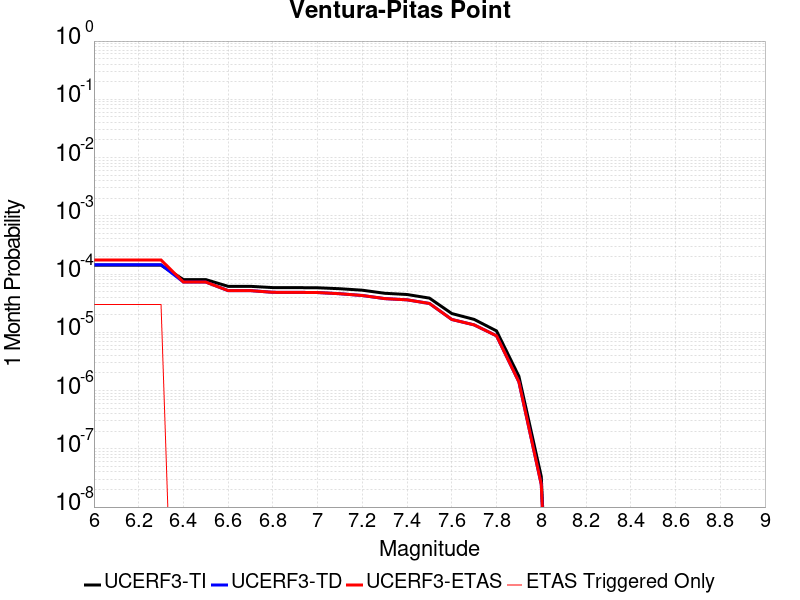 |  |  |

| Magnitude | 1 wk TI Prob | 1 wk TD Prob | 1 wk ETAS Prob | 1 wk ETAS/TD Gain | 1 wk ETAS Triggered Only | 1 mo TI Prob | 1 mo TD Prob | 1 mo ETAS Prob | 1 mo ETAS/TD Gain | 1 mo ETAS Triggered Only | 1 yr TI Prob | 1 yr TD Prob | 1 yr ETAS Prob | 1 yr ETAS/TD Gain | 1 yr ETAS Triggered Only | 10 yr TI Prob | 10 yr TD Prob | 10 yr ETAS Prob | 10 yr ETAS/TD Gain | 10 yr ETAS Triggered Only |
|-----|-----|-----|-----|-----|-----|-----|-----|-----|-----|-----|-----|-----|-----|-----|-----|-----|-----|-----|-----|-----|
| 6.0 | 3.3179622E-5 | 3.373519E-5 | 5.373451E-5 | 1.5928328 | 2.0E-5 | 1.4219063E-4 | 1.4457281E-4 | 1.7456847E-4 | 1.2074779 | 3.0E-5 | 0.0017297962 | 0.0017590097 | 0.0018588338 | 1.0567502 | 1.0E-4 | 0.017163932 | 0.017476497 | 0.017623875 | 1.008433 | 1.5E-4 |
| 6.1 | 3.3179622E-5 | 3.373519E-5 | 5.373451E-5 | 1.5928328 | 2.0E-5 | 1.4219063E-4 | 1.4457281E-4 | 1.7456847E-4 | 1.2074779 | 3.0E-5 | 0.0017297962 | 0.0017590097 | 0.0018588338 | 1.0567502 | 1.0E-4 | 0.017163932 | 0.017476497 | 0.017623875 | 1.008433 | 1.5E-4 |
| 6.2 | 3.3179622E-5 | 3.373519E-5 | 5.373451E-5 | 1.5928328 | 2.0E-5 | 1.4219063E-4 | 1.4457281E-4 | 1.7456847E-4 | 1.2074779 | 3.0E-5 | 0.0017297962 | 0.0017590097 | 0.0018588338 | 1.0567502 | 1.0E-4 | 0.017163932 | 0.017476497 | 0.017623875 | 1.008433 | 1.5E-4 |
| 6.3 | 3.3179622E-5 | 3.373519E-5 | 5.373451E-5 | 1.5928328 | 2.0E-5 | 1.4219063E-4 | 1.4457281E-4 | 1.7456847E-4 | 1.2074779 | 3.0E-5 | 0.0017297962 | 0.0017590097 | 0.0018588338 | 1.0567502 | 1.0E-4 | 0.017163932 | 0.017476497 | 0.017623875 | 1.008433 | 1.5E-4 |
| 6.4 | 1.8754668E-5 | 1.7019594E-5 | 1.7019594E-5 | 1.0 | 0.0 | 8.037467E-5 | 7.2939205E-5 | 7.2939205E-5 | 1.0 | 0.0 | 9.781223E-4 | 8.8769617E-4 | 9.276607E-4 | 1.0450205 | 4.0E-5 | 0.009738282 | 0.008843943 | 0.008903412 | 1.0067244 | 6.0E-5 |
| 6.5 | 1.8754668E-5 | 1.7019594E-5 | 1.7019594E-5 | 1.0 | 0.0 | 8.037467E-5 | 7.2939205E-5 | 7.2939205E-5 | 1.0 | 0.0 | 9.781223E-4 | 8.8769617E-4 | 9.276607E-4 | 1.0450205 | 4.0E-5 | 0.009738282 | 0.008843943 | 0.008903412 | 1.0067244 | 6.0E-5 |
| 6.6 | 1.4361558E-5 | 1.2122258E-5 | 1.2122258E-5 | 1.0 | 0.0 | 6.154808E-5 | 5.1951512E-5 | 5.1951512E-5 | 1.0 | 0.0 | 7.490902E-4 | 6.323284E-4 | 6.723031E-4 | 1.0632182 | 4.0E-5 | 0.0074657016 | 0.006305652 | 0.006365274 | 1.0094553 | 6.0E-5 |
| 6.7 | 1.4361558E-5 | 1.2122258E-5 | 1.2122258E-5 | 1.0 | 0.0 | 6.154808E-5 | 5.1951512E-5 | 5.1951512E-5 | 1.0 | 0.0 | 7.490902E-4 | 6.323284E-4 | 6.723031E-4 | 1.0632182 | 4.0E-5 | 0.0074657016 | 0.006305652 | 0.006365274 | 1.0094553 | 6.0E-5 |
| 6.8 | 1.3663846E-5 | 1.1344401E-5 | 1.1344401E-5 | 1.0 | 0.0 | 5.8558027E-5 | 4.8617967E-5 | 4.8617967E-5 | 1.0 | 0.0 | 7.127108E-4 | 5.917649E-4 | 6.2174717E-4 | 1.0506659 | 3.0E-5 | 0.007104293 | 0.0059022107 | 0.005941975 | 1.0067371 | 4.0E-5 |
| 6.9 | 1.3644157E-5 | 1.1322501E-5 | 1.1322501E-5 | 1.0 | 0.0 | 5.8473648E-5 | 4.8524114E-5 | 4.8524114E-5 | 1.0 | 0.0 | 7.116841E-4 | 5.906229E-4 | 6.206052E-4 | 1.0507638 | 3.0E-5 | 0.007094092 | 0.0058908514 | 0.0059306156 | 1.0067502 | 4.0E-5 |
| 7.0 | 1.3568845E-5 | 1.12420685E-5 | 1.12420685E-5 | 1.0 | 0.0 | 5.8150898E-5 | 4.8179416E-5 | 4.8179416E-5 | 1.0 | 0.0 | 7.077572E-4 | 5.8642845E-4 | 6.1641086E-4 | 1.0511272 | 3.0E-5 | 0.007055073 | 0.005849128 | 0.005888894 | 1.0067986 | 4.0E-5 |
| 7.1 | 1.306572E-5 | 1.0720521E-5 | 1.0720521E-5 | 1.0 | 0.0 | 5.599474E-5 | 4.594429E-5 | 4.594429E-5 | 1.0 | 0.0 | 6.815227E-4 | 5.5923004E-4 | 5.892133E-4 | 1.0536152 | 3.0E-5 | 0.0067943637 | 0.005578536 | 0.0056083687 | 1.0053477 | 3.0E-5 |
| 7.2 | 1.232604E-5 | 9.995121E-6 | 9.995121E-6 | 1.0 | 0.0 | 5.2824813E-5 | 4.283554E-5 | 4.283554E-5 | 1.0 | 0.0 | 6.429523E-4 | 5.2139966E-4 | 5.5138406E-4 | 1.0575074 | 3.0E-5 | 0.0064109527 | 0.005202059 | 0.005231903 | 1.005737 | 3.0E-5 |
| 7.3 | 1.0917261E-5 | 8.843812E-6 | 8.843812E-6 | 1.0 | 0.0 | 4.678742E-5 | 3.7901507E-5 | 3.7901507E-5 | 1.0 | 0.0 | 5.69488E-4 | 4.6135474E-4 | 4.913409E-4 | 1.0649959 | 3.0E-5 | 0.0056803077 | 0.004604239 | 0.0046341005 | 1.0064857 | 3.0E-5 |
| 7.4 | 1.039959E-5 | 8.42354E-6 | 8.42354E-6 | 1.0 | 0.0 | 4.456891E-5 | 3.6100395E-5 | 3.6100395E-5 | 1.0 | 0.0 | 5.424914E-4 | 4.394352E-4 | 4.6942203E-4 | 1.0682395 | 3.0E-5 | 0.0054116896 | 0.0043859277 | 0.004415796 | 1.0068101 | 3.0E-5 |
| 7.5 | 9.015877E-6 | 7.29752E-6 | 7.29752E-6 | 1.0 | 0.0 | 3.86389E-5 | 3.1274718E-5 | 3.1274718E-5 | 1.0 | 0.0 | 4.7032707E-4 | 3.8070456E-4 | 4.1069314E-4 | 1.0787712 | 3.0E-5 | 0.004693329 | 0.003800772 | 0.0038306578 | 1.0078632 | 3.0E-5 |
| 7.6 | 4.900162E-6 | 3.874119E-6 | 3.874119E-6 | 1.0 | 0.0 | 2.1000526E-5 | 1.6603262E-5 | 1.6603262E-5 | 1.0 | 0.0 | 2.556514E-4 | 2.0212609E-4 | 2.1212407E-4 | 1.0494641 | 1.0E-5 | 0.0025535747 | 0.002019436 | 0.002029416 | 1.0049418 | 1.0E-5 |
| 7.7 | 3.8850626E-6 | 3.12676E-6 | 3.12676E-6 | 1.0 | 0.0 | 1.6650163E-5 | 1.3400332E-5 | 1.3400332E-5 | 1.0 | 0.0 | 2.0269687E-4 | 1.6313691E-4 | 1.7313528E-4 | 1.0612882 | 1.0E-5 | 0.002025121 | 0.0016301809 | 0.0016401645 | 1.0061243 | 1.0E-5 |
| 7.8 | 2.4654719E-6 | 2.029902E-6 | 2.029902E-6 | 1.0 | 0.0 | 1.0566265E-5 | 8.699551E-6 | 8.699551E-6 | 1.0 | 0.0 | 1.2863669E-4 | 1.0591193E-4 | 1.0591193E-4 | 1.0 | 0.0 | 0.0012856225 | 0.0010586192 | 0.0010586192 | 1.0 | 0.0 |
| 7.9 | 4.095894E-7 | 3.2765078E-7 | 3.2765078E-7 | 1.0 | 0.0 | 1.7553821E-6 | 1.4042168E-6 | 1.4042168E-6 | 1.0 | 0.0 | 2.1371567E-5 | 1.709621E-5 | 1.709621E-5 | 1.0 | 0.0 | 2.1369511E-4 | 1.7094925E-4 | 1.7094925E-4 | 1.0 | 0.0 |
| 8.0 | 7.791402E-9 | 5.6836056E-9 | 5.6836056E-9 | 1.0 | 0.0 | 3.3391725E-8 | 2.4358311E-8 | 2.4358311E-8 | 1.0 | 0.0 | 4.0654416E-7 | 2.965624E-7 | 2.965624E-7 | 1.0 | 0.0 | 4.065434E-6 | 2.9656223E-6 | 2.9656223E-6 | 1.0 | 0.0 |

## Owens Valley
*[(top)](#table-of-contents)*

| 1 Week | 1 Month | 1 Year | 10 Year |
|-----|-----|-----|-----|
|  |  |  |  |

| Magnitude | 1 wk TI Prob | 1 wk TD Prob | 1 wk ETAS Prob | 1 wk ETAS/TD Gain | 1 wk ETAS Triggered Only | 1 mo TI Prob | 1 mo TD Prob | 1 mo ETAS Prob | 1 mo ETAS/TD Gain | 1 mo ETAS Triggered Only | 1 yr TI Prob | 1 yr TD Prob | 1 yr ETAS Prob | 1 yr ETAS/TD Gain | 1 yr ETAS Triggered Only | 10 yr TI Prob | 10 yr TD Prob | 10 yr ETAS Prob | 10 yr ETAS/TD Gain | 10 yr ETAS Triggered Only |
|-----|-----|-----|-----|-----|-----|-----|-----|-----|-----|-----|-----|-----|-----|-----|-----|-----|-----|-----|-----|-----|
| 6.0 | 4.83821E-5 | 3.6210524E-6 | 1.36210165E-5 | 3.7616181 | 1.0E-5 | 2.0733538E-4 | 1.551871E-5 | 6.551793E-5 | 4.2218676 | 5.0E-5 | 0.002521386 | 1.889249E-4 | 2.88906E-4 | 1.5292109 | 1.0E-4 | 0.024929691 | 0.0019297141 | 0.002069444 | 1.0724096 | 1.4E-4 |
| 6.1 | 4.83821E-5 | 3.6210524E-6 | 1.36210165E-5 | 3.7616181 | 1.0E-5 | 2.0733538E-4 | 1.551871E-5 | 6.551793E-5 | 4.2218676 | 5.0E-5 | 0.002521386 | 1.889249E-4 | 2.88906E-4 | 1.5292109 | 1.0E-4 | 0.024929691 | 0.0019297141 | 0.002069444 | 1.0724096 | 1.4E-4 |
| 6.2 | 4.83821E-5 | 3.6210524E-6 | 1.36210165E-5 | 3.7616181 | 1.0E-5 | 2.0733538E-4 | 1.551871E-5 | 6.551793E-5 | 4.2218676 | 5.0E-5 | 0.002521386 | 1.889249E-4 | 2.88906E-4 | 1.5292109 | 1.0E-4 | 0.024929691 | 0.0019297141 | 0.002069444 | 1.0724096 | 1.4E-4 |
| 6.3 | 3.953008E-5 | 3.1530958E-6 | 1.3153064E-5 | 4.1714764 | 1.0E-5 | 1.6940363E-4 | 1.3513202E-5 | 6.3512525E-5 | 4.700035 | 5.0E-5 | 0.002060538 | 1.6451156E-4 | 2.5449676E-4 | 1.5469841 | 9.0E-5 | 0.020415364 | 0.0016621627 | 0.0017919467 | 1.0780814 | 1.3E-4 |
| 6.4 | 3.953008E-5 | 3.1530958E-6 | 1.3153064E-5 | 4.1714764 | 1.0E-5 | 1.6940363E-4 | 1.3513202E-5 | 6.3512525E-5 | 4.700035 | 5.0E-5 | 0.002060538 | 1.6451156E-4 | 2.5449676E-4 | 1.5469841 | 9.0E-5 | 0.020415364 | 0.0016621627 | 0.0017919467 | 1.0780814 | 1.3E-4 |
| 6.5 | 3.457342E-5 | 2.9707387E-6 | 1.2970709E-5 | 4.366156 | 1.0E-5 | 1.4816338E-4 | 1.273168E-5 | 6.2731044E-5 | 4.9271617 | 5.0E-5 | 0.0018023965 | 1.5499788E-4 | 2.449839E-4 | 1.5805632 | 9.0E-5 | 0.017878477 | 0.0015563119 | 0.0016861095 | 1.0834008 | 1.3E-4 |
| 6.6 | 3.1127765E-5 | 2.8737306E-6 | 1.2873702E-5 | 4.4797873 | 1.0E-5 | 1.3339789E-4 | 1.2315934E-5 | 6.231532E-5 | 5.0597315 | 5.0E-5 | 0.0016229092 | 1.4993687E-4 | 2.3992338E-4 | 1.6001626 | 9.0E-5 | 0.016111081 | 0.0015013438 | 0.0016311486 | 1.086459 | 1.3E-4 |
| 6.7 | 2.806885E-5 | 2.8101606E-6 | 1.2810133E-5 | 4.5585055 | 1.0E-5 | 1.2028952E-4 | 1.2043493E-5 | 6.204289E-5 | 5.1515694 | 5.0E-5 | 0.001463541 | 1.4662035E-4 | 2.3660716E-4 | 1.6137402 | 9.0E-5 | 0.014539397 | 0.0014656087 | 0.0015854328 | 1.0817572 | 1.2E-4 |
| 6.8 | 2.524524E-5 | 2.2351392E-6 | 1.2235117E-5 | 5.4739842 | 1.0E-5 | 1.0818939E-4 | 9.579134E-6 | 4.957875E-5 | 5.1757026 | 4.0E-5 | 0.0013164099 | 1.16620016E-4 | 1.966107E-4 | 1.6859086 | 8.0E-5 | 0.01308639 | 0.001165827 | 0.0012756989 | 1.0942436 | 1.1E-4 |
| 6.9 | 2.2704568E-5 | 1.6079711E-6 | 1.1607955E-5 | 7.2190075 | 1.0E-5 | 9.730166E-5 | 6.8912864E-6 | 4.689101E-5 | 6.8043914 | 4.0E-5 | 0.0011840039 | 8.38982E-5 | 1.6389148E-4 | 1.9534565 | 8.0E-5 | 0.011777153 | 8.38853E-4 | 9.487608E-4 | 1.1310214 | 1.1E-4 |
| 7.0 | 2.0871712E-5 | 1.5393621E-6 | 1.1539347E-5 | 7.496187 | 1.0E-5 | 8.944713E-5 | 6.5972495E-6 | 4.6596986E-5 | 7.0630927 | 4.0E-5 | 0.0010884746 | 8.031857E-5 | 1.6031215E-4 | 1.9959537 | 8.0E-5 | 0.010831586 | 8.030395E-4 | 9.129512E-4 | 1.1368695 | 1.1E-4 |
| 7.1 | 1.944928E-5 | 1.3862556E-6 | 1.1386242E-5 | 8.213667 | 1.0E-5 | 8.335139E-5 | 5.941082E-6 | 4.5940844E-5 | 7.7327404 | 4.0E-5 | 0.0010143308 | 7.233028E-5 | 1.4232521E-4 | 1.9677128 | 7.0E-5 | 0.010097133 | 7.2319806E-4 | 8.231257E-4 | 1.1381747 | 1.0E-4 |
| 7.2 | 1.7876306E-5 | 1.2487686E-6 | 1.1248756E-5 | 9.007879 | 1.0E-5 | 7.6610486E-5 | 5.3518543E-6 | 4.535164E-5 | 8.474005 | 4.0E-5 | 9.3233347E-4 | 6.515689E-5 | 1.3515232E-4 | 2.07426 | 7.0E-5 | 0.009284316 | 6.5148395E-4 | 7.514188E-4 | 1.1533958 | 1.0E-4 |
| 7.3 | 1.2618672E-5 | 1.1113839E-6 | 1.1111373E-5 | 9.997781 | 1.0E-5 | 5.40789E-5 | 4.763065E-6 | 4.4762874E-5 | 9.397913 | 4.0E-5 | 6.582117E-4 | 5.7988782E-5 | 1.2798472E-4 | 2.20706 | 7.0E-5 | 0.0065626553 | 5.7983754E-4 | 6.6978537E-4 | 1.1551259 | 9.0E-5 |
| 7.4 | 7.4874442E-6 | 8.547518E-7 | 1.0854743E-5 | 12.699293 | 1.0E-5 | 3.208865E-5 | 3.6632168E-6 | 4.366307E-5 | 11.919325 | 4.0E-5 | 3.906093E-4 | 4.4598757E-5 | 1.0459608E-4 | 2.345269 | 6.0E-5 | 0.003899234 | 4.459579E-4 | 5.259222E-4 | 1.1793091 | 8.0E-5 |
| 7.5 | 2.4734156E-6 | 6.0679935E-7 | 1.0606794E-5 | 17.479902 | 1.0E-5 | 1.060031E-5 | 2.6005662E-6 | 3.260049E-5 | 12.535919 | 3.0E-5 | 1.2905113E-4 | 3.1661435E-5 | 8.1659855E-5 | 2.5791583 | 5.0E-5 | 0.0012897621 | 3.1656958E-4 | 3.865474E-4 | 1.2210504 | 7.0E-5 |
| 7.6 | 1.1328841E-6 | 3.1961991E-7 | 3.1961991E-7 | 1.0 | 0.0 | 4.8552088E-6 | 1.369799E-6 | 1.1369785E-5 | 8.300331 | 1.0E-5 | 5.9110564E-5 | 1.6677177E-5 | 3.6676844E-5 | 2.1992238 | 2.0E-5 | 5.9094845E-4 | 1.6675945E-4 | 2.0675277E-4 | 1.2398264 | 4.0E-5 |
| 7.7 | 4.8613185E-7 | 8.962742E-8 | 8.962742E-8 | 1.0 | 0.0 | 2.0834207E-6 | 3.8411747E-7 | 3.8411747E-7 | 1.0 | 0.0 | 2.536535E-5 | 4.676621E-6 | 1.4676574E-5 | 3.138286 | 1.0E-5 | 2.5362454E-4 | 4.676529E-5 | 6.6764354E-5 | 1.4276476 | 2.0E-5 |

## Pisgah-Bullion Mtn-Mesquite Lk
*[(top)](#table-of-contents)*

| 1 Week | 1 Month | 1 Year | 10 Year |
|-----|-----|-----|-----|
|  |  |  |  |

| Magnitude | 1 wk TI Prob | 1 wk TD Prob | 1 wk ETAS Prob | 1 wk ETAS/TD Gain | 1 wk ETAS Triggered Only | 1 mo TI Prob | 1 mo TD Prob | 1 mo ETAS Prob | 1 mo ETAS/TD Gain | 1 mo ETAS Triggered Only | 1 yr TI Prob | 1 yr TD Prob | 1 yr ETAS Prob | 1 yr ETAS/TD Gain | 1 yr ETAS Triggered Only | 10 yr TI Prob | 10 yr TD Prob | 10 yr ETAS Prob | 10 yr ETAS/TD Gain | 10 yr ETAS Triggered Only |
|-----|-----|-----|-----|-----|-----|-----|-----|-----|-----|-----|-----|-----|-----|-----|-----|-----|-----|-----|-----|-----|
| 6.0 | 3.0240792E-5 | 2.40909E-5 | 5.409018E-5 | 2.2452536 | 3.0E-5 | 1.2959696E-4 | 1.032432E-4 | 1.63237E-4 | 1.5810921 | 6.0E-5 | 0.0015767008 | 0.0012563618 | 0.0013662236 | 1.0874444 | 1.1E-4 | 0.015655609 | 0.012502613 | 0.012630988 | 1.0102679 | 1.3E-4 |
| 6.1 | 3.0240792E-5 | 2.40909E-5 | 5.409018E-5 | 2.2452536 | 3.0E-5 | 1.2959696E-4 | 1.032432E-4 | 1.63237E-4 | 1.5810921 | 6.0E-5 | 0.0015767008 | 0.0012563618 | 0.0013662236 | 1.0874444 | 1.1E-4 | 0.015655609 | 0.012502613 | 0.012630988 | 1.0102679 | 1.3E-4 |
| 6.2 | 3.0240792E-5 | 2.40909E-5 | 5.409018E-5 | 2.2452536 | 3.0E-5 | 1.2959696E-4 | 1.032432E-4 | 1.63237E-4 | 1.5810921 | 6.0E-5 | 0.0015767008 | 0.0012563618 | 0.0013662236 | 1.0874444 | 1.1E-4 | 0.015655609 | 0.012502613 | 0.012630988 | 1.0102679 | 1.3E-4 |
| 6.3 | 2.0498217E-5 | 1.3638054E-5 | 3.363778E-5 | 2.4664648 | 2.0E-5 | 8.784654E-5 | 5.8447586E-5 | 8.8445835E-5 | 1.5132504 | 3.0E-5 | 0.0010690069 | 7.1138324E-4 | 7.513548E-4 | 1.0561885 | 4.0E-5 | 0.01063879 | 0.0070926864 | 0.007142332 | 1.0069995 | 5.0E-5 |
| 6.4 | 2.0498217E-5 | 1.3638054E-5 | 3.363778E-5 | 2.4664648 | 2.0E-5 | 8.784654E-5 | 5.8447586E-5 | 8.8445835E-5 | 1.5132504 | 3.0E-5 | 0.0010690069 | 7.1138324E-4 | 7.513548E-4 | 1.0561885 | 4.0E-5 | 0.01063879 | 0.0070926864 | 0.007142332 | 1.0069995 | 5.0E-5 |
| 6.5 | 1.7316182E-5 | 1.04769715E-5 | 3.0476762E-5 | 2.9089286 | 2.0E-5 | 7.42101E-5 | 4.490059E-5 | 7.4899246E-5 | 1.6681126 | 3.0E-5 | 9.0313336E-4 | 5.465376E-4 | 5.865157E-4 | 1.073148 | 4.0E-5 | 0.008994718 | 0.00545293 | 0.0055026575 | 1.0091194 | 5.0E-5 |
| 6.6 | 1.5251077E-5 | 8.414133E-6 | 1.8414048E-5 | 2.1884665 | 1.0E-5 | 6.536012E-5 | 3.606011E-5 | 5.605939E-5 | 1.5546094 | 2.0E-5 | 7.9546886E-4 | 4.3895066E-4 | 4.6893748E-4 | 1.0683148 | 3.0E-5 | 0.007926274 | 0.0043815537 | 0.0044213785 | 1.0090892 | 4.0E-5 |
| 6.7 | 1.2997425E-5 | 6.4112146E-6 | 6.4112146E-6 | 1.0 | 0.0 | 5.570206E-5 | 2.7476372E-5 | 3.7476097E-5 | 1.363939 | 1.0E-5 | 6.7796157E-4 | 3.3447813E-4 | 3.4447477E-4 | 1.0298873 | 1.0E-5 | 0.0067589693 | 0.003340207 | 0.0033601404 | 1.0059676 | 2.0E-5 |
| 6.8 | 1.035386E-5 | 4.333145E-6 | 4.333145E-6 | 1.0 | 0.0 | 4.437293E-5 | 1.8570496E-5 | 2.857031E-5 | 1.5384786 | 1.0E-5 | 5.401065E-4 | 2.260732E-4 | 2.3607093E-4 | 1.0442234 | 1.0E-5 | 0.0053879567 | 0.002258519 | 0.0022784737 | 1.0088353 | 2.0E-5 |
| 6.9 | 8.816252E-6 | 3.5805879E-6 | 3.5805879E-6 | 1.0 | 0.0 | 3.778339E-5 | 1.534529E-5 | 1.534529E-5 | 1.0 | 0.0 | 4.5991567E-4 | 1.8681347E-4 | 1.8681347E-4 | 1.0 | 0.0 | 0.00458965 | 0.0018666228 | 0.0018766042 | 1.0053473 | 1.0E-5 |
| 7.0 | 6.8232207E-6 | 2.5674399E-6 | 2.5674399E-6 | 1.0 | 0.0 | 2.9242048E-5 | 1.100327E-5 | 1.100327E-5 | 1.0 | 0.0 | 3.5596377E-4 | 1.3395688E-4 | 1.3395688E-4 | 1.0 | 0.0 | 0.0035539411 | 0.0013387925 | 0.0013387925 | 1.0 | 0.0 |
| 7.1 | 5.837013E-6 | 2.2273143E-6 | 2.2273143E-6 | 1.0 | 0.0 | 2.501553E-5 | 9.5456E-6 | 9.5456E-6 | 1.0 | 0.0 | 3.045215E-4 | 1.1621177E-4 | 1.1621177E-4 | 1.0 | 0.0 | 0.0030410455 | 0.001161539 | 0.001161539 | 1.0 | 0.0 |
| 7.2 | 4.278052E-6 | 1.6275065E-6 | 1.6275065E-6 | 1.0 | 0.0 | 1.833438E-5 | 6.975011E-6 | 6.975011E-6 | 1.0 | 0.0 | 2.231982E-4 | 8.491768E-5 | 8.491768E-5 | 1.0 | 0.0 | 0.0022297418 | 8.4887556E-4 | 8.4887556E-4 | 1.0 | 0.0 |
| 7.3 | 1.8803692E-6 | 8.344788E-7 | 8.344788E-7 | 1.0 | 0.0 | 8.0587E-6 | 3.5763337E-6 | 3.5763337E-6 | 1.0 | 0.0 | 9.811026E-5 | 4.354114E-5 | 4.354114E-5 | 1.0 | 0.0 | 9.806695E-4 | 4.3534054E-4 | 4.3534054E-4 | 1.0 | 0.0 |

## Ortigalita (North)
*[(top)](#table-of-contents)*

| 1 Week | 1 Month | 1 Year | 10 Year |
|-----|-----|-----|-----|
| 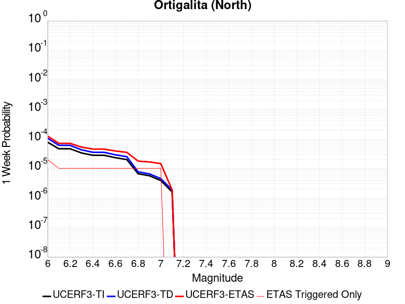 | 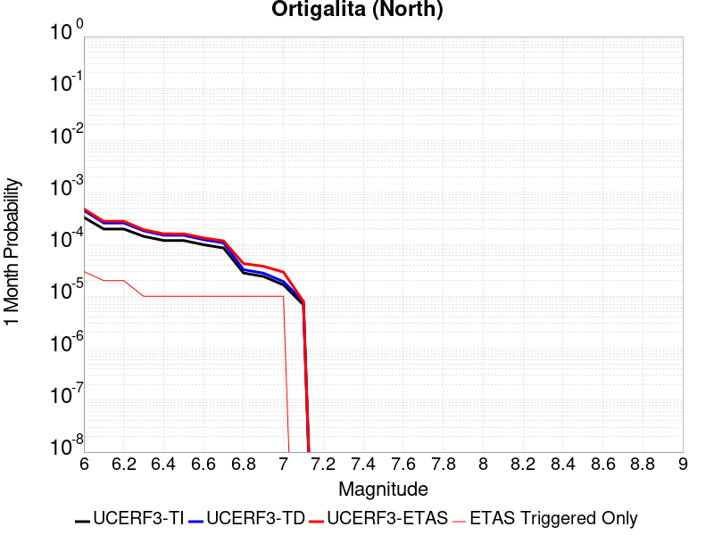 |  |  |

| Magnitude | 1 wk TI Prob | 1 wk TD Prob | 1 wk ETAS Prob | 1 wk ETAS/TD Gain | 1 wk ETAS Triggered Only | 1 mo TI Prob | 1 mo TD Prob | 1 mo ETAS Prob | 1 mo ETAS/TD Gain | 1 mo ETAS Triggered Only | 1 yr TI Prob | 1 yr TD Prob | 1 yr ETAS Prob | 1 yr ETAS/TD Gain | 1 yr ETAS Triggered Only | 10 yr TI Prob | 10 yr TD Prob | 10 yr ETAS Prob | 10 yr ETAS/TD Gain | 10 yr ETAS Triggered Only |
|-----|-----|-----|-----|-----|-----|-----|-----|-----|-----|-----|-----|-----|-----|-----|-----|-----|-----|-----|-----|-----|
| 6.0 | 7.711876E-5 | 1.0505308E-4 | 1.2505098E-4 | 1.19036 | 2.0E-5 | 3.3046713E-4 | 4.501601E-4 | 4.8014658E-4 | 1.066613 | 3.0E-5 | 0.004016016 | 0.0054680547 | 0.005527727 | 1.0109128 | 6.0E-5 | 0.039442103 | 0.053455614 | 0.053550266 | 1.0017707 | 1.0E-4 |
| 6.1 | 4.607858E-5 | 6.0239887E-5 | 7.0239286E-5 | 1.165993 | 1.0E-5 | 1.9746469E-4 | 2.5814763E-4 | 2.7814248E-4 | 1.077455 | 2.0E-5 | 0.0024014818 | 0.0031387366 | 0.0031786112 | 1.012704 | 4.0E-5 | 0.023756953 | 0.030975312 | 0.031023763 | 1.0015641 | 5.0E-5 |
| 6.2 | 4.607858E-5 | 6.0239887E-5 | 7.0239286E-5 | 1.165993 | 1.0E-5 | 1.9746469E-4 | 2.5814763E-4 | 2.7814248E-4 | 1.077455 | 2.0E-5 | 0.0024014818 | 0.0031387366 | 0.0031786112 | 1.012704 | 4.0E-5 | 0.023756953 | 0.030975312 | 0.031023763 | 1.0015641 | 5.0E-5 |
| 6.3 | 3.327423E-5 | 4.2476124E-5 | 5.2475698E-5 | 1.2354164 | 1.0E-5 | 1.4259605E-4 | 1.8202956E-4 | 1.9202773E-4 | 1.0549262 | 1.0E-5 | 0.0017347244 | 0.002214206 | 0.0022441396 | 1.0135189 | 3.0E-5 | 0.017212452 | 0.02194574 | 0.021984862 | 1.0017827 | 4.0E-5 |
| 6.4 | 2.7732503E-5 | 3.4999008E-5 | 4.4998655E-5 | 1.2857124 | 1.0E-5 | 1.1884817E-4 | 1.499886E-4 | 1.599871E-4 | 1.0666617 | 1.0E-5 | 0.001446016 | 0.0018248158 | 0.001854761 | 1.01641 | 3.0E-5 | 0.014366428 | 0.018121297 | 0.018160572 | 1.0021673 | 4.0E-5 |
| 6.5 | 2.7689714E-5 | 3.4948822E-5 | 4.4948472E-5 | 1.2861227 | 1.0E-5 | 1.186648E-4 | 1.4977354E-4 | 1.5977204E-4 | 1.0667574 | 1.0E-5 | 0.0014437864 | 0.0018222018 | 0.0018521472 | 1.0164336 | 3.0E-5 | 0.014344421 | 0.018095585 | 0.01813486 | 1.0021704 | 4.0E-5 |
| 6.6 | 2.2976905E-5 | 2.871829E-5 | 3.8718004E-5 | 1.3482001 | 1.0E-5 | 9.846873E-5 | 1.23074E-4 | 1.3307277E-4 | 1.081242 | 1.0E-5 | 0.0011981975 | 0.0014976348 | 0.0015275899 | 1.0200015 | 3.0E-5 | 0.011917574 | 0.014898733 | 0.0149381375 | 1.0026448 | 4.0E-5 |
| 6.7 | 1.9871539E-5 | 2.4904637E-5 | 3.4904388E-5 | 1.4015217 | 1.0E-5 | 8.516096E-5 | 1.067312E-4 | 1.1673012E-4 | 1.0936834 | 1.0E-5 | 0.0010363415 | 0.0012989199 | 0.001328881 | 1.0230662 | 3.0E-5 | 0.010315218 | 0.012936938 | 0.01297642 | 1.0030519 | 4.0E-5 |
| 6.8 | 6.5640475E-6 | 7.6054926E-6 | 1.7605416E-5 | 2.3148293 | 1.0E-5 | 2.813133E-5 | 3.2594577E-5 | 4.259425E-5 | 1.3067895 | 1.0E-5 | 3.424451E-4 | 3.9676955E-4 | 4.1676164E-4 | 1.0503871 | 2.0E-5 | 0.0034191788 | 0.003960899 | 0.00399078 | 1.007544 | 3.0E-5 |
| 6.9 | 5.6219683E-6 | 6.5018376E-6 | 1.6501772E-5 | 2.5380168 | 1.0E-5 | 2.4093928E-5 | 2.7864735E-5 | 3.7864458E-5 | 1.3588666 | 1.0E-5 | 2.933041E-4 | 3.3920293E-4 | 3.5919613E-4 | 1.0589417 | 2.0E-5 | 0.0029291727 | 0.003387109 | 0.003407041 | 1.0058848 | 2.0E-5 |
| 7.0 | 3.875591E-6 | 4.4847548E-6 | 1.448471E-5 | 3.2297661 | 1.0E-5 | 1.6609569E-5 | 1.9220248E-5 | 2.9220057E-5 | 1.5202746 | 1.0E-5 | 2.0220275E-4 | 2.339835E-4 | 2.5397883E-4 | 1.0854561 | 2.0E-5 | 0.0020201886 | 0.0023375798 | 0.0023575332 | 1.0085359 | 2.0E-5 |
| 7.1 | 1.6017933E-6 | 1.8570418E-6 | 1.8570418E-6 | 1.0 | 0.0 | 6.8648105E-6 | 7.958732E-6 | 7.958732E-6 | 1.0 | 0.0 | 8.357586E-5 | 9.689432E-5 | 1.06893356E-4 | 1.1031952 | 1.0E-5 | 8.3544437E-4 | 9.686254E-4 | 9.786157E-4 | 1.0103139 | 1.0E-5 |

## San Diego Trough north alt1
*[(top)](#table-of-contents)*

| 1 Week | 1 Month | 1 Year | 10 Year |
|-----|-----|-----|-----|
|  |  |  |  |

| Magnitude | 1 wk TI Prob | 1 wk TD Prob | 1 wk ETAS Prob | 1 wk ETAS/TD Gain | 1 wk ETAS Triggered Only | 1 mo TI Prob | 1 mo TD Prob | 1 mo ETAS Prob | 1 mo ETAS/TD Gain | 1 mo ETAS Triggered Only | 1 yr TI Prob | 1 yr TD Prob | 1 yr ETAS Prob | 1 yr ETAS/TD Gain | 1 yr ETAS Triggered Only | 10 yr TI Prob | 10 yr TD Prob | 10 yr ETAS Prob | 10 yr ETAS/TD Gain | 10 yr ETAS Triggered Only |
|-----|-----|-----|-----|-----|-----|-----|-----|-----|-----|-----|-----|-----|-----|-----|-----|-----|-----|-----|-----|-----|
| 6.0 | 7.329252E-5 | 8.821269E-5 | 9.8211814E-5 | 1.1133524 | 1.0E-5 | 3.14073E-4 | 3.7800326E-4 | 4.2798437E-4 | 1.132224 | 5.0E-5 | 0.0038171355 | 0.0045930487 | 0.004662727 | 1.0151705 | 7.0E-5 | 0.03752231 | 0.045045137 | 0.045150183 | 1.002332 | 1.1E-4 |
| 6.1 | 3.7940346E-5 | 4.4884906E-5 | 4.4884906E-5 | 1.0 | 0.0 | 1.6259136E-4 | 1.9235026E-4 | 2.1234641E-4 | 1.1039569 | 2.0E-5 | 0.0019777524 | 0.002339431 | 0.0023793373 | 1.0170581 | 4.0E-5 | 0.019602431 | 0.023156732 | 0.023215344 | 1.002531 | 6.0E-5 |
| 6.2 | 2.8645263E-5 | 3.329672E-5 | 3.329672E-5 | 1.0 | 0.0 | 1.2275964E-4 | 1.4269259E-4 | 1.4269259E-4 | 1.0 | 0.0 | 0.0014935739 | 0.0017359206 | 0.0017459032 | 1.0057507 | 1.0E-5 | 0.0148357535 | 0.017226268 | 0.017245922 | 1.0011411 | 2.0E-5 |
| 6.3 | 2.8645263E-5 | 3.329672E-5 | 3.329672E-5 | 1.0 | 0.0 | 1.2275964E-4 | 1.4269259E-4 | 1.4269259E-4 | 1.0 | 0.0 | 0.0014935739 | 0.0017359206 | 0.0017459032 | 1.0057507 | 1.0E-5 | 0.0148357535 | 0.017226268 | 0.017245922 | 1.0011411 | 2.0E-5 |
| 6.4 | 2.2204576E-5 | 2.544832E-5 | 2.544832E-5 | 1.0 | 0.0 | 9.5159E-5 | 1.0905972E-4 | 1.0905972E-4 | 1.0 | 0.0 | 0.001157945 | 0.0013270028 | 0.0013270028 | 1.0 | 0.0 | 0.011519298 | 0.013191959 | 0.013191959 | 1.0 | 0.0 |
| 6.5 | 2.1004838E-5 | 2.4024695E-5 | 2.4024695E-5 | 1.0 | 0.0 | 9.0017624E-5 | 1.0295897E-4 | 1.0295897E-4 | 1.0 | 0.0 | 0.0010954136 | 0.0012528135 | 0.0012528135 | 1.0 | 0.0 | 0.010900296 | 0.012458592 | 0.012458592 | 1.0 | 0.0 |
| 6.6 | 1.820557E-5 | 2.070479E-5 | 2.070479E-5 | 1.0 | 0.0 | 7.802154E-5 | 8.8731824E-5 | 8.8731824E-5 | 1.0 | 0.0 | 9.4949827E-4 | 0.0010797799 | 0.0010797799 | 1.0 | 0.0 | 0.009454516 | 0.010746005 | 0.010746005 | 1.0 | 0.0 |
| 6.7 | 1.5884485E-5 | 1.7983646E-5 | 1.7983646E-5 | 1.0 | 0.0 | 6.807459E-5 | 7.707051E-5 | 7.707051E-5 | 1.0 | 0.0 | 8.284929E-4 | 9.3793223E-4 | 9.3793223E-4 | 1.0 | 0.0 | 0.008254109 | 0.009340104 | 0.009340104 | 1.0 | 0.0 |
| 6.8 | 1.4331171E-5 | 1.6201066E-5 | 1.6201066E-5 | 1.0 | 0.0 | 6.141786E-5 | 6.94313E-5 | 6.94313E-5 | 1.0 | 0.0 | 7.4750587E-4 | 8.450002E-4 | 8.450002E-4 | 1.0 | 0.0 | 0.0074499645 | 0.008418139 | 0.008418139 | 1.0 | 0.0 |
| 6.9 | 1.2574203E-5 | 1.4205835E-5 | 1.4205835E-5 | 1.0 | 0.0 | 5.3888325E-5 | 6.0880735E-5 | 6.0880735E-5 | 1.0 | 0.0 | 6.558929E-4 | 7.409723E-4 | 7.409723E-4 | 1.0 | 0.0 | 0.0065396037 | 0.007385203 | 0.007385203 | 1.0 | 0.0 |
| 7.0 | 1.0883844E-5 | 1.2289262E-5 | 1.2289262E-5 | 1.0 | 0.0 | 4.664421E-5 | 5.2667205E-5 | 5.2667205E-5 | 1.0 | 0.0 | 5.677453E-4 | 6.4103556E-4 | 6.4103556E-4 | 1.0 | 0.0 | 0.00566297 | 0.006391993 | 0.006391993 | 1.0 | 0.0 |
| 7.1 | 9.393088E-6 | 1.060702E-5 | 1.060702E-5 | 1.0 | 0.0 | 4.025547E-5 | 4.545787E-5 | 4.545787E-5 | 1.0 | 0.0 | 4.900001E-4 | 5.533098E-4 | 5.533098E-4 | 1.0 | 0.0 | 0.0048892107 | 0.005519418 | 0.005519418 | 1.0 | 0.0 |
| 7.2 | 8.190791E-6 | 9.258625E-6 | 9.258625E-6 | 1.0 | 0.0 | 3.510292E-5 | 3.9679224E-5 | 3.9679224E-5 | 1.0 | 0.0 | 4.2729423E-4 | 4.8298817E-4 | 4.8298817E-4 | 1.0 | 0.0 | 0.0042647356 | 0.004819465 | 0.004819465 | 1.0 | 0.0 |
| 7.3 | 6.268162E-6 | 7.089716E-6 | 7.089716E-6 | 1.0 | 0.0 | 2.6863276E-5 | 3.0384144E-5 | 3.0384144E-5 | 1.0 | 0.0 | 3.2701128E-4 | 3.6986457E-4 | 3.6986457E-4 | 1.0 | 0.0 | 0.003265305 | 0.003692536 | 0.003692536 | 1.0 | 0.0 |
| 7.4 | 4.985186E-6 | 5.6426816E-6 | 5.6426816E-6 | 1.0 | 0.0 | 2.1364907E-5 | 2.4182698E-5 | 2.4182698E-5 | 1.0 | 0.0 | 2.600867E-4 | 2.9438498E-4 | 2.9438498E-4 | 1.0 | 0.0 | 0.002597825 | 0.0029399914 | 0.0029399914 | 1.0 | 0.0 |
| 7.5 | 1.7489613E-6 | 1.969678E-6 | 1.969678E-6 | 1.0 | 0.0 | 7.495527E-6 | 8.4414505E-6 | 8.4414505E-6 | 1.0 | 0.0 | 9.125422E-5 | 1.02770035E-4 | 1.02770035E-4 | 1.0 | 0.0 | 9.1216754E-4 | 0.0010272472 | 0.0010272472 | 1.0 | 0.0 |
| 7.6 | 1.6988751E-7 | 1.7533823E-7 | 1.7533823E-7 | 1.0 | 0.0 | 7.2808916E-7 | 7.5144936E-7 | 7.5144936E-7 | 1.0 | 0.0 | 8.864449E-6 | 9.14886E-6 | 9.14886E-6 | 1.0 | 0.0 | 8.8640954E-5 | 9.1485024E-5 | 9.1485024E-5 | 1.0 | 0.0 |

## Great Valley 09 (Laguna Seca)
*[(top)](#table-of-contents)*

| 1 Week | 1 Month | 1 Year | 10 Year |
|-----|-----|-----|-----|
|  |  |  | 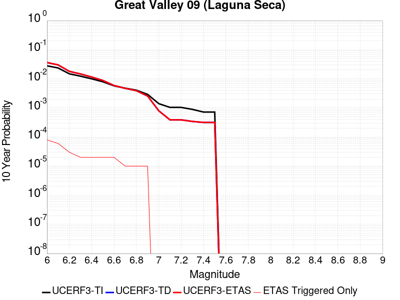 |

| Magnitude | 1 wk TI Prob | 1 wk TD Prob | 1 wk ETAS Prob | 1 wk ETAS/TD Gain | 1 wk ETAS Triggered Only | 1 mo TI Prob | 1 mo TD Prob | 1 mo ETAS Prob | 1 mo ETAS/TD Gain | 1 mo ETAS Triggered Only | 1 yr TI Prob | 1 yr TD Prob | 1 yr ETAS Prob | 1 yr ETAS/TD Gain | 1 yr ETAS Triggered Only | 10 yr TI Prob | 10 yr TD Prob | 10 yr ETAS Prob | 10 yr ETAS/TD Gain | 10 yr ETAS Triggered Only |
|-----|-----|-----|-----|-----|-----|-----|-----|-----|-----|-----|-----|-----|-----|-----|-----|-----|-----|-----|-----|-----|
| 6.0 | 5.4353277E-5 | 7.050019E-5 | 1.1049736E-4 | 1.5673344 | 4.0E-5 | 2.3292181E-4 | 3.0211007E-4 | 3.4209798E-4 | 1.1323621 | 4.0E-5 | 0.0028321352 | 0.0036720056 | 0.003721822 | 1.0135665 | 5.0E-5 | 0.02796312 | 0.036115844 | 0.036192954 | 1.002135 | 8.0E-5 |
| 6.1 | 4.5578287E-5 | 5.822054E-5 | 8.8218796E-5 | 1.5152521 | 3.0E-5 | 1.953209E-4 | 2.4949352E-4 | 2.7948603E-4 | 1.1202136 | 3.0E-5 | 0.0023754383 | 0.0030333549 | 0.003063264 | 1.00986 | 3.0E-5 | 0.023502063 | 0.029919893 | 0.029978096 | 1.0019454 | 6.0E-5 |
| 6.2 | 2.8536782E-5 | 3.4736422E-5 | 4.4736073E-5 | 1.2878723 | 1.0E-5 | 1.2229476E-4 | 1.4886161E-4 | 1.5886012E-4 | 1.0671664 | 1.0E-5 | 0.0014879217 | 0.0018108576 | 0.0018208395 | 1.0055122 | 1.0E-5 | 0.014779986 | 0.017958276 | 0.017987737 | 1.0016406 | 3.0E-5 |
| 6.3 | 2.3698774E-5 | 2.8213344E-5 | 3.8213064E-5 | 1.3544322 | 1.0E-5 | 1.01562226E-4 | 1.2090833E-4 | 1.3090711E-4 | 1.0826973 | 1.0E-5 | 0.0012358186 | 0.001471051 | 0.0014810363 | 1.0067879 | 1.0E-5 | 0.012289686 | 0.014611455 | 0.014631162 | 1.0013487 | 2.0E-5 |
| 6.4 | 1.9191197E-5 | 2.212289E-5 | 3.212267E-5 | 1.4520105 | 1.0E-5 | 8.2245395E-5 | 9.4808805E-5 | 1.04807856E-4 | 1.1054654 | 1.0E-5 | 0.0010008777 | 0.0011536906 | 0.0011636791 | 1.0086578 | 1.0E-5 | 0.009963818 | 0.011477022 | 0.011496793 | 1.0017226 | 2.0E-5 |
| 6.5 | 1.5203241E-5 | 1.6801298E-5 | 2.680113E-5 | 1.5951821 | 1.0E-5 | 6.5155116E-5 | 7.200338E-5 | 8.200266E-5 | 1.1388724 | 1.0E-5 | 7.9297484E-4 | 8.76301E-4 | 8.8629226E-4 | 1.0114017 | 1.0E-5 | 0.007901512 | 0.008729581 | 0.008749406 | 1.002271 | 2.0E-5 |
| 6.6 | 1.0984925E-5 | 1.12425605E-5 | 2.1242447E-5 | 1.8894671 | 1.0E-5 | 4.70774E-5 | 4.8181533E-5 | 5.8181053E-5 | 1.2075384 | 1.0E-5 | 5.730166E-4 | 5.8645604E-4 | 5.964502E-4 | 1.0170416 | 1.0E-5 | 0.005715413 | 0.0058494755 | 0.0058693583 | 1.0033991 | 2.0E-5 |
| 6.7 | 9.134616E-6 | 9.019868E-6 | 1.9019779E-5 | 2.1086535 | 1.0E-5 | 3.9147766E-5 | 3.865602E-5 | 4.8655635E-5 | 1.2586819 | 1.0E-5 | 4.7651984E-4 | 4.7053778E-4 | 4.8053308E-4 | 1.0212423 | 1.0E-5 | 0.004754993 | 0.00469566 | 0.004705613 | 1.0021197 | 1.0E-5 |
| 6.8 | 7.785589E-6 | 7.4519185E-6 | 1.7451845E-5 | 2.3419263 | 1.0E-5 | 3.3366385E-5 | 3.1936415E-5 | 4.1936095E-5 | 1.3131121 | 1.0E-5 | 4.0616E-4 | 3.887585E-4 | 3.987546E-4 | 1.025713 | 1.0E-5 | 0.0040541845 | 0.003880988 | 0.0038909493 | 1.0025667 | 1.0E-5 |
| 6.9 | 5.579095E-6 | 4.8984666E-6 | 1.4898417E-5 | 3.0414453 | 1.0E-5 | 2.3910188E-5 | 2.0993268E-5 | 3.099306E-5 | 1.4763331 | 1.0E-5 | 2.9106764E-4 | 2.5556443E-4 | 2.655619E-4 | 1.0391191 | 1.0E-5 | 0.002906867 | 0.0025528427 | 0.0025628172 | 1.0039072 | 1.0E-5 |
| 7.0 | 2.6816688E-6 | 1.521587E-6 | 1.521587E-6 | 1.0 | 0.0 | 1.1492816E-5 | 6.521071E-6 | 6.521071E-6 | 1.0 | 0.0 | 1.3991605E-4 | 7.939124E-5 | 7.939124E-5 | 1.0 | 0.0 | 0.0013982799 | 7.936375E-4 | 7.936375E-4 | 1.0 | 0.0 |
| 7.1 | 1.9951021E-6 | 7.45357E-7 | 7.45357E-7 | 1.0 | 0.0 | 8.55041E-6 | 3.1943835E-6 | 3.1943835E-6 | 1.0 | 0.0 | 1.0409627E-4 | 3.889097E-5 | 3.889097E-5 | 1.0 | 0.0 | 0.0010404752 | 3.8884574E-4 | 3.8884574E-4 | 1.0 | 0.0 |
| 7.2 | 1.9951021E-6 | 7.45357E-7 | 7.45357E-7 | 1.0 | 0.0 | 8.55041E-6 | 3.1943835E-6 | 3.1943835E-6 | 1.0 | 0.0 | 1.0409627E-4 | 3.889097E-5 | 3.889097E-5 | 1.0 | 0.0 | 0.0010404752 | 3.8884574E-4 | 3.8884574E-4 | 1.0 | 0.0 |
| 7.3 | 1.7087556E-6 | 6.578663E-7 | 6.578663E-7 | 1.0 | 0.0 | 7.3232177E-6 | 2.819424E-6 | 2.819424E-6 | 1.0 | 0.0 | 8.915652E-5 | 3.432599E-5 | 3.432599E-5 | 1.0 | 0.0 | 8.9120766E-4 | 3.432109E-4 | 3.432109E-4 | 1.0 | 0.0 |
| 7.4 | 1.3804846E-6 | 6.0737113E-7 | 6.0737113E-7 | 1.0 | 0.0 | 5.916349E-6 | 2.6030168E-6 | 2.6030168E-6 | 1.0 | 0.0 | 7.2029165E-5 | 3.169131E-5 | 3.169131E-5 | 1.0 | 0.0 | 7.200583E-4 | 3.168719E-4 | 3.168719E-4 | 1.0 | 0.0 |
| 7.5 | 1.3804846E-6 | 6.0737113E-7 | 6.0737113E-7 | 1.0 | 0.0 | 5.916349E-6 | 2.6030168E-6 | 2.6030168E-6 | 1.0 | 0.0 | 7.2029165E-5 | 3.169131E-5 | 3.169131E-5 | 1.0 | 0.0 | 7.200583E-4 | 3.168719E-4 | 3.168719E-4 | 1.0 | 0.0 |

## Sierra Madre
*[(top)](#table-of-contents)*

| 1 Week | 1 Month | 1 Year | 10 Year |
|-----|-----|-----|-----|
|  |  |  |  |

| Magnitude | 1 wk TI Prob | 1 wk TD Prob | 1 wk ETAS Prob | 1 wk ETAS/TD Gain | 1 wk ETAS Triggered Only | 1 mo TI Prob | 1 mo TD Prob | 1 mo ETAS Prob | 1 mo ETAS/TD Gain | 1 mo ETAS Triggered Only | 1 yr TI Prob | 1 yr TD Prob | 1 yr ETAS Prob | 1 yr ETAS/TD Gain | 1 yr ETAS Triggered Only | 10 yr TI Prob | 10 yr TD Prob | 10 yr ETAS Prob | 10 yr ETAS/TD Gain | 10 yr ETAS Triggered Only |
|-----|-----|-----|-----|-----|-----|-----|-----|-----|-----|-----|-----|-----|-----|-----|-----|-----|-----|-----|-----|-----|
| 6.0 | 1.3379373E-5 | 1.1000776E-5 | 4.1000447E-5 | 3.7270503 | 3.0E-5 | 5.7338908E-5 | 4.714534E-5 | 9.714298E-5 | 2.0605001 | 5.0E-5 | 6.978776E-4 | 5.738448E-4 | 6.537989E-4 | 1.1393305 | 8.0E-5 | 0.0069569005 | 0.0057238447 | 0.005843158 | 1.0208449 | 1.2E-4 |
| 6.1 | 1.3379373E-5 | 1.1000776E-5 | 4.1000447E-5 | 3.7270503 | 3.0E-5 | 5.7338908E-5 | 4.714534E-5 | 9.714298E-5 | 2.0605001 | 5.0E-5 | 6.978776E-4 | 5.738448E-4 | 6.537989E-4 | 1.1393305 | 8.0E-5 | 0.0069569005 | 0.0057238447 | 0.005843158 | 1.0208449 | 1.2E-4 |
| 6.2 | 1.3379373E-5 | 1.1000776E-5 | 4.1000447E-5 | 3.7270503 | 3.0E-5 | 5.7338908E-5 | 4.714534E-5 | 9.714298E-5 | 2.0605001 | 5.0E-5 | 6.978776E-4 | 5.738448E-4 | 6.537989E-4 | 1.1393305 | 8.0E-5 | 0.0069569005 | 0.0057238447 | 0.005843158 | 1.0208449 | 1.2E-4 |
| 6.3 | 1.3379373E-5 | 1.1000776E-5 | 4.1000447E-5 | 3.7270503 | 3.0E-5 | 5.7338908E-5 | 4.714534E-5 | 9.714298E-5 | 2.0605001 | 5.0E-5 | 6.978776E-4 | 5.738448E-4 | 6.537989E-4 | 1.1393305 | 8.0E-5 | 0.0069569005 | 0.0057238447 | 0.005843158 | 1.0208449 | 1.2E-4 |
| 6.4 | 1.3379373E-5 | 1.1000776E-5 | 4.1000447E-5 | 3.7270503 | 3.0E-5 | 5.7338908E-5 | 4.714534E-5 | 9.714298E-5 | 2.0605001 | 5.0E-5 | 6.978776E-4 | 5.738448E-4 | 6.537989E-4 | 1.1393305 | 8.0E-5 | 0.0069569005 | 0.0057238447 | 0.005843158 | 1.0208449 | 1.2E-4 |
| 6.5 | 1.26563245E-5 | 1.0230232E-5 | 3.0230027E-5 | 2.95497 | 2.0E-5 | 5.4240263E-5 | 4.384312E-5 | 8.384137E-5 | 1.9123038 | 4.0E-5 | 6.601751E-4 | 5.3366035E-4 | 5.936283E-4 | 1.1123711 | 6.0E-5 | 0.006582173 | 0.0053239604 | 0.0054035345 | 1.0149465 | 8.0E-5 |
| 6.6 | 1.26563245E-5 | 1.0230232E-5 | 3.0230027E-5 | 2.95497 | 2.0E-5 | 5.4240263E-5 | 4.384312E-5 | 8.384137E-5 | 1.9123038 | 4.0E-5 | 6.601751E-4 | 5.3366035E-4 | 5.936283E-4 | 1.1123711 | 6.0E-5 | 0.006582173 | 0.0053239604 | 0.0054035345 | 1.0149465 | 8.0E-5 |
| 6.7 | 1.2502474E-5 | 1.00663765E-5 | 3.0066174E-5 | 2.9867923 | 2.0E-5 | 5.3580934E-5 | 4.3140906E-5 | 8.313918E-5 | 1.9271543 | 4.0E-5 | 6.521526E-4 | 5.25115E-4 | 5.850835E-4 | 1.1142007 | 6.0E-5 | 0.0065024206 | 0.0052389116 | 0.005318492 | 1.0151904 | 8.0E-5 |
| 6.8 | 1.2454966E-5 | 1.0018662E-5 | 3.0018462E-5 | 2.9962547 | 2.0E-5 | 5.3377335E-5 | 4.293642E-5 | 8.2934705E-5 | 1.93157 | 4.0E-5 | 6.4967526E-4 | 5.226266E-4 | 5.8259524E-4 | 1.1147447 | 6.0E-5 | 0.006477792 | 0.0052141445 | 0.0052937274 | 1.0152628 | 8.0E-5 |
| 6.9 | 1.2225574E-5 | 9.792639E-6 | 2.9792443E-5 | 3.0423305 | 2.0E-5 | 5.2394265E-5 | 4.196778E-5 | 8.19661E-5 | 1.9530721 | 4.0E-5 | 6.3771347E-4 | 5.10839E-4 | 5.7080836E-4 | 1.1173939 | 6.0E-5 | 0.006358865 | 0.0050968137 | 0.005176406 | 1.015616 | 8.0E-5 |
| 7.0 | 1.182946E-5 | 9.399179E-6 | 2.9398992E-5 | 3.1278253 | 2.0E-5 | 5.06967E-5 | 4.0281582E-5 | 8.027997E-5 | 1.9929696 | 4.0E-5 | 6.1705755E-4 | 4.903189E-4 | 5.502895E-4 | 1.1223093 | 6.0E-5 | 0.006153469 | 0.004892533 | 0.0049721417 | 1.0162715 | 8.0E-5 |
| 7.1 | 1.14369095E-5 | 8.986194E-6 | 1.8986104E-5 | 2.1128082 | 1.0E-5 | 4.9014405E-5 | 3.85117E-5 | 5.8510926E-5 | 1.5193027 | 2.0E-5 | 5.9658696E-4 | 4.6878002E-4 | 5.0876127E-4 | 1.0852878 | 4.0E-5 | 0.005949879 | 0.0046780678 | 0.004737787 | 1.0127658 | 6.0E-5 |
| 7.2 | 1.0836419E-5 | 8.39959E-6 | 1.8399505E-5 | 2.1905243 | 1.0E-5 | 4.644097E-5 | 3.599775E-5 | 5.599703E-5 | 1.5555702 | 2.0E-5 | 5.652721E-4 | 4.3818538E-4 | 4.7816784E-4 | 1.0912455 | 4.0E-5 | 0.0056383642 | 0.0043733614 | 0.004433099 | 1.0136595 | 6.0E-5 |
| 7.3 | 1.0403439E-5 | 8.020854E-6 | 1.8020773E-5 | 2.24674 | 1.0E-5 | 4.4585406E-5 | 3.437464E-5 | 5.437395E-5 | 1.5818043 | 2.0E-5 | 5.426921E-4 | 4.184318E-4 | 4.5841504E-4 | 1.0955551 | 4.0E-5 | 0.005413687 | 0.004176585 | 0.0042363345 | 1.0143058 | 6.0E-5 |
| 7.4 | 9.768864E-6 | 7.4144855E-6 | 1.7414412E-5 | 2.3487012 | 1.0E-5 | 4.186589E-5 | 3.1775984E-5 | 5.1775347E-5 | 1.6293862 | 2.0E-5 | 5.09598E-4 | 3.868048E-4 | 4.2678934E-4 | 1.1033714 | 4.0E-5 | 0.0050843097 | 0.0038614576 | 0.003921226 | 1.0154781 | 6.0E-5 |
| 7.5 | 8.687089E-6 | 6.450183E-6 | 6.450183E-6 | 1.0 | 0.0 | 3.722985E-5 | 2.7643353E-5 | 3.7643076E-5 | 1.3617406 | 1.0E-5 | 4.5317915E-4 | 3.3650672E-4 | 3.6649662E-4 | 1.0891212 | 3.0E-5 | 0.004522561 | 0.003360109 | 0.003409941 | 1.0148305 | 5.0E-5 |
| 7.6 | 6.3506063E-6 | 4.430329E-6 | 4.430329E-6 | 1.0 | 0.0 | 2.72166E-5 | 1.8986988E-5 | 1.8986988E-5 | 1.0 | 0.0 | 3.3131172E-4 | 2.3114232E-4 | 2.511377E-4 | 1.0865067 | 2.0E-5 | 0.003308182 | 0.0023090935 | 0.0023390243 | 1.0129621 | 3.0E-5 |
| 7.7 | 4.62223E-6 | 2.9329542E-6 | 2.9329542E-6 | 1.0 | 0.0 | 1.9809406E-5 | 1.2569743E-5 | 1.2569743E-5 | 1.0 | 0.0 | 2.4115283E-4 | 1.5302589E-4 | 1.7302284E-4 | 1.1306769 | 2.0E-5 | 0.0024089129 | 0.0015292577 | 0.0015592119 | 1.0195874 | 3.0E-5 |
| 7.8 | 3.2145008E-6 | 1.949411E-6 | 1.949411E-6 | 1.0 | 0.0 | 1.3776359E-5 | 8.354592E-6 | 8.354592E-6 | 1.0 | 0.0 | 1.6771426E-4 | 1.01712416E-4 | 1.01712416E-4 | 1.0 | 0.0 | 0.0016758774 | 0.0010166786 | 0.0010166786 | 1.0 | 0.0 |
| 7.9 | 1.0391769E-6 | 5.602482E-7 | 5.602482E-7 | 1.0 | 0.0 | 4.4536077E-6 | 2.4010617E-6 | 2.4010617E-6 | 1.0 | 0.0 | 5.4221324E-5 | 2.9232539E-5 | 2.9232539E-5 | 1.0 | 0.0 | 5.4208096E-4 | 2.9228735E-4 | 2.9228735E-4 | 1.0 | 0.0 |
| 8.0 | 1.210983E-7 | 6.613497E-8 | 6.613497E-8 | 1.0 | 0.0 | 5.1899264E-7 | 2.8343558E-7 | 2.8343558E-7 | 1.0 | 0.0 | 6.3187167E-6 | 3.4508228E-6 | 3.4508228E-6 | 1.0 | 0.0 | 6.318537E-5 | 3.450771E-5 | 3.450771E-5 | 1.0 | 0.0 |

## Santa Ynez River
*[(top)](#table-of-contents)*

| 1 Week | 1 Month | 1 Year | 10 Year |
|-----|-----|-----|-----|
|  |  |  |  |

| Magnitude | 1 wk TI Prob | 1 wk TD Prob | 1 wk ETAS Prob | 1 wk ETAS/TD Gain | 1 wk ETAS Triggered Only | 1 mo TI Prob | 1 mo TD Prob | 1 mo ETAS Prob | 1 mo ETAS/TD Gain | 1 mo ETAS Triggered Only | 1 yr TI Prob | 1 yr TD Prob | 1 yr ETAS Prob | 1 yr ETAS/TD Gain | 1 yr ETAS Triggered Only | 10 yr TI Prob | 10 yr TD Prob | 10 yr ETAS Prob | 10 yr ETAS/TD Gain | 10 yr ETAS Triggered Only |
|-----|-----|-----|-----|-----|-----|-----|-----|-----|-----|-----|-----|-----|-----|-----|-----|-----|-----|-----|-----|-----|
| 6.0 | 1.6396456E-5 | 1.7209444E-5 | 5.7208756E-5 | 3.324265 | 4.0E-5 | 7.026863E-5 | 7.3752875E-5 | 1.237492E-4 | 1.6778897 | 5.0E-5 | 8.551848E-4 | 8.976069E-4 | 9.6754404E-4 | 1.0779152 | 7.0E-5 | 0.0085190125 | 0.008943363 | 0.009032558 | 1.0099733 | 9.0E-5 |
| 6.1 | 1.6396456E-5 | 1.7209444E-5 | 5.7208756E-5 | 3.324265 | 4.0E-5 | 7.026863E-5 | 7.3752875E-5 | 1.237492E-4 | 1.6778897 | 5.0E-5 | 8.551848E-4 | 8.976069E-4 | 9.6754404E-4 | 1.0779152 | 7.0E-5 | 0.0085190125 | 0.008943363 | 0.009032558 | 1.0099733 | 9.0E-5 |
| 6.2 | 1.6396456E-5 | 1.7209444E-5 | 5.7208756E-5 | 3.324265 | 4.0E-5 | 7.026863E-5 | 7.3752875E-5 | 1.237492E-4 | 1.6778897 | 5.0E-5 | 8.551848E-4 | 8.976069E-4 | 9.6754404E-4 | 1.0779152 | 7.0E-5 | 0.0085190125 | 0.008943363 | 0.009032558 | 1.0099733 | 9.0E-5 |
| 6.3 | 9.736976E-6 | 1.01223395E-5 | 4.0122035E-5 | 3.9637117 | 3.0E-5 | 4.172923E-5 | 4.338076E-5 | 8.3379025E-5 | 1.9220277 | 4.0E-5 | 5.0793495E-4 | 5.280378E-4 | 5.780113E-4 | 1.0946403 | 5.0E-5 | 0.005067755 | 0.0052683367 | 0.005347915 | 1.015105 | 8.0E-5 |
| 6.4 | 9.736976E-6 | 1.01223395E-5 | 4.0122035E-5 | 3.9637117 | 3.0E-5 | 4.172923E-5 | 4.338076E-5 | 8.3379025E-5 | 1.9220277 | 4.0E-5 | 5.0793495E-4 | 5.280378E-4 | 5.780113E-4 | 1.0946403 | 5.0E-5 | 0.005067755 | 0.0052683367 | 0.005347915 | 1.015105 | 8.0E-5 |
| 6.5 | 7.081964E-6 | 7.329905E-6 | 3.7329686E-5 | 5.0927925 | 3.0E-5 | 3.035092E-5 | 3.141351E-5 | 7.141225E-5 | 2.2732975 | 4.0E-5 | 3.694598E-4 | 3.8239395E-4 | 4.3237483E-4 | 1.1307052 | 5.0E-5 | 0.0036884616 | 0.0038175215 | 0.0038772924 | 1.015657 | 6.0E-5 |
| 6.6 | 5.873247E-6 | 6.0597517E-6 | 3.605957E-5 | 5.950668 | 3.0E-5 | 2.5170815E-5 | 2.5970112E-5 | 6.596907E-5 | 2.5401921 | 4.0E-5 | 3.064116E-4 | 3.161411E-4 | 3.6612528E-4 | 1.1581073 | 5.0E-5 | 0.0030598943 | 0.003157001 | 0.0032168115 | 1.0189453 | 6.0E-5 |
| 6.7 | 4.973277E-6 | 5.11591E-6 | 2.5115807E-5 | 4.909353 | 2.0E-5 | 2.1313872E-5 | 2.1925147E-5 | 5.192449E-5 | 2.3682618 | 3.0E-5 | 2.5946548E-4 | 2.6690646E-4 | 3.0689576E-4 | 1.1498252 | 4.0E-5 | 0.0025916274 | 0.0026659078 | 0.0027157746 | 1.0187054 | 5.0E-5 |
| 6.8 | 4.396492E-6 | 4.510987E-6 | 2.4510897E-5 | 5.4336 | 2.0E-5 | 1.884197E-5 | 1.933266E-5 | 4.933208E-5 | 2.5517483 | 3.0E-5 | 2.2937685E-4 | 2.3535005E-4 | 2.6534297E-4 | 1.1274397 | 3.0E-5 | 0.0022914023 | 0.0023510433 | 0.0023909493 | 1.0169737 | 4.0E-5 |
| 6.9 | 3.5255632E-6 | 3.6013423E-6 | 2.3601271E-5 | 6.553465 | 2.0E-5 | 1.5109469E-5 | 1.5434234E-5 | 4.543377E-5 | 2.943701 | 3.0E-5 | 1.8394225E-4 | 1.8789574E-4 | 2.178901E-4 | 1.159633 | 3.0E-5 | 0.0018379007 | 0.001877385 | 0.0019173098 | 1.0212662 | 4.0E-5 |
| 7.0 | 3.211603E-6 | 3.273663E-6 | 2.3273598E-5 | 7.1093445 | 2.0E-5 | 1.376394E-5 | 1.402991E-5 | 4.402949E-5 | 3.138259 | 3.0E-5 | 1.6756308E-4 | 1.708009E-4 | 2.0079578E-4 | 1.175613 | 3.0E-5 | 0.0016743679 | 0.0017067104 | 0.0017466422 | 1.0233968 | 4.0E-5 |
| 7.1 | 2.5094619E-6 | 2.5409295E-6 | 2.5409295E-6 | 1.0 | 0.0 | 1.0754793E-5 | 1.0889652E-5 | 2.0889544E-5 | 1.918293 | 1.0E-5 | 1.3093173E-4 | 1.325735E-4 | 1.4257219E-4 | 1.0754199 | 1.0E-5 | 0.0013085462 | 0.0013249503 | 0.0013449237 | 1.0150748 | 2.0E-5 |
| 7.2 | 2.0515774E-6 | 2.0619466E-6 | 2.0619466E-6 | 1.0 | 0.0 | 8.792445E-6 | 8.836884E-6 | 1.8836796E-5 | 2.1316106 | 1.0E-5 | 1.0704277E-4 | 1.0758379E-4 | 1.1758271E-4 | 1.0929408 | 1.0E-5 | 0.0010699122 | 0.0010753215 | 0.0010952998 | 1.0185791 | 2.0E-5 |
| 7.3 | 1.6845745E-6 | 1.6773996E-6 | 1.6773996E-6 | 1.0 | 0.0 | 7.219585E-6 | 7.1888358E-6 | 1.7188764E-5 | 2.3910358 | 1.0E-5 | 8.78949E-5 | 8.752059E-5 | 9.751971E-5 | 1.1142489 | 1.0E-5 | 8.7860145E-4 | 8.7486405E-4 | 8.8485534E-4 | 1.0114204 | 1.0E-5 |
| 7.4 | 1.3600285E-6 | 1.3333447E-6 | 1.3333447E-6 | 1.0 | 0.0 | 5.82868E-6 | 5.714322E-6 | 1.5714264E-5 | 2.7499788 | 1.0E-5 | 7.096187E-5 | 6.956967E-5 | 7.956898E-5 | 1.1437308 | 1.0E-5 | 7.0939213E-4 | 6.9548114E-4 | 7.054742E-4 | 1.0143685 | 1.0E-5 |
| 7.5 | 9.735342E-7 | 9.2901894E-7 | 9.2901894E-7 | 1.0 | 0.0 | 4.172283E-6 | 3.9815036E-6 | 1.3981464E-5 | 3.5116038 | 1.0E-5 | 5.079636E-5 | 4.8473747E-5 | 5.8473262E-5 | 1.2062873 | 1.0E-5 | 5.0784746E-4 | 4.8463346E-4 | 4.946286E-4 | 1.0206242 | 1.0E-5 |
| 7.6 | 5.067187E-7 | 4.778609E-7 | 4.778609E-7 | 1.0 | 0.0 | 2.1716498E-6 | 2.0479738E-6 | 2.0479738E-6 | 1.0 | 0.0 | 2.6439517E-5 | 2.4933803E-5 | 2.4933803E-5 | 1.0 | 0.0 | 2.643637E-4 | 2.493108E-4 | 2.493108E-4 | 1.0 | 0.0 |
| 7.7 | 2.769089E-7 | 2.5759346E-7 | 2.5759346E-7 | 1.0 | 0.0 | 1.1867519E-6 | 1.1039714E-6 | 1.1039714E-6 | 1.0 | 0.0 | 1.4448608E-5 | 1.344077E-5 | 1.344077E-5 | 1.0 | 0.0 | 1.444767E-4 | 1.343996E-4 | 1.343996E-4 | 1.0 | 0.0 |
| 7.8 | 1.7044663E-7 | 1.5449208E-7 | 1.5449208E-7 | 1.0 | 0.0 | 7.3048534E-7 | 6.6210873E-7 | 6.6210873E-7 | 1.0 | 0.0 | 8.893623E-6 | 8.061144E-6 | 8.061144E-6 | 1.0 | 0.0 | 8.893267E-5 | 8.060854E-5 | 8.060854E-5 | 1.0 | 0.0 |
| 7.9 | 4.8344287E-8 | 4.0911143E-8 | 4.0911143E-8 | 1.0 | 0.0 | 2.0718979E-7 | 1.7533345E-7 | 1.7533345E-7 | 1.0 | 0.0 | 2.5225327E-6 | 2.1346827E-6 | 2.1346827E-6 | 1.0 | 0.0 | 2.5225041E-5 | 2.1346626E-5 | 2.1346626E-5 | 1.0 | 0.0 |

## Hosgri
*[(top)](#table-of-contents)*

| 1 Week | 1 Month | 1 Year | 10 Year |
|-----|-----|-----|-----|
|  | 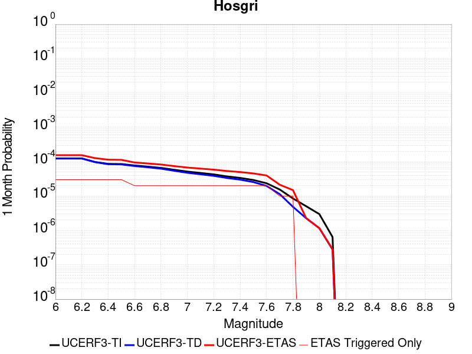 |  |  |

| Magnitude | 1 wk TI Prob | 1 wk TD Prob | 1 wk ETAS Prob | 1 wk ETAS/TD Gain | 1 wk ETAS Triggered Only | 1 mo TI Prob | 1 mo TD Prob | 1 mo ETAS Prob | 1 mo ETAS/TD Gain | 1 mo ETAS Triggered Only | 1 yr TI Prob | 1 yr TD Prob | 1 yr ETAS Prob | 1 yr ETAS/TD Gain | 1 yr ETAS Triggered Only | 10 yr TI Prob | 10 yr TD Prob | 10 yr ETAS Prob | 10 yr ETAS/TD Gain | 10 yr ETAS Triggered Only |
|-----|-----|-----|-----|-----|-----|-----|-----|-----|-----|-----|-----|-----|-----|-----|-----|-----|-----|-----|-----|-----|
| 6.0 | 2.883978E-5 | 2.9128403E-5 | 5.9127527E-5 | 2.0298927 | 3.0E-5 | 1.235932E-4 | 1.248302E-4 | 1.5482646E-4 | 1.2402965 | 3.0E-5 | 0.0015037085 | 0.0015187752 | 0.0015786842 | 1.0394455 | 6.0E-5 | 0.01493574 | 0.01508773 | 0.015166523 | 1.0052223 | 8.0E-5 |
| 6.1 | 2.883978E-5 | 2.9128403E-5 | 5.9127527E-5 | 2.0298927 | 3.0E-5 | 1.235932E-4 | 1.248302E-4 | 1.5482646E-4 | 1.2402965 | 3.0E-5 | 0.0015037085 | 0.0015187752 | 0.0015786842 | 1.0394455 | 6.0E-5 | 0.01493574 | 0.01508773 | 0.015166523 | 1.0052223 | 8.0E-5 |
| 6.2 | 2.883978E-5 | 2.9128403E-5 | 5.9127527E-5 | 2.0298927 | 3.0E-5 | 1.235932E-4 | 1.248302E-4 | 1.5482646E-4 | 1.2402965 | 3.0E-5 | 0.0015037085 | 0.0015187752 | 0.0015786842 | 1.0394455 | 6.0E-5 | 0.01493574 | 0.01508773 | 0.015166523 | 1.0052223 | 8.0E-5 |
| 6.3 | 2.2914428E-5 | 2.2641956E-5 | 5.2641277E-5 | 2.3249438 | 3.0E-5 | 9.8200995E-5 | 9.703337E-5 | 1.2703046E-4 | 1.309142 | 3.0E-5 | 0.0011949413 | 0.001180746 | 0.0012406752 | 1.0507554 | 6.0E-5 | 0.011885363 | 0.011746123 | 0.011825183 | 1.0067308 | 8.0E-5 |
| 6.4 | 2.0195741E-5 | 1.9696547E-5 | 4.9695955E-5 | 2.5230796 | 3.0E-5 | 8.65503E-5 | 8.4411055E-5 | 1.1440852E-4 | 1.3553737 | 3.0E-5 | 0.0010532405 | 0.001027222 | 0.0010771706 | 1.048625 | 5.0E-5 | 0.010482626 | 0.010225783 | 0.010295067 | 1.0067755 | 7.0E-5 |
| 6.5 | 1.9924333E-5 | 1.9408968E-5 | 4.9408387E-5 | 2.5456471 | 3.0E-5 | 8.53872E-5 | 8.317865E-5 | 1.1317615E-4 | 1.3606395 | 3.0E-5 | 0.0010390934 | 0.0010122315 | 0.0010621808 | 1.0493459 | 5.0E-5 | 0.010342481 | 0.010077244 | 0.010146538 | 1.0068763 | 7.0E-5 |
| 6.6 | 1.809694E-5 | 1.7458287E-5 | 3.745794E-5 | 2.1455677 | 2.0E-5 | 7.7556004E-5 | 7.4819094E-5 | 9.4817595E-5 | 1.2672914 | 2.0E-5 | 9.438353E-4 | 9.105431E-4 | 9.5050666E-4 | 1.0438899 | 4.0E-5 | 0.009398366 | 0.009069063 | 0.009128519 | 1.0065559 | 6.0E-5 |
| 6.7 | 1.675989E-5 | 1.6042752E-5 | 3.604243E-5 | 2.246649 | 2.0E-5 | 7.182612E-5 | 6.8752845E-5 | 8.875147E-5 | 1.2908771 | 2.0E-5 | 8.7413215E-4 | 8.3674554E-4 | 8.6672045E-4 | 1.0358232 | 3.0E-5 | 0.008707017 | 0.008336853 | 0.008386437 | 1.0059475 | 5.0E-5 |
| 6.8 | 1.5401129E-5 | 1.4614069E-5 | 3.461378E-5 | 2.3685243 | 2.0E-5 | 6.6003166E-5 | 6.263023E-5 | 8.2628976E-5 | 1.3193146 | 2.0E-5 | 8.032922E-4 | 7.6225714E-4 | 7.9223426E-4 | 1.0393268 | 3.0E-5 | 0.008003947 | 0.0075972863 | 0.0076469067 | 1.0065312 | 5.0E-5 |
| 6.9 | 1.356559E-5 | 1.2689955E-5 | 3.2689702E-5 | 2.5760298 | 2.0E-5 | 5.8136946E-5 | 5.438439E-5 | 7.43833E-5 | 1.3677326 | 2.0E-5 | 7.0758746E-4 | 6.6192925E-4 | 6.9190934E-4 | 1.045292 | 3.0E-5 | 0.007053386 | 0.006600378 | 0.006650048 | 1.0075253 | 5.0E-5 |
| 7.0 | 1.2030819E-5 | 1.1095949E-5 | 3.1095726E-5 | 2.8024397 | 2.0E-5 | 5.155963E-5 | 4.75532E-5 | 6.755225E-5 | 1.4205616 | 2.0E-5 | 6.275577E-4 | 5.788065E-4 | 6.0878915E-4 | 1.0518008 | 3.0E-5 | 0.006257884 | 0.0057737473 | 0.0058035743 | 1.0051659 | 3.0E-5 |
| 7.1 | 1.0972698E-5 | 1.0022167E-5 | 3.0021967E-5 | 2.9955564 | 2.0E-5 | 4.7025E-5 | 4.2951437E-5 | 6.295058E-5 | 1.4656222 | 2.0E-5 | 5.72379E-4 | 5.2280835E-4 | 5.427979E-4 | 1.038235 | 2.0E-5 | 0.0057090693 | 0.005216533 | 0.0052364287 | 1.003814 | 2.0E-5 |
| 7.2 | 9.961926E-6 | 9.034732E-6 | 2.9034552E-5 | 3.2136593 | 2.0E-5 | 4.2693267E-5 | 3.8719707E-5 | 5.871893E-5 | 1.5165129 | 2.0E-5 | 5.1966653E-4 | 4.7131052E-4 | 4.913011E-4 | 1.0424149 | 2.0E-5 | 0.00518453 | 0.0047038523 | 0.0047237584 | 1.0042318 | 2.0E-5 |
| 7.3 | 8.700929E-6 | 7.828089E-6 | 2.7827933E-5 | 3.554882 | 2.0E-5 | 3.7289166E-5 | 3.354852E-5 | 5.354785E-5 | 1.5961314 | 2.0E-5 | 4.53901E-4 | 4.083767E-4 | 4.2836854E-4 | 1.0489544 | 2.0E-5 | 0.00452975 | 0.004076999 | 0.0040969173 | 1.0048856 | 2.0E-5 |
| 7.4 | 7.866285E-6 | 6.9987263E-6 | 2.6998587E-5 | 3.857643 | 2.0E-5 | 3.3712215E-5 | 2.9994197E-5 | 4.9993596E-5 | 1.6667757 | 2.0E-5 | 4.103689E-4 | 3.6511818E-4 | 3.8511088E-4 | 1.0547568 | 2.0E-5 | 0.004096119 | 0.0036459167 | 0.003665844 | 1.0054656 | 2.0E-5 |
| 7.5 | 6.8381305E-6 | 5.9596814E-6 | 2.5959562E-5 | 4.355864 | 2.0E-5 | 2.9305946E-5 | 2.5541241E-5 | 4.554073E-5 | 1.7830273 | 2.0E-5 | 3.5674145E-4 | 3.1092027E-4 | 3.3091404E-4 | 1.0643052 | 2.0E-5 | 0.0035616932 | 0.003105584 | 0.003125522 | 1.00642 | 2.0E-5 |
| 7.6 | 5.503376E-6 | 4.595227E-6 | 2.4595134E-5 | 5.352322 | 2.0E-5 | 2.3585684E-5 | 1.9693682E-5 | 3.969329E-5 | 2.0155342 | 2.0E-5 | 2.8711787E-4 | 2.397442E-4 | 2.597394E-4 | 1.0834023 | 2.0E-5 | 0.002867472 | 0.0023955852 | 0.0024155374 | 1.0083287 | 2.0E-5 |
| 7.7 | 3.6144982E-6 | 2.6521896E-6 | 1.2652163E-5 | 4.7704597 | 1.0E-5 | 1.5490614E-5 | 1.1366477E-5 | 2.1366364E-5 | 1.87977 | 1.0E-5 | 1.8858191E-4 | 1.3837808E-4 | 1.483767E-4 | 1.0722557 | 1.0E-5 | 0.0018842196 | 0.001383647 | 0.0013936331 | 1.0072173 | 1.0E-5 |
| 7.8 | 1.9853494E-6 | 1.1360784E-6 | 1.1136067E-5 | 9.802199 | 1.0E-5 | 8.508612E-6 | 4.8688985E-6 | 1.486885E-5 | 3.0538428 | 1.0E-5 | 1.0358743E-4 | 5.9277223E-5 | 6.927663E-5 | 1.1686889 | 1.0E-5 | 0.0010353916 | 5.933389E-4 | 6.03333E-4 | 1.0168438 | 1.0E-5 |
| 7.9 | 1.1818757E-6 | 5.29477E-7 | 5.29477E-7 | 1.0 | 0.0 | 5.0651715E-6 | 2.269185E-6 | 2.269185E-6 | 1.0 | 0.0 | 6.1666724E-5 | 2.7626977E-5 | 2.7626977E-5 | 1.0 | 0.0 | 6.1649614E-4 | 2.7691363E-4 | 2.7691363E-4 | 1.0 | 0.0 |
| 8.0 | 6.962958E-7 | 2.71365E-7 | 2.71365E-7 | 1.0 | 0.0 | 2.9841215E-6 | 1.1629924E-6 | 1.1629924E-6 | 1.0 | 0.0 | 3.6331072E-5 | 1.415934E-5 | 1.415934E-5 | 1.0 | 0.0 | 3.6325134E-4 | 1.4215276E-4 | 1.4215276E-4 | 1.0 | 0.0 |
| 8.1 | 1.5033264E-7 | 6.52693E-8 | 6.52693E-8 | 1.0 | 0.0 | 6.442826E-7 | 2.7972553E-7 | 2.7972553E-7 | 1.0 | 0.0 | 7.844113E-6 | 3.4056532E-6 | 3.4056532E-6 | 1.0 | 0.0 | 7.843835E-5 | 3.4072833E-5 | 3.4072833E-5 | 1.0 | 0.0 |

## Cleghorn
*[(top)](#table-of-contents)*

| 1 Week | 1 Month | 1 Year | 10 Year |
|-----|-----|-----|-----|
|  |  |  |  |

| Magnitude | 1 wk TI Prob | 1 wk TD Prob | 1 wk ETAS Prob | 1 wk ETAS/TD Gain | 1 wk ETAS Triggered Only | 1 mo TI Prob | 1 mo TD Prob | 1 mo ETAS Prob | 1 mo ETAS/TD Gain | 1 mo ETAS Triggered Only | 1 yr TI Prob | 1 yr TD Prob | 1 yr ETAS Prob | 1 yr ETAS/TD Gain | 1 yr ETAS Triggered Only | 10 yr TI Prob | 10 yr TD Prob | 10 yr ETAS Prob | 10 yr ETAS/TD Gain | 10 yr ETAS Triggered Only |
|-----|-----|-----|-----|-----|-----|-----|-----|-----|-----|-----|-----|-----|-----|-----|-----|-----|-----|-----|-----|-----|
| 6.0 | 7.9267165E-6 | 9.831764E-6 | 2.9831568E-5 | 3.0342028 | 2.0E-5 | 3.39712E-5 | 4.2135514E-5 | 8.2133825E-5 | 1.949278 | 4.0E-5 | 4.1352084E-4 | 5.1288976E-4 | 5.8285386E-4 | 1.1364115 | 7.0E-5 | 0.004127522 | 0.005132214 | 0.005231701 | 1.0193847 | 1.0E-4 |
| 6.1 | 7.9267165E-6 | 9.831764E-6 | 2.9831568E-5 | 3.0342028 | 2.0E-5 | 3.39712E-5 | 4.2135514E-5 | 8.2133825E-5 | 1.949278 | 4.0E-5 | 4.1352084E-4 | 5.1288976E-4 | 5.8285386E-4 | 1.1364115 | 7.0E-5 | 0.004127522 | 0.005132214 | 0.005231701 | 1.0193847 | 1.0E-4 |
| 6.2 | 7.9267165E-6 | 9.831764E-6 | 2.9831568E-5 | 3.0342028 | 2.0E-5 | 3.39712E-5 | 4.2135514E-5 | 8.2133825E-5 | 1.949278 | 4.0E-5 | 4.1352084E-4 | 5.1288976E-4 | 5.8285386E-4 | 1.1364115 | 7.0E-5 | 0.004127522 | 0.005132214 | 0.005231701 | 1.0193847 | 1.0E-4 |
| 6.3 | 7.9267165E-6 | 9.831764E-6 | 2.9831568E-5 | 3.0342028 | 2.0E-5 | 3.39712E-5 | 4.2135514E-5 | 8.2133825E-5 | 1.949278 | 4.0E-5 | 4.1352084E-4 | 5.1288976E-4 | 5.8285386E-4 | 1.1364115 | 7.0E-5 | 0.004127522 | 0.005132214 | 0.005231701 | 1.0193847 | 1.0E-4 |
| 6.4 | 4.3445207E-6 | 6.0916254E-6 | 6.0916254E-6 | 1.0 | 0.0 | 1.8619241E-5 | 2.6106709E-5 | 4.6106186E-5 | 1.7660666 | 2.0E-5 | 2.2666567E-4 | 3.1780385E-4 | 3.6778796E-4 | 1.1572797 | 5.0E-5 | 0.0022643462 | 0.0031877246 | 0.0032575014 | 1.0218892 | 7.0E-5 |
| 6.5 | 4.3445207E-6 | 6.0916254E-6 | 6.0916254E-6 | 1.0 | 0.0 | 1.8619241E-5 | 2.6106709E-5 | 4.6106186E-5 | 1.7660666 | 2.0E-5 | 2.2666567E-4 | 3.1780385E-4 | 3.6778796E-4 | 1.1572797 | 5.0E-5 | 0.0022643462 | 0.0031877246 | 0.0032575014 | 1.0218892 | 7.0E-5 |
| 6.6 | 4.040109E-6 | 5.774033E-6 | 5.774033E-6 | 1.0 | 0.0 | 1.7314638E-5 | 2.4745626E-5 | 4.474513E-5 | 1.8082036 | 2.0E-5 | 2.1078532E-4 | 3.0123728E-4 | 3.5122223E-4 | 1.165932 | 5.0E-5 | 0.002105855 | 0.0030225143 | 0.0030923027 | 1.0230895 | 7.0E-5 |
| 6.7 | 3.3632055E-6 | 5.06753E-6 | 5.06753E-6 | 1.0 | 0.0 | 1.4413658E-5 | 2.1717806E-5 | 4.1717372E-5 | 1.9208833 | 2.0E-5 | 1.7547216E-4 | 2.643825E-4 | 2.943746E-4 | 1.113442 | 3.0E-5 | 0.0017533366 | 0.0026548486 | 0.0027047158 | 1.0187835 | 5.0E-5 |
| 6.8 | 3.2902772E-6 | 4.9894375E-6 | 4.9894375E-6 | 1.0 | 0.0 | 1.4101111E-5 | 2.138313E-5 | 4.1382704E-5 | 1.9352968 | 2.0E-5 | 1.716675E-4 | 2.6030882E-4 | 2.9030102E-4 | 1.1152177 | 3.0E-5 | 0.0017153495 | 0.0026142076 | 0.0026640769 | 1.0190762 | 5.0E-5 |
| 6.9 | 3.031547E-6 | 4.6911987E-6 | 4.6911987E-6 | 1.0 | 0.0 | 1.299228E-5 | 2.0104984E-5 | 4.0104584E-5 | 1.9947582 | 2.0E-5 | 1.5816953E-4 | 2.4475096E-4 | 2.7474362E-4 | 1.1225436 | 3.0E-5 | 0.00158057 | 0.0024589805 | 0.0025088575 | 1.0202836 | 5.0E-5 |
| 7.0 | 2.8259715E-6 | 4.3707637E-6 | 4.3707637E-6 | 1.0 | 0.0 | 1.211125E-5 | 1.8731711E-5 | 3.8731338E-5 | 2.067688 | 2.0E-5 | 1.4744449E-4 | 2.2803496E-4 | 2.5802813E-4 | 1.1315287 | 3.0E-5 | 0.001473467 | 0.0022921748 | 0.0023420602 | 1.0217633 | 5.0E-5 |
| 7.1 | 2.5962665E-6 | 4.065983E-6 | 4.065983E-6 | 1.0 | 0.0 | 1.1126809E-5 | 1.7425526E-5 | 3.7425176E-5 | 2.1477215 | 2.0E-5 | 1.3546048E-4 | 2.1213535E-4 | 2.4212898E-4 | 1.1413891 | 3.0E-5 | 0.0013537793 | 0.0021334959 | 0.0021833892 | 1.0233858 | 5.0E-5 |
| 7.2 | 2.3247253E-6 | 3.6765352E-6 | 3.6765352E-6 | 1.0 | 0.0 | 9.96307E-6 | 1.5756486E-5 | 3.575617E-5 | 2.2692986 | 2.0E-5 | 1.21293626E-4 | 1.9181852E-4 | 2.2181276E-4 | 1.1563678 | 3.0E-5 | 0.0012122744 | 0.0019307166 | 0.00198062 | 1.0258471 | 5.0E-5 |
| 7.3 | 2.056928E-6 | 3.235253E-6 | 3.235253E-6 | 1.0 | 0.0 | 8.815376E-6 | 1.3865297E-5 | 3.386502E-5 | 2.4424303 | 2.0E-5 | 1.0732192E-4 | 1.6879707E-4 | 1.887937E-4 | 1.1184654 | 2.0E-5 | 0.001072701 | 0.0017009423 | 0.0017308913 | 1.0176073 | 3.0E-5 |
| 7.4 | 1.8055999E-6 | 2.8256538E-6 | 2.8256538E-6 | 1.0 | 0.0 | 7.738263E-6 | 1.210989E-5 | 3.210965E-5 | 2.6515226 | 2.0E-5 | 9.4209274E-5 | 1.4742807E-4 | 1.6742513E-4 | 1.1356394 | 2.0E-5 | 9.4169343E-4 | 0.0014876705 | 0.0015176259 | 1.0201358 | 3.0E-5 |
| 7.5 | 1.4683443E-6 | 2.4248943E-6 | 2.4248943E-6 | 1.0 | 0.0 | 6.292889E-6 | 1.0392363E-5 | 3.0392155E-5 | 2.92447 | 2.0E-5 | 7.661323E-5 | 1.2651978E-4 | 1.4651724E-4 | 1.158058 | 2.0E-5 | 7.658682E-4 | 0.0012788812 | 0.0013088429 | 1.023428 | 3.0E-5 |
| 7.6 | 9.804088E-7 | 1.9004091E-6 | 1.9004091E-6 | 1.0 | 0.0 | 4.201745E-6 | 8.144585E-6 | 1.8144503E-5 | 2.2277997 | 1.0E-5 | 5.1155046E-5 | 9.915586E-5 | 1.0915487E-4 | 1.1008413 | 1.0E-5 | 5.114327E-4 | 0.0010055583 | 0.0010155482 | 1.0099348 | 1.0E-5 |
| 7.7 | 7.3434086E-7 | 1.6285549E-6 | 1.6285549E-6 | 1.0 | 0.0 | 3.1471714E-6 | 6.9795024E-6 | 1.6979433E-5 | 2.432757 | 1.0E-5 | 3.831614E-5 | 8.4972155E-5 | 9.497131E-5 | 1.1176757 | 1.0E-5 | 3.8309532E-4 | 8.6387293E-4 | 8.738643E-4 | 1.0115658 | 1.0E-5 |
| 7.8 | 6.434184E-7 | 1.5221389E-6 | 1.5221389E-6 | 1.0 | 0.0 | 2.7575045E-6 | 6.523436E-6 | 1.652337E-5 | 2.5329244 | 1.0E-5 | 3.35721E-5 | 7.9419966E-5 | 8.941917E-5 | 1.1259029 | 1.0E-5 | 3.3567028E-4 | 8.080443E-4 | 8.180362E-4 | 1.0123656 | 1.0E-5 |
| 7.9 | 3.4943926E-7 | 7.5750586E-7 | 7.5750586E-7 | 1.0 | 0.0 | 1.497596E-6 | 3.2464498E-6 | 3.2464498E-6 | 1.0 | 0.0 | 1.8233079E-5 | 3.9524817E-5 | 3.9524817E-5 | 1.0 | 0.0 | 1.8231584E-4 | 4.0401975E-4 | 4.0401975E-4 | 1.0 | 0.0 |
| 8.0 | 6.717524E-8 | 5.837515E-8 | 5.837515E-8 | 1.0 | 0.0 | 2.8789387E-7 | 2.501792E-7 | 2.501792E-7 | 1.0 | 0.0 | 3.505102E-6 | 3.0459275E-6 | 3.0459275E-6 | 1.0 | 0.0 | 3.5050467E-5 | 3.2751934E-5 | 3.2751934E-5 | 1.0 | 0.0 |
| 8.1 | 3.1984914E-8 | 1.2949885E-8 | 1.2949885E-8 | 1.0 | 0.0 | 1.370782E-7 | 5.549951E-8 | 5.549951E-8 | 1.0 | 0.0 | 1.6689258E-6 | 6.757063E-7 | 6.757063E-7 | 1.0 | 0.0 | 1.6689133E-5 | 7.741151E-6 | 7.741151E-6 | 1.0 | 0.0 |
| 8.2 | 1.21887656E-8 | 3.6471115E-9 | 3.6471115E-9 | 1.0 | 0.0 | 5.2237567E-8 | 1.563048E-8 | 1.563048E-8 | 1.0 | 0.0 | 6.359922E-7 | 1.9030107E-7 | 1.9030107E-7 | 1.0 | 0.0 | 6.3599036E-6 | 2.245849E-6 | 2.245849E-6 | 1.0 | 0.0 |

## Hunting Creek - Berryessa 2011 CFM
*[(top)](#table-of-contents)*

| 1 Week | 1 Month | 1 Year | 10 Year |
|-----|-----|-----|-----|
|  |  |  |  |

| Magnitude | 1 wk TI Prob | 1 wk TD Prob | 1 wk ETAS Prob | 1 wk ETAS/TD Gain | 1 wk ETAS Triggered Only | 1 mo TI Prob | 1 mo TD Prob | 1 mo ETAS Prob | 1 mo ETAS/TD Gain | 1 mo ETAS Triggered Only | 1 yr TI Prob | 1 yr TD Prob | 1 yr ETAS Prob | 1 yr ETAS/TD Gain | 1 yr ETAS Triggered Only | 10 yr TI Prob | 10 yr TD Prob | 10 yr ETAS Prob | 10 yr ETAS/TD Gain | 10 yr ETAS Triggered Only |
|-----|-----|-----|-----|-----|-----|-----|-----|-----|-----|-----|-----|-----|-----|-----|-----|-----|-----|-----|-----|-----|
| 6.0 | 1.1270982E-4 | 2.0028367E-4 | 2.1028167E-4 | 1.0499191 | 1.0E-5 | 4.8295266E-4 | 8.579912E-4 | 8.679827E-4 | 1.0116451 | 1.0E-5 | 0.0058641075 | 0.010386173 | 0.01041586 | 1.0028584 | 3.0E-5 | 0.057117578 | 0.09804048 | 0.09810361 | 1.000644 | 7.0E-5 |
| 6.1 | 1.1239393E-4 | 1.9976508E-4 | 1.9976508E-4 | 1.0 | 0.0 | 4.8159933E-4 | 8.557703E-4 | 8.557703E-4 | 1.0 | 0.0 | 0.0058477195 | 0.010359417 | 0.010389105 | 1.0028659 | 3.0E-5 | 0.056962132 | 0.09779895 | 0.0978621 | 1.0006458 | 7.0E-5 |
| 6.2 | 7.596265E-5 | 1.2933646E-4 | 1.2933646E-4 | 1.0 | 0.0 | 3.2551357E-4 | 5.5415573E-4 | 5.5415573E-4 | 1.0 | 0.0 | 0.0039559277 | 0.0067213587 | 0.006731292 | 1.0014778 | 1.0E-5 | 0.038862433 | 0.06459229 | 0.064610995 | 1.0002897 | 2.0E-5 |
| 6.3 | 6.78794E-5 | 1.1448377E-4 | 1.1448377E-4 | 1.0 | 0.0 | 2.9087928E-4 | 4.9052597E-4 | 4.9052597E-4 | 1.0 | 0.0 | 0.003535705 | 0.005952661 | 0.005952661 | 1.0 | 0.0 | 0.034799766 | 0.057466213 | 0.057485063 | 1.0003281 | 2.0E-5 |
| 6.4 | 6.2165134E-5 | 1.0434825E-4 | 1.0434825E-4 | 1.0 | 0.0 | 2.6639478E-4 | 4.4711027E-4 | 4.4711027E-4 | 1.0 | 0.0 | 0.0032385332 | 0.0054274183 | 0.0054274183 | 1.0 | 0.0 | 0.03191742 | 0.05255138 | 0.052570328 | 1.0003606 | 2.0E-5 |
| 6.5 | 5.4368087E-5 | 9.070258E-5 | 9.070258E-5 | 1.0 | 0.0 | 2.3298527E-4 | 3.886537E-4 | 3.886537E-4 | 1.0 | 0.0 | 0.0028329059 | 0.0047197016 | 0.0047197016 | 1.0 | 0.0 | 0.027970633 | 0.045881182 | 0.045900263 | 1.0004159 | 2.0E-5 |
| 6.6 | 4.729947E-5 | 7.847101E-5 | 7.847101E-5 | 1.0 | 0.0 | 2.0269625E-4 | 3.3624718E-4 | 3.3624718E-4 | 1.0 | 0.0 | 0.002465034 | 0.004084746 | 0.004084746 | 1.0 | 0.0 | 0.02437869 | 0.03985269 | 0.03987189 | 1.0004818 | 2.0E-5 |
| 6.7 | 3.6875328E-5 | 6.0443555E-5 | 6.0443555E-5 | 1.0 | 0.0 | 1.5802756E-4 | 2.5900968E-4 | 2.5900968E-4 | 1.0 | 0.0 | 0.0019222875 | 0.0031482724 | 0.0031482724 | 1.0 | 0.0 | 0.019057442 | 0.03089371 | 0.030913092 | 1.0006274 | 2.0E-5 |
| 6.8 | 2.0292036E-5 | 2.8976721E-5 | 2.8976721E-5 | 1.0 | 0.0 | 8.6962966E-5 | 1.2417998E-4 | 1.2417998E-4 | 1.0 | 0.0 | 0.0010582599 | 0.0015108302 | 0.0015108302 | 1.0 | 0.0 | 0.010532344 | 0.0149790775 | 0.014998778 | 1.0013152 | 2.0E-5 |
| 6.9 | 1.7871042E-5 | 2.4472653E-5 | 2.4472653E-5 | 1.0 | 0.0 | 7.658793E-5 | 1.04878585E-4 | 1.04878585E-4 | 1.0 | 0.0 | 9.320591E-4 | 0.0012761486 | 0.0012761486 | 1.0 | 0.0 | 0.009281595 | 0.012680395 | 0.0126902675 | 1.0007787 | 1.0E-5 |
| 7.0 | 1.6415532E-5 | 2.1906566E-5 | 2.1906566E-5 | 1.0 | 0.0 | 7.035038E-5 | 9.388191E-5 | 9.388191E-5 | 1.0 | 0.0 | 8.561793E-4 | 0.0011424144 | 0.0011424144 | 1.0 | 0.0 | 0.008528882 | 0.011365017 | 0.011374903 | 1.0008699 | 1.0E-5 |
| 7.1 | 1.5409885E-5 | 2.0346588E-5 | 2.0346588E-5 | 1.0 | 0.0 | 6.6040695E-5 | 8.719676E-5 | 8.719676E-5 | 1.0 | 0.0 | 8.0374884E-4 | 0.0010611062 | 0.0010611062 | 1.0 | 0.0 | 0.00800848 | 0.010560924 | 0.010570819 | 1.0009369 | 1.0E-5 |
| 7.2 | 1.4497423E-5 | 1.905519E-5 | 1.905519E-5 | 1.0 | 0.0 | 6.213033E-5 | 8.166256E-5 | 8.166256E-5 | 1.0 | 0.0 | 7.5617427E-4 | 9.937913E-4 | 9.937913E-4 | 1.0 | 0.0 | 0.0075360634 | 0.00989425 | 0.00989425 | 1.0 | 0.0 |
| 7.3 | 1.3615175E-5 | 1.7826347E-5 | 1.7826347E-5 | 1.0 | 0.0 | 5.8349444E-5 | 7.6396405E-5 | 7.6396405E-5 | 1.0 | 0.0 | 7.101729E-4 | 9.297323E-4 | 9.297323E-4 | 1.0 | 0.0 | 0.0070790765 | 0.009259124 | 0.009259124 | 1.0 | 0.0 |
| 7.4 | 1.2252825E-5 | 1.6026455E-5 | 1.6026455E-5 | 1.0 | 0.0 | 5.251105E-5 | 6.868302E-5 | 6.868302E-5 | 1.0 | 0.0 | 6.391345E-4 | 8.3589775E-4 | 8.3589775E-4 | 1.0 | 0.0 | 0.0063729943 | 0.008328172 | 0.008328172 | 1.0 | 0.0 |
| 7.5 | 1.0913301E-5 | 1.4241286E-5 | 1.4241286E-5 | 1.0 | 0.0 | 4.6770452E-5 | 6.103267E-5 | 6.103267E-5 | 1.0 | 0.0 | 5.6928146E-4 | 7.428222E-4 | 7.428222E-4 | 1.0 | 0.0 | 0.0056782532 | 0.0074039865 | 0.0074039865 | 1.0 | 0.0 |
| 7.6 | 8.623192E-6 | 1.12347825E-5 | 1.12347825E-5 | 1.0 | 0.0 | 3.6956015E-5 | 4.8148195E-5 | 4.8148195E-5 | 1.0 | 0.0 | 4.4984656E-4 | 5.8604917E-4 | 5.8604917E-4 | 1.0 | 0.0 | 0.00448937 | 0.005845504 | 0.005845504 | 1.0 | 0.0 |
| 7.7 | 2.0993634E-6 | 2.66264E-6 | 2.66264E-6 | 1.0 | 0.0 | 8.997241E-6 | 1.1411265E-5 | 1.1411265E-5 | 1.0 | 0.0 | 1.09535904E-4 | 1.3892337E-4 | 1.3892337E-4 | 1.0 | 0.0 | 0.0010948193 | 0.0013883994 | 0.0013883994 | 1.0 | 0.0 |
| 7.8 | 1.8428308E-7 | 2.1674624E-7 | 2.1674624E-7 | 1.0 | 0.0 | 7.897844E-7 | 9.289122E-7 | 9.289122E-7 | 1.0 | 0.0 | 9.615583E-6 | 1.130945E-5 | 1.130945E-5 | 1.0 | 0.0 | 9.615166E-5 | 1.1308173E-4 | 1.1308173E-4 | 1.0 | 0.0 |

## Whittier alt 1
*[(top)](#table-of-contents)*

| 1 Week | 1 Month | 1 Year | 10 Year |
|-----|-----|-----|-----|
|  |  | 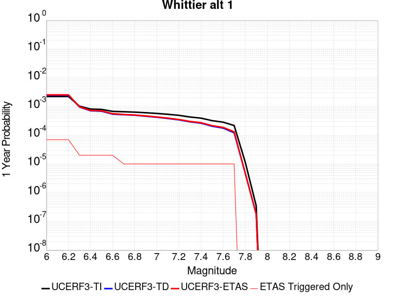 |  |

| Magnitude | 1 wk TI Prob | 1 wk TD Prob | 1 wk ETAS Prob | 1 wk ETAS/TD Gain | 1 wk ETAS Triggered Only | 1 mo TI Prob | 1 mo TD Prob | 1 mo ETAS Prob | 1 mo ETAS/TD Gain | 1 mo ETAS Triggered Only | 1 yr TI Prob | 1 yr TD Prob | 1 yr ETAS Prob | 1 yr ETAS/TD Gain | 1 yr ETAS Triggered Only | 10 yr TI Prob | 10 yr TD Prob | 10 yr ETAS Prob | 10 yr ETAS/TD Gain | 10 yr ETAS Triggered Only |
|-----|-----|-----|-----|-----|-----|-----|-----|-----|-----|-----|-----|-----|-----|-----|-----|-----|-----|-----|-----|-----|
| 6.0 | 4.2554693E-5 | 4.7252182E-5 | 6.725124E-5 | 1.4232409 | 2.0E-5 | 1.8236451E-4 | 2.0249544E-4 | 2.5248533E-4 | 1.2468691 | 5.0E-5 | 0.002218027 | 0.0024629163 | 0.002532744 | 1.0283515 | 7.0E-5 | 0.02196019 | 0.024390263 | 0.024487825 | 1.004 | 1.0E-4 |
| 6.1 | 4.2554693E-5 | 4.7252182E-5 | 6.725124E-5 | 1.4232409 | 2.0E-5 | 1.8236451E-4 | 2.0249544E-4 | 2.5248533E-4 | 1.2468691 | 5.0E-5 | 0.002218027 | 0.0024629163 | 0.002532744 | 1.0283515 | 7.0E-5 | 0.02196019 | 0.024390263 | 0.024487825 | 1.004 | 1.0E-4 |
| 6.2 | 4.2554693E-5 | 4.7252182E-5 | 6.725124E-5 | 1.4232409 | 2.0E-5 | 1.8236451E-4 | 2.0249544E-4 | 2.5248533E-4 | 1.2468691 | 5.0E-5 | 0.002218027 | 0.0024629163 | 0.002532744 | 1.0283515 | 7.0E-5 | 0.02196019 | 0.024390263 | 0.024487825 | 1.004 | 1.0E-4 |
| 6.3 | 1.9617712E-5 | 1.826841E-5 | 2.8268229E-5 | 1.547383 | 1.0E-5 | 8.40732E-5 | 7.829095E-5 | 9.8289376E-5 | 1.2554374 | 2.0E-5 | 0.0010231105 | 9.527944E-4 | 9.7277533E-4 | 1.020971 | 2.0E-5 | 0.01018413 | 0.0094904 | 0.009520114 | 1.003131 | 3.0E-5 |
| 6.4 | 1.5611336E-5 | 1.3604089E-5 | 2.3603954E-5 | 1.7350631 | 1.0E-5 | 6.690401E-5 | 5.8301972E-5 | 7.830081E-5 | 1.3430216 | 2.0E-5 | 8.142519E-4 | 7.096013E-4 | 7.295871E-4 | 1.0281649 | 2.0E-5 | 0.008112748 | 0.0070753377 | 0.0070951963 | 1.0028067 | 2.0E-5 |
| 6.5 | 1.5150166E-5 | 1.3100744E-5 | 2.3100612E-5 | 1.7633054 | 1.0E-5 | 6.492767E-5 | 5.614487E-5 | 7.614375E-5 | 1.3562013 | 2.0E-5 | 7.9020765E-4 | 6.8335526E-4 | 7.033416E-4 | 1.0292474 | 2.0E-5 | 0.007874036 | 0.006814508 | 0.0068343715 | 1.0029149 | 2.0E-5 |
| 6.6 | 1.295588E-5 | 1.0380544E-5 | 2.0380441E-5 | 1.9633306 | 1.0E-5 | 5.552402E-5 | 4.44873E-5 | 6.448641E-5 | 1.4495465 | 2.0E-5 | 6.7579525E-4 | 5.415002E-4 | 5.614894E-4 | 1.0369145 | 2.0E-5 | 0.006737438 | 0.005403343 | 0.0054232352 | 1.0036814 | 2.0E-5 |
| 6.7 | 1.2542085E-5 | 9.899189E-6 | 1.989909E-5 | 2.0101738 | 1.0E-5 | 5.3750682E-5 | 4.2424414E-5 | 5.242399E-5 | 1.2357033 | 1.0E-5 | 6.542181E-4 | 5.163967E-4 | 5.2639155E-4 | 1.0193549 | 1.0E-5 | 0.006522954 | 0.005153464 | 0.0051634125 | 1.0019305 | 1.0E-5 |
| 6.8 | 1.2195878E-5 | 9.49523E-6 | 1.9495135E-5 | 2.0531504 | 1.0E-5 | 5.2267E-5 | 4.069322E-5 | 5.069281E-5 | 1.2457312 | 1.0E-5 | 6.36165E-4 | 4.9532915E-4 | 5.053242E-4 | 1.0201786 | 1.0E-5 | 0.0063434686 | 0.0049436963 | 0.004953647 | 1.0020127 | 1.0E-5 |
| 6.9 | 1.1580298E-5 | 8.772739E-6 | 1.8772653E-5 | 2.1398847 | 1.0E-5 | 4.9628903E-5 | 3.759692E-5 | 4.7596546E-5 | 1.2659692 | 1.0E-5 | 6.040644E-4 | 4.5764804E-4 | 4.6764346E-4 | 1.0218408 | 1.0E-5 | 0.00602425 | 0.0045684646 | 0.0045784186 | 1.0021789 | 1.0E-5 |
| 7.0 | 1.0964795E-5 | 8.083794E-6 | 1.8083712E-5 | 2.237033 | 1.0E-5 | 4.6991136E-5 | 3.4644378E-5 | 4.464403E-5 | 1.2886372 | 1.0E-5 | 5.7196687E-4 | 4.217152E-4 | 4.3171097E-4 | 1.0237027 | 1.0E-5 | 0.0057049696 | 0.004210459 | 0.004220417 | 1.002365 | 1.0E-5 |
| 7.1 | 1.0230601E-5 | 7.32646E-6 | 1.7326387E-5 | 2.3649056 | 1.0E-5 | 4.3844695E-5 | 3.1398744E-5 | 4.139843E-5 | 1.318474 | 1.0E-5 | 5.336784E-4 | 3.8221394E-4 | 3.9221012E-4 | 1.0261533 | 1.0E-5 | 0.005323986 | 0.0038167592 | 0.003826721 | 1.00261 | 1.0E-5 |
| 7.2 | 9.40865E-6 | 6.5430822E-6 | 1.6543017E-5 | 2.5283217 | 1.0E-5 | 4.032216E-5 | 2.8041486E-5 | 3.8041206E-5 | 1.3566045 | 1.0E-5 | 4.908117E-4 | 3.4135283E-4 | 3.5134942E-4 | 1.0292852 | 1.0E-5 | 0.0048972913 | 0.0034094024 | 0.0034193683 | 1.002923 | 1.0E-5 |
| 7.3 | 8.237384E-6 | 5.5975433E-6 | 1.5597487E-5 | 2.786488 | 1.0E-5 | 3.5302593E-5 | 2.3989258E-5 | 3.3989018E-5 | 1.4168433 | 1.0E-5 | 4.2972428E-4 | 2.920311E-4 | 3.020282E-4 | 1.034233 | 1.0E-5 | 0.0042889426 | 0.0029167992 | 0.0029267701 | 1.0034184 | 1.0E-5 |
| 7.4 | 7.5316966E-6 | 5.0276153E-6 | 1.5027565E-5 | 2.9890046 | 1.0E-5 | 3.2278298E-5 | 2.154675E-5 | 3.1546533E-5 | 1.4640971 | 1.0E-5 | 3.9291743E-4 | 2.623011E-4 | 2.722985E-4 | 1.0381141 | 1.0E-5 | 0.0039222343 | 0.0026200267 | 0.0026300005 | 1.0038067 | 1.0E-5 |
| 7.5 | 6.149649E-6 | 3.9336355E-6 | 1.3933596E-5 | 3.5421674 | 1.0E-5 | 2.6355372E-5 | 1.6858336E-5 | 2.6858166E-5 | 1.5931684 | 1.0E-5 | 3.208294E-4 | 2.052318E-4 | 2.1522974E-4 | 1.0487154 | 1.0E-5 | 0.003203666 | 0.0020505118 | 0.0020604914 | 1.0048668 | 1.0E-5 |
| 7.6 | 5.457711E-6 | 3.3951796E-6 | 1.3395145E-5 | 3.9453423 | 1.0E-5 | 2.338998E-5 | 1.4550694E-5 | 2.4550549E-5 | 1.6872425 | 1.0E-5 | 2.8473578E-4 | 1.771411E-4 | 1.8713933E-4 | 1.0564421 | 1.0E-5 | 0.0028437122 | 0.0017700798 | 0.0017800621 | 1.0056394 | 1.0E-5 |
| 7.7 | 4.1676276E-6 | 2.3329922E-6 | 1.2332969E-5 | 5.286331 | 1.0E-5 | 1.7861139E-5 | 9.998504E-6 | 1.9998404E-5 | 2.0001397 | 1.0E-5 | 2.1743766E-4 | 1.2172572E-4 | 1.317245E-4 | 1.0821419 | 1.0E-5 | 0.0021722503 | 0.0012166635 | 0.0012266514 | 1.0082092 | 1.0E-5 |
| 7.8 | 2.2692414E-7 | 9.384417E-8 | 9.384417E-8 | 1.0 | 0.0 | 9.725317E-7 | 4.0218927E-7 | 4.0218927E-7 | 1.0 | 0.0 | 1.1840509E-5 | 4.8966467E-6 | 4.8966467E-6 | 1.0 | 0.0 | 1.1839878E-4 | 4.8965718E-5 | 4.8965718E-5 | 1.0 | 0.0 |
| 7.9 | 6.676829E-9 | 3.4397174E-9 | 3.4397174E-9 | 1.0 | 0.0 | 2.861498E-8 | 1.4741646E-8 | 1.4741646E-8 | 1.0 | 0.0 | 3.4838732E-7 | 1.7947953E-7 | 1.7947953E-7 | 1.0 | 0.0 | 3.4838679E-6 | 1.794794E-6 | 1.794794E-6 | 1.0 | 0.0 |

## Calaveras (So) - Paicines extension 2011 CFM
*[(top)](#table-of-contents)*

| 1 Week | 1 Month | 1 Year | 10 Year |
|-----|-----|-----|-----|
|  |  |  |  |

| Magnitude | 1 wk TI Prob | 1 wk TD Prob | 1 wk ETAS Prob | 1 wk ETAS/TD Gain | 1 wk ETAS Triggered Only | 1 mo TI Prob | 1 mo TD Prob | 1 mo ETAS Prob | 1 mo ETAS/TD Gain | 1 mo ETAS Triggered Only | 1 yr TI Prob | 1 yr TD Prob | 1 yr ETAS Prob | 1 yr ETAS/TD Gain | 1 yr ETAS Triggered Only | 10 yr TI Prob | 10 yr TD Prob | 10 yr ETAS Prob | 10 yr ETAS/TD Gain | 10 yr ETAS Triggered Only |
|-----|-----|-----|-----|-----|-----|-----|-----|-----|-----|-----|-----|-----|-----|-----|-----|-----|-----|-----|-----|-----|
| 6.0 | 1.5183659E-4 | 3.0520977E-4 | 3.4519756E-4 | 1.1310174 | 4.0E-5 | 6.5056595E-4 | 0.0013068188 | 0.0013467665 | 1.0305687 | 4.0E-5 | 0.007891912 | 0.015696203 | 0.015765106 | 1.0043896 | 7.0E-5 | 0.076174594 | 0.13848905 | 0.13856658 | 1.0005599 | 9.0E-5 |
| 6.1 | 1.5024997E-4 | 3.021517E-4 | 3.421396E-4 | 1.1323439 | 4.0E-5 | 6.437695E-4 | 0.0012937278 | 0.001333676 | 1.0308784 | 4.0E-5 | 0.0078097614 | 0.015539596 | 0.015608508 | 1.0044346 | 7.0E-5 | 0.075409345 | 0.13715863 | 0.1372363 | 1.0005661 | 9.0E-5 |
| 6.2 | 1.2743923E-4 | 2.5313982E-4 | 2.9312968E-4 | 1.1579754 | 4.0E-5 | 5.460538E-4 | 0.0010839999 | 0.0011239565 | 1.0368603 | 4.0E-5 | 0.0066279583 | 0.013046881 | 0.013115969 | 1.0052953 | 7.0E-5 | 0.064337276 | 0.117256075 | 0.11733552 | 1.0006776 | 9.0E-5 |
| 6.3 | 1.1525114E-4 | 2.2599236E-4 | 2.659833E-4 | 1.1769571 | 4.0E-5 | 4.9383997E-4 | 9.678718E-4 | 0.001007833 | 1.0412878 | 4.0E-5 | 0.0059959386 | 0.011668079 | 0.011737262 | 1.0059292 | 7.0E-5 | 0.058367174 | 0.106372125 | 0.10645255 | 1.0007561 | 9.0E-5 |
| 6.4 | 1.07200925E-4 | 2.0840544E-4 | 2.383992E-4 | 1.1439202 | 3.0E-5 | 4.5935164E-4 | 8.926123E-4 | 9.2258555E-4 | 1.0335792 | 3.0E-5 | 0.0055782744 | 0.010772959 | 0.0108323125 | 1.0055095 | 6.0E-5 | 0.0544031 | 0.099194765 | 0.099266835 | 1.0007265 | 8.0E-5 |
| 6.5 | 9.69631E-5 | 1.8734725E-4 | 2.1734163E-4 | 1.1601005 | 3.0E-5 | 4.1548995E-4 | 8.024631E-4 | 8.32439E-4 | 1.037355 | 3.0E-5 | 0.0050468626 | 0.009694842 | 0.009754259 | 1.0061289 | 6.0E-5 | 0.04933773 | 0.090086564 | 0.09015936 | 1.000808 | 8.0E-5 |
| 6.6 | 8.0552316E-5 | 1.507068E-4 | 1.7070377E-4 | 1.132688 | 2.0E-5 | 3.4517853E-4 | 6.4569083E-4 | 6.656779E-4 | 1.0309546 | 2.0E-5 | 0.0041944524 | 0.007826508 | 0.007876117 | 1.0063386 | 5.0E-5 | 0.04116161 | 0.0748563 | 0.074921064 | 1.0008651 | 7.0E-5 |
| 6.7 | 7.815757E-5 | 1.4611272E-4 | 1.6610979E-4 | 1.1368606 | 2.0E-5 | 3.34918E-4 | 6.26014E-4 | 6.4600154E-4 | 1.0319282 | 2.0E-5 | 0.004070005 | 0.007589312 | 0.007629008 | 1.0052305 | 4.0E-5 | 0.039962657 | 0.07270582 | 0.07276146 | 1.0007652 | 6.0E-5 |
| 6.8 | 6.965264E-5 | 1.2722758E-4 | 1.4722504E-4 | 1.1571786 | 2.0E-5 | 2.9847719E-4 | 5.4513285E-4 | 5.6512194E-4 | 1.0366683 | 2.0E-5 | 0.0036279052 | 0.0066135945 | 0.00665333 | 1.0060081 | 4.0E-5 | 0.03569247 | 0.063801065 | 0.06385724 | 1.0008805 | 6.0E-5 |
| 6.9 | 5.8000453E-5 | 1.01439E-4 | 1.2143698E-4 | 1.1971428 | 2.0E-5 | 2.4854968E-4 | 4.346666E-4 | 4.5465791E-4 | 1.0459923 | 2.0E-5 | 0.0030218933 | 0.005279322 | 0.005319111 | 1.0075368 | 4.0E-5 | 0.029811295 | 0.051502965 | 0.051559873 | 1.001105 | 6.0E-5 |
| 7.0 | 4.9865852E-5 | 8.568029E-5 | 1.0567857E-4 | 1.233406 | 2.0E-5 | 2.1369329E-4 | 3.6715003E-4 | 3.8714267E-4 | 1.0544536 | 2.0E-5 | 0.0025986114 | 0.004460979 | 0.0045008003 | 1.0089266 | 4.0E-5 | 0.025684336 | 0.043782018 | 0.043839388 | 1.0013105 | 6.0E-5 |
| 7.1 | 4.283875E-5 | 7.1124625E-5 | 9.1123205E-5 | 1.2811766 | 2.0E-5 | 1.8358172E-4 | 3.0478454E-4 | 3.2477843E-4 | 1.0656002 | 2.0E-5 | 0.0022328163 | 0.003704494 | 0.0037443459 | 1.0107577 | 4.0E-5 | 0.022105146 | 0.03673582 | 0.036783986 | 1.0013111 | 5.0E-5 |
| 7.2 | 3.450115E-5 | 5.5778568E-5 | 7.5777454E-5 | 1.3585407 | 2.0E-5 | 1.478537E-4 | 2.3902925E-4 | 2.5902447E-4 | 1.0836518 | 2.0E-5 | 0.0017986323 | 0.0029063264 | 0.0029462103 | 1.0137231 | 4.0E-5 | 0.017841442 | 0.029079042 | 0.029127588 | 1.0016694 | 5.0E-5 |
| 7.3 | 2.5709045E-5 | 4.059001E-5 | 6.05892E-5 | 1.492712 | 2.0E-5 | 1.1017697E-4 | 1.7394568E-4 | 1.939422E-4 | 1.1149584 | 2.0E-5 | 0.0013405791 | 0.0021157486 | 0.002155664 | 1.0188658 | 4.0E-5 | 0.013325208 | 0.02129686 | 0.02133601 | 1.0018382 | 4.0E-5 |
| 7.4 | 1.8003093E-5 | 2.8511378E-5 | 3.8511094E-5 | 1.3507272 | 1.0E-5 | 7.715383E-5 | 1.2218591E-4 | 1.321847E-4 | 1.0818325 | 1.0E-5 | 9.3894306E-4 | 0.0014866006 | 0.001516556 | 1.0201503 | 3.0E-5 | 0.009349857 | 0.015051589 | 0.015081138 | 1.0019631 | 3.0E-5 |
| 7.5 | 1.5595824E-5 | 2.5823752E-5 | 3.5823494E-5 | 1.3872304 | 1.0E-5 | 6.683753E-5 | 1.10668545E-4 | 1.20667435E-4 | 1.0903499 | 1.0E-5 | 8.134431E-4 | 0.0013465589 | 0.0013765185 | 1.022249 | 3.0E-5 | 0.008104719 | 0.013651571 | 0.013681161 | 1.0021676 | 3.0E-5 |
| 7.6 | 1.1110309E-5 | 1.9223195E-5 | 2.9223003E-5 | 1.5201949 | 1.0E-5 | 4.761474E-5 | 8.2382525E-5 | 9.2381706E-5 | 1.121375 | 1.0E-5 | 5.795553E-4 | 0.0010025471 | 0.0010325171 | 1.0298938 | 3.0E-5 | 0.0057804612 | 0.01020344 | 0.010233134 | 1.0029101 | 3.0E-5 |
| 7.7 | 6.2140443E-6 | 1.04376995E-5 | 2.0437596E-5 | 1.9580555 | 1.0E-5 | 2.6631347E-5 | 4.4732235E-5 | 5.4731787E-5 | 1.2235425 | 1.0E-5 | 3.241884E-4 | 5.4447894E-4 | 5.7446264E-4 | 1.0550685 | 3.0E-5 | 0.0032371588 | 0.005620102 | 0.0056499336 | 1.005308 | 3.0E-5 |
| 7.8 | 5.305533E-6 | 9.433651E-6 | 1.9433557E-5 | 2.060025 | 1.0E-5 | 2.27378E-5 | 4.0429306E-5 | 5.0428902E-5 | 1.2473353 | 1.0E-5 | 2.7679754E-4 | 4.9211574E-4 | 5.2210095E-4 | 1.0609313 | 3.0E-5 | 0.0027645302 | 0.005074622 | 0.00510447 | 1.0058818 | 3.0E-5 |
| 7.9 | 3.363505E-6 | 7.3854467E-6 | 1.7385373E-5 | 2.3540041 | 1.0E-5 | 1.4414942E-5 | 3.1651532E-5 | 4.1651216E-5 | 1.3159305 | 1.0E-5 | 1.7548777E-4 | 3.8528934E-4 | 4.0528164E-4 | 1.0518891 | 2.0E-5 | 0.0017534926 | 0.003948784 | 0.003968705 | 1.0050448 | 2.0E-5 |
| 8.0 | 2.0271132E-6 | 4.4134235E-6 | 1.4413379E-5 | 3.2658048 | 1.0E-5 | 8.687599E-6 | 1.8914534E-5 | 2.8914346E-5 | 1.5286839 | 1.0E-5 | 1.05766376E-4 | 2.3026018E-4 | 2.5025557E-4 | 1.0868382 | 2.0E-5 | 0.0010571606 | 0.002351194 | 0.002371147 | 1.0084863 | 2.0E-5 |
| 8.1 | 1.2206116E-6 | 2.3752666E-6 | 1.23752425E-5 | 5.210044 | 1.0E-5 | 5.2311816E-6 | 1.0179674E-5 | 2.0179572E-5 | 1.9823397 | 1.0E-5 | 6.3687774E-5 | 1.2393051E-4 | 1.3392928E-4 | 1.0806804 | 1.0E-5 | 6.366953E-4 | 0.0012705618 | 0.0012805491 | 1.0078605 | 1.0E-5 |

## Tin Mountain
*[(top)](#table-of-contents)*

| 1 Week | 1 Month | 1 Year | 10 Year |
|-----|-----|-----|-----|
|  | 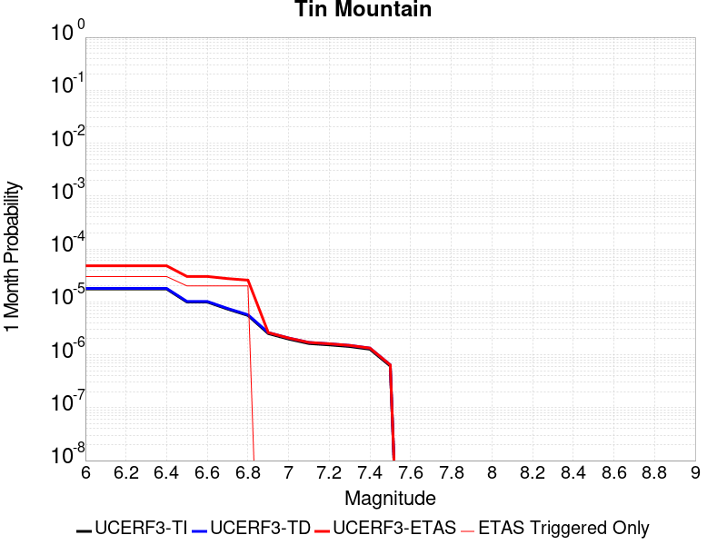 |  |  |

| Magnitude | 1 wk TI Prob | 1 wk TD Prob | 1 wk ETAS Prob | 1 wk ETAS/TD Gain | 1 wk ETAS Triggered Only | 1 mo TI Prob | 1 mo TD Prob | 1 mo ETAS Prob | 1 mo ETAS/TD Gain | 1 mo ETAS Triggered Only | 1 yr TI Prob | 1 yr TD Prob | 1 yr ETAS Prob | 1 yr ETAS/TD Gain | 1 yr ETAS Triggered Only | 10 yr TI Prob | 10 yr TD Prob | 10 yr ETAS Prob | 10 yr ETAS/TD Gain | 10 yr ETAS Triggered Only |
|-----|-----|-----|-----|-----|-----|-----|-----|-----|-----|-----|-----|-----|-----|-----|-----|-----|-----|-----|-----|-----|
| 6.0 | 4.083776E-6 | 4.1815365E-6 | 3.4181412E-5 | 8.174366 | 3.0E-5 | 1.750178E-5 | 1.792077E-5 | 4.792023E-5 | 2.6740053 | 3.0E-5 | 2.1306332E-4 | 2.1816725E-4 | 3.081476E-4 | 1.4124376 | 9.0E-5 | 0.0021285915 | 0.0021798965 | 0.0022896565 | 1.0503511 | 1.1E-4 |
| 6.1 | 4.083776E-6 | 4.1815365E-6 | 3.4181412E-5 | 8.174366 | 3.0E-5 | 1.750178E-5 | 1.792077E-5 | 4.792023E-5 | 2.6740053 | 3.0E-5 | 2.1306332E-4 | 2.1816725E-4 | 3.081476E-4 | 1.4124376 | 9.0E-5 | 0.0021285915 | 0.0021798965 | 0.0022896565 | 1.0503511 | 1.1E-4 |
| 6.2 | 4.083776E-6 | 4.1815365E-6 | 3.4181412E-5 | 8.174366 | 3.0E-5 | 1.750178E-5 | 1.792077E-5 | 4.792023E-5 | 2.6740053 | 3.0E-5 | 2.1306332E-4 | 2.1816725E-4 | 3.081476E-4 | 1.4124376 | 9.0E-5 | 0.0021285915 | 0.0021798965 | 0.0022896565 | 1.0503511 | 1.1E-4 |
| 6.3 | 4.083776E-6 | 4.1815365E-6 | 3.4181412E-5 | 8.174366 | 3.0E-5 | 1.750178E-5 | 1.792077E-5 | 4.792023E-5 | 2.6740053 | 3.0E-5 | 2.1306332E-4 | 2.1816725E-4 | 3.081476E-4 | 1.4124376 | 9.0E-5 | 0.0021285915 | 0.0021798965 | 0.0022896565 | 1.0503511 | 1.1E-4 |
| 6.4 | 4.083776E-6 | 4.1815365E-6 | 3.4181412E-5 | 8.174366 | 3.0E-5 | 1.750178E-5 | 1.792077E-5 | 4.792023E-5 | 2.6740053 | 3.0E-5 | 2.1306332E-4 | 2.1816725E-4 | 3.081476E-4 | 1.4124376 | 9.0E-5 | 0.0021285915 | 0.0021798965 | 0.0022896565 | 1.0503511 | 1.1E-4 |
| 6.5 | 2.3143427E-6 | 2.3731573E-6 | 2.237311E-5 | 9.427572 | 2.0E-5 | 9.9185745E-6 | 1.0170638E-5 | 3.0170435E-5 | 2.966425 | 2.0E-5 | 1.2075195E-4 | 1.2382126E-4 | 1.8381383E-4 | 1.4845095 | 6.0E-5 | 0.0012068636 | 0.0012375986 | 0.0013075119 | 1.0564911 | 7.0E-5 |
| 6.6 | 2.3143427E-6 | 2.3731573E-6 | 2.237311E-5 | 9.427572 | 2.0E-5 | 9.9185745E-6 | 1.0170638E-5 | 3.0170435E-5 | 2.966425 | 2.0E-5 | 1.2075195E-4 | 1.2382126E-4 | 1.8381383E-4 | 1.4845095 | 6.0E-5 | 0.0012068636 | 0.0012375986 | 0.0013075119 | 1.0564911 | 7.0E-5 |
| 6.7 | 1.7029532E-6 | 1.7497915E-6 | 2.1749756E-5 | 12.4299135 | 2.0E-5 | 7.2983503E-6 | 7.499088E-6 | 2.7498938E-5 | 3.666971 | 2.0E-5 | 8.885379E-5 | 9.1298105E-5 | 1.5129262E-4 | 1.6571277 | 6.0E-5 | 8.881827E-4 | 9.1265864E-4 | 9.825947E-4 | 1.076629 | 7.0E-5 |
| 6.8 | 1.2914646E-6 | 1.3299378E-6 | 2.1329912E-5 | 16.038277 | 2.0E-5 | 5.534837E-6 | 5.6997237E-6 | 2.569961E-5 | 4.508922 | 2.0E-5 | 6.738455E-5 | 6.939237E-5 | 1.0938959E-4 | 1.5763923 | 4.0E-5 | 6.736412E-4 | 6.9375033E-4 | 7.437157E-4 | 1.0720221 | 5.0E-5 |
| 6.9 | 5.8708974E-7 | 6.1169936E-7 | 6.1169936E-7 | 1.0 | 0.0 | 2.5160964E-6 | 2.6215664E-6 | 2.6215664E-6 | 1.0 | 0.0 | 3.0633044E-5 | 3.1917145E-5 | 3.1917145E-5 | 1.0 | 0.0 | 3.0628822E-4 | 3.191297E-4 | 3.191297E-4 | 1.0 | 0.0 |
| 7.0 | 4.6248786E-7 | 4.832015E-7 | 4.832015E-7 | 1.0 | 0.0 | 1.9820893E-6 | 2.0708624E-6 | 2.0708624E-6 | 1.0 | 0.0 | 2.413167E-5 | 2.5212494E-5 | 2.5212494E-5 | 1.0 | 0.0 | 2.412905E-4 | 2.5210003E-4 | 2.5210003E-4 | 1.0 | 0.0 |
| 7.1 | 3.804606E-7 | 3.987147E-7 | 3.987147E-7 | 1.0 | 0.0 | 1.6305444E-6 | 1.7087764E-6 | 1.7087764E-6 | 1.0 | 0.0 | 1.9851697E-5 | 2.0804187E-5 | 2.0804187E-5 | 1.0 | 0.0 | 1.9849923E-4 | 2.0802575E-4 | 2.0802575E-4 | 1.0 | 0.0 |
| 7.2 | 3.5864858E-7 | 3.7616863E-7 | 3.7616863E-7 | 1.0 | 0.0 | 1.5370645E-6 | 1.6121504E-6 | 1.6121504E-6 | 1.0 | 0.0 | 1.87136E-5 | 1.9627789E-5 | 1.9627789E-5 | 1.0 | 0.0 | 1.8712023E-4 | 1.9626386E-4 | 1.9626386E-4 | 1.0 | 0.0 |
| 7.3 | 3.342063E-7 | 3.506347E-7 | 3.506347E-7 | 1.0 | 0.0 | 1.4323119E-6 | 1.5027196E-6 | 1.5027196E-6 | 1.0 | 0.0 | 1.7438259E-5 | 1.829549E-5 | 1.829549E-5 | 1.0 | 0.0 | 1.743689E-4 | 1.8294314E-4 | 1.8294314E-4 | 1.0 | 0.0 |
| 7.4 | 2.971242E-7 | 3.1165817E-7 | 3.1165817E-7 | 1.0 | 0.0 | 1.2733886E-6 | 1.3356774E-6 | 1.3356774E-6 | 1.0 | 0.0 | 1.5503398E-5 | 1.6261785E-5 | 1.6261785E-5 | 1.0 | 0.0 | 1.5502315E-4 | 1.6260923E-4 | 1.6260923E-4 | 1.0 | 0.0 |
| 7.5 | 1.4326713E-7 | 1.5012525E-7 | 1.5012525E-7 | 1.0 | 0.0 | 6.140018E-7 | 6.433939E-7 | 6.433939E-7 | 1.0 | 0.0 | 7.4754466E-6 | 7.8333205E-6 | 7.8333205E-6 | 1.0 | 0.0 | 7.475195E-5 | 7.833321E-5 | 7.833321E-5 | 1.0 | 0.0 |

## Blue Cut
*[(top)](#table-of-contents)*

| 1 Week | 1 Month | 1 Year | 10 Year |
|-----|-----|-----|-----|
|  |  |  |  |

| Magnitude | 1 wk TI Prob | 1 wk TD Prob | 1 wk ETAS Prob | 1 wk ETAS/TD Gain | 1 wk ETAS Triggered Only | 1 mo TI Prob | 1 mo TD Prob | 1 mo ETAS Prob | 1 mo ETAS/TD Gain | 1 mo ETAS Triggered Only | 1 yr TI Prob | 1 yr TD Prob | 1 yr ETAS Prob | 1 yr ETAS/TD Gain | 1 yr ETAS Triggered Only | 10 yr TI Prob | 10 yr TD Prob | 10 yr ETAS Prob | 10 yr ETAS/TD Gain | 10 yr ETAS Triggered Only |
|-----|-----|-----|-----|-----|-----|-----|-----|-----|-----|-----|-----|-----|-----|-----|-----|-----|-----|-----|-----|-----|
| 6.0 | 2.1227985E-5 | 2.2719574E-5 | 3.271935E-5 | 1.440139 | 1.0E-5 | 9.097391E-5 | 9.73663E-5 | 1.2736338E-4 | 1.3080848 | 3.0E-5 | 0.0011070445 | 0.0011848481 | 0.0012248007 | 1.0337197 | 4.0E-5 | 0.011015458 | 0.011791152 | 0.011889973 | 1.0083809 | 1.0E-4 |
| 6.1 | 2.1227985E-5 | 2.2719574E-5 | 3.271935E-5 | 1.440139 | 1.0E-5 | 9.097391E-5 | 9.73663E-5 | 1.2736338E-4 | 1.3080848 | 3.0E-5 | 0.0011070445 | 0.0011848481 | 0.0012248007 | 1.0337197 | 4.0E-5 | 0.011015458 | 0.011791152 | 0.011889973 | 1.0083809 | 1.0E-4 |
| 6.2 | 2.1227985E-5 | 2.2719574E-5 | 3.271935E-5 | 1.440139 | 1.0E-5 | 9.097391E-5 | 9.73663E-5 | 1.2736338E-4 | 1.3080848 | 3.0E-5 | 0.0011070445 | 0.0011848481 | 0.0012248007 | 1.0337197 | 4.0E-5 | 0.011015458 | 0.011791152 | 0.011889973 | 1.0083809 | 1.0E-4 |
| 6.3 | 1.1613981E-5 | 1.2353542E-5 | 1.2353542E-5 | 1.0 | 0.0 | 4.9773254E-5 | 5.2942745E-5 | 7.2941686E-5 | 1.3777466 | 2.0E-5 | 6.0582085E-4 | 6.443998E-4 | 6.84374E-4 | 1.0620333 | 4.0E-5 | 0.0060417196 | 0.0064265593 | 0.0064961095 | 1.0108223 | 7.0E-5 |
| 6.4 | 1.1613981E-5 | 1.2353542E-5 | 1.2353542E-5 | 1.0 | 0.0 | 4.9773254E-5 | 5.2942745E-5 | 7.2941686E-5 | 1.3777466 | 2.0E-5 | 6.0582085E-4 | 6.443998E-4 | 6.84374E-4 | 1.0620333 | 4.0E-5 | 0.0060417196 | 0.0064265593 | 0.0064961095 | 1.0108223 | 7.0E-5 |
| 6.5 | 8.931326E-6 | 9.4816E-6 | 9.4816E-6 | 1.0 | 0.0 | 3.8276554E-5 | 4.0634844E-5 | 4.0634844E-5 | 1.0 | 0.0 | 4.6591737E-4 | 4.946261E-4 | 5.0462113E-4 | 1.0202073 | 1.0E-5 | 0.0046494175 | 0.004936161 | 0.004975964 | 1.0080634 | 4.0E-5 |
| 6.6 | 7.345353E-6 | 7.79028E-6 | 7.79028E-6 | 1.0 | 0.0 | 3.1479703E-5 | 3.338653E-5 | 3.338653E-5 | 1.0 | 0.0 | 3.83198E-4 | 4.064132E-4 | 4.164091E-4 | 1.0245955 | 1.0E-5 | 0.0038253788 | 0.0040574907 | 0.004087369 | 1.0073637 | 3.0E-5 |
| 6.7 | 6.2775666E-6 | 6.655149E-6 | 6.655149E-6 | 1.0 | 0.0 | 2.690358E-5 | 2.8521798E-5 | 2.8521798E-5 | 1.0 | 0.0 | 3.2750185E-4 | 3.472051E-4 | 3.572016E-4 | 1.0287914 | 1.0E-5 | 0.0032701963 | 0.003467367 | 0.0034972632 | 1.008622 | 3.0E-5 |
| 6.8 | 5.5234095E-6 | 5.8551113E-6 | 5.8551113E-6 | 1.0 | 0.0 | 2.367154E-5 | 2.5093133E-5 | 2.5093133E-5 | 1.0 | 0.0 | 2.8816288E-4 | 3.0547334E-4 | 3.154703E-4 | 1.032726 | 1.0E-5 | 0.002877895 | 0.0030512505 | 0.003081159 | 1.009802 | 3.0E-5 |
| 6.9 | 4.7780054E-6 | 5.0654203E-6 | 5.0654203E-6 | 1.0 | 0.0 | 2.0477004E-5 | 2.1708804E-5 | 2.1708804E-5 | 1.0 | 0.0 | 2.4927902E-4 | 2.642797E-4 | 2.7427703E-4 | 1.0378287 | 1.0E-5 | 0.0024899957 | 0.002640346 | 0.002670267 | 1.0113322 | 3.0E-5 |
| 7.0 | 3.883171E-6 | 4.118487E-6 | 4.118487E-6 | 1.0 | 0.0 | 1.6642054E-5 | 1.7650578E-5 | 1.7650578E-5 | 1.0 | 0.0 | 2.0259817E-4 | 2.1488148E-4 | 2.2487935E-4 | 1.0465273 | 1.0E-5 | 0.0020241356 | 0.0021474129 | 0.0021773484 | 1.0139403 | 3.0E-5 |
| 7.1 | 2.8358215E-6 | 3.0097158E-6 | 3.0097158E-6 | 1.0 | 0.0 | 1.2153464E-5 | 1.2898756E-5 | 1.2898756E-5 | 1.0 | 0.0 | 1.4795837E-4 | 1.5703762E-4 | 1.6703604E-4 | 1.063669 | 1.0E-5 | 0.001478599 | 0.0015699116 | 0.0015998646 | 1.0190793 | 3.0E-5 |

## San Gabriel
*[(top)](#table-of-contents)*

| 1 Week | 1 Month | 1 Year | 10 Year |
|-----|-----|-----|-----|
|  |  |  |  |

| Magnitude | 1 wk TI Prob | 1 wk TD Prob | 1 wk ETAS Prob | 1 wk ETAS/TD Gain | 1 wk ETAS Triggered Only | 1 mo TI Prob | 1 mo TD Prob | 1 mo ETAS Prob | 1 mo ETAS/TD Gain | 1 mo ETAS Triggered Only | 1 yr TI Prob | 1 yr TD Prob | 1 yr ETAS Prob | 1 yr ETAS/TD Gain | 1 yr ETAS Triggered Only | 10 yr TI Prob | 10 yr TD Prob | 10 yr ETAS Prob | 10 yr ETAS/TD Gain | 10 yr ETAS Triggered Only |
|-----|-----|-----|-----|-----|-----|-----|-----|-----|-----|-----|-----|-----|-----|-----|-----|-----|-----|-----|-----|-----|
| 6.0 | 1.083775E-5 | 1.198525E-5 | 4.198489E-5 | 3.5030468 | 3.0E-5 | 4.6446676E-5 | 5.1364408E-5 | 8.1362865E-5 | 1.584032 | 3.0E-5 | 5.653415E-4 | 6.251936E-4 | 6.8515603E-4 | 1.0959103 | 6.0E-5 | 0.0056390543 | 0.0062463325 | 0.006345708 | 1.0159094 | 1.0E-4 |
| 6.1 | 1.083775E-5 | 1.198525E-5 | 4.198489E-5 | 3.5030468 | 3.0E-5 | 4.6446676E-5 | 5.1364408E-5 | 8.1362865E-5 | 1.584032 | 3.0E-5 | 5.653415E-4 | 6.251936E-4 | 6.8515603E-4 | 1.0959103 | 6.0E-5 | 0.0056390543 | 0.0062463325 | 0.006345708 | 1.0159094 | 1.0E-4 |
| 6.2 | 1.083775E-5 | 1.198525E-5 | 4.198489E-5 | 3.5030468 | 3.0E-5 | 4.6446676E-5 | 5.1364408E-5 | 8.1362865E-5 | 1.584032 | 3.0E-5 | 5.653415E-4 | 6.251936E-4 | 6.8515603E-4 | 1.0959103 | 6.0E-5 | 0.0056390543 | 0.0062463325 | 0.006345708 | 1.0159094 | 1.0E-4 |
| 6.3 | 1.083775E-5 | 1.198525E-5 | 4.198489E-5 | 3.5030468 | 3.0E-5 | 4.6446676E-5 | 5.1364408E-5 | 8.1362865E-5 | 1.584032 | 3.0E-5 | 5.653415E-4 | 6.251936E-4 | 6.8515603E-4 | 1.0959103 | 6.0E-5 | 0.0056390543 | 0.0062463325 | 0.006345708 | 1.0159094 | 1.0E-4 |
| 6.4 | 1.083775E-5 | 1.198525E-5 | 4.198489E-5 | 3.5030468 | 3.0E-5 | 4.6446676E-5 | 5.1364408E-5 | 8.1362865E-5 | 1.584032 | 3.0E-5 | 5.653415E-4 | 6.251936E-4 | 6.8515603E-4 | 1.0959103 | 6.0E-5 | 0.0056390543 | 0.0062463325 | 0.006345708 | 1.0159094 | 1.0E-4 |
| 6.5 | 6.7317824E-6 | 7.717007E-6 | 2.7716853E-5 | 3.5916584 | 2.0E-5 | 2.8850178E-5 | 3.3072472E-5 | 5.3071813E-5 | 1.6047125 | 2.0E-5 | 3.511943E-4 | 4.0258403E-4 | 4.525639E-4 | 1.1241477 | 5.0E-5 | 0.003506398 | 0.004029533 | 0.0041092103 | 1.0197734 | 8.0E-5 |
| 6.6 | 6.7317824E-6 | 7.717007E-6 | 2.7716853E-5 | 3.5916584 | 2.0E-5 | 2.8850178E-5 | 3.3072472E-5 | 5.3071813E-5 | 1.6047125 | 2.0E-5 | 3.511943E-4 | 4.0258403E-4 | 4.525639E-4 | 1.1241477 | 5.0E-5 | 0.003506398 | 0.004029533 | 0.0041092103 | 1.0197734 | 8.0E-5 |
| 6.7 | 6.274881E-6 | 7.2459275E-6 | 2.7245782E-5 | 3.7601511 | 2.0E-5 | 2.6892068E-5 | 3.105361E-5 | 5.105299E-5 | 1.6440275 | 2.0E-5 | 3.2736175E-4 | 3.7801306E-4 | 4.2799418E-4 | 1.1322205 | 5.0E-5 | 0.0032687993 | 0.0037846796 | 0.0038643768 | 1.0210578 | 8.0E-5 |
| 6.8 | 5.996209E-6 | 6.958647E-6 | 2.6958509E-5 | 3.8741019 | 2.0E-5 | 2.5697784E-5 | 2.9822439E-5 | 4.9821843E-5 | 1.6706159 | 2.0E-5 | 3.128256E-4 | 3.6302864E-4 | 4.1301048E-4 | 1.1376802 | 5.0E-5 | 0.003123856 | 0.0036353325 | 0.0037150418 | 1.0219263 | 8.0E-5 |
| 6.9 | 5.686331E-6 | 6.6236917E-6 | 2.662356E-5 | 4.019444 | 2.0E-5 | 2.4369761E-5 | 2.8386947E-5 | 4.838638E-5 | 1.7045292 | 2.0E-5 | 2.9666146E-4 | 3.4555717E-4 | 3.955399E-4 | 1.1446439 | 5.0E-5 | 0.0029626573 | 0.0034611735 | 0.0035408966 | 1.0230335 | 8.0E-5 |
| 7.0 | 5.2329838E-6 | 6.1475757E-6 | 2.6147452E-5 | 4.253295 | 2.0E-5 | 2.242688E-5 | 2.6346492E-5 | 4.6345966E-5 | 1.7590944 | 2.0E-5 | 2.7301308E-4 | 3.207221E-4 | 3.7070605E-4 | 1.1558483 | 5.0E-5 | 0.002726779 | 0.0032135549 | 0.003293298 | 1.0248146 | 8.0E-5 |
| 7.1 | 5.135671E-6 | 6.0377E-6 | 2.603758E-5 | 4.3124995 | 2.0E-5 | 2.2009834E-5 | 2.5875606E-5 | 4.5875087E-5 | 1.7729088 | 2.0E-5 | 2.6793676E-4 | 3.1499073E-4 | 3.6497496E-4 | 1.1586848 | 5.0E-5 | 0.0026761394 | 0.0031564054 | 0.003236153 | 1.0252653 | 8.0E-5 |
| 7.2 | 4.989062E-6 | 5.8710784E-6 | 5.8710784E-6 | 1.0 | 0.0 | 2.1381518E-5 | 2.5161527E-5 | 2.5161527E-5 | 1.0 | 0.0 | 2.6028889E-4 | 3.0629928E-4 | 3.2629314E-4 | 1.0652757 | 2.0E-5 | 0.0025998424 | 0.003069734 | 0.0031195804 | 1.0162381 | 5.0E-5 |
| 7.3 | 4.8219395E-6 | 5.7026323E-6 | 5.7026323E-6 | 1.0 | 0.0 | 2.0665291E-5 | 2.4439627E-5 | 2.4439627E-5 | 1.0 | 0.0 | 2.5157086E-4 | 2.975126E-4 | 3.1750664E-4 | 1.067204 | 2.0E-5 | 0.0025128627 | 0.002982106 | 0.003021987 | 1.0133734 | 4.0E-5 |
| 7.4 | 4.7118383E-6 | 5.5911896E-6 | 5.5911896E-6 | 1.0 | 0.0 | 2.0193436E-5 | 2.3962024E-5 | 2.3962024E-5 | 1.0 | 0.0 | 2.4582737E-4 | 2.9169934E-4 | 3.116935E-4 | 1.0685438 | 2.0E-5 | 0.002455556 | 0.0029241266 | 0.0029640095 | 1.0136393 | 4.0E-5 |
| 7.5 | 4.5506545E-6 | 5.4365555E-6 | 5.4365555E-6 | 1.0 | 0.0 | 1.9502659E-5 | 2.329932E-5 | 2.329932E-5 | 1.0 | 0.0 | 2.37419E-4 | 2.8363304E-4 | 3.0362737E-4 | 1.0704937 | 2.0E-5 | 0.002371655 | 0.0028436715 | 0.0028835577 | 1.0140263 | 4.0E-5 |
| 7.6 | 4.343636E-6 | 5.2294336E-6 | 5.2294336E-6 | 1.0 | 0.0 | 1.861545E-5 | 2.241167E-5 | 2.241167E-5 | 1.0 | 0.0 | 2.2661954E-4 | 2.7282868E-4 | 2.928232E-4 | 1.073286 | 2.0E-5 | 0.0022638857 | 0.0027358893 | 0.0027757797 | 1.0145805 | 4.0E-5 |
| 7.7 | 2.936235E-6 | 2.743946E-6 | 2.743946E-6 | 1.0 | 0.0 | 1.2583803E-5 | 1.1759716E-5 | 1.1759716E-5 | 1.0 | 0.0 | 1.5319703E-4 | 1.4316518E-4 | 1.5316374E-4 | 1.0698394 | 1.0E-5 | 0.0015309147 | 0.0014379849 | 0.0014579562 | 1.0138884 | 2.0E-5 |
| 7.8 | 1.4541639E-6 | 9.122518E-7 | 9.122518E-7 | 1.0 | 0.0 | 6.232116E-6 | 3.9096444E-6 | 3.9096444E-6 | 1.0 | 0.0 | 7.587337E-5 | 4.7598885E-5 | 4.7598885E-5 | 1.0 | 0.0 | 7.584747E-4 | 4.8078224E-4 | 4.8078224E-4 | 1.0 | 0.0 |
| 7.9 | 8.098958E-7 | 2.4165956E-7 | 2.4165956E-7 | 1.0 | 0.0 | 3.4709774E-6 | 1.0356835E-6 | 1.0356835E-6 | 1.0 | 0.0 | 4.225833E-5 | 1.2609373E-5 | 1.2609373E-5 | 1.0 | 0.0 | 4.2250296E-4 | 1.2917137E-4 | 1.2917137E-4 | 1.0 | 0.0 |
| 8.0 | 5.2473234E-7 | 7.672734E-8 | 7.672734E-8 | 1.0 | 0.0 | 2.248851E-6 | 3.2883142E-7 | 3.2883142E-7 | 1.0 | 0.0 | 2.7379416E-5 | 4.003515E-6 | 4.003515E-6 | 1.0 | 0.0 | 2.7376044E-4 | 4.215796E-5 | 4.215796E-5 | 1.0 | 0.0 |
| 8.1 | 3.3162388E-7 | 4.1457096E-8 | 4.1457096E-8 | 1.0 | 0.0 | 1.4212444E-6 | 1.7767324E-7 | 1.7767324E-7 | 1.0 | 0.0 | 1.7303513E-5 | 2.1631695E-6 | 2.1631695E-6 | 1.0 | 0.0 | 1.7302166E-4 | 2.294416E-5 | 2.294416E-5 | 1.0 | 0.0 |
| 8.2 | 1.0235345E-7 | 1.4032201E-8 | 1.4032201E-8 | 1.0 | 0.0 | 4.3865757E-7 | 6.013801E-8 | 6.013801E-8 | 1.0 | 0.0 | 5.340643E-6 | 7.3217996E-7 | 7.3217996E-7 | 1.0 | 0.0 | 5.3405143E-5 | 7.921925E-6 | 7.921925E-6 | 1.0 | 0.0 |

## Cucamonga
*[(top)](#table-of-contents)*

| 1 Week | 1 Month | 1 Year | 10 Year |
|-----|-----|-----|-----|
|  |  |  |  |

| Magnitude | 1 wk TI Prob | 1 wk TD Prob | 1 wk ETAS Prob | 1 wk ETAS/TD Gain | 1 wk ETAS Triggered Only | 1 mo TI Prob | 1 mo TD Prob | 1 mo ETAS Prob | 1 mo ETAS/TD Gain | 1 mo ETAS Triggered Only | 1 yr TI Prob | 1 yr TD Prob | 1 yr ETAS Prob | 1 yr ETAS/TD Gain | 1 yr ETAS Triggered Only | 10 yr TI Prob | 10 yr TD Prob | 10 yr ETAS Prob | 10 yr ETAS/TD Gain | 10 yr ETAS Triggered Only |
|-----|-----|-----|-----|-----|-----|-----|-----|-----|-----|-----|-----|-----|-----|-----|-----|-----|-----|-----|-----|-----|
| 6.0 | 1.1848348E-5 | 1.1737109E-5 | 2.1736992E-5 | 1.8519886 | 1.0E-5 | 5.0777642E-5 | 5.0300943E-5 | 8.029943E-5 | 1.5963804 | 3.0E-5 | 6.180424E-4 | 6.122446E-4 | 6.62214E-4 | 1.0816168 | 5.0E-5 | 0.0061632637 | 0.006106745 | 0.0062061343 | 1.0162753 | 1.0E-4 |
| 6.1 | 1.1848348E-5 | 1.1737109E-5 | 2.1736992E-5 | 1.8519886 | 1.0E-5 | 5.0777642E-5 | 5.0300943E-5 | 8.029943E-5 | 1.5963804 | 3.0E-5 | 6.180424E-4 | 6.122446E-4 | 6.62214E-4 | 1.0816168 | 5.0E-5 | 0.0061632637 | 0.006106745 | 0.0062061343 | 1.0162753 | 1.0E-4 |
| 6.2 | 1.1848348E-5 | 1.1737109E-5 | 2.1736992E-5 | 1.8519886 | 1.0E-5 | 5.0777642E-5 | 5.0300943E-5 | 8.029943E-5 | 1.5963804 | 3.0E-5 | 6.180424E-4 | 6.122446E-4 | 6.62214E-4 | 1.0816168 | 5.0E-5 | 0.0061632637 | 0.006106745 | 0.0062061343 | 1.0162753 | 1.0E-4 |
| 6.3 | 1.1848348E-5 | 1.1737109E-5 | 2.1736992E-5 | 1.8519886 | 1.0E-5 | 5.0777642E-5 | 5.0300943E-5 | 8.029943E-5 | 1.5963804 | 3.0E-5 | 6.180424E-4 | 6.122446E-4 | 6.62214E-4 | 1.0816168 | 5.0E-5 | 0.0061632637 | 0.006106745 | 0.0062061343 | 1.0162753 | 1.0E-4 |
| 6.4 | 1.1848348E-5 | 1.1737109E-5 | 2.1736992E-5 | 1.8519886 | 1.0E-5 | 5.0777642E-5 | 5.0300943E-5 | 8.029943E-5 | 1.5963804 | 3.0E-5 | 6.180424E-4 | 6.122446E-4 | 6.62214E-4 | 1.0816168 | 5.0E-5 | 0.0061632637 | 0.006106745 | 0.0062061343 | 1.0162753 | 1.0E-4 |
| 6.5 | 1.16988695E-5 | 1.157614E-5 | 2.1576025E-5 | 1.8638358 | 1.0E-5 | 5.013705E-5 | 4.9611102E-5 | 7.9609614E-5 | 1.6046734 | 3.0E-5 | 6.102476E-4 | 6.0385047E-4 | 6.538202E-4 | 1.082752 | 5.0E-5 | 0.006085745 | 0.0060232594 | 0.006122657 | 1.0165023 | 1.0E-4 |
| 6.6 | 1.16988695E-5 | 1.157614E-5 | 2.1576025E-5 | 1.8638358 | 1.0E-5 | 5.013705E-5 | 4.9611102E-5 | 7.9609614E-5 | 1.6046734 | 3.0E-5 | 6.102476E-4 | 6.0385047E-4 | 6.538202E-4 | 1.082752 | 5.0E-5 | 0.006085745 | 0.0060232594 | 0.006122657 | 1.0165023 | 1.0E-4 |
| 6.7 | 1.1397107E-5 | 1.1115039E-5 | 2.1114927E-5 | 1.8996719 | 1.0E-5 | 4.884383E-5 | 4.7635025E-5 | 7.7633595E-5 | 1.6297587 | 3.0E-5 | 5.9451134E-4 | 5.798046E-4 | 6.2977563E-4 | 1.0861859 | 5.0E-5 | 0.005929234 | 0.005784061 | 0.0058834823 | 1.0171889 | 1.0E-4 |
| 6.8 | 1.058387E-5 | 9.785037E-6 | 1.9784939E-5 | 2.0219586 | 1.0E-5 | 4.5358654E-5 | 4.1935207E-5 | 7.193395E-5 | 1.7153593 | 3.0E-5 | 5.521017E-4 | 5.1044265E-4 | 5.6041713E-4 | 1.0979042 | 5.0E-5 | 0.00550732 | 0.005093702 | 0.0051931925 | 1.0195321 | 1.0E-4 |
| 6.9 | 9.690046E-6 | 8.579504E-6 | 1.8579418E-5 | 2.1655586 | 1.0E-5 | 4.1528107E-5 | 3.6768783E-5 | 6.676768E-5 | 1.8158795 | 3.0E-5 | 5.054874E-4 | 4.475684E-4 | 4.97546E-4 | 1.1116648 | 5.0E-5 | 0.005043391 | 0.0044675954 | 0.0045671486 | 1.0222834 | 1.0E-4 |
| 7.0 | 9.381461E-6 | 8.18712E-6 | 1.8187038E-5 | 2.2214208 | 1.0E-5 | 4.020564E-5 | 3.508719E-5 | 6.508613E-5 | 1.854983 | 3.0E-5 | 4.893937E-4 | 4.2710314E-4 | 4.7708178E-4 | 1.1170177 | 5.0E-5 | 0.0048831734 | 0.004263747 | 0.004363321 | 1.0233536 | 1.0E-4 |
| 7.1 | 8.946492E-6 | 7.781904E-6 | 1.7781826E-5 | 2.2850225 | 1.0E-5 | 3.8341543E-5 | 3.3350592E-5 | 5.3349926E-5 | 1.5996695 | 2.0E-5 | 4.667083E-4 | 4.0596814E-4 | 4.4595188E-4 | 1.0984899 | 4.0E-5 | 0.0046572937 | 0.0040531927 | 0.004142828 | 1.0221148 | 9.0E-5 |
| 7.2 | 8.251016E-6 | 6.9752878E-6 | 1.6975218E-5 | 2.4336226 | 1.0E-5 | 3.5361016E-5 | 2.9893748E-5 | 4.989315E-5 | 1.6690162 | 2.0E-5 | 4.3043532E-4 | 3.6389584E-4 | 4.038813E-4 | 1.1098815 | 4.0E-5 | 0.0042960253 | 0.0036339252 | 0.003723598 | 1.0246766 | 9.0E-5 |
| 7.3 | 7.717881E-6 | 6.4863584E-6 | 1.6486294E-5 | 2.541687 | 1.0E-5 | 3.3076216E-5 | 2.7798384E-5 | 4.779783E-5 | 1.7194463 | 2.0E-5 | 4.026285E-4 | 3.38393E-4 | 3.6838284E-4 | 1.0886244 | 3.0E-5 | 0.004018998 | 0.0033797103 | 0.0034494738 | 1.0206418 | 7.0E-5 |
| 7.4 | 7.275623E-6 | 6.032004E-6 | 1.6031943E-5 | 2.6578138 | 1.0E-5 | 3.118087E-5 | 2.5851192E-5 | 4.5850673E-5 | 1.7736387 | 2.0E-5 | 3.7956095E-4 | 3.1469302E-4 | 3.4468356E-4 | 1.095301 | 3.0E-5 | 0.0037891332 | 0.0031434046 | 0.0032131847 | 1.0221988 | 7.0E-5 |
| 7.5 | 6.5109502E-6 | 5.100593E-6 | 5.100593E-6 | 1.0 | 0.0 | 2.7903774E-5 | 2.1859503E-5 | 3.1859283E-5 | 1.457457 | 1.0E-5 | 3.3967546E-4 | 2.661071E-4 | 2.8610177E-4 | 1.0751377 | 2.0E-5 | 0.0033915674 | 0.0026588016 | 0.0027086688 | 1.0187554 | 5.0E-5 |
| 7.6 | 5.4495326E-6 | 3.908547E-6 | 3.908547E-6 | 1.0 | 0.0 | 2.335493E-5 | 1.6750808E-5 | 1.6750808E-5 | 1.0 | 0.0 | 2.8430918E-4 | 2.0392207E-4 | 2.1392004E-4 | 1.0490284 | 1.0E-5 | 0.0028394572 | 0.0020382616 | 0.0020582208 | 1.0097923 | 2.0E-5 |
| 7.7 | 4.7997164E-6 | 3.2002263E-6 | 3.2002263E-6 | 1.0 | 0.0 | 2.057005E-5 | 1.3715184E-5 | 1.3715184E-5 | 1.0 | 0.0 | 2.504116E-4 | 1.6696959E-4 | 1.7696794E-4 | 1.0598811 | 1.0E-5 | 0.002501296 | 0.0016693701 | 0.0016893367 | 1.0119606 | 2.0E-5 |
| 7.8 | 3.3941733E-6 | 2.0641678E-6 | 2.0641678E-6 | 1.0 | 0.0 | 1.4546376E-5 | 8.846404E-6 | 8.846404E-6 | 1.0 | 0.0 | 1.7708774E-4 | 1.07699656E-4 | 1.07699656E-4 | 1.0 | 0.0 | 0.0017694668 | 0.0010766032 | 0.0010766032 | 1.0 | 0.0 |
| 7.9 | 9.750552E-7 | 5.155798E-7 | 5.155798E-7 | 1.0 | 0.0 | 4.178801E-6 | 2.2096258E-6 | 2.2096258E-6 | 1.0 | 0.0 | 5.0875715E-5 | 2.6901867E-5 | 2.6901867E-5 | 1.0 | 0.0 | 5.086407E-4 | 2.689865E-4 | 2.689865E-4 | 1.0 | 0.0 |
| 8.0 | 1.133857E-7 | 6.053372E-8 | 6.053372E-8 | 1.0 | 0.0 | 4.8593864E-7 | 2.594302E-7 | 2.594302E-7 | 1.0 | 0.0 | 5.9162867E-6 | 3.1585582E-6 | 3.1585582E-6 | 1.0 | 0.0 | 5.916129E-5 | 3.158515E-5 | 3.158515E-5 | 1.0 | 0.0 |

## Pine Mtn
*[(top)](#table-of-contents)*

| 1 Week | 1 Month | 1 Year | 10 Year |
|-----|-----|-----|-----|
|  |  |  |  |

| Magnitude | 1 wk TI Prob | 1 wk TD Prob | 1 wk ETAS Prob | 1 wk ETAS/TD Gain | 1 wk ETAS Triggered Only | 1 mo TI Prob | 1 mo TD Prob | 1 mo ETAS Prob | 1 mo ETAS/TD Gain | 1 mo ETAS Triggered Only | 1 yr TI Prob | 1 yr TD Prob | 1 yr ETAS Prob | 1 yr ETAS/TD Gain | 1 yr ETAS Triggered Only | 10 yr TI Prob | 10 yr TD Prob | 10 yr ETAS Prob | 10 yr ETAS/TD Gain | 10 yr ETAS Triggered Only |
|-----|-----|-----|-----|-----|-----|-----|-----|-----|-----|-----|-----|-----|-----|-----|-----|-----|-----|-----|-----|-----|
| 6.0 | 6.894797E-6 | 7.2254716E-6 | 2.7225327E-5 | 3.7679653 | 2.0E-5 | 2.9548795E-5 | 3.0965955E-5 | 6.0965027E-5 | 1.9687759 | 3.0E-5 | 3.596972E-4 | 3.7694827E-4 | 4.169332E-4 | 1.1060754 | 4.0E-5 | 0.0035911554 | 0.0037633865 | 0.00386301 | 1.0264719 | 1.0E-4 |
| 6.1 | 6.894797E-6 | 7.2254716E-6 | 2.7225327E-5 | 3.7679653 | 2.0E-5 | 2.9548795E-5 | 3.0965955E-5 | 6.0965027E-5 | 1.9687759 | 3.0E-5 | 3.596972E-4 | 3.7694827E-4 | 4.169332E-4 | 1.1060754 | 4.0E-5 | 0.0035911554 | 0.0037633865 | 0.00386301 | 1.0264719 | 1.0E-4 |
| 6.2 | 6.894797E-6 | 7.2254716E-6 | 2.7225327E-5 | 3.7679653 | 2.0E-5 | 2.9548795E-5 | 3.0965955E-5 | 6.0965027E-5 | 1.9687759 | 3.0E-5 | 3.596972E-4 | 3.7694827E-4 | 4.169332E-4 | 1.1060754 | 4.0E-5 | 0.0035911554 | 0.0037633865 | 0.00386301 | 1.0264719 | 1.0E-4 |
| 6.3 | 6.894797E-6 | 7.2254716E-6 | 2.7225327E-5 | 3.7679653 | 2.0E-5 | 2.9548795E-5 | 3.0965955E-5 | 6.0965027E-5 | 1.9687759 | 3.0E-5 | 3.596972E-4 | 3.7694827E-4 | 4.169332E-4 | 1.1060754 | 4.0E-5 | 0.0035911554 | 0.0037633865 | 0.00386301 | 1.0264719 | 1.0E-4 |
| 6.4 | 6.894797E-6 | 7.2254716E-6 | 2.7225327E-5 | 3.7679653 | 2.0E-5 | 2.9548795E-5 | 3.0965955E-5 | 6.0965027E-5 | 1.9687759 | 3.0E-5 | 3.596972E-4 | 3.7694827E-4 | 4.169332E-4 | 1.1060754 | 4.0E-5 | 0.0035911554 | 0.0037633865 | 0.00386301 | 1.0264719 | 1.0E-4 |
| 6.5 | 6.894797E-6 | 7.2254716E-6 | 2.7225327E-5 | 3.7679653 | 2.0E-5 | 2.9548795E-5 | 3.0965955E-5 | 6.0965027E-5 | 1.9687759 | 3.0E-5 | 3.596972E-4 | 3.7694827E-4 | 4.169332E-4 | 1.1060754 | 4.0E-5 | 0.0035911554 | 0.0037633865 | 0.00386301 | 1.0264719 | 1.0E-4 |
| 6.6 | 6.894797E-6 | 7.2254716E-6 | 2.7225327E-5 | 3.7679653 | 2.0E-5 | 2.9548795E-5 | 3.0965955E-5 | 6.0965027E-5 | 1.9687759 | 3.0E-5 | 3.596972E-4 | 3.7694827E-4 | 4.169332E-4 | 1.1060754 | 4.0E-5 | 0.0035911554 | 0.0037633865 | 0.00386301 | 1.0264719 | 1.0E-4 |
| 6.7 | 6.0867933E-6 | 6.397124E-6 | 2.6396996E-5 | 4.126385 | 2.0E-5 | 2.6085996E-5 | 2.7415968E-5 | 4.741542E-5 | 1.7294818 | 2.0E-5 | 3.1755073E-4 | 3.337405E-4 | 3.6373048E-4 | 1.0898602 | 3.0E-5 | 0.0031709734 | 0.0033326119 | 0.0034023786 | 1.0209346 | 7.0E-5 |
| 6.8 | 5.6530425E-6 | 5.950606E-6 | 2.5950487E-5 | 4.3609824 | 2.0E-5 | 2.42271E-5 | 2.5502359E-5 | 4.550185E-5 | 1.7842212 | 2.0E-5 | 2.94925E-4 | 3.1044905E-4 | 3.4043973E-4 | 1.0966042 | 3.0E-5 | 0.002945339 | 0.0031003582 | 0.0031601721 | 1.0192926 | 6.0E-5 |
| 6.9 | 4.6015225E-6 | 4.8638444E-6 | 2.4863748E-5 | 5.1119537 | 2.0E-5 | 1.9720663E-5 | 2.084489E-5 | 4.0844472E-5 | 1.9594477 | 2.0E-5 | 2.4007261E-4 | 2.5375842E-4 | 2.7375337E-4 | 1.0787951 | 2.0E-5 | 0.0023981342 | 0.002534831 | 0.0025747295 | 1.0157402 | 4.0E-5 |
| 7.0 | 4.4875965E-6 | 4.7474837E-6 | 2.4747389E-5 | 5.212738 | 2.0E-5 | 1.9232413E-5 | 2.0346208E-5 | 4.03458E-5 | 1.9829642 | 2.0E-5 | 2.3412947E-4 | 2.4768838E-4 | 2.676834E-4 | 1.0807266 | 2.0E-5 | 0.0023388295 | 0.0024742668 | 0.002514168 | 1.0161264 | 4.0E-5 |
| 7.1 | 3.203907E-6 | 3.42942E-6 | 1.3429386E-5 | 3.915935 | 1.0E-5 | 1.3730958E-5 | 1.4697435E-5 | 2.4697289E-5 | 1.6803808 | 1.0E-5 | 1.6716159E-4 | 1.7892725E-4 | 1.8892546E-4 | 1.0558786 | 1.0E-5 | 0.0016703589 | 0.001787898 | 0.0018178443 | 1.0167495 | 3.0E-5 |
| 7.2 | 2.2060601E-6 | 2.3784874E-6 | 2.3784874E-6 | 1.0 | 0.0 | 9.4545085E-6 | 1.019348E-5 | 1.019348E-5 | 1.0 | 0.0 | 1.15102564E-4 | 1.2409901E-4 | 1.2409901E-4 | 1.0 | 0.0 | 0.0011504296 | 0.0012403419 | 0.0012603172 | 1.0161046 | 2.0E-5 |
| 7.3 | 1.3765207E-6 | 1.5216535E-6 | 1.5216535E-6 | 1.0 | 0.0 | 5.899361E-6 | 6.5213567E-6 | 6.5213567E-6 | 1.0 | 0.0 | 7.182235E-5 | 7.939472E-5 | 7.939472E-5 | 1.0 | 0.0 | 7.1799144E-4 | 7.9367263E-4 | 8.036647E-4 | 1.0125897 | 1.0E-5 |
| 7.4 | 1.1245983E-6 | 1.2587126E-6 | 1.2587126E-6 | 1.0 | 0.0 | 4.819698E-6 | 5.394472E-6 | 5.394472E-6 | 1.0 | 0.0 | 5.8678244E-5 | 6.56758E-5 | 6.56758E-5 | 1.0 | 0.0 | 5.866275E-4 | 6.565722E-4 | 6.6656567E-4 | 1.0152206 | 1.0E-5 |
| 7.5 | 8.031682E-7 | 9.276999E-7 | 9.276999E-7 | 1.0 | 0.0 | 3.4421448E-6 | 3.975851E-6 | 3.975851E-6 | 1.0 | 0.0 | 4.1907308E-5 | 4.840498E-5 | 4.840498E-5 | 1.0 | 0.0 | 4.1899405E-4 | 4.8395112E-4 | 4.8395112E-4 | 1.0 | 0.0 |
| 7.6 | 4.8953444E-7 | 6.0030544E-7 | 6.0030544E-7 | 1.0 | 0.0 | 2.098003E-6 | 2.5727354E-6 | 2.5727354E-6 | 1.0 | 0.0 | 2.5542888E-5 | 3.1322652E-5 | 3.1322652E-5 | 1.0 | 0.0 | 2.5539953E-4 | 3.1318725E-4 | 3.1318725E-4 | 1.0 | 0.0 |
| 7.7 | 6.634529E-8 | 6.788826E-8 | 6.788826E-8 | 1.0 | 0.0 | 2.843369E-7 | 2.9094966E-7 | 2.9094966E-7 | 1.0 | 0.0 | 3.4617963E-6 | 3.5423066E-6 | 3.5423066E-6 | 1.0 | 0.0 | 3.4617424E-5 | 3.542255E-5 | 3.542255E-5 | 1.0 | 0.0 |
| 7.8 | 9.235578E-9 | 9.488566E-9 | 9.488566E-9 | 1.0 | 0.0 | 3.9581046E-8 | 4.0665284E-8 | 4.0665284E-8 | 1.0 | 0.0 | 4.818991E-7 | 4.950997E-7 | 4.950997E-7 | 1.0 | 0.0 | 4.8189804E-6 | 4.950988E-6 | 4.950988E-6 | 1.0 | 0.0 |

## Oceanic - West Huasna
*[(top)](#table-of-contents)*

| 1 Week | 1 Month | 1 Year | 10 Year |
|-----|-----|-----|-----|
|  |  |  |  |

| Magnitude | 1 wk TI Prob | 1 wk TD Prob | 1 wk ETAS Prob | 1 wk ETAS/TD Gain | 1 wk ETAS Triggered Only | 1 mo TI Prob | 1 mo TD Prob | 1 mo ETAS Prob | 1 mo ETAS/TD Gain | 1 mo ETAS Triggered Only | 1 yr TI Prob | 1 yr TD Prob | 1 yr ETAS Prob | 1 yr ETAS/TD Gain | 1 yr ETAS Triggered Only | 10 yr TI Prob | 10 yr TD Prob | 10 yr ETAS Prob | 10 yr ETAS/TD Gain | 10 yr ETAS Triggered Only |
|-----|-----|-----|-----|-----|-----|-----|-----|-----|-----|-----|-----|-----|-----|-----|-----|-----|-----|-----|-----|-----|
| 6.0 | 3.195567E-5 | 2.7926368E-5 | 2.7926368E-5 | 1.0 | 0.0 | 1.3694567E-4 | 1.19679185E-4 | 1.29678E-4 | 1.0835468 | 1.0E-5 | 0.0016660384 | 0.0014561634 | 0.0015060905 | 1.0342869 | 5.0E-5 | 0.016536033 | 0.01447077 | 0.014559468 | 1.0061294 | 9.0E-5 |
| 6.1 | 2.1156782E-5 | 1.7573117E-5 | 1.7573117E-5 | 1.0 | 0.0 | 9.066878E-5 | 7.531123E-5 | 7.531123E-5 | 1.0 | 0.0 | 0.0011033333 | 9.1653795E-4 | 9.4651047E-4 | 1.0327018 | 3.0E-5 | 0.010978713 | 0.009128587 | 0.009188039 | 1.0065128 | 6.0E-5 |
| 6.2 | 1.6195117E-5 | 1.3327227E-5 | 1.3327227E-5 | 1.0 | 0.0 | 6.9405796E-5 | 5.7115452E-5 | 5.7115452E-5 | 1.0 | 0.0 | 8.44688E-4 | 6.9516135E-4 | 7.251405E-4 | 1.0431254 | 3.0E-5 | 0.008414844 | 0.0069301617 | 0.006979815 | 1.0071648 | 5.0E-5 |
| 6.3 | 1.3559345E-5 | 1.1179013E-5 | 1.1179013E-5 | 1.0 | 0.0 | 5.811018E-5 | 4.7909183E-5 | 4.7909183E-5 | 1.0 | 0.0 | 7.072618E-4 | 5.8313913E-4 | 5.931333E-4 | 1.0171386 | 1.0E-5 | 0.0070501505 | 0.005816208 | 0.0058360915 | 1.0034187 | 2.0E-5 |
| 6.4 | 1.2120619E-5 | 1.0000874E-5 | 1.0000874E-5 | 1.0 | 0.0 | 5.1944477E-5 | 4.2860185E-5 | 4.2860185E-5 | 1.0 | 0.0 | 6.322405E-4 | 5.216983E-4 | 5.316931E-4 | 1.0191581 | 1.0E-5 | 0.006304447 | 0.005204804 | 0.0052246996 | 1.0038226 | 2.0E-5 |
| 6.5 | 1.13511915E-5 | 9.367378E-6 | 9.367378E-6 | 1.0 | 0.0 | 4.8647056E-5 | 4.0145293E-5 | 4.0145293E-5 | 1.0 | 0.0 | 5.9211696E-4 | 4.886598E-4 | 4.886598E-4 | 1.0 | 0.0 | 0.0059054173 | 0.0048759114 | 0.0048858626 | 1.0020409 | 1.0E-5 |
| 6.6 | 9.850605E-6 | 8.1353155E-6 | 8.1353155E-6 | 1.0 | 0.0 | 4.2216197E-5 | 3.4865174E-5 | 3.4865174E-5 | 1.0 | 0.0 | 5.1386096E-4 | 4.2440102E-4 | 4.2440102E-4 | 1.0 | 0.0 | 0.0051267436 | 0.0042359377 | 0.0042458954 | 1.0023508 | 1.0E-5 |
| 6.7 | 8.8558645E-6 | 7.318341E-6 | 7.318341E-6 | 1.0 | 0.0 | 3.7953152E-5 | 3.1363943E-5 | 3.1363943E-5 | 1.0 | 0.0 | 4.6198163E-4 | 3.8178926E-4 | 3.8178926E-4 | 1.0 | 0.0 | 0.004610224 | 0.0038113592 | 0.003821321 | 1.0026138 | 1.0E-5 |
| 6.8 | 7.67136E-6 | 6.39169E-6 | 6.39169E-6 | 1.0 | 0.0 | 3.2876844E-5 | 2.739267E-5 | 2.739267E-5 | 1.0 | 0.0 | 4.0020206E-4 | 3.3345487E-4 | 3.3345487E-4 | 1.0 | 0.0 | 0.003994821 | 0.0033295664 | 0.003339533 | 1.0029933 | 1.0E-5 |
| 6.9 | 6.534529E-6 | 5.458261E-6 | 5.458261E-6 | 1.0 | 0.0 | 2.8004823E-5 | 2.3392338E-5 | 2.3392338E-5 | 1.0 | 0.0 | 3.4090536E-4 | 2.8476462E-4 | 2.8476462E-4 | 1.0 | 0.0 | 0.0034038287 | 0.002844014 | 0.0028539856 | 1.0035062 | 1.0E-5 |
| 7.0 | 5.460525E-6 | 4.5699203E-6 | 4.5699203E-6 | 1.0 | 0.0 | 2.3402039E-5 | 1.9585226E-5 | 1.9585226E-5 | 1.0 | 0.0 | 2.8488258E-4 | 2.3842414E-4 | 2.3842414E-4 | 1.0 | 0.0 | 0.0028451765 | 0.0023816973 | 0.0023916736 | 1.0041887 | 1.0E-5 |
| 7.1 | 4.4825083E-6 | 3.7524153E-6 | 3.7524153E-6 | 1.0 | 0.0 | 1.9210609E-5 | 1.6081682E-5 | 1.6081682E-5 | 1.0 | 0.0 | 2.3386406E-4 | 1.9577699E-4 | 1.9577699E-4 | 1.0 | 0.0 | 0.002336181 | 0.001956057 | 0.0019660376 | 1.0051023 | 1.0E-5 |
| 7.2 | 2.821708E-6 | 2.424941E-6 | 2.424941E-6 | 1.0 | 0.0 | 1.2092979E-5 | 1.0392562E-5 | 1.0392562E-5 | 1.0 | 0.0 | 1.4722206E-4 | 1.265221E-4 | 1.265221E-4 | 1.0 | 0.0 | 0.0014712457 | 0.0012645032 | 0.0012744906 | 1.0078982 | 1.0E-5 |
| 7.3 | 2.0644757E-6 | 1.7687502E-6 | 1.7687502E-6 | 1.0 | 0.0 | 8.847723E-6 | 7.580336E-6 | 7.580336E-6 | 1.0 | 0.0 | 1.0771569E-4 | 9.228668E-5 | 9.228668E-5 | 1.0 | 0.0 | 0.001076635 | 9.224854E-4 | 9.224854E-4 | 1.0 | 0.0 |
| 7.4 | 1.6980367E-6 | 1.4379966E-6 | 1.4379966E-6 | 1.0 | 0.0 | 7.27728E-6 | 6.1628284E-6 | 6.1628284E-6 | 1.0 | 0.0 | 8.8597284E-5 | 7.502986E-5 | 7.502986E-5 | 1.0 | 0.0 | 8.8561967E-4 | 7.5004686E-4 | 7.5004686E-4 | 1.0 | 0.0 |
| 7.5 | 1.3637683E-6 | 1.1302697E-6 | 1.1302697E-6 | 1.0 | 0.0 | 5.844708E-6 | 4.844004E-6 | 4.844004E-6 | 1.0 | 0.0 | 7.1156996E-5 | 5.897415E-5 | 5.897415E-5 | 1.0 | 0.0 | 7.1134215E-4 | 5.8958656E-4 | 5.8958656E-4 | 1.0 | 0.0 |
| 7.6 | 9.802994E-7 | 7.6772847E-7 | 7.6772847E-7 | 1.0 | 0.0 | 4.2012766E-6 | 3.2902608E-6 | 3.2902608E-6 | 1.0 | 0.0 | 5.1149345E-5 | 4.005819E-5 | 4.005819E-5 | 1.0 | 0.0 | 5.113757E-4 | 4.0051117E-4 | 4.0051117E-4 | 1.0 | 0.0 |
| 7.7 | 5.986191E-7 | 4.0050708E-7 | 4.0050708E-7 | 1.0 | 0.0 | 2.5655079E-6 | 1.7164577E-6 | 1.7164577E-6 | 1.0 | 0.0 | 3.1234613E-5 | 2.0897673E-5 | 2.0897673E-5 | 1.0 | 0.0 | 3.123022E-4 | 2.0895849E-4 | 2.0895849E-4 | 1.0 | 0.0 |
| 7.8 | 2.9189815E-7 | 1.5285202E-7 | 1.5285202E-7 | 1.0 | 0.0 | 1.2509914E-6 | 6.5507993E-7 | 6.5507993E-7 | 1.0 | 0.0 | 1.5230714E-5 | 7.975569E-6 | 7.975569E-6 | 1.0 | 0.0 | 1.522967E-4 | 7.97542E-5 | 7.97542E-5 | 1.0 | 0.0 |
| 7.9 | 1.2057845E-7 | 4.6208047E-8 | 4.6208047E-8 | 1.0 | 0.0 | 5.1676466E-7 | 1.9803447E-7 | 1.9803447E-7 | 1.0 | 0.0 | 6.2915915E-6 | 2.411067E-6 | 2.411067E-6 | 1.0 | 0.0 | 6.2914136E-5 | 2.4111772E-5 | 2.4111772E-5 | 1.0 | 0.0 |
| 8.0 | 3.3806387E-9 | 9.0093144E-10 | 9.0093144E-10 | 1.0 | 0.0 | 1.4488451E-8 | 3.8611354E-9 | 3.8611354E-9 | 1.0 | 0.0 | 1.7639688E-7 | 4.7009323E-8 | 4.7009323E-8 | 1.0 | 0.0 | 1.7639674E-6 | 4.712806E-7 | 4.712806E-7 | 1.0 | 0.0 |

## San Cayetano
*[(top)](#table-of-contents)*

| 1 Week | 1 Month | 1 Year | 10 Year |
|-----|-----|-----|-----|
|  |  |  | 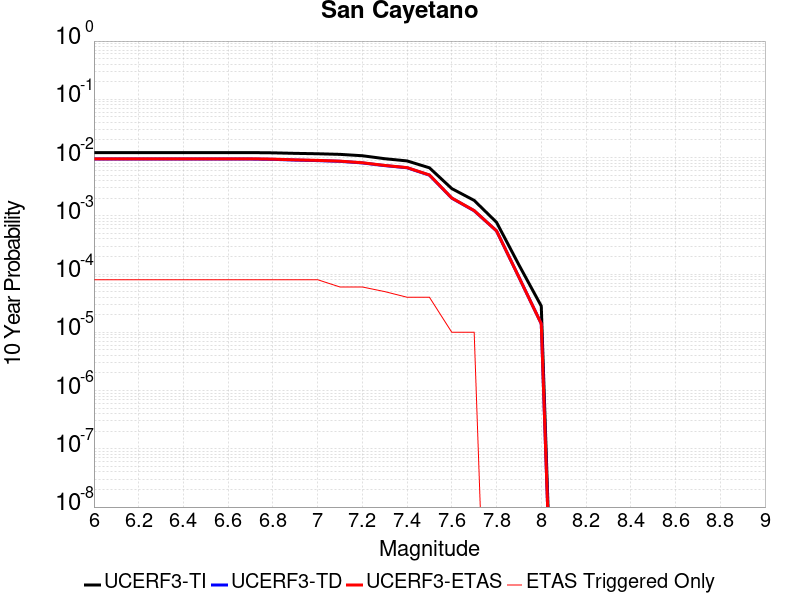 |

| Magnitude | 1 wk TI Prob | 1 wk TD Prob | 1 wk ETAS Prob | 1 wk ETAS/TD Gain | 1 wk ETAS Triggered Only | 1 mo TI Prob | 1 mo TD Prob | 1 mo ETAS Prob | 1 mo ETAS/TD Gain | 1 mo ETAS Triggered Only | 1 yr TI Prob | 1 yr TD Prob | 1 yr ETAS Prob | 1 yr ETAS/TD Gain | 1 yr ETAS Triggered Only | 10 yr TI Prob | 10 yr TD Prob | 10 yr ETAS Prob | 10 yr ETAS/TD Gain | 10 yr ETAS Triggered Only |
|-----|-----|-----|-----|-----|-----|-----|-----|-----|-----|-----|-----|-----|-----|-----|-----|-----|-----|-----|-----|-----|
| 6.0 | 2.3476267E-5 | 1.8169216E-5 | 1.8169216E-5 | 1.0 | 0.0 | 1.0060869E-4 | 7.786576E-5 | 8.786499E-5 | 1.1284162 | 1.0E-5 | 0.0012242225 | 9.4760704E-4 | 9.875691E-4 | 1.0421716 | 4.0E-5 | 0.012175002 | 0.00943675 | 0.009515995 | 1.0083975 | 8.0E-5 |
| 6.1 | 2.3476267E-5 | 1.8169216E-5 | 1.8169216E-5 | 1.0 | 0.0 | 1.0060869E-4 | 7.786576E-5 | 8.786499E-5 | 1.1284162 | 1.0E-5 | 0.0012242225 | 9.4760704E-4 | 9.875691E-4 | 1.0421716 | 4.0E-5 | 0.012175002 | 0.00943675 | 0.009515995 | 1.0083975 | 8.0E-5 |
| 6.2 | 2.3476267E-5 | 1.8169216E-5 | 1.8169216E-5 | 1.0 | 0.0 | 1.0060869E-4 | 7.786576E-5 | 8.786499E-5 | 1.1284162 | 1.0E-5 | 0.0012242225 | 9.4760704E-4 | 9.875691E-4 | 1.0421716 | 4.0E-5 | 0.012175002 | 0.00943675 | 0.009515995 | 1.0083975 | 8.0E-5 |
| 6.3 | 2.3476267E-5 | 1.8169216E-5 | 1.8169216E-5 | 1.0 | 0.0 | 1.0060869E-4 | 7.786576E-5 | 8.786499E-5 | 1.1284162 | 1.0E-5 | 0.0012242225 | 9.4760704E-4 | 9.875691E-4 | 1.0421716 | 4.0E-5 | 0.012175002 | 0.00943675 | 0.009515995 | 1.0083975 | 8.0E-5 |
| 6.4 | 2.3476267E-5 | 1.8169216E-5 | 1.8169216E-5 | 1.0 | 0.0 | 1.0060869E-4 | 7.786576E-5 | 8.786499E-5 | 1.1284162 | 1.0E-5 | 0.0012242225 | 9.4760704E-4 | 9.875691E-4 | 1.0421716 | 4.0E-5 | 0.012175002 | 0.00943675 | 0.009515995 | 1.0083975 | 8.0E-5 |
| 6.5 | 2.3476267E-5 | 1.8169216E-5 | 1.8169216E-5 | 1.0 | 0.0 | 1.0060869E-4 | 7.786576E-5 | 8.786499E-5 | 1.1284162 | 1.0E-5 | 0.0012242225 | 9.4760704E-4 | 9.875691E-4 | 1.0421716 | 4.0E-5 | 0.012175002 | 0.00943675 | 0.009515995 | 1.0083975 | 8.0E-5 |
| 6.6 | 2.3476267E-5 | 1.8169216E-5 | 1.8169216E-5 | 1.0 | 0.0 | 1.0060869E-4 | 7.786576E-5 | 8.786499E-5 | 1.1284162 | 1.0E-5 | 0.0012242225 | 9.4760704E-4 | 9.875691E-4 | 1.0421716 | 4.0E-5 | 0.012175002 | 0.00943675 | 0.009515995 | 1.0083975 | 8.0E-5 |
| 6.7 | 2.3476267E-5 | 1.8169216E-5 | 1.8169216E-5 | 1.0 | 0.0 | 1.0060869E-4 | 7.786576E-5 | 8.786499E-5 | 1.1284162 | 1.0E-5 | 0.0012242225 | 9.4760704E-4 | 9.875691E-4 | 1.0421716 | 4.0E-5 | 0.012175002 | 0.00943675 | 0.009515995 | 1.0083975 | 8.0E-5 |
| 6.8 | 2.3241924E-5 | 1.7936945E-5 | 1.7936945E-5 | 1.0 | 0.0 | 9.960445E-5 | 7.687038E-5 | 8.6869615E-5 | 1.1300792 | 1.0E-5 | 0.0012120095 | 9.354987E-4 | 9.7546127E-4 | 1.0427179 | 4.0E-5 | 0.012054204 | 0.0093166195 | 0.009395874 | 1.0085068 | 8.0E-5 |
| 6.9 | 2.2761007E-5 | 1.7432383E-5 | 1.7432383E-5 | 1.0 | 0.0 | 9.7543525E-5 | 7.47081E-5 | 8.470735E-5 | 1.1338443 | 1.0E-5 | 0.0011869454 | 9.09195E-4 | 9.491586E-4 | 1.043955 | 4.0E-5 | 0.011806256 | 0.009055741 | 0.009135016 | 1.0087541 | 8.0E-5 |
| 7.0 | 2.240283E-5 | 1.7066137E-5 | 1.7066137E-5 | 1.0 | 0.0 | 9.600859E-5 | 7.313856E-5 | 8.313783E-5 | 1.1367168 | 1.0E-5 | 0.0011682777 | 8.9010154E-4 | 9.30066E-4 | 1.0448987 | 4.0E-5 | 0.011621549 | 0.008866336 | 0.008945627 | 1.0089428 | 8.0E-5 |
| 7.1 | 2.1871154E-5 | 1.658602E-5 | 1.658602E-5 | 1.0 | 0.0 | 9.373015E-5 | 7.108103E-5 | 8.108031E-5 | 1.1406745 | 1.0E-5 | 0.0011405671 | 8.6507126E-4 | 9.0503664E-4 | 1.046199 | 4.0E-5 | 0.011347309 | 0.008617996 | 0.00867748 | 1.0069022 | 6.0E-5 |
| 7.2 | 2.0714133E-5 | 1.5564563E-5 | 1.5564563E-5 | 1.0 | 0.0 | 8.8771834E-5 | 6.670358E-5 | 7.670291E-5 | 1.149907 | 1.0E-5 | 0.0010802611 | 8.118168E-4 | 8.5178425E-4 | 1.0492322 | 4.0E-5 | 0.010750249 | 0.008089443 | 0.008148957 | 1.0073571 | 6.0E-5 |
| 7.3 | 1.8408395E-5 | 1.3996829E-5 | 1.3996829E-5 | 1.0 | 0.0 | 7.8890735E-5 | 5.9985046E-5 | 6.9984446E-5 | 1.1666982 | 1.0E-5 | 9.600714E-4 | 7.300762E-4 | 7.70047E-4 | 1.0547488 | 4.0E-5 | 0.009559342 | 0.0072776447 | 0.007327281 | 1.0068203 | 5.0E-5 |
| 7.4 | 1.6856795E-5 | 1.285006E-5 | 1.285006E-5 | 1.0 | 0.0 | 7.2241404E-5 | 5.5070537E-5 | 5.5070537E-5 | 1.0 | 0.0 | 8.7918417E-4 | 6.7028037E-4 | 7.002603E-4 | 1.0447274 | 3.0E-5 | 0.00875714 | 0.0066834087 | 0.0067231413 | 1.005945 | 4.0E-5 |
| 7.5 | 1.2822778E-5 | 9.577415E-6 | 9.577415E-6 | 1.0 | 0.0 | 5.495361E-5 | 4.1045427E-5 | 4.1045427E-5 | 1.0 | 0.0 | 6.688548E-4 | 4.9961504E-4 | 5.296001E-4 | 1.0600163 | 3.0E-5 | 0.006668452 | 0.0049851923 | 0.005024993 | 1.0079838 | 4.0E-5 |
| 7.6 | 5.6272684E-6 | 3.854899E-6 | 3.854899E-6 | 1.0 | 0.0 | 2.4116642E-5 | 1.6520893E-5 | 1.6520893E-5 | 1.0 | 0.0 | 2.9358055E-4 | 2.0112342E-4 | 2.111214E-4 | 1.0497108 | 1.0E-5 | 0.0029319301 | 0.0020094248 | 0.0020194047 | 1.0049665 | 1.0E-5 |
| 7.7 | 3.5261346E-6 | 2.3407094E-6 | 2.3407094E-6 | 1.0 | 0.0 | 1.5111918E-5 | 1.0031574E-5 | 1.0031574E-5 | 1.0 | 0.0 | 1.8397206E-4 | 1.2212765E-4 | 1.3212643E-4 | 1.0818715 | 1.0E-5 | 0.0018381984 | 0.0012206127 | 0.0012306004 | 1.0081826 | 1.0E-5 |
| 7.8 | 1.4826929E-6 | 1.0564395E-6 | 1.0564395E-6 | 1.0 | 0.0 | 6.354383E-6 | 4.52759E-6 | 4.52759E-6 | 1.0 | 0.0 | 7.736187E-5 | 5.5122033E-5 | 5.5122033E-5 | 1.0 | 0.0 | 7.733494E-4 | 5.510856E-4 | 5.510856E-4 | 1.0 | 0.0 |
| 7.9 | 2.7568166E-7 | 1.6977887E-7 | 1.6977887E-7 | 1.0 | 0.0 | 1.1814923E-6 | 7.276235E-7 | 7.276235E-7 | 1.0 | 0.0 | 1.4384574E-5 | 8.85878E-6 | 8.85878E-6 | 1.0 | 0.0 | 1.4383643E-4 | 8.858431E-5 | 8.858431E-5 | 1.0 | 0.0 |
| 8.0 | 5.407832E-8 | 2.688677E-8 | 2.688677E-8 | 1.0 | 0.0 | 2.3176422E-7 | 1.15229014E-7 | 1.15229014E-7 | 1.0 | 0.0 | 2.8217257E-6 | 1.4029123E-6 | 1.4029123E-6 | 1.0 | 0.0 | 2.8216898E-5 | 1.40290385E-5 | 1.40290385E-5 | 1.0 | 0.0 |

## Bullion Mountains
*[(top)](#table-of-contents)*

| 1 Week | 1 Month | 1 Year | 10 Year |
|-----|-----|-----|-----|
|  |  |  |  |

| Magnitude | 1 wk TI Prob | 1 wk TD Prob | 1 wk ETAS Prob | 1 wk ETAS/TD Gain | 1 wk ETAS Triggered Only | 1 mo TI Prob | 1 mo TD Prob | 1 mo ETAS Prob | 1 mo ETAS/TD Gain | 1 mo ETAS Triggered Only | 1 yr TI Prob | 1 yr TD Prob | 1 yr ETAS Prob | 1 yr ETAS/TD Gain | 1 yr ETAS Triggered Only | 10 yr TI Prob | 10 yr TD Prob | 10 yr ETAS Prob | 10 yr ETAS/TD Gain | 10 yr ETAS Triggered Only |
|-----|-----|-----|-----|-----|-----|-----|-----|-----|-----|-----|-----|-----|-----|-----|-----|-----|-----|-----|-----|-----|
| 6.0 | 1.6420427E-5 | 1.4692009E-5 | 4.469157E-5 | 3.0418963 | 3.0E-5 | 7.037136E-5 | 6.296445E-5 | 9.296256E-5 | 1.4764293 | 3.0E-5 | 8.5643446E-4 | 7.6636096E-4 | 8.4629963E-4 | 1.1043094 | 8.0E-5 | 0.008531413 | 0.0076409746 | 0.0077402107 | 1.0129874 | 1.0E-4 |
| 6.1 | 1.6420427E-5 | 1.4692009E-5 | 4.469157E-5 | 3.0418963 | 3.0E-5 | 7.037136E-5 | 6.296445E-5 | 9.296256E-5 | 1.4764293 | 3.0E-5 | 8.5643446E-4 | 7.6636096E-4 | 8.4629963E-4 | 1.1043094 | 8.0E-5 | 0.008531413 | 0.0076409746 | 0.0077402107 | 1.0129874 | 1.0E-4 |
| 6.2 | 1.6420427E-5 | 1.4692009E-5 | 4.469157E-5 | 3.0418963 | 3.0E-5 | 7.037136E-5 | 6.296445E-5 | 9.296256E-5 | 1.4764293 | 3.0E-5 | 8.5643446E-4 | 7.6636096E-4 | 8.4629963E-4 | 1.1043094 | 8.0E-5 | 0.008531413 | 0.0076409746 | 0.0077402107 | 1.0129874 | 1.0E-4 |
| 6.3 | 1.2046778E-5 | 9.862255E-6 | 2.9862058E-5 | 3.0279138 | 2.0E-5 | 5.1628023E-5 | 4.2266256E-5 | 6.226541E-5 | 1.4731708 | 2.0E-5 | 6.283899E-4 | 5.144933E-4 | 5.644676E-4 | 1.097133 | 5.0E-5 | 0.0062661595 | 0.0051353034 | 0.0051949956 | 1.0116239 | 6.0E-5 |
| 6.4 | 1.2046778E-5 | 9.862255E-6 | 2.9862058E-5 | 3.0279138 | 2.0E-5 | 5.1628023E-5 | 4.2266256E-5 | 6.226541E-5 | 1.4731708 | 2.0E-5 | 6.283899E-4 | 5.144933E-4 | 5.644676E-4 | 1.097133 | 5.0E-5 | 0.0062661595 | 0.0051353034 | 0.0051949956 | 1.0116239 | 6.0E-5 |
| 6.5 | 1.0244343E-5 | 7.879378E-6 | 2.7879221E-5 | 3.5382512 | 2.0E-5 | 4.390359E-5 | 3.3768443E-5 | 5.376777E-5 | 1.5922489 | 2.0E-5 | 5.343951E-4 | 4.1107394E-4 | 4.610534E-4 | 1.1215826 | 5.0E-5 | 0.005331118 | 0.0041051665 | 0.00416492 | 1.0145557 | 6.0E-5 |
| 6.6 | 9.605408E-6 | 7.1774166E-6 | 1.7177344E-5 | 2.393249 | 1.0E-5 | 4.1165385E-5 | 3.0760108E-5 | 4.07598E-5 | 1.3250864 | 1.0E-5 | 5.010733E-4 | 3.7446033E-4 | 4.1444536E-4 | 1.1067804 | 4.0E-5 | 0.00499945 | 0.0037402906 | 0.0037901036 | 1.013318 | 5.0E-5 |
| 6.7 | 8.60418E-6 | 6.123926E-6 | 1.6123866E-5 | 2.6329293 | 1.0E-5 | 3.687454E-5 | 2.6245243E-5 | 3.6244983E-5 | 1.3810114 | 1.0E-5 | 4.48855E-4 | 3.195085E-4 | 3.494989E-4 | 1.0938642 | 3.0E-5 | 0.004479495 | 0.0031924031 | 0.0032322754 | 1.0124898 | 4.0E-5 |
| 6.8 | 5.187994E-6 | 2.563117E-6 | 1.2563091E-5 | 4.9014897 | 1.0E-5 | 2.223407E-5 | 1.0984763E-5 | 2.0984653E-5 | 1.9103419 | 1.0E-5 | 2.7066618E-4 | 1.3373529E-4 | 1.4373395E-4 | 1.0747646 | 1.0E-5 | 0.0027033675 | 0.0013369396 | 0.0013569129 | 1.0149395 | 2.0E-5 |
| 6.9 | 4.5302368E-6 | 2.3442778E-6 | 1.2344254E-5 | 5.265696 | 1.0E-5 | 1.9415156E-5 | 1.0046889E-5 | 2.004679E-5 | 1.995323 | 1.0E-5 | 2.3635388E-4 | 1.2231797E-4 | 1.3231675E-4 | 1.0817441 | 1.0E-5 | 0.0023610266 | 0.0012228956 | 0.0012428712 | 1.0163347 | 2.0E-5 |
| 7.0 | 3.431668E-6 | 1.6882177E-6 | 1.1688201E-5 | 6.9233966 | 1.0E-5 | 1.4707065E-5 | 7.2352186E-6 | 1.7235147E-5 | 2.3821182 | 1.0E-5 | 1.7904381E-4 | 8.808879E-5 | 9.8087905E-5 | 1.1135118 | 1.0E-5 | 0.0017889962 | 8.8088785E-4 | 9.0087025E-4 | 1.0226843 | 2.0E-5 |

## Rose Canyon
*[(top)](#table-of-contents)*

| 1 Week | 1 Month | 1 Year | 10 Year |
|-----|-----|-----|-----|
|  | 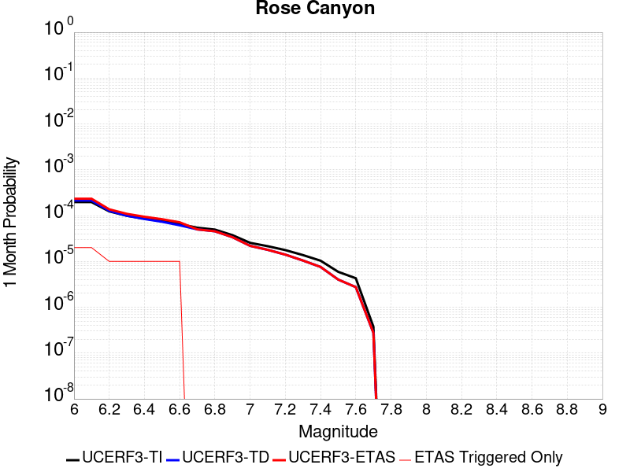 |  |  |

| Magnitude | 1 wk TI Prob | 1 wk TD Prob | 1 wk ETAS Prob | 1 wk ETAS/TD Gain | 1 wk ETAS Triggered Only | 1 mo TI Prob | 1 mo TD Prob | 1 mo ETAS Prob | 1 mo ETAS/TD Gain | 1 mo ETAS Triggered Only | 1 yr TI Prob | 1 yr TD Prob | 1 yr ETAS Prob | 1 yr ETAS/TD Gain | 1 yr ETAS Triggered Only | 10 yr TI Prob | 10 yr TD Prob | 10 yr ETAS Prob | 10 yr ETAS/TD Gain | 10 yr ETAS Triggered Only |
|-----|-----|-----|-----|-----|-----|-----|-----|-----|-----|-----|-----|-----|-----|-----|-----|-----|-----|-----|-----|-----|
| 6.0 | 4.5923203E-5 | 4.9714607E-5 | 5.9714108E-5 | 1.2011381 | 1.0E-5 | 1.9679888E-4 | 2.1304654E-4 | 2.3304229E-4 | 1.0938562 | 2.0E-5 | 0.0023933933 | 0.0025909478 | 0.0026507925 | 1.0230975 | 6.0E-5 | 0.023677798 | 0.025618518 | 0.025715956 | 1.0038034 | 1.0E-4 |
| 6.1 | 4.5923203E-5 | 4.9714607E-5 | 5.9714108E-5 | 1.2011381 | 1.0E-5 | 1.9679888E-4 | 2.1304654E-4 | 2.3304229E-4 | 1.0938562 | 2.0E-5 | 0.0023933933 | 0.0025909478 | 0.0026507925 | 1.0230975 | 6.0E-5 | 0.023677798 | 0.025618518 | 0.025696468 | 1.0030427 | 8.0E-5 |
| 6.2 | 2.8844734E-5 | 2.9669678E-5 | 3.9669383E-5 | 1.3370345 | 1.0E-5 | 1.2361443E-4 | 1.2714976E-4 | 1.371485E-4 | 1.0786374 | 1.0E-5 | 0.0015039665 | 0.001546976 | 0.0015669451 | 1.0129085 | 2.0E-5 | 0.0149382865 | 0.015364873 | 0.015404259 | 1.0025634 | 4.0E-5 |
| 6.3 | 2.3171577E-5 | 2.3162425E-5 | 3.3162192E-5 | 1.4317237 | 1.0E-5 | 9.9302975E-5 | 9.926383E-5 | 1.0926284E-4 | 1.1007316 | 1.0E-5 | 0.0012083431 | 0.0012078804 | 0.0012278563 | 1.0165379 | 2.0E-5 | 0.012017938 | 0.012012152 | 0.012041792 | 1.0024675 | 3.0E-5 |
| 6.4 | 2.0066604E-5 | 1.9668067E-5 | 2.966787E-5 | 1.5084283 | 1.0E-5 | 8.599689E-5 | 8.428905E-5 | 9.42882E-5 | 1.1186293 | 1.0E-5 | 0.0010465092 | 0.001025746 | 0.0010457255 | 1.019478 | 2.0E-5 | 0.010415946 | 0.010211479 | 0.010241172 | 1.0029079 | 3.0E-5 |
| 6.5 | 1.776989E-5 | 1.7115402E-5 | 2.7115231E-5 | 1.584259 | 1.0E-5 | 7.615444E-5 | 7.33497E-5 | 8.334896E-5 | 1.1363232 | 1.0E-5 | 9.267859E-4 | 8.926737E-4 | 9.126558E-4 | 1.0223846 | 2.0E-5 | 0.009229303 | 0.008874663 | 0.0089043975 | 1.0033504 | 3.0E-5 |
| 6.6 | 1.5227364E-5 | 1.4340872E-5 | 2.4340728E-5 | 1.6972976 | 1.0E-5 | 6.52585E-5 | 6.145947E-5 | 7.145885E-5 | 1.1626989 | 1.0E-5 | 7.942326E-4 | 7.480173E-4 | 7.6800236E-4 | 1.0267173 | 2.0E-5 | 0.007914 | 0.0074410336 | 0.0074608847 | 1.0026678 | 2.0E-5 |
| 6.7 | 1.2703898E-5 | 1.1674277E-5 | 1.1674277E-5 | 1.0 | 0.0 | 5.4444143E-5 | 5.0031682E-5 | 5.0031682E-5 | 1.0 | 0.0 | 6.626558E-4 | 6.089697E-4 | 6.189636E-4 | 1.0164112 | 1.0E-5 | 0.006606833 | 0.0060623093 | 0.006072249 | 1.0016395 | 1.0E-5 |
| 6.8 | 1.1554917E-5 | 1.0610384E-5 | 1.0610384E-5 | 1.0 | 0.0 | 4.9520135E-5 | 4.547231E-5 | 4.547231E-5 | 1.0 | 0.0 | 6.0274085E-4 | 5.5348873E-4 | 5.634832E-4 | 1.0180572 | 1.0E-5 | 0.0060110865 | 0.005504414 | 0.005514359 | 1.0018067 | 1.0E-5 |
| 6.9 | 8.732078E-6 | 7.882285E-6 | 7.882285E-6 | 1.0 | 0.0 | 3.7422655E-5 | 3.37808E-5 | 3.37808E-5 | 1.0 | 0.0 | 4.5552556E-4 | 4.112066E-4 | 4.2120248E-4 | 1.0243087 | 1.0E-5 | 0.0045459294 | 0.004089515 | 0.0040994743 | 1.0024353 | 1.0E-5 |
| 7.0 | 5.9337494E-6 | 5.107436E-6 | 5.107436E-6 | 1.0 | 0.0 | 2.5430107E-5 | 2.1888829E-5 | 2.1888829E-5 | 1.0 | 0.0 | 3.0956755E-4 | 2.6646405E-4 | 2.764614E-4 | 1.0375185 | 1.0E-5 | 0.0030913667 | 0.002661461 | 0.0026714345 | 1.0037473 | 1.0E-5 |
| 7.1 | 5.013409E-6 | 4.17734E-6 | 4.17734E-6 | 1.0 | 0.0 | 2.1485863E-5 | 1.7902763E-5 | 1.7902763E-5 | 1.0 | 0.0 | 2.6155898E-4 | 2.1794444E-4 | 2.2794226E-4 | 1.0458733 | 1.0E-5 | 0.0026125133 | 0.0021773188 | 0.002187297 | 1.0045828 | 1.0E-5 |
| 7.2 | 4.120763E-6 | 3.2820917E-6 | 3.2820917E-6 | 1.0 | 0.0 | 1.7660293E-5 | 1.4066032E-5 | 1.4066032E-5 | 1.0 | 0.0 | 2.1499286E-4 | 1.7124058E-4 | 1.7124058E-4 | 1.0 | 0.0 | 0.0021478499 | 0.0017110958 | 0.0017110958 | 1.0 | 0.0 |
| 7.3 | 3.2081239E-6 | 2.4404965E-6 | 2.4404965E-6 | 1.0 | 0.0 | 1.374903E-5 | 1.0459229E-5 | 1.0459229E-5 | 1.0 | 0.0 | 1.6738157E-4 | 1.2733374E-4 | 1.2733374E-4 | 1.0 | 0.0 | 0.0016725556 | 0.0012726148 | 0.0012726148 | 1.0 | 0.0 |
| 7.4 | 2.4194755E-6 | 1.7680321E-6 | 1.7680321E-6 | 1.0 | 0.0 | 1.0369139E-5 | 7.5772587E-6 | 7.5772587E-6 | 1.0 | 0.0 | 1.2623696E-4 | 9.224927E-5 | 9.224927E-5 | 1.0 | 0.0 | 0.0012616527 | 9.221151E-4 | 9.221151E-4 | 1.0 | 0.0 |
| 7.5 | 1.3842889E-6 | 9.3782967E-7 | 9.3782967E-7 | 1.0 | 0.0 | 5.9326535E-6 | 4.019264E-6 | 4.019264E-6 | 1.0 | 0.0 | 7.222766E-5 | 4.8933474E-5 | 4.8933474E-5 | 1.0 | 0.0 | 7.220419E-4 | 4.8923056E-4 | 4.8923056E-4 | 1.0 | 0.0 |
| 7.6 | 1.0021575E-6 | 6.4113493E-7 | 6.4113493E-7 | 1.0 | 0.0 | 4.2949537E-6 | 2.7477186E-6 | 2.7477186E-6 | 1.0 | 0.0 | 5.2289808E-5 | 3.345298E-5 | 3.345298E-5 | 1.0 | 0.0 | 5.2277505E-4 | 3.344816E-4 | 3.344816E-4 | 1.0 | 0.0 |
| 7.7 | 8.7620116E-8 | 6.449304E-8 | 6.449304E-8 | 1.0 | 0.0 | 3.7551473E-7 | 2.763987E-7 | 2.763987E-7 | 1.0 | 0.0 | 4.5718825E-6 | 3.3651493E-6 | 3.3651493E-6 | 1.0 | 0.0 | 4.5717883E-5 | 3.3651013E-5 | 3.3651013E-5 | 1.0 | 0.0 |

## San Jacinto (Clark) rev
*[(top)](#table-of-contents)*

| 1 Week | 1 Month | 1 Year | 10 Year |
|-----|-----|-----|-----|
|  |  |  |  |

| Magnitude | 1 wk TI Prob | 1 wk TD Prob | 1 wk ETAS Prob | 1 wk ETAS/TD Gain | 1 wk ETAS Triggered Only | 1 mo TI Prob | 1 mo TD Prob | 1 mo ETAS Prob | 1 mo ETAS/TD Gain | 1 mo ETAS Triggered Only | 1 yr TI Prob | 1 yr TD Prob | 1 yr ETAS Prob | 1 yr ETAS/TD Gain | 1 yr ETAS Triggered Only | 10 yr TI Prob | 10 yr TD Prob | 10 yr ETAS Prob | 10 yr ETAS/TD Gain | 10 yr ETAS Triggered Only |
|-----|-----|-----|-----|-----|-----|-----|-----|-----|-----|-----|-----|-----|-----|-----|-----|-----|-----|-----|-----|-----|
| 6.0 | 4.482615E-5 | 2.1153059E-5 | 2.1153059E-5 | 1.0 | 0.0 | 1.9209793E-4 | 9.065287E-5 | 1.3064925E-4 | 1.4412036 | 4.0E-5 | 0.0023362834 | 0.0011031491 | 0.0011830608 | 1.0724397 | 8.0E-5 | 0.02311874 | 0.011485709 | 0.01158456 | 1.0086064 | 1.0E-4 |
| 6.1 | 4.482615E-5 | 2.1153059E-5 | 2.1153059E-5 | 1.0 | 0.0 | 1.9209793E-4 | 9.065287E-5 | 1.3064925E-4 | 1.4412036 | 4.0E-5 | 0.0023362834 | 0.0011031491 | 0.0011830608 | 1.0724397 | 8.0E-5 | 0.02311874 | 0.011485709 | 0.01158456 | 1.0086064 | 1.0E-4 |
| 6.2 | 4.482615E-5 | 2.1153059E-5 | 2.1153059E-5 | 1.0 | 0.0 | 1.9209793E-4 | 9.065287E-5 | 1.3064925E-4 | 1.4412036 | 4.0E-5 | 0.0023362834 | 0.0011031491 | 0.0011830608 | 1.0724397 | 8.0E-5 | 0.02311874 | 0.011485709 | 0.01158456 | 1.0086064 | 1.0E-4 |
| 6.3 | 4.482615E-5 | 2.1153059E-5 | 2.1153059E-5 | 1.0 | 0.0 | 1.9209793E-4 | 9.065287E-5 | 1.3064925E-4 | 1.4412036 | 4.0E-5 | 0.0023362834 | 0.0011031491 | 0.0011830608 | 1.0724397 | 8.0E-5 | 0.02311874 | 0.011485709 | 0.01158456 | 1.0086064 | 1.0E-4 |
| 6.4 | 4.482615E-5 | 2.1153059E-5 | 2.1153059E-5 | 1.0 | 0.0 | 1.9209793E-4 | 9.065287E-5 | 1.3064925E-4 | 1.4412036 | 4.0E-5 | 0.0023362834 | 0.0011031491 | 0.0011830608 | 1.0724397 | 8.0E-5 | 0.02311874 | 0.011485709 | 0.01158456 | 1.0086064 | 1.0E-4 |
| 6.5 | 3.7294863E-5 | 1.7354667E-5 | 1.7354667E-5 | 1.0 | 0.0 | 1.5982533E-4 | 7.437504E-5 | 1.1437207E-4 | 1.5377748 | 4.0E-5 | 0.0019441366 | 9.051445E-4 | 9.850721E-4 | 1.0883037 | 8.0E-5 | 0.01927216 | 0.009485902 | 0.009584954 | 1.010442 | 1.0E-4 |
| 6.6 | 3.7294863E-5 | 1.7354667E-5 | 1.7354667E-5 | 1.0 | 0.0 | 1.5982533E-4 | 7.437504E-5 | 1.1437207E-4 | 1.5377748 | 4.0E-5 | 0.0019441366 | 9.051445E-4 | 9.850721E-4 | 1.0883037 | 8.0E-5 | 0.01927216 | 0.009485902 | 0.009584954 | 1.010442 | 1.0E-4 |
| 6.7 | 3.6039248E-5 | 1.6602684E-5 | 1.6602684E-5 | 1.0 | 0.0 | 1.5444479E-4 | 7.115244E-5 | 1.11149595E-4 | 1.5621333 | 4.0E-5 | 0.0018787434 | 8.659408E-4 | 9.458715E-4 | 1.0923051 | 8.0E-5 | 0.01862939 | 0.009088189 | 0.00918728 | 1.0109032 | 1.0E-4 |
| 6.8 | 3.5031844E-5 | 1.6231123E-5 | 1.6231123E-5 | 1.0 | 0.0 | 1.5012783E-4 | 6.956012E-5 | 1.0955734E-4 | 1.5750021 | 4.0E-5 | 0.0018262739 | 8.4656954E-4 | 9.265018E-4 | 1.094419 | 8.0E-5 | 0.01811338 | 0.008888788 | 0.008987899 | 1.0111501 | 1.0E-4 |
| 6.9 | 3.435112E-5 | 1.6061658E-5 | 1.6061658E-5 | 1.0 | 0.0 | 1.4721078E-4 | 6.8833884E-5 | 1.0883113E-4 | 1.5810691 | 4.0E-5 | 0.0017908178 | 8.377344E-4 | 9.176674E-4 | 1.0954157 | 8.0E-5 | 0.017764548 | 0.008796512 | 0.008895632 | 1.0112681 | 1.0E-4 |
| 7.0 | 2.8959772E-5 | 1.43355255E-5 | 1.43355255E-5 | 1.0 | 0.0 | 1.241074E-4 | 6.1436534E-5 | 1.01434074E-4 | 1.6510384 | 4.0E-5 | 0.0015099603 | 7.477359E-4 | 8.276761E-4 | 1.1069096 | 8.0E-5 | 0.014997416 | 0.007868331 | 0.007967544 | 1.0126091 | 1.0E-4 |
| 7.1 | 2.6002877E-5 | 1.2827699E-5 | 1.2827699E-5 | 1.0 | 0.0 | 1.11436144E-4 | 5.4974706E-5 | 9.497251E-5 | 1.7275673 | 4.0E-5 | 0.0013558907 | 6.6911365E-4 | 7.4906007E-4 | 1.1194812 | 8.0E-5 | 0.013476475 | 0.0070483433 | 0.0071476386 | 1.0140877 | 1.0E-4 |
| 7.2 | 2.2544838E-5 | 1.1260331E-5 | 1.1260331E-5 | 1.0 | 0.0 | 9.661716E-5 | 4.825768E-5 | 8.825575E-5 | 1.8288436 | 4.0E-5 | 0.001175679 | 5.873803E-4 | 6.673333E-4 | 1.1361179 | 8.0E-5 | 0.011694785 | 0.00619256 | 0.006291941 | 1.0160484 | 1.0E-4 |
| 7.3 | 1.75334E-5 | 1.0810585E-5 | 1.0810585E-5 | 1.0 | 0.0 | 7.514098E-5 | 4.6330264E-5 | 8.632841E-5 | 1.8633265 | 4.0E-5 | 9.144575E-4 | 5.6392635E-4 | 6.4388127E-4 | 1.1417825 | 8.0E-5 | 0.009107036 | 0.0059332196 | 0.006032626 | 1.0167543 | 1.0E-4 |
| 7.4 | 1.5924552E-5 | 1.0610475E-5 | 1.0610475E-5 | 1.0 | 0.0 | 6.82463E-5 | 4.547268E-5 | 8.547086E-5 | 1.8796091 | 4.0E-5 | 8.305819E-4 | 5.534906E-4 | 6.334463E-4 | 1.1444572 | 8.0E-5 | 0.008274844 | 0.0058205863 | 0.005920004 | 1.0170804 | 1.0E-4 |
| 7.5 | 1.3428931E-5 | 9.851045E-6 | 9.851045E-6 | 1.0 | 0.0 | 5.7551293E-5 | 4.221809E-5 | 8.22164E-5 | 1.9474212 | 4.0E-5 | 7.004617E-4 | 5.1388505E-4 | 5.93844E-4 | 1.1555969 | 8.0E-5 | 0.006982579 | 0.005406209 | 0.005505668 | 1.0183972 | 1.0E-4 |
| 7.6 | 1.0688787E-5 | 8.614091E-6 | 8.614091E-6 | 1.0 | 0.0 | 4.5808283E-5 | 3.6917012E-5 | 7.691553E-5 | 2.0834713 | 4.0E-5 | 5.5757316E-4 | 4.4937237E-4 | 5.2933645E-4 | 1.1779461 | 8.0E-5 | 0.005561762 | 0.0047413614 | 0.004840887 | 1.020991 | 1.0E-4 |
| 7.7 | 8.81236E-6 | 7.4673385E-6 | 7.4673385E-6 | 1.0 | 0.0 | 3.776671E-5 | 3.200249E-5 | 7.200121E-5 | 2.249863 | 4.0E-5 | 4.597127E-4 | 3.8956082E-4 | 4.6952968E-4 | 1.2052795 | 8.0E-5 | 0.0045876284 | 0.0041344194 | 0.0042340057 | 1.0240872 | 1.0E-4 |
| 7.8 | 7.780431E-6 | 6.695928E-6 | 6.695928E-6 | 1.0 | 0.0 | 3.3344273E-5 | 2.8696519E-5 | 6.869537E-5 | 2.3938572 | 4.0E-5 | 4.0589093E-4 | 3.4932428E-4 | 4.2929634E-4 | 1.2289336 | 8.0E-5 | 0.0040515037 | 0.0037226272 | 0.003822255 | 1.0267627 | 1.0E-4 |
| 7.9 | 6.5437994E-6 | 5.7797783E-6 | 5.7797783E-6 | 1.0 | 0.0 | 2.8044553E-5 | 2.4770245E-5 | 6.476925E-5 | 2.6148007 | 4.0E-5 | 3.4138895E-4 | 3.0153614E-4 | 3.8151204E-4 | 1.2652282 | 8.0E-5 | 0.0034086495 | 0.0032343294 | 0.0033340058 | 1.0308183 | 1.0E-4 |
| 8.0 | 5.4488164E-6 | 4.812793E-6 | 4.812793E-6 | 1.0 | 0.0 | 2.3351862E-5 | 2.0626094E-5 | 6.062527E-5 | 2.9392512 | 4.0E-5 | 2.8427184E-4 | 2.510939E-4 | 3.310738E-4 | 1.3185259 | 8.0E-5 | 0.0028390845 | 0.0027107038 | 0.0028104326 | 1.0367908 | 1.0E-4 |
| 8.1 | 2.8397242E-6 | 1.3665673E-6 | 1.3665673E-6 | 1.0 | 0.0 | 1.217019E-5 | 5.856704E-6 | 1.5856645E-5 | 2.7074351 | 1.0E-5 | 1.4816198E-4 | 7.1303046E-5 | 9.130162E-5 | 1.2804729 | 2.0E-5 | 0.0014806325 | 8.113543E-4 | 8.313381E-4 | 1.0246302 | 2.0E-5 |
| 8.2 | 2.030244E-6 | 6.3151083E-7 | 6.3151083E-7 | 1.0 | 0.0 | 8.701017E-6 | 2.7064723E-6 | 2.7064723E-6 | 1.0 | 0.0 | 1.05929736E-4 | 3.2950808E-5 | 3.2950808E-5 | 1.0 | 0.0 | 0.0010587925 | 3.9470522E-4 | 3.9470522E-4 | 1.0 | 0.0 |
| 8.3 | 1.0659804E-6 | 2.9230563E-7 | 2.9230563E-7 | 1.0 | 0.0 | 4.568479E-6 | 1.2527379E-6 | 1.2527379E-6 | 1.0 | 0.0 | 5.5619817E-5 | 1.5251981E-5 | 1.5251981E-5 | 1.0 | 0.0 | 5.5605895E-4 | 1.8556409E-4 | 1.8556409E-4 | 1.0 | 0.0 |

## Coronado Bank alt1
*[(top)](#table-of-contents)*

| 1 Week | 1 Month | 1 Year | 10 Year |
|-----|-----|-----|-----|
|  |  |  |  |

| Magnitude | 1 wk TI Prob | 1 wk TD Prob | 1 wk ETAS Prob | 1 wk ETAS/TD Gain | 1 wk ETAS Triggered Only | 1 mo TI Prob | 1 mo TD Prob | 1 mo ETAS Prob | 1 mo ETAS/TD Gain | 1 mo ETAS Triggered Only | 1 yr TI Prob | 1 yr TD Prob | 1 yr ETAS Prob | 1 yr ETAS/TD Gain | 1 yr ETAS Triggered Only | 10 yr TI Prob | 10 yr TD Prob | 10 yr ETAS Prob | 10 yr ETAS/TD Gain | 10 yr ETAS Triggered Only |
|-----|-----|-----|-----|-----|-----|-----|-----|-----|-----|-----|-----|-----|-----|-----|-----|-----|-----|-----|-----|-----|
| 6.0 | 7.533492E-5 | 9.3951705E-5 | 1.0395077E-4 | 1.1064277 | 1.0E-5 | 3.22824E-4 | 4.025903E-4 | 4.2258223E-4 | 1.0496583 | 2.0E-5 | 0.0039233007 | 0.004891121 | 0.0049607786 | 1.0142417 | 7.0E-5 | 0.03854755 | 0.047904 | 0.04798969 | 1.0017887 | 9.0E-5 |
| 6.1 | 4.1807285E-5 | 5.0493105E-5 | 6.04926E-5 | 1.1980368 | 1.0E-5 | 1.7916178E-4 | 2.1638138E-4 | 2.2637921E-4 | 1.0462047 | 1.0E-5 | 0.0021791123 | 0.0026313365 | 0.0026612575 | 1.011371 | 3.0E-5 | 0.021578677 | 0.026011124 | 0.026050083 | 1.0014977 | 4.0E-5 |
| 6.2 | 4.1807285E-5 | 5.0493105E-5 | 6.04926E-5 | 1.1980368 | 1.0E-5 | 1.7916178E-4 | 2.1638138E-4 | 2.2637921E-4 | 1.0462047 | 1.0E-5 | 0.0021791123 | 0.0026313365 | 0.0026612575 | 1.011371 | 3.0E-5 | 0.021578677 | 0.026011124 | 0.026050083 | 1.0014977 | 4.0E-5 |
| 6.3 | 3.1793104E-5 | 3.7711125E-5 | 4.771075E-5 | 1.2651638 | 1.0E-5 | 1.3624904E-4 | 1.6160926E-4 | 1.7160765E-4 | 1.0618676 | 1.0E-5 | 0.0016575698 | 0.001965849 | 0.00199579 | 1.0152305 | 3.0E-5 | 0.016452603 | 0.019488495 | 0.019527715 | 1.0020125 | 4.0E-5 |
| 6.4 | 2.9878007E-5 | 3.5335797E-5 | 4.5335444E-5 | 1.2829891 | 1.0E-5 | 1.2804232E-4 | 1.5143053E-4 | 1.6142902E-4 | 1.0660269 | 1.0E-5 | 0.0015578003 | 0.0018421395 | 0.0018720842 | 1.0162554 | 3.0E-5 | 0.015469253 | 0.018272463 | 0.018311733 | 1.0021491 | 4.0E-5 |
| 6.5 | 2.4512565E-5 | 2.8764101E-5 | 3.8763814E-5 | 1.3476455 | 1.0E-5 | 1.0504962E-4 | 1.2326906E-4 | 1.3326782E-4 | 1.0811133 | 1.0E-5 | 0.0012782287 | 0.0014997943 | 0.0015297494 | 1.0199728 | 3.0E-5 | 0.012709012 | 0.0148996925 | 0.014939097 | 1.0026447 | 4.0E-5 |
| 6.6 | 2.1317413E-5 | 2.490667E-5 | 3.490642E-5 | 1.4014889 | 1.0E-5 | 9.135714E-5 | 1.0673863E-4 | 1.1673757E-4 | 1.0936768 | 1.0E-5 | 0.0011117056 | 0.0012987903 | 0.0013287513 | 1.0230684 | 3.0E-5 | 0.011061605 | 0.012914407 | 0.0129538905 | 1.0030574 | 4.0E-5 |
| 6.7 | 1.8585655E-5 | 2.1634882E-5 | 3.1634663E-5 | 1.4622066 | 1.0E-5 | 7.9650374E-5 | 9.271774E-5 | 1.0271681E-4 | 1.1078442 | 1.0E-5 | 9.6931186E-4 | 0.0011282744 | 0.0011582405 | 1.0265592 | 3.0E-5 | 0.0096509475 | 0.011227623 | 0.011267174 | 1.0035226 | 4.0E-5 |
| 6.8 | 1.5862879E-5 | 1.8419476E-5 | 2.8419292E-5 | 1.5428936 | 1.0E-5 | 6.798199E-5 | 7.8938334E-5 | 8.8937544E-5 | 1.1266712 | 1.0E-5 | 8.273665E-4 | 9.606697E-4 | 9.806505E-4 | 1.0207988 | 2.0E-5 | 0.008242928 | 0.009567151 | 0.009596864 | 1.0031058 | 3.0E-5 |
| 6.9 | 1.3021509E-5 | 1.5095266E-5 | 2.5095114E-5 | 1.6624494 | 1.0E-5 | 5.5805274E-5 | 6.46925E-5 | 7.4691845E-5 | 1.1545675 | 1.0E-5 | 6.792174E-4 | 7.873646E-4 | 8.073488E-4 | 1.0253812 | 2.0E-5 | 0.006771452 | 0.007847573 | 0.007877338 | 1.0037929 | 3.0E-5 |
| 7.0 | 1.0974371E-5 | 1.2720105E-5 | 2.2719978E-5 | 1.786147 | 1.0E-5 | 4.7032172E-5 | 5.4513697E-5 | 6.451315E-5 | 1.1834302 | 1.0E-5 | 5.7246623E-4 | 6.635197E-4 | 6.835064E-4 | 1.0301223 | 2.0E-5 | 0.0057099373 | 0.0066171354 | 0.0066469368 | 1.0045037 | 3.0E-5 |
| 7.1 | 8.766221E-6 | 1.0163833E-5 | 2.0163732E-5 | 1.9838707 | 1.0E-5 | 3.7568978E-5 | 4.3558655E-5 | 5.355822E-5 | 1.2295655 | 1.0E-5 | 4.573063E-4 | 5.302148E-4 | 5.502042E-4 | 1.0377005 | 2.0E-5 | 0.0045636636 | 0.005291197 | 0.0053210384 | 1.0056398 | 3.0E-5 |
| 7.2 | 8.026024E-7 | 8.331776E-7 | 8.331776E-7 | 1.0 | 0.0 | 3.43972E-6 | 3.5707562E-6 | 3.5707562E-6 | 1.0 | 0.0 | 4.1877785E-5 | 4.34731E-5 | 4.34731E-5 | 1.0 | 0.0 | 4.1869894E-4 | 4.3464705E-4 | 4.3464705E-4 | 1.0 | 0.0 |
| 7.3 | 3.7293114E-7 | 3.700106E-7 | 3.700106E-7 | 1.0 | 0.0 | 1.5982754E-6 | 1.5857588E-6 | 1.5857588E-6 | 1.0 | 0.0 | 1.9458828E-5 | 1.9306442E-5 | 1.9306442E-5 | 1.0 | 0.0 | 1.9457124E-4 | 1.9304773E-4 | 1.9304773E-4 | 1.0 | 0.0 |
| 7.4 | 2.0557036E-7 | 1.9674441E-7 | 1.9674441E-7 | 1.0 | 0.0 | 8.810155E-7 | 8.4319004E-7 | 8.4319004E-7 | 1.0 | 0.0 | 1.0726311E-5 | 1.02657905E-5 | 1.02657905E-5 | 1.0 | 0.0 | 1.0725793E-4 | 1.026532E-4 | 1.026532E-4 | 1.0 | 0.0 |
| 7.5 | 6.845446E-8 | 6.2794086E-8 | 6.2794086E-8 | 1.0 | 0.0 | 2.9337625E-7 | 2.6911746E-7 | 2.6911746E-7 | 1.0 | 0.0 | 3.5718497E-6 | 3.2765004E-6 | 3.2765004E-6 | 1.0 | 0.0 | 3.5717923E-5 | 3.276453E-5 | 3.276453E-5 | 1.0 | 0.0 |
| 7.6 | 6.0975145E-9 | 5.531901E-9 | 5.531901E-9 | 1.0 | 0.0 | 2.6132206E-8 | 2.3708148E-8 | 2.3708148E-8 | 1.0 | 0.0 | 3.1815955E-7 | 2.8864667E-7 | 2.8864667E-7 | 1.0 | 0.0 | 3.181591E-6 | 2.886464E-6 | 2.886464E-6 | 1.0 | 0.0 |

## Santa Cruz Catalina Ridge alt1
*[(top)](#table-of-contents)*

| 1 Week | 1 Month | 1 Year | 10 Year |
|-----|-----|-----|-----|
|  | 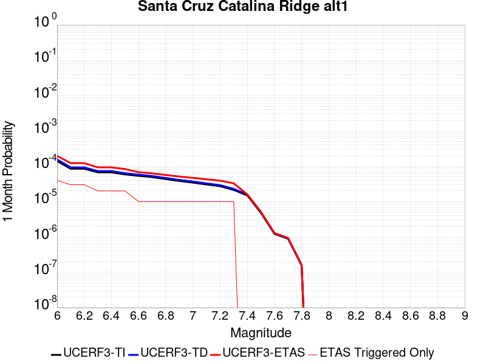 |  |  |

| Magnitude | 1 wk TI Prob | 1 wk TD Prob | 1 wk ETAS Prob | 1 wk ETAS/TD Gain | 1 wk ETAS Triggered Only | 1 mo TI Prob | 1 mo TD Prob | 1 mo ETAS Prob | 1 mo ETAS/TD Gain | 1 mo ETAS Triggered Only | 1 yr TI Prob | 1 yr TD Prob | 1 yr ETAS Prob | 1 yr ETAS/TD Gain | 1 yr ETAS Triggered Only | 10 yr TI Prob | 10 yr TD Prob | 10 yr ETAS Prob | 10 yr ETAS/TD Gain | 10 yr ETAS Triggered Only |
|-----|-----|-----|-----|-----|-----|-----|-----|-----|-----|-----|-----|-----|-----|-----|-----|-----|-----|-----|-----|-----|
| 6.0 | 3.2833184E-5 | 3.6558402E-5 | 6.65573E-5 | 1.8205749 | 3.0E-5 | 1.4070606E-4 | 1.5667039E-4 | 1.9666411E-4 | 1.2552731 | 4.0E-5 | 0.00171175 | 0.0019059594 | 0.001975826 | 1.0366569 | 7.0E-5 | 0.016986247 | 0.018913032 | 0.01899152 | 1.0041499 | 8.0E-5 |
| 6.1 | 1.9835548E-5 | 2.1659505E-5 | 4.1659074E-5 | 1.9233621 | 2.0E-5 | 8.500672E-5 | 9.282326E-5 | 1.2282048E-4 | 1.3231648 | 3.0E-5 | 0.0010344655 | 0.0011295575 | 0.0011894897 | 1.0530581 | 6.0E-5 | 0.010296632 | 0.011240296 | 0.011309509 | 1.0061576 | 7.0E-5 |
| 6.2 | 1.9835548E-5 | 2.1659505E-5 | 4.1659074E-5 | 1.9233621 | 2.0E-5 | 8.500672E-5 | 9.282326E-5 | 1.2282048E-4 | 1.3231648 | 3.0E-5 | 0.0010344655 | 0.0011295575 | 0.0011894897 | 1.0530581 | 6.0E-5 | 0.010296632 | 0.011240296 | 0.011309509 | 1.0061576 | 7.0E-5 |
| 6.3 | 1.5728183E-5 | 1.703395E-5 | 2.7033779E-5 | 1.587053 | 1.0E-5 | 6.7404755E-5 | 7.300063E-5 | 9.299917E-5 | 1.2739502 | 2.0E-5 | 8.2034385E-4 | 8.884264E-4 | 9.2839083E-4 | 1.0449834 | 4.0E-5 | 0.008173222 | 0.008849427 | 0.008898985 | 1.0056001 | 5.0E-5 |
| 6.4 | 1.5728183E-5 | 1.703395E-5 | 2.7033779E-5 | 1.587053 | 1.0E-5 | 6.7404755E-5 | 7.300063E-5 | 9.299917E-5 | 1.2739502 | 2.0E-5 | 8.2034385E-4 | 8.884264E-4 | 9.2839083E-4 | 1.0449834 | 4.0E-5 | 0.008173222 | 0.008849427 | 0.008898985 | 1.0056001 | 5.0E-5 |
| 6.5 | 1.3707734E-5 | 1.4794522E-5 | 2.4794374E-5 | 1.6759158 | 1.0E-5 | 5.8746107E-5 | 6.3403575E-5 | 8.34023E-5 | 1.3154197 | 2.0E-5 | 7.1499916E-4 | 7.716686E-4 | 8.116377E-4 | 1.0517957 | 4.0E-5 | 0.0071270303 | 0.0076902895 | 0.0077399053 | 1.0064517 | 5.0E-5 |
| 6.6 | 1.2539813E-5 | 1.3510219E-5 | 1.3510219E-5 | 1.0 | 0.0 | 5.3740947E-5 | 5.789967E-5 | 6.789909E-5 | 1.1727026 | 1.0E-5 | 6.540996E-4 | 7.0470315E-4 | 7.34682E-4 | 1.0425411 | 3.0E-5 | 0.0065217763 | 0.0070249885 | 0.0070647076 | 1.005654 | 4.0E-5 |
| 6.7 | 1.1504083E-5 | 1.2377375E-5 | 1.2377375E-5 | 1.0 | 0.0 | 4.930228E-5 | 5.3044827E-5 | 6.3044296E-5 | 1.1885098 | 1.0E-5 | 6.0008996E-4 | 6.456314E-4 | 6.75612E-4 | 1.0464362 | 3.0E-5 | 0.005984721 | 0.006437786 | 0.0064775283 | 1.0061734 | 4.0E-5 |
| 6.8 | 1.012739E-5 | 1.0877071E-5 | 1.0877071E-5 | 1.0 | 0.0 | 4.340238E-5 | 4.6615194E-5 | 5.661473E-5 | 1.2145123 | 1.0E-5 | 5.282958E-4 | 5.673937E-4 | 5.9737667E-4 | 1.0528433 | 3.0E-5 | 0.0052704164 | 0.0056596193 | 0.0056993933 | 1.0070276 | 4.0E-5 |
| 6.9 | 8.9607865E-6 | 9.609117E-6 | 9.609117E-6 | 1.0 | 0.0 | 3.8402806E-5 | 4.1181287E-5 | 5.1180876E-5 | 1.2428187 | 1.0E-5 | 4.6745385E-4 | 5.012679E-4 | 5.312529E-4 | 1.0598183 | 3.0E-5 | 0.0046647177 | 0.005001492 | 0.0050412915 | 1.0079576 | 4.0E-5 |
| 7.0 | 8.046829E-6 | 8.619746E-6 | 8.619746E-6 | 1.0 | 0.0 | 3.4485955E-5 | 3.694125E-5 | 4.694088E-5 | 1.2706901 | 1.0E-5 | 4.1978562E-4 | 4.496677E-4 | 4.796542E-4 | 1.0666859 | 3.0E-5 | 0.004189935 | 0.0044876686 | 0.004527489 | 1.0088733 | 4.0E-5 |
| 7.1 | 7.136131E-6 | 7.637656E-6 | 7.637656E-6 | 1.0 | 0.0 | 3.0583058E-5 | 3.2732405E-5 | 4.2732077E-5 | 1.3054976 | 1.0E-5 | 3.7228514E-4 | 3.9844486E-4 | 4.2843292E-4 | 1.0752628 | 3.0E-5 | 0.0037166206 | 0.003977381 | 0.004017222 | 1.0100169 | 4.0E-5 |
| 7.2 | 6.362014E-6 | 6.8049585E-6 | 6.8049585E-6 | 1.0 | 0.0 | 2.726549E-5 | 2.9163786E-5 | 3.9163493E-5 | 1.342881 | 1.0E-5 | 3.3190678E-4 | 3.550119E-4 | 3.8500124E-4 | 1.0844742 | 3.0E-5 | 0.0033141149 | 0.003544516 | 0.0035843742 | 1.011245 | 4.0E-5 |
| 7.3 | 5.004101E-6 | 5.351715E-6 | 5.351715E-6 | 1.0 | 0.0 | 2.1445969E-5 | 2.2935723E-5 | 3.293549E-5 | 1.435991 | 1.0E-5 | 2.6107338E-4 | 2.792072E-4 | 2.9920158E-4 | 1.0716114 | 2.0E-5 | 0.002607669 | 0.0027886187 | 0.0028185348 | 1.010728 | 3.0E-5 |
| 7.4 | 3.4901443E-6 | 3.7320526E-6 | 3.7320526E-6 | 1.0 | 0.0 | 1.4957676E-5 | 1.5994416E-5 | 1.5994416E-5 | 1.0 | 0.0 | 1.8209449E-4 | 1.9471499E-4 | 2.0471304E-4 | 1.0513471 | 1.0E-5 | 0.0018194534 | 0.0019454823 | 0.0019554629 | 1.0051302 | 1.0E-5 |
| 7.5 | 1.1215045E-6 | 1.189387E-6 | 1.189387E-6 | 1.0 | 0.0 | 4.806439E-6 | 5.097363E-6 | 5.097363E-6 | 1.0 | 0.0 | 5.851682E-5 | 6.205866E-5 | 6.205866E-5 | 1.0 | 0.0 | 5.850142E-4 | 6.2041637E-4 | 6.2041637E-4 | 1.0 | 0.0 |
| 7.6 | 2.8599047E-7 | 2.9951994E-7 | 2.9951994E-7 | 1.0 | 0.0 | 1.2256729E-6 | 1.2836562E-6 | 1.2836562E-6 | 1.0 | 0.0 | 1.4922465E-5 | 1.5628404E-5 | 1.5628404E-5 | 1.0 | 0.0 | 1.4921463E-4 | 1.5627318E-4 | 1.5627318E-4 | 1.0 | 0.0 |
| 7.7 | 2.0781519E-7 | 2.1744323E-7 | 2.1744323E-7 | 1.0 | 0.0 | 8.906362E-7 | 9.3189925E-7 | 9.3189925E-7 | 1.0 | 0.0 | 1.08434415E-5 | 1.13458145E-5 | 1.13458145E-5 | 1.0 | 0.0 | 1.0842913E-4 | 1.1345245E-4 | 1.1345245E-4 | 1.0 | 0.0 |
| 7.8 | 3.614776E-8 | 3.764102E-8 | 3.764102E-8 | 1.0 | 0.0 | 1.5491896E-7 | 1.6131864E-7 | 1.6131864E-7 | 1.0 | 0.0 | 1.8861368E-6 | 1.9640527E-6 | 1.9640527E-6 | 1.0 | 0.0 | 1.8861208E-5 | 1.9640367E-5 | 1.9640367E-5 | 1.0 | 0.0 |

## Raymond
*[(top)](#table-of-contents)*

| 1 Week | 1 Month | 1 Year | 10 Year |
|-----|-----|-----|-----|
|  |  |  |  |

| Magnitude | 1 wk TI Prob | 1 wk TD Prob | 1 wk ETAS Prob | 1 wk ETAS/TD Gain | 1 wk ETAS Triggered Only | 1 mo TI Prob | 1 mo TD Prob | 1 mo ETAS Prob | 1 mo ETAS/TD Gain | 1 mo ETAS Triggered Only | 1 yr TI Prob | 1 yr TD Prob | 1 yr ETAS Prob | 1 yr ETAS/TD Gain | 1 yr ETAS Triggered Only | 10 yr TI Prob | 10 yr TD Prob | 10 yr ETAS Prob | 10 yr ETAS/TD Gain | 10 yr ETAS Triggered Only |
|-----|-----|-----|-----|-----|-----|-----|-----|-----|-----|-----|-----|-----|-----|-----|-----|-----|-----|-----|-----|-----|
| 6.0 | 1.5157413E-5 | 1.5810125E-5 | 4.580965E-5 | 2.897488 | 3.0E-5 | 6.4958724E-5 | 6.775606E-5 | 9.775403E-5 | 1.4427348 | 3.0E-5 | 7.905855E-4 | 8.246429E-4 | 8.646099E-4 | 1.0484658 | 4.0E-5 | 0.007877788 | 0.008218355 | 0.008297697 | 1.0096543 | 8.0E-5 |
| 6.1 | 1.5157413E-5 | 1.5810125E-5 | 4.580965E-5 | 2.897488 | 3.0E-5 | 6.4958724E-5 | 6.775606E-5 | 9.775403E-5 | 1.4427348 | 3.0E-5 | 7.905855E-4 | 8.246429E-4 | 8.646099E-4 | 1.0484658 | 4.0E-5 | 0.007877788 | 0.008218355 | 0.008297697 | 1.0096543 | 8.0E-5 |
| 6.2 | 1.5157413E-5 | 1.5810125E-5 | 4.580965E-5 | 2.897488 | 3.0E-5 | 6.4958724E-5 | 6.775606E-5 | 9.775403E-5 | 1.4427348 | 3.0E-5 | 7.905855E-4 | 8.246429E-4 | 8.646099E-4 | 1.0484658 | 4.0E-5 | 0.007877788 | 0.008218355 | 0.008297697 | 1.0096543 | 8.0E-5 |
| 6.3 | 1.5157413E-5 | 1.5810125E-5 | 4.580965E-5 | 2.897488 | 3.0E-5 | 6.4958724E-5 | 6.775606E-5 | 9.775403E-5 | 1.4427348 | 3.0E-5 | 7.905855E-4 | 8.246429E-4 | 8.646099E-4 | 1.0484658 | 4.0E-5 | 0.007877788 | 0.008218355 | 0.008297697 | 1.0096543 | 8.0E-5 |
| 6.4 | 1.3941944E-5 | 1.4454688E-5 | 4.4454253E-5 | 3.0754213 | 3.0E-5 | 5.9749822E-5 | 6.194732E-5 | 9.194547E-5 | 1.4842525 | 3.0E-5 | 7.2721124E-4 | 7.53971E-4 | 7.9394085E-4 | 1.0530125 | 4.0E-5 | 0.007248361 | 0.007516471 | 0.0075958697 | 1.0105633 | 8.0E-5 |
| 6.5 | 1.3941944E-5 | 1.4454688E-5 | 4.4454253E-5 | 3.0754213 | 3.0E-5 | 5.9749822E-5 | 6.194732E-5 | 9.194547E-5 | 1.4842525 | 3.0E-5 | 7.2721124E-4 | 7.53971E-4 | 7.9394085E-4 | 1.0530125 | 4.0E-5 | 0.007248361 | 0.007516471 | 0.0075958697 | 1.0105633 | 8.0E-5 |
| 6.6 | 1.0542609E-5 | 1.067111E-5 | 4.067079E-5 | 3.8112988 | 3.0E-5 | 4.5181827E-5 | 4.573256E-5 | 7.573119E-5 | 1.6559578 | 3.0E-5 | 5.499499E-4 | 5.566571E-4 | 5.9663487E-4 | 1.0718175 | 4.0E-5 | 0.005485909 | 0.0055531966 | 0.005612863 | 1.0107446 | 6.0E-5 |
| 6.7 | 1.0542609E-5 | 1.067111E-5 | 4.067079E-5 | 3.8112988 | 3.0E-5 | 4.5181827E-5 | 4.573256E-5 | 7.573119E-5 | 1.6559578 | 3.0E-5 | 5.499499E-4 | 5.566571E-4 | 5.9663487E-4 | 1.0718175 | 4.0E-5 | 0.005485909 | 0.0055531966 | 0.005612863 | 1.0107446 | 6.0E-5 |
| 6.8 | 1.0079132E-5 | 1.0176644E-5 | 4.017634E-5 | 3.9478967 | 3.0E-5 | 4.3195567E-5 | 4.3613487E-5 | 7.361218E-5 | 1.6878306 | 3.0E-5 | 5.257791E-4 | 5.308702E-4 | 5.70849E-4 | 1.075308 | 4.0E-5 | 0.0052453685 | 0.0052965777 | 0.0053562596 | 1.011268 | 6.0E-5 |
| 6.9 | 7.721598E-6 | 7.548902E-6 | 3.7548674E-5 | 4.9740577 | 3.0E-5 | 3.3092143E-5 | 3.2352043E-5 | 6.235107E-5 | 1.9272685 | 3.0E-5 | 4.0282236E-4 | 3.9381615E-4 | 4.338004E-4 | 1.1015302 | 4.0E-5 | 0.0040209293 | 0.003931324 | 0.0039811274 | 1.0126684 | 5.0E-5 |
| 7.0 | 7.137566E-6 | 6.911303E-6 | 3.6911097E-5 | 5.3406854 | 3.0E-5 | 3.058921E-5 | 2.961954E-5 | 5.961865E-5 | 2.012815 | 3.0E-5 | 3.7236E-4 | 3.605593E-4 | 4.0054487E-4 | 1.1108987 | 4.0E-5 | 0.0037173668 | 0.003599869 | 0.003649689 | 1.0138394 | 5.0E-5 |
| 7.1 | 5.654976E-6 | 5.299538E-6 | 2.5299432E-5 | 4.7738943 | 2.0E-5 | 2.4235387E-5 | 2.2712107E-5 | 4.2711654E-5 | 1.8805676 | 2.0E-5 | 2.9502588E-4 | 2.7648505E-4 | 2.964795E-4 | 1.0723166 | 2.0E-5 | 0.0029463451 | 0.0027614492 | 0.0027913663 | 1.0108339 | 3.0E-5 |
| 7.2 | 4.9358455E-6 | 4.526655E-6 | 2.4526564E-5 | 5.4182534 | 2.0E-5 | 2.1153453E-5 | 1.9399806E-5 | 3.939942E-5 | 2.0309181 | 2.0E-5 | 2.5751285E-4 | 2.3616718E-4 | 2.5616246E-4 | 1.0846658 | 2.0E-5 | 0.0025721465 | 0.002359192 | 0.002389121 | 1.0126863 | 3.0E-5 |
| 7.3 | 4.2368597E-6 | 3.8056128E-6 | 2.3805536E-5 | 6.2553754 | 2.0E-5 | 1.8157843E-5 | 1.6309668E-5 | 3.6309342E-5 | 2.2262466 | 2.0E-5 | 2.2104931E-4 | 1.9855222E-4 | 2.1854824E-4 | 1.1007092 | 2.0E-5 | 0.0022082955 | 0.0019837746 | 0.002013715 | 1.0150927 | 3.0E-5 |
| 7.4 | 3.4999923E-6 | 3.0437407E-6 | 2.304368E-5 | 7.5708423 | 2.0E-5 | 1.49998805E-5 | 1.3044538E-5 | 3.3044278E-5 | 2.5331888 | 2.0E-5 | 1.8260824E-4 | 1.5880575E-4 | 1.7880258E-4 | 1.12592 | 2.0E-5 | 0.0018245826 | 0.0015869461 | 0.0016168985 | 1.0188743 | 3.0E-5 |
| 7.5 | 2.738017E-6 | 2.3020405E-6 | 1.2302017E-5 | 5.343962 | 1.0E-5 | 1.1734306E-5 | 9.865851E-6 | 1.9865753E-5 | 2.0135872 | 1.0E-5 | 1.428558E-4 | 1.20110184E-4 | 1.3010898E-4 | 1.083247 | 1.0E-5 | 0.0014276401 | 0.0012004747 | 0.0012204506 | 1.0166401 | 2.0E-5 |
| 7.6 | 1.8186392E-6 | 1.442302E-6 | 1.1442287E-5 | 7.9333506 | 1.0E-5 | 7.794145E-6 | 6.1812802E-6 | 1.6181219E-5 | 2.6177778 | 1.0E-5 | 9.488958E-5 | 7.5254524E-5 | 8.525377E-5 | 1.1328723 | 1.0E-5 | 9.4849075E-4 | 7.5230957E-4 | 7.623021E-4 | 1.0132824 | 1.0E-5 |
| 7.7 | 1.0660348E-6 | 7.6437E-7 | 7.6437E-7 | 1.0 | 0.0 | 4.5687125E-6 | 3.2758674E-6 | 3.2758674E-6 | 1.0 | 0.0 | 5.5622655E-5 | 3.988297E-5 | 3.988297E-5 | 1.0 | 0.0 | 5.5608735E-4 | 3.9877492E-4 | 3.9877492E-4 | 1.0 | 0.0 |
| 7.8 | 6.913602E-7 | 4.3202903E-7 | 4.3202903E-7 | 1.0 | 0.0 | 2.962969E-6 | 1.8515517E-6 | 1.8515517E-6 | 1.0 | 0.0 | 3.607355E-5 | 2.2542416E-5 | 2.2542416E-5 | 1.0 | 0.0 | 3.6067693E-4 | 2.2541684E-4 | 2.2541684E-4 | 1.0 | 0.0 |
| 7.9 | 7.425201E-8 | 5.322267E-8 | 5.322267E-8 | 1.0 | 0.0 | 3.1822285E-7 | 2.2809714E-7 | 2.2809714E-7 | 1.0 | 0.0 | 3.874356E-6 | 2.7770805E-6 | 2.7770805E-6 | 1.0 | 0.0 | 3.8742884E-5 | 2.7770588E-5 | 2.7770588E-5 | 1.0 | 0.0 |

## Pitas Point (Lower West)
*[(top)](#table-of-contents)*

| 1 Week | 1 Month | 1 Year | 10 Year |
|-----|-----|-----|-----|
|  |  |  |  |

| Magnitude | 1 wk TI Prob | 1 wk TD Prob | 1 wk ETAS Prob | 1 wk ETAS/TD Gain | 1 wk ETAS Triggered Only | 1 mo TI Prob | 1 mo TD Prob | 1 mo ETAS Prob | 1 mo ETAS/TD Gain | 1 mo ETAS Triggered Only | 1 yr TI Prob | 1 yr TD Prob | 1 yr ETAS Prob | 1 yr ETAS/TD Gain | 1 yr ETAS Triggered Only | 10 yr TI Prob | 10 yr TD Prob | 10 yr ETAS Prob | 10 yr ETAS/TD Gain | 10 yr ETAS Triggered Only |
|-----|-----|-----|-----|-----|-----|-----|-----|-----|-----|-----|-----|-----|-----|-----|-----|-----|-----|-----|-----|-----|
| 6.0 | 8.151497E-6 | 7.855796E-6 | 4.7855483E-5 | 6.091742 | 4.0E-5 | 3.493452E-5 | 3.3667267E-5 | 8.366558E-5 | 2.485072 | 5.0E-5 | 4.252448E-4 | 4.0982262E-4 | 4.7979393E-4 | 1.1707356 | 7.0E-5 | 0.0042443196 | 0.004090749 | 0.004180381 | 1.0219109 | 9.0E-5 |
| 6.1 | 8.151497E-6 | 7.855796E-6 | 4.7855483E-5 | 6.091742 | 4.0E-5 | 3.493452E-5 | 3.3667267E-5 | 8.366558E-5 | 2.485072 | 5.0E-5 | 4.252448E-4 | 4.0982262E-4 | 4.7979393E-4 | 1.1707356 | 7.0E-5 | 0.0042443196 | 0.004090749 | 0.004180381 | 1.0219109 | 9.0E-5 |
| 6.2 | 8.151497E-6 | 7.855796E-6 | 4.7855483E-5 | 6.091742 | 4.0E-5 | 3.493452E-5 | 3.3667267E-5 | 8.366558E-5 | 2.485072 | 5.0E-5 | 4.252448E-4 | 4.0982262E-4 | 4.7979393E-4 | 1.1707356 | 7.0E-5 | 0.0042443196 | 0.004090749 | 0.004180381 | 1.0219109 | 9.0E-5 |
| 6.3 | 8.151497E-6 | 7.855796E-6 | 4.7855483E-5 | 6.091742 | 4.0E-5 | 3.493452E-5 | 3.3667267E-5 | 8.366558E-5 | 2.485072 | 5.0E-5 | 4.252448E-4 | 4.0982262E-4 | 4.7979393E-4 | 1.1707356 | 7.0E-5 | 0.0042443196 | 0.004090749 | 0.004180381 | 1.0219109 | 9.0E-5 |
| 6.4 | 8.151497E-6 | 7.855796E-6 | 4.7855483E-5 | 6.091742 | 4.0E-5 | 3.493452E-5 | 3.3667267E-5 | 8.366558E-5 | 2.485072 | 5.0E-5 | 4.252448E-4 | 4.0982262E-4 | 4.7979393E-4 | 1.1707356 | 7.0E-5 | 0.0042443196 | 0.004090749 | 0.004180381 | 1.0219109 | 9.0E-5 |
| 6.5 | 8.151497E-6 | 7.855796E-6 | 4.7855483E-5 | 6.091742 | 4.0E-5 | 3.493452E-5 | 3.3667267E-5 | 8.366558E-5 | 2.485072 | 5.0E-5 | 4.252448E-4 | 4.0982262E-4 | 4.7979393E-4 | 1.1707356 | 7.0E-5 | 0.0042443196 | 0.004090749 | 0.004180381 | 1.0219109 | 9.0E-5 |
| 6.6 | 8.151497E-6 | 7.855796E-6 | 4.7855483E-5 | 6.091742 | 4.0E-5 | 3.493452E-5 | 3.3667267E-5 | 8.366558E-5 | 2.485072 | 5.0E-5 | 4.252448E-4 | 4.0982262E-4 | 4.7979393E-4 | 1.1707356 | 7.0E-5 | 0.0042443196 | 0.004090749 | 0.004180381 | 1.0219109 | 9.0E-5 |
| 6.7 | 8.151497E-6 | 7.855796E-6 | 4.7855483E-5 | 6.091742 | 4.0E-5 | 3.493452E-5 | 3.3667267E-5 | 8.366558E-5 | 2.485072 | 5.0E-5 | 4.252448E-4 | 4.0982262E-4 | 4.7979393E-4 | 1.1707356 | 7.0E-5 | 0.0042443196 | 0.004090749 | 0.004180381 | 1.0219109 | 9.0E-5 |
| 6.8 | 8.151497E-6 | 7.855796E-6 | 4.7855483E-5 | 6.091742 | 4.0E-5 | 3.493452E-5 | 3.3667267E-5 | 8.366558E-5 | 2.485072 | 5.0E-5 | 4.252448E-4 | 4.0982262E-4 | 4.7979393E-4 | 1.1707356 | 7.0E-5 | 0.0042443196 | 0.004090749 | 0.004180381 | 1.0219109 | 9.0E-5 |
| 6.9 | 8.151497E-6 | 7.855796E-6 | 4.7855483E-5 | 6.091742 | 4.0E-5 | 3.493452E-5 | 3.3667267E-5 | 8.366558E-5 | 2.485072 | 5.0E-5 | 4.252448E-4 | 4.0982262E-4 | 4.7979393E-4 | 1.1707356 | 7.0E-5 | 0.0042443196 | 0.004090749 | 0.004180381 | 1.0219109 | 9.0E-5 |
| 7.0 | 8.103535E-6 | 7.805226E-6 | 4.7804915E-5 | 6.1247315 | 4.0E-5 | 3.4728975E-5 | 3.3450542E-5 | 8.344887E-5 | 2.494694 | 5.0E-5 | 4.2274324E-4 | 4.07185E-4 | 4.7715649E-4 | 1.171842 | 7.0E-5 | 0.0042193993 | 0.0040644696 | 0.004154104 | 1.0220531 | 9.0E-5 |
| 7.1 | 7.853298E-6 | 7.540917E-6 | 4.7540616E-5 | 6.3043547 | 4.0E-5 | 3.3656554E-5 | 3.2317817E-5 | 8.2316204E-5 | 2.547084 | 5.0E-5 | 4.096915E-4 | 3.9339912E-4 | 4.6337157E-4 | 1.1778663 | 7.0E-5 | 0.00408937 | 0.0039271032 | 0.0040167496 | 1.0228276 | 9.0E-5 |
| 7.2 | 7.771102E-6 | 7.453199E-6 | 4.74529E-5 | 6.366783 | 4.0E-5 | 3.33043E-5 | 3.1941894E-5 | 8.19403E-5 | 2.5652924 | 5.0E-5 | 4.0540437E-4 | 3.8882386E-4 | 4.5879663E-4 | 1.1799601 | 7.0E-5 | 0.0040466557 | 0.003881511 | 0.003971162 | 1.0230968 | 9.0E-5 |
| 7.3 | 7.3945344E-6 | 7.0493033E-6 | 4.7049023E-5 | 6.6742797 | 4.0E-5 | 3.1690477E-5 | 3.0210955E-5 | 8.0209444E-5 | 2.6549788 | 5.0E-5 | 3.8576324E-4 | 3.677569E-4 | 4.3773119E-4 | 1.1902732 | 7.0E-5 | 0.0038509427 | 0.003671551 | 0.0037612205 | 1.0244228 | 9.0E-5 |
| 7.4 | 6.964645E-6 | 6.5901527E-6 | 4.658989E-5 | 7.0696225 | 4.0E-5 | 2.9848137E-5 | 2.8243208E-5 | 7.824179E-5 | 2.7702873 | 5.0E-5 | 3.6334046E-4 | 3.438073E-4 | 4.1378321E-4 | 1.2035325 | 7.0E-5 | 0.0036274698 | 0.0034328073 | 0.0035224983 | 1.0261276 | 9.0E-5 |
| 7.5 | 6.6525035E-6 | 6.259191E-6 | 4.625894E-5 | 7.390562 | 4.0E-5 | 2.851042E-5 | 2.6824831E-5 | 7.682349E-5 | 2.8638947 | 5.0E-5 | 3.4705905E-4 | 3.2654387E-4 | 3.96521E-4 | 1.2142963 | 7.0E-5 | 0.0034651754 | 0.0032606919 | 0.0033503985 | 1.0275115 | 9.0E-5 |
| 7.6 | 5.613338E-6 | 5.15142E-6 | 4.5151213E-5 | 8.76481 | 4.0E-5 | 2.405694E-5 | 2.2077327E-5 | 6.207645E-5 | 2.8117735 | 4.0E-5 | 2.928539E-4 | 2.6875862E-4 | 3.1874518E-4 | 1.1859906 | 5.0E-5 | 0.0029246826 | 0.0026843674 | 0.0027442065 | 1.0222917 | 6.0E-5 |
| 7.7 | 4.494704E-6 | 3.996945E-6 | 2.3996865E-5 | 6.003802 | 2.0E-5 | 1.9262876E-5 | 1.7129652E-5 | 3.712931E-5 | 2.167546 | 2.0E-5 | 2.3450027E-4 | 2.0853379E-4 | 2.2852962E-4 | 1.0958877 | 2.0E-5 | 0.0023425296 | 0.0020834052 | 0.0021133428 | 1.0143695 | 3.0E-5 |
| 7.8 | 2.6075882E-6 | 2.1836663E-6 | 1.2183645E-5 | 5.579444 | 1.0E-5 | 1.117533E-5 | 9.358537E-6 | 1.9358444E-5 | 2.0685332 | 1.0E-5 | 1.3605114E-4 | 1.1393427E-4 | 1.2393313E-4 | 1.0877599 | 1.0E-5 | 0.0013596788 | 0.0011387634 | 0.0011487519 | 1.0087714 | 1.0E-5 |
| 7.9 | 4.045984E-7 | 3.2424057E-7 | 3.2424057E-7 | 1.0 | 0.0 | 1.733992E-6 | 1.3896017E-6 | 1.3896017E-6 | 1.0 | 0.0 | 2.1111147E-5 | 1.6918271E-5 | 1.6918271E-5 | 1.0 | 0.0 | 2.1109142E-4 | 1.6917015E-4 | 1.6917015E-4 | 1.0 | 0.0 |
| 8.0 | 7.791402E-9 | 5.6836056E-9 | 5.6836056E-9 | 1.0 | 0.0 | 3.3391725E-8 | 2.4358311E-8 | 2.4358311E-8 | 1.0 | 0.0 | 4.0654416E-7 | 2.965624E-7 | 2.965624E-7 | 1.0 | 0.0 | 4.065434E-6 | 2.9656223E-6 | 2.9656223E-6 | 1.0 | 0.0 |

## Camp Rock 2011
*[(top)](#table-of-contents)*

| 1 Week | 1 Month | 1 Year | 10 Year |
|-----|-----|-----|-----|
|  | 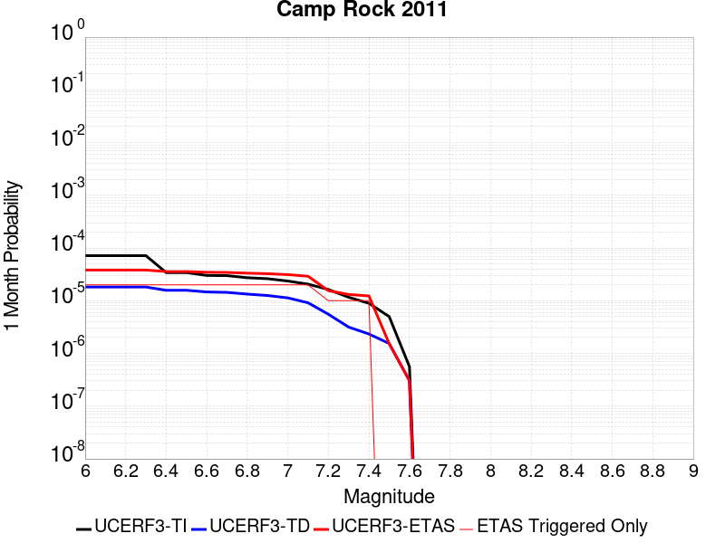 |  |  |

| Magnitude | 1 wk TI Prob | 1 wk TD Prob | 1 wk ETAS Prob | 1 wk ETAS/TD Gain | 1 wk ETAS Triggered Only | 1 mo TI Prob | 1 mo TD Prob | 1 mo ETAS Prob | 1 mo ETAS/TD Gain | 1 mo ETAS Triggered Only | 1 yr TI Prob | 1 yr TD Prob | 1 yr ETAS Prob | 1 yr ETAS/TD Gain | 1 yr ETAS Triggered Only | 10 yr TI Prob | 10 yr TD Prob | 10 yr ETAS Prob | 10 yr ETAS/TD Gain | 10 yr ETAS Triggered Only |
|-----|-----|-----|-----|-----|-----|-----|-----|-----|-----|-----|-----|-----|-----|-----|-----|-----|-----|-----|-----|-----|
| 6.0 | 1.6710783E-5 | 4.249999E-6 | 1.4249957E-5 | 3.3529315 | 1.0E-5 | 7.161568E-5 | 1.8214158E-5 | 3.8213795E-5 | 2.098027 | 2.0E-5 | 8.7157206E-4 | 2.2173533E-4 | 3.017176E-4 | 1.3607105 | 8.0E-5 | 0.008681616 | 0.0022151938 | 0.0023049945 | 1.0405385 | 9.0E-5 |
| 6.1 | 1.6710783E-5 | 4.249999E-6 | 1.4249957E-5 | 3.3529315 | 1.0E-5 | 7.161568E-5 | 1.8214158E-5 | 3.8213795E-5 | 2.098027 | 2.0E-5 | 8.7157206E-4 | 2.2173533E-4 | 3.017176E-4 | 1.3607105 | 8.0E-5 | 0.008681616 | 0.0022151938 | 0.0023049945 | 1.0405385 | 9.0E-5 |
| 6.2 | 1.6710783E-5 | 4.249999E-6 | 1.4249957E-5 | 3.3529315 | 1.0E-5 | 7.161568E-5 | 1.8214158E-5 | 3.8213795E-5 | 2.098027 | 2.0E-5 | 8.7157206E-4 | 2.2173533E-4 | 3.017176E-4 | 1.3607105 | 8.0E-5 | 0.008681616 | 0.0022151938 | 0.0023049945 | 1.0405385 | 9.0E-5 |
| 6.3 | 1.6710783E-5 | 4.249999E-6 | 1.4249957E-5 | 3.3529315 | 1.0E-5 | 7.161568E-5 | 1.8214158E-5 | 3.8213795E-5 | 2.098027 | 2.0E-5 | 8.7157206E-4 | 2.2173533E-4 | 3.017176E-4 | 1.3607105 | 8.0E-5 | 0.008681616 | 0.0022151938 | 0.0023049945 | 1.0405385 | 9.0E-5 |
| 6.4 | 7.982846E-6 | 3.6820359E-6 | 1.3681999E-5 | 3.7158787 | 1.0E-5 | 3.421175E-5 | 1.578006E-5 | 3.5779743E-5 | 2.2674022 | 2.0E-5 | 4.1644843E-4 | 1.9210564E-4 | 2.620922E-4 | 1.3643129 | 7.0E-5 | 0.0041566887 | 0.0019194306 | 0.0019992772 | 1.041599 | 8.0E-5 |
| 6.5 | 7.982846E-6 | 3.6820359E-6 | 1.3681999E-5 | 3.7158787 | 1.0E-5 | 3.421175E-5 | 1.578006E-5 | 3.5779743E-5 | 2.2674022 | 2.0E-5 | 4.1644843E-4 | 1.9210564E-4 | 2.620922E-4 | 1.3643129 | 7.0E-5 | 0.0041566887 | 0.0019194306 | 0.0019992772 | 1.041599 | 8.0E-5 |
| 6.6 | 7.048869E-6 | 3.4242998E-6 | 1.34242655E-5 | 3.920295 | 1.0E-5 | 3.0209088E-5 | 1.467549E-5 | 3.4675195E-5 | 2.3627965 | 2.0E-5 | 3.677336E-4 | 1.7865976E-4 | 2.4864727E-4 | 1.3917361 | 7.0E-5 | 0.0036712566 | 0.0017851929 | 0.00186505 | 1.044733 | 8.0E-5 |
| 6.7 | 6.987307E-6 | 3.3622775E-6 | 1.3362243E-5 | 3.9741645 | 1.0E-5 | 2.9945259E-5 | 1.4409683E-5 | 3.4409393E-5 | 2.3879356 | 2.0E-5 | 3.6452254E-4 | 1.7542407E-4 | 2.454118E-4 | 1.3989631 | 7.0E-5 | 0.0036392517 | 0.0017528872 | 0.0018327469 | 1.045559 | 8.0E-5 |
| 6.8 | 6.3737602E-6 | 3.1178672E-6 | 1.3117836E-5 | 4.2073107 | 1.0E-5 | 2.731583E-5 | 1.3362222E-5 | 3.3361954E-5 | 2.496737 | 2.0E-5 | 3.3251947E-4 | 1.6267318E-4 | 2.326618E-4 | 1.4302406 | 7.0E-5 | 0.0033202237 | 0.0016255698 | 0.0017054396 | 1.0491335 | 8.0E-5 |
| 6.9 | 6.112211E-6 | 2.933078E-6 | 1.2933048E-5 | 4.4093776 | 1.0E-5 | 2.6194928E-5 | 1.2570275E-5 | 3.2570024E-5 | 2.5910351 | 2.0E-5 | 3.1887658E-4 | 1.5303263E-4 | 2.2302193E-4 | 1.4573488 | 7.0E-5 | 0.003184194 | 0.0015293002 | 0.0016091779 | 1.0522316 | 8.0E-5 |
| 7.0 | 5.5140117E-6 | 2.64191E-6 | 1.2641884E-5 | 4.7851305 | 1.0E-5 | 2.3631264E-5 | 1.1322423E-5 | 3.1322197E-5 | 2.7663863 | 2.0E-5 | 2.8767265E-4 | 1.3784204E-4 | 2.0783239E-4 | 1.5077577 | 7.0E-5 | 0.0028730053 | 0.0013775907 | 0.0014574805 | 1.0579925 | 8.0E-5 |
| 7.1 | 4.8151105E-6 | 2.1342612E-6 | 1.213424E-5 | 5.6854525 | 1.0E-5 | 2.0636026E-5 | 9.146803E-6 | 2.914662E-5 | 3.1865366 | 2.0E-5 | 2.5121463E-4 | 1.1135685E-4 | 1.8134905E-4 | 1.6285397 | 7.0E-5 | 0.0025093083 | 0.0011130325 | 0.0011929434 | 1.0717957 | 8.0E-5 |
| 7.2 | 3.818335E-6 | 1.2937372E-6 | 1.1293724E-5 | 8.729535 | 1.0E-5 | 1.6364189E-5 | 5.5445767E-6 | 1.5544521E-5 | 2.803554 | 1.0E-5 | 1.9921579E-4 | 6.750321E-5 | 9.750119E-5 | 1.4443933 | 3.0E-5 | 0.0019903728 | 6.7483535E-4 | 7.1480835E-4 | 1.0592337 | 4.0E-5 |
| 7.3 | 2.7166698E-6 | 7.383078E-7 | 1.07383E-5 | 14.5444765 | 1.0E-5 | 1.1642818E-5 | 3.1641725E-6 | 1.3164141E-5 | 4.1603737 | 1.0E-5 | 1.4174209E-4 | 3.852314E-5 | 5.852237E-5 | 1.5191485 | 2.0E-5 | 0.0014165172 | 3.8516664E-4 | 4.0515893E-4 | 1.0519056 | 2.0E-5 |
| 7.4 | 2.0893426E-6 | 5.4614605E-7 | 1.054614E-5 | 19.31011 | 1.0E-5 | 8.954295E-6 | 2.340624E-6 | 1.2340601E-5 | 5.272355 | 1.0E-5 | 1.0901308E-4 | 2.8496728E-5 | 4.849616E-5 | 1.7018149 | 2.0E-5 | 0.0010895962 | 2.849313E-4 | 3.0492558E-4 | 1.0701723 | 2.0E-5 |
| 7.5 | 1.1681728E-6 | 3.6028484E-7 | 3.6028484E-7 | 1.0 | 0.0 | 5.0064455E-6 | 1.544077E-6 | 1.544077E-6 | 1.0 | 0.0 | 6.0951766E-5 | 1.879898E-5 | 1.879898E-5 | 1.0 | 0.0 | 6.093505E-4 | 1.8797436E-4 | 1.8797436E-4 | 1.0 | 0.0 |
| 7.6 | 1.3154387E-7 | 7.1196716E-8 | 7.1196716E-8 | 1.0 | 0.0 | 5.6375933E-7 | 3.0512876E-7 | 3.0512876E-7 | 1.0 | 0.0 | 6.863748E-6 | 3.714938E-6 | 3.714938E-6 | 1.0 | 0.0 | 6.863536E-5 | 3.7148915E-5 | 3.7148915E-5 | 1.0 | 0.0 |

## Calaveras (So) 2011 CFM
*[(top)](#table-of-contents)*

| 1 Week | 1 Month | 1 Year | 10 Year |
|-----|-----|-----|-----|
|  |  |  |  |

| Magnitude | 1 wk TI Prob | 1 wk TD Prob | 1 wk ETAS Prob | 1 wk ETAS/TD Gain | 1 wk ETAS Triggered Only | 1 mo TI Prob | 1 mo TD Prob | 1 mo ETAS Prob | 1 mo ETAS/TD Gain | 1 mo ETAS Triggered Only | 1 yr TI Prob | 1 yr TD Prob | 1 yr ETAS Prob | 1 yr ETAS/TD Gain | 1 yr ETAS Triggered Only | 10 yr TI Prob | 10 yr TD Prob | 10 yr ETAS Prob | 10 yr ETAS/TD Gain | 10 yr ETAS Triggered Only |
|-----|-----|-----|-----|-----|-----|-----|-----|-----|-----|-----|-----|-----|-----|-----|-----|-----|-----|-----|-----|-----|
| 6.0 | 1.5950744E-4 | 3.0713255E-4 | 3.1712948E-4 | 1.0325493 | 1.0E-5 | 6.834242E-4 | 0.001315409 | 0.0013253958 | 1.0075922 | 1.0E-5 | 0.00828899 | 0.015858326 | 0.015917374 | 1.0037235 | 6.0E-5 | 0.079865426 | 0.14440185 | 0.14447886 | 1.0005332 | 9.0E-5 |
| 6.1 | 1.3584697E-4 | 2.603514E-4 | 2.7034877E-4 | 1.0383996 | 1.0E-5 | 5.8207137E-4 | 0.0011151754 | 0.0011251643 | 1.0089571 | 1.0E-5 | 0.007063716 | 0.013461385 | 0.013520577 | 1.0043972 | 6.0E-5 | 0.06843361 | 0.124029994 | 0.124100074 | 1.000565 | 8.0E-5 |
| 6.2 | 1.14676266E-4 | 2.1714384E-4 | 2.2714166E-4 | 1.0460424 | 1.0E-5 | 4.9137714E-4 | 9.30223E-4 | 9.402137E-4 | 1.0107402 | 1.0E-5 | 0.0059661185 | 0.011245058 | 0.011294496 | 1.0043964 | 5.0E-5 | 0.058084648 | 0.10502057 | 0.10508321 | 1.0005965 | 7.0E-5 |
| 6.3 | 8.691518E-5 | 1.5987935E-4 | 1.6987773E-4 | 1.0625372 | 1.0E-5 | 3.7244044E-4 | 6.849807E-4 | 6.9497386E-4 | 1.014589 | 1.0E-5 | 0.004525038 | 0.008301122 | 0.008350708 | 1.0059733 | 5.0E-5 | 0.044339992 | 0.0793365 | 0.07940095 | 1.0008123 | 7.0E-5 |
| 6.4 | 8.50982E-5 | 1.5694331E-4 | 1.6694174E-4 | 1.0637072 | 1.0E-5 | 3.646556E-4 | 6.724042E-4 | 6.823975E-4 | 1.0148621 | 1.0E-5 | 0.0044306475 | 0.008149155 | 0.008198748 | 1.0060856 | 5.0E-5 | 0.04343345 | 0.07794268 | 0.07800722 | 1.0008281 | 7.0E-5 |
| 6.5 | 8.4062965E-5 | 1.5518743E-4 | 1.6518588E-4 | 1.0644282 | 1.0E-5 | 3.602201E-4 | 6.6488347E-4 | 6.748768E-4 | 1.0150303 | 1.0E-5 | 0.004376863 | 0.008058365 | 0.008107962 | 1.0061548 | 5.0E-5 | 0.042916555 | 0.07711388 | 0.077178486 | 1.0008378 | 7.0E-5 |
| 6.6 | 8.194716E-5 | 1.5154552E-4 | 1.6154401E-4 | 1.0659767 | 1.0E-5 | 3.5115483E-4 | 6.492843E-4 | 6.592778E-4 | 1.0153916 | 1.0E-5 | 0.0042669317 | 0.007870209 | 0.007919815 | 1.0063031 | 5.0E-5 | 0.04185927 | 0.07539919 | 0.07546391 | 1.0008584 | 7.0E-5 |
| 6.7 | 8.012326E-5 | 1.4822475E-4 | 1.5822327E-4 | 1.0674552 | 1.0E-5 | 3.433402E-4 | 6.350612E-4 | 6.4505485E-4 | 1.0157365 | 1.0E-5 | 0.004172157 | 0.007698701 | 0.0077383933 | 1.0051557 | 4.0E-5 | 0.040946912 | 0.07384132 | 0.073896885 | 1.0007526 | 6.0E-5 |
| 6.8 | 7.119773E-5 | 1.2881879E-4 | 1.388175E-4 | 1.0776185 | 1.0E-5 | 3.0509746E-4 | 5.519494E-4 | 5.619438E-4 | 1.0181077 | 1.0E-5 | 0.0037082357 | 0.006696066 | 0.006735798 | 1.0059336 | 4.0E-5 | 0.036469642 | 0.06468575 | 0.064732514 | 1.000723 | 5.0E-5 |
| 6.9 | 5.7343088E-5 | 9.919277E-5 | 1.0919179E-4 | 1.1008037 | 1.0E-5 | 2.4573295E-4 | 4.25043E-4 | 4.3503873E-4 | 1.023517 | 1.0E-5 | 0.0029876942 | 0.005162694 | 0.005192539 | 1.0057809 | 3.0E-5 | 0.02947844 | 0.05051036 | 0.05054834 | 1.000752 | 4.0E-5 |
| 7.0 | 4.8746577E-5 | 8.2850725E-5 | 9.284989E-5 | 1.120689 | 1.0E-5 | 2.0889717E-4 | 3.5502657E-4 | 3.65023E-4 | 1.0281569 | 1.0E-5 | 0.0025403565 | 0.004313948 | 0.0043438184 | 1.0069242 | 3.0E-5 | 0.025115121 | 0.042485245 | 0.042523544 | 1.0009015 | 4.0E-5 |
| 7.1 | 4.2998014E-5 | 7.265203E-5 | 8.2651306E-5 | 1.1376324 | 1.0E-5 | 1.8426418E-4 | 3.1132903E-4 | 3.213259E-4 | 1.0321103 | 1.0E-5 | 0.002241108 | 0.003783903 | 0.0038137897 | 1.0078983 | 3.0E-5 | 0.022186412 | 0.037423562 | 0.037462063 | 1.0010289 | 4.0E-5 |
| 7.2 | 3.221292E-5 | 5.390791E-5 | 6.390737E-5 | 1.1854916 | 1.0E-5 | 1.3804805E-4 | 2.3101359E-4 | 2.4101128E-4 | 1.0432775 | 1.0E-5 | 0.0016794393 | 0.0028089907 | 0.0028389066 | 1.01065 | 3.0E-5 | 0.016668037 | 0.02803602 | 0.0280749 | 1.0013868 | 4.0E-5 |
| 7.3 | 2.3756531E-5 | 3.9473416E-5 | 4.9473023E-5 | 1.253325 | 1.0E-5 | 1.0180973E-4 | 1.6916092E-4 | 1.7915922E-4 | 1.0591053 | 1.0E-5 | 0.0012388286 | 0.0020576057 | 0.002087544 | 1.0145501 | 3.0E-5 | 0.012319452 | 0.020643145 | 0.020672526 | 1.0014232 | 3.0E-5 |
| 7.4 | 1.5997684E-5 | 2.7342163E-5 | 2.7342163E-5 | 1.0 | 0.0 | 6.8559704E-5 | 1.1717545E-4 | 1.1717545E-4 | 1.0 | 0.0 | 8.343947E-4 | 0.00142568 | 0.0014456514 | 1.0140084 | 2.0E-5 | 0.008312687 | 0.014376011 | 0.014395723 | 1.0013713 | 2.0E-5 |
| 7.5 | 1.3814293E-5 | 2.4783874E-5 | 2.4783874E-5 | 1.0 | 0.0 | 5.9202768E-5 | 1.062123E-4 | 1.062123E-4 | 1.0 | 0.0 | 7.205553E-4 | 0.00129237 | 0.0013123441 | 1.0154555 | 2.0E-5 | 0.007182234 | 0.013055085 | 0.013074824 | 1.0015119 | 2.0E-5 |
| 7.6 | 8.817309E-6 | 1.6430757E-5 | 1.6430757E-5 | 1.0 | 0.0 | 3.7787922E-5 | 7.0415634E-5 | 7.0415634E-5 | 1.0 | 0.0 | 4.5997082E-4 | 8.569745E-4 | 8.769574E-4 | 1.0233179 | 2.0E-5 | 0.004590199 | 0.008719284 | 0.008739109 | 1.0022738 | 2.0E-5 |
| 7.7 | 4.0352206E-6 | 7.707318E-6 | 7.707318E-6 | 1.0 | 0.0 | 1.7293689E-5 | 3.3030945E-5 | 3.3030945E-5 | 1.0 | 0.0 | 2.1053031E-4 | 4.0207763E-4 | 4.220696E-4 | 1.0497216 | 2.0E-5 | 0.0021033096 | 0.004165172 | 0.004185089 | 1.0047817 | 2.0E-5 |
| 7.8 | 3.413169E-6 | 6.787282E-6 | 6.787282E-6 | 1.0 | 0.0 | 1.4627784E-5 | 2.9088029E-5 | 2.9088029E-5 | 1.0 | 0.0 | 1.7807873E-4 | 3.5408925E-4 | 3.7408218E-4 | 1.0564629 | 2.0E-5 | 0.0017793609 | 0.0036665166 | 0.0036864432 | 1.0054348 | 2.0E-5 |
| 7.9 | 2.4740732E-6 | 5.2791843E-6 | 5.2791843E-6 | 1.0 | 0.0 | 1.06031275E-5 | 2.262488E-5 | 2.262488E-5 | 1.0 | 0.0 | 1.2908543E-4 | 2.7542314E-4 | 2.854204E-4 | 1.0362978 | 1.0E-5 | 0.0012901047 | 0.0028347955 | 0.0028447672 | 1.0035176 | 1.0E-5 |
| 8.0 | 1.5231818E-6 | 3.2889548E-6 | 3.2889548E-6 | 1.0 | 0.0 | 6.527906E-6 | 1.40954435E-5 | 1.40954435E-5 | 1.0 | 0.0 | 7.9474354E-5 | 1.7159856E-4 | 1.8159684E-4 | 1.0582656 | 1.0E-5 | 7.944594E-4 | 0.0017564303 | 0.0017664128 | 1.0056834 | 1.0E-5 |
| 8.1 | 1.0104524E-6 | 2.045782E-6 | 2.045782E-6 | 1.0 | 0.0 | 4.330503E-6 | 8.767608E-6 | 8.767608E-6 | 1.0 | 0.0 | 5.2722597E-5 | 1.0674043E-4 | 1.0674043E-4 | 1.0 | 0.0 | 5.271009E-4 | 0.001092934 | 0.001092934 | 1.0 | 0.0 |

## San Diego Trough south
*[(top)](#table-of-contents)*

| 1 Week | 1 Month | 1 Year | 10 Year |
|-----|-----|-----|-----|
|  |  |  |  |

| Magnitude | 1 wk TI Prob | 1 wk TD Prob | 1 wk ETAS Prob | 1 wk ETAS/TD Gain | 1 wk ETAS Triggered Only | 1 mo TI Prob | 1 mo TD Prob | 1 mo ETAS Prob | 1 mo ETAS/TD Gain | 1 mo ETAS Triggered Only | 1 yr TI Prob | 1 yr TD Prob | 1 yr ETAS Prob | 1 yr ETAS/TD Gain | 1 yr ETAS Triggered Only | 10 yr TI Prob | 10 yr TD Prob | 10 yr ETAS Prob | 10 yr ETAS/TD Gain | 10 yr ETAS Triggered Only |
|-----|-----|-----|-----|-----|-----|-----|-----|-----|-----|-----|-----|-----|-----|-----|-----|-----|-----|-----|-----|-----|
| 6.0 | 8.279495E-5 | 1.0425541E-4 | 1.3425227E-4 | 1.2877249 | 3.0E-5 | 3.5478722E-4 | 4.4673498E-4 | 4.7672156E-4 | 1.0671239 | 3.0E-5 | 0.004310982 | 0.0054259133 | 0.005495534 | 1.0128311 | 7.0E-5 | 0.042283054 | 0.05299303 | 0.05305932 | 1.001251 | 7.0E-5 |
| 6.1 | 4.6961468E-5 | 5.773024E-5 | 7.7729084E-5 | 1.3464189 | 2.0E-5 | 2.0124791E-4 | 2.473905E-4 | 2.6738556E-4 | 1.0808239 | 2.0E-5 | 0.00244744 | 0.003007886 | 0.0030577355 | 1.016573 | 5.0E-5 | 0.024206603 | 0.029679636 | 0.029728152 | 1.0016346 | 5.0E-5 |
| 6.2 | 3.5079658E-5 | 4.214258E-5 | 5.2142157E-5 | 1.2372797 | 1.0E-5 | 1.5033272E-4 | 1.8059829E-4 | 1.9059649E-4 | 1.0553615 | 1.0E-5 | 0.0018287642 | 0.002196587 | 0.002226521 | 1.0136275 | 3.0E-5 | 0.018137876 | 0.021751188 | 0.021780536 | 1.0013492 | 3.0E-5 |
| 6.3 | 3.5079658E-5 | 4.214258E-5 | 5.2142157E-5 | 1.2372797 | 1.0E-5 | 1.5033272E-4 | 1.8059829E-4 | 1.9059649E-4 | 1.0553615 | 1.0E-5 | 0.0018287642 | 0.002196587 | 0.002226521 | 1.0136275 | 3.0E-5 | 0.018137876 | 0.021751188 | 0.021780536 | 1.0013492 | 3.0E-5 |
| 6.4 | 2.7196904E-5 | 3.208715E-5 | 3.208715E-5 | 1.0 | 0.0 | 1.16552954E-4 | 1.3750911E-4 | 1.3750911E-4 | 1.0 | 0.0 | 0.0014181085 | 0.0016728995 | 0.001692866 | 1.0119352 | 2.0E-5 | 0.014090929 | 0.016604666 | 0.016624333 | 1.0011845 | 2.0E-5 |
| 6.5 | 2.5584688E-5 | 3.0101632E-5 | 3.0101632E-5 | 1.0 | 0.0 | 1.0964406E-4 | 1.2900059E-4 | 1.2900059E-4 | 1.0 | 0.0 | 0.0013340989 | 0.0015694627 | 0.0015894313 | 1.0127232 | 2.0E-5 | 0.013261181 | 0.015585332 | 0.01560502 | 1.0012633 | 2.0E-5 |
| 6.6 | 2.2034688E-5 | 2.574271E-5 | 2.574271E-5 | 1.0 | 0.0 | 9.443096E-5 | 1.1032127E-4 | 1.1032127E-4 | 1.0 | 0.0 | 0.0011490905 | 0.0013423412 | 0.0013623143 | 1.0148793 | 2.0E-5 | 0.011431668 | 0.013343325 | 0.013363058 | 1.0014789 | 2.0E-5 |
| 6.7 | 1.9394853E-5 | 2.254176E-5 | 2.254176E-5 | 1.0 | 0.0 | 8.311815E-5 | 9.6604E-5 | 9.6604E-5 | 1.0 | 0.0 | 0.0010114936 | 0.0011755243 | 0.0011955008 | 1.0169936 | 2.0E-5 | 0.01006902 | 0.011693766 | 0.011713533 | 1.0016903 | 2.0E-5 |
| 6.8 | 1.7615313E-5 | 2.0403182E-5 | 2.0403182E-5 | 1.0 | 0.0 | 7.549201E-5 | 8.743931E-5 | 8.743931E-5 | 1.0 | 0.0 | 9.1872766E-4 | 0.0010640579 | 0.0010840367 | 1.0187759 | 2.0E-5 | 0.009149387 | 0.010590198 | 0.010609986 | 1.0018685 | 2.0E-5 |
| 6.9 | 1.5621423E-5 | 1.8026114E-5 | 1.8026114E-5 | 1.0 | 0.0 | 6.6947236E-5 | 7.725251E-5 | 7.725251E-5 | 1.0 | 0.0 | 8.147778E-4 | 9.40147E-4 | 9.501376E-4 | 1.0106267 | 1.0E-5 | 0.008117969 | 0.009362142 | 0.009372048 | 1.0010581 | 1.0E-5 |
| 7.0 | 1.3444376E-5 | 1.544809E-5 | 1.544809E-5 | 1.0 | 0.0 | 5.7617483E-5 | 6.620443E-5 | 6.620443E-5 | 1.0 | 0.0 | 7.0126704E-4 | 8.057436E-4 | 8.1573555E-4 | 1.0124009 | 1.0E-5 | 0.006990582 | 0.008028555 | 0.008038475 | 1.0012356 | 1.0E-5 |
| 7.1 | 1.2268361E-5 | 1.407303E-5 | 1.407303E-5 | 1.0 | 0.0 | 5.2577634E-5 | 6.0311606E-5 | 6.0311606E-5 | 1.0 | 0.0 | 6.399447E-4 | 7.3404907E-4 | 7.440417E-4 | 1.0136131 | 1.0E-5 | 0.0063810493 | 0.0073165493 | 0.007326476 | 1.0013567 | 1.0E-5 |
| 7.2 | 1.0922655E-5 | 1.2513563E-5 | 1.2513563E-5 | 1.0 | 0.0 | 4.681054E-5 | 5.3628468E-5 | 5.3628468E-5 | 1.0 | 0.0 | 5.697693E-4 | 6.5273355E-4 | 6.62727E-4 | 1.0153102 | 1.0E-5 | 0.0056831064 | 0.0065084435 | 0.006518379 | 1.0015265 | 1.0E-5 |
| 7.3 | 6.1106753E-6 | 6.928925E-6 | 6.928925E-6 | 1.0 | 0.0 | 2.6188345E-5 | 2.9695057E-5 | 2.9695057E-5 | 1.0 | 0.0 | 3.1879646E-4 | 3.6147775E-4 | 3.6147775E-4 | 1.0 | 0.0 | 0.0031833951 | 0.003608943 | 0.003608943 | 1.0 | 0.0 |
| 7.4 | 4.933187E-6 | 5.5895525E-6 | 5.5895525E-6 | 1.0 | 0.0 | 2.114206E-5 | 2.3955008E-5 | 2.3955008E-5 | 1.0 | 0.0 | 2.5737417E-4 | 2.9161357E-4 | 2.9161357E-4 | 1.0 | 0.0 | 0.002570763 | 0.0029123505 | 0.0029123505 | 1.0 | 0.0 |
| 7.5 | 1.7489613E-6 | 1.969678E-6 | 1.969678E-6 | 1.0 | 0.0 | 7.495527E-6 | 8.4414505E-6 | 8.4414505E-6 | 1.0 | 0.0 | 9.125422E-5 | 1.02770035E-4 | 1.02770035E-4 | 1.0 | 0.0 | 9.1216754E-4 | 0.0010272472 | 0.0010272472 | 1.0 | 0.0 |
| 7.6 | 1.6988751E-7 | 1.7533823E-7 | 1.7533823E-7 | 1.0 | 0.0 | 7.2808916E-7 | 7.5144936E-7 | 7.5144936E-7 | 1.0 | 0.0 | 8.864449E-6 | 9.14886E-6 | 9.14886E-6 | 1.0 | 0.0 | 8.8640954E-5 | 9.1485024E-5 | 9.1485024E-5 | 1.0 | 0.0 |

## Kern Canyon (North Kern) 2011
*[(top)](#table-of-contents)*

| 1 Week | 1 Month | 1 Year | 10 Year |
|-----|-----|-----|-----|
|  |  |  |  |

| Magnitude | 1 wk TI Prob | 1 wk TD Prob | 1 wk ETAS Prob | 1 wk ETAS/TD Gain | 1 wk ETAS Triggered Only | 1 mo TI Prob | 1 mo TD Prob | 1 mo ETAS Prob | 1 mo ETAS/TD Gain | 1 mo ETAS Triggered Only | 1 yr TI Prob | 1 yr TD Prob | 1 yr ETAS Prob | 1 yr ETAS/TD Gain | 1 yr ETAS Triggered Only | 10 yr TI Prob | 10 yr TD Prob | 10 yr ETAS Prob | 10 yr ETAS/TD Gain | 10 yr ETAS Triggered Only |
|-----|-----|-----|-----|-----|-----|-----|-----|-----|-----|-----|-----|-----|-----|-----|-----|-----|-----|-----|-----|-----|
| 6.0 | 6.6264497E-6 | 6.75733E-6 | 3.6757127E-5 | 5.4395933 | 3.0E-5 | 2.8398761E-5 | 2.895971E-5 | 6.895855E-5 | 2.3811893 | 4.0E-5 | 3.4570007E-4 | 3.5253543E-4 | 4.125143E-4 | 1.1701356 | 6.0E-5 | 0.0034516277 | 0.0035205502 | 0.0036002686 | 1.0226437 | 8.0E-5 |
| 6.1 | 6.6264497E-6 | 6.75733E-6 | 3.6757127E-5 | 5.4395933 | 3.0E-5 | 2.8398761E-5 | 2.895971E-5 | 6.895855E-5 | 2.3811893 | 4.0E-5 | 3.4570007E-4 | 3.5253543E-4 | 4.125143E-4 | 1.1701356 | 6.0E-5 | 0.0034516277 | 0.0035205502 | 0.0036002686 | 1.0226437 | 8.0E-5 |
| 6.2 | 6.6264497E-6 | 6.75733E-6 | 3.6757127E-5 | 5.4395933 | 3.0E-5 | 2.8398761E-5 | 2.895971E-5 | 6.895855E-5 | 2.3811893 | 4.0E-5 | 3.4570007E-4 | 3.5253543E-4 | 4.125143E-4 | 1.1701356 | 6.0E-5 | 0.0034516277 | 0.0035205502 | 0.0036002686 | 1.0226437 | 8.0E-5 |
| 6.3 | 6.6264497E-6 | 6.75733E-6 | 3.6757127E-5 | 5.4395933 | 3.0E-5 | 2.8398761E-5 | 2.895971E-5 | 6.895855E-5 | 2.3811893 | 4.0E-5 | 3.4570007E-4 | 3.5253543E-4 | 4.125143E-4 | 1.1701356 | 6.0E-5 | 0.0034516277 | 0.0035205502 | 0.0036002686 | 1.0226437 | 8.0E-5 |
| 6.4 | 6.6264497E-6 | 6.75733E-6 | 3.6757127E-5 | 5.4395933 | 3.0E-5 | 2.8398761E-5 | 2.895971E-5 | 6.895855E-5 | 2.3811893 | 4.0E-5 | 3.4570007E-4 | 3.5253543E-4 | 4.125143E-4 | 1.1701356 | 6.0E-5 | 0.0034516277 | 0.0035205502 | 0.0036002686 | 1.0226437 | 8.0E-5 |
| 6.5 | 3.2162225E-6 | 3.2570915E-6 | 2.3257026E-5 | 7.1404276 | 2.0E-5 | 1.3783738E-5 | 1.3958894E-5 | 4.3958476E-5 | 3.1491375 | 3.0E-5 | 1.6780409E-4 | 1.6993708E-4 | 2.1992858E-4 | 1.2941766 | 5.0E-5 | 0.0016767744 | 0.001698151 | 0.0017580491 | 1.0352726 | 6.0E-5 |
| 6.6 | 3.2162225E-6 | 3.2570915E-6 | 2.3257026E-5 | 7.1404276 | 2.0E-5 | 1.3783738E-5 | 1.3958894E-5 | 4.3958476E-5 | 3.1491375 | 3.0E-5 | 1.6780409E-4 | 1.6993708E-4 | 2.1992858E-4 | 1.2941766 | 5.0E-5 | 0.0016767744 | 0.001698151 | 0.0017580491 | 1.0352726 | 6.0E-5 |
| 6.7 | 2.1908265E-6 | 2.2071222E-6 | 1.2207101E-5 | 5.5307765 | 1.0E-5 | 9.389223E-6 | 9.459062E-6 | 1.9458968E-5 | 2.0571773 | 1.0E-5 | 1.1430779E-4 | 1.1515819E-4 | 1.4515474E-4 | 1.2604812 | 3.0E-5 | 0.0011424901 | 0.0011510046 | 0.0011909585 | 1.0347122 | 4.0E-5 |
| 6.8 | 1.7303895E-6 | 1.736553E-6 | 1.1736535E-5 | 6.7585244 | 1.0E-5 | 7.415934E-6 | 7.442349E-6 | 1.7442275E-5 | 2.3436518 | 1.0E-5 | 9.028525E-5 | 9.060693E-5 | 1.20604214E-4 | 1.3310705 | 3.0E-5 | 9.024858E-4 | 9.0570963E-4 | 9.456734E-4 | 1.0441242 | 4.0E-5 |
| 6.9 | 1.3700314E-6 | 1.3688623E-6 | 1.1368848E-5 | 8.305326 | 1.0E-5 | 5.87155E-6 | 5.86654E-6 | 1.586648E-5 | 2.7045722 | 1.0E-5 | 7.148377E-5 | 7.142283E-5 | 8.142211E-5 | 1.1400013 | 1.0E-5 | 7.146078E-4 | 7.140033E-4 | 7.2399614E-4 | 1.0139955 | 1.0E-5 |
| 7.0 | 1.1467797E-6 | 1.1413805E-6 | 1.1141369E-5 | 9.76131 | 1.0E-5 | 4.9147607E-6 | 4.8916218E-6 | 1.4891573E-5 | 3.0443017 | 1.0E-5 | 5.983557E-5 | 5.95539E-5 | 6.95533E-5 | 1.1679051 | 1.0E-5 | 5.981946E-4 | 5.9538253E-4 | 6.053766E-4 | 1.016786 | 1.0E-5 |
| 7.1 | 9.3952065E-7 | 9.3026915E-7 | 1.093026E-5 | 11.749567 | 1.0E-5 | 4.026511E-6 | 3.986862E-6 | 1.3986822E-5 | 3.5082285 | 1.0E-5 | 4.9021666E-5 | 4.853898E-5 | 5.853849E-5 | 1.20601 | 1.0E-5 | 4.901085E-4 | 4.8528553E-4 | 4.9528066E-4 | 1.0205964 | 1.0E-5 |
| 7.2 | 6.858055E-7 | 6.7193014E-7 | 1.06719235E-5 | 15.882489 | 1.0E-5 | 2.939163E-6 | 2.8796974E-6 | 1.2879668E-5 | 4.472577 | 1.0E-5 | 3.5783723E-5 | 3.5059762E-5 | 4.5059413E-5 | 1.2852173 | 1.0E-5 | 3.5777962E-4 | 3.5054318E-4 | 3.6053968E-4 | 1.0285171 | 1.0E-5 |
| 7.3 | 5.1101983E-7 | 4.939301E-7 | 1.0493925E-5 | 21.245771 | 1.0E-5 | 2.1900833E-6 | 2.1168414E-6 | 1.21168205E-5 | 5.7240095 | 1.0E-5 | 2.6663936E-5 | 2.5772246E-5 | 3.5771987E-5 | 1.3880043 | 1.0E-5 | 2.6660739E-4 | 2.5769303E-4 | 2.6769046E-4 | 1.0387958 | 1.0E-5 |
| 7.4 | 3.4999414E-7 | 3.2995916E-7 | 3.2995916E-7 | 1.0 | 0.0 | 1.499974E-6 | 1.4141099E-6 | 1.4141099E-6 | 1.0 | 0.0 | 1.8262032E-5 | 1.7216655E-5 | 1.7216655E-5 | 1.0 | 0.0 | 1.826053E-4 | 1.7215345E-4 | 1.7215345E-4 | 1.0 | 0.0 |
| 7.5 | 1.7021522E-7 | 1.4750053E-7 | 1.4750053E-7 | 1.0 | 0.0 | 7.2949354E-7 | 6.32145E-7 | 6.32145E-7 | 1.0 | 0.0 | 8.881548E-6 | 7.696339E-6 | 7.696339E-6 | 1.0 | 0.0 | 8.8811925E-5 | 7.696081E-5 | 7.696081E-5 | 1.0 | 0.0 |
| 7.6 | 2.572245E-8 | 1.735264E-8 | 1.735264E-8 | 1.0 | 0.0 | 1.10239064E-7 | 7.436845E-8 | 7.436845E-8 | 1.0 | 0.0 | 1.3421597E-6 | 9.0543557E-7 | 9.0543557E-7 | 1.0 | 0.0 | 1.3421517E-5 | 9.054324E-6 | 9.054324E-6 | 1.0 | 0.0 |

## San Luis Range 2011 CFM
*[(top)](#table-of-contents)*

| 1 Week | 1 Month | 1 Year | 10 Year |
|-----|-----|-----|-----|
|  |  |  |  |

| Magnitude | 1 wk TI Prob | 1 wk TD Prob | 1 wk ETAS Prob | 1 wk ETAS/TD Gain | 1 wk ETAS Triggered Only | 1 mo TI Prob | 1 mo TD Prob | 1 mo ETAS Prob | 1 mo ETAS/TD Gain | 1 mo ETAS Triggered Only | 1 yr TI Prob | 1 yr TD Prob | 1 yr ETAS Prob | 1 yr ETAS/TD Gain | 1 yr ETAS Triggered Only | 10 yr TI Prob | 10 yr TD Prob | 10 yr ETAS Prob | 10 yr ETAS/TD Gain | 10 yr ETAS Triggered Only |
|-----|-----|-----|-----|-----|-----|-----|-----|-----|-----|-----|-----|-----|-----|-----|-----|-----|-----|-----|-----|-----|
| 6.0 | 8.8368415E-6 | 8.965455E-6 | 1.8965366E-5 | 2.1153824 | 1.0E-5 | 3.787163E-5 | 3.8422855E-5 | 4.8422473E-5 | 1.2602518 | 1.0E-5 | 4.609895E-4 | 4.6770574E-4 | 4.9769174E-4 | 1.0641129 | 3.0E-5 | 0.0046003438 | 0.004667997 | 0.004747623 | 1.017058 | 8.0E-5 |
| 6.1 | 8.8368415E-6 | 8.965455E-6 | 1.8965366E-5 | 2.1153824 | 1.0E-5 | 3.787163E-5 | 3.8422855E-5 | 4.8422473E-5 | 1.2602518 | 1.0E-5 | 4.609895E-4 | 4.6770574E-4 | 4.9769174E-4 | 1.0641129 | 3.0E-5 | 0.0046003438 | 0.004667997 | 0.004747623 | 1.017058 | 8.0E-5 |
| 6.2 | 8.8368415E-6 | 8.965455E-6 | 1.8965366E-5 | 2.1153824 | 1.0E-5 | 3.787163E-5 | 3.8422855E-5 | 4.8422473E-5 | 1.2602518 | 1.0E-5 | 4.609895E-4 | 4.6770574E-4 | 4.9769174E-4 | 1.0641129 | 3.0E-5 | 0.0046003438 | 0.004667997 | 0.004747623 | 1.017058 | 8.0E-5 |
| 6.3 | 8.8368415E-6 | 8.965455E-6 | 1.8965366E-5 | 2.1153824 | 1.0E-5 | 3.787163E-5 | 3.8422855E-5 | 4.8422473E-5 | 1.2602518 | 1.0E-5 | 4.609895E-4 | 4.6770574E-4 | 4.9769174E-4 | 1.0641129 | 3.0E-5 | 0.0046003438 | 0.004667997 | 0.004747623 | 1.017058 | 8.0E-5 |
| 6.4 | 3.9094193E-6 | 3.941204E-6 | 3.941204E-6 | 1.0 | 0.0 | 1.6754546E-5 | 1.6890766E-5 | 1.6890766E-5 | 1.0 | 0.0 | 2.039675E-4 | 2.0562594E-4 | 2.1562389E-4 | 1.048622 | 1.0E-5 | 0.0020378039 | 0.0020543856 | 0.002084324 | 1.0145729 | 3.0E-5 |
| 6.5 | 3.9094193E-6 | 3.941204E-6 | 3.941204E-6 | 1.0 | 0.0 | 1.6754546E-5 | 1.6890766E-5 | 1.6890766E-5 | 1.0 | 0.0 | 2.039675E-4 | 2.0562594E-4 | 2.1562389E-4 | 1.048622 | 1.0E-5 | 0.0020378039 | 0.0020543856 | 0.002084324 | 1.0145729 | 3.0E-5 |
| 6.6 | 3.0587726E-6 | 3.0753893E-6 | 3.0753893E-6 | 1.0 | 0.0 | 1.3108959E-5 | 1.3180174E-5 | 1.3180174E-5 | 1.0 | 0.0 | 1.595899E-4 | 1.6045693E-4 | 1.7045531E-4 | 1.062312 | 1.0E-5 | 0.0015947534 | 0.0016034227 | 0.0016333745 | 1.01868 | 3.0E-5 |
| 6.7 | 2.6160574E-6 | 2.6251284E-6 | 2.6251284E-6 | 1.0 | 0.0 | 1.1211626E-5 | 1.1250502E-5 | 1.1250502E-5 | 1.0 | 0.0 | 1.3649299E-4 | 1.3696631E-4 | 1.4696494E-4 | 1.0730007 | 1.0E-5 | 0.0013640919 | 0.0013688251 | 0.0013887978 | 1.0145911 | 2.0E-5 |
| 6.8 | 2.5110312E-6 | 2.5181412E-6 | 2.5181412E-6 | 1.0 | 0.0 | 1.0761518E-5 | 1.079199E-5 | 1.079199E-5 | 1.0 | 0.0 | 1.310136E-4 | 1.313846E-4 | 1.413833E-4 | 1.0761024 | 1.0E-5 | 0.0013093639 | 0.0013130752 | 0.0013330489 | 1.0152115 | 2.0E-5 |
| 6.9 | 1.8564405E-6 | 1.852488E-6 | 1.852488E-6 | 1.0 | 0.0 | 7.95615E-6 | 7.93921E-6 | 7.93921E-6 | 1.0 | 0.0 | 9.686181E-5 | 9.665562E-5 | 9.665562E-5 | 1.0 | 0.0 | 9.68196E-4 | 9.6613786E-4 | 9.7612815E-4 | 1.0103405 | 1.0E-5 |
| 7.0 | 1.546127E-6 | 1.5369549E-6 | 1.5369549E-6 | 1.0 | 0.0 | 6.626242E-6 | 6.5869326E-6 | 6.5869326E-6 | 1.0 | 0.0 | 8.06715E-5 | 8.019296E-5 | 8.019296E-5 | 1.0 | 0.0 | 8.0642226E-4 | 8.016409E-4 | 8.116329E-4 | 1.0124644 | 1.0E-5 |
| 7.1 | 1.3368208E-6 | 1.3235336E-6 | 1.3235336E-6 | 1.0 | 0.0 | 5.7292195E-6 | 5.6722747E-6 | 5.6722747E-6 | 1.0 | 0.0 | 6.975101E-5 | 6.905776E-5 | 6.905776E-5 | 1.0 | 0.0 | 6.972912E-4 | 6.903635E-4 | 7.003566E-4 | 1.0144751 | 1.0E-5 |
| 7.2 | 1.0623363E-6 | 1.0454378E-6 | 1.0454378E-6 | 1.0 | 0.0 | 4.5528623E-6 | 4.4804397E-6 | 4.4804397E-6 | 1.0 | 0.0 | 5.5429686E-5 | 5.4547992E-5 | 5.4547992E-5 | 1.0 | 0.0 | 5.5415864E-4 | 5.453463E-4 | 5.5534084E-4 | 1.018327 | 1.0E-5 |
| 7.3 | 7.831679E-7 | 7.727399E-7 | 7.727399E-7 | 1.0 | 0.0 | 3.3564295E-6 | 3.3117383E-6 | 3.3117383E-6 | 1.0 | 0.0 | 4.086376E-5 | 4.031967E-5 | 4.031967E-5 | 1.0 | 0.0 | 4.0856248E-4 | 4.0312367E-4 | 4.0312367E-4 | 1.0 | 0.0 |
| 7.4 | 5.9558846E-7 | 5.910646E-7 | 5.910646E-7 | 1.0 | 0.0 | 2.5525194E-6 | 2.5331315E-6 | 2.5331315E-6 | 1.0 | 0.0 | 3.107648E-5 | 3.084044E-5 | 3.084044E-5 | 1.0 | 0.0 | 3.1072134E-4 | 3.083617E-4 | 3.083617E-4 | 1.0 | 0.0 |
| 7.5 | 4.1616502E-7 | 4.1196404E-7 | 4.1196404E-7 | 1.0 | 0.0 | 1.7835631E-6 | 1.765559E-6 | 1.765559E-6 | 1.0 | 0.0 | 2.1714664E-5 | 2.1495469E-5 | 2.1495469E-5 | 1.0 | 0.0 | 2.1712543E-4 | 2.1493394E-4 | 2.1493394E-4 | 1.0 | 0.0 |
| 7.6 | 2.3816014E-7 | 2.3376614E-7 | 2.3376614E-7 | 1.0 | 0.0 | 1.0206859E-6 | 1.0018545E-6 | 1.0018545E-6 | 1.0 | 0.0 | 1.242678E-5 | 1.219751E-5 | 1.219751E-5 | 1.0 | 0.0 | 1.2426086E-4 | 1.2196843E-4 | 1.2196843E-4 | 1.0 | 0.0 |
| 7.7 | 9.918777E-8 | 9.3868096E-8 | 9.3868096E-8 | 1.0 | 0.0 | 4.2509038E-7 | 4.022918E-7 | 4.022918E-7 | 1.0 | 0.0 | 5.1754632E-6 | 4.8978914E-6 | 4.8978914E-6 | 1.0 | 0.0 | 5.1753424E-5 | 4.897784E-5 | 4.897784E-5 | 1.0 | 0.0 |
| 7.8 | 3.4982556E-8 | 2.968672E-8 | 2.968672E-8 | 1.0 | 0.0 | 1.4992524E-7 | 1.272288E-7 | 1.272288E-7 | 1.0 | 0.0 | 1.8253382E-6 | 1.5490094E-6 | 1.5490094E-6 | 1.0 | 0.0 | 1.8253233E-5 | 1.5489988E-5 | 1.5489988E-5 | 1.0 | 0.0 |
| 7.9 | 1.6624908E-8 | 1.1476994E-8 | 1.1476994E-8 | 1.0 | 0.0 | 7.12496E-8 | 4.9187115E-8 | 4.9187115E-8 | 1.0 | 0.0 | 8.6746354E-7 | 5.988529E-7 | 5.988529E-7 | 1.0 | 0.0 | 8.674601E-6 | 5.9885133E-6 | 5.9885133E-6 | 1.0 | 0.0 |
| 8.0 | 6.3352315E-9 | 3.0886564E-9 | 3.0886564E-9 | 1.0 | 0.0 | 2.715099E-8 | 1.32370985E-8 | 1.32370985E-8 | 1.0 | 0.0 | 3.3056327E-7 | 1.6116167E-7 | 1.6116167E-7 | 1.0 | 0.0 | 3.3056278E-6 | 1.6116155E-6 | 1.6116155E-6 | 1.0 | 0.0 |

## Oak Ridge (Onshore)
*[(top)](#table-of-contents)*

| 1 Week | 1 Month | 1 Year | 10 Year |
|-----|-----|-----|-----|
| 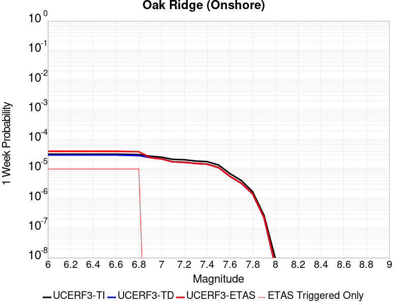 |  |  |  |

| Magnitude | 1 wk TI Prob | 1 wk TD Prob | 1 wk ETAS Prob | 1 wk ETAS/TD Gain | 1 wk ETAS Triggered Only | 1 mo TI Prob | 1 mo TD Prob | 1 mo ETAS Prob | 1 mo ETAS/TD Gain | 1 mo ETAS Triggered Only | 1 yr TI Prob | 1 yr TD Prob | 1 yr ETAS Prob | 1 yr ETAS/TD Gain | 1 yr ETAS Triggered Only | 10 yr TI Prob | 10 yr TD Prob | 10 yr ETAS Prob | 10 yr ETAS/TD Gain | 10 yr ETAS Triggered Only |
|-----|-----|-----|-----|-----|-----|-----|-----|-----|-----|-----|-----|-----|-----|-----|-----|-----|-----|-----|-----|-----|
| 6.0 | 3.155064E-5 | 2.9526076E-5 | 3.952578E-5 | 1.3386737 | 1.0E-5 | 1.3521002E-4 | 1.265344E-4 | 1.4653188E-4 | 1.1580398 | 2.0E-5 | 0.001644939 | 0.0015395058 | 0.0015894289 | 1.0324279 | 5.0E-5 | 0.01632816 | 0.015293054 | 0.015361984 | 1.0045072 | 7.0E-5 |
| 6.1 | 3.155064E-5 | 2.9526076E-5 | 3.952578E-5 | 1.3386737 | 1.0E-5 | 1.3521002E-4 | 1.265344E-4 | 1.4653188E-4 | 1.1580398 | 2.0E-5 | 0.001644939 | 0.0015395058 | 0.0015894289 | 1.0324279 | 5.0E-5 | 0.01632816 | 0.015293054 | 0.015361984 | 1.0045072 | 7.0E-5 |
| 6.2 | 3.155064E-5 | 2.9526076E-5 | 3.952578E-5 | 1.3386737 | 1.0E-5 | 1.3521002E-4 | 1.265344E-4 | 1.4653188E-4 | 1.1580398 | 2.0E-5 | 0.001644939 | 0.0015395058 | 0.0015894289 | 1.0324279 | 5.0E-5 | 0.01632816 | 0.015293054 | 0.015361984 | 1.0045072 | 7.0E-5 |
| 6.3 | 3.155064E-5 | 2.9526076E-5 | 3.952578E-5 | 1.3386737 | 1.0E-5 | 1.3521002E-4 | 1.265344E-4 | 1.4653188E-4 | 1.1580398 | 2.0E-5 | 0.001644939 | 0.0015395058 | 0.0015894289 | 1.0324279 | 5.0E-5 | 0.01632816 | 0.015293054 | 0.015361984 | 1.0045072 | 7.0E-5 |
| 6.4 | 3.155064E-5 | 2.9526076E-5 | 3.952578E-5 | 1.3386737 | 1.0E-5 | 1.3521002E-4 | 1.265344E-4 | 1.4653188E-4 | 1.1580398 | 2.0E-5 | 0.001644939 | 0.0015395058 | 0.0015894289 | 1.0324279 | 5.0E-5 | 0.01632816 | 0.015293054 | 0.015361984 | 1.0045072 | 7.0E-5 |
| 6.5 | 3.155064E-5 | 2.9526076E-5 | 3.952578E-5 | 1.3386737 | 1.0E-5 | 1.3521002E-4 | 1.265344E-4 | 1.4653188E-4 | 1.1580398 | 2.0E-5 | 0.001644939 | 0.0015395058 | 0.0015894289 | 1.0324279 | 5.0E-5 | 0.01632816 | 0.015293054 | 0.015361984 | 1.0045072 | 7.0E-5 |
| 6.6 | 3.155064E-5 | 2.9526076E-5 | 3.952578E-5 | 1.3386737 | 1.0E-5 | 1.3521002E-4 | 1.265344E-4 | 1.4653188E-4 | 1.1580398 | 2.0E-5 | 0.001644939 | 0.0015395058 | 0.0015894289 | 1.0324279 | 5.0E-5 | 0.01632816 | 0.015293054 | 0.015361984 | 1.0045072 | 7.0E-5 |
| 6.7 | 3.098897E-5 | 2.8864279E-5 | 3.886399E-5 | 1.346439 | 1.0E-5 | 1.328031E-4 | 1.236984E-4 | 1.4369593E-4 | 1.1616635 | 2.0E-5 | 0.0016156785 | 0.0015050253 | 0.00155495 | 1.033172 | 5.0E-5 | 0.016039822 | 0.014952909 | 0.015021862 | 1.0046114 | 7.0E-5 |
| 6.8 | 3.0449872E-5 | 2.8239476E-5 | 3.8239195E-5 | 1.3541042 | 1.0E-5 | 1.3049292E-4 | 1.2102092E-4 | 1.410185E-4 | 1.1652406 | 2.0E-5 | 0.0015875935 | 0.001472471 | 0.0015223974 | 1.0339066 | 5.0E-5 | 0.015762992 | 0.014631658 | 0.0147006335 | 1.0047141 | 7.0E-5 |
| 6.9 | 2.697928E-5 | 2.4219877E-5 | 2.4219877E-5 | 1.0 | 0.0 | 1.15620365E-4 | 1.03795464E-4 | 1.1379443E-4 | 1.0963333 | 1.0E-5 | 0.0014067689 | 0.0012629988 | 0.0012929608 | 1.023723 | 3.0E-5 | 0.0139789665 | 0.012561066 | 0.012610438 | 1.0039306 | 5.0E-5 |
| 7.0 | 2.4893961E-5 | 2.1862146E-5 | 2.1862146E-5 | 1.0 | 0.0 | 1.0668404E-4 | 9.369165E-5 | 1.0369071E-4 | 1.1067231 | 1.0E-5 | 0.0012981043 | 0.0011401166 | 0.0011700825 | 1.0262831 | 3.0E-5 | 0.012905477 | 0.011345102 | 0.011394535 | 1.0043572 | 5.0E-5 |
| 7.1 | 2.0945363E-5 | 1.7354592E-5 | 1.7354592E-5 | 1.0 | 0.0 | 8.976275E-5 | 7.437473E-5 | 7.437473E-5 | 1.0 | 0.0 | 0.0010923136 | 9.0514094E-4 | 9.251228E-4 | 1.022076 | 2.0E-5 | 0.0108696 | 0.009015621 | 0.00905526 | 1.0043968 | 4.0E-5 |
| 7.2 | 2.0439404E-5 | 1.680953E-5 | 1.680953E-5 | 1.0 | 0.0 | 8.7594504E-5 | 7.203888E-5 | 7.203888E-5 | 1.0 | 0.0 | 0.0010659413 | 8.767251E-4 | 8.967076E-4 | 1.0227922 | 2.0E-5 | 0.010608427 | 0.008733723 | 0.008773374 | 1.00454 | 4.0E-5 |
| 7.3 | 1.8463334E-5 | 1.5381947E-5 | 1.5381947E-5 | 1.0 | 0.0 | 7.912617E-5 | 6.592098E-5 | 6.592098E-5 | 1.0 | 0.0 | 9.6293533E-4 | 8.0229685E-4 | 8.2228077E-4 | 1.0249084 | 2.0E-5 | 0.009587734 | 0.0079950085 | 0.008034689 | 1.0049632 | 4.0E-5 |
| 7.4 | 1.763139E-5 | 1.4516977E-5 | 1.4516977E-5 | 1.0 | 0.0 | 7.556091E-5 | 6.221415E-5 | 6.221415E-5 | 1.0 | 0.0 | 9.1956573E-4 | 7.57198E-4 | 7.771829E-4 | 1.0263932 | 2.0E-5 | 0.009157699 | 0.007547126 | 0.0075868242 | 1.00526 | 4.0E-5 |
| 7.5 | 1.3594944E-5 | 1.1163363E-5 | 1.1163363E-5 | 1.0 | 0.0 | 5.8262744E-5 | 4.7842117E-5 | 4.7842117E-5 | 1.0 | 0.0 | 7.0911803E-4 | 5.8232463E-4 | 6.0231297E-4 | 1.0343251 | 2.0E-5 | 0.007068595 | 0.005808362 | 0.0058481293 | 1.0068467 | 4.0E-5 |
| 7.6 | 6.9889534E-6 | 5.6367194E-6 | 5.6367194E-6 | 1.0 | 0.0 | 2.9952313E-5 | 2.4157147E-5 | 2.4157147E-5 | 1.0 | 0.0 | 3.646084E-4 | 2.94074E-4 | 2.94074E-4 | 1.0 | 0.0 | 0.0036401073 | 0.0029368924 | 0.0029468632 | 1.003395 | 1.0E-5 |
| 7.7 | 4.0824193E-6 | 3.2832731E-6 | 3.2832731E-6 | 1.0 | 0.0 | 1.7495966E-5 | 1.4071096E-5 | 1.4071096E-5 | 1.0 | 0.0 | 2.1299256E-4 | 1.7130225E-4 | 1.7130225E-4 | 1.0 | 0.0 | 0.0021278851 | 0.0017117155 | 0.0017216984 | 1.0058321 | 1.0E-5 |
| 7.8 | 1.7023609E-6 | 1.43706E-6 | 1.43706E-6 | 1.0 | 0.0 | 7.295812E-6 | 6.158814E-6 | 6.158814E-6 | 1.0 | 0.0 | 8.882289E-5 | 7.4981006E-5 | 7.4981006E-5 | 1.0 | 0.0 | 8.8787393E-4 | 7.4955984E-4 | 7.4955984E-4 | 1.0 | 0.0 |
| 7.9 | 2.721225E-7 | 2.261692E-7 | 2.261692E-7 | 1.0 | 0.0 | 1.1662388E-6 | 9.692963E-7 | 9.692963E-7 | 1.0 | 0.0 | 1.4198865E-5 | 1.1801121E-5 | 1.1801121E-5 | 1.0 | 0.0 | 1.4197957E-4 | 1.1800523E-4 | 1.1800523E-4 | 1.0 | 0.0 |
| 8.0 | 9.364255E-9 | 5.1204916E-9 | 5.1204916E-9 | 1.0 | 0.0 | 4.0132523E-8 | 2.1944963E-8 | 2.1944963E-8 | 1.0 | 0.0 | 4.8861335E-7 | 2.671799E-7 | 2.671799E-7 | 1.0 | 0.0 | 4.8861225E-6 | 2.6717962E-6 | 2.6717962E-6 | 1.0 | 0.0 |

## Sheephole
*[(top)](#table-of-contents)*

| 1 Week | 1 Month | 1 Year | 10 Year |
|-----|-----|-----|-----|
|  |  |  |  |

| Magnitude | 1 wk TI Prob | 1 wk TD Prob | 1 wk ETAS Prob | 1 wk ETAS/TD Gain | 1 wk ETAS Triggered Only | 1 mo TI Prob | 1 mo TD Prob | 1 mo ETAS Prob | 1 mo ETAS/TD Gain | 1 mo ETAS Triggered Only | 1 yr TI Prob | 1 yr TD Prob | 1 yr ETAS Prob | 1 yr ETAS/TD Gain | 1 yr ETAS Triggered Only | 10 yr TI Prob | 10 yr TD Prob | 10 yr ETAS Prob | 10 yr ETAS/TD Gain | 10 yr ETAS Triggered Only |
|-----|-----|-----|-----|-----|-----|-----|-----|-----|-----|-----|-----|-----|-----|-----|-----|-----|-----|-----|-----|-----|
| 6.0 | 4.5579695E-6 | 4.7412627E-6 | 2.4741168E-5 | 5.2182655 | 2.0E-5 | 1.9534009E-5 | 2.031957E-5 | 5.031896E-5 | 2.4763792 | 3.0E-5 | 2.3780059E-4 | 2.473682E-4 | 2.9735584E-4 | 1.2020779 | 5.0E-5 | 0.0023754628 | 0.002471473 | 0.0025512755 | 1.0322894 | 8.0E-5 |
| 6.1 | 4.5579695E-6 | 4.7412627E-6 | 2.4741168E-5 | 5.2182655 | 2.0E-5 | 1.9534009E-5 | 2.031957E-5 | 5.031896E-5 | 2.4763792 | 3.0E-5 | 2.3780059E-4 | 2.473682E-4 | 2.9735584E-4 | 1.2020779 | 5.0E-5 | 0.0023754628 | 0.002471473 | 0.0025512755 | 1.0322894 | 8.0E-5 |
| 6.2 | 2.6677674E-6 | 2.7873941E-6 | 2.2787339E-5 | 8.17514 | 2.0E-5 | 1.1433239E-5 | 1.1945926E-5 | 4.194557E-5 | 3.5112863 | 3.0E-5 | 1.3919079E-4 | 1.4543302E-4 | 1.8542721E-4 | 1.2750007 | 4.0E-5 | 0.0013910364 | 0.0014534844 | 0.0015233826 | 1.0480901 | 7.0E-5 |
| 6.3 | 2.6677674E-6 | 2.7873941E-6 | 2.2787339E-5 | 8.17514 | 2.0E-5 | 1.1433239E-5 | 1.1945926E-5 | 4.194557E-5 | 3.5112863 | 3.0E-5 | 1.3919079E-4 | 1.4543302E-4 | 1.8542721E-4 | 1.2750007 | 4.0E-5 | 0.0013910364 | 0.0014534844 | 0.0015233826 | 1.0480901 | 7.0E-5 |
| 6.4 | 2.2159759E-6 | 2.3228788E-6 | 2.2322833E-5 | 9.609986 | 2.0E-5 | 9.497005E-6 | 9.955161E-6 | 3.9954863E-5 | 4.013482 | 3.0E-5 | 1.156199E-4 | 1.2119815E-4 | 1.6119331E-4 | 1.329998 | 4.0E-5 | 0.0011555976 | 0.0012113999 | 0.0012613393 | 1.0412246 | 5.0E-5 |
| 6.5 | 2.1986082E-6 | 2.304759E-6 | 2.2304714E-5 | 9.677677 | 2.0E-5 | 9.4225725E-6 | 9.877506E-6 | 3.987721E-5 | 4.0371737 | 3.0E-5 | 1.1471378E-4 | 1.2025281E-4 | 1.6024799E-4 | 1.3325926 | 4.0E-5 | 0.0011465458 | 0.0012019566 | 0.0012518966 | 1.0415488 | 5.0E-5 |
| 6.6 | 1.5232331E-6 | 1.6018919E-6 | 1.16018755E-5 | 7.2426085 | 1.0E-5 | 6.5281256E-6 | 6.865234E-6 | 1.6865166E-5 | 2.4566047 | 1.0E-5 | 7.947703E-5 | 8.35812E-5 | 1.03579536E-4 | 1.2392683 | 2.0E-5 | 7.9448614E-4 | 8.3551643E-4 | 8.554997E-4 | 1.0239173 | 2.0E-5 |
| 6.7 | 1.3137362E-6 | 1.382819E-6 | 1.13828055E-5 | 8.231594 | 1.0E-5 | 5.6302856E-6 | 5.926355E-6 | 1.5926295E-5 | 2.687368 | 1.0E-5 | 6.854657E-5 | 7.215112E-5 | 9.2149676E-5 | 1.277176 | 2.0E-5 | 6.8525434E-4 | 7.212908E-4 | 7.412764E-4 | 1.027708 | 2.0E-5 |
| 6.8 | 1.2275751E-6 | 1.2922847E-6 | 1.1292272E-5 | 8.738223 | 1.0E-5 | 5.2610258E-6 | 5.5383516E-6 | 1.5538297E-5 | 2.8055813 | 1.0E-5 | 6.4051106E-5 | 6.7427485E-5 | 8.742613E-5 | 1.296595 | 2.0E-5 | 6.4032647E-4 | 6.740836E-4 | 6.940701E-4 | 1.0296499 | 2.0E-5 |
| 6.9 | 1.1837088E-6 | 1.246102E-6 | 1.1246089E-5 | 9.025015 | 1.0E-5 | 5.0730278E-6 | 5.340427E-6 | 1.5340374E-5 | 2.8724995 | 1.0E-5 | 6.176237E-5 | 6.501789E-5 | 8.501659E-5 | 1.3075876 | 2.0E-5 | 6.17452E-4 | 6.5000186E-4 | 6.6998886E-4 | 1.0307492 | 2.0E-5 |
| 7.0 | 9.849371E-7 | 1.0366288E-6 | 1.1036618E-5 | 10.646645 | 1.0E-5 | 4.2211523E-6 | 4.442688E-6 | 1.4442643E-5 | 3.2508795 | 1.0E-5 | 5.1391315E-5 | 5.4088487E-5 | 7.40874E-5 | 1.3697444 | 2.0E-5 | 5.137943E-4 | 5.407633E-4 | 5.6075247E-4 | 1.0369648 | 2.0E-5 |
| 7.1 | 8.1643645E-7 | 8.591669E-7 | 1.08591585E-5 | 12.639173 | 1.0E-5 | 3.4990085E-6 | 3.682139E-6 | 1.3682103E-5 | 3.7158027 | 1.0E-5 | 4.2599597E-5 | 4.482921E-5 | 6.482832E-5 | 1.4461176 | 2.0E-5 | 4.259143E-4 | 4.4821028E-4 | 4.6820132E-4 | 1.0446019 | 2.0E-5 |
| 7.2 | 5.7295756E-7 | 6.029502E-7 | 1.0602944E-5 | 17.585108 | 1.0E-5 | 2.45553E-6 | 2.58407E-6 | 1.2584044E-5 | 4.869854 | 1.0E-5 | 2.9895667E-5 | 3.1460666E-5 | 5.1460036E-5 | 1.6356944 | 2.0E-5 | 2.9891645E-4 | 3.145688E-4 | 3.3456253E-4 | 1.063559 | 2.0E-5 |

## San Pedro Basin
*[(top)](#table-of-contents)*

| 1 Week | 1 Month | 1 Year | 10 Year |
|-----|-----|-----|-----|
|  |  |  | 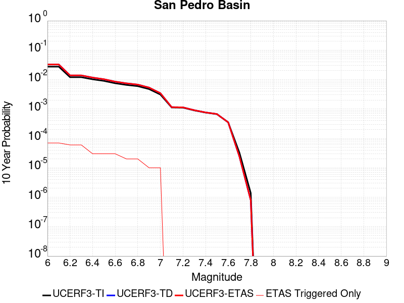 |

| Magnitude | 1 wk TI Prob | 1 wk TD Prob | 1 wk ETAS Prob | 1 wk ETAS/TD Gain | 1 wk ETAS Triggered Only | 1 mo TI Prob | 1 mo TD Prob | 1 mo ETAS Prob | 1 mo ETAS/TD Gain | 1 mo ETAS Triggered Only | 1 yr TI Prob | 1 yr TD Prob | 1 yr ETAS Prob | 1 yr ETAS/TD Gain | 1 yr ETAS Triggered Only | 10 yr TI Prob | 10 yr TD Prob | 10 yr ETAS Prob | 10 yr ETAS/TD Gain | 10 yr ETAS Triggered Only |
|-----|-----|-----|-----|-----|-----|-----|-----|-----|-----|-----|-----|-----|-----|-----|-----|-----|-----|-----|-----|-----|
| 6.0 | 5.3449043E-5 | 6.337018E-5 | 9.336828E-5 | 1.4733788 | 3.0E-5 | 2.2904722E-4 | 2.7156167E-4 | 3.0155352E-4 | 1.1104422 | 3.0E-5 | 0.0027850836 | 0.0033018515 | 0.0033317523 | 1.0090559 | 3.0E-5 | 0.027504366 | 0.03258948 | 0.0326572 | 1.0020779 | 7.0E-5 |
| 6.1 | 5.3449043E-5 | 6.337018E-5 | 9.336828E-5 | 1.4733788 | 3.0E-5 | 2.2904722E-4 | 2.7156167E-4 | 3.0155352E-4 | 1.1104422 | 3.0E-5 | 0.0027850836 | 0.0033018515 | 0.0033317523 | 1.0090559 | 3.0E-5 | 0.027504366 | 0.03258948 | 0.0326572 | 1.0020779 | 7.0E-5 |
| 6.2 | 2.3189454E-5 | 2.6642829E-5 | 4.6642297E-5 | 1.750651 | 2.0E-5 | 9.9379584E-5 | 1.1417881E-4 | 1.3417653E-4 | 1.1751438 | 2.0E-5 | 0.0012092749 | 0.0013892875 | 0.0014092597 | 1.0143759 | 2.0E-5 | 0.012027155 | 0.01381089 | 0.013870061 | 1.0042844 | 6.0E-5 |
| 6.3 | 2.3189454E-5 | 2.6642829E-5 | 4.6642297E-5 | 1.750651 | 2.0E-5 | 9.9379584E-5 | 1.1417881E-4 | 1.3417653E-4 | 1.1751438 | 2.0E-5 | 0.0012092749 | 0.0013892875 | 0.0014092597 | 1.0143759 | 2.0E-5 | 0.012027155 | 0.01381089 | 0.013870061 | 1.0042844 | 6.0E-5 |
| 6.4 | 1.966056E-5 | 2.246342E-5 | 4.2462972E-5 | 1.8903164 | 2.0E-5 | 8.425682E-5 | 9.626848E-5 | 1.1626655E-4 | 1.2077323 | 2.0E-5 | 0.001025344 | 0.0011714787 | 0.0011914552 | 1.0170524 | 2.0E-5 | 0.010206259 | 0.011657119 | 0.011686769 | 1.0025436 | 3.0E-5 |
| 6.5 | 1.7342953E-5 | 1.9745152E-5 | 3.974476E-5 | 2.0128868 | 2.0E-5 | 7.4324824E-5 | 8.461954E-5 | 1.0461785E-4 | 1.236332 | 2.0E-5 | 9.04529E-4 | 0.0010297929 | 0.0010497724 | 1.0194014 | 2.0E-5 | 0.009008561 | 0.010253932 | 0.010283625 | 1.0028957 | 3.0E-5 |
| 6.6 | 1.439804E-5 | 1.6322716E-5 | 3.632239E-5 | 2.2252662 | 2.0E-5 | 6.170443E-5 | 6.99528E-5 | 8.9951405E-5 | 1.285887 | 2.0E-5 | 7.509924E-4 | 8.513747E-4 | 8.713577E-4 | 1.0234715 | 2.0E-5 | 0.0074845953 | 0.008484333 | 0.008514078 | 1.003506 | 3.0E-5 |
| 6.7 | 1.2634884E-5 | 1.4285298E-5 | 3.428501E-5 | 2.4000208 | 2.0E-5 | 5.414838E-5 | 6.122144E-5 | 8.122022E-5 | 1.3266629 | 2.0E-5 | 6.590571E-4 | 7.451466E-4 | 7.651317E-4 | 1.0268203 | 2.0E-5 | 0.006571059 | 0.007429502 | 0.007449353 | 1.002672 | 2.0E-5 |
| 6.8 | 1.146091E-5 | 1.2933193E-5 | 3.2932934E-5 | 2.5463886 | 2.0E-5 | 4.911726E-5 | 5.542696E-5 | 7.542585E-5 | 1.3608153 | 2.0E-5 | 5.9783855E-4 | 6.74644E-4 | 6.9463055E-4 | 1.0296253 | 2.0E-5 | 0.0059623276 | 0.0067288997 | 0.0067487652 | 1.0029522 | 2.0E-5 |
| 6.9 | 9.109035E-6 | 1.0235013E-5 | 2.0234911E-5 | 1.9770284 | 1.0E-5 | 3.9038136E-5 | 4.386376E-5 | 5.386332E-5 | 1.2279686 | 1.0E-5 | 4.7518566E-4 | 5.339384E-4 | 5.4393307E-4 | 1.0187187 | 1.0E-5 | 0.0047417083 | 0.0053293095 | 0.005339256 | 1.0018665 | 1.0E-5 |
| 7.0 | 5.9351028E-6 | 6.583965E-6 | 1.65839E-5 | 2.5188315 | 1.0E-5 | 2.5435906E-5 | 2.821682E-5 | 3.8216538E-5 | 1.3543885 | 1.0E-5 | 3.0963816E-4 | 3.4350925E-4 | 3.5350583E-4 | 1.0291013 | 1.0E-5 | 0.0030920706 | 0.0034320997 | 0.0034420653 | 1.0029037 | 1.0E-5 |
| 7.1 | 2.1557585E-6 | 2.2096492E-6 | 2.2096492E-6 | 1.0 | 0.0 | 9.238933E-6 | 9.469892E-6 | 9.469892E-6 | 1.0 | 0.0 | 1.1247819E-4 | 1.15289986E-4 | 1.15289986E-4 | 1.0 | 0.0 | 0.0011242128 | 0.0011523172 | 0.0011523172 | 1.0 | 0.0 |
| 7.2 | 2.1251979E-6 | 2.1779954E-6 | 2.1779954E-6 | 1.0 | 0.0 | 9.107958E-6 | 9.334234E-6 | 9.334234E-6 | 1.0 | 0.0 | 1.1088375E-4 | 1.13638525E-4 | 1.13638525E-4 | 1.0 | 0.0 | 0.0011082845 | 0.0011358195 | 0.0011358195 | 1.0 | 0.0 |
| 7.3 | 1.7145798E-6 | 1.7442885E-6 | 1.7442885E-6 | 1.0 | 0.0 | 7.3481783E-6 | 7.475501E-6 | 7.475501E-6 | 1.0 | 0.0 | 8.94604E-5 | 9.1010515E-5 | 9.1010515E-5 | 1.0 | 0.0 | 8.9424395E-4 | 9.0974156E-4 | 9.0974156E-4 | 1.0 | 0.0 |
| 7.4 | 1.4467993E-6 | 1.4641878E-6 | 1.4641878E-6 | 1.0 | 0.0 | 6.200554E-6 | 6.275076E-6 | 6.275076E-6 | 1.0 | 0.0 | 7.548913E-5 | 7.639644E-5 | 7.639644E-5 | 1.0 | 0.0 | 7.546349E-4 | 7.6370913E-4 | 7.6370913E-4 | 1.0 | 0.0 |
| 7.5 | 1.2803735E-6 | 1.2931506E-6 | 1.2931506E-6 | 1.0 | 0.0 | 5.487303E-6 | 5.5420624E-6 | 5.5420624E-6 | 1.0 | 0.0 | 6.680587E-5 | 6.747259E-5 | 6.747259E-5 | 1.0 | 0.0 | 6.678579E-4 | 6.745281E-4 | 6.745281E-4 | 1.0 | 0.0 |
| 7.6 | 6.755009E-7 | 6.76947E-7 | 6.76947E-7 | 1.0 | 0.0 | 2.8950008E-6 | 2.9011985E-6 | 2.9011985E-6 | 1.0 | 0.0 | 3.5246063E-5 | 3.532158E-5 | 3.532158E-5 | 1.0 | 0.0 | 3.5240475E-4 | 3.5316538E-4 | 3.5316538E-4 | 1.0 | 0.0 |
| 7.7 | 6.211885E-8 | 4.5699714E-8 | 4.5699714E-8 | 1.0 | 0.0 | 2.6622362E-7 | 1.9585592E-7 | 1.9585592E-7 | 1.0 | 0.0 | 3.2412677E-6 | 2.3845432E-6 | 2.3845432E-6 | 1.0 | 0.0 | 3.2412205E-5 | 2.3845198E-5 | 2.3845198E-5 | 1.0 | 0.0 |
| 7.8 | 2.6580573E-9 | 1.5138054E-9 | 1.5138054E-9 | 1.0 | 0.0 | 1.1391674E-8 | 6.4877375E-9 | 6.4877375E-9 | 1.0 | 0.0 | 1.3869362E-7 | 7.89882E-8 | 7.89882E-8 | 1.0 | 0.0 | 1.3869354E-6 | 7.89882E-7 | 7.89882E-7 | 1.0 | 0.0 |

## Dry Mountain
*[(top)](#table-of-contents)*

| 1 Week | 1 Month | 1 Year | 10 Year |
|-----|-----|-----|-----|
|  |  |  |  |

| Magnitude | 1 wk TI Prob | 1 wk TD Prob | 1 wk ETAS Prob | 1 wk ETAS/TD Gain | 1 wk ETAS Triggered Only | 1 mo TI Prob | 1 mo TD Prob | 1 mo ETAS Prob | 1 mo ETAS/TD Gain | 1 mo ETAS Triggered Only | 1 yr TI Prob | 1 yr TD Prob | 1 yr ETAS Prob | 1 yr ETAS/TD Gain | 1 yr ETAS Triggered Only | 10 yr TI Prob | 10 yr TD Prob | 10 yr ETAS Prob | 10 yr ETAS/TD Gain | 10 yr ETAS Triggered Only |
|-----|-----|-----|-----|-----|-----|-----|-----|-----|-----|-----|-----|-----|-----|-----|-----|-----|-----|-----|-----|-----|
| 6.0 | 6.222801E-6 | 6.439381E-6 | 1.6439317E-5 | 2.5529342 | 1.0E-5 | 2.6668875E-5 | 2.7597147E-5 | 3.759687E-5 | 1.3623463 | 1.0E-5 | 3.2464517E-4 | 3.3595937E-4 | 3.659493E-4 | 1.0892665 | 3.0E-5 | 0.0032417132 | 0.0033560768 | 0.0034158754 | 1.017818 | 6.0E-5 |
| 6.1 | 6.222801E-6 | 6.439381E-6 | 1.6439317E-5 | 2.5529342 | 1.0E-5 | 2.6668875E-5 | 2.7597147E-5 | 3.759687E-5 | 1.3623463 | 1.0E-5 | 3.2464517E-4 | 3.3595937E-4 | 3.659493E-4 | 1.0892665 | 3.0E-5 | 0.0032417132 | 0.0033560768 | 0.0034158754 | 1.017818 | 6.0E-5 |
| 6.2 | 6.222801E-6 | 6.439381E-6 | 1.6439317E-5 | 2.5529342 | 1.0E-5 | 2.6668875E-5 | 2.7597147E-5 | 3.759687E-5 | 1.3623463 | 1.0E-5 | 3.2464517E-4 | 3.3595937E-4 | 3.659493E-4 | 1.0892665 | 3.0E-5 | 0.0032417132 | 0.0033560768 | 0.0034158754 | 1.017818 | 6.0E-5 |
| 6.3 | 6.222801E-6 | 6.439381E-6 | 1.6439317E-5 | 2.5529342 | 1.0E-5 | 2.6668875E-5 | 2.7597147E-5 | 3.759687E-5 | 1.3623463 | 1.0E-5 | 3.2464517E-4 | 3.3595937E-4 | 3.659493E-4 | 1.0892665 | 3.0E-5 | 0.0032417132 | 0.0033560768 | 0.0034158754 | 1.017818 | 6.0E-5 |
| 6.4 | 6.222801E-6 | 6.439381E-6 | 1.6439317E-5 | 2.5529342 | 1.0E-5 | 2.6668875E-5 | 2.7597147E-5 | 3.759687E-5 | 1.3623463 | 1.0E-5 | 3.2464517E-4 | 3.3595937E-4 | 3.659493E-4 | 1.0892665 | 3.0E-5 | 0.0032417132 | 0.0033560768 | 0.0034158754 | 1.017818 | 6.0E-5 |
| 6.5 | 2.8528623E-6 | 2.9521684E-6 | 2.9521684E-6 | 1.0 | 0.0 | 1.22264955E-5 | 1.2652138E-5 | 1.2652138E-5 | 1.0 | 0.0 | 1.4884741E-4 | 1.540376E-4 | 1.540376E-4 | 1.0 | 0.0 | 0.0014874774 | 0.0015401616 | 0.0015701154 | 1.0194485 | 3.0E-5 |
| 6.6 | 2.8528623E-6 | 2.9521684E-6 | 2.9521684E-6 | 1.0 | 0.0 | 1.22264955E-5 | 1.2652138E-5 | 1.2652138E-5 | 1.0 | 0.0 | 1.4884741E-4 | 1.540376E-4 | 1.540376E-4 | 1.0 | 0.0 | 0.0014874774 | 0.0015401616 | 0.0015701154 | 1.0194485 | 3.0E-5 |
| 6.7 | 2.541E-6 | 2.6293578E-6 | 2.6293578E-6 | 1.0 | 0.0 | 1.0889954E-5 | 1.1268677E-5 | 1.1268677E-5 | 1.0 | 0.0 | 1.3257713E-4 | 1.3719614E-4 | 1.3719614E-4 | 1.0 | 0.0 | 0.0013249806 | 0.0013719613 | 0.0014019202 | 1.0218365 | 3.0E-5 |

## San Clemente
*[(top)](#table-of-contents)*

| 1 Week | 1 Month | 1 Year | 10 Year |
|-----|-----|-----|-----|
|  |  |  |  |

| Magnitude | 1 wk TI Prob | 1 wk TD Prob | 1 wk ETAS Prob | 1 wk ETAS/TD Gain | 1 wk ETAS Triggered Only | 1 mo TI Prob | 1 mo TD Prob | 1 mo ETAS Prob | 1 mo ETAS/TD Gain | 1 mo ETAS Triggered Only | 1 yr TI Prob | 1 yr TD Prob | 1 yr ETAS Prob | 1 yr ETAS/TD Gain | 1 yr ETAS Triggered Only | 10 yr TI Prob | 10 yr TD Prob | 10 yr ETAS Prob | 10 yr ETAS/TD Gain | 10 yr ETAS Triggered Only |
|-----|-----|-----|-----|-----|-----|-----|-----|-----|-----|-----|-----|-----|-----|-----|-----|-----|-----|-----|-----|-----|
| 6.0 | 6.681379E-5 | 8.163834E-5 | 8.163834E-5 | 1.0 | 0.0 | 2.8631336E-4 | 3.4983488E-4 | 3.4983488E-4 | 1.0 | 0.0 | 0.003480294 | 0.00425141 | 0.0042812824 | 1.0070264 | 3.0E-5 | 0.03426291 | 0.04175603 | 0.041813523 | 1.0013769 | 6.0E-5 |
| 6.1 | 6.681379E-5 | 8.163834E-5 | 8.163834E-5 | 1.0 | 0.0 | 2.8631336E-4 | 3.4983488E-4 | 3.4983488E-4 | 1.0 | 0.0 | 0.003480294 | 0.00425141 | 0.0042812824 | 1.0070264 | 3.0E-5 | 0.03426291 | 0.04175603 | 0.041813523 | 1.0013769 | 6.0E-5 |
| 6.2 | 3.9400576E-5 | 4.6452373E-5 | 4.6452373E-5 | 1.0 | 0.0 | 1.6884868E-4 | 1.9906677E-4 | 1.9906677E-4 | 1.0 | 0.0 | 0.0020537945 | 0.0024209984 | 0.0024409501 | 1.008241 | 2.0E-5 | 0.020349167 | 0.023952903 | 0.023982184 | 1.0012225 | 3.0E-5 |
| 6.3 | 3.2590255E-5 | 3.792912E-5 | 3.792912E-5 | 1.0 | 0.0 | 1.3966505E-4 | 1.6254342E-4 | 1.6254342E-4 | 1.0 | 0.0 | 0.0016990956 | 0.0019772002 | 0.0019971605 | 1.0100954 | 2.0E-5 | 0.01686163 | 0.019599883 | 0.019629294 | 1.0015006 | 3.0E-5 |
| 6.4 | 2.9454652E-5 | 3.4097764E-5 | 3.4097764E-5 | 1.0 | 0.0 | 1.2622811E-4 | 1.4612524E-4 | 1.4612524E-4 | 1.0 | 0.0 | 0.0015357438 | 0.0017776493 | 0.0017976137 | 1.0112308 | 2.0E-5 | 0.015251739 | 0.01763747 | 0.017666942 | 1.001671 | 3.0E-5 |
| 6.5 | 2.790836E-5 | 3.2247463E-5 | 3.2247463E-5 | 1.0 | 0.0 | 1.1960178E-4 | 1.3819624E-4 | 1.3819624E-4 | 1.0 | 0.0 | 0.001455179 | 0.0016812662 | 0.0017012326 | 1.0118757 | 2.0E-5 | 0.014456868 | 0.016688485 | 0.016717983 | 1.0017676 | 3.0E-5 |
| 6.6 | 2.2492153E-5 | 2.5762702E-5 | 2.5762702E-5 | 1.0 | 0.0 | 9.639138E-5 | 1.1040699E-4 | 1.1040699E-4 | 1.0 | 0.0 | 0.0011729331 | 0.0013433909 | 0.001363364 | 1.0148677 | 2.0E-5 | 0.011667615 | 0.013354417 | 0.013384016 | 1.0022165 | 3.0E-5 |
| 6.7 | 1.9862755E-5 | 2.2666423E-5 | 2.2666423E-5 | 1.0 | 0.0 | 8.512331E-5 | 9.713826E-5 | 9.713826E-5 | 1.0 | 0.0 | 0.0010358836 | 0.0011820279 | 0.0012020043 | 1.0169001 | 2.0E-5 | 0.010310682 | 0.011758701 | 0.0117784655 | 1.0016809 | 2.0E-5 |
| 6.8 | 1.6697575E-5 | 1.897771E-5 | 1.897771E-5 | 1.0 | 0.0 | 7.155907E-5 | 8.133056E-5 | 8.133056E-5 | 1.0 | 0.0 | 8.7088346E-4 | 9.897591E-4 | 0.0010097392 | 1.0201869 | 2.0E-5 | 0.008674784 | 0.0098545365 | 0.00987434 | 1.0020095 | 2.0E-5 |
| 6.9 | 1.5218415E-5 | 1.72694E-5 | 1.72694E-5 | 1.0 | 0.0 | 6.522015E-5 | 7.4009666E-5 | 7.4009666E-5 | 1.0 | 0.0 | 7.93766E-4 | 9.00704E-4 | 9.10695E-4 | 1.0110924 | 1.0E-5 | 0.007909367 | 0.008971481 | 0.008981391 | 1.0011046 | 1.0E-5 |
| 7.0 | 1.2392958E-5 | 1.4033016E-5 | 1.4033016E-5 | 1.0 | 0.0 | 5.3111595E-5 | 6.014015E-5 | 6.014015E-5 | 1.0 | 0.0 | 6.4644177E-4 | 7.319679E-4 | 7.419606E-4 | 1.0136518 | 1.0E-5 | 0.0064456454 | 0.0072963564 | 0.007306284 | 1.0013605 | 1.0E-5 |
| 7.1 | 1.0934128E-5 | 1.2375138E-5 | 1.2375138E-5 | 1.0 | 0.0 | 4.6859706E-5 | 5.303527E-5 | 5.303527E-5 | 1.0 | 0.0 | 5.7036756E-4 | 6.455204E-4 | 6.455204E-4 | 1.0 | 0.0 | 0.0056890585 | 0.0064371997 | 0.0064371997 | 1.0 | 0.0 |
| 7.2 | 9.5798805E-6 | 1.0844935E-5 | 1.0844935E-5 | 1.0 | 0.0 | 4.1055984E-5 | 4.6477508E-5 | 4.6477508E-5 | 1.0 | 0.0 | 4.9974193E-4 | 5.657239E-4 | 5.657239E-4 | 1.0 | 0.0 | 0.0049861963 | 0.0056435615 | 0.0056435615 | 1.0 | 0.0 |
| 7.3 | 8.0167365E-6 | 9.083918E-6 | 9.083918E-6 | 1.0 | 0.0 | 3.4356988E-5 | 3.8930535E-5 | 3.8930535E-5 | 1.0 | 0.0 | 4.1821605E-4 | 4.7388324E-4 | 4.7388324E-4 | 1.0 | 0.0 | 0.0041742986 | 0.0047294297 | 0.0047294297 | 1.0 | 0.0 |
| 7.4 | 2.9581017E-6 | 3.3623792E-6 | 3.3623792E-6 | 1.0 | 0.0 | 1.2677518E-5 | 1.4410146E-5 | 1.4410146E-5 | 1.0 | 0.0 | 1.5433785E-4 | 1.7543444E-4 | 1.7543444E-4 | 1.0 | 0.0 | 0.001542307 | 0.0017534546 | 0.0017534546 | 1.0 | 0.0 |

## Hollywood
*[(top)](#table-of-contents)*

| 1 Week | 1 Month | 1 Year | 10 Year |
|-----|-----|-----|-----|
|  | 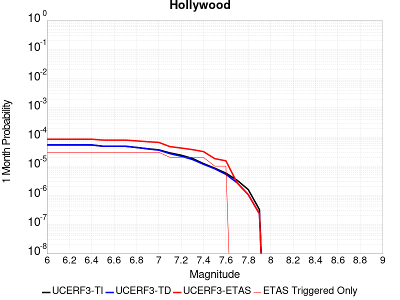 |  |  |

| Magnitude | 1 wk TI Prob | 1 wk TD Prob | 1 wk ETAS Prob | 1 wk ETAS/TD Gain | 1 wk ETAS Triggered Only | 1 mo TI Prob | 1 mo TD Prob | 1 mo ETAS Prob | 1 mo ETAS/TD Gain | 1 mo ETAS Triggered Only | 1 yr TI Prob | 1 yr TD Prob | 1 yr ETAS Prob | 1 yr ETAS/TD Gain | 1 yr ETAS Triggered Only | 10 yr TI Prob | 10 yr TD Prob | 10 yr ETAS Prob | 10 yr ETAS/TD Gain | 10 yr ETAS Triggered Only |
|-----|-----|-----|-----|-----|-----|-----|-----|-----|-----|-----|-----|-----|-----|-----|-----|-----|-----|-----|-----|-----|
| 6.0 | 1.24487615E-5 | 1.2593229E-5 | 4.2592852E-5 | 3.3822024 | 3.0E-5 | 5.3350745E-5 | 5.3969892E-5 | 8.3968276E-5 | 1.5558355 | 3.0E-5 | 6.4935174E-4 | 6.5689E-4 | 6.9686375E-4 | 1.060853 | 4.0E-5 | 0.0064745755 | 0.0065499707 | 0.006619512 | 1.010617 | 7.0E-5 |
| 6.1 | 1.24487615E-5 | 1.2593229E-5 | 4.2592852E-5 | 3.3822024 | 3.0E-5 | 5.3350745E-5 | 5.3969892E-5 | 8.3968276E-5 | 1.5558355 | 3.0E-5 | 6.4935174E-4 | 6.5689E-4 | 6.9686375E-4 | 1.060853 | 4.0E-5 | 0.0064745755 | 0.0065499707 | 0.006619512 | 1.010617 | 7.0E-5 |
| 6.2 | 1.24487615E-5 | 1.2593229E-5 | 4.2592852E-5 | 3.3822024 | 3.0E-5 | 5.3350745E-5 | 5.3969892E-5 | 8.3968276E-5 | 1.5558355 | 3.0E-5 | 6.4935174E-4 | 6.5689E-4 | 6.9686375E-4 | 1.060853 | 4.0E-5 | 0.0064745755 | 0.0065499707 | 0.006619512 | 1.010617 | 7.0E-5 |
| 6.3 | 1.24487615E-5 | 1.2593229E-5 | 4.2592852E-5 | 3.3822024 | 3.0E-5 | 5.3350745E-5 | 5.3969892E-5 | 8.3968276E-5 | 1.5558355 | 3.0E-5 | 6.4935174E-4 | 6.5689E-4 | 6.9686375E-4 | 1.060853 | 4.0E-5 | 0.0064745755 | 0.0065499707 | 0.006619512 | 1.010617 | 7.0E-5 |
| 6.4 | 1.2431024E-5 | 1.25738425E-5 | 4.2573465E-5 | 3.3858755 | 3.0E-5 | 5.327473E-5 | 5.388681E-5 | 8.388519E-5 | 1.5566925 | 3.0E-5 | 6.4842677E-4 | 6.558791E-4 | 6.9585285E-4 | 1.0609468 | 4.0E-5 | 0.0064653796 | 0.0065399213 | 0.0066094636 | 1.0106335 | 7.0E-5 |
| 6.5 | 1.1242222E-5 | 1.1317804E-5 | 4.1317464E-5 | 3.650661 | 3.0E-5 | 4.8180063E-5 | 4.8503985E-5 | 7.850253E-5 | 1.6184759 | 3.0E-5 | 5.864344E-4 | 5.903787E-4 | 6.303551E-4 | 1.0677131 | 4.0E-5 | 0.0058488925 | 0.00588839 | 0.005957978 | 1.0118178 | 7.0E-5 |
| 6.6 | 1.1234066E-5 | 1.1308918E-5 | 4.130858E-5 | 3.6527438 | 3.0E-5 | 4.8145106E-5 | 4.8465907E-5 | 7.846445E-5 | 1.6189618 | 3.0E-5 | 5.86009E-4 | 5.899153E-4 | 6.298917E-4 | 1.0677663 | 4.0E-5 | 0.005844661 | 0.0058837803 | 0.0059533687 | 1.0118271 | 7.0E-5 |
| 6.7 | 1.12294E-5 | 1.1303661E-5 | 4.1303323E-5 | 3.6539774 | 3.0E-5 | 4.812511E-5 | 4.8443377E-5 | 7.8441924E-5 | 1.6192497 | 3.0E-5 | 5.857657E-4 | 5.896412E-4 | 6.296176E-4 | 1.0677979 | 4.0E-5 | 0.0058422405 | 0.005881054 | 0.005950642 | 1.0118326 | 7.0E-5 |
| 6.8 | 1.0252819E-5 | 1.0218449E-5 | 4.0218143E-5 | 3.9358366 | 3.0E-5 | 4.3939912E-5 | 4.3792625E-5 | 7.3791314E-5 | 1.6850169 | 3.0E-5 | 5.3483713E-4 | 5.330469E-4 | 5.730256E-4 | 1.0750003 | 4.0E-5 | 0.005335517 | 0.0053179096 | 0.00537759 | 1.0112226 | 6.0E-5 |
| 6.9 | 9.252289E-6 | 9.110309E-6 | 3.9110037E-5 | 4.2929425 | 3.0E-5 | 3.9652066E-5 | 3.9043607E-5 | 6.9042435E-5 | 1.7683415 | 3.0E-5 | 4.8265693E-4 | 4.752539E-4 | 5.152349E-4 | 1.0841255 | 4.0E-5 | 0.0048161 | 0.004742549 | 0.0048022643 | 1.0125915 | 6.0E-5 |
| 7.0 | 8.474604E-6 | 8.25826E-6 | 3.825801E-5 | 4.632696 | 3.0E-5 | 3.6319227E-5 | 3.5392073E-5 | 6.539101E-5 | 1.8476174 | 3.0E-5 | 4.4209688E-4 | 4.3081472E-4 | 4.707975E-4 | 1.0928073 | 4.0E-5 | 0.004412184 | 0.0042999457 | 0.004349731 | 1.0115781 | 5.0E-5 |
| 7.1 | 6.643643E-6 | 6.2683707E-6 | 2.6268246E-5 | 4.190602 | 2.0E-5 | 2.8472443E-5 | 2.686417E-5 | 4.6863635E-5 | 1.7444661 | 2.0E-5 | 3.4659685E-4 | 3.2702263E-4 | 3.470161E-4 | 1.0611378 | 2.0E-5 | 0.0034605677 | 0.0032654598 | 0.003295362 | 1.0091571 | 3.0E-5 |
| 7.2 | 5.549002E-6 | 5.1087086E-6 | 2.5108606E-5 | 4.9148636 | 2.0E-5 | 2.378122E-5 | 2.1894282E-5 | 4.1893843E-5 | 1.9134605 | 2.0E-5 | 2.8949787E-4 | 2.665304E-4 | 2.865251E-4 | 1.0750183 | 2.0E-5 | 0.0028912104 | 0.002662124 | 0.0026920442 | 1.0112392 | 3.0E-5 |
| 7.3 | 4.3059727E-6 | 3.9598913E-6 | 2.3959812E-5 | 6.0506234 | 2.0E-5 | 1.8454039E-5 | 1.6970853E-5 | 3.6970516E-5 | 2.178471 | 2.0E-5 | 2.2465475E-4 | 2.0660064E-4 | 2.2659652E-4 | 1.0967851 | 2.0E-5 | 0.0022442779 | 0.0020640958 | 0.0020940339 | 1.0145042 | 3.0E-5 |
| 7.4 | 2.8550733E-6 | 2.7013002E-6 | 2.2701246E-5 | 8.403822 | 2.0E-5 | 1.2235971E-5 | 1.1576949E-5 | 3.1576717E-5 | 2.7275507 | 2.0E-5 | 1.4896276E-4 | 1.4094029E-4 | 1.6093747E-4 | 1.1418841 | 2.0E-5 | 0.0014886294 | 0.0014085141 | 0.0014384718 | 1.0212691 | 3.0E-5 |
| 7.5 | 1.9927045E-6 | 1.8976393E-6 | 1.189762E-5 | 6.2696953 | 1.0E-5 | 8.540134E-6 | 8.132714E-6 | 1.8132634E-5 | 2.2295918 | 1.0E-5 | 1.0397117E-4 | 9.901134E-5 | 1.0901035E-4 | 1.1009885 | 1.0E-5 | 0.0010392254 | 9.896759E-4 | 0.001009656 | 1.0201887 | 2.0E-5 |
| 7.6 | 1.345084E-6 | 1.2216018E-6 | 1.1221589E-5 | 9.185964 | 1.0E-5 | 5.764633E-6 | 5.2354258E-6 | 1.5235373E-5 | 2.9100542 | 1.0E-5 | 7.018215E-5 | 6.373946E-5 | 7.3738825E-5 | 1.1568787 | 1.0E-5 | 7.0159987E-4 | 6.372138E-4 | 6.4720743E-4 | 1.0156833 | 1.0E-5 |
| 7.7 | 7.6835164E-7 | 6.2777013E-7 | 6.2777013E-7 | 1.0 | 0.0 | 3.2929315E-6 | 2.6904406E-6 | 2.6904406E-6 | 1.0 | 0.0 | 4.00907E-5 | 3.2755637E-5 | 3.2755637E-5 | 1.0 | 0.0 | 4.0083472E-4 | 3.2750957E-4 | 3.2750957E-4 | 1.0 | 0.0 |
| 7.8 | 3.6562128E-7 | 2.4534745E-7 | 2.4534745E-7 | 1.0 | 0.0 | 1.5669474E-6 | 1.0514887E-6 | 1.0514887E-6 | 1.0 | 0.0 | 1.9077417E-5 | 1.2801803E-5 | 1.2801803E-5 | 1.0 | 0.0 | 1.907578E-4 | 1.2801103E-4 | 1.2801103E-4 | 1.0 | 0.0 |
| 7.9 | 7.5024424E-8 | 5.381742E-8 | 5.381742E-8 | 1.0 | 0.0 | 3.215332E-7 | 2.3064608E-7 | 2.3064608E-7 | 1.0 | 0.0 | 3.91466E-6 | 2.8081138E-6 | 2.8081138E-6 | 1.0 | 0.0 | 3.9145907E-5 | 2.8080913E-5 | 2.8080913E-5 | 1.0 | 0.0 |

## San Andreas (Santa Cruz Mts) 2011 CFM
*[(top)](#table-of-contents)*

| 1 Week | 1 Month | 1 Year | 10 Year |
|-----|-----|-----|-----|
|  |  |  |  |

| Magnitude | 1 wk TI Prob | 1 wk TD Prob | 1 wk ETAS Prob | 1 wk ETAS/TD Gain | 1 wk ETAS Triggered Only | 1 mo TI Prob | 1 mo TD Prob | 1 mo ETAS Prob | 1 mo ETAS/TD Gain | 1 mo ETAS Triggered Only | 1 yr TI Prob | 1 yr TD Prob | 1 yr ETAS Prob | 1 yr ETAS/TD Gain | 1 yr ETAS Triggered Only | 10 yr TI Prob | 10 yr TD Prob | 10 yr ETAS Prob | 10 yr ETAS/TD Gain | 10 yr ETAS Triggered Only |
|-----|-----|-----|-----|-----|-----|-----|-----|-----|-----|-----|-----|-----|-----|-----|-----|-----|-----|-----|-----|-----|
| 6.0 | 1.7221631E-4 | 1.3792426E-4 | 1.4792288E-4 | 1.0724936 | 1.0E-5 | 7.378611E-4 | 5.9097214E-4 | 6.209544E-4 | 1.0507338 | 3.0E-5 | 0.008946515 | 0.0071717235 | 0.007211437 | 1.0055375 | 4.0E-5 | 0.08594794 | 0.07054796 | 0.07060373 | 1.0007905 | 6.0E-5 |
| 6.1 | 1.7221631E-4 | 1.3792426E-4 | 1.4792288E-4 | 1.0724936 | 1.0E-5 | 7.378611E-4 | 5.9097214E-4 | 6.209544E-4 | 1.0507338 | 3.0E-5 | 0.008946515 | 0.0071717235 | 0.007211437 | 1.0055375 | 4.0E-5 | 0.08594794 | 0.07054796 | 0.07060373 | 1.0007905 | 6.0E-5 |
| 6.2 | 1.7221631E-4 | 1.3792426E-4 | 1.4792288E-4 | 1.0724936 | 1.0E-5 | 7.378611E-4 | 5.9097214E-4 | 6.209544E-4 | 1.0507338 | 3.0E-5 | 0.008946515 | 0.0071717235 | 0.007211437 | 1.0055375 | 4.0E-5 | 0.08594794 | 0.07054796 | 0.07060373 | 1.0007905 | 6.0E-5 |
| 6.3 | 1.716926E-4 | 1.3711878E-4 | 1.4711742E-4 | 1.0729195 | 1.0E-5 | 7.3561794E-4 | 5.8752164E-4 | 6.17504E-4 | 1.051032 | 3.0E-5 | 0.008919428 | 0.007129989 | 0.007169704 | 1.00557 | 4.0E-5 | 0.08569809 | 0.07015993 | 0.07021572 | 1.0007952 | 6.0E-5 |
| 6.4 | 1.6392978E-4 | 1.3587909E-4 | 1.4587774E-4 | 1.0735848 | 1.0E-5 | 7.02367E-4 | 5.82211E-4 | 6.021994E-4 | 1.0343318 | 2.0E-5 | 0.008517839 | 0.0070657525 | 0.0070955404 | 1.0042158 | 3.0E-5 | 0.08198654 | 0.069394976 | 0.069441505 | 1.0006706 | 5.0E-5 |
| 6.5 | 1.5742714E-4 | 1.2647794E-4 | 1.3647668E-4 | 1.0790552 | 1.0E-5 | 6.745133E-4 | 5.419374E-4 | 5.6192663E-4 | 1.0368847 | 2.0E-5 | 0.00818132 | 0.0065784375 | 0.0066082403 | 1.0045303 | 3.0E-5 | 0.078865945 | 0.06486093 | 0.06490769 | 1.0007209 | 5.0E-5 |
| 6.6 | 1.3038084E-4 | 1.1587992E-4 | 1.2587877E-4 | 1.0862862 | 1.0E-5 | 5.5865536E-4 | 4.96535E-4 | 5.1652506E-4 | 1.0402591 | 2.0E-5 | 0.006780438 | 0.006028784 | 0.0060586035 | 1.0049461 | 3.0E-5 | 0.0657725 | 0.059330538 | 0.05937757 | 1.0007927 | 5.0E-5 |
| 6.7 | 1.2867592E-4 | 1.1314491E-4 | 1.2314378E-4 | 1.0883722 | 1.0E-5 | 5.5135164E-4 | 4.8481792E-4 | 5.048082E-4 | 1.0412326 | 2.0E-5 | 0.0066920654 | 0.005886907 | 0.0059167305 | 1.005066 | 3.0E-5 | 0.06494093 | 0.058041416 | 0.058088515 | 1.0008115 | 5.0E-5 |
| 6.8 | 1.2801298E-4 | 1.12520516E-4 | 1.2251938E-4 | 1.0888627 | 1.0E-5 | 5.485117E-4 | 4.8214293E-4 | 5.021333E-4 | 1.0414615 | 2.0E-5 | 0.0066577005 | 0.0058545293 | 0.005884354 | 1.0050943 | 3.0E-5 | 0.06461738 | 0.05775524 | 0.057802353 | 1.0008157 | 5.0E-5 |
| 6.9 | 1.269149E-4 | 1.1094256E-4 | 1.2094145E-4 | 1.0901268 | 1.0E-5 | 5.4380763E-4 | 4.7538272E-4 | 4.953732E-4 | 1.0420513 | 2.0E-5 | 0.006600777 | 0.005772663 | 0.00580249 | 1.0051669 | 3.0E-5 | 0.06408122 | 0.057027116 | 0.057074267 | 1.0008267 | 5.0E-5 |
| 7.0 | 1.2030331E-4 | 1.0824356E-4 | 1.1824248E-4 | 1.0923742 | 1.0E-5 | 5.154837E-4 | 4.638198E-4 | 4.8381052E-4 | 1.0431002 | 2.0E-5 | 0.006257969 | 0.0056326203 | 0.005662451 | 1.0052961 | 3.0E-5 | 0.06084648 | 0.055699922 | 0.055747136 | 1.0008477 | 5.0E-5 |
| 7.1 | 8.049617E-5 | 5.392429E-5 | 6.392375E-5 | 1.1854352 | 1.0E-5 | 3.4493793E-4 | 2.3108382E-4 | 2.510792E-4 | 1.0865287 | 2.0E-5 | 0.0041915346 | 0.0028098505 | 0.0028397662 | 1.0106467 | 3.0E-5 | 0.041133516 | 0.029618833 | 0.029657647 | 1.0013105 | 4.0E-5 |
| 7.2 | 7.093979E-5 | 4.2935415E-5 | 5.2934985E-5 | 1.232898 | 1.0E-5 | 3.0399222E-4 | 1.8399608E-4 | 2.0399239E-4 | 1.108678 | 2.0E-5 | 0.0036948253 | 0.0022378736 | 0.0022678063 | 1.0133756 | 3.0E-5 | 0.03633994 | 0.023941126 | 0.023980169 | 1.0016308 | 4.0E-5 |
| 7.3 | 6.193693E-5 | 2.8891074E-5 | 3.8890787E-5 | 1.3461176 | 1.0E-5 | 2.6541698E-4 | 1.2381302E-4 | 1.4381054E-4 | 1.1615139 | 2.0E-5 | 0.0032266637 | 0.001506383 | 0.0015363378 | 1.0198853 | 3.0E-5 | 0.031802133 | 0.016497677 | 0.016537018 | 1.0023845 | 4.0E-5 |
| 7.4 | 5.906492E-5 | 2.7020369E-5 | 3.7020098E-5 | 1.3700812 | 1.0E-5 | 2.5311083E-4 | 1.1579645E-4 | 1.3579414E-4 | 1.1726968 | 2.0E-5 | 0.0030772698 | 0.0014089114 | 0.0014388692 | 1.021263 | 3.0E-5 | 0.030350044 | 0.0154695045 | 0.0155088855 | 1.0025457 | 4.0E-5 |
| 7.5 | 5.424296E-5 | 2.4675093E-5 | 3.4674846E-5 | 1.405257 | 1.0E-5 | 2.324491E-4 | 1.0574612E-4 | 1.25744E-4 | 1.1891122 | 2.0E-5 | 0.002826395 | 0.0012866998 | 0.0013166612 | 1.0232855 | 3.0E-5 | 0.027907165 | 0.014161854 | 0.014201287 | 1.0027845 | 4.0E-5 |
| 7.6 | 4.43084E-5 | 1.990151E-5 | 2.9901312E-5 | 1.5024644 | 1.0E-5 | 1.8987931E-4 | 8.528939E-5 | 1.0528769E-4 | 1.2344757 | 2.0E-5 | 0.0023093296 | 0.001037904 | 0.0010678729 | 1.0288744 | 3.0E-5 | 0.022854783 | 0.011411123 | 0.011450667 | 1.0034653 | 4.0E-5 |
| 7.7 | 4.118098E-5 | 1.8933848E-5 | 2.8933659E-5 | 1.5281447 | 1.0E-5 | 1.7647797E-4 | 8.1142534E-5 | 1.0114091E-4 | 1.2464598 | 2.0E-5 | 0.002146502 | 9.874629E-4 | 0.0010174332 | 1.0303509 | 3.0E-5 | 0.021258866 | 0.010868995 | 0.010908561 | 1.0036402 | 4.0E-5 |
| 7.8 | 3.5408906E-5 | 1.856201E-5 | 2.8561824E-5 | 1.5387248 | 1.0E-5 | 1.5174363E-4 | 7.954905E-5 | 9.9547455E-5 | 1.2513973 | 2.0E-5 | 0.0018459131 | 9.6807955E-4 | 9.980506E-4 | 1.0309591 | 3.0E-5 | 0.018306552 | 0.0106506655 | 0.010690239 | 1.0037156 | 4.0E-5 |
| 7.9 | 2.5860836E-5 | 1.7313954E-5 | 2.7313781E-5 | 1.5775588 | 1.0E-5 | 1.10827445E-4 | 7.420055E-5 | 9.4199066E-5 | 1.2695198 | 2.0E-5 | 0.001348489 | 9.030175E-4 | 9.3299046E-4 | 1.0331919 | 3.0E-5 | 0.013403354 | 0.009906601 | 0.009946205 | 1.0039977 | 4.0E-5 |
| 8.0 | 1.9777332E-5 | 1.4837888E-5 | 1.4837888E-5 | 1.0 | 0.0 | 8.4757245E-5 | 6.3589396E-5 | 7.358876E-5 | 1.157249 | 1.0E-5 | 0.0010314309 | 7.739261E-4 | 7.939106E-4 | 1.0258223 | 2.0E-5 | 0.010266567 | 0.008508087 | 0.008537832 | 1.003496 | 3.0E-5 |
| 8.1 | 1.468494E-5 | 1.2105831E-5 | 1.2105831E-5 | 1.0 | 0.0 | 6.293394E-5 | 5.1881103E-5 | 6.1880586E-5 | 1.1927384 | 1.0E-5 | 7.6595135E-4 | 6.3146953E-4 | 6.5145694E-4 | 1.0316522 | 2.0E-5 | 0.0076331664 | 0.0069684954 | 0.0069883564 | 1.00285 | 2.0E-5 |
| 8.2 | 8.63836E-6 | 5.4678667E-6 | 5.4678667E-6 | 1.0 | 0.0 | 3.7021015E-5 | 2.3433504E-5 | 2.3433504E-5 | 1.0 | 0.0 | 4.5063766E-4 | 2.8526565E-4 | 2.8526565E-4 | 1.0 | 0.0 | 0.004497249 | 0.003245162 | 0.003245162 | 1.0 | 0.0 |
| 8.3 | 1.983087E-6 | 7.6564595E-7 | 7.6564595E-7 | 1.0 | 0.0 | 8.498917E-6 | 3.281336E-6 | 3.281336E-6 | 1.0 | 0.0 | 1.034694E-4 | 3.9949547E-5 | 3.9949547E-5 | 1.0 | 0.0 | 0.0010342124 | 4.717979E-4 | 4.717979E-4 | 1.0 | 0.0 |

## Kern Canyon (South Kern) 2011
*[(top)](#table-of-contents)*

| 1 Week | 1 Month | 1 Year | 10 Year |
|-----|-----|-----|-----|
|  |  |  |  |

| Magnitude | 1 wk TI Prob | 1 wk TD Prob | 1 wk ETAS Prob | 1 wk ETAS/TD Gain | 1 wk ETAS Triggered Only | 1 mo TI Prob | 1 mo TD Prob | 1 mo ETAS Prob | 1 mo ETAS/TD Gain | 1 mo ETAS Triggered Only | 1 yr TI Prob | 1 yr TD Prob | 1 yr ETAS Prob | 1 yr ETAS/TD Gain | 1 yr ETAS Triggered Only | 10 yr TI Prob | 10 yr TD Prob | 10 yr ETAS Prob | 10 yr ETAS/TD Gain | 10 yr ETAS Triggered Only |
|-----|-----|-----|-----|-----|-----|-----|-----|-----|-----|-----|-----|-----|-----|-----|-----|-----|-----|-----|-----|-----|
| 6.0 | 4.105075E-6 | 4.113726E-6 | 3.4113604E-5 | 8.292629 | 3.0E-5 | 1.7593058E-5 | 1.7630138E-5 | 5.7629433E-5 | 3.2688022 | 4.0E-5 | 2.1417443E-4 | 2.1462643E-4 | 2.7461356E-4 | 1.2794955 | 6.0E-5 | 0.0021396813 | 0.0021442554 | 0.0022041267 | 1.0279218 | 6.0E-5 |
| 6.1 | 4.105075E-6 | 4.113726E-6 | 3.4113604E-5 | 8.292629 | 3.0E-5 | 1.7593058E-5 | 1.7630138E-5 | 5.7629433E-5 | 3.2688022 | 4.0E-5 | 2.1417443E-4 | 2.1462643E-4 | 2.7461356E-4 | 1.2794955 | 6.0E-5 | 0.0021396813 | 0.0021442554 | 0.0022041267 | 1.0279218 | 6.0E-5 |
| 6.2 | 4.105075E-6 | 4.113726E-6 | 3.4113604E-5 | 8.292629 | 3.0E-5 | 1.7593058E-5 | 1.7630138E-5 | 5.7629433E-5 | 3.2688022 | 4.0E-5 | 2.1417443E-4 | 2.1462643E-4 | 2.7461356E-4 | 1.2794955 | 6.0E-5 | 0.0021396813 | 0.0021442554 | 0.0022041267 | 1.0279218 | 6.0E-5 |
| 6.3 | 4.105075E-6 | 4.113726E-6 | 3.4113604E-5 | 8.292629 | 3.0E-5 | 1.7593058E-5 | 1.7630138E-5 | 5.7629433E-5 | 3.2688022 | 4.0E-5 | 2.1417443E-4 | 2.1462643E-4 | 2.7461356E-4 | 1.2794955 | 6.0E-5 | 0.0021396813 | 0.0021442554 | 0.0022041267 | 1.0279218 | 6.0E-5 |
| 6.4 | 4.105075E-6 | 4.113726E-6 | 3.4113604E-5 | 8.292629 | 3.0E-5 | 1.7593058E-5 | 1.7630138E-5 | 5.7629433E-5 | 3.2688022 | 4.0E-5 | 2.1417443E-4 | 2.1462643E-4 | 2.7461356E-4 | 1.2794955 | 6.0E-5 | 0.0021396813 | 0.0021442554 | 0.0022041267 | 1.0279218 | 6.0E-5 |
| 6.5 | 2.9849807E-6 | 2.973154E-6 | 2.2973094E-5 | 7.726843 | 2.0E-5 | 1.2792712E-5 | 1.2742028E-5 | 3.2741773E-5 | 2.569589 | 2.0E-5 | 1.5574014E-4 | 1.551233E-4 | 1.9511709E-4 | 1.2578194 | 4.0E-5 | 0.0015563103 | 0.0015501654 | 0.0015901033 | 1.0257638 | 4.0E-5 |
| 6.6 | 2.9849807E-6 | 2.973154E-6 | 2.2973094E-5 | 7.726843 | 2.0E-5 | 1.2792712E-5 | 1.2742028E-5 | 3.2741773E-5 | 2.569589 | 2.0E-5 | 1.5574014E-4 | 1.551233E-4 | 1.9511709E-4 | 1.2578194 | 4.0E-5 | 0.0015563103 | 0.0015501654 | 0.0015901033 | 1.0257638 | 4.0E-5 |
| 6.7 | 2.6756725E-6 | 2.6582202E-6 | 2.2658167E-5 | 8.523811 | 2.0E-5 | 1.1467117E-5 | 1.1392323E-5 | 3.1392094E-5 | 2.7555482 | 2.0E-5 | 1.396032E-4 | 1.386928E-4 | 1.7868726E-4 | 1.2883672 | 4.0E-5 | 0.0013951553 | 0.0013860734 | 0.0014260181 | 1.0288185 | 4.0E-5 |
| 6.8 | 2.3283721E-6 | 2.3047783E-6 | 2.2304732E-5 | 9.677605 | 2.0E-5 | 9.9787E-6 | 9.877584E-6 | 2.9877387E-5 | 3.0247667 | 2.0E-5 | 1.214839E-4 | 1.2025302E-4 | 1.6024821E-4 | 1.332592 | 4.0E-5 | 0.001214175 | 0.001201887 | 0.0012418389 | 1.033241 | 4.0E-5 |
| 6.9 | 2.0972677E-6 | 2.0696405E-6 | 1.20696195E-5 | 5.831747 | 1.0E-5 | 8.988259E-6 | 8.869858E-6 | 1.8869769E-5 | 2.1274037 | 1.0E-5 | 1.0942656E-4 | 1.0798523E-4 | 1.3798199E-4 | 1.2777858 | 3.0E-5 | 0.0010937268 | 0.0010793334 | 0.001109301 | 1.0277649 | 3.0E-5 |
| 7.0 | 1.7132242E-6 | 1.6787029E-6 | 1.1678686E-5 | 6.95697 | 1.0E-5 | 7.3423685E-6 | 7.1944214E-6 | 1.719435E-5 | 2.3899558 | 1.0E-5 | 8.938967E-5 | 8.75886E-5 | 1.0758685E-4 | 1.2283202 | 2.0E-5 | 8.935372E-4 | 8.755446E-4 | 8.9552713E-4 | 1.022823 | 2.0E-5 |
| 7.1 | 1.4215541E-6 | 1.3815746E-6 | 1.138156E-5 | 8.238108 | 1.0E-5 | 6.0923603E-6 | 5.9210206E-6 | 1.5920961E-5 | 2.688888 | 1.0E-5 | 7.417196E-5 | 7.208607E-5 | 9.208463E-5 | 1.2774261 | 2.0E-5 | 7.414721E-4 | 7.206296E-4 | 7.406151E-4 | 1.0277336 | 2.0E-5 |
| 7.2 | 9.097853E-7 | 8.60377E-7 | 1.0860368E-5 | 12.622803 | 1.0E-5 | 3.899074E-6 | 3.6873246E-6 | 1.3687288E-5 | 3.7119834 | 1.0E-5 | 4.7470192E-5 | 4.4892266E-5 | 5.4891814E-5 | 1.2227455 | 1.0E-5 | 4.7460053E-4 | 4.4883305E-4 | 4.5882855E-4 | 1.02227 | 1.0E-5 |
| 7.3 | 6.144169E-7 | 5.628199E-7 | 1.0562814E-5 | 18.767664 | 1.0E-5 | 2.6332125E-6 | 2.4120832E-6 | 1.2412059E-5 | 5.1457844 | 1.0E-5 | 3.205889E-5 | 2.9366722E-5 | 3.9366427E-5 | 1.3405116 | 1.0E-5 | 3.2054266E-4 | 2.9362892E-4 | 3.0362597E-4 | 1.0340466 | 1.0E-5 |
| 7.4 | 4.049844E-7 | 3.5728252E-7 | 3.5728252E-7 | 1.0 | 0.0 | 1.7356463E-6 | 1.5312098E-6 | 1.5312098E-6 | 1.0 | 0.0 | 2.1131287E-5 | 1.8642324E-5 | 1.8642324E-5 | 1.0 | 0.0 | 2.1129279E-4 | 1.8640784E-4 | 1.8640784E-4 | 1.0 | 0.0 |
| 7.5 | 1.9871162E-7 | 1.5830383E-7 | 1.5830383E-7 | 1.0 | 0.0 | 8.5162094E-7 | 6.784448E-7 | 6.784448E-7 | 1.0 | 0.0 | 1.0368436E-5 | 8.260035E-6 | 8.260035E-6 | 1.0 | 0.0 | 1.0367952E-4 | 8.259736E-5 | 8.259736E-5 | 1.0 | 0.0 |
| 7.6 | 2.572245E-8 | 1.735264E-8 | 1.735264E-8 | 1.0 | 0.0 | 1.10239064E-7 | 7.436845E-8 | 7.436845E-8 | 1.0 | 0.0 | 1.3421597E-6 | 9.0543557E-7 | 9.0543557E-7 | 1.0 | 0.0 | 1.3421517E-5 | 9.054324E-6 | 9.054324E-6 | 1.0 | 0.0 |

## Santa Monica alt 1
*[(top)](#table-of-contents)*

| 1 Week | 1 Month | 1 Year | 10 Year |
|-----|-----|-----|-----|
|  |  | 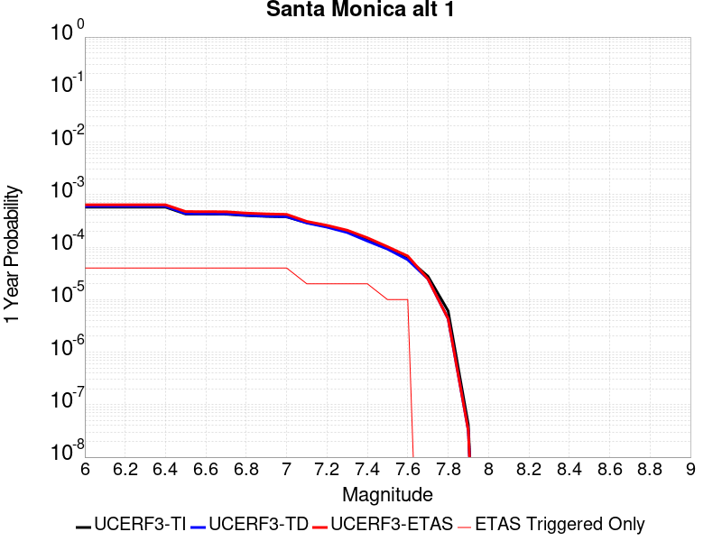 |  |

| Magnitude | 1 wk TI Prob | 1 wk TD Prob | 1 wk ETAS Prob | 1 wk ETAS/TD Gain | 1 wk ETAS Triggered Only | 1 mo TI Prob | 1 mo TD Prob | 1 mo ETAS Prob | 1 mo ETAS/TD Gain | 1 mo ETAS Triggered Only | 1 yr TI Prob | 1 yr TD Prob | 1 yr ETAS Prob | 1 yr ETAS/TD Gain | 1 yr ETAS Triggered Only | 10 yr TI Prob | 10 yr TD Prob | 10 yr ETAS Prob | 10 yr ETAS/TD Gain | 10 yr ETAS Triggered Only |
|-----|-----|-----|-----|-----|-----|-----|-----|-----|-----|-----|-----|-----|-----|-----|-----|-----|-----|-----|-----|-----|
| 6.0 | 1.1066008E-5 | 1.1480312E-5 | 4.147997E-5 | 3.6131394 | 3.0E-5 | 4.742488E-5 | 4.920049E-5 | 7.919902E-5 | 1.60972 | 3.0E-5 | 5.7724497E-4 | 5.9886527E-4 | 6.388413E-4 | 1.066753 | 4.0E-5 | 0.005757478 | 0.0059739016 | 0.006033543 | 1.0099837 | 6.0E-5 |
| 6.1 | 1.1066008E-5 | 1.1480312E-5 | 4.147997E-5 | 3.6131394 | 3.0E-5 | 4.742488E-5 | 4.920049E-5 | 7.919902E-5 | 1.60972 | 3.0E-5 | 5.7724497E-4 | 5.9886527E-4 | 6.388413E-4 | 1.066753 | 4.0E-5 | 0.005757478 | 0.0059739016 | 0.006033543 | 1.0099837 | 6.0E-5 |
| 6.2 | 1.1066008E-5 | 1.1480312E-5 | 4.147997E-5 | 3.6131394 | 3.0E-5 | 4.742488E-5 | 4.920049E-5 | 7.919902E-5 | 1.60972 | 3.0E-5 | 5.7724497E-4 | 5.9886527E-4 | 6.388413E-4 | 1.066753 | 4.0E-5 | 0.005757478 | 0.0059739016 | 0.006033543 | 1.0099837 | 6.0E-5 |
| 6.3 | 1.1066008E-5 | 1.1480312E-5 | 4.147997E-5 | 3.6131394 | 3.0E-5 | 4.742488E-5 | 4.920049E-5 | 7.919902E-5 | 1.60972 | 3.0E-5 | 5.7724497E-4 | 5.9886527E-4 | 6.388413E-4 | 1.066753 | 4.0E-5 | 0.005757478 | 0.0059739016 | 0.006033543 | 1.0099837 | 6.0E-5 |
| 6.4 | 1.1066008E-5 | 1.1480312E-5 | 4.147997E-5 | 3.6131394 | 3.0E-5 | 4.742488E-5 | 4.920049E-5 | 7.919902E-5 | 1.60972 | 3.0E-5 | 5.7724497E-4 | 5.9886527E-4 | 6.388413E-4 | 1.066753 | 4.0E-5 | 0.005757478 | 0.0059739016 | 0.006033543 | 1.0099837 | 6.0E-5 |
| 6.5 | 8.183544E-6 | 8.335434E-6 | 3.8335183E-5 | 4.599063 | 3.0E-5 | 3.5071862E-5 | 3.572281E-5 | 6.572174E-5 | 1.8397696 | 3.0E-5 | 4.2691626E-4 | 4.3483998E-4 | 4.748226E-4 | 1.0919479 | 4.0E-5 | 0.0042609703 | 0.004340057 | 0.0043898397 | 1.0114706 | 5.0E-5 |
| 6.6 | 8.1543285E-6 | 8.303648E-6 | 3.83034E-5 | 4.6128397 | 3.0E-5 | 3.4946657E-5 | 3.558659E-5 | 6.558552E-5 | 1.8429842 | 3.0E-5 | 4.2539247E-4 | 4.3318217E-4 | 4.7316484E-4 | 1.0922999 | 4.0E-5 | 0.0042457907 | 0.004323543 | 0.004373327 | 1.0115145 | 5.0E-5 |
| 6.7 | 8.110878E-6 | 8.257045E-6 | 3.8256796E-5 | 4.633231 | 3.0E-5 | 3.4760444E-5 | 3.5386864E-5 | 6.53858E-5 | 1.8477422 | 3.0E-5 | 4.231262E-4 | 4.3075148E-4 | 4.7073426E-4 | 1.092821 | 4.0E-5 | 0.0042232145 | 0.004299331 | 0.004349116 | 1.0115798 | 5.0E-5 |
| 6.8 | 7.644036E-6 | 7.751063E-6 | 3.775083E-5 | 4.870407 | 3.0E-5 | 3.275974E-5 | 3.3218425E-5 | 6.321743E-5 | 1.9030832 | 3.0E-5 | 3.9877684E-4 | 4.043607E-4 | 4.4434454E-4 | 1.0988816 | 4.0E-5 | 0.00398062 | 0.004036396 | 0.004086194 | 1.0123373 | 5.0E-5 |
| 6.9 | 7.3698293E-6 | 7.4557215E-6 | 3.74555E-5 | 5.0237255 | 3.0E-5 | 3.15846E-5 | 3.195271E-5 | 6.195175E-5 | 1.9388576 | 3.0E-5 | 3.8447464E-4 | 3.889562E-4 | 4.2894064E-4 | 1.1027993 | 4.0E-5 | 0.0038381014 | 0.0038828978 | 0.0039327038 | 1.012827 | 5.0E-5 |
| 7.0 | 7.209872E-6 | 7.2856283E-6 | 3.728541E-5 | 5.117666 | 3.0E-5 | 3.0899086E-5 | 3.1223753E-5 | 6.122282E-5 | 1.9607769 | 3.0E-5 | 3.7613141E-4 | 3.800843E-4 | 4.200691E-4 | 1.1051998 | 4.0E-5 | 0.0037549543 | 0.003794485 | 0.0038442952 | 1.013127 | 5.0E-5 |
| 7.1 | 5.603456E-6 | 5.5238947E-6 | 2.5523785E-5 | 4.6206136 | 2.0E-5 | 2.4014591E-5 | 2.3673623E-5 | 4.367315E-5 | 1.8448021 | 2.0E-5 | 2.923384E-4 | 2.8818863E-4 | 3.0818288E-4 | 1.069379 | 2.0E-5 | 0.0029195412 | 0.002878191 | 0.0029081046 | 1.0103933 | 3.0E-5 |
| 7.2 | 4.7483613E-6 | 4.591135E-6 | 2.4591043E-5 | 5.356201 | 2.0E-5 | 2.0349962E-5 | 1.9676147E-5 | 3.9675753E-5 | 2.0164392 | 2.0E-5 | 2.4773262E-4 | 2.3953087E-4 | 2.5952607E-4 | 1.0834765 | 2.0E-5 | 0.0024745662 | 0.0023927412 | 0.0024226692 | 1.0125079 | 3.0E-5 |
| 7.3 | 3.829015E-6 | 3.6342271E-6 | 2.3634155E-5 | 6.5032134 | 2.0E-5 | 1.6409962E-5 | 1.5575166E-5 | 3.5574856E-5 | 2.2840755 | 2.0E-5 | 1.9977297E-4 | 1.8961124E-4 | 2.0960745E-4 | 1.105459 | 2.0E-5 | 0.0019959346 | 0.0018945034 | 0.0019244466 | 1.0158052 | 3.0E-5 |
| 7.4 | 2.610755E-6 | 2.4995722E-6 | 2.2499522E-5 | 9.001349 | 2.0E-5 | 1.1188902E-5 | 1.0712408E-5 | 3.0712195E-5 | 2.8669739 | 2.0E-5 | 1.3621636E-4 | 1.304158E-4 | 1.504132E-4 | 1.1533357 | 2.0E-5 | 0.001361329 | 0.0013033971 | 0.001333358 | 1.0229868 | 3.0E-5 |
| 7.5 | 1.792146E-6 | 1.7584194E-6 | 1.1758402E-5 | 6.6869154 | 1.0E-5 | 7.680603E-6 | 7.5360617E-6 | 1.7535986E-5 | 2.326943 | 1.0E-5 | 9.3507326E-5 | 9.174772E-5 | 1.017468E-4 | 1.1089846 | 1.0E-5 | 9.3467993E-4 | 9.1710157E-4 | 9.370832E-4 | 1.0217879 | 2.0E-5 |
| 7.6 | 1.1473018E-6 | 1.102916E-6 | 1.1102905E-5 | 10.066863 | 1.0E-5 | 4.9169985E-6 | 4.7267745E-6 | 1.4726727E-5 | 3.1155975 | 1.0E-5 | 5.986281E-5 | 5.7546975E-5 | 6.75464E-5 | 1.1737611 | 1.0E-5 | 5.984669E-4 | 5.753224E-4 | 5.853166E-4 | 1.0173715 | 1.0E-5 |
| 7.7 | 5.330919E-7 | 4.7452562E-7 | 4.7452562E-7 | 1.0 | 0.0 | 2.2846775E-6 | 2.0336797E-6 | 2.0336797E-6 | 1.0 | 0.0 | 2.7815593E-5 | 2.4759782E-5 | 2.4759782E-5 | 1.0 | 0.0 | 2.7812112E-4 | 2.4757136E-4 | 2.4757136E-4 | 1.0 | 0.0 |
| 7.8 | 1.1668574E-7 | 8.296564E-8 | 8.296564E-8 | 1.0 | 0.0 | 5.000816E-7 | 3.5556698E-7 | 3.5556698E-7 | 1.0 | 0.0 | 6.0884768E-6 | 4.3290197E-6 | 4.3290197E-6 | 1.0 | 0.0 | 6.08831E-5 | 4.3289383E-5 | 4.3289383E-5 | 1.0 | 0.0 |
| 7.9 | 8.007447E-10 | 6.161581E-10 | 6.161581E-10 | 1.0 | 0.0 | 3.4317629E-9 | 2.640678E-9 | 2.640678E-9 | 1.0 | 0.0 | 4.1781714E-8 | 3.2150254E-8 | 3.2150254E-8 | 1.0 | 0.0 | 4.1781706E-7 | 3.2150248E-7 | 3.2150248E-7 | 1.0 | 0.0 |

## North Frontal  (West)
*[(top)](#table-of-contents)*

| 1 Week | 1 Month | 1 Year | 10 Year |
|-----|-----|-----|-----|
|  |  |  |  |

| Magnitude | 1 wk TI Prob | 1 wk TD Prob | 1 wk ETAS Prob | 1 wk ETAS/TD Gain | 1 wk ETAS Triggered Only | 1 mo TI Prob | 1 mo TD Prob | 1 mo ETAS Prob | 1 mo ETAS/TD Gain | 1 mo ETAS Triggered Only | 1 yr TI Prob | 1 yr TD Prob | 1 yr ETAS Prob | 1 yr ETAS/TD Gain | 1 yr ETAS Triggered Only | 10 yr TI Prob | 10 yr TD Prob | 10 yr ETAS Prob | 10 yr ETAS/TD Gain | 10 yr ETAS Triggered Only |
|-----|-----|-----|-----|-----|-----|-----|-----|-----|-----|-----|-----|-----|-----|-----|-----|-----|-----|-----|-----|-----|
| 6.0 | 4.7316266E-6 | 4.852674E-6 | 1.4852625E-5 | 3.0607095 | 1.0E-5 | 2.0278241E-5 | 2.0797017E-5 | 5.0796392E-5 | 2.4424846 | 3.0E-5 | 2.4685962E-4 | 2.5317573E-4 | 2.9316562E-4 | 1.157953 | 4.0E-5 | 0.0024658558 | 0.002529019 | 0.0025888674 | 1.0236646 | 6.0E-5 |
| 6.1 | 4.7316266E-6 | 4.852674E-6 | 1.4852625E-5 | 3.0607095 | 1.0E-5 | 2.0278241E-5 | 2.0797017E-5 | 5.0796392E-5 | 2.4424846 | 3.0E-5 | 2.4685962E-4 | 2.5317573E-4 | 2.9316562E-4 | 1.157953 | 4.0E-5 | 0.0024658558 | 0.002529019 | 0.0025888674 | 1.0236646 | 6.0E-5 |
| 6.2 | 4.7316266E-6 | 4.852674E-6 | 1.4852625E-5 | 3.0607095 | 1.0E-5 | 2.0278241E-5 | 2.0797017E-5 | 5.0796392E-5 | 2.4424846 | 3.0E-5 | 2.4685962E-4 | 2.5317573E-4 | 2.9316562E-4 | 1.157953 | 4.0E-5 | 0.0024658558 | 0.002529019 | 0.0025888674 | 1.0236646 | 6.0E-5 |
| 6.3 | 4.7316266E-6 | 4.852674E-6 | 1.4852625E-5 | 3.0607095 | 1.0E-5 | 2.0278241E-5 | 2.0797017E-5 | 5.0796392E-5 | 2.4424846 | 3.0E-5 | 2.4685962E-4 | 2.5317573E-4 | 2.9316562E-4 | 1.157953 | 4.0E-5 | 0.0024658558 | 0.002529019 | 0.0025888674 | 1.0236646 | 6.0E-5 |
| 6.4 | 4.7316266E-6 | 4.852674E-6 | 1.4852625E-5 | 3.0607095 | 1.0E-5 | 2.0278241E-5 | 2.0797017E-5 | 5.0796392E-5 | 2.4424846 | 3.0E-5 | 2.4685962E-4 | 2.5317573E-4 | 2.9316562E-4 | 1.157953 | 4.0E-5 | 0.0024658558 | 0.002529019 | 0.0025888674 | 1.0236646 | 6.0E-5 |
| 6.5 | 4.7316266E-6 | 4.852674E-6 | 1.4852625E-5 | 3.0607095 | 1.0E-5 | 2.0278241E-5 | 2.0797017E-5 | 5.0796392E-5 | 2.4424846 | 3.0E-5 | 2.4685962E-4 | 2.5317573E-4 | 2.9316562E-4 | 1.157953 | 4.0E-5 | 0.0024658558 | 0.002529019 | 0.0025888674 | 1.0236646 | 6.0E-5 |
| 6.6 | 4.7316266E-6 | 4.852674E-6 | 1.4852625E-5 | 3.0607095 | 1.0E-5 | 2.0278241E-5 | 2.0797017E-5 | 5.0796392E-5 | 2.4424846 | 3.0E-5 | 2.4685962E-4 | 2.5317573E-4 | 2.9316562E-4 | 1.157953 | 4.0E-5 | 0.0024658558 | 0.002529019 | 0.0025888674 | 1.0236646 | 6.0E-5 |
| 6.7 | 3.5382777E-6 | 3.6308872E-6 | 3.6308872E-6 | 1.0 | 0.0 | 1.516396E-5 | 1.5560858E-5 | 2.5560701E-5 | 1.6426281 | 1.0E-5 | 1.8460557E-4 | 1.8943775E-4 | 2.0943396E-4 | 1.1055555 | 2.0E-5 | 0.0018445229 | 0.0018928396 | 0.0019327638 | 1.0210923 | 4.0E-5 |
| 6.8 | 3.5382777E-6 | 3.6308872E-6 | 3.6308872E-6 | 1.0 | 0.0 | 1.516396E-5 | 1.5560858E-5 | 2.5560701E-5 | 1.6426281 | 1.0E-5 | 1.8460557E-4 | 1.8943775E-4 | 2.0943396E-4 | 1.1055555 | 2.0E-5 | 0.0018445229 | 0.0018928396 | 0.0019327638 | 1.0210923 | 4.0E-5 |
| 6.9 | 3.0428037E-6 | 3.1227619E-6 | 3.1227619E-6 | 1.0 | 0.0 | 1.30405215E-5 | 1.3383201E-5 | 2.3383067E-5 | 1.7471954 | 1.0E-5 | 1.5875678E-4 | 1.6292896E-4 | 1.8292571E-4 | 1.1227329 | 2.0E-5 | 0.0015864341 | 0.0016281622 | 0.0016680971 | 1.0245275 | 4.0E-5 |
| 7.0 | 2.538778E-6 | 2.6060916E-6 | 2.6060916E-6 | 1.0 | 0.0 | 1.0880432E-5 | 1.116892E-5 | 2.1168808E-5 | 1.8953317 | 1.0E-5 | 1.324612E-4 | 1.3597358E-4 | 1.5597086E-4 | 1.1470674 | 2.0E-5 | 0.0013238228 | 0.0013589506 | 0.0013988962 | 1.0293945 | 4.0E-5 |
| 7.1 | 2.2418935E-6 | 2.3012087E-6 | 2.3012087E-6 | 1.0 | 0.0 | 9.60808E-6 | 9.862288E-6 | 1.986219E-5 | 2.0139534 | 1.0E-5 | 1.1697209E-4 | 1.2006718E-4 | 1.4006479E-4 | 1.1665534 | 2.0E-5 | 0.0011691054 | 0.0012000671 | 0.0012400191 | 1.0332915 | 4.0E-5 |
| 7.2 | 1.6526745E-6 | 1.6924864E-6 | 1.6924864E-6 | 1.0 | 0.0 | 7.082872E-6 | 7.2534945E-6 | 1.7253422E-5 | 2.378636 | 1.0E-5 | 8.623055E-5 | 8.830797E-5 | 1.0830621E-4 | 1.2264601 | 2.0E-5 | 8.61971E-4 | 8.8275387E-4 | 9.2271855E-4 | 1.0452727 | 4.0E-5 |
| 7.3 | 1.0246019E-6 | 1.0442274E-6 | 1.0442274E-6 | 1.0 | 0.0 | 4.391144E-6 | 4.4752533E-6 | 1.4475208E-5 | 3.2345004 | 1.0E-5 | 5.3460866E-5 | 5.4484964E-5 | 6.448442E-5 | 1.1835269 | 1.0E-5 | 5.344801E-4 | 5.4472755E-4 | 5.6471664E-4 | 1.0366956 | 2.0E-5 |
| 7.4 | 8.9045164E-7 | 9.056572E-7 | 9.056572E-7 | 1.0 | 0.0 | 3.8162157E-6 | 3.881383E-6 | 1.3881344E-5 | 3.5763915 | 1.0E-5 | 4.646144E-5 | 4.725492E-5 | 5.725445E-5 | 1.2116082 | 1.0E-5 | 4.6451724E-4 | 4.7245962E-4 | 4.9245014E-4 | 1.0423117 | 2.0E-5 |
| 7.5 | 6.3357E-7 | 6.4027137E-7 | 6.4027137E-7 | 1.0 | 0.0 | 2.7152971E-6 | 2.7440176E-6 | 1.274399E-5 | 4.6442814 | 1.0E-5 | 3.305824E-5 | 3.340797E-5 | 4.3407636E-5 | 1.2993197 | 1.0E-5 | 3.3053322E-4 | 3.3403604E-4 | 3.5402938E-4 | 1.0598538 | 2.0E-5 |
| 7.6 | 2.5087024E-7 | 2.436123E-7 | 2.436123E-7 | 1.0 | 0.0 | 1.0751578E-6 | 1.0440525E-6 | 1.0440525E-6 | 1.0 | 0.0 | 1.3089967E-5 | 1.2711286E-5 | 1.2711286E-5 | 1.0 | 0.0 | 1.3089196E-4 | 1.2710765E-4 | 1.2710765E-4 | 1.0 | 0.0 |
| 7.7 | 3.282987E-8 | 2.2875435E-8 | 2.2875435E-8 | 1.0 | 0.0 | 1.4069944E-7 | 9.8037575E-8 | 9.8037575E-8 | 1.0 | 0.0 | 1.7130144E-6 | 1.193607E-6 | 1.193607E-6 | 1.0 | 0.0 | 1.7130013E-5 | 1.1936014E-5 | 1.1936014E-5 | 1.0 | 0.0 |
| 7.8 | 8.77499E-9 | 5.6817466E-9 | 5.6817466E-9 | 1.0 | 0.0 | 3.7607098E-8 | 2.4350342E-8 | 2.4350342E-8 | 1.0 | 0.0 | 4.578663E-7 | 2.964654E-7 | 2.964654E-7 | 1.0 | 0.0 | 4.5786537E-6 | 2.9646512E-6 | 2.9646512E-6 | 1.0 | 0.0 |

## Simi-Santa Rosa
*[(top)](#table-of-contents)*

| 1 Week | 1 Month | 1 Year | 10 Year |
|-----|-----|-----|-----|
|  |  |  |  |

| Magnitude | 1 wk TI Prob | 1 wk TD Prob | 1 wk ETAS Prob | 1 wk ETAS/TD Gain | 1 wk ETAS Triggered Only | 1 mo TI Prob | 1 mo TD Prob | 1 mo ETAS Prob | 1 mo ETAS/TD Gain | 1 mo ETAS Triggered Only | 1 yr TI Prob | 1 yr TD Prob | 1 yr ETAS Prob | 1 yr ETAS/TD Gain | 1 yr ETAS Triggered Only | 10 yr TI Prob | 10 yr TD Prob | 10 yr ETAS Prob | 10 yr ETAS/TD Gain | 10 yr ETAS Triggered Only |
|-----|-----|-----|-----|-----|-----|-----|-----|-----|-----|-----|-----|-----|-----|-----|-----|-----|-----|-----|-----|-----|
| 6.0 | 2.198912E-5 | 2.2275388E-5 | 3.2275166E-5 | 1.448916 | 1.0E-5 | 9.4235686E-5 | 9.54627E-5 | 1.15460796E-4 | 1.2094859 | 2.0E-5 | 0.0011467156 | 0.0011616825 | 0.0011916477 | 1.0257946 | 3.0E-5 | 0.011408163 | 0.011560547 | 0.011619854 | 1.00513 | 6.0E-5 |
| 6.1 | 2.198912E-5 | 2.2275388E-5 | 3.2275166E-5 | 1.448916 | 1.0E-5 | 9.4235686E-5 | 9.54627E-5 | 1.15460796E-4 | 1.2094859 | 2.0E-5 | 0.0011467156 | 0.0011616825 | 0.0011916477 | 1.0257946 | 3.0E-5 | 0.011408163 | 0.011560547 | 0.011619854 | 1.00513 | 6.0E-5 |
| 6.2 | 1.69983E-5 | 1.6668506E-5 | 2.6668338E-5 | 1.5999238 | 1.0E-5 | 7.284782E-5 | 7.143466E-5 | 9.1433234E-5 | 1.2799561 | 2.0E-5 | 8.865613E-4 | 8.6939917E-4 | 8.993731E-4 | 1.0344766 | 3.0E-5 | 0.008830327 | 0.0086629 | 0.00872238 | 1.0068661 | 6.0E-5 |
| 6.3 | 1.69983E-5 | 1.6668506E-5 | 2.6668338E-5 | 1.5999238 | 1.0E-5 | 7.284782E-5 | 7.143466E-5 | 9.1433234E-5 | 1.2799561 | 2.0E-5 | 8.865613E-4 | 8.6939917E-4 | 8.993731E-4 | 1.0344766 | 3.0E-5 | 0.008830327 | 0.0086629 | 0.00872238 | 1.0068661 | 6.0E-5 |
| 6.4 | 1.4666188E-5 | 1.4052489E-5 | 2.4052348E-5 | 1.7116077 | 1.0E-5 | 6.285358E-5 | 6.0223705E-5 | 8.02225E-5 | 1.3320751 | 2.0E-5 | 7.6497364E-4 | 7.330018E-4 | 7.6297985E-4 | 1.0408976 | 3.0E-5 | 0.0076234564 | 0.0073083164 | 0.007357951 | 1.0067915 | 5.0E-5 |
| 6.5 | 1.4666188E-5 | 1.4052489E-5 | 2.4052348E-5 | 1.7116077 | 1.0E-5 | 6.285358E-5 | 6.0223705E-5 | 8.02225E-5 | 1.3320751 | 2.0E-5 | 7.6497364E-4 | 7.330018E-4 | 7.6297985E-4 | 1.0408976 | 3.0E-5 | 0.0076234564 | 0.0073083164 | 0.007357951 | 1.0067915 | 5.0E-5 |
| 6.6 | 1.4377586E-5 | 1.3729529E-5 | 2.3729392E-5 | 1.7283471 | 1.0E-5 | 6.1616774E-5 | 5.883965E-5 | 7.883847E-5 | 1.3398869 | 2.0E-5 | 7.4992597E-4 | 7.1616215E-4 | 7.4614066E-4 | 1.04186 | 3.0E-5 | 0.007474003 | 0.0071410104 | 0.0071906536 | 1.0069518 | 5.0E-5 |
| 6.7 | 1.3881404E-5 | 1.3207497E-5 | 2.3207365E-5 | 1.7571357 | 1.0E-5 | 5.9490372E-5 | 5.6602472E-5 | 7.660134E-5 | 1.3533214 | 2.0E-5 | 7.240546E-4 | 6.889419E-4 | 7.1892125E-4 | 1.0435151 | 3.0E-5 | 0.007217 | 0.0068705105 | 0.0069201672 | 1.0072274 | 5.0E-5 |
| 6.8 | 1.0176516E-5 | 9.1541E-6 | 9.1541E-6 | 1.0 | 0.0 | 4.3612912E-5 | 3.923136E-5 | 4.9230966E-5 | 1.2548882 | 1.0E-5 | 5.308578E-4 | 4.775537E-4 | 4.875489E-4 | 1.02093 | 1.0E-5 | 0.0052959146 | 0.004766908 | 0.0047868127 | 1.0041755 | 2.0E-5 |
| 6.9 | 9.699797E-6 | 8.774672E-6 | 8.774672E-6 | 1.0 | 0.0 | 4.15699E-5 | 3.760529E-5 | 4.760491E-5 | 1.26591 | 1.0E-5 | 5.05996E-4 | 4.5776463E-4 | 4.6776005E-4 | 1.0218353 | 1.0E-5 | 0.005048454 | 0.0045698346 | 0.0045897434 | 1.0043565 | 2.0E-5 |
| 7.0 | 7.4049476E-6 | 6.559291E-6 | 6.559291E-6 | 1.0 | 0.0 | 3.1735104E-5 | 2.8111013E-5 | 3.811073E-5 | 1.3557224 | 1.0E-5 | 3.8630638E-4 | 3.422105E-4 | 3.5220708E-4 | 1.0292118 | 1.0E-5 | 0.0038563553 | 0.0034180775 | 0.0034280433 | 1.0029156 | 1.0E-5 |
| 7.1 | 3.873439E-6 | 2.759473E-6 | 2.759473E-6 | 1.0 | 0.0 | 1.6600346E-5 | 1.1826261E-5 | 1.1826261E-5 | 1.0 | 0.0 | 2.0209046E-4 | 1.4397544E-4 | 1.4397544E-4 | 1.0 | 0.0 | 0.0020190678 | 0.0014388453 | 0.0014388453 | 1.0 | 0.0 |
| 7.2 | 3.417706E-6 | 2.367616E-6 | 2.367616E-6 | 1.0 | 0.0 | 1.4647229E-5 | 1.0146887E-5 | 1.0146887E-5 | 1.0 | 0.0 | 1.7831543E-4 | 1.2353157E-4 | 1.2353157E-4 | 1.0 | 0.0 | 0.0017817242 | 0.0012346513 | 0.0012346513 | 1.0 | 0.0 |
| 7.3 | 1.90225E-6 | 1.4073756E-6 | 1.4073756E-6 | 1.0 | 0.0 | 8.152474E-6 | 6.031596E-6 | 6.031596E-6 | 1.0 | 0.0 | 9.9251854E-5 | 7.343223E-5 | 7.343223E-5 | 1.0 | 0.0 | 9.920754E-4 | 7.340819E-4 | 7.340819E-4 | 1.0 | 0.0 |
| 7.4 | 1.5170556E-6 | 1.1024792E-6 | 1.1024792E-6 | 1.0 | 0.0 | 6.5016507E-6 | 4.7249023E-6 | 4.7249023E-6 | 1.0 | 0.0 | 7.915472E-5 | 5.752418E-5 | 5.752418E-5 | 1.0 | 0.0 | 7.9126534E-4 | 5.75094E-4 | 5.75094E-4 | 1.0 | 0.0 |
| 7.5 | 1.178732E-6 | 8.5351127E-7 | 8.5351127E-7 | 1.0 | 0.0 | 5.0516987E-6 | 3.6579004E-6 | 3.6579004E-6 | 1.0 | 0.0 | 6.1502695E-5 | 4.4534037E-5 | 4.4534037E-5 | 1.0 | 0.0 | 6.148568E-4 | 4.4525208E-4 | 4.4525208E-4 | 1.0 | 0.0 |
| 7.6 | 6.8722386E-7 | 4.793211E-7 | 4.793211E-7 | 1.0 | 0.0 | 2.9452417E-6 | 2.0542318E-6 | 2.0542318E-6 | 1.0 | 0.0 | 3.5857727E-5 | 2.5009986E-5 | 2.5009986E-5 | 1.0 | 0.0 | 3.5851944E-4 | 2.5007184E-4 | 2.5007184E-4 | 1.0 | 0.0 |
| 7.7 | 5.5126515E-7 | 3.6731117E-7 | 3.6731117E-7 | 1.0 | 0.0 | 2.3625628E-6 | 1.5741898E-6 | 1.5741898E-6 | 1.0 | 0.0 | 2.8763823E-5 | 1.9165593E-5 | 1.9165593E-5 | 1.0 | 0.0 | 2.87601E-4 | 1.9163951E-4 | 1.9163951E-4 | 1.0 | 0.0 |
| 7.8 | 3.3860243E-7 | 2.0075514E-7 | 2.0075514E-7 | 1.0 | 0.0 | 1.4511525E-6 | 8.6037886E-7 | 8.6037886E-7 | 1.0 | 0.0 | 1.7667637E-5 | 1.0475063E-5 | 1.0475063E-5 | 1.0 | 0.0 | 1.7666233E-4 | 1.0474575E-4 | 1.0474575E-4 | 1.0 | 0.0 |
| 7.9 | 2.7955386E-7 | 1.4648724E-7 | 1.4648724E-7 | 1.0 | 0.0 | 1.1980875E-6 | 6.278023E-7 | 6.278023E-7 | 1.0 | 0.0 | 1.4586617E-5 | 7.643467E-6 | 7.643467E-6 | 1.0 | 0.0 | 1.458566E-4 | 7.643208E-5 | 7.643208E-5 | 1.0 | 0.0 |
| 8.0 | 5.6259015E-8 | 3.335318E-8 | 3.335318E-8 | 1.0 | 0.0 | 2.4111003E-7 | 1.429422E-7 | 1.429422E-7 | 1.0 | 0.0 | 2.9355108E-6 | 1.7403199E-6 | 1.7403199E-6 | 1.0 | 0.0 | 2.935472E-5 | 1.7403077E-5 | 1.7403077E-5 | 1.0 | 0.0 |

## Newport-Inglewood alt 1
*[(top)](#table-of-contents)*

| 1 Week | 1 Month | 1 Year | 10 Year |
|-----|-----|-----|-----|
|  |  |  |  |

| Magnitude | 1 wk TI Prob | 1 wk TD Prob | 1 wk ETAS Prob | 1 wk ETAS/TD Gain | 1 wk ETAS Triggered Only | 1 mo TI Prob | 1 mo TD Prob | 1 mo ETAS Prob | 1 mo ETAS/TD Gain | 1 mo ETAS Triggered Only | 1 yr TI Prob | 1 yr TD Prob | 1 yr ETAS Prob | 1 yr ETAS/TD Gain | 1 yr ETAS Triggered Only | 10 yr TI Prob | 10 yr TD Prob | 10 yr ETAS Prob | 10 yr ETAS/TD Gain | 10 yr ETAS Triggered Only |
|-----|-----|-----|-----|-----|-----|-----|-----|-----|-----|-----|-----|-----|-----|-----|-----|-----|-----|-----|-----|-----|
| 6.0 | 2.9668912E-5 | 3.0404828E-5 | 4.0404524E-5 | 1.3288851 | 1.0E-5 | 1.2714628E-4 | 1.3030265E-4 | 1.6029873E-4 | 1.2302033 | 3.0E-5 | 0.0015469068 | 0.0015857654 | 0.0016356861 | 1.0314806 | 5.0E-5 | 0.015361829 | 0.01579211 | 0.015851162 | 1.0037394 | 6.0E-5 |
| 6.1 | 2.9668912E-5 | 3.0404828E-5 | 4.0404524E-5 | 1.3288851 | 1.0E-5 | 1.2714628E-4 | 1.3030265E-4 | 1.6029873E-4 | 1.2302033 | 3.0E-5 | 0.0015469068 | 0.0015857654 | 0.0016356861 | 1.0314806 | 5.0E-5 | 0.015361829 | 0.01579211 | 0.015851162 | 1.0037394 | 6.0E-5 |
| 6.2 | 2.9668912E-5 | 3.0404828E-5 | 4.0404524E-5 | 1.3288851 | 1.0E-5 | 1.2714628E-4 | 1.3030265E-4 | 1.6029873E-4 | 1.2302033 | 3.0E-5 | 0.0015469068 | 0.0015857654 | 0.0016356861 | 1.0314806 | 5.0E-5 | 0.015361829 | 0.01579211 | 0.015851162 | 1.0037394 | 6.0E-5 |
| 6.3 | 2.9668912E-5 | 3.0404828E-5 | 4.0404524E-5 | 1.3288851 | 1.0E-5 | 1.2714628E-4 | 1.3030265E-4 | 1.6029873E-4 | 1.2302033 | 3.0E-5 | 0.0015469068 | 0.0015857654 | 0.0016356861 | 1.0314806 | 5.0E-5 | 0.015361829 | 0.01579211 | 0.015851162 | 1.0037394 | 6.0E-5 |
| 6.4 | 1.275942E-5 | 1.02725335E-5 | 1.02725335E-5 | 1.0 | 0.0 | 5.4682085E-5 | 4.4024422E-5 | 6.4023545E-5 | 1.4542733 | 2.0E-5 | 6.65551E-4 | 5.358697E-4 | 5.658536E-4 | 1.0559537 | 3.0E-5 | 0.0066356123 | 0.0053462 | 0.0053760395 | 1.0055815 | 3.0E-5 |
| 6.5 | 1.275942E-5 | 1.02725335E-5 | 1.02725335E-5 | 1.0 | 0.0 | 5.4682085E-5 | 4.4024422E-5 | 6.4023545E-5 | 1.4542733 | 2.0E-5 | 6.65551E-4 | 5.358697E-4 | 5.658536E-4 | 1.0559537 | 3.0E-5 | 0.0066356123 | 0.0053462 | 0.0053760395 | 1.0055815 | 3.0E-5 |
| 6.6 | 1.1255358E-5 | 8.661911E-6 | 8.661911E-6 | 1.0 | 0.0 | 4.8236358E-5 | 3.7121958E-5 | 5.7121215E-5 | 1.5387447 | 2.0E-5 | 5.871194E-4 | 4.5186782E-4 | 4.8185425E-4 | 1.0663611 | 3.0E-5 | 0.005855706 | 0.0045096674 | 0.004539532 | 1.0066224 | 3.0E-5 |
| 6.7 | 1.0504745E-5 | 7.8998455E-6 | 7.8998455E-6 | 1.0 | 0.0 | 4.5019555E-5 | 3.385605E-5 | 5.3855372E-5 | 1.5907164 | 2.0E-5 | 5.4797524E-4 | 4.121207E-4 | 4.421083E-4 | 1.0727642 | 3.0E-5 | 0.0054662596 | 0.004113694 | 0.0041435705 | 1.0072627 | 3.0E-5 |
| 6.8 | 1.0476007E-5 | 7.881227E-6 | 7.881227E-6 | 1.0 | 0.0 | 4.4896402E-5 | 3.3776258E-5 | 5.377558E-5 | 1.592112 | 2.0E-5 | 5.464766E-4 | 4.1114958E-4 | 4.4113724E-4 | 1.0729362 | 3.0E-5 | 0.005451347 | 0.004104019 | 0.004133896 | 1.0072799 | 3.0E-5 |
| 6.9 | 9.076797E-6 | 6.4896567E-6 | 6.4896567E-6 | 1.0 | 0.0 | 3.889998E-5 | 2.7812519E-5 | 4.7811962E-5 | 1.7190806 | 2.0E-5 | 4.7350433E-4 | 3.3856515E-4 | 3.68555E-4 | 1.0885793 | 3.0E-5 | 0.004724967 | 0.003380531 | 0.0034104295 | 1.0088444 | 3.0E-5 |
| 7.0 | 8.73795E-6 | 6.2120503E-6 | 6.2120503E-6 | 1.0 | 0.0 | 3.7447822E-5 | 2.6622802E-5 | 4.662227E-5 | 1.7512157 | 2.0E-5 | 4.5583185E-4 | 3.2408469E-4 | 3.5407496E-4 | 1.0925384 | 3.0E-5 | 0.0045489795 | 0.0032361522 | 0.0032660551 | 1.0092403 | 3.0E-5 |
| 7.1 | 8.391299E-6 | 5.9557533E-6 | 5.9557533E-6 | 1.0 | 0.0 | 3.5962214E-5 | 2.5524409E-5 | 4.55239E-5 | 1.7835437 | 2.0E-5 | 4.37752E-4 | 3.1071564E-4 | 3.3070942E-4 | 1.0643475 | 2.0E-5 | 0.004368907 | 0.0031028416 | 0.0031227795 | 1.0064257 | 2.0E-5 |
| 7.2 | 7.796882E-6 | 5.4964826E-6 | 5.4964826E-6 | 1.0 | 0.0 | 3.341478E-5 | 2.3556144E-5 | 4.3555672E-5 | 1.8490155 | 2.0E-5 | 4.06749E-4 | 2.867585E-4 | 3.0675277E-4 | 1.069725 | 2.0E-5 | 0.0040600533 | 0.002863909 | 0.0028838515 | 1.0069635 | 2.0E-5 |
| 7.3 | 6.4738833E-6 | 4.6477753E-6 | 4.6477753E-6 | 1.0 | 0.0 | 2.774492E-5 | 1.9918885E-5 | 3.9918486E-5 | 2.0040522 | 2.0E-5 | 3.3774204E-4 | 2.424856E-4 | 2.6248075E-4 | 1.0824591 | 2.0E-5 | 0.0033722918 | 0.0024222268 | 0.0024421783 | 1.0082369 | 2.0E-5 |
| 7.4 | 5.382145E-6 | 3.8857215E-6 | 3.8857215E-6 | 1.0 | 0.0 | 2.3066134E-5 | 1.6652988E-5 | 3.6652655E-5 | 2.2009656 | 2.0E-5 | 2.8079396E-4 | 2.0273139E-4 | 2.2272734E-4 | 1.0986327 | 2.0E-5 | 0.0028043943 | 0.002025479 | 0.0020454386 | 1.0098542 | 2.0E-5 |
| 7.5 | 3.648244E-6 | 2.5737634E-6 | 2.5737634E-6 | 1.0 | 0.0 | 1.5635238E-5 | 1.1030369E-5 | 2.1030259E-5 | 1.906578 | 1.0E-5 | 1.9034238E-4 | 1.3428657E-4 | 1.4428522E-4 | 1.0744576 | 1.0E-5 | 0.0019017943 | 0.0013420646 | 0.0013520513 | 1.0074412 | 1.0E-5 |
| 7.6 | 2.2906888E-6 | 1.547986E-6 | 1.547986E-6 | 1.0 | 0.0 | 9.817201E-6 | 6.634209E-6 | 6.634209E-6 | 1.0 | 0.0 | 1.1951787E-4 | 8.076857E-5 | 8.076857E-5 | 1.0 | 0.0 | 0.0011945361 | 8.073989E-4 | 8.073989E-4 | 1.0 | 0.0 |
| 7.7 | 6.0479874E-7 | 3.397468E-7 | 3.397468E-7 | 1.0 | 0.0 | 2.5919921E-6 | 1.456057E-6 | 1.456057E-6 | 1.0 | 0.0 | 3.1557047E-5 | 1.7727363E-5 | 1.7727363E-5 | 1.0 | 0.0 | 3.1552566E-4 | 1.7726087E-4 | 1.7726087E-4 | 1.0 | 0.0 |
| 7.8 | 1.16056995E-8 | 9.782997E-9 | 9.782997E-9 | 1.0 | 0.0 | 4.9738713E-8 | 4.1927127E-8 | 4.1927127E-8 | 1.0 | 0.0 | 6.0556863E-7 | 5.1046277E-7 | 5.1046277E-7 | 1.0 | 0.0 | 6.05567E-6 | 5.1046277E-6 | 5.1046277E-6 | 1.0 | 0.0 |

## Palos Verdes
*[(top)](#table-of-contents)*

| 1 Week | 1 Month | 1 Year | 10 Year |
|-----|-----|-----|-----|
|  | 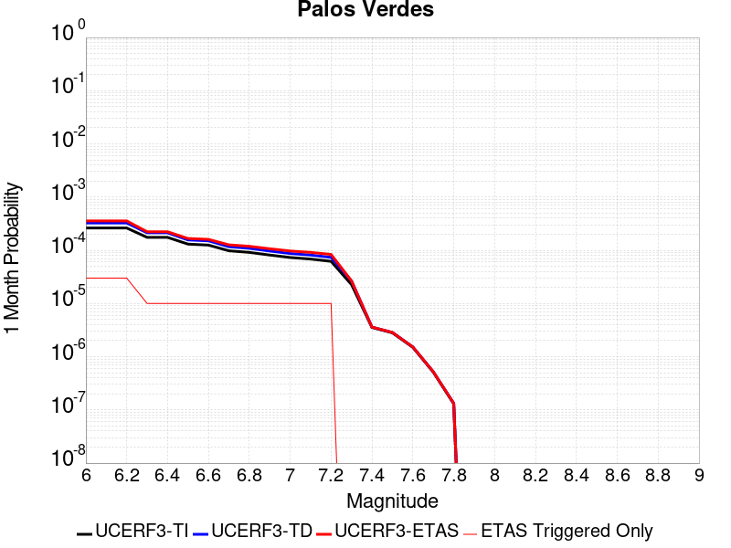 | 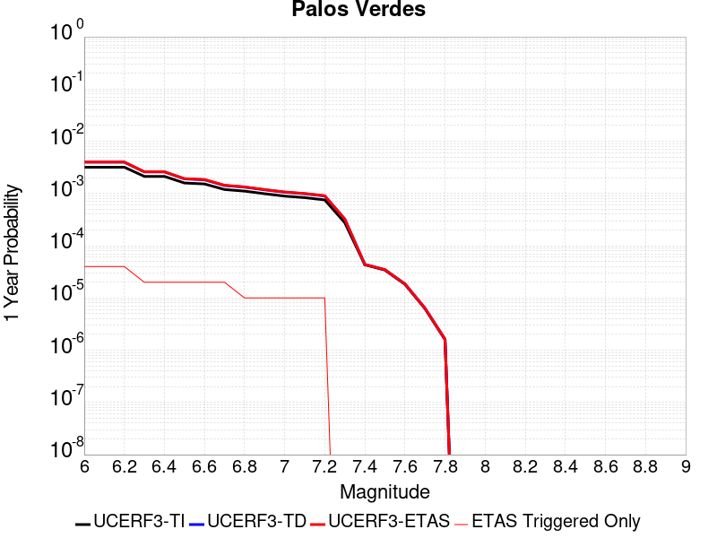 |  |

| Magnitude | 1 wk TI Prob | 1 wk TD Prob | 1 wk ETAS Prob | 1 wk ETAS/TD Gain | 1 wk ETAS Triggered Only | 1 mo TI Prob | 1 mo TD Prob | 1 mo ETAS Prob | 1 mo ETAS/TD Gain | 1 mo ETAS Triggered Only | 1 yr TI Prob | 1 yr TD Prob | 1 yr ETAS Prob | 1 yr ETAS/TD Gain | 1 yr ETAS Triggered Only | 10 yr TI Prob | 10 yr TD Prob | 10 yr ETAS Prob | 10 yr ETAS/TD Gain | 10 yr ETAS Triggered Only |
|-----|-----|-----|-----|-----|-----|-----|-----|-----|-----|-----|-----|-----|-----|-----|-----|-----|-----|-----|-----|-----|
| 6.0 | 6.126063E-5 | 7.622572E-5 | 1.0622344E-4 | 1.3935379 | 3.0E-5 | 2.6251914E-4 | 3.266441E-4 | 3.5663432E-4 | 1.0918131 | 3.0E-5 | 0.0031914865 | 0.0039701737 | 0.004010015 | 1.0100352 | 4.0E-5 | 0.031460393 | 0.03904909 | 0.039106745 | 1.0014765 | 6.0E-5 |
| 6.1 | 6.126063E-5 | 7.622572E-5 | 1.0622344E-4 | 1.3935379 | 3.0E-5 | 2.6251914E-4 | 3.266441E-4 | 3.5663432E-4 | 1.0918131 | 3.0E-5 | 0.0031914865 | 0.0039701737 | 0.004010015 | 1.0100352 | 4.0E-5 | 0.031460393 | 0.03904909 | 0.039106745 | 1.0014765 | 6.0E-5 |
| 6.2 | 6.126063E-5 | 7.622572E-5 | 1.0622344E-4 | 1.3935379 | 3.0E-5 | 2.6251914E-4 | 3.266441E-4 | 3.5663432E-4 | 1.0918131 | 3.0E-5 | 0.0031914865 | 0.0039701737 | 0.004010015 | 1.0100352 | 4.0E-5 | 0.031460393 | 0.03904909 | 0.039106745 | 1.0014765 | 6.0E-5 |
| 6.3 | 4.0838047E-5 | 4.9749007E-5 | 5.974851E-5 | 1.200999 | 1.0E-5 | 1.7500846E-4 | 2.1319388E-4 | 2.2319175E-4 | 1.0468956 | 1.0E-5 | 0.0021286458 | 0.002592754 | 0.0026127023 | 1.0076938 | 2.0E-5 | 0.021083709 | 0.025646746 | 0.025675977 | 1.0011398 | 3.0E-5 |
| 6.4 | 4.0838047E-5 | 4.9749007E-5 | 5.974851E-5 | 1.200999 | 1.0E-5 | 1.7500846E-4 | 2.1319388E-4 | 2.2319175E-4 | 1.0468956 | 1.0E-5 | 0.0021286458 | 0.002592754 | 0.0026127023 | 1.0076938 | 2.0E-5 | 0.021083709 | 0.025646746 | 0.025675977 | 1.0011398 | 3.0E-5 |
| 6.5 | 3.0512005E-5 | 3.6561592E-5 | 4.656123E-5 | 1.273501 | 1.0E-5 | 1.3075917E-4 | 1.566838E-4 | 1.6668225E-4 | 1.0638129 | 1.0E-5 | 0.0015908304 | 0.001906072 | 0.0019260339 | 1.0104728 | 2.0E-5 | 0.015794903 | 0.018909173 | 0.018928794 | 1.0010377 | 2.0E-5 |
| 6.6 | 2.9255087E-5 | 3.5154393E-5 | 4.515404E-5 | 1.2844495 | 1.0E-5 | 1.2537291E-4 | 1.5065364E-4 | 1.6065213E-4 | 1.0663674 | 1.0E-5 | 0.0015253464 | 0.0018327782 | 0.0018527416 | 1.0108924 | 2.0E-5 | 0.015149189 | 0.018188244 | 0.01820788 | 1.0010796 | 2.0E-5 |
| 6.7 | 2.287198E-5 | 2.724828E-5 | 3.7248006E-5 | 1.3669857 | 1.0E-5 | 9.801909E-5 | 1.16773626E-4 | 1.2677246E-4 | 1.0856258 | 1.0E-5 | 0.001192729 | 0.0014208833 | 0.001440855 | 1.0140557 | 2.0E-5 | 0.011863477 | 0.014127217 | 0.014146935 | 1.0013957 | 2.0E-5 |
| 6.8 | 2.1325764E-5 | 2.5431878E-5 | 3.5431625E-5 | 1.3931973 | 1.0E-5 | 9.139293E-5 | 1.0898972E-4 | 1.18988624E-4 | 1.0917418 | 1.0E-5 | 0.001112141 | 0.0013262323 | 0.001336219 | 1.0075302 | 1.0E-5 | 0.011065915 | 0.013192211 | 0.01320208 | 1.000748 | 1.0E-5 |
| 6.9 | 1.9009392E-5 | 2.2613547E-5 | 3.2613323E-5 | 1.4422028 | 1.0E-5 | 8.1466285E-5 | 9.6912096E-5 | 1.0691113E-4 | 1.1031762 | 1.0E-5 | 9.914007E-4 | 0.0011793535 | 0.0011893417 | 1.0084692 | 1.0E-5 | 0.009869894 | 0.011739633 | 0.011749515 | 1.0008419 | 1.0E-5 |
| 7.0 | 1.7098473E-5 | 2.0319356E-5 | 3.0319152E-5 | 1.4921316 | 1.0E-5 | 7.3277115E-5 | 8.708052E-5 | 9.7079654E-5 | 1.1148262 | 1.0E-5 | 8.917837E-4 | 0.001059775 | 0.0010697644 | 1.009426 | 1.0E-5 | 0.008882134 | 0.010555646 | 0.010565541 | 1.0009373 | 1.0E-5 |
| 7.1 | 1.5982785E-5 | 1.899476E-5 | 2.8994571E-5 | 1.526451 | 1.0E-5 | 6.849585E-5 | 8.1404054E-5 | 9.1403235E-5 | 1.122834 | 1.0E-5 | 8.336179E-4 | 9.907284E-4 | 0.0010007184 | 1.0100836 | 1.0E-5 | 0.008304977 | 0.009871479 | 0.009881381 | 1.001003 | 1.0E-5 |
| 7.2 | 1.4468002E-5 | 1.7197237E-5 | 2.7197064E-5 | 1.5814788 | 1.0E-5 | 6.200425E-5 | 7.370083E-5 | 8.370009E-5 | 1.1356736 | 1.0E-5 | 7.546402E-4 | 8.970222E-4 | 9.0701325E-4 | 1.011138 | 1.0E-5 | 0.007520827 | 0.008942284 | 0.008952194 | 1.0011083 | 1.0E-5 |
| 7.3 | 5.288233E-6 | 6.2036747E-6 | 6.2036747E-6 | 1.0 | 0.0 | 2.2663658E-5 | 2.6587102E-5 | 2.6587102E-5 | 1.0 | 0.0 | 2.7589512E-4 | 3.236848E-4 | 3.236848E-4 | 1.0 | 0.0 | 0.0027555283 | 0.0032355562 | 0.0032355562 | 1.0 | 0.0 |
| 7.4 | 8.279556E-7 | 8.408347E-7 | 8.408347E-7 | 1.0 | 0.0 | 3.5483763E-6 | 3.6035726E-6 | 3.6035726E-6 | 1.0 | 0.0 | 4.3200624E-5 | 4.3872686E-5 | 4.3872686E-5 | 1.0 | 0.0 | 4.3192226E-4 | 4.3864746E-4 | 4.3864746E-4 | 1.0 | 0.0 |
| 7.5 | 6.559831E-7 | 6.667229E-7 | 6.667229E-7 | 1.0 | 0.0 | 2.8113532E-6 | 2.857381E-6 | 2.857381E-6 | 1.0 | 0.0 | 3.4227687E-5 | 3.4788125E-5 | 3.4788125E-5 | 1.0 | 0.0 | 3.4222414E-4 | 3.4783344E-4 | 3.4783344E-4 | 1.0 | 0.0 |
| 7.6 | 3.5018968E-7 | 3.5620027E-7 | 3.5620027E-7 | 1.0 | 0.0 | 1.500812E-6 | 1.526572E-6 | 1.526572E-6 | 1.0 | 0.0 | 1.8272232E-5 | 1.8585903E-5 | 1.8585903E-5 | 1.0 | 0.0 | 1.8270731E-4 | 1.8584808E-4 | 1.8584808E-4 | 1.0 | 0.0 |
| 7.7 | 1.1986104E-7 | 1.2198376E-7 | 1.2198376E-7 | 1.0 | 0.0 | 5.1369005E-7 | 5.2278745E-7 | 5.2278745E-7 | 1.0 | 0.0 | 6.2541585E-6 | 6.364919E-6 | 6.364919E-6 | 1.0 | 0.0 | 6.2539824E-5 | 6.364741E-5 | 6.364741E-5 | 1.0 | 0.0 |
| 7.8 | 3.0445005E-8 | 3.1027582E-8 | 3.1027582E-8 | 1.0 | 0.0 | 1.3047858E-7 | 1.3297536E-7 | 1.3297536E-7 | 1.0 | 0.0 | 1.5885756E-6 | 1.6189739E-6 | 1.6189739E-6 | 1.0 | 0.0 | 1.5885644E-5 | 1.6189642E-5 | 1.6189642E-5 | 1.0 | 0.0 |

## Los Alamos extension
*[(top)](#table-of-contents)*

| 1 Week | 1 Month | 1 Year | 10 Year |
|-----|-----|-----|-----|
|  |  |  |  |

| Magnitude | 1 wk TI Prob | 1 wk TD Prob | 1 wk ETAS Prob | 1 wk ETAS/TD Gain | 1 wk ETAS Triggered Only | 1 mo TI Prob | 1 mo TD Prob | 1 mo ETAS Prob | 1 mo ETAS/TD Gain | 1 mo ETAS Triggered Only | 1 yr TI Prob | 1 yr TD Prob | 1 yr ETAS Prob | 1 yr ETAS/TD Gain | 1 yr ETAS Triggered Only | 10 yr TI Prob | 10 yr TD Prob | 10 yr ETAS Prob | 10 yr ETAS/TD Gain | 10 yr ETAS Triggered Only |
|-----|-----|-----|-----|-----|-----|-----|-----|-----|-----|-----|-----|-----|-----|-----|-----|-----|-----|-----|-----|-----|
| 6.0 | 4.0146506E-6 | 4.086164E-6 | 3.4086042E-5 | 8.341819 | 3.0E-5 | 1.7205533E-5 | 1.7512022E-5 | 5.7511323E-5 | 3.2841053 | 4.0E-5 | 2.0945723E-4 | 2.1318911E-4 | 2.5318057E-4 | 1.1875869 | 4.0E-5 | 0.0020925992 | 0.002129955 | 0.0021898274 | 1.0281096 | 6.0E-5 |
| 6.1 | 4.0146506E-6 | 4.086164E-6 | 3.4086042E-5 | 8.341819 | 3.0E-5 | 1.7205533E-5 | 1.7512022E-5 | 5.7511323E-5 | 3.2841053 | 4.0E-5 | 2.0945723E-4 | 2.1318911E-4 | 2.5318057E-4 | 1.1875869 | 4.0E-5 | 0.0020925992 | 0.002129955 | 0.0021898274 | 1.0281096 | 6.0E-5 |
| 6.2 | 4.0146506E-6 | 4.086164E-6 | 3.4086042E-5 | 8.341819 | 3.0E-5 | 1.7205533E-5 | 1.7512022E-5 | 5.7511323E-5 | 3.2841053 | 4.0E-5 | 2.0945723E-4 | 2.1318911E-4 | 2.5318057E-4 | 1.1875869 | 4.0E-5 | 0.0020925992 | 0.002129955 | 0.0021898274 | 1.0281096 | 6.0E-5 |
| 6.3 | 4.0146506E-6 | 4.086164E-6 | 3.4086042E-5 | 8.341819 | 3.0E-5 | 1.7205533E-5 | 1.7512022E-5 | 5.7511323E-5 | 3.2841053 | 4.0E-5 | 2.0945723E-4 | 2.1318911E-4 | 2.5318057E-4 | 1.1875869 | 4.0E-5 | 0.0020925992 | 0.002129955 | 0.0021898274 | 1.0281096 | 6.0E-5 |
| 6.4 | 4.0146506E-6 | 4.086164E-6 | 3.4086042E-5 | 8.341819 | 3.0E-5 | 1.7205533E-5 | 1.7512022E-5 | 5.7511323E-5 | 3.2841053 | 4.0E-5 | 2.0945723E-4 | 2.1318911E-4 | 2.5318057E-4 | 1.1875869 | 4.0E-5 | 0.0020925992 | 0.002129955 | 0.0021898274 | 1.0281096 | 6.0E-5 |
| 6.5 | 4.0146506E-6 | 4.086164E-6 | 3.4086042E-5 | 8.341819 | 3.0E-5 | 1.7205533E-5 | 1.7512022E-5 | 5.7511323E-5 | 3.2841053 | 4.0E-5 | 2.0945723E-4 | 2.1318911E-4 | 2.5318057E-4 | 1.1875869 | 4.0E-5 | 0.0020925992 | 0.002129955 | 0.0021898274 | 1.0281096 | 6.0E-5 |
| 6.6 | 4.0146506E-6 | 4.086164E-6 | 3.4086042E-5 | 8.341819 | 3.0E-5 | 1.7205533E-5 | 1.7512022E-5 | 5.7511323E-5 | 3.2841053 | 4.0E-5 | 2.0945723E-4 | 2.1318911E-4 | 2.5318057E-4 | 1.1875869 | 4.0E-5 | 0.0020925992 | 0.002129955 | 0.0021898274 | 1.0281096 | 6.0E-5 |
| 6.7 | 4.0146506E-6 | 4.086164E-6 | 3.4086042E-5 | 8.341819 | 3.0E-5 | 1.7205533E-5 | 1.7512022E-5 | 5.7511323E-5 | 3.2841053 | 4.0E-5 | 2.0945723E-4 | 2.1318911E-4 | 2.5318057E-4 | 1.1875869 | 4.0E-5 | 0.0020925992 | 0.002129955 | 0.0021898274 | 1.0281096 | 6.0E-5 |
| 6.8 | 3.6584688E-6 | 3.7188636E-6 | 3.3718752E-5 | 9.066951 | 3.0E-5 | 1.5679057E-5 | 1.5937894E-5 | 5.5937257E-5 | 3.5097017 | 4.0E-5 | 1.9087581E-4 | 1.9402753E-4 | 2.3401977E-4 | 1.2061163 | 4.0E-5 | 0.0019071194 | 0.0019386737 | 0.0019885767 | 1.0257409 | 5.0E-5 |
| 6.9 | 3.644631E-6 | 3.7045736E-6 | 3.3704462E-5 | 9.098068 | 3.0E-5 | 1.5619753E-5 | 1.5876652E-5 | 5.587602E-5 | 3.5193827 | 4.0E-5 | 1.901539E-4 | 1.9328203E-4 | 2.332743E-4 | 1.2069114 | 4.0E-5 | 0.0018999127 | 0.0019312317 | 0.001981135 | 1.0258402 | 5.0E-5 |
| 7.0 | 3.6318522E-6 | 3.691334E-6 | 3.3691224E-5 | 9.127113 | 3.0E-5 | 1.5564989E-5 | 1.5819913E-5 | 5.581928E-5 | 3.528419 | 4.0E-5 | 1.8948725E-4 | 1.9259135E-4 | 2.3258364E-4 | 1.2076536 | 4.0E-5 | 0.0018932576 | 0.0019243368 | 0.0019742406 | 1.025933 | 5.0E-5 |
| 7.1 | 3.5001724E-6 | 3.5554046E-6 | 3.3555298E-5 | 9.437828 | 3.0E-5 | 1.5000653E-5 | 1.5237365E-5 | 5.5236756E-5 | 3.6250858 | 4.0E-5 | 1.8261763E-4 | 1.8550004E-4 | 2.2549262E-4 | 1.2155933 | 4.0E-5 | 0.0018246764 | 0.0018535426 | 0.00190345 | 1.0269253 | 5.0E-5 |
| 7.2 | 2.5204702E-6 | 2.5436989E-6 | 2.2543649E-5 | 8.862546 | 2.0E-5 | 1.080197E-5 | 1.0901522E-5 | 4.0901195E-5 | 3.7518795 | 3.0E-5 | 1.3150605E-4 | 1.3271799E-4 | 1.6271402E-4 | 1.2260132 | 3.0E-5 | 0.0013142825 | 0.001326393 | 0.0013663399 | 1.0301169 | 4.0E-5 |
| 7.3 | 2.1399692E-6 | 2.1501362E-6 | 2.2150094E-5 | 10.301716 | 2.0E-5 | 9.1712645E-6 | 9.2148375E-6 | 3.921456E-5 | 4.255589 | 3.0E-5 | 1.1165442E-4 | 1.121849E-4 | 1.4218154E-4 | 1.2673857 | 3.0E-5 | 0.0011159834 | 0.001121286 | 0.0011512523 | 1.026725 | 3.0E-5 |
| 7.4 | 1.9660122E-6 | 1.970241E-6 | 2.1970201E-5 | 11.151022 | 2.0E-5 | 8.42574E-6 | 8.4438625E-6 | 3.844361E-5 | 4.5528464 | 3.0E-5 | 1.0257855E-4 | 1.0279921E-4 | 1.3279612E-4 | 1.291801 | 3.0E-5 | 0.0010253121 | 0.0010275197 | 0.0010574888 | 1.0291666 | 3.0E-5 |
| 7.5 | 1.7204633E-6 | 1.7151029E-6 | 2.1715068E-5 | 12.661087 | 2.0E-5 | 7.373393E-6 | 7.3504207E-6 | 3.73502E-5 | 5.081369 | 3.0E-5 | 8.976737E-5 | 8.948772E-5 | 1.1948504E-4 | 1.3352115 | 3.0E-5 | 8.9731114E-4 | 8.945199E-4 | 9.2449307E-4 | 1.0335076 | 3.0E-5 |
| 7.6 | 1.3717638E-6 | 1.3535872E-6 | 2.135356E-5 | 15.775534 | 2.0E-5 | 5.878974E-6 | 5.801075E-6 | 2.5800959E-5 | 4.4476166 | 2.0E-5 | 7.157416E-5 | 7.062583E-5 | 9.062442E-5 | 1.2831625 | 2.0E-5 | 7.1551115E-4 | 7.0603646E-4 | 7.2602235E-4 | 1.0283072 | 2.0E-5 |
| 7.7 | 8.272564E-7 | 7.9576733E-7 | 1.0795759E-5 | 13.566478 | 1.0E-5 | 3.5453797E-6 | 3.4104269E-6 | 1.3410393E-5 | 3.9321742 | 1.0E-5 | 4.3164142E-5 | 4.1521158E-5 | 5.1520743E-5 | 1.240831 | 1.0E-5 | 4.315576E-4 | 4.151342E-4 | 4.2513004E-4 | 1.0240786 | 1.0E-5 |
| 7.8 | 3.9708277E-7 | 3.671937E-7 | 1.036719E-5 | 28.233572 | 1.0E-5 | 1.7017821E-6 | 1.5736864E-6 | 1.157367E-5 | 7.3544965 | 1.0E-5 | 2.0719E-5 | 1.9159465E-5 | 2.9159273E-5 | 1.5219252 | 1.0E-5 | 2.071707E-4 | 1.9157819E-4 | 2.0157627E-4 | 1.052188 | 1.0E-5 |
| 7.9 | 9.292528E-8 | 7.889168E-8 | 7.889168E-8 | 1.0 | 0.0 | 3.9825116E-7 | 3.3810713E-7 | 3.3810713E-7 | 1.0 | 0.0 | 4.848697E-6 | 4.1164467E-6 | 4.1164467E-6 | 1.0 | 0.0 | 4.8485912E-5 | 4.1163716E-5 | 4.1163716E-5 | 1.0 | 0.0 |
| 8.0 | 7.880441E-11 | 8.2353124E-11 | 8.2353124E-11 | 1.0 | 0.0 | 3.3773329E-10 | 3.52942E-10 | 3.52942E-10 | 1.0 | 0.0 | 4.1119033E-9 | 4.2970694E-9 | 4.2970694E-9 | 1.0 | 0.0 | 4.1119034E-8 | 4.2970694E-8 | 4.2970694E-8 | 1.0 | 0.0 |

## Ortigalita (South)
*[(top)](#table-of-contents)*

| 1 Week | 1 Month | 1 Year | 10 Year |
|-----|-----|-----|-----|
|  |  |  |  |

| Magnitude | 1 wk TI Prob | 1 wk TD Prob | 1 wk ETAS Prob | 1 wk ETAS/TD Gain | 1 wk ETAS Triggered Only | 1 mo TI Prob | 1 mo TD Prob | 1 mo ETAS Prob | 1 mo ETAS/TD Gain | 1 mo ETAS Triggered Only | 1 yr TI Prob | 1 yr TD Prob | 1 yr ETAS Prob | 1 yr ETAS/TD Gain | 1 yr ETAS Triggered Only | 10 yr TI Prob | 10 yr TD Prob | 10 yr ETAS Prob | 10 yr ETAS/TD Gain | 10 yr ETAS Triggered Only |
|-----|-----|-----|-----|-----|-----|-----|-----|-----|-----|-----|-----|-----|-----|-----|-----|-----|-----|-----|-----|-----|
| 6.0 | 3.72394E-5 | 4.32556E-5 | 6.325474E-5 | 1.4623479 | 2.0E-5 | 1.5958765E-4 | 1.8536886E-4 | 2.0536516E-4 | 1.107873 | 2.0E-5 | 0.0019412481 | 0.0022546863 | 0.0023045735 | 1.0221261 | 5.0E-5 | 0.019243775 | 0.022334501 | 0.022393161 | 1.0026264 | 6.0E-5 |
| 6.1 | 2.7299884E-5 | 3.1492036E-5 | 4.149172E-5 | 1.3175306 | 1.0E-5 | 1.16994255E-4 | 1.349592E-4 | 1.4495786E-4 | 1.0740864 | 1.0E-5 | 0.0014234743 | 0.0016419457 | 0.0016718964 | 1.018241 | 3.0E-5 | 0.014143906 | 0.016304072 | 0.01634342 | 1.0024134 | 4.0E-5 |
| 6.2 | 2.7299884E-5 | 3.1492036E-5 | 4.149172E-5 | 1.3175306 | 1.0E-5 | 1.16994255E-4 | 1.349592E-4 | 1.4495786E-4 | 1.0740864 | 1.0E-5 | 0.0014234743 | 0.0016419457 | 0.0016718964 | 1.018241 | 3.0E-5 | 0.014143906 | 0.016304072 | 0.01634342 | 1.0024134 | 4.0E-5 |
| 6.3 | 2.0546433E-5 | 2.3631454E-5 | 3.3631215E-5 | 1.4231548 | 1.0E-5 | 8.805317E-5 | 1.0127383E-4 | 1.1127282E-4 | 1.0987322 | 1.0E-5 | 0.00107152 | 0.0012323305 | 0.0012622934 | 1.0243142 | 3.0E-5 | 0.010663681 | 0.012257031 | 0.012296541 | 1.0032234 | 4.0E-5 |
| 6.4 | 2.0546433E-5 | 2.3631454E-5 | 3.3631215E-5 | 1.4231548 | 1.0E-5 | 8.805317E-5 | 1.0127383E-4 | 1.1127282E-4 | 1.0987322 | 1.0E-5 | 0.00107152 | 0.0012323305 | 0.0012622934 | 1.0243142 | 3.0E-5 | 0.010663681 | 0.012257031 | 0.012296541 | 1.0032234 | 4.0E-5 |
| 6.5 | 1.7779594E-5 | 2.0446974E-5 | 3.044677E-5 | 1.4890599 | 1.0E-5 | 7.619603E-5 | 8.762703E-5 | 9.762615E-5 | 1.11411 | 1.0E-5 | 9.272918E-4 | 0.0010663505 | 0.0010963185 | 1.0281034 | 3.0E-5 | 0.009234319 | 0.010613804 | 0.010653379 | 1.0037286 | 4.0E-5 |
| 6.6 | 1.6272212E-5 | 1.8714967E-5 | 2.871478E-5 | 1.5343217 | 1.0E-5 | 6.973618E-5 | 8.0204605E-5 | 9.020381E-5 | 1.1246711 | 1.0E-5 | 8.487073E-4 | 9.760659E-4 | 9.960464E-4 | 1.0204704 | 2.0E-5 | 0.008454733 | 0.009719091 | 0.009748799 | 1.0030568 | 3.0E-5 |
| 6.7 | 1.3051484E-5 | 1.5038758E-5 | 2.5038607E-5 | 1.6649386 | 1.0E-5 | 5.593373E-5 | 6.445028E-5 | 7.4449636E-5 | 1.1551484 | 1.0E-5 | 6.807804E-4 | 7.844092E-4 | 8.043935E-4 | 1.0254769 | 2.0E-5 | 0.006786986 | 0.007817388 | 0.007847154 | 1.0038075 | 3.0E-5 |
| 6.8 | 1.04277415E-5 | 1.1987235E-5 | 2.1987114E-5 | 1.8342108 | 1.0E-5 | 4.4689557E-5 | 5.1372896E-5 | 6.137238E-5 | 1.1946452 | 1.0E-5 | 5.439595E-4 | 6.2529295E-4 | 6.452804E-4 | 1.031965 | 2.0E-5 | 0.0054262993 | 0.00623609 | 0.006265903 | 1.0047807 | 3.0E-5 |
| 6.9 | 7.639968E-6 | 8.791503E-6 | 1.8791416E-5 | 2.137452 | 1.0E-5 | 3.274231E-5 | 3.767736E-5 | 4.7676982E-5 | 1.2654014 | 1.0E-5 | 3.9856473E-4 | 4.586312E-4 | 4.78622E-4 | 1.043588 | 2.0E-5 | 0.003978506 | 0.004577433 | 0.0045973416 | 1.0043492 | 2.0E-5 |
| 7.0 | 3.919831E-6 | 4.5334014E-6 | 1.4533356E-5 | 3.2058394 | 1.0E-5 | 1.679917E-5 | 1.942873E-5 | 2.9428536E-5 | 1.5146917 | 1.0E-5 | 2.045107E-4 | 2.3652123E-4 | 2.565165E-4 | 1.084539 | 2.0E-5 | 0.0020432258 | 0.0023629034 | 0.0023828563 | 1.0084442 | 2.0E-5 |
| 7.1 | 1.6017933E-6 | 1.8570418E-6 | 1.8570418E-6 | 1.0 | 0.0 | 6.8648105E-6 | 7.958732E-6 | 7.958732E-6 | 1.0 | 0.0 | 8.357586E-5 | 9.689432E-5 | 1.06893356E-4 | 1.1031952 | 1.0E-5 | 8.3544437E-4 | 9.686254E-4 | 9.786157E-4 | 1.0103139 | 1.0E-5 |

## Great Valley 07 (Orestimba)
*[(top)](#table-of-contents)*

| 1 Week | 1 Month | 1 Year | 10 Year |
|-----|-----|-----|-----|
|  | 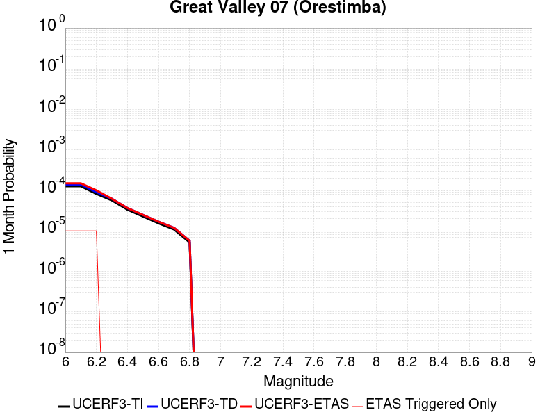 |  |  |

| Magnitude | 1 wk TI Prob | 1 wk TD Prob | 1 wk ETAS Prob | 1 wk ETAS/TD Gain | 1 wk ETAS Triggered Only | 1 mo TI Prob | 1 mo TD Prob | 1 mo ETAS Prob | 1 mo ETAS/TD Gain | 1 mo ETAS Triggered Only | 1 yr TI Prob | 1 yr TD Prob | 1 yr ETAS Prob | 1 yr ETAS/TD Gain | 1 yr ETAS Triggered Only | 10 yr TI Prob | 10 yr TD Prob | 10 yr ETAS Prob | 10 yr ETAS/TD Gain | 10 yr ETAS Triggered Only |
|-----|-----|-----|-----|-----|-----|-----|-----|-----|-----|-----|-----|-----|-----|-----|-----|-----|-----|-----|-----|-----|
| 6.0 | 2.9687902E-5 | 3.27575E-5 | 4.2757172E-5 | 1.3052636 | 1.0E-5 | 1.2722766E-4 | 1.4038214E-4 | 1.5038073E-4 | 1.0712241 | 1.0E-5 | 0.0015478961 | 0.0017078844 | 0.0017378331 | 1.0175356 | 3.0E-5 | 0.015371585 | 0.016955135 | 0.017004289 | 1.0028989 | 5.0E-5 |
| 6.1 | 2.9687902E-5 | 3.27575E-5 | 4.2757172E-5 | 1.3052636 | 1.0E-5 | 1.2722766E-4 | 1.4038214E-4 | 1.5038073E-4 | 1.0712241 | 1.0E-5 | 0.0015478961 | 0.0017078844 | 0.0017378331 | 1.0175356 | 3.0E-5 | 0.015371585 | 0.016955135 | 0.017004289 | 1.0028989 | 5.0E-5 |
| 6.2 | 1.9231524E-5 | 2.1159167E-5 | 3.1158954E-5 | 1.4725984 | 1.0E-5 | 8.2418206E-5 | 9.067912E-5 | 1.0067821E-4 | 1.110269 | 1.0E-5 | 0.0010029797 | 0.0011034822 | 0.0011334491 | 1.0271567 | 3.0E-5 | 0.00998465 | 0.010982441 | 0.011022001 | 1.0036021 | 4.0E-5 |
| 6.3 | 1.324766E-5 | 1.4548534E-5 | 1.4548534E-5 | 1.0 | 0.0 | 5.6774446E-5 | 6.234942E-5 | 6.234942E-5 | 1.0 | 0.0 | 6.910097E-4 | 7.5884897E-4 | 7.6884136E-4 | 1.0131679 | 1.0E-5 | 0.006888649 | 0.0075635235 | 0.0075833723 | 1.0026243 | 2.0E-5 |
| 6.4 | 7.818645E-6 | 8.57284E-6 | 8.57284E-6 | 1.0 | 0.0 | 3.3508048E-5 | 3.6740246E-5 | 3.6740246E-5 | 1.0 | 0.0 | 4.078841E-4 | 4.4722404E-4 | 4.4722404E-4 | 1.0 | 0.0 | 0.004071363 | 0.0044635804 | 0.004473536 | 1.0022304 | 1.0E-5 |
| 6.5 | 5.3076565E-6 | 5.8178007E-6 | 5.8178007E-6 | 1.0 | 0.0 | 2.27469E-5 | 2.4933206E-5 | 2.4933206E-5 | 1.0 | 0.0 | 2.7690834E-4 | 3.035216E-4 | 3.035216E-4 | 1.0 | 0.0 | 0.0027656353 | 0.00303128 | 0.0030412497 | 1.003289 | 1.0E-5 |
| 6.6 | 3.6003578E-6 | 3.9484953E-6 | 3.9484953E-6 | 1.0 | 0.0 | 1.5430012E-5 | 1.6922022E-5 | 1.6922022E-5 | 1.0 | 0.0 | 1.8784421E-4 | 2.0600771E-4 | 2.0600771E-4 | 1.0 | 0.0 | 0.0018768552 | 0.0020583214 | 0.0020683007 | 1.0048484 | 1.0E-5 |
| 6.7 | 2.5361826E-6 | 2.7834678E-6 | 2.7834678E-6 | 1.0 | 0.0 | 1.0869308E-5 | 1.1929101E-5 | 1.1929101E-5 | 1.0 | 0.0 | 1.3232579E-4 | 1.4522845E-4 | 1.4522845E-4 | 1.0 | 0.0 | 0.0013224703 | 0.0014514653 | 0.0014514653 | 1.0 | 0.0 |
| 6.8 | 1.2115831E-6 | 1.3313797E-6 | 1.3313797E-6 | 1.0 | 0.0 | 5.1924885E-6 | 5.7059065E-6 | 5.7059065E-6 | 1.0 | 0.0 | 6.3216714E-5 | 6.9468166E-5 | 6.9468166E-5 | 1.0 | 0.0 | 6.3198735E-4 | 6.945596E-4 | 6.945596E-4 | 1.0 | 0.0 |

## San Gorgonio Pass
*[(top)](#table-of-contents)*

| 1 Week | 1 Month | 1 Year | 10 Year |
|-----|-----|-----|-----|
| 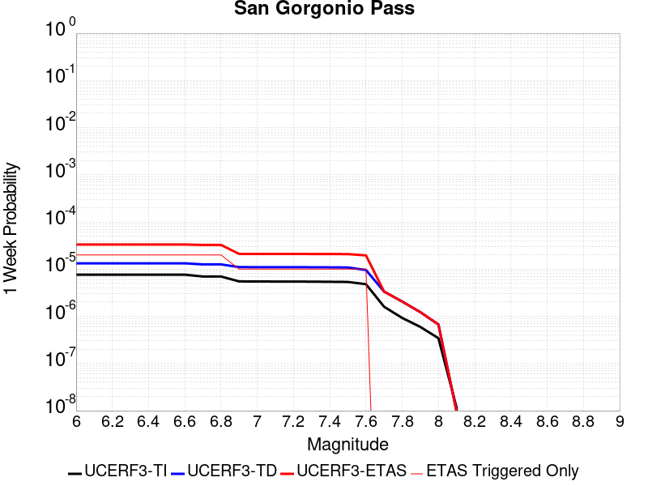 |  |  |  |

| Magnitude | 1 wk TI Prob | 1 wk TD Prob | 1 wk ETAS Prob | 1 wk ETAS/TD Gain | 1 wk ETAS Triggered Only | 1 mo TI Prob | 1 mo TD Prob | 1 mo ETAS Prob | 1 mo ETAS/TD Gain | 1 mo ETAS Triggered Only | 1 yr TI Prob | 1 yr TD Prob | 1 yr ETAS Prob | 1 yr ETAS/TD Gain | 1 yr ETAS Triggered Only | 10 yr TI Prob | 10 yr TD Prob | 10 yr ETAS Prob | 10 yr ETAS/TD Gain | 10 yr ETAS Triggered Only |
|-----|-----|-----|-----|-----|-----|-----|-----|-----|-----|-----|-----|-----|-----|-----|-----|-----|-----|-----|-----|-----|
| 6.0 | 7.644328E-6 | 1.331474E-5 | 3.3314474E-5 | 2.5020747 | 2.0E-5 | 3.2760996E-5 | 5.706197E-5 | 7.706083E-5 | 1.3504761 | 2.0E-5 | 3.987921E-4 | 6.945166E-4 | 7.2449574E-4 | 1.0431656 | 3.0E-5 | 0.003980772 | 0.006930024 | 0.0069796774 | 1.007165 | 5.0E-5 |
| 6.1 | 7.644328E-6 | 1.331474E-5 | 3.3314474E-5 | 2.5020747 | 2.0E-5 | 3.2760996E-5 | 5.706197E-5 | 7.706083E-5 | 1.3504761 | 2.0E-5 | 3.987921E-4 | 6.945166E-4 | 7.2449574E-4 | 1.0431656 | 3.0E-5 | 0.003980772 | 0.006930024 | 0.0069796774 | 1.007165 | 5.0E-5 |
| 6.2 | 7.644328E-6 | 1.331474E-5 | 3.3314474E-5 | 2.5020747 | 2.0E-5 | 3.2760996E-5 | 5.706197E-5 | 7.706083E-5 | 1.3504761 | 2.0E-5 | 3.987921E-4 | 6.945166E-4 | 7.2449574E-4 | 1.0431656 | 3.0E-5 | 0.003980772 | 0.006930024 | 0.0069796774 | 1.007165 | 5.0E-5 |
| 6.3 | 7.644328E-6 | 1.331474E-5 | 3.3314474E-5 | 2.5020747 | 2.0E-5 | 3.2760996E-5 | 5.706197E-5 | 7.706083E-5 | 1.3504761 | 2.0E-5 | 3.987921E-4 | 6.945166E-4 | 7.2449574E-4 | 1.0431656 | 3.0E-5 | 0.003980772 | 0.006930024 | 0.0069796774 | 1.007165 | 5.0E-5 |
| 6.4 | 7.644328E-6 | 1.331474E-5 | 3.3314474E-5 | 2.5020747 | 2.0E-5 | 3.2760996E-5 | 5.706197E-5 | 7.706083E-5 | 1.3504761 | 2.0E-5 | 3.987921E-4 | 6.945166E-4 | 7.2449574E-4 | 1.0431656 | 3.0E-5 | 0.003980772 | 0.006930024 | 0.0069796774 | 1.007165 | 5.0E-5 |
| 6.5 | 7.644328E-6 | 1.331474E-5 | 3.3314474E-5 | 2.5020747 | 2.0E-5 | 3.2760996E-5 | 5.706197E-5 | 7.706083E-5 | 1.3504761 | 2.0E-5 | 3.987921E-4 | 6.945166E-4 | 7.2449574E-4 | 1.0431656 | 3.0E-5 | 0.003980772 | 0.006930024 | 0.0069796774 | 1.007165 | 5.0E-5 |
| 6.6 | 7.644328E-6 | 1.331474E-5 | 3.3314474E-5 | 2.5020747 | 2.0E-5 | 3.2760996E-5 | 5.706197E-5 | 7.706083E-5 | 1.3504761 | 2.0E-5 | 3.987921E-4 | 6.945166E-4 | 7.2449574E-4 | 1.0431656 | 3.0E-5 | 0.003980772 | 0.006930024 | 0.0069796774 | 1.007165 | 5.0E-5 |
| 6.7 | 6.987586E-6 | 1.2619013E-5 | 3.2618762E-5 | 2.58489 | 2.0E-5 | 2.9946454E-5 | 5.408041E-5 | 7.4079326E-5 | 1.3697997 | 2.0E-5 | 3.645371E-4 | 6.582382E-4 | 6.8821845E-4 | 1.0455462 | 3.0E-5 | 0.0036393967 | 0.0065694 | 0.006609137 | 1.0060488 | 4.0E-5 |
| 6.8 | 6.987586E-6 | 1.2619013E-5 | 3.2618762E-5 | 2.58489 | 2.0E-5 | 2.9946454E-5 | 5.408041E-5 | 7.4079326E-5 | 1.3697997 | 2.0E-5 | 3.645371E-4 | 6.582382E-4 | 6.8821845E-4 | 1.0455462 | 3.0E-5 | 0.0036393967 | 0.0065694 | 0.006609137 | 1.0060488 | 4.0E-5 |
| 6.9 | 5.504702E-6 | 1.1049877E-5 | 2.1049766E-5 | 1.9049774 | 1.0E-5 | 2.3591367E-5 | 4.7355785E-5 | 5.735531E-5 | 1.2111574 | 1.0E-5 | 2.8718702E-4 | 5.764092E-4 | 5.963977E-4 | 1.0346776 | 2.0E-5 | 0.0028681618 | 0.0057553523 | 0.00578518 | 1.0051825 | 3.0E-5 |
| 7.0 | 5.4825764E-6 | 1.1026218E-5 | 2.1026108E-5 | 1.9069194 | 1.0E-5 | 2.3496545E-5 | 4.725439E-5 | 5.7253917E-5 | 1.2116106 | 1.0E-5 | 2.8603288E-4 | 5.751754E-4 | 5.951639E-4 | 1.034752 | 2.0E-5 | 0.00285665 | 0.0057430784 | 0.005772906 | 1.0051937 | 3.0E-5 |
| 7.1 | 5.4692787E-6 | 1.1011928E-5 | 2.1011818E-5 | 1.9080962 | 1.0E-5 | 2.3439556E-5 | 4.719315E-5 | 5.719268E-5 | 1.2118852 | 1.0E-5 | 2.8533922E-4 | 5.744302E-4 | 5.944187E-4 | 1.0347971 | 2.0E-5 | 0.0028497311 | 0.0057356646 | 0.0057654926 | 1.0052004 | 3.0E-5 |
| 7.2 | 5.453661E-6 | 1.0994954E-5 | 2.0994845E-5 | 1.9094981 | 1.0E-5 | 2.3372622E-5 | 4.712041E-5 | 5.7119938E-5 | 1.2122122 | 1.0E-5 | 2.8452452E-4 | 5.7354505E-4 | 5.9353356E-4 | 1.0348508 | 2.0E-5 | 0.002841605 | 0.005726859 | 0.005756687 | 1.0052085 | 3.0E-5 |
| 7.3 | 5.4422303E-6 | 1.09818775E-5 | 2.0981768E-5 | 1.9105811 | 1.0E-5 | 2.3323635E-5 | 4.7064368E-5 | 5.70639E-5 | 1.2124649 | 1.0E-5 | 2.8392827E-4 | 5.728631E-4 | 5.928516E-4 | 1.0348923 | 2.0E-5 | 0.0028356577 | 0.0057200743 | 0.0057499027 | 1.0052147 | 3.0E-5 |
| 7.4 | 5.398595E-6 | 1.0929241E-5 | 2.0929132E-5 | 1.9149666 | 1.0E-5 | 2.313663E-5 | 4.6838795E-5 | 5.6838326E-5 | 1.2134882 | 1.0E-5 | 2.8165206E-4 | 5.701182E-4 | 5.9010676E-4 | 1.0350604 | 2.0E-5 | 0.0028129534 | 0.0056927665 | 0.005722596 | 1.0052398 | 3.0E-5 |
| 7.5 | 5.3578788E-6 | 1.0855785E-5 | 2.0855678E-5 | 1.9211578 | 1.0E-5 | 2.2962136E-5 | 4.6523994E-5 | 5.6523528E-5 | 1.2149328 | 1.0E-5 | 2.7952815E-4 | 5.662875E-4 | 5.862761E-4 | 1.0352978 | 2.0E-5 | 0.002791768 | 0.0056546913 | 0.0056845215 | 1.0052754 | 3.0E-5 |
| 7.6 | 4.8091474E-6 | 9.604131E-6 | 1.9604035E-5 | 2.0412085 | 1.0E-5 | 2.0610469E-5 | 4.1159943E-5 | 5.1159528E-5 | 1.2429447 | 1.0E-5 | 2.5090357E-4 | 5.010119E-4 | 5.210019E-4 | 1.0398992 | 2.0E-5 | 0.0025062046 | 0.0050054584 | 0.005035308 | 1.0059634 | 3.0E-5 |
| 7.7 | 1.5991155E-6 | 3.353035E-6 | 3.353035E-6 | 1.0 | 0.0 | 6.853334E-6 | 1.4370073E-5 | 1.4370073E-5 | 1.0 | 0.0 | 8.343615E-5 | 1.7494184E-4 | 1.8494009E-4 | 1.0571519 | 1.0E-5 | 8.340483E-4 | 0.0017535852 | 0.0017735501 | 1.0113852 | 2.0E-5 |
| 7.8 | 9.258398E-7 | 2.0581049E-6 | 2.0581049E-6 | 1.0 | 0.0 | 3.967879E-6 | 8.82042E-6 | 8.82042E-6 | 1.0 | 0.0 | 4.8307855E-5 | 1.0738334E-4 | 1.0738334E-4 | 1.0 | 0.0 | 4.8297356E-4 | 0.0010788103 | 0.0010887996 | 1.0092595 | 1.0E-5 |
| 7.9 | 5.975575E-7 | 1.2292295E-6 | 1.2292295E-6 | 1.0 | 0.0 | 2.5609581E-6 | 5.2681157E-6 | 5.2681157E-6 | 1.0 | 0.0 | 3.117922E-5 | 6.413743E-5 | 6.413743E-5 | 1.0 | 0.0 | 3.1174847E-4 | 6.464778E-4 | 6.464778E-4 | 1.0 | 0.0 |
| 8.0 | 3.4413725E-7 | 6.714992E-7 | 6.714992E-7 | 1.0 | 0.0 | 1.4748731E-6 | 2.8778506E-6 | 2.8778506E-6 | 1.0 | 0.0 | 1.7956432E-5 | 3.5037272E-5 | 3.5037272E-5 | 1.0 | 0.0 | 1.7954981E-4 | 3.5392298E-4 | 3.5392298E-4 | 1.0 | 0.0 |
| 8.1 | 1.1787731E-8 | 9.6332045E-9 | 9.6332045E-9 | 1.0 | 0.0 | 5.0518846E-8 | 4.1285162E-8 | 4.1285162E-8 | 1.0 | 0.0 | 6.1506677E-7 | 5.0264674E-7 | 5.0264674E-7 | 1.0 | 0.0 | 6.1506507E-6 | 5.2417968E-6 | 5.2417968E-6 | 1.0 | 0.0 |

## Santa Susana alt 1
*[(top)](#table-of-contents)*

| 1 Week | 1 Month | 1 Year | 10 Year |
|-----|-----|-----|-----|
|  |  |  |  |

| Magnitude | 1 wk TI Prob | 1 wk TD Prob | 1 wk ETAS Prob | 1 wk ETAS/TD Gain | 1 wk ETAS Triggered Only | 1 mo TI Prob | 1 mo TD Prob | 1 mo ETAS Prob | 1 mo ETAS/TD Gain | 1 mo ETAS Triggered Only | 1 yr TI Prob | 1 yr TD Prob | 1 yr ETAS Prob | 1 yr ETAS/TD Gain | 1 yr ETAS Triggered Only | 10 yr TI Prob | 10 yr TD Prob | 10 yr ETAS Prob | 10 yr ETAS/TD Gain | 10 yr ETAS Triggered Only |
|-----|-----|-----|-----|-----|-----|-----|-----|-----|-----|-----|-----|-----|-----|-----|-----|-----|-----|-----|-----|-----|
| 6.0 | 2.674877E-5 | 2.7198214E-5 | 2.7198214E-5 | 1.0 | 0.0 | 1.1463255E-4 | 1.16559204E-4 | 1.2655804E-4 | 1.0857834 | 1.0E-5 | 0.0013947578 | 0.0014182981 | 0.0014382697 | 1.0140814 | 2.0E-5 | 0.013860362 | 0.014104388 | 0.014153683 | 1.003495 | 5.0E-5 |
| 6.1 | 2.674877E-5 | 2.7198214E-5 | 2.7198214E-5 | 1.0 | 0.0 | 1.1463255E-4 | 1.16559204E-4 | 1.2655804E-4 | 1.0857834 | 1.0E-5 | 0.0013947578 | 0.0014182981 | 0.0014382697 | 1.0140814 | 2.0E-5 | 0.013860362 | 0.014104388 | 0.014153683 | 1.003495 | 5.0E-5 |
| 6.2 | 2.674877E-5 | 2.7198214E-5 | 2.7198214E-5 | 1.0 | 0.0 | 1.1463255E-4 | 1.16559204E-4 | 1.2655804E-4 | 1.0857834 | 1.0E-5 | 0.0013947578 | 0.0014182981 | 0.0014382697 | 1.0140814 | 2.0E-5 | 0.013860362 | 0.014104388 | 0.014153683 | 1.003495 | 5.0E-5 |
| 6.3 | 2.674877E-5 | 2.7198214E-5 | 2.7198214E-5 | 1.0 | 0.0 | 1.1463255E-4 | 1.16559204E-4 | 1.2655804E-4 | 1.0857834 | 1.0E-5 | 0.0013947578 | 0.0014182981 | 0.0014382697 | 1.0140814 | 2.0E-5 | 0.013860362 | 0.014104388 | 0.014153683 | 1.003495 | 5.0E-5 |
| 6.4 | 2.674877E-5 | 2.7198214E-5 | 2.7198214E-5 | 1.0 | 0.0 | 1.1463255E-4 | 1.16559204E-4 | 1.2655804E-4 | 1.0857834 | 1.0E-5 | 0.0013947578 | 0.0014182981 | 0.0014382697 | 1.0140814 | 2.0E-5 | 0.013860362 | 0.014104388 | 0.014153683 | 1.003495 | 5.0E-5 |
| 6.5 | 2.674877E-5 | 2.7198214E-5 | 2.7198214E-5 | 1.0 | 0.0 | 1.1463255E-4 | 1.16559204E-4 | 1.2655804E-4 | 1.0857834 | 1.0E-5 | 0.0013947578 | 0.0014182981 | 0.0014382697 | 1.0140814 | 2.0E-5 | 0.013860362 | 0.014104388 | 0.014153683 | 1.003495 | 5.0E-5 |
| 6.6 | 2.6647976E-5 | 2.7074553E-5 | 2.7074553E-5 | 1.0 | 0.0 | 1.14200615E-4 | 1.16029274E-4 | 1.2602811E-4 | 1.0861752 | 1.0E-5 | 0.0013895056 | 0.0014118546 | 0.0014318264 | 1.0141457 | 2.0E-5 | 0.013808494 | 0.014040773 | 0.0140900705 | 1.0035111 | 5.0E-5 |
| 6.7 | 2.6647976E-5 | 2.7074553E-5 | 2.7074553E-5 | 1.0 | 0.0 | 1.14200615E-4 | 1.16029274E-4 | 1.2602811E-4 | 1.0861752 | 1.0E-5 | 0.0013895056 | 0.0014118546 | 0.0014318264 | 1.0141457 | 2.0E-5 | 0.013808494 | 0.014040773 | 0.0140900705 | 1.0035111 | 5.0E-5 |
| 6.8 | 1.9073179E-5 | 1.7637467E-5 | 1.7637467E-5 | 1.0 | 0.0 | 8.1739636E-5 | 7.558706E-5 | 8.5586296E-5 | 1.1322877 | 1.0E-5 | 9.947256E-4 | 9.19902E-4 | 9.398836E-4 | 1.0217215 | 2.0E-5 | 0.009902848 | 0.009163361 | 0.009202994 | 1.0043252 | 4.0E-5 |
| 6.9 | 1.9041876E-5 | 1.7619597E-5 | 1.7619597E-5 | 1.0 | 0.0 | 8.160549E-5 | 7.551048E-5 | 8.5509724E-5 | 1.132422 | 1.0E-5 | 9.930939E-4 | 9.189705E-4 | 9.389521E-4 | 1.0217435 | 2.0E-5 | 0.0098866755 | 0.009154123 | 0.009193757 | 1.0043296 | 4.0E-5 |
| 7.0 | 1.5917482E-5 | 1.3864049E-5 | 1.3864049E-5 | 1.0 | 0.0 | 6.8215995E-5 | 5.9416023E-5 | 6.941543E-5 | 1.1682948 | 1.0E-5 | 8.302132E-4 | 7.2315463E-4 | 7.431402E-4 | 1.0276366 | 2.0E-5 | 0.008271185 | 0.0072090672 | 0.007248779 | 1.0055085 | 4.0E-5 |
| 7.1 | 1.577788E-5 | 1.3744056E-5 | 1.3744056E-5 | 1.0 | 0.0 | 6.761774E-5 | 5.890179E-5 | 6.89012E-5 | 1.1697642 | 1.0E-5 | 8.2293496E-4 | 7.16898E-4 | 7.3688367E-4 | 1.0278779 | 2.0E-5 | 0.008198941 | 0.0071469042 | 0.0071866186 | 1.0055568 | 4.0E-5 |
| 7.2 | 1.5416446E-5 | 1.34701295E-5 | 1.34701295E-5 | 1.0 | 0.0 | 6.606882E-5 | 5.7727877E-5 | 6.77273E-5 | 1.1732166 | 1.0E-5 | 8.0409093E-4 | 7.026149E-4 | 7.2260085E-4 | 1.0284451 | 2.0E-5 | 0.008011877 | 0.0070049763 | 0.0070446962 | 1.0056702 | 4.0E-5 |
| 7.3 | 1.4534083E-5 | 1.2718032E-5 | 1.2718032E-5 | 1.0 | 0.0 | 6.228744E-5 | 5.4504737E-5 | 6.450419E-5 | 1.1834604 | 1.0E-5 | 7.580857E-4 | 6.633976E-4 | 6.833843E-4 | 1.0301279 | 2.0E-5 | 0.007555048 | 0.0066151717 | 0.006654907 | 1.0060067 | 4.0E-5 |
| 7.4 | 1.2858995E-5 | 1.1229814E-5 | 1.1229814E-5 | 1.0 | 0.0 | 5.5108816E-5 | 4.812691E-5 | 4.812691E-5 | 1.0 | 0.0 | 6.7074323E-4 | 5.8579154E-4 | 5.957857E-4 | 1.0170609 | 1.0E-5 | 0.0066872234 | 0.0058433902 | 0.005873215 | 1.0051041 | 3.0E-5 |
| 7.5 | 8.827668E-6 | 7.805494E-6 | 7.805494E-6 | 1.0 | 0.0 | 3.7832317E-5 | 3.3451703E-5 | 3.3451703E-5 | 1.0 | 0.0 | 4.605111E-4 | 4.072008E-4 | 4.1719674E-4 | 1.0245479 | 1.0E-5 | 0.0045955796 | 0.0040648985 | 0.0040947767 | 1.0073502 | 3.0E-5 |
| 7.6 | 3.2533426E-6 | 2.8720106E-6 | 2.8720106E-6 | 1.0 | 0.0 | 1.3942822E-5 | 1.230856E-5 | 1.230856E-5 | 1.0 | 0.0 | 1.6974064E-4 | 1.4984679E-4 | 1.4984679E-4 | 1.0 | 0.0 | 0.0016961104 | 0.0014974943 | 0.0015074793 | 1.0066679 | 1.0E-5 |
| 7.7 | 1.2751709E-6 | 1.1491339E-6 | 1.1491339E-6 | 1.0 | 0.0 | 5.4650063E-6 | 4.9248506E-6 | 4.9248506E-6 | 1.0 | 0.0 | 6.653442E-5 | 5.99585E-5 | 5.99585E-5 | 1.0 | 0.0 | 6.6514505E-4 | 5.9943215E-4 | 6.094261E-4 | 1.0166725 | 1.0E-5 |
| 7.8 | 3.067544E-7 | 3.240052E-7 | 3.240052E-7 | 1.0 | 0.0 | 1.3146611E-6 | 1.3885931E-6 | 1.3885931E-6 | 1.0 | 0.0 | 1.600588E-5 | 1.6906E-5 | 1.6906E-5 | 1.0 | 0.0 | 1.6004729E-4 | 1.6904817E-4 | 1.6904817E-4 | 1.0 | 0.0 |
| 7.9 | 7.622999E-8 | 8.0879715E-8 | 8.0879715E-8 | 1.0 | 0.0 | 3.2669993E-7 | 3.4662733E-7 | 3.4662733E-7 | 1.0 | 0.0 | 3.977564E-6 | 4.220182E-6 | 4.220182E-6 | 1.0 | 0.0 | 3.977493E-5 | 4.2201224E-5 | 4.2201224E-5 | 1.0 | 0.0 |

## Likely 2011 CFM
*[(top)](#table-of-contents)*

| 1 Week | 1 Month | 1 Year | 10 Year |
|-----|-----|-----|-----|
|  |  |  | 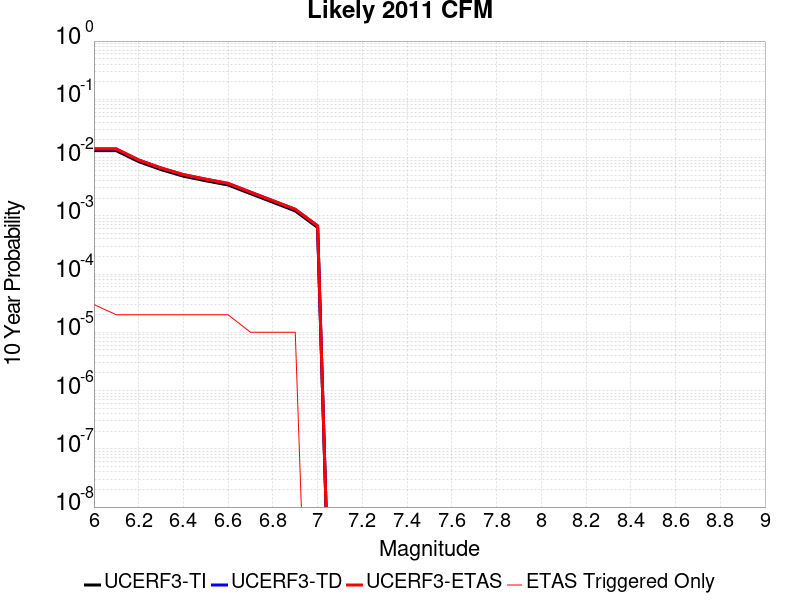 |

| Magnitude | 1 wk TI Prob | 1 wk TD Prob | 1 wk ETAS Prob | 1 wk ETAS/TD Gain | 1 wk ETAS Triggered Only | 1 mo TI Prob | 1 mo TD Prob | 1 mo ETAS Prob | 1 mo ETAS/TD Gain | 1 mo ETAS Triggered Only | 1 yr TI Prob | 1 yr TD Prob | 1 yr ETAS Prob | 1 yr ETAS/TD Gain | 1 yr ETAS Triggered Only | 10 yr TI Prob | 10 yr TD Prob | 10 yr ETAS Prob | 10 yr ETAS/TD Gain | 10 yr ETAS Triggered Only |
|-----|-----|-----|-----|-----|-----|-----|-----|-----|-----|-----|-----|-----|-----|-----|-----|-----|-----|-----|-----|-----|
| 6.0 | 2.5315949E-5 | 2.7104748E-5 | 3.7104477E-5 | 1.368929 | 1.0E-5 | 1.0849241E-4 | 1.16158284E-4 | 1.461548E-4 | 1.2582383 | 3.0E-5 | 0.0013200947 | 0.0014133542 | 0.0014433118 | 1.0211961 | 3.0E-5 | 0.013122803 | 0.01404831 | 0.014077889 | 1.0021055 | 3.0E-5 |
| 6.1 | 2.5315949E-5 | 2.7104748E-5 | 3.7104477E-5 | 1.368929 | 1.0E-5 | 1.0849241E-4 | 1.16158284E-4 | 1.3615596E-4 | 1.1721588 | 2.0E-5 | 0.0013200947 | 0.0014133542 | 0.0014333259 | 1.0141307 | 2.0E-5 | 0.013122803 | 0.01404831 | 0.01406803 | 1.0014037 | 2.0E-5 |
| 6.2 | 1.6375941E-5 | 1.7465842E-5 | 1.7465842E-5 | 1.0 | 0.0 | 7.0180715E-5 | 7.485153E-5 | 8.4850784E-5 | 1.1335878 | 1.0E-5 | 8.5411523E-4 | 9.109487E-4 | 9.2093955E-4 | 1.0109676 | 1.0E-5 | 0.008508399 | 0.009073433 | 0.009093251 | 1.0021843 | 2.0E-5 |
| 6.3 | 1.1945543E-5 | 1.2712587E-5 | 1.2712587E-5 | 1.0 | 0.0 | 5.119418E-5 | 5.4481407E-5 | 6.448086E-5 | 1.1835389 | 1.0E-5 | 6.2311086E-4 | 6.631146E-4 | 6.73108E-4 | 1.0150703 | 1.0E-5 | 0.0062136655 | 0.0066119144 | 0.0066317823 | 1.0030048 | 2.0E-5 |
| 6.4 | 9.192729E-6 | 9.768488E-6 | 9.768488E-6 | 1.0 | 0.0 | 3.939681E-5 | 4.1864292E-5 | 5.1863874E-5 | 1.238857 | 1.0E-5 | 4.7955062E-4 | 5.0958124E-4 | 5.195762E-4 | 1.019614 | 1.0E-5 | 0.004785171 | 0.0050844094 | 0.0051043076 | 1.0039136 | 2.0E-5 |
| 6.5 | 7.67906E-6 | 8.152622E-6 | 8.152622E-6 | 1.0 | 0.0 | 3.2909844E-5 | 3.4939352E-5 | 4.4939003E-5 | 1.2862003 | 1.0E-5 | 4.006037E-4 | 4.2530545E-4 | 4.3530122E-4 | 1.0235025 | 1.0E-5 | 0.0039988225 | 0.004245108 | 0.0042650234 | 1.0046914 | 2.0E-5 |
| 6.6 | 6.4884057E-6 | 6.8847507E-6 | 6.8847507E-6 | 1.0 | 0.0 | 2.7807157E-5 | 2.9505749E-5 | 3.9505452E-5 | 1.338907 | 1.0E-5 | 3.3849955E-4 | 3.591747E-4 | 3.6917112E-4 | 1.0278316 | 1.0E-5 | 0.003379844 | 0.0035860867 | 0.0036060151 | 1.0055571 | 2.0E-5 |
| 6.7 | 4.6060636E-6 | 4.884041E-6 | 4.884041E-6 | 1.0 | 0.0 | 1.9740122E-5 | 2.0931442E-5 | 3.0931235E-5 | 1.4777402 | 1.0E-5 | 2.403095E-4 | 2.5481134E-4 | 2.648088E-4 | 1.0392348 | 1.0E-5 | 0.002400498 | 0.0025452746 | 0.0025552493 | 1.0039189 | 1.0E-5 |
| 6.8 | 3.2795615E-6 | 3.4773732E-6 | 3.4773732E-6 | 1.0 | 0.0 | 1.4055187E-5 | 1.4902946E-5 | 2.4902796E-5 | 1.6709983 | 1.0E-5 | 1.7110848E-4 | 1.8142881E-4 | 1.91427E-4 | 1.0551081 | 1.0E-5 | 0.0017097679 | 0.0018128622 | 0.001822844 | 1.0055062 | 1.0E-5 |
| 6.9 | 2.3289967E-6 | 2.4705569E-6 | 2.4705569E-6 | 1.0 | 0.0 | 9.981376E-6 | 1.058806E-5 | 2.0587955E-5 | 1.94445 | 1.0E-5 | 1.2151648E-4 | 1.2890245E-4 | 1.3890116E-4 | 1.077568 | 1.0E-5 | 0.0012145005 | 0.0012883197 | 0.0012983069 | 1.0077521 | 1.0E-5 |
| 7.0 | 1.211292E-6 | 1.2863958E-6 | 1.2863958E-6 | 1.0 | 0.0 | 5.1912407E-6 | 5.5131145E-6 | 5.5131145E-6 | 1.0 | 0.0 | 6.320152E-5 | 6.712041E-5 | 6.712041E-5 | 1.0 | 0.0 | 6.3183554E-4 | 6.710312E-4 | 6.710312E-4 | 1.0 | 0.0 |

## Mono Lake 2011 CFM
*[(top)](#table-of-contents)*

| 1 Week | 1 Month | 1 Year | 10 Year |
|-----|-----|-----|-----|
|  |  |  |  |

| Magnitude | 1 wk TI Prob | 1 wk TD Prob | 1 wk ETAS Prob | 1 wk ETAS/TD Gain | 1 wk ETAS Triggered Only | 1 mo TI Prob | 1 mo TD Prob | 1 mo ETAS Prob | 1 mo ETAS/TD Gain | 1 mo ETAS Triggered Only | 1 yr TI Prob | 1 yr TD Prob | 1 yr ETAS Prob | 1 yr ETAS/TD Gain | 1 yr ETAS Triggered Only | 10 yr TI Prob | 10 yr TD Prob | 10 yr ETAS Prob | 10 yr ETAS/TD Gain | 10 yr ETAS Triggered Only |
|-----|-----|-----|-----|-----|-----|-----|-----|-----|-----|-----|-----|-----|-----|-----|-----|-----|-----|-----|-----|-----|
| 6.0 | 2.0341662E-5 | 2.3828192E-5 | 4.3827713E-5 | 1.839322 | 2.0E-5 | 8.717564E-5 | 1.0211982E-4 | 1.2211778E-4 | 1.1958283 | 2.0E-5 | 0.0010608466 | 0.0012431308 | 0.001283081 | 1.0321368 | 4.0E-5 | 0.010557966 | 0.012413842 | 0.01246322 | 1.0039778 | 5.0E-5 |
| 6.1 | 2.0341662E-5 | 2.3828192E-5 | 4.3827713E-5 | 1.839322 | 2.0E-5 | 8.717564E-5 | 1.0211982E-4 | 1.2211778E-4 | 1.1958283 | 2.0E-5 | 0.0010608466 | 0.0012431308 | 0.001283081 | 1.0321368 | 4.0E-5 | 0.010557966 | 0.012413842 | 0.01246322 | 1.0039778 | 5.0E-5 |
| 6.2 | 2.0341662E-5 | 2.3828192E-5 | 4.3827713E-5 | 1.839322 | 2.0E-5 | 8.717564E-5 | 1.0211982E-4 | 1.2211778E-4 | 1.1958283 | 2.0E-5 | 0.0010608466 | 0.0012431308 | 0.001283081 | 1.0321368 | 4.0E-5 | 0.010557966 | 0.012413842 | 0.01246322 | 1.0039778 | 5.0E-5 |
| 6.3 | 2.0341662E-5 | 2.3828192E-5 | 4.3827713E-5 | 1.839322 | 2.0E-5 | 8.717564E-5 | 1.0211982E-4 | 1.2211778E-4 | 1.1958283 | 2.0E-5 | 0.0010608466 | 0.0012431308 | 0.001283081 | 1.0321368 | 4.0E-5 | 0.010557966 | 0.012413842 | 0.01246322 | 1.0039778 | 5.0E-5 |
| 6.4 | 1.749821E-5 | 2.049101E-5 | 4.04906E-5 | 1.9760178 | 2.0E-5 | 7.499018E-5 | 8.781861E-5 | 1.0781686E-4 | 1.2277222 | 2.0E-5 | 9.1262296E-4 | 0.0010691914 | 0.0010991594 | 1.0280286 | 3.0E-5 | 0.009088841 | 0.01069187 | 0.010731443 | 1.0037012 | 4.0E-5 |
| 6.5 | 1.749821E-5 | 2.049101E-5 | 4.04906E-5 | 1.9760178 | 2.0E-5 | 7.499018E-5 | 8.781861E-5 | 1.0781686E-4 | 1.2277222 | 2.0E-5 | 9.1262296E-4 | 0.0010691914 | 0.0010991594 | 1.0280286 | 3.0E-5 | 0.009088841 | 0.01069187 | 0.010731443 | 1.0037012 | 4.0E-5 |

## Superstition Hills
*[(top)](#table-of-contents)*

| 1 Week | 1 Month | 1 Year | 10 Year |
|-----|-----|-----|-----|
| 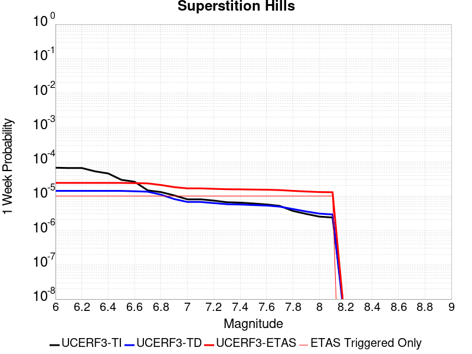 |  |  |  |

| Magnitude | 1 wk TI Prob | 1 wk TD Prob | 1 wk ETAS Prob | 1 wk ETAS/TD Gain | 1 wk ETAS Triggered Only | 1 mo TI Prob | 1 mo TD Prob | 1 mo ETAS Prob | 1 mo ETAS/TD Gain | 1 mo ETAS Triggered Only | 1 yr TI Prob | 1 yr TD Prob | 1 yr ETAS Prob | 1 yr ETAS/TD Gain | 1 yr ETAS Triggered Only | 10 yr TI Prob | 10 yr TD Prob | 10 yr ETAS Prob | 10 yr ETAS/TD Gain | 10 yr ETAS Triggered Only |
|-----|-----|-----|-----|-----|-----|-----|-----|-----|-----|-----|-----|-----|-----|-----|-----|-----|-----|-----|-----|-----|
| 6.0 | 6.6865185E-5 | 1.4137668E-5 | 2.4137526E-5 | 1.7073202 | 1.0E-5 | 2.8653358E-4 | 6.058869E-5 | 7.058808E-5 | 1.1650373 | 1.0E-5 | 0.0034829667 | 7.374338E-4 | 7.6741166E-4 | 1.0406516 | 3.0E-5 | 0.03428881 | 0.007520696 | 0.00757032 | 1.0065984 | 5.0E-5 |
| 6.1 | 6.544851E-5 | 1.4137668E-5 | 2.4137526E-5 | 1.7073202 | 1.0E-5 | 2.8046346E-4 | 6.058869E-5 | 7.058808E-5 | 1.1650373 | 1.0E-5 | 0.0034092965 | 7.374338E-4 | 7.6741166E-4 | 1.0406516 | 3.0E-5 | 0.033574644 | 0.0075206957 | 0.0075703193 | 1.0065984 | 5.0E-5 |
| 6.2 | 6.544851E-5 | 1.4137668E-5 | 2.4137526E-5 | 1.7073202 | 1.0E-5 | 2.8046346E-4 | 6.058869E-5 | 7.058808E-5 | 1.1650373 | 1.0E-5 | 0.0034092965 | 7.374338E-4 | 7.6741166E-4 | 1.0406516 | 3.0E-5 | 0.033574644 | 0.0075206957 | 0.0075703193 | 1.0065984 | 5.0E-5 |
| 6.3 | 5.2402065E-5 | 1.4137667E-5 | 2.4137526E-5 | 1.7073203 | 1.0E-5 | 2.2456095E-4 | 6.0588685E-5 | 7.058808E-5 | 1.1650373 | 1.0E-5 | 0.0027306017 | 7.374338E-4 | 7.6741166E-4 | 1.0406517 | 3.0E-5 | 0.02697292 | 0.0075206906 | 0.0075703147 | 1.0065984 | 5.0E-5 |
| 6.4 | 4.542238E-5 | 1.4137666E-5 | 2.4137526E-5 | 1.7073203 | 1.0E-5 | 1.9465282E-4 | 6.058868E-5 | 7.0588074E-5 | 1.1650373 | 1.0E-5 | 0.0023673223 | 7.3743373E-4 | 7.674116E-4 | 1.0406517 | 3.0E-5 | 0.023422617 | 0.007520688 | 0.007570312 | 1.0065984 | 5.0E-5 |
| 6.5 | 2.9672969E-5 | 1.4137665E-5 | 2.4137524E-5 | 1.7073203 | 1.0E-5 | 1.2716366E-4 | 6.0588678E-5 | 7.0588074E-5 | 1.1650374 | 1.0E-5 | 0.0015471181 | 7.374337E-4 | 7.6741155E-4 | 1.0406517 | 3.0E-5 | 0.015363912 | 0.0075206826 | 0.007570307 | 1.0065984 | 5.0E-5 |
| 6.6 | 2.6056105E-5 | 1.3803436E-5 | 2.3803297E-5 | 1.7244474 | 1.0E-5 | 1.1166424E-4 | 5.915633E-5 | 6.9155736E-5 | 1.1690336 | 1.0E-5 | 0.0013586642 | 7.200064E-4 | 7.499848E-4 | 1.0416363 | 3.0E-5 | 0.013503874 | 0.0073450673 | 0.0073947003 | 1.0067573 | 5.0E-5 |
| 6.7 | 1.4611248E-5 | 1.338333E-5 | 2.3383196E-5 | 1.7471882 | 1.0E-5 | 6.261813E-5 | 5.7355956E-5 | 6.735538E-5 | 1.1743398 | 1.0E-5 | 7.6210906E-4 | 6.9810095E-4 | 7.2808005E-4 | 1.0429437 | 3.0E-5 | 0.0075950073 | 0.0071262526 | 0.0071758963 | 1.0069664 | 5.0E-5 |
| 6.8 | 1.30607E-5 | 1.09787115E-5 | 2.0978601E-5 | 1.9108437 | 1.0E-5 | 5.597323E-5 | 4.705082E-5 | 5.705035E-5 | 1.2125262 | 1.0E-5 | 6.8126095E-4 | 5.727019E-4 | 6.0268474E-4 | 1.0523533 | 3.0E-5 | 0.006791762 | 0.005873964 | 0.0059137293 | 1.0067697 | 4.0E-5 |
| 6.9 | 1.0443096E-5 | 8.19507E-6 | 1.8194989E-5 | 2.2202358 | 1.0E-5 | 4.4755358E-5 | 3.512127E-5 | 4.512092E-5 | 1.2847178 | 1.0E-5 | 5.447602E-4 | 4.2751993E-4 | 4.575071E-4 | 1.0701421 | 3.0E-5 | 0.005434267 | 0.004409497 | 0.0044393647 | 1.0067735 | 3.0E-5 |
| 7.0 | 8.045912E-6 | 6.739447E-6 | 1.673938E-5 | 2.4837914 | 1.0E-5 | 3.4482026E-5 | 2.888303E-5 | 3.8882743E-5 | 1.346214 | 1.0E-5 | 4.197378E-4 | 3.5159517E-4 | 3.8158463E-4 | 1.0852954 | 3.0E-5 | 0.0041894587 | 0.0036335257 | 0.0036634167 | 1.0082264 | 3.0E-5 |
| 7.1 | 8.045912E-6 | 6.739447E-6 | 1.673938E-5 | 2.4837914 | 1.0E-5 | 3.4482026E-5 | 2.888303E-5 | 3.8882743E-5 | 1.346214 | 1.0E-5 | 4.197378E-4 | 3.5159517E-4 | 3.8158463E-4 | 1.0852954 | 3.0E-5 | 0.0041894587 | 0.0036335257 | 0.0036634167 | 1.0082264 | 3.0E-5 |
| 7.2 | 7.375506E-6 | 6.2463805E-6 | 1.6246318E-5 | 2.600917 | 1.0E-5 | 3.1608928E-5 | 2.6769932E-5 | 3.6769663E-5 | 1.3735434 | 1.0E-5 | 3.8477074E-4 | 3.2587603E-4 | 3.5586627E-4 | 1.0920296 | 3.0E-5 | 0.003841052 | 0.0033741172 | 0.0034040161 | 1.0088612 | 3.0E-5 |
| 7.3 | 6.6063913E-6 | 5.798824E-6 | 1.5798767E-5 | 2.7244775 | 1.0E-5 | 2.8312797E-5 | 2.4851872E-5 | 3.4851622E-5 | 1.4023741 | 1.0E-5 | 3.446538E-4 | 3.0253024E-4 | 3.3252116E-4 | 1.0991336 | 3.0E-5 | 0.0034411973 | 0.0031383524 | 0.0031682584 | 1.0095291 | 3.0E-5 |
| 7.4 | 6.4313126E-6 | 5.6802523E-6 | 1.5680196E-5 | 2.7604752 | 1.0E-5 | 2.7562477E-5 | 2.4343715E-5 | 3.434347E-5 | 1.4107736 | 1.0E-5 | 3.355215E-4 | 2.963451E-4 | 3.2633622E-4 | 1.1012033 | 3.0E-5 | 0.0033501536 | 0.003076105 | 0.0031060125 | 1.0097226 | 3.0E-5 |
| 7.5 | 6.0742927E-6 | 5.476088E-6 | 1.5476033E-5 | 2.826111 | 1.0E-5 | 2.6032423E-5 | 2.3468741E-5 | 3.3468506E-5 | 1.4260887 | 1.0E-5 | 3.1689866E-4 | 2.8569513E-4 | 3.1568657E-4 | 1.104977 | 3.0E-5 | 0.0031644711 | 0.0029679502 | 0.0029978612 | 1.010078 | 3.0E-5 |
| 7.6 | 5.6987187E-6 | 5.2943155E-6 | 1.5294263E-5 | 2.8888083 | 1.0E-5 | 2.4422852E-5 | 2.268973E-5 | 3.2689502E-5 | 1.440718 | 1.0E-5 | 2.9730765E-4 | 2.762131E-4 | 3.062048E-4 | 1.1085818 | 3.0E-5 | 0.002969102 | 0.0028712032 | 0.002901117 | 1.0104185 | 3.0E-5 |
| 7.7 | 5.1658035E-6 | 4.925336E-6 | 1.4925286E-5 | 3.0303085 | 1.0E-5 | 2.2138971E-5 | 2.1108413E-5 | 3.1108204E-5 | 1.4737347 | 1.0E-5 | 2.6950863E-4 | 2.5696523E-4 | 2.8695754E-4 | 1.1167173 | 3.0E-5 | 0.00269182 | 0.0026763005 | 0.0027062201 | 1.0111794 | 3.0E-5 |
| 7.8 | 3.6864697E-6 | 4.1963563E-6 | 1.4196315E-5 | 3.38301 | 1.0E-5 | 1.579906E-5 | 1.7984263E-5 | 2.7984082E-5 | 1.5560317 | 1.0E-5 | 1.9233658E-4 | 2.1893687E-4 | 2.489303E-4 | 1.1369958 | 3.0E-5 | 0.0019217018 | 0.0022895595 | 0.0023194908 | 1.013073 | 3.0E-5 |
| 7.9 | 3.0265903E-6 | 3.5636078E-6 | 1.3563572E-5 | 3.806135 | 1.0E-5 | 1.2971037E-5 | 1.5272519E-5 | 2.5272366E-5 | 1.6547608 | 1.0E-5 | 1.5791094E-4 | 1.8592748E-4 | 2.0592376E-4 | 1.1075488 | 2.0E-5 | 0.0015779877 | 0.0019537222 | 0.0019736832 | 1.0102168 | 2.0E-5 |
| 8.0 | 2.5271493E-6 | 3.0866524E-6 | 1.3086622E-5 | 4.2397456 | 1.0E-5 | 1.0830595E-5 | 1.3228446E-5 | 2.3228313E-5 | 1.7559367 | 1.0E-5 | 1.3185451E-4 | 1.6104484E-4 | 1.8104161E-4 | 1.124169 | 2.0E-5 | 0.0013177631 | 0.0016975543 | 0.0017175203 | 1.0117617 | 2.0E-5 |
| 8.1 | 2.3749135E-6 | 2.9172957E-6 | 1.2917267E-5 | 4.427822 | 1.0E-5 | 1.0178161E-5 | 1.2502638E-5 | 2.2502512E-5 | 1.7998213 | 1.0E-5 | 1.2391206E-4 | 1.522094E-4 | 1.7220636E-4 | 1.1313779 | 2.0E-5 | 0.0012384299 | 0.0016051348 | 0.0016251027 | 1.01244 | 2.0E-5 |
| 8.2 | 1.7186406E-9 | 1.1438838E-9 | 1.1438838E-9 | 1.0 | 0.0 | 7.3656024E-9 | 4.902359E-9 | 4.902359E-9 | 1.0 | 0.0 | 8.9676206E-8 | 5.968622E-8 | 5.968622E-8 | 1.0 | 0.0 | 8.9676166E-7 | 6.386644E-7 | 6.386644E-7 | 1.0 | 0.0 |

## Oceanside alt1
*[(top)](#table-of-contents)*

| 1 Week | 1 Month | 1 Year | 10 Year |
|-----|-----|-----|-----|
|  |  |  |  |

| Magnitude | 1 wk TI Prob | 1 wk TD Prob | 1 wk ETAS Prob | 1 wk ETAS/TD Gain | 1 wk ETAS Triggered Only | 1 mo TI Prob | 1 mo TD Prob | 1 mo ETAS Prob | 1 mo ETAS/TD Gain | 1 mo ETAS Triggered Only | 1 yr TI Prob | 1 yr TD Prob | 1 yr ETAS Prob | 1 yr ETAS/TD Gain | 1 yr ETAS Triggered Only | 10 yr TI Prob | 10 yr TD Prob | 10 yr ETAS Prob | 10 yr ETAS/TD Gain | 10 yr ETAS Triggered Only |
|-----|-----|-----|-----|-----|-----|-----|-----|-----|-----|-----|-----|-----|-----|-----|-----|-----|-----|-----|-----|-----|
| 6.0 | 1.1617542E-5 | 1.1423485E-5 | 1.1423485E-5 | 1.0 | 0.0 | 4.9788516E-5 | 4.8956965E-5 | 6.895599E-5 | 1.4085021 | 2.0E-5 | 6.060066E-4 | 5.9590413E-4 | 6.2588626E-4 | 1.0503137 | 3.0E-5 | 0.0060435664 | 0.0059446604 | 0.0059844228 | 1.0066887 | 4.0E-5 |
| 6.1 | 1.1617542E-5 | 1.1423485E-5 | 1.1423485E-5 | 1.0 | 0.0 | 4.9788516E-5 | 4.8956965E-5 | 6.895599E-5 | 1.4085021 | 2.0E-5 | 6.060066E-4 | 5.9590413E-4 | 6.2588626E-4 | 1.0503137 | 3.0E-5 | 0.0060435664 | 0.0059446604 | 0.0059844228 | 1.0066887 | 4.0E-5 |
| 6.2 | 1.1617542E-5 | 1.1423485E-5 | 1.1423485E-5 | 1.0 | 0.0 | 4.9788516E-5 | 4.8956965E-5 | 6.895599E-5 | 1.4085021 | 2.0E-5 | 6.060066E-4 | 5.9590413E-4 | 6.2588626E-4 | 1.0503137 | 3.0E-5 | 0.0060435664 | 0.0059446604 | 0.0059844228 | 1.0066887 | 4.0E-5 |
| 6.3 | 1.1617542E-5 | 1.1423485E-5 | 1.1423485E-5 | 1.0 | 0.0 | 4.9788516E-5 | 4.8956965E-5 | 6.895599E-5 | 1.4085021 | 2.0E-5 | 6.060066E-4 | 5.9590413E-4 | 6.2588626E-4 | 1.0503137 | 3.0E-5 | 0.0060435664 | 0.0059446604 | 0.0059844228 | 1.0066887 | 4.0E-5 |
| 6.4 | 1.1617542E-5 | 1.1423485E-5 | 1.1423485E-5 | 1.0 | 0.0 | 4.9788516E-5 | 4.8956965E-5 | 6.895599E-5 | 1.4085021 | 2.0E-5 | 6.060066E-4 | 5.9590413E-4 | 6.2588626E-4 | 1.0503137 | 3.0E-5 | 0.0060435664 | 0.0059446604 | 0.0059844228 | 1.0066887 | 4.0E-5 |
| 6.5 | 1.1617542E-5 | 1.1423485E-5 | 1.1423485E-5 | 1.0 | 0.0 | 4.9788516E-5 | 4.8956965E-5 | 6.895599E-5 | 1.4085021 | 2.0E-5 | 6.060066E-4 | 5.9590413E-4 | 6.2588626E-4 | 1.0503137 | 3.0E-5 | 0.0060435664 | 0.0059446604 | 0.0059844228 | 1.0066887 | 4.0E-5 |
| 6.6 | 7.561768E-6 | 7.1336085E-6 | 7.1336085E-6 | 1.0 | 0.0 | 3.2407173E-5 | 3.0572253E-5 | 5.057164E-5 | 1.6541679 | 2.0E-5 | 3.9448592E-4 | 3.721547E-4 | 4.0214355E-4 | 1.0805817 | 3.0E-5 | 0.0039378637 | 0.0037154262 | 0.0037552777 | 1.010726 | 4.0E-5 |
| 6.7 | 7.1042605E-6 | 6.6556786E-6 | 6.6556786E-6 | 1.0 | 0.0 | 3.0446476E-5 | 2.852403E-5 | 4.852346E-5 | 1.7011433 | 2.0E-5 | 3.706228E-4 | 3.4722552E-4 | 3.772151E-4 | 1.0863692 | 3.0E-5 | 0.0037000529 | 0.0034669132 | 0.0035067745 | 1.0114976 | 4.0E-5 |
| 6.8 | 6.285554E-6 | 5.7996986E-6 | 5.7996986E-6 | 1.0 | 0.0 | 2.693781E-5 | 2.4855617E-5 | 4.485512E-5 | 1.8046271 | 2.0E-5 | 3.2791847E-4 | 3.0257567E-4 | 3.325666E-4 | 1.0991187 | 3.0E-5 | 0.0032743502 | 0.0030216945 | 0.0030615735 | 1.0131977 | 4.0E-5 |
| 6.9 | 6.148883E-6 | 5.6565373E-6 | 5.6565373E-6 | 1.0 | 0.0 | 2.635209E-5 | 2.4242081E-5 | 4.4241595E-5 | 1.8249917 | 2.0E-5 | 3.2078946E-4 | 2.951079E-4 | 3.2509904E-4 | 1.1016277 | 3.0E-5 | 0.003203268 | 0.002947217 | 0.0029771286 | 1.0101491 | 3.0E-5 |
| 7.0 | 5.253857E-6 | 4.7223966E-6 | 4.7223966E-6 | 1.0 | 0.0 | 2.2516335E-5 | 2.0238687E-5 | 4.0238283E-5 | 1.9881864 | 2.0E-5 | 2.7410188E-4 | 2.4637848E-4 | 2.7637108E-4 | 1.1217339 | 3.0E-5 | 0.0027376404 | 0.0024610846 | 0.0024910108 | 1.0121597 | 3.0E-5 |
| 7.1 | 4.730754E-6 | 4.1785024E-6 | 4.1785024E-6 | 1.0 | 0.0 | 2.0274503E-5 | 1.7907745E-5 | 3.7907386E-5 | 2.116815 | 2.0E-5 | 2.468141E-4 | 2.1800524E-4 | 2.4799872E-4 | 1.1375813 | 3.0E-5 | 0.0024654015 | 0.0021779404 | 0.002207875 | 1.0137445 | 3.0E-5 |
| 7.2 | 3.7998386E-6 | 3.2140165E-6 | 3.2140165E-6 | 1.0 | 0.0 | 1.6284921E-5 | 1.37742845E-5 | 3.377401E-5 | 2.451961 | 2.0E-5 | 1.9825088E-4 | 1.6768913E-4 | 1.8768577E-4 | 1.1192483 | 2.0E-5 | 0.001980741 | 0.0016756381 | 0.0016956046 | 1.0119158 | 2.0E-5 |
| 7.3 | 3.2656465E-6 | 2.6983669E-6 | 2.6983669E-6 | 1.0 | 0.0 | 1.3995553E-5 | 1.1564379E-5 | 3.156415E-5 | 2.7294288 | 2.0E-5 | 1.7038253E-4 | 1.4078732E-4 | 1.607845E-4 | 1.1420382 | 2.0E-5 | 0.0017025196 | 0.0014069924 | 0.0014269643 | 1.0141947 | 2.0E-5 |
| 7.4 | 2.593703E-6 | 2.0680227E-6 | 2.0680227E-6 | 1.0 | 0.0 | 1.1115822E-5 | 8.862925E-6 | 2.8862747E-5 | 3.2565713 | 2.0E-5 | 1.3532673E-4 | 1.0790086E-4 | 1.278987E-4 | 1.1853353 | 2.0E-5 | 0.0013524436 | 0.0010784935 | 0.001098472 | 1.0185244 | 2.0E-5 |
| 7.5 | 1.8715585E-6 | 1.4137277E-6 | 1.4137277E-6 | 1.0 | 0.0 | 8.020941E-6 | 6.058819E-6 | 1.6058759E-5 | 2.6504767 | 1.0E-5 | 9.7650576E-5 | 7.376369E-5 | 8.376295E-5 | 1.135558 | 1.0E-5 | 9.7607676E-4 | 7.373981E-4 | 7.4739073E-4 | 1.0135512 | 1.0E-5 |
| 7.6 | 1.2246786E-6 | 8.526946E-7 | 8.526946E-7 | 1.0 | 0.0 | 5.248612E-6 | 3.6544006E-6 | 3.6544006E-6 | 1.0 | 0.0 | 6.389998E-5 | 4.4491466E-5 | 4.4491466E-5 | 1.0 | 0.0 | 6.3881604E-4 | 4.4483008E-4 | 4.4483008E-4 | 1.0 | 0.0 |
| 7.7 | 5.140719E-7 | 2.7346528E-7 | 2.7346528E-7 | 1.0 | 0.0 | 2.2031636E-6 | 1.1719936E-6 | 1.1719936E-6 | 1.0 | 0.0 | 2.6823185E-5 | 1.4268943E-5 | 1.4268943E-5 | 1.0 | 0.0 | 2.6819948E-4 | 1.4268162E-4 | 1.4268162E-4 | 1.0 | 0.0 |
| 7.8 | 1.16056995E-8 | 9.782997E-9 | 9.782997E-9 | 1.0 | 0.0 | 4.9738713E-8 | 4.1927127E-8 | 4.1927127E-8 | 1.0 | 0.0 | 6.0556863E-7 | 5.1046277E-7 | 5.1046277E-7 | 1.0 | 0.0 | 6.05567E-6 | 5.1046277E-6 | 5.1046277E-6 | 1.0 | 0.0 |

## Calaveras (Central) 2011 CFM
*[(top)](#table-of-contents)*

| 1 Week | 1 Month | 1 Year | 10 Year |
|-----|-----|-----|-----|
|  |  |  |  |

| Magnitude | 1 wk TI Prob | 1 wk TD Prob | 1 wk ETAS Prob | 1 wk ETAS/TD Gain | 1 wk ETAS Triggered Only | 1 mo TI Prob | 1 mo TD Prob | 1 mo ETAS Prob | 1 mo ETAS/TD Gain | 1 mo ETAS Triggered Only | 1 yr TI Prob | 1 yr TD Prob | 1 yr ETAS Prob | 1 yr ETAS/TD Gain | 1 yr ETAS Triggered Only | 10 yr TI Prob | 10 yr TD Prob | 10 yr ETAS Prob | 10 yr ETAS/TD Gain | 10 yr ETAS Triggered Only |
|-----|-----|-----|-----|-----|-----|-----|-----|-----|-----|-----|-----|-----|-----|-----|-----|-----|-----|-----|-----|-----|
| 6.0 | 1.5010907E-4 | 2.4804124E-4 | 2.5803875E-4 | 1.0403059 | 1.0E-5 | 6.4316596E-4 | 0.001062498 | 0.0010724873 | 1.0094018 | 1.0E-5 | 0.0078024664 | 0.012850443 | 0.012880058 | 1.0023046 | 3.0E-5 | 0.07534136 | 0.120411225 | 0.1204552 | 1.0003653 | 5.0E-5 |
| 6.1 | 1.4521465E-4 | 2.3965565E-4 | 2.4965324E-4 | 1.0417166 | 1.0E-5 | 6.222001E-4 | 0.0010265942 | 0.0010365839 | 1.0097309 | 1.0E-5 | 0.0075490056 | 0.012419763 | 0.01244939 | 1.0023855 | 3.0E-5 | 0.07297657 | 0.11668273 | 0.1167269 | 1.0003785 | 5.0E-5 |
| 6.2 | 1.429998E-4 | 2.3896809E-4 | 2.489657E-4 | 1.0418366 | 1.0E-5 | 6.127123E-4 | 0.0010236499 | 0.0010336398 | 1.009759 | 1.0E-5 | 0.007434286 | 0.012384372 | 0.012414 | 1.0023924 | 3.0E-5 | 0.07190444 | 0.11633677 | 0.11638095 | 1.0003798 | 5.0E-5 |
| 6.3 | 1.3536277E-4 | 2.3227946E-4 | 2.4227714E-4 | 1.0430416 | 1.0E-5 | 5.799972E-4 | 9.950127E-4 | 0.0010050028 | 1.0100402 | 1.0E-5 | 0.0070386264 | 0.012040534 | 0.012070173 | 1.0024616 | 3.0E-5 | 0.0681982 | 0.113249525 | 0.113293864 | 1.0003915 | 5.0E-5 |
| 6.4 | 1.2993296E-4 | 2.2651516E-4 | 2.3651289E-4 | 1.0441371 | 1.0E-5 | 5.5673666E-4 | 9.703276E-4 | 9.803178E-4 | 1.0102957 | 1.0E-5 | 0.006757223 | 0.011743338 | 0.011772986 | 1.0025246 | 3.0E-5 | 0.06555412 | 0.11052752 | 0.110571995 | 1.0004023 | 5.0E-5 |
| 6.5 | 1.0498927E-4 | 1.7981966E-4 | 1.8981787E-4 | 1.0556012 | 1.0E-5 | 4.498764E-4 | 7.7042676E-4 | 7.8041904E-4 | 1.0129699 | 1.0E-5 | 0.005463498 | 0.00933952 | 0.00936924 | 1.0031822 | 3.0E-5 | 0.053311124 | 0.08920739 | 0.08924382 | 1.0004084 | 4.0E-5 |
| 6.6 | 1.0157505E-4 | 1.7469494E-4 | 1.8469318E-4 | 1.0572326 | 1.0E-5 | 4.35249E-4 | 7.4847665E-4 | 7.5846916E-4 | 1.0133505 | 1.0E-5 | 0.0052862884 | 0.009074567 | 0.009104294 | 1.003276 | 3.0E-5 | 0.05162293 | 0.08678487 | 0.0868214 | 1.0004209 | 4.0E-5 |
| 6.7 | 9.660386E-5 | 1.6728783E-4 | 1.7728616E-4 | 1.0597672 | 1.0E-5 | 4.1395082E-4 | 7.167497E-4 | 7.267425E-4 | 1.0139419 | 1.0E-5 | 0.0050282106 | 0.008691474 | 0.008721213 | 1.0034217 | 3.0E-5 | 0.049159497 | 0.08327401 | 0.08331068 | 1.0004404 | 4.0E-5 |
| 6.8 | 9.089927E-5 | 1.5643238E-4 | 1.6643082E-4 | 1.0639154 | 1.0E-5 | 3.8951015E-4 | 6.702511E-4 | 6.802444E-4 | 1.0149097 | 1.0E-5 | 0.0047319788 | 0.008129742 | 0.008159498 | 1.0036602 | 3.0E-5 | 0.046324775 | 0.078163 | 0.07819987 | 1.0004717 | 4.0E-5 |
| 6.9 | 7.353187E-5 | 1.2295779E-4 | 1.3295656E-4 | 1.0813187 | 1.0E-5 | 3.150985E-4 | 5.2685605E-4 | 5.368508E-4 | 1.0189705 | 1.0E-5 | 0.0038295772 | 0.006395728 | 0.0064156 | 1.0031071 | 2.0E-5 | 0.037642512 | 0.06218928 | 0.062217414 | 1.0004524 | 3.0E-5 |
| 7.0 | 5.746064E-5 | 9.3890936E-5 | 1.0389E-4 | 1.1064966 | 1.0E-5 | 2.4623662E-4 | 4.0232803E-4 | 4.12324E-4 | 1.0248454 | 1.0E-5 | 0.0029938098 | 0.0048874132 | 0.0049073156 | 1.0040722 | 2.0E-5 | 0.02953797 | 0.04798713 | 0.048015688 | 1.0005952 | 3.0E-5 |
| 7.1 | 4.9557195E-5 | 8.052768E-5 | 9.0526875E-5 | 1.1241709 | 1.0E-5 | 2.123707E-4 | 3.4507332E-4 | 3.5506987E-4 | 1.0289694 | 1.0E-5 | 0.0025825473 | 0.004193237 | 0.0042131534 | 1.0047495 | 2.0E-5 | 0.0255274 | 0.041373473 | 0.041402232 | 1.0006951 | 3.0E-5 |
| 7.2 | 3.687595E-5 | 5.952694E-5 | 6.9526344E-5 | 1.1679811 | 1.0E-5 | 1.5803022E-4 | 2.5509068E-4 | 2.6508814E-4 | 1.0391917 | 1.0E-5 | 0.0019223199 | 0.003101335 | 0.003121273 | 1.0064288 | 2.0E-5 | 0.01905776 | 0.030883823 | 0.030912895 | 1.0009414 | 3.0E-5 |
| 7.3 | 2.5846984E-5 | 4.2473923E-5 | 5.2473497E-5 | 1.2354286 | 1.0E-5 | 1.1076809E-4 | 1.820185E-4 | 1.9201667E-4 | 1.0549295 | 1.0E-5 | 0.0013477671 | 0.0022138404 | 0.002233796 | 1.0090141 | 2.0E-5 | 0.013396223 | 0.022175217 | 0.022194775 | 1.0008819 | 2.0E-5 |
| 7.4 | 1.7747854E-5 | 2.993759E-5 | 2.993759E-5 | 1.0 | 0.0 | 7.6060016E-5 | 1.2829766E-4 | 1.2829766E-4 | 1.0 | 0.0 | 9.2563726E-4 | 0.0015609078 | 0.0015708922 | 1.0063965 | 1.0E-5 | 0.009217911 | 0.015708687 | 0.015718529 | 1.0006266 | 1.0E-5 |
| 7.5 | 1.4883479E-5 | 2.6244672E-5 | 2.6244672E-5 | 1.0 | 0.0 | 6.378478E-5 | 1.12472335E-4 | 1.12472335E-4 | 1.0 | 0.0 | 7.76303E-4 | 0.0013684932 | 0.0013784795 | 1.0072973 | 1.0E-5 | 0.0077359667 | 0.013801667 | 0.013811529 | 1.0007145 | 1.0E-5 |
| 7.6 | 8.166975E-6 | 1.4964299E-5 | 1.4964299E-5 | 1.0 | 0.0 | 3.5000852E-5 | 6.413114E-5 | 6.413114E-5 | 1.0 | 0.0 | 4.2605202E-4 | 7.805183E-4 | 7.905105E-4 | 1.012802 | 1.0E-5 | 0.004252361 | 0.007939203 | 0.007949124 | 1.0012496 | 1.0E-5 |
| 7.7 | 3.3858064E-6 | 6.254251E-6 | 6.254251E-6 | 1.0 | 0.0 | 1.4510518E-5 | 2.6803657E-5 | 2.6803657E-5 | 1.0 | 0.0 | 1.7665124E-4 | 3.2628572E-4 | 3.3628245E-4 | 1.030638 | 1.0E-5 | 0.0017651088 | 0.003388363 | 0.003398329 | 1.0029413 | 1.0E-5 |
| 7.8 | 2.7721615E-6 | 5.366695E-6 | 5.366695E-6 | 1.0 | 0.0 | 1.1880637E-5 | 2.2999919E-5 | 2.2999919E-5 | 1.0 | 0.0 | 1.4463716E-4 | 2.7998807E-4 | 2.8998527E-4 | 1.0357058 | 1.0E-5 | 0.0014454306 | 0.002907615 | 0.0029175857 | 1.0034293 | 1.0E-5 |
| 7.9 | 1.9736292E-6 | 4.128705E-6 | 4.128705E-6 | 1.0 | 0.0 | 8.4583835E-6 | 1.769433E-5 | 1.769433E-5 | 1.0 | 0.0 | 1.0297595E-4 | 2.1540721E-4 | 2.1540721E-4 | 1.0 | 0.0 | 0.0010292825 | 0.0022237299 | 0.0022237299 | 1.0 | 0.0 |
| 8.0 | 1.1767289E-6 | 2.5546633E-6 | 2.5546633E-6 | 1.0 | 0.0 | 5.0431145E-6 | 1.0948511E-5 | 1.0948511E-5 | 1.0 | 0.0 | 6.139818E-5 | 1.3329E-4 | 1.3329E-4 | 1.0 | 0.0 | 6.1381224E-4 | 0.001366126 | 0.001366126 | 1.0 | 0.0 |
| 8.1 | 7.5112825E-7 | 1.541076E-6 | 1.541076E-6 | 1.0 | 0.0 | 3.2191172E-6 | 6.604595E-6 | 6.604595E-6 | 1.0 | 0.0 | 3.9192048E-5 | 8.0408E-5 | 8.0408E-5 | 1.0 | 0.0 | 3.9185135E-4 | 8.2356273E-4 | 8.2356273E-4 | 1.0 | 0.0 |

## San Gabriel (Extension)
*[(top)](#table-of-contents)*

| 1 Week | 1 Month | 1 Year | 10 Year |
|-----|-----|-----|-----|
|  |  |  |  |

| Magnitude | 1 wk TI Prob | 1 wk TD Prob | 1 wk ETAS Prob | 1 wk ETAS/TD Gain | 1 wk ETAS Triggered Only | 1 mo TI Prob | 1 mo TD Prob | 1 mo ETAS Prob | 1 mo ETAS/TD Gain | 1 mo ETAS Triggered Only | 1 yr TI Prob | 1 yr TD Prob | 1 yr ETAS Prob | 1 yr ETAS/TD Gain | 1 yr ETAS Triggered Only | 10 yr TI Prob | 10 yr TD Prob | 10 yr ETAS Prob | 10 yr ETAS/TD Gain | 10 yr ETAS Triggered Only |
|-----|-----|-----|-----|-----|-----|-----|-----|-----|-----|-----|-----|-----|-----|-----|-----|-----|-----|-----|-----|-----|
| 6.0 | 5.6486106E-6 | 5.7168368E-6 | 5.7168368E-6 | 1.0 | 0.0 | 2.4208108E-5 | 2.4500505E-5 | 3.450026E-5 | 1.4081448 | 1.0E-5 | 2.9469383E-4 | 2.9825408E-4 | 3.082511E-4 | 1.0335184 | 1.0E-5 | 0.0029430336 | 0.0029786646 | 0.0030285157 | 1.016736 | 5.0E-5 |
| 6.1 | 5.6486106E-6 | 5.7168368E-6 | 5.7168368E-6 | 1.0 | 0.0 | 2.4208108E-5 | 2.4500505E-5 | 3.450026E-5 | 1.4081448 | 1.0E-5 | 2.9469383E-4 | 2.9825408E-4 | 3.082511E-4 | 1.0335184 | 1.0E-5 | 0.0029430336 | 0.0029786646 | 0.0030285157 | 1.016736 | 5.0E-5 |
| 6.2 | 5.6486106E-6 | 5.7168368E-6 | 5.7168368E-6 | 1.0 | 0.0 | 2.4208108E-5 | 2.4500505E-5 | 3.450026E-5 | 1.4081448 | 1.0E-5 | 2.9469383E-4 | 2.9825408E-4 | 3.082511E-4 | 1.0335184 | 1.0E-5 | 0.0029430336 | 0.0029786646 | 0.0030285157 | 1.016736 | 5.0E-5 |
| 6.3 | 5.6486106E-6 | 5.7168368E-6 | 5.7168368E-6 | 1.0 | 0.0 | 2.4208108E-5 | 2.4500505E-5 | 3.450026E-5 | 1.4081448 | 1.0E-5 | 2.9469383E-4 | 2.9825408E-4 | 3.082511E-4 | 1.0335184 | 1.0E-5 | 0.0029430336 | 0.0029786646 | 0.0030285157 | 1.016736 | 5.0E-5 |
| 6.4 | 5.6486106E-6 | 5.7168368E-6 | 5.7168368E-6 | 1.0 | 0.0 | 2.4208108E-5 | 2.4500505E-5 | 3.450026E-5 | 1.4081448 | 1.0E-5 | 2.9469383E-4 | 2.9825408E-4 | 3.082511E-4 | 1.0335184 | 1.0E-5 | 0.0029430336 | 0.0029786646 | 0.0030285157 | 1.016736 | 5.0E-5 |
| 6.5 | 4.7134554E-6 | 4.7542608E-6 | 4.7542608E-6 | 1.0 | 0.0 | 2.0200367E-5 | 2.0375248E-5 | 2.0375248E-5 | 1.0 | 0.0 | 2.459117E-4 | 2.4804127E-4 | 2.4804127E-4 | 1.0 | 0.0 | 0.0024563975 | 0.0024777285 | 0.0025176294 | 1.0161039 | 4.0E-5 |
| 6.6 | 4.7134554E-6 | 4.7542608E-6 | 4.7542608E-6 | 1.0 | 0.0 | 2.0200367E-5 | 2.0375248E-5 | 2.0375248E-5 | 1.0 | 0.0 | 2.459117E-4 | 2.4804127E-4 | 2.4804127E-4 | 1.0 | 0.0 | 0.0024563975 | 0.0024777285 | 0.0025176294 | 1.0161039 | 4.0E-5 |
| 6.7 | 4.2468837E-6 | 4.274078E-6 | 4.274078E-6 | 1.0 | 0.0 | 1.8200803E-5 | 1.8317352E-5 | 1.8317352E-5 | 1.0 | 0.0 | 2.2157225E-4 | 2.2299167E-4 | 2.2299167E-4 | 1.0 | 0.0 | 0.0022135144 | 0.0022277513 | 0.0022576845 | 1.0134364 | 3.0E-5 |
| 6.8 | 4.1180615E-6 | 4.1414673E-6 | 4.1414673E-6 | 1.0 | 0.0 | 1.7648716E-5 | 1.774903E-5 | 1.774903E-5 | 1.0 | 0.0 | 2.1485193E-4 | 2.1607373E-4 | 2.1607373E-4 | 1.0 | 0.0 | 0.0021464431 | 0.0021587077 | 0.002188643 | 1.0138673 | 3.0E-5 |
| 6.9 | 3.863861E-6 | 3.879783E-6 | 3.879783E-6 | 1.0 | 0.0 | 1.65593E-5 | 1.6627539E-5 | 1.6627539E-5 | 1.0 | 0.0 | 2.0159081E-4 | 2.0242216E-4 | 2.0242216E-4 | 1.0 | 0.0 | 0.0020140803 | 0.0020224454 | 0.002052385 | 1.0148035 | 3.0E-5 |
| 7.0 | 3.6947372E-6 | 3.705682E-6 | 3.705682E-6 | 1.0 | 0.0 | 1.5834492E-5 | 1.5881402E-5 | 1.5881402E-5 | 1.0 | 0.0 | 1.9276788E-4 | 1.9333958E-4 | 1.9333958E-4 | 1.0 | 0.0 | 0.0019260074 | 0.0019317803 | 0.0019617223 | 1.0154997 | 3.0E-5 |
| 7.1 | 3.5686835E-6 | 3.5729024E-6 | 3.5729024E-6 | 1.0 | 0.0 | 1.5294268E-5 | 1.5312353E-5 | 1.5312353E-5 | 1.0 | 0.0 | 1.861918E-4 | 1.8641262E-4 | 1.8641262E-4 | 1.0 | 0.0 | 0.0018603588 | 0.0018626284 | 0.0018925725 | 1.0160763 | 3.0E-5 |
| 7.2 | 2.8023446E-6 | 2.776794E-6 | 2.776794E-6 | 1.0 | 0.0 | 1.2009994E-5 | 1.1900492E-5 | 1.1900492E-5 | 1.0 | 0.0 | 1.4621185E-4 | 1.4487897E-4 | 1.4487897E-4 | 1.0 | 0.0 | 0.001461157 | 0.001447856 | 0.0014778125 | 1.0206903 | 3.0E-5 |
| 7.3 | 2.5843012E-6 | 2.5459692E-6 | 2.5459692E-6 | 1.0 | 0.0 | 1.1075529E-5 | 1.0911252E-5 | 1.0911252E-5 | 1.0 | 0.0 | 1.3483623E-4 | 1.3283649E-4 | 1.3283649E-4 | 1.0 | 0.0 | 0.0013475444 | 0.0013275805 | 0.001347554 | 1.015045 | 2.0E-5 |
| 7.4 | 2.4464468E-6 | 2.396669E-6 | 2.396669E-6 | 1.0 | 0.0 | 1.04847295E-5 | 1.0271398E-5 | 1.0271398E-5 | 1.0 | 0.0 | 1.276441E-4 | 1.250472E-4 | 1.250472E-4 | 1.0 | 0.0 | 0.0012757082 | 0.001249778 | 0.001269753 | 1.0159829 | 2.0E-5 |
| 7.5 | 2.0420266E-6 | 1.8910376E-6 | 1.8910376E-6 | 1.0 | 0.0 | 8.751514E-6 | 8.104422E-6 | 8.104422E-6 | 1.0 | 0.0 | 1.0654447E-4 | 9.866691E-5 | 9.866691E-5 | 1.0 | 0.0 | 0.001064934 | 9.862344E-4 | 9.962246E-4 | 1.0101296 | 1.0E-5 |
| 7.6 | 1.8326596E-6 | 1.6398233E-6 | 1.6398233E-6 | 1.0 | 0.0 | 7.854232E-6 | 7.027795E-6 | 7.027795E-6 | 1.0 | 0.0 | 9.562107E-5 | 8.556007E-5 | 8.556007E-5 | 1.0 | 0.0 | 9.5579936E-4 | 8.552735E-4 | 8.6526497E-4 | 1.0116822 | 1.0E-5 |
| 7.7 | 1.4786998E-6 | 1.2523672E-6 | 1.2523672E-6 | 1.0 | 0.0 | 6.3372695E-6 | 5.3672766E-6 | 5.3672766E-6 | 1.0 | 0.0 | 7.715353E-5 | 6.534465E-5 | 6.534465E-5 | 1.0 | 0.0 | 7.7126746E-4 | 6.5325975E-4 | 6.6325325E-4 | 1.0152979 | 1.0E-5 |
| 7.8 | 7.6975533E-7 | 6.069207E-7 | 6.069207E-7 | 1.0 | 0.0 | 3.2989474E-6 | 2.6010862E-6 | 2.6010862E-6 | 1.0 | 0.0 | 4.0163945E-5 | 3.1667765E-5 | 3.1667765E-5 | 1.0 | 0.0 | 4.0156685E-4 | 3.166365E-4 | 3.166365E-4 | 1.0 | 0.0 |
| 7.9 | 1.7645915E-7 | 9.211899E-8 | 9.211899E-8 | 1.0 | 0.0 | 7.562533E-7 | 3.947956E-7 | 3.947956E-7 | 1.0 | 0.0 | 9.207345E-6 | 4.806626E-6 | 4.806626E-6 | 1.0 | 0.0 | 9.206964E-5 | 4.8069025E-5 | 4.8069025E-5 | 1.0 | 0.0 |
| 8.0 | 1.0463461E-7 | 2.4937416E-8 | 2.4937416E-8 | 1.0 | 0.0 | 4.4843398E-7 | 1.0687464E-7 | 1.0687464E-7 | 1.0 | 0.0 | 5.45967E-6 | 1.3011979E-6 | 1.3011979E-6 | 1.0 | 0.0 | 5.459536E-5 | 1.3015701E-5 | 1.3015701E-5 | 1.0 | 0.0 |
| 8.1 | 7.875717E-8 | 1.3857542E-8 | 1.3857542E-8 | 1.0 | 0.0 | 3.3753068E-7 | 5.9389468E-8 | 5.9389468E-8 | 1.0 | 0.0 | 4.109428E-6 | 7.2306653E-7 | 7.2306653E-7 | 1.0 | 0.0 | 4.109352E-5 | 7.234439E-6 | 7.234439E-6 | 1.0 | 0.0 |
| 8.2 | 1.33163E-8 | 1.7720816E-9 | 1.7720816E-9 | 1.0 | 0.0 | 5.7069855E-8 | 7.594638E-9 | 7.594638E-9 | 1.0 | 0.0 | 6.9482525E-7 | 9.246471E-8 | 9.246471E-8 | 1.0 | 0.0 | 6.9482307E-6 | 9.2664203E-7 | 9.2664203E-7 | 1.0 | 0.0 |

## Pitas Point (Lower)-Montalvo
*[(top)](#table-of-contents)*

| 1 Week | 1 Month | 1 Year | 10 Year |
|-----|-----|-----|-----|
|  |  |  |  |

| Magnitude | 1 wk TI Prob | 1 wk TD Prob | 1 wk ETAS Prob | 1 wk ETAS/TD Gain | 1 wk ETAS Triggered Only | 1 mo TI Prob | 1 mo TD Prob | 1 mo ETAS Prob | 1 mo ETAS/TD Gain | 1 mo ETAS Triggered Only | 1 yr TI Prob | 1 yr TD Prob | 1 yr ETAS Prob | 1 yr ETAS/TD Gain | 1 yr ETAS Triggered Only | 10 yr TI Prob | 10 yr TD Prob | 10 yr ETAS Prob | 10 yr ETAS/TD Gain | 10 yr ETAS Triggered Only |
|-----|-----|-----|-----|-----|-----|-----|-----|-----|-----|-----|-----|-----|-----|-----|-----|-----|-----|-----|-----|-----|
| 6.0 | 5.2543637E-6 | 4.8379025E-6 | 3.4837758E-5 | 7.201004 | 3.0E-5 | 2.2518509E-5 | 2.0733705E-5 | 5.0733084E-5 | 2.4468894 | 3.0E-5 | 2.7412834E-4 | 2.5240393E-4 | 2.9239384E-4 | 1.1584362 | 4.0E-5 | 0.0027379042 | 0.0025212052 | 0.0025710792 | 1.0197818 | 5.0E-5 |
| 6.1 | 5.2543637E-6 | 4.8379025E-6 | 3.4837758E-5 | 7.201004 | 3.0E-5 | 2.2518509E-5 | 2.0733705E-5 | 5.0733084E-5 | 2.4468894 | 3.0E-5 | 2.7412834E-4 | 2.5240393E-4 | 2.9239384E-4 | 1.1584362 | 4.0E-5 | 0.0027379042 | 0.0025212052 | 0.0025710792 | 1.0197818 | 5.0E-5 |
| 6.2 | 5.2543637E-6 | 4.8379025E-6 | 3.4837758E-5 | 7.201004 | 3.0E-5 | 2.2518509E-5 | 2.0733705E-5 | 5.0733084E-5 | 2.4468894 | 3.0E-5 | 2.7412834E-4 | 2.5240393E-4 | 2.9239384E-4 | 1.1584362 | 4.0E-5 | 0.0027379042 | 0.0025212052 | 0.0025710792 | 1.0197818 | 5.0E-5 |
| 6.3 | 5.2543637E-6 | 4.8379025E-6 | 3.4837758E-5 | 7.201004 | 3.0E-5 | 2.2518509E-5 | 2.0733705E-5 | 5.0733084E-5 | 2.4468894 | 3.0E-5 | 2.7412834E-4 | 2.5240393E-4 | 2.9239384E-4 | 1.1584362 | 4.0E-5 | 0.0027379042 | 0.0025212052 | 0.0025710792 | 1.0197818 | 5.0E-5 |
| 6.4 | 5.2543637E-6 | 4.8379025E-6 | 3.4837758E-5 | 7.201004 | 3.0E-5 | 2.2518509E-5 | 2.0733705E-5 | 5.0733084E-5 | 2.4468894 | 3.0E-5 | 2.7412834E-4 | 2.5240393E-4 | 2.9239384E-4 | 1.1584362 | 4.0E-5 | 0.0027379042 | 0.0025212052 | 0.0025710792 | 1.0197818 | 5.0E-5 |
| 6.5 | 5.2543637E-6 | 4.8379025E-6 | 3.4837758E-5 | 7.201004 | 3.0E-5 | 2.2518509E-5 | 2.0733705E-5 | 5.0733084E-5 | 2.4468894 | 3.0E-5 | 2.7412834E-4 | 2.5240393E-4 | 2.9239384E-4 | 1.1584362 | 4.0E-5 | 0.0027379042 | 0.0025212052 | 0.0025710792 | 1.0197818 | 5.0E-5 |
| 6.6 | 5.2543637E-6 | 4.8379025E-6 | 3.4837758E-5 | 7.201004 | 3.0E-5 | 2.2518509E-5 | 2.0733705E-5 | 5.0733084E-5 | 2.4468894 | 3.0E-5 | 2.7412834E-4 | 2.5240393E-4 | 2.9239384E-4 | 1.1584362 | 4.0E-5 | 0.0027379042 | 0.0025212052 | 0.0025710792 | 1.0197818 | 5.0E-5 |
| 6.7 | 5.2543637E-6 | 4.8379025E-6 | 3.4837758E-5 | 7.201004 | 3.0E-5 | 2.2518509E-5 | 2.0733705E-5 | 5.0733084E-5 | 2.4468894 | 3.0E-5 | 2.7412834E-4 | 2.5240393E-4 | 2.9239384E-4 | 1.1584362 | 4.0E-5 | 0.0027379042 | 0.0025212052 | 0.0025710792 | 1.0197818 | 5.0E-5 |
| 6.8 | 5.2543637E-6 | 4.8379025E-6 | 3.4837758E-5 | 7.201004 | 3.0E-5 | 2.2518509E-5 | 2.0733705E-5 | 5.0733084E-5 | 2.4468894 | 3.0E-5 | 2.7412834E-4 | 2.5240393E-4 | 2.9239384E-4 | 1.1584362 | 4.0E-5 | 0.0027379042 | 0.0025212052 | 0.0025710792 | 1.0197818 | 5.0E-5 |
| 6.9 | 5.2543637E-6 | 4.8379025E-6 | 3.4837758E-5 | 7.201004 | 3.0E-5 | 2.2518509E-5 | 2.0733705E-5 | 5.0733084E-5 | 2.4468894 | 3.0E-5 | 2.7412834E-4 | 2.5240393E-4 | 2.9239384E-4 | 1.1584362 | 4.0E-5 | 0.0027379042 | 0.0025212052 | 0.0025710792 | 1.0197818 | 5.0E-5 |
| 7.0 | 5.2543637E-6 | 4.8379025E-6 | 3.4837758E-5 | 7.201004 | 3.0E-5 | 2.2518509E-5 | 2.0733705E-5 | 5.0733084E-5 | 2.4468894 | 3.0E-5 | 2.7412834E-4 | 2.5240393E-4 | 2.9239384E-4 | 1.1584362 | 4.0E-5 | 0.0027379042 | 0.0025212052 | 0.0025710792 | 1.0197818 | 5.0E-5 |
| 7.1 | 5.2543637E-6 | 4.8379025E-6 | 3.4837758E-5 | 7.201004 | 3.0E-5 | 2.2518509E-5 | 2.0733705E-5 | 5.0733084E-5 | 2.4468894 | 3.0E-5 | 2.7412834E-4 | 2.5240393E-4 | 2.9239384E-4 | 1.1584362 | 4.0E-5 | 0.0027379042 | 0.0025212052 | 0.0025710792 | 1.0197818 | 5.0E-5 |
| 7.2 | 5.2458695E-6 | 4.8290563E-6 | 3.482891E-5 | 7.2123637 | 3.0E-5 | 2.2482105E-5 | 2.0695794E-5 | 5.0695173E-5 | 2.44954 | 3.0E-5 | 2.7368523E-4 | 2.5194246E-4 | 2.9193237E-4 | 1.1587265 | 4.0E-5 | 0.0027334841 | 0.002516601 | 0.002566475 | 1.0198181 | 5.0E-5 |
| 7.3 | 5.22665E-6 | 4.8089737E-6 | 3.480883E-5 | 7.2383075 | 3.0E-5 | 2.2399736E-5 | 2.0609727E-5 | 5.060911E-5 | 2.4555933 | 3.0E-5 | 2.7268266E-4 | 2.5089484E-4 | 2.908848E-4 | 1.1593894 | 4.0E-5 | 0.002723483 | 0.0025061483 | 0.002556023 | 1.0199009 | 5.0E-5 |
| 7.4 | 5.210642E-6 | 4.7921862E-6 | 3.4792043E-5 | 7.260161 | 3.0E-5 | 2.233113E-5 | 2.053778E-5 | 5.0537164E-5 | 2.4606926 | 3.0E-5 | 2.718476E-4 | 2.500191E-4 | 2.900091E-4 | 1.1599478 | 4.0E-5 | 0.002715153 | 0.0024974106 | 0.0025472858 | 1.0199708 | 5.0E-5 |
| 7.5 | 5.1226016E-6 | 4.7000726E-6 | 3.4699933E-5 | 7.38285 | 3.0E-5 | 2.1953823E-5 | 2.0143016E-5 | 5.014241E-5 | 2.48932 | 3.0E-5 | 2.67255E-4 | 2.4521392E-4 | 2.852041E-4 | 1.1630828 | 4.0E-5 | 0.0026693381 | 0.002449465 | 0.0024993427 | 1.0203626 | 5.0E-5 |
| 7.6 | 4.8796987E-6 | 4.4449725E-6 | 3.4444838E-5 | 7.749168 | 3.0E-5 | 2.0912828E-5 | 1.9049745E-5 | 4.9049173E-5 | 2.5747943 | 3.0E-5 | 2.5458392E-4 | 2.3190626E-4 | 2.7189698E-4 | 1.1724435 | 4.0E-5 | 0.0025429246 | 0.0023166733 | 0.0023665573 | 1.0215327 | 5.0E-5 |
| 7.7 | 4.0834398E-6 | 3.6091444E-6 | 2.3609073E-5 | 6.5414596 | 2.0E-5 | 1.7500339E-5 | 1.546767E-5 | 3.546736E-5 | 2.2929995 | 2.0E-5 | 2.1304579E-4 | 1.8830286E-4 | 2.0829908E-4 | 1.1061919 | 2.0E-5 | 0.0021284167 | 0.0018814567 | 0.0019114004 | 1.015915 | 3.0E-5 |
| 7.8 | 2.5445438E-6 | 2.1212566E-6 | 1.2121235E-5 | 5.714177 | 1.0E-5 | 1.0905142E-5 | 9.091068E-6 | 1.9090978E-5 | 2.0999708 | 1.0E-5 | 1.3276201E-4 | 1.1067818E-4 | 1.2067707E-4 | 1.090342 | 1.0E-5 | 0.0013268272 | 0.0011062352 | 0.0011162242 | 1.0090296 | 1.0E-5 |
| 7.9 | 4.1677114E-7 | 3.3294015E-7 | 3.3294015E-7 | 1.0 | 0.0 | 1.7861609E-6 | 1.4268857E-6 | 1.4268857E-6 | 1.0 | 0.0 | 2.1746291E-5 | 1.7372196E-5 | 1.7372196E-5 | 1.0 | 0.0 | 2.1744163E-4 | 1.737087E-4 | 1.737087E-4 | 1.0 | 0.0 |
| 8.0 | 7.791402E-9 | 5.6836056E-9 | 5.6836056E-9 | 1.0 | 0.0 | 3.3391725E-8 | 2.4358311E-8 | 2.4358311E-8 | 1.0 | 0.0 | 4.0654416E-7 | 2.965624E-7 | 2.965624E-7 | 1.0 | 0.0 | 4.065434E-6 | 2.9656223E-6 | 2.9656223E-6 | 1.0 | 0.0 |

## Elsinore (Stepovers Combined)
*[(top)](#table-of-contents)*

| 1 Week | 1 Month | 1 Year | 10 Year |
|-----|-----|-----|-----|
|  |  |  |  |

| Magnitude | 1 wk TI Prob | 1 wk TD Prob | 1 wk ETAS Prob | 1 wk ETAS/TD Gain | 1 wk ETAS Triggered Only | 1 mo TI Prob | 1 mo TD Prob | 1 mo ETAS Prob | 1 mo ETAS/TD Gain | 1 mo ETAS Triggered Only | 1 yr TI Prob | 1 yr TD Prob | 1 yr ETAS Prob | 1 yr ETAS/TD Gain | 1 yr ETAS Triggered Only | 10 yr TI Prob | 10 yr TD Prob | 10 yr ETAS Prob | 10 yr ETAS/TD Gain | 10 yr ETAS Triggered Only |
|-----|-----|-----|-----|-----|-----|-----|-----|-----|-----|-----|-----|-----|-----|-----|-----|-----|-----|-----|-----|-----|
| 6.0 | 2.144392E-5 | 1.976007E-5 | 2.9759873E-5 | 1.5060611 | 1.0E-5 | 9.189928E-5 | 8.468338E-5 | 1.0468168E-4 | 1.2361538 | 2.0E-5 | 0.0011182994 | 0.0010305515 | 0.0010505309 | 1.0193871 | 2.0E-5 | 0.011126885 | 0.010264617 | 0.010314104 | 1.0048211 | 5.0E-5 |
| 6.1 | 2.144392E-5 | 1.976007E-5 | 2.9759873E-5 | 1.5060611 | 1.0E-5 | 9.189928E-5 | 8.468338E-5 | 1.0468168E-4 | 1.2361538 | 2.0E-5 | 0.0011182994 | 0.0010305515 | 0.0010505309 | 1.0193871 | 2.0E-5 | 0.011126885 | 0.010264617 | 0.010314104 | 1.0048211 | 5.0E-5 |
| 6.2 | 2.144392E-5 | 1.976007E-5 | 2.9759873E-5 | 1.5060611 | 1.0E-5 | 9.189928E-5 | 8.468338E-5 | 1.0468168E-4 | 1.2361538 | 2.0E-5 | 0.0011182994 | 0.0010305515 | 0.0010505309 | 1.0193871 | 2.0E-5 | 0.011126885 | 0.010264617 | 0.010314104 | 1.0048211 | 5.0E-5 |
| 6.3 | 1.9751555E-5 | 1.7741326E-5 | 2.7741147E-5 | 1.5636457 | 1.0E-5 | 8.4646774E-5 | 7.603211E-5 | 9.603059E-5 | 1.2630267 | 2.0E-5 | 0.0010300872 | 9.25312E-4 | 9.4529346E-4 | 1.0215943 | 2.0E-5 | 0.010253254 | 0.0092209745 | 0.009270513 | 1.0053724 | 5.0E-5 |
| 6.4 | 1.9751555E-5 | 1.7741326E-5 | 2.7741147E-5 | 1.5636457 | 1.0E-5 | 8.4646774E-5 | 7.603211E-5 | 9.603059E-5 | 1.2630267 | 2.0E-5 | 0.0010300872 | 9.25312E-4 | 9.4529346E-4 | 1.0215943 | 2.0E-5 | 0.010253254 | 0.0092209745 | 0.009270513 | 1.0053724 | 5.0E-5 |
| 6.5 | 1.9751555E-5 | 1.7741326E-5 | 2.7741147E-5 | 1.5636457 | 1.0E-5 | 8.4646774E-5 | 7.603211E-5 | 9.603059E-5 | 1.2630267 | 2.0E-5 | 0.0010300872 | 9.25312E-4 | 9.4529346E-4 | 1.0215943 | 2.0E-5 | 0.010253254 | 0.0092209745 | 0.009270513 | 1.0053724 | 5.0E-5 |
| 6.6 | 1.9188685E-5 | 1.7003247E-5 | 2.7003076E-5 | 1.588113 | 1.0E-5 | 8.2234634E-5 | 7.2869116E-5 | 8.2868384E-5 | 1.1372224 | 1.0E-5 | 0.0010007467 | 8.8683655E-4 | 8.9682767E-4 | 1.011266 | 1.0E-5 | 0.00996252 | 0.008839546 | 0.008869281 | 1.0033638 | 3.0E-5 |
| 6.7 | 1.7608272E-5 | 1.4732402E-5 | 2.4732255E-5 | 1.6787659 | 1.0E-5 | 7.546184E-5 | 6.313739E-5 | 7.313676E-5 | 1.1583748 | 1.0E-5 | 9.183606E-4 | 7.684364E-4 | 7.7842874E-4 | 1.0130035 | 1.0E-5 | 0.009145746 | 0.007664441 | 0.0076743644 | 1.0012947 | 1.0E-5 |
| 6.8 | 1.697165E-5 | 1.3783126E-5 | 2.3782988E-5 | 1.7255148 | 1.0E-5 | 7.273361E-5 | 5.906925E-5 | 6.9068665E-5 | 1.1692828 | 1.0E-5 | 8.8517193E-4 | 7.189395E-4 | 7.289323E-4 | 1.0138993 | 1.0E-5 | 0.008816543 | 0.0071722106 | 0.007182139 | 1.0013843 | 1.0E-5 |
| 6.9 | 1.600365E-5 | 1.2846429E-5 | 2.2846301E-5 | 1.7784164 | 1.0E-5 | 6.858527E-5 | 5.5055007E-5 | 6.505445E-5 | 1.1816266 | 1.0E-5 | 8.347058E-4 | 6.700963E-4 | 6.8008964E-4 | 1.0149132 | 1.0E-5 | 0.008315775 | 0.006686422 | 0.006696355 | 1.0014856 | 1.0E-5 |
| 7.0 | 1.3314581E-5 | 1.044738E-5 | 2.0447276E-5 | 1.9571677 | 1.0E-5 | 5.7061243E-5 | 4.4773733E-5 | 5.4773285E-5 | 1.2233353 | 1.0E-5 | 6.944992E-4 | 5.449866E-4 | 5.549811E-4 | 1.018339 | 1.0E-5 | 0.006923327 | 0.005440055 | 0.005450001 | 1.0018282 | 1.0E-5 |
| 7.1 | 1.2865345E-5 | 9.937339E-6 | 1.993724E-5 | 2.0062954 | 1.0E-5 | 5.5136024E-5 | 4.258792E-5 | 5.2587493E-5 | 1.2347984 | 1.0E-5 | 6.710743E-4 | 5.1838707E-4 | 5.283819E-4 | 1.0192806 | 1.0E-5 | 0.0066905143 | 0.005175021 | 0.0051849694 | 1.0019224 | 1.0E-5 |
| 7.2 | 1.1650051E-5 | 8.633585E-6 | 1.8633498E-5 | 2.1582575 | 1.0E-5 | 4.9927836E-5 | 3.7000562E-5 | 4.7000194E-5 | 1.2702562 | 1.0E-5 | 6.0770183E-4 | 4.503905E-4 | 4.60386E-4 | 1.022193 | 1.0E-5 | 0.0060604266 | 0.00449624 | 0.0045061954 | 1.0022141 | 1.0E-5 |
| 7.3 | 1.0008533E-5 | 7.2008215E-6 | 1.720075E-5 | 2.3887205 | 1.0E-5 | 4.2893007E-5 | 3.0860305E-5 | 4.086E-5 | 1.3240309 | 1.0E-5 | 5.220972E-4 | 3.756609E-4 | 3.8565713E-4 | 1.0266098 | 1.0E-5 | 0.005208723 | 0.0037506663 | 0.0037606286 | 1.0026562 | 1.0E-5 |
| 7.4 | 9.116759E-6 | 6.409854E-6 | 1.640979E-5 | 2.560088 | 1.0E-5 | 3.907124E-5 | 2.7470522E-5 | 3.7470247E-5 | 1.3640165 | 1.0E-5 | 4.7558855E-4 | 3.3440365E-4 | 3.444003E-4 | 1.029894 | 1.0E-5 | 0.00474572 | 0.0033391542 | 0.0033491207 | 1.0029848 | 1.0E-5 |
| 7.5 | 7.870524E-6 | 5.382316E-6 | 1.5382262E-5 | 2.8579264 | 1.0E-5 | 3.3730383E-5 | 2.306687E-5 | 3.306664E-5 | 1.4335122 | 1.0E-5 | 4.1059E-4 | 2.8080423E-4 | 2.9080143E-4 | 1.035602 | 1.0E-5 | 0.0040983222 | 0.0028046207 | 0.0028145926 | 1.0035555 | 1.0E-5 |
| 7.6 | 6.9774537E-6 | 4.677398E-6 | 1.4677352E-5 | 3.1379306 | 1.0E-5 | 2.990303E-5 | 2.0045845E-5 | 3.0045645E-5 | 1.4988465 | 1.0E-5 | 3.640086E-4 | 2.44032E-4 | 2.5402955E-4 | 1.0409682 | 1.0E-5 | 0.003634129 | 0.0024377564 | 0.002447732 | 1.0040921 | 1.0E-5 |
| 7.7 | 4.1616954E-6 | 2.3281368E-6 | 1.2328113E-5 | 5.29527 | 1.0E-5 | 1.7835715E-5 | 9.977695E-6 | 1.9977595E-5 | 2.0022254 | 1.0E-5 | 2.171282E-4 | 1.2147242E-4 | 1.314712E-4 | 1.0823132 | 1.0E-5 | 0.0021691616 | 0.0012141332 | 0.0012241211 | 1.0082263 | 1.0E-5 |
| 7.8 | 2.2692414E-7 | 9.384417E-8 | 9.384417E-8 | 1.0 | 0.0 | 9.725317E-7 | 4.0218927E-7 | 4.0218927E-7 | 1.0 | 0.0 | 1.1840509E-5 | 4.8966467E-6 | 4.8966467E-6 | 1.0 | 0.0 | 1.1839878E-4 | 4.8965718E-5 | 4.8965718E-5 | 1.0 | 0.0 |
| 7.9 | 6.676829E-9 | 3.4397174E-9 | 3.4397174E-9 | 1.0 | 0.0 | 2.861498E-8 | 1.4741646E-8 | 1.4741646E-8 | 1.0 | 0.0 | 3.4838732E-7 | 1.7947953E-7 | 1.7947953E-7 | 1.0 | 0.0 | 3.4838679E-6 | 1.794794E-6 | 1.794794E-6 | 1.0 | 0.0 |

## Kern Canyon (Lake Isabella) 2011
*[(top)](#table-of-contents)*

| 1 Week | 1 Month | 1 Year | 10 Year |
|-----|-----|-----|-----|
|  |  |  |  |

| Magnitude | 1 wk TI Prob | 1 wk TD Prob | 1 wk ETAS Prob | 1 wk ETAS/TD Gain | 1 wk ETAS Triggered Only | 1 mo TI Prob | 1 mo TD Prob | 1 mo ETAS Prob | 1 mo ETAS/TD Gain | 1 mo ETAS Triggered Only | 1 yr TI Prob | 1 yr TD Prob | 1 yr ETAS Prob | 1 yr ETAS/TD Gain | 1 yr ETAS Triggered Only | 10 yr TI Prob | 10 yr TD Prob | 10 yr ETAS Prob | 10 yr ETAS/TD Gain | 10 yr ETAS Triggered Only |
|-----|-----|-----|-----|-----|-----|-----|-----|-----|-----|-----|-----|-----|-----|-----|-----|-----|-----|-----|-----|-----|
| 6.0 | 4.2387383E-6 | 4.0016344E-6 | 1.40015945E-5 | 3.498969 | 1.0E-5 | 1.8165894E-5 | 1.7149758E-5 | 2.7149586E-5 | 1.5830886 | 1.0E-5 | 2.2114732E-4 | 2.0878017E-4 | 2.3877391E-4 | 1.1436619 | 3.0E-5 | 0.0022092736 | 0.002086024 | 0.0021259408 | 1.0191352 | 4.0E-5 |
| 6.1 | 4.2387383E-6 | 4.0016344E-6 | 1.40015945E-5 | 3.498969 | 1.0E-5 | 1.8165894E-5 | 1.7149758E-5 | 2.7149586E-5 | 1.5830886 | 1.0E-5 | 2.2114732E-4 | 2.0878017E-4 | 2.3877391E-4 | 1.1436619 | 3.0E-5 | 0.0022092736 | 0.002086024 | 0.0021259408 | 1.0191352 | 4.0E-5 |
| 6.2 | 4.2387383E-6 | 4.0016344E-6 | 1.40015945E-5 | 3.498969 | 1.0E-5 | 1.8165894E-5 | 1.7149758E-5 | 2.7149586E-5 | 1.5830886 | 1.0E-5 | 2.2114732E-4 | 2.0878017E-4 | 2.3877391E-4 | 1.1436619 | 3.0E-5 | 0.0022092736 | 0.002086024 | 0.0021259408 | 1.0191352 | 4.0E-5 |
| 6.3 | 4.2387383E-6 | 4.0016344E-6 | 1.40015945E-5 | 3.498969 | 1.0E-5 | 1.8165894E-5 | 1.7149758E-5 | 2.7149586E-5 | 1.5830886 | 1.0E-5 | 2.2114732E-4 | 2.0878017E-4 | 2.3877391E-4 | 1.1436619 | 3.0E-5 | 0.0022092736 | 0.002086024 | 0.0021259408 | 1.0191352 | 4.0E-5 |
| 6.4 | 4.2387383E-6 | 4.0016344E-6 | 1.40015945E-5 | 3.498969 | 1.0E-5 | 1.8165894E-5 | 1.7149758E-5 | 2.7149586E-5 | 1.5830886 | 1.0E-5 | 2.2114732E-4 | 2.0878017E-4 | 2.3877391E-4 | 1.1436619 | 3.0E-5 | 0.0022092736 | 0.002086024 | 0.0021259408 | 1.0191352 | 4.0E-5 |
| 6.5 | 2.7857532E-6 | 2.5178624E-6 | 1.2517838E-5 | 4.971613 | 1.0E-5 | 1.1938888E-5 | 1.0790796E-5 | 2.0790689E-5 | 1.9267057 | 1.0E-5 | 1.4534626E-4 | 1.3137035E-4 | 1.5136773E-4 | 1.1522213 | 2.0E-5 | 0.0014525123 | 0.0013129596 | 0.0013329334 | 1.0152128 | 2.0E-5 |
| 6.6 | 2.2233348E-6 | 1.944119E-6 | 1.1944099E-5 | 6.1437078 | 1.0E-5 | 9.528543E-6 | 8.331913E-6 | 1.833183E-5 | 2.2001946 | 1.0E-5 | 1.1600384E-4 | 1.014364E-4 | 1.2143437E-4 | 1.1971478 | 2.0E-5 | 0.001159433 | 0.0010139096 | 0.0010338894 | 1.0197057 | 2.0E-5 |
| 6.7 | 2.1635126E-6 | 1.8834991E-6 | 1.18834805E-5 | 6.3092575 | 1.0E-5 | 9.272164E-6 | 8.072114E-6 | 1.8072033E-5 | 2.238823 | 1.0E-5 | 1.1288274E-4 | 9.827364E-5 | 1.1827167E-4 | 1.2034934 | 2.0E-5 | 0.0011282542 | 9.8231E-4 | 0.0010022903 | 1.0203402 | 2.0E-5 |
| 6.8 | 1.8685711E-6 | 1.583138E-6 | 1.1583122E-5 | 7.316559 | 1.0E-5 | 8.008137E-6 | 6.7848596E-6 | 1.6784792E-5 | 2.4738598 | 1.0E-5 | 9.74947E-5 | 8.2602586E-5 | 1.02600934E-4 | 1.2421032 | 2.0E-5 | 9.745194E-4 | 8.2572375E-4 | 8.457072E-4 | 1.0242012 | 2.0E-5 |
| 6.9 | 1.5815071E-6 | 1.3064887E-6 | 1.3064887E-6 | 1.0 | 0.0 | 6.77787E-6 | 5.5992255E-6 | 5.5992255E-6 | 1.0 | 0.0 | 8.251744E-5 | 6.816846E-5 | 7.816778E-5 | 1.1466854 | 1.0E-5 | 8.248681E-4 | 6.8147824E-4 | 6.914714E-4 | 1.0146639 | 1.0E-5 |
| 7.0 | 1.3772564E-6 | 1.1210681E-6 | 1.1210681E-6 | 1.0 | 0.0 | 5.9025137E-6 | 4.8045686E-6 | 4.8045686E-6 | 1.0 | 0.0 | 7.186073E-5 | 5.8494075E-5 | 5.8494075E-5 | 1.0 | 0.0 | 7.18375E-4 | 5.8478885E-4 | 5.8478885E-4 | 1.0 | 0.0 |
| 7.1 | 1.0916998E-6 | 8.7637505E-7 | 8.7637505E-7 | 1.0 | 0.0 | 4.678705E-6 | 3.7558877E-6 | 3.7558877E-6 | 1.0 | 0.0 | 5.6961744E-5 | 4.5726985E-5 | 4.5726985E-5 | 1.0 | 0.0 | 5.6947145E-4 | 4.571771E-4 | 4.571771E-4 | 1.0 | 0.0 |
| 7.2 | 7.6277024E-7 | 5.901439E-7 | 5.901439E-7 | 1.0 | 0.0 | 3.2690114E-6 | 2.5291856E-6 | 2.5291856E-6 | 1.0 | 0.0 | 3.9799485E-5 | 3.0792406E-5 | 3.0792406E-5 | 1.0 | 0.0 | 3.9792358E-4 | 3.07882E-4 | 3.07882E-4 | 1.0 | 0.0 |
| 7.3 | 5.3265916E-7 | 4.3824264E-7 | 4.3824264E-7 | 1.0 | 0.0 | 2.282823E-6 | 1.8781814E-6 | 1.8781814E-6 | 1.0 | 0.0 | 2.7793016E-5 | 2.2866623E-5 | 2.2866623E-5 | 1.0 | 0.0 | 2.778954E-4 | 2.2864307E-4 | 2.2864307E-4 | 1.0 | 0.0 |
| 7.4 | 3.4946007E-7 | 3.0065647E-7 | 3.0065647E-7 | 1.0 | 0.0 | 1.497685E-6 | 1.2885271E-6 | 1.2885271E-6 | 1.0 | 0.0 | 1.8234163E-5 | 1.5687707E-5 | 1.5687707E-5 | 1.0 | 0.0 | 1.8232666E-4 | 1.5686621E-4 | 1.5686621E-4 | 1.0 | 0.0 |
| 7.5 | 1.8317026E-7 | 1.4244755E-7 | 1.4244755E-7 | 1.0 | 0.0 | 7.850152E-7 | 6.1048934E-7 | 6.1048934E-7 | 1.0 | 0.0 | 9.557518E-6 | 7.432683E-6 | 7.432683E-6 | 1.0 | 0.0 | 9.5571064E-5 | 7.432442E-5 | 7.432442E-5 | 1.0 | 0.0 |
| 7.6 | 2.572245E-8 | 1.735264E-8 | 1.735264E-8 | 1.0 | 0.0 | 1.10239064E-7 | 7.436845E-8 | 7.436845E-8 | 1.0 | 0.0 | 1.3421597E-6 | 9.0543557E-7 | 9.0543557E-7 | 1.0 | 0.0 | 1.3421517E-5 | 9.054324E-6 | 9.054324E-6 | 1.0 | 0.0 |

## North Frontal  (East)
*[(top)](#table-of-contents)*

| 1 Week | 1 Month | 1 Year | 10 Year |
|-----|-----|-----|-----|
|  |  |  |  |

| Magnitude | 1 wk TI Prob | 1 wk TD Prob | 1 wk ETAS Prob | 1 wk ETAS/TD Gain | 1 wk ETAS Triggered Only | 1 mo TI Prob | 1 mo TD Prob | 1 mo ETAS Prob | 1 mo ETAS/TD Gain | 1 mo ETAS Triggered Only | 1 yr TI Prob | 1 yr TD Prob | 1 yr ETAS Prob | 1 yr ETAS/TD Gain | 1 yr ETAS Triggered Only | 10 yr TI Prob | 10 yr TD Prob | 10 yr ETAS Prob | 10 yr ETAS/TD Gain | 10 yr ETAS Triggered Only |
|-----|-----|-----|-----|-----|-----|-----|-----|-----|-----|-----|-----|-----|-----|-----|-----|-----|-----|-----|-----|-----|
| 6.0 | 7.135738E-6 | 7.4771765E-6 | 7.4771765E-6 | 1.0 | 0.0 | 3.0581377E-5 | 3.204476E-5 | 4.204444E-5 | 1.3120534 | 1.0E-5 | 3.7226462E-4 | 3.9009505E-4 | 4.1008726E-4 | 1.0512495 | 2.0E-5 | 0.0037164164 | 0.0038960609 | 0.0039359047 | 1.0102267 | 4.0E-5 |
| 6.1 | 7.135738E-6 | 7.4771765E-6 | 7.4771765E-6 | 1.0 | 0.0 | 3.0581377E-5 | 3.204476E-5 | 4.204444E-5 | 1.3120534 | 1.0E-5 | 3.7226462E-4 | 3.9009505E-4 | 4.1008726E-4 | 1.0512495 | 2.0E-5 | 0.0037164164 | 0.0038960609 | 0.0039359047 | 1.0102267 | 4.0E-5 |
| 6.2 | 7.135738E-6 | 7.4771765E-6 | 7.4771765E-6 | 1.0 | 0.0 | 3.0581377E-5 | 3.204476E-5 | 4.204444E-5 | 1.3120534 | 1.0E-5 | 3.7226462E-4 | 3.9009505E-4 | 4.1008726E-4 | 1.0512495 | 2.0E-5 | 0.0037164164 | 0.0038960609 | 0.0039359047 | 1.0102267 | 4.0E-5 |
| 6.3 | 7.135738E-6 | 7.4771765E-6 | 7.4771765E-6 | 1.0 | 0.0 | 3.0581377E-5 | 3.204476E-5 | 4.204444E-5 | 1.3120534 | 1.0E-5 | 3.7226462E-4 | 3.9009505E-4 | 4.1008726E-4 | 1.0512495 | 2.0E-5 | 0.0037164164 | 0.0038960609 | 0.0039359047 | 1.0102267 | 4.0E-5 |
| 6.4 | 7.135738E-6 | 7.4771765E-6 | 7.4771765E-6 | 1.0 | 0.0 | 3.0581377E-5 | 3.204476E-5 | 4.204444E-5 | 1.3120534 | 1.0E-5 | 3.7226462E-4 | 3.9009505E-4 | 4.1008726E-4 | 1.0512495 | 2.0E-5 | 0.0037164164 | 0.0038960609 | 0.0039359047 | 1.0102267 | 4.0E-5 |
| 6.5 | 7.135738E-6 | 7.4771765E-6 | 7.4771765E-6 | 1.0 | 0.0 | 3.0581377E-5 | 3.204476E-5 | 4.204444E-5 | 1.3120534 | 1.0E-5 | 3.7226462E-4 | 3.9009505E-4 | 4.1008726E-4 | 1.0512495 | 2.0E-5 | 0.0037164164 | 0.0038960609 | 0.0039359047 | 1.0102267 | 4.0E-5 |
| 6.6 | 7.135738E-6 | 7.4771765E-6 | 7.4771765E-6 | 1.0 | 0.0 | 3.0581377E-5 | 3.204476E-5 | 4.204444E-5 | 1.3120534 | 1.0E-5 | 3.7226462E-4 | 3.9009505E-4 | 4.1008726E-4 | 1.0512495 | 2.0E-5 | 0.0037164164 | 0.0038960609 | 0.0039359047 | 1.0102267 | 4.0E-5 |
| 6.7 | 7.135738E-6 | 7.4771765E-6 | 7.4771765E-6 | 1.0 | 0.0 | 3.0581377E-5 | 3.204476E-5 | 4.204444E-5 | 1.3120534 | 1.0E-5 | 3.7226462E-4 | 3.9009505E-4 | 4.1008726E-4 | 1.0512495 | 2.0E-5 | 0.0037164164 | 0.0038960609 | 0.0039359047 | 1.0102267 | 4.0E-5 |
| 6.8 | 5.959142E-6 | 6.236683E-6 | 6.236683E-6 | 1.0 | 0.0 | 2.553893E-5 | 2.6728469E-5 | 3.67282E-5 | 1.374123 | 1.0E-5 | 3.108921E-4 | 3.253886E-4 | 3.4538208E-4 | 1.061445 | 2.0E-5 | 0.0031045752 | 0.0032508948 | 0.0032907648 | 1.0122643 | 4.0E-5 |
| 6.9 | 2.2946929E-6 | 2.3824605E-6 | 2.3824605E-6 | 1.0 | 0.0 | 9.834361E-6 | 1.0210508E-5 | 2.0210406E-5 | 1.9793732 | 1.0E-5 | 1.1972676E-4 | 1.2430632E-4 | 1.3430507E-4 | 1.0804365 | 1.0E-5 | 0.0011966228 | 0.0012424142 | 0.0012623895 | 1.0160776 | 2.0E-5 |
| 7.0 | 2.2468673E-6 | 2.3321538E-6 | 2.3321538E-6 | 1.0 | 0.0 | 9.629396E-6 | 9.994909E-6 | 1.999481E-5 | 2.0004992 | 1.0E-5 | 1.1723159E-4 | 1.21681696E-4 | 1.3168047E-4 | 1.0821717 | 1.0E-5 | 0.0011716976 | 0.0012161969 | 0.0012361726 | 1.0164247 | 2.0E-5 |
| 7.1 | 1.9921076E-6 | 2.0646032E-6 | 2.0646032E-6 | 1.0 | 0.0 | 8.537577E-6 | 8.848272E-6 | 1.8848183E-5 | 2.1301541 | 1.0E-5 | 1.0394004E-4 | 1.0772282E-4 | 1.1772174E-4 | 1.0928209 | 1.0E-5 | 0.0010389143 | 0.0010767487 | 0.0010967272 | 1.0185544 | 2.0E-5 |
| 7.2 | 1.4524545E-6 | 1.5045148E-6 | 1.5045148E-6 | 1.0 | 0.0 | 6.2247905E-6 | 6.447906E-6 | 1.6447842E-5 | 2.5508811 | 1.0E-5 | 7.5784184E-5 | 7.850068E-5 | 8.849989E-5 | 1.1273774 | 1.0E-5 | 7.575835E-4 | 7.8475394E-4 | 8.047382E-4 | 1.0254657 | 2.0E-5 |
| 7.3 | 8.9802575E-7 | 9.3087283E-7 | 9.3087283E-7 | 1.0 | 0.0 | 3.848676E-6 | 3.9894494E-6 | 1.3989409E-5 | 3.5066016 | 1.0E-5 | 4.685662E-5 | 4.857058E-5 | 5.8570095E-5 | 1.205876 | 1.0E-5 | 4.6846745E-4 | 4.8561094E-4 | 5.0560123E-4 | 1.0411652 | 2.0E-5 |
| 7.4 | 7.776139E-7 | 8.0604747E-7 | 8.0604747E-7 | 1.0 | 0.0 | 3.3326266E-6 | 3.4544853E-6 | 1.3454451E-5 | 3.8947773 | 1.0E-5 | 4.0573974E-5 | 4.2057654E-5 | 5.2057236E-5 | 1.2377589 | 1.0E-5 | 4.0566566E-4 | 4.205077E-4 | 4.404993E-4 | 1.0475415 | 2.0E-5 |
| 7.5 | 5.244417E-7 | 5.441219E-7 | 5.441219E-7 | 1.0 | 0.0 | 2.2476054E-6 | 2.3319494E-6 | 1.2331926E-5 | 5.2882476 | 1.0E-5 | 2.7364253E-5 | 2.839118E-5 | 3.8390895E-5 | 1.3522121 | 1.0E-5 | 2.7360884E-4 | 2.8388205E-4 | 3.0387638E-4 | 1.0704318 | 2.0E-5 |
| 7.6 | 1.5489647E-7 | 1.6089504E-7 | 1.6089504E-7 | 1.0 | 0.0 | 6.6384183E-7 | 6.895501E-7 | 6.895501E-7 | 1.0 | 0.0 | 8.082245E-6 | 8.395261E-6 | 8.395261E-6 | 1.0 | 0.0 | 8.08195E-5 | 8.395143E-5 | 8.395143E-5 | 1.0 | 0.0 |

## Malibu Coast alt 1
*[(top)](#table-of-contents)*

| 1 Week | 1 Month | 1 Year | 10 Year |
|-----|-----|-----|-----|
| 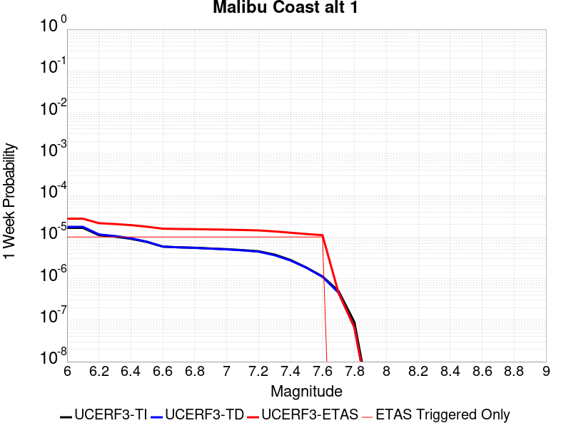 |  |  |  |

| Magnitude | 1 wk TI Prob | 1 wk TD Prob | 1 wk ETAS Prob | 1 wk ETAS/TD Gain | 1 wk ETAS Triggered Only | 1 mo TI Prob | 1 mo TD Prob | 1 mo ETAS Prob | 1 mo ETAS/TD Gain | 1 mo ETAS Triggered Only | 1 yr TI Prob | 1 yr TD Prob | 1 yr ETAS Prob | 1 yr ETAS/TD Gain | 1 yr ETAS Triggered Only | 10 yr TI Prob | 10 yr TD Prob | 10 yr ETAS Prob | 10 yr ETAS/TD Gain | 10 yr ETAS Triggered Only |
|-----|-----|-----|-----|-----|-----|-----|-----|-----|-----|-----|-----|-----|-----|-----|-----|-----|-----|-----|-----|-----|
| 6.0 | 1.6572556E-5 | 1.759807E-5 | 2.7597893E-5 | 1.5682342 | 1.0E-5 | 7.102331E-5 | 7.5418226E-5 | 8.5417465E-5 | 1.132584 | 1.0E-5 | 8.6436566E-4 | 9.1784896E-4 | 9.378306E-4 | 1.0217701 | 2.0E-5 | 0.0086101135 | 0.009142514 | 0.009182149 | 1.0043352 | 4.0E-5 |
| 6.1 | 1.6572556E-5 | 1.759807E-5 | 2.7597893E-5 | 1.5682342 | 1.0E-5 | 7.102331E-5 | 7.5418226E-5 | 8.5417465E-5 | 1.132584 | 1.0E-5 | 8.6436566E-4 | 9.1784896E-4 | 9.378306E-4 | 1.0217701 | 2.0E-5 | 0.0086101135 | 0.009142514 | 0.009182149 | 1.0043352 | 4.0E-5 |
| 6.2 | 1.1085717E-5 | 1.155715E-5 | 2.1557034E-5 | 1.8652552 | 1.0E-5 | 4.750935E-5 | 4.9529724E-5 | 5.9529226E-5 | 1.2018889 | 1.0E-5 | 5.782728E-4 | 6.0286105E-4 | 6.12855E-4 | 1.0165776 | 1.0E-5 | 0.0057677035 | 0.0060126274 | 0.006042447 | 1.0049595 | 3.0E-5 |
| 6.3 | 1.0208568E-5 | 1.0592241E-5 | 2.0592135E-5 | 1.9440774 | 1.0E-5 | 4.375027E-5 | 4.5394543E-5 | 5.5394088E-5 | 1.2202808 | 1.0E-5 | 5.325294E-4 | 5.5254134E-4 | 5.6253583E-4 | 1.0180882 | 1.0E-5 | 0.0053125503 | 0.0055119833 | 0.0055418178 | 1.0054127 | 3.0E-5 |
| 6.4 | 9.0682315E-6 | 9.342641E-6 | 1.9342548E-5 | 2.0703511 | 1.0E-5 | 3.8863272E-5 | 4.0039286E-5 | 5.0038885E-5 | 1.2497448 | 1.0E-5 | 4.730576E-4 | 4.873713E-4 | 4.973664E-4 | 1.0205083 | 1.0E-5 | 0.0047205184 | 0.004863238 | 0.004893092 | 1.0061387 | 3.0E-5 |
| 6.5 | 7.605796E-6 | 7.74859E-6 | 1.7748513E-5 | 2.2905474 | 1.0E-5 | 3.259586E-5 | 3.320783E-5 | 4.3207496E-5 | 1.3011239 | 1.0E-5 | 3.9678233E-4 | 4.0423166E-4 | 4.142276E-4 | 1.0247283 | 1.0E-5 | 0.0039607463 | 0.0040351013 | 0.0040649804 | 1.0074048 | 3.0E-5 |
| 6.6 | 5.889873E-6 | 5.8795417E-6 | 1.5879483E-5 | 2.7008028 | 1.0E-5 | 2.5242069E-5 | 2.5197793E-5 | 3.519754E-5 | 1.3968501 | 1.0E-5 | 3.0727885E-4 | 3.0674002E-4 | 3.1673696E-4 | 1.0325909 | 1.0E-5 | 0.003068543 | 0.0030631793 | 0.0030930873 | 1.0097637 | 3.0E-5 |
| 6.7 | 5.66586E-6 | 5.6416443E-6 | 1.5641588E-5 | 2.772523 | 1.0E-5 | 2.428203E-5 | 2.4178253E-5 | 3.417801E-5 | 1.4135848 | 1.0E-5 | 2.955936E-4 | 2.9433056E-4 | 3.043276E-4 | 1.0339653 | 1.0E-5 | 0.0029520073 | 0.0029394194 | 0.002969331 | 1.0101761 | 3.0E-5 |
| 6.8 | 5.521556E-6 | 5.48943E-6 | 1.5489375E-5 | 2.8216727 | 1.0E-5 | 2.3663597E-5 | 2.3525918E-5 | 3.352568E-5 | 1.4250531 | 1.0E-5 | 2.880662E-4 | 2.8639048E-4 | 2.9638762E-4 | 1.0349073 | 1.0E-5 | 0.0028769306 | 0.0028602257 | 0.0028901398 | 1.0104587 | 3.0E-5 |
| 6.9 | 5.29752E-6 | 5.2499345E-6 | 1.5249882E-5 | 2.9047756 | 1.0E-5 | 2.270346E-5 | 2.2499526E-5 | 3.24993E-5 | 1.4444438 | 1.0E-5 | 2.7637955E-4 | 2.7389737E-4 | 2.8389462E-4 | 1.0365 | 1.0E-5 | 0.0027603607 | 0.0027356083 | 0.0027655263 | 1.0109365 | 3.0E-5 |
| 7.0 | 5.106743E-6 | 5.0476815E-6 | 1.5047631E-5 | 2.9810975 | 1.0E-5 | 2.1885859E-5 | 2.1632743E-5 | 3.1632528E-5 | 1.4622523 | 1.0E-5 | 2.6642776E-4 | 2.6334688E-4 | 2.7334425E-4 | 1.0379627 | 1.0E-5 | 0.0026610855 | 0.0026303576 | 0.002660279 | 1.0113753 | 3.0E-5 |
| 7.1 | 4.8469647E-6 | 4.770376E-6 | 1.4770329E-5 | 3.0962608 | 1.0E-5 | 2.0772539E-5 | 2.044431E-5 | 3.0444104E-5 | 1.4891237 | 1.0E-5 | 2.528763E-4 | 2.488811E-4 | 2.588786E-4 | 1.0401698 | 1.0E-5 | 0.0025258875 | 0.0024860317 | 0.0025159572 | 1.0120374 | 3.0E-5 |
| 7.2 | 4.545514E-6 | 4.4481967E-6 | 1.4448152E-5 | 3.2480922 | 1.0E-5 | 1.9480629E-5 | 1.906356E-5 | 2.906337E-5 | 1.524551 | 1.0E-5 | 2.3715083E-4 | 2.3207419E-4 | 2.4207187E-4 | 1.0430796 | 1.0E-5 | 0.0023689792 | 0.002318326 | 0.0023482563 | 1.0129104 | 3.0E-5 |
| 7.3 | 3.794097E-6 | 3.6519373E-6 | 1.3651901E-5 | 3.7382627 | 1.0E-5 | 1.6260314E-5 | 1.5651065E-5 | 2.565091E-5 | 1.6389241 | 1.0E-5 | 1.9795135E-4 | 1.9053511E-4 | 2.0053319E-4 | 1.0524738 | 1.0E-5 | 0.001977751 | 0.0019037221 | 0.001933665 | 1.0157286 | 3.0E-5 |
| 7.4 | 2.808217E-6 | 2.7190777E-6 | 1.2719051E-5 | 4.6777077 | 1.0E-5 | 1.203516E-5 | 1.1653137E-5 | 2.165302E-5 | 1.858128 | 1.0E-5 | 1.4651821E-4 | 1.4186774E-4 | 1.5186632E-4 | 1.0704782 | 1.0E-5 | 0.0014642165 | 0.0014177744 | 0.0014477319 | 1.02113 | 3.0E-5 |
| 7.5 | 1.83809E-6 | 1.8190703E-6 | 1.1819052E-5 | 6.4973035 | 1.0E-5 | 7.877505E-6 | 7.795992E-6 | 1.7795914E-5 | 2.2827003 | 1.0E-5 | 9.59044E-5 | 9.4912095E-5 | 1.04911145E-4 | 1.1053506 | 1.0E-5 | 9.5863023E-4 | 9.487176E-4 | 9.6869865E-4 | 1.0210611 | 2.0E-5 |
| 7.6 | 1.1292672E-6 | 1.1001456E-6 | 1.11001345E-5 | 10.089696 | 1.0E-5 | 4.839708E-6 | 4.7149015E-6 | 1.4714854E-5 | 3.1209252 | 1.0E-5 | 5.8921847E-5 | 5.7402427E-5 | 6.740185E-5 | 1.1741986 | 1.0E-5 | 5.890623E-4 | 5.7387765E-4 | 5.838719E-4 | 1.0174153 | 1.0E-5 |
| 7.7 | 5.065272E-7 | 4.6091537E-7 | 4.6091537E-7 | 1.0 | 0.0 | 2.170829E-6 | 1.9753502E-6 | 1.9753502E-6 | 1.0 | 0.0 | 2.6429525E-5 | 2.4049634E-5 | 2.4049634E-5 | 1.0 | 0.0 | 2.642638E-4 | 2.4047145E-4 | 2.4047145E-4 | 1.0 | 0.0 |
| 7.8 | 8.952991E-8 | 6.707853E-8 | 6.707853E-8 | 1.0 | 0.0 | 3.8369956E-7 | 2.874794E-7 | 2.874794E-7 | 1.0 | 0.0 | 4.671532E-6 | 3.5000562E-6 | 3.5000562E-6 | 1.0 | 0.0 | 4.671434E-5 | 3.500003E-5 | 3.500003E-5 | 1.0 | 0.0 |
| 7.9 | 8.007447E-10 | 6.161581E-10 | 6.161581E-10 | 1.0 | 0.0 | 3.4317629E-9 | 2.640678E-9 | 2.640678E-9 | 1.0 | 0.0 | 4.1781714E-8 | 3.2150254E-8 | 3.2150254E-8 | 1.0 | 0.0 | 4.1781706E-7 | 3.2150248E-7 | 3.2150248E-7 | 1.0 | 0.0 |

## Hunting Creek - Bartlett Springs connector 2011
*[(top)](#table-of-contents)*

| 1 Week | 1 Month | 1 Year | 10 Year |
|-----|-----|-----|-----|
|  |  |  |  |

| Magnitude | 1 wk TI Prob | 1 wk TD Prob | 1 wk ETAS Prob | 1 wk ETAS/TD Gain | 1 wk ETAS Triggered Only | 1 mo TI Prob | 1 mo TD Prob | 1 mo ETAS Prob | 1 mo ETAS/TD Gain | 1 mo ETAS Triggered Only | 1 yr TI Prob | 1 yr TD Prob | 1 yr ETAS Prob | 1 yr ETAS/TD Gain | 1 yr ETAS Triggered Only | 10 yr TI Prob | 10 yr TD Prob | 10 yr ETAS Prob | 10 yr ETAS/TD Gain | 10 yr ETAS Triggered Only |
|-----|-----|-----|-----|-----|-----|-----|-----|-----|-----|-----|-----|-----|-----|-----|-----|-----|-----|-----|-----|-----|
| 6.0 | 4.940016E-5 | 6.7870766E-5 | 7.7870085E-5 | 1.1473289 | 1.0E-5 | 2.1169778E-4 | 2.9084194E-4 | 3.0083905E-4 | 1.0343729 | 1.0E-5 | 0.002574374 | 0.0035350819 | 0.003555011 | 1.0056375 | 2.0E-5 | 0.025447546 | 0.03477475 | 0.034803707 | 1.0008327 | 3.0E-5 |
| 6.1 | 4.940016E-5 | 6.7870766E-5 | 7.7870085E-5 | 1.1473289 | 1.0E-5 | 2.1169778E-4 | 2.9084194E-4 | 3.0083905E-4 | 1.0343729 | 1.0E-5 | 0.002574374 | 0.0035350819 | 0.003555011 | 1.0056375 | 2.0E-5 | 0.025447546 | 0.03477475 | 0.034803707 | 1.0008327 | 3.0E-5 |
| 6.2 | 4.472471E-5 | 6.100572E-5 | 7.100511E-5 | 1.1639091 | 1.0E-5 | 1.9166325E-4 | 2.6142647E-4 | 2.7142384E-4 | 1.0382416 | 1.0E-5 | 0.0023310026 | 0.0031781218 | 0.0031980583 | 1.006273 | 2.0E-5 | 0.02306703 | 0.031317808 | 0.03134687 | 1.0009279 | 3.0E-5 |
| 6.3 | 4.472471E-5 | 6.100572E-5 | 7.100511E-5 | 1.1639091 | 1.0E-5 | 1.9166325E-4 | 2.6142647E-4 | 2.7142384E-4 | 1.0382416 | 1.0E-5 | 0.0023310026 | 0.0031781218 | 0.0031980583 | 1.006273 | 2.0E-5 | 0.02306703 | 0.031317808 | 0.03134687 | 1.0009279 | 3.0E-5 |
| 6.4 | 4.0001003E-5 | 5.410516E-5 | 5.410516E-5 | 1.0 | 0.0 | 1.714216E-4 | 2.318579E-4 | 2.418556E-4 | 1.0431199 | 1.0E-5 | 0.0020850603 | 0.0028191686 | 0.0028291403 | 1.0035372 | 1.0E-5 | 0.02065605 | 0.027829198 | 0.027848642 | 1.0006987 | 2.0E-5 |
| 6.5 | 3.8033053E-5 | 5.126649E-5 | 5.126649E-5 | 1.0 | 0.0 | 1.6298861E-4 | 2.1969521E-4 | 2.2969302E-4 | 1.0455076 | 1.0E-5 | 0.0019825802 | 0.0026714848 | 0.0026814581 | 1.0037333 | 1.0E-5 | 0.019649856 | 0.026391273 | 0.026410745 | 1.0007378 | 2.0E-5 |
| 6.6 | 3.653754E-5 | 4.912955E-5 | 4.912955E-5 | 1.0 | 0.0 | 1.5658008E-4 | 2.1053842E-4 | 2.2053631E-4 | 1.0474873 | 1.0E-5 | 0.0019046954 | 0.0025602889 | 0.002570263 | 1.0038958 | 1.0E-5 | 0.018884527 | 0.025307199 | 0.025326693 | 1.0007703 | 2.0E-5 |
| 6.7 | 3.372024E-5 | 4.5140216E-5 | 4.5140216E-5 | 1.0 | 0.0 | 1.4450731E-4 | 1.9344388E-4 | 1.9344388E-4 | 1.0 | 0.0 | 0.0017579567 | 0.0023526535 | 0.0023526535 | 1.0 | 0.0 | 0.017441148 | 0.023278862 | 0.023288628 | 1.0004196 | 1.0E-5 |
| 6.8 | 2.9650024E-5 | 3.9411647E-5 | 3.9411647E-5 | 1.0 | 0.0 | 1.2706534E-4 | 1.6889606E-4 | 1.6889606E-4 | 1.0 | 0.0 | 0.0015459227 | 0.0020543607 | 0.0020543607 | 1.0 | 0.0 | 0.015352124 | 0.020351961 | 0.020361759 | 1.0004814 | 1.0E-5 |
| 6.9 | 2.860775E-5 | 3.7812886E-5 | 3.7812886E-5 | 1.0 | 0.0 | 1.2259888E-4 | 1.620452E-4 | 1.620452E-4 | 1.0 | 0.0 | 0.0014916194 | 0.0019711219 | 0.0019711219 | 1.0 | 0.0 | 0.014816469 | 0.019536555 | 0.01954636 | 1.0005019 | 1.0E-5 |
| 7.0 | 2.6696067E-5 | 3.5067544E-5 | 3.5067544E-5 | 1.0 | 0.0 | 1.144067E-4 | 1.5028086E-4 | 1.5028086E-4 | 1.0 | 0.0 | 0.0013920115 | 0.0018281427 | 0.0018281427 | 1.0 | 0.0 | 0.013833242 | 0.01813184 | 0.018141657 | 1.0005416 | 1.0E-5 |
| 7.1 | 2.456087E-5 | 3.2013326E-5 | 3.2013326E-5 | 1.0 | 0.0 | 1.0525662E-4 | 1.3719281E-4 | 1.3719281E-4 | 1.0 | 0.0 | 0.001280746 | 0.0016690517 | 0.0016690517 | 1.0 | 0.0 | 0.012733897 | 0.016566671 | 0.016576506 | 1.0005937 | 1.0E-5 |
| 7.2 | 2.295761E-5 | 2.9823148E-5 | 2.9823148E-5 | 1.0 | 0.0 | 9.8386045E-5 | 1.2780727E-4 | 1.2780727E-4 | 1.0 | 0.0 | 0.0011971919 | 0.0015549522 | 0.0015549522 | 1.0 | 0.0 | 0.011907627 | 0.015442378 | 0.015442378 | 1.0 | 0.0 |
| 7.3 | 2.1256936E-5 | 2.7542124E-5 | 2.7542124E-5 | 1.0 | 0.0 | 9.109797E-5 | 1.1803238E-4 | 1.1803238E-4 | 1.0 | 0.0 | 0.0011085535 | 0.0014361058 | 0.0014361058 | 1.0 | 0.0 | 0.011030397 | 0.014269741 | 0.014269741 | 1.0 | 0.0 |
| 7.4 | 1.8784336E-5 | 2.430697E-5 | 2.430697E-5 | 1.0 | 0.0 | 8.050181E-5 | 1.0416861E-4 | 1.0416861E-4 | 1.0 | 0.0 | 9.796688E-4 | 0.0012675226 | 0.0012675226 | 1.0 | 0.0 | 0.009753612 | 0.012604194 | 0.012604194 | 1.0 | 0.0 |
| 7.5 | 1.7248298E-5 | 2.2269056E-5 | 2.2269056E-5 | 1.0 | 0.0 | 7.391918E-5 | 9.543537E-5 | 9.543537E-5 | 1.0 | 0.0 | 8.9959445E-4 | 0.0011613137 | 0.0011613137 | 1.0 | 0.0 | 0.008959615 | 0.011553645 | 0.011553645 | 1.0 | 0.0 |
| 7.6 | 1.0653709E-5 | 1.3722259E-5 | 1.3722259E-5 | 1.0 | 0.0 | 4.5657955E-5 | 5.880837E-5 | 5.880837E-5 | 1.0 | 0.0 | 5.557438E-4 | 7.157594E-4 | 7.157594E-4 | 1.0 | 0.0 | 0.0055435603 | 0.0071350415 | 0.0071350415 | 1.0 | 0.0 |
| 7.7 | 3.286316E-6 | 4.0903997E-6 | 4.0903997E-6 | 1.0 | 0.0 | 1.4084137E-5 | 1.7530168E-5 | 1.7530168E-5 | 1.0 | 0.0 | 1.7146087E-4 | 2.1340905E-4 | 2.1340905E-4 | 1.0 | 0.0 | 0.0017132863 | 0.0021320845 | 0.0021320845 | 1.0 | 0.0 |
| 7.8 | 5.1855085E-7 | 5.972095E-7 | 5.972095E-7 | 1.0 | 0.0 | 2.222359E-6 | 2.5594668E-6 | 2.5594668E-6 | 1.0 | 0.0 | 2.7056883E-5 | 3.1161075E-5 | 3.1161075E-5 | 1.0 | 0.0 | 2.705359E-4 | 3.1156064E-4 | 3.1156064E-4 | 1.0 | 0.0 |

## San Juan
*[(top)](#table-of-contents)*

| 1 Week | 1 Month | 1 Year | 10 Year |
|-----|-----|-----|-----|
|  |  |  | 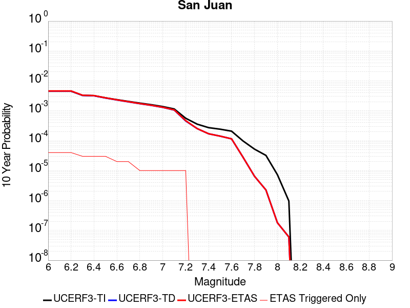 |

| Magnitude | 1 wk TI Prob | 1 wk TD Prob | 1 wk ETAS Prob | 1 wk ETAS/TD Gain | 1 wk ETAS Triggered Only | 1 mo TI Prob | 1 mo TD Prob | 1 mo ETAS Prob | 1 mo ETAS/TD Gain | 1 mo ETAS Triggered Only | 1 yr TI Prob | 1 yr TD Prob | 1 yr ETAS Prob | 1 yr ETAS/TD Gain | 1 yr ETAS Triggered Only | 10 yr TI Prob | 10 yr TD Prob | 10 yr ETAS Prob | 10 yr ETAS/TD Gain | 10 yr ETAS Triggered Only |
|-----|-----|-----|-----|-----|-----|-----|-----|-----|-----|-----|-----|-----|-----|-----|-----|-----|-----|-----|-----|-----|
| 6.0 | 8.682808E-6 | 8.74917E-6 | 8.74917E-6 | 1.0 | 0.0 | 3.72115E-5 | 3.749593E-5 | 4.7495556E-5 | 1.2666856 | 1.0E-5 | 4.5295584E-4 | 4.5642213E-4 | 4.6641758E-4 | 1.0218996 | 1.0E-5 | 0.004520337 | 0.004555389 | 0.0045952066 | 1.0087408 | 4.0E-5 |
| 6.1 | 8.682808E-6 | 8.74917E-6 | 8.74917E-6 | 1.0 | 0.0 | 3.72115E-5 | 3.749593E-5 | 4.7495556E-5 | 1.2666856 | 1.0E-5 | 4.5295584E-4 | 4.5642213E-4 | 4.6641758E-4 | 1.0218996 | 1.0E-5 | 0.004520337 | 0.004555389 | 0.0045952066 | 1.0087408 | 4.0E-5 |
| 6.2 | 8.682808E-6 | 8.74917E-6 | 8.74917E-6 | 1.0 | 0.0 | 3.72115E-5 | 3.749593E-5 | 4.7495556E-5 | 1.2666856 | 1.0E-5 | 4.5295584E-4 | 4.5642213E-4 | 4.6641758E-4 | 1.0218996 | 1.0E-5 | 0.004520337 | 0.004555389 | 0.0045952066 | 1.0087408 | 4.0E-5 |
| 6.3 | 6.3054235E-6 | 6.282591E-6 | 6.282591E-6 | 1.0 | 0.0 | 2.7022963E-5 | 2.692512E-5 | 3.6924852E-5 | 1.3713903 | 1.0E-5 | 3.2895492E-4 | 3.2776545E-4 | 3.3776215E-4 | 1.0304996 | 1.0E-5 | 0.003284684 | 0.0032730205 | 0.0033029222 | 1.0091358 | 3.0E-5 |
| 6.4 | 6.1490473E-6 | 6.1144706E-6 | 6.1144706E-6 | 1.0 | 0.0 | 2.6352795E-5 | 2.6204618E-5 | 3.6204357E-5 | 1.3816022 | 1.0E-5 | 3.2079802E-4 | 3.189959E-4 | 3.289927E-4 | 1.0313383 | 1.0E-5 | 0.0032033534 | 0.0031855768 | 0.003215481 | 1.0093875 | 3.0E-5 |
| 6.5 | 5.204848E-6 | 5.137238E-6 | 5.137238E-6 | 1.0 | 0.0 | 2.23063E-5 | 2.2016555E-5 | 3.2016334E-5 | 1.4541937 | 1.0E-5 | 2.7154534E-4 | 2.6801953E-4 | 2.7801684E-4 | 1.0373007 | 1.0E-5 | 0.0027121378 | 0.0026771172 | 0.002707037 | 1.0111761 | 3.0E-5 |
| 6.6 | 4.5179986E-6 | 4.415036E-6 | 4.415036E-6 | 1.0 | 0.0 | 1.9362706E-5 | 1.892145E-5 | 1.892145E-5 | 1.0 | 0.0 | 2.3571544E-4 | 2.303451E-4 | 2.303451E-4 | 1.0 | 0.0 | 0.0023546559 | 0.0023012008 | 0.0023211548 | 1.0086712 | 2.0E-5 |
| 6.7 | 3.9442616E-6 | 3.8198336E-6 | 3.8198336E-6 | 1.0 | 0.0 | 1.6903869E-5 | 1.6370615E-5 | 1.6370615E-5 | 1.0 | 0.0 | 2.0578515E-4 | 1.9929469E-4 | 1.9929469E-4 | 1.0 | 0.0 | 0.002055947 | 0.001991285 | 0.0020112451 | 1.0100237 | 2.0E-5 |
| 6.8 | 3.4536245E-6 | 3.3163408E-6 | 3.3163408E-6 | 1.0 | 0.0 | 1.4801163E-5 | 1.4212815E-5 | 1.4212815E-5 | 1.0 | 0.0 | 1.8018926E-4 | 1.7302789E-4 | 1.7302789E-4 | 1.0 | 0.0 | 0.0018004322 | 0.001729051 | 0.0017390337 | 1.0057735 | 1.0E-5 |
| 6.9 | 3.059865E-6 | 2.9120363E-6 | 2.9120363E-6 | 1.0 | 0.0 | 1.3113641E-5 | 1.2480099E-5 | 1.2480099E-5 | 1.0 | 0.0 | 1.596469E-4 | 1.5193518E-4 | 1.5193518E-4 | 1.0 | 0.0 | 0.0015953224 | 0.0015184281 | 0.0015284129 | 1.0065757 | 1.0E-5 |
| 7.0 | 2.6504351E-6 | 2.492005E-6 | 2.492005E-6 | 1.0 | 0.0 | 1.1358958E-5 | 1.0679981E-5 | 1.0679981E-5 | 1.0 | 0.0 | 1.3828653E-4 | 1.3002155E-4 | 1.3002155E-4 | 1.0 | 0.0 | 0.0013820052 | 0.001299567 | 0.0013095541 | 1.0076848 | 1.0E-5 |
| 7.1 | 2.2039317E-6 | 2.0338366E-6 | 2.0338366E-6 | 1.0 | 0.0 | 9.445387E-6 | 8.716416E-6 | 8.716416E-6 | 1.0 | 0.0 | 1.1499152E-4 | 1.0611773E-4 | 1.0611773E-4 | 1.0 | 0.0 | 0.0011493203 | 0.0010607811 | 0.0010707704 | 1.009417 | 1.0E-5 |
| 7.2 | 1.0786707E-6 | 8.770239E-7 | 8.770239E-7 | 1.0 | 0.0 | 4.622866E-6 | 3.7586685E-6 | 3.7586685E-6 | 1.0 | 0.0 | 5.628194E-5 | 4.576084E-5 | 4.576084E-5 | 1.0 | 0.0 | 5.6267687E-4 | 4.5757365E-4 | 4.6756907E-4 | 1.0218444 | 1.0E-5 |
| 7.3 | 6.846433E-7 | 4.868812E-7 | 4.868812E-7 | 1.0 | 0.0 | 2.9341822E-6 | 2.086632E-6 | 2.086632E-6 | 1.0 | 0.0 | 3.5723086E-5 | 2.5404452E-5 | 2.5404452E-5 | 1.0 | 0.0 | 3.571734E-4 | 2.5405022E-4 | 2.5405022E-4 | 1.0 | 0.0 |
| 7.4 | 5.23043E-7 | 3.2627884E-7 | 3.2627884E-7 | 1.0 | 0.0 | 2.2416111E-6 | 1.3983371E-6 | 1.3983371E-6 | 1.0 | 0.0 | 2.7291273E-5 | 1.7024622E-5 | 1.7024622E-5 | 1.0 | 0.0 | 2.7287923E-4 | 1.7026608E-4 | 1.7026608E-4 | 1.0 | 0.0 |
| 7.5 | 4.648444E-7 | 2.723464E-7 | 2.723464E-7 | 1.0 | 0.0 | 1.9921886E-6 | 1.1671983E-6 | 1.1671983E-6 | 1.0 | 0.0 | 2.4254627E-5 | 1.4210547E-5 | 1.4210547E-5 | 1.0 | 0.0 | 2.425198E-4 | 1.4212691E-4 | 1.4212691E-4 | 1.0 | 0.0 |
| 7.6 | 3.9906567E-7 | 2.2083036E-7 | 2.2083036E-7 | 1.0 | 0.0 | 1.7102802E-6 | 9.4641547E-7 | 9.4641547E-7 | 1.0 | 0.0 | 2.0822463E-5 | 1.1522548E-5 | 1.1522548E-5 | 1.0 | 0.0 | 2.0820512E-4 | 1.15244526E-4 | 1.15244526E-4 | 1.0 | 0.0 |
| 7.7 | 1.8784601E-7 | 5.366277E-8 | 5.366277E-8 | 1.0 | 0.0 | 8.0505407E-7 | 2.2998329E-7 | 2.2998329E-7 | 1.0 | 0.0 | 9.80149E-6 | 2.800043E-6 | 2.800043E-6 | 1.0 | 0.0 | 9.801057E-5 | 2.8008939E-5 | 2.8008939E-5 | 1.0 | 0.0 |
| 7.8 | 1.00154914E-7 | 1.2412917E-8 | 1.2412917E-8 | 1.0 | 0.0 | 4.2923529E-7 | 5.3198217E-8 | 5.3198217E-8 | 1.0 | 0.0 | 5.225927E-6 | 6.476881E-7 | 6.476881E-7 | 1.0 | 0.0 | 5.225804E-5 | 6.4827886E-6 | 6.4827886E-6 | 1.0 | 0.0 |
| 7.9 | 6.171429E-8 | 4.2946513E-9 | 4.2946513E-9 | 1.0 | 0.0 | 2.6448978E-7 | 1.8405647E-8 | 1.8405647E-8 | 1.0 | 0.0 | 3.2201583E-6 | 2.2408874E-7 | 2.2408874E-7 | 1.0 | 0.0 | 3.2201115E-5 | 2.2462114E-6 | 2.2462114E-6 | 1.0 | 0.0 |
| 8.0 | 1.3974572E-8 | 3.3737857E-10 | 3.3737857E-10 | 1.0 | 0.0 | 5.989102E-8 | 1.4459075E-9 | 1.4459075E-9 | 1.0 | 0.0 | 7.2917294E-7 | 1.760392E-8 | 1.760392E-8 | 1.0 | 0.0 | 7.2917055E-6 | 1.8038004E-7 | 1.8038004E-7 | 1.0 | 0.0 |
| 8.1 | 1.8403477E-9 | 1.1291601E-10 | 1.1291601E-10 | 1.0 | 0.0 | 7.887204E-9 | 4.839261E-10 | 4.839261E-10 | 1.0 | 0.0 | 9.602671E-8 | 5.8917977E-9 | 5.8917977E-9 | 1.0 | 0.0 | 9.602667E-7 | 6.0206084E-8 | 6.0206084E-8 | 1.0 | 0.0 |

## Great Valley 03 Mysterious Ridge
*[(top)](#table-of-contents)*

| 1 Week | 1 Month | 1 Year | 10 Year |
|-----|-----|-----|-----|
|  |  |  |  |

| Magnitude | 1 wk TI Prob | 1 wk TD Prob | 1 wk ETAS Prob | 1 wk ETAS/TD Gain | 1 wk ETAS Triggered Only | 1 mo TI Prob | 1 mo TD Prob | 1 mo ETAS Prob | 1 mo ETAS/TD Gain | 1 mo ETAS Triggered Only | 1 yr TI Prob | 1 yr TD Prob | 1 yr ETAS Prob | 1 yr ETAS/TD Gain | 1 yr ETAS Triggered Only | 10 yr TI Prob | 10 yr TD Prob | 10 yr ETAS Prob | 10 yr ETAS/TD Gain | 10 yr ETAS Triggered Only |
|-----|-----|-----|-----|-----|-----|-----|-----|-----|-----|-----|-----|-----|-----|-----|-----|-----|-----|-----|-----|-----|
| 6.0 | 3.1182444E-5 | 3.6034133E-5 | 3.6034133E-5 | 1.0 | 0.0 | 1.336322E-4 | 1.5442389E-4 | 1.5442389E-4 | 1.0 | 0.0 | 0.0016257578 | 0.0018786751 | 0.0018886563 | 1.0053129 | 1.0E-5 | 0.016139153 | 0.018646672 | 0.018666299 | 1.0010526 | 2.0E-5 |
| 6.1 | 3.1182444E-5 | 3.6034133E-5 | 3.6034133E-5 | 1.0 | 0.0 | 1.336322E-4 | 1.5442389E-4 | 1.5442389E-4 | 1.0 | 0.0 | 0.0016257578 | 0.0018786751 | 0.0018886563 | 1.0053129 | 1.0E-5 | 0.016139153 | 0.018646672 | 0.018666299 | 1.0010526 | 2.0E-5 |
| 6.2 | 3.1182444E-5 | 3.6034133E-5 | 3.6034133E-5 | 1.0 | 0.0 | 1.336322E-4 | 1.5442389E-4 | 1.5442389E-4 | 1.0 | 0.0 | 0.0016257578 | 0.0018786751 | 0.0018886563 | 1.0053129 | 1.0E-5 | 0.016139153 | 0.018646672 | 0.018666299 | 1.0010526 | 2.0E-5 |
| 6.3 | 2.106934E-5 | 2.3850303E-5 | 2.3850303E-5 | 1.0 | 0.0 | 9.0294045E-5 | 1.0221176E-4 | 1.0221176E-4 | 1.0 | 0.0 | 0.0010987755 | 0.0012437488 | 0.0012537364 | 1.0080302 | 1.0E-5 | 0.010933585 | 0.0123711275 | 0.012381004 | 1.0007983 | 1.0E-5 |
| 6.4 | 2.106934E-5 | 2.3850303E-5 | 2.3850303E-5 | 1.0 | 0.0 | 9.0294045E-5 | 1.0221176E-4 | 1.0221176E-4 | 1.0 | 0.0 | 0.0010987755 | 0.0012437488 | 0.0012537364 | 1.0080302 | 1.0E-5 | 0.010933585 | 0.0123711275 | 0.012381004 | 1.0007983 | 1.0E-5 |
| 6.5 | 1.9389783E-5 | 2.1884982E-5 | 2.1884982E-5 | 1.0 | 0.0 | 8.309642E-5 | 9.378956E-5 | 9.378956E-5 | 1.0 | 0.0 | 0.0010112294 | 0.0011413175 | 0.0011513061 | 1.0087517 | 1.0E-5 | 0.010066401 | 0.011357434 | 0.011367321 | 1.0008705 | 1.0E-5 |
| 6.6 | 1.9370193E-5 | 2.1864902E-5 | 2.1864902E-5 | 1.0 | 0.0 | 8.301247E-5 | 9.3703515E-5 | 9.3703515E-5 | 1.0 | 0.0 | 0.0010102082 | 0.001140271 | 0.0011502596 | 1.0087599 | 1.0E-5 | 0.010056281 | 0.011347076 | 0.011356963 | 1.0008713 | 1.0E-5 |
| 6.7 | 1.6723505E-5 | 1.8799281E-5 | 1.8799281E-5 | 1.0 | 0.0 | 7.16702E-5 | 8.056597E-5 | 8.056597E-5 | 1.0 | 0.0 | 8.722353E-4 | 9.804688E-4 | 9.90459E-4 | 1.0101892 | 1.0E-5 | 0.008688197 | 0.009763439 | 0.009773342 | 1.0010142 | 1.0E-5 |
| 6.8 | 1.426937E-5 | 1.599721E-5 | 1.599721E-5 | 1.0 | 0.0 | 6.115301E-5 | 6.855775E-5 | 6.855775E-5 | 1.0 | 0.0 | 7.4428355E-4 | 8.343854E-4 | 8.443771E-4 | 1.0119748 | 1.0E-5 | 0.007417957 | 0.008314005 | 0.008323922 | 1.0011928 | 1.0E-5 |
| 6.9 | 1.2469891E-5 | 1.3956928E-5 | 1.3956928E-5 | 1.0 | 0.0 | 5.3441294E-5 | 5.9814105E-5 | 5.9814105E-5 | 1.0 | 0.0 | 6.504535E-4 | 7.280055E-4 | 7.3799817E-4 | 1.0137261 | 1.0E-5 | 0.006485529 | 0.00725743 | 0.0072673573 | 1.0013679 | 1.0E-5 |
| 7.0 | 8.7746275E-6 | 9.791734E-6 | 9.791734E-6 | 1.0 | 0.0 | 3.7605005E-5 | 4.196394E-5 | 4.196394E-5 | 1.0 | 0.0 | 4.5774475E-4 | 5.1079853E-4 | 5.1079853E-4 | 1.0 | 0.0 | 0.00456803 | 0.005096977 | 0.005096977 | 1.0 | 0.0 |
| 7.1 | 6.1067153E-6 | 6.813725E-6 | 6.813725E-6 | 1.0 | 0.0 | 2.6171374E-5 | 2.9201385E-5 | 2.9201385E-5 | 1.0 | 0.0 | 3.1858988E-4 | 3.5547445E-4 | 3.5547445E-4 | 1.0 | 0.0 | 0.0031813353 | 0.003549609 | 0.003549609 | 1.0 | 0.0 |
| 7.2 | 2.939283E-6 | 3.2741057E-6 | 3.2741057E-6 | 1.0 | 0.0 | 1.2596866E-5 | 1.4031816E-5 | 1.4031816E-5 | 1.0 | 0.0 | 1.5335606E-4 | 1.7082572E-4 | 1.7082572E-4 | 1.0 | 0.0 | 0.0015325027 | 0.001707116 | 0.001707116 | 1.0 | 0.0 |
| 7.3 | 7.2387763E-7 | 8.008505E-7 | 8.008505E-7 | 1.0 | 0.0 | 3.102329E-6 | 3.4322145E-6 | 3.4322145E-6 | 1.0 | 0.0 | 3.77702E-5 | 4.178687E-5 | 4.178687E-5 | 1.0 | 0.0 | 3.7763783E-4 | 4.1783508E-4 | 4.1783508E-4 | 1.0 | 0.0 |
| 7.4 | 3.112171E-8 | 3.2068368E-8 | 3.2068368E-8 | 1.0 | 0.0 | 1.3337875E-7 | 1.3743585E-7 | 1.3743585E-7 | 1.0 | 0.0 | 1.6238852E-6 | 1.6732803E-6 | 1.6732803E-6 | 1.0 | 0.0 | 1.6238733E-5 | 1.6732685E-5 | 1.6732685E-5 | 1.0 | 0.0 |

## Malibu Coast (Extension) alt 1
*[(top)](#table-of-contents)*

| 1 Week | 1 Month | 1 Year | 10 Year |
|-----|-----|-----|-----|
|  |  |  | 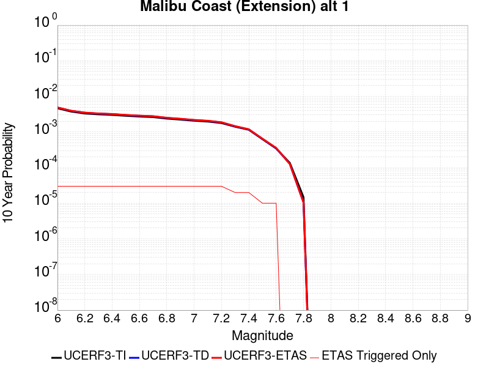 |

| Magnitude | 1 wk TI Prob | 1 wk TD Prob | 1 wk ETAS Prob | 1 wk ETAS/TD Gain | 1 wk ETAS Triggered Only | 1 mo TI Prob | 1 mo TD Prob | 1 mo ETAS Prob | 1 mo ETAS/TD Gain | 1 mo ETAS Triggered Only | 1 yr TI Prob | 1 yr TD Prob | 1 yr ETAS Prob | 1 yr ETAS/TD Gain | 1 yr ETAS Triggered Only | 10 yr TI Prob | 10 yr TD Prob | 10 yr ETAS Prob | 10 yr ETAS/TD Gain | 10 yr ETAS Triggered Only |
|-----|-----|-----|-----|-----|-----|-----|-----|-----|-----|-----|-----|-----|-----|-----|-----|-----|-----|-----|-----|-----|
| 6.0 | 8.930738E-6 | 9.3292765E-6 | 1.9329183E-5 | 2.0718844 | 1.0E-5 | 3.827403E-5 | 3.998201E-5 | 4.9981612E-5 | 1.2501025 | 1.0E-5 | 4.6588664E-4 | 4.86674E-4 | 5.066643E-4 | 1.0410752 | 2.0E-5 | 0.0046491115 | 0.004856264 | 0.0048861187 | 1.0061476 | 3.0E-5 |
| 6.1 | 7.199952E-6 | 7.5302974E-6 | 1.7530221E-5 | 2.3279588 | 1.0E-5 | 3.0856572E-5 | 3.2272306E-5 | 4.2271986E-5 | 1.3098532 | 1.0E-5 | 3.75614E-4 | 3.928451E-4 | 4.1283725E-4 | 1.0508907 | 2.0E-5 | 0.0037497976 | 0.0039215726 | 0.003951455 | 1.00762 | 3.0E-5 |
| 6.2 | 6.3721413E-6 | 6.666792E-6 | 1.6666725E-5 | 2.4999616 | 1.0E-5 | 2.7308892E-5 | 2.8571656E-5 | 3.8571372E-5 | 1.3499873 | 1.0E-5 | 3.3243504E-4 | 3.4780474E-4 | 3.677978E-4 | 1.0574836 | 2.0E-5 | 0.0033193815 | 0.0034726441 | 0.00350254 | 1.0086089 | 3.0E-5 |
| 6.3 | 6.016345E-6 | 6.295159E-6 | 1.6295096E-5 | 2.5885122 | 1.0E-5 | 2.578408E-5 | 2.6978976E-5 | 3.6978705E-5 | 1.370649 | 1.0E-5 | 3.1387596E-4 | 3.2841985E-4 | 3.4841328E-4 | 1.0608777 | 2.0E-5 | 0.00313433 | 0.0032793812 | 0.0033092827 | 1.0091181 | 3.0E-5 |
| 6.4 | 5.8104883E-6 | 6.0795455E-6 | 1.6079484E-5 | 2.6448498 | 1.0E-5 | 2.4901856E-5 | 2.6054937E-5 | 3.6054676E-5 | 1.3837944 | 1.0E-5 | 3.031379E-4 | 3.17173E-4 | 3.3716665E-4 | 1.063037 | 2.0E-5 | 0.0030272473 | 0.0031672379 | 0.0031971429 | 1.009442 | 3.0E-5 |
| 6.5 | 5.476925E-6 | 5.727514E-6 | 1.5727457E-5 | 2.745948 | 1.0E-5 | 2.3472323E-5 | 2.454626E-5 | 3.4546014E-5 | 1.407384 | 1.0E-5 | 2.8573806E-4 | 2.9881002E-4 | 3.1880403E-4 | 1.0669122 | 2.0E-5 | 0.0028537093 | 0.0029841145 | 0.0030140248 | 1.0100232 | 3.0E-5 |
| 6.6 | 5.222387E-6 | 5.4585807E-6 | 1.5458527E-5 | 2.831968 | 1.0E-5 | 2.2381464E-5 | 2.3393708E-5 | 3.3393473E-5 | 1.4274553 | 1.0E-5 | 2.7246025E-4 | 2.8478145E-4 | 3.0477578E-4 | 1.0702093 | 2.0E-5 | 0.0027212645 | 0.002844196 | 0.0028741106 | 1.0105178 | 3.0E-5 |
| 6.7 | 5.0337076E-6 | 5.259104E-6 | 1.5259051E-5 | 2.9014547 | 1.0E-5 | 2.1572854E-5 | 2.2538823E-5 | 3.25386E-5 | 1.4436688 | 1.0E-5 | 2.6261783E-4 | 2.743759E-4 | 2.9437043E-4 | 1.0728726 | 2.0E-5 | 0.002623077 | 0.0027404015 | 0.0027703193 | 1.0109173 | 3.0E-5 |
| 6.8 | 4.5675624E-6 | 4.7587173E-6 | 1.475867E-5 | 3.1013966 | 1.0E-5 | 1.9575122E-5 | 2.0394344E-5 | 3.039414E-5 | 1.490322 | 1.0E-5 | 2.3830103E-4 | 2.4827302E-4 | 2.6826808E-4 | 1.0805365 | 2.0E-5 | 0.0023804565 | 0.0024799763 | 0.002509902 | 1.0120668 | 3.0E-5 |
| 6.9 | 4.2802412E-6 | 4.4520216E-6 | 1.4451977E-5 | 3.2461607 | 1.0E-5 | 1.8343762E-5 | 1.9079953E-5 | 2.9079762E-5 | 1.5241003 | 1.0E-5 | 2.2331243E-4 | 2.3227383E-4 | 2.5226918E-4 | 1.0860853 | 2.0E-5 | 0.0022308815 | 0.0023203273 | 0.0023502577 | 1.0128992 | 3.0E-5 |
| 7.0 | 3.9794063E-6 | 4.1301E-6 | 1.4130059E-5 | 3.421239 | 1.0E-5 | 1.7054486E-5 | 1.770031E-5 | 2.7700133E-5 | 1.5649519 | 1.0E-5 | 2.0761859E-4 | 2.1548007E-4 | 2.3547576E-4 | 1.092796 | 2.0E-5 | 0.0020742472 | 0.002152725 | 0.0021826604 | 1.0139059 | 3.0E-5 |
| 7.1 | 3.7730424E-6 | 3.911218E-6 | 1.3911179E-5 | 3.5567384 | 1.0E-5 | 1.6170083E-5 | 1.6762255E-5 | 2.6762087E-5 | 1.5965685 | 1.0E-5 | 1.9685295E-4 | 2.0406146E-4 | 2.2405738E-4 | 1.0979897 | 2.0E-5 | 0.0019667868 | 0.0020387538 | 0.0020686926 | 1.0146849 | 3.0E-5 |
| 7.2 | 3.424985E-6 | 3.541338E-6 | 1.3541303E-5 | 3.8237815 | 1.0E-5 | 1.4678424E-5 | 1.5177075E-5 | 2.5176923E-5 | 1.6588784 | 1.0E-5 | 1.7869516E-4 | 1.8476533E-4 | 2.0476164E-4 | 1.1082255 | 2.0E-5 | 0.0017855153 | 0.0018461292 | 0.0018760738 | 1.0162202 | 3.0E-5 |
| 7.3 | 2.6966375E-6 | 2.759654E-6 | 1.2759627E-5 | 4.6236324 | 1.0E-5 | 1.15569665E-5 | 1.1827035E-5 | 2.1826918E-5 | 1.8455104 | 1.0E-5 | 1.4069698E-4 | 1.4398468E-4 | 1.5398324E-4 | 1.0694418 | 1.0E-5 | 0.0014060794 | 0.001438918 | 0.0014588893 | 1.0138793 | 2.0E-5 |
| 7.4 | 2.215957E-6 | 2.249379E-6 | 1.2249357E-5 | 5.4456615 | 1.0E-5 | 9.496924E-6 | 9.64016E-6 | 1.9640063E-5 | 2.0373173 | 1.0E-5 | 1.1561892E-4 | 1.1736266E-4 | 1.2736149E-4 | 1.085196 | 1.0E-5 | 0.0011555878 | 0.0011730106 | 0.0011929871 | 1.0170301 | 2.0E-5 |
| 7.5 | 1.2040218E-6 | 1.2219067E-6 | 1.1221894E-5 | 9.183921 | 1.0E-5 | 5.160083E-6 | 5.2367327E-6 | 1.523668E-5 | 2.9095776 | 1.0E-5 | 6.2822204E-5 | 6.3755375E-5 | 7.375474E-5 | 1.1568395 | 1.0E-5 | 6.280445E-4 | 6.3737266E-4 | 6.4736634E-4 | 1.0156794 | 1.0E-5 |
| 7.6 | 6.6157446E-7 | 6.6789755E-7 | 1.0667891E-5 | 15.972345 | 1.0E-5 | 2.835316E-6 | 2.8624152E-6 | 1.2862386E-5 | 4.4935436 | 1.0E-5 | 3.4519428E-5 | 3.4849363E-5 | 4.4849014E-5 | 1.2869393 | 1.0E-5 | 3.4514067E-4 | 3.484405E-4 | 3.58437E-4 | 1.0286893 | 1.0E-5 |
| 7.7 | 2.6012302E-7 | 2.4357584E-7 | 2.4357584E-7 | 1.0 | 0.0 | 1.1148124E-6 | 1.0438962E-6 | 1.0438962E-6 | 1.0 | 0.0 | 1.3572758E-5 | 1.2709373E-5 | 1.2709373E-5 | 1.0 | 0.0 | 1.3571928E-4 | 1.2708752E-4 | 1.2708752E-4 | 1.0 | 0.0 |
| 7.8 | 2.8323132E-8 | 2.0266642E-8 | 2.0266642E-8 | 1.0 | 0.0 | 1.2138484E-7 | 8.685703E-8 | 8.685703E-8 | 1.0 | 0.0 | 1.4778595E-6 | 1.0574839E-6 | 1.0574839E-6 | 1.0 | 0.0 | 1.4778497E-5 | 1.0574797E-5 | 1.0574797E-5 | 1.0 | 0.0 |

## Carson Range (Genoa)
*[(top)](#table-of-contents)*

| 1 Week | 1 Month | 1 Year | 10 Year |
|-----|-----|-----|-----|
| 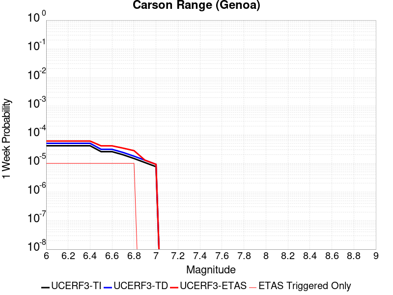 |  | 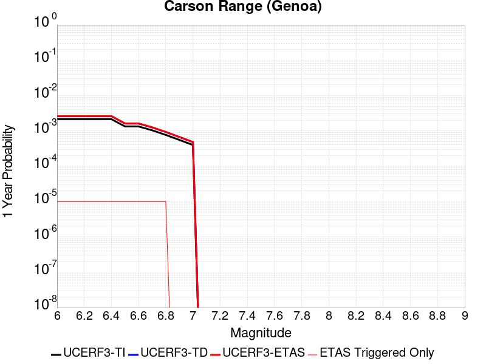 |  |

| Magnitude | 1 wk TI Prob | 1 wk TD Prob | 1 wk ETAS Prob | 1 wk ETAS/TD Gain | 1 wk ETAS Triggered Only | 1 mo TI Prob | 1 mo TD Prob | 1 mo ETAS Prob | 1 mo ETAS/TD Gain | 1 mo ETAS Triggered Only | 1 yr TI Prob | 1 yr TD Prob | 1 yr ETAS Prob | 1 yr ETAS/TD Gain | 1 yr ETAS Triggered Only | 10 yr TI Prob | 10 yr TD Prob | 10 yr ETAS Prob | 10 yr ETAS/TD Gain | 10 yr ETAS Triggered Only |
|-----|-----|-----|-----|-----|-----|-----|-----|-----|-----|-----|-----|-----|-----|-----|-----|-----|-----|-----|-----|-----|
| 6.0 | 4.1268457E-5 | 5.014691E-5 | 6.014641E-5 | 1.1994041 | 1.0E-5 | 1.7685282E-4 | 2.1489977E-4 | 2.2489764E-4 | 1.0465233 | 1.0E-5 | 0.0021510567 | 0.002613659 | 0.002623633 | 1.003816 | 1.0E-5 | 0.02130354 | 0.025868865 | 0.025898088 | 1.0011297 | 3.0E-5 |
| 6.1 | 4.1268457E-5 | 5.014691E-5 | 6.014641E-5 | 1.1994041 | 1.0E-5 | 1.7685282E-4 | 2.1489977E-4 | 2.2489764E-4 | 1.0465233 | 1.0E-5 | 0.0021510567 | 0.002613659 | 0.002623633 | 1.003816 | 1.0E-5 | 0.02130354 | 0.025868865 | 0.025898088 | 1.0011297 | 3.0E-5 |
| 6.2 | 4.1268457E-5 | 5.014691E-5 | 6.014641E-5 | 1.1994041 | 1.0E-5 | 1.7685282E-4 | 2.1489977E-4 | 2.2489764E-4 | 1.0465233 | 1.0E-5 | 0.0021510567 | 0.002613659 | 0.002623633 | 1.003816 | 1.0E-5 | 0.02130354 | 0.025868865 | 0.025898088 | 1.0011297 | 3.0E-5 |
| 6.3 | 4.1268457E-5 | 5.014691E-5 | 6.014641E-5 | 1.1994041 | 1.0E-5 | 1.7685282E-4 | 2.1489977E-4 | 2.2489764E-4 | 1.0465233 | 1.0E-5 | 0.0021510567 | 0.002613659 | 0.002623633 | 1.003816 | 1.0E-5 | 0.02130354 | 0.025868865 | 0.025898088 | 1.0011297 | 3.0E-5 |
| 6.4 | 4.1268457E-5 | 5.014691E-5 | 6.014641E-5 | 1.1994041 | 1.0E-5 | 1.7685282E-4 | 2.1489977E-4 | 2.2489764E-4 | 1.0465233 | 1.0E-5 | 0.0021510567 | 0.002613659 | 0.002623633 | 1.003816 | 1.0E-5 | 0.02130354 | 0.025868865 | 0.025898088 | 1.0011297 | 3.0E-5 |
| 6.5 | 2.5677185E-5 | 3.0978295E-5 | 4.0977986E-5 | 1.3227967 | 1.0E-5 | 1.1004044E-4 | 1.3275839E-4 | 1.4275707E-4 | 1.0753148 | 1.0E-5 | 0.0013389189 | 0.0016153152 | 0.0016252991 | 1.0061808 | 1.0E-5 | 0.0133088045 | 0.01605366 | 0.016083177 | 1.0018387 | 3.0E-5 |
| 6.6 | 2.5677185E-5 | 3.0978295E-5 | 4.0977986E-5 | 1.3227967 | 1.0E-5 | 1.1004044E-4 | 1.3275839E-4 | 1.4275707E-4 | 1.0753148 | 1.0E-5 | 0.0013389189 | 0.0016153152 | 0.0016252991 | 1.0061808 | 1.0E-5 | 0.0133088045 | 0.01605366 | 0.016083177 | 1.0018387 | 3.0E-5 |
| 6.7 | 1.9969408E-5 | 2.4063473E-5 | 3.4063232E-5 | 1.4155576 | 1.0E-5 | 8.558037E-5 | 1.0312596E-4 | 1.1312493E-4 | 1.0969588 | 1.0E-5 | 0.0010414429 | 0.0012549888 | 0.0012649763 | 1.0079582 | 1.0E-5 | 0.010365757 | 0.012494174 | 0.012523799 | 1.0023711 | 3.0E-5 |
| 6.8 | 1.4783156E-5 | 1.7817569E-5 | 2.7817392E-5 | 1.5612338 | 1.0E-5 | 6.335485E-5 | 7.635951E-5 | 8.635875E-5 | 1.1309495 | 1.0E-5 | 7.710722E-4 | 9.294107E-4 | 9.394014E-4 | 1.0107495 | 1.0E-5 | 0.0076840227 | 0.009268024 | 0.009297746 | 1.003207 | 3.0E-5 |
| 6.9 | 1.06660555E-5 | 1.2877027E-5 | 1.2877027E-5 | 1.0 | 0.0 | 4.5710865E-5 | 5.518674E-5 | 5.518674E-5 | 1.0 | 0.0 | 5.5638765E-4 | 6.718067E-4 | 6.718067E-4 | 1.0 | 0.0 | 0.005549967 | 0.0067090564 | 0.006718989 | 1.0014806 | 1.0E-5 |
| 7.0 | 7.664838E-6 | 9.258307E-6 | 9.258307E-6 | 1.0 | 0.0 | 3.2848893E-5 | 3.9678456E-5 | 3.9678456E-5 | 1.0 | 0.0 | 3.998619E-4 | 4.830852E-4 | 4.830852E-4 | 1.0 | 0.0 | 0.0039914316 | 0.00483085 | 0.0048408015 | 1.00206 | 1.0E-5 |

## Hosgri (Extension)
*[(top)](#table-of-contents)*

| 1 Week | 1 Month | 1 Year | 10 Year |
|-----|-----|-----|-----|
|  |  |  |  |

| Magnitude | 1 wk TI Prob | 1 wk TD Prob | 1 wk ETAS Prob | 1 wk ETAS/TD Gain | 1 wk ETAS Triggered Only | 1 mo TI Prob | 1 mo TD Prob | 1 mo ETAS Prob | 1 mo ETAS/TD Gain | 1 mo ETAS Triggered Only | 1 yr TI Prob | 1 yr TD Prob | 1 yr ETAS Prob | 1 yr ETAS/TD Gain | 1 yr ETAS Triggered Only | 10 yr TI Prob | 10 yr TD Prob | 10 yr ETAS Prob | 10 yr ETAS/TD Gain | 10 yr ETAS Triggered Only |
|-----|-----|-----|-----|-----|-----|-----|-----|-----|-----|-----|-----|-----|-----|-----|-----|-----|-----|-----|-----|-----|
| 6.0 | 1.1369135E-5 | 1.2083073E-5 | 1.2083073E-5 | 1.0 | 0.0 | 4.8723956E-5 | 5.17837E-5 | 6.178318E-5 | 1.1931009 | 1.0E-5 | 5.9305265E-4 | 6.303069E-4 | 6.502943E-4 | 1.0317106 | 2.0E-5 | 0.005914725 | 0.00628744 | 0.0063073146 | 1.003161 | 2.0E-5 |
| 6.1 | 6.934979E-6 | 7.324556E-6 | 7.324556E-6 | 1.0 | 0.0 | 2.9721E-5 | 3.13906E-5 | 4.1390285E-5 | 1.3185567 | 1.0E-5 | 3.617931E-4 | 3.821177E-4 | 4.0211005E-4 | 1.0523199 | 2.0E-5 | 0.0036120464 | 0.003815019 | 0.0038349428 | 1.0052224 | 2.0E-5 |
| 6.2 | 6.934979E-6 | 7.324556E-6 | 7.324556E-6 | 1.0 | 0.0 | 2.9721E-5 | 3.13906E-5 | 4.1390285E-5 | 1.3185567 | 1.0E-5 | 3.617931E-4 | 3.821177E-4 | 4.0211005E-4 | 1.0523199 | 2.0E-5 | 0.0036120464 | 0.003815019 | 0.0038349428 | 1.0052224 | 2.0E-5 |
| 6.3 | 4.5484676E-6 | 4.769331E-6 | 4.769331E-6 | 1.0 | 0.0 | 1.9493287E-5 | 2.0439833E-5 | 3.0439629E-5 | 1.4892308 | 1.0E-5 | 2.3730492E-4 | 2.4882698E-4 | 2.6882198E-4 | 1.0803572 | 2.0E-5 | 0.0023705168 | 0.0024855263 | 0.0025054766 | 1.0080266 | 2.0E-5 |
| 6.4 | 4.218095E-6 | 4.416863E-6 | 4.416863E-6 | 1.0 | 0.0 | 1.8077424E-5 | 1.8929275E-5 | 2.8929086E-5 | 1.5282723 | 1.0E-5 | 2.2007042E-4 | 2.3043988E-4 | 2.504353E-4 | 1.0867705 | 2.0E-5 | 0.002198526 | 0.002302043 | 0.0023219967 | 1.008668 | 2.0E-5 |
| 6.5 | 3.717374E-6 | 3.883879E-6 | 3.883879E-6 | 1.0 | 0.0 | 1.5931506E-5 | 1.664509E-5 | 2.6644922E-5 | 1.6007679 | 1.0E-5 | 1.9394881E-4 | 2.026353E-4 | 2.2263125E-4 | 1.0986795 | 2.0E-5 | 0.0019377962 | 0.0020245241 | 0.0020444836 | 1.0098588 | 2.0E-5 |
| 6.6 | 3.4605036E-6 | 3.6083072E-6 | 3.6083072E-6 | 1.0 | 0.0 | 1.4830645E-5 | 1.5464082E-5 | 2.5463927E-5 | 1.6466497 | 1.0E-5 | 1.8054814E-4 | 1.8825909E-4 | 2.0825531E-4 | 1.1062165 | 2.0E-5 | 0.0018040152 | 0.0018810107 | 0.001900973 | 1.0106126 | 2.0E-5 |
| 6.7 | 3.123439E-6 | 3.2465698E-6 | 3.2465698E-6 | 1.0 | 0.0 | 1.33860985E-5 | 1.39137965E-5 | 2.3913657E-5 | 1.7187011 | 1.0E-5 | 1.6296357E-4 | 1.6938741E-4 | 1.8938402E-4 | 1.1180525 | 2.0E-5 | 0.001628441 | 0.001692594 | 0.0017125601 | 1.0117962 | 2.0E-5 |
| 6.8 | 2.8290783E-6 | 2.9305413E-6 | 2.9305413E-6 | 1.0 | 0.0 | 1.2124565E-5 | 1.2559403E-5 | 2.2559278E-5 | 1.7962061 | 1.0E-5 | 1.4760658E-4 | 1.5290009E-4 | 1.7289704E-4 | 1.1307844 | 2.0E-5 | 0.0014750857 | 0.0015279576 | 0.001547927 | 1.0130694 | 2.0E-5 |
| 6.9 | 2.454112E-6 | 2.5283207E-6 | 2.5283207E-6 | 1.0 | 0.0 | 1.0517581E-5 | 1.0835615E-5 | 2.0835507E-5 | 1.9228725 | 1.0E-5 | 1.2804402E-4 | 1.3191569E-4 | 1.5191305E-4 | 1.151592 | 2.0E-5 | 0.0012797028 | 0.0013183799 | 0.0013383535 | 1.0151502 | 2.0E-5 |
| 7.0 | 2.1008145E-6 | 2.1498715E-6 | 2.1498715E-6 | 1.0 | 0.0 | 9.003459E-6 | 9.2137025E-6 | 1.921361E-5 | 2.08533 | 1.0E-5 | 1.096116E-4 | 1.1217109E-4 | 1.3216885E-4 | 1.178279 | 2.0E-5 | 0.0010955755 | 0.0011211485 | 0.001141126 | 1.0178188 | 2.0E-5 |
| 7.1 | 1.744384E-6 | 1.7686364E-6 | 1.7686364E-6 | 1.0 | 0.0 | 7.47591E-6 | 7.579848E-6 | 1.7579772E-5 | 2.3192778 | 1.0E-5 | 9.1015405E-5 | 9.228076E-5 | 1.0227984E-4 | 1.1083549 | 1.0E-5 | 9.097813E-4 | 9.224261E-4 | 9.324169E-4 | 1.010831 | 1.0E-5 |
| 7.2 | 1.5456587E-6 | 1.5562894E-6 | 1.5562894E-6 | 1.0 | 0.0 | 6.6242346E-6 | 6.6697944E-6 | 1.6669728E-5 | 2.4992867 | 1.0E-5 | 8.064707E-5 | 8.120173E-5 | 9.120092E-5 | 1.1231401 | 1.0E-5 | 8.0617814E-4 | 8.117219E-4 | 8.2171377E-4 | 1.0123094 | 1.0E-5 |
| 7.3 | 1.3775123E-6 | 1.3766092E-6 | 1.3766092E-6 | 1.0 | 0.0 | 5.9036106E-6 | 5.8997407E-6 | 1.5899683E-5 | 2.6949797 | 1.0E-5 | 7.187409E-5 | 7.182699E-5 | 8.182627E-5 | 1.1392134 | 1.0E-5 | 7.185085E-4 | 7.180387E-4 | 7.2803156E-4 | 1.0139169 | 1.0E-5 |
| 7.4 | 1.214491E-6 | 1.2023471E-6 | 1.2023471E-6 | 1.0 | 0.0 | 5.2049513E-6 | 5.152906E-6 | 5.152906E-6 | 1.0 | 0.0 | 6.336844E-5 | 6.2734835E-5 | 6.2734835E-5 | 1.0 | 0.0 | 6.335037E-4 | 6.2717206E-4 | 6.2717206E-4 | 1.0 | 0.0 |
| 7.5 | 1.0101123E-6 | 9.842256E-7 | 9.842256E-7 | 1.0 | 0.0 | 4.3290456E-6 | 4.218103E-6 | 4.218103E-6 | 1.0 | 0.0 | 5.2704854E-5 | 5.13542E-5 | 5.13542E-5 | 1.0 | 0.0 | 5.2692357E-4 | 5.1342393E-4 | 5.1342393E-4 | 1.0 | 0.0 |
| 7.6 | 8.1558215E-7 | 7.765977E-7 | 7.765977E-7 | 1.0 | 0.0 | 3.4953473E-6 | 3.3282718E-6 | 3.3282718E-6 | 1.0 | 0.0 | 4.255502E-5 | 4.0520958E-5 | 4.0520958E-5 | 1.0 | 0.0 | 4.2546875E-4 | 4.0513615E-4 | 4.0513615E-4 | 1.0 | 0.0 |
| 7.7 | 4.757816E-7 | 4.1308996E-7 | 4.1308996E-7 | 1.0 | 0.0 | 2.0390623E-6 | 1.7703843E-6 | 1.7703843E-6 | 1.0 | 0.0 | 2.4825302E-5 | 2.1554217E-5 | 2.1554217E-5 | 1.0 | 0.0 | 2.482253E-4 | 2.1552139E-4 | 2.1552139E-4 | 1.0 | 0.0 |
| 7.8 | 2.782787E-7 | 2.004783E-7 | 2.004783E-7 | 1.0 | 0.0 | 1.1926223E-6 | 8.591924E-7 | 8.591924E-7 | 1.0 | 0.0 | 1.452008E-5 | 1.0460618E-5 | 1.0460618E-5 | 1.0 | 0.0 | 1.4519131E-4 | 1.04601284E-4 | 1.04601284E-4 | 1.0 | 0.0 |
| 7.9 | 1.6948086E-7 | 9.243938E-8 | 9.243938E-8 | 1.0 | 0.0 | 7.2634634E-7 | 3.961687E-7 | 3.961687E-7 | 1.0 | 0.0 | 8.843231E-6 | 4.8233433E-6 | 4.8233433E-6 | 1.0 | 0.0 | 8.842879E-5 | 4.8232392E-5 | 4.8232392E-5 | 1.0 | 0.0 |
| 8.0 | 1.0225492E-7 | 4.473497E-8 | 4.473497E-8 | 1.0 | 0.0 | 4.382353E-7 | 1.917213E-7 | 1.917213E-7 | 1.0 | 0.0 | 5.335502E-6 | 2.3342043E-6 | 2.3342043E-6 | 1.0 | 0.0 | 5.335374E-5 | 2.33418E-5 | 2.33418E-5 | 1.0 | 0.0 |
| 8.1 | 1.43711345E-8 | 5.78716E-9 | 5.78716E-9 | 1.0 | 0.0 | 6.1590576E-8 | 2.4802116E-8 | 2.4802116E-8 | 1.0 | 0.0 | 7.4986497E-7 | 3.019657E-7 | 3.019657E-7 | 1.0 | 0.0 | 7.4986247E-6 | 3.0196536E-6 | 3.0196536E-6 | 1.0 | 0.0 |

## Green Valley 2011 CFM
*[(top)](#table-of-contents)*

| 1 Week | 1 Month | 1 Year | 10 Year |
|-----|-----|-----|-----|
|  |  |  |  |

| Magnitude | 1 wk TI Prob | 1 wk TD Prob | 1 wk ETAS Prob | 1 wk ETAS/TD Gain | 1 wk ETAS Triggered Only | 1 mo TI Prob | 1 mo TD Prob | 1 mo ETAS Prob | 1 mo ETAS/TD Gain | 1 mo ETAS Triggered Only | 1 yr TI Prob | 1 yr TD Prob | 1 yr ETAS Prob | 1 yr ETAS/TD Gain | 1 yr ETAS Triggered Only | 10 yr TI Prob | 10 yr TD Prob | 10 yr ETAS Prob | 10 yr ETAS/TD Gain | 10 yr ETAS Triggered Only |
|-----|-----|-----|-----|-----|-----|-----|-----|-----|-----|-----|-----|-----|-----|-----|-----|-----|-----|-----|-----|-----|
| 6.0 | 9.9629346E-5 | 1.7302863E-4 | 1.7302863E-4 | 1.0 | 0.0 | 4.2691303E-4 | 7.41326E-4 | 7.41326E-4 | 1.0 | 0.0 | 0.0051852856 | 0.00898692 | 0.00898692 | 1.0 | 0.0 | 0.050659515 | 0.08553951 | 0.085566945 | 1.0003207 | 3.0E-5 |
| 6.1 | 9.88615E-5 | 1.7150163E-4 | 1.7150163E-4 | 1.0 | 0.0 | 4.2362334E-4 | 7.347854E-4 | 7.347854E-4 | 1.0 | 0.0 | 0.0051454236 | 0.008907947 | 0.008907947 | 1.0 | 0.0 | 0.050279044 | 0.08482712 | 0.08485457 | 1.0003237 | 3.0E-5 |
| 6.2 | 9.696895E-5 | 1.6789208E-4 | 1.6789208E-4 | 1.0 | 0.0 | 4.15515E-4 | 7.1932544E-4 | 7.1932544E-4 | 1.0 | 0.0 | 0.0050471667 | 0.00872133 | 0.00872133 | 1.0 | 0.0 | 0.04934063 | 0.08313578 | 0.08316329 | 1.0003308 | 3.0E-5 |
| 6.3 | 9.275224E-5 | 1.5968543E-4 | 1.5968543E-4 | 1.0 | 0.0 | 3.9744904E-4 | 6.841728E-4 | 6.841728E-4 | 1.0 | 0.0 | 0.0048282105 | 0.008296652 | 0.008296652 | 1.0 | 0.0 | 0.047246475 | 0.07927481 | 0.07930243 | 1.0003484 | 3.0E-5 |
| 6.4 | 8.391499E-5 | 1.4365884E-4 | 1.4365884E-4 | 1.0 | 0.0 | 3.595861E-4 | 6.155238E-4 | 6.155238E-4 | 1.0 | 0.0 | 0.004369175 | 0.007467181 | 0.007467181 | 1.0 | 0.0 | 0.04284265 | 0.07164672 | 0.07167457 | 1.0003887 | 3.0E-5 |
| 6.5 | 5.9519385E-5 | 9.932622E-5 | 9.932622E-5 | 1.0 | 0.0 | 2.5505814E-4 | 4.2560388E-4 | 4.2560388E-4 | 1.0 | 0.0 | 0.0031009112 | 0.005168341 | 0.005168341 | 1.0 | 0.0 | 0.030579966 | 0.05014692 | 0.050165918 | 1.0003788 | 2.0E-5 |
| 6.6 | 4.5361558E-5 | 7.4019794E-5 | 7.4019794E-5 | 1.0 | 0.0 | 1.9439218E-4 | 3.1717744E-4 | 3.1717744E-4 | 1.0 | 0.0 | 0.0023641558 | 0.0038538678 | 0.0038538678 | 1.0 | 0.0 | 0.023391623 | 0.03766727 | 0.037686516 | 1.0005109 | 2.0E-5 |
| 6.7 | 3.8808106E-5 | 6.264382E-5 | 6.264382E-5 | 1.0 | 0.0 | 1.6630985E-4 | 2.6843755E-4 | 2.6843755E-4 | 1.0 | 0.0 | 0.0020229418 | 0.0032627317 | 0.0032627317 | 1.0 | 0.0 | 0.020046256 | 0.032007415 | 0.032026775 | 1.0006049 | 2.0E-5 |
| 6.8 | 2.2284667E-5 | 3.128574E-5 | 3.128574E-5 | 1.0 | 0.0 | 9.550222E-5 | 1.3407487E-4 | 1.3407487E-4 | 1.0 | 0.0 | 0.0011621192 | 0.0016311383 | 0.0016311383 | 1.0 | 0.0 | 0.011560607 | 0.01616672 | 0.016186398 | 1.0012171 | 2.0E-5 |
| 6.9 | 1.8050168E-5 | 2.4448536E-5 | 2.4448536E-5 | 1.0 | 0.0 | 7.735557E-5 | 1.0477527E-4 | 1.0477527E-4 | 1.0 | 0.0 | 9.4139716E-4 | 0.0012748954 | 0.0012748954 | 1.0 | 0.0 | 0.009374191 | 0.012669067 | 0.01267894 | 1.0007793 | 1.0E-5 |
| 7.0 | 1.4763166E-5 | 1.9583236E-5 | 1.9583236E-5 | 1.0 | 0.0 | 6.326917E-5 | 8.3925464E-5 | 8.3925464E-5 | 1.0 | 0.0 | 7.7002996E-4 | 0.001021315 | 0.001021315 | 1.0 | 0.0 | 0.007673672 | 0.01016625 | 0.010176148 | 1.0009737 | 1.0E-5 |
| 7.1 | 1.2399713E-5 | 1.6304042E-5 | 1.6304042E-5 | 1.0 | 0.0 | 5.3140546E-5 | 6.987261E-5 | 6.987261E-5 | 1.0 | 0.0 | 6.467941E-4 | 8.5036893E-4 | 8.5036893E-4 | 1.0 | 0.0 | 0.006449148 | 0.008471781 | 0.008481696 | 1.0011704 | 1.0E-5 |
| 7.2 | 1.0584195E-5 | 1.39220465E-5 | 1.39220465E-5 | 1.0 | 0.0 | 4.5360044E-5 | 5.966456E-5 | 5.966456E-5 | 1.0 | 0.0 | 5.521186E-4 | 7.2617555E-4 | 7.2617555E-4 | 1.0 | 0.0 | 0.0055074887 | 0.0072386027 | 0.0072386027 | 1.0 | 0.0 |
| 7.3 | 7.998173E-6 | 1.0544255E-5 | 1.0544255E-5 | 1.0 | 0.0 | 3.4277433E-5 | 4.5188888E-5 | 4.5188888E-5 | 1.0 | 0.0 | 4.1724785E-4 | 5.500369E-4 | 5.500369E-4 | 1.0 | 0.0 | 0.004164653 | 0.005487135 | 0.005487135 | 1.0 | 0.0 |
| 7.4 | 6.7571127E-6 | 8.932903E-6 | 8.932903E-6 | 1.0 | 0.0 | 2.8958733E-5 | 3.8283313E-5 | 3.8283313E-5 | 1.0 | 0.0 | 3.5251552E-4 | 4.660006E-4 | 4.660006E-4 | 1.0 | 0.0 | 0.0035195686 | 0.004650633 | 0.004650633 | 1.0 | 0.0 |
| 7.5 | 5.69878E-6 | 7.516483E-6 | 7.516483E-6 | 1.0 | 0.0 | 2.4423114E-5 | 3.2213105E-5 | 3.2213105E-5 | 1.0 | 0.0 | 2.9731085E-4 | 3.9212484E-4 | 3.9212484E-4 | 1.0 | 0.0 | 0.002969134 | 0.0039147018 | 0.0039147018 | 1.0 | 0.0 |
| 7.6 | 4.503664E-6 | 5.9358217E-6 | 5.9358217E-6 | 1.0 | 0.0 | 1.9301275E-5 | 2.5438992E-5 | 2.5438992E-5 | 1.0 | 0.0 | 2.3496768E-4 | 3.0967654E-4 | 3.0967654E-4 | 1.0 | 0.0 | 0.002347194 | 0.0030927279 | 0.0030927279 | 1.0 | 0.0 |
| 7.7 | 1.0873546E-6 | 1.410754E-6 | 1.410754E-6 | 1.0 | 0.0 | 4.6600826E-6 | 6.0460743E-6 | 6.0460743E-6 | 1.0 | 0.0 | 5.6735033E-5 | 7.36085E-5 | 7.36085E-5 | 1.0 | 0.0 | 5.672055E-4 | 7.3587085E-4 | 7.3587085E-4 | 1.0 | 0.0 |
| 7.8 | 4.9373917E-8 | 6.177967E-8 | 6.177967E-8 | 1.0 | 0.0 | 2.1160248E-7 | 2.6477002E-7 | 2.6477002E-7 | 1.0 | 0.0 | 2.5762572E-6 | 3.2235714E-6 | 3.2235714E-6 | 1.0 | 0.0 | 2.5762274E-5 | 3.2228E-5 | 3.2228E-5 | 1.0 | 0.0 |

## Del Valle
*[(top)](#table-of-contents)*

| 1 Week | 1 Month | 1 Year | 10 Year |
|-----|-----|-----|-----|
|  |  |  |  |

| Magnitude | 1 wk TI Prob | 1 wk TD Prob | 1 wk ETAS Prob | 1 wk ETAS/TD Gain | 1 wk ETAS Triggered Only | 1 mo TI Prob | 1 mo TD Prob | 1 mo ETAS Prob | 1 mo ETAS/TD Gain | 1 mo ETAS Triggered Only | 1 yr TI Prob | 1 yr TD Prob | 1 yr ETAS Prob | 1 yr ETAS/TD Gain | 1 yr ETAS Triggered Only | 10 yr TI Prob | 10 yr TD Prob | 10 yr ETAS Prob | 10 yr ETAS/TD Gain | 10 yr ETAS Triggered Only |
|-----|-----|-----|-----|-----|-----|-----|-----|-----|-----|-----|-----|-----|-----|-----|-----|-----|-----|-----|-----|-----|
| 6.0 | 1.0716125E-5 | 8.767882E-6 | 8.767882E-6 | 1.0 | 0.0 | 4.592544E-5 | 3.7576207E-5 | 5.7575453E-5 | 1.5322317 | 2.0E-5 | 5.589988E-4 | 4.5741402E-4 | 4.8740028E-4 | 1.065556 | 3.0E-5 | 0.0055759475 | 0.004566694 | 0.0045965575 | 1.0065393 | 3.0E-5 |
| 6.1 | 1.0716125E-5 | 8.767882E-6 | 8.767882E-6 | 1.0 | 0.0 | 4.592544E-5 | 3.7576207E-5 | 5.7575453E-5 | 1.5322317 | 2.0E-5 | 5.589988E-4 | 4.5741402E-4 | 4.8740028E-4 | 1.065556 | 3.0E-5 | 0.0055759475 | 0.004566694 | 0.0045965575 | 1.0065393 | 3.0E-5 |
| 6.2 | 1.0716125E-5 | 8.767882E-6 | 8.767882E-6 | 1.0 | 0.0 | 4.592544E-5 | 3.7576207E-5 | 5.7575453E-5 | 1.5322317 | 2.0E-5 | 5.589988E-4 | 4.5741402E-4 | 4.8740028E-4 | 1.065556 | 3.0E-5 | 0.0055759475 | 0.004566694 | 0.0045965575 | 1.0065393 | 3.0E-5 |
| 6.3 | 7.1293784E-6 | 4.8658226E-6 | 4.8658226E-6 | 1.0 | 0.0 | 3.055412E-5 | 2.0853362E-5 | 3.0853153E-5 | 1.479529 | 1.0E-5 | 3.7193293E-4 | 2.5386084E-4 | 2.7385575E-4 | 1.0787634 | 2.0E-5 | 0.0037131102 | 0.0025358086 | 0.002555758 | 1.007867 | 2.0E-5 |
| 6.4 | 7.1293784E-6 | 4.8658226E-6 | 4.8658226E-6 | 1.0 | 0.0 | 3.055412E-5 | 2.0853362E-5 | 3.0853153E-5 | 1.479529 | 1.0E-5 | 3.7193293E-4 | 2.5386084E-4 | 2.7385575E-4 | 1.0787634 | 2.0E-5 | 0.0037131102 | 0.0025358086 | 0.002555758 | 1.007867 | 2.0E-5 |
| 6.5 | 7.1293784E-6 | 4.8658226E-6 | 4.8658226E-6 | 1.0 | 0.0 | 3.055412E-5 | 2.0853362E-5 | 3.0853153E-5 | 1.479529 | 1.0E-5 | 3.7193293E-4 | 2.5386084E-4 | 2.7385575E-4 | 1.0787634 | 2.0E-5 | 0.0037131102 | 0.0025358086 | 0.002555758 | 1.007867 | 2.0E-5 |
| 6.6 | 7.1293784E-6 | 4.8658226E-6 | 4.8658226E-6 | 1.0 | 0.0 | 3.055412E-5 | 2.0853362E-5 | 3.0853153E-5 | 1.479529 | 1.0E-5 | 3.7193293E-4 | 2.5386084E-4 | 2.7385575E-4 | 1.0787634 | 2.0E-5 | 0.0037131102 | 0.0025358086 | 0.002555758 | 1.007867 | 2.0E-5 |
| 6.7 | 7.12272E-6 | 4.8631982E-6 | 4.8631982E-6 | 1.0 | 0.0 | 3.0525585E-5 | 2.0842115E-5 | 3.0841908E-5 | 1.4797877 | 1.0E-5 | 3.7158563E-4 | 2.5372393E-4 | 2.7371888E-4 | 1.0788058 | 2.0E-5 | 0.003709649 | 0.0025344428 | 0.0025543922 | 1.0078713 | 2.0E-5 |
| 6.8 | 6.7558703E-6 | 4.559404E-6 | 4.559404E-6 | 1.0 | 0.0 | 2.895341E-5 | 1.954016E-5 | 2.9539964E-5 | 1.5117565 | 1.0E-5 | 3.5245073E-4 | 2.3787611E-4 | 2.5787135E-4 | 1.0840573 | 2.0E-5 | 0.0035189227 | 0.0023763045 | 0.002396257 | 1.0083964 | 2.0E-5 |
| 6.9 | 6.6700386E-6 | 4.5025436E-6 | 4.5025436E-6 | 1.0 | 0.0 | 2.8585566E-5 | 1.9296476E-5 | 2.9296283E-5 | 1.5182194 | 1.0E-5 | 3.479737E-4 | 2.349099E-4 | 2.549052E-4 | 1.085119 | 2.0E-5 | 0.003474293 | 0.0023467052 | 0.002366658 | 1.0085026 | 2.0E-5 |
| 7.0 | 6.3181424E-6 | 4.098708E-6 | 4.098708E-6 | 1.0 | 0.0 | 2.7077473E-5 | 1.7565775E-5 | 2.7565598E-5 | 1.5692788 | 1.0E-5 | 3.2961834E-4 | 2.1384275E-4 | 2.3383847E-4 | 1.0935067 | 2.0E-5 | 0.0032912986 | 0.0021364389 | 0.0021563962 | 1.0093414 | 2.0E-5 |
| 7.1 | 6.248759E-6 | 4.033899E-6 | 4.033899E-6 | 1.0 | 0.0 | 2.678012E-5 | 1.7288028E-5 | 2.7287855E-5 | 1.5784249 | 1.0E-5 | 3.2599916E-4 | 2.1046183E-4 | 2.3045762E-4 | 1.0950091 | 2.0E-5 | 0.0032552136 | 0.0021026938 | 0.0021226518 | 1.0094916 | 2.0E-5 |
| 7.2 | 6.0411944E-6 | 3.869892E-6 | 3.869892E-6 | 1.0 | 0.0 | 2.5890577E-5 | 1.658515E-5 | 2.6584985E-5 | 1.602939 | 1.0E-5 | 3.1517216E-4 | 2.019059E-4 | 2.1190388E-4 | 1.049518 | 1.0E-5 | 0.0031472554 | 0.0020172922 | 0.002027272 | 1.0049472 | 1.0E-5 |
| 7.3 | 4.7691183E-6 | 3.0780905E-6 | 3.0780905E-6 | 1.0 | 0.0 | 2.0438918E-5 | 1.3191751E-5 | 2.3191618E-5 | 1.7580395 | 1.0E-5 | 2.488154E-4 | 1.6059795E-4 | 1.7059634E-4 | 1.0622573 | 1.0E-5 | 0.00248537 | 0.0016048512 | 0.0016148352 | 1.006221 | 1.0E-5 |
| 7.4 | 3.5524722E-6 | 2.1893159E-6 | 2.1893159E-6 | 1.0 | 0.0 | 1.5224792E-5 | 9.382749E-6 | 9.382749E-6 | 1.0 | 0.0 | 1.8534607E-4 | 1.14229064E-4 | 1.14229064E-4 | 1.0 | 0.0 | 0.0018519156 | 0.0011417117 | 0.0011417117 | 1.0 | 0.0 |
| 7.5 | 2.7133442E-6 | 1.5915855E-6 | 1.5915855E-6 | 1.0 | 0.0 | 1.1628566E-5 | 6.821063E-6 | 6.821063E-6 | 1.0 | 0.0 | 1.415686E-4 | 8.30433E-5 | 8.30433E-5 | 1.0 | 0.0 | 0.0014147845 | 8.301246E-4 | 8.301246E-4 | 1.0 | 0.0 |
| 7.6 | 1.915338E-6 | 1.1738952E-6 | 1.1738952E-6 | 1.0 | 0.0 | 8.208566E-6 | 5.0309695E-6 | 5.0309695E-6 | 1.0 | 0.0 | 9.993471E-5 | 6.125034E-5 | 6.125034E-5 | 1.0 | 0.0 | 9.988978E-4 | 6.123355E-4 | 6.123355E-4 | 1.0 | 0.0 |
| 7.7 | 1.2120448E-6 | 7.1801645E-7 | 7.1801645E-7 | 1.0 | 0.0 | 5.194467E-6 | 3.0772098E-6 | 3.0772098E-6 | 1.0 | 0.0 | 6.3240805E-5 | 3.746439E-5 | 3.746439E-5 | 1.0 | 0.0 | 6.322281E-4 | 3.745811E-4 | 3.745811E-4 | 1.0 | 0.0 |
| 7.8 | 6.272381E-7 | 3.93245E-7 | 3.93245E-7 | 1.0 | 0.0 | 2.6881603E-6 | 1.6853346E-6 | 1.6853346E-6 | 1.0 | 0.0 | 3.272786E-5 | 2.0518757E-5 | 2.0518757E-5 | 1.0 | 0.0 | 3.272304E-4 | 2.0516879E-4 | 2.0516879E-4 | 1.0 | 0.0 |
| 7.9 | 2.0292627E-7 | 1.2004223E-7 | 1.2004223E-7 | 1.0 | 0.0 | 8.6968373E-7 | 5.144666E-7 | 5.144666E-7 | 1.0 | 0.0 | 1.0588348E-5 | 6.2636127E-6 | 6.2636127E-6 | 1.0 | 0.0 | 1.0587843E-4 | 6.263438E-5 | 6.263438E-5 | 1.0 | 0.0 |
| 8.0 | 4.374492E-8 | 2.1898856E-8 | 2.1898856E-8 | 1.0 | 0.0 | 1.8747821E-7 | 9.3852236E-8 | 9.3852236E-8 | 1.0 | 0.0 | 2.2825448E-6 | 1.1426505E-6 | 1.1426505E-6 | 1.0 | 0.0 | 2.2825214E-5 | 1.1426449E-5 | 1.1426449E-5 | 1.0 | 0.0 |

## Great Valley 10 (Panoche)
*[(top)](#table-of-contents)*

| 1 Week | 1 Month | 1 Year | 10 Year |
|-----|-----|-----|-----|
|  |  |  |  |

| Magnitude | 1 wk TI Prob | 1 wk TD Prob | 1 wk ETAS Prob | 1 wk ETAS/TD Gain | 1 wk ETAS Triggered Only | 1 mo TI Prob | 1 mo TD Prob | 1 mo ETAS Prob | 1 mo ETAS/TD Gain | 1 mo ETAS Triggered Only | 1 yr TI Prob | 1 yr TD Prob | 1 yr ETAS Prob | 1 yr ETAS/TD Gain | 1 yr ETAS Triggered Only | 10 yr TI Prob | 10 yr TD Prob | 10 yr ETAS Prob | 10 yr ETAS/TD Gain | 10 yr ETAS Triggered Only |
|-----|-----|-----|-----|-----|-----|-----|-----|-----|-----|-----|-----|-----|-----|-----|-----|-----|-----|-----|-----|-----|
| 6.0 | 1.6014626E-5 | 1.6575357E-5 | 2.6575191E-5 | 1.6032953 | 1.0E-5 | 6.863231E-5 | 7.103534E-5 | 8.103463E-5 | 1.140765 | 1.0E-5 | 8.35278E-4 | 8.6451764E-4 | 8.74509E-4 | 1.0115571 | 1.0E-5 | 0.008321454 | 0.008612158 | 0.0086419 | 1.0034535 | 3.0E-5 |
| 6.1 | 1.6014626E-5 | 1.6575357E-5 | 2.6575191E-5 | 1.6032953 | 1.0E-5 | 6.863231E-5 | 7.103534E-5 | 8.103463E-5 | 1.140765 | 1.0E-5 | 8.35278E-4 | 8.6451764E-4 | 8.74509E-4 | 1.0115571 | 1.0E-5 | 0.008321454 | 0.008612158 | 0.0086419 | 1.0034535 | 3.0E-5 |
| 6.2 | 1.56782E-5 | 1.6198404E-5 | 2.6198242E-5 | 1.6173348 | 1.0E-5 | 6.719056E-5 | 6.941991E-5 | 7.9419224E-5 | 1.144041 | 1.0E-5 | 8.17738E-4 | 8.4486516E-4 | 8.5485674E-4 | 1.0118262 | 1.0E-5 | 0.008147354 | 0.008417133 | 0.008446881 | 1.0035342 | 3.0E-5 |
| 6.3 | 1.5263338E-5 | 1.5723472E-5 | 2.5723315E-5 | 1.6359818 | 1.0E-5 | 6.541267E-5 | 6.73846E-5 | 7.738393E-5 | 1.1483918 | 1.0E-5 | 7.961082E-4 | 8.201041E-4 | 8.3009584E-4 | 1.0121835 | 1.0E-5 | 0.007932622 | 0.008171363 | 0.0081912 | 1.0024276 | 2.0E-5 |
| 6.4 | 1.4720723E-5 | 1.5099334E-5 | 2.5099182E-5 | 1.6622709 | 1.0E-5 | 6.308728E-5 | 6.470986E-5 | 7.4709205E-5 | 1.154526 | 1.0E-5 | 7.67817E-4 | 7.87563E-4 | 7.975551E-4 | 1.0126874 | 1.0E-5 | 0.007651695 | 0.007848289 | 0.007868133 | 1.0025283 | 2.0E-5 |
| 6.5 | 1.408264E-5 | 1.4355928E-5 | 2.4355784E-5 | 1.6965663 | 1.0E-5 | 6.0352773E-5 | 6.1523984E-5 | 7.152337E-5 | 1.1625283 | 1.0E-5 | 7.3454727E-4 | 7.488022E-4 | 7.587948E-4 | 1.0133446 | 1.0E-5 | 0.0073212404 | 0.0074633416 | 0.0074831923 | 1.0026598 | 2.0E-5 |
| 6.6 | 1.3197086E-5 | 1.33218455E-5 | 2.3321712E-5 | 1.7506367 | 1.0E-5 | 5.6557717E-5 | 5.7092402E-5 | 6.709183E-5 | 1.1751447 | 1.0E-5 | 6.8837265E-4 | 6.948834E-4 | 7.0487644E-4 | 1.0143809 | 1.0E-5 | 0.006862442 | 0.0069276392 | 0.0069475006 | 1.002867 | 2.0E-5 |
| 6.7 | 1.017583E-5 | 9.745348E-6 | 1.974525E-5 | 2.0261207 | 1.0E-5 | 4.360997E-5 | 4.176512E-5 | 5.1764702E-5 | 1.2394242 | 1.0E-5 | 5.30822E-4 | 5.083741E-4 | 5.18369E-4 | 1.0196606 | 1.0E-5 | 0.0052955584 | 0.0050723637 | 0.005082313 | 1.0019615 | 1.0E-5 |
| 6.8 | 8.557912E-6 | 7.8726725E-6 | 1.7872593E-5 | 2.2702067 | 1.0E-5 | 3.667625E-5 | 3.37396E-5 | 4.3739263E-5 | 1.2963777 | 1.0E-5 | 4.4644187E-4 | 4.1070423E-4 | 4.2070015E-4 | 1.0243384 | 1.0E-5 | 0.0044554602 | 0.004099659 | 0.0041096183 | 1.0024292 | 1.0E-5 |
| 6.9 | 6.14664E-6 | 5.0920366E-6 | 1.5091986E-5 | 2.9638407 | 1.0E-5 | 2.6342475E-5 | 2.182284E-5 | 3.1822623E-5 | 1.4582255 | 1.0E-5 | 3.2067244E-4 | 2.6566206E-4 | 2.756594E-4 | 1.0376318 | 1.0E-5 | 0.003202101 | 0.0026535832 | 0.0026635567 | 1.0037584 | 1.0E-5 |
| 7.0 | 3.2310581E-6 | 1.6950871E-6 | 1.6950871E-6 | 1.0 | 0.0 | 1.3847319E-5 | 7.2646394E-6 | 7.2646394E-6 | 1.0 | 0.0 | 1.6857806E-4 | 8.844349E-5 | 8.844349E-5 | 1.0 | 0.0 | 0.0016845023 | 8.840923E-4 | 8.840923E-4 | 1.0 | 0.0 |
| 7.1 | 2.544492E-6 | 9.188573E-7 | 9.188573E-7 | 1.0 | 0.0 | 1.090492E-5 | 3.9379543E-6 | 3.9379543E-6 | 1.0 | 0.0 | 1.327593E-4 | 4.7943588E-5 | 4.7943588E-5 | 1.0 | 0.0 | 0.0013268003 | 4.793372E-4 | 4.793372E-4 | 1.0 | 0.0 |
| 7.2 | 2.4479045E-6 | 8.840978E-7 | 8.840978E-7 | 1.0 | 0.0 | 1.0490977E-5 | 3.7889852E-6 | 3.7889852E-6 | 1.0 | 0.0 | 1.2772017E-4 | 4.6129968E-5 | 4.6129968E-5 | 1.0 | 0.0 | 0.0012764678 | 4.6120866E-4 | 4.6120866E-4 | 1.0 | 0.0 |
| 7.3 | 2.0559578E-6 | 7.892521E-7 | 7.892521E-7 | 1.0 | 0.0 | 8.811218E-6 | 3.382505E-6 | 3.382505E-6 | 1.0 | 0.0 | 1.072713E-4 | 4.1181265E-5 | 4.1181265E-5 | 1.0 | 0.0 | 0.0010721954 | 4.1174097E-4 | 4.1174097E-4 | 1.0 | 0.0 |
| 7.4 | 1.727687E-6 | 7.3875697E-7 | 7.3875697E-7 | 1.0 | 0.0 | 7.404352E-6 | 3.1660977E-6 | 3.1660977E-6 | 1.0 | 0.0 | 9.0144255E-5 | 3.8546605E-5 | 3.8546605E-5 | 1.0 | 0.0 | 9.0107694E-4 | 3.854038E-4 | 3.854038E-4 | 1.0 | 0.0 |
| 7.5 | 1.5002679E-6 | 6.545985E-7 | 6.545985E-7 | 1.0 | 0.0 | 6.4297037E-6 | 2.8054194E-6 | 2.8054194E-6 | 1.0 | 0.0 | 7.827883E-5 | 3.4155488E-5 | 3.4155488E-5 | 1.0 | 0.0 | 7.825126E-4 | 3.4150656E-4 | 3.4150656E-4 | 1.0 | 0.0 |

## White Wolf
*[(top)](#table-of-contents)*

| 1 Week | 1 Month | 1 Year | 10 Year |
|-----|-----|-----|-----|
|  |  |  | 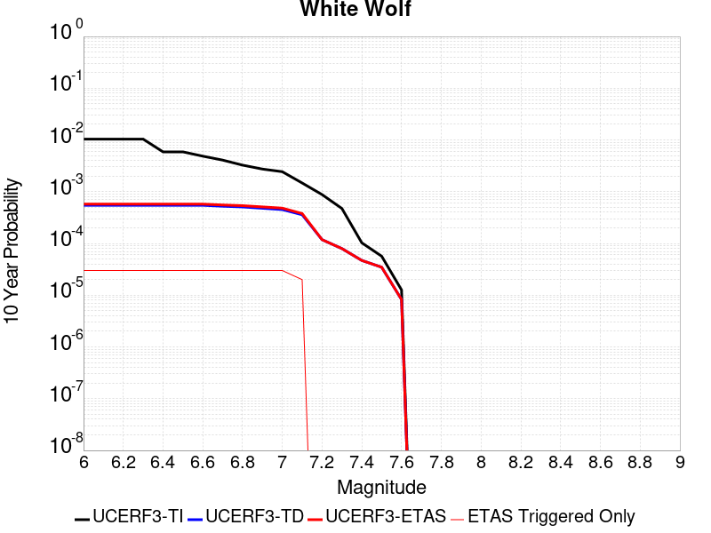 |

| Magnitude | 1 wk TI Prob | 1 wk TD Prob | 1 wk ETAS Prob | 1 wk ETAS/TD Gain | 1 wk ETAS Triggered Only | 1 mo TI Prob | 1 mo TD Prob | 1 mo ETAS Prob | 1 mo ETAS/TD Gain | 1 mo ETAS Triggered Only | 1 yr TI Prob | 1 yr TD Prob | 1 yr ETAS Prob | 1 yr ETAS/TD Gain | 1 yr ETAS Triggered Only | 10 yr TI Prob | 10 yr TD Prob | 10 yr ETAS Prob | 10 yr ETAS/TD Gain | 10 yr ETAS Triggered Only |
|-----|-----|-----|-----|-----|-----|-----|-----|-----|-----|-----|-----|-----|-----|-----|-----|-----|-----|-----|-----|-----|
| 6.0 | 2.0037822E-5 | 1.0468583E-6 | 1.0468583E-6 | 1.0 | 0.0 | 8.587355E-5 | 4.4865283E-6 | 4.4865283E-6 | 1.0 | 0.0 | 0.001045009 | 5.4622164E-5 | 5.4622164E-5 | 1.0 | 0.0 | 0.010401085 | 5.4609246E-4 | 5.7607604E-4 | 1.0549058 | 3.0E-5 |
| 6.1 | 2.0037822E-5 | 1.0468583E-6 | 1.0468583E-6 | 1.0 | 0.0 | 8.587355E-5 | 4.4865283E-6 | 4.4865283E-6 | 1.0 | 0.0 | 0.001045009 | 5.4622164E-5 | 5.4622164E-5 | 1.0 | 0.0 | 0.010401085 | 5.4609246E-4 | 5.7607604E-4 | 1.0549058 | 3.0E-5 |
| 6.2 | 2.0037822E-5 | 1.0468583E-6 | 1.0468583E-6 | 1.0 | 0.0 | 8.587355E-5 | 4.4865283E-6 | 4.4865283E-6 | 1.0 | 0.0 | 0.001045009 | 5.4622164E-5 | 5.4622164E-5 | 1.0 | 0.0 | 0.010401085 | 5.4609246E-4 | 5.7607604E-4 | 1.0549058 | 3.0E-5 |
| 6.3 | 2.0037822E-5 | 1.0468583E-6 | 1.0468583E-6 | 1.0 | 0.0 | 8.587355E-5 | 4.4865283E-6 | 4.4865283E-6 | 1.0 | 0.0 | 0.001045009 | 5.4622164E-5 | 5.4622164E-5 | 1.0 | 0.0 | 0.010401085 | 5.4609246E-4 | 5.7607604E-4 | 1.0549058 | 3.0E-5 |
| 6.4 | 1.132487E-5 | 1.0468583E-6 | 1.0468583E-6 | 1.0 | 0.0 | 4.8534253E-5 | 4.4865283E-6 | 4.4865283E-6 | 1.0 | 0.0 | 5.907443E-4 | 5.4622164E-5 | 5.4622164E-5 | 1.0 | 0.0 | 0.005891764 | 5.4609246E-4 | 5.7607604E-4 | 1.0549058 | 3.0E-5 |
| 6.5 | 1.132487E-5 | 1.0468583E-6 | 1.0468583E-6 | 1.0 | 0.0 | 4.8534253E-5 | 4.4865283E-6 | 4.4865283E-6 | 1.0 | 0.0 | 5.907443E-4 | 5.4622164E-5 | 5.4622164E-5 | 1.0 | 0.0 | 0.005891764 | 5.4609246E-4 | 5.7607604E-4 | 1.0549058 | 3.0E-5 |
| 6.6 | 9.347473E-6 | 1.0468583E-6 | 1.0468583E-6 | 1.0 | 0.0 | 4.0059982E-5 | 4.4865283E-6 | 4.4865283E-6 | 1.0 | 0.0 | 4.8762115E-4 | 5.4622164E-5 | 5.4622164E-5 | 1.0 | 0.0 | 0.0048655253 | 5.4609246E-4 | 5.7607604E-4 | 1.0549058 | 3.0E-5 |
| 6.7 | 7.842647E-6 | 1.0047773E-6 | 1.0047773E-6 | 1.0 | 0.0 | 3.361091E-5 | 4.306182E-6 | 4.306182E-6 | 1.0 | 0.0 | 4.0913603E-4 | 5.2426552E-5 | 5.2426552E-5 | 1.0 | 0.0 | 0.004083836 | 5.241468E-4 | 5.5413105E-4 | 1.0572059 | 3.0E-5 |
| 6.8 | 6.26597E-6 | 9.734289E-7 | 9.734289E-7 | 1.0 | 0.0 | 2.685388E-5 | 4.1718313E-6 | 4.1718313E-6 | 1.0 | 0.0 | 3.2689696E-4 | 5.0790914E-5 | 5.0790914E-5 | 1.0 | 0.0 | 0.003264165 | 5.07798E-4 | 5.3778273E-4 | 1.0590487 | 3.0E-5 |
| 6.9 | 5.258436E-6 | 9.1827343E-7 | 9.1827343E-7 | 1.0 | 0.0 | 2.2535958E-5 | 3.935452E-6 | 3.935452E-6 | 1.0 | 0.0 | 2.7434074E-4 | 4.7913123E-5 | 4.7913123E-5 | 1.0 | 0.0 | 0.0027400232 | 4.7903272E-4 | 5.090183E-4 | 1.0625962 | 3.0E-5 |
| 7.0 | 4.675028E-6 | 8.660704E-7 | 8.660704E-7 | 1.0 | 0.0 | 2.003568E-5 | 3.7117254E-6 | 3.7117254E-6 | 1.0 | 0.0 | 2.4390711E-4 | 4.518937E-5 | 4.518937E-5 | 1.0 | 0.0 | 0.0024363957 | 4.518065E-4 | 4.8179293E-4 | 1.0663701 | 3.0E-5 |
| 7.1 | 2.8270078E-6 | 6.8737717E-7 | 6.8737717E-7 | 1.0 | 0.0 | 1.2115692E-5 | 2.945899E-6 | 2.945899E-6 | 1.0 | 0.0 | 1.4749856E-4 | 3.586577E-5 | 3.586577E-5 | 1.0 | 0.0 | 0.001474007 | 3.5860392E-4 | 3.7859674E-4 | 1.0557518 | 2.0E-5 |
| 7.2 | 1.6881406E-6 | 2.2703432E-7 | 2.2703432E-7 | 1.0 | 0.0 | 7.2348685E-6 | 9.730038E-7 | 9.730038E-7 | 1.0 | 0.0 | 8.808096E-5 | 1.1846259E-5 | 1.1846259E-5 | 1.0 | 0.0 | 8.8046055E-4 | 1.1845643E-4 | 1.1845643E-4 | 1.0 | 0.0 |
| 7.3 | 9.086107E-7 | 1.5264496E-7 | 1.5264496E-7 | 1.0 | 0.0 | 3.8940398E-6 | 6.5419255E-7 | 6.5419255E-7 | 1.0 | 0.0 | 4.7408903E-5 | 7.964766E-6 | 7.964766E-6 | 1.0 | 0.0 | 4.739879E-4 | 7.964489E-5 | 7.964489E-5 | 1.0 | 0.0 |
| 7.4 | 1.9717383E-7 | 9.003399E-8 | 9.003399E-8 | 1.0 | 0.0 | 8.450304E-7 | 3.8585992E-7 | 3.8585992E-7 | 1.0 | 0.0 | 1.0288197E-5 | 4.697835E-6 | 4.697835E-6 | 1.0 | 0.0 | 1.028772E-4 | 4.6977384E-5 | 4.6977384E-5 | 1.0 | 0.0 |
| 7.5 | 1.086975E-7 | 6.659662E-8 | 6.659662E-8 | 1.0 | 0.0 | 4.6584634E-7 | 2.8541407E-7 | 2.8541407E-7 | 1.0 | 0.0 | 5.6716644E-6 | 3.474911E-6 | 3.474911E-6 | 1.0 | 0.0 | 5.6715195E-5 | 3.474859E-5 | 3.474859E-5 | 1.0 | 0.0 |
| 7.6 | 2.4217808E-8 | 1.5820849E-8 | 1.5820849E-8 | 1.0 | 0.0 | 1.03790605E-7 | 6.780364E-8 | 6.780364E-8 | 1.0 | 0.0 | 1.2636499E-6 | 8.25509E-7 | 8.25509E-7 | 1.0 | 0.0 | 1.2636427E-5 | 8.255064E-6 | 8.255064E-6 | 1.0 | 0.0 |

## Newport-Inglewood (Offshore)
*[(top)](#table-of-contents)*

| 1 Week | 1 Month | 1 Year | 10 Year |
|-----|-----|-----|-----|
| 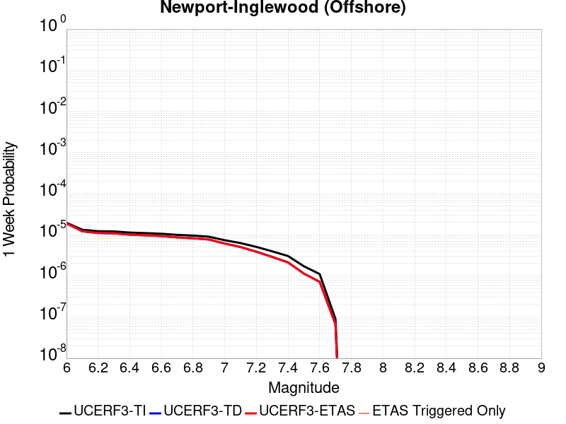 |  | 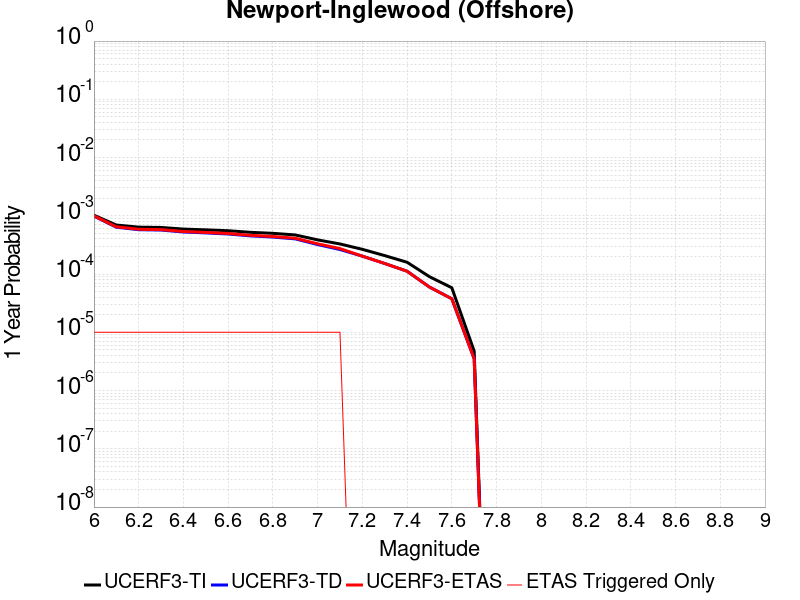 |  |

| Magnitude | 1 wk TI Prob | 1 wk TD Prob | 1 wk ETAS Prob | 1 wk ETAS/TD Gain | 1 wk ETAS Triggered Only | 1 mo TI Prob | 1 mo TD Prob | 1 mo ETAS Prob | 1 mo ETAS/TD Gain | 1 mo ETAS Triggered Only | 1 yr TI Prob | 1 yr TD Prob | 1 yr ETAS Prob | 1 yr ETAS/TD Gain | 1 yr ETAS Triggered Only | 10 yr TI Prob | 10 yr TD Prob | 10 yr ETAS Prob | 10 yr ETAS/TD Gain | 10 yr ETAS Triggered Only |
|-----|-----|-----|-----|-----|-----|-----|-----|-----|-----|-----|-----|-----|-----|-----|-----|-----|-----|-----|-----|-----|
| 6.0 | 1.9626508E-5 | 1.8965342E-5 | 1.8965342E-5 | 1.0 | 0.0 | 8.411089E-5 | 8.1277576E-5 | 8.1277576E-5 | 1.0 | 0.0 | 0.001023569 | 9.891179E-4 | 9.99108E-4 | 1.0101 | 1.0E-5 | 0.010188672 | 0.009848497 | 0.0098683 | 1.0020108 | 2.0E-5 |
| 6.1 | 1.331886E-5 | 1.2218078E-5 | 1.2218078E-5 | 1.0 | 0.0 | 5.707958E-5 | 5.2362153E-5 | 5.2362153E-5 | 1.0 | 0.0 | 6.947222E-4 | 6.3732424E-4 | 6.4731785E-4 | 1.0156806 | 1.0E-5 | 0.006925544 | 0.006355142 | 0.0063650785 | 1.0015635 | 1.0E-5 |
| 6.2 | 1.2250852E-5 | 1.1076016E-5 | 1.1076016E-5 | 1.0 | 0.0 | 5.2502597E-5 | 4.746778E-5 | 4.746778E-5 | 1.0 | 0.0 | 6.3903164E-4 | 5.7776796E-4 | 5.877622E-4 | 1.017298 | 1.0E-5 | 0.006371971 | 0.0057627796 | 0.005772722 | 1.0017253 | 1.0E-5 |
| 6.3 | 1.2106258E-5 | 1.0918878E-5 | 1.0918878E-5 | 1.0 | 0.0 | 5.1882926E-5 | 4.6794354E-5 | 4.6794354E-5 | 1.0 | 0.0 | 6.3149154E-4 | 5.695733E-4 | 5.795676E-4 | 1.017547 | 1.0E-5 | 0.0062970007 | 0.005681252 | 0.0056911954 | 1.0017502 | 1.0E-5 |
| 6.4 | 1.1348758E-5 | 1.0109348E-5 | 1.0109348E-5 | 1.0 | 0.0 | 4.8636626E-5 | 4.3325064E-5 | 4.3325064E-5 | 1.0 | 0.0 | 5.919901E-4 | 5.2735576E-4 | 5.3735054E-4 | 1.0189525 | 1.0E-5 | 0.005904155 | 0.0052611395 | 0.005271087 | 1.0018908 | 1.0E-5 |
| 6.5 | 1.100837E-5 | 9.743376E-6 | 9.743376E-6 | 1.0 | 0.0 | 4.7177873E-5 | 4.175666E-5 | 4.175666E-5 | 1.0 | 0.0 | 5.7423924E-4 | 5.082695E-4 | 5.182644E-4 | 1.0196646 | 1.0E-5 | 0.005727576 | 0.005071162 | 0.005081111 | 1.001962 | 1.0E-5 |
| 6.6 | 1.0634696E-5 | 9.34553E-6 | 9.34553E-6 | 1.0 | 0.0 | 4.557647E-5 | 4.0051662E-5 | 4.0051662E-5 | 1.0 | 0.0 | 5.5475225E-4 | 4.875206E-4 | 4.975157E-4 | 1.020502 | 1.0E-5 | 0.0055336943 | 0.0048645977 | 0.004874549 | 1.0020456 | 1.0E-5 |
| 6.7 | 9.9780855E-6 | 8.667898E-6 | 8.667898E-6 | 1.0 | 0.0 | 4.276252E-5 | 3.7147613E-5 | 3.7147613E-5 | 1.0 | 0.0 | 5.205093E-4 | 4.5217903E-4 | 4.621745E-4 | 1.0221051 | 1.0E-5 | 0.0051929182 | 0.0045126686 | 0.0045226235 | 1.002206 | 1.0E-5 |
| 6.8 | 9.59546E-6 | 8.272933E-6 | 8.272933E-6 | 1.0 | 0.0 | 4.1122752E-5 | 3.545495E-5 | 3.545495E-5 | 1.0 | 0.0 | 5.0055445E-4 | 4.3157916E-4 | 4.4157484E-4 | 1.0231607 | 1.0E-5 | 0.004994285 | 0.004307486 | 0.004317443 | 1.0023116 | 1.0E-5 |
| 6.9 | 9.000614E-6 | 7.706823E-6 | 7.706823E-6 | 1.0 | 0.0 | 3.857349E-5 | 3.3028828E-5 | 3.3028828E-5 | 1.0 | 0.0 | 4.6953102E-4 | 4.0205245E-4 | 4.1204842E-4 | 1.0248624 | 1.0E-5 | 0.004685402 | 0.0040133223 | 0.004023282 | 1.0024817 | 1.0E-5 |
| 7.0 | 7.4070194E-6 | 6.148865E-6 | 6.148865E-6 | 1.0 | 0.0 | 3.1743984E-5 | 2.6352012E-5 | 2.6352012E-5 | 1.0 | 0.0 | 3.8641447E-4 | 3.2078868E-4 | 3.3078546E-4 | 1.0311632 | 1.0E-5 | 0.0038574322 | 0.0032032758 | 0.0032132438 | 1.0031118 | 1.0E-5 |
| 7.1 | 6.299615E-6 | 5.0565613E-6 | 5.0565613E-6 | 1.0 | 0.0 | 2.699807E-5 | 2.1670798E-5 | 2.1670798E-5 | 1.0 | 0.0 | 3.2865192E-4 | 2.6381016E-4 | 2.7380753E-4 | 1.037896 | 1.0E-5 | 0.003281663 | 0.0026349847 | 0.0026449582 | 1.0037851 | 1.0E-5 |
| 7.2 | 5.096653E-6 | 3.892733E-6 | 3.892733E-6 | 1.0 | 0.0 | 2.1842614E-5 | 1.6683034E-5 | 1.6683034E-5 | 1.0 | 0.0 | 2.6590136E-4 | 2.0309711E-4 | 2.0309711E-4 | 1.0 | 0.0 | 0.0026558342 | 0.0020291263 | 0.0020291263 | 1.0 | 0.0 |
| 7.3 | 3.9753018E-6 | 2.9098787E-6 | 2.9098787E-6 | 1.0 | 0.0 | 1.7036897E-5 | 1.24708495E-5 | 1.24708495E-5 | 1.0 | 0.0 | 2.0740448E-4 | 1.518221E-4 | 1.518221E-4 | 1.0 | 0.0 | 0.00207211 | 0.0015171919 | 0.0015171919 | 1.0 | 0.0 |
| 7.4 | 3.0568392E-6 | 2.1449732E-6 | 2.1449732E-6 | 1.0 | 0.0 | 1.3100675E-5 | 9.19271E-6 | 9.19271E-6 | 1.0 | 0.0 | 1.5948903E-4 | 1.11915564E-4 | 1.11915564E-4 | 1.0 | 0.0 | 0.0015937461 | 0.0011185983 | 0.0011185983 | 1.0 | 0.0 |
| 7.5 | 1.7279019E-6 | 1.1469651E-6 | 1.1469651E-6 | 1.0 | 0.0 | 7.405273E-6 | 4.9155556E-6 | 4.9155556E-6 | 1.0 | 0.0 | 9.015547E-5 | 5.9845286E-5 | 5.9845286E-5 | 1.0 | 0.0 | 9.01189E-4 | 5.982956E-4 | 5.982956E-4 | 1.0 | 0.0 |
| 7.6 | 1.1156416E-6 | 7.222962E-7 | 7.222962E-7 | 1.0 | 0.0 | 4.7813123E-6 | 3.0955514E-6 | 3.0955514E-6 | 1.0 | 0.0 | 5.821092E-5 | 3.768771E-5 | 3.768771E-5 | 1.0 | 0.0 | 5.8195676E-4 | 3.7681553E-4 | 3.7681553E-4 | 1.0 | 0.0 |
| 7.7 | 9.117973E-8 | 6.7342256E-8 | 6.7342256E-8 | 1.0 | 0.0 | 3.907702E-7 | 2.8860964E-7 | 2.8860964E-7 | 1.0 | 0.0 | 4.757617E-6 | 3.5138169E-6 | 3.5138169E-6 | 1.0 | 0.0 | 4.7575148E-5 | 3.5137644E-5 | 3.5137644E-5 | 1.0 | 0.0 |

## Butano 2011 CFM
*[(top)](#table-of-contents)*

| 1 Week | 1 Month | 1 Year | 10 Year |
|-----|-----|-----|-----|
|  |  |  |  |

| Magnitude | 1 wk TI Prob | 1 wk TD Prob | 1 wk ETAS Prob | 1 wk ETAS/TD Gain | 1 wk ETAS Triggered Only | 1 mo TI Prob | 1 mo TD Prob | 1 mo ETAS Prob | 1 mo ETAS/TD Gain | 1 mo ETAS Triggered Only | 1 yr TI Prob | 1 yr TD Prob | 1 yr ETAS Prob | 1 yr ETAS/TD Gain | 1 yr ETAS Triggered Only | 10 yr TI Prob | 10 yr TD Prob | 10 yr ETAS Prob | 10 yr ETAS/TD Gain | 10 yr ETAS Triggered Only |
|-----|-----|-----|-----|-----|-----|-----|-----|-----|-----|-----|-----|-----|-----|-----|-----|-----|-----|-----|-----|-----|
| 6.0 | 9.561135E-6 | 6.2254967E-6 | 6.2254967E-6 | 1.0 | 0.0 | 4.097565E-5 | 2.6680438E-5 | 3.6680172E-5 | 1.3747964 | 1.0E-5 | 4.9876433E-4 | 3.2478812E-4 | 3.4478164E-4 | 1.0615586 | 2.0E-5 | 0.004976464 | 0.0032607901 | 0.0032906923 | 1.0091702 | 3.0E-5 |
| 6.1 | 9.561135E-6 | 6.2254967E-6 | 6.2254967E-6 | 1.0 | 0.0 | 4.097565E-5 | 2.6680438E-5 | 3.6680172E-5 | 1.3747964 | 1.0E-5 | 4.9876433E-4 | 3.2478812E-4 | 3.4478164E-4 | 1.0615586 | 2.0E-5 | 0.004976464 | 0.0032607901 | 0.0032906923 | 1.0091702 | 3.0E-5 |
| 6.2 | 8.364741E-6 | 4.9785817E-6 | 4.9785817E-6 | 1.0 | 0.0 | 3.5848396E-5 | 2.1336613E-5 | 2.1336613E-5 | 1.0 | 0.0 | 4.3636683E-4 | 2.5974386E-4 | 2.697413E-4 | 1.0384895 | 1.0E-5 | 0.0043551093 | 0.0026120064 | 0.0026319542 | 1.0076369 | 2.0E-5 |
| 6.3 | 8.364741E-6 | 4.9785817E-6 | 4.9785817E-6 | 1.0 | 0.0 | 3.5848396E-5 | 2.1336613E-5 | 2.1336613E-5 | 1.0 | 0.0 | 4.3636683E-4 | 2.5974386E-4 | 2.697413E-4 | 1.0384895 | 1.0E-5 | 0.0043551093 | 0.0026120064 | 0.0026319542 | 1.0076369 | 2.0E-5 |
| 6.4 | 7.768282E-6 | 4.3565296E-6 | 4.3565296E-6 | 1.0 | 0.0 | 3.329221E-5 | 1.8670715E-5 | 1.8670715E-5 | 1.0 | 0.0 | 4.0525728E-4 | 2.272936E-4 | 2.3729133E-4 | 1.043986 | 1.0E-5 | 0.0040451903 | 0.0022881997 | 0.002308154 | 1.0087205 | 2.0E-5 |
| 6.5 | 7.673437E-6 | 4.256093E-6 | 4.256093E-6 | 1.0 | 0.0 | 3.2885746E-5 | 1.8240276E-5 | 1.8240276E-5 | 1.0 | 0.0 | 4.0031038E-4 | 2.2205409E-4 | 2.3205187E-4 | 1.045024 | 1.0E-5 | 0.0039959005 | 0.0022359102 | 0.0022558654 | 1.008925 | 2.0E-5 |
| 6.6 | 7.5244197E-6 | 4.101056E-6 | 4.101056E-6 | 1.0 | 0.0 | 3.2247113E-5 | 1.7575843E-5 | 1.7575843E-5 | 1.0 | 0.0 | 3.9253788E-4 | 2.1396621E-4 | 2.2396407E-4 | 1.0467263 | 1.0E-5 | 0.003918452 | 0.00215519 | 0.002175147 | 1.0092599 | 2.0E-5 |
| 6.7 | 6.4921405E-6 | 3.0411225E-6 | 3.0411225E-6 | 1.0 | 0.0 | 2.7823162E-5 | 1.30333165E-5 | 1.30333165E-5 | 1.0 | 0.0 | 3.3869434E-4 | 1.5866917E-4 | 1.6866757E-4 | 1.0630143 | 1.0E-5 | 0.003381786 | 0.0016030329 | 0.001623001 | 1.0124563 | 2.0E-5 |
| 6.8 | 6.2890294E-6 | 2.8278887E-6 | 2.8278887E-6 | 1.0 | 0.0 | 2.6952705E-5 | 1.2119467E-5 | 1.2119467E-5 | 1.0 | 0.0 | 3.2809976E-4 | 1.475446E-4 | 1.5754312E-4 | 1.0677661 | 1.0E-5 | 0.0032761577 | 0.0014919417 | 0.0015119119 | 1.0133853 | 2.0E-5 |
| 6.9 | 6.0965517E-6 | 2.6344032E-6 | 2.6344032E-6 | 1.0 | 0.0 | 2.6127816E-5 | 1.129025E-5 | 1.129025E-5 | 1.0 | 0.0 | 3.1805973E-4 | 1.3745019E-4 | 1.4744882E-4 | 1.0727437 | 1.0E-5 | 0.0031760489 | 0.0013911276 | 0.0014110997 | 1.0143569 | 2.0E-5 |
| 7.0 | 5.566252E-6 | 2.1518151E-6 | 2.1518151E-6 | 1.0 | 0.0 | 2.3855147E-5 | 9.2220325E-6 | 9.2220325E-6 | 1.0 | 0.0 | 2.9039773E-4 | 1.122725E-4 | 1.2227138E-4 | 1.089059 | 1.0E-5 | 0.0029001853 | 0.0011396318 | 0.0011596091 | 1.0175295 | 2.0E-5 |
| 7.1 | 3.878588E-6 | 1.6032967E-6 | 1.6032967E-6 | 1.0 | 0.0 | 1.6622414E-5 | 6.871253E-6 | 6.871253E-6 | 1.0 | 0.0 | 2.023591E-4 | 8.36543E-5 | 9.365346E-5 | 1.1195296 | 1.0E-5 | 0.0020217493 | 8.53303E-4 | 8.73286E-4 | 1.0234183 | 2.0E-5 |
| 7.2 | 3.7038085E-6 | 1.4843619E-6 | 1.4843619E-6 | 1.0 | 0.0 | 1.587337E-5 | 6.361535E-6 | 6.361535E-6 | 1.0 | 0.0 | 1.9324113E-4 | 7.744894E-5 | 8.744816E-5 | 1.1291074 | 1.0E-5 | 0.0019307317 | 7.912618E-4 | 8.11246E-4 | 1.025256 | 2.0E-5 |
| 7.3 | 3.5277278E-6 | 1.3924841E-6 | 1.3924841E-6 | 1.0 | 0.0 | 1.5118746E-5 | 5.9677755E-6 | 5.9677755E-6 | 1.0 | 0.0 | 1.8405518E-4 | 7.2655246E-5 | 8.2654515E-5 | 1.1376263 | 1.0E-5 | 0.0018390282 | 7.432707E-4 | 7.632558E-4 | 1.0268881 | 2.0E-5 |
| 7.4 | 3.3711294E-6 | 1.3297448E-6 | 1.3297448E-6 | 1.0 | 0.0 | 1.4447617E-5 | 5.6988933E-6 | 5.6988933E-6 | 1.0 | 0.0 | 1.7588554E-4 | 6.938182E-5 | 7.938113E-5 | 1.14412 | 1.0E-5 | 0.0017574639 | 7.1050716E-4 | 7.30493E-4 | 1.0281289 | 2.0E-5 |
| 7.5 | 3.0496426E-6 | 1.218759E-6 | 1.218759E-6 | 1.0 | 0.0 | 1.3069831E-5 | 5.2232426E-6 | 5.2232426E-6 | 1.0 | 0.0 | 1.5911358E-4 | 6.359112E-5 | 7.359049E-5 | 1.1572447 | 1.0E-5 | 0.001589997 | 6.525681E-4 | 6.7255506E-4 | 1.0306281 | 2.0E-5 |
| 7.6 | 2.2179781E-6 | 8.869861E-7 | 8.869861E-7 | 1.0 | 0.0 | 9.505586E-6 | 3.8013632E-6 | 3.8013632E-6 | 1.0 | 0.0 | 1.1572436E-4 | 4.6280613E-5 | 5.628015E-5 | 1.2160631 | 1.0E-5 | 0.0011566412 | 4.794437E-4 | 4.994341E-4 | 1.041695 | 2.0E-5 |
| 7.7 | 1.7519328E-6 | 6.930116E-7 | 6.930116E-7 | 1.0 | 0.0 | 7.508262E-6 | 2.9700464E-6 | 2.9700464E-6 | 1.0 | 0.0 | 9.140925E-5 | 3.6159712E-5 | 4.615935E-5 | 1.2765409 | 1.0E-5 | 9.137166E-4 | 3.7754176E-4 | 3.9753423E-4 | 1.0529543 | 2.0E-5 |
| 7.8 | 1.1478974E-6 | 6.1734966E-7 | 6.1734966E-7 | 1.0 | 0.0 | 4.9195505E-6 | 2.6457815E-6 | 2.6457815E-6 | 1.0 | 0.0 | 5.9893882E-5 | 3.2211912E-5 | 4.221159E-5 | 1.3104341 | 1.0E-5 | 5.9877743E-4 | 3.377461E-4 | 3.5773934E-4 | 1.0591961 | 2.0E-5 |
| 7.9 | 6.1154634E-7 | 5.5814814E-7 | 5.5814814E-7 | 1.0 | 0.0 | 2.6209104E-6 | 2.392061E-6 | 2.392061E-6 | 1.0 | 0.0 | 3.1909116E-5 | 2.9122955E-5 | 3.9122664E-5 | 1.3433617 | 1.0E-5 | 3.1904536E-4 | 3.0562587E-4 | 3.2561974E-4 | 1.0654194 | 2.0E-5 |
| 8.0 | 4.6520046E-7 | 5.189108E-7 | 5.189108E-7 | 1.0 | 0.0 | 1.9937147E-6 | 2.2239014E-6 | 2.2239014E-6 | 1.0 | 0.0 | 2.4273206E-5 | 2.7075665E-5 | 3.7075395E-5 | 1.3693254 | 1.0E-5 | 2.4270554E-4 | 2.841832E-4 | 3.0417752E-4 | 1.0703571 | 2.0E-5 |
| 8.1 | 2.8425194E-7 | 3.0568935E-7 | 3.0568935E-7 | 1.0 | 0.0 | 1.218222E-6 | 1.3100965E-6 | 1.3100965E-6 | 1.0 | 0.0 | 1.4831752E-5 | 1.5950309E-5 | 2.5950148E-5 | 1.6269372 | 1.0E-5 | 1.4830762E-4 | 1.673984E-4 | 1.7739672E-4 | 1.0597277 | 1.0E-5 |
| 8.2 | 5.585778E-8 | 4.051519E-8 | 4.051519E-8 | 1.0 | 0.0 | 2.3939046E-7 | 1.7363652E-7 | 1.7363652E-7 | 1.0 | 0.0 | 2.914575E-6 | 2.1140224E-6 | 2.1140224E-6 | 1.0 | 0.0 | 2.9145367E-5 | 2.2970038E-5 | 2.2970038E-5 | 1.0 | 0.0 |
| 8.3 | 1.0371215E-10 | 5.3552607E-11 | 5.3552607E-11 | 1.0 | 0.0 | 4.4448079E-10 | 2.2951097E-10 | 2.2951097E-10 | 1.0 | 0.0 | 5.4115543E-9 | 2.7942968E-9 | 2.7942968E-9 | 1.0 | 0.0 | 5.4115542E-8 | 3.213309E-8 | 3.213309E-8 | 1.0 | 0.0 |

## Elsinore (Coyote Mountains)
*[(top)](#table-of-contents)*

| 1 Week | 1 Month | 1 Year | 10 Year |
|-----|-----|-----|-----|
|  |  |  | 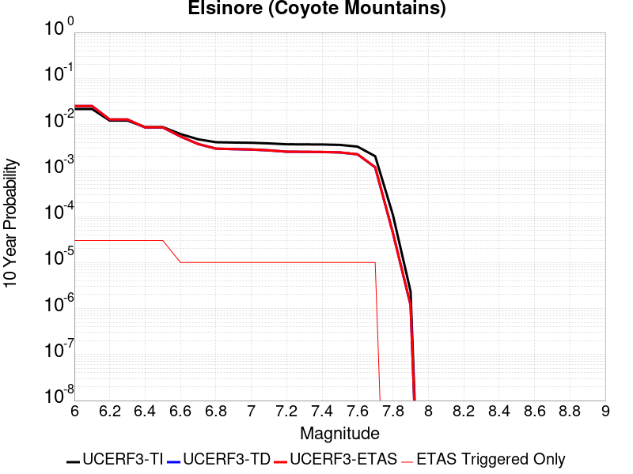 |

| Magnitude | 1 wk TI Prob | 1 wk TD Prob | 1 wk ETAS Prob | 1 wk ETAS/TD Gain | 1 wk ETAS Triggered Only | 1 mo TI Prob | 1 mo TD Prob | 1 mo ETAS Prob | 1 mo ETAS/TD Gain | 1 mo ETAS Triggered Only | 1 yr TI Prob | 1 yr TD Prob | 1 yr ETAS Prob | 1 yr ETAS/TD Gain | 1 yr ETAS Triggered Only | 10 yr TI Prob | 10 yr TD Prob | 10 yr ETAS Prob | 10 yr ETAS/TD Gain | 10 yr ETAS Triggered Only |
|-----|-----|-----|-----|-----|-----|-----|-----|-----|-----|-----|-----|-----|-----|-----|-----|-----|-----|-----|-----|-----|
| 6.0 | 4.20513E-5 | 4.8630944E-5 | 5.8630456E-5 | 1.2056204 | 1.0E-5 | 1.8020741E-4 | 2.0840492E-4 | 2.2840076E-4 | 1.095947 | 2.0E-5 | 0.0021918174 | 0.0025349057 | 0.0025648298 | 1.0118047 | 3.0E-5 | 0.021703249 | 0.025111204 | 0.02514045 | 1.0011647 | 3.0E-5 |
| 6.1 | 4.20513E-5 | 4.8630944E-5 | 5.8630456E-5 | 1.2056204 | 1.0E-5 | 1.8020741E-4 | 2.0840492E-4 | 2.2840076E-4 | 1.095947 | 2.0E-5 | 0.0021918174 | 0.0025349057 | 0.0025648298 | 1.0118047 | 3.0E-5 | 0.021703249 | 0.025111204 | 0.02514045 | 1.0011647 | 3.0E-5 |
| 6.2 | 2.3413893E-5 | 2.4695422E-5 | 3.4695175E-5 | 1.4049233 | 1.0E-5 | 1.0034139E-4 | 1.0583377E-4 | 1.2583166E-4 | 1.1889555 | 2.0E-5 | 0.0012209718 | 0.0012878523 | 0.0013178136 | 1.0232646 | 3.0E-5 | 0.012142851 | 0.012812569 | 0.012842185 | 1.0023115 | 3.0E-5 |
| 6.3 | 2.3413893E-5 | 2.4695422E-5 | 3.4695175E-5 | 1.4049233 | 1.0E-5 | 1.0034139E-4 | 1.0583377E-4 | 1.2583166E-4 | 1.1889555 | 2.0E-5 | 0.0012209718 | 0.0012878523 | 0.0013178136 | 1.0232646 | 3.0E-5 | 0.012142851 | 0.012812569 | 0.012842185 | 1.0023115 | 3.0E-5 |
| 6.4 | 1.6894814E-5 | 1.6568214E-5 | 2.6568048E-5 | 1.6035554 | 1.0E-5 | 7.240433E-5 | 7.100491E-5 | 9.1003494E-5 | 1.2816507 | 2.0E-5 | 8.811662E-4 | 8.641788E-4 | 8.941529E-4 | 1.034685 | 3.0E-5 | 0.0087768035 | 0.008611842 | 0.008641584 | 1.0034536 | 3.0E-5 |
| 6.5 | 1.6894814E-5 | 1.6568214E-5 | 2.6568048E-5 | 1.6035554 | 1.0E-5 | 7.240433E-5 | 7.100491E-5 | 9.1003494E-5 | 1.2816507 | 2.0E-5 | 8.811662E-4 | 8.641788E-4 | 8.941529E-4 | 1.034685 | 3.0E-5 | 0.0087768035 | 0.008611842 | 0.008641584 | 1.0034536 | 3.0E-5 |
| 6.6 | 1.1910969E-5 | 1.0530538E-5 | 2.0530433E-5 | 1.9496092 | 1.0E-5 | 5.1046012E-5 | 4.513017E-5 | 5.512972E-5 | 1.2215712 | 1.0E-5 | 6.21308E-4 | 5.493346E-4 | 5.593291E-4 | 1.0181938 | 1.0E-5 | 0.0061957375 | 0.0054810685 | 0.0054910136 | 1.0018145 | 1.0E-5 |
| 6.7 | 9.1486E-6 | 7.2026473E-6 | 1.7202576E-5 | 2.3883684 | 1.0E-5 | 3.9207694E-5 | 3.0868145E-5 | 4.0867835E-5 | 1.3239486 | 1.0E-5 | 4.7724912E-4 | 3.7575865E-4 | 3.857549E-4 | 1.0266029 | 1.0E-5 | 0.0047622547 | 0.0037516125 | 0.0037615749 | 1.0026555 | 1.0E-5 |
| 6.8 | 7.90441E-6 | 5.7288153E-6 | 1.5728758E-5 | 2.7455516 | 1.0E-5 | 3.3875604E-5 | 2.4551842E-5 | 3.45516E-5 | 1.4072914 | 1.0E-5 | 4.1235742E-4 | 2.9887896E-4 | 3.0887598E-4 | 1.0334483 | 1.0E-5 | 0.0041159308 | 0.0029848986 | 0.0029948687 | 1.0033402 | 1.0E-5 |
| 6.9 | 7.77015E-6 | 5.5827695E-6 | 1.5582715E-5 | 2.7912157 | 1.0E-5 | 3.3300217E-5 | 2.3925944E-5 | 3.3925706E-5 | 1.4179463 | 1.0E-5 | 4.0535472E-4 | 2.912607E-4 | 3.012578E-4 | 1.0343235 | 1.0E-5 | 0.004046161 | 0.0029089167 | 0.0029188877 | 1.0034277 | 1.0E-5 |
| 7.0 | 7.675798E-6 | 5.4796283E-6 | 1.5479574E-5 | 2.8249314 | 1.0E-5 | 3.289586E-5 | 2.3483917E-5 | 3.348368E-5 | 1.4258133 | 1.0E-5 | 4.004335E-4 | 2.8588044E-4 | 2.9587757E-4 | 1.0349697 | 1.0E-5 | 0.003997127 | 0.0028552532 | 0.0028652246 | 1.0034924 | 1.0E-5 |
| 7.1 | 7.447814E-6 | 5.2385003E-6 | 1.5238447E-5 | 2.9089334 | 1.0E-5 | 3.191881E-5 | 2.245053E-5 | 3.2450305E-5 | 1.4454138 | 1.0E-5 | 3.8854225E-4 | 2.7330214E-4 | 2.8329942E-4 | 1.0365795 | 1.0E-5 | 0.003878636 | 0.0027297847 | 0.0027397575 | 1.0036533 | 1.0E-5 |
| 7.2 | 7.128185E-6 | 4.905146E-6 | 1.49050975E-5 | 3.0386653 | 1.0E-5 | 3.0549007E-5 | 2.1021891E-5 | 3.1021682E-5 | 1.4756845 | 1.0E-5 | 3.7187067E-4 | 2.5591266E-4 | 2.6591012E-4 | 1.0390658 | 1.0E-5 | 0.00371249 | 0.002556298 | 0.0025662724 | 1.003902 | 1.0E-5 |
| 7.3 | 7.0913875E-6 | 4.873821E-6 | 1.4873773E-5 | 3.0517683 | 1.0E-5 | 3.0391306E-5 | 2.0887644E-5 | 3.0887437E-5 | 1.4787419 | 1.0E-5 | 3.6995133E-4 | 2.542786E-4 | 2.6427605E-4 | 1.0393169 | 1.0E-5 | 0.0036933604 | 0.0025399947 | 0.0025499694 | 1.003927 | 1.0E-5 |
| 7.4 | 7.051521E-6 | 4.837673E-6 | 1.4837625E-5 | 3.0670996 | 1.0E-5 | 3.0220453E-5 | 2.0732725E-5 | 3.0732517E-5 | 1.4823192 | 1.0E-5 | 3.6787192E-4 | 2.5239287E-4 | 2.6239036E-4 | 1.0396107 | 1.0E-5 | 0.0036726352 | 0.0025211805 | 0.0025311552 | 1.0039564 | 1.0E-5 |
| 7.5 | 6.910666E-6 | 4.7332255E-6 | 1.4733178E-5 | 3.1127143 | 1.0E-5 | 2.9616802E-5 | 2.02851E-5 | 3.0284898E-5 | 1.4929627 | 1.0E-5 | 3.605249E-4 | 2.4694428E-4 | 2.5694183E-4 | 1.0404849 | 1.0E-5 | 0.0035994058 | 0.002466817 | 0.0024767923 | 1.0040438 | 1.0E-5 |
| 7.6 | 6.341753E-6 | 4.306345E-6 | 1.4306303E-5 | 3.3221447 | 1.0E-5 | 2.7178658E-5 | 1.8455641E-5 | 2.8455457E-5 | 1.5418297 | 1.0E-5 | 3.3084993E-4 | 2.2467543E-4 | 2.3467318E-4 | 1.0444987 | 1.0E-5 | 0.0033035777 | 0.002244598 | 0.0022545755 | 1.0044452 | 1.0E-5 |
| 7.7 | 3.9205916E-6 | 2.2437468E-6 | 1.2243724E-5 | 5.456821 | 1.0E-5 | 1.6802427E-5 | 9.616027E-6 | 1.961593E-5 | 2.0399206 | 1.0E-5 | 2.0455034E-4 | 1.17069576E-4 | 1.270684E-4 | 1.0854093 | 1.0E-5 | 0.0020436216 | 0.001170152 | 0.0011801403 | 1.0085359 | 1.0E-5 |
| 7.8 | 2.0846227E-7 | 8.4853966E-8 | 8.4853966E-8 | 1.0 | 0.0 | 8.9340944E-7 | 3.6365984E-7 | 3.6365984E-7 | 1.0 | 0.0 | 1.0877206E-5 | 4.427553E-6 | 4.427553E-6 | 1.0 | 0.0 | 1.0876673E-4 | 4.4274973E-5 | 4.4274973E-5 | 1.0 | 0.0 |
| 7.9 | 4.4969806E-9 | 2.269088E-9 | 2.269088E-9 | 1.0 | 0.0 | 1.9272775E-8 | 9.724664E-9 | 9.724664E-9 | 1.0 | 0.0 | 2.3464601E-7 | 1.1839777E-7 | 1.1839777E-7 | 1.0 | 0.0 | 2.3464577E-6 | 1.1839772E-6 | 1.1839772E-6 | 1.0 | 0.0 |

## Los Alamos 2011 CFM
*[(top)](#table-of-contents)*

| 1 Week | 1 Month | 1 Year | 10 Year |
|-----|-----|-----|-----|
|  |  |  |  |

| Magnitude | 1 wk TI Prob | 1 wk TD Prob | 1 wk ETAS Prob | 1 wk ETAS/TD Gain | 1 wk ETAS Triggered Only | 1 mo TI Prob | 1 mo TD Prob | 1 mo ETAS Prob | 1 mo ETAS/TD Gain | 1 mo ETAS Triggered Only | 1 yr TI Prob | 1 yr TD Prob | 1 yr ETAS Prob | 1 yr ETAS/TD Gain | 1 yr ETAS Triggered Only | 10 yr TI Prob | 10 yr TD Prob | 10 yr ETAS Prob | 10 yr ETAS/TD Gain | 10 yr ETAS Triggered Only |
|-----|-----|-----|-----|-----|-----|-----|-----|-----|-----|-----|-----|-----|-----|-----|-----|-----|-----|-----|-----|-----|
| 6.0 | 4.6284417E-6 | 4.7517333E-6 | 3.4751592E-5 | 7.3134556 | 3.0E-5 | 1.9836029E-5 | 2.0364423E-5 | 5.036381E-5 | 2.4731274 | 3.0E-5 | 2.4147688E-4 | 2.479104E-4 | 2.7790296E-4 | 1.1209815 | 3.0E-5 | 0.0024121467 | 0.0024765125 | 0.0025064382 | 1.0120838 | 3.0E-5 |
| 6.1 | 4.6284417E-6 | 4.7517333E-6 | 3.4751592E-5 | 7.3134556 | 3.0E-5 | 1.9836029E-5 | 2.0364423E-5 | 5.036381E-5 | 2.4731274 | 3.0E-5 | 2.4147688E-4 | 2.479104E-4 | 2.7790296E-4 | 1.1209815 | 3.0E-5 | 0.0024121467 | 0.0024765125 | 0.0025064382 | 1.0120838 | 3.0E-5 |
| 6.2 | 4.6284417E-6 | 4.7517333E-6 | 3.4751592E-5 | 7.3134556 | 3.0E-5 | 1.9836029E-5 | 2.0364423E-5 | 5.036381E-5 | 2.4731274 | 3.0E-5 | 2.4147688E-4 | 2.479104E-4 | 2.7790296E-4 | 1.1209815 | 3.0E-5 | 0.0024121467 | 0.0024765125 | 0.0025064382 | 1.0120838 | 3.0E-5 |
| 6.3 | 4.6284417E-6 | 4.7517333E-6 | 3.4751592E-5 | 7.3134556 | 3.0E-5 | 1.9836029E-5 | 2.0364423E-5 | 5.036381E-5 | 2.4731274 | 3.0E-5 | 2.4147688E-4 | 2.479104E-4 | 2.7790296E-4 | 1.1209815 | 3.0E-5 | 0.0024121467 | 0.0024765125 | 0.0025064382 | 1.0120838 | 3.0E-5 |
| 6.4 | 4.6284417E-6 | 4.7517333E-6 | 3.4751592E-5 | 7.3134556 | 3.0E-5 | 1.9836029E-5 | 2.0364423E-5 | 5.036381E-5 | 2.4731274 | 3.0E-5 | 2.4147688E-4 | 2.479104E-4 | 2.7790296E-4 | 1.1209815 | 3.0E-5 | 0.0024121467 | 0.0024765125 | 0.0025064382 | 1.0120838 | 3.0E-5 |
| 6.5 | 4.6284417E-6 | 4.7517333E-6 | 3.4751592E-5 | 7.3134556 | 3.0E-5 | 1.9836029E-5 | 2.0364423E-5 | 5.036381E-5 | 2.4731274 | 3.0E-5 | 2.4147688E-4 | 2.479104E-4 | 2.7790296E-4 | 1.1209815 | 3.0E-5 | 0.0024121467 | 0.0024765125 | 0.0025064382 | 1.0120838 | 3.0E-5 |
| 6.6 | 4.6284417E-6 | 4.7517333E-6 | 3.4751592E-5 | 7.3134556 | 3.0E-5 | 1.9836029E-5 | 2.0364423E-5 | 5.036381E-5 | 2.4731274 | 3.0E-5 | 2.4147688E-4 | 2.479104E-4 | 2.7790296E-4 | 1.1209815 | 3.0E-5 | 0.0024121467 | 0.0024765125 | 0.0025064382 | 1.0120838 | 3.0E-5 |
| 6.7 | 4.062321E-6 | 4.166351E-6 | 3.4166227E-5 | 8.200516 | 3.0E-5 | 1.7409831E-5 | 1.7855677E-5 | 4.785514E-5 | 2.680108 | 3.0E-5 | 2.1194408E-4 | 2.1737268E-4 | 2.4736617E-4 | 1.1379818 | 3.0E-5 | 0.0021174205 | 0.0021717504 | 0.0022016852 | 1.0137837 | 3.0E-5 |
| 6.8 | 4.062321E-6 | 4.166351E-6 | 3.4166227E-5 | 8.200516 | 3.0E-5 | 1.7409831E-5 | 1.7855677E-5 | 4.785514E-5 | 2.680108 | 3.0E-5 | 2.1194408E-4 | 2.1737268E-4 | 2.4736617E-4 | 1.1379818 | 3.0E-5 | 0.0021174205 | 0.0021717504 | 0.0022016852 | 1.0137837 | 3.0E-5 |
| 6.9 | 3.2936077E-6 | 3.37296E-6 | 3.337286E-5 | 9.894235 | 3.0E-5 | 1.4115385E-5 | 1.4455468E-5 | 4.4455035E-5 | 3.0753093 | 3.0E-5 | 1.7184127E-4 | 1.7598206E-4 | 2.0597677E-4 | 1.170442 | 3.0E-5 | 0.0017170844 | 0.0017585196 | 0.0017884668 | 1.0170298 | 3.0E-5 |
| 7.0 | 3.1687898E-6 | 3.2448177E-6 | 3.324472E-5 | 10.2454815 | 3.0E-5 | 1.3580457E-5 | 1.3906293E-5 | 4.3905875E-5 | 3.1572669 | 3.0E-5 | 1.6532952E-4 | 1.692969E-4 | 1.9929181E-4 | 1.1771735 | 3.0E-5 | 0.0016520657 | 0.0016917707 | 0.00172172 | 1.0177029 | 3.0E-5 |
| 7.1 | 2.9379228E-6 | 3.007328E-6 | 3.3007236E-5 | 10.975603 | 3.0E-5 | 1.25910365E-5 | 1.288849E-5 | 4.2888103E-5 | 3.3276281 | 3.0E-5 | 1.5328509E-4 | 1.5690697E-4 | 1.8690227E-4 | 1.191166 | 3.0E-5 | 0.001531794 | 0.001568051 | 0.001598004 | 1.019102 | 3.0E-5 |
| 7.2 | 2.0020686E-6 | 2.041632E-6 | 2.2041591E-5 | 10.796064 | 2.0E-5 | 8.580266E-6 | 8.749822E-6 | 2.8749648E-5 | 3.2857406 | 2.0E-5 | 1.0445973E-4 | 1.0652392E-4 | 1.2652179E-4 | 1.1877313 | 2.0E-5 | 0.0010441064 | 0.001064733 | 0.0010847118 | 1.018764 | 2.0E-5 |
| 7.3 | 1.7364243E-6 | 1.7678824E-6 | 2.1767846E-5 | 12.312949 | 2.0E-5 | 7.441797E-6 | 7.576617E-6 | 2.7576465E-5 | 3.6396806 | 2.0E-5 | 9.0600115E-5 | 9.224144E-5 | 1.1223959E-4 | 1.2168022 | 2.0E-5 | 9.0563187E-4 | 9.2203467E-4 | 9.4201625E-4 | 1.0216712 | 2.0E-5 |
| 7.4 | 1.5718434E-6 | 1.5983198E-6 | 2.1598287E-5 | 13.51312 | 2.0E-5 | 6.7364545E-6 | 6.8499244E-6 | 2.6849788E-5 | 3.9197204 | 2.0E-5 | 8.201325E-5 | 8.339467E-5 | 1.03392995E-4 | 1.2398034 | 2.0E-5 | 8.198299E-4 | 8.3363673E-4 | 8.5362006E-4 | 1.0239713 | 2.0E-5 |
| 7.5 | 1.3841119E-6 | 1.4042814E-6 | 2.1404254E-5 | 15.24214 | 2.0E-5 | 5.9318945E-6 | 6.018335E-6 | 2.6018215E-5 | 4.3231583 | 2.0E-5 | 7.221842E-5 | 7.327079E-5 | 9.326933E-5 | 1.27294 | 2.0E-5 | 7.2194956E-4 | 7.3246926E-4 | 7.524546E-4 | 1.0272849 | 2.0E-5 |
| 7.6 | 1.0843726E-6 | 1.0934443E-6 | 2.1093423E-5 | 19.290808 | 2.0E-5 | 4.647303E-6 | 4.6861815E-6 | 2.4686087E-5 | 5.267847 | 2.0E-5 | 5.6579443E-5 | 5.705279E-5 | 7.705165E-5 | 1.3505325 | 2.0E-5 | 5.656504E-4 | 5.70384E-4 | 5.903726E-4 | 1.0350441 | 2.0E-5 |
| 7.7 | 5.544814E-7 | 5.501884E-7 | 1.0550183E-5 | 19.175581 | 1.0E-5 | 2.3763469E-6 | 2.3579482E-6 | 1.2357925E-5 | 5.2409654 | 1.0E-5 | 2.8931638E-5 | 2.8707644E-5 | 3.8707356E-5 | 1.3483293 | 1.0E-5 | 2.8927872E-4 | 2.870395E-4 | 2.9703663E-4 | 1.0348284 | 1.0E-5 |
| 7.8 | 2.0707465E-7 | 1.9778598E-7 | 1.0197784E-5 | 51.559692 | 1.0E-5 | 8.874625E-7 | 8.476539E-7 | 1.0847645E-5 | 12.797258 | 1.0E-5 | 1.08048025E-5 | 1.0320137E-5 | 2.0320034E-5 | 1.9689693 | 1.0E-5 | 1.0804277E-4 | 1.0319663E-4 | 1.13195594E-4 | 1.0968924 | 1.0E-5 |
| 7.9 | 3.9821284E-8 | 3.4331528E-8 | 3.4331528E-8 | 1.0 | 0.0 | 1.7066264E-7 | 1.4713511E-7 | 1.4713511E-7 | 1.0 | 0.0 | 2.0778157E-6 | 1.7913685E-6 | 1.7913685E-6 | 1.0 | 0.0 | 2.0777963E-5 | 1.7913546E-5 | 1.7913546E-5 | 1.0 | 0.0 |
| 8.0 | 7.880441E-11 | 8.2353124E-11 | 8.2353124E-11 | 1.0 | 0.0 | 3.3773329E-10 | 3.52942E-10 | 3.52942E-10 | 1.0 | 0.0 | 4.1119033E-9 | 4.2970694E-9 | 4.2970694E-9 | 1.0 | 0.0 | 4.1119034E-8 | 4.2970694E-8 | 4.2970694E-8 | 1.0 | 0.0 |

## Hayward (So) extension 2011 CFM
*[(top)](#table-of-contents)*

| 1 Week | 1 Month | 1 Year | 10 Year |
|-----|-----|-----|-----|
|  |  |  |  |

| Magnitude | 1 wk TI Prob | 1 wk TD Prob | 1 wk ETAS Prob | 1 wk ETAS/TD Gain | 1 wk ETAS Triggered Only | 1 mo TI Prob | 1 mo TD Prob | 1 mo ETAS Prob | 1 mo ETAS/TD Gain | 1 mo ETAS Triggered Only | 1 yr TI Prob | 1 yr TD Prob | 1 yr ETAS Prob | 1 yr ETAS/TD Gain | 1 yr ETAS Triggered Only | 10 yr TI Prob | 10 yr TD Prob | 10 yr ETAS Prob | 10 yr ETAS/TD Gain | 10 yr ETAS Triggered Only |
|-----|-----|-----|-----|-----|-----|-----|-----|-----|-----|-----|-----|-----|-----|-----|-----|-----|-----|-----|-----|-----|
| 6.0 | 1.1721256E-4 | 2.3671088E-4 | 2.3671088E-4 | 1.0 | 0.0 | 5.022428E-4 | 0.0010138806 | 0.0010138806 | 1.0 | 0.0 | 0.0060976758 | 0.012250609 | 0.012260486 | 1.0008063 | 1.0E-5 | 0.0593305 | 0.11284437 | 0.112870984 | 1.0002358 | 3.0E-5 |
| 6.1 | 6.99169E-5 | 1.3808164E-4 | 1.3808164E-4 | 1.0 | 0.0 | 2.9960944E-4 | 5.9155683E-4 | 5.9155683E-4 | 1.0 | 0.0 | 0.0036416445 | 0.0071723475 | 0.0071723475 | 1.0 | 0.0 | 0.035825435 | 0.067804344 | 0.067813665 | 1.0001374 | 1.0E-5 |
| 6.2 | 6.99169E-5 | 1.3808164E-4 | 1.3808164E-4 | 1.0 | 0.0 | 2.9960944E-4 | 5.9155683E-4 | 5.9155683E-4 | 1.0 | 0.0 | 0.0036416445 | 0.0071723475 | 0.0071723475 | 1.0 | 0.0 | 0.035825435 | 0.067804344 | 0.067813665 | 1.0001374 | 1.0E-5 |
| 6.3 | 6.970908E-5 | 1.3776305E-4 | 1.3776305E-4 | 1.0 | 0.0 | 2.9871898E-4 | 5.9019245E-4 | 5.9019245E-4 | 1.0 | 0.0 | 0.0036308395 | 0.007155884 | 0.007155884 | 1.0 | 0.0 | 0.035720866 | 0.0676533 | 0.06766263 | 1.0001378 | 1.0E-5 |
| 6.4 | 6.9517155E-5 | 1.3743227E-4 | 1.3743227E-4 | 1.0 | 0.0 | 2.9789665E-4 | 5.8877567E-4 | 5.8877567E-4 | 1.0 | 0.0 | 0.0036208609 | 0.0071387975 | 0.0071387975 | 1.0 | 0.0 | 0.03562429 | 0.06749734 | 0.06750666 | 1.0001382 | 1.0E-5 |
| 6.5 | 4.786248E-5 | 9.415232E-5 | 9.415232E-5 | 1.0 | 0.0 | 2.0510878E-4 | 4.0344993E-4 | 4.0344993E-4 | 1.0 | 0.0 | 0.0024943394 | 0.0049013784 | 0.0049013784 | 1.0 | 0.0 | 0.02466527 | 0.046900697 | 0.046900697 | 1.0 | 0.0 |
| 6.6 | 4.4662214E-5 | 8.8819244E-5 | 8.8819244E-5 | 1.0 | 0.0 | 1.9139545E-4 | 3.80601E-4 | 3.80601E-4 | 1.0 | 0.0 | 0.0023277493 | 0.0046244357 | 0.0046244357 | 1.0 | 0.0 | 0.02303517 | 0.04429206 | 0.04429206 | 1.0 | 0.0 |
| 6.7 | 3.884542E-5 | 7.8650686E-5 | 7.8650686E-5 | 1.0 | 0.0 | 1.6646975E-4 | 3.3703333E-4 | 3.3703333E-4 | 1.0 | 0.0 | 0.002024885 | 0.0040961048 | 0.0040961048 | 1.0 | 0.0 | 0.020065336 | 0.039332055 | 0.039332055 | 1.0 | 0.0 |
| 6.8 | 3.4221863E-5 | 6.855886E-5 | 6.855886E-5 | 1.0 | 0.0 | 1.4665688E-4 | 2.9379298E-4 | 2.9379298E-4 | 1.0 | 0.0 | 0.0017840851 | 0.0035714838 | 0.0035714838 | 1.0 | 0.0 | 0.017698295 | 0.034419462 | 0.034419462 | 1.0 | 0.0 |
| 6.9 | 1.6927712E-5 | 3.006262E-5 | 3.006262E-5 | 1.0 | 0.0 | 7.2545314E-5 | 1.2883375E-4 | 1.2883375E-4 | 1.0 | 0.0 | 8.828813E-4 | 0.0015674793 | 0.0015674793 | 1.0 | 0.0 | 0.008793819 | 0.015463544 | 0.015463544 | 1.0 | 0.0 |
| 7.0 | 1.2509653E-5 | 2.246337E-5 | 2.246337E-5 | 1.0 | 0.0 | 5.3611697E-5 | 9.626828E-5 | 9.626828E-5 | 1.0 | 0.0 | 6.525269E-4 | 0.0011714802 | 0.0011714802 | 1.0 | 0.0 | 0.0065061417 | 0.011583166 | 0.011583166 | 1.0 | 0.0 |
| 7.1 | 8.751583E-6 | 1.4926157E-5 | 1.4926157E-5 | 1.0 | 0.0 | 3.750624E-5 | 6.396771E-5 | 6.396771E-5 | 1.0 | 0.0 | 4.5654282E-4 | 7.785344E-4 | 7.785344E-4 | 1.0 | 0.0 | 0.0045560603 | 0.007764457 | 0.007764457 | 1.0 | 0.0 |
| 7.2 | 6.354379E-6 | 1.1499087E-5 | 1.1499087E-5 | 1.0 | 0.0 | 2.7232769E-5 | 4.9280898E-5 | 4.9280898E-5 | 1.0 | 0.0 | 3.3150852E-4 | 5.9983454E-4 | 5.9983454E-4 | 1.0 | 0.0 | 0.0033101442 | 0.006001243 | 0.006001243 | 1.0 | 0.0 |
| 7.3 | 4.645554E-6 | 8.818441E-6 | 8.818441E-6 | 1.0 | 0.0 | 1.9909365E-5 | 3.7792794E-5 | 3.7792794E-5 | 1.0 | 0.0 | 2.4236954E-4 | 4.6003403E-4 | 4.6003403E-4 | 1.0 | 0.0 | 0.0024210536 | 0.004611421 | 0.004611421 | 1.0 | 0.0 |
| 7.4 | 4.23437E-6 | 7.992759E-6 | 7.992759E-6 | 1.0 | 0.0 | 1.8147173E-5 | 3.425425E-5 | 3.425425E-5 | 1.0 | 0.0 | 2.2091944E-4 | 4.1696956E-4 | 4.1696956E-4 | 1.0 | 0.0 | 0.0022069993 | 0.0041826614 | 0.0041826614 | 1.0 | 0.0 |
| 7.5 | 2.2187417E-6 | 3.952336E-6 | 3.952336E-6 | 1.0 | 0.0 | 9.508858E-6 | 1.6938488E-5 | 1.6938488E-5 | 1.0 | 0.0 | 1.157642E-4 | 2.0620918E-4 | 2.0620918E-4 | 1.0 | 0.0 | 0.0011570391 | 0.0020739497 | 0.0020739497 | 1.0 | 0.0 |
| 7.6 | 2.7952495E-8 | 3.8785874E-8 | 3.8785874E-8 | 1.0 | 0.0 | 1.1979641E-7 | 1.6622516E-7 | 1.6622516E-7 | 1.0 | 0.0 | 1.4585203E-6 | 2.0237894E-6 | 2.0237894E-6 | 1.0 | 0.0 | 1.4585107E-5 | 2.0317146E-5 | 2.0317146E-5 | 1.0 | 0.0 |
| 7.7 | 1.7192724E-8 | 2.3436652E-8 | 2.3436652E-8 | 1.0 | 0.0 | 7.36831E-8 | 1.0044278E-7 | 1.0044278E-7 | 1.0 | 0.0 | 8.9709135E-7 | 1.2228902E-6 | 1.2228902E-6 | 1.0 | 0.0 | 8.970877E-6 | 1.2285953E-5 | 1.2285953E-5 | 1.0 | 0.0 |

## Carlsbad
*[(top)](#table-of-contents)*

| 1 Week | 1 Month | 1 Year | 10 Year |
|-----|-----|-----|-----|
|  |  |  | 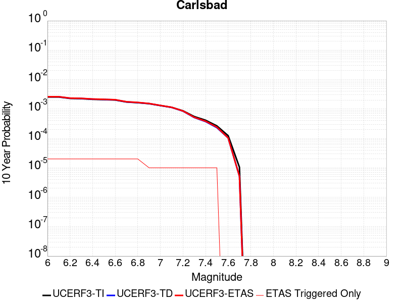 |

| Magnitude | 1 wk TI Prob | 1 wk TD Prob | 1 wk ETAS Prob | 1 wk ETAS/TD Gain | 1 wk ETAS Triggered Only | 1 mo TI Prob | 1 mo TD Prob | 1 mo ETAS Prob | 1 mo ETAS/TD Gain | 1 mo ETAS Triggered Only | 1 yr TI Prob | 1 yr TD Prob | 1 yr ETAS Prob | 1 yr ETAS/TD Gain | 1 yr ETAS Triggered Only | 10 yr TI Prob | 10 yr TD Prob | 10 yr ETAS Prob | 10 yr ETAS/TD Gain | 10 yr ETAS Triggered Only |
|-----|-----|-----|-----|-----|-----|-----|-----|-----|-----|-----|-----|-----|-----|-----|-----|-----|-----|-----|-----|-----|
| 6.0 | 4.9038536E-6 | 4.9872688E-6 | 4.9872688E-6 | 1.0 | 0.0 | 2.1016345E-5 | 2.1373837E-5 | 3.1373624E-5 | 1.4678518 | 1.0E-5 | 2.5584397E-4 | 2.6019584E-4 | 2.7019324E-4 | 1.0384226 | 1.0E-5 | 0.002555496 | 0.002598959 | 0.002618907 | 1.0076754 | 2.0E-5 |
| 6.1 | 4.9038536E-6 | 4.9872688E-6 | 4.9872688E-6 | 1.0 | 0.0 | 2.1016345E-5 | 2.1373837E-5 | 3.1373624E-5 | 1.4678518 | 1.0E-5 | 2.5584397E-4 | 2.6019584E-4 | 2.7019324E-4 | 1.0384226 | 1.0E-5 | 0.002555496 | 0.002598959 | 0.002618907 | 1.0076754 | 2.0E-5 |
| 6.2 | 4.3820614E-6 | 4.4547814E-6 | 4.4547814E-6 | 1.0 | 0.0 | 1.8780129E-5 | 1.9091782E-5 | 2.909159E-5 | 1.5237756 | 1.0E-5 | 2.2862408E-4 | 2.3241801E-4 | 2.4241568E-4 | 1.043016 | 1.0E-5 | 0.00228389 | 0.002321785 | 0.0023417387 | 1.008594 | 2.0E-5 |
| 6.3 | 4.302872E-6 | 4.373019E-6 | 4.373019E-6 | 1.0 | 0.0 | 1.8440749E-5 | 1.8741377E-5 | 2.874119E-5 | 1.5335687 | 1.0E-5 | 2.24493E-4 | 2.2815271E-4 | 2.3815043E-4 | 1.0438203 | 1.0E-5 | 0.0022426634 | 0.0022792201 | 0.0022991744 | 1.008755 | 2.0E-5 |
| 6.4 | 4.0835243E-6 | 4.147667E-6 | 4.147667E-6 | 1.0 | 0.0 | 1.75007E-5 | 1.7775597E-5 | 2.7775419E-5 | 1.562559 | 1.0E-5 | 2.1305021E-4 | 2.1639673E-4 | 2.2639456E-4 | 1.0462015 | 1.0E-5 | 0.0021284607 | 0.0021618942 | 0.002181851 | 1.0092311 | 2.0E-5 |
| 6.5 | 3.987806E-6 | 4.048899E-6 | 4.048899E-6 | 1.0 | 0.0 | 1.7090486E-5 | 1.7352311E-5 | 2.7352138E-5 | 1.5762821 | 1.0E-5 | 2.080568E-4 | 2.1124425E-4 | 2.2124212E-4 | 1.0473286 | 1.0E-5 | 0.002078621 | 0.0021104682 | 0.002130426 | 1.0094565 | 2.0E-5 |
| 6.6 | 3.8707576E-6 | 3.927501E-6 | 3.927501E-6 | 1.0 | 0.0 | 1.6588854E-5 | 1.683204E-5 | 2.683187E-5 | 1.5940951 | 1.0E-5 | 2.0195059E-4 | 2.0491115E-4 | 2.149091E-4 | 1.0487916 | 1.0E-5 | 0.0020176715 | 0.0020472556 | 0.0020672146 | 1.0097492 | 2.0E-5 |
| 6.7 | 3.3093434E-6 | 3.3424044E-6 | 3.3424044E-6 | 1.0 | 0.0 | 1.4182823E-5 | 1.4324512E-5 | 2.4324368E-5 | 1.698094 | 1.0E-5 | 1.7266218E-4 | 1.7438704E-4 | 1.843853E-4 | 1.0573337 | 1.0E-5 | 0.001725281 | 0.001742508 | 0.0017624731 | 1.0114577 | 2.0E-5 |
| 6.8 | 3.136983E-6 | 3.1664663E-6 | 3.1664663E-6 | 1.0 | 0.0 | 1.3444143E-5 | 1.35704995E-5 | 2.3570365E-5 | 1.7368826 | 1.0E-5 | 1.6367015E-4 | 1.6520836E-4 | 1.752067E-4 | 1.0605196 | 1.0E-5 | 0.0016354966 | 0.0016508611 | 0.0016708281 | 1.0120949 | 2.0E-5 |
| 6.9 | 2.9056644E-6 | 2.9267715E-6 | 2.9267715E-6 | 1.0 | 0.0 | 1.2452788E-5 | 1.2543246E-5 | 2.2543121E-5 | 1.7972318 | 1.0E-5 | 1.5160214E-4 | 1.5270336E-4 | 1.6270184E-4 | 1.0654764 | 1.0E-5 | 0.0015149876 | 0.0015259896 | 0.0015359744 | 1.0065432 | 1.0E-5 |
| 7.0 | 2.5071035E-6 | 2.51141E-6 | 2.51141E-6 | 1.0 | 0.0 | 1.0744685E-5 | 1.0763142E-5 | 2.0763035E-5 | 1.9290868 | 1.0E-5 | 1.308087E-4 | 1.310334E-4 | 1.4103208E-4 | 1.0763065 | 1.0E-5 | 0.0013073172 | 0.0013095647 | 0.0013195515 | 1.0076262 | 1.0E-5 |
| 7.1 | 2.1786877E-6 | 2.1678952E-6 | 2.1678952E-6 | 1.0 | 0.0 | 9.3372E-6 | 9.290947E-6 | 1.9290854E-5 | 2.0763066 | 1.0E-5 | 1.13674476E-4 | 1.13111426E-4 | 1.231103E-4 | 1.0883983 | 1.0E-5 | 0.0011361635 | 0.0011305414 | 0.0011405301 | 1.0088353 | 1.0E-5 |
| 7.2 | 1.6628418E-6 | 1.6213987E-6 | 1.6213987E-6 | 1.0 | 0.0 | 7.1264453E-6 | 6.9488333E-6 | 1.6948763E-5 | 2.4390805 | 1.0E-5 | 8.676102E-5 | 8.459878E-5 | 9.4597934E-5 | 1.118195 | 1.0E-5 | 8.672715E-4 | 8.4566796E-4 | 8.556595E-4 | 1.011815 | 1.0E-5 |
| 7.3 | 1.0595926E-6 | 9.816912E-7 | 9.816912E-7 | 1.0 | 0.0 | 4.541103E-6 | 4.207241E-6 | 1.42071995E-5 | 3.3768444 | 1.0E-5 | 5.5286528E-5 | 5.1221967E-5 | 6.122146E-5 | 1.1952187 | 1.0E-5 | 5.527277E-4 | 5.121025E-4 | 5.220974E-4 | 1.0195173 | 1.0E-5 |
| 7.4 | 7.956623E-7 | 7.173889E-7 | 7.173889E-7 | 1.0 | 0.0 | 3.4099767E-6 | 3.0745202E-6 | 1.3074489E-5 | 4.25253 | 1.0E-5 | 4.1515676E-5 | 3.7431648E-5 | 4.7431273E-5 | 1.2671436 | 1.0E-5 | 4.150792E-4 | 3.7425413E-4 | 3.842504E-4 | 1.0267098 | 1.0E-5 |
| 7.5 | 5.1043804E-7 | 4.448447E-7 | 4.448447E-7 | 1.0 | 0.0 | 2.1875896E-6 | 1.9064759E-6 | 1.1906457E-5 | 6.2452703 | 1.0E-5 | 2.663358E-5 | 2.3211102E-5 | 3.321087E-5 | 1.4308183 | 1.0E-5 | 2.6630386E-4 | 2.3208735E-4 | 2.4208504E-4 | 1.0430772 | 1.0E-5 |
| 7.6 | 2.3723294E-7 | 1.9896439E-7 | 1.9896439E-7 | 1.0 | 0.0 | 1.0167122E-6 | 8.527042E-7 | 8.527042E-7 | 1.0 | 0.0 | 1.2378401E-5 | 1.0381627E-5 | 1.0381627E-5 | 1.0 | 0.0 | 1.237771E-4 | 1.038117E-4 | 1.038117E-4 | 1.0 | 0.0 |
| 7.7 | 1.9992152E-8 | 9.860285E-9 | 9.860285E-9 | 1.0 | 0.0 | 8.568065E-8 | 4.2258364E-8 | 4.2258364E-8 | 1.0 | 0.0 | 1.0431614E-6 | 5.144956E-7 | 5.144956E-7 | 1.0 | 0.0 | 1.0431565E-5 | 5.144956E-6 | 5.144956E-6 | 1.0 | 0.0 |

## Homestead Valley 2011
*[(top)](#table-of-contents)*

| 1 Week | 1 Month | 1 Year | 10 Year |
|-----|-----|-----|-----|
|  |  |  |  |

| Magnitude | 1 wk TI Prob | 1 wk TD Prob | 1 wk ETAS Prob | 1 wk ETAS/TD Gain | 1 wk ETAS Triggered Only | 1 mo TI Prob | 1 mo TD Prob | 1 mo ETAS Prob | 1 mo ETAS/TD Gain | 1 mo ETAS Triggered Only | 1 yr TI Prob | 1 yr TD Prob | 1 yr ETAS Prob | 1 yr ETAS/TD Gain | 1 yr ETAS Triggered Only | 10 yr TI Prob | 10 yr TD Prob | 10 yr ETAS Prob | 10 yr ETAS/TD Gain | 10 yr ETAS Triggered Only |
|-----|-----|-----|-----|-----|-----|-----|-----|-----|-----|-----|-----|-----|-----|-----|-----|-----|-----|-----|-----|-----|
| 6.0 | 1.539795E-5 | 6.286469E-6 | 1.6286407E-5 | 2.590708 | 1.0E-5 | 6.5989545E-5 | 2.6941849E-5 | 3.694158E-5 | 1.3711598 | 1.0E-5 | 8.0312655E-4 | 3.2798824E-4 | 3.479817E-4 | 1.0609578 | 2.0E-5 | 0.008002302 | 0.0032770627 | 0.0033069644 | 1.0091245 | 3.0E-5 |
| 6.1 | 1.539795E-5 | 6.286469E-6 | 1.6286407E-5 | 2.590708 | 1.0E-5 | 6.5989545E-5 | 2.6941849E-5 | 3.694158E-5 | 1.3711598 | 1.0E-5 | 8.0312655E-4 | 3.2798824E-4 | 3.479817E-4 | 1.0609578 | 2.0E-5 | 0.008002302 | 0.0032770627 | 0.0033069644 | 1.0091245 | 3.0E-5 |
| 6.2 | 1.539795E-5 | 6.286469E-6 | 1.6286407E-5 | 2.590708 | 1.0E-5 | 6.5989545E-5 | 2.6941849E-5 | 3.694158E-5 | 1.3711598 | 1.0E-5 | 8.0312655E-4 | 3.2798824E-4 | 3.479817E-4 | 1.0609578 | 2.0E-5 | 0.008002302 | 0.0032770627 | 0.0033069644 | 1.0091245 | 3.0E-5 |
| 6.3 | 1.539795E-5 | 6.286469E-6 | 1.6286407E-5 | 2.590708 | 1.0E-5 | 6.5989545E-5 | 2.6941849E-5 | 3.694158E-5 | 1.3711598 | 1.0E-5 | 8.0312655E-4 | 3.2798824E-4 | 3.479817E-4 | 1.0609578 | 2.0E-5 | 0.008002302 | 0.0032770627 | 0.0033069644 | 1.0091245 | 3.0E-5 |
| 6.4 | 1.539795E-5 | 6.286469E-6 | 1.6286407E-5 | 2.590708 | 1.0E-5 | 6.5989545E-5 | 2.6941849E-5 | 3.694158E-5 | 1.3711598 | 1.0E-5 | 8.0312655E-4 | 3.2798824E-4 | 3.479817E-4 | 1.0609578 | 2.0E-5 | 0.008002302 | 0.0032770627 | 0.0033069644 | 1.0091245 | 3.0E-5 |
| 6.5 | 1.0265258E-5 | 2.8786876E-6 | 1.2878659E-5 | 4.473795 | 1.0E-5 | 4.3993223E-5 | 1.2337214E-5 | 2.233709E-5 | 1.8105458 | 1.0E-5 | 5.3548586E-4 | 1.5020218E-4 | 1.7019917E-4 | 1.1331339 | 2.0E-5 | 0.005341973 | 0.0015016886 | 0.0015316436 | 1.0199475 | 3.0E-5 |
| 6.6 | 6.664671E-6 | 5.343859E-7 | 1.0534381E-5 | 19.71306 | 1.0E-5 | 2.8562565E-5 | 2.2902238E-6 | 1.2290201E-5 | 5.3663754 | 1.0E-5 | 3.476937E-4 | 2.7883236E-5 | 4.788268E-5 | 1.7172569 | 2.0E-5 | 0.003471502 | 2.78809E-4 | 2.988034E-4 | 1.0717137 | 2.0E-5 |
| 6.7 | 6.5954046E-6 | 5.343859E-7 | 1.0534381E-5 | 19.71306 | 1.0E-5 | 2.8265715E-5 | 2.2902238E-6 | 1.2290201E-5 | 5.3663754 | 1.0E-5 | 3.4408073E-4 | 2.7883236E-5 | 4.788268E-5 | 1.7172569 | 2.0E-5 | 0.0034354846 | 2.78809E-4 | 2.988034E-4 | 1.0717137 | 2.0E-5 |
| 6.8 | 4.648189E-6 | 2.3257238E-7 | 1.023257E-5 | 43.99736 | 1.0E-5 | 1.9920659E-5 | 9.967384E-7 | 1.0996729E-5 | 11.032713 | 1.0E-5 | 2.4250703E-4 | 1.2135227E-5 | 3.2134983E-5 | 2.6480744 | 2.0E-5 | 0.0024224254 | 1.2134612E-4 | 1.413437E-4 | 1.1647978 | 2.0E-5 |
| 6.9 | 4.1428534E-6 | 1.9342777E-7 | 1.0193426E-5 | 52.698875 | 1.0E-5 | 1.7754966E-5 | 8.289759E-7 | 1.0828968E-5 | 13.063067 | 1.0E-5 | 2.1614527E-4 | 1.0092737E-5 | 3.0092537E-5 | 2.981603 | 2.0E-5 | 0.0021593515 | 1.0092309E-4 | 1.20921075E-4 | 1.1981508 | 2.0E-5 |
| 7.0 | 3.0673707E-6 | 1.5364343E-7 | 1.0153642E-5 | 66.085754 | 1.0E-5 | 1.3145808E-5 | 6.5847166E-7 | 1.0658465E-5 | 16.186672 | 1.0E-5 | 1.6003846E-4 | 8.016864E-6 | 2.8016704E-5 | 3.4947212 | 2.0E-5 | 0.0015992324 | 8.016585E-5 | 1.00164245E-4 | 1.2494628 | 2.0E-5 |
| 7.1 | 2.340854E-6 | 1.4684727E-7 | 1.0146846E-5 | 69.09795 | 1.0E-5 | 1.0032193E-5 | 6.293453E-7 | 1.0629339E-5 | 16.889519 | 1.0E-5 | 1.221351E-4 | 7.662254E-6 | 2.76621E-5 | 3.6101782 | 2.0E-5 | 0.00122068 | 7.661999E-5 | 9.661846E-5 | 1.2610085 | 2.0E-5 |
| 7.2 | 1.3754182E-6 | 1.3920152E-7 | 1.01392E-5 | 72.83829 | 1.0E-5 | 5.8946357E-6 | 5.965778E-7 | 1.0596572E-5 | 17.762262 | 1.0E-5 | 7.176483E-5 | 7.2633115E-6 | 2.7263166E-5 | 3.753545 | 2.0E-5 | 7.174166E-4 | 7.2630835E-5 | 9.262938E-5 | 1.2753452 | 2.0E-5 |
| 7.3 | 1.2573237E-6 | 1.3824703E-7 | 1.0138246E-5 | 73.334274 | 1.0E-5 | 5.388519E-6 | 5.9248714E-7 | 1.0592481E-5 | 17.877993 | 1.0E-5 | 6.560324E-5 | 7.213508E-6 | 2.7213364E-5 | 3.772556 | 2.0E-5 | 6.558388E-4 | 7.213283E-5 | 9.213139E-5 | 1.2772462 | 2.0E-5 |
| 7.4 | 1.0994207E-6 | 1.3103899E-7 | 1.0131038E-5 | 77.313156 | 1.0E-5 | 4.7117946E-6 | 5.615955E-7 | 1.056159E-5 | 18.8064 | 1.0E-5 | 5.736459E-5 | 6.837405E-6 | 2.6837268E-5 | 3.9250662 | 2.0E-5 | 5.734978E-4 | 6.837204E-5 | 8.8370674E-5 | 1.2924973 | 2.0E-5 |
| 7.5 | 5.5569126E-7 | 6.7717565E-8 | 6.7717565E-8 | 1.0 | 0.0 | 2.3815317E-6 | 2.902181E-7 | 2.902181E-7 | 1.0 | 0.0 | 2.8994764E-5 | 3.5334003E-6 | 3.5334003E-6 | 1.0 | 0.0 | 2.899098E-4 | 3.5333505E-5 | 3.5333505E-5 | 1.0 | 0.0 |

## Monte Vista - Shannon 2011 CFM
*[(top)](#table-of-contents)*

| 1 Week | 1 Month | 1 Year | 10 Year |
|-----|-----|-----|-----|
|  |  |  |  |

| Magnitude | 1 wk TI Prob | 1 wk TD Prob | 1 wk ETAS Prob | 1 wk ETAS/TD Gain | 1 wk ETAS Triggered Only | 1 mo TI Prob | 1 mo TD Prob | 1 mo ETAS Prob | 1 mo ETAS/TD Gain | 1 mo ETAS Triggered Only | 1 yr TI Prob | 1 yr TD Prob | 1 yr ETAS Prob | 1 yr ETAS/TD Gain | 1 yr ETAS Triggered Only | 10 yr TI Prob | 10 yr TD Prob | 10 yr ETAS Prob | 10 yr ETAS/TD Gain | 10 yr ETAS Triggered Only |
|-----|-----|-----|-----|-----|-----|-----|-----|-----|-----|-----|-----|-----|-----|-----|-----|-----|-----|-----|-----|-----|
| 6.0 | 2.7907707E-5 | 2.7584067E-5 | 2.7584067E-5 | 1.0 | 0.0 | 1.19598975E-4 | 1.1821277E-4 | 1.2821158E-4 | 1.0845833 | 1.0E-5 | 0.0014551448 | 0.001438414 | 0.0014583853 | 1.0138842 | 2.0E-5 | 0.014456532 | 0.014320111 | 0.014349681 | 1.002065 | 3.0E-5 |
| 6.1 | 2.7907707E-5 | 2.7584067E-5 | 2.7584067E-5 | 1.0 | 0.0 | 1.19598975E-4 | 1.1821277E-4 | 1.2821158E-4 | 1.0845833 | 1.0E-5 | 0.0014551448 | 0.001438414 | 0.0014583853 | 1.0138842 | 2.0E-5 | 0.014456532 | 0.014320111 | 0.014349681 | 1.002065 | 3.0E-5 |
| 6.2 | 2.7907707E-5 | 2.7584067E-5 | 2.7584067E-5 | 1.0 | 0.0 | 1.19598975E-4 | 1.1821277E-4 | 1.2821158E-4 | 1.0845833 | 1.0E-5 | 0.0014551448 | 0.001438414 | 0.0014583853 | 1.0138842 | 2.0E-5 | 0.014456532 | 0.014320111 | 0.014349681 | 1.002065 | 3.0E-5 |
| 6.3 | 2.7907707E-5 | 2.7584067E-5 | 2.7584067E-5 | 1.0 | 0.0 | 1.19598975E-4 | 1.1821277E-4 | 1.2821158E-4 | 1.0845833 | 1.0E-5 | 0.0014551448 | 0.001438414 | 0.0014583853 | 1.0138842 | 2.0E-5 | 0.014456532 | 0.014320111 | 0.014349681 | 1.002065 | 3.0E-5 |
| 6.4 | 2.7907707E-5 | 2.7584067E-5 | 2.7584067E-5 | 1.0 | 0.0 | 1.19598975E-4 | 1.1821277E-4 | 1.2821158E-4 | 1.0845833 | 1.0E-5 | 0.0014551448 | 0.001438414 | 0.0014583853 | 1.0138842 | 2.0E-5 | 0.014456532 | 0.014320111 | 0.014349681 | 1.002065 | 3.0E-5 |
| 6.5 | 1.7990213E-5 | 1.6639742E-5 | 1.6639742E-5 | 1.0 | 0.0 | 7.709863E-5 | 7.13116E-5 | 8.131089E-5 | 1.1402197 | 1.0E-5 | 9.382716E-4 | 8.679393E-4 | 8.8792195E-4 | 1.0230231 | 2.0E-5 | 0.0093431985 | 0.008668857 | 0.008698597 | 1.0034306 | 3.0E-5 |
| 6.6 | 9.650407E-6 | 7.457001E-6 | 7.457001E-6 | 1.0 | 0.0 | 4.135823E-5 | 3.195823E-5 | 3.195823E-5 | 1.0 | 0.0 | 5.0342013E-4 | 3.890298E-4 | 3.890298E-4 | 1.0 | 0.0 | 0.005022812 | 0.0039011573 | 0.0039011573 | 1.0 | 0.0 |
| 6.7 | 9.62828E-6 | 7.434916E-6 | 7.434916E-6 | 1.0 | 0.0 | 4.1263404E-5 | 3.186358E-5 | 3.186358E-5 | 1.0 | 0.0 | 5.022661E-4 | 3.8787787E-4 | 3.8787787E-4 | 1.0 | 0.0 | 0.0050113243 | 0.003889678 | 0.003889678 | 1.0 | 0.0 |
| 6.8 | 6.887523E-6 | 4.461425E-6 | 4.461425E-6 | 1.0 | 0.0 | 2.9517621E-5 | 1.9120265E-5 | 1.9120265E-5 | 1.0 | 0.0 | 3.5931775E-4 | 2.3276659E-4 | 2.3276659E-4 | 1.0 | 0.0 | 0.0035873733 | 0.0023423703 | 0.0023423703 | 1.0 | 0.0 |
| 6.9 | 6.2722347E-6 | 3.8032956E-6 | 3.8032956E-6 | 1.0 | 0.0 | 2.6880729E-5 | 1.6299748E-5 | 1.6299748E-5 | 1.0 | 0.0 | 3.2722374E-4 | 1.9843338E-4 | 1.9843338E-4 | 1.0 | 0.0 | 0.003267423 | 0.0019996904 | 0.0019996904 | 1.0 | 0.0 |
| 7.0 | 5.5320347E-6 | 3.0304461E-6 | 3.0304461E-6 | 1.0 | 0.0 | 2.3708504E-5 | 1.2987572E-5 | 1.2987572E-5 | 1.0 | 0.0 | 2.8861282E-4 | 1.5811404E-4 | 1.5811404E-4 | 1.0 | 0.0 | 0.0028823826 | 0.0015971304 | 0.0015971304 | 1.0 | 0.0 |
| 7.1 | 3.8794055E-6 | 1.283645E-6 | 1.283645E-6 | 1.0 | 0.0 | 1.6625918E-5 | 5.5013243E-6 | 5.5013243E-6 | 1.0 | 0.0 | 2.0240174E-4 | 6.697658E-5 | 6.697658E-5 | 1.0 | 0.0 | 0.002022175 | 6.86504E-4 | 6.86504E-4 | 1.0 | 0.0 |
| 7.2 | 3.4813652E-6 | 9.669686E-7 | 9.669686E-7 | 1.0 | 0.0 | 1.49200505E-5 | 4.144145E-6 | 4.144145E-6 | 1.0 | 0.0 | 1.8163648E-4 | 5.0453804E-5 | 5.0453804E-5 | 1.0 | 0.0 | 0.0018148809 | 5.213506E-4 | 5.213506E-4 | 1.0 | 0.0 |
| 7.3 | 3.1682148E-6 | 7.7177793E-7 | 7.7177793E-7 | 1.0 | 0.0 | 1.3577992E-5 | 3.3076153E-6 | 3.3076153E-6 | 1.0 | 0.0 | 1.6529951E-4 | 4.0269475E-5 | 4.0269475E-5 | 1.0 | 0.0 | 0.0016517661 | 4.195245E-4 | 4.195245E-4 | 1.0 | 0.0 |
| 7.4 | 2.9707667E-6 | 7.344474E-7 | 7.344474E-7 | 1.0 | 0.0 | 1.2731795E-5 | 3.147628E-6 | 3.147628E-6 | 1.0 | 0.0 | 1.5499859E-4 | 3.8321698E-5 | 3.8321698E-5 | 1.0 | 0.0 | 0.0015489052 | 3.998471E-4 | 3.998471E-4 | 1.0 | 0.0 |
| 7.5 | 2.3462758E-6 | 6.0069135E-7 | 6.0069135E-7 | 1.0 | 0.0 | 1.0055429E-5 | 2.5743889E-6 | 2.5743889E-6 | 1.0 | 0.0 | 1.2241797E-4 | 3.1342737E-5 | 3.1342737E-5 | 1.0 | 0.0 | 0.0012235056 | 3.2833643E-4 | 3.2833643E-4 | 1.0 | 0.0 |
| 7.6 | 2.112783E-6 | 5.250731E-7 | 5.250731E-7 | 1.0 | 0.0 | 9.054753E-6 | 2.2503114E-6 | 2.2503114E-6 | 1.0 | 0.0 | 1.1023604E-4 | 2.7397198E-5 | 2.7397198E-5 | 1.0 | 0.0 | 0.0011018137 | 2.8845918E-4 | 2.8845918E-4 | 1.0 | 0.0 |
| 7.7 | 1.7022471E-6 | 4.23102E-7 | 4.23102E-7 | 1.0 | 0.0 | 7.2953244E-6 | 1.8132929E-6 | 1.8132929E-6 | 1.0 | 0.0 | 8.881695E-5 | 2.207662E-5 | 2.207662E-5 | 1.0 | 0.0 | 8.878146E-4 | 2.3394964E-4 | 2.3394964E-4 | 1.0 | 0.0 |
| 7.8 | 7.230914E-7 | 3.728293E-7 | 3.728293E-7 | 1.0 | 0.0 | 3.0989595E-6 | 1.597839E-6 | 1.597839E-6 | 1.0 | 0.0 | 3.772918E-5 | 1.9453517E-5 | 1.9453517E-5 | 1.0 | 0.0 | 3.7722773E-4 | 2.072548E-4 | 2.072548E-4 | 1.0 | 0.0 |
| 7.9 | 4.3588446E-7 | 3.4304335E-7 | 3.4304335E-7 | 1.0 | 0.0 | 1.868075E-6 | 1.4701849E-6 | 1.4701849E-6 | 1.0 | 0.0 | 2.2743576E-5 | 1.7899356E-5 | 1.7899356E-5 | 1.0 | 0.0 | 2.2741247E-4 | 1.899464E-4 | 1.899464E-4 | 1.0 | 0.0 |
| 8.0 | 2.3317523E-7 | 3.1513432E-7 | 3.1513432E-7 | 1.0 | 0.0 | 9.99322E-7 | 1.350575E-6 | 1.350575E-6 | 1.0 | 0.0 | 1.2166677E-5 | 1.6443128E-5 | 1.6443128E-5 | 1.0 | 0.0 | 1.21660116E-4 | 1.7399403E-4 | 1.7399403E-4 | 1.0 | 0.0 |
| 8.1 | 1.4662456E-7 | 2.03077E-7 | 2.03077E-7 | 1.0 | 0.0 | 6.283908E-7 | 8.703297E-7 | 8.703297E-7 | 1.0 | 0.0 | 7.650631E-6 | 1.05962135E-5 | 1.05962135E-5 | 1.0 | 0.0 | 7.650368E-5 | 1.1132272E-4 | 1.1132272E-4 | 1.0 | 0.0 |
| 8.2 | 5.4931775E-9 | 5.0752176E-9 | 5.0752176E-9 | 1.0 | 0.0 | 2.3542189E-8 | 2.1750932E-8 | 2.1750932E-8 | 1.0 | 0.0 | 2.8662612E-7 | 2.6481757E-7 | 2.6481757E-7 | 1.0 | 0.0 | 2.8662573E-6 | 2.754138E-6 | 2.754138E-6 | 1.0 | 0.0 |

## East Huasna 2011 CFM
*[(top)](#table-of-contents)*

| 1 Week | 1 Month | 1 Year | 10 Year |
|-----|-----|-----|-----|
|  |  |  |  |

| Magnitude | 1 wk TI Prob | 1 wk TD Prob | 1 wk ETAS Prob | 1 wk ETAS/TD Gain | 1 wk ETAS Triggered Only | 1 mo TI Prob | 1 mo TD Prob | 1 mo ETAS Prob | 1 mo ETAS/TD Gain | 1 mo ETAS Triggered Only | 1 yr TI Prob | 1 yr TD Prob | 1 yr ETAS Prob | 1 yr ETAS/TD Gain | 1 yr ETAS Triggered Only | 10 yr TI Prob | 10 yr TD Prob | 10 yr ETAS Prob | 10 yr ETAS/TD Gain | 10 yr ETAS Triggered Only |
|-----|-----|-----|-----|-----|-----|-----|-----|-----|-----|-----|-----|-----|-----|-----|-----|-----|-----|-----|-----|-----|
| 6.0 | 1.4658423E-6 | 1.471566E-6 | 2.1471536E-5 | 14.590944 | 2.0E-5 | 6.282166E-6 | 6.3066964E-6 | 2.630657E-5 | 4.171212 | 2.0E-5 | 7.6482684E-5 | 7.67814E-5 | 9.677986E-5 | 1.2604598 | 2.0E-5 | 7.645637E-4 | 7.6755567E-4 | 7.975327E-4 | 1.0390551 | 3.0E-5 |
| 6.1 | 1.4658423E-6 | 1.471566E-6 | 2.1471536E-5 | 14.590944 | 2.0E-5 | 6.282166E-6 | 6.3066964E-6 | 2.630657E-5 | 4.171212 | 2.0E-5 | 7.6482684E-5 | 7.67814E-5 | 9.677986E-5 | 1.2604598 | 2.0E-5 | 7.645637E-4 | 7.6755567E-4 | 7.975327E-4 | 1.0390551 | 3.0E-5 |
| 6.2 | 1.4658423E-6 | 1.471566E-6 | 2.1471536E-5 | 14.590944 | 2.0E-5 | 6.282166E-6 | 6.3066964E-6 | 2.630657E-5 | 4.171212 | 2.0E-5 | 7.6482684E-5 | 7.67814E-5 | 9.677986E-5 | 1.2604598 | 2.0E-5 | 7.645637E-4 | 7.6755567E-4 | 7.975327E-4 | 1.0390551 | 3.0E-5 |
| 6.3 | 1.4658423E-6 | 1.471566E-6 | 2.1471536E-5 | 14.590944 | 2.0E-5 | 6.282166E-6 | 6.3066964E-6 | 2.630657E-5 | 4.171212 | 2.0E-5 | 7.6482684E-5 | 7.67814E-5 | 9.677986E-5 | 1.2604598 | 2.0E-5 | 7.645637E-4 | 7.6755567E-4 | 7.975327E-4 | 1.0390551 | 3.0E-5 |
| 6.4 | 1.0488257E-6 | 1.0527515E-6 | 1.1052741E-5 | 10.498908 | 1.0E-5 | 4.4949593E-6 | 4.5117845E-6 | 1.4511739E-5 | 3.216408 | 1.0E-5 | 5.472476E-5 | 5.492961E-5 | 6.492906E-5 | 1.1820412 | 1.0E-5 | 5.4711284E-4 | 5.491622E-4 | 5.6915125E-4 | 1.0363991 | 2.0E-5 |
| 6.5 | 1.0488257E-6 | 1.0527515E-6 | 1.1052741E-5 | 10.498908 | 1.0E-5 | 4.4949593E-6 | 4.5117845E-6 | 1.4511739E-5 | 3.216408 | 1.0E-5 | 5.472476E-5 | 5.492961E-5 | 6.492906E-5 | 1.1820412 | 1.0E-5 | 5.4711284E-4 | 5.491622E-4 | 5.6915125E-4 | 1.0363991 | 2.0E-5 |
| 6.6 | 8.463064E-7 | 8.4936323E-7 | 1.0849355E-5 | 12.773516 | 1.0E-5 | 3.6270226E-6 | 3.6401232E-6 | 1.3640087E-5 | 3.74715 | 1.0E-5 | 4.4158103E-5 | 4.4317607E-5 | 5.4317163E-5 | 1.225634 | 1.0E-5 | 4.414933E-4 | 4.4308856E-4 | 4.5308413E-4 | 1.0225588 | 1.0E-5 |
| 6.7 | 7.876149E-7 | 7.902533E-7 | 1.0790245E-5 | 13.6541605 | 1.0E-5 | 3.375488E-6 | 3.3867955E-6 | 1.3386762E-5 | 3.9526336 | 1.0E-5 | 4.109579E-5 | 4.1233463E-5 | 5.1233048E-5 | 1.2425115 | 1.0E-5 | 4.108819E-4 | 4.1225873E-4 | 4.222546E-4 | 1.0242466 | 1.0E-5 |
| 6.8 | 6.9940785E-7 | 7.0165777E-7 | 1.070165E-5 | 15.251952 | 1.0E-5 | 2.9974588E-6 | 3.0071012E-6 | 1.3007071E-5 | 4.325452 | 1.0E-5 | 3.649345E-5 | 3.6610847E-5 | 4.661048E-5 | 1.273133 | 1.0E-5 | 3.6487455E-4 | 3.6604863E-4 | 3.7604498E-4 | 1.0273088 | 1.0E-5 |
| 6.9 | 5.899658E-7 | 5.9155997E-7 | 1.0591554E-5 | 17.904448 | 1.0E-5 | 2.5284223E-6 | 2.5352545E-6 | 1.2535229E-5 | 4.9443674 | 1.0E-5 | 3.0783107E-5 | 3.086629E-5 | 4.086598E-5 | 1.323968 | 1.0E-5 | 3.0778843E-4 | 3.086203E-4 | 3.186172E-4 | 1.0323923 | 1.0E-5 |
| 7.0 | 4.793814E-7 | 4.803273E-7 | 1.0480322E-5 | 21.819128 | 1.0E-5 | 2.05449E-6 | 2.058544E-6 | 1.2058524E-5 | 5.8577924 | 1.0E-5 | 2.501313E-5 | 2.5062485E-5 | 3.5062236E-5 | 1.3989928 | 1.0E-5 | 2.5010316E-4 | 2.505968E-4 | 2.6059427E-4 | 1.0398947 | 1.0E-5 |
| 7.1 | 4.1256908E-7 | 4.129941E-7 | 1.041299E-5 | 25.213411 | 1.0E-5 | 1.768152E-6 | 1.7699736E-6 | 1.1769956E-5 | 6.649792 | 1.0E-5 | 2.1527037E-5 | 2.1549216E-5 | 3.1549E-5 | 1.464044 | 1.0E-5 | 2.1524953E-4 | 2.1547142E-4 | 2.2546925E-4 | 1.0463998 | 1.0E-5 |
| 7.2 | 2.822599E-7 | 2.8161418E-7 | 1.0281611E-5 | 36.509563 | 1.0E-5 | 1.2096847E-6 | 1.2069174E-6 | 1.1206906E-5 | 9.285562 | 1.0E-5 | 1.47278115E-5 | 1.4694121E-5 | 2.4693974E-5 | 1.6805342 | 1.0E-5 | 1.4726835E-4 | 1.4693156E-4 | 1.569301E-4 | 1.0680488 | 1.0E-5 |
| 7.3 | 1.5261652E-7 | 1.5075021E-7 | 1.01507485E-5 | 67.33489 | 1.0E-5 | 6.540707E-7 | 6.460722E-7 | 1.0646066E-5 | 16.478138 | 1.0E-5 | 7.963281E-6 | 7.8659E-6 | 1.7865821E-5 | 2.2713003 | 1.0E-5 | 7.962996E-5 | 7.865624E-5 | 8.8655455E-5 | 1.1271255 | 1.0E-5 |
| 7.4 | 7.976414E-8 | 8.057865E-8 | 1.0080578E-5 | 125.10234 | 1.0E-5 | 3.418463E-7 | 3.45337E-7 | 1.0345334E-5 | 29.957209 | 1.0E-5 | 4.1619705E-6 | 4.2044703E-6 | 1.4204428E-5 | 3.3784108 | 1.0E-5 | 4.161893E-5 | 4.2043914E-5 | 5.204349E-5 | 1.2378366 | 1.0E-5 |
| 7.5 | 4.2715055E-8 | 4.3202512E-8 | 4.3202512E-8 | 1.0 | 0.0 | 1.830645E-7 | 1.8515361E-7 | 1.8515361E-7 | 1.0 | 0.0 | 2.228808E-6 | 2.2542429E-6 | 2.2542429E-6 | 1.0 | 0.0 | 2.2287857E-5 | 2.2542203E-5 | 2.2542203E-5 | 1.0 | 0.0 |
| 7.6 | 2.1807532E-8 | 2.2057476E-8 | 2.2057476E-8 | 1.0 | 0.0 | 9.346085E-8 | 9.4532034E-8 | 9.4532034E-8 | 1.0 | 0.0 | 1.1378852E-6 | 1.1509269E-6 | 1.1509269E-6 | 1.0 | 0.0 | 1.1378794E-5 | 1.1509211E-5 | 1.1509211E-5 | 1.0 | 0.0 |
| 7.7 | 4.7196043E-9 | 4.767283E-9 | 4.767283E-9 | 1.0 | 0.0 | 2.0226874E-8 | 2.0431212E-8 | 2.0431212E-8 | 1.0 | 0.0 | 2.4626218E-7 | 2.4874998E-7 | 2.4874998E-7 | 1.0 | 0.0 | 2.462619E-6 | 2.487497E-6 | 2.487497E-6 | 1.0 | 0.0 |
| 7.8 | 7.400003E-11 | 7.4654505E-11 | 7.4654505E-11 | 1.0 | 0.0 | 3.171432E-10 | 3.1994773E-10 | 3.1994773E-10 | 1.0 | 0.0 | 3.861218E-9 | 3.895363E-9 | 3.895363E-9 | 1.0 | 0.0 | 3.861218E-8 | 3.895363E-8 | 3.895363E-8 | 1.0 | 0.0 |

## Great Valley 03a Dunnigan Hills
*[(top)](#table-of-contents)*

| 1 Week | 1 Month | 1 Year | 10 Year |
|-----|-----|-----|-----|
|  |  |  |  |

| Magnitude | 1 wk TI Prob | 1 wk TD Prob | 1 wk ETAS Prob | 1 wk ETAS/TD Gain | 1 wk ETAS Triggered Only | 1 mo TI Prob | 1 mo TD Prob | 1 mo ETAS Prob | 1 mo ETAS/TD Gain | 1 mo ETAS Triggered Only | 1 yr TI Prob | 1 yr TD Prob | 1 yr ETAS Prob | 1 yr ETAS/TD Gain | 1 yr ETAS Triggered Only | 10 yr TI Prob | 10 yr TD Prob | 10 yr ETAS Prob | 10 yr ETAS/TD Gain | 10 yr ETAS Triggered Only |
|-----|-----|-----|-----|-----|-----|-----|-----|-----|-----|-----|-----|-----|-----|-----|-----|-----|-----|-----|-----|-----|
| 6.0 | 1.6591328E-5 | 1.8107954E-5 | 2.8107774E-5 | 1.5522335 | 1.0E-5 | 7.110376E-5 | 7.7603596E-5 | 8.760282E-5 | 1.12885 | 1.0E-5 | 8.6534437E-4 | 9.444834E-4 | 9.54474E-4 | 1.0105778 | 1.0E-5 | 0.008619824 | 0.009411525 | 0.009431337 | 1.002105 | 2.0E-5 |
| 6.1 | 8.041125E-6 | 8.769726E-6 | 8.769726E-6 | 1.0 | 0.0 | 3.4461507E-5 | 3.7584115E-5 | 3.7584115E-5 | 1.0 | 0.0 | 4.194881E-4 | 4.5751085E-4 | 4.5751085E-4 | 1.0 | 0.0 | 0.004186971 | 0.004567687 | 0.004567687 | 1.0 | 0.0 |
| 6.2 | 3.2807004E-6 | 3.5795688E-6 | 3.5795688E-6 | 1.0 | 0.0 | 1.4060069E-5 | 1.5340942E-5 | 1.5340942E-5 | 1.0 | 0.0 | 1.7116789E-4 | 1.8676413E-4 | 1.8676413E-4 | 1.0 | 0.0 | 0.0017103611 | 0.0018664796 | 0.0018664796 | 1.0 | 0.0 |
| 6.3 | 1.9339366E-6 | 2.1103806E-6 | 2.1103806E-6 | 1.0 | 0.0 | 8.288273E-6 | 9.044474E-6 | 9.044474E-6 | 1.0 | 0.0 | 1.00905054E-4 | 1.1011375E-4 | 1.1011375E-4 | 1.0 | 0.0 | 0.0010085925 | 0.0011008718 | 0.0011008718 | 1.0 | 0.0 |
| 6.4 | 1.3142635E-6 | 1.4339867E-6 | 1.4339867E-6 | 1.0 | 0.0 | 5.6325457E-6 | 6.145657E-6 | 6.145657E-6 | 1.0 | 0.0 | 6.857408E-5 | 7.482337E-5 | 7.482337E-5 | 1.0 | 0.0 | 6.8552926E-4 | 7.4823375E-4 | 7.4823375E-4 | 1.0 | 0.0 |

## Puente Hills
*[(top)](#table-of-contents)*

| 1 Week | 1 Month | 1 Year | 10 Year |
|-----|-----|-----|-----|
|  |  | 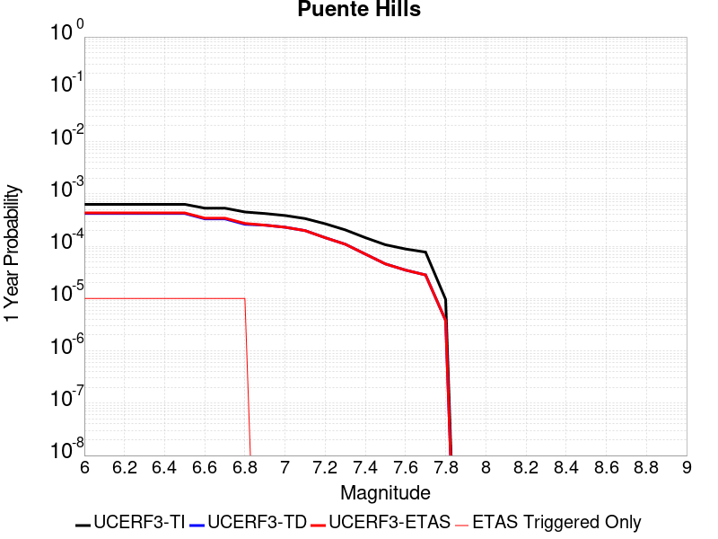 |  |

| Magnitude | 1 wk TI Prob | 1 wk TD Prob | 1 wk ETAS Prob | 1 wk ETAS/TD Gain | 1 wk ETAS Triggered Only | 1 mo TI Prob | 1 mo TD Prob | 1 mo ETAS Prob | 1 mo ETAS/TD Gain | 1 mo ETAS Triggered Only | 1 yr TI Prob | 1 yr TD Prob | 1 yr ETAS Prob | 1 yr ETAS/TD Gain | 1 yr ETAS Triggered Only | 10 yr TI Prob | 10 yr TD Prob | 10 yr ETAS Prob | 10 yr ETAS/TD Gain | 10 yr ETAS Triggered Only |
|-----|-----|-----|-----|-----|-----|-----|-----|-----|-----|-----|-----|-----|-----|-----|-----|-----|-----|-----|-----|-----|
| 6.0 | 1.2101656E-5 | 8.098448E-6 | 1.8098368E-5 | 2.2347944 | 1.0E-5 | 5.1863204E-5 | 3.4707205E-5 | 4.4706856E-5 | 1.2881147 | 1.0E-5 | 6.312516E-4 | 4.2248392E-4 | 4.324797E-4 | 1.0236596 | 1.0E-5 | 0.0062946146 | 0.0042173676 | 0.004247241 | 1.0070834 | 3.0E-5 |
| 6.1 | 1.2101656E-5 | 8.098448E-6 | 1.8098368E-5 | 2.2347944 | 1.0E-5 | 5.1863204E-5 | 3.4707205E-5 | 4.4706856E-5 | 1.2881147 | 1.0E-5 | 6.312516E-4 | 4.2248392E-4 | 4.324797E-4 | 1.0236596 | 1.0E-5 | 0.0062946146 | 0.0042173676 | 0.004247241 | 1.0070834 | 3.0E-5 |
| 6.2 | 1.2101656E-5 | 8.098448E-6 | 1.8098368E-5 | 2.2347944 | 1.0E-5 | 5.1863204E-5 | 3.4707205E-5 | 4.4706856E-5 | 1.2881147 | 1.0E-5 | 6.312516E-4 | 4.2248392E-4 | 4.324797E-4 | 1.0236596 | 1.0E-5 | 0.0062946146 | 0.0042173676 | 0.004247241 | 1.0070834 | 3.0E-5 |
| 6.3 | 1.2101656E-5 | 8.098448E-6 | 1.8098368E-5 | 2.2347944 | 1.0E-5 | 5.1863204E-5 | 3.4707205E-5 | 4.4706856E-5 | 1.2881147 | 1.0E-5 | 6.312516E-4 | 4.2248392E-4 | 4.324797E-4 | 1.0236596 | 1.0E-5 | 0.0062946146 | 0.0042173676 | 0.004247241 | 1.0070834 | 3.0E-5 |
| 6.4 | 1.2101656E-5 | 8.098448E-6 | 1.8098368E-5 | 2.2347944 | 1.0E-5 | 5.1863204E-5 | 3.4707205E-5 | 4.4706856E-5 | 1.2881147 | 1.0E-5 | 6.312516E-4 | 4.2248392E-4 | 4.324797E-4 | 1.0236596 | 1.0E-5 | 0.0062946146 | 0.0042173676 | 0.004247241 | 1.0070834 | 3.0E-5 |
| 6.5 | 1.2101656E-5 | 8.098448E-6 | 1.8098368E-5 | 2.2347944 | 1.0E-5 | 5.1863204E-5 | 3.4707205E-5 | 4.4706856E-5 | 1.2881147 | 1.0E-5 | 6.312516E-4 | 4.2248392E-4 | 4.324797E-4 | 1.0236596 | 1.0E-5 | 0.0062946146 | 0.0042173676 | 0.004247241 | 1.0070834 | 3.0E-5 |
| 6.6 | 1.0222488E-5 | 6.399079E-6 | 1.6399015E-5 | 2.5627148 | 1.0E-5 | 4.3809923E-5 | 2.742435E-5 | 3.7424077E-5 | 1.3646294 | 1.0E-5 | 5.332553E-4 | 3.3384276E-4 | 3.4383943E-4 | 1.0299442 | 1.0E-5 | 0.0053197746 | 0.0033336577 | 0.0033635576 | 1.0089691 | 3.0E-5 |
| 6.7 | 1.0222488E-5 | 6.399079E-6 | 1.6399015E-5 | 2.5627148 | 1.0E-5 | 4.3809923E-5 | 2.742435E-5 | 3.7424077E-5 | 1.3646294 | 1.0E-5 | 5.332553E-4 | 3.3384276E-4 | 3.4383943E-4 | 1.0299442 | 1.0E-5 | 0.0053197746 | 0.0033336577 | 0.0033635576 | 1.0089691 | 3.0E-5 |
| 6.8 | 8.6367845E-6 | 5.028129E-6 | 1.5028078E-5 | 2.9888012 | 1.0E-5 | 3.7014266E-5 | 2.1548949E-5 | 3.1548734E-5 | 1.4640497 | 1.0E-5 | 4.505555E-4 | 2.6232743E-4 | 2.723248E-4 | 1.0381103 | 1.0E-5 | 0.004496431 | 0.002620234 | 0.0026501555 | 1.0114194 | 3.0E-5 |
| 6.9 | 8.066481E-6 | 4.8360116E-6 | 4.8360116E-6 | 1.0 | 0.0 | 3.4570177E-5 | 2.0725602E-5 | 2.0725602E-5 | 1.0 | 0.0 | 4.2081063E-4 | 2.523055E-4 | 2.523055E-4 | 1.0 | 0.0 | 0.0042001465 | 0.0025202443 | 0.002540194 | 1.0079157 | 2.0E-5 |
| 7.0 | 7.393828E-6 | 4.4172275E-6 | 4.4172275E-6 | 1.0 | 0.0 | 3.168745E-5 | 1.8930841E-5 | 1.8930841E-5 | 1.0 | 0.0 | 3.857264E-4 | 2.3045906E-4 | 2.3045906E-4 | 1.0 | 0.0 | 0.0038505755 | 0.0023022462 | 0.0023122232 | 1.0043336 | 1.0E-5 |
| 7.1 | 6.4660953E-6 | 3.8043859E-6 | 3.8043859E-6 | 1.0 | 0.0 | 2.7711543E-5 | 1.630441E-5 | 1.630441E-5 | 1.0 | 0.0 | 3.373358E-4 | 1.9848847E-4 | 1.9848847E-4 | 1.0 | 0.0 | 0.0033682417 | 0.0019831478 | 0.0019831478 | 1.0 | 0.0 |
| 7.2 | 5.143232E-6 | 2.7864896E-6 | 2.7864896E-6 | 1.0 | 0.0 | 2.2042237E-5 | 1.1942045E-5 | 1.1942045E-5 | 1.0 | 0.0 | 2.6833118E-4 | 1.453848E-4 | 1.453848E-4 | 1.0 | 0.0 | 0.002680074 | 0.0014529065 | 0.0014529065 | 1.0 | 0.0 |
| 7.3 | 3.928255E-6 | 2.091338E-6 | 2.091338E-6 | 1.0 | 0.0 | 1.683527E-5 | 8.962847E-6 | 8.962847E-6 | 1.0 | 0.0 | 2.0495013E-4 | 1.0911726E-4 | 1.0911726E-4 | 1.0 | 0.0 | 0.002047612 | 0.0010906435 | 0.0010906435 | 1.0 | 0.0 |
| 7.4 | 2.7894434E-6 | 1.3546429E-6 | 1.3546429E-6 | 1.0 | 0.0 | 1.1954703E-5 | 5.8056E-6 | 5.8056E-6 | 1.0 | 0.0 | 1.4553878E-4 | 7.068093E-5 | 7.068093E-5 | 1.0 | 0.0 | 0.001454435 | 7.0658885E-4 | 7.0658885E-4 | 1.0 | 0.0 |
| 7.5 | 2.041735E-6 | 8.786996E-7 | 8.786996E-7 | 1.0 | 0.0 | 8.750263E-6 | 3.7658504E-6 | 3.7658504E-6 | 1.0 | 0.0 | 1.06529245E-4 | 4.5848297E-5 | 4.5848297E-5 | 1.0 | 0.0 | 0.0010647819 | 4.5839173E-4 | 4.5839173E-4 | 1.0 | 0.0 |
| 7.6 | 1.6959062E-6 | 6.698339E-7 | 6.698339E-7 | 1.0 | 0.0 | 7.268149E-6 | 2.8707138E-6 | 2.8707138E-6 | 1.0 | 0.0 | 8.848612E-5 | 3.4950408E-5 | 3.4950408E-5 | 1.0 | 0.0 | 8.84509E-4 | 3.4945202E-4 | 3.4945202E-4 | 1.0 | 0.0 |
| 7.7 | 1.4767965E-6 | 5.407146E-7 | 5.407146E-7 | 1.0 | 0.0 | 6.3291122E-6 | 2.3173466E-6 | 2.3173466E-6 | 1.0 | 0.0 | 7.705422E-5 | 2.8213353E-5 | 2.8213353E-5 | 1.0 | 0.0 | 7.702751E-4 | 2.8210029E-4 | 2.8210029E-4 | 1.0 | 0.0 |
| 7.8 | 1.8432911E-7 | 7.2811105E-8 | 7.2811105E-8 | 1.0 | 0.0 | 7.8998164E-7 | 3.1204758E-7 | 3.1204758E-7 | 1.0 | 0.0 | 9.617985E-6 | 3.799176E-6 | 3.799176E-6 | 1.0 | 0.0 | 9.617568E-5 | 3.7991435E-5 | 3.7991435E-5 | 1.0 | 0.0 |

## Santa Susana East (connector)
*[(top)](#table-of-contents)*

| 1 Week | 1 Month | 1 Year | 10 Year |
|-----|-----|-----|-----|
|  |  |  |  |

| Magnitude | 1 wk TI Prob | 1 wk TD Prob | 1 wk ETAS Prob | 1 wk ETAS/TD Gain | 1 wk ETAS Triggered Only | 1 mo TI Prob | 1 mo TD Prob | 1 mo ETAS Prob | 1 mo ETAS/TD Gain | 1 mo ETAS Triggered Only | 1 yr TI Prob | 1 yr TD Prob | 1 yr ETAS Prob | 1 yr ETAS/TD Gain | 1 yr ETAS Triggered Only | 10 yr TI Prob | 10 yr TD Prob | 10 yr ETAS Prob | 10 yr ETAS/TD Gain | 10 yr ETAS Triggered Only |
|-----|-----|-----|-----|-----|-----|-----|-----|-----|-----|-----|-----|-----|-----|-----|-----|-----|-----|-----|-----|-----|
| 6.0 | 2.858397E-5 | 3.2021693E-5 | 3.2021693E-5 | 1.0 | 0.0 | 1.2249697E-4 | 1.3723019E-4 | 1.3723019E-4 | 1.0 | 0.0 | 0.0014903803 | 0.00166977 | 0.0016797533 | 1.0059788 | 1.0E-5 | 0.014804244 | 0.016599316 | 0.016628819 | 1.0017773 | 3.0E-5 |
| 6.1 | 2.858397E-5 | 3.2021693E-5 | 3.2021693E-5 | 1.0 | 0.0 | 1.2249697E-4 | 1.3723019E-4 | 1.3723019E-4 | 1.0 | 0.0 | 0.0014903803 | 0.00166977 | 0.0016797533 | 1.0059788 | 1.0E-5 | 0.014804244 | 0.016599316 | 0.016628819 | 1.0017773 | 3.0E-5 |
| 6.2 | 2.858397E-5 | 3.2021693E-5 | 3.2021693E-5 | 1.0 | 0.0 | 1.2249697E-4 | 1.3723019E-4 | 1.3723019E-4 | 1.0 | 0.0 | 0.0014903803 | 0.00166977 | 0.0016797533 | 1.0059788 | 1.0E-5 | 0.014804244 | 0.016599316 | 0.016628819 | 1.0017773 | 3.0E-5 |
| 6.3 | 1.943582E-5 | 2.0367343E-5 | 2.0367343E-5 | 1.0 | 0.0 | 8.329371E-5 | 8.7286324E-5 | 8.7286324E-5 | 1.0 | 0.0 | 0.001013629 | 0.001062305 | 0.0010722943 | 1.0094035 | 1.0E-5 | 0.010090181 | 0.010583852 | 0.010613535 | 1.0028045 | 3.0E-5 |
| 6.4 | 1.943582E-5 | 2.0367343E-5 | 2.0367343E-5 | 1.0 | 0.0 | 8.329371E-5 | 8.7286324E-5 | 8.7286324E-5 | 1.0 | 0.0 | 0.001013629 | 0.001062305 | 0.0010722943 | 1.0094035 | 1.0E-5 | 0.010090181 | 0.010583852 | 0.010613535 | 1.0028045 | 3.0E-5 |
| 6.5 | 1.943582E-5 | 2.0367343E-5 | 2.0367343E-5 | 1.0 | 0.0 | 8.329371E-5 | 8.7286324E-5 | 8.7286324E-5 | 1.0 | 0.0 | 0.001013629 | 0.001062305 | 0.0010722943 | 1.0094035 | 1.0E-5 | 0.010090181 | 0.010583852 | 0.010613535 | 1.0028045 | 3.0E-5 |
| 6.6 | 1.943582E-5 | 2.0367343E-5 | 2.0367343E-5 | 1.0 | 0.0 | 8.329371E-5 | 8.7286324E-5 | 8.7286324E-5 | 1.0 | 0.0 | 0.001013629 | 0.001062305 | 0.0010722943 | 1.0094035 | 1.0E-5 | 0.010090181 | 0.010583852 | 0.010613535 | 1.0028045 | 3.0E-5 |
| 6.7 | 1.9404439E-5 | 2.0354766E-5 | 2.0354766E-5 | 1.0 | 0.0 | 8.3159226E-5 | 8.723242E-5 | 8.723242E-5 | 1.0 | 0.0 | 0.0010119933 | 0.0010616493 | 0.0010716388 | 1.0094093 | 1.0E-5 | 0.010073971 | 0.010577358 | 0.010607041 | 1.0028063 | 3.0E-5 |
| 6.8 | 1.2217526E-5 | 1.1593157E-5 | 1.1593157E-5 | 1.0 | 0.0 | 5.2359774E-5 | 4.9684106E-5 | 4.9684106E-5 | 1.0 | 0.0 | 6.372938E-4 | 6.047529E-4 | 6.147469E-4 | 1.0165256 | 1.0E-5 | 0.0063546924 | 0.006033274 | 0.0060531534 | 1.003295 | 2.0E-5 |
| 6.9 | 1.2217526E-5 | 1.1593157E-5 | 1.1593157E-5 | 1.0 | 0.0 | 5.2359774E-5 | 4.9684106E-5 | 4.9684106E-5 | 1.0 | 0.0 | 6.372938E-4 | 6.047529E-4 | 6.147469E-4 | 1.0165256 | 1.0E-5 | 0.0063546924 | 0.006033274 | 0.0060531534 | 1.003295 | 2.0E-5 |
| 7.0 | 9.276017E-6 | 8.059273E-6 | 8.059273E-6 | 1.0 | 0.0 | 3.9753755E-5 | 3.4539302E-5 | 3.4539302E-5 | 1.0 | 0.0 | 4.8389446E-4 | 4.2043833E-4 | 4.3043413E-4 | 1.0237747 | 1.0E-5 | 0.0048284214 | 0.0041973097 | 0.004217226 | 1.004745 | 2.0E-5 |
| 7.1 | 9.130355E-6 | 7.942446E-6 | 7.942446E-6 | 1.0 | 0.0 | 3.9129503E-5 | 3.4038632E-5 | 3.4038632E-5 | 1.0 | 0.0 | 4.7629757E-4 | 4.1434498E-4 | 4.2434083E-4 | 1.0241245 | 1.0E-5 | 0.00475278 | 0.0041366047 | 0.004156522 | 1.0048149 | 2.0E-5 |
| 7.2 | 8.851015E-6 | 7.741608E-6 | 7.741608E-6 | 1.0 | 0.0 | 3.7932372E-5 | 3.317792E-5 | 3.317792E-5 | 1.0 | 0.0 | 4.6172875E-4 | 4.038697E-4 | 4.1386567E-4 | 1.0247505 | 1.0E-5 | 0.0046077054 | 0.0040322347 | 0.0040521543 | 1.00494 | 2.0E-5 |
| 7.3 | 8.573006E-6 | 7.5503312E-6 | 7.5503312E-6 | 1.0 | 0.0 | 3.6740938E-5 | 3.235818E-5 | 3.235818E-5 | 1.0 | 0.0 | 4.472291E-4 | 3.9389305E-4 | 4.038891E-4 | 1.0253776 | 1.0E-5 | 0.004463301 | 0.003932817 | 0.0039527384 | 1.0050654 | 2.0E-5 |
| 7.4 | 7.852282E-6 | 6.8178556E-6 | 6.8178556E-6 | 1.0 | 0.0 | 3.36522E-5 | 2.921907E-5 | 2.921907E-5 | 1.0 | 0.0 | 4.096385E-4 | 3.5568717E-4 | 3.656836E-4 | 1.0281045 | 1.0E-5 | 0.0040888423 | 0.0035519868 | 0.003571916 | 1.0056107 | 2.0E-5 |
| 7.5 | 4.8869324E-6 | 4.2790975E-6 | 4.2790975E-6 | 1.0 | 0.0 | 2.0943828E-5 | 1.833887E-5 | 1.833887E-5 | 1.0 | 0.0 | 2.5496128E-4 | 2.2325452E-4 | 2.3325229E-4 | 1.0447819 | 1.0E-5 | 0.0025466895 | 0.00223057 | 0.0022505252 | 1.0089463 | 2.0E-5 |
| 7.6 | 1.3894544E-6 | 1.1568394E-6 | 1.1568394E-6 | 1.0 | 0.0 | 5.954791E-6 | 4.957875E-6 | 4.957875E-6 | 1.0 | 0.0 | 7.249717E-5 | 6.036068E-5 | 6.036068E-5 | 1.0 | 0.0 | 7.247352E-4 | 6.0346466E-4 | 6.1345863E-4 | 1.016561 | 1.0E-5 |
| 7.7 | 2.9924632E-7 | 2.3719332E-7 | 2.3719332E-7 | 1.0 | 0.0 | 1.2824837E-6 | 1.0165425E-6 | 1.0165425E-6 | 1.0 | 0.0 | 1.5614127E-5 | 1.2376341E-5 | 1.2376341E-5 | 1.0 | 0.0 | 1.5613029E-4 | 1.2375724E-4 | 1.33756E-4 | 1.0807934 | 1.0E-5 |
| 7.8 | 4.8188564E-8 | 2.6321862E-8 | 2.6321862E-8 | 1.0 | 0.0 | 2.065224E-7 | 1.12807975E-7 | 1.12807975E-7 | 1.0 | 0.0 | 2.5144072E-6 | 1.3734362E-6 | 1.3734362E-6 | 1.0 | 0.0 | 2.5143789E-5 | 1.3734286E-5 | 1.3734286E-5 | 1.0 | 0.0 |
| 7.9 | 2.6127251E-9 | 2.7681102E-9 | 2.7681102E-9 | 1.0 | 0.0 | 1.1197393E-8 | 1.186333E-8 | 1.186333E-8 | 1.0 | 0.0 | 1.3632825E-7 | 1.4443603E-7 | 1.4443603E-7 | 1.0 | 0.0 | 1.3632817E-6 | 1.4443604E-6 | 1.4443604E-6 | 1.0 | 0.0 |

## Compton
*[(top)](#table-of-contents)*

| 1 Week | 1 Month | 1 Year | 10 Year |
|-----|-----|-----|-----|
|  | 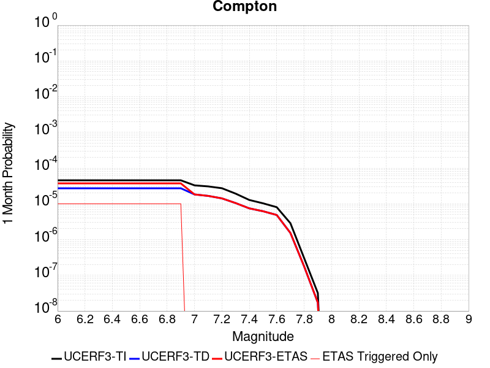 |  |  |

| Magnitude | 1 wk TI Prob | 1 wk TD Prob | 1 wk ETAS Prob | 1 wk ETAS/TD Gain | 1 wk ETAS Triggered Only | 1 mo TI Prob | 1 mo TD Prob | 1 mo ETAS Prob | 1 mo ETAS/TD Gain | 1 mo ETAS Triggered Only | 1 yr TI Prob | 1 yr TD Prob | 1 yr ETAS Prob | 1 yr ETAS/TD Gain | 1 yr ETAS Triggered Only | 10 yr TI Prob | 10 yr TD Prob | 10 yr ETAS Prob | 10 yr ETAS/TD Gain | 10 yr ETAS Triggered Only |
|-----|-----|-----|-----|-----|-----|-----|-----|-----|-----|-----|-----|-----|-----|-----|-----|-----|-----|-----|-----|-----|
| 6.0 | 1.06050875E-5 | 6.35892E-6 | 1.6358856E-5 | 2.5725842 | 1.0E-5 | 4.5449582E-5 | 2.7252245E-5 | 3.725197E-5 | 1.3669323 | 1.0E-5 | 5.5320817E-4 | 3.3174842E-4 | 3.517418E-4 | 1.0602666 | 2.0E-5 | 0.0055183303 | 0.003312816 | 0.0033427165 | 1.0090257 | 3.0E-5 |
| 6.1 | 1.06050875E-5 | 6.35892E-6 | 1.6358856E-5 | 2.5725842 | 1.0E-5 | 4.5449582E-5 | 2.7252245E-5 | 3.725197E-5 | 1.3669323 | 1.0E-5 | 5.5320817E-4 | 3.3174842E-4 | 3.517418E-4 | 1.0602666 | 2.0E-5 | 0.0055183303 | 0.003312816 | 0.0033427165 | 1.0090257 | 3.0E-5 |
| 6.2 | 1.06050875E-5 | 6.35892E-6 | 1.6358856E-5 | 2.5725842 | 1.0E-5 | 4.5449582E-5 | 2.7252245E-5 | 3.725197E-5 | 1.3669323 | 1.0E-5 | 5.5320817E-4 | 3.3174842E-4 | 3.517418E-4 | 1.0602666 | 2.0E-5 | 0.0055183303 | 0.003312816 | 0.0033427165 | 1.0090257 | 3.0E-5 |
| 6.3 | 1.06050875E-5 | 6.35892E-6 | 1.6358856E-5 | 2.5725842 | 1.0E-5 | 4.5449582E-5 | 2.7252245E-5 | 3.725197E-5 | 1.3669323 | 1.0E-5 | 5.5320817E-4 | 3.3174842E-4 | 3.517418E-4 | 1.0602666 | 2.0E-5 | 0.0055183303 | 0.003312816 | 0.0033427165 | 1.0090257 | 3.0E-5 |
| 6.4 | 1.06050875E-5 | 6.35892E-6 | 1.6358856E-5 | 2.5725842 | 1.0E-5 | 4.5449582E-5 | 2.7252245E-5 | 3.725197E-5 | 1.3669323 | 1.0E-5 | 5.5320817E-4 | 3.3174842E-4 | 3.517418E-4 | 1.0602666 | 2.0E-5 | 0.0055183303 | 0.003312816 | 0.0033427165 | 1.0090257 | 3.0E-5 |
| 6.5 | 1.06050875E-5 | 6.35892E-6 | 1.6358856E-5 | 2.5725842 | 1.0E-5 | 4.5449582E-5 | 2.7252245E-5 | 3.725197E-5 | 1.3669323 | 1.0E-5 | 5.5320817E-4 | 3.3174842E-4 | 3.517418E-4 | 1.0602666 | 2.0E-5 | 0.0055183303 | 0.003312816 | 0.0033427165 | 1.0090257 | 3.0E-5 |
| 6.6 | 1.06050875E-5 | 6.35892E-6 | 1.6358856E-5 | 2.5725842 | 1.0E-5 | 4.5449582E-5 | 2.7252245E-5 | 3.725197E-5 | 1.3669323 | 1.0E-5 | 5.5320817E-4 | 3.3174842E-4 | 3.517418E-4 | 1.0602666 | 2.0E-5 | 0.0055183303 | 0.003312816 | 0.0033427165 | 1.0090257 | 3.0E-5 |
| 6.7 | 1.06050875E-5 | 6.35892E-6 | 1.6358856E-5 | 2.5725842 | 1.0E-5 | 4.5449582E-5 | 2.7252245E-5 | 3.725197E-5 | 1.3669323 | 1.0E-5 | 5.5320817E-4 | 3.3174842E-4 | 3.517418E-4 | 1.0602666 | 2.0E-5 | 0.0055183303 | 0.003312816 | 0.0033427165 | 1.0090257 | 3.0E-5 |
| 6.8 | 1.06050875E-5 | 6.35892E-6 | 1.6358856E-5 | 2.5725842 | 1.0E-5 | 4.5449582E-5 | 2.7252245E-5 | 3.725197E-5 | 1.3669323 | 1.0E-5 | 5.5320817E-4 | 3.3174842E-4 | 3.517418E-4 | 1.0602666 | 2.0E-5 | 0.0055183303 | 0.003312816 | 0.0033427165 | 1.0090257 | 3.0E-5 |
| 6.9 | 1.06050875E-5 | 6.35892E-6 | 1.6358856E-5 | 2.5725842 | 1.0E-5 | 4.5449582E-5 | 2.7252245E-5 | 3.725197E-5 | 1.3669323 | 1.0E-5 | 5.5320817E-4 | 3.3174842E-4 | 3.517418E-4 | 1.0602666 | 2.0E-5 | 0.0055183303 | 0.003312816 | 0.0033427165 | 1.0090257 | 3.0E-5 |
| 7.0 | 7.672486E-6 | 4.272077E-6 | 4.272077E-6 | 1.0 | 0.0 | 3.288167E-5 | 1.8308778E-5 | 1.8308778E-5 | 1.0 | 0.0 | 4.0026082E-4 | 2.2288719E-4 | 2.2288719E-4 | 1.0 | 0.0 | 0.0039954064 | 0.0022266984 | 0.0022366764 | 1.004481 | 1.0E-5 |
| 7.1 | 7.163992E-6 | 3.883783E-6 | 3.883783E-6 | 1.0 | 0.0 | 3.0702464E-5 | 1.664468E-5 | 1.664468E-5 | 1.0 | 0.0 | 3.7373835E-4 | 2.0263072E-4 | 2.0263072E-4 | 1.0 | 0.0 | 0.0037311043 | 0.0020245167 | 0.0020344963 | 1.0049294 | 1.0E-5 |
| 7.2 | 6.3689185E-6 | 3.3101053E-6 | 3.3101053E-6 | 1.0 | 0.0 | 2.729508E-5 | 1.4186091E-5 | 1.4186091E-5 | 1.0 | 0.0 | 3.322669E-4 | 1.7270239E-4 | 1.7270239E-4 | 1.0 | 0.0 | 0.0033177056 | 0.0017257235 | 0.0017357062 | 1.0057846 | 1.0E-5 |
| 7.3 | 4.4987873E-6 | 2.4480198E-6 | 2.4480198E-6 | 1.0 | 0.0 | 1.9280375E-5 | 1.0491473E-5 | 1.0491473E-5 | 1.0 | 0.0 | 2.3471327E-4 | 1.2772651E-4 | 1.2772651E-4 | 1.0 | 0.0 | 0.002344655 | 0.0012765612 | 0.0012865484 | 1.0078236 | 1.0E-5 |
| 7.4 | 2.987296E-6 | 1.7394043E-6 | 1.7394043E-6 | 1.0 | 0.0 | 1.2802635E-5 | 7.4545687E-6 | 7.4545687E-6 | 1.0 | 0.0 | 1.5586092E-4 | 9.075565E-5 | 9.075565E-5 | 1.0 | 0.0 | 0.0015575165 | 9.071917E-4 | 9.071917E-4 | 1.0 | 0.0 |
| 7.5 | 2.4111696E-6 | 1.4471991E-6 | 1.4471991E-6 | 1.0 | 0.0 | 1.0333543E-5 | 6.2022677E-6 | 6.2022677E-6 | 1.0 | 0.0 | 1.2580362E-4 | 7.551004E-5 | 7.551004E-5 | 1.0 | 0.0 | 0.0012573242 | 7.548485E-4 | 7.548485E-4 | 1.0 | 0.0 |
| 7.6 | 1.8783096E-6 | 1.1360306E-6 | 1.1360306E-6 | 1.0 | 0.0 | 8.049874E-6 | 4.868694E-6 | 4.868694E-6 | 1.0 | 0.0 | 9.8002805E-5 | 5.9274775E-5 | 5.9274775E-5 | 1.0 | 0.0 | 9.795959E-4 | 5.925936E-4 | 5.925936E-4 | 1.0 | 0.0 |
| 7.7 | 6.6646817E-7 | 3.5601457E-7 | 3.5601457E-7 | 1.0 | 0.0 | 2.856289E-6 | 1.5257759E-6 | 1.5257759E-6 | 1.0 | 0.0 | 3.4774763E-5 | 1.8576176E-5 | 1.8576176E-5 | 1.0 | 0.0 | 3.4769322E-4 | 1.8574759E-4 | 1.8574759E-4 | 1.0 | 0.0 |
| 7.8 | 7.054689E-8 | 4.1342012E-8 | 4.1342012E-8 | 1.0 | 0.0 | 3.0234378E-7 | 1.7718004E-7 | 1.7718004E-7 | 1.0 | 0.0 | 3.6810293E-6 | 2.157165E-6 | 2.157165E-6 | 1.0 | 0.0 | 3.6809684E-5 | 2.157145E-5 | 2.157145E-5 | 1.0 | 0.0 |
| 7.9 | 7.420925E-9 | 4.0130637E-9 | 4.0130637E-9 | 1.0 | 0.0 | 3.1803964E-8 | 1.7198845E-8 | 1.7198845E-8 | 1.0 | 0.0 | 3.872132E-7 | 2.0939592E-7 | 2.0939592E-7 | 1.0 | 0.0 | 3.872125E-6 | 2.0939574E-6 | 2.0939574E-6 | 1.0 | 0.0 |

## Casmalia 2011 CFM
*[(top)](#table-of-contents)*

| 1 Week | 1 Month | 1 Year | 10 Year |
|-----|-----|-----|-----|
| 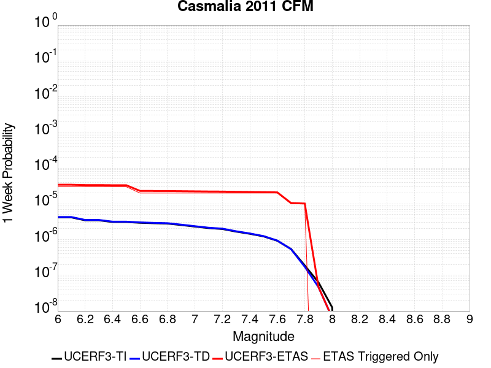 |  |  |  |

| Magnitude | 1 wk TI Prob | 1 wk TD Prob | 1 wk ETAS Prob | 1 wk ETAS/TD Gain | 1 wk ETAS Triggered Only | 1 mo TI Prob | 1 mo TD Prob | 1 mo ETAS Prob | 1 mo ETAS/TD Gain | 1 mo ETAS Triggered Only | 1 yr TI Prob | 1 yr TD Prob | 1 yr ETAS Prob | 1 yr ETAS/TD Gain | 1 yr ETAS Triggered Only | 10 yr TI Prob | 10 yr TD Prob | 10 yr ETAS Prob | 10 yr ETAS/TD Gain | 10 yr ETAS Triggered Only |
|-----|-----|-----|-----|-----|-----|-----|-----|-----|-----|-----|-----|-----|-----|-----|-----|-----|-----|-----|-----|-----|
| 6.0 | 4.1704893E-6 | 4.2624843E-6 | 3.4262357E-5 | 8.038119 | 3.0E-5 | 1.7873403E-5 | 1.8267663E-5 | 4.8267113E-5 | 2.6422162 | 3.0E-5 | 2.1758694E-4 | 2.223863E-4 | 2.5237963E-4 | 1.1348704 | 3.0E-5 | 0.0021737402 | 0.0022216584 | 0.0022515918 | 1.0134734 | 3.0E-5 |
| 6.1 | 4.1704893E-6 | 4.2624843E-6 | 3.4262357E-5 | 8.038119 | 3.0E-5 | 1.7873403E-5 | 1.8267663E-5 | 4.8267113E-5 | 2.6422162 | 3.0E-5 | 2.1758694E-4 | 2.223863E-4 | 2.5237963E-4 | 1.1348704 | 3.0E-5 | 0.0021737402 | 0.0022216584 | 0.0022515918 | 1.0134734 | 3.0E-5 |
| 6.2 | 3.457312E-6 | 3.537023E-6 | 3.353692E-5 | 9.481679 | 3.0E-5 | 1.4816967E-5 | 1.5158583E-5 | 4.515813E-5 | 2.9790468 | 3.0E-5 | 1.8038164E-4 | 1.845402E-4 | 2.1453467E-4 | 1.1625361 | 3.0E-5 | 0.001802353 | 0.0018438791 | 0.0018738237 | 1.01624 | 3.0E-5 |
| 6.3 | 3.457312E-6 | 3.537023E-6 | 3.353692E-5 | 9.481679 | 3.0E-5 | 1.4816967E-5 | 1.5158583E-5 | 4.515813E-5 | 2.9790468 | 3.0E-5 | 1.8038164E-4 | 1.845402E-4 | 2.1453467E-4 | 1.1625361 | 3.0E-5 | 0.001802353 | 0.0018438791 | 0.0018738237 | 1.01624 | 3.0E-5 |
| 6.4 | 3.0957337E-6 | 3.169227E-6 | 3.3169134E-5 | 10.466001 | 3.0E-5 | 1.3267363E-5 | 1.3582331E-5 | 4.3581924E-5 | 3.2087219 | 3.0E-5 | 1.6151817E-4 | 1.653524E-4 | 1.9534743E-4 | 1.1814007 | 3.0E-5 | 0.0016140083 | 0.0016522998 | 0.0016822502 | 1.0181265 | 3.0E-5 |
| 6.5 | 3.0957337E-6 | 3.169227E-6 | 3.3169134E-5 | 10.466001 | 3.0E-5 | 1.3267363E-5 | 1.3582331E-5 | 4.3581924E-5 | 3.2087219 | 3.0E-5 | 1.6151817E-4 | 1.653524E-4 | 1.9534743E-4 | 1.1814007 | 3.0E-5 | 0.0016140083 | 0.0016522998 | 0.0016822502 | 1.0181265 | 3.0E-5 |
| 6.6 | 2.9459152E-6 | 3.0165766E-6 | 2.3016517E-5 | 7.6300125 | 2.0E-5 | 1.262529E-5 | 1.2928121E-5 | 3.2927863E-5 | 2.5469952 | 2.0E-5 | 1.5370206E-4 | 1.5738855E-4 | 1.773854E-4 | 1.1270541 | 2.0E-5 | 0.0015359579 | 0.0015727765 | 0.0015927451 | 1.0126964 | 2.0E-5 |
| 6.7 | 2.8634809E-6 | 2.932474E-6 | 2.2932416E-5 | 7.82016 | 2.0E-5 | 1.2272003E-5 | 1.2567685E-5 | 3.2567434E-5 | 2.591363 | 2.0E-5 | 1.4940138E-4 | 1.5300087E-4 | 1.7299781E-4 | 1.1306982 | 2.0E-5 | 0.0014930099 | 0.0015289608 | 0.0015489302 | 1.0130608 | 2.0E-5 |
| 6.8 | 2.7999822E-6 | 2.867598E-6 | 2.286754E-5 | 7.974458 | 2.0E-5 | 1.1999869E-5 | 1.2289648E-5 | 3.22894E-5 | 2.6273658 | 2.0E-5 | 1.460886E-4 | 1.4961624E-4 | 1.6961325E-4 | 1.1336553 | 2.0E-5 | 0.001459926 | 0.0014951604 | 0.0015151305 | 1.0133564 | 2.0E-5 |
| 6.9 | 2.551052E-6 | 2.6119662E-6 | 2.2611914E-5 | 8.657047 | 2.0E-5 | 1.0933034E-5 | 1.1194093E-5 | 3.1193867E-5 | 2.7866366 | 2.0E-5 | 1.3310155E-4 | 1.3627959E-4 | 1.5627687E-4 | 1.1467371 | 2.0E-5 | 0.0013302186 | 0.0013619643 | 0.0013819371 | 1.0146646 | 2.0E-5 |
| 7.0 | 2.3081875E-6 | 2.3624102E-6 | 2.2362363E-5 | 9.46591 | 2.0E-5 | 9.892195E-6 | 1.0124576E-5 | 3.0124373E-5 | 2.9753714 | 2.0E-5 | 1.20430814E-4 | 1.2325977E-4 | 1.432573E-4 | 1.162239 | 2.0E-5 | 0.0012036557 | 0.0012319168 | 0.0012518922 | 1.0162148 | 2.0E-5 |
| 7.1 | 2.093245E-6 | 2.1417256E-6 | 2.2141683E-5 | 10.338244 | 2.0E-5 | 8.971019E-6 | 9.1787915E-6 | 2.917861E-5 | 3.178916 | 2.0E-5 | 1.09216686E-4 | 1.1174608E-4 | 1.3174384E-4 | 1.1789572 | 2.0E-5 | 0.0010916302 | 0.0011169009 | 0.0011368786 | 1.0178866 | 2.0E-5 |
| 7.2 | 1.9714576E-6 | 2.0165105E-6 | 2.201647E-5 | 10.918103 | 2.0E-5 | 8.449076E-6 | 8.642159E-6 | 2.8641985E-5 | 3.3142166 | 2.0E-5 | 1.0286264E-4 | 1.0521322E-4 | 1.2521113E-4 | 1.1900702 | 2.0E-5 | 0.0010281504 | 0.001051636 | 0.0010716149 | 1.018998 | 2.0E-5 |
| 7.3 | 1.6689512E-6 | 1.7047145E-6 | 2.170468E-5 | 12.73215 | 2.0E-5 | 7.1526288E-6 | 7.3058986E-6 | 2.7305752E-5 | 3.737494 | 2.0E-5 | 8.7079774E-5 | 8.894569E-5 | 1.0894391E-4 | 1.2248363 | 2.0E-5 | 8.7045657E-4 | 8.891017E-4 | 9.0908393E-4 | 1.0224746 | 2.0E-5 |
| 7.4 | 1.4490954E-6 | 1.4778922E-6 | 2.1477863E-5 | 14.532767 | 2.0E-5 | 6.210394E-6 | 6.333808E-6 | 2.633368E-5 | 4.157638 | 2.0E-5 | 7.560892E-5 | 7.711139E-5 | 9.710985E-5 | 1.259345 | 2.0E-5 | 7.55832E-4 | 7.7084696E-4 | 7.908315E-4 | 1.0259255 | 2.0E-5 |
| 7.5 | 1.226873E-6 | 1.2481714E-6 | 2.1248146E-5 | 17.02342 | 2.0E-5 | 5.2580162E-6 | 5.3492954E-6 | 2.5349189E-5 | 4.73879 | 2.0E-5 | 6.401447E-5 | 6.512573E-5 | 8.5124426E-5 | 1.3070782 | 2.0E-5 | 6.399603E-4 | 6.5106695E-4 | 6.7105395E-4 | 1.0306988 | 2.0E-5 |
| 7.6 | 9.2561345E-7 | 9.3619366E-7 | 2.0936175E-5 | 22.363081 | 2.0E-5 | 3.966909E-6 | 4.0122522E-6 | 2.4012172E-5 | 5.984711 | 2.0E-5 | 4.8296046E-5 | 4.884808E-5 | 6.8847105E-5 | 1.4094126 | 2.0E-5 | 4.828555E-4 | 4.8837386E-4 | 5.0836406E-4 | 1.0409322 | 2.0E-5 |
| 7.7 | 5.4367933E-7 | 5.3929017E-7 | 1.0539285E-5 | 19.542883 | 1.0E-5 | 2.3300522E-6 | 2.3112416E-6 | 1.2311219E-5 | 5.3266687 | 1.0E-5 | 2.8368017E-5 | 2.8139004E-5 | 3.813872E-5 | 1.3553686 | 1.0E-5 | 2.8364395E-4 | 2.8135453E-4 | 2.9135172E-4 | 1.0355324 | 1.0E-5 |
| 7.8 | 1.8825742E-7 | 1.7342425E-7 | 1.0173422E-5 | 58.662052 | 1.0E-5 | 8.068173E-7 | 7.432466E-7 | 1.0743239E-5 | 14.454475 | 1.0E-5 | 9.822956E-6 | 9.048989E-6 | 1.9048899E-5 | 2.1050858 | 1.0E-5 | 9.822522E-5 | 9.048623E-5 | 1.00485326E-4 | 1.110504 | 1.0E-5 |
| 7.9 | 6.342771E-8 | 4.679002E-8 | 4.679002E-8 | 1.0 | 0.0 | 2.7183304E-7 | 2.0052863E-7 | 2.0052863E-7 | 1.0 | 0.0 | 3.3095623E-6 | 2.4414335E-6 | 2.4414335E-6 | 1.0 | 0.0 | 3.309513E-5 | 2.441407E-5 | 2.441407E-5 | 1.0 | 0.0 |
| 8.0 | 1.2574819E-8 | 6.4727095E-9 | 6.4727095E-9 | 1.0 | 0.0 | 5.3892084E-8 | 2.7740182E-8 | 2.7740182E-8 | 1.0 | 0.0 | 6.561359E-7 | 3.3773665E-7 | 3.3773665E-7 | 1.0 | 0.0 | 6.56134E-6 | 3.3773617E-6 | 3.3773617E-6 | 1.0 | 0.0 |

## Monterey Bay-Tularcitos
*[(top)](#table-of-contents)*

| 1 Week | 1 Month | 1 Year | 10 Year |
|-----|-----|-----|-----|
|  |  |  |  |

| Magnitude | 1 wk TI Prob | 1 wk TD Prob | 1 wk ETAS Prob | 1 wk ETAS/TD Gain | 1 wk ETAS Triggered Only | 1 mo TI Prob | 1 mo TD Prob | 1 mo ETAS Prob | 1 mo ETAS/TD Gain | 1 mo ETAS Triggered Only | 1 yr TI Prob | 1 yr TD Prob | 1 yr ETAS Prob | 1 yr ETAS/TD Gain | 1 yr ETAS Triggered Only | 10 yr TI Prob | 10 yr TD Prob | 10 yr ETAS Prob | 10 yr ETAS/TD Gain | 10 yr ETAS Triggered Only |
|-----|-----|-----|-----|-----|-----|-----|-----|-----|-----|-----|-----|-----|-----|-----|-----|-----|-----|-----|-----|-----|
| 6.0 | 3.0131365E-5 | 3.279877E-5 | 3.279877E-5 | 1.0 | 0.0 | 1.2912804E-4 | 1.4055918E-4 | 1.5055778E-4 | 1.0711344 | 1.0E-5 | 0.001571 | 0.0017100703 | 0.0017200531 | 1.0058377 | 1.0E-5 | 0.015599402 | 0.016979916 | 0.016999578 | 1.0011579 | 2.0E-5 |
| 6.1 | 3.0131365E-5 | 3.279877E-5 | 3.279877E-5 | 1.0 | 0.0 | 1.2912804E-4 | 1.4055918E-4 | 1.5055778E-4 | 1.0711344 | 1.0E-5 | 0.001571 | 0.0017100703 | 0.0017200531 | 1.0058377 | 1.0E-5 | 0.015599402 | 0.016979916 | 0.016999578 | 1.0011579 | 2.0E-5 |
| 6.2 | 3.0131365E-5 | 3.279877E-5 | 3.279877E-5 | 1.0 | 0.0 | 1.2912804E-4 | 1.4055918E-4 | 1.5055778E-4 | 1.0711344 | 1.0E-5 | 0.001571 | 0.0017100703 | 0.0017200531 | 1.0058377 | 1.0E-5 | 0.015599402 | 0.016979916 | 0.016999578 | 1.0011579 | 2.0E-5 |
| 6.3 | 1.6998249E-5 | 1.8330798E-5 | 1.8330798E-5 | 1.0 | 0.0 | 7.28476E-5 | 7.85583E-5 | 8.8557514E-5 | 1.127284 | 1.0E-5 | 8.865586E-4 | 9.5604634E-4 | 9.6603675E-4 | 1.0104498 | 1.0E-5 | 0.0088303005 | 0.009521258 | 0.009531163 | 1.0010403 | 1.0E-5 |
| 6.4 | 1.6998249E-5 | 1.8330798E-5 | 1.8330798E-5 | 1.0 | 0.0 | 7.28476E-5 | 7.85583E-5 | 8.8557514E-5 | 1.127284 | 1.0E-5 | 8.865586E-4 | 9.5604634E-4 | 9.6603675E-4 | 1.0104498 | 1.0E-5 | 0.0088303005 | 0.009521258 | 0.009531163 | 1.0010403 | 1.0E-5 |
| 6.5 | 1.27470785E-5 | 1.3693312E-5 | 1.3693312E-5 | 1.0 | 0.0 | 5.4629192E-5 | 5.8684363E-5 | 6.8683774E-5 | 1.1703931 | 1.0E-5 | 6.649074E-4 | 7.1425823E-4 | 7.242511E-4 | 1.0139905 | 1.0E-5 | 0.0066292146 | 0.007120678 | 0.007130607 | 1.0013944 | 1.0E-5 |
| 6.6 | 1.2739422E-5 | 1.36854E-5 | 1.36854E-5 | 1.0 | 0.0 | 5.4596385E-5 | 5.8650454E-5 | 6.864987E-5 | 1.1704917 | 1.0E-5 | 6.645082E-4 | 7.1384566E-4 | 7.238385E-4 | 1.0139986 | 1.0E-5 | 0.0066252467 | 0.007116579 | 0.007126508 | 1.0013952 | 1.0E-5 |
| 6.7 | 1.0160109E-5 | 1.0885755E-5 | 1.0885755E-5 | 1.0 | 0.0 | 4.35426E-5 | 4.665244E-5 | 5.6651974E-5 | 1.214341 | 1.0E-5 | 5.300022E-4 | 5.6785246E-4 | 5.778468E-4 | 1.0176002 | 1.0E-5 | 0.005287399 | 0.0056647263 | 0.0056746695 | 1.0017554 | 1.0E-5 |
| 6.8 | 8.349859E-6 | 8.932587E-6 | 8.932587E-6 | 1.0 | 0.0 | 3.578462E-5 | 3.8281985E-5 | 4.8281603E-5 | 1.2612095 | 1.0E-5 | 4.3559066E-4 | 4.6598914E-4 | 4.759845E-4 | 1.0214497 | 1.0E-5 | 0.004347378 | 0.004650685 | 0.0046606385 | 1.0021402 | 1.0E-5 |
| 6.9 | 5.193639E-6 | 5.53643E-6 | 5.53643E-6 | 1.0 | 0.0 | 2.2258262E-5 | 2.372736E-5 | 2.372736E-5 | 1.0 | 0.0 | 2.7096065E-4 | 2.8884556E-4 | 2.8884556E-4 | 1.0 | 0.0 | 0.0027063051 | 0.0028850224 | 0.0028850224 | 1.0 | 0.0 |
| 7.0 | 4.359381E-6 | 4.643366E-6 | 4.643366E-6 | 1.0 | 0.0 | 1.8682927E-5 | 1.9900004E-5 | 1.9900004E-5 | 1.0 | 0.0 | 2.274409E-4 | 2.422586E-4 | 2.422586E-4 | 1.0 | 0.0 | 0.0022720827 | 0.002420238 | 0.002420238 | 1.0 | 0.0 |
| 7.1 | 3.0398533E-6 | 3.2310427E-6 | 3.2310427E-6 | 1.0 | 0.0 | 1.3027877E-5 | 1.3847267E-5 | 1.3847267E-5 | 1.0 | 0.0 | 1.5860285E-4 | 1.6858005E-4 | 1.6858005E-4 | 1.0 | 0.0 | 0.001584897 | 0.0016847793 | 0.0016847793 | 1.0 | 0.0 |
| 7.2 | 1.642335E-6 | 1.7333153E-6 | 1.7333153E-6 | 1.0 | 0.0 | 7.0385595E-6 | 7.428485E-6 | 7.428485E-6 | 1.0 | 0.0 | 8.569109E-5 | 9.044012E-5 | 9.044012E-5 | 1.0 | 0.0 | 8.5658056E-4 | 9.042358E-4 | 9.042358E-4 | 1.0 | 0.0 |
| 7.3 | 3.356842E-7 | 3.2952389E-7 | 3.2952389E-7 | 1.0 | 0.0 | 1.4386458E-6 | 1.4122445E-6 | 1.4122445E-6 | 1.0 | 0.0 | 1.7515373E-5 | 1.7193941E-5 | 1.7193941E-5 | 1.0 | 0.0 | 1.7513991E-4 | 1.719262E-4 | 1.719262E-4 | 1.0 | 0.0 |
| 7.4 | 2.1973483E-7 | 2.1006414E-7 | 2.1006414E-7 | 1.0 | 0.0 | 9.417204E-7 | 9.002746E-7 | 9.002746E-7 | 1.0 | 0.0 | 1.1465385E-5 | 1.0960788E-5 | 1.0960788E-5 | 1.0 | 0.0 | 1.1464794E-4 | 1.0960251E-4 | 1.0960251E-4 | 1.0 | 0.0 |
| 7.5 | 1.1944135E-7 | 1.0696035E-7 | 1.0696035E-7 | 1.0 | 0.0 | 5.118914E-7 | 4.5840142E-7 | 4.5840142E-7 | 1.0 | 0.0 | 6.23226E-6 | 5.581023E-6 | 5.581023E-6 | 1.0 | 0.0 | 6.2320854E-5 | 5.5808843E-5 | 5.5808843E-5 | 1.0 | 0.0 |
| 7.6 | 4.636058E-8 | 3.3364433E-8 | 3.3364433E-8 | 1.0 | 0.0 | 1.9868818E-7 | 1.4299042E-7 | 1.4299042E-7 | 1.0 | 0.0 | 2.419026E-6 | 1.740907E-6 | 1.740907E-6 | 1.0 | 0.0 | 2.4189996E-5 | 1.7408936E-5 | 1.7408936E-5 | 1.0 | 0.0 |
| 7.7 | 1.8588572E-8 | 8.003168E-9 | 8.003168E-9 | 1.0 | 0.0 | 7.9665305E-8 | 3.429929E-8 | 3.429929E-8 | 1.0 | 0.0 | 9.699246E-7 | 4.1759378E-7 | 4.1759378E-7 | 1.0 | 0.0 | 9.699204E-6 | 4.1759304E-6 | 4.1759304E-6 | 1.0 | 0.0 |
| 7.8 | 2.7960154E-9 | 7.608624E-10 | 7.608624E-10 | 1.0 | 0.0 | 1.1982923E-8 | 3.2608392E-9 | 3.2608392E-9 | 1.0 | 0.0 | 1.4589209E-7 | 3.9700716E-8 | 3.9700716E-8 | 1.0 | 0.0 | 1.4589199E-6 | 3.970071E-7 | 3.970071E-7 | 1.0 | 0.0 |

## Greenville (So) 2011 CFM
*[(top)](#table-of-contents)*

| 1 Week | 1 Month | 1 Year | 10 Year |
|-----|-----|-----|-----|
|  |  |  |  |

| Magnitude | 1 wk TI Prob | 1 wk TD Prob | 1 wk ETAS Prob | 1 wk ETAS/TD Gain | 1 wk ETAS Triggered Only | 1 mo TI Prob | 1 mo TD Prob | 1 mo ETAS Prob | 1 mo ETAS/TD Gain | 1 mo ETAS Triggered Only | 1 yr TI Prob | 1 yr TD Prob | 1 yr ETAS Prob | 1 yr ETAS/TD Gain | 1 yr ETAS Triggered Only | 10 yr TI Prob | 10 yr TD Prob | 10 yr ETAS Prob | 10 yr ETAS/TD Gain | 10 yr ETAS Triggered Only |
|-----|-----|-----|-----|-----|-----|-----|-----|-----|-----|-----|-----|-----|-----|-----|-----|-----|-----|-----|-----|-----|
| 6.0 | 4.279693E-5 | 5.5040568E-5 | 7.503947E-5 | 1.3633484 | 2.0E-5 | 1.8340252E-4 | 2.3586866E-4 | 2.5586394E-4 | 1.084773 | 2.0E-5 | 0.0022306389 | 0.0028681692 | 0.0028881119 | 1.0069531 | 2.0E-5 | 0.022083808 | 0.028338658 | 0.02835809 | 1.0006857 | 2.0E-5 |
| 6.1 | 3.4037297E-5 | 4.319238E-5 | 6.319152E-5 | 1.4630246 | 2.0E-5 | 1.4586597E-4 | 1.8509808E-4 | 2.0509437E-4 | 1.1080308 | 2.0E-5 | 0.0017744715 | 0.0022513992 | 0.002271354 | 1.0088633 | 2.0E-5 | 0.01760369 | 0.022303047 | 0.0223226 | 1.0008768 | 2.0E-5 |
| 6.2 | 3.4037297E-5 | 4.319238E-5 | 6.319152E-5 | 1.4630246 | 2.0E-5 | 1.4586597E-4 | 1.8509808E-4 | 2.0509437E-4 | 1.1080308 | 2.0E-5 | 0.0017744715 | 0.0022513992 | 0.002271354 | 1.0088633 | 2.0E-5 | 0.01760369 | 0.022303047 | 0.0223226 | 1.0008768 | 2.0E-5 |
| 6.3 | 2.5956324E-5 | 3.242939E-5 | 5.242874E-5 | 1.6167046 | 2.0E-5 | 1.11236644E-4 | 1.3897609E-4 | 1.589733E-4 | 1.1438897 | 2.0E-5 | 0.0013534647 | 0.0016907848 | 0.001710751 | 1.0118089 | 2.0E-5 | 0.013452509 | 0.016786316 | 0.01680598 | 1.0011715 | 2.0E-5 |
| 6.4 | 2.1145053E-5 | 2.6197793E-5 | 4.619727E-5 | 1.763403 | 2.0E-5 | 9.061851E-5 | 1.1227157E-4 | 1.3226933E-4 | 1.1781195 | 2.0E-5 | 0.0011027219 | 0.0013660807 | 0.0013860534 | 1.0146204 | 2.0E-5 | 0.01097266 | 0.013580576 | 0.013600304 | 1.0014527 | 2.0E-5 |
| 6.5 | 2.0030959E-5 | 2.4795921E-5 | 4.4795426E-5 | 1.8065642 | 2.0E-5 | 8.584414E-5 | 1.0626408E-4 | 1.2626195E-4 | 1.1881903 | 2.0E-5 | 0.0010446513 | 0.0012930284 | 0.0013130024 | 1.0154476 | 2.0E-5 | 0.010397541 | 0.01285873 | 0.012878473 | 1.0015354 | 2.0E-5 |
| 6.6 | 1.8395405E-5 | 2.275458E-5 | 4.2754127E-5 | 1.8789239 | 2.0E-5 | 7.8835066E-5 | 9.7516146E-5 | 1.17514195E-4 | 1.2050742 | 2.0E-5 | 9.5939427E-4 | 0.0011866409 | 0.0012066172 | 1.0168343 | 2.0E-5 | 0.009552629 | 0.01180643 | 0.011826194 | 1.0016739 | 2.0E-5 |
| 6.7 | 1.7883482E-5 | 2.2125625E-5 | 4.2125183E-5 | 1.9039093 | 2.0E-5 | 7.664124E-5 | 9.482082E-5 | 1.14818926E-4 | 1.2109041 | 2.0E-5 | 9.3270757E-4 | 0.0011538607 | 0.0011738376 | 1.0173131 | 2.0E-5 | 0.009288026 | 0.011482077 | 0.011501847 | 1.0017219 | 2.0E-5 |
| 6.8 | 1.3373564E-5 | 1.650608E-5 | 1.650608E-5 | 1.0 | 0.0 | 5.7314013E-5 | 7.0738504E-5 | 7.0738504E-5 | 1.0 | 0.0 | 6.975747E-4 | 8.609158E-4 | 8.609158E-4 | 1.0 | 0.0 | 0.0069538904 | 0.008577745 | 0.008577745 | 1.0 | 0.0 |
| 6.9 | 1.06692905E-5 | 1.3152695E-5 | 1.3152695E-5 | 1.0 | 0.0 | 4.5724726E-5 | 5.636754E-5 | 5.636754E-5 | 1.0 | 0.0 | 5.5655633E-4 | 6.8606995E-4 | 6.8606995E-4 | 1.0 | 0.0 | 0.005551645 | 0.006841082 | 0.006841082 | 1.0 | 0.0 |
| 7.0 | 8.157512E-6 | 1.0062752E-5 | 1.0062752E-5 | 1.0 | 0.0 | 3.4960296E-5 | 4.312539E-5 | 4.312539E-5 | 1.0 | 0.0 | 4.2555845E-4 | 5.2492885E-4 | 5.2492885E-4 | 1.0 | 0.0 | 0.004247444 | 0.0052376967 | 0.0052376967 | 1.0 | 0.0 |
| 7.1 | 6.1467113E-6 | 7.627545E-6 | 7.627545E-6 | 1.0 | 0.0 | 2.6342783E-5 | 3.2689073E-5 | 3.2689073E-5 | 1.0 | 0.0 | 3.206762E-4 | 3.9791764E-4 | 3.9791764E-4 | 1.0 | 0.0 | 0.0032021382 | 0.0039725704 | 0.0039725704 | 1.0 | 0.0 |
| 7.2 | 4.713467E-6 | 5.9142685E-6 | 5.9142685E-6 | 1.0 | 0.0 | 2.0200418E-5 | 2.5346622E-5 | 2.5346622E-5 | 1.0 | 0.0 | 2.4591232E-4 | 3.0855203E-4 | 3.0855203E-4 | 1.0 | 0.0 | 0.0024564038 | 0.0030816782 | 0.0030816782 | 1.0 | 0.0 |
| 7.3 | 2.3266216E-6 | 2.954067E-6 | 2.954067E-6 | 1.0 | 0.0 | 9.971197E-6 | 1.2660226E-5 | 1.2660226E-5 | 1.0 | 0.0 | 1.2139256E-4 | 1.541275E-4 | 1.541275E-4 | 1.0 | 0.0 | 0.0012132627 | 0.0015404817 | 0.0015404817 | 1.0 | 0.0 |
| 7.4 | 1.3314E-6 | 1.7179866E-6 | 1.7179866E-6 | 1.0 | 0.0 | 5.7059874E-6 | 7.362779E-6 | 7.362779E-6 | 1.0 | 0.0 | 6.946818E-5 | 8.96382E-5 | 8.96382E-5 | 1.0 | 0.0 | 6.9446466E-4 | 8.963211E-4 | 8.963211E-4 | 1.0 | 0.0 |
| 7.5 | 1.0362941E-6 | 1.3469155E-6 | 1.3469155E-6 | 1.0 | 0.0 | 4.4412527E-6 | 5.7724824E-6 | 5.7724824E-6 | 1.0 | 0.0 | 5.407091E-5 | 7.0277754E-5 | 7.0277754E-5 | 1.0 | 0.0 | 5.405776E-4 | 7.028451E-4 | 7.028451E-4 | 1.0 | 0.0 |
| 7.6 | 7.764784E-7 | 1.0088881E-6 | 1.0088881E-6 | 1.0 | 0.0 | 3.3277602E-6 | 4.3237997E-6 | 4.3237997E-6 | 1.0 | 0.0 | 4.0514726E-5 | 5.264103E-5 | 5.264103E-5 | 1.0 | 0.0 | 4.050734E-4 | 5.265317E-4 | 5.265317E-4 | 1.0 | 0.0 |
| 7.7 | 1.6927763E-7 | 2.2140186E-7 | 2.2140186E-7 | 1.0 | 0.0 | 7.2547533E-7 | 9.488648E-7 | 9.488648E-7 | 1.0 | 0.0 | 8.832627E-6 | 1.1552371E-5 | 1.1552371E-5 | 1.0 | 0.0 | 8.8322755E-5 | 1.1554653E-4 | 1.1554653E-4 | 1.0 | 0.0 |

## San Joaquin Hills
*[(top)](#table-of-contents)*

| 1 Week | 1 Month | 1 Year | 10 Year |
|-----|-----|-----|-----|
|  |  |  |  |

| Magnitude | 1 wk TI Prob | 1 wk TD Prob | 1 wk ETAS Prob | 1 wk ETAS/TD Gain | 1 wk ETAS Triggered Only | 1 mo TI Prob | 1 mo TD Prob | 1 mo ETAS Prob | 1 mo ETAS/TD Gain | 1 mo ETAS Triggered Only | 1 yr TI Prob | 1 yr TD Prob | 1 yr ETAS Prob | 1 yr ETAS/TD Gain | 1 yr ETAS Triggered Only | 10 yr TI Prob | 10 yr TD Prob | 10 yr ETAS Prob | 10 yr ETAS/TD Gain | 10 yr ETAS Triggered Only |
|-----|-----|-----|-----|-----|-----|-----|-----|-----|-----|-----|-----|-----|-----|-----|-----|-----|-----|-----|-----|-----|
| 6.0 | 3.4525704E-6 | 2.8139727E-6 | 2.8139727E-6 | 1.0 | 0.0 | 1.4796647E-5 | 1.2059828E-5 | 3.2059586E-5 | 2.6583784 | 2.0E-5 | 1.8013427E-4 | 1.4681864E-4 | 1.668157E-4 | 1.1362025 | 2.0E-5 | 0.0017998833 | 0.0014672297 | 0.0014872004 | 1.0136111 | 2.0E-5 |
| 6.1 | 3.4525704E-6 | 2.8139727E-6 | 2.8139727E-6 | 1.0 | 0.0 | 1.4796647E-5 | 1.2059828E-5 | 3.2059586E-5 | 2.6583784 | 2.0E-5 | 1.8013427E-4 | 1.4681864E-4 | 1.668157E-4 | 1.1362025 | 2.0E-5 | 0.0017998833 | 0.0014672297 | 0.0014872004 | 1.0136111 | 2.0E-5 |
| 6.2 | 3.4525704E-6 | 2.8139727E-6 | 2.8139727E-6 | 1.0 | 0.0 | 1.4796647E-5 | 1.2059828E-5 | 3.2059586E-5 | 2.6583784 | 2.0E-5 | 1.8013427E-4 | 1.4681864E-4 | 1.668157E-4 | 1.1362025 | 2.0E-5 | 0.0017998833 | 0.0014672297 | 0.0014872004 | 1.0136111 | 2.0E-5 |
| 6.3 | 3.4525704E-6 | 2.8139727E-6 | 2.8139727E-6 | 1.0 | 0.0 | 1.4796647E-5 | 1.2059828E-5 | 3.2059586E-5 | 2.6583784 | 2.0E-5 | 1.8013427E-4 | 1.4681864E-4 | 1.668157E-4 | 1.1362025 | 2.0E-5 | 0.0017998833 | 0.0014672297 | 0.0014872004 | 1.0136111 | 2.0E-5 |
| 6.4 | 3.4525704E-6 | 2.8139727E-6 | 2.8139727E-6 | 1.0 | 0.0 | 1.4796647E-5 | 1.2059828E-5 | 3.2059586E-5 | 2.6583784 | 2.0E-5 | 1.8013427E-4 | 1.4681864E-4 | 1.668157E-4 | 1.1362025 | 2.0E-5 | 0.0017998833 | 0.0014672297 | 0.0014872004 | 1.0136111 | 2.0E-5 |
| 6.5 | 3.4525704E-6 | 2.8139727E-6 | 2.8139727E-6 | 1.0 | 0.0 | 1.4796647E-5 | 1.2059828E-5 | 3.2059586E-5 | 2.6583784 | 2.0E-5 | 1.8013427E-4 | 1.4681864E-4 | 1.668157E-4 | 1.1362025 | 2.0E-5 | 0.0017998833 | 0.0014672297 | 0.0014872004 | 1.0136111 | 2.0E-5 |
| 6.6 | 3.4525704E-6 | 2.8139727E-6 | 2.8139727E-6 | 1.0 | 0.0 | 1.4796647E-5 | 1.2059828E-5 | 3.2059586E-5 | 2.6583784 | 2.0E-5 | 1.8013427E-4 | 1.4681864E-4 | 1.668157E-4 | 1.1362025 | 2.0E-5 | 0.0017998833 | 0.0014672297 | 0.0014872004 | 1.0136111 | 2.0E-5 |
| 6.7 | 3.4525704E-6 | 2.8139727E-6 | 2.8139727E-6 | 1.0 | 0.0 | 1.4796647E-5 | 1.2059828E-5 | 3.2059586E-5 | 2.6583784 | 2.0E-5 | 1.8013427E-4 | 1.4681864E-4 | 1.668157E-4 | 1.1362025 | 2.0E-5 | 0.0017998833 | 0.0014672297 | 0.0014872004 | 1.0136111 | 2.0E-5 |
| 6.8 | 3.388654E-6 | 2.7484111E-6 | 2.7484111E-6 | 1.0 | 0.0 | 1.4522722E-5 | 1.1778852E-5 | 3.1778618E-5 | 2.6979382 | 2.0E-5 | 1.767998E-4 | 1.4339821E-4 | 1.6339535E-4 | 1.1394517 | 2.0E-5 | 0.001766592 | 0.0014330697 | 0.0014530411 | 1.013936 | 2.0E-5 |
| 6.9 | 3.2694352E-6 | 2.6283255E-6 | 2.6283255E-6 | 1.0 | 0.0 | 1.401179E-5 | 1.1264204E-5 | 3.126398E-5 | 2.775516 | 2.0E-5 | 1.7058018E-4 | 1.3713316E-4 | 1.5713042E-4 | 1.1458236 | 2.0E-5 | 0.0017044931 | 0.0013704967 | 0.0013904693 | 1.0145732 | 2.0E-5 |
| 7.0 | 3.246912E-6 | 2.6069824E-6 | 2.6069824E-6 | 1.0 | 0.0 | 1.39152635E-5 | 1.1172735E-5 | 3.1172513E-5 | 2.790052 | 2.0E-5 | 1.6940516E-4 | 1.3601968E-4 | 1.5601695E-4 | 1.1470176 | 2.0E-5 | 0.0016927607 | 0.0013593754 | 0.0013793482 | 1.0146927 | 2.0E-5 |
| 7.1 | 3.1864927E-6 | 2.5523102E-6 | 2.5523102E-6 | 1.0 | 0.0 | 1.3656326E-5 | 1.0938427E-5 | 3.093821E-5 | 2.8283963 | 2.0E-5 | 1.6625308E-4 | 1.3316733E-4 | 1.5316466E-4 | 1.150167 | 2.0E-5 | 0.0016612876 | 0.0013308863 | 0.0013508596 | 1.0150076 | 2.0E-5 |
| 7.2 | 3.0220644E-6 | 2.3991581E-6 | 2.3991581E-6 | 1.0 | 0.0 | 1.295164E-5 | 1.0282067E-5 | 3.028186E-5 | 2.9451144 | 2.0E-5 | 1.576748E-4 | 1.2517707E-4 | 1.4517456E-4 | 1.1597537 | 2.0E-5 | 0.0015756298 | 0.001251076 | 0.0012710509 | 1.0159663 | 2.0E-5 |
| 7.3 | 2.787619E-6 | 2.2173751E-6 | 2.2173751E-6 | 1.0 | 0.0 | 1.1946884E-5 | 9.503003E-6 | 2.9502813E-5 | 3.104578 | 2.0E-5 | 1.454436E-4 | 1.1569301E-4 | 1.356907E-4 | 1.1728513 | 2.0E-5 | 0.0014534845 | 0.0011563377 | 0.0011763145 | 1.0172759 | 2.0E-5 |
| 7.4 | 2.4593792E-6 | 1.9226163E-6 | 1.9226163E-6 | 1.0 | 0.0 | 1.0540153E-5 | 8.239759E-6 | 2.8239594E-5 | 3.4272354 | 2.0E-5 | 1.2831882E-4 | 1.0031454E-4 | 1.2031253E-4 | 1.1993529 | 2.0E-5 | 0.0012824474 | 0.0010027013 | 0.0010226812 | 1.0199261 | 2.0E-5 |
| 7.5 | 1.926764E-6 | 1.4383043E-6 | 1.4383043E-6 | 1.0 | 0.0 | 8.257534E-6 | 6.1641467E-6 | 1.6164086E-5 | 2.6222746 | 1.0E-5 | 1.00530844E-4 | 7.5045966E-5 | 8.504521E-5 | 1.1332417 | 1.0E-5 | 0.0010048538 | 7.502126E-4 | 7.602051E-4 | 1.0133196 | 1.0E-5 |
| 7.6 | 1.1609359E-6 | 8.145649E-7 | 8.145649E-7 | 1.0 | 0.0 | 4.97543E-6 | 3.4909879E-6 | 3.4909879E-6 | 1.0 | 0.0 | 6.0574173E-5 | 4.2501993E-5 | 4.2501993E-5 | 1.0 | 0.0 | 6.055767E-4 | 4.24943E-4 | 4.24943E-4 | 1.0 | 0.0 |
| 7.7 | 5.1168536E-7 | 2.7155397E-7 | 2.7155397E-7 | 1.0 | 0.0 | 2.1929354E-6 | 1.1638023E-6 | 1.1638023E-6 | 1.0 | 0.0 | 2.669866E-5 | 1.4169214E-5 | 1.4169214E-5 | 1.0 | 0.0 | 2.6695454E-4 | 1.4168446E-4 | 1.4168446E-4 | 1.0 | 0.0 |
| 7.8 | 1.16056995E-8 | 9.782997E-9 | 9.782997E-9 | 1.0 | 0.0 | 4.9738713E-8 | 4.1927127E-8 | 4.1927127E-8 | 1.0 | 0.0 | 6.0556863E-7 | 5.1046277E-7 | 5.1046277E-7 | 1.0 | 0.0 | 6.05567E-6 | 5.1046277E-6 | 5.1046277E-6 | 1.0 | 0.0 |

## San Andreas (Peninsula) 2011 CFM
*[(top)](#table-of-contents)*

| 1 Week | 1 Month | 1 Year | 10 Year |
|-----|-----|-----|-----|
| 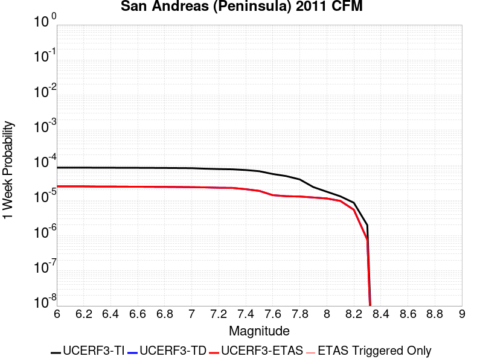 |  |  |  |

| Magnitude | 1 wk TI Prob | 1 wk TD Prob | 1 wk ETAS Prob | 1 wk ETAS/TD Gain | 1 wk ETAS Triggered Only | 1 mo TI Prob | 1 mo TD Prob | 1 mo ETAS Prob | 1 mo ETAS/TD Gain | 1 mo ETAS Triggered Only | 1 yr TI Prob | 1 yr TD Prob | 1 yr ETAS Prob | 1 yr ETAS/TD Gain | 1 yr ETAS Triggered Only | 10 yr TI Prob | 10 yr TD Prob | 10 yr ETAS Prob | 10 yr ETAS/TD Gain | 10 yr ETAS Triggered Only |
|-----|-----|-----|-----|-----|-----|-----|-----|-----|-----|-----|-----|-----|-----|-----|-----|-----|-----|-----|-----|-----|
| 6.0 | 8.6200685E-5 | 2.5207937E-5 | 2.5207937E-5 | 1.0 | 0.0 | 3.6937918E-4 | 1.0802955E-4 | 1.1802847E-4 | 1.0925573 | 1.0E-5 | 0.0044879215 | 0.0013144679 | 0.0013244547 | 1.0075977 | 1.0E-5 | 0.043983612 | 0.01477218 | 0.0147918835 | 1.001334 | 2.0E-5 |
| 6.1 | 8.6200685E-5 | 2.5207937E-5 | 2.5207937E-5 | 1.0 | 0.0 | 3.6937918E-4 | 1.0802955E-4 | 1.1802847E-4 | 1.0925573 | 1.0E-5 | 0.0044879215 | 0.0013144679 | 0.0013244547 | 1.0075977 | 1.0E-5 | 0.043983612 | 0.01477218 | 0.0147918835 | 1.001334 | 2.0E-5 |
| 6.2 | 8.6200685E-5 | 2.5207937E-5 | 2.5207937E-5 | 1.0 | 0.0 | 3.6937918E-4 | 1.0802955E-4 | 1.1802847E-4 | 1.0925573 | 1.0E-5 | 0.0044879215 | 0.0013144679 | 0.0013244547 | 1.0075977 | 1.0E-5 | 0.043983612 | 0.01477218 | 0.0147918835 | 1.001334 | 2.0E-5 |
| 6.3 | 8.551163E-5 | 2.4899866E-5 | 2.4899866E-5 | 1.0 | 0.0 | 3.6642692E-4 | 1.06709354E-4 | 1.1670828E-4 | 1.0937026 | 1.0E-5 | 0.004452125 | 0.0012984137 | 0.0013084006 | 1.0076917 | 1.0E-5 | 0.043639794 | 0.01459892 | 0.014618629 | 1.0013499 | 2.0E-5 |
| 6.4 | 8.551163E-5 | 2.4899866E-5 | 2.4899866E-5 | 1.0 | 0.0 | 3.6642692E-4 | 1.06709354E-4 | 1.1670828E-4 | 1.0937026 | 1.0E-5 | 0.004452125 | 0.0012984137 | 0.0013084006 | 1.0076917 | 1.0E-5 | 0.043639794 | 0.01459892 | 0.014618629 | 1.0013499 | 2.0E-5 |
| 6.5 | 8.511146E-5 | 2.4721267E-5 | 2.4721267E-5 | 1.0 | 0.0 | 3.647124E-4 | 1.0594399E-4 | 1.1594293E-4 | 1.0943795 | 1.0E-5 | 0.004431336 | 0.0012891064 | 0.0012990936 | 1.0077473 | 1.0E-5 | 0.04344007 | 0.014498963 | 0.0145186735 | 1.0013595 | 2.0E-5 |
| 6.6 | 8.4985084E-5 | 2.4651948E-5 | 2.4651948E-5 | 1.0 | 0.0 | 3.6417096E-4 | 1.0564694E-4 | 1.1564588E-4 | 1.0946449 | 1.0E-5 | 0.0044247704 | 0.0012854942 | 0.0012954812 | 1.0077691 | 1.0E-5 | 0.043376986 | 0.0144609315 | 0.014480643 | 1.001363 | 2.0E-5 |
| 6.7 | 8.462618E-5 | 2.4480485E-5 | 2.4480485E-5 | 1.0 | 0.0 | 3.6263323E-4 | 1.0491216E-4 | 1.14911105E-4 | 1.0953078 | 1.0E-5 | 0.004406125 | 0.0012765586 | 0.0012865459 | 1.0078236 | 1.0E-5 | 0.043197807 | 0.014365727 | 0.014385439 | 1.0013722 | 2.0E-5 |
| 6.8 | 8.42337E-5 | 2.4376272E-5 | 2.4376272E-5 | 1.0 | 0.0 | 3.6095164E-4 | 1.04465566E-4 | 1.14464514E-4 | 1.0957153 | 1.0E-5 | 0.004385734 | 0.0012711277 | 0.001281115 | 1.0078571 | 1.0E-5 | 0.043001823 | 0.014306363 | 0.014326077 | 1.0013779 | 2.0E-5 |
| 6.9 | 8.365989E-5 | 2.4180892E-5 | 2.4180892E-5 | 1.0 | 0.0 | 3.5849313E-4 | 1.0362829E-4 | 1.13627255E-4 | 1.0964887 | 1.0E-5 | 0.004355922 | 0.0012609458 | 0.0012709332 | 1.0079205 | 1.0E-5 | 0.04271523 | 0.014198911 | 0.014218627 | 1.0013885 | 2.0E-5 |
| 7.0 | 8.30936E-5 | 2.3942457E-5 | 2.3942457E-5 | 1.0 | 0.0 | 3.560668E-4 | 1.026065E-4 | 1.1260548E-4 | 1.0974497 | 1.0E-5 | 0.004326499 | 0.0012485199 | 0.0012585074 | 1.0079995 | 1.0E-5 | 0.042432297 | 0.014069902 | 0.014089621 | 1.0014014 | 2.0E-5 |
| 7.1 | 8.041264E-5 | 2.3628894E-5 | 2.3628894E-5 | 1.0 | 0.0 | 3.4458007E-4 | 1.0126277E-4 | 1.1126176E-4 | 1.098743 | 1.0E-5 | 0.0041871946 | 0.0012321785 | 0.0012421663 | 1.0081058 | 1.0E-5 | 0.041091725 | 0.013892905 | 0.0139126275 | 1.0014195 | 2.0E-5 |
| 7.2 | 7.8427016E-5 | 2.3052688E-5 | 2.3052688E-5 | 1.0 | 0.0 | 3.3607247E-4 | 9.87935E-5 | 1.08792505E-4 | 1.1012112 | 1.0E-5 | 0.004084008 | 0.0012021487 | 0.0012121367 | 1.0083084 | 1.0E-5 | 0.040097635 | 0.013576745 | 0.013596474 | 1.0014532 | 2.0E-5 |
| 7.3 | 7.721087E-5 | 2.2837554E-5 | 2.2837554E-5 | 1.0 | 0.0 | 3.3086175E-4 | 9.787157E-5 | 1.0787059E-4 | 1.1021647 | 1.0E-5 | 0.004020803 | 0.0011909365 | 0.0012009246 | 1.0083867 | 1.0E-5 | 0.03948827 | 0.013460464 | 0.013480195 | 1.0014658 | 2.0E-5 |
| 7.4 | 7.3536525E-5 | 2.095521E-5 | 2.095521E-5 | 1.0 | 0.0 | 3.1511846E-4 | 8.980496E-5 | 9.980406E-5 | 1.1113424 | 1.0E-5 | 0.0038298194 | 0.0010928282 | 0.0011028174 | 1.0091406 | 1.0E-5 | 0.037644852 | 0.0124172745 | 0.012437026 | 1.0015906 | 2.0E-5 |
| 7.5 | 6.806207E-5 | 1.876151E-5 | 1.876151E-5 | 1.0 | 0.0 | 2.9166197E-4 | 8.0404E-5 | 9.04032E-5 | 1.1243619 | 1.0E-5 | 0.0035452035 | 9.784801E-4 | 9.884704E-4 | 1.0102099 | 1.0E-5 | 0.034891766 | 0.011170478 | 0.011190254 | 1.0017704 | 2.0E-5 |
| 7.6 | 5.6731416E-5 | 1.4173155E-5 | 1.4173155E-5 | 1.0 | 0.0 | 2.43112E-4 | 6.074068E-5 | 7.0740076E-5 | 1.1646243 | 1.0E-5 | 0.0029558712 | 7.3926704E-4 | 7.492596E-4 | 1.0135169 | 1.0E-5 | 0.02916862 | 0.00848332 | 0.008503149 | 1.0023376 | 2.0E-5 |
| 7.7 | 4.946994E-5 | 1.3242368E-5 | 1.3242368E-5 | 1.0 | 0.0 | 2.1199681E-4 | 5.675177E-5 | 6.675121E-5 | 1.176196 | 1.0E-5 | 0.002578006 | 6.907339E-4 | 7.00727E-4 | 1.0144674 | 1.0E-5 | 0.02548303 | 0.007905742 | 0.007925584 | 1.0025098 | 2.0E-5 |
| 7.8 | 3.9718198E-5 | 1.2979126E-5 | 1.2979126E-5 | 1.0 | 0.0 | 1.7020974E-4 | 5.562364E-5 | 6.5623084E-5 | 1.1797696 | 1.0E-5 | 0.0020703338 | 6.7700754E-4 | 6.8700075E-4 | 1.0147609 | 1.0E-5 | 0.020511515 | 0.007716547 | 0.007736393 | 1.0025718 | 2.0E-5 |
| 7.9 | 2.4115114E-5 | 1.2183215E-5 | 1.2183215E-5 | 1.0 | 0.0 | 1.0334639E-4 | 5.2212738E-5 | 6.221222E-5 | 1.1915141 | 1.0E-5 | 0.001257516 | 6.355048E-4 | 6.4549845E-4 | 1.0157255 | 1.0E-5 | 0.012504238 | 0.0071578487 | 0.0071777054 | 1.0027741 | 2.0E-5 |
| 8.0 | 1.7756569E-5 | 1.1408184E-5 | 1.1408184E-5 | 1.0 | 0.0 | 7.6097356E-5 | 4.8891303E-5 | 5.8890815E-5 | 1.2045254 | 1.0E-5 | 9.260915E-4 | 5.9508916E-4 | 6.0508325E-4 | 1.0167942 | 1.0E-5 | 0.009222416 | 0.006658535 | 0.0066784015 | 1.0029837 | 2.0E-5 |
| 8.1 | 1.3159258E-5 | 9.744603E-6 | 9.744603E-6 | 1.0 | 0.0 | 5.6395602E-5 | 4.1761916E-5 | 5.1761497E-5 | 1.2394426 | 1.0E-5 | 6.864001E-4 | 5.083328E-4 | 5.1832775E-4 | 1.0196621 | 1.0E-5 | 0.0068428386 | 0.005688865 | 0.0056988085 | 1.0017478 | 1.0E-5 |
| 8.2 | 8.635426E-6 | 5.465718E-6 | 5.465718E-6 | 1.0 | 0.0 | 3.700844E-5 | 2.3424296E-5 | 2.3424296E-5 | 1.0 | 0.0 | 4.5048463E-4 | 2.8515357E-4 | 2.8515357E-4 | 1.0 | 0.0 | 0.004495725 | 0.0032439749 | 0.0032439749 | 1.0 | 0.0 |
| 8.3 | 1.983087E-6 | 7.6564595E-7 | 7.6564595E-7 | 1.0 | 0.0 | 8.498917E-6 | 3.281336E-6 | 3.281336E-6 | 1.0 | 0.0 | 1.034694E-4 | 3.9949547E-5 | 3.9949547E-5 | 1.0 | 0.0 | 0.0010342124 | 4.717979E-4 | 4.717979E-4 | 1.0 | 0.0 |

## Eureka Peak
*[(top)](#table-of-contents)*

| 1 Week | 1 Month | 1 Year | 10 Year |
|-----|-----|-----|-----|
|  |  | 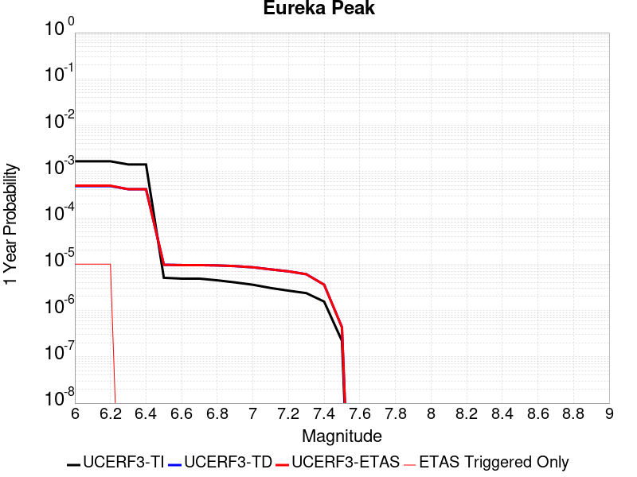 |  |

| Magnitude | 1 wk TI Prob | 1 wk TD Prob | 1 wk ETAS Prob | 1 wk ETAS/TD Gain | 1 wk ETAS Triggered Only | 1 mo TI Prob | 1 mo TD Prob | 1 mo ETAS Prob | 1 mo ETAS/TD Gain | 1 mo ETAS Triggered Only | 1 yr TI Prob | 1 yr TD Prob | 1 yr ETAS Prob | 1 yr ETAS/TD Gain | 1 yr ETAS Triggered Only | 10 yr TI Prob | 10 yr TD Prob | 10 yr ETAS Prob | 10 yr ETAS/TD Gain | 10 yr ETAS Triggered Only |
|-----|-----|-----|-----|-----|-----|-----|-----|-----|-----|-----|-----|-----|-----|-----|-----|-----|-----|-----|-----|-----|
| 6.0 | 3.1949054E-5 | 9.310979E-6 | 9.310979E-6 | 1.0 | 0.0 | 1.3691733E-4 | 3.9904025E-5 | 3.9904025E-5 | 1.0 | 0.0 | 0.0016656938 | 4.858013E-4 | 4.9579644E-4 | 1.0205746 | 1.0E-5 | 0.016532637 | 0.004921293 | 0.004941195 | 1.0040439 | 2.0E-5 |
| 6.1 | 3.1949054E-5 | 9.310979E-6 | 9.310979E-6 | 1.0 | 0.0 | 1.3691733E-4 | 3.9904025E-5 | 3.9904025E-5 | 1.0 | 0.0 | 0.0016656938 | 4.858013E-4 | 4.9579644E-4 | 1.0205746 | 1.0E-5 | 0.016532637 | 0.004921293 | 0.004941195 | 1.0040439 | 2.0E-5 |
| 6.2 | 3.1949054E-5 | 9.310979E-6 | 9.310979E-6 | 1.0 | 0.0 | 1.3691733E-4 | 3.9904025E-5 | 3.9904025E-5 | 1.0 | 0.0 | 0.0016656938 | 4.858013E-4 | 4.9579644E-4 | 1.0205746 | 1.0E-5 | 0.016532637 | 0.004921293 | 0.004941195 | 1.0040439 | 2.0E-5 |
| 6.3 | 2.7339745E-5 | 7.980821E-6 | 7.980821E-6 | 1.0 | 0.0 | 1.1716507E-4 | 3.4203495E-5 | 3.4203495E-5 | 1.0 | 0.0 | 0.0014255513 | 4.164239E-4 | 4.164239E-4 | 1.0 | 0.0 | 0.0141644105 | 0.0042259954 | 0.0042259954 | 1.0 | 0.0 |
| 6.4 | 2.7339745E-5 | 7.980821E-6 | 7.980821E-6 | 1.0 | 0.0 | 1.1716507E-4 | 3.4203495E-5 | 3.4203495E-5 | 1.0 | 0.0 | 0.0014255513 | 4.164239E-4 | 4.164239E-4 | 1.0 | 0.0 | 0.0141644105 | 0.0042259954 | 0.0042259954 | 1.0 | 0.0 |
| 6.5 | 9.738388E-8 | 1.8620014E-7 | 1.8620014E-7 | 1.0 | 0.0 | 4.1735944E-7 | 7.980003E-7 | 7.980003E-7 | 1.0 | 0.0 | 5.081339E-6 | 9.715612E-6 | 9.715612E-6 | 1.0 | 0.0 | 5.0812232E-5 | 9.715195E-5 | 9.715195E-5 | 1.0 | 0.0 |
| 6.6 | 9.3495956E-8 | 1.8328839E-7 | 1.8328839E-7 | 1.0 | 0.0 | 4.0069688E-7 | 7.855215E-7 | 7.855215E-7 | 1.0 | 0.0 | 4.8784736E-6 | 9.563682E-6 | 9.563682E-6 | 1.0 | 0.0 | 4.8783666E-5 | 9.563279E-5 | 9.563279E-5 | 1.0 | 0.0 |
| 6.7 | 9.3495956E-8 | 1.8328839E-7 | 1.8328839E-7 | 1.0 | 0.0 | 4.0069688E-7 | 7.855215E-7 | 7.855215E-7 | 1.0 | 0.0 | 4.8784736E-6 | 9.563682E-6 | 9.563682E-6 | 1.0 | 0.0 | 4.8783666E-5 | 9.563279E-5 | 9.563279E-5 | 1.0 | 0.0 |
| 6.8 | 8.591428E-8 | 1.8021817E-7 | 1.8021817E-7 | 1.0 | 0.0 | 3.68204E-7 | 7.7236336E-7 | 7.7236336E-7 | 1.0 | 0.0 | 4.4828744E-6 | 9.403484E-6 | 9.403484E-6 | 1.0 | 0.0 | 4.482784E-5 | 9.403094E-5 | 9.403094E-5 | 1.0 | 0.0 |
| 6.9 | 7.749723E-8 | 1.7439834E-7 | 1.7439834E-7 | 1.0 | 0.0 | 3.3213098E-7 | 7.4742127E-7 | 7.4742127E-7 | 1.0 | 0.0 | 4.043687E-6 | 9.099816E-6 | 9.099816E-6 | 1.0 | 0.0 | 4.0436134E-5 | 9.0994516E-5 | 9.0994516E-5 | 1.0 | 0.0 |
| 7.0 | 6.897872E-8 | 1.6416043E-7 | 1.6416043E-7 | 1.0 | 0.0 | 2.9562307E-7 | 7.035445E-7 | 7.035445E-7 | 1.0 | 0.0 | 3.5992048E-6 | 8.565621E-6 | 8.565621E-6 | 1.0 | 0.0 | 3.5991467E-5 | 8.565299E-5 | 8.565299E-5 | 1.0 | 0.0 |
| 7.1 | 5.859318E-8 | 1.4787899E-7 | 1.4787899E-7 | 1.0 | 0.0 | 2.5111362E-7 | 6.33767E-7 | 6.33767E-7 | 1.0 | 0.0 | 3.057304E-6 | 7.716087E-6 | 7.716087E-6 | 1.0 | 0.0 | 3.0572617E-5 | 7.715825E-5 | 7.715825E-5 | 1.0 | 0.0 |
| 7.2 | 5.1375338E-8 | 1.3421746E-7 | 1.3421746E-7 | 1.0 | 0.0 | 2.2018E-7 | 5.7521754E-7 | 5.7521754E-7 | 1.0 | 0.0 | 2.680688E-6 | 7.003252E-6 | 7.003252E-6 | 1.0 | 0.0 | 2.6806558E-5 | 7.003037E-5 | 7.003037E-5 | 1.0 | 0.0 |
| 7.3 | 4.5441396E-8 | 1.1636931E-7 | 1.1636931E-7 | 1.0 | 0.0 | 1.9474882E-7 | 4.987255E-7 | 4.987255E-7 | 1.0 | 0.0 | 2.3710643E-6 | 6.0719667E-6 | 6.0719667E-6 | 1.0 | 0.0 | 2.371039E-5 | 6.0718063E-5 | 6.0718063E-5 | 1.0 | 0.0 |
| 7.4 | 2.981918E-8 | 6.911723E-8 | 6.911723E-8 | 1.0 | 0.0 | 1.2779647E-7 | 2.9621668E-7 | 2.9621668E-7 | 1.0 | 0.0 | 1.5559209E-6 | 3.6064325E-6 | 3.6064325E-6 | 1.0 | 0.0 | 1.55591E-5 | 3.6063782E-5 | 3.6063782E-5 | 1.0 | 0.0 |
| 7.5 | 4.24214E-9 | 8.34289E-9 | 8.34289E-9 | 1.0 | 0.0 | 1.81806E-8 | 3.5755242E-8 | 3.5755242E-8 | 1.0 | 0.0 | 2.213488E-7 | 4.3532006E-7 | 4.3532006E-7 | 1.0 | 0.0 | 2.2134857E-6 | 4.3531986E-6 | 4.3531986E-6 | 1.0 | 0.0 |

## Northridge
*[(top)](#table-of-contents)*

| 1 Week | 1 Month | 1 Year | 10 Year |
|-----|-----|-----|-----|
|  |  |  |  |

| Magnitude | 1 wk TI Prob | 1 wk TD Prob | 1 wk ETAS Prob | 1 wk ETAS/TD Gain | 1 wk ETAS Triggered Only | 1 mo TI Prob | 1 mo TD Prob | 1 mo ETAS Prob | 1 mo ETAS/TD Gain | 1 mo ETAS Triggered Only | 1 yr TI Prob | 1 yr TD Prob | 1 yr ETAS Prob | 1 yr ETAS/TD Gain | 1 yr ETAS Triggered Only | 10 yr TI Prob | 10 yr TD Prob | 10 yr ETAS Prob | 10 yr ETAS/TD Gain | 10 yr ETAS Triggered Only |
|-----|-----|-----|-----|-----|-----|-----|-----|-----|-----|-----|-----|-----|-----|-----|-----|-----|-----|-----|-----|-----|
| 6.0 | 1.8340852E-5 | 7.5878907E-6 | 7.5878907E-6 | 1.0 | 0.0 | 7.860128E-5 | 3.251914E-5 | 3.251914E-5 | 1.0 | 0.0 | 9.565505E-4 | 3.9585077E-4 | 4.1584286E-4 | 1.0505041 | 2.0E-5 | 0.009524435 | 0.0039516874 | 0.0039716084 | 1.0050411 | 2.0E-5 |
| 6.1 | 1.8340852E-5 | 7.5878907E-6 | 7.5878907E-6 | 1.0 | 0.0 | 7.860128E-5 | 3.251914E-5 | 3.251914E-5 | 1.0 | 0.0 | 9.565505E-4 | 3.9585077E-4 | 4.1584286E-4 | 1.0505041 | 2.0E-5 | 0.009524435 | 0.0039516874 | 0.0039716084 | 1.0050411 | 2.0E-5 |
| 6.2 | 1.8340852E-5 | 7.5878907E-6 | 7.5878907E-6 | 1.0 | 0.0 | 7.860128E-5 | 3.251914E-5 | 3.251914E-5 | 1.0 | 0.0 | 9.565505E-4 | 3.9585077E-4 | 4.1584286E-4 | 1.0505041 | 2.0E-5 | 0.009524435 | 0.0039516874 | 0.0039716084 | 1.0050411 | 2.0E-5 |
| 6.3 | 1.8340852E-5 | 7.5878907E-6 | 7.5878907E-6 | 1.0 | 0.0 | 7.860128E-5 | 3.251914E-5 | 3.251914E-5 | 1.0 | 0.0 | 9.565505E-4 | 3.9585077E-4 | 4.1584286E-4 | 1.0505041 | 2.0E-5 | 0.009524435 | 0.0039516874 | 0.0039716084 | 1.0050411 | 2.0E-5 |
| 6.4 | 1.7361892E-5 | 7.5878907E-6 | 7.5878907E-6 | 1.0 | 0.0 | 7.440598E-5 | 3.251914E-5 | 3.251914E-5 | 1.0 | 0.0 | 9.055163E-4 | 3.9585077E-4 | 4.1584286E-4 | 1.0505041 | 2.0E-5 | 0.009018354 | 0.0039516874 | 0.0039716084 | 1.0050411 | 2.0E-5 |
| 6.5 | 1.7361892E-5 | 7.5878907E-6 | 7.5878907E-6 | 1.0 | 0.0 | 7.440598E-5 | 3.251914E-5 | 3.251914E-5 | 1.0 | 0.0 | 9.055163E-4 | 3.9585077E-4 | 4.1584286E-4 | 1.0505041 | 2.0E-5 | 0.009018354 | 0.0039516874 | 0.0039716084 | 1.0050411 | 2.0E-5 |
| 6.6 | 1.5458201E-5 | 7.5878907E-6 | 7.5878907E-6 | 1.0 | 0.0 | 6.624775E-5 | 3.251914E-5 | 3.251914E-5 | 1.0 | 0.0 | 8.0626784E-4 | 3.9585077E-4 | 4.1584286E-4 | 1.0505041 | 2.0E-5 | 0.008033488 | 0.0039516874 | 0.0039716084 | 1.0050411 | 2.0E-5 |
| 6.7 | 1.2538368E-5 | 6.381497E-6 | 6.381497E-6 | 1.0 | 0.0 | 5.3734755E-5 | 2.7348988E-5 | 2.7348988E-5 | 1.0 | 0.0 | 6.5402425E-4 | 3.329235E-4 | 3.5291683E-4 | 1.0600538 | 2.0E-5 | 0.0065210275 | 0.0033243035 | 0.003344237 | 1.0059963 | 2.0E-5 |
| 6.8 | 1.1438097E-5 | 6.350156E-6 | 6.350156E-6 | 1.0 | 0.0 | 4.9019498E-5 | 2.7214674E-5 | 2.7214674E-5 | 1.0 | 0.0 | 5.9664896E-4 | 3.3128873E-4 | 3.412854E-4 | 1.0301752 | 1.0E-5 | 0.005950495 | 0.0033080047 | 0.0033179715 | 1.003013 | 1.0E-5 |
| 6.9 | 1.1204891E-5 | 6.2866116E-6 | 6.2866116E-6 | 1.0 | 0.0 | 4.8020076E-5 | 2.6942345E-5 | 2.6942345E-5 | 1.0 | 0.0 | 5.8448757E-4 | 3.2797412E-4 | 3.3797082E-4 | 1.0304803 | 1.0E-5 | 0.0058295266 | 0.0032749567 | 0.003284924 | 1.0030435 | 1.0E-5 |
| 7.0 | 1.061046E-5 | 6.1152687E-6 | 6.1152687E-6 | 1.0 | 0.0 | 4.5472607E-5 | 2.6208034E-5 | 2.6208034E-5 | 1.0 | 0.0 | 5.534883E-4 | 3.190365E-4 | 3.2903333E-4 | 1.0313344 | 1.0E-5 | 0.0055211177 | 0.0031858315 | 0.0031957994 | 1.0031289 | 1.0E-5 |
| 7.1 | 1.0266979E-5 | 6.0041907E-6 | 6.0041907E-6 | 1.0 | 0.0 | 4.40006E-5 | 2.5731995E-5 | 2.5731995E-5 | 1.0 | 0.0 | 5.355756E-4 | 3.1324243E-4 | 3.2323928E-4 | 1.0319141 | 1.0E-5 | 0.0053428668 | 0.0031280548 | 0.0031380234 | 1.0031868 | 1.0E-5 |
| 7.2 | 9.91273E-6 | 5.819906E-6 | 5.819906E-6 | 1.0 | 0.0 | 4.248244E-5 | 2.4942217E-5 | 2.4942217E-5 | 1.0 | 0.0 | 5.171009E-4 | 3.036296E-4 | 3.1362657E-4 | 1.0329249 | 1.0E-5 | 0.0051589934 | 0.0030321924 | 0.0030421622 | 1.0032879 | 1.0E-5 |
| 7.3 | 8.4959265E-6 | 5.1930183E-6 | 5.1930183E-6 | 1.0 | 0.0 | 3.6410605E-5 | 2.2255605E-5 | 2.2255605E-5 | 1.0 | 0.0 | 4.4320893E-4 | 2.7092852E-4 | 2.8092583E-4 | 1.0369002 | 1.0E-5 | 0.00442326 | 0.0027060085 | 0.0027159813 | 1.0036855 | 1.0E-5 |
| 7.4 | 8.0847185E-6 | 4.9818977E-6 | 4.9818977E-6 | 1.0 | 0.0 | 3.4648332E-5 | 2.1350817E-5 | 2.1350817E-5 | 1.0 | 0.0 | 4.2176177E-4 | 2.5991542E-4 | 2.6991282E-4 | 1.0384641 | 1.0E-5 | 0.0042096223 | 0.0025961401 | 0.0026061141 | 1.0038419 | 1.0E-5 |
| 7.5 | 6.8220684E-6 | 4.2532647E-6 | 4.2532647E-6 | 1.0 | 0.0 | 2.9237108E-5 | 1.8228153E-5 | 1.8228153E-5 | 1.0 | 0.0 | 3.5590364E-4 | 2.2190536E-4 | 2.3190313E-4 | 1.0450543 | 1.0E-5 | 0.0035533418 | 0.0022168586 | 0.0022268365 | 1.0045009 | 1.0E-5 |
| 7.6 | 4.4224143E-6 | 2.8999295E-6 | 2.8999295E-6 | 1.0 | 0.0 | 1.8953066E-5 | 1.24282105E-5 | 1.24282105E-5 | 1.0 | 0.0 | 2.3072914E-4 | 1.5130307E-4 | 1.5130307E-4 | 1.0 | 0.0 | 0.0023048974 | 0.0015120122 | 0.0015120122 | 1.0 | 0.0 |
| 7.7 | 2.5297056E-6 | 1.6045943E-6 | 1.6045943E-6 | 1.0 | 0.0 | 1.0841551E-5 | 6.876815E-6 | 6.876815E-6 | 1.0 | 0.0 | 1.319879E-4 | 8.372205E-5 | 8.372205E-5 | 1.0 | 0.0 | 0.0013190953 | 8.369098E-4 | 8.369098E-4 | 1.0 | 0.0 |
| 7.8 | 1.2508156E-6 | 8.780148E-7 | 8.780148E-7 | 1.0 | 0.0 | 5.3606273E-6 | 3.7629154E-6 | 3.7629154E-6 | 1.0 | 0.0 | 6.526368E-5 | 4.5812543E-5 | 4.5812543E-5 | 1.0 | 0.0 | 6.524452E-4 | 4.580323E-4 | 4.580323E-4 | 1.0 | 0.0 |
| 7.9 | 2.262199E-7 | 1.466491E-7 | 1.466491E-7 | 1.0 | 0.0 | 9.695135E-7 | 6.2849597E-7 | 6.2849597E-7 | 1.0 | 0.0 | 1.1803763E-5 | 7.651913E-6 | 7.651913E-6 | 1.0 | 0.0 | 1.1803136E-4 | 7.651657E-5 | 7.651657E-5 | 1.0 | 0.0 |
| 8.0 | 2.865362E-9 | 1.27525E-9 | 1.27525E-9 | 1.0 | 0.0 | 1.2280123E-8 | 5.465357E-9 | 5.465357E-9 | 1.0 | 0.0 | 1.4951048E-7 | 6.654073E-8 | 6.654073E-8 | 1.0 | 0.0 | 1.4951038E-6 | 6.6540724E-7 | 6.6540724E-7 | 1.0 | 0.0 |

## Johnson Valley (No) 2011 rev
*[(top)](#table-of-contents)*

| 1 Week | 1 Month | 1 Year | 10 Year |
|-----|-----|-----|-----|
|  |  |  |  |

| Magnitude | 1 wk TI Prob | 1 wk TD Prob | 1 wk ETAS Prob | 1 wk ETAS/TD Gain | 1 wk ETAS Triggered Only | 1 mo TI Prob | 1 mo TD Prob | 1 mo ETAS Prob | 1 mo ETAS/TD Gain | 1 mo ETAS Triggered Only | 1 yr TI Prob | 1 yr TD Prob | 1 yr ETAS Prob | 1 yr ETAS/TD Gain | 1 yr ETAS Triggered Only | 10 yr TI Prob | 10 yr TD Prob | 10 yr ETAS Prob | 10 yr ETAS/TD Gain | 10 yr ETAS Triggered Only |
|-----|-----|-----|-----|-----|-----|-----|-----|-----|-----|-----|-----|-----|-----|-----|-----|-----|-----|-----|-----|-----|
| 6.0 | 2.577707E-5 | 1.2901208E-5 | 1.2901208E-5 | 1.0 | 0.0 | 1.1046848E-4 | 5.528994E-5 | 5.528994E-5 | 1.0 | 0.0 | 0.0013441239 | 6.729868E-4 | 6.8298005E-4 | 1.0148492 | 1.0E-5 | 0.013360229 | 0.006713397 | 0.0067332624 | 1.0029591 | 2.0E-5 |
| 6.1 | 2.577707E-5 | 1.2901208E-5 | 1.2901208E-5 | 1.0 | 0.0 | 1.1046848E-4 | 5.528994E-5 | 5.528994E-5 | 1.0 | 0.0 | 0.0013441239 | 6.729868E-4 | 6.8298005E-4 | 1.0148492 | 1.0E-5 | 0.013360229 | 0.006713397 | 0.0067332624 | 1.0029591 | 2.0E-5 |
| 6.2 | 2.577707E-5 | 1.2901208E-5 | 1.2901208E-5 | 1.0 | 0.0 | 1.1046848E-4 | 5.528994E-5 | 5.528994E-5 | 1.0 | 0.0 | 0.0013441239 | 6.729868E-4 | 6.8298005E-4 | 1.0148492 | 1.0E-5 | 0.013360229 | 0.006713397 | 0.0067332624 | 1.0029591 | 2.0E-5 |
| 6.3 | 2.577707E-5 | 1.2901208E-5 | 1.2901208E-5 | 1.0 | 0.0 | 1.1046848E-4 | 5.528994E-5 | 5.528994E-5 | 1.0 | 0.0 | 0.0013441239 | 6.729868E-4 | 6.8298005E-4 | 1.0148492 | 1.0E-5 | 0.013360229 | 0.006713397 | 0.0067332624 | 1.0029591 | 2.0E-5 |
| 6.4 | 1.5296591E-5 | 7.5369735E-6 | 7.5369735E-6 | 1.0 | 0.0 | 6.555518E-5 | 3.230102E-5 | 3.230102E-5 | 1.0 | 0.0 | 7.97842E-4 | 3.9321271E-4 | 4.0320877E-4 | 1.0254215 | 1.0E-5 | 0.007949836 | 0.003927011 | 0.0039469325 | 1.005073 | 2.0E-5 |
| 6.5 | 1.5296591E-5 | 7.5369735E-6 | 7.5369735E-6 | 1.0 | 0.0 | 6.555518E-5 | 3.230102E-5 | 3.230102E-5 | 1.0 | 0.0 | 7.97842E-4 | 3.9321271E-4 | 4.0320877E-4 | 1.0254215 | 1.0E-5 | 0.007949836 | 0.003927011 | 0.0039469325 | 1.005073 | 2.0E-5 |
| 6.6 | 1.3289383E-5 | 5.9919316E-6 | 5.9919316E-6 | 1.0 | 0.0 | 5.6953253E-5 | 2.567955E-5 | 2.567955E-5 | 1.0 | 0.0 | 6.9318525E-4 | 3.1262063E-4 | 3.226175E-4 | 1.0319777 | 1.0E-5 | 0.0069102696 | 0.0031234731 | 0.0031334418 | 1.0031916 | 1.0E-5 |
| 6.7 | 1.3289383E-5 | 5.9919316E-6 | 5.9919316E-6 | 1.0 | 0.0 | 5.6953253E-5 | 2.567955E-5 | 2.567955E-5 | 1.0 | 0.0 | 6.9318525E-4 | 3.1262063E-4 | 3.226175E-4 | 1.0319777 | 1.0E-5 | 0.0069102696 | 0.0031234731 | 0.0031334418 | 1.0031916 | 1.0E-5 |
| 6.8 | 8.330789E-6 | 2.9214577E-6 | 2.9214577E-6 | 1.0 | 0.0 | 3.570289E-5 | 1.2520505E-5 | 1.2520505E-5 | 1.0 | 0.0 | 4.34596E-4 | 1.524322E-4 | 1.6243068E-4 | 1.0655929 | 1.0E-5 | 0.0043374705 | 0.0015238364 | 0.0015338212 | 1.0065523 | 1.0E-5 |
| 6.9 | 7.2359003E-6 | 2.3014702E-6 | 2.3014702E-6 | 1.0 | 0.0 | 3.1010633E-5 | 9.863436E-6 | 9.863436E-6 | 1.0 | 0.0 | 3.7748902E-4 | 1.2008605E-4 | 1.2008605E-4 | 1.0 | 0.0 | 0.0037684843 | 0.0012007345 | 0.0012007345 | 1.0 | 0.0 |
| 7.0 | 6.5149957E-6 | 2.0886398E-6 | 2.0886398E-6 | 1.0 | 0.0 | 2.792111E-5 | 8.951313E-6 | 8.951313E-6 | 1.0 | 0.0 | 3.398865E-4 | 1.0898209E-4 | 1.0898209E-4 | 1.0 | 0.0 | 0.003393671 | 0.0010898062 | 0.0010898062 | 1.0 | 0.0 |
| 7.1 | 1.1662233E-6 | 2.8793124E-8 | 2.8793124E-8 | 1.0 | 0.0 | 4.9980904E-6 | 1.2339909E-7 | 1.2339909E-7 | 1.0 | 0.0 | 6.0850052E-5 | 1.5023832E-6 | 1.5023832E-6 | 1.0 | 0.0 | 6.083339E-4 | 1.5023746E-5 | 1.5023746E-5 | 1.0 | 0.0 |
| 7.2 | 5.413881E-7 | 2.8793124E-8 | 2.8793124E-8 | 1.0 | 0.0 | 2.3202326E-6 | 1.2339909E-7 | 1.2339909E-7 | 1.0 | 0.0 | 2.8248465E-5 | 1.5023832E-6 | 1.5023832E-6 | 1.0 | 0.0 | 2.8244875E-4 | 1.5023746E-5 | 1.5023746E-5 | 1.0 | 0.0 |
| 7.3 | 5.076821E-7 | 2.8793124E-8 | 2.8793124E-8 | 1.0 | 0.0 | 2.1757785E-6 | 1.2339909E-7 | 1.2339909E-7 | 1.0 | 0.0 | 2.648978E-5 | 1.5023832E-6 | 1.5023832E-6 | 1.0 | 0.0 | 2.6486625E-4 | 1.5023746E-5 | 1.5023746E-5 | 1.0 | 0.0 |
| 7.4 | 4.7568687E-7 | 2.8775073E-8 | 2.8775073E-8 | 1.0 | 0.0 | 2.0386565E-6 | 1.2332174E-7 | 1.2332174E-7 | 1.0 | 0.0 | 2.482036E-5 | 1.5014413E-6 | 1.5014413E-6 | 1.0 | 0.0 | 2.4817587E-4 | 1.5014328E-5 | 1.5014328E-5 | 1.0 | 0.0 |
| 7.5 | 3.435626E-7 | 2.5350424E-8 | 2.5350424E-8 | 1.0 | 0.0 | 1.4724103E-6 | 1.0864467E-7 | 1.0864467E-7 | 1.0 | 0.0 | 1.7926448E-5 | 1.3227482E-6 | 1.3227482E-6 | 1.0 | 0.0 | 1.7925001E-4 | 1.3227419E-5 | 1.3227419E-5 | 1.0 | 0.0 |

## Pittville 2011 CFM
*[(top)](#table-of-contents)*

| 1 Week | 1 Month | 1 Year | 10 Year |
|-----|-----|-----|-----|
|  |  |  |  |

| Magnitude | 1 wk TI Prob | 1 wk TD Prob | 1 wk ETAS Prob | 1 wk ETAS/TD Gain | 1 wk ETAS Triggered Only | 1 mo TI Prob | 1 mo TD Prob | 1 mo ETAS Prob | 1 mo ETAS/TD Gain | 1 mo ETAS Triggered Only | 1 yr TI Prob | 1 yr TD Prob | 1 yr ETAS Prob | 1 yr ETAS/TD Gain | 1 yr ETAS Triggered Only | 10 yr TI Prob | 10 yr TD Prob | 10 yr ETAS Prob | 10 yr ETAS/TD Gain | 10 yr ETAS Triggered Only |
|-----|-----|-----|-----|-----|-----|-----|-----|-----|-----|-----|-----|-----|-----|-----|-----|-----|-----|-----|-----|-----|
| 6.0 | 2.5031832E-5 | 2.7056969E-5 | 2.7056969E-5 | 1.0 | 0.0 | 1.0727487E-4 | 1.1595384E-4 | 1.2595268E-4 | 1.0862312 | 1.0E-5 | 0.001305289 | 0.0014109211 | 0.001420907 | 1.0070776 | 1.0E-5 | 0.012976485 | 0.014029415 | 0.014039275 | 1.0007027 | 1.0E-5 |
| 6.1 | 1.2540113E-5 | 1.3513067E-5 | 1.3513067E-5 | 1.0 | 0.0 | 5.3742235E-5 | 5.7911984E-5 | 5.7911984E-5 | 1.0 | 0.0 | 6.541153E-4 | 7.048728E-4 | 7.048728E-4 | 1.0 | 0.0 | 0.0065219323 | 0.0070286044 | 0.0070286044 | 1.0 | 0.0 |
| 6.2 | 6.603218E-6 | 7.107189E-6 | 7.107189E-6 | 1.0 | 0.0 | 2.8299199E-5 | 3.0459063E-5 | 3.0459063E-5 | 1.0 | 0.0 | 3.4448825E-4 | 3.7078248E-4 | 3.7078248E-4 | 1.0 | 0.0 | 0.0034395473 | 0.0037022792 | 0.0037022792 | 1.0 | 0.0 |
| 6.3 | 6.603218E-6 | 7.107189E-6 | 7.107189E-6 | 1.0 | 0.0 | 2.8299199E-5 | 3.0459063E-5 | 3.0459063E-5 | 1.0 | 0.0 | 3.4448825E-4 | 3.7078248E-4 | 3.7078248E-4 | 1.0 | 0.0 | 0.0034395473 | 0.0037022792 | 0.0037022792 | 1.0 | 0.0 |
| 6.4 | 3.9389015E-6 | 4.239175E-6 | 4.239175E-6 | 1.0 | 0.0 | 1.6880897E-5 | 1.8167784E-5 | 1.8167784E-5 | 1.0 | 0.0 | 2.0550552E-4 | 2.2117342E-4 | 2.2117342E-4 | 1.0 | 0.0 | 0.0020531558 | 0.002209838 | 0.002209838 | 1.0 | 0.0 |
| 6.5 | 2.4533072E-6 | 2.6412686E-6 | 2.6412686E-6 | 1.0 | 0.0 | 1.0514132E-5 | 1.1319685E-5 | 1.1319685E-5 | 1.0 | 0.0 | 1.2800204E-4 | 1.3781038E-4 | 1.3781038E-4 | 1.0 | 0.0 | 0.0012792832 | 0.0013774394 | 0.0013774394 | 1.0 | 0.0 |
| 6.6 | 1.3482367E-6 | 1.452993E-6 | 1.452993E-6 | 1.0 | 0.0 | 5.778144E-6 | 6.2271047E-6 | 6.2271047E-6 | 1.0 | 0.0 | 7.0346636E-5 | 7.58135E-5 | 7.58135E-5 | 1.0 | 0.0 | 7.032437E-4 | 7.5798744E-4 | 7.5798744E-4 | 1.0 | 0.0 |

## Greenville (No) 2011 CFM
*[(top)](#table-of-contents)*

| 1 Week | 1 Month | 1 Year | 10 Year |
|-----|-----|-----|-----|
|  |  |  |  |

| Magnitude | 1 wk TI Prob | 1 wk TD Prob | 1 wk ETAS Prob | 1 wk ETAS/TD Gain | 1 wk ETAS Triggered Only | 1 mo TI Prob | 1 mo TD Prob | 1 mo ETAS Prob | 1 mo ETAS/TD Gain | 1 mo ETAS Triggered Only | 1 yr TI Prob | 1 yr TD Prob | 1 yr ETAS Prob | 1 yr ETAS/TD Gain | 1 yr ETAS Triggered Only | 10 yr TI Prob | 10 yr TD Prob | 10 yr ETAS Prob | 10 yr ETAS/TD Gain | 10 yr ETAS Triggered Only |
|-----|-----|-----|-----|-----|-----|-----|-----|-----|-----|-----|-----|-----|-----|-----|-----|-----|-----|-----|-----|-----|
| 6.0 | 3.286654E-5 | 4.036671E-5 | 6.0365903E-5 | 1.4954377 | 2.0E-5 | 1.4084899E-4 | 1.7298892E-4 | 1.9298546E-4 | 1.1155944 | 2.0E-5 | 0.0017134876 | 0.0021041434 | 0.0021241012 | 1.009485 | 2.0E-5 | 0.017003356 | 0.02084759 | 0.020867173 | 1.0009394 | 2.0E-5 |
| 6.1 | 3.286654E-5 | 4.036671E-5 | 6.0365903E-5 | 1.4954377 | 2.0E-5 | 1.4084899E-4 | 1.7298892E-4 | 1.9298546E-4 | 1.1155944 | 2.0E-5 | 0.0017134876 | 0.0021041434 | 0.0021241012 | 1.009485 | 2.0E-5 | 0.017003356 | 0.02084759 | 0.020867173 | 1.0009394 | 2.0E-5 |
| 6.2 | 3.1697953E-5 | 3.8929615E-5 | 5.8928836E-5 | 1.5137277 | 2.0E-5 | 1.358413E-4 | 1.6683072E-4 | 1.868274E-4 | 1.119862 | 2.0E-5 | 0.0016526132 | 0.0020293088 | 0.0020492682 | 1.0098356 | 2.0E-5 | 0.01640377 | 0.020112982 | 0.02013258 | 1.0009744 | 2.0E-5 |
| 6.3 | 3.1363317E-5 | 3.8518487E-5 | 5.851772E-5 | 1.5192112 | 2.0E-5 | 1.344073E-4 | 1.6506898E-4 | 1.8506568E-4 | 1.1211414 | 2.0E-5 | 0.0016351803 | 0.0020078993 | 0.0020278592 | 1.0099406 | 2.0E-5 | 0.016232004 | 0.019902749 | 0.019922351 | 1.0009849 | 2.0E-5 |
| 6.4 | 3.0228604E-5 | 3.712561E-5 | 5.7124867E-5 | 1.5386916 | 2.0E-5 | 1.2954473E-4 | 1.5910025E-4 | 1.7909707E-4 | 1.1256869 | 2.0E-5 | 0.0015760659 | 0.001935361 | 0.0019553222 | 1.010314 | 2.0E-5 | 0.015649348 | 0.01919009 | 0.019209705 | 1.0010222 | 2.0E-5 |
| 6.5 | 2.9537814E-5 | 3.628106E-5 | 5.6280333E-5 | 1.5512319 | 2.0E-5 | 1.2658449E-4 | 1.5548118E-4 | 1.7547807E-4 | 1.1286129 | 2.0E-5 | 0.0015400766 | 0.0018913761 | 0.0019113382 | 1.0105543 | 2.0E-5 | 0.01529447 | 0.018757751 | 0.018777376 | 1.0010462 | 2.0E-5 |
| 6.6 | 2.7345395E-5 | 3.359038E-5 | 5.3589705E-5 | 1.5953887 | 2.0E-5 | 1.1718928E-4 | 1.43951E-4 | 1.6394812E-4 | 1.1389161 | 2.0E-5 | 0.0014258457 | 0.0017512254 | 0.0017711904 | 1.0114006 | 2.0E-5 | 0.014167317 | 0.017378574 | 0.017398227 | 1.0011308 | 2.0E-5 |
| 6.7 | 2.5615784E-5 | 3.1567277E-5 | 5.1566647E-5 | 1.6335474 | 2.0E-5 | 1.09777306E-4 | 1.352815E-4 | 1.5527879E-4 | 1.1478199 | 2.0E-5 | 0.0013357193 | 0.0016458385 | 0.0016658055 | 1.0121318 | 2.0E-5 | 0.013277191 | 0.016340667 | 0.01636034 | 1.0012039 | 2.0E-5 |
| 6.8 | 2.0059057E-5 | 2.4712264E-5 | 2.4712264E-5 | 1.0 | 0.0 | 8.596455E-5 | 1.059055E-4 | 1.059055E-4 | 1.0 | 0.0 | 0.0010461159 | 0.001288653 | 0.001288653 | 1.0 | 0.0 | 0.0104120495 | 0.012814328 | 0.012814328 | 1.0 | 0.0 |
| 6.9 | 1.6321746E-5 | 2.018486E-5 | 2.018486E-5 | 1.0 | 0.0 | 6.9948466E-5 | 8.6503744E-5 | 8.6503744E-5 | 1.0 | 0.0 | 8.5128983E-4 | 0.0010526866 | 0.0010526866 | 1.0 | 0.0 | 0.008480361 | 0.010479037 | 0.010479037 | 1.0 | 0.0 |
| 7.0 | 1.22527645E-5 | 1.5135808E-5 | 1.5135808E-5 | 1.0 | 0.0 | 5.2510793E-5 | 6.486616E-5 | 6.486616E-5 | 1.0 | 0.0 | 6.3913135E-4 | 7.894636E-4 | 7.894636E-4 | 1.0 | 0.0 | 0.0063729626 | 0.007867573 | 0.007867573 | 1.0 | 0.0 |
| 7.1 | 8.996482E-6 | 1.1165116E-5 | 1.1165116E-5 | 1.0 | 0.0 | 3.8555783E-5 | 4.784963E-5 | 4.784963E-5 | 1.0 | 0.0 | 4.6931554E-4 | 5.8241474E-4 | 5.8241474E-4 | 1.0 | 0.0 | 0.004683256 | 0.0058096354 | 0.0058096354 | 1.0 | 0.0 |
| 7.2 | 6.0273087E-6 | 7.569621E-6 | 7.569621E-6 | 1.0 | 0.0 | 2.5831067E-5 | 3.2440836E-5 | 3.2440836E-5 | 1.0 | 0.0 | 3.1444785E-4 | 3.9489628E-4 | 3.9489628E-4 | 1.0 | 0.0 | 0.0031400328 | 0.003942419 | 0.003942419 | 1.0 | 0.0 |
| 7.3 | 3.1209995E-6 | 3.9664565E-6 | 3.9664565E-6 | 1.0 | 0.0 | 1.3375643E-5 | 1.6998989E-5 | 1.6998989E-5 | 1.0 | 0.0 | 1.6283628E-4 | 2.069432E-4 | 2.069432E-4 | 1.0 | 0.0 | 0.0016271701 | 0.0020678395 | 0.0020678395 | 1.0 | 0.0 |
| 7.4 | 2.0254208E-6 | 2.6096657E-6 | 2.6096657E-6 | 1.0 | 0.0 | 8.680347E-6 | 1.1184234E-5 | 1.1184234E-5 | 1.0 | 0.0 | 1.0567809E-4 | 1.361596E-4 | 1.361596E-4 | 1.0 | 0.0 | 0.0010562785 | 0.0013611179 | 0.0013611179 | 1.0 | 0.0 |
| 7.5 | 1.6763418E-6 | 2.1734072E-6 | 2.1734072E-6 | 1.0 | 0.0 | 7.184302E-6 | 9.314569E-6 | 9.314569E-6 | 1.0 | 0.0 | 8.746537E-5 | 1.1339904E-4 | 1.1339904E-4 | 1.0 | 0.0 | 8.743095E-4 | 0.0011337536 | 0.0011337536 | 1.0 | 0.0 |
| 7.6 | 1.1935462E-6 | 1.5458915E-6 | 1.5458915E-6 | 1.0 | 0.0 | 5.115188E-6 | 6.625233E-6 | 6.625233E-6 | 1.0 | 0.0 | 6.2275634E-5 | 8.0659265E-5 | 8.0659265E-5 | 1.0 | 0.0 | 6.2258187E-4 | 8.0655375E-4 | 8.0655375E-4 | 1.0 | 0.0 |
| 7.7 | 3.0464201E-7 | 3.9848686E-7 | 3.9848686E-7 | 1.0 | 0.0 | 1.3056081E-6 | 1.7077997E-6 | 1.7077997E-6 | 1.0 | 0.0 | 1.589566E-5 | 2.0792268E-5 | 2.0792268E-5 | 1.0 | 0.0 | 1.5894524E-4 | 2.0793018E-4 | 2.0793018E-4 | 1.0 | 0.0 |

## Sargent 2011 CFM
*[(top)](#table-of-contents)*

| 1 Week | 1 Month | 1 Year | 10 Year |
|-----|-----|-----|-----|
|  |  |  |  |

| Magnitude | 1 wk TI Prob | 1 wk TD Prob | 1 wk ETAS Prob | 1 wk ETAS/TD Gain | 1 wk ETAS Triggered Only | 1 mo TI Prob | 1 mo TD Prob | 1 mo ETAS Prob | 1 mo ETAS/TD Gain | 1 mo ETAS Triggered Only | 1 yr TI Prob | 1 yr TD Prob | 1 yr ETAS Prob | 1 yr ETAS/TD Gain | 1 yr ETAS Triggered Only | 10 yr TI Prob | 10 yr TD Prob | 10 yr ETAS Prob | 10 yr ETAS/TD Gain | 10 yr ETAS Triggered Only |
|-----|-----|-----|-----|-----|-----|-----|-----|-----|-----|-----|-----|-----|-----|-----|-----|-----|-----|-----|-----|-----|
| 6.0 | 3.7327867E-5 | 3.665065E-5 | 3.665065E-5 | 1.0 | 0.0 | 1.5996677E-4 | 1.5706717E-4 | 1.5706717E-4 | 1.0 | 0.0 | 0.0019458556 | 0.0019110267 | 0.0019210076 | 1.0052228 | 1.0E-5 | 0.01928905 | 0.019017996 | 0.019037616 | 1.0010316 | 2.0E-5 |
| 6.1 | 2.3771476E-5 | 1.8478724E-5 | 1.8478724E-5 | 1.0 | 0.0 | 1.01873775E-4 | 7.919262E-5 | 7.919262E-5 | 1.0 | 0.0 | 0.0012396075 | 9.638239E-4 | 9.738143E-4 | 1.0103654 | 1.0E-5 | 0.012327154 | 0.009635902 | 0.009645806 | 1.0010278 | 1.0E-5 |
| 6.2 | 2.3112721E-5 | 1.7710081E-5 | 1.7710081E-5 | 1.0 | 0.0 | 9.9050754E-5 | 7.5898635E-5 | 7.5898635E-5 | 1.0 | 0.0 | 0.0012052758 | 9.2375383E-4 | 9.337446E-4 | 1.0108154 | 1.0E-5 | 0.011987597 | 0.009238554 | 0.009248462 | 1.0010724 | 1.0E-5 |
| 6.3 | 1.728509E-5 | 1.0458513E-5 | 1.0458513E-5 | 1.0 | 0.0 | 7.407686E-5 | 4.4821696E-5 | 4.4821696E-5 | 1.0 | 0.0 | 9.015125E-4 | 5.456136E-4 | 5.456136E-4 | 1.0 | 0.0 | 0.008978641 | 0.0054789106 | 0.0054789106 | 1.0 | 0.0 |
| 6.4 | 1.48395575E-5 | 7.4555796E-6 | 7.4555796E-6 | 1.0 | 0.0 | 6.3596555E-5 | 3.195231E-5 | 3.195231E-5 | 1.0 | 0.0 | 7.7401294E-4 | 3.889874E-4 | 3.889874E-4 | 1.0 | 0.0 | 0.0077132257 | 0.00391845 | 0.00391845 | 1.0 | 0.0 |
| 6.5 | 1.4358964E-5 | 6.894356E-6 | 6.894356E-6 | 1.0 | 0.0 | 6.1536964E-5 | 2.9547118E-5 | 2.9547118E-5 | 1.0 | 0.0 | 7.48955E-4 | 3.5971415E-4 | 3.5971415E-4 | 1.0 | 0.0 | 0.0074643586 | 0.0036266989 | 0.0036266989 | 1.0 | 0.0 |
| 6.6 | 9.772591E-6 | 1.3732375E-6 | 1.3732375E-6 | 1.0 | 0.0 | 4.188186E-5 | 5.8852906E-6 | 5.8852906E-6 | 1.0 | 0.0 | 5.097923E-4 | 7.165109E-5 | 7.165109E-5 | 1.0 | 0.0 | 0.005086244 | 7.480871E-4 | 7.480871E-4 | 1.0 | 0.0 |
| 6.7 | 9.752745E-6 | 1.3519289E-6 | 1.3519289E-6 | 1.0 | 0.0 | 4.179681E-5 | 5.7939683E-6 | 5.7939683E-6 | 1.0 | 0.0 | 5.0875737E-4 | 7.053931E-5 | 7.053931E-5 | 1.0 | 0.0 | 0.005075942 | 7.369768E-4 | 7.369768E-4 | 1.0 | 0.0 |
| 6.8 | 9.608213E-6 | 1.235796E-6 | 1.235796E-6 | 1.0 | 0.0 | 4.1177405E-5 | 5.296258E-6 | 5.296258E-6 | 1.0 | 0.0 | 5.012196E-4 | 6.448006E-5 | 6.448006E-5 | 1.0 | 0.0 | 0.005000906 | 6.7611714E-4 | 6.7611714E-4 | 1.0 | 0.0 |
| 6.9 | 9.427164E-6 | 1.1205796E-6 | 1.1205796E-6 | 1.0 | 0.0 | 4.04015E-5 | 4.8024754E-6 | 4.8024754E-6 | 1.0 | 0.0 | 4.9177726E-4 | 5.8468588E-5 | 5.8468588E-5 | 1.0 | 0.0 | 0.004906904 | 6.1537215E-4 | 6.1537215E-4 | 1.0 | 0.0 |
| 7.0 | 9.247601E-6 | 9.87042E-7 | 9.87042E-7 | 1.0 | 0.0 | 3.9631974E-5 | 4.2301726E-6 | 4.2301726E-6 | 1.0 | 0.0 | 4.8241246E-4 | 5.1501152E-5 | 5.1501152E-5 | 1.0 | 0.0 | 0.0048136655 | 5.452185E-4 | 5.452185E-4 | 1.0 | 0.0 |
| 7.1 | 8.995454E-6 | 8.267614E-7 | 8.267614E-7 | 1.0 | 0.0 | 3.8551374E-5 | 3.5432583E-6 | 3.5432583E-6 | 1.0 | 0.0 | 4.6926187E-4 | 4.313833E-5 | 4.313833E-5 | 1.0 | 0.0 | 0.004682722 | 4.6070307E-4 | 4.6070307E-4 | 1.0 | 0.0 |
| 7.2 | 8.520861E-6 | 5.27322E-7 | 5.27322E-7 | 1.0 | 0.0 | 3.6517464E-5 | 2.2599497E-6 | 2.2599497E-6 | 1.0 | 0.0 | 4.445094E-4 | 2.7514547E-5 | 2.7514547E-5 | 1.0 | 0.0 | 0.004436213 | 3.0276953E-4 | 3.0276953E-4 | 1.0 | 0.0 |
| 7.3 | 8.043592E-6 | 3.453237E-7 | 3.453237E-7 | 1.0 | 0.0 | 3.4472083E-5 | 1.4799579E-6 | 1.4799579E-6 | 1.0 | 0.0 | 4.196168E-4 | 1.801834E-5 | 1.801834E-5 | 1.0 | 0.0 | 0.004188253 | 2.0650218E-4 | 2.0650218E-4 | 1.0 | 0.0 |
| 7.4 | 7.662316E-6 | 2.9259107E-7 | 2.9259107E-7 | 1.0 | 0.0 | 3.2838085E-5 | 1.2539612E-6 | 1.2539612E-6 | 1.0 | 0.0 | 3.9973034E-4 | 1.526687E-5 | 1.526687E-5 | 1.0 | 0.0 | 0.0039901207 | 1.7718194E-4 | 1.7718194E-4 | 1.0 | 0.0 |
| 7.5 | 6.961638E-6 | 2.3549052E-7 | 2.3549052E-7 | 1.0 | 0.0 | 2.9835252E-5 | 1.0092447E-6 | 1.0092447E-6 | 1.0 | 0.0 | 3.6318362E-4 | 1.2287485E-5 | 1.2287485E-5 | 1.0 | 0.0 | 0.0036259065 | 1.4393168E-4 | 1.4393168E-4 | 1.0 | 0.0 |
| 7.6 | 6.282332E-6 | 1.6871925E-7 | 1.6871925E-7 | 1.0 | 0.0 | 2.6924003E-5 | 7.230823E-7 | 7.230823E-7 | 1.0 | 0.0 | 3.2775043E-4 | 8.803492E-6 | 8.803492E-6 | 1.0 | 0.0 | 0.0032726745 | 1.0492336E-4 | 1.0492336E-4 | 1.0 | 0.0 |
| 7.7 | 4.934408E-6 | 4.9918345E-8 | 4.9918345E-8 | 1.0 | 0.0 | 2.114729E-5 | 2.1393575E-7 | 2.1393575E-7 | 1.0 | 0.0 | 2.5743784E-4 | 2.6046646E-6 | 2.6046646E-6 | 1.0 | 0.0 | 0.0025713982 | 3.2479504E-5 | 3.2479504E-5 | 1.0 | 0.0 |
| 7.8 | 2.373212E-6 | 3.5100808E-8 | 3.5100808E-8 | 1.0 | 0.0 | 1.0170869E-5 | 1.5043203E-7 | 1.5043203E-7 | 1.0 | 0.0 | 1.238233E-4 | 1.8315084E-6 | 1.8315084E-6 | 1.0 | 0.0 | 0.0012375432 | 2.4073881E-5 | 2.4073881E-5 | 1.0 | 0.0 |
| 7.9 | 1.8227792E-6 | 3.055616E-8 | 3.055616E-8 | 1.0 | 0.0 | 7.811887E-6 | 1.3095496E-7 | 1.3095496E-7 | 1.0 | 0.0 | 9.510558E-5 | 1.5943755E-6 | 1.5943755E-6 | 1.0 | 0.0 | 9.5064886E-4 | 2.1365537E-5 | 2.1365537E-5 | 1.0 | 0.0 |
| 8.0 | 1.9095137E-7 | 1.3250629E-8 | 1.3250629E-8 | 1.0 | 0.0 | 8.1836276E-7 | 5.678841E-8 | 5.678841E-8 | 1.0 | 0.0 | 9.963521E-6 | 6.9139867E-7 | 6.9139867E-7 | 1.0 | 0.0 | 9.963074E-5 | 8.455456E-6 | 8.455456E-6 | 1.0 | 0.0 |

## San Jose
*[(top)](#table-of-contents)*

| 1 Week | 1 Month | 1 Year | 10 Year |
|-----|-----|-----|-----|
|  |  |  |  |

| Magnitude | 1 wk TI Prob | 1 wk TD Prob | 1 wk ETAS Prob | 1 wk ETAS/TD Gain | 1 wk ETAS Triggered Only | 1 mo TI Prob | 1 mo TD Prob | 1 mo ETAS Prob | 1 mo ETAS/TD Gain | 1 mo ETAS Triggered Only | 1 yr TI Prob | 1 yr TD Prob | 1 yr ETAS Prob | 1 yr ETAS/TD Gain | 1 yr ETAS Triggered Only | 10 yr TI Prob | 10 yr TD Prob | 10 yr ETAS Prob | 10 yr ETAS/TD Gain | 10 yr ETAS Triggered Only |
|-----|-----|-----|-----|-----|-----|-----|-----|-----|-----|-----|-----|-----|-----|-----|-----|-----|-----|-----|-----|-----|
| 6.0 | 5.0851277E-6 | 4.125642E-6 | 1.41256005E-5 | 3.423855 | 1.0E-5 | 2.1793223E-5 | 1.768122E-5 | 2.7681042E-5 | 1.5655619 | 1.0E-5 | 2.653002E-4 | 2.152502E-4 | 2.2524805E-4 | 1.0464475 | 1.0E-5 | 0.0026498367 | 0.0021507454 | 0.0021707024 | 1.0092791 | 2.0E-5 |
| 6.1 | 5.0851277E-6 | 4.125642E-6 | 1.41256005E-5 | 3.423855 | 1.0E-5 | 2.1793223E-5 | 1.768122E-5 | 2.7681042E-5 | 1.5655619 | 1.0E-5 | 2.653002E-4 | 2.152502E-4 | 2.2524805E-4 | 1.0464475 | 1.0E-5 | 0.0026498367 | 0.0021507454 | 0.0021707024 | 1.0092791 | 2.0E-5 |
| 6.2 | 5.0851277E-6 | 4.125642E-6 | 1.41256005E-5 | 3.423855 | 1.0E-5 | 2.1793223E-5 | 1.768122E-5 | 2.7681042E-5 | 1.5655619 | 1.0E-5 | 2.653002E-4 | 2.152502E-4 | 2.2524805E-4 | 1.0464475 | 1.0E-5 | 0.0026498367 | 0.0021507454 | 0.0021707024 | 1.0092791 | 2.0E-5 |
| 6.3 | 5.0851277E-6 | 4.125642E-6 | 1.41256005E-5 | 3.423855 | 1.0E-5 | 2.1793223E-5 | 1.768122E-5 | 2.7681042E-5 | 1.5655619 | 1.0E-5 | 2.653002E-4 | 2.152502E-4 | 2.2524805E-4 | 1.0464475 | 1.0E-5 | 0.0026498367 | 0.0021507454 | 0.0021707024 | 1.0092791 | 2.0E-5 |
| 6.4 | 4.3115124E-6 | 3.3237525E-6 | 1.3323719E-5 | 4.0086374 | 1.0E-5 | 1.8477778E-5 | 1.4244589E-5 | 2.4244446E-5 | 1.702011 | 1.0E-5 | 2.2494372E-4 | 1.7341628E-4 | 1.8341454E-4 | 1.0576547 | 1.0E-5 | 0.0022471617 | 0.0017330965 | 0.0017430792 | 1.0057601 | 1.0E-5 |
| 6.5 | 4.3115124E-6 | 3.3237525E-6 | 1.3323719E-5 | 4.0086374 | 1.0E-5 | 1.8477778E-5 | 1.4244589E-5 | 2.4244446E-5 | 1.702011 | 1.0E-5 | 2.2494372E-4 | 1.7341628E-4 | 1.8341454E-4 | 1.0576547 | 1.0E-5 | 0.0022471617 | 0.0017330965 | 0.0017430792 | 1.0057601 | 1.0E-5 |
| 6.6 | 3.110396E-6 | 2.0799562E-6 | 2.0799562E-6 | 1.0 | 0.0 | 1.33302E-5 | 8.9140685E-6 | 8.9140685E-6 | 1.0 | 0.0 | 1.622831E-4 | 1.0852366E-4 | 1.0852366E-4 | 1.0 | 0.0 | 0.0016216465 | 0.001084804 | 0.001084804 | 1.0 | 0.0 |
| 6.7 | 3.110396E-6 | 2.0799562E-6 | 2.0799562E-6 | 1.0 | 0.0 | 1.33302E-5 | 8.9140685E-6 | 8.9140685E-6 | 1.0 | 0.0 | 1.622831E-4 | 1.0852366E-4 | 1.0852366E-4 | 1.0 | 0.0 | 0.0016216465 | 0.001084804 | 0.001084804 | 1.0 | 0.0 |
| 6.8 | 2.856651E-6 | 1.9024077E-6 | 1.9024077E-6 | 1.0 | 0.0 | 1.2242733E-5 | 8.153152E-6 | 8.153152E-6 | 1.0 | 0.0 | 1.4904508E-4 | 9.926035E-5 | 9.926035E-5 | 1.0 | 0.0 | 0.0014894515 | 9.922545E-4 | 9.922545E-4 | 1.0 | 0.0 |
| 6.9 | 2.1618725E-6 | 1.4186406E-6 | 1.4186406E-6 | 1.0 | 0.0 | 9.265135E-6 | 6.0798748E-6 | 6.0798748E-6 | 1.0 | 0.0 | 1.12797185E-4 | 7.402005E-5 | 7.402005E-5 | 1.0 | 0.0 | 0.0011273995 | 7.4003247E-4 | 7.4003247E-4 | 1.0 | 0.0 |
| 7.0 | 1.9684312E-6 | 1.3256082E-6 | 1.3256082E-6 | 1.0 | 0.0 | 8.436106E-6 | 5.681166E-6 | 5.681166E-6 | 1.0 | 0.0 | 1.02704755E-4 | 6.916608E-5 | 6.916608E-5 | 1.0 | 0.0 | 0.001026573 | 6.9152354E-4 | 6.9152354E-4 | 1.0 | 0.0 |
| 7.1 | 1.6070337E-6 | 1.1154867E-6 | 1.1154867E-6 | 1.0 | 0.0 | 6.887269E-6 | 4.7806493E-6 | 4.7806493E-6 | 1.0 | 0.0 | 8.384928E-5 | 5.8202913E-5 | 5.8202913E-5 | 1.0 | 0.0 | 8.3817646E-4 | 5.819527E-4 | 5.819527E-4 | 1.0 | 0.0 |
| 7.2 | 1.0631658E-6 | 6.403567E-7 | 6.403567E-7 | 1.0 | 0.0 | 4.556417E-6 | 2.744383E-6 | 2.744383E-6 | 1.0 | 0.0 | 5.5472963E-5 | 3.3412365E-5 | 3.3412365E-5 | 1.0 | 0.0 | 5.545912E-4 | 3.3414463E-4 | 3.3414463E-4 | 1.0 | 0.0 |
| 7.3 | 7.060711E-7 | 4.5823228E-7 | 4.5823228E-7 | 1.0 | 0.0 | 3.0260155E-6 | 1.9638512E-6 | 1.9638512E-6 | 1.0 | 0.0 | 3.6841117E-5 | 2.3909635E-5 | 2.3909635E-5 | 1.0 | 0.0 | 3.6835007E-4 | 2.3914136E-4 | 2.3914136E-4 | 1.0 | 0.0 |
| 7.4 | 3.3677085E-7 | 2.3231999E-7 | 2.3231999E-7 | 1.0 | 0.0 | 1.4433028E-6 | 9.956567E-7 | 9.956567E-7 | 1.0 | 0.0 | 1.757207E-5 | 1.2122056E-5 | 1.2122056E-5 | 1.0 | 0.0 | 1.7570681E-4 | 1.2128407E-4 | 1.2128407E-4 | 1.0 | 0.0 |
| 7.5 | 3.129161E-7 | 1.9529637E-7 | 1.9529637E-7 | 1.0 | 0.0 | 1.3410682E-6 | 8.3698416E-7 | 8.3698416E-7 | 1.0 | 0.0 | 1.6327383E-5 | 1.0190237E-5 | 1.0190237E-5 | 1.0 | 0.0 | 1.6326184E-4 | 1.0196777E-4 | 1.0196777E-4 | 1.0 | 0.0 |
| 7.6 | 2.8008668E-7 | 1.4240818E-7 | 1.4240818E-7 | 1.0 | 0.0 | 1.2003709E-6 | 6.103206E-7 | 6.103206E-7 | 1.0 | 0.0 | 1.46144175E-5 | 7.43063E-6 | 7.43063E-6 | 1.0 | 0.0 | 1.4613457E-4 | 7.43735E-5 | 7.43735E-5 | 1.0 | 0.0 |
| 7.7 | 2.7852005E-7 | 1.4015403E-7 | 1.4015403E-7 | 1.0 | 0.0 | 1.1936568E-6 | 6.0066003E-7 | 6.0066003E-7 | 1.0 | 0.0 | 1.4532674E-5 | 7.3130127E-6 | 7.3130127E-6 | 1.0 | 0.0 | 1.4531724E-4 | 7.31974E-5 | 7.31974E-5 | 1.0 | 0.0 |
| 7.8 | 1.1810797E-7 | 7.5187074E-8 | 7.5187074E-8 | 1.0 | 0.0 | 5.0617695E-7 | 3.2223028E-7 | 3.2223028E-7 | 1.0 | 0.0 | 6.1626865E-6 | 3.9231472E-6 | 3.9231472E-6 | 1.0 | 0.0 | 6.162516E-5 | 3.9271265E-5 | 3.9271265E-5 | 1.0 | 0.0 |

## Robinson Creek
*[(top)](#table-of-contents)*

| 1 Week | 1 Month | 1 Year | 10 Year |
|-----|-----|-----|-----|
|  |  |  |  |

| Magnitude | 1 wk TI Prob | 1 wk TD Prob | 1 wk ETAS Prob | 1 wk ETAS/TD Gain | 1 wk ETAS Triggered Only | 1 mo TI Prob | 1 mo TD Prob | 1 mo ETAS Prob | 1 mo ETAS/TD Gain | 1 mo ETAS Triggered Only | 1 yr TI Prob | 1 yr TD Prob | 1 yr ETAS Prob | 1 yr ETAS/TD Gain | 1 yr ETAS Triggered Only | 10 yr TI Prob | 10 yr TD Prob | 10 yr ETAS Prob | 10 yr ETAS/TD Gain | 10 yr ETAS Triggered Only |
|-----|-----|-----|-----|-----|-----|-----|-----|-----|-----|-----|-----|-----|-----|-----|-----|-----|-----|-----|-----|-----|
| 6.0 | 1.3705327E-5 | 1.5285013E-5 | 2.528486E-5 | 1.6542256 | 1.0E-5 | 5.8735794E-5 | 6.55072E-5 | 7.550655E-5 | 1.152645 | 1.0E-5 | 7.1487366E-4 | 7.9755014E-4 | 8.075422E-4 | 1.0125284 | 1.0E-5 | 0.0071257832 | 0.007975501 | 0.007995342 | 1.0024877 | 2.0E-5 |
| 6.1 | 1.3705327E-5 | 1.5285013E-5 | 2.528486E-5 | 1.6542256 | 1.0E-5 | 5.8735794E-5 | 6.55072E-5 | 7.550655E-5 | 1.152645 | 1.0E-5 | 7.1487366E-4 | 7.9755014E-4 | 8.075422E-4 | 1.0125284 | 1.0E-5 | 0.0071257832 | 0.007975501 | 0.007995342 | 1.0024877 | 2.0E-5 |
| 6.2 | 1.3705327E-5 | 1.5285013E-5 | 2.528486E-5 | 1.6542256 | 1.0E-5 | 5.8735794E-5 | 6.55072E-5 | 7.550655E-5 | 1.152645 | 1.0E-5 | 7.1487366E-4 | 7.9755014E-4 | 8.075422E-4 | 1.0125284 | 1.0E-5 | 0.0071257832 | 0.007975501 | 0.007995342 | 1.0024877 | 2.0E-5 |
| 6.3 | 1.3705327E-5 | 1.5285013E-5 | 2.528486E-5 | 1.6542256 | 1.0E-5 | 5.8735794E-5 | 6.55072E-5 | 7.550655E-5 | 1.152645 | 1.0E-5 | 7.1487366E-4 | 7.9755014E-4 | 8.075422E-4 | 1.0125284 | 1.0E-5 | 0.0071257832 | 0.007975501 | 0.007995342 | 1.0024877 | 2.0E-5 |
| 6.4 | 1.3705327E-5 | 1.5285013E-5 | 2.528486E-5 | 1.6542256 | 1.0E-5 | 5.8735794E-5 | 6.55072E-5 | 7.550655E-5 | 1.152645 | 1.0E-5 | 7.1487366E-4 | 7.9755014E-4 | 8.075422E-4 | 1.0125284 | 1.0E-5 | 0.0071257832 | 0.007975501 | 0.007995342 | 1.0024877 | 2.0E-5 |

## Calaveras (No) 2011 CFM
*[(top)](#table-of-contents)*

| 1 Week | 1 Month | 1 Year | 10 Year |
|-----|-----|-----|-----|
|  |  |  |  |

| Magnitude | 1 wk TI Prob | 1 wk TD Prob | 1 wk ETAS Prob | 1 wk ETAS/TD Gain | 1 wk ETAS Triggered Only | 1 mo TI Prob | 1 mo TD Prob | 1 mo ETAS Prob | 1 mo ETAS/TD Gain | 1 mo ETAS Triggered Only | 1 yr TI Prob | 1 yr TD Prob | 1 yr ETAS Prob | 1 yr ETAS/TD Gain | 1 yr ETAS Triggered Only | 10 yr TI Prob | 10 yr TD Prob | 10 yr ETAS Prob | 10 yr ETAS/TD Gain | 10 yr ETAS Triggered Only |
|-----|-----|-----|-----|-----|-----|-----|-----|-----|-----|-----|-----|-----|-----|-----|-----|-----|-----|-----|-----|-----|
| 6.0 | 4.8694856E-5 | 6.747457E-5 | 7.7473895E-5 | 1.148194 | 1.0E-5 | 2.0867554E-4 | 2.891453E-4 | 2.991424E-4 | 1.0345746 | 1.0E-5 | 0.0025376645 | 0.0035146773 | 0.0035246422 | 1.0028352 | 1.0E-5 | 0.02508881 | 0.034771074 | 0.034790378 | 1.0005552 | 2.0E-5 |
| 6.1 | 4.8694856E-5 | 6.747457E-5 | 7.7473895E-5 | 1.148194 | 1.0E-5 | 2.0867554E-4 | 2.891453E-4 | 2.991424E-4 | 1.0345746 | 1.0E-5 | 0.0025376645 | 0.0035146773 | 0.0035246422 | 1.0028352 | 1.0E-5 | 0.02508881 | 0.034771074 | 0.034790378 | 1.0005552 | 2.0E-5 |
| 6.2 | 4.7541962E-5 | 6.5805805E-5 | 7.580515E-5 | 1.1519523 | 1.0E-5 | 2.0373536E-4 | 2.8199502E-4 | 2.9199218E-4 | 1.0354517 | 1.0E-5 | 0.0024776561 | 0.003427919 | 0.0034378846 | 1.0029073 | 1.0E-5 | 0.024502134 | 0.0339325 | 0.03395182 | 1.0005695 | 2.0E-5 |
| 6.3 | 4.6717287E-5 | 6.463939E-5 | 7.4638745E-5 | 1.1546944 | 1.0E-5 | 2.0020158E-4 | 2.7699716E-4 | 2.869944E-4 | 1.0360914 | 1.0E-5 | 0.0024347296 | 0.0033672696 | 0.003377236 | 1.0029597 | 1.0E-5 | 0.024082264 | 0.033345006 | 0.03336434 | 1.0005798 | 2.0E-5 |
| 6.4 | 4.6276386E-5 | 6.400103E-5 | 7.4000396E-5 | 1.1562375 | 1.0E-5 | 1.983123E-4 | 2.7426204E-4 | 2.842593E-4 | 1.0364515 | 1.0E-5 | 0.0024117786 | 0.00333408 | 0.0033440467 | 1.0029893 | 1.0E-5 | 0.02385771 | 0.03302388 | 0.03304322 | 1.0005857 | 2.0E-5 |
| 6.5 | 4.5720994E-5 | 6.32025E-5 | 7.320187E-5 | 1.1582116 | 1.0E-5 | 1.9593239E-4 | 2.7084045E-4 | 2.8083773E-4 | 1.0369121 | 1.0E-5 | 0.002382867 | 0.0032925585 | 0.0033025257 | 1.0030272 | 1.0E-5 | 0.023574775 | 0.032621842 | 0.03264119 | 1.0005931 | 2.0E-5 |
| 6.6 | 4.549134E-5 | 6.285557E-5 | 7.285494E-5 | 1.1590849 | 1.0E-5 | 1.949483E-4 | 2.693539E-4 | 2.7935122E-4 | 1.0371159 | 1.0E-5 | 0.0023709119 | 0.0032745146 | 0.0032844818 | 1.0030439 | 1.0E-5 | 0.023457756 | 0.03244731 | 0.03246666 | 1.0005964 | 2.0E-5 |
| 6.7 | 3.701047E-5 | 5.03607E-5 | 6.0360195E-5 | 1.1985575 | 1.0E-5 | 1.5860666E-4 | 2.1581395E-4 | 2.258118E-4 | 1.0463262 | 1.0E-5 | 0.0019293258 | 0.002624412 | 0.0026343858 | 1.0038004 | 1.0E-5 | 0.019126613 | 0.026125198 | 0.026144676 | 1.0007455 | 2.0E-5 |
| 6.8 | 3.5523568E-5 | 4.834225E-5 | 5.8341764E-5 | 1.2068484 | 1.0E-5 | 1.5223498E-4 | 2.0716486E-4 | 2.1716279E-4 | 1.0482607 | 1.0E-5 | 0.0018518851 | 0.0025193577 | 0.0025293324 | 1.0039593 | 1.0E-5 | 0.018365284 | 0.025097623 | 0.025117122 | 1.0007769 | 2.0E-5 |
| 6.9 | 3.2946147E-5 | 4.4663826E-5 | 5.4663382E-5 | 1.2238848 | 1.0E-5 | 1.4119013E-4 | 1.9140259E-4 | 2.0140067E-4 | 1.0522358 | 1.0E-5 | 0.0017176344 | 0.0023278783 | 0.002337855 | 1.0042858 | 1.0E-5 | 0.017044188 | 0.023219762 | 0.023239298 | 1.0008414 | 2.0E-5 |
| 7.0 | 2.7682381E-5 | 3.7023216E-5 | 4.7022844E-5 | 1.2700908 | 1.0E-5 | 1.1863338E-4 | 1.5866144E-4 | 1.6865986E-4 | 1.0630172 | 1.0E-5 | 0.0014434044 | 0.0019300217 | 0.0019400023 | 1.0051713 | 1.0E-5 | 0.01434065 | 0.019311164 | 0.019330777 | 1.0010157 | 2.0E-5 |
| 7.1 | 2.471967E-5 | 3.328756E-5 | 4.3287226E-5 | 1.3004025 | 1.0E-5 | 1.05937135E-4 | 1.4265333E-4 | 1.526519E-4 | 1.07009 | 1.0E-5 | 0.0012890215 | 0.0017354497 | 0.0017454323 | 1.0057522 | 1.0E-5 | 0.0128157 | 0.017386293 | 0.017405946 | 1.0011303 | 2.0E-5 |
| 7.2 | 1.9748062E-5 | 2.6775411E-5 | 3.6775145E-5 | 1.373467 | 1.0E-5 | 8.463181E-5 | 1.1474685E-4 | 1.247457E-4 | 1.0871384 | 1.0E-5 | 0.0010299052 | 0.001396171 | 0.001406157 | 1.0071524 | 1.0E-5 | 0.01025145 | 0.014031046 | 0.014050766 | 1.0014054 | 2.0E-5 |
| 7.3 | 1.1603734E-5 | 1.5784257E-5 | 2.5784098E-5 | 1.6335326 | 1.0E-5 | 4.9729337E-5 | 6.7645145E-5 | 7.7644465E-5 | 1.1478202 | 1.0E-5 | 6.052865E-4 | 8.232826E-4 | 8.332744E-4 | 1.0121365 | 1.0E-5 | 0.0060364045 | 0.008308739 | 0.008318657 | 1.0011935 | 1.0E-5 |
| 7.4 | 4.885381E-6 | 6.035117E-6 | 6.035117E-6 | 1.0 | 0.0 | 2.0937177E-5 | 2.5864532E-5 | 2.5864532E-5 | 1.0 | 0.0 | 2.5488032E-4 | 3.1485534E-4 | 3.1485534E-4 | 1.0 | 0.0 | 0.0025458818 | 0.0032009764 | 0.0032009764 | 1.0 | 0.0 |
| 7.5 | 3.0571264E-6 | 4.1554085E-6 | 4.1554085E-6 | 1.0 | 0.0 | 1.3101904E-5 | 1.7808772E-5 | 1.7808772E-5 | 1.0 | 0.0 | 1.5950401E-4 | 2.1680034E-4 | 2.1680034E-4 | 1.0 | 0.0 | 0.0015938957 | 0.0022209007 | 0.0022209007 | 1.0 | 0.0 |
| 7.6 | 1.764948E-6 | 2.795641E-6 | 2.795641E-6 | 1.0 | 0.0 | 7.564041E-6 | 1.1981264E-5 | 1.1981264E-5 | 1.0 | 0.0 | 9.208831E-5 | 1.458622E-4 | 1.458622E-4 | 1.0 | 0.0 | 9.205016E-4 | 0.0015124046 | 0.0015124046 | 1.0 | 0.0 |
| 7.7 | 1.3173734E-6 | 2.0585271E-6 | 2.0585271E-6 | 1.0 | 0.0 | 5.645874E-6 | 8.82223E-6 | 8.82223E-6 | 1.0 | 0.0 | 6.873634E-5 | 1.0740537E-4 | 1.0740537E-4 | 1.0 | 0.0 | 6.8715087E-4 | 0.0011261607 | 0.0011261607 | 1.0 | 0.0 |
| 7.8 | 9.4429885E-7 | 1.5490102E-6 | 1.5490102E-6 | 1.0 | 0.0 | 4.0469886E-6 | 6.6385983E-6 | 6.6385983E-6 | 1.0 | 0.0 | 4.9270973E-5 | 8.082195E-5 | 8.082195E-5 | 1.0 | 0.0 | 4.926005E-4 | 8.501931E-4 | 8.501931E-4 | 1.0 | 0.0 |
| 7.9 | 6.388233E-7 | 1.11492E-6 | 1.11492E-6 | 1.0 | 0.0 | 2.7378112E-6 | 4.7782196E-6 | 4.7782196E-6 | 1.0 | 0.0 | 3.3332344E-5 | 5.8173282E-5 | 5.8173282E-5 | 1.0 | 0.0 | 3.3327343E-4 | 6.096674E-4 | 6.096674E-4 | 1.0 | 0.0 |
| 8.0 | 3.087986E-7 | 5.754721E-7 | 5.754721E-7 | 1.0 | 0.0 | 1.323422E-6 | 2.4663066E-6 | 2.4663066E-6 | 1.0 | 0.0 | 1.6112543E-5 | 3.0026871E-5 | 3.0026871E-5 | 1.0 | 0.0 | 1.6111376E-4 | 3.110238E-4 | 3.110238E-4 | 1.0 | 0.0 |
| 8.1 | 1.6725647E-7 | 2.7410795E-7 | 2.7410795E-7 | 1.0 | 0.0 | 7.168133E-7 | 1.1747478E-6 | 1.1747478E-6 | 1.0 | 0.0 | 8.7271665E-6 | 1.4302462E-5 | 1.4302462E-5 | 1.0 | 0.0 | 8.726824E-5 | 1.4847395E-4 | 1.4847395E-4 | 1.0 | 0.0 |

## Elsinore (Temecula) rev
*[(top)](#table-of-contents)*

| 1 Week | 1 Month | 1 Year | 10 Year |
|-----|-----|-----|-----|
|  |  | 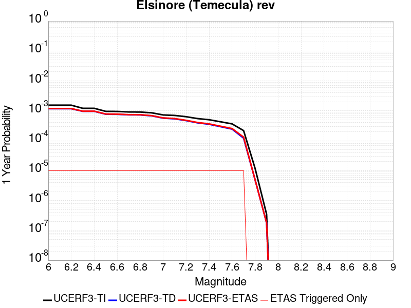 |  |

| Magnitude | 1 wk TI Prob | 1 wk TD Prob | 1 wk ETAS Prob | 1 wk ETAS/TD Gain | 1 wk ETAS Triggered Only | 1 mo TI Prob | 1 mo TD Prob | 1 mo ETAS Prob | 1 mo ETAS/TD Gain | 1 mo ETAS Triggered Only | 1 yr TI Prob | 1 yr TD Prob | 1 yr ETAS Prob | 1 yr ETAS/TD Gain | 1 yr ETAS Triggered Only | 10 yr TI Prob | 10 yr TD Prob | 10 yr ETAS Prob | 10 yr ETAS/TD Gain | 10 yr ETAS Triggered Only |
|-----|-----|-----|-----|-----|-----|-----|-----|-----|-----|-----|-----|-----|-----|-----|-----|-----|-----|-----|-----|-----|
| 6.0 | 2.9514995E-5 | 2.251887E-5 | 3.2518645E-5 | 1.444062 | 1.0E-5 | 1.264867E-4 | 9.6505995E-5 | 1.0650503E-4 | 1.1036105 | 1.0E-5 | 0.0015388876 | 0.0011743492 | 0.0011843374 | 1.0085053 | 1.0E-5 | 0.015282745 | 0.011688135 | 0.011707901 | 1.0016911 | 2.0E-5 |
| 6.1 | 2.9514995E-5 | 2.251887E-5 | 3.2518645E-5 | 1.444062 | 1.0E-5 | 1.264867E-4 | 9.6505995E-5 | 1.0650503E-4 | 1.1036105 | 1.0E-5 | 0.0015388876 | 0.0011743492 | 0.0011843374 | 1.0085053 | 1.0E-5 | 0.015282745 | 0.011688135 | 0.011707901 | 1.0016911 | 2.0E-5 |
| 6.2 | 2.9514995E-5 | 2.251887E-5 | 3.2518645E-5 | 1.444062 | 1.0E-5 | 1.264867E-4 | 9.6505995E-5 | 1.0650503E-4 | 1.1036105 | 1.0E-5 | 0.0015388876 | 0.0011743492 | 0.0011843374 | 1.0085053 | 1.0E-5 | 0.015282745 | 0.011688135 | 0.011707901 | 1.0016911 | 2.0E-5 |
| 6.3 | 2.3223649E-5 | 1.840822E-5 | 2.8408034E-5 | 1.5432256 | 1.0E-5 | 9.952613E-5 | 7.889008E-5 | 8.888929E-5 | 1.1267487 | 1.0E-5 | 0.001211057 | 9.600807E-4 | 9.700711E-4 | 1.0104058 | 1.0E-5 | 0.012044783 | 0.009551284 | 0.009571092 | 1.002074 | 2.0E-5 |
| 6.4 | 2.3223649E-5 | 1.840822E-5 | 2.8408034E-5 | 1.5432256 | 1.0E-5 | 9.952613E-5 | 7.889008E-5 | 8.888929E-5 | 1.1267487 | 1.0E-5 | 0.001211057 | 9.600807E-4 | 9.700711E-4 | 1.0104058 | 1.0E-5 | 0.012044783 | 0.009551284 | 0.009571092 | 1.002074 | 2.0E-5 |
| 6.5 | 1.8338875E-5 | 1.4750074E-5 | 2.4749927E-5 | 1.6779526 | 1.0E-5 | 7.8592806E-5 | 6.321312E-5 | 7.321249E-5 | 1.158185 | 1.0E-5 | 9.5644733E-4 | 7.6935673E-4 | 7.7934907E-4 | 1.0129879 | 1.0E-5 | 0.009523412 | 0.0076699676 | 0.007689814 | 1.0025876 | 2.0E-5 |
| 6.6 | 1.8223333E-5 | 1.461263E-5 | 2.4612484E-5 | 1.6843295 | 1.0E-5 | 7.809766E-5 | 6.26241E-5 | 7.262348E-5 | 1.159673 | 1.0E-5 | 9.504242E-4 | 7.621905E-4 | 7.721829E-4 | 1.01311 | 1.0E-5 | 0.009463696 | 0.007598796 | 0.00760872 | 1.001306 | 1.0E-5 |
| 6.7 | 1.7512752E-5 | 1.4026963E-5 | 2.4026822E-5 | 1.7129027 | 1.0E-5 | 7.505249E-5 | 6.0114216E-5 | 7.0113616E-5 | 1.16634 | 1.0E-5 | 9.13381E-4 | 7.316534E-4 | 7.416461E-4 | 1.0136577 | 1.0E-5 | 0.00909636 | 0.0072983317 | 0.0073082587 | 1.0013602 | 1.0E-5 |
| 6.8 | 1.7417142E-5 | 1.395093E-5 | 2.395079E-5 | 1.716788 | 1.0E-5 | 7.4642754E-5 | 5.978838E-5 | 6.9787784E-5 | 1.1672466 | 1.0E-5 | 9.083966E-4 | 7.27689E-4 | 7.376817E-4 | 1.0137321 | 1.0E-5 | 0.009046922 | 0.007259359 | 0.0072692866 | 1.0013676 | 1.0E-5 |
| 6.9 | 1.6402591E-5 | 1.29883665E-5 | 2.2988237E-5 | 1.7699097 | 1.0E-5 | 7.0294926E-5 | 5.5663284E-5 | 6.566273E-5 | 1.1796416 | 1.0E-5 | 8.5550465E-4 | 6.774974E-4 | 6.874907E-4 | 1.0147502 | 1.0E-5 | 0.008522186 | 0.0067598647 | 0.006769797 | 1.0014694 | 1.0E-5 |
| 7.0 | 1.3912486E-5 | 1.0878067E-5 | 2.0877958E-5 | 1.919271 | 1.0E-5 | 5.9623577E-5 | 4.661947E-5 | 5.6619003E-5 | 1.2144927 | 1.0E-5 | 7.2567526E-4 | 5.674469E-4 | 5.774413E-4 | 1.0176128 | 1.0E-5 | 0.0072331014 | 0.0056635314 | 0.005673475 | 1.0017557 | 1.0E-5 |
| 7.1 | 1.3405147E-5 | 1.0327192E-5 | 2.0327088E-5 | 1.9683074 | 1.0E-5 | 5.7449364E-5 | 4.4258657E-5 | 5.4258217E-5 | 1.2259345 | 1.0E-5 | 6.9922156E-4 | 5.3871854E-4 | 5.4871314E-4 | 1.0185525 | 1.0E-5 | 0.0069702556 | 0.005377366 | 0.0053873123 | 1.0018497 | 1.0E-5 |
| 7.2 | 1.21402E-5 | 8.996479E-6 | 1.8996388E-5 | 2.111536 | 1.0E-5 | 5.202839E-5 | 3.8555776E-5 | 4.855539E-5 | 1.2593545 | 1.0E-5 | 6.332616E-4 | 4.6931725E-4 | 4.7931256E-4 | 1.0212976 | 1.0E-5 | 0.0063146 | 0.0046847262 | 0.0046946793 | 1.0021245 | 1.0E-5 |
| 7.3 | 1.05047775E-5 | 7.571515E-6 | 1.757144E-5 | 2.3207295 | 1.0E-5 | 4.5019697E-5 | 3.2448956E-5 | 4.244863E-5 | 1.3081663 | 1.0E-5 | 5.4797693E-4 | 3.9499588E-4 | 4.0499194E-4 | 1.0253067 | 1.0E-5 | 0.005466277 | 0.003943348 | 0.0039533083 | 1.0025259 | 1.0E-5 |
| 7.4 | 9.624483E-6 | 6.786621E-6 | 1.6786553E-5 | 2.4734774 | 1.0E-5 | 4.124713E-5 | 2.90852E-5 | 3.908491E-5 | 1.3438075 | 1.0E-5 | 5.0206814E-4 | 3.5405616E-4 | 3.6405263E-4 | 1.0282341 | 1.0E-5 | 0.005009353 | 0.0035350726 | 0.0035450372 | 1.0028188 | 1.0E-5 |
| 7.5 | 8.215151E-6 | 5.6353133E-6 | 1.5635256E-5 | 2.7745142 | 1.0E-5 | 3.5207315E-5 | 2.4151126E-5 | 3.4150886E-5 | 1.4140494 | 1.0E-5 | 4.2856473E-4 | 2.9400157E-4 | 3.0399862E-4 | 1.0340034 | 1.0E-5 | 0.004277392 | 0.002936254 | 0.0029462245 | 1.0033957 | 1.0E-5 |
| 7.6 | 6.975058E-6 | 4.675836E-6 | 1.4675789E-5 | 3.138645 | 1.0E-5 | 2.9892764E-5 | 2.003915E-5 | 3.003895E-5 | 1.4990132 | 1.0E-5 | 3.6388362E-4 | 2.439505E-4 | 2.5394806E-4 | 1.0409819 | 1.0E-5 | 0.0036328835 | 0.0024369434 | 0.002446919 | 1.0040935 | 1.0E-5 |
| 7.7 | 4.159604E-6 | 2.326789E-6 | 1.23267655E-5 | 5.2977586 | 1.0E-5 | 1.7826753E-5 | 9.971919E-6 | 1.997182E-5 | 2.002806 | 1.0E-5 | 2.1701909E-4 | 1.2140209E-4 | 1.3140087E-4 | 1.0823609 | 1.0E-5 | 0.0021680726 | 0.0012134308 | 0.0012234186 | 1.008231 | 1.0E-5 |
| 7.8 | 2.2692414E-7 | 9.384417E-8 | 9.384417E-8 | 1.0 | 0.0 | 9.725317E-7 | 4.0218927E-7 | 4.0218927E-7 | 1.0 | 0.0 | 1.1840509E-5 | 4.8966467E-6 | 4.8966467E-6 | 1.0 | 0.0 | 1.1839878E-4 | 4.8965718E-5 | 4.8965718E-5 | 1.0 | 0.0 |
| 7.9 | 6.676829E-9 | 3.4397174E-9 | 3.4397174E-9 | 1.0 | 0.0 | 2.861498E-8 | 1.4741646E-8 | 1.4741646E-8 | 1.0 | 0.0 | 3.4838732E-7 | 1.7947953E-7 | 1.7947953E-7 | 1.0 | 0.0 | 3.4838679E-6 | 1.794794E-6 | 1.794794E-6 | 1.0 | 0.0 |

## Morales (West)
*[(top)](#table-of-contents)*

| 1 Week | 1 Month | 1 Year | 10 Year |
|-----|-----|-----|-----|
|  |  |  |  |

| Magnitude | 1 wk TI Prob | 1 wk TD Prob | 1 wk ETAS Prob | 1 wk ETAS/TD Gain | 1 wk ETAS Triggered Only | 1 mo TI Prob | 1 mo TD Prob | 1 mo ETAS Prob | 1 mo ETAS/TD Gain | 1 mo ETAS Triggered Only | 1 yr TI Prob | 1 yr TD Prob | 1 yr ETAS Prob | 1 yr ETAS/TD Gain | 1 yr ETAS Triggered Only | 10 yr TI Prob | 10 yr TD Prob | 10 yr ETAS Prob | 10 yr ETAS/TD Gain | 10 yr ETAS Triggered Only |
|-----|-----|-----|-----|-----|-----|-----|-----|-----|-----|-----|-----|-----|-----|-----|-----|-----|-----|-----|-----|-----|
| 6.0 | 1.4027072E-6 | 1.4791653E-6 | 1.4791653E-6 | 1.0 | 0.0 | 6.0115885E-6 | 6.3392686E-6 | 6.3392686E-6 | 1.0 | 0.0 | 7.318863E-5 | 7.7178556E-5 | 8.717779E-5 | 1.1295596 | 1.0E-5 | 7.316453E-4 | 7.715861E-4 | 7.9157064E-4 | 1.0259006 | 2.0E-5 |
| 6.1 | 1.4027072E-6 | 1.4791653E-6 | 1.4791653E-6 | 1.0 | 0.0 | 6.0115885E-6 | 6.3392686E-6 | 6.3392686E-6 | 1.0 | 0.0 | 7.318863E-5 | 7.7178556E-5 | 8.717779E-5 | 1.1295596 | 1.0E-5 | 7.316453E-4 | 7.715861E-4 | 7.9157064E-4 | 1.0259006 | 2.0E-5 |
| 6.2 | 1.4027072E-6 | 1.4791653E-6 | 1.4791653E-6 | 1.0 | 0.0 | 6.0115885E-6 | 6.3392686E-6 | 6.3392686E-6 | 1.0 | 0.0 | 7.318863E-5 | 7.7178556E-5 | 8.717779E-5 | 1.1295596 | 1.0E-5 | 7.316453E-4 | 7.715861E-4 | 7.9157064E-4 | 1.0259006 | 2.0E-5 |
| 6.3 | 1.4027072E-6 | 1.4791653E-6 | 1.4791653E-6 | 1.0 | 0.0 | 6.0115885E-6 | 6.3392686E-6 | 6.3392686E-6 | 1.0 | 0.0 | 7.318863E-5 | 7.7178556E-5 | 8.717779E-5 | 1.1295596 | 1.0E-5 | 7.316453E-4 | 7.715861E-4 | 7.9157064E-4 | 1.0259006 | 2.0E-5 |
| 6.4 | 6.504502E-7 | 7.2039586E-7 | 7.2039586E-7 | 1.0 | 0.0 | 2.7876408E-6 | 3.0874073E-6 | 3.0874073E-6 | 1.0 | 0.0 | 3.3939E-5 | 3.7588547E-5 | 3.7588547E-5 | 1.0 | 0.0 | 3.3933815E-4 | 3.758231E-4 | 3.758231E-4 | 1.0 | 0.0 |
| 6.5 | 6.504502E-7 | 7.2039586E-7 | 7.2039586E-7 | 1.0 | 0.0 | 2.7876408E-6 | 3.0874073E-6 | 3.0874073E-6 | 1.0 | 0.0 | 3.3939E-5 | 3.7588547E-5 | 3.7588547E-5 | 1.0 | 0.0 | 3.3933815E-4 | 3.758231E-4 | 3.758231E-4 | 1.0 | 0.0 |
| 6.6 | 5.8056526E-7 | 6.500219E-7 | 6.500219E-7 | 1.0 | 0.0 | 2.4881344E-6 | 2.7858052E-6 | 2.7858052E-6 | 1.0 | 0.0 | 3.0292615E-5 | 3.3916655E-5 | 3.3916655E-5 | 1.0 | 0.0 | 3.0288487E-4 | 3.3911542E-4 | 3.3911542E-4 | 1.0 | 0.0 |
| 6.7 | 5.741448E-7 | 6.43553E-7 | 6.43553E-7 | 1.0 | 0.0 | 2.4606184E-6 | 2.7580813E-6 | 2.7580813E-6 | 1.0 | 0.0 | 2.9957617E-5 | 3.357913E-5 | 3.357913E-5 | 1.0 | 0.0 | 2.9953578E-4 | 3.3574118E-4 | 3.3574118E-4 | 1.0 | 0.0 |
| 6.8 | 5.299428E-7 | 5.890972E-7 | 5.890972E-7 | 1.0 | 0.0 | 2.2711813E-6 | 2.5246998E-6 | 2.5246998E-6 | 1.0 | 0.0 | 2.7651282E-5 | 3.0737792E-5 | 3.0737792E-5 | 1.0 | 0.0 | 2.7647841E-4 | 3.073359E-4 | 3.073359E-4 | 1.0 | 0.0 |
| 6.9 | 4.82394E-7 | 5.341744E-7 | 5.341744E-7 | 1.0 | 0.0 | 2.0674013E-6 | 2.2893166E-6 | 2.2893166E-6 | 1.0 | 0.0 | 2.517032E-5 | 2.7872078E-5 | 2.7872078E-5 | 1.0 | 0.0 | 2.516747E-4 | 2.7868623E-4 | 2.7868623E-4 | 1.0 | 0.0 |
| 7.0 | 4.3264512E-7 | 4.759919E-7 | 4.759919E-7 | 1.0 | 0.0 | 1.8541921E-6 | 2.0399636E-6 | 2.0399636E-6 | 1.0 | 0.0 | 2.2574555E-5 | 2.4836278E-5 | 2.4836278E-5 | 1.0 | 0.0 | 2.2572262E-4 | 2.4833536E-4 | 2.4833536E-4 | 1.0 | 0.0 |
| 7.1 | 3.7388565E-7 | 4.0004235E-7 | 4.0004235E-7 | 1.0 | 0.0 | 1.6023661E-6 | 1.7144661E-6 | 1.7144661E-6 | 1.0 | 0.0 | 1.9508632E-5 | 2.0873427E-5 | 2.0873427E-5 | 1.0 | 0.0 | 1.950692E-4 | 2.087149E-4 | 2.087149E-4 | 1.0 | 0.0 |
| 7.2 | 3.1592543E-7 | 3.3199368E-7 | 3.3199368E-7 | 1.0 | 0.0 | 1.3539654E-6 | 1.4228293E-6 | 1.4228293E-6 | 1.0 | 0.0 | 1.6484404E-5 | 1.732281E-5 | 1.732281E-5 | 1.0 | 0.0 | 1.6483181E-4 | 1.7321478E-4 | 1.7321478E-4 | 1.0 | 0.0 |
| 7.3 | 2.2677783E-7 | 2.1794003E-7 | 2.1794003E-7 | 1.0 | 0.0 | 9.719047E-7 | 9.340283E-7 | 9.340283E-7 | 1.0 | 0.0 | 1.1832874E-5 | 1.1371736E-5 | 1.1371736E-5 | 1.0 | 0.0 | 1.18322445E-4 | 1.1371159E-4 | 1.1371159E-4 | 1.0 | 0.0 |
| 7.4 | 1.2295531E-7 | 8.350615E-8 | 8.350615E-8 | 1.0 | 0.0 | 5.269512E-7 | 3.5788344E-7 | 3.5788344E-7 | 1.0 | 0.0 | 6.4156125E-6 | 4.357222E-6 | 4.357222E-6 | 1.0 | 0.0 | 6.415427E-5 | 4.3571377E-5 | 4.3571377E-5 | 1.0 | 0.0 |
| 7.5 | 9.9632544E-8 | 5.4428718E-8 | 5.4428718E-8 | 1.0 | 0.0 | 4.2699656E-7 | 2.3326591E-7 | 2.3326591E-7 | 1.0 | 0.0 | 5.198671E-6 | 2.8400086E-6 | 2.8400086E-6 | 1.0 | 0.0 | 5.198549E-5 | 2.839973E-5 | 2.839973E-5 | 1.0 | 0.0 |
| 7.6 | 8.125894E-8 | 3.594723E-8 | 3.594723E-8 | 1.0 | 0.0 | 3.4825257E-7 | 1.5405955E-7 | 1.5405955E-7 | 1.0 | 0.0 | 4.2399665E-6 | 1.8756734E-6 | 1.8756734E-6 | 1.0 | 0.0 | 4.2398857E-5 | 1.8756582E-5 | 1.8756582E-5 | 1.0 | 0.0 |
| 7.7 | 5.1810765E-8 | 1.164019E-8 | 1.164019E-8 | 1.0 | 0.0 | 2.2204613E-7 | 4.9886527E-8 | 4.9886527E-8 | 1.0 | 0.0 | 2.7034082E-6 | 6.073683E-7 | 6.073683E-7 | 1.0 | 0.0 | 2.7033753E-5 | 6.0736706E-6 | 6.0736706E-6 | 1.0 | 0.0 |
| 7.8 | 2.6315043E-8 | 2.3369484E-9 | 2.3369484E-9 | 1.0 | 0.0 | 1.1277875E-7 | 1.0015491E-8 | 1.0015491E-8 | 1.0 | 0.0 | 1.3730804E-6 | 1.2193858E-7 | 1.2193858E-7 | 1.0 | 0.0 | 1.3730719E-5 | 1.2193896E-6 | 1.2193896E-6 | 1.0 | 0.0 |
| 7.9 | 1.24281545E-8 | 4.201718E-10 | 4.201718E-10 | 1.0 | 0.0 | 5.3263516E-8 | 1.8007349E-9 | 1.8007349E-9 | 1.0 | 0.0 | 6.4848314E-7 | 2.1923938E-8 | 2.1923938E-8 | 1.0 | 0.0 | 6.4848123E-6 | 2.1924373E-7 | 2.1924373E-7 | 1.0 | 0.0 |
| 8.0 | 5.954214E-9 | 1.8482171E-10 | 1.8482171E-10 | 1.0 | 0.0 | 2.551806E-8 | 7.9209383E-10 | 7.9209383E-10 | 1.0 | 0.0 | 3.1068234E-7 | 9.643733E-9 | 9.643733E-9 | 1.0 | 0.0 | 3.1068191E-6 | 9.644168E-8 | 9.644168E-8 | 1.0 | 0.0 |
| 8.1 | 1.2586262E-9 | 8.337564E-11 | 8.337564E-11 | 1.0 | 0.0 | 5.3941123E-9 | 3.5732306E-10 | 3.5732306E-10 | 1.0 | 0.0 | 6.567332E-8 | 4.350408E-9 | 4.350408E-9 | 1.0 | 0.0 | 6.56733E-7 | 4.3508436E-8 | 4.3508436E-8 | 1.0 | 0.0 |

## Rinconada 2011 CFM
*[(top)](#table-of-contents)*

| 1 Week | 1 Month | 1 Year | 10 Year |
|-----|-----|-----|-----|
|  |  | 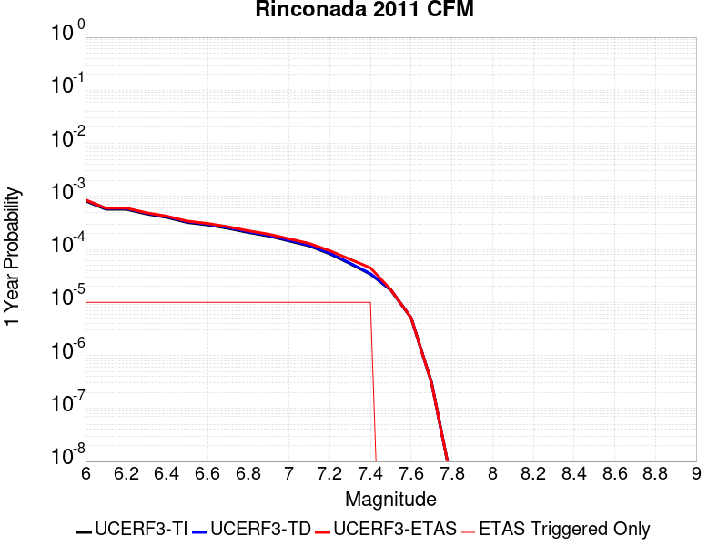 |  |

| Magnitude | 1 wk TI Prob | 1 wk TD Prob | 1 wk ETAS Prob | 1 wk ETAS/TD Gain | 1 wk ETAS Triggered Only | 1 mo TI Prob | 1 mo TD Prob | 1 mo ETAS Prob | 1 mo ETAS/TD Gain | 1 mo ETAS Triggered Only | 1 yr TI Prob | 1 yr TD Prob | 1 yr ETAS Prob | 1 yr ETAS/TD Gain | 1 yr ETAS Triggered Only | 10 yr TI Prob | 10 yr TD Prob | 10 yr ETAS Prob | 10 yr ETAS/TD Gain | 10 yr ETAS Triggered Only |
|-----|-----|-----|-----|-----|-----|-----|-----|-----|-----|-----|-----|-----|-----|-----|-----|-----|-----|-----|-----|-----|
| 6.0 | 1.5752368E-5 | 1.6274716E-5 | 2.6274553E-5 | 1.6144401 | 1.0E-5 | 6.75084E-5 | 6.974694E-5 | 7.9746234E-5 | 1.1433655 | 1.0E-5 | 8.2160486E-4 | 8.488413E-4 | 8.5883273E-4 | 1.0117707 | 1.0E-5 | 0.008185739 | 0.00845637 | 0.0084762005 | 1.0023451 | 2.0E-5 |
| 6.1 | 1.0966133E-5 | 1.1323029E-5 | 2.1322916E-5 | 1.8831459 | 1.0E-5 | 4.6996865E-5 | 4.852637E-5 | 5.8525886E-5 | 1.2060635 | 1.0E-5 | 5.720366E-4 | 5.9064914E-4 | 6.006432E-4 | 1.0169206 | 1.0E-5 | 0.0057056635 | 0.005890889 | 0.00590083 | 1.0016875 | 1.0E-5 |
| 6.2 | 1.0966133E-5 | 1.1323029E-5 | 2.1322916E-5 | 1.8831459 | 1.0E-5 | 4.6996865E-5 | 4.852637E-5 | 5.8525886E-5 | 1.2060635 | 1.0E-5 | 5.720366E-4 | 5.9064914E-4 | 6.006432E-4 | 1.0169206 | 1.0E-5 | 0.0057056635 | 0.005890889 | 0.00590083 | 1.0016875 | 1.0E-5 |
| 6.3 | 8.926149E-6 | 9.212772E-6 | 1.9212679E-5 | 2.0854397 | 1.0E-5 | 3.8254362E-5 | 3.948271E-5 | 4.9482318E-5 | 1.2532654 | 1.0E-5 | 4.6564735E-4 | 4.8059633E-4 | 4.905915E-4 | 1.0207975 | 1.0E-5 | 0.0046467283 | 0.0047956146 | 0.0048055667 | 1.0020752 | 1.0E-5 |
| 6.4 | 7.676955E-6 | 7.920191E-6 | 1.7920112E-5 | 2.2625859 | 1.0E-5 | 3.290082E-5 | 3.3943234E-5 | 4.3942895E-5 | 1.2945995 | 1.0E-5 | 4.0049385E-4 | 4.131807E-4 | 4.2317656E-4 | 1.0241925 | 1.0E-5 | 0.0039977287 | 0.004124151 | 0.00413411 | 1.0024147 | 1.0E-5 |
| 6.5 | 6.1671026E-6 | 6.358955E-6 | 1.6358892E-5 | 2.5725753 | 1.0E-5 | 2.6430173E-5 | 2.725238E-5 | 3.7252106E-5 | 1.3669305 | 1.0E-5 | 3.2173982E-4 | 3.317473E-4 | 3.4174396E-4 | 1.0301335 | 1.0E-5 | 0.003212744 | 0.0033125326 | 0.0033224996 | 1.0030088 | 1.0E-5 |
| 6.6 | 5.553456E-6 | 5.7248126E-6 | 1.5724756E-5 | 2.746772 | 1.0E-5 | 2.3800309E-5 | 2.4534682E-5 | 3.4534438E-5 | 1.4075763 | 1.0E-5 | 2.897302E-4 | 2.9866886E-4 | 3.0866588E-4 | 1.033472 | 1.0E-5 | 0.0028935277 | 0.0029826832 | 0.0029926535 | 1.0033426 | 1.0E-5 |
| 6.7 | 4.787857E-6 | 4.93331E-6 | 1.493326E-5 | 3.0270267 | 1.0E-5 | 2.0519226E-5 | 2.1142585E-5 | 3.1142372E-5 | 1.472969 | 1.0E-5 | 2.4979294E-4 | 2.573806E-4 | 2.6737803E-4 | 1.0388429 | 1.0E-5 | 0.0024951235 | 0.002570831 | 0.0025808052 | 1.0038798 | 1.0E-5 |
| 6.8 | 3.9955166E-6 | 4.1134763E-6 | 1.4113435E-5 | 3.4310238 | 1.0E-5 | 1.7123532E-5 | 1.7629065E-5 | 2.7628888E-5 | 1.567235 | 1.0E-5 | 2.0845905E-4 | 2.1461275E-4 | 2.2461062E-4 | 1.0465856 | 1.0E-5 | 0.002082636 | 0.0021440587 | 0.0021540371 | 1.004654 | 1.0E-5 |
| 6.9 | 3.4250072E-6 | 3.5224466E-6 | 1.3522412E-5 | 3.8389258 | 1.0E-5 | 1.46785205E-5 | 1.5096112E-5 | 2.5095962E-5 | 1.6624122 | 1.0E-5 | 1.7869633E-4 | 1.8377969E-4 | 1.9377784E-4 | 1.054403 | 1.0E-5 | 0.001785527 | 0.0018362795 | 0.0018462611 | 1.0054358 | 1.0E-5 |
| 7.0 | 2.7712713E-6 | 2.8467002E-6 | 1.2846672E-5 | 4.5128293 | 1.0E-5 | 1.1876823E-5 | 1.22000865E-5 | 2.2199965E-5 | 1.8196563 | 1.0E-5 | 1.4459073E-4 | 1.4852594E-4 | 1.5852446E-4 | 1.0673183 | 1.0E-5 | 0.0014449668 | 0.0014842683 | 0.0014942535 | 1.0067273 | 1.0E-5 |
| 7.1 | 2.227358E-6 | 2.2856987E-6 | 1.2285675E-5 | 5.37502 | 1.0E-5 | 9.545785E-6 | 9.795815E-6 | 1.9795716E-5 | 2.0208342 | 1.0E-5 | 1.16213734E-4 | 1.1925753E-4 | 1.2925634E-4 | 1.0838422 | 1.0E-5 | 0.0011615298 | 0.0011919363 | 0.0012019244 | 1.0083797 | 1.0E-5 |
| 7.2 | 1.581796E-6 | 1.6209015E-6 | 1.1620885E-5 | 7.169397 | 1.0E-5 | 6.779108E-6 | 6.946702E-6 | 1.6946633E-5 | 2.439522 | 1.0E-5 | 8.253252E-5 | 8.4572814E-5 | 9.457197E-5 | 1.1182313 | 1.0E-5 | 8.250187E-4 | 8.4540684E-4 | 8.553984E-4 | 1.0118186 | 1.0E-5 |
| 7.3 | 1.0306567E-6 | 1.054648E-6 | 1.1054637E-5 | 10.481827 | 1.0E-5 | 4.4170924E-6 | 4.519912E-6 | 1.4519866E-5 | 3.2124224 | 1.0E-5 | 5.3776774E-5 | 5.502854E-5 | 6.502799E-5 | 1.1817139 | 1.0E-5 | 5.376376E-4 | 5.501494E-4 | 5.601439E-4 | 1.0181669 | 1.0E-5 |
| 7.4 | 6.535541E-7 | 6.682744E-7 | 1.0668267E-5 | 15.9639015 | 1.0E-5 | 2.800943E-6 | 2.8640302E-6 | 1.2864001E-5 | 4.4915733 | 1.0E-5 | 3.4100947E-5 | 3.4869012E-5 | 4.4868662E-5 | 1.2867776 | 1.0E-5 | 3.4095717E-4 | 3.486355E-4 | 3.5863204E-4 | 1.0286733 | 1.0E-5 |
| 7.5 | 3.2656962E-7 | 3.3316712E-7 | 3.3316712E-7 | 1.0 | 0.0 | 1.3995833E-6 | 1.4278584E-6 | 1.4278584E-6 | 1.0 | 0.0 | 1.7039794E-5 | 1.7384036E-5 | 1.7384036E-5 | 1.0 | 0.0 | 1.7038487E-4 | 1.738268E-4 | 1.738268E-4 | 1.0 | 0.0 |
| 7.6 | 9.754343E-8 | 9.821017E-8 | 9.821017E-8 | 1.0 | 0.0 | 4.180432E-7 | 4.2090065E-7 | 4.2090065E-7 | 1.0 | 0.0 | 5.089664E-6 | 5.1244533E-6 | 5.1244533E-6 | 1.0 | 0.0 | 5.0895473E-5 | 5.124336E-5 | 5.124336E-5 | 1.0 | 0.0 |
| 7.7 | 6.0001453E-9 | 5.8491207E-9 | 5.8491207E-9 | 1.0 | 0.0 | 2.5714908E-8 | 2.506766E-8 | 2.506766E-8 | 1.0 | 0.0 | 3.1307894E-7 | 3.051987E-7 | 3.051987E-7 | 1.0 | 0.0 | 3.1307852E-6 | 3.0519832E-6 | 3.0519832E-6 | 1.0 | 0.0 |
| 7.8 | 7.400003E-11 | 7.4654505E-11 | 7.4654505E-11 | 1.0 | 0.0 | 3.171432E-10 | 3.1994773E-10 | 3.1994773E-10 | 1.0 | 0.0 | 3.861218E-9 | 3.895363E-9 | 3.895363E-9 | 1.0 | 0.0 | 3.861218E-8 | 3.895363E-8 | 3.895363E-8 | 1.0 | 0.0 |

## Bartlett Springs 2011 CFM
*[(top)](#table-of-contents)*

| 1 Week | 1 Month | 1 Year | 10 Year |
|-----|-----|-----|-----|
|  |  |  |  |

| Magnitude | 1 wk TI Prob | 1 wk TD Prob | 1 wk ETAS Prob | 1 wk ETAS/TD Gain | 1 wk ETAS Triggered Only | 1 mo TI Prob | 1 mo TD Prob | 1 mo ETAS Prob | 1 mo ETAS/TD Gain | 1 mo ETAS Triggered Only | 1 yr TI Prob | 1 yr TD Prob | 1 yr ETAS Prob | 1 yr ETAS/TD Gain | 1 yr ETAS Triggered Only | 10 yr TI Prob | 10 yr TD Prob | 10 yr ETAS Prob | 10 yr ETAS/TD Gain | 10 yr ETAS Triggered Only |
|-----|-----|-----|-----|-----|-----|-----|-----|-----|-----|-----|-----|-----|-----|-----|-----|-----|-----|-----|-----|-----|
| 6.0 | 6.2326144E-5 | 8.060668E-5 | 8.060668E-5 | 1.0 | 0.0 | 2.6708472E-4 | 3.4541206E-4 | 3.4541206E-4 | 1.0 | 0.0 | 0.003246908 | 0.0041973754 | 0.0041973754 | 1.0 | 0.0 | 0.031998757 | 0.041198105 | 0.041217282 | 1.0004655 | 2.0E-5 |
| 6.1 | 6.227657E-5 | 8.054418E-5 | 8.054418E-5 | 1.0 | 0.0 | 2.668723E-4 | 3.4514428E-4 | 3.4514428E-4 | 1.0 | 0.0 | 0.0032443295 | 0.004194128 | 0.004194128 | 1.0 | 0.0 | 0.031973712 | 0.041166842 | 0.041186016 | 1.0004659 | 2.0E-5 |
| 6.2 | 6.22452E-5 | 8.050479E-5 | 8.050479E-5 | 1.0 | 0.0 | 2.6673786E-4 | 3.449755E-4 | 3.449755E-4 | 1.0 | 0.0 | 0.0032426978 | 0.004192081 | 0.004192081 | 1.0 | 0.0 | 0.03195787 | 0.04114713 | 0.04116631 | 1.0004661 | 2.0E-5 |
| 6.3 | 6.219006E-5 | 8.043463E-5 | 8.043463E-5 | 1.0 | 0.0 | 2.6650162E-4 | 3.4467486E-4 | 3.4467486E-4 | 1.0 | 0.0 | 0.00323983 | 0.0041884347 | 0.0041884347 | 1.0 | 0.0 | 0.031930014 | 0.04111203 | 0.04113121 | 1.0004665 | 2.0E-5 |
| 6.4 | 5.2175856E-5 | 6.7254E-5 | 6.7254E-5 | 1.0 | 0.0 | 2.2359163E-4 | 2.8819984E-4 | 2.8819984E-4 | 1.0 | 0.0 | 0.0027188298 | 0.0035032362 | 0.0035032362 | 1.0 | 0.0 | 0.026858058 | 0.03448956 | 0.034508873 | 1.0005599 | 2.0E-5 |
| 6.5 | 5.205166E-5 | 6.709666E-5 | 6.709666E-5 | 1.0 | 0.0 | 2.2305945E-4 | 2.875257E-4 | 2.875257E-4 | 1.0 | 0.0 | 0.0027123666 | 0.0034950553 | 0.0034950553 | 1.0 | 0.0 | 0.026794989 | 0.034410305 | 0.034429617 | 1.0005612 | 2.0E-5 |
| 6.6 | 5.0085426E-5 | 6.449303E-5 | 6.449303E-5 | 1.0 | 0.0 | 2.1463417E-4 | 2.7636968E-4 | 2.7636968E-4 | 1.0 | 0.0 | 0.0026100394 | 0.0033596596 | 0.0033596596 | 1.0 | 0.0 | 0.025795965 | 0.03309789 | 0.033117227 | 1.0005842 | 2.0E-5 |
| 6.7 | 4.8930866E-5 | 6.30177E-5 | 6.30177E-5 | 1.0 | 0.0 | 2.0968684E-4 | 2.700482E-4 | 2.700482E-4 | 1.0 | 0.0 | 0.0025499484 | 0.0032829295 | 0.0032829295 | 1.0 | 0.0 | 0.025208864 | 0.032353252 | 0.032372605 | 1.0005982 | 2.0E-5 |
| 6.8 | 4.5679535E-5 | 5.874213E-5 | 5.874213E-5 | 1.0 | 0.0 | 1.9575475E-4 | 2.517279E-4 | 2.517279E-4 | 1.0 | 0.0 | 0.002380709 | 0.0030605178 | 0.0030605178 | 1.0 | 0.0 | 0.023553653 | 0.030190729 | 0.030210124 | 1.0006424 | 2.0E-5 |
| 6.9 | 4.1439176E-5 | 5.3220345E-5 | 5.3220345E-5 | 1.0 | 0.0 | 1.7758438E-4 | 2.2806737E-4 | 2.2806737E-4 | 1.0 | 0.0 | 0.002159946 | 0.00277321 | 0.00277321 | 1.0 | 0.0 | 0.021390721 | 0.02739108 | 0.027410531 | 1.0007101 | 2.0E-5 |
| 7.0 | 3.5920104E-5 | 4.6008958E-5 | 4.6008958E-5 | 1.0 | 0.0 | 1.5393422E-4 | 1.9716643E-4 | 1.9716643E-4 | 1.0 | 0.0 | 0.001872538 | 0.0023978746 | 0.0023978746 | 1.0 | 0.0 | 0.018568378 | 0.023723308 | 0.02373307 | 1.0004115 | 1.0E-5 |
| 7.1 | 3.338812E-5 | 4.2689815E-5 | 4.2689815E-5 | 1.0 | 0.0 | 1.430841E-4 | 1.829436E-4 | 1.829436E-4 | 1.0 | 0.0 | 0.0017406568 | 0.0022250775 | 0.0022250775 | 1.0 | 0.0 | 0.017270854 | 0.02203084 | 0.02204062 | 1.0004439 | 1.0E-5 |
| 7.2 | 2.8619615E-5 | 3.640186E-5 | 3.640186E-5 | 1.0 | 0.0 | 1.2264973E-4 | 1.559987E-4 | 1.559987E-4 | 1.0 | 0.0 | 0.0014922376 | 0.0018976394 | 0.0018976394 | 1.0 | 0.0 | 0.014822568 | 0.018816413 | 0.018816413 | 1.0 | 0.0 |
| 7.3 | 2.6376783E-5 | 3.3422963E-5 | 3.3422963E-5 | 1.0 | 0.0 | 1.13038455E-4 | 1.4323345E-4 | 1.4323345E-4 | 1.0 | 0.0 | 0.0013753743 | 0.0017424817 | 0.0017424817 | 1.0 | 0.0 | 0.01366893 | 0.017289983 | 0.017289983 | 1.0 | 0.0 |
| 7.4 | 2.3738676E-5 | 2.9979174E-5 | 2.9979174E-5 | 1.0 | 0.0 | 1.0173322E-4 | 1.2847589E-4 | 1.2847589E-4 | 1.0 | 0.0 | 0.0012378981 | 0.0015630797 | 0.0015630797 | 1.0 | 0.0 | 0.012310251 | 0.01552236 | 0.01552236 | 1.0 | 0.0 |
| 7.5 | 2.1789481E-5 | 2.7439555E-5 | 2.7439555E-5 | 1.0 | 0.0 | 9.338015E-5 | 1.1759284E-4 | 1.1759284E-4 | 1.0 | 0.0 | 0.0011363103 | 0.0014307604 | 0.0014307604 | 1.0 | 0.0 | 0.011305175 | 0.014216874 | 0.014216874 | 1.0 | 0.0 |
| 7.6 | 1.3895281E-5 | 1.7368566E-5 | 1.7368566E-5 | 1.0 | 0.0 | 5.9549846E-5 | 7.44346E-5 | 7.44346E-5 | 1.0 | 0.0 | 7.2477816E-4 | 9.058674E-4 | 9.058674E-4 | 1.0 | 0.0 | 0.0072241887 | 0.009022309 | 0.009022309 | 1.0 | 0.0 |
| 7.7 | 4.245981E-6 | 5.1625234E-6 | 5.1625234E-6 | 1.0 | 0.0 | 1.8196934E-5 | 2.2124914E-5 | 2.2124914E-5 | 1.0 | 0.0 | 2.2152514E-4 | 2.693377E-4 | 2.693377E-4 | 1.0 | 0.0 | 0.0022130446 | 0.00269016 | 0.00269016 | 1.0 | 0.0 |
| 7.8 | 6.145192E-7 | 7.0470315E-7 | 7.0470315E-7 | 1.0 | 0.0 | 2.633651E-6 | 3.020153E-6 | 3.020153E-6 | 1.0 | 0.0 | 3.206423E-5 | 3.6769754E-5 | 3.6769754E-5 | 1.0 | 0.0 | 3.2059604E-4 | 3.6763048E-4 | 3.6763048E-4 | 1.0 | 0.0 |

## Great Valley 05 Pittsburg - Kirby Hills alt1
*[(top)](#table-of-contents)*

| 1 Week | 1 Month | 1 Year | 10 Year |
|-----|-----|-----|-----|
|  |  |  |  |

| Magnitude | 1 wk TI Prob | 1 wk TD Prob | 1 wk ETAS Prob | 1 wk ETAS/TD Gain | 1 wk ETAS Triggered Only | 1 mo TI Prob | 1 mo TD Prob | 1 mo ETAS Prob | 1 mo ETAS/TD Gain | 1 mo ETAS Triggered Only | 1 yr TI Prob | 1 yr TD Prob | 1 yr ETAS Prob | 1 yr ETAS/TD Gain | 1 yr ETAS Triggered Only | 10 yr TI Prob | 10 yr TD Prob | 10 yr ETAS Prob | 10 yr ETAS/TD Gain | 10 yr ETAS Triggered Only |
|-----|-----|-----|-----|-----|-----|-----|-----|-----|-----|-----|-----|-----|-----|-----|-----|-----|-----|-----|-----|-----|
| 6.0 | 4.187212E-5 | 5.344289E-5 | 6.3442356E-5 | 1.1871057 | 1.0E-5 | 1.794396E-4 | 2.2902661E-4 | 2.3902432E-4 | 1.043653 | 1.0E-5 | 0.002182488 | 0.0027857998 | 0.002805744 | 1.0071592 | 2.0E-5 | 0.021611776 | 0.027603218 | 0.027622666 | 1.0007045 | 2.0E-5 |
| 6.1 | 4.187212E-5 | 5.344289E-5 | 6.3442356E-5 | 1.1871057 | 1.0E-5 | 1.794396E-4 | 2.2902661E-4 | 2.3902432E-4 | 1.043653 | 1.0E-5 | 0.002182488 | 0.0027857998 | 0.002805744 | 1.0071592 | 2.0E-5 | 0.021611776 | 0.027603218 | 0.027622666 | 1.0007045 | 2.0E-5 |
| 6.2 | 1.7353306E-5 | 2.2154672E-5 | 3.215445E-5 | 1.451362 | 1.0E-5 | 7.436919E-5 | 9.4947456E-5 | 1.04946506E-4 | 1.1053114 | 1.0E-5 | 9.050688E-4 | 0.0011557573 | 0.0011657458 | 1.0086423 | 1.0E-5 | 0.009013915 | 0.0115352 | 0.011545085 | 1.0008569 | 1.0E-5 |
| 6.3 | 1.7353306E-5 | 2.2154672E-5 | 3.215445E-5 | 1.451362 | 1.0E-5 | 7.436919E-5 | 9.4947456E-5 | 1.04946506E-4 | 1.1053114 | 1.0E-5 | 9.050688E-4 | 0.0011557573 | 0.0011657458 | 1.0086423 | 1.0E-5 | 0.009013915 | 0.0115352 | 0.011545085 | 1.0008569 | 1.0E-5 |
| 6.4 | 1.4028824E-5 | 1.7901062E-5 | 2.7900882E-5 | 1.558616 | 1.0E-5 | 6.0122147E-5 | 7.671883E-5 | 8.6718064E-5 | 1.130336 | 1.0E-5 | 7.3174125E-4 | 9.340303E-4 | 9.440209E-4 | 1.0106963 | 1.0E-5 | 0.0072933645 | 0.009338211 | 0.009348118 | 1.0010608 | 1.0E-5 |

## Channel Islands Western Deep Ramp
*[(top)](#table-of-contents)*

| 1 Week | 1 Month | 1 Year | 10 Year |
|-----|-----|-----|-----|
|  |  |  |  |

| Magnitude | 1 wk TI Prob | 1 wk TD Prob | 1 wk ETAS Prob | 1 wk ETAS/TD Gain | 1 wk ETAS Triggered Only | 1 mo TI Prob | 1 mo TD Prob | 1 mo ETAS Prob | 1 mo ETAS/TD Gain | 1 mo ETAS Triggered Only | 1 yr TI Prob | 1 yr TD Prob | 1 yr ETAS Prob | 1 yr ETAS/TD Gain | 1 yr ETAS Triggered Only | 10 yr TI Prob | 10 yr TD Prob | 10 yr ETAS Prob | 10 yr ETAS/TD Gain | 10 yr ETAS Triggered Only |
|-----|-----|-----|-----|-----|-----|-----|-----|-----|-----|-----|-----|-----|-----|-----|-----|-----|-----|-----|-----|-----|
| 6.0 | 6.0213506E-6 | 6.2548684E-6 | 1.6254806E-5 | 2.5987446 | 1.0E-5 | 2.5805533E-5 | 2.6806329E-5 | 3.680606E-5 | 1.3730363 | 1.0E-5 | 3.1413708E-4 | 3.2632265E-4 | 3.3631938E-4 | 1.0306345 | 1.0E-5 | 0.0031369338 | 0.0032588763 | 0.003278811 | 1.0061171 | 2.0E-5 |
| 6.1 | 6.0213506E-6 | 6.2548684E-6 | 1.6254806E-5 | 2.5987446 | 1.0E-5 | 2.5805533E-5 | 2.6806329E-5 | 3.680606E-5 | 1.3730363 | 1.0E-5 | 3.1413708E-4 | 3.2632265E-4 | 3.3631938E-4 | 1.0306345 | 1.0E-5 | 0.0031369338 | 0.0032588763 | 0.003278811 | 1.0061171 | 2.0E-5 |
| 6.2 | 6.0213506E-6 | 6.2548684E-6 | 1.6254806E-5 | 2.5987446 | 1.0E-5 | 2.5805533E-5 | 2.6806329E-5 | 3.680606E-5 | 1.3730363 | 1.0E-5 | 3.1413708E-4 | 3.2632265E-4 | 3.3631938E-4 | 1.0306345 | 1.0E-5 | 0.0031369338 | 0.0032588763 | 0.003278811 | 1.0061171 | 2.0E-5 |
| 6.3 | 6.0213506E-6 | 6.2548684E-6 | 1.6254806E-5 | 2.5987446 | 1.0E-5 | 2.5805533E-5 | 2.6806329E-5 | 3.680606E-5 | 1.3730363 | 1.0E-5 | 3.1413708E-4 | 3.2632265E-4 | 3.3631938E-4 | 1.0306345 | 1.0E-5 | 0.0031369338 | 0.0032588763 | 0.003278811 | 1.0061171 | 2.0E-5 |
| 6.4 | 6.0213506E-6 | 6.2548684E-6 | 1.6254806E-5 | 2.5987446 | 1.0E-5 | 2.5805533E-5 | 2.6806329E-5 | 3.680606E-5 | 1.3730363 | 1.0E-5 | 3.1413708E-4 | 3.2632265E-4 | 3.3631938E-4 | 1.0306345 | 1.0E-5 | 0.0031369338 | 0.0032588763 | 0.003278811 | 1.0061171 | 2.0E-5 |
| 6.5 | 6.0213506E-6 | 6.2548684E-6 | 1.6254806E-5 | 2.5987446 | 1.0E-5 | 2.5805533E-5 | 2.6806329E-5 | 3.680606E-5 | 1.3730363 | 1.0E-5 | 3.1413708E-4 | 3.2632265E-4 | 3.3631938E-4 | 1.0306345 | 1.0E-5 | 0.0031369338 | 0.0032588763 | 0.003278811 | 1.0061171 | 2.0E-5 |
| 6.6 | 6.0213506E-6 | 6.2548684E-6 | 1.6254806E-5 | 2.5987446 | 1.0E-5 | 2.5805533E-5 | 2.6806329E-5 | 3.680606E-5 | 1.3730363 | 1.0E-5 | 3.1413708E-4 | 3.2632265E-4 | 3.3631938E-4 | 1.0306345 | 1.0E-5 | 0.0031369338 | 0.0032588763 | 0.003278811 | 1.0061171 | 2.0E-5 |
| 6.7 | 5.313309E-6 | 5.5252403E-6 | 5.5252403E-6 | 1.0 | 0.0 | 2.2771126E-5 | 2.367941E-5 | 2.367941E-5 | 1.0 | 0.0 | 2.772032E-4 | 2.8826276E-4 | 2.8826276E-4 | 1.0 | 0.0 | 0.0027685766 | 0.0028792918 | 0.002889263 | 1.003463 | 1.0E-5 |
| 6.8 | 5.313309E-6 | 5.5252403E-6 | 5.5252403E-6 | 1.0 | 0.0 | 2.2771126E-5 | 2.367941E-5 | 2.367941E-5 | 1.0 | 0.0 | 2.772032E-4 | 2.8826276E-4 | 2.8826276E-4 | 1.0 | 0.0 | 0.0027685766 | 0.0028792918 | 0.002889263 | 1.003463 | 1.0E-5 |
| 6.9 | 4.744377E-6 | 4.9394303E-6 | 4.9394303E-6 | 1.0 | 0.0 | 2.0332885E-5 | 2.1168837E-5 | 2.1168837E-5 | 1.0 | 0.0 | 2.4752476E-4 | 2.5770385E-4 | 2.5770385E-4 | 1.0 | 0.0 | 0.0024724922 | 0.0025744175 | 0.0025843917 | 1.0038744 | 1.0E-5 |
| 7.0 | 4.722209E-6 | 4.9164732E-6 | 4.9164732E-6 | 1.0 | 0.0 | 2.0237881E-5 | 2.107045E-5 | 2.107045E-5 | 1.0 | 0.0 | 2.4636835E-4 | 2.5650626E-4 | 2.5650626E-4 | 1.0 | 0.0 | 0.002460954 | 0.0025624693 | 0.0025724438 | 1.0038925 | 1.0E-5 |
| 7.1 | 4.611174E-6 | 4.801409E-6 | 4.801409E-6 | 1.0 | 0.0 | 1.9762025E-5 | 2.0577325E-5 | 2.0577325E-5 | 1.0 | 0.0 | 2.4057609E-4 | 2.5050386E-4 | 2.5050386E-4 | 1.0 | 0.0 | 0.002403158 | 0.002502582 | 0.002512557 | 1.0039859 | 1.0E-5 |
| 7.2 | 4.043994E-6 | 4.2120264E-6 | 4.2120264E-6 | 1.0 | 0.0 | 1.7331287E-5 | 1.8051438E-5 | 1.8051438E-5 | 1.0 | 0.0 | 2.10988E-4 | 2.1975765E-4 | 2.1975765E-4 | 1.0 | 0.0 | 0.002107878 | 0.0021957543 | 0.0022057323 | 1.0045443 | 1.0E-5 |
| 7.3 | 2.1233036E-6 | 2.2297875E-6 | 2.2297875E-6 | 1.0 | 0.0 | 9.099841E-6 | 9.556197E-6 | 9.556197E-6 | 1.0 | 0.0 | 1.1078493E-4 | 1.1634055E-4 | 1.1634055E-4 | 1.0 | 0.0 | 0.0011072971 | 0.001162802 | 0.001162802 | 1.0 | 0.0 |
| 7.4 | 1.9051884E-6 | 2.0014973E-6 | 2.0014973E-6 | 1.0 | 0.0 | 8.165067E-6 | 8.577817E-6 | 8.577817E-6 | 1.0 | 0.0 | 9.940516E-5 | 1.0442998E-4 | 1.0442998E-4 | 1.0 | 0.0 | 9.93607E-4 | 0.0010438144 | 0.0010438144 | 1.0 | 0.0 |
| 7.5 | 1.2408497E-6 | 1.3038839E-6 | 1.3038839E-6 | 1.0 | 0.0 | 5.317916E-6 | 5.588062E-6 | 5.588062E-6 | 1.0 | 0.0 | 6.4743705E-5 | 6.8032554E-5 | 6.8032554E-5 | 1.0 | 0.0 | 6.4724847E-4 | 6.8011944E-4 | 6.8011944E-4 | 1.0 | 0.0 |
| 7.6 | 6.5440025E-7 | 6.886718E-7 | 6.886718E-7 | 1.0 | 0.0 | 2.8045695E-6 | 2.9514472E-6 | 2.9514472E-6 | 1.0 | 0.0 | 3.4145098E-5 | 3.593329E-5 | 3.593329E-5 | 1.0 | 0.0 | 3.4139853E-4 | 3.5927625E-4 | 3.5927625E-4 | 1.0 | 0.0 |
| 7.7 | 3.985963E-7 | 4.1930787E-7 | 4.1930787E-7 | 1.0 | 0.0 | 1.7082689E-6 | 1.7970326E-6 | 1.7970326E-6 | 1.0 | 0.0 | 2.0797976E-5 | 2.1878664E-5 | 2.1878664E-5 | 1.0 | 0.0 | 2.0796029E-4 | 2.1876628E-4 | 2.1876628E-4 | 1.0 | 0.0 |
| 7.8 | 3.706329E-8 | 3.8591796E-8 | 3.8591796E-8 | 1.0 | 0.0 | 1.5884267E-7 | 1.653934E-7 | 1.653934E-7 | 1.0 | 0.0 | 1.9339077E-6 | 2.0136629E-6 | 2.0136629E-6 | 1.0 | 0.0 | 1.933891E-5 | 2.0136458E-5 | 2.0136458E-5 | 1.0 | 0.0 |

## Verdugo
*[(top)](#table-of-contents)*

| 1 Week | 1 Month | 1 Year | 10 Year |
|-----|-----|-----|-----|
|  |  | 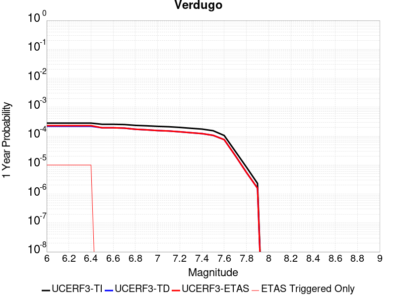 |  |

| Magnitude | 1 wk TI Prob | 1 wk TD Prob | 1 wk ETAS Prob | 1 wk ETAS/TD Gain | 1 wk ETAS Triggered Only | 1 mo TI Prob | 1 mo TD Prob | 1 mo ETAS Prob | 1 mo ETAS/TD Gain | 1 mo ETAS Triggered Only | 1 yr TI Prob | 1 yr TD Prob | 1 yr ETAS Prob | 1 yr ETAS/TD Gain | 1 yr ETAS Triggered Only | 10 yr TI Prob | 10 yr TD Prob | 10 yr ETAS Prob | 10 yr ETAS/TD Gain | 10 yr ETAS Triggered Only |
|-----|-----|-----|-----|-----|-----|-----|-----|-----|-----|-----|-----|-----|-----|-----|-----|-----|-----|-----|-----|-----|
| 6.0 | 5.392987E-6 | 4.2164934E-6 | 4.2164934E-6 | 1.0 | 0.0 | 2.3112598E-5 | 1.8070563E-5 | 1.8070563E-5 | 1.0 | 0.0 | 2.8135953E-4 | 2.1998737E-4 | 2.2998518E-4 | 1.0454471 | 1.0E-5 | 0.0028100356 | 0.0021977439 | 0.0022176998 | 1.0090803 | 2.0E-5 |
| 6.1 | 5.392987E-6 | 4.2164934E-6 | 4.2164934E-6 | 1.0 | 0.0 | 2.3112598E-5 | 1.8070563E-5 | 1.8070563E-5 | 1.0 | 0.0 | 2.8135953E-4 | 2.1998737E-4 | 2.2998518E-4 | 1.0454471 | 1.0E-5 | 0.0028100356 | 0.0021977439 | 0.0022176998 | 1.0090803 | 2.0E-5 |
| 6.2 | 5.392987E-6 | 4.2164934E-6 | 4.2164934E-6 | 1.0 | 0.0 | 2.3112598E-5 | 1.8070563E-5 | 1.8070563E-5 | 1.0 | 0.0 | 2.8135953E-4 | 2.1998737E-4 | 2.2998518E-4 | 1.0454471 | 1.0E-5 | 0.0028100356 | 0.0021977439 | 0.0022176998 | 1.0090803 | 2.0E-5 |
| 6.3 | 5.392987E-6 | 4.2164934E-6 | 4.2164934E-6 | 1.0 | 0.0 | 2.3112598E-5 | 1.8070563E-5 | 1.8070563E-5 | 1.0 | 0.0 | 2.8135953E-4 | 2.1998737E-4 | 2.2998518E-4 | 1.0454471 | 1.0E-5 | 0.0028100356 | 0.0021977439 | 0.0022176998 | 1.0090803 | 2.0E-5 |
| 6.4 | 5.392987E-6 | 4.2164934E-6 | 4.2164934E-6 | 1.0 | 0.0 | 2.3112598E-5 | 1.8070563E-5 | 1.8070563E-5 | 1.0 | 0.0 | 2.8135953E-4 | 2.1998737E-4 | 2.2998518E-4 | 1.0454471 | 1.0E-5 | 0.0028100356 | 0.0021977439 | 0.0022176998 | 1.0090803 | 2.0E-5 |
| 6.5 | 4.9154837E-6 | 3.7224413E-6 | 3.7224413E-6 | 1.0 | 0.0 | 2.1066187E-5 | 1.5953223E-5 | 1.5953223E-5 | 1.0 | 0.0 | 2.5645064E-4 | 1.9421338E-4 | 1.9421338E-4 | 1.0 | 0.0 | 0.002561549 | 0.0019404575 | 0.0019404575 | 1.0 | 0.0 |
| 6.6 | 4.9154837E-6 | 3.7224413E-6 | 3.7224413E-6 | 1.0 | 0.0 | 2.1066187E-5 | 1.5953223E-5 | 1.5953223E-5 | 1.0 | 0.0 | 2.5645064E-4 | 1.9421338E-4 | 1.9421338E-4 | 1.0 | 0.0 | 0.002561549 | 0.0019404575 | 0.0019404575 | 1.0 | 0.0 |
| 6.7 | 4.817006E-6 | 3.620628E-6 | 3.620628E-6 | 1.0 | 0.0 | 2.0644147E-5 | 1.5516885E-5 | 1.5516885E-5 | 1.0 | 0.0 | 2.513135E-4 | 1.889019E-4 | 1.889019E-4 | 1.0 | 0.0 | 0.0025102948 | 0.0018874329 | 0.0018874329 | 1.0 | 0.0 |
| 6.8 | 4.507407E-6 | 3.3070805E-6 | 3.3070805E-6 | 1.0 | 0.0 | 1.9317316E-5 | 1.4173126E-5 | 1.4173126E-5 | 1.0 | 0.0 | 2.3516294E-4 | 1.7254429E-4 | 1.7254429E-4 | 1.0 | 0.0 | 0.0023491425 | 0.0017241176 | 0.0017241176 | 1.0 | 0.0 |
| 6.9 | 4.3573054E-6 | 3.1609877E-6 | 3.1609877E-6 | 1.0 | 0.0 | 1.8674033E-5 | 1.354702E-5 | 1.354702E-5 | 1.0 | 0.0 | 2.2733262E-4 | 1.649226E-4 | 1.649226E-4 | 1.0 | 0.0 | 0.0022710022 | 0.0016480145 | 0.0016480145 | 1.0 | 0.0 |
| 7.0 | 4.171527E-6 | 2.9836467E-6 | 2.9836467E-6 | 1.0 | 0.0 | 1.787785E-5 | 1.2786995E-5 | 1.2786995E-5 | 1.0 | 0.0 | 2.1764109E-4 | 1.5567066E-4 | 1.5567066E-4 | 1.0 | 0.0 | 0.0021742806 | 0.0015556274 | 0.0015556274 | 1.0 | 0.0 |
| 7.1 | 4.0405484E-6 | 2.882238E-6 | 2.882238E-6 | 1.0 | 0.0 | 1.731652E-5 | 1.23523905E-5 | 1.23523905E-5 | 1.0 | 0.0 | 2.1080824E-4 | 1.5038009E-4 | 1.5038009E-4 | 1.0 | 0.0 | 0.0021060838 | 0.0015027943 | 0.0015027943 | 1.0 | 0.0 |
| 7.2 | 3.8306007E-6 | 2.701823E-6 | 2.701823E-6 | 1.0 | 0.0 | 1.6416758E-5 | 1.157919E-5 | 1.157919E-5 | 1.0 | 0.0 | 1.9985568E-4 | 1.4096762E-4 | 1.4096762E-4 | 1.0 | 0.0 | 0.0019967605 | 0.0014087928 | 0.0014087928 | 1.0 | 0.0 |
| 7.3 | 3.5750938E-6 | 2.512154E-6 | 2.512154E-6 | 1.0 | 0.0 | 1.532174E-5 | 1.076633E-5 | 1.076633E-5 | 1.0 | 0.0 | 1.8652623E-4 | 1.3107229E-4 | 1.3107229E-4 | 1.0 | 0.0 | 0.0018636974 | 0.0013099604 | 0.0013099604 | 1.0 | 0.0 |
| 7.4 | 3.3510041E-6 | 2.340838E-6 | 2.340838E-6 | 1.0 | 0.0 | 1.4361368E-5 | 1.0032124E-5 | 1.0032124E-5 | 1.0 | 0.0 | 1.7483562E-4 | 1.2213437E-4 | 1.2213437E-4 | 1.0 | 0.0 | 0.0017469813 | 0.0012206829 | 0.0012206829 | 1.0 | 0.0 |
| 7.5 | 2.948287E-6 | 2.0390912E-6 | 2.0390912E-6 | 1.0 | 0.0 | 1.2635454E-5 | 8.7389335E-6 | 8.7389335E-6 | 1.0 | 0.0 | 1.538258E-4 | 1.06391424E-4 | 1.06391424E-4 | 1.0 | 0.0 | 0.0015371935 | 0.0010634151 | 0.0010634151 | 1.0 | 0.0 |
| 7.6 | 2.0134323E-6 | 1.4471086E-6 | 1.4471086E-6 | 1.0 | 0.0 | 8.628967E-6 | 6.20188E-6 | 6.20188E-6 | 1.0 | 0.0 | 1.05052604E-4 | 7.550536E-5 | 7.550536E-5 | 1.0 | 0.0 | 0.0010500296 | 7.548059E-4 | 7.548059E-4 | 1.0 | 0.0 |
| 7.7 | 5.726436E-7 | 4.0453273E-7 | 4.0453273E-7 | 1.0 | 0.0 | 2.4541846E-6 | 1.7337106E-6 | 1.7337106E-6 | 1.0 | 0.0 | 2.9879287E-5 | 2.110775E-5 | 2.110775E-5 | 1.0 | 0.0 | 2.987527E-4 | 2.1105999E-4 | 2.1105999E-4 | 1.0 | 0.0 |
| 7.8 | 1.6248204E-7 | 1.06879604E-7 | 1.06879604E-7 | 1.0 | 0.0 | 6.963514E-7 | 4.5805535E-7 | 4.5805535E-7 | 1.0 | 0.0 | 8.478045E-6 | 5.57681E-6 | 5.57681E-6 | 1.0 | 0.0 | 8.477722E-5 | 5.5766737E-5 | 5.5766737E-5 | 1.0 | 0.0 |
| 7.9 | 4.4475744E-8 | 3.037888E-8 | 3.037888E-8 | 1.0 | 0.0 | 1.9061031E-7 | 1.301952E-7 | 1.301952E-7 | 1.0 | 0.0 | 2.320678E-6 | 1.5851255E-6 | 1.5851255E-6 | 1.0 | 0.0 | 2.3206538E-5 | 1.5851156E-5 | 1.5851156E-5 | 1.0 | 0.0 |

## Concord 2011 CFM
*[(top)](#table-of-contents)*

| 1 Week | 1 Month | 1 Year | 10 Year |
|-----|-----|-----|-----|
|  |  |  |  |

| Magnitude | 1 wk TI Prob | 1 wk TD Prob | 1 wk ETAS Prob | 1 wk ETAS/TD Gain | 1 wk ETAS Triggered Only | 1 mo TI Prob | 1 mo TD Prob | 1 mo ETAS Prob | 1 mo ETAS/TD Gain | 1 mo ETAS Triggered Only | 1 yr TI Prob | 1 yr TD Prob | 1 yr ETAS Prob | 1 yr ETAS/TD Gain | 1 yr ETAS Triggered Only | 10 yr TI Prob | 10 yr TD Prob | 10 yr ETAS Prob | 10 yr ETAS/TD Gain | 10 yr ETAS Triggered Only |
|-----|-----|-----|-----|-----|-----|-----|-----|-----|-----|-----|-----|-----|-----|-----|-----|-----|-----|-----|-----|-----|
| 6.0 | 5.7865112E-5 | 9.7585355E-5 | 9.7585355E-5 | 1.0 | 0.0 | 2.4796976E-4 | 4.181607E-4 | 4.181607E-4 | 1.0 | 0.0 | 0.0030148525 | 0.005079743 | 0.005079743 | 1.0 | 0.0 | 0.029742775 | 0.049266078 | 0.04928509 | 1.000386 | 2.0E-5 |
| 6.1 | 5.7865112E-5 | 9.7585355E-5 | 9.7585355E-5 | 1.0 | 0.0 | 2.4796976E-4 | 4.181607E-4 | 4.181607E-4 | 1.0 | 0.0 | 0.0030148525 | 0.005079743 | 0.005079743 | 1.0 | 0.0 | 0.029742775 | 0.049266078 | 0.04928509 | 1.000386 | 2.0E-5 |
| 6.2 | 5.6789337E-5 | 9.578793E-5 | 9.578793E-5 | 1.0 | 0.0 | 2.4336016E-4 | 4.1045985E-4 | 4.1045985E-4 | 1.0 | 0.0 | 0.0029588845 | 0.0049864696 | 0.0049864696 | 1.0 | 0.0 | 0.029197963 | 0.04838257 | 0.0484016 | 1.0003934 | 2.0E-5 |
| 6.3 | 5.203322E-5 | 8.803241E-5 | 8.803241E-5 | 1.0 | 0.0 | 2.2298045E-4 | 3.772316E-4 | 3.772316E-4 | 1.0 | 0.0 | 0.0027114071 | 0.0045839064 | 0.0045839064 | 1.0 | 0.0 | 0.026785625 | 0.04455397 | 0.044573076 | 1.0004289 | 2.0E-5 |
| 6.4 | 4.7120942E-5 | 7.897583E-5 | 7.897583E-5 | 1.0 | 0.0 | 2.0193127E-4 | 3.3842813E-4 | 3.3842813E-4 | 1.0 | 0.0 | 0.0024557412 | 0.004113323 | 0.004113323 | 1.0 | 0.0 | 0.024287801 | 0.040080756 | 0.040099956 | 1.000479 | 2.0E-5 |
| 6.5 | 2.9598437E-5 | 4.6675777E-5 | 4.6675777E-5 | 1.0 | 0.0 | 1.2684427E-4 | 2.000249E-4 | 2.000249E-4 | 1.0 | 0.0 | 0.001543235 | 0.0024327936 | 0.0024327936 | 1.0 | 0.0 | 0.015325619 | 0.023909668 | 0.02391943 | 1.0004083 | 1.0E-5 |
| 6.6 | 2.0443718E-5 | 2.9984873E-5 | 2.9984873E-5 | 1.0 | 0.0 | 8.7613E-5 | 1.2850047E-4 | 1.2850047E-4 | 1.0 | 0.0 | 0.0010661662 | 0.0015634067 | 0.0015634067 | 1.0 | 0.0 | 0.010610655 | 0.0154669015 | 0.015476747 | 1.0006366 | 1.0E-5 |
| 6.7 | 1.798539E-5 | 2.5557883E-5 | 2.5557883E-5 | 1.0 | 0.0 | 7.7077966E-5 | 1.0952931E-4 | 1.0952931E-4 | 1.0 | 0.0 | 9.380202E-4 | 0.0013327252 | 0.0013327252 | 1.0 | 0.0 | 0.009340706 | 0.013217516 | 0.013227384 | 1.0007466 | 1.0E-5 |
| 6.8 | 1.613555E-5 | 2.1959608E-5 | 2.1959608E-5 | 1.0 | 0.0 | 6.915052E-5 | 9.4109295E-5 | 9.4109295E-5 | 1.0 | 0.0 | 8.4158237E-4 | 0.0011451923 | 0.0011451923 | 1.0 | 0.0 | 0.008384023 | 0.011378321 | 0.011388207 | 1.0008689 | 1.0E-5 |
| 6.9 | 1.2916435E-5 | 1.708134E-5 | 1.708134E-5 | 1.0 | 0.0 | 5.5354973E-5 | 7.320372E-5 | 7.320372E-5 | 1.0 | 0.0 | 6.7373837E-4 | 8.908967E-4 | 8.908967E-4 | 1.0 | 0.0 | 0.006716994 | 0.008867833 | 0.008867833 | 1.0 | 0.0 |
| 7.0 | 9.81129E-6 | 1.2631038E-5 | 1.2631038E-5 | 1.0 | 0.0 | 4.2047708E-5 | 5.4131906E-5 | 5.4131906E-5 | 1.0 | 0.0 | 5.118106E-4 | 6.588583E-4 | 6.588583E-4 | 1.0 | 0.0 | 0.005106334 | 0.0065697595 | 0.0065697595 | 1.0 | 0.0 |
| 7.1 | 8.0889195E-6 | 1.04184555E-5 | 1.04184555E-5 | 1.0 | 0.0 | 3.4666336E-5 | 4.4649765E-5 | 4.4649765E-5 | 1.0 | 0.0 | 4.219809E-4 | 5.434764E-4 | 5.434764E-4 | 1.0 | 0.0 | 0.004211805 | 0.0054219896 | 0.0054219896 | 1.0 | 0.0 |
| 7.2 | 6.267438E-6 | 8.115879E-6 | 8.115879E-6 | 1.0 | 0.0 | 2.6860173E-5 | 3.478188E-5 | 3.478188E-5 | 1.0 | 0.0 | 3.2697353E-4 | 4.2338783E-4 | 4.2338783E-4 | 1.0 | 0.0 | 0.0032649285 | 0.004226169 | 0.004226169 | 1.0 | 0.0 |
| 7.3 | 3.6761196E-6 | 4.840281E-6 | 4.840281E-6 | 1.0 | 0.0 | 1.5754704E-5 | 2.0743897E-5 | 2.0743897E-5 | 1.0 | 0.0 | 1.9179663E-4 | 2.5252788E-4 | 2.5252788E-4 | 1.0 | 0.0 | 0.0019163118 | 0.0025226264 | 0.0025226264 | 1.0 | 0.0 |
| 7.4 | 2.8044356E-6 | 3.7096993E-6 | 3.7096993E-6 | 1.0 | 0.0 | 1.2018954E-5 | 1.5898615E-5 | 1.5898615E-5 | 1.0 | 0.0 | 1.4632095E-4 | 1.9354856E-4 | 1.9354856E-4 | 1.0 | 0.0 | 0.0014622464 | 0.0019340349 | 0.0019340349 | 1.0 | 0.0 |
| 7.5 | 2.4578699E-6 | 3.2448306E-6 | 3.2448306E-6 | 1.0 | 0.0 | 1.0533685E-5 | 1.3906343E-5 | 1.3906343E-5 | 1.0 | 0.0 | 1.2824008E-4 | 1.6929668E-4 | 1.6929668E-4 | 1.0 | 0.0 | 0.0012816609 | 0.0016918926 | 0.0016918926 | 1.0 | 0.0 |
| 7.6 | 1.7713267E-6 | 2.335189E-6 | 2.335189E-6 | 1.0 | 0.0 | 7.591378E-6 | 1.0007916E-5 | 1.0007916E-5 | 1.0 | 0.0 | 9.2421105E-5 | 1.2183965E-4 | 1.2183965E-4 | 1.0 | 0.0 | 9.2382677E-4 | 0.0012178655 | 0.0012178655 | 1.0 | 0.0 |
| 7.7 | 5.1912366E-7 | 6.829346E-7 | 6.829346E-7 | 1.0 | 0.0 | 2.2248137E-6 | 2.9268595E-6 | 2.9268595E-6 | 1.0 | 0.0 | 2.708677E-5 | 3.5633944E-5 | 3.5633944E-5 | 1.0 | 0.0 | 2.708347E-4 | 3.5630353E-4 | 3.5630353E-4 | 1.0 | 0.0 |

## Emerson-Copper Mtn 2011
*[(top)](#table-of-contents)*

| 1 Week | 1 Month | 1 Year | 10 Year |
|-----|-----|-----|-----|
| 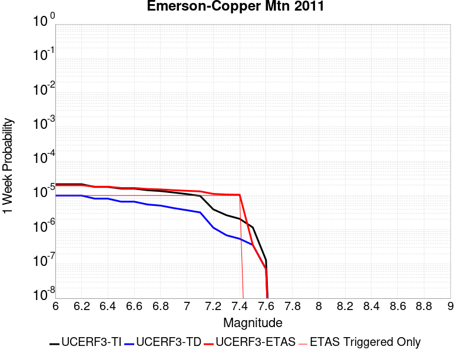 |  |  |  |

| Magnitude | 1 wk TI Prob | 1 wk TD Prob | 1 wk ETAS Prob | 1 wk ETAS/TD Gain | 1 wk ETAS Triggered Only | 1 mo TI Prob | 1 mo TD Prob | 1 mo ETAS Prob | 1 mo ETAS/TD Gain | 1 mo ETAS Triggered Only | 1 yr TI Prob | 1 yr TD Prob | 1 yr ETAS Prob | 1 yr ETAS/TD Gain | 1 yr ETAS Triggered Only | 10 yr TI Prob | 10 yr TD Prob | 10 yr ETAS Prob | 10 yr ETAS/TD Gain | 10 yr ETAS Triggered Only |
|-----|-----|-----|-----|-----|-----|-----|-----|-----|-----|-----|-----|-----|-----|-----|-----|-----|-----|-----|-----|-----|
| 6.0 | 2.1364202E-5 | 9.967999E-6 | 1.99679E-5 | 2.0032003 | 1.0E-5 | 9.1557646E-5 | 4.2719344E-5 | 5.271892E-5 | 1.234076 | 1.0E-5 | 0.0011141442 | 5.1999267E-4 | 5.399822E-4 | 1.0384421 | 2.0E-5 | 0.011085749 | 0.0051886286 | 0.005208525 | 1.0038346 | 2.0E-5 |
| 6.1 | 2.1364202E-5 | 9.967999E-6 | 1.99679E-5 | 2.0032003 | 1.0E-5 | 9.1557646E-5 | 4.2719344E-5 | 5.271892E-5 | 1.234076 | 1.0E-5 | 0.0011141442 | 5.1999267E-4 | 5.399822E-4 | 1.0384421 | 2.0E-5 | 0.011085749 | 0.0051886286 | 0.005208525 | 1.0038346 | 2.0E-5 |
| 6.2 | 2.1364202E-5 | 9.967999E-6 | 1.99679E-5 | 2.0032003 | 1.0E-5 | 9.1557646E-5 | 4.2719344E-5 | 5.271892E-5 | 1.234076 | 1.0E-5 | 0.0011141442 | 5.1999267E-4 | 5.399822E-4 | 1.0384421 | 2.0E-5 | 0.011085749 | 0.0051886286 | 0.005208525 | 1.0038346 | 2.0E-5 |
| 6.3 | 1.7751237E-5 | 8.089109E-6 | 1.8089027E-5 | 2.2362201 | 1.0E-5 | 7.607452E-5 | 3.4667184E-5 | 4.4666835E-5 | 1.2884473 | 1.0E-5 | 9.258136E-4 | 4.2199748E-4 | 4.4198905E-4 | 1.0473737 | 2.0E-5 | 0.00921966 | 0.004212584 | 0.0042324997 | 1.0047277 | 2.0E-5 |
| 6.4 | 1.7751237E-5 | 8.089109E-6 | 1.8089027E-5 | 2.2362201 | 1.0E-5 | 7.607452E-5 | 3.4667184E-5 | 4.4666835E-5 | 1.2884473 | 1.0E-5 | 9.258136E-4 | 4.2199748E-4 | 4.4198905E-4 | 1.0473737 | 2.0E-5 | 0.00921966 | 0.004212584 | 0.0042324997 | 1.0047277 | 2.0E-5 |
| 6.5 | 1.5886664E-5 | 6.6037437E-6 | 1.6603677E-5 | 2.5142825 | 1.0E-5 | 6.808392E-5 | 2.830148E-5 | 3.8301197E-5 | 1.3533285 | 1.0E-5 | 8.286065E-4 | 3.4452073E-4 | 3.6451383E-4 | 1.0580317 | 2.0E-5 | 0.008255237 | 0.0034403303 | 0.0034602615 | 1.0057935 | 2.0E-5 |
| 6.6 | 1.5886664E-5 | 6.6037437E-6 | 1.6603677E-5 | 2.5142825 | 1.0E-5 | 6.808392E-5 | 2.830148E-5 | 3.8301197E-5 | 1.3533285 | 1.0E-5 | 8.286065E-4 | 3.4452073E-4 | 3.6451383E-4 | 1.0580317 | 2.0E-5 | 0.008255237 | 0.0034403303 | 0.0034602615 | 1.0057935 | 2.0E-5 |
| 6.7 | 1.428471E-5 | 5.4703055E-6 | 1.547025E-5 | 2.8280416 | 1.0E-5 | 6.121875E-5 | 2.3443978E-5 | 3.3443743E-5 | 1.4265388 | 1.0E-5 | 7.450834E-4 | 2.8539696E-4 | 3.0539127E-4 | 1.0700579 | 2.0E-5 | 0.007425902 | 0.0028506925 | 0.0028706356 | 1.0069958 | 2.0E-5 |
| 6.8 | 1.3490684E-5 | 5.0735894E-6 | 1.5073539E-5 | 2.9709811 | 1.0E-5 | 5.7815934E-5 | 2.1743796E-5 | 3.1743577E-5 | 1.4598913 | 1.0E-5 | 7.0368167E-4 | 2.6470242E-4 | 2.8469713E-4 | 1.0755365 | 2.0E-5 | 0.007014576 | 0.002644252 | 0.002664199 | 1.0075436 | 2.0E-5 |
| 6.9 | 1.2235421E-5 | 4.289545E-6 | 1.4289501E-5 | 3.3312397 | 1.0E-5 | 5.2436466E-5 | 1.8383655E-5 | 2.838347E-5 | 1.5439515 | 1.0E-5 | 6.38227E-4 | 2.238016E-4 | 2.4379713E-4 | 1.0893449 | 2.0E-5 | 0.0063639707 | 0.0022361164 | 0.0022560717 | 1.0089241 | 2.0E-5 |
| 7.0 | 1.1009851E-5 | 3.7188345E-6 | 1.3718797E-5 | 3.6890047 | 1.0E-5 | 4.7184225E-5 | 1.5937783E-5 | 2.5937625E-5 | 1.6274298 | 1.0E-5 | 5.743165E-4 | 1.9402867E-4 | 2.140248E-4 | 1.1030575 | 2.0E-5 | 0.005728345 | 0.0019389305 | 0.0019588917 | 1.0102949 | 2.0E-5 |
| 7.1 | 9.726373E-6 | 3.2115693E-6 | 1.3211537E-5 | 4.1137323 | 1.0E-5 | 4.168379E-5 | 1.3763814E-5 | 2.3763678E-5 | 1.7265328 | 1.0E-5 | 5.07382E-4 | 1.6756494E-4 | 1.8756159E-4 | 1.1193367 | 2.0E-5 | 0.0050622504 | 0.0016747171 | 0.0016946836 | 1.0119224 | 2.0E-5 |
| 7.2 | 3.9335127E-6 | 1.1524114E-6 | 1.11524E-5 | 9.677446 | 1.0E-5 | 1.6857803E-5 | 4.9388973E-6 | 1.4938848E-5 | 3.0247335 | 1.0E-5 | 2.0522442E-4 | 6.0129474E-5 | 8.012827E-5 | 1.3325956 | 2.0E-5 | 0.00205035 | 6.01138E-4 | 6.21126E-4 | 1.0332502 | 2.0E-5 |
| 7.3 | 2.661632E-6 | 6.91098E-7 | 1.0691091E-5 | 15.469718 | 1.0E-5 | 1.14069435E-5 | 2.9618452E-6 | 1.2961816E-5 | 4.3762636 | 1.0E-5 | 1.3887069E-4 | 3.605988E-5 | 5.6059158E-5 | 1.554613 | 2.0E-5 | 0.0013878393 | 3.6054134E-4 | 3.8053413E-4 | 1.0554521 | 2.0E-5 |
| 7.4 | 2.0893426E-6 | 5.4614605E-7 | 1.054614E-5 | 19.31011 | 1.0E-5 | 8.954295E-6 | 2.340624E-6 | 1.2340601E-5 | 5.272355 | 1.0E-5 | 1.0901308E-4 | 2.8496728E-5 | 4.849616E-5 | 1.7018149 | 2.0E-5 | 0.0010895962 | 2.849313E-4 | 3.0492558E-4 | 1.0701723 | 2.0E-5 |
| 7.5 | 1.1681728E-6 | 3.6028484E-7 | 3.6028484E-7 | 1.0 | 0.0 | 5.0064455E-6 | 1.544077E-6 | 1.544077E-6 | 1.0 | 0.0 | 6.0951766E-5 | 1.879898E-5 | 1.879898E-5 | 1.0 | 0.0 | 6.093505E-4 | 1.8797436E-4 | 1.8797436E-4 | 1.0 | 0.0 |
| 7.6 | 1.3154387E-7 | 7.1196716E-8 | 7.1196716E-8 | 1.0 | 0.0 | 5.6375933E-7 | 3.0512876E-7 | 3.0512876E-7 | 1.0 | 0.0 | 6.863748E-6 | 3.714938E-6 | 3.714938E-6 | 1.0 | 0.0 | 6.863536E-5 | 3.7148915E-5 | 3.7148915E-5 | 1.0 | 0.0 |

## Shoreline
*[(top)](#table-of-contents)*

| 1 Week | 1 Month | 1 Year | 10 Year |
|-----|-----|-----|-----|
|  |  |  |  |

| Magnitude | 1 wk TI Prob | 1 wk TD Prob | 1 wk ETAS Prob | 1 wk ETAS/TD Gain | 1 wk ETAS Triggered Only | 1 mo TI Prob | 1 mo TD Prob | 1 mo ETAS Prob | 1 mo ETAS/TD Gain | 1 mo ETAS Triggered Only | 1 yr TI Prob | 1 yr TD Prob | 1 yr ETAS Prob | 1 yr ETAS/TD Gain | 1 yr ETAS Triggered Only | 10 yr TI Prob | 10 yr TD Prob | 10 yr ETAS Prob | 10 yr ETAS/TD Gain | 10 yr ETAS Triggered Only |
|-----|-----|-----|-----|-----|-----|-----|-----|-----|-----|-----|-----|-----|-----|-----|-----|-----|-----|-----|-----|-----|
| 6.0 | 3.9888673E-6 | 4.0479285E-6 | 4.0479285E-6 | 1.0 | 0.0 | 1.7095033E-5 | 1.7348182E-5 | 3.7347836E-5 | 2.1528387 | 2.0E-5 | 2.0811215E-4 | 2.1119922E-4 | 2.3119501E-4 | 1.0946773 | 2.0E-5 | 0.0020791737 | 0.0021105339 | 0.0021304917 | 1.0094563 | 2.0E-5 |
| 6.1 | 3.9888673E-6 | 4.0479285E-6 | 4.0479285E-6 | 1.0 | 0.0 | 1.7095033E-5 | 1.7348182E-5 | 3.7347836E-5 | 2.1528387 | 2.0E-5 | 2.0811215E-4 | 2.1119922E-4 | 2.3119501E-4 | 1.0946773 | 2.0E-5 | 0.0020791737 | 0.0021105339 | 0.0021304917 | 1.0094563 | 2.0E-5 |
| 6.2 | 1.4039653E-6 | 1.4100885E-6 | 1.4100885E-6 | 1.0 | 0.0 | 6.0169805E-6 | 6.043223E-6 | 6.043223E-6 | 1.0 | 0.0 | 7.325427E-5 | 7.357382E-5 | 7.357382E-5 | 1.0 | 0.0 | 7.3230127E-4 | 7.355006E-4 | 7.355006E-4 | 1.0 | 0.0 |
| 6.3 | 1.4039653E-6 | 1.4100885E-6 | 1.4100885E-6 | 1.0 | 0.0 | 6.0169805E-6 | 6.043223E-6 | 6.043223E-6 | 1.0 | 0.0 | 7.325427E-5 | 7.357382E-5 | 7.357382E-5 | 1.0 | 0.0 | 7.3230127E-4 | 7.355006E-4 | 7.355006E-4 | 1.0 | 0.0 |
| 6.4 | 1.3314152E-6 | 1.33616E-6 | 1.33616E-6 | 1.0 | 0.0 | 5.7060524E-6 | 5.726388E-6 | 5.726388E-6 | 1.0 | 0.0 | 6.946897E-5 | 6.9716596E-5 | 6.9716596E-5 | 1.0 | 0.0 | 6.9447263E-4 | 6.9695263E-4 | 6.9695263E-4 | 1.0 | 0.0 |
| 6.5 | 1.1187026E-6 | 1.1203634E-6 | 1.1203634E-6 | 1.0 | 0.0 | 4.794431E-6 | 4.801549E-6 | 4.801549E-6 | 1.0 | 0.0 | 5.8370628E-5 | 5.8457317E-5 | 5.8457317E-5 | 1.0 | 0.0 | 5.83553E-4 | 5.844219E-4 | 5.844219E-4 | 1.0 | 0.0 |
| 6.6 | 9.793089E-7 | 9.784915E-7 | 9.784915E-7 | 1.0 | 0.0 | 4.1970316E-6 | 4.193528E-6 | 4.193528E-6 | 1.0 | 0.0 | 5.1097657E-5 | 5.1055024E-5 | 5.1055024E-5 | 1.0 | 0.0 | 5.108591E-4 | 5.104342E-4 | 5.104342E-4 | 1.0 | 0.0 |
| 6.7 | 8.995986E-7 | 8.972795E-7 | 8.972795E-7 | 1.0 | 0.0 | 3.8554167E-6 | 3.8454777E-6 | 3.8454777E-6 | 1.0 | 0.0 | 4.693869E-5 | 4.68177E-5 | 4.68177E-5 | 1.0 | 0.0 | 4.6928777E-4 | 4.680793E-4 | 4.680793E-4 | 1.0 | 0.0 |
| 6.8 | 7.931612E-7 | 7.8803976E-7 | 7.8803976E-7 | 1.0 | 0.0 | 3.3992578E-6 | 3.377309E-6 | 3.377309E-6 | 1.0 | 0.0 | 4.1385178E-5 | 4.1117964E-5 | 4.1117964E-5 | 1.0 | 0.0 | 4.1377472E-4 | 4.1110412E-4 | 4.1110412E-4 | 1.0 | 0.0 |
| 6.9 | 7.1465956E-7 | 7.078001E-7 | 7.078001E-7 | 1.0 | 0.0 | 3.062823E-6 | 3.0334254E-6 | 3.0334254E-6 | 1.0 | 0.0 | 3.7289232E-5 | 3.693133E-5 | 3.693133E-5 | 1.0 | 0.0 | 3.7282976E-4 | 3.6925232E-4 | 3.6925232E-4 | 1.0 | 0.0 |
| 7.0 | 6.389046E-7 | 6.299453E-7 | 6.299453E-7 | 1.0 | 0.0 | 2.7381598E-6 | 2.699763E-6 | 2.699763E-6 | 1.0 | 0.0 | 3.3336586E-5 | 3.286912E-5 | 3.286912E-5 | 1.0 | 0.0 | 3.3331584E-4 | 3.286428E-4 | 3.286428E-4 | 1.0 | 0.0 |
| 7.1 | 5.4300875E-7 | 5.311126E-7 | 5.311126E-7 | 1.0 | 0.0 | 2.3271782E-6 | 2.276195E-6 | 2.276195E-6 | 1.0 | 0.0 | 2.8333026E-5 | 2.7712322E-5 | 2.7712322E-5 | 1.0 | 0.0 | 2.8329415E-4 | 2.7708875E-4 | 2.7708875E-4 | 1.0 | 0.0 |
| 7.2 | 4.6768855E-7 | 4.5348904E-7 | 4.5348904E-7 | 1.0 | 0.0 | 2.0043778E-6 | 1.9435229E-6 | 1.9435229E-6 | 1.0 | 0.0 | 2.4403027E-5 | 2.3662134E-5 | 2.3662134E-5 | 1.0 | 0.0 | 2.4400349E-4 | 2.3659621E-4 | 2.3659621E-4 | 1.0 | 0.0 |
| 7.3 | 4.0966103E-7 | 3.9385614E-7 | 3.9385614E-7 | 1.0 | 0.0 | 1.7556889E-6 | 1.6879537E-6 | 1.6879537E-6 | 1.0 | 0.0 | 2.1375303E-5 | 2.0550642E-5 | 2.0550642E-5 | 1.0 | 0.0 | 2.1373246E-4 | 2.0548746E-4 | 2.0548746E-4 | 1.0 | 0.0 |
| 7.4 | 3.5105785E-7 | 3.3363924E-7 | 3.3363924E-7 | 1.0 | 0.0 | 1.5045327E-6 | 1.4298816E-6 | 1.4298816E-6 | 1.0 | 0.0 | 1.8317533E-5 | 1.7408669E-5 | 1.7408669E-5 | 1.0 | 0.0 | 1.8316023E-4 | 1.740731E-4 | 1.740731E-4 | 1.0 | 0.0 |
| 7.5 | 2.8737534E-7 | 2.681999E-7 | 2.681999E-7 | 1.0 | 0.0 | 1.2316079E-6 | 1.1494276E-6 | 1.1494276E-6 | 1.0 | 0.0 | 1.4994724E-5 | 1.399419E-5 | 1.399419E-5 | 1.0 | 0.0 | 1.4993713E-4 | 1.3993312E-4 | 1.3993312E-4 | 1.0 | 0.0 |
| 7.6 | 2.0924051E-7 | 1.8778938E-7 | 1.8778938E-7 | 1.0 | 0.0 | 8.967448E-7 | 8.0481135E-7 | 8.0481135E-7 | 1.0 | 0.0 | 1.0917813E-5 | 9.798534E-6 | 9.798534E-6 | 1.0 | 0.0 | 1.0917276E-4 | 9.798103E-5 | 9.798103E-5 | 1.0 | 0.0 |
| 7.7 | 1.392265E-7 | 1.1543341E-7 | 1.1543341E-7 | 1.0 | 0.0 | 5.9668486E-7 | 4.9471447E-7 | 4.9471447E-7 | 1.0 | 0.0 | 7.2646135E-6 | 6.0231323E-6 | 6.0231323E-6 | 1.0 | 0.0 | 7.2643765E-5 | 6.0229693E-5 | 6.0229693E-5 | 1.0 | 0.0 |
| 7.8 | 8.1080074E-8 | 5.5866355E-8 | 5.5866355E-8 | 1.0 | 0.0 | 3.4748598E-7 | 2.394272E-7 | 2.394272E-7 | 1.0 | 0.0 | 4.2306337E-6 | 2.9150222E-6 | 2.9150222E-6 | 1.0 | 0.0 | 4.230553E-5 | 2.9149842E-5 | 2.9149842E-5 | 1.0 | 0.0 |
| 7.9 | 5.0859036E-8 | 2.7243395E-8 | 2.7243395E-8 | 1.0 | 0.0 | 2.1796728E-7 | 1.16757406E-7 | 1.16757406E-7 | 1.0 | 0.0 | 2.6537484E-6 | 1.4215204E-6 | 1.4215204E-6 | 1.0 | 0.0 | 2.6537167E-5 | 1.4215115E-5 | 1.4215115E-5 | 1.0 | 0.0 |
| 8.0 | 3.1760536E-8 | 1.3575991E-8 | 1.3575991E-8 | 1.0 | 0.0 | 1.3611657E-7 | 5.8182817E-8 | 5.8182817E-8 | 1.0 | 0.0 | 1.6572179E-6 | 7.083755E-7 | 7.083755E-7 | 1.0 | 0.0 | 1.6572056E-5 | 7.083733E-6 | 7.083733E-6 | 1.0 | 0.0 |
| 8.1 | 1.2947896E-8 | 5.6625185E-9 | 5.6625185E-9 | 1.0 | 0.0 | 5.5490982E-8 | 2.4267937E-8 | 2.4267937E-8 | 1.0 | 0.0 | 6.756025E-7 | 2.954621E-7 | 2.954621E-7 | 1.0 | 0.0 | 6.7560045E-6 | 2.9546172E-6 | 2.9546172E-6 | 1.0 | 0.0 |

## Morales (East)
*[(top)](#table-of-contents)*

| 1 Week | 1 Month | 1 Year | 10 Year |
|-----|-----|-----|-----|
|  |  | 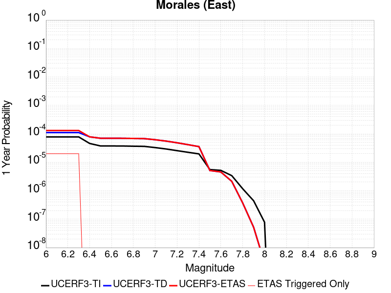 |  |

| Magnitude | 1 wk TI Prob | 1 wk TD Prob | 1 wk ETAS Prob | 1 wk ETAS/TD Gain | 1 wk ETAS Triggered Only | 1 mo TI Prob | 1 mo TD Prob | 1 mo ETAS Prob | 1 mo ETAS/TD Gain | 1 mo ETAS Triggered Only | 1 yr TI Prob | 1 yr TD Prob | 1 yr ETAS Prob | 1 yr ETAS/TD Gain | 1 yr ETAS Triggered Only | 10 yr TI Prob | 10 yr TD Prob | 10 yr ETAS Prob | 10 yr ETAS/TD Gain | 10 yr ETAS Triggered Only |
|-----|-----|-----|-----|-----|-----|-----|-----|-----|-----|-----|-----|-----|-----|-----|-----|-----|-----|-----|-----|-----|
| 6.0 | 1.4942771E-6 | 2.123544E-6 | 1.21235225E-5 | 5.709099 | 1.0E-5 | 6.404029E-6 | 9.100874E-6 | 1.9100784E-5 | 2.0987854 | 1.0E-5 | 7.7966266E-5 | 1.1079809E-4 | 1.3079587E-4 | 1.1804885 | 2.0E-5 | 7.793892E-4 | 0.0011074883 | 0.0011274662 | 1.0180389 | 2.0E-5 |
| 6.1 | 1.4942771E-6 | 2.123544E-6 | 1.21235225E-5 | 5.709099 | 1.0E-5 | 6.404029E-6 | 9.100874E-6 | 1.9100784E-5 | 2.0987854 | 1.0E-5 | 7.7966266E-5 | 1.1079809E-4 | 1.3079587E-4 | 1.1804885 | 2.0E-5 | 7.793892E-4 | 0.0011074883 | 0.0011274662 | 1.0180389 | 2.0E-5 |
| 6.2 | 1.4942771E-6 | 2.123544E-6 | 1.21235225E-5 | 5.709099 | 1.0E-5 | 6.404029E-6 | 9.100874E-6 | 1.9100784E-5 | 2.0987854 | 1.0E-5 | 7.7966266E-5 | 1.1079809E-4 | 1.3079587E-4 | 1.1804885 | 2.0E-5 | 7.793892E-4 | 0.0011074883 | 0.0011274662 | 1.0180389 | 2.0E-5 |
| 6.3 | 1.4942771E-6 | 2.123544E-6 | 1.21235225E-5 | 5.709099 | 1.0E-5 | 6.404029E-6 | 9.100874E-6 | 1.9100784E-5 | 2.0987854 | 1.0E-5 | 7.7966266E-5 | 1.1079809E-4 | 1.3079587E-4 | 1.1804885 | 2.0E-5 | 7.793892E-4 | 0.0011074883 | 0.0011274662 | 1.0180389 | 2.0E-5 |
| 6.4 | 8.798845E-7 | 1.5023381E-6 | 1.5023381E-6 | 1.0 | 0.0 | 3.7709283E-6 | 6.4385767E-6 | 6.4385767E-6 | 1.0 | 0.0 | 4.5910085E-5 | 7.838696E-5 | 7.838696E-5 | 1.0 | 0.0 | 4.59006E-4 | 7.836066E-4 | 7.836066E-4 | 1.0 | 0.0 |
| 6.5 | 7.1751725E-7 | 1.3384879E-6 | 1.3384879E-6 | 1.0 | 0.0 | 3.0750705E-6 | 5.7363645E-6 | 5.7363645E-6 | 1.0 | 0.0 | 3.7438338E-5 | 6.9838075E-5 | 6.9838075E-5 | 1.0 | 0.0 | 3.743203E-4 | 6.981715E-4 | 6.981715E-4 | 1.0 | 0.0 |
| 6.6 | 7.1751725E-7 | 1.3384879E-6 | 1.3384879E-6 | 1.0 | 0.0 | 3.0750705E-6 | 5.7363645E-6 | 5.7363645E-6 | 1.0 | 0.0 | 3.7438338E-5 | 6.9838075E-5 | 6.9838075E-5 | 1.0 | 0.0 | 3.743203E-4 | 6.981715E-4 | 6.981715E-4 | 1.0 | 0.0 |
| 6.7 | 7.159057E-7 | 1.3359539E-6 | 1.3359539E-6 | 1.0 | 0.0 | 3.0681638E-6 | 5.7255043E-6 | 5.7255043E-6 | 1.0 | 0.0 | 3.7354253E-5 | 6.9705864E-5 | 6.9705864E-5 | 1.0 | 0.0 | 3.7347974E-4 | 6.968502E-4 | 6.968502E-4 | 1.0 | 0.0 |
| 6.8 | 7.032203E-7 | 1.3175089E-6 | 1.3175089E-6 | 1.0 | 0.0 | 3.0137978E-6 | 5.646455E-6 | 5.646455E-6 | 1.0 | 0.0 | 3.669237E-5 | 6.87435E-5 | 6.87435E-5 | 1.0 | 0.0 | 3.6686313E-4 | 6.872325E-4 | 6.872325E-4 | 1.0 | 0.0 |
| 6.9 | 6.941549E-7 | 1.3025701E-6 | 1.3025701E-6 | 1.0 | 0.0 | 2.974946E-6 | 5.5824316E-6 | 5.5824316E-6 | 1.0 | 0.0 | 3.6219368E-5 | 6.7964065E-5 | 6.7964065E-5 | 1.0 | 0.0 | 3.6213463E-4 | 6.794429E-4 | 6.794429E-4 | 1.0 | 0.0 |
| 7.0 | 6.2932247E-7 | 1.1877994E-6 | 1.1877994E-6 | 1.0 | 0.0 | 2.6970936E-6 | 5.090559E-6 | 5.090559E-6 | 1.0 | 0.0 | 3.283662E-5 | 6.197586E-5 | 6.197586E-5 | 1.0 | 0.0 | 3.283177E-4 | 6.1959465E-4 | 6.1959465E-4 | 1.0 | 0.0 |
| 7.1 | 5.6200963E-7 | 1.064093E-6 | 1.064093E-6 | 1.0 | 0.0 | 2.4086105E-6 | 4.560391E-6 | 4.560391E-6 | 1.0 | 0.0 | 2.9324437E-5 | 5.5521392E-5 | 5.5521392E-5 | 1.0 | 0.0 | 2.9320567E-4 | 5.5508246E-4 | 5.5508246E-4 | 1.0 | 0.0 |
| 7.2 | 4.91044E-7 | 9.2862194E-7 | 9.2862194E-7 | 1.0 | 0.0 | 2.1044725E-6 | 3.9798024E-6 | 3.9798024E-6 | 1.0 | 0.0 | 2.5621652E-5 | 4.8453054E-5 | 4.8453054E-5 | 1.0 | 0.0 | 2.56187E-4 | 4.8443122E-4 | 4.8443122E-4 | 1.0 | 0.0 |
| 7.3 | 4.2978448E-7 | 7.974413E-7 | 7.974413E-7 | 1.0 | 0.0 | 1.8419321E-6 | 3.4176012E-6 | 3.4176012E-6 | 1.0 | 0.0 | 2.2425293E-5 | 4.160853E-5 | 4.160853E-5 | 1.0 | 0.0 | 2.242303E-4 | 4.1601306E-4 | 4.1601306E-4 | 1.0 | 0.0 |
| 7.4 | 3.774317E-7 | 6.807105E-7 | 6.807105E-7 | 1.0 | 0.0 | 1.6175634E-6 | 2.9173275E-6 | 2.9173275E-6 | 1.0 | 0.0 | 1.9693656E-5 | 3.551791E-5 | 3.551791E-5 | 1.0 | 0.0 | 1.969191E-4 | 3.5512767E-4 | 3.5512767E-4 | 1.0 | 0.0 |
| 7.5 | 1.0603232E-7 | 9.8406424E-8 | 9.8406424E-8 | 1.0 | 0.0 | 4.5442414E-7 | 4.2174173E-7 | 4.2174173E-7 | 1.0 | 0.0 | 5.5326E-6 | 5.1346938E-6 | 5.1346938E-6 | 1.0 | 0.0 | 5.532462E-5 | 5.1348336E-5 | 5.1348336E-5 | 1.0 | 0.0 |
| 7.6 | 9.960384E-8 | 8.755028E-8 | 8.755028E-8 | 1.0 | 0.0 | 4.2687353E-7 | 3.7521542E-7 | 3.7521542E-7 | 1.0 | 0.0 | 5.197173E-6 | 4.568238E-6 | 4.568238E-6 | 1.0 | 0.0 | 5.1970514E-5 | 4.5684028E-5 | 4.5684028E-5 | 1.0 | 0.0 |
| 7.7 | 6.499468E-8 | 4.103351E-8 | 4.103351E-8 | 1.0 | 0.0 | 2.785486E-7 | 1.7585788E-7 | 1.7585788E-7 | 1.0 | 0.0 | 3.3913238E-6 | 2.1410676E-6 | 2.1410676E-6 | 1.0 | 0.0 | 3.3912722E-5 | 2.1413045E-5 | 2.1413045E-5 | 1.0 | 0.0 |
| 7.8 | 2.2517119E-8 | 7.1293824E-9 | 7.1293824E-9 | 1.0 | 0.0 | 9.6501935E-8 | 3.0554492E-8 | 3.0554492E-8 | 1.0 | 0.0 | 1.1749105E-6 | 3.720009E-7 | 3.720009E-7 | 1.0 | 0.0 | 1.1749043E-5 | 3.7225666E-6 | 3.7225666E-6 | 1.0 | 0.0 |
| 7.9 | 8.493023E-9 | 9.962774E-10 | 9.962774E-10 | 1.0 | 0.0 | 3.639867E-8 | 4.2697574E-9 | 4.2697574E-9 | 1.0 | 0.0 | 4.4315374E-7 | 5.19843E-8 | 5.19843E-8 | 1.0 | 0.0 | 4.4315284E-6 | 5.2196486E-7 | 5.2196486E-7 | 1.0 | 0.0 |
| 8.0 | 1.4971842E-9 | 5.5340177E-11 | 5.5340177E-11 | 1.0 | 0.0 | 6.4165038E-9 | 2.3717173E-10 | 2.3717173E-10 | 1.0 | 0.0 | 7.812093E-8 | 2.887568E-9 | 2.887568E-9 | 1.0 | 0.0 | 7.81209E-7 | 3.0142694E-8 | 3.0142694E-8 | 1.0 | 0.0 |

## Sierra Madre (San Fernando)
*[(top)](#table-of-contents)*

| 1 Week | 1 Month | 1 Year | 10 Year |
|-----|-----|-----|-----|
|  |  |  | 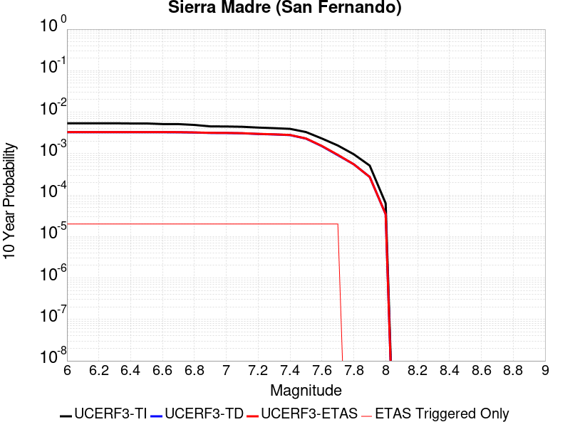 |

| Magnitude | 1 wk TI Prob | 1 wk TD Prob | 1 wk ETAS Prob | 1 wk ETAS/TD Gain | 1 wk ETAS Triggered Only | 1 mo TI Prob | 1 mo TD Prob | 1 mo ETAS Prob | 1 mo ETAS/TD Gain | 1 mo ETAS Triggered Only | 1 yr TI Prob | 1 yr TD Prob | 1 yr ETAS Prob | 1 yr ETAS/TD Gain | 1 yr ETAS Triggered Only | 10 yr TI Prob | 10 yr TD Prob | 10 yr ETAS Prob | 10 yr ETAS/TD Gain | 10 yr ETAS Triggered Only |
|-----|-----|-----|-----|-----|-----|-----|-----|-----|-----|-----|-----|-----|-----|-----|-----|-----|-----|-----|-----|-----|
| 6.0 | 1.0346413E-5 | 6.2872386E-6 | 6.2872386E-6 | 1.0 | 0.0 | 4.4341014E-5 | 2.6945036E-5 | 2.6945036E-5 | 1.0 | 0.0 | 5.3971814E-4 | 3.2800753E-4 | 3.3800426E-4 | 1.030477 | 1.0E-5 | 0.0053840918 | 0.0032753467 | 0.0032952812 | 1.0060862 | 2.0E-5 |
| 6.1 | 1.0346413E-5 | 6.2872386E-6 | 6.2872386E-6 | 1.0 | 0.0 | 4.4341014E-5 | 2.6945036E-5 | 2.6945036E-5 | 1.0 | 0.0 | 5.3971814E-4 | 3.2800753E-4 | 3.3800426E-4 | 1.030477 | 1.0E-5 | 0.0053840918 | 0.0032753467 | 0.0032952812 | 1.0060862 | 2.0E-5 |
| 6.2 | 1.0346413E-5 | 6.2872386E-6 | 6.2872386E-6 | 1.0 | 0.0 | 4.4341014E-5 | 2.6945036E-5 | 2.6945036E-5 | 1.0 | 0.0 | 5.3971814E-4 | 3.2800753E-4 | 3.3800426E-4 | 1.030477 | 1.0E-5 | 0.0053840918 | 0.0032753467 | 0.0032952812 | 1.0060862 | 2.0E-5 |
| 6.3 | 1.0346413E-5 | 6.2872386E-6 | 6.2872386E-6 | 1.0 | 0.0 | 4.4341014E-5 | 2.6945036E-5 | 2.6945036E-5 | 1.0 | 0.0 | 5.3971814E-4 | 3.2800753E-4 | 3.3800426E-4 | 1.030477 | 1.0E-5 | 0.0053840918 | 0.0032753467 | 0.0032952812 | 1.0060862 | 2.0E-5 |
| 6.4 | 1.0249558E-5 | 6.2872386E-6 | 6.2872386E-6 | 1.0 | 0.0 | 4.392594E-5 | 2.6945036E-5 | 2.6945036E-5 | 1.0 | 0.0 | 5.3466705E-4 | 3.2800753E-4 | 3.3800426E-4 | 1.030477 | 1.0E-5 | 0.0053338245 | 0.0032753467 | 0.0032952812 | 1.0060862 | 2.0E-5 |
| 6.5 | 1.0249558E-5 | 6.2872386E-6 | 6.2872386E-6 | 1.0 | 0.0 | 4.392594E-5 | 2.6945036E-5 | 2.6945036E-5 | 1.0 | 0.0 | 5.3466705E-4 | 3.2800753E-4 | 3.3800426E-4 | 1.030477 | 1.0E-5 | 0.0053338245 | 0.0032753467 | 0.0032952812 | 1.0060862 | 2.0E-5 |
| 6.6 | 9.9035515E-6 | 6.2872386E-6 | 6.2872386E-6 | 1.0 | 0.0 | 4.2443102E-5 | 2.6945036E-5 | 2.6945036E-5 | 1.0 | 0.0 | 5.166222E-4 | 3.2800753E-4 | 3.3800426E-4 | 1.030477 | 1.0E-5 | 0.0051542283 | 0.0032753467 | 0.0032952812 | 1.0060862 | 2.0E-5 |
| 6.7 | 9.87217E-6 | 6.274661E-6 | 6.274661E-6 | 1.0 | 0.0 | 4.2308613E-5 | 2.6891132E-5 | 2.6891132E-5 | 1.0 | 0.0 | 5.149856E-4 | 3.2735144E-4 | 3.3734817E-4 | 1.0305382 | 1.0E-5 | 0.005137938 | 0.003268805 | 0.0032887396 | 1.0060984 | 2.0E-5 |
| 6.8 | 9.4359175E-6 | 6.1786473E-6 | 6.1786473E-6 | 1.0 | 0.0 | 4.043902E-5 | 2.6479653E-5 | 2.6479653E-5 | 1.0 | 0.0 | 4.9223384E-4 | 3.223432E-4 | 3.3233996E-4 | 1.0310129 | 1.0E-5 | 0.0049114493 | 0.0032188678 | 0.0032388035 | 1.0061934 | 2.0E-5 |
| 6.9 | 8.700447E-6 | 6.0399334E-6 | 6.0399334E-6 | 1.0 | 0.0 | 3.72871E-5 | 2.5885178E-5 | 2.5885178E-5 | 1.0 | 0.0 | 4.5387587E-4 | 3.1510755E-4 | 3.251044E-4 | 1.0317252 | 1.0E-5 | 0.0045295 | 0.0031467169 | 0.003166654 | 1.0063359 | 2.0E-5 |
| 7.0 | 8.648878E-6 | 6.014848E-6 | 6.014848E-6 | 1.0 | 0.0 | 3.7066096E-5 | 2.5777672E-5 | 2.5777672E-5 | 1.0 | 0.0 | 4.5118626E-4 | 3.1379904E-4 | 3.2379592E-4 | 1.0318575 | 1.0E-5 | 0.004502713 | 0.0031336688 | 0.003153606 | 1.0063623 | 2.0E-5 |
| 7.1 | 8.505786E-6 | 5.9244794E-6 | 5.9244794E-6 | 1.0 | 0.0 | 3.645286E-5 | 2.5390384E-5 | 2.5390384E-5 | 1.0 | 0.0 | 4.437232E-4 | 3.0908515E-4 | 3.1908206E-4 | 1.0323435 | 1.0E-5 | 0.0044283825 | 0.0030866617 | 0.0031066 | 1.0064595 | 2.0E-5 |
| 7.2 | 8.139752E-6 | 5.698777E-6 | 5.698777E-6 | 1.0 | 0.0 | 3.4884186E-5 | 2.4423107E-5 | 2.4423107E-5 | 1.0 | 0.0 | 4.246322E-4 | 2.973118E-4 | 3.0730883E-4 | 1.0336248 | 1.0E-5 | 0.004238217 | 0.0029692466 | 0.0029891871 | 1.0067158 | 2.0E-5 |
| 7.3 | 7.8816E-6 | 5.5520936E-6 | 5.5520936E-6 | 1.0 | 0.0 | 3.3777847E-5 | 2.3794475E-5 | 2.3794475E-5 | 1.0 | 0.0 | 4.111677E-4 | 2.8966027E-4 | 2.9965737E-4 | 1.0345132 | 1.0E-5 | 0.004104078 | 0.0028929329 | 0.002912875 | 1.0068934 | 2.0E-5 |
| 7.4 | 7.5810603E-6 | 5.356333E-6 | 5.356333E-6 | 1.0 | 0.0 | 3.2489854E-5 | 2.2955517E-5 | 2.2955517E-5 | 1.0 | 0.0 | 3.9549218E-4 | 2.7944864E-4 | 2.8944583E-4 | 1.0357747 | 1.0E-5 | 0.0039478904 | 0.0027910774 | 0.0028110216 | 1.0071456 | 2.0E-5 |
| 7.5 | 6.349153E-6 | 4.4075887E-6 | 4.4075887E-6 | 1.0 | 0.0 | 2.7210372E-5 | 1.8889532E-5 | 1.8889532E-5 | 1.0 | 0.0 | 3.312359E-4 | 2.2995661E-4 | 2.3995432E-4 | 1.0434765 | 1.0E-5 | 0.0033074263 | 0.0022972687 | 0.0023172228 | 1.008686 | 2.0E-5 |
| 7.6 | 4.430576E-6 | 2.8905786E-6 | 2.8905786E-6 | 1.0 | 0.0 | 1.8988047E-5 | 1.23881355E-5 | 1.23881355E-5 | 1.0 | 0.0 | 2.3115493E-4 | 1.5081534E-4 | 1.6081383E-4 | 1.0662962 | 1.0E-5 | 0.0023091463 | 0.0015071525 | 0.0015271223 | 1.0132501 | 2.0E-5 |
| 7.7 | 3.005066E-6 | 1.7509823E-6 | 1.7509823E-6 | 1.0 | 0.0 | 1.2878791E-5 | 7.504188E-6 | 7.504188E-6 | 1.0 | 0.0 | 1.56788E-4 | 9.135967E-5 | 1.0135875E-4 | 1.1094475 | 1.0E-5 | 0.0015667742 | 9.1322226E-4 | 9.33204E-4 | 1.0218805 | 2.0E-5 |
| 7.8 | 1.8459098E-6 | 1.0581826E-6 | 1.0581826E-6 | 1.0 | 0.0 | 7.911018E-6 | 4.5350607E-6 | 4.5350607E-6 | 1.0 | 0.0 | 9.631238E-5 | 5.5212968E-5 | 5.5212968E-5 | 1.0 | 0.0 | 9.627065E-4 | 5.5199297E-4 | 5.5199297E-4 | 1.0 | 0.0 |
| 7.9 | 9.839262E-7 | 5.2340516E-7 | 5.2340516E-7 | 1.0 | 0.0 | 4.2168194E-6 | 2.243163E-6 | 2.243163E-6 | 1.0 | 0.0 | 5.1338568E-5 | 2.731017E-5 | 2.731017E-5 | 1.0 | 0.0 | 5.132671E-4 | 2.7306844E-4 | 2.7306844E-4 | 1.0 | 0.0 |
| 8.0 | 1.210983E-7 | 6.613497E-8 | 6.613497E-8 | 1.0 | 0.0 | 5.1899264E-7 | 2.8343558E-7 | 2.8343558E-7 | 1.0 | 0.0 | 6.3187167E-6 | 3.4508228E-6 | 3.4508228E-6 | 1.0 | 0.0 | 6.318537E-5 | 3.450771E-5 | 3.450771E-5 | 1.0 | 0.0 |

## Sisar
*[(top)](#table-of-contents)*

| 1 Week | 1 Month | 1 Year | 10 Year |
|-----|-----|-----|-----|
|  |  |  |  |

| Magnitude | 1 wk TI Prob | 1 wk TD Prob | 1 wk ETAS Prob | 1 wk ETAS/TD Gain | 1 wk ETAS Triggered Only | 1 mo TI Prob | 1 mo TD Prob | 1 mo ETAS Prob | 1 mo ETAS/TD Gain | 1 mo ETAS Triggered Only | 1 yr TI Prob | 1 yr TD Prob | 1 yr ETAS Prob | 1 yr ETAS/TD Gain | 1 yr ETAS Triggered Only | 10 yr TI Prob | 10 yr TD Prob | 10 yr ETAS Prob | 10 yr ETAS/TD Gain | 10 yr ETAS Triggered Only |
|-----|-----|-----|-----|-----|-----|-----|-----|-----|-----|-----|-----|-----|-----|-----|-----|-----|-----|-----|-----|-----|
| 6.0 | 4.544193E-6 | 3.8396115E-6 | 3.8396115E-6 | 1.0 | 0.0 | 1.9474966E-5 | 1.6455377E-5 | 1.6455377E-5 | 1.0 | 0.0 | 2.3708193E-4 | 2.0032612E-4 | 2.0032612E-4 | 1.0 | 0.0 | 0.0023682916 | 0.002001489 | 0.0020214492 | 1.0099726 | 2.0E-5 |
| 6.1 | 4.544193E-6 | 3.8396115E-6 | 3.8396115E-6 | 1.0 | 0.0 | 1.9474966E-5 | 1.6455377E-5 | 1.6455377E-5 | 1.0 | 0.0 | 2.3708193E-4 | 2.0032612E-4 | 2.0032612E-4 | 1.0 | 0.0 | 0.0023682916 | 0.002001489 | 0.0020214492 | 1.0099726 | 2.0E-5 |
| 6.2 | 4.544193E-6 | 3.8396115E-6 | 3.8396115E-6 | 1.0 | 0.0 | 1.9474966E-5 | 1.6455377E-5 | 1.6455377E-5 | 1.0 | 0.0 | 2.3708193E-4 | 2.0032612E-4 | 2.0032612E-4 | 1.0 | 0.0 | 0.0023682916 | 0.002001489 | 0.0020214492 | 1.0099726 | 2.0E-5 |
| 6.3 | 4.544193E-6 | 3.8396115E-6 | 3.8396115E-6 | 1.0 | 0.0 | 1.9474966E-5 | 1.6455377E-5 | 1.6455377E-5 | 1.0 | 0.0 | 2.3708193E-4 | 2.0032612E-4 | 2.0032612E-4 | 1.0 | 0.0 | 0.0023682916 | 0.002001489 | 0.0020214492 | 1.0099726 | 2.0E-5 |
| 6.4 | 4.544193E-6 | 3.8396115E-6 | 3.8396115E-6 | 1.0 | 0.0 | 1.9474966E-5 | 1.6455377E-5 | 1.6455377E-5 | 1.0 | 0.0 | 2.3708193E-4 | 2.0032612E-4 | 2.0032612E-4 | 1.0 | 0.0 | 0.0023682916 | 0.002001489 | 0.0020214492 | 1.0099726 | 2.0E-5 |
| 6.5 | 4.544193E-6 | 3.8396115E-6 | 3.8396115E-6 | 1.0 | 0.0 | 1.9474966E-5 | 1.6455377E-5 | 1.6455377E-5 | 1.0 | 0.0 | 2.3708193E-4 | 2.0032612E-4 | 2.0032612E-4 | 1.0 | 0.0 | 0.0023682916 | 0.002001489 | 0.0020214492 | 1.0099726 | 2.0E-5 |
| 6.6 | 4.544193E-6 | 3.8396115E-6 | 3.8396115E-6 | 1.0 | 0.0 | 1.9474966E-5 | 1.6455377E-5 | 1.6455377E-5 | 1.0 | 0.0 | 2.3708193E-4 | 2.0032612E-4 | 2.0032612E-4 | 1.0 | 0.0 | 0.0023682916 | 0.002001489 | 0.0020214492 | 1.0099726 | 2.0E-5 |
| 6.7 | 4.544193E-6 | 3.8396115E-6 | 3.8396115E-6 | 1.0 | 0.0 | 1.9474966E-5 | 1.6455377E-5 | 1.6455377E-5 | 1.0 | 0.0 | 2.3708193E-4 | 2.0032612E-4 | 2.0032612E-4 | 1.0 | 0.0 | 0.0023682916 | 0.002001489 | 0.0020214492 | 1.0099726 | 2.0E-5 |
| 6.8 | 4.544193E-6 | 3.8396115E-6 | 3.8396115E-6 | 1.0 | 0.0 | 1.9474966E-5 | 1.6455377E-5 | 1.6455377E-5 | 1.0 | 0.0 | 2.3708193E-4 | 2.0032612E-4 | 2.0032612E-4 | 1.0 | 0.0 | 0.0023682916 | 0.002001489 | 0.0020214492 | 1.0099726 | 2.0E-5 |
| 6.9 | 4.542225E-6 | 3.8375733E-6 | 3.8375733E-6 | 1.0 | 0.0 | 1.9466532E-5 | 1.6446642E-5 | 1.6446642E-5 | 1.0 | 0.0 | 2.3697925E-4 | 2.0021979E-4 | 2.0021979E-4 | 1.0 | 0.0 | 0.002367267 | 0.0020004278 | 0.002020388 | 1.0099778 | 2.0E-5 |
| 7.0 | 4.5278484E-6 | 3.8226376E-6 | 3.8226376E-6 | 1.0 | 0.0 | 1.940492E-5 | 1.6382632E-5 | 1.6382632E-5 | 1.0 | 0.0 | 2.3622929E-4 | 1.9944062E-4 | 1.9944062E-4 | 1.0 | 0.0 | 0.0023597833 | 0.00199265 | 0.0020126102 | 1.0100169 | 2.0E-5 |
| 7.1 | 4.5132488E-6 | 3.807425E-6 | 3.807425E-6 | 1.0 | 0.0 | 1.9342351E-5 | 1.6317435E-5 | 1.6317435E-5 | 1.0 | 0.0 | 2.3546767E-4 | 1.98647E-4 | 1.98647E-4 | 1.0 | 0.0 | 0.0023521832 | 0.001984728 | 0.0020046884 | 1.010057 | 2.0E-5 |
| 7.2 | 4.448859E-6 | 3.7398854E-6 | 3.7398854E-6 | 1.0 | 0.0 | 1.9066398E-5 | 1.6027983E-5 | 1.6027983E-5 | 1.0 | 0.0 | 2.3210866E-4 | 1.9512356E-4 | 1.9512356E-4 | 1.0 | 0.0 | 0.0023186638 | 0.0019495559 | 0.001969517 | 1.0102388 | 2.0E-5 |
| 7.3 | 4.3424366E-6 | 3.6337199E-6 | 3.6337199E-6 | 1.0 | 0.0 | 1.861031E-5 | 1.5572994E-5 | 1.5572994E-5 | 1.0 | 0.0 | 2.2655698E-4 | 1.8958503E-4 | 1.8958503E-4 | 1.0 | 0.0 | 0.0022632615 | 0.0018942665 | 0.0019142285 | 1.0105382 | 2.0E-5 |
| 7.4 | 4.218641E-6 | 3.533073E-6 | 3.533073E-6 | 1.0 | 0.0 | 1.8079765E-5 | 1.5141655E-5 | 1.5141655E-5 | 1.0 | 0.0 | 2.2009891E-4 | 1.8433439E-4 | 1.8433439E-4 | 1.0 | 0.0 | 0.0021988105 | 0.0018418481 | 0.0018618114 | 1.0108386 | 2.0E-5 |
| 7.5 | 3.983779E-6 | 3.3478434E-6 | 3.3478434E-6 | 1.0 | 0.0 | 1.7073227E-5 | 1.4347824E-5 | 1.4347824E-5 | 1.0 | 0.0 | 2.0784672E-4 | 1.7467108E-4 | 1.7467108E-4 | 1.0 | 0.0 | 0.0020765243 | 0.0017453709 | 0.001765336 | 1.0114388 | 2.0E-5 |
| 7.6 | 2.777393E-6 | 2.352273E-6 | 2.352273E-6 | 1.0 | 0.0 | 1.1903058E-5 | 1.0081131E-5 | 1.0081131E-5 | 1.0 | 0.0 | 1.449101E-4 | 1.2273094E-4 | 1.2273094E-4 | 1.0 | 0.0 | 0.0014481564 | 0.0012266394 | 0.0012366271 | 1.0081424 | 1.0E-5 |
| 7.7 | 1.9028433E-6 | 1.5938805E-6 | 1.5938805E-6 | 1.0 | 0.0 | 8.155017E-6 | 6.8308987E-6 | 6.8308987E-6 | 1.0 | 0.0 | 9.928281E-5 | 8.316306E-5 | 8.316306E-5 | 1.0 | 0.0 | 9.923846E-4 | 8.3132414E-4 | 8.4131584E-4 | 1.012019 | 1.0E-5 |
| 7.8 | 4.9095956E-7 | 4.3584043E-7 | 4.3584043E-7 | 1.0 | 0.0 | 2.1041105E-6 | 1.8678862E-6 | 1.8678862E-6 | 1.0 | 0.0 | 2.5617246E-5 | 2.2741278E-5 | 2.2741278E-5 | 1.0 | 0.0 | 2.5614293E-4 | 2.273897E-4 | 2.273897E-4 | 1.0 | 0.0 |
| 7.9 | 1.16657894E-7 | 1.03356285E-7 | 1.03356285E-7 | 1.0 | 0.0 | 4.999623E-7 | 4.4295544E-7 | 4.4295544E-7 | 1.0 | 0.0 | 6.087024E-6 | 5.3929693E-6 | 5.3929693E-6 | 1.0 | 0.0 | 6.0868573E-5 | 5.3928416E-5 | 5.3928416E-5 | 1.0 | 0.0 |
| 8.0 | 2.5100346E-9 | 1.7067109E-9 | 1.7067109E-9 | 1.0 | 0.0 | 1.0757291E-8 | 7.3144757E-9 | 7.3144757E-9 | 1.0 | 0.0 | 1.3097001E-7 | 8.905374E-8 | 8.905374E-8 | 1.0 | 0.0 | 1.3096993E-6 | 8.9053714E-7 | 8.9053714E-7 | 1.0 | 0.0 |

## South Klamath Lake East
*[(top)](#table-of-contents)*

| 1 Week | 1 Month | 1 Year | 10 Year |
|-----|-----|-----|-----|
|  |  |  | 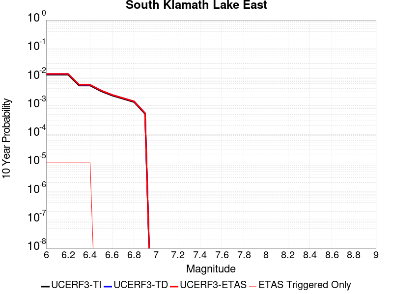 |

| Magnitude | 1 wk TI Prob | 1 wk TD Prob | 1 wk ETAS Prob | 1 wk ETAS/TD Gain | 1 wk ETAS Triggered Only | 1 mo TI Prob | 1 mo TD Prob | 1 mo ETAS Prob | 1 mo ETAS/TD Gain | 1 mo ETAS Triggered Only | 1 yr TI Prob | 1 yr TD Prob | 1 yr ETAS Prob | 1 yr ETAS/TD Gain | 1 yr ETAS Triggered Only | 10 yr TI Prob | 10 yr TD Prob | 10 yr ETAS Prob | 10 yr ETAS/TD Gain | 10 yr ETAS Triggered Only |
|-----|-----|-----|-----|-----|-----|-----|-----|-----|-----|-----|-----|-----|-----|-----|-----|-----|-----|-----|-----|-----|
| 6.0 | 2.3539369E-5 | 2.5047308E-5 | 2.5047308E-5 | 1.0 | 0.0 | 1.0087911E-4 | 1.0734166E-4 | 1.1734058E-4 | 1.0931505 | 1.0E-5 | 0.0012275111 | 0.0013061843 | 0.0013161713 | 1.0076458 | 1.0E-5 | 0.012207527 | 0.012993417 | 0.013003287 | 1.0007596 | 1.0E-5 |
| 6.1 | 2.3539369E-5 | 2.5047308E-5 | 2.5047308E-5 | 1.0 | 0.0 | 1.0087911E-4 | 1.0734166E-4 | 1.1734058E-4 | 1.0931505 | 1.0E-5 | 0.0012275111 | 0.0013061843 | 0.0013161713 | 1.0076458 | 1.0E-5 | 0.012207527 | 0.012993417 | 0.013003287 | 1.0007596 | 1.0E-5 |
| 6.2 | 2.3539369E-5 | 2.5047308E-5 | 2.5047308E-5 | 1.0 | 0.0 | 1.0087911E-4 | 1.0734166E-4 | 1.1734058E-4 | 1.0931505 | 1.0E-5 | 0.0012275111 | 0.0013061843 | 0.0013161713 | 1.0076458 | 1.0E-5 | 0.012207527 | 0.012993417 | 0.013003287 | 1.0007596 | 1.0E-5 |
| 6.3 | 9.807823E-6 | 1.0396044E-5 | 1.0396044E-5 | 1.0 | 0.0 | 4.2032847E-5 | 4.455376E-5 | 5.455331E-5 | 1.224438 | 1.0E-5 | 5.1162974E-4 | 5.4231536E-4 | 5.5230997E-4 | 1.0184294 | 1.0E-5 | 0.005104534 | 0.005410756 | 0.005420702 | 1.0018382 | 1.0E-5 |
| 6.4 | 9.807823E-6 | 1.0396044E-5 | 1.0396044E-5 | 1.0 | 0.0 | 4.2032847E-5 | 4.455376E-5 | 5.455331E-5 | 1.224438 | 1.0E-5 | 5.1162974E-4 | 5.4231536E-4 | 5.5230997E-4 | 1.0184294 | 1.0E-5 | 0.005104534 | 0.005410756 | 0.005420702 | 1.0018382 | 1.0E-5 |
| 6.5 | 6.191981E-6 | 6.5508398E-6 | 6.5508398E-6 | 1.0 | 0.0 | 2.653679E-5 | 2.8074743E-5 | 2.8074743E-5 | 1.0 | 0.0 | 3.2303753E-4 | 3.4175918E-4 | 3.4175918E-4 | 1.0 | 0.0 | 0.0032256835 | 0.003412614 | 0.003412614 | 1.0 | 0.0 |
| 6.6 | 4.3693776E-6 | 4.6165574E-6 | 4.6165574E-6 | 1.0 | 0.0 | 1.8725768E-5 | 1.9785102E-5 | 1.9785102E-5 | 1.0 | 0.0 | 2.2796239E-4 | 2.4085813E-4 | 2.4085813E-4 | 1.0 | 0.0 | 0.0022772867 | 0.0024060833 | 0.0024060833 | 1.0 | 0.0 |
| 6.7 | 3.360834E-6 | 3.5512403E-6 | 3.5512403E-6 | 1.0 | 0.0 | 1.4403494E-5 | 1.5219517E-5 | 1.5219517E-5 | 1.0 | 0.0 | 1.7534842E-4 | 1.8528267E-4 | 1.8528267E-4 | 1.0 | 0.0 | 0.0017521014 | 0.0018513618 | 0.0018513618 | 1.0 | 0.0 |
| 6.8 | 2.57873E-6 | 2.7251708E-6 | 2.7251708E-6 | 1.0 | 0.0 | 1.1051653E-5 | 1.1679254E-5 | 1.1679254E-5 | 1.0 | 0.0 | 1.3454557E-4 | 1.4218627E-4 | 1.4218627E-4 | 1.0 | 0.0 | 0.0013446413 | 0.0014210136 | 0.0014210136 | 1.0 | 0.0 |
| 6.9 | 9.987825E-7 | 1.0566213E-6 | 1.0566213E-6 | 1.0 | 0.0 | 4.2804895E-6 | 4.528371E-6 | 4.528371E-6 | 1.0 | 0.0 | 5.211371E-5 | 5.5131848E-5 | 5.5131848E-5 | 1.0 | 0.0 | 5.210149E-4 | 5.5121386E-4 | 5.5121386E-4 | 1.0 | 0.0 |

## Great Valley 06 (Midland) 2011 CFM alt1
*[(top)](#table-of-contents)*

| 1 Week | 1 Month | 1 Year | 10 Year |
|-----|-----|-----|-----|
|  |  |  | 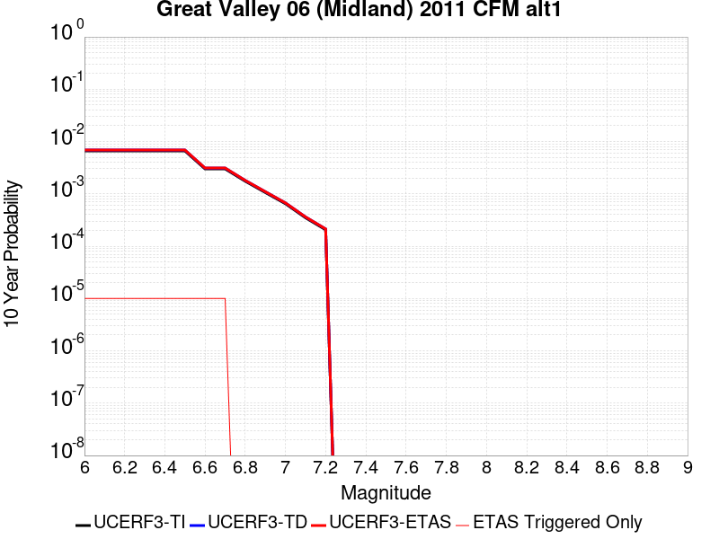 |

| Magnitude | 1 wk TI Prob | 1 wk TD Prob | 1 wk ETAS Prob | 1 wk ETAS/TD Gain | 1 wk ETAS Triggered Only | 1 mo TI Prob | 1 mo TD Prob | 1 mo ETAS Prob | 1 mo ETAS/TD Gain | 1 mo ETAS Triggered Only | 1 yr TI Prob | 1 yr TD Prob | 1 yr ETAS Prob | 1 yr ETAS/TD Gain | 1 yr ETAS Triggered Only | 10 yr TI Prob | 10 yr TD Prob | 10 yr ETAS Prob | 10 yr ETAS/TD Gain | 10 yr ETAS Triggered Only |
|-----|-----|-----|-----|-----|-----|-----|-----|-----|-----|-----|-----|-----|-----|-----|-----|-----|-----|-----|-----|-----|
| 6.0 | 1.2712525E-5 | 1.3210576E-5 | 1.3210576E-5 | 1.0 | 0.0 | 5.4481112E-5 | 5.6615667E-5 | 5.6615667E-5 | 1.0 | 0.0 | 6.6310563E-4 | 6.8910315E-4 | 6.9909624E-4 | 1.0145016 | 1.0E-5 | 0.0066113044 | 0.006872179 | 0.00688211 | 1.0014452 | 1.0E-5 |
| 6.1 | 1.2712525E-5 | 1.3210576E-5 | 1.3210576E-5 | 1.0 | 0.0 | 5.4481112E-5 | 5.6615667E-5 | 5.6615667E-5 | 1.0 | 0.0 | 6.6310563E-4 | 6.8910315E-4 | 6.9909624E-4 | 1.0145016 | 1.0E-5 | 0.0066113044 | 0.006872179 | 0.00688211 | 1.0014452 | 1.0E-5 |
| 6.2 | 1.2712525E-5 | 1.3210576E-5 | 1.3210576E-5 | 1.0 | 0.0 | 5.4481112E-5 | 5.6615667E-5 | 5.6615667E-5 | 1.0 | 0.0 | 6.6310563E-4 | 6.8910315E-4 | 6.9909624E-4 | 1.0145016 | 1.0E-5 | 0.0066113044 | 0.006872179 | 0.00688211 | 1.0014452 | 1.0E-5 |
| 6.3 | 1.2712525E-5 | 1.3210576E-5 | 1.3210576E-5 | 1.0 | 0.0 | 5.4481112E-5 | 5.6615667E-5 | 5.6615667E-5 | 1.0 | 0.0 | 6.6310563E-4 | 6.8910315E-4 | 6.9909624E-4 | 1.0145016 | 1.0E-5 | 0.0066113044 | 0.006872179 | 0.00688211 | 1.0014452 | 1.0E-5 |
| 6.4 | 1.2712525E-5 | 1.3210576E-5 | 1.3210576E-5 | 1.0 | 0.0 | 5.4481112E-5 | 5.6615667E-5 | 5.6615667E-5 | 1.0 | 0.0 | 6.6310563E-4 | 6.8910315E-4 | 6.9909624E-4 | 1.0145016 | 1.0E-5 | 0.0066113044 | 0.006872179 | 0.00688211 | 1.0014452 | 1.0E-5 |
| 6.5 | 1.2712525E-5 | 1.3210576E-5 | 1.3210576E-5 | 1.0 | 0.0 | 5.4481112E-5 | 5.6615667E-5 | 5.6615667E-5 | 1.0 | 0.0 | 6.6310563E-4 | 6.8910315E-4 | 6.9909624E-4 | 1.0145016 | 1.0E-5 | 0.0066113044 | 0.006872179 | 0.00688211 | 1.0014452 | 1.0E-5 |
| 6.6 | 5.7574384E-6 | 5.9706463E-6 | 5.9706463E-6 | 1.0 | 0.0 | 2.4674504E-5 | 2.5588255E-5 | 2.5588255E-5 | 1.0 | 0.0 | 3.0037065E-4 | 3.1149638E-4 | 3.1149638E-4 | 1.0 | 0.0 | 0.0029996498 | 0.0031109843 | 0.0031209532 | 1.0032045 | 1.0E-5 |
| 6.7 | 5.7574384E-6 | 5.9706463E-6 | 5.9706463E-6 | 1.0 | 0.0 | 2.4674504E-5 | 2.5588255E-5 | 2.5588255E-5 | 1.0 | 0.0 | 3.0037065E-4 | 3.1149638E-4 | 3.1149638E-4 | 1.0 | 0.0 | 0.0029996498 | 0.0031109843 | 0.0031209532 | 1.0032045 | 1.0E-5 |
| 6.8 | 3.3474828E-6 | 3.4693849E-6 | 3.4693849E-6 | 1.0 | 0.0 | 1.4346277E-5 | 1.4868716E-5 | 1.4868716E-5 | 1.0 | 0.0 | 1.7465191E-4 | 1.8101306E-4 | 1.8101306E-4 | 1.0 | 0.0 | 0.0017451472 | 0.0018088033 | 0.0018088033 | 1.0 | 0.0 |
| 6.9 | 2.035106E-6 | 2.1090357E-6 | 2.1090357E-6 | 1.0 | 0.0 | 8.721853E-6 | 9.038697E-6 | 9.038697E-6 | 1.0 | 0.0 | 1.0618339E-4 | 1.10041314E-4 | 1.10041314E-4 | 1.0 | 0.0 | 0.0010613267 | 0.0010999405 | 0.0010999405 | 1.0 | 0.0 |
| 7.0 | 1.2424716E-6 | 1.2878762E-6 | 1.2878762E-6 | 1.0 | 0.0 | 5.3248673E-6 | 5.51946E-6 | 5.51946E-6 | 1.0 | 0.0 | 6.482833E-5 | 6.7197805E-5 | 6.7197805E-5 | 1.0 | 0.0 | 6.480942E-4 | 6.718192E-4 | 6.718192E-4 | 1.0 | 0.0 |
| 7.1 | 6.6904556E-7 | 6.939035E-7 | 6.939035E-7 | 1.0 | 0.0 | 2.867335E-6 | 2.97387E-6 | 2.97387E-6 | 1.0 | 0.0 | 3.4909244E-5 | 3.6206526E-5 | 3.6206526E-5 | 1.0 | 0.0 | 3.490376E-4 | 3.6203177E-4 | 3.6203177E-4 | 1.0 | 0.0 |
| 7.2 | 3.948168E-7 | 4.095705E-7 | 4.095705E-7 | 1.0 | 0.0 | 1.6920709E-6 | 1.7553022E-6 | 1.7553022E-6 | 1.0 | 0.0 | 2.0600768E-5 | 2.1370803E-5 | 2.1370803E-5 | 1.0 | 0.0 | 2.0598859E-4 | 2.1370803E-4 | 2.1370803E-4 | 1.0 | 0.0 |

## Hector Mine
*[(top)](#table-of-contents)*

| 1 Week | 1 Month | 1 Year | 10 Year |
|-----|-----|-----|-----|
|  |  |  |  |

| Magnitude | 1 wk TI Prob | 1 wk TD Prob | 1 wk ETAS Prob | 1 wk ETAS/TD Gain | 1 wk ETAS Triggered Only | 1 mo TI Prob | 1 mo TD Prob | 1 mo ETAS Prob | 1 mo ETAS/TD Gain | 1 mo ETAS Triggered Only | 1 yr TI Prob | 1 yr TD Prob | 1 yr ETAS Prob | 1 yr ETAS/TD Gain | 1 yr ETAS Triggered Only | 10 yr TI Prob | 10 yr TD Prob | 10 yr ETAS Prob | 10 yr ETAS/TD Gain | 10 yr ETAS Triggered Only |
|-----|-----|-----|-----|-----|-----|-----|-----|-----|-----|-----|-----|-----|-----|-----|-----|-----|-----|-----|-----|-----|
| 6.0 | 1.8760093E-5 | 2.7962699E-6 | 1.2796242E-5 | 4.576183 | 1.0E-5 | 8.039792E-5 | 1.19839815E-5 | 2.1983862E-5 | 1.8344373 | 1.0E-5 | 9.78405E-4 | 1.458992E-4 | 1.5589774E-4 | 1.0685304 | 1.0E-5 | 0.009741086 | 0.0014584264 | 0.0014783972 | 1.0136935 | 2.0E-5 |
| 6.1 | 1.8760093E-5 | 2.7962699E-6 | 1.2796242E-5 | 4.576183 | 1.0E-5 | 8.039792E-5 | 1.19839815E-5 | 2.1983862E-5 | 1.8344373 | 1.0E-5 | 9.78405E-4 | 1.458992E-4 | 1.5589774E-4 | 1.0685304 | 1.0E-5 | 0.009741086 | 0.0014584264 | 0.0014783972 | 1.0136935 | 2.0E-5 |
| 6.2 | 1.8760093E-5 | 2.7962699E-6 | 1.2796242E-5 | 4.576183 | 1.0E-5 | 8.039792E-5 | 1.19839815E-5 | 2.1983862E-5 | 1.8344373 | 1.0E-5 | 9.78405E-4 | 1.458992E-4 | 1.5589774E-4 | 1.0685304 | 1.0E-5 | 0.009741086 | 0.0014584264 | 0.0014783972 | 1.0136935 | 2.0E-5 |
| 6.3 | 1.8760093E-5 | 2.7962699E-6 | 1.2796242E-5 | 4.576183 | 1.0E-5 | 8.039792E-5 | 1.19839815E-5 | 2.1983862E-5 | 1.8344373 | 1.0E-5 | 9.78405E-4 | 1.458992E-4 | 1.5589774E-4 | 1.0685304 | 1.0E-5 | 0.009741086 | 0.0014584264 | 0.0014783972 | 1.0136935 | 2.0E-5 |
| 6.4 | 1.0888055E-5 | 2.7962699E-6 | 1.2796242E-5 | 4.576183 | 1.0E-5 | 4.666226E-5 | 1.19839815E-5 | 2.1983862E-5 | 1.8344373 | 1.0E-5 | 5.679649E-4 | 1.458992E-4 | 1.5589774E-4 | 1.0685304 | 1.0E-5 | 0.0056651547 | 0.0014584264 | 0.0014783972 | 1.0136935 | 2.0E-5 |
| 6.5 | 1.0888055E-5 | 2.7962699E-6 | 1.2796242E-5 | 4.576183 | 1.0E-5 | 4.666226E-5 | 1.19839815E-5 | 2.1983862E-5 | 1.8344373 | 1.0E-5 | 5.679649E-4 | 1.458992E-4 | 1.5589774E-4 | 1.0685304 | 1.0E-5 | 0.0056651547 | 0.0014584264 | 0.0014783972 | 1.0136935 | 2.0E-5 |
| 6.6 | 1.0730738E-5 | 2.7962699E-6 | 1.2796242E-5 | 4.576183 | 1.0E-5 | 4.5988065E-5 | 1.19839815E-5 | 2.1983862E-5 | 1.8344373 | 1.0E-5 | 5.5976084E-4 | 1.458992E-4 | 1.5589774E-4 | 1.0685304 | 1.0E-5 | 0.0055835294 | 0.0014584264 | 0.0014783972 | 1.0136935 | 2.0E-5 |
| 6.7 | 7.881326E-6 | 2.770952E-6 | 1.27709245E-5 | 4.6088576 | 1.0E-5 | 3.3776672E-5 | 1.1875478E-5 | 2.187536E-5 | 1.8420614 | 1.0E-5 | 4.111534E-4 | 1.4457834E-4 | 1.545769E-4 | 1.0691566 | 1.0E-5 | 0.0041039353 | 0.001445235 | 0.001465206 | 1.0138186 | 2.0E-5 |
| 6.8 | 7.5683483E-6 | 2.7327321E-6 | 1.2732705E-5 | 4.6593313 | 1.0E-5 | 3.2435375E-5 | 1.1711679E-5 | 2.1711561E-5 | 1.8538386 | 1.0E-5 | 3.9482914E-4 | 1.4258435E-4 | 1.5258293E-4 | 1.0701239 | 1.0E-5 | 0.0039412836 | 0.0014253207 | 0.0014452923 | 1.014012 | 2.0E-5 |
| 6.9 | 6.473048E-6 | 2.513824E-6 | 1.25137985E-5 | 4.977993 | 1.0E-5 | 2.7741338E-5 | 1.07735095E-5 | 2.0773401E-5 | 1.9281926 | 1.0E-5 | 3.3769844E-4 | 1.3116356E-4 | 1.4116225E-4 | 1.0762306 | 1.0E-5 | 0.0033718573 | 0.001311251 | 0.0013312247 | 1.0152326 | 2.0E-5 |
| 7.0 | 4.9959954E-6 | 1.8564588E-6 | 1.185644E-5 | 6.3865895 | 1.0E-5 | 2.1411232E-5 | 7.956248E-6 | 1.7956168E-5 | 2.2568638 | 1.0E-5 | 2.6065056E-4 | 9.686658E-5 | 1.06865606E-4 | 1.1032248 | 1.0E-5 | 0.0026034506 | 9.685931E-4 | 9.885738E-4 | 1.0206285 | 2.0E-5 |
| 7.1 | 1.2997541E-6 | 1.5599346E-7 | 1.5599346E-7 | 1.0 | 0.0 | 5.5703626E-6 | 6.685433E-7 | 6.685433E-7 | 1.0 | 0.0 | 6.7817055E-5 | 8.139488E-6 | 8.139488E-6 | 1.0 | 0.0 | 6.779636E-4 | 8.1392296E-5 | 8.1392296E-5 | 1.0 | 0.0 |
| 7.2 | 8.392699E-7 | 9.725453E-8 | 9.725453E-8 | 1.0 | 0.0 | 3.596866E-6 | 4.1680505E-7 | 4.1680505E-7 | 1.0 | 0.0 | 4.3790962E-5 | 5.0745916E-6 | 5.0745916E-6 | 1.0 | 0.0 | 4.3782333E-4 | 5.074495E-5 | 5.074495E-5 | 1.0 | 0.0 |
| 7.3 | 3.13015E-7 | 4.8283802E-8 | 4.8283802E-8 | 1.0 | 0.0 | 1.3414921E-6 | 2.0693057E-7 | 2.0693057E-7 | 1.0 | 0.0 | 1.6332544E-5 | 2.5193776E-6 | 2.5193776E-6 | 1.0 | 0.0 | 1.6331344E-4 | 2.5193574E-5 | 2.5193574E-5 | 1.0 | 0.0 |

## Owens Valley Keough Hot Springs
*[(top)](#table-of-contents)*

| 1 Week | 1 Month | 1 Year | 10 Year |
|-----|-----|-----|-----|
|  |  |  | 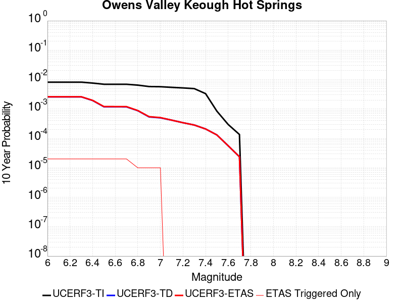 |

| Magnitude | 1 wk TI Prob | 1 wk TD Prob | 1 wk ETAS Prob | 1 wk ETAS/TD Gain | 1 wk ETAS Triggered Only | 1 mo TI Prob | 1 mo TD Prob | 1 mo ETAS Prob | 1 mo ETAS/TD Gain | 1 mo ETAS Triggered Only | 1 yr TI Prob | 1 yr TD Prob | 1 yr ETAS Prob | 1 yr ETAS/TD Gain | 1 yr ETAS Triggered Only | 10 yr TI Prob | 10 yr TD Prob | 10 yr ETAS Prob | 10 yr ETAS/TD Gain | 10 yr ETAS Triggered Only |
|-----|-----|-----|-----|-----|-----|-----|-----|-----|-----|-----|-----|-----|-----|-----|-----|-----|-----|-----|-----|-----|
| 6.0 | 1.5708529E-5 | 4.950463E-6 | 4.950463E-6 | 1.0 | 0.0 | 6.7320536E-5 | 2.1216127E-5 | 3.1215914E-5 | 1.4713296 | 1.0E-5 | 8.193192E-4 | 2.5828084E-4 | 2.782757E-4 | 1.0774151 | 2.0E-5 | 0.008163051 | 0.0025804387 | 0.0026003872 | 1.0077306 | 2.0E-5 |
| 6.1 | 1.5708529E-5 | 4.950463E-6 | 4.950463E-6 | 1.0 | 0.0 | 6.7320536E-5 | 2.1216127E-5 | 3.1215914E-5 | 1.4713296 | 1.0E-5 | 8.193192E-4 | 2.5828084E-4 | 2.782757E-4 | 1.0774151 | 2.0E-5 | 0.008163051 | 0.0025804387 | 0.0026003872 | 1.0077306 | 2.0E-5 |
| 6.2 | 1.5708529E-5 | 4.950463E-6 | 4.950463E-6 | 1.0 | 0.0 | 6.7320536E-5 | 2.1216127E-5 | 3.1215914E-5 | 1.4713296 | 1.0E-5 | 8.193192E-4 | 2.5828084E-4 | 2.782757E-4 | 1.0774151 | 2.0E-5 | 0.008163051 | 0.0025804387 | 0.0026003872 | 1.0077306 | 2.0E-5 |
| 6.3 | 1.5708529E-5 | 4.950463E-6 | 4.950463E-6 | 1.0 | 0.0 | 6.7320536E-5 | 2.1216127E-5 | 3.1215914E-5 | 1.4713296 | 1.0E-5 | 8.193192E-4 | 2.5828084E-4 | 2.782757E-4 | 1.0774151 | 2.0E-5 | 0.008163051 | 0.0025804387 | 0.0026003872 | 1.0077306 | 2.0E-5 |
| 6.4 | 1.4622509E-5 | 3.7263276E-6 | 3.7263276E-6 | 1.0 | 0.0 | 6.266639E-5 | 1.5969896E-5 | 2.5969737E-5 | 1.6261681 | 1.0E-5 | 7.626962E-4 | 1.9441944E-4 | 2.1441556E-4 | 1.1028503 | 2.0E-5 | 0.007600839 | 0.0019429466 | 0.0019629078 | 1.0102737 | 2.0E-5 |
| 6.5 | 1.3335527E-5 | 2.2775241E-6 | 2.2775241E-6 | 1.0 | 0.0 | 5.7151006E-5 | 9.760785E-6 | 1.9760688E-5 | 2.0244977 | 1.0E-5 | 6.955913E-4 | 1.1883176E-4 | 1.3882939E-4 | 1.1682851 | 2.0E-5 | 0.0069341804 | 0.001187878 | 0.0012078542 | 1.0168167 | 2.0E-5 |
| 6.6 | 1.3332855E-5 | 2.2746733E-6 | 2.2746733E-6 | 1.0 | 0.0 | 5.7139558E-5 | 9.748568E-6 | 1.974847E-5 | 2.0257816 | 1.0E-5 | 6.9545204E-4 | 1.1868303E-4 | 1.3868065E-4 | 1.1684961 | 2.0E-5 | 0.0069327964 | 0.0011863923 | 0.0012063686 | 1.0168378 | 2.0E-5 |
| 6.7 | 1.3318214E-5 | 2.2639038E-6 | 2.2639038E-6 | 1.0 | 0.0 | 5.707681E-5 | 9.702413E-6 | 1.9702316E-5 | 2.0306613 | 1.0E-5 | 6.946886E-4 | 1.18121156E-4 | 1.3811879E-4 | 1.1692977 | 2.0E-5 | 0.0069252094 | 0.0011807795 | 0.0012007558 | 1.016918 | 2.0E-5 |
| 6.8 | 1.2441338E-5 | 1.677594E-6 | 1.677594E-6 | 1.0 | 0.0 | 5.331893E-5 | 7.1896707E-6 | 7.1896707E-6 | 1.0 | 0.0 | 6.489646E-4 | 8.753102E-5 | 9.7530145E-5 | 1.1142352 | 1.0E-5 | 0.0064707273 | 8.751236E-4 | 8.8511483E-4 | 1.0114169 | 1.0E-5 |
| 6.9 | 1.1130476E-5 | 1.0302234E-6 | 1.0302234E-6 | 1.0 | 0.0 | 4.7701167E-5 | 4.4152357E-6 | 4.4152357E-6 | 1.0 | 0.0 | 5.806069E-4 | 5.3754186E-5 | 6.375365E-5 | 1.186022 | 1.0E-5 | 0.0057909233 | 5.375404E-4 | 5.47535E-4 | 1.0185933 | 1.0E-5 |
| 7.0 | 1.0986073E-5 | 9.577824E-7 | 9.577824E-7 | 1.0 | 0.0 | 4.7082318E-5 | 4.1047756E-6 | 4.1047756E-6 | 1.0 | 0.0 | 5.730765E-4 | 4.9974507E-5 | 5.997401E-5 | 1.2000921 | 1.0E-5 | 0.0057160086 | 4.997603E-4 | 5.0975534E-4 | 1.0199996 | 1.0E-5 |
| 7.1 | 1.0451338E-5 | 7.9988575E-7 | 7.9988575E-7 | 1.0 | 0.0 | 4.4790682E-5 | 3.4280772E-6 | 3.4280772E-6 | 1.0 | 0.0 | 5.451901E-4 | 4.1736046E-5 | 4.1736046E-5 | 1.0 | 0.0 | 0.005438545 | 4.1740583E-4 | 4.1740583E-4 | 1.0 | 0.0 |
| 7.2 | 9.989061E-6 | 6.543693E-7 | 6.543693E-7 | 1.0 | 0.0 | 4.280956E-5 | 2.8044367E-6 | 2.8044367E-6 | 1.0 | 0.0 | 5.2108173E-4 | 3.4143486E-5 | 3.4143486E-5 | 1.0 | 0.0 | 0.0051986156 | 3.41488E-4 | 3.41488E-4 | 1.0 | 0.0 |
| 7.3 | 9.465365E-6 | 5.458855E-7 | 5.458855E-7 | 1.0 | 0.0 | 4.056522E-5 | 2.3395073E-6 | 2.3395073E-6 | 1.0 | 0.0 | 4.937696E-4 | 2.8483131E-5 | 2.8483131E-5 | 1.0 | 0.0 | 0.0049267393 | 2.8489542E-4 | 2.8489542E-4 | 1.0 | 0.0 |
| 7.4 | 6.3824805E-6 | 4.0153776E-7 | 4.0153776E-7 | 1.0 | 0.0 | 2.73532E-5 | 1.7208749E-6 | 1.7208749E-6 | 1.0 | 0.0 | 3.3297433E-4 | 2.0951453E-5 | 2.0951453E-5 | 1.0 | 0.0 | 0.0033247585 | 2.0955436E-4 | 2.0955436E-4 | 1.0 | 0.0 |
| 7.5 | 1.6192645E-6 | 2.5156373E-7 | 2.5156373E-7 | 1.0 | 0.0 | 6.9396865E-6 | 1.0781299E-6 | 1.0781299E-6 | 1.0 | 0.0 | 8.448741E-5 | 1.3126153E-5 | 1.3126153E-5 | 1.0 | 0.0 | 8.4455294E-4 | 1.3125391E-4 | 1.3125391E-4 | 1.0 | 0.0 |
| 7.6 | 5.7062545E-7 | 1.0790214E-7 | 1.0790214E-7 | 1.0 | 0.0 | 2.4455355E-6 | 4.6243767E-7 | 4.6243767E-7 | 1.0 | 0.0 | 2.9773988E-5 | 5.630165E-6 | 5.630165E-6 | 1.0 | 0.0 | 2.977E-4 | 5.6300305E-5 | 5.6300305E-5 | 1.0 | 0.0 |
| 7.7 | 2.5988817E-7 | 4.5445965E-8 | 4.5445965E-8 | 1.0 | 0.0 | 1.113806E-6 | 1.9476842E-7 | 1.9476842E-7 | 1.0 | 0.0 | 1.3560503E-5 | 2.3713033E-6 | 2.3713033E-6 | 1.0 | 0.0 | 1.3559677E-4 | 2.3712824E-5 | 2.3712824E-5 | 1.0 | 0.0 |

## West Tahoe
*[(top)](#table-of-contents)*

| 1 Week | 1 Month | 1 Year | 10 Year |
|-----|-----|-----|-----|
| 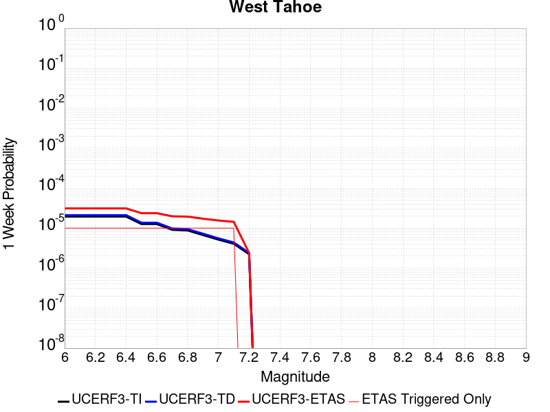 |  | 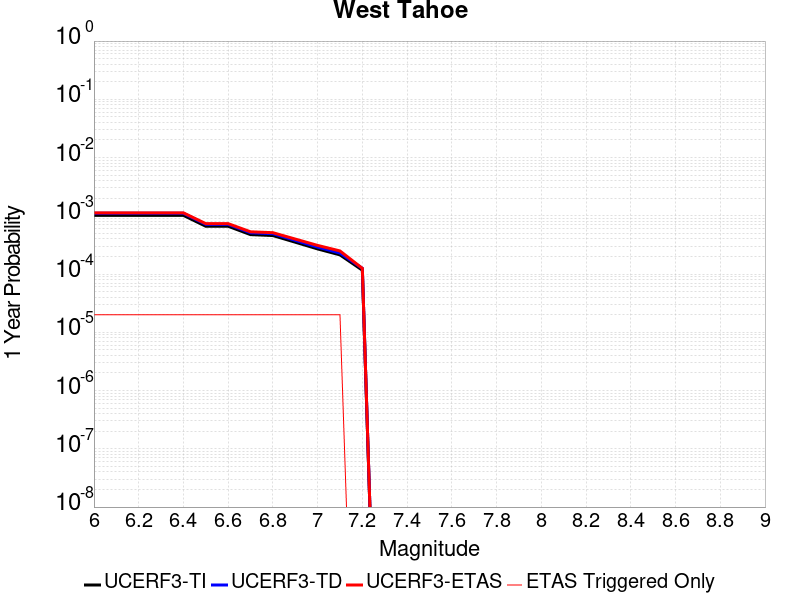 |  |

| Magnitude | 1 wk TI Prob | 1 wk TD Prob | 1 wk ETAS Prob | 1 wk ETAS/TD Gain | 1 wk ETAS Triggered Only | 1 mo TI Prob | 1 mo TD Prob | 1 mo ETAS Prob | 1 mo ETAS/TD Gain | 1 mo ETAS Triggered Only | 1 yr TI Prob | 1 yr TD Prob | 1 yr ETAS Prob | 1 yr ETAS/TD Gain | 1 yr ETAS Triggered Only | 10 yr TI Prob | 10 yr TD Prob | 10 yr ETAS Prob | 10 yr ETAS/TD Gain | 10 yr ETAS Triggered Only |
|-----|-----|-----|-----|-----|-----|-----|-----|-----|-----|-----|-----|-----|-----|-----|-----|-----|-----|-----|-----|-----|
| 6.0 | 1.952444E-5 | 2.118317E-5 | 3.1182957E-5 | 1.4720628 | 1.0E-5 | 8.367348E-5 | 9.078217E-5 | 1.0078125E-4 | 1.1101438 | 1.0E-5 | 0.0010182485 | 0.0011047672 | 0.001124745 | 1.0180833 | 2.0E-5 | 0.010135954 | 0.010998235 | 0.011018015 | 1.0017985 | 2.0E-5 |
| 6.1 | 1.952444E-5 | 2.118317E-5 | 3.1182957E-5 | 1.4720628 | 1.0E-5 | 8.367348E-5 | 9.078217E-5 | 1.0078125E-4 | 1.1101438 | 1.0E-5 | 0.0010182485 | 0.0011047672 | 0.001124745 | 1.0180833 | 2.0E-5 | 0.010135954 | 0.010998235 | 0.011018015 | 1.0017985 | 2.0E-5 |
| 6.2 | 1.952444E-5 | 2.118317E-5 | 3.1182957E-5 | 1.4720628 | 1.0E-5 | 8.367348E-5 | 9.078217E-5 | 1.0078125E-4 | 1.1101438 | 1.0E-5 | 0.0010182485 | 0.0011047672 | 0.001124745 | 1.0180833 | 2.0E-5 | 0.010135954 | 0.010998235 | 0.011018015 | 1.0017985 | 2.0E-5 |
| 6.3 | 1.952444E-5 | 2.118317E-5 | 3.1182957E-5 | 1.4720628 | 1.0E-5 | 8.367348E-5 | 9.078217E-5 | 1.0078125E-4 | 1.1101438 | 1.0E-5 | 0.0010182485 | 0.0011047672 | 0.001124745 | 1.0180833 | 2.0E-5 | 0.010135954 | 0.010998235 | 0.011018015 | 1.0017985 | 2.0E-5 |
| 6.4 | 1.952444E-5 | 2.118317E-5 | 3.1182957E-5 | 1.4720628 | 1.0E-5 | 8.367348E-5 | 9.078217E-5 | 1.0078125E-4 | 1.1101438 | 1.0E-5 | 0.0010182485 | 0.0011047672 | 0.001124745 | 1.0180833 | 2.0E-5 | 0.010135954 | 0.010998235 | 0.011018015 | 1.0017985 | 2.0E-5 |
| 6.5 | 1.2685271E-5 | 1.3690627E-5 | 2.369049E-5 | 1.7304167 | 1.0E-5 | 5.4364315E-5 | 5.8672893E-5 | 6.867231E-5 | 1.1704265 | 1.0E-5 | 6.616845E-4 | 7.141248E-4 | 7.3411054E-4 | 1.0279863 | 2.0E-5 | 0.0065971776 | 0.00711995 | 0.0071398076 | 1.002789 | 2.0E-5 |
| 6.6 | 1.2685271E-5 | 1.3690627E-5 | 2.369049E-5 | 1.7304167 | 1.0E-5 | 5.4364315E-5 | 5.8672893E-5 | 6.867231E-5 | 1.1704265 | 1.0E-5 | 6.616845E-4 | 7.141248E-4 | 7.3411054E-4 | 1.0279863 | 2.0E-5 | 0.0065971776 | 0.00711995 | 0.0071398076 | 1.002789 | 2.0E-5 |
| 6.7 | 9.117886E-6 | 9.809846E-6 | 1.9809748E-5 | 2.019374 | 1.0E-5 | 3.9076072E-5 | 4.2041564E-5 | 5.204114E-5 | 1.2378498 | 1.0E-5 | 4.756473E-4 | 5.11743E-4 | 5.3173275E-4 | 1.0390621 | 2.0E-5 | 0.0047463053 | 0.0051063634 | 0.0051262616 | 1.0038967 | 2.0E-5 |
| 6.8 | 8.786828E-6 | 9.457863E-6 | 1.9457768E-5 | 2.0573113 | 1.0E-5 | 3.7657293E-5 | 4.053311E-5 | 5.0532704E-5 | 1.2467018 | 1.0E-5 | 4.5838108E-4 | 4.933859E-4 | 5.13376E-4 | 1.0405163 | 2.0E-5 | 0.0045743673 | 0.0049236063 | 0.0049435077 | 1.004042 | 2.0E-5 |
| 6.9 | 6.7562123E-6 | 7.2638086E-6 | 1.7263736E-5 | 2.3766782 | 1.0E-5 | 2.8954875E-5 | 3.1130265E-5 | 4.112995E-5 | 1.3212209 | 1.0E-5 | 3.5246857E-4 | 3.789498E-4 | 3.9894224E-4 | 1.0527574 | 2.0E-5 | 0.0035191004 | 0.0037835082 | 0.0038034325 | 1.0052661 | 2.0E-5 |
| 7.0 | 5.1792854E-6 | 5.567338E-6 | 1.5567282E-5 | 2.7961805 | 1.0E-5 | 2.2196748E-5 | 2.3859824E-5 | 3.3859586E-5 | 1.4191046 | 1.0E-5 | 2.702119E-4 | 2.9045844E-4 | 3.1045263E-4 | 1.0688367 | 2.0E-5 | 0.0026988357 | 0.0029011632 | 0.0029211054 | 1.0068737 | 2.0E-5 |
| 7.1 | 4.090765E-6 | 4.3974223E-6 | 1.4397378E-5 | 3.2740493 | 1.0E-5 | 1.7531731E-5 | 1.884598E-5 | 2.884579E-5 | 1.5306071 | 1.0E-5 | 2.134279E-4 | 2.2942905E-4 | 2.4942445E-4 | 1.087153 | 2.0E-5 | 0.0021322304 | 0.0022922563 | 0.0023122104 | 1.008705 | 2.0E-5 |
| 7.2 | 2.2356758E-6 | 2.4023684E-6 | 2.4023684E-6 | 1.0 | 0.0 | 9.581432E-6 | 1.0295834E-5 | 1.0295834E-5 | 1.0 | 0.0 | 1.1664769E-4 | 1.2534647E-4 | 1.2534647E-4 | 1.0 | 0.0 | 0.0011658648 | 0.0012529434 | 0.0012529434 | 1.0 | 0.0 |

## Hat Creek-McArthur-Mayfield
*[(top)](#table-of-contents)*

| 1 Week | 1 Month | 1 Year | 10 Year |
|-----|-----|-----|-----|
|  |  |  |  |

| Magnitude | 1 wk TI Prob | 1 wk TD Prob | 1 wk ETAS Prob | 1 wk ETAS/TD Gain | 1 wk ETAS Triggered Only | 1 mo TI Prob | 1 mo TD Prob | 1 mo ETAS Prob | 1 mo ETAS/TD Gain | 1 mo ETAS Triggered Only | 1 yr TI Prob | 1 yr TD Prob | 1 yr ETAS Prob | 1 yr ETAS/TD Gain | 1 yr ETAS Triggered Only | 10 yr TI Prob | 10 yr TD Prob | 10 yr ETAS Prob | 10 yr ETAS/TD Gain | 10 yr ETAS Triggered Only |
|-----|-----|-----|-----|-----|-----|-----|-----|-----|-----|-----|-----|-----|-----|-----|-----|-----|-----|-----|-----|-----|
| 6.0 | 3.967457E-5 | 4.315831E-5 | 5.3157877E-5 | 1.231695 | 1.0E-5 | 1.7002279E-4 | 1.8495171E-4 | 1.9494987E-4 | 1.0540582 | 1.0E-5 | 0.002068062 | 0.002249576 | 0.0022595534 | 1.0044353 | 1.0E-5 | 0.02048922 | 0.022280399 | 0.022299953 | 1.0008776 | 2.0E-5 |
| 6.1 | 2.5044013E-5 | 2.7071164E-5 | 3.7070895E-5 | 1.3693868 | 1.0E-5 | 1.0732707E-4 | 1.1601429E-4 | 1.2601314E-4 | 1.0861863 | 1.0E-5 | 0.0013059238 | 0.0014115906 | 0.0014215765 | 1.0070742 | 1.0E-5 | 0.01298276 | 0.01402966 | 0.01403952 | 1.0007027 | 1.0E-5 |
| 6.2 | 2.5044013E-5 | 2.7071164E-5 | 3.7070895E-5 | 1.3693868 | 1.0E-5 | 1.0732707E-4 | 1.1601429E-4 | 1.2601314E-4 | 1.0861863 | 1.0E-5 | 0.0013059238 | 0.0014115906 | 0.0014215765 | 1.0070742 | 1.0E-5 | 0.01298276 | 0.01402966 | 0.01403952 | 1.0007027 | 1.0E-5 |
| 6.3 | 1.6624012E-5 | 1.7891072E-5 | 2.7890892E-5 | 1.558928 | 1.0E-5 | 7.124382E-5 | 7.6673816E-5 | 8.667305E-5 | 1.1304126 | 1.0E-5 | 8.670483E-4 | 9.331125E-4 | 9.4310316E-4 | 1.0107068 | 1.0E-5 | 0.008636732 | 0.009292879 | 0.009302787 | 1.0010661 | 1.0E-5 |
| 6.4 | 1.6624012E-5 | 1.7891072E-5 | 2.7890892E-5 | 1.558928 | 1.0E-5 | 7.124382E-5 | 7.6673816E-5 | 8.667305E-5 | 1.1304126 | 1.0E-5 | 8.670483E-4 | 9.331125E-4 | 9.4310316E-4 | 1.0107068 | 1.0E-5 | 0.008636732 | 0.009292879 | 0.009302787 | 1.0010661 | 1.0E-5 |
| 6.5 | 1.3394842E-5 | 1.4392137E-5 | 2.4391993E-5 | 1.6948138 | 1.0E-5 | 5.7405203E-5 | 6.167916E-5 | 7.167854E-5 | 1.1621193 | 1.0E-5 | 6.986842E-4 | 7.506906E-4 | 7.606831E-4 | 1.013311 | 1.0E-5 | 0.006964916 | 0.0074821403 | 0.007492066 | 1.0013266 | 1.0E-5 |
| 6.6 | 1.1137514E-5 | 1.1954546E-5 | 2.1954425E-5 | 1.8364918 | 1.0E-5 | 4.7731326E-5 | 5.1232782E-5 | 6.123227E-5 | 1.1951776 | 1.0E-5 | 5.809739E-4 | 6.2358467E-4 | 6.335784E-4 | 1.0160263 | 1.0E-5 | 0.005794574 | 0.00621877 | 0.0062287077 | 1.001598 | 1.0E-5 |
| 6.7 | 7.0200663E-6 | 7.5242897E-6 | 1.7524215E-5 | 2.329019 | 1.0E-5 | 3.008565E-5 | 3.2246568E-5 | 4.2246244E-5 | 1.3101006 | 1.0E-5 | 3.6623122E-4 | 3.925328E-4 | 4.0252888E-4 | 1.0254656 | 1.0E-5 | 0.0036562826 | 0.0039185574 | 0.003928518 | 1.002542 | 1.0E-5 |
| 6.8 | 5.940172E-6 | 6.3654766E-6 | 1.6365413E-5 | 2.5709643 | 1.0E-5 | 2.545763E-5 | 2.7280335E-5 | 3.7280064E-5 | 1.3665544 | 1.0E-5 | 3.0990256E-4 | 3.3208873E-4 | 3.420854E-4 | 1.0301025 | 1.0E-5 | 0.0030947074 | 0.0033160534 | 0.0033260202 | 1.0030056 | 1.0E-5 |
| 6.9 | 4.129831E-6 | 4.423547E-6 | 4.423547E-6 | 1.0 | 0.0 | 1.7699154E-5 | 1.8957926E-5 | 1.8957926E-5 | 1.0 | 0.0 | 2.154659E-4 | 2.3078908E-4 | 2.3078908E-4 | 1.0 | 0.0 | 0.002152571 | 0.0023055724 | 0.0023055724 | 1.0 | 0.0 |
| 7.0 | 2.6512955E-6 | 2.8374002E-6 | 2.8374002E-6 | 1.0 | 0.0 | 1.1362646E-5 | 1.2160232E-5 | 1.2160232E-5 | 1.0 | 0.0 | 1.3833142E-4 | 1.480412E-4 | 1.480412E-4 | 1.0 | 0.0 | 0.0013824535 | 0.0014794683 | 0.0014794683 | 1.0 | 0.0 |
| 7.1 | 1.2992575E-6 | 1.3909317E-6 | 1.3909317E-6 | 1.0 | 0.0 | 5.568235E-6 | 5.961124E-6 | 5.961124E-6 | 1.0 | 0.0 | 6.779115E-5 | 7.257448E-5 | 7.257448E-5 | 1.0 | 0.0 | 6.7770475E-4 | 7.2552945E-4 | 7.2552945E-4 | 1.0 | 0.0 |
| 7.2 | 4.968191E-7 | 5.3271475E-7 | 5.3271475E-7 | 1.0 | 0.0 | 2.1292228E-6 | 2.283062E-6 | 2.283062E-6 | 1.0 | 0.0 | 2.592298E-5 | 2.7796052E-5 | 2.7796052E-5 | 1.0 | 0.0 | 2.5919956E-4 | 2.7793812E-4 | 2.7793812E-4 | 1.0 | 0.0 |

## Anacapa-Dume alt 1
*[(top)](#table-of-contents)*

| 1 Week | 1 Month | 1 Year | 10 Year |
|-----|-----|-----|-----|
|  |  |  |  |

| Magnitude | 1 wk TI Prob | 1 wk TD Prob | 1 wk ETAS Prob | 1 wk ETAS/TD Gain | 1 wk ETAS Triggered Only | 1 mo TI Prob | 1 mo TD Prob | 1 mo ETAS Prob | 1 mo ETAS/TD Gain | 1 mo ETAS Triggered Only | 1 yr TI Prob | 1 yr TD Prob | 1 yr ETAS Prob | 1 yr ETAS/TD Gain | 1 yr ETAS Triggered Only | 10 yr TI Prob | 10 yr TD Prob | 10 yr ETAS Prob | 10 yr ETAS/TD Gain | 10 yr ETAS Triggered Only |
|-----|-----|-----|-----|-----|-----|-----|-----|-----|-----|-----|-----|-----|-----|-----|-----|-----|-----|-----|-----|-----|
| 6.0 | 5.1871802E-6 | 5.3673916E-6 | 1.5367337E-5 | 2.8630924 | 1.0E-5 | 2.2230583E-5 | 2.3002909E-5 | 3.3002678E-5 | 1.4347177 | 1.0E-5 | 2.7062374E-4 | 2.8002527E-4 | 2.9002246E-4 | 1.035701 | 1.0E-5 | 0.002702944 | 0.0027968097 | 0.0028167537 | 1.007131 | 2.0E-5 |
| 6.1 | 5.1871802E-6 | 5.3673916E-6 | 1.5367337E-5 | 2.8630924 | 1.0E-5 | 2.2230583E-5 | 2.3002909E-5 | 3.3002678E-5 | 1.4347177 | 1.0E-5 | 2.7062374E-4 | 2.8002527E-4 | 2.9002246E-4 | 1.035701 | 1.0E-5 | 0.002702944 | 0.0027968097 | 0.0028167537 | 1.007131 | 2.0E-5 |
| 6.2 | 5.1871802E-6 | 5.3673916E-6 | 1.5367337E-5 | 2.8630924 | 1.0E-5 | 2.2230583E-5 | 2.3002909E-5 | 3.3002678E-5 | 1.4347177 | 1.0E-5 | 2.7062374E-4 | 2.8002527E-4 | 2.9002246E-4 | 1.035701 | 1.0E-5 | 0.002702944 | 0.0027968097 | 0.0028167537 | 1.007131 | 2.0E-5 |
| 6.3 | 5.1871802E-6 | 5.3673916E-6 | 1.5367337E-5 | 2.8630924 | 1.0E-5 | 2.2230583E-5 | 2.3002909E-5 | 3.3002678E-5 | 1.4347177 | 1.0E-5 | 2.7062374E-4 | 2.8002527E-4 | 2.9002246E-4 | 1.035701 | 1.0E-5 | 0.002702944 | 0.0027968097 | 0.0028167537 | 1.007131 | 2.0E-5 |
| 6.4 | 5.1871802E-6 | 5.3673916E-6 | 1.5367337E-5 | 2.8630924 | 1.0E-5 | 2.2230583E-5 | 2.3002909E-5 | 3.3002678E-5 | 1.4347177 | 1.0E-5 | 2.7062374E-4 | 2.8002527E-4 | 2.9002246E-4 | 1.035701 | 1.0E-5 | 0.002702944 | 0.0027968097 | 0.0028167537 | 1.007131 | 2.0E-5 |
| 6.5 | 5.1871802E-6 | 5.3673916E-6 | 1.5367337E-5 | 2.8630924 | 1.0E-5 | 2.2230583E-5 | 2.3002909E-5 | 3.3002678E-5 | 1.4347177 | 1.0E-5 | 2.7062374E-4 | 2.8002527E-4 | 2.9002246E-4 | 1.035701 | 1.0E-5 | 0.002702944 | 0.0027968097 | 0.0028167537 | 1.007131 | 2.0E-5 |
| 6.6 | 5.1871802E-6 | 5.3673916E-6 | 1.5367337E-5 | 2.8630924 | 1.0E-5 | 2.2230583E-5 | 2.3002909E-5 | 3.3002678E-5 | 1.4347177 | 1.0E-5 | 2.7062374E-4 | 2.8002527E-4 | 2.9002246E-4 | 1.035701 | 1.0E-5 | 0.002702944 | 0.0027968097 | 0.0028167537 | 1.007131 | 2.0E-5 |
| 6.7 | 4.7693475E-6 | 4.9366927E-6 | 1.4936643E-5 | 3.0256376 | 1.0E-5 | 2.04399E-5 | 2.1157086E-5 | 3.1156873E-5 | 1.4726449 | 1.0E-5 | 2.4882736E-4 | 2.5755784E-4 | 2.6755527E-4 | 1.0388162 | 1.0E-5 | 0.0024854892 | 0.0025726694 | 0.0025926179 | 1.007754 | 2.0E-5 |
| 6.8 | 4.753408E-6 | 4.920241E-6 | 1.49201915E-5 | 3.0324109 | 1.0E-5 | 2.037159E-5 | 2.108658E-5 | 3.108637E-5 | 1.4742253 | 1.0E-5 | 2.4799586E-4 | 2.5669963E-4 | 2.6669705E-4 | 1.038946 | 1.0E-5 | 0.002477193 | 0.002564107 | 0.0025840558 | 1.00778 | 2.0E-5 |
| 6.9 | 3.800069E-6 | 3.937127E-6 | 1.3937088E-5 | 3.5399132 | 1.0E-5 | 1.6285909E-5 | 1.6873293E-5 | 2.6873124E-5 | 1.5926425 | 1.0E-5 | 1.9826289E-4 | 2.054132E-4 | 2.1541116E-4 | 1.0486723 | 1.0E-5 | 0.001980861 | 0.0020522573 | 0.0020722162 | 1.0097253 | 2.0E-5 |
| 7.0 | 3.6671938E-6 | 3.799919E-6 | 1.3799881E-5 | 3.631625 | 1.0E-5 | 1.571645E-5 | 1.6285267E-5 | 2.6285104E-5 | 1.6140419 | 1.0E-5 | 1.9133097E-4 | 1.9825532E-4 | 2.0825333E-4 | 1.05043 | 1.0E-5 | 0.0019116632 | 0.0019808079 | 0.0020007682 | 1.0100769 | 2.0E-5 |
| 7.1 | 3.2394885E-6 | 3.3587942E-6 | 1.335876E-5 | 3.9772491 | 1.0E-5 | 1.3883448E-5 | 1.4394753E-5 | 2.4394609E-5 | 1.6946876 | 1.0E-5 | 1.6901788E-4 | 1.7524212E-4 | 1.8524038E-4 | 1.0570539 | 1.0E-5 | 0.0016888938 | 0.0017510506 | 0.0017610331 | 1.0057008 | 1.0E-5 |
| 7.2 | 3.0935948E-6 | 3.2079267E-6 | 1.3207895E-5 | 4.117268 | 1.0E-5 | 1.3258196E-5 | 1.3748186E-5 | 2.3748049E-5 | 1.7273587 | 1.0E-5 | 1.6140658E-4 | 1.6737141E-4 | 1.7736973E-4 | 1.0597373 | 1.0E-5 | 0.001612894 | 0.0016724645 | 0.0016824479 | 1.0059692 | 1.0E-5 |
| 7.3 | 2.5604163E-6 | 2.6470739E-6 | 1.2647048E-5 | 4.777746 | 1.0E-5 | 1.0973167E-5 | 1.1344553E-5 | 2.134444E-5 | 1.8814703 | 1.0E-5 | 1.3359012E-4 | 1.3811122E-4 | 1.4810984E-4 | 1.0723954 | 1.0E-5 | 0.0013350984 | 0.0013802585 | 0.0013902447 | 1.007235 | 1.0E-5 |
| 7.4 | 2.1429005E-6 | 2.2106035E-6 | 1.2210581E-5 | 5.5236416 | 1.0E-5 | 9.1838265E-6 | 9.473981E-6 | 1.9473886E-5 | 2.0555124 | 1.0E-5 | 1.11807356E-4 | 1.1533964E-4 | 1.2533848E-4 | 1.0866904 | 1.0E-5 | 0.0011175112 | 0.0011528004 | 0.0011627888 | 1.0086645 | 1.0E-5 |
| 7.5 | 1.7237151E-6 | 1.7761457E-6 | 1.1776128E-5 | 6.6301584 | 1.0E-5 | 7.3873293E-6 | 7.6120314E-6 | 1.7611956E-5 | 2.3136997 | 1.0E-5 | 8.993702E-5 | 9.267256E-5 | 1.02671635E-4 | 1.1078968 | 1.0E-5 | 8.990063E-4 | 9.263415E-4 | 9.363322E-4 | 1.0107851 | 1.0E-5 |
| 7.6 | 9.541696E-7 | 9.823211E-7 | 1.0982311E-5 | 11.17996 | 1.0E-5 | 4.089292E-6 | 4.2099414E-6 | 1.4209899E-5 | 3.3753202 | 1.0E-5 | 4.9785995E-5 | 5.125484E-5 | 6.125433E-5 | 1.1950935 | 1.0E-5 | 4.9774844E-4 | 5.124315E-4 | 5.2242633E-4 | 1.0195048 | 1.0E-5 |
| 7.7 | 2.7226676E-7 | 2.7172473E-7 | 2.7172473E-7 | 1.0 | 0.0 | 1.166857E-6 | 1.1645341E-6 | 1.1645341E-6 | 1.0 | 0.0 | 1.4206392E-5 | 1.4178111E-5 | 1.4178111E-5 | 1.0 | 0.0 | 1.4205484E-4 | 1.4177214E-4 | 1.4177214E-4 | 1.0 | 0.0 |
| 7.8 | 4.5017995E-8 | 4.215797E-8 | 4.215797E-8 | 1.0 | 0.0 | 1.9293425E-7 | 1.80677E-7 | 1.80677E-7 | 1.0 | 0.0 | 2.348972E-6 | 2.1997405E-6 | 2.1997405E-6 | 1.0 | 0.0 | 2.348947E-5 | 2.1997208E-5 | 2.1997208E-5 | 1.0 | 0.0 |
| 7.9 | 8.007447E-10 | 6.161581E-10 | 6.161581E-10 | 1.0 | 0.0 | 3.4317629E-9 | 2.640678E-9 | 2.640678E-9 | 1.0 | 0.0 | 4.1781714E-8 | 3.2150254E-8 | 3.2150254E-8 | 1.0 | 0.0 | 4.1781706E-7 | 3.2150248E-7 | 3.2150248E-7 | 1.0 | 0.0 |

## Los Osos 2011
*[(top)](#table-of-contents)*

| 1 Week | 1 Month | 1 Year | 10 Year |
|-----|-----|-----|-----|
|  |  |  |  |

| Magnitude | 1 wk TI Prob | 1 wk TD Prob | 1 wk ETAS Prob | 1 wk ETAS/TD Gain | 1 wk ETAS Triggered Only | 1 mo TI Prob | 1 mo TD Prob | 1 mo ETAS Prob | 1 mo ETAS/TD Gain | 1 mo ETAS Triggered Only | 1 yr TI Prob | 1 yr TD Prob | 1 yr ETAS Prob | 1 yr ETAS/TD Gain | 1 yr ETAS Triggered Only | 10 yr TI Prob | 10 yr TD Prob | 10 yr ETAS Prob | 10 yr ETAS/TD Gain | 10 yr ETAS Triggered Only |
|-----|-----|-----|-----|-----|-----|-----|-----|-----|-----|-----|-----|-----|-----|-----|-----|-----|-----|-----|-----|-----|
| 6.0 | 4.8871775E-6 | 4.9814826E-6 | 4.9814826E-6 | 1.0 | 0.0 | 2.0944879E-5 | 2.1349053E-5 | 2.1349053E-5 | 1.0 | 0.0 | 2.5497406E-4 | 2.598965E-4 | 2.598965E-4 | 1.0 | 0.0 | 0.002546817 | 0.0025962 | 0.002616148 | 1.0076835 | 2.0E-5 |
| 6.1 | 4.8871775E-6 | 4.9814826E-6 | 4.9814826E-6 | 1.0 | 0.0 | 2.0944879E-5 | 2.1349053E-5 | 2.1349053E-5 | 1.0 | 0.0 | 2.5497406E-4 | 2.598965E-4 | 2.598965E-4 | 1.0 | 0.0 | 0.002546817 | 0.0025962 | 0.002616148 | 1.0076835 | 2.0E-5 |
| 6.2 | 4.8871775E-6 | 4.9814826E-6 | 4.9814826E-6 | 1.0 | 0.0 | 2.0944879E-5 | 2.1349053E-5 | 2.1349053E-5 | 1.0 | 0.0 | 2.5497406E-4 | 2.598965E-4 | 2.598965E-4 | 1.0 | 0.0 | 0.002546817 | 0.0025962 | 0.002616148 | 1.0076835 | 2.0E-5 |
| 6.3 | 4.8871775E-6 | 4.9814826E-6 | 4.9814826E-6 | 1.0 | 0.0 | 2.0944879E-5 | 2.1349053E-5 | 2.1349053E-5 | 1.0 | 0.0 | 2.5497406E-4 | 2.598965E-4 | 2.598965E-4 | 1.0 | 0.0 | 0.002546817 | 0.0025962 | 0.002616148 | 1.0076835 | 2.0E-5 |
| 6.4 | 4.8871775E-6 | 4.9814826E-6 | 4.9814826E-6 | 1.0 | 0.0 | 2.0944879E-5 | 2.1349053E-5 | 2.1349053E-5 | 1.0 | 0.0 | 2.5497406E-4 | 2.598965E-4 | 2.598965E-4 | 1.0 | 0.0 | 0.002546817 | 0.0025962 | 0.002616148 | 1.0076835 | 2.0E-5 |
| 6.5 | 3.1724062E-6 | 3.2233943E-6 | 3.2233943E-6 | 1.0 | 0.0 | 1.3595956E-5 | 1.3814474E-5 | 1.3814474E-5 | 1.0 | 0.0 | 1.6551818E-4 | 1.6817838E-4 | 1.6817838E-4 | 1.0 | 0.0 | 0.0016539496 | 0.0016805246 | 0.0016905078 | 1.0059406 | 1.0E-5 |
| 6.6 | 3.1022591E-6 | 3.1511038E-6 | 3.1511038E-6 | 1.0 | 0.0 | 1.3295328E-5 | 1.3504661E-5 | 1.3504661E-5 | 1.0 | 0.0 | 1.618586E-4 | 1.6440697E-4 | 1.6440697E-4 | 1.0 | 0.0 | 0.0016174077 | 0.0016428662 | 0.0016528498 | 1.0060769 | 1.0E-5 |
| 6.7 | 2.611518E-6 | 2.6491825E-6 | 2.6491825E-6 | 1.0 | 0.0 | 1.1192172E-5 | 1.1353591E-5 | 1.1353591E-5 | 1.0 | 0.0 | 1.3625617E-4 | 1.3822124E-4 | 1.3822124E-4 | 1.0 | 0.0 | 0.0013617266 | 0.0013813572 | 0.0013913434 | 1.0072292 | 1.0E-5 |
| 6.8 | 2.4780884E-6 | 2.5121587E-6 | 2.5121587E-6 | 1.0 | 0.0 | 1.0620336E-5 | 1.076635E-5 | 1.076635E-5 | 1.0 | 0.0 | 1.2929492E-4 | 1.3107246E-4 | 1.3107246E-4 | 1.0 | 0.0 | 0.0012921972 | 0.0013099556 | 0.0013199425 | 1.0076238 | 1.0E-5 |
| 6.9 | 2.1376322E-6 | 2.1635049E-6 | 2.1635049E-6 | 1.0 | 0.0 | 9.161248E-6 | 9.272131E-6 | 9.272131E-6 | 1.0 | 0.0 | 1.1153249E-4 | 1.1288237E-4 | 1.1288237E-4 | 1.0 | 0.0 | 0.0011147653 | 0.0011282521 | 0.0011382409 | 1.0088533 | 1.0E-5 |
| 7.0 | 1.9282882E-6 | 1.949458E-6 | 1.949458E-6 | 1.0 | 0.0 | 8.264066E-6 | 8.354793E-6 | 8.354793E-6 | 1.0 | 0.0 | 1.0061036E-4 | 1.0171487E-4 | 1.0171487E-4 | 1.0 | 0.0 | 0.0010056482 | 0.0010166845 | 0.0010266743 | 1.009826 | 1.0E-5 |
| 7.1 | 1.6353226E-6 | 1.6501111E-6 | 1.6501111E-6 | 1.0 | 0.0 | 7.0085066E-6 | 7.0718856E-6 | 7.0718856E-6 | 1.0 | 0.0 | 8.532523E-5 | 8.6096814E-5 | 8.6096814E-5 | 1.0 | 0.0 | 8.529247E-4 | 8.6063537E-4 | 8.7062677E-4 | 1.0116093 | 1.0E-5 |
| 7.2 | 1.4446276E-6 | 1.4553335E-6 | 1.4553335E-6 | 1.0 | 0.0 | 6.191247E-6 | 6.2371287E-6 | 6.2371287E-6 | 1.0 | 0.0 | 7.537582E-5 | 7.59344E-5 | 7.59344E-5 | 1.0 | 0.0 | 7.535026E-4 | 7.590851E-4 | 7.690775E-4 | 1.0131638 | 1.0E-5 |
| 7.3 | 1.2014582E-6 | 1.2069066E-6 | 1.2069066E-6 | 1.0 | 0.0 | 5.149096E-6 | 5.172447E-6 | 5.172447E-6 | 1.0 | 0.0 | 6.268844E-5 | 6.297272E-5 | 6.297272E-5 | 1.0 | 0.0 | 6.267076E-4 | 6.295492E-4 | 6.295492E-4 | 1.0 | 0.0 |
| 7.4 | 9.707733E-7 | 9.709767E-7 | 9.709767E-7 | 1.0 | 0.0 | 4.16045E-6 | 4.161322E-6 | 4.161322E-6 | 1.0 | 0.0 | 5.0652303E-5 | 5.066292E-5 | 5.066292E-5 | 1.0 | 0.0 | 5.064076E-4 | 5.065139E-4 | 5.065139E-4 | 1.0 | 0.0 |
| 7.5 | 7.174908E-7 | 7.114907E-7 | 7.114907E-7 | 1.0 | 0.0 | 3.074957E-6 | 3.0492424E-6 | 3.0492424E-6 | 1.0 | 0.0 | 3.743696E-5 | 3.7123897E-5 | 3.7123897E-5 | 1.0 | 0.0 | 3.7430652E-4 | 3.7117713E-4 | 3.7117713E-4 | 1.0 | 0.0 |
| 7.6 | 4.5535776E-7 | 4.4207857E-7 | 4.4207857E-7 | 1.0 | 0.0 | 1.9515319E-6 | 1.8946212E-6 | 1.8946212E-6 | 1.0 | 0.0 | 2.3759641E-5 | 2.3066768E-5 | 2.3066768E-5 | 1.0 | 0.0 | 2.37571E-4 | 2.3064384E-4 | 2.3064384E-4 | 1.0 | 0.0 |
| 7.7 | 2.1173553E-7 | 1.9060734E-7 | 1.9060734E-7 | 1.0 | 0.0 | 9.0743765E-7 | 8.1688836E-7 | 8.1688836E-7 | 1.0 | 0.0 | 1.1047998E-5 | 9.94557E-6 | 9.94557E-6 | 1.0 | 0.0 | 1.1047449E-4 | 9.945128E-5 | 9.945128E-5 | 1.0 | 0.0 |
| 7.8 | 9.873608E-8 | 7.367457E-8 | 7.367457E-8 | 1.0 | 0.0 | 4.2315455E-7 | 3.1574814E-7 | 3.1574814E-7 | 1.0 | 0.0 | 5.1518946E-6 | 3.8442267E-6 | 3.8442267E-6 | 1.0 | 0.0 | 5.1517753E-5 | 3.844161E-5 | 3.844161E-5 | 1.0 | 0.0 |
| 7.9 | 5.4399106E-8 | 3.187941E-8 | 3.187941E-8 | 1.0 | 0.0 | 2.33139E-7 | 1.3662603E-7 | 1.3662603E-7 | 1.0 | 0.0 | 2.8384638E-6 | 1.6634207E-6 | 1.6634207E-6 | 1.0 | 0.0 | 2.8384275E-5 | 1.6634083E-5 | 1.6634083E-5 | 1.0 | 0.0 |
| 8.0 | 1.817203E-8 | 8.420079E-9 | 8.420079E-9 | 1.0 | 0.0 | 7.7880124E-8 | 3.6086053E-8 | 3.6086053E-8 | 1.0 | 0.0 | 9.481901E-7 | 4.393476E-7 | 4.393476E-7 | 1.0 | 0.0 | 9.481861E-6 | 4.393468E-6 | 4.393468E-6 | 1.0 | 0.0 |

## Earthquake Valley (So Extension)
*[(top)](#table-of-contents)*

| 1 Week | 1 Month | 1 Year | 10 Year |
|-----|-----|-----|-----|
|  |  |  |  |

| Magnitude | 1 wk TI Prob | 1 wk TD Prob | 1 wk ETAS Prob | 1 wk ETAS/TD Gain | 1 wk ETAS Triggered Only | 1 mo TI Prob | 1 mo TD Prob | 1 mo ETAS Prob | 1 mo ETAS/TD Gain | 1 mo ETAS Triggered Only | 1 yr TI Prob | 1 yr TD Prob | 1 yr ETAS Prob | 1 yr ETAS/TD Gain | 1 yr ETAS Triggered Only | 10 yr TI Prob | 10 yr TD Prob | 10 yr ETAS Prob | 10 yr ETAS/TD Gain | 10 yr ETAS Triggered Only |
|-----|-----|-----|-----|-----|-----|-----|-----|-----|-----|-----|-----|-----|-----|-----|-----|-----|-----|-----|-----|-----|
| 6.0 | 3.0194888E-5 | 3.707208E-5 | 4.707171E-5 | 1.2697347 | 1.0E-5 | 1.2940024E-4 | 1.5887374E-4 | 1.6887215E-4 | 1.0629331 | 1.0E-5 | 0.0015743093 | 0.0019330877 | 0.0019530491 | 1.0103261 | 2.0E-5 | 0.01563203 | 0.0192131 | 0.019232718 | 1.0010209 | 2.0E-5 |
| 6.1 | 3.0194888E-5 | 3.707208E-5 | 4.707171E-5 | 1.2697347 | 1.0E-5 | 1.2940024E-4 | 1.5887374E-4 | 1.6887215E-4 | 1.0629331 | 1.0E-5 | 0.0015743093 | 0.0019330877 | 0.0019530491 | 1.0103261 | 2.0E-5 | 0.01563203 | 0.0192131 | 0.019232718 | 1.0010209 | 2.0E-5 |
| 6.2 | 3.0194888E-5 | 3.707208E-5 | 4.707171E-5 | 1.2697347 | 1.0E-5 | 1.2940024E-4 | 1.5887374E-4 | 1.6887215E-4 | 1.0629331 | 1.0E-5 | 0.0015743093 | 0.0019330877 | 0.0019530491 | 1.0103261 | 2.0E-5 | 0.01563203 | 0.0192131 | 0.019232718 | 1.0010209 | 2.0E-5 |
| 6.3 | 1.5795305E-5 | 1.8446612E-5 | 1.8446612E-5 | 1.0 | 0.0 | 6.769241E-5 | 7.905514E-5 | 7.905514E-5 | 1.0 | 0.0 | 8.238434E-4 | 9.621823E-4 | 9.721727E-4 | 1.010383 | 1.0E-5 | 0.008207959 | 0.0095910635 | 0.009600967 | 1.0010326 | 1.0E-5 |
| 6.4 | 1.5795305E-5 | 1.8446612E-5 | 1.8446612E-5 | 1.0 | 0.0 | 6.769241E-5 | 7.905514E-5 | 7.905514E-5 | 1.0 | 0.0 | 8.238434E-4 | 9.621823E-4 | 9.721727E-4 | 1.010383 | 1.0E-5 | 0.008207959 | 0.0095910635 | 0.009600967 | 1.0010326 | 1.0E-5 |
| 6.5 | 1.5795305E-5 | 1.8446612E-5 | 1.8446612E-5 | 1.0 | 0.0 | 6.769241E-5 | 7.905514E-5 | 7.905514E-5 | 1.0 | 0.0 | 8.238434E-4 | 9.621823E-4 | 9.721727E-4 | 1.010383 | 1.0E-5 | 0.008207959 | 0.0095910635 | 0.009600967 | 1.0010326 | 1.0E-5 |
| 6.6 | 1.5795305E-5 | 1.8446612E-5 | 1.8446612E-5 | 1.0 | 0.0 | 6.769241E-5 | 7.905514E-5 | 7.905514E-5 | 1.0 | 0.0 | 8.238434E-4 | 9.621823E-4 | 9.721727E-4 | 1.010383 | 1.0E-5 | 0.008207959 | 0.0095910635 | 0.009600967 | 1.0010326 | 1.0E-5 |
| 6.7 | 1.1363076E-5 | 1.3138288E-5 | 1.3138288E-5 | 1.0 | 0.0 | 4.8697988E-5 | 5.6306162E-5 | 5.6306162E-5 | 1.0 | 0.0 | 5.927367E-4 | 6.8538805E-4 | 6.953812E-4 | 1.0145802 | 1.0E-5 | 0.0059115817 | 0.006840215 | 0.0068501467 | 1.001452 | 1.0E-5 |
| 6.8 | 1.0049611E-5 | 1.1594328E-5 | 1.1594328E-5 | 1.0 | 0.0 | 4.306905E-5 | 4.968944E-5 | 4.968944E-5 | 1.0 | 0.0 | 5.242395E-4 | 6.0487416E-4 | 6.148681E-4 | 1.0165224 | 1.0E-5 | 0.0052300454 | 0.0060394546 | 0.0060493946 | 1.0016458 | 1.0E-5 |
| 6.9 | 1.0049611E-5 | 1.1594328E-5 | 1.1594328E-5 | 1.0 | 0.0 | 4.306905E-5 | 4.968944E-5 | 4.968944E-5 | 1.0 | 0.0 | 5.242395E-4 | 6.0487416E-4 | 6.148681E-4 | 1.0165224 | 1.0E-5 | 0.0052300454 | 0.0060394546 | 0.0060493946 | 1.0016458 | 1.0E-5 |
| 7.0 | 1.0049611E-5 | 1.1594328E-5 | 1.1594328E-5 | 1.0 | 0.0 | 4.306905E-5 | 4.968944E-5 | 4.968944E-5 | 1.0 | 0.0 | 5.242395E-4 | 6.0487416E-4 | 6.148681E-4 | 1.0165224 | 1.0E-5 | 0.0052300454 | 0.0060394546 | 0.0060493946 | 1.0016458 | 1.0E-5 |
| 7.1 | 8.140254E-6 | 9.3834515E-6 | 9.3834515E-6 | 1.0 | 0.0 | 3.4886336E-5 | 4.021455E-5 | 4.021455E-5 | 1.0 | 0.0 | 4.2465836E-4 | 4.895692E-4 | 4.895692E-4 | 1.0 | 0.0 | 0.0042384774 | 0.004891483 | 0.004891483 | 1.0 | 0.0 |
| 7.2 | 1.673835E-7 | 1.4153493E-7 | 1.4153493E-7 | 1.0 | 0.0 | 7.173577E-7 | 6.065781E-7 | 6.065781E-7 | 1.0 | 0.0 | 8.733795E-6 | 7.3850674E-6 | 7.3850674E-6 | 1.0 | 0.0 | 8.733451E-5 | 7.3848576E-5 | 7.3848576E-5 | 1.0 | 0.0 |
| 7.3 | 1.6632116E-7 | 1.4051723E-7 | 1.4051723E-7 | 1.0 | 0.0 | 7.1280476E-7 | 6.022166E-7 | 6.022166E-7 | 1.0 | 0.0 | 8.678364E-6 | 7.331966E-6 | 7.331966E-6 | 1.0 | 0.0 | 8.6780245E-5 | 7.33176E-5 | 7.33176E-5 | 1.0 | 0.0 |
| 7.4 | 1.6569169E-7 | 1.3996352E-7 | 1.3996352E-7 | 1.0 | 0.0 | 7.1010703E-7 | 5.9984353E-7 | 5.9984353E-7 | 1.0 | 0.0 | 8.645519E-6 | 7.303074E-6 | 7.303074E-6 | 1.0 | 0.0 | 8.645182E-5 | 7.30287E-5 | 7.30287E-5 | 1.0 | 0.0 |
| 7.5 | 1.1764555E-7 | 1.0095245E-7 | 1.0095245E-7 | 1.0 | 0.0 | 5.041951E-7 | 4.3265328E-7 | 4.3265328E-7 | 1.0 | 0.0 | 6.138558E-6 | 5.267543E-6 | 5.267543E-6 | 1.0 | 0.0 | 6.1383886E-5 | 5.2674397E-5 | 5.2674397E-5 | 1.0 | 0.0 |
| 7.6 | 1.07927605E-7 | 9.2600665E-8 | 9.2600665E-8 | 1.0 | 0.0 | 4.6254678E-7 | 3.9685995E-7 | 3.9685995E-7 | 1.0 | 0.0 | 5.6314925E-6 | 4.8317615E-6 | 4.8317615E-6 | 1.0 | 0.0 | 5.63135E-5 | 4.831677E-5 | 4.831677E-5 | 1.0 | 0.0 |
| 7.7 | 2.1826905E-8 | 1.1179958E-8 | 1.1179958E-8 | 1.0 | 0.0 | 9.3543875E-8 | 4.791411E-8 | 4.791411E-8 | 1.0 | 0.0 | 1.1388961E-6 | 5.8335416E-7 | 5.8335416E-7 | 1.0 | 0.0 | 1.1388902E-5 | 5.8335318E-6 | 5.8335318E-6 | 1.0 | 0.0 |
| 7.8 | 2.6169649E-9 | 1.1968753E-9 | 1.1968753E-9 | 1.0 | 0.0 | 1.1215564E-8 | 5.1294657E-9 | 5.1294657E-9 | 1.0 | 0.0 | 1.3654947E-7 | 6.245124E-8 | 6.245124E-8 | 1.0 | 0.0 | 1.365494E-6 | 6.2451244E-7 | 6.2451244E-7 | 1.0 | 0.0 |

## Cerro Prieto
*[(top)](#table-of-contents)*

| 1 Week | 1 Month | 1 Year | 10 Year |
|-----|-----|-----|-----|
|  |  |  |  |

| Magnitude | 1 wk TI Prob | 1 wk TD Prob | 1 wk ETAS Prob | 1 wk ETAS/TD Gain | 1 wk ETAS Triggered Only | 1 mo TI Prob | 1 mo TD Prob | 1 mo ETAS Prob | 1 mo ETAS/TD Gain | 1 mo ETAS Triggered Only | 1 yr TI Prob | 1 yr TD Prob | 1 yr ETAS Prob | 1 yr ETAS/TD Gain | 1 yr ETAS Triggered Only | 10 yr TI Prob | 10 yr TD Prob | 10 yr ETAS Prob | 10 yr ETAS/TD Gain | 10 yr ETAS Triggered Only |
|-----|-----|-----|-----|-----|-----|-----|-----|-----|-----|-----|-----|-----|-----|-----|-----|-----|-----|-----|-----|-----|
| 6.0 | 2.9101528E-4 | 5.9654453E-4 | 6.0653855E-4 | 1.0167532 | 1.0E-5 | 0.0012466122 | 0.0025543566 | 0.002564331 | 1.0039049 | 1.0E-5 | 0.015072231 | 0.030802928 | 0.03081262 | 1.0003146 | 1.0E-5 | 0.14089979 | 0.25386256 | 0.25387004 | 1.0000294 | 1.0E-5 |
| 6.1 | 2.9101528E-4 | 5.9654453E-4 | 6.0653855E-4 | 1.0167532 | 1.0E-5 | 0.0012466122 | 0.0025543566 | 0.002564331 | 1.0039049 | 1.0E-5 | 0.015072231 | 0.030802928 | 0.03081262 | 1.0003146 | 1.0E-5 | 0.14089979 | 0.25386256 | 0.25387004 | 1.0000294 | 1.0E-5 |
| 6.2 | 2.9101528E-4 | 5.9654453E-4 | 6.0653855E-4 | 1.0167532 | 1.0E-5 | 0.0012466122 | 0.0025543566 | 0.002564331 | 1.0039049 | 1.0E-5 | 0.015072231 | 0.030802928 | 0.03081262 | 1.0003146 | 1.0E-5 | 0.14089979 | 0.25386256 | 0.25387004 | 1.0000294 | 1.0E-5 |
| 6.3 | 2.9101528E-4 | 5.9654453E-4 | 6.0653855E-4 | 1.0167532 | 1.0E-5 | 0.0012466122 | 0.0025543566 | 0.002564331 | 1.0039049 | 1.0E-5 | 0.015072231 | 0.030802928 | 0.03081262 | 1.0003146 | 1.0E-5 | 0.14089979 | 0.25386256 | 0.25387004 | 1.0000294 | 1.0E-5 |
| 6.4 | 2.508648E-4 | 5.140412E-4 | 5.240361E-4 | 1.0194438 | 1.0E-5 | 0.0010746918 | 0.0022013725 | 0.0022113505 | 1.0045326 | 1.0E-5 | 0.013006088 | 0.026629416 | 0.02663915 | 1.0003655 | 1.0E-5 | 0.12270685 | 0.2242222 | 0.22422995 | 1.0000346 | 1.0E-5 |
| 6.5 | 2.508648E-4 | 5.140412E-4 | 5.240361E-4 | 1.0194438 | 1.0E-5 | 0.0010746918 | 0.0022013725 | 0.0022113505 | 1.0045326 | 1.0E-5 | 0.013006088 | 0.026629416 | 0.02663915 | 1.0003655 | 1.0E-5 | 0.12270685 | 0.2242222 | 0.22422995 | 1.0000346 | 1.0E-5 |
| 6.6 | 2.294914E-4 | 4.7123645E-4 | 4.8123175E-4 | 1.0212108 | 1.0E-5 | 9.831638E-4 | 0.0020182093 | 0.0020281891 | 1.0049449 | 1.0E-5 | 0.011904482 | 0.024394194 | 0.02440395 | 1.0004 | 1.0E-5 | 0.11286586 | 0.20837563 | 0.20838355 | 1.000038 | 1.0E-5 |
| 6.7 | 1.9621674E-4 | 4.0426268E-4 | 4.1425863E-4 | 1.0247264 | 1.0E-5 | 8.4065786E-4 | 0.0017315624 | 0.001741545 | 1.0057651 | 1.0E-5 | 0.010187071 | 0.020888962 | 0.020898754 | 1.0004687 | 1.0E-5 | 0.09732539 | 0.18264732 | 0.18265548 | 1.0000447 | 1.0E-5 |
| 6.8 | 1.5476145E-4 | 3.0572579E-4 | 3.1572272E-4 | 1.0326991 | 1.0E-5 | 6.6309475E-4 | 0.0013096977 | 0.0013196847 | 1.0076253 | 1.0E-5 | 0.008043335 | 0.015826825 | 0.015836667 | 1.0006218 | 1.0E-5 | 0.07758363 | 0.14310057 | 0.14310914 | 1.0000598 | 1.0E-5 |
| 6.9 | 1.20509176E-4 | 2.2588465E-4 | 2.358824E-4 | 1.0442604 | 1.0E-5 | 5.1636563E-4 | 9.6778123E-4 | 9.777716E-4 | 1.0103229 | 1.0E-5 | 0.006268645 | 0.011734025 | 0.011743907 | 1.0008422 | 1.0E-5 | 0.060947374 | 0.10917958 | 0.10918849 | 1.0000815 | 1.0E-5 |
| 7.0 | 9.3269155E-5 | 1.6721459E-4 | 1.7721292E-4 | 1.0597934 | 1.0E-5 | 3.9966372E-4 | 7.1648025E-4 | 7.264731E-4 | 1.0139471 | 1.0E-5 | 0.0048550544 | 0.008695914 | 0.008705827 | 1.00114 | 1.0E-5 | 0.04750344 | 0.082943216 | 0.08295239 | 1.0001105 | 1.0E-5 |
| 7.1 | 5.029709E-5 | 8.174011E-5 | 9.173929E-5 | 1.122329 | 1.0E-5 | 2.1554115E-4 | 3.50287E-4 | 3.602835E-4 | 1.028538 | 1.0E-5 | 0.0026210553 | 0.004259821 | 0.0042697787 | 1.0023376 | 1.0E-5 | 0.025903556 | 0.04226813 | 0.04227771 | 1.0002266 | 1.0E-5 |
| 7.2 | 6.5445185E-8 | 6.824737E-8 | 6.824737E-8 | 1.0 | 0.0 | 2.8047933E-7 | 2.9248872E-7 | 2.9248872E-7 | 1.0 | 0.0 | 3.4148304E-6 | 3.56105E-6 | 3.56105E-6 | 1.0 | 0.0 | 3.414778E-5 | 3.56105E-5 | 3.56105E-5 | 1.0 | 0.0 |

## Great Valley 04a Trout Creek
*[(top)](#table-of-contents)*

| 1 Week | 1 Month | 1 Year | 10 Year |
|-----|-----|-----|-----|
|  |  |  |  |

| Magnitude | 1 wk TI Prob | 1 wk TD Prob | 1 wk ETAS Prob | 1 wk ETAS/TD Gain | 1 wk ETAS Triggered Only | 1 mo TI Prob | 1 mo TD Prob | 1 mo ETAS Prob | 1 mo ETAS/TD Gain | 1 mo ETAS Triggered Only | 1 yr TI Prob | 1 yr TD Prob | 1 yr ETAS Prob | 1 yr ETAS/TD Gain | 1 yr ETAS Triggered Only | 10 yr TI Prob | 10 yr TD Prob | 10 yr ETAS Prob | 10 yr ETAS/TD Gain | 10 yr ETAS Triggered Only |
|-----|-----|-----|-----|-----|-----|-----|-----|-----|-----|-----|-----|-----|-----|-----|-----|-----|-----|-----|-----|-----|
| 6.0 | 1.4088538E-5 | 1.5719554E-5 | 1.5719554E-5 | 1.0 | 0.0 | 6.037805E-5 | 6.7367844E-5 | 6.7367844E-5 | 1.0 | 0.0 | 7.3485484E-4 | 8.199074E-4 | 8.2989916E-4 | 1.0121865 | 1.0E-5 | 0.007324295 | 0.008170108 | 0.008180026 | 1.001214 | 1.0E-5 |
| 6.1 | 1.4088538E-5 | 1.5719554E-5 | 1.5719554E-5 | 1.0 | 0.0 | 6.037805E-5 | 6.7367844E-5 | 6.7367844E-5 | 1.0 | 0.0 | 7.3485484E-4 | 8.199074E-4 | 8.2989916E-4 | 1.0121865 | 1.0E-5 | 0.007324295 | 0.008170108 | 0.008180026 | 1.001214 | 1.0E-5 |
| 6.2 | 1.4088538E-5 | 1.5719554E-5 | 1.5719554E-5 | 1.0 | 0.0 | 6.037805E-5 | 6.7367844E-5 | 6.7367844E-5 | 1.0 | 0.0 | 7.3485484E-4 | 8.199074E-4 | 8.2989916E-4 | 1.0121865 | 1.0E-5 | 0.007324295 | 0.008170108 | 0.008180026 | 1.001214 | 1.0E-5 |
| 6.3 | 1.2882862E-5 | 1.4378603E-5 | 1.4378603E-5 | 1.0 | 0.0 | 5.5211098E-5 | 6.1621184E-5 | 6.1621184E-5 | 1.0 | 0.0 | 6.7198783E-4 | 7.4999005E-4 | 7.5998256E-4 | 1.0133235 | 1.0E-5 | 0.0066995937 | 0.0074756527 | 0.0074855783 | 1.0013276 | 1.0E-5 |
| 6.4 | 1.2882862E-5 | 1.4378603E-5 | 1.4378603E-5 | 1.0 | 0.0 | 5.5211098E-5 | 6.1621184E-5 | 6.1621184E-5 | 1.0 | 0.0 | 6.7198783E-4 | 7.4999005E-4 | 7.5998256E-4 | 1.0133235 | 1.0E-5 | 0.0066995937 | 0.0074756527 | 0.0074855783 | 1.0013276 | 1.0E-5 |
| 6.5 | 1.2762329E-5 | 1.424516E-5 | 1.424516E-5 | 1.0 | 0.0 | 5.469455E-5 | 6.1049315E-5 | 6.1049315E-5 | 1.0 | 0.0 | 6.657027E-4 | 7.430323E-4 | 7.530249E-4 | 1.0134484 | 1.0E-5 | 0.00663712 | 0.0074065393 | 0.007416465 | 1.0013402 | 1.0E-5 |
| 6.6 | 1.2762329E-5 | 1.424516E-5 | 1.424516E-5 | 1.0 | 0.0 | 5.469455E-5 | 6.1049315E-5 | 6.1049315E-5 | 1.0 | 0.0 | 6.657027E-4 | 7.430323E-4 | 7.530249E-4 | 1.0134484 | 1.0E-5 | 0.00663712 | 0.0074065393 | 0.007416465 | 1.0013402 | 1.0E-5 |
| 6.7 | 1.2557959E-5 | 1.4019395E-5 | 1.4019395E-5 | 1.0 | 0.0 | 5.3818712E-5 | 6.0081795E-5 | 6.0081795E-5 | 1.0 | 0.0 | 6.5504585E-4 | 7.312607E-4 | 7.412534E-4 | 1.013665 | 1.0E-5 | 0.006531183 | 0.007289598 | 0.007299525 | 1.0013618 | 1.0E-5 |
| 6.8 | 1.1871544E-5 | 1.3258823E-5 | 1.3258823E-5 | 1.0 | 0.0 | 5.0877054E-5 | 5.6822348E-5 | 5.6822348E-5 | 1.0 | 0.0 | 6.1925204E-4 | 6.916025E-4 | 7.0159556E-4 | 1.0144491 | 1.0E-5 | 0.0061752927 | 0.0068955184 | 0.0069054496 | 1.0014402 | 1.0E-5 |
| 6.9 | 1.0500373E-5 | 1.1731261E-5 | 1.1731261E-5 | 1.0 | 0.0 | 4.5000823E-5 | 5.0275914E-5 | 5.0275914E-5 | 1.0 | 0.0 | 5.4774724E-4 | 6.119459E-4 | 6.219398E-4 | 1.0163313 | 1.0E-5 | 0.005463991 | 0.0061034737 | 0.006113413 | 1.0016284 | 1.0E-5 |
| 7.0 | 8.524332E-6 | 9.5334835E-6 | 9.5334835E-6 | 1.0 | 0.0 | 3.653234E-5 | 4.0857187E-5 | 4.0857187E-5 | 1.0 | 0.0 | 4.4469046E-4 | 4.9733004E-4 | 4.9733004E-4 | 1.0 | 0.0 | 0.0044380166 | 0.004962902 | 0.004962902 | 1.0 | 0.0 |
| 7.1 | 6.006849E-6 | 6.711559E-6 | 6.711559E-6 | 1.0 | 0.0 | 2.5743384E-5 | 2.876354E-5 | 2.876354E-5 | 1.0 | 0.0 | 3.1338062E-4 | 3.501454E-4 | 3.501454E-4 | 1.0 | 0.0 | 0.0031293905 | 0.0034964874 | 0.0034964874 | 1.0 | 0.0 |
| 7.2 | 2.9122193E-6 | 3.2465305E-6 | 3.2465305E-6 | 1.0 | 0.0 | 1.248088E-5 | 1.3913637E-5 | 1.3913637E-5 | 1.0 | 0.0 | 1.5194413E-4 | 1.6938712E-4 | 1.6938712E-4 | 1.0 | 0.0 | 0.0015184027 | 0.0016927521 | 0.0016927521 | 1.0 | 0.0 |
| 7.3 | 7.2194007E-7 | 7.988761E-7 | 7.988761E-7 | 1.0 | 0.0 | 3.0940253E-6 | 3.4237528E-6 | 3.4237528E-6 | 1.0 | 0.0 | 3.7669106E-5 | 4.1683852E-5 | 4.1683852E-5 | 1.0 | 0.0 | 3.766272E-4 | 4.168053E-4 | 4.168053E-4 | 1.0 | 0.0 |
| 7.4 | 3.112171E-8 | 3.2068368E-8 | 3.2068368E-8 | 1.0 | 0.0 | 1.3337875E-7 | 1.3743585E-7 | 1.3743585E-7 | 1.0 | 0.0 | 1.6238852E-6 | 1.6732803E-6 | 1.6732803E-6 | 1.0 | 0.0 | 1.6238733E-5 | 1.6732685E-5 | 1.6732685E-5 | 1.0 | 0.0 |

## Northridge Hills
*[(top)](#table-of-contents)*

| 1 Week | 1 Month | 1 Year | 10 Year |
|-----|-----|-----|-----|
|  |  |  | 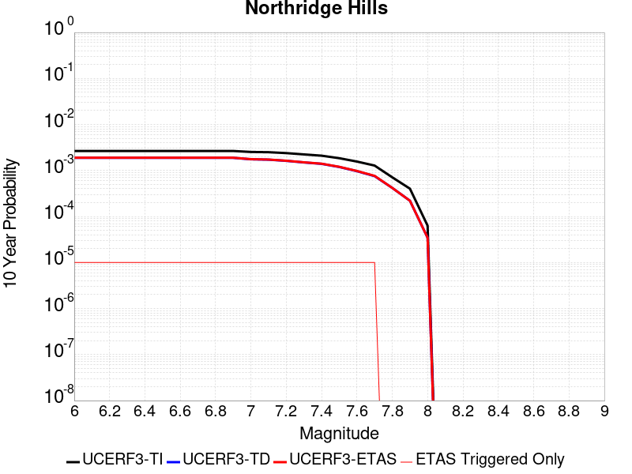 |

| Magnitude | 1 wk TI Prob | 1 wk TD Prob | 1 wk ETAS Prob | 1 wk ETAS/TD Gain | 1 wk ETAS Triggered Only | 1 mo TI Prob | 1 mo TD Prob | 1 mo ETAS Prob | 1 mo ETAS/TD Gain | 1 mo ETAS Triggered Only | 1 yr TI Prob | 1 yr TD Prob | 1 yr ETAS Prob | 1 yr ETAS/TD Gain | 1 yr ETAS Triggered Only | 10 yr TI Prob | 10 yr TD Prob | 10 yr ETAS Prob | 10 yr ETAS/TD Gain | 10 yr ETAS Triggered Only |
|-----|-----|-----|-----|-----|-----|-----|-----|-----|-----|-----|-----|-----|-----|-----|-----|-----|-----|-----|-----|-----|
| 6.0 | 5.095982E-6 | 3.6152135E-6 | 3.6152135E-6 | 1.0 | 0.0 | 2.183974E-5 | 1.549368E-5 | 1.549368E-5 | 1.0 | 0.0 | 2.658664E-4 | 1.8861935E-4 | 1.9861746E-4 | 1.0530069 | 1.0E-5 | 0.0026554854 | 0.0018846049 | 0.0018945861 | 1.0052961 | 1.0E-5 |
| 6.1 | 5.095982E-6 | 3.6152135E-6 | 3.6152135E-6 | 1.0 | 0.0 | 2.183974E-5 | 1.549368E-5 | 1.549368E-5 | 1.0 | 0.0 | 2.658664E-4 | 1.8861935E-4 | 1.9861746E-4 | 1.0530069 | 1.0E-5 | 0.0026554854 | 0.0018846049 | 0.0018945861 | 1.0052961 | 1.0E-5 |
| 6.2 | 5.095982E-6 | 3.6152135E-6 | 3.6152135E-6 | 1.0 | 0.0 | 2.183974E-5 | 1.549368E-5 | 1.549368E-5 | 1.0 | 0.0 | 2.658664E-4 | 1.8861935E-4 | 1.9861746E-4 | 1.0530069 | 1.0E-5 | 0.0026554854 | 0.0018846049 | 0.0018945861 | 1.0052961 | 1.0E-5 |
| 6.3 | 5.095982E-6 | 3.6152135E-6 | 3.6152135E-6 | 1.0 | 0.0 | 2.183974E-5 | 1.549368E-5 | 1.549368E-5 | 1.0 | 0.0 | 2.658664E-4 | 1.8861935E-4 | 1.9861746E-4 | 1.0530069 | 1.0E-5 | 0.0026554854 | 0.0018846049 | 0.0018945861 | 1.0052961 | 1.0E-5 |
| 6.4 | 5.095982E-6 | 3.6152135E-6 | 3.6152135E-6 | 1.0 | 0.0 | 2.183974E-5 | 1.549368E-5 | 1.549368E-5 | 1.0 | 0.0 | 2.658664E-4 | 1.8861935E-4 | 1.9861746E-4 | 1.0530069 | 1.0E-5 | 0.0026554854 | 0.0018846049 | 0.0018945861 | 1.0052961 | 1.0E-5 |
| 6.5 | 5.095982E-6 | 3.6152135E-6 | 3.6152135E-6 | 1.0 | 0.0 | 2.183974E-5 | 1.549368E-5 | 1.549368E-5 | 1.0 | 0.0 | 2.658664E-4 | 1.8861935E-4 | 1.9861746E-4 | 1.0530069 | 1.0E-5 | 0.0026554854 | 0.0018846049 | 0.0018945861 | 1.0052961 | 1.0E-5 |
| 6.6 | 5.095982E-6 | 3.6152135E-6 | 3.6152135E-6 | 1.0 | 0.0 | 2.183974E-5 | 1.549368E-5 | 1.549368E-5 | 1.0 | 0.0 | 2.658664E-4 | 1.8861935E-4 | 1.9861746E-4 | 1.0530069 | 1.0E-5 | 0.0026554854 | 0.0018846049 | 0.0018945861 | 1.0052961 | 1.0E-5 |
| 6.7 | 5.095982E-6 | 3.6152135E-6 | 3.6152135E-6 | 1.0 | 0.0 | 2.183974E-5 | 1.549368E-5 | 1.549368E-5 | 1.0 | 0.0 | 2.658664E-4 | 1.8861935E-4 | 1.9861746E-4 | 1.0530069 | 1.0E-5 | 0.0026554854 | 0.0018846049 | 0.0018945861 | 1.0052961 | 1.0E-5 |
| 6.8 | 5.095982E-6 | 3.6152135E-6 | 3.6152135E-6 | 1.0 | 0.0 | 2.183974E-5 | 1.549368E-5 | 1.549368E-5 | 1.0 | 0.0 | 2.658664E-4 | 1.8861935E-4 | 1.9861746E-4 | 1.0530069 | 1.0E-5 | 0.0026554854 | 0.0018846049 | 0.0018945861 | 1.0052961 | 1.0E-5 |
| 6.9 | 5.0942654E-6 | 3.6134284E-6 | 3.6134284E-6 | 1.0 | 0.0 | 2.1832384E-5 | 1.548603E-5 | 1.548603E-5 | 1.0 | 0.0 | 2.6577685E-4 | 1.8852622E-4 | 1.9852434E-4 | 1.053033 | 1.0E-5 | 0.002654592 | 0.0018836753 | 0.0018936564 | 1.0052987 | 1.0E-5 |
| 7.0 | 4.851143E-6 | 3.3587432E-6 | 3.3587432E-6 | 1.0 | 0.0 | 2.0790447E-5 | 1.4394534E-5 | 1.4394534E-5 | 1.0 | 0.0 | 2.5309427E-4 | 1.752394E-4 | 1.8523766E-4 | 1.0570548 | 1.0E-5 | 0.0025280623 | 0.0017510166 | 0.0017609991 | 1.005701 | 1.0E-5 |
| 7.1 | 4.7910607E-6 | 3.2970245E-6 | 3.2970245E-6 | 1.0 | 0.0 | 2.0532956E-5 | 1.4130029E-5 | 1.4130029E-5 | 1.0 | 0.0 | 2.4996005E-4 | 1.7201956E-4 | 1.8201783E-4 | 1.0581229 | 1.0E-5 | 0.0024967908 | 0.0017188682 | 0.0017288509 | 1.0058078 | 1.0E-5 |
| 7.2 | 4.580079E-6 | 3.106803E-6 | 3.106803E-6 | 1.0 | 0.0 | 1.9628762E-5 | 1.3314802E-5 | 1.3314802E-5 | 1.0 | 0.0 | 2.3895396E-4 | 1.6209569E-4 | 1.7209406E-4 | 1.061682 | 1.0E-5 | 0.0023869718 | 0.001619778 | 0.0016297618 | 1.0061637 | 1.0E-5 |
| 7.3 | 4.290062E-6 | 2.8682362E-6 | 2.8682362E-6 | 1.0 | 0.0 | 1.838585E-5 | 1.2292383E-5 | 1.2292383E-5 | 1.0 | 0.0 | 2.2382473E-4 | 1.4964951E-4 | 1.5964801E-4 | 1.0668128 | 1.0E-5 | 0.0022359942 | 0.0014954903 | 0.0015054754 | 1.0066768 | 1.0E-5 |
| 7.4 | 4.0259683E-6 | 2.6739135E-6 | 2.6739135E-6 | 1.0 | 0.0 | 1.7254037E-5 | 1.1459579E-5 | 1.1459579E-5 | 1.0 | 0.0 | 2.1004764E-4 | 1.3951147E-4 | 1.4951007E-4 | 1.0716687 | 1.0E-5 | 0.002098492 | 0.0013942417 | 0.0014042277 | 1.0071623 | 1.0E-5 |
| 7.5 | 3.5477108E-6 | 2.285198E-6 | 2.285198E-6 | 1.0 | 0.0 | 1.5204386E-5 | 9.793668E-6 | 9.793668E-6 | 1.0 | 0.0 | 1.8509767E-4 | 1.192314E-4 | 1.292302E-4 | 1.0838605 | 1.0E-5 | 0.0018494357 | 0.0011916759 | 0.001201664 | 1.0083815 | 1.0E-5 |
| 7.6 | 2.9990608E-6 | 1.8528159E-6 | 1.8528159E-6 | 1.0 | 0.0 | 1.2853055E-5 | 7.940615E-6 | 7.940615E-6 | 1.0 | 0.0 | 1.564747E-4 | 9.667271E-5 | 1.06671745E-4 | 1.1034318 | 1.0E-5 | 0.0015636457 | 9.6630736E-4 | 9.762977E-4 | 1.0103387 | 1.0E-5 |
| 7.7 | 2.4542855E-6 | 1.4461142E-6 | 1.4461142E-6 | 1.0 | 0.0 | 1.05183235E-5 | 6.1976175E-6 | 6.1976175E-6 | 1.0 | 0.0 | 1.2805307E-4 | 7.545339E-5 | 8.545263E-5 | 1.1325221 | 1.0E-5 | 0.001279793 | 7.5427827E-4 | 7.642707E-4 | 1.0132477 | 1.0E-5 |
| 7.8 | 1.3623128E-6 | 8.0160027E-7 | 8.0160027E-7 | 1.0 | 0.0 | 5.8384703E-6 | 3.4354252E-6 | 3.4354252E-6 | 1.0 | 0.0 | 7.108106E-5 | 4.18255E-5 | 4.18255E-5 | 1.0 | 0.0 | 7.1058323E-4 | 4.1817653E-4 | 4.1817653E-4 | 1.0 | 0.0 |
| 7.9 | 7.716622E-7 | 4.218644E-7 | 4.218644E-7 | 1.0 | 0.0 | 3.3071194E-6 | 1.807989E-6 | 1.807989E-6 | 1.0 | 0.0 | 4.0263436E-5 | 2.2012046E-5 | 2.2012046E-5 | 1.0 | 0.0 | 4.0256142E-4 | 2.2009875E-4 | 2.2009875E-4 | 1.0 | 0.0 |
| 8.0 | 1.2117711E-7 | 6.6217325E-8 | 6.6217325E-8 | 1.0 | 0.0 | 5.1933034E-7 | 2.8378852E-7 | 2.8378852E-7 | 1.0 | 0.0 | 6.3228285E-6 | 3.45512E-6 | 3.45512E-6 | 1.0 | 0.0 | 6.3226486E-5 | 3.4550678E-5 | 3.4550678E-5 | 1.0 | 0.0 |

## Burnt Mtn
*[(top)](#table-of-contents)*

| 1 Week | 1 Month | 1 Year | 10 Year |
|-----|-----|-----|-----|
|  |  |  |  |

| Magnitude | 1 wk TI Prob | 1 wk TD Prob | 1 wk ETAS Prob | 1 wk ETAS/TD Gain | 1 wk ETAS Triggered Only | 1 mo TI Prob | 1 mo TD Prob | 1 mo ETAS Prob | 1 mo ETAS/TD Gain | 1 mo ETAS Triggered Only | 1 yr TI Prob | 1 yr TD Prob | 1 yr ETAS Prob | 1 yr ETAS/TD Gain | 1 yr ETAS Triggered Only | 10 yr TI Prob | 10 yr TD Prob | 10 yr ETAS Prob | 10 yr ETAS/TD Gain | 10 yr ETAS Triggered Only |
|-----|-----|-----|-----|-----|-----|-----|-----|-----|-----|-----|-----|-----|-----|-----|-----|-----|-----|-----|-----|-----|
| 6.0 | 1.5673151E-5 | 1.1749247E-5 | 1.1749247E-5 | 1.0 | 0.0 | 6.716892E-5 | 5.0353672E-5 | 6.0353166E-5 | 1.1985853 | 1.0E-5 | 8.1747473E-4 | 6.130124E-4 | 6.2300626E-4 | 1.016303 | 1.0E-5 | 0.008144741 | 0.006125855 | 0.0061357934 | 1.0016224 | 1.0E-5 |
| 6.1 | 1.5673151E-5 | 1.1749247E-5 | 1.1749247E-5 | 1.0 | 0.0 | 6.716892E-5 | 5.0353672E-5 | 6.0353166E-5 | 1.1985853 | 1.0E-5 | 8.1747473E-4 | 6.130124E-4 | 6.2300626E-4 | 1.016303 | 1.0E-5 | 0.008144741 | 0.006125855 | 0.0061357934 | 1.0016224 | 1.0E-5 |
| 6.2 | 1.5673151E-5 | 1.1749247E-5 | 1.1749247E-5 | 1.0 | 0.0 | 6.716892E-5 | 5.0353672E-5 | 6.0353166E-5 | 1.1985853 | 1.0E-5 | 8.1747473E-4 | 6.130124E-4 | 6.2300626E-4 | 1.016303 | 1.0E-5 | 0.008144741 | 0.006125855 | 0.0061357934 | 1.0016224 | 1.0E-5 |
| 6.3 | 1.5673151E-5 | 1.1749247E-5 | 1.1749247E-5 | 1.0 | 0.0 | 6.716892E-5 | 5.0353672E-5 | 6.0353166E-5 | 1.1985853 | 1.0E-5 | 8.1747473E-4 | 6.130124E-4 | 6.2300626E-4 | 1.016303 | 1.0E-5 | 0.008144741 | 0.006125855 | 0.0061357934 | 1.0016224 | 1.0E-5 |
| 6.4 | 1.5673151E-5 | 1.1749247E-5 | 1.1749247E-5 | 1.0 | 0.0 | 6.716892E-5 | 5.0353672E-5 | 6.0353166E-5 | 1.1985853 | 1.0E-5 | 8.1747473E-4 | 6.130124E-4 | 6.2300626E-4 | 1.016303 | 1.0E-5 | 0.008144741 | 0.006125855 | 0.0061357934 | 1.0016224 | 1.0E-5 |
| 6.5 | 1.36191375E-5 | 1.007816E-5 | 1.007816E-5 | 1.0 | 0.0 | 5.8366426E-5 | 4.319211E-5 | 5.319168E-5 | 1.2315137 | 1.0E-5 | 7.103795E-4 | 5.2586396E-4 | 5.358587E-4 | 1.0190064 | 1.0E-5 | 0.0070811296 | 0.00525864 | 0.0052685873 | 1.0018916 | 1.0E-5 |

## Ozena
*[(top)](#table-of-contents)*

| 1 Week | 1 Month | 1 Year | 10 Year |
|-----|-----|-----|-----|
|  |  |  |  |

| Magnitude | 1 wk TI Prob | 1 wk TD Prob | 1 wk ETAS Prob | 1 wk ETAS/TD Gain | 1 wk ETAS Triggered Only | 1 mo TI Prob | 1 mo TD Prob | 1 mo ETAS Prob | 1 mo ETAS/TD Gain | 1 mo ETAS Triggered Only | 1 yr TI Prob | 1 yr TD Prob | 1 yr ETAS Prob | 1 yr ETAS/TD Gain | 1 yr ETAS Triggered Only | 10 yr TI Prob | 10 yr TD Prob | 10 yr ETAS Prob | 10 yr ETAS/TD Gain | 10 yr ETAS Triggered Only |
|-----|-----|-----|-----|-----|-----|-----|-----|-----|-----|-----|-----|-----|-----|-----|-----|-----|-----|-----|-----|-----|
| 6.0 | 1.4377547E-6 | 1.4513782E-6 | 1.4513782E-6 | 1.0 | 0.0 | 6.161791E-6 | 6.2201793E-6 | 6.2201793E-6 | 1.0 | 0.0 | 7.5017226E-5 | 7.572832E-5 | 7.572832E-5 | 1.0 | 0.0 | 7.4991904E-4 | 7.570518E-4 | 7.670442E-4 | 1.0131991 | 1.0E-5 |
| 6.1 | 1.4377547E-6 | 1.4513782E-6 | 1.4513782E-6 | 1.0 | 0.0 | 6.161791E-6 | 6.2201793E-6 | 6.2201793E-6 | 1.0 | 0.0 | 7.5017226E-5 | 7.572832E-5 | 7.572832E-5 | 1.0 | 0.0 | 7.4991904E-4 | 7.570518E-4 | 7.670442E-4 | 1.0131991 | 1.0E-5 |
| 6.2 | 1.4377547E-6 | 1.4513782E-6 | 1.4513782E-6 | 1.0 | 0.0 | 6.161791E-6 | 6.2201793E-6 | 6.2201793E-6 | 1.0 | 0.0 | 7.5017226E-5 | 7.572832E-5 | 7.572832E-5 | 1.0 | 0.0 | 7.4991904E-4 | 7.570518E-4 | 7.670442E-4 | 1.0131991 | 1.0E-5 |
| 6.3 | 1.4377547E-6 | 1.4513782E-6 | 1.4513782E-6 | 1.0 | 0.0 | 6.161791E-6 | 6.2201793E-6 | 6.2201793E-6 | 1.0 | 0.0 | 7.5017226E-5 | 7.572832E-5 | 7.572832E-5 | 1.0 | 0.0 | 7.4991904E-4 | 7.570518E-4 | 7.670442E-4 | 1.0131991 | 1.0E-5 |
| 6.4 | 1.4377547E-6 | 1.4513782E-6 | 1.4513782E-6 | 1.0 | 0.0 | 6.161791E-6 | 6.2201793E-6 | 6.2201793E-6 | 1.0 | 0.0 | 7.5017226E-5 | 7.572832E-5 | 7.572832E-5 | 1.0 | 0.0 | 7.4991904E-4 | 7.570518E-4 | 7.670442E-4 | 1.0131991 | 1.0E-5 |
| 6.5 | 1.4377547E-6 | 1.4513782E-6 | 1.4513782E-6 | 1.0 | 0.0 | 6.161791E-6 | 6.2201793E-6 | 6.2201793E-6 | 1.0 | 0.0 | 7.5017226E-5 | 7.572832E-5 | 7.572832E-5 | 1.0 | 0.0 | 7.4991904E-4 | 7.570518E-4 | 7.670442E-4 | 1.0131991 | 1.0E-5 |
| 6.6 | 1.4377547E-6 | 1.4513782E-6 | 1.4513782E-6 | 1.0 | 0.0 | 6.161791E-6 | 6.2201793E-6 | 6.2201793E-6 | 1.0 | 0.0 | 7.5017226E-5 | 7.572832E-5 | 7.572832E-5 | 1.0 | 0.0 | 7.4991904E-4 | 7.570518E-4 | 7.670442E-4 | 1.0131991 | 1.0E-5 |
| 6.7 | 1.4377547E-6 | 1.4513782E-6 | 1.4513782E-6 | 1.0 | 0.0 | 6.161791E-6 | 6.2201793E-6 | 6.2201793E-6 | 1.0 | 0.0 | 7.5017226E-5 | 7.572832E-5 | 7.572832E-5 | 1.0 | 0.0 | 7.4991904E-4 | 7.570518E-4 | 7.670442E-4 | 1.0131991 | 1.0E-5 |
| 6.8 | 9.223257E-7 | 9.317624E-7 | 9.317624E-7 | 1.0 | 0.0 | 3.9528186E-6 | 3.9932615E-6 | 3.9932615E-6 | 1.0 | 0.0 | 4.81245E-5 | 4.8616912E-5 | 4.8616912E-5 | 1.0 | 0.0 | 4.811408E-4 | 4.860668E-4 | 4.960619E-4 | 1.0205632 | 1.0E-5 |
| 6.9 | 9.141515E-7 | 9.235371E-7 | 9.235371E-7 | 1.0 | 0.0 | 3.917786E-6 | 3.9580104E-6 | 3.9580104E-6 | 1.0 | 0.0 | 4.7698002E-5 | 4.818775E-5 | 4.818775E-5 | 1.0 | 0.0 | 4.7687767E-4 | 4.8177704E-4 | 4.917722E-4 | 1.0207465 | 1.0E-5 |
| 7.0 | 8.767648E-7 | 8.8585773E-7 | 8.8585773E-7 | 1.0 | 0.0 | 3.757558E-6 | 3.7965276E-6 | 3.7965276E-6 | 1.0 | 0.0 | 4.5747307E-5 | 4.6221783E-5 | 4.6221783E-5 | 1.0 | 0.0 | 4.5737892E-4 | 4.6212564E-4 | 4.7212103E-4 | 1.0216291 | 1.0E-5 |
| 7.1 | 8.199402E-7 | 8.2853984E-7 | 8.2853984E-7 | 1.0 | 0.0 | 3.5140247E-6 | 3.5508804E-6 | 3.5508804E-6 | 1.0 | 0.0 | 4.2782412E-5 | 4.323115E-5 | 4.323115E-5 | 1.0 | 0.0 | 4.2774176E-4 | 4.322311E-4 | 4.422268E-4 | 1.0231258 | 1.0E-5 |
| 7.2 | 7.38705E-7 | 7.464262E-7 | 7.464262E-7 | 1.0 | 0.0 | 3.1658747E-6 | 3.198966E-6 | 3.198966E-6 | 1.0 | 0.0 | 3.8543843E-5 | 3.894675E-5 | 3.894675E-5 | 1.0 | 0.0 | 3.853716E-4 | 3.8940276E-4 | 3.9939885E-4 | 1.0256704 | 1.0E-5 |
| 7.3 | 6.490017E-7 | 6.557802E-7 | 6.557802E-7 | 1.0 | 0.0 | 2.7814328E-6 | 2.8104837E-6 | 2.8104837E-6 | 1.0 | 0.0 | 3.386342E-5 | 3.4217133E-5 | 3.4217133E-5 | 1.0 | 0.0 | 3.3858258E-4 | 3.4212202E-4 | 3.521186E-4 | 1.0292194 | 1.0E-5 |
| 7.4 | 5.346736E-7 | 5.4022604E-7 | 5.4022604E-7 | 1.0 | 0.0 | 2.291456E-6 | 2.3152527E-6 | 2.3152527E-6 | 1.0 | 0.0 | 2.789812E-5 | 2.8187867E-5 | 2.8187867E-5 | 1.0 | 0.0 | 2.789462E-4 | 2.8184598E-4 | 2.9184314E-4 | 1.0354704 | 1.0E-5 |
| 7.5 | 2.939325E-7 | 2.9666057E-7 | 2.9666057E-7 | 1.0 | 0.0 | 1.25971E-6 | 1.271402E-6 | 1.271402E-6 | 1.0 | 0.0 | 1.5336862E-5 | 1.5479225E-5 | 1.5479225E-5 | 1.0 | 0.0 | 1.5335804E-4 | 1.5478309E-4 | 1.5478309E-4 | 1.0 | 0.0 |
| 7.6 | 1.4151905E-7 | 1.4253266E-7 | 1.4253266E-7 | 1.0 | 0.0 | 6.065101E-7 | 6.108541E-7 | 6.108541E-7 | 1.0 | 0.0 | 7.3842357E-6 | 7.4371237E-6 | 7.4371237E-6 | 1.0 | 0.0 | 7.38399E-5 | 7.436883E-5 | 7.436883E-5 | 1.0 | 0.0 |
| 7.7 | 4.4957577E-8 | 4.5252243E-8 | 4.5252243E-8 | 1.0 | 0.0 | 1.9267533E-7 | 1.9393818E-7 | 1.9393818E-7 | 1.0 | 0.0 | 2.3458194E-6 | 2.3611947E-6 | 2.3611947E-6 | 1.0 | 0.0 | 2.3457947E-5 | 2.3611707E-5 | 2.3611707E-5 | 1.0 | 0.0 |
| 7.8 | 5.9993255E-9 | 6.0412972E-9 | 6.0412972E-9 | 1.0 | 0.0 | 2.5711394E-8 | 2.5891273E-8 | 2.5891273E-8 | 1.0 | 0.0 | 3.1303617E-7 | 3.1522623E-7 | 3.1522623E-7 | 1.0 | 0.0 | 3.1303573E-6 | 3.1522588E-6 | 3.1522588E-6 | 1.0 | 0.0 |

## Honey Lake 2011 CFM
*[(top)](#table-of-contents)*

| 1 Week | 1 Month | 1 Year | 10 Year |
|-----|-----|-----|-----|
|  |  |  | 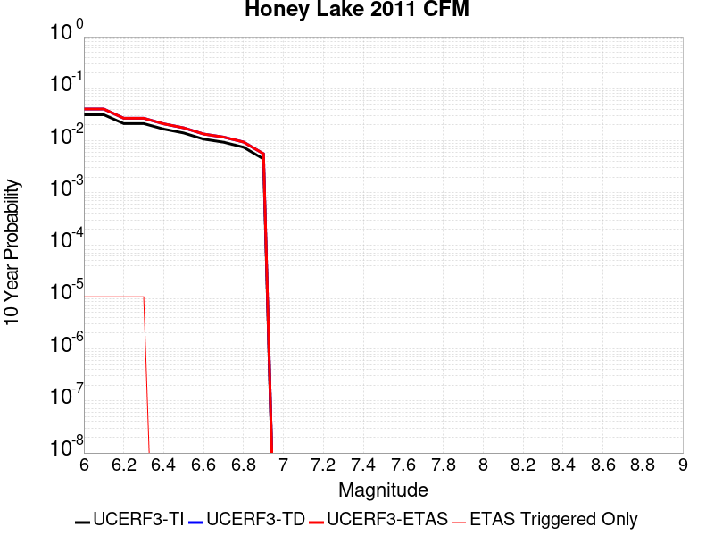 |

| Magnitude | 1 wk TI Prob | 1 wk TD Prob | 1 wk ETAS Prob | 1 wk ETAS/TD Gain | 1 wk ETAS Triggered Only | 1 mo TI Prob | 1 mo TD Prob | 1 mo ETAS Prob | 1 mo ETAS/TD Gain | 1 mo ETAS Triggered Only | 1 yr TI Prob | 1 yr TD Prob | 1 yr ETAS Prob | 1 yr ETAS/TD Gain | 1 yr ETAS Triggered Only | 10 yr TI Prob | 10 yr TD Prob | 10 yr ETAS Prob | 10 yr ETAS/TD Gain | 10 yr ETAS Triggered Only |
|-----|-----|-----|-----|-----|-----|-----|-----|-----|-----|-----|-----|-----|-----|-----|-----|-----|-----|-----|-----|-----|
| 6.0 | 6.155506E-5 | 7.954708E-5 | 7.954708E-5 | 1.0 | 0.0 | 2.6378073E-4 | 3.4087323E-4 | 3.4087323E-4 | 1.0 | 0.0 | 0.0032068014 | 0.0041426765 | 0.004152635 | 1.0024039 | 1.0E-5 | 0.03160919 | 0.040703055 | 0.040712647 | 1.0002357 | 1.0E-5 |
| 6.1 | 6.155506E-5 | 7.954708E-5 | 7.954708E-5 | 1.0 | 0.0 | 2.6378073E-4 | 3.4087323E-4 | 3.4087323E-4 | 1.0 | 0.0 | 0.0032068014 | 0.0041426765 | 0.004152635 | 1.0024039 | 1.0E-5 | 0.03160919 | 0.040703055 | 0.040712647 | 1.0002357 | 1.0E-5 |
| 6.2 | 4.1335024E-5 | 5.257652E-5 | 5.257652E-5 | 1.0 | 0.0 | 1.7713808E-4 | 2.2530954E-4 | 2.2530954E-4 | 1.0 | 0.0 | 0.0021545228 | 0.0027398444 | 0.002749817 | 1.0036398 | 1.0E-5 | 0.021337535 | 0.027076809 | 0.027086537 | 1.0003593 | 1.0E-5 |
| 6.3 | 4.1335024E-5 | 5.257652E-5 | 5.257652E-5 | 1.0 | 0.0 | 1.7713808E-4 | 2.2530954E-4 | 2.2530954E-4 | 1.0 | 0.0 | 0.0021545228 | 0.0027398444 | 0.002749817 | 1.0036398 | 1.0E-5 | 0.021337535 | 0.027076809 | 0.027086537 | 1.0003593 | 1.0E-5 |
| 6.4 | 3.2393702E-5 | 4.0887273E-5 | 4.0887273E-5 | 1.0 | 0.0 | 1.3882275E-4 | 1.7522006E-4 | 1.7522006E-4 | 1.0 | 0.0 | 0.0016888566 | 0.0021313233 | 0.0021313233 | 1.0 | 0.0 | 0.016760793 | 0.021119867 | 0.021119867 | 1.0 | 0.0 |
| 6.5 | 2.7205504E-5 | 3.4211767E-5 | 3.4211767E-5 | 1.0 | 0.0 | 1.1658981E-4 | 1.4661417E-4 | 1.4661417E-4 | 1.0 | 0.0 | 0.0014185566 | 0.0017836596 | 0.0017836596 | 1.0 | 0.0 | 0.014095354 | 0.017702963 | 0.017702963 | 1.0 | 0.0 |
| 6.6 | 2.069265E-5 | 2.5955416E-5 | 2.5955416E-5 | 1.0 | 0.0 | 8.867977E-5 | 1.1123324E-4 | 1.1123324E-4 | 1.0 | 0.0 | 0.0010791414 | 0.0013535074 | 0.0013535074 | 1.0 | 0.0 | 0.010739161 | 0.0134610105 | 0.0134610105 | 1.0 | 0.0 |
| 6.7 | 1.8060919E-5 | 2.265683E-5 | 2.265683E-5 | 1.0 | 0.0 | 7.7401644E-5 | 9.7097545E-5 | 9.7097545E-5 | 1.0 | 0.0 | 9.419576E-4 | 0.0011816025 | 0.0011816025 | 1.0 | 0.0 | 0.009379748 | 0.0117612425 | 0.0117612425 | 1.0 | 0.0 |
| 6.8 | 1.4474663E-5 | 1.8181274E-5 | 1.8181274E-5 | 1.0 | 0.0 | 6.203279E-5 | 7.791785E-5 | 7.791785E-5 | 1.0 | 0.0 | 7.5498753E-4 | 9.4831345E-4 | 9.4831345E-4 | 1.0 | 0.0 | 0.007524277 | 0.009450195 | 0.009450195 | 1.0 | 0.0 |
| 6.9 | 8.564552E-6 | 1.0802311E-5 | 1.0802311E-5 | 1.0 | 0.0 | 3.6704707E-5 | 4.6295176E-5 | 4.6295176E-5 | 1.0 | 0.0 | 4.4678818E-4 | 5.635644E-4 | 5.635644E-4 | 1.0 | 0.0 | 0.0044589094 | 0.0056278505 | 0.0056278505 | 1.0 | 0.0 |

## West Napa 2011 CFM
*[(top)](#table-of-contents)*

| 1 Week | 1 Month | 1 Year | 10 Year |
|-----|-----|-----|-----|
|  | 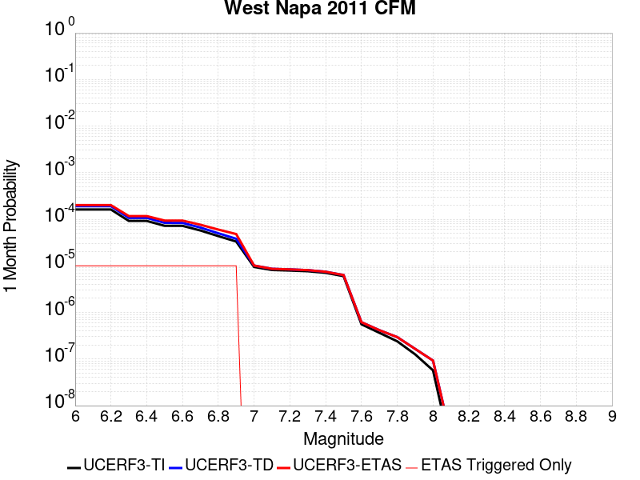 | 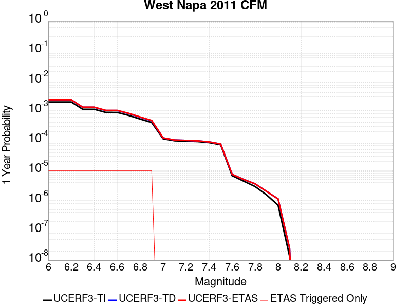 |  |

| Magnitude | 1 wk TI Prob | 1 wk TD Prob | 1 wk ETAS Prob | 1 wk ETAS/TD Gain | 1 wk ETAS Triggered Only | 1 mo TI Prob | 1 mo TD Prob | 1 mo ETAS Prob | 1 mo ETAS/TD Gain | 1 mo ETAS Triggered Only | 1 yr TI Prob | 1 yr TD Prob | 1 yr ETAS Prob | 1 yr ETAS/TD Gain | 1 yr ETAS Triggered Only | 10 yr TI Prob | 10 yr TD Prob | 10 yr ETAS Prob | 10 yr ETAS/TD Gain | 10 yr ETAS Triggered Only |
|-----|-----|-----|-----|-----|-----|-----|-----|-----|-----|-----|-----|-----|-----|-----|-----|-----|-----|-----|-----|-----|
| 6.0 | 3.773104E-5 | 4.4528504E-5 | 5.4528056E-5 | 1.2245653 | 1.0E-5 | 1.6169442E-4 | 1.9082428E-4 | 2.0082238E-4 | 1.0523943 | 1.0E-5 | 0.001966852 | 0.0023211278 | 0.0023311046 | 1.0042982 | 1.0E-5 | 0.019495348 | 0.023002012 | 0.023011781 | 1.0004247 | 1.0E-5 |
| 6.1 | 3.773104E-5 | 4.4528504E-5 | 5.4528056E-5 | 1.2245653 | 1.0E-5 | 1.6169442E-4 | 1.9082428E-4 | 2.0082238E-4 | 1.0523943 | 1.0E-5 | 0.001966852 | 0.0023211278 | 0.0023311046 | 1.0042982 | 1.0E-5 | 0.019495348 | 0.023002012 | 0.023011781 | 1.0004247 | 1.0E-5 |
| 6.2 | 3.773104E-5 | 4.4528504E-5 | 5.4528056E-5 | 1.2245653 | 1.0E-5 | 1.6169442E-4 | 1.9082428E-4 | 2.0082238E-4 | 1.0523943 | 1.0E-5 | 0.001966852 | 0.0023211278 | 0.0023311046 | 1.0042982 | 1.0E-5 | 0.019495348 | 0.023002012 | 0.023011781 | 1.0004247 | 1.0E-5 |
| 6.3 | 2.147964E-5 | 2.4987066E-5 | 3.4986817E-5 | 1.400197 | 1.0E-5 | 9.2052345E-5 | 1.0708355E-4 | 1.17082476E-4 | 1.093375 | 1.0E-5 | 0.001120161 | 0.0013030542 | 0.0013130412 | 1.0076643 | 1.0E-5 | 0.011145315 | 0.012964482 | 0.0129743535 | 1.0007614 | 1.0E-5 |
| 6.4 | 2.147964E-5 | 2.4987066E-5 | 3.4986817E-5 | 1.400197 | 1.0E-5 | 9.2052345E-5 | 1.0708355E-4 | 1.17082476E-4 | 1.093375 | 1.0E-5 | 0.001120161 | 0.0013030542 | 0.0013130412 | 1.0076643 | 1.0E-5 | 0.011145315 | 0.012964482 | 0.0129743535 | 1.0007614 | 1.0E-5 |
| 6.5 | 1.688201E-5 | 1.9547371E-5 | 2.9547176E-5 | 1.5115677 | 1.0E-5 | 7.234947E-5 | 8.377217E-5 | 9.3771334E-5 | 1.1193614 | 1.0E-5 | 8.804988E-4 | 0.0010195216 | 0.0010295114 | 1.0097985 | 1.0E-5 | 0.008770182 | 0.01015684 | 0.010166738 | 1.0009745 | 1.0E-5 |
| 6.6 | 1.6846381E-5 | 1.9507064E-5 | 2.950687E-5 | 1.5126247 | 1.0E-5 | 7.219678E-5 | 8.3599436E-5 | 9.35986E-5 | 1.119608 | 1.0E-5 | 8.7864127E-4 | 0.0010174206 | 0.0010274104 | 1.0098188 | 1.0E-5 | 0.008751754 | 0.010136021 | 0.010145919 | 1.0009766 | 1.0E-5 |
| 6.7 | 1.3396501E-5 | 1.5467684E-5 | 2.5467529E-5 | 1.6464992 | 1.0E-5 | 5.7412315E-5 | 6.628875E-5 | 7.628809E-5 | 1.1508452 | 1.0E-5 | 6.9877075E-4 | 8.068302E-4 | 8.168221E-4 | 1.0123842 | 1.0E-5 | 0.0069657755 | 0.008046459 | 0.008056379 | 1.0012327 | 1.0E-5 |
| 6.8 | 1.0139058E-5 | 1.16721785E-5 | 2.1672062E-5 | 1.8567281 | 1.0E-5 | 4.3452383E-5 | 5.0022976E-5 | 6.0022478E-5 | 1.1998981 | 1.0E-5 | 5.289043E-4 | 6.0891506E-4 | 6.1890896E-4 | 1.0164126 | 1.0E-5 | 0.005276473 | 0.0060791126 | 0.006089052 | 1.001635 | 1.0E-5 |
| 6.9 | 7.761281E-6 | 8.890723E-6 | 1.8890634E-5 | 2.124758 | 1.0E-5 | 3.326221E-5 | 3.810283E-5 | 4.8102447E-5 | 1.2624377 | 1.0E-5 | 4.0489217E-4 | 4.6385458E-4 | 4.7384994E-4 | 1.0215485 | 1.0E-5 | 0.0040415525 | 0.0046351026 | 0.004645056 | 1.0021474 | 1.0E-5 |
| 7.0 | 2.2109202E-6 | 2.3666319E-6 | 2.3666319E-6 | 1.0 | 0.0 | 9.475338E-6 | 1.01426685E-5 | 1.01426685E-5 | 1.0 | 0.0 | 1.1535613E-4 | 1.2348007E-4 | 1.2348007E-4 | 1.0 | 0.0 | 0.0011529627 | 0.0012353238 | 0.0012353238 | 1.0 | 0.0 |
| 7.1 | 1.9008926E-6 | 2.0133207E-6 | 2.0133207E-6 | 1.0 | 0.0 | 8.146657E-6 | 8.628488E-6 | 8.628488E-6 | 1.0 | 0.0 | 9.918104E-5 | 1.05046805E-4 | 1.05046805E-4 | 1.0 | 0.0 | 9.913679E-4 | 0.0010511756 | 0.0010511756 | 1.0 | 0.0 |
| 7.2 | 1.8495944E-6 | 1.9561273E-6 | 1.9561273E-6 | 1.0 | 0.0 | 7.926808E-6 | 8.383376E-6 | 8.383376E-6 | 1.0 | 0.0 | 9.650462E-5 | 1.0206285E-4 | 1.0206285E-4 | 1.0 | 0.0 | 9.6462725E-4 | 0.0010213639 | 0.0010213639 | 1.0 | 0.0 |
| 7.3 | 1.7883189E-6 | 1.8880897E-6 | 1.8880897E-6 | 1.0 | 0.0 | 7.664201E-6 | 8.091788E-6 | 8.091788E-6 | 1.0 | 0.0 | 9.330765E-5 | 9.85131E-5 | 9.85131E-5 | 1.0 | 0.0 | 9.3268487E-4 | 9.858976E-4 | 9.858976E-4 | 1.0 | 0.0 |
| 7.4 | 1.6520572E-6 | 1.7415113E-6 | 1.7415113E-6 | 1.0 | 0.0 | 7.0802257E-6 | 7.463598E-6 | 7.463598E-6 | 1.0 | 0.0 | 8.6198335E-5 | 9.086554E-5 | 9.086554E-5 | 1.0 | 0.0 | 8.616491E-4 | 9.0948684E-4 | 9.0948684E-4 | 1.0 | 0.0 |
| 7.5 | 1.4040345E-6 | 1.4800271E-6 | 1.4800271E-6 | 1.0 | 0.0 | 6.0172765E-6 | 6.342958E-6 | 6.342958E-6 | 1.0 | 0.0 | 7.325788E-5 | 7.72228E-5 | 7.72228E-5 | 1.0 | 0.0 | 7.3233736E-4 | 7.7311805E-4 | 7.7311805E-4 | 1.0 | 0.0 |
| 7.6 | 1.3013842E-7 | 1.4416163E-7 | 1.4416163E-7 | 1.0 | 0.0 | 5.57736E-7 | 6.178354E-7 | 6.178354E-7 | 1.0 | 0.0 | 6.790414E-6 | 7.52212E-6 | 7.52212E-6 | 1.0 | 0.0 | 6.790207E-5 | 7.61463E-5 | 7.61463E-5 | 1.0 | 0.0 |
| 7.7 | 8.541512E-8 | 9.716462E-8 | 9.716462E-8 | 1.0 | 0.0 | 3.6606474E-7 | 4.1641974E-7 | 4.1641974E-7 | 1.0 | 0.0 | 4.456829E-6 | 5.069898E-6 | 5.069898E-6 | 1.0 | 0.0 | 4.4567398E-5 | 5.160189E-5 | 5.160189E-5 | 1.0 | 0.0 |
| 7.8 | 5.6074793E-8 | 6.895456E-8 | 6.895456E-8 | 1.0 | 0.0 | 2.403205E-7 | 2.955195E-7 | 2.955195E-7 | 1.0 | 0.0 | 2.9258983E-6 | 3.597944E-6 | 3.597944E-6 | 1.0 | 0.0 | 2.9258597E-5 | 3.6812045E-5 | 3.6812045E-5 | 1.0 | 0.0 |
| 7.9 | 2.9475839E-8 | 3.8567407E-8 | 3.8567407E-8 | 1.0 | 0.0 | 1.2632502E-7 | 1.6528887E-7 | 1.6528887E-7 | 1.0 | 0.0 | 1.538006E-6 | 2.01239E-6 | 2.01239E-6 | 1.0 | 0.0 | 1.5379954E-5 | 2.0664074E-5 | 2.0664074E-5 | 1.0 | 0.0 |
| 8.0 | 1.3337122E-8 | 2.1632943E-8 | 2.1632943E-8 | 1.0 | 0.0 | 5.7159088E-8 | 9.2712604E-8 | 9.2712604E-8 | 1.0 | 0.0 | 6.959117E-7 | 1.1287754E-6 | 1.1287754E-6 | 1.0 | 0.0 | 6.959095E-6 | 1.1644432E-5 | 1.1644432E-5 | 1.0 | 0.0 |
| 8.1 | 2.6589986E-10 | 4.8617654E-10 | 4.8617654E-10 | 1.0 | 0.0 | 1.1395708E-9 | 2.0836133E-9 | 2.0836133E-9 | 1.0 | 0.0 | 1.3874274E-8 | 2.536799E-8 | 2.536799E-8 | 1.0 | 0.0 | 1.3874273E-7 | 2.6036727E-7 | 2.6036727E-7 | 1.0 | 0.0 |

## Great Valley 04b Gordon Valley
*[(top)](#table-of-contents)*

| 1 Week | 1 Month | 1 Year | 10 Year |
|-----|-----|-----|-----|
|  |  |  |  |

| Magnitude | 1 wk TI Prob | 1 wk TD Prob | 1 wk ETAS Prob | 1 wk ETAS/TD Gain | 1 wk ETAS Triggered Only | 1 mo TI Prob | 1 mo TD Prob | 1 mo ETAS Prob | 1 mo ETAS/TD Gain | 1 mo ETAS Triggered Only | 1 yr TI Prob | 1 yr TD Prob | 1 yr ETAS Prob | 1 yr ETAS/TD Gain | 1 yr ETAS Triggered Only | 10 yr TI Prob | 10 yr TD Prob | 10 yr ETAS Prob | 10 yr ETAS/TD Gain | 10 yr ETAS Triggered Only |
|-----|-----|-----|-----|-----|-----|-----|-----|-----|-----|-----|-----|-----|-----|-----|-----|-----|-----|-----|-----|-----|
| 6.0 | 2.1181217E-5 | 2.3981951E-5 | 2.3981951E-5 | 1.0 | 0.0 | 9.077348E-5 | 1.02776685E-4 | 1.02776685E-4 | 1.0 | 0.0 | 0.0011046068 | 0.0012507545 | 0.0012507545 | 1.0 | 0.0 | 0.010991322 | 0.0124536 | 0.012463476 | 1.000793 | 1.0E-5 |
| 6.1 | 2.1181217E-5 | 2.3981951E-5 | 2.3981951E-5 | 1.0 | 0.0 | 9.077348E-5 | 1.02776685E-4 | 1.02776685E-4 | 1.0 | 0.0 | 0.0011046068 | 0.0012507545 | 0.0012507545 | 1.0 | 0.0 | 0.010991322 | 0.0124536 | 0.012463476 | 1.000793 | 1.0E-5 |
| 6.2 | 2.1181217E-5 | 2.3981951E-5 | 2.3981951E-5 | 1.0 | 0.0 | 9.077348E-5 | 1.02776685E-4 | 1.02776685E-4 | 1.0 | 0.0 | 0.0011046068 | 0.0012507545 | 0.0012507545 | 1.0 | 0.0 | 0.010991322 | 0.0124536 | 0.012463476 | 1.000793 | 1.0E-5 |
| 6.3 | 2.1181217E-5 | 2.3981951E-5 | 2.3981951E-5 | 1.0 | 0.0 | 9.077348E-5 | 1.02776685E-4 | 1.02776685E-4 | 1.0 | 0.0 | 0.0011046068 | 0.0012507545 | 0.0012507545 | 1.0 | 0.0 | 0.010991322 | 0.0124536 | 0.012463476 | 1.000793 | 1.0E-5 |
| 6.4 | 1.0988268E-5 | 1.2254499E-5 | 1.2254499E-5 | 1.0 | 0.0 | 4.7091726E-5 | 5.2518313E-5 | 5.2518313E-5 | 1.0 | 0.0 | 5.731909E-4 | 6.392388E-4 | 6.392388E-4 | 1.0 | 0.0 | 0.005717147 | 0.0063755875 | 0.0063755875 | 1.0 | 0.0 |
| 6.5 | 1.0988268E-5 | 1.2254499E-5 | 1.2254499E-5 | 1.0 | 0.0 | 4.7091726E-5 | 5.2518313E-5 | 5.2518313E-5 | 1.0 | 0.0 | 5.731909E-4 | 6.392388E-4 | 6.392388E-4 | 1.0 | 0.0 | 0.005717147 | 0.0063755875 | 0.0063755875 | 1.0 | 0.0 |
| 6.6 | 1.0517822E-5 | 1.1724062E-5 | 1.1724062E-5 | 1.0 | 0.0 | 4.5075605E-5 | 5.02451E-5 | 5.02451E-5 | 1.0 | 0.0 | 5.4865726E-4 | 6.11578E-4 | 6.11578E-4 | 1.0 | 0.0 | 0.0054730466 | 0.0061005033 | 0.0061005033 | 1.0 | 0.0 |
| 6.7 | 7.789219E-6 | 8.6776445E-6 | 8.6776445E-6 | 1.0 | 0.0 | 3.3381937E-5 | 3.7189402E-5 | 3.7189402E-5 | 1.0 | 0.0 | 4.063493E-4 | 4.526921E-4 | 4.526921E-4 | 1.0 | 0.0 | 0.004056071 | 0.0045182165 | 0.0045182165 | 1.0 | 0.0 |
| 6.8 | 7.5850853E-6 | 8.452389E-6 | 8.452389E-6 | 1.0 | 0.0 | 3.2507105E-5 | 3.622405E-5 | 3.622405E-5 | 1.0 | 0.0 | 3.957021E-4 | 4.409437E-4 | 4.409437E-4 | 1.0 | 0.0 | 0.0039499826 | 0.0044012 | 0.0044012 | 1.0 | 0.0 |
| 6.9 | 6.604105E-6 | 7.3585493E-6 | 7.3585493E-6 | 1.0 | 0.0 | 2.8303E-5 | 3.153628E-5 | 3.153628E-5 | 1.0 | 0.0 | 3.4453452E-4 | 3.8389044E-4 | 3.8389044E-4 | 1.0 | 0.0 | 0.0034400085 | 0.0038326595 | 0.0038326595 | 1.0 | 0.0 |
| 7.0 | 5.3701115E-6 | 5.9884183E-6 | 5.9884183E-6 | 1.0 | 0.0 | 2.301456E-5 | 2.5664414E-5 | 2.5664414E-5 | 1.0 | 0.0 | 2.8016625E-4 | 3.1242234E-4 | 3.1242234E-4 | 1.0 | 0.0 | 0.0027981328 | 0.00312012 | 0.00312012 | 1.0 | 0.0 |
| 7.1 | 4.4685607E-6 | 4.986478E-6 | 4.986478E-6 | 1.0 | 0.0 | 1.9150835E-5 | 2.1370459E-5 | 2.1370459E-5 | 1.0 | 0.0 | 2.3313647E-4 | 2.6015675E-4 | 2.6015675E-4 | 1.0 | 0.0 | 0.0023289204 | 0.0025987667 | 0.0025987667 | 1.0 | 0.0 |
| 7.2 | 2.833378E-6 | 3.164419E-6 | 3.164419E-6 | 1.0 | 0.0 | 1.2142991E-5 | 1.3561736E-5 | 1.3561736E-5 | 1.0 | 0.0 | 1.4783088E-4 | 1.6510337E-4 | 1.6510337E-4 | 1.0 | 0.0 | 0.0014773258 | 0.0016499789 | 0.0016499789 | 1.0 | 0.0 |
| 7.3 | 7.0087293E-7 | 7.7728157E-7 | 7.7728157E-7 | 1.0 | 0.0 | 3.0037377E-6 | 3.3312049E-6 | 3.3312049E-6 | 1.0 | 0.0 | 3.656989E-5 | 4.0557123E-5 | 4.0557123E-5 | 1.0 | 0.0 | 3.6563876E-4 | 4.055422E-4 | 4.055422E-4 | 1.0 | 0.0 |
| 7.4 | 3.112171E-8 | 3.2068368E-8 | 3.2068368E-8 | 1.0 | 0.0 | 1.3337875E-7 | 1.3743585E-7 | 1.3743585E-7 | 1.0 | 0.0 | 1.6238852E-6 | 1.6732803E-6 | 1.6732803E-6 | 1.0 | 0.0 | 1.6238733E-5 | 1.6732685E-5 | 1.6732685E-5 | 1.0 | 0.0 |

## Antelope Valley 2011
*[(top)](#table-of-contents)*

| 1 Week | 1 Month | 1 Year | 10 Year |
|-----|-----|-----|-----|
|  |  |  |  |

| Magnitude | 1 wk TI Prob | 1 wk TD Prob | 1 wk ETAS Prob | 1 wk ETAS/TD Gain | 1 wk ETAS Triggered Only | 1 mo TI Prob | 1 mo TD Prob | 1 mo ETAS Prob | 1 mo ETAS/TD Gain | 1 mo ETAS Triggered Only | 1 yr TI Prob | 1 yr TD Prob | 1 yr ETAS Prob | 1 yr ETAS/TD Gain | 1 yr ETAS Triggered Only | 10 yr TI Prob | 10 yr TD Prob | 10 yr ETAS Prob | 10 yr ETAS/TD Gain | 10 yr ETAS Triggered Only |
|-----|-----|-----|-----|-----|-----|-----|-----|-----|-----|-----|-----|-----|-----|-----|-----|-----|-----|-----|-----|-----|
| 6.0 | 3.1646934E-5 | 3.6904392E-5 | 3.6904392E-5 | 1.0 | 0.0 | 1.3562266E-4 | 1.5815359E-4 | 1.6815201E-4 | 1.0632197 | 1.0E-5 | 0.0016499552 | 0.0019240839 | 0.0019340647 | 1.0051873 | 1.0E-5 | 0.016377583 | 0.019100657 | 0.019110465 | 1.0005136 | 1.0E-5 |
| 6.1 | 3.1646934E-5 | 3.6904392E-5 | 3.6904392E-5 | 1.0 | 0.0 | 1.3562266E-4 | 1.5815359E-4 | 1.6815201E-4 | 1.0632197 | 1.0E-5 | 0.0016499552 | 0.0019240839 | 0.0019340647 | 1.0051873 | 1.0E-5 | 0.016377583 | 0.019100657 | 0.019110465 | 1.0005136 | 1.0E-5 |
| 6.2 | 3.1646934E-5 | 3.6904392E-5 | 3.6904392E-5 | 1.0 | 0.0 | 1.3562266E-4 | 1.5815359E-4 | 1.6815201E-4 | 1.0632197 | 1.0E-5 | 0.0016499552 | 0.0019240839 | 0.0019340647 | 1.0051873 | 1.0E-5 | 0.016377583 | 0.019100657 | 0.019110465 | 1.0005136 | 1.0E-5 |
| 6.3 | 3.1646934E-5 | 3.6904392E-5 | 3.6904392E-5 | 1.0 | 0.0 | 1.3562266E-4 | 1.5815359E-4 | 1.6815201E-4 | 1.0632197 | 1.0E-5 | 0.0016499552 | 0.0019240839 | 0.0019340647 | 1.0051873 | 1.0E-5 | 0.016377583 | 0.019100657 | 0.019110465 | 1.0005136 | 1.0E-5 |
| 6.4 | 3.1646934E-5 | 3.6904392E-5 | 3.6904392E-5 | 1.0 | 0.0 | 1.3562266E-4 | 1.5815359E-4 | 1.6815201E-4 | 1.0632197 | 1.0E-5 | 0.0016499552 | 0.0019240839 | 0.0019340647 | 1.0051873 | 1.0E-5 | 0.016377583 | 0.019100657 | 0.019110465 | 1.0005136 | 1.0E-5 |
| 6.5 | 1.8034107E-5 | 2.0940955E-5 | 2.0940955E-5 | 1.0 | 0.0 | 7.7286735E-5 | 8.974456E-5 | 8.974456E-5 | 1.0 | 0.0 | 9.405598E-4 | 0.0010922147 | 0.0010922147 | 1.0 | 0.0 | 0.009365888 | 0.010880543 | 0.010880543 | 1.0 | 0.0 |
| 6.6 | 1.8034107E-5 | 2.0940955E-5 | 2.0940955E-5 | 1.0 | 0.0 | 7.7286735E-5 | 8.974456E-5 | 8.974456E-5 | 1.0 | 0.0 | 9.405598E-4 | 0.0010922147 | 0.0010922147 | 1.0 | 0.0 | 0.009365888 | 0.010880543 | 0.010880543 | 1.0 | 0.0 |
| 6.7 | 1.3567667E-5 | 1.5749509E-5 | 1.5749509E-5 | 1.0 | 0.0 | 5.814585E-5 | 6.749675E-5 | 6.749675E-5 | 1.0 | 0.0 | 7.076958E-4 | 8.2156935E-4 | 8.2156935E-4 | 1.0 | 0.0 | 0.007054463 | 0.008195754 | 0.008195754 | 1.0 | 0.0 |
| 6.8 | 9.867387E-6 | 1.1467935E-5 | 1.1467935E-5 | 1.0 | 0.0 | 4.2288117E-5 | 4.91479E-5 | 4.91479E-5 | 1.0 | 0.0 | 5.1473617E-4 | 5.9830636E-4 | 5.9830636E-4 | 1.0 | 0.0 | 0.005135455 | 0.005976268 | 0.005976268 | 1.0 | 0.0 |
| 6.9 | 7.273233E-6 | 8.454864E-6 | 8.454864E-6 | 1.0 | 0.0 | 3.1170628E-5 | 3.623513E-5 | 3.623513E-5 | 1.0 | 0.0 | 3.794363E-4 | 4.411627E-4 | 4.411627E-4 | 1.0 | 0.0 | 0.0037878908 | 0.004411627 | 0.004411627 | 1.0 | 0.0 |

## Earthquake Valley (No  Extension)
*[(top)](#table-of-contents)*

| 1 Week | 1 Month | 1 Year | 10 Year |
|-----|-----|-----|-----|
|  |  |  |  |

| Magnitude | 1 wk TI Prob | 1 wk TD Prob | 1 wk ETAS Prob | 1 wk ETAS/TD Gain | 1 wk ETAS Triggered Only | 1 mo TI Prob | 1 mo TD Prob | 1 mo ETAS Prob | 1 mo ETAS/TD Gain | 1 mo ETAS Triggered Only | 1 yr TI Prob | 1 yr TD Prob | 1 yr ETAS Prob | 1 yr ETAS/TD Gain | 1 yr ETAS Triggered Only | 10 yr TI Prob | 10 yr TD Prob | 10 yr ETAS Prob | 10 yr ETAS/TD Gain | 10 yr ETAS Triggered Only |
|-----|-----|-----|-----|-----|-----|-----|-----|-----|-----|-----|-----|-----|-----|-----|-----|-----|-----|-----|-----|-----|
| 6.0 | 2.1859703E-5 | 2.5198351E-5 | 2.5198351E-5 | 1.0 | 0.0 | 9.3681076E-5 | 1.0798928E-4 | 1.0798928E-4 | 1.0 | 0.0 | 0.0011399703 | 0.0013141216 | 0.0013241085 | 1.0075996 | 1.0E-5 | 0.011341401 | 0.013077869 | 0.013087738 | 1.0007546 | 1.0E-5 |
| 6.1 | 2.1859703E-5 | 2.5198351E-5 | 2.5198351E-5 | 1.0 | 0.0 | 9.3681076E-5 | 1.0798928E-4 | 1.0798928E-4 | 1.0 | 0.0 | 0.0011399703 | 0.0013141216 | 0.0013241085 | 1.0075996 | 1.0E-5 | 0.011341401 | 0.013077869 | 0.013087738 | 1.0007546 | 1.0E-5 |
| 6.2 | 2.1859703E-5 | 2.5198351E-5 | 2.5198351E-5 | 1.0 | 0.0 | 9.3681076E-5 | 1.0798928E-4 | 1.0798928E-4 | 1.0 | 0.0 | 0.0011399703 | 0.0013141216 | 0.0013241085 | 1.0075996 | 1.0E-5 | 0.011341401 | 0.013077869 | 0.013087738 | 1.0007546 | 1.0E-5 |
| 6.3 | 2.1859703E-5 | 2.5198351E-5 | 2.5198351E-5 | 1.0 | 0.0 | 9.3681076E-5 | 1.0798928E-4 | 1.0798928E-4 | 1.0 | 0.0 | 0.0011399703 | 0.0013141216 | 0.0013241085 | 1.0075996 | 1.0E-5 | 0.011341401 | 0.013077869 | 0.013087738 | 1.0007546 | 1.0E-5 |
| 6.4 | 2.1859703E-5 | 2.5198351E-5 | 2.5198351E-5 | 1.0 | 0.0 | 9.3681076E-5 | 1.0798928E-4 | 1.0798928E-4 | 1.0 | 0.0 | 0.0011399703 | 0.0013141216 | 0.0013241085 | 1.0075996 | 1.0E-5 | 0.011341401 | 0.013077869 | 0.013087738 | 1.0007546 | 1.0E-5 |
| 6.5 | 2.1859703E-5 | 2.5198351E-5 | 2.5198351E-5 | 1.0 | 0.0 | 9.3681076E-5 | 1.0798928E-4 | 1.0798928E-4 | 1.0 | 0.0 | 0.0011399703 | 0.0013141216 | 0.0013241085 | 1.0075996 | 1.0E-5 | 0.011341401 | 0.013077869 | 0.013087738 | 1.0007546 | 1.0E-5 |
| 6.6 | 1.597E-5 | 1.835627E-5 | 1.835627E-5 | 1.0 | 0.0 | 6.8441055E-5 | 7.866784E-5 | 7.866784E-5 | 1.0 | 0.0 | 8.329513E-4 | 9.5744745E-4 | 9.6743787E-4 | 1.0104344 | 1.0E-5 | 0.008298361 | 0.009541833 | 0.009551737 | 1.0010381 | 1.0E-5 |
| 6.7 | 1.597E-5 | 1.835627E-5 | 1.835627E-5 | 1.0 | 0.0 | 6.8441055E-5 | 7.866784E-5 | 7.866784E-5 | 1.0 | 0.0 | 8.329513E-4 | 9.5744745E-4 | 9.6743787E-4 | 1.0104344 | 1.0E-5 | 0.008298361 | 0.009541833 | 0.009551737 | 1.0010381 | 1.0E-5 |
| 6.8 | 1.5315149E-5 | 1.7602086E-5 | 1.7602086E-5 | 1.0 | 0.0 | 6.5634704E-5 | 7.543582E-5 | 7.543582E-5 | 1.0 | 0.0 | 7.988095E-4 | 9.1813074E-4 | 9.2812156E-4 | 1.0108817 | 1.0E-5 | 0.007959441 | 0.009151915 | 0.009161824 | 1.0010827 | 1.0E-5 |
| 6.9 | 1.3634728E-5 | 1.5675814E-5 | 1.5675814E-5 | 1.0 | 0.0 | 5.8433237E-5 | 6.7180794E-5 | 6.7180794E-5 | 1.0 | 0.0 | 7.1119244E-4 | 8.1770134E-4 | 8.2769315E-4 | 1.0122194 | 1.0E-5 | 0.007089207 | 0.008154998 | 0.008164915 | 1.0012163 | 1.0E-5 |
| 7.0 | 1.3496271E-5 | 1.5517848E-5 | 1.5517848E-5 | 1.0 | 0.0 | 5.783988E-5 | 6.6503824E-5 | 6.6503824E-5 | 1.0 | 0.0 | 7.03973E-4 | 8.0946536E-4 | 8.194573E-4 | 1.0123439 | 1.0E-5 | 0.007017471 | 0.008073238 | 0.008083156 | 1.0012287 | 1.0E-5 |
| 7.1 | 8.242798E-6 | 9.472594E-6 | 9.472594E-6 | 1.0 | 0.0 | 3.53258E-5 | 4.0596577E-5 | 4.0596577E-5 | 1.0 | 0.0 | 4.300067E-4 | 4.9421826E-4 | 4.9421826E-4 | 1.0 | 0.0 | 0.004291756 | 0.0049377684 | 0.0049377684 | 1.0 | 0.0 |
| 7.2 | 2.6506527E-7 | 2.2559628E-7 | 2.2559628E-7 | 1.0 | 0.0 | 1.1359936E-6 | 9.668408E-7 | 9.668408E-7 | 1.0 | 0.0 | 1.3830633E-5 | 1.1771229E-5 | 1.1771229E-5 | 1.0 | 0.0 | 1.3829772E-4 | 1.1770646E-4 | 1.1770646E-4 | 1.0 | 0.0 |
| 7.3 | 2.5810488E-7 | 2.1954757E-7 | 2.1954757E-7 | 1.0 | 0.0 | 1.1061633E-6 | 9.4091786E-7 | 9.4091786E-7 | 1.0 | 0.0 | 1.3467455E-5 | 1.1455619E-5 | 1.1455619E-5 | 1.0 | 0.0 | 1.3466639E-4 | 1.145507E-4 | 1.145507E-4 | 1.0 | 0.0 |
| 7.4 | 2.2676066E-7 | 1.9109943E-7 | 1.9109943E-7 | 1.0 | 0.0 | 9.71831E-7 | 8.189973E-7 | 8.189973E-7 | 1.0 | 0.0 | 1.1831979E-5 | 9.971251E-6 | 9.971251E-6 | 1.0 | 0.0 | 1.1831349E-4 | 9.970842E-5 | 9.970842E-5 | 1.0 | 0.0 |
| 7.5 | 1.5553917E-7 | 1.311138E-7 | 1.311138E-7 | 1.0 | 0.0 | 6.6659624E-7 | 5.619162E-7 | 5.619162E-7 | 1.0 | 0.0 | 8.115779E-6 | 6.84131E-6 | 6.84131E-6 | 1.0 | 0.0 | 8.115482E-5 | 6.841121E-5 | 6.841121E-5 | 1.0 | 0.0 |
| 7.6 | 1.3448629E-7 | 1.1287708E-7 | 1.1287708E-7 | 1.0 | 0.0 | 5.7636964E-7 | 4.8375887E-7 | 4.8375887E-7 | 1.0 | 0.0 | 7.017278E-6 | 5.8897504E-6 | 5.8897504E-6 | 1.0 | 0.0 | 7.0170565E-5 | 5.8896156E-5 | 5.8896156E-5 | 1.0 | 0.0 |
| 7.7 | 2.9719402E-8 | 1.4581234E-8 | 1.4581234E-8 | 1.0 | 0.0 | 1.2736886E-7 | 6.2491004E-8 | 6.2491004E-8 | 1.0 | 0.0 | 1.5507147E-6 | 7.6082773E-7 | 7.6082773E-7 | 1.0 | 0.0 | 1.550704E-5 | 7.608257E-6 | 7.608257E-6 | 1.0 | 0.0 |
| 7.8 | 7.4390196E-9 | 3.249962E-9 | 3.249962E-9 | 1.0 | 0.0 | 3.1881513E-8 | 1.39284095E-8 | 1.39284095E-8 | 1.0 | 0.0 | 3.8815733E-7 | 1.6957837E-7 | 1.6957837E-7 | 1.0 | 0.0 | 3.8815665E-6 | 1.6957828E-6 | 1.6957828E-6 | 1.0 | 0.0 |
| 7.9 | 1.5373532E-9 | 8.4400953E-10 | 8.4400953E-10 | 1.0 | 0.0 | 6.5886567E-9 | 3.6171839E-9 | 3.6171839E-9 | 1.0 | 0.0 | 8.021689E-8 | 4.403921E-8 | 4.403921E-8 | 1.0 | 0.0 | 8.0216864E-7 | 4.403921E-7 | 4.403921E-7 | 1.0 | 0.0 |

## Eaton Roughs 2011 CFM
*[(top)](#table-of-contents)*

| 1 Week | 1 Month | 1 Year | 10 Year |
|-----|-----|-----|-----|
|  |  |  |  |

| Magnitude | 1 wk TI Prob | 1 wk TD Prob | 1 wk ETAS Prob | 1 wk ETAS/TD Gain | 1 wk ETAS Triggered Only | 1 mo TI Prob | 1 mo TD Prob | 1 mo ETAS Prob | 1 mo ETAS/TD Gain | 1 mo ETAS Triggered Only | 1 yr TI Prob | 1 yr TD Prob | 1 yr ETAS Prob | 1 yr ETAS/TD Gain | 1 yr ETAS Triggered Only | 10 yr TI Prob | 10 yr TD Prob | 10 yr ETAS Prob | 10 yr ETAS/TD Gain | 10 yr ETAS Triggered Only |
|-----|-----|-----|-----|-----|-----|-----|-----|-----|-----|-----|-----|-----|-----|-----|-----|-----|-----|-----|-----|-----|
| 6.0 | 6.8044945E-5 | 8.8434645E-5 | 8.8434645E-5 | 1.0 | 0.0 | 2.9158857E-4 | 3.7895713E-4 | 3.7895713E-4 | 1.0 | 0.0 | 0.0035443127 | 0.0046046837 | 0.0046046837 | 1.0 | 0.0 | 0.03488314 | 0.04516368 | 0.045173228 | 1.0002114 | 1.0E-5 |
| 6.1 | 6.8044945E-5 | 8.8434645E-5 | 8.8434645E-5 | 1.0 | 0.0 | 2.9158857E-4 | 3.7895713E-4 | 3.7895713E-4 | 1.0 | 0.0 | 0.0035443127 | 0.0046046837 | 0.0046046837 | 1.0 | 0.0 | 0.03488314 | 0.04516368 | 0.045173228 | 1.0002114 | 1.0E-5 |
| 6.2 | 6.8044945E-5 | 8.8434645E-5 | 8.8434645E-5 | 1.0 | 0.0 | 2.9158857E-4 | 3.7895713E-4 | 3.7895713E-4 | 1.0 | 0.0 | 0.0035443127 | 0.0046046837 | 0.0046046837 | 1.0 | 0.0 | 0.03488314 | 0.04516368 | 0.045173228 | 1.0002114 | 1.0E-5 |
| 6.3 | 6.8044945E-5 | 8.8434645E-5 | 8.8434645E-5 | 1.0 | 0.0 | 2.9158857E-4 | 3.7895713E-4 | 3.7895713E-4 | 1.0 | 0.0 | 0.0035443127 | 0.0046046837 | 0.0046046837 | 1.0 | 0.0 | 0.03488314 | 0.04516368 | 0.045173228 | 1.0002114 | 1.0E-5 |
| 6.4 | 4.5830013E-5 | 5.71553E-5 | 5.71553E-5 | 1.0 | 0.0 | 1.9639956E-4 | 2.4493135E-4 | 2.4493135E-4 | 1.0 | 0.0 | 0.0023885423 | 0.002978342 | 0.002978342 | 1.0 | 0.0 | 0.023630321 | 0.029421948 | 0.029431652 | 1.0003299 | 1.0E-5 |
| 6.5 | 4.5830013E-5 | 5.71553E-5 | 5.71553E-5 | 1.0 | 0.0 | 1.9639956E-4 | 2.4493135E-4 | 2.4493135E-4 | 1.0 | 0.0 | 0.0023885423 | 0.002978342 | 0.002978342 | 1.0 | 0.0 | 0.023630321 | 0.029421948 | 0.029431652 | 1.0003299 | 1.0E-5 |
| 6.6 | 3.222194E-5 | 3.8262962E-5 | 3.8262962E-5 | 1.0 | 0.0 | 1.3808672E-4 | 1.6397446E-4 | 1.6397446E-4 | 1.0 | 0.0 | 0.0016799092 | 0.0019946485 | 0.0019946485 | 1.0 | 0.0 | 0.016672665 | 0.019776754 | 0.019776754 | 1.0 | 0.0 |
| 6.7 | 2.4155654E-5 | 2.7786275E-5 | 2.7786275E-5 | 1.0 | 0.0 | 1.0352012E-4 | 1.1907864E-4 | 1.1907864E-4 | 1.0 | 0.0 | 0.0012596287 | 0.0014488265 | 0.0014488265 | 1.0 | 0.0 | 0.012525126 | 0.01439499 | 0.01439499 | 1.0 | 0.0 |
| 6.8 | 2.1814667E-5 | 2.4940904E-5 | 2.4940904E-5 | 1.0 | 0.0 | 9.348808E-5 | 1.0688523E-4 | 1.0688523E-4 | 1.0 | 0.0 | 0.001137623 | 0.0013005546 | 0.0013005546 | 1.0 | 0.0 | 0.011318169 | 0.012930086 | 0.012930086 | 1.0 | 0.0 |
| 6.9 | 2.0700467E-5 | 2.362897E-5 | 2.362897E-5 | 1.0 | 0.0 | 8.871327E-5 | 1.01263104E-4 | 1.01263104E-4 | 1.0 | 0.0 | 0.0010795488 | 0.0012321841 | 0.0012321841 | 1.0 | 0.0 | 0.010743194 | 0.012254083 | 0.012254083 | 1.0 | 0.0 |
| 7.0 | 2.0104066E-5 | 2.2936536E-5 | 2.2936536E-5 | 1.0 | 0.0 | 8.615744E-5 | 9.829576E-5 | 9.829576E-5 | 1.0 | 0.0 | 0.0010484619 | 0.0011960969 | 0.0011960969 | 1.0 | 0.0 | 0.010435291 | 0.01189712 | 0.01189712 | 1.0 | 0.0 |
| 7.1 | 1.8225232E-5 | 2.0773083E-5 | 2.0773083E-5 | 1.0 | 0.0 | 7.81058E-5 | 8.902447E-5 | 8.902447E-5 | 1.0 | 0.0 | 9.5052324E-4 | 0.0010833355 | 0.0010833355 | 1.0 | 0.0 | 0.009464677 | 0.010780873 | 0.010780873 | 1.0 | 0.0 |
| 7.2 | 1.7526572E-5 | 1.9993524E-5 | 1.9993524E-5 | 1.0 | 0.0 | 7.511172E-5 | 8.568373E-5 | 8.568373E-5 | 1.0 | 0.0 | 9.141015E-4 | 0.0010427017 | 0.0010427017 | 1.0 | 0.0 | 0.009103506 | 0.010378398 | 0.010378398 | 1.0 | 0.0 |
| 7.3 | 1.5727232E-5 | 1.8021543E-5 | 1.8021543E-5 | 1.0 | 0.0 | 6.740067E-5 | 7.72329E-5 | 7.72329E-5 | 1.0 | 0.0 | 8.2029426E-4 | 9.399062E-4 | 9.399062E-4 | 1.0 | 0.0 | 0.008172729 | 0.009359558 | 0.009359558 | 1.0 | 0.0 |
| 7.4 | 1.4457361E-5 | 1.6598395E-5 | 1.6598395E-5 | 1.0 | 0.0 | 6.195865E-5 | 7.113405E-5 | 7.113405E-5 | 1.0 | 0.0 | 7.540854E-4 | 8.657138E-4 | 8.657138E-4 | 1.0 | 0.0 | 0.007515317 | 0.008623603 | 0.008623603 | 1.0 | 0.0 |
| 7.5 | 1.33280955E-5 | 1.5345471E-5 | 1.5345471E-5 | 1.0 | 0.0 | 5.711916E-5 | 6.576465E-5 | 6.576465E-5 | 1.0 | 0.0 | 6.9520384E-4 | 8.0039137E-4 | 8.0039137E-4 | 1.0 | 0.0 | 0.00693033 | 0.007975256 | 0.007975256 | 1.0 | 0.0 |
| 7.6 | 1.0699478E-5 | 1.2387852E-5 | 1.2387852E-5 | 1.0 | 0.0 | 4.5854096E-5 | 5.3089716E-5 | 5.3089716E-5 | 1.0 | 0.0 | 5.581306E-4 | 6.461761E-4 | 6.461761E-4 | 1.0 | 0.0 | 0.005567309 | 0.0064430824 | 0.0064430824 | 1.0 | 0.0 |
| 7.7 | 5.9390236E-6 | 6.8529853E-6 | 6.8529853E-6 | 1.0 | 0.0 | 2.545271E-5 | 2.9369607E-5 | 2.9369607E-5 | 1.0 | 0.0 | 3.0984267E-4 | 3.5751655E-4 | 3.5751655E-4 | 1.0 | 0.0 | 0.0030941102 | 0.0035694393 | 0.0035694393 | 1.0 | 0.0 |
| 7.8 | 2.1622036E-6 | 2.329702E-6 | 2.329702E-6 | 1.0 | 0.0 | 9.266554E-6 | 9.984399E-6 | 9.984399E-6 | 1.0 | 0.0 | 1.1281446E-4 | 1.21553356E-4 | 1.21553356E-4 | 1.0 | 0.0 | 0.001127572 | 0.0012148687 | 0.0012148687 | 1.0 | 0.0 |
| 7.9 | 4.9586197E-7 | 5.2189216E-7 | 5.2189216E-7 | 1.0 | 0.0 | 2.125121E-6 | 2.2366787E-6 | 2.2366787E-6 | 1.0 | 0.0 | 2.5873042E-5 | 2.7231245E-5 | 2.7231245E-5 | 1.0 | 0.0 | 2.5870028E-4 | 2.7228118E-4 | 2.7228118E-4 | 1.0 | 0.0 |

## San Gregorio (North) 2011 CFM
*[(top)](#table-of-contents)*

| 1 Week | 1 Month | 1 Year | 10 Year |
|-----|-----|-----|-----|
|  |  | 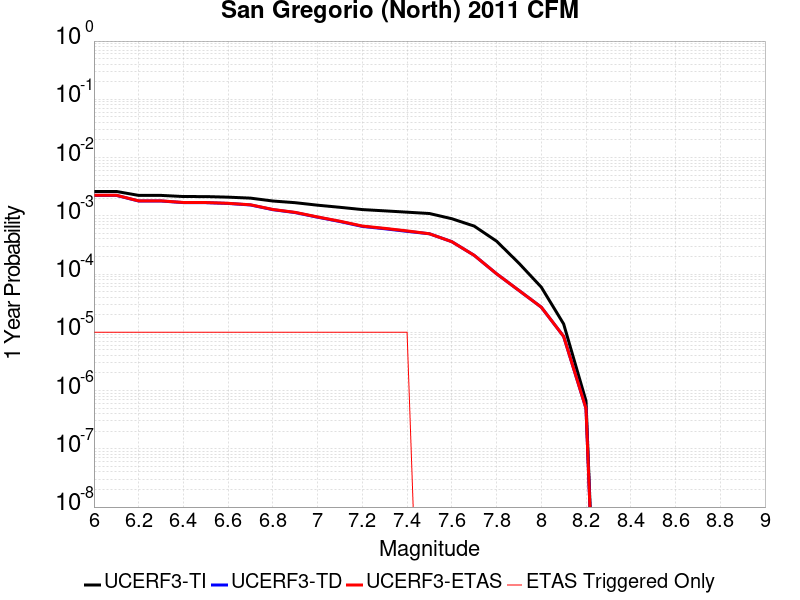 |  |

| Magnitude | 1 wk TI Prob | 1 wk TD Prob | 1 wk ETAS Prob | 1 wk ETAS/TD Gain | 1 wk ETAS Triggered Only | 1 mo TI Prob | 1 mo TD Prob | 1 mo ETAS Prob | 1 mo ETAS/TD Gain | 1 mo ETAS Triggered Only | 1 yr TI Prob | 1 yr TD Prob | 1 yr ETAS Prob | 1 yr ETAS/TD Gain | 1 yr ETAS Triggered Only | 10 yr TI Prob | 10 yr TD Prob | 10 yr ETAS Prob | 10 yr ETAS/TD Gain | 10 yr ETAS Triggered Only |
|-----|-----|-----|-----|-----|-----|-----|-----|-----|-----|-----|-----|-----|-----|-----|-----|-----|-----|-----|-----|-----|
| 6.0 | 5.0283932E-5 | 4.3057098E-5 | 5.305667E-5 | 1.2322397 | 1.0E-5 | 2.1548476E-4 | 1.8451746E-4 | 1.9451561E-4 | 1.0541854 | 1.0E-5 | 0.0026203706 | 0.002244199 | 0.0022541767 | 1.0044459 | 1.0E-5 | 0.02589687 | 0.022295918 | 0.022305695 | 1.0004386 | 1.0E-5 |
| 6.1 | 5.0283932E-5 | 4.3057098E-5 | 5.305667E-5 | 1.2322397 | 1.0E-5 | 2.1548476E-4 | 1.8451746E-4 | 1.9451561E-4 | 1.0541854 | 1.0E-5 | 0.0026203706 | 0.002244199 | 0.0022541767 | 1.0044459 | 1.0E-5 | 0.02589687 | 0.022295918 | 0.022305695 | 1.0004386 | 1.0E-5 |
| 6.2 | 4.2998647E-5 | 3.4440873E-5 | 4.4440527E-5 | 1.2903427 | 1.0E-5 | 1.842669E-4 | 1.4759546E-4 | 1.5759398E-4 | 1.0677427 | 1.0E-5 | 0.0022411412 | 0.001795506 | 0.001805488 | 1.0055594 | 1.0E-5 | 0.022186736 | 0.017884884 | 0.017894706 | 1.0005491 | 1.0E-5 |
| 6.3 | 4.2998647E-5 | 3.4440873E-5 | 4.4440527E-5 | 1.2903427 | 1.0E-5 | 1.842669E-4 | 1.4759546E-4 | 1.5759398E-4 | 1.0677427 | 1.0E-5 | 0.0022411412 | 0.001795506 | 0.001805488 | 1.0055594 | 1.0E-5 | 0.022186736 | 0.017884884 | 0.017894706 | 1.0005491 | 1.0E-5 |
| 6.4 | 4.1101295E-5 | 3.2326076E-5 | 4.232575E-5 | 1.3093379 | 1.0E-5 | 1.7613651E-4 | 1.3853304E-4 | 1.4853165E-4 | 1.0721749 | 1.0E-5 | 0.0021423528 | 0.0016853481 | 0.0016953313 | 1.0059235 | 1.0E-5 | 0.02121817 | 0.016800618 | 0.01681045 | 1.0005852 | 1.0E-5 |
| 6.5 | 4.1032585E-5 | 3.224411E-5 | 4.2243788E-5 | 1.3101242 | 1.0E-5 | 1.7584208E-4 | 1.381818E-4 | 1.4818042E-4 | 1.0723585 | 1.0E-5 | 0.0021387753 | 0.0016810785 | 0.0016910617 | 1.0059385 | 1.0E-5 | 0.021183075 | 0.01675857 | 0.016768403 | 1.0005867 | 1.0E-5 |
| 6.6 | 4.011629E-5 | 3.1265718E-5 | 4.1265404E-5 | 1.3198291 | 1.0E-5 | 1.7191563E-4 | 1.3398913E-4 | 1.4398778E-4 | 1.0746229 | 1.0E-5 | 0.0020910634 | 0.0016301107 | 0.0016400943 | 1.0061245 | 1.0E-5 | 0.020714961 | 0.016257357 | 0.016267195 | 1.0006051 | 1.0E-5 |
| 6.7 | 3.8583938E-5 | 2.9452754E-5 | 3.945246E-5 | 1.3395168 | 1.0E-5 | 1.6534925E-4 | 1.2622007E-4 | 1.362188E-4 | 1.0792167 | 1.0E-5 | 0.0020112682 | 0.0015356604 | 0.001545645 | 1.0065019 | 1.0E-5 | 0.019931622 | 0.015326062 | 0.015335909 | 1.0006425 | 1.0E-5 |
| 6.8 | 3.44341E-5 | 2.4450024E-5 | 3.444978E-5 | 1.4089875 | 1.0E-5 | 1.4756636E-4 | 1.0478167E-4 | 1.1478062E-4 | 1.0954266 | 1.0E-5 | 0.0017951399 | 0.0012749807 | 0.001284968 | 1.0078332 | 1.0E-5 | 0.017807078 | 0.012751525 | 0.012761398 | 1.0007743 | 1.0E-5 |
| 6.9 | 3.221199E-5 | 2.1777196E-5 | 3.1776977E-5 | 1.459186 | 1.0E-5 | 1.3804408E-4 | 9.3327544E-5 | 1.0332661E-4 | 1.1071395 | 1.0E-5 | 0.0016793909 | 0.0011356788 | 0.0011456675 | 1.0087953 | 1.0E-5 | 0.01666756 | 0.011372544 | 0.01138243 | 1.0008693 | 1.0E-5 |
| 7.0 | 2.9186718E-5 | 1.814604E-5 | 2.814586E-5 | 1.5510744 | 1.0E-5 | 1.2507994E-4 | 7.776645E-5 | 8.776567E-5 | 1.1285802 | 1.0E-5 | 0.0015217843 | 9.463997E-4 | 9.563902E-4 | 1.0105563 | 1.0E-5 | 0.015114053 | 0.0094966395 | 0.009506545 | 1.001043 | 1.0E-5 |
| 7.1 | 2.6840138E-5 | 1.5283675E-5 | 2.5283522E-5 | 1.6542829 | 1.0E-5 | 1.1502409E-4 | 6.549983E-5 | 7.549918E-5 | 1.1526622 | 1.0E-5 | 0.0013995186 | 7.971706E-4 | 8.0716267E-4 | 1.0125344 | 1.0E-5 | 0.013907375 | 0.0080155255 | 0.008025446 | 1.0012376 | 1.0E-5 |
| 7.2 | 2.453002E-5 | 1.2605825E-5 | 2.2605698E-5 | 1.793274 | 1.0E-5 | 1.05124425E-4 | 5.4023847E-5 | 6.4023305E-5 | 1.1850934 | 1.0E-5 | 0.0012791384 | 6.5754243E-4 | 6.675359E-4 | 1.0151981 | 1.0E-5 | 0.012718005 | 0.006627395 | 0.0066373283 | 1.0014989 | 1.0E-5 |
| 7.3 | 2.3330727E-5 | 1.1487833E-5 | 2.1487718E-5 | 1.8704762 | 1.0E-5 | 9.9985E-5 | 4.923264E-5 | 5.923215E-5 | 1.2031072 | 1.0E-5 | 0.0012166376 | 5.99243E-4 | 6.09237E-4 | 1.0166777 | 1.0E-5 | 0.012099981 | 0.0060462817 | 0.006056221 | 1.0016439 | 1.0E-5 |
| 7.4 | 2.2136466E-5 | 1.0368137E-5 | 2.0368032E-5 | 1.9644835 | 1.0E-5 | 9.486712E-5 | 4.4434113E-5 | 5.443367E-5 | 1.2250423 | 1.0E-5 | 0.0011543952 | 5.408513E-4 | 5.508459E-4 | 1.0184793 | 1.0E-5 | 0.011484168 | 0.0054640025 | 0.005473948 | 1.0018202 | 1.0E-5 |
| 7.5 | 2.0994974E-5 | 9.426374E-6 | 9.426374E-6 | 1.0 | 0.0 | 8.997535E-5 | 4.0398125E-5 | 4.0398125E-5 | 1.0 | 0.0 | 0.0010948994 | 4.917364E-4 | 4.917364E-4 | 1.0 | 0.0 | 0.010895205 | 0.004973108 | 0.004973108 | 1.0 | 0.0 |
| 7.6 | 1.7091823E-5 | 6.892992E-6 | 6.892992E-6 | 1.0 | 0.0 | 7.3248615E-5 | 2.9541061E-5 | 2.9541061E-5 | 1.0 | 0.0 | 8.9143694E-4 | 3.5960317E-4 | 3.5960317E-4 | 1.0 | 0.0 | 0.008878695 | 0.0036480771 | 0.0036480771 | 1.0 | 0.0 |
| 7.7 | 1.2772179E-5 | 4.0202267E-6 | 4.0202267E-6 | 1.0 | 0.0 | 5.473676E-5 | 1.722943E-5 | 1.722943E-5 | 1.0 | 0.0 | 6.6621625E-4 | 2.0974813E-4 | 2.0974813E-4 | 1.0 | 0.0 | 0.006642225 | 0.0021365841 | 0.0021365841 | 1.0 | 0.0 |
| 7.8 | 7.041923E-6 | 1.9402341E-6 | 1.9402341E-6 | 1.0 | 0.0 | 3.017932E-5 | 8.315263E-6 | 8.315263E-6 | 1.0 | 0.0 | 3.6737128E-4 | 1.01233614E-4 | 1.01233614E-4 | 1.0 | 0.0 | 0.0036676454 | 0.0010376878 | 0.0010376878 | 1.0 | 0.0 |
| 7.9 | 2.946768E-6 | 1.0031822E-6 | 1.0031822E-6 | 1.0 | 0.0 | 1.2628945E-5 | 4.299345E-6 | 4.299345E-6 | 1.0 | 0.0 | 1.5374656E-4 | 5.2343268E-5 | 5.2343268E-5 | 1.0 | 0.0 | 0.0015364023 | 5.339059E-4 | 5.339059E-4 | 1.0 | 0.0 |
| 8.0 | 1.1433375E-6 | 5.180804E-7 | 5.180804E-7 | 1.0 | 0.0 | 4.9000087E-6 | 2.2203426E-6 | 2.2203426E-6 | 1.0 | 0.0 | 5.965597E-5 | 2.7032334E-5 | 2.7032334E-5 | 1.0 | 0.0 | 5.963996E-4 | 2.7394458E-4 | 2.7394458E-4 | 1.0 | 0.0 |
| 8.1 | 2.6675295E-7 | 1.6288074E-7 | 1.6288074E-7 | 1.0 | 0.0 | 1.1432264E-6 | 6.9806015E-7 | 6.9806015E-7 | 1.0 | 0.0 | 1.3918692E-5 | 8.498849E-6 | 8.498849E-6 | 1.0 | 0.0 | 1.391782E-4 | 8.6366665E-5 | 8.6366665E-5 | 1.0 | 0.0 |
| 8.2 | 1.2704569E-8 | 9.429871E-9 | 9.429871E-9 | 1.0 | 0.0 | 5.444815E-8 | 4.041373E-8 | 4.041373E-8 | 1.0 | 0.0 | 6.629061E-7 | 4.920371E-7 | 4.920371E-7 | 1.0 | 0.0 | 6.629041E-6 | 5.1106863E-6 | 5.1106863E-6 | 1.0 | 0.0 |

## Yorba Linda
*[(top)](#table-of-contents)*

| 1 Week | 1 Month | 1 Year | 10 Year |
|-----|-----|-----|-----|
|  |  |  |  |

| Magnitude | 1 wk TI Prob | 1 wk TD Prob | 1 wk ETAS Prob | 1 wk ETAS/TD Gain | 1 wk ETAS Triggered Only | 1 mo TI Prob | 1 mo TD Prob | 1 mo ETAS Prob | 1 mo ETAS/TD Gain | 1 mo ETAS Triggered Only | 1 yr TI Prob | 1 yr TD Prob | 1 yr ETAS Prob | 1 yr ETAS/TD Gain | 1 yr ETAS Triggered Only | 10 yr TI Prob | 10 yr TD Prob | 10 yr ETAS Prob | 10 yr ETAS/TD Gain | 10 yr ETAS Triggered Only |
|-----|-----|-----|-----|-----|-----|-----|-----|-----|-----|-----|-----|-----|-----|-----|-----|-----|-----|-----|-----|-----|
| 6.0 | 1.9346849E-6 | 1.6909112E-6 | 1.6909112E-6 | 1.0 | 0.0 | 8.29148E-6 | 7.2467474E-6 | 7.2467474E-6 | 1.0 | 0.0 | 1.009441E-4 | 8.822652E-5 | 8.822652E-5 | 1.0 | 0.0 | 0.0010089825 | 8.8200805E-4 | 8.919992E-4 | 1.0113277 | 1.0E-5 |
| 6.1 | 1.9346849E-6 | 1.6909112E-6 | 1.6909112E-6 | 1.0 | 0.0 | 8.29148E-6 | 7.2467474E-6 | 7.2467474E-6 | 1.0 | 0.0 | 1.009441E-4 | 8.822652E-5 | 8.822652E-5 | 1.0 | 0.0 | 0.0010089825 | 8.8200805E-4 | 8.919992E-4 | 1.0113277 | 1.0E-5 |
| 6.2 | 1.9346849E-6 | 1.6909112E-6 | 1.6909112E-6 | 1.0 | 0.0 | 8.29148E-6 | 7.2467474E-6 | 7.2467474E-6 | 1.0 | 0.0 | 1.009441E-4 | 8.822652E-5 | 8.822652E-5 | 1.0 | 0.0 | 0.0010089825 | 8.8200805E-4 | 8.919992E-4 | 1.0113277 | 1.0E-5 |
| 6.3 | 1.1028608E-6 | 8.481863E-7 | 8.481863E-7 | 1.0 | 0.0 | 4.7265376E-6 | 3.6350793E-6 | 3.6350793E-6 | 1.0 | 0.0 | 5.754407E-5 | 4.425626E-5 | 4.425626E-5 | 1.0 | 0.0 | 5.7529175E-4 | 4.42481E-4 | 4.42481E-4 | 1.0 | 0.0 |
| 6.4 | 1.1028608E-6 | 8.481863E-7 | 8.481863E-7 | 1.0 | 0.0 | 4.7265376E-6 | 3.6350793E-6 | 3.6350793E-6 | 1.0 | 0.0 | 5.754407E-5 | 4.425626E-5 | 4.425626E-5 | 1.0 | 0.0 | 5.7529175E-4 | 4.42481E-4 | 4.42481E-4 | 1.0 | 0.0 |
| 6.5 | 8.4451364E-7 | 5.869109E-7 | 5.869109E-7 | 1.0 | 0.0 | 3.619339E-6 | 2.5153304E-6 | 2.5153304E-6 | 1.0 | 0.0 | 4.406456E-5 | 3.0623738E-5 | 3.0623738E-5 | 1.0 | 0.0 | 4.4055824E-4 | 3.0619733E-4 | 3.0619733E-4 | 1.0 | 0.0 |
| 6.6 | 8.422957E-7 | 5.844643E-7 | 5.844643E-7 | 1.0 | 0.0 | 3.6098338E-6 | 2.5048448E-6 | 2.5048448E-6 | 1.0 | 0.0 | 4.3948843E-5 | 3.049608E-5 | 3.049608E-5 | 1.0 | 0.0 | 4.394015E-4 | 3.049211E-4 | 3.049211E-4 | 1.0 | 0.0 |
| 6.7 | 8.4119705E-7 | 5.832485E-7 | 5.832485E-7 | 1.0 | 0.0 | 3.6051254E-6 | 2.499634E-6 | 2.499634E-6 | 1.0 | 0.0 | 4.3891516E-5 | 3.0432642E-5 | 3.0432642E-5 | 1.0 | 0.0 | 4.388285E-4 | 3.042869E-4 | 3.042869E-4 | 1.0 | 0.0 |
| 6.8 | 7.5919155E-7 | 4.9949944E-7 | 4.9949944E-7 | 1.0 | 0.0 | 3.253674E-6 | 2.1407102E-6 | 2.1407102E-6 | 1.0 | 0.0 | 3.961276E-5 | 2.6062853E-5 | 2.6062853E-5 | 1.0 | 0.0 | 3.9605703E-4 | 2.6059969E-4 | 2.6059969E-4 | 1.0 | 0.0 |
| 6.9 | 7.5804564E-7 | 4.981178E-7 | 4.981178E-7 | 1.0 | 0.0 | 3.248763E-6 | 2.134789E-6 | 2.134789E-6 | 1.0 | 0.0 | 3.955297E-5 | 2.5990763E-5 | 2.5990763E-5 | 1.0 | 0.0 | 3.9545933E-4 | 2.5987893E-4 | 2.5987893E-4 | 1.0 | 0.0 |
| 7.0 | 7.539293E-7 | 4.943313E-7 | 4.943313E-7 | 1.0 | 0.0 | 3.2311218E-6 | 2.118561E-6 | 2.118561E-6 | 1.0 | 0.0 | 3.9338196E-5 | 2.5793192E-5 | 2.5793192E-5 | 1.0 | 0.0 | 3.9331234E-4 | 2.579037E-4 | 2.579037E-4 | 1.0 | 0.0 |
| 7.1 | 6.0900885E-7 | 3.7817128E-7 | 3.7817128E-7 | 1.0 | 0.0 | 2.6100352E-6 | 1.6207331E-6 | 1.6207331E-6 | 1.0 | 0.0 | 3.1776715E-5 | 1.973225E-5 | 1.973225E-5 | 1.0 | 0.0 | 3.1772171E-4 | 1.9730533E-4 | 1.9730533E-4 | 1.0 | 0.0 |
| 7.2 | 5.849925E-7 | 3.5878818E-7 | 3.5878818E-7 | 1.0 | 0.0 | 2.5071083E-6 | 1.5376628E-6 | 1.5376628E-6 | 1.0 | 0.0 | 3.0523614E-5 | 1.8720886E-5 | 1.8720886E-5 | 1.0 | 0.0 | 3.0519423E-4 | 1.8719342E-4 | 1.8719342E-4 | 1.0 | 0.0 |
| 7.3 | 4.89808E-7 | 3.0379488E-7 | 3.0379488E-7 | 1.0 | 0.0 | 2.0991754E-6 | 1.3019775E-6 | 1.3019775E-6 | 1.0 | 0.0 | 2.5557161E-5 | 1.5851463E-5 | 1.5851463E-5 | 1.0 | 0.0 | 2.5554223E-4 | 1.5850355E-4 | 1.5850355E-4 | 1.0 | 0.0 |
| 7.4 | 3.8700415E-7 | 2.4722343E-7 | 2.4722343E-7 | 1.0 | 0.0 | 1.6585881E-6 | 1.0595286E-6 | 1.0595286E-6 | 1.0 | 0.0 | 2.0193123E-5 | 1.2899685E-5 | 1.2899685E-5 | 1.0 | 0.0 | 2.0191289E-4 | 1.2898949E-4 | 1.2898949E-4 | 1.0 | 0.0 |
| 7.5 | 2.900565E-7 | 1.8637462E-7 | 1.8637462E-7 | 1.0 | 0.0 | 1.2430987E-6 | 7.9874815E-7 | 7.9874815E-7 | 1.0 | 0.0 | 1.5134622E-5 | 9.724716E-6 | 9.724716E-6 | 1.0 | 0.0 | 1.5133592E-4 | 9.7242984E-5 | 9.7242984E-5 | 1.0 | 0.0 |
| 7.6 | 2.2770318E-7 | 1.4814276E-7 | 1.4814276E-7 | 1.0 | 0.0 | 9.758704E-7 | 6.348974E-7 | 6.348974E-7 | 1.0 | 0.0 | 1.1881158E-5 | 7.729848E-6 | 7.729848E-6 | 1.0 | 0.0 | 1.1880523E-4 | 7.729585E-5 | 7.729585E-5 | 1.0 | 0.0 |
| 7.7 | 1.5017194E-7 | 8.7355275E-8 | 8.7355275E-8 | 1.0 | 0.0 | 6.4359386E-7 | 3.7437968E-7 | 3.7437968E-7 | 1.0 | 0.0 | 7.835727E-6 | 4.5580637E-6 | 4.5580637E-6 | 1.0 | 0.0 | 7.835451E-5 | 4.5579727E-5 | 4.5579727E-5 | 1.0 | 0.0 |
| 7.8 | 3.895753E-8 | 1.8532088E-8 | 1.8532088E-8 | 1.0 | 0.0 | 1.6696083E-7 | 7.942323E-8 | 7.942323E-8 | 1.0 | 0.0 | 2.0327461E-6 | 9.669774E-7 | 9.669774E-7 | 1.0 | 0.0 | 2.0327276E-5 | 9.669734E-6 | 9.669734E-6 | 1.0 | 0.0 |
| 7.9 | 6.648505E-9 | 3.4183114E-9 | 3.4183114E-9 | 1.0 | 0.0 | 2.8493591E-8 | 1.4649906E-8 | 1.4649906E-8 | 1.0 | 0.0 | 3.4690942E-7 | 1.783626E-7 | 1.783626E-7 | 1.0 | 0.0 | 3.4690888E-6 | 1.7836247E-6 | 1.7836247E-6 | 1.0 | 0.0 |

## Reliz 2011 CFM
*[(top)](#table-of-contents)*

| 1 Week | 1 Month | 1 Year | 10 Year |
|-----|-----|-----|-----|
|  |  |  |  |

| Magnitude | 1 wk TI Prob | 1 wk TD Prob | 1 wk ETAS Prob | 1 wk ETAS/TD Gain | 1 wk ETAS Triggered Only | 1 mo TI Prob | 1 mo TD Prob | 1 mo ETAS Prob | 1 mo ETAS/TD Gain | 1 mo ETAS Triggered Only | 1 yr TI Prob | 1 yr TD Prob | 1 yr ETAS Prob | 1 yr ETAS/TD Gain | 1 yr ETAS Triggered Only | 10 yr TI Prob | 10 yr TD Prob | 10 yr ETAS Prob | 10 yr ETAS/TD Gain | 10 yr ETAS Triggered Only |
|-----|-----|-----|-----|-----|-----|-----|-----|-----|-----|-----|-----|-----|-----|-----|-----|-----|-----|-----|-----|-----|
| 6.0 | 1.6002472E-5 | 1.6282795E-5 | 1.6282795E-5 | 1.0 | 0.0 | 6.8580215E-5 | 6.978165E-5 | 7.978095E-5 | 1.1432941 | 1.0E-5 | 8.3464425E-4 | 8.492802E-4 | 8.5927173E-4 | 1.0117646 | 1.0E-5 | 0.008315164 | 0.008462543 | 0.008472458 | 1.0011717 | 1.0E-5 |
| 6.1 | 1.6002472E-5 | 1.6282795E-5 | 1.6282795E-5 | 1.0 | 0.0 | 6.8580215E-5 | 6.978165E-5 | 7.978095E-5 | 1.1432941 | 1.0E-5 | 8.3464425E-4 | 8.492802E-4 | 8.5927173E-4 | 1.0117646 | 1.0E-5 | 0.008315164 | 0.008462543 | 0.008472458 | 1.0011717 | 1.0E-5 |
| 6.2 | 1.6002472E-5 | 1.6282795E-5 | 1.6282795E-5 | 1.0 | 0.0 | 6.8580215E-5 | 6.978165E-5 | 7.978095E-5 | 1.1432941 | 1.0E-5 | 8.3464425E-4 | 8.492802E-4 | 8.5927173E-4 | 1.0117646 | 1.0E-5 | 0.008315164 | 0.008462543 | 0.008472458 | 1.0011717 | 1.0E-5 |
| 6.3 | 7.792404E-6 | 7.803792E-6 | 7.803792E-6 | 1.0 | 0.0 | 3.339559E-5 | 3.3444398E-5 | 3.3444398E-5 | 1.0 | 0.0 | 4.0651546E-4 | 4.0711026E-4 | 4.0711026E-4 | 1.0 | 0.0 | 0.0040577264 | 0.0040639215 | 0.0040639215 | 1.0 | 0.0 |
| 6.4 | 7.792404E-6 | 7.803792E-6 | 7.803792E-6 | 1.0 | 0.0 | 3.339559E-5 | 3.3444398E-5 | 3.3444398E-5 | 1.0 | 0.0 | 4.0651546E-4 | 4.0711026E-4 | 4.0711026E-4 | 1.0 | 0.0 | 0.0040577264 | 0.0040639215 | 0.0040639215 | 1.0 | 0.0 |
| 6.5 | 5.9659374E-6 | 5.928728E-6 | 5.928728E-6 | 1.0 | 0.0 | 2.5568053E-5 | 2.5408588E-5 | 2.5408588E-5 | 1.0 | 0.0 | 3.1124658E-4 | 3.0930588E-4 | 3.0930588E-4 | 1.0 | 0.0 | 0.00310811 | 0.003088972 | 0.003088972 | 1.0 | 0.0 |
| 6.6 | 5.2350692E-6 | 5.178976E-6 | 5.178976E-6 | 1.0 | 0.0 | 2.2435817E-5 | 2.2195423E-5 | 2.2195423E-5 | 1.0 | 0.0 | 2.7312184E-4 | 2.7019592E-4 | 2.7019592E-4 | 1.0 | 0.0 | 0.002727864 | 0.0026988846 | 0.0026988846 | 1.0 | 0.0 |
| 6.7 | 4.580206E-6 | 4.50611E-6 | 4.50611E-6 | 1.0 | 0.0 | 1.9629308E-5 | 1.931176E-5 | 1.931176E-5 | 1.0 | 0.0 | 2.389606E-4 | 2.3509537E-4 | 2.3509537E-4 | 1.0 | 0.0 | 0.002387038 | 0.002348669 | 0.002348669 | 1.0 | 0.0 |
| 6.8 | 4.0765017E-6 | 3.988228E-6 | 3.988228E-6 | 1.0 | 0.0 | 1.7470604E-5 | 1.7092294E-5 | 1.7092294E-5 | 1.0 | 0.0 | 2.1268385E-4 | 2.0807884E-4 | 2.0807884E-4 | 1.0 | 0.0 | 0.002124804 | 0.0020790389 | 0.0020790389 | 1.0 | 0.0 |
| 6.9 | 3.5752896E-6 | 3.4725074E-6 | 3.4725074E-6 | 1.0 | 0.0 | 1.532258E-5 | 1.488209E-5 | 1.488209E-5 | 1.0 | 0.0 | 1.8653645E-4 | 1.811744E-4 | 1.811744E-4 | 1.0 | 0.0 | 0.0018637994 | 0.001810464 | 0.001810464 | 1.0 | 0.0 |
| 7.0 | 3.0259848E-6 | 2.9079317E-6 | 2.9079317E-6 | 1.0 | 0.0 | 1.2968442E-5 | 1.2462505E-5 | 1.2462505E-5 | 1.0 | 0.0 | 1.5787935E-4 | 1.5172044E-4 | 1.5172044E-4 | 1.0 | 0.0 | 0.0015776722 | 0.0015163644 | 0.0015163644 | 1.0 | 0.0 |
| 7.1 | 2.5861116E-6 | 2.455157E-6 | 2.455157E-6 | 1.0 | 0.0 | 1.1083288E-5 | 1.0522059E-5 | 1.0522059E-5 | 1.0 | 0.0 | 1.3493067E-4 | 1.2809855E-4 | 1.2809855E-4 | 1.0 | 0.0 | 0.0013484878 | 0.0012804423 | 0.0012804423 | 1.0 | 0.0 |
| 7.2 | 2.1482588E-6 | 2.0032267E-6 | 2.0032267E-6 | 1.0 | 0.0 | 9.20679E-6 | 8.585229E-6 | 8.585229E-6 | 1.0 | 0.0 | 1.12086906E-4 | 1.0452016E-4 | 1.0452016E-4 | 1.0 | 0.0 | 0.0011203039 | 0.0010449048 | 0.0010449048 | 1.0 | 0.0 |
| 7.3 | 1.7194744E-6 | 1.561114E-6 | 1.561114E-6 | 1.0 | 0.0 | 7.3691554E-6 | 6.6904713E-6 | 6.6904713E-6 | 1.0 | 0.0 | 8.971577E-5 | 8.145344E-5 | 8.145344E-5 | 1.0 | 0.0 | 8.967956E-4 | 8.144305E-4 | 8.144305E-4 | 1.0 | 0.0 |
| 7.4 | 1.2755178E-6 | 1.1056196E-6 | 1.1056196E-6 | 1.0 | 0.0 | 5.4664933E-6 | 4.738361E-6 | 4.738361E-6 | 1.0 | 0.0 | 6.655252E-5 | 5.768802E-5 | 5.768802E-5 | 1.0 | 0.0 | 6.6532596E-4 | 5.769249E-4 | 5.769249E-4 | 1.0 | 0.0 |
| 7.5 | 8.8463224E-7 | 7.0579193E-7 | 7.0579193E-7 | 1.0 | 0.0 | 3.7912755E-6 | 3.0248189E-6 | 3.0248189E-6 | 1.0 | 0.0 | 4.6157802E-5 | 3.682655E-5 | 3.682655E-5 | 1.0 | 0.0 | 4.6148215E-4 | 3.683988E-4 | 3.683988E-4 | 1.0 | 0.0 |
| 7.6 | 5.291355E-7 | 3.5006548E-7 | 3.5006548E-7 | 1.0 | 0.0 | 2.2677216E-6 | 1.5002796E-6 | 1.5002796E-6 | 1.0 | 0.0 | 2.760916E-5 | 1.8265751E-5 | 1.8265751E-5 | 1.0 | 0.0 | 2.760573E-4 | 1.8283579E-4 | 1.8283579E-4 | 1.0 | 0.0 |
| 7.7 | 2.9663357E-7 | 1.3509886E-7 | 1.3509886E-7 | 1.0 | 0.0 | 1.2712861E-6 | 5.7899496E-7 | 5.7899496E-7 | 1.0 | 0.0 | 1.5477797E-5 | 7.0492406E-6 | 7.0492406E-6 | 1.0 | 0.0 | 1.547672E-4 | 7.0675895E-5 | 7.0675895E-5 | 1.0 | 0.0 |
| 7.8 | 1.2509386E-7 | 2.7148959E-8 | 2.7148959E-8 | 1.0 | 0.0 | 5.3611643E-7 | 1.1635268E-7 | 1.1635268E-7 | 1.0 | 0.0 | 6.527198E-6 | 1.4165929E-6 | 1.4165929E-6 | 1.0 | 0.0 | 6.527006E-5 | 1.4322827E-5 | 1.4322827E-5 | 1.0 | 0.0 |
| 7.9 | 6.213493E-8 | 1.1477568E-8 | 1.1477568E-8 | 1.0 | 0.0 | 2.6629255E-7 | 4.9189577E-8 | 4.9189577E-8 | 1.0 | 0.0 | 3.242107E-6 | 5.9888293E-7 | 5.9888293E-7 | 1.0 | 0.0 | 3.2420594E-5 | 6.1203536E-6 | 6.1203536E-6 | 1.0 | 0.0 |
| 8.0 | 5.92383E-9 | 1.6775827E-9 | 1.6775827E-9 | 1.0 | 0.0 | 2.5387841E-8 | 7.18964E-9 | 7.18964E-9 | 1.0 | 0.0 | 3.0909692E-7 | 8.753386E-8 | 8.753386E-8 | 1.0 | 0.0 | 3.090965E-6 | 8.992677E-7 | 8.992677E-7 | 1.0 | 0.0 |

## Point Reyes 2011 connector
*[(top)](#table-of-contents)*

| 1 Week | 1 Month | 1 Year | 10 Year |
|-----|-----|-----|-----|
|  |  |  |  |

| Magnitude | 1 wk TI Prob | 1 wk TD Prob | 1 wk ETAS Prob | 1 wk ETAS/TD Gain | 1 wk ETAS Triggered Only | 1 mo TI Prob | 1 mo TD Prob | 1 mo ETAS Prob | 1 mo ETAS/TD Gain | 1 mo ETAS Triggered Only | 1 yr TI Prob | 1 yr TD Prob | 1 yr ETAS Prob | 1 yr ETAS/TD Gain | 1 yr ETAS Triggered Only | 10 yr TI Prob | 10 yr TD Prob | 10 yr ETAS Prob | 10 yr ETAS/TD Gain | 10 yr ETAS Triggered Only |
|-----|-----|-----|-----|-----|-----|-----|-----|-----|-----|-----|-----|-----|-----|-----|-----|-----|-----|-----|-----|-----|
| 6.0 | 3.7893044E-6 | 3.419019E-6 | 1.3418985E-5 | 3.9248056 | 1.0E-5 | 1.6239776E-5 | 1.4652868E-5 | 2.4652722E-5 | 1.6824503 | 1.0E-5 | 1.9770133E-4 | 1.783862E-4 | 1.8838442E-4 | 1.0560482 | 1.0E-5 | 0.0019752553 | 0.0017828896 | 0.0017928717 | 1.0055989 | 1.0E-5 |
| 6.1 | 1.7449562E-6 | 1.3500688E-6 | 1.3500688E-6 | 1.0 | 0.0 | 7.478362E-6 | 5.785997E-6 | 5.785997E-6 | 1.0 | 0.0 | 9.104525E-5 | 7.044229E-5 | 7.044229E-5 | 1.0 | 0.0 | 9.1007963E-4 | 7.044551E-4 | 7.044551E-4 | 1.0 | 0.0 |
| 6.2 | 1.7449562E-6 | 1.3500688E-6 | 1.3500688E-6 | 1.0 | 0.0 | 7.478362E-6 | 5.785997E-6 | 5.785997E-6 | 1.0 | 0.0 | 9.104525E-5 | 7.044229E-5 | 7.044229E-5 | 1.0 | 0.0 | 9.1007963E-4 | 7.044551E-4 | 7.044551E-4 | 1.0 | 0.0 |
| 6.3 | 1.5739171E-6 | 1.177309E-6 | 1.177309E-6 | 1.0 | 0.0 | 6.7453416E-6 | 5.0456E-6 | 5.0456E-6 | 1.0 | 0.0 | 8.212144E-5 | 6.1428495E-5 | 6.1428495E-5 | 1.0 | 0.0 | 8.2091097E-4 | 6.1436923E-4 | 6.1436923E-4 | 1.0 | 0.0 |
| 6.4 | 1.5138507E-6 | 1.1166635E-6 | 1.1166635E-6 | 1.0 | 0.0 | 6.4879155E-6 | 4.785692E-6 | 4.785692E-6 | 1.0 | 0.0 | 7.898751E-5 | 5.8264282E-5 | 5.8264282E-5 | 1.0 | 0.0 | 7.8959437E-4 | 5.82744E-4 | 5.82744E-4 | 1.0 | 0.0 |
| 6.5 | 1.3662817E-6 | 9.671104E-7 | 9.671104E-7 | 1.0 | 0.0 | 5.8554797E-6 | 4.1447524E-6 | 4.1447524E-6 | 1.0 | 0.0 | 7.128814E-5 | 5.046121E-5 | 5.046121E-5 | 1.0 | 0.0 | 7.126527E-4 | 5.0474936E-4 | 5.0474936E-4 | 1.0 | 0.0 |
| 6.6 | 1.2022703E-6 | 8.0700335E-7 | 8.0700335E-7 | 1.0 | 0.0 | 5.1525767E-6 | 3.4585812E-6 | 3.4585812E-6 | 1.0 | 0.0 | 6.273081E-5 | 4.2107422E-5 | 4.2107422E-5 | 1.0 | 0.0 | 6.271311E-4 | 4.2124547E-4 | 4.2124547E-4 | 1.0 | 0.0 |
| 6.7 | 1.0194848E-6 | 6.2657085E-7 | 6.2657085E-7 | 1.0 | 0.0 | 4.3692135E-6 | 2.685301E-6 | 2.685301E-6 | 1.0 | 0.0 | 5.319387E-5 | 3.2693053E-5 | 3.2693053E-5 | 1.0 | 0.0 | 5.3181144E-4 | 3.271329E-4 | 3.271329E-4 | 1.0 | 0.0 |
| 6.8 | 9.212307E-7 | 5.3642964E-7 | 5.3642964E-7 | 1.0 | 0.0 | 3.9481256E-6 | 2.2989823E-6 | 2.2989823E-6 | 1.0 | 0.0 | 4.806737E-5 | 2.7989752E-5 | 2.7989752E-5 | 1.0 | 0.0 | 4.8056975E-4 | 2.8011258E-4 | 2.8011258E-4 | 1.0 | 0.0 |
| 6.9 | 8.1306075E-7 | 4.3497826E-7 | 4.3497826E-7 | 1.0 | 0.0 | 3.4845416E-6 | 1.8641912E-6 | 1.8641912E-6 | 1.0 | 0.0 | 4.2423468E-5 | 2.2696293E-5 | 2.2696293E-5 | 1.0 | 0.0 | 4.241537E-4 | 2.2718993E-4 | 2.2718993E-4 | 1.0 | 0.0 |
| 7.0 | 6.773335E-7 | 3.1071133E-7 | 3.1071133E-7 | 1.0 | 0.0 | 2.9028547E-6 | 1.3316193E-6 | 1.3316193E-6 | 1.0 | 0.0 | 3.5341684E-5 | 1.6212343E-5 | 1.6212343E-5 | 1.0 | 0.0 | 3.5336064E-4 | 1.6236167E-4 | 1.6236167E-4 | 1.0 | 0.0 |
| 7.1 | 5.7279397E-7 | 2.1740257E-7 | 2.1740257E-7 | 1.0 | 0.0 | 2.454829E-6 | 9.3172497E-7 | 9.3172497E-7 | 1.0 | 0.0 | 2.9887131E-5 | 1.1343692E-5 | 1.1343692E-5 | 1.0 | 0.0 | 2.9883112E-4 | 1.13681126E-4 | 1.13681126E-4 | 1.0 | 0.0 |
| 7.2 | 5.185539E-7 | 1.7426692E-7 | 1.7426692E-7 | 1.0 | 0.0 | 2.222372E-6 | 7.4685795E-7 | 7.4685795E-7 | 1.0 | 0.0 | 2.7057044E-5 | 9.092957E-6 | 9.092957E-6 | 1.0 | 0.0 | 2.7053748E-4 | 9.117584E-5 | 9.117584E-5 | 1.0 | 0.0 |
| 7.3 | 4.7599846E-7 | 1.5518242E-7 | 1.5518242E-7 | 1.0 | 0.0 | 2.0399918E-6 | 6.650673E-7 | 6.650673E-7 | 1.0 | 0.0 | 2.4836616E-5 | 8.097164E-6 | 8.097164E-6 | 1.0 | 0.0 | 2.4833842E-4 | 8.121868E-5 | 8.121868E-5 | 1.0 | 0.0 |
| 7.4 | 4.3987393E-7 | 1.3891216E-7 | 1.3891216E-7 | 1.0 | 0.0 | 1.8851727E-6 | 5.9533767E-7 | 5.9533767E-7 | 1.0 | 0.0 | 2.2951735E-5 | 7.2482117E-6 | 7.2482117E-6 | 1.0 | 0.0 | 2.2949366E-4 | 7.272974E-5 | 7.272974E-5 | 1.0 | 0.0 |
| 7.5 | 3.980054E-7 | 1.218397E-7 | 1.218397E-7 | 1.0 | 0.0 | 1.7057363E-6 | 5.2217007E-7 | 5.2217007E-7 | 1.0 | 0.0 | 2.0767142E-5 | 6.3574016E-6 | 6.3574016E-6 | 1.0 | 0.0 | 2.0765202E-4 | 6.381693E-5 | 6.381693E-5 | 1.0 | 0.0 |
| 7.6 | 3.4188398E-7 | 9.856225E-8 | 9.856225E-8 | 1.0 | 0.0 | 1.4652163E-6 | 4.2240958E-7 | 4.2240958E-7 | 1.0 | 0.0 | 1.7838862E-5 | 5.142824E-6 | 5.142824E-6 | 1.0 | 0.0 | 1.783743E-4 | 5.1655472E-5 | 5.1655472E-5 | 1.0 | 0.0 |
| 7.7 | 2.6611437E-7 | 7.212507E-8 | 7.212507E-8 | 1.0 | 0.0 | 1.1404896E-6 | 3.0910743E-7 | 3.0910743E-7 | 1.0 | 0.0 | 1.3885373E-5 | 3.763376E-6 | 3.763376E-6 | 1.0 | 0.0 | 1.3884505E-4 | 3.7818565E-5 | 3.7818565E-5 | 1.0 | 0.0 |
| 7.8 | 1.5107078E-7 | 5.0045998E-8 | 5.0045998E-8 | 1.0 | 0.0 | 6.474461E-7 | 2.1448285E-7 | 2.1448285E-7 | 1.0 | 0.0 | 7.882627E-6 | 2.6113255E-6 | 2.6113255E-6 | 1.0 | 0.0 | 7.8823476E-5 | 2.6276892E-5 | 2.6276892E-5 | 1.0 | 0.0 |
| 7.9 | 4.3228205E-8 | 2.1814706E-8 | 2.1814706E-8 | 1.0 | 0.0 | 1.8526373E-7 | 9.3491614E-8 | 9.3491614E-8 | 1.0 | 0.0 | 2.2555835E-6 | 1.1382598E-6 | 1.1382598E-6 | 1.0 | 0.0 | 2.2555607E-5 | 1.1459969E-5 | 1.1459969E-5 | 1.0 | 0.0 |
| 8.0 | 1.9149928E-8 | 1.3047568E-8 | 1.3047568E-8 | 1.0 | 0.0 | 8.207112E-8 | 5.5918147E-8 | 5.5918147E-8 | 1.0 | 0.0 | 9.992154E-7 | 6.808032E-7 | 6.808032E-7 | 1.0 | 0.0 | 9.992109E-6 | 6.8564223E-6 | 6.8564223E-6 | 1.0 | 0.0 |
| 8.1 | 6.7792816E-9 | 6.4079337E-9 | 6.4079337E-9 | 1.0 | 0.0 | 2.9054062E-8 | 2.7462569E-8 | 2.7462569E-8 | 1.0 | 0.0 | 3.5373316E-7 | 3.3435674E-7 | 3.3435674E-7 | 1.0 | 0.0 | 3.537326E-6 | 3.3689214E-6 | 3.3689214E-6 | 1.0 | 0.0 |

## Mission Hills 2011
*[(top)](#table-of-contents)*

| 1 Week | 1 Month | 1 Year | 10 Year |
|-----|-----|-----|-----|
|  |  |  |  |

| Magnitude | 1 wk TI Prob | 1 wk TD Prob | 1 wk ETAS Prob | 1 wk ETAS/TD Gain | 1 wk ETAS Triggered Only | 1 mo TI Prob | 1 mo TD Prob | 1 mo ETAS Prob | 1 mo ETAS/TD Gain | 1 mo ETAS Triggered Only | 1 yr TI Prob | 1 yr TD Prob | 1 yr ETAS Prob | 1 yr ETAS/TD Gain | 1 yr ETAS Triggered Only | 10 yr TI Prob | 10 yr TD Prob | 10 yr ETAS Prob | 10 yr ETAS/TD Gain | 10 yr ETAS Triggered Only |
|-----|-----|-----|-----|-----|-----|-----|-----|-----|-----|-----|-----|-----|-----|-----|-----|-----|-----|-----|-----|-----|
| 6.0 | 1.8765717E-5 | 1.9054629E-5 | 1.9054629E-5 | 1.0 | 0.0 | 8.0422025E-5 | 8.1662074E-5 | 8.1662074E-5 | 1.0 | 0.0 | 9.786983E-4 | 9.941256E-4 | 9.941256E-4 | 1.0 | 0.0 | 0.009743992 | 0.00993045 | 0.00994035 | 1.000997 | 1.0E-5 |
| 6.1 | 1.8765717E-5 | 1.9054629E-5 | 1.9054629E-5 | 1.0 | 0.0 | 8.0422025E-5 | 8.1662074E-5 | 8.1662074E-5 | 1.0 | 0.0 | 9.786983E-4 | 9.941256E-4 | 9.941256E-4 | 1.0 | 0.0 | 0.009743992 | 0.00993045 | 0.00994035 | 1.000997 | 1.0E-5 |
| 6.2 | 1.8765717E-5 | 1.9054629E-5 | 1.9054629E-5 | 1.0 | 0.0 | 8.0422025E-5 | 8.1662074E-5 | 8.1662074E-5 | 1.0 | 0.0 | 9.786983E-4 | 9.941256E-4 | 9.941256E-4 | 1.0 | 0.0 | 0.009743992 | 0.00993045 | 0.00994035 | 1.000997 | 1.0E-5 |
| 6.3 | 1.8765717E-5 | 1.9054629E-5 | 1.9054629E-5 | 1.0 | 0.0 | 8.0422025E-5 | 8.1662074E-5 | 8.1662074E-5 | 1.0 | 0.0 | 9.786983E-4 | 9.941256E-4 | 9.941256E-4 | 1.0 | 0.0 | 0.009743992 | 0.00993045 | 0.00994035 | 1.000997 | 1.0E-5 |
| 6.4 | 4.566357E-6 | 2.5148213E-6 | 2.5148213E-6 | 1.0 | 0.0 | 1.9569954E-5 | 1.0777771E-5 | 1.0777771E-5 | 1.0 | 0.0 | 2.3823815E-4 | 1.3121328E-4 | 1.3121328E-4 | 1.0 | 0.0 | 0.002379829 | 0.0013115364 | 0.0013115364 | 1.0 | 0.0 |
| 6.5 | 4.566357E-6 | 2.5148213E-6 | 2.5148213E-6 | 1.0 | 0.0 | 1.9569954E-5 | 1.0777771E-5 | 1.0777771E-5 | 1.0 | 0.0 | 2.3823815E-4 | 1.3121328E-4 | 1.3121328E-4 | 1.0 | 0.0 | 0.002379829 | 0.0013115364 | 0.0013115364 | 1.0 | 0.0 |
| 6.6 | 4.566357E-6 | 2.5148213E-6 | 2.5148213E-6 | 1.0 | 0.0 | 1.9569954E-5 | 1.0777771E-5 | 1.0777771E-5 | 1.0 | 0.0 | 2.3823815E-4 | 1.3121328E-4 | 1.3121328E-4 | 1.0 | 0.0 | 0.002379829 | 0.0013115364 | 0.0013115364 | 1.0 | 0.0 |
| 6.7 | 2.3266773E-6 | 1.3296132E-6 | 1.3296132E-6 | 1.0 | 0.0 | 9.971435E-6 | 5.69833E-6 | 5.69833E-6 | 1.0 | 0.0 | 1.2139547E-4 | 6.937502E-5 | 6.937502E-5 | 1.0 | 0.0 | 0.0012132917 | 6.935397E-4 | 6.935397E-4 | 1.0 | 0.0 |
| 6.8 | 2.032735E-6 | 1.1894101E-6 | 1.1894101E-6 | 1.0 | 0.0 | 8.711692E-6 | 5.0974622E-6 | 5.0974622E-6 | 1.0 | 0.0 | 1.06059684E-4 | 6.205988E-5 | 6.205988E-5 | 1.0 | 0.0 | 0.0010600908 | 6.204304E-4 | 6.204304E-4 | 1.0 | 0.0 |
| 6.9 | 1.3186259E-6 | 1.0561989E-6 | 1.0561989E-6 | 1.0 | 0.0 | 5.6512413E-6 | 4.526559E-6 | 4.526559E-6 | 1.0 | 0.0 | 6.8801695E-5 | 5.5109493E-5 | 5.5109493E-5 | 1.0 | 0.0 | 6.8780396E-4 | 5.5096124E-4 | 5.5096124E-4 | 1.0 | 0.0 |
| 7.0 | 1.2726016E-6 | 1.0159295E-6 | 1.0159295E-6 | 1.0 | 0.0 | 5.4539955E-6 | 4.3539762E-6 | 4.3539762E-6 | 1.0 | 0.0 | 6.6400375E-5 | 5.30084E-5 | 5.30084E-5 | 1.0 | 0.0 | 6.6380535E-4 | 5.299604E-4 | 5.299604E-4 | 1.0 | 0.0 |
| 7.1 | 1.2063913E-6 | 9.570282E-7 | 9.570282E-7 | 1.0 | 0.0 | 5.170238E-6 | 4.101543E-6 | 4.101543E-6 | 1.0 | 0.0 | 6.294583E-5 | 4.9935166E-5 | 4.9935166E-5 | 1.0 | 0.0 | 6.2928005E-4 | 4.9924204E-4 | 4.9924204E-4 | 1.0 | 0.0 |
| 7.2 | 9.105806E-7 | 7.3767757E-7 | 7.3767757E-7 | 1.0 | 0.0 | 3.9024826E-6 | 3.1614716E-6 | 3.1614716E-6 | 1.0 | 0.0 | 4.7511687E-5 | 3.8490252E-5 | 3.8490252E-5 | 1.0 | 0.0 | 4.7501532E-4 | 3.8483742E-4 | 3.8483742E-4 | 1.0 | 0.0 |
| 7.3 | 7.020432E-7 | 5.7103375E-7 | 5.7103375E-7 | 1.0 | 0.0 | 3.0087533E-6 | 2.4472852E-6 | 2.4472852E-6 | 1.0 | 0.0 | 3.6630954E-5 | 2.9795303E-5 | 2.9795303E-5 | 1.0 | 0.0 | 3.6624918E-4 | 2.979144E-4 | 2.979144E-4 | 1.0 | 0.0 |
| 7.4 | 5.3900635E-7 | 4.4483278E-7 | 4.4483278E-7 | 1.0 | 0.0 | 2.3100251E-6 | 1.9064248E-6 | 1.9064248E-6 | 1.0 | 0.0 | 2.8124194E-5 | 2.3210489E-5 | 2.3210489E-5 | 1.0 | 0.0 | 2.8120633E-4 | 2.3208185E-4 | 2.3208185E-4 | 1.0 | 0.0 |
| 7.5 | 2.907075E-7 | 2.2875324E-7 | 2.2875324E-7 | 1.0 | 0.0 | 1.2458887E-6 | 9.803706E-7 | 9.803706E-7 | 1.0 | 0.0 | 1.5168589E-5 | 1.1935949E-5 | 1.1935949E-5 | 1.0 | 0.0 | 1.5167553E-4 | 1.1935326E-4 | 1.1935326E-4 | 1.0 | 0.0 |
| 7.6 | 1.6903675E-7 | 1.2353401E-7 | 1.2353401E-7 | 1.0 | 0.0 | 7.2444305E-7 | 5.2943136E-7 | 5.2943136E-7 | 1.0 | 0.0 | 8.820059E-6 | 6.4458086E-6 | 6.4458086E-6 | 1.0 | 0.0 | 8.8197085E-5 | 6.445634E-5 | 6.445634E-5 | 1.0 | 0.0 |
| 7.7 | 7.168073E-8 | 3.9134374E-8 | 3.9134374E-8 | 1.0 | 0.0 | 3.072031E-7 | 1.6771872E-7 | 1.6771872E-7 | 1.0 | 0.0 | 3.7401915E-6 | 2.0419736E-6 | 2.0419736E-6 | 1.0 | 0.0 | 3.7401285E-5 | 2.041956E-5 | 2.041956E-5 | 1.0 | 0.0 |
| 7.8 | 6.564101E-8 | 3.3834656E-8 | 3.3834656E-8 | 1.0 | 0.0 | 2.813186E-7 | 1.4500566E-7 | 1.4500566E-7 | 1.0 | 0.0 | 3.4250486E-6 | 1.7654426E-6 | 1.7654426E-6 | 1.0 | 0.0 | 3.424996E-5 | 1.7654296E-5 | 1.7654296E-5 | 1.0 | 0.0 |
| 7.9 | 1.0029074E-8 | 3.728858E-9 | 3.728858E-9 | 1.0 | 0.0 | 4.2981743E-8 | 1.598082E-8 | 1.598082E-8 | 1.0 | 0.0 | 5.2330256E-7 | 1.945665E-7 | 1.945665E-7 | 1.0 | 0.0 | 5.2330133E-6 | 1.9456643E-6 | 1.9456643E-6 | 1.0 | 0.0 |

## Goose Lake 2011 CFM
*[(top)](#table-of-contents)*

| 1 Week | 1 Month | 1 Year | 10 Year |
|-----|-----|-----|-----|
|  |  |  |  |

| Magnitude | 1 wk TI Prob | 1 wk TD Prob | 1 wk ETAS Prob | 1 wk ETAS/TD Gain | 1 wk ETAS Triggered Only | 1 mo TI Prob | 1 mo TD Prob | 1 mo ETAS Prob | 1 mo ETAS/TD Gain | 1 mo ETAS Triggered Only | 1 yr TI Prob | 1 yr TD Prob | 1 yr ETAS Prob | 1 yr ETAS/TD Gain | 1 yr ETAS Triggered Only | 10 yr TI Prob | 10 yr TD Prob | 10 yr ETAS Prob | 10 yr ETAS/TD Gain | 10 yr ETAS Triggered Only |
|-----|-----|-----|-----|-----|-----|-----|-----|-----|-----|-----|-----|-----|-----|-----|-----|-----|-----|-----|-----|-----|
| 6.0 | 3.780968E-6 | 3.8230223E-6 | 3.8230223E-6 | 1.0 | 0.0 | 1.6204049E-5 | 1.6384285E-5 | 1.6384285E-5 | 1.0 | 0.0 | 1.9726643E-4 | 1.994615E-4 | 2.0945951E-4 | 1.050125 | 1.0E-5 | 0.001970914 | 0.001992933 | 0.002002913 | 1.0050077 | 1.0E-5 |
| 6.1 | 2.2035124E-6 | 2.229801E-6 | 2.229801E-6 | 1.0 | 0.0 | 9.443591E-6 | 9.556257E-6 | 9.556257E-6 | 1.0 | 0.0 | 1.1496965E-4 | 1.163414E-4 | 1.163414E-4 | 1.0 | 0.0 | 0.0011491019 | 0.0011628233 | 0.0011628233 | 1.0 | 0.0 |
| 6.2 | 1.5624689E-6 | 1.5826923E-6 | 1.5826923E-6 | 1.0 | 0.0 | 6.6962784E-6 | 6.7829496E-6 | 6.7829496E-6 | 1.0 | 0.0 | 8.152414E-5 | 8.2579325E-5 | 8.2579325E-5 | 1.0 | 0.0 | 8.1494235E-4 | 8.2549086E-4 | 8.2549086E-4 | 1.0 | 0.0 |
| 6.3 | 1.5624689E-6 | 1.5826923E-6 | 1.5826923E-6 | 1.0 | 0.0 | 6.6962784E-6 | 6.7829496E-6 | 6.7829496E-6 | 1.0 | 0.0 | 8.152414E-5 | 8.2579325E-5 | 8.2579325E-5 | 1.0 | 0.0 | 8.1494235E-4 | 8.2549086E-4 | 8.2549086E-4 | 1.0 | 0.0 |
| 6.4 | 1.256464E-6 | 1.2738695E-6 | 1.2738695E-6 | 1.0 | 0.0 | 5.3848344E-6 | 5.4594293E-6 | 5.4594293E-6 | 1.0 | 0.0 | 6.5558386E-5 | 6.646655E-5 | 6.646655E-5 | 1.0 | 0.0 | 6.553905E-4 | 6.644687E-4 | 6.644687E-4 | 1.0 | 0.0 |
| 6.5 | 1.0910911E-6 | 1.1069404E-6 | 1.1069404E-6 | 1.0 | 0.0 | 4.6760965E-6 | 4.7440217E-6 | 4.7440217E-6 | 1.0 | 0.0 | 5.692999E-5 | 5.7756948E-5 | 5.7756948E-5 | 1.0 | 0.0 | 5.6915404E-4 | 5.7742064E-4 | 5.7742064E-4 | 1.0 | 0.0 |
| 6.6 | 9.546601E-7 | 9.691246E-7 | 9.691246E-7 | 1.0 | 0.0 | 4.091394E-6 | 4.1533845E-6 | 4.1533845E-6 | 1.0 | 0.0 | 4.9811584E-5 | 5.056629E-5 | 5.056629E-5 | 1.0 | 0.0 | 4.980042E-4 | 5.055487E-4 | 5.055487E-4 | 1.0 | 0.0 |
| 6.7 | 7.790316E-7 | 7.9159634E-7 | 7.9159634E-7 | 1.0 | 0.0 | 3.3387028E-6 | 3.3925514E-6 | 3.3925514E-6 | 1.0 | 0.0 | 4.0647945E-5 | 4.1303538E-5 | 4.1303538E-5 | 1.0 | 0.0 | 4.0640513E-4 | 4.129592E-4 | 4.129592E-4 | 1.0 | 0.0 |
| 6.8 | 6.3714384E-7 | 6.4787395E-7 | 6.4787395E-7 | 1.0 | 0.0 | 2.7306137E-6 | 2.7765998E-6 | 2.7765998E-6 | 1.0 | 0.0 | 3.3244716E-5 | 3.3804583E-5 | 3.3804583E-5 | 1.0 | 0.0 | 3.323974E-4 | 3.379949E-4 | 3.379949E-4 | 1.0 | 0.0 |
| 6.9 | 4.92586E-7 | 5.0139147E-7 | 5.0139147E-7 | 1.0 | 0.0 | 2.1110811E-6 | 2.1488188E-6 | 2.1488188E-6 | 1.0 | 0.0 | 2.5702111E-5 | 2.616156E-5 | 2.616156E-5 | 1.0 | 0.0 | 2.569914E-4 | 2.6158517E-4 | 2.6158517E-4 | 1.0 | 0.0 |
| 7.0 | 3.130245E-7 | 3.190354E-7 | 3.190354E-7 | 1.0 | 0.0 | 1.3415328E-6 | 1.3672939E-6 | 1.3672939E-6 | 1.0 | 0.0 | 1.6333039E-5 | 1.6646678E-5 | 1.6646678E-5 | 1.0 | 0.0 | 1.6331839E-4 | 1.6645451E-4 | 1.6645451E-4 | 1.0 | 0.0 |
| 7.1 | 1.7680084E-7 | 1.8023923E-7 | 1.8023923E-7 | 1.0 | 0.0 | 7.5771766E-7 | 7.724536E-7 | 7.724536E-7 | 1.0 | 0.0 | 9.225173E-6 | 9.404583E-6 | 9.404583E-6 | 1.0 | 0.0 | 9.22479E-5 | 9.4041956E-5 | 9.4041956E-5 | 1.0 | 0.0 |
| 7.2 | 4.8641045E-8 | 4.9402068E-8 | 4.9402068E-8 | 1.0 | 0.0 | 2.084616E-7 | 2.1172312E-7 | 2.1172312E-7 | 1.0 | 0.0 | 2.538017E-6 | 2.577726E-6 | 2.577726E-6 | 1.0 | 0.0 | 2.537988E-5 | 2.5776973E-5 | 2.5776973E-5 | 1.0 | 0.0 |
| 7.3 | 5.3911844E-9 | 5.4758145E-9 | 5.4758145E-9 | 1.0 | 0.0 | 2.3105075E-8 | 2.3467775E-8 | 2.3467775E-8 | 1.0 | 0.0 | 2.8130427E-7 | 2.8572015E-7 | 2.8572015E-7 | 1.0 | 0.0 | 2.8130391E-6 | 2.8571992E-6 | 2.8571992E-6 | 1.0 | 0.0 |

## Garberville - Briceland 2011 CFM
*[(top)](#table-of-contents)*

| 1 Week | 1 Month | 1 Year | 10 Year |
|-----|-----|-----|-----|
|  |  |  |  |

| Magnitude | 1 wk TI Prob | 1 wk TD Prob | 1 wk ETAS Prob | 1 wk ETAS/TD Gain | 1 wk ETAS Triggered Only | 1 mo TI Prob | 1 mo TD Prob | 1 mo ETAS Prob | 1 mo ETAS/TD Gain | 1 mo ETAS Triggered Only | 1 yr TI Prob | 1 yr TD Prob | 1 yr ETAS Prob | 1 yr ETAS/TD Gain | 1 yr ETAS Triggered Only | 10 yr TI Prob | 10 yr TD Prob | 10 yr ETAS Prob | 10 yr ETAS/TD Gain | 10 yr ETAS Triggered Only |
|-----|-----|-----|-----|-----|-----|-----|-----|-----|-----|-----|-----|-----|-----|-----|-----|-----|-----|-----|-----|-----|
| 6.0 | 4.8399295E-5 | 6.4527754E-5 | 6.4527754E-5 | 1.0 | 0.0 | 2.0740906E-4 | 2.765224E-4 | 2.765224E-4 | 1.0 | 0.0 | 0.002522281 | 0.0033621131 | 0.0033720795 | 1.0029644 | 1.0E-5 | 0.024938442 | 0.03317879 | 0.03318846 | 1.0002913 | 1.0E-5 |
| 6.1 | 4.8399295E-5 | 6.4527754E-5 | 6.4527754E-5 | 1.0 | 0.0 | 2.0740906E-4 | 2.765224E-4 | 2.765224E-4 | 1.0 | 0.0 | 0.002522281 | 0.0033621131 | 0.0033720795 | 1.0029644 | 1.0E-5 | 0.024938442 | 0.03317879 | 0.03318846 | 1.0002913 | 1.0E-5 |
| 6.2 | 4.8399295E-5 | 6.4527754E-5 | 6.4527754E-5 | 1.0 | 0.0 | 2.0740906E-4 | 2.765224E-4 | 2.765224E-4 | 1.0 | 0.0 | 0.002522281 | 0.0033621131 | 0.0033720795 | 1.0029644 | 1.0E-5 | 0.024938442 | 0.03317879 | 0.03318846 | 1.0002913 | 1.0E-5 |
| 6.3 | 4.8399295E-5 | 6.4527754E-5 | 6.4527754E-5 | 1.0 | 0.0 | 2.0740906E-4 | 2.765224E-4 | 2.765224E-4 | 1.0 | 0.0 | 0.002522281 | 0.0033621131 | 0.0033720795 | 1.0029644 | 1.0E-5 | 0.024938442 | 0.03317879 | 0.03318846 | 1.0002913 | 1.0E-5 |
| 6.4 | 4.8399295E-5 | 6.4527754E-5 | 6.4527754E-5 | 1.0 | 0.0 | 2.0740906E-4 | 2.765224E-4 | 2.765224E-4 | 1.0 | 0.0 | 0.002522281 | 0.0033621131 | 0.0033720795 | 1.0029644 | 1.0E-5 | 0.024938442 | 0.03317879 | 0.03318846 | 1.0002913 | 1.0E-5 |
| 6.5 | 4.8399295E-5 | 6.4527754E-5 | 6.4527754E-5 | 1.0 | 0.0 | 2.0740906E-4 | 2.765224E-4 | 2.765224E-4 | 1.0 | 0.0 | 0.002522281 | 0.0033621131 | 0.0033720795 | 1.0029644 | 1.0E-5 | 0.024938442 | 0.03317879 | 0.03318846 | 1.0002913 | 1.0E-5 |
| 6.6 | 4.8399295E-5 | 6.4527754E-5 | 6.4527754E-5 | 1.0 | 0.0 | 2.0740906E-4 | 2.765224E-4 | 2.765224E-4 | 1.0 | 0.0 | 0.002522281 | 0.0033621131 | 0.0033720795 | 1.0029644 | 1.0E-5 | 0.024938442 | 0.03317879 | 0.03318846 | 1.0002913 | 1.0E-5 |
| 6.7 | 3.495179E-5 | 4.630908E-5 | 4.630908E-5 | 1.0 | 0.0 | 1.4978478E-4 | 1.9845538E-4 | 1.9845538E-4 | 1.0 | 0.0 | 0.0018221042 | 0.0024140473 | 0.002424023 | 1.0041324 | 1.0E-5 | 0.018072363 | 0.023930654 | 0.023940416 | 1.0004078 | 1.0E-5 |
| 6.8 | 2.7517597E-5 | 3.62417E-5 | 3.62417E-5 | 1.0 | 0.0 | 1.1792722E-4 | 1.5531495E-4 | 1.5531495E-4 | 1.0 | 0.0 | 0.0014348183 | 0.0018897917 | 0.0018897917 | 1.0 | 0.0 | 0.014255894 | 0.01878354 | 0.01878354 | 1.0 | 0.0 |
| 6.9 | 2.74461E-5 | 3.6159425E-5 | 3.6159425E-5 | 1.0 | 0.0 | 1.1762084E-4 | 1.5496238E-4 | 1.5496238E-4 | 1.0 | 0.0 | 0.001431093 | 0.0018855067 | 0.0018855067 | 1.0 | 0.0 | 0.014219119 | 0.018741412 | 0.018741412 | 1.0 | 0.0 |
| 7.0 | 1.9023773E-5 | 2.4707771E-5 | 2.4707771E-5 | 1.0 | 0.0 | 8.152791E-5 | 1.0588833E-4 | 1.0588833E-4 | 1.0 | 0.0 | 9.921503E-4 | 0.0012888273 | 0.0012888273 | 1.0 | 0.0 | 0.009877323 | 0.012852578 | 0.012852578 | 1.0 | 0.0 |
| 7.1 | 5.566844E-6 | 6.512147E-6 | 6.512147E-6 | 1.0 | 0.0 | 2.3857683E-5 | 2.7908927E-5 | 2.7908927E-5 | 1.0 | 0.0 | 2.9042858E-4 | 3.3974246E-4 | 3.3974246E-4 | 1.0 | 0.0 | 0.002900493 | 0.0033926512 | 0.0033926512 | 1.0 | 0.0 |
| 7.2 | 4.011353E-6 | 4.6746213E-6 | 4.6746213E-6 | 1.0 | 0.0 | 1.7191402E-5 | 2.0033956E-5 | 2.0033956E-5 | 1.0 | 0.0 | 2.0928521E-4 | 2.4388955E-4 | 2.4388955E-4 | 1.0 | 0.0 | 0.0020908823 | 0.0024365564 | 0.0024365564 | 1.0 | 0.0 |
| 7.3 | 2.0974871E-6 | 2.4395908E-6 | 2.4395908E-6 | 1.0 | 0.0 | 8.989199E-6 | 1.0455362E-5 | 1.0455362E-5 | 1.0 | 0.0 | 1.09438006E-4 | 1.272891E-4 | 1.272891E-4 | 1.0 | 0.0 | 0.0010938413 | 0.0012724071 | 0.0012724071 | 1.0 | 0.0 |

## Holser alt 1
*[(top)](#table-of-contents)*

| 1 Week | 1 Month | 1 Year | 10 Year |
|-----|-----|-----|-----|
|  |  |  |  |

| Magnitude | 1 wk TI Prob | 1 wk TD Prob | 1 wk ETAS Prob | 1 wk ETAS/TD Gain | 1 wk ETAS Triggered Only | 1 mo TI Prob | 1 mo TD Prob | 1 mo ETAS Prob | 1 mo ETAS/TD Gain | 1 mo ETAS Triggered Only | 1 yr TI Prob | 1 yr TD Prob | 1 yr ETAS Prob | 1 yr ETAS/TD Gain | 1 yr ETAS Triggered Only | 10 yr TI Prob | 10 yr TD Prob | 10 yr ETAS Prob | 10 yr ETAS/TD Gain | 10 yr ETAS Triggered Only |
|-----|-----|-----|-----|-----|-----|-----|-----|-----|-----|-----|-----|-----|-----|-----|-----|-----|-----|-----|-----|-----|
| 6.0 | 6.2746653E-6 | 5.7899742E-6 | 5.7899742E-6 | 1.0 | 0.0 | 2.6891146E-5 | 2.4814004E-5 | 2.4814004E-5 | 1.0 | 0.0 | 3.273505E-4 | 3.0208015E-4 | 3.1207714E-4 | 1.0330938 | 1.0E-5 | 0.0032686873 | 0.003017828 | 0.003027798 | 1.0033036 | 1.0E-5 |
| 6.1 | 6.2746653E-6 | 5.7899742E-6 | 5.7899742E-6 | 1.0 | 0.0 | 2.6891146E-5 | 2.4814004E-5 | 2.4814004E-5 | 1.0 | 0.0 | 3.273505E-4 | 3.0208015E-4 | 3.1207714E-4 | 1.0330938 | 1.0E-5 | 0.0032686873 | 0.003017828 | 0.003027798 | 1.0033036 | 1.0E-5 |
| 6.2 | 6.2746653E-6 | 5.7899742E-6 | 5.7899742E-6 | 1.0 | 0.0 | 2.6891146E-5 | 2.4814004E-5 | 2.4814004E-5 | 1.0 | 0.0 | 3.273505E-4 | 3.0208015E-4 | 3.1207714E-4 | 1.0330938 | 1.0E-5 | 0.0032686873 | 0.003017828 | 0.003027798 | 1.0033036 | 1.0E-5 |
| 6.3 | 6.2746653E-6 | 5.7899742E-6 | 5.7899742E-6 | 1.0 | 0.0 | 2.6891146E-5 | 2.4814004E-5 | 2.4814004E-5 | 1.0 | 0.0 | 3.273505E-4 | 3.0208015E-4 | 3.1207714E-4 | 1.0330938 | 1.0E-5 | 0.0032686873 | 0.003017828 | 0.003027798 | 1.0033036 | 1.0E-5 |
| 6.4 | 6.2746653E-6 | 5.7899742E-6 | 5.7899742E-6 | 1.0 | 0.0 | 2.6891146E-5 | 2.4814004E-5 | 2.4814004E-5 | 1.0 | 0.0 | 3.273505E-4 | 3.0208015E-4 | 3.1207714E-4 | 1.0330938 | 1.0E-5 | 0.0032686873 | 0.003017828 | 0.003027798 | 1.0033036 | 1.0E-5 |
| 6.5 | 6.2746653E-6 | 5.7899742E-6 | 5.7899742E-6 | 1.0 | 0.0 | 2.6891146E-5 | 2.4814004E-5 | 2.4814004E-5 | 1.0 | 0.0 | 3.273505E-4 | 3.0208015E-4 | 3.1207714E-4 | 1.0330938 | 1.0E-5 | 0.0032686873 | 0.003017828 | 0.003027798 | 1.0033036 | 1.0E-5 |
| 6.6 | 3.375825E-6 | 2.7711988E-6 | 2.7711988E-6 | 1.0 | 0.0 | 1.4467741E-5 | 1.1876513E-5 | 1.1876513E-5 | 1.0 | 0.0 | 1.761305E-4 | 1.4458712E-4 | 1.5458568E-4 | 1.0691525 | 1.0E-5 | 0.0017599097 | 0.0014449474 | 0.001454933 | 1.0069107 | 1.0E-5 |
| 6.7 | 3.375825E-6 | 2.7711988E-6 | 2.7711988E-6 | 1.0 | 0.0 | 1.4467741E-5 | 1.1876513E-5 | 1.1876513E-5 | 1.0 | 0.0 | 1.761305E-4 | 1.4458712E-4 | 1.5458568E-4 | 1.0691525 | 1.0E-5 | 0.0017599097 | 0.0014449474 | 0.001454933 | 1.0069107 | 1.0E-5 |
| 6.8 | 3.366533E-6 | 2.7615984E-6 | 2.7615984E-6 | 1.0 | 0.0 | 1.4427919E-5 | 1.1835369E-5 | 1.1835369E-5 | 1.0 | 0.0 | 1.7564575E-4 | 1.4408625E-4 | 1.5408482E-4 | 1.0693929 | 1.0E-5 | 0.0017550698 | 0.0014399453 | 0.0014499308 | 1.0069348 | 1.0E-5 |
| 6.9 | 3.253174E-6 | 2.6438204E-6 | 2.6438204E-6 | 1.0 | 0.0 | 1.39421E-5 | 1.13306105E-5 | 1.13306105E-5 | 1.0 | 0.0 | 1.6973184E-4 | 1.379416E-4 | 1.4794023E-4 | 1.0724845 | 1.0E-5 | 0.0016960226 | 0.0013785758 | 0.001388562 | 1.0072439 | 1.0E-5 |
| 7.0 | 2.9336593E-6 | 2.3118082E-6 | 2.3118082E-6 | 1.0 | 0.0 | 1.2572766E-5 | 9.907712E-6 | 9.907712E-6 | 1.0 | 0.0 | 1.5306266E-4 | 1.2061974E-4 | 1.3061853E-4 | 1.0828952 | 1.0E-5 | 0.0015295728 | 0.0012055453 | 0.0012155332 | 1.008285 | 1.0E-5 |
| 7.1 | 2.9087812E-6 | 2.2876604E-6 | 2.2876604E-6 | 1.0 | 0.0 | 1.2466146E-5 | 9.804223E-6 | 9.804223E-6 | 1.0 | 0.0 | 1.5176475E-4 | 1.19359895E-4 | 1.293587E-4 | 1.0837703 | 1.0E-5 | 0.0015166114 | 0.0011929603 | 0.0012029484 | 1.0083725 | 1.0E-5 |
| 7.2 | 2.8674524E-6 | 2.247552E-6 | 2.247552E-6 | 1.0 | 0.0 | 1.2289024E-5 | 9.63233E-6 | 9.63233E-6 | 1.0 | 0.0 | 1.4960859E-4 | 1.1726733E-4 | 1.2726616E-4 | 1.0852653 | 1.0E-5 | 0.0014950791 | 0.0011720568 | 0.0011820451 | 1.008522 | 1.0E-5 |
| 7.3 | 2.8057775E-6 | 2.1954418E-6 | 2.1954418E-6 | 1.0 | 0.0 | 1.2024705E-5 | 9.409002E-6 | 9.409002E-6 | 1.0 | 0.0 | 1.4639096E-4 | 1.145486E-4 | 1.2454746E-4 | 1.0872892 | 1.0E-5 | 0.0014629456 | 0.0011448979 | 0.0011548864 | 1.0087245 | 1.0E-5 |
| 7.4 | 2.683666E-6 | 2.1092408E-6 | 2.1092408E-6 | 1.0 | 0.0 | 1.1501375E-5 | 9.0395715E-6 | 9.0395715E-6 | 1.0 | 0.0 | 1.4002025E-4 | 1.1005125E-4 | 1.2005015E-4 | 1.0908568 | 1.0E-5 | 0.0013993206 | 0.0010999697 | 0.0011099587 | 1.0090811 | 1.0E-5 |
| 7.5 | 2.434495E-6 | 1.9195488E-6 | 1.9195488E-6 | 1.0 | 0.0 | 1.0433508E-5 | 8.226612E-6 | 8.226612E-6 | 1.0 | 0.0 | 1.2702055E-4 | 1.0015442E-4 | 1.1015342E-4 | 1.0998359 | 1.0E-5 | 0.0012694797 | 0.0010010948 | 0.0010110849 | 1.009979 | 1.0E-5 |
| 7.6 | 1.9914562E-6 | 1.5731545E-6 | 1.5731545E-6 | 1.0 | 0.0 | 8.534785E-6 | 6.7420733E-6 | 6.7420733E-6 | 1.0 | 0.0 | 1.03906044E-4 | 8.2081664E-5 | 9.2080845E-5 | 1.1218199 | 1.0E-5 | 0.0010385747 | 8.2051504E-4 | 8.3050685E-4 | 1.0121775 | 1.0E-5 |
| 7.7 | 1.5229501E-6 | 1.1896134E-6 | 1.1896134E-6 | 1.0 | 0.0 | 6.526913E-6 | 5.098333E-6 | 5.098333E-6 | 1.0 | 0.0 | 7.946226E-5 | 6.207045E-5 | 7.206983E-5 | 1.1610973 | 1.0E-5 | 7.943385E-4 | 6.2053243E-4 | 6.305262E-4 | 1.0161052 | 1.0E-5 |
| 7.8 | 6.3489426E-7 | 4.6878412E-7 | 4.6878412E-7 | 1.0 | 0.0 | 2.7209726E-6 | 2.0090733E-6 | 2.0090733E-6 | 1.0 | 0.0 | 3.312734E-5 | 2.4460194E-5 | 2.4460194E-5 | 1.0 | 0.0 | 3.31224E-4 | 2.445752E-4 | 2.445752E-4 | 1.0 | 0.0 |
| 7.9 | 1.5459432E-7 | 1.01936465E-7 | 1.01936465E-7 | 1.0 | 0.0 | 6.6254694E-7 | 4.3687047E-7 | 4.3687047E-7 | 1.0 | 0.0 | 8.066479E-6 | 5.318885E-6 | 5.318885E-6 | 1.0 | 0.0 | 8.066186E-5 | 5.3187596E-5 | 5.3187596E-5 | 1.0 | 0.0 |
| 8.0 | 1.8307812E-8 | 9.690041E-9 | 9.690041E-9 | 1.0 | 0.0 | 7.846205E-8 | 4.1528747E-8 | 4.1528747E-8 | 1.0 | 0.0 | 9.55275E-7 | 5.056124E-7 | 5.056124E-7 | 1.0 | 0.0 | 9.552709E-6 | 5.0561125E-6 | 5.0561125E-6 | 1.0 | 0.0 |

## Earthquake Valley
*[(top)](#table-of-contents)*

| 1 Week | 1 Month | 1 Year | 10 Year |
|-----|-----|-----|-----|
|  |  |  |  |

| Magnitude | 1 wk TI Prob | 1 wk TD Prob | 1 wk ETAS Prob | 1 wk ETAS/TD Gain | 1 wk ETAS Triggered Only | 1 mo TI Prob | 1 mo TD Prob | 1 mo ETAS Prob | 1 mo ETAS/TD Gain | 1 mo ETAS Triggered Only | 1 yr TI Prob | 1 yr TD Prob | 1 yr ETAS Prob | 1 yr ETAS/TD Gain | 1 yr ETAS Triggered Only | 10 yr TI Prob | 10 yr TD Prob | 10 yr ETAS Prob | 10 yr ETAS/TD Gain | 10 yr ETAS Triggered Only |
|-----|-----|-----|-----|-----|-----|-----|-----|-----|-----|-----|-----|-----|-----|-----|-----|-----|-----|-----|-----|-----|
| 6.0 | 1.9416384E-5 | 2.258411E-5 | 2.258411E-5 | 1.0 | 0.0 | 8.321042E-5 | 9.6786134E-5 | 9.6786134E-5 | 1.0 | 0.0 | 0.001012616 | 0.001177854 | 0.0011878422 | 1.0084801 | 1.0E-5 | 0.010080142 | 0.011727945 | 0.011737828 | 1.0008427 | 1.0E-5 |
| 6.1 | 1.9416384E-5 | 2.258411E-5 | 2.258411E-5 | 1.0 | 0.0 | 8.321042E-5 | 9.6786134E-5 | 9.6786134E-5 | 1.0 | 0.0 | 0.001012616 | 0.001177854 | 0.0011878422 | 1.0084801 | 1.0E-5 | 0.010080142 | 0.011727945 | 0.011737828 | 1.0008427 | 1.0E-5 |
| 6.2 | 1.9416384E-5 | 2.258411E-5 | 2.258411E-5 | 1.0 | 0.0 | 8.321042E-5 | 9.6786134E-5 | 9.6786134E-5 | 1.0 | 0.0 | 0.001012616 | 0.001177854 | 0.0011878422 | 1.0084801 | 1.0E-5 | 0.010080142 | 0.011727945 | 0.011737828 | 1.0008427 | 1.0E-5 |
| 6.3 | 1.9416384E-5 | 2.258411E-5 | 2.258411E-5 | 1.0 | 0.0 | 8.321042E-5 | 9.6786134E-5 | 9.6786134E-5 | 1.0 | 0.0 | 0.001012616 | 0.001177854 | 0.0011878422 | 1.0084801 | 1.0E-5 | 0.010080142 | 0.011727945 | 0.011737828 | 1.0008427 | 1.0E-5 |
| 6.4 | 1.9416384E-5 | 2.258411E-5 | 2.258411E-5 | 1.0 | 0.0 | 8.321042E-5 | 9.6786134E-5 | 9.6786134E-5 | 1.0 | 0.0 | 0.001012616 | 0.001177854 | 0.0011878422 | 1.0084801 | 1.0E-5 | 0.010080142 | 0.011727945 | 0.011737828 | 1.0008427 | 1.0E-5 |
| 6.5 | 1.9389157E-5 | 2.25527E-5 | 2.25527E-5 | 1.0 | 0.0 | 8.309374E-5 | 9.665152E-5 | 9.665152E-5 | 1.0 | 0.0 | 0.0010111968 | 0.001176217 | 0.0011862052 | 1.0084919 | 1.0E-5 | 0.010066078 | 0.011711747 | 0.01172163 | 1.0008439 | 1.0E-5 |
| 6.6 | 1.9389157E-5 | 2.25527E-5 | 2.25527E-5 | 1.0 | 0.0 | 8.309374E-5 | 9.665152E-5 | 9.665152E-5 | 1.0 | 0.0 | 0.0010111968 | 0.001176217 | 0.0011862052 | 1.0084919 | 1.0E-5 | 0.010066078 | 0.011711747 | 0.01172163 | 1.0008439 | 1.0E-5 |
| 6.7 | 1.4925434E-5 | 1.720822E-5 | 1.720822E-5 | 1.0 | 0.0 | 6.396457E-5 | 7.374791E-5 | 7.374791E-5 | 1.0 | 0.0 | 7.7849044E-4 | 8.97596E-4 | 9.07587E-4 | 1.0111309 | 1.0E-5 | 0.007757689 | 0.008948081 | 0.008957992 | 1.0011076 | 1.0E-5 |
| 6.8 | 1.3570335E-5 | 1.5616837E-5 | 1.5616837E-5 | 1.0 | 0.0 | 5.8157282E-5 | 6.692804E-5 | 6.692804E-5 | 1.0 | 0.0 | 7.0783484E-4 | 8.146264E-4 | 8.2461827E-4 | 1.0122656 | 1.0E-5 | 0.0070558446 | 0.008124473 | 0.008134392 | 1.0012208 | 1.0E-5 |
| 6.9 | 1.3570335E-5 | 1.5616837E-5 | 1.5616837E-5 | 1.0 | 0.0 | 5.8157282E-5 | 6.692804E-5 | 6.692804E-5 | 1.0 | 0.0 | 7.0783484E-4 | 8.146264E-4 | 8.2461827E-4 | 1.0122656 | 1.0E-5 | 0.0070558446 | 0.008124473 | 0.008134392 | 1.0012208 | 1.0E-5 |
| 7.0 | 1.3433392E-5 | 1.546038E-5 | 1.546038E-5 | 1.0 | 0.0 | 5.757041E-5 | 6.6257555E-5 | 6.6257555E-5 | 1.0 | 0.0 | 7.0069433E-4 | 8.064692E-4 | 8.164611E-4 | 1.0123898 | 1.0E-5 | 0.006984891 | 0.008043493 | 0.008053413 | 1.0012332 | 1.0E-5 |
| 7.1 | 8.181609E-6 | 9.4168445E-6 | 9.4168445E-6 | 1.0 | 0.0 | 3.5063567E-5 | 4.0357656E-5 | 4.0357656E-5 | 1.0 | 0.0 | 4.268153E-4 | 4.913108E-4 | 4.913108E-4 | 1.0 | 0.0 | 0.0042599645 | 0.004908822 | 0.004908822 | 1.0 | 0.0 |
| 7.2 | 2.0663983E-7 | 1.7262263E-7 | 1.7262263E-7 | 1.0 | 0.0 | 8.855989E-7 | 7.398111E-7 | 7.398111E-7 | 1.0 | 0.0 | 1.0782113E-5 | 9.007167E-6 | 9.007167E-6 | 1.0 | 0.0 | 1.07815904E-4 | 9.006837E-5 | 9.006837E-5 | 1.0 | 0.0 |
| 7.3 | 2.0462376E-7 | 1.7077758E-7 | 1.7077758E-7 | 1.0 | 0.0 | 8.7695867E-7 | 7.319037E-7 | 7.319037E-7 | 1.0 | 0.0 | 1.0676919E-5 | 8.910895E-6 | 8.910895E-6 | 1.0 | 0.0 | 1.0676406E-4 | 8.9105735E-5 | 8.9105735E-5 | 1.0 | 0.0 |
| 7.4 | 2.0171088E-7 | 1.6860244E-7 | 1.6860244E-7 | 1.0 | 0.0 | 8.644749E-7 | 7.2258166E-7 | 7.2258166E-7 | 1.0 | 0.0 | 1.0524931E-5 | 8.7974E-6 | 8.7974E-6 | 1.0 | 0.0 | 1.05244326E-4 | 8.7970875E-5 | 8.7970875E-5 | 1.0 | 0.0 |
| 7.5 | 1.4847944E-7 | 1.2558573E-7 | 1.2558573E-7 | 1.0 | 0.0 | 6.363403E-7 | 5.382244E-7 | 5.382244E-7 | 1.0 | 0.0 | 7.747416E-6 | 6.5528648E-6 | 6.5528648E-6 | 1.0 | 0.0 | 7.747146E-5 | 6.552693E-5 | 6.552693E-5 | 1.0 | 0.0 |
| 7.6 | 1.3185847E-7 | 1.1122516E-7 | 1.1122516E-7 | 1.0 | 0.0 | 5.6510765E-7 | 4.766792E-7 | 4.766792E-7 | 1.0 | 0.0 | 6.8801637E-6 | 5.803556E-6 | 5.803556E-6 | 1.0 | 0.0 | 6.8799505E-5 | 5.8034257E-5 | 5.8034257E-5 | 1.0 | 0.0 |
| 7.7 | 2.8609954E-8 | 1.4170218E-8 | 1.4170218E-8 | 1.0 | 0.0 | 1.2261408E-7 | 6.0729505E-8 | 6.0729505E-8 | 1.0 | 0.0 | 1.4928254E-6 | 7.393815E-7 | 7.393815E-7 | 1.0 | 0.0 | 1.4928154E-5 | 7.393796E-6 | 7.393796E-6 | 1.0 | 0.0 |
| 7.8 | 6.527266E-9 | 2.9232412E-9 | 2.9232412E-9 | 1.0 | 0.0 | 2.7973995E-8 | 1.2528178E-8 | 1.2528178E-8 | 1.0 | 0.0 | 3.4058334E-7 | 1.5253055E-7 | 1.5253055E-7 | 1.0 | 0.0 | 3.4058282E-6 | 1.5253047E-6 | 1.5253047E-6 | 1.0 | 0.0 |
| 7.9 | 1.2898267E-9 | 7.127704E-10 | 7.127704E-10 | 1.0 | 0.0 | 5.527829E-9 | 3.0547302E-9 | 3.0547302E-9 | 1.0 | 0.0 | 6.7301315E-8 | 3.719134E-8 | 3.719134E-8 | 1.0 | 0.0 | 6.7301295E-7 | 3.7191342E-7 | 3.7191342E-7 | 1.0 | 0.0 |

## Hayward (So) 2011 CFM
*[(top)](#table-of-contents)*

| 1 Week | 1 Month | 1 Year | 10 Year |
|-----|-----|-----|-----|
|  |  |  |  |

| Magnitude | 1 wk TI Prob | 1 wk TD Prob | 1 wk ETAS Prob | 1 wk ETAS/TD Gain | 1 wk ETAS Triggered Only | 1 mo TI Prob | 1 mo TD Prob | 1 mo ETAS Prob | 1 mo ETAS/TD Gain | 1 mo ETAS Triggered Only | 1 yr TI Prob | 1 yr TD Prob | 1 yr ETAS Prob | 1 yr ETAS/TD Gain | 1 yr ETAS Triggered Only | 10 yr TI Prob | 10 yr TD Prob | 10 yr ETAS Prob | 10 yr ETAS/TD Gain | 10 yr ETAS Triggered Only |
|-----|-----|-----|-----|-----|-----|-----|-----|-----|-----|-----|-----|-----|-----|-----|-----|-----|-----|-----|-----|-----|
| 6.0 | 1.8091932E-4 | 3.570673E-4 | 3.570673E-4 | 1.0 | 0.0 | 7.751381E-4 | 0.0015294008 | 0.0015294008 | 1.0 | 0.0 | 0.00939654 | 0.018463885 | 0.018463885 | 1.0 | 0.0 | 0.090090066 | 0.1667085 | 0.16671683 | 1.00005 | 1.0E-5 |
| 6.1 | 1.8091932E-4 | 3.570673E-4 | 3.570673E-4 | 1.0 | 0.0 | 7.751381E-4 | 0.0015294008 | 0.0015294008 | 1.0 | 0.0 | 0.00939654 | 0.018463885 | 0.018463885 | 1.0 | 0.0 | 0.090090066 | 0.1667085 | 0.16671683 | 1.00005 | 1.0E-5 |
| 6.2 | 1.8091932E-4 | 3.570673E-4 | 3.570673E-4 | 1.0 | 0.0 | 7.751381E-4 | 0.0015294008 | 0.0015294008 | 1.0 | 0.0 | 0.00939654 | 0.018463885 | 0.018463885 | 1.0 | 0.0 | 0.090090066 | 0.1667085 | 0.16671683 | 1.00005 | 1.0E-5 |
| 6.3 | 1.7322872E-4 | 3.4263515E-4 | 3.4263515E-4 | 1.0 | 0.0 | 7.4219756E-4 | 0.0014676197 | 0.0014676197 | 1.0 | 0.0 | 0.0089988755 | 0.017724147 | 0.017724147 | 1.0 | 0.0 | 0.08643075 | 0.16065954 | 0.16066793 | 1.0000522 | 1.0E-5 |
| 6.4 | 1.6334097E-4 | 3.2345165E-4 | 3.2345165E-4 | 1.0 | 0.0 | 6.998449E-4 | 0.0013854936 | 0.0013854936 | 1.0 | 0.0 | 0.008487372 | 0.016739927 | 0.016739927 | 1.0 | 0.0 | 0.081704415 | 0.15256606 | 0.15257452 | 1.0000556 | 1.0E-5 |
| 6.5 | 1.5600289E-4 | 3.101982E-4 | 3.101982E-4 | 1.0 | 0.0 | 6.684125E-4 | 0.0013287518 | 0.0013287518 | 1.0 | 0.0 | 0.008107598 | 0.016059443 | 0.016059443 | 1.0 | 0.0 | 0.078181036 | 0.14684291 | 0.14685144 | 1.000058 | 1.0E-5 |
| 6.6 | 1.4046066E-4 | 2.8034003E-4 | 2.8034003E-4 | 1.0 | 0.0 | 6.018354E-4 | 0.0012009109 | 0.0012009109 | 1.0 | 0.0 | 0.0073027555 | 0.014524571 | 0.014524571 | 1.0 | 0.0 | 0.07067384 | 0.13393044 | 0.13393912 | 1.0000646 | 1.0E-5 |
| 6.7 | 1.14696966E-4 | 2.3272466E-4 | 2.3272466E-4 | 1.0 | 0.0 | 4.914658E-4 | 9.970153E-4 | 9.970153E-4 | 1.0 | 0.0 | 0.0059671924 | 0.012072163 | 0.012072163 | 1.0 | 0.0 | 0.058094822 | 0.11274141 | 0.112750284 | 1.0000787 | 1.0E-5 |
| 6.8 | 9.3874296E-5 | 1.8862431E-4 | 1.8862431E-4 | 1.0 | 0.0 | 4.0225635E-4 | 8.081431E-4 | 8.081431E-4 | 1.0 | 0.0 | 0.0048864787 | 0.009795489 | 0.009795489 | 1.0 | 0.0 | 0.047804173 | 0.092592984 | 0.092592984 | 1.0 | 0.0 |
| 6.9 | 5.551852E-5 | 1.0729875E-4 | 1.0729875E-4 | 1.0 | 0.0 | 2.3791482E-4 | 4.5977137E-4 | 4.5977137E-4 | 1.0 | 0.0 | 0.0028927654 | 0.005583468 | 0.005583468 | 1.0 | 0.0 | 0.028553981 | 0.054246075 | 0.054246075 | 1.0 | 0.0 |
| 7.0 | 4.2662363E-5 | 8.246792E-5 | 8.246792E-5 | 1.0 | 0.0 | 1.8282588E-4 | 3.5338648E-4 | 3.5338648E-4 | 1.0 | 0.0 | 0.0022236328 | 0.0042940658 | 0.0042940658 | 1.0 | 0.0 | 0.022015138 | 0.04206509 | 0.04206509 | 1.0 | 0.0 |
| 7.1 | 3.305886E-5 | 6.302183E-5 | 6.302183E-5 | 1.0 | 0.0 | 1.4167312E-4 | 2.7006568E-4 | 2.7006568E-4 | 1.0 | 0.0 | 0.0017235056 | 0.003283111 | 0.003283111 | 1.0 | 0.0 | 0.017101998 | 0.032453902 | 0.032453902 | 1.0 | 0.0 |
| 7.2 | 2.9856887E-5 | 5.701622E-5 | 5.701622E-5 | 1.0 | 0.0 | 1.2795182E-4 | 2.4433242E-4 | 2.4433242E-4 | 1.0 | 0.0 | 0.0015567001 | 0.0029707062 | 0.0029707062 | 1.0 | 0.0 | 0.015458403 | 0.029454801 | 0.029454801 | 1.0 | 0.0 |
| 7.3 | 2.4559737E-5 | 4.599286E-5 | 4.599286E-5 | 1.0 | 0.0 | 1.0525176E-4 | 1.9709744E-4 | 1.9709744E-4 | 1.0 | 0.0 | 0.0012806869 | 0.0023970334 | 0.0023970334 | 1.0 | 0.0 | 0.012733313 | 0.023858516 | 0.023858516 | 1.0 | 0.0 |
| 7.4 | 1.9002231E-5 | 3.505084E-5 | 3.505084E-5 | 1.0 | 0.0 | 8.143559E-5 | 1.502093E-4 | 1.502093E-4 | 1.0 | 0.0 | 9.910273E-4 | 0.001827274 | 0.001827274 | 1.0 | 0.0 | 0.009866194 | 0.018258808 | 0.018258808 | 1.0 | 0.0 |
| 7.5 | 1.2783333E-5 | 2.3331182E-5 | 2.3331182E-5 | 1.0 | 0.0 | 5.4784563E-5 | 9.998698E-5 | 9.998698E-5 | 1.0 | 0.0 | 6.667979E-4 | 0.0012166675 | 0.0012166675 | 1.0 | 0.0 | 0.006648007 | 0.012209443 | 0.012209443 | 1.0 | 0.0 |
| 7.6 | 4.8149627E-6 | 8.888056E-6 | 8.888056E-6 | 1.0 | 0.0 | 2.063539E-5 | 3.8091122E-5 | 3.8091122E-5 | 1.0 | 0.0 | 2.5120692E-4 | 4.6366194E-4 | 4.6366194E-4 | 1.0 | 0.0 | 0.0025092314 | 0.0046805087 | 0.0046805087 | 1.0 | 0.0 |
| 7.7 | 6.0838227E-7 | 1.205754E-6 | 1.205754E-6 | 1.0 | 0.0 | 2.6073499E-6 | 5.1675065E-6 | 5.1675065E-6 | 1.0 | 0.0 | 3.174402E-5 | 6.291258E-5 | 6.291258E-5 | 1.0 | 0.0 | 3.1739488E-4 | 6.5296254E-4 | 6.5296254E-4 | 1.0 | 0.0 |
| 7.8 | 4.5542808E-7 | 9.792941E-7 | 9.792941E-7 | 1.0 | 0.0 | 1.9518332E-6 | 4.196968E-6 | 4.196968E-6 | 1.0 | 0.0 | 2.376331E-5 | 5.109689E-5 | 5.109689E-5 | 1.0 | 0.0 | 2.3760769E-4 | 5.321693E-4 | 5.321693E-4 | 1.0 | 0.0 |
| 7.9 | 3.3016747E-7 | 7.3869535E-7 | 7.3869535E-7 | 1.0 | 0.0 | 1.4150027E-6 | 3.1658333E-6 | 3.1658333E-6 | 1.0 | 0.0 | 1.7227521E-5 | 3.854334E-5 | 3.854334E-5 | 1.0 | 0.0 | 1.7226185E-4 | 3.9932923E-4 | 3.9932923E-4 | 1.0 | 0.0 |
| 8.0 | 2.347038E-7 | 5.471963E-7 | 5.471963E-7 | 1.0 | 0.0 | 1.0058731E-6 | 2.3451248E-6 | 2.3451248E-6 | 1.0 | 0.0 | 1.2246436E-5 | 2.8551523E-5 | 2.8551523E-5 | 1.0 | 0.0 | 1.2245761E-4 | 2.9357258E-4 | 2.9357258E-4 | 1.0 | 0.0 |
| 8.1 | 1.18822804E-7 | 2.6060948E-7 | 2.6060948E-7 | 1.0 | 0.0 | 5.092405E-7 | 1.1168972E-6 | 1.1168972E-6 | 1.0 | 0.0 | 6.1999854E-6 | 1.359814E-5 | 1.359814E-5 | 1.0 | 0.0 | 6.199812E-5 | 1.3918082E-4 | 1.3918082E-4 | 1.0 | 0.0 |

## Elsinore (Julian)
*[(top)](#table-of-contents)*

| 1 Week | 1 Month | 1 Year | 10 Year |
|-----|-----|-----|-----|
|  | 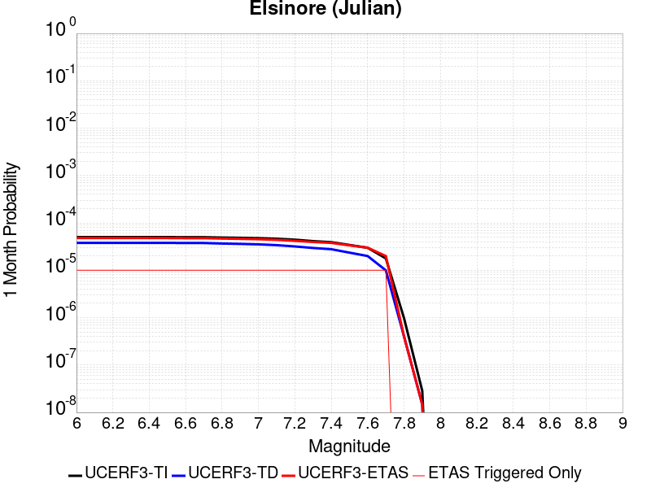 |  |  |

| Magnitude | 1 wk TI Prob | 1 wk TD Prob | 1 wk ETAS Prob | 1 wk ETAS/TD Gain | 1 wk ETAS Triggered Only | 1 mo TI Prob | 1 mo TD Prob | 1 mo ETAS Prob | 1 mo ETAS/TD Gain | 1 mo ETAS Triggered Only | 1 yr TI Prob | 1 yr TD Prob | 1 yr ETAS Prob | 1 yr ETAS/TD Gain | 1 yr ETAS Triggered Only | 10 yr TI Prob | 10 yr TD Prob | 10 yr ETAS Prob | 10 yr ETAS/TD Gain | 10 yr ETAS Triggered Only |
|-----|-----|-----|-----|-----|-----|-----|-----|-----|-----|-----|-----|-----|-----|-----|-----|-----|-----|-----|-----|-----|
| 6.0 | 1.1710231E-5 | 8.845315E-6 | 1.8845227E-5 | 2.130532 | 1.0E-5 | 5.0185736E-5 | 3.7907954E-5 | 4.7907575E-5 | 1.2637869 | 1.0E-5 | 6.1084004E-4 | 4.614333E-4 | 4.7142868E-4 | 1.0216616 | 1.0E-5 | 0.006091637 | 0.0046049724 | 0.0046149264 | 1.0021616 | 1.0E-5 |
| 6.1 | 1.1710231E-5 | 8.845315E-6 | 1.8845227E-5 | 2.130532 | 1.0E-5 | 5.0185736E-5 | 3.7907954E-5 | 4.7907575E-5 | 1.2637869 | 1.0E-5 | 6.1084004E-4 | 4.614333E-4 | 4.7142868E-4 | 1.0216616 | 1.0E-5 | 0.006091637 | 0.0046049724 | 0.0046149264 | 1.0021616 | 1.0E-5 |
| 6.2 | 1.1710231E-5 | 8.845315E-6 | 1.8845227E-5 | 2.130532 | 1.0E-5 | 5.0185736E-5 | 3.7907954E-5 | 4.7907575E-5 | 1.2637869 | 1.0E-5 | 6.1084004E-4 | 4.614333E-4 | 4.7142868E-4 | 1.0216616 | 1.0E-5 | 0.006091637 | 0.0046049724 | 0.0046149264 | 1.0021616 | 1.0E-5 |
| 6.3 | 1.1710231E-5 | 8.845315E-6 | 1.8845227E-5 | 2.130532 | 1.0E-5 | 5.0185736E-5 | 3.7907954E-5 | 4.7907575E-5 | 1.2637869 | 1.0E-5 | 6.1084004E-4 | 4.614333E-4 | 4.7142868E-4 | 1.0216616 | 1.0E-5 | 0.006091637 | 0.0046049724 | 0.0046149264 | 1.0021616 | 1.0E-5 |
| 6.4 | 1.1710231E-5 | 8.845315E-6 | 1.8845227E-5 | 2.130532 | 1.0E-5 | 5.0185736E-5 | 3.7907954E-5 | 4.7907575E-5 | 1.2637869 | 1.0E-5 | 6.1084004E-4 | 4.614333E-4 | 4.7142868E-4 | 1.0216616 | 1.0E-5 | 0.006091637 | 0.0046049724 | 0.0046149264 | 1.0021616 | 1.0E-5 |
| 6.5 | 1.1710231E-5 | 8.845315E-6 | 1.8845227E-5 | 2.130532 | 1.0E-5 | 5.0185736E-5 | 3.7907954E-5 | 4.7907575E-5 | 1.2637869 | 1.0E-5 | 6.1084004E-4 | 4.614333E-4 | 4.7142868E-4 | 1.0216616 | 1.0E-5 | 0.006091637 | 0.0046049724 | 0.0046149264 | 1.0021616 | 1.0E-5 |
| 6.6 | 1.1650619E-5 | 8.777691E-6 | 1.8777604E-5 | 2.1392417 | 1.0E-5 | 4.993027E-5 | 3.761814E-5 | 4.7617767E-5 | 1.2658192 | 1.0E-5 | 6.0773146E-4 | 4.5790634E-4 | 4.6790176E-4 | 1.0218285 | 1.0E-5 | 0.0060607214 | 0.004569848 | 0.0045798025 | 1.0021783 | 1.0E-5 |
| 6.7 | 1.1650619E-5 | 8.777691E-6 | 1.8777604E-5 | 2.1392417 | 1.0E-5 | 4.993027E-5 | 3.761814E-5 | 4.7617767E-5 | 1.2658192 | 1.0E-5 | 6.0773146E-4 | 4.5790634E-4 | 4.6790176E-4 | 1.0218285 | 1.0E-5 | 0.0060607214 | 0.004569848 | 0.0045798025 | 1.0021783 | 1.0E-5 |
| 6.8 | 1.1442698E-5 | 8.560841E-6 | 1.8560755E-5 | 2.1680994 | 1.0E-5 | 4.9039216E-5 | 3.6688813E-5 | 4.6688445E-5 | 1.2725526 | 1.0E-5 | 5.968889E-4 | 4.4659642E-4 | 4.5659195E-4 | 1.0223815 | 1.0E-5 | 0.0059528816 | 0.004457207 | 0.004467163 | 1.0022335 | 1.0E-5 |
| 6.9 | 1.1300589E-5 | 8.408708E-6 | 1.8408624E-5 | 2.1892333 | 1.0E-5 | 4.8430196E-5 | 3.603683E-5 | 4.6036468E-5 | 1.2774839 | 1.0E-5 | 5.894781E-4 | 4.3866172E-4 | 4.4865735E-4 | 1.0227866 | 1.0E-5 | 0.005879169 | 0.0043781744 | 0.0043881307 | 1.002274 | 1.0E-5 |
| 7.0 | 1.1117729E-5 | 8.225868E-6 | 1.8225786E-5 | 2.215667 | 1.0E-5 | 4.764654E-5 | 3.5253255E-5 | 4.5252902E-5 | 1.2836517 | 1.0E-5 | 5.799422E-4 | 4.291255E-4 | 4.391212E-4 | 1.0232933 | 1.0E-5 | 0.0057843104 | 0.0042831833 | 0.0042931405 | 1.0023247 | 1.0E-5 |
| 7.1 | 1.08053955E-5 | 7.911498E-6 | 1.791142E-5 | 2.263973 | 1.0E-5 | 4.6308014E-5 | 3.3905988E-5 | 4.390565E-5 | 1.2949232 | 1.0E-5 | 5.6365423E-4 | 4.1272887E-4 | 4.2272473E-4 | 1.024219 | 1.0E-5 | 0.005622267 | 0.004119835 | 0.004129794 | 1.0024173 | 1.0E-5 |
| 7.2 | 1.032804E-5 | 7.432751E-6 | 1.7432676E-5 | 2.345387 | 1.0E-5 | 4.4262277E-5 | 3.1854266E-5 | 4.1853946E-5 | 1.3139197 | 1.0E-5 | 5.387599E-4 | 3.8775822E-4 | 3.9775437E-4 | 1.0257792 | 1.0E-5 | 0.0053745564 | 0.00387102 | 0.0038809814 | 1.0025733 | 1.0E-5 |
| 7.3 | 9.622426E-6 | 6.897587E-6 | 1.6897518E-5 | 2.4497724 | 1.0E-5 | 4.1238312E-5 | 2.956076E-5 | 3.9560466E-5 | 1.3382763 | 1.0E-5 | 5.019608E-4 | 3.5984424E-4 | 3.6984065E-4 | 1.0277798 | 1.0E-5 | 0.005008285 | 0.0035928036 | 0.0036027676 | 1.0027733 | 1.0E-5 |
| 7.4 | 9.144434E-6 | 6.496142E-6 | 1.6496077E-5 | 2.5393653 | 1.0E-5 | 3.9189843E-5 | 2.7840319E-5 | 3.784004E-5 | 1.3591813 | 1.0E-5 | 4.7703186E-4 | 3.3890453E-4 | 3.4890114E-4 | 1.0294968 | 1.0E-5 | 0.0047600917 | 0.0033840172 | 0.0033939832 | 1.0029451 | 1.0E-5 |
| 7.5 | 7.988981E-6 | 5.498105E-6 | 1.549805E-5 | 2.8187985 | 1.0E-5 | 3.4238044E-5 | 2.3563101E-5 | 3.3562865E-5 | 1.4243823 | 1.0E-5 | 4.1676845E-4 | 2.8684427E-4 | 2.968414E-4 | 1.0348521 | 1.0E-5 | 0.0041598766 | 0.0028648674 | 0.002874839 | 1.0034806 | 1.0E-5 |
| 7.6 | 6.9554876E-6 | 4.6623254E-6 | 1.4662279E-5 | 3.1448424 | 1.0E-5 | 2.9808893E-5 | 1.998125E-5 | 2.9981049E-5 | 1.5004592 | 1.0E-5 | 3.6286283E-4 | 2.4324573E-4 | 2.5324328E-4 | 1.0411007 | 1.0E-5 | 0.0036227088 | 0.002429911 | 0.0024398866 | 1.0041053 | 1.0E-5 |
| 7.7 | 4.1557314E-6 | 2.3244427E-6 | 1.232442E-5 | 5.3020964 | 1.0E-5 | 1.7810156E-5 | 9.961864E-6 | 1.9961764E-5 | 2.0038183 | 1.0E-5 | 2.1681708E-4 | 1.2127968E-4 | 1.3127847E-4 | 1.0824441 | 1.0E-5 | 0.0021660565 | 0.001212208 | 0.0012221958 | 1.0082394 | 1.0E-5 |
| 7.8 | 2.2597293E-7 | 9.331864E-8 | 9.331864E-8 | 1.0 | 0.0 | 9.684551E-7 | 3.99937E-7 | 3.99937E-7 | 1.0 | 0.0 | 1.1790877E-5 | 4.8692254E-6 | 4.8692254E-6 | 1.0 | 0.0 | 1.17902506E-4 | 4.8691512E-5 | 4.8691512E-5 | 1.0 | 0.0 |
| 7.9 | 6.676829E-9 | 3.4397174E-9 | 3.4397174E-9 | 1.0 | 0.0 | 2.861498E-8 | 1.4741646E-8 | 1.4741646E-8 | 1.0 | 0.0 | 3.4838732E-7 | 1.7947953E-7 | 1.7947953E-7 | 1.0 | 0.0 | 3.4838679E-6 | 1.794794E-6 | 1.794794E-6 | 1.0 | 0.0 |

## Great Valley 08 (Quinto)
*[(top)](#table-of-contents)*

| 1 Week | 1 Month | 1 Year | 10 Year |
|-----|-----|-----|-----|
|  |  |  |  |

| Magnitude | 1 wk TI Prob | 1 wk TD Prob | 1 wk ETAS Prob | 1 wk ETAS/TD Gain | 1 wk ETAS Triggered Only | 1 mo TI Prob | 1 mo TD Prob | 1 mo ETAS Prob | 1 mo ETAS/TD Gain | 1 mo ETAS Triggered Only | 1 yr TI Prob | 1 yr TD Prob | 1 yr ETAS Prob | 1 yr ETAS/TD Gain | 1 yr ETAS Triggered Only | 10 yr TI Prob | 10 yr TD Prob | 10 yr ETAS Prob | 10 yr ETAS/TD Gain | 10 yr ETAS Triggered Only |
|-----|-----|-----|-----|-----|-----|-----|-----|-----|-----|-----|-----|-----|-----|-----|-----|-----|-----|-----|-----|-----|
| 6.0 | 7.737697E-6 | 8.253038E-6 | 1.8252955E-5 | 2.211665 | 1.0E-5 | 3.3161137E-5 | 3.536979E-5 | 4.5369437E-5 | 1.2827171 | 1.0E-5 | 4.0366207E-4 | 4.3056096E-4 | 4.4055664E-4 | 1.0232155 | 1.0E-5 | 0.004029296 | 0.0042991205 | 0.0043090777 | 1.002316 | 1.0E-5 |
| 6.1 | 7.737697E-6 | 8.253038E-6 | 1.8252955E-5 | 2.211665 | 1.0E-5 | 3.3161137E-5 | 3.536979E-5 | 4.5369437E-5 | 1.2827171 | 1.0E-5 | 4.0366207E-4 | 4.3056096E-4 | 4.4055664E-4 | 1.0232155 | 1.0E-5 | 0.004029296 | 0.0042991205 | 0.0043090777 | 1.002316 | 1.0E-5 |
| 6.2 | 7.737697E-6 | 8.253038E-6 | 1.8252955E-5 | 2.211665 | 1.0E-5 | 3.3161137E-5 | 3.536979E-5 | 4.5369437E-5 | 1.2827171 | 1.0E-5 | 4.0366207E-4 | 4.3056096E-4 | 4.4055664E-4 | 1.0232155 | 1.0E-5 | 0.004029296 | 0.0042991205 | 0.0043090777 | 1.002316 | 1.0E-5 |
| 6.3 | 5.374012E-6 | 5.7505736E-6 | 5.7505736E-6 | 1.0 | 0.0 | 2.3031276E-5 | 2.4645145E-5 | 2.4645145E-5 | 1.0 | 0.0 | 2.803697E-4 | 3.0002446E-4 | 3.0002446E-4 | 1.0 | 0.0 | 0.0028001624 | 0.0029972875 | 0.0029972875 | 1.0 | 0.0 |
| 6.4 | 5.374012E-6 | 5.7505736E-6 | 5.7505736E-6 | 1.0 | 0.0 | 2.3031276E-5 | 2.4645145E-5 | 2.4645145E-5 | 1.0 | 0.0 | 2.803697E-4 | 3.0002446E-4 | 3.0002446E-4 | 1.0 | 0.0 | 0.0028001624 | 0.0029972875 | 0.0029972875 | 1.0 | 0.0 |
| 6.5 | 3.65427E-6 | 3.941324E-6 | 3.941324E-6 | 1.0 | 0.0 | 1.5661062E-5 | 1.689132E-5 | 1.689132E-5 | 1.0 | 0.0 | 1.9065675E-4 | 2.0563944E-4 | 2.0563944E-4 | 1.0 | 0.0 | 0.0019049325 | 0.0020551833 | 0.0020551833 | 1.0 | 0.0 |
| 6.6 | 3.6143538E-6 | 3.8985104E-6 | 3.8985104E-6 | 1.0 | 0.0 | 1.5489995E-5 | 1.6707834E-5 | 1.6707834E-5 | 1.0 | 0.0 | 1.8857437E-4 | 2.0340596E-4 | 2.0340596E-4 | 1.0 | 0.0 | 0.0018841444 | 0.0020328893 | 0.0020328893 | 1.0 | 0.0 |
| 6.7 | 2.4821015E-6 | 2.6857067E-6 | 2.6857067E-6 | 1.0 | 0.0 | 1.0637535E-5 | 1.1510153E-5 | 1.1510153E-5 | 1.0 | 0.0 | 1.2950429E-4 | 1.4013276E-4 | 1.4013276E-4 | 1.0 | 0.0 | 0.0012942884 | 0.0014009989 | 0.0014009989 | 1.0 | 0.0 |
| 6.8 | 4.7110538E-7 | 5.193021E-7 | 5.193021E-7 | 1.0 | 0.0 | 2.0190216E-6 | 2.2255786E-6 | 2.2255786E-6 | 1.0 | 0.0 | 2.458131E-5 | 2.70961E-5 | 2.70961E-5 | 1.0 | 0.0 | 2.457859E-4 | 2.7092977E-4 | 2.7092977E-4 | 1.0 | 0.0 |
| 6.9 | 3.958685E-7 | 4.3703452E-7 | 4.3703452E-7 | 1.0 | 0.0 | 1.6965782E-6 | 1.8730038E-6 | 1.8730038E-6 | 1.0 | 0.0 | 2.0655643E-5 | 2.28036E-5 | 2.28036E-5 | 1.0 | 0.0 | 2.0653724E-4 | 2.2801422E-4 | 2.2801422E-4 | 1.0 | 0.0 |
| 7.0 | 2.70294E-7 | 2.9920008E-7 | 2.9920008E-7 | 1.0 | 0.0 | 1.1584025E-6 | 1.2822856E-6 | 1.2822856E-6 | 1.0 | 0.0 | 1.4103458E-5 | 1.5611728E-5 | 1.5611728E-5 | 1.0 | 0.0 | 1.4102564E-4 | 1.5610759E-4 | 1.5610759E-4 | 1.0 | 0.0 |
| 7.1 | 1.4828602E-7 | 1.6469107E-7 | 1.6469107E-7 | 1.0 | 0.0 | 6.3551136E-7 | 7.058187E-7 | 7.058187E-7 | 1.0 | 0.0 | 7.737323E-6 | 8.593317E-6 | 8.593317E-6 | 1.0 | 0.0 | 7.737054E-5 | 8.593065E-5 | 8.593065E-5 | 1.0 | 0.0 |

## Clamshell-Sawpit
*[(top)](#table-of-contents)*

| 1 Week | 1 Month | 1 Year | 10 Year |
|-----|-----|-----|-----|
|  |  |  |  |

| Magnitude | 1 wk TI Prob | 1 wk TD Prob | 1 wk ETAS Prob | 1 wk ETAS/TD Gain | 1 wk ETAS Triggered Only | 1 mo TI Prob | 1 mo TD Prob | 1 mo ETAS Prob | 1 mo ETAS/TD Gain | 1 mo ETAS Triggered Only | 1 yr TI Prob | 1 yr TD Prob | 1 yr ETAS Prob | 1 yr ETAS/TD Gain | 1 yr ETAS Triggered Only | 10 yr TI Prob | 10 yr TD Prob | 10 yr ETAS Prob | 10 yr ETAS/TD Gain | 10 yr ETAS Triggered Only |
|-----|-----|-----|-----|-----|-----|-----|-----|-----|-----|-----|-----|-----|-----|-----|-----|-----|-----|-----|-----|-----|
| 6.0 | 3.202998E-6 | 3.0127642E-6 | 3.0127642E-6 | 1.0 | 0.0 | 1.3727062E-5 | 1.2911787E-5 | 1.2911787E-5 | 1.0 | 0.0 | 1.6711417E-4 | 1.5719047E-4 | 1.671889E-4 | 1.0636071 | 1.0E-5 | 0.0016698855 | 0.0015708723 | 0.0015808566 | 1.0063559 | 1.0E-5 |
| 6.1 | 3.202998E-6 | 3.0127642E-6 | 3.0127642E-6 | 1.0 | 0.0 | 1.3727062E-5 | 1.2911787E-5 | 1.2911787E-5 | 1.0 | 0.0 | 1.6711417E-4 | 1.5719047E-4 | 1.671889E-4 | 1.0636071 | 1.0E-5 | 0.0016698855 | 0.0015708723 | 0.0015808566 | 1.0063559 | 1.0E-5 |
| 6.2 | 3.202998E-6 | 3.0127642E-6 | 3.0127642E-6 | 1.0 | 0.0 | 1.3727062E-5 | 1.2911787E-5 | 1.2911787E-5 | 1.0 | 0.0 | 1.6711417E-4 | 1.5719047E-4 | 1.671889E-4 | 1.0636071 | 1.0E-5 | 0.0016698855 | 0.0015708723 | 0.0015808566 | 1.0063559 | 1.0E-5 |
| 6.3 | 3.202998E-6 | 3.0127642E-6 | 3.0127642E-6 | 1.0 | 0.0 | 1.3727062E-5 | 1.2911787E-5 | 1.2911787E-5 | 1.0 | 0.0 | 1.6711417E-4 | 1.5719047E-4 | 1.671889E-4 | 1.0636071 | 1.0E-5 | 0.0016698855 | 0.0015708723 | 0.0015808566 | 1.0063559 | 1.0E-5 |
| 6.4 | 3.202998E-6 | 3.0127642E-6 | 3.0127642E-6 | 1.0 | 0.0 | 1.3727062E-5 | 1.2911787E-5 | 1.2911787E-5 | 1.0 | 0.0 | 1.6711417E-4 | 1.5719047E-4 | 1.671889E-4 | 1.0636071 | 1.0E-5 | 0.0016698855 | 0.0015708723 | 0.0015808566 | 1.0063559 | 1.0E-5 |
| 6.5 | 2.5862723E-6 | 2.3807747E-6 | 2.3807747E-6 | 1.0 | 0.0 | 1.1083977E-5 | 1.0203283E-5 | 1.0203283E-5 | 1.0 | 0.0 | 1.3493907E-4 | 1.2421819E-4 | 1.2421819E-4 | 1.0 | 0.0 | 0.0013485716 | 0.0012415178 | 0.0012415178 | 1.0 | 0.0 |
| 6.6 | 2.5862723E-6 | 2.3807747E-6 | 2.3807747E-6 | 1.0 | 0.0 | 1.1083977E-5 | 1.0203283E-5 | 1.0203283E-5 | 1.0 | 0.0 | 1.3493907E-4 | 1.2421819E-4 | 1.2421819E-4 | 1.0 | 0.0 | 0.0013485716 | 0.0012415178 | 0.0012415178 | 1.0 | 0.0 |
| 6.7 | 2.5862723E-6 | 2.3807747E-6 | 2.3807747E-6 | 1.0 | 0.0 | 1.1083977E-5 | 1.0203283E-5 | 1.0203283E-5 | 1.0 | 0.0 | 1.3493907E-4 | 1.2421819E-4 | 1.2421819E-4 | 1.0 | 0.0 | 0.0013485716 | 0.0012415178 | 0.0012415178 | 1.0 | 0.0 |
| 6.8 | 2.4098806E-6 | 2.1977307E-6 | 2.1977307E-6 | 1.0 | 0.0 | 1.0328019E-5 | 9.4188135E-6 | 9.4188135E-6 | 1.0 | 0.0 | 1.2573638E-4 | 1.14668284E-4 | 1.14668284E-4 | 1.0 | 0.0 | 0.0012566525 | 0.0011461178 | 0.0011461178 | 1.0 | 0.0 |
| 6.9 | 2.0073985E-6 | 1.7784247E-6 | 1.7784247E-6 | 1.0 | 0.0 | 8.603109E-6 | 7.6217984E-6 | 7.6217984E-6 | 1.0 | 0.0 | 1.0473781E-4 | 9.279157E-5 | 9.279157E-5 | 1.0 | 0.0 | 0.0010468846 | 9.2754007E-4 | 9.2754007E-4 | 1.0 | 0.0 |
| 7.0 | 1.8166766E-6 | 1.5807094E-6 | 1.5807094E-6 | 1.0 | 0.0 | 7.785734E-6 | 6.774452E-6 | 6.774452E-6 | 1.0 | 0.0 | 9.478718E-5 | 8.247593E-5 | 8.247593E-5 | 1.0 | 0.0 | 9.4746763E-4 | 8.244633E-4 | 8.244633E-4 | 1.0 | 0.0 |
| 7.1 | 1.5471421E-6 | 1.3052961E-6 | 1.3052961E-6 | 1.0 | 0.0 | 6.6305925E-6 | 5.5941146E-6 | 5.5941146E-6 | 1.0 | 0.0 | 8.072447E-5 | 6.810627E-5 | 6.810627E-5 | 1.0 | 0.0 | 8.0695155E-4 | 6.8085943E-4 | 6.8085943E-4 | 1.0 | 0.0 |
| 7.2 | 1.3608037E-6 | 1.1153442E-6 | 1.1153442E-6 | 1.0 | 0.0 | 5.8320024E-6 | 4.780038E-6 | 4.780038E-6 | 1.0 | 0.0 | 7.1002316E-5 | 5.8195455E-5 | 5.8195455E-5 | 1.0 | 0.0 | 7.097964E-4 | 5.818068E-4 | 5.818068E-4 | 1.0 | 0.0 |
| 7.3 | 1.0749634E-6 | 8.384255E-7 | 8.384255E-7 | 1.0 | 0.0 | 4.6069777E-6 | 3.5932474E-6 | 3.5932474E-6 | 1.0 | 0.0 | 5.608851E-5 | 4.3746935E-5 | 4.3746935E-5 | 1.0 | 0.0 | 5.6074356E-4 | 4.3738607E-4 | 4.3738607E-4 | 1.0 | 0.0 |
| 7.4 | 8.416856E-7 | 6.2000527E-7 | 6.2000527E-7 | 1.0 | 0.0 | 3.607219E-6 | 2.657163E-6 | 2.657163E-6 | 1.0 | 0.0 | 4.3917007E-5 | 3.2350497E-5 | 3.2350497E-5 | 1.0 | 0.0 | 4.390833E-4 | 3.2345986E-4 | 3.2345986E-4 | 1.0 | 0.0 |
| 7.5 | 6.2779594E-7 | 4.4968908E-7 | 4.4968908E-7 | 1.0 | 0.0 | 2.6905511E-6 | 1.9272377E-6 | 1.9272377E-6 | 1.0 | 0.0 | 3.275697E-5 | 2.3463885E-5 | 2.3463885E-5 | 1.0 | 0.0 | 3.275214E-4 | 2.3461595E-4 | 2.3461595E-4 | 1.0 | 0.0 |
| 7.6 | 4.3822078E-7 | 3.059551E-7 | 3.059551E-7 | 1.0 | 0.0 | 1.8780877E-6 | 1.3112356E-6 | 1.3112356E-6 | 1.0 | 0.0 | 2.2865479E-5 | 1.5964191E-5 | 1.5964191E-5 | 1.0 | 0.0 | 2.2863125E-4 | 1.5963199E-4 | 1.5963199E-4 | 1.0 | 0.0 |
| 7.7 | 1.8704569E-7 | 1.12379E-7 | 1.12379E-7 | 1.0 | 0.0 | 8.0162414E-7 | 4.8162417E-7 | 4.8162417E-7 | 1.0 | 0.0 | 9.75973E-6 | 5.8637593E-6 | 5.8637593E-6 | 1.0 | 0.0 | 9.7593016E-5 | 5.863611E-5 | 5.863611E-5 | 1.0 | 0.0 |
| 7.8 | 3.5378733E-8 | 2.1838002E-8 | 2.1838002E-8 | 1.0 | 0.0 | 1.5162313E-7 | 9.359143E-8 | 9.359143E-8 | 1.0 | 0.0 | 1.84601E-6 | 1.1394751E-6 | 1.1394751E-6 | 1.0 | 0.0 | 1.8459947E-5 | 1.1394695E-5 | 1.1394695E-5 | 1.0 | 0.0 |
| 7.9 | 7.504945E-9 | 5.1921663E-9 | 5.1921663E-9 | 1.0 | 0.0 | 3.2164053E-8 | 2.2252141E-8 | 2.2252141E-8 | 1.0 | 0.0 | 3.9159727E-7 | 2.709198E-7 | 2.709198E-7 | 1.0 | 0.0 | 3.915966E-6 | 2.7091953E-6 | 2.7091953E-6 | 1.0 | 0.0 |
| 8.0 | 1.6554036E-10 | 1.418149E-10 | 1.418149E-10 | 1.0 | 0.0 | 7.0945894E-10 | 6.0777794E-10 | 6.0777794E-10 | 1.0 | 0.0 | 8.637662E-9 | 7.3996964E-9 | 7.3996964E-9 | 1.0 | 0.0 | 8.6376616E-8 | 7.3996965E-8 | 7.3996965E-8 | 1.0 | 0.0 |

## Polaris 2011 CFM
*[(top)](#table-of-contents)*

| 1 Week | 1 Month | 1 Year | 10 Year |
|-----|-----|-----|-----|
|  |  |  |  |

| Magnitude | 1 wk TI Prob | 1 wk TD Prob | 1 wk ETAS Prob | 1 wk ETAS/TD Gain | 1 wk ETAS Triggered Only | 1 mo TI Prob | 1 mo TD Prob | 1 mo ETAS Prob | 1 mo ETAS/TD Gain | 1 mo ETAS Triggered Only | 1 yr TI Prob | 1 yr TD Prob | 1 yr ETAS Prob | 1 yr ETAS/TD Gain | 1 yr ETAS Triggered Only | 10 yr TI Prob | 10 yr TD Prob | 10 yr ETAS Prob | 10 yr ETAS/TD Gain | 10 yr ETAS Triggered Only |
|-----|-----|-----|-----|-----|-----|-----|-----|-----|-----|-----|-----|-----|-----|-----|-----|-----|-----|-----|-----|-----|
| 6.0 | 1.2630823E-5 | 1.3582916E-5 | 1.3582916E-5 | 1.0 | 0.0 | 5.413098E-5 | 5.821149E-5 | 5.821149E-5 | 1.0 | 0.0 | 6.5884535E-4 | 7.085464E-4 | 7.1853923E-4 | 1.0141034 | 1.0E-5 | 0.0065689543 | 0.007067981 | 0.0070779105 | 1.0014049 | 1.0E-5 |
| 6.1 | 1.2630823E-5 | 1.3582916E-5 | 1.3582916E-5 | 1.0 | 0.0 | 5.413098E-5 | 5.821149E-5 | 5.821149E-5 | 1.0 | 0.0 | 6.5884535E-4 | 7.085464E-4 | 7.1853923E-4 | 1.0141034 | 1.0E-5 | 0.0065689543 | 0.007067981 | 0.0070779105 | 1.0014049 | 1.0E-5 |
| 6.2 | 1.2630823E-5 | 1.3582916E-5 | 1.3582916E-5 | 1.0 | 0.0 | 5.413098E-5 | 5.821149E-5 | 5.821149E-5 | 1.0 | 0.0 | 6.5884535E-4 | 7.085464E-4 | 7.1853923E-4 | 1.0141034 | 1.0E-5 | 0.0065689543 | 0.007067981 | 0.0070779105 | 1.0014049 | 1.0E-5 |
| 6.3 | 1.2630823E-5 | 1.3582916E-5 | 1.3582916E-5 | 1.0 | 0.0 | 5.413098E-5 | 5.821149E-5 | 5.821149E-5 | 1.0 | 0.0 | 6.5884535E-4 | 7.085464E-4 | 7.1853923E-4 | 1.0141034 | 1.0E-5 | 0.0065689543 | 0.007067981 | 0.0070779105 | 1.0014049 | 1.0E-5 |
| 6.4 | 6.642994E-6 | 7.10706E-6 | 7.10706E-6 | 1.0 | 0.0 | 2.8469662E-5 | 3.0458501E-5 | 3.0458501E-5 | 1.0 | 0.0 | 3.46563E-4 | 3.7077433E-4 | 3.8077062E-4 | 1.0269606 | 1.0E-5 | 0.0034602303 | 0.0037020678 | 0.0037120308 | 1.0026911 | 1.0E-5 |
| 6.5 | 6.642994E-6 | 7.10706E-6 | 7.10706E-6 | 1.0 | 0.0 | 2.8469662E-5 | 3.0458501E-5 | 3.0458501E-5 | 1.0 | 0.0 | 3.46563E-4 | 3.7077433E-4 | 3.8077062E-4 | 1.0269606 | 1.0E-5 | 0.0034602303 | 0.0037020678 | 0.0037120308 | 1.0026911 | 1.0E-5 |
| 6.6 | 6.1286296E-6 | 6.5561712E-6 | 6.5561712E-6 | 1.0 | 0.0 | 2.626529E-5 | 2.8097602E-5 | 2.8097602E-5 | 1.0 | 0.0 | 3.19733E-4 | 3.4203942E-4 | 3.52036E-4 | 1.0292264 | 1.0E-5 | 0.0031927335 | 0.003415605 | 0.003425571 | 1.0029178 | 1.0E-5 |
| 6.7 | 4.9474666E-6 | 5.298249E-6 | 5.298249E-6 | 1.0 | 0.0 | 2.1203256E-5 | 2.2706601E-5 | 2.2706601E-5 | 1.0 | 0.0 | 2.5811905E-4 | 2.7642061E-4 | 2.8641787E-4 | 1.0361668 | 1.0E-5 | 0.0025781945 | 0.0027610478 | 0.0027710202 | 1.0036118 | 1.0E-5 |
| 6.8 | 4.616407E-6 | 4.946264E-6 | 4.946264E-6 | 1.0 | 0.0 | 1.978445E-5 | 2.1198117E-5 | 2.1198117E-5 | 1.0 | 0.0 | 2.4084905E-4 | 2.5805918E-4 | 2.680566E-4 | 1.0387408 | 1.0E-5 | 0.0024058819 | 0.0025778597 | 0.002587834 | 1.0038692 | 1.0E-5 |
| 6.9 | 4.320343E-6 | 4.630886E-6 | 4.630886E-6 | 1.0 | 0.0 | 1.8515624E-5 | 1.9846519E-5 | 1.9846519E-5 | 1.0 | 0.0 | 2.2540441E-4 | 2.4160717E-4 | 2.5160477E-4 | 1.0413795 | 1.0E-5 | 0.0022517592 | 0.0024137017 | 0.0024236776 | 1.004133 | 1.0E-5 |
| 7.0 | 3.7382292E-6 | 4.009553E-6 | 4.009553E-6 | 1.0 | 0.0 | 1.6020884E-5 | 1.7183698E-5 | 1.7183698E-5 | 1.0 | 0.0 | 1.950368E-4 | 2.0919384E-4 | 2.1919174E-4 | 1.0477926 | 1.0E-5 | 0.0019486571 | 0.0020902045 | 0.0021001836 | 1.0047742 | 1.0E-5 |
| 7.1 | 3.193576E-6 | 3.427699E-6 | 3.427699E-6 | 1.0 | 0.0 | 1.3686683E-5 | 1.4690068E-5 | 1.4690068E-5 | 1.0 | 0.0 | 1.6662262E-4 | 1.7883914E-4 | 1.8883735E-4 | 1.0559062 | 1.0E-5 | 0.0016649774 | 0.001787171 | 0.0017971531 | 1.0055854 | 1.0E-5 |
| 7.2 | 2.2356758E-6 | 2.4023684E-6 | 2.4023684E-6 | 1.0 | 0.0 | 9.581432E-6 | 1.0295834E-5 | 1.0295834E-5 | 1.0 | 0.0 | 1.1664769E-4 | 1.2534647E-4 | 1.2534647E-4 | 1.0 | 0.0 | 0.0011658648 | 0.0012529434 | 0.0012529434 | 1.0 | 0.0 |

## Mount Diablo Thrust South
*[(top)](#table-of-contents)*

| 1 Week | 1 Month | 1 Year | 10 Year |
|-----|-----|-----|-----|
|  |  |  |  |

| Magnitude | 1 wk TI Prob | 1 wk TD Prob | 1 wk ETAS Prob | 1 wk ETAS/TD Gain | 1 wk ETAS Triggered Only | 1 mo TI Prob | 1 mo TD Prob | 1 mo ETAS Prob | 1 mo ETAS/TD Gain | 1 mo ETAS Triggered Only | 1 yr TI Prob | 1 yr TD Prob | 1 yr ETAS Prob | 1 yr ETAS/TD Gain | 1 yr ETAS Triggered Only | 10 yr TI Prob | 10 yr TD Prob | 10 yr ETAS Prob | 10 yr ETAS/TD Gain | 10 yr ETAS Triggered Only |
|-----|-----|-----|-----|-----|-----|-----|-----|-----|-----|-----|-----|-----|-----|-----|-----|-----|-----|-----|-----|-----|
| 6.0 | 2.2377444E-5 | 2.6956272E-5 | 2.6956272E-5 | 1.0 | 0.0 | 9.5899806E-5 | 1.1552288E-4 | 1.1552288E-4 | 1.0 | 0.0 | 0.0011669548 | 0.0014057814 | 0.0014157672 | 1.0071034 | 1.0E-5 | 0.011608457 | 0.013988668 | 0.013998529 | 1.0007049 | 1.0E-5 |
| 6.1 | 2.2377444E-5 | 2.6956272E-5 | 2.6956272E-5 | 1.0 | 0.0 | 9.5899806E-5 | 1.1552288E-4 | 1.1552288E-4 | 1.0 | 0.0 | 0.0011669548 | 0.0014057814 | 0.0014157672 | 1.0071034 | 1.0E-5 | 0.011608457 | 0.013988668 | 0.013998529 | 1.0007049 | 1.0E-5 |
| 6.2 | 2.2377444E-5 | 2.6956272E-5 | 2.6956272E-5 | 1.0 | 0.0 | 9.5899806E-5 | 1.1552288E-4 | 1.1552288E-4 | 1.0 | 0.0 | 0.0011669548 | 0.0014057814 | 0.0014157672 | 1.0071034 | 1.0E-5 | 0.011608457 | 0.013988668 | 0.013998529 | 1.0007049 | 1.0E-5 |
| 6.3 | 2.2377444E-5 | 2.6956272E-5 | 2.6956272E-5 | 1.0 | 0.0 | 9.5899806E-5 | 1.1552288E-4 | 1.1552288E-4 | 1.0 | 0.0 | 0.0011669548 | 0.0014057814 | 0.0014157672 | 1.0071034 | 1.0E-5 | 0.011608457 | 0.013988668 | 0.013998529 | 1.0007049 | 1.0E-5 |
| 6.4 | 1.2228463E-5 | 1.4747731E-5 | 1.4747731E-5 | 1.0 | 0.0 | 5.2406645E-5 | 6.320311E-5 | 6.320311E-5 | 1.0 | 0.0 | 6.378641E-4 | 7.69239E-4 | 7.69239E-4 | 1.0 | 0.0 | 0.0063603627 | 0.007667325 | 0.007667325 | 1.0 | 0.0 |
| 6.5 | 1.2228463E-5 | 1.4747731E-5 | 1.4747731E-5 | 1.0 | 0.0 | 5.2406645E-5 | 6.320311E-5 | 6.320311E-5 | 1.0 | 0.0 | 6.378641E-4 | 7.69239E-4 | 7.69239E-4 | 1.0 | 0.0 | 0.0063603627 | 0.007667325 | 0.007667325 | 1.0 | 0.0 |
| 6.6 | 1.2068118E-5 | 1.455253E-5 | 1.455253E-5 | 1.0 | 0.0 | 5.1719482E-5 | 6.236657E-5 | 6.236657E-5 | 1.0 | 0.0 | 6.2950276E-4 | 7.5906125E-4 | 7.5906125E-4 | 1.0 | 0.0 | 0.006277225 | 0.0075662453 | 0.0075662453 | 1.0 | 0.0 |
| 6.7 | 1.1499428E-5 | 1.3875192E-5 | 1.3875192E-5 | 1.0 | 0.0 | 4.9282335E-5 | 5.9463826E-5 | 5.9463826E-5 | 1.0 | 0.0 | 5.9984723E-4 | 7.2374434E-4 | 7.2374434E-4 | 1.0 | 0.0 | 0.0059823063 | 0.007215418 | 0.007215418 | 1.0 | 0.0 |
| 6.8 | 8.82118E-6 | 1.0830484E-5 | 1.0830484E-5 | 1.0 | 0.0 | 3.780451E-5 | 4.6415564E-5 | 4.6415564E-5 | 1.0 | 0.0 | 4.601727E-4 | 5.6496856E-4 | 5.6496856E-4 | 1.0 | 0.0 | 0.0045922096 | 0.00563615 | 0.00563615 | 1.0 | 0.0 |
| 6.9 | 8.047112E-6 | 9.939452E-6 | 9.939452E-6 | 1.0 | 0.0 | 3.4487166E-5 | 4.2596985E-5 | 4.2596985E-5 | 1.0 | 0.0 | 4.1980037E-4 | 5.1850016E-4 | 5.1850016E-4 | 1.0 | 0.0 | 0.004190082 | 0.005173695 | 0.005173695 | 1.0 | 0.0 |
| 7.0 | 6.2574763E-6 | 7.748516E-6 | 7.748516E-6 | 1.0 | 0.0 | 2.681748E-5 | 3.320752E-5 | 3.320752E-5 | 1.0 | 0.0 | 3.264539E-4 | 4.0423026E-4 | 4.0423026E-4 | 1.0 | 0.0 | 0.0032597475 | 0.004035568 | 0.004035568 | 1.0 | 0.0 |
| 7.1 | 3.6485903E-6 | 4.5129427E-6 | 4.5129427E-6 | 1.0 | 0.0 | 1.5636722E-5 | 1.9341043E-5 | 1.9341043E-5 | 1.0 | 0.0 | 1.9036046E-4 | 2.3545216E-4 | 2.3545216E-4 | 1.0 | 0.0 | 0.0019019748 | 0.0023519797 | 0.0023519797 | 1.0 | 0.0 |
| 7.2 | 2.3034274E-6 | 2.905533E-6 | 2.905533E-6 | 1.0 | 0.0 | 9.871795E-6 | 1.2452226E-5 | 1.2452226E-5 | 1.0 | 0.0 | 1.2018247E-4 | 1.5159555E-4 | 1.5159555E-4 | 1.0 | 0.0 | 0.0012011749 | 0.0015148793 | 0.0015148793 | 1.0 | 0.0 |
| 7.3 | 1.224035E-6 | 1.5679833E-6 | 1.5679833E-6 | 1.0 | 0.0 | 5.245854E-6 | 6.7199117E-6 | 6.7199117E-6 | 1.0 | 0.0 | 6.38664E-5 | 8.1811966E-5 | 8.1811966E-5 | 1.0 | 0.0 | 6.384805E-4 | 8.1778906E-4 | 8.1778906E-4 | 1.0 | 0.0 |
| 7.4 | 5.1601154E-7 | 6.723377E-7 | 6.723377E-7 | 1.0 | 0.0 | 2.2114762E-6 | 2.8814443E-6 | 2.8814443E-6 | 1.0 | 0.0 | 2.6924388E-5 | 3.5081033E-5 | 3.5081033E-5 | 1.0 | 0.0 | 2.6921128E-4 | 3.5073838E-4 | 3.5073838E-4 | 1.0 | 0.0 |
| 7.5 | 3.552894E-7 | 4.6653233E-7 | 4.6653233E-7 | 1.0 | 0.0 | 1.5226678E-6 | 1.999423E-6 | 1.999423E-6 | 1.0 | 0.0 | 1.8538323E-5 | 2.4342717E-5 | 2.4342717E-5 | 1.0 | 0.0 | 1.8536777E-4 | 2.4340842E-4 | 2.4340842E-4 | 1.0 | 0.0 |
| 7.6 | 1.3124082E-7 | 1.719204E-7 | 1.719204E-7 | 1.0 | 0.0 | 5.6246057E-7 | 7.368016E-7 | 7.368016E-7 | 1.0 | 0.0 | 6.8479358E-6 | 8.970531E-6 | 8.970531E-6 | 1.0 | 0.0 | 6.8477246E-5 | 8.967385E-5 | 8.967385E-5 | 1.0 | 0.0 |
| 7.7 | 3.6193022E-8 | 4.7334765E-8 | 4.7334765E-8 | 1.0 | 0.0 | 1.5511293E-7 | 2.0286328E-7 | 2.0286328E-7 | 1.0 | 0.0 | 1.8884983E-6 | 2.4698586E-6 | 2.4698586E-6 | 1.0 | 0.0 | 1.8884823E-5 | 2.469954E-5 | 2.469954E-5 | 1.0 | 0.0 |

## San Andreas (North Coast) 2011 CFM
*[(top)](#table-of-contents)*

| 1 Week | 1 Month | 1 Year | 10 Year |
|-----|-----|-----|-----|
|  |  |  |  |

| Magnitude | 1 wk TI Prob | 1 wk TD Prob | 1 wk ETAS Prob | 1 wk ETAS/TD Gain | 1 wk ETAS Triggered Only | 1 mo TI Prob | 1 mo TD Prob | 1 mo ETAS Prob | 1 mo ETAS/TD Gain | 1 mo ETAS Triggered Only | 1 yr TI Prob | 1 yr TD Prob | 1 yr ETAS Prob | 1 yr ETAS/TD Gain | 1 yr ETAS Triggered Only | 10 yr TI Prob | 10 yr TD Prob | 10 yr ETAS Prob | 10 yr ETAS/TD Gain | 10 yr ETAS Triggered Only |
|-----|-----|-----|-----|-----|-----|-----|-----|-----|-----|-----|-----|-----|-----|-----|-----|-----|-----|-----|-----|-----|
| 6.0 | 1.5333705E-4 | 7.109695E-5 | 8.109623E-5 | 1.140643 | 1.0E-5 | 6.5699324E-4 | 3.046658E-4 | 3.1466273E-4 | 1.0328128 | 1.0E-5 | 0.007969595 | 0.0037030308 | 0.0037129938 | 1.0026904 | 1.0E-5 | 0.0768977 | 0.039364267 | 0.039373875 | 1.000244 | 1.0E-5 |
| 6.1 | 1.5333705E-4 | 7.109695E-5 | 8.109623E-5 | 1.140643 | 1.0E-5 | 6.5699324E-4 | 3.046658E-4 | 3.1466273E-4 | 1.0328128 | 1.0E-5 | 0.007969595 | 0.0037030308 | 0.0037129938 | 1.0026904 | 1.0E-5 | 0.0768977 | 0.039364267 | 0.039373875 | 1.000244 | 1.0E-5 |
| 6.2 | 1.3912938E-4 | 6.049243E-5 | 7.049183E-5 | 1.1652999 | 1.0E-5 | 5.961325E-4 | 2.5922767E-4 | 2.6922507E-4 | 1.0385661 | 1.0E-5 | 0.007233787 | 0.0031515562 | 0.0031615247 | 1.003163 | 1.0E-5 | 0.07002798 | 0.03369792 | 0.033707585 | 1.0002867 | 1.0E-5 |
| 6.3 | 1.3912938E-4 | 6.049243E-5 | 7.049183E-5 | 1.1652999 | 1.0E-5 | 5.961325E-4 | 2.5922767E-4 | 2.6922507E-4 | 1.0385661 | 1.0E-5 | 0.007233787 | 0.0031515562 | 0.0031615247 | 1.003163 | 1.0E-5 | 0.07002798 | 0.03369792 | 0.033707585 | 1.0002867 | 1.0E-5 |
| 6.4 | 1.2623647E-4 | 5.0433562E-5 | 6.043306E-5 | 1.1982707 | 1.0E-5 | 5.4090127E-4 | 2.1612605E-4 | 2.2612388E-4 | 1.0462593 | 1.0E-5 | 0.0065656058 | 0.0026281793 | 0.002638153 | 1.0037949 | 1.0E-5 | 0.06374981 | 0.02830552 | 0.028315235 | 1.0003433 | 1.0E-5 |
| 6.5 | 1.1736096E-4 | 4.3516375E-5 | 5.351594E-5 | 1.2297885 | 1.0E-5 | 5.028786E-4 | 1.8648551E-4 | 1.9648364E-4 | 1.0536134 | 1.0E-5 | 0.006105373 | 0.0022681132 | 0.0022780905 | 1.004399 | 1.0E-5 | 0.05940335 | 0.024576947 | 0.024586702 | 1.0003968 | 1.0E-5 |
| 6.6 | 1.1586959E-4 | 4.2416294E-5 | 5.2415868E-5 | 1.2357484 | 1.0E-5 | 4.964894E-4 | 1.8177154E-4 | 1.9176972E-4 | 1.0550041 | 1.0E-5 | 0.006028018 | 0.0022108385 | 0.0022208162 | 1.0045131 | 1.0E-5 | 0.058671024 | 0.023982164 | 0.023991924 | 1.000407 | 1.0E-5 |
| 6.7 | 1.13693764E-4 | 4.0728228E-5 | 5.072782E-5 | 1.24552 | 1.0E-5 | 4.87168E-4 | 1.7453796E-4 | 1.8453621E-4 | 1.0572841 | 1.0E-5 | 0.005915152 | 0.0021229447 | 0.0021329233 | 1.0047004 | 1.0E-5 | 0.057601593 | 0.023075242 | 0.023085011 | 1.0004233 | 1.0E-5 |
| 6.8 | 1.1204889E-4 | 3.9945848E-5 | 4.994545E-5 | 1.2503289 | 1.0E-5 | 4.8012115E-4 | 1.7118535E-4 | 1.8118364E-4 | 1.0584062 | 1.0E-5 | 0.005829819 | 0.0020822054 | 0.0020921845 | 1.0047926 | 1.0E-5 | 0.05679232 | 0.022635331 | 0.022645107 | 1.0004318 | 1.0E-5 |
| 6.9 | 1.1005794E-4 | 3.9001738E-5 | 4.9001348E-5 | 1.2563888 | 1.0E-5 | 4.7159163E-4 | 1.6713967E-4 | 1.77138E-4 | 1.0598202 | 1.0E-5 | 0.0057265228 | 0.0020330423 | 0.0020430218 | 1.0049087 | 1.0E-5 | 0.055811852 | 0.02210134 | 0.02211112 | 1.0004425 | 1.0E-5 |
| 7.0 | 1.0647948E-4 | 3.7159174E-5 | 4.7158803E-5 | 1.2691026 | 1.0E-5 | 4.562608E-4 | 1.5924397E-4 | 1.6924237E-4 | 1.0627867 | 1.0E-5 | 0.0055408357 | 0.0019370868 | 0.0019470674 | 1.0051523 | 1.0E-5 | 0.054047033 | 0.02105931 | 0.0210691 | 1.0004648 | 1.0E-5 |
| 7.1 | 1.04795035E-4 | 3.620866E-5 | 4.62083E-5 | 1.276167 | 1.0E-5 | 4.4904428E-4 | 1.5517084E-4 | 1.6516929E-4 | 1.0644351 | 1.0E-5 | 0.0054534175 | 0.0018875834 | 0.0018975645 | 1.0052878 | 1.0E-5 | 0.053215165 | 0.02052821 | 0.020538004 | 1.0004771 | 1.0E-5 |
| 7.2 | 1.02724036E-4 | 3.5117457E-5 | 4.5117107E-5 | 1.2847487 | 1.0E-5 | 4.401716E-4 | 1.5049479E-4 | 1.6049329E-4 | 1.0664375 | 1.0E-5 | 0.0053459285 | 0.0018307496 | 0.0018407312 | 1.0054523 | 1.0E-5 | 0.052191395 | 0.01991573 | 0.019925531 | 1.0004921 | 1.0E-5 |
| 7.3 | 1.00650694E-4 | 3.45853E-5 | 4.4584955E-5 | 1.2891302 | 1.0E-5 | 4.312888E-4 | 1.4821437E-4 | 1.5821289E-4 | 1.0674598 | 1.0E-5 | 0.005238306 | 0.0018030318 | 0.0018130138 | 1.0055362 | 1.0E-5 | 0.051165357 | 0.01959264 | 0.019602444 | 1.0005004 | 1.0E-5 |
| 7.4 | 9.672919E-5 | 3.3374814E-5 | 4.337448E-5 | 1.2996172 | 1.0E-5 | 4.144878E-4 | 1.4302715E-4 | 1.5302573E-4 | 1.0699068 | 1.0E-5 | 0.005034718 | 0.00173998 | 0.0017499626 | 1.0057372 | 1.0E-5 | 0.049221683 | 0.01886682 | 0.01887663 | 1.00052 | 1.0E-5 |
| 7.5 | 8.7600405E-5 | 2.2694192E-5 | 2.2694192E-5 | 1.0 | 0.0 | 3.753763E-4 | 9.725721E-5 | 9.725721E-5 | 1.0 | 0.0 | 0.0045606326 | 0.0011834651 | 0.0011834651 | 1.0 | 0.0 | 0.04468165 | 0.013127938 | 0.013127938 | 1.0 | 0.0 |
| 7.6 | 7.9562284E-5 | 1.922004E-5 | 1.922004E-5 | 1.0 | 0.0 | 3.4093665E-4 | 8.236901E-5 | 8.236901E-5 | 1.0 | 0.0 | 0.0041430052 | 0.0010023828 | 0.0010023828 | 1.0 | 0.0 | 0.040666126 | 0.0112194 | 0.0112194 | 1.0 | 0.0 |
| 7.7 | 6.3866544E-5 | 1.1936281E-5 | 1.1936281E-5 | 1.0 | 0.0 | 2.7368503E-4 | 5.115449E-5 | 5.115449E-5 | 1.0 | 0.0 | 0.0033270244 | 6.226282E-4 | 6.226282E-4 | 1.0 | 0.0 | 0.032776527 | 0.0072073294 | 0.0072073294 | 1.0 | 0.0 |
| 7.8 | 4.2543215E-5 | 9.0726735E-6 | 9.0726735E-6 | 1.0 | 0.0 | 1.8231533E-4 | 3.888231E-5 | 3.888231E-5 | 1.0 | 0.0 | 0.0022174292 | 4.7328937E-4 | 4.7328937E-4 | 1.0 | 0.0 | 0.021954332 | 0.0054884683 | 0.0054884683 | 1.0 | 0.0 |
| 7.9 | 2.2636612E-5 | 7.811842E-6 | 7.811842E-6 | 1.0 | 0.0 | 9.7010445E-5 | 3.3478893E-5 | 3.3478893E-5 | 1.0 | 0.0 | 0.0011804621 | 4.0752938E-4 | 4.0752938E-4 | 1.0 | 0.0 | 0.011742111 | 0.0046821116 | 0.0046821116 | 1.0 | 0.0 |
| 8.0 | 1.5167874E-5 | 7.0475517E-6 | 7.0475517E-6 | 1.0 | 0.0 | 6.500356E-5 | 3.0203442E-5 | 3.0203442E-5 | 1.0 | 0.0 | 7.9113094E-4 | 3.6766496E-4 | 3.6766496E-4 | 1.0 | 0.0 | 0.007883203 | 0.004214701 | 0.004214701 | 1.0 | 0.0 |
| 8.1 | 1.0681047E-5 | 6.3854363E-6 | 6.3854363E-6 | 1.0 | 0.0 | 4.5775112E-5 | 2.7365868E-5 | 2.7365868E-5 | 1.0 | 0.0 | 5.5716943E-4 | 3.331286E-4 | 3.331286E-4 | 1.0 | 0.0 | 0.0055577457 | 0.003816698 | 0.003816698 | 1.0 | 0.0 |
| 8.2 | 8.226114E-6 | 5.1139064E-6 | 5.1139064E-6 | 1.0 | 0.0 | 3.52543E-5 | 2.1916558E-5 | 2.1916558E-5 | 1.0 | 0.0 | 4.2913653E-4 | 2.6680148E-4 | 2.6680148E-4 | 1.0 | 0.0 | 0.004283088 | 0.0030445685 | 0.0030445685 | 1.0 | 0.0 |
| 8.3 | 1.983087E-6 | 7.6564595E-7 | 7.6564595E-7 | 1.0 | 0.0 | 8.498917E-6 | 3.281336E-6 | 3.281336E-6 | 1.0 | 0.0 | 1.034694E-4 | 3.9949547E-5 | 3.9949547E-5 | 1.0 | 0.0 | 0.0010342124 | 4.717979E-4 | 4.717979E-4 | 1.0 | 0.0 |

## Davis Creek
*[(top)](#table-of-contents)*

| 1 Week | 1 Month | 1 Year | 10 Year |
|-----|-----|-----|-----|
|  |  |  |  |

| Magnitude | 1 wk TI Prob | 1 wk TD Prob | 1 wk ETAS Prob | 1 wk ETAS/TD Gain | 1 wk ETAS Triggered Only | 1 mo TI Prob | 1 mo TD Prob | 1 mo ETAS Prob | 1 mo ETAS/TD Gain | 1 mo ETAS Triggered Only | 1 yr TI Prob | 1 yr TD Prob | 1 yr ETAS Prob | 1 yr ETAS/TD Gain | 1 yr ETAS Triggered Only | 10 yr TI Prob | 10 yr TD Prob | 10 yr ETAS Prob | 10 yr ETAS/TD Gain | 10 yr ETAS Triggered Only |
|-----|-----|-----|-----|-----|-----|-----|-----|-----|-----|-----|-----|-----|-----|-----|-----|-----|-----|-----|-----|-----|
| 6.0 | 2.331472E-5 | 2.5417214E-5 | 2.5417214E-5 | 1.0 | 0.0 | 9.99164E-5 | 1.0892704E-4 | 1.0892704E-4 | 1.0 | 0.0 | 0.0012158032 | 0.0013254983 | 0.0013354851 | 1.0075344 | 1.0E-5 | 0.01209173 | 0.013187704 | 0.013197572 | 1.0007483 | 1.0E-5 |
| 6.1 | 1.0407654E-5 | 1.1316986E-5 | 1.1316986E-5 | 1.0 | 0.0 | 4.4603472E-5 | 4.8500624E-5 | 4.8500624E-5 | 1.0 | 0.0 | 5.4291193E-4 | 5.9036224E-4 | 6.003563E-4 | 1.0169288 | 1.0E-5 | 0.0054158745 | 0.005890611 | 0.005900552 | 1.0016876 | 1.0E-5 |
| 6.2 | 1.0407654E-5 | 1.1316986E-5 | 1.1316986E-5 | 1.0 | 0.0 | 4.4603472E-5 | 4.8500624E-5 | 4.8500624E-5 | 1.0 | 0.0 | 5.4291193E-4 | 5.9036224E-4 | 6.003563E-4 | 1.0169288 | 1.0E-5 | 0.0054158745 | 0.005890611 | 0.005900552 | 1.0016876 | 1.0E-5 |
| 6.3 | 5.1323277E-6 | 5.568556E-6 | 5.568556E-6 | 1.0 | 0.0 | 2.1995505E-5 | 2.386507E-5 | 2.386507E-5 | 1.0 | 0.0 | 2.6776237E-4 | 2.905271E-4 | 3.005242E-4 | 1.0344102 | 1.0E-5 | 0.0026743996 | 0.0029023192 | 0.0029122902 | 1.0034355 | 1.0E-5 |
| 6.4 | 2.4985154E-6 | 2.704538E-6 | 2.704538E-6 | 1.0 | 0.0 | 1.07078795E-5 | 1.1590847E-5 | 1.1590847E-5 | 1.0 | 0.0 | 1.3036063E-4 | 1.4111304E-4 | 1.5111163E-4 | 1.0708551 | 1.0E-5 | 0.0013028418 | 0.001410589 | 0.001420575 | 1.0070792 | 1.0E-5 |
| 6.5 | 2.4846438E-6 | 2.6904722E-6 | 2.6904722E-6 | 1.0 | 0.0 | 1.064843E-5 | 1.1530565E-5 | 1.1530565E-5 | 1.0 | 0.0 | 1.2963692E-4 | 1.403792E-4 | 1.503778E-4 | 1.0712256 | 1.0E-5 | 0.0012956132 | 0.0014032599 | 0.0014132459 | 1.0071163 | 1.0E-5 |
| 6.6 | 2.072566E-7 | 2.1018087E-7 | 2.1018087E-7 | 1.0 | 0.0 | 8.882423E-7 | 9.0077486E-7 | 9.0077486E-7 | 1.0 | 0.0 | 1.0814296E-5 | 1.0966881E-5 | 1.0966881E-5 | 1.0 | 0.0 | 1.081377E-4 | 1.09663575E-4 | 1.09663575E-4 | 1.0 | 0.0 |
| 6.7 | 1.7544528E-7 | 1.7790826E-7 | 1.7790826E-7 | 1.0 | 0.0 | 7.5190815E-7 | 7.6246374E-7 | 7.6246374E-7 | 1.0 | 0.0 | 9.154443E-6 | 9.282958E-6 | 9.282958E-6 | 1.0 | 0.0 | 9.1540656E-5 | 9.282586E-5 | 9.282586E-5 | 1.0 | 0.0 |
| 6.8 | 1.2320395E-7 | 1.2481138E-7 | 1.2481138E-7 | 1.0 | 0.0 | 5.280168E-7 | 5.349058E-7 | 5.349058E-7 | 1.0 | 0.0 | 6.428586E-6 | 6.5124595E-6 | 6.5124595E-6 | 1.0 | 0.0 | 6.4284E-5 | 6.5122804E-5 | 6.5122804E-5 | 1.0 | 0.0 |
| 6.9 | 6.399997E-8 | 6.486058E-8 | 6.486058E-8 | 1.0 | 0.0 | 2.7428555E-7 | 2.7797387E-7 | 2.7797387E-7 | 1.0 | 0.0 | 3.3394215E-6 | 3.3843273E-6 | 3.3843273E-6 | 1.0 | 0.0 | 3.3393713E-5 | 3.384282E-5 | 3.384282E-5 | 1.0 | 0.0 |
| 7.0 | 6.4455685E-9 | 6.535264E-9 | 6.535264E-9 | 1.0 | 0.0 | 2.7623864E-8 | 2.8008275E-8 | 2.8008275E-8 | 1.0 | 0.0 | 3.3632048E-7 | 3.4100074E-7 | 3.4100074E-7 | 1.0 | 0.0 | 3.3631998E-6 | 3.4100074E-6 | 3.4100074E-6 | 1.0 | 0.0 |

## Peralta Hills
*[(top)](#table-of-contents)*

| 1 Week | 1 Month | 1 Year | 10 Year |
|-----|-----|-----|-----|
|  |  |  |  |

| Magnitude | 1 wk TI Prob | 1 wk TD Prob | 1 wk ETAS Prob | 1 wk ETAS/TD Gain | 1 wk ETAS Triggered Only | 1 mo TI Prob | 1 mo TD Prob | 1 mo ETAS Prob | 1 mo ETAS/TD Gain | 1 mo ETAS Triggered Only | 1 yr TI Prob | 1 yr TD Prob | 1 yr ETAS Prob | 1 yr ETAS/TD Gain | 1 yr ETAS Triggered Only | 10 yr TI Prob | 10 yr TD Prob | 10 yr ETAS Prob | 10 yr ETAS/TD Gain | 10 yr ETAS Triggered Only |
|-----|-----|-----|-----|-----|-----|-----|-----|-----|-----|-----|-----|-----|-----|-----|-----|-----|-----|-----|-----|-----|
| 6.0 | 3.8850067E-6 | 3.8395046E-6 | 3.8395046E-6 | 1.0 | 0.0 | 1.6649923E-5 | 1.6454958E-5 | 2.6454794E-5 | 1.6077095 | 1.0E-5 | 2.0269395E-4 | 2.0032811E-4 | 2.1032612E-4 | 1.0499082 | 1.0E-5 | 0.0020250916 | 0.002002203 | 0.002012183 | 1.0049845 | 1.0E-5 |
| 6.1 | 3.8850067E-6 | 3.8395046E-6 | 3.8395046E-6 | 1.0 | 0.0 | 1.6649923E-5 | 1.6454958E-5 | 2.6454794E-5 | 1.6077095 | 1.0E-5 | 2.0269395E-4 | 2.0032811E-4 | 2.1032612E-4 | 1.0499082 | 1.0E-5 | 0.0020250916 | 0.002002203 | 0.002012183 | 1.0049845 | 1.0E-5 |
| 6.2 | 3.8850067E-6 | 3.8395046E-6 | 3.8395046E-6 | 1.0 | 0.0 | 1.6649923E-5 | 1.6454958E-5 | 2.6454794E-5 | 1.6077095 | 1.0E-5 | 2.0269395E-4 | 2.0032811E-4 | 2.1032612E-4 | 1.0499082 | 1.0E-5 | 0.0020250916 | 0.002002203 | 0.002012183 | 1.0049845 | 1.0E-5 |
| 6.3 | 3.8850067E-6 | 3.8395046E-6 | 3.8395046E-6 | 1.0 | 0.0 | 1.6649923E-5 | 1.6454958E-5 | 2.6454794E-5 | 1.6077095 | 1.0E-5 | 2.0269395E-4 | 2.0032811E-4 | 2.1032612E-4 | 1.0499082 | 1.0E-5 | 0.0020250916 | 0.002002203 | 0.002012183 | 1.0049845 | 1.0E-5 |
| 6.4 | 3.8850067E-6 | 3.8395046E-6 | 3.8395046E-6 | 1.0 | 0.0 | 1.6649923E-5 | 1.6454958E-5 | 2.6454794E-5 | 1.6077095 | 1.0E-5 | 2.0269395E-4 | 2.0032811E-4 | 2.1032612E-4 | 1.0499082 | 1.0E-5 | 0.0020250916 | 0.002002203 | 0.002012183 | 1.0049845 | 1.0E-5 |
| 6.5 | 1.5587785E-6 | 1.4430725E-6 | 1.4430725E-6 | 1.0 | 0.0 | 6.6804623E-6 | 6.184583E-6 | 6.184583E-6 | 1.0 | 0.0 | 8.133159E-5 | 7.529494E-5 | 7.529494E-5 | 1.0 | 0.0 | 8.1301836E-4 | 7.527183E-4 | 7.527183E-4 | 1.0 | 0.0 |
| 6.6 | 1.5587785E-6 | 1.4430725E-6 | 1.4430725E-6 | 1.0 | 0.0 | 6.6804623E-6 | 6.184583E-6 | 6.184583E-6 | 1.0 | 0.0 | 8.133159E-5 | 7.529494E-5 | 7.529494E-5 | 1.0 | 0.0 | 8.1301836E-4 | 7.527183E-4 | 7.527183E-4 | 1.0 | 0.0 |
| 6.7 | 1.5018579E-6 | 1.3836951E-6 | 1.3836951E-6 | 1.0 | 0.0 | 6.436518E-6 | 5.9301096E-6 | 5.9301096E-6 | 1.0 | 0.0 | 7.836179E-5 | 7.219693E-5 | 7.219693E-5 | 1.0 | 0.0 | 7.833416E-4 | 7.2175835E-4 | 7.2175835E-4 | 1.0 | 0.0 |
| 6.8 | 1.4584314E-6 | 1.3381272E-6 | 1.3381272E-6 | 1.0 | 0.0 | 6.250405E-6 | 5.7348193E-6 | 5.7348193E-6 | 1.0 | 0.0 | 7.6096025E-5 | 6.981943E-5 | 6.981943E-5 | 1.0 | 0.0 | 7.6069974E-4 | 6.9799833E-4 | 6.9799833E-4 | 1.0 | 0.0 |
| 6.9 | 1.1382393E-6 | 9.862176E-7 | 9.862176E-7 | 1.0 | 0.0 | 4.8781594E-6 | 4.2266406E-6 | 4.2266406E-6 | 1.0 | 0.0 | 5.9389975E-5 | 5.145822E-5 | 5.145822E-5 | 1.0 | 0.0 | 5.93741E-4 | 5.1447126E-4 | 5.1447126E-4 | 1.0 | 0.0 |
| 7.0 | 9.970413E-7 | 8.3095136E-7 | 8.3095136E-7 | 1.0 | 0.0 | 4.273027E-6 | 3.5612156E-6 | 3.5612156E-6 | 1.0 | 0.0 | 5.2022864E-5 | 4.3357006E-5 | 4.3357006E-5 | 1.0 | 0.0 | 5.2010687E-4 | 4.3349227E-4 | 4.3349227E-4 | 1.0 | 0.0 |
| 7.1 | 9.684443E-7 | 7.993957E-7 | 7.993957E-7 | 1.0 | 0.0 | 4.150469E-6 | 3.4259774E-6 | 3.4259774E-6 | 1.0 | 0.0 | 5.053079E-5 | 4.1710548E-5 | 4.1710548E-5 | 1.0 | 0.0 | 5.05193E-4 | 4.170339E-4 | 4.170339E-4 | 1.0 | 0.0 |
| 7.2 | 9.240811E-7 | 7.503015E-7 | 7.503015E-7 | 1.0 | 0.0 | 3.960342E-6 | 3.2155742E-6 | 3.2155742E-6 | 1.0 | 0.0 | 4.8216094E-5 | 3.914898E-5 | 3.914898E-5 | 1.0 | 0.0 | 4.8205635E-4 | 3.9142737E-4 | 3.9142737E-4 | 1.0 | 0.0 |
| 7.3 | 8.158643E-7 | 6.34986E-7 | 6.34986E-7 | 1.0 | 0.0 | 3.4965567E-6 | 2.7213662E-6 | 2.7213662E-6 | 1.0 | 0.0 | 4.2569747E-5 | 3.3132193E-5 | 3.3132193E-5 | 1.0 | 0.0 | 4.2561593E-4 | 3.3127866E-4 | 3.3127866E-4 | 1.0 | 0.0 |
| 7.4 | 6.3822824E-7 | 4.79557E-7 | 4.79557E-7 | 1.0 | 0.0 | 2.7352612E-6 | 2.0552432E-6 | 2.0552432E-6 | 1.0 | 0.0 | 3.3301294E-5 | 2.502235E-5 | 2.502235E-5 | 1.0 | 0.0 | 3.3296304E-4 | 2.5020045E-4 | 2.5020045E-4 | 1.0 | 0.0 |
| 7.5 | 4.0292628E-7 | 2.7844956E-7 | 2.7844956E-7 | 1.0 | 0.0 | 1.7268258E-6 | 1.1933548E-6 | 1.1933548E-6 | 1.0 | 0.0 | 2.1023901E-5 | 1.4529027E-5 | 1.4529027E-5 | 1.0 | 0.0 | 2.1021912E-4 | 1.4528356E-4 | 1.4528356E-4 | 1.0 | 0.0 |
| 7.6 | 3.672993E-7 | 2.4854202E-7 | 2.4854202E-7 | 1.0 | 0.0 | 1.5741389E-6 | 1.0651798E-6 | 1.0651798E-6 | 1.0 | 0.0 | 1.9164972E-5 | 1.2968516E-5 | 1.2968516E-5 | 1.0 | 0.0 | 1.916332E-4 | 1.2968031E-4 | 1.2968031E-4 | 1.0 | 0.0 |
| 7.7 | 2.8466823E-7 | 1.7858805E-7 | 1.7858805E-7 | 1.0 | 0.0 | 1.2200061E-6 | 7.653773E-7 | 7.653773E-7 | 1.0 | 0.0 | 1.4853474E-5 | 9.318455E-6 | 9.318455E-6 | 1.0 | 0.0 | 1.485248E-4 | 9.318324E-5 | 9.318324E-5 | 1.0 | 0.0 |

## Point Reyes 2011 CFM
*[(top)](#table-of-contents)*

| 1 Week | 1 Month | 1 Year | 10 Year |
|-----|-----|-----|-----|
|  |  |  |  |

| Magnitude | 1 wk TI Prob | 1 wk TD Prob | 1 wk ETAS Prob | 1 wk ETAS/TD Gain | 1 wk ETAS Triggered Only | 1 mo TI Prob | 1 mo TD Prob | 1 mo ETAS Prob | 1 mo ETAS/TD Gain | 1 mo ETAS Triggered Only | 1 yr TI Prob | 1 yr TD Prob | 1 yr ETAS Prob | 1 yr ETAS/TD Gain | 1 yr ETAS Triggered Only | 10 yr TI Prob | 10 yr TD Prob | 10 yr ETAS Prob | 10 yr ETAS/TD Gain | 10 yr ETAS Triggered Only |
|-----|-----|-----|-----|-----|-----|-----|-----|-----|-----|-----|-----|-----|-----|-----|-----|-----|-----|-----|-----|-----|
| 6.0 | 8.8644965E-6 | 8.96716E-6 | 8.96716E-6 | 1.0 | 0.0 | 3.7990147E-5 | 3.8430157E-5 | 3.8430157E-5 | 1.0 | 0.0 | 4.624319E-4 | 4.67793E-4 | 4.777883E-4 | 1.021367 | 1.0E-5 | 0.0046147075 | 0.004668711 | 0.0046786647 | 1.0021319 | 1.0E-5 |
| 6.1 | 4.526405E-6 | 4.5392153E-6 | 4.5392153E-6 | 1.0 | 0.0 | 1.9398734E-5 | 1.945364E-5 | 1.945364E-5 | 1.0 | 0.0 | 2.36154E-4 | 2.3682338E-4 | 2.4682103E-4 | 1.0422156 | 1.0E-5 | 0.002359032 | 0.0023658164 | 0.0023757927 | 1.0042169 | 1.0E-5 |
| 6.2 | 4.526405E-6 | 4.5392153E-6 | 4.5392153E-6 | 1.0 | 0.0 | 1.9398734E-5 | 1.945364E-5 | 1.945364E-5 | 1.0 | 0.0 | 2.36154E-4 | 2.3682338E-4 | 2.4682103E-4 | 1.0422156 | 1.0E-5 | 0.002359032 | 0.0023658164 | 0.0023757927 | 1.0042169 | 1.0E-5 |
| 6.3 | 2.6842322E-6 | 2.660673E-6 | 2.660673E-6 | 1.0 | 0.0 | 1.1503801E-5 | 1.1402836E-5 | 1.1402836E-5 | 1.0 | 0.0 | 1.4004979E-4 | 1.3882088E-4 | 1.4881948E-4 | 1.0720253 | 1.0E-5 | 0.0013996155 | 0.0013873635 | 0.0013973496 | 1.0071979 | 1.0E-5 |
| 6.4 | 2.6842322E-6 | 2.660673E-6 | 2.660673E-6 | 1.0 | 0.0 | 1.1503801E-5 | 1.1402836E-5 | 1.1402836E-5 | 1.0 | 0.0 | 1.4004979E-4 | 1.3882088E-4 | 1.4881948E-4 | 1.0720253 | 1.0E-5 | 0.0013996155 | 0.0013873635 | 0.0013973496 | 1.0071979 | 1.0E-5 |
| 6.5 | 1.9281833E-6 | 1.8906233E-6 | 1.8906233E-6 | 1.0 | 0.0 | 8.263617E-6 | 8.1026465E-6 | 8.1026465E-6 | 1.0 | 0.0 | 1.0060489E-4 | 9.864534E-5 | 1.0864435E-4 | 1.1013633 | 1.0E-5 | 0.0010055936 | 9.860265E-4 | 9.960165E-4 | 1.0101317 | 1.0E-5 |
| 6.6 | 1.4726726E-6 | 1.4269547E-6 | 1.4269547E-6 | 1.0 | 0.0 | 6.3114385E-6 | 6.115506E-6 | 6.115506E-6 | 1.0 | 0.0 | 7.683905E-5 | 7.445379E-5 | 8.4453044E-5 | 1.1343015 | 1.0E-5 | 7.6812494E-4 | 7.442957E-4 | 7.542883E-4 | 1.0134255 | 1.0E-5 |
| 6.7 | 8.572307E-7 | 8.007182E-7 | 8.007182E-7 | 1.0 | 0.0 | 3.6738406E-6 | 3.431645E-6 | 3.431645E-6 | 1.0 | 0.0 | 4.472809E-5 | 4.1779494E-5 | 4.1779494E-5 | 1.0 | 0.0 | 4.471909E-4 | 4.177204E-4 | 4.177204E-4 | 1.0 | 0.0 |
| 6.8 | 6.6745434E-7 | 6.07727E-7 | 6.07727E-7 | 1.0 | 0.0 | 2.8605155E-6 | 2.6045416E-6 | 2.6045416E-6 | 1.0 | 0.0 | 3.482622E-5 | 3.1709842E-5 | 3.1709842E-5 | 1.0 | 0.0 | 3.4820763E-4 | 3.170566E-4 | 3.170566E-4 | 1.0 | 0.0 |
| 6.9 | 4.291521E-7 | 3.6535639E-7 | 3.6535639E-7 | 1.0 | 0.0 | 1.839222E-6 | 1.5658121E-6 | 1.5658121E-6 | 1.0 | 0.0 | 2.2392298E-5 | 1.90636E-5 | 1.90636E-5 | 1.0 | 0.0 | 2.2390042E-4 | 1.906224E-4 | 1.906224E-4 | 1.0 | 0.0 |
| 7.0 | 2.6812808E-7 | 2.0187117E-7 | 2.0187117E-7 | 1.0 | 0.0 | 1.1491198E-6 | 8.6516184E-7 | 8.6516184E-7 | 1.0 | 0.0 | 1.3990444E-5 | 1.0533295E-5 | 1.0533295E-5 | 1.0 | 0.0 | 1.3989564E-4 | 1.05330415E-4 | 1.05330415E-4 | 1.0 | 0.0 |
| 7.1 | 1.9451231E-7 | 1.2725201E-7 | 1.2725201E-7 | 1.0 | 0.0 | 8.336239E-7 | 5.4536565E-7 | 5.4536565E-7 | 1.0 | 0.0 | 1.0149324E-5 | 6.639806E-6 | 6.639806E-6 | 1.0 | 0.0 | 1.014886E-4 | 6.639846E-5 | 6.639846E-5 | 1.0 | 0.0 |
| 7.2 | 1.6715143E-7 | 1.0042555E-7 | 1.0042555E-7 | 1.0 | 0.0 | 7.1636305E-7 | 4.3039515E-7 | 4.3039515E-7 | 1.0 | 0.0 | 8.721685E-6 | 5.2400483E-6 | 5.2400483E-6 | 1.0 | 0.0 | 8.721343E-5 | 5.240162E-5 | 5.240162E-5 | 1.0 | 0.0 |
| 7.3 | 1.5503173E-7 | 9.012816E-8 | 9.012816E-8 | 1.0 | 0.0 | 6.644215E-7 | 3.8626348E-7 | 3.8626348E-7 | 1.0 | 0.0 | 8.089301E-6 | 4.7027474E-6 | 4.7027474E-6 | 1.0 | 0.0 | 8.089007E-5 | 4.7028854E-5 | 4.7028854E-5 | 1.0 | 0.0 |
| 7.4 | 1.4251614E-7 | 8.097342E-8 | 8.097342E-8 | 1.0 | 0.0 | 6.1078333E-7 | 3.4702887E-7 | 3.4702887E-7 | 1.0 | 0.0 | 7.4362615E-6 | 4.225068E-6 | 4.225068E-6 | 1.0 | 0.0 | 7.436013E-5 | 4.2252257E-5 | 4.2252257E-5 | 1.0 | 0.0 |
| 7.5 | 1.2710186E-7 | 7.029377E-8 | 7.029377E-8 | 1.0 | 0.0 | 5.447221E-7 | 3.0125898E-7 | 3.0125898E-7 | 1.0 | 0.0 | 6.6319717E-6 | 3.6678218E-6 | 3.6678218E-6 | 1.0 | 0.0 | 6.6317734E-5 | 3.667999E-5 | 3.667999E-5 | 1.0 | 0.0 |
| 7.6 | 1.0144708E-7 | 5.494996E-8 | 5.494996E-8 | 1.0 | 0.0 | 4.347731E-7 | 2.354998E-7 | 2.354998E-7 | 1.0 | 0.0 | 5.2933497E-6 | 2.8672061E-6 | 2.8672061E-6 | 1.0 | 0.0 | 5.293224E-5 | 2.8674069E-5 | 2.8674069E-5 | 1.0 | 0.0 |
| 7.7 | 7.090527E-8 | 3.9821334E-8 | 3.9821334E-8 | 1.0 | 0.0 | 3.038797E-7 | 1.7066284E-7 | 1.7066284E-7 | 1.0 | 0.0 | 3.699729E-6 | 2.0778182E-6 | 2.0778182E-6 | 1.0 | 0.0 | 3.6996673E-5 | 2.0780362E-5 | 2.0780362E-5 | 1.0 | 0.0 |
| 7.8 | 3.8712045E-8 | 2.7438638E-8 | 2.7438638E-8 | 1.0 | 0.0 | 1.6590876E-7 | 1.1759416E-7 | 1.1759416E-7 | 1.0 | 0.0 | 2.0199373E-6 | 1.4317079E-6 | 1.4317079E-6 | 1.0 | 0.0 | 2.0199188E-5 | 1.4319363E-5 | 1.4319363E-5 | 1.0 | 0.0 |
| 7.9 | 1.7068782E-8 | 1.183186E-8 | 1.183186E-8 | 1.0 | 0.0 | 7.315192E-8 | 5.0707975E-8 | 5.0707975E-8 | 1.0 | 0.0 | 8.906242E-7 | 6.173694E-7 | 6.173694E-7 | 1.0 | 0.0 | 8.906207E-6 | 6.1760525E-6 | 6.1760525E-6 | 1.0 | 0.0 |
| 8.0 | 1.0172592E-8 | 7.0268076E-9 | 7.0268076E-9 | 1.0 | 0.0 | 4.359682E-8 | 3.011489E-8 | 3.011489E-8 | 1.0 | 0.0 | 5.3079117E-7 | 3.6664872E-7 | 3.6664872E-7 | 1.0 | 0.0 | 5.307899E-6 | 3.6688568E-6 | 3.6688568E-6 | 1.0 | 0.0 |
| 8.1 | 3.7861243E-9 | 3.5448604E-9 | 3.5448604E-9 | 1.0 | 0.0 | 1.6226247E-8 | 1.5192258E-8 | 1.5192258E-8 | 1.0 | 0.0 | 1.9755454E-7 | 1.8496571E-7 | 1.8496571E-7 | 1.0 | 0.0 | 1.9755437E-6 | 1.8514592E-6 | 1.8514592E-6 | 1.0 | 0.0 |

## San Luis Range - Oceano 2011 CFM
*[(top)](#table-of-contents)*

| 1 Week | 1 Month | 1 Year | 10 Year |
|-----|-----|-----|-----|
|  |  |  |  |

| Magnitude | 1 wk TI Prob | 1 wk TD Prob | 1 wk ETAS Prob | 1 wk ETAS/TD Gain | 1 wk ETAS Triggered Only | 1 mo TI Prob | 1 mo TD Prob | 1 mo ETAS Prob | 1 mo ETAS/TD Gain | 1 mo ETAS Triggered Only | 1 yr TI Prob | 1 yr TD Prob | 1 yr ETAS Prob | 1 yr ETAS/TD Gain | 1 yr ETAS Triggered Only | 10 yr TI Prob | 10 yr TD Prob | 10 yr ETAS Prob | 10 yr ETAS/TD Gain | 10 yr ETAS Triggered Only |
|-----|-----|-----|-----|-----|-----|-----|-----|-----|-----|-----|-----|-----|-----|-----|-----|-----|-----|-----|-----|-----|
| 6.0 | 1.6025788E-6 | 1.620119E-6 | 1.620119E-6 | 1.0 | 0.0 | 6.8681766E-6 | 6.943351E-6 | 6.943351E-6 | 1.0 | 0.0 | 8.361684E-5 | 8.453243E-5 | 8.453243E-5 | 1.0 | 0.0 | 8.3585386E-4 | 8.4504357E-4 | 8.5503515E-4 | 1.0118237 | 1.0E-5 |
| 6.1 | 1.6025788E-6 | 1.620119E-6 | 1.620119E-6 | 1.0 | 0.0 | 6.8681766E-6 | 6.943351E-6 | 6.943351E-6 | 1.0 | 0.0 | 8.361684E-5 | 8.453243E-5 | 8.453243E-5 | 1.0 | 0.0 | 8.3585386E-4 | 8.4504357E-4 | 8.5503515E-4 | 1.0118237 | 1.0E-5 |
| 6.2 | 1.6025788E-6 | 1.620119E-6 | 1.620119E-6 | 1.0 | 0.0 | 6.8681766E-6 | 6.943351E-6 | 6.943351E-6 | 1.0 | 0.0 | 8.361684E-5 | 8.453243E-5 | 8.453243E-5 | 1.0 | 0.0 | 8.3585386E-4 | 8.4504357E-4 | 8.5503515E-4 | 1.0118237 | 1.0E-5 |
| 6.3 | 1.6025788E-6 | 1.620119E-6 | 1.620119E-6 | 1.0 | 0.0 | 6.8681766E-6 | 6.943351E-6 | 6.943351E-6 | 1.0 | 0.0 | 8.361684E-5 | 8.453243E-5 | 8.453243E-5 | 1.0 | 0.0 | 8.3585386E-4 | 8.4504357E-4 | 8.5503515E-4 | 1.0118237 | 1.0E-5 |
| 6.4 | 1.1621186E-6 | 1.1749894E-6 | 1.1749894E-6 | 1.0 | 0.0 | 4.980499E-6 | 5.0356607E-6 | 5.0356607E-6 | 1.0 | 0.0 | 6.0635884E-5 | 6.130771E-5 | 6.130771E-5 | 1.0 | 0.0 | 6.0619344E-4 | 6.1293464E-4 | 6.229285E-4 | 1.016305 | 1.0E-5 |
| 6.5 | 1.1621186E-6 | 1.1749894E-6 | 1.1749894E-6 | 1.0 | 0.0 | 4.980499E-6 | 5.0356607E-6 | 5.0356607E-6 | 1.0 | 0.0 | 6.0635884E-5 | 6.130771E-5 | 6.130771E-5 | 1.0 | 0.0 | 6.0619344E-4 | 6.1293464E-4 | 6.229285E-4 | 1.016305 | 1.0E-5 |
| 6.6 | 7.164729E-7 | 7.2485784E-7 | 7.2485784E-7 | 1.0 | 0.0 | 3.0705946E-6 | 3.10653E-6 | 3.10653E-6 | 1.0 | 0.0 | 3.738385E-5 | 3.7821363E-5 | 3.7821363E-5 | 1.0 | 0.0 | 3.737756E-4 | 3.7815105E-4 | 3.8814725E-4 | 1.0264344 | 1.0E-5 |
| 6.7 | 7.164729E-7 | 7.2485784E-7 | 7.2485784E-7 | 1.0 | 0.0 | 3.0705946E-6 | 3.10653E-6 | 3.10653E-6 | 1.0 | 0.0 | 3.738385E-5 | 3.7821363E-5 | 3.7821363E-5 | 1.0 | 0.0 | 3.737756E-4 | 3.7815105E-4 | 3.8814725E-4 | 1.0264344 | 1.0E-5 |
| 6.8 | 6.700177E-7 | 6.7774397E-7 | 6.7774397E-7 | 1.0 | 0.0 | 2.8715012E-6 | 2.904614E-6 | 2.904614E-6 | 1.0 | 0.0 | 3.495997E-5 | 3.536312E-5 | 3.536312E-5 | 1.0 | 0.0 | 3.495447E-4 | 3.5357653E-4 | 3.63573E-4 | 1.0282724 | 1.0E-5 |
| 6.9 | 5.657865E-7 | 5.7217864E-7 | 5.7217864E-7 | 1.0 | 0.0 | 2.424797E-6 | 2.452192E-6 | 2.452192E-6 | 1.0 | 0.0 | 2.9521503E-5 | 2.9855039E-5 | 2.9855039E-5 | 1.0 | 0.0 | 2.9517582E-4 | 2.9851135E-4 | 2.9851135E-4 | 1.0 | 0.0 |
| 7.0 | 4.608413E-7 | 4.660169E-7 | 4.660169E-7 | 1.0 | 0.0 | 1.9750328E-6 | 1.9972138E-6 | 1.9972138E-6 | 1.0 | 0.0 | 2.4045758E-5 | 2.431581E-5 | 2.431581E-5 | 1.0 | 0.0 | 2.4043156E-4 | 2.4313178E-4 | 2.4313178E-4 | 1.0 | 0.0 |
| 7.1 | 3.9177846E-7 | 3.9621602E-7 | 3.9621602E-7 | 1.0 | 0.0 | 1.6790494E-6 | 1.6980675E-6 | 1.6980675E-6 | 1.0 | 0.0 | 2.0442236E-5 | 2.0673779E-5 | 2.0673779E-5 | 1.0 | 0.0 | 2.0440355E-4 | 2.067187E-4 | 2.067187E-4 | 1.0 | 0.0 |
| 7.2 | 3.3974752E-7 | 3.436653E-7 | 3.436653E-7 | 1.0 | 0.0 | 1.45606E-6 | 1.4728505E-6 | 1.4728505E-6 | 1.0 | 0.0 | 1.7727387E-5 | 1.7931809E-5 | 1.7931809E-5 | 1.0 | 0.0 | 1.7725973E-4 | 1.7930372E-4 | 1.7930372E-4 | 1.0 | 0.0 |
| 7.3 | 2.8900928E-7 | 2.923402E-7 | 2.923402E-7 | 1.0 | 0.0 | 1.2386106E-6 | 1.2528859E-6 | 1.2528859E-6 | 1.0 | 0.0 | 1.5079979E-5 | 1.525378E-5 | 1.525378E-5 | 1.0 | 0.0 | 1.5078956E-4 | 1.5252741E-4 | 1.5252741E-4 | 1.0 | 0.0 |
| 7.4 | 2.1881527E-7 | 2.2139594E-7 | 2.2139594E-7 | 1.0 | 0.0 | 9.3777936E-7 | 9.488394E-7 | 9.488394E-7 | 1.0 | 0.0 | 1.14174045E-5 | 1.1552059E-5 | 1.1552059E-5 | 1.0 | 0.0 | 1.1416818E-4 | 1.1551464E-4 | 1.1551464E-4 | 1.0 | 0.0 |
| 7.5 | 1.356398E-7 | 1.3718639E-7 | 1.3718639E-7 | 1.0 | 0.0 | 5.813133E-7 | 5.8794154E-7 | 5.8794154E-7 | 1.0 | 0.0 | 7.0774663E-6 | 7.158165E-6 | 7.158165E-6 | 1.0 | 0.0 | 7.077241E-5 | 7.157937E-5 | 7.157937E-5 | 1.0 | 0.0 |
| 7.6 | 5.9269272E-8 | 6.001364E-8 | 6.001364E-8 | 1.0 | 0.0 | 2.5401116E-7 | 2.572013E-7 | 2.572013E-7 | 1.0 | 0.0 | 3.0925814E-6 | 3.1314214E-6 | 3.1314214E-6 | 1.0 | 0.0 | 3.0925385E-5 | 3.1313786E-5 | 3.1313786E-5 | 1.0 | 0.0 |
| 7.7 | 5.946232E-9 | 6.036928E-9 | 6.036928E-9 | 1.0 | 0.0 | 2.5483851E-8 | 2.5872547E-8 | 2.5872547E-8 | 1.0 | 0.0 | 3.1026585E-7 | 3.1499823E-7 | 3.1499823E-7 | 1.0 | 0.0 | 3.102654E-6 | 3.1499787E-6 | 3.1499787E-6 | 1.0 | 0.0 |

## Elmore Ranch
*[(top)](#table-of-contents)*

| 1 Week | 1 Month | 1 Year | 10 Year |
|-----|-----|-----|-----|
|  |  |  |  |

| Magnitude | 1 wk TI Prob | 1 wk TD Prob | 1 wk ETAS Prob | 1 wk ETAS/TD Gain | 1 wk ETAS Triggered Only | 1 mo TI Prob | 1 mo TD Prob | 1 mo ETAS Prob | 1 mo ETAS/TD Gain | 1 mo ETAS Triggered Only | 1 yr TI Prob | 1 yr TD Prob | 1 yr ETAS Prob | 1 yr ETAS/TD Gain | 1 yr ETAS Triggered Only | 10 yr TI Prob | 10 yr TD Prob | 10 yr ETAS Prob | 10 yr ETAS/TD Gain | 10 yr ETAS Triggered Only |
|-----|-----|-----|-----|-----|-----|-----|-----|-----|-----|-----|-----|-----|-----|-----|-----|-----|-----|-----|-----|-----|
| 6.0 | 9.102099E-5 | 8.953848E-5 | 9.953759E-5 | 1.1116738 | 1.0E-5 | 3.9003167E-4 | 3.836898E-4 | 3.9368597E-4 | 1.0260527 | 1.0E-5 | 0.0047383 | 0.004662132 | 0.0046720854 | 1.0021349 | 1.0E-5 | 0.046385348 | 0.04583787 | 0.045847416 | 1.0002081 | 1.0E-5 |
| 6.1 | 3.8306698E-5 | 4.14921E-5 | 5.1491686E-5 | 1.2409997 | 1.0E-5 | 1.6416123E-4 | 1.7781362E-4 | 1.8781185E-4 | 1.0562286 | 1.0E-5 | 0.0019968306 | 0.0021632186 | 0.002173197 | 1.0046127 | 1.0E-5 | 0.019789828 | 0.021595007 | 0.021604791 | 1.0004531 | 1.0E-5 |
| 6.2 | 3.8306698E-5 | 4.14921E-5 | 5.1491686E-5 | 1.2409997 | 1.0E-5 | 1.6416123E-4 | 1.7781362E-4 | 1.8781185E-4 | 1.0562286 | 1.0E-5 | 0.0019968306 | 0.0021632186 | 0.002173197 | 1.0046127 | 1.0E-5 | 0.019789828 | 0.021595007 | 0.021604791 | 1.0004531 | 1.0E-5 |
| 6.3 | 3.3197924E-5 | 3.6550366E-5 | 4.655E-5 | 1.2735851 | 1.0E-5 | 1.4226905E-4 | 1.56639E-4 | 1.6663743E-4 | 1.0638311 | 1.0E-5 | 0.0017307495 | 0.0019059771 | 0.0019159581 | 1.0052366 | 1.0E-5 | 0.017173318 | 0.019057386 | 0.019067194 | 1.0005147 | 1.0E-5 |
| 6.4 | 2.5148964E-5 | 2.7420736E-5 | 2.7420736E-5 | 1.0 | 0.0 | 1.0777682E-4 | 1.17515796E-4 | 1.17515796E-4 | 1.0 | 0.0 | 0.0013113929 | 0.0014304637 | 0.0014304637 | 1.0 | 0.0 | 0.01303681 | 0.014365338 | 0.014365338 | 1.0 | 0.0 |
| 6.5 | 2.5148964E-5 | 2.7420736E-5 | 2.7420736E-5 | 1.0 | 0.0 | 1.0777682E-4 | 1.17515796E-4 | 1.17515796E-4 | 1.0 | 0.0 | 0.0013113929 | 0.0014304637 | 0.0014304637 | 1.0 | 0.0 | 0.01303681 | 0.014365338 | 0.014365338 | 1.0 | 0.0 |

## Fontana (Seismicity)
*[(top)](#table-of-contents)*

| 1 Week | 1 Month | 1 Year | 10 Year |
|-----|-----|-----|-----|
|  |  |  |  |

| Magnitude | 1 wk TI Prob | 1 wk TD Prob | 1 wk ETAS Prob | 1 wk ETAS/TD Gain | 1 wk ETAS Triggered Only | 1 mo TI Prob | 1 mo TD Prob | 1 mo ETAS Prob | 1 mo ETAS/TD Gain | 1 mo ETAS Triggered Only | 1 yr TI Prob | 1 yr TD Prob | 1 yr ETAS Prob | 1 yr ETAS/TD Gain | 1 yr ETAS Triggered Only | 10 yr TI Prob | 10 yr TD Prob | 10 yr ETAS Prob | 10 yr ETAS/TD Gain | 10 yr ETAS Triggered Only |
|-----|-----|-----|-----|-----|-----|-----|-----|-----|-----|-----|-----|-----|-----|-----|-----|-----|-----|-----|-----|-----|
| 6.0 | 7.1789214E-6 | 7.5520006E-6 | 7.5520006E-6 | 1.0 | 0.0 | 3.076644E-5 | 3.2365548E-5 | 3.2365548E-5 | 1.0 | 0.0 | 3.7451705E-4 | 3.9402005E-4 | 3.9402005E-4 | 1.0 | 0.0 | 0.003738865 | 0.003937214 | 0.0039471746 | 1.0025299 | 1.0E-5 |
| 6.1 | 7.1789214E-6 | 7.5520006E-6 | 7.5520006E-6 | 1.0 | 0.0 | 3.076644E-5 | 3.2365548E-5 | 3.2365548E-5 | 1.0 | 0.0 | 3.7451705E-4 | 3.9402005E-4 | 3.9402005E-4 | 1.0 | 0.0 | 0.003738865 | 0.003937214 | 0.0039471746 | 1.0025299 | 1.0E-5 |
| 6.2 | 7.1789214E-6 | 7.5520006E-6 | 7.5520006E-6 | 1.0 | 0.0 | 3.076644E-5 | 3.2365548E-5 | 3.2365548E-5 | 1.0 | 0.0 | 3.7451705E-4 | 3.9402005E-4 | 3.9402005E-4 | 1.0 | 0.0 | 0.003738865 | 0.003937214 | 0.0039471746 | 1.0025299 | 1.0E-5 |
| 6.3 | 7.1789214E-6 | 7.5520006E-6 | 7.5520006E-6 | 1.0 | 0.0 | 3.076644E-5 | 3.2365548E-5 | 3.2365548E-5 | 1.0 | 0.0 | 3.7451705E-4 | 3.9402005E-4 | 3.9402005E-4 | 1.0 | 0.0 | 0.003738865 | 0.003937214 | 0.0039471746 | 1.0025299 | 1.0E-5 |
| 6.4 | 7.1789214E-6 | 7.5520006E-6 | 7.5520006E-6 | 1.0 | 0.0 | 3.076644E-5 | 3.2365548E-5 | 3.2365548E-5 | 1.0 | 0.0 | 3.7451705E-4 | 3.9402005E-4 | 3.9402005E-4 | 1.0 | 0.0 | 0.003738865 | 0.003937214 | 0.0039471746 | 1.0025299 | 1.0E-5 |
| 6.5 | 5.2611317E-6 | 5.532726E-6 | 5.532726E-6 | 1.0 | 0.0 | 2.2547512E-5 | 2.3711682E-5 | 2.3711682E-5 | 1.0 | 0.0 | 2.744814E-4 | 2.8868974E-4 | 2.8868974E-4 | 1.0 | 0.0 | 0.002741426 | 0.0028868972 | 0.0028868972 | 1.0 | 0.0 |
| 6.6 | 5.2611317E-6 | 5.532726E-6 | 5.532726E-6 | 1.0 | 0.0 | 2.2547512E-5 | 2.3711682E-5 | 2.3711682E-5 | 1.0 | 0.0 | 2.744814E-4 | 2.8868974E-4 | 2.8868974E-4 | 1.0 | 0.0 | 0.002741426 | 0.0028868972 | 0.0028868972 | 1.0 | 0.0 |

## Great Valley 11
*[(top)](#table-of-contents)*

| 1 Week | 1 Month | 1 Year | 10 Year |
|-----|-----|-----|-----|
| 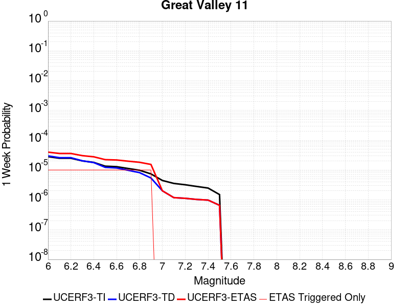 |  |  |  |

| Magnitude | 1 wk TI Prob | 1 wk TD Prob | 1 wk ETAS Prob | 1 wk ETAS/TD Gain | 1 wk ETAS Triggered Only | 1 mo TI Prob | 1 mo TD Prob | 1 mo ETAS Prob | 1 mo ETAS/TD Gain | 1 mo ETAS Triggered Only | 1 yr TI Prob | 1 yr TD Prob | 1 yr ETAS Prob | 1 yr ETAS/TD Gain | 1 yr ETAS Triggered Only | 10 yr TI Prob | 10 yr TD Prob | 10 yr ETAS Prob | 10 yr ETAS/TD Gain | 10 yr ETAS Triggered Only |
|-----|-----|-----|-----|-----|-----|-----|-----|-----|-----|-----|-----|-----|-----|-----|-----|-----|-----|-----|-----|-----|
| 6.0 | 2.8099583E-5 | 2.983214E-5 | 3.983184E-5 | 1.335199 | 1.0E-5 | 1.20421224E-4 | 1.2784619E-4 | 1.378449E-4 | 1.078209 | 1.0E-5 | 0.0014651422 | 0.0015554894 | 0.0015654739 | 1.0064188 | 1.0E-5 | 0.0145552 | 0.015453546 | 0.015463391 | 1.000637 | 1.0E-5 |
| 6.1 | 2.483194E-5 | 2.5907144E-5 | 3.5906884E-5 | 1.385984 | 1.0E-5 | 1.0641825E-4 | 1.11026246E-4 | 1.21025136E-4 | 1.0900588 | 1.0E-5 | 0.0012948721 | 0.0013509697 | 0.0013609562 | 1.007392 | 1.0E-5 | 0.012873529 | 0.013433979 | 0.013443844 | 1.0007343 | 1.0E-5 |
| 6.2 | 2.483194E-5 | 2.5907144E-5 | 3.5906884E-5 | 1.385984 | 1.0E-5 | 1.0641825E-4 | 1.11026246E-4 | 1.21025136E-4 | 1.0900588 | 1.0E-5 | 0.0012948721 | 0.0013509697 | 0.0013609562 | 1.007392 | 1.0E-5 | 0.012873529 | 0.013433979 | 0.013443844 | 1.0007343 | 1.0E-5 |
| 6.3 | 2.0257901E-5 | 2.0398915E-5 | 3.039871E-5 | 1.4902122 | 1.0E-5 | 8.681669E-5 | 8.742122E-5 | 9.742035E-5 | 1.1143787 | 1.0E-5 | 0.0010564806 | 0.0010638753 | 0.0010738646 | 1.0093896 | 1.0E-5 | 0.01051472 | 0.010591993 | 0.0106018875 | 1.0009341 | 1.0E-5 |
| 6.4 | 1.8054898E-5 | 1.7780852E-5 | 2.7780674E-5 | 1.5623927 | 1.0E-5 | 7.737584E-5 | 7.6201635E-5 | 8.6200875E-5 | 1.1312208 | 1.0E-5 | 9.416436E-4 | 9.2739763E-4 | 9.3738834E-4 | 1.0107728 | 1.0E-5 | 0.009376635 | 0.009239015 | 0.009248923 | 1.0010724 | 1.0E-5 |
| 6.5 | 1.34804895E-5 | 1.2321004E-5 | 2.232088E-5 | 1.8116121 | 1.0E-5 | 5.777225E-5 | 5.2803258E-5 | 6.280273E-5 | 1.1893723 | 1.0E-5 | 7.031501E-4 | 6.426942E-4 | 6.5268774E-4 | 1.0155495 | 1.0E-5 | 0.007009294 | 0.006408792 | 0.0064187283 | 1.0015503 | 1.0E-5 |
| 6.6 | 1.294883E-5 | 1.1732261E-5 | 2.1732143E-5 | 1.8523407 | 1.0E-5 | 5.5493805E-5 | 5.028017E-5 | 6.0279668E-5 | 1.1988755 | 1.0E-5 | 6.754276E-4 | 6.1199325E-4 | 6.219871E-4 | 1.01633 | 1.0E-5 | 0.006733784 | 0.0061035044 | 0.0061134435 | 1.0016284 | 1.0E-5 |
| 6.7 | 1.1272237E-5 | 9.811834E-6 | 1.9811736E-5 | 2.0191674 | 1.0E-5 | 4.8308695E-5 | 4.205006E-5 | 5.204964E-5 | 1.2378018 | 1.0E-5 | 5.879996E-4 | 5.1184196E-4 | 5.218368E-4 | 1.0195273 | 1.0E-5 | 0.005864462 | 0.005106915 | 0.0051168636 | 1.0019481 | 1.0E-5 |
| 6.8 | 9.8337505E-6 | 8.193719E-6 | 1.8193638E-5 | 2.220437 | 1.0E-5 | 4.2143965E-5 | 3.5115478E-5 | 4.5115125E-5 | 1.2847648 | 1.0E-5 | 5.1298196E-4 | 4.2744912E-4 | 4.3744483E-4 | 1.0233846 | 1.0E-5 | 0.005117994 | 0.0042664795 | 0.0042764368 | 1.0023339 | 1.0E-5 |
| 6.9 | 7.4224813E-6 | 5.4130837E-6 | 1.541303E-5 | 2.8473659 | 1.0E-5 | 3.1810247E-5 | 2.3198732E-5 | 3.31985E-5 | 1.431048 | 1.0E-5 | 3.872209E-4 | 2.8240937E-4 | 2.9240653E-4 | 1.0353996 | 1.0E-5 | 0.0038654688 | 0.0028206457 | 0.0028306174 | 1.0035353 | 1.0E-5 |
| 7.0 | 4.4628923E-6 | 2.0110294E-6 | 2.0110294E-6 | 1.0 | 0.0 | 1.912654E-5 | 8.61867E-6 | 8.61867E-6 | 1.0 | 0.0 | 2.3284076E-4 | 1.0492737E-4 | 1.0492737E-4 | 1.0 | 0.0 | 0.0023259693 | 0.0010487898 | 0.0010487898 | 1.0 | 0.0 |
| 7.1 | 3.5546527E-6 | 1.1855383E-6 | 1.1855383E-6 | 1.0 | 0.0 | 1.5234136E-5 | 5.080869E-6 | 5.080869E-6 | 1.0 | 0.0 | 1.8545982E-4 | 6.185789E-5 | 6.185789E-5 | 1.0 | 0.0 | 0.0018530512 | 6.1841356E-4 | 6.1841356E-4 | 1.0 | 0.0 |
| 7.2 | 3.2039936E-6 | 1.1253728E-6 | 1.1253728E-6 | 1.0 | 0.0 | 1.3731329E-5 | 4.8230177E-6 | 4.8230177E-6 | 1.0 | 0.0 | 1.671661E-4 | 5.8718724E-5 | 5.8718724E-5 | 1.0 | 0.0 | 0.0016704041 | 5.870388E-4 | 5.870388E-4 | 1.0 | 0.0 |
| 7.3 | 2.8120473E-6 | 1.0305271E-6 | 1.0305271E-6 | 1.0 | 0.0 | 1.2051575E-5 | 4.4165376E-6 | 4.4165376E-6 | 1.0 | 0.0 | 1.4671806E-4 | 5.3770087E-5 | 5.3770087E-5 | 1.0 | 0.0 | 0.0014662122 | 5.375774E-4 | 5.375774E-4 | 1.0 | 0.0 |
| 7.4 | 2.4837766E-6 | 9.80032E-7 | 9.80032E-7 | 1.0 | 0.0 | 1.0644713E-5 | 4.2001307E-6 | 4.2001307E-6 | 1.0 | 0.0 | 1.2959167E-4 | 5.113546E-5 | 5.113546E-5 | 1.0 | 0.0 | 0.0012951613 | 5.1124353E-4 | 5.1124353E-4 | 1.0 | 0.0 |
| 7.5 | 1.5002679E-6 | 6.545985E-7 | 6.545985E-7 | 1.0 | 0.0 | 6.4297037E-6 | 2.8054194E-6 | 2.8054194E-6 | 1.0 | 0.0 | 7.827883E-5 | 3.4155488E-5 | 3.4155488E-5 | 1.0 | 0.0 | 7.825126E-4 | 3.4150656E-4 | 3.4150656E-4 | 1.0 | 0.0 |

## Dog Valley
*[(top)](#table-of-contents)*

| 1 Week | 1 Month | 1 Year | 10 Year |
|-----|-----|-----|-----|
|  |  | 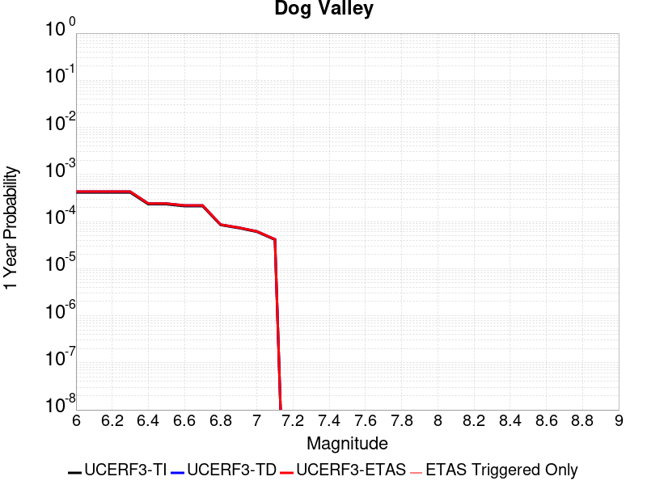 |  |

| Magnitude | 1 wk TI Prob | 1 wk TD Prob | 1 wk ETAS Prob | 1 wk ETAS/TD Gain | 1 wk ETAS Triggered Only | 1 mo TI Prob | 1 mo TD Prob | 1 mo ETAS Prob | 1 mo ETAS/TD Gain | 1 mo ETAS Triggered Only | 1 yr TI Prob | 1 yr TD Prob | 1 yr ETAS Prob | 1 yr ETAS/TD Gain | 1 yr ETAS Triggered Only | 10 yr TI Prob | 10 yr TD Prob | 10 yr ETAS Prob | 10 yr ETAS/TD Gain | 10 yr ETAS Triggered Only |
|-----|-----|-----|-----|-----|-----|-----|-----|-----|-----|-----|-----|-----|-----|-----|-----|-----|-----|-----|-----|-----|
| 6.0 | 7.949598E-6 | 8.275726E-6 | 8.275726E-6 | 1.0 | 0.0 | 3.4069257E-5 | 3.5467026E-5 | 3.5467026E-5 | 1.0 | 0.0 | 4.1471425E-4 | 4.317451E-4 | 4.317451E-4 | 1.0 | 0.0 | 0.0041394117 | 0.0043109935 | 0.0043209502 | 1.0023097 | 1.0E-5 |
| 6.1 | 7.949598E-6 | 8.275726E-6 | 8.275726E-6 | 1.0 | 0.0 | 3.4069257E-5 | 3.5467026E-5 | 3.5467026E-5 | 1.0 | 0.0 | 4.1471425E-4 | 4.317451E-4 | 4.317451E-4 | 1.0 | 0.0 | 0.0041394117 | 0.0043109935 | 0.0043209502 | 1.0023097 | 1.0E-5 |
| 6.2 | 7.949598E-6 | 8.275726E-6 | 8.275726E-6 | 1.0 | 0.0 | 3.4069257E-5 | 3.5467026E-5 | 3.5467026E-5 | 1.0 | 0.0 | 4.1471425E-4 | 4.317451E-4 | 4.317451E-4 | 1.0 | 0.0 | 0.0041394117 | 0.0043109935 | 0.0043209502 | 1.0023097 | 1.0E-5 |
| 6.3 | 7.949598E-6 | 8.275726E-6 | 8.275726E-6 | 1.0 | 0.0 | 3.4069257E-5 | 3.5467026E-5 | 3.5467026E-5 | 1.0 | 0.0 | 4.1471425E-4 | 4.317451E-4 | 4.317451E-4 | 1.0 | 0.0 | 0.0041394117 | 0.0043109935 | 0.0043209502 | 1.0023097 | 1.0E-5 |
| 6.4 | 4.462132E-6 | 4.6231626E-6 | 4.6231626E-6 | 1.0 | 0.0 | 1.9123283E-5 | 1.9813455E-5 | 1.9813455E-5 | 1.0 | 0.0 | 2.328011E-4 | 2.4121105E-4 | 2.4121105E-4 | 1.0 | 0.0 | 0.0023255737 | 0.0024103695 | 0.0024103695 | 1.0 | 0.0 |
| 6.5 | 4.462132E-6 | 4.6231626E-6 | 4.6231626E-6 | 1.0 | 0.0 | 1.9123283E-5 | 1.9813455E-5 | 1.9813455E-5 | 1.0 | 0.0 | 2.328011E-4 | 2.4121105E-4 | 2.4121105E-4 | 1.0 | 0.0 | 0.0023255737 | 0.0024103695 | 0.0024103695 | 1.0 | 0.0 |
| 6.6 | 4.074213E-6 | 4.2173756E-6 | 4.2173756E-6 | 1.0 | 0.0 | 1.7460794E-5 | 1.807439E-5 | 1.807439E-5 | 1.0 | 0.0 | 2.1256444E-4 | 2.2004228E-4 | 2.2004228E-4 | 1.0 | 0.0 | 0.0021236122 | 0.0021991057 | 0.0021991057 | 1.0 | 0.0 |
| 6.7 | 4.074213E-6 | 4.2173756E-6 | 4.2173756E-6 | 1.0 | 0.0 | 1.7460794E-5 | 1.807439E-5 | 1.807439E-5 | 1.0 | 0.0 | 2.1256444E-4 | 2.2004228E-4 | 2.2004228E-4 | 1.0 | 0.0 | 0.0021236122 | 0.0021991057 | 0.0021991057 | 1.0 | 0.0 |
| 6.8 | 1.6159543E-6 | 1.6503406E-6 | 1.6503406E-6 | 1.0 | 0.0 | 6.9255E-6 | 7.072872E-6 | 7.072872E-6 | 1.0 | 0.0 | 8.43147E-5 | 8.6109365E-5 | 8.6109365E-5 | 1.0 | 0.0 | 8.4282714E-4 | 8.6081424E-4 | 8.6081424E-4 | 1.0 | 0.0 |
| 6.9 | 1.3952654E-6 | 1.4252876E-6 | 1.4252876E-6 | 1.0 | 0.0 | 5.9796953E-6 | 6.108364E-6 | 6.108364E-6 | 1.0 | 0.0 | 7.280036E-5 | 7.436728E-5 | 7.436728E-5 | 1.0 | 0.0 | 7.2776515E-4 | 7.4347196E-4 | 7.4347196E-4 | 1.0 | 0.0 |
| 7.0 | 1.1619308E-6 | 1.1869527E-6 | 1.1869527E-6 | 1.0 | 0.0 | 4.979694E-6 | 5.0869326E-6 | 5.0869326E-6 | 1.0 | 0.0 | 6.0626087E-5 | 6.1932085E-5 | 6.1932085E-5 | 1.0 | 0.0 | 6.060955E-4 | 6.19192E-4 | 6.19192E-4 | 1.0 | 0.0 |
| 7.1 | 7.8723247E-7 | 8.0469965E-7 | 8.0469965E-7 | 1.0 | 0.0 | 3.373849E-6 | 3.44871E-6 | 3.44871E-6 | 1.0 | 0.0 | 4.107584E-5 | 4.198754E-5 | 4.198754E-5 | 1.0 | 0.0 | 4.1068246E-4 | 4.1982596E-4 | 4.1982596E-4 | 1.0 | 0.0 |

## North Salt Lake
*[(top)](#table-of-contents)*

| 1 Week | 1 Month | 1 Year | 10 Year |
|-----|-----|-----|-----|
|  |  |  |  |

| Magnitude | 1 wk TI Prob | 1 wk TD Prob | 1 wk ETAS Prob | 1 wk ETAS/TD Gain | 1 wk ETAS Triggered Only | 1 mo TI Prob | 1 mo TD Prob | 1 mo ETAS Prob | 1 mo ETAS/TD Gain | 1 mo ETAS Triggered Only | 1 yr TI Prob | 1 yr TD Prob | 1 yr ETAS Prob | 1 yr ETAS/TD Gain | 1 yr ETAS Triggered Only | 10 yr TI Prob | 10 yr TD Prob | 10 yr ETAS Prob | 10 yr ETAS/TD Gain | 10 yr ETAS Triggered Only |
|-----|-----|-----|-----|-----|-----|-----|-----|-----|-----|-----|-----|-----|-----|-----|-----|-----|-----|-----|-----|-----|
| 6.0 | 1.849599E-6 | 1.955571E-6 | 1.955571E-6 | 1.0 | 0.0 | 7.926829E-6 | 8.381003E-6 | 8.381003E-6 | 1.0 | 0.0 | 9.650487E-5 | 1.0203594E-4 | 1.0203594E-4 | 1.0 | 0.0 | 9.646297E-4 | 0.0010200888 | 0.0010300786 | 1.009793 | 1.0E-5 |
| 6.1 | 1.849599E-6 | 1.955571E-6 | 1.955571E-6 | 1.0 | 0.0 | 7.926829E-6 | 8.381003E-6 | 8.381003E-6 | 1.0 | 0.0 | 9.650487E-5 | 1.0203594E-4 | 1.0203594E-4 | 1.0 | 0.0 | 9.646297E-4 | 0.0010200888 | 0.0010200888 | 1.0 | 0.0 |
| 6.2 | 1.849599E-6 | 1.955571E-6 | 1.955571E-6 | 1.0 | 0.0 | 7.926829E-6 | 8.381003E-6 | 8.381003E-6 | 1.0 | 0.0 | 9.650487E-5 | 1.0203594E-4 | 1.0203594E-4 | 1.0 | 0.0 | 9.646297E-4 | 0.0010200888 | 0.0010200888 | 1.0 | 0.0 |
| 6.3 | 1.849599E-6 | 1.955571E-6 | 1.955571E-6 | 1.0 | 0.0 | 7.926829E-6 | 8.381003E-6 | 8.381003E-6 | 1.0 | 0.0 | 9.650487E-5 | 1.0203594E-4 | 1.0203594E-4 | 1.0 | 0.0 | 9.646297E-4 | 0.0010200888 | 0.0010200888 | 1.0 | 0.0 |
| 6.4 | 1.7803909E-6 | 1.8860707E-6 | 1.8860707E-6 | 1.0 | 0.0 | 7.630225E-6 | 8.083147E-6 | 8.083147E-6 | 1.0 | 0.0 | 9.289402E-5 | 9.840987E-5 | 9.840987E-5 | 1.0 | 0.0 | 9.28552E-4 | 9.838602E-4 | 9.838602E-4 | 1.0 | 0.0 |
| 6.5 | 5.9157696E-7 | 6.3001835E-7 | 6.3001835E-7 | 1.0 | 0.0 | 2.5353274E-6 | 2.7000763E-6 | 2.7000763E-6 | 1.0 | 0.0 | 3.0867173E-5 | 3.2872973E-5 | 3.2872973E-5 | 1.0 | 0.0 | 3.0862886E-4 | 3.28685E-4 | 3.28685E-4 | 1.0 | 0.0 |
| 6.6 | 5.9157696E-7 | 6.3001835E-7 | 6.3001835E-7 | 1.0 | 0.0 | 2.5353274E-6 | 2.7000763E-6 | 2.7000763E-6 | 1.0 | 0.0 | 3.0867173E-5 | 3.2872973E-5 | 3.2872973E-5 | 1.0 | 0.0 | 3.0862886E-4 | 3.28685E-4 | 3.28685E-4 | 1.0 | 0.0 |
| 6.7 | 5.9157696E-7 | 6.3001835E-7 | 6.3001835E-7 | 1.0 | 0.0 | 2.5353274E-6 | 2.7000763E-6 | 2.7000763E-6 | 1.0 | 0.0 | 3.0867173E-5 | 3.2872973E-5 | 3.2872973E-5 | 1.0 | 0.0 | 3.0862886E-4 | 3.28685E-4 | 3.28685E-4 | 1.0 | 0.0 |
| 6.8 | 4.7536267E-7 | 5.066019E-7 | 5.066019E-7 | 1.0 | 0.0 | 2.037267E-6 | 2.1711494E-6 | 2.1711494E-6 | 1.0 | 0.0 | 2.4803443E-5 | 2.6433447E-5 | 2.6433447E-5 | 1.0 | 0.0 | 2.4800675E-4 | 2.6430548E-4 | 2.6430548E-4 | 1.0 | 0.0 |
| 6.9 | 3.6345344E-7 | 3.8750048E-7 | 3.8750048E-7 | 1.0 | 0.0 | 1.5576567E-6 | 1.6607154E-6 | 1.6607154E-6 | 1.0 | 0.0 | 1.8964305E-5 | 2.021904E-5 | 2.021904E-5 | 1.0 | 0.0 | 1.8962687E-4 | 2.021737E-4 | 2.021737E-4 | 1.0 | 0.0 |
| 7.0 | 2.4087325E-7 | 2.5709335E-7 | 2.5709335E-7 | 1.0 | 0.0 | 1.0323135E-6 | 1.1018283E-6 | 1.1018283E-6 | 1.0 | 0.0 | 1.25683455E-5 | 1.3414689E-5 | 1.3414689E-5 | 1.0 | 0.0 | 1.2567634E-4 | 1.3414006E-4 | 1.3414006E-4 | 1.0 | 0.0 |
| 7.1 | 8.551555E-8 | 9.044477E-8 | 9.044477E-8 | 1.0 | 0.0 | 3.6649516E-7 | 3.876204E-7 | 3.876204E-7 | 1.0 | 0.0 | 4.4620692E-6 | 4.7192693E-6 | 4.7192693E-6 | 1.0 | 0.0 | 4.46198E-5 | 4.719181E-5 | 4.719181E-5 | 1.0 | 0.0 |
| 7.2 | 2.475279E-8 | 2.5893172E-8 | 2.5893172E-8 | 1.0 | 0.0 | 1.0608338E-7 | 1.1097074E-7 | 1.1097074E-7 | 1.0 | 0.0 | 1.2915643E-6 | 1.3510679E-6 | 1.3510679E-6 | 1.0 | 0.0 | 1.2915569E-5 | 1.3510604E-5 | 1.3510604E-5 | 1.0 | 0.0 |
| 7.3 | 1.5212393E-8 | 1.5847489E-8 | 1.5847489E-8 | 1.0 | 0.0 | 6.519597E-8 | 6.791781E-8 | 6.791781E-8 | 1.0 | 0.0 | 7.9376065E-7 | 8.2689905E-7 | 8.2689905E-7 | 1.0 | 0.0 | 7.937579E-6 | 8.268963E-6 | 8.268963E-6 | 1.0 | 0.0 |
| 7.4 | 8.182E-9 | 8.447294E-9 | 8.447294E-9 | 1.0 | 0.0 | 3.5065714E-8 | 3.620269E-8 | 3.620269E-8 | 1.0 | 0.0 | 4.26925E-7 | 4.4076765E-7 | 4.4076765E-7 | 1.0 | 0.0 | 4.269242E-6 | 4.4076683E-6 | 4.4076683E-6 | 1.0 | 0.0 |
| 7.5 | 5.479913E-9 | 5.6680434E-9 | 5.6680434E-9 | 1.0 | 0.0 | 2.3485342E-8 | 2.4291614E-8 | 2.4291614E-8 | 1.0 | 0.0 | 2.85934E-7 | 2.9575037E-7 | 2.9575037E-7 | 1.0 | 0.0 | 2.8593363E-6 | 2.9575E-6 | 2.9575E-6 | 1.0 | 0.0 |
| 7.6 | 2.6813562E-10 | 2.773195E-10 | 2.773195E-10 | 1.0 | 0.0 | 1.1491527E-9 | 1.1885122E-9 | 1.1885122E-9 | 1.0 | 0.0 | 1.3990933E-8 | 1.4470135E-8 | 1.4470135E-8 | 1.0 | 0.0 | 1.3990932E-7 | 1.4470135E-7 | 1.4470135E-7 | 1.0 | 0.0 |

## Round Valley
*[(top)](#table-of-contents)*

| 1 Week | 1 Month | 1 Year | 10 Year |
|-----|-----|-----|-----|
|  |  |  |  |

| Magnitude | 1 wk TI Prob | 1 wk TD Prob | 1 wk ETAS Prob | 1 wk ETAS/TD Gain | 1 wk ETAS Triggered Only | 1 mo TI Prob | 1 mo TD Prob | 1 mo ETAS Prob | 1 mo ETAS/TD Gain | 1 mo ETAS Triggered Only | 1 yr TI Prob | 1 yr TD Prob | 1 yr ETAS Prob | 1 yr ETAS/TD Gain | 1 yr ETAS Triggered Only | 10 yr TI Prob | 10 yr TD Prob | 10 yr ETAS Prob | 10 yr ETAS/TD Gain | 10 yr ETAS Triggered Only |
|-----|-----|-----|-----|-----|-----|-----|-----|-----|-----|-----|-----|-----|-----|-----|-----|-----|-----|-----|-----|-----|
| 6.0 | 1.588152E-5 | 1.3670525E-5 | 1.3670525E-5 | 1.0 | 0.0 | 6.806188E-5 | 5.8586873E-5 | 5.8586873E-5 | 1.0 | 0.0 | 8.283384E-4 | 7.131011E-4 | 7.23094E-4 | 1.0140133 | 1.0E-5 | 0.008252576 | 0.0071120164 | 0.0071219453 | 1.0013961 | 1.0E-5 |
| 6.1 | 1.588152E-5 | 1.3670525E-5 | 1.3670525E-5 | 1.0 | 0.0 | 6.806188E-5 | 5.8586873E-5 | 5.8586873E-5 | 1.0 | 0.0 | 8.283384E-4 | 7.131011E-4 | 7.23094E-4 | 1.0140133 | 1.0E-5 | 0.008252576 | 0.0071120164 | 0.0071219453 | 1.0013961 | 1.0E-5 |
| 6.2 | 1.588152E-5 | 1.3670525E-5 | 1.3670525E-5 | 1.0 | 0.0 | 6.806188E-5 | 5.8586873E-5 | 5.8586873E-5 | 1.0 | 0.0 | 8.283384E-4 | 7.131011E-4 | 7.23094E-4 | 1.0140133 | 1.0E-5 | 0.008252576 | 0.0071120164 | 0.0071219453 | 1.0013961 | 1.0E-5 |
| 6.3 | 1.588152E-5 | 1.3670525E-5 | 1.3670525E-5 | 1.0 | 0.0 | 6.806188E-5 | 5.8586873E-5 | 5.8586873E-5 | 1.0 | 0.0 | 8.283384E-4 | 7.131011E-4 | 7.23094E-4 | 1.0140133 | 1.0E-5 | 0.008252576 | 0.0071120164 | 0.0071219453 | 1.0013961 | 1.0E-5 |
| 6.4 | 1.588152E-5 | 1.3670525E-5 | 1.3670525E-5 | 1.0 | 0.0 | 6.806188E-5 | 5.8586873E-5 | 5.8586873E-5 | 1.0 | 0.0 | 8.283384E-4 | 7.131011E-4 | 7.23094E-4 | 1.0140133 | 1.0E-5 | 0.008252576 | 0.0071120164 | 0.0071219453 | 1.0013961 | 1.0E-5 |
| 6.5 | 1.0646776E-5 | 7.952847E-6 | 7.952847E-6 | 1.0 | 0.0 | 4.5628243E-5 | 3.4083234E-5 | 3.4083234E-5 | 1.0 | 0.0 | 5.553823E-4 | 4.1489274E-4 | 4.1489274E-4 | 1.0 | 0.0 | 0.005539963 | 0.00414201 | 0.00414201 | 1.0 | 0.0 |
| 6.6 | 8.632956E-6 | 5.768552E-6 | 5.768552E-6 | 1.0 | 0.0 | 3.6997862E-5 | 2.4722152E-5 | 2.4722152E-5 | 1.0 | 0.0 | 4.5035584E-4 | 3.0095447E-4 | 3.0095447E-4 | 1.0 | 0.0 | 0.0044944426 | 0.0030058469 | 0.0030058469 | 1.0 | 0.0 |
| 6.7 | 8.632956E-6 | 5.768552E-6 | 5.768552E-6 | 1.0 | 0.0 | 3.6997862E-5 | 2.4722152E-5 | 2.4722152E-5 | 1.0 | 0.0 | 4.5035584E-4 | 3.0095447E-4 | 3.0095447E-4 | 1.0 | 0.0 | 0.0044944426 | 0.0030058469 | 0.0030058469 | 1.0 | 0.0 |
| 6.8 | 7.143895E-6 | 4.201644E-6 | 4.201644E-6 | 1.0 | 0.0 | 3.0616335E-5 | 1.8006931E-5 | 1.8006931E-5 | 1.0 | 0.0 | 3.726901E-4 | 2.19214E-4 | 2.19214E-4 | 1.0 | 0.0 | 0.0037206567 | 0.0021901424 | 0.0021901424 | 1.0 | 0.0 |
| 6.9 | 6.5120694E-6 | 3.6642807E-6 | 3.6642807E-6 | 1.0 | 0.0 | 2.790857E-5 | 1.5703974E-5 | 1.5703974E-5 | 1.0 | 0.0 | 3.3973387E-4 | 1.9118062E-4 | 1.9118062E-4 | 1.0 | 0.0 | 0.0033921495 | 0.0019103106 | 0.0019103106 | 1.0 | 0.0 |
| 7.0 | 5.0614435E-6 | 2.6834869E-6 | 2.6834869E-6 | 1.0 | 0.0 | 2.169172E-5 | 1.1500612E-5 | 1.1500612E-5 | 1.0 | 0.0 | 2.6406467E-4 | 1.40012E-4 | 1.40012E-4 | 1.0 | 0.0 | 0.0026375111 | 0.0013993392 | 0.0013993392 | 1.0 | 0.0 |
| 7.1 | 4.41728E-6 | 2.3573243E-6 | 2.3573243E-6 | 1.0 | 0.0 | 1.8931061E-5 | 1.01027845E-5 | 1.01027845E-5 | 1.0 | 0.0 | 2.304613E-4 | 1.2299545E-4 | 1.2299545E-4 | 1.0 | 0.0 | 0.0023022245 | 0.0012293702 | 0.0012293702 | 1.0 | 0.0 |
| 7.2 | 2.535495E-6 | 1.120784E-6 | 1.120784E-6 | 1.0 | 0.0 | 1.0866362E-5 | 4.803354E-6 | 4.803354E-6 | 1.0 | 0.0 | 1.3228992E-4 | 5.8479785E-5 | 5.8479785E-5 | 1.0 | 0.0 | 0.0013221119 | 5.846952E-4 | 5.846952E-4 | 1.0 | 0.0 |
| 7.3 | 7.900015E-7 | 4.0888176E-7 | 4.0888176E-7 | 1.0 | 0.0 | 3.3857161E-6 | 1.7523504E-6 | 1.7523504E-6 | 1.0 | 0.0 | 4.1220315E-5 | 2.1334865E-5 | 2.1334865E-5 | 1.0 | 0.0 | 4.121267E-4 | 2.1334866E-4 | 2.1334866E-4 | 1.0 | 0.0 |

## Hartley Springs 2011 CFM
*[(top)](#table-of-contents)*

| 1 Week | 1 Month | 1 Year | 10 Year |
|-----|-----|-----|-----|
|  |  |  |  |

| Magnitude | 1 wk TI Prob | 1 wk TD Prob | 1 wk ETAS Prob | 1 wk ETAS/TD Gain | 1 wk ETAS Triggered Only | 1 mo TI Prob | 1 mo TD Prob | 1 mo ETAS Prob | 1 mo ETAS/TD Gain | 1 mo ETAS Triggered Only | 1 yr TI Prob | 1 yr TD Prob | 1 yr ETAS Prob | 1 yr ETAS/TD Gain | 1 yr ETAS Triggered Only | 10 yr TI Prob | 10 yr TD Prob | 10 yr ETAS Prob | 10 yr ETAS/TD Gain | 10 yr ETAS Triggered Only |
|-----|-----|-----|-----|-----|-----|-----|-----|-----|-----|-----|-----|-----|-----|-----|-----|-----|-----|-----|-----|-----|
| 6.0 | 1.4352418E-5 | 1.4434111E-5 | 1.4434111E-5 | 1.0 | 0.0 | 6.1508916E-5 | 6.185994E-5 | 6.185994E-5 | 1.0 | 0.0 | 7.486137E-4 | 7.5304887E-4 | 7.630413E-4 | 1.0132693 | 1.0E-5 | 0.007460968 | 0.007521092 | 0.0075310166 | 1.0013196 | 1.0E-5 |
| 6.1 | 1.4352418E-5 | 1.4434111E-5 | 1.4434111E-5 | 1.0 | 0.0 | 6.1508916E-5 | 6.185994E-5 | 6.185994E-5 | 1.0 | 0.0 | 7.486137E-4 | 7.5304887E-4 | 7.630413E-4 | 1.0132693 | 1.0E-5 | 0.007460968 | 0.007521092 | 0.0075310166 | 1.0013196 | 1.0E-5 |
| 6.2 | 1.4352418E-5 | 1.4434111E-5 | 1.4434111E-5 | 1.0 | 0.0 | 6.1508916E-5 | 6.185994E-5 | 6.185994E-5 | 1.0 | 0.0 | 7.486137E-4 | 7.5304887E-4 | 7.630413E-4 | 1.0132693 | 1.0E-5 | 0.007460968 | 0.007521092 | 0.0075310166 | 1.0013196 | 1.0E-5 |
| 6.3 | 1.4352418E-5 | 1.4434111E-5 | 1.4434111E-5 | 1.0 | 0.0 | 6.1508916E-5 | 6.185994E-5 | 6.185994E-5 | 1.0 | 0.0 | 7.486137E-4 | 7.5304887E-4 | 7.630413E-4 | 1.0132693 | 1.0E-5 | 0.007460968 | 0.007521092 | 0.0075310166 | 1.0013196 | 1.0E-5 |
| 6.4 | 1.4352418E-5 | 1.4434111E-5 | 1.4434111E-5 | 1.0 | 0.0 | 6.1508916E-5 | 6.185994E-5 | 6.185994E-5 | 1.0 | 0.0 | 7.486137E-4 | 7.5304887E-4 | 7.630413E-4 | 1.0132693 | 1.0E-5 | 0.007460968 | 0.007521092 | 0.0075310166 | 1.0013196 | 1.0E-5 |
| 6.5 | 1.2279858E-5 | 1.2133036E-5 | 1.2133036E-5 | 1.0 | 0.0 | 5.26269E-5 | 5.199858E-5 | 5.199858E-5 | 1.0 | 0.0 | 6.4054417E-4 | 6.33057E-4 | 6.4305065E-4 | 1.0157864 | 1.0E-5 | 0.0063870098 | 0.006328048 | 0.006337985 | 1.0015702 | 1.0E-5 |
| 6.6 | 1.2279858E-5 | 1.2133036E-5 | 1.2133036E-5 | 1.0 | 0.0 | 5.26269E-5 | 5.199858E-5 | 5.199858E-5 | 1.0 | 0.0 | 6.4054417E-4 | 6.33057E-4 | 6.4305065E-4 | 1.0157864 | 1.0E-5 | 0.0063870098 | 0.006328048 | 0.006337985 | 1.0015702 | 1.0E-5 |
| 6.7 | 2.1282601E-6 | 8.894127E-7 | 8.894127E-7 | 1.0 | 0.0 | 9.121083E-6 | 3.8117648E-6 | 3.8117648E-6 | 1.0 | 0.0 | 1.11043526E-4 | 4.6407506E-5 | 4.6407506E-5 | 1.0 | 0.0 | 0.0011098806 | 4.6400347E-4 | 4.6400347E-4 | 1.0 | 0.0 |
| 6.8 | 2.00516E-6 | 8.516916E-7 | 8.516916E-7 | 1.0 | 0.0 | 8.593515E-6 | 3.6501033E-6 | 3.6501033E-6 | 1.0 | 0.0 | 1.04621024E-4 | 4.443936E-5 | 4.443936E-5 | 1.0 | 0.0 | 0.0010457177 | 4.4432987E-4 | 4.4432987E-4 | 1.0 | 0.0 |
| 6.9 | 2.00516E-6 | 8.516916E-7 | 8.516916E-7 | 1.0 | 0.0 | 8.593515E-6 | 3.6501033E-6 | 3.6501033E-6 | 1.0 | 0.0 | 1.04621024E-4 | 4.443936E-5 | 4.443936E-5 | 1.0 | 0.0 | 0.0010457177 | 4.4432987E-4 | 4.4432987E-4 | 1.0 | 0.0 |
| 7.0 | 1.8366732E-6 | 8.2366813E-7 | 8.2366813E-7 | 1.0 | 0.0 | 7.871433E-6 | 3.5300031E-6 | 3.5300031E-6 | 1.0 | 0.0 | 9.583048E-5 | 4.2977194E-5 | 4.2977194E-5 | 1.0 | 0.0 | 9.5789164E-4 | 4.297139E-4 | 4.297139E-4 | 1.0 | 0.0 |
| 7.1 | 1.5097997E-6 | 7.1897E-7 | 7.1897E-7 | 1.0 | 0.0 | 6.470554E-6 | 3.0812978E-6 | 3.0812978E-6 | 1.0 | 0.0 | 7.877615E-5 | 3.7514397E-5 | 3.7514397E-5 | 1.0 | 0.0 | 7.874823E-4 | 3.7510434E-4 | 3.7510434E-4 | 1.0 | 0.0 |
| 7.2 | 1.3490993E-6 | 6.404769E-7 | 6.404769E-7 | 1.0 | 0.0 | 5.7818415E-6 | 2.7448996E-6 | 2.7448996E-6 | 1.0 | 0.0 | 7.0391645E-5 | 3.3418873E-5 | 3.3418873E-5 | 1.0 | 0.0 | 7.0369354E-4 | 3.3416142E-4 | 3.3416142E-4 | 1.0 | 0.0 |
| 7.3 | 7.900015E-7 | 4.0888176E-7 | 4.0888176E-7 | 1.0 | 0.0 | 3.3857161E-6 | 1.7523504E-6 | 1.7523504E-6 | 1.0 | 0.0 | 4.1220315E-5 | 2.1334865E-5 | 2.1334865E-5 | 1.0 | 0.0 | 4.121267E-4 | 2.1334866E-4 | 2.1334866E-4 | 1.0 | 0.0 |

