# Parent Section Magnitude-Probability Distributions

Only fault sections with at least one triggered aftershock are plotted. Sections are sorted by total supraseismogenic trigger rate (decreasing)

## Table Of Contents

* [Garlock (Central)](#garlock-central)
* [Tank Canyon](#tank-canyon)
* [Little Lake](#little-lake)
* [Owl Lake](#owl-lake)
* [Airport Lake](#airport-lake)
* [Panamint Valley](#panamint-valley)
* [Garlock (East)](#garlock-east)
* [Hunter Mountain-Saline Valley](#hunter-mountain-saline-valley)
* [Ash Hill](#ash-hill)
* [Blackwater](#blackwater)
* [Garlock (West)](#garlock-west)
* [McLean Lake](#mclean-lake)
* [Goldstone Lake](#goldstone-lake)
* [Death Valley (So)](#death-valley-so)
* [Gravel Hills-Harper Lk](#gravel-hills-harper-lk)
* [San Andreas (Mojave S)](#san-andreas-mojave-s)
* [Coyote Canyon](#coyote-canyon)
* [San Andreas (Mojave N)](#san-andreas-mojave-n)
* [Nelson Lake](#nelson-lake)
* [So Sierra Nevada](#so-sierra-nevada)
* [Towne Pass](#towne-pass)
* [San Andreas (San Bernardino N)](#san-andreas-san-bernardino-n)
* [Lenwood-Lockhart-Old Woman Springs](#lenwood-lockhart-old-woman-springs)
* [Bicycle Lake](#bicycle-lake)
* [Paradise](#paradise)
* [Garlic Springs](#garlic-springs)
* [San Andreas (San Bernardino S)](#san-andreas-san-bernardino-s)
* [Death Valley (Black Mtns Frontal)](#death-valley-black-mtns-frontal)
* [San Andreas (Big Bend)](#san-andreas-big-bend)
* [Coyote Lake](#coyote-lake)
* [Helendale-So Lockhart](#helendale-so-lockhart)
* [San Andreas (Parkfield)](#san-andreas-parkfield)
* [San Andreas (San Gorgonio Pass-Garnet HIll)](#san-andreas-san-gorgonio-pass-garnet-hill)
* [Death Valley (No)](#death-valley-no)
* [San Andreas (Cholame) rev](#san-andreas-cholame-rev)
* [San Andreas (Carrizo) rev](#san-andreas-carrizo-rev)
* [Death Valley (Fish Lake Valley)](#death-valley-fish-lake-valley)
* [Red Pass](#red-pass)
* [San Andreas (Coachella) rev](#san-andreas-coachella-rev)
* [San Jacinto (San Bernardino)](#san-jacinto-san-bernardino)
* [San Andreas (Creeping Section) 2011 CFM](#san-andreas-creeping-section-2011-cfm)
* [Cady](#cady)
* [Elsinore (Glen Ivy) rev](#elsinore-glen-ivy-rev)
* [Sierra Nevada  (No Extension)](#sierra-nevada--no-extension)
* [Baker](#baker)
* [Ludlow](#ludlow)
* [San Jacinto (San Jacinto Valley) rev](#san-jacinto-san-jacinto-valley-rev)
* [San Jacinto (Stepovers Combined)](#san-jacinto-stepovers-combined)
* [Santa Ynez (East)](#santa-ynez-east)
* [Manix-Afton Hills](#manix-afton-hills)
* [Santa Ynez (West)](#santa-ynez-west)
* [San Andreas (North Branch Mill Creek)](#san-andreas-north-branch-mill-creek)
* [Cleghorn Lake](#cleghorn-lake)
* [Calico-Hidalgo](#calico-hidalgo)
* [Mission Ridge-Arroyo Parida-Santa Ana](#mission-ridge-arroyo-parida-santa-ana)
* [Lake Isabella (Seismicity)](#lake-isabella-seismicity)
* [San Jacinto (Anza) rev](#san-jacinto-anza-rev)
* [White Wolf (Extension)](#white-wolf-extension)
* [Lost Hills](#lost-hills)
* [Brawley (Seismic Zone) alt 1](#brawley-seismic-zone-alt-1)
* [Pleito](#pleito)
* [Scodie Lineament](#scodie-lineament)
* [Imperial](#imperial)
* [Cleghorn Pass](#cleghorn-pass)
* [Red Mountain](#red-mountain)
* [Mission Creek](#mission-creek)
* [Santa Rosa Island](#santa-rosa-island)
* [San Jacinto (Coyote Creek)](#san-jacinto-coyote-creek)
* [Big Pine (East)](#big-pine-east)
* [Pinto Mtn](#pinto-mtn)
* [Independence rev 2011](#independence-rev-2011)
* [Big Pine (Central)](#big-pine-central)
* [San Jacinto (Lytle Creek connector)](#san-jacinto-lytle-creek-connector)
* [Deep Springs](#deep-springs)
* [Elysian Park (Upper)](#elysian-park-upper)
* [Channel Islands Thrust](#channel-islands-thrust)
* [San Jacinto (Borrego)](#san-jacinto-borrego)
* [White Mountains](#white-mountains)
* [Santa Cruz Island](#santa-cruz-island)
* [Chino alt 1](#chino-alt-1)
* [San Jacinto (Superstition Mtn)](#san-jacinto-superstition-mtn)
* [Ventura-Pitas Point](#ventura-pitas-point)
* [Owens Valley](#owens-valley)
* [Pisgah-Bullion Mtn-Mesquite Lk](#pisgah-bullion-mtn-mesquite-lk)
* [Ortigalita (North)](#ortigalita-north)
* [Santa Ynez River](#santa-ynez-river)
* [Hosgri](#hosgri)
* [San Diego Trough north alt1](#san-diego-trough-north-alt1)
* [Sierra Madre](#sierra-madre)
* [Great Valley 09 (Laguna Seca)](#great-valley-09-laguna-seca)
* [Blue Cut](#blue-cut)
* [Cleghorn](#cleghorn)
* [Whittier alt 1](#whittier-alt-1)
* [Hunting Creek - Berryessa 2011 CFM](#hunting-creek---berryessa-2011-cfm)
* [Tin Mountain](#tin-mountain)
* [Calaveras (So) - Paicines extension 2011 CFM](#calaveras-so---paicines-extension-2011-cfm)
* [Bullion Mountains](#bullion-mountains)
* [Rose Canyon](#rose-canyon)
* [Oceanic - West Huasna](#oceanic---west-huasna)
* [Cucamonga](#cucamonga)
* [San Jacinto (Clark) rev](#san-jacinto-clark-rev)
* [San Gabriel](#san-gabriel)
* [San Cayetano](#san-cayetano)
* [Pine Mtn](#pine-mtn)
* [Coronado Bank alt1](#coronado-bank-alt1)
* [Santa Cruz Catalina Ridge alt1](#santa-cruz-catalina-ridge-alt1)
* [Calaveras (So) 2011 CFM](#calaveras-so-2011-cfm)
* [San Diego Trough south](#san-diego-trough-south)
* [Pitas Point (Lower West)](#pitas-point-lower-west)
* [San Luis Range 2011 CFM](#san-luis-range-2011-cfm)
* [Kern Canyon (North Kern) 2011](#kern-canyon-north-kern-2011)
* [Raymond](#raymond)
* [Camp Rock 2011](#camp-rock-2011)
* [Oak Ridge (Onshore)](#oak-ridge-onshore)
* [San Pedro Basin](#san-pedro-basin)
* [Sheephole](#sheephole)
* [Hollywood](#hollywood)
* [Dry Mountain](#dry-mountain)
* [San Clemente](#san-clemente)
* [Los Alamos extension](#los-alamos-extension)
* [Palos Verdes](#palos-verdes)
* [Newport-Inglewood alt 1](#newport-inglewood-alt-1)
* [Kern Canyon (South Kern) 2011](#kern-canyon-south-kern-2011)
* [San Andreas (Santa Cruz Mts) 2011 CFM](#san-andreas-santa-cruz-mts-2011-cfm)
* [Ortigalita (South)](#ortigalita-south)
* [Santa Monica alt 1](#santa-monica-alt-1)
* [North Frontal  (West)](#north-frontal--west)
* [Simi-Santa Rosa](#simi-santa-rosa)
* [Calaveras (Central) 2011 CFM](#calaveras-central-2011-cfm)
* [Mono Lake 2011 CFM](#mono-lake-2011-cfm)
* [Santa Susana alt 1](#santa-susana-alt-1)
* [Elsinore (Stepovers Combined)](#elsinore-stepovers-combined)
* [Pitas Point (Lower)-Montalvo](#pitas-point-lower-montalvo)
* [Great Valley 07 (Orestimba)](#great-valley-07-orestimba)
* [Superstition Hills](#superstition-hills)
* [San Gabriel (Extension)](#san-gabriel-extension)
* [Likely 2011 CFM](#likely-2011-cfm)
* [Oceanside alt1](#oceanside-alt1)
* [San Gorgonio Pass](#san-gorgonio-pass)
* [North Frontal  (East)](#north-frontal--east)
* [Carson Range (Genoa)](#carson-range-genoa)
* [Kern Canyon (Lake Isabella) 2011](#kern-canyon-lake-isabella-2011)
* [Malibu Coast (Extension) alt 1](#malibu-coast-extension-alt-1)
* [Malibu Coast alt 1](#malibu-coast-alt-1)
* [Hunting Creek - Bartlett Springs connector 2011](#hunting-creek---bartlett-springs-connector-2011)
* [San Juan](#san-juan)
* [Great Valley 03 Mysterious Ridge](#great-valley-03-mysterious-ridge)
* [East Huasna 2011 CFM](#east-huasna-2011-cfm)
* [Great Valley 10 (Panoche)](#great-valley-10-panoche)
* [Hosgri (Extension)](#hosgri-extension)
* [Compton](#compton)
* [Los Alamos 2011 CFM](#los-alamos-2011-cfm)
* [Hayward (So) extension 2011 CFM](#hayward-so-extension-2011-cfm)
* [Casmalia 2011 CFM](#casmalia-2011-cfm)
* [Monte Vista - Shannon 2011 CFM](#monte-vista---shannon-2011-cfm)
* [Santa Susana East (connector)](#santa-susana-east-connector)
* [Elsinore (Coyote Mountains)](#elsinore-coyote-mountains)
* [Butano 2011 CFM](#butano-2011-cfm)
* [Carlsbad](#carlsbad)
* [Del Valle](#del-valle)
* [Great Valley 03a Dunnigan Hills](#great-valley-03a-dunnigan-hills)
* [White Wolf](#white-wolf)
* [Green Valley 2011 CFM](#green-valley-2011-cfm)
* [Newport-Inglewood (Offshore)](#newport-inglewood-offshore)
* [Puente Hills](#puente-hills)
* [Homestead Valley 2011](#homestead-valley-2011)
* [San Andreas (Peninsula) 2011 CFM](#san-andreas-peninsula-2011-cfm)
* [Earthquake Valley (So Extension)](#earthquake-valley-so-extension)
* [Great Valley 06 (Midland) 2011 CFM alt1](#great-valley-06-midland-2011-cfm-alt1)
* [Robinson Creek](#robinson-creek)
* [Los Osos 2011](#los-osos-2011)
* [Bartlett Springs 2011 CFM](#bartlett-springs-2011-cfm)
* [Morales (East)](#morales-east)
* [Johnson Valley (No) 2011 rev](#johnson-valley-no-2011-rev)
* [Eureka Peak](#eureka-peak)
* [Morales (West)](#morales-west)
* [West Tahoe](#west-tahoe)
* [Greenville (So) 2011 CFM](#greenville-so-2011-cfm)
* [Concord 2011 CFM](#concord-2011-cfm)
* [Anacapa-Dume alt 1](#anacapa-dume-alt-1)
* [Channel Islands Western Deep Ramp](#channel-islands-western-deep-ramp)
* [Calaveras (No) 2011 CFM](#calaveras-no-2011-cfm)
* [San Joaquin Hills](#san-joaquin-hills)
* [Hat Creek-McArthur-Mayfield](#hat-creek-mcarthur-mayfield)
* [Rinconada 2011 CFM](#rinconada-2011-cfm)
* [Sisar](#sisar)
* [San Jose](#san-jose)
* [Great Valley 05 Pittsburg - Kirby Hills alt1](#great-valley-05-pittsburg---kirby-hills-alt1)
* [Sargent 2011 CFM](#sargent-2011-cfm)
* [Shoreline](#shoreline)
* [Sierra Madre (San Fernando)](#sierra-madre-san-fernando)
* [Emerson-Copper Mtn 2011](#emerson-copper-mtn-2011)
* [Northridge](#northridge)
* [Monterey Bay-Tularcitos](#monterey-bay-tularcitos)
* [Owens Valley Keough Hot Springs](#owens-valley-keough-hot-springs)
* [Greenville (No) 2011 CFM](#greenville-no-2011-cfm)
* [Pittville 2011 CFM](#pittville-2011-cfm)
* [South Klamath Lake East](#south-klamath-lake-east)
* [Hector Mine](#hector-mine)
* [Elsinore (Temecula) rev](#elsinore-temecula-rev)
* [Verdugo](#verdugo)
* [Antelope Valley 2011](#antelope-valley-2011)
* [Mission Hills 2011](#mission-hills-2011)
* [Garberville - Briceland 2011 CFM](#garberville---briceland-2011-cfm)
* [Peralta Hills](#peralta-hills)
* [San Luis Range - Oceano 2011 CFM](#san-luis-range---oceano-2011-cfm)
* [Yorba Linda](#yorba-linda)
* [West Napa 2011 CFM](#west-napa-2011-cfm)
* [Point Reyes 2011 CFM](#point-reyes-2011-cfm)
* [Point Reyes 2011 connector](#point-reyes-2011-connector)
* [Honey Lake 2011 CFM](#honey-lake-2011-cfm)
* [Great Valley 04a Trout Creek](#great-valley-04a-trout-creek)
* [Burnt Mtn](#burnt-mtn)
* [Elsinore (Julian)](#elsinore-julian)
* [Elmore Ranch](#elmore-ranch)
* [Fontana (Seismicity)](#fontana-seismicity)
* [Round Valley](#round-valley)
* [Mount Diablo Thrust South](#mount-diablo-thrust-south)
* [Goose Lake 2011 CFM](#goose-lake-2011-cfm)
* [Reliz 2011 CFM](#reliz-2011-cfm)
* [Polaris 2011 CFM](#polaris-2011-cfm)
* [Great Valley 11](#great-valley-11)
* [Great Valley 04b Gordon Valley](#great-valley-04b-gordon-valley)
* [San Gregorio (North) 2011 CFM](#san-gregorio-north-2011-cfm)
* [Clamshell-Sawpit](#clamshell-sawpit)
* [Eaton Roughs 2011 CFM](#eaton-roughs-2011-cfm)
* [Hayward (So) 2011 CFM](#hayward-so-2011-cfm)
* [Ozena](#ozena)
* [Great Valley 08 (Quinto)](#great-valley-08-quinto)
* [Earthquake Valley](#earthquake-valley)
* [San Andreas (North Coast) 2011 CFM](#san-andreas-north-coast-2011-cfm)
* [Northridge Hills](#northridge-hills)
* [Earthquake Valley (No  Extension)](#earthquake-valley-no--extension)
* [Hartley Springs 2011 CFM](#hartley-springs-2011-cfm)
* [Davis Creek](#davis-creek)
* [Holser alt 1](#holser-alt-1)
* [Cerro Prieto](#cerro-prieto)
* [North Salt Lake](#north-salt-lake)
* [Dog Valley](#dog-valley)

## Garlock (Central)
*[(top)](#table-of-contents)*

| 1 Week | 1 Month | 1 Year | 10 Year |
|-----|-----|-----|-----|
| 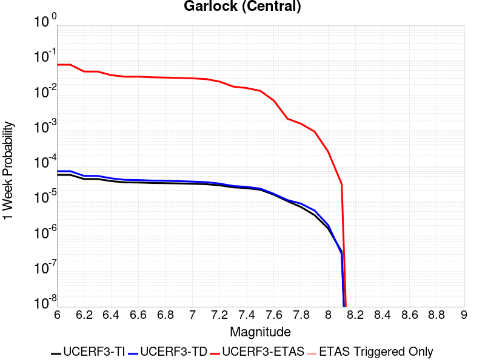 | 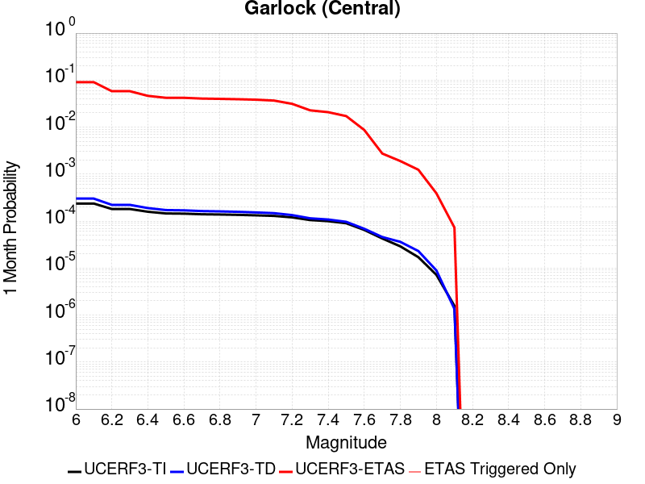 |  | 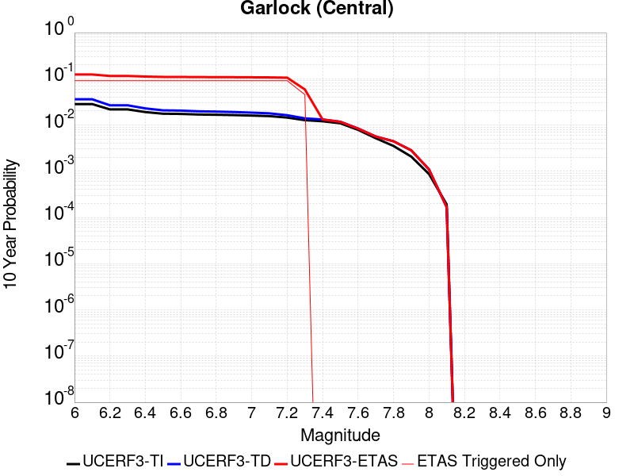 |

| Magnitude | 1 wk TI Prob | 1 wk TD Prob | 1 wk ETAS Prob | 1 wk ETAS/TD Gain | 1 wk ETAS Triggered Only | 1 mo TI Prob | 1 mo TD Prob | 1 mo ETAS Prob | 1 mo ETAS/TD Gain | 1 mo ETAS Triggered Only | 1 yr TI Prob | 1 yr TD Prob | 1 yr ETAS Prob | 1 yr ETAS/TD Gain | 1 yr ETAS Triggered Only | 10 yr TI Prob | 10 yr TD Prob | 10 yr ETAS Prob | 10 yr ETAS/TD Gain | 10 yr ETAS Triggered Only |
|-----|-----|-----|-----|-----|-----|-----|-----|-----|-----|-----|-----|-----|-----|-----|-----|-----|-----|-----|-----|-----|
| 6.0 | 5.5131142E-5 | 7.024681E-5 | 0.07370508 | 1049.2302 | 0.07364 | 2.3625491E-4 | 3.010234E-4 | 0.09315307 | 309.4546 | 0.09288 | 0.0028726095 | 0.0036588663 | 0.13173851 | 36.005283 | 0.12855 | 0.028357591 | 0.036079824 | 0.19237947 | 5.3320513 | 0.16215 |
| 6.1 | 5.5131142E-5 | 7.024681E-5 | 0.07370508 | 1049.2302 | 0.07364 | 2.3625491E-4 | 3.010234E-4 | 0.09315307 | 309.4546 | 0.09288 | 0.0028726095 | 0.0036588663 | 0.13173851 | 36.005283 | 0.12855 | 0.028357591 | 0.036079824 | 0.19237947 | 5.3320513 | 0.16215 |
| 6.2 | 4.216245E-5 | 5.1661493E-5 | 0.047219224 | 914.012 | 0.04717 | 1.806837E-4 | 2.2138779E-4 | 0.06050804 | 273.31244 | 0.0603 | 0.0021976046 | 0.0026920962 | 0.087313674 | 32.43334 | 0.08485 | 0.021759989 | 0.026689773 | 0.13325751 | 4.9928303 | 0.10949 |
| 6.3 | 4.216245E-5 | 5.1661493E-5 | 0.047219224 | 914.012 | 0.04717 | 1.806837E-4 | 2.2138779E-4 | 0.06050804 | 273.31244 | 0.0603 | 0.0021976046 | 0.0026920962 | 0.087313674 | 32.43334 | 0.08485 | 0.021759989 | 0.026689773 | 0.13325751 | 4.9928303 | 0.10949 |
| 6.4 | 3.6858168E-5 | 4.411054E-5 | 0.037302468 | 845.6588 | 0.03726 | 1.5795401E-4 | 1.8903162E-4 | 0.048049983 | 254.19019 | 0.04787 | 0.0019213937 | 0.002299056 | 0.07038217 | 30.613508 | 0.06824 | 0.019048655 | 0.02284894 | 0.10993264 | 4.81128 | 0.08912 |
| 6.5 | 3.39199E-5 | 4.0018083E-5 | 0.033888664 | 846.83374 | 0.03385 | 1.453629E-4 | 1.7149492E-4 | 0.043614045 | 254.31682 | 0.04345 | 0.0017683565 | 0.002085973 | 0.0640265 | 30.693829 | 0.06207 | 0.017543508 | 0.020759864 | 0.10066586 | 4.8490615 | 0.0816 |
| 6.6 | 3.3571985E-5 | 3.9472274E-5 | 0.03382814 | 857.01013 | 0.03379 | 1.4387199E-4 | 1.6915603E-4 | 0.043551818 | 257.46533 | 0.04339 | 0.0017502342 | 0.0020575512 | 0.06391002 | 31.061209 | 0.06198 | 0.017365133 | 0.020481179 | 0.10029237 | 4.8968067 | 0.08148 |
| 6.7 | 3.2580007E-5 | 3.8088703E-5 | 0.032516852 | 853.71387 | 0.03248 | 1.3962112E-4 | 1.632272E-4 | 0.0419864 | 257.22675 | 0.04183 | 0.0016985617 | 0.0019855013 | 0.06179651 | 31.123884 | 0.05993 | 0.016856372 | 0.019773813 | 0.09699603 | 4.905277 | 0.07878 |
| 6.8 | 3.2185937E-5 | 3.7515918E-5 | 0.03188632 | 849.9411 | 0.03185 | 1.3793244E-4 | 1.6077272E-4 | 0.041184176 | 256.16394 | 0.04103 | 0.0016780337 | 0.001955672 | 0.060650658 | 31.012695 | 0.05881 | 0.016654192 | 0.019480614 | 0.0953532 | 4.894774 | 0.07738 |
| 6.9 | 3.165394E-5 | 3.6720503E-5 | 0.031185577 | 849.26874 | 0.03115 | 1.3565269E-4 | 1.5736422E-4 | 0.040351037 | 256.41812 | 0.0402 | 0.0016503202 | 0.001914247 | 0.059374046 | 31.016916 | 0.05757 | 0.01638118 | 0.019073246 | 0.093427494 | 4.898353 | 0.0758 |
| 7.0 | 3.0903822E-5 | 3.5625766E-5 | 0.030364545 | 852.3198 | 0.03033 | 1.3243823E-4 | 1.5267303E-4 | 0.03933669 | 257.65317 | 0.03919 | 0.0016112428 | 0.0018572307 | 0.057873003 | 31.160913 | 0.05612 | 0.015996104 | 0.018512413 | 0.09103453 | 4.9174857 | 0.07389 |
| 7.1 | 3.0069863E-5 | 3.4392073E-5 | 0.0288634 | 839.2458 | 0.02883 | 1.2886449E-4 | 1.4738638E-4 | 0.037551872 | 254.78523 | 0.03741 | 0.0015677959 | 0.0017929734 | 0.055376727 | 30.885416 | 0.05368 | 0.01556781 | 0.017880075 | 0.08721774 | 4.877929 | 0.0706 |
| 7.2 | 2.7957109E-5 | 3.128145E-5 | 0.024510516 | 783.54785 | 0.02448 | 1.1981068E-4 | 1.340566E-4 | 0.03181981 | 237.36101 | 0.03169 | 0.0014577188 | 0.0016309366 | 0.04711663 | 28.889309 | 0.04556 | 0.014481937 | 0.016283695 | 0.07552309 | 4.637958 | 0.06022 |
| 7.3 | 2.4519275E-5 | 2.6714795E-5 | 0.017686242 | 662.03925 | 0.01766 | 1.0507837E-4 | 1.1448703E-4 | 0.023091856 | 201.69844 | 0.02298 | 0.0012785783 | 0.001393003 | 0.034596685 | 24.836044 | 0.03325 | 0.012712469 | 0.013928054 | 0.058054775 | 4.16819 | 0.04475 |
| 7.4 | 2.3225532E-5 | 2.51994E-5 | 0.016074795 | 637.9039 | 0.01605 | 9.95342E-5 | 1.0799304E-4 | 0.021035733 | 194.78786 | 0.02093 | 0.0012111551 | 0.0013140367 | 0.03164413 | 24.08162 | 0.03037 | 0.012045753 | 0.013145725 | 0.053646225 | 4.0808873 | 0.04104 |
| 7.5 | 2.097765E-5 | 2.2483688E-5 | 0.013362184 | 594.30566 | 0.01334 | 8.9901114E-5 | 9.635517E-5 | 0.017364692 | 180.21545 | 0.01727 | 0.0010939965 | 0.0011725046 | 0.026173158 | 22.322433 | 0.02503 | 0.010886264 | 0.011740365 | 0.045430135 | 3.8695676 | 0.03409 |
| 7.6 | 1.511254E-5 | 1.5991332E-5 | 0.0070558786 | 441.23145 | 0.00704 | 6.476642E-5 | 6.853253E-5 | 0.009047917 | 132.0237 | 0.00898 | 7.882459E-4 | 8.3407195E-4 | 0.014073021 | 16.87267 | 0.01325 | 0.007854558 | 0.008383559 | 0.026549973 | 3.1669095 | 0.01832 |
| 7.7 | 9.934069E-6 | 1.0678794E-5 | 0.0021706556 | 203.26788 | 0.00216 | 4.2573887E-5 | 4.5765457E-5 | 0.0027756405 | 60.649246 | 0.00273 | 5.182138E-4 | 5.570524E-4 | 0.004774702 | 8.571369 | 0.00422 | 0.00517007 | 0.005627684 | 0.011355269 | 2.0177517 | 0.00576 |
| 7.8 | 6.7562896E-6 | 8.428449E-6 | 0.0015584154 | 184.89943 | 0.00155 | 2.8955206E-5 | 3.6121426E-5 | 0.0020160498 | 55.813133 | 0.00198 | 3.5247262E-4 | 4.3968976E-4 | 0.0034783531 | 7.910926 | 0.00304 | 0.0035191406 | 0.004446654 | 0.008578201 | 1.9291359 | 0.00415 |
| 7.9 | 3.975453E-6 | 5.37103E-6 | 9.35366E-4 | 174.1502 | 9.3E-4 | 1.7037546E-5 | 2.3018498E-5 | 0.0011929916 | 51.827515 | 0.00117 | 2.0741238E-4 | 2.8021427E-4 | 0.0021496902 | 7.6715946 | 0.00187 | 0.002072189 | 0.0028336283 | 0.0053564594 | 1.8903183 | 0.00253 |
| 8.0 | 1.6729537E-6 | 2.0775144E-6 | 2.52077E-4 | 121.33586 | 2.5E-4 | 7.169782E-6 | 8.903603E-6 | 3.2890076E-4 | 36.940186 | 3.2E-4 | 8.7288594E-5 | 1.0839601E-4 | 6.683353E-4 | 6.165682 | 5.6E-4 | 8.7254314E-4 | 0.0010969337 | 0.0018760782 | 1.710293 | 7.8E-4 |
| 8.1 | 3.6733252E-7 | 3.1489964E-7 | 3.031489E-5 | 96.26842 | 3.0E-5 | 1.5742813E-6 | 1.3495693E-6 | 3.134953E-5 | 23.229284 | 3.0E-5 | 1.9166706E-5 | 1.6430899E-5 | 8.642975E-5 | 5.260196 | 7.0E-5 | 1.9165053E-4 | 1.6638759E-4 | 2.7636928E-4 | 1.660997 | 1.1E-4 |

## Tank Canyon
*[(top)](#table-of-contents)*

| 1 Week | 1 Month | 1 Year | 10 Year |
|-----|-----|-----|-----|
| 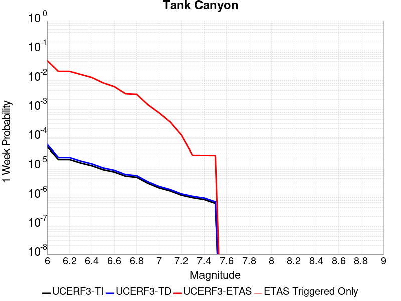 | 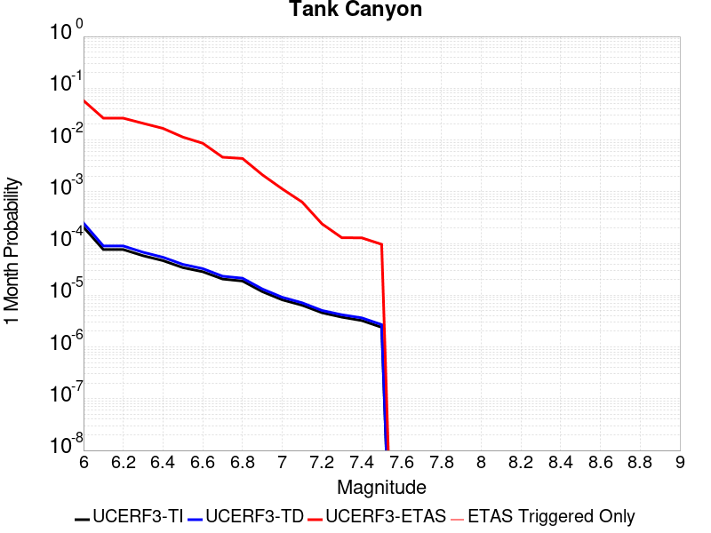 | 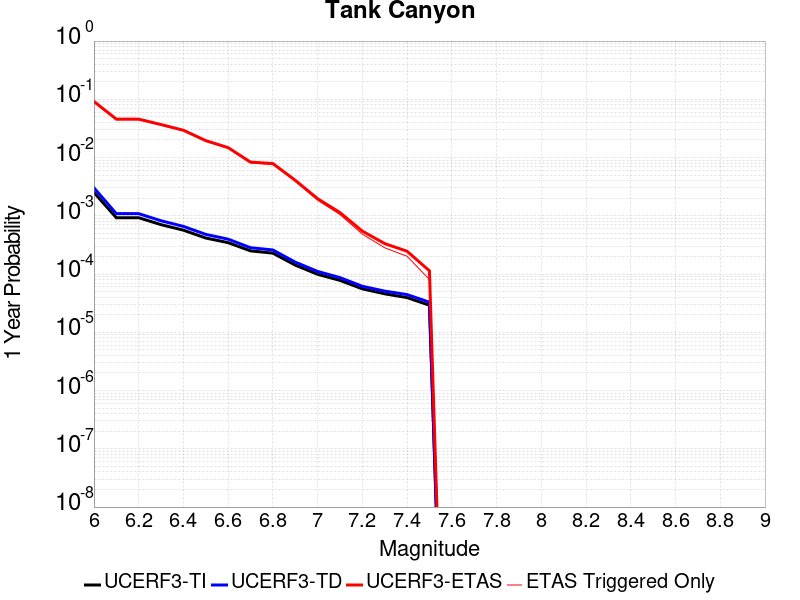 | 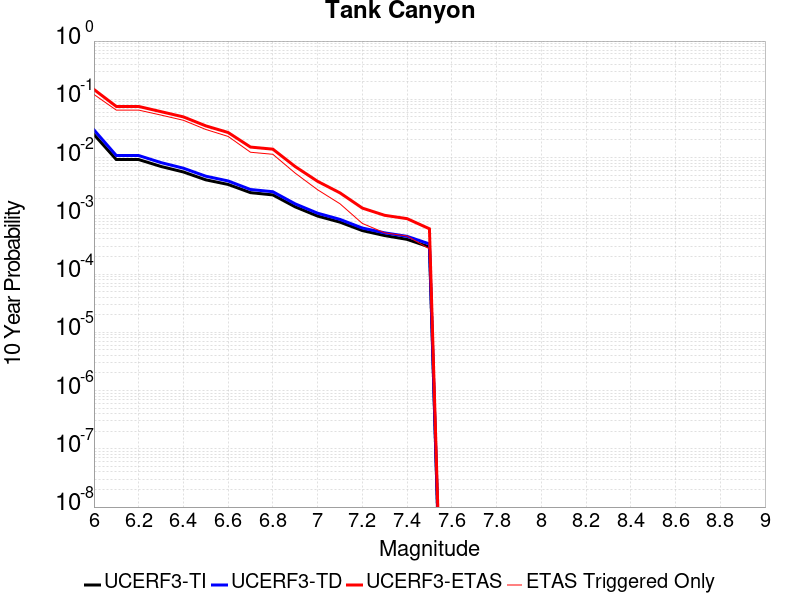 |

| Magnitude | 1 wk TI Prob | 1 wk TD Prob | 1 wk ETAS Prob | 1 wk ETAS/TD Gain | 1 wk ETAS Triggered Only | 1 mo TI Prob | 1 mo TD Prob | 1 mo ETAS Prob | 1 mo ETAS/TD Gain | 1 mo ETAS Triggered Only | 1 yr TI Prob | 1 yr TD Prob | 1 yr ETAS Prob | 1 yr ETAS/TD Gain | 1 yr ETAS Triggered Only | 10 yr TI Prob | 10 yr TD Prob | 10 yr ETAS Prob | 10 yr ETAS/TD Gain | 10 yr ETAS Triggered Only |
|-----|-----|-----|-----|-----|-----|-----|-----|-----|-----|-----|-----|-----|-----|-----|-----|-----|-----|-----|-----|-----|
| 6.0 | 4.8284557E-5 | 5.7964822E-5 | 0.04203553 | 725.19037 | 0.04198 | 2.0691741E-4 | 2.4840087E-4 | 0.056744363 | 228.43867 | 0.05651 | 0.0025163088 | 0.0030207601 | 0.09050569 | 29.96123 | 0.08775 | 0.02488006 | 0.029863637 | 0.14755088 | 4.9408207 | 0.12131 |
| 6.1 | 1.7796336E-5 | 2.0873314E-5 | 0.0178605 | 855.6619 | 0.01784 | 7.626778E-5 | 8.945422E-5 | 0.025817152 | 288.60745 | 0.02573 | 9.281647E-4 | 0.0010885983 | 0.04502072 | 41.3566 | 0.04398 | 0.009242975 | 0.010836744 | 0.07539943 | 6.957757 | 0.06527 |
| 6.2 | 1.7796336E-5 | 2.0873314E-5 | 0.0178605 | 855.6619 | 0.01784 | 7.626778E-5 | 8.945422E-5 | 0.025817152 | 288.60745 | 0.02573 | 9.281647E-4 | 0.0010885983 | 0.04502072 | 41.3566 | 0.04398 | 0.009242975 | 0.010836744 | 0.07539943 | 6.957757 | 0.06527 |
| 6.3 | 1.3515912E-5 | 1.5759564E-5 | 0.013875541 | 880.452 | 0.01386 | 5.792405E-5 | 6.753938E-5 | 0.020516159 | 303.76587 | 0.02045 | 7.049971E-4 | 8.2200574E-4 | 0.036122963 | 43.944904 | 0.03533 | 0.007027647 | 0.0081922645 | 0.06136308 | 7.4903684 | 0.05361 |
| 6.4 | 1.0870146E-5 | 1.2618021E-5 | 0.010872481 | 861.66296 | 0.01086 | 4.658551E-5 | 5.4076212E-5 | 0.016213203 | 299.82135 | 0.01616 | 5.67031E-4 | 6.581969E-4 | 0.029069485 | 44.16533 | 0.02843 | 0.005655863 | 0.0065644905 | 0.049918015 | 7.604248 | 0.04364 |
| 6.5 | 7.964826E-6 | 9.196094E-6 | 0.0073691285 | 801.33246 | 0.00736 | 3.4134522E-5 | 3.9411298E-5 | 0.011128974 | 282.3803 | 0.01109 | 4.1550855E-4 | 4.7973756E-4 | 0.020280235 | 42.2736 | 0.01981 | 0.0041473247 | 0.004788321 | 0.0350129 | 7.312145 | 0.03037 |
| 6.6 | 6.6317E-6 | 7.6122988E-6 | 0.0055975695 | 735.3324 | 0.00559 | 2.8421264E-5 | 3.2623782E-5 | 0.00844235 | 258.779 | 0.00841 | 3.4597394E-4 | 3.9713128E-4 | 0.015471143 | 38.95725 | 0.01508 | 0.0034543579 | 0.003965368 | 0.026923966 | 6.7897773 | 0.02305 |
| 6.7 | 4.793663E-6 | 5.4307857E-6 | 0.0030654143 | 564.45135 | 0.00306 | 2.0544108E-5 | 2.3274613E-5 | 0.0045831683 | 196.91707 | 0.00456 | 2.500958E-4 | 2.8333595E-4 | 0.008530999 | 30.109129 | 0.00825 | 0.0024981452 | 0.0028304397 | 0.015135512 | 5.347407 | 0.01234 |
| 6.8 | 4.382823E-6 | 4.9692567E-6 | 0.002884955 | 580.56067 | 0.00288 | 1.8783392E-5 | 2.1296666E-5 | 0.004271206 | 200.55751 | 0.00425 | 2.286638E-4 | 2.5926033E-4 | 0.007847292 | 30.268003 | 0.00759 | 0.0022842865 | 0.002590253 | 0.013940776 | 5.3820133 | 0.01138 |
| 6.9 | 2.729601E-6 | 3.0735416E-6 | 0.0012530697 | 407.69568 | 0.00125 | 1.1698237E-5 | 1.3172262E-5 | 0.0020231458 | 153.59137 | 0.00201 | 1.4241673E-4 | 1.6036171E-4 | 0.0036897957 | 23.009205 | 0.00353 | 0.001423255 | 0.0016026258 | 0.0069939718 | 4.36407 | 0.0054 |
| 7.0 | 1.8987357E-6 | 2.126939E-6 | 6.9212547E-4 | 325.40918 | 6.9E-4 | 8.137413E-6 | 9.115425E-6 | 0.0010591059 | 116.18831 | 0.00105 | 9.90685E-5 | 1.1097535E-4 | 0.001970769 | 17.75862 | 0.00186 | 9.902435E-4 | 0.0011092679 | 0.003906162 | 3.521387 | 0.0028 |
| 7.1 | 1.4928986E-6 | 1.6641272E-6 | 3.5166353E-4 | 211.32011 | 3.5E-4 | 6.398121E-6 | 7.1319573E-6 | 5.971278E-4 | 83.72565 | 5.9E-4 | 7.789434E-5 | 8.682871E-5 | 0.0010967411 | 12.631087 | 0.00101 | 7.786704E-4 | 8.6800574E-4 | 0.0024766081 | 2.8532164 | 0.00161 |
| 7.2 | 1.069082E-6 | 1.1828573E-6 | 1.8118265E-4 | 153.17372 | 1.8E-4 | 4.581772E-6 | 5.0693816E-6 | 2.6506805E-4 | 52.288048 | 2.6E-4 | 5.5781646E-5 | 6.171851E-5 | 5.316895E-4 | 8.61475 | 4.7E-4 | 5.576765E-4 | 6.170659E-4 | 0.0013566093 | 2.1984837 | 7.4E-4 |
| 7.3 | 8.776551E-7 | 9.770005E-7 | 1.1097689E-4 | 113.58939 | 1.1E-4 | 3.7613736E-6 | 4.1871413E-6 | 1.7418643E-4 | 41.600323 | 1.7E-4 | 4.579376E-5 | 5.097777E-5 | 3.8096096E-4 | 7.4730797 | 3.3E-4 | 4.5784327E-4 | 5.097118E-4 | 0.0010194519 | 2.0000556 | 5.1E-4 |
| 7.4 | 7.55721E-7 | 8.510244E-7 | 9.085095E-5 | 106.75481 | 9.0E-5 | 3.2388E-6 | 3.6472454E-6 | 1.4364673E-4 | 39.384995 | 1.4E-4 | 3.9431678E-5 | 4.4404827E-5 | 3.243924E-4 | 7.305341 | 2.8E-4 | 3.942468E-4 | 4.440104E-4 | 8.938106E-4 | 2.0130398 | 4.5E-4 |
| 7.5 | 5.587665E-7 | 6.305619E-7 | 8.063051E-5 | 127.870895 | 8.0E-5 | 2.3947114E-6 | 2.702408E-6 | 1.02702135E-4 | 38.003933 | 1.0E-4 | 2.915522E-5 | 3.290182E-5 | 2.2289557E-4 | 6.7745667 | 1.9E-4 | 2.9151395E-4 | 3.290182E-4 | 5.9892936E-4 | 1.8203534 | 2.7E-4 |

## Little Lake
*[(top)](#table-of-contents)*

| 1 Week | 1 Month | 1 Year | 10 Year |
|-----|-----|-----|-----|
| 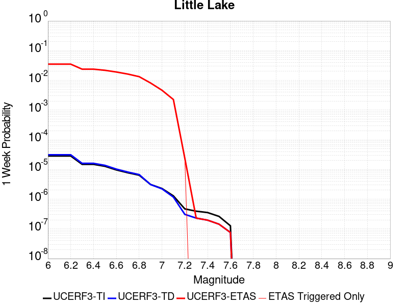 | 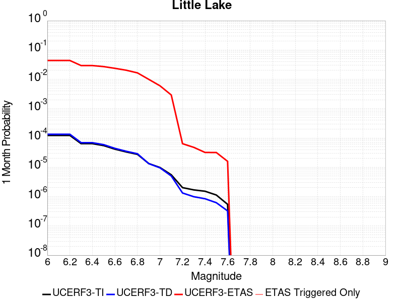 | 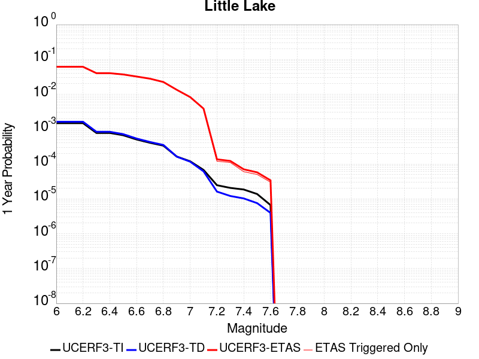 | 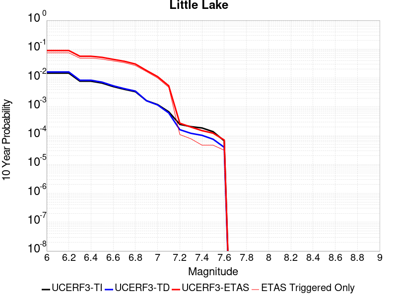 |

| Magnitude | 1 wk TI Prob | 1 wk TD Prob | 1 wk ETAS Prob | 1 wk ETAS/TD Gain | 1 wk ETAS Triggered Only | 1 mo TI Prob | 1 mo TD Prob | 1 mo ETAS Prob | 1 mo ETAS/TD Gain | 1 mo ETAS Triggered Only | 1 yr TI Prob | 1 yr TD Prob | 1 yr ETAS Prob | 1 yr ETAS/TD Gain | 1 yr ETAS Triggered Only | 10 yr TI Prob | 10 yr TD Prob | 10 yr ETAS Prob | 10 yr ETAS/TD Gain | 10 yr ETAS Triggered Only |
|-----|-----|-----|-----|-----|-----|-----|-----|-----|-----|-----|-----|-----|-----|-----|-----|-----|-----|-----|-----|-----|
| 6.0 | 2.8424427E-5 | 3.120572E-5 | 0.03483012 | 1116.1454 | 0.0348 | 1.2181328E-4 | 1.337327E-4 | 0.043777894 | 327.3537 | 0.04365 | 0.0014820677 | 0.0016271127 | 0.061419666 | 37.74764 | 0.05989 | 0.014722223 | 0.016165402 | 0.08998251 | 5.5663643 | 0.07503 |
| 6.1 | 2.8424427E-5 | 3.120572E-5 | 0.03483012 | 1116.1454 | 0.0348 | 1.2181328E-4 | 1.337327E-4 | 0.043777894 | 327.3537 | 0.04365 | 0.0014820677 | 0.0016271127 | 0.061419666 | 37.74764 | 0.05989 | 0.014722223 | 0.016165402 | 0.08998251 | 5.5663643 | 0.07503 |
| 6.2 | 2.8424427E-5 | 3.120572E-5 | 0.03483012 | 1116.1454 | 0.0348 | 1.2181328E-4 | 1.337327E-4 | 0.043777894 | 327.3537 | 0.04365 | 0.0014820677 | 0.0016271127 | 0.061419666 | 37.74764 | 0.05989 | 0.014722223 | 0.016165402 | 0.08998251 | 5.5663643 | 0.07503 |
| 6.3 | 1.48860645E-5 | 1.6081389E-5 | 0.023445705 | 1457.9402 | 0.02343 | 6.379586E-5 | 6.8918576E-5 | 0.029376898 | 426.25513 | 0.02931 | 7.7643775E-4 | 8.3878887E-4 | 0.040285673 | 48.02838 | 0.03948 | 0.007737305 | 0.008359048 | 0.05701887 | 6.8212156 | 0.04907 |
| 6.4 | 1.48860645E-5 | 1.6081389E-5 | 0.023445705 | 1457.9402 | 0.02343 | 6.379586E-5 | 6.8918576E-5 | 0.029376898 | 426.25513 | 0.02931 | 7.7643775E-4 | 8.3878887E-4 | 0.040285673 | 48.02838 | 0.03948 | 0.007737305 | 0.008359048 | 0.05701887 | 6.8212156 | 0.04907 |
| 6.5 | 1.2797581E-5 | 1.3765565E-5 | 0.02155347 | 1565.7526 | 0.02154 | 5.4845623E-5 | 5.899409E-5 | 0.027057402 | 458.64597 | 0.027 | 6.675408E-4 | 7.18042E-4 | 0.037061926 | 51.61526 | 0.03637 | 0.006655392 | 0.00715977 | 0.052075863 | 7.273399 | 0.04524 |
| 6.6 | 9.661896E-6 | 1.0289038E-5 | 0.019060094 | 1852.4661 | 0.01905 | 4.1407468E-5 | 4.409522E-5 | 0.023833046 | 540.4904 | 0.02379 | 5.040193E-4 | 5.367433E-4 | 0.03228969 | 60.15853 | 0.03177 | 0.005028777 | 0.0053560743 | 0.04450526 | 8.309305 | 0.03936 |
| 6.7 | 7.767871E-6 | 8.199687E-6 | 0.016448066 | 2005.9382 | 0.01644 | 3.329045E-5 | 3.5141118E-5 | 0.020684415 | 588.61005 | 0.02065 | 4.0523586E-4 | 4.2777284E-4 | 0.028015966 | 65.49262 | 0.0276 | 0.004044977 | 0.004270846 | 0.038394485 | 8.989902 | 0.03427 |
| 6.8 | 6.4235196E-6 | 6.7357446E-6 | 0.013306647 | 1975.5271 | 0.0133 | 2.752908E-5 | 2.8867229E-5 | 0.016698387 | 578.4548 | 0.01667 | 3.35115E-4 | 3.5141467E-4 | 0.02249363 | 64.0088 | 0.02215 | 0.003346101 | 0.00350985 | 0.030813681 | 8.7792015 | 0.0274 |
| 6.9 | 3.1283696E-6 | 3.1121804E-6 | 0.008333086 | 2677.5718 | 0.00833 | 1.3407229E-5 | 1.3337856E-5 | 0.010083203 | 755.9838 | 0.01007 | 1.6322079E-4 | 1.6237781E-4 | 0.013430223 | 82.70972 | 0.01327 | 0.0016310095 | 0.00162274 | 0.018145883 | 11.18225 | 0.01655 |
| 7.0 | 2.290603E-6 | 2.2286815E-6 | 0.0050522173 | 2266.9087 | 0.00505 | 9.816834E-6 | 9.551463E-6 | 0.006159493 | 644.87427 | 0.00615 | 1.19513395E-4 | 1.162839E-4 | 0.008305332 | 71.42288 | 0.00819 | 0.0011944914 | 0.0011623327 | 0.0113305 | 9.74807 | 0.01018 |
| 7.1 | 1.293693E-6 | 1.1776827E-6 | 0.002311175 | 1962.4767 | 0.00231 | 5.5443866E-6 | 5.0472063E-6 | 0.002855033 | 565.666 | 0.00285 | 6.750081E-5 | 6.14487E-5 | 0.0038712146 | 62.99913 | 0.00381 | 6.7480316E-4 | 6.143856E-4 | 0.005311498 | 8.64522 | 0.0047 |
| 7.2 | 4.715842E-7 | 3.0917857E-7 | 6.030916E-5 | 195.06255 | 6.0E-5 | 2.0210737E-6 | 1.3250503E-6 | 9.132493E-5 | 68.92185 | 9.0E-5 | 2.4606294E-5 | 1.6132375E-5 | 1.3613045E-4 | 8.438338 | 1.2E-4 | 2.460357E-4 | 1.6131258E-4 | 3.0128998E-4 | 1.8677403 | 1.4E-4 |
| 7.3 | 3.9430947E-7 | 2.3097488E-7 | 5.0230963E-5 | 217.47371 | 5.0E-5 | 1.6898966E-6 | 9.89892E-7 | 8.098981E-5 | 81.81682 | 8.0E-5 | 2.0574296E-5 | 1.2051869E-5 | 1.22050544E-4 | 10.127106 | 1.1E-4 | 2.0572392E-4 | 1.20512224E-4 | 2.4049776E-4 | 1.9956297 | 1.2E-4 |
| 7.4 | 3.547123E-7 | 1.9679135E-7 | 2.0196787E-5 | 102.63046 | 2.0E-5 | 1.5201948E-6 | 8.4339126E-7 | 5.0843348E-5 | 60.284416 | 5.0E-5 | 1.8508214E-5 | 1.0268241E-5 | 7.0267626E-5 | 6.8432 | 6.0E-5 | 1.8506673E-4 | 1.02677724E-4 | 1.7267054E-4 | 1.6816747 | 7.0E-5 |
| 7.5 | 2.6354266E-7 | 1.4423138E-7 | 2.0144229E-5 | 139.66606 | 2.0E-5 | 1.129468E-6 | 6.181344E-7 | 4.061811E-5 | 65.71081 | 4.0E-5 | 1.3751187E-5 | 7.5257603E-6 | 5.7525383E-5 | 7.643797 | 5.0E-5 | 1.3750336E-4 | 7.5255106E-5 | 1.352506E-4 | 1.7972281 | 6.0E-5 |
| 7.6 | 1.269913E-7 | 7.572556E-8 | 1.0075725E-5 | 133.0558 | 1.0E-5 | 5.4424834E-7 | 3.245381E-7 | 2.032453E-5 | 62.62603 | 2.0E-5 | 6.6262032E-6 | 3.9512443E-6 | 3.3951124E-5 | 8.592515 | 3.0E-5 | 6.626006E-5 | 3.9511775E-5 | 7.9510195E-5 | 2.0123165 | 4.0E-5 |

## Owl Lake
*[(top)](#table-of-contents)*

| 1 Week | 1 Month | 1 Year | 10 Year |
|-----|-----|-----|-----|
| 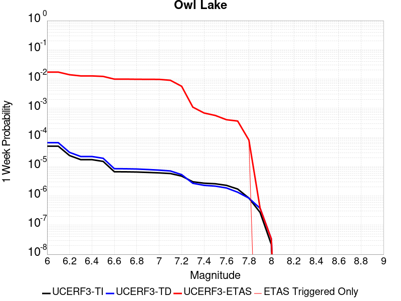 | 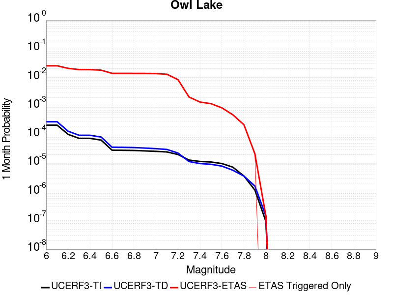 | 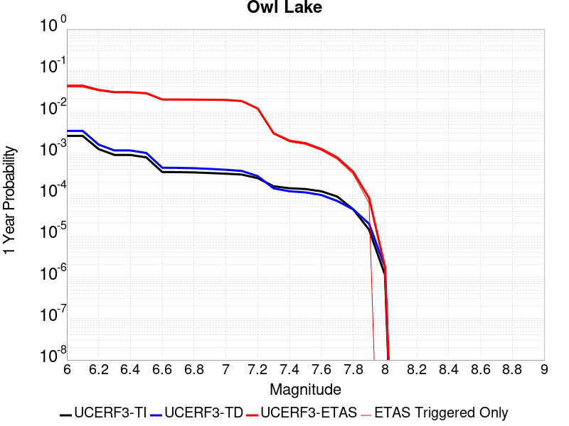 | 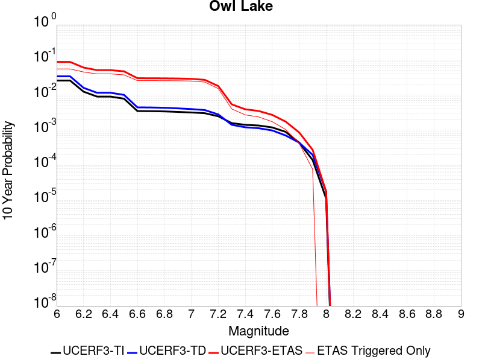 |

| Magnitude | 1 wk TI Prob | 1 wk TD Prob | 1 wk ETAS Prob | 1 wk ETAS/TD Gain | 1 wk ETAS Triggered Only | 1 mo TI Prob | 1 mo TD Prob | 1 mo ETAS Prob | 1 mo ETAS/TD Gain | 1 mo ETAS Triggered Only | 1 yr TI Prob | 1 yr TD Prob | 1 yr ETAS Prob | 1 yr ETAS/TD Gain | 1 yr ETAS Triggered Only | 10 yr TI Prob | 10 yr TD Prob | 10 yr ETAS Prob | 10 yr ETAS/TD Gain | 10 yr ETAS Triggered Only |
|-----|-----|-----|-----|-----|-----|-----|-----|-----|-----|-----|-----|-----|-----|-----|-----|-----|-----|-----|-----|-----|
| 6.0 | 5.0320643E-5 | 6.635816E-5 | 0.018365145 | 276.7579 | 0.0183 | 2.1564208E-4 | 2.843674E-4 | 0.025667148 | 90.26052 | 0.02539 | 0.0026222812 | 0.0034577388 | 0.043608427 | 12.611834 | 0.04029 | 0.02591553 | 0.034140717 | 0.08800669 | 2.5777633 | 0.05577 |
| 6.1 | 5.0320643E-5 | 6.635816E-5 | 0.018365145 | 276.7579 | 0.0183 | 2.1564208E-4 | 2.843674E-4 | 0.025667148 | 90.26052 | 0.02539 | 0.0026222812 | 0.0034577388 | 0.043608427 | 12.611834 | 0.04029 | 0.02591553 | 0.034140717 | 0.08800669 | 2.5777633 | 0.05577 |
| 6.2 | 2.4125871E-5 | 3.0981035E-5 | 0.015090515 | 487.08875 | 0.01506 | 1.0339249E-4 | 1.3277028E-4 | 0.020900013 | 157.41484 | 0.02077 | 0.0012580766 | 0.001615439 | 0.034492243 | 21.351622 | 0.03293 | 0.012509781 | 0.016070465 | 0.060996685 | 3.795577 | 0.04566 |
| 6.3 | 1.7433485E-5 | 2.2355514E-5 | 0.01370205 | 612.9159 | 0.01368 | 7.471279E-5 | 9.580672E-5 | 0.018854009 | 196.79214 | 0.01876 | 9.0924866E-4 | 0.0011659743 | 0.030471765 | 26.134165 | 0.02934 | 0.009055373 | 0.011628896 | 0.051480018 | 4.426905 | 0.04032 |
| 6.4 | 1.7433485E-5 | 2.2355514E-5 | 0.01370205 | 612.9159 | 0.01368 | 7.471279E-5 | 9.580672E-5 | 0.018854009 | 196.79214 | 0.01876 | 9.0924866E-4 | 0.0011659743 | 0.030471765 | 26.134165 | 0.02934 | 0.009055373 | 0.011628896 | 0.051480018 | 4.426905 | 0.04032 |
| 6.5 | 1.5182742E-5 | 1.9429144E-5 | 0.013239172 | 681.4079 | 0.01322 | 6.506727E-5 | 8.326596E-5 | 0.018031772 | 216.55634 | 0.01795 | 7.919061E-4 | 0.0010134429 | 0.02878527 | 28.403444 | 0.0278 | 0.0078909 | 0.010118429 | 0.04761514 | 4.7057843 | 0.03788 |
| 6.6 | 6.7271576E-6 | 8.547361E-6 | 0.010818455 | 1265.707 | 0.01081 | 2.8830356E-5 | 3.6631063E-5 | 0.01398612 | 381.81036 | 0.01395 | 3.5095305E-4 | 4.458976E-4 | 0.020596908 | 46.192013 | 0.02016 | 0.0035039932 | 0.004467813 | 0.030481068 | 6.8223696 | 0.02613 |
| 6.7 | 6.682835E-6 | 8.479807E-6 | 0.010808388 | 1274.603 | 0.0108 | 2.8640408E-5 | 3.6341557E-5 | 0.013975835 | 384.56897 | 0.01394 | 3.4864116E-4 | 4.4237426E-4 | 0.020573465 | 46.50692 | 0.02014 | 0.003480947 | 0.0044327388 | 0.030407088 | 6.8596616 | 0.02609 |
| 6.8 | 6.5774975E-6 | 8.32628E-6 | 0.010748236 | 1290.881 | 0.01074 | 2.8188972E-5 | 3.5683603E-5 | 0.013915189 | 389.9603 | 0.01388 | 3.4314668E-4 | 4.343669E-4 | 0.02049565 | 47.18511 | 0.02007 | 0.0034261728 | 0.004352885 | 0.03023971 | 6.94705 | 0.026 |
| 6.9 | 6.363419E-6 | 7.999454E-6 | 0.010707914 | 1338.5804 | 0.0107 | 2.727151E-5 | 3.428296E-5 | 0.0138638085 | 404.39362 | 0.01383 | 3.3198006E-4 | 4.1732067E-4 | 0.020349 | 48.761063 | 0.01994 | 0.0033148455 | 0.0041828766 | 0.029894875 | 7.1469655 | 0.02582 |
| 7.0 | 6.1342453E-6 | 7.6316555E-6 | 0.010637551 | 1393.872 | 0.01063 | 2.6289357E-5 | 3.2706717E-5 | 0.013732258 | 419.8605 | 0.0137 | 3.2002592E-4 | 3.9813702E-4 | 0.02005031 | 50.360325 | 0.01966 | 0.0031956544 | 0.003991571 | 0.029250344 | 7.3280287 | 0.02536 |
| 7.1 | 5.842926E-6 | 7.142211E-6 | 0.009977071 | 1396.9163 | 0.00997 | 2.504087E-5 | 3.0609146E-5 | 0.012940214 | 422.75644 | 0.01291 | 3.0482994E-4 | 3.7260808E-4 | 0.01887571 | 50.65835 | 0.01851 | 0.0030441214 | 0.0037370329 | 0.027388316 | 7.328893 | 0.02374 |
| 7.2 | 4.77173E-6 | 5.358483E-6 | 0.0065053236 | 1214.0233 | 0.0065 | 2.045011E-5 | 2.2964748E-5 | 0.008412772 | 366.33417 | 0.00839 | 2.4895166E-4 | 2.79564E-4 | 0.012376181 | 44.26958 | 0.0121 | 0.0024867293 | 0.002808645 | 0.018275082 | 6.506726 | 0.01551 |
| 7.3 | 3.0494948E-6 | 2.710463E-6 | 0.001632706 | 602.37164 | 0.00163 | 1.3069198E-5 | 1.1616219E-5 | 0.002081592 | 179.19705 | 0.00207 | 1.5910587E-4 | 1.4141845E-4 | 0.003140994 | 22.21064 | 0.003 | 0.0015899199 | 0.0014232415 | 0.0055074203 | 3.8696318 | 0.00409 |
| 7.4 | 2.7263884E-6 | 2.3056762E-6 | 0.0010623032 | 460.73392 | 0.00106 | 1.1684469E-5 | 9.881433E-6 | 0.0013898677 | 140.65448 | 0.00138 | 1.4224913E-4 | 1.20299905E-4 | 0.0021100605 | 17.54 | 0.00199 | 0.0014215811 | 0.0012112238 | 0.0039878567 | 3.2924192 | 0.00278 |
| 7.5 | 2.6090431E-6 | 2.1656133E-6 | 9.221636E-4 | 425.821 | 9.2E-4 | 1.1181565E-5 | 9.281167E-6 | 0.0012192699 | 131.37033 | 0.00121 | 1.3612706E-4 | 1.1299244E-4 | 0.0018427969 | 16.309029 | 0.00173 | 0.001360437 | 0.0011379806 | 0.0035851926 | 3.1504865 | 0.00245 |
| 7.6 | 2.3008756E-6 | 1.8727933E-6 | 6.5187155E-4 | 348.0745 | 6.5E-4 | 9.860858E-6 | 8.0262325E-6 | 8.6801936E-4 | 108.14779 | 8.6E-4 | 1.20049335E-4 | 9.7715085E-5 | 0.0013475929 | 13.791042 | 0.00125 | 0.001199845 | 9.849932E-4 | 0.0027432595 | 2.7850544 | 0.00176 |
| 7.7 | 1.7184348E-6 | 1.3419171E-6 | 3.813414E-4 | 284.17657 | 3.8E-4 | 7.3646997E-6 | 5.7510606E-6 | 4.9574825E-4 | 86.20118 | 4.9E-4 | 8.966153E-5 | 7.0016955E-5 | 7.4996933E-4 | 10.711253 | 6.8E-4 | 8.962536E-4 | 7.078345E-4 | 0.0016271833 | 2.2988188 | 9.2E-4 |
| 7.8 | 8.4612907E-7 | 8.4058576E-7 | 1.6084046E-4 | 191.34329 | 1.6E-4 | 3.6262625E-6 | 3.6025056E-6 | 2.2360172E-4 | 62.068386 | 2.2E-4 | 4.4148852E-5 | 4.3859643E-5 | 3.4384648E-4 | 7.8397007 | 3.0E-4 | 4.414008E-4 | 4.4398365E-4 | 8.338105E-4 | 1.8780208 | 3.9E-4 |
| 7.9 | 2.716738E-7 | 3.768106E-7 | 2.0376803E-5 | 54.077045 | 2.0E-5 | 1.1643157E-6 | 1.6149015E-6 | 2.161487E-5 | 13.384636 | 2.0E-5 | 1.4175452E-5 | 1.966126E-5 | 6.966027E-5 | 3.5430222 | 5.0E-5 | 1.4174548E-4 | 1.9836679E-4 | 2.683529E-4 | 1.3528117 | 7.0E-5 |
| 8.0 | 2.1995428E-8 | 3.384878E-8 | 3.384878E-8 | 1.0 | 0.0 | 9.426611E-8 | 1.4506621E-7 | 1.4506621E-7 | 1.0 | 0.0 | 1.1476893E-6 | 1.7661803E-6 | 1.7661803E-6 | 1.0 | 0.0 | 1.14768345E-5 | 1.7963059E-5 | 1.7963059E-5 | 1.0 | 0.0 |

## Airport Lake
*[(top)](#table-of-contents)*

| 1 Week | 1 Month | 1 Year | 10 Year |
|-----|-----|-----|-----|
| 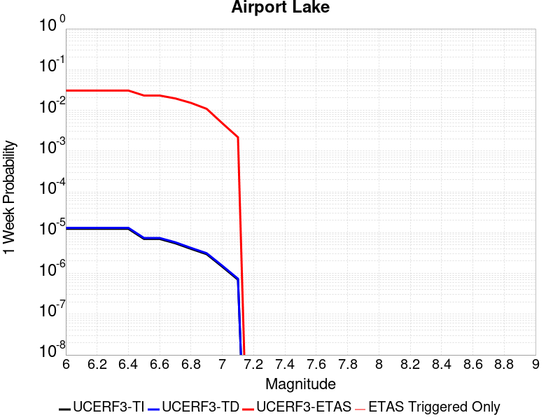 | 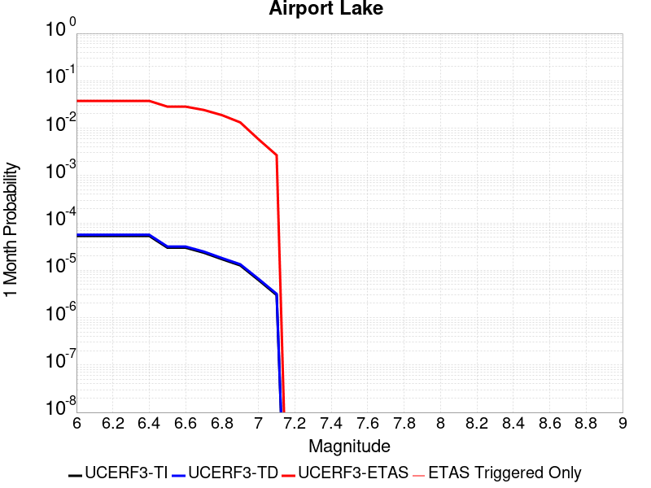 | 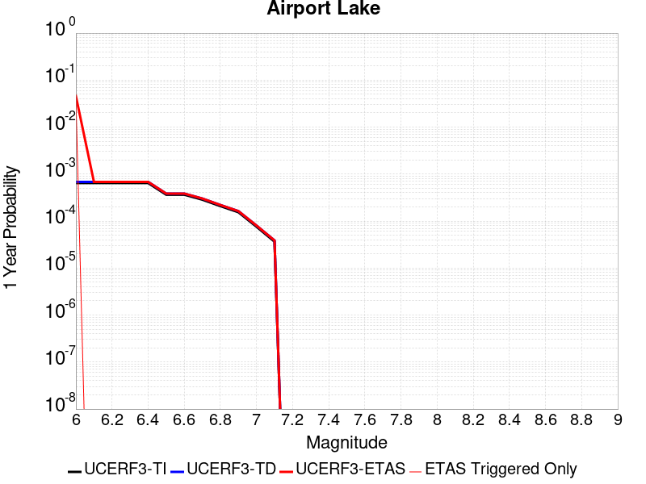 | 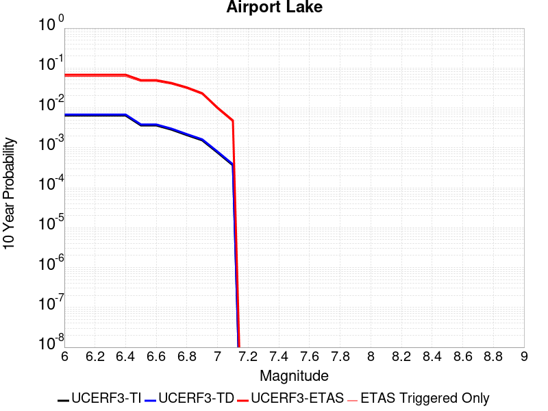 |

| Magnitude | 1 wk TI Prob | 1 wk TD Prob | 1 wk ETAS Prob | 1 wk ETAS/TD Gain | 1 wk ETAS Triggered Only | 1 mo TI Prob | 1 mo TD Prob | 1 mo ETAS Prob | 1 mo ETAS/TD Gain | 1 mo ETAS Triggered Only | 1 yr TI Prob | 1 yr TD Prob | 1 yr ETAS Prob | 1 yr ETAS/TD Gain | 1 yr ETAS Triggered Only | 10 yr TI Prob | 10 yr TD Prob | 10 yr ETAS Prob | 10 yr ETAS/TD Gain | 10 yr ETAS Triggered Only |
|-----|-----|-----|-----|-----|-----|-----|-----|-----|-----|-----|-----|-----|-----|-----|-----|-----|-----|-----|-----|-----|
| 6.0 | 1.2387061E-5 | 1.3103157E-5 | 0.030492704 | 2327.1265 | 0.03048 | 5.3086325E-5 | 5.615534E-5 | 0.03757405 | 669.10913 | 0.03752 | 6.461343E-4 | 6.8350515E-4 | 0.050169658 | 73.40055 | 0.04952 | 0.0064425888 | 0.0068168393 | 0.0672421 | 9.864118 | 0.06084 |
| 6.1 | 1.2387061E-5 | 1.3103157E-5 | 0.030492704 | 2327.1265 | 0.03048 | 5.3086325E-5 | 5.615534E-5 | 0.03757405 | 669.10913 | 0.03752 | 6.461343E-4 | 6.8350515E-4 | 0.050169658 | 73.40055 | 0.04952 | 0.0064425888 | 0.0068168393 | 0.0672421 | 9.864118 | 0.06084 |
| 6.2 | 1.2387061E-5 | 1.3103157E-5 | 0.030492704 | 2327.1265 | 0.03048 | 5.3086325E-5 | 5.615534E-5 | 0.03757405 | 669.10913 | 0.03752 | 6.461343E-4 | 6.8350515E-4 | 0.050169658 | 73.40055 | 0.04952 | 0.0064425888 | 0.0068168393 | 0.0672421 | 9.864118 | 0.06084 |
| 6.3 | 1.2387061E-5 | 1.3103157E-5 | 0.030492704 | 2327.1265 | 0.03048 | 5.3086325E-5 | 5.615534E-5 | 0.03757405 | 669.10913 | 0.03752 | 6.461343E-4 | 6.8350515E-4 | 0.050169658 | 73.40055 | 0.04952 | 0.0064425888 | 0.0068168393 | 0.0672421 | 9.864118 | 0.06084 |
| 6.4 | 1.2387061E-5 | 1.3103157E-5 | 0.030492704 | 2327.1265 | 0.03048 | 5.3086325E-5 | 5.615534E-5 | 0.03757405 | 669.10913 | 0.03752 | 6.461343E-4 | 6.8350515E-4 | 0.050169658 | 73.40055 | 0.04952 | 0.0064425888 | 0.0068168393 | 0.0672421 | 9.864118 | 0.06084 |
| 6.5 | 6.9922594E-6 | 7.384925E-6 | 0.022997215 | 3114.0757 | 0.02299 | 2.996648E-5 | 3.1649324E-5 | 0.02843075 | 898.3051 | 0.0284 | 3.6478083E-4 | 3.8526783E-4 | 0.037680894 | 97.80441 | 0.03731 | 0.003641826 | 0.0038465366 | 0.049420558 | 12.848066 | 0.04575 |
| 6.6 | 6.9922594E-6 | 7.384925E-6 | 0.022997215 | 3114.0757 | 0.02299 | 2.996648E-5 | 3.1649324E-5 | 0.02843075 | 898.3051 | 0.0284 | 3.6478083E-4 | 3.8526783E-4 | 0.037680894 | 97.80441 | 0.03731 | 0.003641826 | 0.0038465366 | 0.049420558 | 12.848066 | 0.04575 |
| 6.7 | 5.477277E-6 | 5.7860684E-6 | 0.019515673 | 3372.8728 | 0.01951 | 2.3473833E-5 | 2.4797222E-5 | 0.024184199 | 975.2785 | 0.02416 | 2.8575645E-4 | 3.0186825E-4 | 0.03209227 | 106.31217 | 0.0318 | 0.0028538927 | 0.003014966 | 0.041887414 | 13.893163 | 0.03899 |
| 6.8 | 3.9950432E-6 | 4.2190873E-6 | 0.0151641555 | 3594.1792 | 0.01516 | 1.7121502E-5 | 1.8081691E-5 | 0.018787742 | 1039.0479 | 0.01877 | 2.0843433E-4 | 2.2012512E-4 | 0.024794715 | 112.63919 | 0.02458 | 0.0020823893 | 0.0021993418 | 0.0324327 | 14.74655 | 0.0303 |
| 6.9 | 2.95695E-6 | 3.1230243E-6 | 0.010853089 | 3475.1855 | 0.01085 | 1.2672582E-5 | 1.3384334E-5 | 0.013223208 | 987.96155 | 0.01321 | 1.5427776E-4 | 1.6294434E-4 | 0.017640095 | 108.25841 | 0.01748 | 0.001541707 | 0.0016284712 | 0.023323085 | 14.322074 | 0.02173 |
| 7.0 | 1.456072E-6 | 1.540812E-6 | 0.0048115333 | 3122.7258 | 0.00481 | 6.2402937E-6 | 6.603469E-6 | 0.005836565 | 883.86346 | 0.00583 | 7.597293E-5 | 8.039528E-5 | 0.007849771 | 97.6397 | 0.00777 | 7.594696E-4 | 8.0376083E-4 | 0.010406037 | 12.946683 | 0.00961 |
| 7.1 | 6.995192E-7 | 7.4089746E-7 | 0.0021807393 | 2943.3755 | 0.00218 | 2.997936E-6 | 3.1752747E-6 | 0.0026831669 | 845.0188 | 0.00268 | 3.649926E-5 | 3.865897E-5 | 0.0035985212 | 93.08373 | 0.00356 | 3.6493264E-4 | 3.865897E-4 | 0.0047848886 | 12.377176 | 0.0044 |

## Panamint Valley
*[(top)](#table-of-contents)*

| 1 Week | 1 Month | 1 Year | 10 Year |
|-----|-----|-----|-----|
| 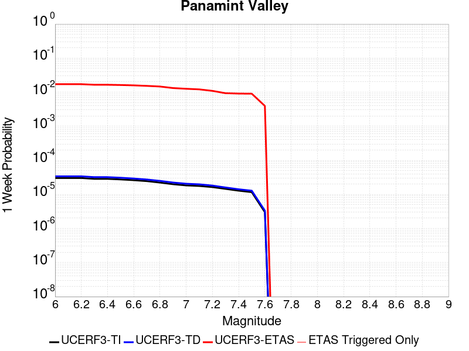 | 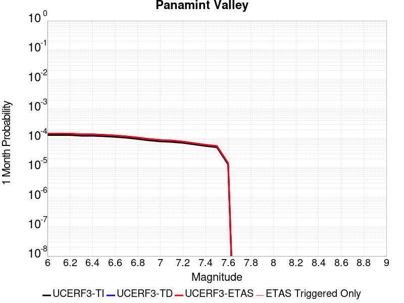 | 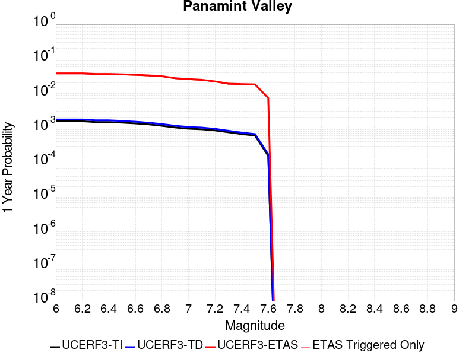 | 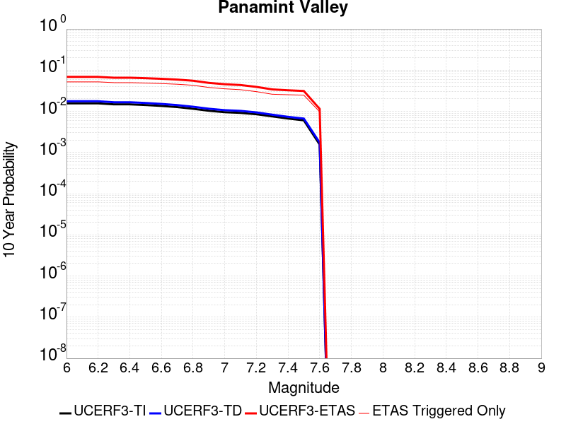 |

| Magnitude | 1 wk TI Prob | 1 wk TD Prob | 1 wk ETAS Prob | 1 wk ETAS/TD Gain | 1 wk ETAS Triggered Only | 1 mo TI Prob | 1 mo TD Prob | 1 mo ETAS Prob | 1 mo ETAS/TD Gain | 1 mo ETAS Triggered Only | 1 yr TI Prob | 1 yr TD Prob | 1 yr ETAS Prob | 1 yr ETAS/TD Gain | 1 yr ETAS Triggered Only | 10 yr TI Prob | 10 yr TD Prob | 10 yr ETAS Prob | 10 yr ETAS/TD Gain | 10 yr ETAS Triggered Only |
|-----|-----|-----|-----|-----|-----|-----|-----|-----|-----|-----|-----|-----|-----|-----|-----|-----|-----|-----|-----|-----|
| 6.0 | 3.0211835E-5 | 3.3984514E-5 | 0.017023407 | 500.91663 | 0.01699 | 1.2947287E-4 | 1.4563995E-4 | 0.023152288 | 158.96936 | 0.02301 | 0.0015751923 | 0.0017717537 | 0.037867688 | 21.372997 | 0.03616 | 0.015640736 | 0.017583137 | 0.06838391 | 3.889176 | 0.05171 |
| 6.1 | 3.0211835E-5 | 3.3984514E-5 | 0.017023407 | 500.91663 | 0.01699 | 1.2947287E-4 | 1.4563995E-4 | 0.023152288 | 158.96936 | 0.02301 | 0.0015751923 | 0.0017717537 | 0.037867688 | 21.372997 | 0.03616 | 0.015640736 | 0.017583137 | 0.06838391 | 3.889176 | 0.05171 |
| 6.2 | 3.0211835E-5 | 3.3984514E-5 | 0.017023407 | 500.91663 | 0.01699 | 1.2947287E-4 | 1.4563995E-4 | 0.023152288 | 158.96936 | 0.02301 | 0.0015751923 | 0.0017717537 | 0.037867688 | 21.372997 | 0.03616 | 0.015640736 | 0.017583137 | 0.06838391 | 3.889176 | 0.05171 |
| 6.3 | 2.8573924E-5 | 3.210268E-5 | 0.016381579 | 510.28693 | 0.01635 | 1.2245393E-4 | 1.3757581E-4 | 0.022254532 | 161.76195 | 0.02212 | 0.001489857 | 0.0016737265 | 0.03631565 | 21.697481 | 0.0347 | 0.01479908 | 0.016617801 | 0.06535422 | 3.932784 | 0.04956 |
| 6.4 | 2.8573924E-5 | 3.210268E-5 | 0.016381579 | 510.28693 | 0.01635 | 1.2245393E-4 | 1.3757581E-4 | 0.022254532 | 161.76195 | 0.02212 | 0.001489857 | 0.0016737265 | 0.03631565 | 21.697481 | 0.0347 | 0.01479908 | 0.016617801 | 0.06535422 | 3.932784 | 0.04956 |
| 6.5 | 2.7468774E-5 | 3.0828433E-5 | 0.016090333 | 521.9316 | 0.01606 | 1.1771801E-4 | 1.3211532E-4 | 0.021859245 | 165.45578 | 0.02173 | 0.0014322745 | 0.0016073446 | 0.035502777 | 22.087843 | 0.03395 | 0.014230782 | 0.015963677 | 0.06362055 | 3.9853323 | 0.04843 |
| 6.6 | 2.6135967E-5 | 2.925248E-5 | 0.015738793 | 538.0328 | 0.01571 | 1.1200648E-4 | 1.253619E-4 | 0.021302707 | 169.92967 | 0.02118 | 0.0013628257 | 0.0015252391 | 0.034424983 | 22.57022 | 0.03295 | 0.013544982 | 0.015154043 | 0.06134332 | 4.0479836 | 0.0469 |
| 6.7 | 2.4498746E-5 | 2.7341335E-5 | 0.015226926 | 556.9196 | 0.0152 | 1.04990395E-4 | 1.1717203E-4 | 0.020564776 | 175.50926 | 0.02045 | 0.0012775084 | 0.0014256609 | 0.033070482 | 23.196596 | 0.03169 | 0.012701893 | 0.014171274 | 0.05851385 | 4.1290464 | 0.04498 |
| 6.8 | 2.2244329E-5 | 2.4935423E-5 | 0.014604572 | 585.69574 | 0.01458 | 9.532935E-5 | 1.0686185E-4 | 0.01958478 | 183.27196 | 0.01948 | 0.0011600169 | 0.0013002884 | 0.03123132 | 24.018764 | 0.02997 | 0.011539802 | 0.0129325185 | 0.054734826 | 4.232341 | 0.04235 |
| 6.9 | 1.9902658E-5 | 2.2290267E-5 | 0.013111998 | 588.2388 | 0.01309 | 8.529431E-5 | 9.552632E-5 | 0.017553858 | 183.75938 | 0.01746 | 0.0010379635 | 0.0011624309 | 0.027511766 | 23.667442 | 0.02638 | 0.010331288 | 0.011568608 | 0.048526056 | 4.1946325 | 0.03739 |
| 7.0 | 1.8353881E-5 | 2.0566185E-5 | 0.012530309 | 609.2675 | 0.01251 | 7.865712E-5 | 8.813792E-5 | 0.016646678 | 188.87079 | 0.01656 | 9.5722964E-4 | 0.0010725686 | 0.02584597 | 24.097263 | 0.0248 | 0.009531168 | 0.010678849 | 0.04512701 | 4.225831 | 0.03482 |
| 7.1 | 1.7667631E-5 | 1.9772613E-5 | 0.012039535 | 608.89954 | 0.01202 | 7.571623E-5 | 8.473711E-5 | 0.01598339 | 188.62325 | 0.0159 | 9.2145515E-4 | 0.0010312037 | 0.024756713 | 24.007587 | 0.02375 | 0.009176437 | 0.010269073 | 0.043365676 | 4.22294 | 0.03344 |
| 7.2 | 1.6381597E-5 | 1.8158249E-5 | 0.01093796 | 602.3686 | 0.01092 | 7.020495E-5 | 7.781885E-5 | 0.014356707 | 184.48883 | 0.01428 | 8.544101E-4 | 9.4704994E-4 | 0.022236869 | 23.480143 | 0.02131 | 0.008511325 | 0.009434792 | 0.039171558 | 4.15182 | 0.03002 |
| 7.3 | 1.4520491E-5 | 1.5966476E-5 | 0.009315818 | 583.4611 | 0.0093 | 6.222919E-5 | 6.842605E-5 | 0.012307589 | 179.867 | 0.01224 | 7.57377E-4 | 8.327849E-4 | 0.01914752 | 22.992155 | 0.01833 | 0.0075480095 | 0.00829975 | 0.033964954 | 4.092286 | 0.02588 |
| 7.4 | 1.2852287E-5 | 1.4145411E-5 | 0.009054017 | 640.0675 | 0.00904 | 5.5080065E-5 | 6.062187E-5 | 0.011939902 | 196.957 | 0.01188 | 6.7039346E-4 | 7.378371E-4 | 0.018484734 | 25.052593 | 0.01776 | 0.0066837464 | 0.0073567946 | 0.032192726 | 4.375918 | 0.02502 |
| 7.5 | 1.1637851E-5 | 1.2836797E-5 | 0.008982722 | 699.7634 | 0.00897 | 4.987555E-5 | 5.5013777E-5 | 0.011814367 | 214.75288 | 0.01176 | 6.070656E-4 | 6.6960254E-4 | 0.018127905 | 27.072634 | 0.01747 | 0.006054099 | 0.0066787465 | 0.030945584 | 4.633442 | 0.02443 |
| 7.6 | 3.0068115E-6 | 3.3330316E-6 | 0.0038633202 | 1159.101 | 0.00386 | 1.2886271E-5 | 1.4284384E-5 | 0.0049042148 | 343.327 | 0.00489 | 1.5687906E-4 | 1.7390578E-4 | 0.007232678 | 41.589638 | 0.00706 | 0.0015676835 | 0.0017391363 | 0.011502127 | 6.6137013 | 0.00978 |

## Garlock (East)
*[(top)](#table-of-contents)*

| 1 Week | 1 Month | 1 Year | 10 Year |
|-----|-----|-----|-----|
| 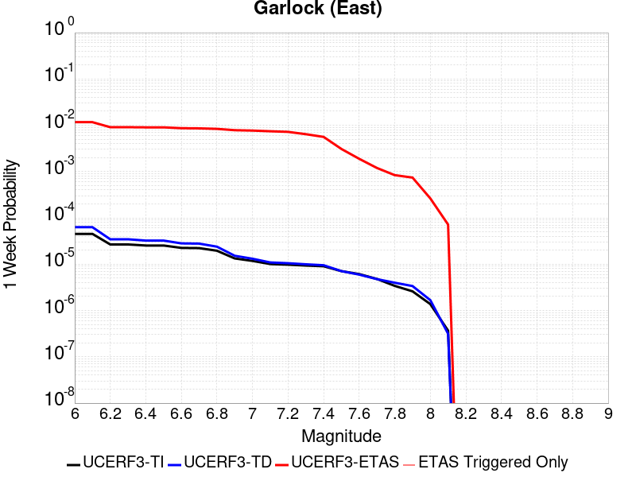 |  | 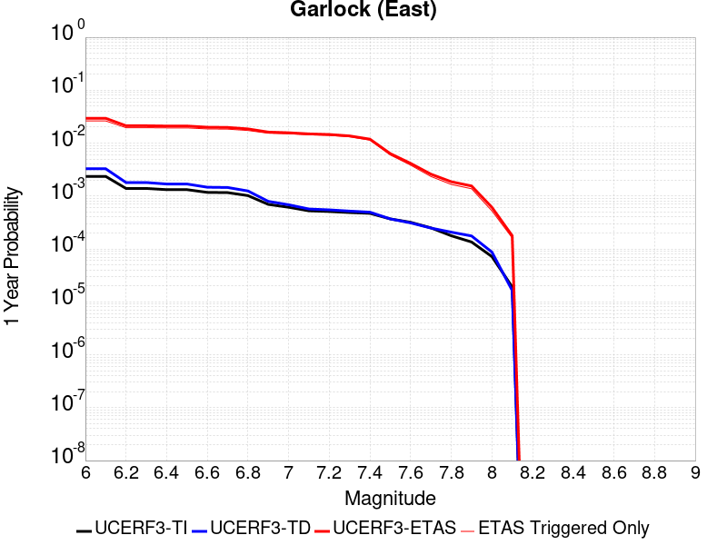 | 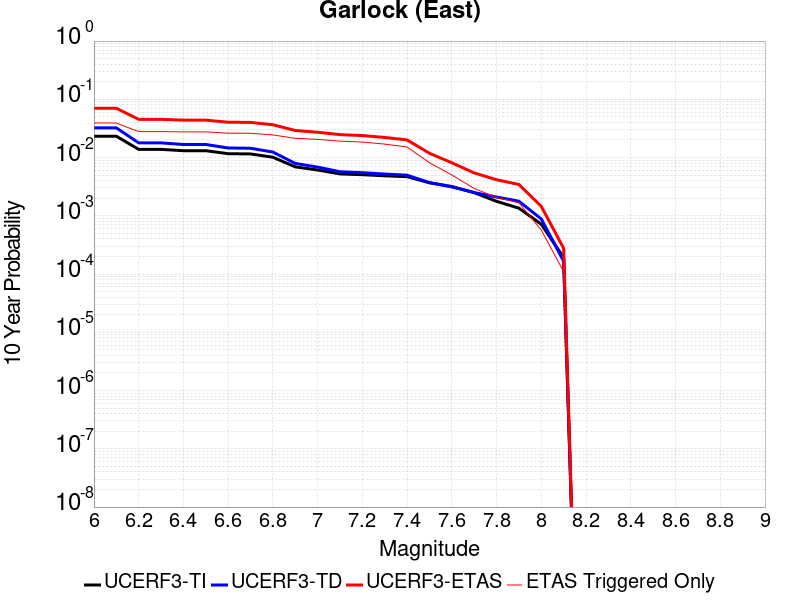 |

| Magnitude | 1 wk TI Prob | 1 wk TD Prob | 1 wk ETAS Prob | 1 wk ETAS/TD Gain | 1 wk ETAS Triggered Only | 1 mo TI Prob | 1 mo TD Prob | 1 mo ETAS Prob | 1 mo ETAS/TD Gain | 1 mo ETAS Triggered Only | 1 yr TI Prob | 1 yr TD Prob | 1 yr ETAS Prob | 1 yr ETAS/TD Gain | 1 yr ETAS Triggered Only | 10 yr TI Prob | 10 yr TD Prob | 10 yr ETAS Prob | 10 yr ETAS/TD Gain | 10 yr ETAS Triggered Only |
|-----|-----|-----|-----|-----|-----|-----|-----|-----|-----|-----|-----|-----|-----|-----|-----|-----|-----|-----|-----|-----|
| 6.0 | 4.5092507E-5 | 6.290325E-5 | 0.012012152 | 190.96234 | 0.01195 | 1.9323928E-4 | 2.6956003E-4 | 0.01695506 | 62.89902 | 0.01669 | 0.0023501497 | 0.0032774 | 0.030348387 | 9.259897 | 0.02716 | 0.023254504 | 0.032351844 | 0.07021592 | 2.1703837 | 0.03913 |
| 6.1 | 4.5092507E-5 | 6.290325E-5 | 0.012012152 | 190.96234 | 0.01195 | 1.9323928E-4 | 2.6956003E-4 | 0.01695506 | 62.89902 | 0.01669 | 0.0023501497 | 0.0032774 | 0.030348387 | 9.259897 | 0.02716 | 0.023254504 | 0.032351844 | 0.07021592 | 2.1703837 | 0.03913 |
| 6.2 | 2.6674514E-5 | 3.4509674E-5 | 0.009194193 | 266.42365 | 0.00916 | 1.1431433E-4 | 1.4789042E-4 | 0.01272603 | 86.05041 | 0.01258 | 0.0013908884 | 0.0017991117 | 0.021633364 | 12.024469 | 0.01987 | 0.01382215 | 0.017890299 | 0.04530098 | 2.5321534 | 0.02791 |
| 6.3 | 2.6674514E-5 | 3.4509674E-5 | 0.009194193 | 266.42365 | 0.00916 | 1.1431433E-4 | 1.4789042E-4 | 0.01272603 | 86.05041 | 0.01258 | 0.0013908884 | 0.0017991117 | 0.021633364 | 12.024469 | 0.01987 | 0.01382215 | 0.017890299 | 0.04530098 | 2.5321534 | 0.02791 |
| 6.4 | 2.5312667E-5 | 3.233893E-5 | 0.009102046 | 281.45786 | 0.00907 | 1.0847834E-4 | 1.3858822E-4 | 0.012616859 | 91.03847 | 0.01248 | 0.0013199237 | 0.0016860351 | 0.02135282 | 12.664517 | 0.0197 | 0.013121112 | 0.016778335 | 0.043925084 | 2.6179645 | 0.02761 |
| 6.5 | 2.5312667E-5 | 3.233893E-5 | 0.009102046 | 281.45786 | 0.00907 | 1.0847834E-4 | 1.3858822E-4 | 0.012616859 | 91.03847 | 0.01248 | 0.0013199237 | 0.0016860351 | 0.02135282 | 12.664517 | 0.0197 | 0.013121112 | 0.016778335 | 0.043925084 | 2.6179645 | 0.02761 |
| 6.6 | 2.246556E-5 | 2.8133776E-5 | 0.008737889 | 310.58356 | 0.00871 | 9.627742E-5 | 1.20567885E-4 | 0.012099124 | 100.35113 | 0.01198 | 0.0011715472 | 0.0014669491 | 0.020229384 | 13.790107 | 0.01879 | 0.011653901 | 0.01461866 | 0.04045536 | 2.767378 | 0.02622 |
| 6.7 | 2.2241198E-5 | 2.7803519E-5 | 0.008667563 | 311.74338 | 0.00864 | 9.531594E-5 | 1.1915263E-4 | 0.012007736 | 100.776085 | 0.01189 | 0.0011598538 | 0.0014497414 | 0.020112645 | 13.873264 | 0.01869 | 0.011538187 | 0.014448853 | 0.04015203 | 2.7789075 | 0.02608 |
| 6.8 | 1.9528685E-5 | 2.389819E-5 | 0.008413698 | 352.0642 | 0.00839 | 8.369167E-5 | 1.0241691E-4 | 0.011511249 | 112.39597 | 0.01141 | 0.0010184698 | 0.0012462323 | 0.018784348 | 15.072911 | 0.01756 | 0.010138147 | 0.012436427 | 0.03660211 | 2.943137 | 0.02447 |
| 6.9 | 1.3318621E-5 | 1.5198884E-5 | 0.0078450795 | 516.16156 | 0.00783 | 5.7078556E-5 | 6.513648E-5 | 0.010504456 | 161.2684 | 0.01044 | 6.9470983E-4 | 7.927538E-4 | 0.016470315 | 20.776077 | 0.01569 | 0.0069254204 | 0.007939888 | 0.029169975 | 3.6738522 | 0.0214 |
| 7.0 | 1.1760853E-5 | 1.31077895E-5 | 0.0076430077 | 583.089 | 0.00763 | 5.0402683E-5 | 5.6175057E-5 | 0.010205605 | 181.67502 | 0.01015 | 6.134799E-4 | 6.8372174E-4 | 0.015853344 | 23.186834 | 0.01518 | 0.0061178906 | 0.00685652 | 0.027215961 | 3.9693549 | 0.0205 |
| 7.1 | 1.0064758E-5 | 1.0902931E-5 | 0.0073108235 | 670.5375 | 0.0073 | 4.3133965E-5 | 4.672603E-5 | 0.009756273 | 208.79738 | 0.00971 | 5.2502943E-4 | 5.687444E-4 | 0.014930571 | 26.251812 | 0.01437 | 0.005237907 | 0.0057129986 | 0.024753595 | 4.332855 | 0.01915 |
| 7.2 | 9.768808E-6 | 1.0498807E-5 | 0.007120424 | 678.2127 | 0.00711 | 4.186565E-5 | 4.499413E-5 | 0.009494569 | 211.01794 | 0.00945 | 5.095951E-4 | 5.4766936E-4 | 0.014440057 | 26.366379 | 0.0139 | 0.0050842804 | 0.0055032647 | 0.02387162 | 4.33772 | 0.01847 |
| 7.3 | 9.344516E-6 | 9.944468E-6 | 0.00648988 | 652.6121 | 0.00648 | 4.004731E-5 | 4.261847E-5 | 0.008712249 | 204.42426 | 0.00867 | 4.8746695E-4 | 5.1875977E-4 | 0.013342104 | 25.719233 | 0.01283 | 0.0048639905 | 0.0052149445 | 0.022146186 | 4.2466774 | 0.01702 |
| 7.4 | 9.023491E-6 | 9.490661E-6 | 0.005679437 | 598.42377 | 0.00567 | 3.867153E-5 | 4.0673647E-5 | 0.007660364 | 188.33728 | 0.00762 | 4.7072413E-4 | 4.950925E-4 | 0.011839474 | 23.91366 | 0.01135 | 0.004697283 | 0.0049783974 | 0.020082826 | 4.033994 | 0.01518 |
| 7.5 | 7.081253E-6 | 7.087672E-6 | 0.0030970657 | 436.96518 | 0.00309 | 3.0347876E-5 | 3.0375388E-5 | 0.004100252 | 134.986 | 0.00407 | 3.6942272E-4 | 3.6975832E-4 | 0.006477499 | 17.518196 | 0.00611 | 0.003688092 | 0.0037243143 | 0.011853924 | 3.1828475 | 0.00816 |
| 7.6 | 6.116396E-6 | 5.959245E-6 | 0.0017959486 | 301.37186 | 0.00179 | 2.6212863E-5 | 2.5539372E-5 | 0.0023254806 | 91.05473 | 0.0023 | 3.1909486E-4 | 3.1089774E-4 | 0.003989754 | 12.83301 | 0.00368 | 0.0031863707 | 0.0031357552 | 0.008140014 | 2.5958703 | 0.00502 |
| 7.7 | 4.797145E-6 | 4.757281E-6 | 0.0010847521 | 228.01935 | 0.00108 | 2.055903E-5 | 2.0388188E-5 | 0.0013903603 | 68.1944 | 0.00137 | 2.5027743E-4 | 2.4819805E-4 | 0.0024776445 | 9.982531 | 0.00223 | 0.0024999576 | 0.0025093474 | 0.0054519447 | 2.1726544 | 0.00295 |
| 7.8 | 3.4028885E-6 | 3.978462E-6 | 7.739754E-4 | 194.54137 | 7.7E-4 | 1.4583726E-5 | 1.7050439E-5 | 0.0010070335 | 59.06203 | 9.9E-4 | 1.775424E-4 | 2.0756939E-4 | 0.0017872414 | 8.6103325 | 0.00158 | 0.0017740062 | 0.0021012232 | 0.0041668736 | 1.9830705 | 0.00207 |
| 7.9 | 2.5928412E-6 | 3.3724489E-6 | 6.4337027E-4 | 190.77243 | 6.4E-4 | 1.1112129E-5 | 1.4453272E-5 | 8.2444155E-4 | 57.041862 | 8.1E-4 | 1.3528178E-4 | 1.7595445E-4 | 0.0014257345 | 8.102861 | 0.00125 | 0.0013519945 | 0.0017812408 | 0.003448266 | 1.9358786 | 0.00167 |
| 8.0 | 1.3743648E-6 | 1.6734747E-6 | 2.2167311E-4 | 132.46278 | 2.2E-4 | 5.8901214E-6 | 7.1720146E-6 | 2.6717014E-4 | 37.25176 | 2.6E-4 | 7.1709874E-5 | 8.731581E-5 | 5.072791E-4 | 5.8097053 | 4.2E-4 | 7.1686733E-4 | 8.837234E-4 | 0.0014532197 | 1.6444283 | 5.7E-4 |
| 8.1 | 3.6733252E-7 | 3.1489964E-7 | 3.031489E-5 | 96.26842 | 3.0E-5 | 1.5742813E-6 | 1.3495693E-6 | 3.134953E-5 | 23.229284 | 3.0E-5 | 1.9166706E-5 | 1.6430899E-5 | 8.642975E-5 | 5.260196 | 7.0E-5 | 1.9165053E-4 | 1.6638759E-4 | 2.7636928E-4 | 1.660997 | 1.1E-4 |

## Hunter Mountain-Saline Valley
*[(top)](#table-of-contents)*

| 1 Week | 1 Month | 1 Year | 10 Year |
|-----|-----|-----|-----|
|  | 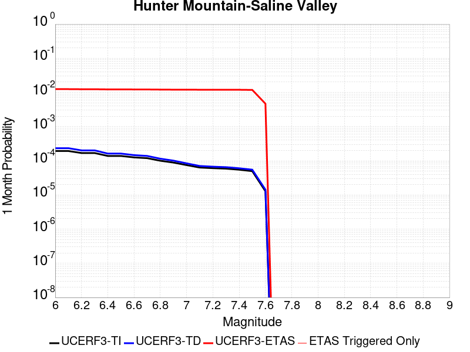 | 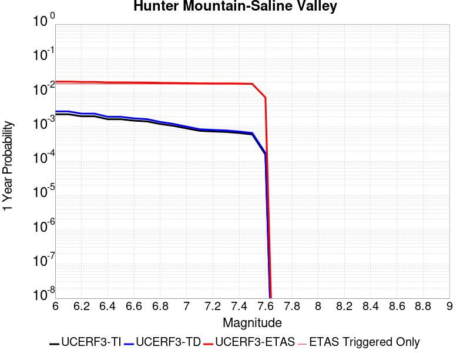 | 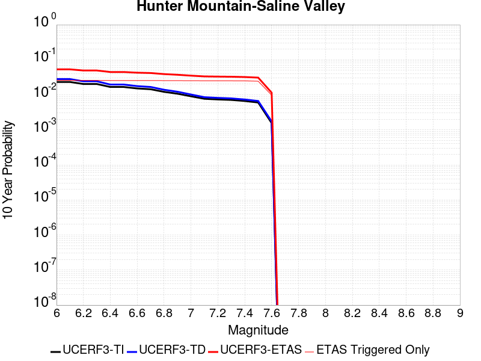 |

| Magnitude | 1 wk TI Prob | 1 wk TD Prob | 1 wk ETAS Prob | 1 wk ETAS/TD Gain | 1 wk ETAS Triggered Only | 1 mo TI Prob | 1 mo TD Prob | 1 mo ETAS Prob | 1 mo ETAS/TD Gain | 1 mo ETAS Triggered Only | 1 yr TI Prob | 1 yr TD Prob | 1 yr ETAS Prob | 1 yr ETAS/TD Gain | 1 yr ETAS Triggered Only | 10 yr TI Prob | 10 yr TD Prob | 10 yr ETAS Prob | 10 yr ETAS/TD Gain | 10 yr ETAS Triggered Only |
|-----|-----|-----|-----|-----|-----|-----|-----|-----|-----|-----|-----|-----|-----|-----|-----|-----|-----|-----|-----|-----|
| 6.0 | 4.5103672E-5 | 5.4570177E-5 | 0.0093240645 | 170.86374 | 0.00927 | 1.9328714E-4 | 2.3385242E-4 | 0.012401006 | 53.029198 | 0.01217 | 0.002350731 | 0.0028435152 | 0.021081507 | 7.4138894 | 0.01829 | 0.023260195 | 0.028091887 | 0.053215712 | 1.8943444 | 0.02585 |
| 6.1 | 4.5103672E-5 | 5.4570177E-5 | 0.0093240645 | 170.86374 | 0.00927 | 1.9328714E-4 | 2.3385242E-4 | 0.012401006 | 53.029198 | 0.01217 | 0.002350731 | 0.0028435152 | 0.021081507 | 7.4138894 | 0.01829 | 0.023260195 | 0.028091887 | 0.053215712 | 1.8943444 | 0.02585 |
| 6.2 | 3.9363465E-5 | 4.706337E-5 | 0.009286628 | 197.3218 | 0.00924 | 1.6868966E-4 | 2.0168544E-4 | 0.012339237 | 61.180603 | 0.01214 | 0.002051862 | 0.0024528175 | 0.020638103 | 8.41404 | 0.01823 | 0.020330196 | 0.024273481 | 0.049378924 | 2.0342746 | 0.02573 |
| 6.3 | 3.9363465E-5 | 4.706337E-5 | 0.009286628 | 197.3218 | 0.00924 | 1.6868966E-4 | 2.0168544E-4 | 0.012339237 | 61.180603 | 0.01214 | 0.002051862 | 0.0024528175 | 0.020638103 | 8.41404 | 0.01823 | 0.020330196 | 0.024273481 | 0.049378924 | 2.0342746 | 0.02573 |
| 6.4 | 3.2311684E-5 | 3.795099E-5 | 0.009227602 | 243.14523 | 0.00919 | 1.384713E-4 | 1.6263737E-4 | 0.012230675 | 75.20212 | 0.01207 | 0.0016845843 | 0.0019783843 | 0.020042576 | 10.130779 | 0.0181 | 0.016718714 | 0.019616475 | 0.04467508 | 2.2774265 | 0.02556 |
| 6.5 | 3.2311684E-5 | 3.795099E-5 | 0.009227602 | 243.14523 | 0.00919 | 1.384713E-4 | 1.6263737E-4 | 0.012230675 | 75.20212 | 0.01207 | 0.0016845843 | 0.0019783843 | 0.020042576 | 10.130779 | 0.0181 | 0.016718714 | 0.019616475 | 0.04467508 | 2.2774265 | 0.02556 |
| 6.6 | 2.9305844E-5 | 3.418183E-5 | 0.009213868 | 269.55453 | 0.00918 | 1.2559042E-4 | 1.4648569E-4 | 0.012204719 | 83.3168 | 0.01206 | 0.0015279909 | 0.001782067 | 0.019829847 | 11.127441 | 0.01808 | 0.015175272 | 0.01768569 | 0.042764176 | 2.4180098 | 0.02553 |
| 6.7 | 2.7826512E-5 | 3.2344276E-5 | 0.009202047 | 284.50314 | 0.00917 | 1.19251024E-4 | 1.386113E-4 | 0.012186941 | 87.9217 | 0.01205 | 0.0014509142 | 0.0016863465 | 0.019725874 | 11.697403 | 0.01807 | 0.014414776 | 0.016743187 | 0.04182607 | 2.4980948 | 0.02551 |
| 6.8 | 2.3389874E-5 | 2.6866714E-5 | 0.009146621 | 340.44437 | 0.00912 | 1.0023846E-4 | 1.15138246E-4 | 0.0121137565 | 105.21053 | 0.012 | 0.00121972 | 0.001400954 | 0.019375736 | 13.830388 | 0.018 | 0.01213047 | 0.013927434 | 0.03900326 | 2.8004627 | 0.02543 |
| 6.9 | 2.069209E-5 | 2.3570032E-5 | 0.009123355 | 387.0744 | 0.0091 | 8.867737E-5 | 1.01010715E-4 | 0.012059802 | 119.39132 | 0.01196 | 0.0010791123 | 0.0012291478 | 0.019147096 | 15.5775385 | 0.01794 | 0.010738871 | 0.012228523 | 0.037278406 | 3.0484798 | 0.02536 |
| 7.0 | 1.7462342E-5 | 1.9633546E-5 | 0.009089455 | 462.95538 | 0.00907 | 7.483646E-5 | 8.414118E-5 | 0.012013137 | 142.77357 | 0.01193 | 9.1075303E-4 | 0.0010239601 | 0.018885652 | 18.443739 | 0.01788 | 0.009070295 | 0.0101960525 | 0.0351886 | 3.4511986 | 0.02525 |
| 7.1 | 1.4807709E-5 | 1.6441749E-5 | 0.009076293 | 552.0272 | 0.00906 | 6.3460066E-5 | 7.046283E-5 | 0.011979624 | 170.01338 | 0.01191 | 7.723524E-4 | 8.575638E-4 | 0.018672273 | 21.773626 | 0.01783 | 0.007696735 | 0.008545532 | 0.033490527 | 3.9190688 | 0.02516 |
| 7.2 | 1.4180048E-5 | 1.5698337E-5 | 0.009075556 | 578.12213 | 0.00906 | 6.077022E-5 | 6.727694E-5 | 0.011966476 | 177.86891 | 0.0119 | 7.396263E-4 | 8.188051E-4 | 0.018624214 | 22.7456 | 0.01782 | 0.0073716943 | 0.008160833 | 0.03309567 | 4.0554276 | 0.02514 |
| 7.3 | 1.3730402E-5 | 1.5172075E-5 | 0.009075034 | 598.1406 | 0.00906 | 5.8843252E-5 | 6.502165E-5 | 0.011954249 | 183.85028 | 0.01189 | 7.161811E-4 | 7.9136714E-4 | 0.018587273 | 23.487547 | 0.01781 | 0.007138774 | 0.007888422 | 0.03277058 | 4.154263 | 0.02508 |
| 7.4 | 1.2810095E-5 | 1.4109277E-5 | 0.009043982 | 640.9954 | 0.00903 | 5.489925E-5 | 6.0467017E-5 | 0.01191975 | 197.12813 | 0.01186 | 6.681934E-4 | 7.359531E-4 | 0.018452905 | 25.073479 | 0.01773 | 0.006661878 | 0.007338053 | 0.03213475 | 4.379193 | 0.02498 |
| 7.5 | 1.1595659E-5 | 1.2800664E-5 | 0.008972686 | 700.9547 | 0.00896 | 4.9694736E-5 | 5.4858923E-5 | 0.011794215 | 214.99173 | 0.01174 | 6.0486543E-4 | 6.6771836E-4 | 0.018096073 | 27.101357 | 0.01744 | 0.006032217 | 0.0066599925 | 0.030887555 | 4.6377764 | 0.02439 |
| 7.6 | 2.997694E-6 | 3.3251579E-6 | 0.0038633123 | 1161.8433 | 0.00386 | 1.28471975E-5 | 1.425064E-5 | 0.0049041808 | 344.1376 | 0.00489 | 1.564034E-4 | 1.73495E-4 | 0.00723227 | 41.685753 | 0.00706 | 0.0015629337 | 0.001735031 | 0.011498063 | 6.627007 | 0.00978 |

## Ash Hill
*[(top)](#table-of-contents)*

| 1 Week | 1 Month | 1 Year | 10 Year |
|-----|-----|-----|-----|
| 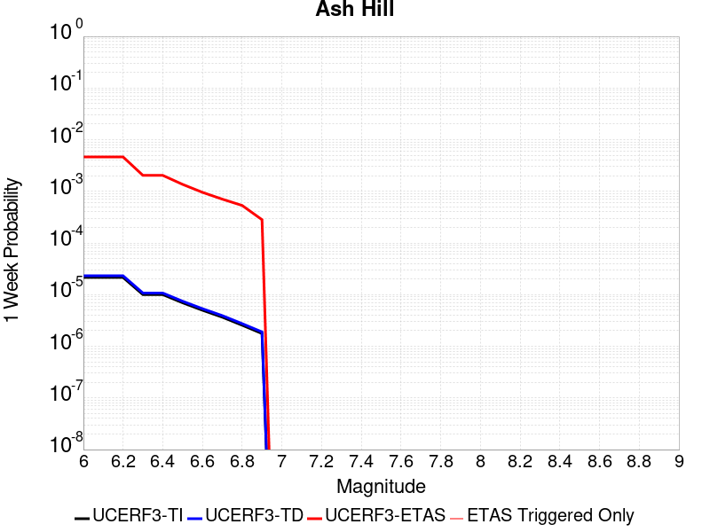 | 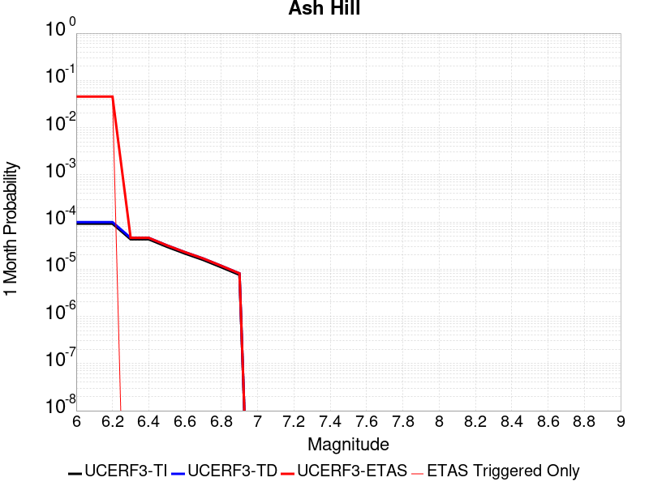 | 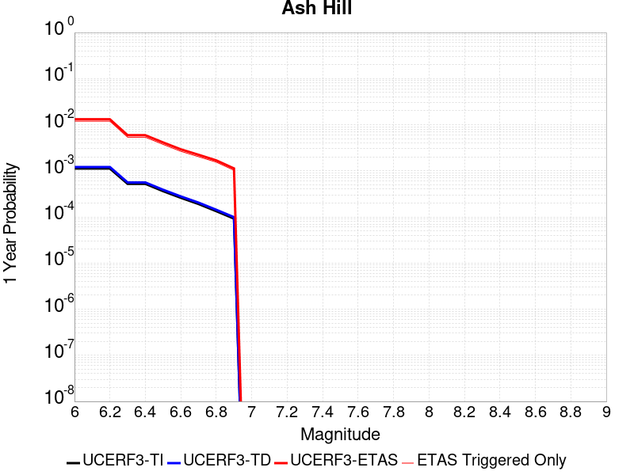 | 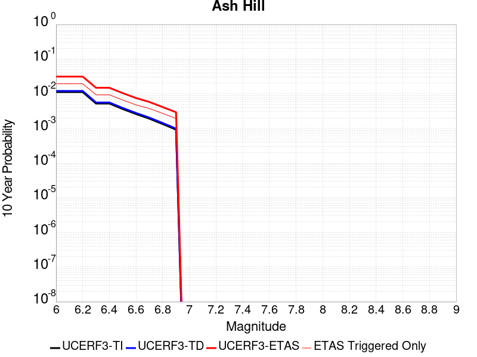 |

| Magnitude | 1 wk TI Prob | 1 wk TD Prob | 1 wk ETAS Prob | 1 wk ETAS/TD Gain | 1 wk ETAS Triggered Only | 1 mo TI Prob | 1 mo TD Prob | 1 mo ETAS Prob | 1 mo ETAS/TD Gain | 1 mo ETAS Triggered Only | 1 yr TI Prob | 1 yr TD Prob | 1 yr ETAS Prob | 1 yr ETAS/TD Gain | 1 yr ETAS Triggered Only | 10 yr TI Prob | 10 yr TD Prob | 10 yr ETAS Prob | 10 yr ETAS/TD Gain | 10 yr ETAS Triggered Only |
|-----|-----|-----|-----|-----|-----|-----|-----|-----|-----|-----|-----|-----|-----|-----|-----|-----|-----|-----|-----|-----|
| 6.0 | 2.1545662E-5 | 2.3194447E-5 | 0.0044630915 | 192.42068 | 0.00444 | 9.2335285E-5 | 9.940143E-5 | 0.0068487306 | 68.89971 | 0.00675 | 0.0011236023 | 0.0012096206 | 0.012715686 | 10.512128 | 0.01152 | 0.011179381 | 0.012038348 | 0.030384796 | 2.5240004 | 0.01857 |
| 6.1 | 2.1545662E-5 | 2.3194447E-5 | 0.0044630915 | 192.42068 | 0.00444 | 9.2335285E-5 | 9.940143E-5 | 0.0068487306 | 68.89971 | 0.00675 | 0.0011236023 | 0.0012096206 | 0.012715686 | 10.512128 | 0.01152 | 0.011179381 | 0.012038348 | 0.030384796 | 2.5240004 | 0.01857 |
| 6.2 | 2.1545662E-5 | 2.3194447E-5 | 0.0044630915 | 192.42068 | 0.00444 | 9.2335285E-5 | 9.940143E-5 | 0.0068487306 | 68.89971 | 0.00675 | 0.0011236023 | 0.0012096206 | 0.012715686 | 10.512128 | 0.01152 | 0.011179381 | 0.012038348 | 0.030384796 | 2.5240004 | 0.01857 |
| 6.3 | 1.0025529E-5 | 1.0746934E-5 | 0.0020707247 | 192.68051 | 0.00206 | 4.2965847E-5 | 4.605755E-5 | 0.003185913 | 69.17243 | 0.00314 | 5.229836E-4 | 5.6061964E-4 | 0.0059575923 | 10.626799 | 0.0054 | 0.005217545 | 0.0055933665 | 0.01428448 | 2.5538254 | 0.00874 |
| 6.4 | 1.0025529E-5 | 1.0746934E-5 | 0.0020707247 | 192.68051 | 0.00206 | 4.2965847E-5 | 4.605755E-5 | 0.003185913 | 69.17243 | 0.00314 | 5.229836E-4 | 5.6061964E-4 | 0.0059575923 | 10.626799 | 0.0054 | 0.005217545 | 0.0055933665 | 0.01428448 | 2.5538254 | 0.00874 |
| 6.5 | 6.9617327E-6 | 7.456634E-6 | 0.0013874463 | 186.06871 | 0.00138 | 2.9835655E-5 | 3.195666E-5 | 0.0021318896 | 66.7119 | 0.0021 | 3.6318856E-4 | 3.8901155E-4 | 0.004167541 | 10.713155 | 0.00378 | 0.0036259557 | 0.0038841602 | 0.00999035 | 2.5720747 | 0.00613 |
| 6.6 | 4.9919777E-6 | 5.3466883E-6 | 9.653416E-4 | 180.54944 | 9.6E-4 | 2.1394015E-5 | 2.2914215E-5 | 0.0015328797 | 66.89645 | 0.00151 | 2.60441E-4 | 2.7895154E-4 | 0.0029981928 | 10.748077 | 0.00272 | 0.0026013597 | 0.0027866727 | 0.0072541884 | 2.603172 | 0.00448 |
| 6.7 | 3.6630722E-6 | 3.924624E-6 | 7.239218E-4 | 184.45636 | 7.2E-4 | 1.5698786E-5 | 1.681974E-5 | 0.0011967999 | 71.15448 | 0.00118 | 1.9111596E-4 | 2.0476682E-4 | 0.002274343 | 11.106989 | 0.00207 | 0.0019095168 | 0.0020463446 | 0.005479305 | 2.6776063 | 0.00344 |
| 6.8 | 2.5599613E-6 | 2.744925E-6 | 4.7274365E-4 | 172.22461 | 4.7E-4 | 1.0971216E-5 | 1.1763939E-5 | 8.317543E-4 | 70.70372 | 8.2E-4 | 1.3356637E-4 | 1.4322149E-4 | 0.0016530053 | 11.5416 | 0.00151 | 0.0013348613 | 0.0014317769 | 0.0039581545 | 2.7645051 | 0.00253 |
| 6.9 | 1.7684905E-6 | 1.8968707E-6 | 2.9189631E-4 | 153.88309 | 2.9E-4 | 7.579223E-6 | 8.129446E-6 | 5.281252E-4 | 64.96448 | 5.2E-4 | 9.2273134E-5 | 9.8976E-5 | 0.0012088661 | 12.21373 | 0.00111 | 9.223483E-4 | 9.8976E-4 | 0.002837929 | 2.86729 | 0.00185 |

## Blackwater
*[(top)](#table-of-contents)*

| 1 Week | 1 Month | 1 Year | 10 Year |
|-----|-----|-----|-----|
| 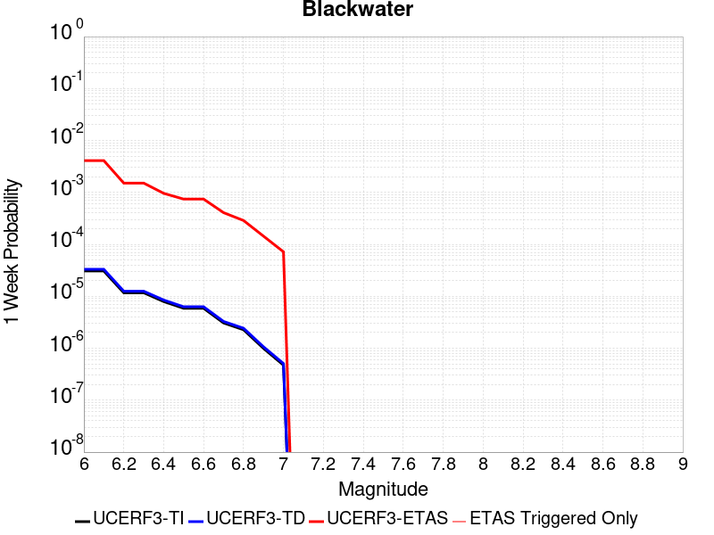 | 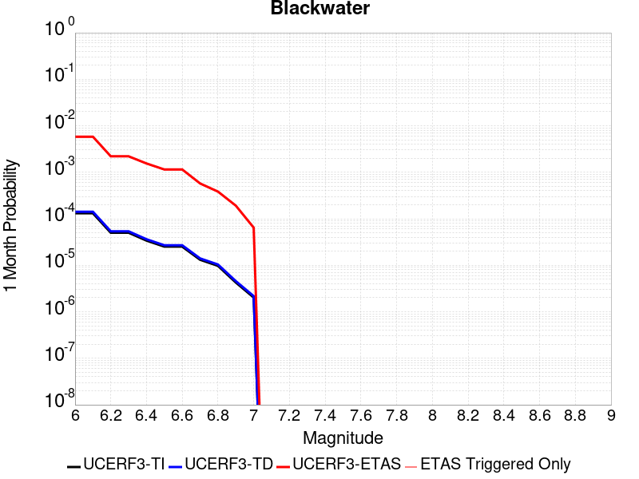 | 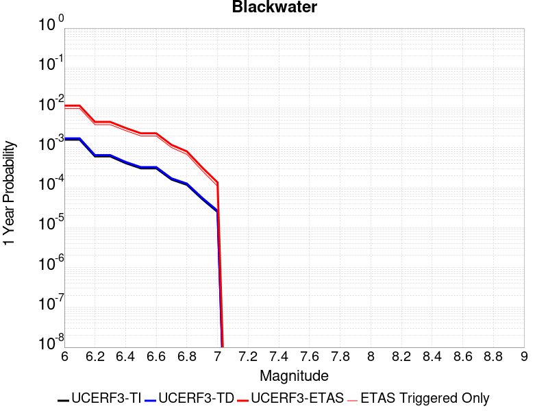 | 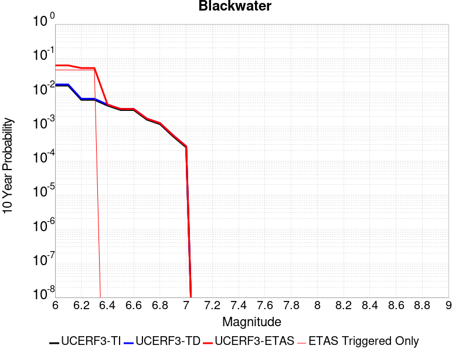 |

| Magnitude | 1 wk TI Prob | 1 wk TD Prob | 1 wk ETAS Prob | 1 wk ETAS/TD Gain | 1 wk ETAS Triggered Only | 1 mo TI Prob | 1 mo TD Prob | 1 mo ETAS Prob | 1 mo ETAS/TD Gain | 1 mo ETAS Triggered Only | 1 yr TI Prob | 1 yr TD Prob | 1 yr ETAS Prob | 1 yr ETAS/TD Gain | 1 yr ETAS Triggered Only | 10 yr TI Prob | 10 yr TD Prob | 10 yr ETAS Prob | 10 yr ETAS/TD Gain | 10 yr ETAS Triggered Only |
|-----|-----|-----|-----|-----|-----|-----|-----|-----|-----|-----|-----|-----|-----|-----|-----|-----|-----|-----|-----|-----|
| 6.0 | 3.0708583E-5 | 3.3095846E-5 | 0.0040329634 | 121.85708 | 0.004 | 1.3160157E-4 | 1.4183241E-4 | 0.0059410096 | 41.887535 | 0.0058 | 0.0016010714 | 0.0017255784 | 0.011518651 | 6.67524 | 0.00981 | 0.015895851 | 0.017135633 | 0.03207517 | 1.8718405 | 0.0152 |
| 6.1 | 3.0708583E-5 | 3.3095846E-5 | 0.0040329634 | 121.85708 | 0.004 | 1.3160157E-4 | 1.4183241E-4 | 0.0059410096 | 41.887535 | 0.0058 | 0.0016010714 | 0.0017255784 | 0.011518651 | 6.67524 | 0.00981 | 0.015895851 | 0.017135633 | 0.03207517 | 1.8718405 | 0.0152 |
| 6.2 | 1.1707779E-5 | 1.2545122E-5 | 0.001542526 | 122.95822 | 0.00153 | 5.017523E-5 | 5.3763757E-5 | 0.002243646 | 41.73157 | 0.00219 | 6.107122E-4 | 6.5438676E-4 | 0.0046018017 | 7.0322356 | 0.00395 | 0.006090366 | 0.0065255696 | 0.012844067 | 1.9682676 | 0.00636 |
| 6.3 | 1.1707779E-5 | 1.2545122E-5 | 0.001542526 | 122.95822 | 0.00153 | 5.017523E-5 | 5.3763757E-5 | 0.002243646 | 41.73157 | 0.00219 | 6.107122E-4 | 6.5438676E-4 | 0.0046018017 | 7.0322356 | 0.00395 | 0.006090366 | 0.0065255696 | 0.012844067 | 1.9682676 | 0.00636 |
| 6.4 | 7.929244E-6 | 8.480098E-6 | 9.884718E-4 | 116.56372 | 9.8E-4 | 3.3982033E-5 | 3.6342793E-5 | 0.0015062894 | 41.446712 | 0.00147 | 4.136527E-4 | 4.423877E-4 | 0.0031811756 | 7.190922 | 0.00274 | 0.0041288356 | 0.0044154758 | 0.008855783 | 2.0056236 | 0.00446 |
| 6.5 | 5.8832115E-6 | 6.285991E-6 | 7.1628153E-4 | 113.94887 | 7.1E-4 | 2.521352E-5 | 2.6939697E-5 | 0.0010969109 | 40.71727 | 0.00107 | 3.0693135E-4 | 3.27944E-4 | 0.0024072619 | 7.3404665 | 0.00208 | 0.0030650778 | 0.0032748538 | 0.0065540797 | 2.001335 | 0.00329 |
| 6.6 | 5.8832115E-6 | 6.285991E-6 | 7.1628153E-4 | 113.94887 | 7.1E-4 | 2.521352E-5 | 2.6939697E-5 | 0.0010969109 | 40.71727 | 0.00107 | 3.0693135E-4 | 3.27944E-4 | 0.0024072619 | 7.3404665 | 0.00208 | 0.0030650778 | 0.0032748538 | 0.0065540797 | 2.001335 | 0.00329 |
| 6.7 | 3.0715053E-6 | 3.2814662E-6 | 3.632803E-4 | 110.706696 | 3.6E-4 | 1.3163528E-5 | 1.4063357E-5 | 5.240562E-4 | 37.263947 | 5.1E-4 | 1.6025416E-4 | 1.7120909E-4 | 0.001211031 | 7.073404 | 0.00104 | 0.0016013865 | 0.0017108864 | 0.0033380976 | 1.9510925 | 0.00163 |
| 6.8 | 2.2722281E-6 | 2.4287538E-6 | 2.5242814E-4 | 103.933205 | 2.5E-4 | 9.738084E-6 | 1.0408908E-5 | 3.5040537E-4 | 33.66399 | 3.4E-4 | 1.1855473E-4 | 1.26722E-4 | 8.566295E-4 | 6.7599115 | 7.3E-4 | 0.001184915 | 0.0012665876 | 0.002415131 | 1.9068015 | 0.00115 |
| 6.9 | 9.952399E-7 | 1.0653489E-6 | 1.3106522E-4 | 123.02563 | 1.3E-4 | 4.265307E-6 | 4.5657757E-6 | 1.6456505E-4 | 36.043175 | 1.6E-4 | 5.1928873E-5 | 5.5587418E-5 | 3.5557075E-4 | 6.3966045 | 3.0E-4 | 5.191674E-4 | 5.557858E-4 | 9.755523E-4 | 1.7552669 | 4.2E-4 |
| 7.0 | 4.7385504E-7 | 5.0755597E-7 | 5.050753E-5 | 99.51126 | 5.0E-5 | 2.0308057E-6 | 2.1752398E-6 | 6.217511E-5 | 28.583107 | 6.0E-5 | 2.4724779E-5 | 2.6483543E-5 | 1.4648036E-4 | 5.5309954 | 1.2E-4 | 2.4722028E-4 | 2.6483546E-4 | 4.6478247E-4 | 1.7549859 | 2.0E-4 |

## Garlock (West)
*[(top)](#table-of-contents)*

| 1 Week | 1 Month | 1 Year | 10 Year |
|-----|-----|-----|-----|
| 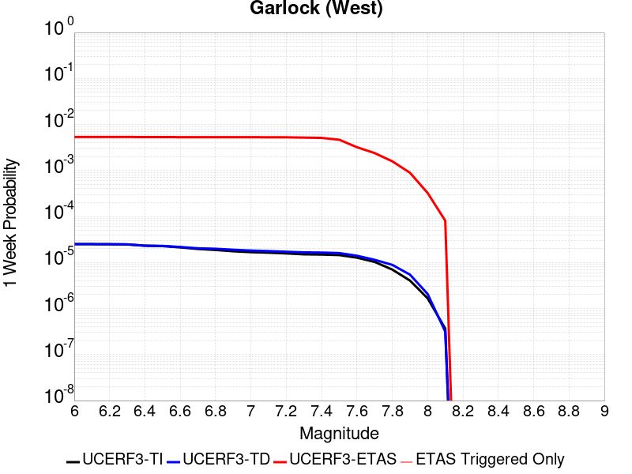 | 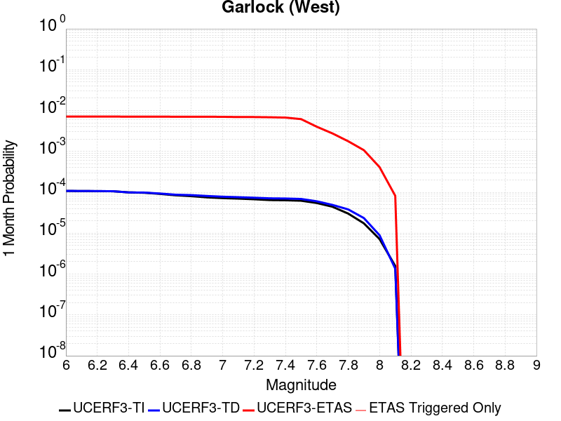 | 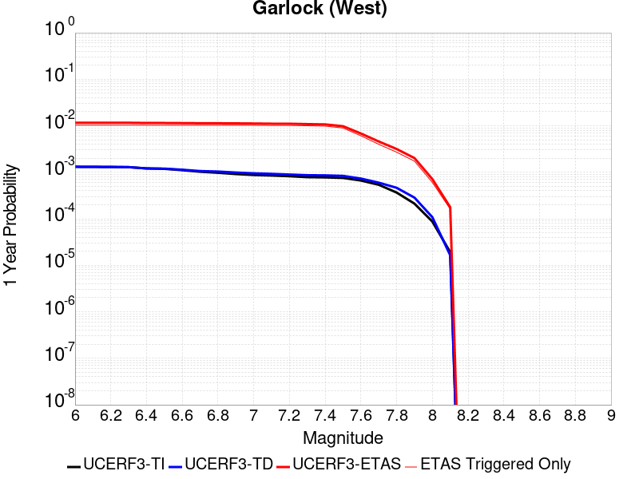 | 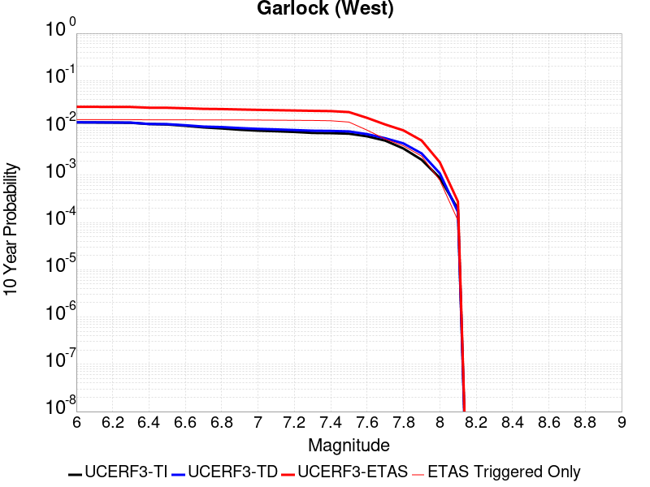 |

| Magnitude | 1 wk TI Prob | 1 wk TD Prob | 1 wk ETAS Prob | 1 wk ETAS/TD Gain | 1 wk ETAS Triggered Only | 1 mo TI Prob | 1 mo TD Prob | 1 mo ETAS Prob | 1 mo ETAS/TD Gain | 1 mo ETAS Triggered Only | 1 yr TI Prob | 1 yr TD Prob | 1 yr ETAS Prob | 1 yr ETAS/TD Gain | 1 yr ETAS Triggered Only | 10 yr TI Prob | 10 yr TD Prob | 10 yr ETAS Prob | 10 yr ETAS/TD Gain | 10 yr ETAS Triggered Only |
|-----|-----|-----|-----|-----|-----|-----|-----|-----|-----|-----|-----|-----|-----|-----|-----|-----|-----|-----|-----|-----|
| 6.0 | 2.5181727E-5 | 2.51973E-5 | 0.0058150515 | 230.78073 | 0.00579 | 1.0791722E-4 | 1.0798398E-4 | 0.007597175 | 70.35465 | 0.00749 | 0.0013131002 | 0.0013139155 | 0.012259515 | 9.330521 | 0.01096 | 0.013053683 | 0.013141977 | 0.027875766 | 2.1211245 | 0.01493 |
| 6.1 | 2.5077732E-5 | 2.5098372E-5 | 0.0058149532 | 231.68646 | 0.00579 | 1.0747157E-4 | 1.0756004E-4 | 0.0075967545 | 70.62804 | 0.00749 | 0.001307681 | 0.0013087603 | 0.012254416 | 9.363378 | 0.01096 | 0.013000126 | 0.013091032 | 0.027825583 | 2.1255453 | 0.01493 |
| 6.2 | 2.494612E-5 | 2.498005E-5 | 0.0058148354 | 232.77917 | 0.00579 | 1.0690756E-4 | 1.0705298E-4 | 0.007596251 | 70.95786 | 0.00749 | 0.0013008224 | 0.0013025942 | 0.012248318 | 9.403019 | 0.01096 | 0.012932341 | 0.013030097 | 0.027765557 | 2.130879 | 0.01493 |
| 6.3 | 2.4733758E-5 | 2.479942E-5 | 0.0058146557 | 234.46742 | 0.00579 | 1.0599751E-4 | 1.06278916E-4 | 0.0075954827 | 71.467445 | 0.00749 | 0.0012897556 | 0.0012931811 | 0.012239008 | 9.464264 | 0.01096 | 0.012822957 | 0.012937066 | 0.027673915 | 2.1391184 | 0.01493 |
| 6.4 | 2.3237335E-5 | 2.317873E-5 | 0.005783045 | 249.49792 | 0.00576 | 9.958477E-5 | 9.933365E-5 | 0.0075485935 | 75.99231 | 0.00745 | 0.0012117702 | 0.001208719 | 0.012095544 | 10.006911 | 0.0109 | 0.012051838 | 0.012101916 | 0.026722807 | 2.2081468 | 0.0148 |
| 6.5 | 2.2732203E-5 | 2.2993298E-5 | 0.005782861 | 251.50201 | 0.00576 | 9.742009E-5 | 9.8539E-5 | 0.007547805 | 76.59714 | 0.00745 | 0.0011854442 | 0.0011990548 | 0.012085985 | 10.079594 | 0.0109 | 0.011791403 | 0.012006322 | 0.026628628 | 2.2178838 | 0.0148 |
| 6.6 | 2.1319436E-5 | 2.17735E-5 | 0.005781648 | 265.536 | 0.00576 | 9.136581E-5 | 9.331167E-5 | 0.0075426167 | 80.83251 | 0.00745 | 0.001111811 | 0.0011354799 | 0.012023103 | 10.588566 | 0.0109 | 0.011062649 | 0.011377227 | 0.025998957 | 2.2851753 | 0.01479 |
| 6.7 | 1.970802E-5 | 2.0393396E-5 | 0.0057702763 | 282.94827 | 0.00575 | 8.446021E-5 | 8.739735E-5 | 0.007526747 | 86.121 | 0.00744 | 0.001027818 | 0.001063545 | 0.011941963 | 11.228451 | 0.01089 | 0.010230771 | 0.010664964 | 0.025267549 | 2.369211 | 0.01476 |
| 6.8 | 1.8744462E-5 | 1.9901045E-5 | 0.0057697864 | 289.9238 | 0.00575 | 8.033094E-5 | 8.5287415E-5 | 0.0075146537 | 88.109764 | 0.00743 | 9.775903E-4 | 0.0010378812 | 0.011906589 | 11.472014 | 0.01088 | 0.009733009 | 0.01041075 | 0.025007192 | 2.4020545 | 0.01475 |
| 6.9 | 1.7559682E-5 | 1.8953415E-5 | 0.0057688444 | 304.36966 | 0.00575 | 7.5253614E-5 | 8.12264E-5 | 0.007500624 | 92.34219 | 0.00742 | 9.158276E-4 | 9.884841E-4 | 0.011827759 | 11.965552 | 0.01085 | 0.0091206245 | 0.009921231 | 0.02449519 | 2.4689667 | 0.01472 |
| 7.0 | 1.6794445E-5 | 1.8216237E-5 | 0.005758112 | 316.09775 | 0.00574 | 7.197421E-5 | 7.8067256E-5 | 0.0074774898 | 95.78265 | 0.0074 | 8.759337E-4 | 9.5005584E-4 | 0.011769767 | 12.3885 | 0.01083 | 0.008724891 | 0.009540141 | 0.024050377 | 2.5209668 | 0.01465 |
| 7.1 | 1.6337795E-5 | 1.7717046E-5 | 0.005717616 | 322.71838 | 0.0057 | 7.0017246E-5 | 7.5927994E-5 | 0.0074153706 | 97.6632 | 0.00734 | 8.521265E-4 | 9.240326E-4 | 0.01167409 | 12.633851 | 0.01076 | 0.008488664 | 0.009281996 | 0.023687037 | 2.5519335 | 0.01454 |
| 7.2 | 1.5780008E-5 | 1.7165687E-5 | 0.005657069 | 329.55682 | 0.00564 | 6.762685E-5 | 7.356516E-5 | 0.0073430305 | 99.81668 | 0.00727 | 8.2304585E-4 | 8.9528906E-4 | 0.011565727 | 12.918427 | 0.01068 | 0.008200042 | 0.008996838 | 0.023316834 | 2.5916698 | 0.01445 |
| 7.3 | 1.5058865E-5 | 1.6618762E-5 | 0.0056265257 | 338.56467 | 0.00561 | 6.45364E-5 | 7.122133E-5 | 0.0073107057 | 102.647705 | 0.00724 | 7.854473E-4 | 8.667759E-4 | 0.011477571 | 13.241682 | 0.01062 | 0.00782677 | 0.008713539 | 0.022948412 | 2.6336503 | 0.01436 |
| 7.4 | 1.4887923E-5 | 1.6454731E-5 | 0.0055463635 | 337.06802 | 0.00553 | 6.380382E-5 | 7.051838E-5 | 0.0072000157 | 102.101265 | 0.00713 | 7.7653467E-4 | 8.582243E-4 | 0.01132923 | 13.20078 | 0.01048 | 0.0077382675 | 0.008628399 | 0.022656307 | 2.6257834 | 0.01415 |
| 7.5 | 1.4509299E-5 | 1.6046748E-5 | 0.005145964 | 320.68582 | 0.00513 | 6.218123E-5 | 6.876997E-5 | 0.0067083132 | 97.54713 | 0.00664 | 7.567935E-4 | 8.36954E-4 | 0.010608768 | 12.67545 | 0.00978 | 0.0075422134 | 0.008416704 | 0.02158493 | 2.5645347 | 0.01328 |
| 7.6 | 1.2756717E-5 | 1.4050848E-5 | 0.0033140045 | 235.85797 | 0.0033 | 5.4670498E-5 | 6.0216535E-5 | 0.004289962 | 71.242256 | 0.00423 | 6.6541E-4 | 7.328904E-4 | 0.0071981484 | 9.821589 | 0.00647 | 0.006634211 | 0.0073816874 | 0.016275547 | 2.2048545 | 0.00896 |
| 7.7 | 1.0328985E-5 | 1.1460557E-5 | 0.0021814357 | 190.3429 | 0.00217 | 4.4266326E-5 | 4.911575E-5 | 0.0027889812 | 56.783844 | 0.00274 | 5.388092E-4 | 5.978206E-4 | 0.0048352857 | 8.088189 | 0.00424 | 0.0053750467 | 0.006038511 | 0.011793548 | 1.9530556 | 0.00579 |
| 7.8 | 7.0306583E-6 | 8.899601E-6 | 0.0015688858 | 176.2872 | 0.00156 | 3.0131043E-5 | 3.814059E-5 | 0.0020280648 | 53.173393 | 0.00199 | 3.667837E-4 | 4.642629E-4 | 0.0035228422 | 7.5880327 | 0.00306 | 0.003661789 | 0.0046952725 | 0.0088556465 | 1.8860772 | 0.00418 |
| 7.9 | 4.060633E-6 | 5.4653938E-6 | 9.354603E-4 | 171.16064 | 9.3E-4 | 1.7402595E-5 | 2.3422906E-5 | 0.0011933955 | 50.949932 | 0.00117 | 2.11856E-4 | 2.851367E-4 | 0.0021546034 | 7.5563884 | 0.00187 | 0.0021165414 | 0.002884201 | 0.005406904 | 1.8746626 | 0.00253 |
| 8.0 | 1.6729537E-6 | 2.0775144E-6 | 2.52077E-4 | 121.33586 | 2.5E-4 | 7.169782E-6 | 8.903603E-6 | 3.2890076E-4 | 36.940186 | 3.2E-4 | 8.7288594E-5 | 1.0839601E-4 | 6.683353E-4 | 6.165682 | 5.6E-4 | 8.7254314E-4 | 0.0010969337 | 0.0018760782 | 1.710293 | 7.8E-4 |
| 8.1 | 3.6733252E-7 | 3.1489964E-7 | 3.031489E-5 | 96.26842 | 3.0E-5 | 1.5742813E-6 | 1.3495693E-6 | 3.134953E-5 | 23.229284 | 3.0E-5 | 1.9166706E-5 | 1.6430899E-5 | 8.642975E-5 | 5.260196 | 7.0E-5 | 1.9165053E-4 | 1.6638759E-4 | 2.7636928E-4 | 1.660997 | 1.1E-4 |

## McLean Lake
*[(top)](#table-of-contents)*

| 1 Week | 1 Month | 1 Year | 10 Year |
|-----|-----|-----|-----|
| 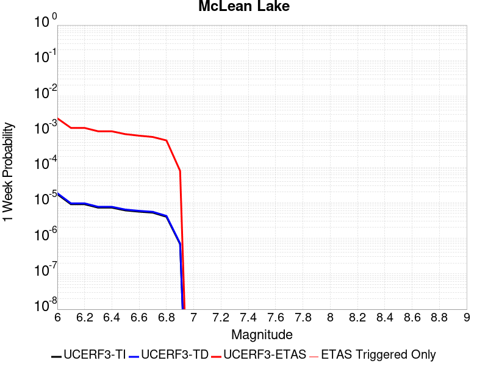 |  | 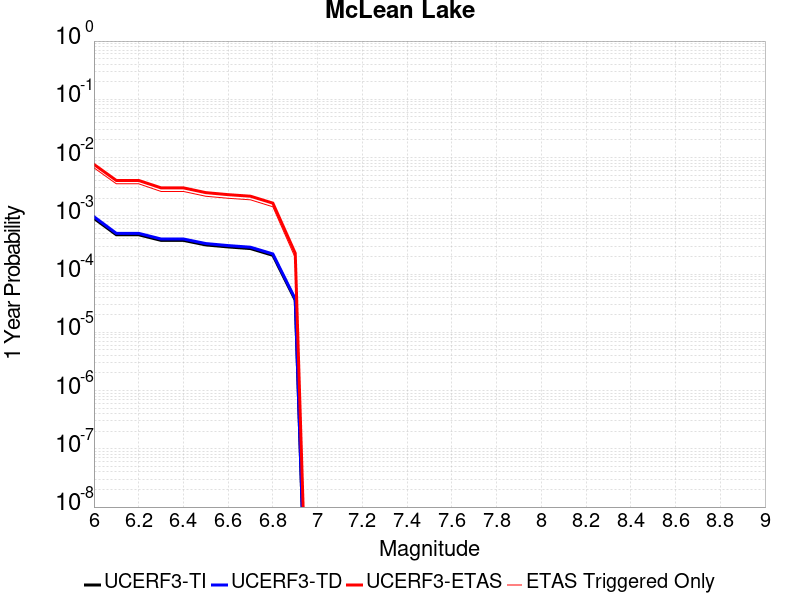 | 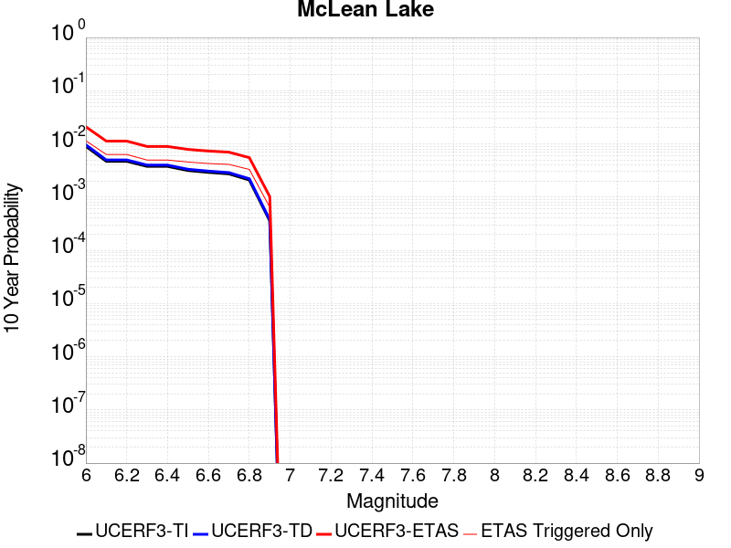 |

| Magnitude | 1 wk TI Prob | 1 wk TD Prob | 1 wk ETAS Prob | 1 wk ETAS/TD Gain | 1 wk ETAS Triggered Only | 1 mo TI Prob | 1 mo TD Prob | 1 mo ETAS Prob | 1 mo ETAS/TD Gain | 1 mo ETAS Triggered Only | 1 yr TI Prob | 1 yr TD Prob | 1 yr ETAS Prob | 1 yr ETAS/TD Gain | 1 yr ETAS Triggered Only | 10 yr TI Prob | 10 yr TD Prob | 10 yr ETAS Prob | 10 yr ETAS/TD Gain | 10 yr ETAS Triggered Only |
|-----|-----|-----|-----|-----|-----|-----|-----|-----|-----|-----|-----|-----|-----|-----|-----|-----|-----|-----|-----|-----|
| 6.0 | 1.7360222E-5 | 1.8501627E-5 | 0.002208461 | 119.365776 | 0.00219 | 7.439883E-5 | 7.9290556E-5 | 0.0035090186 | 44.25519 | 0.00343 | 9.0542925E-4 | 9.6498354E-4 | 0.007818364 | 8.10207 | 0.00686 | 0.009017491 | 0.0096127745 | 0.021309247 | 2.2167635 | 0.01181 |
| 6.1 | 9.062689E-6 | 9.592193E-6 | 0.0011495813 | 119.845505 | 0.00114 | 3.8839516E-5 | 4.1108804E-5 | 0.0018010364 | 43.811455 | 0.00176 | 4.727685E-4 | 5.003936E-4 | 0.0042984923 | 8.590221 | 0.0038 | 0.0047176396 | 0.004993552 | 0.011570544 | 2.3170972 | 0.00661 |
| 6.2 | 9.062689E-6 | 9.592193E-6 | 0.0011495813 | 119.845505 | 0.00114 | 3.8839516E-5 | 4.1108804E-5 | 0.0018010364 | 43.811455 | 0.00176 | 4.727685E-4 | 5.003936E-4 | 0.0042984923 | 8.590221 | 0.0038 | 0.0047176396 | 0.004993552 | 0.011570544 | 2.3170972 | 0.00661 |
| 6.3 | 7.2575485E-6 | 7.66771E-6 | 9.376606E-4 | 122.28693 | 9.3E-4 | 3.110341E-5 | 3.2861237E-5 | 0.0014628143 | 44.514885 | 0.00143 | 3.786182E-4 | 4.0001926E-4 | 0.003318851 | 8.296729 | 0.00292 | 0.0037797375 | 0.0039936965 | 0.009153009 | 2.291864 | 0.00518 |
| 6.4 | 7.2575485E-6 | 7.66771E-6 | 9.376606E-4 | 122.28693 | 9.3E-4 | 3.110341E-5 | 3.2861237E-5 | 0.0014628143 | 44.514885 | 0.00143 | 3.786182E-4 | 4.0001926E-4 | 0.003318851 | 8.296729 | 0.00292 | 0.0037797375 | 0.0039936965 | 0.009153009 | 2.291864 | 0.00518 |
| 6.5 | 6.06582E-6 | 6.4038773E-6 | 8.0639875E-4 | 125.92352 | 8.0E-4 | 2.5996113E-5 | 2.7444936E-5 | 0.0012874104 | 46.90885 | 0.00126 | 3.164567E-4 | 3.3409733E-4 | 0.0028832455 | 8.629956 | 0.00255 | 0.0031600643 | 0.0033365893 | 0.007841508 | 2.3501568 | 0.00452 |
| 6.6 | 5.598744E-6 | 5.910262E-6 | 7.459059E-4 | 126.20521 | 7.4E-4 | 2.3994397E-5 | 2.5329486E-5 | 0.0011853001 | 46.79527 | 0.00116 | 2.9209262E-4 | 3.0834923E-4 | 0.0026976124 | 8.748562 | 0.00239 | 0.0029170897 | 0.003079843 | 0.007227031 | 2.346558 | 0.00416 |
| 6.7 | 5.246996E-6 | 5.539162E-6 | 6.9553533E-4 | 125.56689 | 6.9E-4 | 2.2486933E-5 | 2.3739085E-5 | 0.0011137133 | 46.91475 | 0.00109 | 2.73744E-4 | 2.8899137E-4 | 0.0025083497 | 8.67967 | 0.00222 | 0.0027340704 | 0.0028867796 | 0.0067954636 | 2.3539946 | 0.00392 |
| 6.8 | 4.02324E-6 | 4.2469046E-6 | 5.5424456E-4 | 130.50554 | 5.5E-4 | 1.7242342E-5 | 1.8200926E-5 | 8.481858E-4 | 46.601246 | 8.3E-4 | 2.099053E-4 | 2.2157968E-4 | 0.0019411986 | 8.760724 | 0.00172 | 0.0020970714 | 0.002214172 | 0.0052673966 | 2.3789465 | 0.00306 |
| 6.9 | 6.835972E-7 | 7.1399285E-7 | 8.071394E-5 | 113.04586 | 8.0E-5 | 2.9296991E-6 | 3.0599674E-6 | 1.1305963E-4 | 36.947987 | 1.1E-4 | 3.56685E-5 | 3.7254784E-5 | 2.8724546E-4 | 7.710297 | 2.5E-4 | 3.5662777E-4 | 3.7251666E-4 | 9.223118E-4 | 2.475894 | 5.5E-4 |

## Goldstone Lake
*[(top)](#table-of-contents)*

| 1 Week | 1 Month | 1 Year | 10 Year |
|-----|-----|-----|-----|
| 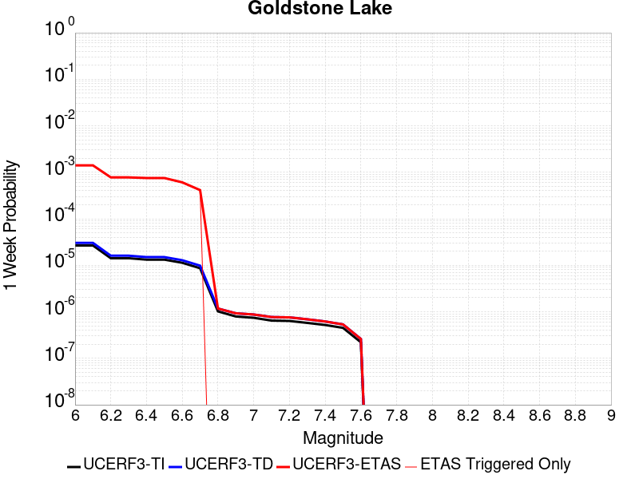 |  | 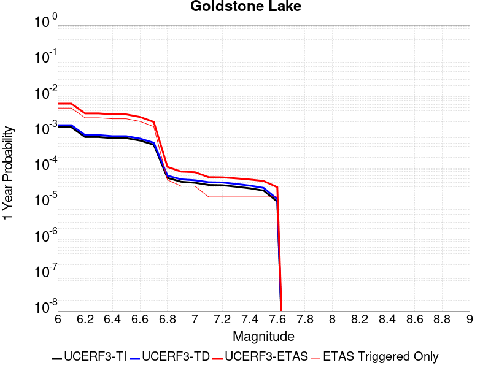 | 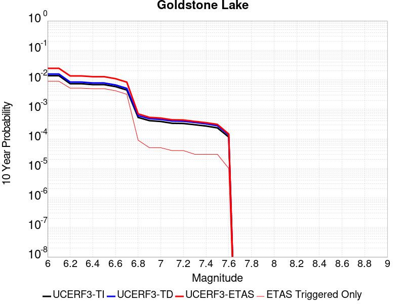 |

| Magnitude | 1 wk TI Prob | 1 wk TD Prob | 1 wk ETAS Prob | 1 wk ETAS/TD Gain | 1 wk ETAS Triggered Only | 1 mo TI Prob | 1 mo TD Prob | 1 mo ETAS Prob | 1 mo ETAS/TD Gain | 1 mo ETAS Triggered Only | 1 yr TI Prob | 1 yr TD Prob | 1 yr ETAS Prob | 1 yr ETAS/TD Gain | 1 yr ETAS Triggered Only | 10 yr TI Prob | 10 yr TD Prob | 10 yr ETAS Prob | 10 yr ETAS/TD Gain | 10 yr ETAS Triggered Only |
|-----|-----|-----|-----|-----|-----|-----|-----|-----|-----|-----|-----|-----|-----|-----|-----|-----|-----|-----|-----|-----|
| 6.0 | 2.671352E-5 | 3.037609E-5 | 0.0016303274 | 53.67141 | 0.0016 | 1.1448149E-4 | 1.3017785E-4 | 0.0026298524 | 20.201996 | 0.0025 | 0.001392921 | 0.0015839594 | 0.0066758813 | 4.2146792 | 0.0051 | 0.013842222 | 0.015746197 | 0.024574952 | 1.5606914 | 0.00897 |
| 6.1 | 2.671352E-5 | 3.037609E-5 | 0.0016303274 | 53.67141 | 0.0016 | 1.1448149E-4 | 1.3017785E-4 | 0.0026298524 | 20.201996 | 0.0025 | 0.001392921 | 0.0015839594 | 0.0066758813 | 4.2146792 | 0.0051 | 0.013842222 | 0.015746197 | 0.024574952 | 1.5606914 | 0.00897 |
| 6.2 | 1.4197047E-5 | 1.6096245E-5 | 8.8608224E-4 | 55.049004 | 8.7E-4 | 6.0843064E-5 | 6.8982634E-5 | 0.0014288889 | 20.713745 | 0.00136 | 7.4051257E-4 | 8.3963864E-4 | 0.003677254 | 4.3795676 | 0.00284 | 0.007380498 | 0.0083743585 | 0.013540728 | 1.6169271 | 0.00521 |
| 6.3 | 1.4197047E-5 | 1.6096245E-5 | 8.8608224E-4 | 55.049004 | 8.7E-4 | 6.0843064E-5 | 6.8982634E-5 | 0.0014288889 | 20.713745 | 0.00136 | 7.4051257E-4 | 8.3963864E-4 | 0.003677254 | 4.3795676 | 0.00284 | 0.007380498 | 0.0083743585 | 0.013540728 | 1.6169271 | 0.00521 |
| 6.4 | 1.3238931E-5 | 1.500846E-5 | 8.349962E-4 | 55.635033 | 8.2E-4 | 5.6737044E-5 | 6.4320935E-5 | 0.001354238 | 21.054388 | 0.00129 | 6.9055456E-4 | 7.82924E-4 | 0.0034808102 | 4.4459105 | 0.0027 | 0.006884126 | 0.0078112837 | 0.012772227 | 1.6350996 | 0.005 |
| 6.5 | 1.3238931E-5 | 1.500846E-5 | 8.349962E-4 | 55.635033 | 8.2E-4 | 5.6737044E-5 | 6.4320935E-5 | 0.001354238 | 21.054388 | 0.00129 | 6.9055456E-4 | 7.82924E-4 | 0.0034808102 | 4.4459105 | 0.0027 | 0.006884126 | 0.0078112837 | 0.012772227 | 1.6350996 | 0.005 |
| 6.6 | 1.1328278E-5 | 1.2855166E-5 | 7.22846E-4 | 56.230007 | 7.1E-4 | 4.8548856E-5 | 5.5092944E-5 | 0.0011650318 | 21.146662 | 0.00111 | 5.90922E-4 | 6.7064585E-4 | 0.00292913 | 4.367626 | 0.00226 | 0.0058935313 | 0.0066956086 | 0.010937018 | 1.6334615 | 0.00427 |
| 6.7 | 8.651175E-6 | 9.824565E-6 | 4.9981975E-4 | 50.874493 | 4.9E-4 | 3.707594E-5 | 4.2105108E-5 | 8.2207227E-4 | 19.524288 | 7.8E-4 | 4.5130608E-4 | 5.1259965E-4 | 0.0021417642 | 4.17824 | 0.00163 | 0.0045039062 | 0.005123051 | 0.008346452 | 1.6291956 | 0.00324 |
| 6.8 | 1.0215377E-6 | 1.1754702E-6 | 1.1175459E-5 | 9.507224 | 1.0E-5 | 4.378012E-6 | 5.0377203E-6 | 5.5037468E-5 | 10.925074 | 5.0E-5 | 5.3300988E-5 | 6.1332634E-5 | 1.11329566E-4 | 1.8151767 | 5.0E-5 | 5.3288206E-4 | 6.1316835E-4 | 7.0311315E-4 | 1.1466886 | 9.0E-5 |
| 6.9 | 7.9360774E-7 | 9.2833966E-7 | 9.2833966E-7 | 1.0 | 0.0 | 3.4011714E-6 | 3.9785928E-6 | 2.3978513E-5 | 6.026883 | 2.0E-5 | 4.1408475E-5 | 4.843836E-5 | 6.8437395E-5 | 1.4128759 | 2.0E-5 | 4.140076E-4 | 4.8428503E-4 | 5.342608E-4 | 1.103195 | 5.0E-5 |
| 7.0 | 7.4382757E-7 | 8.7473285E-7 | 8.7473285E-7 | 1.0 | 0.0 | 3.1878285E-6 | 3.74885E-6 | 2.3748775E-5 | 6.3349495 | 2.0E-5 | 3.8811122E-5 | 4.564136E-5 | 6.5640445E-5 | 1.438179 | 2.0E-5 | 3.8804344E-4 | 4.5632652E-4 | 5.063037E-4 | 1.1095207 | 5.0E-5 |
| 7.1 | 6.4709513E-7 | 7.7113E-7 | 7.7113E-7 | 1.0 | 0.0 | 2.773262E-6 | 3.3048389E-6 | 1.3304806E-5 | 4.025856 | 1.0E-5 | 3.376394E-5 | 4.0235733E-5 | 5.023533E-5 | 1.2485253 | 1.0E-5 | 3.375881E-4 | 4.0229043E-4 | 4.4227432E-4 | 1.0993906 | 4.0E-5 |
| 7.2 | 6.356704E-7 | 7.5883594E-7 | 7.5883594E-7 | 1.0 | 0.0 | 2.7242988E-6 | 3.2521505E-6 | 1.3252118E-5 | 4.0748787 | 1.0E-5 | 3.3167835E-5 | 3.959427E-5 | 4.9593877E-5 | 1.2525518 | 1.0E-5 | 3.3162883E-4 | 3.958781E-4 | 4.3586228E-4 | 1.1010011 | 4.0E-5 |
| 7.3 | 5.7695723E-7 | 6.8965653E-7 | 6.8965653E-7 | 1.0 | 0.0 | 2.4726714E-6 | 2.9556677E-6 | 1.2955638E-5 | 4.3833203 | 1.0E-5 | 3.0104358E-5 | 3.5984718E-5 | 4.598436E-5 | 1.2778857 | 1.0E-5 | 3.0100282E-4 | 3.5979465E-4 | 3.8978385E-4 | 1.0833509 | 3.0E-5 |
| 7.4 | 5.209647E-7 | 6.193514E-7 | 6.193514E-7 | 1.0 | 0.0 | 2.232704E-6 | 2.6543607E-6 | 1.2654335E-5 | 4.7673755 | 1.0E-5 | 2.718283E-5 | 3.2316417E-5 | 4.2316096E-5 | 1.3094302 | 1.0E-5 | 2.7179506E-4 | 3.2312275E-4 | 3.5311305E-4 | 1.092814 | 3.0E-5 |
| 7.5 | 4.512955E-7 | 5.348885E-7 | 5.348885E-7 | 1.0 | 0.0 | 1.934122E-6 | 2.2923775E-6 | 1.2292355E-5 | 5.362273 | 1.0E-5 | 2.3547682E-5 | 2.7909393E-5 | 3.7909114E-5 | 1.3582923 | 1.0E-5 | 2.3545188E-4 | 2.7906417E-4 | 3.0905582E-4 | 1.1074722 | 3.0E-5 |
| 7.6 | 2.21172E-7 | 2.603961E-7 | 2.603961E-7 | 1.0 | 0.0 | 9.478797E-7 | 1.1159829E-6 | 1.1115972E-5 | 9.960701 | 1.0E-5 | 1.1540374E-5 | 1.3587036E-5 | 2.35869E-5 | 1.7359858 | 1.0E-5 | 1.1539775E-4 | 1.3586486E-4 | 1.4586351E-4 | 1.0735925 | 1.0E-5 |

## Death Valley (So)
*[(top)](#table-of-contents)*

| 1 Week | 1 Month | 1 Year | 10 Year |
|-----|-----|-----|-----|
|  | 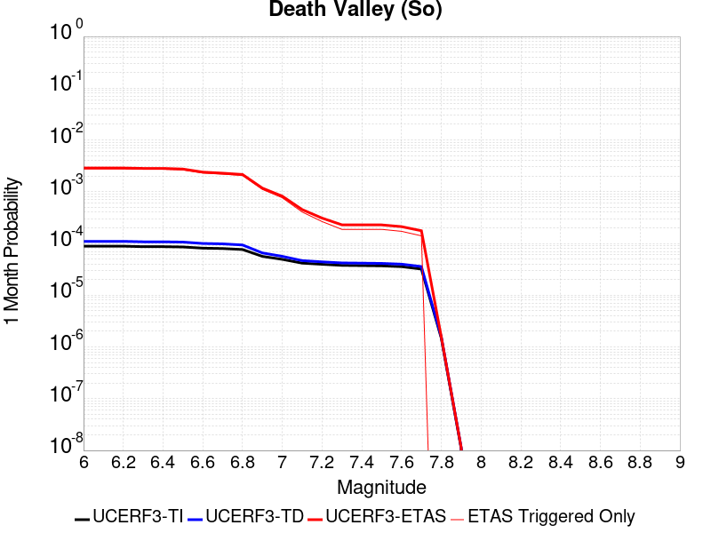 | 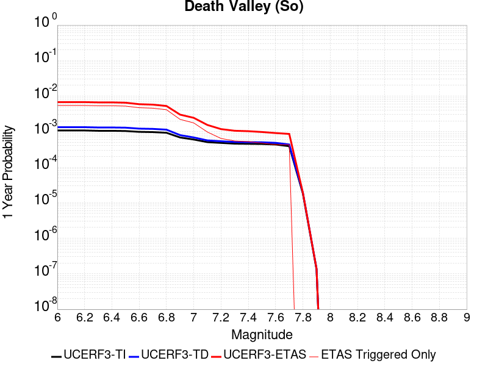 | 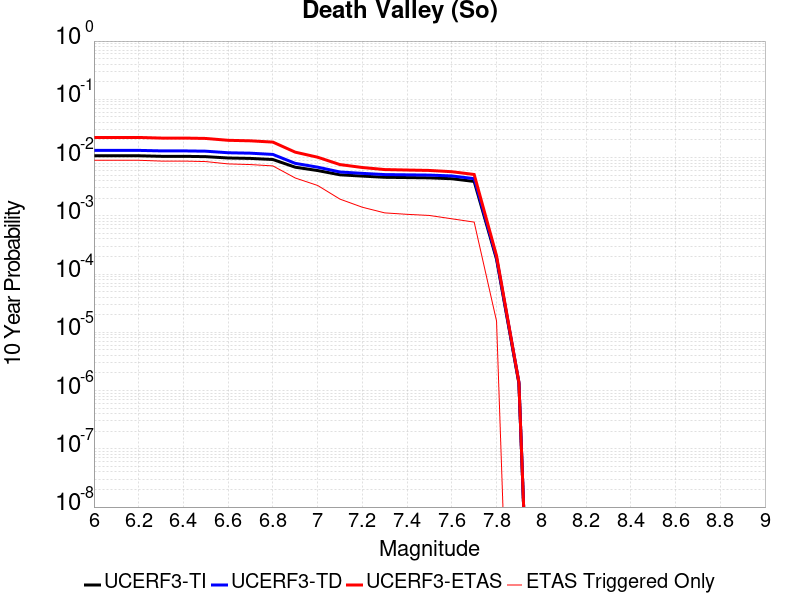 |

| Magnitude | 1 wk TI Prob | 1 wk TD Prob | 1 wk ETAS Prob | 1 wk ETAS/TD Gain | 1 wk ETAS Triggered Only | 1 mo TI Prob | 1 mo TD Prob | 1 mo ETAS Prob | 1 mo ETAS/TD Gain | 1 mo ETAS Triggered Only | 1 yr TI Prob | 1 yr TD Prob | 1 yr ETAS Prob | 1 yr ETAS/TD Gain | 1 yr ETAS Triggered Only | 10 yr TI Prob | 10 yr TD Prob | 10 yr ETAS Prob | 10 yr ETAS/TD Gain | 10 yr ETAS Triggered Only |
|-----|-----|-----|-----|-----|-----|-----|-----|-----|-----|-----|-----|-----|-----|-----|-----|-----|-----|-----|-----|-----|
| 6.0 | 2.0684236E-5 | 2.5617775E-5 | 0.0018055722 | 70.481224 | 0.00178 | 8.864371E-5 | 1.0978594E-4 | 0.002769494 | 25.226307 | 0.00266 | 0.0010787029 | 0.0013358411 | 0.0067086546 | 5.0220447 | 0.00538 | 0.010734817 | 0.013281397 | 0.02200399 | 1.6567526 | 0.00884 |
| 6.1 | 2.0684236E-5 | 2.5617775E-5 | 0.0018055722 | 70.481224 | 0.00178 | 8.864371E-5 | 1.0978594E-4 | 0.002769494 | 25.226307 | 0.00266 | 0.0010787029 | 0.0013358411 | 0.0067086546 | 5.0220447 | 0.00538 | 0.010734817 | 0.013281397 | 0.02200399 | 1.6567526 | 0.00884 |
| 6.2 | 2.0684236E-5 | 2.5617775E-5 | 0.0018055722 | 70.481224 | 0.00178 | 8.864371E-5 | 1.0978594E-4 | 0.002769494 | 25.226307 | 0.00266 | 0.0010787029 | 0.0013358411 | 0.0067086546 | 5.0220447 | 0.00538 | 0.010734817 | 0.013281397 | 0.02200399 | 1.6567526 | 0.00884 |
| 6.3 | 2.0240292E-5 | 2.511786E-5 | 0.0017750739 | 70.66979 | 0.00175 | 8.6741224E-5 | 1.07643624E-4 | 0.0027273616 | 25.336954 | 0.00262 | 0.0010555626 | 0.00130979 | 0.006522953 | 4.9801517 | 0.00522 | 0.010505628 | 0.013023956 | 0.021482341 | 1.6494482 | 0.00857 |
| 6.4 | 2.0240292E-5 | 2.511786E-5 | 0.0017750739 | 70.66979 | 0.00175 | 8.6741224E-5 | 1.07643624E-4 | 0.0027273616 | 25.336954 | 0.00262 | 0.0010555626 | 0.00130979 | 0.006522953 | 4.9801517 | 0.00522 | 0.010505628 | 0.013023956 | 0.021482341 | 1.6494482 | 0.00857 |
| 6.5 | 1.9962767E-5 | 2.4807114E-5 | 0.0017347647 | 69.93013 | 0.00171 | 8.55519E-5 | 1.0631196E-4 | 0.0026760388 | 25.171568 | 0.00257 | 0.0010410968 | 0.0012935963 | 0.00641696 | 4.9605584 | 0.00513 | 0.010362327 | 0.012863902 | 0.021145975 | 1.6438227 | 0.00839 |
| 6.6 | 1.8937297E-5 | 2.3310964E-5 | 0.0015332758 | 65.77487 | 0.00151 | 8.115732E-5 | 9.990039E-5 | 0.0023596745 | 23.620274 | 0.00226 | 9.876423E-4 | 0.0012156231 | 0.0058499826 | 4.812332 | 0.00464 | 0.009832645 | 0.012092789 | 0.019660158 | 1.6257753 | 0.00766 |
| 6.7 | 1.8621096E-5 | 2.2911607E-5 | 0.0014228795 | 62.103 | 0.0014 | 7.980225E-5 | 9.818898E-5 | 0.00222798 | 22.690731 | 0.00213 | 9.711593E-4 | 0.0011948098 | 0.0055995407 | 4.686554 | 0.00441 | 0.009669261 | 0.011886904 | 0.01918906 | 1.6143026 | 0.00739 |
| 6.8 | 1.7830353E-5 | 2.1805688E-5 | 0.0013517766 | 61.991932 | 0.00133 | 7.641356E-5 | 9.344968E-5 | 0.0020932627 | 22.399893 | 0.002 | 9.29938E-4 | 0.00113717 | 0.0052424963 | 4.610125 | 0.00411 | 0.009260561 | 0.011316354 | 0.0182668 | 1.6141948 | 0.00703 |
| 6.9 | 1.3135183E-5 | 1.5303925E-5 | 7.552926E-4 | 49.35287 | 7.4E-4 | 5.6292425E-5 | 6.558664E-5 | 0.0012055119 | 18.38045 | 0.00114 | 6.8514474E-4 | 7.982312E-4 | 0.0032162995 | 4.029283 | 0.00242 | 0.006830362 | 0.007954649 | 0.012329568 | 1.5499828 | 0.00441 |
| 7.0 | 1.1507512E-5 | 1.3154199E-5 | 5.131476E-4 | 39.010174 | 5.0E-4 | 4.9316975E-5 | 5.6373956E-5 | 8.3633E-4 | 14.835397 | 7.8E-4 | 6.002687E-4 | 6.8614254E-4 | 0.0024649212 | 3.5924332 | 0.00178 | 0.0059864987 | 0.0068409415 | 0.0100587765 | 1.470379 | 0.00324 |
| 7.1 | 9.715903E-6 | 1.0865278E-5 | 2.4086278E-4 | 22.16812 | 2.3E-4 | 4.1638916E-5 | 4.656467E-5 | 4.365465E-4 | 9.375058 | 3.9E-4 | 5.068359E-4 | 5.667817E-4 | 0.0015062488 | 2.657547 | 9.4E-4 | 0.0050568148 | 0.0056538144 | 0.0074336943 | 1.3148104 | 0.00179 |
| 7.2 | 9.233269E-6 | 1.02863105E-5 | 1.3028507E-4 | 12.665871 | 1.2E-4 | 3.9570554E-5 | 4.4083466E-5 | 2.8407288E-4 | 6.443978 | 2.4E-4 | 4.81665E-4 | 5.3658825E-4 | 0.0011562556 | 2.1548283 | 6.2E-4 | 0.0048062233 | 0.0053533576 | 0.0066463985 | 1.2415383 | 0.0013 |
| 7.3 | 8.8041315E-6 | 9.808164E-6 | 8.980738E-5 | 9.15639 | 8.0E-5 | 3.7731446E-5 | 4.2034335E-5 | 2.1202718E-4 | 5.0441427 | 1.7E-4 | 4.592835E-4 | 5.1165203E-4 | 9.914065E-4 | 1.9376576 | 4.8E-4 | 0.0045833546 | 0.005105167 | 0.00611996 | 1.1987776 | 0.00102 |
| 7.4 | 8.708749E-6 | 9.707175E-6 | 8.97064E-5 | 9.241246 | 8.0E-5 | 3.7322676E-5 | 4.160154E-5 | 2.1159447E-4 | 5.0862174 | 1.7E-4 | 4.5430884E-4 | 5.0638523E-4 | 9.7614725E-4 | 1.9276772 | 4.7E-4 | 0.004533812 | 0.0050527398 | 0.0060178386 | 1.1910051 | 9.7E-4 |
| 7.5 | 8.612678E-6 | 9.604817E-6 | 8.960405E-5 | 9.329074 | 8.0E-5 | 3.6910955E-5 | 4.1162875E-5 | 2.1115589E-4 | 5.129765 | 1.7E-4 | 4.492982E-4 | 5.01047E-4 | 9.4082655E-4 | 1.8777212 | 4.4E-4 | 0.004483909 | 0.0049995985 | 0.005924949 | 1.1850849 | 9.3E-4 |
| 7.6 | 8.319024E-6 | 9.283916E-6 | 7.9283265E-5 | 8.539851 | 7.0E-5 | 3.5652476E-5 | 3.978763E-5 | 1.9978127E-4 | 5.02119 | 1.6E-4 | 4.3398244E-4 | 4.8431093E-4 | 9.041075E-4 | 1.8667915 | 4.2E-4 | 0.0043313587 | 0.0048329784 | 0.0056788702 | 1.175025 | 8.5E-4 |
| 7.7 | 7.4718328E-6 | 8.34517E-6 | 6.834467E-5 | 8.189728 | 6.0E-5 | 3.2021748E-5 | 3.5764548E-5 | 1.7575955E-4 | 4.914351 | 1.4E-4 | 3.8979502E-4 | 4.353504E-4 | 8.051893E-4 | 1.8495201 | 3.7E-4 | 0.00389112 | 0.0043453807 | 0.0050423387 | 1.1603906 | 7.0E-4 |
| 7.8 | 3.4586725E-7 | 3.6482615E-7 | 3.6482615E-7 | 1.0 | 0.0 | 1.4822873E-6 | 1.5635396E-6 | 1.5635396E-6 | 1.0 | 0.0 | 1.80467E-5 | 1.9035933E-5 | 1.9035933E-5 | 1.0 | 0.0 | 1.8045233E-4 | 1.9034347E-4 | 2.0034157E-4 | 1.0525266 | 1.0E-5 |
| 7.9 | 2.5591178E-9 | 2.6696718E-9 | 2.6696718E-9 | 1.0 | 0.0 | 1.0967647E-8 | 1.14414505E-8 | 1.14414505E-8 | 1.0 | 0.0 | 1.335311E-7 | 1.3929966E-7 | 1.3929966E-7 | 1.0 | 0.0 | 1.3353102E-6 | 1.3929966E-6 | 1.3929966E-6 | 1.0 | 0.0 |

## Gravel Hills-Harper Lk
*[(top)](#table-of-contents)*

| 1 Week | 1 Month | 1 Year | 10 Year |
|-----|-----|-----|-----|
| 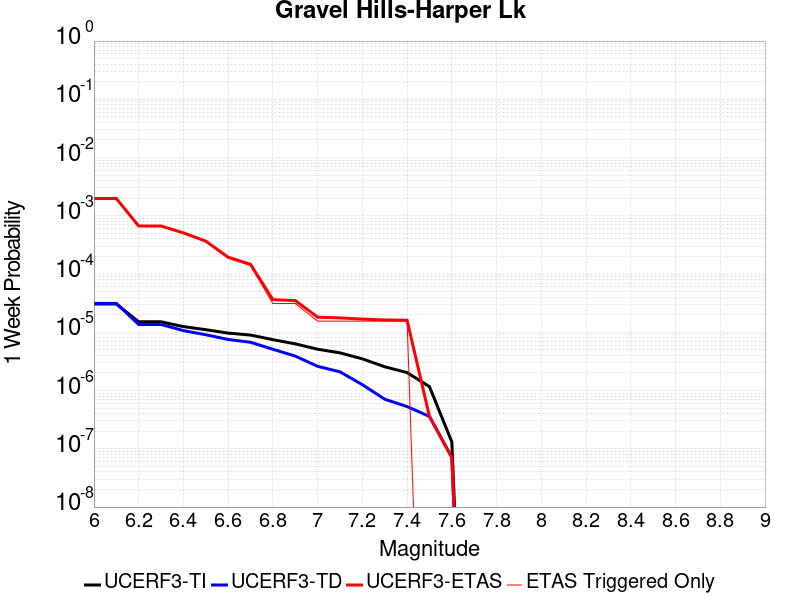 |  | 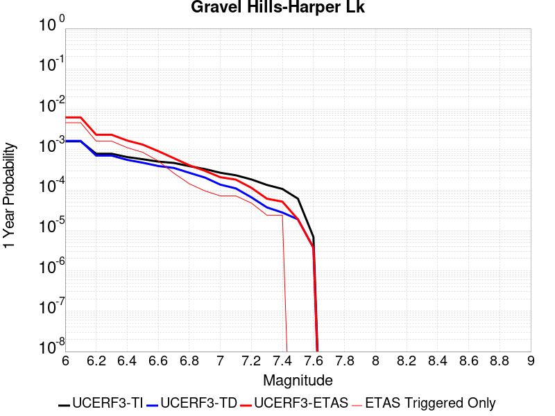 | 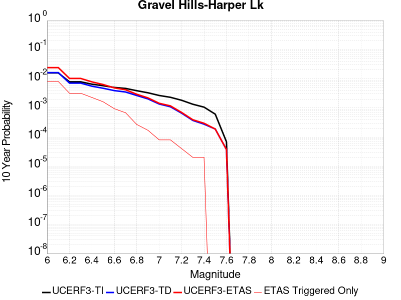 |

| Magnitude | 1 wk TI Prob | 1 wk TD Prob | 1 wk ETAS Prob | 1 wk ETAS/TD Gain | 1 wk ETAS Triggered Only | 1 mo TI Prob | 1 mo TD Prob | 1 mo ETAS Prob | 1 mo ETAS/TD Gain | 1 mo ETAS Triggered Only | 1 yr TI Prob | 1 yr TD Prob | 1 yr ETAS Prob | 1 yr ETAS/TD Gain | 1 yr ETAS Triggered Only | 10 yr TI Prob | 10 yr TD Prob | 10 yr ETAS Prob | 10 yr ETAS/TD Gain | 10 yr ETAS Triggered Only |
|-----|-----|-----|-----|-----|-----|-----|-----|-----|-----|-----|-----|-----|-----|-----|-----|-----|-----|-----|-----|-----|
| 6.0 | 3.0679566E-5 | 3.1464646E-5 | 0.0021313985 | 67.73947 | 0.0021 | 1.3147724E-4 | 1.3484273E-4 | 0.003114441 | 23.096838 | 0.00298 | 0.0015995599 | 0.0016406906 | 0.00686211 | 4.182452 | 0.00523 | 0.015880952 | 0.01630734 | 0.024216227 | 1.4849895 | 0.00804 |
| 6.1 | 3.0679566E-5 | 3.1464646E-5 | 0.0021313985 | 67.73947 | 0.0021 | 1.3147724E-4 | 1.3484273E-4 | 0.003114441 | 23.096838 | 0.00298 | 0.0015995599 | 0.0016406906 | 0.00686211 | 4.182452 | 0.00523 | 0.015880952 | 0.01630734 | 0.024216227 | 1.4849895 | 0.00804 |
| 6.2 | 1.514536E-5 | 1.3635206E-5 | 7.036258E-4 | 51.603603 | 6.9E-4 | 6.490707E-5 | 5.843536E-5 | 0.0010383781 | 17.769688 | 9.8E-4 | 7.8995706E-4 | 7.1123015E-4 | 0.0027198005 | 3.8240795 | 0.00201 | 0.007871548 | 0.0070907404 | 0.010258121 | 1.4466925 | 0.00319 |
| 6.3 | 1.514536E-5 | 1.3635206E-5 | 7.036258E-4 | 51.603603 | 6.9E-4 | 6.490707E-5 | 5.843536E-5 | 0.0010383781 | 17.769688 | 9.8E-4 | 7.8995706E-4 | 7.1123015E-4 | 0.0027198005 | 3.8240795 | 0.00201 | 0.007871548 | 0.0070907404 | 0.010258121 | 1.4466925 | 0.00319 |
| 6.4 | 1.2532521E-5 | 1.06896905E-5 | 4.906846E-4 | 45.902596 | 4.8E-4 | 5.37097E-5 | 4.581219E-5 | 7.25781E-4 | 15.842531 | 6.8E-4 | 6.537194E-4 | 5.576265E-4 | 0.0020068178 | 3.598857 | 0.00145 | 0.0065179965 | 0.005562863 | 0.007830179 | 1.4075809 | 0.00228 |
| 6.5 | 1.1094058E-5 | 9.083664E-6 | 3.5908047E-4 | 39.53036 | 3.5E-4 | 4.7545094E-5 | 3.892943E-5 | 5.3891E-4 | 13.843254 | 5.0E-4 | 5.787078E-4 | 4.7386673E-4 | 0.0015333644 | 3.2358558 | 0.00106 | 0.0057720304 | 0.0047289706 | 0.0063413098 | 1.3409493 | 0.00162 |
| 6.6 | 9.688328E-6 | 7.5316952E-6 | 1.9753026E-4 | 26.226536 | 1.9E-4 | 4.1520743E-5 | 3.227831E-5 | 3.6226766E-4 | 11.223254 | 3.3E-4 | 5.053978E-4 | 3.9292008E-4 | 0.0011126372 | 2.8317137 | 7.2E-4 | 0.0050424994 | 0.0039225104 | 0.0048588235 | 1.2387024 | 9.4E-4 |
| 6.7 | 8.974824E-6 | 6.749413E-6 | 1.4674847E-4 | 21.742405 | 1.4E-4 | 3.8462964E-5 | 2.8925748E-5 | 2.5891908E-4 | 8.951163 | 2.3E-4 | 4.6818596E-4 | 3.5211627E-4 | 8.8192965E-4 | 2.5046546 | 5.3E-4 | 0.004672008 | 0.0035158044 | 0.0041934135 | 1.1927323 | 6.8E-4 |
| 6.8 | 7.4780046E-6 | 5.1161933E-6 | 3.511604E-5 | 6.8637047 | 3.0E-5 | 3.20482E-5 | 2.1926366E-5 | 8.192505E-5 | 3.7363715 | 6.0E-5 | 3.9011694E-4 | 2.669222E-4 | 4.5687146E-4 | 1.711628 | 1.9E-4 | 0.0038943281 | 0.0026661542 | 0.0029354342 | 1.1009995 | 2.7E-4 |
| 6.9 | 6.3409307E-6 | 3.9074966E-6 | 2.3907418E-5 | 6.118346 | 2.0E-5 | 2.7175134E-5 | 1.6746313E-5 | 5.6745645E-5 | 3.3885455 | 4.0E-5 | 3.3080703E-4 | 2.0386827E-4 | 3.3384177E-4 | 1.6375366 | 1.3E-4 | 0.0033031502 | 0.0020369107 | 0.0022065644 | 1.0832897 | 1.7E-4 |
| 7.0 | 5.1239335E-6 | 2.6058565E-6 | 1.260583E-5 | 4.8375 | 1.0E-5 | 2.195953E-5 | 1.116791E-5 | 3.1167685E-5 | 2.7908254 | 2.0E-5 | 2.6732447E-4 | 1.3596108E-4 | 2.0595155E-4 | 1.5147833 | 7.0E-5 | 0.0026700313 | 0.0013588042 | 0.0014386955 | 1.0587953 | 8.0E-5 |
| 7.1 | 4.438899E-6 | 2.0984728E-6 | 1.2098451E-5 | 5.7653604 | 1.0E-5 | 1.9023713E-5 | 8.993425E-6 | 2.8993245E-5 | 3.223827 | 2.0E-5 | 2.315891E-4 | 1.0948967E-4 | 1.79482E-4 | 1.6392597 | 7.0E-5 | 0.002313479 | 0.0010943791 | 0.0011742916 | 1.0730208 | 8.0E-5 |
| 7.2 | 3.50367E-6 | 1.2615716E-6 | 1.1261559E-5 | 8.926611 | 1.0E-5 | 1.5015643E-5 | 5.4067245E-6 | 1.5406671E-5 | 2.8495386 | 1.0E-5 | 1.8280011E-4 | 6.582497E-5 | 9.5822994E-5 | 1.4557241 | 3.0E-5 | 0.0018264982 | 6.580629E-4 | 6.9803663E-4 | 1.0607444 | 4.0E-5 |
| 7.3 | 2.561638E-6 | 7.1191585E-7 | 1.07119085E-5 | 15.046594 | 1.0E-5 | 1.0978401E-5 | 3.0510646E-6 | 1.3051034E-5 | 4.2775345 | 1.0E-5 | 1.3365384E-4 | 3.71461E-5 | 5.7145353E-5 | 1.5383946 | 2.0E-5 | 0.0013357349 | 3.7140088E-4 | 3.9139346E-4 | 1.0538301 | 2.0E-5 |
| 7.4 | 2.0368864E-6 | 5.304837E-7 | 1.0530478E-5 | 19.85071 | 1.0E-5 | 8.729483E-6 | 2.2734996E-6 | 1.2273477E-5 | 5.398495 | 1.0E-5 | 1.06276275E-4 | 2.7679513E-5 | 4.767896E-5 | 1.7225361 | 2.0E-5 | 0.0010622547 | 2.767612E-4 | 2.9675566E-4 | 1.0722445 | 2.0E-5 |
| 7.5 | 1.1681728E-6 | 3.6030585E-7 | 3.6030585E-7 | 1.0 | 0.0 | 5.0064455E-6 | 1.544167E-6 | 1.544167E-6 | 1.0 | 0.0 | 6.0951766E-5 | 1.8800076E-5 | 1.8800076E-5 | 1.0 | 0.0 | 6.093505E-4 | 1.8798532E-4 | 1.8798532E-4 | 1.0 | 0.0 |
| 7.6 | 1.3154387E-7 | 7.1197384E-8 | 7.1197384E-8 | 1.0 | 0.0 | 5.6375933E-7 | 3.051316E-7 | 3.051316E-7 | 1.0 | 0.0 | 6.863748E-6 | 3.7149728E-6 | 3.7149728E-6 | 1.0 | 0.0 | 6.863536E-5 | 3.7149264E-5 | 3.7149264E-5 | 1.0 | 0.0 |

## San Andreas (Mojave S)
*[(top)](#table-of-contents)*

| 1 Week | 1 Month | 1 Year | 10 Year |
|-----|-----|-----|-----|
| 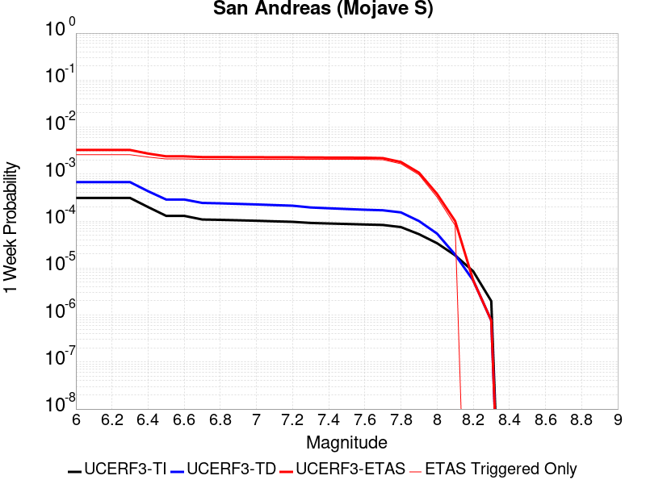 | 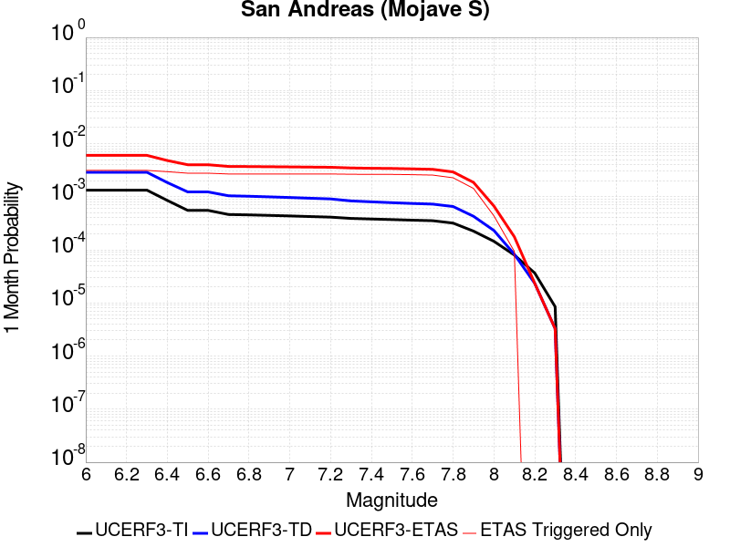 | 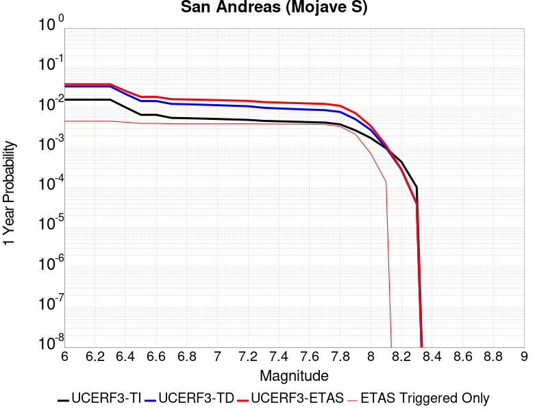 | 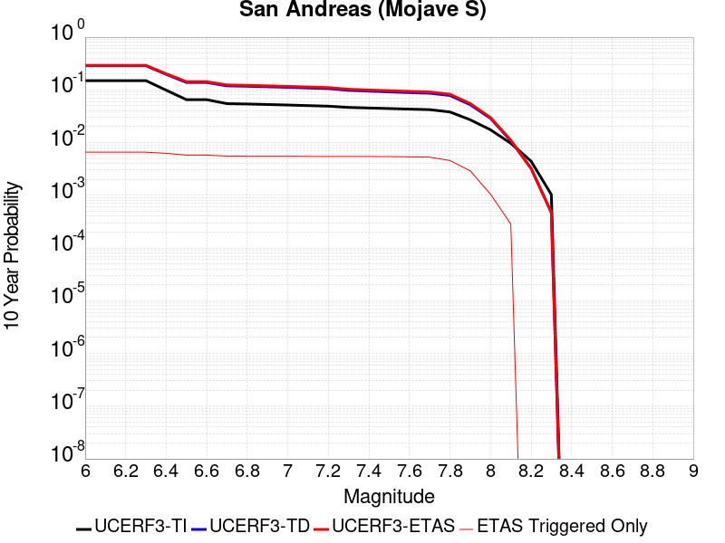 |

| Magnitude | 1 wk TI Prob | 1 wk TD Prob | 1 wk ETAS Prob | 1 wk ETAS/TD Gain | 1 wk ETAS Triggered Only | 1 mo TI Prob | 1 mo TD Prob | 1 mo ETAS Prob | 1 mo ETAS/TD Gain | 1 mo ETAS Triggered Only | 1 yr TI Prob | 1 yr TD Prob | 1 yr ETAS Prob | 1 yr ETAS/TD Gain | 1 yr ETAS Triggered Only | 10 yr TI Prob | 10 yr TD Prob | 10 yr ETAS Prob | 10 yr ETAS/TD Gain | 10 yr ETAS Triggered Only |
|-----|-----|-----|-----|-----|-----|-----|-----|-----|-----|-----|-----|-----|-----|-----|-----|-----|-----|-----|-----|-----|
| 6.0 | 3.1064058E-4 | 6.7460834E-4 | 0.0029730566 | 4.407086 | 0.0023 | 0.0013306376 | 0.0028881032 | 0.005879439 | 2.035744 | 0.003 | 0.016080605 | 0.03462235 | 0.039092045 | 1.1290987 | 0.00463 | 0.1496549 | 0.28660452 | 0.2912844 | 1.0163287 | 0.00656 |
| 6.1 | 3.1064058E-4 | 6.7460834E-4 | 0.0029730566 | 4.407086 | 0.0023 | 0.0013306376 | 0.0028881032 | 0.005879439 | 2.035744 | 0.003 | 0.016080605 | 0.03462235 | 0.039092045 | 1.1290987 | 0.00463 | 0.1496549 | 0.28660452 | 0.2912844 | 1.0163287 | 0.00656 |
| 6.2 | 3.1064058E-4 | 6.7460834E-4 | 0.0029730566 | 4.407086 | 0.0023 | 0.0013306376 | 0.0028881032 | 0.005879439 | 2.035744 | 0.003 | 0.016080605 | 0.03462235 | 0.039092045 | 1.1290987 | 0.00463 | 0.1496549 | 0.28660452 | 0.2912844 | 1.0163287 | 0.00656 |
| 6.3 | 3.1064058E-4 | 6.7460834E-4 | 0.0029730566 | 4.407086 | 0.0023 | 0.0013306376 | 0.0028881032 | 0.005879439 | 2.035744 | 0.003 | 0.016080605 | 0.03462235 | 0.039092045 | 1.1290987 | 0.00463 | 0.1496549 | 0.28660452 | 0.2912844 | 1.0163287 | 0.00656 |
| 6.4 | 1.9872203E-4 | 4.3179357E-4 | 0.0025808653 | 5.9770813 | 0.00215 | 8.5138786E-4 | 0.0018492596 | 0.0046740263 | 2.527512 | 0.00283 | 0.010316478 | 0.02228844 | 0.026580593 | 1.1925731 | 0.00439 | 0.098504856 | 0.19699748 | 0.20204033 | 1.0255985 | 0.00628 |
| 6.5 | 1.291105E-4 | 2.875267E-4 | 0.0023669286 | 8.232031 | 0.00208 | 5.5321335E-4 | 0.0012316781 | 0.00393834 | 3.1975403 | 0.00271 | 0.006714592 | 0.0148934 | 0.019030847 | 1.2778041 | 0.0042 | 0.065152965 | 0.13803436 | 0.1431372 | 1.0369679 | 0.00592 |
| 6.6 | 1.291105E-4 | 2.875267E-4 | 0.0023669286 | 8.232031 | 0.00208 | 5.5321335E-4 | 0.0012316781 | 0.00393834 | 3.1975403 | 0.00271 | 0.006714592 | 0.0148934 | 0.019030847 | 1.2778041 | 0.0042 | 0.065152965 | 0.13803436 | 0.1431372 | 1.0369679 | 0.00592 |
| 6.7 | 1.08001186E-4 | 2.4333889E-4 | 0.0022628473 | 9.299161 | 0.00202 | 4.6278012E-4 | 0.0010424647 | 0.0036597333 | 3.5106544 | 0.00262 | 0.0056198016 | 0.012618446 | 0.016646963 | 1.3192562 | 0.00408 | 0.054797906 | 0.119176775 | 0.12421508 | 1.0422759 | 0.00572 |
| 6.8 | 1.0624356E-4 | 2.3851555E-4 | 0.0022580337 | 9.46703 | 0.00202 | 4.5525006E-4 | 0.0010218095 | 0.0036391325 | 3.5614586 | 0.00262 | 0.0055285925 | 0.012369843 | 0.016389498 | 1.3249559 | 0.00407 | 0.053930566 | 0.11712591 | 0.122167125 | 1.043041 | 0.00571 |
| 6.9 | 1.0393785E-4 | 2.3221898E-4 | 0.002241752 | 9.653613 | 0.00201 | 4.4537184E-4 | 9.948451E-4 | 0.0036022486 | 3.620914 | 0.00261 | 0.0054089287 | 0.012045221 | 0.016056318 | 1.3330032 | 0.00406 | 0.05279156 | 0.11442335 | 0.11946228 | 1.0440376 | 0.00569 |
| 7.0 | 1.0155622E-4 | 2.2591476E-4 | 0.0022354606 | 9.895151 | 0.00201 | 4.3516833E-4 | 9.6784724E-4 | 0.003575321 | 3.6940966 | 0.00261 | 0.005285311 | 0.0117200995 | 0.015732516 | 1.3423535 | 0.00406 | 0.05161361 | 0.111683756 | 0.116729386 | 1.0451779 | 0.00568 |
| 7.1 | 9.885595E-5 | 2.1879886E-4 | 0.002228359 | 10.184509 | 0.00201 | 4.2359953E-4 | 9.3737274E-4 | 0.0035449262 | 3.781768 | 0.00261 | 0.0051451353 | 0.011352993 | 0.015357013 | 1.3526841 | 0.00405 | 0.05027629 | 0.1085682 | 0.11360479 | 1.046391 | 0.00565 |
| 7.2 | 9.6411415E-5 | 2.124288E-4 | 0.0022220018 | 10.459984 | 0.00201 | 4.1312634E-4 | 9.1009185E-4 | 0.0035077257 | 3.8542545 | 0.0026 | 0.005018219 | 0.011024255 | 0.015019718 | 1.3624246 | 0.00404 | 0.049064007 | 0.105758004 | 0.110792585 | 1.0476048 | 0.00563 |
| 7.3 | 9.1180635E-5 | 1.9471257E-4 | 0.0021843251 | 11.218203 | 0.00199 | 3.907156E-4 | 8.342157E-4 | 0.0034020718 | 4.078168 | 0.00257 | 0.004746591 | 0.01010939 | 0.014068952 | 1.3916718 | 0.004 | 0.046464786 | 0.09795115 | 0.102984585 | 1.0513872 | 0.00558 |
| 7.4 | 8.887388E-5 | 1.8719878E-4 | 0.0021668281 | 11.575012 | 0.00198 | 3.8083247E-4 | 8.020339E-4 | 0.0033599806 | 4.189325 | 0.00256 | 0.0046267817 | 0.00972114 | 0.01366245 | 1.405437 | 0.00398 | 0.045316286 | 0.09458615 | 0.099620245 | 1.0532224 | 0.00556 |
| 7.5 | 8.6750515E-5 | 1.8051457E-4 | 0.0021501589 | 11.911277 | 0.00197 | 3.7173493E-4 | 7.7340455E-4 | 0.0033214323 | 4.29456 | 0.00255 | 0.004516484 | 0.009375632 | 0.013298504 | 1.4184115 | 0.00396 | 0.04425787 | 0.091549896 | 0.09658271 | 1.0549735 | 0.00554 |
| 7.6 | 8.453092E-5 | 1.7439072E-4 | 0.0021240506 | 12.179837 | 0.00195 | 3.6222505E-4 | 7.471748E-4 | 0.003265292 | 4.370185 | 0.00252 | 0.0044011753 | 0.009058985 | 0.012953383 | 1.4298935 | 0.00393 | 0.04315024 | 0.08870898 | 0.09370286 | 1.056295 | 0.00548 |
| 7.7 | 8.259102E-5 | 1.6961215E-4 | 0.002099285 | 12.376972 | 0.00193 | 3.539135E-4 | 7.2670676E-4 | 0.0032049045 | 4.410176 | 0.00248 | 0.004300386 | 0.008811831 | 0.012667553 | 1.437562 | 0.00389 | 0.042181134 | 0.08645982 | 0.091420345 | 1.0573738 | 0.00543 |
| 7.8 | 7.444844E-5 | 1.5283503E-4 | 0.0018225798 | 11.925144 | 0.00167 | 3.1902574E-4 | 6.548429E-4 | 0.0028434088 | 4.3421235 | 0.00219 | 0.0038772223 | 0.007943616 | 0.01134637 | 1.4283633 | 0.00343 | 0.03810269 | 0.078290746 | 0.0826873 | 1.0561568 | 0.00477 |
| 7.9 | 5.2586525E-5 | 1.00064186E-4 | 0.0011299611 | 11.292363 | 0.00103 | 2.2535135E-4 | 4.2877605E-4 | 0.0017582058 | 4.1005225 | 0.00133 | 0.0027402006 | 0.005207864 | 0.007346667 | 1.4106872 | 0.00215 | 0.027066574 | 0.052200034 | 0.054986566 | 1.0533818 | 0.00294 |
| 8.0 | 3.379877E-5 | 5.4074168E-5 | 3.440585E-4 | 6.362715 | 2.9E-4 | 1.4484383E-4 | 2.3172585E-4 | 6.3163316E-4 | 2.7257776 | 4.0E-4 | 0.0017620471 | 0.002817614 | 0.0035156417 | 1.2477372 | 7.0E-4 | 0.017481409 | 0.028834904 | 0.029806068 | 1.0336802 | 0.001 |
| 8.1 | 1.8668277E-5 | 1.9309397E-5 | 5.9308626E-5 | 3.0714903 | 4.0E-5 | 8.000444E-5 | 8.275194E-5 | 1.4274697E-4 | 1.7249986 | 6.0E-5 | 9.736188E-4 | 0.0010070398 | 0.0011269189 | 1.1190411 | 1.2E-4 | 0.009693642 | 0.010798888 | 0.010967053 | 1.0155723 | 1.7E-4 |
| 8.2 | 8.541571E-6 | 5.460819E-6 | 5.460819E-6 | 1.0 | 0.0 | 3.660622E-5 | 2.3403301E-5 | 2.3403301E-5 | 1.0 | 0.0 | 4.455896E-4 | 2.84898E-4 | 2.84898E-4 | 1.0 | 0.0 | 0.0044469717 | 0.0032408056 | 0.0032408056 | 1.0 | 0.0 |
| 8.3 | 1.983087E-6 | 7.6599065E-7 | 7.6599065E-7 | 1.0 | 0.0 | 8.498917E-6 | 3.282813E-6 | 3.282813E-6 | 1.0 | 0.0 | 1.034694E-4 | 3.9967534E-5 | 3.9967534E-5 | 1.0 | 0.0 | 0.0010342124 | 4.719687E-4 | 4.719687E-4 | 1.0 | 0.0 |

## Coyote Canyon
*[(top)](#table-of-contents)*

| 1 Week | 1 Month | 1 Year | 10 Year |
|-----|-----|-----|-----|
| 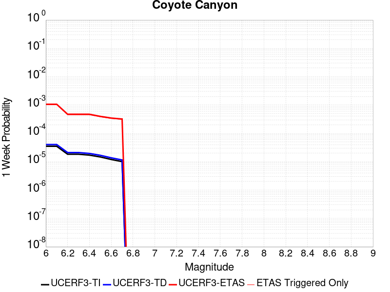 | 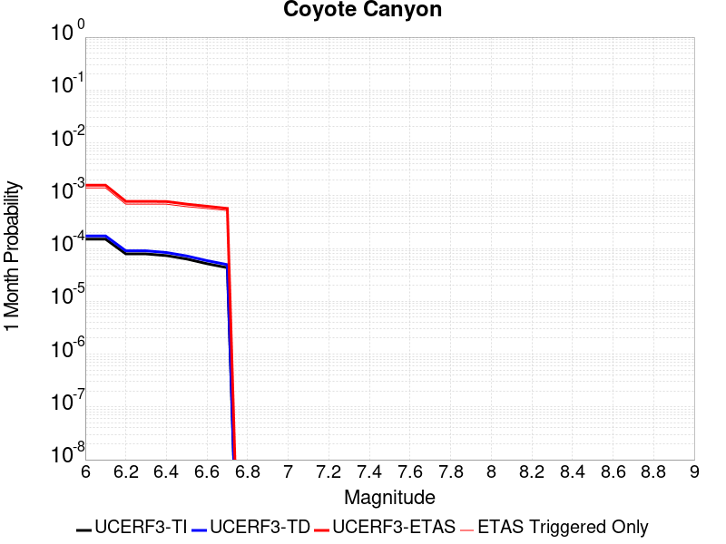 | 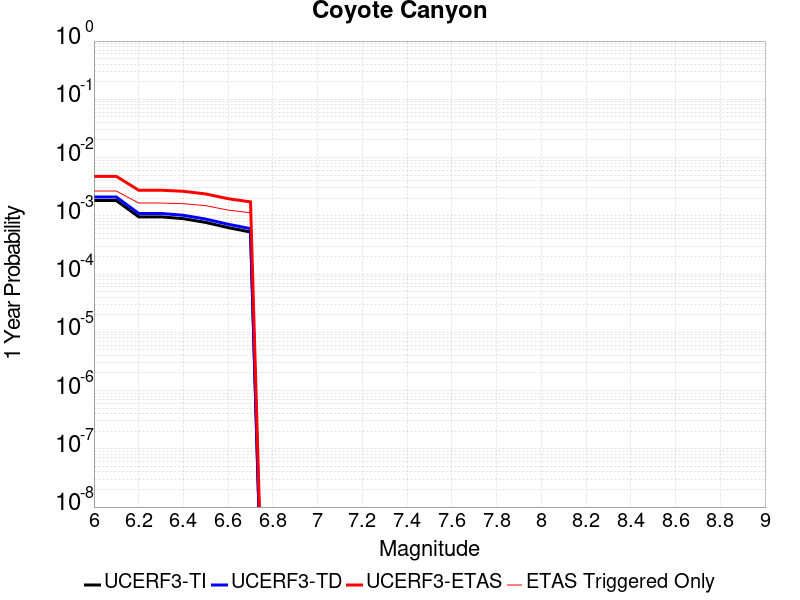 | 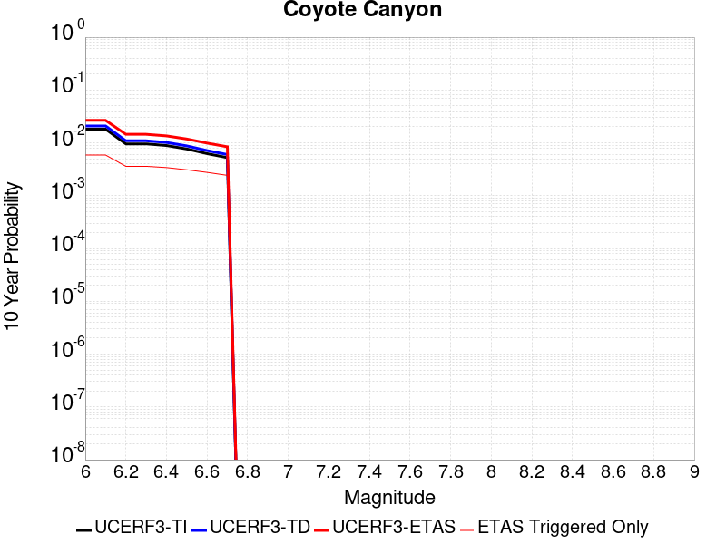 |

| Magnitude | 1 wk TI Prob | 1 wk TD Prob | 1 wk ETAS Prob | 1 wk ETAS/TD Gain | 1 wk ETAS Triggered Only | 1 mo TI Prob | 1 mo TD Prob | 1 mo ETAS Prob | 1 mo ETAS/TD Gain | 1 mo ETAS Triggered Only | 1 yr TI Prob | 1 yr TD Prob | 1 yr ETAS Prob | 1 yr ETAS/TD Gain | 1 yr ETAS Triggered Only | 10 yr TI Prob | 10 yr TD Prob | 10 yr ETAS Prob | 10 yr ETAS/TD Gain | 10 yr ETAS Triggered Only |
|-----|-----|-----|-----|-----|-----|-----|-----|-----|-----|-----|-----|-----|-----|-----|-----|-----|-----|-----|-----|-----|
| 6.0 | 3.5090034E-5 | 4.0364324E-5 | 0.0010703227 | 26.516554 | 0.00103 | 1.503772E-4 | 1.7297994E-4 | 0.0017027153 | 9.843426 | 0.00153 | 0.0018293047 | 0.0021042528 | 0.005337435 | 2.536499 | 0.00324 | 0.018143194 | 0.020869201 | 0.02691044 | 1.2894809 | 0.00617 |
| 6.1 | 3.5090034E-5 | 4.0364324E-5 | 0.0010703227 | 26.516554 | 0.00103 | 1.503772E-4 | 1.7297994E-4 | 0.0017027153 | 9.843426 | 0.00153 | 0.0018293047 | 0.0021042528 | 0.005337435 | 2.536499 | 0.00324 | 0.018143194 | 0.020869201 | 0.02691044 | 1.2894809 | 0.00617 |
| 6.2 | 1.841879E-5 | 2.1059794E-5 | 5.510486E-4 | 26.165909 | 5.3E-4 | 7.8935285E-5 | 9.0253714E-5 | 9.101797E-4 | 10.084679 | 8.2E-4 | 9.606133E-4 | 0.001098387 | 0.0030162781 | 2.7460978 | 0.00192 | 0.0095647145 | 0.010939667 | 0.014806893 | 1.3535049 | 0.00391 |
| 6.3 | 1.841879E-5 | 2.1059794E-5 | 5.510486E-4 | 26.165909 | 5.3E-4 | 7.8935285E-5 | 9.0253714E-5 | 9.101797E-4 | 10.084679 | 8.2E-4 | 9.606133E-4 | 0.001098387 | 0.0030162781 | 2.7460978 | 0.00192 | 0.0095647145 | 0.010939667 | 0.014806893 | 1.3535049 | 0.00391 |
| 6.4 | 1.712201E-5 | 1.9565212E-5 | 5.495548E-4 | 28.088367 | 5.3E-4 | 7.337798E-5 | 8.3848776E-5 | 8.9378085E-4 | 10.659438 | 8.1E-4 | 8.930107E-4 | 0.0010204813 | 0.002838624 | 2.7816522 | 0.00182 | 0.008894307 | 0.010167871 | 0.0138698425 | 1.3640853 | 0.00374 |
| 6.5 | 1.4744935E-5 | 1.6836972E-5 | 4.668294E-4 | 27.726446 | 4.5E-4 | 6.3191044E-5 | 7.215698E-5 | 7.7210646E-4 | 10.700371 | 7.0E-4 | 7.6907943E-4 | 8.7825063E-4 | 0.0025268015 | 2.8770847 | 0.00165 | 0.007664232 | 0.008756994 | 0.012147046 | 1.387125 | 0.00342 |
| 6.6 | 1.2017839E-5 | 1.37240895E-5 | 4.137186E-4 | 30.145432 | 4.0E-4 | 5.150401E-5 | 5.88167E-5 | 7.0877845E-4 | 12.050633 | 6.5E-4 | 6.268809E-4 | 7.159466E-4 | 0.002124937 | 2.9680107 | 0.00141 | 0.0062511545 | 0.0071450938 | 0.010133587 | 1.4182581 | 0.00301 |
| 6.7 | 1.00956095E-5 | 1.1533517E-5 | 3.515296E-4 | 30.47896 | 3.4E-4 | 4.326618E-5 | 4.942891E-5 | 6.094012E-4 | 12.328842 | 5.6E-4 | 5.266384E-4 | 6.017178E-4 | 0.0018009957 | 2.9930904 | 0.0012 | 0.005253921 | 0.0060094125 | 0.008534148 | 1.4201303 | 0.00254 |

## San Andreas (Mojave N)
*[(top)](#table-of-contents)*

| 1 Week | 1 Month | 1 Year | 10 Year |
|-----|-----|-----|-----|
| 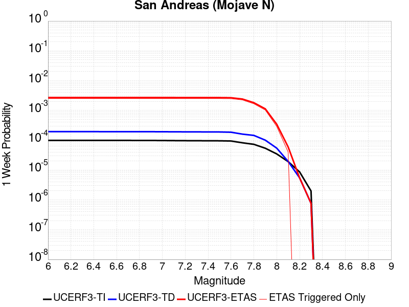 |  | 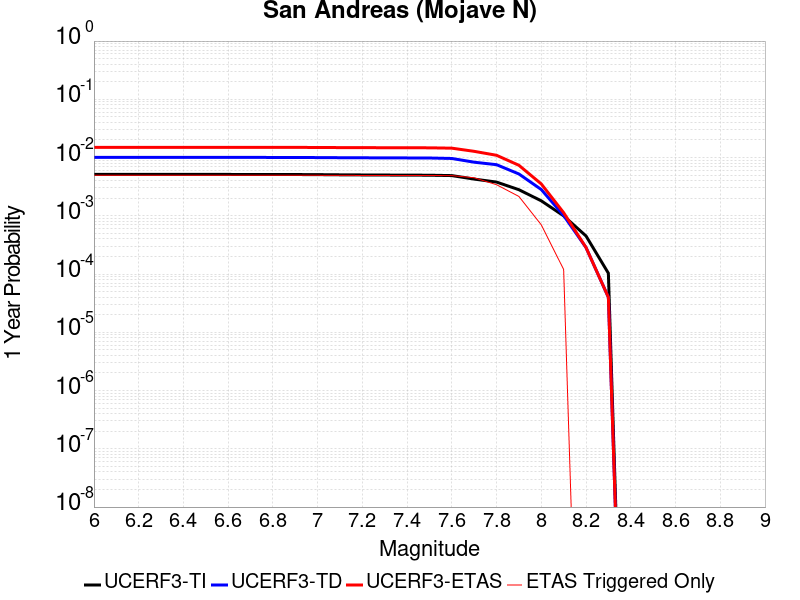 | 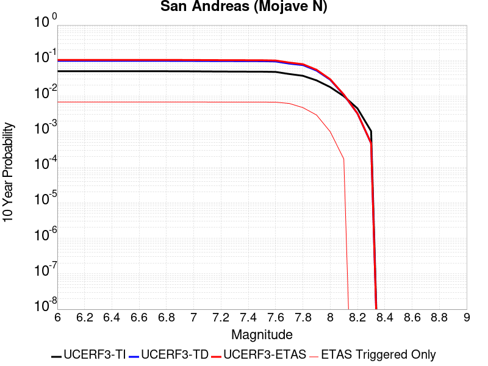 |

| Magnitude | 1 wk TI Prob | 1 wk TD Prob | 1 wk ETAS Prob | 1 wk ETAS/TD Gain | 1 wk ETAS Triggered Only | 1 mo TI Prob | 1 mo TD Prob | 1 mo ETAS Prob | 1 mo ETAS/TD Gain | 1 mo ETAS Triggered Only | 1 yr TI Prob | 1 yr TD Prob | 1 yr ETAS Prob | 1 yr ETAS/TD Gain | 1 yr ETAS Triggered Only | 10 yr TI Prob | 10 yr TD Prob | 10 yr ETAS Prob | 10 yr ETAS/TD Gain | 10 yr ETAS Triggered Only |
|-----|-----|-----|-----|-----|-----|-----|-----|-----|-----|-----|-----|-----|-----|-----|-----|-----|-----|-----|-----|-----|
| 6.0 | 9.877682E-5 | 1.9400702E-4 | 0.00270352 | 13.935166 | 0.00251 | 4.2326056E-4 | 8.311939E-4 | 0.004058509 | 4.8827467 | 0.00323 | 0.0051410277 | 0.010072956 | 0.014982994 | 1.4874476 | 0.00496 | 0.05023708 | 0.09831428 | 0.104472786 | 1.0626411 | 0.00683 |
| 6.1 | 9.877682E-5 | 1.9400702E-4 | 0.00270352 | 13.935166 | 0.00251 | 4.2326056E-4 | 8.311939E-4 | 0.004058509 | 4.8827467 | 0.00323 | 0.0051410277 | 0.010072956 | 0.014982994 | 1.4874476 | 0.00496 | 0.05023708 | 0.09831428 | 0.104472786 | 1.0626411 | 0.00683 |
| 6.2 | 9.877682E-5 | 1.9400702E-4 | 0.00270352 | 13.935166 | 0.00251 | 4.2326056E-4 | 8.311939E-4 | 0.004058509 | 4.8827467 | 0.00323 | 0.0051410277 | 0.010072956 | 0.014982994 | 1.4874476 | 0.00496 | 0.05023708 | 0.09831428 | 0.104472786 | 1.0626411 | 0.00683 |
| 6.3 | 9.877682E-5 | 1.9400702E-4 | 0.00270352 | 13.935166 | 0.00251 | 4.2326056E-4 | 8.311939E-4 | 0.004058509 | 4.8827467 | 0.00323 | 0.0051410277 | 0.010072956 | 0.014982994 | 1.4874476 | 0.00496 | 0.05023708 | 0.09831428 | 0.104472786 | 1.0626411 | 0.00683 |
| 6.4 | 9.877682E-5 | 1.9400702E-4 | 0.00270352 | 13.935166 | 0.00251 | 4.2326056E-4 | 8.311939E-4 | 0.004058509 | 4.8827467 | 0.00323 | 0.0051410277 | 0.010072956 | 0.014982994 | 1.4874476 | 0.00496 | 0.05023708 | 0.09831428 | 0.104472786 | 1.0626411 | 0.00683 |
| 6.5 | 9.861474E-5 | 1.9374468E-4 | 0.0027032583 | 13.952684 | 0.00251 | 4.2256617E-4 | 8.300703E-4 | 0.004057389 | 4.8880067 | 0.00323 | 0.0051326132 | 0.010059402 | 0.014969508 | 1.488111 | 0.00496 | 0.050156746 | 0.098192066 | 0.104351416 | 1.0627276 | 0.00683 |
| 6.6 | 9.861474E-5 | 1.9374468E-4 | 0.0027032583 | 13.952684 | 0.00251 | 4.2256617E-4 | 8.300703E-4 | 0.004057389 | 4.8880067 | 0.00323 | 0.0051326132 | 0.010059402 | 0.014969508 | 1.488111 | 0.00496 | 0.050156746 | 0.098192066 | 0.104351416 | 1.0627276 | 0.00683 |
| 6.7 | 9.8552715E-5 | 1.9364421E-4 | 0.0027031582 | 13.959406 | 0.00251 | 4.223004E-4 | 8.2964E-4 | 0.0040569603 | 4.8900247 | 0.00323 | 0.0051293927 | 0.010054212 | 0.014964343 | 1.4883655 | 0.00496 | 0.050125998 | 0.098145254 | 0.104304925 | 1.0627607 | 0.00683 |
| 6.8 | 9.8464974E-5 | 1.9349584E-4 | 0.00270301 | 13.969345 | 0.00251 | 4.219245E-4 | 8.290045E-4 | 0.004056327 | 4.893009 | 0.00323 | 0.0051248376 | 0.010046546 | 0.0149567155 | 1.488742 | 0.00496 | 0.05008251 | 0.09807528 | 0.104235426 | 1.0628104 | 0.00683 |
| 6.9 | 9.825824E-5 | 1.9317595E-4 | 0.0027026911 | 13.990827 | 0.00251 | 4.2103877E-4 | 8.276344E-4 | 0.0040549613 | 4.8994594 | 0.00323 | 0.0051141046 | 0.010030019 | 0.01494027 | 1.4895555 | 0.00496 | 0.049980022 | 0.09792438 | 0.10408556 | 1.0629177 | 0.00683 |
| 7.0 | 9.781462E-5 | 1.924896E-4 | 0.0027020064 | 14.037155 | 0.00251 | 4.1913814E-4 | 8.246948E-4 | 0.004052031 | 4.9133706 | 0.00323 | 0.005091073 | 0.009994558 | 0.014904985 | 1.49131 | 0.00496 | 0.04976007 | 0.09760077 | 0.10376416 | 1.063149 | 0.00683 |
| 7.1 | 9.7121134E-5 | 1.9150671E-4 | 0.002701026 | 14.10408 | 0.00251 | 4.1616702E-4 | 8.204851E-4 | 0.004047835 | 4.9334655 | 0.00323 | 0.005055068 | 0.009943774 | 0.014834652 | 1.4918532 | 0.00494 | 0.04941613 | 0.09713728 | 0.10327675 | 1.063204 | 0.0068 |
| 7.2 | 9.663819E-5 | 1.9081456E-4 | 0.0026903376 | 14.099225 | 0.0025 | 4.1409794E-4 | 8.175206E-4 | 0.004034888 | 4.9355187 | 0.00322 | 0.0050299936 | 0.00990801 | 0.014789164 | 1.4926472 | 0.00493 | 0.049176537 | 0.09681055 | 0.102943204 | 1.063347 | 0.00679 |
| 7.3 | 9.6277574E-5 | 1.9033969E-4 | 0.0026898638 | 14.131912 | 0.0025 | 4.125529E-4 | 8.154867E-4 | 0.004032861 | 4.945342 | 0.00322 | 0.0050112694 | 0.009883473 | 0.014764748 | 1.4938825 | 0.00493 | 0.04899759 | 0.09658401 | 0.102718204 | 1.0635115 | 0.00679 |
| 7.4 | 9.593308E-5 | 1.897375E-4 | 0.002689263 | 14.173598 | 0.0025 | 4.1107697E-4 | 8.129075E-4 | 0.00403029 | 4.9578705 | 0.00322 | 0.0049933824 | 0.009852355 | 0.014733783 | 1.495458 | 0.00493 | 0.04882661 | 0.09630218 | 0.10243829 | 1.0637172 | 0.00679 |
| 7.5 | 9.561707E-5 | 1.8919831E-4 | 0.0026887252 | 14.211148 | 0.0025 | 4.0972308E-4 | 8.1059814E-4 | 0.004027988 | 4.9691553 | 0.00322 | 0.0049769743 | 0.009824493 | 0.014696157 | 1.4958692 | 0.00492 | 0.048669744 | 0.09604836 | 0.10217716 | 1.0638094 | 0.00678 |
| 7.6 | 9.418194E-5 | 1.8572104E-4 | 0.0026652606 | 14.35088 | 0.00248 | 4.0357444E-4 | 7.957047E-4 | 0.0039931587 | 5.0183926 | 0.0032 | 0.004902454 | 0.009644784 | 0.014497525 | 1.5031466 | 0.0049 | 0.047957025 | 0.094430685 | 0.100543275 | 1.064731 | 0.00675 |
| 7.7 | 8.202141E-5 | 1.6021315E-4 | 0.0024098526 | 15.041541 | 0.00225 | 3.51473E-4 | 6.8644714E-4 | 0.0035744633 | 5.207194 | 0.00289 | 0.00427079 | 0.008325525 | 0.01278806 | 1.5360065 | 0.0045 | 0.04189639 | 0.08223219 | 0.087931536 | 1.0693079 | 0.00621 |
| 7.8 | 7.2859846E-5 | 1.4516473E-4 | 0.0018149223 | 12.502502 | 0.00167 | 3.1221908E-4 | 6.219862E-4 | 0.002810624 | 4.5187883 | 0.00219 | 0.003794643 | 0.0075464295 | 0.010940621 | 1.4497744 | 0.00342 | 0.037304975 | 0.07472468 | 0.07911974 | 1.0588167 | 0.00475 |
| 7.9 | 5.3874453E-5 | 1.0045676E-4 | 0.0011303533 | 11.252137 | 0.00103 | 2.3087008E-4 | 4.3045796E-4 | 0.0017598855 | 4.0884027 | 0.00133 | 0.0028072202 | 0.0052282433 | 0.0073670023 | 1.409078 | 0.00215 | 0.02772022 | 0.05242443 | 0.0552103 | 1.0531408 | 0.00294 |
| 8.0 | 3.468538E-5 | 5.4260272E-5 | 3.4424453E-4 | 6.3443203 | 2.9E-4 | 1.4864317E-4 | 2.325233E-4 | 6.324303E-4 | 2.7198577 | 4.0E-4 | 0.0018082283 | 0.002827298 | 0.0035253188 | 1.2468863 | 7.0E-4 | 0.017935853 | 0.028947512 | 0.029918564 | 1.0335453 | 0.001 |
| 8.1 | 1.9152367E-5 | 1.940263E-5 | 5.9401853E-5 | 3.061536 | 4.0E-5 | 8.207899E-5 | 8.3151484E-5 | 1.4314649E-4 | 1.7215146 | 6.0E-5 | 9.988535E-4 | 0.0010118998 | 0.0011317784 | 1.1184688 | 1.2E-4 | 0.009943757 | 0.01085625 | 0.011024404 | 1.0154892 | 1.7E-4 |
| 8.2 | 8.643924E-6 | 5.4748625E-6 | 5.4748625E-6 | 1.0 | 0.0 | 3.704486E-5 | 2.3463486E-5 | 2.3463486E-5 | 1.0 | 0.0 | 4.5092785E-4 | 2.8563058E-4 | 2.8563058E-4 | 1.0 | 0.0 | 0.0045001395 | 0.0032487072 | 0.0032487072 | 1.0 | 0.0 |
| 8.3 | 1.983087E-6 | 7.6599065E-7 | 7.6599065E-7 | 1.0 | 0.0 | 8.498917E-6 | 3.282813E-6 | 3.282813E-6 | 1.0 | 0.0 | 1.034694E-4 | 3.9967534E-5 | 3.9967534E-5 | 1.0 | 0.0 | 0.0010342124 | 4.719687E-4 | 4.719687E-4 | 1.0 | 0.0 |

## Nelson Lake
*[(top)](#table-of-contents)*

| 1 Week | 1 Month | 1 Year | 10 Year |
|-----|-----|-----|-----|
| 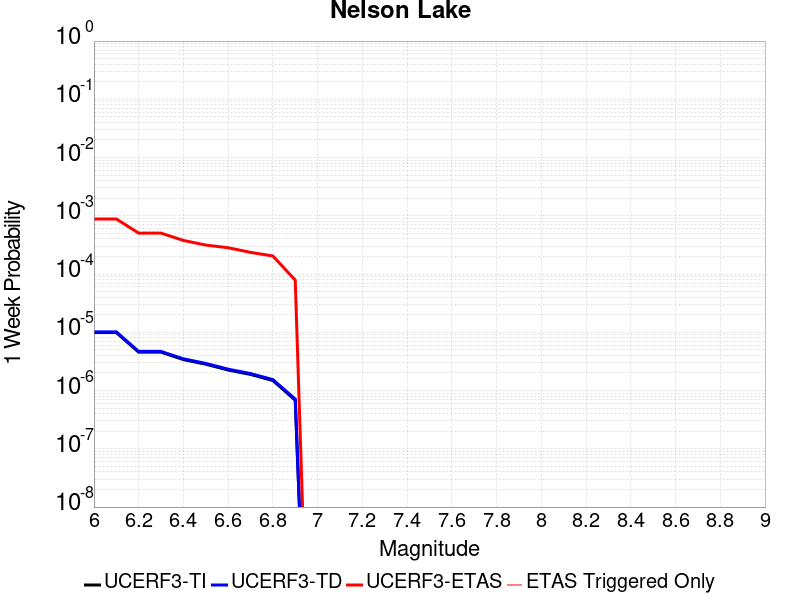 | 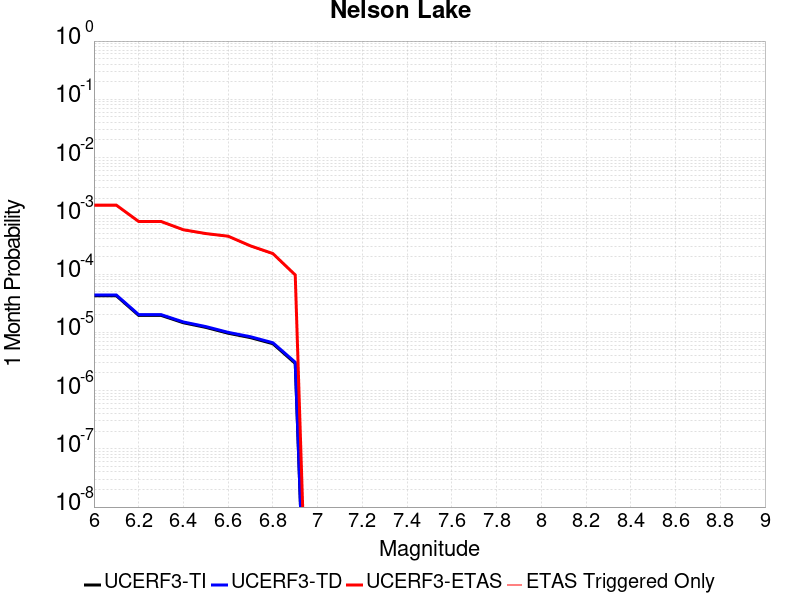 | 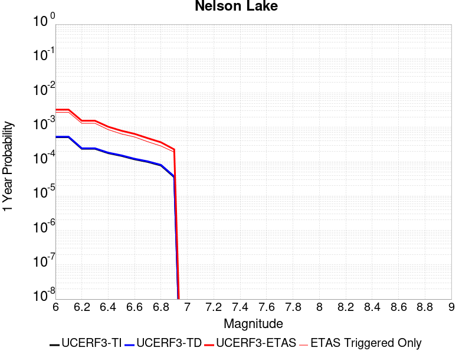 | 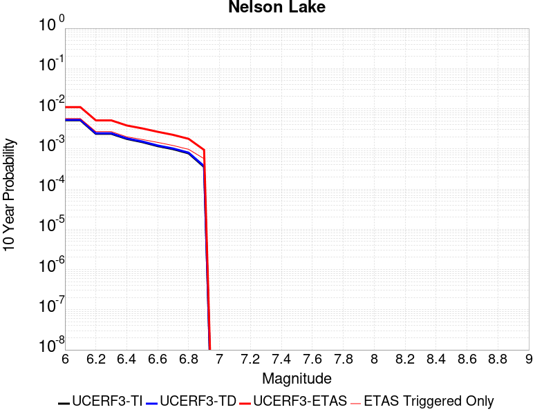 |

| Magnitude | 1 wk TI Prob | 1 wk TD Prob | 1 wk ETAS Prob | 1 wk ETAS/TD Gain | 1 wk ETAS Triggered Only | 1 mo TI Prob | 1 mo TD Prob | 1 mo ETAS Prob | 1 mo ETAS/TD Gain | 1 mo ETAS Triggered Only | 1 yr TI Prob | 1 yr TD Prob | 1 yr ETAS Prob | 1 yr ETAS/TD Gain | 1 yr ETAS Triggered Only | 10 yr TI Prob | 10 yr TD Prob | 10 yr ETAS Prob | 10 yr ETAS/TD Gain | 10 yr ETAS Triggered Only |
|-----|-----|-----|-----|-----|-----|-----|-----|-----|-----|-----|-----|-----|-----|-----|-----|-----|-----|-----|-----|-----|
| 6.0 | 9.913453E-6 | 1.0192255E-5 | 7.901843E-4 | 77.527916 | 7.8E-4 | 4.2485535E-5 | 4.3680422E-5 | 0.001403621 | 32.13387 | 0.00136 | 5.1713863E-4 | 5.316897E-4 | 0.0036100522 | 6.7897725 | 0.00308 | 0.0051593683 | 0.005305204 | 0.011014752 | 2.0762165 | 0.00574 |
| 6.1 | 9.913453E-6 | 1.0192255E-5 | 7.901843E-4 | 77.527916 | 7.8E-4 | 4.2485535E-5 | 4.3680422E-5 | 0.001403621 | 32.13387 | 0.00136 | 5.1713863E-4 | 5.316897E-4 | 0.0036100522 | 6.7897725 | 0.00308 | 0.0051593683 | 0.005305204 | 0.011014752 | 2.0762165 | 0.00574 |
| 6.2 | 4.5596407E-6 | 4.696313E-6 | 4.2469433E-4 | 90.431435 | 4.2E-4 | 1.954117E-5 | 2.0126909E-5 | 7.301126E-4 | 36.275448 | 7.1E-4 | 2.3788778E-4 | 2.4501883E-4 | 0.0017446512 | 7.1204786 | 0.0015 | 0.0023763329 | 0.0024476128 | 0.005310588 | 2.169701 | 0.00287 |
| 6.3 | 4.5596407E-6 | 4.696313E-6 | 4.2469433E-4 | 90.431435 | 4.2E-4 | 1.954117E-5 | 2.0126909E-5 | 7.301126E-4 | 36.275448 | 7.1E-4 | 2.3788778E-4 | 2.4501883E-4 | 0.0017446512 | 7.1204786 | 0.0015 | 0.0023763329 | 0.0024476128 | 0.005310588 | 2.169701 | 0.00287 |
| 6.4 | 3.4025713E-6 | 3.5098972E-6 | 3.435087E-4 | 97.86859 | 3.4E-4 | 1.4582367E-5 | 1.5042335E-5 | 5.4503436E-4 | 36.23336 | 5.3E-4 | 1.7752586E-4 | 1.8312587E-4 | 0.0013329153 | 7.2786837 | 0.00115 | 0.001773841 | 0.0018298327 | 0.0040457705 | 2.2110057 | 0.00222 |
| 6.5 | 2.8352947E-6 | 2.927856E-6 | 2.8292704E-4 | 96.632835 | 2.8E-4 | 1.2151207E-5 | 1.2547898E-5 | 4.7254213E-4 | 37.659065 | 4.6E-4 | 1.479309E-4 | 1.5276071E-4 | 0.0010926172 | 7.152475 | 9.4E-4 | 0.0014783246 | 0.0015266308 | 0.0034436998 | 2.2557514 | 0.00192 |
| 6.6 | 2.251518E-6 | 2.3290677E-6 | 2.523285E-4 | 108.338844 | 2.5E-4 | 9.649328E-6 | 9.981683E-6 | 4.299775E-4 | 43.07665 | 4.2E-4 | 1.1747423E-4 | 1.2152085E-4 | 9.614188E-4 | 7.9115543 | 8.4E-4 | 0.0011741214 | 0.0012146058 | 0.0028626015 | 2.3568156 | 0.00165 |
| 6.7 | 1.8911853E-6 | 1.9591396E-6 | 2.1195873E-4 | 108.1897 | 2.1E-4 | 8.105055E-6 | 8.39629E-6 | 3.183937E-4 | 37.92076 | 3.1E-4 | 9.867457E-5 | 1.0222061E-4 | 7.721521E-4 | 7.553781 | 6.7E-4 | 9.863076E-4 | 0.0010217935 | 0.002420363 | 2.3687398 | 0.0014 |
| 6.8 | 1.4874814E-6 | 1.5438305E-6 | 1.8154355E-4 | 117.59293 | 1.8E-4 | 6.374905E-6 | 6.6164025E-6 | 2.4661483E-4 | 37.273247 | 2.4E-4 | 7.76117E-5 | 8.055224E-5 | 6.4050715E-4 | 7.95145 | 5.6E-4 | 7.75846E-4 | 8.0528157E-4 | 0.0019243796 | 2.3896978 | 0.00112 |
| 6.9 | 6.835972E-7 | 7.1399285E-7 | 8.071394E-5 | 113.04586 | 8.0E-5 | 2.9296991E-6 | 3.0599674E-6 | 1.1305963E-4 | 36.947987 | 1.1E-4 | 3.56685E-5 | 3.7254784E-5 | 2.8724546E-4 | 7.710297 | 2.5E-4 | 3.5662777E-4 | 3.7251666E-4 | 9.223118E-4 | 2.475894 | 5.5E-4 |

## So Sierra Nevada
*[(top)](#table-of-contents)*

| 1 Week | 1 Month | 1 Year | 10 Year |
|-----|-----|-----|-----|
| 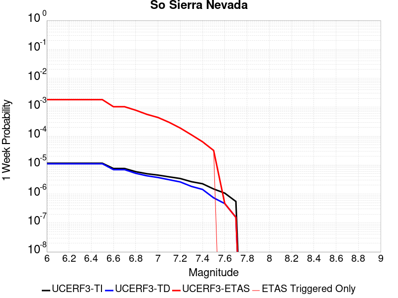 | 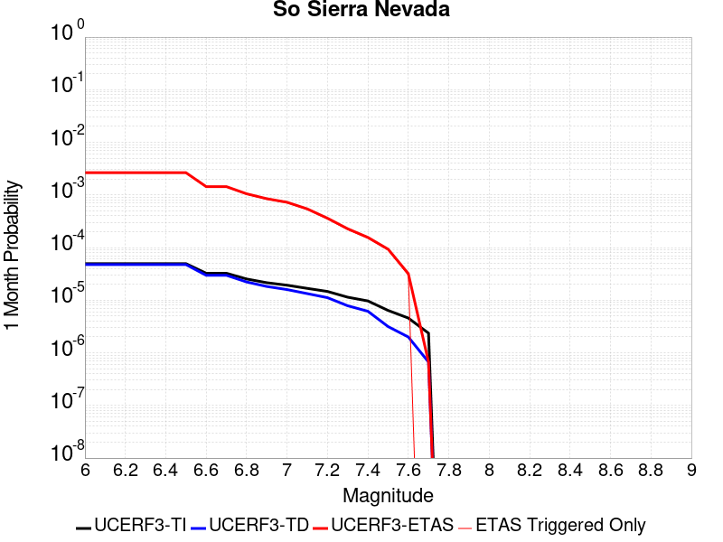 | 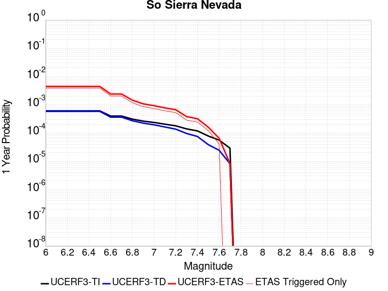 | 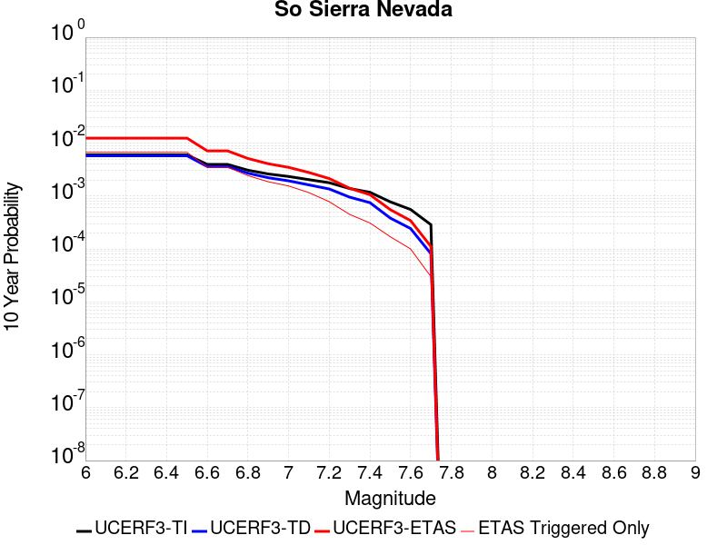 |

| Magnitude | 1 wk TI Prob | 1 wk TD Prob | 1 wk ETAS Prob | 1 wk ETAS/TD Gain | 1 wk ETAS Triggered Only | 1 mo TI Prob | 1 mo TD Prob | 1 mo ETAS Prob | 1 mo ETAS/TD Gain | 1 mo ETAS Triggered Only | 1 yr TI Prob | 1 yr TD Prob | 1 yr ETAS Prob | 1 yr ETAS/TD Gain | 1 yr ETAS Triggered Only | 10 yr TI Prob | 10 yr TD Prob | 10 yr ETAS Prob | 10 yr ETAS/TD Gain | 10 yr ETAS Triggered Only |
|-----|-----|-----|-----|-----|-----|-----|-----|-----|-----|-----|-----|-----|-----|-----|-----|-----|-----|-----|-----|-----|
| 6.0 | 1.15488665E-5 | 1.1079643E-5 | 0.0019010587 | 171.58124 | 0.00189 | 4.9494203E-5 | 4.748339E-5 | 0.0026473599 | 55.75339 | 0.0026 | 6.024253E-4 | 5.7796965E-4 | 0.005045386 | 8.7295 | 0.00447 | 0.006007948 | 0.005765934 | 0.012427302 | 2.1552973 | 0.0067 |
| 6.1 | 1.15488665E-5 | 1.1079643E-5 | 0.0019010587 | 171.58124 | 0.00189 | 4.9494203E-5 | 4.748339E-5 | 0.0026473599 | 55.75339 | 0.0026 | 6.024253E-4 | 5.7796965E-4 | 0.005045386 | 8.7295 | 0.00447 | 0.006007948 | 0.005765934 | 0.012427302 | 2.1552973 | 0.0067 |
| 6.2 | 1.15488665E-5 | 1.1079643E-5 | 0.0019010587 | 171.58124 | 0.00189 | 4.9494203E-5 | 4.748339E-5 | 0.0026473599 | 55.75339 | 0.0026 | 6.024253E-4 | 5.7796965E-4 | 0.005045386 | 8.7295 | 0.00447 | 0.006007948 | 0.005765934 | 0.012427302 | 2.1552973 | 0.0067 |
| 6.3 | 1.15488665E-5 | 1.1079643E-5 | 0.0019010587 | 171.58124 | 0.00189 | 4.9494203E-5 | 4.748339E-5 | 0.0026473599 | 55.75339 | 0.0026 | 6.024253E-4 | 5.7796965E-4 | 0.005045386 | 8.7295 | 0.00447 | 0.006007948 | 0.005765934 | 0.012427302 | 2.1552973 | 0.0067 |
| 6.4 | 1.15488665E-5 | 1.1079643E-5 | 0.0019010587 | 171.58124 | 0.00189 | 4.9494203E-5 | 4.748339E-5 | 0.0026473599 | 55.75339 | 0.0026 | 6.024253E-4 | 5.7796965E-4 | 0.005045386 | 8.7295 | 0.00447 | 0.006007948 | 0.005765934 | 0.012427302 | 2.1552973 | 0.0067 |
| 6.5 | 1.15488665E-5 | 1.1079643E-5 | 0.0019010587 | 171.58124 | 0.00189 | 4.9494203E-5 | 4.748339E-5 | 0.0026473599 | 55.75339 | 0.0026 | 6.024253E-4 | 5.7796965E-4 | 0.005045386 | 8.7295 | 0.00447 | 0.006007948 | 0.005765934 | 0.012427302 | 2.1552973 | 0.0067 |
| 6.6 | 7.587044E-6 | 6.935635E-6 | 0.0010469285 | 150.94917 | 0.00104 | 3.2515498E-5 | 2.9723828E-5 | 0.001439682 | 48.43528 | 0.00141 | 3.9580427E-4 | 3.6183043E-4 | 0.0027709585 | 7.6581683 | 0.00241 | 0.003951 | 0.0036127048 | 0.007119988 | 1.9708192 | 0.00352 |
| 6.7 | 7.587044E-6 | 6.935635E-6 | 0.0010469285 | 150.94917 | 0.00104 | 3.2515498E-5 | 2.9723828E-5 | 0.001439682 | 48.43528 | 0.00141 | 3.9580427E-4 | 3.6183043E-4 | 0.0027709585 | 7.6581683 | 0.00241 | 0.003951 | 0.0036127048 | 0.007119988 | 1.9708192 | 0.00352 |
| 6.8 | 5.9026956E-6 | 5.1793927E-6 | 8.051752E-4 | 155.45746 | 8.0E-4 | 2.5297022E-5 | 2.2197215E-5 | 0.0010521744 | 47.401188 | 0.00103 | 3.0794772E-4 | 2.7021873E-4 | 0.0019197728 | 7.104514 | 0.00165 | 0.0030752132 | 0.002699018 | 0.0051224595 | 1.8978975 | 0.00243 |
| 6.9 | 5.0118915E-6 | 4.2524252E-6 | 6.1424985E-4 | 144.44695 | 6.1E-4 | 2.1479358E-5 | 1.8224557E-5 | 8.482094E-4 | 46.542114 | 8.3E-4 | 2.614798E-4 | 2.2186211E-4 | 0.0015115759 | 6.8131323 | 0.00129 | 0.0026117235 | 0.0022164788 | 0.004072356 | 1.8373089 | 0.00186 |
| 7.0 | 4.4924795E-6 | 3.7139177E-6 | 5.2371196E-4 | 141.01335 | 5.2E-4 | 1.925334E-5 | 1.5916696E-5 | 7.259054E-4 | 45.606537 | 7.1E-4 | 2.3438422E-4 | 1.9376918E-4 | 0.001283558 | 6.62416 | 0.00109 | 0.0023413717 | 0.0019360651 | 0.0034830642 | 1.7990428 | 0.00155 |
| 7.1 | 3.9118436E-6 | 3.1119775E-6 | 3.9311076E-4 | 126.321846 | 3.9E-4 | 1.6764936E-5 | 1.3336982E-5 | 5.433299E-4 | 40.738594 | 5.3E-4 | 2.0409399E-4 | 1.6236622E-4 | 0.0010122282 | 6.234229 | 8.5E-4 | 0.0020390663 | 0.001622532 | 0.0027806498 | 1.7137719 | 0.00116 |
| 7.2 | 3.4200818E-6 | 2.6054543E-6 | 2.526048E-4 | 96.95231 | 2.5E-4 | 1.4657411E-5 | 1.11661875E-5 | 3.6116227E-4 | 32.344276 | 3.5E-4 | 1.7843937E-4 | 1.3594035E-4 | 7.258601E-4 | 5.3395486 | 5.9E-4 | 0.0017829615 | 0.0013586218 | 0.002137562 | 1.5733312 | 7.8E-4 |
| 7.3 | 2.6593618E-6 | 1.8284203E-6 | 1.5182815E-4 | 83.03788 | 1.5E-4 | 1.13972155E-5 | 7.836065E-6 | 2.2783435E-4 | 29.075096 | 2.2E-4 | 1.3875226E-4 | 9.540021E-5 | 4.3536778E-4 | 4.5635934 | 3.4E-4 | 0.0013866565 | 9.5362146E-4 | 0.0014031923 | 1.4714353 | 4.5E-4 |
| 7.4 | 2.2577992E-6 | 1.436438E-6 | 8.143632E-5 | 56.693237 | 8.0E-5 | 9.676246E-6 | 6.15615E-6 | 1.5615522E-4 | 25.365728 | 1.5E-4 | 1.1780193E-4 | 7.49488E-5 | 3.0493157E-4 | 4.0685315 | 2.3E-4 | 0.001177395 | 7.492603E-4 | 0.001059028 | 1.4134314 | 3.1E-4 |
| 7.5 | 1.489319E-6 | 7.353936E-7 | 4.0735365E-5 | 55.3926 | 4.0E-5 | 6.3827797E-6 | 3.1516831E-6 | 9.31514E-5 | 29.55608 | 9.0E-5 | 7.770758E-5 | 3.8371072E-5 | 1.6836608E-4 | 4.387839 | 1.3E-4 | 7.7680405E-4 | 3.836449E-4 | 5.5357965E-4 | 1.4429481 | 1.7E-4 |
| 7.6 | 1.0680322E-6 | 4.6596554E-7 | 1.0465961E-5 | 22.460804 | 1.0E-5 | 4.577273E-6 | 1.9969937E-6 | 3.1996933E-5 | 16.02255 | 3.0E-5 | 5.5726876E-5 | 2.4313129E-5 | 8.431167E-5 | 3.4677424 | 6.0E-5 | 5.5712904E-4 | 2.4310495E-4 | 3.4308064E-4 | 1.411245 | 1.0E-4 |
| 7.7 | 5.509146E-7 | 1.5580486E-7 | 1.5580486E-7 | 1.0 | 0.0 | 2.3610605E-6 | 6.677349E-7 | 6.677349E-7 | 1.0 | 0.0 | 2.8745531E-5 | 8.129644E-6 | 1.8129562E-5 | 2.2300563 | 1.0E-5 | 2.8741814E-4 | 8.1293576E-5 | 1.1129114E-4 | 1.3690028 | 3.0E-5 |

## Towne Pass
*[(top)](#table-of-contents)*

| 1 Week | 1 Month | 1 Year | 10 Year |
|-----|-----|-----|-----|
| 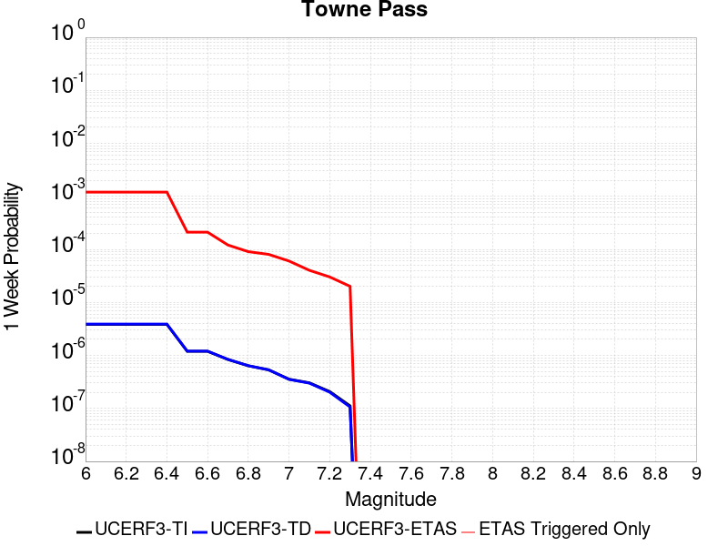 | 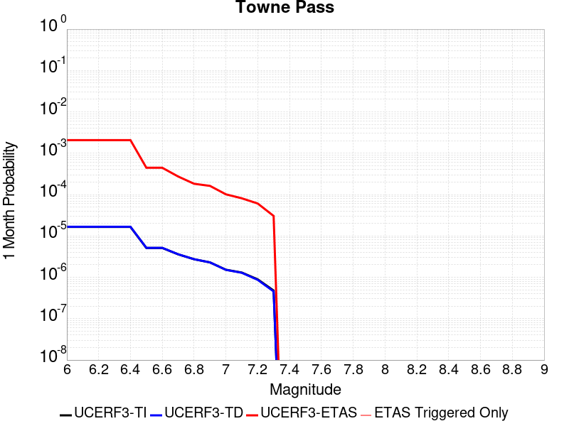 | 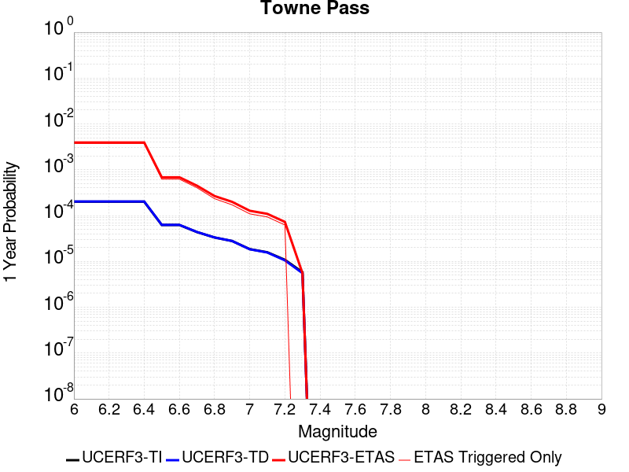 | 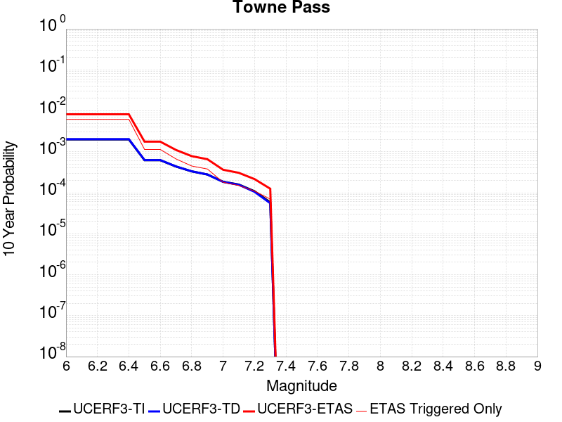 |

| Magnitude | 1 wk TI Prob | 1 wk TD Prob | 1 wk ETAS Prob | 1 wk ETAS/TD Gain | 1 wk ETAS Triggered Only | 1 mo TI Prob | 1 mo TD Prob | 1 mo ETAS Prob | 1 mo ETAS/TD Gain | 1 mo ETAS Triggered Only | 1 yr TI Prob | 1 yr TD Prob | 1 yr ETAS Prob | 1 yr ETAS/TD Gain | 1 yr ETAS Triggered Only | 10 yr TI Prob | 10 yr TD Prob | 10 yr ETAS Prob | 10 yr ETAS/TD Gain | 10 yr ETAS Triggered Only |
|-----|-----|-----|-----|-----|-----|-----|-----|-----|-----|-----|-----|-----|-----|-----|-----|-----|-----|-----|-----|-----|
| 6.0 | 3.849728E-6 | 3.8945414E-6 | 0.0012038898 | 309.12238 | 0.0012 | 1.649873E-5 | 1.669081E-5 | 0.0020766563 | 124.41916 | 0.00206 | 2.0085352E-4 | 2.0319603E-4 | 0.003942436 | 19.402132 | 0.00374 | 0.0020067208 | 0.0020305314 | 0.008227922 | 4.0521026 | 0.00621 |
| 6.1 | 3.849728E-6 | 3.8945414E-6 | 0.0012038898 | 309.12238 | 0.0012 | 1.649873E-5 | 1.669081E-5 | 0.0020766563 | 124.41916 | 0.00206 | 2.0085352E-4 | 2.0319603E-4 | 0.003942436 | 19.402132 | 0.00374 | 0.0020067208 | 0.0020305314 | 0.008227922 | 4.0521026 | 0.00621 |
| 6.2 | 3.849728E-6 | 3.8945414E-6 | 0.0012038898 | 309.12238 | 0.0012 | 1.649873E-5 | 1.669081E-5 | 0.0020766563 | 124.41916 | 0.00206 | 2.0085352E-4 | 2.0319603E-4 | 0.003942436 | 19.402132 | 0.00374 | 0.0020067208 | 0.0020305314 | 0.008227922 | 4.0521026 | 0.00621 |
| 6.3 | 3.849728E-6 | 3.8945414E-6 | 0.0012038898 | 309.12238 | 0.0012 | 1.649873E-5 | 1.669081E-5 | 0.0020766563 | 124.41916 | 0.00206 | 2.0085352E-4 | 2.0319603E-4 | 0.003942436 | 19.402132 | 0.00374 | 0.0020067208 | 0.0020305314 | 0.008227922 | 4.0521026 | 0.00621 |
| 6.4 | 3.849728E-6 | 3.8945414E-6 | 0.0012038898 | 309.12238 | 0.0012 | 1.649873E-5 | 1.669081E-5 | 0.0020766563 | 124.41916 | 0.00206 | 2.0085352E-4 | 2.0319603E-4 | 0.003942436 | 19.402132 | 0.00374 | 0.0020067208 | 0.0020305314 | 0.008227922 | 4.0521026 | 0.00621 |
| 6.5 | 1.1953545E-6 | 1.203052E-6 | 2.112028E-4 | 175.55583 | 2.1E-4 | 5.1229376E-6 | 5.1559277E-6 | 4.4515365E-4 | 86.33823 | 4.4E-4 | 6.236998E-5 | 6.277173E-5 | 7.927259E-4 | 12.628709 | 7.3E-4 | 6.235248E-4 | 6.275517E-4 | 0.0017668363 | 2.8154433 | 0.00114 |
| 6.6 | 1.1953545E-6 | 1.203052E-6 | 2.112028E-4 | 175.55583 | 2.1E-4 | 5.1229376E-6 | 5.1559277E-6 | 4.4515365E-4 | 86.33823 | 4.4E-4 | 6.236998E-5 | 6.277173E-5 | 7.927259E-4 | 12.628709 | 7.3E-4 | 6.235248E-4 | 6.275517E-4 | 0.0017668363 | 2.8154433 | 0.00114 |
| 6.7 | 8.375951E-7 | 8.4106705E-7 | 1.2084097E-4 | 143.67578 | 1.2E-4 | 3.5896885E-6 | 3.6045683E-6 | 2.736036E-4 | 75.90468 | 2.7E-4 | 4.370358E-5 | 4.3884793E-5 | 4.8386547E-4 | 11.025812 | 4.4E-4 | 4.3694986E-4 | 4.38767E-4 | 0.001108473 | 2.5263364 | 6.7E-4 |
| 6.8 | 6.38041E-7 | 6.392156E-7 | 9.063916E-5 | 141.79747 | 9.0E-5 | 2.7344586E-6 | 2.7394929E-6 | 1.82739E-4 | 66.70541 | 1.8E-4 | 3.3291526E-5 | 3.3352855E-5 | 3.0334384E-4 | 9.094989 | 2.7E-4 | 3.3286537E-4 | 3.334823E-4 | 7.833322E-4 | 2.348947 | 4.5E-4 |
| 6.9 | 5.3460053E-7 | 5.345333E-7 | 8.053449E-5 | 150.66318 | 8.0E-5 | 2.2911431E-6 | 2.2908553E-6 | 1.6229048E-4 | 70.84275 | 1.6E-4 | 2.789431E-5 | 2.789084E-5 | 2.578844E-4 | 9.246205 | 2.3E-4 | 2.789081E-4 | 2.7887672E-4 | 6.5877073E-4 | 2.3622293 | 3.8E-4 |
| 7.0 | 3.557783E-7 | 3.5324226E-7 | 6.035322E-5 | 170.85504 | 6.0E-5 | 1.5247632E-6 | 1.5138945E-6 | 1.01513746E-4 | 67.054695 | 1.0E-4 | 1.8563835E-5 | 1.843152E-5 | 1.3842931E-4 | 7.5104666 | 1.2E-4 | 1.8562283E-4 | 1.8430075E-4 | 3.6426756E-4 | 1.9764845 | 1.8E-4 |
| 7.1 | 3.037942E-7 | 3.0002218E-7 | 4.030001E-5 | 134.32344 | 4.0E-5 | 1.3019744E-6 | 1.2858087E-6 | 8.12857E-5 | 63.21757 | 8.0E-5 | 1.5851423E-5 | 1.5654618E-5 | 1.1565305E-4 | 7.387792 | 1.0E-4 | 1.5850292E-4 | 1.5653588E-4 | 3.065124E-4 | 1.9580967 | 1.5E-4 |
| 7.2 | 2.0808248E-7 | 2.0217689E-7 | 3.020217E-5 | 149.38489 | 3.0E-5 | 8.917818E-7 | 8.6647213E-7 | 6.086642E-5 | 70.246254 | 6.0E-5 | 1.0857389E-5 | 1.0549252E-5 | 9.0548405E-5 | 8.583396 | 8.0E-5 | 1.0856859E-4 | 1.0548797E-4 | 2.1547636E-4 | 2.0426629 | 1.1E-4 |
| 7.3 | 1.1162073E-7 | 1.0636894E-7 | 2.0106367E-5 | 189.0248 | 2.0E-5 | 4.7837443E-7 | 4.558668E-7 | 3.0455853E-5 | 66.80867 | 3.0E-5 | 5.8241935E-6 | 5.550166E-6 | 4.5549943E-5 | 8.206951 | 4.0E-5 | 5.8240406E-5 | 5.5500474E-5 | 1.2549659E-4 | 2.2611804 | 7.0E-5 |

## San Andreas (San Bernardino N)
*[(top)](#table-of-contents)*

| 1 Week | 1 Month | 1 Year | 10 Year |
|-----|-----|-----|-----|
| 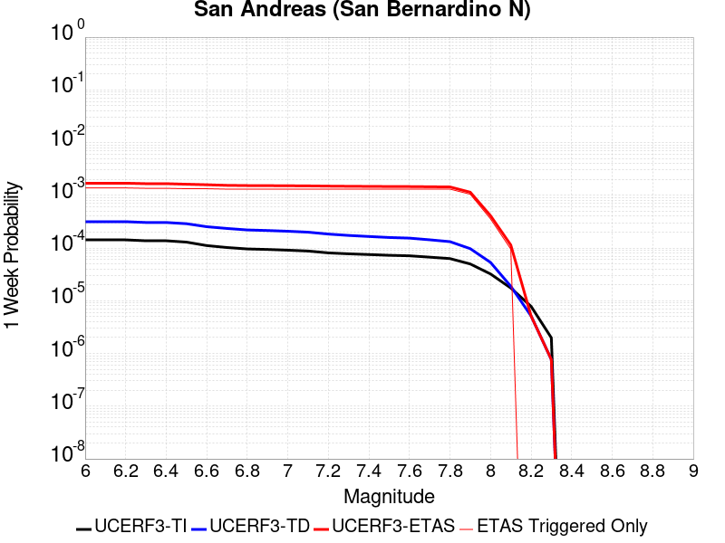 | 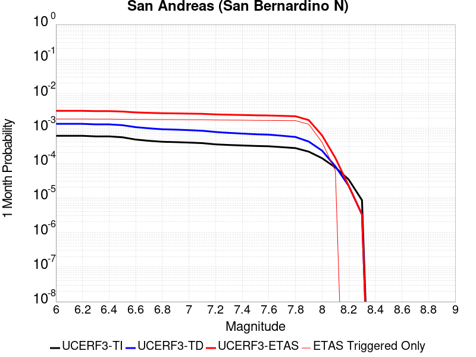 | 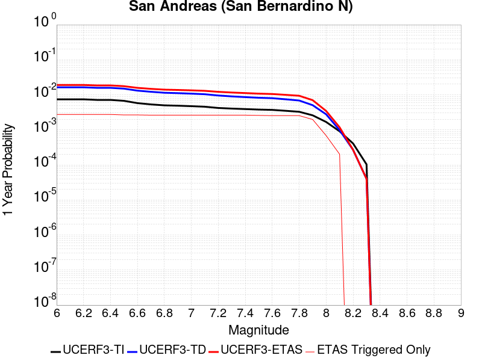 | 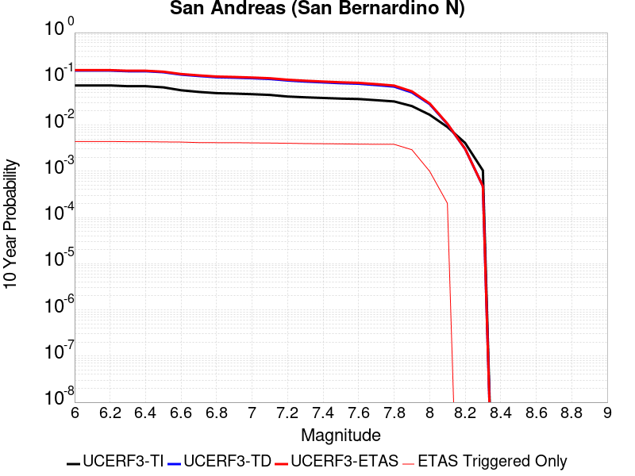 |

| Magnitude | 1 wk TI Prob | 1 wk TD Prob | 1 wk ETAS Prob | 1 wk ETAS/TD Gain | 1 wk ETAS Triggered Only | 1 mo TI Prob | 1 mo TD Prob | 1 mo ETAS Prob | 1 mo ETAS/TD Gain | 1 mo ETAS Triggered Only | 1 yr TI Prob | 1 yr TD Prob | 1 yr ETAS Prob | 1 yr ETAS/TD Gain | 1 yr ETAS Triggered Only | 10 yr TI Prob | 10 yr TD Prob | 10 yr ETAS Prob | 10 yr ETAS/TD Gain | 10 yr ETAS Triggered Only |
|-----|-----|-----|-----|-----|-----|-----|-----|-----|-----|-----|-----|-----|-----|-----|-----|-----|-----|-----|-----|-----|
| 6.0 | 1.4273766E-4 | 3.1606483E-4 | 0.0017156224 | 5.428071 | 0.0014 | 6.115894E-4 | 0.0013538664 | 0.003211348 | 2.371983 | 0.00186 | 0.0074207084 | 0.016360244 | 0.019370181 | 1.1839788 | 0.00306 | 0.07177748 | 0.15026689 | 0.15399721 | 1.0248247 | 0.00439 |
| 6.1 | 1.4273766E-4 | 3.1606483E-4 | 0.0017156224 | 5.428071 | 0.0014 | 6.115894E-4 | 0.0013538664 | 0.003211348 | 2.371983 | 0.00186 | 0.0074207084 | 0.016360244 | 0.019370181 | 1.1839788 | 0.00306 | 0.07177748 | 0.15026689 | 0.15399721 | 1.0248247 | 0.00439 |
| 6.2 | 1.4273766E-4 | 3.1606483E-4 | 0.0017156224 | 5.428071 | 0.0014 | 6.115894E-4 | 0.0013538664 | 0.003211348 | 2.371983 | 0.00186 | 0.0074207084 | 0.016360244 | 0.019370181 | 1.1839788 | 0.00306 | 0.07177748 | 0.15026689 | 0.15399721 | 1.0248247 | 0.00439 |
| 6.3 | 1.3730655E-4 | 3.0511338E-4 | 0.0016946893 | 5.5542936 | 0.00139 | 5.883239E-4 | 0.0013069791 | 0.0031545612 | 2.4136279 | 0.00185 | 0.0071393442 | 0.015797773 | 0.018779906 | 1.1887692 | 0.00303 | 0.06914291 | 0.14556676 | 0.1492921 | 1.0255919 | 0.00436 |
| 6.4 | 1.3730655E-4 | 3.0511338E-4 | 0.0016946893 | 5.5542936 | 0.00139 | 5.883239E-4 | 0.0013069791 | 0.0031545612 | 2.4136279 | 0.00185 | 0.0071393442 | 0.015797773 | 0.018779906 | 1.1887692 | 0.00303 | 0.06914291 | 0.14556676 | 0.1492921 | 1.0255919 | 0.00436 |
| 6.5 | 1.2942807E-4 | 2.8925808E-4 | 0.0016688589 | 5.7694464 | 0.00138 | 5.545738E-4 | 0.0012390936 | 0.0030668261 | 2.475056 | 0.00183 | 0.0067310524 | 0.01498286 | 0.017928062 | 1.1965714 | 0.00299 | 0.06530788 | 0.13870941 | 0.14243019 | 1.0268242 | 0.00432 |
| 6.6 | 1.1125901E-4 | 2.536472E-4 | 0.0016332972 | 6.439248 | 0.00138 | 4.767372E-4 | 0.0010866089 | 0.002894642 | 2.6639228 | 0.00181 | 0.005788839 | 0.013149847 | 0.016080791 | 1.2228881 | 0.00297 | 0.056403454 | 0.122999296 | 0.12677039 | 1.0306596 | 0.0043 |
| 6.7 | 1.02209575E-4 | 2.3499702E-4 | 0.0016046751 | 6.828491 | 0.00137 | 4.3796748E-4 | 0.0010067427 | 0.0028049306 | 2.7861445 | 0.0018 | 0.0053192247 | 0.012188629 | 0.015102673 | 1.2390789 | 0.00295 | 0.051936906 | 0.114790924 | 0.11851765 | 1.0324653 | 0.00421 |
| 6.8 | 9.610582E-5 | 2.2025521E-4 | 0.0015899534 | 7.218687 | 0.00137 | 4.1181705E-4 | 9.436101E-4 | 0.0027419117 | 2.9057674 | 0.0018 | 0.0050023515 | 0.011428202 | 0.014334602 | 1.2543184 | 0.00294 | 0.048912346 | 0.1081929 | 0.11192957 | 1.0345371 | 0.00419 |
| 6.9 | 9.3877505E-5 | 2.1481077E-4 | 0.0015745186 | 7.3297935 | 0.00136 | 4.0227012E-4 | 9.2029345E-4 | 0.0027086462 | 2.9432418 | 0.00179 | 0.0048866454 | 0.011147255 | 0.014034705 | 1.2590278 | 0.00292 | 0.04780577 | 0.10578323 | 0.109494224 | 1.0350811 | 0.00415 |
| 7.0 | 9.1019785E-5 | 2.0808022E-4 | 0.0015677973 | 7.5345807 | 0.00136 | 3.900265E-4 | 8.914682E-4 | 0.0026698813 | 2.994926 | 0.00178 | 0.0047382377 | 0.010799837 | 0.013668518 | 1.2656226 | 0.0029 | 0.046384744 | 0.102753714 | 0.10645037 | 1.0359759 | 0.00412 |
| 7.1 | 8.771155E-5 | 1.9982594E-4 | 0.0015595541 | 7.804563 | 0.00136 | 3.758525E-4 | 8.5611636E-4 | 0.0026345926 | 3.0773766 | 0.00178 | 0.0045664064 | 0.0103736 | 0.013243516 | 1.2766558 | 0.0029 | 0.044737056 | 0.09906527 | 0.10275909 | 1.0372869 | 0.0041 |
| 7.2 | 8.0830236E-5 | 1.8388197E-4 | 0.0015336337 | 8.340316 | 0.00135 | 3.4636928E-4 | 7.8782777E-4 | 0.002536449 | 3.2195477 | 0.00175 | 0.0042088944 | 0.009549725 | 0.012382412 | 1.2966251 | 0.00286 | 0.041300658 | 0.09179615 | 0.09548346 | 1.0401684 | 0.00406 |
| 7.3 | 7.7668235E-5 | 1.7331762E-4 | 0.0015230837 | 8.787818 | 0.00135 | 3.328214E-4 | 7.425784E-4 | 0.0024812864 | 3.3414469 | 0.00174 | 0.0040445733 | 0.009003494 | 0.0118080145 | 1.3114924 | 0.00283 | 0.03971748 | 0.08706327 | 0.09073327 | 1.0421534 | 0.00402 |
| 7.4 | 7.520177E-5 | 1.6551897E-4 | 0.0015052971 | 9.094408 | 0.00134 | 3.2225347E-4 | 7.0917426E-4 | 0.0024379473 | 3.4377267 | 0.00173 | 0.0039163795 | 0.008600081 | 0.011376001 | 1.3227783 | 0.0028 | 0.038480744 | 0.08351955 | 0.087167144 | 1.0436735 | 0.00398 |
| 7.5 | 7.274697E-5 | 1.5839566E-4 | 0.0014781866 | 9.332242 | 0.00132 | 3.1173544E-4 | 6.78662E-4 | 0.0023875015 | 3.5179539 | 0.00171 | 0.003788775 | 0.008231463 | 0.010958826 | 1.331334 | 0.00275 | 0.03724827 | 0.08023631 | 0.083841786 | 1.0449357 | 0.00392 |
| 7.6 | 7.1185845E-5 | 1.540943E-4 | 0.0014738909 | 9.564863 | 0.00132 | 3.0504653E-4 | 6.6023704E-4 | 0.0023591146 | 3.5731328 | 0.0017 | 0.0037076178 | 0.008008812 | 0.010726867 | 1.3393831 | 0.00274 | 0.036463667 | 0.07822598 | 0.08181168 | 1.0458378 | 0.00389 |
| 7.7 | 6.709961E-5 | 1.4318313E-4 | 0.0014629941 | 10.217643 | 0.00132 | 2.8753807E-4 | 6.1349774E-4 | 0.0023024608 | 3.7530065 | 0.00169 | 0.003495157 | 0.0074437927 | 0.010153471 | 1.3640186 | 0.00273 | 0.034406938 | 0.07305469 | 0.0766327 | 1.0489771 | 0.00386 |
| 7.8 | 6.300812E-5 | 1.3202413E-4 | 0.0014418511 | 10.921119 | 0.00131 | 2.7000686E-4 | 5.65695E-4 | 0.0022447447 | 3.9681182 | 0.00168 | 0.0032823787 | 0.006865616 | 0.00955701 | 1.3920106 | 0.00271 | 0.032343175 | 0.06771354 | 0.0712842 | 1.0527318 | 0.00383 |
| 7.9 | 4.983037E-5 | 9.723488E-5 | 0.0011171357 | 11.489043 | 0.00102 | 2.1354125E-4 | 4.1665437E-4 | 0.0017361044 | 4.1667733 | 0.00132 | 0.0025967648 | 0.0050609782 | 0.007190148 | 1.4207032 | 0.00214 | 0.025666296 | 0.05064886 | 0.053420965 | 1.0547318 | 0.00292 |
| 8.0 | 3.2211527E-5 | 5.3304586E-5 | 3.4328914E-4 | 6.4401426 | 2.9E-4 | 1.380421E-4 | 2.2842824E-4 | 6.2833686E-4 | 2.7506971 | 4.0E-4 | 0.0016793669 | 0.0027775685 | 0.0034756244 | 1.2513189 | 7.0E-4 | 0.016667323 | 0.028361378 | 0.029333018 | 1.0342592 | 0.001 |
| 8.1 | 1.743376E-5 | 1.8824427E-5 | 5.8823673E-5 | 3.1248589 | 4.0E-5 | 7.471398E-5 | 8.067362E-5 | 1.4066878E-4 | 1.7436775 | 6.0E-5 | 9.0926304E-4 | 9.817594E-4 | 0.0011016416 | 1.1221095 | 1.2E-4 | 0.009055517 | 0.010484105 | 0.010652322 | 1.016045 | 1.7E-4 |
| 8.2 | 7.831616E-6 | 5.1551065E-6 | 5.1551065E-6 | 1.0 | 0.0 | 3.3563636E-5 | 2.2093127E-5 | 2.2093127E-5 | 1.0 | 0.0 | 4.0856065E-4 | 2.6895068E-4 | 2.6895068E-4 | 1.0 | 0.0 | 0.004078103 | 0.0030418145 | 0.0030418145 | 1.0 | 0.0 |
| 8.3 | 1.983087E-6 | 7.6599065E-7 | 7.6599065E-7 | 1.0 | 0.0 | 8.498917E-6 | 3.282813E-6 | 3.282813E-6 | 1.0 | 0.0 | 1.034694E-4 | 3.9967534E-5 | 3.9967534E-5 | 1.0 | 0.0 | 0.0010342124 | 4.719687E-4 | 4.719687E-4 | 1.0 | 0.0 |

## Lenwood-Lockhart-Old Woman Springs
*[(top)](#table-of-contents)*

| 1 Week | 1 Month | 1 Year | 10 Year |
|-----|-----|-----|-----|
| 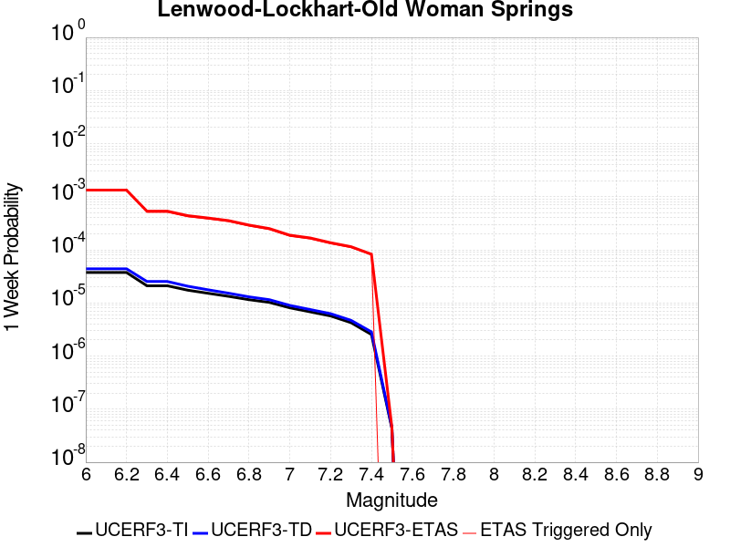 | 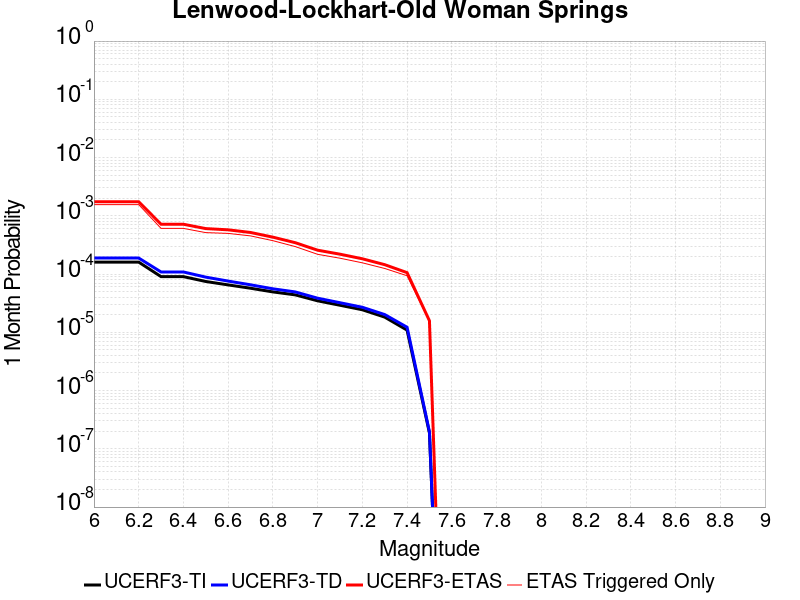 | 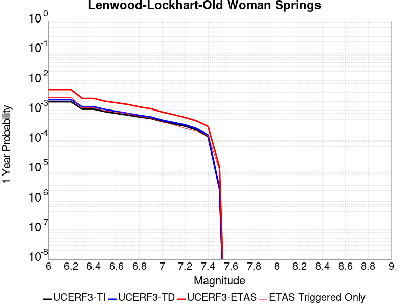 | 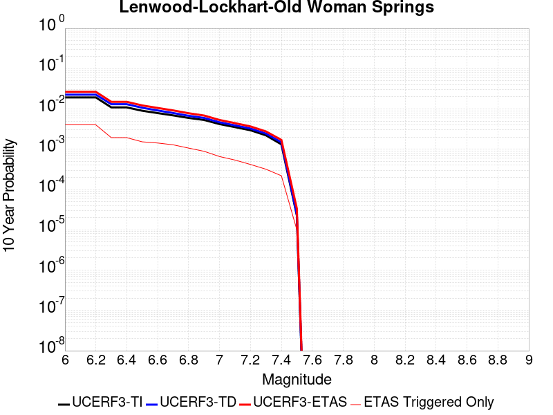 |

| Magnitude | 1 wk TI Prob | 1 wk TD Prob | 1 wk ETAS Prob | 1 wk ETAS/TD Gain | 1 wk ETAS Triggered Only | 1 mo TI Prob | 1 mo TD Prob | 1 mo ETAS Prob | 1 mo ETAS/TD Gain | 1 mo ETAS Triggered Only | 1 yr TI Prob | 1 yr TD Prob | 1 yr ETAS Prob | 1 yr ETAS/TD Gain | 1 yr ETAS Triggered Only | 10 yr TI Prob | 10 yr TD Prob | 10 yr ETAS Prob | 10 yr ETAS/TD Gain | 10 yr ETAS Triggered Only |
|-----|-----|-----|-----|-----|-----|-----|-----|-----|-----|-----|-----|-----|-----|-----|-----|-----|-----|-----|-----|-----|
| 6.0 | 3.744542E-5 | 4.396252E-5 | 0.0013339058 | 30.341887 | 0.00129 | 1.604705E-4 | 1.8839816E-4 | 0.0018680816 | 9.915605 | 0.00168 | 0.0019519776 | 0.0022915069 | 0.005025228 | 2.1929798 | 0.00274 | 0.019349206 | 0.022696787 | 0.026635319 | 1.1735282 | 0.00403 |
| 6.1 | 3.744542E-5 | 4.396252E-5 | 0.0013339058 | 30.341887 | 0.00129 | 1.604705E-4 | 1.8839816E-4 | 0.0018680816 | 9.915605 | 0.00168 | 0.0019519776 | 0.0022915069 | 0.005025228 | 2.1929798 | 0.00274 | 0.019349206 | 0.022696787 | 0.026635319 | 1.1735282 | 0.00403 |
| 6.2 | 3.744542E-5 | 4.396252E-5 | 0.0013339058 | 30.341887 | 0.00129 | 1.604705E-4 | 1.8839816E-4 | 0.0018680816 | 9.915605 | 0.00168 | 0.0019519776 | 0.0022915069 | 0.005025228 | 2.1929798 | 0.00274 | 0.019349206 | 0.022696787 | 0.026635319 | 1.1735282 | 0.00403 |
| 6.3 | 2.1079984E-5 | 2.5353434E-5 | 5.353405E-4 | 21.115108 | 5.1E-4 | 9.0339665E-5 | 1.0865316E-4 | 8.085771E-4 | 7.4418187 | 7.0E-4 | 0.0010993304 | 0.0013220694 | 0.0025404566 | 1.9215757 | 0.00122 | 0.010939079 | 0.0131442575 | 0.015058758 | 1.145653 | 0.00194 |
| 6.4 | 2.1079984E-5 | 2.5353434E-5 | 5.353405E-4 | 21.115108 | 5.1E-4 | 9.0339665E-5 | 1.0865316E-4 | 8.085771E-4 | 7.4418187 | 7.0E-4 | 0.0010993304 | 0.0013220694 | 0.0025404566 | 1.9215757 | 0.00122 | 0.010939079 | 0.0131442575 | 0.015058758 | 1.145653 | 0.00194 |
| 6.5 | 1.7397282E-5 | 2.066241E-5 | 4.4065373E-4 | 21.326347 | 4.2E-4 | 7.455765E-5 | 8.8550245E-5 | 6.3850154E-4 | 7.210613 | 5.5E-4 | 9.073613E-4 | 0.0010775778 | 0.0020365433 | 1.8899269 | 9.6E-4 | 0.009036654 | 0.010724821 | 0.012238412 | 1.1411297 | 0.00153 |
| 6.6 | 1.52050325E-5 | 1.7679693E-5 | 3.9767296E-4 | 22.493204 | 3.8E-4 | 6.51628E-5 | 7.576796E-5 | 5.957286E-4 | 7.8625393 | 5.2E-4 | 7.9306826E-4 | 9.220924E-4 | 0.001801281 | 1.9534712 | 8.8E-4 | 0.007902439 | 0.009183526 | 0.010600394 | 1.1542836 | 0.00143 |
| 6.7 | 1.332523E-5 | 1.5264002E-5 | 3.5525882E-4 | 23.27429 | 3.4E-4 | 5.7106878E-5 | 6.5415545E-5 | 5.353848E-4 | 8.184366 | 4.7E-4 | 6.950544E-4 | 7.961491E-4 | 0.0015855201 | 1.9914864 | 7.9E-4 | 0.006928845 | 0.007933599 | 0.009213365 | 1.1613096 | 0.00129 |
| 6.8 | 1.1525329E-5 | 1.3030979E-5 | 2.9302732E-4 | 22.486977 | 2.8E-4 | 4.9393333E-5 | 5.584588E-5 | 4.5582355E-4 | 8.162169 | 4.0E-4 | 6.011979E-4 | 6.797157E-4 | 0.0013092875 | 1.926228 | 6.3E-4 | 0.00599574 | 0.006776819 | 0.007839568 | 1.1568211 | 0.00107 |
| 6.9 | 1.0253909E-5 | 1.15144385E-5 | 2.5151166E-4 | 21.843155 | 2.4E-4 | 4.3944583E-5 | 4.9346683E-5 | 3.793304E-4 | 7.68705 | 3.3E-4 | 5.3489394E-4 | 6.0063385E-4 | 0.0011403095 | 1.8985102 | 5.4E-4 | 0.0053360825 | 0.0059904843 | 0.0068751527 | 1.147679 | 8.9E-4 |
| 7.0 | 8.104563E-6 | 8.991279E-6 | 1.8898967E-4 | 21.019218 | 1.8E-4 | 3.4733377E-5 | 3.8533497E-5 | 2.8852385E-4 | 7.487612 | 2.5E-4 | 4.2279682E-4 | 4.6904673E-4 | 8.788544E-4 | 1.8737034 | 4.1E-4 | 0.0042199334 | 0.0046808156 | 0.0053377263 | 1.140341 | 6.6E-4 |
| 7.1 | 6.7986157E-6 | 7.515816E-6 | 1.6751462E-4 | 22.28828 | 1.6E-4 | 2.91366E-5 | 3.2210253E-5 | 2.4220349E-4 | 7.519453 | 2.1E-4 | 3.5468035E-4 | 3.920914E-4 | 7.21962E-4 | 1.8413105 | 3.3E-4 | 0.003541148 | 0.003914213 | 0.004452099 | 1.1374187 | 5.4E-4 |
| 7.2 | 5.6893327E-6 | 6.2800136E-6 | 1.362792E-4 | 21.700462 | 1.3E-4 | 2.4382627E-5 | 2.6914078E-5 | 1.969095E-4 | 7.316227 | 1.7E-4 | 2.9681803E-4 | 3.2763163E-4 | 5.775497E-4 | 1.7628021 | 2.5E-4 | 0.002964219 | 0.0032716845 | 0.0036903105 | 1.1279542 | 4.2E-4 |
| 7.3 | 4.253348E-6 | 4.7069107E-6 | 1.14706396E-4 | 24.369783 | 1.1E-4 | 1.8228506E-5 | 2.0172329E-5 | 1.601695E-4 | 7.9400606 | 1.4E-4 | 2.2190946E-4 | 2.4557224E-4 | 4.4552312E-4 | 1.8142242 | 2.0E-4 | 0.00221688 | 0.0024531898 | 0.0027724048 | 1.1301224 | 3.2E-4 |
| 7.4 | 2.5448119E-6 | 2.852045E-6 | 8.285182E-5 | 29.049969 | 8.0E-5 | 1.0906291E-5 | 1.2223002E-5 | 1.1222178E-4 | 9.181196 | 1.0E-4 | 1.3277601E-4 | 1.4880655E-4 | 2.887857E-4 | 1.9406788 | 1.4E-4 | 0.001326967 | 0.0014872311 | 0.0017069039 | 1.1477059 | 2.2E-4 |
| 7.5 | 4.3706837E-8 | 4.562909E-8 | 4.562909E-8 | 1.0 | 0.0 | 1.8731501E-7 | 1.9555324E-7 | 1.0195551E-5 | 52.13696 | 1.0E-5 | 2.2805577E-6 | 2.3808586E-6 | 1.2380835E-5 | 5.2001553 | 1.0E-5 | 2.2805343E-5 | 2.3808387E-5 | 3.3808148E-5 | 1.4200101 | 1.0E-5 |

## Bicycle Lake
*[(top)](#table-of-contents)*

| 1 Week | 1 Month | 1 Year | 10 Year |
|-----|-----|-----|-----|
| 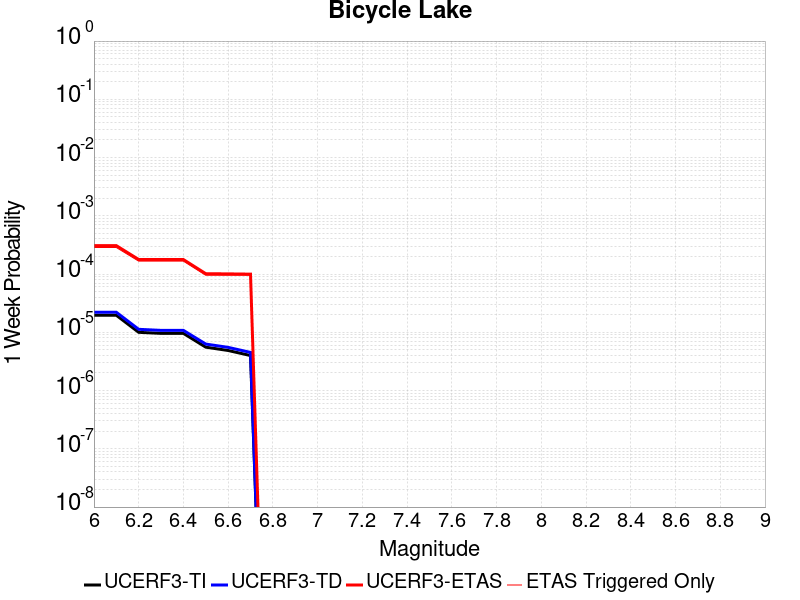 | 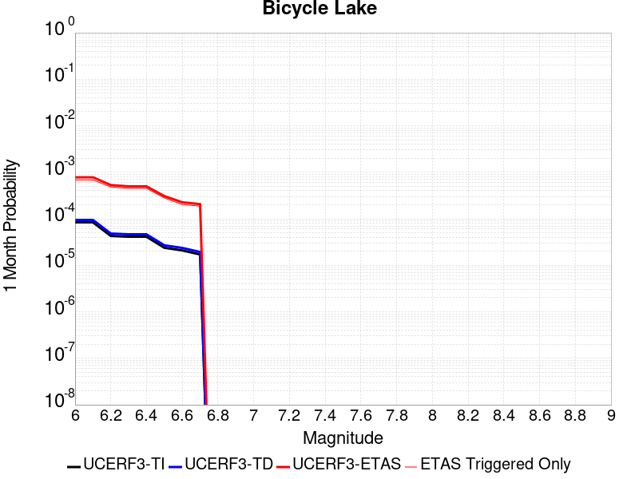 |  | 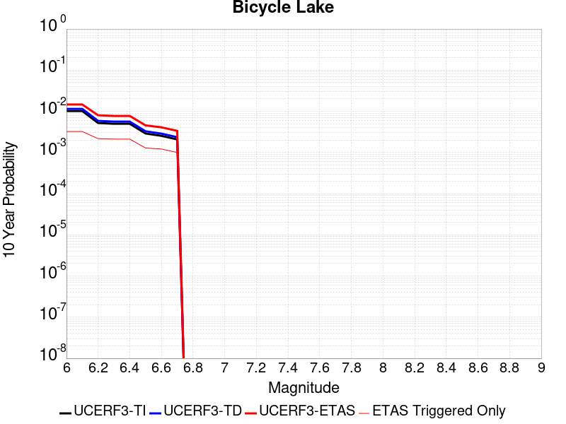 |

| Magnitude | 1 wk TI Prob | 1 wk TD Prob | 1 wk ETAS Prob | 1 wk ETAS/TD Gain | 1 wk ETAS Triggered Only | 1 mo TI Prob | 1 mo TD Prob | 1 mo ETAS Prob | 1 mo ETAS/TD Gain | 1 mo ETAS Triggered Only | 1 yr TI Prob | 1 yr TD Prob | 1 yr ETAS Prob | 1 yr ETAS/TD Gain | 1 yr ETAS Triggered Only | 10 yr TI Prob | 10 yr TD Prob | 10 yr ETAS Prob | 10 yr ETAS/TD Gain | 10 yr ETAS Triggered Only |
|-----|-----|-----|-----|-----|-----|-----|-----|-----|-----|-----|-----|-----|-----|-----|-----|-----|-----|-----|-----|-----|
| 6.0 | 1.9621975E-5 | 2.2097078E-5 | 4.32088E-4 | 19.55408 | 4.1E-4 | 8.4091465E-5 | 9.4699084E-5 | 8.146309E-4 | 8.60231 | 7.2E-4 | 0.0010233327 | 0.0011524865 | 0.0028505274 | 2.4733715 | 0.0017 | 0.01018633 | 0.011478408 | 0.015135937 | 1.3186444 | 0.0037 |
| 6.1 | 1.9621975E-5 | 2.2097078E-5 | 4.32088E-4 | 19.55408 | 4.1E-4 | 8.4091465E-5 | 9.4699084E-5 | 8.146309E-4 | 8.60231 | 7.2E-4 | 0.0010233327 | 0.0011524865 | 0.0028505274 | 2.4733715 | 0.0017 | 0.01018633 | 0.011478408 | 0.015135937 | 1.3186444 | 0.0037 |
| 6.2 | 9.9971285E-6 | 1.1255639E-5 | 2.812526E-4 | 24.987705 | 2.7E-4 | 4.2844134E-5 | 4.8237856E-5 | 5.082157E-4 | 10.535619 | 4.6E-4 | 5.2150246E-4 | 5.871896E-4 | 0.001626579 | 2.7701085 | 0.00104 | 0.0052028033 | 0.005861487 | 0.008237477 | 1.4053564 | 0.00239 |
| 6.3 | 9.589428E-6 | 1.0798346E-5 | 2.8079544E-4 | 26.00356 | 2.7E-4 | 4.10969E-5 | 4.62781E-5 | 4.8625775E-4 | 10.5072975 | 4.4E-4 | 5.002399E-4 | 5.6334207E-4 | 0.0015727731 | 2.7918618 | 0.00101 | 0.0049911533 | 0.0056242296 | 0.007931181 | 1.4101809 | 0.00232 |
| 6.4 | 9.589428E-6 | 1.0798346E-5 | 2.8079544E-4 | 26.00356 | 2.7E-4 | 4.10969E-5 | 4.62781E-5 | 4.8625775E-4 | 10.5072975 | 4.4E-4 | 5.002399E-4 | 5.6334207E-4 | 0.0015727731 | 2.7918618 | 0.00101 | 0.0049911533 | 0.0056242296 | 0.007931181 | 1.4101809 | 0.00232 |
| 6.5 | 5.557707E-6 | 6.2856016E-6 | 1.8628447E-4 | 29.636698 | 1.8E-4 | 2.3818526E-5 | 2.6938165E-5 | 2.969309E-4 | 11.022684 | 2.7E-4 | 2.8995197E-4 | 3.2794967E-4 | 9.577431E-4 | 2.9203963 | 6.3E-4 | 0.0028957394 | 0.0032772934 | 0.0047723777 | 1.4561948 | 0.0015 |
| 6.6 | 4.8742945E-6 | 5.5132896E-6 | 1.4551252E-4 | 26.393047 | 1.4E-4 | 2.0889667E-5 | 2.3628318E-5 | 2.4362312E-4 | 10.310641 | 2.2E-4 | 2.54302E-4 | 2.87663E-4 | 7.975163E-4 | 2.772398 | 5.1E-4 | 0.002540112 | 0.0028754752 | 0.004161766 | 1.4473315 | 0.00129 |
| 6.7 | 3.991108E-6 | 4.5159104E-6 | 1.0451546E-4 | 23.14383 | 1.0E-4 | 1.7104636E-5 | 1.9353902E-5 | 1.9935041E-4 | 10.30027 | 1.8E-4 | 2.0822904E-4 | 2.3563375E-4 | 6.655324E-4 | 2.824436 | 4.3E-4 | 0.0020803404 | 0.0023563374 | 0.0033938868 | 1.4403229 | 0.00104 |

## Paradise
*[(top)](#table-of-contents)*

| 1 Week | 1 Month | 1 Year | 10 Year |
|-----|-----|-----|-----|
| 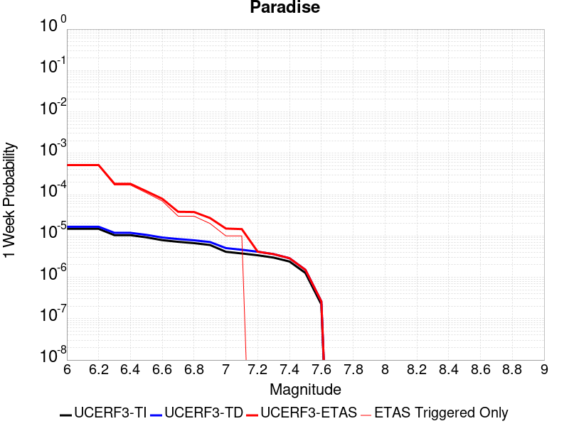 | 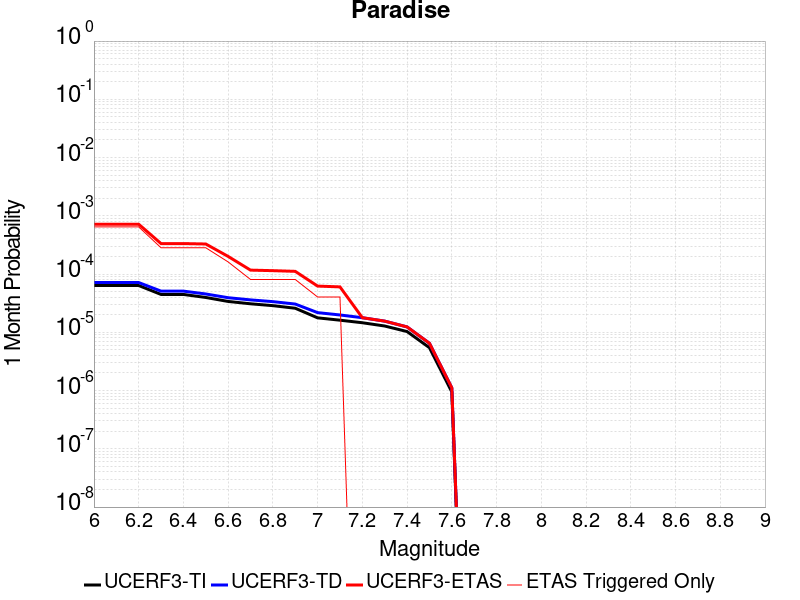 | 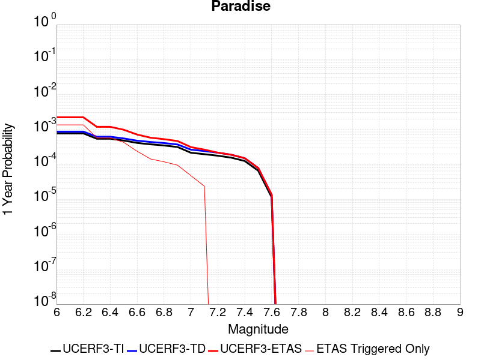 | 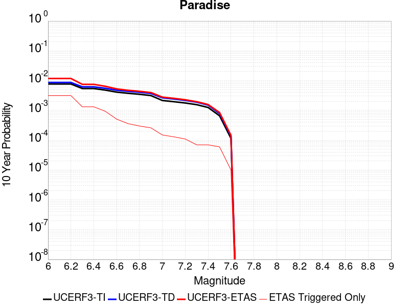 |

| Magnitude | 1 wk TI Prob | 1 wk TD Prob | 1 wk ETAS Prob | 1 wk ETAS/TD Gain | 1 wk ETAS Triggered Only | 1 mo TI Prob | 1 mo TD Prob | 1 mo ETAS Prob | 1 mo ETAS/TD Gain | 1 mo ETAS Triggered Only | 1 yr TI Prob | 1 yr TD Prob | 1 yr ETAS Prob | 1 yr ETAS/TD Gain | 1 yr ETAS Triggered Only | 10 yr TI Prob | 10 yr TD Prob | 10 yr ETAS Prob | 10 yr ETAS/TD Gain | 10 yr ETAS Triggered Only |
|-----|-----|-----|-----|-----|-----|-----|-----|-----|-----|-----|-----|-----|-----|-----|-----|-----|-----|-----|-----|-----|
| 6.0 | 1.4851273E-5 | 1.6694692E-5 | 5.1668636E-4 | 30.94914 | 5.0E-4 | 6.364676E-5 | 7.154685E-5 | 8.214932E-4 | 11.481892 | 7.5E-4 | 7.7462377E-4 | 8.707584E-4 | 0.0026192346 | 3.0079925 | 0.00175 | 0.0077192914 | 0.008675844 | 0.011798515 | 1.359927 | 0.00315 |
| 6.1 | 1.4851273E-5 | 1.6694692E-5 | 5.1668636E-4 | 30.94914 | 5.0E-4 | 6.364676E-5 | 7.154685E-5 | 8.214932E-4 | 11.481892 | 7.5E-4 | 7.7462377E-4 | 8.707584E-4 | 0.0026192346 | 3.0079925 | 0.00175 | 0.0077192914 | 0.008675844 | 0.011798515 | 1.359927 | 0.00315 |
| 6.2 | 1.4851273E-5 | 1.6694692E-5 | 5.1668636E-4 | 30.94914 | 5.0E-4 | 6.364676E-5 | 7.154685E-5 | 8.214932E-4 | 11.481892 | 7.5E-4 | 7.7462377E-4 | 8.707584E-4 | 0.0026192346 | 3.0079925 | 0.00175 | 0.0077192914 | 0.008675844 | 0.011798515 | 1.359927 | 0.00315 |
| 6.3 | 1.0426831E-5 | 1.188862E-5 | 1.818866E-4 | 15.299218 | 1.7E-4 | 4.4685654E-5 | 5.0950268E-5 | 3.5093498E-4 | 6.8877945 | 3.0E-4 | 5.43912E-4 | 6.201489E-4 | 0.0013397024 | 2.1602914 | 7.2E-4 | 0.0054258266 | 0.0061847917 | 0.0074966275 | 1.2121067 | 0.00132 |
| 6.4 | 1.0426831E-5 | 1.188862E-5 | 1.818866E-4 | 15.299218 | 1.7E-4 | 4.4685654E-5 | 5.0950268E-5 | 3.5093498E-4 | 6.8877945 | 3.0E-4 | 5.43912E-4 | 6.201489E-4 | 0.0013397024 | 2.1602914 | 7.2E-4 | 0.0054258266 | 0.0061847917 | 0.0074966275 | 1.2121067 | 0.00132 |
| 6.5 | 9.25027E-6 | 1.06199595E-5 | 1.2061879E-4 | 11.357744 | 1.1E-4 | 3.964341E-5 | 4.551335E-5 | 2.5550378E-4 | 5.613821 | 2.1E-4 | 4.8255164E-4 | 5.53989E-4 | 0.0010237286 | 1.8479223 | 4.7E-4 | 0.0048150513 | 0.0055265795 | 0.0064613842 | 1.1691471 | 9.4E-4 |
| 6.6 | 7.904275E-6 | 9.159525E-6 | 7.915888E-5 | 8.642247 | 7.0E-5 | 3.3875025E-5 | 3.9254537E-5 | 1.7924904E-4 | 4.5663266 | 1.4E-4 | 4.1235037E-4 | 4.7782314E-4 | 6.877228E-4 | 1.4392831 | 2.1E-4 | 0.0041158604 | 0.0047683544 | 0.0052759224 | 1.1064452 | 5.1E-4 |
| 6.7 | 7.2061953E-6 | 8.407248E-6 | 3.8406997E-5 | 4.5683193 | 3.0E-5 | 3.088333E-5 | 3.6030586E-5 | 1.2602734E-4 | 3.4977877 | 9.0E-5 | 3.7593965E-4 | 4.3858777E-4 | 5.485395E-4 | 1.250695 | 1.1E-4 | 0.003753043 | 0.004377591 | 0.004736015 | 1.081877 | 3.6E-4 |
| 6.8 | 6.6948724E-6 | 7.842166E-6 | 3.784193E-5 | 4.8254437 | 3.0E-5 | 2.8691995E-5 | 3.360887E-5 | 1.2360585E-4 | 3.6777747 | 9.0E-5 | 3.4926904E-4 | 4.0911473E-4 | 5.0907384E-4 | 1.2443302 | 1.0E-4 | 0.003487206 | 0.0040839734 | 0.004382748 | 1.0731579 | 3.0E-4 |
| 6.9 | 6.0421025E-6 | 7.130621E-6 | 2.7130478E-5 | 3.8047848 | 2.0E-5 | 2.5894467E-5 | 3.0559466E-5 | 9.055763E-5 | 2.9633253 | 6.0E-5 | 3.1521954E-4 | 3.7200135E-4 | 4.419753E-4 | 1.1881014 | 7.0E-5 | 0.0031477278 | 0.0037141247 | 0.003973159 | 1.069743 | 2.6E-4 |
| 7.0 | 4.134091E-6 | 5.0803087E-6 | 1.5080258E-5 | 2.9683743 | 1.0E-5 | 1.7717413E-5 | 2.177258E-5 | 6.177171E-5 | 2.8371332 | 4.0E-5 | 2.1568815E-4 | 2.6505045E-4 | 3.0503984E-4 | 1.1508746 | 4.0E-5 | 0.0021547892 | 0.0026474963 | 0.0027970993 | 1.0565073 | 1.5E-4 |
| 7.1 | 3.7674888E-6 | 4.6318696E-6 | 1.4631823E-5 | 3.1589456 | 1.0E-5 | 1.6146281E-5 | 1.9850726E-5 | 4.9850132E-5 | 2.5112498 | 3.0E-5 | 1.9656324E-4 | 2.4165731E-4 | 2.7165006E-4 | 1.1241127 | 3.0E-5 | 0.0019638946 | 0.002414096 | 0.0025437821 | 1.0537204 | 1.3E-4 |
| 7.2 | 3.4065345E-6 | 4.156723E-6 | 4.156723E-6 | 1.0 | 0.0 | 1.4599351E-5 | 1.7814415E-5 | 3.7814058E-5 | 2.1226664 | 2.0E-5 | 1.777326E-4 | 2.1687041E-4 | 2.3686608E-4 | 1.092201 | 2.0E-5 | 0.0017759053 | 0.002166736 | 0.0022764977 | 1.0506576 | 1.1E-4 |
| 7.3 | 2.9934936E-6 | 3.6293168E-6 | 3.6293168E-6 | 1.0 | 0.0 | 1.2829195E-5 | 1.555413E-5 | 3.5553818E-5 | 2.2858121 | 2.0E-5 | 1.5618425E-4 | 1.8935655E-4 | 2.0935277E-4 | 1.1056008 | 2.0E-5 | 0.0015607453 | 0.0018920974 | 0.0019619649 | 1.036926 | 7.0E-5 |
| 7.4 | 2.4049796E-6 | 2.8889842E-6 | 2.8889842E-6 | 1.0 | 0.0 | 1.0307015E-5 | 1.238131E-5 | 3.2381064E-5 | 2.615318 | 2.0E-5 | 1.2548068E-4 | 1.5073347E-4 | 1.7073045E-4 | 1.1326646 | 2.0E-5 | 0.0012540985 | 0.0015064536 | 0.0015763482 | 1.0463967 | 7.0E-5 |
| 7.5 | 1.2710091E-6 | 1.5134682E-6 | 1.5134682E-6 | 1.0 | 0.0 | 5.44717E-6 | 6.4862834E-6 | 2.6486154E-5 | 4.08341 | 2.0E-5 | 6.631728E-5 | 7.8968886E-5 | 9.8967306E-5 | 1.2532443 | 2.0E-5 | 6.6297496E-4 | 7.8953087E-4 | 8.4948353E-4 | 1.0759345 | 6.0E-5 |
| 7.6 | 2.21172E-7 | 2.603961E-7 | 2.603961E-7 | 1.0 | 0.0 | 9.478797E-7 | 1.1159829E-6 | 1.1115972E-5 | 9.960701 | 1.0E-5 | 1.1540374E-5 | 1.3587036E-5 | 2.35869E-5 | 1.7359858 | 1.0E-5 | 1.1539775E-4 | 1.3586486E-4 | 1.4586351E-4 | 1.0735925 | 1.0E-5 |

## Garlic Springs
*[(top)](#table-of-contents)*

| 1 Week | 1 Month | 1 Year | 10 Year |
|-----|-----|-----|-----|
| 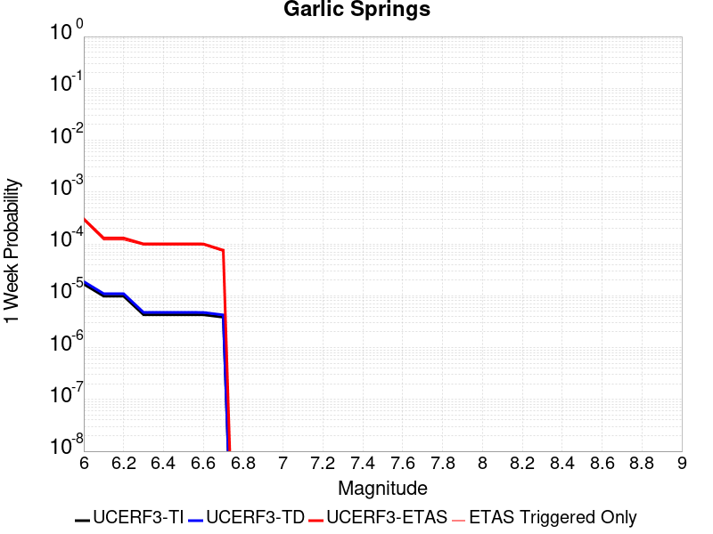 | 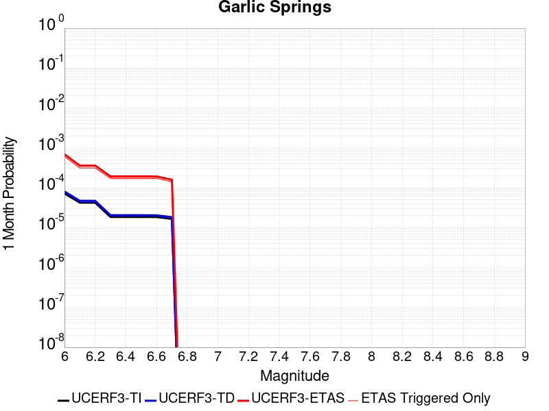 | 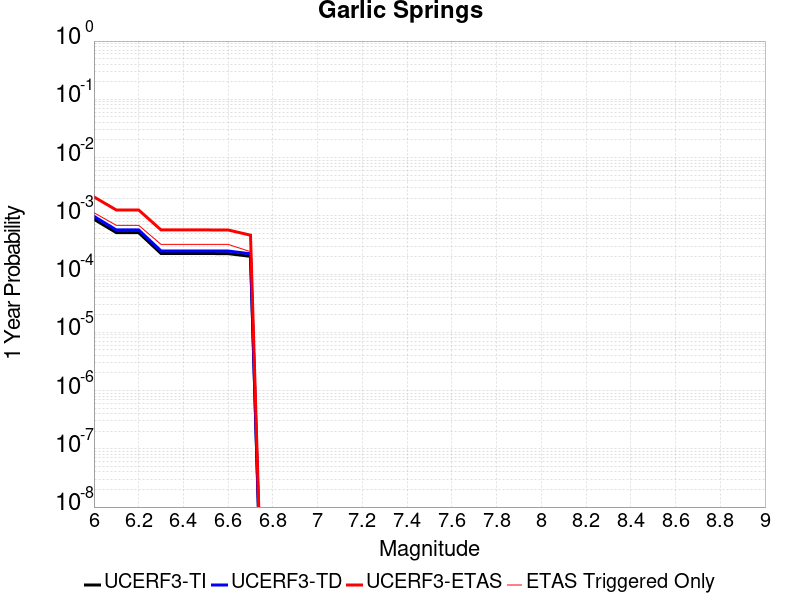 | 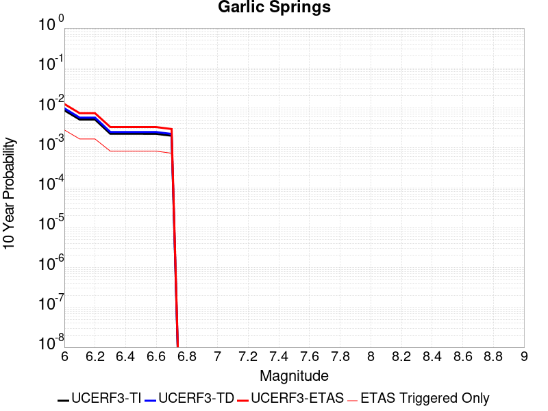 |

| Magnitude | 1 wk TI Prob | 1 wk TD Prob | 1 wk ETAS Prob | 1 wk ETAS/TD Gain | 1 wk ETAS Triggered Only | 1 mo TI Prob | 1 mo TD Prob | 1 mo ETAS Prob | 1 mo ETAS/TD Gain | 1 mo ETAS Triggered Only | 1 yr TI Prob | 1 yr TD Prob | 1 yr ETAS Prob | 1 yr ETAS/TD Gain | 1 yr ETAS Triggered Only | 10 yr TI Prob | 10 yr TD Prob | 10 yr ETAS Prob | 10 yr ETAS/TD Gain | 10 yr ETAS Triggered Only |
|-----|-----|-----|-----|-----|-----|-----|-----|-----|-----|-----|-----|-----|-----|-----|-----|-----|-----|-----|-----|-----|
| 6.0 | 1.6760017E-5 | 1.8776833E-5 | 3.4877064E-4 | 18.57452 | 3.3E-4 | 7.182667E-5 | 8.0470316E-5 | 6.8042206E-4 | 8.455565 | 6.0E-4 | 8.7413884E-4 | 9.794032E-4 | 0.0023480614 | 2.3974411 | 0.00137 | 0.008707083 | 0.009762413 | 0.012535078 | 1.2840143 | 0.0028 |
| 6.1 | 9.852767E-6 | 1.09735865E-5 | 1.8097172E-4 | 16.491573 | 1.7E-4 | 4.222546E-5 | 4.702921E-5 | 3.5701462E-4 | 7.591338 | 3.1E-4 | 5.139737E-4 | 5.7250116E-4 | 0.0013120775 | 2.2918339 | 7.4E-4 | 0.005127866 | 0.005717221 | 0.0073975595 | 1.2939081 | 0.00169 |
| 6.2 | 9.852767E-6 | 1.09735865E-5 | 1.8097172E-4 | 16.491573 | 1.7E-4 | 4.222546E-5 | 4.702921E-5 | 3.5701462E-4 | 7.591338 | 3.1E-4 | 5.139737E-4 | 5.7250116E-4 | 0.0013120775 | 2.2918339 | 7.4E-4 | 0.005127866 | 0.005717221 | 0.0073975595 | 1.2939081 | 0.00169 |
| 6.3 | 4.3167724E-6 | 4.7780286E-6 | 8.477765E-5 | 17.743227 | 8.0E-5 | 1.8500323E-5 | 2.0477235E-5 | 1.9047376E-4 | 9.301732 | 1.7E-4 | 2.2521814E-4 | 2.4930484E-4 | 6.392076E-4 | 2.5639598 | 3.9E-4 | 0.0022499003 | 0.00249251 | 0.003300491 | 1.3241637 | 8.1E-4 |
| 6.4 | 4.3167724E-6 | 4.7780286E-6 | 8.477765E-5 | 17.743227 | 8.0E-5 | 1.8500323E-5 | 2.0477235E-5 | 1.9047376E-4 | 9.301732 | 1.7E-4 | 2.2521814E-4 | 2.4930484E-4 | 6.392076E-4 | 2.5639598 | 3.9E-4 | 0.0022499003 | 0.00249251 | 0.003300491 | 1.3241637 | 8.1E-4 |
| 6.5 | 4.3167724E-6 | 4.7780286E-6 | 8.477765E-5 | 17.743227 | 8.0E-5 | 1.8500323E-5 | 2.0477235E-5 | 1.9047376E-4 | 9.301732 | 1.7E-4 | 2.2521814E-4 | 2.4930484E-4 | 6.392076E-4 | 2.5639598 | 3.9E-4 | 0.0022499003 | 0.00249251 | 0.003300491 | 1.3241637 | 8.1E-4 |
| 6.6 | 4.301311E-6 | 4.760897E-6 | 8.476052E-5 | 17.803476 | 8.0E-5 | 1.8434059E-5 | 2.0403815E-5 | 1.9040034E-4 | 9.331605 | 1.7E-4 | 2.2441156E-4 | 2.4841115E-4 | 6.383143E-4 | 2.5695877 | 3.9E-4 | 0.0022418506 | 0.002483593 | 0.0032816061 | 1.321314 | 8.0E-4 |
| 6.7 | 3.8599724E-6 | 4.27106E-6 | 5.4270848E-5 | 12.706646 | 5.0E-5 | 1.6542634E-5 | 1.8304541E-5 | 1.5830198E-4 | 8.648235 | 1.4E-4 | 2.0138794E-4 | 2.228578E-4 | 5.727798E-4 | 2.5701582 | 3.5E-4 | 0.0020120554 | 0.002228578 | 0.0029369958 | 1.3178788 | 7.1E-4 |

## San Andreas (San Bernardino S)
*[(top)](#table-of-contents)*

| 1 Week | 1 Month | 1 Year | 10 Year |
|-----|-----|-----|-----|
| 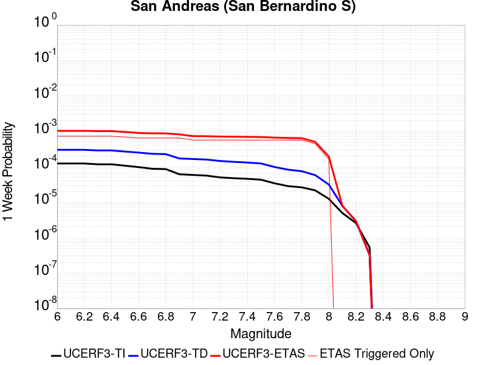 | 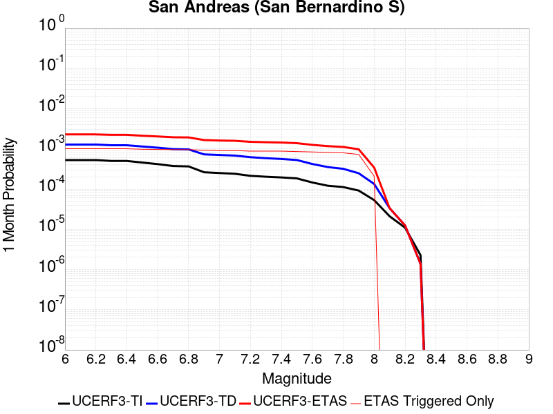 | 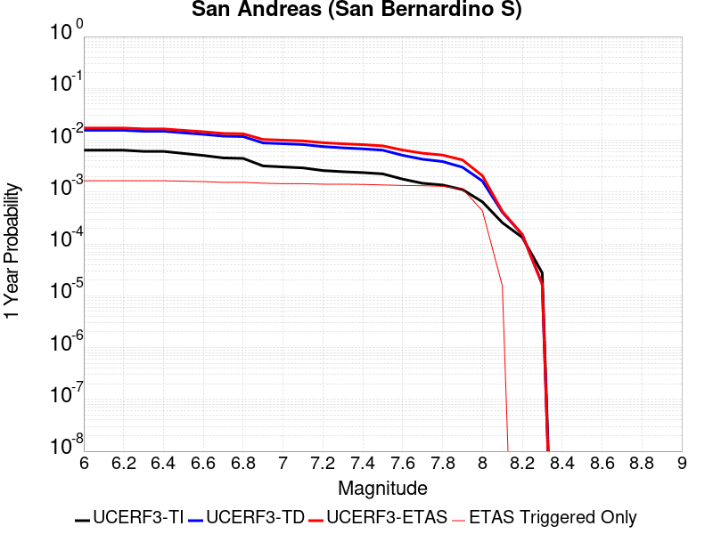 | 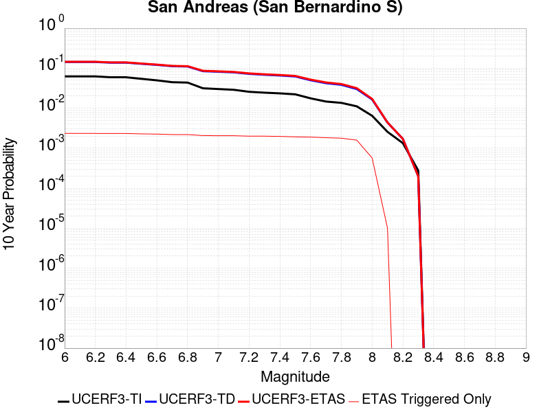 |

| Magnitude | 1 wk TI Prob | 1 wk TD Prob | 1 wk ETAS Prob | 1 wk ETAS/TD Gain | 1 wk ETAS Triggered Only | 1 mo TI Prob | 1 mo TD Prob | 1 mo ETAS Prob | 1 mo ETAS/TD Gain | 1 mo ETAS Triggered Only | 1 yr TI Prob | 1 yr TD Prob | 1 yr ETAS Prob | 1 yr ETAS/TD Gain | 1 yr ETAS Triggered Only | 10 yr TI Prob | 10 yr TD Prob | 10 yr ETAS Prob | 10 yr ETAS/TD Gain | 10 yr ETAS Triggered Only |
|-----|-----|-----|-----|-----|-----|-----|-----|-----|-----|-----|-----|-----|-----|-----|-----|-----|-----|-----|-----|-----|
| 6.0 | 1.2336002E-4 | 3.0004102E-4 | 0.001099801 | 3.665502 | 8.0E-4 | 5.2857865E-4 | 0.0012852824 | 0.0022939844 | 1.7848095 | 0.00101 | 0.006416472 | 0.015540994 | 0.01718504 | 1.1057878 | 0.00167 | 0.06234337 | 0.14283717 | 0.14484294 | 1.0140423 | 0.00234 |
| 6.1 | 1.2336002E-4 | 3.0004102E-4 | 0.001099801 | 3.665502 | 8.0E-4 | 5.2857865E-4 | 0.0012852824 | 0.0022939844 | 1.7848095 | 0.00101 | 0.006416472 | 0.015540994 | 0.01718504 | 1.1057878 | 0.00167 | 0.06234337 | 0.14283717 | 0.14484294 | 1.0140423 | 0.00234 |
| 6.2 | 1.2336002E-4 | 3.0004102E-4 | 0.001099801 | 3.665502 | 8.0E-4 | 5.2857865E-4 | 0.0012852824 | 0.0022939844 | 1.7848095 | 0.00101 | 0.006416472 | 0.015540994 | 0.01718504 | 1.1057878 | 0.00167 | 0.06234337 | 0.14283717 | 0.14484294 | 1.0140423 | 0.00234 |
| 6.3 | 1.1712257E-4 | 2.8792414E-4 | 0.0010876938 | 3.7777097 | 8.0E-4 | 5.018573E-4 | 0.0012334028 | 0.002242157 | 1.8178629 | 0.00101 | 0.006093008 | 0.014918125 | 0.016553361 | 1.109614 | 0.00166 | 0.059286322 | 0.13754563 | 0.13955514 | 1.0146098 | 0.00233 |
| 6.4 | 1.1712257E-4 | 2.8792414E-4 | 0.0010876938 | 3.7777097 | 8.0E-4 | 5.018573E-4 | 0.0012334028 | 0.002242157 | 1.8178629 | 0.00101 | 0.006093008 | 0.014918125 | 0.016553361 | 1.109614 | 0.00166 | 0.059286322 | 0.13754563 | 0.13955514 | 1.0146098 | 0.00233 |
| 6.5 | 1.0689076E-4 | 2.680528E-4 | 0.001057841 | 3.9463906 | 7.9E-4 | 4.5802278E-4 | 0.0011483167 | 0.0021271913 | 1.8524431 | 9.8E-4 | 0.0055621783 | 0.01389575 | 0.0155031 | 1.115672 | 0.00163 | 0.05425003 | 0.12879294 | 0.1307793 | 1.0154228 | 0.00228 |
| 6.6 | 9.7648895E-5 | 2.50501E-4 | 0.0010303056 | 4.11298 | 7.8E-4 | 4.1842813E-4 | 0.0010731576 | 0.0020421166 | 1.9029046 | 9.7E-4 | 0.005082469 | 0.012991785 | 0.014570998 | 1.1215547 | 0.0016 | 0.049677886 | 0.12095292 | 0.12293077 | 1.0163523 | 0.00225 |
| 6.7 | 8.757013E-5 | 2.3120902E-4 | 0.001001031 | 4.32955 | 7.7E-4 | 3.7524657E-4 | 9.905418E-4 | 0.0019495909 | 1.9682065 | 9.6E-4 | 0.00455906 | 0.011997245 | 0.013538529 | 1.1284698 | 0.00156 | 0.04466656 | 0.11226123 | 0.114205375 | 1.0173181 | 0.00219 |
| 6.8 | 8.562978E-5 | 2.2680782E-4 | 9.966332E-4 | 4.3941746 | 7.7E-4 | 3.6693315E-4 | 9.7169366E-4 | 0.0019307608 | 1.9870057 | 9.6E-4 | 0.004458263 | 0.011770263 | 0.013311902 | 1.1309774 | 0.00156 | 0.043698758 | 0.11027153 | 0.112220034 | 1.01767 | 0.00219 |
| 6.9 | 6.124075E-5 | 1.7065753E-4 | 9.2052954E-4 | 5.3940167 | 7.5E-4 | 2.6243398E-4 | 7.311852E-4 | 0.0016605052 | 2.2709775 | 9.3E-4 | 0.0031904527 | 0.008866051 | 0.01034284 | 1.1665667 | 0.00149 | 0.031450346 | 0.08418263 | 0.08607837 | 1.0225194 | 0.00207 |
| 7.0 | 5.8598747E-5 | 1.649477E-4 | 8.948273E-4 | 5.424915 | 7.3E-4 | 2.5111332E-4 | 7.06728E-4 | 0.001616085 | 2.286714 | 9.1E-4 | 0.0030530186 | 0.008570663 | 0.010028064 | 1.1700454 | 0.00147 | 0.03011414 | 0.081500374 | 0.08338329 | 1.0231032 | 0.00205 |
| 7.1 | 5.613814E-5 | 1.5913323E-4 | 8.890171E-4 | 5.5866213 | 7.3E-4 | 2.4056983E-4 | 6.818221E-4 | 0.0015912016 | 2.333749 | 9.1E-4 | 0.0029250039 | 0.008269769 | 0.009727612 | 1.1762859 | 0.00147 | 0.028868021 | 0.07879931 | 0.08068777 | 1.0239655 | 0.00205 |
| 7.2 | 4.991222E-5 | 1.4519796E-4 | 8.7509194E-4 | 6.026889 | 7.3E-4 | 2.1389198E-4 | 6.2212895E-4 | 0.0015015815 | 2.4136178 | 8.8E-4 | 0.002601025 | 0.007548217 | 0.008967423 | 1.1880187 | 0.00143 | 0.025707912 | 0.07225321 | 0.074108705 | 1.0256804 | 0.002 |
| 7.3 | 4.7410045E-5 | 1.3714004E-4 | 8.670399E-4 | 6.322296 | 7.3E-4 | 2.0317009E-4 | 5.8761094E-4 | 0.0014670938 | 2.4967096 | 8.8E-4 | 0.0024707897 | 0.0071307817 | 0.008550584 | 1.1991091 | 0.00143 | 0.024434982 | 0.06853558 | 0.07039851 | 1.0271819 | 0.002 |
| 7.4 | 4.5556746E-5 | 1.3121912E-4 | 8.611233E-4 | 6.562484 | 7.3E-4 | 1.952286E-4 | 5.622468E-4 | 0.001441752 | 2.564269 | 8.8E-4 | 0.002374317 | 0.0068239477 | 0.008224326 | 1.2052152 | 0.00141 | 0.023491086 | 0.065788016 | 0.06762841 | 1.0279746 | 0.00197 |
| 7.5 | 4.3084514E-5 | 1.2357246E-4 | 8.3348475E-4 | 6.7449064 | 7.1E-4 | 1.8463485E-4 | 5.2948913E-4 | 0.0013890337 | 2.6233473 | 8.6E-4 | 0.0022456115 | 0.0064275465 | 0.007788741 | 1.2117751 | 0.00137 | 0.022230545 | 0.062188786 | 0.063989386 | 1.0289538 | 0.00192 |
| 7.6 | 3.408608E-5 | 9.83552E-5 | 8.082854E-4 | 8.218024 | 7.1E-4 | 1.4607502E-4 | 4.214543E-4 | 0.0012611003 | 2.9922588 | 8.4E-4 | 0.0017770125 | 0.0051191594 | 0.0064622485 | 1.2623652 | 0.00135 | 0.017628696 | 0.050020292 | 0.051815756 | 1.0358946 | 0.00189 |
| 7.7 | 2.8315713E-5 | 8.248679E-5 | 7.924282E-4 | 9.606729 | 7.1E-4 | 1.2134742E-4 | 3.5346695E-4 | 0.0011731772 | 3.3190575 | 8.2E-4 | 0.0014764034 | 0.0042949775 | 0.005619265 | 1.308334 | 0.00133 | 0.01466633 | 0.0422714 | 0.044024047 | 1.0414617 | 0.00183 |
| 7.8 | 2.6222975E-5 | 7.463088E-5 | 7.645794E-4 | 10.244813 | 6.9E-4 | 1.1237934E-4 | 3.1980744E-4 | 0.0011195516 | 3.5007052 | 8.0E-4 | 0.0013673597 | 0.0038867102 | 0.0051816576 | 1.3331732 | 0.0013 | 0.013589768 | 0.03843674 | 0.040148325 | 1.0445299 | 0.00178 |
| 7.9 | 2.1469694E-5 | 5.787864E-5 | 6.878422E-4 | 11.884214 | 6.3E-4 | 9.200973E-5 | 2.4802773E-4 | 9.778467E-4 | 3.9424891 | 7.3E-4 | 0.0011196428 | 0.0030155594 | 0.004201971 | 1.39343 | 0.00119 | 0.011140184 | 0.030152109 | 0.031694166 | 1.0511426 | 0.00159 |
| 8.0 | 1.2420249E-5 | 3.131896E-5 | 2.1131332E-4 | 6.7471375 | 1.8E-4 | 5.322855E-5 | 1.342172E-4 | 3.4418903E-4 | 2.564418 | 2.1E-4 | 6.478649E-4 | 0.0016328706 | 0.0020322176 | 1.2445674 | 4.0E-4 | 0.0064597935 | 0.016522504 | 0.017083086 | 1.0339284 | 5.7E-4 |
| 8.1 | 4.9197724E-6 | 7.822348E-6 | 7.822348E-6 | 1.0 | 0.0 | 2.1084568E-5 | 3.352392E-5 | 3.352392E-5 | 1.0 | 0.0 | 2.566744E-4 | 4.0807744E-4 | 4.1807335E-4 | 1.0244951 | 1.0E-5 | 0.002563781 | 0.0043843705 | 0.0043943264 | 1.0022708 | 1.0E-5 |
| 8.2 | 2.5634774E-6 | 2.9067196E-6 | 2.9067196E-6 | 1.0 | 0.0 | 1.0986286E-5 | 1.2457311E-5 | 1.2457311E-5 | 1.0 | 0.0 | 1.3374983E-4 | 1.5165724E-4 | 1.5165724E-4 | 1.0 | 0.0 | 0.0013366934 | 0.0017049741 | 0.0017049741 | 1.0 | 0.0 |
| 8.3 | 5.2850464E-7 | 3.2088764E-7 | 3.2088764E-7 | 1.0 | 0.0 | 2.2650179E-6 | 1.375232E-6 | 1.375232E-6 | 1.0 | 0.0 | 2.7576245E-5 | 1.6743334E-5 | 1.6743334E-5 | 1.0 | 0.0 | 2.7572823E-4 | 1.9870348E-4 | 1.9870348E-4 | 1.0 | 0.0 |

## Death Valley (Black Mtns Frontal)
*[(top)](#table-of-contents)*

| 1 Week | 1 Month | 1 Year | 10 Year |
|-----|-----|-----|-----|
| 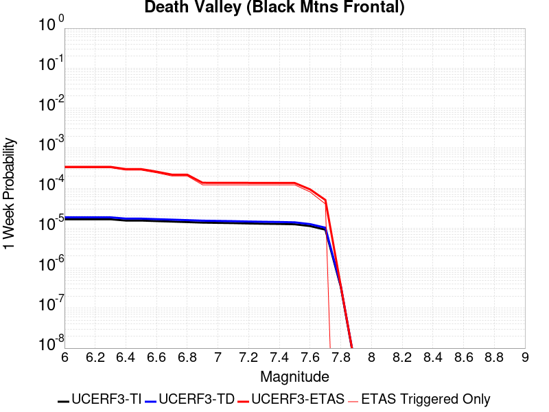 | 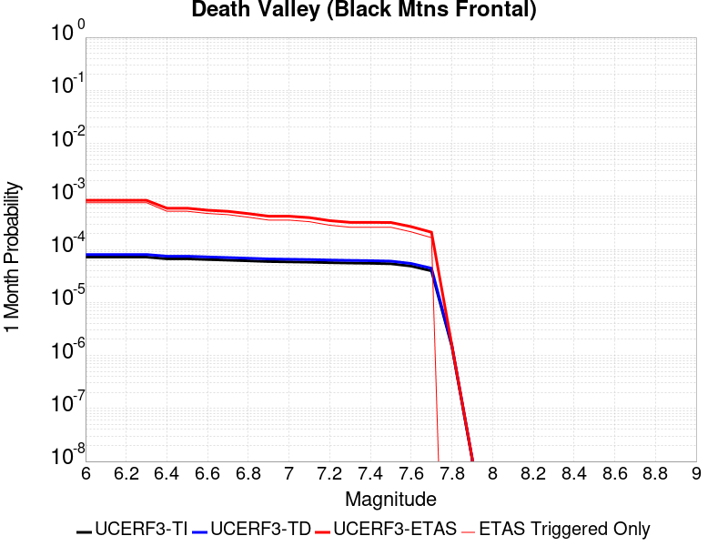 | 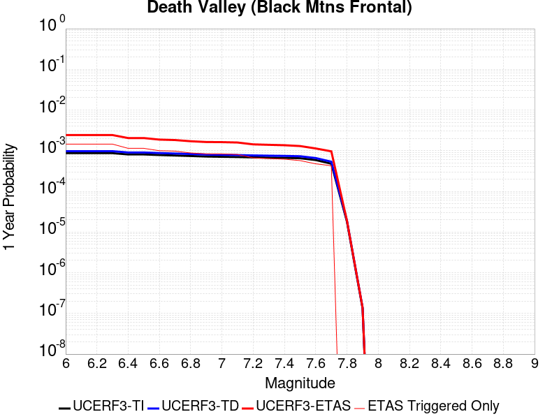 | 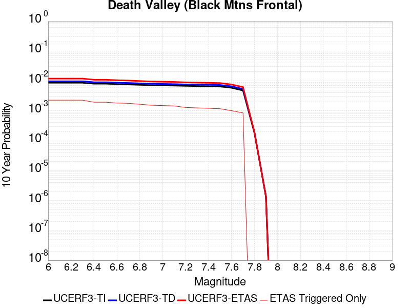 |

| Magnitude | 1 wk TI Prob | 1 wk TD Prob | 1 wk ETAS Prob | 1 wk ETAS/TD Gain | 1 wk ETAS Triggered Only | 1 mo TI Prob | 1 mo TD Prob | 1 mo ETAS Prob | 1 mo ETAS/TD Gain | 1 mo ETAS Triggered Only | 1 yr TI Prob | 1 yr TD Prob | 1 yr ETAS Prob | 1 yr ETAS/TD Gain | 1 yr ETAS Triggered Only | 10 yr TI Prob | 10 yr TD Prob | 10 yr ETAS Prob | 10 yr ETAS/TD Gain | 10 yr ETAS Triggered Only |
|-----|-----|-----|-----|-----|-----|-----|-----|-----|-----|-----|-----|-----|-----|-----|-----|-----|-----|-----|-----|-----|
| 6.0 | 1.6707214E-5 | 1.867027E-5 | 3.6866372E-4 | 19.746033 | 3.5E-4 | 7.160038E-5 | 8.001302E-5 | 6.199698E-4 | 7.748361 | 5.4E-4 | 8.71386E-4 | 9.737309E-4 | 0.0021026304 | 2.159355 | 0.00113 | 0.00867977 | 0.009695496 | 0.0117553305 | 1.2124525 | 0.00208 |
| 6.1 | 1.6707214E-5 | 1.867027E-5 | 3.6866372E-4 | 19.746033 | 3.5E-4 | 7.160038E-5 | 8.001302E-5 | 6.199698E-4 | 7.748361 | 5.4E-4 | 8.71386E-4 | 9.737309E-4 | 0.0021026304 | 2.159355 | 0.00113 | 0.00867977 | 0.009695496 | 0.0117553305 | 1.2124525 | 0.00208 |
| 6.2 | 1.6707214E-5 | 1.867027E-5 | 3.6866372E-4 | 19.746033 | 3.5E-4 | 7.160038E-5 | 8.001302E-5 | 6.199698E-4 | 7.748361 | 5.4E-4 | 8.71386E-4 | 9.737309E-4 | 0.0021026304 | 2.159355 | 0.00113 | 0.00867977 | 0.009695496 | 0.0117553305 | 1.2124525 | 0.00208 |
| 6.3 | 1.6707214E-5 | 1.867027E-5 | 3.6866372E-4 | 19.746033 | 3.5E-4 | 7.160038E-5 | 8.001302E-5 | 6.199698E-4 | 7.748361 | 5.4E-4 | 8.71386E-4 | 9.737309E-4 | 0.0021026304 | 2.159355 | 0.00113 | 0.00867977 | 0.009695496 | 0.0117553305 | 1.2124525 | 0.00208 |
| 6.4 | 1.5515609E-5 | 1.7338214E-5 | 2.9733335E-4 | 17.14902 | 2.8E-4 | 6.649377E-5 | 7.4304546E-5 | 4.942733E-4 | 6.6519933 | 4.2E-4 | 8.0926094E-4 | 9.042885E-4 | 0.0018334475 | 2.0275028 | 9.3E-4 | 0.008063202 | 0.009006773 | 0.010770741 | 1.1958491 | 0.00178 |
| 6.5 | 1.5515609E-5 | 1.7338214E-5 | 2.9733335E-4 | 17.14902 | 2.8E-4 | 6.649377E-5 | 7.4304546E-5 | 4.942733E-4 | 6.6519933 | 4.2E-4 | 8.0926094E-4 | 9.042885E-4 | 0.0018334475 | 2.0275028 | 9.3E-4 | 0.008063202 | 0.009006773 | 0.010770741 | 1.1958491 | 0.00178 |
| 6.6 | 1.5041828E-5 | 1.6809145E-5 | 2.6680494E-4 | 15.872606 | 2.5E-4 | 6.4463384E-5 | 7.203723E-5 | 4.5200987E-4 | 6.2746696 | 3.8E-4 | 7.8455906E-4 | 8.767063E-4 | 0.0017159699 | 1.9572916 | 8.4E-4 | 0.00781795 | 0.008733132 | 0.0103786355 | 1.1884207 | 0.00166 |
| 6.7 | 1.4634985E-5 | 1.6356016E-5 | 2.563521E-4 | 15.67326 | 2.4E-4 | 6.271985E-5 | 7.009536E-5 | 4.4006942E-4 | 6.2781534 | 3.7E-4 | 7.6334673E-4 | 8.5308263E-4 | 0.0016524002 | 1.9369755 | 8.0E-4 | 0.007607299 | 0.008498715 | 0.010104948 | 1.188997 | 0.00162 |
| 6.8 | 1.4209158E-5 | 1.5882048E-5 | 2.3587856E-4 | 14.851898 | 2.2E-4 | 6.089497E-5 | 6.8064175E-5 | 4.1804035E-4 | 6.1418557 | 3.5E-4 | 7.4114406E-4 | 8.2837185E-4 | 0.0015877424 | 1.9167024 | 7.6E-4 | 0.007386771 | 0.008253456 | 0.009780746 | 1.1850485 | 0.00154 |
| 6.9 | 1.3780098E-5 | 1.5404594E-5 | 2.0540167E-4 | 13.333794 | 1.9E-4 | 5.9056227E-5 | 6.6018045E-5 | 3.8599691E-4 | 5.8468394 | 3.2E-4 | 7.1877235E-4 | 8.0347876E-4 | 0.0015129083 | 1.8829474 | 7.1E-4 | 0.0071645193 | 0.008006332 | 0.009454643 | 1.1808957 | 0.00146 |
| 7.0 | 1.3585064E-5 | 1.5188155E-5 | 2.0518526E-4 | 13.509559 | 1.9E-4 | 5.8220405E-5 | 6.50905E-5 | 3.8506967E-4 | 5.915912 | 3.2E-4 | 7.086029E-4 | 7.9219416E-4 | 0.0015016317 | 1.8955349 | 7.1E-4 | 0.007063476 | 0.007894293 | 0.009313005 | 1.1797135 | 0.00143 |
| 7.1 | 1.3398601E-5 | 1.49813395E-5 | 1.9497864E-4 | 13.014767 | 1.8E-4 | 5.742131E-5 | 6.420419E-5 | 3.6418493E-4 | 5.672292 | 3.0E-4 | 6.9888023E-4 | 7.8141113E-4 | 0.0014508875 | 1.8567531 | 6.7E-4 | 0.0069668638 | 0.007787224 | 0.009116789 | 1.1707367 | 0.00134 |
| 7.2 | 1.3126312E-5 | 1.4679561E-5 | 1.6467736E-4 | 11.21814 | 1.5E-4 | 5.6254412E-5 | 6.291092E-5 | 3.128952E-4 | 4.9736233 | 2.5E-4 | 6.846822E-4 | 7.6567667E-4 | 0.0013452326 | 1.7569199 | 5.8E-4 | 0.006825765 | 0.00763097 | 0.008831737 | 1.1573544 | 0.00121 |
| 7.3 | 1.2922429E-5 | 1.4453788E-5 | 1.4445191E-4 | 9.994052 | 1.3E-4 | 5.5380664E-5 | 6.194336E-5 | 2.9192911E-4 | 4.712839 | 2.3E-4 | 6.74051E-4 | 7.53905E-4 | 0.0013134828 | 1.7422392 | 5.6E-4 | 0.006720101 | 0.007514055 | 0.008635564 | 1.1492548 | 0.00113 |
| 7.4 | 1.2768878E-5 | 1.4283772E-5 | 1.4428192E-4 | 10.101108 | 1.3E-4 | 5.4722615E-5 | 6.1214756E-5 | 2.9120067E-4 | 4.757034 | 2.3E-4 | 6.660441E-4 | 7.4504025E-4 | 0.0012946305 | 1.7376652 | 5.5E-4 | 0.0066405144 | 0.0074260035 | 0.008507909 | 1.1456915 | 0.00109 |
| 7.5 | 1.2521929E-5 | 1.40120155E-5 | 1.4401019E-4 | 10.277622 | 1.3E-4 | 5.366431E-5 | 6.005014E-5 | 2.9003632E-4 | 4.8299026 | 2.3E-4 | 6.531671E-4 | 7.3087064E-4 | 0.0012504905 | 1.7109601 | 5.2E-4 | 0.006512506 | 0.0072852457 | 0.008327596 | 1.1430769 | 0.00105 |
| 7.6 | 1.1301089E-5 | 1.2648149E-5 | 1.12646885E-4 | 8.906196 | 1.0E-4 | 4.8432343E-5 | 5.4205255E-5 | 2.5419443E-4 | 4.689479 | 2.0E-4 | 5.895042E-4 | 6.5975444E-4 | 0.0011294443 | 1.7119162 | 4.7E-4 | 0.0058794282 | 0.00657851 | 0.0075023924 | 1.1404394 | 9.3E-4 |
| 7.7 | 9.189108E-6 | 1.0283358E-5 | 7.028274E-5 | 6.83461 | 6.0E-5 | 3.93813E-5 | 4.407082E-5 | 1.8406464E-4 | 4.176565 | 1.4E-4 | 4.7936183E-4 | 5.3643517E-4 | 9.162313E-4 | 1.7080001 | 3.8E-4 | 0.004783291 | 0.005351914 | 0.0060879537 | 1.1375283 | 7.4E-4 |
| 7.8 | 3.4586725E-7 | 3.6482615E-7 | 3.6482615E-7 | 1.0 | 0.0 | 1.4822873E-6 | 1.5635396E-6 | 1.5635396E-6 | 1.0 | 0.0 | 1.80467E-5 | 1.9035933E-5 | 1.9035933E-5 | 1.0 | 0.0 | 1.8045233E-4 | 1.9034347E-4 | 2.0034157E-4 | 1.0525266 | 1.0E-5 |
| 7.9 | 2.5591178E-9 | 2.6696718E-9 | 2.6696718E-9 | 1.0 | 0.0 | 1.0967647E-8 | 1.14414505E-8 | 1.14414505E-8 | 1.0 | 0.0 | 1.335311E-7 | 1.3929966E-7 | 1.3929966E-7 | 1.0 | 0.0 | 1.3353102E-6 | 1.3929966E-6 | 1.3929966E-6 | 1.0 | 0.0 |

## San Andreas (Big Bend)
*[(top)](#table-of-contents)*

| 1 Week | 1 Month | 1 Year | 10 Year |
|-----|-----|-----|-----|
| 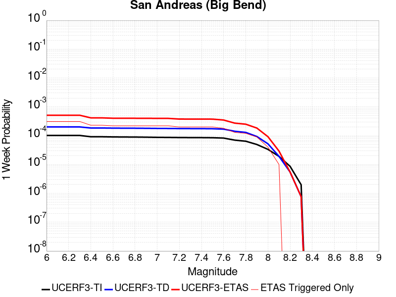 | 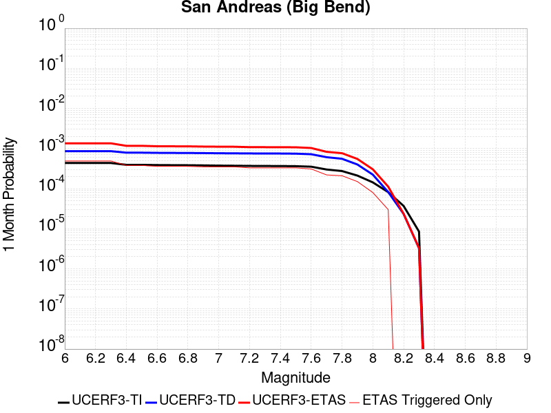 |  | 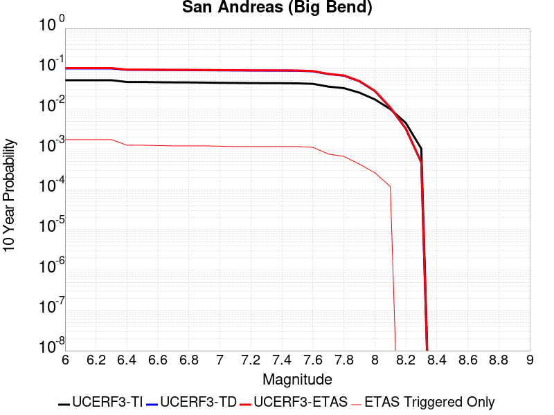 |

| Magnitude | 1 wk TI Prob | 1 wk TD Prob | 1 wk ETAS Prob | 1 wk ETAS/TD Gain | 1 wk ETAS Triggered Only | 1 mo TI Prob | 1 mo TD Prob | 1 mo ETAS Prob | 1 mo ETAS/TD Gain | 1 mo ETAS Triggered Only | 1 yr TI Prob | 1 yr TD Prob | 1 yr ETAS Prob | 1 yr ETAS/TD Gain | 1 yr ETAS Triggered Only | 10 yr TI Prob | 10 yr TD Prob | 10 yr ETAS Prob | 10 yr ETAS/TD Gain | 10 yr ETAS Triggered Only |
|-----|-----|-----|-----|-----|-----|-----|-----|-----|-----|-----|-----|-----|-----|-----|-----|-----|-----|-----|-----|-----|
| 6.0 | 1.0179969E-4 | 2.0072258E-4 | 5.1066035E-4 | 2.54411 | 3.1E-4 | 4.362114E-4 | 8.599571E-4 | 0.0013495358 | 1.5693059 | 4.9E-4 | 0.0052979486 | 0.010419999 | 0.011399683 | 1.0940197 | 9.9E-4 | 0.051734097 | 0.10144902 | 0.103048444 | 1.0157658 | 0.00178 |
| 6.1 | 1.0179969E-4 | 2.0072258E-4 | 5.1066035E-4 | 2.54411 | 3.1E-4 | 4.362114E-4 | 8.599571E-4 | 0.0013495358 | 1.5693059 | 4.9E-4 | 0.0052979486 | 0.010419999 | 0.011399683 | 1.0940197 | 9.9E-4 | 0.051734097 | 0.10144902 | 0.103048444 | 1.0157658 | 0.00178 |
| 6.2 | 1.0179969E-4 | 2.0072258E-4 | 5.1066035E-4 | 2.54411 | 3.1E-4 | 4.362114E-4 | 8.599571E-4 | 0.0013495358 | 1.5693059 | 4.9E-4 | 0.0052979486 | 0.010419999 | 0.011399683 | 1.0940197 | 9.9E-4 | 0.051734097 | 0.10144902 | 0.103048444 | 1.0157658 | 0.00178 |
| 6.3 | 1.0179969E-4 | 2.0072258E-4 | 5.1066035E-4 | 2.54411 | 3.1E-4 | 4.362114E-4 | 8.599571E-4 | 0.0013495358 | 1.5693059 | 4.9E-4 | 0.0052979486 | 0.010419999 | 0.011399683 | 1.0940197 | 9.9E-4 | 0.051734097 | 0.10144902 | 0.103048444 | 1.0157658 | 0.00178 |
| 6.4 | 9.1639464E-5 | 1.8429532E-4 | 4.1425292E-4 | 2.247767 | 2.3E-4 | 3.9268145E-4 | 7.895982E-4 | 0.0011692982 | 1.4808774 | 3.8E-4 | 0.0047704205 | 0.009571102 | 0.010294115 | 1.0755413 | 7.3E-4 | 0.046693064 | 0.09377527 | 0.094971485 | 1.0127562 | 0.00132 |
| 6.5 | 9.1639464E-5 | 1.8429532E-4 | 4.1425292E-4 | 2.247767 | 2.3E-4 | 3.9268145E-4 | 7.895982E-4 | 0.0011692982 | 1.4808774 | 3.8E-4 | 0.0047704205 | 0.009571102 | 0.010294115 | 1.0755413 | 7.3E-4 | 0.046693064 | 0.09377527 | 0.094971485 | 1.0127562 | 0.00132 |
| 6.6 | 9.042622E-5 | 1.823659E-4 | 4.023258E-4 | 2.2061458 | 2.2E-4 | 3.8748336E-4 | 7.8133424E-4 | 0.0011410529 | 1.4603903 | 3.6E-4 | 0.0047074095 | 0.009471365 | 0.01017464 | 1.0742528 | 7.1E-4 | 0.046089325 | 0.092869274 | 0.09403948 | 1.0126005 | 0.00129 |
| 6.7 | 8.9836685E-5 | 1.8150927E-4 | 4.0146933E-4 | 2.2118394 | 2.2E-4 | 3.8495753E-4 | 7.776651E-4 | 0.0011373851 | 1.4625642 | 3.6E-4 | 0.00467679 | 0.00942708 | 0.010130387 | 1.074605 | 7.1E-4 | 0.045795817 | 0.09246355 | 0.093625195 | 1.0125633 | 0.00128 |
| 6.8 | 8.9471854E-5 | 1.8097709E-4 | 4.0093728E-4 | 2.2154036 | 2.2E-4 | 3.8339442E-4 | 7.7538576E-4 | 0.0011351067 | 1.463925 | 3.6E-4 | 0.004657841 | 0.009399569 | 0.010102895 | 1.0748254 | 7.1E-4 | 0.04561414 | 0.092210755 | 0.093372725 | 1.0126013 | 0.00128 |
| 6.9 | 8.858234E-5 | 1.7979681E-4 | 3.9975726E-4 | 2.2233834 | 2.2E-4 | 3.7958333E-4 | 7.703304E-4 | 0.0011200608 | 1.4540005 | 3.5E-4 | 0.004611638 | 0.009338548 | 0.010032012 | 1.0742581 | 7.0E-4 | 0.04517103 | 0.09165087 | 0.092795394 | 1.0124878 | 0.00126 |
| 7.0 | 8.7433385E-5 | 1.7818481E-4 | 3.981456E-4 | 2.2344532 | 2.2E-4 | 3.746607E-4 | 7.634259E-4 | 0.0011131587 | 1.4581097 | 3.5E-4 | 0.004551957 | 0.009255203 | 0.009948725 | 1.0749332 | 7.0E-4 | 0.044598386 | 0.09088532 | 0.091994435 | 1.0122035 | 0.00122 |
| 7.1 | 8.684964E-5 | 1.7730435E-4 | 3.9726534E-4 | 2.2405844 | 2.2E-4 | 3.7215967E-4 | 7.596547E-4 | 0.0011093888 | 1.4603857 | 3.5E-4 | 0.0045216335 | 0.009209678 | 0.009883415 | 1.0731554 | 6.8E-4 | 0.04430731 | 0.09046686 | 0.0915492 | 1.011964 | 0.00119 |
| 7.2 | 8.606521E-5 | 1.762105E-4 | 3.7617527E-4 | 2.1348062 | 2.0E-4 | 3.6879873E-4 | 7.549695E-4 | 0.0010847204 | 1.4367738 | 3.3E-4 | 0.0044808835 | 0.0091531165 | 0.009797167 | 1.0703641 | 6.5E-4 | 0.043916024 | 0.089947365 | 0.09100303 | 1.0117364 | 0.00116 |
| 7.3 | 8.568266E-5 | 1.7563057E-4 | 3.7559544E-4 | 2.1385539 | 2.0E-4 | 3.6715972E-4 | 7.524855E-4 | 0.0010822371 | 1.4382167 | 3.3E-4 | 0.0044610105 | 0.009123127 | 0.009767197 | 1.0705975 | 6.5E-4 | 0.043725148 | 0.08966853 | 0.09072451 | 1.0117766 | 0.00116 |
| 7.4 | 8.5432206E-5 | 1.7525644E-4 | 3.752214E-4 | 2.1409848 | 2.0E-4 | 3.6608664E-4 | 7.50883E-4 | 0.0010806352 | 1.4391526 | 3.3E-4 | 0.004447999 | 0.009103781 | 0.009737954 | 1.0696604 | 6.4E-4 | 0.043600157 | 0.08948871 | 0.0905358 | 1.0117007 | 0.00115 |
| 7.5 | 8.4791965E-5 | 1.7394972E-4 | 3.7391495E-4 | 2.1495574 | 2.0E-4 | 3.633435E-4 | 7.4528606E-4 | 0.0010750401 | 1.442453 | 3.3E-4 | 0.0044147377 | 0.009036204 | 0.0096704215 | 1.0701863 | 6.4E-4 | 0.043280575 | 0.088866346 | 0.08990504 | 1.0116882 | 0.00114 |
| 7.6 | 8.241105E-5 | 1.6840403E-4 | 3.4837372E-4 | 2.068678 | 1.8E-4 | 3.531424E-4 | 7.215321E-4 | 0.0010313084 | 1.4293313 | 3.1E-4 | 0.0042910352 | 0.008749358 | 0.009363934 | 1.0702423 | 6.2E-4 | 0.042091176 | 0.086243294 | 0.08723929 | 1.0115486 | 0.00109 |
| 7.7 | 7.00432E-5 | 1.42045E-4 | 2.7202655E-4 | 1.9150729 | 1.3E-4 | 3.001506E-4 | 6.0862233E-4 | 8.2848844E-4 | 1.3612521 | 2.2E-4 | 0.0036482112 | 0.0073848404 | 0.007841444 | 1.0618298 | 4.6E-4 | 0.035888977 | 0.07351733 | 0.07423072 | 1.0097038 | 7.7E-4 |
| 7.8 | 6.415362E-5 | 1.2968935E-4 | 2.496738E-4 | 1.925168 | 1.2E-4 | 2.749151E-4 | 5.556931E-4 | 7.655764E-4 | 1.3776964 | 2.1E-4 | 0.0033419547 | 0.0067446055 | 0.0071717054 | 1.0633247 | 4.3E-4 | 0.03292141 | 0.06725231 | 0.067886576 | 1.0094311 | 6.8E-4 |
| 7.9 | 4.939911E-5 | 9.3411545E-5 | 1.8340313E-4 | 1.9633883 | 9.0E-5 | 2.116933E-4 | 4.0027377E-4 | 5.5021374E-4 | 1.3745935 | 1.5E-4 | 0.0025743195 | 0.004862453 | 0.005141091 | 1.0573041 | 2.8E-4 | 0.025447013 | 0.048914436 | 0.04930438 | 1.007972 | 4.1E-4 |
| 8.0 | 3.344983E-5 | 5.222685E-5 | 9.2224764E-5 | 1.7658496 | 4.0E-5 | 1.4334853E-4 | 2.2381016E-4 | 3.0379227E-4 | 1.3573657 | 8.0E-5 | 0.0017438711 | 0.0027214854 | 0.0028710773 | 1.0549669 | 1.5E-4 | 0.017302496 | 0.027922187 | 0.028145766 | 1.0080072 | 2.3E-4 |
| 8.1 | 1.9104898E-5 | 1.9173063E-5 | 2.9172872E-5 | 1.5215551 | 1.0E-5 | 8.1875565E-5 | 8.216769E-5 | 1.12165224E-4 | 1.365077 | 3.0E-5 | 9.963791E-4 | 9.999331E-4 | 0.0010498831 | 1.0499533 | 5.0E-5 | 0.009919235 | 0.010749801 | 0.010809156 | 1.0055215 | 6.0E-5 |
| 8.2 | 8.643924E-6 | 5.4748625E-6 | 5.4748625E-6 | 1.0 | 0.0 | 3.704486E-5 | 2.3463486E-5 | 2.3463486E-5 | 1.0 | 0.0 | 4.5092785E-4 | 2.8563058E-4 | 2.8563058E-4 | 1.0 | 0.0 | 0.0045001395 | 0.0032487072 | 0.0032487072 | 1.0 | 0.0 |
| 8.3 | 1.983087E-6 | 7.6599065E-7 | 7.6599065E-7 | 1.0 | 0.0 | 8.498917E-6 | 3.282813E-6 | 3.282813E-6 | 1.0 | 0.0 | 1.034694E-4 | 3.9967534E-5 | 3.9967534E-5 | 1.0 | 0.0 | 0.0010342124 | 4.719687E-4 | 4.719687E-4 | 1.0 | 0.0 |

## Coyote Lake
*[(top)](#table-of-contents)*

| 1 Week | 1 Month | 1 Year | 10 Year |
|-----|-----|-----|-----|
| 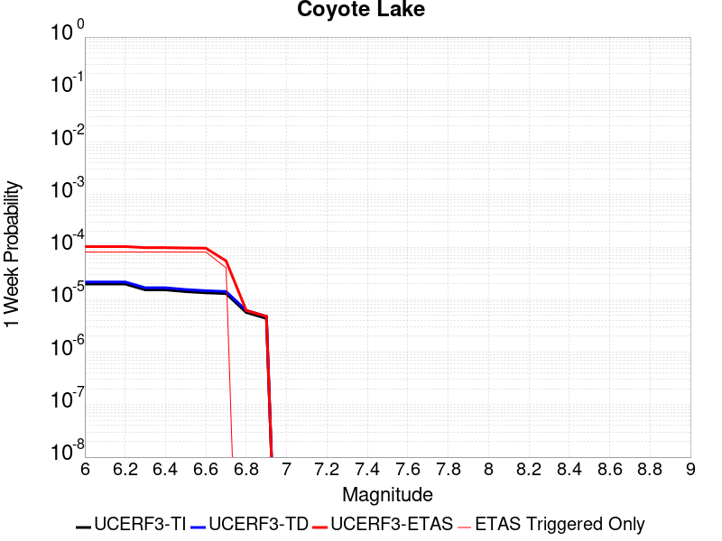 | 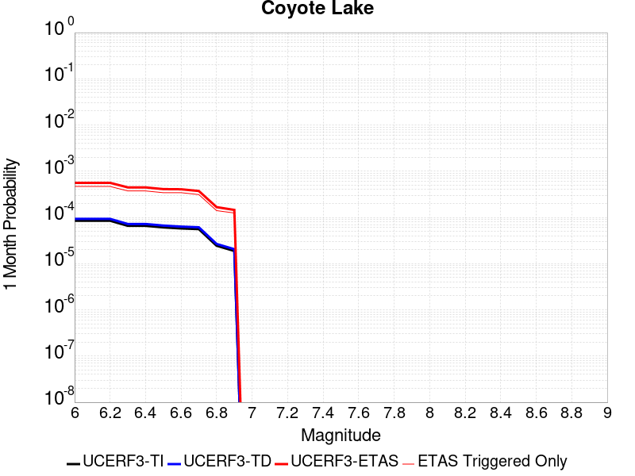 | 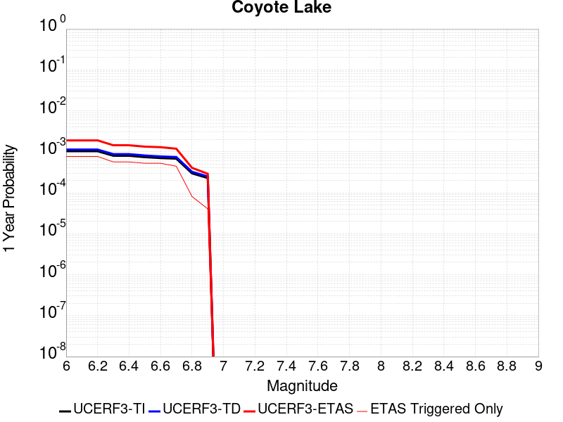 | 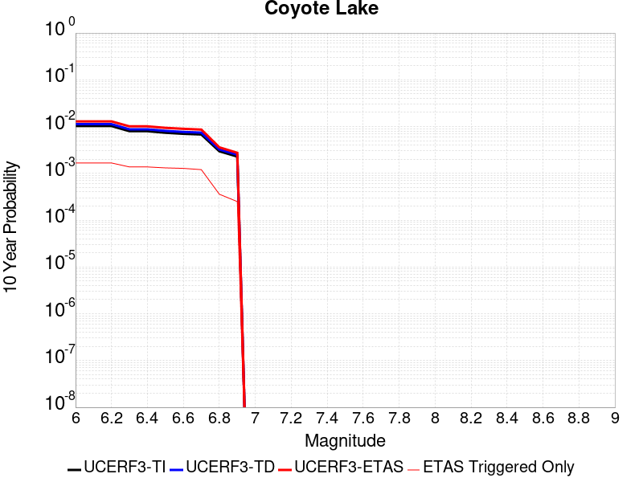 |

| Magnitude | 1 wk TI Prob | 1 wk TD Prob | 1 wk ETAS Prob | 1 wk ETAS/TD Gain | 1 wk ETAS Triggered Only | 1 mo TI Prob | 1 mo TD Prob | 1 mo ETAS Prob | 1 mo ETAS/TD Gain | 1 mo ETAS Triggered Only | 1 yr TI Prob | 1 yr TD Prob | 1 yr ETAS Prob | 1 yr ETAS/TD Gain | 1 yr ETAS Triggered Only | 10 yr TI Prob | 10 yr TD Prob | 10 yr ETAS Prob | 10 yr ETAS/TD Gain | 10 yr ETAS Triggered Only |
|-----|-----|-----|-----|-----|-----|-----|-----|-----|-----|-----|-----|-----|-----|-----|-----|-----|-----|-----|-----|-----|
| 6.0 | 1.980352E-5 | 2.1706745E-5 | 2.217024E-4 | 10.213526 | 2.0E-4 | 8.486947E-5 | 9.302599E-5 | 4.829897E-4 | 5.1919866 | 3.9E-4 | 0.0010327959 | 0.0011320751 | 0.0019211808 | 1.6970435 | 7.9E-4 | 0.010280091 | 0.011270258 | 0.012812677 | 1.1368574 | 0.00156 |
| 6.1 | 1.980352E-5 | 2.1706745E-5 | 2.217024E-4 | 10.213526 | 2.0E-4 | 8.486947E-5 | 9.302599E-5 | 4.829897E-4 | 5.1919866 | 3.9E-4 | 0.0010327959 | 0.0011320751 | 0.0019211808 | 1.6970435 | 7.9E-4 | 0.010280091 | 0.011270258 | 0.012812677 | 1.1368574 | 0.00156 |
| 6.2 | 1.980352E-5 | 2.1706745E-5 | 2.217024E-4 | 10.213526 | 2.0E-4 | 8.486947E-5 | 9.302599E-5 | 4.829897E-4 | 5.1919866 | 3.9E-4 | 0.0010327959 | 0.0011320751 | 0.0019211808 | 1.6970435 | 7.9E-4 | 0.010280091 | 0.011270258 | 0.012812677 | 1.1368574 | 0.00156 |
| 6.3 | 1.5344787E-5 | 1.682067E-5 | 1.7681798E-4 | 10.511947 | 1.6E-4 | 6.576172E-5 | 7.2086936E-5 | 3.9206387E-4 | 5.4387646 | 3.2E-4 | 8.003548E-4 | 8.773662E-4 | 0.0015467784 | 1.7629791 | 6.7E-4 | 0.007974784 | 0.00874507 | 0.010053526 | 1.1496222 | 0.00132 |
| 6.4 | 1.5344787E-5 | 1.682067E-5 | 1.7681798E-4 | 10.511947 | 1.6E-4 | 6.576172E-5 | 7.2086936E-5 | 3.9206387E-4 | 5.4387646 | 3.2E-4 | 8.003548E-4 | 8.773662E-4 | 0.0015467784 | 1.7629791 | 6.7E-4 | 0.007974784 | 0.00874507 | 0.010053526 | 1.1496222 | 0.00132 |
| 6.5 | 1.4189697E-5 | 1.5557987E-5 | 1.755555E-4 | 11.283947 | 1.6E-4 | 6.081157E-5 | 6.6675726E-5 | 3.6665573E-4 | 5.499089 | 3.0E-4 | 7.401293E-4 | 8.115349E-4 | 0.0014610074 | 1.8003014 | 6.5E-4 | 0.0073766913 | 0.008091656 | 0.009361299 | 1.1569077 | 0.00128 |
| 6.6 | 1.3469301E-5 | 1.4771577E-5 | 1.7476921E-4 | 11.831452 | 1.6E-4 | 5.7724297E-5 | 6.330556E-5 | 3.6328658E-4 | 5.7386203 | 3.0E-4 | 7.025667E-4 | 7.7053264E-4 | 0.0014100395 | 1.8299543 | 6.4E-4 | 0.0070034964 | 0.0076845144 | 0.008924909 | 1.1614149 | 0.00125 |
| 6.7 | 1.3027966E-5 | 1.4281745E-5 | 1.4427988E-4 | 10.102399 | 1.3E-4 | 5.5832945E-5 | 6.120638E-5 | 3.3118986E-4 | 5.411035 | 2.7E-4 | 6.7955407E-4 | 7.4499263E-4 | 0.0013445456 | 1.8047771 | 6.0E-4 | 0.006774798 | 0.0074308286 | 0.008592134 | 1.1562822 | 0.00117 |
| 6.8 | 5.695434E-6 | 6.2244176E-6 | 5.6224108E-5 | 9.03283 | 5.0E-5 | 2.4408775E-5 | 2.6675973E-5 | 1.266733E-4 | 4.748592 | 1.0E-4 | 2.971363E-4 | 3.2476155E-4 | 5.3469336E-4 | 1.6464182 | 2.1E-4 | 0.0029673933 | 0.0032458105 | 0.0035747392 | 1.1013396 | 3.3E-4 |
| 6.9 | 4.385688E-6 | 4.7930553E-6 | 4.4792865E-5 | 9.345367 | 4.0E-5 | 1.879567E-5 | 2.0541665E-5 | 1.1053982E-4 | 5.381249 | 9.0E-5 | 2.2881327E-4 | 2.5009477E-4 | 4.2005227E-4 | 1.6795723 | 1.7E-4 | 0.002285778 | 0.0025009478 | 0.0027403475 | 1.0957236 | 2.4E-4 |

## Helendale-So Lockhart
*[(top)](#table-of-contents)*

| 1 Week | 1 Month | 1 Year | 10 Year |
|-----|-----|-----|-----|
| 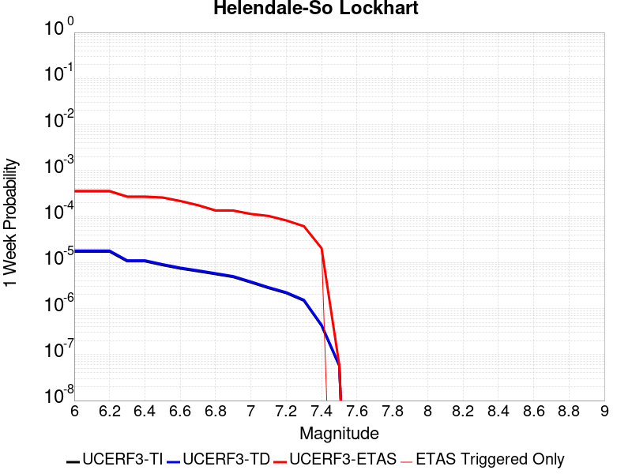 | 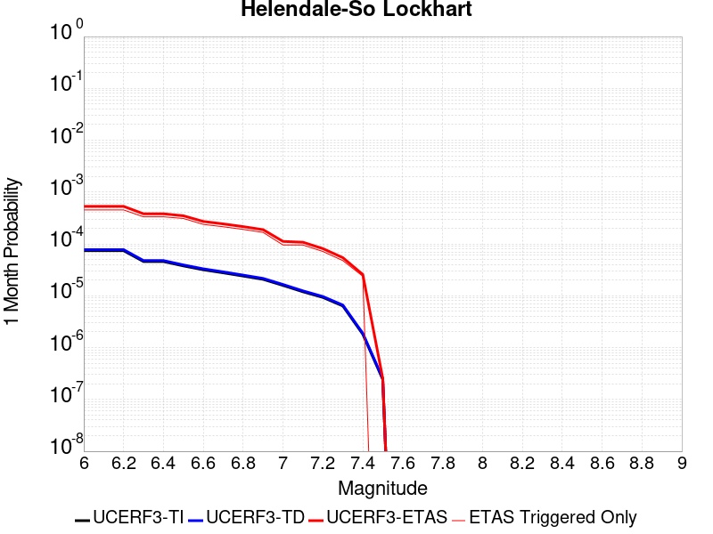 | 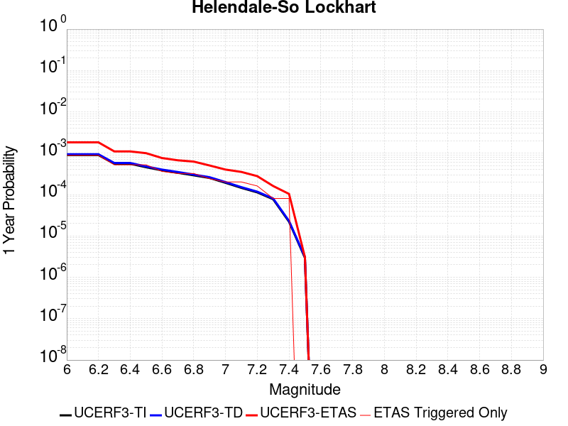 | 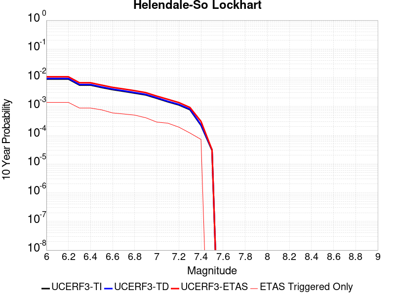 |

| Magnitude | 1 wk TI Prob | 1 wk TD Prob | 1 wk ETAS Prob | 1 wk ETAS/TD Gain | 1 wk ETAS Triggered Only | 1 mo TI Prob | 1 mo TD Prob | 1 mo ETAS Prob | 1 mo ETAS/TD Gain | 1 mo ETAS Triggered Only | 1 yr TI Prob | 1 yr TD Prob | 1 yr ETAS Prob | 1 yr ETAS/TD Gain | 1 yr ETAS Triggered Only | 10 yr TI Prob | 10 yr TD Prob | 10 yr ETAS Prob | 10 yr ETAS/TD Gain | 10 yr ETAS Triggered Only |
|-----|-----|-----|-----|-----|-----|-----|-----|-----|-----|-----|-----|-----|-----|-----|-----|-----|-----|-----|-----|-----|
| 6.0 | 1.7296055E-5 | 1.8103729E-5 | 3.5809758E-4 | 19.780321 | 3.4E-4 | 7.412385E-5 | 7.7585224E-5 | 5.675472E-4 | 7.315146 | 4.9E-4 | 9.0208417E-4 | 9.4421144E-4 | 0.0018233806 | 1.9311147 | 8.8E-4 | 0.008984311 | 0.009404116 | 0.01084048 | 1.1527379 | 0.00145 |
| 6.1 | 1.7296055E-5 | 1.8103729E-5 | 3.5809758E-4 | 19.780321 | 3.4E-4 | 7.412385E-5 | 7.7585224E-5 | 5.675472E-4 | 7.315146 | 4.9E-4 | 9.0208417E-4 | 9.4421144E-4 | 0.0018233806 | 1.9311147 | 8.8E-4 | 0.008984311 | 0.009404116 | 0.01084048 | 1.1527379 | 0.00145 |
| 6.2 | 1.7296055E-5 | 1.8103729E-5 | 3.5809758E-4 | 19.780321 | 3.4E-4 | 7.412385E-5 | 7.7585224E-5 | 5.675472E-4 | 7.315146 | 4.9E-4 | 9.0208417E-4 | 9.4421144E-4 | 0.0018233806 | 1.9311147 | 8.8E-4 | 0.008984311 | 0.009404116 | 0.01084048 | 1.1527379 | 0.00145 |
| 6.3 | 1.0669118E-5 | 1.1135425E-5 | 2.7113254E-4 | 24.348648 | 2.6E-4 | 4.5723988E-5 | 4.772239E-5 | 4.077052E-4 | 8.543269 | 3.6E-4 | 5.5654737E-4 | 5.80868E-4 | 0.0011905137 | 2.0495424 | 6.1E-4 | 0.0055515557 | 0.0057937936 | 0.006797942 | 1.1733145 | 0.00101 |
| 6.4 | 1.0669118E-5 | 1.1135425E-5 | 2.7113254E-4 | 24.348648 | 2.6E-4 | 4.5723988E-5 | 4.772239E-5 | 4.077052E-4 | 8.543269 | 3.6E-4 | 5.5654737E-4 | 5.80868E-4 | 0.0011905137 | 2.0495424 | 6.1E-4 | 0.0055515557 | 0.0057937936 | 0.006797942 | 1.1733145 | 0.00101 |
| 6.5 | 8.790038E-6 | 9.170197E-6 | 2.591679E-4 | 28.261978 | 2.5E-4 | 3.767105E-5 | 3.930026E-5 | 3.692873E-4 | 9.396561 | 3.3E-4 | 4.585485E-4 | 4.7837716E-4 | 0.0010381093 | 2.1700644 | 5.6E-4 | 0.0045760344 | 0.004773638 | 0.005669342 | 1.1876354 | 9.0E-4 |
| 6.6 | 7.396949E-6 | 7.715537E-6 | 2.1771391E-4 | 28.217598 | 2.1E-4 | 3.1700827E-5 | 3.3066175E-5 | 3.230566E-4 | 9.770002 | 2.9E-4 | 3.858892E-4 | 4.025073E-4 | 8.9231005E-4 | 2.2168791 | 4.9E-4 | 0.003852198 | 0.00401789 | 0.0047648763 | 1.1859151 | 7.5E-4 |
| 6.7 | 6.4600285E-6 | 6.738031E-6 | 1.7673688E-4 | 26.229752 | 1.7E-4 | 2.7685543E-5 | 2.887696E-5 | 2.7886973E-4 | 9.657171 | 2.5E-4 | 3.3701936E-4 | 3.5152107E-4 | 7.913664E-4 | 2.2512631 | 4.4E-4 | 0.0033650869 | 0.003509732 | 0.0041674157 | 1.1873885 | 6.6E-4 |
| 6.8 | 5.600104E-6 | 5.836009E-6 | 1.3583525E-4 | 23.275366 | 1.3E-4 | 2.4000226E-5 | 2.5011232E-5 | 2.2500622E-4 | 8.996207 | 2.0E-4 | 2.9216358E-4 | 3.044698E-4 | 6.643602E-4 | 2.1820233 | 3.6E-4 | 0.0029177975 | 0.003040588 | 0.0035789462 | 1.1770573 | 5.4E-4 |
| 6.9 | 4.839122E-6 | 5.0395092E-6 | 1.3503885E-4 | 26.796032 | 1.3E-4 | 2.0738931E-5 | 2.159772E-5 | 2.1159362E-4 | 9.797034 | 1.9E-4 | 2.5246723E-4 | 2.6292098E-4 | 5.928342E-4 | 2.2547998 | 3.3E-4 | 0.002521806 | 0.002626147 | 0.0030949125 | 1.1784995 | 4.7E-4 |
| 7.0 | 3.6937633E-6 | 3.845208E-6 | 1.13844784E-4 | 29.606924 | 1.1E-4 | 1.5830317E-5 | 1.647936E-5 | 1.664769E-4 | 10.102145 | 1.5E-4 | 1.9271708E-4 | 2.0061806E-4 | 4.8056187E-4 | 2.395407 | 2.8E-4 | 0.0019255003 | 0.002004401 | 0.0023836393 | 1.1892028 | 3.8E-4 |
| 7.1 | 2.7858857E-6 | 2.8978538E-6 | 1.0289757E-4 | 35.508198 | 1.0E-4 | 1.1939455E-5 | 1.2419316E-5 | 1.424177E-4 | 11.467436 | 1.3E-4 | 1.4535317E-4 | 1.511949E-4 | 3.911586E-4 | 2.5871153 | 2.4E-4 | 0.0014525814 | 0.0015109418 | 0.0018204733 | 1.2048601 | 3.1E-4 |
| 7.2 | 2.1672065E-6 | 2.2540128E-6 | 8.2253835E-5 | 36.492176 | 8.0E-5 | 9.2879945E-6 | 9.66002E-6 | 1.1965896E-4 | 12.38703 | 1.1E-4 | 1.1307546E-4 | 1.1760458E-4 | 2.975834E-4 | 2.5303726 | 1.8E-4 | 0.0011301794 | 0.0011754417 | 0.001395183 | 1.1869437 | 2.2E-4 |
| 7.3 | 1.4823496E-6 | 1.5422102E-6 | 6.1542116E-5 | 39.905144 | 6.0E-5 | 6.3529114E-6 | 6.6094562E-6 | 8.6608925E-5 | 13.103789 | 8.0E-5 | 7.734395E-5 | 8.046731E-5 | 1.9045846E-4 | 2.3669047 | 1.1E-4 | 7.731704E-4 | 8.0439687E-4 | 9.4428426E-4 | 1.1739035 | 1.4E-4 |
| 7.4 | 4.2321457E-7 | 4.4108765E-7 | 2.0441079E-5 | 46.34244 | 2.0E-5 | 1.8137755E-6 | 1.8903745E-6 | 3.189032E-5 | 16.86984 | 3.0E-5 | 2.2082493E-5 | 2.3015113E-5 | 6.3014195E-5 | 2.7379484 | 4.0E-5 | 2.2080299E-4 | 2.3013182E-4 | 2.8012032E-4 | 1.2172167 | 5.0E-5 |
| 7.5 | 5.6942316E-8 | 5.9415648E-8 | 5.9415648E-8 | 1.0 | 0.0 | 2.440385E-7 | 2.5463845E-7 | 1.02546355E-5 | 40.271355 | 1.0E-5 | 2.9711643E-6 | 3.1002196E-6 | 1.3100189E-5 | 4.225568 | 1.0E-5 | 2.9711247E-5 | 3.1001844E-5 | 4.100153E-5 | 1.3225515 | 1.0E-5 |

## San Andreas (Parkfield)
*[(top)](#table-of-contents)*

| 1 Week | 1 Month | 1 Year | 10 Year |
|-----|-----|-----|-----|
| 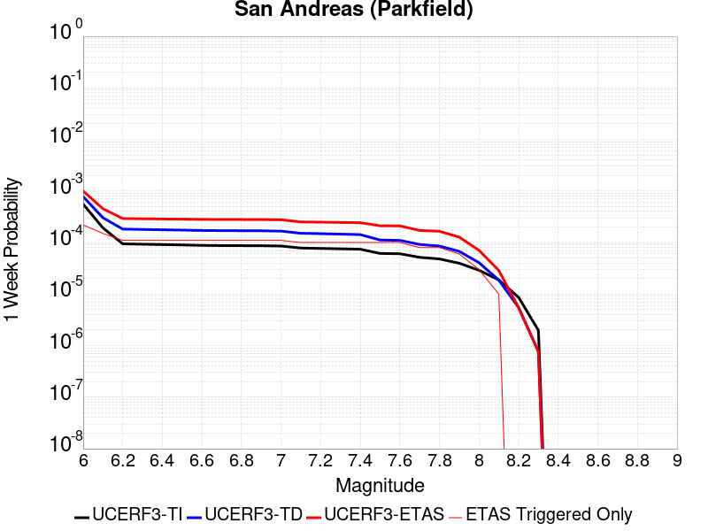 | 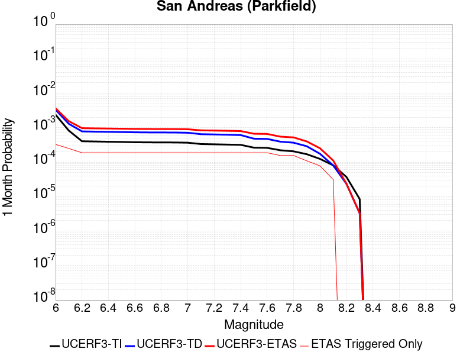 | 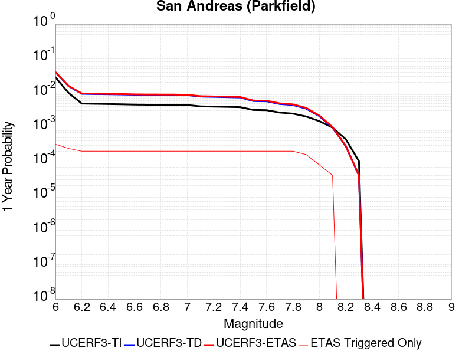 | 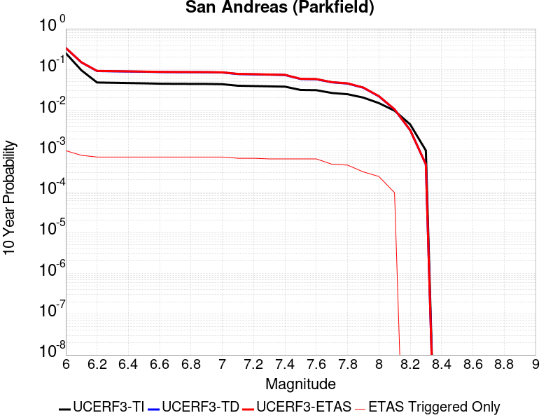 |

| Magnitude | 1 wk TI Prob | 1 wk TD Prob | 1 wk ETAS Prob | 1 wk ETAS/TD Gain | 1 wk ETAS Triggered Only | 1 mo TI Prob | 1 mo TD Prob | 1 mo ETAS Prob | 1 mo ETAS/TD Gain | 1 mo ETAS Triggered Only | 1 yr TI Prob | 1 yr TD Prob | 1 yr ETAS Prob | 1 yr ETAS/TD Gain | 1 yr ETAS Triggered Only | 10 yr TI Prob | 10 yr TD Prob | 10 yr ETAS Prob | 10 yr ETAS/TD Gain | 10 yr ETAS Triggered Only |
|-----|-----|-----|-----|-----|-----|-----|-----|-----|-----|-----|-----|-----|-----|-----|-----|-----|-----|-----|-----|-----|
| 6.0 | 5.556969E-4 | 7.7782426E-4 | 9.976531E-4 | 1.2826202 | 2.2E-4 | 0.0023793848 | 0.0033298214 | 0.0036487558 | 1.0957812 | 3.2E-4 | 0.028586963 | 0.040191233 | 0.04075752 | 1.0140898 | 5.9E-4 | 0.25176284 | 0.33716413 | 0.3378535 | 1.0020446 | 0.00104 |
| 6.1 | 1.925858E-4 | 3.0276453E-4 | 4.527191E-4 | 1.4952846 | 1.5E-4 | 8.2510663E-4 | 0.0012970108 | 0.0015067384 | 1.1617007 | 2.1E-4 | 0.0099994885 | 0.015778083 | 0.016171772 | 1.0249516 | 4.0E-4 | 0.095613256 | 0.1497237 | 0.1503529 | 1.0042025 | 7.4E-4 |
| 6.2 | 9.4306815E-5 | 1.8242796E-4 | 2.924079E-4 | 1.6028677 | 1.1E-4 | 4.0410945E-4 | 7.816011E-4 | 9.5146825E-4 | 1.2173322 | 1.7E-4 | 0.0049089384 | 0.009474681 | 0.009801554 | 1.0344996 | 3.3E-4 | 0.048019063 | 0.09185409 | 0.092417136 | 1.0061299 | 6.2E-4 |
| 6.3 | 9.283051E-5 | 1.7939322E-4 | 2.8937348E-4 | 1.6130681 | 1.1E-4 | 3.9778434E-4 | 7.686027E-4 | 9.3847205E-4 | 1.2210106 | 1.7E-4 | 0.0048322747 | 0.009317789 | 0.009644714 | 1.0350862 | 3.3E-4 | 0.047285385 | 0.09050704 | 0.09107092 | 1.0062304 | 6.2E-4 |
| 6.4 | 9.138826E-5 | 1.770153E-4 | 2.8699584E-4 | 1.6213052 | 1.1E-4 | 3.916052E-4 | 7.5841765E-4 | 9.2828873E-4 | 1.2239809 | 1.7E-4 | 0.0047573745 | 0.00919484 | 0.009521806 | 1.0355597 | 3.3E-4 | 0.046568092 | 0.08940927 | 0.08997384 | 1.0063144 | 6.2E-4 |
| 6.5 | 9.000255E-5 | 1.7459576E-4 | 2.8457656E-4 | 1.6299168 | 1.1E-4 | 3.8566816E-4 | 7.480541E-4 | 9.1792695E-4 | 1.2270863 | 1.7E-4 | 0.0046854047 | 0.009069731 | 0.009396739 | 1.0360547 | 3.3E-4 | 0.045878403 | 0.088295065 | 0.088860326 | 1.0064019 | 6.2E-4 |
| 6.6 | 8.8109264E-5 | 1.7140752E-4 | 2.8138867E-4 | 1.6416354 | 1.1E-4 | 3.7755648E-4 | 7.3439797E-4 | 9.042731E-4 | 1.2313122 | 1.7E-4 | 0.0045870654 | 0.008904854 | 0.009231915 | 1.0367284 | 3.3E-4 | 0.04493529 | 0.0868267 | 0.08739286 | 1.0065206 | 6.2E-4 |
| 6.7 | 8.738073E-5 | 1.7007832E-4 | 2.800596E-4 | 1.6466508 | 1.1E-4 | 3.7443507E-4 | 7.287046E-4 | 8.9858077E-4 | 1.2331207 | 1.7E-4 | 0.0045492216 | 0.008836143 | 0.009163227 | 1.0370166 | 3.3E-4 | 0.04457213 | 0.08622707 | 0.0867936 | 1.0065703 | 6.2E-4 |
| 6.8 | 8.710195E-5 | 1.6953335E-4 | 2.795147E-4 | 1.6487299 | 1.1E-4 | 3.7324068E-4 | 7.263703E-4 | 8.962468E-4 | 1.2338704 | 1.7E-4 | 0.0045347405 | 0.008807961 | 0.009125142 | 1.0360107 | 3.2E-4 | 0.04443313 | 0.08597467 | 0.08653223 | 1.0064851 | 6.1E-4 |
| 6.9 | 8.6801556E-5 | 1.689429E-4 | 2.7892433E-4 | 1.6509975 | 1.1E-4 | 3.7195362E-4 | 7.2384125E-4 | 8.937182E-4 | 1.2346882 | 1.7E-4 | 0.0045191357 | 0.008777418 | 0.009094609 | 1.0361372 | 3.2E-4 | 0.044283327 | 0.085700735 | 0.086258456 | 1.0065078 | 6.1E-4 |
| 7.0 | 8.5571606E-5 | 1.6647128E-4 | 2.7645298E-4 | 1.6606647 | 1.1E-4 | 3.6668387E-4 | 7.132544E-4 | 8.8313315E-4 | 1.2381741 | 1.7E-4 | 0.004455241 | 0.008649553 | 0.008966786 | 1.0366762 | 3.2E-4 | 0.043669727 | 0.08454914 | 0.085107565 | 1.0066048 | 6.1E-4 |
| 7.1 | 7.82589E-5 | 1.5128135E-4 | 2.5126623E-4 | 1.66092 | 1.0E-4 | 3.3535215E-4 | 6.481883E-4 | 7.9809106E-4 | 1.2312642 | 1.5E-4 | 0.0040752706 | 0.007863307 | 0.008160948 | 1.0378519 | 3.0E-4 | 0.040013418 | 0.07746111 | 0.07799618 | 1.0069076 | 5.8E-4 |
| 7.2 | 7.690929E-5 | 1.4865391E-4 | 2.4863906E-4 | 1.6726035 | 1.0E-4 | 3.2956956E-4 | 6.369334E-4 | 7.8683783E-4 | 1.2353535 | 1.5E-4 | 0.004005129 | 0.007727258 | 0.008024939 | 1.0385236 | 3.0E-4 | 0.0393371 | 0.07623427 | 0.07677006 | 1.0070281 | 5.8E-4 |
| 7.3 | 7.5543794E-5 | 1.4561978E-4 | 2.4560522E-4 | 1.6866199 | 1.0E-4 | 3.2371894E-4 | 6.2393624E-4 | 7.738426E-4 | 1.2402592 | 1.5E-4 | 0.003934157 | 0.007570127 | 0.007867856 | 1.0393294 | 3.0E-4 | 0.038652334 | 0.074797355 | 0.075324714 | 1.0070506 | 5.7E-4 |
| 7.4 | 7.4214564E-5 | 1.4262961E-4 | 2.4261535E-4 | 1.7010167 | 1.0E-4 | 3.1802364E-4 | 6.111273E-4 | 7.610356E-4 | 1.245298 | 1.5E-4 | 0.003865065 | 0.00741525 | 0.0077130254 | 1.0401572 | 3.0E-4 | 0.03798529 | 0.07337123 | 0.07389941 | 1.0071987 | 5.7E-4 |
| 7.5 | 6.149578E-5 | 1.11907226E-4 | 2.1189604E-4 | 1.8934973 | 1.0E-4 | 2.6352672E-4 | 4.7951436E-4 | 6.194472E-4 | 1.2918221 | 1.4E-4 | 0.0032037178 | 0.0058224914 | 0.0061108028 | 1.0495169 | 2.9E-4 | 0.03157923 | 0.058557566 | 0.059084773 | 1.0090033 | 5.6E-4 |
| 7.6 | 6.0643448E-5 | 1.10193796E-4 | 2.1018278E-4 | 1.9073921 | 1.0E-4 | 2.598746E-4 | 4.7217376E-4 | 6.121077E-4 | 1.296361 | 1.4E-4 | 0.0031593828 | 0.0057335934 | 0.006021931 | 1.0502892 | 2.9E-4 | 0.031148417 | 0.057718582 | 0.05824626 | 1.0091423 | 5.6E-4 |
| 7.7 | 5.1652263E-5 | 9.174698E-5 | 1.7173964E-4 | 1.8718833 | 8.0E-5 | 2.2134806E-4 | 3.931421E-4 | 5.1309494E-4 | 1.3051131 | 1.2E-4 | 0.002691582 | 0.0047760103 | 0.0050347685 | 1.0541787 | 2.6E-4 | 0.026592141 | 0.04853623 | 0.048945356 | 1.0084294 | 4.3E-4 |
| 7.8 | 4.8090482E-5 | 8.559635E-5 | 1.655895E-4 | 1.9345392 | 8.0E-5 | 2.060858E-4 | 3.6678996E-4 | 4.8674594E-4 | 1.3270427 | 1.2E-4 | 0.0025062072 | 0.0044565317 | 0.0047153733 | 1.0580814 | 2.6E-4 | 0.024781305 | 0.04530245 | 0.045693874 | 1.0086403 | 4.1E-4 |
| 7.9 | 3.970278E-5 | 6.750426E-5 | 1.2750021E-4 | 1.8887728 | 6.0E-5 | 1.7014367E-4 | 2.892719E-4 | 3.7924587E-4 | 1.311036 | 9.0E-5 | 0.002069531 | 0.0035162016 | 0.0037154984 | 1.0566796 | 2.0E-4 | 0.020503636 | 0.035881363 | 0.036160957 | 1.0077922 | 2.9E-4 |
| 8.0 | 2.8982335E-5 | 4.069796E-5 | 7.069674E-5 | 1.7371078 | 3.0E-5 | 1.2420409E-4 | 1.7440817E-4 | 2.2439945E-4 | 1.2866338 | 5.0E-5 | 0.0015111357 | 0.0021213528 | 0.0022311194 | 1.0517437 | 1.1E-4 | 0.015009012 | 0.022010697 | 0.022186734 | 1.0079979 | 1.8E-4 |
| 8.1 | 1.8836186E-5 | 1.8681134E-5 | 2.8680948E-5 | 1.5352894 | 1.0E-5 | 8.0724014E-5 | 8.005955E-5 | 1.0005795E-4 | 1.249794 | 2.0E-5 | 9.823717E-4 | 9.742898E-4 | 0.0010142508 | 1.0410155 | 4.0E-5 | 0.009780403 | 0.010488115 | 0.010537591 | 1.0047174 | 5.0E-5 |
| 8.2 | 8.643924E-6 | 5.4748625E-6 | 5.4748625E-6 | 1.0 | 0.0 | 3.704486E-5 | 2.3463486E-5 | 2.3463486E-5 | 1.0 | 0.0 | 4.5092785E-4 | 2.8563058E-4 | 2.8563058E-4 | 1.0 | 0.0 | 0.0045001395 | 0.0032487072 | 0.0032487072 | 1.0 | 0.0 |
| 8.3 | 1.983087E-6 | 7.6599065E-7 | 7.6599065E-7 | 1.0 | 0.0 | 8.498917E-6 | 3.282813E-6 | 3.282813E-6 | 1.0 | 0.0 | 1.034694E-4 | 3.9967534E-5 | 3.9967534E-5 | 1.0 | 0.0 | 0.0010342124 | 4.719687E-4 | 4.719687E-4 | 1.0 | 0.0 |

## San Andreas (San Gorgonio Pass-Garnet HIll)
*[(top)](#table-of-contents)*

| 1 Week | 1 Month | 1 Year | 10 Year |
|-----|-----|-----|-----|
| 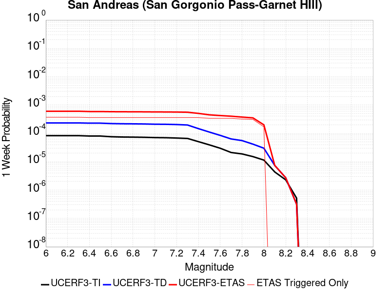 | 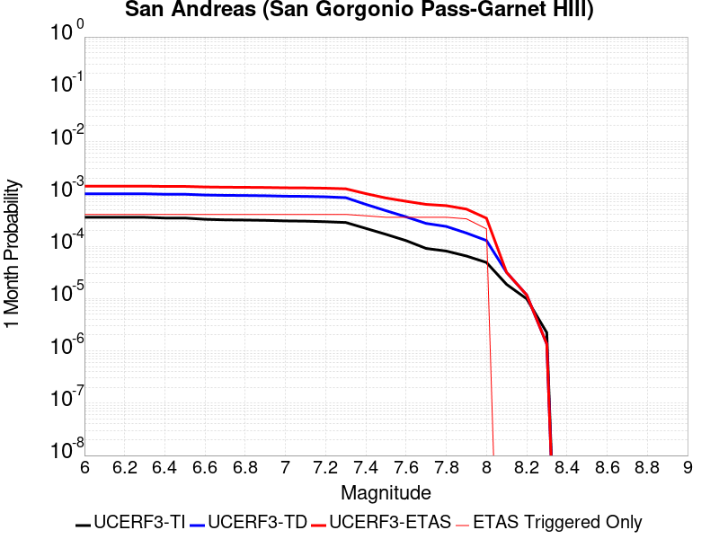 | 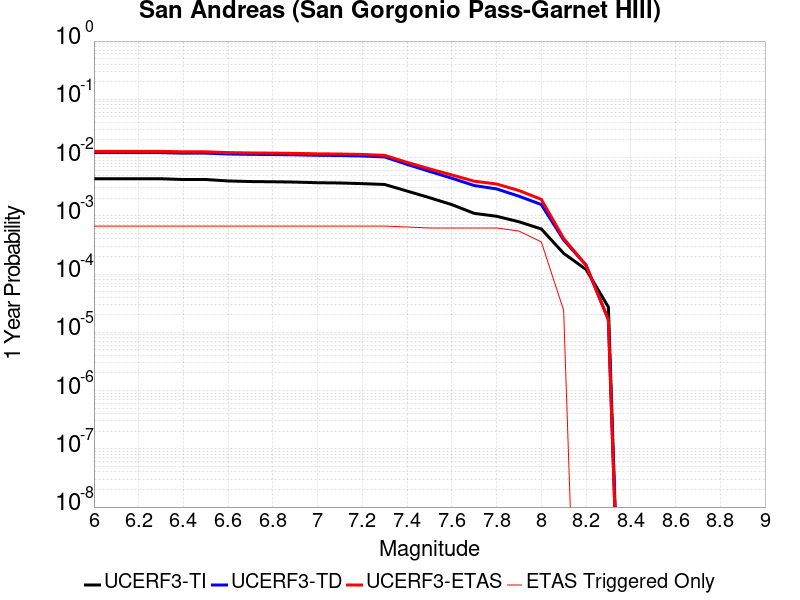 | 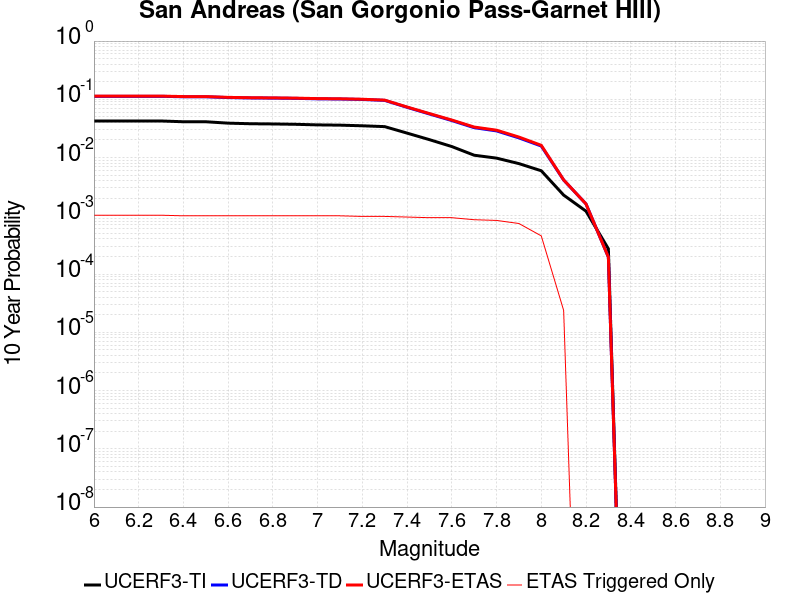 |

| Magnitude | 1 wk TI Prob | 1 wk TD Prob | 1 wk ETAS Prob | 1 wk ETAS/TD Gain | 1 wk ETAS Triggered Only | 1 mo TI Prob | 1 mo TD Prob | 1 mo ETAS Prob | 1 mo ETAS/TD Gain | 1 mo ETAS Triggered Only | 1 yr TI Prob | 1 yr TD Prob | 1 yr ETAS Prob | 1 yr ETAS/TD Gain | 1 yr ETAS Triggered Only | 10 yr TI Prob | 10 yr TD Prob | 10 yr ETAS Prob | 10 yr ETAS/TD Gain | 10 yr ETAS Triggered Only |
|-----|-----|-----|-----|-----|-----|-----|-----|-----|-----|-----|-----|-----|-----|-----|-----|-----|-----|-----|-----|-----|
| 6.0 | 8.31567E-5 | 2.3382473E-4 | 6.0373824E-4 | 2.5820117 | 3.7E-4 | 3.5633717E-4 | 0.0010017233 | 0.0014612626 | 1.4587486 | 4.6E-4 | 0.004329778 | 0.012127888 | 0.012908308 | 1.0643492 | 7.9E-4 | 0.042463828 | 0.11257892 | 0.113617204 | 1.0092227 | 0.00117 |
| 6.1 | 8.31567E-5 | 2.3382473E-4 | 6.0373824E-4 | 2.5820117 | 3.7E-4 | 3.5633717E-4 | 0.0010017233 | 0.0014612626 | 1.4587486 | 4.6E-4 | 0.004329778 | 0.012127888 | 0.012908308 | 1.0643492 | 7.9E-4 | 0.042463828 | 0.11257892 | 0.113617204 | 1.0092227 | 0.00117 |
| 6.2 | 8.31567E-5 | 2.3382473E-4 | 6.0373824E-4 | 2.5820117 | 3.7E-4 | 3.5633717E-4 | 0.0010017233 | 0.0014612626 | 1.4587486 | 4.6E-4 | 0.004329778 | 0.012127888 | 0.012908308 | 1.0643492 | 7.9E-4 | 0.042463828 | 0.11257892 | 0.113617204 | 1.0092227 | 0.00117 |
| 6.3 | 8.31567E-5 | 2.3382473E-4 | 6.0373824E-4 | 2.5820117 | 3.7E-4 | 3.5633717E-4 | 0.0010017233 | 0.0014612626 | 1.4587486 | 4.6E-4 | 0.004329778 | 0.012127888 | 0.012908308 | 1.0643492 | 7.9E-4 | 0.042463828 | 0.11257892 | 0.113617204 | 1.0092227 | 0.00117 |
| 6.4 | 8.059055E-5 | 2.2940808E-4 | 5.893255E-4 | 2.568896 | 3.6E-4 | 3.4534236E-4 | 9.828096E-4 | 0.0014323673 | 1.4574211 | 4.5E-4 | 0.0041964394 | 0.011900152 | 0.01267087 | 1.0647653 | 7.8E-4 | 0.041180745 | 0.11056015 | 0.111583 | 1.0092516 | 0.00115 |
| 6.5 | 8.059055E-5 | 2.2940808E-4 | 5.893255E-4 | 2.568896 | 3.6E-4 | 3.4534236E-4 | 9.828096E-4 | 0.0014323673 | 1.4574211 | 4.5E-4 | 0.0041964394 | 0.011900152 | 0.01267087 | 1.0647653 | 7.8E-4 | 0.041180745 | 0.11056015 | 0.111583 | 1.0092516 | 0.00115 |
| 6.6 | 7.619237E-5 | 2.218517E-4 | 5.8177183E-4 | 2.6223457 | 3.6E-4 | 3.2649786E-4 | 9.5044886E-4 | 0.0014000211 | 1.4730105 | 4.5E-4 | 0.0039678677 | 0.01151087 | 0.012281892 | 1.066982 | 7.8E-4 | 0.03897764 | 0.10709683 | 0.10812367 | 1.009588 | 0.00115 |
| 6.7 | 7.440636E-5 | 2.1860997E-4 | 5.7853124E-4 | 2.6464086 | 3.6E-4 | 3.188454E-4 | 9.3656575E-4 | 0.0013861443 | 1.4800289 | 4.5E-4 | 0.0038750346 | 0.011343609 | 0.0121147605 | 1.0679812 | 7.8E-4 | 0.038081564 | 0.105605274 | 0.10663383 | 1.0097396 | 0.00115 |
| 6.8 | 7.3735864E-5 | 2.1708169E-4 | 5.770035E-4 | 2.658002 | 3.6E-4 | 3.1597257E-4 | 9.3002064E-4 | 0.0013796021 | 1.4834102 | 4.5E-4 | 0.0038401815 | 0.011264749 | 0.012035962 | 1.0684626 | 7.8E-4 | 0.03774495 | 0.10490683 | 0.10592724 | 1.0097268 | 0.00114 |
| 6.9 | 7.27575E-5 | 2.1477141E-4 | 5.746941E-4 | 2.6758406 | 3.6E-4 | 3.117806E-4 | 9.201265E-4 | 0.0013697124 | 1.4886132 | 4.5E-4 | 0.003789323 | 0.011145527 | 0.011916833 | 1.0692033 | 7.8E-4 | 0.037253562 | 0.103854746 | 0.10487635 | 1.0098369 | 0.00114 |
| 7.0 | 7.102591E-5 | 2.1061185E-4 | 5.70536E-4 | 2.7089455 | 3.6E-4 | 3.0436125E-4 | 9.023122E-4 | 0.0013519061 | 1.4982687 | 4.5E-4 | 0.003699303 | 0.010930831 | 0.011702305 | 1.0705777 | 7.8E-4 | 0.03638325 | 0.10195695 | 0.10298072 | 1.0100412 | 0.00114 |
| 7.1 | 7.028513E-5 | 2.0896831E-4 | 5.688931E-4 | 2.7223892 | 3.6E-4 | 3.0118722E-4 | 8.9527335E-4 | 0.0013448704 | 1.5021898 | 4.5E-4 | 0.0036607897 | 0.010845989 | 0.011617529 | 1.071136 | 7.8E-4 | 0.036010686 | 0.101199985 | 0.10222462 | 1.0101248 | 0.00114 |
| 7.2 | 6.8498244E-5 | 2.0504706E-4 | 5.649732E-4 | 2.7553344 | 3.6E-4 | 2.9353087E-4 | 8.784794E-4 | 0.001328084 | 1.5117987 | 4.5E-4 | 0.003567883 | 0.010643536 | 0.01140534 | 1.0715743 | 7.7E-4 | 0.035111405 | 0.09939202 | 0.1004007 | 1.0101485 | 0.00112 |
| 7.3 | 6.622592E-5 | 1.9732013E-4 | 5.5724906E-4 | 2.8240864 | 3.6E-4 | 2.8379448E-4 | 8.453858E-4 | 0.0012950053 | 1.5318514 | 4.5E-4 | 0.0034497243 | 0.0102444785 | 0.011006591 | 1.0743924 | 7.7E-4 | 0.033966612 | 0.095888525 | 0.09690113 | 1.0105603 | 0.00112 |
| 7.4 | 5.1050705E-5 | 1.4689034E-4 | 5.0683744E-4 | 3.450448 | 3.6E-4 | 2.1877038E-4 | 6.29379E-4 | 0.0010691021 | 1.6986618 | 4.4E-4 | 0.002660276 | 0.0076359594 | 0.008390157 | 1.0987691 | 7.6E-4 | 0.02628654 | 0.07286301 | 0.07389214 | 1.014124 | 0.00111 |
| 7.5 | 3.9302922E-5 | 1.1129847E-4 | 4.5126062E-4 | 4.0545087 | 3.4E-4 | 1.6843023E-4 | 4.7690657E-4 | 8.9670625E-4 | 1.8802557 | 4.2E-4 | 0.0020487092 | 0.005790949 | 0.006516721 | 1.1253288 | 7.3E-4 | 0.020299247 | 0.05600951 | 0.05702902 | 1.0182024 | 0.00108 |
| 7.6 | 2.9851626E-5 | 8.4949745E-5 | 4.2492087E-4 | 5.0020266 | 3.4E-4 | 1.2792926E-4 | 3.6401965E-4 | 7.738704E-4 | 2.125903 | 4.1E-4 | 0.0015564259 | 0.0044229585 | 0.0051397737 | 1.1620669 | 7.2E-4 | 0.0154556995 | 0.04319374 | 0.044207953 | 1.0234807 | 0.00106 |
| 7.7 | 2.1135214E-5 | 6.3529005E-5 | 4.035074E-4 | 6.3515463 | 3.4E-4 | 9.0576345E-5 | 2.7223877E-4 | 6.7212986E-4 | 2.4688985 | 4.0E-4 | 0.0011022091 | 0.0033094748 | 0.004017125 | 1.2138256 | 7.1E-4 | 0.010967582 | 0.032582592 | 0.033559684 | 1.0299882 | 0.00101 |
| 7.8 | 1.883379E-5 | 5.564028E-5 | 3.7562248E-4 | 6.7509093 | 3.2E-4 | 8.0713755E-5 | 2.3843657E-4 | 6.18346E-4 | 2.5933354 | 3.8E-4 | 9.822468E-4 | 0.0028991038 | 0.0035671615 | 1.2304358 | 6.7E-4 | 0.0097791655 | 0.028695205 | 0.029617945 | 1.0321566 | 9.5E-4 |
| 7.9 | 1.5156185E-5 | 4.1658426E-5 | 3.5164552E-4 | 8.441162 | 3.1E-4 | 6.495346E-5 | 1.785239E-4 | 5.3845963E-4 | 3.0161767 | 3.6E-4 | 7.9052144E-4 | 0.0021713632 | 0.0027999952 | 1.2895104 | 6.3E-4 | 0.007877152 | 0.021759422 | 0.022620276 | 1.0395622 | 8.8E-4 |
| 8.0 | 1.1405907E-5 | 2.9974231E-5 | 1.9996913E-4 | 6.671368 | 1.7E-4 | 4.8881542E-5 | 1.2845467E-4 | 3.1843028E-4 | 2.478931 | 1.9E-4 | 5.9497025E-4 | 0.0015628147 | 0.0019422208 | 1.242771 | 3.8E-4 | 0.005933798 | 0.015772851 | 0.01629449 | 1.033072 | 5.3E-4 |
| 8.1 | 4.3511436E-6 | 7.369219E-6 | 7.369219E-6 | 1.0 | 0.0 | 1.8647626E-5 | 3.1581985E-5 | 3.1581985E-5 | 1.0 | 0.0 | 2.2701119E-4 | 3.8444297E-4 | 3.9443912E-4 | 1.0260017 | 1.0E-5 | 0.0022677942 | 0.0041163345 | 0.0041262936 | 1.0024194 | 1.0E-5 |
| 8.2 | 2.3042528E-6 | 2.7329415E-6 | 2.7329415E-6 | 1.0 | 0.0 | 9.875332E-6 | 1.1712554E-5 | 1.1712554E-5 | 1.0 | 0.0 | 1.2022553E-4 | 1.4259106E-4 | 1.4259106E-4 | 1.0 | 0.0 | 0.0012016051 | 0.0015979785 | 0.0015979785 | 1.0 | 0.0 |
| 8.3 | 5.202968E-7 | 3.1598344E-7 | 3.1598344E-7 | 1.0 | 0.0 | 2.2298414E-6 | 1.3542141E-6 | 1.3542141E-6 | 1.0 | 0.0 | 2.714798E-5 | 1.6487444E-5 | 1.6487444E-5 | 1.0 | 0.0 | 2.7144665E-4 | 1.9563142E-4 | 1.9563142E-4 | 1.0 | 0.0 |

## Death Valley (No)
*[(top)](#table-of-contents)*

| 1 Week | 1 Month | 1 Year | 10 Year |
|-----|-----|-----|-----|
| 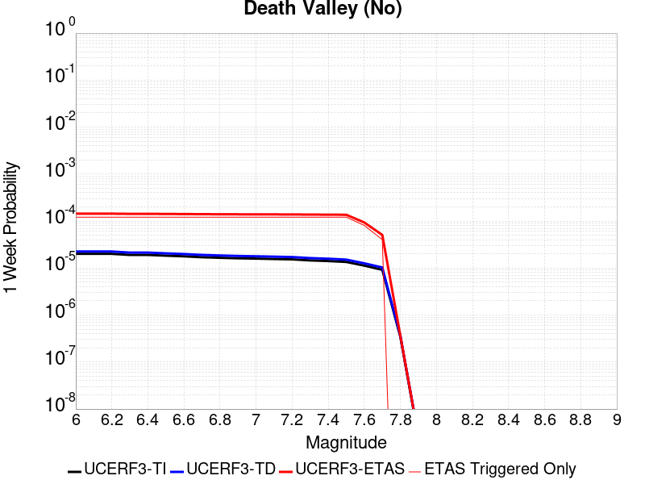 | 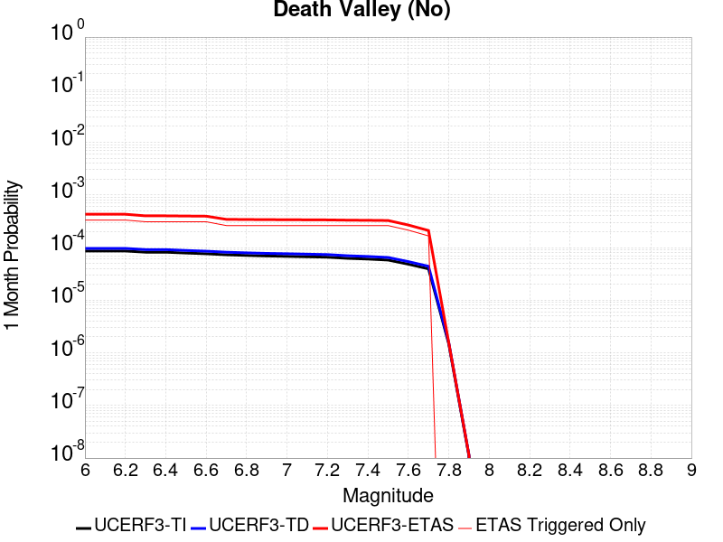 | 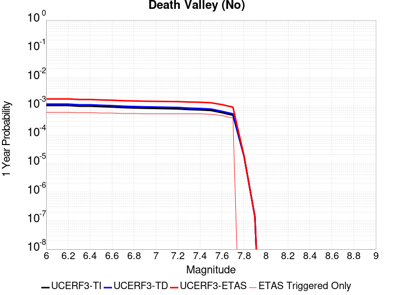 | 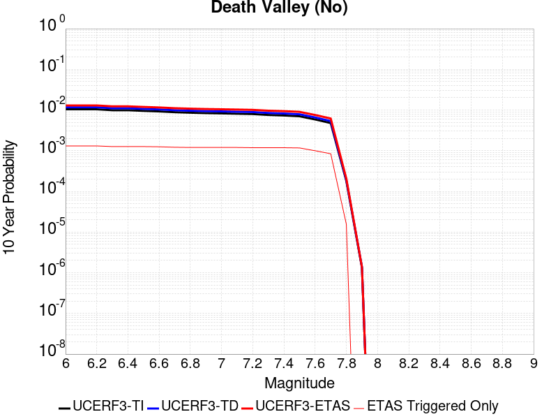 |

| Magnitude | 1 wk TI Prob | 1 wk TD Prob | 1 wk ETAS Prob | 1 wk ETAS/TD Gain | 1 wk ETAS Triggered Only | 1 mo TI Prob | 1 mo TD Prob | 1 mo ETAS Prob | 1 mo ETAS/TD Gain | 1 mo ETAS Triggered Only | 1 yr TI Prob | 1 yr TD Prob | 1 yr ETAS Prob | 1 yr ETAS/TD Gain | 1 yr ETAS Triggered Only | 10 yr TI Prob | 10 yr TD Prob | 10 yr ETAS Prob | 10 yr ETAS/TD Gain | 10 yr ETAS Triggered Only |
|-----|-----|-----|-----|-----|-----|-----|-----|-----|-----|-----|-----|-----|-----|-----|-----|-----|-----|-----|-----|-----|
| 6.0 | 2.0074807E-5 | 2.2500084E-5 | 1.9249626E-4 | 8.555358 | 1.7E-4 | 8.603206E-5 | 9.642541E-5 | 3.8639744E-4 | 4.007216 | 2.9E-4 | 0.001046937 | 0.0011733545 | 0.0017826387 | 1.519267 | 6.1E-4 | 0.010420183 | 0.011672506 | 0.012828849 | 1.0990655 | 0.00117 |
| 6.1 | 2.0074807E-5 | 2.2500084E-5 | 1.9249626E-4 | 8.555358 | 1.7E-4 | 8.603206E-5 | 9.642541E-5 | 3.8639744E-4 | 4.007216 | 2.9E-4 | 0.001046937 | 0.0011733545 | 0.0017826387 | 1.519267 | 6.1E-4 | 0.010420183 | 0.011672506 | 0.012828849 | 1.0990655 | 0.00117 |
| 6.2 | 2.0074807E-5 | 2.2500084E-5 | 1.9249626E-4 | 8.555358 | 1.7E-4 | 8.603206E-5 | 9.642541E-5 | 3.8639744E-4 | 4.007216 | 2.9E-4 | 0.001046937 | 0.0011733545 | 0.0017826387 | 1.519267 | 6.1E-4 | 0.010420183 | 0.011672506 | 0.012828849 | 1.0990655 | 0.00117 |
| 6.3 | 1.9050609E-5 | 2.1336948E-5 | 1.8133354E-4 | 8.4985695 | 1.6E-4 | 8.164292E-5 | 9.1440896E-5 | 3.614162E-4 | 3.9524572 | 2.7E-4 | 9.935491E-4 | 0.001112731 | 0.0017020745 | 1.529637 | 5.9E-4 | 0.009891188 | 0.011072419 | 0.012199796 | 1.1018186 | 0.00114 |
| 6.4 | 1.9050609E-5 | 2.1336948E-5 | 1.8133354E-4 | 8.4985695 | 1.6E-4 | 8.164292E-5 | 9.1440896E-5 | 3.614162E-4 | 3.9524572 | 2.7E-4 | 9.935491E-4 | 0.001112731 | 0.0017020745 | 1.529637 | 5.9E-4 | 0.009891188 | 0.011072419 | 0.012199796 | 1.1018186 | 0.00114 |
| 6.5 | 1.8367004E-5 | 2.0561009E-5 | 1.8055772E-4 | 8.78156 | 1.6E-4 | 7.8713354E-5 | 8.811567E-5 | 3.5809187E-4 | 4.0638843 | 2.7E-4 | 9.5791375E-4 | 0.0010722869 | 0.0016416756 | 1.5310042 | 5.7E-4 | 0.009537951 | 0.0106719155 | 0.011779963 | 1.1038283 | 0.00112 |
| 6.6 | 1.779439E-5 | 1.9910927E-5 | 1.7990774E-4 | 9.035628 | 1.6E-4 | 7.625944E-5 | 8.53298E-5 | 3.5530675E-4 | 4.1639237 | 2.7E-4 | 9.280632E-4 | 0.0010384015 | 0.0016078096 | 1.5483506 | 5.7E-4 | 0.009241969 | 0.010336253 | 0.0114347795 | 1.106279 | 0.00111 |
| 6.7 | 1.7025437E-5 | 1.9043426E-5 | 1.5904076E-4 | 8.351479 | 1.4E-4 | 7.296412E-5 | 8.161216E-5 | 3.3159176E-4 | 4.063019 | 2.5E-4 | 8.87976E-4 | 9.931813E-4 | 0.001542635 | 1.553226 | 5.5E-4 | 0.008844362 | 0.009888145 | 0.010967367 | 1.109143 | 0.00109 |
| 6.8 | 1.6545107E-5 | 1.8512545E-5 | 1.5850995E-4 | 8.562299 | 1.4E-4 | 7.090568E-5 | 7.93371E-5 | 3.2931726E-4 | 4.150861 | 2.5E-4 | 8.629347E-4 | 9.655073E-4 | 0.0015149763 | 1.5690987 | 5.5E-4 | 0.008595915 | 0.009613829 | 0.010683446 | 1.1112581 | 0.00108 |
| 6.9 | 1.615478E-5 | 1.8087594E-5 | 1.4808524E-4 | 8.187117 | 1.3E-4 | 6.9232934E-5 | 7.751599E-5 | 3.1749738E-4 | 4.0958953 | 2.4E-4 | 8.4258494E-4 | 9.433546E-4 | 0.0014828453 | 1.5718852 | 5.4E-4 | 0.008393973 | 0.009394196 | 0.010454143 | 1.1128302 | 0.00107 |
| 7.0 | 1.5894311E-5 | 1.780555E-5 | 1.4780324E-4 | 8.300964 | 1.3E-4 | 6.81167E-5 | 7.6307304E-5 | 3.16289E-4 | 4.1449375 | 2.4E-4 | 8.2900526E-4 | 9.286515E-4 | 0.0014681501 | 1.5809484 | 5.4E-4 | 0.008259195 | 0.009248397 | 0.010308501 | 1.1146257 | 0.00107 |
| 7.1 | 1.5602263E-5 | 1.7483504E-5 | 1.4748123E-4 | 8.435451 | 1.3E-4 | 6.6865134E-5 | 7.492718E-5 | 3.149092E-4 | 4.20287 | 2.4E-4 | 8.137789E-4 | 9.118627E-4 | 0.0014513703 | 1.5916544 | 5.4E-4 | 0.008108052 | 0.009081894 | 0.010142176 | 1.1167468 | 0.00107 |
| 7.2 | 1.5323829E-5 | 1.717063E-5 | 1.471684E-4 | 8.570937 | 1.3E-4 | 6.56719E-5 | 7.358637E-5 | 3.1356871E-4 | 4.2612333 | 2.4E-4 | 7.99262E-4 | 8.9555193E-4 | 0.0014350683 | 1.6024401 | 5.4E-4 | 0.007963934 | 0.008920107 | 0.009970651 | 1.1177727 | 0.00106 |
| 7.3 | 1.4556212E-5 | 1.6302456E-5 | 1.4630034E-4 | 8.974129 | 1.3E-4 | 6.238227E-5 | 6.9865826E-5 | 3.0984907E-4 | 4.4349155 | 2.4E-4 | 7.592395E-4 | 8.5029035E-4 | 0.0013898312 | 1.6345372 | 5.4E-4 | 0.0075665074 | 0.008471014 | 0.009522035 | 1.1240726 | 0.00106 |
| 7.4 | 1.411725E-5 | 1.580796E-5 | 1.458059E-4 | 9.223575 | 1.3E-4 | 6.0501097E-5 | 6.7746674E-5 | 3.0773043E-4 | 4.5423694 | 2.4E-4 | 7.363519E-4 | 8.245094E-4 | 0.0013640642 | 1.6543949 | 5.4E-4 | 0.0073391674 | 0.008215138 | 0.0092664305 | 1.1279701 | 0.00106 |
| 7.5 | 1.3503312E-5 | 1.5126289E-5 | 1.4512433E-4 | 9.594179 | 1.3E-4 | 5.7870053E-5 | 6.482538E-5 | 3.0480983E-4 | 4.702014 | 2.4E-4 | 7.043401E-4 | 7.8896893E-4 | 0.0013085587 | 1.658568 | 5.2E-4 | 0.007021119 | 0.007862304 | 0.008894128 | 1.1312368 | 0.00104 |
| 7.6 | 1.1279839E-5 | 1.2626327E-5 | 1.12625065E-4 | 8.91986 | 1.0E-4 | 4.834127E-5 | 5.4111737E-5 | 2.5410092E-4 | 4.6958556 | 2.0E-4 | 5.88396E-4 | 6.5861654E-4 | 0.001128307 | 1.713147 | 4.7E-4 | 0.005868405 | 0.006567199 | 0.007481157 | 1.1391702 | 9.2E-4 |
| 7.7 | 9.189108E-6 | 1.0283358E-5 | 7.028274E-5 | 6.83461 | 6.0E-5 | 3.93813E-5 | 4.407082E-5 | 1.8406464E-4 | 4.176565 | 1.4E-4 | 4.7936183E-4 | 5.3643517E-4 | 9.162313E-4 | 1.7080001 | 3.8E-4 | 0.004783291 | 0.005351914 | 0.0060879537 | 1.1375283 | 7.4E-4 |
| 7.8 | 3.4586725E-7 | 3.6482615E-7 | 3.6482615E-7 | 1.0 | 0.0 | 1.4822873E-6 | 1.5635396E-6 | 1.5635396E-6 | 1.0 | 0.0 | 1.80467E-5 | 1.9035933E-5 | 1.9035933E-5 | 1.0 | 0.0 | 1.8045233E-4 | 1.9034347E-4 | 2.0034157E-4 | 1.0525266 | 1.0E-5 |
| 7.9 | 2.5591178E-9 | 2.6696718E-9 | 2.6696718E-9 | 1.0 | 0.0 | 1.0967647E-8 | 1.14414505E-8 | 1.14414505E-8 | 1.0 | 0.0 | 1.335311E-7 | 1.3929966E-7 | 1.3929966E-7 | 1.0 | 0.0 | 1.3353102E-6 | 1.3929966E-6 | 1.3929966E-6 | 1.0 | 0.0 |

## San Andreas (Cholame) rev
*[(top)](#table-of-contents)*

| 1 Week | 1 Month | 1 Year | 10 Year |
|-----|-----|-----|-----|
| 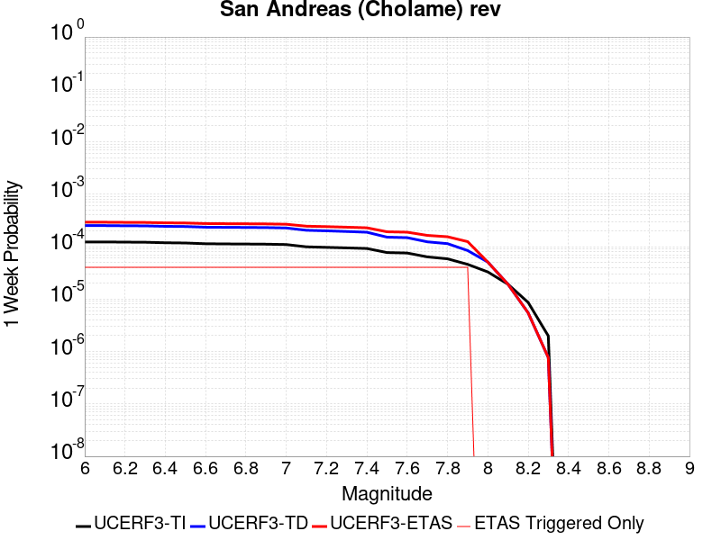 | 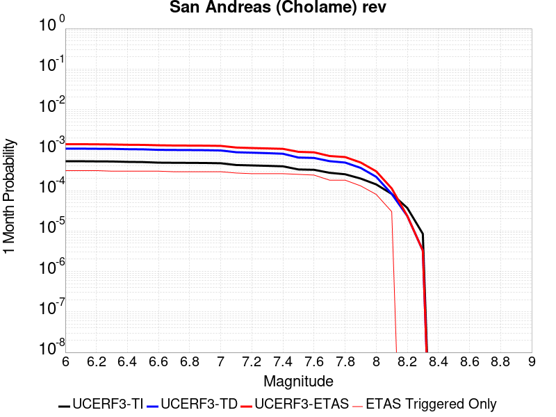 | 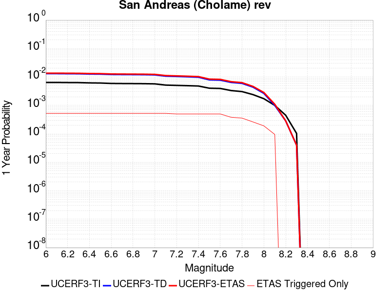 | 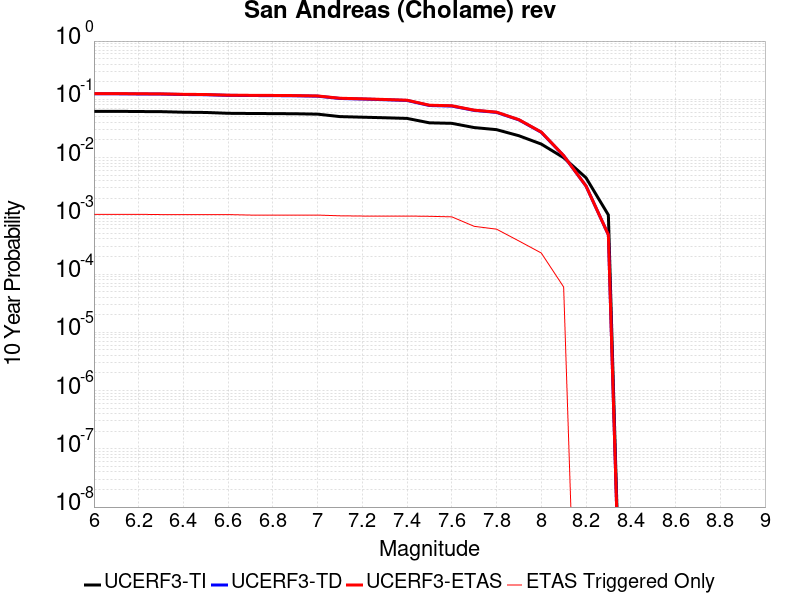 |

| Magnitude | 1 wk TI Prob | 1 wk TD Prob | 1 wk ETAS Prob | 1 wk ETAS/TD Gain | 1 wk ETAS Triggered Only | 1 mo TI Prob | 1 mo TD Prob | 1 mo ETAS Prob | 1 mo ETAS/TD Gain | 1 mo ETAS Triggered Only | 1 yr TI Prob | 1 yr TD Prob | 1 yr ETAS Prob | 1 yr ETAS/TD Gain | 1 yr ETAS Triggered Only | 10 yr TI Prob | 10 yr TD Prob | 10 yr ETAS Prob | 10 yr ETAS/TD Gain | 10 yr ETAS Triggered Only |
|-----|-----|-----|-----|-----|-----|-----|-----|-----|-----|-----|-----|-----|-----|-----|-----|-----|-----|-----|-----|-----|
| 6.0 | 1.2302514E-4 | 2.5204287E-4 | 4.22E-4 | 1.6743184 | 1.7E-4 | 5.27144E-4 | 0.0010797381 | 0.0013894035 | 1.2867967 | 3.1E-4 | 0.0063991086 | 0.0130670825 | 0.013669112 | 1.0460722 | 6.1E-4 | 0.06217949 | 0.12439073 | 0.12531887 | 1.0074615 | 0.00106 |
| 6.1 | 1.2302514E-4 | 2.5204287E-4 | 4.22E-4 | 1.6743184 | 1.7E-4 | 5.27144E-4 | 0.0010797381 | 0.0013894035 | 1.2867967 | 3.1E-4 | 0.0063991086 | 0.0130670825 | 0.013669112 | 1.0460722 | 6.1E-4 | 0.06217949 | 0.12439073 | 0.12531887 | 1.0074615 | 0.00106 |
| 6.2 | 1.2203569E-4 | 2.5021084E-4 | 4.201683E-4 | 1.679257 | 1.7E-4 | 5.2290526E-4 | 0.0010718931 | 0.0013815608 | 1.288898 | 3.1E-4 | 0.006347804 | 0.01297271 | 0.013574797 | 1.0464118 | 6.1E-4 | 0.061695136 | 0.12357691 | 0.124505915 | 1.0075177 | 0.00106 |
| 6.3 | 1.2142645E-4 | 2.4907055E-4 | 4.1902822E-4 | 1.6823676 | 1.7E-4 | 5.202953E-4 | 0.0010670102 | 0.0013666902 | 1.2808595 | 3.0E-4 | 0.006316212 | 0.012913967 | 0.013506219 | 1.0458614 | 6.0E-4 | 0.06139677 | 0.12307103 | 0.12399181 | 1.0074817 | 0.00105 |
| 6.4 | 1.1865206E-4 | 2.44126E-4 | 4.140845E-4 | 1.6961917 | 1.7E-4 | 5.0840975E-4 | 0.0010458364 | 0.0013455226 | 1.2865517 | 3.0E-4 | 0.006172335 | 0.012659196 | 0.013251601 | 1.0467963 | 6.0E-4 | 0.060036868 | 0.1208638 | 0.1217869 | 1.0076375 | 0.00105 |
| 6.5 | 1.17443946E-4 | 2.4205919E-4 | 4.1201804E-4 | 1.7021376 | 1.7E-4 | 5.032341E-4 | 0.0010369857 | 0.0013366746 | 1.289 | 3.0E-4 | 0.006109677 | 0.012552682 | 0.013145151 | 1.0471985 | 6.0E-4 | 0.059444077 | 0.11993805 | 0.12086212 | 1.0077045 | 0.00105 |
| 6.6 | 1.13579066E-4 | 2.3514954E-4 | 4.0510957E-4 | 1.7227743 | 1.7E-4 | 4.866766E-4 | 0.001007396 | 0.0013070938 | 1.2974975 | 3.0E-4 | 0.0059092017 | 0.012196515 | 0.012789196 | 1.0485944 | 6.0E-4 | 0.057545185 | 0.11685214 | 0.11777945 | 1.0079358 | 0.00105 |
| 6.7 | 1.1271412E-4 | 2.3359268E-4 | 3.9355532E-4 | 1.684793 | 1.6E-4 | 4.829711E-4 | 0.0010007289 | 0.0012904387 | 1.2894988 | 2.9E-4 | 0.005864331 | 0.012116249 | 0.012689222 | 1.0472896 | 5.8E-4 | 0.057119697 | 0.116155714 | 0.11706607 | 1.0078374 | 0.00103 |
| 6.8 | 1.1217975E-4 | 2.3247694E-4 | 3.9243975E-4 | 1.6880803 | 1.6E-4 | 4.8068175E-4 | 9.959509E-4 | 0.0012856621 | 1.290889 | 2.9E-4 | 0.005836608 | 0.012058721 | 0.012631727 | 1.047518 | 5.8E-4 | 0.056856725 | 0.11565396 | 0.11656484 | 1.0078759 | 0.00103 |
| 6.9 | 1.1146753E-4 | 2.3096445E-4 | 3.9092748E-4 | 1.6925873 | 1.6E-4 | 4.7763053E-4 | 9.894737E-4 | 0.0012791867 | 1.2927951 | 2.9E-4 | 0.0057996577 | 0.011980731 | 0.012553782 | 1.047831 | 5.8E-4 | 0.056506127 | 0.11497439 | 0.115885966 | 1.0079285 | 0.00103 |
| 7.0 | 1.0965793E-4 | 2.2719789E-4 | 3.8716153E-4 | 1.7040719 | 1.6E-4 | 4.698779E-4 | 9.733434E-4 | 0.0012630611 | 1.2976521 | 2.9E-4 | 0.005705768 | 0.011786487 | 0.012359651 | 1.0486289 | 5.8E-4 | 0.055614736 | 0.11327597 | 0.11418929 | 1.0080628 | 0.00103 |
| 7.1 | 9.927982E-5 | 2.0538924E-4 | 3.553584E-4 | 1.7301706 | 1.5E-4 | 4.2541555E-4 | 8.7994366E-4 | 0.0011497061 | 1.3065678 | 2.7E-4 | 0.0051671406 | 0.010660981 | 0.011215011 | 1.051968 | 5.6E-4 | 0.05048634 | 0.1033706 | 0.10426723 | 1.0086739 | 0.001 |
| 7.2 | 9.696786E-5 | 2.0043184E-4 | 3.5040177E-4 | 1.748234 | 1.5E-4 | 4.1551032E-4 | 8.5871184E-4 | 0.0011184886 | 1.3025191 | 2.6E-4 | 0.00504711 | 0.010404981 | 0.010949258 | 1.0523093 | 5.5E-4 | 0.04934009 | 0.1011086 | 0.1019985 | 1.0088015 | 9.9E-4 |
| 7.3 | 9.4727984E-5 | 1.9472468E-4 | 3.4469547E-4 | 1.7701683 | 1.5E-4 | 4.0591392E-4 | 8.3426846E-4 | 0.0010940515 | 1.3113903 | 2.6E-4 | 0.0049308087 | 0.010110183 | 0.010654622 | 1.0538507 | 5.5E-4 | 0.048228268 | 0.09847952 | 0.09937202 | 1.0090629 | 9.9E-4 |
| 7.4 | 9.220358E-5 | 1.8843076E-4 | 3.384025E-4 | 1.7958984 | 1.5E-4 | 3.9509835E-4 | 8.073114E-4 | 0.0010671015 | 1.3217967 | 2.6E-4 | 0.004799717 | 0.009784967 | 0.010329585 | 1.0556587 | 5.5E-4 | 0.046973653 | 0.095557496 | 0.0964529 | 1.0093702 | 9.9E-4 |
| 7.5 | 7.71631E-5 | 1.5177966E-4 | 3.017569E-4 | 1.9881247 | 1.5E-4 | 3.306571E-4 | 6.503223E-4 | 9.001597E-4 | 1.3841748 | 2.5E-4 | 0.0040183207 | 0.007889002 | 0.008424741 | 1.0679097 | 5.4E-4 | 0.03946433 | 0.07828531 | 0.079188585 | 1.0115383 | 9.8E-4 |
| 7.6 | 7.5634416E-5 | 1.483744E-4 | 2.8835362E-4 | 1.943419 | 1.4E-4 | 3.241072E-4 | 6.3573546E-4 | 8.755829E-4 | 1.3772755 | 2.4E-4 | 0.0039388672 | 0.0077126776 | 0.00823859 | 1.0681881 | 5.3E-4 | 0.038697794 | 0.07664872 | 0.07753514 | 1.0115646 | 9.6E-4 |
| 7.7 | 6.3783E-5 | 1.235872E-4 | 2.2357485E-4 | 1.8090452 | 1.0E-4 | 2.7332708E-4 | 5.29552E-4 | 7.094567E-4 | 1.33973 | 1.8E-4 | 0.0033226798 | 0.0064282627 | 0.0068157557 | 1.0602796 | 3.9E-4 | 0.032734364 | 0.06454029 | 0.0651577 | 1.0095662 | 6.6E-4 |
| 7.8 | 5.863422E-5 | 1.1416107E-4 | 2.1414965E-4 | 1.8758553 | 1.0E-4 | 2.512653E-4 | 4.8917E-4 | 6.69082E-4 | 1.3677902 | 1.8E-4 | 0.003054864 | 0.0059394026 | 0.006307205 | 1.0619258 | 3.7E-4 | 0.030132094 | 0.059659187 | 0.060213987 | 1.0092995 | 5.9E-4 |
| 7.9 | 4.595283E-5 | 8.426331E-5 | 1.6425658E-4 | 1.9493248 | 8.0E-5 | 1.9692584E-4 | 3.610785E-4 | 4.9103156E-4 | 1.3599025 | 1.3E-4 | 0.0023949358 | 0.0043872762 | 0.004636179 | 1.056733 | 2.5E-4 | 0.023692891 | 0.044362005 | 0.04471559 | 1.0079705 | 3.7E-4 |
| 8.0 | 3.2950178E-5 | 5.0772942E-5 | 9.077091E-5 | 1.7877812 | 4.0E-5 | 1.412074E-4 | 2.1758018E-4 | 2.9756277E-4 | 1.3676006 | 8.0E-5 | 0.0017178444 | 0.0026458222 | 0.0027954255 | 1.0565431 | 1.5E-4 | 0.017046256 | 0.027180137 | 0.027403885 | 1.0082321 | 2.3E-4 |
| 8.1 | 1.9177472E-5 | 1.9185145E-5 | 2.9184954E-5 | 1.5212266 | 1.0E-5 | 8.218658E-5 | 8.221946E-5 | 1.12217E-4 | 1.3648471 | 3.0E-5 | 0.0010001622 | 0.0010005629 | 0.0010505129 | 1.0499219 | 5.0E-5 | 0.009956728 | 0.010758142 | 0.010817497 | 1.0055171 | 6.0E-5 |
| 8.2 | 8.643924E-6 | 5.4748625E-6 | 5.4748625E-6 | 1.0 | 0.0 | 3.704486E-5 | 2.3463486E-5 | 2.3463486E-5 | 1.0 | 0.0 | 4.5092785E-4 | 2.8563058E-4 | 2.8563058E-4 | 1.0 | 0.0 | 0.0045001395 | 0.0032487072 | 0.0032487072 | 1.0 | 0.0 |
| 8.3 | 1.983087E-6 | 7.6599065E-7 | 7.6599065E-7 | 1.0 | 0.0 | 8.498917E-6 | 3.282813E-6 | 3.282813E-6 | 1.0 | 0.0 | 1.034694E-4 | 3.9967534E-5 | 3.9967534E-5 | 1.0 | 0.0 | 0.0010342124 | 4.719687E-4 | 4.719687E-4 | 1.0 | 0.0 |

## San Andreas (Carrizo) rev
*[(top)](#table-of-contents)*

| 1 Week | 1 Month | 1 Year | 10 Year |
|-----|-----|-----|-----|
| 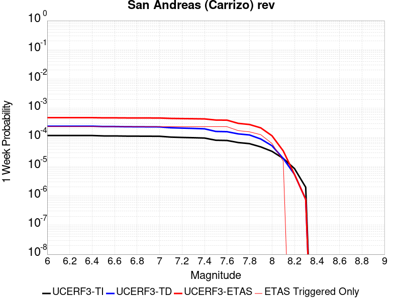 | 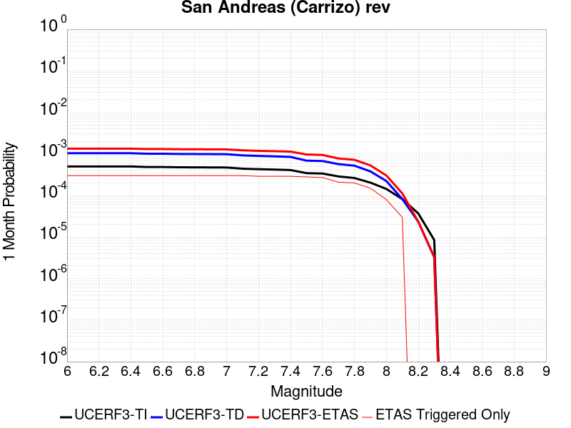 | 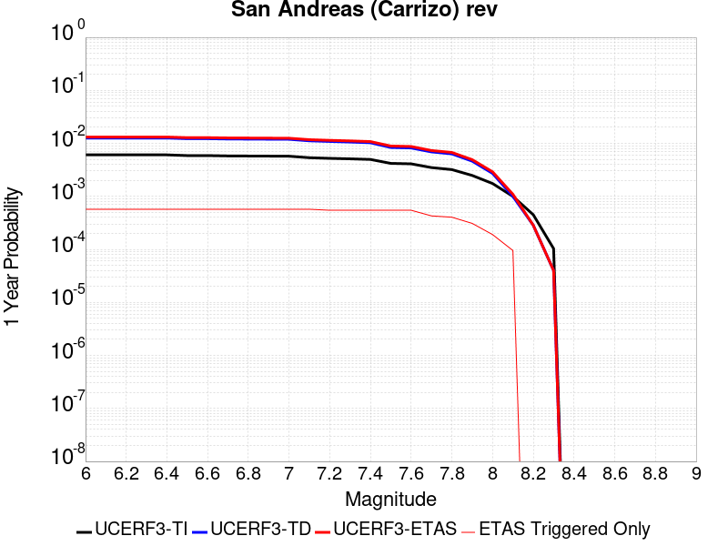 | 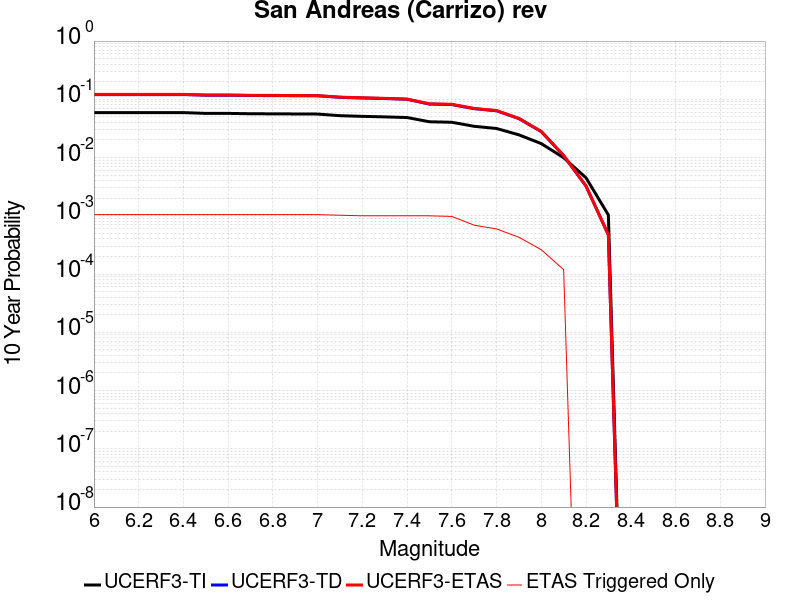 |

| Magnitude | 1 wk TI Prob | 1 wk TD Prob | 1 wk ETAS Prob | 1 wk ETAS/TD Gain | 1 wk ETAS Triggered Only | 1 mo TI Prob | 1 mo TD Prob | 1 mo ETAS Prob | 1 mo ETAS/TD Gain | 1 mo ETAS Triggered Only | 1 yr TI Prob | 1 yr TD Prob | 1 yr ETAS Prob | 1 yr ETAS/TD Gain | 1 yr ETAS Triggered Only | 10 yr TI Prob | 10 yr TD Prob | 10 yr ETAS Prob | 10 yr ETAS/TD Gain | 10 yr ETAS Triggered Only |
|-----|-----|-----|-----|-----|-----|-----|-----|-----|-----|-----|-----|-----|-----|-----|-----|-----|-----|-----|-----|-----|
| 6.0 | 1.1674632E-4 | 2.432302E-4 | 4.1318886E-4 | 1.6987563 | 1.7E-4 | 5.002454E-4 | 0.0010420004 | 0.0013416877 | 1.2876078 | 3.0E-4 | 0.006073493 | 0.012613042 | 0.013205474 | 1.0469698 | 6.0E-4 | 0.0591016 | 0.12061418 | 0.12155512 | 1.0078013 | 0.00107 |
| 6.1 | 1.1674632E-4 | 2.432302E-4 | 4.1318886E-4 | 1.6987563 | 1.7E-4 | 5.002454E-4 | 0.0010420004 | 0.0013416877 | 1.2876078 | 3.0E-4 | 0.006073493 | 0.012613042 | 0.013205474 | 1.0469698 | 6.0E-4 | 0.0591016 | 0.12061418 | 0.12155512 | 1.0078013 | 0.00107 |
| 6.2 | 1.1674632E-4 | 2.432302E-4 | 4.1318886E-4 | 1.6987563 | 1.7E-4 | 5.002454E-4 | 0.0010420004 | 0.0013416877 | 1.2876078 | 3.0E-4 | 0.006073493 | 0.012613042 | 0.013205474 | 1.0469698 | 6.0E-4 | 0.0591016 | 0.12061418 | 0.12155512 | 1.0078013 | 0.00107 |
| 6.3 | 1.1674632E-4 | 2.432302E-4 | 4.1318886E-4 | 1.6987563 | 1.7E-4 | 5.002454E-4 | 0.0010420004 | 0.0013416877 | 1.2876078 | 3.0E-4 | 0.006073493 | 0.012613042 | 0.013205474 | 1.0469698 | 6.0E-4 | 0.0591016 | 0.12061418 | 0.12155512 | 1.0078013 | 0.00107 |
| 6.4 | 1.1674632E-4 | 2.432302E-4 | 4.1318886E-4 | 1.6987563 | 1.7E-4 | 5.002454E-4 | 0.0010420004 | 0.0013416877 | 1.2876078 | 3.0E-4 | 0.006073493 | 0.012613042 | 0.013205474 | 1.0469698 | 6.0E-4 | 0.0591016 | 0.12061418 | 0.12155512 | 1.0078013 | 0.00107 |
| 6.5 | 1.13136164E-4 | 2.3643032E-4 | 4.063901E-4 | 1.7188579 | 1.7E-4 | 4.847792E-4 | 0.0010128808 | 0.0013125769 | 1.2958848 | 3.0E-4 | 0.0058862255 | 0.012262545 | 0.012855187 | 1.0483295 | 6.0E-4 | 0.057327334 | 0.117585555 | 0.11852974 | 1.0080297 | 0.00107 |
| 6.6 | 1.13136164E-4 | 2.3643032E-4 | 4.063901E-4 | 1.7188579 | 1.7E-4 | 4.847792E-4 | 0.0010128808 | 0.0013125769 | 1.2958848 | 3.0E-4 | 0.0058862255 | 0.012262545 | 0.012855187 | 1.0483295 | 6.0E-4 | 0.057327334 | 0.117585555 | 0.11852974 | 1.0080297 | 0.00107 |
| 6.7 | 1.1149675E-4 | 2.3334254E-4 | 4.0330287E-4 | 1.7283727 | 1.7E-4 | 4.777557E-4 | 9.996577E-4 | 0.0012993577 | 1.2998028 | 3.0E-4 | 0.0058011734 | 0.012103349 | 0.012696087 | 1.0489731 | 6.0E-4 | 0.05652051 | 0.1162071 | 0.11715276 | 1.0081377 | 0.00107 |
| 6.8 | 1.1103589E-4 | 2.3236412E-4 | 4.0232463E-4 | 1.7314403 | 1.7E-4 | 4.7578133E-4 | 9.954676E-4 | 0.001295169 | 1.3010659 | 3.0E-4 | 0.005777263 | 0.012052901 | 0.012645669 | 1.0491805 | 6.0E-4 | 0.056293584 | 0.1157674 | 0.116713524 | 1.0081726 | 0.00107 |
| 6.9 | 1.1053259E-4 | 2.3128795E-4 | 4.0124863E-4 | 1.7348446 | 1.7E-4 | 4.7362508E-4 | 9.90859E-4 | 0.0012905617 | 1.3024676 | 3.0E-4 | 0.0057511497 | 0.01199741 | 0.012590212 | 1.0494108 | 6.0E-4 | 0.05604569 | 0.11528359 | 0.11623024 | 1.0082115 | 0.00107 |
| 7.0 | 1.1005377E-4 | 2.3029637E-4 | 4.002572E-4 | 1.7380092 | 1.7E-4 | 4.7157376E-4 | 9.866126E-4 | 0.0012863167 | 1.3037707 | 3.0E-4 | 0.0057263062 | 0.011946279 | 0.012539111 | 1.0496248 | 6.0E-4 | 0.055809796 | 0.11483591 | 0.115783036 | 1.0082476 | 0.00107 |
| 7.1 | 1.0308142E-4 | 2.1539345E-4 | 3.8535683E-4 | 1.7890834 | 1.7E-4 | 4.417027E-4 | 9.227892E-4 | 0.0012225123 | 1.3248013 | 3.0E-4 | 0.0053644776 | 0.011177397 | 0.011770692 | 1.0530797 | 6.0E-4 | 0.052368138 | 0.108092256 | 0.10903768 | 1.0087464 | 0.00106 |
| 7.2 | 1.0027479E-4 | 2.094724E-4 | 3.794368E-4 | 1.8113928 | 1.7E-4 | 4.296783E-4 | 8.9743105E-4 | 0.0011871707 | 1.3228546 | 2.9E-4 | 0.0052187922 | 0.010871782 | 0.011455368 | 1.053679 | 5.9E-4 | 0.050979212 | 0.10539625 | 0.10633558 | 1.0089124 | 0.00105 |
| 7.3 | 9.816942E-5 | 2.0422463E-4 | 3.7418993E-4 | 1.8322467 | 1.7E-4 | 4.2065824E-4 | 8.7495585E-4 | 0.0011647021 | 1.3311553 | 2.9E-4 | 0.005109493 | 0.010600842 | 0.011184587 | 1.055066 | 5.9E-4 | 0.049935985 | 0.102979995 | 0.10392187 | 1.0091462 | 0.00105 |
| 7.4 | 9.5634205E-5 | 1.9791997E-4 | 3.6788633E-4 | 1.8587631 | 1.7E-4 | 4.0979648E-4 | 8.479536E-4 | 0.0011377077 | 1.3417099 | 2.9E-4 | 0.0049778637 | 0.010275229 | 0.010849269 | 1.0558665 | 5.8E-4 | 0.048678253 | 0.10006632 | 0.10100225 | 1.0093532 | 0.00104 |
| 7.5 | 8.052417E-5 | 1.611261E-4 | 3.310987E-4 | 2.0549042 | 1.7E-4 | 3.4505792E-4 | 6.903579E-4 | 9.7016455E-4 | 1.4053067 | 2.8E-4 | 0.0041929903 | 0.008372796 | 0.008938023 | 1.0675076 | 5.7E-4 | 0.04114753 | 0.08281049 | 0.08374602 | 1.0112972 | 0.00102 |
| 7.6 | 7.897024E-5 | 1.5765853E-4 | 3.176333E-4 | 2.0146916 | 1.6E-4 | 3.384E-4 | 6.755046E-4 | 9.453223E-4 | 1.3994312 | 2.7E-4 | 0.0041122385 | 0.008193332 | 0.008748744 | 1.0677882 | 5.6E-4 | 0.040369697 | 0.08115171 | 0.08207055 | 1.0113226 | 0.001 |
| 7.7 | 6.707427E-5 | 1.3276102E-4 | 2.5274509E-4 | 1.9037597 | 1.2E-4 | 2.8742946E-4 | 5.688518E-4 | 7.7873236E-4 | 1.3689547 | 2.1E-4 | 0.003493839 | 0.00690381 | 0.00732091 | 1.060416 | 4.2E-4 | 0.034394164 | 0.069048055 | 0.06969973 | 1.0094379 | 7.0E-4 |
| 7.8 | 6.147705E-5 | 1.2197486E-4 | 2.3196144E-4 | 1.9017152 | 1.1E-4 | 2.6344648E-4 | 5.226447E-4 | 7.225402E-4 | 1.3824692 | 2.0E-4 | 0.0032027436 | 0.006344659 | 0.0067321844 | 1.061079 | 3.9E-4 | 0.031569764 | 0.06351457 | 0.064095184 | 1.0091416 | 6.2E-4 |
| 7.9 | 4.7636717E-5 | 8.87977E-5 | 1.787897E-4 | 2.0134497 | 9.0E-5 | 2.0414138E-4 | 3.8050607E-4 | 5.3044903E-4 | 1.3940618 | 1.5E-4 | 0.0024825884 | 0.0046228287 | 0.0048915804 | 1.0581357 | 2.7E-4 | 0.024550365 | 0.046628095 | 0.047009442 | 1.0081785 | 4.0E-4 |
| 8.0 | 3.3554235E-5 | 5.2136907E-5 | 9.2134826E-5 | 1.7671708 | 4.0E-5 | 1.4379594E-4 | 2.2342477E-4 | 3.0340688E-4 | 1.3579824 | 8.0E-5 | 0.0017493097 | 0.002716805 | 0.0028663976 | 1.0550619 | 1.5E-4 | 0.017356034 | 0.027880952 | 0.02810454 | 1.0080193 | 2.3E-4 |
| 8.1 | 1.9175432E-5 | 1.9184976E-5 | 2.9184785E-5 | 1.5212312 | 1.0E-5 | 8.217783E-5 | 8.2218736E-5 | 1.1221627E-4 | 1.3648503 | 3.0E-5 | 0.0010000558 | 0.0010005541 | 0.001050504 | 1.0499223 | 5.0E-5 | 0.009955673 | 0.0107580265 | 0.010817382 | 1.0055172 | 6.0E-5 |
| 8.2 | 8.643924E-6 | 5.4748625E-6 | 5.4748625E-6 | 1.0 | 0.0 | 3.704486E-5 | 2.3463486E-5 | 2.3463486E-5 | 1.0 | 0.0 | 4.5092785E-4 | 2.8563058E-4 | 2.8563058E-4 | 1.0 | 0.0 | 0.0045001395 | 0.0032487072 | 0.0032487072 | 1.0 | 0.0 |
| 8.3 | 1.983087E-6 | 7.6599065E-7 | 7.6599065E-7 | 1.0 | 0.0 | 8.498917E-6 | 3.282813E-6 | 3.282813E-6 | 1.0 | 0.0 | 1.034694E-4 | 3.9967534E-5 | 3.9967534E-5 | 1.0 | 0.0 | 0.0010342124 | 4.719687E-4 | 4.719687E-4 | 1.0 | 0.0 |

## Death Valley (Fish Lake Valley)
*[(top)](#table-of-contents)*

| 1 Week | 1 Month | 1 Year | 10 Year |
|-----|-----|-----|-----|
| 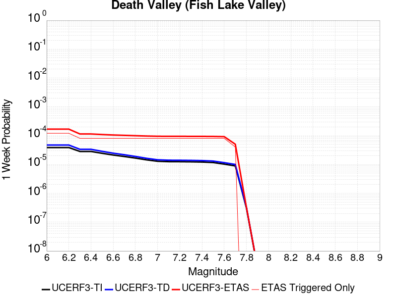 | 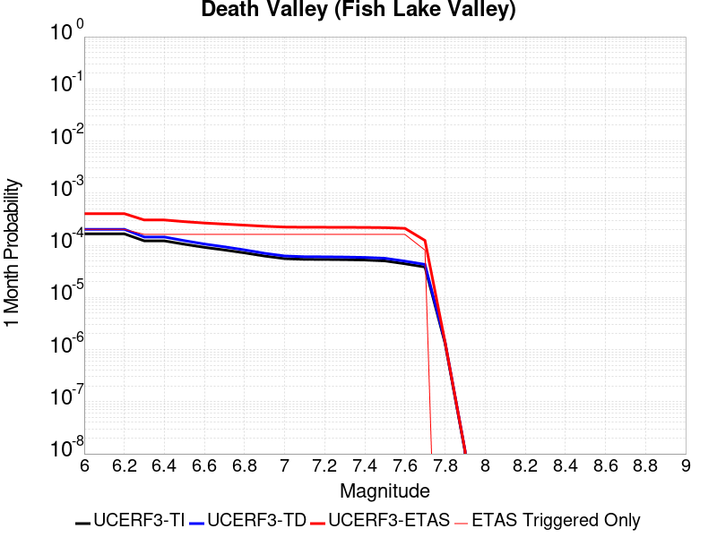 | 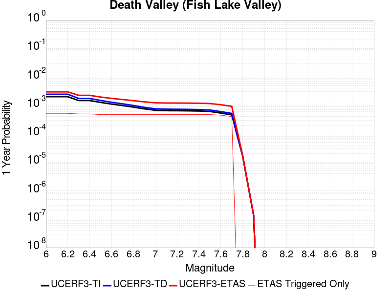 | 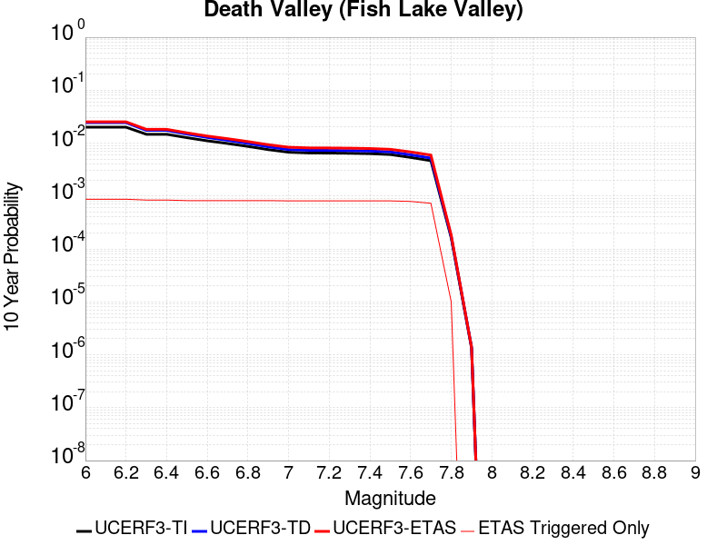 |

| Magnitude | 1 wk TI Prob | 1 wk TD Prob | 1 wk ETAS Prob | 1 wk ETAS/TD Gain | 1 wk ETAS Triggered Only | 1 mo TI Prob | 1 mo TD Prob | 1 mo ETAS Prob | 1 mo ETAS/TD Gain | 1 mo ETAS Triggered Only | 1 yr TI Prob | 1 yr TD Prob | 1 yr ETAS Prob | 1 yr ETAS/TD Gain | 1 yr ETAS Triggered Only | 10 yr TI Prob | 10 yr TD Prob | 10 yr ETAS Prob | 10 yr ETAS/TD Gain | 10 yr ETAS Triggered Only |
|-----|-----|-----|-----|-----|-----|-----|-----|-----|-----|-----|-----|-----|-----|-----|-----|-----|-----|-----|-----|-----|
| 6.0 | 3.872328E-5 | 4.7267473E-5 | 1.5726227E-4 | 3.3270717 | 1.1E-4 | 1.6594635E-4 | 2.0256084E-4 | 4.125183E-4 | 2.0365155 | 2.1E-4 | 0.0020185246 | 0.002463534 | 0.0029224008 | 1.1862637 | 4.6E-4 | 0.02000288 | 0.024388181 | 0.025236962 | 1.034803 | 8.7E-4 |
| 6.1 | 3.872328E-5 | 4.7267473E-5 | 1.5726227E-4 | 3.3270717 | 1.1E-4 | 1.6594635E-4 | 2.0256084E-4 | 4.125183E-4 | 2.0365155 | 2.1E-4 | 0.0020185246 | 0.002463534 | 0.0029224008 | 1.1862637 | 4.6E-4 | 0.02000288 | 0.024388181 | 0.025236962 | 1.034803 | 8.7E-4 |
| 6.2 | 3.872328E-5 | 4.7267473E-5 | 1.5726227E-4 | 3.3270717 | 1.1E-4 | 1.6594635E-4 | 2.0256084E-4 | 4.125183E-4 | 2.0365155 | 2.1E-4 | 0.0020185246 | 0.002463534 | 0.0029224008 | 1.1862637 | 4.6E-4 | 0.02000288 | 0.024388181 | 0.025236962 | 1.034803 | 8.7E-4 |
| 6.3 | 2.8356371E-5 | 3.3609853E-5 | 1.3360649E-4 | 3.975218 | 1.0E-4 | 1.2152165E-4 | 1.4403471E-4 | 3.440059E-4 | 2.388354 | 2.0E-4 | 0.0014785219 | 0.0017522911 | 0.0022015027 | 1.2563566 | 4.5E-4 | 0.014687235 | 0.017391782 | 0.018217172 | 1.0474586 | 8.4E-4 |
| 6.4 | 2.8356371E-5 | 3.3609853E-5 | 1.3360649E-4 | 3.975218 | 1.0E-4 | 1.2152165E-4 | 1.4403471E-4 | 3.440059E-4 | 2.388354 | 2.0E-4 | 0.0014785219 | 0.0017522911 | 0.0022015027 | 1.2563566 | 4.5E-4 | 0.014687235 | 0.017391782 | 0.018217172 | 1.0474586 | 8.4E-4 |
| 6.5 | 2.4448687E-5 | 2.8607552E-5 | 1.1860498E-4 | 4.145932 | 9.0E-5 | 1.0477588E-4 | 1.2259831E-4 | 3.1257502E-4 | 2.5495865 | 1.9E-4 | 0.0012748998 | 0.0014916632 | 0.0019310068 | 1.2945328 | 4.4E-4 | 0.012676105 | 0.014821377 | 0.015629223 | 1.0545055 | 8.2E-4 |
| 6.6 | 2.1298161E-5 | 2.4660083E-5 | 1.14657865E-4 | 4.649533 | 9.0E-5 | 9.127464E-5 | 1.0568198E-4 | 2.956619E-4 | 2.7976568 | 1.9E-4 | 0.0011107022 | 0.0012859525 | 0.0017253867 | 1.3417188 | 4.4E-4 | 0.011051672 | 0.012788526 | 0.013598039 | 1.0633 | 8.2E-4 |
| 6.7 | 1.8959729E-5 | 2.1781025E-5 | 1.1177907E-4 | 5.131947 | 9.0E-5 | 8.125345E-5 | 9.334405E-5 | 2.833263E-4 | 3.0352905 | 1.9E-4 | 9.888117E-4 | 0.001135897 | 0.0015753972 | 1.3869191 | 4.4E-4 | 0.009844234 | 0.01130357 | 0.012114301 | 1.0717235 | 8.2E-4 |
| 6.8 | 1.6691629E-5 | 1.9018353E-5 | 1.0901664E-4 | 5.732181 | 9.0E-5 | 7.153359E-5 | 8.150477E-5 | 2.714893E-4 | 3.330962 | 1.9E-4 | 8.7057345E-4 | 9.918857E-4 | 0.0014314492 | 1.4431595 | 4.4E-4 | 0.008671708 | 0.009876343 | 0.010688245 | 1.0822067 | 8.2E-4 |
| 6.9 | 1.450505E-5 | 1.638954E-5 | 1.0638806E-4 | 6.491217 | 9.0E-5 | 6.216302E-5 | 7.0239046E-5 | 2.602257E-4 | 3.7048583 | 1.9E-4 | 7.5657194E-4 | 8.5483363E-4 | 0.0012944575 | 1.5142801 | 4.4E-4 | 0.007540013 | 0.008516385 | 0.009329402 | 1.095465 | 8.2E-4 |
| 7.0 | 1.2940855E-5 | 1.4537972E-5 | 9.453681E-5 | 6.502751 | 8.0E-5 | 5.545963E-5 | 6.230414E-5 | 2.4229292E-4 | 3.8888736 | 1.8E-4 | 6.750118E-4 | 7.5829466E-4 | 0.0011879686 | 1.5666319 | 4.3E-4 | 0.006729651 | 0.0075576897 | 0.008361568 | 1.1063656 | 8.1E-4 |
| 7.1 | 1.2544658E-5 | 1.4078208E-5 | 9.4077084E-5 | 6.6824617 | 8.0E-5 | 5.3761712E-5 | 6.0333812E-5 | 2.4032294E-4 | 3.9832218 | 1.8E-4 | 6.5435225E-4 | 7.343222E-4 | 0.0011640064 | 1.585144 | 4.3E-4 | 0.006524288 | 0.007319551 | 0.008123622 | 1.1098526 | 8.1E-4 |
| 7.2 | 1.2489416E-5 | 1.4015674E-5 | 9.4014555E-5 | 6.707815 | 8.0E-5 | 5.3524967E-5 | 6.0065824E-5 | 2.4005501E-4 | 3.9965324 | 1.8E-4 | 6.514716E-4 | 7.310616E-4 | 0.0011607473 | 1.5877557 | 4.3E-4 | 0.006495651 | 0.0072871596 | 0.008091257 | 1.1103444 | 8.1E-4 |
| 7.3 | 1.2368307E-5 | 1.3879812E-5 | 9.3878705E-5 | 6.7636867 | 8.0E-5 | 5.3005948E-5 | 5.9483587E-5 | 2.3947288E-4 | 4.025865 | 1.8E-4 | 6.451563E-4 | 7.2397763E-4 | 0.0011536663 | 1.593511 | 4.3E-4 | 0.0064328653 | 0.007216782 | 0.0080209365 | 1.1114284 | 8.1E-4 |
| 7.4 | 1.2161707E-5 | 1.36478675E-5 | 9.364678E-5 | 6.8616414 | 8.0E-5 | 5.212056E-5 | 5.8489582E-5 | 2.3847906E-4 | 4.077291 | 1.8E-4 | 6.3438306E-4 | 7.118836E-4 | 0.0011415775 | 1.6036013 | 4.3E-4 | 0.006325751 | 0.0070966207 | 0.007900872 | 1.1133288 | 8.1E-4 |
| 7.5 | 1.1707948E-5 | 1.3145515E-5 | 9.314447E-5 | 7.0856457 | 8.0E-5 | 5.0175953E-5 | 5.6336736E-5 | 2.363266E-4 | 4.1948934 | 1.8E-4 | 6.10721E-4 | 6.856895E-4 | 0.0011153946 | 1.626676 | 4.3E-4 | 0.0060904534 | 0.006836321 | 0.0076407837 | 1.1176748 | 8.1E-4 |
| 7.6 | 1.0319538E-5 | 1.1579622E-5 | 9.1578695E-5 | 7.9086084 | 8.0E-5 | 4.4225842E-5 | 4.9626036E-5 | 2.196176E-4 | 4.4254513 | 1.7E-4 | 5.383166E-4 | 6.040347E-4 | 0.001013787 | 1.6783589 | 4.1E-4 | 0.0053701443 | 0.0060244603 | 0.006809701 | 1.1303421 | 7.9E-4 |
| 7.7 | 8.937764E-6 | 1.0022779E-5 | 6.0022277E-5 | 5.9885864 | 5.0E-5 | 3.830414E-5 | 4.295409E-5 | 1.7294851E-4 | 4.026357 | 1.3E-4 | 4.6625308E-4 | 5.228456E-4 | 8.9265214E-4 | 1.7072959 | 3.7E-4 | 0.0046527605 | 0.005216664 | 0.005942856 | 1.1392062 | 7.3E-4 |
| 7.8 | 3.108007E-7 | 3.284654E-7 | 3.284654E-7 | 1.0 | 0.0 | 1.3320023E-6 | 1.407708E-6 | 1.407708E-6 | 1.0 | 0.0 | 1.6217007E-5 | 1.7138715E-5 | 1.7138715E-5 | 1.0 | 0.0 | 1.6215823E-4 | 1.7137431E-4 | 1.813726E-4 | 1.0583419 | 1.0E-5 |
| 7.9 | 2.5591178E-9 | 2.6696718E-9 | 2.6696718E-9 | 1.0 | 0.0 | 1.0967647E-8 | 1.14414505E-8 | 1.14414505E-8 | 1.0 | 0.0 | 1.335311E-7 | 1.3929966E-7 | 1.3929966E-7 | 1.0 | 0.0 | 1.3353102E-6 | 1.3929966E-6 | 1.3929966E-6 | 1.0 | 0.0 |

## Red Pass
*[(top)](#table-of-contents)*

| 1 Week | 1 Month | 1 Year | 10 Year |
|-----|-----|-----|-----|
| 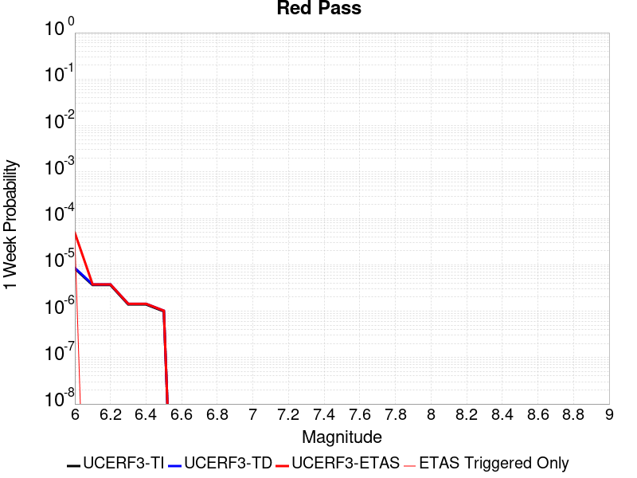 | 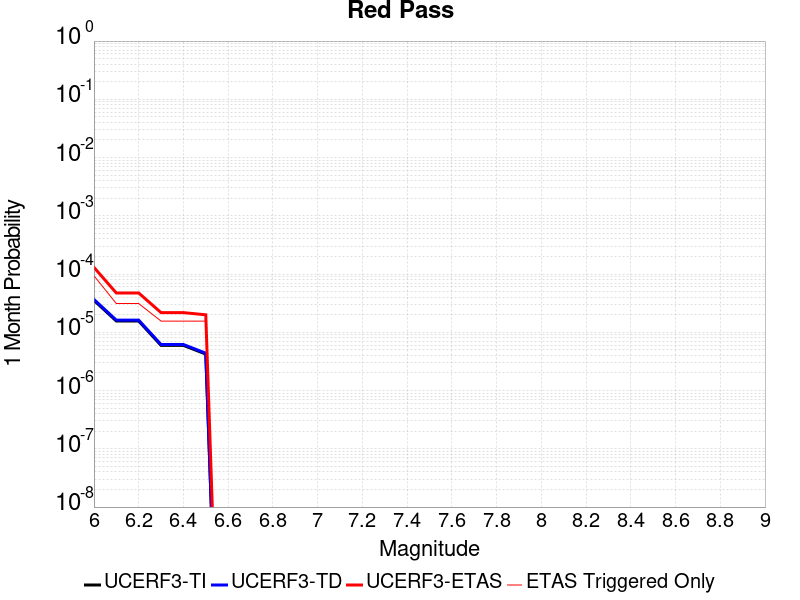 | 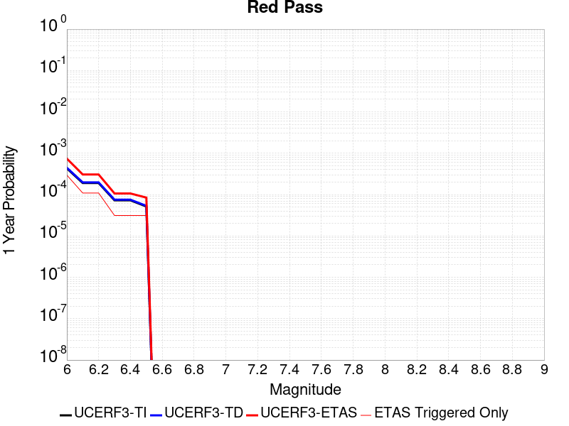 | 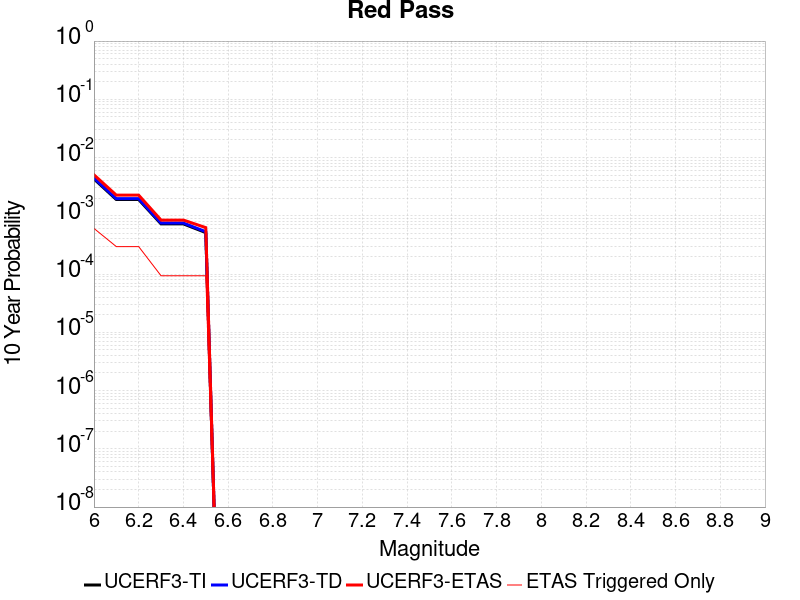 |

| Magnitude | 1 wk TI Prob | 1 wk TD Prob | 1 wk ETAS Prob | 1 wk ETAS/TD Gain | 1 wk ETAS Triggered Only | 1 mo TI Prob | 1 mo TD Prob | 1 mo ETAS Prob | 1 mo ETAS/TD Gain | 1 mo ETAS Triggered Only | 1 yr TI Prob | 1 yr TD Prob | 1 yr ETAS Prob | 1 yr ETAS/TD Gain | 1 yr ETAS Triggered Only | 10 yr TI Prob | 10 yr TD Prob | 10 yr ETAS Prob | 10 yr ETAS/TD Gain | 10 yr ETAS Triggered Only |
|-----|-----|-----|-----|-----|-----|-----|-----|-----|-----|-----|-----|-----|-----|-----|-----|-----|-----|-----|-----|-----|
| 6.0 | 8.258278E-6 | 8.551265E-6 | 1.1855033E-4 | 13.863484 | 1.1E-4 | 3.539214E-5 | 3.6647863E-5 | 1.666431E-4 | 4.5471435 | 1.3E-4 | 4.308141E-4 | 4.4611428E-4 | 8.2594476E-4 | 1.8514197 | 3.8E-4 | 0.0042997985 | 0.004453945 | 0.005180693 | 1.1631696 | 7.3E-4 |
| 6.1 | 3.649988E-6 | 3.7753161E-6 | 3.3775203E-5 | 8.946324 | 3.0E-5 | 1.5642712E-5 | 1.6179853E-5 | 6.617904E-5 | 4.090213 | 5.0E-5 | 1.9043336E-4 | 1.9697666E-4 | 3.8693924E-4 | 1.9643912 | 1.9E-4 | 0.0019027026 | 0.001968488 | 0.0023677007 | 1.2028016 | 4.0E-4 |
| 6.2 | 3.649988E-6 | 3.7753161E-6 | 3.3775203E-5 | 8.946324 | 3.0E-5 | 1.5642712E-5 | 1.6179853E-5 | 6.617904E-5 | 4.090213 | 5.0E-5 | 1.9043336E-4 | 1.9697666E-4 | 3.8693924E-4 | 1.9643912 | 1.9E-4 | 0.0019027026 | 0.001968488 | 0.0023677007 | 1.2028016 | 4.0E-4 |
| 6.3 | 1.3924937E-6 | 1.4411166E-6 | 1.1441102E-5 | 7.9390535 | 1.0E-5 | 5.9678164E-6 | 6.1762075E-6 | 3.617602E-5 | 5.85732 | 3.0E-5 | 7.265574E-5 | 7.519415E-5 | 1.6518738E-4 | 2.1968117 | 9.0E-5 | 7.263199E-4 | 7.518258E-4 | 9.117055E-4 | 1.2126553 | 1.6E-4 |
| 6.4 | 1.3924937E-6 | 1.4411166E-6 | 1.1441102E-5 | 7.9390535 | 1.0E-5 | 5.9678164E-6 | 6.1762075E-6 | 3.617602E-5 | 5.85732 | 3.0E-5 | 7.265574E-5 | 7.519415E-5 | 1.6518738E-4 | 2.1968117 | 9.0E-5 | 7.263199E-4 | 7.518258E-4 | 9.117055E-4 | 1.2126553 | 1.6E-4 |
| 6.5 | 9.876812E-7 | 1.0221912E-6 | 1.1022181E-5 | 10.782895 | 1.0E-5 | 4.2329125E-6 | 4.3808195E-6 | 2.4380732E-5 | 5.5653358 | 2.0E-5 | 5.153449E-5 | 5.3336476E-5 | 1.1333328E-4 | 2.1248736 | 6.0E-5 | 5.1522546E-4 | 5.333648E-4 | 6.6329545E-4 | 1.2436056 | 1.3E-4 |

## San Andreas (Coachella) rev
*[(top)](#table-of-contents)*

| 1 Week | 1 Month | 1 Year | 10 Year |
|-----|-----|-----|-----|
| 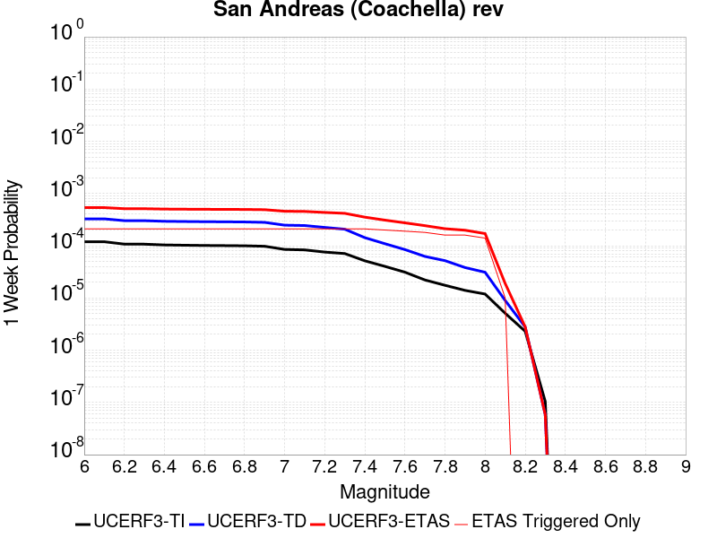 | 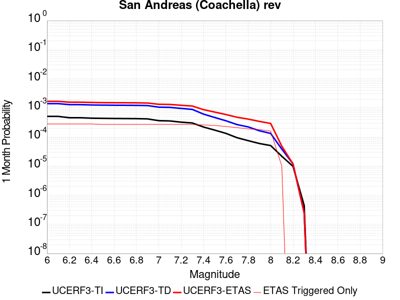 | 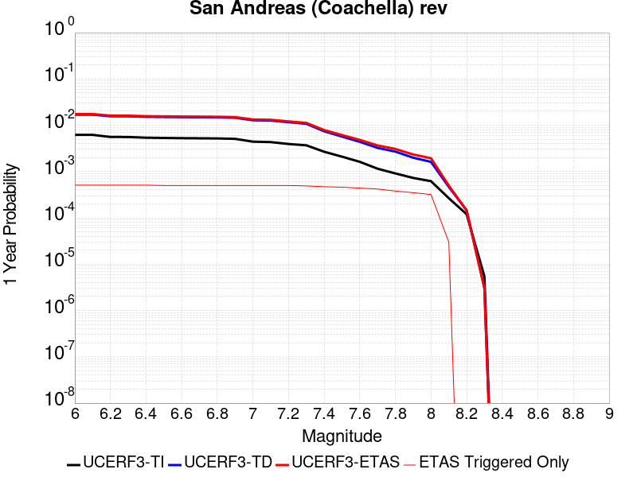 | 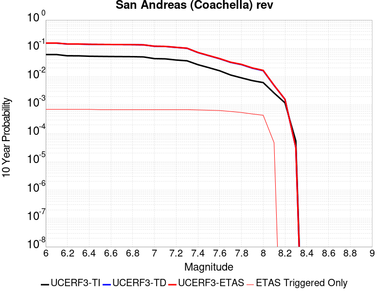 |

| Magnitude | 1 wk TI Prob | 1 wk TD Prob | 1 wk ETAS Prob | 1 wk ETAS/TD Gain | 1 wk ETAS Triggered Only | 1 mo TI Prob | 1 mo TD Prob | 1 mo ETAS Prob | 1 mo ETAS/TD Gain | 1 mo ETAS Triggered Only | 1 yr TI Prob | 1 yr TD Prob | 1 yr ETAS Prob | 1 yr ETAS/TD Gain | 1 yr ETAS Triggered Only | 10 yr TI Prob | 10 yr TD Prob | 10 yr ETAS Prob | 10 yr ETAS/TD Gain | 10 yr ETAS Triggered Only |
|-----|-----|-----|-----|-----|-----|-----|-----|-----|-----|-----|-----|-----|-----|-----|-----|-----|-----|-----|-----|-----|
| 6.0 | 1.1925945E-4 | 3.2729402E-4 | 5.372253E-4 | 1.641415 | 2.1E-4 | 5.110118E-4 | 0.0014019393 | 0.0016815468 | 1.1994433 | 2.8E-4 | 0.0062038354 | 0.016936364 | 0.017437726 | 1.0296028 | 5.1E-4 | 0.060334753 | 0.15265316 | 0.1533056 | 1.0042741 | 7.7E-4 |
| 6.1 | 1.1925945E-4 | 3.2729402E-4 | 5.372253E-4 | 1.641415 | 2.1E-4 | 5.110118E-4 | 0.0014019393 | 0.0016815468 | 1.1994433 | 2.8E-4 | 0.0062038354 | 0.016936364 | 0.017437726 | 1.0296028 | 5.1E-4 | 0.060334753 | 0.15265316 | 0.1533056 | 1.0042741 | 7.7E-4 |
| 6.2 | 1.07432395E-4 | 3.0230157E-4 | 5.1223807E-4 | 1.6944606 | 2.1E-4 | 4.603433E-4 | 0.0012949388 | 0.0015745763 | 1.2159464 | 2.8E-4 | 0.005590286 | 0.015653009 | 0.016155025 | 1.0320716 | 5.1E-4 | 0.05451731 | 0.14182423 | 0.14248504 | 1.0046593 | 7.7E-4 |
| 6.3 | 1.0718766E-4 | 3.0175463E-4 | 5.1169127E-4 | 1.6957197 | 2.1E-4 | 4.592948E-4 | 0.0012925972 | 0.0015722353 | 1.2163382 | 2.8E-4 | 0.005577586 | 0.015624908 | 0.016126938 | 1.0321302 | 5.1E-4 | 0.054396555 | 0.14159249 | 0.14225347 | 1.0046681 | 7.7E-4 |
| 6.4 | 1.0355944E-4 | 2.9383553E-4 | 5.037738E-4 | 1.7144755 | 2.1E-4 | 4.4375064E-4 | 0.0012586913 | 0.0015383388 | 1.2221732 | 2.8E-4 | 0.0053892885 | 0.015217941 | 0.015720181 | 1.0330031 | 5.1E-4 | 0.052604496 | 0.13815255 | 0.13881618 | 1.0048035 | 7.7E-4 |
| 6.5 | 1.0227914E-4 | 2.9102986E-4 | 5.009688E-4 | 1.7213655 | 2.1E-4 | 4.382655E-4 | 0.0012466786 | 0.001516342 | 1.2163055 | 2.7E-4 | 0.0053228354 | 0.01507372 | 0.015566183 | 1.0326703 | 5.0E-4 | 0.051971316 | 0.13693172 | 0.13758765 | 1.0047902 | 7.6E-4 |
| 6.6 | 1.0116757E-4 | 2.8868738E-4 | 4.9862673E-4 | 1.7272205 | 2.1E-4 | 4.3350324E-4 | 0.0012366489 | 0.0015063151 | 1.2180619 | 2.7E-4 | 0.0052651367 | 0.01495329 | 0.015445814 | 1.0329374 | 5.0E-4 | 0.051421247 | 0.1359099 | 0.13656661 | 1.0048319 | 7.6E-4 |
| 6.7 | 1.0050676E-4 | 2.8727303E-4 | 4.972127E-4 | 1.7308019 | 2.1E-4 | 4.3067214E-4 | 0.0012305931 | 0.0015002608 | 1.2191364 | 2.7E-4 | 0.005230834 | 0.014880571 | 0.015373129 | 1.0331008 | 5.0E-4 | 0.051094085 | 0.13529462 | 0.1359518 | 1.0048574 | 7.6E-4 |
| 6.8 | 9.976819E-5 | 2.853096E-4 | 4.952497E-4 | 1.7358326 | 2.1E-4 | 4.2750788E-4 | 0.0012221863 | 0.0014918563 | 1.2206455 | 2.7E-4 | 0.0051924936 | 0.0147796115 | 0.0152722215 | 1.0333304 | 5.0E-4 | 0.050728295 | 0.13444631 | 0.13510413 | 1.0048928 | 7.6E-4 |
| 6.9 | 9.77719E-5 | 2.8027873E-4 | 4.9021986E-4 | 1.7490441 | 2.1E-4 | 4.1895514E-4 | 0.0012006456 | 0.0014703213 | 1.224609 | 2.7E-4 | 0.0050888555 | 0.014520878 | 0.015013617 | 1.0339332 | 5.0E-4 | 0.049738888 | 0.1322748 | 0.13293429 | 1.0049856 | 7.6E-4 |
| 7.0 | 8.500761E-5 | 2.4762485E-4 | 4.5757287E-4 | 1.847847 | 2.1E-4 | 3.6426744E-4 | 0.001060821 | 0.0013305346 | 1.2542498 | 2.7E-4 | 0.0044259406 | 0.012839786 | 0.013333366 | 1.0384414 | 5.0E-4 | 0.04338823 | 0.11813272 | 0.11880294 | 1.0056734 | 7.6E-4 |
| 7.1 | 8.319876E-5 | 2.4365232E-4 | 4.5360115E-4 | 1.8616738 | 2.1E-4 | 3.5651738E-4 | 0.0010438096 | 0.0013135277 | 1.2583978 | 2.7E-4 | 0.004331963 | 0.012635092 | 0.013128775 | 1.0390723 | 5.0E-4 | 0.042484846 | 0.116353 | 0.11702457 | 1.0057719 | 7.6E-4 |
| 7.2 | 7.563917E-5 | 2.2413683E-4 | 4.3408977E-4 | 1.9367176 | 2.1E-4 | 3.2412758E-4 | 9.602359E-4 | 0.0012299767 | 1.280911 | 2.7E-4 | 0.0039391145 | 0.011628893 | 0.012123079 | 1.0424963 | 5.0E-4 | 0.03870018 | 0.10775925 | 0.10843735 | 1.0062927 | 7.6E-4 |
| 7.3 | 7.082985E-5 | 2.0729867E-4 | 4.1725513E-4 | 2.0128212 | 2.1E-4 | 3.0352117E-4 | 8.881233E-4 | 0.0011578834 | 1.3037418 | 2.7E-4 | 0.0036891096 | 0.010759917 | 0.011244644 | 1.0450494 | 4.9E-4 | 0.03628465 | 0.100282 | 0.10095679 | 1.0067289 | 7.5E-4 |
| 7.4 | 5.146215E-5 | 1.4273795E-4 | 3.5270795E-4 | 2.4710176 | 2.1E-4 | 2.2053342E-4 | 6.115915E-4 | 8.714325E-4 | 1.4248604 | 2.6E-4 | 0.0026816884 | 0.0074208933 | 0.007887405 | 1.0628647 | 4.7E-4 | 0.02649557 | 0.070849575 | 0.07152785 | 1.0095736 | 7.3E-4 |
| 7.5 | 4.0285166E-5 | 1.09416E-4 | 3.0939412E-4 | 2.8276863 | 2.0E-4 | 1.7263928E-4 | 4.6884175E-4 | 7.1872456E-4 | 1.5329789 | 2.5E-4 | 0.002099857 | 0.0056932783 | 0.006150659 | 1.080337 | 4.6E-4 | 0.020801254 | 0.055011146 | 0.05568209 | 1.0121964 | 7.1E-4 |
| 7.6 | 3.1168736E-5 | 8.4389096E-5 | 2.7437307E-4 | 3.2512858 | 1.9E-4 | 1.3357346E-4 | 3.6161754E-4 | 5.9153436E-4 | 1.6358011 | 2.3E-4 | 0.0016250437 | 0.0043938323 | 0.004831899 | 1.0997003 | 4.4E-4 | 0.016132116 | 0.04281005 | 0.04347051 | 1.0154277 | 6.9E-4 |
| 7.7 | 2.2100989E-5 | 6.238755E-5 | 2.4237632E-4 | 3.885011 | 1.8E-4 | 9.4715084E-5 | 2.6734784E-4 | 4.772917E-4 | 1.7852834 | 2.1E-4 | 0.001152546 | 0.0032501083 | 0.0036687434 | 1.1288065 | 4.2E-4 | 0.011465867 | 0.0319002 | 0.03250042 | 1.0188156 | 6.2E-4 |
| 7.8 | 1.7484861E-5 | 5.179572E-5 | 2.1178742E-4 | 4.088898 | 1.6E-4 | 7.493296E-5 | 2.2196278E-4 | 4.119206E-4 | 1.8558093 | 1.9E-4 | 9.1192697E-4 | 0.0026990508 | 0.003078025 | 1.1404102 | 3.8E-4 | 0.009081938 | 0.026640115 | 0.02719493 | 1.0208263 | 5.7E-4 |
| 7.9 | 1.3967285E-5 | 3.822255E-5 | 1.9821644E-4 | 5.1858506 | 1.6E-4 | 5.985842E-5 | 1.6380067E-4 | 3.437712E-4 | 2.0987167 | 1.8E-4 | 7.2853256E-4 | 0.00199245 | 0.0023417529 | 1.1753131 | 3.5E-4 | 0.0072614877 | 0.019909438 | 0.020419084 | 1.0255983 | 5.2E-4 |
| 8.0 | 1.1887396E-5 | 3.106521E-5 | 1.7106086E-4 | 5.506509 | 1.4E-4 | 5.094499E-5 | 1.3312983E-4 | 2.9310852E-4 | 2.2016745 | 1.6E-4 | 6.200787E-4 | 0.0016196516 | 0.0019391333 | 1.1972533 | 3.2E-4 | 0.006183513 | 0.016279267 | 0.01673178 | 1.0277967 | 4.6E-4 |
| 8.1 | 5.100864E-6 | 8.973418E-6 | 1.8973327E-5 | 2.1143928 | 1.0E-5 | 2.1860664E-5 | 3.8456936E-5 | 4.8456553E-5 | 1.2600211 | 1.0E-5 | 2.6612106E-4 | 4.6811273E-4 | 4.980987E-4 | 1.0640571 | 3.0E-5 | 0.002658026 | 0.004917731 | 0.004957534 | 1.0080938 | 4.0E-5 |
| 8.2 | 2.3004484E-6 | 2.7864487E-6 | 2.7864487E-6 | 1.0 | 0.0 | 9.859027E-6 | 1.1941868E-5 | 1.1941868E-5 | 1.0 | 0.0 | 1.2002704E-4 | 1.4538258E-4 | 1.4538258E-4 | 1.0 | 0.0 | 0.0011996223 | 0.0015973912 | 0.0015973912 | 1.0 | 0.0 |
| 8.3 | 1.0424446E-7 | 5.8161504E-8 | 5.8161504E-8 | 1.0 | 0.0 | 4.4676187E-7 | 2.4926356E-7 | 2.4926356E-7 | 1.0 | 0.0 | 5.439312E-6 | 3.03478E-6 | 3.03478E-6 | 1.0 | 0.0 | 5.4391792E-5 | 3.190716E-5 | 3.190716E-5 | 1.0 | 0.0 |

## San Jacinto (San Bernardino)
*[(top)](#table-of-contents)*

| 1 Week | 1 Month | 1 Year | 10 Year |
|-----|-----|-----|-----|
| 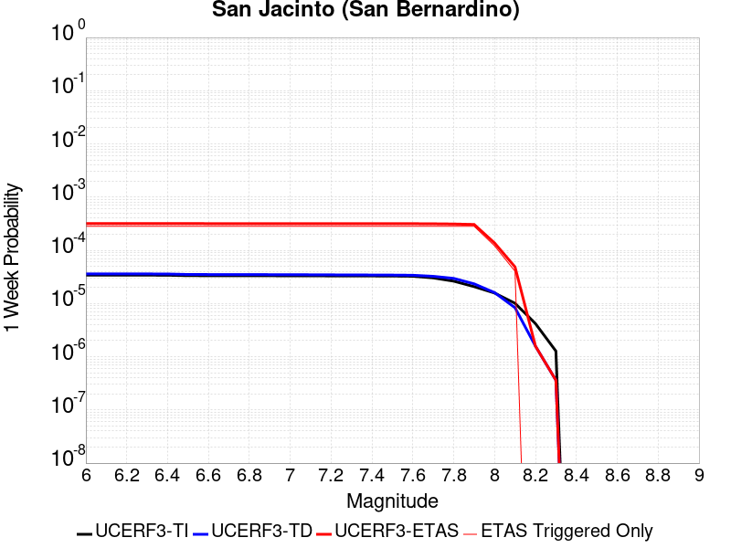 | 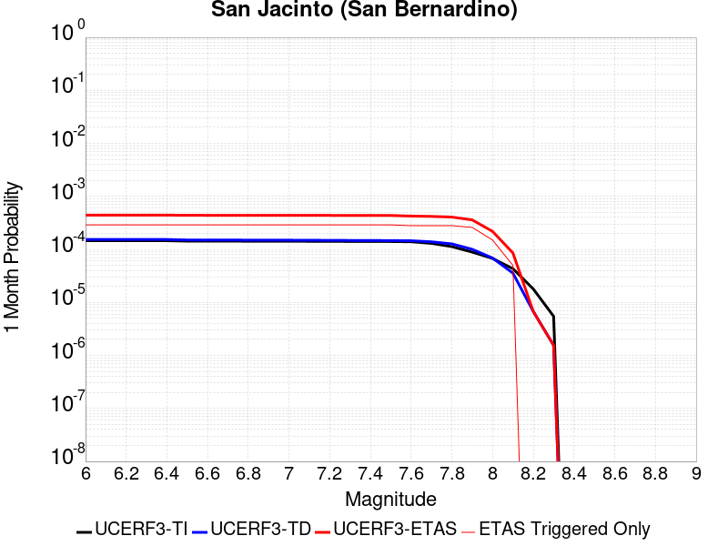 | 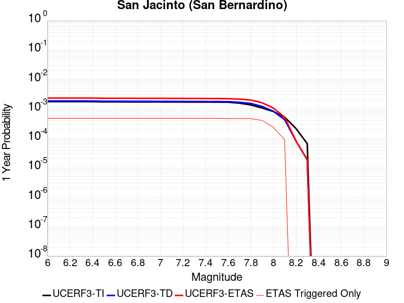 | 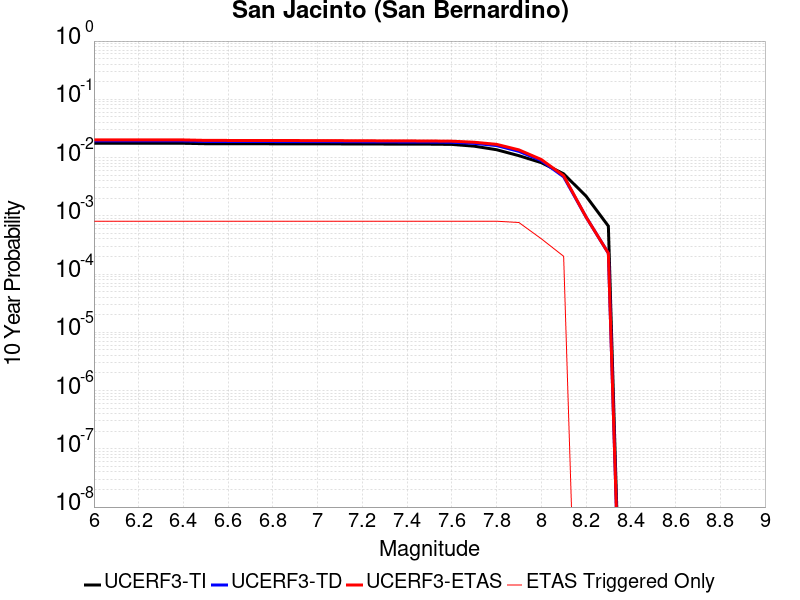 |

| Magnitude | 1 wk TI Prob | 1 wk TD Prob | 1 wk ETAS Prob | 1 wk ETAS/TD Gain | 1 wk ETAS Triggered Only | 1 mo TI Prob | 1 mo TD Prob | 1 mo ETAS Prob | 1 mo ETAS/TD Gain | 1 mo ETAS Triggered Only | 1 yr TI Prob | 1 yr TD Prob | 1 yr ETAS Prob | 1 yr ETAS/TD Gain | 1 yr ETAS Triggered Only | 10 yr TI Prob | 10 yr TD Prob | 10 yr ETAS Prob | 10 yr ETAS/TD Gain | 10 yr ETAS Triggered Only |
|-----|-----|-----|-----|-----|-----|-----|-----|-----|-----|-----|-----|-----|-----|-----|-----|-----|-----|-----|-----|-----|
| 6.0 | 3.409352E-5 | 3.5986508E-5 | 2.4597894E-4 | 6.83531 | 2.1E-4 | 1.461069E-4 | 1.542188E-4 | 4.4417407E-4 | 2.8801553 | 2.9E-4 | 0.0017774 | 0.0018759987 | 0.0023550983 | 1.2553837 | 4.8E-4 | 0.01763251 | 0.019349935 | 0.020026583 | 1.0349691 | 6.9E-4 |
| 6.1 | 3.409352E-5 | 3.5986508E-5 | 2.4597894E-4 | 6.83531 | 2.1E-4 | 1.461069E-4 | 1.542188E-4 | 4.4417407E-4 | 2.8801553 | 2.9E-4 | 0.0017774 | 0.0018759987 | 0.0023550983 | 1.2553837 | 4.8E-4 | 0.01763251 | 0.019349935 | 0.020026583 | 1.0349691 | 6.9E-4 |
| 6.2 | 3.409352E-5 | 3.5986508E-5 | 2.4597894E-4 | 6.83531 | 2.1E-4 | 1.461069E-4 | 1.542188E-4 | 4.4417407E-4 | 2.8801553 | 2.9E-4 | 0.0017774 | 0.0018759987 | 0.0023550983 | 1.2553837 | 4.8E-4 | 0.01763251 | 0.019349935 | 0.020026583 | 1.0349691 | 6.9E-4 |
| 6.3 | 3.409352E-5 | 3.5986508E-5 | 2.4597894E-4 | 6.83531 | 2.1E-4 | 1.461069E-4 | 1.542188E-4 | 4.4417407E-4 | 2.8801553 | 2.9E-4 | 0.0017774 | 0.0018759987 | 0.0023550983 | 1.2553837 | 4.8E-4 | 0.01763251 | 0.019349935 | 0.020026583 | 1.0349691 | 6.9E-4 |
| 6.4 | 3.400795E-5 | 3.5879173E-5 | 2.4587163E-4 | 6.852768 | 2.1E-4 | 1.4574021E-4 | 1.5375883E-4 | 4.4371423E-4 | 2.8857806 | 2.9E-4 | 0.0017729428 | 0.0018704084 | 0.0023495106 | 1.2561485 | 4.8E-4 | 0.017588645 | 0.019295016 | 0.019971704 | 1.0350705 | 6.9E-4 |
| 6.5 | 3.341482E-5 | 3.5139812E-5 | 2.4513243E-4 | 6.975918 | 2.1E-4 | 1.4319851E-4 | 1.5059051E-4 | 4.4054684E-4 | 2.9254622 | 2.9E-4 | 0.0017420477 | 0.0018318989 | 0.0023110197 | 1.2615432 | 4.8E-4 | 0.017284546 | 0.018916558 | 0.019583695 | 1.0352674 | 6.8E-4 |
| 6.6 | 3.3364955E-5 | 3.5077028E-5 | 2.4506968E-4 | 6.9866138 | 2.1E-4 | 1.4298483E-4 | 1.5032147E-4 | 4.402779E-4 | 2.9289088 | 2.9E-4 | 0.0017394501 | 0.001828629 | 0.0023077512 | 1.2620118 | 4.8E-4 | 0.017258976 | 0.018884424 | 0.019551583 | 1.0353285 | 6.8E-4 |
| 6.7 | 3.335922E-5 | 3.5066805E-5 | 2.4505943E-4 | 6.98836 | 2.1E-4 | 1.4296026E-4 | 1.5027766E-4 | 4.402341E-4 | 2.9294713 | 2.9E-4 | 0.0017391514 | 0.0018280965 | 0.002307219 | 1.2620882 | 4.8E-4 | 0.017256035 | 0.018879214 | 0.019546377 | 1.0353384 | 6.8E-4 |
| 6.8 | 3.327683E-5 | 3.496087E-5 | 2.4495352E-4 | 7.0065055 | 2.1E-4 | 1.4260718E-4 | 1.498237E-4 | 4.3978024E-4 | 2.9353182 | 2.9E-4 | 0.0017348597 | 0.0018225788 | 0.002301704 | 1.2628831 | 4.8E-4 | 0.017213784 | 0.018824987 | 0.019492185 | 1.0354422 | 6.8E-4 |
| 6.9 | 3.3235785E-5 | 3.4901823E-5 | 2.448945E-4 | 7.0166674 | 2.1E-4 | 1.4243131E-4 | 1.4957068E-4 | 4.395273E-4 | 2.9385927 | 2.9E-4 | 0.0017327217 | 0.0018195034 | 0.00229863 | 1.2633282 | 4.8E-4 | 0.017192734 | 0.018794855 | 0.019462075 | 1.0355002 | 6.8E-4 |
| 7.0 | 3.3197095E-5 | 3.4841752E-5 | 2.4483443E-4 | 7.027041 | 2.1E-4 | 1.422655E-4 | 1.4931326E-4 | 4.3926996E-4 | 2.9419353 | 2.9E-4 | 0.0017307063 | 0.0018163746 | 0.0022955027 | 1.2637826 | 4.8E-4 | 0.017172894 | 0.018764233 | 0.019431474 | 1.0355592 | 6.8E-4 |
| 7.1 | 3.3129716E-5 | 3.4721965E-5 | 2.4471467E-4 | 7.047835 | 2.1E-4 | 1.4197677E-4 | 1.4879994E-4 | 4.387568E-4 | 2.9486356 | 2.9E-4 | 0.0017271966 | 0.0018101353 | 0.0022892666 | 1.2646935 | 4.8E-4 | 0.017138338 | 0.018703312 | 0.01936078 | 1.0351526 | 6.7E-4 |
| 7.2 | 3.3034008E-5 | 3.458941E-5 | 2.4458216E-4 | 7.071012 | 2.1E-4 | 1.4156665E-4 | 1.4823192E-4 | 4.3818893E-4 | 2.9561038 | 2.9E-4 | 0.0017222111 | 0.0018032312 | 0.0022823657 | 1.2657088 | 4.8E-4 | 0.017089253 | 0.018635705 | 0.019293219 | 1.0352825 | 6.7E-4 |
| 7.3 | 3.2956614E-5 | 3.445717E-5 | 2.4444994E-4 | 7.0943127 | 2.1E-4 | 1.4123498E-4 | 1.4766524E-4 | 4.3762242E-4 | 2.9636116 | 2.9E-4 | 0.0017181796 | 0.0017963431 | 0.002275481 | 1.2667295 | 4.8E-4 | 0.017049557 | 0.018568452 | 0.019226013 | 1.0354127 | 6.7E-4 |
| 7.4 | 3.2915937E-5 | 3.4378863E-5 | 2.4437165E-4 | 7.1081944 | 2.1E-4 | 1.4106068E-4 | 1.4732967E-4 | 4.3728694E-4 | 2.9680846 | 2.9E-4 | 0.0017160608 | 0.0017922645 | 0.0022714043 | 1.2673376 | 4.8E-4 | 0.017028693 | 0.018528719 | 0.019186305 | 1.03549 | 6.7E-4 |
| 7.5 | 3.281791E-5 | 3.4243778E-5 | 2.4423658E-4 | 7.132291 | 2.1E-4 | 1.406406E-4 | 1.4675081E-4 | 4.3670824E-4 | 2.9758492 | 2.9E-4 | 0.0017109542 | 0.0017852283 | 0.0022643714 | 1.2683932 | 4.8E-4 | 0.016978411 | 0.018459605 | 0.019117238 | 1.0356255 | 6.7E-4 |
| 7.6 | 3.2521442E-5 | 3.396873E-5 | 2.3396194E-4 | 6.887568 | 2.0E-4 | 1.3937015E-4 | 1.4557215E-4 | 4.2553138E-4 | 2.9231648 | 2.8E-4 | 0.0016955109 | 0.0017709016 | 0.0022400692 | 1.2649316 | 4.7E-4 | 0.016826328 | 0.018317232 | 0.018965144 | 1.0353717 | 6.6E-4 |
| 7.7 | 3.0287873E-5 | 3.245276E-5 | 2.3244627E-4 | 7.1626034 | 2.0E-4 | 1.297987E-4 | 1.3907586E-4 | 4.1903692E-4 | 3.0130098 | 2.8E-4 | 0.0015791537 | 0.0016919347 | 0.0021611394 | 1.2773185 | 4.7E-4 | 0.01567979 | 0.01752809 | 0.018176522 | 1.0369939 | 6.6E-4 |
| 7.8 | 2.6316151E-5 | 2.9663592E-5 | 2.2965766E-4 | 7.742072 | 2.0E-4 | 1.1277862E-4 | 1.2712348E-4 | 4.0708788E-4 | 3.2023027 | 2.8E-4 | 0.0013722149 | 0.0015466306 | 0.0020159036 | 1.3034164 | 4.7E-4 | 0.013637724 | 0.016069634 | 0.016719028 | 1.0404112 | 6.6E-4 |
| 7.9 | 2.0761147E-5 | 2.34181E-5 | 2.0341389E-4 | 8.686182 | 1.8E-4 | 8.897331E-5 | 1.0035944E-4 | 3.6033333E-4 | 3.590428 | 2.6E-4 | 0.0010827117 | 0.0012211921 | 0.0016306913 | 1.3353275 | 4.1E-4 | 0.010774517 | 0.012793174 | 0.013355882 | 1.043985 | 5.7E-4 |
| 8.0 | 1.5738568E-5 | 1.6033575E-5 | 9.6032294E-5 | 5.9894495 | 8.0E-5 | 6.744926E-5 | 6.871352E-5 | 2.1870321E-4 | 3.1828265 | 1.5E-4 | 8.2088535E-4 | 8.3626667E-4 | 0.0010760659 | 1.2867498 | 2.4E-4 | 0.008178596 | 0.008865921 | 0.009192995 | 1.0368912 | 3.3E-4 |
| 8.1 | 1.0105832E-5 | 8.3304985E-6 | 3.8330247E-5 | 4.6011953 | 3.0E-5 | 4.3309992E-5 | 3.570165E-5 | 8.569987E-5 | 2.4004455 | 5.0E-5 | 5.2717153E-4 | 4.345814E-4 | 5.245423E-4 | 1.2070059 | 9.0E-5 | 0.005259227 | 0.004677232 | 0.004806624 | 1.0276642 | 1.3E-4 |
| 8.2 | 4.189207E-6 | 1.5784357E-6 | 1.5784357E-6 | 1.0 | 0.0 | 1.7953622E-5 | 6.7647065E-6 | 6.7647065E-6 | 1.0 | 0.0 | 2.1856341E-4 | 8.235722E-5 | 8.235722E-5 | 1.0 | 0.0 | 0.0021834858 | 9.565867E-4 | 9.565867E-4 | 1.0 | 0.0 |
| 8.3 | 1.2758221E-6 | 3.6149942E-7 | 3.6149942E-7 | 1.0 | 0.0 | 5.4677976E-6 | 1.5492824E-6 | 1.5492824E-6 | 1.0 | 0.0 | 6.65684E-5 | 1.8862354E-5 | 1.8862354E-5 | 1.0 | 0.0 | 6.6548464E-4 | 2.2751294E-4 | 2.2751294E-4 | 1.0 | 0.0 |

## San Andreas (Creeping Section) 2011 CFM
*[(top)](#table-of-contents)*

| 1 Week | 1 Month | 1 Year | 10 Year |
|-----|-----|-----|-----|
| 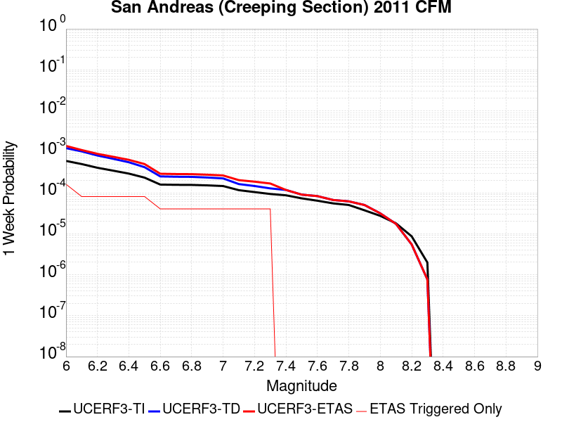 | 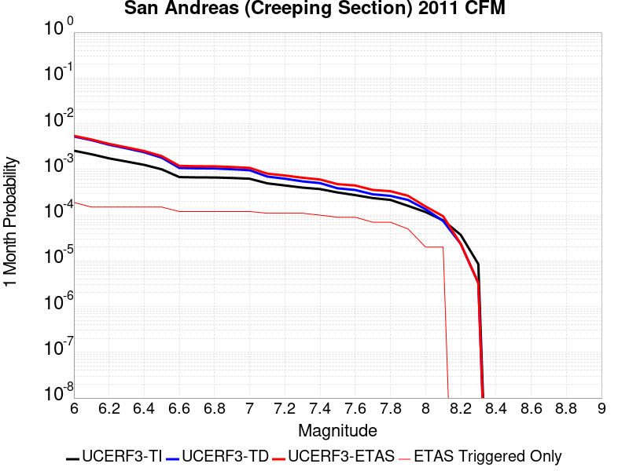 | 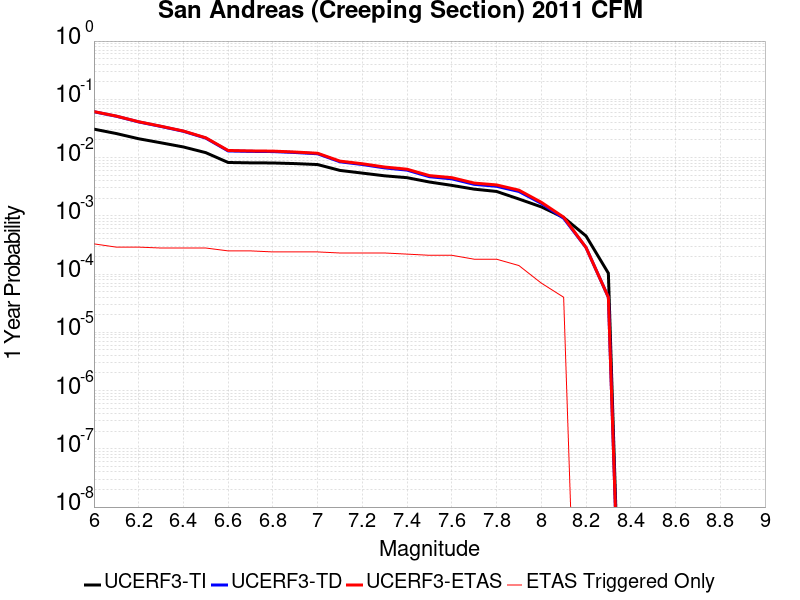 | 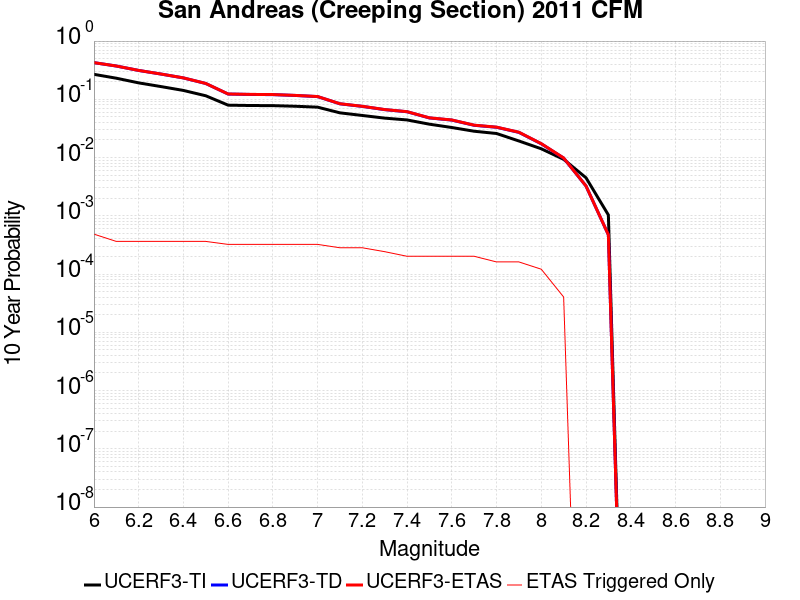 |

| Magnitude | 1 wk TI Prob | 1 wk TD Prob | 1 wk ETAS Prob | 1 wk ETAS/TD Gain | 1 wk ETAS Triggered Only | 1 mo TI Prob | 1 mo TD Prob | 1 mo ETAS Prob | 1 mo ETAS/TD Gain | 1 mo ETAS Triggered Only | 1 yr TI Prob | 1 yr TD Prob | 1 yr ETAS Prob | 1 yr ETAS/TD Gain | 1 yr ETAS Triggered Only | 10 yr TI Prob | 10 yr TD Prob | 10 yr ETAS Prob | 10 yr ETAS/TD Gain | 10 yr ETAS Triggered Only |
|-----|-----|-----|-----|-----|-----|-----|-----|-----|-----|-----|-----|-----|-----|-----|-----|-----|-----|-----|-----|-----|
| 6.0 | 5.986481E-4 | 0.001228691 | 0.0013485436 | 1.0975449 | 1.2E-4 | 0.0025631124 | 0.005246795 | 0.005435798 | 1.0360225 | 1.9E-4 | 0.030762846 | 0.061203245 | 0.06151305 | 1.0050619 | 3.3E-4 | 0.26835477 | 0.425928 | 0.4262093 | 1.0006604 | 4.9E-4 |
| 6.1 | 5.015945E-4 | 0.0010230356 | 0.0011129435 | 1.0878835 | 9.0E-5 | 0.00214792 | 0.004369436 | 0.0045187804 | 1.0341793 | 1.5E-4 | 0.025839351 | 0.051246606 | 0.051521745 | 1.005369 | 2.9E-4 | 0.23032776 | 0.37284943 | 0.37310657 | 1.0006896 | 4.1E-4 |
| 6.2 | 4.073338E-4 | 8.1157376E-4 | 9.015007E-4 | 1.1108056 | 9.0E-5 | 0.0017445484 | 0.0034683137 | 0.0036177933 | 1.0430987 | 1.5E-4 | 0.021034058 | 0.04093177 | 0.0412099 | 1.0067949 | 2.9E-4 | 0.19150782 | 0.31302592 | 0.31330758 | 1.0008998 | 4.1E-4 |
| 6.3 | 3.464099E-4 | 6.7455834E-4 | 7.644976E-4 | 1.1333306 | 9.0E-5 | 0.0014837692 | 0.0028832308 | 0.0030327984 | 1.051875 | 1.5E-4 | 0.017915873 | 0.034187846 | 0.034458272 | 1.00791 | 2.8E-4 | 0.16538359 | 0.27130842 | 0.2715999 | 1.0010743 | 4.0E-4 |
| 6.4 | 2.935057E-4 | 5.5516965E-4 | 6.451197E-4 | 1.1620226 | 9.0E-5 | 0.0012572751 | 0.0023727308 | 0.002522375 | 1.0630683 | 1.5E-4 | 0.015200248 | 0.02826279 | 0.028534876 | 1.009627 | 2.8E-4 | 0.14201577 | 0.23297668 | 0.23328348 | 1.0013169 | 4.0E-4 |
| 6.5 | 2.3409708E-4 | 4.2132285E-4 | 5.112849E-4 | 1.2135229 | 9.0E-5 | 0.0010028875 | 0.0018017791 | 0.0019515089 | 1.083101 | 1.5E-4 | 0.012141965 | 0.021586355 | 0.02186031 | 1.0126911 | 2.8E-4 | 0.11499573 | 0.1868149 | 0.18714018 | 1.0017412 | 4.0E-4 |
| 6.6 | 1.5842178E-4 | 2.5068692E-4 | 3.3066687E-4 | 1.3190432 | 8.0E-5 | 6.7877385E-4 | 0.0010739256 | 0.0011937968 | 1.1116196 | 1.2E-4 | 0.0082328 | 0.012995283 | 0.013242034 | 1.0189878 | 2.5E-4 | 0.07934396 | 0.12313759 | 0.12345327 | 1.0025636 | 3.6E-4 |
| 6.7 | 1.5616413E-4 | 2.4605254E-4 | 3.2603287E-4 | 1.3250538 | 8.0E-5 | 6.691031E-4 | 0.0010540807 | 0.0011739541 | 1.1137233 | 1.2E-4 | 0.0081159435 | 0.012757154 | 0.013003965 | 1.0193468 | 2.5E-4 | 0.0782586 | 0.12116472 | 0.1214811 | 1.0026112 | 3.6E-4 |
| 6.8 | 1.5538467E-4 | 2.442914E-4 | 3.2427188E-4 | 1.3273977 | 8.0E-5 | 6.6576427E-4 | 0.001046539 | 0.0011664134 | 1.1145437 | 1.2E-4 | 0.008075596 | 0.012666538 | 0.0129034985 | 1.0187075 | 2.4E-4 | 0.07788358 | 0.12039561 | 0.120703466 | 1.002557 | 3.5E-4 |
| 6.9 | 1.5153569E-4 | 2.3538464E-4 | 3.153658E-4 | 1.3397893 | 8.0E-5 | 6.49277E-4 | 0.0010084033 | 0.0011282823 | 1.11888 | 1.2E-4 | 0.007876333 | 0.012208726 | 0.012445796 | 1.0194181 | 2.4E-4 | 0.07602952 | 0.11646574 | 0.116774976 | 1.0026551 | 3.5E-4 |
| 7.0 | 1.4588932E-4 | 2.2395732E-4 | 3.039394E-4 | 1.3571309 | 8.0E-5 | 6.250901E-4 | 9.59466E-4 | 0.0010793508 | 1.1249496 | 1.2E-4 | 0.0075839474 | 0.011619428 | 0.011856639 | 1.0204151 | 2.4E-4 | 0.073302895 | 0.11131206 | 0.1116231 | 1.0027943 | 3.5E-4 |
| 7.1 | 1.1565079E-4 | 1.6281323E-4 | 2.428002E-4 | 1.4912806 | 8.0E-5 | 4.955521E-4 | 6.9758523E-4 | 8.075085E-4 | 1.1575768 | 1.1E-4 | 0.006016669 | 0.008460228 | 0.008688282 | 1.0269561 | 2.3E-4 | 0.058563538 | 0.08366478 | 0.08397634 | 1.0037239 | 3.4E-4 |
| 7.2 | 1.0393792E-4 | 1.4615392E-4 | 2.2614222E-4 | 1.5472882 | 8.0E-5 | 4.4537216E-4 | 6.262243E-4 | 7.3615543E-4 | 1.1755459 | 1.1E-4 | 0.005408933 | 0.0075977976 | 0.00782605 | 1.0300419 | 2.3E-4 | 0.052791595 | 0.07561503 | 0.07592933 | 1.0041565 | 3.4E-4 |
| 7.3 | 9.332884E-5 | 1.2780601E-4 | 2.0779578E-4 | 1.6258687 | 8.0E-5 | 3.999194E-4 | 5.4762565E-4 | 6.575654E-4 | 1.2007571 | 1.1E-4 | 0.0048581534 | 0.0066470946 | 0.0068755657 | 1.0343716 | 2.3E-4 | 0.047533102 | 0.06647954 | 0.06677827 | 1.0044935 | 3.2E-4 |
| 7.4 | 8.670252E-5 | 1.1702972E-4 | 1.8702152E-4 | 1.5980687 | 7.0E-5 | 3.715293E-4 | 5.014601E-4 | 6.0140993E-4 | 1.1993177 | 1.0E-4 | 0.004513991 | 0.0060883067 | 0.006306967 | 1.0359149 | 2.2E-4 | 0.044233937 | 0.061148684 | 0.061439727 | 1.0047597 | 3.1E-4 |
| 7.5 | 7.3036405E-5 | 9.005699E-5 | 1.6005068E-4 | 1.7772156 | 7.0E-5 | 3.129756E-4 | 3.859015E-4 | 4.7586678E-4 | 1.2331301 | 9.0E-5 | 0.0038038217 | 0.0046882504 | 0.0048972657 | 1.0445828 | 2.1E-4 | 0.03739367 | 0.047875606 | 0.048161246 | 1.0059662 | 3.0E-4 |
| 7.6 | 6.3935775E-5 | 8.280209E-5 | 1.5279629E-4 | 1.8453193 | 7.0E-5 | 2.7398168E-4 | 3.5481792E-4 | 4.4478598E-4 | 1.2535613 | 9.0E-5 | 0.0033306254 | 0.00431137 | 0.0045204647 | 1.0484984 | 2.1E-4 | 0.032811474 | 0.043990135 | 0.044276938 | 1.0065197 | 3.0E-4 |
| 7.7 | 5.5050095E-5 | 6.661729E-5 | 1.1661396E-4 | 1.7505058 | 5.0E-5 | 2.3590765E-4 | 2.8547147E-4 | 3.5545148E-4 | 1.2451384 | 7.0E-5 | 0.0028683927 | 0.0034700802 | 0.0036494555 | 1.051692 | 1.8E-4 | 0.0283165 | 0.03579509 | 0.036016855 | 1.0061954 | 2.3E-4 |
| 7.8 | 5.027131E-5 | 6.1627725E-5 | 1.1162464E-4 | 1.8112732 | 5.0E-5 | 2.1543067E-4 | 2.640921E-4 | 3.3407361E-4 | 1.264989 | 7.0E-5 | 0.0026197135 | 0.003210584 | 0.003390006 | 1.0558846 | 1.8E-4 | 0.025890453 | 0.03312572 | 0.03333843 | 1.0064213 | 2.2E-4 |
| 7.9 | 3.7271806E-5 | 5.0224386E-5 | 8.022288E-5 | 1.5972894 | 3.0E-5 | 1.5972654E-4 | 2.1522962E-4 | 2.6521887E-4 | 1.23226 | 5.0E-5 | 0.0019429359 | 0.0026172737 | 0.0027569071 | 1.0533508 | 1.4E-4 | 0.019260362 | 0.027066687 | 0.027232086 | 1.0061108 | 1.7E-4 |
| 8.0 | 2.7310243E-5 | 3.1428404E-5 | 4.142809E-5 | 1.3181735 | 1.0E-5 | 1.17038646E-4 | 1.3468621E-4 | 1.5468353E-4 | 1.1484733 | 2.0E-5 | 0.0014240141 | 0.0016385721 | 0.0017084574 | 1.0426501 | 7.0E-5 | 0.014149235 | 0.01721387 | 0.01730232 | 1.0051384 | 9.0E-5 |
| 8.1 | 1.7940547E-5 | 1.7400796E-5 | 2.7400622E-5 | 1.5746764 | 1.0E-5 | 7.688579E-5 | 7.457271E-5 | 9.457122E-5 | 1.2681746 | 2.0E-5 | 9.3568244E-4 | 9.075451E-4 | 9.4750884E-4 | 1.044035 | 4.0E-5 | 0.009317525 | 0.009799073 | 0.009838682 | 1.004042 | 4.0E-5 |
| 8.2 | 8.643924E-6 | 5.4748625E-6 | 5.4748625E-6 | 1.0 | 0.0 | 3.704486E-5 | 2.3463486E-5 | 2.3463486E-5 | 1.0 | 0.0 | 4.5092785E-4 | 2.8563058E-4 | 2.8563058E-4 | 1.0 | 0.0 | 0.0045001395 | 0.0032487072 | 0.0032487072 | 1.0 | 0.0 |
| 8.3 | 1.983087E-6 | 7.6599065E-7 | 7.6599065E-7 | 1.0 | 0.0 | 8.498917E-6 | 3.282813E-6 | 3.282813E-6 | 1.0 | 0.0 | 1.034694E-4 | 3.9967534E-5 | 3.9967534E-5 | 1.0 | 0.0 | 0.0010342124 | 4.719687E-4 | 4.719687E-4 | 1.0 | 0.0 |

## Cady
*[(top)](#table-of-contents)*

| 1 Week | 1 Month | 1 Year | 10 Year |
|-----|-----|-----|-----|
| 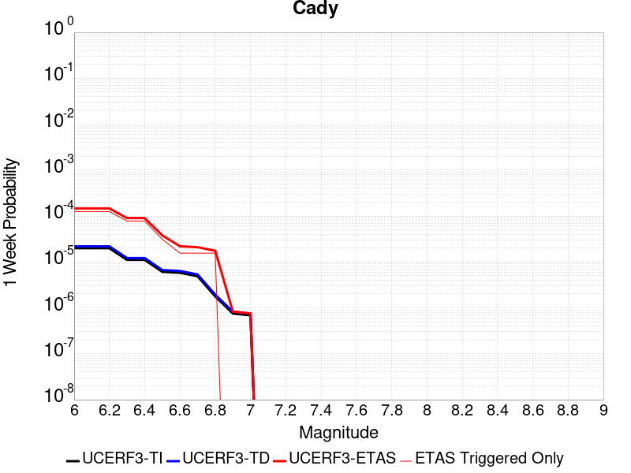 | 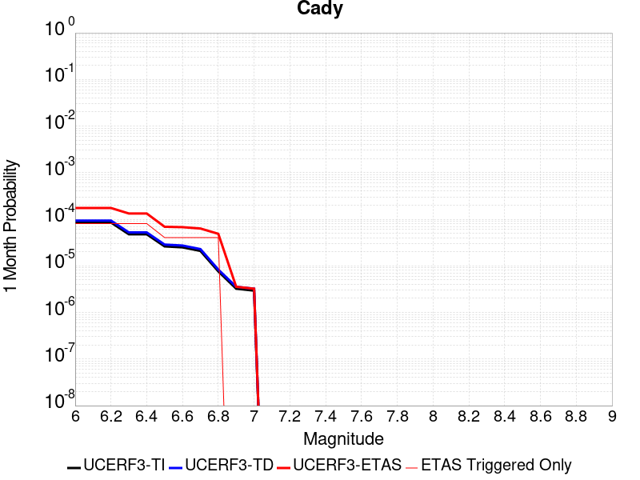 | 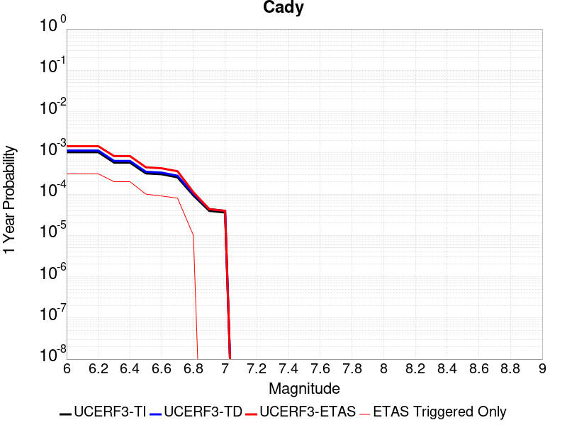 | 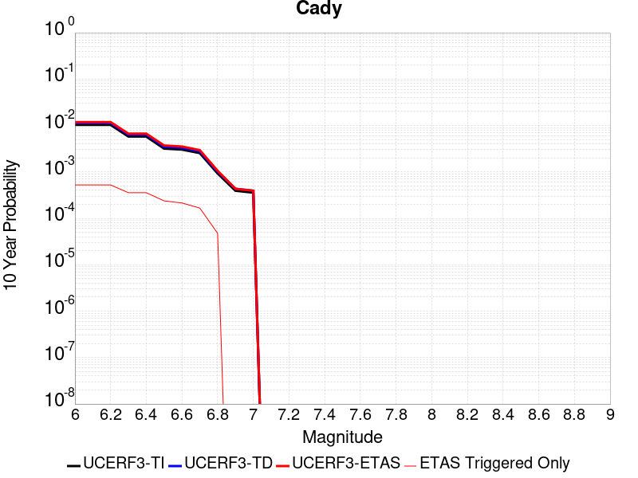 |

| Magnitude | 1 wk TI Prob | 1 wk TD Prob | 1 wk ETAS Prob | 1 wk ETAS/TD Gain | 1 wk ETAS Triggered Only | 1 mo TI Prob | 1 mo TD Prob | 1 mo ETAS Prob | 1 mo ETAS/TD Gain | 1 mo ETAS Triggered Only | 1 yr TI Prob | 1 yr TD Prob | 1 yr ETAS Prob | 1 yr ETAS/TD Gain | 1 yr ETAS Triggered Only | 10 yr TI Prob | 10 yr TD Prob | 10 yr ETAS Prob | 10 yr ETAS/TD Gain | 10 yr ETAS Triggered Only |
|-----|-----|-----|-----|-----|-----|-----|-----|-----|-----|-----|-----|-----|-----|-----|-----|-----|-----|-----|-----|-----|
| 6.0 | 1.9892565E-5 | 2.1858728E-5 | 1.5185589E-4 | 6.9471507 | 1.3E-4 | 8.525106E-5 | 9.3677416E-5 | 2.636615E-4 | 2.8145683 | 1.7E-4 | 0.0010374374 | 0.0011400167 | 0.0014496633 | 1.2716159 | 3.1E-4 | 0.010326075 | 0.011350701 | 0.011854911 | 1.0444212 | 5.1E-4 |
| 6.1 | 1.9892565E-5 | 2.1858728E-5 | 1.5185589E-4 | 6.9471507 | 1.3E-4 | 8.525106E-5 | 9.3677416E-5 | 2.636615E-4 | 2.8145683 | 1.7E-4 | 0.0010374374 | 0.0011400167 | 0.0014496633 | 1.2716159 | 3.1E-4 | 0.010326075 | 0.011350701 | 0.011854911 | 1.0444212 | 5.1E-4 |
| 6.2 | 1.9892565E-5 | 2.1858728E-5 | 1.5185589E-4 | 6.9471507 | 1.3E-4 | 8.525106E-5 | 9.3677416E-5 | 2.636615E-4 | 2.8145683 | 1.7E-4 | 0.0010374374 | 0.0011400167 | 0.0014496633 | 1.2716159 | 3.1E-4 | 0.010326075 | 0.011350701 | 0.011854911 | 1.0444212 | 5.1E-4 |
| 6.3 | 1.1117327E-5 | 1.2176583E-5 | 1.0217549E-4 | 8.391146 | 9.0E-5 | 4.764482E-5 | 5.2184492E-5 | 1.6217875E-4 | 3.107796 | 1.1E-4 | 5.7992124E-4 | 6.351925E-4 | 8.3506544E-4 | 1.3146652 | 2.0E-4 | 0.0057841022 | 0.0063368753 | 0.006644911 | 1.04861 | 3.1E-4 |
| 6.4 | 1.1117327E-5 | 1.2176583E-5 | 1.0217549E-4 | 8.391146 | 9.0E-5 | 4.764482E-5 | 5.2184492E-5 | 1.6217875E-4 | 3.107796 | 1.1E-4 | 5.7992124E-4 | 6.351925E-4 | 8.3506544E-4 | 1.3146652 | 2.0E-4 | 0.0057841022 | 0.0063368753 | 0.006644911 | 1.04861 | 3.1E-4 |
| 6.5 | 6.103093E-6 | 6.672021E-6 | 2.6671887E-5 | 3.9975727 | 2.0E-5 | 2.615585E-5 | 2.8594131E-5 | 6.8592984E-5 | 2.3988485 | 4.0E-5 | 3.1840094E-4 | 3.480905E-4 | 4.4805568E-4 | 1.2871816 | 1.0E-4 | 0.0031794512 | 0.0034766865 | 0.003656061 | 1.0515934 | 1.8E-4 |
| 6.6 | 5.817237E-6 | 6.3656585E-6 | 1.6365595E-5 | 2.5709193 | 1.0E-5 | 2.4930776E-5 | 2.728118E-5 | 5.7280362E-5 | 2.0996292 | 3.0E-5 | 3.034899E-4 | 3.3211018E-4 | 4.2208028E-4 | 1.2709044 | 9.0E-5 | 0.0030307577 | 0.0033173605 | 0.0034867965 | 1.0510756 | 1.7E-4 |
| 6.7 | 4.8846314E-6 | 5.3405684E-6 | 1.5340514E-5 | 2.8724499 | 1.0E-5 | 2.0933967E-5 | 2.2888014E-5 | 4.2887557E-5 | 1.8737998 | 2.0E-5 | 2.5484123E-4 | 2.7863772E-4 | 3.5861545E-4 | 1.2870312 | 8.0E-5 | 0.0025454918 | 0.0027840391 | 0.002903705 | 1.0429828 | 1.2E-4 |
| 6.8 | 1.7788773E-6 | 1.9399079E-6 | 1.1939888E-5 | 6.154874 | 1.0E-5 | 7.6237375E-6 | 8.313874E-6 | 1.831379E-5 | 2.2027988 | 1.0E-5 | 9.281505E-5 | 1.01218284E-4 | 1.11217276E-4 | 1.0987864 | 1.0E-5 | 9.2776294E-4 | 0.0010118765 | 0.0010418461 | 1.0296179 | 3.0E-5 |
| 6.9 | 7.5455404E-7 | 8.297092E-7 | 8.297092E-7 | 1.0 | 0.0 | 3.233799E-6 | 3.5558937E-6 | 3.5558937E-6 | 1.0 | 0.0 | 3.937079E-5 | 4.3292483E-5 | 4.3292483E-5 | 1.0 | 0.0 | 3.9363815E-4 | 4.3287344E-4 | 4.428691E-4 | 1.0230914 | 1.0E-5 |
| 7.0 | 6.8578805E-7 | 7.541816E-7 | 7.541816E-7 | 1.0 | 0.0 | 2.9390883E-6 | 3.2322048E-6 | 3.2322048E-6 | 1.0 | 0.0 | 3.578281E-5 | 3.9351715E-5 | 3.9351715E-5 | 1.0 | 0.0 | 3.577705E-4 | 3.9347992E-4 | 4.0347598E-4 | 1.0254042 | 1.0E-5 |

## Elsinore (Glen Ivy) rev
*[(top)](#table-of-contents)*

| 1 Week | 1 Month | 1 Year | 10 Year |
|-----|-----|-----|-----|
| 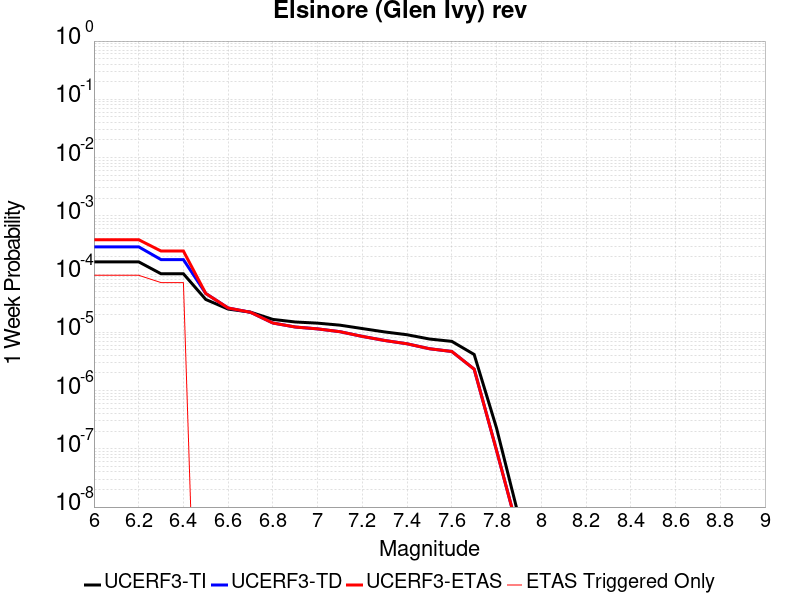 | 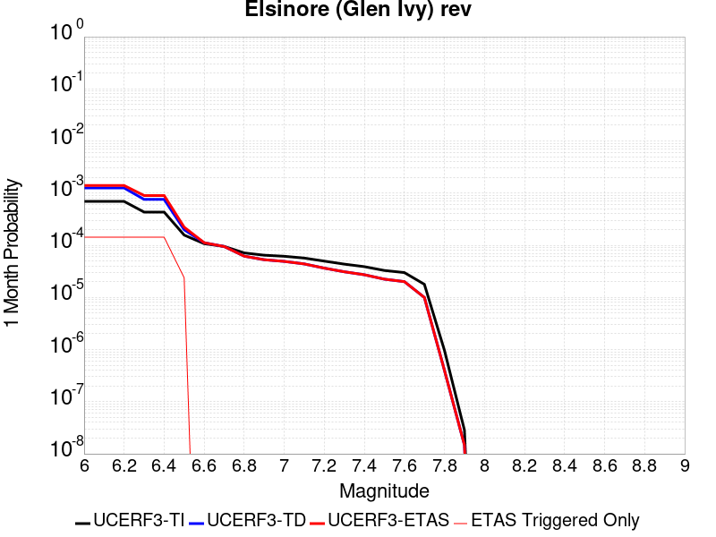 | 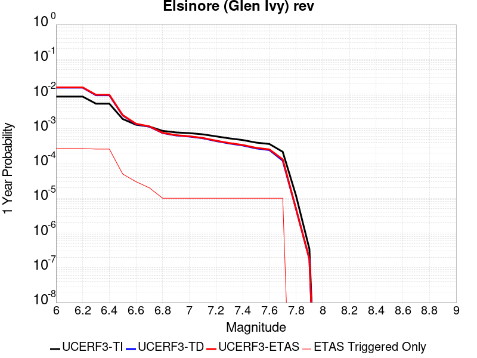 | 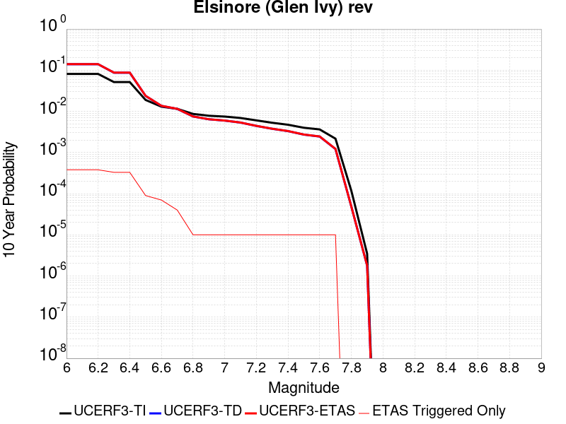 |

| Magnitude | 1 wk TI Prob | 1 wk TD Prob | 1 wk ETAS Prob | 1 wk ETAS/TD Gain | 1 wk ETAS Triggered Only | 1 mo TI Prob | 1 mo TD Prob | 1 mo ETAS Prob | 1 mo ETAS/TD Gain | 1 mo ETAS Triggered Only | 1 yr TI Prob | 1 yr TD Prob | 1 yr ETAS Prob | 1 yr ETAS/TD Gain | 1 yr ETAS Triggered Only | 10 yr TI Prob | 10 yr TD Prob | 10 yr ETAS Prob | 10 yr ETAS/TD Gain | 10 yr ETAS Triggered Only |
|-----|-----|-----|-----|-----|-----|-----|-----|-----|-----|-----|-----|-----|-----|-----|-----|-----|-----|-----|-----|-----|
| 6.0 | 1.6204086E-4 | 2.9360707E-4 | 4.535601E-4 | 1.544786 | 1.6E-4 | 6.94276E-4 | 0.0012578638 | 0.0014675998 | 1.1667397 | 2.1E-4 | 0.008420097 | 0.015234485 | 0.015500371 | 1.017453 | 2.7E-4 | 0.081081145 | 0.13969168 | 0.1400186 | 1.0023403 | 3.8E-4 |
| 6.1 | 1.6204086E-4 | 2.9360707E-4 | 4.535601E-4 | 1.544786 | 1.6E-4 | 6.94276E-4 | 0.0012578638 | 0.0014675998 | 1.1667397 | 2.1E-4 | 0.008420097 | 0.015234485 | 0.015500371 | 1.017453 | 2.7E-4 | 0.081081145 | 0.13969168 | 0.1400186 | 1.0023403 | 3.8E-4 |
| 6.2 | 1.6204086E-4 | 2.9360707E-4 | 4.535601E-4 | 1.544786 | 1.6E-4 | 6.94276E-4 | 0.0012578638 | 0.0014675998 | 1.1667397 | 2.1E-4 | 0.008420097 | 0.015234485 | 0.015500371 | 1.017453 | 2.7E-4 | 0.081081145 | 0.13969168 | 0.1400186 | 1.0023403 | 3.8E-4 |
| 6.3 | 1.0111737E-4 | 1.7703383E-4 | 2.770161E-4 | 1.5647638 | 1.0E-4 | 4.332882E-4 | 7.5861247E-4 | 9.4846834E-4 | 1.2502673 | 1.9E-4 | 0.005262531 | 0.009217682 | 0.009475285 | 1.0279467 | 2.6E-4 | 0.0513964 | 0.0870191 | 0.08732038 | 1.0034623 | 3.3E-4 |
| 6.4 | 1.0111737E-4 | 1.7703383E-4 | 2.770161E-4 | 1.5647638 | 1.0E-4 | 4.332882E-4 | 7.5861247E-4 | 9.4846834E-4 | 1.2502673 | 1.9E-4 | 0.005262531 | 0.009217682 | 0.009475285 | 1.0279467 | 2.6E-4 | 0.0513964 | 0.0870191 | 0.08732038 | 1.0034623 | 3.3E-4 |
| 6.5 | 3.6624708E-5 | 4.6391084E-5 | 5.6390618E-5 | 1.2155486 | 1.0E-5 | 1.569536E-4 | 1.9880582E-4 | 2.3879787E-4 | 1.2011614 | 4.0E-5 | 0.001909235 | 0.0024181372 | 0.0024680162 | 1.020627 | 5.0E-5 | 0.01892915 | 0.023739954 | 0.023827817 | 1.0037011 | 9.0E-5 |
| 6.6 | 2.5051324E-5 | 2.614772E-5 | 3.614746E-5 | 1.3824326 | 1.0E-5 | 1.073584E-4 | 1.12057096E-4 | 1.3205485E-4 | 1.1784605 | 2.0E-5 | 0.0013063047 | 0.0013634858 | 0.001393445 | 1.0219724 | 3.0E-5 | 0.012986525 | 0.013564618 | 0.013633668 | 1.0050905 | 7.0E-5 |
| 6.7 | 2.2189772E-5 | 2.2072849E-5 | 3.207263E-5 | 1.4530352 | 1.0E-5 | 9.509556E-5 | 9.4594696E-5 | 1.0459375E-4 | 1.1057042 | 1.0E-5 | 0.0011571734 | 0.0011511183 | 0.0011710953 | 1.0173544 | 2.0E-5 | 0.011511663 | 0.011465415 | 0.0115049565 | 1.0034487 | 4.0E-5 |
| 6.8 | 1.6654378E-5 | 1.4437705E-5 | 2.443756E-5 | 1.6926209 | 1.0E-5 | 7.137396E-5 | 6.187444E-5 | 7.187382E-5 | 1.1616076 | 1.0E-5 | 8.686314E-4 | 7.530661E-4 | 7.6305855E-4 | 1.0132691 | 1.0E-5 | 0.008652439 | 0.00751048 | 0.007520405 | 1.0013214 | 1.0E-5 |
| 6.9 | 1.5042909E-5 | 1.2332022E-5 | 2.2331898E-5 | 1.810887 | 1.0E-5 | 6.446802E-5 | 5.285047E-5 | 6.284994E-5 | 1.189203 | 1.0E-5 | 7.8461546E-4 | 6.4326765E-4 | 6.532612E-4 | 1.0155356 | 1.0E-5 | 0.007818509 | 0.00641828 | 0.0064282157 | 1.001548 | 1.0E-5 |
| 7.0 | 1.4361385E-5 | 1.1451324E-5 | 2.145121E-5 | 1.8732514 | 1.0E-5 | 6.154734E-5 | 4.9076196E-5 | 5.9075704E-5 | 1.2037548 | 1.0E-5 | 7.490812E-4 | 5.973418E-4 | 6.073358E-4 | 1.0167308 | 1.0E-5 | 0.007465612 | 0.0059613534 | 0.005971294 | 1.0016675 | 1.0E-5 |
| 7.1 | 1.3265571E-5 | 1.0244926E-5 | 2.0244823E-5 | 1.9760829 | 1.0E-5 | 5.6851208E-5 | 4.39061E-5 | 5.390566E-5 | 1.2277488 | 1.0E-5 | 6.919436E-4 | 5.344282E-4 | 5.4442283E-4 | 1.0187016 | 1.0E-5 | 0.006897931 | 0.0053347866 | 0.005344733 | 1.0018644 | 1.0E-5 |
| 7.2 | 1.1596403E-5 | 8.505067E-6 | 1.8504981E-5 | 2.1757598 | 1.0E-5 | 4.9697923E-5 | 3.6449786E-5 | 4.6449422E-5 | 1.27434 | 1.0E-5 | 6.049042E-4 | 4.436875E-4 | 4.5368305E-4 | 1.0225284 | 1.0E-5 | 0.006032603 | 0.0044294316 | 0.0044393875 | 1.0022476 | 1.0E-5 |
| 7.3 | 1.0150827E-5 | 7.2387597E-6 | 1.7238688E-5 | 2.381442 | 1.0E-5 | 4.3502816E-5 | 3.1022897E-5 | 4.1022588E-5 | 1.3223326 | 1.0E-5 | 5.2951806E-4 | 3.7763975E-4 | 3.8763596E-4 | 1.0264703 | 1.0E-5 | 0.005282581 | 0.0037703665 | 0.003780329 | 1.0026423 | 1.0E-5 |
| 7.4 | 9.080705E-6 | 6.352519E-6 | 1.6352456E-5 | 2.5741687 | 1.0E-5 | 3.8916725E-5 | 2.7224805E-5 | 3.7224534E-5 | 1.3673021 | 1.0E-5 | 4.7370812E-4 | 3.3141294E-4 | 3.4140964E-4 | 1.0301639 | 1.0E-5 | 0.004726996 | 0.0033093381 | 0.003319305 | 1.0030117 | 1.0E-5 |
| 7.5 | 7.671649E-6 | 5.2256332E-6 | 1.5225581E-5 | 2.9136338 | 1.0E-5 | 3.287808E-5 | 2.2395385E-5 | 3.239516E-5 | 1.4465106 | 1.0E-5 | 4.0021708E-4 | 2.7263095E-4 | 2.8262823E-4 | 1.0366696 | 1.0E-5 | 0.0039949706 | 0.00272309 | 0.0027330627 | 1.0036623 | 1.0E-5 |
| 7.6 | 6.990086E-6 | 4.687545E-6 | 1.4687498E-5 | 3.133303 | 1.0E-5 | 2.9957167E-5 | 2.008933E-5 | 3.0089128E-5 | 1.4977667 | 1.0E-5 | 3.6466747E-4 | 2.445613E-4 | 2.5455886E-4 | 1.0408795 | 1.0E-5 | 0.0036406964 | 0.002443038 | 0.0024530136 | 1.0040833 | 1.0E-5 |
| 7.7 | 4.163505E-6 | 2.3295343E-6 | 1.2329511E-5 | 5.2926936 | 1.0E-5 | 1.7843471E-5 | 9.983683E-6 | 1.9983583E-5 | 2.0016243 | 1.0E-5 | 2.172226E-4 | 1.21545316E-4 | 1.315441E-4 | 1.0822638 | 1.0E-5 | 0.0021701038 | 0.0012148614 | 0.0012248493 | 1.0082214 | 1.0E-5 |
| 7.8 | 2.2692414E-7 | 9.3854695E-8 | 9.3854695E-8 | 1.0 | 0.0 | 9.725317E-7 | 4.0223435E-7 | 4.0223435E-7 | 1.0 | 0.0 | 1.1840509E-5 | 4.8971956E-6 | 4.8971956E-6 | 1.0 | 0.0 | 1.1839878E-4 | 4.8971204E-5 | 4.8971204E-5 | 1.0 | 0.0 |
| 7.9 | 6.676829E-9 | 3.439853E-9 | 3.439853E-9 | 1.0 | 0.0 | 2.861498E-8 | 1.4742227E-8 | 1.4742227E-8 | 1.0 | 0.0 | 3.4838732E-7 | 1.7948659E-7 | 1.7948659E-7 | 1.0 | 0.0 | 3.4838679E-6 | 1.7948646E-6 | 1.7948646E-6 | 1.0 | 0.0 |

## Sierra Nevada  (No Extension)
*[(top)](#table-of-contents)*

| 1 Week | 1 Month | 1 Year | 10 Year |
|-----|-----|-----|-----|
| 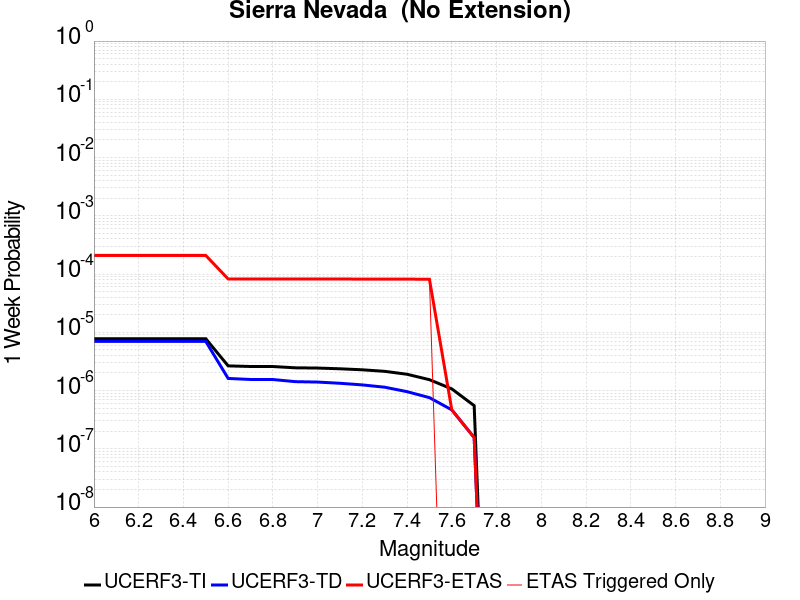 | 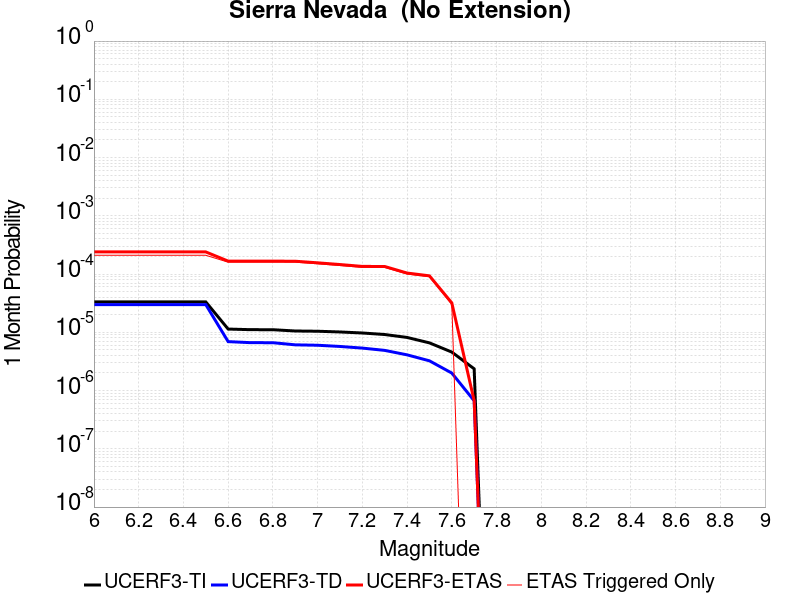 | 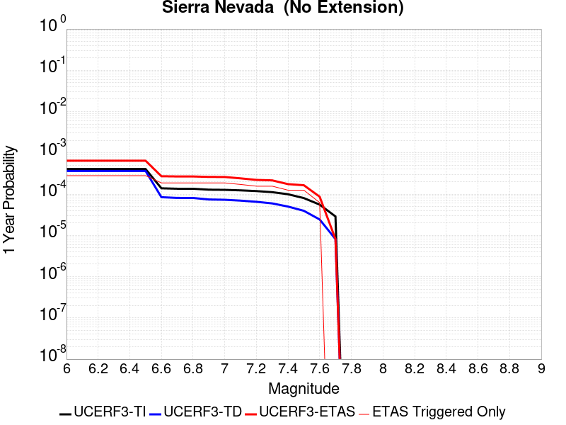 | 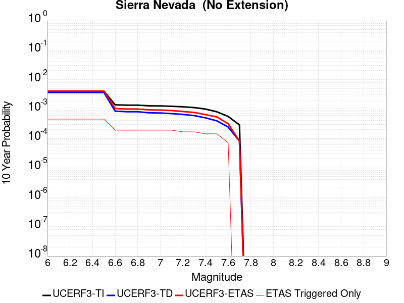 |

| Magnitude | 1 wk TI Prob | 1 wk TD Prob | 1 wk ETAS Prob | 1 wk ETAS/TD Gain | 1 wk ETAS Triggered Only | 1 mo TI Prob | 1 mo TD Prob | 1 mo ETAS Prob | 1 mo ETAS/TD Gain | 1 mo ETAS Triggered Only | 1 yr TI Prob | 1 yr TD Prob | 1 yr ETAS Prob | 1 yr ETAS/TD Gain | 1 yr ETAS Triggered Only | 10 yr TI Prob | 10 yr TD Prob | 10 yr ETAS Prob | 10 yr ETAS/TD Gain | 10 yr ETAS Triggered Only |
|-----|-----|-----|-----|-----|-----|-----|-----|-----|-----|-----|-----|-----|-----|-----|-----|-----|-----|-----|-----|-----|
| 6.0 | 7.7690465E-6 | 6.976322E-6 | 1.3697542E-4 | 19.63433 | 1.3E-4 | 3.329549E-5 | 2.9898381E-5 | 2.398921E-4 | 8.0235815 | 2.1E-4 | 4.0529718E-4 | 3.6398784E-4 | 6.838714E-4 | 1.8788302 | 3.2E-4 | 0.004045588 | 0.0036374326 | 0.004075832 | 1.1205244 | 4.4E-4 |
| 6.1 | 7.7690465E-6 | 6.976322E-6 | 1.3697542E-4 | 19.63433 | 1.3E-4 | 3.329549E-5 | 2.9898381E-5 | 2.398921E-4 | 8.0235815 | 2.1E-4 | 4.0529718E-4 | 3.6398784E-4 | 6.838714E-4 | 1.8788302 | 3.2E-4 | 0.004045588 | 0.0036374326 | 0.004075832 | 1.1205244 | 4.4E-4 |
| 6.2 | 7.7690465E-6 | 6.976322E-6 | 1.3697542E-4 | 19.63433 | 1.3E-4 | 3.329549E-5 | 2.9898381E-5 | 2.398921E-4 | 8.0235815 | 2.1E-4 | 4.0529718E-4 | 3.6398784E-4 | 6.838714E-4 | 1.8788302 | 3.2E-4 | 0.004045588 | 0.0036374326 | 0.004075832 | 1.1205244 | 4.4E-4 |
| 6.3 | 7.7690465E-6 | 6.976322E-6 | 1.3697542E-4 | 19.63433 | 1.3E-4 | 3.329549E-5 | 2.9898381E-5 | 2.398921E-4 | 8.0235815 | 2.1E-4 | 4.0529718E-4 | 3.6398784E-4 | 6.838714E-4 | 1.8788302 | 3.2E-4 | 0.004045588 | 0.0036374326 | 0.004075832 | 1.1205244 | 4.4E-4 |
| 6.4 | 7.7690465E-6 | 6.976322E-6 | 1.3697542E-4 | 19.63433 | 1.3E-4 | 3.329549E-5 | 2.9898381E-5 | 2.398921E-4 | 8.0235815 | 2.1E-4 | 4.0529718E-4 | 3.6398784E-4 | 6.838714E-4 | 1.8788302 | 3.2E-4 | 0.004045588 | 0.0036374326 | 0.004075832 | 1.1205244 | 4.4E-4 |
| 6.5 | 7.7690465E-6 | 6.976322E-6 | 1.3697542E-4 | 19.63433 | 1.3E-4 | 3.329549E-5 | 2.9898381E-5 | 2.398921E-4 | 8.0235815 | 2.1E-4 | 4.0529718E-4 | 3.6398784E-4 | 6.838714E-4 | 1.8788302 | 3.2E-4 | 0.004045588 | 0.0036374326 | 0.004075832 | 1.1205244 | 4.4E-4 |
| 6.6 | 2.653E-6 | 1.614854E-6 | 8.161472E-5 | 50.54 | 8.0E-5 | 1.136995E-5 | 6.9207845E-6 | 1.6691968E-4 | 24.118607 | 1.6E-4 | 1.3842035E-4 | 8.425733E-5 | 3.0423878E-4 | 3.6108289 | 2.2E-4 | 0.0013833415 | 8.422573E-4 | 0.0011020383 | 1.3084342 | 2.6E-4 |
| 6.7 | 2.5902466E-6 | 1.5501876E-6 | 8.155006E-5 | 52.60658 | 8.0E-5 | 1.11010095E-5 | 6.643644E-6 | 1.6664258E-4 | 25.083008 | 1.6E-4 | 1.351464E-4 | 8.0883394E-5 | 3.008656E-4 | 3.719745 | 2.2E-4 | 0.0013506424 | 8.0854254E-4 | 0.0010683323 | 1.3213062 | 2.6E-4 |
| 6.8 | 2.5853892E-6 | 1.5469877E-6 | 8.154687E-5 | 52.71332 | 8.0E-5 | 1.1080193E-5 | 6.629931E-6 | 1.6662887E-4 | 25.132822 | 1.6E-4 | 1.34893E-4 | 8.071645E-5 | 3.0069868E-4 | 3.7253706 | 2.2E-4 | 0.0013481114 | 8.068743E-4 | 0.0010666645 | 1.321971 | 2.6E-4 |
| 6.9 | 2.458257E-6 | 1.4220619E-6 | 8.1421946E-5 | 57.25626 | 8.0E-5 | 1.0535345E-5 | 6.094537E-6 | 1.6609357E-4 | 27.25286 | 1.6E-4 | 1.2826028E-4 | 7.4198484E-5 | 2.9418216E-4 | 3.9648001 | 2.2E-4 | 0.0012818627 | 7.4173906E-4 | 0.0010015462 | 1.3502675 | 2.6E-4 |
| 7.0 | 2.4341468E-6 | 1.3990258E-6 | 8.139892E-5 | 58.182568 | 8.0E-5 | 1.0432016E-5 | 5.9958115E-6 | 1.5599492E-4 | 26.017315 | 1.5E-4 | 1.270024E-4 | 7.2996576E-5 | 2.8298126E-4 | 3.8766372 | 2.1E-4 | 0.0012692984 | 7.297279E-4 | 9.795455E-4 | 1.3423434 | 2.5E-4 |
| 7.1 | 2.3652476E-6 | 1.3339754E-6 | 7.133388E-5 | 53.47466 | 7.0E-5 | 1.0136736E-5 | 5.717025E-6 | 1.4571623E-4 | 25.488121 | 1.4E-4 | 1.2340778E-4 | 6.9602575E-5 | 2.6958867E-4 | 3.873257 | 2.0E-4 | 0.0012333926 | 6.9580943E-4 | 9.3564246E-4 | 1.344682 | 2.4E-4 |
| 7.2 | 2.272158E-6 | 1.2502821E-6 | 7.125019E-5 | 56.987293 | 7.0E-5 | 9.737784E-6 | 5.3583412E-6 | 1.3535765E-4 | 25.26111 | 1.3E-4 | 1.1855107E-4 | 6.5235865E-5 | 2.5522348E-4 | 3.9123182 | 1.9E-4 | 0.0011848784 | 6.5216864E-4 | 8.8201865E-4 | 1.3524395 | 2.3E-4 |
| 7.3 | 2.1382127E-6 | 1.1419703E-6 | 7.114189E-5 | 62.297497 | 7.0E-5 | 9.163737E-6 | 4.8941492E-6 | 1.3489352E-4 | 27.562199 | 1.3E-4 | 1.1156279E-4 | 5.958465E-5 | 2.4957332E-4 | 4.188551 | 1.9E-4 | 0.001115068 | 5.956879E-4 | 8.255509E-4 | 1.3858782 | 2.3E-4 |
| 7.4 | 1.9048055E-6 | 9.575242E-7 | 4.0957486E-5 | 42.77436 | 4.0E-5 | 8.163426E-6 | 4.1036687E-6 | 1.0410326E-4 | 25.368338 | 1.0E-4 | 9.9385186E-5 | 4.996103E-5 | 1.8995404E-4 | 3.802044 | 1.4E-4 | 9.934074E-4 | 4.994987E-4 | 6.794088E-4 | 1.3601813 | 1.8E-4 |
| 7.5 | 1.5373403E-6 | 7.560042E-7 | 4.0755975E-5 | 53.909718 | 4.0E-5 | 6.5885843E-6 | 3.2400142E-6 | 9.323972E-5 | 28.777567 | 9.0E-5 | 8.021306E-5 | 3.9446462E-5 | 1.6944134E-4 | 4.295476 | 1.3E-4 | 8.0184115E-4 | 3.943951E-4 | 5.6432805E-4 | 1.4308698 | 1.7E-4 |
| 7.6 | 1.0680322E-6 | 4.6596554E-7 | 1.0465961E-5 | 22.460804 | 1.0E-5 | 4.577273E-6 | 1.9969937E-6 | 3.1996933E-5 | 16.02255 | 3.0E-5 | 5.5726876E-5 | 2.4313129E-5 | 8.431167E-5 | 3.4677424 | 6.0E-5 | 5.5712904E-4 | 2.4310495E-4 | 3.4308064E-4 | 1.411245 | 1.0E-4 |
| 7.7 | 5.509146E-7 | 1.5580486E-7 | 1.5580486E-7 | 1.0 | 0.0 | 2.3610605E-6 | 6.677349E-7 | 6.677349E-7 | 1.0 | 0.0 | 2.8745531E-5 | 8.129644E-6 | 1.8129562E-5 | 2.2300563 | 1.0E-5 | 2.8741814E-4 | 8.1293576E-5 | 1.1129114E-4 | 1.3690028 | 3.0E-5 |

## Baker
*[(top)](#table-of-contents)*

| 1 Week | 1 Month | 1 Year | 10 Year |
|-----|-----|-----|-----|
| 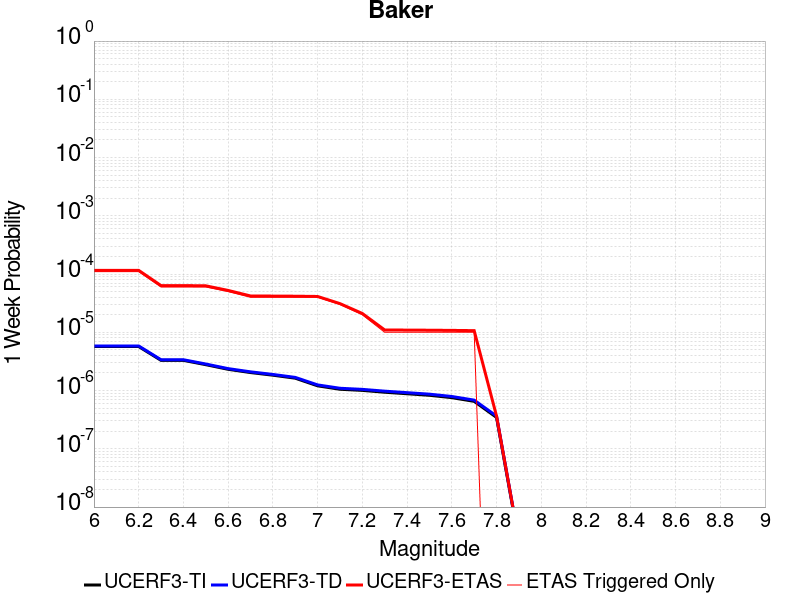 | 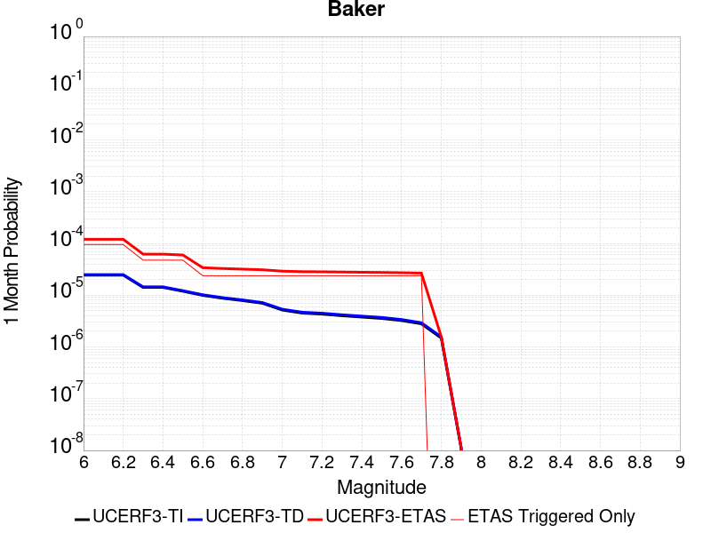 | 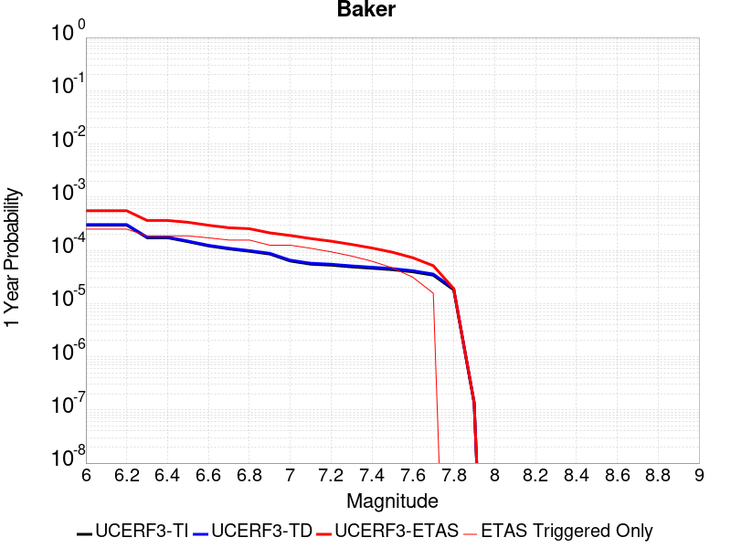 | 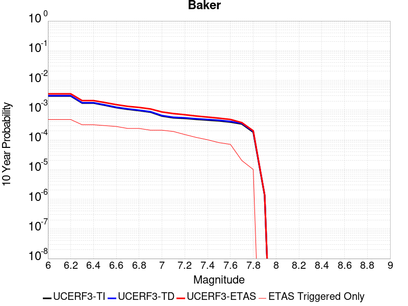 |

| Magnitude | 1 wk TI Prob | 1 wk TD Prob | 1 wk ETAS Prob | 1 wk ETAS/TD Gain | 1 wk ETAS Triggered Only | 1 mo TI Prob | 1 mo TD Prob | 1 mo ETAS Prob | 1 mo ETAS/TD Gain | 1 mo ETAS Triggered Only | 1 yr TI Prob | 1 yr TD Prob | 1 yr ETAS Prob | 1 yr ETAS/TD Gain | 1 yr ETAS Triggered Only | 10 yr TI Prob | 10 yr TD Prob | 10 yr ETAS Prob | 10 yr ETAS/TD Gain | 10 yr ETAS Triggered Only |
|-----|-----|-----|-----|-----|-----|-----|-----|-----|-----|-----|-----|-----|-----|-----|-----|-----|-----|-----|-----|-----|
| 6.0 | 5.695525E-6 | 5.8348373E-6 | 1.158342E-4 | 19.852173 | 1.1E-4 | 2.4409164E-5 | 2.5006228E-5 | 1.6500273E-4 | 6.5984654 | 1.4E-4 | 2.9714106E-4 | 3.044123E-4 | 5.6433317E-4 | 1.8538448 | 2.6E-4 | 0.0029674405 | 0.0030403486 | 0.0035188894 | 1.1573967 | 4.8E-4 |
| 6.1 | 5.695525E-6 | 5.8348373E-6 | 1.158342E-4 | 19.852173 | 1.1E-4 | 2.4409164E-5 | 2.5006228E-5 | 1.6500273E-4 | 6.5984654 | 1.4E-4 | 2.9714106E-4 | 3.044123E-4 | 5.6433317E-4 | 1.8538448 | 2.6E-4 | 0.0029674405 | 0.0030403486 | 0.0035188894 | 1.1573967 | 4.8E-4 |
| 6.2 | 5.695525E-6 | 5.8348373E-6 | 1.158342E-4 | 19.852173 | 1.1E-4 | 2.4409164E-5 | 2.5006228E-5 | 1.6500273E-4 | 6.5984654 | 1.4E-4 | 2.9714106E-4 | 3.044123E-4 | 5.6433317E-4 | 1.8538448 | 2.6E-4 | 0.0029674405 | 0.0030403486 | 0.0035188894 | 1.1573967 | 4.8E-4 |
| 6.3 | 3.2995713E-6 | 3.383667E-6 | 6.3383464E-5 | 18.732182 | 6.0E-5 | 1.4140943E-5 | 1.4501353E-5 | 8.450034E-5 | 5.827066 | 7.0E-5 | 1.7215237E-4 | 1.7654014E-4 | 3.3651188E-4 | 1.9061495 | 1.6E-4 | 0.0017201907 | 0.001764046 | 0.0020834815 | 1.1810812 | 3.2E-4 |
| 6.4 | 3.2995713E-6 | 3.383667E-6 | 6.3383464E-5 | 18.732182 | 6.0E-5 | 1.4140943E-5 | 1.4501353E-5 | 8.450034E-5 | 5.827066 | 7.0E-5 | 1.7215237E-4 | 1.7654014E-4 | 3.3651188E-4 | 1.9061495 | 1.6E-4 | 0.0017201907 | 0.001764046 | 0.0020834815 | 1.1810812 | 3.2E-4 |
| 6.5 | 2.782202E-6 | 2.8558404E-6 | 6.2855666E-5 | 22.009518 | 6.0E-5 | 1.1923668E-5 | 1.223926E-5 | 8.22384E-5 | 6.7192297 | 7.0E-5 | 1.4516099E-4 | 1.4900314E-4 | 3.089793E-4 | 2.073643 | 1.6E-4 | 0.001450662 | 0.0014890651 | 0.0017886184 | 1.2011687 | 3.0E-4 |
| 6.6 | 2.3163404E-6 | 2.38092E-6 | 5.23808E-5 | 22.000237 | 5.0E-5 | 9.927136E-6 | 1.0203904E-5 | 7.020329E-5 | 6.8800426 | 6.0E-5 | 1.20856166E-4 | 1.2422565E-4 | 2.74207E-4 | 2.20733 | 1.5E-4 | 0.0012079047 | 0.0012415823 | 0.0015212346 | 1.2252387 | 2.8E-4 |
| 6.7 | 2.037056E-6 | 2.0965003E-6 | 4.2096417E-5 | 20.079374 | 4.0E-5 | 8.7302105E-6 | 8.984972E-6 | 5.8984522E-5 | 6.564798 | 5.0E-5 | 1.0628513E-4 | 1.093867E-4 | 2.3937249E-4 | 2.1883142 | 1.3E-4 | 0.0010623431 | 0.0010933448 | 0.0013330823 | 1.2192699 | 2.4E-4 |
| 6.8 | 1.8356744E-6 | 1.8915287E-6 | 4.1891453E-5 | 22.146877 | 4.0E-5 | 7.867153E-6 | 8.106527E-6 | 5.810612E-5 | 7.1678195 | 5.0E-5 | 9.577837E-5 | 9.869264E-5 | 2.2867981E-4 | 2.3170907 | 1.3E-4 | 9.57371E-4 | 9.86502E-4 | 0.0012262653 | 1.2430438 | 2.4E-4 |
| 6.9 | 1.6310546E-6 | 1.6832072E-6 | 4.168314E-5 | 24.764116 | 4.0E-5 | 6.9902153E-6 | 7.213726E-6 | 4.7213438E-5 | 6.544945 | 4.0E-5 | 8.510255E-5 | 8.782368E-5 | 1.9781402E-4 | 2.2523994 | 1.1E-4 | 8.5069967E-4 | 8.7790104E-4 | 0.0010877167 | 1.2389969 | 2.1E-4 |
| 7.0 | 1.2058036E-6 | 1.2508665E-6 | 4.1250816E-5 | 32.97779 | 4.0E-5 | 5.1677193E-6 | 5.3608455E-6 | 4.536063E-5 | 8.46147 | 4.0E-5 | 6.291517E-5 | 6.5266366E-5 | 1.7525919E-4 | 2.685291 | 1.1E-4 | 6.289736E-4 | 6.524743E-4 | 8.623373E-4 | 1.3216418 | 2.1E-4 |
| 7.1 | 1.052382E-6 | 1.0951609E-6 | 3.109513E-5 | 28.393206 | 3.0E-5 | 4.5102006E-6 | 4.693538E-6 | 3.4693396E-5 | 7.3917365 | 3.0E-5 | 5.491031E-5 | 5.7142337E-5 | 1.471372E-4 | 2.5749242 | 9.0E-5 | 5.4896745E-4 | 5.7127734E-4 | 7.611688E-4 | 1.332398 | 1.9E-4 |
| 7.2 | 1.0067454E-6 | 1.0487711E-6 | 2.104875E-5 | 20.06992 | 2.0E-5 | 4.3146156E-6 | 4.4947255E-6 | 2.4494635E-5 | 5.44964 | 2.0E-5 | 5.252918E-5 | 5.4721917E-5 | 1.3471754E-4 | 2.461857 | 8.0E-5 | 5.251676E-4 | 5.470853E-4 | 6.970032E-4 | 1.2740303 | 1.5E-4 |
| 7.3 | 9.3596316E-7 | 9.767723E-7 | 1.09767625E-5 | 11.23779 | 1.0E-5 | 4.0112645E-6 | 4.1861604E-6 | 1.4186118E-5 | 3.3888137 | 1.0E-5 | 4.8836053E-5 | 5.096532E-5 | 1.00962774E-4 | 1.9810092 | 5.0E-5 | 4.8825322E-4 | 5.095371E-4 | 6.29476E-4 | 1.2353879 | 1.2E-4 |
| 7.4 | 8.8117395E-7 | 9.2076635E-7 | 1.0920757E-5 | 11.860509 | 1.0E-5 | 3.7764542E-6 | 3.9461356E-6 | 1.3946096E-5 | 3.5341148 | 1.0E-5 | 4.5977362E-5 | 4.8043148E-5 | 8.8041226E-5 | 1.8325449 | 4.0E-5 | 4.596785E-4 | 4.8032837E-4 | 5.802803E-4 | 1.2080909 | 1.0E-4 |
| 7.5 | 8.292386E-7 | 8.6745956E-7 | 1.0867451E-5 | 12.5279045 | 1.0E-5 | 3.5538749E-6 | 3.7176785E-6 | 1.3717641E-5 | 3.6898406 | 1.0E-5 | 4.326757E-5 | 4.5261804E-5 | 7.526045E-5 | 1.6627805 | 3.0E-5 | 4.3259145E-4 | 4.5252658E-4 | 5.324904E-4 | 1.1767052 | 8.0E-5 |
| 7.6 | 7.553842E-7 | 7.9144706E-7 | 1.0791439E-5 | 13.635074 | 1.0E-5 | 3.2373566E-6 | 3.3919116E-6 | 1.33918775E-5 | 3.94818 | 1.0E-5 | 3.9414106E-5 | 4.129575E-5 | 6.129492E-5 | 1.4842913 | 2.0E-5 | 3.9407116E-4 | 4.1288146E-4 | 4.8285254E-4 | 1.1694702 | 7.0E-5 |
| 7.7 | 6.5285366E-7 | 6.852797E-7 | 1.0685273E-5 | 15.592572 | 1.0E-5 | 2.797941E-6 | 2.9369096E-6 | 1.293688E-5 | 4.4049296 | 1.0E-5 | 3.40644E-5 | 3.5756293E-5 | 4.5755936E-5 | 1.279661 | 1.0E-5 | 3.405918E-4 | 3.5750607E-4 | 3.7749892E-4 | 1.0559231 | 2.0E-5 |
| 7.8 | 3.4586725E-7 | 3.6482615E-7 | 3.6482615E-7 | 1.0 | 0.0 | 1.4822873E-6 | 1.5635396E-6 | 1.5635396E-6 | 1.0 | 0.0 | 1.80467E-5 | 1.9035933E-5 | 1.9035933E-5 | 1.0 | 0.0 | 1.8045233E-4 | 1.9034347E-4 | 2.0034157E-4 | 1.0525266 | 1.0E-5 |
| 7.9 | 2.5591178E-9 | 2.6696718E-9 | 2.6696718E-9 | 1.0 | 0.0 | 1.0967647E-8 | 1.14414505E-8 | 1.14414505E-8 | 1.0 | 0.0 | 1.335311E-7 | 1.3929966E-7 | 1.3929966E-7 | 1.0 | 0.0 | 1.3353102E-6 | 1.3929966E-6 | 1.3929966E-6 | 1.0 | 0.0 |

## Ludlow
*[(top)](#table-of-contents)*

| 1 Week | 1 Month | 1 Year | 10 Year |
|-----|-----|-----|-----|
| 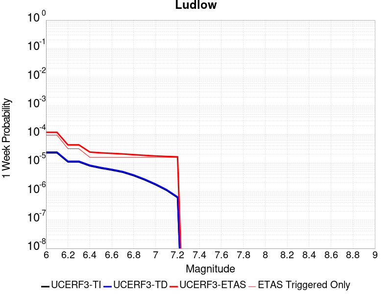 | 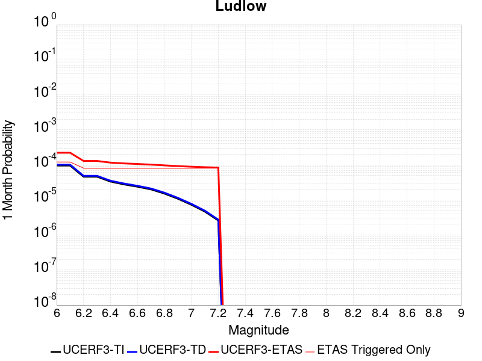 | 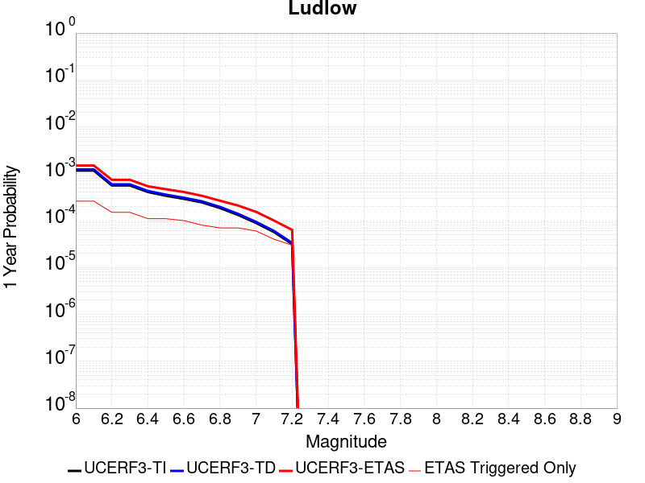 | 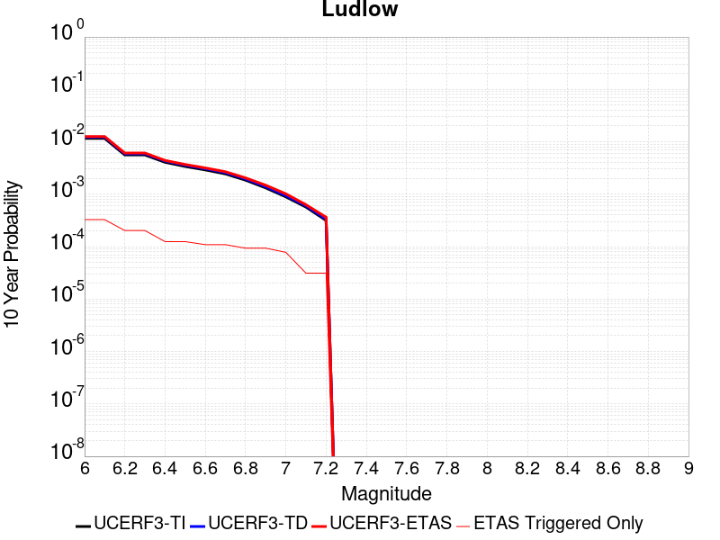 |

| Magnitude | 1 wk TI Prob | 1 wk TD Prob | 1 wk ETAS Prob | 1 wk ETAS/TD Gain | 1 wk ETAS Triggered Only | 1 mo TI Prob | 1 mo TD Prob | 1 mo ETAS Prob | 1 mo ETAS/TD Gain | 1 mo ETAS Triggered Only | 1 yr TI Prob | 1 yr TD Prob | 1 yr ETAS Prob | 1 yr ETAS/TD Gain | 1 yr ETAS Triggered Only | 10 yr TI Prob | 10 yr TD Prob | 10 yr ETAS Prob | 10 yr ETAS/TD Gain | 10 yr ETAS Triggered Only |
|-----|-----|-----|-----|-----|-----|-----|-----|-----|-----|-----|-----|-----|-----|-----|-----|-----|-----|-----|-----|-----|
| 6.0 | 2.2407607E-5 | 2.3657254E-5 | 1.2365489E-4 | 5.2269335 | 1.0E-4 | 9.602906E-5 | 1.0138454E-4 | 2.2137238E-4 | 2.1834924 | 1.2E-4 | 0.0011685267 | 0.001233702 | 0.0014933812 | 1.2104878 | 2.6E-4 | 0.011624013 | 0.012273042 | 0.012668133 | 1.0321918 | 4.0E-4 |
| 6.1 | 2.2407607E-5 | 2.3657254E-5 | 1.2365489E-4 | 5.2269335 | 1.0E-4 | 9.602906E-5 | 1.0138454E-4 | 2.2137238E-4 | 2.1834924 | 1.2E-4 | 0.0011685267 | 0.001233702 | 0.0014933812 | 1.2104878 | 2.6E-4 | 0.011624013 | 0.012273042 | 0.012668133 | 1.0321918 | 4.0E-4 |
| 6.2 | 1.0781252E-5 | 1.1365663E-5 | 4.136532E-5 | 3.6394992 | 3.0E-5 | 4.620455E-5 | 4.8709102E-5 | 9.870667E-5 | 2.0264523 | 5.0E-5 | 5.623952E-4 | 5.9287593E-4 | 7.4278703E-4 | 1.252854 | 1.5E-4 | 0.00560974 | 0.0059133614 | 0.006142001 | 1.0386649 | 2.3E-4 |
| 6.3 | 1.0781252E-5 | 1.1365663E-5 | 4.136532E-5 | 3.6394992 | 3.0E-5 | 4.620455E-5 | 4.8709102E-5 | 9.870667E-5 | 2.0264523 | 5.0E-5 | 5.623952E-4 | 5.9287593E-4 | 7.4278703E-4 | 1.252854 | 1.5E-4 | 0.00560974 | 0.0059133614 | 0.006142001 | 1.0386649 | 2.3E-4 |
| 6.4 | 7.814439E-6 | 8.237729E-6 | 1.8237646E-5 | 2.2139168 | 1.0E-5 | 3.3490025E-5 | 3.530408E-5 | 6.530302E-5 | 1.8497301 | 3.0E-5 | 4.0766477E-4 | 4.2974384E-4 | 5.3969654E-4 | 1.2558564 | 1.1E-4 | 0.0040691774 | 0.0042892746 | 0.004448588 | 1.0371424 | 1.6E-4 |
| 6.5 | 6.4986366E-6 | 6.85092E-6 | 1.685085E-5 | 2.4596481 | 1.0E-5 | 2.7851002E-5 | 2.9360759E-5 | 5.9359878E-5 | 2.0217419 | 3.0E-5 | 3.390332E-4 | 3.5740953E-4 | 4.673702E-4 | 1.3076602 | 1.1E-4 | 0.003385164 | 0.0035684432 | 0.003717908 | 1.0418851 | 1.5E-4 |
| 6.6 | 5.582177E-6 | 5.8860055E-6 | 1.5885948E-5 | 2.698935 | 1.0E-5 | 2.3923398E-5 | 2.5225498E-5 | 5.522474E-5 | 2.1892428 | 3.0E-5 | 2.9122844E-4 | 3.0707786E-4 | 4.0704716E-4 | 1.3255503 | 1.0E-4 | 0.0029084706 | 0.003066609 | 0.0031862408 | 1.0390111 | 1.2E-4 |
| 6.7 | 4.6858763E-6 | 4.940427E-6 | 1.4940378E-5 | 3.0241065 | 1.0E-5 | 2.0082172E-5 | 2.1173091E-5 | 4.117267E-5 | 1.9445752 | 2.0E-5 | 2.4447302E-4 | 2.5775246E-4 | 3.3773182E-4 | 1.3102953 | 8.0E-5 | 0.0024420423 | 0.0025745912 | 0.0026743338 | 1.0387411 | 1.0E-4 |
| 6.8 | 3.5584908E-6 | 3.7520183E-6 | 1.3751981E-5 | 3.6652222 | 1.0E-5 | 1.5250586E-5 | 1.6079981E-5 | 3.607966E-5 | 2.2437625 | 2.0E-5 | 1.8566006E-4 | 1.957566E-4 | 2.6574288E-4 | 1.3575169 | 7.0E-5 | 0.0018550502 | 0.0019558826 | 0.0020457066 | 1.045925 | 9.0E-5 |
| 6.9 | 2.532834E-6 | 2.6710034E-6 | 1.26709765E-5 | 4.7439013 | 1.0E-5 | 1.0854958E-5 | 1.1447109E-5 | 3.144688E-5 | 2.7471461 | 2.0E-5 | 1.3215111E-4 | 1.3935992E-4 | 2.0935017E-4 | 1.5022265 | 7.0E-5 | 0.0013207254 | 0.0013927529 | 0.0014826275 | 1.0645303 | 9.0E-5 |
| 7.0 | 1.7083285E-6 | 1.8019439E-6 | 1.1801926E-5 | 6.5495524 | 1.0E-5 | 7.3213873E-6 | 7.722595E-6 | 2.772244E-5 | 3.5897832 | 2.0E-5 | 8.913424E-5 | 9.40187E-5 | 1.5401306E-4 | 1.6381109 | 6.0E-5 | 8.9098496E-4 | 9.3980576E-4 | 0.0010097399 | 1.0744134 | 7.0E-5 |
| 7.1 | 1.0905424E-6 | 1.1497619E-6 | 1.114975E-5 | 9.697442 | 1.0E-5 | 4.6737446E-6 | 4.9275427E-6 | 2.4927444E-5 | 5.0587983 | 2.0E-5 | 5.6901354E-5 | 5.999128E-5 | 9.998888E-5 | 1.6667236 | 4.0E-5 | 5.6886784E-4 | 5.997606E-4 | 6.3973665E-4 | 1.0666533 | 4.0E-5 |
| 7.2 | 6.06668E-7 | 6.387277E-7 | 1.06387215E-5 | 16.656113 | 1.0E-5 | 2.600003E-6 | 2.7374022E-6 | 2.2737348E-5 | 8.306177 | 2.0E-5 | 3.1654577E-5 | 3.3327433E-5 | 6.3326435E-5 | 1.9001293 | 3.0E-5 | 3.1650066E-4 | 3.3323118E-4 | 3.632212E-4 | 1.0899976 | 3.0E-5 |

## San Jacinto (San Jacinto Valley) rev
*[(top)](#table-of-contents)*

| 1 Week | 1 Month | 1 Year | 10 Year |
|-----|-----|-----|-----|
| 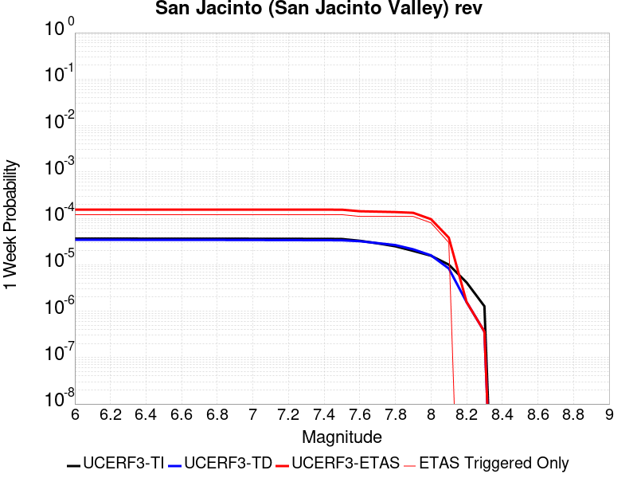 | 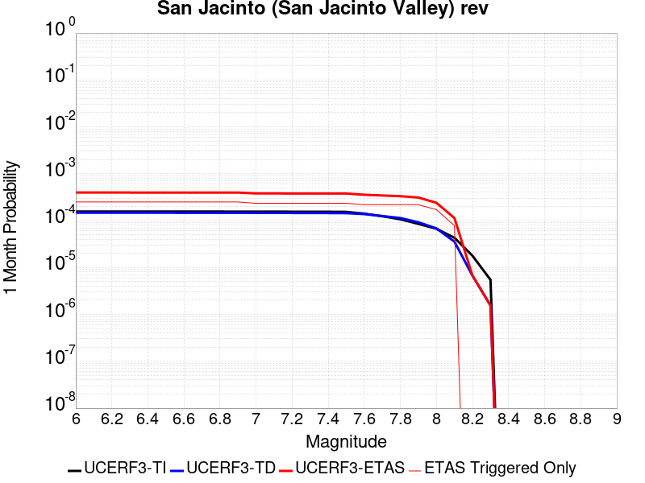 | 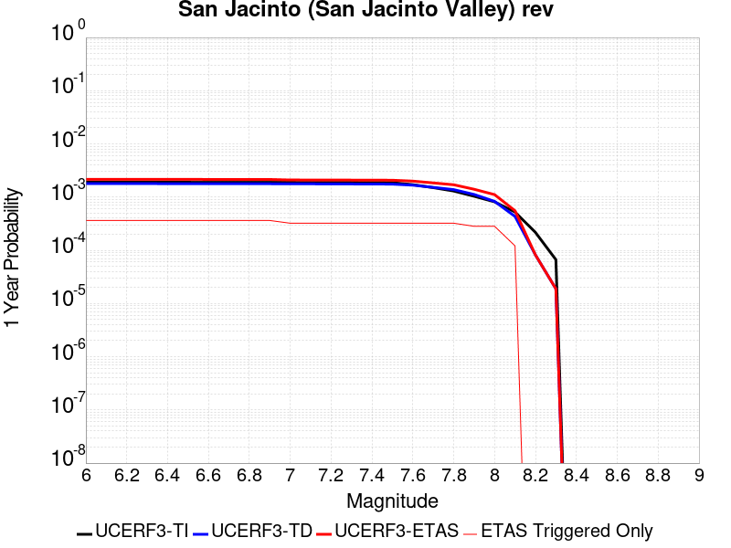 | 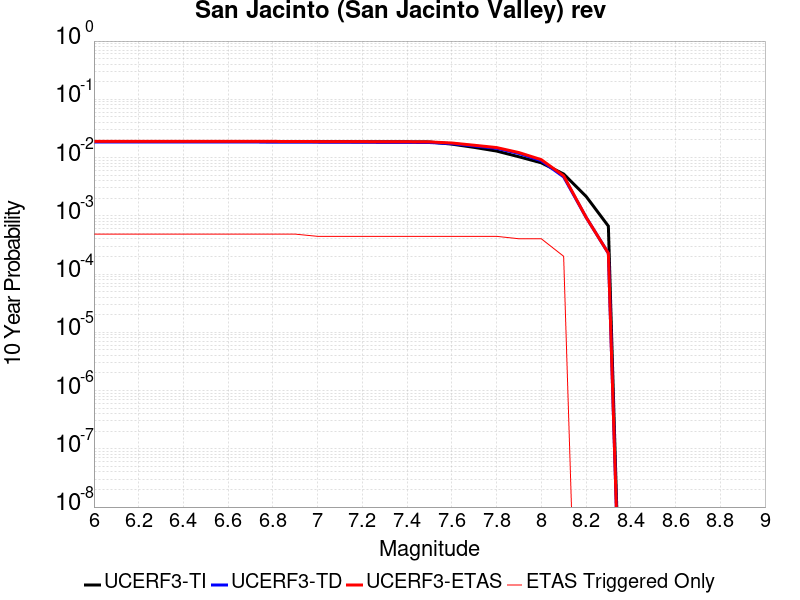 |

| Magnitude | 1 wk TI Prob | 1 wk TD Prob | 1 wk ETAS Prob | 1 wk ETAS/TD Gain | 1 wk ETAS Triggered Only | 1 mo TI Prob | 1 mo TD Prob | 1 mo ETAS Prob | 1 mo ETAS/TD Gain | 1 mo ETAS Triggered Only | 1 yr TI Prob | 1 yr TD Prob | 1 yr ETAS Prob | 1 yr ETAS/TD Gain | 1 yr ETAS Triggered Only | 10 yr TI Prob | 10 yr TD Prob | 10 yr ETAS Prob | 10 yr ETAS/TD Gain | 10 yr ETAS Triggered Only |
|-----|-----|-----|-----|-----|-----|-----|-----|-----|-----|-----|-----|-----|-----|-----|-----|-----|-----|-----|-----|-----|
| 6.0 | 3.652694E-5 | 3.4402394E-5 | 1.5439827E-4 | 4.4880095 | 1.2E-4 | 1.5653463E-4 | 1.474305E-4 | 3.4740102E-4 | 2.3563714 | 2.0E-4 | 0.0019041431 | 0.00179349 | 0.0021228981 | 1.1836689 | 3.3E-4 | 0.018879099 | 0.018526595 | 0.018948628 | 1.0227798 | 4.3E-4 |
| 6.1 | 3.652694E-5 | 3.4402394E-5 | 1.5439827E-4 | 4.4880095 | 1.2E-4 | 1.5653463E-4 | 1.474305E-4 | 3.4740102E-4 | 2.3563714 | 2.0E-4 | 0.0019041431 | 0.00179349 | 0.0021228981 | 1.1836689 | 3.3E-4 | 0.018879099 | 0.018526595 | 0.018948628 | 1.0227798 | 4.3E-4 |
| 6.2 | 3.652694E-5 | 3.4402394E-5 | 1.5439827E-4 | 4.4880095 | 1.2E-4 | 1.5653463E-4 | 1.474305E-4 | 3.4740102E-4 | 2.3563714 | 2.0E-4 | 0.0019041431 | 0.00179349 | 0.0021228981 | 1.1836689 | 3.3E-4 | 0.018879099 | 0.018526595 | 0.018948628 | 1.0227798 | 4.3E-4 |
| 6.3 | 3.652694E-5 | 3.4402394E-5 | 1.5439827E-4 | 4.4880095 | 1.2E-4 | 1.5653463E-4 | 1.474305E-4 | 3.4740102E-4 | 2.3563714 | 2.0E-4 | 0.0019041431 | 0.00179349 | 0.0021228981 | 1.1836689 | 3.3E-4 | 0.018879099 | 0.018526595 | 0.018948628 | 1.0227798 | 4.3E-4 |
| 6.4 | 3.646941E-5 | 3.432397E-5 | 1.5431985E-4 | 4.4959793 | 1.2E-4 | 1.5628811E-4 | 1.4709444E-4 | 3.47065E-4 | 2.3594706 | 2.0E-4 | 0.0019011468 | 0.0017894056 | 0.0021188152 | 1.1840888 | 3.3E-4 | 0.018849645 | 0.018486476 | 0.018908527 | 1.0228302 | 4.3E-4 |
| 6.5 | 3.646941E-5 | 3.432397E-5 | 1.5431985E-4 | 4.4959793 | 1.2E-4 | 1.5628811E-4 | 1.4709444E-4 | 3.47065E-4 | 2.3594706 | 2.0E-4 | 0.0019011468 | 0.0017894056 | 0.0021188152 | 1.1840888 | 3.3E-4 | 0.018849645 | 0.018486476 | 0.018908527 | 1.0228302 | 4.3E-4 |
| 6.6 | 3.6442503E-5 | 3.4287354E-5 | 1.5428325E-4 | 4.4997125 | 1.2E-4 | 1.561728E-4 | 1.4693754E-4 | 3.4690814E-4 | 2.3609226 | 2.0E-4 | 0.0018997455 | 0.0017874985 | 0.0021169086 | 1.1842855 | 3.3E-4 | 0.018835869 | 0.018467745 | 0.018889803 | 1.0228539 | 4.3E-4 |
| 6.7 | 3.6432113E-5 | 3.4272925E-5 | 1.5426881E-4 | 4.501186 | 1.2E-4 | 1.5612828E-4 | 1.4687571E-4 | 3.4684633E-4 | 2.3614955 | 2.0E-4 | 0.0018992044 | 0.0017867472 | 0.0021161577 | 1.1843631 | 3.3E-4 | 0.018830549 | 0.018460369 | 0.018882431 | 1.0228631 | 4.3E-4 |
| 6.8 | 3.6409598E-5 | 3.424198E-5 | 1.5423787E-4 | 4.50435 | 1.2E-4 | 1.560318E-4 | 1.4674311E-4 | 3.4671376E-4 | 2.362726 | 2.0E-4 | 0.0018980318 | 0.0017851355 | 0.0021145463 | 1.1845299 | 3.3E-4 | 0.018819023 | 0.018444523 | 0.018866593 | 1.0228832 | 4.3E-4 |
| 6.9 | 3.638078E-5 | 3.4202407E-5 | 1.5419831E-4 | 4.508405 | 1.2E-4 | 1.5590832E-4 | 1.4657351E-4 | 3.465442E-4 | 2.3643029 | 2.0E-4 | 0.0018965311 | 0.001783074 | 0.0021124857 | 1.1847436 | 3.3E-4 | 0.018804269 | 0.018424258 | 0.018846335 | 1.0229088 | 4.3E-4 |
| 7.0 | 3.6294874E-5 | 3.408442E-5 | 1.5408034E-4 | 4.5205503 | 1.2E-4 | 1.5554018E-4 | 1.4606792E-4 | 3.3604016E-4 | 2.3005748 | 1.9E-4 | 0.0018920569 | 0.001776929 | 0.0020963603 | 1.1797659 | 3.2E-4 | 0.018760284 | 0.018363839 | 0.018776126 | 1.022451 | 4.2E-4 |
| 7.1 | 3.6260717E-5 | 3.4040702E-5 | 1.5403662E-4 | 4.5250716 | 1.2E-4 | 1.5539382E-4 | 1.4588058E-4 | 3.3585288E-4 | 2.3022451 | 1.9E-4 | 0.001890278 | 0.0017746518 | 0.002094084 | 1.1799971 | 3.2E-4 | 0.018742796 | 0.018341439 | 0.018753735 | 1.0224789 | 4.2E-4 |
| 7.2 | 3.6210204E-5 | 3.397492E-5 | 1.5397085E-4 | 4.531897 | 1.2E-4 | 1.5517735E-4 | 1.455987E-4 | 3.3557104E-4 | 2.3047667 | 1.9E-4 | 0.001887647 | 0.0017712255 | 0.0020906588 | 1.1803459 | 3.2E-4 | 0.01871693 | 0.01830772 | 0.01872003 | 1.0225211 | 4.2E-4 |
| 7.3 | 3.6119454E-5 | 3.386321E-5 | 1.5385915E-4 | 4.543549 | 1.2E-4 | 1.5478847E-4 | 1.4511998E-4 | 3.350924E-4 | 2.3090715 | 1.9E-4 | 0.0018829206 | 0.0017654065 | 0.0020848415 | 1.1809413 | 3.2E-4 | 0.018670462 | 0.018250274 | 0.018662607 | 1.0225934 | 4.2E-4 |
| 7.4 | 3.607848E-5 | 3.381071E-5 | 1.5380666E-4 | 4.5490513 | 1.2E-4 | 1.5461289E-4 | 1.44895E-4 | 3.3486748E-4 | 2.3111043 | 1.9E-4 | 0.0018807866 | 0.0017626719 | 0.0020821078 | 1.1812226 | 3.2E-4 | 0.018649481 | 0.018223269 | 0.018635614 | 1.0226275 | 4.2E-4 |
| 7.5 | 3.5856774E-5 | 3.3620483E-5 | 1.5361645E-4 | 4.569133 | 1.2E-4 | 1.5366284E-4 | 1.4407984E-4 | 3.3405246E-4 | 2.3185234 | 1.9E-4 | 0.0018692396 | 0.0017527633 | 0.0020722023 | 1.1822488 | 3.2E-4 | 0.018535944 | 0.018124366 | 0.018536754 | 1.0227532 | 4.2E-4 |
| 7.6 | 3.286655E-5 | 3.2143445E-5 | 1.421399E-4 | 4.4220495 | 1.1E-4 | 1.4084904E-4 | 1.3775036E-4 | 3.1772556E-4 | 2.3065317 | 1.8E-4 | 0.001713488 | 0.0016758227 | 0.0019853031 | 1.1846738 | 3.1E-4 | 0.017003361 | 0.017344031 | 0.01774692 | 1.0232292 | 4.1E-4 |
| 7.7 | 2.8882527E-5 | 2.9236293E-5 | 1.3923307E-4 | 4.7623367 | 1.1E-4 | 1.237764E-4 | 1.2529238E-4 | 3.0526984E-4 | 2.4364595 | 1.8E-4 | 0.0015059357 | 0.0015243685 | 0.0018338959 | 1.2030529 | 3.1E-4 | 0.014957713 | 0.015830461 | 0.01623397 | 1.0254894 | 4.1E-4 |
| 7.8 | 2.4950225E-5 | 2.6527203E-5 | 1.3652428E-4 | 5.146577 | 1.1E-4 | 1.0692515E-4 | 1.1368306E-4 | 2.936626E-4 | 2.5831692 | 1.8E-4 | 0.0013010362 | 0.0013832134 | 0.0016927846 | 1.2238058 | 3.1E-4 | 0.012934455 | 0.014411755 | 0.0148158455 | 1.028039 | 4.1E-4 |
| 7.9 | 1.9881603E-5 | 2.1507445E-5 | 1.3150508E-4 | 6.114398 | 1.1E-4 | 8.520408E-5 | 9.217151E-5 | 2.7215492E-4 | 2.952701 | 1.8E-4 | 0.001036866 | 0.0011216112 | 0.0013913084 | 1.2404552 | 2.7E-4 | 0.010320415 | 0.011777027 | 0.012142669 | 1.0310471 | 3.7E-4 |
| 8.0 | 1.563292E-5 | 1.5937347E-5 | 9.593607E-5 | 6.0195765 | 8.0E-5 | 6.6996516E-5 | 6.8301124E-5 | 2.1829088E-4 | 3.196007 | 1.5E-4 | 8.153773E-4 | 8.3124964E-4 | 0.0010710502 | 1.288482 | 2.4E-4 | 0.00812392 | 0.008810506 | 0.009137599 | 1.0371252 | 3.3E-4 |
| 8.1 | 1.0045313E-5 | 8.301802E-6 | 3.8301554E-5 | 4.613643 | 3.0E-5 | 4.305063E-5 | 3.5578672E-5 | 8.5576896E-5 | 2.4052863 | 5.0E-5 | 5.2401534E-4 | 4.3308473E-4 | 5.230458E-4 | 1.2077215 | 9.0E-5 | 0.0052278144 | 0.0046591135 | 0.004788508 | 1.0277723 | 1.3E-4 |
| 8.2 | 4.1554413E-6 | 1.5655598E-6 | 1.5655598E-6 | 1.0 | 0.0 | 1.7808914E-5 | 6.709525E-6 | 6.709525E-6 | 1.0 | 0.0 | 2.1680194E-4 | 8.168544E-5 | 8.168544E-5 | 1.0 | 0.0 | 0.0021659054 | 9.482903E-4 | 9.482903E-4 | 1.0 | 0.0 |
| 8.3 | 1.2758221E-6 | 3.6149942E-7 | 3.6149942E-7 | 1.0 | 0.0 | 5.4677976E-6 | 1.5492824E-6 | 1.5492824E-6 | 1.0 | 0.0 | 6.65684E-5 | 1.8862354E-5 | 1.8862354E-5 | 1.0 | 0.0 | 6.6548464E-4 | 2.2751294E-4 | 2.2751294E-4 | 1.0 | 0.0 |

## San Jacinto (Stepovers Combined)
*[(top)](#table-of-contents)*

| 1 Week | 1 Month | 1 Year | 10 Year |
|-----|-----|-----|-----|
| 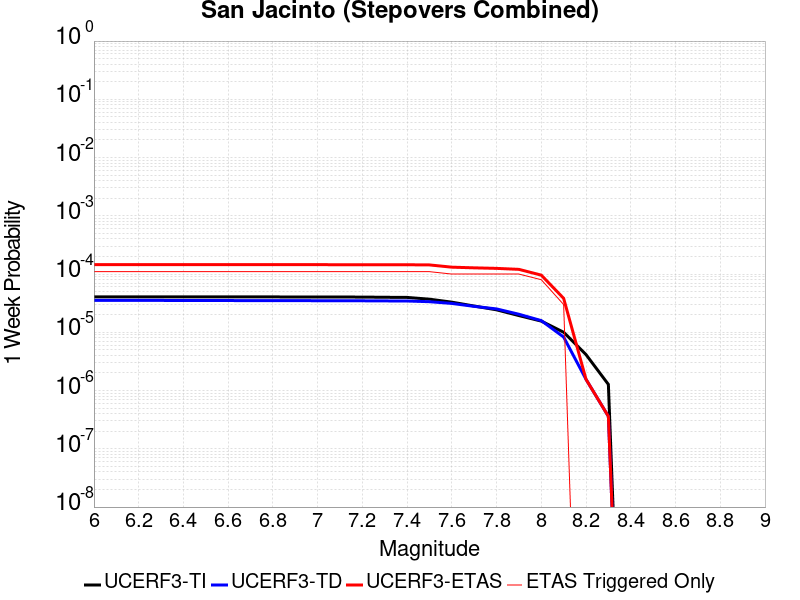 | 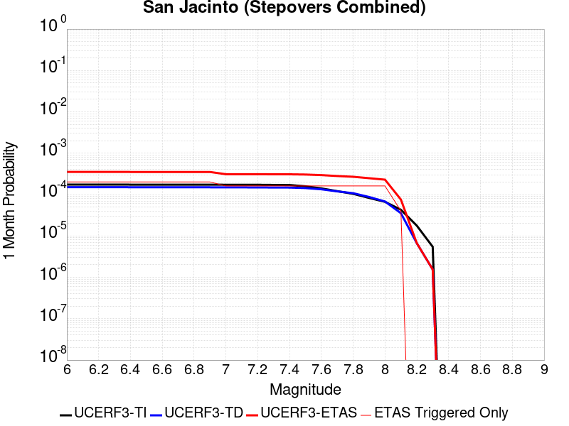 | 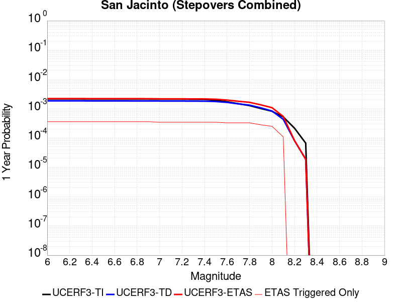 | 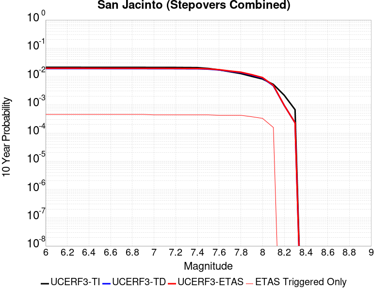 |

| Magnitude | 1 wk TI Prob | 1 wk TD Prob | 1 wk ETAS Prob | 1 wk ETAS/TD Gain | 1 wk ETAS Triggered Only | 1 mo TI Prob | 1 mo TD Prob | 1 mo ETAS Prob | 1 mo ETAS/TD Gain | 1 mo ETAS Triggered Only | 1 yr TI Prob | 1 yr TD Prob | 1 yr ETAS Prob | 1 yr ETAS/TD Gain | 1 yr ETAS Triggered Only | 10 yr TI Prob | 10 yr TD Prob | 10 yr ETAS Prob | 10 yr ETAS/TD Gain | 10 yr ETAS Triggered Only |
|-----|-----|-----|-----|-----|-----|-----|-----|-----|-----|-----|-----|-----|-----|-----|-----|-----|-----|-----|-----|-----|
| 6.0 | 4.0667746E-5 | 3.5272755E-5 | 1.4526887E-4 | 4.118444 | 1.1E-4 | 1.742787E-4 | 1.5116022E-4 | 3.411315E-4 | 2.2567546 | 1.9E-4 | 0.0021197782 | 0.0018388226 | 0.0021582341 | 1.1737044 | 3.2E-4 | 0.020996714 | 0.018986892 | 0.019398917 | 1.0217005 | 4.2E-4 |
| 6.1 | 4.0667746E-5 | 3.5272755E-5 | 1.4526887E-4 | 4.118444 | 1.1E-4 | 1.742787E-4 | 1.5116022E-4 | 3.411315E-4 | 2.2567546 | 1.9E-4 | 0.0021197782 | 0.0018388226 | 0.0021582341 | 1.1737044 | 3.2E-4 | 0.020996714 | 0.018986892 | 0.019398917 | 1.0217005 | 4.2E-4 |
| 6.2 | 4.0667746E-5 | 3.5272755E-5 | 1.4526887E-4 | 4.118444 | 1.1E-4 | 1.742787E-4 | 1.5116022E-4 | 3.411315E-4 | 2.2567546 | 1.9E-4 | 0.0021197782 | 0.0018388226 | 0.0021582341 | 1.1737044 | 3.2E-4 | 0.020996714 | 0.018986892 | 0.019398917 | 1.0217005 | 4.2E-4 |
| 6.3 | 4.0667746E-5 | 3.5272755E-5 | 1.4526887E-4 | 4.118444 | 1.1E-4 | 1.742787E-4 | 1.5116022E-4 | 3.411315E-4 | 2.2567546 | 1.9E-4 | 0.0021197782 | 0.0018388226 | 0.0021582341 | 1.1737044 | 3.2E-4 | 0.020996714 | 0.018986892 | 0.019398917 | 1.0217005 | 4.2E-4 |
| 6.4 | 4.0577226E-5 | 3.5144654E-5 | 1.4514079E-4 | 4.1298113 | 1.1E-4 | 1.738908E-4 | 1.5061127E-4 | 3.4058266E-4 | 2.2613358 | 1.9E-4 | 0.0021150648 | 0.0018321523 | 0.002151566 | 1.174338 | 3.2E-4 | 0.020950472 | 0.018921461 | 0.019333513 | 1.021777 | 4.2E-4 |
| 6.5 | 4.0577226E-5 | 3.5144654E-5 | 1.4514079E-4 | 4.1298113 | 1.1E-4 | 1.738908E-4 | 1.5061127E-4 | 3.4058266E-4 | 2.2613358 | 1.9E-4 | 0.0021150648 | 0.0018321523 | 0.002151566 | 1.174338 | 3.2E-4 | 0.020950472 | 0.018921461 | 0.019333513 | 1.021777 | 4.2E-4 |
| 6.6 | 4.053861E-5 | 3.509E-5 | 1.4508615E-4 | 4.134686 | 1.1E-4 | 1.7372532E-4 | 1.5037706E-4 | 3.403485E-4 | 2.2633004 | 1.9E-4 | 0.0021130538 | 0.0018293057 | 0.0021487202 | 1.1746098 | 3.2E-4 | 0.020930743 | 0.018893538 | 0.019305604 | 1.0218098 | 4.2E-4 |
| 6.7 | 4.0516545E-5 | 3.5059067E-5 | 1.4505521E-4 | 4.137452 | 1.1E-4 | 1.7363077E-4 | 1.5024451E-4 | 3.4021598E-4 | 2.2644153 | 1.9E-4 | 0.002111905 | 0.001827695 | 0.0021471102 | 1.1747639 | 3.2E-4 | 0.020919468 | 0.018877735 | 0.019289806 | 1.0218284 | 4.2E-4 |
| 6.8 | 4.049434E-5 | 3.5030633E-5 | 1.4502677E-4 | 4.139999 | 1.1E-4 | 1.7353562E-4 | 1.5012265E-4 | 3.4009412E-4 | 2.265442 | 1.9E-4 | 0.0021107488 | 0.0018262138 | 0.0021456294 | 1.1749059 | 3.2E-4 | 0.020908125 | 0.018863149 | 0.019275226 | 1.0218456 | 4.2E-4 |
| 6.9 | 4.046386E-5 | 3.499319E-5 | 1.4498935E-4 | 4.1433587 | 1.1E-4 | 1.73405E-4 | 1.4996222E-4 | 3.3993373E-4 | 2.2667959 | 1.9E-4 | 0.0021091616 | 0.0018242638 | 0.0021436801 | 1.1750932 | 3.2E-4 | 0.020892553 | 0.01884392 | 0.019256007 | 1.0218683 | 4.2E-4 |
| 7.0 | 4.036382E-5 | 3.487376E-5 | 1.4486992E-4 | 4.1541243 | 1.1E-4 | 1.7297632E-4 | 1.4945042E-4 | 3.2942352E-4 | 2.204233 | 1.8E-4 | 0.0021039525 | 0.0018180435 | 0.00212748 | 1.170203 | 3.1E-4 | 0.02084144 | 0.018782536 | 0.019184835 | 1.0214188 | 4.1E-4 |
| 7.1 | 4.0343282E-5 | 3.4852223E-5 | 1.4484838E-4 | 4.1560736 | 1.1E-4 | 1.7288832E-4 | 1.4935812E-4 | 3.2933123E-4 | 2.204977 | 1.8E-4 | 0.002102883 | 0.0018169218 | 0.0021263584 | 1.1703082 | 3.1E-4 | 0.020830948 | 0.018771412 | 0.019173717 | 1.0214317 | 4.1E-4 |
| 7.2 | 4.0257353E-5 | 3.4756722E-5 | 1.4475289E-4 | 4.1647453 | 1.1E-4 | 1.725201E-4 | 1.489489E-4 | 3.289221E-4 | 2.2082882 | 1.8E-4 | 0.0020984085 | 0.0018119477 | 0.002121386 | 1.1707766 | 3.1E-4 | 0.020787042 | 0.018722152 | 0.019124476 | 1.0214891 | 4.1E-4 |
| 7.3 | 3.9940667E-5 | 3.4584376E-5 | 1.4458057E-4 | 4.1805167 | 1.1E-4 | 1.7116306E-4 | 1.4821035E-4 | 3.2818367E-4 | 2.21431 | 1.8E-4 | 0.0020819185 | 0.0018029709 | 0.002112412 | 1.1716285 | 3.1E-4 | 0.020625217 | 0.018630784 | 0.019033145 | 1.0215966 | 4.1E-4 |
| 7.4 | 3.9721202E-5 | 3.4469766E-5 | 1.4446597E-4 | 4.1910925 | 1.1E-4 | 1.7022261E-4 | 1.4771923E-4 | 3.2769263E-4 | 2.218348 | 1.8E-4 | 0.0020704903 | 0.0017970012 | 0.0021064442 | 1.1721996 | 3.1E-4 | 0.020513052 | 0.018569905 | 0.018972293 | 1.0216688 | 4.1E-4 |
| 7.5 | 3.7036873E-5 | 3.3537188E-5 | 1.435335E-4 | 4.2798314 | 1.1E-4 | 1.5871979E-4 | 1.437229E-4 | 3.2369702E-4 | 2.2522302 | 1.8E-4 | 0.0019307006 | 0.0017484248 | 0.0020578827 | 1.1769924 | 3.1E-4 | 0.019140124 | 0.018071463 | 0.018474055 | 1.0222777 | 4.1E-4 |
| 7.6 | 3.2940967E-5 | 3.1317984E-5 | 1.3131485E-4 | 4.1929536 | 1.0E-4 | 1.4116794E-4 | 1.3421304E-4 | 3.0419024E-4 | 2.2664728 | 1.7E-4 | 0.0017173645 | 0.0016328214 | 0.0019323315 | 1.183431 | 3.0E-4 | 0.01704153 | 0.016904354 | 0.017297592 | 1.0232625 | 4.0E-4 |
| 7.7 | 2.8236149E-5 | 2.7883889E-5 | 1.278811E-4 | 4.5862 | 1.0E-4 | 1.2100645E-4 | 1.19496915E-4 | 2.894766E-4 | 2.4224608 | 1.7E-4 | 0.0014722579 | 0.001453905 | 0.0017534689 | 1.2060409 | 3.0E-4 | 0.014625421 | 0.015115095 | 0.015509049 | 1.0260636 | 4.0E-4 |
| 7.8 | 2.4329287E-5 | 2.5207537E-5 | 1.2520501E-4 | 4.9669676 | 1.0E-4 | 1.042642E-4 | 1.0802783E-4 | 2.7800948E-4 | 2.5734985 | 1.7E-4 | 0.0012686774 | 0.0013144462 | 0.0016140519 | 1.227933 | 3.0E-4 | 0.012614589 | 0.013712396 | 0.014106911 | 1.0287707 | 4.0E-4 |
| 7.9 | 1.9370926E-5 | 2.0421452E-5 | 1.2041941E-4 | 5.8967113 | 1.0E-4 | 8.301561E-5 | 8.7517576E-5 | 2.575027E-4 | 2.942297 | 1.7E-4 | 0.0010102465 | 0.0010650064 | 0.0013247295 | 1.24387 | 2.6E-4 | 0.0100566605 | 0.011199483 | 0.01155545 | 1.0317843 | 3.6E-4 |
| 8.0 | 1.5583017E-5 | 1.588647E-5 | 9.5885196E-5 | 6.035652 | 8.0E-5 | 6.6782646E-5 | 6.808309E-5 | 2.1807288E-4 | 3.2030401 | 1.5E-4 | 8.127754E-4 | 8.285971E-4 | 0.0010683982 | 1.2894062 | 2.4E-4 | 0.008098091 | 0.008781809 | 0.009108911 | 1.0372477 | 3.3E-4 |
| 8.1 | 1.0024873E-5 | 8.292404E-6 | 3.8292157E-5 | 4.6177387 | 3.0E-5 | 4.2963035E-5 | 3.5538393E-5 | 8.5536616E-5 | 2.4068792 | 5.0E-5 | 5.229494E-4 | 4.3259456E-4 | 5.225556E-4 | 1.207957 | 9.0E-5 | 0.0052172043 | 0.0046534105 | 0.0047828057 | 1.0278065 | 1.3E-4 |
| 8.2 | 4.142796E-6 | 1.5610041E-6 | 1.5610041E-6 | 1.0 | 0.0 | 1.775472E-5 | 6.69E-6 | 6.69E-6 | 1.0 | 0.0 | 2.1614227E-4 | 8.144774E-5 | 8.144774E-5 | 1.0 | 0.0 | 0.0021593217 | 9.454649E-4 | 9.454649E-4 | 1.0 | 0.0 |
| 8.3 | 1.2750878E-6 | 3.612133E-7 | 3.612133E-7 | 1.0 | 0.0 | 5.4646503E-6 | 1.548056E-6 | 1.548056E-6 | 1.0 | 0.0 | 6.653009E-5 | 1.8847424E-5 | 1.8847424E-5 | 1.0 | 0.0 | 6.6510175E-4 | 2.2734253E-4 | 2.2734253E-4 | 1.0 | 0.0 |

## Santa Ynez (East)
*[(top)](#table-of-contents)*

| 1 Week | 1 Month | 1 Year | 10 Year |
|-----|-----|-----|-----|
| 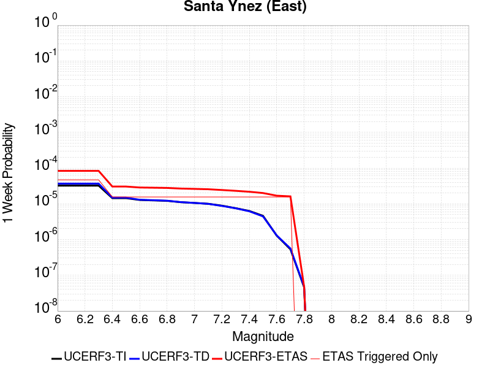 | 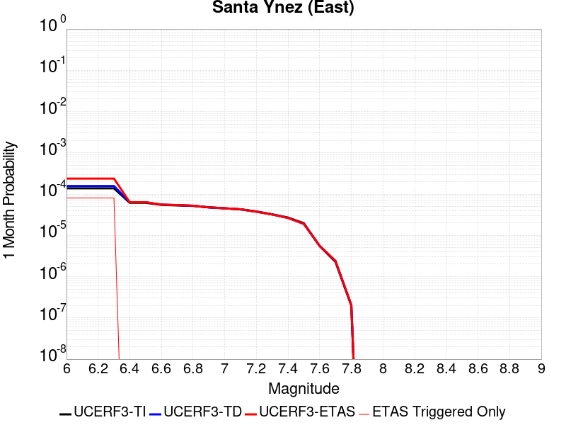 | 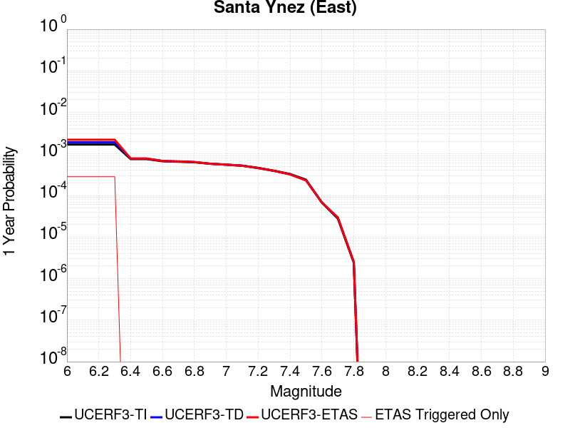 | 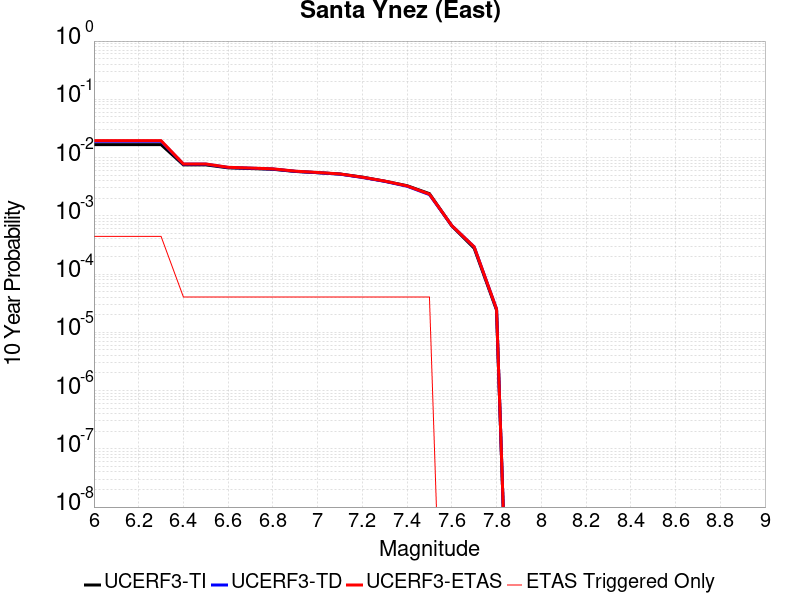 |

| Magnitude | 1 wk TI Prob | 1 wk TD Prob | 1 wk ETAS Prob | 1 wk ETAS/TD Gain | 1 wk ETAS Triggered Only | 1 mo TI Prob | 1 mo TD Prob | 1 mo ETAS Prob | 1 mo ETAS/TD Gain | 1 mo ETAS Triggered Only | 1 yr TI Prob | 1 yr TD Prob | 1 yr ETAS Prob | 1 yr ETAS/TD Gain | 1 yr ETAS Triggered Only | 10 yr TI Prob | 10 yr TD Prob | 10 yr ETAS Prob | 10 yr ETAS/TD Gain | 10 yr ETAS Triggered Only |
|-----|-----|-----|-----|-----|-----|-----|-----|-----|-----|-----|-----|-----|-----|-----|-----|-----|-----|-----|-----|-----|
| 6.0 | 3.2269712E-5 | 3.67505E-5 | 9.67483E-5 | 2.6325707 | 6.0E-5 | 1.3829143E-4 | 1.5749598E-4 | 2.3748337E-4 | 1.5078695 | 8.0E-5 | 0.0016823979 | 0.0019164166 | 0.002135995 | 1.1145775 | 2.2E-4 | 0.016697178 | 0.019056441 | 0.01941939 | 1.019046 | 3.7E-4 |
| 6.1 | 3.2269712E-5 | 3.67505E-5 | 9.67483E-5 | 2.6325707 | 6.0E-5 | 1.3829143E-4 | 1.5749598E-4 | 2.3748337E-4 | 1.5078695 | 8.0E-5 | 0.0016823979 | 0.0019164166 | 0.002135995 | 1.1145775 | 2.2E-4 | 0.016697178 | 0.019056441 | 0.01941939 | 1.019046 | 3.7E-4 |
| 6.2 | 3.2269712E-5 | 3.67505E-5 | 9.67483E-5 | 2.6325707 | 6.0E-5 | 1.3829143E-4 | 1.5749598E-4 | 2.3748337E-4 | 1.5078695 | 8.0E-5 | 0.0016823979 | 0.0019164166 | 0.002135995 | 1.1145775 | 2.2E-4 | 0.016697178 | 0.019056441 | 0.01941939 | 1.019046 | 3.7E-4 |
| 6.3 | 3.2269712E-5 | 3.67505E-5 | 9.67483E-5 | 2.6325707 | 6.0E-5 | 1.3829143E-4 | 1.5749598E-4 | 2.3748337E-4 | 1.5078695 | 8.0E-5 | 0.0016823979 | 0.0019164166 | 0.002135995 | 1.1145775 | 2.2E-4 | 0.016697178 | 0.019056441 | 0.01941939 | 1.019046 | 3.7E-4 |
| 6.4 | 1.4404779E-5 | 1.4849382E-5 | 4.4848937E-5 | 3.020256 | 3.0E-5 | 6.1733306E-5 | 6.363868E-5 | 9.363678E-5 | 1.4713814 | 3.0E-5 | 7.513438E-4 | 7.745306E-4 | 8.644609E-4 | 1.1161094 | 9.0E-5 | 0.0074880854 | 0.007718862 | 0.007847859 | 1.0167118 | 1.3E-4 |
| 6.5 | 1.4404779E-5 | 1.4849382E-5 | 4.4848937E-5 | 3.020256 | 3.0E-5 | 6.1733306E-5 | 6.363868E-5 | 9.363678E-5 | 1.4713814 | 3.0E-5 | 7.513438E-4 | 7.745306E-4 | 8.644609E-4 | 1.1161094 | 9.0E-5 | 0.0074880854 | 0.007718862 | 0.007847859 | 1.0167118 | 1.3E-4 |
| 6.6 | 1.280208E-5 | 1.3011947E-5 | 4.3011558E-5 | 3.3055434 | 3.0E-5 | 5.4864904E-5 | 5.5764307E-5 | 8.576263E-5 | 1.5379485 | 3.0E-5 | 6.6777546E-4 | 6.787207E-4 | 7.586664E-4 | 1.1177888 | 8.0E-5 | 0.006657724 | 0.0067666885 | 0.0068858764 | 1.0176139 | 1.2E-4 |
| 6.7 | 1.2457027E-5 | 1.2628468E-5 | 4.262809E-5 | 3.375555 | 3.0E-5 | 5.3386164E-5 | 5.412089E-5 | 8.411927E-5 | 1.5542846 | 3.0E-5 | 6.497827E-4 | 6.587243E-4 | 7.286782E-4 | 1.106196 | 7.0E-5 | 0.00647886 | 0.006567915 | 0.0066871266 | 1.0181507 | 1.2E-4 |
| 6.8 | 1.2095134E-5 | 1.2230915E-5 | 4.223055E-5 | 3.4527712 | 3.0E-5 | 5.1835254E-5 | 5.241716E-5 | 8.241559E-5 | 1.5723016 | 3.0E-5 | 6.309115E-4 | 6.379937E-4 | 7.07949E-4 | 1.109649 | 7.0E-5 | 0.0062912325 | 0.006361809 | 0.0064810454 | 1.0187426 | 1.2E-4 |
| 6.9 | 1.1104036E-5 | 1.1157347E-5 | 4.115701E-5 | 3.6887813 | 3.0E-5 | 4.758786E-5 | 4.781633E-5 | 7.78149E-5 | 1.6273707 | 3.0E-5 | 5.7922816E-4 | 5.820096E-4 | 6.419747E-4 | 1.103031 | 6.0E-5 | 0.005777207 | 0.0058049993 | 0.0059143608 | 1.0188392 | 1.1E-4 |
| 7.0 | 1.0577444E-5 | 1.058168E-5 | 4.0581363E-5 | 3.8350585 | 3.0E-5 | 4.5331115E-5 | 4.5349276E-5 | 7.534792E-5 | 1.661502 | 3.0E-5 | 5.5176654E-4 | 5.519888E-4 | 6.1195565E-4 | 1.1086378 | 6.0E-5 | 0.0055039856 | 0.0055063153 | 0.00561571 | 1.0198671 | 1.1E-4 |
| 7.1 | 1.0021775E-5 | 9.980988E-6 | 3.998069E-5 | 4.005685 | 3.0E-5 | 4.294976E-5 | 4.2774966E-5 | 7.2773684E-5 | 1.7013148 | 3.0E-5 | 5.2278786E-4 | 5.2066194E-4 | 5.8063073E-4 | 1.1151779 | 6.0E-5 | 0.0052155964 | 0.0051945536 | 0.005303982 | 1.0210661 | 1.1E-4 |
| 7.2 | 8.874109E-6 | 8.748793E-6 | 2.8748618E-5 | 3.2860096 | 2.0E-5 | 3.8031343E-5 | 3.7494297E-5 | 5.7493548E-5 | 1.5333945 | 2.0E-5 | 4.629332E-4 | 4.5639853E-4 | 5.0637574E-4 | 1.1095034 | 5.0E-5 | 0.0046197 | 0.0045547304 | 0.004654275 | 1.0218552 | 1.0E-4 |
| 7.3 | 7.5504267E-6 | 7.5051175E-6 | 2.7504968E-5 | 3.6648283 | 2.0E-5 | 3.235857E-5 | 3.21644E-5 | 5.2163756E-5 | 1.6217855 | 2.0E-5 | 3.9389438E-4 | 3.915322E-4 | 4.4151265E-4 | 1.1276534 | 5.0E-5 | 0.0039319694 | 0.003908531 | 0.0039882185 | 1.020388 | 8.0E-5 |
| 7.4 | 6.309394E-6 | 6.1831556E-6 | 1.6183094E-5 | 2.6172872 | 1.0E-5 | 2.703998E-5 | 2.6498974E-5 | 3.649871E-5 | 1.3773631 | 1.0E-5 | 3.2916202E-4 | 3.225782E-4 | 3.625653E-4 | 1.123961 | 4.0E-5 | 0.003286749 | 0.003221197 | 0.0032810038 | 1.0185666 | 6.0E-5 |
| 7.5 | 4.6103073E-6 | 4.4408903E-6 | 1.4440846E-5 | 3.2517908 | 1.0E-5 | 1.975831E-5 | 1.9032252E-5 | 2.9032062E-5 | 1.5254139 | 1.0E-5 | 2.4053088E-4 | 2.3169373E-4 | 2.6168677E-4 | 1.1294513 | 3.0E-5 | 0.002402707 | 0.002314591 | 0.0023644755 | 1.0215521 | 5.0E-5 |
| 7.6 | 1.2858658E-6 | 1.3008173E-6 | 1.13008045E-5 | 8.687465 | 1.0E-5 | 5.5108417E-6 | 5.5749197E-6 | 1.5574864E-5 | 2.793738 | 1.0E-5 | 6.7092435E-5 | 6.78726E-5 | 8.7871245E-5 | 1.2946497 | 2.0E-5 | 6.707218E-4 | 6.785256E-4 | 7.085053E-4 | 1.0441835 | 3.0E-5 |
| 7.7 | 5.3302307E-7 | 5.612138E-7 | 1.0561208E-5 | 18.81851 | 1.0E-5 | 2.2843826E-6 | 2.4052001E-6 | 1.2405176E-5 | 5.157648 | 1.0E-5 | 2.7812002E-5 | 2.9282954E-5 | 3.9282662E-5 | 1.3414856 | 1.0E-5 | 2.7808524E-4 | 2.9279452E-4 | 3.1278867E-4 | 1.0682873 | 2.0E-5 |
| 7.8 | 4.613933E-8 | 4.80301E-8 | 4.80301E-8 | 1.0 | 0.0 | 1.9773998E-7 | 2.0584326E-7 | 2.0584326E-7 | 1.0 | 0.0 | 2.4074816E-6 | 2.5061388E-6 | 2.5061388E-6 | 1.0 | 0.0 | 2.4074554E-5 | 2.5061116E-5 | 2.5061116E-5 | 1.0 | 0.0 |

## Manix-Afton Hills
*[(top)](#table-of-contents)*

| 1 Week | 1 Month | 1 Year | 10 Year |
|-----|-----|-----|-----|
| 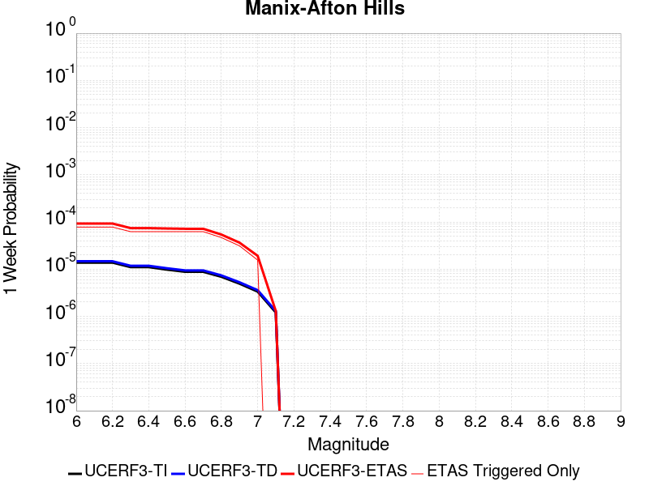 | 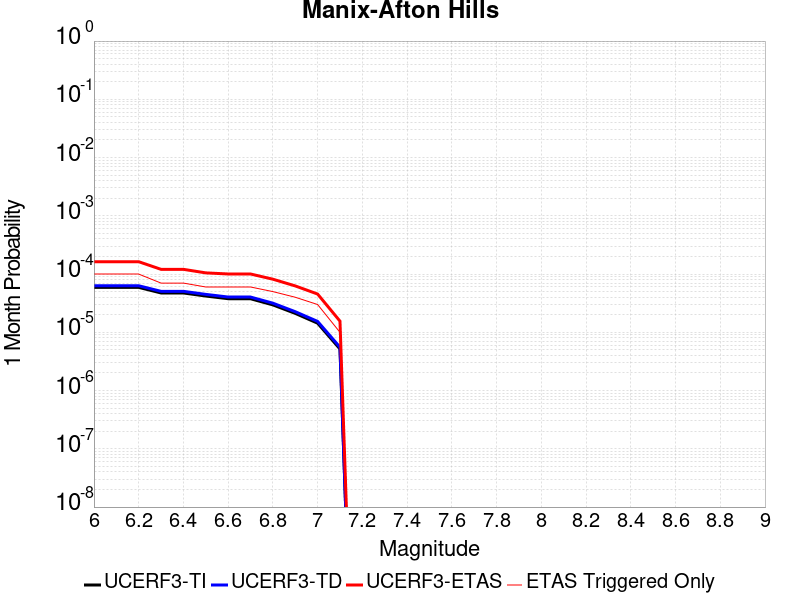 | 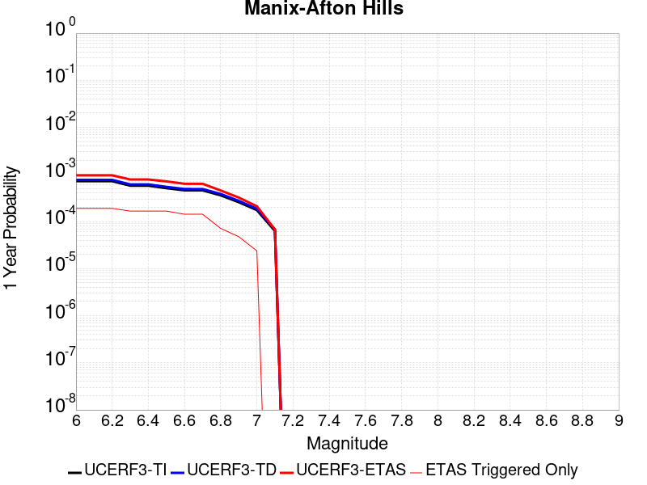 | 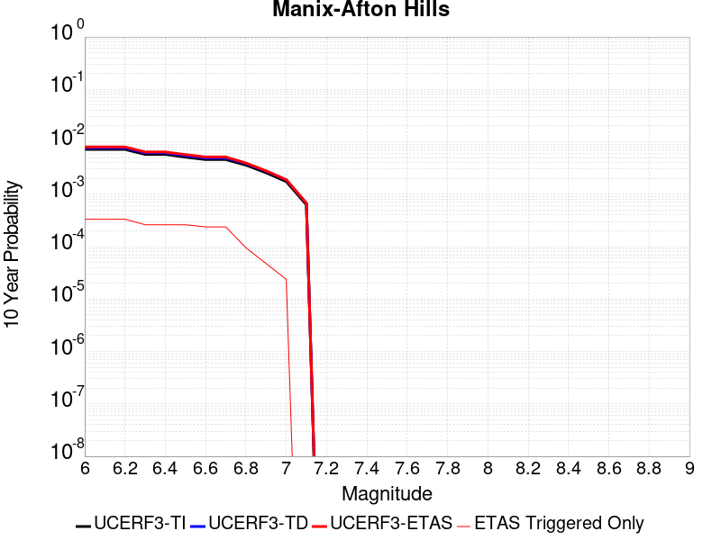 |

| Magnitude | 1 wk TI Prob | 1 wk TD Prob | 1 wk ETAS Prob | 1 wk ETAS/TD Gain | 1 wk ETAS Triggered Only | 1 mo TI Prob | 1 mo TD Prob | 1 mo ETAS Prob | 1 mo ETAS/TD Gain | 1 mo ETAS Triggered Only | 1 yr TI Prob | 1 yr TD Prob | 1 yr ETAS Prob | 1 yr ETAS/TD Gain | 1 yr ETAS Triggered Only | 10 yr TI Prob | 10 yr TD Prob | 10 yr ETAS Prob | 10 yr ETAS/TD Gain | 10 yr ETAS Triggered Only |
|-----|-----|-----|-----|-----|-----|-----|-----|-----|-----|-----|-----|-----|-----|-----|-----|-----|-----|-----|-----|-----|
| 6.0 | 1.3783202E-5 | 1.47110895E-5 | 8.471006E-5 | 5.758245 | 7.0E-5 | 5.906953E-5 | 6.30461E-5 | 1.630398E-4 | 2.586041 | 1.0E-4 | 7.189342E-4 | 7.6733343E-4 | 9.571877E-4 | 1.2474208 | 1.9E-4 | 0.0071661277 | 0.007648596 | 0.008005843 | 1.0467075 | 3.6E-4 |
| 6.1 | 1.3783202E-5 | 1.47110895E-5 | 8.471006E-5 | 5.758245 | 7.0E-5 | 5.906953E-5 | 6.30461E-5 | 1.630398E-4 | 2.586041 | 1.0E-4 | 7.189342E-4 | 7.6733343E-4 | 9.571877E-4 | 1.2474208 | 1.9E-4 | 0.0071661277 | 0.007648596 | 0.008005843 | 1.0467075 | 3.6E-4 |
| 6.2 | 1.3783202E-5 | 1.47110895E-5 | 8.471006E-5 | 5.758245 | 7.0E-5 | 5.906953E-5 | 6.30461E-5 | 1.630398E-4 | 2.586041 | 1.0E-4 | 7.189342E-4 | 7.6733343E-4 | 9.571877E-4 | 1.2474208 | 1.9E-4 | 0.0071661277 | 0.007648596 | 0.008005843 | 1.0467075 | 3.6E-4 |
| 6.3 | 1.10494875E-5 | 1.1793136E-5 | 7.179243E-5 | 6.0876455 | 6.0E-5 | 4.7354086E-5 | 5.054109E-5 | 1.2053755E-4 | 2.3849418 | 7.0E-5 | 5.763835E-4 | 6.151744E-4 | 7.550883E-4 | 1.2274377 | 1.4E-4 | 0.005748908 | 0.0061357557 | 0.00639416 | 1.0421146 | 2.6E-4 |
| 6.4 | 1.10494875E-5 | 1.1793136E-5 | 7.179243E-5 | 6.0876455 | 6.0E-5 | 4.7354086E-5 | 5.054109E-5 | 1.2053755E-4 | 2.3849418 | 7.0E-5 | 5.763835E-4 | 6.151744E-4 | 7.550883E-4 | 1.2274377 | 1.4E-4 | 0.005748908 | 0.0061357557 | 0.00639416 | 1.0421146 | 2.6E-4 |
| 6.5 | 9.788949E-6 | 1.045432E-5 | 7.0453694E-5 | 6.7391944 | 6.0E-5 | 4.1951964E-5 | 4.480351E-5 | 1.0480082E-4 | 2.3391209 | 6.0E-5 | 5.1064545E-4 | 5.453555E-4 | 6.752846E-4 | 1.2382467 | 1.3E-4 | 0.0050947363 | 0.0054410985 | 0.005669847 | 1.0420408 | 2.3E-4 |
| 6.6 | 8.810006E-6 | 9.4136285E-6 | 6.9413065E-5 | 7.373678 | 6.0E-5 | 3.775662E-5 | 4.0343548E-5 | 1.0034112E-4 | 2.4871666 | 6.0E-5 | 4.5958988E-4 | 4.9108086E-4 | 6.1102194E-4 | 1.244239 | 1.2E-4 | 0.0045864056 | 0.004900839 | 0.00510981 | 1.0426399 | 2.1E-4 |
| 6.7 | 8.80128E-6 | 9.404108E-6 | 6.940354E-5 | 7.3801303 | 6.0E-5 | 3.7719226E-5 | 4.0302748E-5 | 1.0030033E-4 | 2.4886723 | 6.0E-5 | 4.591348E-4 | 4.9058435E-4 | 6.105255E-4 | 1.2444862 | 1.2E-4 | 0.004581874 | 0.0048958957 | 0.0051048677 | 1.0426831 | 2.1E-4 |
| 6.8 | 6.8994877E-6 | 7.380076E-6 | 5.7379708E-5 | 7.774948 | 5.0E-5 | 2.9568899E-5 | 3.162856E-5 | 8.1626975E-5 | 2.5807998 | 5.0E-5 | 3.5994186E-4 | 3.8501783E-4 | 4.6498704E-4 | 1.2077026 | 8.0E-5 | 0.003593594 | 0.0038443129 | 0.0039738133 | 1.0336862 | 1.3E-4 |
| 6.9 | 4.9328037E-6 | 5.2709615E-6 | 4.527075E-5 | 8.588708 | 4.0E-5 | 2.1140417E-5 | 2.2589675E-5 | 6.258877E-5 | 2.7706807 | 4.0E-5 | 2.5735417E-4 | 2.7500073E-4 | 3.3498422E-4 | 1.2181213 | 6.0E-5 | 0.0025705635 | 0.0027472095 | 0.0028469348 | 1.0363005 | 1.0E-4 |
| 7.0 | 3.347973E-6 | 3.59003E-6 | 3.3589924E-5 | 9.356446 | 3.0E-5 | 1.4348378E-5 | 1.5385775E-5 | 4.5385314E-5 | 2.949823 | 3.0E-5 | 1.746775E-4 | 1.8730981E-4 | 2.2730233E-4 | 1.2135099 | 4.0E-5 | 0.0017454025 | 0.0018719219 | 0.0019318097 | 1.0319927 | 6.0E-5 |
| 7.1 | 1.2073567E-6 | 1.293482E-6 | 1.12934695E-5 | 8.73106 | 1.0E-5 | 5.1743755E-6 | 5.543492E-6 | 1.5543437E-5 | 2.8039072 | 1.0E-5 | 6.29962E-5 | 6.749156E-5 | 7.7490884E-5 | 1.1481566 | 1.0E-5 | 6.297835E-4 | 6.7487074E-4 | 6.9485727E-4 | 1.0296153 | 2.0E-5 |

## Santa Ynez (West)
*[(top)](#table-of-contents)*

| 1 Week | 1 Month | 1 Year | 10 Year |
|-----|-----|-----|-----|
| 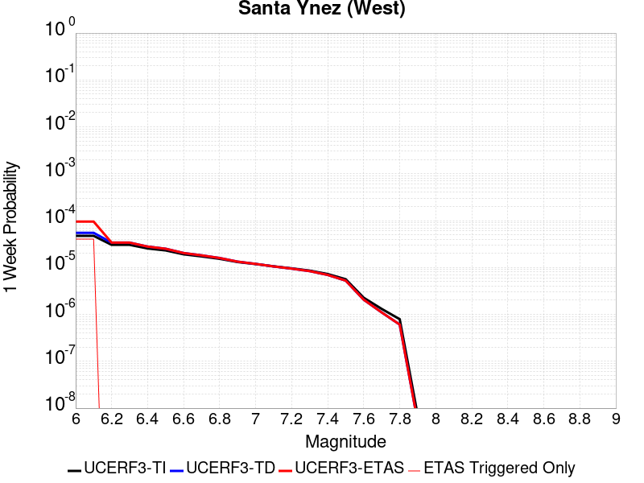 | 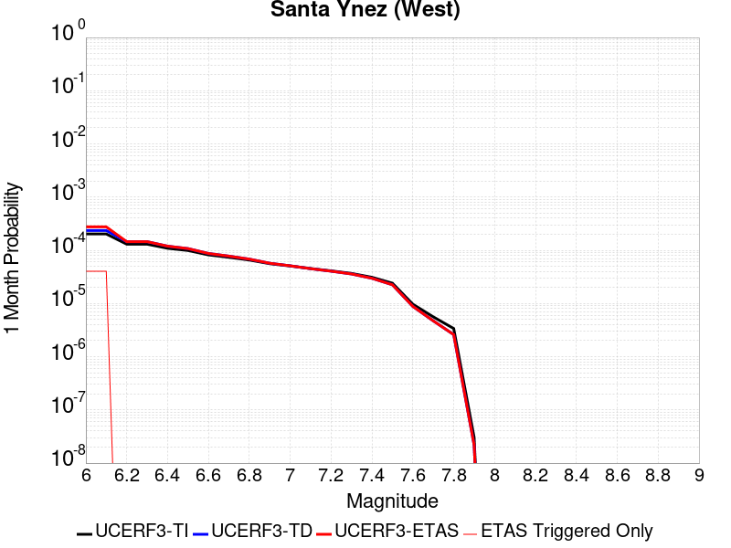 | 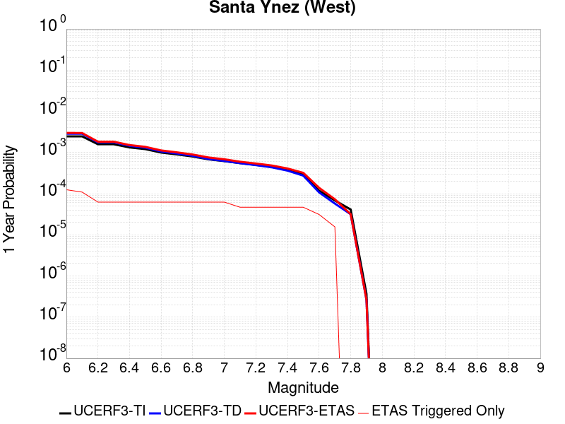 | 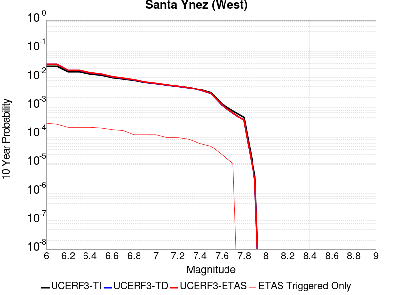 |

| Magnitude | 1 wk TI Prob | 1 wk TD Prob | 1 wk ETAS Prob | 1 wk ETAS/TD Gain | 1 wk ETAS Triggered Only | 1 mo TI Prob | 1 mo TD Prob | 1 mo ETAS Prob | 1 mo ETAS/TD Gain | 1 mo ETAS Triggered Only | 1 yr TI Prob | 1 yr TD Prob | 1 yr ETAS Prob | 1 yr ETAS/TD Gain | 1 yr ETAS Triggered Only | 10 yr TI Prob | 10 yr TD Prob | 10 yr ETAS Prob | 10 yr ETAS/TD Gain | 10 yr ETAS Triggered Only |
|-----|-----|-----|-----|-----|-----|-----|-----|-----|-----|-----|-----|-----|-----|-----|-----|-----|-----|-----|-----|-----|
| 6.0 | 4.7352758E-5 | 5.4972126E-5 | 1.4496718E-4 | 2.6371033 | 9.0E-5 | 2.0292461E-4 | 2.3557522E-4 | 3.455493E-4 | 1.4668322 | 1.1E-4 | 0.0024678076 | 0.0028645284 | 0.0030340413 | 1.0591766 | 1.7E-4 | 0.024405818 | 0.028304417 | 0.028547341 | 1.0085826 | 2.5E-4 |
| 6.1 | 4.7352758E-5 | 5.4972126E-5 | 1.4496718E-4 | 2.6371033 | 9.0E-5 | 2.0292461E-4 | 2.3557522E-4 | 3.455493E-4 | 1.4668322 | 1.1E-4 | 0.0024678076 | 0.0028645284 | 0.00302407 | 1.0556957 | 1.6E-4 | 0.024405818 | 0.028304417 | 0.028527908 | 1.007896 | 2.3E-4 |
| 6.2 | 3.0415853E-5 | 3.392511E-5 | 1.03922735E-4 | 3.0632985 | 7.0E-5 | 1.3034715E-4 | 1.4538545E-4 | 2.2537382E-4 | 1.5501814 | 8.0E-5 | 0.0015858212 | 0.0017686661 | 0.0018784715 | 1.0620837 | 1.1E-4 | 0.015745522 | 0.017549807 | 0.017726649 | 1.0100765 | 1.8E-4 |
| 6.3 | 3.0415853E-5 | 3.392511E-5 | 1.03922735E-4 | 3.0632985 | 7.0E-5 | 1.3034715E-4 | 1.4538545E-4 | 2.2537382E-4 | 1.5501814 | 8.0E-5 | 0.0015858212 | 0.0017686661 | 0.0018784715 | 1.0620837 | 1.1E-4 | 0.015745522 | 0.017549807 | 0.017726649 | 1.0100765 | 1.8E-4 |
| 6.4 | 2.5452082E-5 | 2.7912422E-5 | 9.7910466E-5 | 3.5077739 | 7.0E-5 | 1.09075794E-4 | 1.196193E-4 | 1.9960973E-4 | 1.6687084 | 8.0E-5 | 0.0013271887 | 0.0014554089 | 0.0015652487 | 1.0754701 | 1.1E-4 | 0.013192902 | 0.014460951 | 0.0146383485 | 1.0122674 | 1.8E-4 |
| 6.5 | 2.3143784E-5 | 2.5128256E-5 | 8.512675E-5 | 3.3876903 | 6.0E-5 | 9.9183875E-5 | 1.0768817E-4 | 1.7768063E-4 | 1.649955 | 7.0E-5 | 0.0012068948 | 0.0013103267 | 0.0014101957 | 1.0762168 | 1.0E-4 | 0.012003611 | 0.01302768 | 0.013195465 | 1.0128791 | 1.7E-4 |
| 6.6 | 1.9118515E-5 | 2.035434E-5 | 8.035312E-5 | 3.9477143 | 6.0E-5 | 8.193392E-5 | 8.7230015E-5 | 1.4722478E-4 | 1.6877767 | 6.0E-5 | 9.97089E-4 | 0.001061516 | 0.0011514204 | 1.0846944 | 9.0E-5 | 0.00992627 | 0.010565365 | 0.01071378 | 1.0140474 | 1.5E-4 |
| 6.7 | 1.722807E-5 | 1.8146347E-5 | 7.814526E-5 | 4.306391 | 6.0E-5 | 7.3832496E-5 | 7.776777E-5 | 1.3776311E-4 | 1.7714678 | 6.0E-5 | 8.985399E-4 | 9.464169E-4 | 0.0010363318 | 1.0950055 | 9.0E-5 | 0.008949154 | 0.0094245095 | 0.009563191 | 1.0147148 | 1.4E-4 |
| 6.8 | 1.5317364E-5 | 1.5926486E-5 | 5.5925848E-5 | 3.5114996 | 4.0E-5 | 6.56442E-5 | 6.82546E-5 | 1.0825187E-4 | 1.586001 | 4.0E-5 | 7.98925E-4 | 8.306873E-4 | 8.906374E-4 | 1.0721693 | 6.0E-5 | 0.007960589 | 0.00827631 | 0.008375482 | 1.0119827 | 1.0E-4 |
| 6.9 | 1.3071226E-5 | 1.3329624E-5 | 5.332909E-5 | 4.000795 | 4.0E-5 | 5.6018336E-5 | 5.7125722E-5 | 9.712343E-5 | 1.7001699 | 4.0E-5 | 6.8180985E-4 | 6.9528597E-4 | 7.552443E-4 | 1.0862354 | 6.0E-5 | 0.0067972173 | 0.006931367 | 0.007030674 | 1.0143272 | 1.0E-4 |
| 7.0 | 1.1836986E-5 | 1.19327815E-5 | 5.1932304E-5 | 4.3520703 | 4.0E-5 | 5.0728955E-5 | 5.11395E-5 | 9.113745E-5 | 1.7821343 | 4.0E-5 | 6.1745E-4 | 6.2244723E-4 | 6.8240985E-4 | 1.0963337 | 6.0E-5 | 0.006157372 | 0.006207231 | 0.0063066105 | 1.0160103 | 1.0E-4 |
| 7.1 | 1.0597169E-5 | 1.0542201E-5 | 4.0541883E-5 | 3.8456755 | 3.0E-5 | 4.541565E-5 | 4.5180084E-5 | 7.517873E-5 | 1.6639794 | 3.0E-5 | 5.5279525E-4 | 5.4992986E-4 | 5.9990236E-4 | 1.0908707 | 5.0E-5 | 0.0055142213 | 0.005485821 | 0.005565382 | 1.014503 | 8.0E-5 |
| 7.2 | 9.59113E-6 | 9.459144E-6 | 3.945886E-5 | 4.1715045 | 3.0E-5 | 4.11042E-5 | 4.0538565E-5 | 7.0537346E-5 | 1.7400061 | 3.0E-5 | 5.0032866E-4 | 4.934463E-4 | 5.4342166E-4 | 1.1012782 | 5.0E-5 | 0.004992037 | 0.0049236254 | 0.0050032316 | 1.0161682 | 8.0E-5 |
| 7.3 | 8.586084E-6 | 8.379583E-6 | 3.837933E-5 | 4.5801 | 3.0E-5 | 3.679698E-5 | 3.5912013E-5 | 6.5910936E-5 | 1.8353451 | 3.0E-5 | 4.4791115E-4 | 4.3714207E-4 | 4.871202E-4 | 1.1143293 | 5.0E-5 | 0.004470094 | 0.004362933 | 0.0044326275 | 1.0159743 | 7.0E-5 |
| 7.4 | 7.2622997E-6 | 6.9515427E-6 | 2.6951404E-5 | 3.8770392 | 2.0E-5 | 3.112377E-5 | 2.979199E-5 | 4.9791397E-5 | 1.6713014 | 2.0E-5 | 3.78866E-4 | 3.626581E-4 | 4.0264358E-4 | 1.1102567 | 4.0E-5 | 0.0037822074 | 0.0036207628 | 0.0036705818 | 1.0137593 | 5.0E-5 |
| 7.5 | 5.627296E-6 | 5.251588E-6 | 2.5251482E-5 | 4.808352 | 2.0E-5 | 2.411676E-5 | 2.2506614E-5 | 4.2506166E-5 | 1.8886076 | 2.0E-5 | 2.9358198E-4 | 2.739843E-4 | 3.0397606E-4 | 1.1094654 | 3.0E-5 | 0.0029319443 | 0.002736537 | 0.0027764277 | 1.014577 | 4.0E-5 |
| 7.6 | 2.265244E-6 | 2.0608625E-6 | 2.2060822E-5 | 10.704655 | 2.0E-5 | 9.708152E-6 | 8.832238E-6 | 2.883206E-5 | 3.2644117 | 2.0E-5 | 1.18190335E-4 | 1.0752728E-4 | 1.2752513E-4 | 1.1859794 | 2.0E-5 | 0.001181275 | 0.0010747612 | 0.0010947397 | 1.0185888 | 2.0E-5 |
| 7.7 | 1.3099874E-6 | 1.1016252E-6 | 1.1101614E-5 | 10.077487 | 1.0E-5 | 5.61422E-6 | 4.7212425E-6 | 1.4721195E-5 | 3.1180766 | 1.0E-5 | 6.8350986E-5 | 5.7479636E-5 | 6.747906E-5 | 1.1739646 | 1.0E-5 | 6.832996E-4 | 5.7465007E-4 | 5.846443E-4 | 1.0173919 | 1.0E-5 |
| 7.8 | 7.903951E-7 | 6.0711415E-7 | 6.0711415E-7 | 1.0 | 0.0 | 3.3874032E-6 | 2.6019152E-6 | 2.6019152E-6 | 1.0 | 0.0 | 4.1240855E-5 | 3.167787E-5 | 3.167787E-5 | 1.0 | 0.0 | 4.12332E-4 | 3.167349E-4 | 3.167349E-4 | 1.0 | 0.0 |
| 7.9 | 7.0753297E-9 | 5.0899476E-9 | 5.0899476E-9 | 1.0 | 0.0 | 3.032284E-8 | 2.181406E-8 | 2.181406E-8 | 1.0 | 0.0 | 3.6918053E-7 | 2.6558615E-7 | 2.6558615E-7 | 1.0 | 0.0 | 3.691799E-6 | 2.6558594E-6 | 2.6558594E-6 | 1.0 | 0.0 |

## San Andreas (North Branch Mill Creek)
*[(top)](#table-of-contents)*

| 1 Week | 1 Month | 1 Year | 10 Year |
|-----|-----|-----|-----|
| 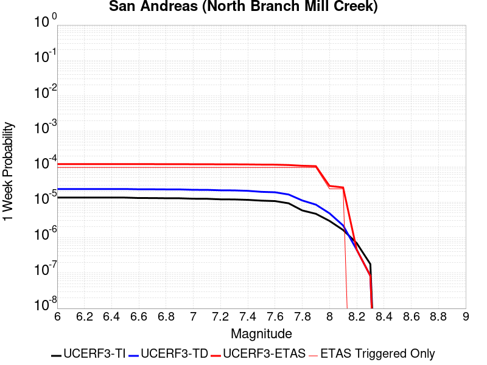 | 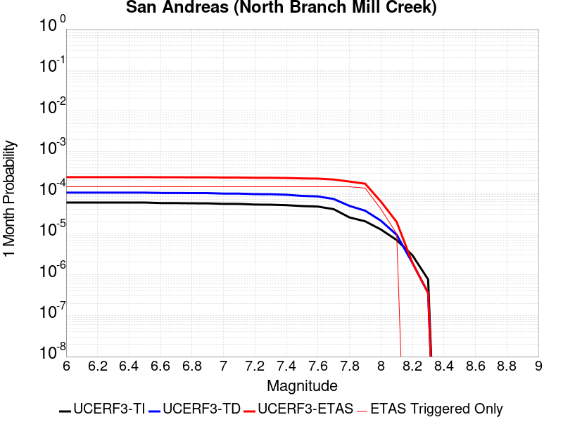 | 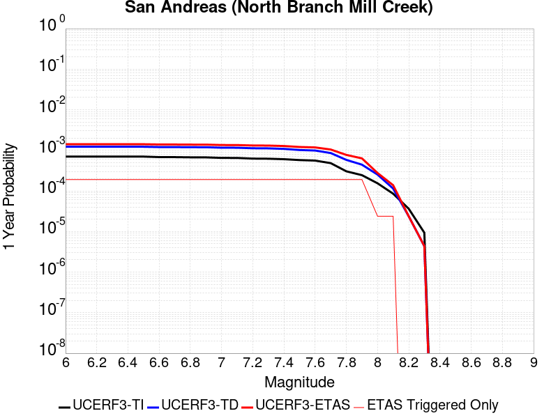 | 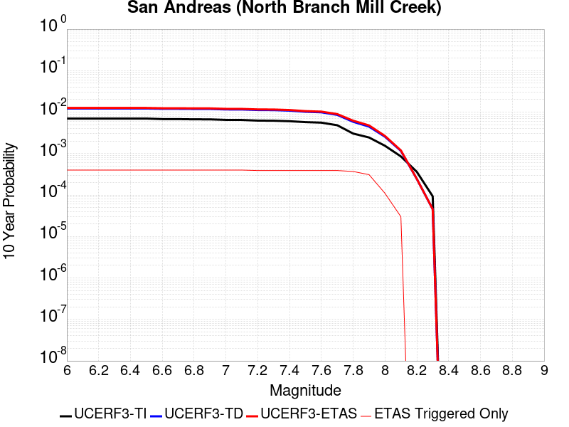 |

| Magnitude | 1 wk TI Prob | 1 wk TD Prob | 1 wk ETAS Prob | 1 wk ETAS/TD Gain | 1 wk ETAS Triggered Only | 1 mo TI Prob | 1 mo TD Prob | 1 mo ETAS Prob | 1 mo ETAS/TD Gain | 1 mo ETAS Triggered Only | 1 yr TI Prob | 1 yr TD Prob | 1 yr ETAS Prob | 1 yr ETAS/TD Gain | 1 yr ETAS Triggered Only | 10 yr TI Prob | 10 yr TD Prob | 10 yr ETAS Prob | 10 yr ETAS/TD Gain | 10 yr ETAS Triggered Only |
|-----|-----|-----|-----|-----|-----|-----|-----|-----|-----|-----|-----|-----|-----|-----|-----|-----|-----|-----|-----|-----|
| 6.0 | 1.3461156E-5 | 2.3499893E-5 | 1.2349755E-4 | 5.2552385 | 1.0E-4 | 5.7689394E-5 | 1.00709956E-4 | 2.4069585E-4 | 2.3899906 | 1.4E-4 | 7.02142E-4 | 0.0012254574 | 0.0014851388 | 1.2119057 | 2.6E-4 | 0.0069992766 | 0.01222957 | 0.012624678 | 1.0323076 | 4.0E-4 |
| 6.1 | 1.3461156E-5 | 2.3499893E-5 | 1.2349755E-4 | 5.2552385 | 1.0E-4 | 5.7689394E-5 | 1.00709956E-4 | 2.4069585E-4 | 2.3899906 | 1.4E-4 | 7.02142E-4 | 0.0012254574 | 0.0014851388 | 1.2119057 | 2.6E-4 | 0.0069992766 | 0.01222957 | 0.012624678 | 1.0323076 | 4.0E-4 |
| 6.2 | 1.3461156E-5 | 2.3499893E-5 | 1.2349755E-4 | 5.2552385 | 1.0E-4 | 5.7689394E-5 | 1.00709956E-4 | 2.4069585E-4 | 2.3899906 | 1.4E-4 | 7.02142E-4 | 0.0012254574 | 0.0014851388 | 1.2119057 | 2.6E-4 | 0.0069992766 | 0.01222957 | 0.012624678 | 1.0323076 | 4.0E-4 |
| 6.3 | 1.3461156E-5 | 2.3499893E-5 | 1.2349755E-4 | 5.2552385 | 1.0E-4 | 5.7689394E-5 | 1.00709956E-4 | 2.4069585E-4 | 2.3899906 | 1.4E-4 | 7.02142E-4 | 0.0012254574 | 0.0014851388 | 1.2119057 | 2.6E-4 | 0.0069992766 | 0.01222957 | 0.012624678 | 1.0323076 | 4.0E-4 |
| 6.4 | 1.3461156E-5 | 2.3499893E-5 | 1.2349755E-4 | 5.2552385 | 1.0E-4 | 5.7689394E-5 | 1.00709956E-4 | 2.4069585E-4 | 2.3899906 | 1.4E-4 | 7.02142E-4 | 0.0012254574 | 0.0014851388 | 1.2119057 | 2.6E-4 | 0.0069992766 | 0.01222957 | 0.012624678 | 1.0323076 | 4.0E-4 |
| 6.5 | 1.3450706E-5 | 2.3488852E-5 | 1.234865E-4 | 5.2572384 | 1.0E-4 | 5.764461E-5 | 1.0066265E-4 | 2.4064856E-4 | 2.390644 | 1.4E-4 | 7.0159714E-4 | 0.001224882 | 0.0014845636 | 1.2120054 | 2.6E-4 | 0.006993862 | 0.01222388 | 0.01261899 | 1.0323229 | 4.0E-4 |
| 6.6 | 1.3074523E-5 | 2.3103135E-5 | 1.2310082E-4 | 5.3283167 | 1.0E-4 | 5.6032466E-5 | 9.9009696E-5 | 2.3899584E-4 | 2.413863 | 1.4E-4 | 6.8198174E-4 | 0.0012047797 | 0.0014644664 | 1.2155471 | 2.6E-4 | 0.006798926 | 0.012025044 | 0.012420234 | 1.0328639 | 4.0E-4 |
| 6.7 | 1.3050216E-5 | 2.3078432E-5 | 1.2307613E-4 | 5.33295 | 1.0E-4 | 5.59283E-5 | 9.890384E-5 | 2.3888999E-4 | 2.4153764 | 1.4E-4 | 6.8071426E-4 | 0.0012034923 | 0.0014631794 | 1.215778 | 2.6E-4 | 0.0067863287 | 0.012012309 | 0.012407504 | 1.0328991 | 4.0E-4 |
| 6.8 | 1.29049395E-5 | 2.292684E-5 | 1.2292455E-4 | 5.3616 | 1.0E-4 | 5.530571E-5 | 9.825421E-5 | 2.3824045E-4 | 2.4247353 | 1.4E-4 | 6.73139E-4 | 0.0011955918 | 0.0014552809 | 1.2172055 | 2.6E-4 | 0.0067110364 | 0.011934154 | 0.012329381 | 1.0331173 | 4.0E-4 |
| 6.9 | 1.2867369E-5 | 2.2886245E-5 | 1.2288395E-4 | 5.3693366 | 1.0E-4 | 5.51447E-5 | 9.8080236E-5 | 2.3806651E-4 | 2.4272628 | 1.4E-4 | 6.711799E-4 | 0.0011934759 | 0.0014531657 | 1.217591 | 2.6E-4 | 0.006691564 | 0.011913223 | 0.012308458 | 1.0331762 | 4.0E-4 |
| 7.0 | 1.2495996E-5 | 2.2286325E-5 | 1.222841E-4 | 5.4869566 | 1.0E-4 | 5.3553173E-5 | 9.550934E-5 | 2.3549597E-4 | 2.4656851 | 1.4E-4 | 6.518148E-4 | 0.0011622087 | 0.0014219066 | 1.223452 | 2.6E-4 | 0.0064990623 | 0.0116038285 | 0.011999187 | 1.0340713 | 4.0E-4 |
| 7.1 | 1.2452067E-5 | 2.2231397E-5 | 1.2222918E-4 | 5.4980426 | 1.0E-4 | 5.3364907E-5 | 9.527396E-5 | 2.3526062E-4 | 2.4693067 | 1.4E-4 | 6.4952404E-4 | 0.0011593461 | 0.0014190446 | 1.2240044 | 2.6E-4 | 0.0064762887 | 0.0115755 | 0.011970869 | 1.0341557 | 4.0E-4 |
| 7.2 | 1.2002777E-5 | 2.1609963E-5 | 1.216078E-4 | 5.627395 | 1.0E-4 | 5.143946E-5 | 9.2610855E-5 | 2.3259789E-4 | 2.5115619 | 1.4E-4 | 6.2609545E-4 | 0.0011269567 | 0.0013866636 | 1.2304499 | 2.6E-4 | 0.006243344 | 0.011254923 | 0.011640534 | 1.0342615 | 3.9E-4 |
| 7.3 | 1.1923425E-5 | 2.1479793E-5 | 1.2147764E-4 | 5.6554384 | 1.0E-4 | 5.109939E-5 | 9.205302E-5 | 2.3204014E-4 | 2.5207226 | 1.4E-4 | 6.219575E-4 | 0.001120172 | 0.0013798807 | 1.2318472 | 2.6E-4 | 0.0062021962 | 0.011187789 | 0.0115734255 | 1.0344695 | 3.9E-4 |
| 7.4 | 1.16105175E-5 | 2.0853771E-5 | 1.20851684E-4 | 5.7951956 | 1.0E-4 | 4.975841E-5 | 8.937026E-5 | 2.2935776E-4 | 2.5663767 | 1.4E-4 | 6.0564023E-4 | 0.0010875424 | 0.0013472596 | 1.2388111 | 2.6E-4 | 0.006039923 | 0.010865397 | 0.011251159 | 1.0355037 | 3.9E-4 |
| 7.5 | 1.1037265E-5 | 1.9553907E-5 | 1.1955195E-4 | 6.1139674 | 1.0E-4 | 4.7301706E-5 | 8.379978E-5 | 2.2378805E-4 | 2.6705089 | 1.4E-4 | 5.757461E-4 | 0.0010197869 | 0.0012795218 | 1.2546952 | 2.6E-4 | 0.005742567 | 0.010194898 | 0.010580922 | 1.0378644 | 3.9E-4 |
| 7.6 | 1.0720915E-5 | 1.899582E-5 | 1.1899392E-4 | 6.2642164 | 1.0E-4 | 4.5945973E-5 | 8.140812E-5 | 2.2139672E-4 | 2.7195902 | 1.4E-4 | 5.592486E-4 | 9.906954E-4 | 0.0012504378 | 1.2621819 | 2.6E-4 | 0.005578433 | 0.009906623 | 0.010292758 | 1.0389776 | 3.9E-4 |
| 7.7 | 9.276279E-6 | 1.6441649E-5 | 1.1644E-4 | 7.082015 | 1.0E-4 | 3.9754876E-5 | 7.0462316E-5 | 2.1045245E-4 | 2.9867377 | 1.4E-4 | 4.839081E-4 | 8.575427E-4 | 0.0011173197 | 1.3029319 | 2.6E-4 | 0.0048285574 | 0.008586041 | 0.008972692 | 1.0450326 | 3.9E-4 |
| 7.8 | 5.8346777E-6 | 1.1155013E-5 | 1.11153895E-4 | 9.964479 | 1.0E-4 | 2.5005522E-5 | 4.7806327E-5 | 1.8779963E-4 | 3.9283428 | 1.4E-4 | 3.043997E-4 | 5.818867E-4 | 8.2174706E-4 | 1.4122114 | 2.4E-4 | 0.0030398308 | 0.0058469265 | 0.006214763 | 1.0629112 | 3.7E-4 |
| 7.9 | 4.690204E-6 | 8.509093E-6 | 9.8508324E-5 | 11.57683 | 9.0E-5 | 2.0100719E-5 | 3.6467034E-5 | 1.664623E-4 | 4.5647335 | 1.3E-4 | 2.4469878E-4 | 4.4389578E-4 | 6.43807E-4 | 1.4503562 | 2.0E-4 | 0.002444295 | 0.0044707474 | 0.004779361 | 1.0690297 | 3.1E-4 |
| 8.0 | 2.9570454E-6 | 4.846947E-6 | 3.4846802E-5 | 7.1894336 | 3.0E-5 | 1.267299E-5 | 2.0772464E-5 | 6.0771632E-5 | 2.9255862 | 4.0E-5 | 1.5428272E-4 | 2.5287544E-4 | 3.2285773E-4 | 1.2767462 | 7.0E-5 | 0.0015417566 | 0.002549644 | 0.0026593637 | 1.0430332 | 1.1E-4 |
| 8.1 | 1.6376824E-6 | 2.1968929E-6 | 1.2196871E-5 | 5.5518737 | 1.0E-5 | 7.01862E-6 | 9.41522E-6 | 1.9415127E-5 | 2.0621 | 1.0E-5 | 8.544835E-5 | 1.14624294E-4 | 1.3462201E-4 | 1.174463 | 2.0E-5 | 8.54155E-4 | 0.0011606582 | 0.0011906234 | 1.0258174 | 3.0E-5 |
| 8.2 | 6.9631557E-7 | 4.5360213E-7 | 4.5360213E-7 | 1.0 | 0.0 | 2.984206E-6 | 1.9440076E-6 | 1.9440076E-6 | 1.0 | 0.0 | 3.63321E-5 | 2.3668037E-5 | 2.3668037E-5 | 1.0 | 0.0 | 3.6326164E-4 | 2.451564E-4 | 2.451564E-4 | 1.0 | 0.0 |
| 8.3 | 1.7876137E-7 | 8.360375E-8 | 8.360375E-8 | 1.0 | 0.0 | 7.661199E-7 | 3.5830175E-7 | 3.5830175E-7 | 1.0 | 0.0 | 9.32747E-6 | 4.3623154E-6 | 4.3623154E-6 | 1.0 | 0.0 | 9.3270784E-5 | 4.5817014E-5 | 4.5817014E-5 | 1.0 | 0.0 |

## Cleghorn Lake
*[(top)](#table-of-contents)*

| 1 Week | 1 Month | 1 Year | 10 Year |
|-----|-----|-----|-----|
| 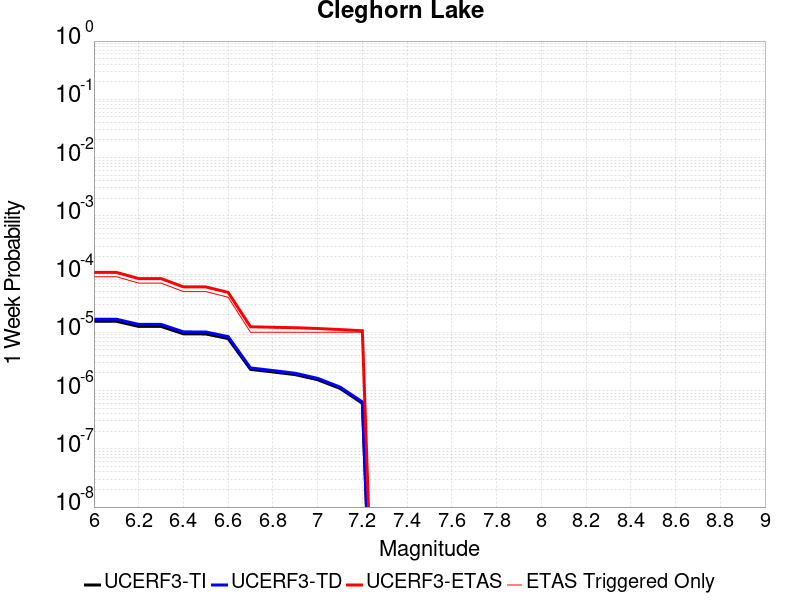 | 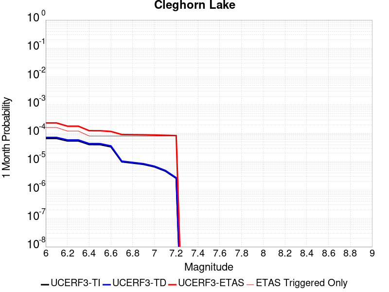 | 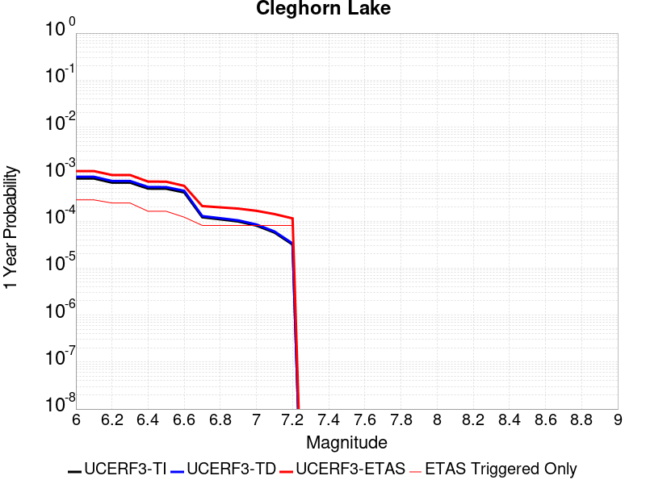 |  |

| Magnitude | 1 wk TI Prob | 1 wk TD Prob | 1 wk ETAS Prob | 1 wk ETAS/TD Gain | 1 wk ETAS Triggered Only | 1 mo TI Prob | 1 mo TD Prob | 1 mo ETAS Prob | 1 mo ETAS/TD Gain | 1 mo ETAS Triggered Only | 1 yr TI Prob | 1 yr TD Prob | 1 yr ETAS Prob | 1 yr ETAS/TD Gain | 1 yr ETAS Triggered Only | 10 yr TI Prob | 10 yr TD Prob | 10 yr ETAS Prob | 10 yr ETAS/TD Gain | 10 yr ETAS Triggered Only |
|-----|-----|-----|-----|-----|-----|-----|-----|-----|-----|-----|-----|-----|-----|-----|-----|-----|-----|-----|-----|-----|
| 6.0 | 1.5467183E-5 | 1.6794203E-5 | 1.0679269E-4 | 6.358902 | 9.0E-5 | 6.6286244E-5 | 7.197348E-5 | 2.3196197E-4 | 3.2228808 | 1.6E-4 | 8.067362E-4 | 8.759797E-4 | 0.0011557344 | 1.319362 | 2.8E-4 | 0.008038137 | 0.008730696 | 0.009077639 | 1.0397384 | 3.5E-4 |
| 6.1 | 1.5467183E-5 | 1.6794203E-5 | 1.0679269E-4 | 6.358902 | 9.0E-5 | 6.6286244E-5 | 7.197348E-5 | 2.3196197E-4 | 3.2228808 | 1.6E-4 | 8.067362E-4 | 8.759797E-4 | 0.0011557344 | 1.319362 | 2.8E-4 | 0.008038137 | 0.008730696 | 0.009077639 | 1.0397384 | 3.5E-4 |
| 6.2 | 1.2624631E-5 | 1.3681544E-5 | 8.3680585E-5 | 6.1163116 | 7.0E-5 | 5.410444E-5 | 5.863415E-5 | 1.8862652E-4 | 3.217008 | 1.3E-4 | 6.585225E-4 | 7.1368564E-4 | 9.535143E-4 | 1.3360425 | 2.4E-4 | 0.0065657445 | 0.0071187317 | 0.007416596 | 1.0418423 | 3.0E-4 |
| 6.3 | 1.2624631E-5 | 1.3681544E-5 | 8.3680585E-5 | 6.1163116 | 7.0E-5 | 5.410444E-5 | 5.863415E-5 | 1.8862652E-4 | 3.217008 | 1.3E-4 | 6.585225E-4 | 7.1368564E-4 | 9.535143E-4 | 1.3360425 | 2.4E-4 | 0.0065657445 | 0.0071187317 | 0.007416596 | 1.0418423 | 3.0E-4 |
| 6.4 | 9.417684E-6 | 1.0170118E-5 | 6.016961E-5 | 5.916314 | 5.0E-5 | 4.036088E-5 | 4.3585722E-5 | 1.5358093E-4 | 3.5236523 | 1.1E-4 | 4.912829E-4 | 5.3056807E-4 | 7.304619E-4 | 1.3767545 | 2.0E-4 | 0.004901982 | 0.005297049 | 0.0055556716 | 1.048824 | 2.6E-4 |
| 6.5 | 9.368219E-6 | 1.0117545E-5 | 6.011704E-5 | 5.9418607 | 5.0E-5 | 4.014889E-5 | 4.3360415E-5 | 1.5335565E-4 | 3.536766 | 1.1E-4 | 4.8870314E-4 | 5.2782625E-4 | 7.277207E-4 | 1.3787125 | 2.0E-4 | 0.004876298 | 0.0052697617 | 0.0055283913 | 1.0490781 | 2.6E-4 |
| 6.6 | 7.803798E-6 | 8.441831E-6 | 4.8441492E-5 | 5.7382684 | 4.0E-5 | 3.3444423E-5 | 3.6179E-5 | 1.2617574E-4 | 3.487541 | 9.0E-5 | 4.0710976E-4 | 4.4043022E-4 | 6.1035535E-4 | 1.3858162 | 1.7E-4 | 0.0040636472 | 0.0043994905 | 0.0046284785 | 1.0520488 | 2.3E-4 |
| 6.7 | 2.3108669E-6 | 2.4438336E-6 | 1.2443809E-5 | 5.0919213 | 1.0E-5 | 9.903678E-6 | 1.0473532E-5 | 3.0473322E-5 | 2.9095554 | 2.0E-5 | 1.205706E-4 | 1.2750797E-4 | 1.8750032E-4 | 1.4704988 | 6.0E-5 | 0.001205052 | 0.0012743667 | 0.0013342904 | 1.0470222 | 6.0E-5 |
| 6.8 | 2.0882828E-6 | 2.2062823E-6 | 1.220626E-5 | 5.5325017 | 1.0E-5 | 8.949753E-6 | 9.455462E-6 | 2.9455272E-5 | 3.1151595 | 2.0E-5 | 1.08957785E-4 | 1.1511434E-4 | 1.7510743E-4 | 1.521161 | 6.0E-5 | 0.0010890438 | 0.0011505639 | 0.0012104949 | 1.0520884 | 6.0E-5 |
| 6.9 | 1.876935E-6 | 1.981051E-6 | 1.1981031E-5 | 6.047816 | 1.0E-5 | 8.043982E-6 | 8.490192E-6 | 2.8490022E-5 | 3.3556395 | 2.0E-5 | 9.7931086E-5 | 1.03363345E-4 | 1.6335714E-4 | 1.5804166 | 6.0E-5 | 9.788794E-4 | 0.0010331686 | 0.0010931067 | 1.0580138 | 6.0E-5 |
| 7.0 | 1.5357559E-6 | 1.6202807E-6 | 1.1620265E-5 | 7.17176 | 1.0E-5 | 6.5817944E-6 | 6.9440425E-6 | 2.6943904E-5 | 3.8801467 | 2.0E-5 | 8.01304E-5 | 8.454057E-5 | 1.4453549E-4 | 1.7096585 | 6.0E-5 | 8.010151E-4 | 8.450965E-4 | 9.050458E-4 | 1.0709378 | 6.0E-5 |
| 7.1 | 1.0905424E-6 | 1.1497619E-6 | 1.114975E-5 | 9.697442 | 1.0E-5 | 4.6737446E-6 | 4.9275427E-6 | 2.4927444E-5 | 5.0587983 | 2.0E-5 | 5.6901354E-5 | 5.999128E-5 | 9.998888E-5 | 1.6667236 | 4.0E-5 | 5.6886784E-4 | 5.997606E-4 | 6.3973665E-4 | 1.0666533 | 4.0E-5 |
| 7.2 | 6.06668E-7 | 6.387277E-7 | 1.06387215E-5 | 16.656113 | 1.0E-5 | 2.600003E-6 | 2.7374022E-6 | 2.2737348E-5 | 8.306177 | 2.0E-5 | 3.1654577E-5 | 3.3327433E-5 | 6.3326435E-5 | 1.9001293 | 3.0E-5 | 3.1650066E-4 | 3.3323118E-4 | 3.632212E-4 | 1.0899976 | 3.0E-5 |

## Calico-Hidalgo
*[(top)](#table-of-contents)*

| 1 Week | 1 Month | 1 Year | 10 Year |
|-----|-----|-----|-----|
| 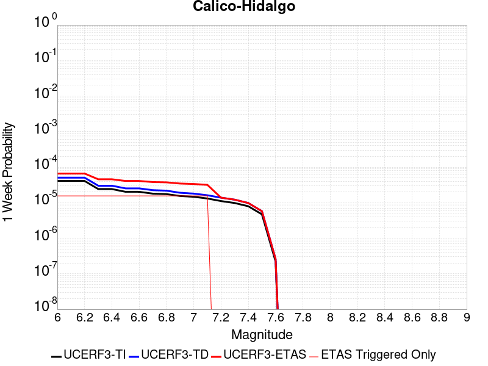 | 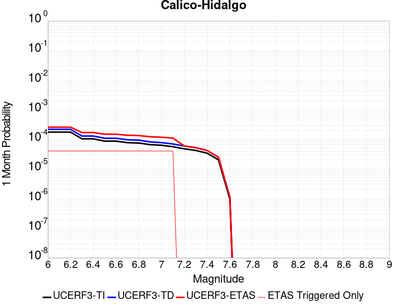 | 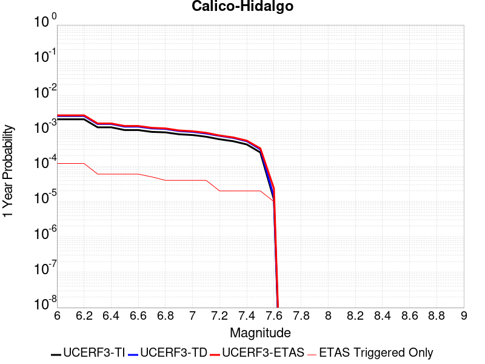 | 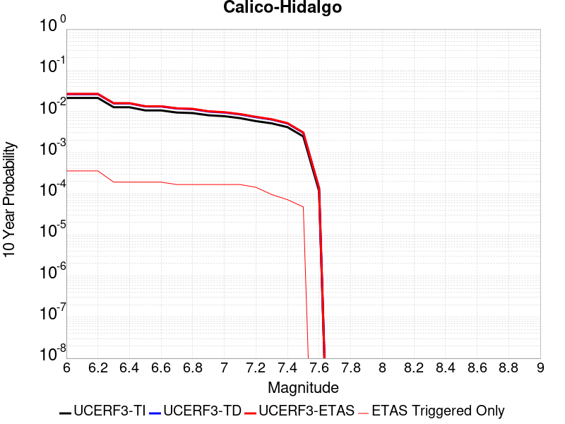 |

| Magnitude | 1 wk TI Prob | 1 wk TD Prob | 1 wk ETAS Prob | 1 wk ETAS/TD Gain | 1 wk ETAS Triggered Only | 1 mo TI Prob | 1 mo TD Prob | 1 mo ETAS Prob | 1 mo ETAS/TD Gain | 1 mo ETAS Triggered Only | 1 yr TI Prob | 1 yr TD Prob | 1 yr ETAS Prob | 1 yr ETAS/TD Gain | 1 yr ETAS Triggered Only | 10 yr TI Prob | 10 yr TD Prob | 10 yr ETAS Prob | 10 yr ETAS/TD Gain | 10 yr ETAS Triggered Only |
|-----|-----|-----|-----|-----|-----|-----|-----|-----|-----|-----|-----|-----|-----|-----|-----|-----|-----|-----|-----|-----|
| 6.0 | 4.0906612E-5 | 5.0703686E-5 | 8.0702164E-5 | 1.591643 | 3.0E-5 | 1.7530227E-4 | 2.172857E-4 | 2.9726833E-4 | 1.3680989 | 8.0E-5 | 0.0021322158 | 0.002642648 | 0.002762331 | 1.045289 | 1.2E-4 | 0.02111873 | 0.026152607 | 0.026493454 | 1.013033 | 3.5E-4 |
| 6.1 | 4.0906612E-5 | 5.0703686E-5 | 8.0702164E-5 | 1.591643 | 3.0E-5 | 1.7530227E-4 | 2.172857E-4 | 2.9726833E-4 | 1.3680989 | 8.0E-5 | 0.0021322158 | 0.002642648 | 0.002762331 | 1.045289 | 1.2E-4 | 0.02111873 | 0.026152607 | 0.026493454 | 1.013033 | 3.5E-4 |
| 6.2 | 4.0906612E-5 | 5.0703686E-5 | 8.0702164E-5 | 1.591643 | 3.0E-5 | 1.7530227E-4 | 2.172857E-4 | 2.9726833E-4 | 1.3680989 | 8.0E-5 | 0.0021322158 | 0.002642648 | 0.002762331 | 1.045289 | 1.2E-4 | 0.02111873 | 0.026152607 | 0.026493454 | 1.013033 | 3.5E-4 |
| 6.3 | 2.4242801E-5 | 3.0090669E-5 | 5.0090068E-5 | 1.6646379 | 2.0E-5 | 1.0389358E-4 | 1.2895382E-4 | 1.6894867E-4 | 1.3101486 | 4.0E-5 | 0.0012641704 | 0.0015689151 | 0.001628821 | 1.038183 | 6.0E-5 | 0.01257003 | 0.01558206 | 0.015808476 | 1.0145305 | 2.3E-4 |
| 6.4 | 2.4242801E-5 | 3.0090669E-5 | 5.0090068E-5 | 1.6646379 | 2.0E-5 | 1.0389358E-4 | 1.2895382E-4 | 1.6894867E-4 | 1.3101486 | 4.0E-5 | 0.0012641704 | 0.0015689151 | 0.001628821 | 1.038183 | 6.0E-5 | 0.01257003 | 0.01558206 | 0.015808476 | 1.0145305 | 2.3E-4 |
| 6.5 | 2.0286952E-5 | 2.5315738E-5 | 4.531523E-5 | 1.7900023 | 2.0E-5 | 8.694118E-5 | 1.0849161E-4 | 1.4848726E-4 | 1.3686521 | 4.0E-5 | 0.0010579949 | 0.001320102 | 0.0013800228 | 1.0453911 | 6.0E-5 | 0.010529719 | 0.013124538 | 0.01334165 | 1.0165426 | 2.2E-4 |
| 6.6 | 2.0269223E-5 | 2.5296687E-5 | 4.5296183E-5 | 1.7905973 | 2.0E-5 | 8.6865206E-5 | 1.08409964E-4 | 1.4840563E-4 | 1.3689297 | 4.0E-5 | 0.0010570707 | 0.0013191093 | 0.0013790302 | 1.0454253 | 6.0E-5 | 0.010520565 | 0.013114728 | 0.013331843 | 1.0165551 | 2.2E-4 |
| 6.7 | 1.799852E-5 | 2.25406E-5 | 4.254015E-5 | 1.8872678 | 2.0E-5 | 7.713423E-5 | 9.659908E-5 | 1.3659522E-4 | 1.4140426 | 4.0E-5 | 9.3870464E-4 | 0.0011754738 | 0.001225415 | 1.0424861 | 5.0E-5 | 0.009347493 | 0.011694173 | 0.011891834 | 1.0169026 | 2.0E-4 |
| 6.8 | 1.7458793E-5 | 2.184212E-5 | 4.1841682E-5 | 1.915642 | 2.0E-5 | 7.4821255E-5 | 9.3605806E-5 | 1.3360207E-4 | 1.4272839 | 4.0E-5 | 9.10568E-4 | 0.0011390693 | 0.0011790238 | 1.0350764 | 4.0E-5 | 0.009068459 | 0.011333893 | 0.01152174 | 1.0165739 | 1.9E-4 |
| 6.9 | 1.542884E-5 | 1.9025927E-5 | 3.9025545E-5 | 2.0511773 | 2.0E-5 | 6.612192E-5 | 8.153721E-5 | 1.2153395E-4 | 1.4905336 | 4.0E-5 | 8.04737E-4 | 9.922766E-4 | 0.001032237 | 1.0402713 | 4.0E-5 | 0.008018291 | 0.009879857 | 0.010067981 | 1.0190411 | 1.9E-4 |
| 7.0 | 1.468253E-5 | 1.8030598E-5 | 3.8030237E-5 | 2.1092055 | 2.0E-5 | 6.292361E-5 | 7.7271776E-5 | 1.1726869E-4 | 1.5176134 | 4.0E-5 | 7.658257E-4 | 9.4039086E-4 | 9.803532E-4 | 1.0424955 | 4.0E-5 | 0.0076319184 | 0.009365481 | 0.009553702 | 1.0200973 | 1.9E-4 |
| 7.1 | 1.3139281E-5 | 1.6200942E-5 | 3.6200618E-5 | 2.234476 | 2.0E-5 | 5.6309986E-5 | 6.943083E-5 | 1.0942806E-4 | 1.5760729 | 4.0E-5 | 6.853584E-4 | 8.4500515E-4 | 8.8497135E-4 | 1.047297 | 4.0E-5 | 0.0068324856 | 0.0084192185 | 0.008597703 | 1.0211997 | 1.8E-4 |
| 7.2 | 1.1127404E-5 | 1.3866597E-5 | 1.3866597E-5 | 1.0 | 0.0 | 4.7688E-5 | 5.942698E-5 | 7.9425794E-5 | 1.3365275 | 2.0E-5 | 5.8044674E-4 | 7.232942E-4 | 7.4327976E-4 | 1.0276313 | 2.0E-5 | 0.0057893298 | 0.0072105085 | 0.007349499 | 1.0192761 | 1.4E-4 |
| 7.3 | 9.808154E-6 | 1.2176215E-5 | 1.2176215E-5 | 1.0 | 0.0 | 4.2034266E-5 | 5.2182797E-5 | 7.218175E-5 | 1.3832481 | 2.0E-5 | 5.11647E-4 | 6.3515105E-4 | 6.5513834E-4 | 1.0314686 | 2.0E-5 | 0.0051047057 | 0.006334433 | 0.006423863 | 1.0141181 | 9.0E-5 |
| 7.4 | 7.942452E-6 | 9.792144E-6 | 9.792144E-6 | 1.0 | 0.0 | 3.4038632E-5 | 4.1965708E-5 | 6.196487E-5 | 1.4765596 | 2.0E-5 | 4.1434157E-4 | 5.1082217E-4 | 5.3081196E-4 | 1.0391326 | 2.0E-5 | 0.0041356985 | 0.005097421 | 0.005177013 | 1.0156142 | 8.0E-5 |
| 7.5 | 4.7121216E-6 | 5.772836E-6 | 5.772836E-6 | 1.0 | 0.0 | 2.019465E-5 | 2.4740535E-5 | 4.474004E-5 | 1.8083699 | 2.0E-5 | 2.4584212E-4 | 3.0118204E-4 | 3.2117602E-4 | 1.066385 | 2.0E-5 | 0.0024557032 | 0.0030084911 | 0.0030683107 | 1.0198835 | 6.0E-5 |
| 7.6 | 2.21172E-7 | 2.603961E-7 | 2.603961E-7 | 1.0 | 0.0 | 9.478797E-7 | 1.1159829E-6 | 1.1115972E-5 | 9.960701 | 1.0E-5 | 1.1540374E-5 | 1.3587036E-5 | 2.35869E-5 | 1.7359858 | 1.0E-5 | 1.1539775E-4 | 1.3586486E-4 | 1.4586351E-4 | 1.0735925 | 1.0E-5 |

## Mission Ridge-Arroyo Parida-Santa Ana
*[(top)](#table-of-contents)*

| 1 Week | 1 Month | 1 Year | 10 Year |
|-----|-----|-----|-----|
| 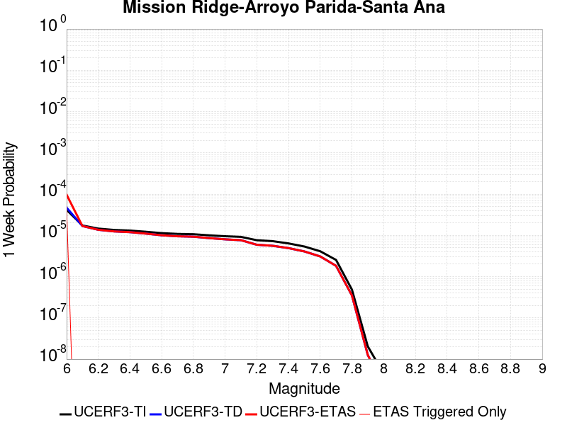 | 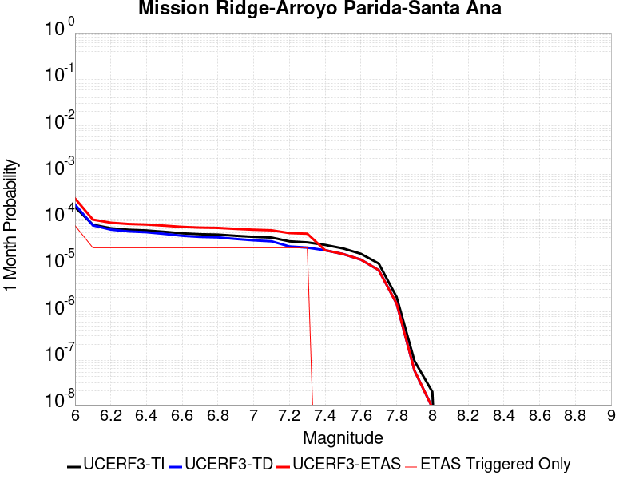 | 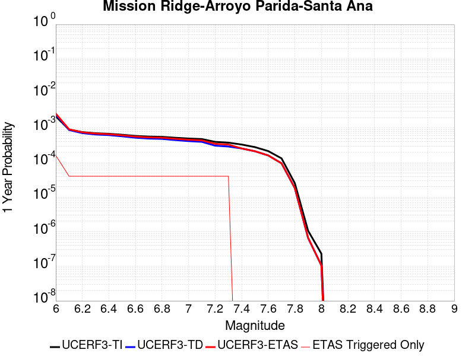 | 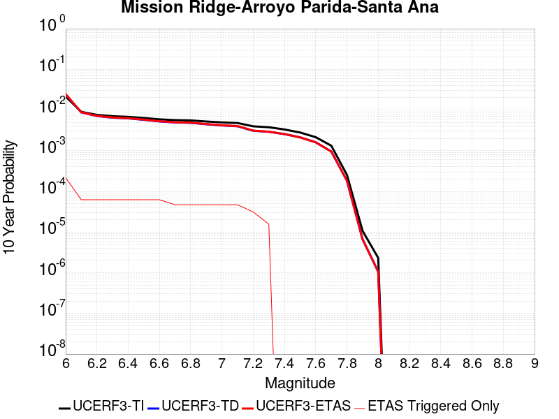 |

| Magnitude | 1 wk TI Prob | 1 wk TD Prob | 1 wk ETAS Prob | 1 wk ETAS/TD Gain | 1 wk ETAS Triggered Only | 1 mo TI Prob | 1 mo TD Prob | 1 mo ETAS Prob | 1 mo ETAS/TD Gain | 1 mo ETAS Triggered Only | 1 yr TI Prob | 1 yr TD Prob | 1 yr ETAS Prob | 1 yr ETAS/TD Gain | 1 yr ETAS Triggered Only | 10 yr TI Prob | 10 yr TD Prob | 10 yr ETAS Prob | 10 yr ETAS/TD Gain | 10 yr ETAS Triggered Only |
|-----|-----|-----|-----|-----|-----|-----|-----|-----|-----|-----|-----|-----|-----|-----|-----|-----|-----|-----|-----|-----|
| 6.0 | 4.169034E-5 | 4.7138263E-5 | 9.7135904E-5 | 2.0606594 | 5.0E-5 | 1.7866064E-4 | 2.0201034E-4 | 2.719962E-4 | 1.3464469 | 7.0E-5 | 0.0021730233 | 0.00245745 | 0.0026170567 | 1.0649481 | 1.6E-4 | 0.021518968 | 0.024384614 | 0.024628518 | 1.0100024 | 2.5E-4 |
| 6.1 | 1.73813E-5 | 1.6854226E-5 | 1.6854226E-5 | 1.0 | 0.0 | 7.4489166E-5 | 7.223046E-5 | 1.0222829E-4 | 1.4153073 | 3.0E-5 | 9.065282E-4 | 8.790618E-4 | 9.190267E-4 | 1.0454631 | 4.0E-5 | 0.009028391 | 0.008756988 | 0.008856112 | 1.0113194 | 1.0E-4 |
| 6.2 | 1.4622182E-5 | 1.367329E-5 | 1.367329E-5 | 1.0 | 0.0 | 6.2664985E-5 | 5.8598518E-5 | 8.859676E-5 | 1.5119283 | 3.0E-5 | 7.6267915E-4 | 7.132073E-4 | 7.531788E-4 | 1.0560447 | 4.0E-5 | 0.007600669 | 0.007109627 | 0.0071989875 | 1.012569 | 9.0E-5 |
| 6.3 | 1.3552434E-5 | 1.2482201E-5 | 1.2482201E-5 | 1.0 | 0.0 | 5.8080568E-5 | 5.3494066E-5 | 7.3493E-5 | 1.3738532 | 2.0E-5 | 7.069015E-4 | 6.510988E-4 | 6.810793E-4 | 1.0460459 | 3.0E-5 | 0.00704657 | 0.006492275 | 0.0065717557 | 1.0122423 | 8.0E-5 |
| 6.4 | 1.30977305E-5 | 1.1979156E-5 | 1.1979156E-5 | 1.0 | 0.0 | 5.613192E-5 | 5.1338247E-5 | 7.133722E-5 | 1.3895531 | 2.0E-5 | 6.831918E-4 | 6.248669E-4 | 6.548482E-4 | 1.0479802 | 3.0E-5 | 0.006810953 | 0.0062314444 | 0.006301008 | 1.0111634 | 7.0E-5 |
| 6.5 | 1.225205E-5 | 1.1048803E-5 | 1.1048803E-5 | 1.0 | 0.0 | 5.2507727E-5 | 4.7351168E-5 | 6.735022E-5 | 1.422356 | 2.0E-5 | 6.3909404E-4 | 5.7635066E-4 | 6.063334E-4 | 1.0520216 | 3.0E-5 | 0.006372592 | 0.005748869 | 0.0058184667 | 1.0121063 | 7.0E-5 |
| 6.6 | 1.1352241E-5 | 1.0063535E-5 | 1.0063535E-5 | 1.0 | 0.0 | 4.8651553E-5 | 4.3128734E-5 | 6.3127874E-5 | 1.4637079 | 2.0E-5 | 5.921717E-4 | 5.2496797E-4 | 5.549522E-4 | 1.0571164 | 3.0E-5 | 0.0059059616 | 0.0052375244 | 0.0053071575 | 1.013295 | 7.0E-5 |
| 6.7 | 1.0864116E-5 | 9.517027E-6 | 9.517027E-6 | 1.0 | 0.0 | 4.6559664E-5 | 4.0786632E-5 | 6.0785816E-5 | 1.4903368 | 2.0E-5 | 5.667165E-4 | 4.964661E-4 | 5.264512E-4 | 1.060397 | 3.0E-5 | 0.005652734 | 0.004953804 | 0.0050135064 | 1.0120519 | 6.0E-5 |
| 6.8 | 1.0666365E-5 | 9.299779E-6 | 9.299779E-6 | 1.0 | 0.0 | 4.571219E-5 | 3.9855597E-5 | 5.98548E-5 | 1.5017916 | 2.0E-5 | 5.564038E-4 | 4.8513585E-4 | 5.1512127E-4 | 1.0618083 | 3.0E-5 | 0.005550127 | 0.0048410003 | 0.0049007097 | 1.0123341 | 6.0E-5 |
| 6.9 | 1.0038665E-5 | 8.592046E-6 | 8.592046E-6 | 1.0 | 0.0 | 4.302214E-5 | 3.682254E-5 | 5.6821806E-5 | 1.5431255 | 2.0E-5 | 5.236687E-4 | 4.4822405E-4 | 4.782106E-4 | 1.0669008 | 3.0E-5 | 0.005224364 | 0.004473411 | 0.0045331423 | 1.0133526 | 6.0E-5 |
| 7.0 | 9.5379955E-6 | 8.025073E-6 | 8.025073E-6 | 1.0 | 0.0 | 4.0876483E-5 | 3.4392728E-5 | 5.439204E-5 | 1.5814983 | 2.0E-5 | 4.975576E-4 | 4.1865272E-4 | 4.4864014E-4 | 1.0716285 | 3.0E-5 | 0.00496445 | 0.0041788397 | 0.004238589 | 1.0142981 | 6.0E-5 |
| 7.1 | 9.207389E-6 | 7.652375E-6 | 7.652375E-6 | 1.0 | 0.0 | 3.945964E-5 | 3.279549E-5 | 5.2794836E-5 | 1.6098199 | 2.0E-5 | 4.803152E-4 | 3.9921363E-4 | 4.2920167E-4 | 1.0751177 | 3.0E-5 | 0.004792784 | 0.003985161 | 0.004034962 | 1.0124966 | 5.0E-5 |
| 7.2 | 7.638091E-6 | 5.9311183E-6 | 5.9311183E-6 | 1.0 | 0.0 | 3.2734264E-5 | 2.541883E-5 | 4.5418325E-5 | 1.7867982 | 2.0E-5 | 3.984668E-4 | 3.0943064E-4 | 3.2942445E-4 | 1.0646149 | 2.0E-5 | 0.0039775306 | 0.0030900547 | 0.003119962 | 1.0096786 | 3.0E-5 |
| 7.3 | 7.2500147E-6 | 5.5961527E-6 | 5.5961527E-6 | 1.0 | 0.0 | 3.1071122E-5 | 2.3983293E-5 | 4.3982815E-5 | 1.8338939 | 2.0E-5 | 3.7822526E-4 | 2.9195778E-4 | 3.1195194E-4 | 1.0684831 | 2.0E-5 | 0.0037758215 | 0.0029157975 | 0.0029357392 | 1.0068392 | 2.0E-5 |
| 7.4 | 6.3899715E-6 | 4.9184964E-6 | 4.9184964E-6 | 1.0 | 0.0 | 2.7385306E-5 | 2.10791E-5 | 3.107889E-5 | 1.4743936 | 1.0E-5 | 3.3336508E-4 | 2.5660804E-4 | 2.6660546E-4 | 1.03896 | 1.0E-5 | 0.0033286542 | 0.0025631618 | 0.002573136 | 1.0038915 | 1.0E-5 |
| 7.5 | 5.379025E-6 | 4.0838527E-6 | 4.0838527E-6 | 1.0 | 0.0 | 2.305276E-5 | 1.7502109E-5 | 2.7501934E-5 | 1.5713497 | 1.0E-5 | 2.806312E-4 | 2.1306744E-4 | 2.2306532E-4 | 1.0469235 | 1.0E-5 | 0.0028027708 | 0.002128643 | 0.0021386216 | 1.0046878 | 1.0E-5 |
| 7.6 | 4.1270696E-6 | 3.0883439E-6 | 3.0883439E-6 | 1.0 | 0.0 | 1.768732E-5 | 1.3235693E-5 | 1.3235693E-5 | 1.0 | 0.0 | 2.1532185E-4 | 1.6113273E-4 | 1.6113273E-4 | 1.0 | 0.0 | 0.0021511333 | 0.001610167 | 0.001610167 | 1.0 | 0.0 |
| 7.7 | 2.5406805E-6 | 1.8282013E-6 | 1.8282013E-6 | 1.0 | 0.0 | 1.0888585E-5 | 7.835125E-6 | 7.835125E-6 | 1.0 | 0.0 | 1.3256045E-4 | 9.538854E-5 | 9.538854E-5 | 1.0 | 0.0 | 0.0013248142 | 9.534821E-4 | 9.534821E-4 | 1.0 | 0.0 |
| 7.8 | 4.8608285E-7 | 3.5098864E-7 | 3.5098864E-7 | 1.0 | 0.0 | 2.0832106E-6 | 1.5042363E-6 | 1.5042363E-6 | 1.0 | 0.0 | 2.5362791E-5 | 1.8313924E-5 | 1.8313924E-5 | 1.0 | 0.0 | 2.5359896E-4 | 1.8312426E-4 | 1.8312426E-4 | 1.0 | 0.0 |
| 7.9 | 2.0472514E-8 | 1.2688783E-8 | 1.2688783E-8 | 1.0 | 0.0 | 8.7739345E-8 | 5.43805E-8 | 5.43805E-8 | 1.0 | 0.0 | 1.068226E-6 | 6.6208236E-7 | 6.6208236E-7 | 1.0 | 0.0 | 1.0682209E-5 | 6.620805E-6 | 6.620805E-6 | 1.0 | 0.0 |
| 8.0 | 4.443582E-9 | 2.0321211E-9 | 2.0321211E-9 | 1.0 | 0.0 | 1.9043922E-8 | 8.70909E-9 | 8.70909E-9 | 1.0 | 0.0 | 2.3185973E-7 | 1.0603316E-7 | 1.0603316E-7 | 1.0 | 0.0 | 2.3185949E-6 | 1.0603312E-6 | 1.0603312E-6 | 1.0 | 0.0 |

## Lake Isabella (Seismicity)
*[(top)](#table-of-contents)*

| 1 Week | 1 Month | 1 Year | 10 Year |
|-----|-----|-----|-----|
| 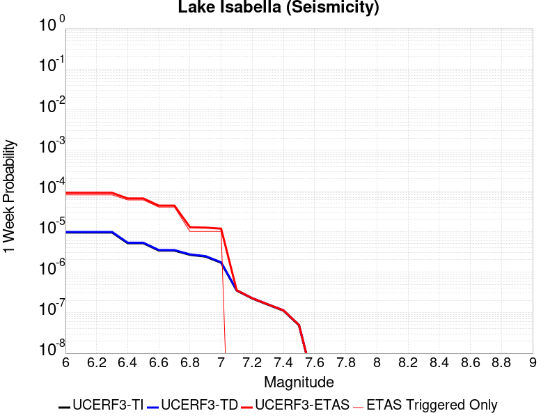 | 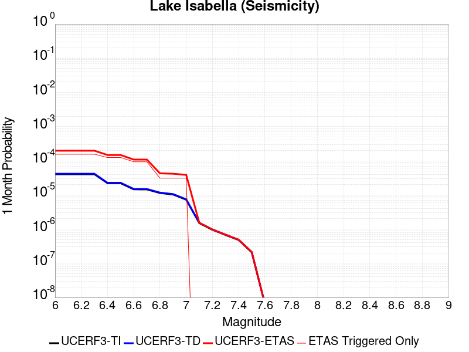 | 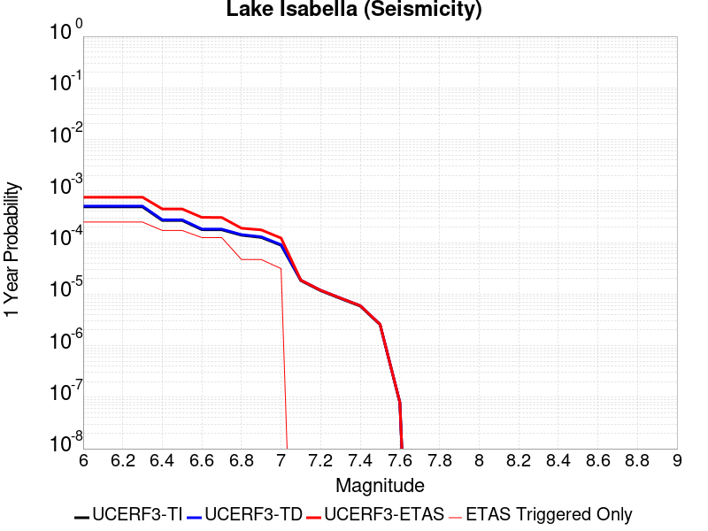 | 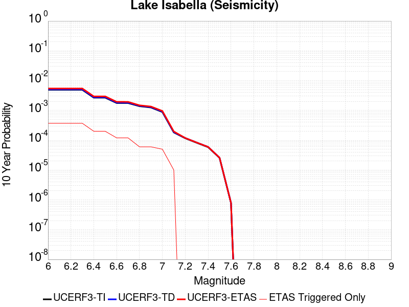 |

| Magnitude | 1 wk TI Prob | 1 wk TD Prob | 1 wk ETAS Prob | 1 wk ETAS/TD Gain | 1 wk ETAS Triggered Only | 1 mo TI Prob | 1 mo TD Prob | 1 mo ETAS Prob | 1 mo ETAS/TD Gain | 1 mo ETAS Triggered Only | 1 yr TI Prob | 1 yr TD Prob | 1 yr ETAS Prob | 1 yr ETAS/TD Gain | 1 yr ETAS Triggered Only | 10 yr TI Prob | 10 yr TD Prob | 10 yr ETAS Prob | 10 yr ETAS/TD Gain | 10 yr ETAS Triggered Only |
|-----|-----|-----|-----|-----|-----|-----|-----|-----|-----|-----|-----|-----|-----|-----|-----|-----|-----|-----|-----|-----|
| 6.0 | 9.431637E-6 | 9.741651E-6 | 8.9740875E-5 | 9.21208 | 8.0E-5 | 4.0420677E-5 | 4.1749343E-5 | 1.6174433E-4 | 3.8741767 | 1.2E-4 | 4.920106E-4 | 5.0819275E-4 | 7.380759E-4 | 1.4523542 | 2.3E-4 | 0.004909227 | 0.005071599 | 0.0054397224 | 1.0725853 | 3.7E-4 |
| 6.1 | 9.431637E-6 | 9.741651E-6 | 8.9740875E-5 | 9.21208 | 8.0E-5 | 4.0420677E-5 | 4.1749343E-5 | 1.6174433E-4 | 3.8741767 | 1.2E-4 | 4.920106E-4 | 5.0819275E-4 | 7.380759E-4 | 1.4523542 | 2.3E-4 | 0.004909227 | 0.005071599 | 0.0054397224 | 1.0725853 | 3.7E-4 |
| 6.2 | 9.431637E-6 | 9.741651E-6 | 8.9740875E-5 | 9.21208 | 8.0E-5 | 4.0420677E-5 | 4.1749343E-5 | 1.6174433E-4 | 3.8741767 | 1.2E-4 | 4.920106E-4 | 5.0819275E-4 | 7.380759E-4 | 1.4523542 | 2.3E-4 | 0.004909227 | 0.005071599 | 0.0054397224 | 1.0725853 | 3.7E-4 |
| 6.3 | 9.431637E-6 | 9.741651E-6 | 8.9740875E-5 | 9.21208 | 8.0E-5 | 4.0420677E-5 | 4.1749343E-5 | 1.6174433E-4 | 3.8741767 | 1.2E-4 | 4.920106E-4 | 5.0819275E-4 | 7.380759E-4 | 1.4523542 | 2.3E-4 | 0.004909227 | 0.005071599 | 0.0054397224 | 1.0725853 | 3.7E-4 |
| 6.4 | 5.144063E-6 | 5.3000763E-6 | 6.5299755E-5 | 12.320532 | 6.0E-5 | 2.2045799E-5 | 2.2714434E-5 | 1.1271239E-4 | 4.962148 | 9.0E-5 | 2.6837454E-4 | 2.765166E-4 | 4.3647236E-4 | 1.5784671 | 1.6E-4 | 0.0026805066 | 0.0027620657 | 0.0029615134 | 1.0722096 | 2.0E-4 |
| 6.5 | 5.144063E-6 | 5.3000763E-6 | 6.5299755E-5 | 12.320532 | 6.0E-5 | 2.2045799E-5 | 2.2714434E-5 | 1.1271239E-4 | 4.962148 | 9.0E-5 | 2.6837454E-4 | 2.765166E-4 | 4.3647236E-4 | 1.5784671 | 1.6E-4 | 0.0026805066 | 0.0027620657 | 0.0029615134 | 1.0722096 | 2.0E-4 |
| 6.6 | 3.4009804E-6 | 3.498786E-6 | 4.3498647E-5 | 12.432496 | 4.0E-5 | 1.4575549E-5 | 1.4994721E-5 | 8.499367E-5 | 5.6682396 | 7.0E-5 | 1.7744285E-4 | 1.8254704E-4 | 2.8252878E-4 | 1.547704 | 1.0E-4 | 0.0017730123 | 0.0018241286 | 0.0019439097 | 1.0656649 | 1.2E-4 |
| 6.7 | 3.3880428E-6 | 3.4856528E-6 | 4.3485514E-5 | 12.475573 | 4.0E-5 | 1.4520103E-5 | 1.4938435E-5 | 8.493739E-5 | 5.685829 | 7.0E-5 | 1.767679E-4 | 1.8186188E-4 | 2.8184368E-4 | 1.5497679 | 1.0E-4 | 0.0017662736 | 0.0018172882 | 0.0019370702 | 1.0659125 | 1.2E-4 |
| 6.8 | 2.6582E-6 | 2.7337003E-6 | 1.27336725E-5 | 4.6580358 | 1.0E-5 | 1.1392236E-5 | 1.1715813E-5 | 3.171558E-5 | 2.7070744 | 2.0E-5 | 1.3869164E-4 | 1.4263204E-4 | 1.8262633E-4 | 1.280402 | 4.0E-5 | 0.0013860512 | 0.0014255369 | 0.0014854514 | 1.0420294 | 6.0E-5 |
| 6.9 | 2.406011E-6 | 2.4743288E-6 | 1.2474304E-5 | 5.04149 | 1.0E-5 | 1.0311434E-5 | 1.0604231E-5 | 3.060402E-5 | 2.8860197 | 2.0E-5 | 1.2553448E-4 | 1.2910018E-4 | 1.6909502E-4 | 1.3097969 | 4.0E-5 | 0.0012546359 | 0.0012903814 | 0.001350304 | 1.0464379 | 6.0E-5 |
| 7.0 | 1.6953097E-6 | 1.7429371E-6 | 1.174292E-5 | 6.7374315 | 1.0E-5 | 7.265593E-6 | 7.469715E-6 | 2.7469567E-5 | 3.6774583 | 2.0E-5 | 8.8455E-5 | 9.094104E-5 | 1.20938304E-4 | 1.3298541 | 3.0E-5 | 8.84198E-4 | 9.09141E-4 | 9.590955E-4 | 1.054947 | 5.0E-5 |
| 7.1 | 3.5013824E-7 | 3.5714822E-7 | 3.5714822E-7 | 1.0 | 0.0 | 1.5005916E-6 | 1.5306344E-6 | 1.5306344E-6 | 1.0 | 0.0 | 1.826955E-5 | 1.8635317E-5 | 2.8635131E-5 | 1.5366055 | 1.0E-5 | 1.8268047E-4 | 1.863378E-4 | 1.9633592E-4 | 1.053656 | 1.0E-5 |
| 7.2 | 2.2321095E-7 | 2.2750574E-7 | 2.2750574E-7 | 1.0 | 0.0 | 9.56618E-7 | 9.750242E-7 | 9.750242E-7 | 1.0 | 0.0 | 1.1646762E-5 | 1.1870856E-5 | 1.1870856E-5 | 1.0 | 0.0 | 1.1646151E-4 | 1.1870232E-4 | 1.1870232E-4 | 1.0 | 0.0 |
| 7.3 | 1.5760406E-7 | 1.6060922E-7 | 1.6060922E-7 | 1.0 | 0.0 | 6.7544585E-7 | 6.8832503E-7 | 6.8832503E-7 | 1.0 | 0.0 | 8.223522E-6 | 8.380326E-6 | 8.380326E-6 | 1.0 | 0.0 | 8.2232174E-5 | 8.3800165E-5 | 8.3800165E-5 | 1.0 | 0.0 |
| 7.4 | 1.1216497E-7 | 1.1431706E-7 | 1.1431706E-7 | 1.0 | 0.0 | 4.8070694E-7 | 4.899302E-7 | 4.899302E-7 | 1.0 | 0.0 | 5.852591E-6 | 5.964884E-6 | 5.964884E-6 | 1.0 | 0.0 | 5.8524372E-5 | 5.9647282E-5 | 5.9647282E-5 | 1.0 | 0.0 |
| 7.5 | 4.885185E-8 | 4.9787737E-8 | 4.9787737E-8 | 1.0 | 0.0 | 2.0936506E-7 | 2.13376E-7 | 2.13376E-7 | 1.0 | 0.0 | 2.5490165E-6 | 2.59785E-6 | 2.59785E-6 | 1.0 | 0.0 | 2.5489873E-5 | 2.5978214E-5 | 2.5978214E-5 | 1.0 | 0.0 |
| 7.6 | 1.504641E-9 | 1.5317903E-9 | 1.5317903E-9 | 1.0 | 0.0 | 6.4484613E-9 | 6.5648154E-9 | 6.5648154E-9 | 1.0 | 0.0 | 7.851001E-8 | 7.992663E-8 | 7.992663E-8 | 1.0 | 0.0 | 7.8509987E-7 | 7.992663E-7 | 7.992663E-7 | 1.0 | 0.0 |

## San Jacinto (Anza) rev
*[(top)](#table-of-contents)*

| 1 Week | 1 Month | 1 Year | 10 Year |
|-----|-----|-----|-----|
| 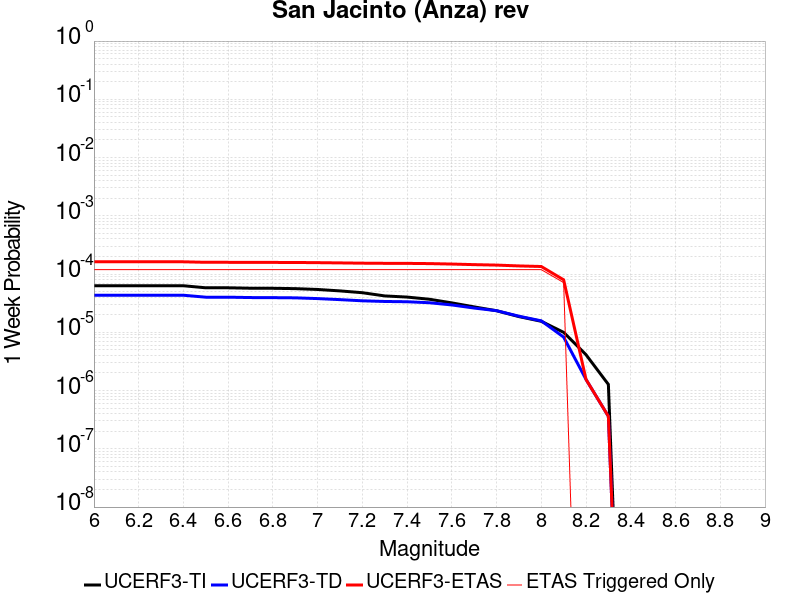 | 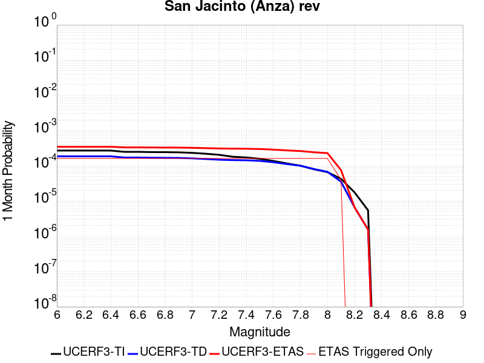 | 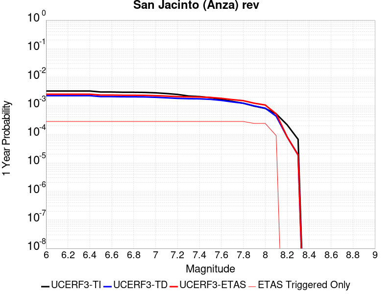 | 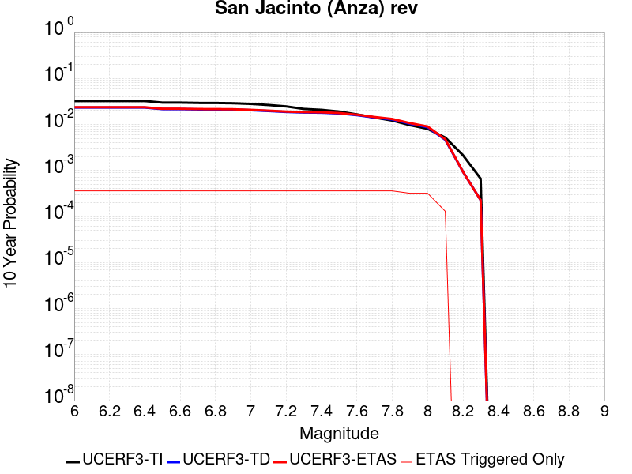 |

| Magnitude | 1 wk TI Prob | 1 wk TD Prob | 1 wk ETAS Prob | 1 wk ETAS/TD Gain | 1 wk ETAS Triggered Only | 1 mo TI Prob | 1 mo TD Prob | 1 mo ETAS Prob | 1 mo ETAS/TD Gain | 1 mo ETAS Triggered Only | 1 yr TI Prob | 1 yr TD Prob | 1 yr ETAS Prob | 1 yr ETAS/TD Gain | 1 yr ETAS Triggered Only | 10 yr TI Prob | 10 yr TD Prob | 10 yr ETAS Prob | 10 yr ETAS/TD Gain | 10 yr ETAS Triggered Only |
|-----|-----|-----|-----|-----|-----|-----|-----|-----|-----|-----|-----|-----|-----|-----|-----|-----|-----|-----|-----|-----|
| 6.0 | 6.3015636E-5 | 4.3302647E-5 | 1.2329918E-4 | 2.847382 | 8.0E-5 | 2.7003905E-4 | 1.8556965E-4 | 3.3554182E-4 | 1.8081719 | 1.5E-4 | 0.0032827691 | 0.0022569813 | 0.0025363492 | 1.1237795 | 2.8E-4 | 0.032346968 | 0.023296192 | 0.023647806 | 1.0150932 | 3.6E-4 |
| 6.1 | 6.3015636E-5 | 4.3302647E-5 | 1.2329918E-4 | 2.847382 | 8.0E-5 | 2.7003905E-4 | 1.8556965E-4 | 3.3554182E-4 | 1.8081719 | 1.5E-4 | 0.0032827691 | 0.0022569813 | 0.0025363492 | 1.1237795 | 2.8E-4 | 0.032346968 | 0.023296192 | 0.023647806 | 1.0150932 | 3.6E-4 |
| 6.2 | 6.3015636E-5 | 4.3302647E-5 | 1.2329918E-4 | 2.847382 | 8.0E-5 | 2.7003905E-4 | 1.8556965E-4 | 3.3554182E-4 | 1.8081719 | 1.5E-4 | 0.0032827691 | 0.0022569813 | 0.0025363492 | 1.1237795 | 2.8E-4 | 0.032346968 | 0.023296192 | 0.023647806 | 1.0150932 | 3.6E-4 |
| 6.3 | 6.3015636E-5 | 4.3302647E-5 | 1.2329918E-4 | 2.847382 | 8.0E-5 | 2.7003905E-4 | 1.8556965E-4 | 3.3554182E-4 | 1.8081719 | 1.5E-4 | 0.0032827691 | 0.0022569813 | 0.0025363492 | 1.1237795 | 2.8E-4 | 0.032346968 | 0.023296192 | 0.023647806 | 1.0150932 | 3.6E-4 |
| 6.4 | 6.3015636E-5 | 4.3302647E-5 | 1.2329918E-4 | 2.847382 | 8.0E-5 | 2.7003905E-4 | 1.8556965E-4 | 3.3554182E-4 | 1.8081719 | 1.5E-4 | 0.0032827691 | 0.0022569813 | 0.0025363492 | 1.1237795 | 2.8E-4 | 0.032346968 | 0.023296192 | 0.023647806 | 1.0150932 | 3.6E-4 |
| 6.5 | 5.811017E-5 | 4.0082516E-5 | 1.20079305E-4 | 2.9958029 | 8.0E-5 | 2.4901982E-4 | 1.7177092E-4 | 3.2174514E-4 | 1.873106 | 1.5E-4 | 0.0030276014 | 0.002089311 | 0.0023687258 | 1.1337355 | 2.8E-4 | 0.02986684 | 0.021593736 | 0.021945963 | 1.0163115 | 3.6E-4 |
| 6.6 | 5.811017E-5 | 4.0082516E-5 | 1.20079305E-4 | 2.9958029 | 8.0E-5 | 2.4901982E-4 | 1.7177092E-4 | 3.2174514E-4 | 1.873106 | 1.5E-4 | 0.0030276014 | 0.002089311 | 0.0023687258 | 1.1337355 | 2.8E-4 | 0.02986684 | 0.021593736 | 0.021945963 | 1.0163115 | 3.6E-4 |
| 6.7 | 5.712442E-5 | 3.9505223E-5 | 1.1950206E-4 | 3.0249686 | 8.0E-5 | 2.4479596E-4 | 1.6929714E-4 | 3.1927176E-4 | 1.8858662 | 1.5E-4 | 0.0029763177 | 0.0020592497 | 0.002338673 | 1.1356919 | 2.8E-4 | 0.029367693 | 0.021285562 | 0.0216379 | 1.0165529 | 3.6E-4 |
| 6.8 | 5.6967532E-5 | 3.9361643E-5 | 1.193585E-4 | 3.0323555 | 8.0E-5 | 2.4412372E-4 | 1.6868189E-4 | 3.186566E-4 | 1.8890978 | 1.5E-4 | 0.0029681553 | 0.002051773 | 0.0023311984 | 1.1361873 | 2.8E-4 | 0.029288229 | 0.021210281 | 0.021562645 | 1.0166129 | 3.6E-4 |
| 6.9 | 5.6211324E-5 | 3.9066435E-5 | 1.1906331E-4 | 3.0477138 | 8.0E-5 | 2.4088343E-4 | 1.6741687E-4 | 3.1739176E-4 | 1.895817 | 1.5E-4 | 0.0029288116 | 0.0020364004 | 0.0023158302 | 1.1372175 | 2.8E-4 | 0.028905109 | 0.021049714 | 0.021402135 | 1.0167423 | 3.6E-4 |
| 7.0 | 5.4383527E-5 | 3.792697E-5 | 1.1792393E-4 | 3.109237 | 8.0E-5 | 2.3305144E-4 | 1.6253405E-4 | 3.1250968E-4 | 1.9227335 | 1.5E-4 | 0.0028337094 | 0.001977061 | 0.0022565073 | 1.1413443 | 2.8E-4 | 0.027978465 | 0.020440677 | 0.020793319 | 1.017252 | 3.6E-4 |
| 7.1 | 5.1393665E-5 | 3.6389913E-5 | 1.16387004E-4 | 3.1983314 | 8.0E-5 | 2.2023996E-4 | 1.5594746E-4 | 3.0592407E-4 | 1.9617124 | 1.5E-4 | 0.0026781242 | 0.0018970112 | 0.0021764801 | 1.1473206 | 2.8E-4 | 0.026460782 | 0.019614287 | 0.019967224 | 1.0179939 | 3.6E-4 |
| 7.2 | 4.785222E-5 | 3.4741795E-5 | 1.14739014E-4 | 3.3026218 | 8.0E-5 | 2.0506482E-4 | 1.4888494E-4 | 2.988626E-4 | 2.0073395 | 1.5E-4 | 0.0024938055 | 0.0018111705 | 0.0020906634 | 1.1543162 | 2.8E-4 | 0.024660049 | 0.018728992 | 0.019082248 | 1.0188615 | 3.6E-4 |
| 7.3 | 4.2143256E-5 | 3.383628E-5 | 1.1383357E-4 | 3.3642461 | 8.0E-5 | 1.8060145E-4 | 1.4500458E-4 | 2.9498283E-4 | 2.0343 | 1.5E-4 | 0.002196605 | 0.0017640047 | 0.0020435108 | 1.1584498 | 2.8E-4 | 0.02175019 | 0.01823724 | 0.018590676 | 1.0193799 | 3.6E-4 |
| 7.4 | 4.0264713E-5 | 3.347446E-5 | 1.1347178E-4 | 3.3898015 | 8.0E-5 | 1.7255165E-4 | 1.4345412E-4 | 2.934326E-4 | 2.0454805 | 1.5E-4 | 0.002098792 | 0.0017451581 | 0.0020246694 | 1.1601639 | 2.8E-4 | 0.020790804 | 0.018041821 | 0.018395325 | 1.0195936 | 3.6E-4 |
| 7.5 | 3.694492E-5 | 3.218847E-5 | 1.12185895E-4 | 3.4852822 | 8.0E-5 | 1.5832575E-4 | 1.379433E-4 | 2.879226E-4 | 2.0872533 | 1.5E-4 | 0.0019259118 | 0.001678169 | 0.0019576992 | 1.1665685 | 2.8E-4 | 0.01909306 | 0.01735827 | 0.017712021 | 1.0203794 | 3.6E-4 |
| 7.6 | 3.200565E-5 | 2.9504106E-5 | 1.0950174E-4 | 3.711407 | 8.0E-5 | 1.3715986E-4 | 1.2644005E-4 | 2.7642108E-4 | 2.186183 | 1.5E-4 | 0.001668642 | 0.0015383229 | 0.0018178922 | 1.1817364 | 2.8E-4 | 0.01656168 | 0.0159463 | 0.016300559 | 1.0222157 | 3.6E-4 |
| 7.7 | 2.731642E-5 | 2.6092788E-5 | 1.060907E-4 | 4.0659013 | 8.0E-5 | 1.1706512E-4 | 1.1182144E-4 | 2.6180467E-4 | 2.3412743 | 1.5E-4 | 0.001424336 | 0.0013605768 | 0.0016401958 | 1.205515 | 2.8E-4 | 0.014152412 | 0.014167004 | 0.014521904 | 1.0250511 | 3.6E-4 |
| 7.8 | 2.3466424E-5 | 2.3504817E-5 | 1.03502935E-4 | 4.4034777 | 8.0E-5 | 1.0056651E-4 | 1.0073105E-4 | 2.5071594E-4 | 2.4889638 | 1.5E-4 | 0.0012237094 | 0.0012257113 | 0.0015053682 | 1.2281588 | 2.8E-4 | 0.012169928 | 0.012808893 | 0.013164282 | 1.0277455 | 3.6E-4 |
| 7.9 | 1.8611925E-5 | 1.8908117E-5 | 9.89066E-5 | 5.230907 | 8.0E-5 | 7.9762955E-5 | 8.1032274E-5 | 2.3102012E-4 | 2.8509643 | 1.5E-4 | 9.7068126E-4 | 9.861222E-4 | 0.0012258855 | 1.2431376 | 2.4E-4 | 0.0096645225 | 0.010393824 | 0.010710498 | 1.0304675 | 3.2E-4 |
| 8.0 | 1.5460775E-5 | 1.5740965E-5 | 9.5739706E-5 | 6.0822005 | 8.0E-5 | 6.6258784E-5 | 6.7459536E-5 | 2.1744941E-4 | 3.2234051 | 1.5E-4 | 8.0640207E-4 | 8.21011E-4 | 0.001060814 | 1.2920825 | 2.4E-4 | 0.008034821 | 0.0087028835 | 0.0090200985 | 1.0364494 | 3.2E-4 |
| 8.1 | 9.983884E-6 | 8.269952E-6 | 3.8269704E-5 | 4.6275606 | 3.0E-5 | 4.2787375E-5 | 3.544217E-5 | 8.54404E-5 | 2.410699 | 5.0E-5 | 5.2081177E-4 | 4.314235E-4 | 5.213847E-4 | 1.2085217 | 9.0E-5 | 0.0051959283 | 0.004640022 | 0.004769419 | 1.0278871 | 1.3E-4 |
| 8.2 | 4.1226E-6 | 1.5529788E-6 | 1.5529788E-6 | 1.0 | 0.0 | 1.7668166E-5 | 6.6556063E-6 | 6.6556063E-6 | 1.0 | 0.0 | 2.1508869E-4 | 8.102902E-5 | 8.102902E-5 | 1.0 | 0.0 | 0.0021488064 | 9.4050163E-4 | 9.4050163E-4 | 1.0 | 0.0 |
| 8.3 | 1.2750878E-6 | 3.612133E-7 | 3.612133E-7 | 1.0 | 0.0 | 5.4646503E-6 | 1.548056E-6 | 1.548056E-6 | 1.0 | 0.0 | 6.653009E-5 | 1.8847424E-5 | 1.8847424E-5 | 1.0 | 0.0 | 6.6510175E-4 | 2.2734253E-4 | 2.2734253E-4 | 1.0 | 0.0 |

## White Wolf (Extension)
*[(top)](#table-of-contents)*

| 1 Week | 1 Month | 1 Year | 10 Year |
|-----|-----|-----|-----|
| 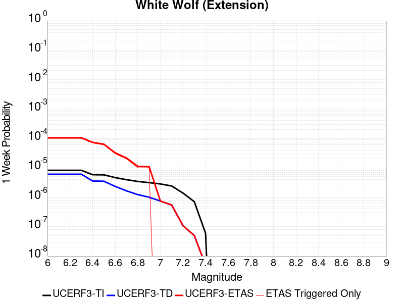 | 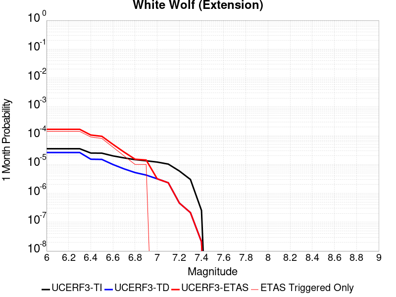 | 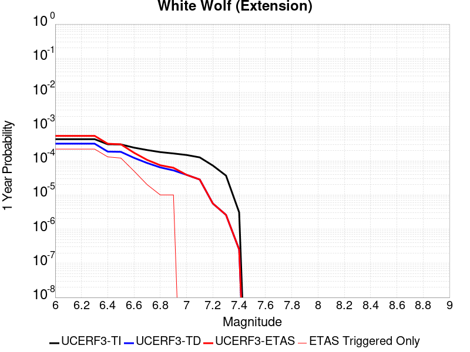 | 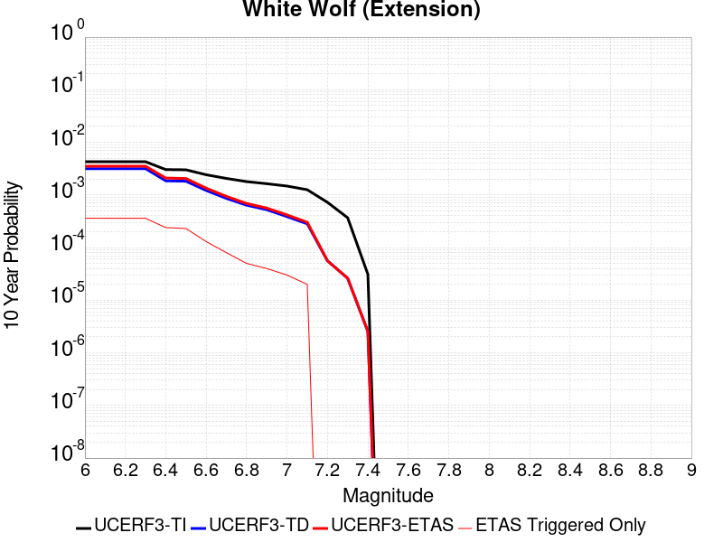 |

| Magnitude | 1 wk TI Prob | 1 wk TD Prob | 1 wk ETAS Prob | 1 wk ETAS/TD Gain | 1 wk ETAS Triggered Only | 1 mo TI Prob | 1 mo TD Prob | 1 mo ETAS Prob | 1 mo ETAS/TD Gain | 1 mo ETAS Triggered Only | 1 yr TI Prob | 1 yr TD Prob | 1 yr ETAS Prob | 1 yr ETAS/TD Gain | 1 yr ETAS Triggered Only | 10 yr TI Prob | 10 yr TD Prob | 10 yr ETAS Prob | 10 yr ETAS/TD Gain | 10 yr ETAS Triggered Only |
|-----|-----|-----|-----|-----|-----|-----|-----|-----|-----|-----|-----|-----|-----|-----|-----|-----|-----|-----|-----|-----|
| 6.0 | 8.222555E-6 | 6.0666657E-6 | 1.0606606E-4 | 17.48342 | 1.0E-4 | 3.5239045E-5 | 2.5999774E-5 | 1.6599613E-4 | 6.384522 | 1.4E-4 | 4.289509E-4 | 3.1650788E-4 | 5.3643825E-4 | 1.6948653 | 2.2E-4 | 0.0042812387 | 0.003161223 | 0.003520085 | 1.11352 | 3.6E-4 |
| 6.1 | 8.222555E-6 | 6.0666657E-6 | 1.0606606E-4 | 17.48342 | 1.0E-4 | 3.5239045E-5 | 2.5999774E-5 | 1.6599613E-4 | 6.384522 | 1.4E-4 | 4.289509E-4 | 3.1650788E-4 | 5.3643825E-4 | 1.6948653 | 2.2E-4 | 0.0042812387 | 0.003161223 | 0.003520085 | 1.11352 | 3.6E-4 |
| 6.2 | 8.222555E-6 | 6.0666657E-6 | 1.0606606E-4 | 17.48342 | 1.0E-4 | 3.5239045E-5 | 2.5999774E-5 | 1.6599613E-4 | 6.384522 | 1.4E-4 | 4.289509E-4 | 3.1650788E-4 | 5.3643825E-4 | 1.6948653 | 2.2E-4 | 0.0042812387 | 0.003161223 | 0.003520085 | 1.11352 | 3.6E-4 |
| 6.3 | 8.222555E-6 | 6.0666657E-6 | 1.0606606E-4 | 17.48342 | 1.0E-4 | 3.5239045E-5 | 2.5999774E-5 | 1.6599613E-4 | 6.384522 | 1.4E-4 | 4.289509E-4 | 3.1650788E-4 | 5.3643825E-4 | 1.6948653 | 2.2E-4 | 0.0042812387 | 0.003161223 | 0.003520085 | 1.11352 | 3.6E-4 |
| 6.4 | 5.821773E-6 | 3.5571766E-6 | 7.355693E-5 | 20.67846 | 7.0E-5 | 2.4950215E-5 | 1.5244959E-5 | 1.05243584E-4 | 6.9035006 | 9.0E-5 | 3.0372653E-4 | 1.8559267E-4 | 3.1556856E-4 | 1.7003287 | 1.3E-4 | 0.0030331176 | 0.001854485 | 0.00209404 | 1.129176 | 2.4E-4 |
| 6.5 | 5.766023E-6 | 3.4991106E-6 | 6.34989E-5 | 18.147154 | 6.0E-5 | 2.4711293E-5 | 1.4996108E-5 | 9.499491E-5 | 6.334637 | 8.0E-5 | 3.0081844E-4 | 1.8256342E-4 | 3.025415E-4 | 1.6571858 | 1.2E-4 | 0.0030041158 | 0.0018242426 | 0.002053823 | 1.1258497 | 2.3E-4 |
| 6.6 | 4.643576E-6 | 2.332624E-6 | 3.2332555E-5 | 13.861022 | 3.0E-5 | 1.9900888E-5 | 9.996925E-6 | 4.9996524E-5 | 5.0011907 | 4.0E-5 | 2.4226638E-4 | 1.2170619E-4 | 1.717001E-4 | 1.4107754 | 5.0E-5 | 0.0024200242 | 0.0012164378 | 0.0013462796 | 1.1067394 | 1.3E-4 |
| 6.7 | 3.9529173E-6 | 1.6483477E-6 | 2.1648315E-5 | 13.133342 | 2.0E-5 | 1.6940963E-5 | 7.0643296E-6 | 2.7064189E-5 | 3.831105 | 2.0E-5 | 2.0623671E-4 | 8.6005006E-5 | 1.0600329E-4 | 1.2325246 | 2.0E-5 | 0.002060454 | 8.597357E-4 | 9.3966693E-4 | 1.0929718 | 8.0E-5 |
| 6.8 | 3.4377522E-6 | 1.2245237E-6 | 1.1224512E-5 | 9.16643 | 1.0E-5 | 1.473314E-5 | 5.2479486E-6 | 1.5247896E-5 | 2.9054964 | 1.0E-5 | 1.7936122E-4 | 6.3891996E-5 | 7.389135E-5 | 1.1565042 | 1.0E-5 | 0.0017921652 | 6.387454E-4 | 6.887134E-4 | 1.0782285 | 5.0E-5 |
| 6.9 | 3.1367306E-6 | 1.0033783E-6 | 1.1003368E-5 | 10.96632 | 1.0E-5 | 1.3443062E-5 | 4.3001864E-6 | 1.4300143E-5 | 3.3254707 | 1.0E-5 | 1.63657E-4 | 5.235359E-5 | 6.2353065E-5 | 1.1909989 | 1.0E-5 | 0.0016353652 | 5.2342017E-4 | 5.633992E-4 | 1.0763805 | 4.0E-5 |
| 7.0 | 2.8298145E-6 | 7.4286646E-7 | 7.4286646E-7 | 1.0 | 0.0 | 1.2127721E-5 | 3.1837099E-6 | 3.1837099E-6 | 1.0 | 0.0 | 1.47645E-4 | 3.8761027E-5 | 3.8761027E-5 | 1.0 | 0.0 | 0.0014754693 | 3.8754768E-4 | 4.1753604E-4 | 1.0773798 | 3.0E-5 |
| 7.1 | 2.4091064E-6 | 5.4227525E-7 | 5.4227525E-7 | 1.0 | 0.0 | 1.03247E-5 | 2.3240348E-6 | 2.3240348E-6 | 1.0 | 0.0 | 1.2569598E-4 | 2.8294799E-5 | 2.8294799E-5 | 1.0 | 0.0 | 0.001256249 | 2.8291598E-4 | 3.0291034E-4 | 1.0706724 | 2.0E-5 |
| 7.2 | 1.3875518E-6 | 1.0743063E-7 | 1.0743063E-7 | 1.0 | 0.0 | 5.9466374E-6 | 4.6041689E-7 | 4.6041689E-7 | 1.0 | 0.0 | 7.23979E-5 | 5.6055624E-6 | 5.6055624E-6 | 1.0 | 0.0 | 7.2374323E-4 | 5.6054323E-5 | 5.6054323E-5 | 1.0 | 0.0 |
| 7.3 | 7.056077E-7 | 5.002034E-8 | 5.002034E-8 | 1.0 | 0.0 | 3.0240296E-6 | 2.1437286E-7 | 2.1437286E-7 | 1.0 | 0.0 | 3.681694E-5 | 2.609987E-6 | 2.609987E-6 | 1.0 | 0.0 | 3.681084E-4 | 2.609961E-5 | 2.609961E-5 | 1.0 | 0.0 |
| 7.4 | 5.9334678E-8 | 4.8683537E-9 | 4.8683537E-9 | 1.0 | 0.0 | 2.5429145E-7 | 2.0864372E-8 | 2.0864372E-8 | 1.0 | 0.0 | 3.095994E-6 | 2.5402372E-7 | 2.5402372E-7 | 1.0 | 0.0 | 3.095951E-5 | 2.5402353E-6 | 2.5402353E-6 | 1.0 | 0.0 |

## Lost Hills
*[(top)](#table-of-contents)*

| 1 Week | 1 Month | 1 Year | 10 Year |
|-----|-----|-----|-----|
| 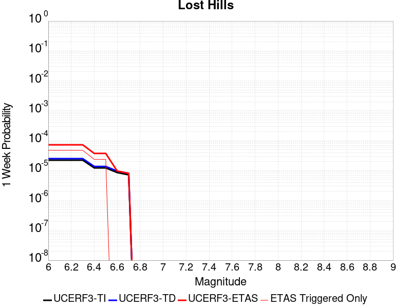 |  | 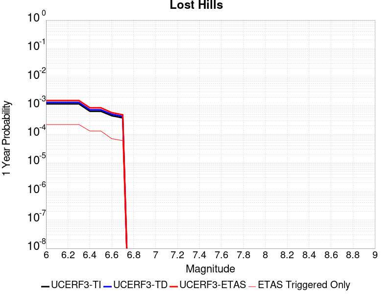 | 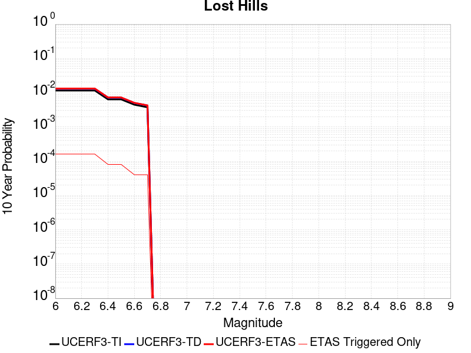 |

| Magnitude | 1 wk TI Prob | 1 wk TD Prob | 1 wk ETAS Prob | 1 wk ETAS/TD Gain | 1 wk ETAS Triggered Only | 1 mo TI Prob | 1 mo TD Prob | 1 mo ETAS Prob | 1 mo ETAS/TD Gain | 1 mo ETAS Triggered Only | 1 yr TI Prob | 1 yr TD Prob | 1 yr ETAS Prob | 1 yr ETAS/TD Gain | 1 yr ETAS Triggered Only | 10 yr TI Prob | 10 yr TD Prob | 10 yr ETAS Prob | 10 yr ETAS/TD Gain | 10 yr ETAS Triggered Only |
|-----|-----|-----|-----|-----|-----|-----|-----|-----|-----|-----|-----|-----|-----|-----|-----|-----|-----|-----|-----|-----|
| 6.0 | 2.233523E-5 | 2.5106583E-5 | 1.0510458E-4 | 4.1863356 | 8.0E-5 | 9.571891E-5 | 1.0759615E-4 | 2.5758002E-4 | 2.393952 | 1.5E-4 | 0.0011647546 | 0.001309364 | 0.0015290759 | 1.1678005 | 2.2E-4 | 0.011586686 | 0.013033091 | 0.013319311 | 1.0219611 | 2.9E-4 |
| 6.1 | 2.233523E-5 | 2.5106583E-5 | 1.0510458E-4 | 4.1863356 | 8.0E-5 | 9.571891E-5 | 1.0759615E-4 | 2.5758002E-4 | 2.393952 | 1.5E-4 | 0.0011647546 | 0.001309364 | 0.0015290759 | 1.1678005 | 2.2E-4 | 0.011586686 | 0.013033091 | 0.013319311 | 1.0219611 | 2.9E-4 |
| 6.2 | 2.233523E-5 | 2.5106583E-5 | 1.0510458E-4 | 4.1863356 | 8.0E-5 | 9.571891E-5 | 1.0759615E-4 | 2.5758002E-4 | 2.393952 | 1.5E-4 | 0.0011647546 | 0.001309364 | 0.0015290759 | 1.1678005 | 2.2E-4 | 0.011586686 | 0.013033091 | 0.013319311 | 1.0219611 | 2.9E-4 |
| 6.3 | 2.233523E-5 | 2.5106583E-5 | 1.0510458E-4 | 4.1863356 | 8.0E-5 | 9.571891E-5 | 1.0759615E-4 | 2.5758002E-4 | 2.393952 | 1.5E-4 | 0.0011647546 | 0.001309364 | 0.0015290759 | 1.1678005 | 2.2E-4 | 0.011586686 | 0.013033091 | 0.013319311 | 1.0219611 | 2.9E-4 |
| 6.4 | 1.2288092E-5 | 1.3781108E-5 | 6.378042E-5 | 4.6281056 | 5.0E-5 | 5.2662188E-5 | 5.906108E-5 | 1.3905636E-4 | 2.35445 | 8.0E-5 | 6.409735E-4 | 7.189252E-4 | 8.488318E-4 | 1.1806955 | 1.3E-4 | 0.006391279 | 0.0071752006 | 0.007363837 | 1.02629 | 1.9E-4 |
| 6.5 | 1.2288092E-5 | 1.3781108E-5 | 6.378042E-5 | 4.6281056 | 5.0E-5 | 5.2662188E-5 | 5.906108E-5 | 1.3905636E-4 | 2.35445 | 8.0E-5 | 6.409735E-4 | 7.189252E-4 | 8.488318E-4 | 1.1806955 | 1.3E-4 | 0.006391279 | 0.0071752006 | 0.007363837 | 1.02629 | 1.9E-4 |
| 6.6 | 8.58281E-6 | 9.63377E-6 | 2.9633577E-5 | 3.0760105 | 2.0E-5 | 3.6782953E-5 | 4.12874E-5 | 7.1286166E-5 | 1.726584 | 3.0E-5 | 4.4774043E-4 | 5.026414E-4 | 5.726062E-4 | 1.1391943 | 7.0E-5 | 0.0044683935 | 0.005023205 | 0.005152552 | 1.0257499 | 1.3E-4 |
| 6.7 | 7.205685E-6 | 8.088302E-6 | 2.808814E-5 | 3.472687 | 2.0E-5 | 3.088114E-5 | 3.466415E-5 | 6.466311E-5 | 1.8654175 | 3.0E-5 | 3.7591302E-4 | 4.2203604E-4 | 4.820107E-4 | 1.142108 | 6.0E-5 | 0.0037527776 | 0.0042203604 | 0.0043199384 | 1.0235946 | 1.0E-4 |

## Brawley (Seismic Zone) alt 1
*[(top)](#table-of-contents)*

| 1 Week | 1 Month | 1 Year | 10 Year |
|-----|-----|-----|-----|
| 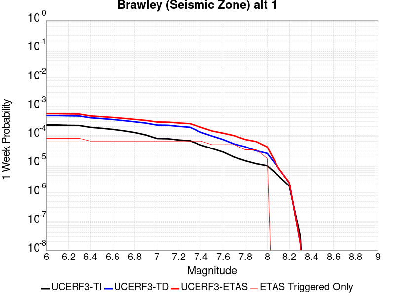 | 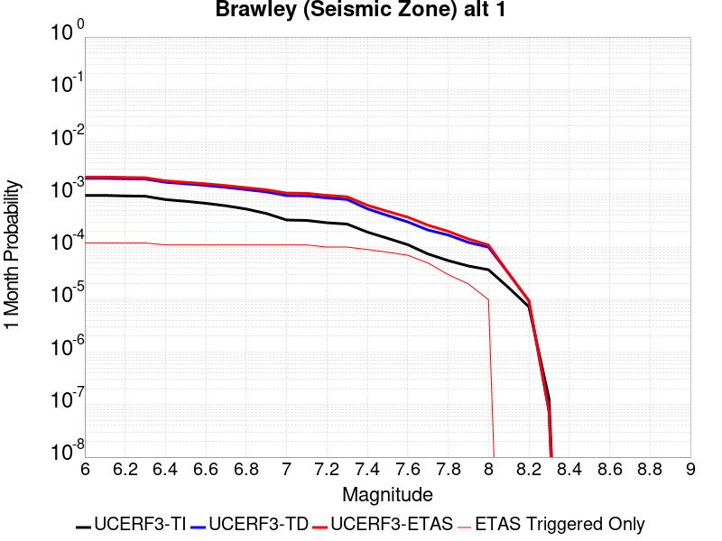 | 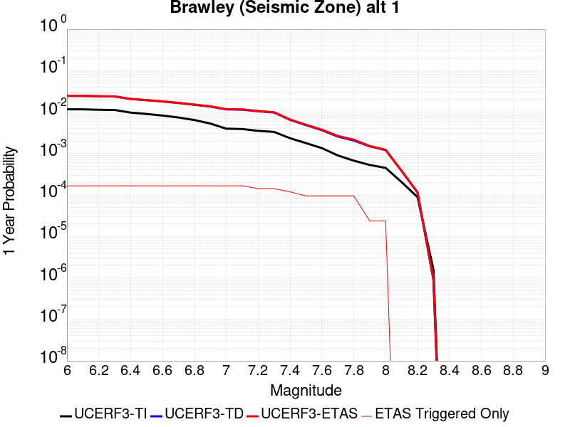 | 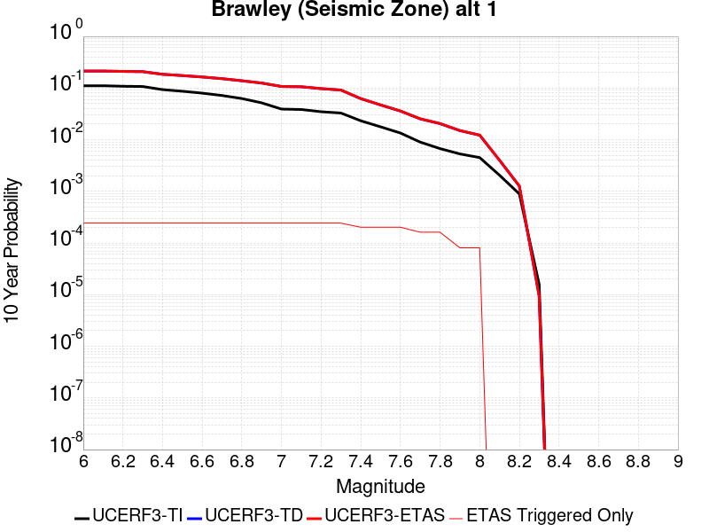 |

| Magnitude | 1 wk TI Prob | 1 wk TD Prob | 1 wk ETAS Prob | 1 wk ETAS/TD Gain | 1 wk ETAS Triggered Only | 1 mo TI Prob | 1 mo TD Prob | 1 mo ETAS Prob | 1 mo ETAS/TD Gain | 1 mo ETAS Triggered Only | 1 yr TI Prob | 1 yr TD Prob | 1 yr ETAS Prob | 1 yr ETAS/TD Gain | 1 yr ETAS Triggered Only | 10 yr TI Prob | 10 yr TD Prob | 10 yr ETAS Prob | 10 yr ETAS/TD Gain | 10 yr ETAS Triggered Only |
|-----|-----|-----|-----|-----|-----|-----|-----|-----|-----|-----|-----|-----|-----|-----|-----|-----|-----|-----|-----|-----|
| 6.0 | 2.2521618E-4 | 4.7632487E-4 | 5.562868E-4 | 1.1678725 | 8.0E-5 | 9.6485513E-4 | 0.0020398323 | 0.0021595876 | 1.0587083 | 1.2E-4 | 0.011683988 | 0.024546238 | 0.024731573 | 1.0075505 | 1.9E-4 | 0.11088423 | 0.21350002 | 0.2137517 | 1.0011789 | 3.2E-4 |
| 6.1 | 2.2521618E-4 | 4.7632487E-4 | 5.562868E-4 | 1.1678725 | 8.0E-5 | 9.6485513E-4 | 0.0020398323 | 0.0021595876 | 1.0587083 | 1.2E-4 | 0.011683988 | 0.024546238 | 0.024731573 | 1.0075505 | 1.9E-4 | 0.11088423 | 0.21350002 | 0.2137517 | 1.0011789 | 3.2E-4 |
| 6.2 | 2.198148E-4 | 4.6717093E-4 | 5.4713356E-4 | 1.1711636 | 8.0E-5 | 9.417233E-4 | 0.0020006616 | 0.0021204215 | 1.0598601 | 1.2E-4 | 0.011405343 | 0.024080504 | 0.024265928 | 1.0077002 | 1.9E-4 | 0.10837428 | 0.20993657 | 0.21018939 | 1.0012043 | 3.2E-4 |
| 6.3 | 2.1704129E-4 | 4.615278E-4 | 5.4149085E-4 | 1.1732574 | 8.0E-5 | 9.298453E-4 | 0.0019765133 | 0.0020962763 | 1.060593 | 1.2E-4 | 0.011262234 | 0.02379366 | 0.02397914 | 1.0077953 | 1.9E-4 | 0.107082725 | 0.20782755 | 0.20808104 | 1.0012197 | 3.2E-4 |
| 6.4 | 1.876142E-4 | 4.00449E-4 | 4.70421E-4 | 1.1747338 | 7.0E-5 | 8.038131E-4 | 0.0017150956 | 0.0018249069 | 1.0640264 | 1.1E-4 | 0.00974259 | 0.020680401 | 0.020856678 | 1.008524 | 1.8E-4 | 0.093263686 | 0.18457815 | 0.18483093 | 1.0013695 | 3.1E-4 |
| 6.5 | 1.7390939E-4 | 3.7477075E-4 | 4.447445E-4 | 1.1867108 | 7.0E-5 | 7.45113E-4 | 0.0016051838 | 0.0017150074 | 1.068418 | 1.1E-4 | 0.009034078 | 0.019368723 | 0.019545237 | 1.0091133 | 1.8E-4 | 0.086755216 | 0.17440031 | 0.17465626 | 1.0014675 | 3.1E-4 |
| 6.6 | 1.591791E-4 | 3.4891962E-4 | 4.188952E-4 | 1.2005492 | 7.0E-5 | 6.8201777E-4 | 0.0014945229 | 0.0016043584 | 1.073492 | 1.1E-4 | 0.008271996 | 0.018045569 | 0.01822232 | 1.0097947 | 1.8E-4 | 0.07970774 | 0.16380852 | 0.16406775 | 1.0015825 | 3.1E-4 |
| 6.7 | 1.4268003E-4 | 3.20582E-4 | 3.9055958E-4 | 1.2182828 | 7.0E-5 | 6.1134255E-4 | 0.0013732077 | 0.0014830566 | 1.0799944 | 1.1E-4 | 0.007417723 | 0.016592601 | 0.016769616 | 1.0106682 | 1.8E-4 | 0.07174956 | 0.15193306 | 0.15219596 | 1.0017303 | 3.1E-4 |
| 6.8 | 1.239713E-4 | 2.9053655E-4 | 3.6051622E-4 | 1.2408636 | 7.0E-5 | 5.3119735E-4 | 0.0012445687 | 0.0013544317 | 1.088274 | 1.1E-4 | 0.0064481674 | 0.015048777 | 0.015226068 | 1.0117811 | 1.8E-4 | 0.06264243 | 0.13837762 | 0.13864473 | 1.0019302 | 3.1E-4 |
| 6.9 | 1.0180238E-4 | 2.625439E-4 | 3.3252552E-4 | 1.2665521 | 7.0E-5 | 4.3622297E-4 | 0.0011247073 | 0.0012345836 | 1.0976932 | 1.1E-4 | 0.005298089 | 0.013608336 | 0.013785887 | 1.0130472 | 1.8E-4 | 0.05173543 | 0.124961674 | 0.12523293 | 1.0021708 | 3.1E-4 |
| 7.0 | 7.6619996E-5 | 2.23993E-4 | 2.9397733E-4 | 1.3124398 | 7.0E-5 | 3.283301E-4 | 9.5962E-4 | 0.0010695144 | 1.1145188 | 1.1E-4 | 0.0039900932 | 0.011621496 | 0.0117994035 | 1.0153085 | 1.8E-4 | 0.039192066 | 0.107266866 | 0.10754361 | 1.00258 | 3.1E-4 |
| 7.1 | 7.5127435E-5 | 2.2082464E-4 | 2.9080917E-4 | 1.3169236 | 7.0E-5 | 3.2193496E-4 | 9.4605127E-4 | 0.0010559472 | 1.1161628 | 1.1E-4 | 0.0039125155 | 0.011458045 | 0.011635982 | 1.0155295 | 1.8E-4 | 0.038443442 | 0.10583085 | 0.10610804 | 1.0026191 | 3.1E-4 |
| 7.2 | 6.788582E-5 | 2.0210193E-4 | 2.7208778E-4 | 1.3462899 | 7.0E-5 | 2.9090676E-4 | 8.6586666E-4 | 9.657801E-4 | 1.1153913 | 1.0E-4 | 0.0035360386 | 0.0104916105 | 0.010659827 | 1.0160334 | 1.7E-4 | 0.034803 | 0.09750131 | 0.09777206 | 1.0027769 | 3.0E-4 |
| 7.3 | 6.399602E-5 | 1.8841137E-4 | 2.5839818E-4 | 1.3714575 | 7.0E-5 | 2.7423984E-4 | 8.072303E-4 | 9.071496E-4 | 1.1237804 | 1.0E-4 | 0.0033337586 | 0.009784332 | 0.009952668 | 1.0172048 | 1.7E-4 | 0.03284188 | 0.09139617 | 0.09166875 | 1.0029824 | 3.0E-4 |
| 7.4 | 4.506759E-5 | 1.2529209E-4 | 1.9528331E-4 | 1.5586245 | 7.0E-5 | 1.9313251E-4 | 5.368565E-4 | 6.2680815E-4 | 1.1675526 | 9.0E-5 | 0.0023488526 | 0.0065168133 | 0.006665836 | 1.0228674 | 1.5E-4 | 0.023241805 | 0.062363707 | 0.06262624 | 1.0042098 | 2.8E-4 |
| 7.5 | 3.43289E-5 | 9.33541E-5 | 1.533485E-4 | 1.6426542 | 6.0E-5 | 1.4711556E-4 | 4.00028E-4 | 4.7999597E-4 | 1.199906 | 8.0E-5 | 0.0017896603 | 0.0048595266 | 0.0049988464 | 1.0286694 | 1.4E-4 | 0.01775316 | 0.04705519 | 0.047302954 | 1.0052655 | 2.6E-4 |
| 7.6 | 2.5980507E-5 | 7.053101E-5 | 1.2052748E-4 | 1.708858 | 5.0E-5 | 1.1134028E-4 | 3.0224086E-4 | 3.722197E-4 | 1.2315334 | 7.0E-5 | 0.001354725 | 0.003673598 | 0.0038031202 | 1.0352577 | 1.3E-4 | 0.013464959 | 0.035840835 | 0.036081873 | 1.0067253 | 2.5E-4 |
| 7.7 | 1.7292105E-5 | 4.9407296E-5 | 8.940532E-5 | 1.809557 | 4.0E-5 | 7.4106916E-5 | 2.117284E-4 | 2.6171783E-4 | 1.2361016 | 5.0E-5 | 9.018782E-4 | 0.0025747516 | 0.0026844684 | 1.0426126 | 1.1E-4 | 0.008982267 | 0.025290398 | 0.025475593 | 1.0073228 | 1.9E-4 |
| 7.8 | 1.2927471E-5 | 3.9693266E-5 | 5.9692473E-5 | 1.5038438 | 2.0E-5 | 5.5402274E-5 | 1.7010293E-4 | 2.0009783E-4 | 1.1763338 | 3.0E-5 | 6.743139E-4 | 0.0020690386 | 0.0021588523 | 1.0434085 | 9.0E-5 | 0.0067227143 | 0.020431727 | 0.020598255 | 1.0081503 | 1.7E-4 |
| 7.9 | 1.0200774E-5 | 2.874569E-5 | 4.8745114E-5 | 1.6957365 | 2.0E-5 | 4.371687E-5 | 1.2319001E-4 | 1.4318754E-4 | 1.1623309 | 2.0E-5 | 5.321229E-4 | 0.0014988075 | 0.0015587176 | 1.0399718 | 6.0E-5 | 0.005308505 | 0.014991644 | 0.015119695 | 1.0085415 | 1.3E-4 |
| 8.0 | 8.650396E-6 | 2.3277367E-5 | 3.3277134E-5 | 1.4295919 | 1.0E-5 | 3.70726E-5 | 9.975634E-5 | 1.0975534E-4 | 1.1002343 | 1.0E-5 | 4.5126543E-4 | 0.0012138576 | 0.001253809 | 1.0329129 | 4.0E-5 | 0.0045035016 | 0.012211097 | 0.012299998 | 1.0072803 | 9.0E-5 |
| 8.1 | 3.9368224E-6 | 7.3279825E-6 | 7.3279825E-6 | 1.0 | 0.0 | 1.6871985E-5 | 3.140526E-5 | 3.140526E-5 | 1.0 | 0.0 | 2.0539707E-4 | 3.8229208E-4 | 3.8229208E-4 | 1.0 | 0.0 | 0.0020520731 | 0.004001185 | 0.004001185 | 1.0 | 0.0 |
| 8.2 | 1.7101195E-6 | 2.217876E-6 | 2.217876E-6 | 1.0 | 0.0 | 7.329063E-6 | 9.505149E-6 | 9.505149E-6 | 1.0 | 0.0 | 8.922769E-5 | 1.1571907E-4 | 1.1571907E-4 | 1.0 | 0.0 | 8.9191867E-4 | 0.0012666774 | 0.0012666774 | 1.0 | 0.0 |
| 8.3 | 3.0346666E-8 | 1.721586E-8 | 1.721586E-8 | 1.0 | 0.0 | 1.3005713E-7 | 7.378226E-8 | 7.378226E-8 | 1.0 | 0.0 | 1.5834444E-6 | 8.9829894E-7 | 8.9829894E-7 | 1.0 | 0.0 | 1.5834332E-5 | 9.367729E-6 | 9.367729E-6 | 1.0 | 0.0 |

## Pleito
*[(top)](#table-of-contents)*

| 1 Week | 1 Month | 1 Year | 10 Year |
|-----|-----|-----|-----|
| 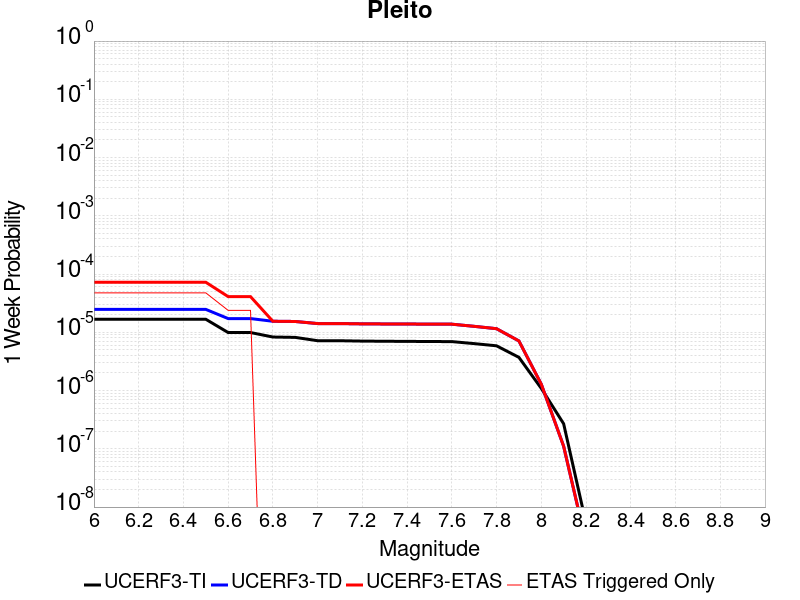 | 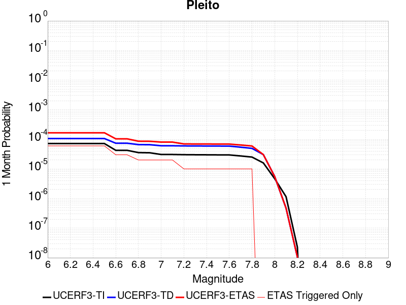 |  | 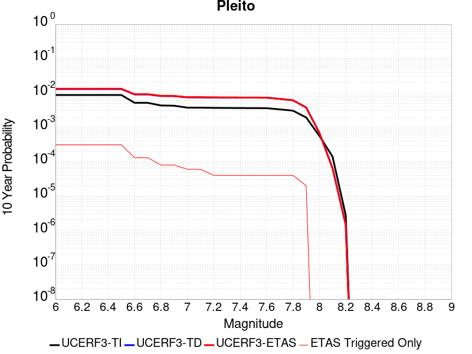 |

| Magnitude | 1 wk TI Prob | 1 wk TD Prob | 1 wk ETAS Prob | 1 wk ETAS/TD Gain | 1 wk ETAS Triggered Only | 1 mo TI Prob | 1 mo TD Prob | 1 mo ETAS Prob | 1 mo ETAS/TD Gain | 1 mo ETAS Triggered Only | 1 yr TI Prob | 1 yr TD Prob | 1 yr ETAS Prob | 1 yr ETAS/TD Gain | 1 yr ETAS Triggered Only | 10 yr TI Prob | 10 yr TD Prob | 10 yr ETAS Prob | 10 yr ETAS/TD Gain | 10 yr ETAS Triggered Only |
|-----|-----|-----|-----|-----|-----|-----|-----|-----|-----|-----|-----|-----|-----|-----|-----|-----|-----|-----|-----|-----|
| 6.0 | 1.6763008E-5 | 2.4763838E-5 | 7.47626E-5 | 3.0190232 | 5.0E-5 | 7.183948E-5 | 1.0612683E-4 | 1.6612046E-4 | 1.5653013 | 6.0E-5 | 8.742947E-4 | 0.0012914003 | 0.0014412066 | 1.116003 | 1.5E-4 | 0.00870863 | 0.0129538905 | 0.013259875 | 1.0236211 | 3.1E-4 |
| 6.1 | 1.6763008E-5 | 2.4763838E-5 | 7.47626E-5 | 3.0190232 | 5.0E-5 | 7.183948E-5 | 1.0612683E-4 | 1.6612046E-4 | 1.5653013 | 6.0E-5 | 8.742947E-4 | 0.0012914003 | 0.0014412066 | 1.116003 | 1.5E-4 | 0.00870863 | 0.0129538905 | 0.013259875 | 1.0236211 | 3.1E-4 |
| 6.2 | 1.6763008E-5 | 2.4763838E-5 | 7.47626E-5 | 3.0190232 | 5.0E-5 | 7.183948E-5 | 1.0612683E-4 | 1.6612046E-4 | 1.5653013 | 6.0E-5 | 8.742947E-4 | 0.0012914003 | 0.0014412066 | 1.116003 | 1.5E-4 | 0.00870863 | 0.0129538905 | 0.013259875 | 1.0236211 | 3.1E-4 |
| 6.3 | 1.6763008E-5 | 2.4763838E-5 | 7.47626E-5 | 3.0190232 | 5.0E-5 | 7.183948E-5 | 1.0612683E-4 | 1.6612046E-4 | 1.5653013 | 6.0E-5 | 8.742947E-4 | 0.0012914003 | 0.0014412066 | 1.116003 | 1.5E-4 | 0.00870863 | 0.0129538905 | 0.013259875 | 1.0236211 | 3.1E-4 |
| 6.4 | 1.6763008E-5 | 2.4763838E-5 | 7.47626E-5 | 3.0190232 | 5.0E-5 | 7.183948E-5 | 1.0612683E-4 | 1.6612046E-4 | 1.5653013 | 6.0E-5 | 8.742947E-4 | 0.0012914003 | 0.0014412066 | 1.116003 | 1.5E-4 | 0.00870863 | 0.0129538905 | 0.013259875 | 1.0236211 | 3.1E-4 |
| 6.5 | 1.6763008E-5 | 2.4763838E-5 | 7.47626E-5 | 3.0190232 | 5.0E-5 | 7.183948E-5 | 1.0612683E-4 | 1.6612046E-4 | 1.5653013 | 6.0E-5 | 8.742947E-4 | 0.0012914003 | 0.0014412066 | 1.116003 | 1.5E-4 | 0.00870863 | 0.0129538905 | 0.013259875 | 1.0236211 | 3.1E-4 |
| 6.6 | 9.910213E-6 | 1.7214623E-5 | 3.721428E-5 | 2.161783 | 2.0E-5 | 4.247165E-5 | 7.377489E-5 | 1.03772676E-4 | 1.4066124 | 3.0E-5 | 5.169696E-4 | 8.978429E-4 | 9.6778007E-4 | 1.0778947 | 7.0E-5 | 0.0051576863 | 0.009050702 | 0.009179525 | 1.0142335 | 1.3E-4 |
| 6.7 | 9.910213E-6 | 1.7214623E-5 | 3.721428E-5 | 2.161783 | 2.0E-5 | 4.247165E-5 | 7.377489E-5 | 1.03772676E-4 | 1.4066124 | 3.0E-5 | 5.169696E-4 | 8.978429E-4 | 9.6778007E-4 | 1.0778947 | 7.0E-5 | 0.0051576863 | 0.009050702 | 0.009179525 | 1.0142335 | 1.3E-4 |
| 6.8 | 8.300162E-6 | 1.5474232E-5 | 2.5474077E-5 | 1.6462256 | 1.0E-5 | 3.557164E-5 | 6.631646E-5 | 8.6315136E-5 | 1.3015642 | 2.0E-5 | 4.3299864E-4 | 8.071053E-4 | 8.3708105E-4 | 1.0371399 | 3.0E-5 | 0.004321559 | 0.008150139 | 0.008229487 | 1.0097358 | 8.0E-5 |
| 6.9 | 8.183114E-6 | 1.5345448E-5 | 2.5345294E-5 | 1.6516491 | 1.0E-5 | 3.5070017E-5 | 6.576455E-5 | 8.576324E-5 | 1.3040951 | 2.0E-5 | 4.2689382E-4 | 8.003907E-4 | 8.3036674E-4 | 1.0374517 | 3.0E-5 | 0.0042607468 | 0.008083483 | 0.008162837 | 1.0098168 | 8.0E-5 |
| 7.0 | 7.1748823E-6 | 1.413244E-5 | 2.4132298E-5 | 1.7075819 | 1.0E-5 | 3.0749135E-5 | 6.0566195E-5 | 8.056498E-5 | 1.3301972 | 2.0E-5 | 3.743064E-4 | 7.371445E-4 | 7.671224E-4 | 1.0406675 | 3.0E-5 | 0.0037367654 | 0.007454939 | 0.007514492 | 1.0079883 | 6.0E-5 |
| 7.1 | 7.1671807E-6 | 1.412281E-5 | 2.412267E-5 | 1.7080643 | 1.0E-5 | 3.0716128E-5 | 6.052493E-5 | 8.052372E-5 | 1.3304224 | 2.0E-5 | 3.7390468E-4 | 7.366424E-4 | 7.666203E-4 | 1.0406953 | 3.0E-5 | 0.0037327618 | 0.0074499524 | 0.0075095054 | 1.0079937 | 6.0E-5 |
| 7.2 | 7.0649667E-6 | 1.39701015E-5 | 1.39701015E-5 | 1.0 | 0.0 | 3.0278077E-5 | 5.9870494E-5 | 6.986989E-5 | 1.1670172 | 1.0E-5 | 3.6857324E-4 | 7.2868E-4 | 7.486654E-4 | 1.0274268 | 2.0E-5 | 0.0036796255 | 0.0073707094 | 0.0074104145 | 1.0053868 | 4.0E-5 |
| 7.3 | 7.02082E-6 | 1.3913556E-5 | 1.3913556E-5 | 1.0 | 0.0 | 3.008888E-5 | 5.9628168E-5 | 6.9627575E-5 | 1.167696 | 1.0E-5 | 3.6627054E-4 | 7.2573166E-4 | 7.4571715E-4 | 1.0275384 | 2.0E-5 | 0.0036566744 | 0.007341209 | 0.0073809153 | 1.0054086 | 4.0E-5 |
| 7.4 | 6.987146E-6 | 1.3873118E-5 | 1.3873118E-5 | 1.0 | 0.0 | 2.9944567E-5 | 5.945487E-5 | 6.9454276E-5 | 1.1681848 | 1.0E-5 | 3.6451413E-4 | 7.2362315E-4 | 7.436087E-4 | 1.0276186 | 2.0E-5 | 0.0036391679 | 0.007320144 | 0.0073598516 | 1.0054244 | 4.0E-5 |
| 7.5 | 6.9494554E-6 | 1.3830024E-5 | 1.3830024E-5 | 1.0 | 0.0 | 2.9783041E-5 | 5.9270187E-5 | 6.92696E-5 | 1.1687089 | 1.0E-5 | 3.625482E-4 | 7.2137616E-4 | 7.413617E-4 | 1.0277048 | 2.0E-5 | 0.0036195726 | 0.0072977724 | 0.007337481 | 1.0054411 | 4.0E-5 |
| 7.6 | 6.92694E-6 | 1.3789138E-5 | 1.3789138E-5 | 1.0 | 0.0 | 2.9686547E-5 | 5.909497E-5 | 6.909438E-5 | 1.1692091 | 1.0E-5 | 3.6137376E-4 | 7.1924424E-4 | 7.392299E-4 | 1.027787 | 2.0E-5 | 0.0036078666 | 0.0072765257 | 0.0073162345 | 1.0054572 | 4.0E-5 |
| 7.7 | 6.395867E-6 | 1.2668219E-5 | 1.2668219E-5 | 1.0 | 0.0 | 2.741057E-5 | 5.429124E-5 | 6.4290696E-5 | 1.1841818 | 1.0E-5 | 3.336726E-4 | 6.6079566E-4 | 6.807825E-4 | 1.0302465 | 2.0E-5 | 0.0033317201 | 0.0066951844 | 0.0067349165 | 1.0059345 | 4.0E-5 |
| 7.8 | 5.8664327E-6 | 1.153586E-5 | 1.153586E-5 | 1.0 | 0.0 | 2.5141611E-5 | 4.9438466E-5 | 5.943797E-5 | 1.2022617 | 1.0E-5 | 3.060561E-4 | 6.017473E-4 | 6.2173523E-4 | 1.0332166 | 2.0E-5 | 0.0030563495 | 0.0061006667 | 0.0061404225 | 1.0065167 | 4.0E-5 |
| 7.9 | 3.7167474E-6 | 7.1140853E-6 | 7.1140853E-6 | 1.0 | 0.0 | 1.592882E-5 | 3.0488582E-5 | 3.0488582E-5 | 1.0 | 0.0 | 1.9391612E-4 | 3.7113542E-4 | 3.7113542E-4 | 1.0 | 0.0 | 0.0019374699 | 0.0037674906 | 0.0037874153 | 1.0052886 | 2.0E-5 |
| 8.0 | 1.0903841E-6 | 1.2879392E-6 | 1.2879392E-6 | 1.0 | 0.0 | 4.6730665E-6 | 5.5197274E-6 | 5.5197274E-6 | 1.0 | 0.0 | 5.68931E-5 | 6.720063E-5 | 6.720063E-5 | 1.0 | 0.0 | 5.6878536E-4 | 6.941948E-4 | 6.941948E-4 | 1.0 | 0.0 |
| 8.1 | 2.6894583E-7 | 1.1060341E-7 | 1.1060341E-7 | 1.0 | 0.0 | 1.1526245E-6 | 4.740145E-7 | 4.740145E-7 | 1.0 | 0.0 | 1.4033113E-5 | 5.7711113E-6 | 5.7711113E-6 | 1.0 | 0.0 | 1.4032227E-4 | 6.456908E-5 | 6.456908E-5 | 1.0 | 0.0 |
| 8.2 | 5.2967013E-9 | 2.4578228E-9 | 2.4578228E-9 | 1.0 | 0.0 | 2.2700148E-8 | 1.0533527E-8 | 1.0533527E-8 | 1.0 | 0.0 | 2.7637427E-7 | 1.2824569E-7 | 1.2824569E-7 | 1.0 | 0.0 | 2.7637393E-6 | 1.4592787E-6 | 1.4592787E-6 | 1.0 | 0.0 |

## Scodie Lineament
*[(top)](#table-of-contents)*

| 1 Week | 1 Month | 1 Year | 10 Year |
|-----|-----|-----|-----|
| 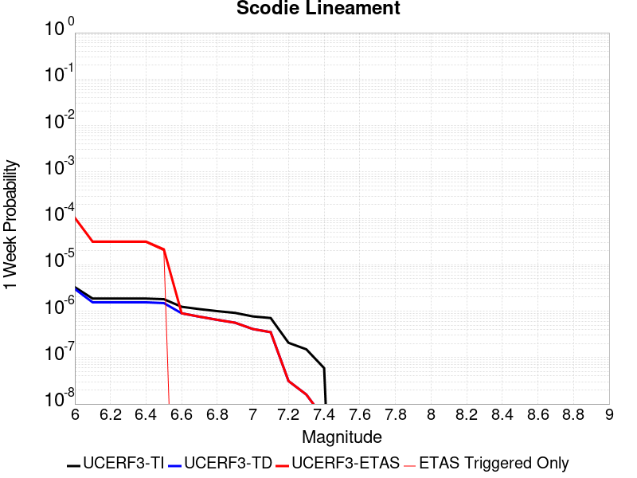 | 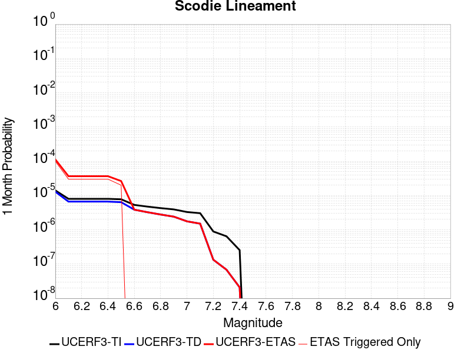 | 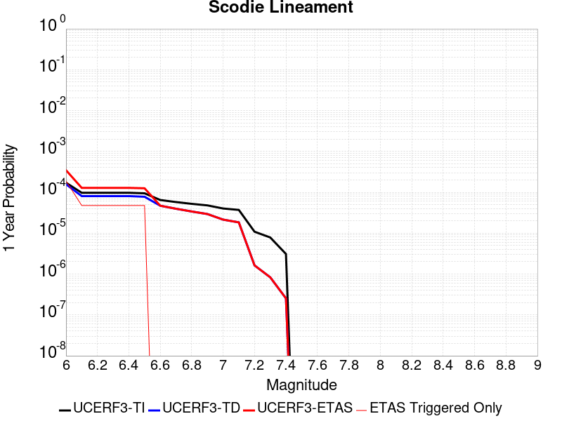 | 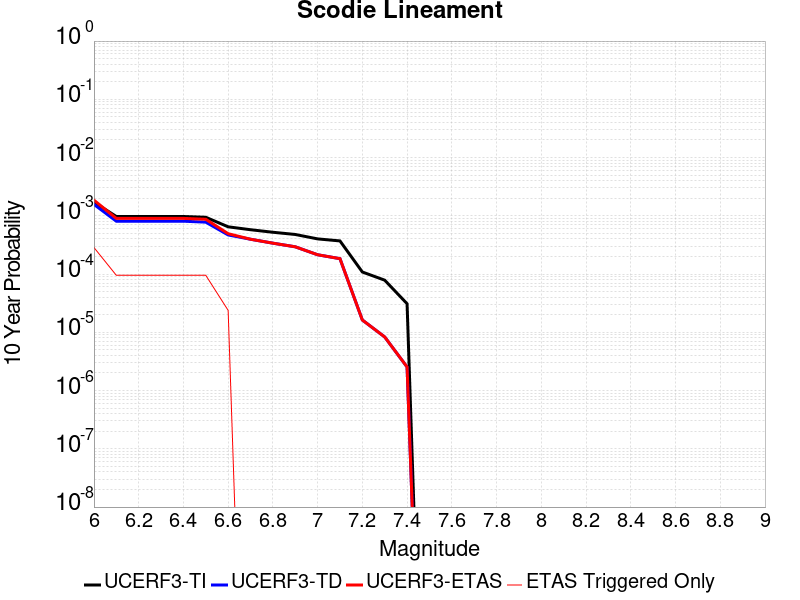 |

| Magnitude | 1 wk TI Prob | 1 wk TD Prob | 1 wk ETAS Prob | 1 wk ETAS/TD Gain | 1 wk ETAS Triggered Only | 1 mo TI Prob | 1 mo TD Prob | 1 mo ETAS Prob | 1 mo ETAS/TD Gain | 1 mo ETAS Triggered Only | 1 yr TI Prob | 1 yr TD Prob | 1 yr ETAS Prob | 1 yr ETAS/TD Gain | 1 yr ETAS Triggered Only | 10 yr TI Prob | 10 yr TD Prob | 10 yr ETAS Prob | 10 yr ETAS/TD Gain | 10 yr ETAS Triggered Only |
|-----|-----|-----|-----|-----|-----|-----|-----|-----|-----|-----|-----|-----|-----|-----|-----|-----|-----|-----|-----|-----|
| 6.0 | 3.2919327E-6 | 3.0133422E-6 | 1.03013044E-4 | 34.185642 | 1.0E-4 | 1.4108206E-5 | 1.2914278E-5 | 1.1291299E-4 | 8.743268 | 1.0E-4 | 1.7175387E-4 | 1.5722317E-4 | 3.471933E-4 | 2.2082834 | 1.9E-4 | 0.0017162118 | 0.0015714309 | 0.0018509909 | 1.1779015 | 2.8E-4 |
| 6.1 | 1.8663811E-6 | 1.5490499E-6 | 3.1549003E-5 | 20.36668 | 3.0E-5 | 7.998751E-6 | 6.6387715E-6 | 3.6638572E-5 | 5.5188785 | 3.0E-5 | 9.738045E-5 | 8.082454E-5 | 1.308205E-4 | 1.618574 | 5.0E-5 | 9.7337784E-4 | 8.080003E-4 | 8.9792756E-4 | 1.111296 | 9.0E-5 |
| 6.2 | 1.8663811E-6 | 1.5490499E-6 | 3.1549003E-5 | 20.36668 | 3.0E-5 | 7.998751E-6 | 6.6387715E-6 | 3.6638572E-5 | 5.5188785 | 3.0E-5 | 9.738045E-5 | 8.082454E-5 | 1.308205E-4 | 1.618574 | 5.0E-5 | 9.7337784E-4 | 8.080003E-4 | 8.9792756E-4 | 1.111296 | 9.0E-5 |
| 6.3 | 1.8663811E-6 | 1.5490499E-6 | 3.1549003E-5 | 20.36668 | 3.0E-5 | 7.998751E-6 | 6.6387715E-6 | 3.6638572E-5 | 5.5188785 | 3.0E-5 | 9.738045E-5 | 8.082454E-5 | 1.308205E-4 | 1.618574 | 5.0E-5 | 9.7337784E-4 | 8.080003E-4 | 8.9792756E-4 | 1.111296 | 9.0E-5 |
| 6.4 | 1.8663811E-6 | 1.5490499E-6 | 3.1549003E-5 | 20.36668 | 3.0E-5 | 7.998751E-6 | 6.6387715E-6 | 3.6638572E-5 | 5.5188785 | 3.0E-5 | 9.738045E-5 | 8.082454E-5 | 1.308205E-4 | 1.618574 | 5.0E-5 | 9.7337784E-4 | 8.080003E-4 | 8.9792756E-4 | 1.111296 | 9.0E-5 |
| 6.5 | 1.8106311E-6 | 1.4909839E-6 | 2.1490954E-5 | 14.41394 | 2.0E-5 | 7.759824E-6 | 6.3899183E-6 | 2.6389791E-5 | 4.1299105 | 2.0E-5 | 9.447177E-5 | 7.7794975E-5 | 1.1779186E-4 | 1.514132 | 4.0E-5 | 9.4431615E-4 | 7.7772606E-4 | 8.5766386E-4 | 1.102784 | 8.0E-5 |
| 6.6 | 1.2414679E-6 | 8.997558E-7 | 8.997558E-7 | 1.0 | 0.0 | 5.320566E-6 | 3.856091E-6 | 3.856091E-6 | 1.0 | 0.0 | 6.477596E-5 | 4.6946985E-5 | 4.6946985E-5 | 1.0 | 0.0 | 6.475708E-4 | 4.693793E-4 | 4.893699E-4 | 1.0425894 | 2.0E-5 |
| 6.7 | 1.1062215E-6 | 7.594311E-7 | 7.594311E-7 | 1.0 | 0.0 | 4.7409408E-6 | 3.2547011E-6 | 3.2547011E-6 | 1.0 | 0.0 | 5.7719422E-5 | 3.9625334E-5 | 3.9625334E-5 | 1.0 | 0.0 | 5.770443E-4 | 3.961897E-4 | 4.0618572E-4 | 1.0252304 | 1.0E-5 |
| 6.8 | 1.0006736E-6 | 6.500397E-7 | 6.500397E-7 | 1.0 | 0.0 | 4.288594E-6 | 2.7858816E-6 | 2.7858816E-6 | 1.0 | 0.0 | 5.221238E-5 | 3.3917644E-5 | 3.3917644E-5 | 1.0 | 0.0 | 5.220012E-4 | 3.3913075E-4 | 3.4912734E-4 | 1.0294771 | 1.0E-5 |
| 6.9 | 9.167364E-7 | 5.631625E-7 | 5.631625E-7 | 1.0 | 0.0 | 3.9288643E-6 | 2.4135516E-6 | 2.4135516E-6 | 1.0 | 0.0 | 4.7832873E-5 | 2.9384651E-5 | 2.9384651E-5 | 1.0 | 0.0 | 4.782258E-4 | 2.9381333E-4 | 2.9381333E-4 | 1.0 | 0.0 |
| 7.0 | 7.6987664E-7 | 4.113383E-7 | 4.113383E-7 | 1.0 | 0.0 | 3.2994672E-6 | 1.7628774E-6 | 1.7628774E-6 | 1.0 | 0.0 | 4.0170275E-5 | 2.1462862E-5 | 2.1462862E-5 | 1.0 | 0.0 | 4.0163012E-4 | 2.1461173E-4 | 2.1461173E-4 | 1.0 | 0.0 |
| 7.1 | 7.1038727E-7 | 3.5211494E-7 | 3.5211494E-7 | 1.0 | 0.0 | 3.0445133E-6 | 1.5090633E-6 | 1.5090633E-6 | 1.0 | 0.0 | 3.706632E-5 | 1.8372726E-5 | 1.8372726E-5 | 1.0 | 0.0 | 3.7060137E-4 | 1.8371557E-4 | 1.8371557E-4 | 1.0 | 0.0 |
| 7.2 | 2.0799602E-7 | 3.1186854E-8 | 3.1186854E-8 | 1.0 | 0.0 | 8.914113E-7 | 1.3365793E-7 | 1.3365793E-7 | 1.0 | 0.0 | 1.0852878E-5 | 1.6272843E-6 | 1.6272843E-6 | 1.0 | 0.0 | 1.08523476E-4 | 1.627273E-5 | 1.627273E-5 | 1.0 | 0.0 |
| 7.3 | 1.5048182E-7 | 1.5945696E-8 | 1.5945696E-8 | 1.0 | 0.0 | 6.449219E-7 | 6.83387E-8 | 6.83387E-8 | 1.0 | 0.0 | 7.851896E-6 | 8.320234E-7 | 8.320234E-7 | 1.0 | 0.0 | 7.851618E-5 | 8.320206E-6 | 8.320206E-6 | 1.0 | 0.0 |
| 7.4 | 5.9334678E-8 | 4.8683537E-9 | 4.8683537E-9 | 1.0 | 0.0 | 2.5429145E-7 | 2.0864372E-8 | 2.0864372E-8 | 1.0 | 0.0 | 3.095994E-6 | 2.5402372E-7 | 2.5402372E-7 | 1.0 | 0.0 | 3.095951E-5 | 2.5402353E-6 | 2.5402353E-6 | 1.0 | 0.0 |

## Imperial
*[(top)](#table-of-contents)*

| 1 Week | 1 Month | 1 Year | 10 Year |
|-----|-----|-----|-----|
| 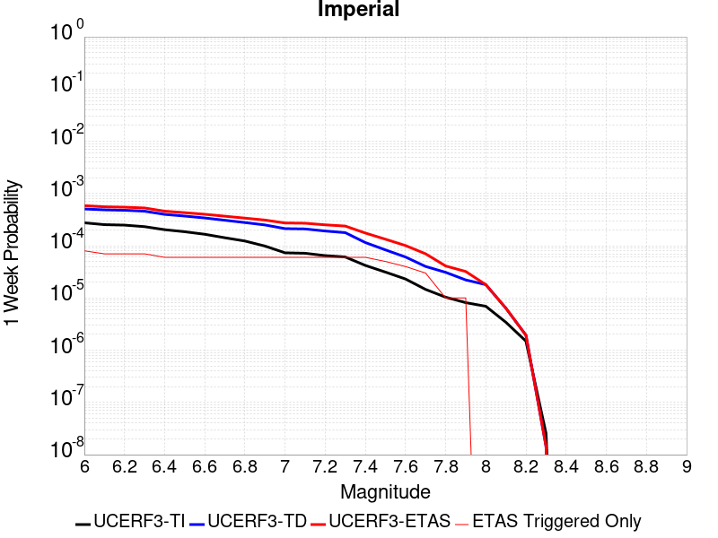 | 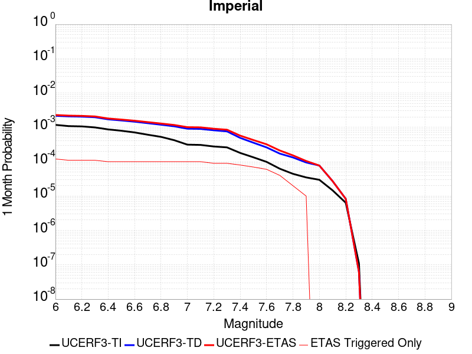 | 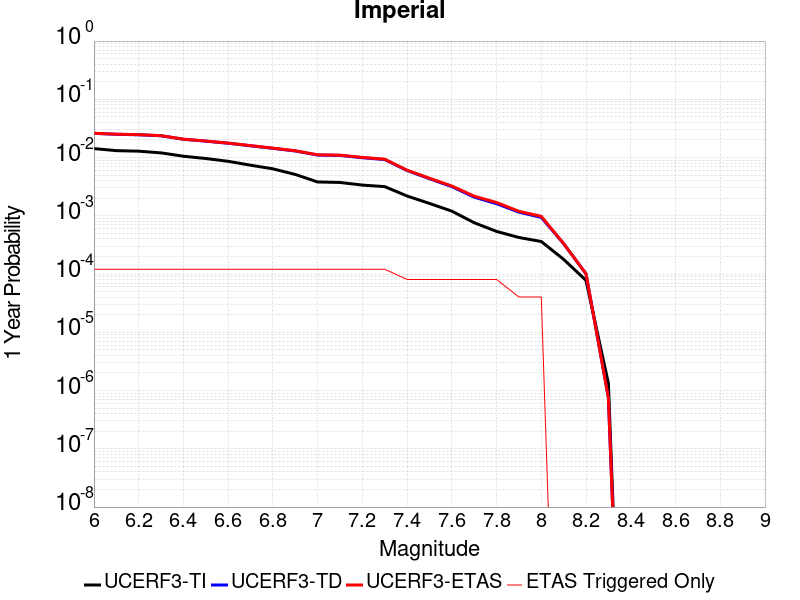 | 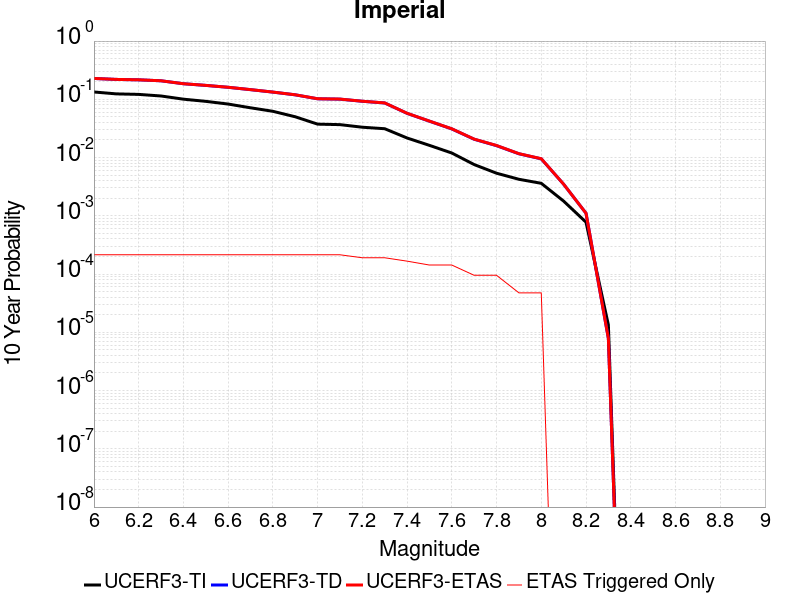 |

| Magnitude | 1 wk TI Prob | 1 wk TD Prob | 1 wk ETAS Prob | 1 wk ETAS/TD Gain | 1 wk ETAS Triggered Only | 1 mo TI Prob | 1 mo TD Prob | 1 mo ETAS Prob | 1 mo ETAS/TD Gain | 1 mo ETAS Triggered Only | 1 yr TI Prob | 1 yr TD Prob | 1 yr ETAS Prob | 1 yr ETAS/TD Gain | 1 yr ETAS Triggered Only | 10 yr TI Prob | 10 yr TD Prob | 10 yr ETAS Prob | 10 yr ETAS/TD Gain | 10 yr ETAS Triggered Only |
|-----|-----|-----|-----|-----|-----|-----|-----|-----|-----|-----|-----|-----|-----|-----|-----|-----|-----|-----|-----|-----|
| 6.0 | 2.7496446E-4 | 5.0552754E-4 | 5.854871E-4 | 1.1581706 | 8.0E-5 | 0.0011778869 | 0.002164787 | 0.0022845273 | 1.0553128 | 1.2E-4 | 0.0142467655 | 0.026038699 | 0.026204271 | 1.0063587 | 1.7E-4 | 0.13367249 | 0.2280438 | 0.22825994 | 1.0009478 | 2.8E-4 |
| 6.1 | 2.5356023E-4 | 4.8656776E-4 | 5.565337E-4 | 1.1437949 | 7.0E-5 | 0.001086234 | 0.0020836622 | 0.002193433 | 1.0526817 | 1.1E-4 | 0.013144928 | 0.025071215 | 0.025227204 | 1.0062218 | 1.6E-4 | 0.123940155 | 0.21947981 | 0.21969055 | 1.0009602 | 2.7E-4 |
| 6.2 | 2.4820742E-4 | 4.7752203E-4 | 5.4748857E-4 | 1.1465201 | 7.0E-5 | 0.0010633124 | 0.0020449557 | 0.0021547307 | 1.0536809 | 1.1E-4 | 0.01286919 | 0.024611235 | 0.024767296 | 1.0063411 | 1.6E-4 | 0.12148927 | 0.21598552 | 0.21619721 | 1.0009801 | 2.7E-4 |
| 6.3 | 2.3205351E-4 | 4.5890483E-4 | 5.288727E-4 | 1.1524671 | 7.0E-5 | 9.94136E-4 | 0.0019652895 | 0.0020750733 | 1.0558614 | 1.1E-4 | 0.012036599 | 0.02366133 | 0.023817545 | 1.006602 | 1.6E-4 | 0.11405133 | 0.20793462 | 0.20814848 | 1.0010285 | 2.7E-4 |
| 6.4 | 2.0304754E-4 | 3.987652E-4 | 4.5874127E-4 | 1.1504045 | 6.0E-5 | 8.6991355E-4 | 0.0017078889 | 0.0018077182 | 1.0584518 | 1.0E-4 | 0.010539869 | 0.020595672 | 0.020742582 | 1.0071331 | 1.5E-4 | 0.100537635 | 0.1850669 | 0.18527877 | 1.0011449 | 2.6E-4 |
| 6.5 | 1.854992E-4 | 3.6988858E-4 | 4.298664E-4 | 1.162151 | 6.0E-5 | 7.9475436E-4 | 0.0015842861 | 0.0016841276 | 1.0630199 | 1.0E-4 | 0.009633281 | 0.01911948 | 0.019266613 | 1.0076954 | 1.5E-4 | 0.0922623 | 0.173298 | 0.17351295 | 1.0012403 | 2.6E-4 |
| 6.6 | 1.6586106E-4 | 3.403506E-4 | 4.003302E-4 | 1.1762288 | 6.0E-5 | 7.106394E-4 | 0.0014578402 | 0.0015576945 | 1.0684947 | 1.0E-4 | 0.008617763 | 0.01760642 | 0.01775378 | 1.0083696 | 1.5E-4 | 0.08291132 | 0.16077545 | 0.16099365 | 1.0013572 | 2.6E-4 |
| 6.7 | 1.4224656E-4 | 3.076692E-4 | 3.6765073E-4 | 1.1949546 | 6.0E-5 | 6.094856E-4 | 0.001317924 | 0.0014177923 | 1.0757769 | 1.0E-4 | 0.0073952693 | 0.015929576 | 0.016077187 | 1.0092665 | 1.5E-4 | 0.07153955 | 0.14648417 | 0.14670607 | 1.0015149 | 2.6E-4 |
| 6.8 | 1.2317259E-4 | 2.779122E-4 | 3.378955E-4 | 1.2158356 | 6.0E-5 | 5.2777573E-4 | 0.0011905148 | 0.0012903956 | 1.0838972 | 1.0E-4 | 0.0064067547 | 0.0143995695 | 0.0145474095 | 1.010267 | 1.5E-4 | 0.06225166 | 0.13293684 | 0.13316226 | 1.0016959 | 2.6E-4 |
| 6.9 | 9.859898E-5 | 2.5014306E-4 | 3.1012803E-4 | 1.2398027 | 6.0E-5 | 4.2249862E-4 | 0.0010716055 | 0.0011714983 | 1.093218 | 1.0E-4 | 0.0051317946 | 0.012969712 | 0.013117766 | 1.0114154 | 1.5E-4 | 0.05014893 | 0.11940631 | 0.11963527 | 1.0019175 | 2.6E-4 |
| 7.0 | 7.3191884E-5 | 2.1266776E-4 | 2.7265502E-4 | 1.2820702 | 6.0E-5 | 3.136418E-4 | 9.1111806E-4 | 0.001011027 | 1.1096553 | 1.0E-4 | 0.003811904 | 0.011037128 | 0.011185472 | 1.0134405 | 1.5E-4 | 0.037471764 | 0.10206493 | 0.10229839 | 1.0022874 | 2.6E-4 |
| 7.1 | 7.1760296E-5 | 2.0968143E-4 | 2.6966885E-4 | 1.2860883 | 6.0E-5 | 3.0750787E-4 | 8.983284E-4 | 9.982386E-4 | 1.1112179 | 1.0E-4 | 0.003737482 | 0.010882978 | 0.011031345 | 1.013633 | 1.5E-4 | 0.03675245 | 0.10070146 | 0.10093527 | 1.0023218 | 2.6E-4 |
| 7.2 | 6.46614E-5 | 1.9136685E-4 | 2.5135538E-4 | 1.3134739 | 6.0E-5 | 2.7709085E-4 | 8.1988896E-4 | 9.0981513E-4 | 1.109681 | 9.0E-5 | 0.0033683628 | 0.0099370815 | 0.01007569 | 1.0139487 | 1.4E-4 | 0.033177625 | 0.09250898 | 0.09273585 | 1.0024525 | 2.5E-4 |
| 7.3 | 6.088115E-5 | 1.78084E-4 | 2.380733E-4 | 1.3368597 | 6.0E-5 | 2.6089314E-4 | 7.6299673E-4 | 8.529281E-4 | 1.1178659 | 9.0E-5 | 0.0031717476 | 0.009250494 | 0.009389198 | 1.0149944 | 1.4E-4 | 0.031268585 | 0.08655989 | 0.08678825 | 1.0026382 | 2.5E-4 |
| 7.4 | 4.199346E-5 | 1.1510366E-4 | 1.7509676E-4 | 1.5212092 | 6.0E-5 | 1.7995955E-4 | 4.9320905E-4 | 5.7316956E-4 | 1.1621231 | 8.0E-5 | 0.0021888057 | 0.0059884563 | 0.006107738 | 1.0199186 | 1.2E-4 | 0.02167372 | 0.057439793 | 0.057656582 | 1.0037742 | 2.3E-4 |
| 7.5 | 3.130448E-5 | 8.33328E-5 | 1.3332863E-4 | 1.5999539 | 5.0E-5 | 1.3415517E-4 | 3.57092E-4 | 4.2706702E-4 | 1.1959579 | 7.0E-5 | 0.0016321153 | 0.004338988 | 0.0044485107 | 1.0252415 | 1.1E-4 | 0.016201803 | 0.04213201 | 0.04233316 | 1.0047743 | 2.1E-4 |
| 7.6 | 2.3074248E-5 | 6.0844646E-5 | 1.0084221E-4 | 1.657372 | 4.0E-5 | 9.888588E-5 | 2.6073685E-4 | 3.2072118E-4 | 1.2300571 | 6.0E-5 | 0.0012032706 | 0.0031698733 | 0.0032695564 | 1.031447 | 1.0E-4 | 0.011967761 | 0.031026395 | 0.03122019 | 1.0062461 | 2.0E-4 |
| 7.7 | 1.45864815E-5 | 4.0124698E-5 | 7.01235E-5 | 1.7476392 | 3.0E-5 | 6.2511994E-5 | 1.7195169E-4 | 2.1194482E-4 | 1.2325835 | 4.0E-5 | 7.608177E-4 | 0.0020915072 | 0.00217134 | 1.03817 | 8.0E-5 | 0.007582182 | 0.020627763 | 0.020764876 | 1.006647 | 1.4E-4 |
| 7.8 | 1.0352979E-5 | 3.0960902E-5 | 4.0960593E-5 | 1.322978 | 1.0E-5 | 4.4369157E-5 | 1.3268284E-4 | 1.5268018E-4 | 1.1507154 | 2.0E-5 | 5.400606E-4 | 0.0016142189 | 0.0016741221 | 1.0371097 | 6.0E-5 | 0.0053875 | 0.016016833 | 0.01613491 | 1.0073721 | 1.2E-4 |
| 7.9 | 8.137906E-6 | 2.2149103E-5 | 3.214888E-5 | 1.4514756 | 1.0E-5 | 3.4876273E-5 | 9.492128E-5 | 1.0492033E-4 | 1.1053405 | 1.0E-5 | 4.2453592E-4 | 0.0011550548 | 0.0011950086 | 1.0345904 | 4.0E-5 | 0.004237258 | 0.011617903 | 0.011706857 | 1.0076567 | 9.0E-5 |
| 8.0 | 6.93792E-6 | 1.8008766E-5 | 1.8008766E-5 | 1.0 | 0.0 | 2.9733603E-5 | 7.717814E-5 | 7.717814E-5 | 1.0 | 0.0 | 3.6194647E-4 | 9.3923963E-4 | 9.592208E-4 | 1.0212739 | 2.0E-5 | 0.0036135751 | 0.00950155 | 0.009560981 | 1.0062548 | 6.0E-5 |
| 8.1 | 3.4286315E-6 | 6.379872E-6 | 6.379872E-6 | 1.0 | 0.0 | 1.4694053E-5 | 2.7342023E-5 | 2.7342023E-5 | 1.0 | 0.0 | 1.7888541E-4 | 3.328384E-4 | 3.328384E-4 | 1.0 | 0.0 | 0.0017874148 | 0.003486031 | 0.003486031 | 1.0 | 0.0 |
| 8.2 | 1.4906886E-6 | 1.9366646E-6 | 1.9366646E-6 | 1.0 | 0.0 | 6.3886496E-6 | 8.299965E-6 | 8.299965E-6 | 1.0 | 0.0 | 7.7779034E-5 | 1.0104742E-4 | 1.0104742E-4 | 1.0 | 0.0 | 7.775182E-4 | 0.0011075331 | 0.0011075331 | 1.0 | 0.0 |
| 8.3 | 2.5758007E-8 | 1.4500102E-8 | 1.4500102E-8 | 1.0 | 0.0 | 1.10391454E-7 | 6.214329E-8 | 6.214329E-8 | 1.0 | 0.0 | 1.3440151E-6 | 7.565946E-7 | 7.565946E-7 | 1.0 | 0.0 | 1.344007E-5 | 7.887763E-6 | 7.887763E-6 | 1.0 | 0.0 |

## Cleghorn Pass
*[(top)](#table-of-contents)*

| 1 Week | 1 Month | 1 Year | 10 Year |
|-----|-----|-----|-----|
| 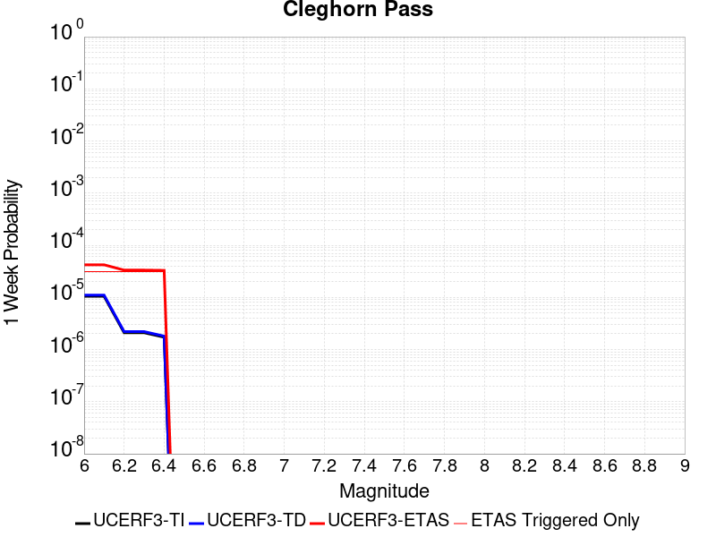 | 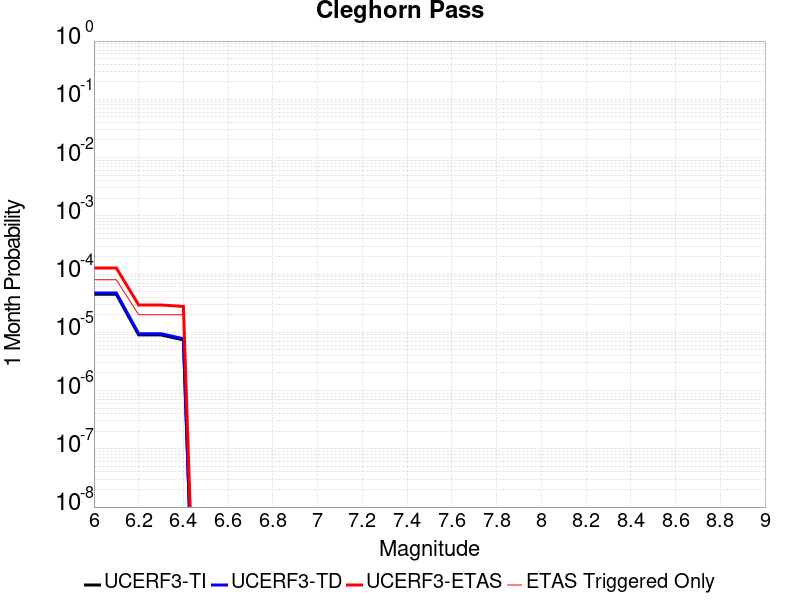 | 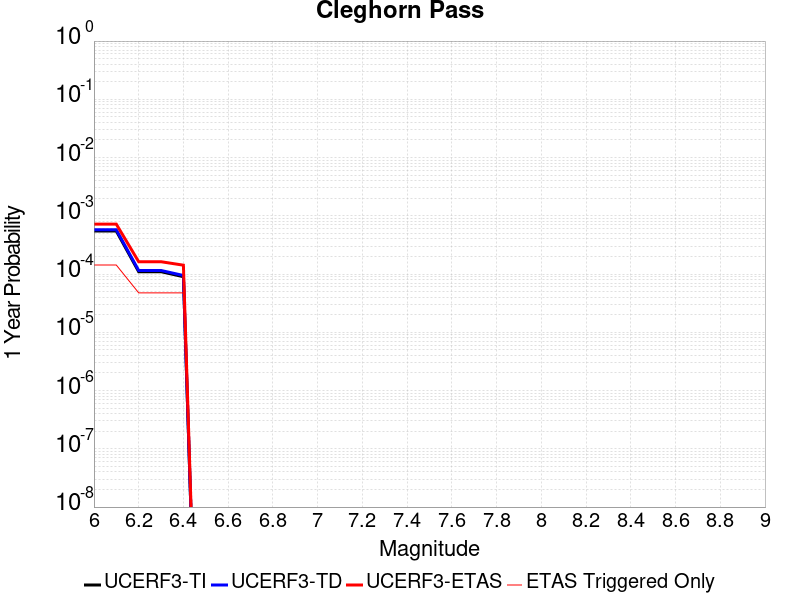 | 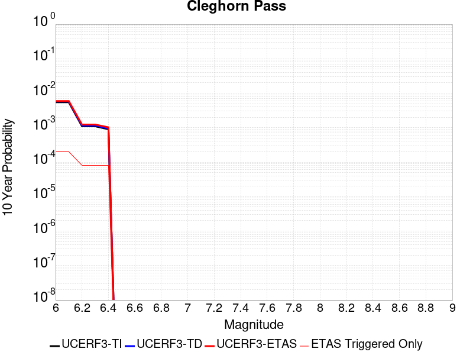 |

| Magnitude | 1 wk TI Prob | 1 wk TD Prob | 1 wk ETAS Prob | 1 wk ETAS/TD Gain | 1 wk ETAS Triggered Only | 1 mo TI Prob | 1 mo TD Prob | 1 mo ETAS Prob | 1 mo ETAS/TD Gain | 1 mo ETAS Triggered Only | 1 yr TI Prob | 1 yr TD Prob | 1 yr ETAS Prob | 1 yr ETAS/TD Gain | 1 yr ETAS Triggered Only | 10 yr TI Prob | 10 yr TD Prob | 10 yr ETAS Prob | 10 yr ETAS/TD Gain | 10 yr ETAS Triggered Only |
|-----|-----|-----|-----|-----|-----|-----|-----|-----|-----|-----|-----|-----|-----|-----|-----|-----|-----|-----|-----|-----|
| 6.0 | 1.0522846E-5 | 1.1040642E-5 | 3.104042E-5 | 2.8114688 | 2.0E-5 | 4.509713E-5 | 4.7316473E-5 | 1.2731268E-4 | 2.690663 | 8.0E-5 | 5.4891926E-4 | 5.759784E-4 | 7.158978E-4 | 1.2429247 | 1.4E-4 | 0.0054756533 | 0.005750022 | 0.005968757 | 1.0380408 | 2.2E-4 |
| 6.1 | 1.0522846E-5 | 1.1040642E-5 | 3.104042E-5 | 2.8114688 | 2.0E-5 | 4.509713E-5 | 4.7316473E-5 | 1.2731268E-4 | 2.690663 | 8.0E-5 | 5.4891926E-4 | 5.759784E-4 | 7.158978E-4 | 1.2429247 | 1.4E-4 | 0.0054756533 | 0.005750022 | 0.005968757 | 1.0380408 | 2.2E-4 |
| 6.2 | 2.1045846E-6 | 2.2082024E-6 | 2.2208158E-5 | 10.05712 | 2.0E-5 | 9.019617E-6 | 9.463714E-6 | 2.9463525E-5 | 3.113315 | 2.0E-5 | 1.098083E-4 | 1.1521882E-4 | 1.6521306E-4 | 1.4339069 | 5.0E-5 | 0.0010975406 | 0.0011520023 | 0.0012418986 | 1.0780349 | 9.0E-5 |
| 6.3 | 2.1045846E-6 | 2.2082024E-6 | 2.2208158E-5 | 10.05712 | 2.0E-5 | 9.019617E-6 | 9.463714E-6 | 2.9463525E-5 | 3.113315 | 2.0E-5 | 1.098083E-4 | 1.1521882E-4 | 1.6521306E-4 | 1.4339069 | 5.0E-5 | 0.0010975406 | 0.0011520023 | 0.0012418986 | 1.0780349 | 9.0E-5 |
| 6.4 | 1.7259927E-6 | 1.810877E-6 | 2.1810842E-5 | 12.044352 | 2.0E-5 | 7.3970905E-6 | 7.760902E-6 | 2.7760747E-5 | 3.5770001 | 2.0E-5 | 9.005586E-5 | 9.4488976E-5 | 1.344852E-4 | 1.4232898 | 4.0E-5 | 9.001937E-4 | 9.448898E-4 | 0.0010148237 | 1.0740128 | 7.0E-5 |

## Red Mountain
*[(top)](#table-of-contents)*

| 1 Week | 1 Month | 1 Year | 10 Year |
|-----|-----|-----|-----|
| 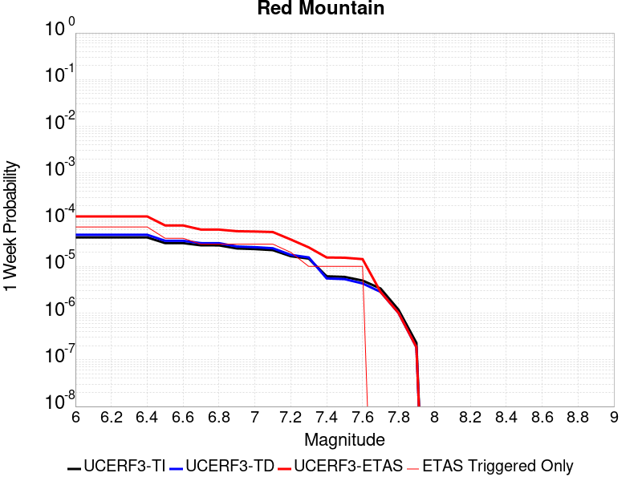 | 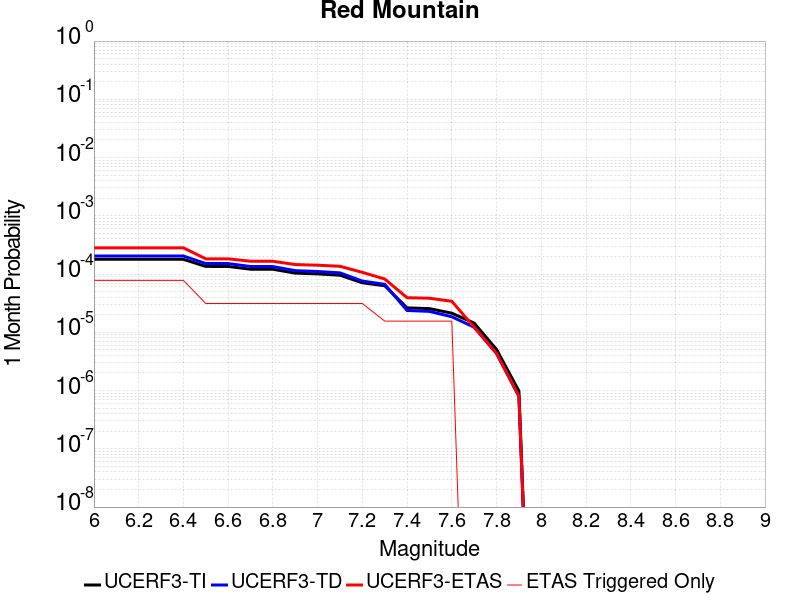 | 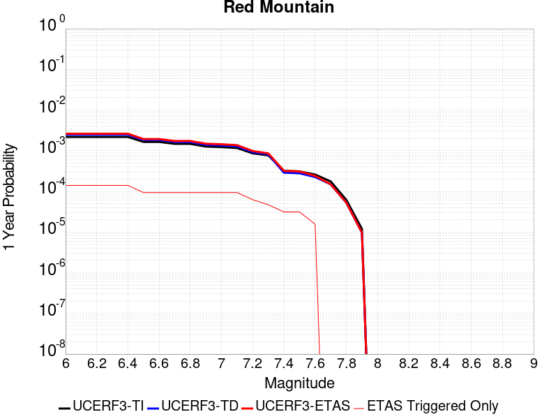 | 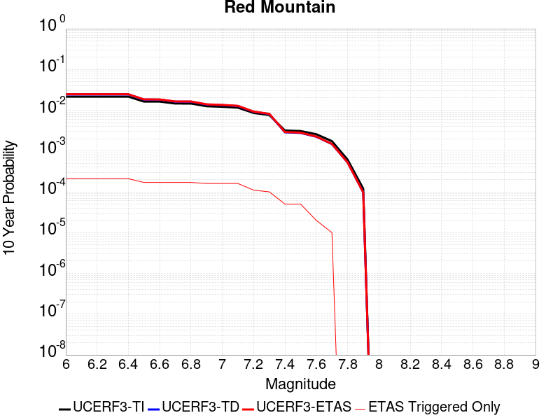 |

| Magnitude | 1 wk TI Prob | 1 wk TD Prob | 1 wk ETAS Prob | 1 wk ETAS/TD Gain | 1 wk ETAS Triggered Only | 1 mo TI Prob | 1 mo TD Prob | 1 mo ETAS Prob | 1 mo ETAS/TD Gain | 1 mo ETAS Triggered Only | 1 yr TI Prob | 1 yr TD Prob | 1 yr ETAS Prob | 1 yr ETAS/TD Gain | 1 yr ETAS Triggered Only | 10 yr TI Prob | 10 yr TD Prob | 10 yr ETAS Prob | 10 yr ETAS/TD Gain | 10 yr ETAS Triggered Only |
|-----|-----|-----|-----|-----|-----|-----|-----|-----|-----|-----|-----|-----|-----|-----|-----|-----|-----|-----|-----|-----|
| 6.0 | 4.1810763E-5 | 4.7589947E-5 | 1.1758661E-4 | 2.470829 | 7.0E-5 | 1.7917668E-4 | 2.039419E-4 | 2.839256E-4 | 1.3921885 | 8.0E-5 | 0.0021792934 | 0.0024803306 | 0.0026100082 | 1.0522823 | 1.3E-4 | 0.021580452 | 0.024544092 | 0.024748936 | 1.0083461 | 2.1E-4 |
| 6.1 | 4.1810763E-5 | 4.7589947E-5 | 1.1758661E-4 | 2.470829 | 7.0E-5 | 1.7917668E-4 | 2.039419E-4 | 2.839256E-4 | 1.3921885 | 8.0E-5 | 0.0021792934 | 0.0024803306 | 0.0026100082 | 1.0522823 | 1.3E-4 | 0.021580452 | 0.024544092 | 0.024748936 | 1.0083461 | 2.1E-4 |
| 6.2 | 4.1810763E-5 | 4.7589947E-5 | 1.1758661E-4 | 2.470829 | 7.0E-5 | 1.7917668E-4 | 2.039419E-4 | 2.839256E-4 | 1.3921885 | 8.0E-5 | 0.0021792934 | 0.0024803306 | 0.0026100082 | 1.0522823 | 1.3E-4 | 0.021580452 | 0.024544092 | 0.024748936 | 1.0083461 | 2.1E-4 |
| 6.3 | 4.1810763E-5 | 4.7589947E-5 | 1.1758661E-4 | 2.470829 | 7.0E-5 | 1.7917668E-4 | 2.039419E-4 | 2.839256E-4 | 1.3921885 | 8.0E-5 | 0.0021792934 | 0.0024803306 | 0.0026100082 | 1.0522823 | 1.3E-4 | 0.021580452 | 0.024544092 | 0.024748936 | 1.0083461 | 2.1E-4 |
| 6.4 | 4.1810763E-5 | 4.7589947E-5 | 1.1758661E-4 | 2.470829 | 7.0E-5 | 1.7917668E-4 | 2.039419E-4 | 2.839256E-4 | 1.3921885 | 8.0E-5 | 0.0021792934 | 0.0024803306 | 0.0026100082 | 1.0522823 | 1.3E-4 | 0.021580452 | 0.024544092 | 0.024748936 | 1.0083461 | 2.1E-4 |
| 6.5 | 3.154503E-5 | 3.5359728E-5 | 7.5358315E-5 | 2.1311905 | 4.0E-5 | 1.3518598E-4 | 1.5153342E-4 | 2.0152584E-4 | 1.3299103 | 5.0E-5 | 0.0016446467 | 0.0018434501 | 0.0019432658 | 1.054146 | 1.0E-4 | 0.01632528 | 0.018291233 | 0.018458124 | 1.009124 | 1.7E-4 |
| 6.6 | 3.1535834E-5 | 3.534911E-5 | 7.534769E-5 | 2.1315303 | 4.0E-5 | 1.3514658E-4 | 1.5148791E-4 | 2.0148033E-4 | 1.3300093 | 5.0E-5 | 0.0016441676 | 0.001842897 | 0.0019427128 | 1.0541624 | 1.0E-4 | 0.01632056 | 0.018285794 | 0.018452685 | 1.0091268 | 1.7E-4 |
| 6.7 | 2.8267326E-5 | 3.146934E-5 | 6.1468396E-5 | 1.9532789 | 3.0E-5 | 1.2114006E-4 | 1.348621E-4 | 1.8485537E-4 | 1.370699 | 5.0E-5 | 0.0014738824 | 0.0016407946 | 0.0017406305 | 1.0608461 | 1.0E-4 | 0.014641452 | 0.016295563 | 0.016462794 | 1.0102623 | 1.7E-4 |
| 6.8 | 2.8212884E-5 | 3.1407224E-5 | 6.140628E-5 | 1.9551642 | 3.0E-5 | 1.20906756E-4 | 1.3459593E-4 | 1.845892E-4 | 1.3714323 | 5.0E-5 | 0.0014710457 | 0.0016375587 | 0.001737395 | 1.0609665 | 1.0E-4 | 0.014613459 | 0.01626368 | 0.016430914 | 1.0102828 | 1.7E-4 |
| 6.9 | 2.4227871E-5 | 2.6706979E-5 | 5.6706176E-5 | 2.123272 | 3.0E-5 | 1.03829596E-4 | 1.14453884E-4 | 1.6444817E-4 | 1.4368072 | 5.0E-5 | 0.0012633923 | 0.0013926612 | 0.001492522 | 1.071705 | 1.0E-4 | 0.012562336 | 0.013847026 | 0.014004811 | 1.0113949 | 1.6E-4 |
| 7.0 | 2.348524E-5 | 2.5835763E-5 | 5.583499E-5 | 2.1611512 | 3.0E-5 | 1.0064714E-4 | 1.1072042E-4 | 1.6071489E-4 | 1.4515378 | 5.0E-5 | 0.0012246901 | 0.0013472632 | 0.0014371419 | 1.0667121 | 9.0E-5 | 0.012179627 | 0.01339859 | 0.013556446 | 1.0117816 | 1.6E-4 |
| 7.1 | 2.2311642E-5 | 2.4462828E-5 | 5.4462096E-5 | 2.2263205 | 3.0E-5 | 9.561782E-5 | 1.048369E-4 | 1.5483166E-4 | 1.4768813 | 5.0E-5 | 0.0011635252 | 0.0012757168 | 0.0013656019 | 1.0704585 | 9.0E-5 | 0.01157452 | 0.012691451 | 0.012849421 | 1.0124469 | 1.6E-4 |
| 7.2 | 1.6533986E-5 | 1.7670347E-5 | 3.7669994E-5 | 2.1318197 | 2.0E-5 | 7.085802E-5 | 7.572822E-5 | 1.1572519E-4 | 1.5281647 | 4.0E-5 | 8.623549E-4 | 9.216645E-4 | 9.816092E-4 | 1.0650396 | 6.0E-5 | 0.008590161 | 0.009184699 | 0.009293688 | 1.0118665 | 1.1E-4 |
| 7.3 | 1.4703092E-5 | 1.555952E-5 | 2.5559366E-5 | 1.6426833 | 1.0E-5 | 6.301173E-5 | 6.66823E-5 | 9.6680305E-5 | 1.4498645 | 3.0E-5 | 7.668978E-4 | 8.1161625E-4 | 8.6157565E-4 | 1.0615555 | 5.0E-5 | 0.0076425658 | 0.008092596 | 0.008191787 | 1.012257 | 1.0E-4 |
| 7.4 | 6.1331984E-6 | 5.528872E-6 | 1.5528816E-5 | 2.8086772 | 1.0E-5 | 2.6284872E-5 | 2.3694953E-5 | 4.369448E-5 | 1.8440416 | 2.0E-5 | 3.199713E-4 | 2.8844838E-4 | 3.1843974E-4 | 1.1039747 | 3.0E-5 | 0.0031951098 | 0.0028807942 | 0.0029306503 | 1.0173063 | 5.0E-5 |
| 7.5 | 5.954766E-6 | 5.3385015E-6 | 1.5338448E-5 | 2.873175 | 1.0E-5 | 2.5520176E-5 | 2.2879094E-5 | 4.2878637E-5 | 1.8741405 | 2.0E-5 | 3.1066386E-4 | 2.785179E-4 | 3.0850954E-4 | 1.1076831 | 3.0E-5 | 0.003102299 | 0.0027817423 | 0.0028316032 | 1.0179243 | 5.0E-5 |
| 7.6 | 4.9726646E-6 | 4.315295E-6 | 1.4315252E-5 | 3.3173287 | 1.0E-5 | 2.1311245E-5 | 1.8493993E-5 | 2.8493807E-5 | 1.5407062 | 1.0E-5 | 2.5943352E-4 | 2.2514143E-4 | 2.3513917E-4 | 1.0444065 | 1.0E-5 | 0.0025913084 | 0.002249168 | 0.002269123 | 1.0088722 | 2.0E-5 |
| 7.7 | 3.3613894E-6 | 2.8526642E-6 | 2.8526642E-6 | 1.0 | 0.0 | 1.4405875E-5 | 1.2225649E-5 | 1.2225649E-5 | 1.0 | 0.0 | 1.7537741E-4 | 1.4883737E-4 | 1.4883737E-4 | 1.0 | 0.0 | 0.0017523908 | 0.0014874031 | 0.0014973882 | 1.0067132 | 1.0E-5 |
| 7.8 | 1.1828961E-6 | 1.0122756E-6 | 1.0122756E-6 | 1.0 | 0.0 | 5.069545E-6 | 4.338317E-6 | 4.338317E-6 | 1.0 | 0.0 | 6.171996E-5 | 5.281776E-5 | 5.281776E-5 | 1.0 | 0.0 | 6.170282E-4 | 5.2805495E-4 | 5.2805495E-4 | 1.0 | 0.0 |
| 7.9 | 2.2967266E-7 | 1.8618952E-7 | 1.8618952E-7 | 1.0 | 0.0 | 9.843111E-7 | 7.9795484E-7 | 7.9795484E-7 | 1.0 | 0.0 | 1.19839215E-5 | 9.7150605E-6 | 9.7150605E-6 | 1.0 | 0.0 | 1.1983275E-4 | 9.714664E-5 | 9.714664E-5 | 1.0 | 0.0 |

## Mission Creek
*[(top)](#table-of-contents)*

| 1 Week | 1 Month | 1 Year | 10 Year |
|-----|-----|-----|-----|
| 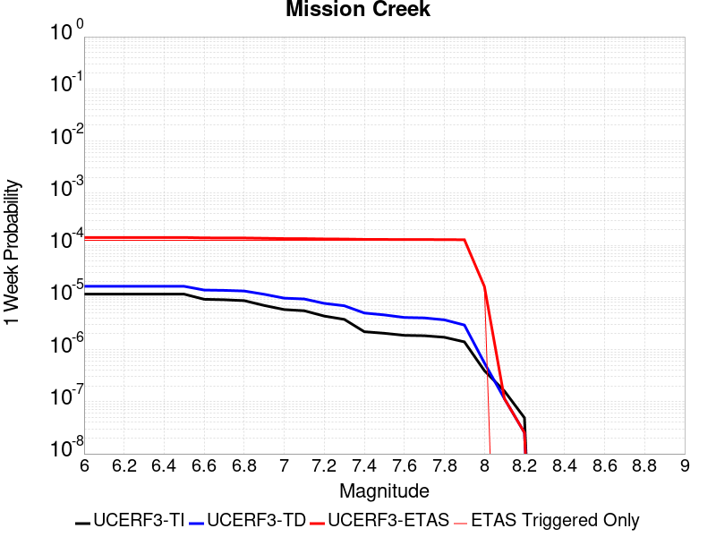 | 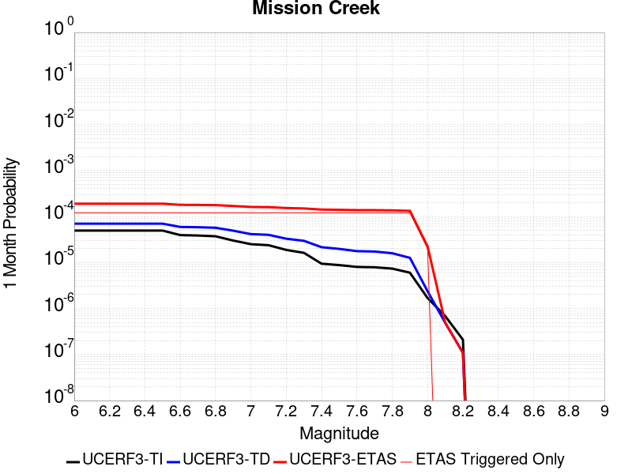 | 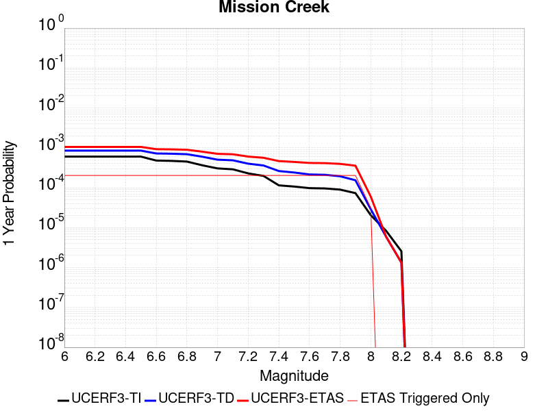 | 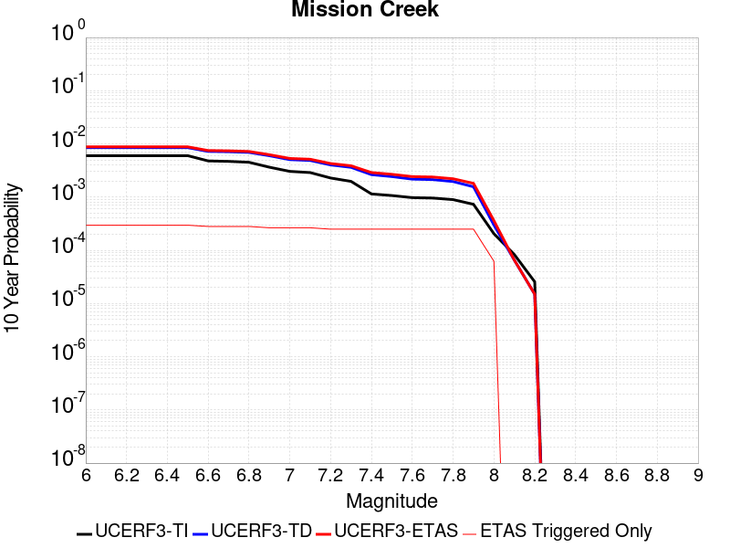 |

| Magnitude | 1 wk TI Prob | 1 wk TD Prob | 1 wk ETAS Prob | 1 wk ETAS/TD Gain | 1 wk ETAS Triggered Only | 1 mo TI Prob | 1 mo TD Prob | 1 mo ETAS Prob | 1 mo ETAS/TD Gain | 1 mo ETAS Triggered Only | 1 yr TI Prob | 1 yr TD Prob | 1 yr ETAS Prob | 1 yr ETAS/TD Gain | 1 yr ETAS Triggered Only | 10 yr TI Prob | 10 yr TD Prob | 10 yr ETAS Prob | 10 yr ETAS/TD Gain | 10 yr ETAS Triggered Only |
|-----|-----|-----|-----|-----|-----|-----|-----|-----|-----|-----|-----|-----|-----|-----|-----|-----|-----|-----|-----|-----|
| 6.0 | 1.1549387E-5 | 1.632237E-5 | 1.16320734E-4 | 7.1264615 | 1.0E-4 | 4.9496433E-5 | 6.9951224E-5 | 1.8994283E-4 | 2.715361 | 1.2E-4 | 6.0245243E-4 | 8.513384E-4 | 0.0010211937 | 1.1995156 | 1.7E-4 | 0.006008218 | 0.008509998 | 0.0087677855 | 1.0302923 | 2.6E-4 |
| 6.1 | 1.1549387E-5 | 1.632237E-5 | 1.16320734E-4 | 7.1264615 | 1.0E-4 | 4.9496433E-5 | 6.9951224E-5 | 1.8994283E-4 | 2.715361 | 1.2E-4 | 6.0245243E-4 | 8.513384E-4 | 0.0010211937 | 1.1995156 | 1.7E-4 | 0.006008218 | 0.008509998 | 0.0087677855 | 1.0302923 | 2.6E-4 |
| 6.2 | 1.1549387E-5 | 1.632237E-5 | 1.16320734E-4 | 7.1264615 | 1.0E-4 | 4.9496433E-5 | 6.9951224E-5 | 1.8994283E-4 | 2.715361 | 1.2E-4 | 6.0245243E-4 | 8.513384E-4 | 0.0010211937 | 1.1995156 | 1.7E-4 | 0.006008218 | 0.008509998 | 0.0087677855 | 1.0302923 | 2.6E-4 |
| 6.3 | 1.1549387E-5 | 1.632237E-5 | 1.16320734E-4 | 7.1264615 | 1.0E-4 | 4.9496433E-5 | 6.9951224E-5 | 1.8994283E-4 | 2.715361 | 1.2E-4 | 6.0245243E-4 | 8.513384E-4 | 0.0010211937 | 1.1995156 | 1.7E-4 | 0.006008218 | 0.008509998 | 0.0087677855 | 1.0302923 | 2.6E-4 |
| 6.4 | 1.1549387E-5 | 1.632237E-5 | 1.16320734E-4 | 7.1264615 | 1.0E-4 | 4.9496433E-5 | 6.9951224E-5 | 1.8994283E-4 | 2.715361 | 1.2E-4 | 6.0245243E-4 | 8.513384E-4 | 0.0010211937 | 1.1995156 | 1.7E-4 | 0.006008218 | 0.008509998 | 0.0087677855 | 1.0302923 | 2.6E-4 |
| 6.5 | 1.1549387E-5 | 1.632237E-5 | 1.16320734E-4 | 7.1264615 | 1.0E-4 | 4.9496433E-5 | 6.9951224E-5 | 1.8994283E-4 | 2.715361 | 1.2E-4 | 6.0245243E-4 | 8.513384E-4 | 0.0010211937 | 1.1995156 | 1.7E-4 | 0.006008218 | 0.008509998 | 0.0087677855 | 1.0302923 | 2.6E-4 |
| 6.6 | 9.202681E-6 | 1.3845646E-5 | 1.1384426E-4 | 8.222386 | 1.0E-4 | 3.9439463E-5 | 5.9337188E-5 | 1.7933006E-4 | 3.0222206 | 1.2E-4 | 4.800697E-4 | 7.221998E-4 | 8.9207705E-4 | 1.2352219 | 1.7E-4 | 0.004790339 | 0.0072271815 | 0.0074753747 | 1.0343416 | 2.5E-4 |
| 6.7 | 9.019164E-6 | 1.3651316E-5 | 1.1364995E-4 | 8.325201 | 1.0E-4 | 3.8652986E-5 | 5.8504378E-5 | 1.7849736E-4 | 3.0510085 | 1.2E-4 | 4.7049852E-4 | 7.12067E-4 | 8.81946E-4 | 1.2385715 | 1.7E-4 | 0.004695036 | 0.007126506 | 0.0073747244 | 1.0348303 | 2.5E-4 |
| 6.8 | 8.673558E-6 | 1.3273427E-5 | 1.132721E-4 | 8.53375 | 1.0E-4 | 3.717186E-5 | 5.6884925E-5 | 1.768781E-4 | 3.109402 | 1.2E-4 | 4.524734E-4 | 6.923627E-4 | 8.6224504E-4 | 1.245366 | 1.7E-4 | 0.0045155324 | 0.006930694 | 0.0071789613 | 1.0358214 | 2.5E-4 |
| 6.9 | 7.002255E-6 | 1.1477657E-5 | 1.1147651E-4 | 9.71248 | 1.0E-4 | 3.000932E-5 | 4.9189068E-5 | 1.6918317E-4 | 3.4394464 | 1.2E-4 | 3.653022E-4 | 5.9871917E-4 | 7.686174E-4 | 1.2837695 | 1.7E-4 | 0.0036470229 | 0.005999517 | 0.0062380773 | 1.0397632 | 2.4E-4 |
| 7.0 | 5.84644E-6 | 9.67498E-6 | 1.0967401E-4 | 11.335838 | 1.0E-4 | 2.5055931E-5 | 4.1463565E-5 | 1.6145859E-4 | 3.893987 | 1.2E-4 | 3.0501327E-4 | 5.047066E-4 | 6.7462074E-4 | 1.3366594 | 1.7E-4 | 0.0030459496 | 0.0050638523 | 0.005302637 | 1.0471548 | 2.4E-4 |
| 7.1 | 5.54703E-6 | 9.329456E-6 | 1.09328525E-4 | 11.718638 | 1.0E-4 | 2.377277E-5 | 3.9982795E-5 | 1.59978E-4 | 4.001171 | 1.2E-4 | 2.8939504E-4 | 4.8668624E-4 | 6.5660354E-4 | 1.349131 | 1.7E-4 | 0.0028901845 | 0.004884446 | 0.005123274 | 1.0488956 | 2.4E-4 |
| 7.2 | 4.384709E-6 | 7.68157E-6 | 1.07680804E-4 | 14.018071 | 1.0E-4 | 1.8791474E-5 | 3.2920623E-5 | 1.5291668E-4 | 4.6450114 | 1.2E-4 | 2.2876218E-4 | 4.0073853E-4 | 5.706704E-4 | 1.4240468 | 1.7E-4 | 0.0022852682 | 0.004028366 | 0.004257439 | 1.0568651 | 2.3E-4 |
| 7.3 | 3.7888456E-6 | 6.915452E-6 | 1.0691476E-4 | 15.460271 | 1.0E-4 | 1.623781E-5 | 2.9637333E-5 | 1.4963378E-4 | 5.048827 | 1.2E-4 | 1.9767738E-4 | 3.6077813E-4 | 5.307168E-4 | 1.4710337 | 1.7E-4 | 0.0019750162 | 0.0036301152 | 0.0038493164 | 1.0603842 | 2.2E-4 |
| 7.4 | 2.1982462E-6 | 5.0237763E-6 | 1.05023275E-4 | 20.905245 | 1.0E-4 | 9.421021E-6 | 2.1530293E-5 | 1.4152771E-4 | 6.573422 | 1.2E-4 | 1.1469489E-4 | 2.621E-4 | 4.3205544E-4 | 1.6484374 | 1.7E-4 | 0.0011463572 | 0.0026458844 | 0.0028653024 | 1.082928 | 2.2E-4 |
| 7.5 | 2.051923E-6 | 4.615016E-6 | 1.04614555E-4 | 22.668297 | 1.0E-4 | 8.793926E-6 | 1.9778492E-5 | 1.3977612E-4 | 7.0670767 | 1.2E-4 | 1.0706078E-4 | 2.4077666E-4 | 4.1073572E-4 | 1.7058785 | 1.7E-4 | 0.0010700922 | 0.0024335422 | 0.0026530067 | 1.0901833 | 2.2E-4 |
| 7.6 | 1.8733427E-6 | 4.1233748E-6 | 1.0412296E-4 | 25.251879 | 1.0E-4 | 8.028587E-6 | 1.7671488E-5 | 1.3766937E-4 | 7.7904797 | 1.2E-4 | 9.774366E-5 | 2.151292E-4 | 3.8509263E-4 | 1.7900528 | 1.7E-4 | 9.770069E-4 | 0.0021780801 | 0.002397601 | 1.1007863 | 2.2E-4 |
| 7.7 | 1.8411953E-6 | 4.0430496E-6 | 1.0404264E-4 | 25.733706 | 1.0E-4 | 7.890813E-6 | 1.732724E-5 | 1.3732516E-4 | 7.925391 | 1.2E-4 | 9.606641E-5 | 2.1093882E-4 | 3.8090296E-4 | 1.8057508 | 1.7E-4 | 9.6024893E-4 | 0.0021363653 | 0.0023558952 | 1.1027586 | 2.2E-4 |
| 7.8 | 1.7194251E-6 | 3.7104276E-6 | 1.0371006E-4 | 27.950972 | 1.0E-4 | 7.368944E-6 | 1.5901736E-5 | 1.3589983E-4 | 8.546226 | 1.2E-4 | 8.97132E-5 | 1.9358651E-4 | 3.635536E-4 | 1.8779904 | 1.7E-4 | 8.967699E-4 | 0.0019623525 | 0.0021819207 | 1.1118903 | 2.2E-4 |
| 7.9 | 1.4035052E-6 | 2.9500632E-6 | 1.02949765E-4 | 34.89748 | 1.0E-4 | 6.0150082E-6 | 1.2643067E-5 | 1.3264155E-4 | 10.491248 | 1.2E-4 | 7.3230265E-5 | 1.5391852E-4 | 3.138939E-4 | 2.039351 | 1.6E-4 | 7.3206134E-4 | 0.0015631086 | 0.0017727804 | 1.1341376 | 2.1E-4 |
| 8.0 | 3.9318823E-7 | 5.528522E-7 | 1.0552847E-5 | 19.088007 | 1.0E-5 | 1.6850913E-6 | 2.3693647E-6 | 2.2369317E-5 | 9.441062 | 2.0E-5 | 2.0515794E-5 | 2.8846638E-5 | 4.884606E-5 | 1.6933017 | 2.0E-5 | 2.0513899E-4 | 2.9899E-4 | 3.3897802E-4 | 1.1337438 | 4.0E-5 |
| 8.1 | 1.596793E-7 | 1.1380002E-7 | 1.1380002E-7 | 1.0 | 0.0 | 6.8433974E-7 | 4.877143E-7 | 4.877143E-7 | 1.0 | 0.0 | 8.331805E-6 | 5.937906E-6 | 5.937906E-6 | 1.0 | 0.0 | 8.331492E-5 | 6.549966E-5 | 6.549966E-5 | 1.0 | 0.0 |
| 8.2 | 4.9003038E-8 | 2.5444924E-8 | 2.5444924E-8 | 1.0 | 0.0 | 2.10013E-7 | 1.0904967E-7 | 1.0904967E-7 | 1.0 | 0.0 | 2.5569052E-6 | 1.327679E-6 | 1.327679E-6 | 1.0 | 0.0 | 2.556876E-5 | 1.495635E-5 | 1.495635E-5 | 1.0 | 0.0 |

## Santa Rosa Island
*[(top)](#table-of-contents)*

| 1 Week | 1 Month | 1 Year | 10 Year |
|-----|-----|-----|-----|
| 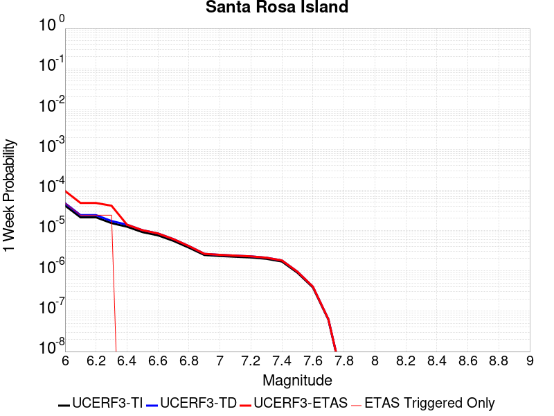 | 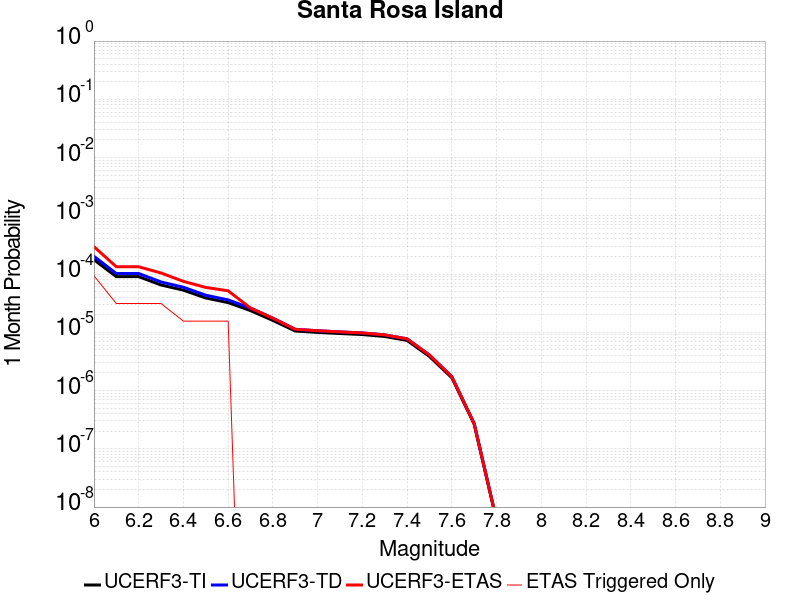 | 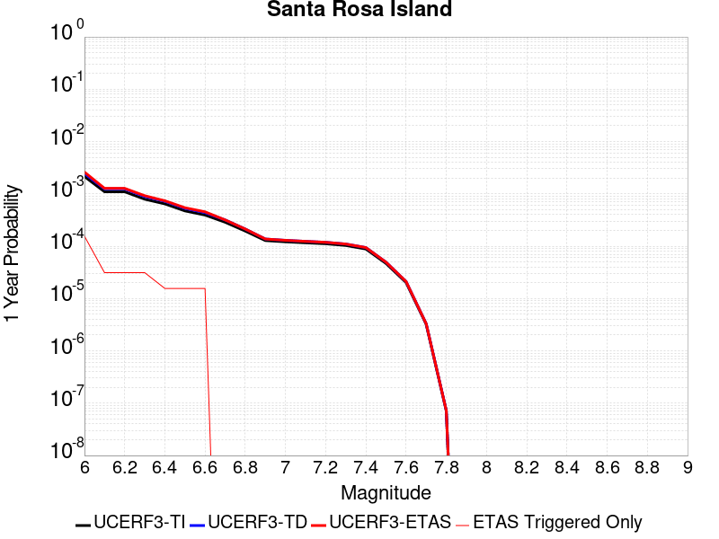 | 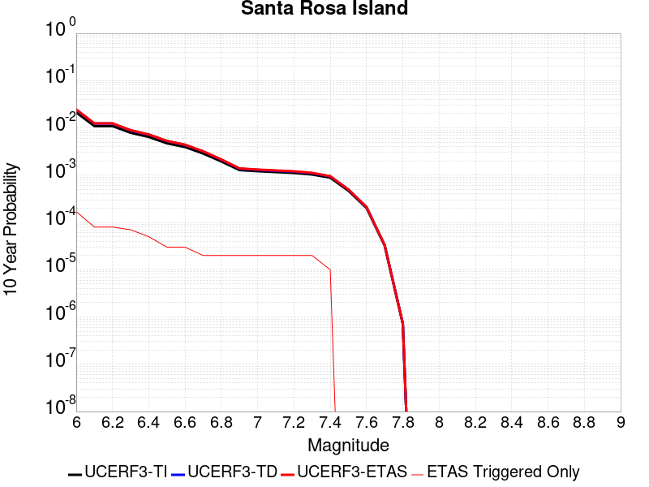 |

| Magnitude | 1 wk TI Prob | 1 wk TD Prob | 1 wk ETAS Prob | 1 wk ETAS/TD Gain | 1 wk ETAS Triggered Only | 1 mo TI Prob | 1 mo TD Prob | 1 mo ETAS Prob | 1 mo ETAS/TD Gain | 1 mo ETAS Triggered Only | 1 yr TI Prob | 1 yr TD Prob | 1 yr ETAS Prob | 1 yr ETAS/TD Gain | 1 yr ETAS Triggered Only | 10 yr TI Prob | 10 yr TD Prob | 10 yr ETAS Prob | 10 yr ETAS/TD Gain | 10 yr ETAS Triggered Only |
|-----|-----|-----|-----|-----|-----|-----|-----|-----|-----|-----|-----|-----|-----|-----|-----|-----|-----|-----|-----|-----|
| 6.0 | 4.1143165E-5 | 4.7091133E-5 | 9.708878E-5 | 2.061721 | 5.0E-5 | 1.7631594E-4 | 2.0180465E-4 | 2.817885E-4 | 1.396343 | 8.0E-5 | 0.002144533 | 0.0024544 | 0.0025741055 | 1.0487717 | 1.2E-4 | 0.021239553 | 0.024293551 | 0.024459422 | 1.0068277 | 1.7E-4 |
| 6.1 | 2.1061249E-5 | 2.3864959E-5 | 5.3864245E-5 | 2.2570431 | 3.0E-5 | 9.0259375E-5 | 1.0227455E-4 | 1.4227047E-4 | 1.3910642 | 4.0E-5 | 0.0010983539 | 0.0012445104 | 0.0012844605 | 1.0321012 | 4.0E-5 | 0.01092941 | 0.012378449 | 0.012457458 | 1.0063828 | 8.0E-5 |
| 6.2 | 2.1061249E-5 | 2.3864959E-5 | 5.3864245E-5 | 2.2570431 | 3.0E-5 | 9.0259375E-5 | 1.0227455E-4 | 1.4227047E-4 | 1.3910642 | 4.0E-5 | 0.0010983539 | 0.0012445104 | 0.0012844605 | 1.0321012 | 4.0E-5 | 0.01092941 | 0.012378449 | 0.012457458 | 1.0063828 | 8.0E-5 |
| 6.3 | 1.5158236E-5 | 1.7074419E-5 | 4.7073907E-5 | 2.7569845 | 3.0E-5 | 6.496225E-5 | 7.3174095E-5 | 1.1317117E-4 | 1.5466015 | 4.0E-5 | 7.906284E-4 | 8.905424E-4 | 9.305068E-4 | 1.0448765 | 4.0E-5 | 0.007878214 | 0.008870989 | 0.008940369 | 1.0078208 | 7.0E-5 |
| 6.4 | 1.2341918E-5 | 1.3852917E-5 | 3.385264E-5 | 2.4437194 | 2.0E-5 | 5.2892858E-5 | 5.9368336E-5 | 8.936656E-5 | 1.5052899 | 3.0E-5 | 6.437803E-4 | 7.225779E-4 | 7.5255625E-4 | 1.041488 | 3.0E-5 | 0.006419184 | 0.007203121 | 0.007252761 | 1.0068915 | 5.0E-5 |
| 6.5 | 9.061158E-6 | 1.0117031E-5 | 2.011693E-5 | 1.9884223 | 1.0E-5 | 3.883296E-5 | 4.3358013E-5 | 6.335715E-5 | 1.4612558 | 2.0E-5 | 4.726887E-4 | 5.277613E-4 | 5.4775074E-4 | 1.0378759 | 2.0E-5 | 0.004716845 | 0.0052656173 | 0.005295459 | 1.0056673 | 3.0E-5 |
| 6.6 | 7.5461685E-6 | 8.400733E-6 | 1.840065E-5 | 2.1903622 | 1.0E-5 | 3.2340322E-5 | 3.600267E-5 | 5.600195E-5 | 1.5554943 | 2.0E-5 | 3.936723E-4 | 4.3824865E-4 | 4.582399E-4 | 1.0456161 | 2.0E-5 | 0.003929756 | 0.0043742736 | 0.0044041425 | 1.0068283 | 3.0E-5 |
| 6.7 | 5.5023775E-6 | 6.087381E-6 | 6.087381E-6 | 1.0 | 0.0 | 2.3581404E-5 | 2.6088532E-5 | 3.608827E-5 | 1.3833002 | 1.0E-5 | 2.8706578E-4 | 3.1758484E-4 | 3.2758166E-4 | 1.0314777 | 1.0E-5 | 0.0028669522 | 0.0031716314 | 0.003191568 | 1.0062859 | 2.0E-5 |
| 6.8 | 3.7351679E-6 | 4.0831405E-6 | 4.0831405E-6 | 1.0 | 0.0 | 1.6007763E-5 | 1.749907E-5 | 2.7498894E-5 | 1.5714489 | 1.0E-5 | 1.948771E-4 | 2.1303284E-4 | 2.2303071E-4 | 1.0469311 | 1.0E-5 | 0.0019470629 | 0.0021285315 | 0.0021484888 | 1.0093762 | 2.0E-5 |
| 6.9 | 2.456366E-6 | 2.6292705E-6 | 2.6292705E-6 | 1.0 | 0.0 | 1.0527241E-5 | 1.1268254E-5 | 2.126814E-5 | 1.8874389 | 1.0E-5 | 1.2816161E-4 | 1.3718237E-4 | 1.4718101E-4 | 1.0728856 | 1.0E-5 | 0.0012808773 | 0.0013709799 | 0.0013909525 | 1.0145681 | 2.0E-5 |
| 7.0 | 2.3245157E-6 | 2.4827782E-6 | 2.4827782E-6 | 1.0 | 0.0 | 9.962172E-6 | 1.0640435E-5 | 2.064033E-5 | 1.9398012 | 1.0E-5 | 1.2128269E-4 | 1.2953962E-4 | 1.3953832E-4 | 1.0771865 | 1.0E-5 | 0.0012121652 | 0.0012946434 | 0.0013146175 | 1.0154283 | 2.0E-5 |
| 7.1 | 2.2248344E-6 | 2.37325E-6 | 2.37325E-6 | 1.0 | 0.0 | 9.53497E-6 | 1.0171032E-5 | 2.017093E-5 | 1.9831744 | 1.0E-5 | 1.1608207E-4 | 1.2382529E-4 | 1.3382405E-4 | 1.0807489 | 1.0E-5 | 0.0011602144 | 0.001237565 | 0.0012575402 | 1.0161408 | 2.0E-5 |
| 7.2 | 2.1350402E-6 | 2.276154E-6 | 2.276154E-6 | 1.0 | 0.0 | 9.150141E-6 | 9.754909E-6 | 1.975481E-5 | 2.0251148 | 1.0E-5 | 1.1139726E-4 | 1.1875956E-4 | 1.2875837E-4 | 1.0841937 | 1.0E-5 | 0.0011134144 | 0.0011869629 | 0.0012069391 | 1.0168297 | 2.0E-5 |
| 7.3 | 1.9793572E-6 | 2.108719E-6 | 2.108719E-6 | 1.0 | 0.0 | 8.482932E-6 | 9.037336E-6 | 1.9037247E-5 | 2.1065106 | 1.0E-5 | 1.032748E-4 | 1.10024026E-4 | 1.2002293E-4 | 1.0908792 | 1.0E-5 | 0.0010322682 | 0.0010996973 | 0.0011196753 | 1.0181668 | 2.0E-5 |
| 7.4 | 1.6951194E-6 | 1.8045733E-6 | 1.8045733E-6 | 1.0 | 0.0 | 7.264777E-6 | 7.733863E-6 | 7.733863E-6 | 1.0 | 0.0 | 8.844508E-5 | 9.415573E-5 | 9.415573E-5 | 1.0 | 0.0 | 8.840988E-4 | 9.4116E-4 | 9.511506E-4 | 1.0106152 | 1.0E-5 |
| 7.5 | 8.987207E-7 | 9.5122147E-7 | 9.5122147E-7 | 1.0 | 0.0 | 3.8516546E-6 | 4.076657E-6 | 4.076657E-6 | 1.0 | 0.0 | 4.6892885E-5 | 4.963218E-5 | 4.963218E-5 | 1.0 | 0.0 | 4.688299E-4 | 4.9621216E-4 | 4.9621216E-4 | 1.0 | 0.0 |
| 7.6 | 3.8783037E-7 | 4.052932E-7 | 4.052932E-7 | 1.0 | 0.0 | 1.6621291E-6 | 1.7369698E-6 | 1.7369698E-6 | 1.0 | 0.0 | 2.0236233E-5 | 2.1147409E-5 | 2.1147409E-5 | 1.0 | 0.0 | 2.023439E-4 | 2.1145462E-4 | 2.1145462E-4 | 1.0 | 0.0 |
| 7.7 | 6.181804E-8 | 6.339035E-8 | 6.339035E-8 | 1.0 | 0.0 | 2.6493444E-7 | 2.7167292E-7 | 2.7167292E-7 | 1.0 | 0.0 | 3.225572E-6 | 3.3076128E-6 | 3.3076128E-6 | 1.0 | 0.0 | 3.225525E-5 | 3.307564E-5 | 3.307564E-5 | 1.0 | 0.0 |
| 7.8 | 1.3704449E-9 | 1.3964153E-9 | 1.3964153E-9 | 1.0 | 0.0 | 5.873335E-9 | 5.984637E-9 | 5.984637E-9 | 1.0 | 0.0 | 7.1507856E-8 | 7.286295E-8 | 7.286295E-8 | 1.0 | 0.0 | 7.1507833E-7 | 7.286294E-7 | 7.286294E-7 | 1.0 | 0.0 |

## San Jacinto (Coyote Creek)
*[(top)](#table-of-contents)*

| 1 Week | 1 Month | 1 Year | 10 Year |
|-----|-----|-----|-----|
| 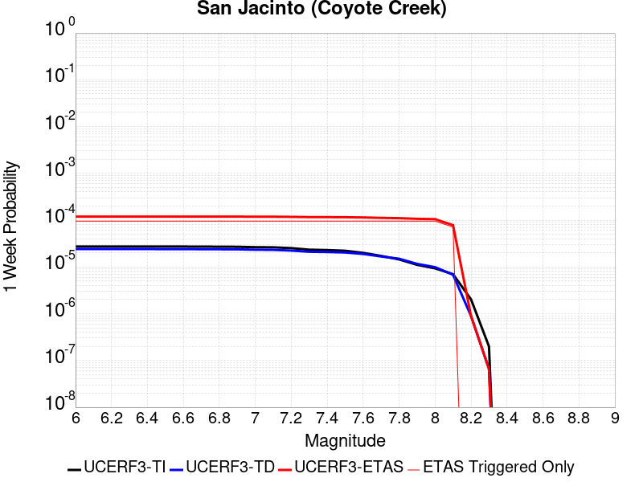 | 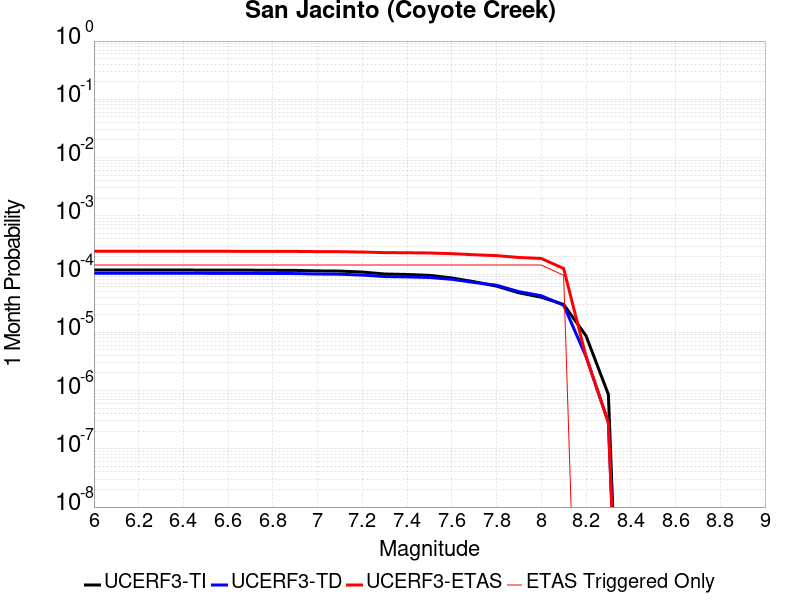 |  | 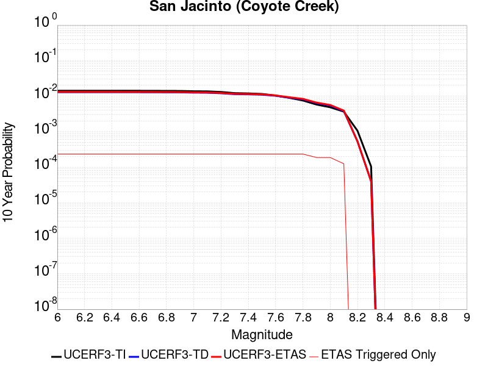 |

| Magnitude | 1 wk TI Prob | 1 wk TD Prob | 1 wk ETAS Prob | 1 wk ETAS/TD Gain | 1 wk ETAS Triggered Only | 1 mo TI Prob | 1 mo TD Prob | 1 mo ETAS Prob | 1 mo ETAS/TD Gain | 1 mo ETAS Triggered Only | 1 yr TI Prob | 1 yr TD Prob | 1 yr ETAS Prob | 1 yr ETAS/TD Gain | 1 yr ETAS Triggered Only | 10 yr TI Prob | 10 yr TD Prob | 10 yr ETAS Prob | 10 yr ETAS/TD Gain | 10 yr ETAS Triggered Only |
|-----|-----|-----|-----|-----|-----|-----|-----|-----|-----|-----|-----|-----|-----|-----|-----|-----|-----|-----|-----|-----|
| 6.0 | 2.7374346E-5 | 2.4145214E-5 | 9.414352E-5 | 3.8990552 | 7.0E-5 | 1.1731335E-4 | 1.034754E-4 | 2.0346505E-4 | 1.9663132 | 1.0E-4 | 0.0014273542 | 0.0012590875 | 0.0014288734 | 1.1348485 | 1.7E-4 | 0.01418221 | 0.012928318 | 0.013155345 | 1.0175604 | 2.3E-4 |
| 6.1 | 2.7374346E-5 | 2.4145214E-5 | 9.414352E-5 | 3.8990552 | 7.0E-5 | 1.1731335E-4 | 1.034754E-4 | 2.0346505E-4 | 1.9663132 | 1.0E-4 | 0.0014273542 | 0.0012590875 | 0.0014288734 | 1.1348485 | 1.7E-4 | 0.01418221 | 0.012928318 | 0.013155345 | 1.0175604 | 2.3E-4 |
| 6.2 | 2.7374346E-5 | 2.4145214E-5 | 9.414352E-5 | 3.8990552 | 7.0E-5 | 1.1731335E-4 | 1.034754E-4 | 2.0346505E-4 | 1.9663132 | 1.0E-4 | 0.0014273542 | 0.0012590875 | 0.0014288734 | 1.1348485 | 1.7E-4 | 0.01418221 | 0.012928318 | 0.013155345 | 1.0175604 | 2.3E-4 |
| 6.3 | 2.7374346E-5 | 2.4145214E-5 | 9.414352E-5 | 3.8990552 | 7.0E-5 | 1.1731335E-4 | 1.034754E-4 | 2.0346505E-4 | 1.9663132 | 1.0E-4 | 0.0014273542 | 0.0012590875 | 0.0014288734 | 1.1348485 | 1.7E-4 | 0.01418221 | 0.012928318 | 0.013155345 | 1.0175604 | 2.3E-4 |
| 6.4 | 2.7374346E-5 | 2.4145214E-5 | 9.414352E-5 | 3.8990552 | 7.0E-5 | 1.1731335E-4 | 1.034754E-4 | 2.0346505E-4 | 1.9663132 | 1.0E-4 | 0.0014273542 | 0.0012590875 | 0.0014288734 | 1.1348485 | 1.7E-4 | 0.01418221 | 0.012928318 | 0.013155345 | 1.0175604 | 2.3E-4 |
| 6.5 | 2.7282445E-5 | 2.4031293E-5 | 9.402961E-5 | 3.9127986 | 7.0E-5 | 1.16919524E-4 | 1.029872E-4 | 2.0297691E-4 | 1.9708945 | 1.0E-4 | 0.0014225657 | 0.0012531505 | 0.0014229375 | 1.135488 | 1.7E-4 | 0.014134934 | 0.012869646 | 0.0130966855 | 1.0176415 | 2.3E-4 |
| 6.6 | 2.7282445E-5 | 2.4031293E-5 | 9.402961E-5 | 3.9127986 | 7.0E-5 | 1.16919524E-4 | 1.029872E-4 | 2.0297691E-4 | 1.9708945 | 1.0E-4 | 0.0014225657 | 0.0012531505 | 0.0014229375 | 1.135488 | 1.7E-4 | 0.014134934 | 0.012869646 | 0.0130966855 | 1.0176415 | 2.3E-4 |
| 6.7 | 2.7216198E-5 | 2.3956412E-5 | 9.395474E-5 | 3.9219034 | 7.0E-5 | 1.1663563E-4 | 1.02666316E-4 | 2.0265605E-4 | 1.9739293 | 1.0E-4 | 0.0014191137 | 0.0012492483 | 0.001419036 | 1.1359118 | 1.7E-4 | 0.014100855 | 0.0128310565 | 0.0130581055 | 1.0176953 | 2.3E-4 |
| 6.8 | 2.7078617E-5 | 2.387363E-5 | 9.387196E-5 | 3.9320354 | 7.0E-5 | 1.1604605E-4 | 1.0231156E-4 | 2.0230132E-4 | 1.9773066 | 1.0E-4 | 0.001411945 | 0.0012449342 | 0.0014147224 | 1.1363834 | 1.7E-4 | 0.014030075 | 0.012788199 | 0.013015257 | 1.0177554 | 2.3E-4 |
| 6.9 | 2.6982952E-5 | 2.3793142E-5 | 9.3791474E-5 | 3.9419544 | 7.0E-5 | 1.15636096E-4 | 1.0196664E-4 | 2.0195644E-4 | 1.980613 | 1.0E-4 | 0.0014069602 | 0.0012407395 | 0.0014105286 | 1.1368451 | 1.7E-4 | 0.013980856 | 0.012746515 | 0.012973582 | 1.0178142 | 2.3E-4 |
| 7.0 | 2.6449972E-5 | 2.3370165E-5 | 9.336853E-5 | 3.995202 | 7.0E-5 | 1.1335209E-4 | 1.00154015E-4 | 2.00144E-4 | 1.9983622 | 1.0E-4 | 0.001379188 | 0.0012186957 | 0.0013884885 | 1.1393234 | 1.7E-4 | 0.0137065975 | 0.0125278765 | 0.012754995 | 1.0181291 | 2.3E-4 |
| 7.1 | 2.6257849E-5 | 2.3196202E-5 | 9.3194576E-5 | 4.0176654 | 7.0E-5 | 1.1252879E-4 | 9.940852E-5 | 1.9939858E-4 | 2.00585 | 1.0E-4 | 0.0013691769 | 0.0012096294 | 0.0013794237 | 1.1403689 | 1.7E-4 | 0.013607717 | 0.012437741 | 0.012664881 | 1.0182621 | 2.3E-4 |
| 7.2 | 2.5270041E-5 | 2.2390966E-5 | 9.23894E-5 | 4.1261907 | 7.0E-5 | 1.0829568E-4 | 9.595777E-5 | 1.9594817E-4 | 2.042025 | 1.0E-4 | 0.0013177024 | 0.0011676621 | 0.0013374635 | 1.1454201 | 1.7E-4 | 0.013099162 | 0.012018777 | 0.012246013 | 1.0189067 | 2.3E-4 |
| 7.3 | 2.339701E-5 | 2.1122814E-5 | 9.1121336E-5 | 4.3138824 | 7.0E-5 | 1.0026905E-4 | 9.0523215E-5 | 1.9051417E-4 | 2.104589 | 1.0E-4 | 0.001220092 | 0.0011015651 | 0.0012713778 | 1.1541559 | 1.7E-4 | 0.012134149 | 0.011357696 | 0.011585084 | 1.0200206 | 2.3E-4 |
| 7.4 | 2.296333E-5 | 2.0853171E-5 | 9.085171E-5 | 4.356734 | 7.0E-5 | 9.841056E-5 | 8.936768E-5 | 1.8935875E-4 | 2.118873 | 1.0E-4 | 0.0011974899 | 0.0010875105 | 0.0012573256 | 1.1561503 | 1.7E-4 | 0.011910575 | 0.01121681 | 0.01144423 | 1.020275 | 2.3E-4 |
| 7.5 | 2.2188895E-5 | 2.0376096E-5 | 9.037467E-5 | 4.435328 | 7.0E-5 | 9.50918E-5 | 8.732321E-5 | 1.8731448E-4 | 2.1450708 | 1.0E-4 | 0.0011571277 | 0.0010626436 | 0.0012324629 | 1.1598084 | 1.7E-4 | 0.011511209 | 0.010966429 | 0.011193906 | 1.0207431 | 2.3E-4 |
| 7.6 | 2.0013189E-5 | 1.8962366E-5 | 8.896104E-5 | 4.6914525 | 7.0E-5 | 8.5767984E-5 | 8.1264756E-5 | 1.8125663E-4 | 2.2304456 | 1.0E-4 | 0.001043725 | 9.889511E-4 | 0.001158783 | 1.1717293 | 1.7E-4 | 0.010388365 | 0.010224434 | 0.010452081 | 1.0222651 | 2.3E-4 |
| 7.7 | 1.7230794E-5 | 1.674371E-5 | 8.674254E-5 | 5.1806045 | 7.0E-5 | 7.384417E-5 | 7.175679E-5 | 1.717496E-4 | 2.3934963 | 1.0E-4 | 8.986819E-4 | 8.7328954E-4 | 0.0010431411 | 1.1944963 | 1.7E-4 | 0.008950562 | 0.009062956 | 0.009290872 | 1.025148 | 2.3E-4 |
| 7.8 | 1.4478809E-5 | 1.4990978E-5 | 8.498993E-5 | 5.669405 | 7.0E-5 | 6.205057E-5 | 6.424547E-5 | 1.6423904E-4 | 2.5564299 | 1.0E-4 | 7.552038E-4 | 7.819085E-4 | 9.5177564E-4 | 1.2172468 | 1.7E-4 | 0.0075264242 | 0.008141387 | 0.008369515 | 1.0280207 | 2.3E-4 |
| 7.9 | 1.1114467E-5 | 1.1645102E-5 | 8.1644284E-5 | 7.0110407 | 7.0E-5 | 4.7632562E-5 | 4.990663E-5 | 1.4990164E-4 | 3.0036418 | 1.0E-4 | 5.797721E-4 | 6.074444E-4 | 7.4735936E-4 | 1.2303338 | 1.4E-4 | 0.0057826187 | 0.0063803247 | 0.006579049 | 1.0311464 | 2.0E-4 |
| 8.0 | 9.327402E-6 | 9.899186E-6 | 7.989849E-5 | 8.0712185 | 7.0E-5 | 3.9973966E-5 | 4.2424395E-5 | 1.4242016E-4 | 3.3570342 | 1.0E-4 | 4.8657437E-4 | 5.1639514E-4 | 6.5632287E-4 | 1.2709702 | 1.4E-4 | 0.0048551033 | 0.0054499684 | 0.0056488784 | 1.0364975 | 2.0E-4 |
| 8.1 | 7.0235833E-6 | 6.827495E-6 | 3.682729E-5 | 5.393968 | 3.0E-5 | 3.0100724E-5 | 2.9260367E-5 | 6.92592E-5 | 2.3669968 | 4.0E-5 | 3.664147E-4 | 3.5618723E-4 | 4.261623E-4 | 1.1964558 | 7.0E-5 | 0.003658111 | 0.0037876023 | 0.0038971857 | 1.0289321 | 1.1E-4 |
| 8.2 | 2.0358202E-6 | 8.994527E-7 | 8.994527E-7 | 1.0 | 0.0 | 8.724915E-6 | 3.854792E-6 | 3.854792E-6 | 1.0 | 0.0 | 1.06220665E-4 | 4.69311E-5 | 4.69311E-5 | 1.0 | 0.0 | 0.001061699 | 5.3254166E-4 | 5.3254166E-4 | 1.0 | 0.0 |
| 8.3 | 2.0051264E-7 | 6.617272E-8 | 6.617272E-8 | 1.0 | 0.0 | 8.5933965E-7 | 2.8359733E-7 | 2.8359733E-7 | 1.0 | 0.0 | 1.046241E-5 | 3.4527925E-6 | 3.4527925E-6 | 1.0 | 0.0 | 1.0461917E-4 | 4.01389E-5 | 4.01389E-5 | 1.0 | 0.0 |

## Big Pine (East)
*[(top)](#table-of-contents)*

| 1 Week | 1 Month | 1 Year | 10 Year |
|-----|-----|-----|-----|
| 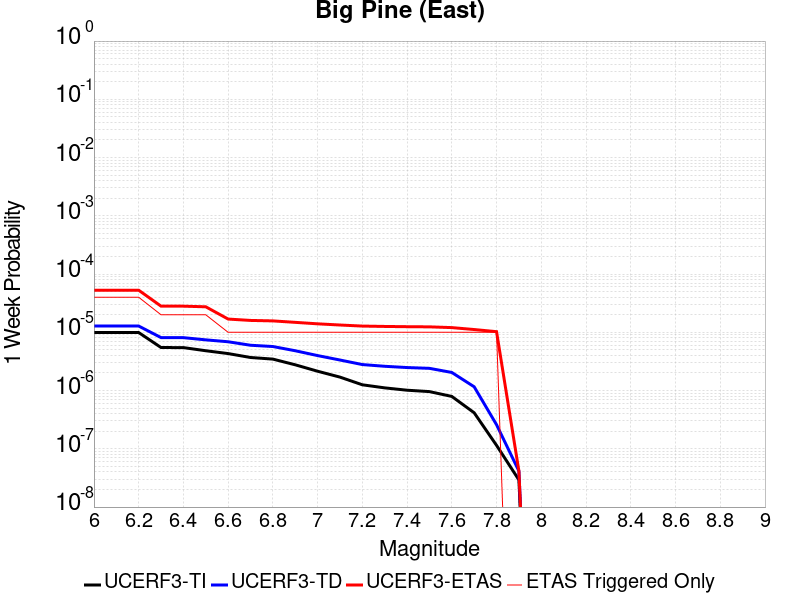 | 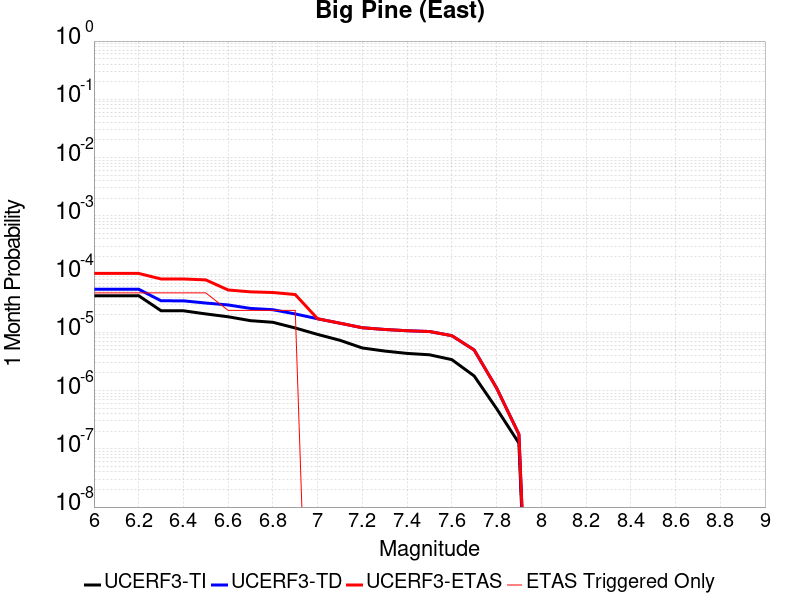 | 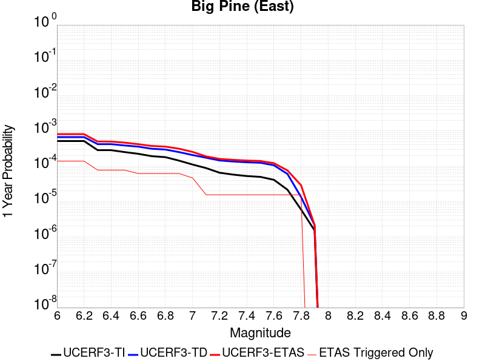 | 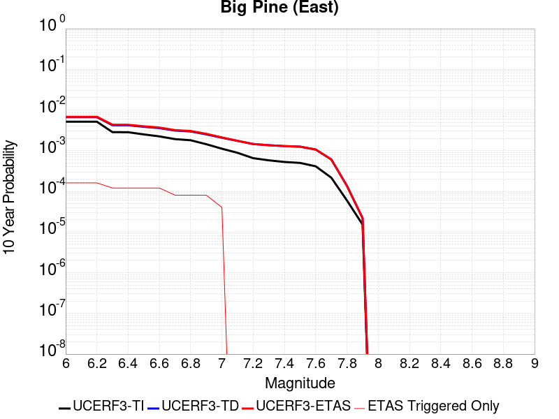 |

| Magnitude | 1 wk TI Prob | 1 wk TD Prob | 1 wk ETAS Prob | 1 wk ETAS/TD Gain | 1 wk ETAS Triggered Only | 1 mo TI Prob | 1 mo TD Prob | 1 mo ETAS Prob | 1 mo ETAS/TD Gain | 1 mo ETAS Triggered Only | 1 yr TI Prob | 1 yr TD Prob | 1 yr ETAS Prob | 1 yr ETAS/TD Gain | 1 yr ETAS Triggered Only | 10 yr TI Prob | 10 yr TD Prob | 10 yr ETAS Prob | 10 yr ETAS/TD Gain | 10 yr ETAS Triggered Only |
|-----|-----|-----|-----|-----|-----|-----|-----|-----|-----|-----|-----|-----|-----|-----|-----|-----|-----|-----|-----|-----|
| 6.0 | 9.916913E-6 | 1.2816984E-5 | 5.281647E-5 | 4.120819 | 4.0E-5 | 4.250036E-5 | 5.49289E-5 | 1.4492396E-4 | 2.6383917 | 9.0E-5 | 5.173191E-4 | 6.685763E-4 | 7.984894E-4 | 1.194313 | 1.3E-4 | 0.0051611643 | 0.006670441 | 0.0068790405 | 1.0312722 | 2.1E-4 |
| 6.1 | 9.916913E-6 | 1.2816984E-5 | 5.281647E-5 | 4.120819 | 4.0E-5 | 4.250036E-5 | 5.49289E-5 | 1.4492396E-4 | 2.6383917 | 9.0E-5 | 5.173191E-4 | 6.685763E-4 | 7.984894E-4 | 1.194313 | 1.3E-4 | 0.0051611643 | 0.006670441 | 0.0068790405 | 1.0312722 | 2.1E-4 |
| 6.2 | 9.916913E-6 | 1.2816984E-5 | 5.281647E-5 | 4.120819 | 4.0E-5 | 4.250036E-5 | 5.49289E-5 | 1.4492396E-4 | 2.6383917 | 9.0E-5 | 5.173191E-4 | 6.685763E-4 | 7.984894E-4 | 1.194313 | 1.3E-4 | 0.0051611643 | 0.006670441 | 0.0068790405 | 1.0312722 | 2.1E-4 |
| 6.3 | 5.479711E-6 | 8.112951E-6 | 2.8112789E-5 | 3.4651742 | 2.0E-5 | 2.3484265E-5 | 3.4769346E-5 | 8.4767606E-5 | 2.4379983 | 5.0E-5 | 2.858834E-4 | 4.2323777E-4 | 5.032039E-4 | 1.1889391 | 8.0E-5 | 0.0028551589 | 0.004227244 | 0.0043666516 | 1.0329785 | 1.4E-4 |
| 6.4 | 5.465009E-6 | 8.097245E-6 | 2.8097083E-5 | 3.469956 | 2.0E-5 | 2.3421257E-5 | 3.4702036E-5 | 8.47003E-5 | 2.4407878 | 5.0E-5 | 2.851165E-4 | 4.2241855E-4 | 5.0238473E-4 | 1.1893057 | 8.0E-5 | 0.0028475097 | 0.0042190826 | 0.004358492 | 1.0330426 | 1.4E-4 |
| 6.5 | 4.826767E-6 | 7.422301E-6 | 2.7422153E-5 | 3.6945622 | 2.0E-5 | 2.068598E-5 | 3.180949E-5 | 8.18079E-5 | 2.5718079 | 5.0E-5 | 2.518227E-4 | 3.872145E-4 | 4.671835E-4 | 1.2065239 | 8.0E-5 | 0.0025153751 | 0.003868283 | 0.0040077413 | 1.0360518 | 1.4E-4 |
| 6.6 | 4.3146847E-6 | 6.8822374E-6 | 1.6882168E-5 | 2.4530058 | 1.0E-5 | 1.8491375E-5 | 2.9494982E-5 | 6.9493806E-5 | 2.356123 | 4.0E-5 | 2.2510924E-4 | 3.590447E-4 | 4.2901956E-4 | 1.1948918 | 7.0E-5 | 0.0022488134 | 0.0035874986 | 0.003717032 | 1.036107 | 1.3E-4 |
| 6.7 | 3.6968106E-6 | 5.9954727E-6 | 1.5995412E-5 | 2.667915 | 1.0E-5 | 1.5843378E-5 | 2.5694639E-5 | 5.569387E-5 | 2.1675289 | 3.0E-5 | 1.9287605E-4 | 3.1278885E-4 | 3.6277322E-4 | 1.1598022 | 5.0E-5 | 0.0019270873 | 0.0031262483 | 0.0032259356 | 1.0318872 | 1.0E-4 |
| 6.8 | 3.4671132E-6 | 5.702177E-6 | 1.570212E-5 | 2.7537062 | 1.0E-5 | 1.4858972E-5 | 2.4437682E-5 | 5.4436947E-5 | 2.2275825 | 3.0E-5 | 1.8089297E-4 | 2.974896E-4 | 3.4747474E-4 | 1.1680231 | 5.0E-5 | 0.0018074579 | 0.002973667 | 0.0030733699 | 1.0335286 | 1.0E-4 |
| 6.9 | 2.7686972E-6 | 4.825223E-6 | 1.4825175E-5 | 3.072433 | 1.0E-5 | 1.1865792E-5 | 2.0679368E-5 | 4.0678955E-5 | 1.9671276 | 2.0E-5 | 1.4445644E-4 | 2.5174298E-4 | 2.917329E-4 | 1.1588522 | 4.0E-5 | 0.0014436257 | 0.0025172636 | 0.0025970624 | 1.0317005 | 8.0E-5 |
| 7.0 | 2.1472624E-6 | 3.9850406E-6 | 1.3985001E-5 | 3.5093746 | 1.0E-5 | 9.20252E-6 | 1.7078637E-5 | 2.7078466E-5 | 1.5855168 | 1.0E-5 | 1.12034926E-4 | 2.079131E-4 | 2.3790686E-4 | 1.144261 | 3.0E-5 | 0.0011197845 | 0.0020798394 | 0.0021297354 | 1.0239903 | 5.0E-5 |
| 7.1 | 1.7018335E-6 | 3.344876E-6 | 1.3344843E-5 | 3.9896374 | 1.0E-5 | 7.293552E-6 | 1.4335106E-5 | 2.4334962E-5 | 1.6975782 | 1.0E-5 | 8.879537E-5 | 1.7451629E-4 | 1.8451455E-4 | 1.0572913 | 1.0E-5 | 8.87599E-4 | 0.0017464145 | 0.0017663795 | 1.011432 | 2.0E-5 |
| 7.2 | 1.25603E-6 | 2.794484E-6 | 1.2794456E-5 | 4.578468 | 1.0E-5 | 5.3829745E-6 | 1.1976307E-5 | 2.1976188E-5 | 1.8349719 | 1.0E-5 | 6.553574E-5 | 1.4580201E-4 | 1.5580055E-4 | 1.0685762 | 1.0E-5 | 6.551642E-4 | 0.001459661 | 0.0014796319 | 1.0136818 | 2.0E-5 |
| 7.3 | 1.112297E-6 | 2.610332E-6 | 1.2610306E-5 | 4.83092 | 1.0E-5 | 4.7669787E-6 | 1.118709E-5 | 2.118698E-5 | 1.8938775 | 1.0E-5 | 5.803642E-5 | 1.3619453E-4 | 1.4619317E-4 | 1.0734144 | 1.0E-5 | 5.802127E-4 | 0.0013635408 | 0.0013835136 | 1.0146477 | 2.0E-5 |
| 7.4 | 1.0137181E-6 | 2.4834917E-6 | 1.2483467E-5 | 5.026579 | 1.0E-5 | 4.3444993E-6 | 1.0643494E-5 | 2.0643387E-5 | 1.9395311 | 1.0E-5 | 5.2892992E-5 | 1.2957705E-4 | 1.3957576E-4 | 1.0771642 | 1.0E-5 | 5.288041E-4 | 0.0012972289 | 0.0013172029 | 1.0153974 | 2.0E-5 |
| 7.5 | 9.598608E-7 | 2.4071483E-6 | 1.2407124E-5 | 5.1542835 | 1.0E-5 | 4.1136827E-6 | 1.031631E-5 | 2.0316207E-5 | 1.9693289 | 1.0E-5 | 5.0082934E-5 | 1.2559404E-4 | 1.355928E-4 | 1.0796117 | 1.0E-5 | 5.007165E-4 | 0.0012572526 | 0.0012772274 | 1.0158877 | 2.0E-5 |
| 7.6 | 7.929459E-7 | 2.0448588E-6 | 1.20448385E-5 | 5.890303 | 1.0E-5 | 3.3983351E-6 | 8.763653E-6 | 1.8763565E-5 | 2.1410668 | 1.0E-5 | 4.1373947E-5 | 1.06692416E-4 | 1.1669135E-4 | 1.0937173 | 1.0E-5 | 4.1366243E-4 | 0.0010685222 | 0.0010885008 | 1.0186974 | 2.0E-5 |
| 7.7 | 4.155788E-7 | 1.1605589E-6 | 1.1160548E-5 | 9.616528 | 1.0E-5 | 1.7810507E-6 | 4.9738146E-6 | 1.4973765E-5 | 3.0105193 | 1.0E-5 | 2.1684076E-5 | 6.0554554E-5 | 7.055395E-5 | 1.1651304 | 1.0E-5 | 2.1681961E-4 | 6.0857297E-4 | 6.185669E-4 | 1.0164219 | 1.0E-5 |
| 7.8 | 1.14666925E-7 | 2.592015E-7 | 1.02591985E-5 | 39.580013 | 1.0E-5 | 4.914296E-7 | 1.1108631E-6 | 1.1110852E-5 | 10.002 | 1.0E-5 | 5.9831386E-6 | 1.3524678E-5 | 2.3524542E-5 | 1.7393792 | 1.0E-5 | 5.9829777E-5 | 1.3634123E-4 | 1.4633987E-4 | 1.0733354 | 1.0E-5 |
| 7.9 | 2.9231824E-8 | 4.1463963E-8 | 4.1463963E-8 | 1.0 | 0.0 | 1.2527924E-7 | 1.7770269E-7 | 1.7770269E-7 | 1.0 | 0.0 | 1.5252737E-6 | 2.1635283E-6 | 2.1635283E-6 | 1.0 | 0.0 | 1.5252632E-5 | 2.1967755E-5 | 2.1967755E-5 | 1.0 | 0.0 |

## Pinto Mtn
*[(top)](#table-of-contents)*

| 1 Week | 1 Month | 1 Year | 10 Year |
|-----|-----|-----|-----|
| 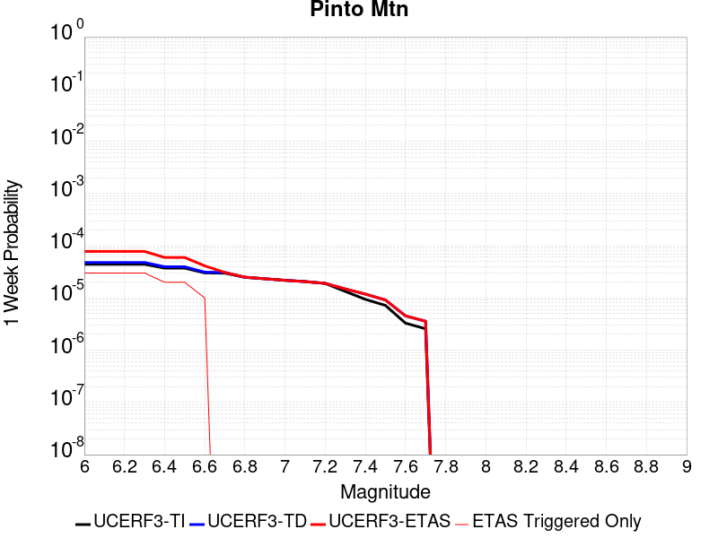 | 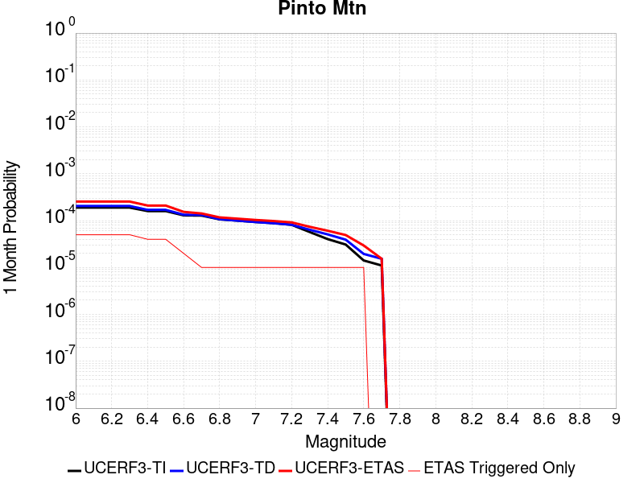 |  | 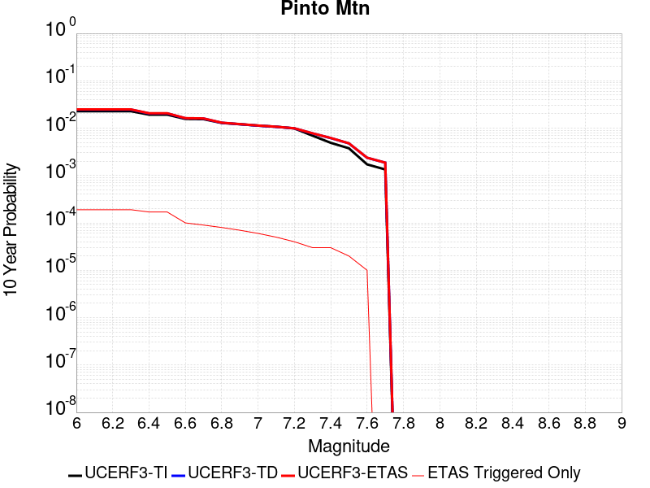 |

| Magnitude | 1 wk TI Prob | 1 wk TD Prob | 1 wk ETAS Prob | 1 wk ETAS/TD Gain | 1 wk ETAS Triggered Only | 1 mo TI Prob | 1 mo TD Prob | 1 mo ETAS Prob | 1 mo ETAS/TD Gain | 1 mo ETAS Triggered Only | 1 yr TI Prob | 1 yr TD Prob | 1 yr ETAS Prob | 1 yr ETAS/TD Gain | 1 yr ETAS Triggered Only | 10 yr TI Prob | 10 yr TD Prob | 10 yr ETAS Prob | 10 yr ETAS/TD Gain | 10 yr ETAS Triggered Only |
|-----|-----|-----|-----|-----|-----|-----|-----|-----|-----|-----|-----|-----|-----|-----|-----|-----|-----|-----|-----|-----|
| 6.0 | 4.4194956E-5 | 4.785362E-5 | 7.7852186E-5 | 1.6268818 | 3.0E-5 | 1.893932E-4 | 2.0507174E-4 | 2.550615E-4 | 1.2437671 | 5.0E-5 | 0.0023034236 | 0.0024940541 | 0.002613755 | 1.0479944 | 1.2E-4 | 0.022796938 | 0.024678145 | 0.024863455 | 1.0075091 | 1.9E-4 |
| 6.1 | 4.4194956E-5 | 4.785362E-5 | 7.7852186E-5 | 1.6268818 | 3.0E-5 | 1.893932E-4 | 2.0507174E-4 | 2.550615E-4 | 1.2437671 | 5.0E-5 | 0.0023034236 | 0.0024940541 | 0.002613755 | 1.0479944 | 1.2E-4 | 0.022796938 | 0.024678145 | 0.024863455 | 1.0075091 | 1.9E-4 |
| 6.2 | 4.4194956E-5 | 4.785362E-5 | 7.7852186E-5 | 1.6268818 | 3.0E-5 | 1.893932E-4 | 2.0507174E-4 | 2.550615E-4 | 1.2437671 | 5.0E-5 | 0.0023034236 | 0.0024940541 | 0.002613755 | 1.0479944 | 1.2E-4 | 0.022796938 | 0.024678145 | 0.024863455 | 1.0075091 | 1.9E-4 |
| 6.3 | 4.4194956E-5 | 4.785362E-5 | 7.7852186E-5 | 1.6268818 | 3.0E-5 | 1.893932E-4 | 2.0507174E-4 | 2.550615E-4 | 1.2437671 | 5.0E-5 | 0.0023034236 | 0.0024940541 | 0.002613755 | 1.0479944 | 1.2E-4 | 0.022796938 | 0.024678145 | 0.024863455 | 1.0075091 | 1.9E-4 |
| 6.4 | 3.729929E-5 | 3.9603186E-5 | 5.9602393E-5 | 1.5049899 | 2.0E-5 | 1.5984432E-4 | 1.6971743E-4 | 2.0971063E-4 | 1.2356459 | 4.0E-5 | 0.0019443673 | 0.002064445 | 0.0021642386 | 1.0483391 | 1.0E-4 | 0.019274427 | 0.02046269 | 0.020629212 | 1.0081378 | 1.7E-4 |
| 6.5 | 3.729929E-5 | 3.9603186E-5 | 5.9602393E-5 | 1.5049899 | 2.0E-5 | 1.5984432E-4 | 1.6971743E-4 | 2.0971063E-4 | 1.2356459 | 4.0E-5 | 0.0019443673 | 0.002064445 | 0.0021642386 | 1.0483391 | 1.0E-4 | 0.019274427 | 0.02046269 | 0.020629212 | 1.0081378 | 1.7E-4 |
| 6.6 | 3.0204548E-5 | 3.1205298E-5 | 4.1204985E-5 | 1.3204484 | 1.0E-5 | 1.2944164E-4 | 1.3373033E-4 | 1.5372765E-4 | 1.1495347 | 2.0E-5 | 0.0015748127 | 0.0016269855 | 0.0016569366 | 1.018409 | 3.0E-5 | 0.015636992 | 0.01615461 | 0.016252993 | 1.0060902 | 1.0E-4 |
| 6.7 | 2.9857754E-5 | 3.081468E-5 | 3.081468E-5 | 1.0 | 0.0 | 1.2795553E-4 | 1.3205643E-4 | 1.4205511E-4 | 1.0757152 | 1.0E-5 | 0.0015567453 | 0.001606636 | 0.0016266038 | 1.0124284 | 2.0E-5 | 0.015458848 | 0.01595405 | 0.016042612 | 1.0055512 | 9.0E-5 |
| 6.8 | 2.4819734E-5 | 2.5009364E-5 | 2.5009364E-5 | 1.0 | 0.0 | 1.0636595E-4 | 1.07178705E-4 | 1.1717763E-4 | 1.0932921 | 1.0E-5 | 0.0012942362 | 0.0013041412 | 0.0013241152 | 1.0153158 | 2.0E-5 | 0.012867244 | 0.0129672475 | 0.01304621 | 1.0060894 | 8.0E-5 |
| 6.9 | 2.331124E-5 | 2.3337643E-5 | 2.3337643E-5 | 1.0 | 0.0 | 9.990149E-5 | 1.00014746E-4 | 1.10013745E-4 | 1.0999752 | 1.0E-5 | 0.001215622 | 0.0012170197 | 0.0012369953 | 1.0164136 | 2.0E-5 | 0.012089936 | 0.012105742 | 0.012174894 | 1.0057124 | 7.0E-5 |
| 7.0 | 2.1818534E-5 | 2.1760772E-5 | 2.1760772E-5 | 1.0 | 0.0 | 9.3504656E-5 | 9.325723E-5 | 1.032563E-4 | 1.1072203 | 1.0E-5 | 0.0011378246 | 0.0011348352 | 0.0011548125 | 1.0176038 | 2.0E-5 | 0.011320163 | 0.011292503 | 0.011351826 | 1.0052533 | 6.0E-5 |
| 7.1 | 2.066081E-5 | 2.0540418E-5 | 2.0540418E-5 | 1.0 | 0.0 | 8.854332E-5 | 8.8027504E-5 | 9.802662E-5 | 1.1135908 | 1.0E-5 | 0.0010774818 | 0.0010712275 | 0.0010812167 | 1.009325 | 1.0E-5 | 0.010722724 | 0.010662688 | 0.010712155 | 1.0046393 | 5.0E-5 |
| 7.2 | 1.8990233E-5 | 1.9053701E-5 | 1.9053701E-5 | 1.0 | 0.0 | 8.138417E-5 | 8.1656275E-5 | 9.1655456E-5 | 1.1224545 | 1.0E-5 | 9.904018E-4 | 9.937311E-4 | 0.0010037211 | 1.010053 | 1.0E-5 | 0.009859995 | 0.009894874 | 0.0099344775 | 1.0040025 | 4.0E-5 |
| 7.3 | 1.3335872E-5 | 1.4906372E-5 | 1.4906372E-5 | 1.0 | 0.0 | 5.7152483E-5 | 6.388296E-5 | 7.388232E-5 | 1.1565263 | 1.0E-5 | 6.956093E-4 | 7.775102E-4 | 7.8750245E-4 | 1.0128516 | 1.0E-5 | 0.006934359 | 0.0077491994 | 0.007778967 | 1.0038414 | 3.0E-5 |
| 7.4 | 9.414066E-6 | 1.186061E-5 | 1.186061E-5 | 1.0 | 0.0 | 4.0345374E-5 | 5.0830247E-5 | 6.082974E-5 | 1.1967232 | 1.0E-5 | 4.910942E-4 | 6.1869196E-4 | 6.286858E-4 | 1.0161531 | 1.0E-5 | 0.0049001034 | 0.006170644 | 0.006200459 | 1.0048317 | 3.0E-5 |
| 7.5 | 7.2101157E-6 | 9.157893E-6 | 9.157893E-6 | 1.0 | 0.0 | 3.090013E-5 | 3.924757E-5 | 4.9247177E-5 | 1.2547828 | 1.0E-5 | 3.7614413E-4 | 4.7774217E-4 | 4.8773742E-4 | 1.0209218 | 1.0E-5 | 0.0037550807 | 0.004767927 | 0.0047878316 | 1.0041747 | 2.0E-5 |
| 7.6 | 3.296375E-6 | 4.5453176E-6 | 4.5453176E-6 | 1.0 | 0.0 | 1.4127245E-5 | 1.9479796E-5 | 2.9479601E-5 | 1.5133424 | 1.0E-5 | 1.7198564E-4 | 2.3714209E-4 | 2.4713972E-4 | 1.0421588 | 1.0E-5 | 0.0017185259 | 0.0023690276 | 0.002379004 | 1.0042112 | 1.0E-5 |
| 7.7 | 2.5741092E-6 | 3.584251E-6 | 3.584251E-6 | 1.0 | 0.0 | 1.103185E-5 | 1.5360993E-5 | 1.5360993E-5 | 1.0 | 0.0 | 1.3430449E-4 | 1.8700535E-4 | 1.8700535E-4 | 1.0 | 0.0 | 0.0013422335 | 0.0018686098 | 0.0018686098 | 1.0 | 0.0 |

## Independence rev 2011
*[(top)](#table-of-contents)*

| 1 Week | 1 Month | 1 Year | 10 Year |
|-----|-----|-----|-----|
| 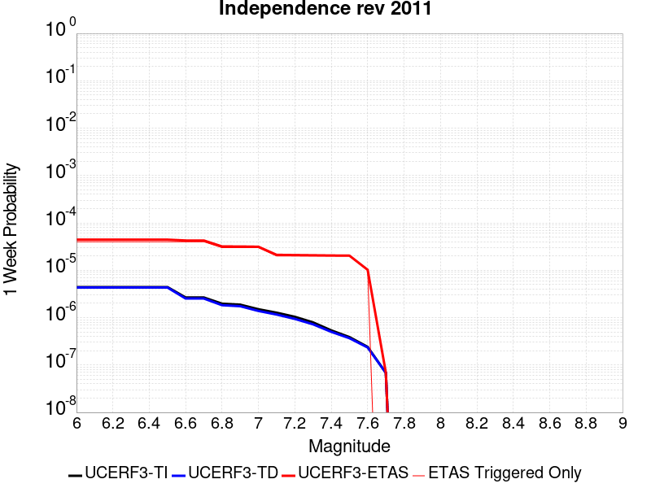 | 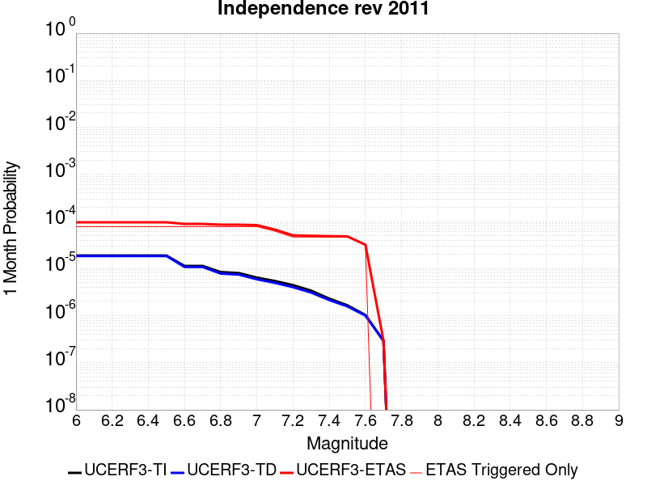 | 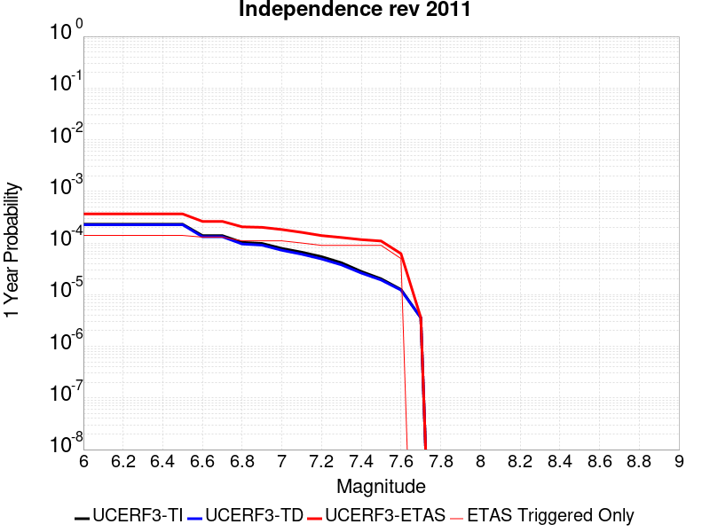 | 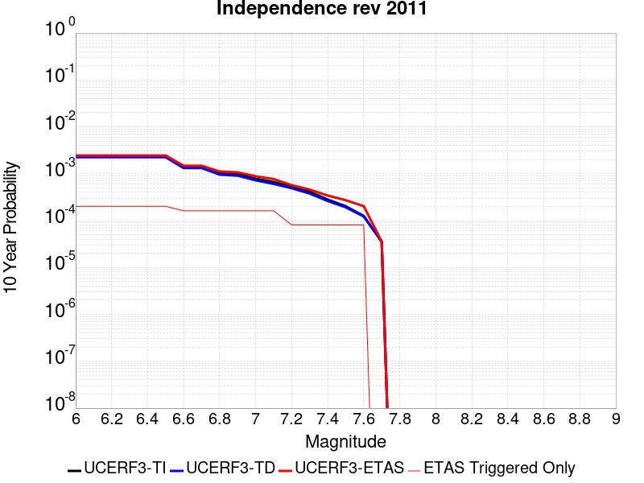 |

| Magnitude | 1 wk TI Prob | 1 wk TD Prob | 1 wk ETAS Prob | 1 wk ETAS/TD Gain | 1 wk ETAS Triggered Only | 1 mo TI Prob | 1 mo TD Prob | 1 mo ETAS Prob | 1 mo ETAS/TD Gain | 1 mo ETAS Triggered Only | 1 yr TI Prob | 1 yr TD Prob | 1 yr ETAS Prob | 1 yr ETAS/TD Gain | 1 yr ETAS Triggered Only | 10 yr TI Prob | 10 yr TD Prob | 10 yr ETAS Prob | 10 yr ETAS/TD Gain | 10 yr ETAS Triggered Only |
|-----|-----|-----|-----|-----|-----|-----|-----|-----|-----|-----|-----|-----|-----|-----|-----|-----|-----|-----|-----|-----|
| 6.0 | 4.422171E-6 | 4.326227E-6 | 4.4326054E-5 | 10.245892 | 4.0E-5 | 1.8952025E-5 | 1.8540857E-5 | 1.0853919E-4 | 5.8540545 | 9.0E-5 | 2.3071647E-4 | 2.2571455E-4 | 3.6568294E-4 | 1.6201124 | 1.4E-4 | 0.0023047708 | 0.0022551466 | 0.002444718 | 1.0840617 | 1.9E-4 |
| 6.1 | 4.422171E-6 | 4.326227E-6 | 4.4326054E-5 | 10.245892 | 4.0E-5 | 1.8952025E-5 | 1.8540857E-5 | 1.0853919E-4 | 5.8540545 | 9.0E-5 | 2.3071647E-4 | 2.2571455E-4 | 3.6568294E-4 | 1.6201124 | 1.4E-4 | 0.0023047708 | 0.0022551466 | 0.002444718 | 1.0840617 | 1.9E-4 |
| 6.2 | 4.422171E-6 | 4.326227E-6 | 4.4326054E-5 | 10.245892 | 4.0E-5 | 1.8952025E-5 | 1.8540857E-5 | 1.0853919E-4 | 5.8540545 | 9.0E-5 | 2.3071647E-4 | 2.2571455E-4 | 3.6568294E-4 | 1.6201124 | 1.4E-4 | 0.0023047708 | 0.0022551466 | 0.002444718 | 1.0840617 | 1.9E-4 |
| 6.3 | 4.422171E-6 | 4.326227E-6 | 4.4326054E-5 | 10.245892 | 4.0E-5 | 1.8952025E-5 | 1.8540857E-5 | 1.0853919E-4 | 5.8540545 | 9.0E-5 | 2.3071647E-4 | 2.2571455E-4 | 3.6568294E-4 | 1.6201124 | 1.4E-4 | 0.0023047708 | 0.0022551466 | 0.002444718 | 1.0840617 | 1.9E-4 |
| 6.4 | 4.422171E-6 | 4.326227E-6 | 4.4326054E-5 | 10.245892 | 4.0E-5 | 1.8952025E-5 | 1.8540857E-5 | 1.0853919E-4 | 5.8540545 | 9.0E-5 | 2.3071647E-4 | 2.2571455E-4 | 3.6568294E-4 | 1.6201124 | 1.4E-4 | 0.0023047708 | 0.0022551466 | 0.002444718 | 1.0840617 | 1.9E-4 |
| 6.5 | 4.422171E-6 | 4.326227E-6 | 4.4326054E-5 | 10.245892 | 4.0E-5 | 1.8952025E-5 | 1.8540857E-5 | 1.0853919E-4 | 5.8540545 | 9.0E-5 | 2.3071647E-4 | 2.2571455E-4 | 3.6568294E-4 | 1.6201124 | 1.4E-4 | 0.0023047708 | 0.0022551466 | 0.002444718 | 1.0840617 | 1.9E-4 |
| 6.6 | 2.663744E-6 | 2.5319862E-6 | 4.2531887E-5 | 16.797834 | 4.0E-5 | 1.1415996E-5 | 1.0851327E-5 | 1.0085035E-4 | 9.293826 | 9.0E-5 | 1.3898089E-4 | 1.3210738E-4 | 2.620902E-4 | 1.983918 | 1.3E-4 | 0.0013889399 | 0.0013203367 | 0.0014901123 | 1.128585 | 1.7E-4 |
| 6.7 | 2.663744E-6 | 2.5319862E-6 | 4.2531887E-5 | 16.797834 | 4.0E-5 | 1.1415996E-5 | 1.0851327E-5 | 1.0085035E-4 | 9.293826 | 9.0E-5 | 1.3898089E-4 | 1.3210738E-4 | 2.620902E-4 | 1.983918 | 1.3E-4 | 0.0013889399 | 0.0013203367 | 0.0014901123 | 1.128585 | 1.7E-4 |
| 6.8 | 1.9716529E-6 | 1.8322585E-6 | 3.18322E-5 | 17.373207 | 3.0E-5 | 8.449913E-6 | 7.852514E-6 | 8.7851884E-5 | 11.187741 | 8.0E-5 | 1.0287284E-4 | 9.5600284E-5 | 2.0558976E-4 | 2.1505141 | 1.1E-4 | 0.0010282523 | 9.556045E-4 | 0.0011054612 | 1.1568187 | 1.5E-4 |
| 6.9 | 1.8788617E-6 | 1.7429993E-6 | 3.1742948E-5 | 18.211681 | 3.0E-5 | 8.0522395E-6 | 7.4699765E-6 | 8.746938E-5 | 11.709458 | 8.0E-5 | 9.80316E-5 | 9.0943286E-5 | 2.0093328E-4 | 2.209435 | 1.1E-4 | 9.798837E-4 | 9.0907275E-4 | 0.0010589364 | 1.1648533 | 1.5E-4 |
| 7.0 | 1.5045488E-6 | 1.3849503E-6 | 3.138491E-5 | 22.661396 | 3.0E-5 | 6.44805E-6 | 5.9354884E-6 | 8.593501E-5 | 14.47817 | 8.0E-5 | 7.8502184E-5 | 7.226223E-5 | 1.8225428E-4 | 2.5221238 | 1.1E-4 | 7.8474457E-4 | 7.2239246E-4 | 8.7228406E-4 | 1.2074934 | 1.5E-4 |
| 7.1 | 1.272341E-6 | 1.1625096E-6 | 2.1162487E-5 | 18.204138 | 2.0E-5 | 5.4528787E-6 | 4.982175E-6 | 7.498183E-5 | 15.050018 | 7.0E-5 | 6.6386776E-5 | 6.0656326E-5 | 1.6065026E-4 | 2.6485326 | 1.0E-4 | 6.636695E-4 | 6.064009E-4 | 7.46316E-4 | 1.2307304 | 1.4E-4 |
| 7.2 | 1.0416892E-6 | 9.4098806E-7 | 2.094097E-5 | 22.254234 | 2.0E-5 | 4.464375E-6 | 4.0328E-6 | 6.403256E-5 | 15.877941 | 6.0E-5 | 5.4352407E-5 | 4.909825E-5 | 1.3909383E-4 | 2.8329692 | 9.0E-5 | 5.4339116E-4 | 4.9087586E-4 | 6.10817E-4 | 1.244341 | 1.2E-4 |
| 7.3 | 7.9450155E-7 | 7.235002E-7 | 2.0723486E-5 | 28.643373 | 2.0E-5 | 3.4050022E-6 | 3.1007114E-6 | 6.3100524E-5 | 20.350338 | 6.0E-5 | 4.1455114E-5 | 3.775052E-5 | 1.2774712E-4 | 3.3839831 | 9.0E-5 | 4.144738E-4 | 3.7744216E-4 | 4.8740066E-4 | 1.2913253 | 1.1E-4 |
| 7.4 | 5.3893444E-7 | 5.019512E-7 | 2.050194E-5 | 40.84449 | 2.0E-5 | 2.309717E-6 | 2.1512178E-6 | 6.215109E-5 | 28.891119 | 6.0E-5 | 2.8120441E-5 | 2.6190766E-5 | 1.1618841E-4 | 4.4362354 | 9.0E-5 | 2.8116882E-4 | 2.6187726E-4 | 3.7184844E-4 | 1.4199342 | 1.1E-4 |
| 7.5 | 3.8852085E-7 | 3.682554E-7 | 2.0368248E-5 | 55.310116 | 2.0E-5 | 1.6650882E-6 | 1.5782365E-6 | 6.157814E-5 | 39.017056 | 6.0E-5 | 2.027226E-5 | 1.9214862E-5 | 1.09213135E-4 | 5.6837845 | 9.0E-5 | 2.0270412E-4 | 1.9213221E-4 | 3.021111E-4 | 1.5724124 | 1.1E-4 |
| 7.6 | 2.414929E-7 | 2.345755E-7 | 1.0234573E-5 | 43.630188 | 1.0E-5 | 1.0349692E-6 | 1.0053232E-6 | 3.1005293E-5 | 30.84112 | 3.0E-5 | 1.2600677E-5 | 1.2239742E-5 | 6.223913E-5 | 5.0850034 | 5.0E-5 | 1.2599962E-4 | 1.223908E-4 | 1.9238224E-4 | 1.5718684 | 7.0E-5 |
| 7.7 | 6.8298014E-8 | 6.85897E-8 | 6.85897E-8 | 1.0 | 0.0 | 2.9270575E-7 | 2.9395582E-7 | 2.9395582E-7 | 1.0 | 0.0 | 3.5636867E-6 | 3.5789067E-6 | 3.5789067E-6 | 1.0 | 0.0 | 3.5636294E-5 | 3.5788536E-5 | 4.578818E-5 | 1.279409 | 1.0E-5 |

## Big Pine (Central)
*[(top)](#table-of-contents)*

| 1 Week | 1 Month | 1 Year | 10 Year |
|-----|-----|-----|-----|
| 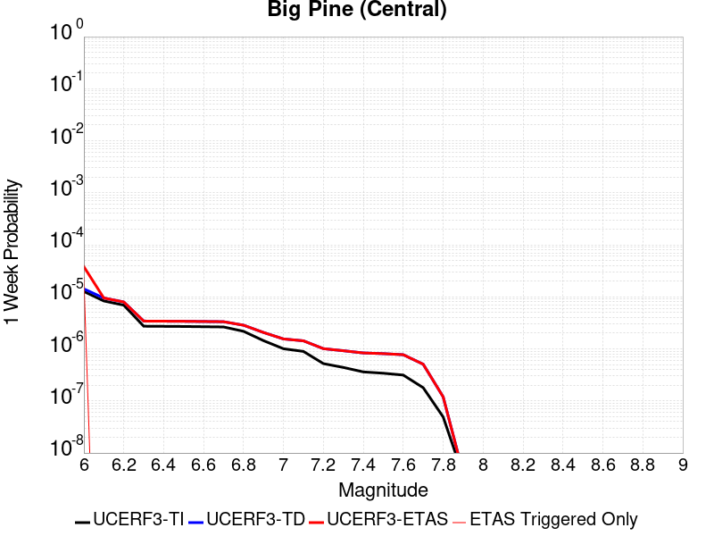 | 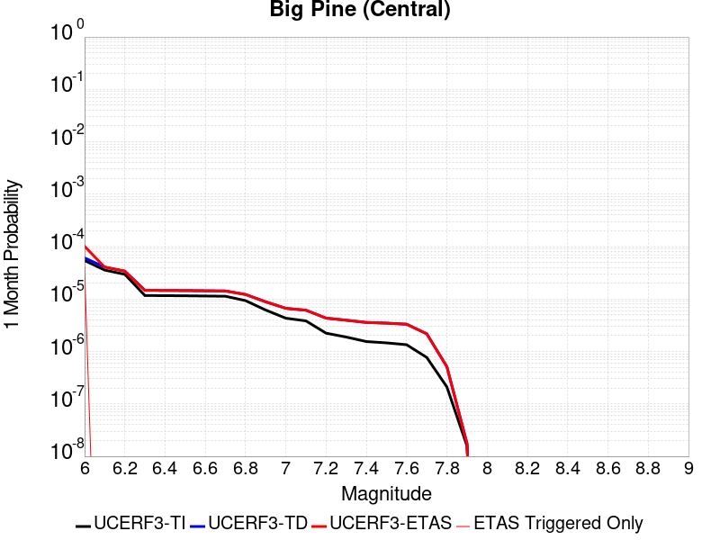 | 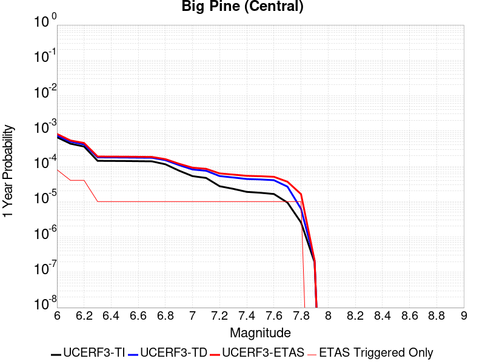 | 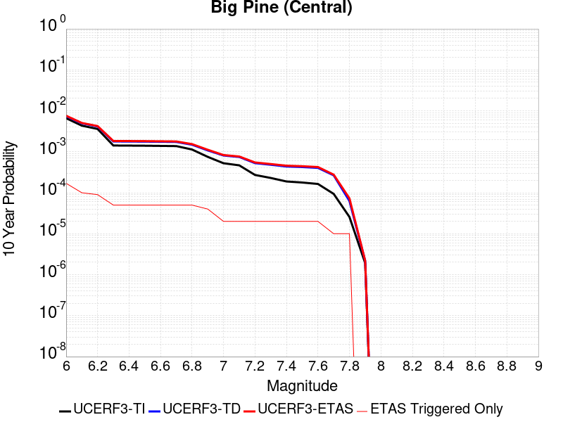 |

| Magnitude | 1 wk TI Prob | 1 wk TD Prob | 1 wk ETAS Prob | 1 wk ETAS/TD Gain | 1 wk ETAS Triggered Only | 1 mo TI Prob | 1 mo TD Prob | 1 mo ETAS Prob | 1 mo ETAS/TD Gain | 1 mo ETAS Triggered Only | 1 yr TI Prob | 1 yr TD Prob | 1 yr ETAS Prob | 1 yr ETAS/TD Gain | 1 yr ETAS Triggered Only | 10 yr TI Prob | 10 yr TD Prob | 10 yr ETAS Prob | 10 yr ETAS/TD Gain | 10 yr ETAS Triggered Only |
|-----|-----|-----|-----|-----|-----|-----|-----|-----|-----|-----|-----|-----|-----|-----|-----|-----|-----|-----|-----|-----|
| 6.0 | 1.2706755E-5 | 1.4250529E-5 | 3.4250243E-5 | 2.4034367 | 2.0E-5 | 5.4456385E-5 | 6.107247E-5 | 9.107064E-5 | 1.4911897 | 3.0E-5 | 6.628048E-4 | 7.433402E-4 | 8.232807E-4 | 1.1075423 | 8.0E-5 | 0.006608314 | 0.0074135666 | 0.0075823064 | 1.022761 | 1.7E-4 |
| 6.1 | 8.342579E-6 | 9.510762E-6 | 1.9510666E-5 | 2.0514305 | 1.0E-5 | 3.5753423E-5 | 4.0759893E-5 | 5.0759485E-5 | 1.2453293 | 1.0E-5 | 4.3521097E-4 | 4.961604E-4 | 5.361406E-4 | 1.080579 | 4.0E-5 | 0.0043435963 | 0.0049540824 | 0.005053587 | 1.0200853 | 1.0E-4 |
| 6.2 | 6.923899E-6 | 7.967147E-6 | 1.7967068E-5 | 2.2551444 | 1.0E-5 | 2.9673516E-5 | 3.4144578E-5 | 4.414424E-5 | 1.2928623 | 1.0E-5 | 3.6121515E-4 | 4.156502E-4 | 4.5563356E-4 | 1.0961947 | 4.0E-5 | 0.003606286 | 0.0041520367 | 0.004241663 | 1.0215861 | 9.0E-5 |
| 6.3 | 2.728396E-6 | 3.4242908E-6 | 1.3424256E-5 | 3.9203029 | 1.0E-5 | 1.1693074E-5 | 1.4675454E-5 | 2.4675308E-5 | 1.6814 | 1.0E-5 | 1.4235388E-4 | 1.7865987E-4 | 1.8865809E-4 | 1.0559623 | 1.0E-5 | 0.0014226272 | 0.0017866704 | 0.001836581 | 1.027935 | 5.0E-5 |
| 6.4 | 2.7136944E-6 | 3.408584E-6 | 1.340855E-5 | 3.9337595 | 1.0E-5 | 1.1630066E-5 | 1.4608141E-5 | 2.4607994E-5 | 1.6845398 | 1.0E-5 | 1.4158686E-4 | 1.7784047E-4 | 1.8783868E-4 | 1.0562202 | 1.0E-5 | 0.0014149669 | 0.0017784894 | 0.0018284005 | 1.0280638 | 5.0E-5 |
| 6.5 | 2.6971882E-6 | 3.3909291E-6 | 1.3390895E-5 | 3.9490342 | 1.0E-5 | 1.1559327E-5 | 1.45324775E-5 | 2.4532332E-5 | 1.6881039 | 1.0E-5 | 1.4072572E-4 | 1.7691942E-4 | 1.8691765E-4 | 1.056513 | 1.0E-5 | 0.0014063664 | 0.0017692937 | 0.0018192052 | 1.0282098 | 5.0E-5 |
| 6.6 | 2.669092E-6 | 3.3609497E-6 | 1.33609165E-5 | 3.9753394 | 1.0E-5 | 1.1438916E-5 | 1.4403995E-5 | 2.4403851E-5 | 1.6942418 | 1.0E-5 | 1.3925991E-4 | 1.753554E-4 | 1.8535365E-4 | 1.0570171 | 1.0E-5 | 0.0013917267 | 0.0017536782 | 0.0018035906 | 1.0284615 | 5.0E-5 |
| 6.7 | 2.6408059E-6 | 3.3309752E-6 | 1.3330942E-5 | 4.002114 | 1.0E-5 | 1.1317691E-5 | 1.4275535E-5 | 2.4275392E-5 | 1.7004892 | 1.0E-5 | 1.3778417E-4 | 1.7379165E-4 | 1.837899E-4 | 1.0575302 | 1.0E-5 | 0.0013769877 | 0.0017380653 | 0.0017879783 | 1.0287176 | 5.0E-5 |
| 6.8 | 2.1786943E-6 | 2.8544325E-6 | 1.2854404E-5 | 4.503313 | 1.0E-5 | 9.337228E-6 | 1.2233229E-5 | 2.2233107E-5 | 1.8174356 | 1.0E-5 | 1.1367482E-4 | 1.4893012E-4 | 1.5892863E-4 | 1.0671356 | 1.0E-5 | 0.0011361669 | 0.0014897975 | 0.001539723 | 1.0335116 | 5.0E-5 |
| 6.9 | 1.4411696E-6 | 2.068499E-6 | 1.2068478E-5 | 5.834413 | 1.0E-5 | 6.1764263E-6 | 8.864968E-6 | 1.886488E-5 | 2.1280258 | 1.0E-5 | 7.51954E-5 | 1.079259E-4 | 1.1792482E-4 | 1.0926461 | 1.0E-5 | 7.5169955E-4 | 0.0010801847 | 0.0011201415 | 1.0369908 | 4.0E-5 |
| 7.0 | 1.0073411E-6 | 1.554261E-6 | 1.1554245E-5 | 7.433916 | 1.0E-5 | 4.317169E-6 | 6.6611024E-6 | 1.6661035E-5 | 2.501243 | 1.0E-5 | 5.2560266E-5 | 8.1096056E-5 | 9.1095244E-5 | 1.1233006 | 1.0E-5 | 5.2547833E-4 | 8.1210316E-4 | 8.320869E-4 | 1.0246074 | 2.0E-5 |
| 7.1 | 8.947104E-7 | 1.4302494E-6 | 1.1430235E-5 | 7.991778 | 1.0E-5 | 3.834468E-6 | 6.129627E-6 | 1.6129565E-5 | 2.6314108 | 1.0E-5 | 4.6683643E-5 | 7.46258E-5 | 8.4625055E-5 | 1.133992 | 1.0E-5 | 4.6673836E-4 | 7.474457E-4 | 7.6743076E-4 | 1.0267378 | 2.0E-5 |
| 7.2 | 5.215166E-7 | 1.0111678E-6 | 1.1011158E-5 | 10.889545 | 1.0E-5 | 2.2350691E-6 | 4.3335694E-6 | 1.4333526E-5 | 3.3075566 | 1.0E-5 | 2.7211627E-5 | 5.2759973E-5 | 6.275945E-5 | 1.1895276 | 1.0E-5 | 2.7208295E-4 | 5.2890263E-4 | 5.488921E-4 | 1.0377941 | 2.0E-5 |
| 7.3 | 4.4024807E-7 | 9.219589E-7 | 1.092195E-5 | 11.84646 | 1.0E-5 | 1.8867761E-6 | 3.9512465E-6 | 1.3951207E-5 | 3.5308368 | 1.0E-5 | 2.2971257E-5 | 4.810541E-5 | 5.8104924E-5 | 1.2078668 | 1.0E-5 | 2.2968883E-4 | 4.8237795E-4 | 5.023683E-4 | 1.0414413 | 2.0E-5 |
| 7.4 | 3.6130905E-7 | 8.358523E-7 | 1.0835844E-5 | 12.963826 | 1.0E-5 | 1.5484665E-6 | 3.5822195E-6 | 1.3582184E-5 | 3.7915554 | 1.0E-5 | 1.8852415E-5 | 4.3612687E-5 | 5.361225E-5 | 1.2292811 | 1.0E-5 | 1.8850817E-4 | 4.374597E-4 | 4.5745095E-4 | 1.0456985 | 2.0E-5 |
| 7.5 | 3.408184E-7 | 8.108147E-7 | 1.0810807E-5 | 13.333263 | 1.0E-5 | 1.4606494E-6 | 3.4749157E-6 | 1.3474881E-5 | 3.8777575 | 1.0E-5 | 1.7783263E-5 | 4.2306317E-5 | 5.2305895E-5 | 1.2363613 | 1.0E-5 | 1.778184E-4 | 4.2437963E-4 | 4.4437114E-4 | 1.0471076 | 2.0E-5 |
| 7.6 | 3.1428627E-7 | 7.7316E-7 | 1.0773152E-5 | 13.933923 | 1.0E-5 | 1.3469405E-6 | 3.3135389E-6 | 1.3313505E-5 | 4.0179114 | 1.0E-5 | 1.6398877E-5 | 4.0341627E-5 | 5.0341227E-5 | 1.247873 | 1.0E-5 | 1.6397667E-4 | 4.0471106E-4 | 4.2470294E-4 | 1.049398 | 2.0E-5 |
| 7.7 | 1.7972785E-7 | 5.077752E-7 | 1.050777E-5 | 20.693743 | 1.0E-5 | 7.70262E-7 | 2.1761778E-6 | 1.2176156E-5 | 5.595203 | 1.0E-5 | 9.377899E-6 | 2.6494654E-5 | 3.6494388E-5 | 1.3774246 | 1.0E-5 | 9.377503E-5 | 2.662899E-4 | 2.7628723E-4 | 1.037543 | 1.0E-5 |
| 7.8 | 4.9230927E-8 | 1.198079E-7 | 1.0119807E-5 | 84.46695 | 1.0E-5 | 2.1098968E-7 | 5.134623E-7 | 1.0513457E-5 | 20.475616 | 1.0E-5 | 2.5687964E-6 | 6.2513873E-6 | 1.6251324E-5 | 2.599635 | 1.0E-5 | 2.5687666E-5 | 6.295415E-5 | 7.295352E-5 | 1.1588358 | 1.0E-5 |
| 7.9 | 3.6805972E-9 | 4.105293E-9 | 4.105293E-9 | 1.0 | 0.0 | 1.5773987E-8 | 1.7594115E-8 | 1.7594115E-8 | 1.0 | 0.0 | 1.9204828E-7 | 2.1420831E-7 | 2.1420831E-7 | 1.0 | 0.0 | 1.920481E-6 | 2.1900614E-6 | 2.1900614E-6 | 1.0 | 0.0 |

## San Jacinto (Lytle Creek connector)
*[(top)](#table-of-contents)*

| 1 Week | 1 Month | 1 Year | 10 Year |
|-----|-----|-----|-----|
| 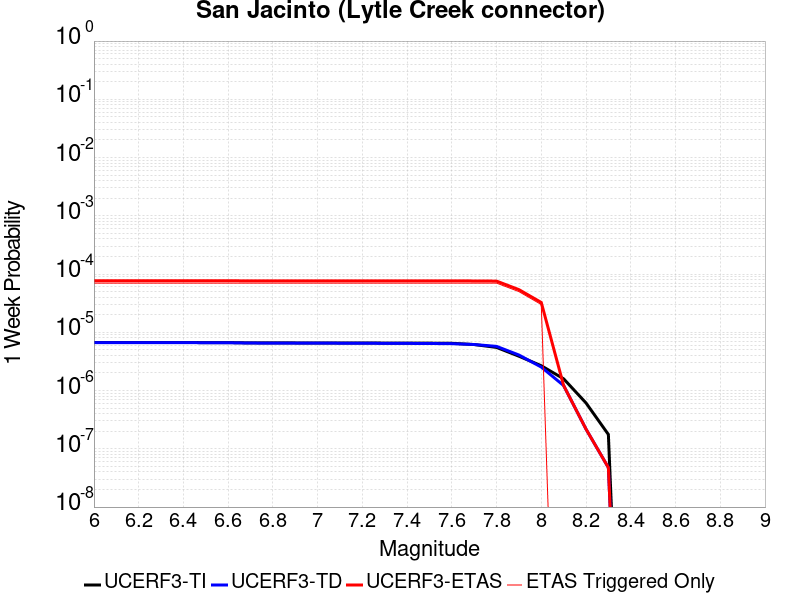 | 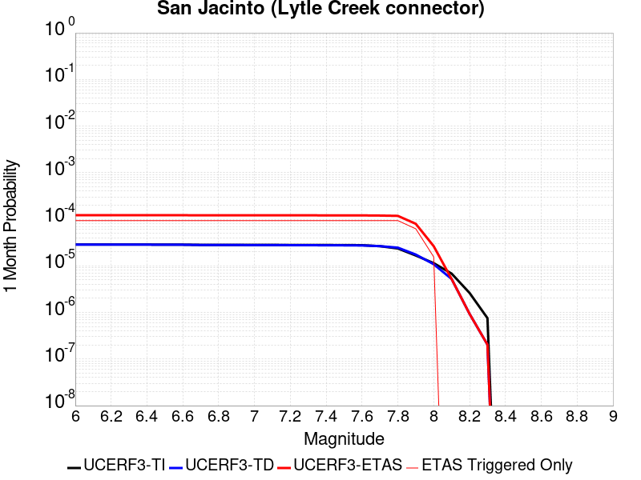 | 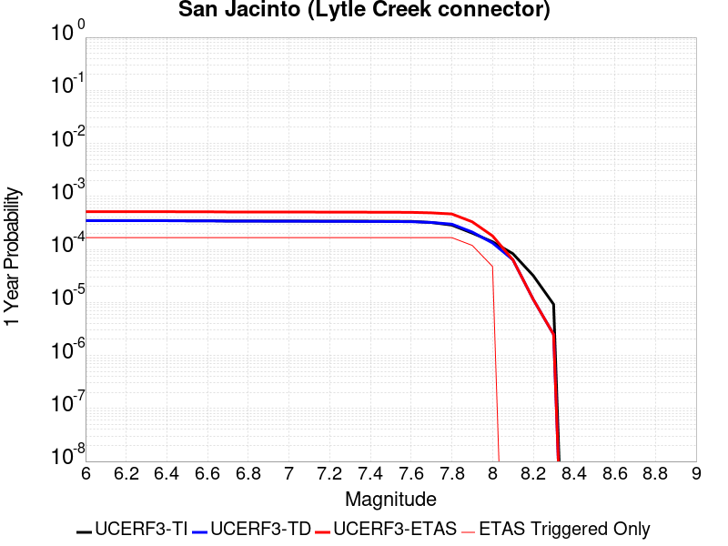 | 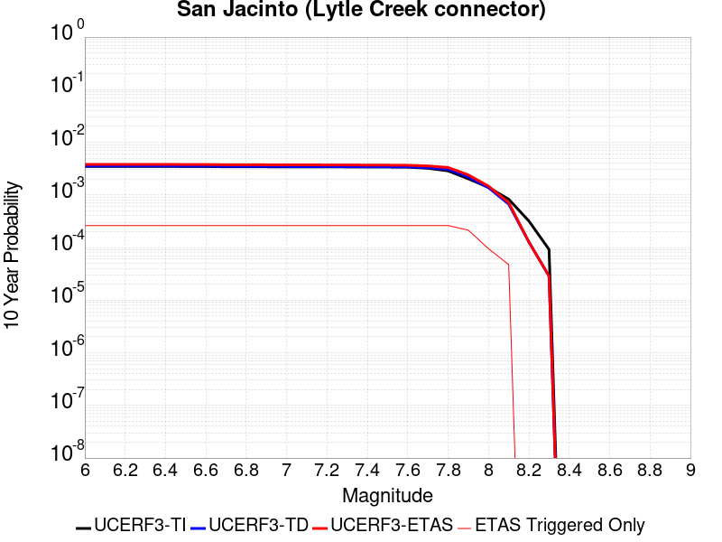 |

| Magnitude | 1 wk TI Prob | 1 wk TD Prob | 1 wk ETAS Prob | 1 wk ETAS/TD Gain | 1 wk ETAS Triggered Only | 1 mo TI Prob | 1 mo TD Prob | 1 mo ETAS Prob | 1 mo ETAS/TD Gain | 1 mo ETAS Triggered Only | 1 yr TI Prob | 1 yr TD Prob | 1 yr ETAS Prob | 1 yr ETAS/TD Gain | 1 yr ETAS Triggered Only | 10 yr TI Prob | 10 yr TD Prob | 10 yr ETAS Prob | 10 yr ETAS/TD Gain | 10 yr ETAS Triggered Only |
|-----|-----|-----|-----|-----|-----|-----|-----|-----|-----|-----|-----|-----|-----|-----|-----|-----|-----|-----|-----|-----|
| 6.0 | 6.693995E-6 | 6.660216E-6 | 7.665975E-5 | 11.510099 | 7.0E-5 | 2.8688235E-5 | 2.854347E-5 | 1.08541186E-4 | 3.8026624 | 8.0E-5 | 3.492233E-4 | 3.4746144E-4 | 4.6741974E-4 | 1.345242 | 1.2E-4 | 0.00348675 | 0.0035493854 | 0.0037287464 | 1.050533 | 1.8E-4 |
| 6.1 | 6.693995E-6 | 6.660216E-6 | 7.665975E-5 | 11.510099 | 7.0E-5 | 2.8688235E-5 | 2.854347E-5 | 1.08541186E-4 | 3.8026624 | 8.0E-5 | 3.492233E-4 | 3.4746144E-4 | 4.6741974E-4 | 1.345242 | 1.2E-4 | 0.00348675 | 0.0035493854 | 0.0037287464 | 1.050533 | 1.8E-4 |
| 6.2 | 6.693995E-6 | 6.660216E-6 | 7.665975E-5 | 11.510099 | 7.0E-5 | 2.8688235E-5 | 2.854347E-5 | 1.08541186E-4 | 3.8026624 | 8.0E-5 | 3.492233E-4 | 3.4746144E-4 | 4.6741974E-4 | 1.345242 | 1.2E-4 | 0.00348675 | 0.0035493854 | 0.0037287464 | 1.050533 | 1.8E-4 |
| 6.3 | 6.693995E-6 | 6.660216E-6 | 7.665975E-5 | 11.510099 | 7.0E-5 | 2.8688235E-5 | 2.854347E-5 | 1.08541186E-4 | 3.8026624 | 8.0E-5 | 3.492233E-4 | 3.4746144E-4 | 4.6741974E-4 | 1.345242 | 1.2E-4 | 0.00348675 | 0.0035493854 | 0.0037287464 | 1.050533 | 1.8E-4 |
| 6.4 | 6.693995E-6 | 6.660216E-6 | 7.665975E-5 | 11.510099 | 7.0E-5 | 2.8688235E-5 | 2.854347E-5 | 1.08541186E-4 | 3.8026624 | 8.0E-5 | 3.492233E-4 | 3.4746144E-4 | 4.6741974E-4 | 1.345242 | 1.2E-4 | 0.00348675 | 0.0035493854 | 0.0037287464 | 1.050533 | 1.8E-4 |
| 6.5 | 6.6561875E-6 | 6.6204343E-6 | 7.6619974E-5 | 11.573255 | 7.0E-5 | 2.8526205E-5 | 2.837298E-5 | 1.0837071E-4 | 3.8195038 | 8.0E-5 | 3.472512E-4 | 3.4538636E-4 | 4.6534493E-4 | 1.347317 | 1.2E-4 | 0.0034670907 | 0.003528701 | 0.0037080657 | 1.0508302 | 1.8E-4 |
| 6.6 | 6.6561875E-6 | 6.6204343E-6 | 7.6619974E-5 | 11.573255 | 7.0E-5 | 2.8526205E-5 | 2.837298E-5 | 1.0837071E-4 | 3.8195038 | 8.0E-5 | 3.472512E-4 | 3.4538636E-4 | 4.6534493E-4 | 1.347317 | 1.2E-4 | 0.0034670907 | 0.003528701 | 0.0037080657 | 1.0508302 | 1.8E-4 |
| 6.7 | 6.5802237E-6 | 6.539611E-6 | 7.653915E-5 | 11.703931 | 7.0E-5 | 2.8200653E-5 | 2.8026603E-5 | 1.0802436E-4 | 3.8543508 | 8.0E-5 | 3.4328885E-4 | 3.4117055E-4 | 4.6112962E-4 | 1.3516103 | 1.2E-4 | 0.0034275902 | 0.0034866752 | 0.0036660477 | 1.0514451 | 1.8E-4 |
| 6.8 | 6.575632E-6 | 6.5341005E-6 | 7.6533644E-5 | 11.712957 | 7.0E-5 | 2.8180975E-5 | 2.8002989E-5 | 1.0800075E-4 | 3.8567579 | 8.0E-5 | 3.4304935E-4 | 3.4088313E-4 | 4.6084222E-4 | 1.3519068 | 1.2E-4 | 0.0034252026 | 0.00348381 | 0.003663183 | 1.0514876 | 1.8E-4 |
| 6.9 | 6.570433E-6 | 6.525495E-6 | 7.652504E-5 | 11.727086 | 7.0E-5 | 2.8158694E-5 | 2.7966107E-5 | 1.0796387E-4 | 3.8605256 | 8.0E-5 | 3.4277816E-4 | 3.4043423E-4 | 4.6039338E-4 | 1.352371 | 1.2E-4 | 0.0034224992 | 0.0034793352 | 0.0036587089 | 1.051554 | 1.8E-4 |
| 7.0 | 6.5643826E-6 | 6.515616E-6 | 7.6515156E-5 | 11.74335 | 7.0E-5 | 2.8132765E-5 | 2.792377E-5 | 1.07921536E-4 | 3.8648627 | 8.0E-5 | 3.424626E-4 | 3.3991894E-4 | 4.5987815E-4 | 1.3529054 | 1.2E-4 | 0.0034193532 | 0.0034741985 | 0.003653573 | 1.0516305 | 1.8E-4 |
| 7.1 | 6.557402E-6 | 6.5043278E-6 | 7.650387E-5 | 11.761995 | 7.0E-5 | 2.8102848E-5 | 2.7875392E-5 | 1.07873166E-4 | 3.8698347 | 8.0E-5 | 3.4209844E-4 | 3.3933012E-4 | 4.592894E-4 | 1.3535179 | 1.2E-4 | 0.0034157229 | 0.0034683298 | 0.0036477055 | 1.0517182 | 1.8E-4 |
| 7.2 | 6.546394E-6 | 6.4862943E-6 | 7.648584E-5 | 11.791916 | 7.0E-5 | 2.8055672E-5 | 2.7798109E-5 | 1.0779589E-4 | 3.8778136 | 8.0E-5 | 3.4152428E-4 | 3.3838948E-4 | 4.583489E-4 | 1.3545009 | 1.2E-4 | 0.0034099987 | 0.0034589572 | 0.0036383346 | 1.0518588 | 1.8E-4 |
| 7.3 | 6.5364216E-6 | 6.4670803E-6 | 7.6466626E-5 | 11.823979 | 7.0E-5 | 2.8012933E-5 | 2.7715765E-5 | 1.07713546E-4 | 3.886364 | 8.0E-5 | 3.4100408E-4 | 3.3738726E-4 | 4.5734676E-4 | 1.3555543 | 1.2E-4 | 0.003404813 | 0.0034489788 | 0.003628358 | 1.0520093 | 1.8E-4 |
| 7.4 | 6.5269523E-6 | 6.4481674E-6 | 7.6447715E-5 | 11.855727 | 7.0E-5 | 2.7972354E-5 | 2.7634711E-5 | 1.076325E-4 | 3.89483 | 8.0E-5 | 3.4051016E-4 | 3.3640073E-4 | 4.5636037E-4 | 1.3565974 | 1.2E-4 | 0.0033998888 | 0.003439161 | 0.0036185419 | 1.0521584 | 1.8E-4 |
| 7.5 | 6.5111835E-6 | 6.424442E-6 | 7.6423996E-5 | 11.895818 | 7.0E-5 | 2.7904773E-5 | 2.7533031E-5 | 1.0753083E-4 | 3.905521 | 8.0E-5 | 3.3968766E-4 | 3.3516317E-4 | 4.5512296E-4 | 1.3579146 | 1.2E-4 | 0.0033916887 | 0.003426834 | 0.0036062172 | 1.0523466 | 1.8E-4 |
| 7.6 | 6.4768806E-6 | 6.383551E-6 | 7.6383105E-5 | 11.965613 | 7.0E-5 | 2.7757764E-5 | 2.735779E-5 | 1.073556E-4 | 3.9241328 | 8.0E-5 | 3.3789838E-4 | 3.3303024E-4 | 4.529903E-4 | 1.3602077 | 1.2E-4 | 0.0033738504 | 0.0034055663 | 0.0035849533 | 1.0526747 | 1.8E-4 |
| 7.7 | 6.1655364E-6 | 6.1760365E-6 | 7.61756E-5 | 12.33406 | 7.0E-5 | 2.642346E-5 | 2.646846E-5 | 1.06466345E-4 | 4.022385 | 8.0E-5 | 3.2165812E-4 | 3.2220592E-4 | 4.4216725E-4 | 1.3723127 | 1.2E-4 | 0.0032119295 | 0.0032971818 | 0.0034765883 | 1.0544121 | 1.8E-4 |
| 7.8 | 5.5043524E-6 | 5.737097E-6 | 7.5736694E-5 | 13.201223 | 7.0E-5 | 2.3589868E-5 | 2.4587327E-5 | 1.0458536E-4 | 4.2536287 | 8.0E-5 | 2.871688E-4 | 2.9930964E-4 | 4.192737E-4 | 1.4008026 | 1.2E-4 | 0.0028679797 | 0.0030672832 | 0.0032467311 | 1.0585039 | 1.8E-4 |
| 7.9 | 3.889249E-6 | 4.076761E-6 | 5.4076558E-5 | 13.264588 | 5.0E-5 | 1.6668104E-5 | 1.7471715E-5 | 7.7470664E-5 | 4.4340615 | 6.0E-5 | 2.0291525E-4 | 2.1269741E-4 | 3.0267827E-4 | 1.4230464 | 9.0E-5 | 0.0020273007 | 0.0021943315 | 0.0023440022 | 1.068208 | 1.5E-4 |
| 8.0 | 2.668535E-6 | 2.5315155E-6 | 3.253144E-5 | 12.850579 | 3.0E-5 | 1.1436528E-5 | 1.0849307E-5 | 4.084898E-5 | 3.7651236 | 3.0E-5 | 1.3923083E-4 | 1.3208234E-4 | 1.8207573E-4 | 1.3785018 | 5.0E-5 | 0.0013914363 | 0.0013757964 | 0.0014556863 | 1.0580682 | 8.0E-5 |
| 8.1 | 1.5911459E-6 | 1.218661E-6 | 1.218661E-6 | 1.0 | 0.0 | 6.8191785E-6 | 5.2228224E-6 | 5.2228224E-6 | 1.0 | 0.0 | 8.3020335E-5 | 6.3586034E-5 | 7.35854E-5 | 1.1572572 | 1.0E-5 | 8.298933E-4 | 6.6932244E-4 | 6.9930236E-4 | 1.0447915 | 3.0E-5 |
| 8.2 | 6.1294963E-7 | 2.1812275E-7 | 2.1812275E-7 | 1.0 | 0.0 | 2.6269242E-6 | 9.3481145E-7 | 9.3481145E-7 | 1.0 | 0.0 | 3.1982334E-5 | 1.138127E-5 | 1.138127E-5 | 1.0 | 0.0 | 3.1977732E-4 | 1.2784546E-4 | 1.2784546E-4 | 1.0 | 0.0 |
| 8.3 | 1.762871E-7 | 4.7546838E-8 | 4.7546838E-8 | 1.0 | 0.0 | 7.5551594E-7 | 2.0377215E-7 | 2.0377215E-7 | 1.0 | 0.0 | 9.1983675E-6 | 2.480923E-6 | 2.480923E-6 | 1.0 | 0.0 | 9.197987E-5 | 2.868753E-5 | 2.868753E-5 | 1.0 | 0.0 |

## Deep Springs
*[(top)](#table-of-contents)*

| 1 Week | 1 Month | 1 Year | 10 Year |
|-----|-----|-----|-----|
| 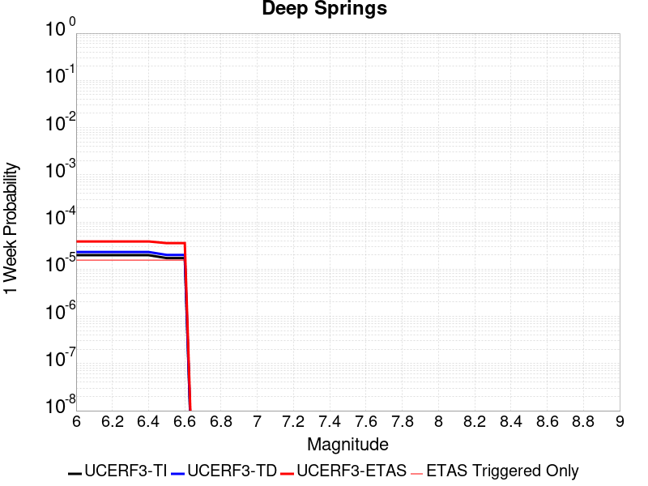 |  | 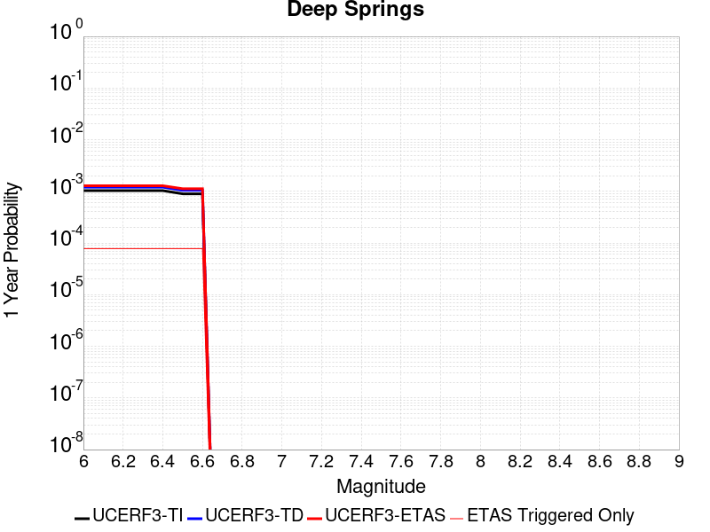 | 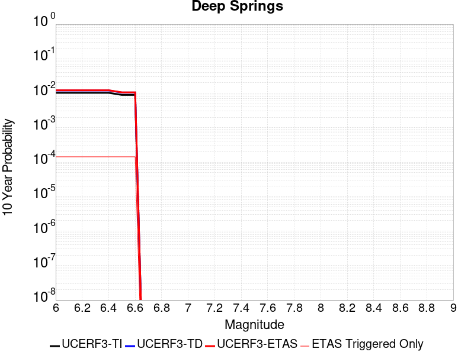 |

| Magnitude | 1 wk TI Prob | 1 wk TD Prob | 1 wk ETAS Prob | 1 wk ETAS/TD Gain | 1 wk ETAS Triggered Only | 1 mo TI Prob | 1 mo TD Prob | 1 mo ETAS Prob | 1 mo ETAS/TD Gain | 1 mo ETAS Triggered Only | 1 yr TI Prob | 1 yr TD Prob | 1 yr ETAS Prob | 1 yr ETAS/TD Gain | 1 yr ETAS Triggered Only | 10 yr TI Prob | 10 yr TD Prob | 10 yr ETAS Prob | 10 yr ETAS/TD Gain | 10 yr ETAS Triggered Only |
|-----|-----|-----|-----|-----|-----|-----|-----|-----|-----|-----|-----|-----|-----|-----|-----|-----|-----|-----|-----|-----|
| 6.0 | 1.9810619E-5 | 2.311252E-5 | 5.3111828E-5 | 2.297968 | 3.0E-5 | 8.489989E-5 | 9.905276E-5 | 1.6904583E-4 | 1.7066242 | 7.0E-5 | 0.001033166 | 0.0012058079 | 0.0012956994 | 1.0745487 | 9.0E-5 | 0.010283757 | 0.012042425 | 0.0122103775 | 1.0139468 | 1.7E-4 |
| 6.1 | 1.9810619E-5 | 2.311252E-5 | 5.3111828E-5 | 2.297968 | 3.0E-5 | 8.489989E-5 | 9.905276E-5 | 1.6904583E-4 | 1.7066242 | 7.0E-5 | 0.001033166 | 0.0012058079 | 0.0012956994 | 1.0745487 | 9.0E-5 | 0.010283757 | 0.012042425 | 0.0122103775 | 1.0139468 | 1.7E-4 |
| 6.2 | 1.9810619E-5 | 2.311252E-5 | 5.3111828E-5 | 2.297968 | 3.0E-5 | 8.489989E-5 | 9.905276E-5 | 1.6904583E-4 | 1.7066242 | 7.0E-5 | 0.001033166 | 0.0012058079 | 0.0012956994 | 1.0745487 | 9.0E-5 | 0.010283757 | 0.012042425 | 0.0122103775 | 1.0139468 | 1.7E-4 |
| 6.3 | 1.9810619E-5 | 2.311252E-5 | 5.3111828E-5 | 2.297968 | 3.0E-5 | 8.489989E-5 | 9.905276E-5 | 1.6904583E-4 | 1.7066242 | 7.0E-5 | 0.001033166 | 0.0012058079 | 0.0012956994 | 1.0745487 | 9.0E-5 | 0.010283757 | 0.012042425 | 0.0122103775 | 1.0139468 | 1.7E-4 |
| 6.4 | 1.9810619E-5 | 2.311252E-5 | 5.3111828E-5 | 2.297968 | 3.0E-5 | 8.489989E-5 | 9.905276E-5 | 1.6904583E-4 | 1.7066242 | 7.0E-5 | 0.001033166 | 0.0012058079 | 0.0012956994 | 1.0745487 | 9.0E-5 | 0.010283757 | 0.012042425 | 0.0122103775 | 1.0139468 | 1.7E-4 |
| 6.5 | 1.7190405E-5 | 2.0050555E-5 | 5.0049955E-5 | 2.496188 | 3.0E-5 | 7.367108E-5 | 8.593095E-5 | 1.5592494E-4 | 1.8145375 | 7.0E-5 | 8.9657627E-4 | 0.0010462094 | 0.0011361152 | 1.0859349 | 9.0E-5 | 0.008929676 | 0.010462056 | 0.010630278 | 1.0160792 | 1.7E-4 |
| 6.6 | 1.7190405E-5 | 2.0050555E-5 | 5.0049955E-5 | 2.496188 | 3.0E-5 | 7.367108E-5 | 8.593095E-5 | 1.5592494E-4 | 1.8145375 | 7.0E-5 | 8.9657627E-4 | 0.0010462094 | 0.0011361152 | 1.0859349 | 9.0E-5 | 0.008929676 | 0.010462056 | 0.010630278 | 1.0160792 | 1.7E-4 |

## Elysian Park (Upper)
*[(top)](#table-of-contents)*

| 1 Week | 1 Month | 1 Year | 10 Year |
|-----|-----|-----|-----|
| 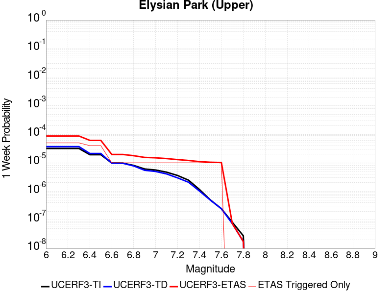 | 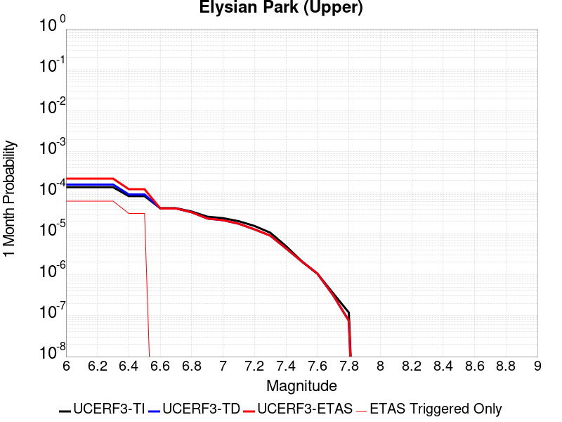 | 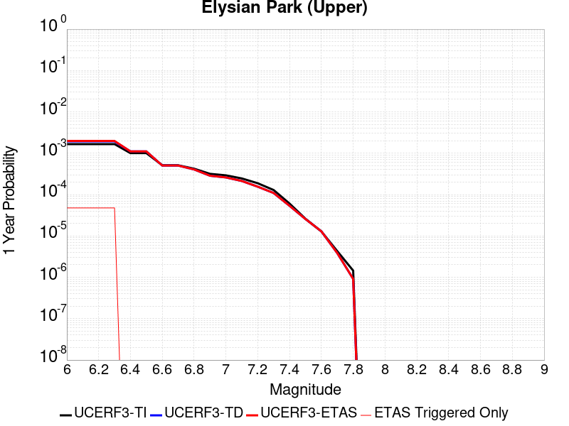 | 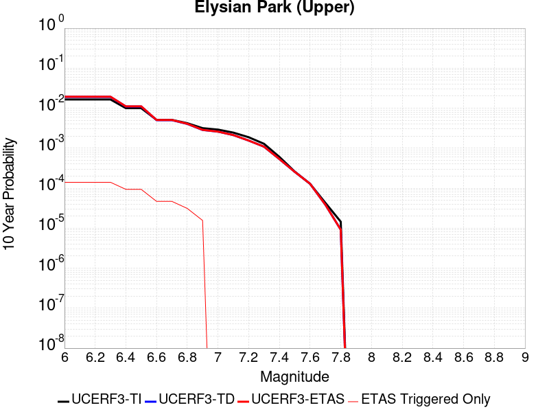 |

| Magnitude | 1 wk TI Prob | 1 wk TD Prob | 1 wk ETAS Prob | 1 wk ETAS/TD Gain | 1 wk ETAS Triggered Only | 1 mo TI Prob | 1 mo TD Prob | 1 mo ETAS Prob | 1 mo ETAS/TD Gain | 1 mo ETAS Triggered Only | 1 yr TI Prob | 1 yr TD Prob | 1 yr ETAS Prob | 1 yr ETAS/TD Gain | 1 yr ETAS Triggered Only | 10 yr TI Prob | 10 yr TD Prob | 10 yr ETAS Prob | 10 yr ETAS/TD Gain | 10 yr ETAS Triggered Only |
|-----|-----|-----|-----|-----|-----|-----|-----|-----|-----|-----|-----|-----|-----|-----|-----|-----|-----|-----|-----|-----|
| 6.0 | 3.1876025E-5 | 3.7035516E-5 | 8.703366E-5 | 2.3500056 | 5.0E-5 | 1.3660437E-4 | 1.587167E-4 | 2.1870718E-4 | 1.377972 | 6.0E-5 | 0.0016618895 | 0.0019311075 | 0.0020009722 | 1.0361786 | 7.0E-5 | 0.016495159 | 0.019189782 | 0.019346712 | 1.0081778 | 1.6E-4 |
| 6.1 | 3.1876025E-5 | 3.7035516E-5 | 8.703366E-5 | 2.3500056 | 5.0E-5 | 1.3660437E-4 | 1.587167E-4 | 2.1870718E-4 | 1.377972 | 6.0E-5 | 0.0016618895 | 0.0019311075 | 0.0020009722 | 1.0361786 | 7.0E-5 | 0.016495159 | 0.019189782 | 0.019346712 | 1.0081778 | 1.6E-4 |
| 6.2 | 3.1876025E-5 | 3.7035516E-5 | 8.703366E-5 | 2.3500056 | 5.0E-5 | 1.3660437E-4 | 1.587167E-4 | 2.1870718E-4 | 1.377972 | 6.0E-5 | 0.0016618895 | 0.0019311075 | 0.0020009722 | 1.0361786 | 7.0E-5 | 0.016495159 | 0.019189782 | 0.019346712 | 1.0081778 | 1.6E-4 |
| 6.3 | 3.1876025E-5 | 3.7035516E-5 | 8.703366E-5 | 2.3500056 | 5.0E-5 | 1.3660437E-4 | 1.587167E-4 | 2.1870718E-4 | 1.377972 | 6.0E-5 | 0.0016618895 | 0.0019311075 | 0.0020009722 | 1.0361786 | 7.0E-5 | 0.016495159 | 0.019189782 | 0.019346712 | 1.0081778 | 1.6E-4 |
| 6.4 | 1.9273462E-5 | 2.1202266E-5 | 6.120142E-5 | 2.886551 | 4.0E-5 | 8.259794E-5 | 9.086466E-5 | 1.3086104E-4 | 1.4401752 | 4.0E-5 | 0.001005166 | 0.0011058892 | 0.001145845 | 1.03613 | 4.0E-5 | 0.010006315 | 0.011020724 | 0.0111295115 | 1.0098712 | 1.1E-4 |
| 6.5 | 1.9273462E-5 | 2.1202266E-5 | 6.120142E-5 | 2.886551 | 4.0E-5 | 8.259794E-5 | 9.086466E-5 | 1.3086104E-4 | 1.4401752 | 4.0E-5 | 0.001005166 | 0.0011058892 | 0.001145845 | 1.03613 | 4.0E-5 | 0.010006315 | 0.011020724 | 0.0111295115 | 1.0098712 | 1.1E-4 |
| 6.6 | 9.813258E-6 | 9.665599E-6 | 1.9665502E-5 | 2.0345871 | 1.0E-5 | 4.205614E-5 | 4.1423376E-5 | 5.142296E-5 | 1.2413995 | 1.0E-5 | 5.119132E-4 | 5.0422014E-4 | 5.142151E-4 | 1.0198226 | 1.0E-5 | 0.005107356 | 0.0050314846 | 0.005081233 | 1.0098875 | 5.0E-5 |
| 6.7 | 9.801478E-6 | 9.653168E-6 | 1.9653071E-5 | 2.0359194 | 1.0E-5 | 4.2005657E-5 | 4.1370105E-5 | 5.136969E-5 | 1.2417104 | 1.0E-5 | 5.112989E-4 | 5.035719E-4 | 5.1356683E-4 | 1.0198481 | 1.0E-5 | 0.0051012407 | 0.0050250315 | 0.00507478 | 1.0099002 | 5.0E-5 |
| 6.8 | 8.102489E-6 | 7.773004E-6 | 1.7772927E-5 | 2.2864938 | 1.0E-5 | 3.4724493E-5 | 3.3312477E-5 | 4.3312142E-5 | 1.3001778 | 1.0E-5 | 4.2268867E-4 | 4.055089E-4 | 4.1550485E-4 | 1.0246503 | 1.0E-5 | 0.004218856 | 0.0040481836 | 0.004088022 | 1.009841 | 4.0E-5 |
| 6.9 | 6.08275E-6 | 5.4814514E-6 | 1.5481397E-5 | 2.8243244 | 1.0E-5 | 2.6068668E-5 | 2.3491726E-5 | 3.349149E-5 | 1.4256718 | 1.0E-5 | 3.173398E-4 | 2.85975E-4 | 2.9597213E-4 | 1.0349581 | 1.0E-5 | 0.0031688702 | 0.0028561477 | 0.002886062 | 1.0104736 | 3.0E-5 |
| 7.0 | 5.5995934E-6 | 4.98278E-6 | 1.498273E-5 | 3.0069017 | 1.0E-5 | 2.3998036E-5 | 2.13546E-5 | 3.1354386E-5 | 1.4682732 | 1.0E-5 | 2.9213692E-4 | 2.599619E-4 | 2.699593E-4 | 1.0384572 | 1.0E-5 | 0.0029175316 | 0.0025966454 | 0.0026165934 | 1.0076822 | 2.0E-5 |
| 7.1 | 4.709881E-6 | 4.0874015E-6 | 1.4087361E-5 | 3.4465322 | 1.0E-5 | 2.0185047E-5 | 1.7517319E-5 | 2.7517144E-5 | 1.5708536 | 1.0E-5 | 2.4572524E-4 | 2.132529E-4 | 2.2325077E-4 | 1.0468826 | 1.0E-5 | 0.002454537 | 0.002130524 | 0.0021405027 | 1.0046837 | 1.0E-5 |
| 7.2 | 3.6063436E-6 | 2.9779544E-6 | 1.2977925E-5 | 4.358 | 1.0E-5 | 1.5455667E-5 | 1.27626E-5 | 2.2762473E-5 | 1.7835294 | 1.0E-5 | 1.881565E-4 | 1.5537368E-4 | 1.6537213E-4 | 1.064351 | 1.0E-5 | 0.0018799726 | 0.0015526618 | 0.0015626462 | 1.0064305 | 1.0E-5 |
| 7.3 | 2.471135E-6 | 2.0954615E-6 | 1.2095441E-5 | 5.772208 | 1.0E-5 | 1.0590536E-5 | 8.980519E-6 | 1.8980429E-5 | 2.1135113 | 1.0E-5 | 1.2893214E-4 | 1.093324E-4 | 1.19331315E-4 | 1.0914541 | 1.0E-5 | 0.0012885736 | 0.0010927934 | 0.0011027824 | 1.0091408 | 1.0E-5 |
| 7.4 | 1.163943E-6 | 1.0275091E-6 | 1.1027499E-5 | 10.732264 | 1.0E-5 | 4.988318E-6 | 4.4036033E-6 | 1.4403559E-5 | 3.2708576 | 1.0E-5 | 6.0731076E-5 | 5.3612584E-5 | 6.3612046E-5 | 1.1865134 | 1.0E-5 | 6.071448E-4 | 5.359995E-4 | 5.459941E-4 | 1.0186467 | 1.0E-5 |
| 7.5 | 4.99459E-7 | 4.917604E-7 | 1.0491755E-5 | 21.335098 | 1.0E-5 | 2.140537E-6 | 2.1075427E-6 | 1.2107522E-5 | 5.744852 | 1.0E-5 | 2.6060725E-5 | 2.5659048E-5 | 3.565879E-5 | 1.389716 | 1.0E-5 | 2.605767E-4 | 2.5656243E-4 | 2.6655986E-4 | 1.0389669 | 1.0E-5 |
| 7.6 | 2.4667852E-7 | 2.4778336E-7 | 1.0247781E-5 | 41.357822 | 1.0E-5 | 1.0571932E-6 | 1.0619283E-6 | 1.1061918E-5 | 10.4168215 | 1.0E-5 | 1.2871251E-5 | 1.2928905E-5 | 2.2928774E-5 | 1.7734507 | 1.0E-5 | 1.2870505E-4 | 1.2928189E-4 | 1.392806E-4 | 1.0773404 | 1.0E-5 |
| 7.7 | 8.2312795E-8 | 7.3864456E-8 | 7.3864456E-8 | 1.0 | 0.0 | 3.527691E-7 | 3.165619E-7 | 3.165619E-7 | 1.0 | 0.0 | 4.294955E-6 | 3.8541357E-6 | 3.8541357E-6 | 1.0 | 0.0 | 4.2948723E-5 | 3.8540802E-5 | 3.8540802E-5 | 1.0 | 0.0 |
| 7.8 | 2.7819295E-8 | 1.7566023E-8 | 1.7566023E-8 | 1.0 | 0.0 | 1.1922555E-7 | 7.5282955E-8 | 7.5282955E-8 | 1.0 | 0.0 | 1.45157E-6 | 9.165697E-7 | 9.165697E-7 | 1.0 | 0.0 | 1.45156055E-5 | 9.165675E-6 | 9.165675E-6 | 1.0 | 0.0 |

## Channel Islands Thrust
*[(top)](#table-of-contents)*

| 1 Week | 1 Month | 1 Year | 10 Year |
|-----|-----|-----|-----|
|  | 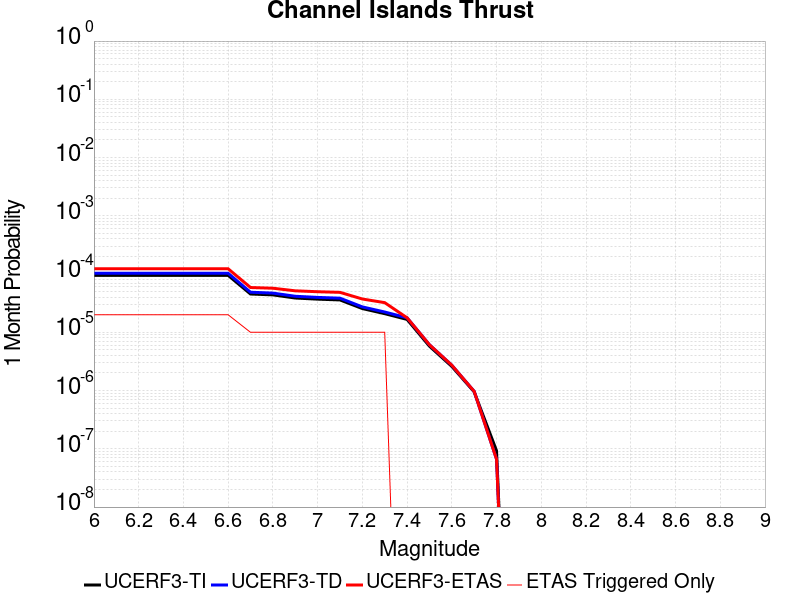 | 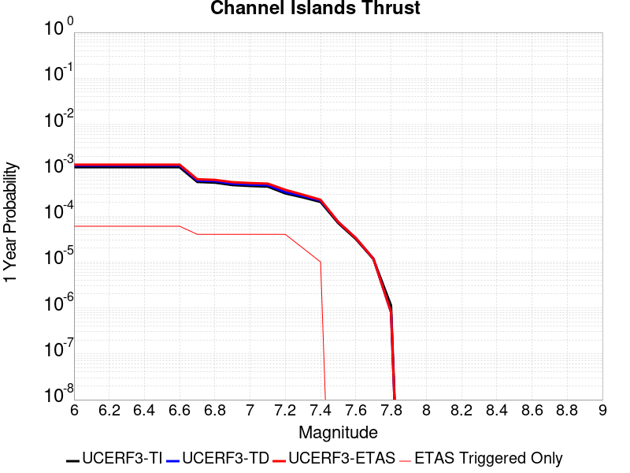 | 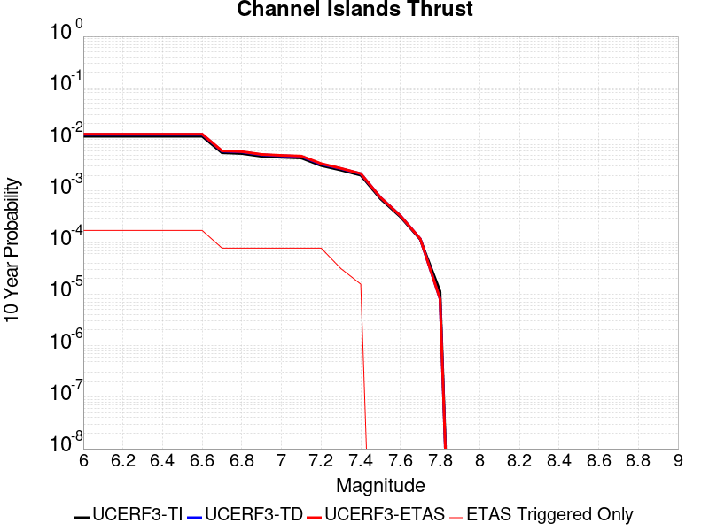 |

| Magnitude | 1 wk TI Prob | 1 wk TD Prob | 1 wk ETAS Prob | 1 wk ETAS/TD Gain | 1 wk ETAS Triggered Only | 1 mo TI Prob | 1 mo TD Prob | 1 mo ETAS Prob | 1 mo ETAS/TD Gain | 1 mo ETAS Triggered Only | 1 yr TI Prob | 1 yr TD Prob | 1 yr ETAS Prob | 1 yr ETAS/TD Gain | 1 yr ETAS Triggered Only | 10 yr TI Prob | 10 yr TD Prob | 10 yr ETAS Prob | 10 yr ETAS/TD Gain | 10 yr ETAS Triggered Only |
|-----|-----|-----|-----|-----|-----|-----|-----|-----|-----|-----|-----|-----|-----|-----|-----|-----|-----|-----|-----|-----|
| 6.0 | 2.2156251E-5 | 2.4092022E-5 | 3.409178E-5 | 1.4150652 | 1.0E-5 | 9.495191E-5 | 1.03248036E-4 | 1.2324598E-4 | 1.1936883 | 2.0E-5 | 0.0011554264 | 0.0012564264 | 0.0013163511 | 1.0476944 | 6.0E-5 | 0.011494373 | 0.0125038205 | 0.01264207 | 1.0110565 | 1.4E-4 |
| 6.1 | 2.2156251E-5 | 2.4092022E-5 | 3.409178E-5 | 1.4150652 | 1.0E-5 | 9.495191E-5 | 1.03248036E-4 | 1.2324598E-4 | 1.1936883 | 2.0E-5 | 0.0011554264 | 0.0012564264 | 0.0013163511 | 1.0476944 | 6.0E-5 | 0.011494373 | 0.0125038205 | 0.01264207 | 1.0110565 | 1.4E-4 |
| 6.2 | 2.2156251E-5 | 2.4092022E-5 | 3.409178E-5 | 1.4150652 | 1.0E-5 | 9.495191E-5 | 1.03248036E-4 | 1.2324598E-4 | 1.1936883 | 2.0E-5 | 0.0011554264 | 0.0012564264 | 0.0013163511 | 1.0476944 | 6.0E-5 | 0.011494373 | 0.0125038205 | 0.01264207 | 1.0110565 | 1.4E-4 |
| 6.3 | 2.2156251E-5 | 2.4092022E-5 | 3.409178E-5 | 1.4150652 | 1.0E-5 | 9.495191E-5 | 1.03248036E-4 | 1.2324598E-4 | 1.1936883 | 2.0E-5 | 0.0011554264 | 0.0012564264 | 0.0013163511 | 1.0476944 | 6.0E-5 | 0.011494373 | 0.0125038205 | 0.01264207 | 1.0110565 | 1.4E-4 |
| 6.4 | 2.2156251E-5 | 2.4092022E-5 | 3.409178E-5 | 1.4150652 | 1.0E-5 | 9.495191E-5 | 1.03248036E-4 | 1.2324598E-4 | 1.1936883 | 2.0E-5 | 0.0011554264 | 0.0012564264 | 0.0013163511 | 1.0476944 | 6.0E-5 | 0.011494373 | 0.0125038205 | 0.01264207 | 1.0110565 | 1.4E-4 |
| 6.5 | 2.2156251E-5 | 2.4092022E-5 | 3.409178E-5 | 1.4150652 | 1.0E-5 | 9.495191E-5 | 1.03248036E-4 | 1.2324598E-4 | 1.1936883 | 2.0E-5 | 0.0011554264 | 0.0012564264 | 0.0013163511 | 1.0476944 | 6.0E-5 | 0.011494373 | 0.0125038205 | 0.01264207 | 1.0110565 | 1.4E-4 |
| 6.6 | 2.2156251E-5 | 2.4092022E-5 | 3.409178E-5 | 1.4150652 | 1.0E-5 | 9.495191E-5 | 1.03248036E-4 | 1.2324598E-4 | 1.1936883 | 2.0E-5 | 0.0011554264 | 0.0012564264 | 0.0013163511 | 1.0476944 | 6.0E-5 | 0.011494373 | 0.0125038205 | 0.01264207 | 1.0110565 | 1.4E-4 |
| 6.7 | 1.0601296E-5 | 1.1379544E-5 | 1.1379544E-5 | 1.0 | 0.0 | 4.5433335E-5 | 4.876859E-5 | 5.8768102E-5 | 1.20504 | 1.0E-5 | 5.5301044E-4 | 5.936007E-4 | 6.3357694E-4 | 1.0673454 | 4.0E-5 | 0.005516363 | 0.005920653 | 0.005990239 | 1.011753 | 7.0E-5 |
| 6.8 | 1.0246747E-5 | 1.0996669E-5 | 1.0996669E-5 | 1.0 | 0.0 | 4.391389E-5 | 4.7127756E-5 | 5.7127283E-5 | 1.2121792 | 1.0E-5 | 5.345204E-4 | 5.7363417E-4 | 6.136112E-4 | 1.0696908 | 4.0E-5 | 0.0053323656 | 0.005722025 | 0.005791624 | 1.0121634 | 7.0E-5 |
| 6.9 | 9.049551E-6 | 9.699645E-6 | 9.699645E-6 | 1.0 | 0.0 | 3.878322E-5 | 4.1569267E-5 | 5.1568848E-5 | 1.2405523 | 1.0E-5 | 4.7208337E-4 | 5.059924E-4 | 5.4597214E-4 | 1.0790126 | 4.0E-5 | 0.0047108172 | 0.0050488203 | 0.005118467 | 1.0137947 | 7.0E-5 |
| 7.0 | 8.6542195E-6 | 9.274603E-6 | 9.274603E-6 | 1.0 | 0.0 | 3.7088983E-5 | 3.9747716E-5 | 4.974732E-5 | 1.2515768 | 1.0E-5 | 4.5146482E-4 | 4.8382508E-4 | 5.2380573E-4 | 1.0826346 | 4.0E-5 | 0.004505487 | 0.004828129 | 0.004897791 | 1.0144284 | 7.0E-5 |
| 7.1 | 8.391028E-6 | 8.992924E-6 | 8.992924E-6 | 1.0 | 0.0 | 3.5961057E-5 | 3.854056E-5 | 4.8540176E-5 | 1.2594569 | 1.0E-5 | 4.3773788E-4 | 4.6913436E-4 | 5.091156E-4 | 1.0852234 | 4.0E-5 | 0.004368766 | 0.0046818503 | 0.0047515226 | 1.0148814 | 7.0E-5 |
| 7.2 | 5.965188E-6 | 6.3716952E-6 | 6.3716952E-6 | 1.0 | 0.0 | 2.556484E-5 | 2.7306982E-5 | 3.730671E-5 | 1.3661968 | 1.0E-5 | 3.1120746E-4 | 3.3241234E-4 | 3.7239905E-4 | 1.1202924 | 4.0E-5 | 0.00310772 | 0.0033192092 | 0.003388977 | 1.0210193 | 7.0E-5 |
| 7.3 | 4.877518E-6 | 5.2060063E-6 | 5.2060063E-6 | 1.0 | 0.0 | 2.0903482E-5 | 2.2311267E-5 | 3.2311043E-5 | 1.448194 | 1.0E-5 | 2.5447016E-4 | 2.716063E-4 | 2.9160085E-4 | 1.073616 | 2.0E-5 | 0.0025417898 | 0.0027127895 | 0.002752681 | 1.014705 | 4.0E-5 |
| 7.4 | 3.8829853E-6 | 4.141863E-6 | 4.141863E-6 | 1.0 | 0.0 | 1.664126E-5 | 1.7750723E-5 | 1.7750723E-5 | 1.0 | 0.0 | 2.0258849E-4 | 2.1609402E-4 | 2.2609186E-4 | 1.0462662 | 1.0E-5 | 0.002024039 | 0.0021588807 | 0.0021788375 | 1.0092441 | 2.0E-5 |
| 7.5 | 1.3489616E-6 | 1.4277903E-6 | 1.4277903E-6 | 1.0 | 0.0 | 5.7812517E-6 | 6.119087E-6 | 6.119087E-6 | 1.0 | 0.0 | 7.038446E-5 | 7.449738E-5 | 7.449738E-5 | 1.0 | 0.0 | 7.036218E-4 | 7.44728E-4 | 7.44728E-4 | 1.0 | 0.0 |
| 7.6 | 6.058192E-7 | 6.353778E-7 | 6.353778E-7 | 1.0 | 0.0 | 2.5963652E-6 | 2.7230449E-6 | 2.7230449E-6 | 1.0 | 0.0 | 3.161029E-5 | 3.3152584E-5 | 3.3152584E-5 | 1.0 | 0.0 | 3.1605794E-4 | 3.31478E-4 | 3.31478E-4 | 1.0 | 0.0 |
| 7.7 | 2.2170494E-7 | 2.2607902E-7 | 2.2607902E-7 | 1.0 | 0.0 | 9.5016367E-7 | 9.689098E-7 | 9.689098E-7 | 1.0 | 0.0 | 1.1568181E-5 | 1.1796425E-5 | 1.1796425E-5 | 1.0 | 0.0 | 1.1567579E-4 | 1.1795909E-4 | 1.1795909E-4 | 1.0 | 0.0 |
| 7.8 | 2.1613102E-8 | 1.5466682E-8 | 1.5466682E-8 | 1.0 | 0.0 | 9.262757E-8 | 6.628578E-8 | 6.628578E-8 | 1.0 | 0.0 | 1.1277401E-6 | 8.070291E-7 | 8.070291E-7 | 1.0 | 0.0 | 1.1277344E-5 | 8.070269E-6 | 8.070269E-6 | 1.0 | 0.0 |

## San Jacinto (Borrego)
*[(top)](#table-of-contents)*

| 1 Week | 1 Month | 1 Year | 10 Year |
|-----|-----|-----|-----|
| 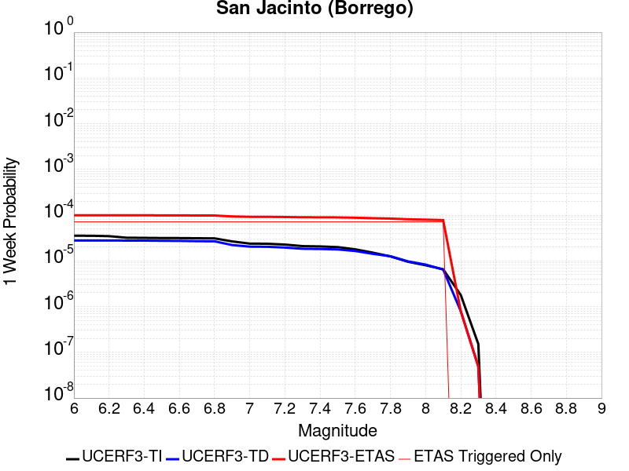 | 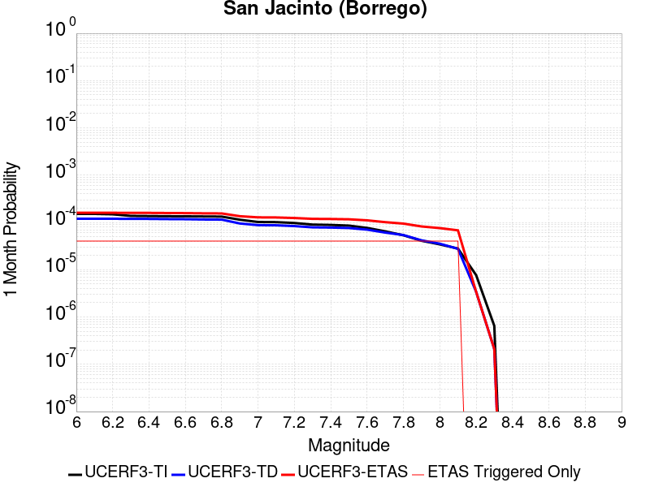 | 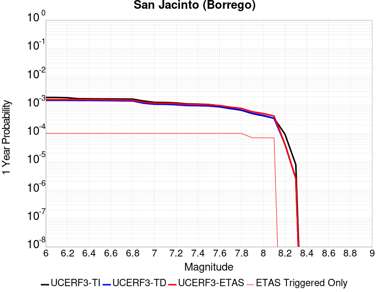 | 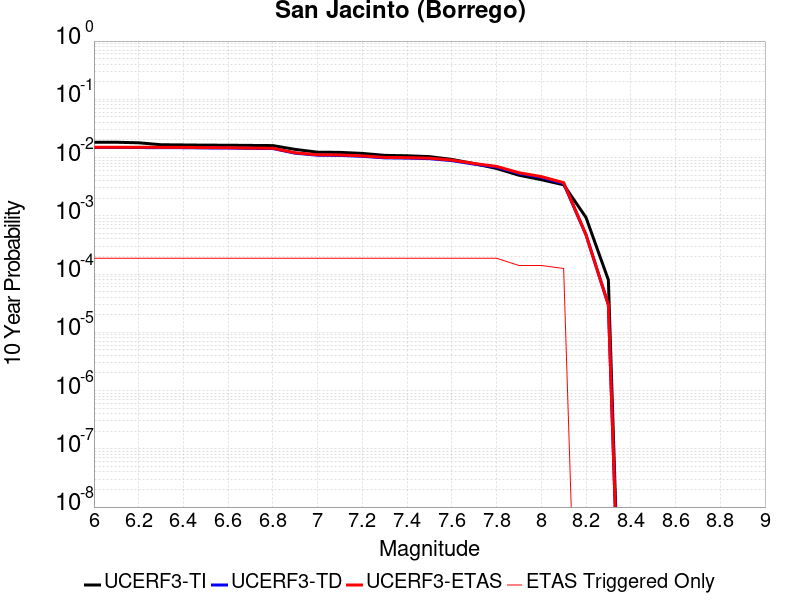 |

| Magnitude | 1 wk TI Prob | 1 wk TD Prob | 1 wk ETAS Prob | 1 wk ETAS/TD Gain | 1 wk ETAS Triggered Only | 1 mo TI Prob | 1 mo TD Prob | 1 mo ETAS Prob | 1 mo ETAS/TD Gain | 1 mo ETAS Triggered Only | 1 yr TI Prob | 1 yr TD Prob | 1 yr ETAS Prob | 1 yr ETAS/TD Gain | 1 yr ETAS Triggered Only | 10 yr TI Prob | 10 yr TD Prob | 10 yr ETAS Prob | 10 yr ETAS/TD Gain | 10 yr ETAS Triggered Only |
|-----|-----|-----|-----|-----|-----|-----|-----|-----|-----|-----|-----|-----|-----|-----|-----|-----|-----|-----|-----|-----|
| 6.0 | 3.543992E-5 | 2.7926513E-5 | 5.7925674E-5 | 2.074218 | 3.0E-5 | 1.5187653E-4 | 1.1967963E-4 | 1.5967485E-4 | 1.3341856 | 4.0E-5 | 0.0018475284 | 0.0014561379 | 0.0015559922 | 1.0685748 | 1.0E-4 | 0.018322436 | 0.014869647 | 0.015027268 | 1.0106002 | 1.6E-4 |
| 6.1 | 3.542281E-5 | 2.7926513E-5 | 5.7925674E-5 | 2.074218 | 3.0E-5 | 1.5180321E-4 | 1.1967963E-4 | 1.5967485E-4 | 1.3341856 | 4.0E-5 | 0.0018466372 | 0.0014561379 | 0.0015559922 | 1.0685748 | 1.0E-4 | 0.018313672 | 0.014869647 | 0.015027268 | 1.0106002 | 1.6E-4 |
| 6.2 | 3.4688688E-5 | 2.7926511E-5 | 5.7925674E-5 | 2.074218 | 3.0E-5 | 1.4865733E-4 | 1.1967963E-4 | 1.5967485E-4 | 1.3341856 | 4.0E-5 | 0.0018084005 | 0.0014561379 | 0.0015559922 | 1.0685748 | 1.0E-4 | 0.017937548 | 0.014869647 | 0.015027268 | 1.0106002 | 1.6E-4 |
| 6.3 | 3.2087122E-5 | 2.7771865E-5 | 5.777103E-5 | 2.0802 | 3.0E-5 | 1.3750899E-4 | 1.1901691E-4 | 1.5901215E-4 | 1.3360467 | 4.0E-5 | 0.0016728862 | 0.00144808 | 0.0015479352 | 1.068957 | 1.0E-4 | 0.016603488 | 0.014790683 | 0.014948317 | 1.0106577 | 1.6E-4 |
| 6.4 | 3.1828724E-5 | 2.7738852E-5 | 5.773802E-5 | 2.0814855 | 3.0E-5 | 1.364017E-4 | 1.1887544E-4 | 1.5887068E-4 | 1.3364466 | 4.0E-5 | 0.0016594254 | 0.0014463598 | 0.0015462151 | 1.0690391 | 1.0E-4 | 0.016470885 | 0.014773762 | 0.0149313975 | 1.0106701 | 1.6E-4 |
| 6.5 | 3.1563577E-5 | 2.747857E-5 | 5.7477744E-5 | 2.0917299 | 3.0E-5 | 1.3526545E-4 | 1.1776006E-4 | 1.5775535E-4 | 1.3396337 | 4.0E-5 | 0.0016456128 | 0.0014327979 | 0.0015326546 | 1.0696936 | 1.0E-4 | 0.0163348 | 0.014640348 | 0.014798005 | 1.0107687 | 1.6E-4 |
| 6.6 | 3.1467625E-5 | 2.7322796E-5 | 5.7321977E-5 | 2.0979543 | 3.0E-5 | 1.3485427E-4 | 1.1709251E-4 | 1.5708782E-4 | 1.3415703 | 4.0E-5 | 0.0016406142 | 0.0014246812 | 0.0015245387 | 1.0700911 | 1.0E-4 | 0.016285548 | 0.014560594 | 0.014718264 | 1.0108286 | 1.6E-4 |
| 6.7 | 3.1223695E-5 | 2.6940816E-5 | 5.6940007E-5 | 2.113522 | 3.0E-5 | 1.3380898E-4 | 1.15455594E-4 | 1.5545098E-4 | 1.3464135 | 4.0E-5 | 0.0016279068 | 0.0014047775 | 0.0015046371 | 1.0710857 | 1.0E-4 | 0.01616033 | 0.014364966 | 0.014522668 | 1.0109782 | 1.6E-4 |
| 6.8 | 3.1015585E-5 | 2.6761822E-5 | 5.676102E-5 | 2.12097 | 3.0E-5 | 1.3291716E-4 | 1.1468855E-4 | 1.5468396E-4 | 1.3487307 | 4.0E-5 | 0.001617065 | 0.0013954508 | 0.0014953113 | 1.0715615 | 1.0E-4 | 0.016053487 | 0.014272246 | 0.014429962 | 1.0110506 | 1.6E-4 |
| 6.9 | 2.6641965E-5 | 2.2184247E-5 | 5.2183583E-5 | 2.3522809 | 3.0E-5 | 1.1417485E-4 | 9.50719E-5 | 1.350681E-4 | 1.4206942 | 4.0E-5 | 0.0013891924 | 0.0011568897 | 0.001256774 | 1.0863386 | 1.0E-4 | 0.0138054015 | 0.011882438 | 0.012030656 | 1.0124737 | 1.5E-4 |
| 7.0 | 2.3854353E-5 | 2.0479023E-5 | 5.0478408E-5 | 2.4648836 | 3.0E-5 | 1.02228936E-4 | 8.77643E-5 | 1.277608E-4 | 1.4557261 | 4.0E-5 | 0.0012439266 | 0.0010680092 | 0.0011679024 | 1.0935322 | 1.0E-4 | 0.012369866 | 0.0109828 | 0.011131153 | 1.0135077 | 1.5E-4 |
| 7.1 | 2.3672901E-5 | 2.031551E-5 | 5.0314902E-5 | 2.476674 | 3.0E-5 | 1.0145135E-4 | 8.7063585E-5 | 1.270601E-4 | 1.4593943 | 4.0E-5 | 0.0012344702 | 0.0010594862 | 0.0011593803 | 1.0942854 | 1.0E-4 | 0.0122763505 | 0.010897976 | 0.011046342 | 1.013614 | 1.5E-4 |
| 7.2 | 2.2717244E-5 | 1.9542893E-5 | 4.9542305E-5 | 2.535055 | 3.0E-5 | 9.735599E-5 | 8.375258E-5 | 1.2374923E-4 | 1.4775572 | 4.0E-5 | 0.0011846646 | 0.001019213 | 0.0011191111 | 1.098015 | 1.0E-4 | 0.01178369 | 0.010495341 | 0.010643767 | 1.014142 | 1.5E-4 |
| 7.3 | 2.1016205E-5 | 1.8384526E-5 | 4.8383972E-5 | 2.631777 | 3.0E-5 | 9.006634E-5 | 7.878846E-5 | 1.18785305E-4 | 1.5076486 | 4.0E-5 | 0.001096006 | 9.5882936E-4 | 0.0010587334 | 1.1041938 | 1.0E-4 | 0.010906163 | 0.009890967 | 0.010039483 | 1.0150154 | 1.5E-4 |
| 7.4 | 2.0683625E-5 | 1.8187047E-5 | 4.8186503E-5 | 2.6494956 | 3.0E-5 | 8.86411E-5 | 7.794217E-5 | 1.1793905E-4 | 1.5131611 | 4.0E-5 | 0.001078671 | 9.485349E-4 | 0.00104844 | 1.1053257 | 1.0E-4 | 0.010734501 | 0.009787692 | 0.009936224 | 1.0151753 | 1.5E-4 |
| 7.5 | 1.9993966E-5 | 1.7782075E-5 | 4.778154E-5 | 2.6870623 | 3.0E-5 | 8.568561E-5 | 7.620667E-5 | 1.1620363E-4 | 1.5248485 | 4.0E-5 | 0.001042723 | 9.2742336E-4 | 0.0010273306 | 1.1077256 | 1.0E-4 | 0.010378438 | 0.009574614 | 0.009723178 | 1.0155164 | 1.5E-4 |
| 7.6 | 1.788966E-5 | 1.6435291E-5 | 4.6434798E-5 | 2.8253105 | 3.0E-5 | 7.666772E-5 | 7.043507E-5 | 1.1043225E-4 | 1.5678589 | 4.0E-5 | 9.3302975E-4 | 8.572113E-4 | 9.571256E-4 | 1.1165574 | 1.0E-4 | 0.00929122 | 0.008866487 | 0.009015157 | 1.0167676 | 1.5E-4 |
| 7.7 | 1.5125781E-5 | 1.4237377E-5 | 4.423695E-5 | 3.1070995 | 3.0E-5 | 6.4823165E-5 | 6.1015908E-5 | 1.01013466E-4 | 1.6555268 | 4.0E-5 | 7.889362E-4 | 7.426163E-4 | 8.4254204E-4 | 1.134559 | 1.0E-4 | 0.007861412 | 0.0077142045 | 0.0078630475 | 1.0192946 | 1.5E-4 |
| 7.8 | 1.250089E-5 | 1.26304985E-5 | 4.263012E-5 | 3.375173 | 3.0E-5 | 5.3574146E-5 | 5.412959E-5 | 9.412742E-5 | 1.7389274 | 4.0E-5 | 6.5207E-4 | 6.588291E-4 | 7.587632E-4 | 1.1516844 | 1.0E-4 | 0.006501599 | 0.0068677636 | 0.0070167333 | 1.0216912 | 1.5E-4 |
| 7.9 | 9.561E-6 | 9.754616E-6 | 3.9754323E-5 | 4.075437 | 3.0E-5 | 4.0975072E-5 | 4.1804833E-5 | 8.180316E-5 | 1.9567872 | 4.0E-5 | 4.987573E-4 | 5.088555E-4 | 5.788199E-4 | 1.1374936 | 7.0E-5 | 0.0049763937 | 0.0053523467 | 0.005471704 | 1.0223001 | 1.2E-4 |
| 8.0 | 8.01699E-6 | 8.293488E-6 | 3.8293238E-5 | 4.617266 | 3.0E-5 | 3.4358076E-5 | 3.554304E-5 | 7.554162E-5 | 2.1253562 | 4.0E-5 | 4.1822926E-4 | 4.3265108E-4 | 5.0262077E-4 | 1.1617231 | 7.0E-5 | 0.0041744304 | 0.004573375 | 0.0046928264 | 1.0261189 | 1.2E-4 |
| 8.1 | 6.541947E-6 | 6.4622354E-6 | 3.6462043E-5 | 5.6423264 | 3.0E-5 | 2.8036617E-5 | 2.7695003E-5 | 6.7693894E-5 | 2.444264 | 4.0E-5 | 3.4129233E-4 | 3.37135E-4 | 4.071114E-4 | 1.207562 | 7.0E-5 | 0.0034076865 | 0.0035806994 | 0.0036903056 | 1.0306102 | 1.1E-4 |
| 8.2 | 1.7968189E-6 | 7.9713476E-7 | 7.9713476E-7 | 1.0 | 0.0 | 7.70063E-6 | 3.4162877E-6 | 3.4162877E-6 | 1.0 | 0.0 | 9.3751136E-5 | 4.159253E-5 | 4.159253E-5 | 1.0 | 0.0 | 9.371159E-4 | 4.712058E-4 | 4.712058E-4 | 1.0 | 0.0 |
| 8.3 | 1.5167889E-7 | 4.897714E-8 | 4.897714E-8 | 1.0 | 0.0 | 6.500522E-7 | 2.09902E-7 | 2.09902E-7 | 1.0 | 0.0 | 7.9143565E-6 | 2.5555544E-6 | 2.5555544E-6 | 1.0 | 0.0 | 7.914075E-5 | 2.969505E-5 | 2.969505E-5 | 1.0 | 0.0 |

## White Mountains
*[(top)](#table-of-contents)*

| 1 Week | 1 Month | 1 Year | 10 Year |
|-----|-----|-----|-----|
| 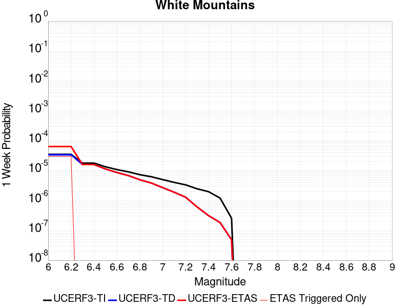 | 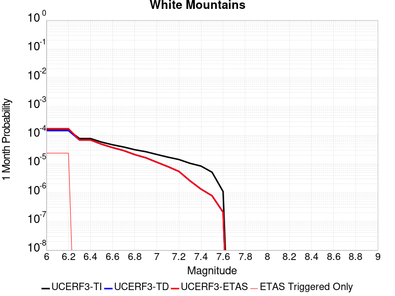 | 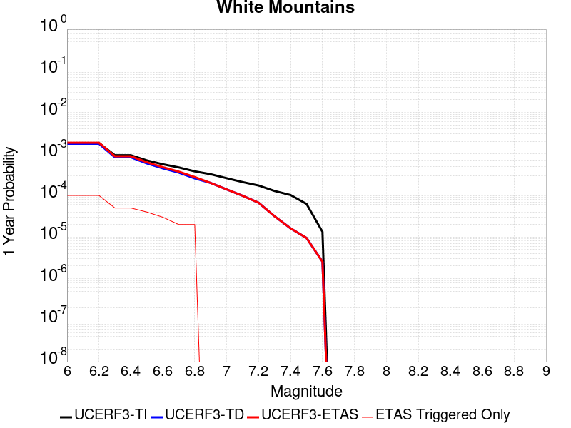 | 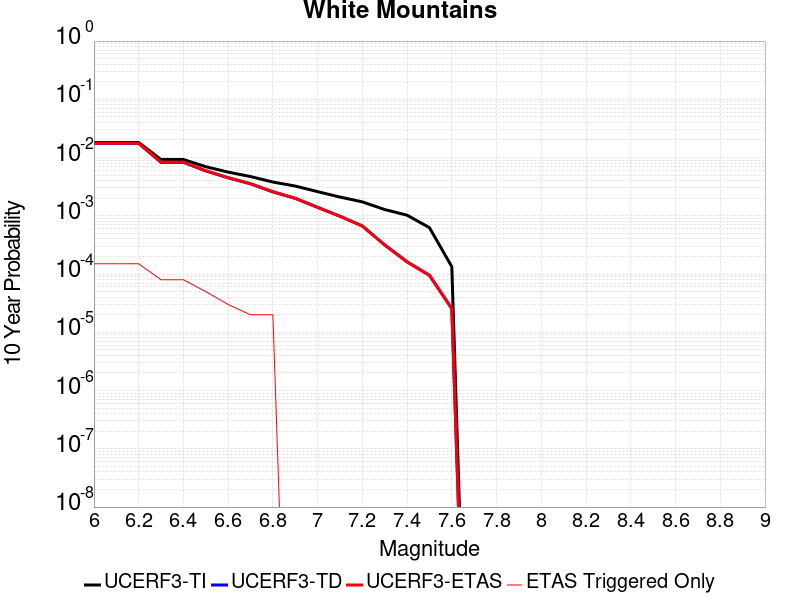 |

| Magnitude | 1 wk TI Prob | 1 wk TD Prob | 1 wk ETAS Prob | 1 wk ETAS/TD Gain | 1 wk ETAS Triggered Only | 1 mo TI Prob | 1 mo TD Prob | 1 mo ETAS Prob | 1 mo ETAS/TD Gain | 1 mo ETAS Triggered Only | 1 yr TI Prob | 1 yr TD Prob | 1 yr ETAS Prob | 1 yr ETAS/TD Gain | 1 yr ETAS Triggered Only | 10 yr TI Prob | 10 yr TD Prob | 10 yr ETAS Prob | 10 yr ETAS/TD Gain | 10 yr ETAS Triggered Only |
|-----|-----|-----|-----|-----|-----|-----|-----|-----|-----|-----|-----|-----|-----|-----|-----|-----|-----|-----|-----|-----|
| 6.0 | 3.503579E-5 | 3.378405E-5 | 6.378304E-5 | 1.8879629 | 3.0E-5 | 1.5014476E-4 | 1.4478143E-4 | 2.0477275E-4 | 1.4143578 | 6.0E-5 | 0.0018264796 | 0.0017614096 | 0.0018612334 | 1.0566727 | 1.0E-4 | 0.018115403 | 0.017486818 | 0.017634196 | 1.0084279 | 1.5E-4 |
| 6.1 | 3.503579E-5 | 3.378405E-5 | 6.378304E-5 | 1.8879629 | 3.0E-5 | 1.5014476E-4 | 1.4478143E-4 | 2.0477275E-4 | 1.4143578 | 6.0E-5 | 0.0018264796 | 0.0017614096 | 0.0018612334 | 1.0566727 | 1.0E-4 | 0.018115403 | 0.017486818 | 0.017634196 | 1.0084279 | 1.5E-4 |
| 6.2 | 3.503579E-5 | 3.378405E-5 | 6.378304E-5 | 1.8879629 | 3.0E-5 | 1.5014476E-4 | 1.4478143E-4 | 2.0477275E-4 | 1.4143578 | 6.0E-5 | 0.0018264796 | 0.0017614096 | 0.0018612334 | 1.0566727 | 1.0E-4 | 0.018115403 | 0.017486818 | 0.017634196 | 1.0084279 | 1.5E-4 |
| 6.3 | 1.7818425E-5 | 1.5916074E-5 | 1.5916074E-5 | 1.0 | 0.0 | 7.636245E-5 | 6.821004E-5 | 8.8208675E-5 | 1.2931919 | 2.0E-5 | 9.293162E-4 | 8.301551E-4 | 8.801136E-4 | 1.0601797 | 5.0E-5 | 0.009254395 | 0.008271999 | 0.008351337 | 1.0095912 | 8.0E-5 |
| 6.4 | 1.7818425E-5 | 1.5916074E-5 | 1.5916074E-5 | 1.0 | 0.0 | 7.636245E-5 | 6.821004E-5 | 8.8208675E-5 | 1.2931919 | 2.0E-5 | 9.293162E-4 | 8.301551E-4 | 8.801136E-4 | 1.0601797 | 5.0E-5 | 0.009254395 | 0.008271999 | 0.008351337 | 1.0095912 | 8.0E-5 |
| 6.5 | 1.3397557E-5 | 1.13362685E-5 | 1.13362685E-5 | 1.0 | 0.0 | 5.741684E-5 | 4.858314E-5 | 6.858217E-5 | 1.4116454 | 2.0E-5 | 6.988258E-4 | 5.913462E-4 | 6.3132256E-4 | 1.0676023 | 4.0E-5 | 0.006966323 | 0.005898432 | 0.005948137 | 1.0084268 | 5.0E-5 |
| 6.6 | 1.0818695E-5 | 8.625366E-6 | 8.625366E-6 | 1.0 | 0.0 | 4.6365014E-5 | 3.6965357E-5 | 5.6964618E-5 | 1.5410272 | 2.0E-5 | 5.6434784E-4 | 4.4996463E-4 | 4.7995112E-4 | 1.0666419 | 3.0E-5 | 0.005629168 | 0.004490972 | 0.004520837 | 1.0066501 | 3.0E-5 |
| 6.7 | 9.067908E-6 | 6.802442E-6 | 6.802442E-6 | 1.0 | 0.0 | 3.8861883E-5 | 2.9153016E-5 | 3.9152725E-5 | 1.3430077 | 1.0E-5 | 4.7304068E-4 | 3.5488335E-4 | 3.7487625E-4 | 1.0563365 | 2.0E-5 | 0.00472035 | 0.0035434833 | 0.0035634125 | 1.0056242 | 2.0E-5 |
| 6.8 | 7.295947E-6 | 4.936391E-6 | 4.936391E-6 | 1.0 | 0.0 | 3.126797E-5 | 2.1155796E-5 | 3.1155585E-5 | 1.4726737 | 1.0E-5 | 3.8062103E-4 | 2.575425E-4 | 2.7753736E-4 | 1.0776371 | 2.0E-5 | 0.0037996976 | 0.0025725532 | 0.002592502 | 1.0077543 | 2.0E-5 |
| 6.9 | 6.2243444E-6 | 3.832213E-6 | 3.832213E-6 | 1.0 | 0.0 | 2.6675489E-5 | 1.642367E-5 | 1.642367E-5 | 1.0 | 0.0 | 3.2472567E-4 | 1.9994036E-4 | 1.9994036E-4 | 1.0 | 0.0 | 0.0032425157 | 0.0019976576 | 0.0019976576 | 1.0 | 0.0 |
| 7.0 | 4.9878413E-6 | 2.6795342E-6 | 2.6795342E-6 | 1.0 | 0.0 | 2.1376287E-5 | 1.14836685E-5 | 1.14836685E-5 | 1.0 | 0.0 | 2.602252E-4 | 1.3980496E-4 | 1.3980496E-4 | 1.0 | 0.0 | 0.002599207 | 0.0013971963 | 0.0013971963 | 1.0 | 0.0 |
| 7.1 | 4.0252844E-6 | 1.8857575E-6 | 1.8857575E-6 | 1.0 | 0.0 | 1.7251105E-5 | 8.081794E-6 | 8.081794E-6 | 1.0 | 0.0 | 2.1001195E-4 | 9.8391516E-5 | 9.8391516E-5 | 1.0 | 0.0 | 0.0020981359 | 9.834924E-4 | 9.834924E-4 | 1.0 | 0.0 |
| 7.2 | 3.3284066E-6 | 1.281964E-6 | 1.281964E-6 | 1.0 | 0.0 | 1.4264522E-5 | 5.494121E-6 | 5.494121E-6 | 1.0 | 0.0 | 1.736567E-4 | 6.688897E-5 | 6.688897E-5 | 1.0 | 0.0 | 0.0017352107 | 6.6869846E-4 | 6.6869846E-4 | 1.0 | 0.0 |
| 7.3 | 2.458226E-6 | 6.05722E-7 | 6.05722E-7 | 1.0 | 0.0 | 1.0535211E-5 | 2.5959491E-6 | 2.5959491E-6 | 1.0 | 0.0 | 1.2825865E-4 | 3.1605257E-5 | 3.1605257E-5 | 1.0 | 0.0 | 0.0012818464 | 3.160114E-4 | 3.160114E-4 | 1.0 | 0.0 |
| 7.4 | 1.965953E-6 | 3.1089303E-7 | 3.1089303E-7 | 1.0 | 0.0 | 8.425486E-6 | 1.332398E-6 | 1.332398E-6 | 1.0 | 0.0 | 1.0257547E-4 | 1.6221828E-5 | 1.6221828E-5 | 1.0 | 0.0 | 0.0010252813 | 1.6220656E-4 | 1.6220656E-4 | 1.0 | 0.0 |
| 7.5 | 1.2014192E-6 | 1.8244253E-7 | 1.8244253E-7 | 1.0 | 0.0 | 5.148929E-6 | 7.8189635E-7 | 7.8189635E-7 | 1.0 | 0.0 | 6.2686406E-5 | 9.519547E-6 | 9.519547E-6 | 1.0 | 0.0 | 6.266873E-4 | 9.519148E-5 | 9.519148E-5 | 1.0 | 0.0 |
| 7.6 | 2.5612175E-7 | 4.8946475E-8 | 4.8946475E-8 | 1.0 | 0.0 | 1.0976642E-6 | 2.0977059E-7 | 2.0977059E-7 | 1.0 | 0.0 | 1.3363979E-5 | 2.5539543E-6 | 2.5539543E-6 | 1.0 | 0.0 | 1.3363175E-4 | 2.5539286E-5 | 2.5539286E-5 | 1.0 | 0.0 |

## Santa Cruz Island
*[(top)](#table-of-contents)*

| 1 Week | 1 Month | 1 Year | 10 Year |
|-----|-----|-----|-----|
| 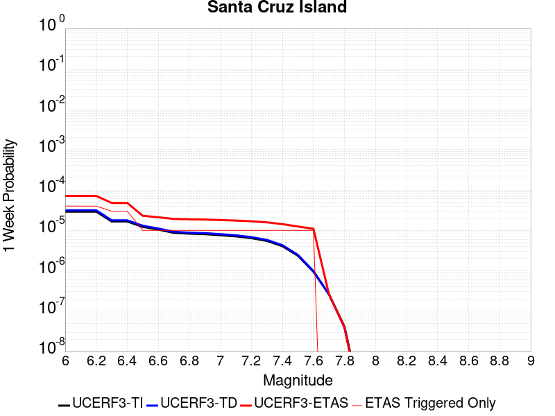 | 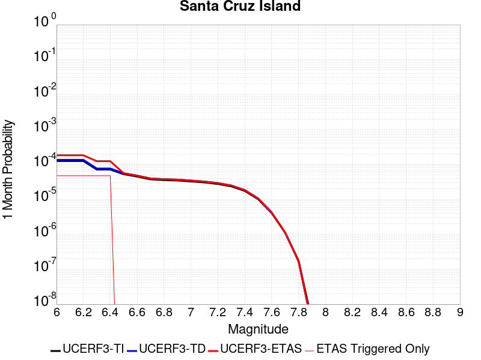 | 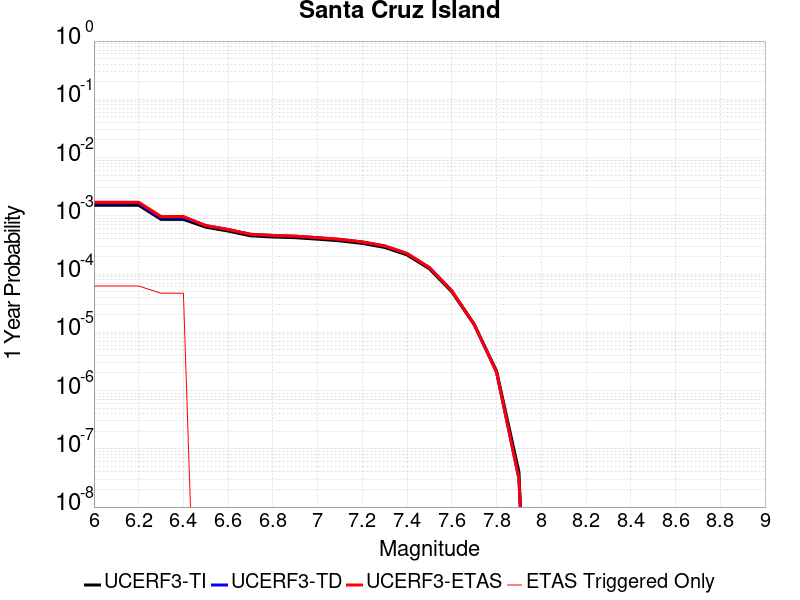 | 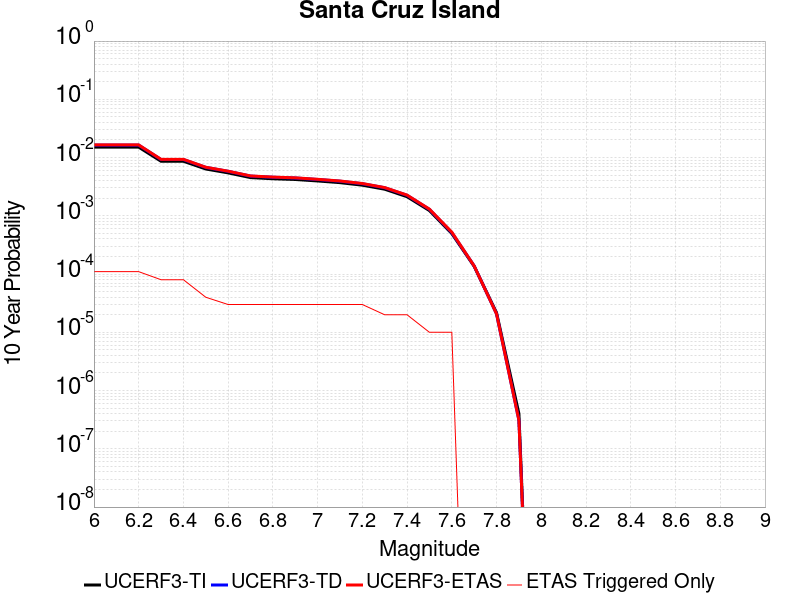 |

| Magnitude | 1 wk TI Prob | 1 wk TD Prob | 1 wk ETAS Prob | 1 wk ETAS/TD Gain | 1 wk ETAS Triggered Only | 1 mo TI Prob | 1 mo TD Prob | 1 mo ETAS Prob | 1 mo ETAS/TD Gain | 1 mo ETAS Triggered Only | 1 yr TI Prob | 1 yr TD Prob | 1 yr ETAS Prob | 1 yr ETAS/TD Gain | 1 yr ETAS Triggered Only | 10 yr TI Prob | 10 yr TD Prob | 10 yr ETAS Prob | 10 yr ETAS/TD Gain | 10 yr ETAS Triggered Only |
|-----|-----|-----|-----|-----|-----|-----|-----|-----|-----|-----|-----|-----|-----|-----|-----|-----|-----|-----|-----|-----|
| 6.0 | 2.9164563E-5 | 3.1599742E-5 | 7.159848E-5 | 2.265793 | 4.0E-5 | 1.2498499E-4 | 1.3542121E-4 | 1.8541444E-4 | 1.3691684 | 5.0E-5 | 0.0015206301 | 0.0016476426 | 0.0017075436 | 1.0363556 | 6.0E-5 | 0.015102667 | 0.016368 | 0.016476199 | 1.0066104 | 1.1E-4 |
| 6.1 | 2.9164563E-5 | 3.1599742E-5 | 7.159848E-5 | 2.265793 | 4.0E-5 | 1.2498499E-4 | 1.3542121E-4 | 1.8541444E-4 | 1.3691684 | 5.0E-5 | 0.0015206301 | 0.0016476426 | 0.0017075436 | 1.0363556 | 6.0E-5 | 0.015102667 | 0.016368 | 0.016476199 | 1.0066104 | 1.1E-4 |
| 6.2 | 2.9164563E-5 | 3.1599742E-5 | 7.159848E-5 | 2.265793 | 4.0E-5 | 1.2498499E-4 | 1.3542121E-4 | 1.8541444E-4 | 1.3691684 | 5.0E-5 | 0.0015206301 | 0.0016476426 | 0.0017075436 | 1.0363556 | 6.0E-5 | 0.015102667 | 0.016368 | 0.016476199 | 1.0066104 | 1.1E-4 |
| 6.3 | 1.6635553E-5 | 1.780436E-5 | 4.7803824E-5 | 2.6849506 | 3.0E-5 | 7.1293274E-5 | 7.630226E-5 | 1.1629921E-4 | 1.5241908 | 4.0E-5 | 8.6765E-4 | 9.2860236E-4 | 9.78556E-4 | 1.0537944 | 5.0E-5 | 0.008642701 | 0.009249094 | 0.009328353 | 1.0085695 | 8.0E-5 |
| 6.4 | 1.6635553E-5 | 1.780436E-5 | 4.7803824E-5 | 2.6849506 | 3.0E-5 | 7.1293274E-5 | 7.630226E-5 | 1.1629921E-4 | 1.5241908 | 4.0E-5 | 8.6765E-4 | 9.2860236E-4 | 9.78556E-4 | 1.0537944 | 5.0E-5 | 0.008642701 | 0.009249094 | 0.009328353 | 1.0085695 | 8.0E-5 |
| 6.5 | 1.2238748E-5 | 1.3042995E-5 | 2.3042865E-5 | 1.766685 | 1.0E-5 | 5.2450723E-5 | 5.5897377E-5 | 6.589681E-5 | 1.1788893 | 1.0E-5 | 6.3840044E-4 | 6.8034173E-4 | 6.9033494E-4 | 1.0146885 | 1.0E-5 | 0.0063656955 | 0.0067829876 | 0.0068227164 | 1.0058571 | 4.0E-5 |
| 6.6 | 1.0489767E-5 | 1.1156636E-5 | 2.1156524E-5 | 1.8963176 | 1.0E-5 | 4.495537E-5 | 4.781329E-5 | 5.7812813E-5 | 1.2091368 | 1.0E-5 | 5.4719415E-4 | 5.819735E-4 | 5.919677E-4 | 1.0171729 | 1.0E-5 | 0.005458487 | 0.0058047357 | 0.005834562 | 1.0051382 | 3.0E-5 |
| 6.7 | 8.699222E-6 | 9.236782E-6 | 1.923669E-5 | 2.0826182 | 1.0E-5 | 3.7281847E-5 | 3.958561E-5 | 4.9585215E-5 | 1.252607 | 1.0E-5 | 4.5381195E-4 | 4.8184878E-4 | 4.9184397E-4 | 1.0207434 | 1.0E-5 | 0.0045288634 | 0.004808108 | 0.0048379637 | 1.0062095 | 3.0E-5 |
| 6.8 | 8.307732E-6 | 8.8169045E-6 | 1.8816816E-5 | 2.134175 | 1.0E-5 | 3.560408E-5 | 3.7786187E-5 | 4.778581E-5 | 1.264637 | 1.0E-5 | 4.3339343E-4 | 4.5995016E-4 | 4.6994555E-4 | 1.0217315 | 1.0E-5 | 0.004325492 | 0.0045900354 | 0.0046198973 | 1.0065058 | 3.0E-5 |
| 6.9 | 8.073121E-6 | 8.564939E-6 | 1.8564853E-5 | 2.1675406 | 1.0E-5 | 3.459863E-5 | 3.6706366E-5 | 4.6706E-5 | 1.2724223 | 1.0E-5 | 4.2115687E-4 | 4.468088E-4 | 4.5680432E-4 | 1.0223709 | 1.0E-5 | 0.004203596 | 0.004459156 | 0.0044890223 | 1.0066978 | 3.0E-5 |
| 7.0 | 7.617019E-6 | 8.074664E-6 | 1.8074583E-5 | 2.2384317 | 1.0E-5 | 3.264396E-5 | 3.4605247E-5 | 4.46049E-5 | 1.2889636 | 1.0E-5 | 3.9736772E-4 | 4.212378E-4 | 4.312336E-4 | 1.0237296 | 1.0E-5 | 0.003966579 | 0.0042044413 | 0.004234315 | 1.0071054 | 3.0E-5 |
| 7.1 | 7.1224836E-6 | 7.545788E-6 | 1.7545712E-5 | 2.3252327 | 1.0E-5 | 3.052457E-5 | 3.2338692E-5 | 4.2338368E-5 | 1.3092171 | 1.0E-5 | 3.715733E-4 | 3.936528E-4 | 4.0364885E-4 | 1.0253931 | 1.0E-5 | 0.003709526 | 0.003929598 | 0.0039594797 | 1.0076044 | 3.0E-5 |
| 7.2 | 6.441115E-6 | 6.8273835E-6 | 1.6827315E-5 | 2.46468 | 1.0E-5 | 2.7604487E-5 | 2.9259887E-5 | 3.9259594E-5 | 1.3417548 | 1.0E-5 | 3.360328E-4 | 3.5618112E-4 | 3.6617756E-4 | 1.0280656 | 1.0E-5 | 0.0033552512 | 0.003556131 | 0.0035860243 | 1.0084062 | 3.0E-5 |
| 7.3 | 5.494274E-6 | 5.8199944E-6 | 1.5819936E-5 | 2.7182047 | 1.0E-5 | 2.3546674E-5 | 2.4942596E-5 | 3.4942346E-5 | 1.4009106 | 1.0E-5 | 2.8664304E-4 | 3.0363398E-4 | 3.1363094E-4 | 1.0329244 | 1.0E-5 | 0.002862736 | 0.0030322142 | 0.0030521536 | 1.0065758 | 2.0E-5 |
| 7.4 | 4.0802624E-6 | 4.312256E-6 | 1.4312213E-5 | 3.3189619 | 1.0E-5 | 1.7486722E-5 | 1.8480967E-5 | 2.8480783E-5 | 1.5410873 | 1.0E-5 | 2.1288003E-4 | 2.2498262E-4 | 2.3498037E-4 | 1.0444379 | 1.0E-5 | 0.0021267622 | 0.0022475575 | 0.0022675125 | 1.0088786 | 2.0E-5 |
| 7.5 | 2.3584746E-6 | 2.4753094E-6 | 1.2475285E-5 | 5.039889 | 1.0E-5 | 1.0107709E-5 | 1.0608426E-5 | 2.060832E-5 | 1.9426368 | 1.0E-5 | 1.2305441E-4 | 1.2915E-4 | 1.391487E-4 | 1.0774194 | 1.0E-5 | 0.0012298629 | 0.0012907543 | 0.0013007415 | 1.0077374 | 1.0E-5 |
| 7.6 | 9.4981914E-7 | 9.86093E-7 | 1.0986083E-5 | 11.141021 | 1.0E-5 | 4.0706473E-6 | 4.2261063E-6 | 1.4226064E-5 | 3.3662343 | 1.0E-5 | 4.9559E-5 | 5.145164E-5 | 6.145112E-5 | 1.1943473 | 1.0E-5 | 4.954795E-4 | 5.1439856E-4 | 5.2439346E-4 | 1.0194302 | 1.0E-5 |
| 7.7 | 2.6013532E-7 | 2.6416603E-7 | 2.6416603E-7 | 1.0 | 0.0 | 1.1148652E-6 | 1.1321397E-6 | 1.1321397E-6 | 1.0 | 0.0 | 1.3573399E-5 | 1.3783714E-5 | 1.3783714E-5 | 1.0 | 0.0 | 1.357257E-4 | 1.3782867E-4 | 1.3782867E-4 | 1.0 | 0.0 |
| 7.8 | 4.1522263E-8 | 3.965679E-8 | 3.965679E-8 | 1.0 | 0.0 | 1.7795254E-7 | 1.6995766E-7 | 1.6995766E-7 | 1.0 | 0.0 | 2.16657E-6 | 2.0692328E-6 | 2.0692328E-6 | 1.0 | 0.0 | 2.1665488E-5 | 2.0692156E-5 | 2.0692156E-5 | 1.0 | 0.0 |
| 7.9 | 7.7242046E-10 | 5.9468175E-10 | 5.9468175E-10 | 1.0 | 0.0 | 3.3103735E-9 | 2.5486364E-9 | 2.5486364E-9 | 1.0 | 0.0 | 4.0303796E-8 | 3.1029646E-8 | 3.1029646E-8 | 1.0 | 0.0 | 4.030379E-7 | 3.1029643E-7 | 3.1029643E-7 | 1.0 | 0.0 |

## Chino alt 1
*[(top)](#table-of-contents)*

| 1 Week | 1 Month | 1 Year | 10 Year |
|-----|-----|-----|-----|
| 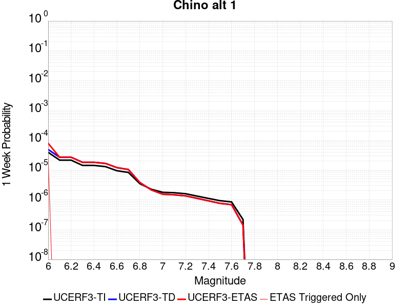 | 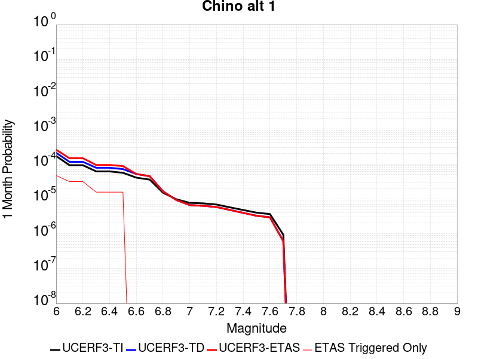 | 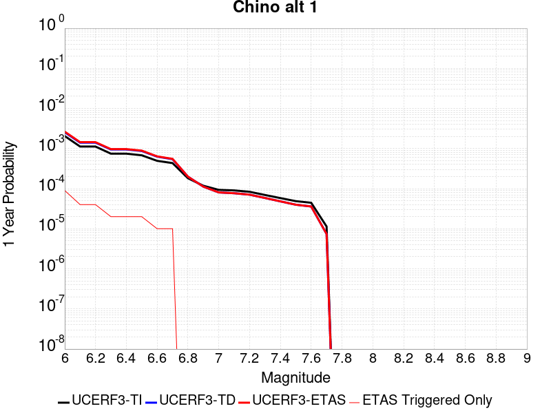 | 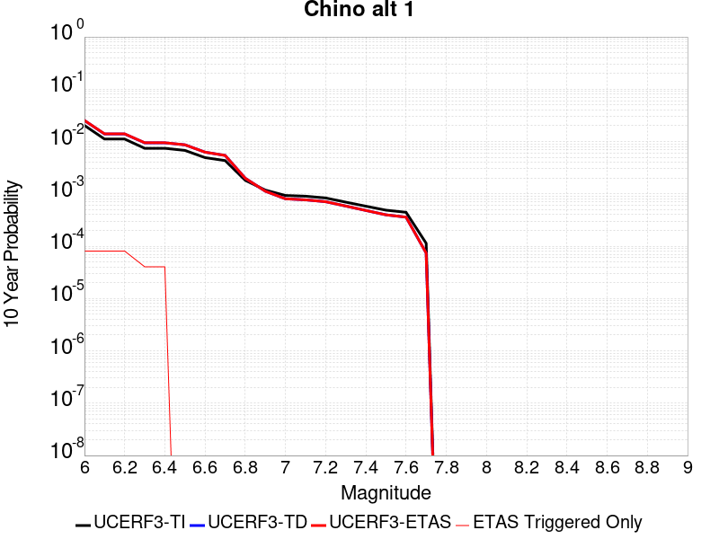 |

| Magnitude | 1 wk TI Prob | 1 wk TD Prob | 1 wk ETAS Prob | 1 wk ETAS/TD Gain | 1 wk ETAS Triggered Only | 1 mo TI Prob | 1 mo TD Prob | 1 mo ETAS Prob | 1 mo ETAS/TD Gain | 1 mo ETAS Triggered Only | 1 yr TI Prob | 1 yr TD Prob | 1 yr ETAS Prob | 1 yr ETAS/TD Gain | 1 yr ETAS Triggered Only | 10 yr TI Prob | 10 yr TD Prob | 10 yr ETAS Prob | 10 yr ETAS/TD Gain | 10 yr ETAS Triggered Only |
|-----|-----|-----|-----|-----|-----|-----|-----|-----|-----|-----|-----|-----|-----|-----|-----|-----|-----|-----|-----|-----|
| 6.0 | 3.939946E-5 | 4.8948554E-5 | 7.894709E-5 | 1.6128584 | 3.0E-5 | 1.6884391E-4 | 2.097656E-4 | 2.797509E-4 | 1.3336358 | 7.0E-5 | 0.0020537362 | 0.0025513945 | 0.002641165 | 1.0351849 | 9.0E-5 | 0.020348595 | 0.025277847 | 0.025404561 | 1.0050129 | 1.3E-4 |
| 6.1 | 2.1505624E-5 | 2.6879026E-5 | 2.6879026E-5 | 1.0 | 0.0 | 9.2163704E-5 | 1.1519137E-4 | 1.3518907E-4 | 1.1736041 | 2.0E-5 | 0.0011215154 | 0.001401664 | 0.001441608 | 1.0284975 | 4.0E-5 | 0.011158722 | 0.013945141 | 0.014024026 | 1.0056567 | 8.0E-5 |
| 6.2 | 2.1505624E-5 | 2.6879026E-5 | 2.6879026E-5 | 1.0 | 0.0 | 9.2163704E-5 | 1.1519137E-4 | 1.3518907E-4 | 1.1736041 | 2.0E-5 | 0.0011215154 | 0.001401664 | 0.001441608 | 1.0284975 | 4.0E-5 | 0.011158722 | 0.013945141 | 0.014024026 | 1.0056567 | 8.0E-5 |
| 6.3 | 1.4290785E-5 | 1.8165128E-5 | 1.8165128E-5 | 1.0 | 0.0 | 6.1244784E-5 | 7.784848E-5 | 8.78477E-5 | 1.1284447 | 1.0E-5 | 7.454001E-4 | 9.4743853E-4 | 9.6741953E-4 | 1.0210896 | 2.0E-5 | 0.007429048 | 0.0094444575 | 0.009493985 | 1.0052441 | 5.0E-5 |
| 6.4 | 1.4290785E-5 | 1.8165128E-5 | 1.8165128E-5 | 1.0 | 0.0 | 6.1244784E-5 | 7.784848E-5 | 8.78477E-5 | 1.1284447 | 1.0E-5 | 7.454001E-4 | 9.4743853E-4 | 9.6741953E-4 | 1.0210896 | 2.0E-5 | 0.007429048 | 0.0094444575 | 0.009493985 | 1.0052441 | 5.0E-5 |
| 6.5 | 1.3017944E-5 | 1.6652088E-5 | 1.6652088E-5 | 1.0 | 0.0 | 5.5789995E-5 | 7.136439E-5 | 8.136367E-5 | 1.1401159 | 1.0E-5 | 6.790315E-4 | 8.685589E-4 | 8.885415E-4 | 1.0230067 | 2.0E-5 | 0.0067696036 | 0.008661949 | 0.008701603 | 1.0045779 | 4.0E-5 |
| 6.6 | 9.470016E-6 | 1.2039424E-5 | 1.2039424E-5 | 1.0 | 0.0 | 4.058515E-5 | 5.1596704E-5 | 5.1596704E-5 | 1.0 | 0.0 | 4.940122E-4 | 6.280428E-4 | 6.3803646E-4 | 1.0159125 | 1.0E-5 | 0.004929154 | 0.0062718987 | 0.0063017104 | 1.0047532 | 3.0E-5 |
| 6.7 | 8.314155E-6 | 1.0407736E-5 | 1.0407736E-5 | 1.0 | 0.0 | 3.5631605E-5 | 4.4604003E-5 | 4.4604003E-5 | 1.0 | 0.0 | 4.3372845E-4 | 5.429507E-4 | 5.5294525E-4 | 1.0184078 | 1.0E-5 | 0.004328829 | 0.005425775 | 0.005455612 | 1.0054991 | 3.0E-5 |
| 6.8 | 3.4856364E-6 | 3.8133708E-6 | 3.8133708E-6 | 1.0 | 0.0 | 1.4938357E-5 | 1.6342927E-5 | 1.6342927E-5 | 1.0 | 0.0 | 1.8185932E-4 | 1.9895904E-4 | 1.9895904E-4 | 1.0 | 0.0 | 0.0018171056 | 0.0019894864 | 0.0019894864 | 1.0 | 0.0 |
| 6.9 | 2.2645952E-6 | 2.1529022E-6 | 2.1529022E-6 | 1.0 | 0.0 | 9.705372E-6 | 9.226692E-6 | 9.226692E-6 | 1.0 | 0.0 | 1.18156495E-4 | 1.123294E-4 | 1.123294E-4 | 1.0 | 0.0 | 0.0011809369 | 0.0011233423 | 0.0011233423 | 1.0 | 0.0 |
| 7.0 | 1.7864003E-6 | 1.5430785E-6 | 1.5430785E-6 | 1.0 | 0.0 | 7.655979E-6 | 6.613177E-6 | 6.613177E-6 | 1.0 | 0.0 | 9.3207556E-5 | 8.051251E-5 | 8.051251E-5 | 1.0 | 0.0 | 9.316847E-4 | 8.0528046E-4 | 8.0528046E-4 | 1.0 | 0.0 |
| 7.1 | 1.7315456E-6 | 1.4733511E-6 | 1.4733511E-6 | 1.0 | 0.0 | 7.420889E-6 | 6.3143466E-6 | 6.3143466E-6 | 1.0 | 0.0 | 9.034557E-5 | 7.6874516E-5 | 7.6874516E-5 | 1.0 | 0.0 | 9.0308854E-4 | 7.6891703E-4 | 7.6891703E-4 | 1.0 | 0.0 |
| 7.2 | 1.6008337E-6 | 1.3574215E-6 | 1.3574215E-6 | 1.0 | 0.0 | 6.860698E-6 | 5.817508E-6 | 5.817508E-6 | 1.0 | 0.0 | 8.352579E-5 | 7.082591E-5 | 7.082591E-5 | 1.0 | 0.0 | 8.34944E-4 | 7.0845755E-4 | 7.0845755E-4 | 1.0 | 0.0 |
| 7.3 | 1.3320939E-6 | 1.121782E-6 | 1.121782E-6 | 1.0 | 0.0 | 5.7089615E-6 | 4.807629E-6 | 4.807629E-6 | 1.0 | 0.0 | 6.9504385E-5 | 5.8531357E-5 | 5.8531357E-5 | 1.0 | 0.0 | 6.9482654E-4 | 5.8530393E-4 | 5.8530393E-4 | 1.0 | 0.0 |
| 7.4 | 1.114294E-6 | 9.237111E-7 | 9.237111E-7 | 1.0 | 0.0 | 4.775537E-6 | 3.958756E-6 | 3.958756E-6 | 1.0 | 0.0 | 5.8140613E-5 | 4.8196827E-5 | 4.8196827E-5 | 1.0 | 0.0 | 5.81254E-4 | 4.8188053E-4 | 4.8188053E-4 | 1.0 | 0.0 |
| 7.5 | 9.354081E-7 | 7.6234323E-7 | 7.6234323E-7 | 1.0 | 0.0 | 4.0088858E-6 | 3.2671815E-6 | 3.2671815E-6 | 1.0 | 0.0 | 4.8807087E-5 | 3.9777242E-5 | 3.9777242E-5 | 1.0 | 0.0 | 4.879637E-4 | 3.977046E-4 | 3.977046E-4 | 1.0 | 0.0 |
| 7.6 | 8.521771E-7 | 6.88071E-7 | 6.88071E-7 | 1.0 | 0.0 | 3.6521824E-6 | 2.9488726E-6 | 2.9488726E-6 | 1.0 | 0.0 | 4.4464414E-5 | 3.5901965E-5 | 3.5901965E-5 | 1.0 | 0.0 | 4.4455516E-4 | 3.589648E-4 | 3.589648E-4 | 1.0 | 0.0 |
| 7.7 | 2.1803626E-7 | 1.418649E-7 | 1.418649E-7 | 1.0 | 0.0 | 9.344408E-7 | 6.079923E-7 | 6.079923E-7 | 1.0 | 0.0 | 1.1376757E-5 | 7.4022914E-6 | 7.4022914E-6 | 1.0 | 0.0 | 1.13761744E-4 | 7.402141E-5 | 7.402141E-5 | 1.0 | 0.0 |

## San Jacinto (Superstition Mtn)
*[(top)](#table-of-contents)*

| 1 Week | 1 Month | 1 Year | 10 Year |
|-----|-----|-----|-----|
| 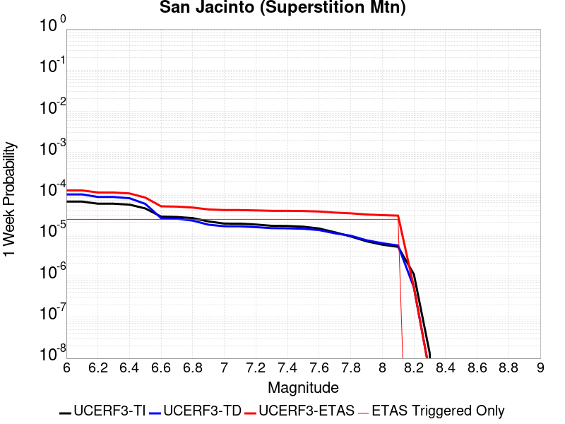 | 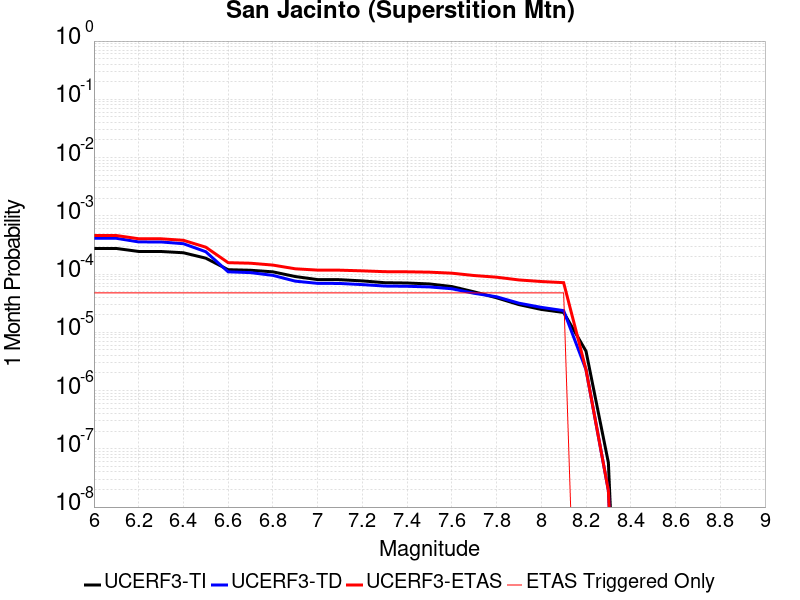 | 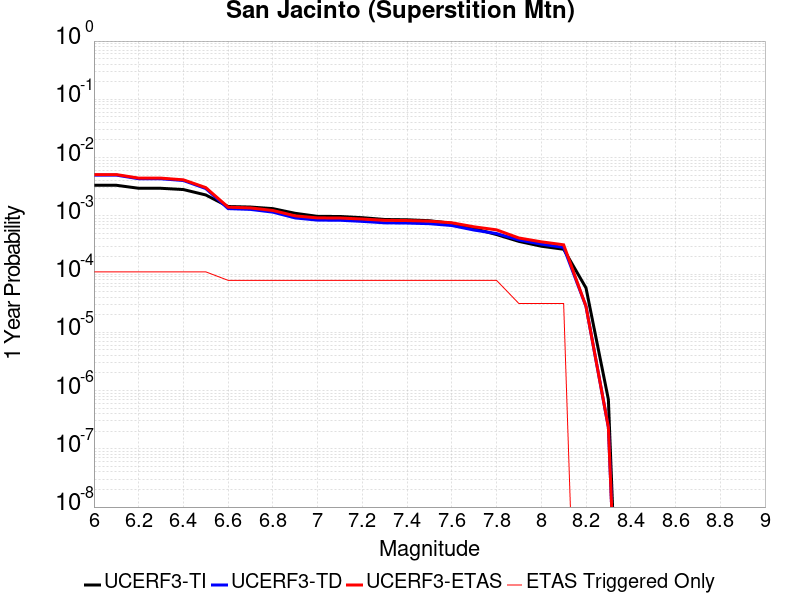 | 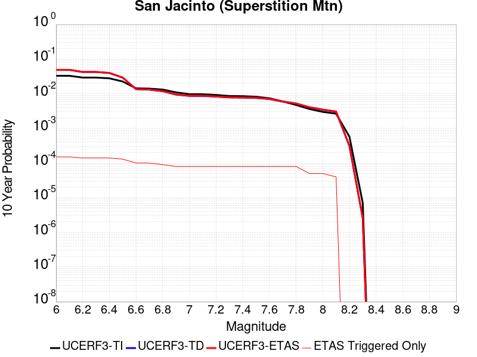 |

| Magnitude | 1 wk TI Prob | 1 wk TD Prob | 1 wk ETAS Prob | 1 wk ETAS/TD Gain | 1 wk ETAS Triggered Only | 1 mo TI Prob | 1 mo TD Prob | 1 mo ETAS Prob | 1 mo ETAS/TD Gain | 1 mo ETAS Triggered Only | 1 yr TI Prob | 1 yr TD Prob | 1 yr ETAS Prob | 1 yr ETAS/TD Gain | 1 yr ETAS Triggered Only | 10 yr TI Prob | 10 yr TD Prob | 10 yr ETAS Prob | 10 yr ETAS/TD Gain | 10 yr ETAS Triggered Only |
|-----|-----|-----|-----|-----|-----|-----|-----|-----|-----|-----|-----|-----|-----|-----|-----|-----|-----|-----|-----|-----|
| 6.0 | 6.4193904E-5 | 9.599367E-5 | 1.0599271E-4 | 1.1041635 | 1.0E-5 | 2.7508775E-4 | 4.1134638E-4 | 4.5132992E-4 | 1.0972017 | 4.0E-5 | 0.0033440501 | 0.0049980893 | 0.0050876397 | 1.0179169 | 9.0E-5 | 0.03294174 | 0.048823986 | 0.04896666 | 1.0029223 | 1.5E-4 |
| 6.1 | 6.4193904E-5 | 9.599367E-5 | 1.0599271E-4 | 1.1041635 | 1.0E-5 | 2.7508775E-4 | 4.1134638E-4 | 4.5132992E-4 | 1.0972017 | 4.0E-5 | 0.0033440501 | 0.0049980893 | 0.0050876397 | 1.0179169 | 9.0E-5 | 0.03294174 | 0.048823986 | 0.04896666 | 1.0029223 | 1.5E-4 |
| 6.2 | 5.7023593E-5 | 8.3144434E-5 | 9.31436E-5 | 1.1202626 | 1.0E-5 | 2.4436394E-4 | 3.5629404E-4 | 3.9627976E-4 | 1.1122268 | 4.0E-5 | 0.002971072 | 0.0043308944 | 0.0044205044 | 1.0206909 | 9.0E-5 | 0.029316625 | 0.04250403 | 0.04263808 | 1.0031538 | 1.4E-4 |
| 6.3 | 5.6940098E-5 | 8.298979E-5 | 9.2988965E-5 | 1.1204867 | 1.0E-5 | 2.4400617E-4 | 3.5563146E-4 | 3.9561724E-4 | 1.1124359 | 4.0E-5 | 0.002966728 | 0.00432286 | 0.004412471 | 1.0207295 | 9.0E-5 | 0.029274331 | 0.042427283 | 0.04256134 | 1.0031598 | 1.4E-4 |
| 6.4 | 5.4171585E-5 | 7.7483564E-5 | 8.748279E-5 | 1.1290497 | 1.0E-5 | 2.3214328E-4 | 3.3203943E-4 | 3.7202614E-4 | 1.1204276 | 4.0E-5 | 0.0028226813 | 0.0040367353 | 0.004126372 | 1.0222052 | 9.0E-5 | 0.02787096 | 0.03971653 | 0.03985097 | 1.003385 | 1.4E-4 |
| 6.5 | 4.375144E-5 | 5.642133E-5 | 6.642076E-5 | 1.177228 | 1.0E-5 | 1.874927E-4 | 2.4178992E-4 | 2.7178266E-4 | 1.1240447 | 3.0E-5 | 0.0022803338 | 0.002940994 | 0.0030207587 | 1.0271217 | 8.0E-5 | 0.022570757 | 0.029236801 | 0.029363 | 1.0043164 | 1.3E-4 |
| 6.6 | 2.772192E-5 | 2.5488358E-5 | 3.54881E-5 | 1.392326 | 1.0E-5 | 1.1880282E-4 | 1.09231354E-4 | 1.2922917E-4 | 1.1830776 | 2.0E-5 | 0.0014454646 | 0.0013290998 | 0.00138902 | 1.0450833 | 6.0E-5 | 0.014360986 | 0.01354049 | 0.013639136 | 1.0072852 | 1.0E-4 |
| 6.7 | 2.7124124E-5 | 2.4699386E-5 | 3.469914E-5 | 1.4048584 | 1.0E-5 | 1.1624106E-4 | 1.05850326E-4 | 1.2584821E-4 | 1.188926 | 2.0E-5 | 0.0014143161 | 0.001287985 | 0.0013479078 | 1.0465244 | 6.0E-5 | 0.014053487 | 0.013133943 | 0.01323263 | 1.0075139 | 1.0E-4 |
| 6.8 | 2.5475807E-5 | 2.216446E-5 | 3.2164236E-5 | 1.4511627 | 1.0E-5 | 1.0917746E-4 | 9.4987154E-5 | 1.14985254E-4 | 1.2105348 | 2.0E-5 | 0.001328425 | 0.001155867 | 0.0012157976 | 1.0518491 | 6.0E-5 | 0.0132051185 | 0.011822182 | 0.0119111175 | 1.0075228 | 9.0E-5 |
| 6.9 | 2.1162023E-5 | 1.7626244E-5 | 2.7626067E-5 | 1.5673258 | 1.0E-5 | 9.069123E-5 | 7.5538876E-5 | 9.553737E-5 | 1.2647443 | 2.0E-5 | 0.0011036064 | 9.193016E-4 | 9.792465E-4 | 1.0652069 | 6.0E-5 | 0.010981417 | 0.00944688 | 0.009526124 | 1.0083884 | 8.0E-5 |
| 7.0 | 1.8754288E-5 | 1.6161559E-5 | 2.6161397E-5 | 1.6187422 | 1.0E-5 | 8.037304E-5 | 6.9261994E-5 | 8.926061E-5 | 1.2887386 | 2.0E-5 | 9.781026E-4 | 8.4294105E-4 | 9.0289046E-4 | 1.0711193 | 6.0E-5 | 0.009738087 | 0.008670042 | 0.008749348 | 1.0091472 | 8.0E-5 |
| 7.1 | 1.8678527E-5 | 1.6086702E-5 | 2.608654E-5 | 1.6216215 | 1.0E-5 | 8.0048376E-5 | 6.89412E-5 | 8.893982E-5 | 1.2900823 | 2.0E-5 | 9.7415317E-4 | 8.3903834E-4 | 8.98988E-4 | 1.0714505 | 6.0E-5 | 0.009698939 | 0.008630998 | 0.008710308 | 1.0091889 | 8.0E-5 |
| 7.2 | 1.7804578E-5 | 1.5381282E-5 | 2.5381127E-5 | 1.6501309 | 1.0E-5 | 7.6303106E-5 | 6.5918124E-5 | 8.591681E-5 | 1.3033867 | 2.0E-5 | 9.285943E-4 | 8.022599E-4 | 8.6221175E-4 | 1.0747287 | 6.0E-5 | 0.009247236 | 0.008262311 | 0.0083416505 | 1.0096025 | 8.0E-5 |
| 7.3 | 1.6583685E-5 | 1.4530388E-5 | 2.4530244E-5 | 1.6882029 | 1.0E-5 | 7.1070994E-5 | 6.227162E-5 | 8.227037E-5 | 1.3211536 | 2.0E-5 | 8.649459E-4 | 7.5789524E-4 | 8.1784977E-4 | 1.0791066 | 6.0E-5 | 0.00861587 | 0.007817623 | 0.007896998 | 1.0101533 | 8.0E-5 |
| 7.4 | 1.6387552E-5 | 1.4395274E-5 | 2.4395129E-5 | 1.6946625 | 1.0E-5 | 7.023047E-5 | 6.169258E-5 | 8.169135E-5 | 1.3241681 | 2.0E-5 | 8.5472054E-4 | 7.5085036E-4 | 8.108053E-4 | 1.0798494 | 6.0E-5 | 0.008514405 | 0.0077470057 | 0.007826386 | 1.0102465 | 8.0E-5 |
| 7.5 | 1.5790754E-5 | 1.4035962E-5 | 2.4035822E-5 | 1.7124456 | 1.0E-5 | 6.767291E-5 | 6.0152746E-5 | 8.015154E-5 | 1.332467 | 2.0E-5 | 8.236062E-4 | 7.321156E-4 | 7.9207163E-4 | 1.0818943 | 6.0E-5 | 0.008205604 | 0.007557569 | 0.0076369643 | 1.0105054 | 8.0E-5 |
| 7.6 | 1.4248672E-5 | 1.3054932E-5 | 2.3054801E-5 | 1.765984 | 1.0E-5 | 6.106431E-5 | 5.594852E-5 | 7.59474E-5 | 1.3574514 | 2.0E-5 | 7.432043E-4 | 6.8096205E-4 | 7.4092124E-4 | 1.0880506 | 6.0E-5 | 0.007407237 | 0.0070401574 | 0.007119594 | 1.0112834 | 8.0E-5 |
| 7.7 | 1.15449975E-5 | 1.090368E-5 | 2.090357E-5 | 1.9171116 | 1.0E-5 | 4.947762E-5 | 4.6729223E-5 | 6.672829E-5 | 1.4279777 | 2.0E-5 | 6.022235E-4 | 5.687805E-4 | 6.287464E-4 | 1.1054288 | 6.0E-5 | 0.006005941 | 0.0059101824 | 0.0059897094 | 1.013456 | 8.0E-5 |
| 7.8 | 9.1391985E-6 | 9.514299E-6 | 1.9514204E-5 | 2.0510397 | 1.0E-5 | 3.9167408E-5 | 4.0774932E-5 | 6.0774117E-5 | 1.4904774 | 2.0E-5 | 4.767588E-4 | 4.963223E-4 | 5.5629254E-4 | 1.1208292 | 6.0E-5 | 0.0047573727 | 0.0051766867 | 0.0052562724 | 1.015374 | 8.0E-5 |
| 7.9 | 6.973017E-6 | 7.3821784E-6 | 1.7382104E-5 | 2.3546038 | 1.0E-5 | 2.9884017E-5 | 3.1637526E-5 | 5.1636893E-5 | 1.6321406 | 2.0E-5 | 3.6377716E-4 | 3.8511935E-4 | 4.151078E-4 | 1.077868 | 3.0E-5 | 0.0036318225 | 0.0040517948 | 0.004101592 | 1.0122902 | 5.0E-5 |
| 8.0 | 5.7638235E-6 | 6.259972E-6 | 1.625991E-5 | 2.5974412 | 1.0E-5 | 2.4701867E-5 | 2.6828178E-5 | 4.682764E-5 | 1.7454648 | 2.0E-5 | 3.0070372E-4 | 3.2658462E-4 | 3.565748E-4 | 1.0918298 | 3.0E-5 | 0.0030029714 | 0.0034534496 | 0.0035032767 | 1.0144283 | 5.0E-5 |
| 8.1 | 5.1124434E-6 | 5.4956718E-6 | 1.5495616E-5 | 2.8196037 | 1.0E-5 | 2.1910288E-5 | 2.355267E-5 | 4.3552198E-5 | 1.8491406 | 2.0E-5 | 2.6672508E-4 | 2.867165E-4 | 3.1670788E-4 | 1.1046029 | 3.0E-5 | 0.0026640517 | 0.003040336 | 0.0030802146 | 1.0131165 | 4.0E-5 |
| 8.2 | 1.1075938E-6 | 5.336568E-7 | 5.336568E-7 | 1.0 | 0.0 | 4.7468216E-6 | 2.2870988E-6 | 2.2870988E-6 | 1.0 | 0.0 | 5.779102E-5 | 2.7845093E-5 | 2.7845093E-5 | 1.0 | 0.0 | 5.777599E-4 | 3.1346595E-4 | 3.1346595E-4 | 1.0 | 0.0 |
| 8.3 | 1.3584393E-8 | 4.473836E-9 | 4.473836E-9 | 1.0 | 0.0 | 5.8218827E-8 | 1.9173582E-8 | 1.9173582E-8 | 1.0 | 0.0 | 7.0881396E-7 | 2.3343837E-7 | 2.3343837E-7 | 1.0 | 0.0 | 7.0881174E-6 | 2.6163038E-6 | 2.6163038E-6 | 1.0 | 0.0 |

## Ventura-Pitas Point
*[(top)](#table-of-contents)*

| 1 Week | 1 Month | 1 Year | 10 Year |
|-----|-----|-----|-----|
| 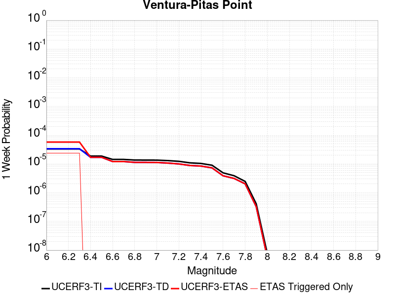 | 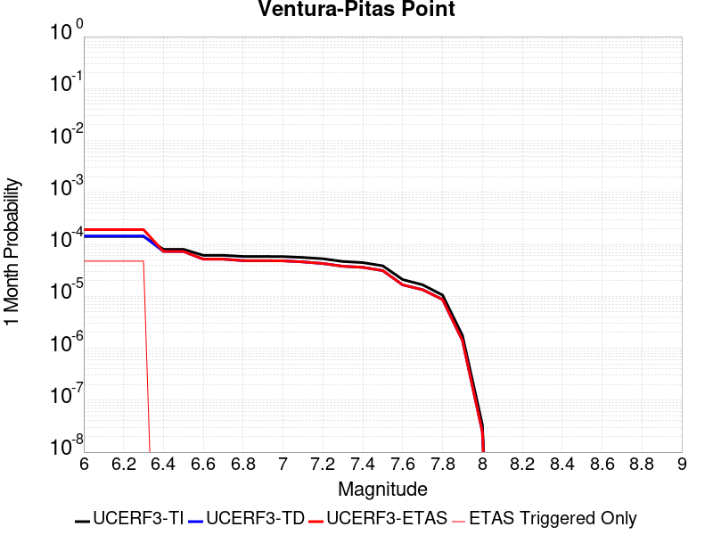 | 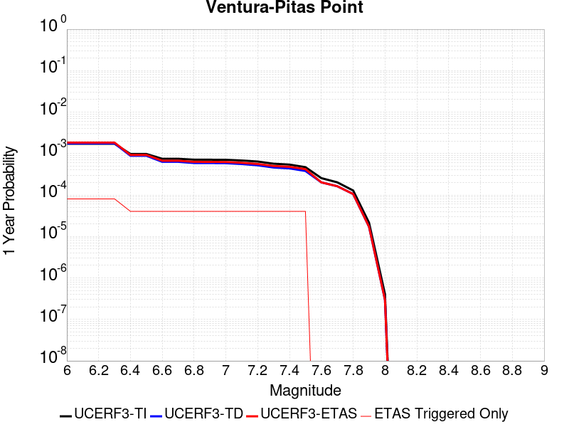 | 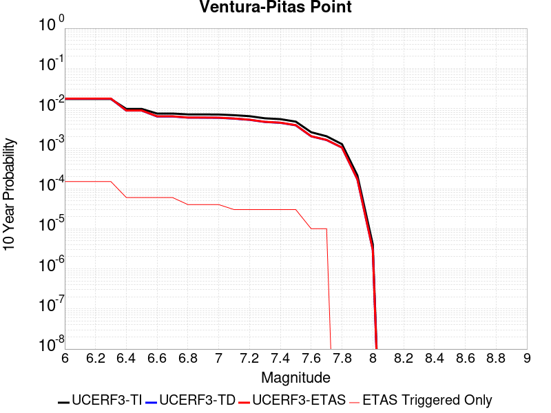 |

| Magnitude | 1 wk TI Prob | 1 wk TD Prob | 1 wk ETAS Prob | 1 wk ETAS/TD Gain | 1 wk ETAS Triggered Only | 1 mo TI Prob | 1 mo TD Prob | 1 mo ETAS Prob | 1 mo ETAS/TD Gain | 1 mo ETAS Triggered Only | 1 yr TI Prob | 1 yr TD Prob | 1 yr ETAS Prob | 1 yr ETAS/TD Gain | 1 yr ETAS Triggered Only | 10 yr TI Prob | 10 yr TD Prob | 10 yr ETAS Prob | 10 yr ETAS/TD Gain | 10 yr ETAS Triggered Only |
|-----|-----|-----|-----|-----|-----|-----|-----|-----|-----|-----|-----|-----|-----|-----|-----|-----|-----|-----|-----|-----|
| 6.0 | 3.3179622E-5 | 3.3735185E-5 | 5.3734508E-5 | 1.5928328 | 2.0E-5 | 1.4219063E-4 | 1.445728E-4 | 1.7456846E-4 | 1.2074779 | 3.0E-5 | 0.0017297962 | 0.0017590096 | 0.0018588337 | 1.0567502 | 1.0E-4 | 0.017163932 | 0.0174764 | 0.017623778 | 1.008433 | 1.5E-4 |
| 6.1 | 3.3179622E-5 | 3.3735185E-5 | 5.3734508E-5 | 1.5928328 | 2.0E-5 | 1.4219063E-4 | 1.445728E-4 | 1.7456846E-4 | 1.2074779 | 3.0E-5 | 0.0017297962 | 0.0017590096 | 0.0018588337 | 1.0567502 | 1.0E-4 | 0.017163932 | 0.0174764 | 0.017623778 | 1.008433 | 1.5E-4 |
| 6.2 | 3.3179622E-5 | 3.3735185E-5 | 5.3734508E-5 | 1.5928328 | 2.0E-5 | 1.4219063E-4 | 1.445728E-4 | 1.7456846E-4 | 1.2074779 | 3.0E-5 | 0.0017297962 | 0.0017590096 | 0.0018588337 | 1.0567502 | 1.0E-4 | 0.017163932 | 0.0174764 | 0.017623778 | 1.008433 | 1.5E-4 |
| 6.3 | 3.3179622E-5 | 3.3735185E-5 | 5.3734508E-5 | 1.5928328 | 2.0E-5 | 1.4219063E-4 | 1.445728E-4 | 1.7456846E-4 | 1.2074779 | 3.0E-5 | 0.0017297962 | 0.0017590096 | 0.0018588337 | 1.0567502 | 1.0E-4 | 0.017163932 | 0.0174764 | 0.017623778 | 1.008433 | 1.5E-4 |
| 6.4 | 1.8754668E-5 | 1.701961E-5 | 1.701961E-5 | 1.0 | 0.0 | 8.037467E-5 | 7.293928E-5 | 7.293928E-5 | 1.0 | 0.0 | 9.781223E-4 | 8.8769704E-4 | 9.276615E-4 | 1.0450205 | 4.0E-5 | 0.009738282 | 0.008843848 | 0.008903317 | 1.0067244 | 6.0E-5 |
| 6.5 | 1.8754668E-5 | 1.701961E-5 | 1.701961E-5 | 1.0 | 0.0 | 8.037467E-5 | 7.293928E-5 | 7.293928E-5 | 1.0 | 0.0 | 9.781223E-4 | 8.8769704E-4 | 9.276615E-4 | 1.0450205 | 4.0E-5 | 0.009738282 | 0.008843848 | 0.008903317 | 1.0067244 | 6.0E-5 |
| 6.6 | 1.4361558E-5 | 1.2122275E-5 | 1.2122275E-5 | 1.0 | 0.0 | 6.154808E-5 | 5.1951585E-5 | 5.1951585E-5 | 1.0 | 0.0 | 7.490902E-4 | 6.3232926E-4 | 6.72304E-4 | 1.0632182 | 4.0E-5 | 0.0074657016 | 0.0063055577 | 0.006365179 | 1.0094554 | 6.0E-5 |
| 6.7 | 1.4361558E-5 | 1.2122275E-5 | 1.2122275E-5 | 1.0 | 0.0 | 6.154808E-5 | 5.1951585E-5 | 5.1951585E-5 | 1.0 | 0.0 | 7.490902E-4 | 6.3232926E-4 | 6.72304E-4 | 1.0632182 | 4.0E-5 | 0.0074657016 | 0.0063055577 | 0.006365179 | 1.0094554 | 6.0E-5 |
| 6.8 | 1.3663846E-5 | 1.13444175E-5 | 1.13444175E-5 | 1.0 | 0.0 | 5.8558027E-5 | 4.861804E-5 | 4.861804E-5 | 1.0 | 0.0 | 7.127108E-4 | 5.917658E-4 | 6.2174804E-4 | 1.0506657 | 3.0E-5 | 0.007104293 | 0.005902116 | 0.00594188 | 1.0067372 | 4.0E-5 |
| 6.9 | 1.3644157E-5 | 1.1322519E-5 | 1.1322519E-5 | 1.0 | 0.0 | 5.8473648E-5 | 4.8524187E-5 | 4.8524187E-5 | 1.0 | 0.0 | 7.116841E-4 | 5.9062376E-4 | 6.2060606E-4 | 1.0507637 | 3.0E-5 | 0.007094092 | 0.0058907564 | 0.005930521 | 1.0067503 | 4.0E-5 |
| 7.0 | 1.3568845E-5 | 1.1242086E-5 | 1.1242086E-5 | 1.0 | 0.0 | 5.8150898E-5 | 4.817949E-5 | 4.817949E-5 | 1.0 | 0.0 | 7.077572E-4 | 5.864293E-4 | 6.1641174E-4 | 1.0511271 | 3.0E-5 | 0.007055073 | 0.0058490336 | 0.005888799 | 1.0067987 | 4.0E-5 |
| 7.1 | 1.306572E-5 | 1.072054E-5 | 1.072054E-5 | 1.0 | 0.0 | 5.599474E-5 | 4.5944373E-5 | 4.5944373E-5 | 1.0 | 0.0 | 6.815227E-4 | 5.5923103E-4 | 5.8921427E-4 | 1.0536151 | 3.0E-5 | 0.0067943637 | 0.0055784425 | 0.005608275 | 1.0053478 | 3.0E-5 |
| 7.2 | 1.232604E-5 | 9.995143E-6 | 9.995143E-6 | 1.0 | 0.0 | 5.2824813E-5 | 4.2835632E-5 | 4.2835632E-5 | 1.0 | 0.0 | 6.429523E-4 | 5.214008E-4 | 5.5138516E-4 | 1.0575073 | 3.0E-5 | 0.0064109527 | 0.005201967 | 0.0052318107 | 1.0057371 | 3.0E-5 |
| 7.3 | 1.0917261E-5 | 8.84384E-6 | 8.84384E-6 | 1.0 | 0.0 | 4.678742E-5 | 3.790163E-5 | 3.790163E-5 | 1.0 | 0.0 | 5.69488E-4 | 4.6135622E-4 | 4.913424E-4 | 1.0649956 | 3.0E-5 | 0.0056803077 | 0.00460415 | 0.004634012 | 1.0064858 | 3.0E-5 |
| 7.4 | 1.039959E-5 | 8.423562E-6 | 8.423562E-6 | 1.0 | 0.0 | 4.456891E-5 | 3.610049E-5 | 3.610049E-5 | 1.0 | 0.0 | 5.424914E-4 | 4.3943635E-4 | 4.6942316E-4 | 1.0682393 | 3.0E-5 | 0.0054116896 | 0.004385836 | 0.0044157044 | 1.0068102 | 3.0E-5 |
| 7.5 | 9.015877E-6 | 7.2975445E-6 | 7.2975445E-6 | 1.0 | 0.0 | 3.86389E-5 | 3.1274823E-5 | 3.1274823E-5 | 1.0 | 0.0 | 4.7032707E-4 | 3.8070587E-4 | 4.1069445E-4 | 1.078771 | 3.0E-5 | 0.004693329 | 0.0038006818 | 0.0038305677 | 1.0078633 | 3.0E-5 |
| 7.6 | 4.900162E-6 | 3.8741155E-6 | 3.8741155E-6 | 1.0 | 0.0 | 2.1000526E-5 | 1.6603248E-5 | 1.6603248E-5 | 1.0 | 0.0 | 2.556514E-4 | 2.0212591E-4 | 2.121239E-4 | 1.0494641 | 1.0E-5 | 0.0025535747 | 0.0020194345 | 0.0020294143 | 1.0049419 | 1.0E-5 |
| 7.7 | 3.8850626E-6 | 3.1267302E-6 | 3.1267302E-6 | 1.0 | 0.0 | 1.6650163E-5 | 1.3400205E-5 | 1.3400205E-5 | 1.0 | 0.0 | 2.0269687E-4 | 1.6313537E-4 | 1.7313373E-4 | 1.0612888 | 1.0E-5 | 0.002025121 | 0.0016301654 | 0.001640149 | 1.0061244 | 1.0E-5 |
| 7.8 | 2.4654719E-6 | 2.029875E-6 | 2.029875E-6 | 1.0 | 0.0 | 1.0566265E-5 | 8.699436E-6 | 8.699436E-6 | 1.0 | 0.0 | 1.2863669E-4 | 1.0591053E-4 | 1.0591053E-4 | 1.0 | 0.0 | 0.0012856225 | 0.0010586053 | 0.0010586053 | 1.0 | 0.0 |
| 7.9 | 4.095894E-7 | 3.2764765E-7 | 3.2764765E-7 | 1.0 | 0.0 | 1.7553821E-6 | 1.4042034E-6 | 1.4042034E-6 | 1.0 | 0.0 | 2.1371567E-5 | 1.7096047E-5 | 1.7096047E-5 | 1.0 | 0.0 | 2.1369511E-4 | 1.7094762E-4 | 1.7094762E-4 | 1.0 | 0.0 |
| 8.0 | 7.791402E-9 | 5.683497E-9 | 5.683497E-9 | 1.0 | 0.0 | 3.3391725E-8 | 2.4357844E-8 | 2.4357844E-8 | 1.0 | 0.0 | 4.0654416E-7 | 2.9655675E-7 | 2.9655675E-7 | 1.0 | 0.0 | 4.065434E-6 | 2.9655655E-6 | 2.9655655E-6 | 1.0 | 0.0 |

## Owens Valley
*[(top)](#table-of-contents)*

| 1 Week | 1 Month | 1 Year | 10 Year |
|-----|-----|-----|-----|
| 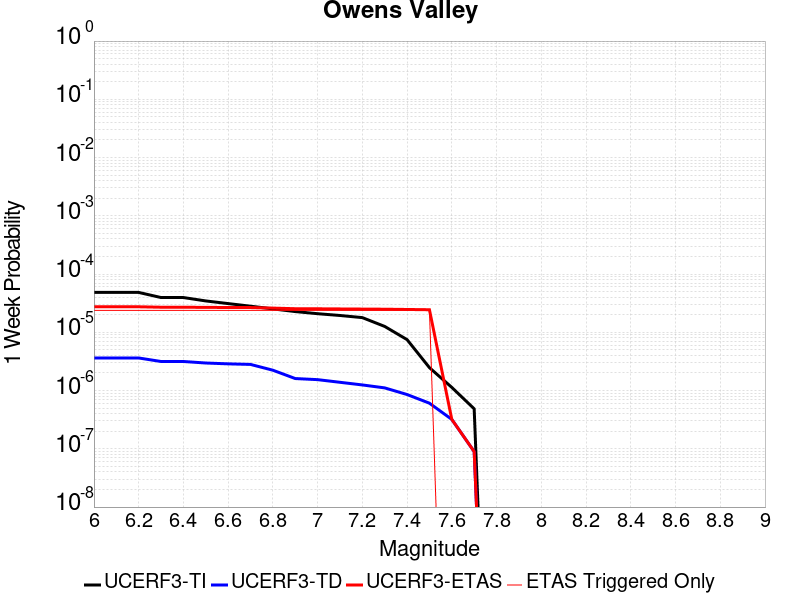 | 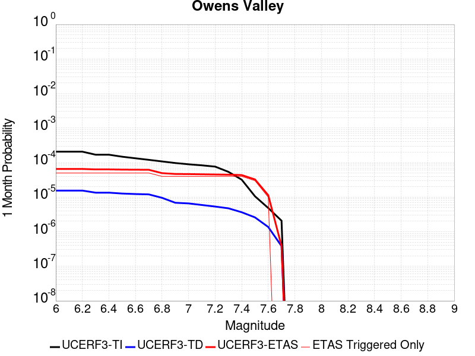 | 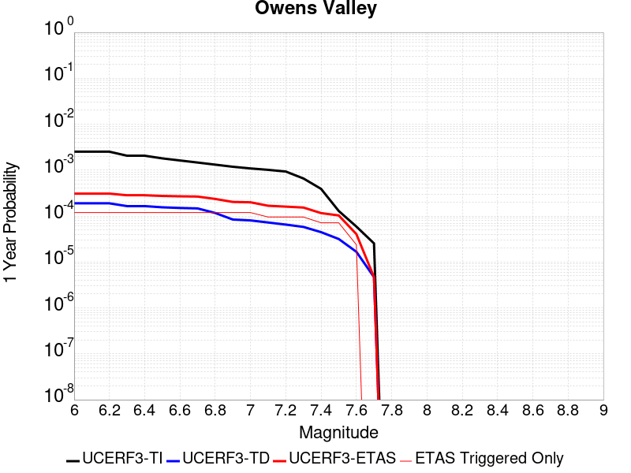 | 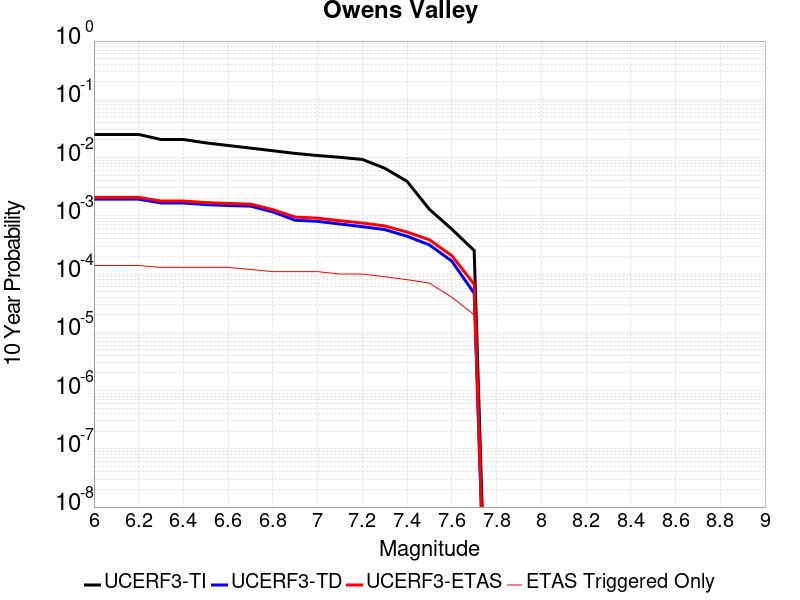 |

| Magnitude | 1 wk TI Prob | 1 wk TD Prob | 1 wk ETAS Prob | 1 wk ETAS/TD Gain | 1 wk ETAS Triggered Only | 1 mo TI Prob | 1 mo TD Prob | 1 mo ETAS Prob | 1 mo ETAS/TD Gain | 1 mo ETAS Triggered Only | 1 yr TI Prob | 1 yr TD Prob | 1 yr ETAS Prob | 1 yr ETAS/TD Gain | 1 yr ETAS Triggered Only | 10 yr TI Prob | 10 yr TD Prob | 10 yr ETAS Prob | 10 yr ETAS/TD Gain | 10 yr ETAS Triggered Only |
|-----|-----|-----|-----|-----|-----|-----|-----|-----|-----|-----|-----|-----|-----|-----|-----|-----|-----|-----|-----|-----|
| 6.0 | 4.83821E-5 | 3.626567E-6 | 1.3626531E-5 | 3.7574189 | 1.0E-5 | 2.0733538E-4 | 1.5542342E-5 | 6.5541564E-5 | 4.216968 | 5.0E-5 | 0.002521386 | 1.8921259E-4 | 2.8919367E-4 | 1.528406 | 1.0E-4 | 0.024929691 | 0.001925011 | 0.0020647414 | 1.0725869 | 1.4E-4 |
| 6.1 | 4.83821E-5 | 3.626567E-6 | 1.3626531E-5 | 3.7574189 | 1.0E-5 | 2.0733538E-4 | 1.5542342E-5 | 6.5541564E-5 | 4.216968 | 5.0E-5 | 0.002521386 | 1.8921259E-4 | 2.8919367E-4 | 1.528406 | 1.0E-4 | 0.024929691 | 0.001925011 | 0.0020647414 | 1.0725869 | 1.4E-4 |
| 6.2 | 4.83821E-5 | 3.626567E-6 | 1.3626531E-5 | 3.7574189 | 1.0E-5 | 2.0733538E-4 | 1.5542342E-5 | 6.5541564E-5 | 4.216968 | 5.0E-5 | 0.002521386 | 1.8921259E-4 | 2.8919367E-4 | 1.528406 | 1.0E-4 | 0.024929691 | 0.001925011 | 0.0020647414 | 1.0725869 | 1.4E-4 |
| 6.3 | 3.953008E-5 | 3.1553948E-6 | 1.3155363E-5 | 4.1691656 | 1.0E-5 | 1.6940363E-4 | 1.3523055E-5 | 6.352238E-5 | 4.6973395 | 5.0E-5 | 0.002060538 | 1.6463149E-4 | 2.5461667E-4 | 1.5465854 | 9.0E-5 | 0.020415364 | 0.0016592 | 0.0017889842 | 1.078221 | 1.3E-4 |
| 6.4 | 3.953008E-5 | 3.1553948E-6 | 1.3155363E-5 | 4.1691656 | 1.0E-5 | 1.6940363E-4 | 1.3523055E-5 | 6.352238E-5 | 4.6973395 | 5.0E-5 | 0.002060538 | 1.6463149E-4 | 2.5461667E-4 | 1.5465854 | 9.0E-5 | 0.020415364 | 0.0016592 | 0.0017889842 | 1.078221 | 1.3E-4 |
| 6.5 | 3.457342E-5 | 2.9715961E-6 | 1.2971566E-5 | 4.365185 | 1.0E-5 | 1.4816338E-4 | 1.2735354E-5 | 6.273472E-5 | 4.9260287 | 5.0E-5 | 0.0018023965 | 1.550426E-4 | 2.4502864E-4 | 1.5803956 | 9.0E-5 | 0.017878477 | 0.001555719 | 0.0016855167 | 1.0834327 | 1.3E-4 |
| 6.6 | 3.1127765E-5 | 2.8744932E-6 | 1.2874464E-5 | 4.478864 | 1.0E-5 | 1.3339789E-4 | 1.2319203E-5 | 6.2318584E-5 | 5.0586543 | 5.0E-5 | 0.0016229092 | 1.4997667E-4 | 2.3996316E-4 | 1.6000034 | 9.0E-5 | 0.016111081 | 0.0015012559 | 0.0016310607 | 1.0864642 | 1.3E-4 |
| 6.7 | 2.806885E-5 | 2.8104134E-6 | 1.2810386E-5 | 4.5581856 | 1.0E-5 | 1.2028952E-4 | 1.20445775E-5 | 6.2043975E-5 | 5.151196 | 5.0E-5 | 0.001463541 | 1.4663354E-4 | 2.3662034E-4 | 1.613685 | 9.0E-5 | 0.014539397 | 0.0014657511 | 0.0015855752 | 1.0817493 | 1.2E-4 |
| 6.8 | 2.524524E-5 | 2.2353688E-6 | 1.2235347E-5 | 5.473525 | 1.0E-5 | 1.0818939E-4 | 9.580118E-6 | 4.9579736E-5 | 5.175274 | 4.0E-5 | 0.0013164099 | 1.16632E-4 | 1.9662267E-4 | 1.6858381 | 8.0E-5 | 0.01308639 | 0.0011659812 | 0.0012758529 | 1.0942311 | 1.1E-4 |
| 6.9 | 2.2704568E-5 | 1.6081682E-6 | 1.1608152E-5 | 7.218245 | 1.0E-5 | 9.730166E-5 | 6.8921313E-6 | 4.6891855E-5 | 6.80368 | 4.0E-5 | 0.0011840039 | 8.390849E-5 | 1.6390177E-4 | 1.9533396 | 8.0E-5 | 0.011777153 | 8.3897985E-4 | 9.4888755E-4 | 1.1310016 | 1.1E-4 |
| 7.0 | 2.0871712E-5 | 1.5395453E-6 | 1.153953E-5 | 7.4954143 | 1.0E-5 | 8.944713E-5 | 6.598035E-6 | 4.6597772E-5 | 7.0623713 | 4.0E-5 | 0.0010884746 | 8.032813E-5 | 1.603217E-4 | 1.9958352 | 8.0E-5 | 0.010831586 | 8.0316263E-4 | 9.1307424E-4 | 1.1368486 | 1.1E-4 |
| 7.1 | 1.944928E-5 | 1.3864178E-6 | 1.13864035E-5 | 8.212823 | 1.0E-5 | 8.335139E-5 | 5.941777E-6 | 4.594154E-5 | 7.7319527 | 4.0E-5 | 0.0010143308 | 7.233874E-5 | 1.4233368E-4 | 1.9675995 | 7.0E-5 | 0.010097133 | 7.2330976E-4 | 8.232374E-4 | 1.1381533 | 1.0E-4 |
| 7.2 | 1.7876306E-5 | 1.2489141E-6 | 1.12489015E-5 | 9.006946 | 1.0E-5 | 7.6610486E-5 | 5.352478E-6 | 4.5352263E-5 | 8.473134 | 4.0E-5 | 9.3233347E-4 | 6.516448E-5 | 1.3515992E-4 | 2.0741348 | 7.0E-5 | 0.009284316 | 6.5159105E-4 | 7.5152586E-4 | 1.1533705 | 1.0E-4 |
| 7.3 | 1.2618672E-5 | 1.1115209E-6 | 1.111151E-5 | 9.996672 | 1.0E-5 | 5.40789E-5 | 4.763652E-6 | 4.4763463E-5 | 9.396878 | 4.0E-5 | 6.582117E-4 | 5.799593E-5 | 1.2799187E-4 | 2.2069113 | 7.0E-5 | 0.0065626553 | 5.7994033E-4 | 6.6988816E-4 | 1.1550983 | 9.0E-5 |
| 7.4 | 7.4874442E-6 | 8.5486437E-7 | 1.0854856E-5 | 12.697752 | 1.0E-5 | 3.208865E-5 | 3.6636993E-6 | 4.3663553E-5 | 11.917887 | 4.0E-5 | 3.906093E-4 | 4.4604632E-5 | 1.0460195E-4 | 2.3450918 | 6.0E-5 | 0.003899234 | 4.4604883E-4 | 5.2601314E-4 | 1.1792725 | 8.0E-5 |
| 7.5 | 2.4734156E-6 | 6.068616E-7 | 1.06068555E-5 | 17.478212 | 1.0E-5 | 1.060031E-5 | 2.6008327E-6 | 3.2600754E-5 | 12.534738 | 3.0E-5 | 1.2905113E-4 | 3.166468E-5 | 8.16631E-5 | 2.5789964 | 5.0E-5 | 0.0012897621 | 3.1660203E-4 | 3.8657986E-4 | 1.2210277 | 7.0E-5 |
| 7.6 | 1.1328841E-6 | 3.196531E-7 | 3.196531E-7 | 1.0 | 0.0 | 4.8552088E-6 | 1.3699412E-6 | 1.1369927E-5 | 8.299574 | 1.0E-5 | 5.9110564E-5 | 1.6678909E-5 | 3.6678575E-5 | 2.1990993 | 2.0E-5 | 5.9094845E-4 | 1.6677675E-4 | 2.0677008E-4 | 1.2398016 | 4.0E-5 |
| 7.7 | 4.8613185E-7 | 8.964689E-8 | 8.964689E-8 | 1.0 | 0.0 | 2.0834207E-6 | 3.8420092E-7 | 3.8420092E-7 | 1.0 | 0.0 | 2.536535E-5 | 4.6776368E-6 | 1.467759E-5 | 3.1378217 | 1.0E-5 | 2.5362454E-4 | 4.677545E-5 | 6.677451E-5 | 1.4275547 | 2.0E-5 |

## Pisgah-Bullion Mtn-Mesquite Lk
*[(top)](#table-of-contents)*

| 1 Week | 1 Month | 1 Year | 10 Year |
|-----|-----|-----|-----|
| 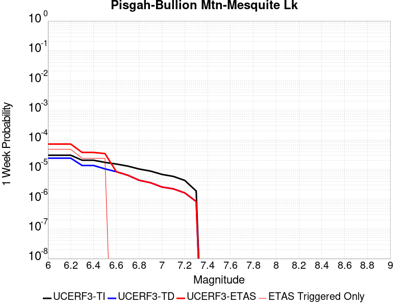 | 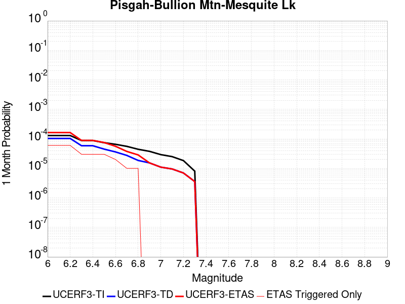 | 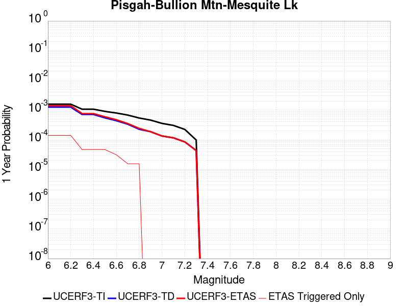 | 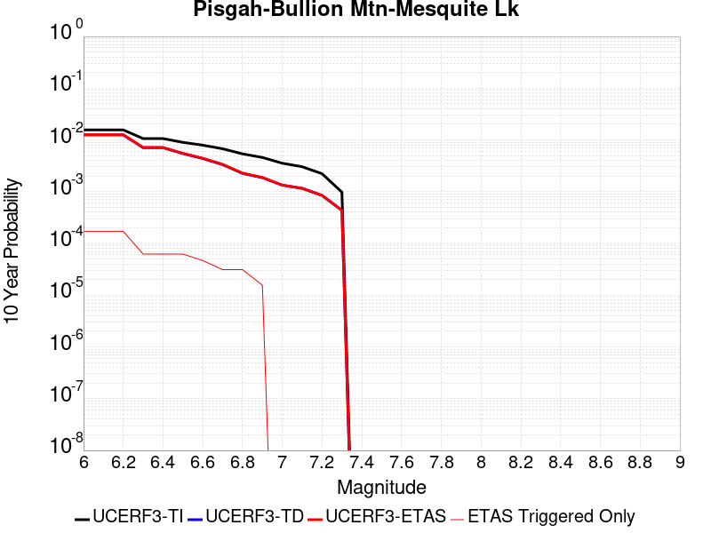 |

| Magnitude | 1 wk TI Prob | 1 wk TD Prob | 1 wk ETAS Prob | 1 wk ETAS/TD Gain | 1 wk ETAS Triggered Only | 1 mo TI Prob | 1 mo TD Prob | 1 mo ETAS Prob | 1 mo ETAS/TD Gain | 1 mo ETAS Triggered Only | 1 yr TI Prob | 1 yr TD Prob | 1 yr ETAS Prob | 1 yr ETAS/TD Gain | 1 yr ETAS Triggered Only | 10 yr TI Prob | 10 yr TD Prob | 10 yr ETAS Prob | 10 yr ETAS/TD Gain | 10 yr ETAS Triggered Only |
|-----|-----|-----|-----|-----|-----|-----|-----|-----|-----|-----|-----|-----|-----|-----|-----|-----|-----|-----|-----|-----|
| 6.0 | 3.0240792E-5 | 2.4091114E-5 | 5.4090393E-5 | 2.2452424 | 3.0E-5 | 1.2959696E-4 | 1.03244114E-4 | 1.6323791E-4 | 1.5810869 | 6.0E-5 | 0.0015767008 | 0.0012563728 | 0.0013662345 | 1.0874436 | 1.1E-4 | 0.015655609 | 0.012502721 | 0.012631096 | 1.0102677 | 1.3E-4 |
| 6.1 | 3.0240792E-5 | 2.4091114E-5 | 5.4090393E-5 | 2.2452424 | 3.0E-5 | 1.2959696E-4 | 1.03244114E-4 | 1.6323791E-4 | 1.5810869 | 6.0E-5 | 0.0015767008 | 0.0012563728 | 0.0013662345 | 1.0874436 | 1.1E-4 | 0.015655609 | 0.012502721 | 0.012631096 | 1.0102677 | 1.3E-4 |
| 6.2 | 3.0240792E-5 | 2.4091114E-5 | 5.4090393E-5 | 2.2452424 | 3.0E-5 | 1.2959696E-4 | 1.03244114E-4 | 1.6323791E-4 | 1.5810869 | 6.0E-5 | 0.0015767008 | 0.0012563728 | 0.0013662345 | 1.0874436 | 1.1E-4 | 0.015655609 | 0.012502721 | 0.012631096 | 1.0102677 | 1.3E-4 |
| 6.3 | 2.0498217E-5 | 1.36380695E-5 | 3.3637796E-5 | 2.4664633 | 2.0E-5 | 8.784654E-5 | 5.844765E-5 | 8.84459E-5 | 1.5132499 | 3.0E-5 | 0.0010690069 | 7.1138405E-4 | 7.513556E-4 | 1.0561885 | 4.0E-5 | 0.01063879 | 0.0070926943 | 0.00714234 | 1.0069995 | 5.0E-5 |
| 6.4 | 2.0498217E-5 | 1.36380695E-5 | 3.3637796E-5 | 2.4664633 | 2.0E-5 | 8.784654E-5 | 5.844765E-5 | 8.84459E-5 | 1.5132499 | 3.0E-5 | 0.0010690069 | 7.1138405E-4 | 7.513556E-4 | 1.0561885 | 4.0E-5 | 0.01063879 | 0.0070926943 | 0.00714234 | 1.0069995 | 5.0E-5 |
| 6.5 | 1.7316182E-5 | 1.0477042E-5 | 3.0476833E-5 | 2.9089155 | 2.0E-5 | 7.42101E-5 | 4.4900895E-5 | 7.489955E-5 | 1.6681081 | 3.0E-5 | 9.0313336E-4 | 5.465413E-4 | 5.865194E-4 | 1.0731475 | 4.0E-5 | 0.008994718 | 0.0054529672 | 0.0055026943 | 1.0091193 | 5.0E-5 |
| 6.6 | 1.5251077E-5 | 8.414273E-6 | 1.8414188E-5 | 2.1884468 | 1.0E-5 | 6.536012E-5 | 3.6060712E-5 | 5.605999E-5 | 1.5546002 | 2.0E-5 | 7.9546886E-4 | 4.3895794E-4 | 4.6894478E-4 | 1.0683137 | 3.0E-5 | 0.007926274 | 0.0043816264 | 0.004421451 | 1.009089 | 4.0E-5 |
| 6.7 | 1.2997425E-5 | 6.4114965E-6 | 6.4114965E-6 | 1.0 | 0.0 | 5.570206E-5 | 2.7477578E-5 | 3.7477304E-5 | 1.3639231 | 1.0E-5 | 6.7796157E-4 | 3.3449283E-4 | 3.4448947E-4 | 1.029886 | 1.0E-5 | 0.0067589693 | 0.0033403537 | 0.0033602868 | 1.0059674 | 2.0E-5 |
| 6.8 | 1.035386E-5 | 4.3332193E-6 | 4.3332193E-6 | 1.0 | 0.0 | 4.437293E-5 | 1.8570812E-5 | 2.8570626E-5 | 1.5384694 | 1.0E-5 | 5.401065E-4 | 2.2607706E-4 | 2.360748E-4 | 1.0442227 | 1.0E-5 | 0.0053879567 | 0.0022585576 | 0.0022785123 | 1.0088352 | 2.0E-5 |
| 6.9 | 8.816252E-6 | 3.580638E-6 | 3.580638E-6 | 1.0 | 0.0 | 3.778339E-5 | 1.5345504E-5 | 1.5345504E-5 | 1.0 | 0.0 | 4.5991567E-4 | 1.8681608E-4 | 1.8681608E-4 | 1.0 | 0.0 | 0.00458965 | 0.0018666488 | 0.0018766301 | 1.0053473 | 1.0E-5 |
| 7.0 | 6.8232207E-6 | 2.5675843E-6 | 2.5675843E-6 | 1.0 | 0.0 | 2.9242048E-5 | 1.1003888E-5 | 1.1003888E-5 | 1.0 | 0.0 | 3.5596377E-4 | 1.3396442E-4 | 1.3396442E-4 | 1.0 | 0.0 | 0.0035539411 | 0.0013388677 | 0.0013388677 | 1.0 | 0.0 |
| 7.1 | 5.837013E-6 | 2.22738E-6 | 2.22738E-6 | 1.0 | 0.0 | 2.501553E-5 | 9.545881E-6 | 9.545881E-6 | 1.0 | 0.0 | 3.045215E-4 | 1.16215204E-4 | 1.16215204E-4 | 1.0 | 0.0 | 0.0030410455 | 0.0011615733 | 0.0011615733 | 1.0 | 0.0 |
| 7.2 | 4.278052E-6 | 1.6275711E-6 | 1.6275711E-6 | 1.0 | 0.0 | 1.833438E-5 | 6.9752873E-6 | 6.9752873E-6 | 1.0 | 0.0 | 2.231982E-4 | 8.492105E-5 | 8.492105E-5 | 1.0 | 0.0 | 0.0022297418 | 8.489092E-4 | 8.489092E-4 | 1.0 | 0.0 |
| 7.3 | 1.8803692E-6 | 8.344926E-7 | 8.344926E-7 | 1.0 | 0.0 | 8.0587E-6 | 3.5763926E-6 | 3.5763926E-6 | 1.0 | 0.0 | 9.811026E-5 | 4.354186E-5 | 4.354186E-5 | 1.0 | 0.0 | 9.806695E-4 | 4.3534773E-4 | 4.3534773E-4 | 1.0 | 0.0 |

## Ortigalita (North)
*[(top)](#table-of-contents)*

| 1 Week | 1 Month | 1 Year | 10 Year |
|-----|-----|-----|-----|
| 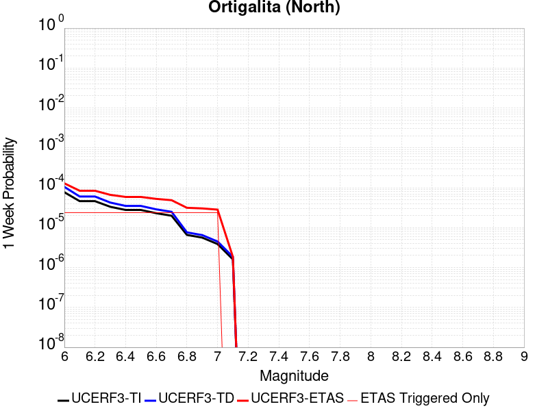 |  | 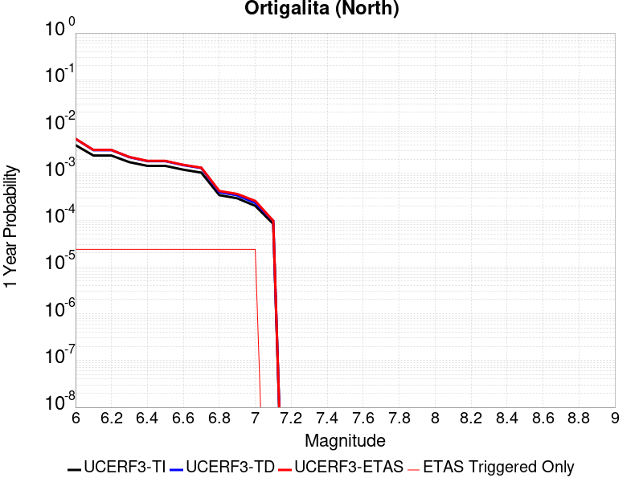 | 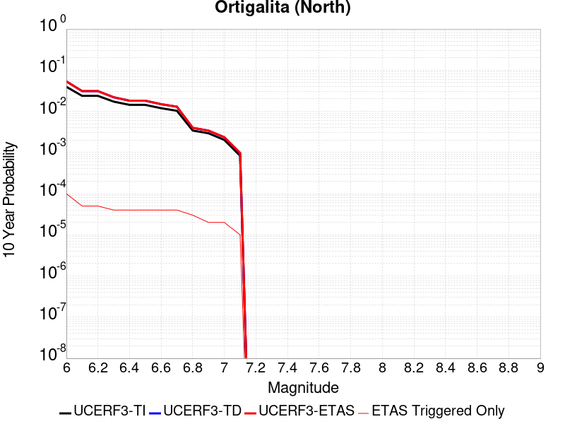 |

| Magnitude | 1 wk TI Prob | 1 wk TD Prob | 1 wk ETAS Prob | 1 wk ETAS/TD Gain | 1 wk ETAS Triggered Only | 1 mo TI Prob | 1 mo TD Prob | 1 mo ETAS Prob | 1 mo ETAS/TD Gain | 1 mo ETAS Triggered Only | 1 yr TI Prob | 1 yr TD Prob | 1 yr ETAS Prob | 1 yr ETAS/TD Gain | 1 yr ETAS Triggered Only | 10 yr TI Prob | 10 yr TD Prob | 10 yr ETAS Prob | 10 yr ETAS/TD Gain | 10 yr ETAS Triggered Only |
|-----|-----|-----|-----|-----|-----|-----|-----|-----|-----|-----|-----|-----|-----|-----|-----|-----|-----|-----|-----|-----|
| 6.0 | 7.711876E-5 | 1.05064966E-4 | 1.2506287E-4 | 1.1903384 | 2.0E-5 | 3.3046713E-4 | 4.502116E-4 | 4.801981E-4 | 1.0666053 | 3.0E-5 | 0.004016016 | 0.0054681194 | 0.0055277916 | 1.0109127 | 6.0E-5 | 0.039442103 | 0.053454787 | 0.053549442 | 1.0017707 | 1.0E-4 |
| 6.1 | 4.607858E-5 | 6.0239203E-5 | 7.02386E-5 | 1.1659949 | 1.0E-5 | 1.9746469E-4 | 2.5814527E-4 | 2.781401E-4 | 1.0774558 | 2.0E-5 | 0.0024014818 | 0.0031387596 | 0.003178634 | 1.0127039 | 4.0E-5 | 0.023756953 | 0.030975068 | 0.03102352 | 1.0015641 | 5.0E-5 |
| 6.2 | 4.607858E-5 | 6.0239203E-5 | 7.02386E-5 | 1.1659949 | 1.0E-5 | 1.9746469E-4 | 2.5814527E-4 | 2.781401E-4 | 1.0774558 | 2.0E-5 | 0.0024014818 | 0.0031387596 | 0.003178634 | 1.0127039 | 4.0E-5 | 0.023756953 | 0.030975068 | 0.03102352 | 1.0015641 | 5.0E-5 |
| 6.3 | 3.327423E-5 | 4.2475127E-5 | 5.2474705E-5 | 1.2354219 | 1.0E-5 | 1.4259605E-4 | 1.8202531E-4 | 1.920235E-4 | 1.0549275 | 1.0E-5 | 0.0017347244 | 0.002214197 | 0.0022441307 | 1.0135189 | 3.0E-5 | 0.017212452 | 0.021945644 | 0.021984767 | 1.0017827 | 4.0E-5 |
| 6.4 | 2.7732503E-5 | 3.4998593E-5 | 4.4998244E-5 | 1.2857158 | 1.0E-5 | 1.1884817E-4 | 1.4998685E-4 | 1.5998536E-4 | 1.0666625 | 1.0E-5 | 0.001446016 | 0.0018248095 | 0.0018547548 | 1.0164101 | 3.0E-5 | 0.014366428 | 0.018121224 | 0.018160498 | 1.0021673 | 4.0E-5 |
| 6.5 | 2.7689714E-5 | 3.4948407E-5 | 4.4948058E-5 | 1.286126 | 1.0E-5 | 1.186648E-4 | 1.497718E-4 | 1.597703E-4 | 1.0667583 | 1.0E-5 | 0.0014437864 | 0.0018221956 | 0.0018521409 | 1.0164336 | 3.0E-5 | 0.014344421 | 0.01809551 | 0.018134786 | 1.0021704 | 4.0E-5 |
| 6.6 | 2.2976905E-5 | 2.8718265E-5 | 3.871798E-5 | 1.3482004 | 1.0E-5 | 9.846873E-5 | 1.230739E-4 | 1.3307267E-4 | 1.081242 | 1.0E-5 | 0.0011981975 | 0.0014976363 | 0.0015275915 | 1.0200015 | 3.0E-5 | 0.011917574 | 0.014898697 | 0.014938101 | 1.0026448 | 4.0E-5 |
| 6.7 | 1.9871539E-5 | 2.4904411E-5 | 3.4904162E-5 | 1.4015253 | 1.0E-5 | 8.516096E-5 | 1.0673023E-4 | 1.1672916E-4 | 1.0936842 | 1.0E-5 | 0.0010363415 | 0.0012989145 | 0.0013288757 | 1.0230662 | 3.0E-5 | 0.010315218 | 0.012936919 | 0.0129764015 | 1.0030519 | 4.0E-5 |
| 6.8 | 6.5640475E-6 | 7.6054926E-6 | 1.7605416E-5 | 2.3148293 | 1.0E-5 | 2.813133E-5 | 3.2594577E-5 | 4.259425E-5 | 1.3067895 | 1.0E-5 | 3.424451E-4 | 3.9676955E-4 | 4.167616E-4 | 1.0503871 | 2.0E-5 | 0.0034191788 | 0.003960899 | 0.00399078 | 1.007544 | 3.0E-5 |
| 6.9 | 5.6219683E-6 | 6.5018376E-6 | 1.6501772E-5 | 2.5380168 | 1.0E-5 | 2.4093928E-5 | 2.7864735E-5 | 3.7864458E-5 | 1.3588666 | 1.0E-5 | 2.933041E-4 | 3.3920293E-4 | 3.5919613E-4 | 1.0589417 | 2.0E-5 | 0.0029291727 | 0.003387109 | 0.003407041 | 1.0058848 | 2.0E-5 |
| 7.0 | 3.875591E-6 | 4.4847548E-6 | 1.448471E-5 | 3.2297661 | 1.0E-5 | 1.6609569E-5 | 1.9220248E-5 | 2.9220057E-5 | 1.5202746 | 1.0E-5 | 2.0220275E-4 | 2.339835E-4 | 2.5397883E-4 | 1.0854561 | 2.0E-5 | 0.0020201886 | 0.0023375798 | 0.002357533 | 1.0085359 | 2.0E-5 |
| 7.1 | 1.6017933E-6 | 1.8570418E-6 | 1.8570418E-6 | 1.0 | 0.0 | 6.8648105E-6 | 7.958732E-6 | 7.958732E-6 | 1.0 | 0.0 | 8.357586E-5 | 9.689432E-5 | 1.0689335E-4 | 1.1031952 | 1.0E-5 | 8.3544437E-4 | 9.686254E-4 | 9.786157E-4 | 1.0103139 | 1.0E-5 |

## Santa Ynez River
*[(top)](#table-of-contents)*

| 1 Week | 1 Month | 1 Year | 10 Year |
|-----|-----|-----|-----|
| 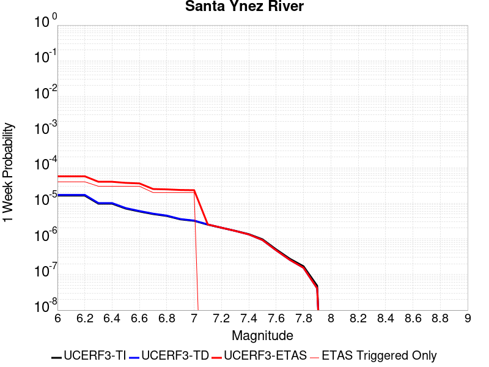 | 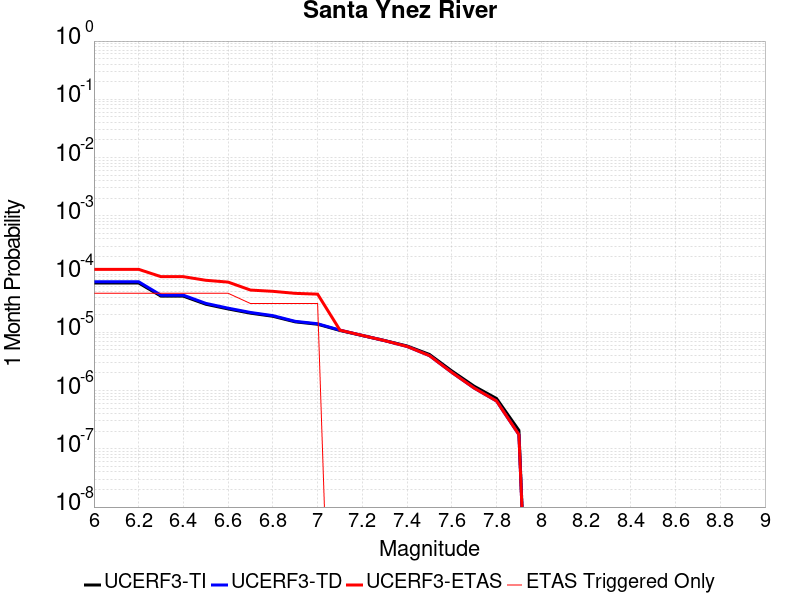 | 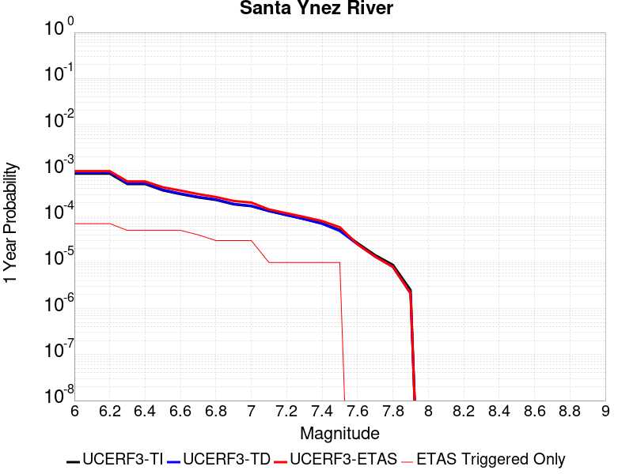 | 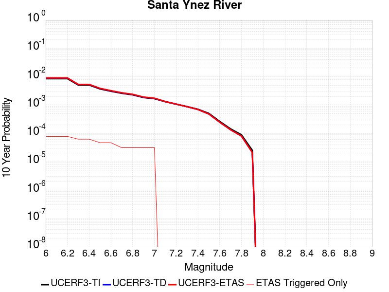 |

| Magnitude | 1 wk TI Prob | 1 wk TD Prob | 1 wk ETAS Prob | 1 wk ETAS/TD Gain | 1 wk ETAS Triggered Only | 1 mo TI Prob | 1 mo TD Prob | 1 mo ETAS Prob | 1 mo ETAS/TD Gain | 1 mo ETAS Triggered Only | 1 yr TI Prob | 1 yr TD Prob | 1 yr ETAS Prob | 1 yr ETAS/TD Gain | 1 yr ETAS Triggered Only | 10 yr TI Prob | 10 yr TD Prob | 10 yr ETAS Prob | 10 yr ETAS/TD Gain | 10 yr ETAS Triggered Only |
|-----|-----|-----|-----|-----|-----|-----|-----|-----|-----|-----|-----|-----|-----|-----|-----|-----|-----|-----|-----|-----|
| 6.0 | 1.6396456E-5 | 1.7209435E-5 | 5.720875E-5 | 3.3242664 | 4.0E-5 | 7.026863E-5 | 7.375284E-5 | 1.2374915E-4 | 1.67789 | 5.0E-5 | 8.551848E-4 | 8.976064E-4 | 9.6754363E-4 | 1.0779152 | 7.0E-5 | 0.0085190125 | 0.008943358 | 0.009032553 | 1.0099733 | 9.0E-5 |
| 6.1 | 1.6396456E-5 | 1.7209435E-5 | 5.720875E-5 | 3.3242664 | 4.0E-5 | 7.026863E-5 | 7.375284E-5 | 1.2374915E-4 | 1.67789 | 5.0E-5 | 8.551848E-4 | 8.976064E-4 | 9.6754363E-4 | 1.0779152 | 7.0E-5 | 0.0085190125 | 0.008943358 | 0.009032553 | 1.0099733 | 9.0E-5 |
| 6.2 | 1.6396456E-5 | 1.7209435E-5 | 5.720875E-5 | 3.3242664 | 4.0E-5 | 7.026863E-5 | 7.375284E-5 | 1.2374915E-4 | 1.67789 | 5.0E-5 | 8.551848E-4 | 8.976064E-4 | 9.6754363E-4 | 1.0779152 | 7.0E-5 | 0.0085190125 | 0.008943358 | 0.009032553 | 1.0099733 | 9.0E-5 |
| 6.3 | 9.736976E-6 | 1.012233E-5 | 4.0122028E-5 | 3.9637144 | 3.0E-5 | 4.172923E-5 | 4.338072E-5 | 8.337899E-5 | 1.9220285 | 4.0E-5 | 5.0793495E-4 | 5.280373E-4 | 5.7801086E-4 | 1.0946403 | 5.0E-5 | 0.005067755 | 0.005268332 | 0.0053479103 | 1.0151051 | 8.0E-5 |
| 6.4 | 9.736976E-6 | 1.012233E-5 | 4.0122028E-5 | 3.9637144 | 3.0E-5 | 4.172923E-5 | 4.338072E-5 | 8.337899E-5 | 1.9220285 | 4.0E-5 | 5.0793495E-4 | 5.280373E-4 | 5.7801086E-4 | 1.0946403 | 5.0E-5 | 0.005067755 | 0.005268332 | 0.0053479103 | 1.0151051 | 8.0E-5 |
| 6.5 | 7.081964E-6 | 7.3298966E-6 | 3.7329675E-5 | 5.0927973 | 3.0E-5 | 3.035092E-5 | 3.1413474E-5 | 7.1412214E-5 | 2.273299 | 4.0E-5 | 3.694598E-4 | 3.8239348E-4 | 4.3237436E-4 | 1.1307054 | 5.0E-5 | 0.0036884616 | 0.0038175168 | 0.0038772877 | 1.0156571 | 6.0E-5 |
| 6.6 | 5.873247E-6 | 6.059743E-6 | 3.6059562E-5 | 5.950675 | 3.0E-5 | 2.5170815E-5 | 2.5970074E-5 | 6.5969034E-5 | 2.5401943 | 4.0E-5 | 3.064116E-4 | 3.1614062E-4 | 3.6612482E-4 | 1.1581075 | 5.0E-5 | 0.0030598943 | 0.0031569963 | 0.003216807 | 1.0189455 | 6.0E-5 |
| 6.7 | 4.973277E-6 | 5.115901E-6 | 2.5115798E-5 | 4.90936 | 2.0E-5 | 2.1313872E-5 | 2.1925109E-5 | 5.192445E-5 | 2.3682642 | 3.0E-5 | 2.5946548E-4 | 2.66906E-4 | 3.068953E-4 | 1.1498255 | 4.0E-5 | 0.0025916274 | 0.0026659032 | 0.00271577 | 1.0187054 | 5.0E-5 |
| 6.8 | 4.396492E-6 | 4.5109778E-6 | 2.4510888E-5 | 5.4336085 | 2.0E-5 | 1.884197E-5 | 1.9332621E-5 | 4.933204E-5 | 2.5517514 | 3.0E-5 | 2.2937685E-4 | 2.3534958E-4 | 2.653425E-4 | 1.12744 | 3.0E-5 | 0.0022914023 | 0.0023510386 | 0.0023909446 | 1.0169737 | 4.0E-5 |
| 6.9 | 3.5255632E-6 | 3.6013332E-6 | 2.3601262E-5 | 6.5534787 | 2.0E-5 | 1.5109469E-5 | 1.5434196E-5 | 4.543373E-5 | 2.943706 | 3.0E-5 | 1.8394225E-4 | 1.8789528E-4 | 2.1788964E-4 | 1.1596334 | 3.0E-5 | 0.0018379007 | 0.0018773803 | 0.0019173053 | 1.0212663 | 4.0E-5 |
| 7.0 | 3.211603E-6 | 3.273654E-6 | 2.327359E-5 | 7.109361 | 2.0E-5 | 1.376394E-5 | 1.4029872E-5 | 4.402945E-5 | 3.1382647 | 3.0E-5 | 1.6756308E-4 | 1.7080043E-4 | 2.0079532E-4 | 1.1756135 | 3.0E-5 | 0.0016743679 | 0.0017067058 | 0.0017466375 | 1.023397 | 4.0E-5 |
| 7.1 | 2.5094619E-6 | 2.5409204E-6 | 2.5409204E-6 | 1.0 | 0.0 | 1.0754793E-5 | 1.0889614E-5 | 2.0889505E-5 | 1.9182962 | 1.0E-5 | 1.3093173E-4 | 1.3257304E-4 | 1.4257172E-4 | 1.0754201 | 1.0E-5 | 0.0013085462 | 0.0013249456 | 0.0013449191 | 1.015075 | 2.0E-5 |
| 7.2 | 2.0515774E-6 | 2.0619375E-6 | 2.0619375E-6 | 1.0 | 0.0 | 8.792445E-6 | 8.836846E-6 | 1.8836758E-5 | 2.1316154 | 1.0E-5 | 1.0704277E-4 | 1.0758333E-4 | 1.1758225E-4 | 1.0929412 | 1.0E-5 | 0.0010699122 | 0.0010753168 | 0.0010952953 | 1.0185791 | 2.0E-5 |
| 7.3 | 1.6845745E-6 | 1.6773907E-6 | 1.6773907E-6 | 1.0 | 0.0 | 7.219585E-6 | 7.1887976E-6 | 1.7188726E-5 | 2.3910432 | 1.0E-5 | 8.78949E-5 | 8.752012E-5 | 9.751925E-5 | 1.1142495 | 1.0E-5 | 8.7860145E-4 | 8.7485946E-4 | 8.848507E-4 | 1.0114204 | 1.0E-5 |
| 7.4 | 1.3600285E-6 | 1.3333357E-6 | 1.3333357E-6 | 1.0 | 0.0 | 5.82868E-6 | 5.714284E-6 | 1.5714226E-5 | 2.7499907 | 1.0E-5 | 7.096187E-5 | 6.956921E-5 | 7.956851E-5 | 1.1437317 | 1.0E-5 | 7.0939213E-4 | 6.954765E-4 | 7.054695E-4 | 1.0143687 | 1.0E-5 |
| 7.5 | 9.735342E-7 | 9.290103E-7 | 9.290103E-7 | 1.0 | 0.0 | 4.172283E-6 | 3.9814668E-6 | 1.39814265E-5 | 3.5116272 | 1.0E-5 | 5.079636E-5 | 4.8473295E-5 | 5.847281E-5 | 1.2062892 | 1.0E-5 | 5.0784746E-4 | 4.8462892E-4 | 4.946241E-4 | 1.0206244 | 1.0E-5 |
| 7.6 | 5.067187E-7 | 4.77857E-7 | 4.77857E-7 | 1.0 | 0.0 | 2.1716498E-6 | 2.047957E-6 | 2.047957E-6 | 1.0 | 0.0 | 2.6439517E-5 | 2.4933597E-5 | 2.4933597E-5 | 1.0 | 0.0 | 2.643637E-4 | 2.4930874E-4 | 2.4930874E-4 | 1.0 | 0.0 |
| 7.7 | 2.769089E-7 | 2.5759124E-7 | 2.5759124E-7 | 1.0 | 0.0 | 1.1867519E-6 | 1.1039621E-6 | 1.1039621E-6 | 1.0 | 0.0 | 1.4448608E-5 | 1.34406555E-5 | 1.34406555E-5 | 1.0 | 0.0 | 1.444767E-4 | 1.3439846E-4 | 1.3439846E-4 | 1.0 | 0.0 |
| 7.8 | 1.7044663E-7 | 1.5449015E-7 | 1.5449015E-7 | 1.0 | 0.0 | 7.3048534E-7 | 6.621005E-7 | 6.621005E-7 | 1.0 | 0.0 | 8.893623E-6 | 8.061043E-6 | 8.061043E-6 | 1.0 | 0.0 | 8.893267E-5 | 8.060753E-5 | 8.060753E-5 | 1.0 | 0.0 |
| 7.9 | 4.8344287E-8 | 4.0910923E-8 | 4.0910923E-8 | 1.0 | 0.0 | 2.0718979E-7 | 1.7533252E-7 | 1.7533252E-7 | 1.0 | 0.0 | 2.5225327E-6 | 2.1346711E-6 | 2.1346711E-6 | 1.0 | 0.0 | 2.5225041E-5 | 2.1346512E-5 | 2.1346512E-5 | 1.0 | 0.0 |

## Hosgri
*[(top)](#table-of-contents)*

| 1 Week | 1 Month | 1 Year | 10 Year |
|-----|-----|-----|-----|
|  | 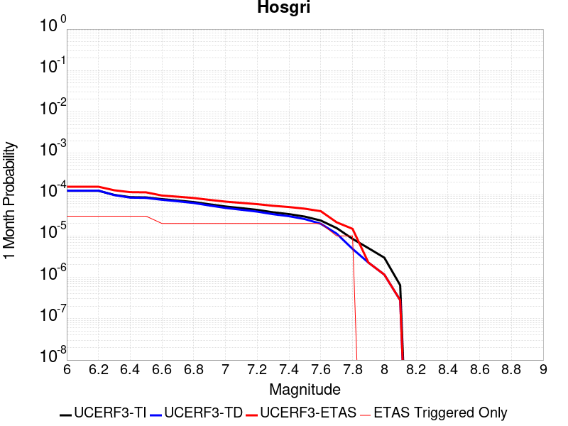 | 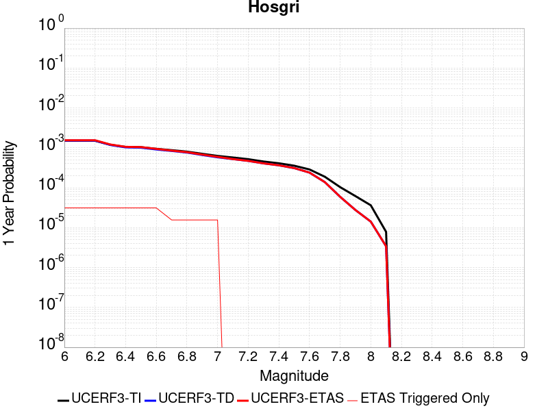 | 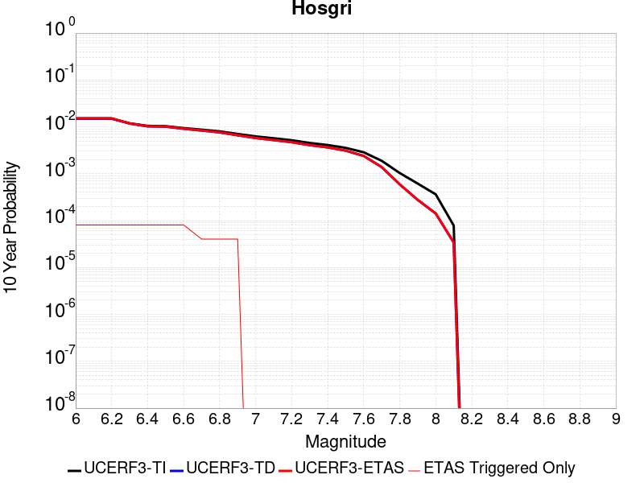 |

| Magnitude | 1 wk TI Prob | 1 wk TD Prob | 1 wk ETAS Prob | 1 wk ETAS/TD Gain | 1 wk ETAS Triggered Only | 1 mo TI Prob | 1 mo TD Prob | 1 mo ETAS Prob | 1 mo ETAS/TD Gain | 1 mo ETAS Triggered Only | 1 yr TI Prob | 1 yr TD Prob | 1 yr ETAS Prob | 1 yr ETAS/TD Gain | 1 yr ETAS Triggered Only | 10 yr TI Prob | 10 yr TD Prob | 10 yr ETAS Prob | 10 yr ETAS/TD Gain | 10 yr ETAS Triggered Only |
|-----|-----|-----|-----|-----|-----|-----|-----|-----|-----|-----|-----|-----|-----|-----|-----|-----|-----|-----|-----|-----|
| 6.0 | 2.883978E-5 | 2.9128416E-5 | 5.9127542E-5 | 2.0298922 | 3.0E-5 | 1.235932E-4 | 1.2483024E-4 | 1.548265E-4 | 1.2402964 | 3.0E-5 | 0.0015037085 | 0.001518776 | 0.0015786848 | 1.0394455 | 6.0E-5 | 0.01493574 | 0.01508774 | 0.015166532 | 1.0052223 | 8.0E-5 |
| 6.1 | 2.883978E-5 | 2.9128416E-5 | 5.9127542E-5 | 2.0298922 | 3.0E-5 | 1.235932E-4 | 1.2483024E-4 | 1.548265E-4 | 1.2402964 | 3.0E-5 | 0.0015037085 | 0.001518776 | 0.0015786848 | 1.0394455 | 6.0E-5 | 0.01493574 | 0.01508774 | 0.015166532 | 1.0052223 | 8.0E-5 |
| 6.2 | 2.883978E-5 | 2.9128416E-5 | 5.9127542E-5 | 2.0298922 | 3.0E-5 | 1.235932E-4 | 1.2483024E-4 | 1.548265E-4 | 1.2402964 | 3.0E-5 | 0.0015037085 | 0.001518776 | 0.0015786848 | 1.0394455 | 6.0E-5 | 0.01493574 | 0.01508774 | 0.015166532 | 1.0052223 | 8.0E-5 |
| 6.3 | 2.2914428E-5 | 2.2641969E-5 | 5.264129E-5 | 2.324943 | 3.0E-5 | 9.8200995E-5 | 9.703343E-5 | 1.2703052E-4 | 1.3091418 | 3.0E-5 | 0.0011949413 | 0.0011807467 | 0.0012406758 | 1.0507553 | 6.0E-5 | 0.011885363 | 0.011746133 | 0.011825194 | 1.0067308 | 8.0E-5 |
| 6.4 | 2.0195741E-5 | 1.969656E-5 | 4.969597E-5 | 2.5230787 | 3.0E-5 | 8.65503E-5 | 8.4411105E-5 | 1.14408576E-4 | 1.3553735 | 3.0E-5 | 0.0010532405 | 0.0010272227 | 0.0010771713 | 1.048625 | 5.0E-5 | 0.010482626 | 0.010225792 | 0.010295077 | 1.0067754 | 7.0E-5 |
| 6.5 | 1.9924333E-5 | 1.940898E-5 | 4.9408398E-5 | 2.5456462 | 3.0E-5 | 8.53872E-5 | 8.3178704E-5 | 1.1317621E-4 | 1.3606392 | 3.0E-5 | 0.0010390934 | 0.0010122322 | 0.0010621815 | 1.0493457 | 5.0E-5 | 0.010342481 | 0.010077253 | 0.010146548 | 1.0068763 | 7.0E-5 |
| 6.6 | 1.809694E-5 | 1.74583E-5 | 3.745795E-5 | 2.145567 | 2.0E-5 | 7.7556004E-5 | 7.4819145E-5 | 9.481765E-5 | 1.2672913 | 2.0E-5 | 9.438353E-4 | 9.105437E-4 | 9.5050735E-4 | 1.0438898 | 4.0E-5 | 0.009398366 | 0.009069073 | 0.009128529 | 1.0065559 | 6.0E-5 |
| 6.7 | 1.675989E-5 | 1.6042764E-5 | 3.6042446E-5 | 2.2466478 | 2.0E-5 | 7.182612E-5 | 6.87529E-5 | 8.875153E-5 | 1.2908769 | 2.0E-5 | 8.7413215E-4 | 8.3674624E-4 | 8.6672115E-4 | 1.0358231 | 3.0E-5 | 0.008707017 | 0.0083368635 | 0.008386446 | 1.0059475 | 5.0E-5 |
| 6.8 | 1.5401129E-5 | 1.4614083E-5 | 3.461379E-5 | 2.368523 | 2.0E-5 | 6.6003166E-5 | 6.2630286E-5 | 8.262903E-5 | 1.3193144 | 2.0E-5 | 8.032922E-4 | 7.622578E-4 | 7.922349E-4 | 1.0393268 | 3.0E-5 | 0.008003947 | 0.007597296 | 0.0076469164 | 1.0065312 | 5.0E-5 |
| 6.9 | 1.356559E-5 | 1.2689968E-5 | 3.2689713E-5 | 2.576028 | 2.0E-5 | 5.8136946E-5 | 5.4384444E-5 | 7.438336E-5 | 1.3677322 | 2.0E-5 | 7.0758746E-4 | 6.619299E-4 | 6.9191004E-4 | 1.045292 | 3.0E-5 | 0.007053386 | 0.006600388 | 0.0066500576 | 1.0075253 | 5.0E-5 |
| 7.0 | 1.2030819E-5 | 1.1095962E-5 | 3.109574E-5 | 2.8024375 | 2.0E-5 | 5.155963E-5 | 4.7553254E-5 | 6.7552304E-5 | 1.4205611 | 2.0E-5 | 6.275577E-4 | 5.7880714E-4 | 6.087898E-4 | 1.0518007 | 3.0E-5 | 0.006257884 | 0.005773757 | 0.0058035837 | 1.0051659 | 3.0E-5 |
| 7.1 | 1.0972698E-5 | 1.0022179E-5 | 3.0021978E-5 | 2.995554 | 2.0E-5 | 4.7025E-5 | 4.2951488E-5 | 6.295063E-5 | 1.4656216 | 2.0E-5 | 5.72379E-4 | 5.22809E-4 | 5.427985E-4 | 1.038235 | 2.0E-5 | 0.0057090693 | 0.005216542 | 0.005236438 | 1.003814 | 2.0E-5 |
| 7.2 | 9.961926E-6 | 9.034746E-6 | 2.9034565E-5 | 3.213656 | 2.0E-5 | 4.2693267E-5 | 3.8719765E-5 | 5.871899E-5 | 1.516512 | 2.0E-5 | 5.1966653E-4 | 4.713112E-4 | 4.9130176E-4 | 1.0424148 | 2.0E-5 | 0.00518453 | 0.0047038626 | 0.0047237687 | 1.0042318 | 2.0E-5 |
| 7.3 | 8.700929E-6 | 7.8281E-6 | 2.7827944E-5 | 3.5548782 | 2.0E-5 | 3.7289166E-5 | 3.354857E-5 | 5.3547898E-5 | 1.5961306 | 2.0E-5 | 4.53901E-4 | 4.0837732E-4 | 4.2836915E-4 | 1.0489544 | 2.0E-5 | 0.00452975 | 0.004077008 | 0.0040969267 | 1.0048856 | 2.0E-5 |
| 7.4 | 7.866285E-6 | 6.998739E-6 | 2.69986E-5 | 3.8576376 | 2.0E-5 | 3.3712215E-5 | 2.9994251E-5 | 4.999365E-5 | 1.6667745 | 2.0E-5 | 4.103689E-4 | 3.6511885E-4 | 3.8511155E-4 | 1.0547566 | 2.0E-5 | 0.004096119 | 0.0036459267 | 0.0036658538 | 1.0054656 | 2.0E-5 |
| 7.5 | 6.8381305E-6 | 5.9596955E-6 | 2.5959576E-5 | 4.3558564 | 2.0E-5 | 2.9305946E-5 | 2.5541302E-5 | 4.554079E-5 | 1.7830255 | 2.0E-5 | 3.5674145E-4 | 3.10921E-4 | 3.3091477E-4 | 1.0643051 | 2.0E-5 | 0.0035616932 | 0.0031055948 | 0.0031255325 | 1.00642 | 2.0E-5 |
| 7.6 | 5.503376E-6 | 4.5952443E-6 | 2.4595152E-5 | 5.352306 | 2.0E-5 | 2.3585684E-5 | 1.9693754E-5 | 3.969336E-5 | 2.0155303 | 2.0E-5 | 2.8711787E-4 | 2.397451E-4 | 2.597403E-4 | 1.0834019 | 2.0E-5 | 0.002867472 | 0.0023955975 | 0.0024155495 | 1.0083287 | 2.0E-5 |
| 7.7 | 3.6144982E-6 | 2.6522112E-6 | 1.26521845E-5 | 4.770429 | 1.0E-5 | 1.5490614E-5 | 1.1366569E-5 | 2.1366455E-5 | 1.8797629 | 1.0E-5 | 1.8858191E-4 | 1.383792E-4 | 1.4837782E-4 | 1.0722553 | 1.0E-5 | 0.0018842196 | 0.0013836613 | 0.0013936475 | 1.0072172 | 1.0E-5 |
| 7.8 | 1.9853494E-6 | 1.1361129E-6 | 1.1136101E-5 | 9.801931 | 1.0E-5 | 8.508612E-6 | 4.8690463E-6 | 1.4868998E-5 | 3.0537803 | 1.0E-5 | 1.0358743E-4 | 5.9279027E-5 | 6.927844E-5 | 1.1686838 | 1.0E-5 | 0.0010353916 | 5.9336185E-4 | 6.033559E-4 | 1.0168431 | 1.0E-5 |
| 7.9 | 1.1818757E-6 | 5.2951856E-7 | 5.2951856E-7 | 1.0 | 0.0 | 5.0651715E-6 | 2.2693632E-6 | 2.2693632E-6 | 1.0 | 0.0 | 6.1666724E-5 | 2.7629147E-5 | 2.7629147E-5 | 1.0 | 0.0 | 6.1649614E-4 | 2.7694515E-4 | 2.7694515E-4 | 1.0 | 0.0 |
| 8.0 | 6.962958E-7 | 2.7139782E-7 | 2.7139782E-7 | 1.0 | 0.0 | 2.9841215E-6 | 1.163133E-6 | 1.163133E-6 | 1.0 | 0.0 | 3.6331072E-5 | 1.4161053E-5 | 1.4161053E-5 | 1.0 | 0.0 | 3.6325134E-4 | 1.4217179E-4 | 1.4217179E-4 | 1.0 | 0.0 |
| 8.1 | 1.5033264E-7 | 6.527624E-8 | 6.527624E-8 | 1.0 | 0.0 | 6.442826E-7 | 2.7975528E-7 | 2.7975528E-7 | 1.0 | 0.0 | 7.844113E-6 | 3.4060151E-6 | 3.4060151E-6 | 1.0 | 0.0 | 7.843835E-5 | 3.407693E-5 | 3.407693E-5 | 1.0 | 0.0 |

## San Diego Trough north alt1
*[(top)](#table-of-contents)*

| 1 Week | 1 Month | 1 Year | 10 Year |
|-----|-----|-----|-----|
| 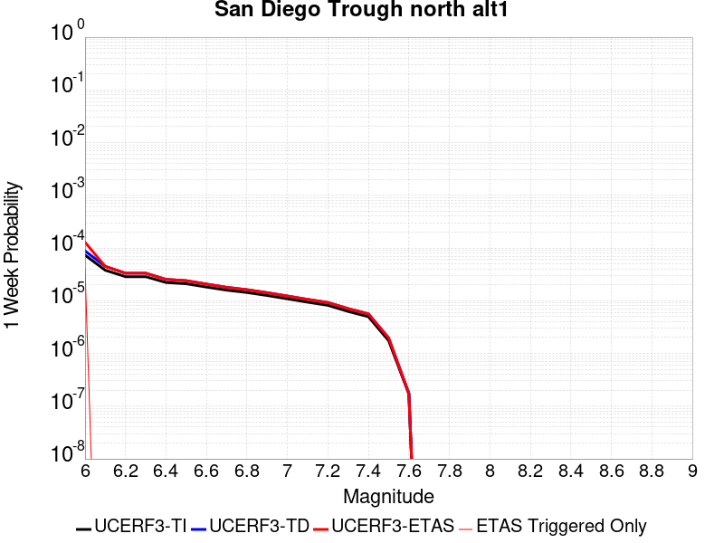 |  | 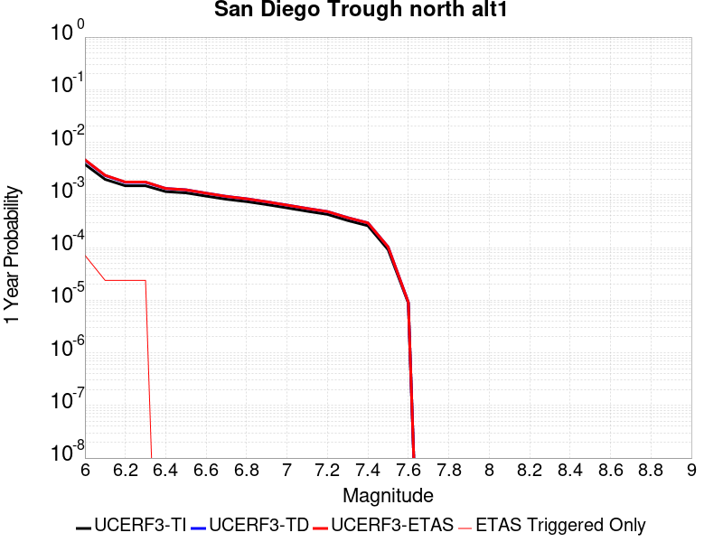 | 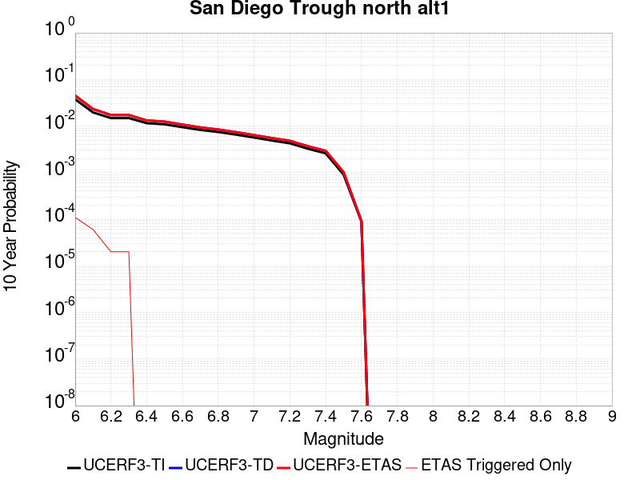 |

| Magnitude | 1 wk TI Prob | 1 wk TD Prob | 1 wk ETAS Prob | 1 wk ETAS/TD Gain | 1 wk ETAS Triggered Only | 1 mo TI Prob | 1 mo TD Prob | 1 mo ETAS Prob | 1 mo ETAS/TD Gain | 1 mo ETAS Triggered Only | 1 yr TI Prob | 1 yr TD Prob | 1 yr ETAS Prob | 1 yr ETAS/TD Gain | 1 yr ETAS Triggered Only | 10 yr TI Prob | 10 yr TD Prob | 10 yr ETAS Prob | 10 yr ETAS/TD Gain | 10 yr ETAS Triggered Only |
|-----|-----|-----|-----|-----|-----|-----|-----|-----|-----|-----|-----|-----|-----|-----|-----|-----|-----|-----|-----|-----|
| 6.0 | 7.329252E-5 | 8.821093E-5 | 9.821005E-5 | 1.1133547 | 1.0E-5 | 3.14073E-4 | 3.7799572E-4 | 4.279768E-4 | 1.1322266 | 5.0E-5 | 0.0038171355 | 0.004593027 | 0.0046627056 | 1.0151705 | 7.0E-5 | 0.03752231 | 0.045044992 | 0.045150034 | 1.002332 | 1.1E-4 |
| 6.1 | 3.7940346E-5 | 4.4885E-5 | 4.4885E-5 | 1.0 | 0.0 | 1.6259136E-4 | 1.9235066E-4 | 2.1234681E-4 | 1.1039568 | 2.0E-5 | 0.0019777524 | 0.0023394432 | 0.0023793497 | 1.0170581 | 4.0E-5 | 0.019602431 | 0.023156688 | 0.023215298 | 1.002531 | 6.0E-5 |
| 6.2 | 2.8645263E-5 | 3.329678E-5 | 3.329678E-5 | 1.0 | 0.0 | 1.2275964E-4 | 1.4269284E-4 | 1.4269284E-4 | 1.0 | 0.0 | 0.0014935739 | 0.0017359189 | 0.0017459015 | 1.0057507 | 1.0E-5 | 0.0148357535 | 0.017226247 | 0.017245904 | 1.0011411 | 2.0E-5 |
| 6.3 | 2.8645263E-5 | 3.329678E-5 | 3.329678E-5 | 1.0 | 0.0 | 1.2275964E-4 | 1.4269284E-4 | 1.4269284E-4 | 1.0 | 0.0 | 0.0014935739 | 0.0017359189 | 0.0017459015 | 1.0057507 | 1.0E-5 | 0.0148357535 | 0.017226247 | 0.017245904 | 1.0011411 | 2.0E-5 |
| 6.4 | 2.2204576E-5 | 2.5448318E-5 | 2.5448318E-5 | 1.0 | 0.0 | 9.5159E-5 | 1.0905972E-4 | 1.0905972E-4 | 1.0 | 0.0 | 0.001157945 | 0.0013270034 | 0.0013270034 | 1.0 | 0.0 | 0.011519298 | 0.013191955 | 0.013191955 | 1.0 | 0.0 |
| 6.5 | 2.1004838E-5 | 2.4024694E-5 | 2.4024694E-5 | 1.0 | 0.0 | 9.0017624E-5 | 1.0295896E-4 | 1.0295896E-4 | 1.0 | 0.0 | 0.0010954136 | 0.0012528138 | 0.0012528138 | 1.0 | 0.0 | 0.010900296 | 0.012458589 | 0.012458589 | 1.0 | 0.0 |
| 6.6 | 1.820557E-5 | 2.0704787E-5 | 2.0704787E-5 | 1.0 | 0.0 | 7.802154E-5 | 8.873181E-5 | 8.873181E-5 | 1.0 | 0.0 | 9.4949827E-4 | 0.0010797799 | 0.0010797799 | 1.0 | 0.0 | 0.009454516 | 0.010746004 | 0.010746004 | 1.0 | 0.0 |
| 6.7 | 1.5884485E-5 | 1.7983646E-5 | 1.7983646E-5 | 1.0 | 0.0 | 6.807459E-5 | 7.707051E-5 | 7.707051E-5 | 1.0 | 0.0 | 8.284929E-4 | 9.3793223E-4 | 9.3793223E-4 | 1.0 | 0.0 | 0.008254109 | 0.009340104 | 0.009340104 | 1.0 | 0.0 |
| 6.8 | 1.4331171E-5 | 1.6201066E-5 | 1.6201066E-5 | 1.0 | 0.0 | 6.141786E-5 | 6.94313E-5 | 6.94313E-5 | 1.0 | 0.0 | 7.4750587E-4 | 8.450002E-4 | 8.450002E-4 | 1.0 | 0.0 | 0.0074499645 | 0.008418139 | 0.008418139 | 1.0 | 0.0 |
| 6.9 | 1.2574203E-5 | 1.4205835E-5 | 1.4205835E-5 | 1.0 | 0.0 | 5.3888325E-5 | 6.0880735E-5 | 6.0880735E-5 | 1.0 | 0.0 | 6.558929E-4 | 7.409723E-4 | 7.409723E-4 | 1.0 | 0.0 | 0.0065396037 | 0.007385203 | 0.007385203 | 1.0 | 0.0 |
| 7.0 | 1.0883844E-5 | 1.2289262E-5 | 1.2289262E-5 | 1.0 | 0.0 | 4.664421E-5 | 5.2667205E-5 | 5.2667205E-5 | 1.0 | 0.0 | 5.677453E-4 | 6.4103556E-4 | 6.4103556E-4 | 1.0 | 0.0 | 0.00566297 | 0.006391993 | 0.006391993 | 1.0 | 0.0 |
| 7.1 | 9.393088E-6 | 1.060702E-5 | 1.060702E-5 | 1.0 | 0.0 | 4.025547E-5 | 4.545787E-5 | 4.545787E-5 | 1.0 | 0.0 | 4.900001E-4 | 5.533098E-4 | 5.533098E-4 | 1.0 | 0.0 | 0.0048892107 | 0.005519418 | 0.005519418 | 1.0 | 0.0 |
| 7.2 | 8.190791E-6 | 9.258625E-6 | 9.258625E-6 | 1.0 | 0.0 | 3.510292E-5 | 3.9679224E-5 | 3.9679224E-5 | 1.0 | 0.0 | 4.2729423E-4 | 4.8298817E-4 | 4.8298817E-4 | 1.0 | 0.0 | 0.0042647356 | 0.004819465 | 0.004819465 | 1.0 | 0.0 |
| 7.3 | 6.268162E-6 | 7.089716E-6 | 7.089716E-6 | 1.0 | 0.0 | 2.6863276E-5 | 3.0384144E-5 | 3.0384144E-5 | 1.0 | 0.0 | 3.2701128E-4 | 3.6986457E-4 | 3.6986457E-4 | 1.0 | 0.0 | 0.003265305 | 0.003692536 | 0.003692536 | 1.0 | 0.0 |
| 7.4 | 4.985186E-6 | 5.6426816E-6 | 5.6426816E-6 | 1.0 | 0.0 | 2.1364907E-5 | 2.4182698E-5 | 2.4182698E-5 | 1.0 | 0.0 | 2.600867E-4 | 2.9438498E-4 | 2.9438498E-4 | 1.0 | 0.0 | 0.002597825 | 0.0029399914 | 0.0029399914 | 1.0 | 0.0 |
| 7.5 | 1.7489613E-6 | 1.969678E-6 | 1.969678E-6 | 1.0 | 0.0 | 7.495527E-6 | 8.4414505E-6 | 8.4414505E-6 | 1.0 | 0.0 | 9.125422E-5 | 1.02770035E-4 | 1.02770035E-4 | 1.0 | 0.0 | 9.1216754E-4 | 0.0010272472 | 0.0010272472 | 1.0 | 0.0 |
| 7.6 | 1.6988751E-7 | 1.7533823E-7 | 1.7533823E-7 | 1.0 | 0.0 | 7.2808916E-7 | 7.5144936E-7 | 7.5144936E-7 | 1.0 | 0.0 | 8.864449E-6 | 9.14886E-6 | 9.14886E-6 | 1.0 | 0.0 | 8.8640954E-5 | 9.1485024E-5 | 9.1485024E-5 | 1.0 | 0.0 |

## Sierra Madre
*[(top)](#table-of-contents)*

| 1 Week | 1 Month | 1 Year | 10 Year |
|-----|-----|-----|-----|
| 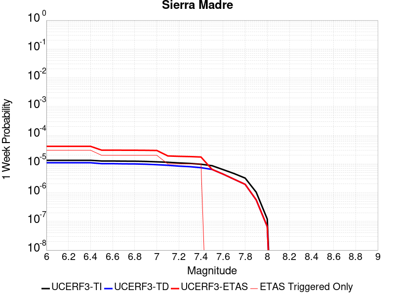 | 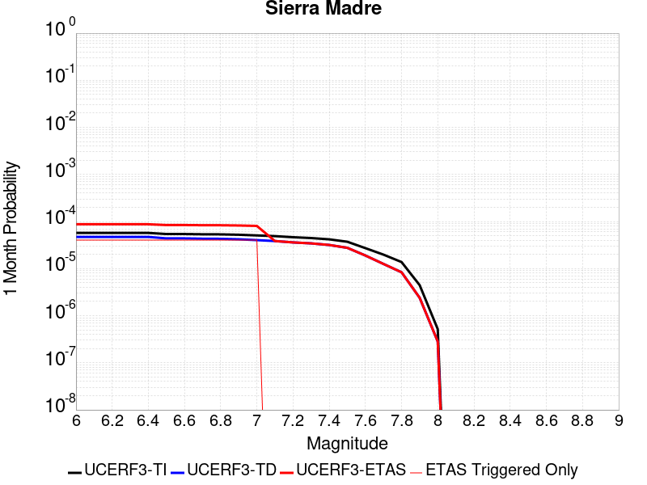 | 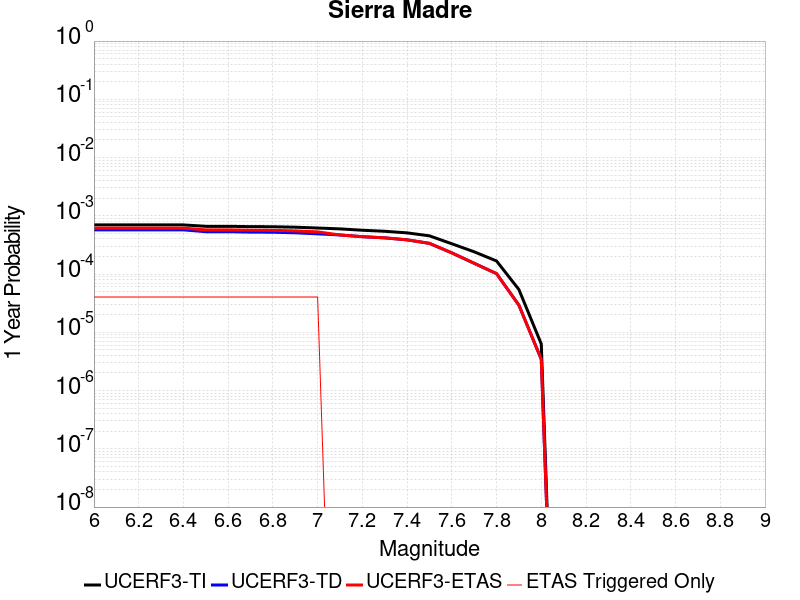 | 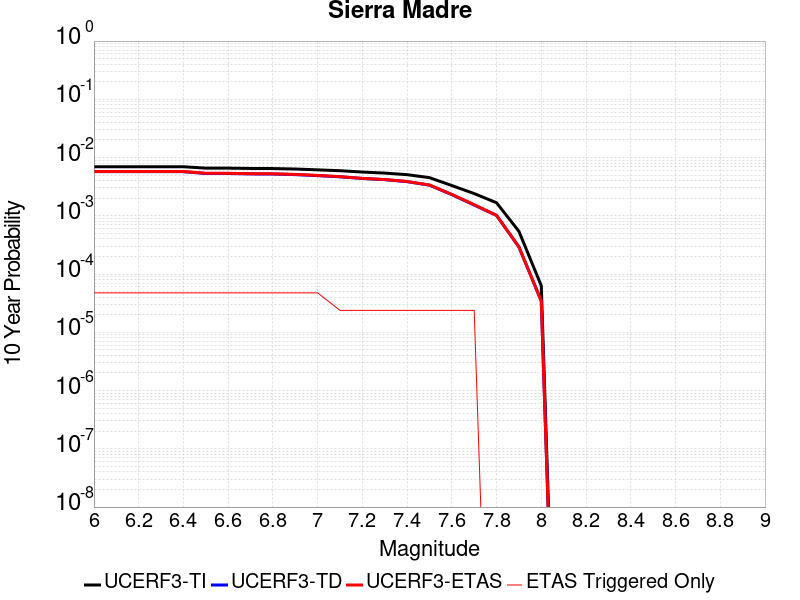 |

| Magnitude | 1 wk TI Prob | 1 wk TD Prob | 1 wk ETAS Prob | 1 wk ETAS/TD Gain | 1 wk ETAS Triggered Only | 1 mo TI Prob | 1 mo TD Prob | 1 mo ETAS Prob | 1 mo ETAS/TD Gain | 1 mo ETAS Triggered Only | 1 yr TI Prob | 1 yr TD Prob | 1 yr ETAS Prob | 1 yr ETAS/TD Gain | 1 yr ETAS Triggered Only | 10 yr TI Prob | 10 yr TD Prob | 10 yr ETAS Prob | 10 yr ETAS/TD Gain | 10 yr ETAS Triggered Only |
|-----|-----|-----|-----|-----|-----|-----|-----|-----|-----|-----|-----|-----|-----|-----|-----|-----|-----|-----|-----|-----|
| 6.0 | 1.3379373E-5 | 1.10007395E-5 | 4.100041E-5 | 3.7270594 | 3.0E-5 | 5.7338908E-5 | 4.7145186E-5 | 9.714283E-5 | 2.0605037 | 5.0E-5 | 6.978776E-4 | 5.738429E-4 | 6.53797E-4 | 1.139331 | 8.0E-5 | 0.0069569005 | 0.0057239756 | 0.0058432887 | 1.0208445 | 1.2E-4 |
| 6.1 | 1.3379373E-5 | 1.10007395E-5 | 4.100041E-5 | 3.7270594 | 3.0E-5 | 5.7338908E-5 | 4.7145186E-5 | 9.714283E-5 | 2.0605037 | 5.0E-5 | 6.978776E-4 | 5.738429E-4 | 6.53797E-4 | 1.139331 | 8.0E-5 | 0.0069569005 | 0.0057239756 | 0.0058432887 | 1.0208445 | 1.2E-4 |
| 6.2 | 1.3379373E-5 | 1.10007395E-5 | 4.100041E-5 | 3.7270594 | 3.0E-5 | 5.7338908E-5 | 4.7145186E-5 | 9.714283E-5 | 2.0605037 | 5.0E-5 | 6.978776E-4 | 5.738429E-4 | 6.53797E-4 | 1.139331 | 8.0E-5 | 0.0069569005 | 0.0057239756 | 0.0058432887 | 1.0208445 | 1.2E-4 |
| 6.3 | 1.3379373E-5 | 1.10007395E-5 | 4.100041E-5 | 3.7270594 | 3.0E-5 | 5.7338908E-5 | 4.7145186E-5 | 9.714283E-5 | 2.0605037 | 5.0E-5 | 6.978776E-4 | 5.738429E-4 | 6.53797E-4 | 1.139331 | 8.0E-5 | 0.0069569005 | 0.0057239756 | 0.0058432887 | 1.0208445 | 1.2E-4 |
| 6.4 | 1.3379373E-5 | 1.10007395E-5 | 4.100041E-5 | 3.7270594 | 3.0E-5 | 5.7338908E-5 | 4.7145186E-5 | 9.714283E-5 | 2.0605037 | 5.0E-5 | 6.978776E-4 | 5.738429E-4 | 6.53797E-4 | 1.139331 | 8.0E-5 | 0.0069569005 | 0.0057239756 | 0.0058432887 | 1.0208445 | 1.2E-4 |
| 6.5 | 1.26563245E-5 | 1.0230196E-5 | 3.022999E-5 | 2.9549768 | 2.0E-5 | 5.4240263E-5 | 4.3842967E-5 | 8.384121E-5 | 1.912307 | 4.0E-5 | 6.601751E-4 | 5.336584E-4 | 5.936264E-4 | 1.1123714 | 6.0E-5 | 0.006582173 | 0.0053240913 | 0.0054036654 | 1.014946 | 8.0E-5 |
| 6.6 | 1.26563245E-5 | 1.0230196E-5 | 3.022999E-5 | 2.9549768 | 2.0E-5 | 5.4240263E-5 | 4.3842967E-5 | 8.384121E-5 | 1.912307 | 4.0E-5 | 6.601751E-4 | 5.336584E-4 | 5.936264E-4 | 1.1123714 | 6.0E-5 | 0.006582173 | 0.0053240913 | 0.0054036654 | 1.014946 | 8.0E-5 |
| 6.7 | 1.2502474E-5 | 1.006634E-5 | 3.0066138E-5 | 2.9867995 | 2.0E-5 | 5.3580934E-5 | 4.314075E-5 | 8.313902E-5 | 1.9271576 | 4.0E-5 | 6.521526E-4 | 5.251131E-4 | 5.850816E-4 | 1.1142011 | 6.0E-5 | 0.0065024206 | 0.0052390425 | 0.005318623 | 1.01519 | 8.0E-5 |
| 6.8 | 1.2454966E-5 | 1.0018625E-5 | 3.0018426E-5 | 2.9962618 | 2.0E-5 | 5.3377335E-5 | 4.2936266E-5 | 8.293455E-5 | 1.9315734 | 4.0E-5 | 6.4967526E-4 | 5.226247E-4 | 5.825934E-4 | 1.1147451 | 6.0E-5 | 0.006477792 | 0.0052142753 | 0.0052938582 | 1.0152625 | 8.0E-5 |
| 6.9 | 1.2225574E-5 | 9.792602E-6 | 2.9792407E-5 | 3.0423381 | 2.0E-5 | 5.2394265E-5 | 4.1967625E-5 | 8.196595E-5 | 1.9530756 | 4.0E-5 | 6.3771347E-4 | 5.108371E-4 | 5.7080644E-4 | 1.1173943 | 6.0E-5 | 0.006358865 | 0.0050969445 | 0.0051765367 | 1.0156157 | 8.0E-5 |
| 7.0 | 1.182946E-5 | 9.399144E-6 | 2.9398956E-5 | 3.1278334 | 2.0E-5 | 5.06967E-5 | 4.0281426E-5 | 8.027982E-5 | 1.9929734 | 4.0E-5 | 6.1705755E-4 | 4.9031706E-4 | 5.502876E-4 | 1.1223098 | 6.0E-5 | 0.006153469 | 0.004892664 | 0.0049722726 | 1.016271 | 8.0E-5 |
| 7.1 | 1.14369095E-5 | 8.986159E-6 | 1.898607E-5 | 2.1128125 | 1.0E-5 | 4.9014405E-5 | 3.8511545E-5 | 5.8510777E-5 | 1.5193048 | 2.0E-5 | 5.9658696E-4 | 4.687782E-4 | 5.0875946E-4 | 1.0852882 | 4.0E-5 | 0.005949879 | 0.004678199 | 0.0047379183 | 1.0127654 | 6.0E-5 |
| 7.2 | 1.0836419E-5 | 8.3995565E-6 | 1.8399473E-5 | 2.190529 | 1.0E-5 | 4.644097E-5 | 3.5997607E-5 | 5.599689E-5 | 1.5555725 | 2.0E-5 | 5.652721E-4 | 4.3818366E-4 | 4.7816613E-4 | 1.0912459 | 4.0E-5 | 0.0056383642 | 0.004373494 | 0.004433232 | 1.013659 | 6.0E-5 |
| 7.3 | 1.0403439E-5 | 8.02082E-6 | 1.8020739E-5 | 2.2467453 | 1.0E-5 | 4.4585406E-5 | 3.4374494E-5 | 5.4373806E-5 | 1.5818068 | 2.0E-5 | 5.426921E-4 | 4.1843E-4 | 4.5841327E-4 | 1.0955554 | 4.0E-5 | 0.005413687 | 0.004176717 | 0.0042364663 | 1.0143054 | 6.0E-5 |
| 7.4 | 9.768864E-6 | 7.414448E-6 | 1.7414373E-5 | 2.348708 | 1.0E-5 | 4.186589E-5 | 3.1775824E-5 | 5.177519E-5 | 1.6293893 | 2.0E-5 | 5.09598E-4 | 3.868029E-4 | 4.2678742E-4 | 1.1033719 | 4.0E-5 | 0.0050843097 | 0.0038615882 | 0.0039213565 | 1.0154777 | 6.0E-5 |
| 7.5 | 8.687089E-6 | 6.4501564E-6 | 6.4501564E-6 | 1.0 | 0.0 | 3.722985E-5 | 2.764324E-5 | 3.7642963E-5 | 1.3617421 | 1.0E-5 | 4.5317915E-4 | 3.3650533E-4 | 3.6649522E-4 | 1.0891216 | 3.0E-5 | 0.004522561 | 0.0033602451 | 0.0034100772 | 1.0148299 | 5.0E-5 |
| 7.6 | 6.3506063E-6 | 4.4303215E-6 | 4.4303215E-6 | 1.0 | 0.0 | 2.72166E-5 | 1.8986955E-5 | 1.8986955E-5 | 1.0 | 0.0 | 3.3131172E-4 | 2.3114192E-4 | 2.511373E-4 | 1.086507 | 2.0E-5 | 0.003308182 | 0.0023092402 | 0.0023391708 | 1.0129613 | 3.0E-5 |
| 7.7 | 4.62223E-6 | 2.932967E-6 | 2.932967E-6 | 1.0 | 0.0 | 1.9809406E-5 | 1.2569798E-5 | 1.2569798E-5 | 1.0 | 0.0 | 2.4115283E-4 | 1.5302657E-4 | 1.7302351E-4 | 1.1306763 | 2.0E-5 | 0.0024089129 | 0.001529413 | 0.0015593672 | 1.0195854 | 3.0E-5 |
| 7.8 | 3.2145008E-6 | 1.9494332E-6 | 1.9494332E-6 | 1.0 | 0.0 | 1.3776359E-5 | 8.3546865E-6 | 8.3546865E-6 | 1.0 | 0.0 | 1.6771426E-4 | 1.0171358E-4 | 1.0171358E-4 | 1.0 | 0.0 | 0.0016758774 | 0.0010168145 | 0.0010168145 | 1.0 | 0.0 |
| 7.9 | 1.0391769E-6 | 5.6026335E-7 | 5.6026335E-7 | 1.0 | 0.0 | 4.4536077E-6 | 2.4011265E-6 | 2.4011265E-6 | 1.0 | 0.0 | 5.4221324E-5 | 2.9233326E-5 | 2.9233326E-5 | 1.0 | 0.0 | 5.4208096E-4 | 2.9229524E-4 | 2.9229524E-4 | 1.0 | 0.0 |
| 8.0 | 1.210983E-7 | 6.613821E-8 | 6.613821E-8 | 1.0 | 0.0 | 5.1899264E-7 | 2.8344945E-7 | 2.8344945E-7 | 1.0 | 0.0 | 6.3187167E-6 | 3.4509917E-6 | 3.4509917E-6 | 1.0 | 0.0 | 6.318537E-5 | 3.45094E-5 | 3.45094E-5 | 1.0 | 0.0 |

## Great Valley 09 (Laguna Seca)
*[(top)](#table-of-contents)*

| 1 Week | 1 Month | 1 Year | 10 Year |
|-----|-----|-----|-----|
| 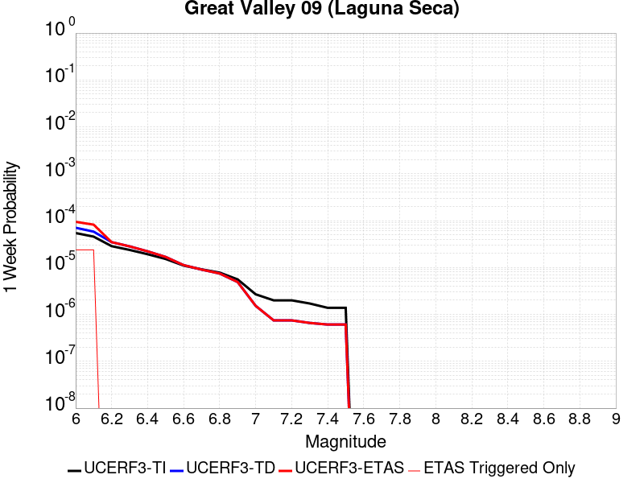 |  | 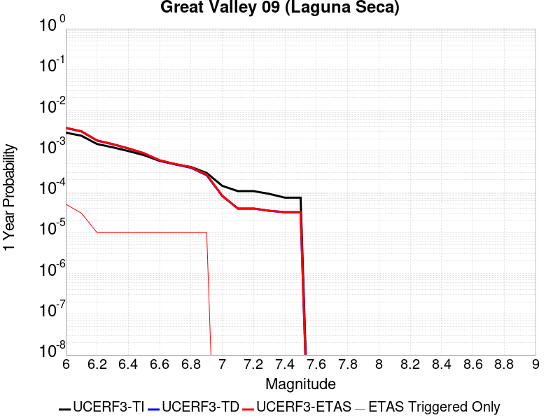 | 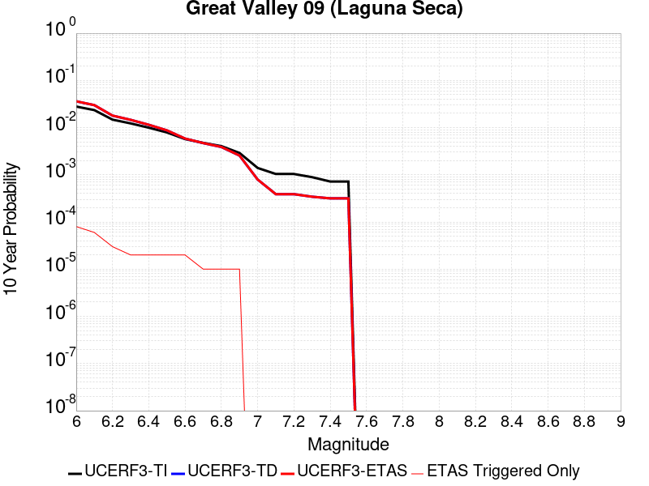 |

| Magnitude | 1 wk TI Prob | 1 wk TD Prob | 1 wk ETAS Prob | 1 wk ETAS/TD Gain | 1 wk ETAS Triggered Only | 1 mo TI Prob | 1 mo TD Prob | 1 mo ETAS Prob | 1 mo ETAS/TD Gain | 1 mo ETAS Triggered Only | 1 yr TI Prob | 1 yr TD Prob | 1 yr ETAS Prob | 1 yr ETAS/TD Gain | 1 yr ETAS Triggered Only | 10 yr TI Prob | 10 yr TD Prob | 10 yr ETAS Prob | 10 yr ETAS/TD Gain | 10 yr ETAS Triggered Only |
|-----|-----|-----|-----|-----|-----|-----|-----|-----|-----|-----|-----|-----|-----|-----|-----|-----|-----|-----|-----|-----|
| 6.0 | 5.4353277E-5 | 7.05022E-5 | 1.1049938E-4 | 1.5673182 | 4.0E-5 | 2.3292181E-4 | 3.0211566E-4 | 3.421036E-4 | 1.1323596 | 4.0E-5 | 0.0028321352 | 0.0036721937 | 0.0037220102 | 1.0135659 | 5.0E-5 | 0.02796312 | 0.03611547 | 0.03619258 | 1.0021352 | 8.0E-5 |
| 6.1 | 4.5578287E-5 | 5.822118E-5 | 8.8219436E-5 | 1.5152464 | 3.0E-5 | 1.953209E-4 | 2.4949326E-4 | 2.7948577E-4 | 1.1202137 | 3.0E-5 | 0.0023754383 | 0.003033432 | 0.003063341 | 1.0098598 | 3.0E-5 | 0.023502063 | 0.029919548 | 0.029977752 | 1.0019454 | 6.0E-5 |
| 6.2 | 2.8536782E-5 | 3.4737273E-5 | 4.4736928E-5 | 1.2878652 | 1.0E-5 | 1.2229476E-4 | 1.4886224E-4 | 1.5886074E-4 | 1.0671662 | 1.0E-5 | 0.0014879217 | 0.001810813 | 0.0018207949 | 1.0055124 | 1.0E-5 | 0.014779986 | 0.017958116 | 0.017987577 | 1.0016406 | 3.0E-5 |
| 6.3 | 2.3698774E-5 | 2.8213295E-5 | 3.8213013E-5 | 1.3544328 | 1.0E-5 | 1.01562226E-4 | 1.20905075E-4 | 1.3090386E-4 | 1.0826995 | 1.0E-5 | 0.0012358186 | 0.0014710218 | 0.0014810071 | 1.006788 | 1.0E-5 | 0.012289686 | 0.014611342 | 0.01463105 | 1.0013489 | 2.0E-5 |
| 6.4 | 1.9191197E-5 | 2.2123184E-5 | 3.2122964E-5 | 1.4520046 | 1.0E-5 | 8.2245395E-5 | 9.4806666E-5 | 1.0480572E-4 | 1.1054678 | 1.0E-5 | 0.0010008777 | 0.0011536429 | 0.0011636313 | 1.0086582 | 1.0E-5 | 0.009963818 | 0.011476948 | 0.011496718 | 1.0017226 | 2.0E-5 |
| 6.5 | 1.5203241E-5 | 1.6802203E-5 | 2.6802036E-5 | 1.59515 | 1.0E-5 | 6.5155116E-5 | 7.200386E-5 | 8.200314E-5 | 1.1388714 | 1.0E-5 | 7.9297484E-4 | 8.7626575E-4 | 8.8625704E-4 | 1.011402 | 1.0E-5 | 0.007901512 | 0.0087295165 | 0.0087493425 | 1.002271 | 2.0E-5 |
| 6.6 | 1.0984925E-5 | 1.1242595E-5 | 2.1242482E-5 | 1.8894644 | 1.0E-5 | 4.70774E-5 | 4.8181686E-5 | 5.8181202E-5 | 1.2075378 | 1.0E-5 | 5.730166E-4 | 5.8645656E-4 | 5.9645064E-4 | 1.0170416 | 1.0E-5 | 0.005715413 | 0.0058494853 | 0.0058693686 | 1.0033991 | 2.0E-5 |
| 6.7 | 9.134616E-6 | 9.019894E-6 | 1.9019804E-5 | 2.1086504 | 1.0E-5 | 3.9147766E-5 | 3.865613E-5 | 4.8655744E-5 | 1.2586812 | 1.0E-5 | 4.7651984E-4 | 4.7053912E-4 | 4.8053442E-4 | 1.0212423 | 1.0E-5 | 0.004754993 | 0.0046956735 | 0.0047056265 | 1.0021197 | 1.0E-5 |
| 6.8 | 7.785589E-6 | 7.4519444E-6 | 1.745187E-5 | 2.3419216 | 1.0E-5 | 3.3366385E-5 | 3.1936524E-5 | 4.1936204E-5 | 1.3131111 | 1.0E-5 | 4.0616E-4 | 3.8875983E-4 | 3.9875595E-4 | 1.0257128 | 1.0E-5 | 0.0040541845 | 0.0038810016 | 0.0038909628 | 1.0025667 | 1.0E-5 |
| 6.9 | 5.579095E-6 | 4.898492E-6 | 1.4898444E-5 | 3.0414345 | 1.0E-5 | 2.3910188E-5 | 2.0993377E-5 | 3.0993167E-5 | 1.4763308 | 1.0E-5 | 2.9106764E-4 | 2.5556577E-4 | 2.6556323E-4 | 1.0391189 | 1.0E-5 | 0.002906867 | 0.002552856 | 0.0025628305 | 1.0039072 | 1.0E-5 |
| 7.0 | 2.6816688E-6 | 1.5216126E-6 | 1.5216126E-6 | 1.0 | 0.0 | 1.1492816E-5 | 6.521181E-6 | 6.521181E-6 | 1.0 | 0.0 | 1.3991605E-4 | 7.939258E-5 | 7.939258E-5 | 1.0 | 0.0 | 0.0013982799 | 7.9365086E-4 | 7.9365086E-4 | 1.0 | 0.0 |
| 7.1 | 1.9951021E-6 | 7.453827E-7 | 7.453827E-7 | 1.0 | 0.0 | 8.55041E-6 | 3.1944935E-6 | 3.1944935E-6 | 1.0 | 0.0 | 1.0409627E-4 | 3.8892307E-5 | 3.8892307E-5 | 1.0 | 0.0 | 0.0010404752 | 3.8885913E-4 | 3.8885913E-4 | 1.0 | 0.0 |
| 7.2 | 1.9951021E-6 | 7.453827E-7 | 7.453827E-7 | 1.0 | 0.0 | 8.55041E-6 | 3.1944935E-6 | 3.1944935E-6 | 1.0 | 0.0 | 1.0409627E-4 | 3.8892307E-5 | 3.8892307E-5 | 1.0 | 0.0 | 0.0010404752 | 3.8885913E-4 | 3.8885913E-4 | 1.0 | 0.0 |
| 7.3 | 1.7087556E-6 | 6.578881E-7 | 6.578881E-7 | 1.0 | 0.0 | 7.3232177E-6 | 2.8195177E-6 | 2.8195177E-6 | 1.0 | 0.0 | 8.915652E-5 | 3.4327128E-5 | 3.4327128E-5 | 1.0 | 0.0 | 8.9120766E-4 | 3.432223E-4 | 3.432223E-4 | 1.0 | 0.0 |
| 7.4 | 1.3804846E-6 | 6.073852E-7 | 6.073852E-7 | 1.0 | 0.0 | 5.916349E-6 | 2.6030768E-6 | 2.6030768E-6 | 1.0 | 0.0 | 7.2029165E-5 | 3.169204E-5 | 3.169204E-5 | 1.0 | 0.0 | 7.200583E-4 | 3.1687922E-4 | 3.1687922E-4 | 1.0 | 0.0 |
| 7.5 | 1.3804846E-6 | 6.073852E-7 | 6.073852E-7 | 1.0 | 0.0 | 5.916349E-6 | 2.6030768E-6 | 2.6030768E-6 | 1.0 | 0.0 | 7.2029165E-5 | 3.169204E-5 | 3.169204E-5 | 1.0 | 0.0 | 7.200583E-4 | 3.1687922E-4 | 3.1687922E-4 | 1.0 | 0.0 |

## Blue Cut
*[(top)](#table-of-contents)*

| 1 Week | 1 Month | 1 Year | 10 Year |
|-----|-----|-----|-----|
| 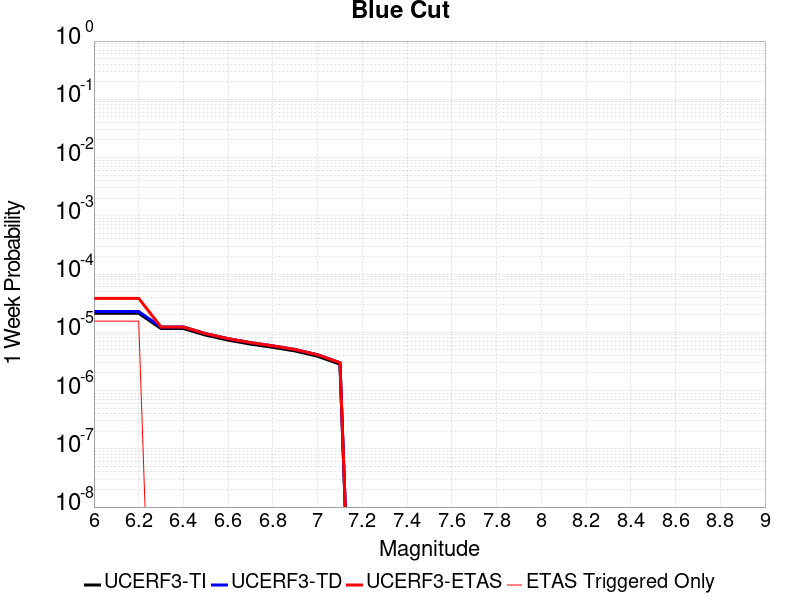 | 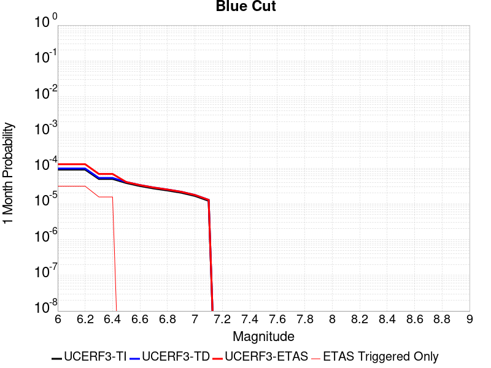 | 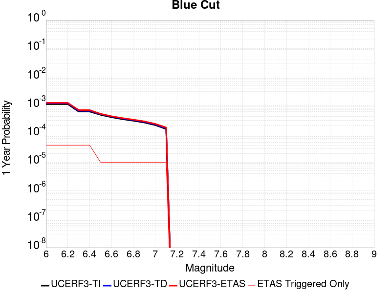 | 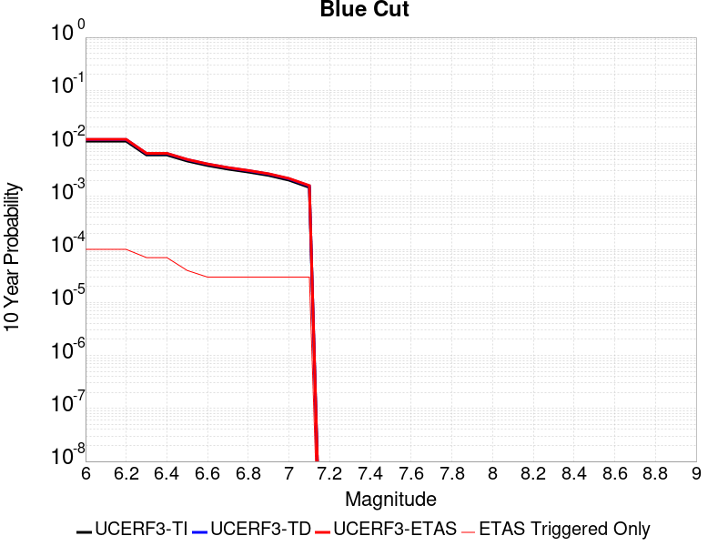 |

| Magnitude | 1 wk TI Prob | 1 wk TD Prob | 1 wk ETAS Prob | 1 wk ETAS/TD Gain | 1 wk ETAS Triggered Only | 1 mo TI Prob | 1 mo TD Prob | 1 mo ETAS Prob | 1 mo ETAS/TD Gain | 1 mo ETAS Triggered Only | 1 yr TI Prob | 1 yr TD Prob | 1 yr ETAS Prob | 1 yr ETAS/TD Gain | 1 yr ETAS Triggered Only | 10 yr TI Prob | 10 yr TD Prob | 10 yr ETAS Prob | 10 yr ETAS/TD Gain | 10 yr ETAS Triggered Only |
|-----|-----|-----|-----|-----|-----|-----|-----|-----|-----|-----|-----|-----|-----|-----|-----|-----|-----|-----|-----|-----|
| 6.0 | 2.1227985E-5 | 2.2719574E-5 | 3.271935E-5 | 1.440139 | 1.0E-5 | 9.097391E-5 | 9.73663E-5 | 1.2736338E-4 | 1.3080848 | 3.0E-5 | 0.0011070445 | 0.0011848481 | 0.0012248007 | 1.0337197 | 4.0E-5 | 0.011015458 | 0.011791152 | 0.011889973 | 1.0083809 | 1.0E-4 |
| 6.1 | 2.1227985E-5 | 2.2719574E-5 | 3.271935E-5 | 1.440139 | 1.0E-5 | 9.097391E-5 | 9.73663E-5 | 1.2736338E-4 | 1.3080848 | 3.0E-5 | 0.0011070445 | 0.0011848481 | 0.0012248007 | 1.0337197 | 4.0E-5 | 0.011015458 | 0.011791152 | 0.011889973 | 1.0083809 | 1.0E-4 |
| 6.2 | 2.1227985E-5 | 2.2719574E-5 | 3.271935E-5 | 1.440139 | 1.0E-5 | 9.097391E-5 | 9.73663E-5 | 1.2736338E-4 | 1.3080848 | 3.0E-5 | 0.0011070445 | 0.0011848481 | 0.0012248007 | 1.0337197 | 4.0E-5 | 0.011015458 | 0.011791152 | 0.011889973 | 1.0083809 | 1.0E-4 |
| 6.3 | 1.1613981E-5 | 1.2353542E-5 | 1.2353542E-5 | 1.0 | 0.0 | 4.9773254E-5 | 5.2942745E-5 | 7.2941686E-5 | 1.3777466 | 2.0E-5 | 6.0582085E-4 | 6.443998E-4 | 6.84374E-4 | 1.0620333 | 4.0E-5 | 0.0060417196 | 0.0064265593 | 0.0064961095 | 1.0108223 | 7.0E-5 |
| 6.4 | 1.1613981E-5 | 1.2353542E-5 | 1.2353542E-5 | 1.0 | 0.0 | 4.9773254E-5 | 5.2942745E-5 | 7.2941686E-5 | 1.3777466 | 2.0E-5 | 6.0582085E-4 | 6.443998E-4 | 6.84374E-4 | 1.0620333 | 4.0E-5 | 0.0060417196 | 0.0064265593 | 0.0064961095 | 1.0108223 | 7.0E-5 |
| 6.5 | 8.931326E-6 | 9.4816E-6 | 9.4816E-6 | 1.0 | 0.0 | 3.8276554E-5 | 4.0634844E-5 | 4.0634844E-5 | 1.0 | 0.0 | 4.6591737E-4 | 4.946261E-4 | 5.0462113E-4 | 1.0202073 | 1.0E-5 | 0.0046494175 | 0.004936161 | 0.004975964 | 1.0080634 | 4.0E-5 |
| 6.6 | 7.345353E-6 | 7.79028E-6 | 7.79028E-6 | 1.0 | 0.0 | 3.1479703E-5 | 3.338653E-5 | 3.338653E-5 | 1.0 | 0.0 | 3.83198E-4 | 4.064132E-4 | 4.164091E-4 | 1.0245955 | 1.0E-5 | 0.0038253788 | 0.0040574907 | 0.004087369 | 1.0073637 | 3.0E-5 |
| 6.7 | 6.2775666E-6 | 6.655149E-6 | 6.655149E-6 | 1.0 | 0.0 | 2.690358E-5 | 2.8521798E-5 | 2.8521798E-5 | 1.0 | 0.0 | 3.2750185E-4 | 3.472051E-4 | 3.572016E-4 | 1.0287914 | 1.0E-5 | 0.0032701963 | 0.003467367 | 0.0034972632 | 1.008622 | 3.0E-5 |
| 6.8 | 5.5234095E-6 | 5.8551113E-6 | 5.8551113E-6 | 1.0 | 0.0 | 2.367154E-5 | 2.5093133E-5 | 2.5093133E-5 | 1.0 | 0.0 | 2.8816288E-4 | 3.0547334E-4 | 3.154703E-4 | 1.032726 | 1.0E-5 | 0.002877895 | 0.0030512505 | 0.003081159 | 1.009802 | 3.0E-5 |
| 6.9 | 4.7780054E-6 | 5.0654203E-6 | 5.0654203E-6 | 1.0 | 0.0 | 2.0477004E-5 | 2.1708804E-5 | 2.1708804E-5 | 1.0 | 0.0 | 2.4927902E-4 | 2.642797E-4 | 2.7427703E-4 | 1.0378287 | 1.0E-5 | 0.0024899957 | 0.002640346 | 0.002670267 | 1.0113322 | 3.0E-5 |
| 7.0 | 3.883171E-6 | 4.118487E-6 | 4.118487E-6 | 1.0 | 0.0 | 1.6642054E-5 | 1.7650578E-5 | 1.7650578E-5 | 1.0 | 0.0 | 2.0259817E-4 | 2.1488148E-4 | 2.2487935E-4 | 1.0465273 | 1.0E-5 | 0.0020241356 | 0.0021474129 | 0.0021773484 | 1.0139403 | 3.0E-5 |
| 7.1 | 2.8358215E-6 | 3.0097158E-6 | 3.0097158E-6 | 1.0 | 0.0 | 1.2153464E-5 | 1.2898756E-5 | 1.2898756E-5 | 1.0 | 0.0 | 1.4795837E-4 | 1.5703762E-4 | 1.6703604E-4 | 1.063669 | 1.0E-5 | 0.001478599 | 0.0015699116 | 0.0015998646 | 1.0190793 | 3.0E-5 |

## Cleghorn
*[(top)](#table-of-contents)*

| 1 Week | 1 Month | 1 Year | 10 Year |
|-----|-----|-----|-----|
| 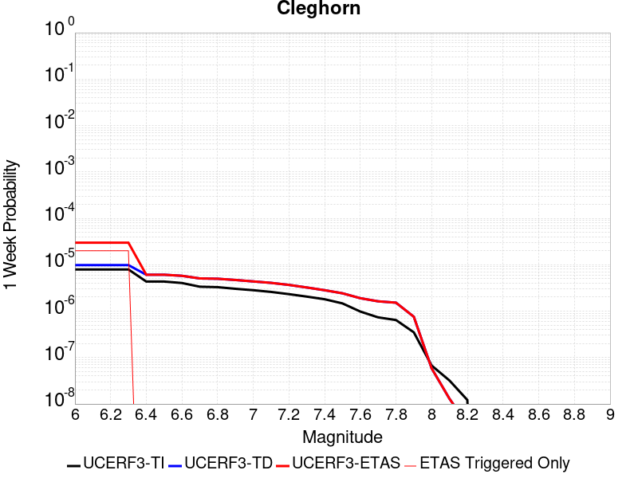 | 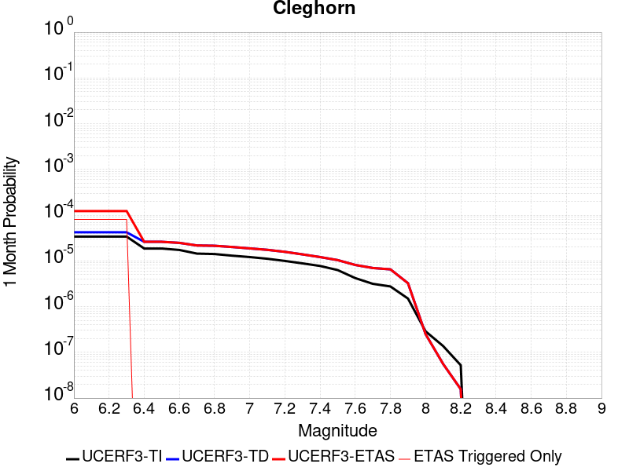 | 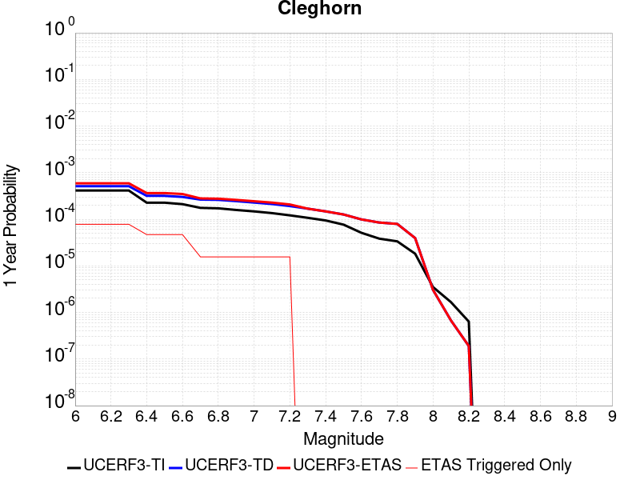 | 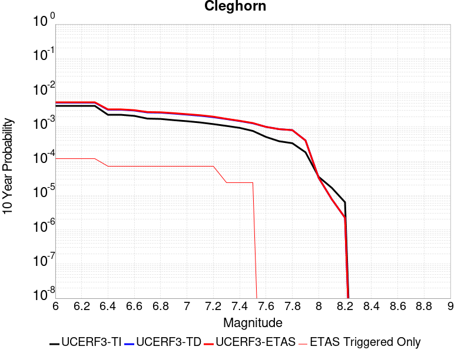 |

| Magnitude | 1 wk TI Prob | 1 wk TD Prob | 1 wk ETAS Prob | 1 wk ETAS/TD Gain | 1 wk ETAS Triggered Only | 1 mo TI Prob | 1 mo TD Prob | 1 mo ETAS Prob | 1 mo ETAS/TD Gain | 1 mo ETAS Triggered Only | 1 yr TI Prob | 1 yr TD Prob | 1 yr ETAS Prob | 1 yr ETAS/TD Gain | 1 yr ETAS Triggered Only | 10 yr TI Prob | 10 yr TD Prob | 10 yr ETAS Prob | 10 yr ETAS/TD Gain | 10 yr ETAS Triggered Only |
|-----|-----|-----|-----|-----|-----|-----|-----|-----|-----|-----|-----|-----|-----|-----|-----|-----|-----|-----|-----|-----|
| 6.0 | 7.9267165E-6 | 9.831582E-6 | 2.9831386E-5 | 3.0342405 | 2.0E-5 | 3.39712E-5 | 4.2134732E-5 | 8.213305E-5 | 1.9492955 | 4.0E-5 | 4.1352084E-4 | 5.128803E-4 | 5.8284437E-4 | 1.136414 | 7.0E-5 | 0.004127522 | 0.0051320773 | 0.005231564 | 1.0193853 | 1.0E-4 |
| 6.1 | 7.9267165E-6 | 9.831582E-6 | 2.9831386E-5 | 3.0342405 | 2.0E-5 | 3.39712E-5 | 4.2134732E-5 | 8.213305E-5 | 1.9492955 | 4.0E-5 | 4.1352084E-4 | 5.128803E-4 | 5.8284437E-4 | 1.136414 | 7.0E-5 | 0.004127522 | 0.0051320773 | 0.005231564 | 1.0193853 | 1.0E-4 |
| 6.2 | 7.9267165E-6 | 9.831582E-6 | 2.9831386E-5 | 3.0342405 | 2.0E-5 | 3.39712E-5 | 4.2134732E-5 | 8.213305E-5 | 1.9492955 | 4.0E-5 | 4.1352084E-4 | 5.128803E-4 | 5.8284437E-4 | 1.136414 | 7.0E-5 | 0.004127522 | 0.0051320773 | 0.005231564 | 1.0193853 | 1.0E-4 |
| 6.3 | 7.9267165E-6 | 9.831582E-6 | 2.9831386E-5 | 3.0342405 | 2.0E-5 | 3.39712E-5 | 4.2134732E-5 | 8.213305E-5 | 1.9492955 | 4.0E-5 | 4.1352084E-4 | 5.128803E-4 | 5.8284437E-4 | 1.136414 | 7.0E-5 | 0.004127522 | 0.0051320773 | 0.005231564 | 1.0193853 | 1.0E-4 |
| 6.4 | 4.3445207E-6 | 6.0914435E-6 | 6.0914435E-6 | 1.0 | 0.0 | 1.8619241E-5 | 2.610593E-5 | 4.6105408E-5 | 1.7660894 | 2.0E-5 | 2.2666567E-4 | 3.1779436E-4 | 3.6777847E-4 | 1.1572845 | 5.0E-5 | 0.0022643462 | 0.0031875873 | 0.003257364 | 1.0218902 | 7.0E-5 |
| 6.5 | 4.3445207E-6 | 6.0914435E-6 | 6.0914435E-6 | 1.0 | 0.0 | 1.8619241E-5 | 2.610593E-5 | 4.6105408E-5 | 1.7660894 | 2.0E-5 | 2.2666567E-4 | 3.1779436E-4 | 3.6777847E-4 | 1.1572845 | 5.0E-5 | 0.0022643462 | 0.0031875873 | 0.003257364 | 1.0218902 | 7.0E-5 |
| 6.6 | 4.040109E-6 | 5.773851E-6 | 5.773851E-6 | 1.0 | 0.0 | 1.7314638E-5 | 2.4744846E-5 | 4.4744353E-5 | 1.8082291 | 2.0E-5 | 2.1078532E-4 | 3.012278E-4 | 3.5121274E-4 | 1.1659373 | 5.0E-5 | 0.002105855 | 0.003022377 | 0.0030921653 | 1.0230906 | 7.0E-5 |
| 6.7 | 3.3632055E-6 | 5.067348E-6 | 5.067348E-6 | 1.0 | 0.0 | 1.4413658E-5 | 2.1717027E-5 | 4.1716594E-5 | 1.9209164 | 2.0E-5 | 1.7547216E-4 | 2.6437303E-4 | 2.943651E-4 | 1.113446 | 3.0E-5 | 0.0017533366 | 0.0026547113 | 0.0027045785 | 1.0187844 | 5.0E-5 |
| 6.8 | 3.2902772E-6 | 4.9892556E-6 | 4.9892556E-6 | 1.0 | 0.0 | 1.4101111E-5 | 2.1382351E-5 | 4.138192E-5 | 1.9353309 | 2.0E-5 | 1.716675E-4 | 2.6029933E-4 | 2.9029153E-4 | 1.115222 | 3.0E-5 | 0.0017153495 | 0.0026140702 | 0.0026639395 | 1.0190773 | 5.0E-5 |
| 6.9 | 3.031547E-6 | 4.6910186E-6 | 4.6910186E-6 | 1.0 | 0.0 | 1.299228E-5 | 2.0104211E-5 | 4.010381E-5 | 1.9947964 | 2.0E-5 | 1.5816953E-4 | 2.4474156E-4 | 2.7473422E-4 | 1.1225483 | 3.0E-5 | 0.00158057 | 0.0024588439 | 0.0025087208 | 1.0202848 | 5.0E-5 |
| 7.0 | 2.8259715E-6 | 4.3705895E-6 | 4.3705895E-6 | 1.0 | 0.0 | 1.211125E-5 | 1.8730963E-5 | 3.8730588E-5 | 2.0677307 | 2.0E-5 | 1.4744449E-4 | 2.2802586E-4 | 2.5801902E-4 | 1.131534 | 3.0E-5 | 0.001473467 | 0.0022920412 | 0.0023419266 | 1.0217646 | 5.0E-5 |
| 7.1 | 2.5962665E-6 | 4.0658106E-6 | 4.0658106E-6 | 1.0 | 0.0 | 1.1126809E-5 | 1.7424789E-5 | 3.742444E-5 | 2.1477702 | 2.0E-5 | 1.3546048E-4 | 2.1212637E-4 | 2.4212E-4 | 1.1413951 | 3.0E-5 | 0.0013537793 | 0.002133366 | 0.0021832592 | 1.0233872 | 5.0E-5 |
| 7.2 | 2.3247253E-6 | 3.6763672E-6 | 3.6763672E-6 | 1.0 | 0.0 | 9.96307E-6 | 1.5755764E-5 | 3.575545E-5 | 2.2693567 | 2.0E-5 | 1.21293626E-4 | 1.9180974E-4 | 2.2180399E-4 | 1.1563749 | 3.0E-5 | 0.0012122744 | 0.0019305905 | 0.001980494 | 1.0258489 | 5.0E-5 |
| 7.3 | 2.056928E-6 | 3.2350938E-6 | 3.2350938E-6 | 1.0 | 0.0 | 8.815376E-6 | 1.3864615E-5 | 3.3864337E-5 | 2.442501 | 2.0E-5 | 1.0732192E-4 | 1.6878877E-4 | 1.8878539E-4 | 1.1184713 | 2.0E-5 | 0.001072701 | 0.0017008206 | 0.0017307696 | 1.0176085 | 3.0E-5 |
| 7.4 | 1.8055999E-6 | 2.8255042E-6 | 2.8255042E-6 | 1.0 | 0.0 | 7.738263E-6 | 1.2109249E-5 | 3.2109005E-5 | 2.6516101 | 2.0E-5 | 9.4209274E-5 | 1.4742027E-4 | 1.6741733E-4 | 1.1356466 | 2.0E-5 | 9.4169343E-4 | 0.0014875771 | 0.0015175325 | 1.0201371 | 3.0E-5 |
| 7.5 | 1.4683443E-6 | 2.4247483E-6 | 2.4247483E-6 | 1.0 | 0.0 | 6.292889E-6 | 1.0391738E-5 | 3.039153E-5 | 2.9245858 | 2.0E-5 | 7.661323E-5 | 1.2651215E-4 | 1.4650963E-4 | 1.1580676 | 2.0E-5 | 7.658682E-4 | 0.0012787961 | 0.0013087578 | 1.0234295 | 3.0E-5 |
| 7.6 | 9.804088E-7 | 1.900266E-6 | 1.900266E-6 | 1.0 | 0.0 | 4.201745E-6 | 8.143972E-6 | 1.8143892E-5 | 2.227892 | 1.0E-5 | 5.1155046E-5 | 9.91484E-5 | 1.0914741E-4 | 1.1008489 | 1.0E-5 | 5.114327E-4 | 0.001005471 | 0.0010154609 | 1.0099356 | 1.0E-5 |
| 7.7 | 7.3434086E-7 | 1.6284146E-6 | 1.6284146E-6 | 1.0 | 0.0 | 3.1471714E-6 | 6.978901E-6 | 1.697883E-5 | 2.4328804 | 1.0E-5 | 3.831614E-5 | 8.4964835E-5 | 9.496399E-5 | 1.1176858 | 1.0E-5 | 3.8309532E-4 | 8.6378685E-4 | 8.737782E-4 | 1.0115669 | 1.0E-5 |
| 7.8 | 6.434184E-7 | 1.5220047E-6 | 1.5220047E-6 | 1.0 | 0.0 | 2.7575045E-6 | 6.5228614E-6 | 1.6522796E-5 | 2.5330596 | 1.0E-5 | 3.35721E-5 | 7.941297E-5 | 8.941218E-5 | 1.125914 | 1.0E-5 | 3.3567028E-4 | 8.079678E-4 | 8.179597E-4 | 1.0123668 | 1.0E-5 |
| 7.9 | 3.4943926E-7 | 7.574459E-7 | 7.574459E-7 | 1.0 | 0.0 | 1.497596E-6 | 3.2461926E-6 | 3.2461926E-6 | 1.0 | 0.0 | 1.8233079E-5 | 3.952169E-5 | 3.952169E-5 | 1.0 | 0.0 | 1.8231584E-4 | 4.040099E-4 | 4.040099E-4 | 1.0 | 0.0 |
| 8.0 | 6.717524E-8 | 5.838828E-8 | 5.838828E-8 | 1.0 | 0.0 | 2.8789387E-7 | 2.5023547E-7 | 2.5023547E-7 | 1.0 | 0.0 | 3.505102E-6 | 3.0466126E-6 | 3.0466126E-6 | 1.0 | 0.0 | 3.5050467E-5 | 3.273506E-5 | 3.273506E-5 | 1.0 | 0.0 |
| 8.1 | 3.1984914E-8 | 1.2956093E-8 | 1.2956093E-8 | 1.0 | 0.0 | 1.370782E-7 | 5.552611E-8 | 5.552611E-8 | 1.0 | 0.0 | 1.6689258E-6 | 6.760302E-7 | 6.760302E-7 | 1.0 | 0.0 | 1.6689133E-5 | 7.74454E-6 | 7.74454E-6 | 1.0 | 0.0 |
| 8.2 | 1.21887656E-8 | 3.6495305E-9 | 3.6495305E-9 | 1.0 | 0.0 | 5.2237567E-8 | 1.5640845E-8 | 1.5640845E-8 | 1.0 | 0.0 | 6.359922E-7 | 1.9042727E-7 | 1.9042727E-7 | 1.0 | 0.0 | 6.3599036E-6 | 2.2470974E-6 | 2.2470974E-6 | 1.0 | 0.0 |

## Whittier alt 1
*[(top)](#table-of-contents)*

| 1 Week | 1 Month | 1 Year | 10 Year |
|-----|-----|-----|-----|
| 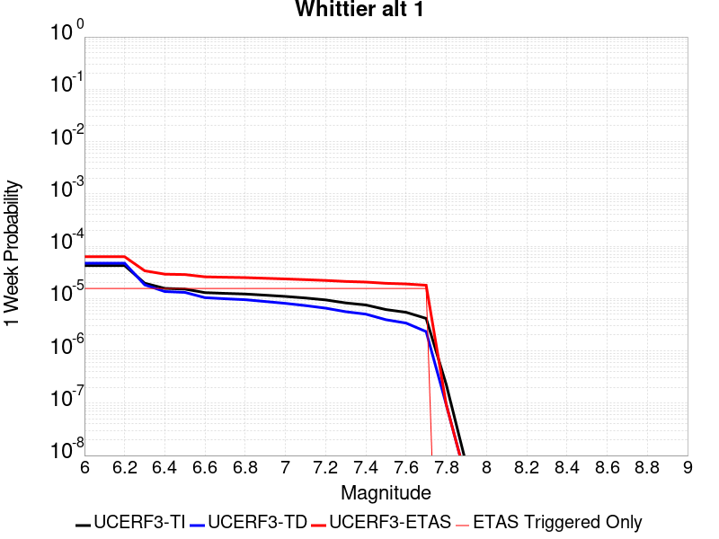 | 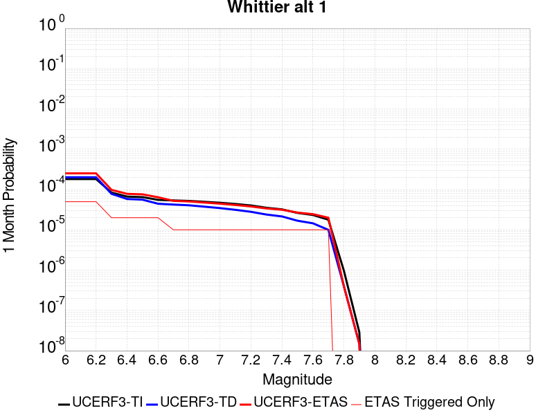 | 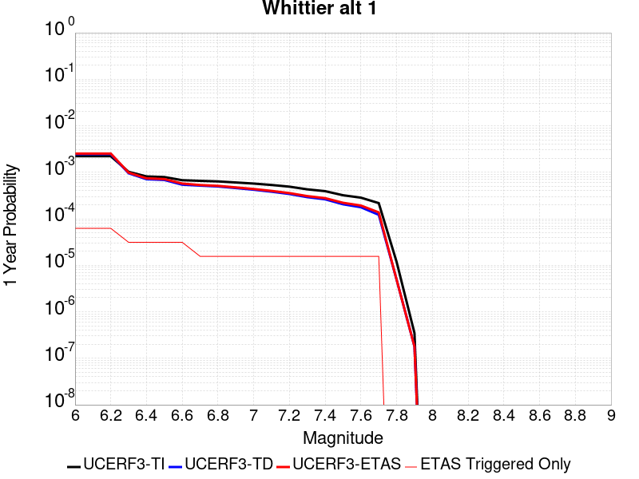 | 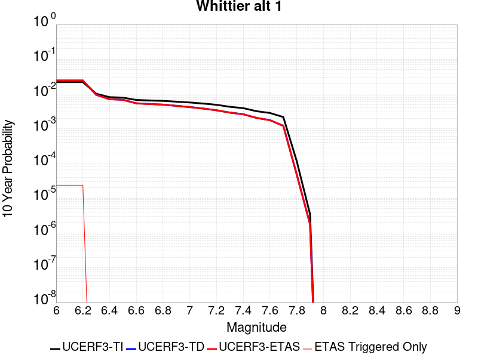 |

| Magnitude | 1 wk TI Prob | 1 wk TD Prob | 1 wk ETAS Prob | 1 wk ETAS/TD Gain | 1 wk ETAS Triggered Only | 1 mo TI Prob | 1 mo TD Prob | 1 mo ETAS Prob | 1 mo ETAS/TD Gain | 1 mo ETAS Triggered Only | 1 yr TI Prob | 1 yr TD Prob | 1 yr ETAS Prob | 1 yr ETAS/TD Gain | 1 yr ETAS Triggered Only | 10 yr TI Prob | 10 yr TD Prob | 10 yr ETAS Prob | 10 yr ETAS/TD Gain | 10 yr ETAS Triggered Only |
|-----|-----|-----|-----|-----|-----|-----|-----|-----|-----|-----|-----|-----|-----|-----|-----|-----|-----|-----|-----|-----|
| 6.0 | 4.2554693E-5 | 4.725218E-5 | 6.725123E-5 | 1.4232409 | 2.0E-5 | 1.8236451E-4 | 2.0249544E-4 | 2.524853E-4 | 1.2468691 | 5.0E-5 | 0.002218027 | 0.0024629154 | 0.002532743 | 1.0283515 | 7.0E-5 | 0.02196019 | 0.024390234 | 0.024487795 | 1.004 | 1.0E-4 |
| 6.1 | 4.2554693E-5 | 4.725218E-5 | 6.725123E-5 | 1.4232409 | 2.0E-5 | 1.8236451E-4 | 2.0249544E-4 | 2.524853E-4 | 1.2468691 | 5.0E-5 | 0.002218027 | 0.0024629154 | 0.002532743 | 1.0283515 | 7.0E-5 | 0.02196019 | 0.024390234 | 0.024487795 | 1.004 | 1.0E-4 |
| 6.2 | 4.2554693E-5 | 4.725218E-5 | 6.725123E-5 | 1.4232409 | 2.0E-5 | 1.8236451E-4 | 2.0249544E-4 | 2.524853E-4 | 1.2468691 | 5.0E-5 | 0.002218027 | 0.0024629154 | 0.002532743 | 1.0283515 | 7.0E-5 | 0.02196019 | 0.024390234 | 0.024487795 | 1.004 | 1.0E-4 |
| 6.3 | 1.9617712E-5 | 1.8268593E-5 | 2.8268409E-5 | 1.5473776 | 1.0E-5 | 8.40732E-5 | 7.829172E-5 | 9.8290155E-5 | 1.2554349 | 2.0E-5 | 0.0010231105 | 9.52804E-4 | 9.7278494E-4 | 1.0209707 | 2.0E-5 | 0.01018413 | 0.009490474 | 0.00952019 | 1.003131 | 3.0E-5 |
| 6.4 | 1.5611336E-5 | 1.3604271E-5 | 2.3604134E-5 | 1.7350533 | 1.0E-5 | 6.690401E-5 | 5.8302747E-5 | 7.830158E-5 | 1.343017 | 2.0E-5 | 8.142519E-4 | 7.0961076E-4 | 7.295966E-4 | 1.0281645 | 2.0E-5 | 0.008112748 | 0.0070754145 | 0.007095273 | 1.0028067 | 2.0E-5 |
| 6.5 | 1.5150166E-5 | 1.3100925E-5 | 2.3100794E-5 | 1.7632949 | 1.0E-5 | 6.492767E-5 | 5.6145647E-5 | 7.6144526E-5 | 1.3561964 | 2.0E-5 | 7.9020765E-4 | 6.8336475E-4 | 7.0335105E-4 | 1.0292469 | 2.0E-5 | 0.007874036 | 0.0068145846 | 0.0068344483 | 1.0029149 | 2.0E-5 |
| 6.6 | 1.295588E-5 | 1.0380725E-5 | 2.0380621E-5 | 1.9633138 | 1.0E-5 | 5.552402E-5 | 4.4488075E-5 | 6.448718E-5 | 1.4495387 | 2.0E-5 | 6.7579525E-4 | 5.4150965E-4 | 5.614988E-4 | 1.0369138 | 2.0E-5 | 0.006737438 | 0.0054033357 | 0.0054232273 | 1.0036814 | 2.0E-5 |
| 6.7 | 1.2542085E-5 | 9.899369E-6 | 1.989927E-5 | 2.0101554 | 1.0E-5 | 5.3750682E-5 | 4.242519E-5 | 5.2424763E-5 | 1.235699 | 1.0E-5 | 6.542181E-4 | 5.164061E-4 | 5.264009E-4 | 1.0193546 | 1.0E-5 | 0.006522954 | 0.0051534795 | 0.005163428 | 1.0019305 | 1.0E-5 |
| 6.8 | 1.2195878E-5 | 9.495415E-6 | 1.9495319E-5 | 2.05313 | 1.0E-5 | 5.2267E-5 | 4.069401E-5 | 5.06936E-5 | 1.2457265 | 1.0E-5 | 6.36165E-4 | 4.9533875E-4 | 5.053338E-4 | 1.0201782 | 1.0E-5 | 0.0063434686 | 0.004943688 | 0.0049536387 | 1.0020127 | 1.0E-5 |
| 6.9 | 1.1580298E-5 | 8.772933E-6 | 1.8772846E-5 | 2.1398597 | 1.0E-5 | 4.9628903E-5 | 3.7597754E-5 | 4.759738E-5 | 1.2659633 | 1.0E-5 | 6.040644E-4 | 4.5765814E-4 | 4.676536E-4 | 1.0218403 | 1.0E-5 | 0.00602425 | 0.0045684157 | 0.00457837 | 1.0021789 | 1.0E-5 |
| 7.0 | 1.0964795E-5 | 8.083994E-6 | 1.8083912E-5 | 2.2370024 | 1.0E-5 | 4.6991136E-5 | 3.4645236E-5 | 4.464489E-5 | 1.28863 | 1.0E-5 | 5.7196687E-4 | 4.2172565E-4 | 4.3172142E-4 | 1.0237021 | 1.0E-5 | 0.0057049696 | 0.004210462 | 0.0042204196 | 1.002365 | 1.0E-5 |
| 7.1 | 1.0230601E-5 | 7.3266697E-6 | 1.7326596E-5 | 2.3648667 | 1.0E-5 | 4.3844695E-5 | 3.1399642E-5 | 4.139933E-5 | 1.318465 | 1.0E-5 | 5.336784E-4 | 3.8222488E-4 | 3.9222106E-4 | 1.0261526 | 1.0E-5 | 0.005323986 | 0.0038168381 | 0.0038268 | 1.00261 | 1.0E-5 |
| 7.2 | 9.40865E-6 | 6.543289E-6 | 1.6543223E-5 | 2.5282733 | 1.0E-5 | 4.032216E-5 | 2.8042374E-5 | 3.8042093E-5 | 1.3565933 | 1.0E-5 | 4.908117E-4 | 3.4136363E-4 | 3.513602E-4 | 1.0292842 | 1.0E-5 | 0.0048972913 | 0.003409485 | 0.0034194512 | 1.002923 | 1.0E-5 |
| 7.3 | 8.237384E-6 | 5.5977525E-6 | 1.5597696E-5 | 2.7864213 | 1.0E-5 | 3.5302593E-5 | 2.3990153E-5 | 3.3989912E-5 | 1.4168277 | 1.0E-5 | 4.2972428E-4 | 2.92042E-4 | 3.020391E-4 | 1.0342317 | 1.0E-5 | 0.0042889426 | 0.002916903 | 0.002926874 | 1.0034183 | 1.0E-5 |
| 7.4 | 7.5316966E-6 | 5.027819E-6 | 1.5027769E-5 | 2.9889238 | 1.0E-5 | 3.2278298E-5 | 2.1547625E-5 | 3.154741E-5 | 1.4640783 | 1.0E-5 | 3.9291743E-4 | 2.6231175E-4 | 2.7230915E-4 | 1.0381125 | 1.0E-5 | 0.0039222343 | 0.0026201333 | 0.002630107 | 1.0038066 | 1.0E-5 |
| 7.5 | 6.149649E-6 | 3.933841E-6 | 1.3933802E-5 | 3.5420349 | 1.0E-5 | 2.6355372E-5 | 1.6859214E-5 | 2.6859045E-5 | 1.5931375 | 1.0E-5 | 3.208294E-4 | 2.052425E-4 | 2.1524045E-4 | 1.0487128 | 1.0E-5 | 0.003203666 | 0.0020506186 | 0.0020605982 | 1.0048666 | 1.0E-5 |
| 7.6 | 5.457711E-6 | 3.3953788E-6 | 1.33953445E-5 | 3.9451694 | 1.0E-5 | 2.338998E-5 | 1.4551547E-5 | 2.4551402E-5 | 1.6872022 | 1.0E-5 | 2.8473578E-4 | 1.771515E-4 | 1.8714972E-4 | 1.0564388 | 1.0E-5 | 0.0028437122 | 0.0017701836 | 0.0017801658 | 1.0056391 | 1.0E-5 |
| 7.7 | 4.1676276E-6 | 2.3331952E-6 | 1.2333172E-5 | 5.2859583 | 1.0E-5 | 1.7861139E-5 | 9.999374E-6 | 1.9999274E-5 | 2.0000527 | 1.0E-5 | 2.1743766E-4 | 1.2173632E-4 | 1.317351E-4 | 1.0821347 | 1.0E-5 | 0.0021722503 | 0.0012167693 | 0.0012267572 | 1.0082085 | 1.0E-5 |
| 7.8 | 2.2692414E-7 | 9.3854695E-8 | 9.3854695E-8 | 1.0 | 0.0 | 9.725317E-7 | 4.0223435E-7 | 4.0223435E-7 | 1.0 | 0.0 | 1.1840509E-5 | 4.8971956E-6 | 4.8971956E-6 | 1.0 | 0.0 | 1.1839878E-4 | 4.8971204E-5 | 4.8971204E-5 | 1.0 | 0.0 |
| 7.9 | 6.676829E-9 | 3.439853E-9 | 3.439853E-9 | 1.0 | 0.0 | 2.861498E-8 | 1.4742227E-8 | 1.4742227E-8 | 1.0 | 0.0 | 3.4838732E-7 | 1.7948659E-7 | 1.7948659E-7 | 1.0 | 0.0 | 3.4838679E-6 | 1.7948646E-6 | 1.7948646E-6 | 1.0 | 0.0 |

## Hunting Creek - Berryessa 2011 CFM
*[(top)](#table-of-contents)*

| 1 Week | 1 Month | 1 Year | 10 Year |
|-----|-----|-----|-----|
|  | 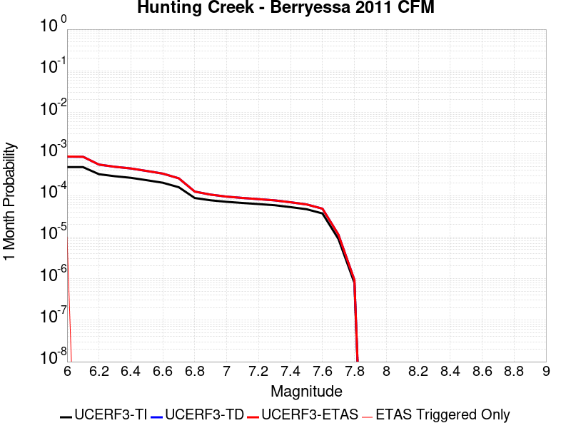 | 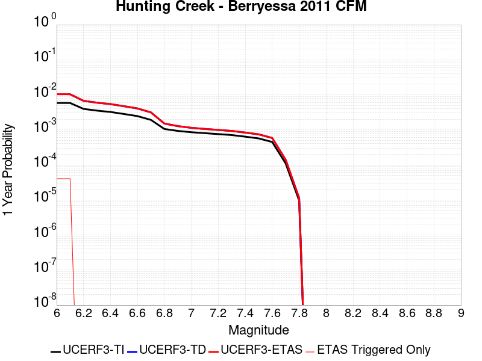 | 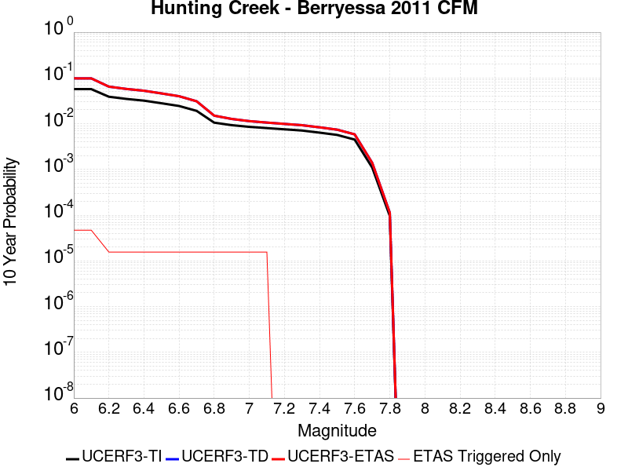 |

| Magnitude | 1 wk TI Prob | 1 wk TD Prob | 1 wk ETAS Prob | 1 wk ETAS/TD Gain | 1 wk ETAS Triggered Only | 1 mo TI Prob | 1 mo TD Prob | 1 mo ETAS Prob | 1 mo ETAS/TD Gain | 1 mo ETAS Triggered Only | 1 yr TI Prob | 1 yr TD Prob | 1 yr ETAS Prob | 1 yr ETAS/TD Gain | 1 yr ETAS Triggered Only | 10 yr TI Prob | 10 yr TD Prob | 10 yr ETAS Prob | 10 yr ETAS/TD Gain | 10 yr ETAS Triggered Only |
|-----|-----|-----|-----|-----|-----|-----|-----|-----|-----|-----|-----|-----|-----|-----|-----|-----|-----|-----|-----|-----|
| 6.0 | 1.1270982E-4 | 2.0012174E-4 | 2.1011975E-4 | 1.0499595 | 1.0E-5 | 4.8295266E-4 | 8.5739547E-4 | 8.6738693E-4 | 1.0116532 | 1.0E-5 | 0.0058641075 | 0.010386313 | 0.010416001 | 1.0028584 | 3.0E-5 | 0.057117578 | 0.09803703 | 0.09810016 | 1.000644 | 7.0E-5 |
| 6.1 | 1.1239393E-4 | 1.9960315E-4 | 1.9960315E-4 | 1.0 | 0.0 | 4.8159933E-4 | 8.551744E-4 | 8.551744E-4 | 1.0 | 0.0 | 0.0058477195 | 0.010359551 | 0.01038924 | 1.0028659 | 3.0E-5 | 0.056962132 | 0.09779551 | 0.09785866 | 1.0006458 | 7.0E-5 |
| 6.2 | 7.596265E-5 | 1.2940196E-4 | 1.2940196E-4 | 1.0 | 0.0 | 3.2551357E-4 | 5.5444165E-4 | 5.5444165E-4 | 1.0 | 0.0 | 0.0039559277 | 0.0067210156 | 0.0067309486 | 1.0014778 | 1.0E-5 | 0.038862433 | 0.0645915 | 0.064610206 | 1.0002897 | 2.0E-5 |
| 6.3 | 6.78794E-5 | 1.145119E-4 | 1.145119E-4 | 1.0 | 0.0 | 2.9087928E-4 | 4.906513E-4 | 4.906513E-4 | 1.0 | 0.0 | 0.003535705 | 0.005952679 | 0.005952679 | 1.0 | 0.0 | 0.034799766 | 0.057465393 | 0.057484243 | 1.0003281 | 2.0E-5 |
| 6.4 | 6.2165134E-5 | 1.0436625E-4 | 1.0436625E-4 | 1.0 | 0.0 | 2.6639478E-4 | 4.4721062E-4 | 4.4721062E-4 | 1.0 | 0.0 | 0.0032385332 | 0.005427573 | 0.005427573 | 1.0 | 0.0 | 0.03191742 | 0.052550517 | 0.052569468 | 1.0003606 | 2.0E-5 |
| 6.5 | 5.4368087E-5 | 9.071415E-5 | 9.071415E-5 | 1.0 | 0.0 | 2.3298527E-4 | 3.8872007E-4 | 3.8872007E-4 | 1.0 | 0.0 | 0.0028329059 | 0.0047198683 | 0.0047198683 | 1.0 | 0.0 | 0.027970633 | 0.045880128 | 0.04589921 | 1.0004159 | 2.0E-5 |
| 6.6 | 4.729947E-5 | 7.847572E-5 | 7.847572E-5 | 1.0 | 0.0 | 2.0269625E-4 | 3.362842E-4 | 3.362842E-4 | 1.0 | 0.0 | 0.002465034 | 0.0040849647 | 0.0040849647 | 1.0 | 0.0 | 0.02437869 | 0.03985155 | 0.03987075 | 1.0004818 | 2.0E-5 |
| 6.7 | 3.6875328E-5 | 6.0451803E-5 | 6.0451803E-5 | 1.0 | 0.0 | 1.5802756E-4 | 2.59056E-4 | 2.59056E-4 | 1.0 | 0.0 | 0.0019222875 | 0.0031482063 | 0.0031482063 | 1.0 | 0.0 | 0.019057442 | 0.03089237 | 0.030911753 | 1.0006274 | 2.0E-5 |
| 6.8 | 2.0292036E-5 | 2.8976308E-5 | 2.8976308E-5 | 1.0 | 0.0 | 8.6962966E-5 | 1.2417832E-4 | 1.2417832E-4 | 1.0 | 0.0 | 0.0010582599 | 0.0015108072 | 0.0015108072 | 1.0 | 0.0 | 0.010532344 | 0.014978523 | 0.014998224 | 1.0013152 | 2.0E-5 |
| 6.9 | 1.7871042E-5 | 2.4472254E-5 | 2.4472254E-5 | 1.0 | 0.0 | 7.658793E-5 | 1.048769E-4 | 1.048769E-4 | 1.0 | 0.0 | 9.320591E-4 | 0.0012761299 | 0.0012761299 | 1.0 | 0.0 | 0.009281595 | 0.012679775 | 0.012689648 | 1.0007787 | 1.0E-5 |
| 7.0 | 1.6415532E-5 | 2.1906277E-5 | 2.1906277E-5 | 1.0 | 0.0 | 7.035038E-5 | 9.3880684E-5 | 9.3880684E-5 | 1.0 | 0.0 | 8.561793E-4 | 0.0011424015 | 0.0011424015 | 1.0 | 0.0 | 0.008528882 | 0.01136452 | 0.011374406 | 1.00087 | 1.0E-5 |
| 7.1 | 1.5409885E-5 | 2.0346342E-5 | 2.0346342E-5 | 1.0 | 0.0 | 6.6040695E-5 | 8.7195716E-5 | 8.7195716E-5 | 1.0 | 0.0 | 8.0374884E-4 | 0.0010610938 | 0.0010610938 | 1.0 | 0.0 | 0.00800848 | 0.010560595 | 0.01057049 | 1.0009369 | 1.0E-5 |
| 7.2 | 1.4497423E-5 | 1.9054964E-5 | 1.9054964E-5 | 1.0 | 0.0 | 6.213033E-5 | 8.166159E-5 | 8.166159E-5 | 1.0 | 0.0 | 7.5617427E-4 | 9.937795E-4 | 9.937795E-4 | 1.0 | 0.0 | 0.0075360634 | 0.009893929 | 0.009893929 | 1.0 | 0.0 |
| 7.3 | 1.3615175E-5 | 1.7826127E-5 | 1.7826127E-5 | 1.0 | 0.0 | 5.8349444E-5 | 7.639547E-5 | 7.639547E-5 | 1.0 | 0.0 | 7.101729E-4 | 9.297209E-4 | 9.297209E-4 | 1.0 | 0.0 | 0.0070790765 | 0.009258823 | 0.009258823 | 1.0 | 0.0 |
| 7.4 | 1.2252825E-5 | 1.602625E-5 | 1.602625E-5 | 1.0 | 0.0 | 5.251105E-5 | 6.868213E-5 | 6.868213E-5 | 1.0 | 0.0 | 6.391345E-4 | 8.35887E-4 | 8.35887E-4 | 1.0 | 0.0 | 0.0063729943 | 0.008327872 | 0.008327872 | 1.0 | 0.0 |
| 7.5 | 1.0913301E-5 | 1.4241117E-5 | 1.4241117E-5 | 1.0 | 0.0 | 4.6770452E-5 | 6.1031948E-5 | 6.1031948E-5 | 1.0 | 0.0 | 5.6928146E-4 | 7.4281334E-4 | 7.4281334E-4 | 1.0 | 0.0 | 0.0056782532 | 0.0074036797 | 0.0074036797 | 1.0 | 0.0 |
| 7.6 | 8.623192E-6 | 1.12346415E-5 | 1.12346415E-5 | 1.0 | 0.0 | 3.6956015E-5 | 4.814759E-5 | 4.814759E-5 | 1.0 | 0.0 | 4.4984656E-4 | 5.8604183E-4 | 5.8604183E-4 | 1.0 | 0.0 | 0.00448937 | 0.0058452785 | 0.0058452785 | 1.0 | 0.0 |
| 7.7 | 2.0993634E-6 | 2.662584E-6 | 2.662584E-6 | 1.0 | 0.0 | 8.997241E-6 | 1.1411025E-5 | 1.1411025E-5 | 1.0 | 0.0 | 1.09535904E-4 | 1.3892044E-4 | 1.3892044E-4 | 1.0 | 0.0 | 0.0010948193 | 0.0013883426 | 0.0013883426 | 1.0 | 0.0 |
| 7.8 | 1.8428308E-7 | 2.167437E-7 | 2.167437E-7 | 1.0 | 0.0 | 7.897844E-7 | 9.289013E-7 | 9.289013E-7 | 1.0 | 0.0 | 9.615583E-6 | 1.1309318E-5 | 1.1309318E-5 | 1.0 | 0.0 | 9.615166E-5 | 1.13086026E-4 | 1.13086026E-4 | 1.0 | 0.0 |

## Tin Mountain
*[(top)](#table-of-contents)*

| 1 Week | 1 Month | 1 Year | 10 Year |
|-----|-----|-----|-----|
| 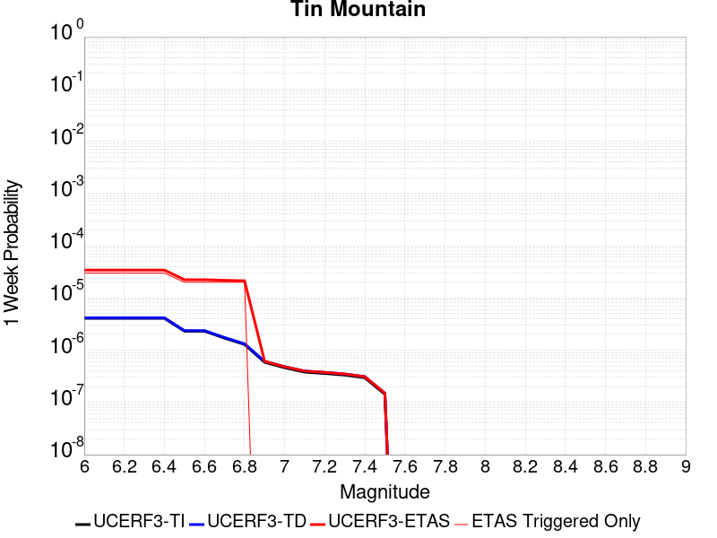 | 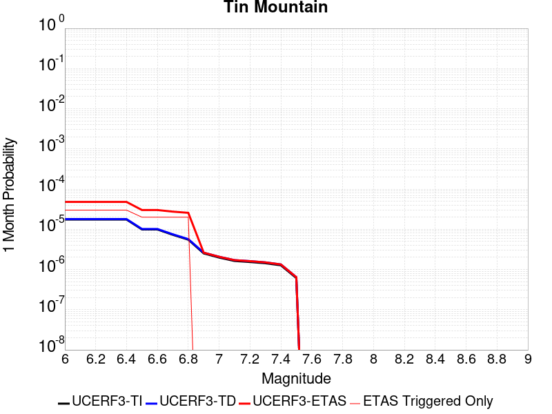 | 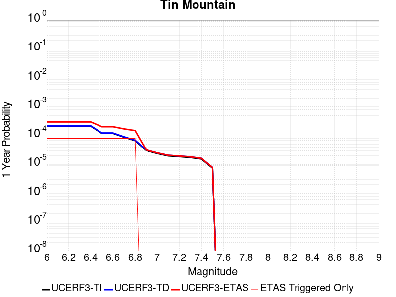 |  |

| Magnitude | 1 wk TI Prob | 1 wk TD Prob | 1 wk ETAS Prob | 1 wk ETAS/TD Gain | 1 wk ETAS Triggered Only | 1 mo TI Prob | 1 mo TD Prob | 1 mo ETAS Prob | 1 mo ETAS/TD Gain | 1 mo ETAS Triggered Only | 1 yr TI Prob | 1 yr TD Prob | 1 yr ETAS Prob | 1 yr ETAS/TD Gain | 1 yr ETAS Triggered Only | 10 yr TI Prob | 10 yr TD Prob | 10 yr ETAS Prob | 10 yr ETAS/TD Gain | 10 yr ETAS Triggered Only |
|-----|-----|-----|-----|-----|-----|-----|-----|-----|-----|-----|-----|-----|-----|-----|-----|-----|-----|-----|-----|-----|
| 6.0 | 4.083776E-6 | 4.1815365E-6 | 3.4181412E-5 | 8.174366 | 3.0E-5 | 1.750178E-5 | 1.792077E-5 | 4.792023E-5 | 2.6740053 | 3.0E-5 | 2.1306332E-4 | 2.1816725E-4 | 3.081476E-4 | 1.4124376 | 9.0E-5 | 0.0021285915 | 0.0021798965 | 0.0022896565 | 1.0503511 | 1.1E-4 |
| 6.1 | 4.083776E-6 | 4.1815365E-6 | 3.4181412E-5 | 8.174366 | 3.0E-5 | 1.750178E-5 | 1.792077E-5 | 4.792023E-5 | 2.6740053 | 3.0E-5 | 2.1306332E-4 | 2.1816725E-4 | 3.081476E-4 | 1.4124376 | 9.0E-5 | 0.0021285915 | 0.0021798965 | 0.0022896565 | 1.0503511 | 1.1E-4 |
| 6.2 | 4.083776E-6 | 4.1815365E-6 | 3.4181412E-5 | 8.174366 | 3.0E-5 | 1.750178E-5 | 1.792077E-5 | 4.792023E-5 | 2.6740053 | 3.0E-5 | 2.1306332E-4 | 2.1816725E-4 | 3.081476E-4 | 1.4124376 | 9.0E-5 | 0.0021285915 | 0.0021798965 | 0.0022896565 | 1.0503511 | 1.1E-4 |
| 6.3 | 4.083776E-6 | 4.1815365E-6 | 3.4181412E-5 | 8.174366 | 3.0E-5 | 1.750178E-5 | 1.792077E-5 | 4.792023E-5 | 2.6740053 | 3.0E-5 | 2.1306332E-4 | 2.1816725E-4 | 3.081476E-4 | 1.4124376 | 9.0E-5 | 0.0021285915 | 0.0021798965 | 0.0022896565 | 1.0503511 | 1.1E-4 |
| 6.4 | 4.083776E-6 | 4.1815365E-6 | 3.4181412E-5 | 8.174366 | 3.0E-5 | 1.750178E-5 | 1.792077E-5 | 4.792023E-5 | 2.6740053 | 3.0E-5 | 2.1306332E-4 | 2.1816725E-4 | 3.081476E-4 | 1.4124376 | 9.0E-5 | 0.0021285915 | 0.0021798965 | 0.0022896565 | 1.0503511 | 1.1E-4 |
| 6.5 | 2.3143427E-6 | 2.3731573E-6 | 2.237311E-5 | 9.427572 | 2.0E-5 | 9.9185745E-6 | 1.0170638E-5 | 3.0170435E-5 | 2.966425 | 2.0E-5 | 1.2075195E-4 | 1.2382126E-4 | 1.8381383E-4 | 1.4845095 | 6.0E-5 | 0.0012068636 | 0.0012375986 | 0.0013075119 | 1.0564911 | 7.0E-5 |
| 6.6 | 2.3143427E-6 | 2.3731573E-6 | 2.237311E-5 | 9.427572 | 2.0E-5 | 9.9185745E-6 | 1.0170638E-5 | 3.0170435E-5 | 2.966425 | 2.0E-5 | 1.2075195E-4 | 1.2382126E-4 | 1.8381383E-4 | 1.4845095 | 6.0E-5 | 0.0012068636 | 0.0012375986 | 0.0013075119 | 1.0564911 | 7.0E-5 |
| 6.7 | 1.7029532E-6 | 1.7497915E-6 | 2.1749756E-5 | 12.4299135 | 2.0E-5 | 7.2983503E-6 | 7.499088E-6 | 2.7498938E-5 | 3.666971 | 2.0E-5 | 8.885379E-5 | 9.1298105E-5 | 1.5129262E-4 | 1.6571277 | 6.0E-5 | 8.881827E-4 | 9.1265864E-4 | 9.825947E-4 | 1.076629 | 7.0E-5 |
| 6.8 | 1.2914646E-6 | 1.3299378E-6 | 2.1329912E-5 | 16.038277 | 2.0E-5 | 5.534837E-6 | 5.6997237E-6 | 2.569961E-5 | 4.508922 | 2.0E-5 | 6.738455E-5 | 6.939237E-5 | 1.0938959E-4 | 1.5763923 | 4.0E-5 | 6.736412E-4 | 6.9375033E-4 | 7.437157E-4 | 1.0720221 | 5.0E-5 |
| 6.9 | 5.8708974E-7 | 6.1169936E-7 | 6.1169936E-7 | 1.0 | 0.0 | 2.5160964E-6 | 2.6215664E-6 | 2.6215664E-6 | 1.0 | 0.0 | 3.0633044E-5 | 3.1917145E-5 | 3.1917145E-5 | 1.0 | 0.0 | 3.0628822E-4 | 3.191297E-4 | 3.191297E-4 | 1.0 | 0.0 |
| 7.0 | 4.6248786E-7 | 4.832015E-7 | 4.832015E-7 | 1.0 | 0.0 | 1.9820893E-6 | 2.0708624E-6 | 2.0708624E-6 | 1.0 | 0.0 | 2.413167E-5 | 2.5212494E-5 | 2.5212494E-5 | 1.0 | 0.0 | 2.412905E-4 | 2.5210003E-4 | 2.5210003E-4 | 1.0 | 0.0 |
| 7.1 | 3.804606E-7 | 3.987147E-7 | 3.987147E-7 | 1.0 | 0.0 | 1.6305444E-6 | 1.7087764E-6 | 1.7087764E-6 | 1.0 | 0.0 | 1.9851697E-5 | 2.0804187E-5 | 2.0804187E-5 | 1.0 | 0.0 | 1.9849923E-4 | 2.0802575E-4 | 2.0802575E-4 | 1.0 | 0.0 |
| 7.2 | 3.5864858E-7 | 3.7616863E-7 | 3.7616863E-7 | 1.0 | 0.0 | 1.5370645E-6 | 1.6121504E-6 | 1.6121504E-6 | 1.0 | 0.0 | 1.87136E-5 | 1.9627789E-5 | 1.9627789E-5 | 1.0 | 0.0 | 1.8712023E-4 | 1.9626386E-4 | 1.9626386E-4 | 1.0 | 0.0 |
| 7.3 | 3.342063E-7 | 3.506347E-7 | 3.506347E-7 | 1.0 | 0.0 | 1.4323119E-6 | 1.5027196E-6 | 1.5027196E-6 | 1.0 | 0.0 | 1.7438259E-5 | 1.829549E-5 | 1.829549E-5 | 1.0 | 0.0 | 1.743689E-4 | 1.8294314E-4 | 1.8294314E-4 | 1.0 | 0.0 |
| 7.4 | 2.971242E-7 | 3.1165817E-7 | 3.1165817E-7 | 1.0 | 0.0 | 1.2733886E-6 | 1.3356774E-6 | 1.3356774E-6 | 1.0 | 0.0 | 1.5503398E-5 | 1.6261785E-5 | 1.6261785E-5 | 1.0 | 0.0 | 1.5502315E-4 | 1.6260923E-4 | 1.6260923E-4 | 1.0 | 0.0 |
| 7.5 | 1.4326713E-7 | 1.5012525E-7 | 1.5012525E-7 | 1.0 | 0.0 | 6.140018E-7 | 6.433939E-7 | 6.433939E-7 | 1.0 | 0.0 | 7.4754466E-6 | 7.8333205E-6 | 7.8333205E-6 | 1.0 | 0.0 | 7.475195E-5 | 7.833321E-5 | 7.833321E-5 | 1.0 | 0.0 |

## Calaveras (So) - Paicines extension 2011 CFM
*[(top)](#table-of-contents)*

| 1 Week | 1 Month | 1 Year | 10 Year |
|-----|-----|-----|-----|
| 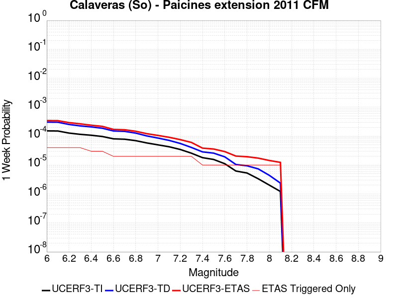 | 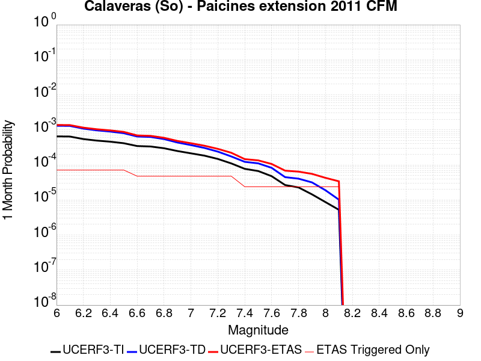 | 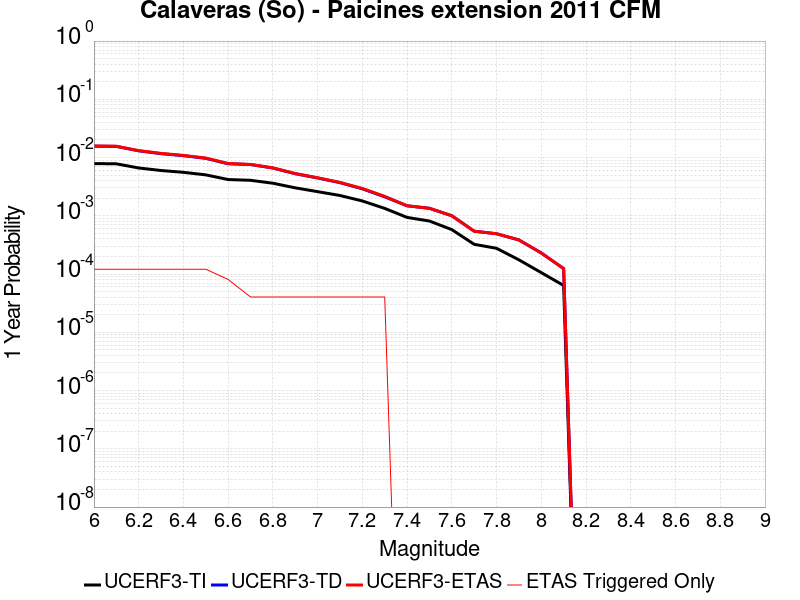 | 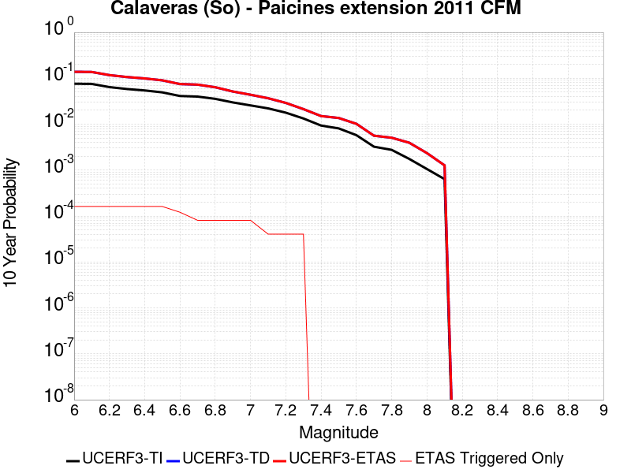 |

| Magnitude | 1 wk TI Prob | 1 wk TD Prob | 1 wk ETAS Prob | 1 wk ETAS/TD Gain | 1 wk ETAS Triggered Only | 1 mo TI Prob | 1 mo TD Prob | 1 mo ETAS Prob | 1 mo ETAS/TD Gain | 1 mo ETAS Triggered Only | 1 yr TI Prob | 1 yr TD Prob | 1 yr ETAS Prob | 1 yr ETAS/TD Gain | 1 yr ETAS Triggered Only | 10 yr TI Prob | 10 yr TD Prob | 10 yr ETAS Prob | 10 yr ETAS/TD Gain | 10 yr ETAS Triggered Only |
|-----|-----|-----|-----|-----|-----|-----|-----|-----|-----|-----|-----|-----|-----|-----|-----|-----|-----|-----|-----|-----|
| 6.0 | 1.5183659E-4 | 3.0533716E-4 | 3.4532495E-4 | 1.1309627 | 4.0E-5 | 6.5056595E-4 | 0.0013069661 | 0.0013469139 | 1.0305653 | 4.0E-5 | 0.007891912 | 0.01569571 | 0.01576461 | 1.0043898 | 7.0E-5 | 0.076174594 | 0.13848671 | 0.13856426 | 1.0005599 | 9.0E-5 |
| 6.1 | 1.5024997E-4 | 3.0227835E-4 | 3.4226628E-4 | 1.1322883 | 4.0E-5 | 6.437695E-4 | 0.00129387 | 0.0013338183 | 1.030875 | 4.0E-5 | 0.0078097614 | 0.015539104 | 0.015608016 | 1.0044347 | 7.0E-5 | 0.075409345 | 0.13715632 | 0.13723399 | 1.0005662 | 9.0E-5 |
| 6.2 | 1.2743923E-4 | 2.5306802E-4 | 2.930579E-4 | 1.1580203 | 4.0E-5 | 5.460538E-4 | 0.0010841049 | 0.0011240615 | 1.0368568 | 4.0E-5 | 0.0066279583 | 0.013046704 | 0.013115791 | 1.0052954 | 7.0E-5 | 0.064337276 | 0.11725405 | 0.117333494 | 1.0006776 | 9.0E-5 |
| 6.3 | 1.1525114E-4 | 2.2595265E-4 | 2.659436E-4 | 1.1769882 | 4.0E-5 | 4.9383997E-4 | 9.6799526E-4 | 0.0010079566 | 1.0412825 | 4.0E-5 | 0.0059959386 | 0.011667927 | 0.01173711 | 1.0059294 | 7.0E-5 | 0.058367174 | 0.10637007 | 0.1064505 | 1.0007561 | 9.0E-5 |
| 6.4 | 1.07200925E-4 | 2.0836305E-4 | 2.3835679E-4 | 1.1439495 | 3.0E-5 | 4.5935164E-4 | 8.926636E-4 | 9.226368E-4 | 1.0335773 | 3.0E-5 | 0.0055782744 | 0.010772766 | 0.010832119 | 1.0055096 | 6.0E-5 | 0.0544031 | 0.09919256 | 0.09926463 | 1.0007265 | 8.0E-5 |
| 6.5 | 9.69631E-5 | 1.8729115E-4 | 2.1728553E-4 | 1.1601484 | 3.0E-5 | 4.1548995E-4 | 8.024135E-4 | 8.323894E-4 | 1.0373572 | 3.0E-5 | 0.0050468626 | 0.009694662 | 0.00975408 | 1.006129 | 6.0E-5 | 0.04933773 | 0.090084255 | 0.09015705 | 1.000808 | 8.0E-5 |
| 6.6 | 8.0552316E-5 | 1.5070537E-4 | 1.7070236E-4 | 1.1326892 | 2.0E-5 | 3.4517853E-4 | 6.456994E-4 | 6.6568644E-4 | 1.0309541 | 2.0E-5 | 0.0041944524 | 0.007826256 | 0.007875864 | 1.0063387 | 5.0E-5 | 0.04116161 | 0.074854024 | 0.074918784 | 1.0008651 | 7.0E-5 |
| 6.7 | 7.815757E-5 | 1.4610609E-4 | 1.6610317E-4 | 1.1368668 | 2.0E-5 | 3.34918E-4 | 6.260017E-4 | 6.4598914E-4 | 1.0319288 | 2.0E-5 | 0.004070005 | 0.0075890915 | 0.0076287882 | 1.0052307 | 4.0E-5 | 0.039962657 | 0.072703585 | 0.072759226 | 1.0007653 | 6.0E-5 |
| 6.8 | 6.965264E-5 | 1.2721405E-4 | 1.472115E-4 | 1.1571953 | 2.0E-5 | 2.9847719E-4 | 5.450839E-4 | 5.65073E-4 | 1.0366716 | 2.0E-5 | 0.0036279052 | 0.00661342 | 0.006653155 | 1.0060083 | 4.0E-5 | 0.03569247 | 0.06379891 | 0.06385508 | 1.0008805 | 6.0E-5 |
| 6.9 | 5.8000453E-5 | 1.01435086E-4 | 1.21433055E-4 | 1.1971505 | 2.0E-5 | 2.4854968E-4 | 4.3464993E-4 | 4.5464124E-4 | 1.045994 | 2.0E-5 | 0.0030218933 | 0.0052791284 | 0.0053189173 | 1.007537 | 4.0E-5 | 0.029811295 | 0.051501602 | 0.051558513 | 1.0011051 | 6.0E-5 |
| 7.0 | 4.9865852E-5 | 8.567692E-5 | 1.0567521E-4 | 1.2334151 | 2.0E-5 | 2.1369329E-4 | 3.671356E-4 | 3.8712827E-4 | 1.0544558 | 2.0E-5 | 0.0025986114 | 0.0044608037 | 0.004500625 | 1.008927 | 4.0E-5 | 0.025684336 | 0.043781694 | 0.043839067 | 1.0013105 | 6.0E-5 |
| 7.1 | 4.283875E-5 | 7.112159E-5 | 9.1120164E-5 | 1.2811886 | 2.0E-5 | 1.8358172E-4 | 3.047715E-4 | 3.2476542E-4 | 1.0656029 | 2.0E-5 | 0.0022328163 | 0.003704336 | 0.003744188 | 1.0107582 | 4.0E-5 | 0.022105146 | 0.03673583 | 0.036783993 | 1.0013111 | 5.0E-5 |
| 7.2 | 3.450115E-5 | 5.5776054E-5 | 7.577494E-5 | 1.3585569 | 2.0E-5 | 1.478537E-4 | 2.390185E-4 | 2.5901373E-4 | 1.0836555 | 2.0E-5 | 0.0017986323 | 0.0029061958 | 0.0029460797 | 1.0137237 | 4.0E-5 | 0.017841442 | 0.029079199 | 0.029127745 | 1.0016694 | 5.0E-5 |
| 7.3 | 2.5709045E-5 | 4.0588155E-5 | 6.0587343E-5 | 1.4927346 | 2.0E-5 | 1.1017697E-4 | 1.7393773E-4 | 1.9393426E-4 | 1.1149637 | 2.0E-5 | 0.0013405791 | 0.002115652 | 0.0021555673 | 1.0188667 | 4.0E-5 | 0.013325208 | 0.021297242 | 0.02133639 | 1.0018382 | 4.0E-5 |
| 7.4 | 1.8003093E-5 | 2.8509934E-5 | 3.850965E-5 | 1.350745 | 1.0E-5 | 7.715383E-5 | 1.2217973E-4 | 1.3217851E-4 | 1.0818367 | 1.0E-5 | 9.3894306E-4 | 0.0014865254 | 0.0015164808 | 1.0201513 | 3.0E-5 | 0.009349857 | 0.015052196 | 0.015081745 | 1.001963 | 3.0E-5 |
| 7.5 | 1.5595824E-5 | 2.5822499E-5 | 3.582224E-5 | 1.3872492 | 1.0E-5 | 6.683753E-5 | 1.1066317E-4 | 1.20662065E-4 | 1.0903543 | 1.0E-5 | 8.134431E-4 | 0.0013464936 | 0.0013764532 | 1.02225 | 3.0E-5 | 0.008104719 | 0.01365213 | 0.013681721 | 1.0021675 | 3.0E-5 |
| 7.6 | 1.1110309E-5 | 1.9222098E-5 | 2.9221905E-5 | 1.5202246 | 1.0E-5 | 4.761474E-5 | 8.2377825E-5 | 9.2377E-5 | 1.1213819 | 1.0E-5 | 5.795553E-4 | 0.0010024898 | 0.0010324598 | 1.0298955 | 3.0E-5 | 0.0057804612 | 0.010203943 | 0.010233637 | 1.00291 | 3.0E-5 |
| 7.7 | 6.2140443E-6 | 1.0437076E-5 | 2.0436972E-5 | 1.9581127 | 1.0E-5 | 2.6631347E-5 | 4.4729557E-5 | 5.4729113E-5 | 1.2235558 | 1.0E-5 | 3.241884E-4 | 5.444464E-4 | 5.7443004E-4 | 1.0550718 | 3.0E-5 | 0.0032371588 | 0.005619835 | 0.0056496663 | 1.0053083 | 3.0E-5 |
| 7.8 | 5.305533E-6 | 9.433038E-6 | 1.9432944E-5 | 2.0600939 | 1.0E-5 | 2.27378E-5 | 4.042668E-5 | 5.0426275E-5 | 1.2473514 | 1.0E-5 | 2.7679754E-4 | 4.920837E-4 | 5.22069E-4 | 1.0609353 | 3.0E-5 | 0.0027645302 | 0.005074324 | 0.005104172 | 1.0058821 | 3.0E-5 |
| 7.9 | 3.363505E-6 | 7.3848937E-6 | 1.738482E-5 | 2.3541057 | 1.0E-5 | 1.4414942E-5 | 3.164916E-5 | 4.1648844E-5 | 1.3159541 | 1.0E-5 | 1.7548777E-4 | 3.8526047E-4 | 4.0525277E-4 | 1.0518929 | 2.0E-5 | 0.0017534926 | 0.003948527 | 0.003968448 | 1.0050452 | 2.0E-5 |
| 8.0 | 2.0271132E-6 | 4.413104E-6 | 1.441306E-5 | 3.265969 | 1.0E-5 | 8.687599E-6 | 1.8913164E-5 | 2.8912975E-5 | 1.5287223 | 1.0E-5 | 1.05766376E-4 | 2.302435E-4 | 2.502389E-4 | 1.0868446 | 2.0E-5 | 0.0010571606 | 0.002351099 | 0.002371052 | 1.0084866 | 2.0E-5 |
| 8.1 | 1.2206116E-6 | 2.3751331E-6 | 1.237511E-5 | 5.2102804 | 1.0E-5 | 5.2311816E-6 | 1.0179103E-5 | 2.0179E-5 | 1.9823948 | 1.0E-5 | 6.3687774E-5 | 1.2392356E-4 | 1.3392232E-4 | 1.0806849 | 1.0E-5 | 6.366953E-4 | 0.0012705477 | 0.001280535 | 1.0078607 | 1.0E-5 |

## Bullion Mountains
*[(top)](#table-of-contents)*

| 1 Week | 1 Month | 1 Year | 10 Year |
|-----|-----|-----|-----|
| 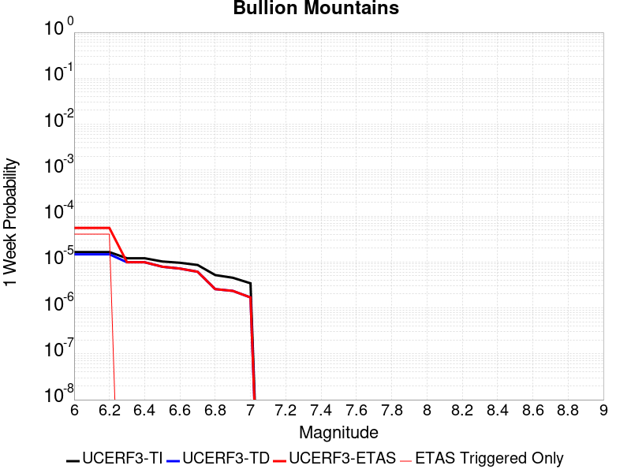 | 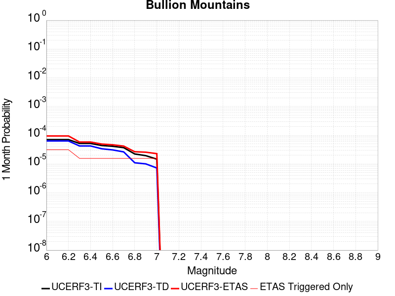 | 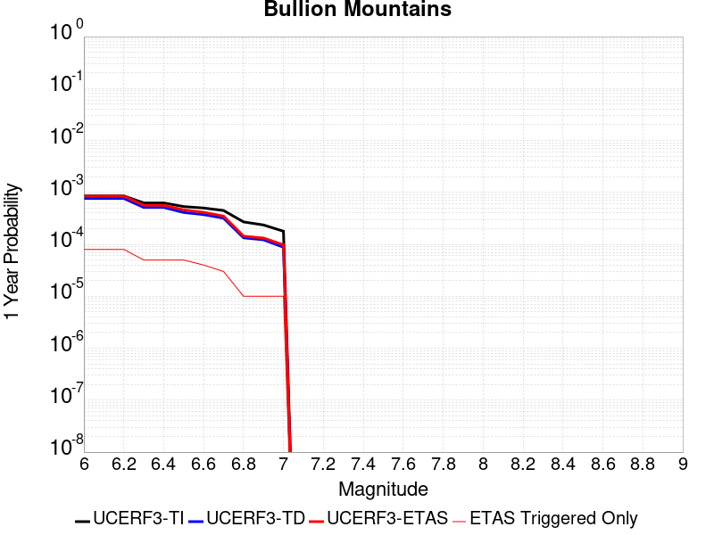 | 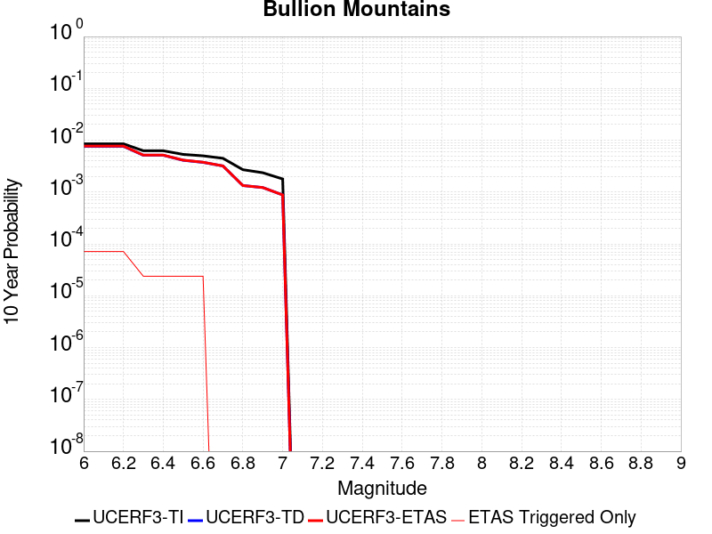 |

| Magnitude | 1 wk TI Prob | 1 wk TD Prob | 1 wk ETAS Prob | 1 wk ETAS/TD Gain | 1 wk ETAS Triggered Only | 1 mo TI Prob | 1 mo TD Prob | 1 mo ETAS Prob | 1 mo ETAS/TD Gain | 1 mo ETAS Triggered Only | 1 yr TI Prob | 1 yr TD Prob | 1 yr ETAS Prob | 1 yr ETAS/TD Gain | 1 yr ETAS Triggered Only | 10 yr TI Prob | 10 yr TD Prob | 10 yr ETAS Prob | 10 yr ETAS/TD Gain | 10 yr ETAS Triggered Only |
|-----|-----|-----|-----|-----|-----|-----|-----|-----|-----|-----|-----|-----|-----|-----|-----|-----|-----|-----|-----|-----|
| 6.0 | 1.6420427E-5 | 1.4692089E-5 | 4.469165E-5 | 3.0418851 | 3.0E-5 | 7.037136E-5 | 6.296479E-5 | 9.29629E-5 | 1.4764267 | 3.0E-5 | 8.5643446E-4 | 7.663651E-4 | 8.4630377E-4 | 1.1043088 | 8.0E-5 | 0.008531413 | 0.007641016 | 0.007740252 | 1.0129873 | 1.0E-4 |
| 6.1 | 1.6420427E-5 | 1.4692089E-5 | 4.469165E-5 | 3.0418851 | 3.0E-5 | 7.037136E-5 | 6.296479E-5 | 9.29629E-5 | 1.4764267 | 3.0E-5 | 8.5643446E-4 | 7.663651E-4 | 8.4630377E-4 | 1.1043088 | 8.0E-5 | 0.008531413 | 0.007641016 | 0.007740252 | 1.0129873 | 1.0E-4 |
| 6.2 | 1.6420427E-5 | 1.4692089E-5 | 4.469165E-5 | 3.0418851 | 3.0E-5 | 7.037136E-5 | 6.296479E-5 | 9.29629E-5 | 1.4764267 | 3.0E-5 | 8.5643446E-4 | 7.663651E-4 | 8.4630377E-4 | 1.1043088 | 8.0E-5 | 0.008531413 | 0.007641016 | 0.007740252 | 1.0129873 | 1.0E-4 |
| 6.3 | 1.2046778E-5 | 9.862335E-6 | 2.9862138E-5 | 3.0278974 | 2.0E-5 | 5.1628023E-5 | 4.2266598E-5 | 6.226575E-5 | 1.473167 | 2.0E-5 | 6.283899E-4 | 5.144975E-4 | 5.6447176E-4 | 1.0971322 | 5.0E-5 | 0.0062661595 | 0.005135345 | 0.005195037 | 1.0116237 | 6.0E-5 |
| 6.4 | 1.2046778E-5 | 9.862335E-6 | 2.9862138E-5 | 3.0278974 | 2.0E-5 | 5.1628023E-5 | 4.2266598E-5 | 6.226575E-5 | 1.473167 | 2.0E-5 | 6.283899E-4 | 5.144975E-4 | 5.6447176E-4 | 1.0971322 | 5.0E-5 | 0.0062661595 | 0.005135345 | 0.005195037 | 1.0116237 | 6.0E-5 |
| 6.5 | 1.0244343E-5 | 7.879458E-6 | 2.7879301E-5 | 3.5382257 | 2.0E-5 | 4.390359E-5 | 3.3768785E-5 | 5.376811E-5 | 1.592243 | 2.0E-5 | 5.343951E-4 | 4.110781E-4 | 4.6105756E-4 | 1.1215814 | 5.0E-5 | 0.005331118 | 0.004105208 | 0.0041649616 | 1.0145556 | 6.0E-5 |
| 6.6 | 9.605408E-6 | 7.1774966E-6 | 1.7177425E-5 | 2.3932335 | 1.0E-5 | 4.1165385E-5 | 3.076045E-5 | 4.0760144E-5 | 1.3250828 | 1.0E-5 | 5.010733E-4 | 3.744645E-4 | 4.1444952E-4 | 1.1067792 | 4.0E-5 | 0.00499945 | 0.003740332 | 0.003790145 | 1.0133178 | 5.0E-5 |
| 6.7 | 8.60418E-6 | 6.1240044E-6 | 1.6123944E-5 | 2.6329083 | 1.0E-5 | 3.687454E-5 | 2.624558E-5 | 3.6245317E-5 | 1.3810066 | 1.0E-5 | 4.48855E-4 | 3.1951256E-4 | 3.4950298E-4 | 1.093863 | 3.0E-5 | 0.004479495 | 0.0031924439 | 0.003232316 | 1.0124896 | 4.0E-5 |
| 6.8 | 5.187994E-6 | 2.5631666E-6 | 1.2563141E-5 | 4.901414 | 1.0E-5 | 2.223407E-5 | 1.0984976E-5 | 2.0984866E-5 | 1.9103242 | 1.0E-5 | 2.7066618E-4 | 1.3373788E-4 | 1.4373654E-4 | 1.0747632 | 1.0E-5 | 0.0027033675 | 0.0013369655 | 0.0013569387 | 1.0149393 | 2.0E-5 |
| 6.9 | 4.5302368E-6 | 2.3443165E-6 | 1.2344293E-5 | 5.2656255 | 1.0E-5 | 1.9415156E-5 | 1.0047055E-5 | 2.0046955E-5 | 1.9953066 | 1.0E-5 | 2.3635388E-4 | 1.2232E-4 | 1.3231878E-4 | 1.0817428 | 1.0E-5 | 0.0023610266 | 0.0012229157 | 0.0012428913 | 1.0163344 | 2.0E-5 |
| 7.0 | 3.431668E-6 | 1.6882402E-6 | 1.1688223E-5 | 6.9233174 | 1.0E-5 | 1.4707065E-5 | 7.235315E-6 | 1.7235243E-5 | 2.3820999 | 1.0E-5 | 1.7904381E-4 | 8.808996E-5 | 9.808908E-5 | 1.1135104 | 1.0E-5 | 0.0017889962 | 8.808996E-4 | 9.00882E-4 | 1.0226841 | 2.0E-5 |

## Rose Canyon
*[(top)](#table-of-contents)*

| 1 Week | 1 Month | 1 Year | 10 Year |
|-----|-----|-----|-----|
| 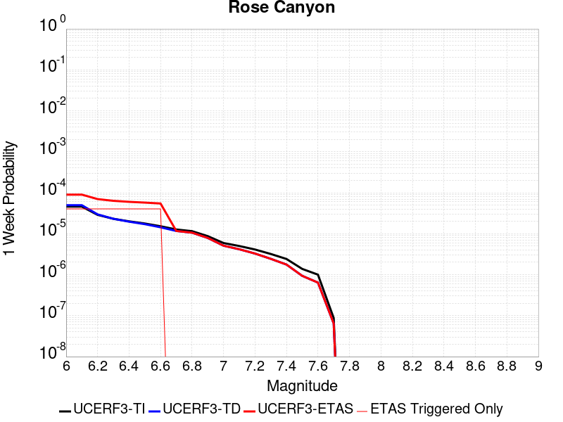 | 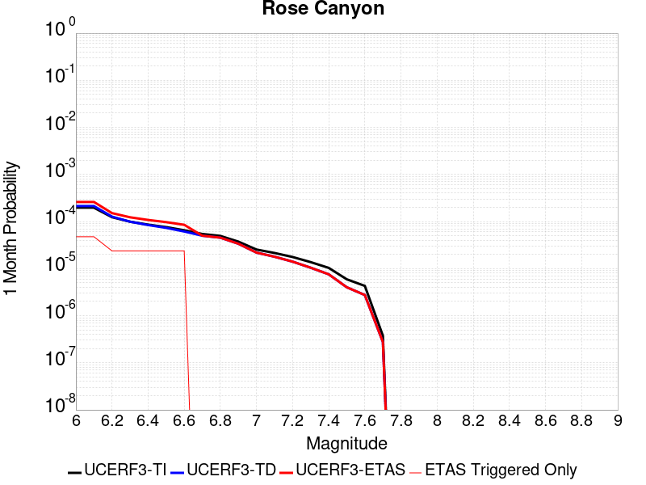 | 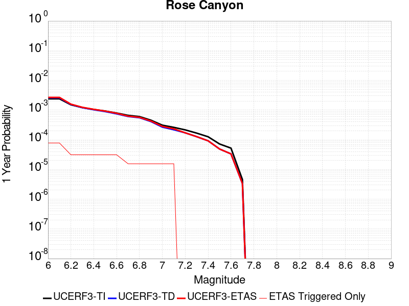 | 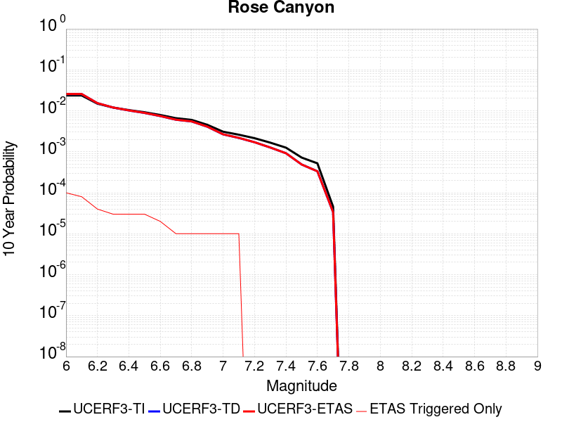 |

| Magnitude | 1 wk TI Prob | 1 wk TD Prob | 1 wk ETAS Prob | 1 wk ETAS/TD Gain | 1 wk ETAS Triggered Only | 1 mo TI Prob | 1 mo TD Prob | 1 mo ETAS Prob | 1 mo ETAS/TD Gain | 1 mo ETAS Triggered Only | 1 yr TI Prob | 1 yr TD Prob | 1 yr ETAS Prob | 1 yr ETAS/TD Gain | 1 yr ETAS Triggered Only | 10 yr TI Prob | 10 yr TD Prob | 10 yr ETAS Prob | 10 yr ETAS/TD Gain | 10 yr ETAS Triggered Only |
|-----|-----|-----|-----|-----|-----|-----|-----|-----|-----|-----|-----|-----|-----|-----|-----|-----|-----|-----|-----|-----|
| 6.0 | 4.5923203E-5 | 4.9714225E-5 | 5.971373E-5 | 1.2011397 | 1.0E-5 | 1.9679888E-4 | 2.1304491E-4 | 2.3304066E-4 | 1.0938569 | 2.0E-5 | 0.0023933933 | 0.0025909345 | 0.002650779 | 1.0230976 | 6.0E-5 | 0.023677798 | 0.02563999 | 0.025737427 | 1.0038002 | 1.0E-4 |
| 6.1 | 4.5923203E-5 | 4.9714225E-5 | 5.971373E-5 | 1.2011397 | 1.0E-5 | 1.9679888E-4 | 2.1304491E-4 | 2.3304066E-4 | 1.0938569 | 2.0E-5 | 0.0023933933 | 0.0025909345 | 0.002650779 | 1.0230976 | 6.0E-5 | 0.023677798 | 0.02563999 | 0.02571794 | 1.0030401 | 8.0E-5 |
| 6.2 | 2.8844734E-5 | 2.9668723E-5 | 3.9668426E-5 | 1.3370453 | 1.0E-5 | 1.2361443E-4 | 1.2714567E-4 | 1.371444E-4 | 1.07864 | 1.0E-5 | 0.0015039665 | 0.0015468939 | 0.0015668629 | 1.0129092 | 2.0E-5 | 0.0149382865 | 0.015374276 | 0.0154136615 | 1.0025618 | 4.0E-5 |
| 6.3 | 2.3171577E-5 | 2.3161238E-5 | 3.3161006E-5 | 1.4317459 | 1.0E-5 | 9.9302975E-5 | 9.9258745E-5 | 1.0925776E-4 | 1.1007367 | 1.0E-5 | 0.0012083431 | 0.0012078186 | 0.0012277944 | 1.0165387 | 2.0E-5 | 0.012017938 | 0.012022437 | 0.012052076 | 1.0024654 | 3.0E-5 |
| 6.4 | 2.0066604E-5 | 1.9667024E-5 | 2.9666828E-5 | 1.5084553 | 1.0E-5 | 8.599689E-5 | 8.4284584E-5 | 9.428374E-5 | 1.1186357 | 1.0E-5 | 0.0010465092 | 0.0010256917 | 0.0010456712 | 1.019479 | 2.0E-5 | 0.010415946 | 0.010217559 | 0.010247252 | 1.0029061 | 3.0E-5 |
| 6.5 | 1.776989E-5 | 1.7113807E-5 | 2.7113636E-5 | 1.5843135 | 1.0E-5 | 7.615444E-5 | 7.334287E-5 | 8.334213E-5 | 1.136336 | 1.0E-5 | 9.267859E-4 | 8.925905E-4 | 9.1257266E-4 | 1.0223867 | 2.0E-5 | 0.009229303 | 0.008896211 | 0.008925944 | 1.0033423 | 3.0E-5 |
| 6.6 | 1.5227364E-5 | 1.433926E-5 | 2.4339117E-5 | 1.697376 | 1.0E-5 | 6.52585E-5 | 6.1452556E-5 | 7.145194E-5 | 1.1627172 | 1.0E-5 | 7.942326E-4 | 7.479332E-4 | 7.6791825E-4 | 1.0267204 | 2.0E-5 | 0.007914 | 0.007458359 | 0.00747821 | 1.0026616 | 2.0E-5 |
| 6.7 | 1.2703898E-5 | 1.1673274E-5 | 1.1673274E-5 | 1.0 | 0.0 | 5.4444143E-5 | 5.0027378E-5 | 5.0027378E-5 | 1.0 | 0.0 | 6.626558E-4 | 6.089174E-4 | 6.189113E-4 | 1.0164126 | 1.0E-5 | 0.006606833 | 0.0060750856 | 0.006085025 | 1.001636 | 1.0E-5 |
| 6.8 | 1.1554917E-5 | 1.0609337E-5 | 1.0609337E-5 | 1.0 | 0.0 | 4.9520135E-5 | 4.546782E-5 | 4.546782E-5 | 1.0 | 0.0 | 6.0274085E-4 | 5.5343413E-4 | 5.6342856E-4 | 1.018059 | 1.0E-5 | 0.0060110865 | 0.0055225673 | 0.005532512 | 1.0018008 | 1.0E-5 |
| 6.9 | 8.732078E-6 | 7.881357E-6 | 7.881357E-6 | 1.0 | 0.0 | 3.7422655E-5 | 3.3776825E-5 | 3.3776825E-5 | 1.0 | 0.0 | 4.5552556E-4 | 4.111582E-4 | 4.2115408E-4 | 1.0243115 | 1.0E-5 | 0.0045459294 | 0.0041048084 | 0.0041147675 | 1.0024261 | 1.0E-5 |
| 7.0 | 5.9337494E-6 | 5.1074853E-6 | 5.1074853E-6 | 1.0 | 0.0 | 2.5430107E-5 | 2.188904E-5 | 2.188904E-5 | 1.0 | 0.0 | 3.0956755E-4 | 2.664666E-4 | 2.7646395E-4 | 1.0375181 | 1.0E-5 | 0.0030913667 | 0.0026614866 | 0.00267146 | 1.0037473 | 1.0E-5 |
| 7.1 | 5.013409E-6 | 4.1773833E-6 | 4.1773833E-6 | 1.0 | 0.0 | 2.1485863E-5 | 1.7902948E-5 | 1.7902948E-5 | 1.0 | 0.0 | 2.6155898E-4 | 2.179467E-4 | 2.2794452E-4 | 1.0458728 | 1.0E-5 | 0.0026125133 | 0.0021773411 | 0.0021873193 | 1.0045828 | 1.0E-5 |
| 7.2 | 4.120763E-6 | 3.2821383E-6 | 3.2821383E-6 | 1.0 | 0.0 | 1.7660293E-5 | 1.4066231E-5 | 1.4066231E-5 | 1.0 | 0.0 | 2.1499286E-4 | 1.7124301E-4 | 1.7124301E-4 | 1.0 | 0.0 | 0.0021478499 | 0.00171112 | 0.00171112 | 1.0 | 0.0 |
| 7.3 | 3.2081239E-6 | 2.4405372E-6 | 2.4405372E-6 | 1.0 | 0.0 | 1.374903E-5 | 1.0459404E-5 | 1.0459404E-5 | 1.0 | 0.0 | 1.6738157E-4 | 1.2733586E-4 | 1.2733586E-4 | 1.0 | 0.0 | 0.0016725556 | 0.001272636 | 0.001272636 | 1.0 | 0.0 |
| 7.4 | 2.4194755E-6 | 1.7680634E-6 | 1.7680634E-6 | 1.0 | 0.0 | 1.0369139E-5 | 7.577393E-6 | 7.577393E-6 | 1.0 | 0.0 | 1.2623696E-4 | 9.2250906E-5 | 9.2250906E-5 | 1.0 | 0.0 | 0.0012616527 | 9.2213147E-4 | 9.2213147E-4 | 1.0 | 0.0 |
| 7.5 | 1.3842889E-6 | 9.3786275E-7 | 9.3786275E-7 | 1.0 | 0.0 | 5.9326535E-6 | 4.019406E-6 | 4.019406E-6 | 1.0 | 0.0 | 7.222766E-5 | 4.8935202E-5 | 4.8935202E-5 | 1.0 | 0.0 | 7.220419E-4 | 4.892478E-4 | 4.892478E-4 | 1.0 | 0.0 |
| 7.6 | 1.0021575E-6 | 6.411463E-7 | 6.411463E-7 | 1.0 | 0.0 | 4.2949537E-6 | 2.7477672E-6 | 2.7477672E-6 | 1.0 | 0.0 | 5.2289808E-5 | 3.3453573E-5 | 3.3453573E-5 | 1.0 | 0.0 | 5.2277505E-4 | 3.344875E-4 | 3.344875E-4 | 1.0 | 0.0 |
| 7.7 | 8.7620116E-8 | 6.4492404E-8 | 6.4492404E-8 | 1.0 | 0.0 | 3.7551473E-7 | 2.76396E-7 | 2.76396E-7 | 1.0 | 0.0 | 4.5718825E-6 | 3.3651165E-6 | 3.3651165E-6 | 1.0 | 0.0 | 4.5717883E-5 | 3.3650686E-5 | 3.3650686E-5 | 1.0 | 0.0 |

## Oceanic - West Huasna
*[(top)](#table-of-contents)*

| 1 Week | 1 Month | 1 Year | 10 Year |
|-----|-----|-----|-----|
| 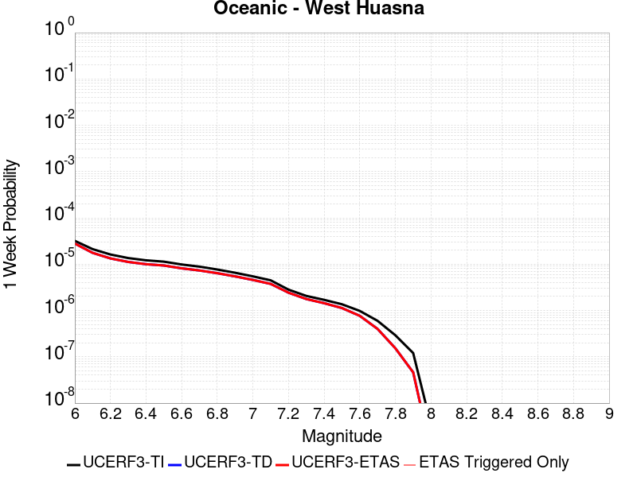 | 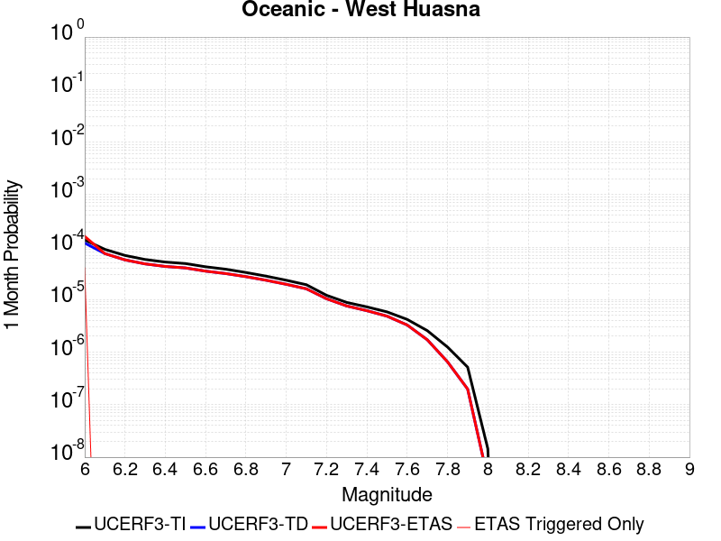 | 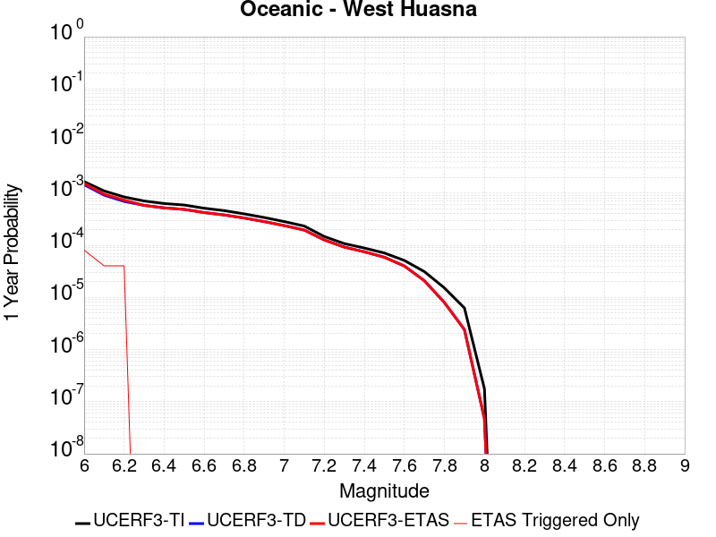 | 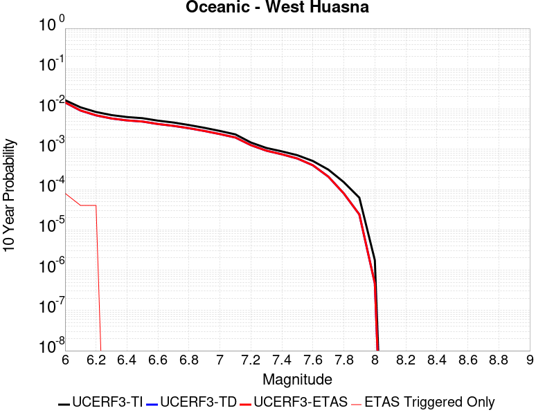 |

| Magnitude | 1 wk TI Prob | 1 wk TD Prob | 1 wk ETAS Prob | 1 wk ETAS/TD Gain | 1 wk ETAS Triggered Only | 1 mo TI Prob | 1 mo TD Prob | 1 mo ETAS Prob | 1 mo ETAS/TD Gain | 1 mo ETAS Triggered Only | 1 yr TI Prob | 1 yr TD Prob | 1 yr ETAS Prob | 1 yr ETAS/TD Gain | 1 yr ETAS Triggered Only | 10 yr TI Prob | 10 yr TD Prob | 10 yr ETAS Prob | 10 yr ETAS/TD Gain | 10 yr ETAS Triggered Only |
|-----|-----|-----|-----|-----|-----|-----|-----|-----|-----|-----|-----|-----|-----|-----|-----|-----|-----|-----|-----|-----|
| 6.0 | 3.195567E-5 | 2.7926868E-5 | 2.7926868E-5 | 1.0 | 0.0 | 1.3694567E-4 | 1.1968133E-4 | 1.2968013E-4 | 1.0835452 | 1.0E-5 | 0.0016660384 | 0.0014561893 | 0.0015061166 | 1.0342861 | 5.0E-5 | 0.016536033 | 0.014471028 | 0.014559725 | 1.0061293 | 9.0E-5 |
| 6.1 | 2.1156782E-5 | 1.7573486E-5 | 1.7573486E-5 | 1.0 | 0.0 | 9.066878E-5 | 7.531282E-5 | 7.531282E-5 | 1.0 | 0.0 | 0.0011033333 | 9.165572E-4 | 9.4652973E-4 | 1.0327011 | 3.0E-5 | 0.010978713 | 0.009128777 | 0.00918823 | 1.0065126 | 6.0E-5 |
| 6.2 | 1.6195117E-5 | 1.3327152E-5 | 1.3327152E-5 | 1.0 | 0.0 | 6.9405796E-5 | 5.7115132E-5 | 5.7115132E-5 | 1.0 | 0.0 | 8.44688E-4 | 6.9515745E-4 | 7.251366E-4 | 1.0431257 | 3.0E-5 | 0.008414844 | 0.006930123 | 0.006979777 | 1.0071648 | 5.0E-5 |
| 6.3 | 1.3559345E-5 | 1.1179142E-5 | 1.1179142E-5 | 1.0 | 0.0 | 5.811018E-5 | 4.7909736E-5 | 4.7909736E-5 | 1.0 | 0.0 | 7.072618E-4 | 5.831459E-4 | 5.931401E-4 | 1.0171384 | 1.0E-5 | 0.0070501505 | 0.0058162753 | 0.005836159 | 1.0034187 | 2.0E-5 |
| 6.4 | 1.2120619E-5 | 1.0000977E-5 | 1.0000977E-5 | 1.0 | 0.0 | 5.1944477E-5 | 4.2860633E-5 | 4.2860633E-5 | 1.0 | 0.0 | 6.322405E-4 | 5.2170374E-4 | 5.316985E-4 | 1.019158 | 1.0E-5 | 0.006304447 | 0.0052048573 | 0.005224753 | 1.0038226 | 2.0E-5 |
| 6.5 | 1.13511915E-5 | 9.3674735E-6 | 9.3674735E-6 | 1.0 | 0.0 | 4.8647056E-5 | 4.01457E-5 | 4.01457E-5 | 1.0 | 0.0 | 5.9211696E-4 | 4.886647E-4 | 4.886647E-4 | 1.0 | 0.0 | 0.0059054173 | 0.0048759608 | 0.004885912 | 1.0020409 | 1.0E-5 |
| 6.6 | 9.850605E-6 | 8.135418E-6 | 8.135418E-6 | 1.0 | 0.0 | 4.2216197E-5 | 3.4865614E-5 | 3.4865614E-5 | 1.0 | 0.0 | 5.1386096E-4 | 4.2440637E-4 | 4.2440637E-4 | 1.0 | 0.0 | 0.0051267436 | 0.004235991 | 0.0042459485 | 1.0023507 | 1.0E-5 |
| 6.7 | 8.8558645E-6 | 7.318433E-6 | 7.318433E-6 | 1.0 | 0.0 | 3.7953152E-5 | 3.1364336E-5 | 3.1364336E-5 | 1.0 | 0.0 | 4.6198163E-4 | 3.8179406E-4 | 3.8179406E-4 | 1.0 | 0.0 | 0.004610224 | 0.0038114067 | 0.0038213686 | 1.0026137 | 1.0E-5 |
| 6.8 | 7.67136E-6 | 6.391756E-6 | 6.391756E-6 | 1.0 | 0.0 | 3.2876844E-5 | 2.7392953E-5 | 2.7392953E-5 | 1.0 | 0.0 | 4.0020206E-4 | 3.3345833E-4 | 3.3345833E-4 | 1.0 | 0.0 | 0.003994821 | 0.0033296007 | 0.0033395675 | 1.0029933 | 1.0E-5 |
| 6.9 | 6.534529E-6 | 5.4583297E-6 | 5.4583297E-6 | 1.0 | 0.0 | 2.8004823E-5 | 2.3392633E-5 | 2.3392633E-5 | 1.0 | 0.0 | 3.4090536E-4 | 2.847682E-4 | 2.847682E-4 | 1.0 | 0.0 | 0.0034038287 | 0.0028440498 | 0.0028540213 | 1.0035061 | 1.0E-5 |
| 7.0 | 5.460525E-6 | 4.5699517E-6 | 4.5699517E-6 | 1.0 | 0.0 | 2.3402039E-5 | 1.958536E-5 | 1.958536E-5 | 1.0 | 0.0 | 2.8488258E-4 | 2.3842578E-4 | 2.3842578E-4 | 1.0 | 0.0 | 0.0028451765 | 0.0023817138 | 0.00239169 | 1.0041887 | 1.0E-5 |
| 7.1 | 4.4825083E-6 | 3.7524428E-6 | 3.7524428E-6 | 1.0 | 0.0 | 1.9210609E-5 | 1.60818E-5 | 1.60818E-5 | 1.0 | 0.0 | 2.3386406E-4 | 1.9577841E-4 | 1.9577841E-4 | 1.0 | 0.0 | 0.002336181 | 0.0019560715 | 0.0019660518 | 1.0051023 | 1.0E-5 |
| 7.2 | 2.821708E-6 | 2.4249334E-6 | 2.4249334E-6 | 1.0 | 0.0 | 1.2092979E-5 | 1.039253E-5 | 1.039253E-5 | 1.0 | 0.0 | 1.4722206E-4 | 1.2652173E-4 | 1.2652173E-4 | 1.0 | 0.0 | 0.0014712457 | 0.0012644994 | 0.0012744867 | 1.0078982 | 1.0E-5 |
| 7.3 | 2.0644757E-6 | 1.7687412E-6 | 1.7687412E-6 | 1.0 | 0.0 | 8.847723E-6 | 7.5802973E-6 | 7.5802973E-6 | 1.0 | 0.0 | 1.0771569E-4 | 9.228622E-5 | 9.228622E-5 | 1.0 | 0.0 | 0.001076635 | 9.2248066E-4 | 9.2248066E-4 | 1.0 | 0.0 |
| 7.4 | 1.6980367E-6 | 1.4379892E-6 | 1.4379892E-6 | 1.0 | 0.0 | 7.27728E-6 | 6.162796E-6 | 6.162796E-6 | 1.0 | 0.0 | 8.8597284E-5 | 7.5029464E-5 | 7.5029464E-5 | 1.0 | 0.0 | 8.8561967E-4 | 7.500429E-4 | 7.500429E-4 | 1.0 | 0.0 |
| 7.5 | 1.3637683E-6 | 1.1302635E-6 | 1.1302635E-6 | 1.0 | 0.0 | 5.844708E-6 | 4.8439774E-6 | 4.8439774E-6 | 1.0 | 0.0 | 7.1156996E-5 | 5.897383E-5 | 5.897383E-5 | 1.0 | 0.0 | 7.1134215E-4 | 5.895833E-4 | 5.895833E-4 | 1.0 | 0.0 |
| 7.6 | 9.802994E-7 | 7.677247E-7 | 7.677247E-7 | 1.0 | 0.0 | 4.2012766E-6 | 3.2902446E-6 | 3.2902446E-6 | 1.0 | 0.0 | 5.1149345E-5 | 4.0057992E-5 | 4.0057992E-5 | 1.0 | 0.0 | 5.113757E-4 | 4.0050913E-4 | 4.0050913E-4 | 1.0 | 0.0 |
| 7.7 | 5.986191E-7 | 4.0050548E-7 | 4.0050548E-7 | 1.0 | 0.0 | 2.5655079E-6 | 1.7164509E-6 | 1.7164509E-6 | 1.0 | 0.0 | 3.1234613E-5 | 2.089759E-5 | 2.089759E-5 | 1.0 | 0.0 | 3.123022E-4 | 2.089576E-4 | 2.089576E-4 | 1.0 | 0.0 |
| 7.8 | 2.9189815E-7 | 1.5285792E-7 | 1.5285792E-7 | 1.0 | 0.0 | 1.2509914E-6 | 6.5510517E-7 | 6.5510517E-7 | 1.0 | 0.0 | 1.5230714E-5 | 7.9758765E-6 | 7.9758765E-6 | 1.0 | 0.0 | 1.522967E-4 | 7.9757214E-5 | 7.9757214E-5 | 1.0 | 0.0 |
| 7.9 | 1.2057845E-7 | 4.621248E-8 | 4.621248E-8 | 1.0 | 0.0 | 5.1676466E-7 | 1.9805347E-7 | 1.9805347E-7 | 1.0 | 0.0 | 6.2915915E-6 | 2.4112983E-6 | 2.4112983E-6 | 1.0 | 0.0 | 6.2914136E-5 | 2.4114026E-5 | 2.4114026E-5 | 1.0 | 0.0 |
| 8.0 | 3.3806387E-9 | 9.011393E-10 | 9.011393E-10 | 1.0 | 0.0 | 1.4488451E-8 | 3.8620254E-9 | 3.8620254E-9 | 1.0 | 0.0 | 1.7639688E-7 | 4.702016E-8 | 4.702016E-8 | 1.0 | 0.0 | 1.7639674E-6 | 4.7129527E-7 | 4.7129527E-7 | 1.0 | 0.0 |

## Cucamonga
*[(top)](#table-of-contents)*

| 1 Week | 1 Month | 1 Year | 10 Year |
|-----|-----|-----|-----|
| 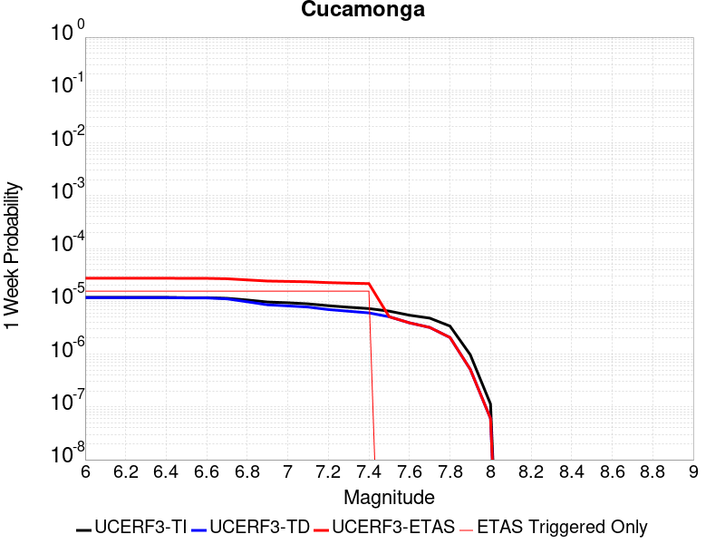 | 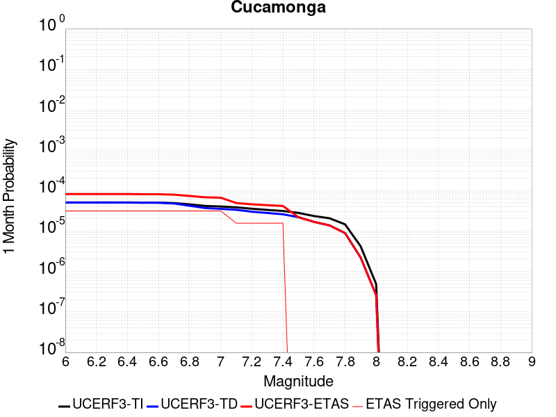 | 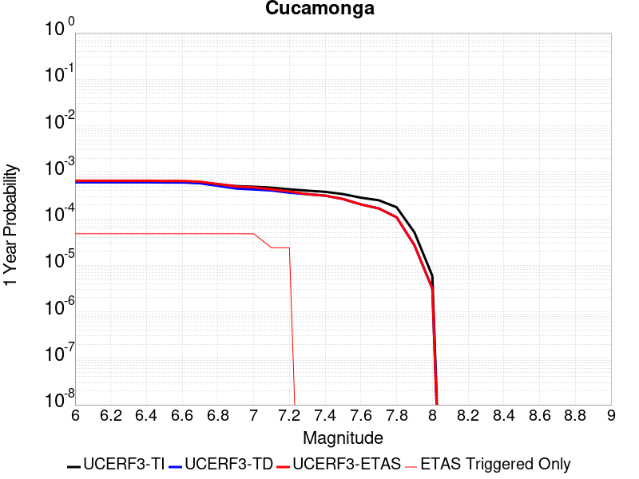 | 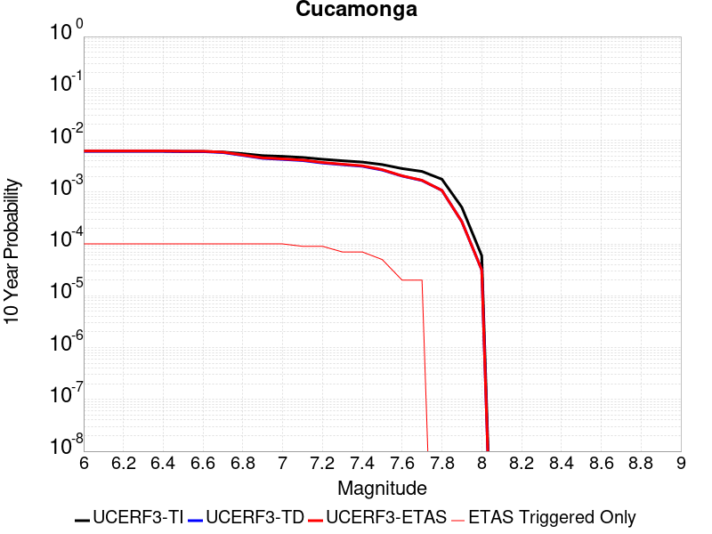 |

| Magnitude | 1 wk TI Prob | 1 wk TD Prob | 1 wk ETAS Prob | 1 wk ETAS/TD Gain | 1 wk ETAS Triggered Only | 1 mo TI Prob | 1 mo TD Prob | 1 mo ETAS Prob | 1 mo ETAS/TD Gain | 1 mo ETAS Triggered Only | 1 yr TI Prob | 1 yr TD Prob | 1 yr ETAS Prob | 1 yr ETAS/TD Gain | 1 yr ETAS Triggered Only | 10 yr TI Prob | 10 yr TD Prob | 10 yr ETAS Prob | 10 yr ETAS/TD Gain | 10 yr ETAS Triggered Only |
|-----|-----|-----|-----|-----|-----|-----|-----|-----|-----|-----|-----|-----|-----|-----|-----|-----|-----|-----|-----|-----|
| 6.0 | 1.1848348E-5 | 1.1737008E-5 | 2.173689E-5 | 1.8519958 | 1.0E-5 | 5.0777642E-5 | 5.030051E-5 | 8.0299E-5 | 1.5963855 | 3.0E-5 | 6.180424E-4 | 6.1223935E-4 | 6.622087E-4 | 1.0816174 | 5.0E-5 | 0.0061632637 | 0.0061067017 | 0.006206091 | 1.0162754 | 1.0E-4 |
| 6.1 | 1.1848348E-5 | 1.1737008E-5 | 2.173689E-5 | 1.8519958 | 1.0E-5 | 5.0777642E-5 | 5.030051E-5 | 8.0299E-5 | 1.5963855 | 3.0E-5 | 6.180424E-4 | 6.1223935E-4 | 6.622087E-4 | 1.0816174 | 5.0E-5 | 0.0061632637 | 0.0061067017 | 0.006206091 | 1.0162754 | 1.0E-4 |
| 6.2 | 1.1848348E-5 | 1.1737008E-5 | 2.173689E-5 | 1.8519958 | 1.0E-5 | 5.0777642E-5 | 5.030051E-5 | 8.0299E-5 | 1.5963855 | 3.0E-5 | 6.180424E-4 | 6.1223935E-4 | 6.622087E-4 | 1.0816174 | 5.0E-5 | 0.0061632637 | 0.0061067017 | 0.006206091 | 1.0162754 | 1.0E-4 |
| 6.3 | 1.1848348E-5 | 1.1737008E-5 | 2.173689E-5 | 1.8519958 | 1.0E-5 | 5.0777642E-5 | 5.030051E-5 | 8.0299E-5 | 1.5963855 | 3.0E-5 | 6.180424E-4 | 6.1223935E-4 | 6.622087E-4 | 1.0816174 | 5.0E-5 | 0.0061632637 | 0.0061067017 | 0.006206091 | 1.0162754 | 1.0E-4 |
| 6.4 | 1.1848348E-5 | 1.1737008E-5 | 2.173689E-5 | 1.8519958 | 1.0E-5 | 5.0777642E-5 | 5.030051E-5 | 8.0299E-5 | 1.5963855 | 3.0E-5 | 6.180424E-4 | 6.1223935E-4 | 6.622087E-4 | 1.0816174 | 5.0E-5 | 0.0061632637 | 0.0061067017 | 0.006206091 | 1.0162754 | 1.0E-4 |
| 6.5 | 1.16988695E-5 | 1.15760395E-5 | 2.1575923E-5 | 1.8638433 | 1.0E-5 | 5.013705E-5 | 4.9610666E-5 | 7.960918E-5 | 1.6046786 | 3.0E-5 | 6.102476E-4 | 6.0384517E-4 | 6.53815E-4 | 1.0827527 | 5.0E-5 | 0.006085745 | 0.006023216 | 0.006122614 | 1.0165024 | 1.0E-4 |
| 6.6 | 1.16988695E-5 | 1.15760395E-5 | 2.1575923E-5 | 1.8638433 | 1.0E-5 | 5.013705E-5 | 4.9610666E-5 | 7.960918E-5 | 1.6046786 | 3.0E-5 | 6.102476E-4 | 6.0384517E-4 | 6.53815E-4 | 1.0827527 | 5.0E-5 | 0.006085745 | 0.006023216 | 0.006122614 | 1.0165024 | 1.0E-4 |
| 6.7 | 1.1397107E-5 | 1.11149475E-5 | 2.1114836E-5 | 1.8996793 | 1.0E-5 | 4.884383E-5 | 4.7634636E-5 | 7.76332E-5 | 1.6297638 | 3.0E-5 | 5.9451134E-4 | 5.797998E-4 | 6.2977086E-4 | 1.0861866 | 5.0E-5 | 0.005929234 | 0.0057840226 | 0.0058834446 | 1.017189 | 1.0E-4 |
| 6.8 | 1.058387E-5 | 9.784992E-6 | 1.9784893E-5 | 2.0219634 | 1.0E-5 | 4.5358654E-5 | 4.193501E-5 | 7.1933755E-5 | 1.7153627 | 3.0E-5 | 5.521017E-4 | 5.1044027E-4 | 5.6041474E-4 | 1.0979047 | 5.0E-5 | 0.00550732 | 0.0050936877 | 0.005193178 | 1.0195321 | 1.0E-4 |
| 6.9 | 9.690046E-6 | 8.57948E-6 | 1.8579394E-5 | 2.1655617 | 1.0E-5 | 4.1528107E-5 | 3.6768684E-5 | 6.6767585E-5 | 1.8158817 | 3.0E-5 | 5.054874E-4 | 4.475672E-4 | 4.975448E-4 | 1.1116651 | 5.0E-5 | 0.005043391 | 0.004467594 | 0.004567147 | 1.0222834 | 1.0E-4 |
| 7.0 | 9.381461E-6 | 8.187101E-6 | 1.818702E-5 | 2.2214236 | 1.0E-5 | 4.020564E-5 | 3.5087105E-5 | 6.508605E-5 | 1.8549849 | 3.0E-5 | 4.893937E-4 | 4.2710215E-4 | 4.770808E-4 | 1.117018 | 5.0E-5 | 0.0048831734 | 0.0042637475 | 0.0043633212 | 1.0233536 | 1.0E-4 |
| 7.1 | 8.946492E-6 | 7.781886E-6 | 1.7781807E-5 | 2.2850256 | 1.0E-5 | 3.8341543E-5 | 3.3350516E-5 | 5.334985E-5 | 1.5996709 | 2.0E-5 | 4.667083E-4 | 4.0596718E-4 | 4.4595095E-4 | 1.0984901 | 4.0E-5 | 0.0046572937 | 0.004053192 | 0.0041428274 | 1.0221148 | 9.0E-5 |
| 7.2 | 8.251016E-6 | 6.9752796E-6 | 1.697521E-5 | 2.4336243 | 1.0E-5 | 3.5361016E-5 | 2.9893714E-5 | 4.9893115E-5 | 1.669017 | 2.0E-5 | 4.3043532E-4 | 3.6389544E-4 | 4.0388087E-4 | 1.1098816 | 4.0E-5 | 0.0042960253 | 0.0036339292 | 0.003723602 | 1.0246766 | 9.0E-5 |
| 7.3 | 7.717881E-6 | 6.4863502E-6 | 1.6486285E-5 | 2.541689 | 1.0E-5 | 3.3076216E-5 | 2.7798349E-5 | 4.7797792E-5 | 1.7194471 | 2.0E-5 | 4.026285E-4 | 3.3839257E-4 | 3.683824E-4 | 1.0886245 | 3.0E-5 | 0.004018998 | 0.00337971 | 0.0034494735 | 1.0206418 | 7.0E-5 |
| 7.4 | 7.275623E-6 | 6.031997E-6 | 1.6031938E-5 | 2.6578157 | 1.0E-5 | 3.118087E-5 | 2.585116E-5 | 4.5850644E-5 | 1.7736397 | 2.0E-5 | 3.7956095E-4 | 3.1469265E-4 | 3.446832E-4 | 1.0953012 | 3.0E-5 | 0.0037891332 | 0.0031434062 | 0.0032131863 | 1.0221988 | 7.0E-5 |
| 7.5 | 6.5109502E-6 | 5.1006014E-6 | 5.1006014E-6 | 1.0 | 0.0 | 2.7903774E-5 | 2.1859538E-5 | 3.185932E-5 | 1.4574562 | 1.0E-5 | 3.3967546E-4 | 2.661075E-4 | 2.8610218E-4 | 1.0751376 | 2.0E-5 | 0.0033915674 | 0.002658813 | 0.00270868 | 1.0187554 | 5.0E-5 |
| 7.6 | 5.4495326E-6 | 3.90857E-6 | 3.90857E-6 | 1.0 | 0.0 | 2.335493E-5 | 1.6750908E-5 | 1.6750908E-5 | 1.0 | 0.0 | 2.8430918E-4 | 2.0392328E-4 | 2.1392123E-4 | 1.049028 | 1.0E-5 | 0.0028394572 | 0.002038282 | 0.0020582415 | 1.0097922 | 2.0E-5 |
| 7.7 | 4.7997164E-6 | 3.2002547E-6 | 3.2002547E-6 | 1.0 | 0.0 | 2.057005E-5 | 1.3715306E-5 | 1.3715306E-5 | 1.0 | 0.0 | 2.504116E-4 | 1.6697108E-4 | 1.769694E-4 | 1.0598806 | 1.0E-5 | 0.002501296 | 0.0016693877 | 0.0016893543 | 1.0119604 | 2.0E-5 |
| 7.8 | 3.3941733E-6 | 2.0641899E-6 | 2.0641899E-6 | 1.0 | 0.0 | 1.4546376E-5 | 8.846498E-6 | 8.846498E-6 | 1.0 | 0.0 | 1.7708774E-4 | 1.07700806E-4 | 1.07700806E-4 | 1.0 | 0.0 | 0.0017694668 | 0.001076723 | 0.001076723 | 1.0 | 0.0 |
| 7.9 | 9.750552E-7 | 5.155946E-7 | 5.155946E-7 | 1.0 | 0.0 | 4.178801E-6 | 2.2096892E-6 | 2.2096892E-6 | 1.0 | 0.0 | 5.0875715E-5 | 2.690264E-5 | 2.690264E-5 | 1.0 | 0.0 | 5.086407E-4 | 2.6899425E-4 | 2.6899425E-4 | 1.0 | 0.0 |
| 8.0 | 1.133857E-7 | 6.053707E-8 | 6.053707E-8 | 1.0 | 0.0 | 4.8593864E-7 | 2.5944456E-7 | 2.5944456E-7 | 1.0 | 0.0 | 5.9162867E-6 | 3.158733E-6 | 3.158733E-6 | 1.0 | 0.0 | 5.916129E-5 | 3.1586897E-5 | 3.1586897E-5 | 1.0 | 0.0 |

## San Jacinto (Clark) rev
*[(top)](#table-of-contents)*

| 1 Week | 1 Month | 1 Year | 10 Year |
|-----|-----|-----|-----|
|  | 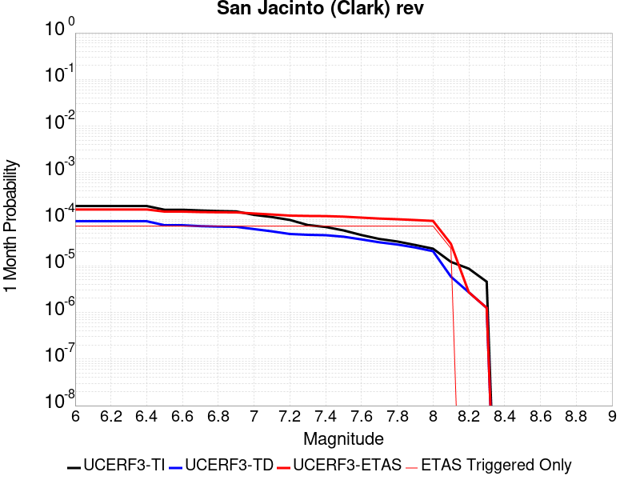 | 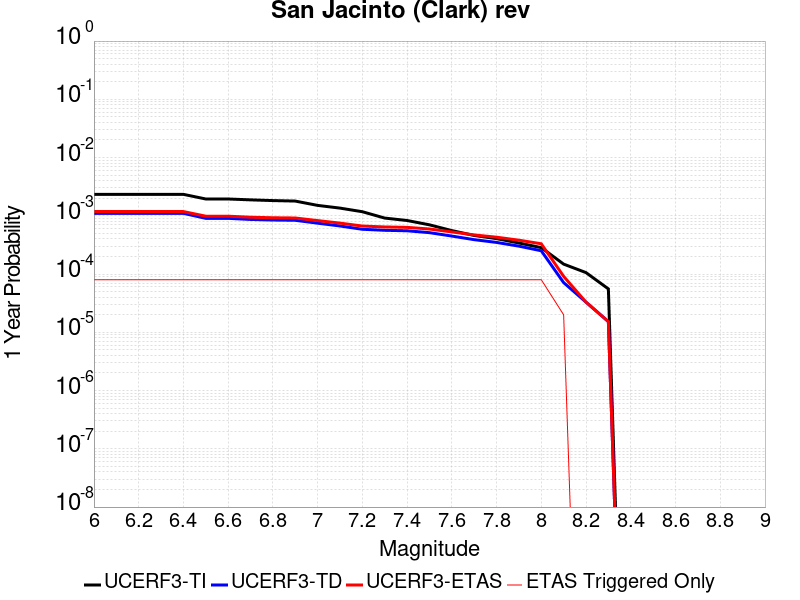 | 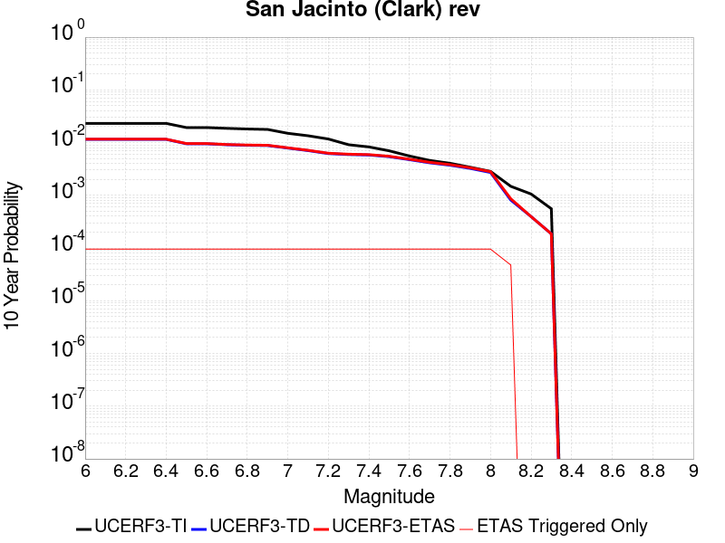 |

| Magnitude | 1 wk TI Prob | 1 wk TD Prob | 1 wk ETAS Prob | 1 wk ETAS/TD Gain | 1 wk ETAS Triggered Only | 1 mo TI Prob | 1 mo TD Prob | 1 mo ETAS Prob | 1 mo ETAS/TD Gain | 1 mo ETAS Triggered Only | 1 yr TI Prob | 1 yr TD Prob | 1 yr ETAS Prob | 1 yr ETAS/TD Gain | 1 yr ETAS Triggered Only | 10 yr TI Prob | 10 yr TD Prob | 10 yr ETAS Prob | 10 yr ETAS/TD Gain | 10 yr ETAS Triggered Only |
|-----|-----|-----|-----|-----|-----|-----|-----|-----|-----|-----|-----|-----|-----|-----|-----|-----|-----|-----|-----|-----|
| 6.0 | 4.482615E-5 | 2.1154196E-5 | 2.1154196E-5 | 1.0 | 0.0 | 1.9209793E-4 | 9.065773E-5 | 1.3065411E-4 | 1.4411799 | 4.0E-5 | 0.0023362834 | 0.0011032083 | 0.0011831201 | 1.0724357 | 8.0E-5 | 0.02311874 | 0.011503847 | 0.011602697 | 1.0085927 | 1.0E-4 |
| 6.1 | 4.482615E-5 | 2.1154196E-5 | 2.1154196E-5 | 1.0 | 0.0 | 1.9209793E-4 | 9.065773E-5 | 1.3065411E-4 | 1.4411799 | 4.0E-5 | 0.0023362834 | 0.0011032083 | 0.0011831201 | 1.0724357 | 8.0E-5 | 0.02311874 | 0.011503847 | 0.011602697 | 1.0085927 | 1.0E-4 |
| 6.2 | 4.482615E-5 | 2.1154196E-5 | 2.1154196E-5 | 1.0 | 0.0 | 1.9209793E-4 | 9.065773E-5 | 1.3065411E-4 | 1.4411799 | 4.0E-5 | 0.0023362834 | 0.0011032083 | 0.0011831201 | 1.0724357 | 8.0E-5 | 0.02311874 | 0.011503847 | 0.011602697 | 1.0085927 | 1.0E-4 |
| 6.3 | 4.482615E-5 | 2.1154196E-5 | 2.1154196E-5 | 1.0 | 0.0 | 1.9209793E-4 | 9.065773E-5 | 1.3065411E-4 | 1.4411799 | 4.0E-5 | 0.0023362834 | 0.0011032083 | 0.0011831201 | 1.0724357 | 8.0E-5 | 0.02311874 | 0.011503847 | 0.011602697 | 1.0085927 | 1.0E-4 |
| 6.4 | 4.482615E-5 | 2.1154196E-5 | 2.1154196E-5 | 1.0 | 0.0 | 1.9209793E-4 | 9.065773E-5 | 1.3065411E-4 | 1.4411799 | 4.0E-5 | 0.0023362834 | 0.0011032083 | 0.0011831201 | 1.0724357 | 8.0E-5 | 0.02311874 | 0.011503847 | 0.011602697 | 1.0085927 | 1.0E-4 |
| 6.5 | 3.7294863E-5 | 1.7356087E-5 | 1.7356087E-5 | 1.0 | 0.0 | 1.5982533E-4 | 7.438113E-5 | 1.1437816E-4 | 1.5377308 | 4.0E-5 | 0.0019441366 | 9.052186E-4 | 9.851462E-4 | 1.0882964 | 8.0E-5 | 0.01927216 | 0.0094941035 | 0.009593153 | 1.0104328 | 1.0E-4 |
| 6.6 | 3.7294863E-5 | 1.7356087E-5 | 1.7356087E-5 | 1.0 | 0.0 | 1.5982533E-4 | 7.438113E-5 | 1.1437816E-4 | 1.5377308 | 4.0E-5 | 0.0019441366 | 9.052186E-4 | 9.851462E-4 | 1.0882964 | 8.0E-5 | 0.01927216 | 0.0094941035 | 0.009593153 | 1.0104328 | 1.0E-4 |
| 6.7 | 3.6039248E-5 | 1.6604314E-5 | 1.6604314E-5 | 1.0 | 0.0 | 1.5444479E-4 | 7.1159426E-5 | 1.1115658E-4 | 1.5620781 | 4.0E-5 | 0.0018787434 | 8.6602574E-4 | 9.459565E-4 | 1.092296 | 8.0E-5 | 0.01862939 | 0.009096047 | 0.009195137 | 1.0108938 | 1.0E-4 |
| 6.8 | 3.5031844E-5 | 1.6232942E-5 | 1.6232942E-5 | 1.0 | 0.0 | 1.5012783E-4 | 6.956792E-5 | 1.0956513E-4 | 1.5749377 | 4.0E-5 | 0.0018262739 | 8.4666436E-4 | 9.2659664E-4 | 1.0944084 | 8.0E-5 | 0.01811338 | 0.008895969 | 0.008995079 | 1.0111411 | 1.0E-4 |
| 6.9 | 3.435112E-5 | 1.6063195E-5 | 1.6063195E-5 | 1.0 | 0.0 | 1.4721078E-4 | 6.884047E-5 | 1.0883772E-4 | 1.5810136 | 4.0E-5 | 0.0017908178 | 8.3781447E-4 | 9.1774744E-4 | 1.0954065 | 8.0E-5 | 0.017764548 | 0.008804181 | 0.0089033 | 1.0112582 | 1.0E-4 |
| 7.0 | 2.8959772E-5 | 1.4336745E-5 | 1.4336745E-5 | 1.0 | 0.0 | 1.241074E-4 | 6.144176E-5 | 1.01439306E-4 | 1.650983 | 4.0E-5 | 0.0015099603 | 7.477995E-4 | 8.2773966E-4 | 1.1069006 | 8.0E-5 | 0.014997416 | 0.007868037 | 0.0079672495 | 1.0126096 | 1.0E-4 |
| 7.1 | 2.6002877E-5 | 1.2829002E-5 | 1.2829002E-5 | 1.0 | 0.0 | 1.11436144E-4 | 5.498029E-5 | 9.497809E-5 | 1.7274934 | 4.0E-5 | 0.0013558907 | 6.691816E-4 | 7.49128E-4 | 1.119469 | 8.0E-5 | 0.013476475 | 0.0070465137 | 0.0071458095 | 1.0140914 | 1.0E-4 |
| 7.2 | 2.2544838E-5 | 1.1262543E-5 | 1.1262543E-5 | 1.0 | 0.0 | 9.661716E-5 | 4.8267157E-5 | 8.826523E-5 | 1.8286809 | 4.0E-5 | 0.001175679 | 5.874956E-4 | 6.674486E-4 | 1.1360912 | 8.0E-5 | 0.011694785 | 0.0061927503 | 0.006292131 | 1.016048 | 1.0E-4 |
| 7.3 | 1.75334E-5 | 1.0811715E-5 | 1.0811715E-5 | 1.0 | 0.0 | 7.514098E-5 | 4.6335106E-5 | 8.633325E-5 | 1.8632363 | 4.0E-5 | 9.144575E-4 | 5.6398526E-4 | 6.439402E-4 | 1.1417676 | 8.0E-5 | 0.009107036 | 0.0059337732 | 0.0060331803 | 1.0167527 | 1.0E-4 |
| 7.4 | 1.5924552E-5 | 1.0611516E-5 | 1.0611516E-5 | 1.0 | 0.0 | 6.82463E-5 | 4.547714E-5 | 8.547532E-5 | 1.8795228 | 4.0E-5 | 8.305819E-4 | 5.535449E-4 | 6.3350063E-4 | 1.144443 | 8.0E-5 | 0.008274844 | 0.0058210334 | 0.005920451 | 1.0170791 | 1.0E-4 |
| 7.5 | 1.3428931E-5 | 9.8519E-6 | 9.8519E-6 | 1.0 | 0.0 | 5.7551293E-5 | 4.2221753E-5 | 8.222006E-5 | 1.9473389 | 4.0E-5 | 7.004617E-4 | 5.1392964E-4 | 5.938885E-4 | 1.1555834 | 8.0E-5 | 0.006982579 | 0.0054066023 | 0.005506062 | 1.0183959 | 1.0E-4 |
| 7.6 | 1.0688787E-5 | 8.614839E-6 | 8.614839E-6 | 1.0 | 0.0 | 4.5808283E-5 | 3.692022E-5 | 7.6918746E-5 | 2.0833771 | 4.0E-5 | 5.5757316E-4 | 4.4941145E-4 | 5.293755E-4 | 1.1779306 | 8.0E-5 | 0.005561762 | 0.0047416524 | 0.004841178 | 1.0209897 | 1.0E-4 |
| 7.7 | 8.81236E-6 | 7.4680274E-6 | 7.4680274E-6 | 1.0 | 0.0 | 3.776671E-5 | 3.2005442E-5 | 7.200416E-5 | 2.2497475 | 4.0E-5 | 4.597127E-4 | 3.8959677E-4 | 4.695656E-4 | 1.2052605 | 8.0E-5 | 0.0045876284 | 0.0041346536 | 0.00423424 | 1.0240859 | 1.0E-4 |
| 7.8 | 7.780431E-6 | 6.696579E-6 | 6.696579E-6 | 1.0 | 0.0 | 3.3344273E-5 | 2.8699309E-5 | 6.869816E-5 | 2.3937218 | 4.0E-5 | 4.0589093E-4 | 3.4935825E-4 | 4.293303E-4 | 1.2289113 | 8.0E-5 | 0.0040515037 | 0.0037227906 | 0.0038224184 | 1.0267615 | 1.0E-4 |
| 7.9 | 6.5437994E-6 | 5.780382E-6 | 5.780382E-6 | 1.0 | 0.0 | 2.8044553E-5 | 2.477283E-5 | 6.477184E-5 | 2.6146321 | 4.0E-5 | 3.4138895E-4 | 3.0156763E-4 | 3.815435E-4 | 1.2652005 | 8.0E-5 | 0.0034086495 | 0.0032344845 | 0.0033341611 | 1.0308168 | 1.0E-4 |
| 8.0 | 5.4488164E-6 | 4.8133406E-6 | 4.8133406E-6 | 1.0 | 0.0 | 2.3351862E-5 | 2.062844E-5 | 6.0627615E-5 | 2.9390304 | 4.0E-5 | 2.8427184E-4 | 2.5112246E-4 | 3.3110238E-4 | 1.3184897 | 8.0E-5 | 0.0028390845 | 0.002710839 | 0.0028105679 | 1.036789 | 1.0E-4 |
| 8.1 | 2.8397242E-6 | 1.3670389E-6 | 1.3670389E-6 | 1.0 | 0.0 | 1.217019E-5 | 5.858725E-6 | 1.5858666E-5 | 2.706846 | 1.0E-5 | 1.4816198E-4 | 7.132765E-5 | 9.132623E-5 | 1.2803762 | 2.0E-5 | 0.0014806325 | 8.115382E-4 | 8.3152193E-4 | 1.0246246 | 2.0E-5 |
| 8.2 | 2.030244E-6 | 6.318974E-7 | 6.318974E-7 | 1.0 | 0.0 | 8.701017E-6 | 2.708129E-6 | 2.708129E-6 | 1.0 | 0.0 | 1.05929736E-4 | 3.2970976E-5 | 3.2970976E-5 | 1.0 | 0.0 | 0.0010587925 | 3.9486602E-4 | 3.9486602E-4 | 1.0 | 0.0 |
| 8.3 | 1.0659804E-6 | 2.9250086E-7 | 2.9250086E-7 | 1.0 | 0.0 | 4.568479E-6 | 1.2535745E-6 | 1.2535745E-6 | 1.0 | 0.0 | 5.5619817E-5 | 1.5262167E-5 | 1.5262167E-5 | 1.0 | 0.0 | 5.5605895E-4 | 1.8566217E-4 | 1.8566217E-4 | 1.0 | 0.0 |

## San Gabriel
*[(top)](#table-of-contents)*

| 1 Week | 1 Month | 1 Year | 10 Year |
|-----|-----|-----|-----|
| 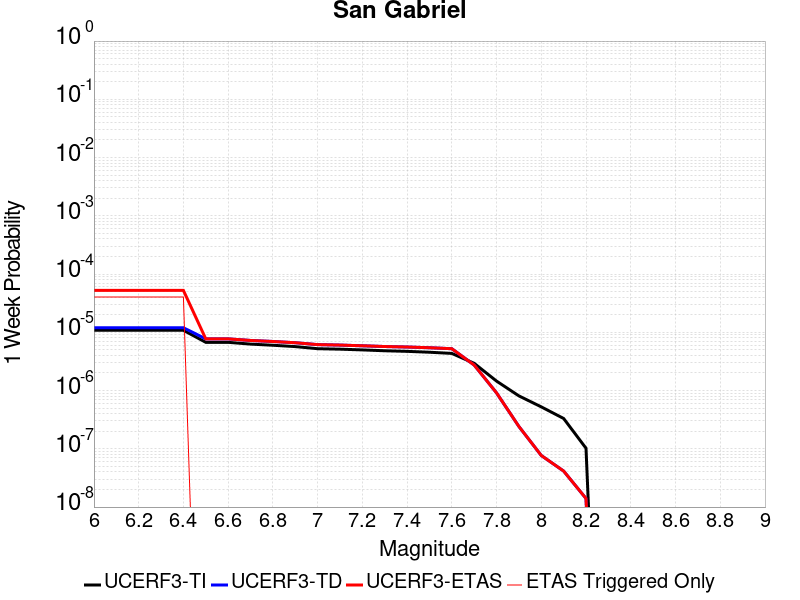 | 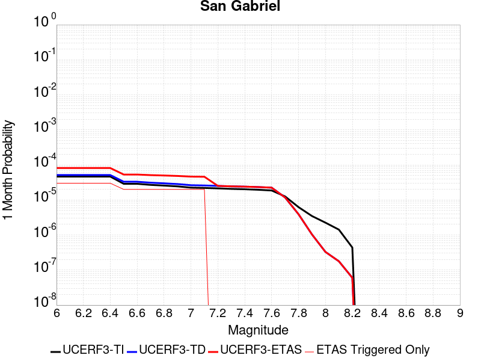 | 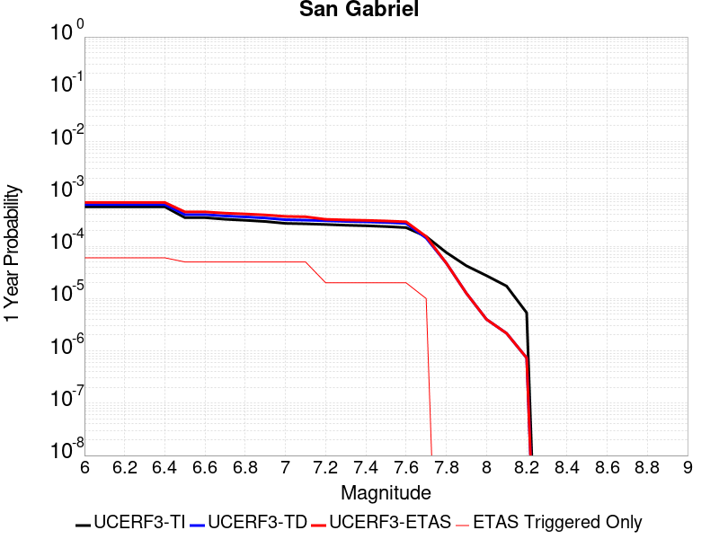 | 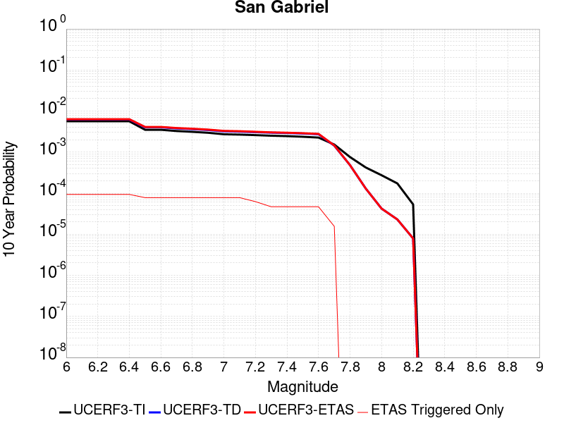 |

| Magnitude | 1 wk TI Prob | 1 wk TD Prob | 1 wk ETAS Prob | 1 wk ETAS/TD Gain | 1 wk ETAS Triggered Only | 1 mo TI Prob | 1 mo TD Prob | 1 mo ETAS Prob | 1 mo ETAS/TD Gain | 1 mo ETAS Triggered Only | 1 yr TI Prob | 1 yr TD Prob | 1 yr ETAS Prob | 1 yr ETAS/TD Gain | 1 yr ETAS Triggered Only | 10 yr TI Prob | 10 yr TD Prob | 10 yr ETAS Prob | 10 yr ETAS/TD Gain | 10 yr ETAS Triggered Only |
|-----|-----|-----|-----|-----|-----|-----|-----|-----|-----|-----|-----|-----|-----|-----|-----|-----|-----|-----|-----|-----|
| 6.0 | 1.083775E-5 | 1.19851875E-5 | 4.198483E-5 | 3.5030599 | 3.0E-5 | 4.6446676E-5 | 5.1364143E-5 | 8.13626E-5 | 1.584035 | 3.0E-5 | 5.653415E-4 | 6.251903E-4 | 6.851528E-4 | 1.0959108 | 6.0E-5 | 0.0056390543 | 0.006246409 | 0.0063457843 | 1.0159092 | 1.0E-4 |
| 6.1 | 1.083775E-5 | 1.19851875E-5 | 4.198483E-5 | 3.5030599 | 3.0E-5 | 4.6446676E-5 | 5.1364143E-5 | 8.13626E-5 | 1.584035 | 3.0E-5 | 5.653415E-4 | 6.251903E-4 | 6.851528E-4 | 1.0959108 | 6.0E-5 | 0.0056390543 | 0.006246409 | 0.0063457843 | 1.0159092 | 1.0E-4 |
| 6.2 | 1.083775E-5 | 1.19851875E-5 | 4.198483E-5 | 3.5030599 | 3.0E-5 | 4.6446676E-5 | 5.1364143E-5 | 8.13626E-5 | 1.584035 | 3.0E-5 | 5.653415E-4 | 6.251903E-4 | 6.851528E-4 | 1.0959108 | 6.0E-5 | 0.0056390543 | 0.006246409 | 0.0063457843 | 1.0159092 | 1.0E-4 |
| 6.3 | 1.083775E-5 | 1.19851875E-5 | 4.198483E-5 | 3.5030599 | 3.0E-5 | 4.6446676E-5 | 5.1364143E-5 | 8.13626E-5 | 1.584035 | 3.0E-5 | 5.653415E-4 | 6.251903E-4 | 6.851528E-4 | 1.0959108 | 6.0E-5 | 0.0056390543 | 0.006246409 | 0.0063457843 | 1.0159092 | 1.0E-4 |
| 6.4 | 1.083775E-5 | 1.19851875E-5 | 4.198483E-5 | 3.5030599 | 3.0E-5 | 4.6446676E-5 | 5.1364143E-5 | 8.13626E-5 | 1.584035 | 3.0E-5 | 5.653415E-4 | 6.251903E-4 | 6.851528E-4 | 1.0959108 | 6.0E-5 | 0.0056390543 | 0.006246409 | 0.0063457843 | 1.0159092 | 1.0E-4 |
| 6.5 | 6.7317824E-6 | 7.716944E-6 | 2.7716791E-5 | 3.5916793 | 2.0E-5 | 2.8850178E-5 | 3.3072207E-5 | 5.3071544E-5 | 1.6047174 | 2.0E-5 | 3.511943E-4 | 4.0258077E-4 | 4.5256063E-4 | 1.1241487 | 5.0E-5 | 0.003506398 | 0.0040296097 | 0.004109287 | 1.019773 | 8.0E-5 |
| 6.6 | 6.7317824E-6 | 7.716944E-6 | 2.7716791E-5 | 3.5916793 | 2.0E-5 | 2.8850178E-5 | 3.3072207E-5 | 5.3071544E-5 | 1.6047174 | 2.0E-5 | 3.511943E-4 | 4.0258077E-4 | 4.5256063E-4 | 1.1241487 | 5.0E-5 | 0.003506398 | 0.0040296097 | 0.004109287 | 1.019773 | 8.0E-5 |
| 6.7 | 6.274881E-6 | 7.2458647E-6 | 2.724572E-5 | 3.760175 | 2.0E-5 | 2.6892068E-5 | 3.1053343E-5 | 5.105272E-5 | 1.6440331 | 2.0E-5 | 3.2736175E-4 | 3.780098E-4 | 4.2799092E-4 | 1.1322217 | 5.0E-5 | 0.0032687993 | 0.0037847564 | 0.0038644536 | 1.0210574 | 8.0E-5 |
| 6.8 | 5.996209E-6 | 6.958585E-6 | 2.6958445E-5 | 3.8741276 | 2.0E-5 | 2.5697784E-5 | 2.9822171E-5 | 4.9821574E-5 | 1.670622 | 2.0E-5 | 3.128256E-4 | 3.6302538E-4 | 4.1300722E-4 | 1.1376814 | 5.0E-5 | 0.003123856 | 0.0036354093 | 0.0037151184 | 1.0219258 | 8.0E-5 |
| 6.9 | 5.686331E-6 | 6.6236316E-6 | 2.6623498E-5 | 4.0194716 | 2.0E-5 | 2.4369761E-5 | 2.8386688E-5 | 4.8386122E-5 | 1.7045356 | 2.0E-5 | 2.9666146E-4 | 3.4555403E-4 | 3.9553674E-4 | 1.1446452 | 5.0E-5 | 0.0029626573 | 0.0034612515 | 0.0035409746 | 1.023033 | 8.0E-5 |
| 7.0 | 5.2329838E-6 | 6.147514E-6 | 2.614739E-5 | 4.2533274 | 2.0E-5 | 2.242688E-5 | 2.6346226E-5 | 4.63457E-5 | 1.759102 | 2.0E-5 | 2.7301308E-4 | 3.2071886E-4 | 3.7070282E-4 | 1.1558498 | 5.0E-5 | 0.002726779 | 0.0032136322 | 0.003293375 | 1.024814 | 8.0E-5 |
| 7.1 | 5.135671E-6 | 6.03764E-6 | 2.603752E-5 | 4.3125324 | 2.0E-5 | 2.2009834E-5 | 2.5875348E-5 | 4.587483E-5 | 1.7729164 | 2.0E-5 | 2.6793676E-4 | 3.1498758E-4 | 3.6497184E-4 | 1.1586864 | 5.0E-5 | 0.0026761394 | 0.0031564834 | 0.003236231 | 1.0252646 | 8.0E-5 |
| 7.2 | 4.989062E-6 | 5.87102E-6 | 5.87102E-6 | 1.0 | 0.0 | 2.1381518E-5 | 2.5161276E-5 | 2.5161276E-5 | 1.0 | 0.0 | 2.6028889E-4 | 3.0629625E-4 | 3.2629012E-4 | 1.0652763 | 2.0E-5 | 0.0025998424 | 0.003069813 | 0.0031196594 | 1.0162376 | 5.0E-5 |
| 7.3 | 4.8219395E-6 | 5.702574E-6 | 5.702574E-6 | 1.0 | 0.0 | 2.0665291E-5 | 2.443938E-5 | 2.443938E-5 | 1.0 | 0.0 | 2.5157086E-4 | 2.9750957E-4 | 3.175036E-4 | 1.0672047 | 2.0E-5 | 0.0025128627 | 0.0029821852 | 0.0030220659 | 1.013373 | 4.0E-5 |
| 7.4 | 4.7118383E-6 | 5.5911332E-6 | 5.5911332E-6 | 1.0 | 0.0 | 2.0193436E-5 | 2.3961782E-5 | 2.3961782E-5 | 1.0 | 0.0 | 2.4582737E-4 | 2.916964E-4 | 3.1169056E-4 | 1.0685444 | 2.0E-5 | 0.002455556 | 0.0029242067 | 0.0029640899 | 1.013639 | 4.0E-5 |
| 7.5 | 4.5506545E-6 | 5.4365014E-6 | 5.4365014E-6 | 1.0 | 0.0 | 1.9502659E-5 | 2.3299088E-5 | 2.3299088E-5 | 1.0 | 0.0 | 2.37419E-4 | 2.8363022E-4 | 3.0362455E-4 | 1.0704943 | 2.0E-5 | 0.002371655 | 0.002843753 | 0.0028836392 | 1.0140259 | 4.0E-5 |
| 7.6 | 4.343636E-6 | 5.2293817E-6 | 5.2293817E-6 | 1.0 | 0.0 | 1.861545E-5 | 2.2411448E-5 | 2.2411448E-5 | 1.0 | 0.0 | 2.2661954E-4 | 2.7282597E-4 | 2.928205E-4 | 1.0732868 | 2.0E-5 | 0.0022638857 | 0.0027359722 | 0.0027758628 | 1.01458 | 4.0E-5 |
| 7.7 | 2.936235E-6 | 2.7440458E-6 | 2.7440458E-6 | 1.0 | 0.0 | 1.2583803E-5 | 1.1760143E-5 | 1.1760143E-5 | 1.0 | 0.0 | 1.5319703E-4 | 1.4317037E-4 | 1.5316893E-4 | 1.0698369 | 1.0E-5 | 0.0015309147 | 0.0014380751 | 0.0014580463 | 1.0138875 | 2.0E-5 |
| 7.8 | 1.4541639E-6 | 9.1237047E-7 | 9.1237047E-7 | 1.0 | 0.0 | 6.232116E-6 | 3.9101533E-6 | 3.9101533E-6 | 1.0 | 0.0 | 7.587337E-5 | 4.7605077E-5 | 4.7605077E-5 | 1.0 | 0.0 | 7.584747E-4 | 4.8085177E-4 | 4.8085177E-4 | 1.0 | 0.0 |
| 7.9 | 8.098958E-7 | 2.41753E-7 | 2.41753E-7 | 1.0 | 0.0 | 3.4709774E-6 | 1.0360839E-6 | 1.0360839E-6 | 1.0 | 0.0 | 4.225833E-5 | 1.2614248E-5 | 1.2614248E-5 | 1.0 | 0.0 | 4.2250296E-4 | 1.2921814E-4 | 1.2921814E-4 | 1.0 | 0.0 |
| 8.0 | 5.2473234E-7 | 7.6792055E-8 | 7.6792055E-8 | 1.0 | 0.0 | 2.248851E-6 | 3.2910876E-7 | 3.2910876E-7 | 1.0 | 0.0 | 2.7379416E-5 | 4.0068917E-6 | 4.0068917E-6 | 1.0 | 0.0 | 2.7376044E-4 | 4.21918E-5 | 4.21918E-5 | 1.0 | 0.0 |
| 8.1 | 3.3162388E-7 | 4.1496126E-8 | 4.1496126E-8 | 1.0 | 0.0 | 1.4212444E-6 | 1.7784053E-7 | 1.7784053E-7 | 1.0 | 0.0 | 1.7303513E-5 | 2.1652063E-6 | 2.1652063E-6 | 1.0 | 0.0 | 1.7302166E-4 | 2.2965523E-5 | 2.2965523E-5 | 1.0 | 0.0 |
| 8.2 | 1.0235345E-7 | 1.4043474E-8 | 1.4043474E-8 | 1.0 | 0.0 | 4.3865757E-7 | 6.0186316E-8 | 6.0186316E-8 | 1.0 | 0.0 | 5.340643E-6 | 7.327681E-7 | 7.327681E-7 | 1.0 | 0.0 | 5.3405143E-5 | 7.9273705E-6 | 7.9273705E-6 | 1.0 | 0.0 |

## San Cayetano
*[(top)](#table-of-contents)*

| 1 Week | 1 Month | 1 Year | 10 Year |
|-----|-----|-----|-----|
|  |  | 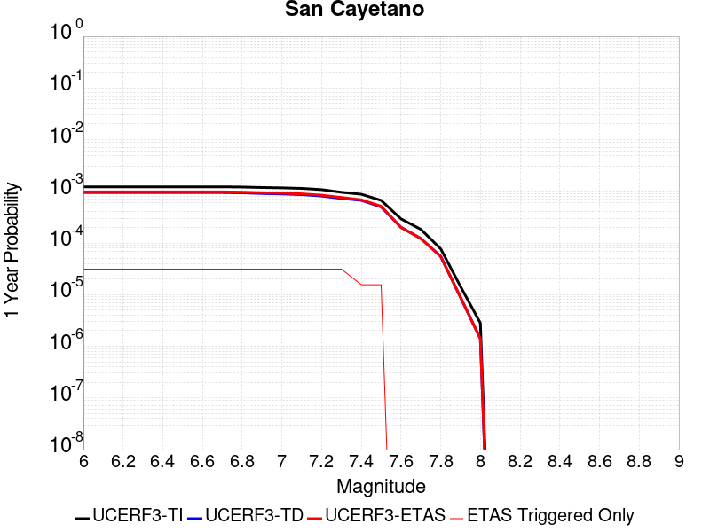 | 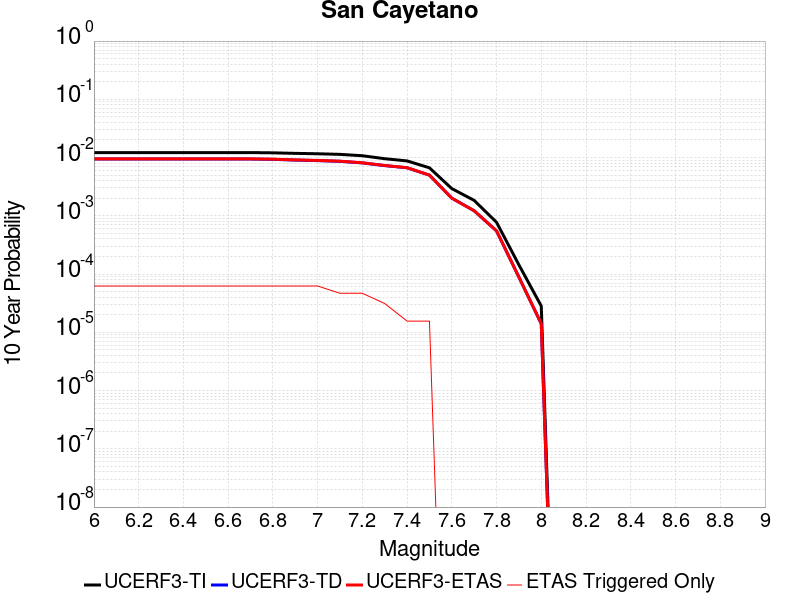 |

| Magnitude | 1 wk TI Prob | 1 wk TD Prob | 1 wk ETAS Prob | 1 wk ETAS/TD Gain | 1 wk ETAS Triggered Only | 1 mo TI Prob | 1 mo TD Prob | 1 mo ETAS Prob | 1 mo ETAS/TD Gain | 1 mo ETAS Triggered Only | 1 yr TI Prob | 1 yr TD Prob | 1 yr ETAS Prob | 1 yr ETAS/TD Gain | 1 yr ETAS Triggered Only | 10 yr TI Prob | 10 yr TD Prob | 10 yr ETAS Prob | 10 yr ETAS/TD Gain | 10 yr ETAS Triggered Only |
|-----|-----|-----|-----|-----|-----|-----|-----|-----|-----|-----|-----|-----|-----|-----|-----|-----|-----|-----|-----|-----|
| 6.0 | 2.3476267E-5 | 1.816928E-5 | 1.816928E-5 | 1.0 | 0.0 | 1.0060869E-4 | 7.786603E-5 | 8.786526E-5 | 1.1284157 | 1.0E-5 | 0.0012242225 | 9.476103E-4 | 9.875724E-4 | 1.0421715 | 4.0E-5 | 0.012175002 | 0.009436584 | 0.009515829 | 1.0083977 | 8.0E-5 |
| 6.1 | 2.3476267E-5 | 1.816928E-5 | 1.816928E-5 | 1.0 | 0.0 | 1.0060869E-4 | 7.786603E-5 | 8.786526E-5 | 1.1284157 | 1.0E-5 | 0.0012242225 | 9.476103E-4 | 9.875724E-4 | 1.0421715 | 4.0E-5 | 0.012175002 | 0.009436584 | 0.009515829 | 1.0083977 | 8.0E-5 |
| 6.2 | 2.3476267E-5 | 1.816928E-5 | 1.816928E-5 | 1.0 | 0.0 | 1.0060869E-4 | 7.786603E-5 | 8.786526E-5 | 1.1284157 | 1.0E-5 | 0.0012242225 | 9.476103E-4 | 9.875724E-4 | 1.0421715 | 4.0E-5 | 0.012175002 | 0.009436584 | 0.009515829 | 1.0083977 | 8.0E-5 |
| 6.3 | 2.3476267E-5 | 1.816928E-5 | 1.816928E-5 | 1.0 | 0.0 | 1.0060869E-4 | 7.786603E-5 | 8.786526E-5 | 1.1284157 | 1.0E-5 | 0.0012242225 | 9.476103E-4 | 9.875724E-4 | 1.0421715 | 4.0E-5 | 0.012175002 | 0.009436584 | 0.009515829 | 1.0083977 | 8.0E-5 |
| 6.4 | 2.3476267E-5 | 1.816928E-5 | 1.816928E-5 | 1.0 | 0.0 | 1.0060869E-4 | 7.786603E-5 | 8.786526E-5 | 1.1284157 | 1.0E-5 | 0.0012242225 | 9.476103E-4 | 9.875724E-4 | 1.0421715 | 4.0E-5 | 0.012175002 | 0.009436584 | 0.009515829 | 1.0083977 | 8.0E-5 |
| 6.5 | 2.3476267E-5 | 1.816928E-5 | 1.816928E-5 | 1.0 | 0.0 | 1.0060869E-4 | 7.786603E-5 | 8.786526E-5 | 1.1284157 | 1.0E-5 | 0.0012242225 | 9.476103E-4 | 9.875724E-4 | 1.0421715 | 4.0E-5 | 0.012175002 | 0.009436584 | 0.009515829 | 1.0083977 | 8.0E-5 |
| 6.6 | 2.3476267E-5 | 1.816928E-5 | 1.816928E-5 | 1.0 | 0.0 | 1.0060869E-4 | 7.786603E-5 | 8.786526E-5 | 1.1284157 | 1.0E-5 | 0.0012242225 | 9.476103E-4 | 9.875724E-4 | 1.0421715 | 4.0E-5 | 0.012175002 | 0.009436584 | 0.009515829 | 1.0083977 | 8.0E-5 |
| 6.7 | 2.3476267E-5 | 1.816928E-5 | 1.816928E-5 | 1.0 | 0.0 | 1.0060869E-4 | 7.786603E-5 | 8.786526E-5 | 1.1284157 | 1.0E-5 | 0.0012242225 | 9.476103E-4 | 9.875724E-4 | 1.0421715 | 4.0E-5 | 0.012175002 | 0.009436584 | 0.009515829 | 1.0083977 | 8.0E-5 |
| 6.8 | 2.3241924E-5 | 1.7936987E-5 | 1.7936987E-5 | 1.0 | 0.0 | 9.960445E-5 | 7.687056E-5 | 8.686979E-5 | 1.1300788 | 1.0E-5 | 0.0012120095 | 9.3550084E-4 | 9.7546336E-4 | 1.0427178 | 4.0E-5 | 0.012054204 | 0.009316482 | 0.009395736 | 1.0085069 | 8.0E-5 |
| 6.9 | 2.2761007E-5 | 1.7432423E-5 | 1.7432423E-5 | 1.0 | 0.0 | 9.7543525E-5 | 7.470827E-5 | 8.470752E-5 | 1.133844 | 1.0E-5 | 0.0011869454 | 9.09197E-4 | 9.4916066E-4 | 1.0439548 | 4.0E-5 | 0.011806256 | 0.009055603 | 0.009134878 | 1.0087543 | 8.0E-5 |
| 7.0 | 2.240283E-5 | 1.7066168E-5 | 1.7066168E-5 | 1.0 | 0.0 | 9.600859E-5 | 7.313869E-5 | 8.313796E-5 | 1.1367165 | 1.0E-5 | 0.0011682777 | 8.9010317E-4 | 9.300676E-4 | 1.0448986 | 4.0E-5 | 0.011621549 | 0.008866196 | 0.008945486 | 1.0089431 | 8.0E-5 |
| 7.1 | 2.1871154E-5 | 1.6586018E-5 | 1.6586018E-5 | 1.0 | 0.0 | 9.373015E-5 | 7.108101E-5 | 8.10803E-5 | 1.1406746 | 1.0E-5 | 0.0011405671 | 8.6507114E-4 | 9.050365E-4 | 1.046199 | 4.0E-5 | 0.011347309 | 0.008617838 | 0.0086773215 | 1.0069023 | 6.0E-5 |
| 7.2 | 2.0714133E-5 | 1.5564561E-5 | 1.5564561E-5 | 1.0 | 0.0 | 8.8771834E-5 | 6.670357E-5 | 7.6702905E-5 | 1.149907 | 1.0E-5 | 0.0010802611 | 8.1181666E-4 | 8.517842E-4 | 1.0492322 | 4.0E-5 | 0.010750249 | 0.008089285 | 0.0081488 | 1.0073572 | 6.0E-5 |
| 7.3 | 1.8408395E-5 | 1.3996864E-5 | 1.3996864E-5 | 1.0 | 0.0 | 7.8890735E-5 | 5.99852E-5 | 6.99846E-5 | 1.1666977 | 1.0E-5 | 9.600714E-4 | 7.300781E-4 | 7.700489E-4 | 1.0547487 | 4.0E-5 | 0.009559342 | 0.0072775153 | 0.0073271515 | 1.0068204 | 5.0E-5 |
| 7.4 | 1.6856795E-5 | 1.28500815E-5 | 1.28500815E-5 | 1.0 | 0.0 | 7.2241404E-5 | 5.5070628E-5 | 5.5070628E-5 | 1.0 | 0.0 | 8.7918417E-4 | 6.7028153E-4 | 7.002614E-4 | 1.0447273 | 3.0E-5 | 0.00875714 | 0.0066832784 | 0.006723011 | 1.0059451 | 4.0E-5 |
| 7.5 | 1.2822778E-5 | 9.577542E-6 | 9.577542E-6 | 1.0 | 0.0 | 5.495361E-5 | 4.1045972E-5 | 4.1045972E-5 | 1.0 | 0.0 | 6.688548E-4 | 4.996217E-4 | 5.296067E-4 | 1.0600154 | 3.0E-5 | 0.006668452 | 0.0049851555 | 0.005024956 | 1.0079838 | 4.0E-5 |
| 7.6 | 5.6272684E-6 | 3.854903E-6 | 3.854903E-6 | 1.0 | 0.0 | 2.4116642E-5 | 1.652091E-5 | 1.652091E-5 | 1.0 | 0.0 | 2.9358055E-4 | 2.0112359E-4 | 2.1112159E-4 | 1.0497106 | 1.0E-5 | 0.0029319301 | 0.0020094267 | 0.0020194065 | 1.0049665 | 1.0E-5 |
| 7.7 | 3.5261346E-6 | 2.3407013E-6 | 2.3407013E-6 | 1.0 | 0.0 | 1.5111918E-5 | 1.0031539E-5 | 1.0031539E-5 | 1.0 | 0.0 | 1.8397206E-4 | 1.2212721E-4 | 1.3212599E-4 | 1.0818719 | 1.0E-5 | 0.0018381984 | 0.0012206084 | 0.0012305961 | 1.0081826 | 1.0E-5 |
| 7.8 | 1.4826929E-6 | 1.056428E-6 | 1.056428E-6 | 1.0 | 0.0 | 6.354383E-6 | 4.5275406E-6 | 4.5275406E-6 | 1.0 | 0.0 | 7.736187E-5 | 5.5121433E-5 | 5.5121433E-5 | 1.0 | 0.0 | 7.733494E-4 | 5.5107963E-4 | 5.5107963E-4 | 1.0 | 0.0 |
| 7.9 | 2.7568166E-7 | 1.6978244E-7 | 1.6978244E-7 | 1.0 | 0.0 | 1.1814923E-6 | 7.2763885E-7 | 7.2763885E-7 | 1.0 | 0.0 | 1.4384574E-5 | 8.858967E-6 | 8.858967E-6 | 1.0 | 0.0 | 1.4383643E-4 | 8.8586174E-5 | 8.8586174E-5 | 1.0 | 0.0 |
| 8.0 | 5.407832E-8 | 2.6887697E-8 | 2.6887697E-8 | 1.0 | 0.0 | 2.3176422E-7 | 1.15232986E-7 | 1.15232986E-7 | 1.0 | 0.0 | 2.8217257E-6 | 1.4029607E-6 | 1.4029607E-6 | 1.0 | 0.0 | 2.8216898E-5 | 1.4029522E-5 | 1.4029522E-5 | 1.0 | 0.0 |

## Pine Mtn
*[(top)](#table-of-contents)*

| 1 Week | 1 Month | 1 Year | 10 Year |
|-----|-----|-----|-----|
| 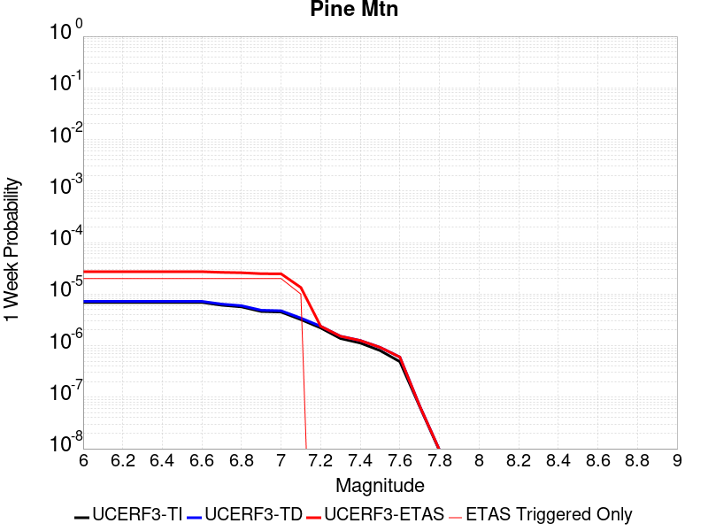 | 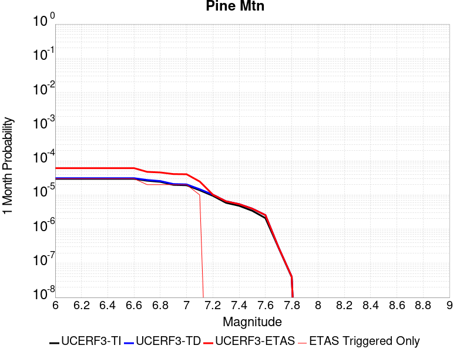 | 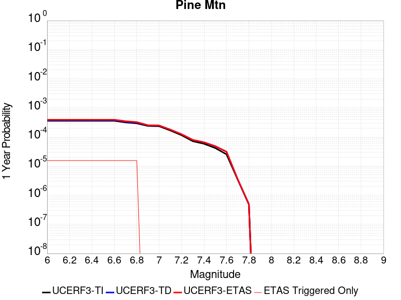 | 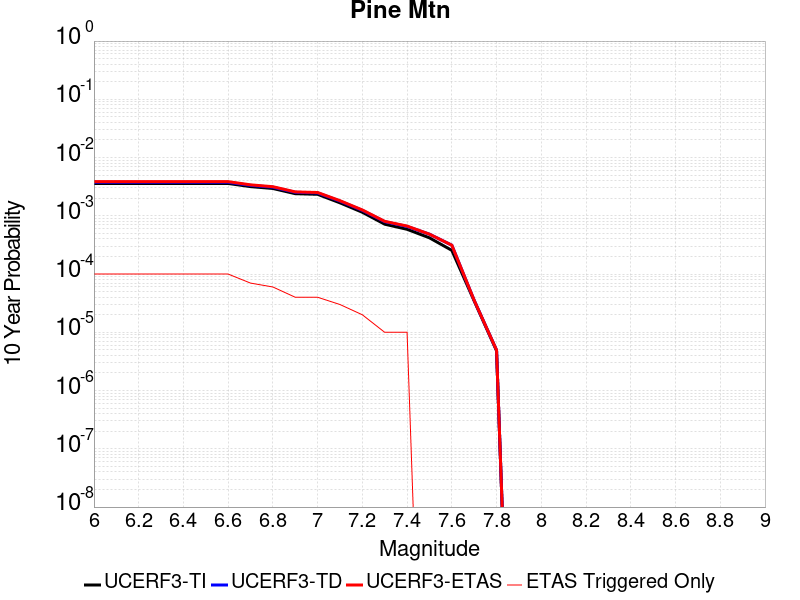 |

| Magnitude | 1 wk TI Prob | 1 wk TD Prob | 1 wk ETAS Prob | 1 wk ETAS/TD Gain | 1 wk ETAS Triggered Only | 1 mo TI Prob | 1 mo TD Prob | 1 mo ETAS Prob | 1 mo ETAS/TD Gain | 1 mo ETAS Triggered Only | 1 yr TI Prob | 1 yr TD Prob | 1 yr ETAS Prob | 1 yr ETAS/TD Gain | 1 yr ETAS Triggered Only | 10 yr TI Prob | 10 yr TD Prob | 10 yr ETAS Prob | 10 yr ETAS/TD Gain | 10 yr ETAS Triggered Only |
|-----|-----|-----|-----|-----|-----|-----|-----|-----|-----|-----|-----|-----|-----|-----|-----|-----|-----|-----|-----|-----|
| 6.0 | 6.894797E-6 | 7.225461E-6 | 2.7225316E-5 | 3.7679694 | 2.0E-5 | 2.9548795E-5 | 3.096591E-5 | 6.0964983E-5 | 1.9687773 | 3.0E-5 | 3.596972E-4 | 3.7694772E-4 | 4.1693266E-4 | 1.1060755 | 4.0E-5 | 0.0035911554 | 0.003763381 | 0.0038630047 | 1.0264719 | 1.0E-4 |
| 6.1 | 6.894797E-6 | 7.225461E-6 | 2.7225316E-5 | 3.7679694 | 2.0E-5 | 2.9548795E-5 | 3.096591E-5 | 6.0964983E-5 | 1.9687773 | 3.0E-5 | 3.596972E-4 | 3.7694772E-4 | 4.1693266E-4 | 1.1060755 | 4.0E-5 | 0.0035911554 | 0.003763381 | 0.0038630047 | 1.0264719 | 1.0E-4 |
| 6.2 | 6.894797E-6 | 7.225461E-6 | 2.7225316E-5 | 3.7679694 | 2.0E-5 | 2.9548795E-5 | 3.096591E-5 | 6.0964983E-5 | 1.9687773 | 3.0E-5 | 3.596972E-4 | 3.7694772E-4 | 4.1693266E-4 | 1.1060755 | 4.0E-5 | 0.0035911554 | 0.003763381 | 0.0038630047 | 1.0264719 | 1.0E-4 |
| 6.3 | 6.894797E-6 | 7.225461E-6 | 2.7225316E-5 | 3.7679694 | 2.0E-5 | 2.9548795E-5 | 3.096591E-5 | 6.0964983E-5 | 1.9687773 | 3.0E-5 | 3.596972E-4 | 3.7694772E-4 | 4.1693266E-4 | 1.1060755 | 4.0E-5 | 0.0035911554 | 0.003763381 | 0.0038630047 | 1.0264719 | 1.0E-4 |
| 6.4 | 6.894797E-6 | 7.225461E-6 | 2.7225316E-5 | 3.7679694 | 2.0E-5 | 2.9548795E-5 | 3.096591E-5 | 6.0964983E-5 | 1.9687773 | 3.0E-5 | 3.596972E-4 | 3.7694772E-4 | 4.1693266E-4 | 1.1060755 | 4.0E-5 | 0.0035911554 | 0.003763381 | 0.0038630047 | 1.0264719 | 1.0E-4 |
| 6.5 | 6.894797E-6 | 7.225461E-6 | 2.7225316E-5 | 3.7679694 | 2.0E-5 | 2.9548795E-5 | 3.096591E-5 | 6.0964983E-5 | 1.9687773 | 3.0E-5 | 3.596972E-4 | 3.7694772E-4 | 4.1693266E-4 | 1.1060755 | 4.0E-5 | 0.0035911554 | 0.003763381 | 0.0038630047 | 1.0264719 | 1.0E-4 |
| 6.6 | 6.894797E-6 | 7.225461E-6 | 2.7225316E-5 | 3.7679694 | 2.0E-5 | 2.9548795E-5 | 3.096591E-5 | 6.0964983E-5 | 1.9687773 | 3.0E-5 | 3.596972E-4 | 3.7694772E-4 | 4.1693266E-4 | 1.1060755 | 4.0E-5 | 0.0035911554 | 0.003763381 | 0.0038630047 | 1.0264719 | 1.0E-4 |
| 6.7 | 6.0867933E-6 | 6.3971133E-6 | 2.6396985E-5 | 4.12639 | 2.0E-5 | 2.6085996E-5 | 2.7415923E-5 | 4.7415375E-5 | 1.729483 | 2.0E-5 | 3.1755073E-4 | 3.3373994E-4 | 3.6372992E-4 | 1.0898603 | 3.0E-5 | 0.0031709734 | 0.0033326065 | 0.003402373 | 1.0209346 | 7.0E-5 |
| 6.8 | 5.6530425E-6 | 5.9505956E-6 | 2.5950476E-5 | 4.360988 | 2.0E-5 | 2.42271E-5 | 2.5502315E-5 | 4.5501805E-5 | 1.7842225 | 2.0E-5 | 2.94925E-4 | 3.104485E-4 | 3.4043918E-4 | 1.0966043 | 3.0E-5 | 0.002945339 | 0.0031003528 | 0.0031601668 | 1.0192926 | 6.0E-5 |
| 6.9 | 4.6015225E-6 | 4.863834E-6 | 2.4863737E-5 | 5.1119623 | 2.0E-5 | 1.9720663E-5 | 2.0844845E-5 | 4.084443E-5 | 1.9594499 | 2.0E-5 | 2.4007261E-4 | 2.5375787E-4 | 2.737528E-4 | 1.0787953 | 2.0E-5 | 0.0023981342 | 0.0025348254 | 0.002574724 | 1.0157402 | 4.0E-5 |
| 7.0 | 4.4875965E-6 | 4.747473E-6 | 2.4747378E-5 | 5.2127476 | 2.0E-5 | 1.9232413E-5 | 2.0346162E-5 | 4.0345756E-5 | 1.9829663 | 2.0E-5 | 2.3412947E-4 | 2.4768783E-4 | 2.6768286E-4 | 1.0807269 | 2.0E-5 | 0.0023388295 | 0.0024742614 | 0.0025141623 | 1.0161264 | 4.0E-5 |
| 7.1 | 3.203907E-6 | 3.4294096E-6 | 1.3429375E-5 | 3.9159439 | 1.0E-5 | 1.3730958E-5 | 1.4697391E-5 | 2.4697243E-5 | 1.6803828 | 1.0E-5 | 1.6716159E-4 | 1.789267E-4 | 1.8892491E-4 | 1.0558788 | 1.0E-5 | 0.0016703589 | 0.0017878925 | 0.0018178389 | 1.0167495 | 3.0E-5 |
| 7.2 | 2.2060601E-6 | 2.3784817E-6 | 2.3784817E-6 | 1.0 | 0.0 | 9.4545085E-6 | 1.0193455E-5 | 1.0193455E-5 | 1.0 | 0.0 | 1.15102564E-4 | 1.240987E-4 | 1.240987E-4 | 1.0 | 0.0 | 0.0011504296 | 0.0012403389 | 0.001260314 | 1.0161046 | 2.0E-5 |
| 7.3 | 1.3765207E-6 | 1.5216481E-6 | 1.5216481E-6 | 1.0 | 0.0 | 5.899361E-6 | 6.521333E-6 | 6.521333E-6 | 1.0 | 0.0 | 7.182235E-5 | 7.939443E-5 | 7.939443E-5 | 1.0 | 0.0 | 7.1799144E-4 | 7.936697E-4 | 8.036618E-4 | 1.0125897 | 1.0E-5 |
| 7.4 | 1.1245983E-6 | 1.2587075E-6 | 1.2587075E-6 | 1.0 | 0.0 | 4.819698E-6 | 5.39445E-6 | 5.39445E-6 | 1.0 | 0.0 | 5.8678244E-5 | 6.567554E-5 | 6.567554E-5 | 1.0 | 0.0 | 5.866275E-4 | 6.5656955E-4 | 6.66563E-4 | 1.0152206 | 1.0E-5 |
| 7.5 | 8.031682E-7 | 9.276951E-7 | 9.276951E-7 | 1.0 | 0.0 | 3.4421448E-6 | 3.9758306E-6 | 3.9758306E-6 | 1.0 | 0.0 | 4.1907308E-5 | 4.840473E-5 | 4.840473E-5 | 1.0 | 0.0 | 4.1899405E-4 | 4.8394862E-4 | 4.8394862E-4 | 1.0 | 0.0 |
| 7.6 | 4.8953444E-7 | 6.003009E-7 | 6.003009E-7 | 1.0 | 0.0 | 2.098003E-6 | 2.5727159E-6 | 2.5727159E-6 | 1.0 | 0.0 | 2.5542888E-5 | 3.1322415E-5 | 3.1322415E-5 | 1.0 | 0.0 | 2.5539953E-4 | 3.1318486E-4 | 3.1318486E-4 | 1.0 | 0.0 |
| 7.7 | 6.634529E-8 | 6.788826E-8 | 6.788826E-8 | 1.0 | 0.0 | 2.843369E-7 | 2.9094966E-7 | 2.9094966E-7 | 1.0 | 0.0 | 3.4617963E-6 | 3.5423066E-6 | 3.5423066E-6 | 1.0 | 0.0 | 3.4617424E-5 | 3.542255E-5 | 3.542255E-5 | 1.0 | 0.0 |
| 7.8 | 9.235578E-9 | 9.488566E-9 | 9.488566E-9 | 1.0 | 0.0 | 3.9581046E-8 | 4.0665284E-8 | 4.0665284E-8 | 1.0 | 0.0 | 4.818991E-7 | 4.950997E-7 | 4.950997E-7 | 1.0 | 0.0 | 4.8189804E-6 | 4.950988E-6 | 4.950988E-6 | 1.0 | 0.0 |

## Coronado Bank alt1
*[(top)](#table-of-contents)*

| 1 Week | 1 Month | 1 Year | 10 Year |
|-----|-----|-----|-----|
|  | 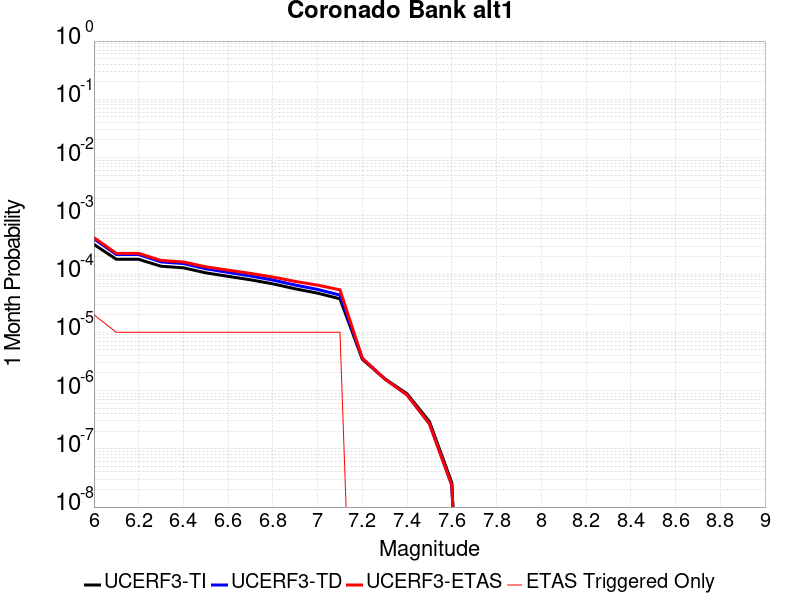 | 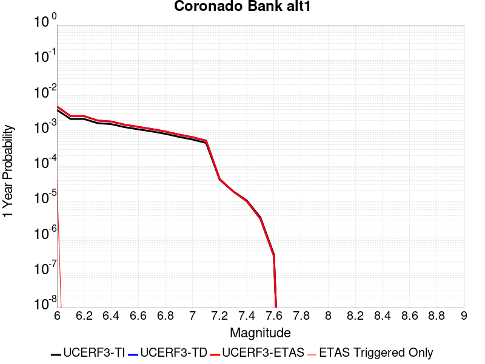 | 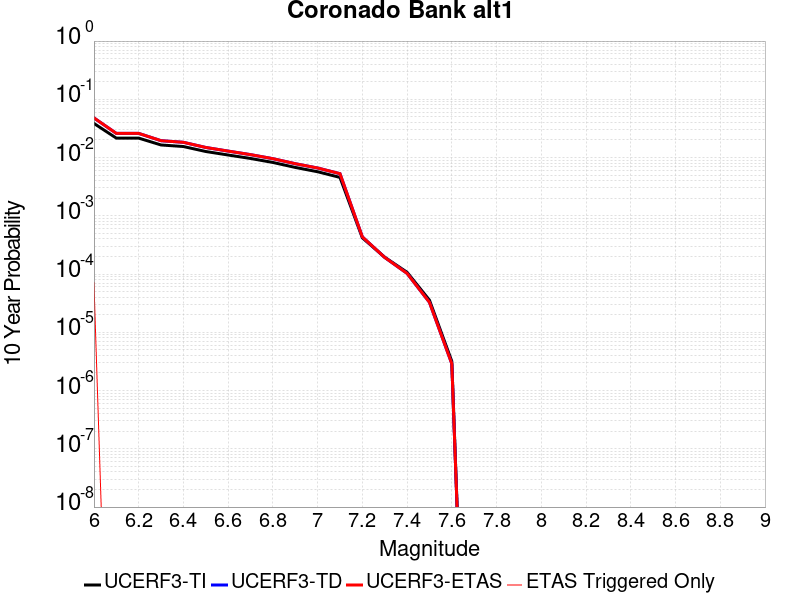 |

| Magnitude | 1 wk TI Prob | 1 wk TD Prob | 1 wk ETAS Prob | 1 wk ETAS/TD Gain | 1 wk ETAS Triggered Only | 1 mo TI Prob | 1 mo TD Prob | 1 mo ETAS Prob | 1 mo ETAS/TD Gain | 1 mo ETAS Triggered Only | 1 yr TI Prob | 1 yr TD Prob | 1 yr ETAS Prob | 1 yr ETAS/TD Gain | 1 yr ETAS Triggered Only | 10 yr TI Prob | 10 yr TD Prob | 10 yr ETAS Prob | 10 yr ETAS/TD Gain | 10 yr ETAS Triggered Only |
|-----|-----|-----|-----|-----|-----|-----|-----|-----|-----|-----|-----|-----|-----|-----|-----|-----|-----|-----|-----|-----|
| 6.0 | 7.533492E-5 | 9.394913E-5 | 1.03948194E-4 | 1.1064305 | 1.0E-5 | 3.22824E-4 | 4.0258127E-4 | 4.225732E-4 | 1.0496594 | 2.0E-5 | 0.0039233007 | 0.0048909658 | 0.004960623 | 1.014242 | 7.0E-5 | 0.03854755 | 0.04790356 | 0.04798925 | 1.0017887 | 9.0E-5 |
| 6.1 | 4.1807285E-5 | 5.049283E-5 | 6.0492326E-5 | 1.1980379 | 1.0E-5 | 1.7916178E-4 | 2.1638049E-4 | 2.2637832E-4 | 1.0462049 | 1.0E-5 | 0.0021791123 | 0.0026313474 | 0.0026612685 | 1.011371 | 3.0E-5 | 0.021578677 | 0.026011046 | 0.026050007 | 1.0014979 | 4.0E-5 |
| 6.2 | 4.1807285E-5 | 5.049283E-5 | 6.0492326E-5 | 1.1980379 | 1.0E-5 | 1.7916178E-4 | 2.1638049E-4 | 2.2637832E-4 | 1.0462049 | 1.0E-5 | 0.0021791123 | 0.0026313474 | 0.0026612685 | 1.011371 | 3.0E-5 | 0.021578677 | 0.026011046 | 0.026050007 | 1.0014979 | 4.0E-5 |
| 6.3 | 3.1793104E-5 | 3.7711117E-5 | 4.771074E-5 | 1.2651638 | 1.0E-5 | 1.3624904E-4 | 1.6160926E-4 | 1.7160765E-4 | 1.0618676 | 1.0E-5 | 0.0016575698 | 0.001965848 | 0.0019957891 | 1.0152305 | 3.0E-5 | 0.016452603 | 0.019488465 | 0.019527685 | 1.0020125 | 4.0E-5 |
| 6.4 | 2.9878007E-5 | 3.5335794E-5 | 4.533544E-5 | 1.2829891 | 1.0E-5 | 1.2804232E-4 | 1.5143053E-4 | 1.6142902E-4 | 1.0660269 | 1.0E-5 | 0.0015578003 | 0.0018421387 | 0.0018720834 | 1.0162554 | 3.0E-5 | 0.015469253 | 0.01827244 | 0.018311711 | 1.0021491 | 4.0E-5 |
| 6.5 | 2.4512565E-5 | 2.8764043E-5 | 3.8763756E-5 | 1.3476462 | 1.0E-5 | 1.0504962E-4 | 1.2326881E-4 | 1.3326757E-4 | 1.0811136 | 1.0E-5 | 0.0012782287 | 0.0014997921 | 0.0015297472 | 1.0199728 | 3.0E-5 | 0.012709012 | 0.014899683 | 0.014939087 | 1.0026447 | 4.0E-5 |
| 6.6 | 2.1317413E-5 | 2.490667E-5 | 3.490642E-5 | 1.4014889 | 1.0E-5 | 9.135714E-5 | 1.0673863E-4 | 1.1673757E-4 | 1.0936768 | 1.0E-5 | 0.0011117056 | 0.0012987906 | 0.0013287516 | 1.0230684 | 3.0E-5 | 0.011061605 | 0.012914404 | 0.012953889 | 1.0030574 | 4.0E-5 |
| 6.7 | 1.8585655E-5 | 2.163488E-5 | 3.1634663E-5 | 1.4622066 | 1.0E-5 | 7.9650374E-5 | 9.271773E-5 | 1.02716804E-4 | 1.1078442 | 1.0E-5 | 9.6931186E-4 | 0.0011282742 | 0.0011582405 | 1.0265592 | 3.0E-5 | 0.0096509475 | 0.011227623 | 0.011267173 | 1.0035226 | 4.0E-5 |
| 6.8 | 1.5862879E-5 | 1.8419474E-5 | 2.841929E-5 | 1.5428936 | 1.0E-5 | 6.798199E-5 | 7.893833E-5 | 8.893754E-5 | 1.1266712 | 1.0E-5 | 8.273665E-4 | 9.6066965E-4 | 9.806504E-4 | 1.0207988 | 2.0E-5 | 0.008242928 | 0.00956715 | 0.009596863 | 1.0031058 | 3.0E-5 |
| 6.9 | 1.3021509E-5 | 1.5095265E-5 | 2.5095114E-5 | 1.6624494 | 1.0E-5 | 5.5805274E-5 | 6.469249E-5 | 7.4691845E-5 | 1.1545675 | 1.0E-5 | 6.792174E-4 | 7.8736455E-4 | 8.0734876E-4 | 1.0253812 | 2.0E-5 | 0.006771452 | 0.007847573 | 0.007877337 | 1.0037929 | 3.0E-5 |
| 7.0 | 1.0974371E-5 | 1.2720104E-5 | 2.2719976E-5 | 1.7861471 | 1.0E-5 | 4.7032172E-5 | 5.451369E-5 | 6.4513144E-5 | 1.1834302 | 1.0E-5 | 5.7246623E-4 | 6.6351966E-4 | 6.8350637E-4 | 1.0301223 | 2.0E-5 | 0.0057099373 | 0.006617135 | 0.0066469363 | 1.0045037 | 3.0E-5 |
| 7.1 | 8.766221E-6 | 1.01638325E-5 | 2.016373E-5 | 1.9838709 | 1.0E-5 | 3.7568978E-5 | 4.355865E-5 | 5.3558215E-5 | 1.2295655 | 1.0E-5 | 4.573063E-4 | 5.3021475E-4 | 5.5020413E-4 | 1.0377005 | 2.0E-5 | 0.0045636636 | 0.0052911965 | 0.005321038 | 1.0056398 | 3.0E-5 |
| 7.2 | 8.026024E-7 | 8.331765E-7 | 8.331765E-7 | 1.0 | 0.0 | 3.43972E-6 | 3.5707515E-6 | 3.5707515E-6 | 1.0 | 0.0 | 4.1877785E-5 | 4.3473043E-5 | 4.3473043E-5 | 1.0 | 0.0 | 4.1869894E-4 | 4.3464647E-4 | 4.3464647E-4 | 1.0 | 0.0 |
| 7.3 | 3.7293114E-7 | 3.7000953E-7 | 3.7000953E-7 | 1.0 | 0.0 | 1.5982754E-6 | 1.5857541E-6 | 1.5857541E-6 | 1.0 | 0.0 | 1.9458828E-5 | 1.9306386E-5 | 1.9306386E-5 | 1.0 | 0.0 | 1.9457124E-4 | 1.9304715E-4 | 1.9304715E-4 | 1.0 | 0.0 |
| 7.4 | 2.0557036E-7 | 1.9674363E-7 | 1.9674363E-7 | 1.0 | 0.0 | 8.810155E-7 | 8.431867E-7 | 8.431867E-7 | 1.0 | 0.0 | 1.0726311E-5 | 1.026575E-5 | 1.026575E-5 | 1.0 | 0.0 | 1.0725793E-4 | 1.0265279E-4 | 1.0265279E-4 | 1.0 | 0.0 |
| 7.5 | 6.845446E-8 | 6.279369E-8 | 6.279369E-8 | 1.0 | 0.0 | 2.9337625E-7 | 2.691158E-7 | 2.691158E-7 | 1.0 | 0.0 | 3.5718497E-6 | 3.2764797E-6 | 3.2764797E-6 | 1.0 | 0.0 | 3.5717923E-5 | 3.2764325E-5 | 3.2764325E-5 | 1.0 | 0.0 |
| 7.6 | 6.0975145E-9 | 5.53185E-9 | 5.53185E-9 | 1.0 | 0.0 | 2.6132206E-8 | 2.370793E-8 | 2.370793E-8 | 1.0 | 0.0 | 3.1815955E-7 | 2.88644E-7 | 2.88644E-7 | 1.0 | 0.0 | 3.181591E-6 | 2.8864374E-6 | 2.8864374E-6 | 1.0 | 0.0 |

## Santa Cruz Catalina Ridge alt1
*[(top)](#table-of-contents)*

| 1 Week | 1 Month | 1 Year | 10 Year |
|-----|-----|-----|-----|
| 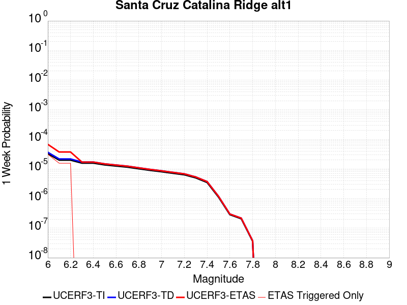 | 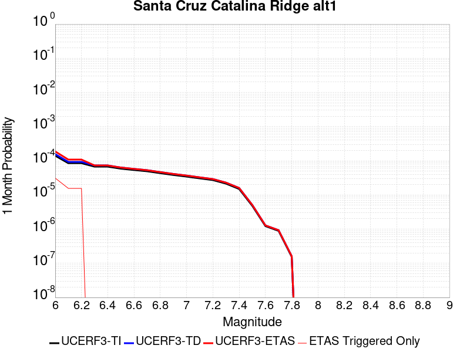 | 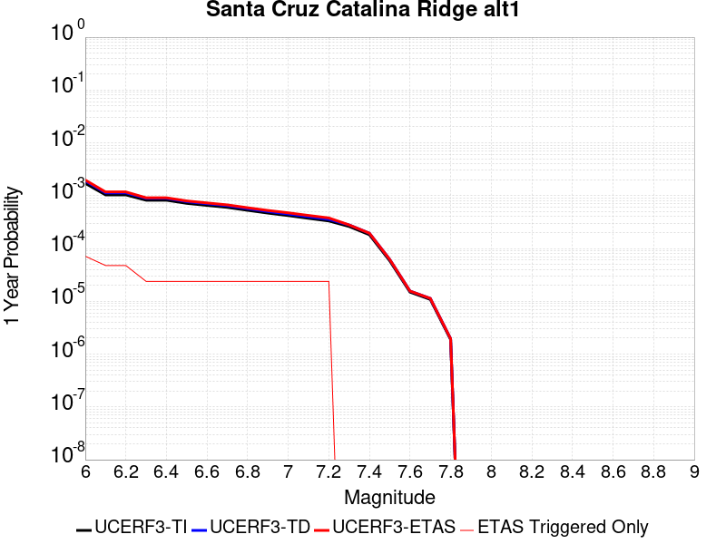 | 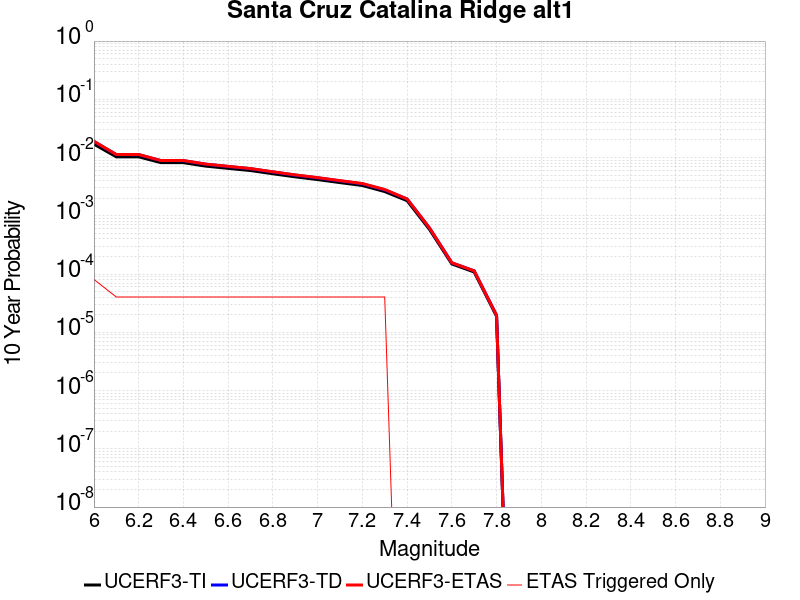 |

| Magnitude | 1 wk TI Prob | 1 wk TD Prob | 1 wk ETAS Prob | 1 wk ETAS/TD Gain | 1 wk ETAS Triggered Only | 1 mo TI Prob | 1 mo TD Prob | 1 mo ETAS Prob | 1 mo ETAS/TD Gain | 1 mo ETAS Triggered Only | 1 yr TI Prob | 1 yr TD Prob | 1 yr ETAS Prob | 1 yr ETAS/TD Gain | 1 yr ETAS Triggered Only | 10 yr TI Prob | 10 yr TD Prob | 10 yr ETAS Prob | 10 yr ETAS/TD Gain | 10 yr ETAS Triggered Only |
|-----|-----|-----|-----|-----|-----|-----|-----|-----|-----|-----|-----|-----|-----|-----|-----|-----|-----|-----|-----|-----|
| 6.0 | 3.2833184E-5 | 3.65584E-5 | 6.65573E-5 | 1.8205749 | 3.0E-5 | 1.4070606E-4 | 1.5667039E-4 | 1.9666411E-4 | 1.2552731 | 4.0E-5 | 0.00171175 | 0.0019059596 | 0.0019758262 | 1.0366569 | 7.0E-5 | 0.016986247 | 0.018913029 | 0.018991517 | 1.0041499 | 8.0E-5 |
| 6.1 | 1.9835548E-5 | 2.1659505E-5 | 4.165907E-5 | 1.9233621 | 2.0E-5 | 8.500672E-5 | 9.282326E-5 | 1.2282048E-4 | 1.3231648 | 3.0E-5 | 0.0010344655 | 0.0011295575 | 0.0011894897 | 1.0530581 | 6.0E-5 | 0.010296632 | 0.011240295 | 0.011309508 | 1.0061576 | 7.0E-5 |
| 6.2 | 1.9835548E-5 | 2.1659505E-5 | 4.165907E-5 | 1.9233621 | 2.0E-5 | 8.500672E-5 | 9.282326E-5 | 1.2282048E-4 | 1.3231648 | 3.0E-5 | 0.0010344655 | 0.0011295575 | 0.0011894897 | 1.0530581 | 6.0E-5 | 0.010296632 | 0.011240295 | 0.011309508 | 1.0061576 | 7.0E-5 |
| 6.3 | 1.5728183E-5 | 1.703395E-5 | 2.7033779E-5 | 1.587053 | 1.0E-5 | 6.7404755E-5 | 7.300063E-5 | 9.299917E-5 | 1.2739502 | 2.0E-5 | 8.2034385E-4 | 8.884264E-4 | 9.2839083E-4 | 1.0449834 | 4.0E-5 | 0.008173222 | 0.008849427 | 0.008898985 | 1.0056001 | 5.0E-5 |
| 6.4 | 1.5728183E-5 | 1.703395E-5 | 2.7033779E-5 | 1.587053 | 1.0E-5 | 6.7404755E-5 | 7.300063E-5 | 9.299917E-5 | 1.2739502 | 2.0E-5 | 8.2034385E-4 | 8.884264E-4 | 9.2839083E-4 | 1.0449834 | 4.0E-5 | 0.008173222 | 0.008849427 | 0.008898985 | 1.0056001 | 5.0E-5 |
| 6.5 | 1.3707734E-5 | 1.4794522E-5 | 2.4794374E-5 | 1.6759158 | 1.0E-5 | 5.8746107E-5 | 6.3403575E-5 | 8.34023E-5 | 1.3154197 | 2.0E-5 | 7.1499916E-4 | 7.716686E-4 | 8.116377E-4 | 1.0517957 | 4.0E-5 | 0.0071270303 | 0.0076902895 | 0.0077399053 | 1.0064517 | 5.0E-5 |
| 6.6 | 1.2539813E-5 | 1.3510219E-5 | 1.3510219E-5 | 1.0 | 0.0 | 5.3740947E-5 | 5.789967E-5 | 6.789909E-5 | 1.1727026 | 1.0E-5 | 6.540996E-4 | 7.0470315E-4 | 7.34682E-4 | 1.0425411 | 3.0E-5 | 0.0065217763 | 0.0070249885 | 0.0070647076 | 1.005654 | 4.0E-5 |
| 6.7 | 1.1504083E-5 | 1.2377375E-5 | 1.2377375E-5 | 1.0 | 0.0 | 4.930228E-5 | 5.3044827E-5 | 6.3044296E-5 | 1.1885098 | 1.0E-5 | 6.0008996E-4 | 6.456314E-4 | 6.75612E-4 | 1.0464362 | 3.0E-5 | 0.005984721 | 0.006437786 | 0.0064775283 | 1.0061734 | 4.0E-5 |
| 6.8 | 1.012739E-5 | 1.0877071E-5 | 1.0877071E-5 | 1.0 | 0.0 | 4.340238E-5 | 4.6615194E-5 | 5.661473E-5 | 1.2145123 | 1.0E-5 | 5.282958E-4 | 5.673937E-4 | 5.9737667E-4 | 1.0528433 | 3.0E-5 | 0.0052704164 | 0.0056596193 | 0.0056993933 | 1.0070276 | 4.0E-5 |
| 6.9 | 8.9607865E-6 | 9.609117E-6 | 9.609117E-6 | 1.0 | 0.0 | 3.8402806E-5 | 4.1181287E-5 | 5.1180876E-5 | 1.2428187 | 1.0E-5 | 4.6745385E-4 | 5.012679E-4 | 5.312529E-4 | 1.0598183 | 3.0E-5 | 0.0046647177 | 0.005001492 | 0.0050412915 | 1.0079576 | 4.0E-5 |
| 7.0 | 8.046829E-6 | 8.619746E-6 | 8.619746E-6 | 1.0 | 0.0 | 3.4485955E-5 | 3.694125E-5 | 4.694088E-5 | 1.2706901 | 1.0E-5 | 4.1978562E-4 | 4.496677E-4 | 4.796542E-4 | 1.0666859 | 3.0E-5 | 0.004189935 | 0.0044876686 | 0.004527489 | 1.0088733 | 4.0E-5 |
| 7.1 | 7.136131E-6 | 7.637656E-6 | 7.637656E-6 | 1.0 | 0.0 | 3.0583058E-5 | 3.2732405E-5 | 4.2732077E-5 | 1.3054976 | 1.0E-5 | 3.7228514E-4 | 3.9844486E-4 | 4.2843292E-4 | 1.0752628 | 3.0E-5 | 0.0037166206 | 0.003977381 | 0.004017222 | 1.0100169 | 4.0E-5 |
| 7.2 | 6.362014E-6 | 6.8049585E-6 | 6.8049585E-6 | 1.0 | 0.0 | 2.726549E-5 | 2.9163786E-5 | 3.9163493E-5 | 1.342881 | 1.0E-5 | 3.3190678E-4 | 3.550119E-4 | 3.8500124E-4 | 1.0844742 | 3.0E-5 | 0.0033141149 | 0.003544516 | 0.0035843742 | 1.011245 | 4.0E-5 |
| 7.3 | 5.004101E-6 | 5.351715E-6 | 5.351715E-6 | 1.0 | 0.0 | 2.1445969E-5 | 2.2935723E-5 | 3.293549E-5 | 1.435991 | 1.0E-5 | 2.6107338E-4 | 2.792072E-4 | 2.9920158E-4 | 1.0716114 | 2.0E-5 | 0.002607669 | 0.0027886187 | 0.0028185348 | 1.010728 | 3.0E-5 |
| 7.4 | 3.4901443E-6 | 3.7320526E-6 | 3.7320526E-6 | 1.0 | 0.0 | 1.4957676E-5 | 1.5994416E-5 | 1.5994416E-5 | 1.0 | 0.0 | 1.8209449E-4 | 1.9471499E-4 | 2.0471304E-4 | 1.0513471 | 1.0E-5 | 0.0018194534 | 0.0019454823 | 0.0019554629 | 1.0051302 | 1.0E-5 |
| 7.5 | 1.1215045E-6 | 1.189387E-6 | 1.189387E-6 | 1.0 | 0.0 | 4.806439E-6 | 5.097363E-6 | 5.097363E-6 | 1.0 | 0.0 | 5.851682E-5 | 6.205866E-5 | 6.205866E-5 | 1.0 | 0.0 | 5.850142E-4 | 6.2041637E-4 | 6.2041637E-4 | 1.0 | 0.0 |
| 7.6 | 2.8599047E-7 | 2.9951994E-7 | 2.9951994E-7 | 1.0 | 0.0 | 1.2256729E-6 | 1.2836562E-6 | 1.2836562E-6 | 1.0 | 0.0 | 1.4922465E-5 | 1.5628404E-5 | 1.5628404E-5 | 1.0 | 0.0 | 1.4921463E-4 | 1.5627318E-4 | 1.5627318E-4 | 1.0 | 0.0 |
| 7.7 | 2.0781519E-7 | 2.1744323E-7 | 2.1744323E-7 | 1.0 | 0.0 | 8.906362E-7 | 9.3189925E-7 | 9.3189925E-7 | 1.0 | 0.0 | 1.08434415E-5 | 1.13458145E-5 | 1.13458145E-5 | 1.0 | 0.0 | 1.0842913E-4 | 1.1345245E-4 | 1.1345245E-4 | 1.0 | 0.0 |
| 7.8 | 3.614776E-8 | 3.764102E-8 | 3.764102E-8 | 1.0 | 0.0 | 1.5491896E-7 | 1.6131864E-7 | 1.6131864E-7 | 1.0 | 0.0 | 1.8861368E-6 | 1.9640527E-6 | 1.9640527E-6 | 1.0 | 0.0 | 1.8861208E-5 | 1.9640367E-5 | 1.9640367E-5 | 1.0 | 0.0 |

## Calaveras (So) 2011 CFM
*[(top)](#table-of-contents)*

| 1 Week | 1 Month | 1 Year | 10 Year |
|-----|-----|-----|-----|
| 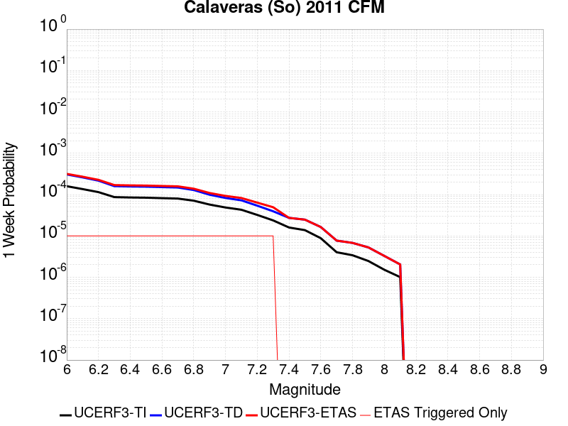 | 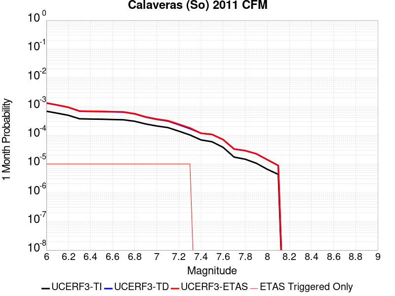 | 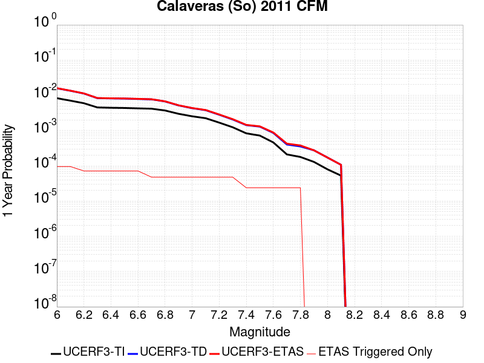 | 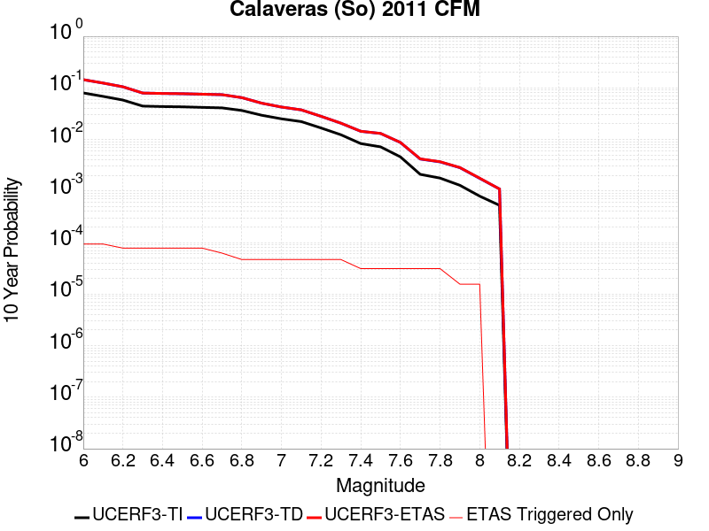 |

| Magnitude | 1 wk TI Prob | 1 wk TD Prob | 1 wk ETAS Prob | 1 wk ETAS/TD Gain | 1 wk ETAS Triggered Only | 1 mo TI Prob | 1 mo TD Prob | 1 mo ETAS Prob | 1 mo ETAS/TD Gain | 1 mo ETAS Triggered Only | 1 yr TI Prob | 1 yr TD Prob | 1 yr ETAS Prob | 1 yr ETAS/TD Gain | 1 yr ETAS Triggered Only | 10 yr TI Prob | 10 yr TD Prob | 10 yr ETAS Prob | 10 yr ETAS/TD Gain | 10 yr ETAS Triggered Only |
|-----|-----|-----|-----|-----|-----|-----|-----|-----|-----|-----|-----|-----|-----|-----|-----|-----|-----|-----|-----|-----|
| 6.0 | 1.5950744E-4 | 3.071188E-4 | 3.1711574E-4 | 1.0325507 | 1.0E-5 | 6.834242E-4 | 0.0013155643 | 0.0013255512 | 1.0075912 | 1.0E-5 | 0.00828899 | 0.01585904 | 0.01591809 | 1.0037234 | 6.0E-5 | 0.079865426 | 0.14440064 | 0.14447765 | 1.0005332 | 9.0E-5 |
| 6.1 | 1.3584697E-4 | 2.6036944E-4 | 2.7036684E-4 | 1.038397 | 1.0E-5 | 5.8207137E-4 | 0.0011153965 | 0.0011253853 | 1.0089555 | 1.0E-5 | 0.007063716 | 0.013462106 | 0.013521298 | 1.0043969 | 6.0E-5 | 0.06843361 | 0.12402854 | 0.12409862 | 1.000565 | 8.0E-5 |
| 6.2 | 1.14676266E-4 | 2.1726108E-4 | 2.2725892E-4 | 1.0460175 | 1.0E-5 | 4.9137714E-4 | 9.307893E-4 | 9.4078E-4 | 1.0107336 | 1.0E-5 | 0.0059661185 | 0.011245592 | 0.011295029 | 1.0043962 | 5.0E-5 | 0.058084648 | 0.105019294 | 0.10508194 | 1.0005965 | 7.0E-5 |
| 6.3 | 8.691518E-5 | 1.5987165E-4 | 1.6987004E-4 | 1.0625402 | 1.0E-5 | 3.7244044E-4 | 6.8496726E-4 | 6.949604E-4 | 1.0145892 | 1.0E-5 | 0.004525038 | 0.008300893 | 0.0083504785 | 1.0059735 | 5.0E-5 | 0.044339992 | 0.0793347 | 0.079399146 | 1.0008123 | 7.0E-5 |
| 6.4 | 8.50982E-5 | 1.5693568E-4 | 1.6693411E-4 | 1.0637103 | 1.0E-5 | 3.646556E-4 | 6.7239115E-4 | 6.823844E-4 | 1.0148623 | 1.0E-5 | 0.0044306475 | 0.008148931 | 0.008198523 | 1.0060858 | 5.0E-5 | 0.04343345 | 0.077940844 | 0.07800539 | 1.0008281 | 7.0E-5 |
| 6.5 | 8.4062965E-5 | 1.5518135E-4 | 1.6517981E-4 | 1.0644307 | 1.0E-5 | 3.602201E-4 | 6.648764E-4 | 6.7486975E-4 | 1.0150304 | 1.0E-5 | 0.004376863 | 0.008058134 | 0.00810773 | 1.0061549 | 5.0E-5 | 0.042916555 | 0.077112116 | 0.07717672 | 1.0008378 | 7.0E-5 |
| 6.6 | 8.194716E-5 | 1.5154095E-4 | 1.6153943E-4 | 1.0659788 | 1.0E-5 | 3.5115483E-4 | 6.492825E-4 | 6.5927603E-4 | 1.0153916 | 1.0E-5 | 0.0042669317 | 0.007869979 | 0.007919586 | 1.0063033 | 5.0E-5 | 0.04185927 | 0.07539739 | 0.07546211 | 1.0008584 | 7.0E-5 |
| 6.7 | 8.012326E-5 | 1.4821833E-4 | 1.5821685E-4 | 1.067458 | 1.0E-5 | 3.433402E-4 | 6.350497E-4 | 6.450433E-4 | 1.0157368 | 1.0E-5 | 0.004172157 | 0.007698474 | 0.007738166 | 1.0051558 | 4.0E-5 | 0.040946912 | 0.073839515 | 0.07389509 | 1.0007526 | 6.0E-5 |
| 6.8 | 7.119773E-5 | 1.2880519E-4 | 1.388039E-4 | 1.0776266 | 1.0E-5 | 3.0509746E-4 | 5.519001E-4 | 5.618946E-4 | 1.0181092 | 1.0E-5 | 0.0037082357 | 0.0066958875 | 0.0067356196 | 1.0059338 | 4.0E-5 | 0.036469642 | 0.06468402 | 0.06473078 | 1.000723 | 5.0E-5 |
| 6.9 | 5.7343088E-5 | 9.9189E-5 | 1.0918801E-4 | 1.1008077 | 1.0E-5 | 2.4573295E-4 | 4.2502693E-4 | 4.3502267E-4 | 1.023518 | 1.0E-5 | 0.0029876942 | 0.0051625078 | 0.005192353 | 1.0057812 | 3.0E-5 | 0.02947844 | 0.050509132 | 0.05054711 | 1.000752 | 4.0E-5 |
| 7.0 | 4.8746577E-5 | 8.284751E-5 | 9.284668E-5 | 1.1206937 | 1.0E-5 | 2.0889717E-4 | 3.550128E-4 | 3.6500924E-4 | 1.028158 | 1.0E-5 | 0.0025403565 | 0.004313781 | 0.0043436512 | 1.0069245 | 3.0E-5 | 0.025115121 | 0.04248505 | 0.04252335 | 1.0009015 | 4.0E-5 |
| 7.1 | 4.2998014E-5 | 7.264914E-5 | 8.264841E-5 | 1.1376379 | 1.0E-5 | 1.8426418E-4 | 3.1131663E-4 | 3.213135E-4 | 1.0321116 | 1.0E-5 | 0.002241108 | 0.0037837527 | 0.0038136393 | 1.0078987 | 3.0E-5 | 0.022186412 | 0.037423246 | 0.037461746 | 1.0010289 | 4.0E-5 |
| 7.2 | 3.221292E-5 | 5.390566E-5 | 6.390512E-5 | 1.1854993 | 1.0E-5 | 1.3804805E-4 | 2.3100396E-4 | 2.4100165E-4 | 1.0432793 | 1.0E-5 | 0.0016794393 | 0.0028088738 | 0.0028387895 | 1.0106504 | 3.0E-5 | 0.016668037 | 0.028035998 | 0.028074875 | 1.0013868 | 4.0E-5 |
| 7.3 | 2.3756531E-5 | 3.9471706E-5 | 4.9471313E-5 | 1.2533361 | 1.0E-5 | 1.0180973E-4 | 1.6915359E-4 | 1.7915189E-4 | 1.0591079 | 1.0E-5 | 0.0012388286 | 0.0020575167 | 0.002087455 | 1.0145507 | 3.0E-5 | 0.012319452 | 0.02064345 | 0.020672832 | 1.0014232 | 3.0E-5 |
| 7.4 | 1.5997684E-5 | 2.734085E-5 | 2.734085E-5 | 1.0 | 0.0 | 6.8559704E-5 | 1.1716982E-4 | 1.1716982E-4 | 1.0 | 0.0 | 8.343947E-4 | 0.0014256114 | 0.001445583 | 1.0140091 | 2.0E-5 | 0.008312687 | 0.014376549 | 0.014396261 | 1.0013711 | 2.0E-5 |
| 7.5 | 1.3814293E-5 | 2.4782603E-5 | 2.4782603E-5 | 1.0 | 0.0 | 5.9202768E-5 | 1.0620684E-4 | 1.0620684E-4 | 1.0 | 0.0 | 7.205553E-4 | 0.0012923037 | 0.0013122779 | 1.0154562 | 2.0E-5 | 0.007182234 | 0.013055766 | 0.013075504 | 1.0015119 | 2.0E-5 |
| 7.6 | 8.817309E-6 | 1.6429829E-5 | 1.6429829E-5 | 1.0 | 0.0 | 3.7787922E-5 | 7.041166E-5 | 7.041166E-5 | 1.0 | 0.0 | 4.5997082E-4 | 8.5692614E-4 | 8.76909E-4 | 1.0233192 | 2.0E-5 | 0.004590199 | 0.008719863 | 0.008739689 | 1.0022736 | 2.0E-5 |
| 7.7 | 4.0352206E-6 | 7.706877E-6 | 7.706877E-6 | 1.0 | 0.0 | 1.7293689E-5 | 3.3029053E-5 | 3.3029053E-5 | 1.0 | 0.0 | 2.1053031E-4 | 4.020546E-4 | 4.2204658E-4 | 1.0497245 | 2.0E-5 | 0.0021033096 | 0.0041649863 | 0.004184903 | 1.004782 | 2.0E-5 |
| 7.8 | 3.413169E-6 | 6.7868646E-6 | 6.7868646E-6 | 1.0 | 0.0 | 1.4627784E-5 | 2.9086239E-5 | 2.9086239E-5 | 1.0 | 0.0 | 1.7807873E-4 | 3.5406748E-4 | 3.740604E-4 | 1.0564665 | 2.0E-5 | 0.0017793609 | 0.0036663096 | 0.0036862362 | 1.0054351 | 2.0E-5 |
| 7.9 | 2.4740732E-6 | 5.278809E-6 | 5.278809E-6 | 1.0 | 0.0 | 1.06031275E-5 | 2.2623271E-5 | 2.2623271E-5 | 1.0 | 0.0 | 1.2908543E-4 | 2.7540355E-4 | 2.854008E-4 | 1.0363003 | 1.0E-5 | 0.0012901047 | 0.002834638 | 0.0028446098 | 1.0035177 | 1.0E-5 |
| 8.0 | 1.5231818E-6 | 3.2887135E-6 | 3.2887135E-6 | 1.0 | 0.0 | 6.527906E-6 | 1.409441E-5 | 1.409441E-5 | 1.0 | 0.0 | 7.9474354E-5 | 1.7158597E-4 | 1.8158426E-4 | 1.0582699 | 1.0E-5 | 7.944594E-4 | 0.001756374 | 0.0017663564 | 1.0056835 | 1.0E-5 |
| 8.1 | 1.0104524E-6 | 2.0456548E-6 | 2.0456548E-6 | 1.0 | 0.0 | 4.330503E-6 | 8.767062E-6 | 8.767062E-6 | 1.0 | 0.0 | 5.2722597E-5 | 1.06733794E-4 | 1.06733794E-4 | 1.0 | 0.0 | 5.271009E-4 | 0.0010929212 | 0.0010929212 | 1.0 | 0.0 |

## San Diego Trough south
*[(top)](#table-of-contents)*

| 1 Week | 1 Month | 1 Year | 10 Year |
|-----|-----|-----|-----|
|  | 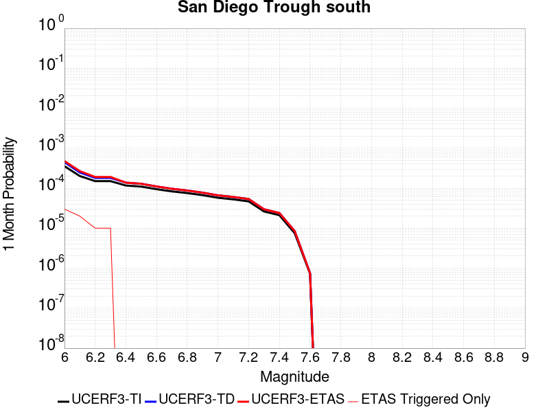 | 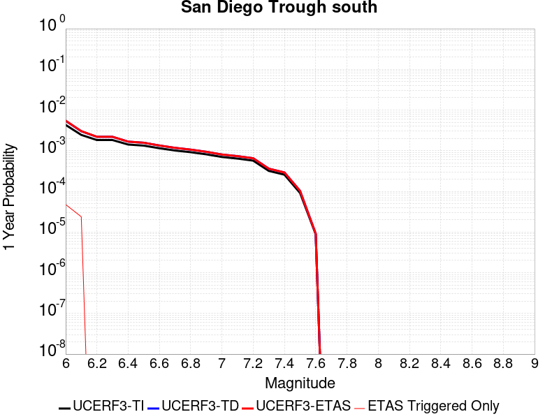 | 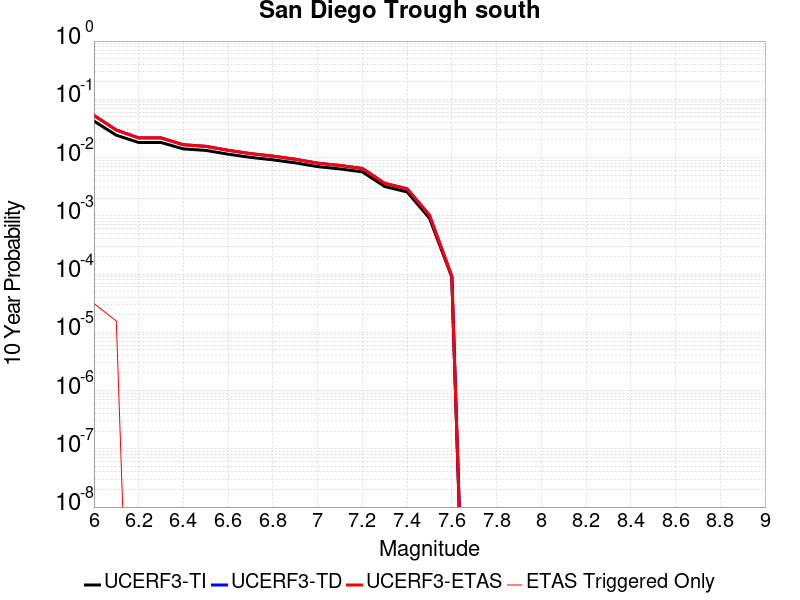 |

| Magnitude | 1 wk TI Prob | 1 wk TD Prob | 1 wk ETAS Prob | 1 wk ETAS/TD Gain | 1 wk ETAS Triggered Only | 1 mo TI Prob | 1 mo TD Prob | 1 mo ETAS Prob | 1 mo ETAS/TD Gain | 1 mo ETAS Triggered Only | 1 yr TI Prob | 1 yr TD Prob | 1 yr ETAS Prob | 1 yr ETAS/TD Gain | 1 yr ETAS Triggered Only | 10 yr TI Prob | 10 yr TD Prob | 10 yr ETAS Prob | 10 yr ETAS/TD Gain | 10 yr ETAS Triggered Only |
|-----|-----|-----|-----|-----|-----|-----|-----|-----|-----|-----|-----|-----|-----|-----|-----|-----|-----|-----|-----|-----|
| 6.0 | 8.279495E-5 | 1.04241306E-4 | 1.3423817E-4 | 1.2877638 | 3.0E-5 | 3.5478722E-4 | 4.4667677E-4 | 4.7666338E-4 | 1.0671327 | 3.0E-5 | 0.004310982 | 0.0054256152 | 0.005495236 | 1.0128318 | 7.0E-5 | 0.042283054 | 0.05299221 | 0.0530585 | 1.001251 | 7.0E-5 |
| 6.1 | 4.6961468E-5 | 5.772944E-5 | 7.7728284E-5 | 1.3464236 | 2.0E-5 | 2.0124791E-4 | 2.473894E-4 | 2.6738446E-4 | 1.0808243 | 2.0E-5 | 0.00244744 | 0.0030079768 | 0.0030578263 | 1.0165725 | 5.0E-5 | 0.024206603 | 0.029679462 | 0.029727979 | 1.0016347 | 5.0E-5 |
| 6.2 | 3.5079658E-5 | 4.214154E-5 | 5.2141117E-5 | 1.2372856 | 1.0E-5 | 1.5033272E-4 | 1.8059435E-4 | 1.9059255E-4 | 1.0553627 | 1.0E-5 | 0.0018287642 | 0.0021965632 | 0.0022264973 | 1.0136276 | 3.0E-5 | 0.018137876 | 0.021751117 | 0.021780465 | 1.0013492 | 3.0E-5 |
| 6.3 | 3.5079658E-5 | 4.214154E-5 | 5.2141117E-5 | 1.2372856 | 1.0E-5 | 1.5033272E-4 | 1.8059435E-4 | 1.9059255E-4 | 1.0553627 | 1.0E-5 | 0.0018287642 | 0.0021965632 | 0.0022264973 | 1.0136276 | 3.0E-5 | 0.018137876 | 0.021751117 | 0.021780465 | 1.0013492 | 3.0E-5 |
| 6.4 | 2.7196904E-5 | 3.2087162E-5 | 3.2087162E-5 | 1.0 | 0.0 | 1.16552954E-4 | 1.3750927E-4 | 1.3750927E-4 | 1.0 | 0.0 | 0.0014181085 | 0.0016729041 | 0.0016928706 | 1.0119352 | 2.0E-5 | 0.014090929 | 0.016604643 | 0.016624311 | 1.0011845 | 2.0E-5 |
| 6.5 | 2.5584688E-5 | 3.010164E-5 | 3.010164E-5 | 1.0 | 0.0 | 1.0964406E-4 | 1.2900073E-4 | 1.2900073E-4 | 1.0 | 0.0 | 0.0013340989 | 0.0015694655 | 0.0015894341 | 1.0127232 | 2.0E-5 | 0.013261181 | 0.015585314 | 0.015605003 | 1.0012633 | 2.0E-5 |
| 6.6 | 2.2034688E-5 | 2.5742738E-5 | 2.5742738E-5 | 1.0 | 0.0 | 9.443096E-5 | 1.1032141E-4 | 1.1032141E-4 | 1.0 | 0.0 | 0.0011490905 | 0.0013423424 | 0.0013623155 | 1.0148793 | 2.0E-5 | 0.011431668 | 0.013343317 | 0.013363051 | 1.0014789 | 2.0E-5 |
| 6.7 | 1.9394853E-5 | 2.254176E-5 | 2.254176E-5 | 1.0 | 0.0 | 8.311815E-5 | 9.6603995E-5 | 9.6603995E-5 | 1.0 | 0.0 | 0.0010114936 | 0.0011755243 | 0.0011955008 | 1.0169936 | 2.0E-5 | 0.01006902 | 0.011693766 | 0.011713532 | 1.0016903 | 2.0E-5 |
| 6.8 | 1.7615313E-5 | 2.0403182E-5 | 2.0403182E-5 | 1.0 | 0.0 | 7.549201E-5 | 8.74393E-5 | 8.74393E-5 | 1.0 | 0.0 | 9.1872766E-4 | 0.0010640579 | 0.0010840367 | 1.0187759 | 2.0E-5 | 0.009149387 | 0.010590198 | 0.010609986 | 1.0018685 | 2.0E-5 |
| 6.9 | 1.5621423E-5 | 1.8026114E-5 | 1.8026114E-5 | 1.0 | 0.0 | 6.6947236E-5 | 7.725251E-5 | 7.725251E-5 | 1.0 | 0.0 | 8.147778E-4 | 9.40147E-4 | 9.5013756E-4 | 1.0106267 | 1.0E-5 | 0.008117969 | 0.009362142 | 0.009372048 | 1.0010581 | 1.0E-5 |
| 7.0 | 1.3444376E-5 | 1.544809E-5 | 1.544809E-5 | 1.0 | 0.0 | 5.7617483E-5 | 6.620443E-5 | 6.620443E-5 | 1.0 | 0.0 | 7.0126704E-4 | 8.057436E-4 | 8.1573555E-4 | 1.0124009 | 1.0E-5 | 0.006990582 | 0.008028555 | 0.008038475 | 1.0012356 | 1.0E-5 |
| 7.1 | 1.2268361E-5 | 1.407303E-5 | 1.407303E-5 | 1.0 | 0.0 | 5.2577634E-5 | 6.0311606E-5 | 6.0311606E-5 | 1.0 | 0.0 | 6.399447E-4 | 7.3404907E-4 | 7.440417E-4 | 1.0136131 | 1.0E-5 | 0.0063810493 | 0.0073165493 | 0.007326476 | 1.0013567 | 1.0E-5 |
| 7.2 | 1.0922655E-5 | 1.2513563E-5 | 1.2513563E-5 | 1.0 | 0.0 | 4.681054E-5 | 5.3628468E-5 | 5.3628468E-5 | 1.0 | 0.0 | 5.697693E-4 | 6.5273355E-4 | 6.62727E-4 | 1.0153102 | 1.0E-5 | 0.0056831064 | 0.0065084435 | 0.006518379 | 1.0015265 | 1.0E-5 |
| 7.3 | 6.1106753E-6 | 6.928925E-6 | 6.928925E-6 | 1.0 | 0.0 | 2.6188345E-5 | 2.9695057E-5 | 2.9695057E-5 | 1.0 | 0.0 | 3.1879646E-4 | 3.6147775E-4 | 3.6147775E-4 | 1.0 | 0.0 | 0.0031833951 | 0.003608943 | 0.003608943 | 1.0 | 0.0 |
| 7.4 | 4.933187E-6 | 5.5895525E-6 | 5.5895525E-6 | 1.0 | 0.0 | 2.114206E-5 | 2.3955008E-5 | 2.3955008E-5 | 1.0 | 0.0 | 2.5737417E-4 | 2.9161357E-4 | 2.9161357E-4 | 1.0 | 0.0 | 0.002570763 | 0.0029123505 | 0.0029123505 | 1.0 | 0.0 |
| 7.5 | 1.7489613E-6 | 1.969678E-6 | 1.969678E-6 | 1.0 | 0.0 | 7.495527E-6 | 8.4414505E-6 | 8.4414505E-6 | 1.0 | 0.0 | 9.125422E-5 | 1.02770035E-4 | 1.02770035E-4 | 1.0 | 0.0 | 9.1216754E-4 | 0.0010272472 | 0.0010272472 | 1.0 | 0.0 |
| 7.6 | 1.6988751E-7 | 1.7533823E-7 | 1.7533823E-7 | 1.0 | 0.0 | 7.2808916E-7 | 7.5144936E-7 | 7.5144936E-7 | 1.0 | 0.0 | 8.864449E-6 | 9.14886E-6 | 9.14886E-6 | 1.0 | 0.0 | 8.8640954E-5 | 9.1485024E-5 | 9.1485024E-5 | 1.0 | 0.0 |

## Pitas Point (Lower West)
*[(top)](#table-of-contents)*

| 1 Week | 1 Month | 1 Year | 10 Year |
|-----|-----|-----|-----|
| 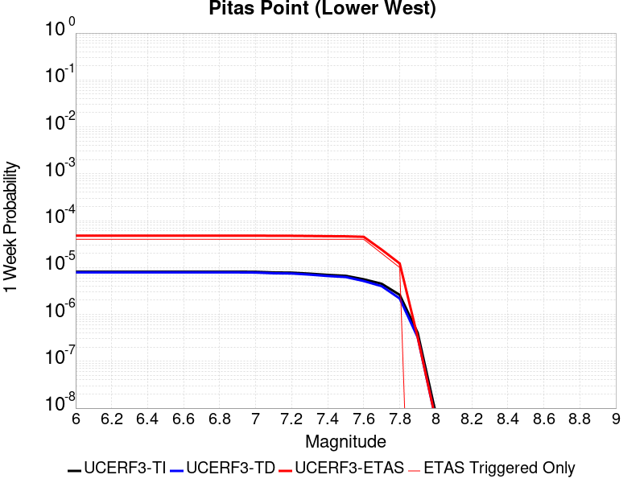 |  | 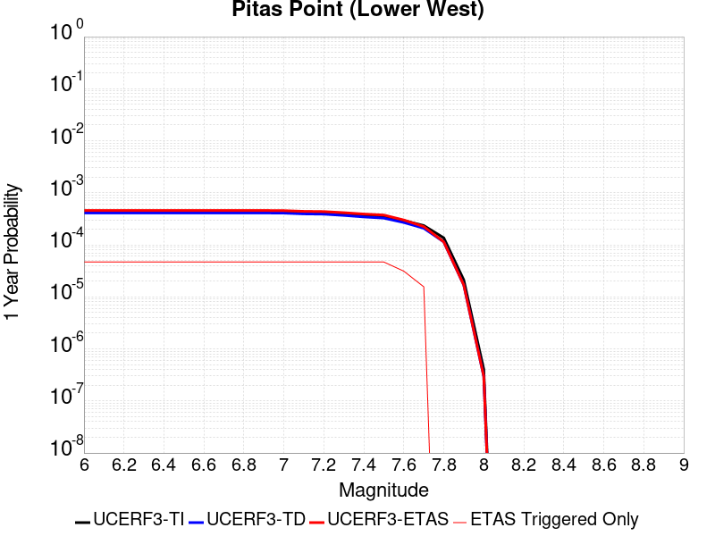 | 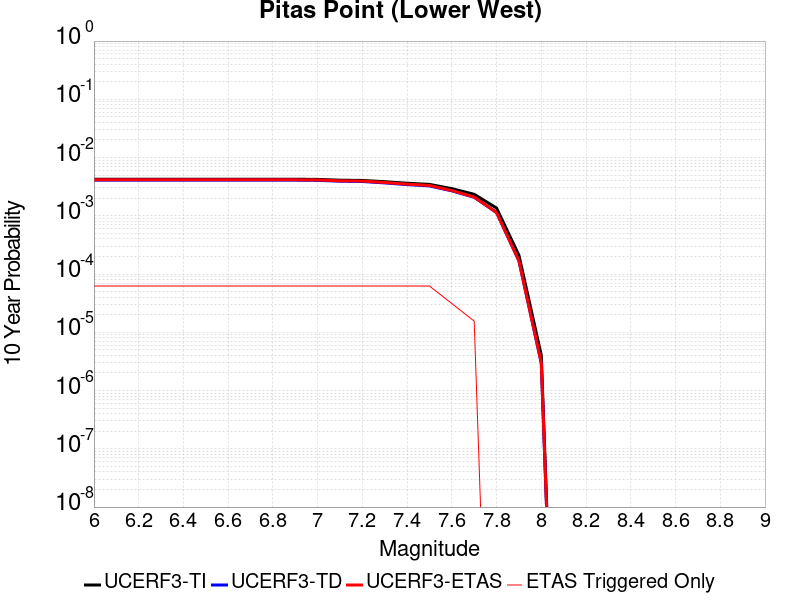 |

| Magnitude | 1 wk TI Prob | 1 wk TD Prob | 1 wk ETAS Prob | 1 wk ETAS/TD Gain | 1 wk ETAS Triggered Only | 1 mo TI Prob | 1 mo TD Prob | 1 mo ETAS Prob | 1 mo ETAS/TD Gain | 1 mo ETAS Triggered Only | 1 yr TI Prob | 1 yr TD Prob | 1 yr ETAS Prob | 1 yr ETAS/TD Gain | 1 yr ETAS Triggered Only | 10 yr TI Prob | 10 yr TD Prob | 10 yr ETAS Prob | 10 yr ETAS/TD Gain | 10 yr ETAS Triggered Only |
|-----|-----|-----|-----|-----|-----|-----|-----|-----|-----|-----|-----|-----|-----|-----|-----|-----|-----|-----|-----|-----|
| 6.0 | 8.151497E-6 | 7.855762E-6 | 4.7855447E-5 | 6.091764 | 4.0E-5 | 3.493452E-5 | 3.3667122E-5 | 8.3665436E-5 | 2.4850783 | 5.0E-5 | 4.252448E-4 | 4.0982084E-4 | 4.7979216E-4 | 1.1707363 | 7.0E-5 | 0.0042443196 | 0.0040907315 | 0.0041803634 | 1.0219109 | 9.0E-5 |
| 6.1 | 8.151497E-6 | 7.855762E-6 | 4.7855447E-5 | 6.091764 | 4.0E-5 | 3.493452E-5 | 3.3667122E-5 | 8.3665436E-5 | 2.4850783 | 5.0E-5 | 4.252448E-4 | 4.0982084E-4 | 4.7979216E-4 | 1.1707363 | 7.0E-5 | 0.0042443196 | 0.0040907315 | 0.0041803634 | 1.0219109 | 9.0E-5 |
| 6.2 | 8.151497E-6 | 7.855762E-6 | 4.7855447E-5 | 6.091764 | 4.0E-5 | 3.493452E-5 | 3.3667122E-5 | 8.3665436E-5 | 2.4850783 | 5.0E-5 | 4.252448E-4 | 4.0982084E-4 | 4.7979216E-4 | 1.1707363 | 7.0E-5 | 0.0042443196 | 0.0040907315 | 0.0041803634 | 1.0219109 | 9.0E-5 |
| 6.3 | 8.151497E-6 | 7.855762E-6 | 4.7855447E-5 | 6.091764 | 4.0E-5 | 3.493452E-5 | 3.3667122E-5 | 8.3665436E-5 | 2.4850783 | 5.0E-5 | 4.252448E-4 | 4.0982084E-4 | 4.7979216E-4 | 1.1707363 | 7.0E-5 | 0.0042443196 | 0.0040907315 | 0.0041803634 | 1.0219109 | 9.0E-5 |
| 6.4 | 8.151497E-6 | 7.855762E-6 | 4.7855447E-5 | 6.091764 | 4.0E-5 | 3.493452E-5 | 3.3667122E-5 | 8.3665436E-5 | 2.4850783 | 5.0E-5 | 4.252448E-4 | 4.0982084E-4 | 4.7979216E-4 | 1.1707363 | 7.0E-5 | 0.0042443196 | 0.0040907315 | 0.0041803634 | 1.0219109 | 9.0E-5 |
| 6.5 | 8.151497E-6 | 7.855762E-6 | 4.7855447E-5 | 6.091764 | 4.0E-5 | 3.493452E-5 | 3.3667122E-5 | 8.3665436E-5 | 2.4850783 | 5.0E-5 | 4.252448E-4 | 4.0982084E-4 | 4.7979216E-4 | 1.1707363 | 7.0E-5 | 0.0042443196 | 0.0040907315 | 0.0041803634 | 1.0219109 | 9.0E-5 |
| 6.6 | 8.151497E-6 | 7.855762E-6 | 4.7855447E-5 | 6.091764 | 4.0E-5 | 3.493452E-5 | 3.3667122E-5 | 8.3665436E-5 | 2.4850783 | 5.0E-5 | 4.252448E-4 | 4.0982084E-4 | 4.7979216E-4 | 1.1707363 | 7.0E-5 | 0.0042443196 | 0.0040907315 | 0.0041803634 | 1.0219109 | 9.0E-5 |
| 6.7 | 8.151497E-6 | 7.855762E-6 | 4.7855447E-5 | 6.091764 | 4.0E-5 | 3.493452E-5 | 3.3667122E-5 | 8.3665436E-5 | 2.4850783 | 5.0E-5 | 4.252448E-4 | 4.0982084E-4 | 4.7979216E-4 | 1.1707363 | 7.0E-5 | 0.0042443196 | 0.0040907315 | 0.0041803634 | 1.0219109 | 9.0E-5 |
| 6.8 | 8.151497E-6 | 7.855762E-6 | 4.7855447E-5 | 6.091764 | 4.0E-5 | 3.493452E-5 | 3.3667122E-5 | 8.3665436E-5 | 2.4850783 | 5.0E-5 | 4.252448E-4 | 4.0982084E-4 | 4.7979216E-4 | 1.1707363 | 7.0E-5 | 0.0042443196 | 0.0040907315 | 0.0041803634 | 1.0219109 | 9.0E-5 |
| 6.9 | 8.151497E-6 | 7.855762E-6 | 4.7855447E-5 | 6.091764 | 4.0E-5 | 3.493452E-5 | 3.3667122E-5 | 8.3665436E-5 | 2.4850783 | 5.0E-5 | 4.252448E-4 | 4.0982084E-4 | 4.7979216E-4 | 1.1707363 | 7.0E-5 | 0.0042443196 | 0.0040907315 | 0.0041803634 | 1.0219109 | 9.0E-5 |
| 7.0 | 8.103535E-6 | 7.805192E-6 | 4.780488E-5 | 6.124754 | 4.0E-5 | 3.4728975E-5 | 3.3450397E-5 | 8.344873E-5 | 2.4947004 | 5.0E-5 | 4.2274324E-4 | 4.0718322E-4 | 4.7715474E-4 | 1.1718428 | 7.0E-5 | 0.0042193993 | 0.004064452 | 0.004154086 | 1.0220532 | 9.0E-5 |
| 7.1 | 7.853298E-6 | 7.540883E-6 | 4.7540583E-5 | 6.3043785 | 4.0E-5 | 3.3656554E-5 | 3.2317676E-5 | 8.231606E-5 | 2.547091 | 5.0E-5 | 4.096915E-4 | 3.9339735E-4 | 4.633698E-4 | 1.1778672 | 7.0E-5 | 0.00408937 | 0.0039270855 | 0.004016732 | 1.0228277 | 9.0E-5 |
| 7.2 | 7.771102E-6 | 7.453165E-6 | 4.7452868E-5 | 6.3668075 | 4.0E-5 | 3.33043E-5 | 3.194175E-5 | 8.1940154E-5 | 2.5652995 | 5.0E-5 | 4.0540437E-4 | 3.8882208E-4 | 4.5879488E-4 | 1.179961 | 7.0E-5 | 0.0040466557 | 0.0038814936 | 0.003971144 | 1.0230969 | 9.0E-5 |
| 7.3 | 7.3945344E-6 | 7.0492697E-6 | 4.7048987E-5 | 6.674307 | 4.0E-5 | 3.1690477E-5 | 3.021081E-5 | 8.02093E-5 | 2.6549869 | 5.0E-5 | 3.8576324E-4 | 3.6775516E-4 | 4.377294E-4 | 1.190274 | 7.0E-5 | 0.0038509427 | 0.0036715334 | 0.0037612028 | 1.0244229 | 9.0E-5 |
| 7.4 | 6.964645E-6 | 6.5901186E-6 | 4.6589856E-5 | 7.0696535 | 4.0E-5 | 2.9848137E-5 | 2.8243063E-5 | 7.8241654E-5 | 2.7702963 | 5.0E-5 | 3.6334046E-4 | 3.4380553E-4 | 4.1378147E-4 | 1.2035335 | 7.0E-5 | 0.0036274698 | 0.0034327896 | 0.0035224806 | 1.0261277 | 9.0E-5 |
| 7.5 | 6.6525035E-6 | 6.259157E-6 | 4.6258905E-5 | 7.390597 | 4.0E-5 | 2.851042E-5 | 2.6824686E-5 | 7.6823344E-5 | 2.8639047 | 5.0E-5 | 3.4705905E-4 | 3.265421E-4 | 3.9651923E-4 | 1.2142974 | 7.0E-5 | 0.0034651754 | 0.0032606742 | 0.0033503808 | 1.0275116 | 9.0E-5 |
| 7.6 | 5.613338E-6 | 5.151386E-6 | 4.515118E-5 | 8.76486 | 4.0E-5 | 2.405694E-5 | 2.2077185E-5 | 6.20763E-5 | 2.8117852 | 4.0E-5 | 2.928539E-4 | 2.6875688E-4 | 3.1874343E-4 | 1.1859918 | 5.0E-5 | 0.0029246826 | 0.0026843501 | 0.002744189 | 1.0222918 | 6.0E-5 |
| 7.7 | 4.494704E-6 | 3.996911E-6 | 2.399683E-5 | 6.0038443 | 2.0E-5 | 1.9262876E-5 | 1.7129507E-5 | 3.7129164E-5 | 2.1675558 | 2.0E-5 | 2.3450027E-4 | 2.0853203E-4 | 2.2852786E-4 | 1.0958885 | 2.0E-5 | 0.0023425296 | 0.0020833875 | 0.002113325 | 1.0143696 | 3.0E-5 |
| 7.8 | 2.6075882E-6 | 2.1836374E-6 | 1.2183616E-5 | 5.5795045 | 1.0E-5 | 1.117533E-5 | 9.358413E-6 | 1.935832E-5 | 2.0685472 | 1.0E-5 | 1.3605114E-4 | 1.1393277E-4 | 1.2393163E-4 | 1.087761 | 1.0E-5 | 0.0013596788 | 0.0011387484 | 0.0011487369 | 1.0087715 | 1.0E-5 |
| 7.9 | 4.045984E-7 | 3.242375E-7 | 3.242375E-7 | 1.0 | 0.0 | 1.733992E-6 | 1.3895885E-6 | 1.3895885E-6 | 1.0 | 0.0 | 2.1111147E-5 | 1.6918111E-5 | 1.6918111E-5 | 1.0 | 0.0 | 2.1109142E-4 | 1.6916855E-4 | 1.6916855E-4 | 1.0 | 0.0 |
| 8.0 | 7.791402E-9 | 5.683497E-9 | 5.683497E-9 | 1.0 | 0.0 | 3.3391725E-8 | 2.4357844E-8 | 2.4357844E-8 | 1.0 | 0.0 | 4.0654416E-7 | 2.9655675E-7 | 2.9655675E-7 | 1.0 | 0.0 | 4.065434E-6 | 2.9655655E-6 | 2.9655655E-6 | 1.0 | 0.0 |

## San Luis Range 2011 CFM
*[(top)](#table-of-contents)*

| 1 Week | 1 Month | 1 Year | 10 Year |
|-----|-----|-----|-----|
|  | 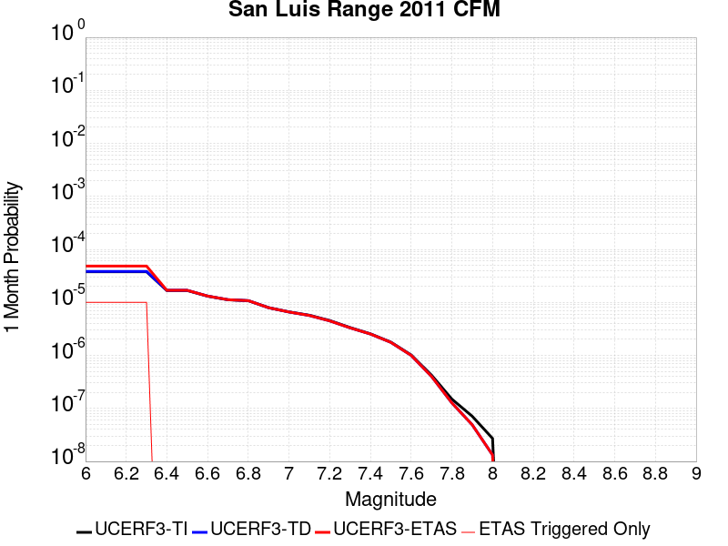 | 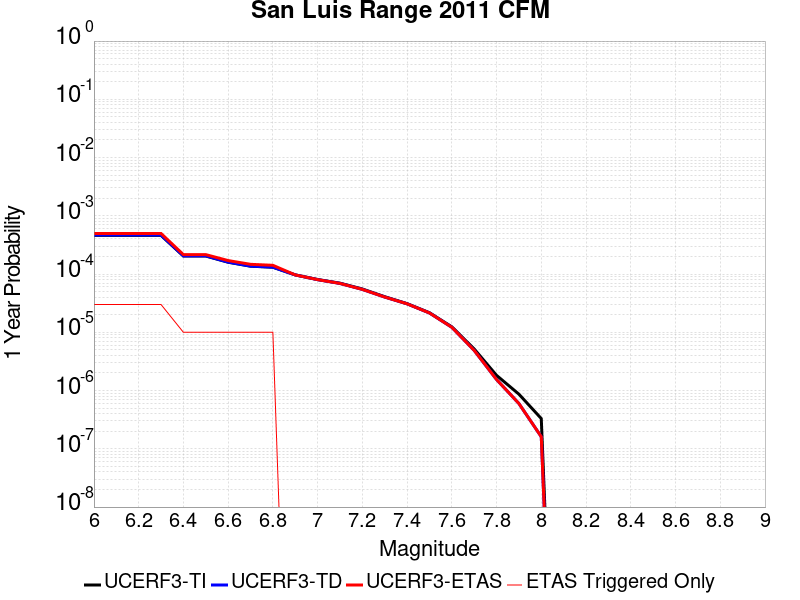 | 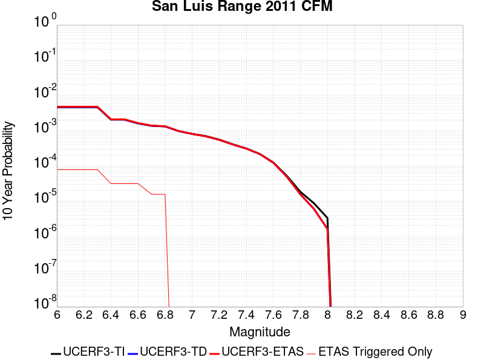 |

| Magnitude | 1 wk TI Prob | 1 wk TD Prob | 1 wk ETAS Prob | 1 wk ETAS/TD Gain | 1 wk ETAS Triggered Only | 1 mo TI Prob | 1 mo TD Prob | 1 mo ETAS Prob | 1 mo ETAS/TD Gain | 1 mo ETAS Triggered Only | 1 yr TI Prob | 1 yr TD Prob | 1 yr ETAS Prob | 1 yr ETAS/TD Gain | 1 yr ETAS Triggered Only | 10 yr TI Prob | 10 yr TD Prob | 10 yr ETAS Prob | 10 yr ETAS/TD Gain | 10 yr ETAS Triggered Only |
|-----|-----|-----|-----|-----|-----|-----|-----|-----|-----|-----|-----|-----|-----|-----|-----|-----|-----|-----|-----|-----|
| 6.0 | 8.8368415E-6 | 8.965454E-6 | 1.8965364E-5 | 2.1153824 | 1.0E-5 | 3.787163E-5 | 3.842285E-5 | 4.8422466E-5 | 1.2602518 | 1.0E-5 | 4.609895E-4 | 4.677057E-4 | 4.976917E-4 | 1.0641129 | 3.0E-5 | 0.0046003438 | 0.0046679964 | 0.0047476226 | 1.017058 | 8.0E-5 |
| 6.1 | 8.8368415E-6 | 8.965454E-6 | 1.8965364E-5 | 2.1153824 | 1.0E-5 | 3.787163E-5 | 3.842285E-5 | 4.8422466E-5 | 1.2602518 | 1.0E-5 | 4.609895E-4 | 4.677057E-4 | 4.976917E-4 | 1.0641129 | 3.0E-5 | 0.0046003438 | 0.0046679964 | 0.0047476226 | 1.017058 | 8.0E-5 |
| 6.2 | 8.8368415E-6 | 8.965454E-6 | 1.8965364E-5 | 2.1153824 | 1.0E-5 | 3.787163E-5 | 3.842285E-5 | 4.8422466E-5 | 1.2602518 | 1.0E-5 | 4.609895E-4 | 4.677057E-4 | 4.976917E-4 | 1.0641129 | 3.0E-5 | 0.0046003438 | 0.0046679964 | 0.0047476226 | 1.017058 | 8.0E-5 |
| 6.3 | 8.8368415E-6 | 8.965454E-6 | 1.8965364E-5 | 2.1153824 | 1.0E-5 | 3.787163E-5 | 3.842285E-5 | 4.8422466E-5 | 1.2602518 | 1.0E-5 | 4.609895E-4 | 4.677057E-4 | 4.976917E-4 | 1.0641129 | 3.0E-5 | 0.0046003438 | 0.0046679964 | 0.0047476226 | 1.017058 | 8.0E-5 |
| 6.4 | 3.9094193E-6 | 3.9412025E-6 | 3.9412025E-6 | 1.0 | 0.0 | 1.6754546E-5 | 1.689076E-5 | 1.689076E-5 | 1.0 | 0.0 | 2.039675E-4 | 2.056259E-4 | 2.1562383E-4 | 1.048622 | 1.0E-5 | 0.0020378039 | 0.0020543851 | 0.0020843234 | 1.0145729 | 3.0E-5 |
| 6.5 | 3.9094193E-6 | 3.9412025E-6 | 3.9412025E-6 | 1.0 | 0.0 | 1.6754546E-5 | 1.689076E-5 | 1.689076E-5 | 1.0 | 0.0 | 2.039675E-4 | 2.056259E-4 | 2.1562383E-4 | 1.048622 | 1.0E-5 | 0.0020378039 | 0.0020543851 | 0.0020843234 | 1.0145729 | 3.0E-5 |
| 6.6 | 3.0587726E-6 | 3.0753883E-6 | 3.0753883E-6 | 1.0 | 0.0 | 1.3108959E-5 | 1.318017E-5 | 1.318017E-5 | 1.0 | 0.0 | 1.595899E-4 | 1.6045687E-4 | 1.7045526E-4 | 1.062312 | 1.0E-5 | 0.0015947534 | 0.0016034221 | 0.001633374 | 1.01868 | 3.0E-5 |
| 6.7 | 2.6160574E-6 | 2.6251273E-6 | 2.6251273E-6 | 1.0 | 0.0 | 1.1211626E-5 | 1.1250498E-5 | 1.1250498E-5 | 1.0 | 0.0 | 1.3649299E-4 | 1.3696625E-4 | 1.4696489E-4 | 1.0730007 | 1.0E-5 | 0.0013640919 | 0.0013688246 | 0.0013887972 | 1.0145911 | 2.0E-5 |
| 6.8 | 2.5110312E-6 | 2.51814E-6 | 2.51814E-6 | 1.0 | 0.0 | 1.0761518E-5 | 1.0791985E-5 | 1.0791985E-5 | 1.0 | 0.0 | 1.310136E-4 | 1.3138456E-4 | 1.4138324E-4 | 1.0761025 | 1.0E-5 | 0.0013093639 | 0.0013130746 | 0.0013330483 | 1.0152115 | 2.0E-5 |
| 6.9 | 1.8564405E-6 | 1.852487E-6 | 1.852487E-6 | 1.0 | 0.0 | 7.95615E-6 | 7.939206E-6 | 7.939206E-6 | 1.0 | 0.0 | 9.686181E-5 | 9.665557E-5 | 9.665557E-5 | 1.0 | 0.0 | 9.68196E-4 | 9.661373E-4 | 9.7612763E-4 | 1.0103405 | 1.0E-5 |
| 7.0 | 1.546127E-6 | 1.5369537E-6 | 1.5369537E-6 | 1.0 | 0.0 | 6.626242E-6 | 6.586928E-6 | 6.586928E-6 | 1.0 | 0.0 | 8.06715E-5 | 8.0192905E-5 | 8.0192905E-5 | 1.0 | 0.0 | 8.0642226E-4 | 8.016404E-4 | 8.116324E-4 | 1.0124644 | 1.0E-5 |
| 7.1 | 1.3368208E-6 | 1.3235326E-6 | 1.3235326E-6 | 1.0 | 0.0 | 5.7292195E-6 | 5.67227E-6 | 5.67227E-6 | 1.0 | 0.0 | 6.975101E-5 | 6.905771E-5 | 6.905771E-5 | 1.0 | 0.0 | 6.972912E-4 | 6.9036294E-4 | 7.0035603E-4 | 1.0144751 | 1.0E-5 |
| 7.2 | 1.0623363E-6 | 1.0454368E-6 | 1.0454368E-6 | 1.0 | 0.0 | 4.5528623E-6 | 4.4804356E-6 | 4.4804356E-6 | 1.0 | 0.0 | 5.5429686E-5 | 5.4547938E-5 | 5.4547938E-5 | 1.0 | 0.0 | 5.5415864E-4 | 5.4534577E-4 | 5.553403E-4 | 1.018327 | 1.0E-5 |
| 7.3 | 7.831679E-7 | 7.7273904E-7 | 7.7273904E-7 | 1.0 | 0.0 | 3.3564295E-6 | 3.3117344E-6 | 3.3117344E-6 | 1.0 | 0.0 | 4.086376E-5 | 4.0319625E-5 | 4.0319625E-5 | 1.0 | 0.0 | 4.0856248E-4 | 4.031232E-4 | 4.031232E-4 | 1.0 | 0.0 |
| 7.4 | 5.9558846E-7 | 5.910636E-7 | 5.910636E-7 | 1.0 | 0.0 | 2.5525194E-6 | 2.5331274E-6 | 2.5331274E-6 | 1.0 | 0.0 | 3.107648E-5 | 3.084039E-5 | 3.084039E-5 | 1.0 | 0.0 | 3.1072134E-4 | 3.083612E-4 | 3.083612E-4 | 1.0 | 0.0 |
| 7.5 | 4.1616502E-7 | 4.119631E-7 | 4.119631E-7 | 1.0 | 0.0 | 1.7835631E-6 | 1.7655549E-6 | 1.7655549E-6 | 1.0 | 0.0 | 2.1714664E-5 | 2.149542E-5 | 2.149542E-5 | 1.0 | 0.0 | 2.1712543E-4 | 2.1493346E-4 | 2.1493346E-4 | 1.0 | 0.0 |
| 7.6 | 2.3816014E-7 | 2.3376548E-7 | 2.3376548E-7 | 1.0 | 0.0 | 1.0206859E-6 | 1.0018516E-6 | 1.0018516E-6 | 1.0 | 0.0 | 1.242678E-5 | 1.2197475E-5 | 1.2197475E-5 | 1.0 | 0.0 | 1.2426086E-4 | 1.2196808E-4 | 1.2196808E-4 | 1.0 | 0.0 |
| 7.7 | 9.918777E-8 | 9.3867584E-8 | 9.3867584E-8 | 1.0 | 0.0 | 4.2509038E-7 | 4.0228957E-7 | 4.0228957E-7 | 1.0 | 0.0 | 5.1754632E-6 | 4.8978645E-6 | 4.8978645E-6 | 1.0 | 0.0 | 5.1753424E-5 | 4.897757E-5 | 4.897757E-5 | 1.0 | 0.0 |
| 7.8 | 3.4982556E-8 | 2.968655E-8 | 2.968655E-8 | 1.0 | 0.0 | 1.4992524E-7 | 1.2722806E-7 | 1.2722806E-7 | 1.0 | 0.0 | 1.8253382E-6 | 1.5490006E-6 | 1.5490006E-6 | 1.0 | 0.0 | 1.8253233E-5 | 1.5489897E-5 | 1.5489897E-5 | 1.0 | 0.0 |
| 7.9 | 1.6624908E-8 | 1.1477036E-8 | 1.1477036E-8 | 1.0 | 0.0 | 7.12496E-8 | 4.91873E-8 | 4.91873E-8 | 1.0 | 0.0 | 8.6746354E-7 | 5.988552E-7 | 5.988552E-7 | 1.0 | 0.0 | 8.674601E-6 | 5.988536E-6 | 5.988536E-6 | 1.0 | 0.0 |
| 8.0 | 6.3352315E-9 | 3.0888412E-9 | 3.0888412E-9 | 1.0 | 0.0 | 2.715099E-8 | 1.3237893E-8 | 1.3237893E-8 | 1.0 | 0.0 | 3.3056327E-7 | 1.6117131E-7 | 1.6117131E-7 | 1.0 | 0.0 | 3.3056278E-6 | 1.611712E-6 | 1.611712E-6 | 1.0 | 0.0 |

## Kern Canyon (North Kern) 2011
*[(top)](#table-of-contents)*

| 1 Week | 1 Month | 1 Year | 10 Year |
|-----|-----|-----|-----|
| 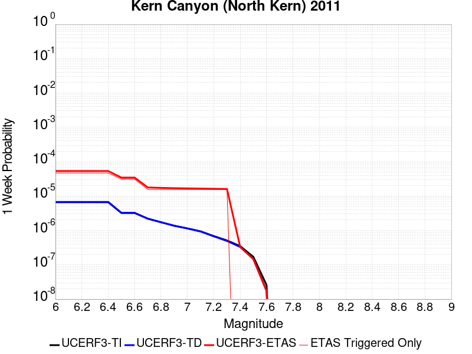 | 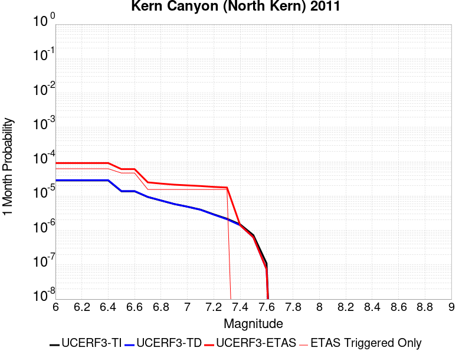 | 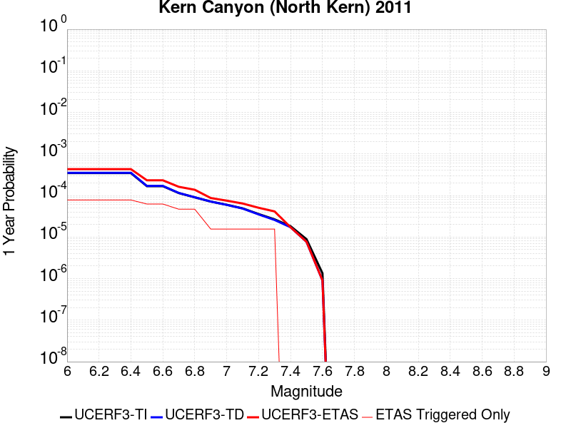 | 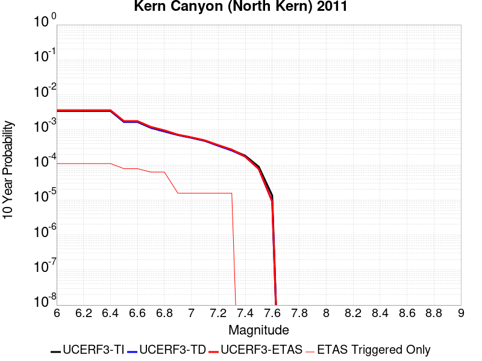 |

| Magnitude | 1 wk TI Prob | 1 wk TD Prob | 1 wk ETAS Prob | 1 wk ETAS/TD Gain | 1 wk ETAS Triggered Only | 1 mo TI Prob | 1 mo TD Prob | 1 mo ETAS Prob | 1 mo ETAS/TD Gain | 1 mo ETAS Triggered Only | 1 yr TI Prob | 1 yr TD Prob | 1 yr ETAS Prob | 1 yr ETAS/TD Gain | 1 yr ETAS Triggered Only | 10 yr TI Prob | 10 yr TD Prob | 10 yr ETAS Prob | 10 yr ETAS/TD Gain | 10 yr ETAS Triggered Only |
|-----|-----|-----|-----|-----|-----|-----|-----|-----|-----|-----|-----|-----|-----|-----|-----|-----|-----|-----|-----|-----|
| 6.0 | 6.6264497E-6 | 6.75733E-6 | 3.6757127E-5 | 5.4395933 | 3.0E-5 | 2.8398761E-5 | 2.895971E-5 | 6.895855E-5 | 2.3811893 | 4.0E-5 | 3.4570007E-4 | 3.5253543E-4 | 4.125143E-4 | 1.1701356 | 6.0E-5 | 0.0034516277 | 0.0035205502 | 0.0036002686 | 1.0226437 | 8.0E-5 |
| 6.1 | 6.6264497E-6 | 6.75733E-6 | 3.6757127E-5 | 5.4395933 | 3.0E-5 | 2.8398761E-5 | 2.895971E-5 | 6.895855E-5 | 2.3811893 | 4.0E-5 | 3.4570007E-4 | 3.5253543E-4 | 4.125143E-4 | 1.1701356 | 6.0E-5 | 0.0034516277 | 0.0035205502 | 0.0036002686 | 1.0226437 | 8.0E-5 |
| 6.2 | 6.6264497E-6 | 6.75733E-6 | 3.6757127E-5 | 5.4395933 | 3.0E-5 | 2.8398761E-5 | 2.895971E-5 | 6.895855E-5 | 2.3811893 | 4.0E-5 | 3.4570007E-4 | 3.5253543E-4 | 4.125143E-4 | 1.1701356 | 6.0E-5 | 0.0034516277 | 0.0035205502 | 0.0036002686 | 1.0226437 | 8.0E-5 |
| 6.3 | 6.6264497E-6 | 6.75733E-6 | 3.6757127E-5 | 5.4395933 | 3.0E-5 | 2.8398761E-5 | 2.895971E-5 | 6.895855E-5 | 2.3811893 | 4.0E-5 | 3.4570007E-4 | 3.5253543E-4 | 4.125143E-4 | 1.1701356 | 6.0E-5 | 0.0034516277 | 0.0035205502 | 0.0036002686 | 1.0226437 | 8.0E-5 |
| 6.4 | 6.6264497E-6 | 6.75733E-6 | 3.6757127E-5 | 5.4395933 | 3.0E-5 | 2.8398761E-5 | 2.895971E-5 | 6.895855E-5 | 2.3811893 | 4.0E-5 | 3.4570007E-4 | 3.5253543E-4 | 4.125143E-4 | 1.1701356 | 6.0E-5 | 0.0034516277 | 0.0035205502 | 0.0036002686 | 1.0226437 | 8.0E-5 |
| 6.5 | 3.2162225E-6 | 3.2570915E-6 | 2.3257026E-5 | 7.140428 | 2.0E-5 | 1.3783738E-5 | 1.3958893E-5 | 4.3958473E-5 | 3.1491375 | 3.0E-5 | 1.6780409E-4 | 1.6993708E-4 | 2.1992858E-4 | 1.2941766 | 5.0E-5 | 0.0016767744 | 0.001698151 | 0.0017580491 | 1.0352726 | 6.0E-5 |
| 6.6 | 3.2162225E-6 | 3.2570915E-6 | 2.3257026E-5 | 7.140428 | 2.0E-5 | 1.3783738E-5 | 1.3958893E-5 | 4.3958473E-5 | 3.1491375 | 3.0E-5 | 1.6780409E-4 | 1.6993708E-4 | 2.1992858E-4 | 1.2941766 | 5.0E-5 | 0.0016767744 | 0.001698151 | 0.0017580491 | 1.0352726 | 6.0E-5 |
| 6.7 | 2.1908265E-6 | 2.2071222E-6 | 1.22071E-5 | 5.530777 | 1.0E-5 | 9.389223E-6 | 9.459061E-6 | 1.9458967E-5 | 2.0571773 | 1.0E-5 | 1.1430779E-4 | 1.1515819E-4 | 1.4515473E-4 | 1.2604812 | 3.0E-5 | 0.0011424901 | 0.0011510046 | 0.0011909585 | 1.0347122 | 4.0E-5 |
| 6.8 | 1.7303895E-6 | 1.7365529E-6 | 1.1736535E-5 | 6.758525 | 1.0E-5 | 7.415934E-6 | 7.4423488E-6 | 1.7442275E-5 | 2.3436518 | 1.0E-5 | 9.028525E-5 | 9.0606925E-5 | 1.2060421E-4 | 1.3310705 | 3.0E-5 | 9.024858E-4 | 9.057096E-4 | 9.456734E-4 | 1.0441242 | 4.0E-5 |
| 6.9 | 1.3700314E-6 | 1.3688622E-6 | 1.1368848E-5 | 8.305327 | 1.0E-5 | 5.87155E-6 | 5.8665396E-6 | 1.586648E-5 | 2.7045724 | 1.0E-5 | 7.148377E-5 | 7.142282E-5 | 8.1422106E-5 | 1.1400013 | 1.0E-5 | 7.146078E-4 | 7.140032E-4 | 7.239961E-4 | 1.0139955 | 1.0E-5 |
| 7.0 | 1.1467797E-6 | 1.1413804E-6 | 1.1141369E-5 | 9.761311 | 1.0E-5 | 4.9147607E-6 | 4.8916213E-6 | 1.4891572E-5 | 3.044302 | 1.0E-5 | 5.983557E-5 | 5.9553895E-5 | 6.95533E-5 | 1.1679051 | 1.0E-5 | 5.981946E-4 | 5.953825E-4 | 6.0537655E-4 | 1.016786 | 1.0E-5 |
| 7.1 | 9.3952065E-7 | 9.3026904E-7 | 1.093026E-5 | 11.749569 | 1.0E-5 | 4.026511E-6 | 3.9868614E-6 | 1.3986822E-5 | 3.5082288 | 1.0E-5 | 4.9021666E-5 | 4.8538972E-5 | 5.8538488E-5 | 1.20601 | 1.0E-5 | 4.901085E-4 | 4.8528548E-4 | 4.952806E-4 | 1.0205964 | 1.0E-5 |
| 7.2 | 6.858055E-7 | 6.7193E-7 | 1.06719235E-5 | 15.882492 | 1.0E-5 | 2.939163E-6 | 2.879697E-6 | 1.2879668E-5 | 4.4725776 | 1.0E-5 | 3.5783723E-5 | 3.5059755E-5 | 4.5059405E-5 | 1.2852173 | 1.0E-5 | 3.5777962E-4 | 3.5054312E-4 | 3.6053962E-4 | 1.0285171 | 1.0E-5 |
| 7.3 | 5.1101983E-7 | 4.9393E-7 | 1.0493925E-5 | 21.245775 | 1.0E-5 | 2.1900833E-6 | 2.116841E-6 | 1.211682E-5 | 5.7240105 | 1.0E-5 | 2.6663936E-5 | 2.5772239E-5 | 3.577198E-5 | 1.3880044 | 1.0E-5 | 2.6660739E-4 | 2.57693E-4 | 2.676904E-4 | 1.0387958 | 1.0E-5 |
| 7.4 | 3.4999414E-7 | 3.2995905E-7 | 3.2995905E-7 | 1.0 | 0.0 | 1.499974E-6 | 1.4141094E-6 | 1.4141094E-6 | 1.0 | 0.0 | 1.8262032E-5 | 1.721665E-5 | 1.721665E-5 | 1.0 | 0.0 | 1.826053E-4 | 1.7215339E-4 | 1.7215339E-4 | 1.0 | 0.0 |
| 7.5 | 1.7021522E-7 | 1.4750044E-7 | 1.4750044E-7 | 1.0 | 0.0 | 7.2949354E-7 | 6.321446E-7 | 6.321446E-7 | 1.0 | 0.0 | 8.881548E-6 | 7.696334E-6 | 7.696334E-6 | 1.0 | 0.0 | 8.8811925E-5 | 7.696076E-5 | 7.696076E-5 | 1.0 | 0.0 |
| 7.6 | 2.572245E-8 | 1.7352555E-8 | 1.7352555E-8 | 1.0 | 0.0 | 1.10239064E-7 | 7.436809E-8 | 7.436809E-8 | 1.0 | 0.0 | 1.3421597E-6 | 9.054312E-7 | 9.054312E-7 | 1.0 | 0.0 | 1.3421517E-5 | 9.05428E-6 | 9.05428E-6 | 1.0 | 0.0 |

## Raymond
*[(top)](#table-of-contents)*

| 1 Week | 1 Month | 1 Year | 10 Year |
|-----|-----|-----|-----|
| 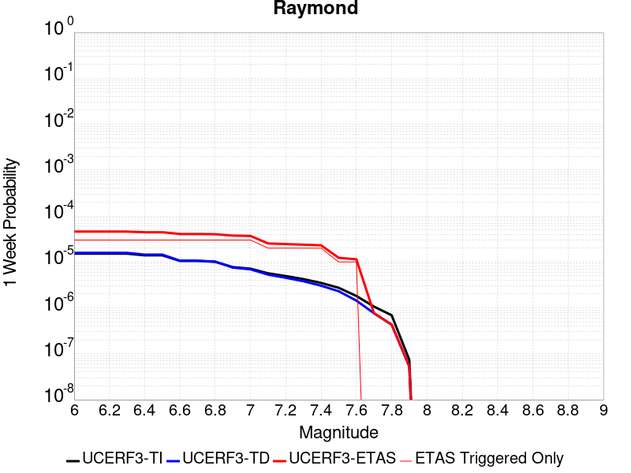 | 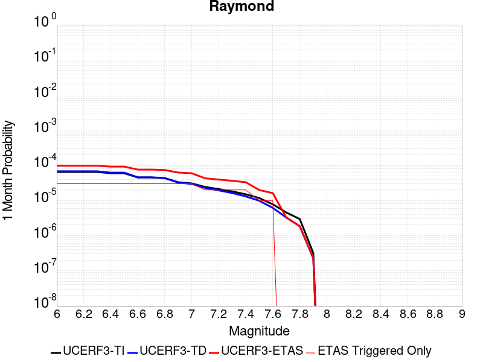 | 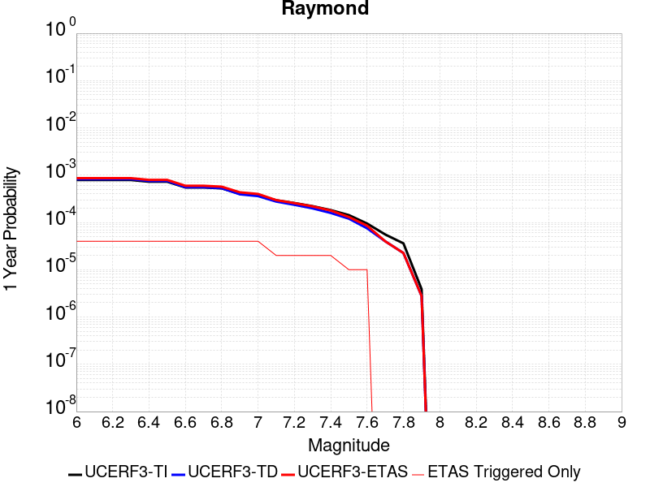 | 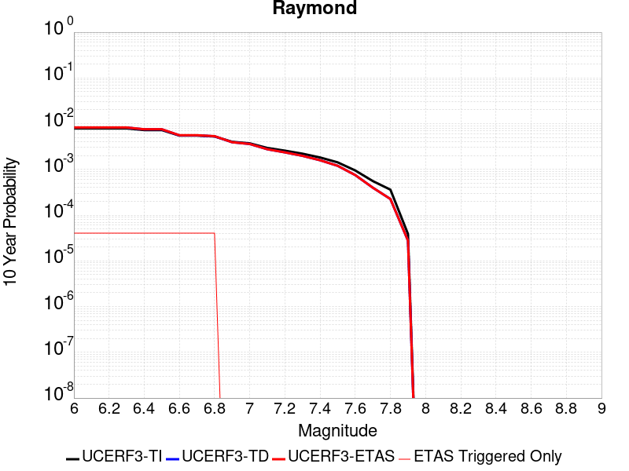 |

| Magnitude | 1 wk TI Prob | 1 wk TD Prob | 1 wk ETAS Prob | 1 wk ETAS/TD Gain | 1 wk ETAS Triggered Only | 1 mo TI Prob | 1 mo TD Prob | 1 mo ETAS Prob | 1 mo ETAS/TD Gain | 1 mo ETAS Triggered Only | 1 yr TI Prob | 1 yr TD Prob | 1 yr ETAS Prob | 1 yr ETAS/TD Gain | 1 yr ETAS Triggered Only | 10 yr TI Prob | 10 yr TD Prob | 10 yr ETAS Prob | 10 yr ETAS/TD Gain | 10 yr ETAS Triggered Only |
|-----|-----|-----|-----|-----|-----|-----|-----|-----|-----|-----|-----|-----|-----|-----|-----|-----|-----|-----|-----|-----|
| 6.0 | 1.5157413E-5 | 1.5810128E-5 | 4.5809655E-5 | 2.8974879 | 3.0E-5 | 6.4958724E-5 | 6.7756075E-5 | 9.775404E-5 | 1.4427347 | 3.0E-5 | 7.905855E-4 | 8.2464307E-4 | 8.646101E-4 | 1.0484658 | 4.0E-5 | 0.007877788 | 0.008218348 | 0.008297691 | 1.0096543 | 8.0E-5 |
| 6.1 | 1.5157413E-5 | 1.5810128E-5 | 4.5809655E-5 | 2.8974879 | 3.0E-5 | 6.4958724E-5 | 6.7756075E-5 | 9.775404E-5 | 1.4427347 | 3.0E-5 | 7.905855E-4 | 8.2464307E-4 | 8.646101E-4 | 1.0484658 | 4.0E-5 | 0.007877788 | 0.008218348 | 0.008297691 | 1.0096543 | 8.0E-5 |
| 6.2 | 1.5157413E-5 | 1.5810128E-5 | 4.5809655E-5 | 2.8974879 | 3.0E-5 | 6.4958724E-5 | 6.7756075E-5 | 9.775404E-5 | 1.4427347 | 3.0E-5 | 7.905855E-4 | 8.2464307E-4 | 8.646101E-4 | 1.0484658 | 4.0E-5 | 0.007877788 | 0.008218348 | 0.008297691 | 1.0096543 | 8.0E-5 |
| 6.3 | 1.5157413E-5 | 1.5810128E-5 | 4.5809655E-5 | 2.8974879 | 3.0E-5 | 6.4958724E-5 | 6.7756075E-5 | 9.775404E-5 | 1.4427347 | 3.0E-5 | 7.905855E-4 | 8.2464307E-4 | 8.646101E-4 | 1.0484658 | 4.0E-5 | 0.007877788 | 0.008218348 | 0.008297691 | 1.0096543 | 8.0E-5 |
| 6.4 | 1.3941944E-5 | 1.445469E-5 | 4.4454257E-5 | 3.0754209 | 3.0E-5 | 5.9749822E-5 | 6.1947336E-5 | 9.1945476E-5 | 1.4842523 | 3.0E-5 | 7.2721124E-4 | 7.5397117E-4 | 7.9394097E-4 | 1.0530124 | 4.0E-5 | 0.007248361 | 0.0075164647 | 0.0075958637 | 1.0105633 | 8.0E-5 |
| 6.5 | 1.3941944E-5 | 1.445469E-5 | 4.4454257E-5 | 3.0754209 | 3.0E-5 | 5.9749822E-5 | 6.1947336E-5 | 9.1945476E-5 | 1.4842523 | 3.0E-5 | 7.2721124E-4 | 7.5397117E-4 | 7.9394097E-4 | 1.0530124 | 4.0E-5 | 0.007248361 | 0.0075164647 | 0.0075958637 | 1.0105633 | 8.0E-5 |
| 6.6 | 1.0542609E-5 | 1.0671113E-5 | 4.067079E-5 | 3.8112981 | 3.0E-5 | 4.5181827E-5 | 4.573257E-5 | 7.57312E-5 | 1.6559576 | 3.0E-5 | 5.499499E-4 | 5.5665727E-4 | 5.96635E-4 | 1.0718175 | 4.0E-5 | 0.005485909 | 0.00555319 | 0.005612857 | 1.0107446 | 6.0E-5 |
| 6.7 | 1.0542609E-5 | 1.0671113E-5 | 4.067079E-5 | 3.8112981 | 3.0E-5 | 4.5181827E-5 | 4.573257E-5 | 7.57312E-5 | 1.6559576 | 3.0E-5 | 5.499499E-4 | 5.5665727E-4 | 5.96635E-4 | 1.0718175 | 4.0E-5 | 0.005485909 | 0.00555319 | 0.005612857 | 1.0107446 | 6.0E-5 |
| 6.8 | 1.0079132E-5 | 1.0176646E-5 | 4.017634E-5 | 3.947896 | 3.0E-5 | 4.3195567E-5 | 4.3613498E-5 | 7.361219E-5 | 1.6878304 | 3.0E-5 | 5.257791E-4 | 5.3087034E-4 | 5.708491E-4 | 1.075308 | 4.0E-5 | 0.0052453685 | 0.005296571 | 0.0053562536 | 1.0112681 | 6.0E-5 |
| 6.9 | 7.721598E-6 | 7.5489047E-6 | 3.7548678E-5 | 4.9740567 | 3.0E-5 | 3.3092143E-5 | 3.2352054E-5 | 6.2351086E-5 | 1.9272681 | 3.0E-5 | 4.0282236E-4 | 3.9381627E-4 | 4.3380054E-4 | 1.1015302 | 4.0E-5 | 0.0040209293 | 0.0039313175 | 0.003981121 | 1.0126684 | 5.0E-5 |
| 7.0 | 7.137566E-6 | 6.9113057E-6 | 3.6911097E-5 | 5.340684 | 3.0E-5 | 3.058921E-5 | 2.961955E-5 | 5.9618662E-5 | 2.0128145 | 3.0E-5 | 3.7236E-4 | 3.6055944E-4 | 4.0054502E-4 | 1.1108987 | 4.0E-5 | 0.0037173668 | 0.0035998628 | 0.0036496827 | 1.0138394 | 5.0E-5 |
| 7.1 | 5.654976E-6 | 5.29954E-6 | 2.5299434E-5 | 4.7738924 | 2.0E-5 | 2.4235387E-5 | 2.2712118E-5 | 4.2711665E-5 | 1.8805672 | 2.0E-5 | 2.9502588E-4 | 2.7648517E-4 | 2.9647964E-4 | 1.0723166 | 2.0E-5 | 0.0029463451 | 0.002761443 | 0.00279136 | 1.0108339 | 3.0E-5 |
| 7.2 | 4.9358455E-6 | 4.5266574E-6 | 2.4526567E-5 | 5.418251 | 2.0E-5 | 2.1153453E-5 | 1.9399817E-5 | 3.939943E-5 | 2.0309176 | 2.0E-5 | 2.5751285E-4 | 2.3616731E-4 | 2.5616257E-4 | 1.0846658 | 2.0E-5 | 0.0025721465 | 0.0023591854 | 0.0023891146 | 1.0126863 | 3.0E-5 |
| 7.3 | 4.2368597E-6 | 3.8056164E-6 | 2.380554E-5 | 6.25537 | 2.0E-5 | 1.8157843E-5 | 1.6309683E-5 | 3.6309357E-5 | 2.2262454 | 2.0E-5 | 2.2104931E-4 | 1.9855241E-4 | 2.1854843E-4 | 1.1007091 | 2.0E-5 | 0.0022082955 | 0.0019837688 | 0.0020137094 | 1.0150927 | 3.0E-5 |
| 7.4 | 3.4999923E-6 | 3.043744E-6 | 2.3043684E-5 | 7.5708346 | 2.0E-5 | 1.49998805E-5 | 1.3044552E-5 | 3.3044293E-5 | 2.533187 | 2.0E-5 | 1.8260824E-4 | 1.5880594E-4 | 1.7880276E-4 | 1.1259198 | 2.0E-5 | 0.0018245826 | 0.0015869403 | 0.0016168926 | 1.0188743 | 3.0E-5 |
| 7.5 | 2.738017E-6 | 2.3020468E-6 | 1.2302024E-5 | 5.3439503 | 1.0E-5 | 1.1734306E-5 | 9.865878E-6 | 1.986578E-5 | 2.0135846 | 1.0E-5 | 1.428558E-4 | 1.2011051E-4 | 1.3010931E-4 | 1.0832467 | 1.0E-5 | 0.0014276401 | 0.0012004703 | 0.0012204463 | 1.0166402 | 2.0E-5 |
| 7.6 | 1.8186392E-6 | 1.442312E-6 | 1.1442297E-5 | 7.933302 | 1.0E-5 | 7.794145E-6 | 6.181323E-6 | 1.6181262E-5 | 2.6177666 | 1.0E-5 | 9.488958E-5 | 7.5255055E-5 | 8.52543E-5 | 1.1328714 | 1.0E-5 | 9.4849075E-4 | 7.523072E-4 | 7.622997E-4 | 1.0132824 | 1.0E-5 |
| 7.7 | 1.0660348E-6 | 7.6438056E-7 | 7.6438056E-7 | 1.0 | 0.0 | 4.5687125E-6 | 3.2759126E-6 | 3.2759126E-6 | 1.0 | 0.0 | 5.5622655E-5 | 3.9883522E-5 | 3.9883522E-5 | 1.0 | 0.0 | 5.5608735E-4 | 3.9877277E-4 | 3.9877277E-4 | 1.0 | 0.0 |
| 7.8 | 6.913602E-7 | 4.3204133E-7 | 4.3204133E-7 | 1.0 | 0.0 | 2.962969E-6 | 1.8516045E-6 | 1.8516045E-6 | 1.0 | 0.0 | 3.607355E-5 | 2.2543056E-5 | 2.2543056E-5 | 1.0 | 0.0 | 3.6067693E-4 | 2.2541556E-4 | 2.2541556E-4 | 1.0 | 0.0 |
| 7.9 | 7.425201E-8 | 5.3222113E-8 | 5.3222113E-8 | 1.0 | 0.0 | 3.1822285E-7 | 2.2809476E-7 | 2.2809476E-7 | 1.0 | 0.0 | 3.874356E-6 | 2.7770516E-6 | 2.7770516E-6 | 1.0 | 0.0 | 3.8742884E-5 | 2.7770298E-5 | 2.7770298E-5 | 1.0 | 0.0 |

## Camp Rock 2011
*[(top)](#table-of-contents)*

| 1 Week | 1 Month | 1 Year | 10 Year |
|-----|-----|-----|-----|
| 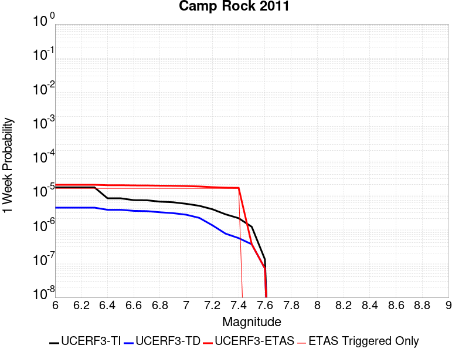 | 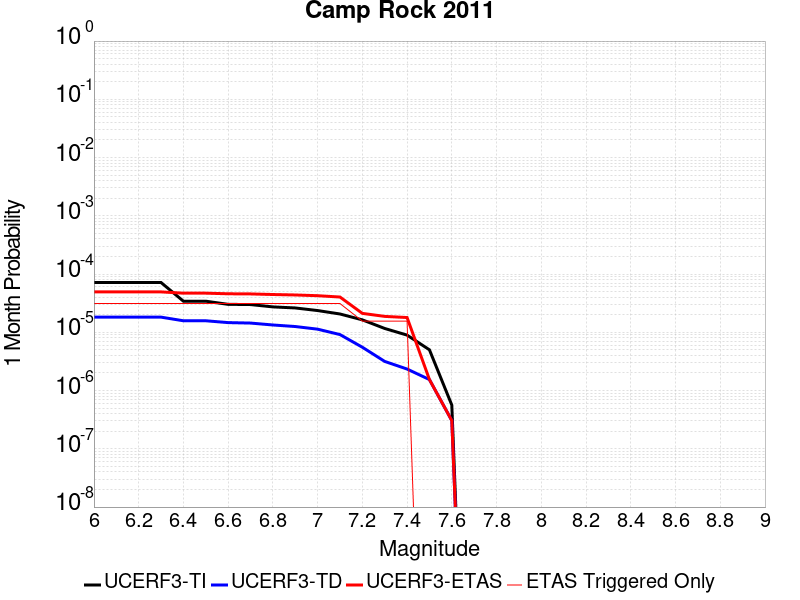 | 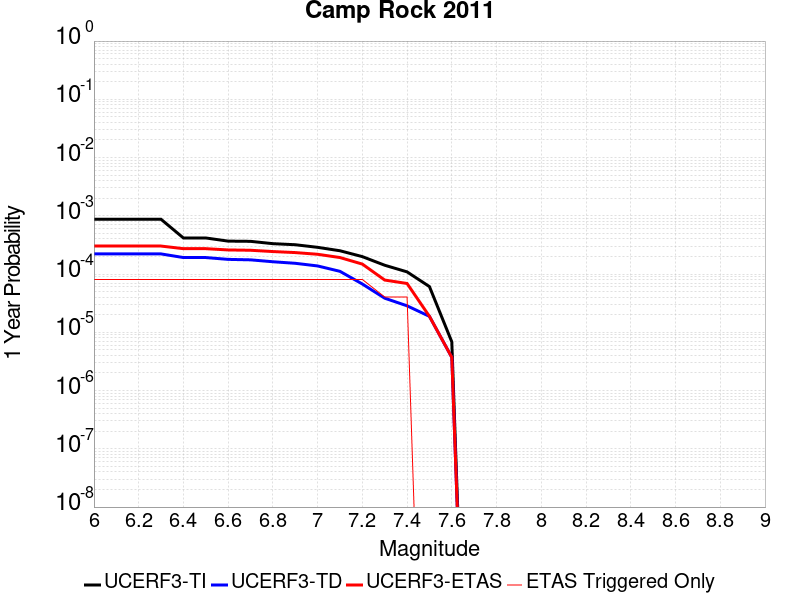 | 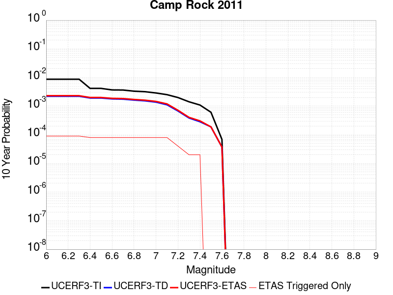 |

| Magnitude | 1 wk TI Prob | 1 wk TD Prob | 1 wk ETAS Prob | 1 wk ETAS/TD Gain | 1 wk ETAS Triggered Only | 1 mo TI Prob | 1 mo TD Prob | 1 mo ETAS Prob | 1 mo ETAS/TD Gain | 1 mo ETAS Triggered Only | 1 yr TI Prob | 1 yr TD Prob | 1 yr ETAS Prob | 1 yr ETAS/TD Gain | 1 yr ETAS Triggered Only | 10 yr TI Prob | 10 yr TD Prob | 10 yr ETAS Prob | 10 yr ETAS/TD Gain | 10 yr ETAS Triggered Only |
|-----|-----|-----|-----|-----|-----|-----|-----|-----|-----|-----|-----|-----|-----|-----|-----|-----|-----|-----|-----|-----|
| 6.0 | 1.6710783E-5 | 4.25026E-6 | 1.4250218E-5 | 3.352787 | 1.0E-5 | 7.161568E-5 | 1.8215276E-5 | 3.8214912E-5 | 2.0979595 | 2.0E-5 | 8.7157206E-4 | 2.2174895E-4 | 3.0173123E-4 | 1.3606883 | 8.0E-5 | 0.008681616 | 0.0022153298 | 0.0023051302 | 1.040536 | 9.0E-5 |
| 6.1 | 1.6710783E-5 | 4.25026E-6 | 1.4250218E-5 | 3.352787 | 1.0E-5 | 7.161568E-5 | 1.8215276E-5 | 3.8214912E-5 | 2.0979595 | 2.0E-5 | 8.7157206E-4 | 2.2174895E-4 | 3.0173123E-4 | 1.3606883 | 8.0E-5 | 0.008681616 | 0.0022153298 | 0.0023051302 | 1.040536 | 9.0E-5 |
| 6.2 | 1.6710783E-5 | 4.25026E-6 | 1.4250218E-5 | 3.352787 | 1.0E-5 | 7.161568E-5 | 1.8215276E-5 | 3.8214912E-5 | 2.0979595 | 2.0E-5 | 8.7157206E-4 | 2.2174895E-4 | 3.0173123E-4 | 1.3606883 | 8.0E-5 | 0.008681616 | 0.0022153298 | 0.0023051302 | 1.040536 | 9.0E-5 |
| 6.3 | 1.6710783E-5 | 4.25026E-6 | 1.4250218E-5 | 3.352787 | 1.0E-5 | 7.161568E-5 | 1.8215276E-5 | 3.8214912E-5 | 2.0979595 | 2.0E-5 | 8.7157206E-4 | 2.2174895E-4 | 3.0173123E-4 | 1.3606883 | 8.0E-5 | 0.008681616 | 0.0022153298 | 0.0023051302 | 1.040536 | 9.0E-5 |
| 6.4 | 7.982846E-6 | 3.6820884E-6 | 1.3682052E-5 | 3.71584 | 1.0E-5 | 3.421175E-5 | 1.5780286E-5 | 3.577997E-5 | 2.267384 | 2.0E-5 | 4.1644843E-4 | 1.9210839E-4 | 2.6209495E-4 | 1.3643076 | 7.0E-5 | 0.0041566887 | 0.001919458 | 0.0019993044 | 1.0415984 | 8.0E-5 |
| 6.5 | 7.982846E-6 | 3.6820884E-6 | 1.3682052E-5 | 3.71584 | 1.0E-5 | 3.421175E-5 | 1.5780286E-5 | 3.577997E-5 | 2.267384 | 2.0E-5 | 4.1644843E-4 | 1.9210839E-4 | 2.6209495E-4 | 1.3643076 | 7.0E-5 | 0.0041566887 | 0.001919458 | 0.0019993044 | 1.0415984 | 8.0E-5 |
| 6.6 | 7.048869E-6 | 3.4243571E-6 | 1.3424323E-5 | 3.9202461 | 1.0E-5 | 3.0209088E-5 | 1.4675736E-5 | 3.4675442E-5 | 2.3627737 | 2.0E-5 | 3.677336E-4 | 1.7866275E-4 | 2.4865023E-4 | 1.3917296 | 7.0E-5 | 0.0036712566 | 0.0017852228 | 0.00186508 | 1.0447323 | 8.0E-5 |
| 6.7 | 6.987307E-6 | 3.3623348E-6 | 1.3362301E-5 | 3.974114 | 1.0E-5 | 2.9945259E-5 | 1.4409929E-5 | 3.440964E-5 | 2.387912 | 2.0E-5 | 3.6452254E-4 | 1.7542706E-4 | 2.454148E-4 | 1.3989562 | 7.0E-5 | 0.0036392517 | 0.001752917 | 0.0018327767 | 1.0455582 | 8.0E-5 |
| 6.8 | 6.3737602E-6 | 3.1179077E-6 | 1.3117877E-5 | 4.207269 | 1.0E-5 | 2.731583E-5 | 1.3362394E-5 | 3.336213E-5 | 2.4967177 | 2.0E-5 | 3.3251947E-4 | 1.626753E-4 | 2.3266391E-4 | 1.430235 | 7.0E-5 | 0.0033202237 | 0.0016255907 | 0.0017054607 | 1.0491328 | 8.0E-5 |
| 6.9 | 6.112211E-6 | 2.9331156E-6 | 1.29330865E-5 | 4.409334 | 1.0E-5 | 2.6194928E-5 | 1.2570436E-5 | 3.2570184E-5 | 2.5910146 | 2.0E-5 | 3.1887658E-4 | 1.5303459E-4 | 2.2302388E-4 | 1.4573429 | 7.0E-5 | 0.003184194 | 0.0015293199 | 0.0016091975 | 1.0522308 | 8.0E-5 |
| 7.0 | 5.5140117E-6 | 2.641923E-6 | 1.2641896E-5 | 4.785112 | 1.0E-5 | 2.3631264E-5 | 1.132248E-5 | 3.132225E-5 | 2.7663777 | 2.0E-5 | 2.8767265E-4 | 1.3784273E-4 | 2.0783307E-4 | 1.5077552 | 7.0E-5 | 0.0028730053 | 0.0013775975 | 0.0014574872 | 1.0579921 | 8.0E-5 |
| 7.1 | 4.8151105E-6 | 2.1342705E-6 | 1.2134249E-5 | 5.685432 | 1.0E-5 | 2.0636026E-5 | 9.146843E-6 | 2.9146659E-5 | 3.186527 | 2.0E-5 | 2.5121463E-4 | 1.1135734E-4 | 1.8134955E-4 | 1.6285369 | 7.0E-5 | 0.0025093083 | 0.0011130372 | 0.0011929482 | 1.0717953 | 8.0E-5 |
| 7.2 | 3.818335E-6 | 1.2937425E-6 | 1.129373E-5 | 8.729504 | 1.0E-5 | 1.6364189E-5 | 5.5445994E-6 | 1.5544543E-5 | 2.803547 | 1.0E-5 | 1.9921579E-4 | 6.750349E-5 | 9.750146E-5 | 1.4443915 | 3.0E-5 | 0.0019903728 | 6.748381E-4 | 7.148111E-4 | 1.0592334 | 4.0E-5 |
| 7.3 | 2.7166698E-6 | 7.3835776E-7 | 1.073835E-5 | 14.54356 | 1.0E-5 | 1.1642818E-5 | 3.1643867E-6 | 1.3164355E-5 | 4.16016 | 1.0E-5 | 1.4174209E-4 | 3.8525748E-5 | 5.8524976E-5 | 1.5191133 | 2.0E-5 | 0.0014165172 | 3.851927E-4 | 4.0518498E-4 | 1.051902 | 2.0E-5 |
| 7.4 | 2.0893426E-6 | 5.4618386E-7 | 1.0546179E-5 | 19.308844 | 1.0E-5 | 8.954295E-6 | 2.3407858E-6 | 1.2340763E-5 | 5.2720594 | 1.0E-5 | 1.0901308E-4 | 2.84987E-5 | 4.8498132E-5 | 1.7017664 | 2.0E-5 | 0.0010895962 | 2.84951E-4 | 3.049453E-4 | 1.0701675 | 2.0E-5 |
| 7.5 | 1.1681728E-6 | 3.6030585E-7 | 3.6030585E-7 | 1.0 | 0.0 | 5.0064455E-6 | 1.544167E-6 | 1.544167E-6 | 1.0 | 0.0 | 6.0951766E-5 | 1.8800076E-5 | 1.8800076E-5 | 1.0 | 0.0 | 6.093505E-4 | 1.8798532E-4 | 1.8798532E-4 | 1.0 | 0.0 |
| 7.6 | 1.3154387E-7 | 7.1197384E-8 | 7.1197384E-8 | 1.0 | 0.0 | 5.6375933E-7 | 3.051316E-7 | 3.051316E-7 | 1.0 | 0.0 | 6.863748E-6 | 3.7149728E-6 | 3.7149728E-6 | 1.0 | 0.0 | 6.863536E-5 | 3.7149264E-5 | 3.7149264E-5 | 1.0 | 0.0 |

## Oak Ridge (Onshore)
*[(top)](#table-of-contents)*

| 1 Week | 1 Month | 1 Year | 10 Year |
|-----|-----|-----|-----|
| 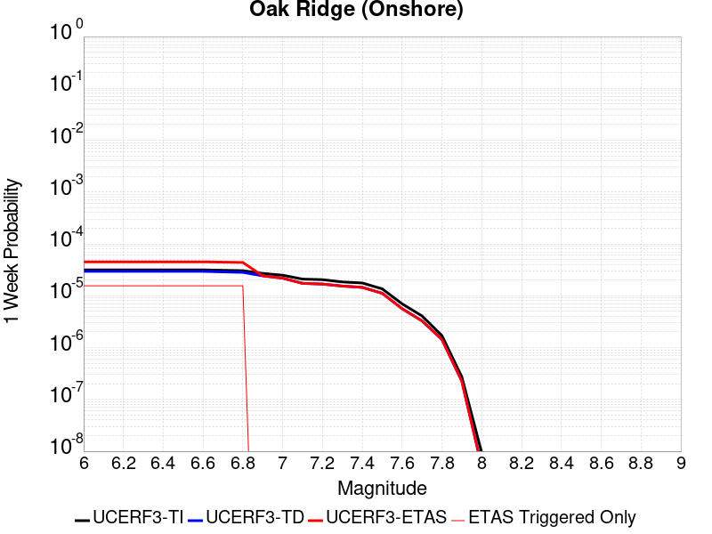 | 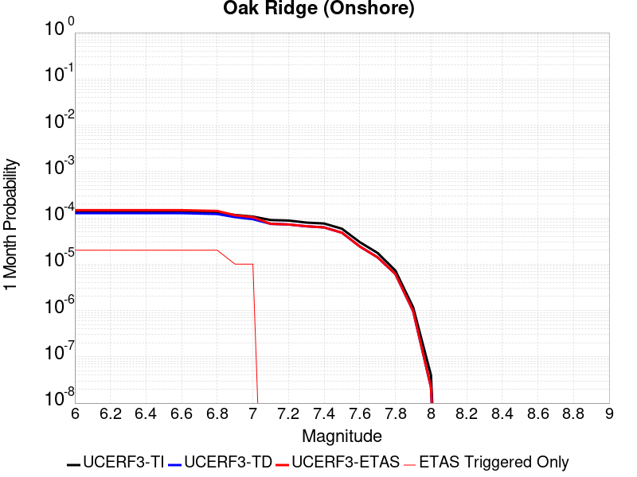 |  | 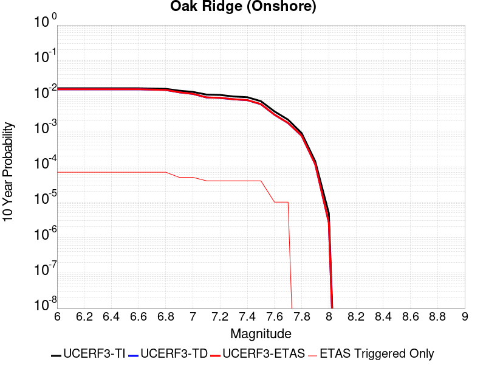 |

| Magnitude | 1 wk TI Prob | 1 wk TD Prob | 1 wk ETAS Prob | 1 wk ETAS/TD Gain | 1 wk ETAS Triggered Only | 1 mo TI Prob | 1 mo TD Prob | 1 mo ETAS Prob | 1 mo ETAS/TD Gain | 1 mo ETAS Triggered Only | 1 yr TI Prob | 1 yr TD Prob | 1 yr ETAS Prob | 1 yr ETAS/TD Gain | 1 yr ETAS Triggered Only | 10 yr TI Prob | 10 yr TD Prob | 10 yr ETAS Prob | 10 yr ETAS/TD Gain | 10 yr ETAS Triggered Only |
|-----|-----|-----|-----|-----|-----|-----|-----|-----|-----|-----|-----|-----|-----|-----|-----|-----|-----|-----|-----|-----|
| 6.0 | 3.155064E-5 | 2.9525974E-5 | 3.952568E-5 | 1.3386749 | 1.0E-5 | 1.3521002E-4 | 1.2653397E-4 | 1.4653144E-4 | 1.1580403 | 2.0E-5 | 0.001644939 | 0.0015395004 | 0.0015894235 | 1.032428 | 5.0E-5 | 0.01632816 | 0.015292859 | 0.015361789 | 1.0045073 | 7.0E-5 |
| 6.1 | 3.155064E-5 | 2.9525974E-5 | 3.952568E-5 | 1.3386749 | 1.0E-5 | 1.3521002E-4 | 1.2653397E-4 | 1.4653144E-4 | 1.1580403 | 2.0E-5 | 0.001644939 | 0.0015395004 | 0.0015894235 | 1.032428 | 5.0E-5 | 0.01632816 | 0.015292859 | 0.015361789 | 1.0045073 | 7.0E-5 |
| 6.2 | 3.155064E-5 | 2.9525974E-5 | 3.952568E-5 | 1.3386749 | 1.0E-5 | 1.3521002E-4 | 1.2653397E-4 | 1.4653144E-4 | 1.1580403 | 2.0E-5 | 0.001644939 | 0.0015395004 | 0.0015894235 | 1.032428 | 5.0E-5 | 0.01632816 | 0.015292859 | 0.015361789 | 1.0045073 | 7.0E-5 |
| 6.3 | 3.155064E-5 | 2.9525974E-5 | 3.952568E-5 | 1.3386749 | 1.0E-5 | 1.3521002E-4 | 1.2653397E-4 | 1.4653144E-4 | 1.1580403 | 2.0E-5 | 0.001644939 | 0.0015395004 | 0.0015894235 | 1.032428 | 5.0E-5 | 0.01632816 | 0.015292859 | 0.015361789 | 1.0045073 | 7.0E-5 |
| 6.4 | 3.155064E-5 | 2.9525974E-5 | 3.952568E-5 | 1.3386749 | 1.0E-5 | 1.3521002E-4 | 1.2653397E-4 | 1.4653144E-4 | 1.1580403 | 2.0E-5 | 0.001644939 | 0.0015395004 | 0.0015894235 | 1.032428 | 5.0E-5 | 0.01632816 | 0.015292859 | 0.015361789 | 1.0045073 | 7.0E-5 |
| 6.5 | 3.155064E-5 | 2.9525974E-5 | 3.952568E-5 | 1.3386749 | 1.0E-5 | 1.3521002E-4 | 1.2653397E-4 | 1.4653144E-4 | 1.1580403 | 2.0E-5 | 0.001644939 | 0.0015395004 | 0.0015894235 | 1.032428 | 5.0E-5 | 0.01632816 | 0.015292859 | 0.015361789 | 1.0045073 | 7.0E-5 |
| 6.6 | 3.155064E-5 | 2.9525974E-5 | 3.952568E-5 | 1.3386749 | 1.0E-5 | 1.3521002E-4 | 1.2653397E-4 | 1.4653144E-4 | 1.1580403 | 2.0E-5 | 0.001644939 | 0.0015395004 | 0.0015894235 | 1.032428 | 5.0E-5 | 0.01632816 | 0.015292859 | 0.015361789 | 1.0045073 | 7.0E-5 |
| 6.7 | 3.098897E-5 | 2.8864175E-5 | 3.8863887E-5 | 1.3464402 | 1.0E-5 | 1.328031E-4 | 1.2369796E-4 | 1.4369548E-4 | 1.1616641 | 2.0E-5 | 0.0016156785 | 0.0015050198 | 0.0015549446 | 1.0331721 | 5.0E-5 | 0.016039822 | 0.014952714 | 0.015021667 | 1.0046114 | 7.0E-5 |
| 6.8 | 3.0449872E-5 | 2.8239372E-5 | 3.823909E-5 | 1.3541055 | 1.0E-5 | 1.3049292E-4 | 1.2102048E-4 | 1.4101806E-4 | 1.1652412 | 2.0E-5 | 0.0015875935 | 0.0014724657 | 0.001522392 | 1.0339067 | 5.0E-5 | 0.015762992 | 0.014631462 | 0.014700438 | 1.0047143 | 7.0E-5 |
| 6.9 | 2.697928E-5 | 2.4219773E-5 | 2.4219773E-5 | 1.0 | 0.0 | 1.15620365E-4 | 1.0379502E-4 | 1.1379398E-4 | 1.0963337 | 1.0E-5 | 0.0014067689 | 0.0012629933 | 0.0012929555 | 1.0237231 | 3.0E-5 | 0.0139789665 | 0.01256087 | 0.012610242 | 1.0039306 | 5.0E-5 |
| 7.0 | 2.4893961E-5 | 2.1862043E-5 | 2.1862043E-5 | 1.0 | 0.0 | 1.0668404E-4 | 9.3691204E-5 | 1.0369026E-4 | 1.1067237 | 1.0E-5 | 0.0012981043 | 0.0011401111 | 0.001170077 | 1.0262833 | 3.0E-5 | 0.012905477 | 0.011344905 | 0.011394338 | 1.0043572 | 5.0E-5 |
| 7.1 | 2.0945363E-5 | 1.7354487E-5 | 1.7354487E-5 | 1.0 | 0.0 | 8.976275E-5 | 7.437428E-5 | 7.437428E-5 | 1.0 | 0.0 | 0.0010923136 | 9.051354E-4 | 9.251173E-4 | 1.0220761 | 2.0E-5 | 0.0108696 | 0.009015423 | 0.009055062 | 1.0043968 | 4.0E-5 |
| 7.2 | 2.0439404E-5 | 1.6809423E-5 | 1.6809423E-5 | 1.0 | 0.0 | 8.7594504E-5 | 7.203843E-5 | 7.203843E-5 | 1.0 | 0.0 | 0.0010659413 | 8.767196E-4 | 8.9670205E-4 | 1.0227923 | 2.0E-5 | 0.010608427 | 0.008733526 | 0.008773177 | 1.0045401 | 4.0E-5 |
| 7.3 | 1.8463334E-5 | 1.5381811E-5 | 1.5381811E-5 | 1.0 | 0.0 | 7.912617E-5 | 6.59204E-5 | 6.59204E-5 | 1.0 | 0.0 | 9.6293533E-4 | 8.0228975E-4 | 8.2227367E-4 | 1.0249087 | 2.0E-5 | 0.009587734 | 0.007994797 | 0.008034477 | 1.0049633 | 4.0E-5 |
| 7.4 | 1.763139E-5 | 1.451684E-5 | 1.451684E-5 | 1.0 | 0.0 | 7.556091E-5 | 6.221356E-5 | 6.221356E-5 | 1.0 | 0.0 | 9.1956573E-4 | 7.571909E-4 | 7.7717577E-4 | 1.0263934 | 2.0E-5 | 0.009157699 | 0.007546914 | 0.007586612 | 1.0052602 | 4.0E-5 |
| 7.5 | 1.3594944E-5 | 1.1163356E-5 | 1.1163356E-5 | 1.0 | 0.0 | 5.8262744E-5 | 4.784209E-5 | 4.784209E-5 | 1.0 | 0.0 | 7.0911803E-4 | 5.8232434E-4 | 6.023127E-4 | 1.0343251 | 2.0E-5 | 0.007068595 | 0.0058082556 | 0.005848023 | 1.0068468 | 4.0E-5 |
| 7.6 | 6.9889534E-6 | 5.6367144E-6 | 5.6367144E-6 | 1.0 | 0.0 | 2.9952313E-5 | 2.4157125E-5 | 2.4157125E-5 | 1.0 | 0.0 | 3.646084E-4 | 2.9407372E-4 | 2.9407372E-4 | 1.0 | 0.0 | 0.0036401073 | 0.0029368899 | 0.0029468604 | 1.003395 | 1.0E-5 |
| 7.7 | 4.0824193E-6 | 3.2832586E-6 | 3.2832586E-6 | 1.0 | 0.0 | 1.7495966E-5 | 1.4071033E-5 | 1.4071033E-5 | 1.0 | 0.0 | 2.1299256E-4 | 1.713015E-4 | 1.713015E-4 | 1.0 | 0.0 | 0.0021278851 | 0.0017117079 | 0.0017216908 | 1.0058321 | 1.0E-5 |
| 7.8 | 1.7023609E-6 | 1.4370495E-6 | 1.4370495E-6 | 1.0 | 0.0 | 7.295812E-6 | 6.1587693E-6 | 6.1587693E-6 | 1.0 | 0.0 | 8.882289E-5 | 7.498047E-5 | 7.498047E-5 | 1.0 | 0.0 | 8.8787393E-4 | 7.495545E-4 | 7.495545E-4 | 1.0 | 0.0 |
| 7.9 | 2.721225E-7 | 2.2616497E-7 | 2.2616497E-7 | 1.0 | 0.0 | 1.1662388E-6 | 9.692781E-7 | 9.692781E-7 | 1.0 | 0.0 | 1.4198865E-5 | 1.1800899E-5 | 1.1800899E-5 | 1.0 | 0.0 | 1.4197957E-4 | 1.1800301E-4 | 1.1800301E-4 | 1.0 | 0.0 |
| 8.0 | 9.364255E-9 | 5.1206666E-9 | 5.1206666E-9 | 1.0 | 0.0 | 4.0132523E-8 | 2.1945715E-8 | 2.1945715E-8 | 1.0 | 0.0 | 4.8861335E-7 | 2.6718905E-7 | 2.6718905E-7 | 1.0 | 0.0 | 4.8861225E-6 | 2.6718876E-6 | 2.6718876E-6 | 1.0 | 0.0 |

## San Pedro Basin
*[(top)](#table-of-contents)*

| 1 Week | 1 Month | 1 Year | 10 Year |
|-----|-----|-----|-----|
| 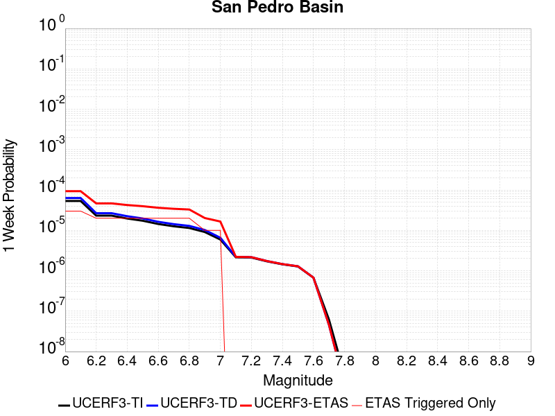 | 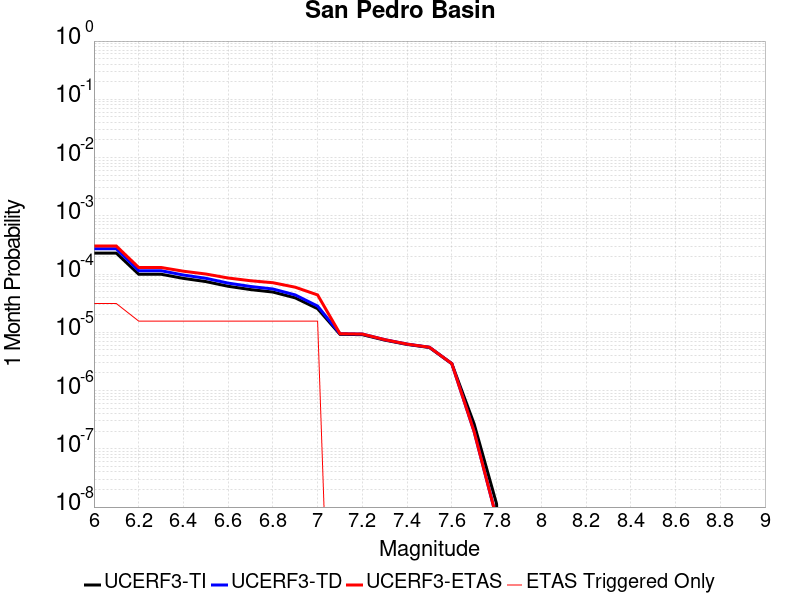 | 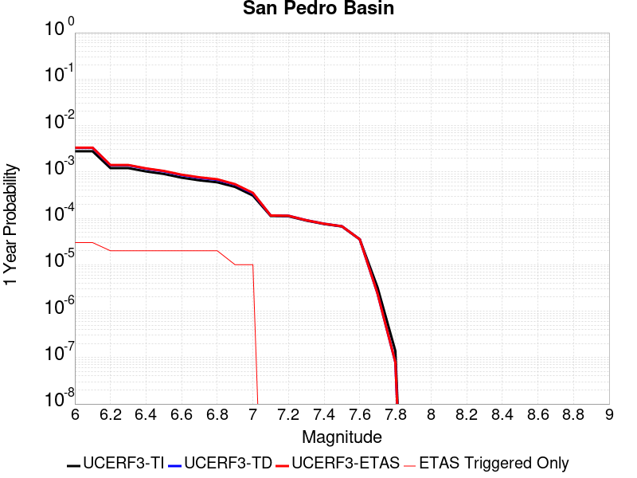 | 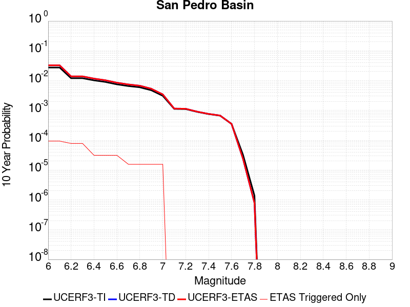 |

| Magnitude | 1 wk TI Prob | 1 wk TD Prob | 1 wk ETAS Prob | 1 wk ETAS/TD Gain | 1 wk ETAS Triggered Only | 1 mo TI Prob | 1 mo TD Prob | 1 mo ETAS Prob | 1 mo ETAS/TD Gain | 1 mo ETAS Triggered Only | 1 yr TI Prob | 1 yr TD Prob | 1 yr ETAS Prob | 1 yr ETAS/TD Gain | 1 yr ETAS Triggered Only | 10 yr TI Prob | 10 yr TD Prob | 10 yr ETAS Prob | 10 yr ETAS/TD Gain | 10 yr ETAS Triggered Only |
|-----|-----|-----|-----|-----|-----|-----|-----|-----|-----|-----|-----|-----|-----|-----|-----|-----|-----|-----|-----|-----|
| 6.0 | 5.3449043E-5 | 6.336954E-5 | 9.3367635E-5 | 1.4733835 | 3.0E-5 | 2.2904722E-4 | 2.715589E-4 | 3.0155078E-4 | 1.1104432 | 3.0E-5 | 0.0027850836 | 0.0033018254 | 0.0033317262 | 1.0090559 | 3.0E-5 | 0.027504366 | 0.03258945 | 0.03265717 | 1.0020779 | 7.0E-5 |
| 6.1 | 5.3449043E-5 | 6.336954E-5 | 9.3367635E-5 | 1.4733835 | 3.0E-5 | 2.2904722E-4 | 2.715589E-4 | 3.0155078E-4 | 1.1104432 | 3.0E-5 | 0.0027850836 | 0.0033018254 | 0.0033317262 | 1.0090559 | 3.0E-5 | 0.027504366 | 0.03258945 | 0.03265717 | 1.0020779 | 7.0E-5 |
| 6.2 | 2.3189454E-5 | 2.6642796E-5 | 4.6642264E-5 | 1.750652 | 2.0E-5 | 9.9379584E-5 | 1.14178685E-4 | 1.341764E-4 | 1.1751441 | 2.0E-5 | 0.0012092749 | 0.0013892864 | 0.0014092586 | 1.0143759 | 2.0E-5 | 0.012027155 | 0.013810883 | 0.013870055 | 1.0042844 | 6.0E-5 |
| 6.3 | 2.3189454E-5 | 2.6642796E-5 | 4.6642264E-5 | 1.750652 | 2.0E-5 | 9.9379584E-5 | 1.14178685E-4 | 1.341764E-4 | 1.1751441 | 2.0E-5 | 0.0012092749 | 0.0013892864 | 0.0014092586 | 1.0143759 | 2.0E-5 | 0.012027155 | 0.013810883 | 0.013870055 | 1.0042844 | 6.0E-5 |
| 6.4 | 1.966056E-5 | 2.2463413E-5 | 4.2462965E-5 | 1.8903166 | 2.0E-5 | 8.425682E-5 | 9.626844E-5 | 1.1626652E-4 | 1.2077324 | 2.0E-5 | 0.001025344 | 0.0011714783 | 0.0011914549 | 1.0170524 | 2.0E-5 | 0.010206259 | 0.011657117 | 0.0116867665 | 1.0025436 | 3.0E-5 |
| 6.5 | 1.7342953E-5 | 1.9745148E-5 | 3.9744755E-5 | 2.012887 | 2.0E-5 | 7.4324824E-5 | 8.4619525E-5 | 1.0461784E-4 | 1.236332 | 2.0E-5 | 9.04529E-4 | 0.0010297928 | 0.0010497721 | 1.0194014 | 2.0E-5 | 0.009008561 | 0.010253931 | 0.010283624 | 1.0028957 | 3.0E-5 |
| 6.6 | 1.439804E-5 | 1.6322716E-5 | 3.6322388E-5 | 2.2252662 | 2.0E-5 | 6.170443E-5 | 6.99528E-5 | 8.9951405E-5 | 1.2858871 | 2.0E-5 | 7.509924E-4 | 8.513747E-4 | 8.713577E-4 | 1.0234715 | 2.0E-5 | 0.0074845953 | 0.008484332 | 0.008514077 | 1.003506 | 3.0E-5 |
| 6.7 | 1.2634884E-5 | 1.4285297E-5 | 3.428501E-5 | 2.4000208 | 2.0E-5 | 5.414838E-5 | 6.1221435E-5 | 8.122021E-5 | 1.326663 | 2.0E-5 | 6.590571E-4 | 7.4514654E-4 | 7.6513167E-4 | 1.0268203 | 2.0E-5 | 0.006571059 | 0.007429501 | 0.0074493526 | 1.002672 | 2.0E-5 |
| 6.8 | 1.146091E-5 | 1.2933192E-5 | 3.2932934E-5 | 2.5463886 | 2.0E-5 | 4.911726E-5 | 5.5426954E-5 | 7.542584E-5 | 1.3608153 | 2.0E-5 | 5.9783855E-4 | 6.7464396E-4 | 6.946305E-4 | 1.0296253 | 2.0E-5 | 0.0059623276 | 0.006728899 | 0.0067487643 | 1.0029522 | 2.0E-5 |
| 6.9 | 9.109035E-6 | 1.0235011E-5 | 2.023491E-5 | 1.9770285 | 1.0E-5 | 3.9038136E-5 | 4.3863754E-5 | 5.3863318E-5 | 1.2279687 | 1.0E-5 | 4.7518566E-4 | 5.3393835E-4 | 5.43933E-4 | 1.0187187 | 1.0E-5 | 0.0047417083 | 0.005329309 | 0.0053392556 | 1.0018665 | 1.0E-5 |
| 7.0 | 5.9351028E-6 | 6.583964E-6 | 1.6583897E-5 | 2.5188317 | 1.0E-5 | 2.5435906E-5 | 2.8216817E-5 | 3.8216534E-5 | 1.3543886 | 1.0E-5 | 3.0963816E-4 | 3.435092E-4 | 3.5350578E-4 | 1.0291013 | 1.0E-5 | 0.0030920706 | 0.0034320992 | 0.0034420649 | 1.0029037 | 1.0E-5 |
| 7.1 | 2.1557585E-6 | 2.209648E-6 | 2.209648E-6 | 1.0 | 0.0 | 9.238933E-6 | 9.469887E-6 | 9.469887E-6 | 1.0 | 0.0 | 1.1247819E-4 | 1.1528993E-4 | 1.1528993E-4 | 1.0 | 0.0 | 0.0011242128 | 0.0011523166 | 0.0011523166 | 1.0 | 0.0 |
| 7.2 | 2.1251979E-6 | 2.1779945E-6 | 2.1779945E-6 | 1.0 | 0.0 | 9.107958E-6 | 9.334229E-6 | 9.334229E-6 | 1.0 | 0.0 | 1.1088375E-4 | 1.1363847E-4 | 1.1363847E-4 | 1.0 | 0.0 | 0.0011082845 | 0.0011358189 | 0.0011358189 | 1.0 | 0.0 |
| 7.3 | 1.7145798E-6 | 1.7442874E-6 | 1.7442874E-6 | 1.0 | 0.0 | 7.3481783E-6 | 7.4754967E-6 | 7.4754967E-6 | 1.0 | 0.0 | 8.94604E-5 | 9.1010465E-5 | 9.1010465E-5 | 1.0 | 0.0 | 8.9424395E-4 | 9.0974104E-4 | 9.0974104E-4 | 1.0 | 0.0 |
| 7.4 | 1.4467993E-6 | 1.4641868E-6 | 1.4641868E-6 | 1.0 | 0.0 | 6.200554E-6 | 6.2750714E-6 | 6.2750714E-6 | 1.0 | 0.0 | 7.548913E-5 | 7.639639E-5 | 7.639639E-5 | 1.0 | 0.0 | 7.546349E-4 | 7.6370855E-4 | 7.6370855E-4 | 1.0 | 0.0 |
| 7.5 | 1.2803735E-6 | 1.2931497E-6 | 1.2931497E-6 | 1.0 | 0.0 | 5.487303E-6 | 5.5420587E-6 | 5.5420587E-6 | 1.0 | 0.0 | 6.680587E-5 | 6.7472545E-5 | 6.7472545E-5 | 1.0 | 0.0 | 6.678579E-4 | 6.7452766E-4 | 6.7452766E-4 | 1.0 | 0.0 |
| 7.6 | 6.755009E-7 | 6.769465E-7 | 6.769465E-7 | 1.0 | 0.0 | 2.8950008E-6 | 2.9011965E-6 | 2.9011965E-6 | 1.0 | 0.0 | 3.5246063E-5 | 3.5321555E-5 | 3.5321555E-5 | 1.0 | 0.0 | 3.5240475E-4 | 3.5316512E-4 | 3.5316512E-4 | 1.0 | 0.0 |
| 7.7 | 6.211885E-8 | 4.569953E-8 | 4.569953E-8 | 1.0 | 0.0 | 2.6622362E-7 | 1.9585512E-7 | 1.9585512E-7 | 1.0 | 0.0 | 3.2412677E-6 | 2.3845337E-6 | 2.3845337E-6 | 1.0 | 0.0 | 3.2412205E-5 | 2.3845101E-5 | 2.3845101E-5 | 1.0 | 0.0 |
| 7.8 | 2.6580573E-9 | 1.5138163E-9 | 1.5138163E-9 | 1.0 | 0.0 | 1.1391674E-8 | 6.487784E-9 | 6.487784E-9 | 1.0 | 0.0 | 1.3869362E-7 | 7.898877E-8 | 7.898877E-8 | 1.0 | 0.0 | 1.3869354E-6 | 7.898877E-7 | 7.898877E-7 | 1.0 | 0.0 |

## Sheephole
*[(top)](#table-of-contents)*

| 1 Week | 1 Month | 1 Year | 10 Year |
|-----|-----|-----|-----|
| 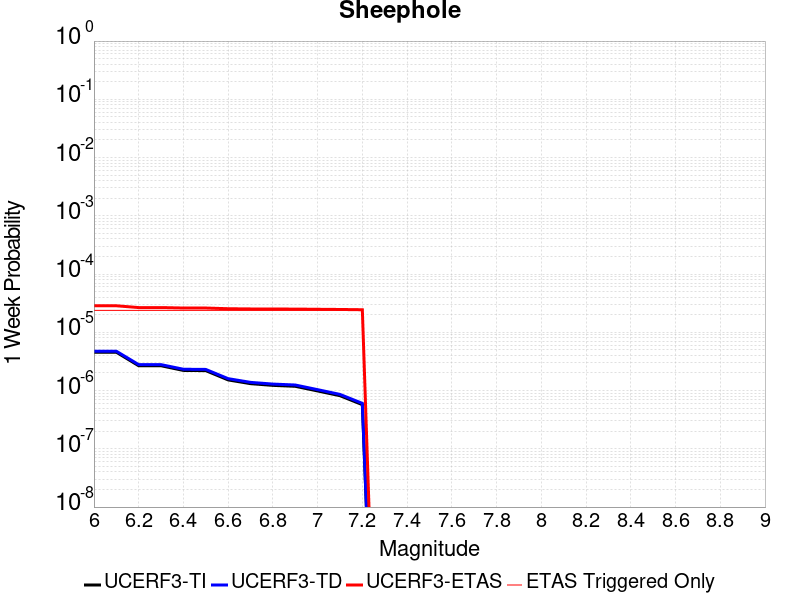 | 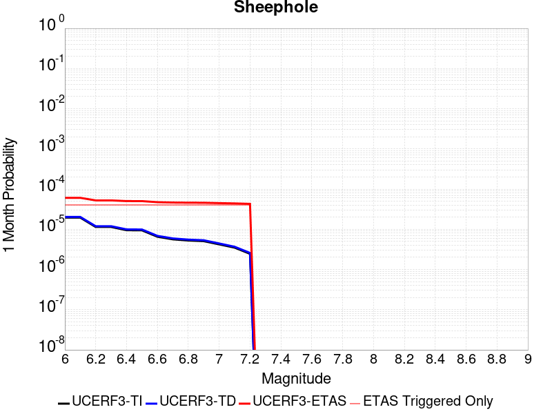 | 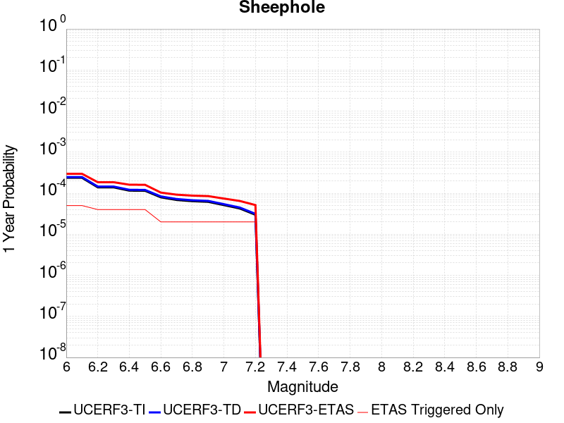 | 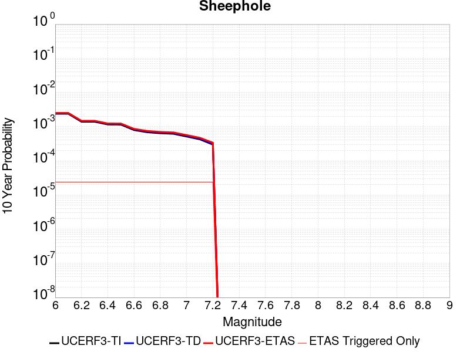 |

| Magnitude | 1 wk TI Prob | 1 wk TD Prob | 1 wk ETAS Prob | 1 wk ETAS/TD Gain | 1 wk ETAS Triggered Only | 1 mo TI Prob | 1 mo TD Prob | 1 mo ETAS Prob | 1 mo ETAS/TD Gain | 1 mo ETAS Triggered Only | 1 yr TI Prob | 1 yr TD Prob | 1 yr ETAS Prob | 1 yr ETAS/TD Gain | 1 yr ETAS Triggered Only | 10 yr TI Prob | 10 yr TD Prob | 10 yr ETAS Prob | 10 yr ETAS/TD Gain | 10 yr ETAS Triggered Only |
|-----|-----|-----|-----|-----|-----|-----|-----|-----|-----|-----|-----|-----|-----|-----|-----|-----|-----|-----|-----|-----|
| 6.0 | 4.5579695E-6 | 4.7412627E-6 | 2.4741168E-5 | 5.2182655 | 2.0E-5 | 1.9534009E-5 | 2.031957E-5 | 5.031896E-5 | 2.4763792 | 3.0E-5 | 2.3780059E-4 | 2.473682E-4 | 2.9735584E-4 | 1.2020779 | 5.0E-5 | 0.0023754628 | 0.002471473 | 0.0025512755 | 1.0322894 | 8.0E-5 |
| 6.1 | 4.5579695E-6 | 4.7412627E-6 | 2.4741168E-5 | 5.2182655 | 2.0E-5 | 1.9534009E-5 | 2.031957E-5 | 5.031896E-5 | 2.4763792 | 3.0E-5 | 2.3780059E-4 | 2.473682E-4 | 2.9735584E-4 | 1.2020779 | 5.0E-5 | 0.0023754628 | 0.002471473 | 0.0025512755 | 1.0322894 | 8.0E-5 |
| 6.2 | 2.6677674E-6 | 2.7873941E-6 | 2.2787339E-5 | 8.17514 | 2.0E-5 | 1.1433239E-5 | 1.1945926E-5 | 4.194557E-5 | 3.5112863 | 3.0E-5 | 1.3919079E-4 | 1.4543302E-4 | 1.8542721E-4 | 1.2750007 | 4.0E-5 | 0.0013910364 | 0.0014534844 | 0.0015233826 | 1.0480901 | 7.0E-5 |
| 6.3 | 2.6677674E-6 | 2.7873941E-6 | 2.2787339E-5 | 8.17514 | 2.0E-5 | 1.1433239E-5 | 1.1945926E-5 | 4.194557E-5 | 3.5112863 | 3.0E-5 | 1.3919079E-4 | 1.4543302E-4 | 1.8542721E-4 | 1.2750007 | 4.0E-5 | 0.0013910364 | 0.0014534844 | 0.0015233826 | 1.0480901 | 7.0E-5 |
| 6.4 | 2.2159759E-6 | 2.3228788E-6 | 2.2322833E-5 | 9.609986 | 2.0E-5 | 9.497005E-6 | 9.955161E-6 | 3.9954863E-5 | 4.013482 | 3.0E-5 | 1.156199E-4 | 1.2119815E-4 | 1.6119331E-4 | 1.329998 | 4.0E-5 | 0.0011555976 | 0.0012113999 | 0.0012613393 | 1.0412246 | 5.0E-5 |
| 6.5 | 2.1986082E-6 | 2.304759E-6 | 2.2304714E-5 | 9.677677 | 2.0E-5 | 9.4225725E-6 | 9.877506E-6 | 3.987721E-5 | 4.0371737 | 3.0E-5 | 1.1471378E-4 | 1.2025281E-4 | 1.6024799E-4 | 1.3325926 | 4.0E-5 | 0.0011465458 | 0.0012019566 | 0.0012518966 | 1.0415488 | 5.0E-5 |
| 6.6 | 1.5232331E-6 | 1.6018919E-6 | 1.16018755E-5 | 7.2426085 | 1.0E-5 | 6.5281256E-6 | 6.865234E-6 | 1.6865166E-5 | 2.4566047 | 1.0E-5 | 7.947703E-5 | 8.35812E-5 | 1.03579536E-4 | 1.2392683 | 2.0E-5 | 7.9448614E-4 | 8.3551643E-4 | 8.554997E-4 | 1.0239173 | 2.0E-5 |
| 6.7 | 1.3137362E-6 | 1.382819E-6 | 1.13828055E-5 | 8.231594 | 1.0E-5 | 5.6302856E-6 | 5.926355E-6 | 1.5926295E-5 | 2.687368 | 1.0E-5 | 6.854657E-5 | 7.215112E-5 | 9.2149676E-5 | 1.277176 | 2.0E-5 | 6.8525434E-4 | 7.212908E-4 | 7.412764E-4 | 1.027708 | 2.0E-5 |
| 6.8 | 1.2275751E-6 | 1.2922847E-6 | 1.1292272E-5 | 8.738223 | 1.0E-5 | 5.2610258E-6 | 5.5383516E-6 | 1.5538297E-5 | 2.8055813 | 1.0E-5 | 6.4051106E-5 | 6.7427485E-5 | 8.742613E-5 | 1.296595 | 2.0E-5 | 6.4032647E-4 | 6.740836E-4 | 6.940701E-4 | 1.0296499 | 2.0E-5 |
| 6.9 | 1.1837088E-6 | 1.246102E-6 | 1.1246089E-5 | 9.025015 | 1.0E-5 | 5.0730278E-6 | 5.340427E-6 | 1.5340374E-5 | 2.8724995 | 1.0E-5 | 6.176237E-5 | 6.501789E-5 | 8.501659E-5 | 1.3075876 | 2.0E-5 | 6.17452E-4 | 6.5000186E-4 | 6.6998886E-4 | 1.0307492 | 2.0E-5 |
| 7.0 | 9.849371E-7 | 1.0366288E-6 | 1.1036618E-5 | 10.646645 | 1.0E-5 | 4.2211523E-6 | 4.442688E-6 | 1.4442643E-5 | 3.2508795 | 1.0E-5 | 5.1391315E-5 | 5.4088487E-5 | 7.40874E-5 | 1.3697444 | 2.0E-5 | 5.137943E-4 | 5.407633E-4 | 5.6075247E-4 | 1.0369648 | 2.0E-5 |
| 7.1 | 8.1643645E-7 | 8.591669E-7 | 1.08591585E-5 | 12.639173 | 1.0E-5 | 3.4990085E-6 | 3.682139E-6 | 1.3682103E-5 | 3.7158027 | 1.0E-5 | 4.2599597E-5 | 4.482921E-5 | 6.482832E-5 | 1.4461176 | 2.0E-5 | 4.259143E-4 | 4.4821028E-4 | 4.6820132E-4 | 1.0446019 | 2.0E-5 |
| 7.2 | 5.7295756E-7 | 6.029502E-7 | 1.0602944E-5 | 17.585108 | 1.0E-5 | 2.45553E-6 | 2.58407E-6 | 1.2584044E-5 | 4.869854 | 1.0E-5 | 2.9895667E-5 | 3.1460666E-5 | 5.1460036E-5 | 1.6356944 | 2.0E-5 | 2.9891645E-4 | 3.145688E-4 | 3.3456253E-4 | 1.063559 | 2.0E-5 |

## Hollywood
*[(top)](#table-of-contents)*

| 1 Week | 1 Month | 1 Year | 10 Year |
|-----|-----|-----|-----|
| 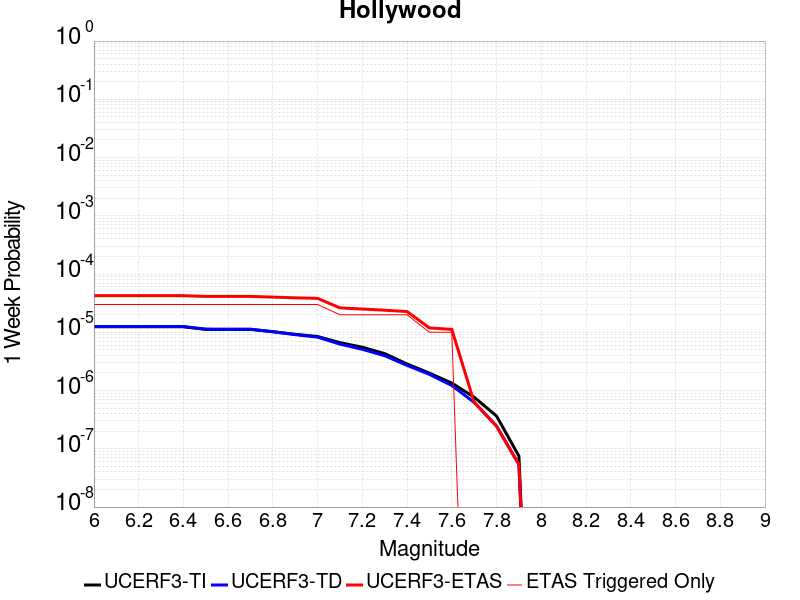 | 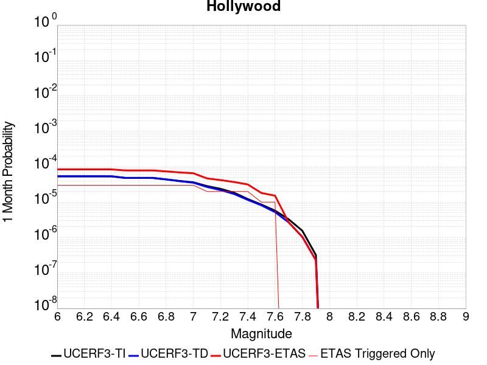 | 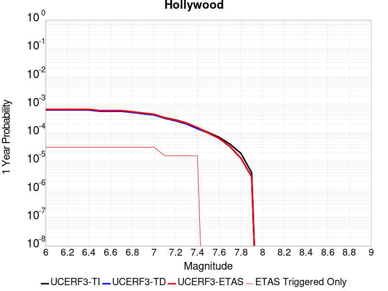 | 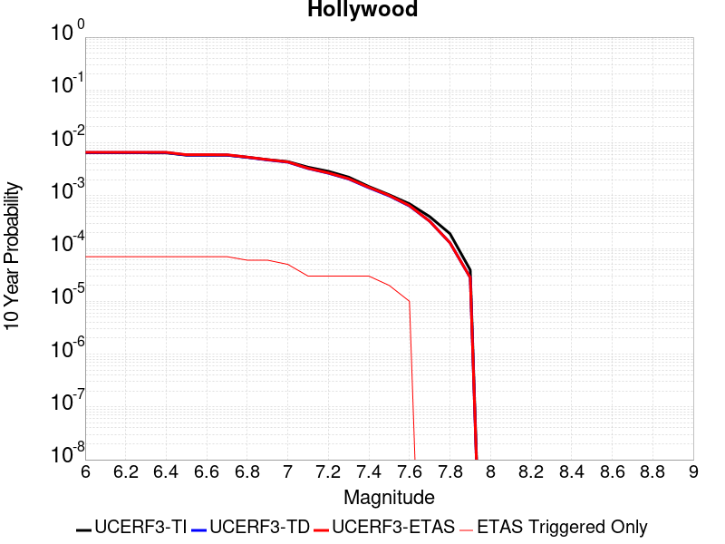 |

| Magnitude | 1 wk TI Prob | 1 wk TD Prob | 1 wk ETAS Prob | 1 wk ETAS/TD Gain | 1 wk ETAS Triggered Only | 1 mo TI Prob | 1 mo TD Prob | 1 mo ETAS Prob | 1 mo ETAS/TD Gain | 1 mo ETAS Triggered Only | 1 yr TI Prob | 1 yr TD Prob | 1 yr ETAS Prob | 1 yr ETAS/TD Gain | 1 yr ETAS Triggered Only | 10 yr TI Prob | 10 yr TD Prob | 10 yr ETAS Prob | 10 yr ETAS/TD Gain | 10 yr ETAS Triggered Only |
|-----|-----|-----|-----|-----|-----|-----|-----|-----|-----|-----|-----|-----|-----|-----|-----|-----|-----|-----|-----|-----|
| 6.0 | 1.24487615E-5 | 1.2593226E-5 | 4.259285E-5 | 3.382203 | 3.0E-5 | 5.3350745E-5 | 5.3969878E-5 | 8.396826E-5 | 1.5558356 | 3.0E-5 | 6.4935174E-4 | 6.568898E-4 | 6.968635E-4 | 1.060853 | 4.0E-5 | 0.0064745755 | 0.006549969 | 0.0066195102 | 1.010617 | 7.0E-5 |
| 6.1 | 1.24487615E-5 | 1.2593226E-5 | 4.259285E-5 | 3.382203 | 3.0E-5 | 5.3350745E-5 | 5.3969878E-5 | 8.396826E-5 | 1.5558356 | 3.0E-5 | 6.4935174E-4 | 6.568898E-4 | 6.968635E-4 | 1.060853 | 4.0E-5 | 0.0064745755 | 0.006549969 | 0.0066195102 | 1.010617 | 7.0E-5 |
| 6.2 | 1.24487615E-5 | 1.2593226E-5 | 4.259285E-5 | 3.382203 | 3.0E-5 | 5.3350745E-5 | 5.3969878E-5 | 8.396826E-5 | 1.5558356 | 3.0E-5 | 6.4935174E-4 | 6.568898E-4 | 6.968635E-4 | 1.060853 | 4.0E-5 | 0.0064745755 | 0.006549969 | 0.0066195102 | 1.010617 | 7.0E-5 |
| 6.3 | 1.24487615E-5 | 1.2593226E-5 | 4.259285E-5 | 3.382203 | 3.0E-5 | 5.3350745E-5 | 5.3969878E-5 | 8.396826E-5 | 1.5558356 | 3.0E-5 | 6.4935174E-4 | 6.568898E-4 | 6.968635E-4 | 1.060853 | 4.0E-5 | 0.0064745755 | 0.006549969 | 0.0066195102 | 1.010617 | 7.0E-5 |
| 6.4 | 1.2431024E-5 | 1.2573839E-5 | 4.257346E-5 | 3.3858762 | 3.0E-5 | 5.327473E-5 | 5.3886797E-5 | 8.388518E-5 | 1.5566926 | 3.0E-5 | 6.4842677E-4 | 6.558789E-4 | 6.958527E-4 | 1.0609468 | 4.0E-5 | 0.0064653796 | 0.0065399194 | 0.0066094617 | 1.0106335 | 7.0E-5 |
| 6.5 | 1.1242222E-5 | 1.13178E-5 | 4.131746E-5 | 3.6506617 | 3.0E-5 | 4.8180063E-5 | 4.850397E-5 | 7.850252E-5 | 1.618476 | 3.0E-5 | 5.864344E-4 | 5.9037853E-4 | 6.303549E-4 | 1.0677131 | 4.0E-5 | 0.0058488925 | 0.005888388 | 0.005957976 | 1.0118178 | 7.0E-5 |
| 6.6 | 1.1234066E-5 | 1.13089145E-5 | 4.1308576E-5 | 3.6527445 | 3.0E-5 | 4.8145106E-5 | 4.846589E-5 | 7.8464436E-5 | 1.618962 | 3.0E-5 | 5.86009E-4 | 5.8991514E-4 | 6.298915E-4 | 1.0677663 | 4.0E-5 | 0.005844661 | 0.0058837784 | 0.005953367 | 1.0118271 | 7.0E-5 |
| 6.7 | 1.12294E-5 | 1.1303658E-5 | 4.130332E-5 | 3.653978 | 3.0E-5 | 4.812511E-5 | 4.8443362E-5 | 7.844191E-5 | 1.6192499 | 3.0E-5 | 5.857657E-4 | 5.89641E-4 | 6.296174E-4 | 1.0677979 | 4.0E-5 | 0.0058422405 | 0.005881052 | 0.00595064 | 1.0118326 | 7.0E-5 |
| 6.8 | 1.0252819E-5 | 1.0218445E-5 | 4.021814E-5 | 3.9358375 | 3.0E-5 | 4.3939912E-5 | 4.379261E-5 | 7.37913E-5 | 1.6850171 | 3.0E-5 | 5.3483713E-4 | 5.330467E-4 | 5.730254E-4 | 1.0750003 | 4.0E-5 | 0.005335517 | 0.005317908 | 0.0053775883 | 1.0112226 | 6.0E-5 |
| 6.9 | 9.252289E-6 | 9.110306E-6 | 3.9110033E-5 | 4.292944 | 3.0E-5 | 3.9652066E-5 | 3.9043593E-5 | 6.904242E-5 | 1.7683419 | 3.0E-5 | 4.8265693E-4 | 4.752537E-4 | 5.152347E-4 | 1.0841255 | 4.0E-5 | 0.0048161 | 0.004742547 | 0.0048022624 | 1.0125915 | 6.0E-5 |
| 7.0 | 8.474604E-6 | 8.258257E-6 | 3.8258007E-5 | 4.632698 | 3.0E-5 | 3.6319227E-5 | 3.539206E-5 | 6.5390996E-5 | 1.8476179 | 3.0E-5 | 4.4209688E-4 | 4.3081454E-4 | 4.707973E-4 | 1.0928074 | 4.0E-5 | 0.004412184 | 0.004299944 | 0.004349729 | 1.0115781 | 5.0E-5 |
| 7.1 | 6.643643E-6 | 6.2683675E-6 | 2.6268242E-5 | 4.1906033 | 2.0E-5 | 2.8472443E-5 | 2.6864158E-5 | 4.686362E-5 | 1.7444664 | 2.0E-5 | 3.4659685E-4 | 3.2702246E-4 | 3.470159E-4 | 1.0611379 | 2.0E-5 | 0.0034605677 | 0.0032654584 | 0.0032953604 | 1.0091571 | 3.0E-5 |
| 7.2 | 5.549002E-6 | 5.108709E-6 | 2.5108608E-5 | 4.914863 | 2.0E-5 | 2.378122E-5 | 2.1894284E-5 | 4.1893847E-5 | 1.9134604 | 2.0E-5 | 2.8949787E-4 | 2.6653046E-4 | 2.8652512E-4 | 1.0750183 | 2.0E-5 | 0.0028912104 | 0.0026621243 | 0.0026920445 | 1.0112392 | 3.0E-5 |
| 7.3 | 4.3059727E-6 | 3.9598885E-6 | 2.395981E-5 | 6.050627 | 2.0E-5 | 1.8454039E-5 | 1.6970842E-5 | 3.69705E-5 | 2.178472 | 2.0E-5 | 2.2465475E-4 | 2.066005E-4 | 2.2659637E-4 | 1.0967852 | 2.0E-5 | 0.0022442779 | 0.0020640944 | 0.0020940325 | 1.0145042 | 3.0E-5 |
| 7.4 | 2.8550733E-6 | 2.7012966E-6 | 2.2701242E-5 | 8.403832 | 2.0E-5 | 1.2235971E-5 | 1.1576934E-5 | 3.1576703E-5 | 2.7275531 | 2.0E-5 | 1.4896276E-4 | 1.409401E-4 | 1.6093728E-4 | 1.1418842 | 2.0E-5 | 0.0014886294 | 0.0014085122 | 0.00143847 | 1.0212691 | 3.0E-5 |
| 7.5 | 1.9927045E-6 | 1.8976367E-6 | 1.1897618E-5 | 6.2697024 | 1.0E-5 | 8.540134E-6 | 8.132703E-6 | 1.8132621E-5 | 2.2295935 | 1.0E-5 | 1.0397117E-4 | 9.90112E-5 | 1.0901021E-4 | 1.1009886 | 1.0E-5 | 0.0010392254 | 9.896745E-4 | 0.0010096547 | 1.0201887 | 2.0E-5 |
| 7.6 | 1.345084E-6 | 1.2216007E-6 | 1.12215885E-5 | 9.185971 | 1.0E-5 | 5.764633E-6 | 5.235421E-6 | 1.5235369E-5 | 2.910056 | 1.0E-5 | 7.018215E-5 | 6.3739404E-5 | 7.373877E-5 | 1.1568788 | 1.0E-5 | 7.0159987E-4 | 6.3721323E-4 | 6.4720685E-4 | 1.0156833 | 1.0E-5 |
| 7.7 | 7.6835164E-7 | 6.277697E-7 | 6.277697E-7 | 1.0 | 0.0 | 3.2929315E-6 | 2.6904388E-6 | 2.6904388E-6 | 1.0 | 0.0 | 4.00907E-5 | 3.2755615E-5 | 3.2755615E-5 | 1.0 | 0.0 | 4.0083472E-4 | 3.2750933E-4 | 3.2750933E-4 | 1.0 | 0.0 |
| 7.8 | 3.6562128E-7 | 2.453479E-7 | 2.453479E-7 | 1.0 | 0.0 | 1.5669474E-6 | 1.0514907E-6 | 1.0514907E-6 | 1.0 | 0.0 | 1.9077417E-5 | 1.2801827E-5 | 1.2801827E-5 | 1.0 | 0.0 | 1.907578E-4 | 1.2801126E-4 | 1.2801126E-4 | 1.0 | 0.0 |
| 7.9 | 7.5024424E-8 | 5.3816795E-8 | 5.3816795E-8 | 1.0 | 0.0 | 3.215332E-7 | 2.306434E-7 | 2.306434E-7 | 1.0 | 0.0 | 3.91466E-6 | 2.808081E-6 | 2.808081E-6 | 1.0 | 0.0 | 3.9145907E-5 | 2.8080585E-5 | 2.8080585E-5 | 1.0 | 0.0 |

## Dry Mountain
*[(top)](#table-of-contents)*

| 1 Week | 1 Month | 1 Year | 10 Year |
|-----|-----|-----|-----|
|  | 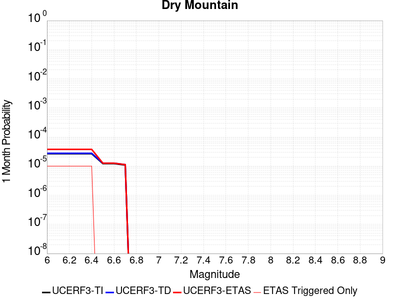 | 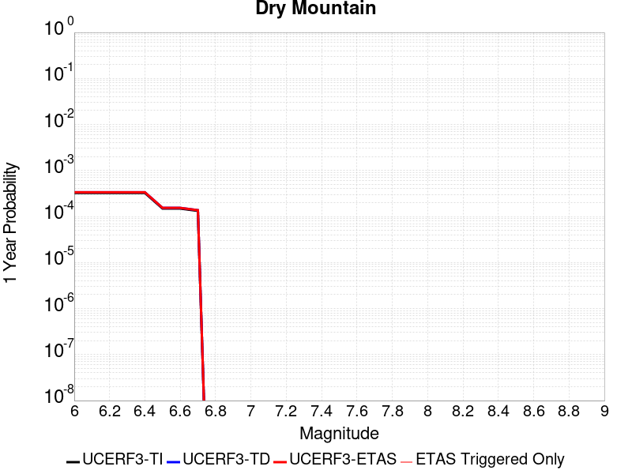 | 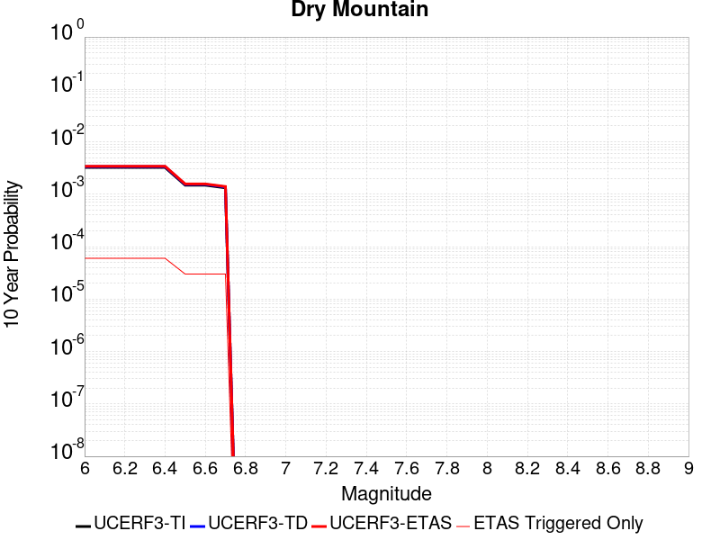 |

| Magnitude | 1 wk TI Prob | 1 wk TD Prob | 1 wk ETAS Prob | 1 wk ETAS/TD Gain | 1 wk ETAS Triggered Only | 1 mo TI Prob | 1 mo TD Prob | 1 mo ETAS Prob | 1 mo ETAS/TD Gain | 1 mo ETAS Triggered Only | 1 yr TI Prob | 1 yr TD Prob | 1 yr ETAS Prob | 1 yr ETAS/TD Gain | 1 yr ETAS Triggered Only | 10 yr TI Prob | 10 yr TD Prob | 10 yr ETAS Prob | 10 yr ETAS/TD Gain | 10 yr ETAS Triggered Only |
|-----|-----|-----|-----|-----|-----|-----|-----|-----|-----|-----|-----|-----|-----|-----|-----|-----|-----|-----|-----|-----|
| 6.0 | 6.222801E-6 | 6.439381E-6 | 1.6439317E-5 | 2.5529342 | 1.0E-5 | 2.6668875E-5 | 2.7597147E-5 | 3.759687E-5 | 1.3623463 | 1.0E-5 | 3.2464517E-4 | 3.3595937E-4 | 3.659493E-4 | 1.0892665 | 3.0E-5 | 0.0032417132 | 0.0033560768 | 0.0034158754 | 1.017818 | 6.0E-5 |
| 6.1 | 6.222801E-6 | 6.439381E-6 | 1.6439317E-5 | 2.5529342 | 1.0E-5 | 2.6668875E-5 | 2.7597147E-5 | 3.759687E-5 | 1.3623463 | 1.0E-5 | 3.2464517E-4 | 3.3595937E-4 | 3.659493E-4 | 1.0892665 | 3.0E-5 | 0.0032417132 | 0.0033560768 | 0.0034158754 | 1.017818 | 6.0E-5 |
| 6.2 | 6.222801E-6 | 6.439381E-6 | 1.6439317E-5 | 2.5529342 | 1.0E-5 | 2.6668875E-5 | 2.7597147E-5 | 3.759687E-5 | 1.3623463 | 1.0E-5 | 3.2464517E-4 | 3.3595937E-4 | 3.659493E-4 | 1.0892665 | 3.0E-5 | 0.0032417132 | 0.0033560768 | 0.0034158754 | 1.017818 | 6.0E-5 |
| 6.3 | 6.222801E-6 | 6.439381E-6 | 1.6439317E-5 | 2.5529342 | 1.0E-5 | 2.6668875E-5 | 2.7597147E-5 | 3.759687E-5 | 1.3623463 | 1.0E-5 | 3.2464517E-4 | 3.3595937E-4 | 3.659493E-4 | 1.0892665 | 3.0E-5 | 0.0032417132 | 0.0033560768 | 0.0034158754 | 1.017818 | 6.0E-5 |
| 6.4 | 6.222801E-6 | 6.439381E-6 | 1.6439317E-5 | 2.5529342 | 1.0E-5 | 2.6668875E-5 | 2.7597147E-5 | 3.759687E-5 | 1.3623463 | 1.0E-5 | 3.2464517E-4 | 3.3595937E-4 | 3.659493E-4 | 1.0892665 | 3.0E-5 | 0.0032417132 | 0.0033560768 | 0.0034158754 | 1.017818 | 6.0E-5 |
| 6.5 | 2.8528623E-6 | 2.9521684E-6 | 2.9521684E-6 | 1.0 | 0.0 | 1.22264955E-5 | 1.2652138E-5 | 1.2652138E-5 | 1.0 | 0.0 | 1.4884741E-4 | 1.540376E-4 | 1.540376E-4 | 1.0 | 0.0 | 0.0014874774 | 0.0015401616 | 0.0015701154 | 1.0194485 | 3.0E-5 |
| 6.6 | 2.8528623E-6 | 2.9521684E-6 | 2.9521684E-6 | 1.0 | 0.0 | 1.22264955E-5 | 1.2652138E-5 | 1.2652138E-5 | 1.0 | 0.0 | 1.4884741E-4 | 1.540376E-4 | 1.540376E-4 | 1.0 | 0.0 | 0.0014874774 | 0.0015401616 | 0.0015701154 | 1.0194485 | 3.0E-5 |
| 6.7 | 2.541E-6 | 2.6293578E-6 | 2.6293578E-6 | 1.0 | 0.0 | 1.0889954E-5 | 1.1268677E-5 | 1.1268677E-5 | 1.0 | 0.0 | 1.3257713E-4 | 1.3719614E-4 | 1.3719614E-4 | 1.0 | 0.0 | 0.0013249806 | 0.0013719613 | 0.0014019202 | 1.0218365 | 3.0E-5 |

## San Clemente
*[(top)](#table-of-contents)*

| 1 Week | 1 Month | 1 Year | 10 Year |
|-----|-----|-----|-----|
| 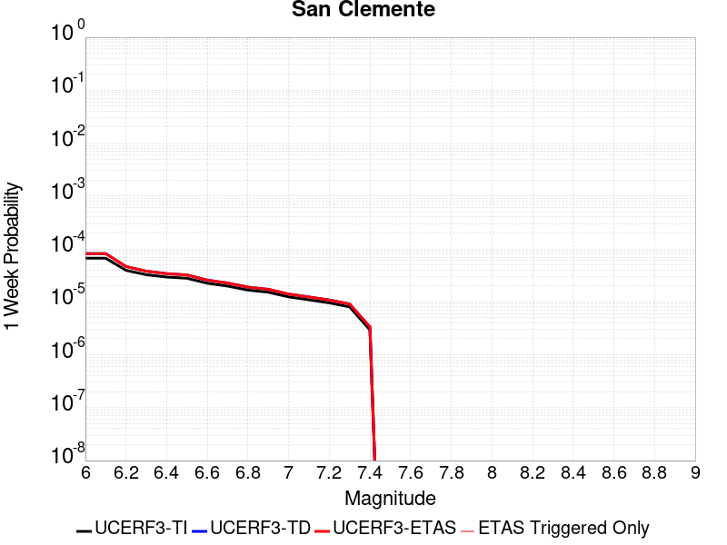 | 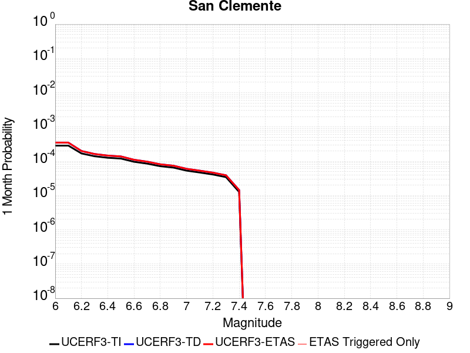 | 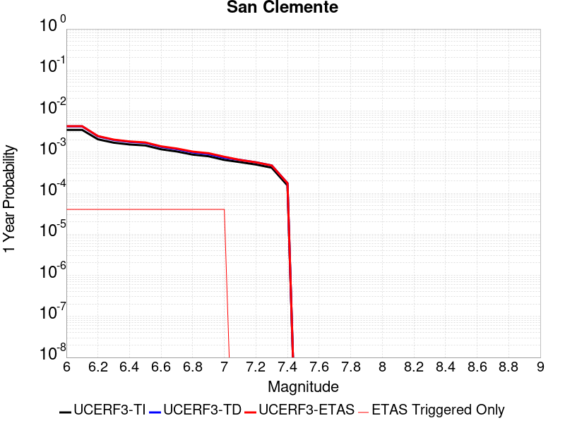 | 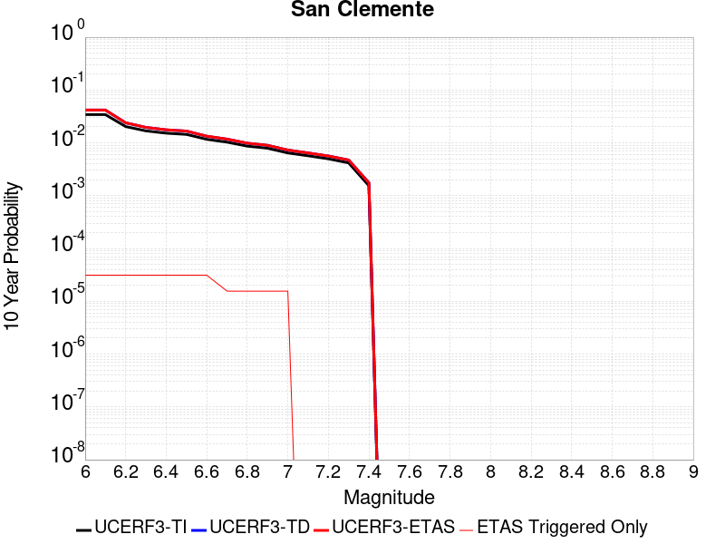 |

| Magnitude | 1 wk TI Prob | 1 wk TD Prob | 1 wk ETAS Prob | 1 wk ETAS/TD Gain | 1 wk ETAS Triggered Only | 1 mo TI Prob | 1 mo TD Prob | 1 mo ETAS Prob | 1 mo ETAS/TD Gain | 1 mo ETAS Triggered Only | 1 yr TI Prob | 1 yr TD Prob | 1 yr ETAS Prob | 1 yr ETAS/TD Gain | 1 yr ETAS Triggered Only | 10 yr TI Prob | 10 yr TD Prob | 10 yr ETAS Prob | 10 yr ETAS/TD Gain | 10 yr ETAS Triggered Only |
|-----|-----|-----|-----|-----|-----|-----|-----|-----|-----|-----|-----|-----|-----|-----|-----|-----|-----|-----|-----|-----|
| 6.0 | 6.681379E-5 | 8.163422E-5 | 8.163422E-5 | 1.0 | 0.0 | 2.8631336E-4 | 3.498173E-4 | 3.498173E-4 | 1.0 | 0.0 | 0.003480294 | 0.0042512873 | 0.00428116 | 1.0070267 | 3.0E-5 | 0.03426291 | 0.041755714 | 0.04181321 | 1.001377 | 6.0E-5 |
| 6.1 | 6.681379E-5 | 8.163422E-5 | 8.163422E-5 | 1.0 | 0.0 | 2.8631336E-4 | 3.498173E-4 | 3.498173E-4 | 1.0 | 0.0 | 0.003480294 | 0.0042512873 | 0.00428116 | 1.0070267 | 3.0E-5 | 0.03426291 | 0.041755714 | 0.04181321 | 1.001377 | 6.0E-5 |
| 6.2 | 3.9400576E-5 | 4.6451984E-5 | 4.6451984E-5 | 1.0 | 0.0 | 1.6884868E-4 | 1.9906509E-4 | 1.9906509E-4 | 1.0 | 0.0 | 0.0020537945 | 0.002420985 | 0.0024409364 | 1.008241 | 2.0E-5 | 0.020349167 | 0.02395286 | 0.023982141 | 1.0012225 | 3.0E-5 |
| 6.3 | 3.2590255E-5 | 3.7929087E-5 | 3.7929087E-5 | 1.0 | 0.0 | 1.3966505E-4 | 1.6254328E-4 | 1.6254328E-4 | 1.0 | 0.0 | 0.0016990956 | 0.0019771985 | 0.0019971589 | 1.0100954 | 2.0E-5 | 0.01686163 | 0.019599866 | 0.019629277 | 1.0015006 | 3.0E-5 |
| 6.4 | 2.9454652E-5 | 3.4097775E-5 | 3.4097775E-5 | 1.0 | 0.0 | 1.2622811E-4 | 1.4612528E-4 | 1.4612528E-4 | 1.0 | 0.0 | 0.0015357438 | 0.0017776482 | 0.0017976126 | 1.0112308 | 2.0E-5 | 0.015251739 | 0.017637458 | 0.017666928 | 1.001671 | 3.0E-5 |
| 6.5 | 2.790836E-5 | 3.2247463E-5 | 3.2247463E-5 | 1.0 | 0.0 | 1.1960178E-4 | 1.3819622E-4 | 1.3819622E-4 | 1.0 | 0.0 | 0.001455179 | 0.0016812651 | 0.0017012315 | 1.0118757 | 2.0E-5 | 0.014456868 | 0.016688475 | 0.016717974 | 1.0017676 | 3.0E-5 |
| 6.6 | 2.2492153E-5 | 2.5762707E-5 | 2.5762707E-5 | 1.0 | 0.0 | 9.639138E-5 | 1.1040701E-4 | 1.1040701E-4 | 1.0 | 0.0 | 0.0011729331 | 0.0013433908 | 0.0013633639 | 1.0148677 | 2.0E-5 | 0.011667615 | 0.013354415 | 0.013384014 | 1.0022165 | 3.0E-5 |
| 6.7 | 1.9862755E-5 | 2.2666423E-5 | 2.2666423E-5 | 1.0 | 0.0 | 8.512331E-5 | 9.713826E-5 | 9.713826E-5 | 1.0 | 0.0 | 0.0010358836 | 0.0011820279 | 0.0012020043 | 1.0169001 | 2.0E-5 | 0.010310682 | 0.011758701 | 0.0117784655 | 1.0016809 | 2.0E-5 |
| 6.8 | 1.6697575E-5 | 1.897771E-5 | 1.897771E-5 | 1.0 | 0.0 | 7.155907E-5 | 8.133056E-5 | 8.133056E-5 | 1.0 | 0.0 | 8.7088346E-4 | 9.897591E-4 | 0.0010097392 | 1.0201869 | 2.0E-5 | 0.008674784 | 0.0098545365 | 0.00987434 | 1.0020095 | 2.0E-5 |
| 6.9 | 1.5218415E-5 | 1.72694E-5 | 1.72694E-5 | 1.0 | 0.0 | 6.522015E-5 | 7.4009666E-5 | 7.4009666E-5 | 1.0 | 0.0 | 7.93766E-4 | 9.00704E-4 | 9.10695E-4 | 1.0110924 | 1.0E-5 | 0.007909367 | 0.008971481 | 0.008981391 | 1.0011046 | 1.0E-5 |
| 7.0 | 1.2392958E-5 | 1.4033016E-5 | 1.4033016E-5 | 1.0 | 0.0 | 5.3111595E-5 | 6.014015E-5 | 6.014015E-5 | 1.0 | 0.0 | 6.4644177E-4 | 7.319679E-4 | 7.419606E-4 | 1.0136518 | 1.0E-5 | 0.0064456454 | 0.0072963564 | 0.007306284 | 1.0013605 | 1.0E-5 |
| 7.1 | 1.0934128E-5 | 1.2375138E-5 | 1.2375138E-5 | 1.0 | 0.0 | 4.6859706E-5 | 5.303527E-5 | 5.303527E-5 | 1.0 | 0.0 | 5.7036756E-4 | 6.455204E-4 | 6.455204E-4 | 1.0 | 0.0 | 0.0056890585 | 0.0064371997 | 0.0064371997 | 1.0 | 0.0 |
| 7.2 | 9.5798805E-6 | 1.0844935E-5 | 1.0844935E-5 | 1.0 | 0.0 | 4.1055984E-5 | 4.6477508E-5 | 4.6477508E-5 | 1.0 | 0.0 | 4.9974193E-4 | 5.657239E-4 | 5.657239E-4 | 1.0 | 0.0 | 0.0049861963 | 0.0056435615 | 0.0056435615 | 1.0 | 0.0 |
| 7.3 | 8.0167365E-6 | 9.083918E-6 | 9.083918E-6 | 1.0 | 0.0 | 3.4356988E-5 | 3.8930535E-5 | 3.8930535E-5 | 1.0 | 0.0 | 4.1821605E-4 | 4.7388324E-4 | 4.7388324E-4 | 1.0 | 0.0 | 0.0041742986 | 0.0047294297 | 0.0047294297 | 1.0 | 0.0 |
| 7.4 | 2.9581017E-6 | 3.3623792E-6 | 3.3623792E-6 | 1.0 | 0.0 | 1.2677518E-5 | 1.4410146E-5 | 1.4410146E-5 | 1.0 | 0.0 | 1.5433785E-4 | 1.7543444E-4 | 1.7543444E-4 | 1.0 | 0.0 | 0.001542307 | 0.0017534546 | 0.0017534546 | 1.0 | 0.0 |

## Los Alamos extension
*[(top)](#table-of-contents)*

| 1 Week | 1 Month | 1 Year | 10 Year |
|-----|-----|-----|-----|
| 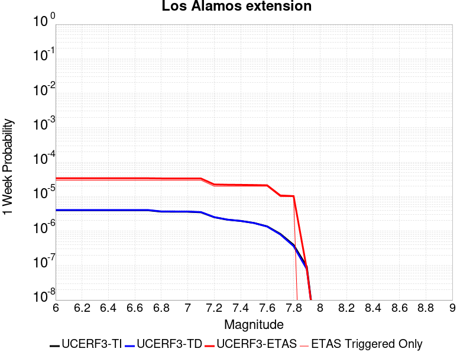 | 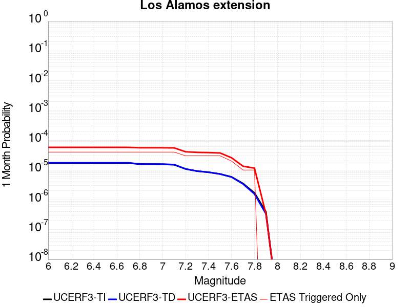 | 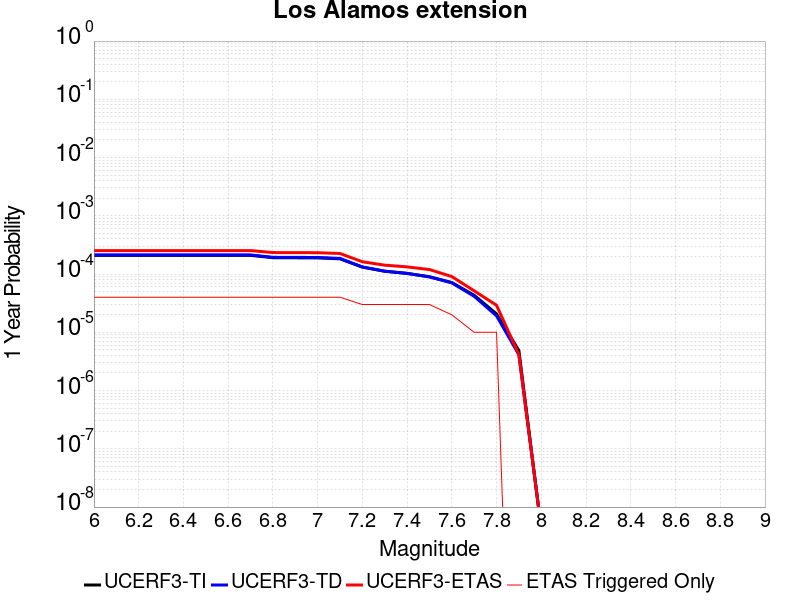 | 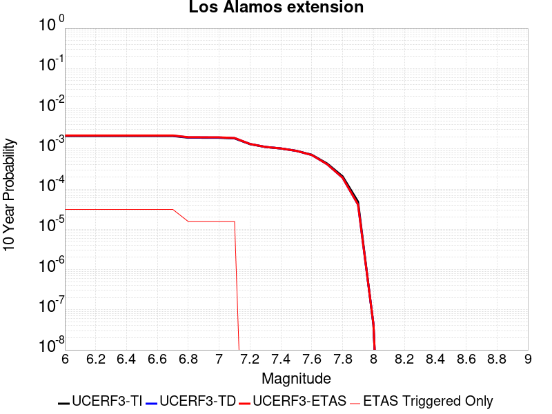 |

| Magnitude | 1 wk TI Prob | 1 wk TD Prob | 1 wk ETAS Prob | 1 wk ETAS/TD Gain | 1 wk ETAS Triggered Only | 1 mo TI Prob | 1 mo TD Prob | 1 mo ETAS Prob | 1 mo ETAS/TD Gain | 1 mo ETAS Triggered Only | 1 yr TI Prob | 1 yr TD Prob | 1 yr ETAS Prob | 1 yr ETAS/TD Gain | 1 yr ETAS Triggered Only | 10 yr TI Prob | 10 yr TD Prob | 10 yr ETAS Prob | 10 yr ETAS/TD Gain | 10 yr ETAS Triggered Only |
|-----|-----|-----|-----|-----|-----|-----|-----|-----|-----|-----|-----|-----|-----|-----|-----|-----|-----|-----|-----|-----|
| 6.0 | 4.0146506E-6 | 4.0861596E-6 | 3.408604E-5 | 8.341827 | 3.0E-5 | 1.7205533E-5 | 1.7512002E-5 | 5.75113E-5 | 3.284108 | 4.0E-5 | 2.0945723E-4 | 2.1318886E-4 | 2.5318033E-4 | 1.187587 | 4.0E-5 | 0.0020925992 | 0.0021299527 | 0.0021898248 | 1.0281097 | 6.0E-5 |
| 6.1 | 4.0146506E-6 | 4.0861596E-6 | 3.408604E-5 | 8.341827 | 3.0E-5 | 1.7205533E-5 | 1.7512002E-5 | 5.75113E-5 | 3.284108 | 4.0E-5 | 2.0945723E-4 | 2.1318886E-4 | 2.5318033E-4 | 1.187587 | 4.0E-5 | 0.0020925992 | 0.0021299527 | 0.0021898248 | 1.0281097 | 6.0E-5 |
| 6.2 | 4.0146506E-6 | 4.0861596E-6 | 3.408604E-5 | 8.341827 | 3.0E-5 | 1.7205533E-5 | 1.7512002E-5 | 5.75113E-5 | 3.284108 | 4.0E-5 | 2.0945723E-4 | 2.1318886E-4 | 2.5318033E-4 | 1.187587 | 4.0E-5 | 0.0020925992 | 0.0021299527 | 0.0021898248 | 1.0281097 | 6.0E-5 |
| 6.3 | 4.0146506E-6 | 4.0861596E-6 | 3.408604E-5 | 8.341827 | 3.0E-5 | 1.7205533E-5 | 1.7512002E-5 | 5.75113E-5 | 3.284108 | 4.0E-5 | 2.0945723E-4 | 2.1318886E-4 | 2.5318033E-4 | 1.187587 | 4.0E-5 | 0.0020925992 | 0.0021299527 | 0.0021898248 | 1.0281097 | 6.0E-5 |
| 6.4 | 4.0146506E-6 | 4.0861596E-6 | 3.408604E-5 | 8.341827 | 3.0E-5 | 1.7205533E-5 | 1.7512002E-5 | 5.75113E-5 | 3.284108 | 4.0E-5 | 2.0945723E-4 | 2.1318886E-4 | 2.5318033E-4 | 1.187587 | 4.0E-5 | 0.0020925992 | 0.0021299527 | 0.0021898248 | 1.0281097 | 6.0E-5 |
| 6.5 | 4.0146506E-6 | 4.0861596E-6 | 3.408604E-5 | 8.341827 | 3.0E-5 | 1.7205533E-5 | 1.7512002E-5 | 5.75113E-5 | 3.284108 | 4.0E-5 | 2.0945723E-4 | 2.1318886E-4 | 2.5318033E-4 | 1.187587 | 4.0E-5 | 0.0020925992 | 0.0021299527 | 0.0021898248 | 1.0281097 | 6.0E-5 |
| 6.6 | 4.0146506E-6 | 4.0861596E-6 | 3.408604E-5 | 8.341827 | 3.0E-5 | 1.7205533E-5 | 1.7512002E-5 | 5.75113E-5 | 3.284108 | 4.0E-5 | 2.0945723E-4 | 2.1318886E-4 | 2.5318033E-4 | 1.187587 | 4.0E-5 | 0.0020925992 | 0.0021299527 | 0.0021898248 | 1.0281097 | 6.0E-5 |
| 6.7 | 4.0146506E-6 | 4.0861596E-6 | 3.408604E-5 | 8.341827 | 3.0E-5 | 1.7205533E-5 | 1.7512002E-5 | 5.75113E-5 | 3.284108 | 4.0E-5 | 2.0945723E-4 | 2.1318886E-4 | 2.5318033E-4 | 1.187587 | 4.0E-5 | 0.0020925992 | 0.0021299527 | 0.0021898248 | 1.0281097 | 6.0E-5 |
| 6.8 | 3.6584688E-6 | 3.7188588E-6 | 3.371875E-5 | 9.06696 | 3.0E-5 | 1.5679057E-5 | 1.5937874E-5 | 5.593724E-5 | 3.5097048 | 4.0E-5 | 1.9087581E-4 | 1.9402728E-4 | 2.3401952E-4 | 1.2061166 | 4.0E-5 | 0.0019071194 | 0.0019386712 | 0.0019885742 | 1.0257409 | 5.0E-5 |
| 6.9 | 3.644631E-6 | 3.7045688E-6 | 3.370446E-5 | 9.098079 | 3.0E-5 | 1.5619753E-5 | 1.5876632E-5 | 5.5875997E-5 | 3.519386 | 4.0E-5 | 1.901539E-4 | 1.9328178E-4 | 2.3327406E-4 | 1.2069117 | 4.0E-5 | 0.0018999127 | 0.0019312293 | 0.0019811327 | 1.0258403 | 5.0E-5 |
| 7.0 | 3.6318522E-6 | 3.6913295E-6 | 3.369122E-5 | 9.127123 | 3.0E-5 | 1.5564989E-5 | 1.5819893E-5 | 5.581926E-5 | 3.528422 | 4.0E-5 | 1.8948725E-4 | 1.925911E-4 | 2.325834E-4 | 1.2076539 | 4.0E-5 | 0.0018932576 | 0.0019243343 | 0.001974238 | 1.025933 | 5.0E-5 |
| 7.1 | 3.5001724E-6 | 3.5554E-6 | 3.3555294E-5 | 9.4378395 | 3.0E-5 | 1.5000653E-5 | 1.5237345E-5 | 5.5236735E-5 | 3.6250892 | 4.0E-5 | 1.8261763E-4 | 1.854998E-4 | 2.2549237E-4 | 1.2155937 | 4.0E-5 | 0.0018246764 | 0.0018535402 | 0.0019034476 | 1.0269254 | 5.0E-5 |
| 7.2 | 2.5204702E-6 | 2.5436943E-6 | 2.2543643E-5 | 8.86256 | 2.0E-5 | 1.080197E-5 | 1.0901502E-5 | 4.0901174E-5 | 3.7518845 | 3.0E-5 | 1.3150605E-4 | 1.3271775E-4 | 1.6271377E-4 | 1.2260137 | 3.0E-5 | 0.0013142825 | 0.0013263905 | 0.0013663375 | 1.030117 | 4.0E-5 |
| 7.3 | 2.1399692E-6 | 2.1501316E-6 | 2.2150089E-5 | 10.301736 | 2.0E-5 | 9.1712645E-6 | 9.2148175E-6 | 3.921454E-5 | 4.255596 | 3.0E-5 | 1.1165442E-4 | 1.1218466E-4 | 1.4218129E-4 | 1.2673862 | 3.0E-5 | 0.0011159834 | 0.0011212835 | 0.0011512499 | 1.026725 | 3.0E-5 |
| 7.4 | 1.9660122E-6 | 1.9702363E-6 | 2.1970198E-5 | 11.151047 | 2.0E-5 | 8.42574E-6 | 8.4438425E-6 | 3.8443588E-5 | 4.5528545 | 3.0E-5 | 1.0257855E-4 | 1.0279897E-4 | 1.3279589E-4 | 1.2918017 | 3.0E-5 | 0.0010253121 | 0.0010275173 | 0.0010574865 | 1.0291666 | 3.0E-5 |
| 7.5 | 1.7204633E-6 | 1.7150983E-6 | 2.1715065E-5 | 12.661119 | 2.0E-5 | 7.373393E-6 | 7.3504007E-6 | 3.735018E-5 | 5.08138 | 3.0E-5 | 8.976737E-5 | 8.948748E-5 | 1.194848E-4 | 1.3352125 | 3.0E-5 | 8.9731114E-4 | 8.9451746E-4 | 9.244906E-4 | 1.0335076 | 3.0E-5 |
| 7.6 | 1.3717638E-6 | 1.3535827E-6 | 2.1353555E-5 | 15.775583 | 2.0E-5 | 5.878974E-6 | 5.8010555E-6 | 2.580094E-5 | 4.4476285 | 2.0E-5 | 7.157416E-5 | 7.062559E-5 | 9.062418E-5 | 1.2831634 | 2.0E-5 | 7.1551115E-4 | 7.060341E-4 | 7.2601996E-4 | 1.0283072 | 2.0E-5 |
| 7.7 | 8.272564E-7 | 7.957636E-7 | 1.0795756E-5 | 13.566536 | 1.0E-5 | 3.5453797E-6 | 3.410411E-6 | 1.3410377E-5 | 3.932188 | 1.0E-5 | 4.3164142E-5 | 4.1520965E-5 | 5.152055E-5 | 1.2408322 | 1.0E-5 | 4.315576E-4 | 4.1513226E-4 | 4.2512812E-4 | 1.0240787 | 1.0E-5 |
| 7.8 | 3.9708277E-7 | 3.6719027E-7 | 1.0367186E-5 | 28.233828 | 1.0E-5 | 1.7017821E-6 | 1.5736716E-6 | 1.1573656E-5 | 7.354556 | 1.0E-5 | 2.0719E-5 | 1.9159284E-5 | 2.9159093E-5 | 1.5219302 | 1.0E-5 | 2.071707E-4 | 1.9157639E-4 | 2.0157447E-4 | 1.0521885 | 1.0E-5 |
| 7.9 | 9.292528E-8 | 7.889087E-8 | 7.889087E-8 | 1.0 | 0.0 | 3.9825116E-7 | 3.381037E-7 | 3.381037E-7 | 1.0 | 0.0 | 4.848697E-6 | 4.116405E-6 | 4.116405E-6 | 1.0 | 0.0 | 4.8485912E-5 | 4.1163294E-5 | 4.1163294E-5 | 1.0 | 0.0 |
| 8.0 | 7.880441E-11 | 8.2353124E-11 | 8.2353124E-11 | 1.0 | 0.0 | 3.3773329E-10 | 3.52942E-10 | 3.52942E-10 | 1.0 | 0.0 | 4.1119033E-9 | 4.2970694E-9 | 4.2970694E-9 | 1.0 | 0.0 | 4.1119034E-8 | 4.2970694E-8 | 4.2970694E-8 | 1.0 | 0.0 |

## Palos Verdes
*[(top)](#table-of-contents)*

| 1 Week | 1 Month | 1 Year | 10 Year |
|-----|-----|-----|-----|
| 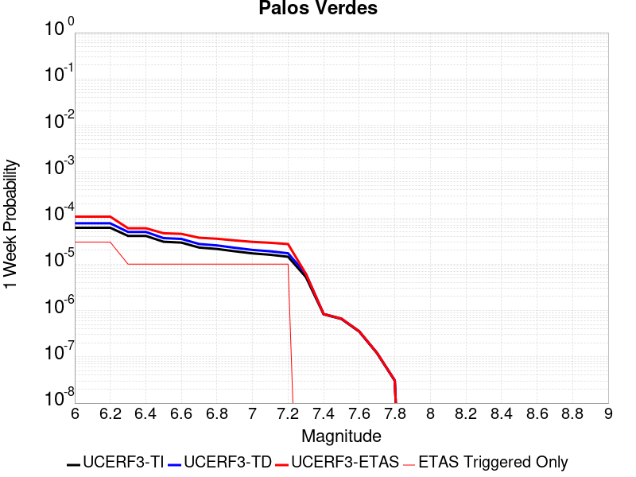 | 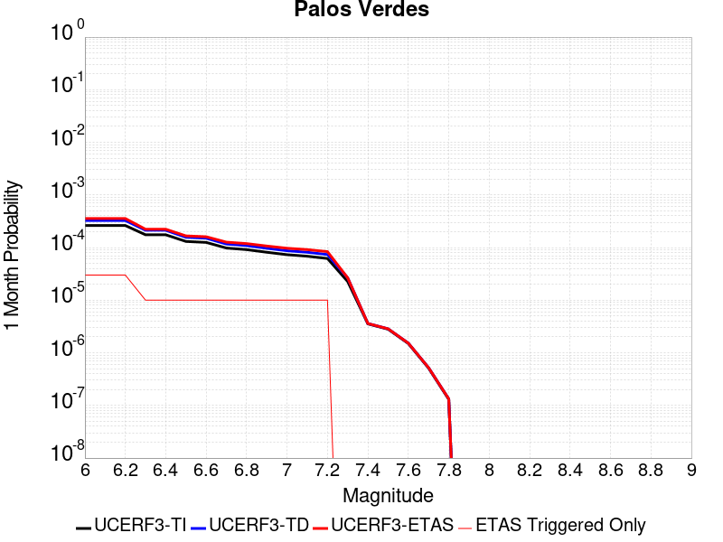 | 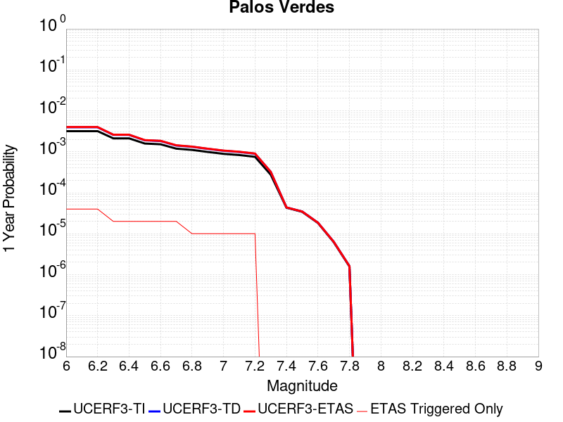 | 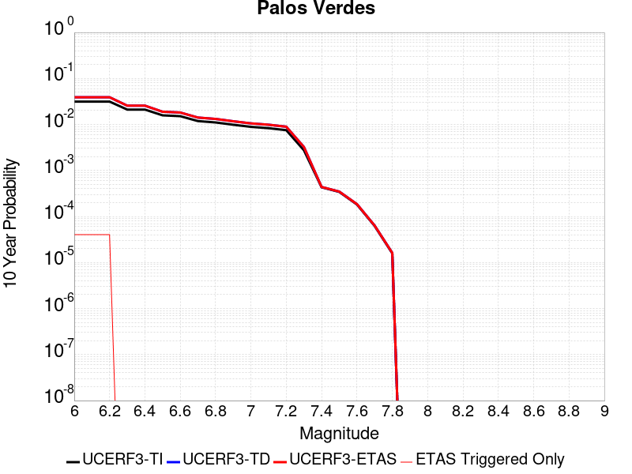 |

| Magnitude | 1 wk TI Prob | 1 wk TD Prob | 1 wk ETAS Prob | 1 wk ETAS/TD Gain | 1 wk ETAS Triggered Only | 1 mo TI Prob | 1 mo TD Prob | 1 mo ETAS Prob | 1 mo ETAS/TD Gain | 1 mo ETAS Triggered Only | 1 yr TI Prob | 1 yr TD Prob | 1 yr ETAS Prob | 1 yr ETAS/TD Gain | 1 yr ETAS Triggered Only | 10 yr TI Prob | 10 yr TD Prob | 10 yr ETAS Prob | 10 yr ETAS/TD Gain | 10 yr ETAS Triggered Only |
|-----|-----|-----|-----|-----|-----|-----|-----|-----|-----|-----|-----|-----|-----|-----|-----|-----|-----|-----|-----|-----|
| 6.0 | 6.126063E-5 | 7.622612E-5 | 1.0622383E-4 | 1.3935359 | 3.0E-5 | 2.6251914E-4 | 3.2664582E-4 | 3.56636E-4 | 1.0918126 | 3.0E-5 | 0.0031914865 | 0.003970174 | 0.004010015 | 1.0100352 | 4.0E-5 | 0.031460393 | 0.039048895 | 0.039106555 | 1.0014765 | 6.0E-5 |
| 6.1 | 6.126063E-5 | 7.622612E-5 | 1.0622383E-4 | 1.3935359 | 3.0E-5 | 2.6251914E-4 | 3.2664582E-4 | 3.56636E-4 | 1.0918126 | 3.0E-5 | 0.0031914865 | 0.003970174 | 0.004010015 | 1.0100352 | 4.0E-5 | 0.031460393 | 0.039048895 | 0.039106555 | 1.0014765 | 6.0E-5 |
| 6.2 | 6.126063E-5 | 7.622612E-5 | 1.0622383E-4 | 1.3935359 | 3.0E-5 | 2.6251914E-4 | 3.2664582E-4 | 3.56636E-4 | 1.0918126 | 3.0E-5 | 0.0031914865 | 0.003970174 | 0.004010015 | 1.0100352 | 4.0E-5 | 0.031460393 | 0.039048895 | 0.039106555 | 1.0014765 | 6.0E-5 |
| 6.3 | 4.0838047E-5 | 4.9749437E-5 | 5.9748938E-5 | 1.2009974 | 1.0E-5 | 1.7500846E-4 | 2.1319572E-4 | 2.2319358E-4 | 1.0468953 | 1.0E-5 | 0.0021286458 | 0.0025927818 | 0.00261273 | 1.0076938 | 2.0E-5 | 0.021083709 | 0.025646681 | 0.025675911 | 1.0011398 | 3.0E-5 |
| 6.4 | 4.0838047E-5 | 4.9749437E-5 | 5.9748938E-5 | 1.2009974 | 1.0E-5 | 1.7500846E-4 | 2.1319572E-4 | 2.2319358E-4 | 1.0468953 | 1.0E-5 | 0.0021286458 | 0.0025927818 | 0.00261273 | 1.0076938 | 2.0E-5 | 0.021083709 | 0.025646681 | 0.025675911 | 1.0011398 | 3.0E-5 |
| 6.5 | 3.0512005E-5 | 3.656162E-5 | 4.6561257E-5 | 1.2735008 | 1.0E-5 | 1.3075917E-4 | 1.5668393E-4 | 1.6668237E-4 | 1.0638127 | 1.0E-5 | 0.0015908304 | 0.0019060767 | 0.0019260385 | 1.0104728 | 2.0E-5 | 0.015794903 | 0.018909154 | 0.018928776 | 1.0010377 | 2.0E-5 |
| 6.6 | 2.9255087E-5 | 3.515442E-5 | 4.515407E-5 | 1.2844492 | 1.0E-5 | 1.2537291E-4 | 1.5065377E-4 | 1.6065226E-4 | 1.0663674 | 1.0E-5 | 0.0015253464 | 0.0018327828 | 0.0018527461 | 1.0108924 | 2.0E-5 | 0.015149189 | 0.018188225 | 0.018207861 | 1.0010796 | 2.0E-5 |
| 6.7 | 2.287198E-5 | 2.7248278E-5 | 3.7248006E-5 | 1.3669857 | 1.0E-5 | 9.801909E-5 | 1.16773626E-4 | 1.2677246E-4 | 1.0856258 | 1.0E-5 | 0.001192729 | 0.0014208833 | 0.001440855 | 1.0140557 | 2.0E-5 | 0.011863477 | 0.014127217 | 0.014146934 | 1.0013957 | 2.0E-5 |
| 6.8 | 2.1325764E-5 | 2.5431877E-5 | 3.543162E-5 | 1.3931973 | 1.0E-5 | 9.139293E-5 | 1.0898971E-4 | 1.18988624E-4 | 1.0917418 | 1.0E-5 | 0.001112141 | 0.0013262323 | 0.001336219 | 1.0075302 | 1.0E-5 | 0.011065915 | 0.013192211 | 0.01320208 | 1.000748 | 1.0E-5 |
| 6.9 | 1.9009392E-5 | 2.2613547E-5 | 3.2613323E-5 | 1.4422028 | 1.0E-5 | 8.1466285E-5 | 9.6912096E-5 | 1.0691113E-4 | 1.1031762 | 1.0E-5 | 9.914007E-4 | 0.0011793535 | 0.0011893417 | 1.0084692 | 1.0E-5 | 0.009869894 | 0.011739632 | 0.011749515 | 1.0008419 | 1.0E-5 |
| 7.0 | 1.7098473E-5 | 2.0319356E-5 | 3.0319152E-5 | 1.4921316 | 1.0E-5 | 7.3277115E-5 | 8.708052E-5 | 9.7079654E-5 | 1.1148262 | 1.0E-5 | 8.917837E-4 | 0.001059775 | 0.0010697644 | 1.009426 | 1.0E-5 | 0.008882134 | 0.010555646 | 0.010565541 | 1.0009373 | 1.0E-5 |
| 7.1 | 1.5982785E-5 | 1.899476E-5 | 2.8994571E-5 | 1.526451 | 1.0E-5 | 6.849585E-5 | 8.1404054E-5 | 9.1403235E-5 | 1.122834 | 1.0E-5 | 8.336179E-4 | 9.907284E-4 | 0.0010007184 | 1.0100836 | 1.0E-5 | 0.008304977 | 0.009871479 | 0.009881381 | 1.001003 | 1.0E-5 |
| 7.2 | 1.4468002E-5 | 1.7197237E-5 | 2.7197064E-5 | 1.5814788 | 1.0E-5 | 6.200425E-5 | 7.370083E-5 | 8.370009E-5 | 1.1356736 | 1.0E-5 | 7.546402E-4 | 8.970222E-4 | 9.0701325E-4 | 1.011138 | 1.0E-5 | 0.007520827 | 0.008942284 | 0.008952194 | 1.0011083 | 1.0E-5 |
| 7.3 | 5.288233E-6 | 6.2036747E-6 | 6.2036747E-6 | 1.0 | 0.0 | 2.2663658E-5 | 2.6587102E-5 | 2.6587102E-5 | 1.0 | 0.0 | 2.7589512E-4 | 3.236848E-4 | 3.236848E-4 | 1.0 | 0.0 | 0.0027555283 | 0.0032355562 | 0.0032355562 | 1.0 | 0.0 |
| 7.4 | 8.279556E-7 | 8.408347E-7 | 8.408347E-7 | 1.0 | 0.0 | 3.5483763E-6 | 3.6035726E-6 | 3.6035726E-6 | 1.0 | 0.0 | 4.3200624E-5 | 4.3872686E-5 | 4.3872686E-5 | 1.0 | 0.0 | 4.3192226E-4 | 4.3864746E-4 | 4.3864746E-4 | 1.0 | 0.0 |
| 7.5 | 6.559831E-7 | 6.667229E-7 | 6.667229E-7 | 1.0 | 0.0 | 2.8113532E-6 | 2.857381E-6 | 2.857381E-6 | 1.0 | 0.0 | 3.4227687E-5 | 3.4788125E-5 | 3.4788125E-5 | 1.0 | 0.0 | 3.4222414E-4 | 3.4783344E-4 | 3.4783344E-4 | 1.0 | 0.0 |
| 7.6 | 3.5018968E-7 | 3.5620027E-7 | 3.5620027E-7 | 1.0 | 0.0 | 1.500812E-6 | 1.526572E-6 | 1.526572E-6 | 1.0 | 0.0 | 1.8272232E-5 | 1.8585903E-5 | 1.8585903E-5 | 1.0 | 0.0 | 1.8270731E-4 | 1.8584808E-4 | 1.8584808E-4 | 1.0 | 0.0 |
| 7.7 | 1.1986104E-7 | 1.2198376E-7 | 1.2198376E-7 | 1.0 | 0.0 | 5.1369005E-7 | 5.2278745E-7 | 5.2278745E-7 | 1.0 | 0.0 | 6.2541585E-6 | 6.364919E-6 | 6.364919E-6 | 1.0 | 0.0 | 6.2539824E-5 | 6.364741E-5 | 6.364741E-5 | 1.0 | 0.0 |
| 7.8 | 3.0445005E-8 | 3.1027582E-8 | 3.1027582E-8 | 1.0 | 0.0 | 1.3047858E-7 | 1.3297536E-7 | 1.3297536E-7 | 1.0 | 0.0 | 1.5885756E-6 | 1.6189739E-6 | 1.6189739E-6 | 1.0 | 0.0 | 1.5885644E-5 | 1.6189642E-5 | 1.6189642E-5 | 1.0 | 0.0 |

## Newport-Inglewood alt 1
*[(top)](#table-of-contents)*

| 1 Week | 1 Month | 1 Year | 10 Year |
|-----|-----|-----|-----|
| 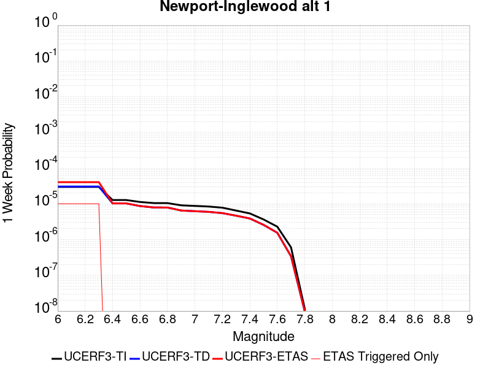 | 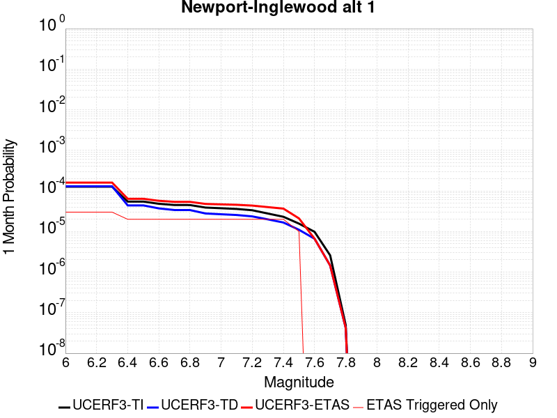 | 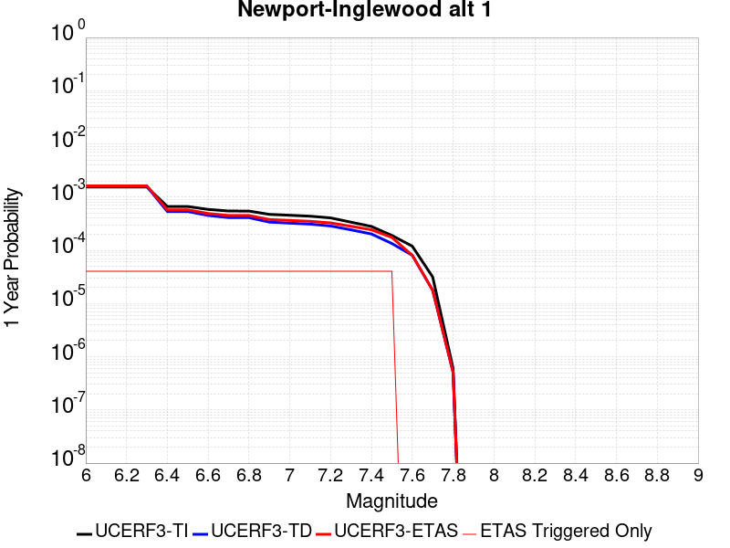 | 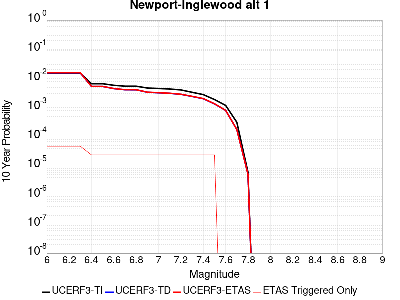 |

| Magnitude | 1 wk TI Prob | 1 wk TD Prob | 1 wk ETAS Prob | 1 wk ETAS/TD Gain | 1 wk ETAS Triggered Only | 1 mo TI Prob | 1 mo TD Prob | 1 mo ETAS Prob | 1 mo ETAS/TD Gain | 1 mo ETAS Triggered Only | 1 yr TI Prob | 1 yr TD Prob | 1 yr ETAS Prob | 1 yr ETAS/TD Gain | 1 yr ETAS Triggered Only | 10 yr TI Prob | 10 yr TD Prob | 10 yr ETAS Prob | 10 yr ETAS/TD Gain | 10 yr ETAS Triggered Only |
|-----|-----|-----|-----|-----|-----|-----|-----|-----|-----|-----|-----|-----|-----|-----|-----|-----|-----|-----|-----|-----|
| 6.0 | 2.9668912E-5 | 3.0404817E-5 | 4.0404513E-5 | 1.3288852 | 1.0E-5 | 1.2714628E-4 | 1.303026E-4 | 1.6029869E-4 | 1.2302033 | 3.0E-5 | 0.0015469068 | 0.0015857625 | 0.0016356832 | 1.0314806 | 5.0E-5 | 0.015361829 | 0.015792042 | 0.015851095 | 1.0037394 | 6.0E-5 |
| 6.1 | 2.9668912E-5 | 3.0404817E-5 | 4.0404513E-5 | 1.3288852 | 1.0E-5 | 1.2714628E-4 | 1.303026E-4 | 1.6029869E-4 | 1.2302033 | 3.0E-5 | 0.0015469068 | 0.0015857625 | 0.0016356832 | 1.0314806 | 5.0E-5 | 0.015361829 | 0.015792042 | 0.015851095 | 1.0037394 | 6.0E-5 |
| 6.2 | 2.9668912E-5 | 3.0404817E-5 | 4.0404513E-5 | 1.3288852 | 1.0E-5 | 1.2714628E-4 | 1.303026E-4 | 1.6029869E-4 | 1.2302033 | 3.0E-5 | 0.0015469068 | 0.0015857625 | 0.0016356832 | 1.0314806 | 5.0E-5 | 0.015361829 | 0.015792042 | 0.015851095 | 1.0037394 | 6.0E-5 |
| 6.3 | 2.9668912E-5 | 3.0404817E-5 | 4.0404513E-5 | 1.3288852 | 1.0E-5 | 1.2714628E-4 | 1.303026E-4 | 1.6029869E-4 | 1.2302033 | 3.0E-5 | 0.0015469068 | 0.0015857625 | 0.0016356832 | 1.0314806 | 5.0E-5 | 0.015361829 | 0.015792042 | 0.015851095 | 1.0037394 | 6.0E-5 |
| 6.4 | 1.275942E-5 | 1.0272503E-5 | 1.0272503E-5 | 1.0 | 0.0 | 5.4682085E-5 | 4.402429E-5 | 6.4023414E-5 | 1.4542747 | 2.0E-5 | 6.65551E-4 | 5.358681E-4 | 5.6585204E-4 | 1.055954 | 3.0E-5 | 0.0066356123 | 0.005346184 | 0.0053760237 | 1.0055815 | 3.0E-5 |
| 6.5 | 1.275942E-5 | 1.0272503E-5 | 1.0272503E-5 | 1.0 | 0.0 | 5.4682085E-5 | 4.402429E-5 | 6.4023414E-5 | 1.4542747 | 2.0E-5 | 6.65551E-4 | 5.358681E-4 | 5.6585204E-4 | 1.055954 | 3.0E-5 | 0.0066356123 | 0.005346184 | 0.0053760237 | 1.0055815 | 3.0E-5 |
| 6.6 | 1.1255358E-5 | 8.661884E-6 | 8.661884E-6 | 1.0 | 0.0 | 4.8236358E-5 | 3.712184E-5 | 5.71211E-5 | 1.5387464 | 2.0E-5 | 5.871194E-4 | 4.518664E-4 | 4.8185283E-4 | 1.0663613 | 3.0E-5 | 0.005855706 | 0.004509653 | 0.0045395177 | 1.0066224 | 3.0E-5 |
| 6.7 | 1.0504745E-5 | 7.8997955E-6 | 7.8997955E-6 | 1.0 | 0.0 | 4.5019555E-5 | 3.3855835E-5 | 5.3855158E-5 | 1.5907202 | 2.0E-5 | 5.4797524E-4 | 4.1211807E-4 | 4.421057E-4 | 1.0727646 | 3.0E-5 | 0.0054662596 | 0.004113668 | 0.0041435445 | 1.0072627 | 3.0E-5 |
| 6.8 | 1.0476007E-5 | 7.881176E-6 | 7.881176E-6 | 1.0 | 0.0 | 4.4896402E-5 | 3.3776043E-5 | 5.3775366E-5 | 1.5921158 | 2.0E-5 | 5.464766E-4 | 4.1114696E-4 | 4.4113462E-4 | 1.0729367 | 3.0E-5 | 0.005451347 | 0.0041039926 | 0.00413387 | 1.00728 | 3.0E-5 |
| 6.9 | 9.076797E-6 | 6.4896312E-6 | 6.4896312E-6 | 1.0 | 0.0 | 3.889998E-5 | 2.781241E-5 | 4.7811853E-5 | 1.7190834 | 2.0E-5 | 4.7350433E-4 | 3.385638E-4 | 3.6855365E-4 | 1.0885795 | 3.0E-5 | 0.004724967 | 0.0033805177 | 0.0034104162 | 1.0088444 | 3.0E-5 |
| 7.0 | 8.73795E-6 | 6.2120125E-6 | 6.2120125E-6 | 1.0 | 0.0 | 3.7447822E-5 | 2.6622642E-5 | 4.662211E-5 | 1.7512202 | 2.0E-5 | 4.5583185E-4 | 3.2408274E-4 | 3.54073E-4 | 1.092539 | 3.0E-5 | 0.0045489795 | 0.0032361327 | 0.0032660356 | 1.0092403 | 3.0E-5 |
| 7.1 | 8.391299E-6 | 5.95579E-6 | 5.95579E-6 | 1.0 | 0.0 | 3.5962214E-5 | 2.5524565E-5 | 4.5524055E-5 | 1.7835388 | 2.0E-5 | 4.37752E-4 | 3.1071753E-4 | 3.3071134E-4 | 1.0643471 | 2.0E-5 | 0.004368907 | 0.0031028606 | 0.0031227984 | 1.0064256 | 2.0E-5 |
| 7.2 | 7.796882E-6 | 5.4965344E-6 | 5.4965344E-6 | 1.0 | 0.0 | 3.341478E-5 | 2.3556364E-5 | 4.3555894E-5 | 1.8490075 | 2.0E-5 | 4.06749E-4 | 2.867612E-4 | 3.0675545E-4 | 1.0697244 | 2.0E-5 | 0.0040600533 | 0.0028639357 | 0.0028838783 | 1.0069634 | 2.0E-5 |
| 7.3 | 6.4738833E-6 | 4.6478162E-6 | 4.6478162E-6 | 1.0 | 0.0 | 2.774492E-5 | 1.9919062E-5 | 3.9918665E-5 | 2.0040433 | 2.0E-5 | 3.3774204E-4 | 2.4248775E-4 | 2.6248288E-4 | 1.0824584 | 2.0E-5 | 0.0033722918 | 0.0024222482 | 0.0024421997 | 1.0082368 | 2.0E-5 |
| 7.4 | 5.382145E-6 | 3.8857597E-6 | 3.8857597E-6 | 1.0 | 0.0 | 2.3066134E-5 | 1.665315E-5 | 3.665282E-5 | 2.200954 | 2.0E-5 | 2.8079396E-4 | 2.0273338E-4 | 2.2272933E-4 | 1.0986317 | 2.0E-5 | 0.0028043943 | 0.0020254988 | 0.0020454584 | 1.0098541 | 2.0E-5 |
| 7.5 | 3.648244E-6 | 2.5737843E-6 | 2.5737843E-6 | 1.0 | 0.0 | 1.5635238E-5 | 1.1030458E-5 | 2.1030348E-5 | 1.9065707 | 1.0E-5 | 1.9034238E-4 | 1.3428765E-4 | 1.4428631E-4 | 1.074457 | 1.0E-5 | 0.0019017943 | 0.0013420755 | 0.0013520621 | 1.0074412 | 1.0E-5 |
| 7.6 | 2.2906888E-6 | 1.5479842E-6 | 1.5479842E-6 | 1.0 | 0.0 | 9.817201E-6 | 6.634202E-6 | 6.634202E-6 | 1.0 | 0.0 | 1.1951787E-4 | 8.076848E-5 | 8.076848E-5 | 1.0 | 0.0 | 0.0011945361 | 8.07398E-4 | 8.07398E-4 | 1.0 | 0.0 |
| 7.7 | 6.0479874E-7 | 3.397512E-7 | 3.397512E-7 | 1.0 | 0.0 | 2.5919921E-6 | 1.4560758E-6 | 1.4560758E-6 | 1.0 | 0.0 | 3.1557047E-5 | 1.7727592E-5 | 1.7727592E-5 | 1.0 | 0.0 | 3.1552566E-4 | 1.7726317E-4 | 1.7726317E-4 | 1.0 | 0.0 |
| 7.8 | 1.16056995E-8 | 9.782373E-9 | 9.782373E-9 | 1.0 | 0.0 | 4.9738713E-8 | 4.1924455E-8 | 4.1924455E-8 | 1.0 | 0.0 | 6.0556863E-7 | 5.1043025E-7 | 5.1043025E-7 | 1.0 | 0.0 | 6.05567E-6 | 5.1043025E-6 | 5.1043025E-6 | 1.0 | 0.0 |

## Kern Canyon (South Kern) 2011
*[(top)](#table-of-contents)*

| 1 Week | 1 Month | 1 Year | 10 Year |
|-----|-----|-----|-----|
| 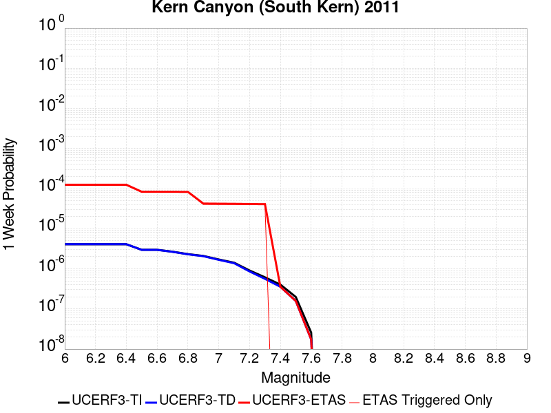 | 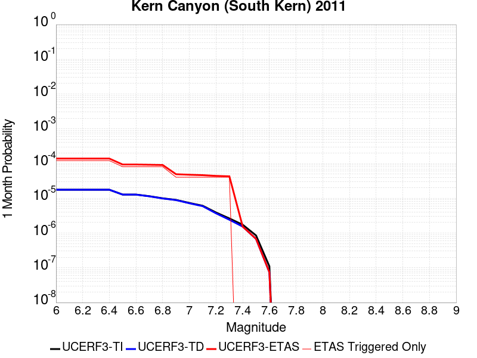 | 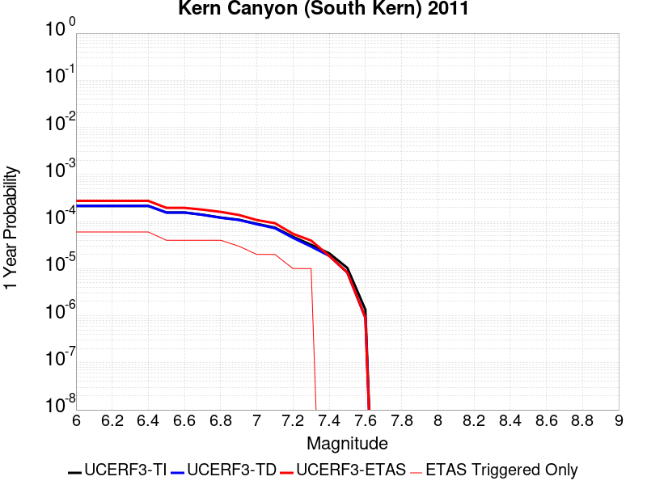 | 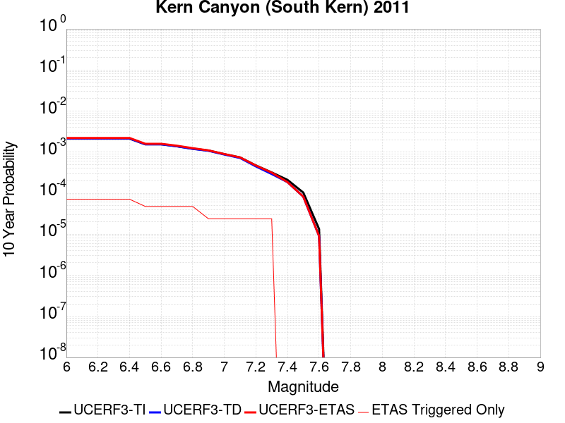 |

| Magnitude | 1 wk TI Prob | 1 wk TD Prob | 1 wk ETAS Prob | 1 wk ETAS/TD Gain | 1 wk ETAS Triggered Only | 1 mo TI Prob | 1 mo TD Prob | 1 mo ETAS Prob | 1 mo ETAS/TD Gain | 1 mo ETAS Triggered Only | 1 yr TI Prob | 1 yr TD Prob | 1 yr ETAS Prob | 1 yr ETAS/TD Gain | 1 yr ETAS Triggered Only | 10 yr TI Prob | 10 yr TD Prob | 10 yr ETAS Prob | 10 yr ETAS/TD Gain | 10 yr ETAS Triggered Only |
|-----|-----|-----|-----|-----|-----|-----|-----|-----|-----|-----|-----|-----|-----|-----|-----|-----|-----|-----|-----|-----|
| 6.0 | 4.105075E-6 | 4.1137264E-6 | 3.4113604E-5 | 8.292628 | 3.0E-5 | 1.7593058E-5 | 1.763014E-5 | 5.7629437E-5 | 3.2688017 | 4.0E-5 | 2.1417443E-4 | 2.1462646E-4 | 2.746136E-4 | 1.2794955 | 6.0E-5 | 0.0021396813 | 0.0021442557 | 0.0022041271 | 1.0279218 | 6.0E-5 |
| 6.1 | 4.105075E-6 | 4.1137264E-6 | 3.4113604E-5 | 8.292628 | 3.0E-5 | 1.7593058E-5 | 1.763014E-5 | 5.7629437E-5 | 3.2688017 | 4.0E-5 | 2.1417443E-4 | 2.1462646E-4 | 2.746136E-4 | 1.2794955 | 6.0E-5 | 0.0021396813 | 0.0021442557 | 0.0022041271 | 1.0279218 | 6.0E-5 |
| 6.2 | 4.105075E-6 | 4.1137264E-6 | 3.4113604E-5 | 8.292628 | 3.0E-5 | 1.7593058E-5 | 1.763014E-5 | 5.7629437E-5 | 3.2688017 | 4.0E-5 | 2.1417443E-4 | 2.1462646E-4 | 2.746136E-4 | 1.2794955 | 6.0E-5 | 0.0021396813 | 0.0021442557 | 0.0022041271 | 1.0279218 | 6.0E-5 |
| 6.3 | 4.105075E-6 | 4.1137264E-6 | 3.4113604E-5 | 8.292628 | 3.0E-5 | 1.7593058E-5 | 1.763014E-5 | 5.7629437E-5 | 3.2688017 | 4.0E-5 | 2.1417443E-4 | 2.1462646E-4 | 2.746136E-4 | 1.2794955 | 6.0E-5 | 0.0021396813 | 0.0021442557 | 0.0022041271 | 1.0279218 | 6.0E-5 |
| 6.4 | 4.105075E-6 | 4.1137264E-6 | 3.4113604E-5 | 8.292628 | 3.0E-5 | 1.7593058E-5 | 1.763014E-5 | 5.7629437E-5 | 3.2688017 | 4.0E-5 | 2.1417443E-4 | 2.1462646E-4 | 2.746136E-4 | 1.2794955 | 6.0E-5 | 0.0021396813 | 0.0021442557 | 0.0022041271 | 1.0279218 | 6.0E-5 |
| 6.5 | 2.9849807E-6 | 2.9731548E-6 | 2.2973096E-5 | 7.7268414 | 2.0E-5 | 1.2792712E-5 | 1.274203E-5 | 3.2741777E-5 | 2.5695887 | 2.0E-5 | 1.5574014E-4 | 1.5512333E-4 | 1.9511711E-4 | 1.2578193 | 4.0E-5 | 0.0015563103 | 0.0015501656 | 0.0015901036 | 1.0257638 | 4.0E-5 |
| 6.6 | 2.9849807E-6 | 2.9731548E-6 | 2.2973096E-5 | 7.7268414 | 2.0E-5 | 1.2792712E-5 | 1.274203E-5 | 3.2741777E-5 | 2.5695887 | 2.0E-5 | 1.5574014E-4 | 1.5512333E-4 | 1.9511711E-4 | 1.2578193 | 4.0E-5 | 0.0015563103 | 0.0015501656 | 0.0015901036 | 1.0257638 | 4.0E-5 |
| 6.7 | 2.6756725E-6 | 2.6582206E-6 | 2.2658167E-5 | 8.523809 | 2.0E-5 | 1.1467117E-5 | 1.1392325E-5 | 3.1392097E-5 | 2.7555478 | 2.0E-5 | 1.396032E-4 | 1.3869285E-4 | 1.7868729E-4 | 1.2883672 | 4.0E-5 | 0.0013951553 | 0.0013860738 | 0.0014260183 | 1.0288185 | 4.0E-5 |
| 6.8 | 2.3283721E-6 | 2.3047787E-6 | 2.2304732E-5 | 9.677602 | 2.0E-5 | 9.9787E-6 | 9.877586E-6 | 2.9877388E-5 | 3.0247662 | 2.0E-5 | 1.214839E-4 | 1.20253055E-4 | 1.6024824E-4 | 1.3325919 | 4.0E-5 | 0.001214175 | 0.0012018873 | 0.0012418393 | 1.033241 | 4.0E-5 |
| 6.9 | 2.0972677E-6 | 2.0696411E-6 | 1.206962E-5 | 5.8317456 | 1.0E-5 | 8.988259E-6 | 8.869861E-6 | 1.8869772E-5 | 2.1274035 | 1.0E-5 | 1.0942656E-4 | 1.0798526E-4 | 1.3798202E-4 | 1.2777857 | 3.0E-5 | 0.0010937268 | 0.0010793337 | 0.0011093013 | 1.0277649 | 3.0E-5 |
| 7.0 | 1.7132242E-6 | 1.6787036E-6 | 1.1678687E-5 | 6.956968 | 1.0E-5 | 7.3423685E-6 | 7.194424E-6 | 1.7194352E-5 | 2.3899553 | 1.0E-5 | 8.938967E-5 | 8.758863E-5 | 1.0758688E-4 | 1.2283201 | 2.0E-5 | 8.935372E-4 | 8.7554497E-4 | 8.955274E-4 | 1.0228229 | 2.0E-5 |
| 7.1 | 1.4215541E-6 | 1.3815752E-6 | 1.1381561E-5 | 8.238105 | 1.0E-5 | 6.0923603E-6 | 5.9210233E-6 | 1.5920965E-5 | 2.6888874 | 1.0E-5 | 7.417196E-5 | 7.20861E-5 | 9.208466E-5 | 1.277426 | 2.0E-5 | 7.414721E-4 | 7.206299E-4 | 7.406155E-4 | 1.0277334 | 2.0E-5 |
| 7.2 | 9.097853E-7 | 8.6037755E-7 | 1.0860369E-5 | 12.622794 | 1.0E-5 | 3.899074E-6 | 3.6873273E-6 | 1.368729E-5 | 3.7119815 | 1.0E-5 | 4.7470192E-5 | 4.4892295E-5 | 5.4891847E-5 | 1.2227454 | 1.0E-5 | 4.7460053E-4 | 4.4883334E-4 | 4.5882884E-4 | 1.02227 | 1.0E-5 |
| 7.3 | 6.144169E-7 | 5.628206E-7 | 1.0562815E-5 | 18.767641 | 1.0E-5 | 2.6332125E-6 | 2.4120861E-6 | 1.24120625E-5 | 5.1457787 | 1.0E-5 | 3.205889E-5 | 2.9366758E-5 | 3.9366467E-5 | 1.3405111 | 1.0E-5 | 3.2054266E-4 | 2.936293E-4 | 3.0362635E-4 | 1.0340465 | 1.0E-5 |
| 7.4 | 4.049844E-7 | 3.5728314E-7 | 3.5728314E-7 | 1.0 | 0.0 | 1.7356463E-6 | 1.5312125E-6 | 1.5312125E-6 | 1.0 | 0.0 | 2.1131287E-5 | 1.8642357E-5 | 1.8642357E-5 | 1.0 | 0.0 | 2.1129279E-4 | 1.8640817E-4 | 1.8640817E-4 | 1.0 | 0.0 |
| 7.5 | 1.9871162E-7 | 1.583044E-7 | 1.583044E-7 | 1.0 | 0.0 | 8.5162094E-7 | 6.7844724E-7 | 6.7844724E-7 | 1.0 | 0.0 | 1.0368436E-5 | 8.260065E-6 | 8.260065E-6 | 1.0 | 0.0 | 1.0367952E-4 | 8.259767E-5 | 8.259767E-5 | 1.0 | 0.0 |
| 7.6 | 2.572245E-8 | 1.7352555E-8 | 1.7352555E-8 | 1.0 | 0.0 | 1.10239064E-7 | 7.436809E-8 | 7.436809E-8 | 1.0 | 0.0 | 1.3421597E-6 | 9.054312E-7 | 9.054312E-7 | 1.0 | 0.0 | 1.3421517E-5 | 9.05428E-6 | 9.05428E-6 | 1.0 | 0.0 |

## San Andreas (Santa Cruz Mts) 2011 CFM
*[(top)](#table-of-contents)*

| 1 Week | 1 Month | 1 Year | 10 Year |
|-----|-----|-----|-----|
| 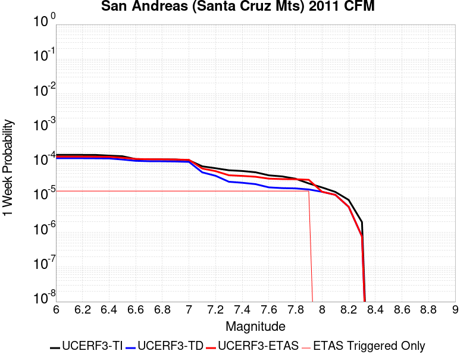 | 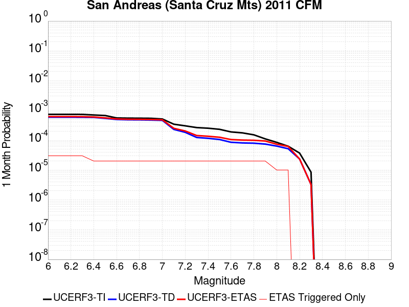 | 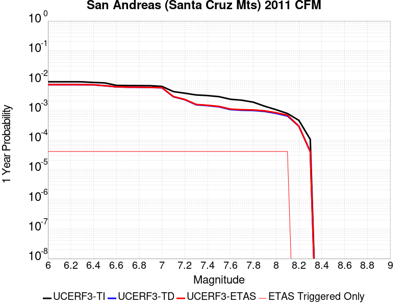 | 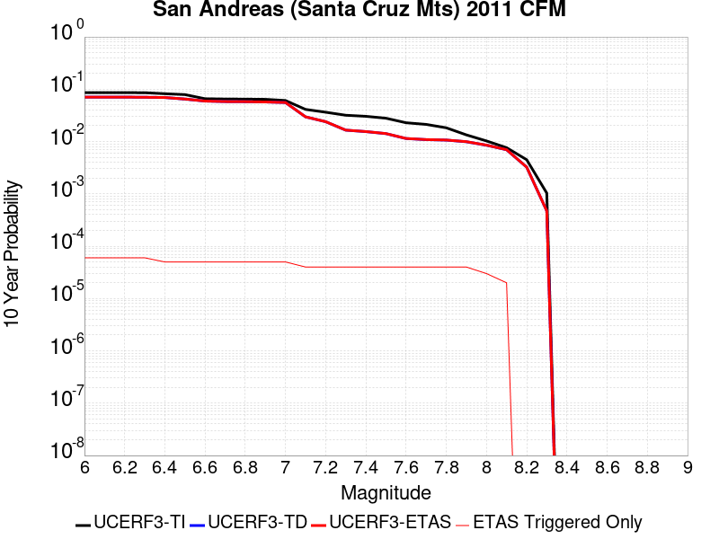 |

| Magnitude | 1 wk TI Prob | 1 wk TD Prob | 1 wk ETAS Prob | 1 wk ETAS/TD Gain | 1 wk ETAS Triggered Only | 1 mo TI Prob | 1 mo TD Prob | 1 mo ETAS Prob | 1 mo ETAS/TD Gain | 1 mo ETAS Triggered Only | 1 yr TI Prob | 1 yr TD Prob | 1 yr ETAS Prob | 1 yr ETAS/TD Gain | 1 yr ETAS Triggered Only | 10 yr TI Prob | 10 yr TD Prob | 10 yr ETAS Prob | 10 yr ETAS/TD Gain | 10 yr ETAS Triggered Only |
|-----|-----|-----|-----|-----|-----|-----|-----|-----|-----|-----|-----|-----|-----|-----|-----|-----|-----|-----|-----|-----|
| 6.0 | 1.7221631E-4 | 1.3793171E-4 | 1.4793033E-4 | 1.0724896 | 1.0E-5 | 7.378611E-4 | 5.9100403E-4 | 6.209863E-4 | 1.0507311 | 3.0E-5 | 0.008946515 | 0.007172124 | 0.007211837 | 1.0055372 | 4.0E-5 | 0.08594794 | 0.0705551 | 0.070610866 | 1.0007904 | 6.0E-5 |
| 6.1 | 1.7221631E-4 | 1.3793171E-4 | 1.4793033E-4 | 1.0724896 | 1.0E-5 | 7.378611E-4 | 5.9100403E-4 | 6.209863E-4 | 1.0507311 | 3.0E-5 | 0.008946515 | 0.007172124 | 0.007211837 | 1.0055372 | 4.0E-5 | 0.08594794 | 0.0705551 | 0.070610866 | 1.0007904 | 6.0E-5 |
| 6.2 | 1.7221631E-4 | 1.3793171E-4 | 1.4793033E-4 | 1.0724896 | 1.0E-5 | 7.378611E-4 | 5.9100403E-4 | 6.209863E-4 | 1.0507311 | 3.0E-5 | 0.008946515 | 0.007172124 | 0.007211837 | 1.0055372 | 4.0E-5 | 0.08594794 | 0.0705551 | 0.070610866 | 1.0007904 | 6.0E-5 |
| 6.3 | 1.716926E-4 | 1.3712609E-4 | 1.4712471E-4 | 1.0729156 | 1.0E-5 | 7.3561794E-4 | 5.875529E-4 | 6.1753526E-4 | 1.0510292 | 3.0E-5 | 0.008919428 | 0.0071303817 | 0.0071700965 | 1.0055698 | 4.0E-5 | 0.08569809 | 0.070167266 | 0.070223056 | 1.0007951 | 6.0E-5 |
| 6.4 | 1.6392978E-4 | 1.3588481E-4 | 1.4588344E-4 | 1.0735817 | 1.0E-5 | 7.02367E-4 | 5.822355E-4 | 6.0222385E-4 | 1.0343304 | 2.0E-5 | 0.008517839 | 0.007066063 | 0.007095851 | 1.0042156 | 3.0E-5 | 0.08198654 | 0.06940135 | 0.06944788 | 1.0006704 | 5.0E-5 |
| 6.5 | 1.5742714E-4 | 1.2648388E-4 | 1.364826E-4 | 1.0790515 | 1.0E-5 | 6.745133E-4 | 5.4196286E-4 | 5.61952E-4 | 1.0368829 | 2.0E-5 | 0.00818132 | 0.0065787593 | 0.0066085616 | 1.0045301 | 3.0E-5 | 0.078865945 | 0.06486309 | 0.06490985 | 1.0007209 | 5.0E-5 |
| 6.6 | 1.3038084E-4 | 1.1588213E-4 | 1.2588098E-4 | 1.0862846 | 1.0E-5 | 5.5865536E-4 | 4.9654447E-4 | 5.1653455E-4 | 1.0402584 | 2.0E-5 | 0.006780438 | 0.0060289134 | 0.0060587325 | 1.004946 | 3.0E-5 | 0.0657725 | 0.05932738 | 0.05937441 | 1.0007927 | 5.0E-5 |
| 6.7 | 1.2867592E-4 | 1.1314701E-4 | 1.2314587E-4 | 1.0883706 | 1.0E-5 | 5.5135164E-4 | 4.8482692E-4 | 5.0481723E-4 | 1.0412319 | 2.0E-5 | 0.0066920654 | 0.00588703 | 0.005916854 | 1.0050659 | 3.0E-5 | 0.06494093 | 0.058038417 | 0.058085516 | 1.0008115 | 5.0E-5 |
| 6.8 | 1.2801298E-4 | 1.1252261E-4 | 1.2252148E-4 | 1.088861 | 1.0E-5 | 5.485117E-4 | 4.8215193E-4 | 5.021423E-4 | 1.0414608 | 2.0E-5 | 0.0066577005 | 0.0058546383 | 0.0058844625 | 1.0050942 | 3.0E-5 | 0.06461738 | 0.057752274 | 0.057799384 | 1.0008157 | 5.0E-5 |
| 6.9 | 1.269149E-4 | 1.1094465E-4 | 1.2094354E-4 | 1.0901251 | 1.0E-5 | 5.4380763E-4 | 4.7539172E-4 | 4.9538224E-4 | 1.0420506 | 2.0E-5 | 0.006600777 | 0.005772772 | 0.005802599 | 1.0051668 | 3.0E-5 | 0.06408122 | 0.0570241 | 0.057071246 | 1.0008268 | 5.0E-5 |
| 7.0 | 1.2030331E-4 | 1.0824504E-4 | 1.1824395E-4 | 1.092373 | 1.0E-5 | 5.154837E-4 | 4.638261E-4 | 4.838168E-4 | 1.0430996 | 2.0E-5 | 0.006257969 | 0.0056326967 | 0.0056625274 | 1.005296 | 3.0E-5 | 0.06084648 | 0.055696685 | 0.055743903 | 1.0008477 | 5.0E-5 |
| 7.1 | 8.049617E-5 | 5.3926604E-5 | 6.392606E-5 | 1.1854272 | 1.0E-5 | 3.4493793E-4 | 2.3109373E-4 | 2.510891E-4 | 1.086525 | 2.0E-5 | 0.0041915346 | 0.0028099709 | 0.0028398866 | 1.0106462 | 3.0E-5 | 0.041133516 | 0.029618956 | 0.029657772 | 1.0013105 | 4.0E-5 |
| 7.2 | 7.093979E-5 | 4.2937932E-5 | 5.2937503E-5 | 1.2328843 | 1.0E-5 | 3.0399222E-4 | 1.8400686E-4 | 2.0400317E-4 | 1.1086715 | 2.0E-5 | 0.0036948253 | 0.0022380045 | 0.0022679374 | 1.0133748 | 3.0E-5 | 0.03633994 | 0.023941692 | 0.023980733 | 1.0016308 | 4.0E-5 |
| 7.3 | 6.193693E-5 | 2.8894141E-5 | 3.8893853E-5 | 1.3460809 | 1.0E-5 | 2.6541698E-4 | 1.2382616E-4 | 1.438237E-4 | 1.1614968 | 2.0E-5 | 0.0032266637 | 0.0015065427 | 0.0015364975 | 1.0198832 | 3.0E-5 | 0.031802133 | 0.016499156 | 0.016538497 | 1.0023844 | 4.0E-5 |
| 7.4 | 5.906492E-5 | 2.702346E-5 | 3.702319E-5 | 1.3700389 | 1.0E-5 | 2.5311083E-4 | 1.1580969E-4 | 1.3580738E-4 | 1.1726772 | 2.0E-5 | 0.0030772698 | 0.0014090725 | 0.0014390303 | 1.0212606 | 3.0E-5 | 0.030350044 | 0.015471023 | 0.015510404 | 1.0025455 | 4.0E-5 |
| 7.5 | 5.424296E-5 | 2.4678277E-5 | 3.467803E-5 | 1.4052047 | 1.0E-5 | 2.324491E-4 | 1.05759755E-4 | 1.2575764E-4 | 1.1890879 | 2.0E-5 | 0.002826395 | 0.0012868657 | 0.001316827 | 1.0232824 | 3.0E-5 | 0.027907165 | 0.014163188 | 0.014202621 | 1.0027843 | 4.0E-5 |
| 7.6 | 4.43084E-5 | 1.990431E-5 | 2.9904111E-5 | 1.5023937 | 1.0E-5 | 1.8987931E-4 | 8.53014E-5 | 1.0529969E-4 | 1.2344427 | 2.0E-5 | 0.0023093296 | 0.0010380499 | 0.0010680188 | 1.0288703 | 3.0E-5 | 0.022854783 | 0.011412679 | 0.011452223 | 1.0034648 | 4.0E-5 |
| 7.7 | 4.118098E-5 | 1.8936442E-5 | 2.8936252E-5 | 1.5280724 | 1.0E-5 | 1.7647797E-4 | 8.115366E-5 | 1.01152036E-4 | 1.2464261 | 2.0E-5 | 0.002146502 | 9.875982E-4 | 0.0010175685 | 1.0303468 | 3.0E-5 | 0.021258866 | 0.010870468 | 0.010910033 | 1.0036397 | 4.0E-5 |
| 7.8 | 3.5408906E-5 | 1.856446E-5 | 2.8564275E-5 | 1.5386536 | 1.0E-5 | 1.5174363E-4 | 7.955955E-5 | 9.9557954E-5 | 1.251364 | 2.0E-5 | 0.0018459131 | 9.682073E-4 | 9.981783E-4 | 1.0309551 | 3.0E-5 | 0.018306552 | 0.010652021 | 0.010691594 | 1.0037152 | 4.0E-5 |
| 7.9 | 2.5860836E-5 | 1.7315993E-5 | 2.731582E-5 | 1.5774908 | 1.0E-5 | 1.10827445E-4 | 7.420929E-5 | 9.4207804E-5 | 1.2694881 | 2.0E-5 | 0.001348489 | 9.031238E-4 | 9.3309674E-4 | 1.033188 | 3.0E-5 | 0.013403354 | 0.009907599 | 0.009947202 | 1.0039973 | 4.0E-5 |
| 8.0 | 1.9777332E-5 | 1.4839596E-5 | 1.4839596E-5 | 1.0 | 0.0 | 8.4757245E-5 | 6.3596715E-5 | 7.3596086E-5 | 1.1572309 | 1.0E-5 | 0.0010314309 | 7.740152E-4 | 7.939997E-4 | 1.0258193 | 2.0E-5 | 0.010266567 | 0.008508967 | 0.008538713 | 1.0034957 | 3.0E-5 |
| 8.1 | 1.468494E-5 | 1.2107374E-5 | 1.2107374E-5 | 1.0 | 0.0 | 6.293394E-5 | 5.1887713E-5 | 6.188719E-5 | 1.1927139 | 1.0E-5 | 7.6595135E-4 | 6.3155E-4 | 6.515373E-4 | 1.0316482 | 2.0E-5 | 0.0076331664 | 0.006969149 | 0.0069890097 | 1.0028498 | 2.0E-5 |
| 8.2 | 8.63836E-6 | 5.469061E-6 | 5.469061E-6 | 1.0 | 0.0 | 3.7021015E-5 | 2.3438623E-5 | 2.3438623E-5 | 1.0 | 0.0 | 4.5063766E-4 | 2.8532793E-4 | 2.8532793E-4 | 1.0 | 0.0 | 0.004497249 | 0.00324569 | 0.00324569 | 1.0 | 0.0 |
| 8.3 | 1.983087E-6 | 7.6599065E-7 | 7.6599065E-7 | 1.0 | 0.0 | 8.498917E-6 | 3.282813E-6 | 3.282813E-6 | 1.0 | 0.0 | 1.034694E-4 | 3.9967534E-5 | 3.9967534E-5 | 1.0 | 0.0 | 0.0010342124 | 4.719687E-4 | 4.719687E-4 | 1.0 | 0.0 |

## Ortigalita (South)
*[(top)](#table-of-contents)*

| 1 Week | 1 Month | 1 Year | 10 Year |
|-----|-----|-----|-----|
| 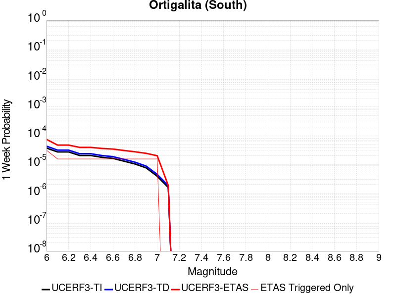 | 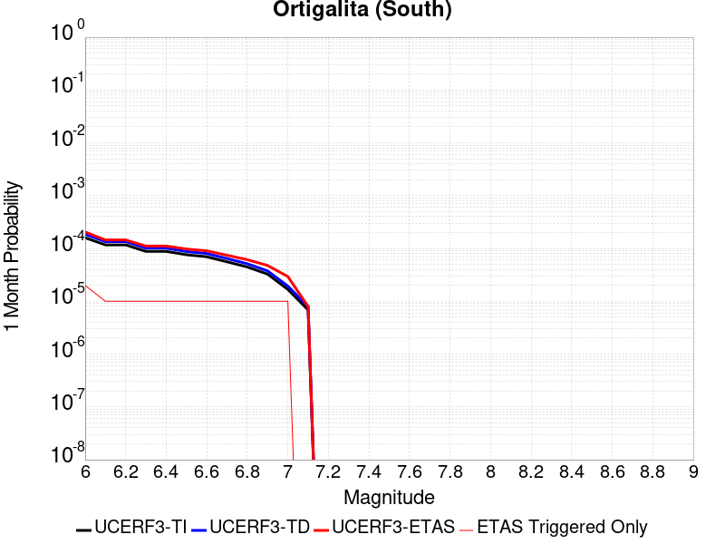 |  | 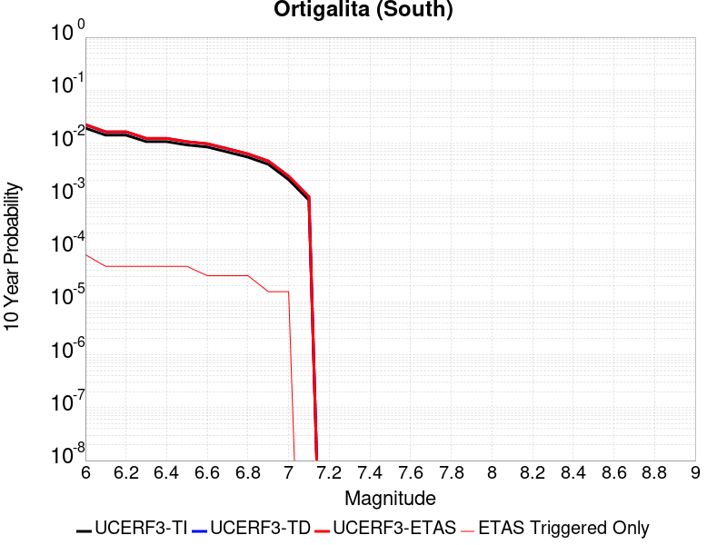 |

| Magnitude | 1 wk TI Prob | 1 wk TD Prob | 1 wk ETAS Prob | 1 wk ETAS/TD Gain | 1 wk ETAS Triggered Only | 1 mo TI Prob | 1 mo TD Prob | 1 mo ETAS Prob | 1 mo ETAS/TD Gain | 1 mo ETAS Triggered Only | 1 yr TI Prob | 1 yr TD Prob | 1 yr ETAS Prob | 1 yr ETAS/TD Gain | 1 yr ETAS Triggered Only | 10 yr TI Prob | 10 yr TD Prob | 10 yr ETAS Prob | 10 yr ETAS/TD Gain | 10 yr ETAS Triggered Only |
|-----|-----|-----|-----|-----|-----|-----|-----|-----|-----|-----|-----|-----|-----|-----|-----|-----|-----|-----|-----|-----|
| 6.0 | 3.72394E-5 | 4.325562E-5 | 6.325475E-5 | 1.4623477 | 2.0E-5 | 1.5958765E-4 | 1.8536893E-4 | 2.0536523E-4 | 1.107873 | 2.0E-5 | 0.0019412481 | 0.0022546875 | 0.0023045747 | 1.0221261 | 5.0E-5 | 0.019243775 | 0.022334497 | 0.022393156 | 1.0026264 | 6.0E-5 |
| 6.1 | 2.7299884E-5 | 3.149204E-5 | 4.1491727E-5 | 1.3175305 | 1.0E-5 | 1.16994255E-4 | 1.3495922E-4 | 1.4495787E-4 | 1.0740864 | 1.0E-5 | 0.0014234743 | 0.0016419457 | 0.0016718964 | 1.018241 | 3.0E-5 | 0.014143906 | 0.01630407 | 0.016343419 | 1.0024134 | 4.0E-5 |
| 6.2 | 2.7299884E-5 | 3.149204E-5 | 4.1491727E-5 | 1.3175305 | 1.0E-5 | 1.16994255E-4 | 1.3495922E-4 | 1.4495787E-4 | 1.0740864 | 1.0E-5 | 0.0014234743 | 0.0016419457 | 0.0016718964 | 1.018241 | 3.0E-5 | 0.014143906 | 0.01630407 | 0.016343419 | 1.0024134 | 4.0E-5 |
| 6.3 | 2.0546433E-5 | 2.363145E-5 | 3.3631215E-5 | 1.4231548 | 1.0E-5 | 8.805317E-5 | 1.0127382E-4 | 1.11272806E-4 | 1.0987322 | 1.0E-5 | 0.00107152 | 0.0012323303 | 0.0012622933 | 1.0243142 | 3.0E-5 | 0.010663681 | 0.01225703 | 0.01229654 | 1.0032234 | 4.0E-5 |
| 6.4 | 2.0546433E-5 | 2.363145E-5 | 3.3631215E-5 | 1.4231548 | 1.0E-5 | 8.805317E-5 | 1.0127382E-4 | 1.11272806E-4 | 1.0987322 | 1.0E-5 | 0.00107152 | 0.0012323303 | 0.0012622933 | 1.0243142 | 3.0E-5 | 0.010663681 | 0.01225703 | 0.01229654 | 1.0032234 | 4.0E-5 |
| 6.5 | 1.7779594E-5 | 2.0446974E-5 | 3.0446769E-5 | 1.4890599 | 1.0E-5 | 7.619603E-5 | 8.762702E-5 | 9.762614E-5 | 1.11411 | 1.0E-5 | 9.272918E-4 | 0.0010663504 | 0.0010963185 | 1.0281034 | 3.0E-5 | 0.009234319 | 0.010613803 | 0.010653378 | 1.0037286 | 4.0E-5 |
| 6.6 | 1.6272212E-5 | 1.8714967E-5 | 2.871478E-5 | 1.5343217 | 1.0E-5 | 6.973618E-5 | 8.0204605E-5 | 9.02038E-5 | 1.1246711 | 1.0E-5 | 8.487073E-4 | 9.760658E-4 | 9.960464E-4 | 1.0204704 | 2.0E-5 | 0.008454733 | 0.009719091 | 0.009748799 | 1.0030568 | 3.0E-5 |
| 6.7 | 1.3051484E-5 | 1.5038758E-5 | 2.5038607E-5 | 1.6649386 | 1.0E-5 | 5.593373E-5 | 6.445028E-5 | 7.4449636E-5 | 1.1551484 | 1.0E-5 | 6.807804E-4 | 7.844092E-4 | 8.043935E-4 | 1.0254769 | 2.0E-5 | 0.006786986 | 0.007817388 | 0.007847154 | 1.0038075 | 3.0E-5 |
| 6.8 | 1.04277415E-5 | 1.1987235E-5 | 2.1987114E-5 | 1.8342108 | 1.0E-5 | 4.4689557E-5 | 5.1372896E-5 | 6.137238E-5 | 1.1946452 | 1.0E-5 | 5.439595E-4 | 6.2529295E-4 | 6.452804E-4 | 1.031965 | 2.0E-5 | 0.0054262993 | 0.00623609 | 0.006265903 | 1.0047807 | 3.0E-5 |
| 6.9 | 7.639968E-6 | 8.791503E-6 | 1.8791416E-5 | 2.137452 | 1.0E-5 | 3.274231E-5 | 3.767736E-5 | 4.7676982E-5 | 1.2654014 | 1.0E-5 | 3.9856473E-4 | 4.586312E-4 | 4.78622E-4 | 1.043588 | 2.0E-5 | 0.003978506 | 0.004577433 | 0.0045973416 | 1.0043492 | 2.0E-5 |
| 7.0 | 3.919831E-6 | 4.5334014E-6 | 1.4533356E-5 | 3.2058394 | 1.0E-5 | 1.679917E-5 | 1.942873E-5 | 2.9428536E-5 | 1.5146917 | 1.0E-5 | 2.045107E-4 | 2.3652123E-4 | 2.565165E-4 | 1.084539 | 2.0E-5 | 0.0020432258 | 0.0023629034 | 0.0023828563 | 1.0084442 | 2.0E-5 |
| 7.1 | 1.6017933E-6 | 1.8570418E-6 | 1.8570418E-6 | 1.0 | 0.0 | 6.8648105E-6 | 7.958732E-6 | 7.958732E-6 | 1.0 | 0.0 | 8.357586E-5 | 9.689432E-5 | 1.0689335E-4 | 1.1031952 | 1.0E-5 | 8.3544437E-4 | 9.686254E-4 | 9.786157E-4 | 1.0103139 | 1.0E-5 |

## Santa Monica alt 1
*[(top)](#table-of-contents)*

| 1 Week | 1 Month | 1 Year | 10 Year |
|-----|-----|-----|-----|
| 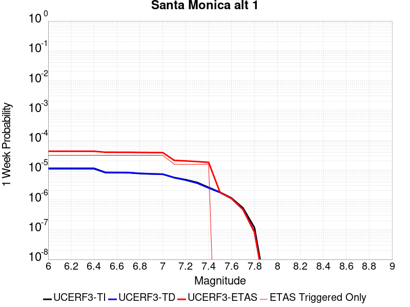 | 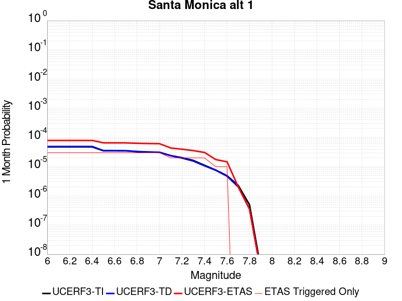 | 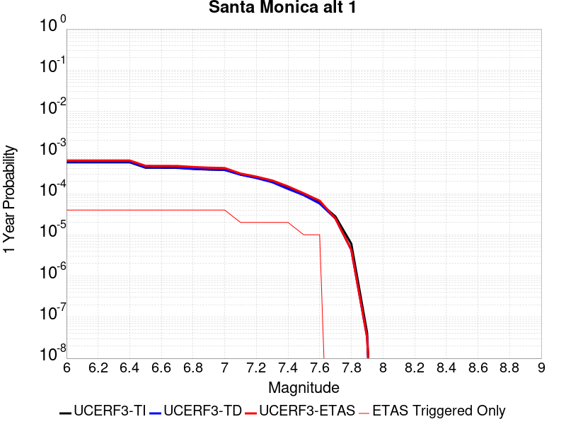 | 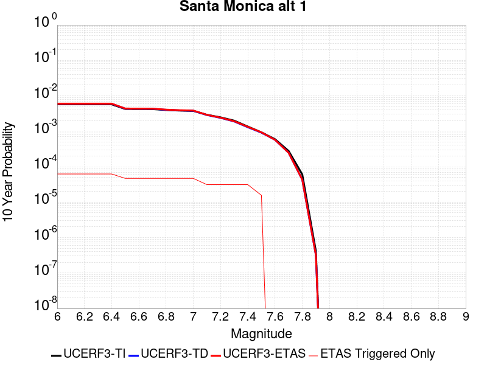 |

| Magnitude | 1 wk TI Prob | 1 wk TD Prob | 1 wk ETAS Prob | 1 wk ETAS/TD Gain | 1 wk ETAS Triggered Only | 1 mo TI Prob | 1 mo TD Prob | 1 mo ETAS Prob | 1 mo ETAS/TD Gain | 1 mo ETAS Triggered Only | 1 yr TI Prob | 1 yr TD Prob | 1 yr ETAS Prob | 1 yr ETAS/TD Gain | 1 yr ETAS Triggered Only | 10 yr TI Prob | 10 yr TD Prob | 10 yr ETAS Prob | 10 yr ETAS/TD Gain | 10 yr ETAS Triggered Only |
|-----|-----|-----|-----|-----|-----|-----|-----|-----|-----|-----|-----|-----|-----|-----|-----|-----|-----|-----|-----|-----|
| 6.0 | 1.1066008E-5 | 1.148031E-5 | 4.1479965E-5 | 3.6131399 | 3.0E-5 | 4.742488E-5 | 4.920048E-5 | 7.9199E-5 | 1.6097201 | 3.0E-5 | 5.7724497E-4 | 5.9886515E-4 | 6.388412E-4 | 1.066753 | 4.0E-5 | 0.005757478 | 0.0059739 | 0.0060335416 | 1.0099837 | 6.0E-5 |
| 6.1 | 1.1066008E-5 | 1.148031E-5 | 4.1479965E-5 | 3.6131399 | 3.0E-5 | 4.742488E-5 | 4.920048E-5 | 7.9199E-5 | 1.6097201 | 3.0E-5 | 5.7724497E-4 | 5.9886515E-4 | 6.388412E-4 | 1.066753 | 4.0E-5 | 0.005757478 | 0.0059739 | 0.0060335416 | 1.0099837 | 6.0E-5 |
| 6.2 | 1.1066008E-5 | 1.148031E-5 | 4.1479965E-5 | 3.6131399 | 3.0E-5 | 4.742488E-5 | 4.920048E-5 | 7.9199E-5 | 1.6097201 | 3.0E-5 | 5.7724497E-4 | 5.9886515E-4 | 6.388412E-4 | 1.066753 | 4.0E-5 | 0.005757478 | 0.0059739 | 0.0060335416 | 1.0099837 | 6.0E-5 |
| 6.3 | 1.1066008E-5 | 1.148031E-5 | 4.1479965E-5 | 3.6131399 | 3.0E-5 | 4.742488E-5 | 4.920048E-5 | 7.9199E-5 | 1.6097201 | 3.0E-5 | 5.7724497E-4 | 5.9886515E-4 | 6.388412E-4 | 1.066753 | 4.0E-5 | 0.005757478 | 0.0059739 | 0.0060335416 | 1.0099837 | 6.0E-5 |
| 6.4 | 1.1066008E-5 | 1.148031E-5 | 4.1479965E-5 | 3.6131399 | 3.0E-5 | 4.742488E-5 | 4.920048E-5 | 7.9199E-5 | 1.6097201 | 3.0E-5 | 5.7724497E-4 | 5.9886515E-4 | 6.388412E-4 | 1.066753 | 4.0E-5 | 0.005757478 | 0.0059739 | 0.0060335416 | 1.0099837 | 6.0E-5 |
| 6.5 | 8.183544E-6 | 8.335432E-6 | 3.833518E-5 | 4.599064 | 3.0E-5 | 3.5071862E-5 | 3.57228E-5 | 6.5721724E-5 | 1.8397698 | 3.0E-5 | 4.2691626E-4 | 4.3483984E-4 | 4.7482245E-4 | 1.0919479 | 4.0E-5 | 0.0042609703 | 0.0043400554 | 0.004389839 | 1.0114706 | 5.0E-5 |
| 6.6 | 8.1543285E-6 | 8.303646E-6 | 3.8303395E-5 | 4.612841 | 3.0E-5 | 3.4946657E-5 | 3.5586578E-5 | 6.558551E-5 | 1.8429846 | 3.0E-5 | 4.2539247E-4 | 4.3318202E-4 | 4.731647E-4 | 1.0922999 | 4.0E-5 | 0.0042457907 | 0.004323542 | 0.0043733255 | 1.0115145 | 5.0E-5 |
| 6.7 | 8.110878E-6 | 8.257042E-6 | 3.8256796E-5 | 4.633232 | 3.0E-5 | 3.4760444E-5 | 3.5386853E-5 | 6.538579E-5 | 1.8477424 | 3.0E-5 | 4.231262E-4 | 4.3075136E-4 | 4.707341E-4 | 1.092821 | 4.0E-5 | 0.0042232145 | 0.0042993296 | 0.0043491144 | 1.0115798 | 5.0E-5 |
| 6.8 | 7.644036E-6 | 7.75106E-6 | 3.775083E-5 | 4.870408 | 3.0E-5 | 3.275974E-5 | 3.3218414E-5 | 6.321742E-5 | 1.9030836 | 3.0E-5 | 3.9877684E-4 | 4.0436056E-4 | 4.443444E-4 | 1.0988816 | 4.0E-5 | 0.00398062 | 0.0040363944 | 0.0040861927 | 1.0123373 | 5.0E-5 |
| 6.9 | 7.3698293E-6 | 7.455719E-6 | 3.7455495E-5 | 5.023727 | 3.0E-5 | 3.15846E-5 | 3.19527E-5 | 6.195174E-5 | 1.9388579 | 3.0E-5 | 3.8447464E-4 | 3.8895605E-4 | 4.289405E-4 | 1.1027994 | 4.0E-5 | 0.0038381014 | 0.0038828964 | 0.0039327024 | 1.012827 | 5.0E-5 |
| 7.0 | 7.209872E-6 | 7.2856255E-6 | 3.728541E-5 | 5.117667 | 3.0E-5 | 3.0899086E-5 | 3.1223743E-5 | 6.122281E-5 | 1.9607773 | 3.0E-5 | 3.7613141E-4 | 3.8008415E-4 | 4.2006894E-4 | 1.1051998 | 4.0E-5 | 0.0037549543 | 0.0037944836 | 0.003844294 | 1.013127 | 5.0E-5 |
| 7.1 | 5.603456E-6 | 5.5238925E-6 | 2.5523781E-5 | 4.6206155 | 2.0E-5 | 2.4014591E-5 | 2.3673612E-5 | 4.367314E-5 | 1.8448025 | 2.0E-5 | 2.923384E-4 | 2.881885E-4 | 3.0818273E-4 | 1.069379 | 2.0E-5 | 0.0029195412 | 0.0028781896 | 0.0029081032 | 1.0103933 | 3.0E-5 |
| 7.2 | 4.7483613E-6 | 4.5911324E-6 | 2.4591041E-5 | 5.3562036 | 2.0E-5 | 2.0349962E-5 | 1.9676136E-5 | 3.9675742E-5 | 2.01644 | 2.0E-5 | 2.4773262E-4 | 2.3953074E-4 | 2.5952596E-4 | 1.0834765 | 2.0E-5 | 0.0024745662 | 0.0023927398 | 0.002422668 | 1.0125079 | 3.0E-5 |
| 7.3 | 3.829015E-6 | 3.6342253E-6 | 2.3634153E-5 | 6.5032163 | 2.0E-5 | 1.6409962E-5 | 1.5575159E-5 | 3.557485E-5 | 2.284076 | 2.0E-5 | 1.9977297E-4 | 1.8961114E-4 | 2.0960734E-4 | 1.1054591 | 2.0E-5 | 0.0019959346 | 0.0018945024 | 0.0019244456 | 1.0158052 | 3.0E-5 |
| 7.4 | 2.610755E-6 | 2.4995716E-6 | 2.2499522E-5 | 9.001351 | 2.0E-5 | 1.1188902E-5 | 1.0712406E-5 | 3.071219E-5 | 2.866974 | 2.0E-5 | 1.3621636E-4 | 1.3041578E-4 | 1.5041317E-4 | 1.1533357 | 2.0E-5 | 0.001361329 | 0.0013033969 | 0.0013333578 | 1.0229868 | 3.0E-5 |
| 7.5 | 1.792146E-6 | 1.7584184E-6 | 1.17584E-5 | 6.6869187 | 1.0E-5 | 7.680603E-6 | 7.536057E-6 | 1.7535982E-5 | 2.3269439 | 1.0E-5 | 9.3507326E-5 | 9.1747665E-5 | 1.0174675E-4 | 1.1089846 | 1.0E-5 | 9.3467993E-4 | 9.1710105E-4 | 9.370827E-4 | 1.0217879 | 2.0E-5 |
| 7.6 | 1.1473018E-6 | 1.1029152E-6 | 1.1102904E-5 | 10.06687 | 1.0E-5 | 4.9169985E-6 | 4.726771E-6 | 1.4726724E-5 | 3.1155992 | 1.0E-5 | 5.986281E-5 | 5.7546935E-5 | 6.754636E-5 | 1.1737612 | 1.0E-5 | 5.984669E-4 | 5.7532196E-4 | 5.853162E-4 | 1.0173715 | 1.0E-5 |
| 7.7 | 5.330919E-7 | 4.7452556E-7 | 4.7452556E-7 | 1.0 | 0.0 | 2.2846775E-6 | 2.0336795E-6 | 2.0336795E-6 | 1.0 | 0.0 | 2.7815593E-5 | 2.4759778E-5 | 2.4759778E-5 | 1.0 | 0.0 | 2.7812112E-4 | 2.4757133E-4 | 2.4757133E-4 | 1.0 | 0.0 |
| 7.8 | 1.1668574E-7 | 8.2966224E-8 | 8.2966224E-8 | 1.0 | 0.0 | 5.000816E-7 | 3.5556948E-7 | 3.5556948E-7 | 1.0 | 0.0 | 6.0884768E-6 | 4.32905E-6 | 4.32905E-6 | 1.0 | 0.0 | 6.08831E-5 | 4.3289692E-5 | 4.3289692E-5 | 1.0 | 0.0 |
| 7.9 | 8.007447E-10 | 6.1608785E-10 | 6.1608785E-10 | 1.0 | 0.0 | 3.4317629E-9 | 2.6403764E-9 | 2.6403764E-9 | 1.0 | 0.0 | 4.1781714E-8 | 3.2146584E-8 | 3.2146584E-8 | 1.0 | 0.0 | 4.1781706E-7 | 3.214658E-7 | 3.214658E-7 | 1.0 | 0.0 |

## North Frontal  (West)
*[(top)](#table-of-contents)*

| 1 Week | 1 Month | 1 Year | 10 Year |
|-----|-----|-----|-----|
| 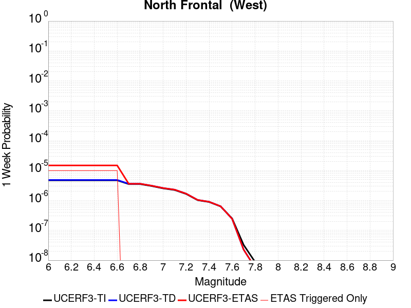 | 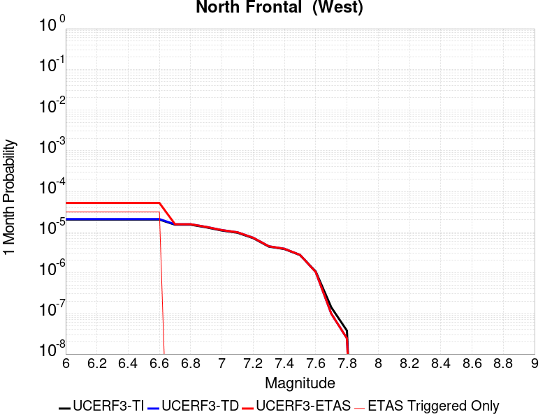 | 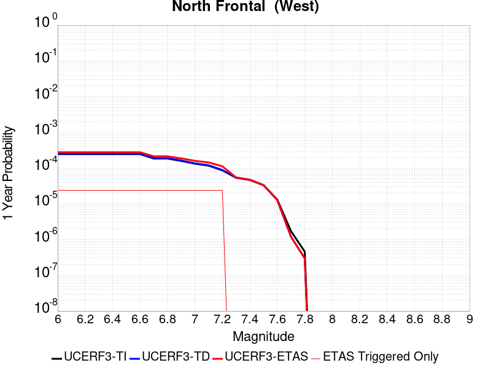 | 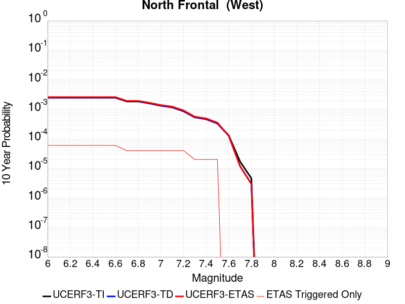 |

| Magnitude | 1 wk TI Prob | 1 wk TD Prob | 1 wk ETAS Prob | 1 wk ETAS/TD Gain | 1 wk ETAS Triggered Only | 1 mo TI Prob | 1 mo TD Prob | 1 mo ETAS Prob | 1 mo ETAS/TD Gain | 1 mo ETAS Triggered Only | 1 yr TI Prob | 1 yr TD Prob | 1 yr ETAS Prob | 1 yr ETAS/TD Gain | 1 yr ETAS Triggered Only | 10 yr TI Prob | 10 yr TD Prob | 10 yr ETAS Prob | 10 yr ETAS/TD Gain | 10 yr ETAS Triggered Only |
|-----|-----|-----|-----|-----|-----|-----|-----|-----|-----|-----|-----|-----|-----|-----|-----|-----|-----|-----|-----|-----|
| 6.0 | 4.7316266E-6 | 4.8526726E-6 | 1.4852624E-5 | 3.0607102 | 1.0E-5 | 2.0278241E-5 | 2.0797012E-5 | 5.079639E-5 | 2.442485 | 3.0E-5 | 2.4685962E-4 | 2.5317568E-4 | 2.9316553E-4 | 1.157953 | 4.0E-5 | 0.0024658558 | 0.0025290183 | 0.0025888667 | 1.0236646 | 6.0E-5 |
| 6.1 | 4.7316266E-6 | 4.8526726E-6 | 1.4852624E-5 | 3.0607102 | 1.0E-5 | 2.0278241E-5 | 2.0797012E-5 | 5.079639E-5 | 2.442485 | 3.0E-5 | 2.4685962E-4 | 2.5317568E-4 | 2.9316553E-4 | 1.157953 | 4.0E-5 | 0.0024658558 | 0.0025290183 | 0.0025888667 | 1.0236646 | 6.0E-5 |
| 6.2 | 4.7316266E-6 | 4.8526726E-6 | 1.4852624E-5 | 3.0607102 | 1.0E-5 | 2.0278241E-5 | 2.0797012E-5 | 5.079639E-5 | 2.442485 | 3.0E-5 | 2.4685962E-4 | 2.5317568E-4 | 2.9316553E-4 | 1.157953 | 4.0E-5 | 0.0024658558 | 0.0025290183 | 0.0025888667 | 1.0236646 | 6.0E-5 |
| 6.3 | 4.7316266E-6 | 4.8526726E-6 | 1.4852624E-5 | 3.0607102 | 1.0E-5 | 2.0278241E-5 | 2.0797012E-5 | 5.079639E-5 | 2.442485 | 3.0E-5 | 2.4685962E-4 | 2.5317568E-4 | 2.9316553E-4 | 1.157953 | 4.0E-5 | 0.0024658558 | 0.0025290183 | 0.0025888667 | 1.0236646 | 6.0E-5 |
| 6.4 | 4.7316266E-6 | 4.8526726E-6 | 1.4852624E-5 | 3.0607102 | 1.0E-5 | 2.0278241E-5 | 2.0797012E-5 | 5.079639E-5 | 2.442485 | 3.0E-5 | 2.4685962E-4 | 2.5317568E-4 | 2.9316553E-4 | 1.157953 | 4.0E-5 | 0.0024658558 | 0.0025290183 | 0.0025888667 | 1.0236646 | 6.0E-5 |
| 6.5 | 4.7316266E-6 | 4.8526726E-6 | 1.4852624E-5 | 3.0607102 | 1.0E-5 | 2.0278241E-5 | 2.0797012E-5 | 5.079639E-5 | 2.442485 | 3.0E-5 | 2.4685962E-4 | 2.5317568E-4 | 2.9316553E-4 | 1.157953 | 4.0E-5 | 0.0024658558 | 0.0025290183 | 0.0025888667 | 1.0236646 | 6.0E-5 |
| 6.6 | 4.7316266E-6 | 4.8526726E-6 | 1.4852624E-5 | 3.0607102 | 1.0E-5 | 2.0278241E-5 | 2.0797012E-5 | 5.079639E-5 | 2.442485 | 3.0E-5 | 2.4685962E-4 | 2.5317568E-4 | 2.9316553E-4 | 1.157953 | 4.0E-5 | 0.0024658558 | 0.0025290183 | 0.0025888667 | 1.0236646 | 6.0E-5 |
| 6.7 | 3.5382777E-6 | 3.6308859E-6 | 3.6308859E-6 | 1.0 | 0.0 | 1.516396E-5 | 1.5560852E-5 | 2.5560696E-5 | 1.6426283 | 1.0E-5 | 1.8460557E-4 | 1.8943768E-4 | 2.0943389E-4 | 1.1055557 | 2.0E-5 | 0.0018445229 | 0.0018928389 | 0.0019327631 | 1.0210923 | 4.0E-5 |
| 6.8 | 3.5382777E-6 | 3.6308859E-6 | 3.6308859E-6 | 1.0 | 0.0 | 1.516396E-5 | 1.5560852E-5 | 2.5560696E-5 | 1.6426283 | 1.0E-5 | 1.8460557E-4 | 1.8943768E-4 | 2.0943389E-4 | 1.1055557 | 2.0E-5 | 0.0018445229 | 0.0018928389 | 0.0019327631 | 1.0210923 | 4.0E-5 |
| 6.9 | 3.0428037E-6 | 3.1227605E-6 | 3.1227605E-6 | 1.0 | 0.0 | 1.30405215E-5 | 1.33831945E-5 | 2.3383061E-5 | 1.7471957 | 1.0E-5 | 1.5875678E-4 | 1.6292889E-4 | 1.8292564E-4 | 1.1227329 | 2.0E-5 | 0.0015864341 | 0.0016281615 | 0.0016680964 | 1.0245275 | 4.0E-5 |
| 7.0 | 2.538778E-6 | 2.6060904E-6 | 2.6060904E-6 | 1.0 | 0.0 | 1.0880432E-5 | 1.1168913E-5 | 2.1168802E-5 | 1.8953322 | 1.0E-5 | 1.324612E-4 | 1.3597352E-4 | 1.5597079E-4 | 1.1470674 | 2.0E-5 | 0.0013238228 | 0.0013589499 | 0.0013988955 | 1.0293945 | 4.0E-5 |
| 7.1 | 2.2418935E-6 | 2.3012074E-6 | 2.3012074E-6 | 1.0 | 0.0 | 9.60808E-6 | 9.862282E-6 | 1.9862184E-5 | 2.0139542 | 1.0E-5 | 1.1697209E-4 | 1.2006712E-4 | 1.4006472E-4 | 1.1665535 | 2.0E-5 | 0.0011691054 | 0.0012000664 | 0.0012400184 | 1.0332915 | 4.0E-5 |
| 7.2 | 1.6526745E-6 | 1.6924851E-6 | 1.6924851E-6 | 1.0 | 0.0 | 7.082872E-6 | 7.253489E-6 | 1.7253416E-5 | 2.3786368 | 1.0E-5 | 8.623055E-5 | 8.8307905E-5 | 1.08306136E-4 | 1.2264603 | 2.0E-5 | 8.61971E-4 | 8.827532E-4 | 9.2271785E-4 | 1.0452728 | 4.0E-5 |
| 7.3 | 1.0246019E-6 | 1.0442261E-6 | 1.0442261E-6 | 1.0 | 0.0 | 4.391144E-6 | 4.4752474E-6 | 1.4475203E-5 | 3.2345033 | 1.0E-5 | 5.3460866E-5 | 5.448489E-5 | 6.4484346E-5 | 1.1835271 | 1.0E-5 | 5.344801E-4 | 5.4472685E-4 | 5.6471594E-4 | 1.0366956 | 2.0E-5 |
| 7.4 | 8.9045164E-7 | 9.0565584E-7 | 9.0565584E-7 | 1.0 | 0.0 | 3.8162157E-6 | 3.8813773E-6 | 1.3881338E-5 | 3.576395 | 1.0E-5 | 4.646144E-5 | 4.7254853E-5 | 5.725438E-5 | 1.2116085 | 1.0E-5 | 4.6451724E-4 | 4.7245892E-4 | 4.9244944E-4 | 1.0423117 | 2.0E-5 |
| 7.5 | 6.3357E-7 | 6.4027006E-7 | 6.4027006E-7 | 1.0 | 0.0 | 2.7152971E-6 | 2.744012E-6 | 1.2743984E-5 | 4.644289 | 1.0E-5 | 3.305824E-5 | 3.34079E-5 | 4.3407566E-5 | 1.2993203 | 1.0E-5 | 3.3053322E-4 | 3.3403534E-4 | 3.5402869E-4 | 1.0598539 | 2.0E-5 |
| 7.6 | 2.5087024E-7 | 2.4361097E-7 | 2.4361097E-7 | 1.0 | 0.0 | 1.0751578E-6 | 1.0440467E-6 | 1.0440467E-6 | 1.0 | 0.0 | 1.3089967E-5 | 1.2711216E-5 | 1.2711216E-5 | 1.0 | 0.0 | 1.3089196E-4 | 1.2710695E-4 | 1.2710695E-4 | 1.0 | 0.0 |
| 7.7 | 3.282987E-8 | 2.2874195E-8 | 2.2874195E-8 | 1.0 | 0.0 | 1.4069944E-7 | 9.803227E-8 | 9.803227E-8 | 1.0 | 0.0 | 1.7130144E-6 | 1.1935423E-6 | 1.1935423E-6 | 1.0 | 0.0 | 1.7130013E-5 | 1.1935367E-5 | 1.1935367E-5 | 1.0 | 0.0 |
| 7.8 | 8.77499E-9 | 5.6815956E-9 | 5.6815956E-9 | 1.0 | 0.0 | 3.7607098E-8 | 2.4349696E-8 | 2.4349696E-8 | 1.0 | 0.0 | 4.578663E-7 | 2.9645753E-7 | 2.9645753E-7 | 1.0 | 0.0 | 4.5786537E-6 | 2.9645726E-6 | 2.9645726E-6 | 1.0 | 0.0 |

## Simi-Santa Rosa
*[(top)](#table-of-contents)*

| 1 Week | 1 Month | 1 Year | 10 Year |
|-----|-----|-----|-----|
|  | 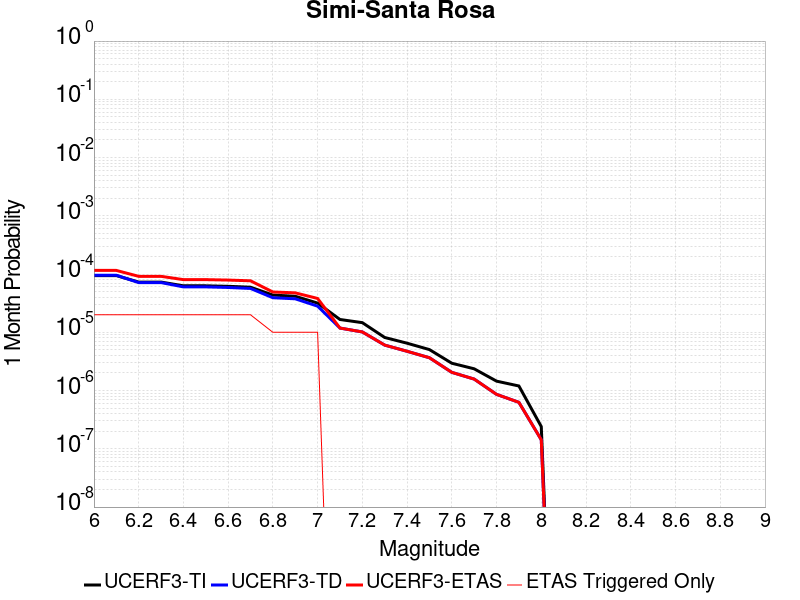 |  | 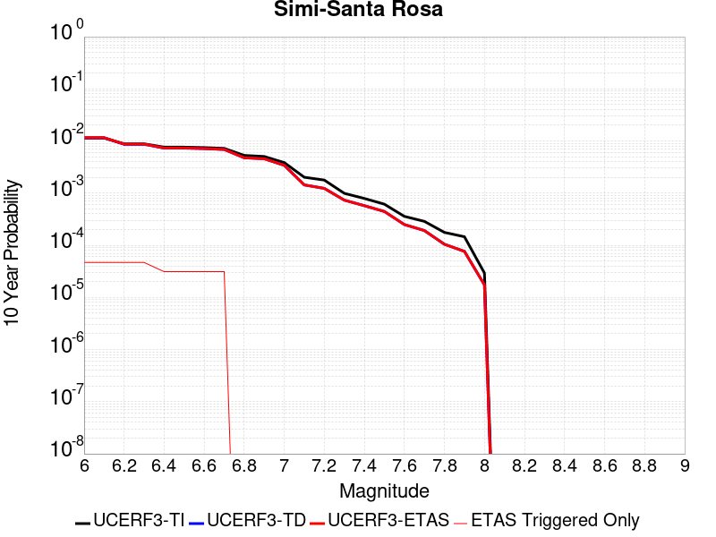 |

| Magnitude | 1 wk TI Prob | 1 wk TD Prob | 1 wk ETAS Prob | 1 wk ETAS/TD Gain | 1 wk ETAS Triggered Only | 1 mo TI Prob | 1 mo TD Prob | 1 mo ETAS Prob | 1 mo ETAS/TD Gain | 1 mo ETAS Triggered Only | 1 yr TI Prob | 1 yr TD Prob | 1 yr ETAS Prob | 1 yr ETAS/TD Gain | 1 yr ETAS Triggered Only | 10 yr TI Prob | 10 yr TD Prob | 10 yr ETAS Prob | 10 yr ETAS/TD Gain | 10 yr ETAS Triggered Only |
|-----|-----|-----|-----|-----|-----|-----|-----|-----|-----|-----|-----|-----|-----|-----|-----|-----|-----|-----|-----|-----|
| 6.0 | 2.198912E-5 | 2.2275442E-5 | 3.227522E-5 | 1.4489149 | 1.0E-5 | 9.4235686E-5 | 9.5462936E-5 | 1.1546103E-4 | 1.2094854 | 2.0E-5 | 0.0011467156 | 0.0011616853 | 0.0011916505 | 1.0257945 | 3.0E-5 | 0.011408163 | 0.011560575 | 0.011619882 | 1.00513 | 6.0E-5 |
| 6.1 | 2.198912E-5 | 2.2275442E-5 | 3.227522E-5 | 1.4489149 | 1.0E-5 | 9.4235686E-5 | 9.5462936E-5 | 1.1546103E-4 | 1.2094854 | 2.0E-5 | 0.0011467156 | 0.0011616853 | 0.0011916505 | 1.0257945 | 3.0E-5 | 0.011408163 | 0.011560575 | 0.011619882 | 1.00513 | 6.0E-5 |
| 6.2 | 1.69983E-5 | 1.6668559E-5 | 2.6668393E-5 | 1.5999218 | 1.0E-5 | 7.284782E-5 | 7.143489E-5 | 9.143346E-5 | 1.2799553 | 2.0E-5 | 8.865613E-4 | 8.6940196E-4 | 8.993759E-4 | 1.0344765 | 3.0E-5 | 0.008830327 | 0.008662928 | 0.008722408 | 1.0068661 | 6.0E-5 |
| 6.3 | 1.69983E-5 | 1.6668559E-5 | 2.6668393E-5 | 1.5999218 | 1.0E-5 | 7.284782E-5 | 7.143489E-5 | 9.143346E-5 | 1.2799553 | 2.0E-5 | 8.865613E-4 | 8.6940196E-4 | 8.993759E-4 | 1.0344765 | 3.0E-5 | 0.008830327 | 0.008662928 | 0.008722408 | 1.0068661 | 6.0E-5 |
| 6.4 | 1.4666188E-5 | 1.4052543E-5 | 2.4052402E-5 | 1.711605 | 1.0E-5 | 6.285358E-5 | 6.0223934E-5 | 8.022273E-5 | 1.3320739 | 2.0E-5 | 7.6497364E-4 | 7.3300465E-4 | 7.6298264E-4 | 1.0408975 | 3.0E-5 | 0.0076234564 | 0.007308344 | 0.0073579787 | 1.0067915 | 5.0E-5 |
| 6.5 | 1.4666188E-5 | 1.4052543E-5 | 2.4052402E-5 | 1.711605 | 1.0E-5 | 6.285358E-5 | 6.0223934E-5 | 8.022273E-5 | 1.3320739 | 2.0E-5 | 7.6497364E-4 | 7.3300465E-4 | 7.6298264E-4 | 1.0408975 | 3.0E-5 | 0.0076234564 | 0.007308344 | 0.0073579787 | 1.0067915 | 5.0E-5 |
| 6.6 | 1.4377586E-5 | 1.3729583E-5 | 2.3729444E-5 | 1.7283443 | 1.0E-5 | 6.1616774E-5 | 5.883988E-5 | 7.8838704E-5 | 1.3398855 | 2.0E-5 | 7.4992597E-4 | 7.1616494E-4 | 7.4614346E-4 | 1.0418597 | 3.0E-5 | 0.007474003 | 0.0071410383 | 0.0071906815 | 1.0069518 | 5.0E-5 |
| 6.7 | 1.3881404E-5 | 1.320755E-5 | 2.3207418E-5 | 1.7571326 | 1.0E-5 | 5.9490372E-5 | 5.66027E-5 | 7.6601566E-5 | 1.35332 | 2.0E-5 | 7.240546E-4 | 6.8894465E-4 | 7.18924E-4 | 1.0435148 | 3.0E-5 | 0.007217 | 0.006870538 | 0.0069201947 | 1.0072274 | 5.0E-5 |
| 6.8 | 1.0176516E-5 | 9.154151E-6 | 9.154151E-6 | 1.0 | 0.0 | 4.3612912E-5 | 3.9231574E-5 | 4.9231185E-5 | 1.2548867 | 1.0E-5 | 5.308578E-4 | 4.7755634E-4 | 4.8755156E-4 | 1.0209299 | 1.0E-5 | 0.0052959146 | 0.004766934 | 0.004786839 | 1.0041755 | 2.0E-5 |
| 6.9 | 9.699797E-6 | 8.774719E-6 | 8.774719E-6 | 1.0 | 0.0 | 4.15699E-5 | 3.7605492E-5 | 4.7605117E-5 | 1.2659086 | 1.0E-5 | 5.05996E-4 | 4.577671E-4 | 4.6776255E-4 | 1.0218352 | 1.0E-5 | 0.005048454 | 0.0045698597 | 0.004589768 | 1.0043565 | 2.0E-5 |
| 7.0 | 7.4049476E-6 | 6.559333E-6 | 6.559333E-6 | 1.0 | 0.0 | 3.1735104E-5 | 2.8111197E-5 | 3.8110917E-5 | 1.3557202 | 1.0E-5 | 3.8630638E-4 | 3.422127E-4 | 3.522093E-4 | 1.0292116 | 1.0E-5 | 0.0038563553 | 0.0034180996 | 0.0034280655 | 1.0029156 | 1.0E-5 |
| 7.1 | 3.873439E-6 | 2.7595095E-6 | 2.7595095E-6 | 1.0 | 0.0 | 1.6600346E-5 | 1.1826417E-5 | 1.1826417E-5 | 1.0 | 0.0 | 2.0209046E-4 | 1.4397735E-4 | 1.4397735E-4 | 1.0 | 0.0 | 0.0020190678 | 0.0014388643 | 0.0014388643 | 1.0 | 0.0 |
| 7.2 | 3.417706E-6 | 2.3676484E-6 | 2.3676484E-6 | 1.0 | 0.0 | 1.4647229E-5 | 1.0147027E-5 | 1.0147027E-5 | 1.0 | 0.0 | 1.7831543E-4 | 1.2353327E-4 | 1.2353327E-4 | 1.0 | 0.0 | 0.0017817242 | 0.0012346683 | 0.0012346683 | 1.0 | 0.0 |
| 7.3 | 1.90225E-6 | 1.4073753E-6 | 1.4073753E-6 | 1.0 | 0.0 | 8.152474E-6 | 6.0315947E-6 | 6.0315947E-6 | 1.0 | 0.0 | 9.9251854E-5 | 7.343221E-5 | 7.343221E-5 | 1.0 | 0.0 | 9.920754E-4 | 7.340817E-4 | 7.340817E-4 | 1.0 | 0.0 |
| 7.4 | 1.5170556E-6 | 1.1024773E-6 | 1.1024773E-6 | 1.0 | 0.0 | 6.5016507E-6 | 4.724894E-6 | 4.724894E-6 | 1.0 | 0.0 | 7.915472E-5 | 5.7524077E-5 | 5.7524077E-5 | 1.0 | 0.0 | 7.9126534E-4 | 5.7509297E-4 | 5.7509297E-4 | 1.0 | 0.0 |
| 7.5 | 1.178732E-6 | 8.535102E-7 | 8.535102E-7 | 1.0 | 0.0 | 5.0516987E-6 | 3.6578958E-6 | 3.6578958E-6 | 1.0 | 0.0 | 6.1502695E-5 | 4.453398E-5 | 4.453398E-5 | 1.0 | 0.0 | 6.148568E-4 | 4.452515E-4 | 4.452515E-4 | 1.0 | 0.0 |
| 7.6 | 6.8722386E-7 | 4.793198E-7 | 4.793198E-7 | 1.0 | 0.0 | 2.9452417E-6 | 2.054226E-6 | 2.054226E-6 | 1.0 | 0.0 | 3.5857727E-5 | 2.5009915E-5 | 2.5009915E-5 | 1.0 | 0.0 | 3.5851944E-4 | 2.5007114E-4 | 2.5007114E-4 | 1.0 | 0.0 |
| 7.7 | 5.5126515E-7 | 3.6731157E-7 | 3.6731157E-7 | 1.0 | 0.0 | 2.3625628E-6 | 1.5741915E-6 | 1.5741915E-6 | 1.0 | 0.0 | 2.8763823E-5 | 1.9165615E-5 | 1.9165615E-5 | 1.0 | 0.0 | 2.87601E-4 | 1.9163972E-4 | 1.9163972E-4 | 1.0 | 0.0 |
| 7.8 | 3.3860243E-7 | 2.0075942E-7 | 2.0075942E-7 | 1.0 | 0.0 | 1.4511525E-6 | 8.6039717E-7 | 8.6039717E-7 | 1.0 | 0.0 | 1.7667637E-5 | 1.0475286E-5 | 1.0475286E-5 | 1.0 | 0.0 | 1.7666233E-4 | 1.04747975E-4 | 1.04747975E-4 | 1.0 | 0.0 |
| 7.9 | 2.7955386E-7 | 1.4649108E-7 | 1.4649108E-7 | 1.0 | 0.0 | 1.1980875E-6 | 6.278188E-7 | 6.278188E-7 | 1.0 | 0.0 | 1.4586617E-5 | 7.643667E-6 | 7.643667E-6 | 1.0 | 0.0 | 1.458566E-4 | 7.643409E-5 | 7.643409E-5 | 1.0 | 0.0 |
| 8.0 | 5.6259015E-8 | 3.3355324E-8 | 3.3355324E-8 | 1.0 | 0.0 | 2.4111003E-7 | 1.4295138E-7 | 1.4295138E-7 | 1.0 | 0.0 | 2.9355108E-6 | 1.7404317E-6 | 1.7404317E-6 | 1.0 | 0.0 | 2.935472E-5 | 1.7404194E-5 | 1.7404194E-5 | 1.0 | 0.0 |

## Calaveras (Central) 2011 CFM
*[(top)](#table-of-contents)*

| 1 Week | 1 Month | 1 Year | 10 Year |
|-----|-----|-----|-----|
| 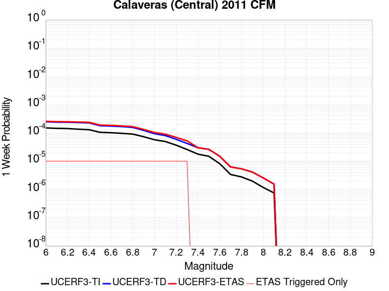 | 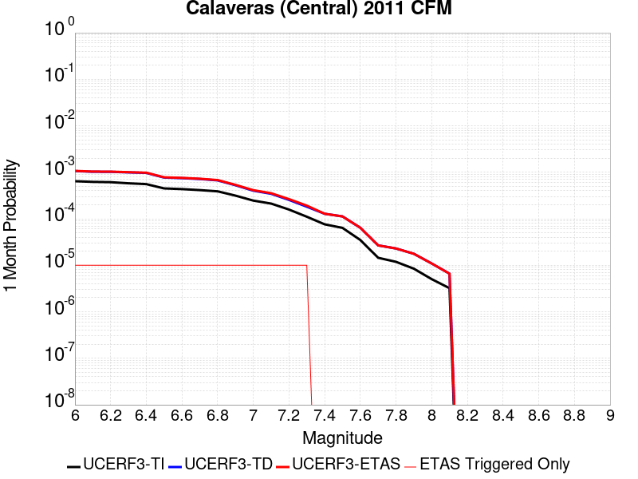 | 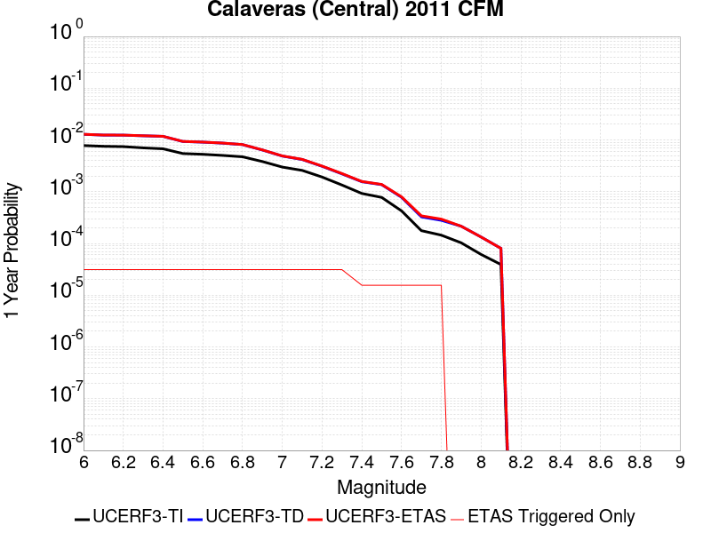 | 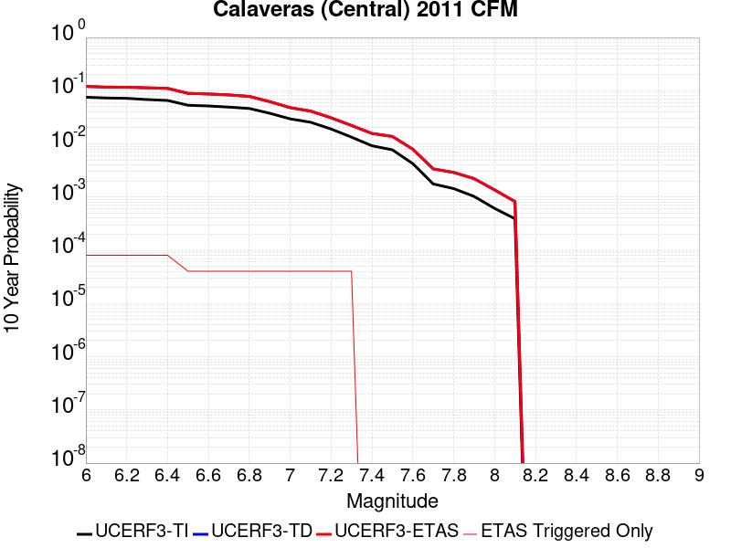 |

| Magnitude | 1 wk TI Prob | 1 wk TD Prob | 1 wk ETAS Prob | 1 wk ETAS/TD Gain | 1 wk ETAS Triggered Only | 1 mo TI Prob | 1 mo TD Prob | 1 mo ETAS Prob | 1 mo ETAS/TD Gain | 1 mo ETAS Triggered Only | 1 yr TI Prob | 1 yr TD Prob | 1 yr ETAS Prob | 1 yr ETAS/TD Gain | 1 yr ETAS Triggered Only | 10 yr TI Prob | 10 yr TD Prob | 10 yr ETAS Prob | 10 yr ETAS/TD Gain | 10 yr ETAS Triggered Only |
|-----|-----|-----|-----|-----|-----|-----|-----|-----|-----|-----|-----|-----|-----|-----|-----|-----|-----|-----|-----|-----|
| 6.0 | 1.5010907E-4 | 2.481574E-4 | 2.581549E-4 | 1.040287 | 1.0E-5 | 6.4316596E-4 | 0.0010621005 | 0.0010720899 | 1.0094053 | 1.0E-5 | 0.0078024664 | 0.012850073 | 0.012879688 | 1.0023047 | 3.0E-5 | 0.07534136 | 0.120401435 | 0.120445415 | 1.0003653 | 5.0E-5 |
| 6.1 | 1.4521465E-4 | 2.397987E-4 | 2.4979629E-4 | 1.0416917 | 1.0E-5 | 6.222001E-4 | 0.0010263061 | 0.0010362958 | 1.0097337 | 1.0E-5 | 0.0075490056 | 0.012419341 | 0.012448968 | 1.0023856 | 3.0E-5 | 0.07297657 | 0.11667323 | 0.11671739 | 1.0003785 | 5.0E-5 |
| 6.2 | 1.429998E-4 | 2.3911126E-4 | 2.4910888E-4 | 1.0418116 | 1.0E-5 | 6.127123E-4 | 0.0010233623 | 0.001033352 | 1.0097617 | 1.0E-5 | 0.007434286 | 0.01238394 | 0.012413569 | 1.0023925 | 3.0E-5 | 0.07190444 | 0.1163272 | 0.11637138 | 1.0003798 | 5.0E-5 |
| 6.3 | 1.3536277E-4 | 2.3242626E-4 | 2.4242394E-4 | 1.0430144 | 1.0E-5 | 5.799972E-4 | 9.947343E-4 | 0.0010047244 | 1.0100429 | 1.0E-5 | 0.0070386264 | 0.012040132 | 0.012069771 | 1.0024617 | 3.0E-5 | 0.0681982 | 0.11323977 | 0.11328411 | 1.0003915 | 5.0E-5 |
| 6.4 | 1.2993296E-4 | 2.2666177E-4 | 2.366595E-4 | 1.0441086 | 1.0E-5 | 5.5673666E-4 | 9.700479E-4 | 9.800382E-4 | 1.0102987 | 1.0E-5 | 0.006757223 | 0.011742937 | 0.011772585 | 1.0025247 | 3.0E-5 | 0.06555412 | 0.11051771 | 0.11056218 | 1.0004025 | 5.0E-5 |
| 6.5 | 1.0498927E-4 | 1.7981697E-4 | 1.8981517E-4 | 1.0556021 | 1.0E-5 | 4.498764E-4 | 7.704157E-4 | 7.80408E-4 | 1.01297 | 1.0E-5 | 0.005463498 | 0.00933924 | 0.009368961 | 1.0031823 | 3.0E-5 | 0.053311124 | 0.089199215 | 0.08923565 | 1.0004084 | 4.0E-5 |
| 6.6 | 1.0157505E-4 | 1.7469203E-4 | 1.8469029E-4 | 1.0572336 | 1.0E-5 | 4.35249E-4 | 7.484645E-4 | 7.58457E-4 | 1.0133507 | 1.0E-5 | 0.0052862884 | 0.009074297 | 0.009104025 | 1.003276 | 3.0E-5 | 0.05162293 | 0.08677671 | 0.08681324 | 1.0004209 | 4.0E-5 |
| 6.7 | 9.660386E-5 | 1.6728524E-4 | 1.7728357E-4 | 1.0597681 | 1.0E-5 | 4.1395082E-4 | 7.1673887E-4 | 7.2673167E-4 | 1.0139421 | 1.0E-5 | 0.0050282106 | 0.008691208 | 0.008720947 | 1.0034218 | 3.0E-5 | 0.049159497 | 0.083266065 | 0.08330273 | 1.0004404 | 4.0E-5 |
| 6.8 | 9.089927E-5 | 1.5643016E-4 | 1.664286E-4 | 1.0639163 | 1.0E-5 | 3.8951015E-4 | 6.702439E-4 | 6.802372E-4 | 1.01491 | 1.0E-5 | 0.0047319788 | 0.008129478 | 0.008159235 | 1.0036603 | 3.0E-5 | 0.046324775 | 0.078159414 | 0.07819629 | 1.0004718 | 4.0E-5 |
| 6.9 | 7.353187E-5 | 1.2295354E-4 | 1.3295231E-4 | 1.0813215 | 1.0E-5 | 3.150985E-4 | 5.2683795E-4 | 5.3683267E-4 | 1.0189712 | 1.0E-5 | 0.0038295772 | 0.006395508 | 0.00641538 | 1.0031072 | 2.0E-5 | 0.037642512 | 0.062187865 | 0.062216 | 1.0004524 | 3.0E-5 |
| 7.0 | 5.746064E-5 | 9.3887444E-5 | 1.0388651E-4 | 1.1065005 | 1.0E-5 | 2.4623662E-4 | 4.0231308E-4 | 4.1230905E-4 | 1.0248463 | 1.0E-5 | 0.0029938098 | 0.004887232 | 0.0049071345 | 1.0040723 | 2.0E-5 | 0.02953797 | 0.04798685 | 0.048015412 | 1.0005952 | 3.0E-5 |
| 7.1 | 4.9557195E-5 | 8.052461E-5 | 9.0523805E-5 | 1.1241757 | 1.0E-5 | 2.123707E-4 | 3.4506017E-4 | 3.5505672E-4 | 1.0289705 | 1.0E-5 | 0.0025825473 | 0.0041930773 | 0.0042129937 | 1.0047498 | 2.0E-5 | 0.0255274 | 0.041373078 | 0.041401837 | 1.0006951 | 3.0E-5 |
| 7.2 | 3.687595E-5 | 5.9524526E-5 | 6.952393E-5 | 1.167988 | 1.0E-5 | 1.5803022E-4 | 2.5508032E-4 | 2.6507778E-4 | 1.0391934 | 1.0E-5 | 0.0019223199 | 0.0031012094 | 0.0031211474 | 1.0064291 | 2.0E-5 | 0.01905776 | 0.030883716 | 0.03091279 | 1.0009414 | 3.0E-5 |
| 7.3 | 2.5846984E-5 | 4.247213E-5 | 5.2471707E-5 | 1.2354385 | 1.0E-5 | 1.1076809E-4 | 1.8201082E-4 | 1.92009E-4 | 1.0549318 | 1.0E-5 | 0.0013477671 | 0.002213747 | 0.0022337027 | 1.0090145 | 2.0E-5 | 0.013396223 | 0.02217554 | 0.022195095 | 1.0008819 | 2.0E-5 |
| 7.4 | 1.7747854E-5 | 2.9936204E-5 | 2.9936204E-5 | 1.0 | 0.0 | 7.6060016E-5 | 1.2829172E-4 | 1.2829172E-4 | 1.0 | 0.0 | 9.2563726E-4 | 0.0015608355 | 0.0015708199 | 1.0063968 | 1.0E-5 | 0.009217911 | 0.015709236 | 0.015719078 | 1.0006266 | 1.0E-5 |
| 7.5 | 1.4883479E-5 | 2.6243379E-5 | 2.6243379E-5 | 1.0 | 0.0 | 6.378478E-5 | 1.1246678E-4 | 1.1246678E-4 | 1.0 | 0.0 | 7.76303E-4 | 0.0013684258 | 0.0013784121 | 1.0072976 | 1.0E-5 | 0.0077359667 | 0.013802425 | 0.013812287 | 1.0007145 | 1.0E-5 |
| 7.6 | 8.166975E-6 | 1.4963478E-5 | 1.4963478E-5 | 1.0 | 0.0 | 3.5000852E-5 | 6.412763E-5 | 6.412763E-5 | 1.0 | 0.0 | 4.2605202E-4 | 7.804755E-4 | 7.9046766E-4 | 1.0128027 | 1.0E-5 | 0.004252361 | 0.00793984 | 0.00794976 | 1.0012494 | 1.0E-5 |
| 7.7 | 3.3858064E-6 | 6.253914E-6 | 6.253914E-6 | 1.0 | 0.0 | 1.4510518E-5 | 2.6802214E-5 | 2.6802214E-5 | 1.0 | 0.0 | 1.7665124E-4 | 3.2626814E-4 | 3.3626487E-4 | 1.0306396 | 1.0E-5 | 0.0017651088 | 0.0033882293 | 0.0033981954 | 1.0029414 | 1.0E-5 |
| 7.8 | 2.7721615E-6 | 5.3663807E-6 | 5.3663807E-6 | 1.0 | 0.0 | 1.1880637E-5 | 2.2998573E-5 | 2.2998573E-5 | 1.0 | 0.0 | 1.4463716E-4 | 2.799717E-4 | 2.8996888E-4 | 1.035708 | 1.0E-5 | 0.0014454306 | 0.0029074624 | 0.0029174334 | 1.0034294 | 1.0E-5 |
| 7.9 | 1.9736292E-6 | 4.1284193E-6 | 4.1284193E-6 | 1.0 | 0.0 | 8.4583835E-6 | 1.7693106E-5 | 1.7693106E-5 | 1.0 | 0.0 | 1.0297595E-4 | 2.1539231E-4 | 2.1539231E-4 | 1.0 | 0.0 | 0.0010292825 | 0.0022236116 | 0.0022236116 | 1.0 | 0.0 |
| 8.0 | 1.1767289E-6 | 2.5544743E-6 | 2.5544743E-6 | 1.0 | 0.0 | 5.0431145E-6 | 1.0947701E-5 | 1.0947701E-5 | 1.0 | 0.0 | 6.139818E-5 | 1.3328013E-4 | 1.3328013E-4 | 1.0 | 0.0 | 6.1381224E-4 | 0.0013660848 | 0.0013660848 | 1.0 | 0.0 |
| 8.1 | 7.5112825E-7 | 1.5409794E-6 | 1.5409794E-6 | 1.0 | 0.0 | 3.2191172E-6 | 6.6041807E-6 | 6.6041807E-6 | 1.0 | 0.0 | 3.9192048E-5 | 8.0402955E-5 | 8.0402955E-5 | 1.0 | 0.0 | 3.9185135E-4 | 8.235564E-4 | 8.235564E-4 | 1.0 | 0.0 |

## Mono Lake 2011 CFM
*[(top)](#table-of-contents)*

| 1 Week | 1 Month | 1 Year | 10 Year |
|-----|-----|-----|-----|
| 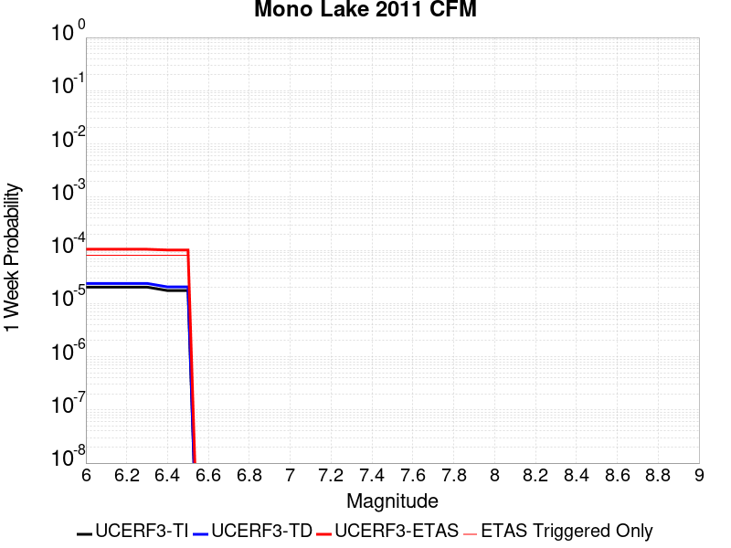 | 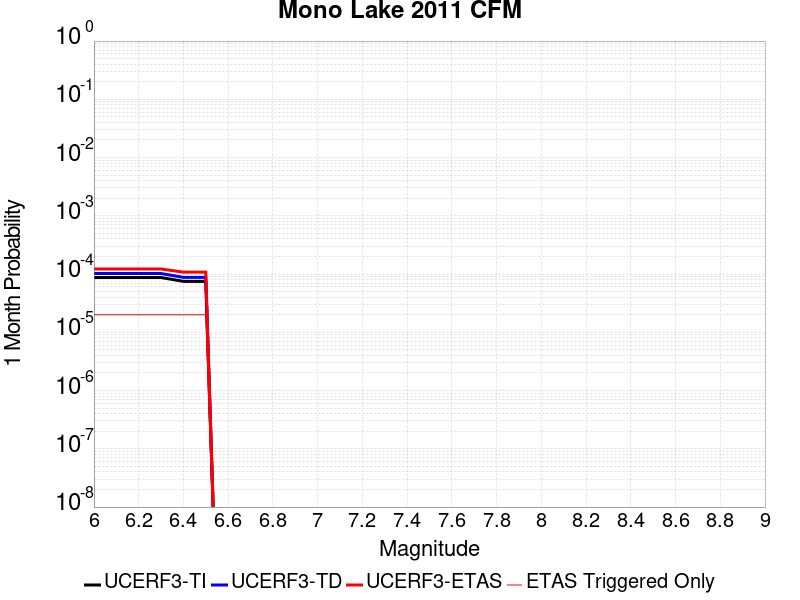 | 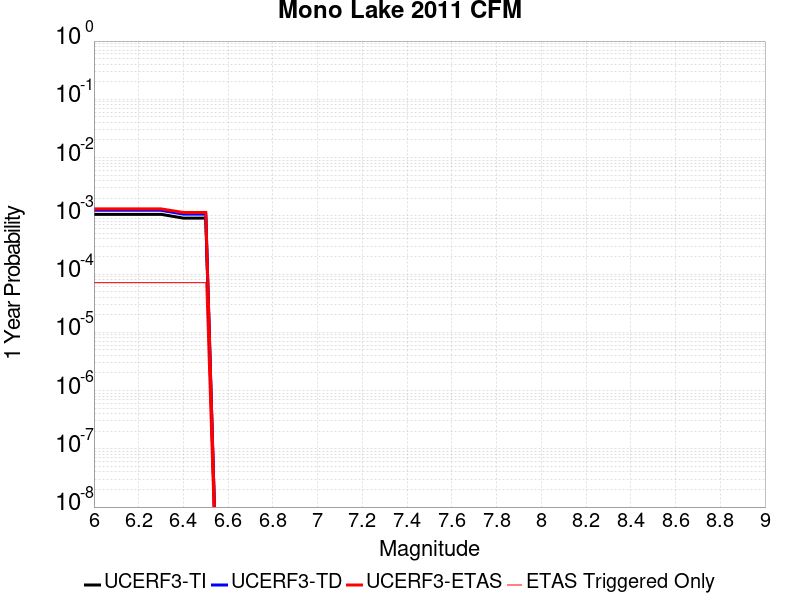 |  |

| Magnitude | 1 wk TI Prob | 1 wk TD Prob | 1 wk ETAS Prob | 1 wk ETAS/TD Gain | 1 wk ETAS Triggered Only | 1 mo TI Prob | 1 mo TD Prob | 1 mo ETAS Prob | 1 mo ETAS/TD Gain | 1 mo ETAS Triggered Only | 1 yr TI Prob | 1 yr TD Prob | 1 yr ETAS Prob | 1 yr ETAS/TD Gain | 1 yr ETAS Triggered Only | 10 yr TI Prob | 10 yr TD Prob | 10 yr ETAS Prob | 10 yr ETAS/TD Gain | 10 yr ETAS Triggered Only |
|-----|-----|-----|-----|-----|-----|-----|-----|-----|-----|-----|-----|-----|-----|-----|-----|-----|-----|-----|-----|-----|
| 6.0 | 2.0341662E-5 | 2.3828166E-5 | 4.382769E-5 | 1.8393228 | 2.0E-5 | 8.717564E-5 | 1.0211971E-4 | 1.2211766E-4 | 1.1958286 | 2.0E-5 | 0.0010608466 | 0.0012431298 | 0.0012830801 | 1.0321368 | 4.0E-5 | 0.010557966 | 0.012413835 | 0.012463215 | 1.0039778 | 5.0E-5 |
| 6.1 | 2.0341662E-5 | 2.3828166E-5 | 4.382769E-5 | 1.8393228 | 2.0E-5 | 8.717564E-5 | 1.0211971E-4 | 1.2211766E-4 | 1.1958286 | 2.0E-5 | 0.0010608466 | 0.0012431298 | 0.0012830801 | 1.0321368 | 4.0E-5 | 0.010557966 | 0.012413835 | 0.012463215 | 1.0039778 | 5.0E-5 |
| 6.2 | 2.0341662E-5 | 2.3828166E-5 | 4.382769E-5 | 1.8393228 | 2.0E-5 | 8.717564E-5 | 1.0211971E-4 | 1.2211766E-4 | 1.1958286 | 2.0E-5 | 0.0010608466 | 0.0012431298 | 0.0012830801 | 1.0321368 | 4.0E-5 | 0.010557966 | 0.012413835 | 0.012463215 | 1.0039778 | 5.0E-5 |
| 6.3 | 2.0341662E-5 | 2.3828166E-5 | 4.382769E-5 | 1.8393228 | 2.0E-5 | 8.717564E-5 | 1.0211971E-4 | 1.2211766E-4 | 1.1958286 | 2.0E-5 | 0.0010608466 | 0.0012431298 | 0.0012830801 | 1.0321368 | 4.0E-5 | 0.010557966 | 0.012413835 | 0.012463215 | 1.0039778 | 5.0E-5 |
| 6.4 | 1.749821E-5 | 2.0490985E-5 | 4.0490577E-5 | 1.9760189 | 2.0E-5 | 7.499018E-5 | 8.781851E-5 | 1.07816755E-4 | 1.2277224 | 2.0E-5 | 9.1262296E-4 | 0.0010691903 | 0.0010991583 | 1.0280286 | 3.0E-5 | 0.009088841 | 0.010691865 | 0.010731437 | 1.0037012 | 4.0E-5 |
| 6.5 | 1.749821E-5 | 2.0490985E-5 | 4.0490577E-5 | 1.9760189 | 2.0E-5 | 7.499018E-5 | 8.781851E-5 | 1.07816755E-4 | 1.2277224 | 2.0E-5 | 9.1262296E-4 | 0.0010691903 | 0.0010991583 | 1.0280286 | 3.0E-5 | 0.009088841 | 0.010691865 | 0.010731437 | 1.0037012 | 4.0E-5 |

## Santa Susana alt 1
*[(top)](#table-of-contents)*

| 1 Week | 1 Month | 1 Year | 10 Year |
|-----|-----|-----|-----|
|  | 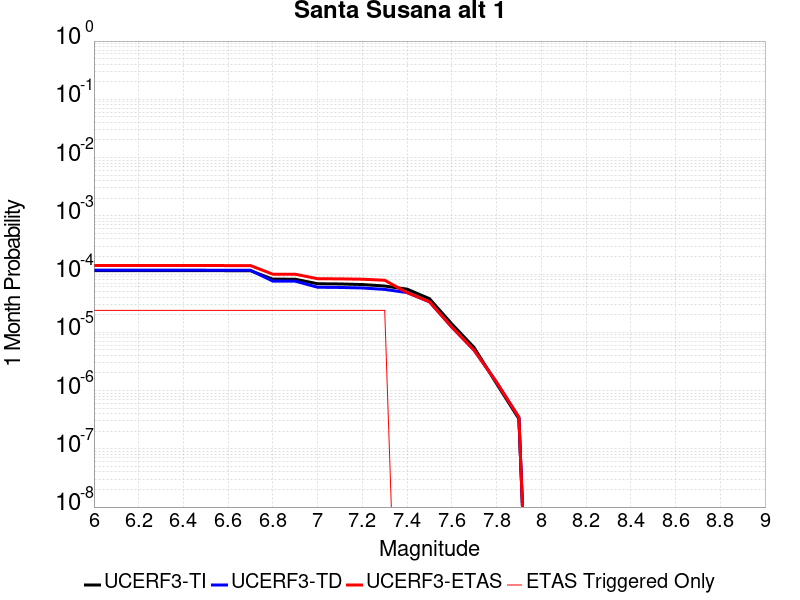 | 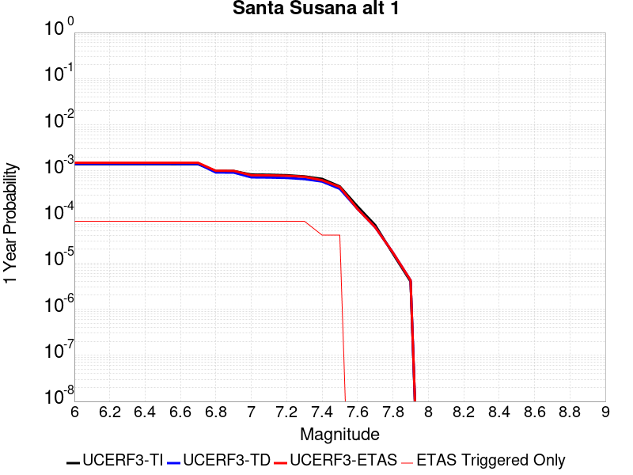 |  |

| Magnitude | 1 wk TI Prob | 1 wk TD Prob | 1 wk ETAS Prob | 1 wk ETAS/TD Gain | 1 wk ETAS Triggered Only | 1 mo TI Prob | 1 mo TD Prob | 1 mo ETAS Prob | 1 mo ETAS/TD Gain | 1 mo ETAS Triggered Only | 1 yr TI Prob | 1 yr TD Prob | 1 yr ETAS Prob | 1 yr ETAS/TD Gain | 1 yr ETAS Triggered Only | 10 yr TI Prob | 10 yr TD Prob | 10 yr ETAS Prob | 10 yr ETAS/TD Gain | 10 yr ETAS Triggered Only |
|-----|-----|-----|-----|-----|-----|-----|-----|-----|-----|-----|-----|-----|-----|-----|-----|-----|-----|-----|-----|-----|
| 6.0 | 2.674877E-5 | 2.7198023E-5 | 2.7198023E-5 | 1.0 | 0.0 | 1.1463255E-4 | 1.1655839E-4 | 1.2655722E-4 | 1.085784 | 1.0E-5 | 0.0013947578 | 0.0014182882 | 0.0014382598 | 1.0140815 | 2.0E-5 | 0.013860362 | 0.014104128 | 0.014153423 | 1.0034951 | 5.0E-5 |
| 6.1 | 2.674877E-5 | 2.7198023E-5 | 2.7198023E-5 | 1.0 | 0.0 | 1.1463255E-4 | 1.1655839E-4 | 1.2655722E-4 | 1.085784 | 1.0E-5 | 0.0013947578 | 0.0014182882 | 0.0014382598 | 1.0140815 | 2.0E-5 | 0.013860362 | 0.014104128 | 0.014153423 | 1.0034951 | 5.0E-5 |
| 6.2 | 2.674877E-5 | 2.7198023E-5 | 2.7198023E-5 | 1.0 | 0.0 | 1.1463255E-4 | 1.1655839E-4 | 1.2655722E-4 | 1.085784 | 1.0E-5 | 0.0013947578 | 0.0014182882 | 0.0014382598 | 1.0140815 | 2.0E-5 | 0.013860362 | 0.014104128 | 0.014153423 | 1.0034951 | 5.0E-5 |
| 6.3 | 2.674877E-5 | 2.7198023E-5 | 2.7198023E-5 | 1.0 | 0.0 | 1.1463255E-4 | 1.1655839E-4 | 1.2655722E-4 | 1.085784 | 1.0E-5 | 0.0013947578 | 0.0014182882 | 0.0014382598 | 1.0140815 | 2.0E-5 | 0.013860362 | 0.014104128 | 0.014153423 | 1.0034951 | 5.0E-5 |
| 6.4 | 2.674877E-5 | 2.7198023E-5 | 2.7198023E-5 | 1.0 | 0.0 | 1.1463255E-4 | 1.1655839E-4 | 1.2655722E-4 | 1.085784 | 1.0E-5 | 0.0013947578 | 0.0014182882 | 0.0014382598 | 1.0140815 | 2.0E-5 | 0.013860362 | 0.014104128 | 0.014153423 | 1.0034951 | 5.0E-5 |
| 6.5 | 2.674877E-5 | 2.7198023E-5 | 2.7198023E-5 | 1.0 | 0.0 | 1.1463255E-4 | 1.1655839E-4 | 1.2655722E-4 | 1.085784 | 1.0E-5 | 0.0013947578 | 0.0014182882 | 0.0014382598 | 1.0140815 | 2.0E-5 | 0.013860362 | 0.014104128 | 0.014153423 | 1.0034951 | 5.0E-5 |
| 6.6 | 2.6647976E-5 | 2.7074359E-5 | 2.7074359E-5 | 1.0 | 0.0 | 1.14200615E-4 | 1.1602845E-4 | 1.2602728E-4 | 1.0861758 | 1.0E-5 | 0.0013895056 | 0.0014118447 | 0.0014318166 | 1.0141459 | 2.0E-5 | 0.013808494 | 0.014040513 | 0.014089811 | 1.0035111 | 5.0E-5 |
| 6.7 | 2.6647976E-5 | 2.7074359E-5 | 2.7074359E-5 | 1.0 | 0.0 | 1.14200615E-4 | 1.1602845E-4 | 1.2602728E-4 | 1.0861758 | 1.0E-5 | 0.0013895056 | 0.0014118447 | 0.0014318166 | 1.0141459 | 2.0E-5 | 0.013808494 | 0.014040513 | 0.014089811 | 1.0035111 | 5.0E-5 |
| 6.8 | 1.9073179E-5 | 1.7637283E-5 | 1.7637283E-5 | 1.0 | 0.0 | 8.1739636E-5 | 7.558627E-5 | 8.558552E-5 | 1.1322892 | 1.0E-5 | 9.947256E-4 | 9.198925E-4 | 9.398741E-4 | 1.0217217 | 2.0E-5 | 0.009902848 | 0.009163101 | 0.009202735 | 1.0043254 | 4.0E-5 |
| 6.9 | 1.9041876E-5 | 1.7619415E-5 | 1.7619415E-5 | 1.0 | 0.0 | 8.160549E-5 | 7.55097E-5 | 8.550894E-5 | 1.1324233 | 1.0E-5 | 9.930939E-4 | 9.1896096E-4 | 9.389426E-4 | 1.0217437 | 2.0E-5 | 0.0098866755 | 0.0091538625 | 0.009193497 | 1.0043297 | 4.0E-5 |
| 7.0 | 1.5917482E-5 | 1.3863864E-5 | 1.3863864E-5 | 1.0 | 0.0 | 6.8215995E-5 | 5.9415237E-5 | 6.9414644E-5 | 1.168297 | 1.0E-5 | 8.302132E-4 | 7.231451E-4 | 7.4313063E-4 | 1.027637 | 2.0E-5 | 0.008271185 | 0.0072088144 | 0.007248526 | 1.0055088 | 4.0E-5 |
| 7.1 | 1.577788E-5 | 1.3743872E-5 | 1.3743872E-5 | 1.0 | 0.0 | 6.761774E-5 | 5.8901005E-5 | 6.8900415E-5 | 1.1697664 | 1.0E-5 | 8.2293496E-4 | 7.1688846E-4 | 7.368741E-4 | 1.0278783 | 2.0E-5 | 0.008198941 | 0.007146652 | 0.0071863662 | 1.0055571 | 4.0E-5 |
| 7.2 | 1.5416446E-5 | 1.3469944E-5 | 1.3469944E-5 | 1.0 | 0.0 | 6.606882E-5 | 5.772708E-5 | 6.7726505E-5 | 1.173219 | 1.0E-5 | 8.0409093E-4 | 7.026052E-4 | 7.225911E-4 | 1.0284455 | 2.0E-5 | 0.008011877 | 0.0070047234 | 0.0070444434 | 1.0056704 | 4.0E-5 |
| 7.3 | 1.4534083E-5 | 1.2717879E-5 | 1.2717879E-5 | 1.0 | 0.0 | 6.228744E-5 | 5.4504082E-5 | 6.450354E-5 | 1.1834625 | 1.0E-5 | 7.580857E-4 | 6.633896E-4 | 6.8337633E-4 | 1.0301282 | 2.0E-5 | 0.007555048 | 0.0066149444 | 0.00665468 | 1.006007 | 4.0E-5 |
| 7.4 | 1.2858995E-5 | 1.1229652E-5 | 1.1229652E-5 | 1.0 | 0.0 | 5.5108816E-5 | 4.8126214E-5 | 4.8126214E-5 | 1.0 | 0.0 | 6.7074323E-4 | 5.857831E-4 | 5.9577724E-4 | 1.0170611 | 1.0E-5 | 0.0066872234 | 0.005843165 | 0.0058729895 | 1.0051042 | 3.0E-5 |
| 7.5 | 8.827668E-6 | 7.805457E-6 | 7.805457E-6 | 1.0 | 0.0 | 3.7832317E-5 | 3.3451546E-5 | 3.3451546E-5 | 1.0 | 0.0 | 4.605111E-4 | 4.071989E-4 | 4.1719482E-4 | 1.024548 | 1.0E-5 | 0.0045955796 | 0.0040647765 | 0.0040946547 | 1.0073504 | 3.0E-5 |
| 7.6 | 3.2533426E-6 | 2.871988E-6 | 2.871988E-6 | 1.0 | 0.0 | 1.3942822E-5 | 1.2308465E-5 | 1.2308465E-5 | 1.0 | 0.0 | 1.6974064E-4 | 1.4984563E-4 | 1.4984563E-4 | 1.0 | 0.0 | 0.0016961104 | 0.0014974826 | 0.0015074677 | 1.0066679 | 1.0E-5 |
| 7.7 | 1.2751709E-6 | 1.1491089E-6 | 1.1491089E-6 | 1.0 | 0.0 | 5.4650063E-6 | 4.9247437E-6 | 4.9247437E-6 | 1.0 | 0.0 | 6.653442E-5 | 5.9957198E-5 | 5.9957198E-5 | 1.0 | 0.0 | 6.6514505E-4 | 5.994191E-4 | 6.0941314E-4 | 1.0166728 | 1.0E-5 |
| 7.8 | 3.067544E-7 | 3.2400436E-7 | 3.2400436E-7 | 1.0 | 0.0 | 1.3146611E-6 | 1.3885895E-6 | 1.3885895E-6 | 1.0 | 0.0 | 1.600588E-5 | 1.6905957E-5 | 1.6905957E-5 | 1.0 | 0.0 | 1.6004729E-4 | 1.6904772E-4 | 1.6904772E-4 | 1.0 | 0.0 |
| 7.9 | 7.622999E-8 | 8.087964E-8 | 8.087964E-8 | 1.0 | 0.0 | 3.2669993E-7 | 3.4662696E-7 | 3.4662696E-7 | 1.0 | 0.0 | 3.977564E-6 | 4.2201773E-6 | 4.2201773E-6 | 1.0 | 0.0 | 3.977493E-5 | 4.220118E-5 | 4.220118E-5 | 1.0 | 0.0 |

## Elsinore (Stepovers Combined)
*[(top)](#table-of-contents)*

| 1 Week | 1 Month | 1 Year | 10 Year |
|-----|-----|-----|-----|
| 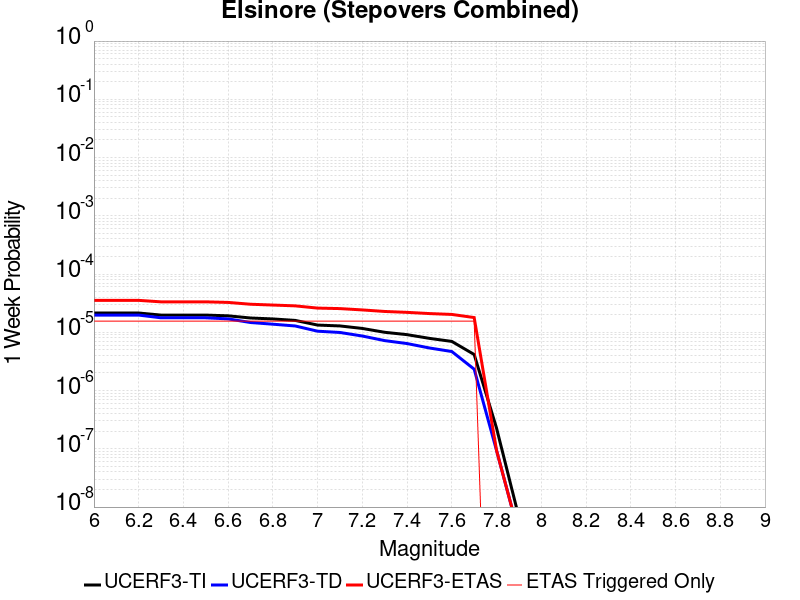 | 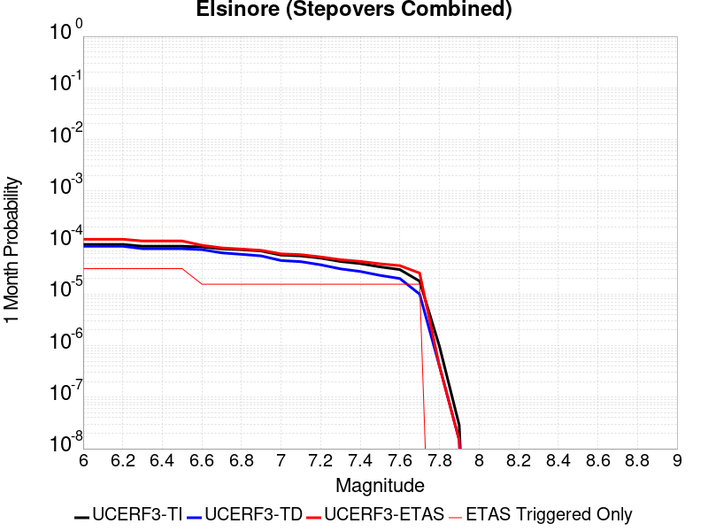 | 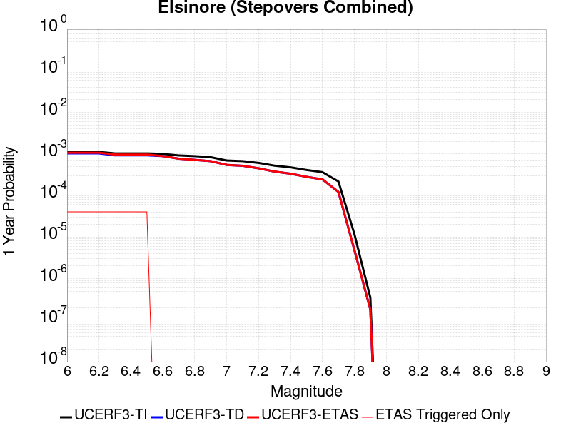 | 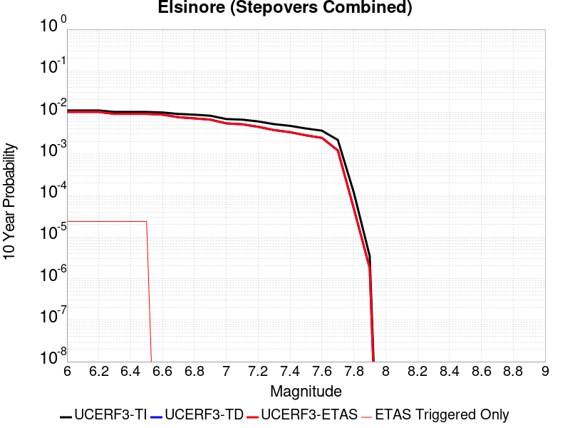 |

| Magnitude | 1 wk TI Prob | 1 wk TD Prob | 1 wk ETAS Prob | 1 wk ETAS/TD Gain | 1 wk ETAS Triggered Only | 1 mo TI Prob | 1 mo TD Prob | 1 mo ETAS Prob | 1 mo ETAS/TD Gain | 1 mo ETAS Triggered Only | 1 yr TI Prob | 1 yr TD Prob | 1 yr ETAS Prob | 1 yr ETAS/TD Gain | 1 yr ETAS Triggered Only | 10 yr TI Prob | 10 yr TD Prob | 10 yr ETAS Prob | 10 yr ETAS/TD Gain | 10 yr ETAS Triggered Only |
|-----|-----|-----|-----|-----|-----|-----|-----|-----|-----|-----|-----|-----|-----|-----|-----|-----|-----|-----|-----|-----|
| 6.0 | 2.144392E-5 | 1.9760193E-5 | 2.9759995E-5 | 1.506058 | 1.0E-5 | 9.189928E-5 | 8.468392E-5 | 1.0468222E-4 | 1.2361524 | 2.0E-5 | 0.0011182994 | 0.0010305607 | 0.0010505401 | 1.0193869 | 2.0E-5 | 0.011126885 | 0.010264917 | 0.010314404 | 1.004821 | 5.0E-5 |
| 6.1 | 2.144392E-5 | 1.9760193E-5 | 2.9759995E-5 | 1.506058 | 1.0E-5 | 9.189928E-5 | 8.468392E-5 | 1.0468222E-4 | 1.2361524 | 2.0E-5 | 0.0011182994 | 0.0010305607 | 0.0010505401 | 1.0193869 | 2.0E-5 | 0.011126885 | 0.010264917 | 0.010314404 | 1.004821 | 5.0E-5 |
| 6.2 | 2.144392E-5 | 1.9760193E-5 | 2.9759995E-5 | 1.506058 | 1.0E-5 | 9.189928E-5 | 8.468392E-5 | 1.0468222E-4 | 1.2361524 | 2.0E-5 | 0.0011182994 | 0.0010305607 | 0.0010505401 | 1.0193869 | 2.0E-5 | 0.011126885 | 0.010264917 | 0.010314404 | 1.004821 | 5.0E-5 |
| 6.3 | 1.9751555E-5 | 1.7741453E-5 | 2.7741275E-5 | 1.5636417 | 1.0E-5 | 8.4646774E-5 | 7.603267E-5 | 9.603115E-5 | 1.2630248 | 2.0E-5 | 0.0010300872 | 9.253213E-4 | 9.453028E-4 | 1.0215942 | 2.0E-5 | 0.010253254 | 0.009221276 | 0.009270815 | 1.0053723 | 5.0E-5 |
| 6.4 | 1.9751555E-5 | 1.7741453E-5 | 2.7741275E-5 | 1.5636417 | 1.0E-5 | 8.4646774E-5 | 7.603267E-5 | 9.603115E-5 | 1.2630248 | 2.0E-5 | 0.0010300872 | 9.253213E-4 | 9.453028E-4 | 1.0215942 | 2.0E-5 | 0.010253254 | 0.009221276 | 0.009270815 | 1.0053723 | 5.0E-5 |
| 6.5 | 1.9751555E-5 | 1.7741453E-5 | 2.7741275E-5 | 1.5636417 | 1.0E-5 | 8.4646774E-5 | 7.603267E-5 | 9.603115E-5 | 1.2630248 | 2.0E-5 | 0.0010300872 | 9.253213E-4 | 9.453028E-4 | 1.0215942 | 2.0E-5 | 0.010253254 | 0.009221276 | 0.009270815 | 1.0053723 | 5.0E-5 |
| 6.6 | 1.9188685E-5 | 1.7003393E-5 | 2.7003223E-5 | 1.588108 | 1.0E-5 | 8.2234634E-5 | 7.286974E-5 | 8.286901E-5 | 1.1372212 | 1.0E-5 | 0.0010007467 | 8.868442E-4 | 8.968353E-4 | 1.011266 | 1.0E-5 | 0.00996252 | 0.0088398475 | 0.008869582 | 1.0033637 | 3.0E-5 |
| 6.7 | 1.7608272E-5 | 1.4732616E-5 | 2.473247E-5 | 1.678756 | 1.0E-5 | 7.546184E-5 | 6.3138315E-5 | 7.313768E-5 | 1.1583724 | 1.0E-5 | 9.183606E-4 | 7.684476E-4 | 7.784399E-4 | 1.0130032 | 1.0E-5 | 0.009145746 | 0.00766491 | 0.0076748333 | 1.0012946 | 1.0E-5 |
| 6.8 | 1.697165E-5 | 1.3783365E-5 | 2.3783226E-5 | 1.7255023 | 1.0E-5 | 7.273361E-5 | 5.9070277E-5 | 6.906968E-5 | 1.1692799 | 1.0E-5 | 8.8517193E-4 | 7.18952E-4 | 7.289448E-4 | 1.0138991 | 1.0E-5 | 0.008816543 | 0.007172675 | 0.0071826032 | 1.0013841 | 1.0E-5 |
| 6.9 | 1.600365E-5 | 1.2846671E-5 | 2.2846543E-5 | 1.7784017 | 1.0E-5 | 6.858527E-5 | 5.5056043E-5 | 6.5055494E-5 | 1.1816231 | 1.0E-5 | 8.347058E-4 | 6.7010894E-4 | 6.8010227E-4 | 1.014913 | 1.0E-5 | 0.008315775 | 0.0066867657 | 0.006696699 | 1.0014855 | 1.0E-5 |
| 7.0 | 1.3314581E-5 | 1.0447548E-5 | 2.0447444E-5 | 1.9571524 | 1.0E-5 | 5.7061243E-5 | 4.4774453E-5 | 5.4774006E-5 | 1.2233317 | 1.0E-5 | 6.944992E-4 | 5.449953E-4 | 5.5498985E-4 | 1.0183388 | 1.0E-5 | 0.006923327 | 0.0054405155 | 0.005450461 | 1.0018281 | 1.0E-5 |
| 7.1 | 1.2865345E-5 | 9.937536E-6 | 1.9937437E-5 | 2.0062757 | 1.0E-5 | 5.5136024E-5 | 4.258876E-5 | 5.2588333E-5 | 1.2347938 | 1.0E-5 | 6.710743E-4 | 5.183973E-4 | 5.2839215E-4 | 1.0192802 | 1.0E-5 | 0.0066905143 | 0.0051752133 | 0.0051851617 | 1.0019222 | 1.0E-5 |
| 7.2 | 1.1650051E-5 | 8.633809E-6 | 1.8633722E-5 | 2.1582274 | 1.0E-5 | 4.9927836E-5 | 3.7001522E-5 | 4.7001155E-5 | 1.2702491 | 1.0E-5 | 6.0770183E-4 | 4.504022E-4 | 4.6039768E-4 | 1.0221924 | 1.0E-5 | 0.0060604266 | 0.0044963174 | 0.0045062723 | 1.0022141 | 1.0E-5 |
| 7.3 | 1.0008533E-5 | 7.2010425E-6 | 1.7200971E-5 | 2.3886778 | 1.0E-5 | 4.2893007E-5 | 3.0861254E-5 | 4.0860945E-5 | 1.3240209 | 1.0E-5 | 5.220972E-4 | 3.7567242E-4 | 3.8566868E-4 | 1.026609 | 1.0E-5 | 0.005208723 | 0.003750761 | 0.0037607234 | 1.0026561 | 1.0E-5 |
| 7.4 | 9.116759E-6 | 6.410068E-6 | 1.6410004E-5 | 2.5600357 | 1.0E-5 | 3.907124E-5 | 2.747144E-5 | 3.7471164E-5 | 1.3640044 | 1.0E-5 | 4.7558855E-4 | 3.3441483E-4 | 3.4441147E-4 | 1.0298929 | 1.0E-5 | 0.00474572 | 0.0033392678 | 0.0033492346 | 1.0029846 | 1.0E-5 |
| 7.5 | 7.870524E-6 | 5.3825365E-6 | 1.5382482E-5 | 2.85785 | 1.0E-5 | 3.3730383E-5 | 2.3067816E-5 | 3.3067587E-5 | 1.4334944 | 1.0E-5 | 4.1059E-4 | 2.8081573E-4 | 2.9081292E-4 | 1.0356005 | 1.0E-5 | 0.0040983222 | 0.0028047354 | 0.0028147076 | 1.0035554 | 1.0E-5 |
| 7.6 | 6.9774537E-6 | 4.6776067E-6 | 1.467756E-5 | 3.1378353 | 1.0E-5 | 2.990303E-5 | 2.0046738E-5 | 3.0046538E-5 | 1.4988242 | 1.0E-5 | 3.640086E-4 | 2.4404288E-4 | 2.5404044E-4 | 1.0409664 | 1.0E-5 | 0.003634129 | 0.0024378651 | 0.0024478408 | 1.004092 | 1.0E-5 |
| 7.7 | 4.1616954E-6 | 2.32834E-6 | 1.2328317E-5 | 5.294895 | 1.0E-5 | 1.7835715E-5 | 9.978567E-6 | 1.9978466E-5 | 2.002138 | 1.0E-5 | 2.171282E-4 | 1.2148302E-4 | 1.3148181E-4 | 1.082306 | 1.0E-5 | 0.0021691616 | 0.0012142392 | 0.001224227 | 1.0082256 | 1.0E-5 |
| 7.8 | 2.2692414E-7 | 9.3854695E-8 | 9.3854695E-8 | 1.0 | 0.0 | 9.725317E-7 | 4.0223435E-7 | 4.0223435E-7 | 1.0 | 0.0 | 1.1840509E-5 | 4.8971956E-6 | 4.8971956E-6 | 1.0 | 0.0 | 1.1839878E-4 | 4.8971204E-5 | 4.8971204E-5 | 1.0 | 0.0 |
| 7.9 | 6.676829E-9 | 3.439853E-9 | 3.439853E-9 | 1.0 | 0.0 | 2.861498E-8 | 1.4742227E-8 | 1.4742227E-8 | 1.0 | 0.0 | 3.4838732E-7 | 1.7948659E-7 | 1.7948659E-7 | 1.0 | 0.0 | 3.4838679E-6 | 1.7948646E-6 | 1.7948646E-6 | 1.0 | 0.0 |

## Pitas Point (Lower)-Montalvo
*[(top)](#table-of-contents)*

| 1 Week | 1 Month | 1 Year | 10 Year |
|-----|-----|-----|-----|
| 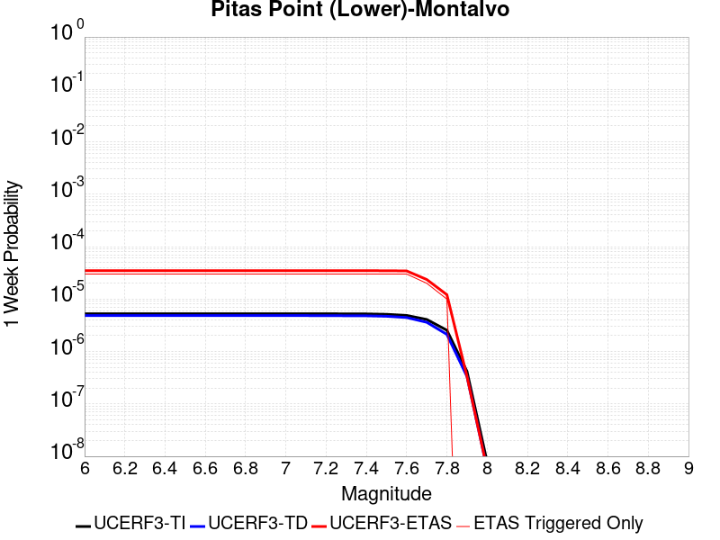 | 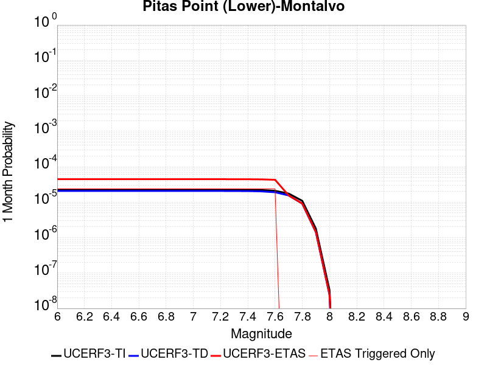 | 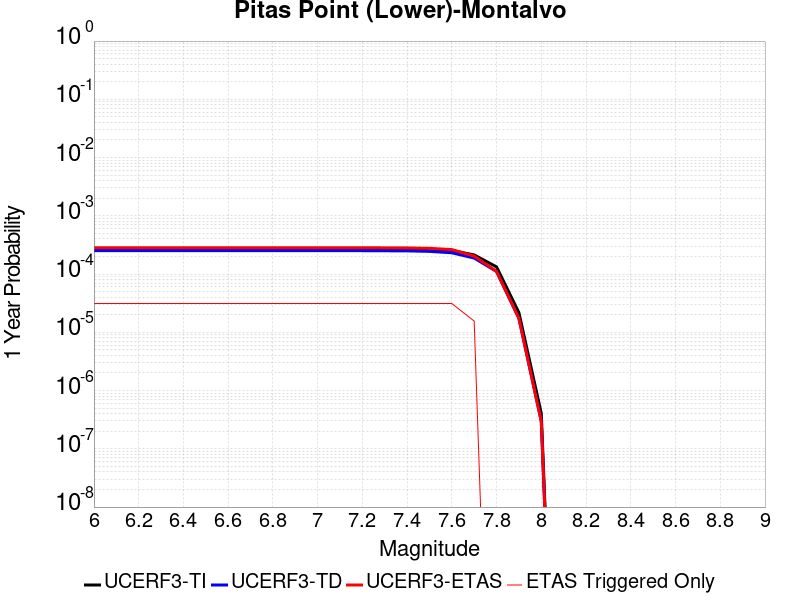 | 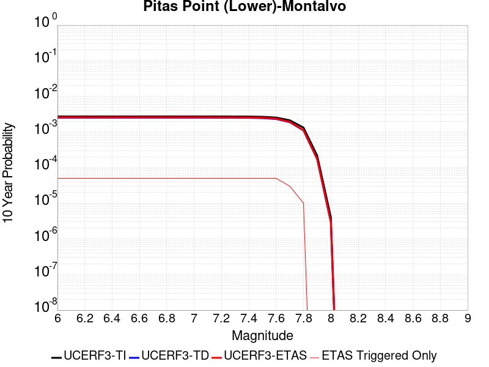 |

| Magnitude | 1 wk TI Prob | 1 wk TD Prob | 1 wk ETAS Prob | 1 wk ETAS/TD Gain | 1 wk ETAS Triggered Only | 1 mo TI Prob | 1 mo TD Prob | 1 mo ETAS Prob | 1 mo ETAS/TD Gain | 1 mo ETAS Triggered Only | 1 yr TI Prob | 1 yr TD Prob | 1 yr ETAS Prob | 1 yr ETAS/TD Gain | 1 yr ETAS Triggered Only | 10 yr TI Prob | 10 yr TD Prob | 10 yr ETAS Prob | 10 yr ETAS/TD Gain | 10 yr ETAS Triggered Only |
|-----|-----|-----|-----|-----|-----|-----|-----|-----|-----|-----|-----|-----|-----|-----|-----|-----|-----|-----|-----|-----|
| 6.0 | 5.2543637E-6 | 4.8378706E-6 | 3.4837725E-5 | 7.2010455 | 3.0E-5 | 2.2518509E-5 | 2.0733567E-5 | 5.0732946E-5 | 2.446899 | 3.0E-5 | 2.7412834E-4 | 2.5240227E-4 | 2.9239216E-4 | 1.1584371 | 4.0E-5 | 0.0027379042 | 0.0025211885 | 0.0025710624 | 1.019782 | 5.0E-5 |
| 6.1 | 5.2543637E-6 | 4.8378706E-6 | 3.4837725E-5 | 7.2010455 | 3.0E-5 | 2.2518509E-5 | 2.0733567E-5 | 5.0732946E-5 | 2.446899 | 3.0E-5 | 2.7412834E-4 | 2.5240227E-4 | 2.9239216E-4 | 1.1584371 | 4.0E-5 | 0.0027379042 | 0.0025211885 | 0.0025710624 | 1.019782 | 5.0E-5 |
| 6.2 | 5.2543637E-6 | 4.8378706E-6 | 3.4837725E-5 | 7.2010455 | 3.0E-5 | 2.2518509E-5 | 2.0733567E-5 | 5.0732946E-5 | 2.446899 | 3.0E-5 | 2.7412834E-4 | 2.5240227E-4 | 2.9239216E-4 | 1.1584371 | 4.0E-5 | 0.0027379042 | 0.0025211885 | 0.0025710624 | 1.019782 | 5.0E-5 |
| 6.3 | 5.2543637E-6 | 4.8378706E-6 | 3.4837725E-5 | 7.2010455 | 3.0E-5 | 2.2518509E-5 | 2.0733567E-5 | 5.0732946E-5 | 2.446899 | 3.0E-5 | 2.7412834E-4 | 2.5240227E-4 | 2.9239216E-4 | 1.1584371 | 4.0E-5 | 0.0027379042 | 0.0025211885 | 0.0025710624 | 1.019782 | 5.0E-5 |
| 6.4 | 5.2543637E-6 | 4.8378706E-6 | 3.4837725E-5 | 7.2010455 | 3.0E-5 | 2.2518509E-5 | 2.0733567E-5 | 5.0732946E-5 | 2.446899 | 3.0E-5 | 2.7412834E-4 | 2.5240227E-4 | 2.9239216E-4 | 1.1584371 | 4.0E-5 | 0.0027379042 | 0.0025211885 | 0.0025710624 | 1.019782 | 5.0E-5 |
| 6.5 | 5.2543637E-6 | 4.8378706E-6 | 3.4837725E-5 | 7.2010455 | 3.0E-5 | 2.2518509E-5 | 2.0733567E-5 | 5.0732946E-5 | 2.446899 | 3.0E-5 | 2.7412834E-4 | 2.5240227E-4 | 2.9239216E-4 | 1.1584371 | 4.0E-5 | 0.0027379042 | 0.0025211885 | 0.0025710624 | 1.019782 | 5.0E-5 |
| 6.6 | 5.2543637E-6 | 4.8378706E-6 | 3.4837725E-5 | 7.2010455 | 3.0E-5 | 2.2518509E-5 | 2.0733567E-5 | 5.0732946E-5 | 2.446899 | 3.0E-5 | 2.7412834E-4 | 2.5240227E-4 | 2.9239216E-4 | 1.1584371 | 4.0E-5 | 0.0027379042 | 0.0025211885 | 0.0025710624 | 1.019782 | 5.0E-5 |
| 6.7 | 5.2543637E-6 | 4.8378706E-6 | 3.4837725E-5 | 7.2010455 | 3.0E-5 | 2.2518509E-5 | 2.0733567E-5 | 5.0732946E-5 | 2.446899 | 3.0E-5 | 2.7412834E-4 | 2.5240227E-4 | 2.9239216E-4 | 1.1584371 | 4.0E-5 | 0.0027379042 | 0.0025211885 | 0.0025710624 | 1.019782 | 5.0E-5 |
| 6.8 | 5.2543637E-6 | 4.8378706E-6 | 3.4837725E-5 | 7.2010455 | 3.0E-5 | 2.2518509E-5 | 2.0733567E-5 | 5.0732946E-5 | 2.446899 | 3.0E-5 | 2.7412834E-4 | 2.5240227E-4 | 2.9239216E-4 | 1.1584371 | 4.0E-5 | 0.0027379042 | 0.0025211885 | 0.0025710624 | 1.019782 | 5.0E-5 |
| 6.9 | 5.2543637E-6 | 4.8378706E-6 | 3.4837725E-5 | 7.2010455 | 3.0E-5 | 2.2518509E-5 | 2.0733567E-5 | 5.0732946E-5 | 2.446899 | 3.0E-5 | 2.7412834E-4 | 2.5240227E-4 | 2.9239216E-4 | 1.1584371 | 4.0E-5 | 0.0027379042 | 0.0025211885 | 0.0025710624 | 1.019782 | 5.0E-5 |
| 7.0 | 5.2543637E-6 | 4.8378706E-6 | 3.4837725E-5 | 7.2010455 | 3.0E-5 | 2.2518509E-5 | 2.0733567E-5 | 5.0732946E-5 | 2.446899 | 3.0E-5 | 2.7412834E-4 | 2.5240227E-4 | 2.9239216E-4 | 1.1584371 | 4.0E-5 | 0.0027379042 | 0.0025211885 | 0.0025710624 | 1.019782 | 5.0E-5 |
| 7.1 | 5.2543637E-6 | 4.8378706E-6 | 3.4837725E-5 | 7.2010455 | 3.0E-5 | 2.2518509E-5 | 2.0733567E-5 | 5.0732946E-5 | 2.446899 | 3.0E-5 | 2.7412834E-4 | 2.5240227E-4 | 2.9239216E-4 | 1.1584371 | 4.0E-5 | 0.0027379042 | 0.0025211885 | 0.0025710624 | 1.019782 | 5.0E-5 |
| 7.2 | 5.2458695E-6 | 4.8290244E-6 | 3.4828878E-5 | 7.212405 | 3.0E-5 | 2.2482105E-5 | 2.0695656E-5 | 5.0695035E-5 | 2.4495497 | 3.0E-5 | 2.7368523E-4 | 2.519408E-4 | 2.9193072E-4 | 1.1587274 | 4.0E-5 | 0.0027334841 | 0.0025165842 | 0.0025664584 | 1.0198182 | 5.0E-5 |
| 7.3 | 5.22665E-6 | 4.8089414E-6 | 3.4808796E-5 | 7.238349 | 3.0E-5 | 2.2399736E-5 | 2.0609588E-5 | 5.060897E-5 | 2.4556031 | 3.0E-5 | 2.7268266E-4 | 2.5089315E-4 | 2.9088312E-4 | 1.1593904 | 4.0E-5 | 0.002723483 | 0.0025061315 | 0.0025560062 | 1.019901 | 5.0E-5 |
| 7.4 | 5.210642E-6 | 4.792154E-6 | 3.479201E-5 | 7.260203 | 3.0E-5 | 2.233113E-5 | 2.0537642E-5 | 5.0537026E-5 | 2.4607024 | 3.0E-5 | 2.718476E-4 | 2.5001742E-4 | 2.9000742E-4 | 1.1599488 | 4.0E-5 | 0.002715153 | 0.0024973939 | 0.002547269 | 1.0199709 | 5.0E-5 |
| 7.5 | 5.1226016E-6 | 4.7000403E-6 | 3.46999E-5 | 7.3828936 | 3.0E-5 | 2.1953823E-5 | 2.0142877E-5 | 5.0142273E-5 | 2.4893303 | 3.0E-5 | 2.67255E-4 | 2.4521223E-4 | 2.8520243E-4 | 1.163084 | 4.0E-5 | 0.0026693381 | 0.0024494485 | 0.002499326 | 1.0203627 | 5.0E-5 |
| 7.6 | 4.8796987E-6 | 4.4449403E-6 | 3.4444805E-5 | 7.749217 | 3.0E-5 | 2.0912828E-5 | 1.9049607E-5 | 4.9049035E-5 | 2.5748057 | 3.0E-5 | 2.5458392E-4 | 2.3190459E-4 | 2.7189532E-4 | 1.1724447 | 4.0E-5 | 0.0025429246 | 0.0023166565 | 0.0023665405 | 1.0215328 | 5.0E-5 |
| 7.7 | 4.0834398E-6 | 3.6091124E-6 | 2.360904E-5 | 6.5415087 | 2.0E-5 | 1.7500339E-5 | 1.5467534E-5 | 3.5467223E-5 | 2.293011 | 2.0E-5 | 2.1304579E-4 | 1.8830119E-4 | 2.0829742E-4 | 1.1061928 | 2.0E-5 | 0.0021284167 | 0.00188144 | 0.0019113836 | 1.0159153 | 3.0E-5 |
| 7.8 | 2.5445438E-6 | 2.121228E-6 | 1.2121207E-5 | 5.7142406 | 1.0E-5 | 1.0905142E-5 | 9.090945E-6 | 1.9090854E-5 | 2.0999856 | 1.0E-5 | 1.3276201E-4 | 1.1067669E-4 | 1.2067558E-4 | 1.0903432 | 1.0E-5 | 0.0013268272 | 0.0011062203 | 0.0011162093 | 1.0090297 | 1.0E-5 |
| 7.9 | 4.1677114E-7 | 3.3293693E-7 | 3.3293693E-7 | 1.0 | 0.0 | 1.7861609E-6 | 1.4268718E-6 | 1.4268718E-6 | 1.0 | 0.0 | 2.1746291E-5 | 1.737203E-5 | 1.737203E-5 | 1.0 | 0.0 | 2.1744163E-4 | 1.7370703E-4 | 1.7370703E-4 | 1.0 | 0.0 |
| 8.0 | 7.791402E-9 | 5.683497E-9 | 5.683497E-9 | 1.0 | 0.0 | 3.3391725E-8 | 2.4357844E-8 | 2.4357844E-8 | 1.0 | 0.0 | 4.0654416E-7 | 2.9655675E-7 | 2.9655675E-7 | 1.0 | 0.0 | 4.065434E-6 | 2.9655655E-6 | 2.9655655E-6 | 1.0 | 0.0 |

## Great Valley 07 (Orestimba)
*[(top)](#table-of-contents)*

| 1 Week | 1 Month | 1 Year | 10 Year |
|-----|-----|-----|-----|
|  |  | 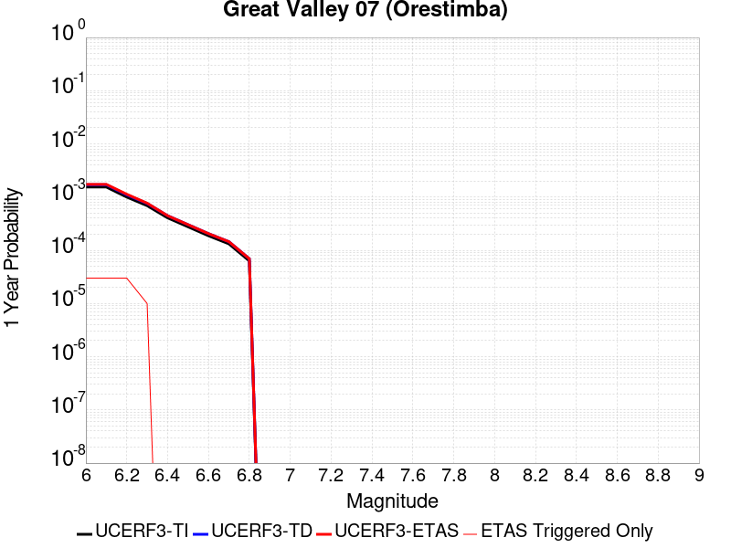 |  |

| Magnitude | 1 wk TI Prob | 1 wk TD Prob | 1 wk ETAS Prob | 1 wk ETAS/TD Gain | 1 wk ETAS Triggered Only | 1 mo TI Prob | 1 mo TD Prob | 1 mo ETAS Prob | 1 mo ETAS/TD Gain | 1 mo ETAS Triggered Only | 1 yr TI Prob | 1 yr TD Prob | 1 yr ETAS Prob | 1 yr ETAS/TD Gain | 1 yr ETAS Triggered Only | 10 yr TI Prob | 10 yr TD Prob | 10 yr ETAS Prob | 10 yr ETAS/TD Gain | 10 yr ETAS Triggered Only |
|-----|-----|-----|-----|-----|-----|-----|-----|-----|-----|-----|-----|-----|-----|-----|-----|-----|-----|-----|-----|-----|
| 6.0 | 2.9687902E-5 | 3.27575E-5 | 4.2757172E-5 | 1.3052636 | 1.0E-5 | 1.2722766E-4 | 1.4038214E-4 | 1.5038073E-4 | 1.0712241 | 1.0E-5 | 0.0015478961 | 0.0017078844 | 0.0017378331 | 1.0175356 | 3.0E-5 | 0.015371585 | 0.016955135 | 0.017004289 | 1.0028989 | 5.0E-5 |
| 6.1 | 2.9687902E-5 | 3.27575E-5 | 4.2757172E-5 | 1.3052636 | 1.0E-5 | 1.2722766E-4 | 1.4038214E-4 | 1.5038073E-4 | 1.0712241 | 1.0E-5 | 0.0015478961 | 0.0017078844 | 0.0017378331 | 1.0175356 | 3.0E-5 | 0.015371585 | 0.016955135 | 0.017004289 | 1.0028989 | 5.0E-5 |
| 6.2 | 1.9231524E-5 | 2.1159167E-5 | 3.1158954E-5 | 1.4725984 | 1.0E-5 | 8.2418206E-5 | 9.067912E-5 | 1.0067821E-4 | 1.110269 | 1.0E-5 | 0.0010029797 | 0.0011034822 | 0.0011334491 | 1.0271567 | 3.0E-5 | 0.00998465 | 0.01098244 | 0.011022001 | 1.0036021 | 4.0E-5 |
| 6.3 | 1.324766E-5 | 1.4548534E-5 | 1.4548534E-5 | 1.0 | 0.0 | 5.6774446E-5 | 6.234942E-5 | 6.234942E-5 | 1.0 | 0.0 | 6.910097E-4 | 7.5884897E-4 | 7.6884136E-4 | 1.0131679 | 1.0E-5 | 0.006888649 | 0.0075635235 | 0.0075833723 | 1.0026243 | 2.0E-5 |
| 6.4 | 7.818645E-6 | 8.57284E-6 | 8.57284E-6 | 1.0 | 0.0 | 3.3508048E-5 | 3.6740246E-5 | 3.6740246E-5 | 1.0 | 0.0 | 4.078841E-4 | 4.4722404E-4 | 4.4722404E-4 | 1.0 | 0.0 | 0.004071363 | 0.0044635804 | 0.004473536 | 1.0022304 | 1.0E-5 |
| 6.5 | 5.3076565E-6 | 5.8178007E-6 | 5.8178007E-6 | 1.0 | 0.0 | 2.27469E-5 | 2.4933206E-5 | 2.4933206E-5 | 1.0 | 0.0 | 2.7690834E-4 | 3.035216E-4 | 3.035216E-4 | 1.0 | 0.0 | 0.0027656353 | 0.00303128 | 0.0030412497 | 1.003289 | 1.0E-5 |
| 6.6 | 3.6003578E-6 | 3.9484953E-6 | 3.9484953E-6 | 1.0 | 0.0 | 1.5430012E-5 | 1.6922022E-5 | 1.6922022E-5 | 1.0 | 0.0 | 1.8784421E-4 | 2.0600771E-4 | 2.0600771E-4 | 1.0 | 0.0 | 0.0018768552 | 0.0020583214 | 0.0020683007 | 1.0048484 | 1.0E-5 |
| 6.7 | 2.5361826E-6 | 2.7834678E-6 | 2.7834678E-6 | 1.0 | 0.0 | 1.0869308E-5 | 1.1929101E-5 | 1.1929101E-5 | 1.0 | 0.0 | 1.3232579E-4 | 1.4522845E-4 | 1.4522845E-4 | 1.0 | 0.0 | 0.0013224703 | 0.0014514653 | 0.0014514653 | 1.0 | 0.0 |
| 6.8 | 1.2115831E-6 | 1.3313797E-6 | 1.3313797E-6 | 1.0 | 0.0 | 5.1924885E-6 | 5.7059065E-6 | 5.7059065E-6 | 1.0 | 0.0 | 6.3216714E-5 | 6.9468166E-5 | 6.9468166E-5 | 1.0 | 0.0 | 6.3198735E-4 | 6.945596E-4 | 6.945596E-4 | 1.0 | 0.0 |

## Superstition Hills
*[(top)](#table-of-contents)*

| 1 Week | 1 Month | 1 Year | 10 Year |
|-----|-----|-----|-----|
| 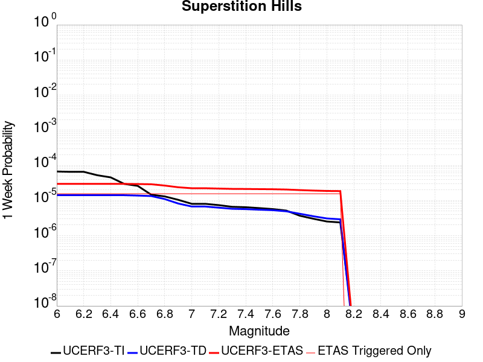 | 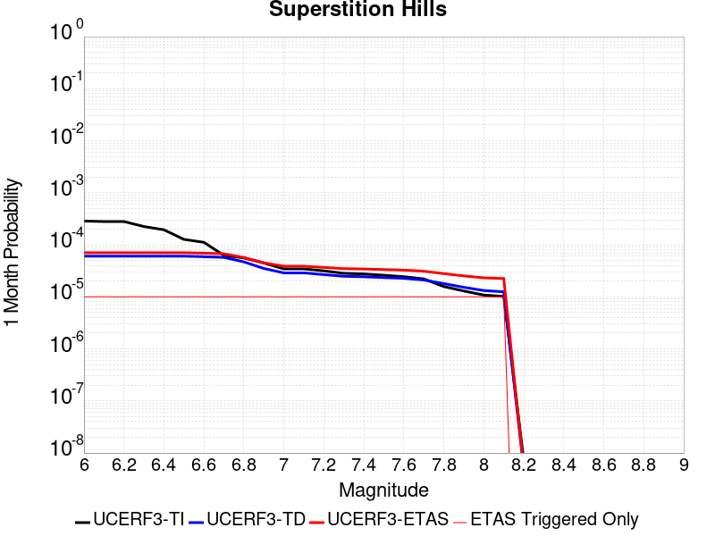 | 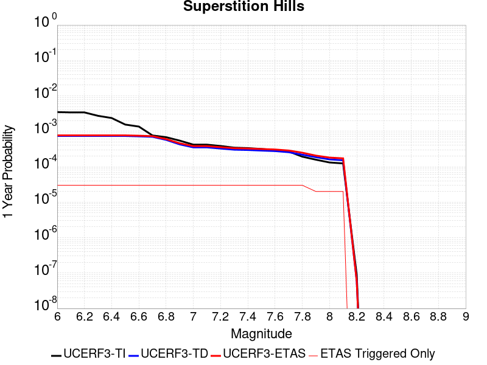 |  |

| Magnitude | 1 wk TI Prob | 1 wk TD Prob | 1 wk ETAS Prob | 1 wk ETAS/TD Gain | 1 wk ETAS Triggered Only | 1 mo TI Prob | 1 mo TD Prob | 1 mo ETAS Prob | 1 mo ETAS/TD Gain | 1 mo ETAS Triggered Only | 1 yr TI Prob | 1 yr TD Prob | 1 yr ETAS Prob | 1 yr ETAS/TD Gain | 1 yr ETAS Triggered Only | 10 yr TI Prob | 10 yr TD Prob | 10 yr ETAS Prob | 10 yr ETAS/TD Gain | 10 yr ETAS Triggered Only |
|-----|-----|-----|-----|-----|-----|-----|-----|-----|-----|-----|-----|-----|-----|-----|-----|-----|-----|-----|-----|-----|
| 6.0 | 6.6865185E-5 | 1.41376995E-5 | 2.4137558E-5 | 1.7073187 | 1.0E-5 | 2.8653358E-4 | 6.0588824E-5 | 7.058822E-5 | 1.1650369 | 1.0E-5 | 0.0034829667 | 7.374355E-4 | 7.6741335E-4 | 1.0406516 | 3.0E-5 | 0.03428881 | 0.0075204074 | 0.0075700316 | 1.0065986 | 5.0E-5 |
| 6.1 | 6.544851E-5 | 1.41376995E-5 | 2.4137558E-5 | 1.7073187 | 1.0E-5 | 2.8046346E-4 | 6.0588824E-5 | 7.058822E-5 | 1.1650369 | 1.0E-5 | 0.0034092965 | 7.374355E-4 | 7.6741335E-4 | 1.0406516 | 3.0E-5 | 0.033574644 | 0.007520407 | 0.0075700306 | 1.0065986 | 5.0E-5 |
| 6.2 | 6.544851E-5 | 1.41376995E-5 | 2.4137558E-5 | 1.7073187 | 1.0E-5 | 2.8046346E-4 | 6.0588824E-5 | 7.058822E-5 | 1.1650369 | 1.0E-5 | 0.0034092965 | 7.374355E-4 | 7.6741335E-4 | 1.0406516 | 3.0E-5 | 0.033574644 | 0.007520407 | 0.0075700306 | 1.0065986 | 5.0E-5 |
| 6.3 | 5.2402065E-5 | 1.4137698E-5 | 2.4137556E-5 | 1.7073188 | 1.0E-5 | 2.2456095E-4 | 6.058882E-5 | 7.058821E-5 | 1.1650369 | 1.0E-5 | 0.0027306017 | 7.374354E-4 | 7.674133E-4 | 1.0406516 | 3.0E-5 | 0.02697292 | 0.007520402 | 0.0075700255 | 1.0065986 | 5.0E-5 |
| 6.4 | 4.542238E-5 | 1.4137698E-5 | 2.4137556E-5 | 1.7073188 | 1.0E-5 | 1.9465282E-4 | 6.0588816E-5 | 7.058821E-5 | 1.1650369 | 1.0E-5 | 0.0023673223 | 7.3743536E-4 | 7.6741324E-4 | 1.0406516 | 3.0E-5 | 0.023422617 | 0.0075203986 | 0.0075700227 | 1.0065986 | 5.0E-5 |
| 6.5 | 2.9672969E-5 | 1.4137696E-5 | 2.4137555E-5 | 1.7073188 | 1.0E-5 | 1.2716366E-4 | 6.058881E-5 | 7.0588205E-5 | 1.1650369 | 1.0E-5 | 0.0015471181 | 7.374353E-4 | 7.674132E-4 | 1.0406516 | 3.0E-5 | 0.015363912 | 0.007520392 | 0.007570016 | 1.0065986 | 5.0E-5 |
| 6.6 | 2.6056105E-5 | 1.3803458E-5 | 2.380332E-5 | 1.7244462 | 1.0E-5 | 1.1166424E-4 | 5.9156428E-5 | 6.915584E-5 | 1.1690333 | 1.0E-5 | 0.0013586642 | 7.200076E-4 | 7.49986E-4 | 1.0416362 | 3.0E-5 | 0.013503874 | 0.0073448285 | 0.0073944614 | 1.0067575 | 5.0E-5 |
| 6.7 | 1.4611248E-5 | 1.3383359E-5 | 2.3383225E-5 | 1.7471865 | 1.0E-5 | 6.261813E-5 | 5.7356083E-5 | 6.735551E-5 | 1.1743394 | 1.0E-5 | 7.6210906E-4 | 6.981025E-4 | 7.2808156E-4 | 1.0429436 | 3.0E-5 | 0.0075950073 | 0.00712602 | 0.0071756635 | 1.0069666 | 5.0E-5 |
| 6.8 | 1.30607E-5 | 1.09787925E-5 | 2.0978683E-5 | 1.9108369 | 1.0E-5 | 5.597323E-5 | 4.705117E-5 | 5.70507E-5 | 1.2125245 | 1.0E-5 | 6.8126095E-4 | 5.7270617E-4 | 6.02689E-4 | 1.0523529 | 3.0E-5 | 0.006791762 | 0.00587438 | 0.005914145 | 1.0067692 | 4.0E-5 |
| 6.9 | 1.0443096E-5 | 8.195349E-6 | 1.8195267E-5 | 2.220194 | 1.0E-5 | 4.4755358E-5 | 3.5122466E-5 | 4.5122117E-5 | 1.284708 | 1.0E-5 | 5.447602E-4 | 4.2753448E-4 | 4.5752164E-4 | 1.0701398 | 3.0E-5 | 0.005434267 | 0.0044094524 | 0.00443932 | 1.0067736 | 3.0E-5 |
| 7.0 | 8.045912E-6 | 6.739692E-6 | 1.6739625E-5 | 2.4837375 | 1.0E-5 | 3.4482026E-5 | 2.888408E-5 | 3.888379E-5 | 1.3462014 | 1.0E-5 | 4.197378E-4 | 3.5160795E-4 | 3.815974E-4 | 1.0852923 | 3.0E-5 | 0.0041894587 | 0.0036334093 | 0.0036633003 | 1.0082268 | 3.0E-5 |
| 7.1 | 8.045912E-6 | 6.739692E-6 | 1.6739625E-5 | 2.4837375 | 1.0E-5 | 3.4482026E-5 | 2.888408E-5 | 3.888379E-5 | 1.3462014 | 1.0E-5 | 4.197378E-4 | 3.5160795E-4 | 3.815974E-4 | 1.0852923 | 3.0E-5 | 0.0041894587 | 0.0036334093 | 0.0036633003 | 1.0082268 | 3.0E-5 |
| 7.2 | 7.375506E-6 | 6.2466297E-6 | 1.6246568E-5 | 2.6008532 | 1.0E-5 | 3.1608928E-5 | 2.6771E-5 | 3.6770733E-5 | 1.3735285 | 1.0E-5 | 3.8477074E-4 | 3.2588904E-4 | 3.5587925E-4 | 1.0920259 | 3.0E-5 | 0.003841052 | 0.003373887 | 0.0034037856 | 1.0088618 | 3.0E-5 |
| 7.3 | 6.6063913E-6 | 5.7990574E-6 | 1.5799E-5 | 2.7244081 | 1.0E-5 | 2.8312797E-5 | 2.485287E-5 | 3.4852623E-5 | 1.402358 | 1.0E-5 | 3.446538E-4 | 3.025424E-4 | 3.3253332E-4 | 1.0991297 | 3.0E-5 | 0.0034411973 | 0.003138153 | 0.003168059 | 1.0095297 | 3.0E-5 |
| 7.4 | 6.4313126E-6 | 5.680481E-6 | 1.5680425E-5 | 2.760404 | 1.0E-5 | 2.7562477E-5 | 2.4344696E-5 | 3.434445E-5 | 1.4107571 | 1.0E-5 | 3.355215E-4 | 2.9635706E-4 | 3.2634818E-4 | 1.1011993 | 3.0E-5 | 0.0033501536 | 0.0030759154 | 0.003105823 | 1.0097232 | 3.0E-5 |
| 7.5 | 6.0742927E-6 | 5.4763104E-6 | 1.5476255E-5 | 2.826037 | 1.0E-5 | 2.6032423E-5 | 2.3469694E-5 | 3.346946E-5 | 1.4260714 | 1.0E-5 | 3.1689866E-4 | 2.8570674E-4 | 3.1569815E-4 | 1.1049727 | 3.0E-5 | 0.0031644711 | 0.002967756 | 0.002997667 | 1.0100787 | 3.0E-5 |
| 7.6 | 5.6987187E-6 | 5.294521E-6 | 1.5294469E-5 | 2.888735 | 1.0E-5 | 2.4422852E-5 | 2.269061E-5 | 3.2690383E-5 | 1.4407009 | 1.0E-5 | 2.9730765E-4 | 2.7622381E-4 | 3.0621554E-4 | 1.1085776 | 3.0E-5 | 0.002969102 | 0.0028710118 | 0.0029009257 | 1.0104192 | 3.0E-5 |
| 7.7 | 5.1658035E-6 | 4.925535E-6 | 1.4925486E-5 | 3.0302262 | 1.0E-5 | 2.2138971E-5 | 2.1109268E-5 | 3.110906E-5 | 1.4737155 | 1.0E-5 | 2.6950863E-4 | 2.5697565E-4 | 2.8696793E-4 | 1.1167126 | 3.0E-5 | 0.00269182 | 0.0026760625 | 0.0027059822 | 1.0111805 | 3.0E-5 |
| 7.8 | 3.6864697E-6 | 4.1964995E-6 | 1.4196457E-5 | 3.3829286 | 1.0E-5 | 1.579906E-5 | 1.7984876E-5 | 2.7984695E-5 | 1.5560127 | 1.0E-5 | 1.9233658E-4 | 2.1894433E-4 | 2.4893775E-4 | 1.1369911 | 3.0E-5 | 0.0019217018 | 0.0022892624 | 0.0023191937 | 1.0130746 | 3.0E-5 |
| 7.9 | 3.0265903E-6 | 3.5637288E-6 | 1.3563693E-5 | 3.8060396 | 1.0E-5 | 1.2971037E-5 | 1.5273037E-5 | 2.5272884E-5 | 1.6547387 | 1.0E-5 | 1.5791094E-4 | 1.859338E-4 | 2.0593008E-4 | 1.1075451 | 2.0E-5 | 0.0015779877 | 0.0019534735 | 0.0019734346 | 1.0102181 | 2.0E-5 |
| 8.0 | 2.5271493E-6 | 3.0867361E-6 | 1.3086706E-5 | 4.239658 | 1.0E-5 | 1.0830595E-5 | 1.3228804E-5 | 2.3228673E-5 | 1.7559162 | 1.0E-5 | 1.3185451E-4 | 1.610492E-4 | 1.8104598E-4 | 1.1241657 | 2.0E-5 | 0.0013177631 | 0.0016973554 | 0.0017173215 | 1.011763 | 2.0E-5 |
| 8.1 | 2.3749135E-6 | 2.917377E-6 | 1.2917348E-5 | 4.4277267 | 1.0E-5 | 1.0178161E-5 | 1.25029865E-5 | 2.2502862E-5 | 1.7997988 | 1.0E-5 | 1.2391206E-4 | 1.5221364E-4 | 1.722106E-4 | 1.1313742 | 2.0E-5 | 0.0012384299 | 0.001604949 | 0.0016249169 | 1.0124414 | 2.0E-5 |
| 8.2 | 1.7186406E-9 | 1.1440594E-9 | 1.1440594E-9 | 1.0 | 0.0 | 7.3656024E-9 | 4.9031117E-9 | 4.9031117E-9 | 1.0 | 0.0 | 8.9676206E-8 | 5.969538E-8 | 5.969538E-8 | 1.0 | 0.0 | 8.9676166E-7 | 6.389059E-7 | 6.389059E-7 | 1.0 | 0.0 |

## San Gabriel (Extension)
*[(top)](#table-of-contents)*

| 1 Week | 1 Month | 1 Year | 10 Year |
|-----|-----|-----|-----|
| 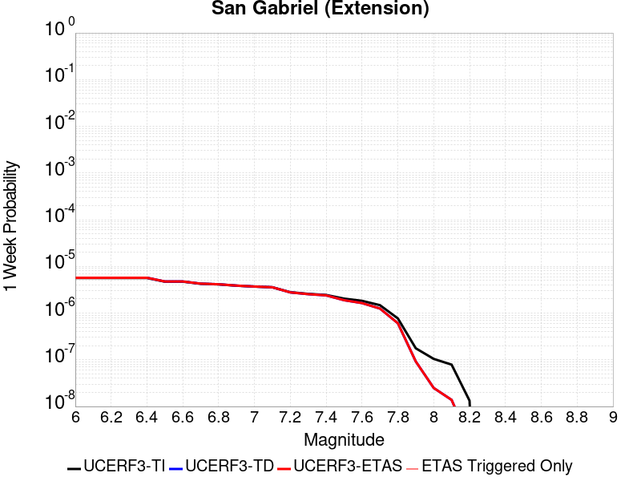 | 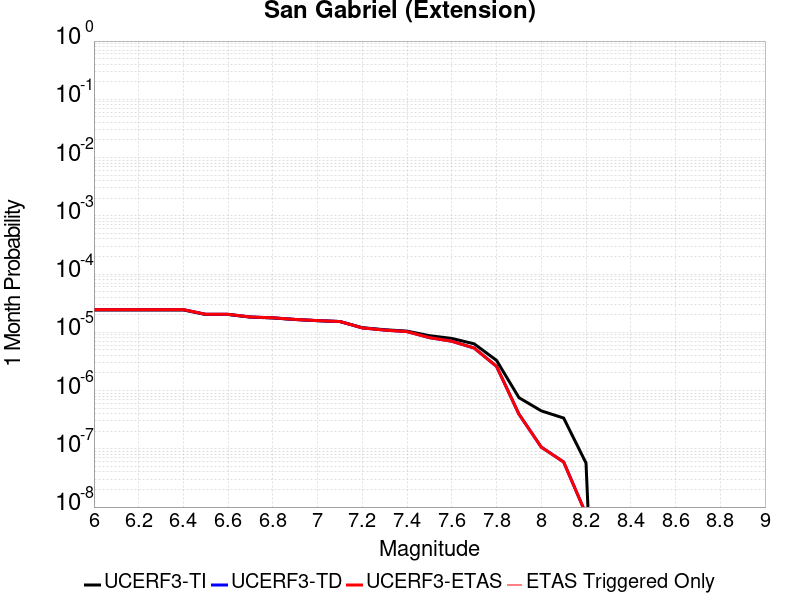 | 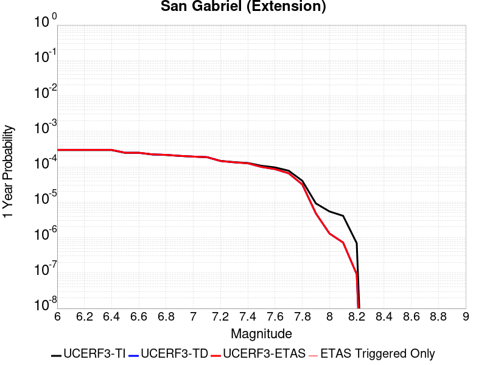 | 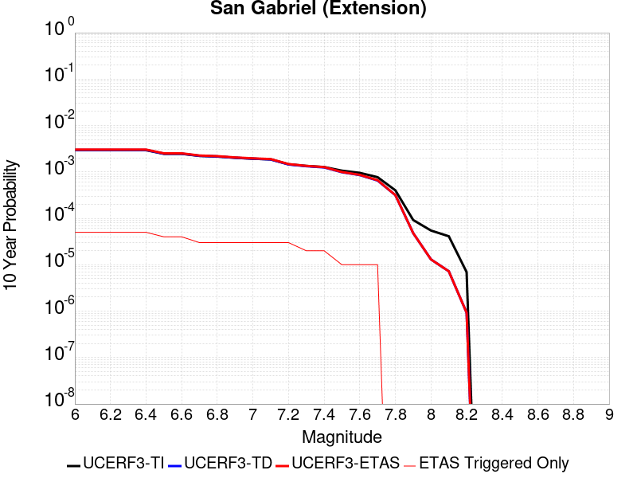 |

| Magnitude | 1 wk TI Prob | 1 wk TD Prob | 1 wk ETAS Prob | 1 wk ETAS/TD Gain | 1 wk ETAS Triggered Only | 1 mo TI Prob | 1 mo TD Prob | 1 mo ETAS Prob | 1 mo ETAS/TD Gain | 1 mo ETAS Triggered Only | 1 yr TI Prob | 1 yr TD Prob | 1 yr ETAS Prob | 1 yr ETAS/TD Gain | 1 yr ETAS Triggered Only | 10 yr TI Prob | 10 yr TD Prob | 10 yr ETAS Prob | 10 yr ETAS/TD Gain | 10 yr ETAS Triggered Only |
|-----|-----|-----|-----|-----|-----|-----|-----|-----|-----|-----|-----|-----|-----|-----|-----|-----|-----|-----|-----|-----|
| 6.0 | 5.6486106E-6 | 5.7168304E-6 | 5.7168304E-6 | 1.0 | 0.0 | 2.4208108E-5 | 2.450048E-5 | 3.4500234E-5 | 1.4081453 | 1.0E-5 | 2.9469383E-4 | 2.9825376E-4 | 3.0825078E-4 | 1.0335186 | 1.0E-5 | 0.0029430336 | 0.0029786653 | 0.0030285162 | 1.016736 | 5.0E-5 |
| 6.1 | 5.6486106E-6 | 5.7168304E-6 | 5.7168304E-6 | 1.0 | 0.0 | 2.4208108E-5 | 2.450048E-5 | 3.4500234E-5 | 1.4081453 | 1.0E-5 | 2.9469383E-4 | 2.9825376E-4 | 3.0825078E-4 | 1.0335186 | 1.0E-5 | 0.0029430336 | 0.0029786653 | 0.0030285162 | 1.016736 | 5.0E-5 |
| 6.2 | 5.6486106E-6 | 5.7168304E-6 | 5.7168304E-6 | 1.0 | 0.0 | 2.4208108E-5 | 2.450048E-5 | 3.4500234E-5 | 1.4081453 | 1.0E-5 | 2.9469383E-4 | 2.9825376E-4 | 3.0825078E-4 | 1.0335186 | 1.0E-5 | 0.0029430336 | 0.0029786653 | 0.0030285162 | 1.016736 | 5.0E-5 |
| 6.3 | 5.6486106E-6 | 5.7168304E-6 | 5.7168304E-6 | 1.0 | 0.0 | 2.4208108E-5 | 2.450048E-5 | 3.4500234E-5 | 1.4081453 | 1.0E-5 | 2.9469383E-4 | 2.9825376E-4 | 3.0825078E-4 | 1.0335186 | 1.0E-5 | 0.0029430336 | 0.0029786653 | 0.0030285162 | 1.016736 | 5.0E-5 |
| 6.4 | 5.6486106E-6 | 5.7168304E-6 | 5.7168304E-6 | 1.0 | 0.0 | 2.4208108E-5 | 2.450048E-5 | 3.4500234E-5 | 1.4081453 | 1.0E-5 | 2.9469383E-4 | 2.9825376E-4 | 3.0825078E-4 | 1.0335186 | 1.0E-5 | 0.0029430336 | 0.0029786653 | 0.0030285162 | 1.016736 | 5.0E-5 |
| 6.5 | 4.7134554E-6 | 4.7542544E-6 | 4.7542544E-6 | 1.0 | 0.0 | 2.0200367E-5 | 2.0375222E-5 | 2.0375222E-5 | 1.0 | 0.0 | 2.459117E-4 | 2.4804095E-4 | 2.4804095E-4 | 1.0 | 0.0 | 0.0024563975 | 0.002477729 | 0.0025176299 | 1.0161039 | 4.0E-5 |
| 6.6 | 4.7134554E-6 | 4.7542544E-6 | 4.7542544E-6 | 1.0 | 0.0 | 2.0200367E-5 | 2.0375222E-5 | 2.0375222E-5 | 1.0 | 0.0 | 2.459117E-4 | 2.4804095E-4 | 2.4804095E-4 | 1.0 | 0.0 | 0.0024563975 | 0.002477729 | 0.0025176299 | 1.0161039 | 4.0E-5 |
| 6.7 | 4.2468837E-6 | 4.2740717E-6 | 4.2740717E-6 | 1.0 | 0.0 | 1.8200803E-5 | 1.8317325E-5 | 1.8317325E-5 | 1.0 | 0.0 | 2.2157225E-4 | 2.2299135E-4 | 2.2299135E-4 | 1.0 | 0.0 | 0.0022135144 | 0.0022277518 | 0.002257685 | 1.0134364 | 3.0E-5 |
| 6.8 | 4.1180615E-6 | 4.1414614E-6 | 4.1414614E-6 | 1.0 | 0.0 | 1.7648716E-5 | 1.7749004E-5 | 1.7749004E-5 | 1.0 | 0.0 | 2.1485193E-4 | 2.160734E-4 | 2.160734E-4 | 1.0 | 0.0 | 0.0021464431 | 0.0021587082 | 0.0021886434 | 1.0138673 | 3.0E-5 |
| 6.9 | 3.863861E-6 | 3.8797766E-6 | 3.8797766E-6 | 1.0 | 0.0 | 1.65593E-5 | 1.6627511E-5 | 1.6627511E-5 | 1.0 | 0.0 | 2.0159081E-4 | 2.0242184E-4 | 2.0242184E-4 | 1.0 | 0.0 | 0.0020140803 | 0.002022446 | 0.0020523854 | 1.0148035 | 3.0E-5 |
| 7.0 | 3.6947372E-6 | 3.705676E-6 | 3.705676E-6 | 1.0 | 0.0 | 1.5834492E-5 | 1.5881375E-5 | 1.5881375E-5 | 1.0 | 0.0 | 1.9276788E-4 | 1.9333926E-4 | 1.9333926E-4 | 1.0 | 0.0 | 0.0019260074 | 0.0019317807 | 0.0019617227 | 1.0154997 | 3.0E-5 |
| 7.1 | 3.5686835E-6 | 3.5728963E-6 | 3.5728963E-6 | 1.0 | 0.0 | 1.5294268E-5 | 1.5312327E-5 | 1.5312327E-5 | 1.0 | 0.0 | 1.861918E-4 | 1.8641229E-4 | 1.8641229E-4 | 1.0 | 0.0 | 0.0018603588 | 0.0018626289 | 0.001892573 | 1.0160763 | 3.0E-5 |
| 7.2 | 2.8023446E-6 | 2.7767885E-6 | 2.7767885E-6 | 1.0 | 0.0 | 1.2009994E-5 | 1.1900468E-5 | 1.1900468E-5 | 1.0 | 0.0 | 1.4621185E-4 | 1.4487868E-4 | 1.4487868E-4 | 1.0 | 0.0 | 0.001461157 | 0.0014478569 | 0.0014778135 | 1.0206903 | 3.0E-5 |
| 7.3 | 2.5843012E-6 | 2.5459642E-6 | 2.5459642E-6 | 1.0 | 0.0 | 1.1075529E-5 | 1.0911231E-5 | 1.0911231E-5 | 1.0 | 0.0 | 1.3483623E-4 | 1.3283623E-4 | 1.3283623E-4 | 1.0 | 0.0 | 0.0013475444 | 0.0013275818 | 0.0013475553 | 1.0150449 | 2.0E-5 |
| 7.4 | 2.4464468E-6 | 2.396665E-6 | 2.396665E-6 | 1.0 | 0.0 | 1.04847295E-5 | 1.0271382E-5 | 1.0271382E-5 | 1.0 | 0.0 | 1.276441E-4 | 1.25047E-4 | 1.25047E-4 | 1.0 | 0.0 | 0.0012757082 | 0.0012497796 | 0.0012697546 | 1.0159829 | 2.0E-5 |
| 7.5 | 2.0420266E-6 | 1.8910426E-6 | 1.8910426E-6 | 1.0 | 0.0 | 8.751514E-6 | 8.104444E-6 | 8.104444E-6 | 1.0 | 0.0 | 1.0654447E-4 | 9.8667166E-5 | 9.8667166E-5 | 1.0 | 0.0 | 0.001064934 | 9.862408E-4 | 9.962309E-4 | 1.0101296 | 1.0E-5 |
| 7.6 | 1.8326596E-6 | 1.6398341E-6 | 1.6398341E-6 | 1.0 | 0.0 | 7.854232E-6 | 7.0278415E-6 | 7.0278415E-6 | 1.0 | 0.0 | 9.562107E-5 | 8.5560634E-5 | 8.5560634E-5 | 1.0 | 0.0 | 9.5579936E-4 | 8.5528276E-4 | 8.652742E-4 | 1.011682 | 1.0E-5 |
| 7.7 | 1.4786998E-6 | 1.2523838E-6 | 1.2523838E-6 | 1.0 | 0.0 | 6.3372695E-6 | 5.367348E-6 | 5.367348E-6 | 1.0 | 0.0 | 7.715353E-5 | 6.534551E-5 | 6.534551E-5 | 1.0 | 0.0 | 7.7126746E-4 | 6.532707E-4 | 6.6326413E-4 | 1.0152975 | 1.0E-5 |
| 7.8 | 7.6975533E-7 | 6.0693884E-7 | 6.0693884E-7 | 1.0 | 0.0 | 3.2989474E-6 | 2.601164E-6 | 2.601164E-6 | 1.0 | 0.0 | 4.0163945E-5 | 3.166871E-5 | 3.166871E-5 | 1.0 | 0.0 | 4.0156685E-4 | 3.1664805E-4 | 3.1664805E-4 | 1.0 | 0.0 |
| 7.9 | 1.7645915E-7 | 9.213256E-8 | 9.213256E-8 | 1.0 | 0.0 | 7.562533E-7 | 3.9485377E-7 | 3.9485377E-7 | 1.0 | 0.0 | 9.207345E-6 | 4.807334E-6 | 4.807334E-6 | 1.0 | 0.0 | 9.206964E-5 | 4.807699E-5 | 4.807699E-5 | 1.0 | 0.0 |
| 8.0 | 1.0463461E-7 | 2.4949307E-8 | 2.4949307E-8 | 1.0 | 0.0 | 4.4843398E-7 | 1.0692559E-7 | 1.0692559E-7 | 1.0 | 0.0 | 5.45967E-6 | 1.3018183E-6 | 1.3018183E-6 | 1.0 | 0.0 | 5.459536E-5 | 1.3022789E-5 | 1.3022789E-5 | 1.0 | 0.0 |
| 8.1 | 7.875717E-8 | 1.3866874E-8 | 1.3866874E-8 | 1.0 | 0.0 | 3.3753068E-7 | 5.942946E-8 | 5.942946E-8 | 1.0 | 0.0 | 4.109428E-6 | 7.235534E-7 | 7.235534E-7 | 1.0 | 0.0 | 4.109352E-5 | 7.2401926E-6 | 7.2401926E-6 | 1.0 | 0.0 |
| 8.2 | 1.33163E-8 | 1.7733891E-9 | 1.7733891E-9 | 1.0 | 0.0 | 5.7069855E-8 | 7.600239E-9 | 7.600239E-9 | 1.0 | 0.0 | 6.9482525E-7 | 9.25329E-8 | 9.25329E-8 | 1.0 | 0.0 | 6.9482307E-6 | 9.272953E-7 | 9.272953E-7 | 1.0 | 0.0 |

## Likely 2011 CFM
*[(top)](#table-of-contents)*

| 1 Week | 1 Month | 1 Year | 10 Year |
|-----|-----|-----|-----|
| 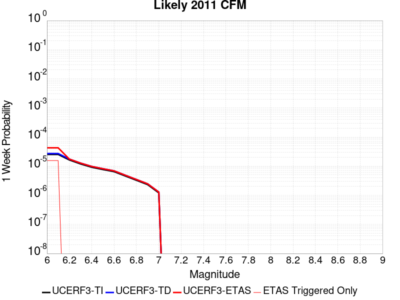 | 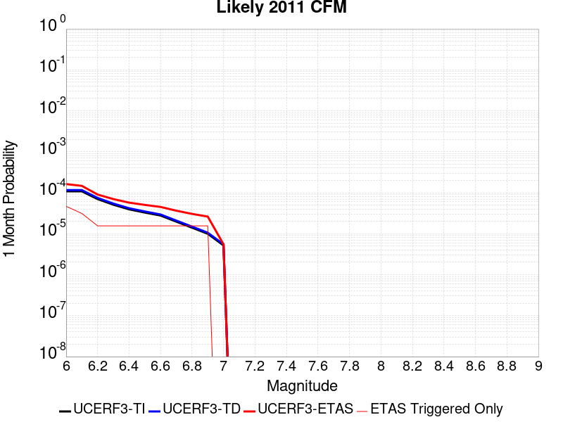 | 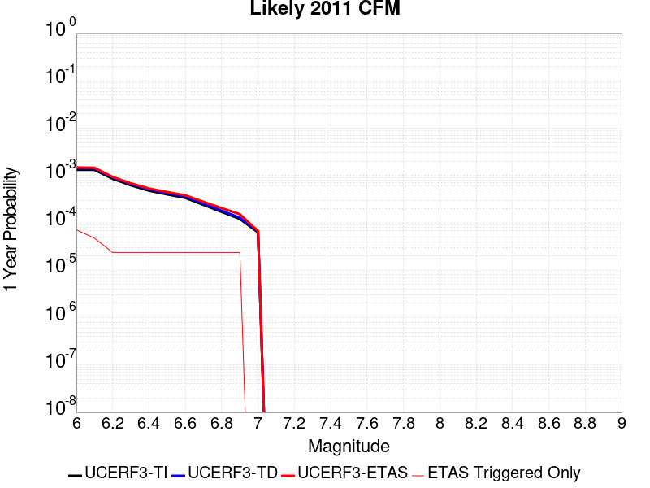 | 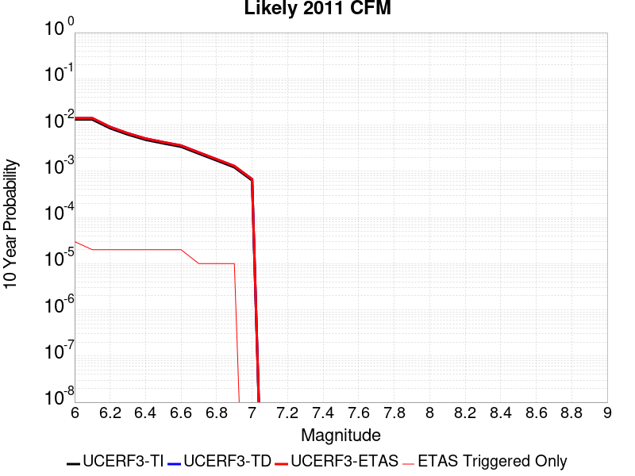 |

| Magnitude | 1 wk TI Prob | 1 wk TD Prob | 1 wk ETAS Prob | 1 wk ETAS/TD Gain | 1 wk ETAS Triggered Only | 1 mo TI Prob | 1 mo TD Prob | 1 mo ETAS Prob | 1 mo ETAS/TD Gain | 1 mo ETAS Triggered Only | 1 yr TI Prob | 1 yr TD Prob | 1 yr ETAS Prob | 1 yr ETAS/TD Gain | 1 yr ETAS Triggered Only | 10 yr TI Prob | 10 yr TD Prob | 10 yr ETAS Prob | 10 yr ETAS/TD Gain | 10 yr ETAS Triggered Only |
|-----|-----|-----|-----|-----|-----|-----|-----|-----|-----|-----|-----|-----|-----|-----|-----|-----|-----|-----|-----|-----|
| 6.0 | 2.5315949E-5 | 2.7104748E-5 | 3.7104477E-5 | 1.368929 | 1.0E-5 | 1.0849241E-4 | 1.16158284E-4 | 1.461548E-4 | 1.2582383 | 3.0E-5 | 0.0013200947 | 0.0014133542 | 0.0014433118 | 1.0211961 | 3.0E-5 | 0.013122803 | 0.01404831 | 0.014077889 | 1.0021055 | 3.0E-5 |
| 6.1 | 2.5315949E-5 | 2.7104748E-5 | 3.7104477E-5 | 1.368929 | 1.0E-5 | 1.0849241E-4 | 1.16158284E-4 | 1.3615596E-4 | 1.1721588 | 2.0E-5 | 0.0013200947 | 0.0014133542 | 0.0014333259 | 1.0141307 | 2.0E-5 | 0.013122803 | 0.01404831 | 0.01406803 | 1.0014037 | 2.0E-5 |
| 6.2 | 1.6375941E-5 | 1.7465842E-5 | 1.7465842E-5 | 1.0 | 0.0 | 7.0180715E-5 | 7.485153E-5 | 8.4850784E-5 | 1.1335878 | 1.0E-5 | 8.5411523E-4 | 9.109487E-4 | 9.2093955E-4 | 1.0109676 | 1.0E-5 | 0.008508399 | 0.009073433 | 0.009093251 | 1.0021843 | 2.0E-5 |
| 6.3 | 1.1945543E-5 | 1.2712587E-5 | 1.2712587E-5 | 1.0 | 0.0 | 5.119418E-5 | 5.4481407E-5 | 6.448086E-5 | 1.1835389 | 1.0E-5 | 6.2311086E-4 | 6.631146E-4 | 6.73108E-4 | 1.0150703 | 1.0E-5 | 0.0062136655 | 0.0066119144 | 0.0066317823 | 1.0030048 | 2.0E-5 |
| 6.4 | 9.192729E-6 | 9.768488E-6 | 9.768488E-6 | 1.0 | 0.0 | 3.939681E-5 | 4.1864292E-5 | 5.1863874E-5 | 1.238857 | 1.0E-5 | 4.7955062E-4 | 5.0958124E-4 | 5.195762E-4 | 1.019614 | 1.0E-5 | 0.004785171 | 0.0050844094 | 0.0051043076 | 1.0039136 | 2.0E-5 |
| 6.5 | 7.67906E-6 | 8.152622E-6 | 8.152622E-6 | 1.0 | 0.0 | 3.2909844E-5 | 3.4939352E-5 | 4.4939003E-5 | 1.2862003 | 1.0E-5 | 4.006037E-4 | 4.2530545E-4 | 4.3530122E-4 | 1.0235025 | 1.0E-5 | 0.0039988225 | 0.004245108 | 0.0042650234 | 1.0046914 | 2.0E-5 |
| 6.6 | 6.4884057E-6 | 6.8847507E-6 | 6.8847507E-6 | 1.0 | 0.0 | 2.7807157E-5 | 2.9505749E-5 | 3.9505452E-5 | 1.338907 | 1.0E-5 | 3.3849955E-4 | 3.591747E-4 | 3.6917112E-4 | 1.0278316 | 1.0E-5 | 0.003379844 | 0.0035860867 | 0.0036060151 | 1.0055571 | 2.0E-5 |
| 6.7 | 4.6060636E-6 | 4.884041E-6 | 4.884041E-6 | 1.0 | 0.0 | 1.9740122E-5 | 2.0931442E-5 | 3.0931235E-5 | 1.4777402 | 1.0E-5 | 2.403095E-4 | 2.5481134E-4 | 2.648088E-4 | 1.0392348 | 1.0E-5 | 0.002400498 | 0.0025452746 | 0.0025552493 | 1.0039189 | 1.0E-5 |
| 6.8 | 3.2795615E-6 | 3.4773732E-6 | 3.4773732E-6 | 1.0 | 0.0 | 1.4055187E-5 | 1.4902946E-5 | 2.4902796E-5 | 1.6709983 | 1.0E-5 | 1.7110848E-4 | 1.8142881E-4 | 1.91427E-4 | 1.0551081 | 1.0E-5 | 0.0017097679 | 0.0018128622 | 0.001822844 | 1.0055062 | 1.0E-5 |
| 6.9 | 2.3289967E-6 | 2.4705569E-6 | 2.4705569E-6 | 1.0 | 0.0 | 9.981376E-6 | 1.058806E-5 | 2.0587955E-5 | 1.94445 | 1.0E-5 | 1.2151648E-4 | 1.2890245E-4 | 1.3890116E-4 | 1.077568 | 1.0E-5 | 0.0012145005 | 0.0012883197 | 0.0012983069 | 1.0077521 | 1.0E-5 |
| 7.0 | 1.211292E-6 | 1.2863958E-6 | 1.2863958E-6 | 1.0 | 0.0 | 5.1912407E-6 | 5.5131145E-6 | 5.5131145E-6 | 1.0 | 0.0 | 6.320152E-5 | 6.712041E-5 | 6.712041E-5 | 1.0 | 0.0 | 6.3183554E-4 | 6.710312E-4 | 6.710312E-4 | 1.0 | 0.0 |

## Oceanside alt1
*[(top)](#table-of-contents)*

| 1 Week | 1 Month | 1 Year | 10 Year |
|-----|-----|-----|-----|
|  | 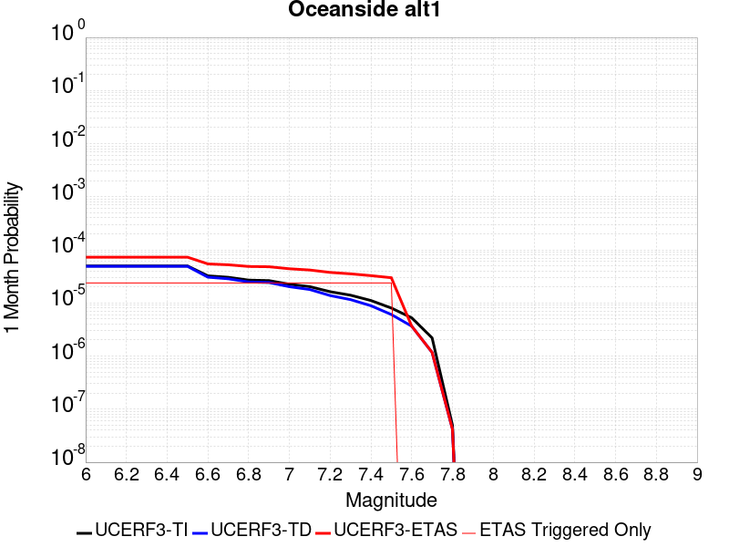 | 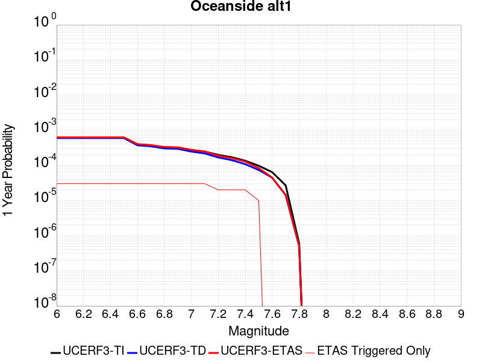 | 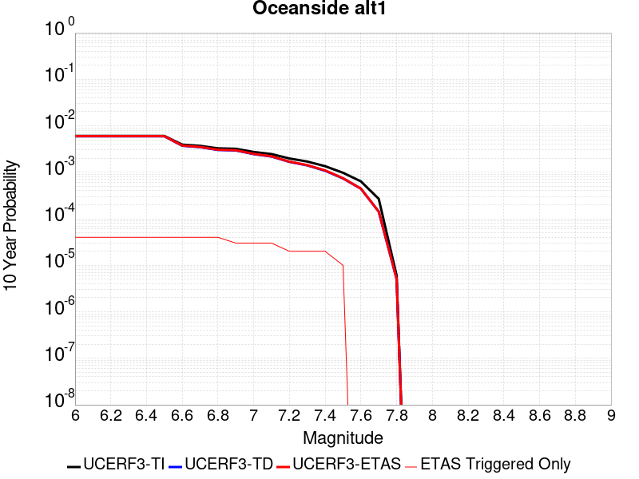 |

| Magnitude | 1 wk TI Prob | 1 wk TD Prob | 1 wk ETAS Prob | 1 wk ETAS/TD Gain | 1 wk ETAS Triggered Only | 1 mo TI Prob | 1 mo TD Prob | 1 mo ETAS Prob | 1 mo ETAS/TD Gain | 1 mo ETAS Triggered Only | 1 yr TI Prob | 1 yr TD Prob | 1 yr ETAS Prob | 1 yr ETAS/TD Gain | 1 yr ETAS Triggered Only | 10 yr TI Prob | 10 yr TD Prob | 10 yr ETAS Prob | 10 yr ETAS/TD Gain | 10 yr ETAS Triggered Only |
|-----|-----|-----|-----|-----|-----|-----|-----|-----|-----|-----|-----|-----|-----|-----|-----|-----|-----|-----|-----|-----|
| 6.0 | 1.1617542E-5 | 1.1423493E-5 | 1.1423493E-5 | 1.0 | 0.0 | 4.9788516E-5 | 4.8956997E-5 | 6.895602E-5 | 1.4085017 | 2.0E-5 | 6.060066E-4 | 5.9590454E-4 | 6.2588666E-4 | 1.0503136 | 3.0E-5 | 0.0060435664 | 0.005944664 | 0.0059844265 | 1.0066887 | 4.0E-5 |
| 6.1 | 1.1617542E-5 | 1.1423493E-5 | 1.1423493E-5 | 1.0 | 0.0 | 4.9788516E-5 | 4.8956997E-5 | 6.895602E-5 | 1.4085017 | 2.0E-5 | 6.060066E-4 | 5.9590454E-4 | 6.2588666E-4 | 1.0503136 | 3.0E-5 | 0.0060435664 | 0.005944664 | 0.0059844265 | 1.0066887 | 4.0E-5 |
| 6.2 | 1.1617542E-5 | 1.1423493E-5 | 1.1423493E-5 | 1.0 | 0.0 | 4.9788516E-5 | 4.8956997E-5 | 6.895602E-5 | 1.4085017 | 2.0E-5 | 6.060066E-4 | 5.9590454E-4 | 6.2588666E-4 | 1.0503136 | 3.0E-5 | 0.0060435664 | 0.005944664 | 0.0059844265 | 1.0066887 | 4.0E-5 |
| 6.3 | 1.1617542E-5 | 1.1423493E-5 | 1.1423493E-5 | 1.0 | 0.0 | 4.9788516E-5 | 4.8956997E-5 | 6.895602E-5 | 1.4085017 | 2.0E-5 | 6.060066E-4 | 5.9590454E-4 | 6.2588666E-4 | 1.0503136 | 3.0E-5 | 0.0060435664 | 0.005944664 | 0.0059844265 | 1.0066887 | 4.0E-5 |
| 6.4 | 1.1617542E-5 | 1.1423493E-5 | 1.1423493E-5 | 1.0 | 0.0 | 4.9788516E-5 | 4.8956997E-5 | 6.895602E-5 | 1.4085017 | 2.0E-5 | 6.060066E-4 | 5.9590454E-4 | 6.2588666E-4 | 1.0503136 | 3.0E-5 | 0.0060435664 | 0.005944664 | 0.0059844265 | 1.0066887 | 4.0E-5 |
| 6.5 | 1.1617542E-5 | 1.1423493E-5 | 1.1423493E-5 | 1.0 | 0.0 | 4.9788516E-5 | 4.8956997E-5 | 6.895602E-5 | 1.4085017 | 2.0E-5 | 6.060066E-4 | 5.9590454E-4 | 6.2588666E-4 | 1.0503136 | 3.0E-5 | 0.0060435664 | 0.005944664 | 0.0059844265 | 1.0066887 | 4.0E-5 |
| 6.6 | 7.561768E-6 | 7.1336153E-6 | 7.1336153E-6 | 1.0 | 0.0 | 3.2407173E-5 | 3.0572286E-5 | 5.0571674E-5 | 1.6541673 | 2.0E-5 | 3.9448592E-4 | 3.7215507E-4 | 4.0214392E-4 | 1.0805815 | 3.0E-5 | 0.0039378637 | 0.00371543 | 0.0037552814 | 1.0107259 | 4.0E-5 |
| 6.7 | 7.1042605E-6 | 6.6556854E-6 | 6.6556854E-6 | 1.0 | 0.0 | 3.0446476E-5 | 2.8524059E-5 | 4.852349E-5 | 1.7011424 | 2.0E-5 | 3.706228E-4 | 3.472259E-4 | 3.7721547E-4 | 1.086369 | 3.0E-5 | 0.0037000529 | 0.003466917 | 0.0035067783 | 1.0114976 | 4.0E-5 |
| 6.8 | 6.285554E-6 | 5.799706E-6 | 5.799706E-6 | 1.0 | 0.0 | 2.693781E-5 | 2.4855648E-5 | 4.485515E-5 | 1.8046261 | 2.0E-5 | 3.2791847E-4 | 3.0257605E-4 | 3.3256697E-4 | 1.0991186 | 3.0E-5 | 0.0032743502 | 0.0030216982 | 0.0030615772 | 1.0131975 | 4.0E-5 |
| 6.9 | 6.148883E-6 | 5.6565445E-6 | 5.6565445E-6 | 1.0 | 0.0 | 2.635209E-5 | 2.424211E-5 | 4.4241628E-5 | 1.8249906 | 2.0E-5 | 3.2078946E-4 | 2.9510827E-4 | 3.2509942E-4 | 1.1016276 | 3.0E-5 | 0.003203268 | 0.0029472208 | 0.0029771323 | 1.0101491 | 3.0E-5 |
| 7.0 | 5.253857E-6 | 4.722404E-6 | 4.722404E-6 | 1.0 | 0.0 | 2.2516335E-5 | 2.0238718E-5 | 4.0238312E-5 | 1.9881848 | 2.0E-5 | 2.7410188E-4 | 2.4637886E-4 | 2.7637146E-4 | 1.1217337 | 3.0E-5 | 0.0027376404 | 0.0024610884 | 0.0024910145 | 1.0121597 | 3.0E-5 |
| 7.1 | 4.730754E-6 | 4.17851E-6 | 4.17851E-6 | 1.0 | 0.0 | 2.0274503E-5 | 1.7907778E-5 | 3.790742E-5 | 2.1168132 | 2.0E-5 | 2.468141E-4 | 2.1800565E-4 | 2.479991E-4 | 1.1375811 | 3.0E-5 | 0.0024654015 | 0.0021779444 | 0.002207879 | 1.0137445 | 3.0E-5 |
| 7.2 | 3.7998386E-6 | 3.214026E-6 | 3.214026E-6 | 1.0 | 0.0 | 1.6284921E-5 | 1.37743245E-5 | 3.377405E-5 | 2.4519567 | 2.0E-5 | 1.9825088E-4 | 1.6768962E-4 | 1.8768627E-4 | 1.1192479 | 2.0E-5 | 0.001980741 | 0.001675643 | 0.0016956095 | 1.0119157 | 2.0E-5 |
| 7.3 | 3.2656465E-6 | 2.698376E-6 | 2.698376E-6 | 1.0 | 0.0 | 1.3995553E-5 | 1.1564418E-5 | 3.156419E-5 | 2.7294228 | 2.0E-5 | 1.7038253E-4 | 1.407878E-4 | 1.6078498E-4 | 1.1420377 | 2.0E-5 | 0.0017025196 | 0.0014069972 | 0.0014269691 | 1.0141947 | 2.0E-5 |
| 7.4 | 2.593703E-6 | 2.0680277E-6 | 2.0680277E-6 | 1.0 | 0.0 | 1.1115822E-5 | 8.862946E-6 | 2.8862769E-5 | 3.256566 | 2.0E-5 | 1.3532673E-4 | 1.0790111E-4 | 1.2789895E-4 | 1.1853349 | 2.0E-5 | 0.0013524436 | 0.0010784961 | 0.0010984746 | 1.0185243 | 2.0E-5 |
| 7.5 | 1.8715585E-6 | 1.4137177E-6 | 1.4137177E-6 | 1.0 | 0.0 | 8.020941E-6 | 6.0587763E-6 | 1.6058715E-5 | 2.6504884 | 1.0E-5 | 9.7650576E-5 | 7.376316E-5 | 8.3762425E-5 | 1.135559 | 1.0E-5 | 9.7607676E-4 | 7.3739287E-4 | 7.473855E-4 | 1.0135512 | 1.0E-5 |
| 7.6 | 1.2246786E-6 | 8.5268175E-7 | 8.5268175E-7 | 1.0 | 0.0 | 5.248612E-6 | 3.6543456E-6 | 3.6543456E-6 | 1.0 | 0.0 | 6.389998E-5 | 4.4490793E-5 | 4.4490793E-5 | 1.0 | 0.0 | 6.3881604E-4 | 4.4482335E-4 | 4.4482335E-4 | 1.0 | 0.0 |
| 7.7 | 5.140719E-7 | 2.734703E-7 | 2.734703E-7 | 1.0 | 0.0 | 2.2031636E-6 | 1.1720151E-6 | 1.1720151E-6 | 1.0 | 0.0 | 2.6823185E-5 | 1.4269205E-5 | 1.4269205E-5 | 1.0 | 0.0 | 2.6819948E-4 | 1.4268424E-4 | 1.4268424E-4 | 1.0 | 0.0 |
| 7.8 | 1.16056995E-8 | 9.782373E-9 | 9.782373E-9 | 1.0 | 0.0 | 4.9738713E-8 | 4.1924455E-8 | 4.1924455E-8 | 1.0 | 0.0 | 6.0556863E-7 | 5.1043025E-7 | 5.1043025E-7 | 1.0 | 0.0 | 6.05567E-6 | 5.1043025E-6 | 5.1043025E-6 | 1.0 | 0.0 |

## San Gorgonio Pass
*[(top)](#table-of-contents)*

| 1 Week | 1 Month | 1 Year | 10 Year |
|-----|-----|-----|-----|
| 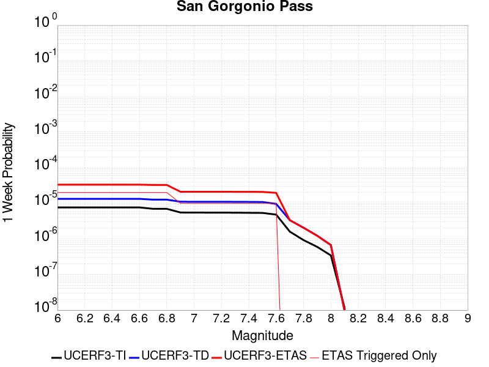 | 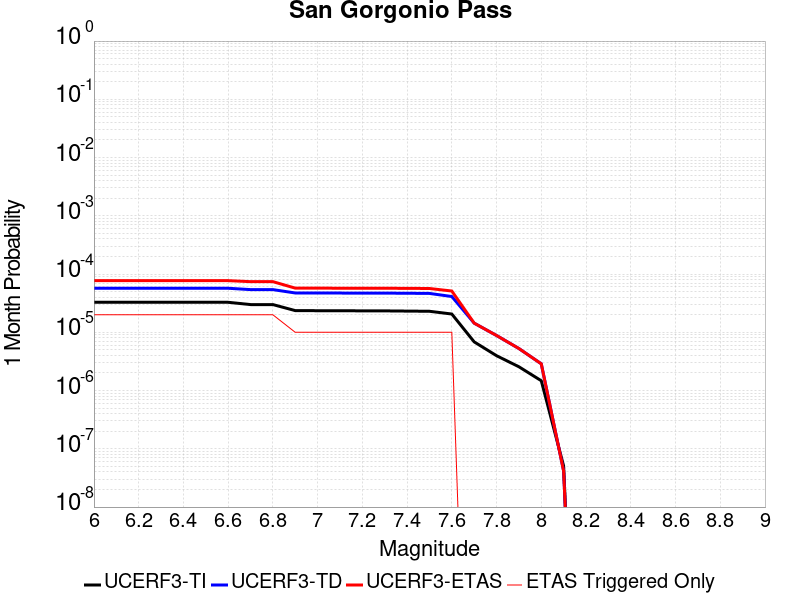 | 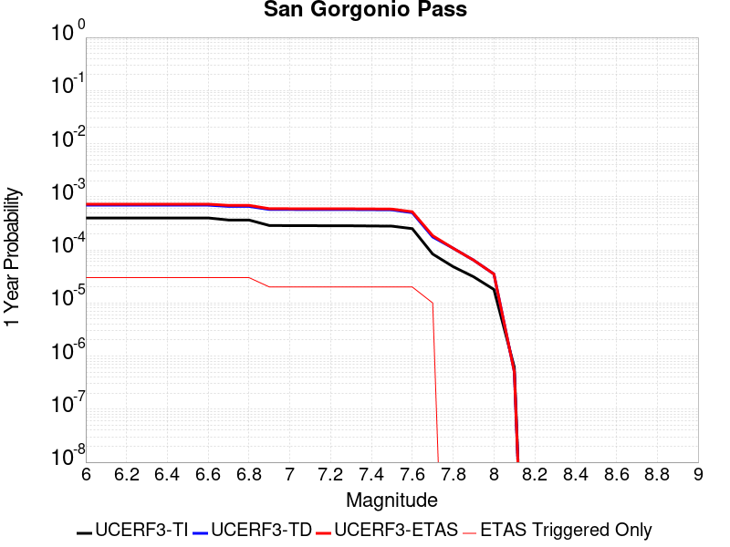 | 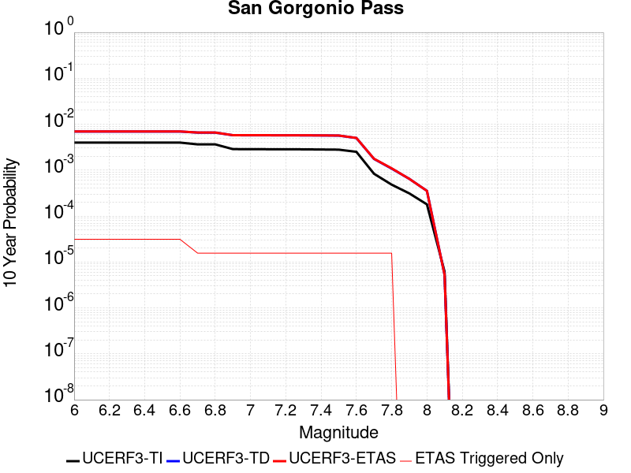 |

| Magnitude | 1 wk TI Prob | 1 wk TD Prob | 1 wk ETAS Prob | 1 wk ETAS/TD Gain | 1 wk ETAS Triggered Only | 1 mo TI Prob | 1 mo TD Prob | 1 mo ETAS Prob | 1 mo ETAS/TD Gain | 1 mo ETAS Triggered Only | 1 yr TI Prob | 1 yr TD Prob | 1 yr ETAS Prob | 1 yr ETAS/TD Gain | 1 yr ETAS Triggered Only | 10 yr TI Prob | 10 yr TD Prob | 10 yr ETAS Prob | 10 yr ETAS/TD Gain | 10 yr ETAS Triggered Only |
|-----|-----|-----|-----|-----|-----|-----|-----|-----|-----|-----|-----|-----|-----|-----|-----|-----|-----|-----|-----|-----|
| 6.0 | 7.644328E-6 | 1.3314231E-5 | 3.3313965E-5 | 2.502132 | 2.0E-5 | 3.2760996E-5 | 5.705979E-5 | 7.705865E-5 | 1.3504895 | 2.0E-5 | 3.987921E-4 | 6.944901E-4 | 7.2446925E-4 | 1.0431671 | 3.0E-5 | 0.003980772 | 0.0069299806 | 0.006979634 | 1.0071651 | 5.0E-5 |
| 6.1 | 7.644328E-6 | 1.3314231E-5 | 3.3313965E-5 | 2.502132 | 2.0E-5 | 3.2760996E-5 | 5.705979E-5 | 7.705865E-5 | 1.3504895 | 2.0E-5 | 3.987921E-4 | 6.944901E-4 | 7.2446925E-4 | 1.0431671 | 3.0E-5 | 0.003980772 | 0.0069299806 | 0.006979634 | 1.0071651 | 5.0E-5 |
| 6.2 | 7.644328E-6 | 1.3314231E-5 | 3.3313965E-5 | 2.502132 | 2.0E-5 | 3.2760996E-5 | 5.705979E-5 | 7.705865E-5 | 1.3504895 | 2.0E-5 | 3.987921E-4 | 6.944901E-4 | 7.2446925E-4 | 1.0431671 | 3.0E-5 | 0.003980772 | 0.0069299806 | 0.006979634 | 1.0071651 | 5.0E-5 |
| 6.3 | 7.644328E-6 | 1.3314231E-5 | 3.3313965E-5 | 2.502132 | 2.0E-5 | 3.2760996E-5 | 5.705979E-5 | 7.705865E-5 | 1.3504895 | 2.0E-5 | 3.987921E-4 | 6.944901E-4 | 7.2446925E-4 | 1.0431671 | 3.0E-5 | 0.003980772 | 0.0069299806 | 0.006979634 | 1.0071651 | 5.0E-5 |
| 6.4 | 7.644328E-6 | 1.3314231E-5 | 3.3313965E-5 | 2.502132 | 2.0E-5 | 3.2760996E-5 | 5.705979E-5 | 7.705865E-5 | 1.3504895 | 2.0E-5 | 3.987921E-4 | 6.944901E-4 | 7.2446925E-4 | 1.0431671 | 3.0E-5 | 0.003980772 | 0.0069299806 | 0.006979634 | 1.0071651 | 5.0E-5 |
| 6.5 | 7.644328E-6 | 1.3314231E-5 | 3.3313965E-5 | 2.502132 | 2.0E-5 | 3.2760996E-5 | 5.705979E-5 | 7.705865E-5 | 1.3504895 | 2.0E-5 | 3.987921E-4 | 6.944901E-4 | 7.2446925E-4 | 1.0431671 | 3.0E-5 | 0.003980772 | 0.0069299806 | 0.006979634 | 1.0071651 | 5.0E-5 |
| 6.6 | 7.644328E-6 | 1.3314231E-5 | 3.3313965E-5 | 2.502132 | 2.0E-5 | 3.2760996E-5 | 5.705979E-5 | 7.705865E-5 | 1.3504895 | 2.0E-5 | 3.987921E-4 | 6.944901E-4 | 7.2446925E-4 | 1.0431671 | 3.0E-5 | 0.003980772 | 0.0069299806 | 0.006979634 | 1.0071651 | 5.0E-5 |
| 6.7 | 6.987586E-6 | 1.2618505E-5 | 3.2618253E-5 | 2.5849538 | 2.0E-5 | 2.9946454E-5 | 5.4078235E-5 | 7.407715E-5 | 1.3698145 | 2.0E-5 | 3.645371E-4 | 6.582117E-4 | 6.8819197E-4 | 1.0455481 | 3.0E-5 | 0.0036393967 | 0.0065693567 | 0.006609094 | 1.0060489 | 4.0E-5 |
| 6.8 | 6.987586E-6 | 1.2618505E-5 | 3.2618253E-5 | 2.5849538 | 2.0E-5 | 2.9946454E-5 | 5.4078235E-5 | 7.407715E-5 | 1.3698145 | 2.0E-5 | 3.645371E-4 | 6.582117E-4 | 6.8819197E-4 | 1.0455481 | 3.0E-5 | 0.0036393967 | 0.0065693567 | 0.006609094 | 1.0060489 | 4.0E-5 |
| 6.9 | 5.504702E-6 | 1.1049368E-5 | 2.1049258E-5 | 1.905019 | 1.0E-5 | 2.3591367E-5 | 4.7353606E-5 | 5.7353132E-5 | 1.2111672 | 1.0E-5 | 2.8718702E-4 | 5.7638274E-4 | 5.963712E-4 | 1.0346792 | 2.0E-5 | 0.0028681618 | 0.005755309 | 0.0057851365 | 1.0051826 | 3.0E-5 |
| 7.0 | 5.4825764E-6 | 1.102571E-5 | 2.1025598E-5 | 1.9069611 | 1.0E-5 | 2.3496545E-5 | 4.7252215E-5 | 5.7251742E-5 | 1.2116203 | 1.0E-5 | 2.8603288E-4 | 5.751489E-4 | 5.951374E-4 | 1.0347536 | 2.0E-5 | 0.00285665 | 0.005743035 | 0.0057728626 | 1.0051937 | 3.0E-5 |
| 7.1 | 5.4692787E-6 | 1.101142E-5 | 2.101131E-5 | 1.9081382 | 1.0E-5 | 2.3439556E-5 | 4.7190973E-5 | 5.71905E-5 | 1.211895 | 1.0E-5 | 2.8533922E-4 | 5.744037E-4 | 5.943922E-4 | 1.0347987 | 2.0E-5 | 0.0028497311 | 0.0057356213 | 0.0057654493 | 1.0052005 | 3.0E-5 |
| 7.2 | 5.453661E-6 | 1.0994446E-5 | 2.0994336E-5 | 1.9095402 | 1.0E-5 | 2.3372622E-5 | 4.7118232E-5 | 5.7117762E-5 | 1.2122221 | 1.0E-5 | 2.8452452E-4 | 5.7351857E-4 | 5.935071E-4 | 1.0348525 | 2.0E-5 | 0.002841605 | 0.0057268157 | 0.0057566436 | 1.0052085 | 3.0E-5 |
| 7.3 | 5.4422303E-6 | 1.0981369E-5 | 2.0981259E-5 | 1.9106232 | 1.0E-5 | 2.3323635E-5 | 4.706219E-5 | 5.706172E-5 | 1.2124748 | 1.0E-5 | 2.8392827E-4 | 5.728366E-4 | 5.928251E-4 | 1.034894 | 2.0E-5 | 0.0028356577 | 0.005720031 | 0.0057498594 | 1.0052147 | 3.0E-5 |
| 7.4 | 5.398595E-6 | 1.0928734E-5 | 2.0928625E-5 | 1.915009 | 1.0E-5 | 2.313663E-5 | 4.683662E-5 | 5.683615E-5 | 1.2134981 | 1.0E-5 | 2.8165206E-4 | 5.700917E-4 | 5.9008034E-4 | 1.0350621 | 2.0E-5 | 0.0028129534 | 0.005692723 | 0.0057225525 | 1.0052398 | 3.0E-5 |
| 7.5 | 5.3578788E-6 | 1.0855281E-5 | 2.0855172E-5 | 1.9212006 | 1.0E-5 | 2.2962136E-5 | 4.6521833E-5 | 5.6521367E-5 | 1.2149428 | 1.0E-5 | 2.7952815E-4 | 5.662612E-4 | 5.8624987E-4 | 1.0352994 | 2.0E-5 | 0.002791768 | 0.0056546377 | 0.005684468 | 1.0052754 | 3.0E-5 |
| 7.6 | 4.8091474E-6 | 9.60368E-6 | 1.9603583E-5 | 2.0412576 | 1.0E-5 | 2.0610469E-5 | 4.1158008E-5 | 5.1157596E-5 | 1.242956 | 1.0E-5 | 2.5090357E-4 | 5.0098833E-4 | 5.209783E-4 | 1.0399011 | 2.0E-5 | 0.0025062046 | 0.0050053033 | 0.005035153 | 1.0059637 | 3.0E-5 |
| 7.7 | 1.5991155E-6 | 3.352866E-6 | 3.352866E-6 | 1.0 | 0.0 | 6.853334E-6 | 1.4369349E-5 | 1.4369349E-5 | 1.0 | 0.0 | 8.343615E-5 | 1.7493303E-4 | 1.8493128E-4 | 1.0571548 | 1.0E-5 | 8.340483E-4 | 0.0017534072 | 0.0017733722 | 1.0113864 | 2.0E-5 |
| 7.8 | 9.258398E-7 | 2.0579948E-6 | 2.0579948E-6 | 1.0 | 0.0 | 3.967879E-6 | 8.819949E-6 | 8.819949E-6 | 1.0 | 0.0 | 4.8307855E-5 | 1.073776E-4 | 1.073776E-4 | 1.0 | 0.0 | 4.8297356E-4 | 0.001078687 | 0.0010886762 | 1.0092605 | 1.0E-5 |
| 7.9 | 5.975575E-7 | 1.2291794E-6 | 1.2291794E-6 | 1.0 | 0.0 | 2.5609581E-6 | 5.2679006E-6 | 5.2679006E-6 | 1.0 | 0.0 | 3.117922E-5 | 6.4134816E-5 | 6.4134816E-5 | 1.0 | 0.0 | 3.1174847E-4 | 6.463092E-4 | 6.463092E-4 | 1.0 | 0.0 |
| 8.0 | 3.4413725E-7 | 6.7148494E-7 | 6.7148494E-7 | 1.0 | 0.0 | 1.4748731E-6 | 2.8777895E-6 | 2.8777895E-6 | 1.0 | 0.0 | 1.7956432E-5 | 3.503653E-5 | 3.503653E-5 | 1.0 | 0.0 | 1.7954981E-4 | 3.5373896E-4 | 3.5373896E-4 | 1.0 | 0.0 |
| 8.1 | 1.1787731E-8 | 9.634385E-9 | 9.634385E-9 | 1.0 | 0.0 | 5.0518846E-8 | 4.129022E-8 | 4.129022E-8 | 1.0 | 0.0 | 6.1506677E-7 | 5.027083E-7 | 5.027083E-7 | 1.0 | 0.0 | 6.1506507E-6 | 5.2424944E-6 | 5.2424944E-6 | 1.0 | 0.0 |

## North Frontal  (East)
*[(top)](#table-of-contents)*

| 1 Week | 1 Month | 1 Year | 10 Year |
|-----|-----|-----|-----|
|  | 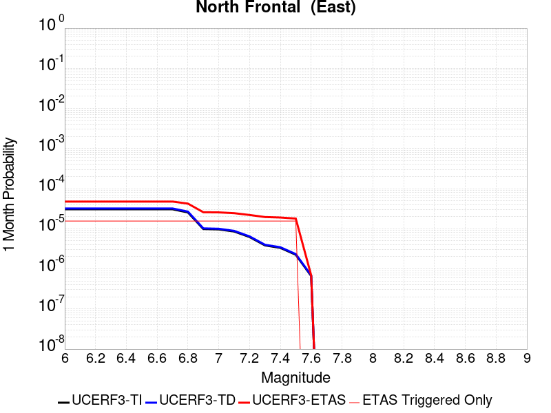 | 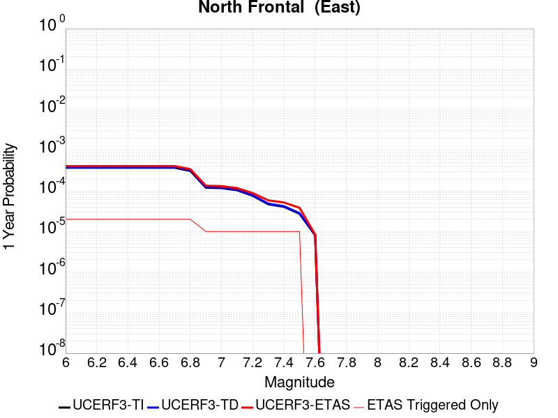 | 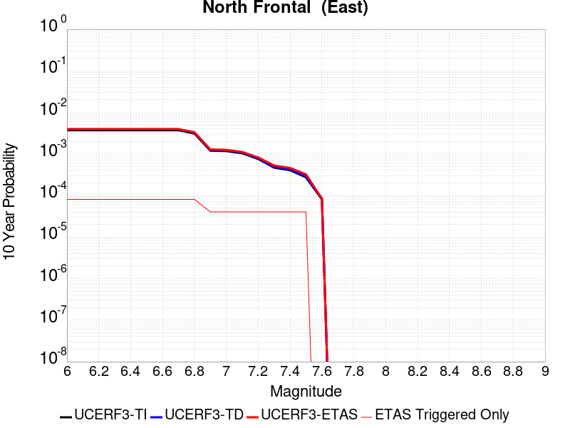 |

| Magnitude | 1 wk TI Prob | 1 wk TD Prob | 1 wk ETAS Prob | 1 wk ETAS/TD Gain | 1 wk ETAS Triggered Only | 1 mo TI Prob | 1 mo TD Prob | 1 mo ETAS Prob | 1 mo ETAS/TD Gain | 1 mo ETAS Triggered Only | 1 yr TI Prob | 1 yr TD Prob | 1 yr ETAS Prob | 1 yr ETAS/TD Gain | 1 yr ETAS Triggered Only | 10 yr TI Prob | 10 yr TD Prob | 10 yr ETAS Prob | 10 yr ETAS/TD Gain | 10 yr ETAS Triggered Only |
|-----|-----|-----|-----|-----|-----|-----|-----|-----|-----|-----|-----|-----|-----|-----|-----|-----|-----|-----|-----|-----|
| 6.0 | 7.135738E-6 | 7.4771765E-6 | 7.4771765E-6 | 1.0 | 0.0 | 3.0581377E-5 | 3.204476E-5 | 4.204444E-5 | 1.3120534 | 1.0E-5 | 3.7226462E-4 | 3.9009505E-4 | 4.1008726E-4 | 1.0512495 | 2.0E-5 | 0.0037164164 | 0.0038960609 | 0.0039359047 | 1.0102267 | 4.0E-5 |
| 6.1 | 7.135738E-6 | 7.4771765E-6 | 7.4771765E-6 | 1.0 | 0.0 | 3.0581377E-5 | 3.204476E-5 | 4.204444E-5 | 1.3120534 | 1.0E-5 | 3.7226462E-4 | 3.9009505E-4 | 4.1008726E-4 | 1.0512495 | 2.0E-5 | 0.0037164164 | 0.0038960609 | 0.0039359047 | 1.0102267 | 4.0E-5 |
| 6.2 | 7.135738E-6 | 7.4771765E-6 | 7.4771765E-6 | 1.0 | 0.0 | 3.0581377E-5 | 3.204476E-5 | 4.204444E-5 | 1.3120534 | 1.0E-5 | 3.7226462E-4 | 3.9009505E-4 | 4.1008726E-4 | 1.0512495 | 2.0E-5 | 0.0037164164 | 0.0038960609 | 0.0039359047 | 1.0102267 | 4.0E-5 |
| 6.3 | 7.135738E-6 | 7.4771765E-6 | 7.4771765E-6 | 1.0 | 0.0 | 3.0581377E-5 | 3.204476E-5 | 4.204444E-5 | 1.3120534 | 1.0E-5 | 3.7226462E-4 | 3.9009505E-4 | 4.1008726E-4 | 1.0512495 | 2.0E-5 | 0.0037164164 | 0.0038960609 | 0.0039359047 | 1.0102267 | 4.0E-5 |
| 6.4 | 7.135738E-6 | 7.4771765E-6 | 7.4771765E-6 | 1.0 | 0.0 | 3.0581377E-5 | 3.204476E-5 | 4.204444E-5 | 1.3120534 | 1.0E-5 | 3.7226462E-4 | 3.9009505E-4 | 4.1008726E-4 | 1.0512495 | 2.0E-5 | 0.0037164164 | 0.0038960609 | 0.0039359047 | 1.0102267 | 4.0E-5 |
| 6.5 | 7.135738E-6 | 7.4771765E-6 | 7.4771765E-6 | 1.0 | 0.0 | 3.0581377E-5 | 3.204476E-5 | 4.204444E-5 | 1.3120534 | 1.0E-5 | 3.7226462E-4 | 3.9009505E-4 | 4.1008726E-4 | 1.0512495 | 2.0E-5 | 0.0037164164 | 0.0038960609 | 0.0039359047 | 1.0102267 | 4.0E-5 |
| 6.6 | 7.135738E-6 | 7.4771765E-6 | 7.4771765E-6 | 1.0 | 0.0 | 3.0581377E-5 | 3.204476E-5 | 4.204444E-5 | 1.3120534 | 1.0E-5 | 3.7226462E-4 | 3.9009505E-4 | 4.1008726E-4 | 1.0512495 | 2.0E-5 | 0.0037164164 | 0.0038960609 | 0.0039359047 | 1.0102267 | 4.0E-5 |
| 6.7 | 7.135738E-6 | 7.4771765E-6 | 7.4771765E-6 | 1.0 | 0.0 | 3.0581377E-5 | 3.204476E-5 | 4.204444E-5 | 1.3120534 | 1.0E-5 | 3.7226462E-4 | 3.9009505E-4 | 4.1008726E-4 | 1.0512495 | 2.0E-5 | 0.0037164164 | 0.0038960609 | 0.0039359047 | 1.0102267 | 4.0E-5 |
| 6.8 | 5.959142E-6 | 6.236683E-6 | 6.236683E-6 | 1.0 | 0.0 | 2.553893E-5 | 2.6728469E-5 | 3.67282E-5 | 1.374123 | 1.0E-5 | 3.108921E-4 | 3.253886E-4 | 3.4538208E-4 | 1.061445 | 2.0E-5 | 0.0031045752 | 0.0032508948 | 0.0032907648 | 1.0122643 | 4.0E-5 |
| 6.9 | 2.2946929E-6 | 2.3824605E-6 | 2.3824605E-6 | 1.0 | 0.0 | 9.834361E-6 | 1.0210508E-5 | 2.0210406E-5 | 1.9793732 | 1.0E-5 | 1.1972676E-4 | 1.2430632E-4 | 1.3430507E-4 | 1.0804365 | 1.0E-5 | 0.0011966228 | 0.0012424142 | 0.0012623895 | 1.0160776 | 2.0E-5 |
| 7.0 | 2.2468673E-6 | 2.3321538E-6 | 2.3321538E-6 | 1.0 | 0.0 | 9.629396E-6 | 9.994909E-6 | 1.999481E-5 | 2.0004992 | 1.0E-5 | 1.1723159E-4 | 1.21681696E-4 | 1.3168047E-4 | 1.0821717 | 1.0E-5 | 0.0011716976 | 0.0012161969 | 0.0012361726 | 1.0164247 | 2.0E-5 |
| 7.1 | 1.9921076E-6 | 2.0646032E-6 | 2.0646032E-6 | 1.0 | 0.0 | 8.537577E-6 | 8.848272E-6 | 1.8848183E-5 | 2.1301541 | 1.0E-5 | 1.0394004E-4 | 1.0772282E-4 | 1.1772174E-4 | 1.0928209 | 1.0E-5 | 0.0010389143 | 0.0010767487 | 0.0010967272 | 1.0185544 | 2.0E-5 |
| 7.2 | 1.4524545E-6 | 1.5045148E-6 | 1.5045148E-6 | 1.0 | 0.0 | 6.2247905E-6 | 6.447906E-6 | 1.6447842E-5 | 2.5508811 | 1.0E-5 | 7.5784184E-5 | 7.850068E-5 | 8.849989E-5 | 1.1273774 | 1.0E-5 | 7.575835E-4 | 7.8475394E-4 | 8.047382E-4 | 1.0254657 | 2.0E-5 |
| 7.3 | 8.9802575E-7 | 9.3087283E-7 | 9.3087283E-7 | 1.0 | 0.0 | 3.848676E-6 | 3.9894494E-6 | 1.3989409E-5 | 3.5066016 | 1.0E-5 | 4.685662E-5 | 4.857058E-5 | 5.8570095E-5 | 1.205876 | 1.0E-5 | 4.6846745E-4 | 4.8561094E-4 | 5.0560123E-4 | 1.0411652 | 2.0E-5 |
| 7.4 | 7.776139E-7 | 8.0604747E-7 | 8.0604747E-7 | 1.0 | 0.0 | 3.3326266E-6 | 3.4544853E-6 | 1.3454451E-5 | 3.8947773 | 1.0E-5 | 4.0573974E-5 | 4.2057654E-5 | 5.2057236E-5 | 1.2377589 | 1.0E-5 | 4.0566566E-4 | 4.205077E-4 | 4.404993E-4 | 1.0475415 | 2.0E-5 |
| 7.5 | 5.244417E-7 | 5.441219E-7 | 5.441219E-7 | 1.0 | 0.0 | 2.2476054E-6 | 2.3319494E-6 | 1.2331926E-5 | 5.2882476 | 1.0E-5 | 2.7364253E-5 | 2.839118E-5 | 3.8390895E-5 | 1.3522121 | 1.0E-5 | 2.7360884E-4 | 2.8388205E-4 | 3.0387638E-4 | 1.0704318 | 2.0E-5 |
| 7.6 | 1.5489647E-7 | 1.6089504E-7 | 1.6089504E-7 | 1.0 | 0.0 | 6.6384183E-7 | 6.895501E-7 | 6.895501E-7 | 1.0 | 0.0 | 8.082245E-6 | 8.395261E-6 | 8.395261E-6 | 1.0 | 0.0 | 8.08195E-5 | 8.395143E-5 | 8.395143E-5 | 1.0 | 0.0 |

## Carson Range (Genoa)
*[(top)](#table-of-contents)*

| 1 Week | 1 Month | 1 Year | 10 Year |
|-----|-----|-----|-----|
| 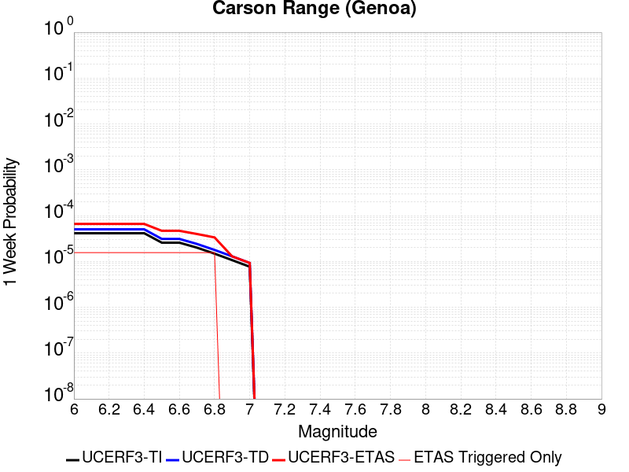 | 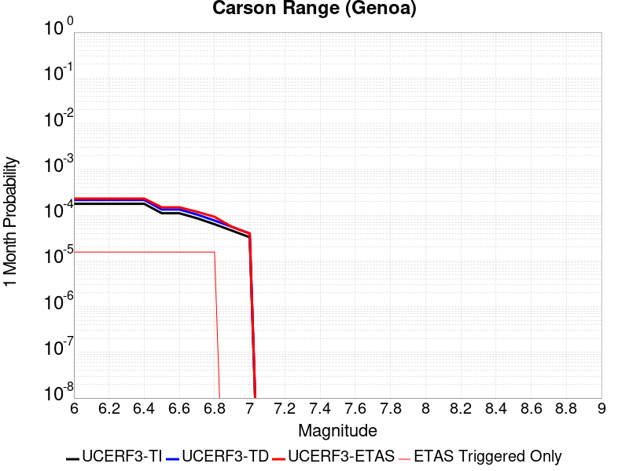 | 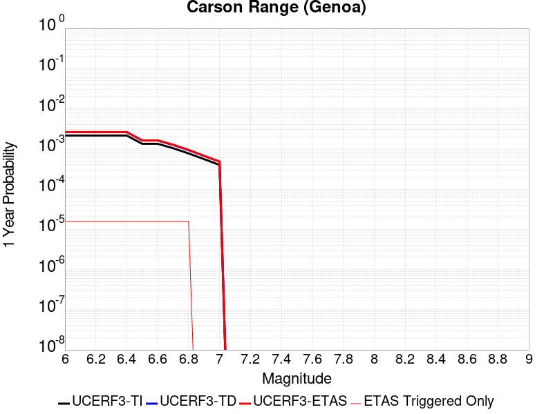 | 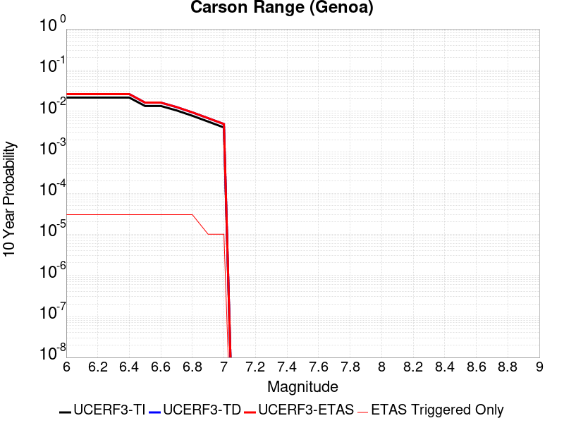 |

| Magnitude | 1 wk TI Prob | 1 wk TD Prob | 1 wk ETAS Prob | 1 wk ETAS/TD Gain | 1 wk ETAS Triggered Only | 1 mo TI Prob | 1 mo TD Prob | 1 mo ETAS Prob | 1 mo ETAS/TD Gain | 1 mo ETAS Triggered Only | 1 yr TI Prob | 1 yr TD Prob | 1 yr ETAS Prob | 1 yr ETAS/TD Gain | 1 yr ETAS Triggered Only | 10 yr TI Prob | 10 yr TD Prob | 10 yr ETAS Prob | 10 yr ETAS/TD Gain | 10 yr ETAS Triggered Only |
|-----|-----|-----|-----|-----|-----|-----|-----|-----|-----|-----|-----|-----|-----|-----|-----|-----|-----|-----|-----|-----|
| 6.0 | 4.1268457E-5 | 5.0146893E-5 | 6.014639E-5 | 1.1994041 | 1.0E-5 | 1.7685282E-4 | 2.148998E-4 | 2.2489765E-4 | 1.0465233 | 1.0E-5 | 0.0021510567 | 0.0026136558 | 0.0026236295 | 1.003816 | 1.0E-5 | 0.02130354 | 0.025868816 | 0.025898041 | 1.0011297 | 3.0E-5 |
| 6.1 | 4.1268457E-5 | 5.0146893E-5 | 6.014639E-5 | 1.1994041 | 1.0E-5 | 1.7685282E-4 | 2.148998E-4 | 2.2489765E-4 | 1.0465233 | 1.0E-5 | 0.0021510567 | 0.0026136558 | 0.0026236295 | 1.003816 | 1.0E-5 | 0.02130354 | 0.025868816 | 0.025898041 | 1.0011297 | 3.0E-5 |
| 6.2 | 4.1268457E-5 | 5.0146893E-5 | 6.014639E-5 | 1.1994041 | 1.0E-5 | 1.7685282E-4 | 2.148998E-4 | 2.2489765E-4 | 1.0465233 | 1.0E-5 | 0.0021510567 | 0.0026136558 | 0.0026236295 | 1.003816 | 1.0E-5 | 0.02130354 | 0.025868816 | 0.025898041 | 1.0011297 | 3.0E-5 |
| 6.3 | 4.1268457E-5 | 5.0146893E-5 | 6.014639E-5 | 1.1994041 | 1.0E-5 | 1.7685282E-4 | 2.148998E-4 | 2.2489765E-4 | 1.0465233 | 1.0E-5 | 0.0021510567 | 0.0026136558 | 0.0026236295 | 1.003816 | 1.0E-5 | 0.02130354 | 0.025868816 | 0.025898041 | 1.0011297 | 3.0E-5 |
| 6.4 | 4.1268457E-5 | 5.0146893E-5 | 6.014639E-5 | 1.1994041 | 1.0E-5 | 1.7685282E-4 | 2.148998E-4 | 2.2489765E-4 | 1.0465233 | 1.0E-5 | 0.0021510567 | 0.0026136558 | 0.0026236295 | 1.003816 | 1.0E-5 | 0.02130354 | 0.025868816 | 0.025898041 | 1.0011297 | 3.0E-5 |
| 6.5 | 2.5677185E-5 | 3.0978295E-5 | 4.0977986E-5 | 1.3227967 | 1.0E-5 | 1.1004044E-4 | 1.3275839E-4 | 1.4275705E-4 | 1.0753148 | 1.0E-5 | 0.0013389189 | 0.0016153135 | 0.0016252974 | 1.0061808 | 1.0E-5 | 0.0133088045 | 0.016053649 | 0.016083168 | 1.0018387 | 3.0E-5 |
| 6.6 | 2.5677185E-5 | 3.0978295E-5 | 4.0977986E-5 | 1.3227967 | 1.0E-5 | 1.1004044E-4 | 1.3275839E-4 | 1.4275705E-4 | 1.0753148 | 1.0E-5 | 0.0013389189 | 0.0016153135 | 0.0016252974 | 1.0061808 | 1.0E-5 | 0.0133088045 | 0.016053649 | 0.016083168 | 1.0018387 | 3.0E-5 |
| 6.7 | 1.9969408E-5 | 2.406347E-5 | 3.4063232E-5 | 1.4155576 | 1.0E-5 | 8.558037E-5 | 1.0312595E-4 | 1.1312492E-4 | 1.0969588 | 1.0E-5 | 0.0010414429 | 0.0012549888 | 0.0012649763 | 1.0079582 | 1.0E-5 | 0.010365757 | 0.012494174 | 0.012523798 | 1.0023711 | 3.0E-5 |
| 6.8 | 1.4783156E-5 | 1.7817569E-5 | 2.781739E-5 | 1.5612338 | 1.0E-5 | 6.335485E-5 | 7.635951E-5 | 8.635874E-5 | 1.1309495 | 1.0E-5 | 7.710722E-4 | 9.294106E-4 | 9.3940133E-4 | 1.0107495 | 1.0E-5 | 0.0076840227 | 0.009268024 | 0.009297746 | 1.003207 | 3.0E-5 |
| 6.9 | 1.06660555E-5 | 1.2877026E-5 | 1.2877026E-5 | 1.0 | 0.0 | 4.5710865E-5 | 5.5186738E-5 | 5.5186738E-5 | 1.0 | 0.0 | 5.5638765E-4 | 6.718066E-4 | 6.718066E-4 | 1.0 | 0.0 | 0.005549967 | 0.006709056 | 0.006718989 | 1.0014806 | 1.0E-5 |
| 7.0 | 7.664838E-6 | 9.258307E-6 | 9.258307E-6 | 1.0 | 0.0 | 3.2848893E-5 | 3.9678456E-5 | 3.9678456E-5 | 1.0 | 0.0 | 3.998619E-4 | 4.830852E-4 | 4.830852E-4 | 1.0 | 0.0 | 0.0039914316 | 0.00483085 | 0.0048408015 | 1.00206 | 1.0E-5 |

## Kern Canyon (Lake Isabella) 2011
*[(top)](#table-of-contents)*

| 1 Week | 1 Month | 1 Year | 10 Year |
|-----|-----|-----|-----|
|  | 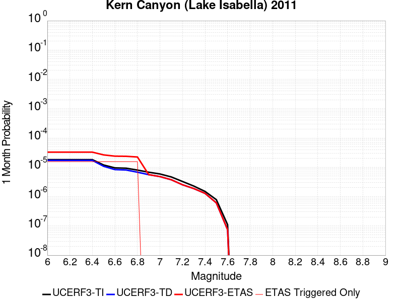 | 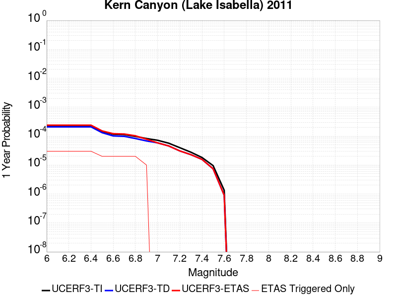 | 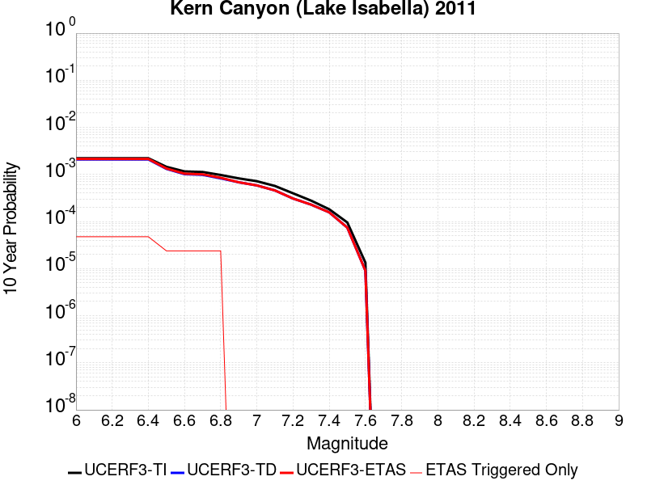 |

| Magnitude | 1 wk TI Prob | 1 wk TD Prob | 1 wk ETAS Prob | 1 wk ETAS/TD Gain | 1 wk ETAS Triggered Only | 1 mo TI Prob | 1 mo TD Prob | 1 mo ETAS Prob | 1 mo ETAS/TD Gain | 1 mo ETAS Triggered Only | 1 yr TI Prob | 1 yr TD Prob | 1 yr ETAS Prob | 1 yr ETAS/TD Gain | 1 yr ETAS Triggered Only | 10 yr TI Prob | 10 yr TD Prob | 10 yr ETAS Prob | 10 yr ETAS/TD Gain | 10 yr ETAS Triggered Only |
|-----|-----|-----|-----|-----|-----|-----|-----|-----|-----|-----|-----|-----|-----|-----|-----|-----|-----|-----|-----|-----|
| 6.0 | 4.2387383E-6 | 4.001639E-6 | 1.4001599E-5 | 3.4989662 | 1.0E-5 | 1.8165894E-5 | 1.7149778E-5 | 2.7149606E-5 | 1.5830879 | 1.0E-5 | 2.2114732E-4 | 2.087804E-4 | 2.3877414E-4 | 1.1436616 | 3.0E-5 | 0.0022092736 | 0.0020860266 | 0.002125943 | 1.0191352 | 4.0E-5 |
| 6.1 | 4.2387383E-6 | 4.001639E-6 | 1.4001599E-5 | 3.4989662 | 1.0E-5 | 1.8165894E-5 | 1.7149778E-5 | 2.7149606E-5 | 1.5830879 | 1.0E-5 | 2.2114732E-4 | 2.087804E-4 | 2.3877414E-4 | 1.1436616 | 3.0E-5 | 0.0022092736 | 0.0020860266 | 0.002125943 | 1.0191352 | 4.0E-5 |
| 6.2 | 4.2387383E-6 | 4.001639E-6 | 1.4001599E-5 | 3.4989662 | 1.0E-5 | 1.8165894E-5 | 1.7149778E-5 | 2.7149606E-5 | 1.5830879 | 1.0E-5 | 2.2114732E-4 | 2.087804E-4 | 2.3877414E-4 | 1.1436616 | 3.0E-5 | 0.0022092736 | 0.0020860266 | 0.002125943 | 1.0191352 | 4.0E-5 |
| 6.3 | 4.2387383E-6 | 4.001639E-6 | 1.4001599E-5 | 3.4989662 | 1.0E-5 | 1.8165894E-5 | 1.7149778E-5 | 2.7149606E-5 | 1.5830879 | 1.0E-5 | 2.2114732E-4 | 2.087804E-4 | 2.3877414E-4 | 1.1436616 | 3.0E-5 | 0.0022092736 | 0.0020860266 | 0.002125943 | 1.0191352 | 4.0E-5 |
| 6.4 | 4.2387383E-6 | 4.001639E-6 | 1.4001599E-5 | 3.4989662 | 1.0E-5 | 1.8165894E-5 | 1.7149778E-5 | 2.7149606E-5 | 1.5830879 | 1.0E-5 | 2.2114732E-4 | 2.087804E-4 | 2.3877414E-4 | 1.1436616 | 3.0E-5 | 0.0022092736 | 0.0020860266 | 0.002125943 | 1.0191352 | 4.0E-5 |
| 6.5 | 2.7857532E-6 | 2.517867E-6 | 1.2517842E-5 | 4.971606 | 1.0E-5 | 1.1938888E-5 | 1.0790815E-5 | 2.0790707E-5 | 1.926704 | 1.0E-5 | 1.4534626E-4 | 1.3137059E-4 | 1.5136796E-4 | 1.1522211 | 2.0E-5 | 0.0014525123 | 0.001312962 | 0.0013329358 | 1.0152128 | 2.0E-5 |
| 6.6 | 2.2233348E-6 | 1.9441236E-6 | 1.1944104E-5 | 6.143696 | 1.0E-5 | 9.528543E-6 | 8.331932E-6 | 1.8331848E-5 | 2.2001917 | 1.0E-5 | 1.1600384E-4 | 1.01436635E-4 | 1.2143461E-4 | 1.1971474 | 2.0E-5 | 0.001159433 | 0.001013912 | 0.0010338917 | 1.0197055 | 2.0E-5 |
| 6.7 | 2.1635126E-6 | 1.8835036E-6 | 1.1883485E-5 | 6.3092446 | 1.0E-5 | 9.272164E-6 | 8.072134E-6 | 1.8072053E-5 | 2.2388198 | 1.0E-5 | 1.1288274E-4 | 9.827388E-5 | 1.1827191E-4 | 1.2034929 | 2.0E-5 | 0.0011282542 | 9.823124E-4 | 0.0010022927 | 1.0203401 | 2.0E-5 |
| 6.8 | 1.8685711E-6 | 1.5831425E-6 | 1.1583126E-5 | 7.3165407 | 1.0E-5 | 8.008137E-6 | 6.784879E-6 | 1.6784812E-5 | 2.4738555 | 1.0E-5 | 9.74947E-5 | 8.260282E-5 | 1.0260117E-4 | 1.2421025 | 2.0E-5 | 9.745194E-4 | 8.2572614E-4 | 8.457096E-4 | 1.0242012 | 2.0E-5 |
| 6.9 | 1.5815071E-6 | 1.3064928E-6 | 1.3064928E-6 | 1.0 | 0.0 | 6.77787E-6 | 5.599243E-6 | 5.599243E-6 | 1.0 | 0.0 | 8.251744E-5 | 6.816868E-5 | 7.8168E-5 | 1.1466849 | 1.0E-5 | 8.248681E-4 | 6.8148033E-4 | 6.9147354E-4 | 1.0146639 | 1.0E-5 |
| 7.0 | 1.3772564E-6 | 1.1210718E-6 | 1.1210718E-6 | 1.0 | 0.0 | 5.9025137E-6 | 4.8045845E-6 | 4.8045845E-6 | 1.0 | 0.0 | 7.186073E-5 | 5.8494268E-5 | 5.8494268E-5 | 1.0 | 0.0 | 7.18375E-4 | 5.847908E-4 | 5.847908E-4 | 1.0 | 0.0 |
| 7.1 | 1.0916998E-6 | 8.763777E-7 | 8.763777E-7 | 1.0 | 0.0 | 4.678705E-6 | 3.7558991E-6 | 3.7558991E-6 | 1.0 | 0.0 | 5.6961744E-5 | 4.5727127E-5 | 4.5727127E-5 | 1.0 | 0.0 | 5.6947145E-4 | 4.571785E-4 | 4.571785E-4 | 1.0 | 0.0 |
| 7.2 | 7.6277024E-7 | 5.901454E-7 | 5.901454E-7 | 1.0 | 0.0 | 3.2690114E-6 | 2.5291922E-6 | 2.5291922E-6 | 1.0 | 0.0 | 3.9799485E-5 | 3.0792486E-5 | 3.0792486E-5 | 1.0 | 0.0 | 3.9792358E-4 | 3.0788282E-4 | 3.0788282E-4 | 1.0 | 0.0 |
| 7.3 | 5.3265916E-7 | 4.3824414E-7 | 4.3824414E-7 | 1.0 | 0.0 | 2.282823E-6 | 1.878188E-6 | 1.878188E-6 | 1.0 | 0.0 | 2.7793016E-5 | 2.2866701E-5 | 2.2866701E-5 | 1.0 | 0.0 | 2.778954E-4 | 2.2864387E-4 | 2.2864387E-4 | 1.0 | 0.0 |
| 7.4 | 3.4946007E-7 | 3.006571E-7 | 3.006571E-7 | 1.0 | 0.0 | 1.497685E-6 | 1.2885298E-6 | 1.2885298E-6 | 1.0 | 0.0 | 1.8234163E-5 | 1.568774E-5 | 1.568774E-5 | 1.0 | 0.0 | 1.8232666E-4 | 1.5686655E-4 | 1.5686655E-4 | 1.0 | 0.0 |
| 7.5 | 1.8317026E-7 | 1.4244812E-7 | 1.4244812E-7 | 1.0 | 0.0 | 7.850152E-7 | 6.104918E-7 | 6.104918E-7 | 1.0 | 0.0 | 9.557518E-6 | 7.432713E-6 | 7.432713E-6 | 1.0 | 0.0 | 9.5571064E-5 | 7.432472E-5 | 7.432472E-5 | 1.0 | 0.0 |
| 7.6 | 2.572245E-8 | 1.7352555E-8 | 1.7352555E-8 | 1.0 | 0.0 | 1.10239064E-7 | 7.436809E-8 | 7.436809E-8 | 1.0 | 0.0 | 1.3421597E-6 | 9.054312E-7 | 9.054312E-7 | 1.0 | 0.0 | 1.3421517E-5 | 9.05428E-6 | 9.05428E-6 | 1.0 | 0.0 |

## Malibu Coast (Extension) alt 1
*[(top)](#table-of-contents)*

| 1 Week | 1 Month | 1 Year | 10 Year |
|-----|-----|-----|-----|
| 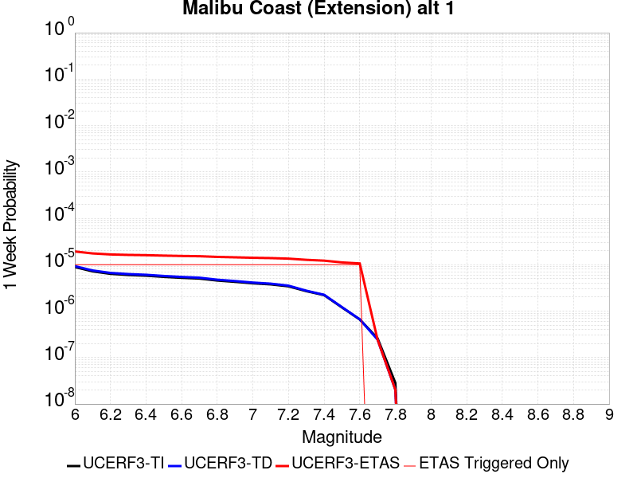 | 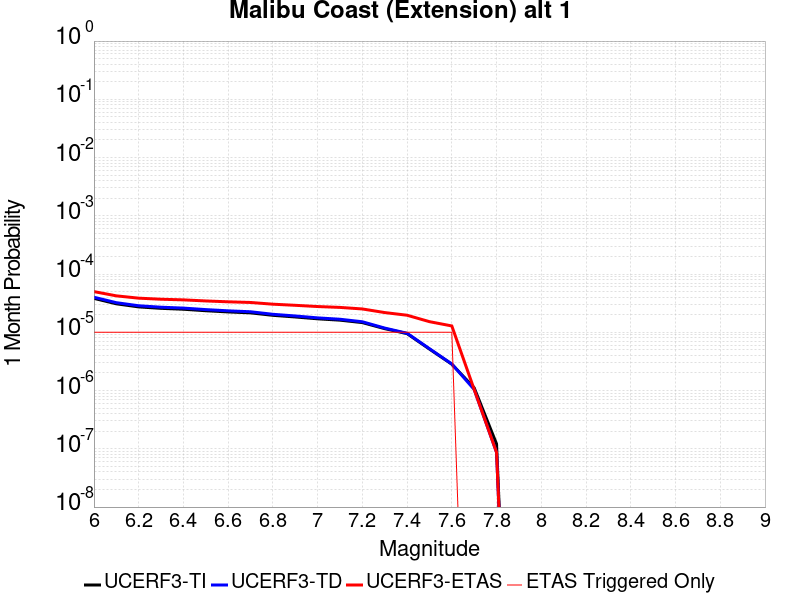 | 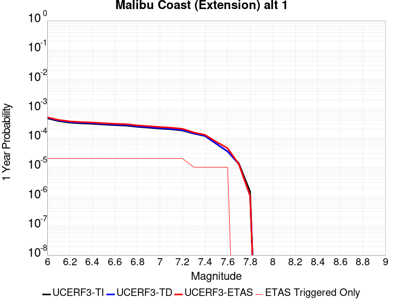 | 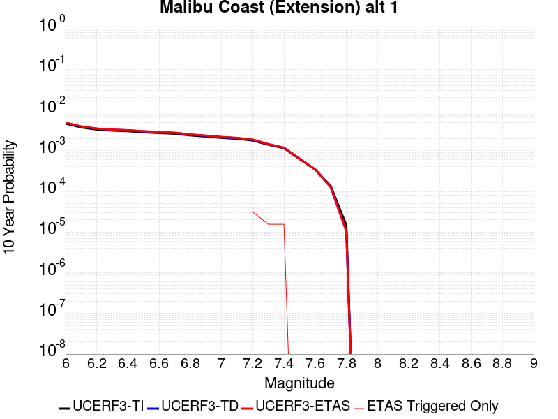 |

| Magnitude | 1 wk TI Prob | 1 wk TD Prob | 1 wk ETAS Prob | 1 wk ETAS/TD Gain | 1 wk ETAS Triggered Only | 1 mo TI Prob | 1 mo TD Prob | 1 mo ETAS Prob | 1 mo ETAS/TD Gain | 1 mo ETAS Triggered Only | 1 yr TI Prob | 1 yr TD Prob | 1 yr ETAS Prob | 1 yr ETAS/TD Gain | 1 yr ETAS Triggered Only | 10 yr TI Prob | 10 yr TD Prob | 10 yr ETAS Prob | 10 yr ETAS/TD Gain | 10 yr ETAS Triggered Only |
|-----|-----|-----|-----|-----|-----|-----|-----|-----|-----|-----|-----|-----|-----|-----|-----|-----|-----|-----|-----|-----|
| 6.0 | 8.930738E-6 | 9.329276E-6 | 1.9329182E-5 | 2.0718846 | 1.0E-5 | 3.827403E-5 | 3.998201E-5 | 4.998161E-5 | 1.2501025 | 1.0E-5 | 4.6588664E-4 | 4.8667393E-4 | 5.066642E-4 | 1.0410752 | 2.0E-5 | 0.0046491115 | 0.004856264 | 0.004886118 | 1.0061476 | 3.0E-5 |
| 6.1 | 7.199952E-6 | 7.5302964E-6 | 1.7530221E-5 | 2.327959 | 1.0E-5 | 3.0856572E-5 | 3.2272303E-5 | 4.2271982E-5 | 1.3098532 | 1.0E-5 | 3.75614E-4 | 3.9284505E-4 | 4.128372E-4 | 1.0508907 | 2.0E-5 | 0.0037497976 | 0.003921572 | 0.0039514545 | 1.00762 | 3.0E-5 |
| 6.2 | 6.3721413E-6 | 6.6667917E-6 | 1.6666725E-5 | 2.4999619 | 1.0E-5 | 2.7308892E-5 | 2.8571652E-5 | 3.857137E-5 | 1.3499873 | 1.0E-5 | 3.3243504E-4 | 3.4780471E-4 | 3.6779774E-4 | 1.0574836 | 2.0E-5 | 0.0033193815 | 0.0034726437 | 0.0035025396 | 1.0086089 | 3.0E-5 |
| 6.3 | 6.016345E-6 | 6.295158E-6 | 1.6295095E-5 | 2.5885124 | 1.0E-5 | 2.578408E-5 | 2.6978973E-5 | 3.69787E-5 | 1.3706491 | 1.0E-5 | 3.1387596E-4 | 3.2841982E-4 | 3.4841325E-4 | 1.0608777 | 2.0E-5 | 0.00313433 | 0.0032793807 | 0.0033092822 | 1.0091181 | 3.0E-5 |
| 6.4 | 5.8104883E-6 | 6.0795446E-6 | 1.6079484E-5 | 2.64485 | 1.0E-5 | 2.4901856E-5 | 2.6054933E-5 | 3.6054673E-5 | 1.3837944 | 1.0E-5 | 3.031379E-4 | 3.1717293E-4 | 3.371666E-4 | 1.063037 | 2.0E-5 | 0.0030272473 | 0.0031672374 | 0.0031971424 | 1.009442 | 3.0E-5 |
| 6.5 | 5.476925E-6 | 5.7275133E-6 | 1.5727455E-5 | 2.7459486 | 1.0E-5 | 2.3472323E-5 | 2.4546256E-5 | 3.454601E-5 | 1.4073842 | 1.0E-5 | 2.8573806E-4 | 2.9880996E-4 | 3.18804E-4 | 1.0669122 | 2.0E-5 | 0.0028537093 | 0.002984114 | 0.0030140243 | 1.0100232 | 3.0E-5 |
| 6.6 | 5.222387E-6 | 5.45858E-6 | 1.5458525E-5 | 2.8319683 | 1.0E-5 | 2.2381464E-5 | 2.3393704E-5 | 3.339347E-5 | 1.4274554 | 1.0E-5 | 2.7246025E-4 | 2.8478142E-4 | 3.0477572E-4 | 1.0702093 | 2.0E-5 | 0.0027212645 | 0.0028441956 | 0.0028741101 | 1.0105178 | 3.0E-5 |
| 6.7 | 5.0337076E-6 | 5.259103E-6 | 1.5259051E-5 | 2.901455 | 1.0E-5 | 2.1572854E-5 | 2.253882E-5 | 3.2538595E-5 | 1.443669 | 1.0E-5 | 2.6261783E-4 | 2.7437587E-4 | 2.9437037E-4 | 1.0728728 | 2.0E-5 | 0.002623077 | 0.002740401 | 0.0027703189 | 1.0109173 | 3.0E-5 |
| 6.8 | 4.5675624E-6 | 4.7587164E-6 | 1.4758669E-5 | 3.101397 | 1.0E-5 | 1.9575122E-5 | 2.039434E-5 | 3.0394136E-5 | 1.4903221 | 1.0E-5 | 2.3830103E-4 | 2.48273E-4 | 2.6826802E-4 | 1.0805365 | 2.0E-5 | 0.0023804565 | 0.002479976 | 0.0025099015 | 1.0120668 | 3.0E-5 |
| 6.9 | 4.2802412E-6 | 4.4520207E-6 | 1.4451976E-5 | 3.2461612 | 1.0E-5 | 1.8343762E-5 | 1.907995E-5 | 2.9079758E-5 | 1.5241004 | 1.0E-5 | 2.2331243E-4 | 2.3227377E-4 | 2.5226912E-4 | 1.0860853 | 2.0E-5 | 0.0022308815 | 0.0023203269 | 0.0023502572 | 1.0128992 | 3.0E-5 |
| 7.0 | 3.9794063E-6 | 4.130099E-6 | 1.4130058E-5 | 3.4212394 | 1.0E-5 | 1.7054486E-5 | 1.7700306E-5 | 2.7700129E-5 | 1.564952 | 1.0E-5 | 2.0761859E-4 | 2.1548003E-4 | 2.3547572E-4 | 1.092796 | 2.0E-5 | 0.0020742472 | 0.0021527244 | 0.00218266 | 1.0139059 | 3.0E-5 |
| 7.1 | 3.7730424E-6 | 3.911217E-6 | 1.3911178E-5 | 3.5567389 | 1.0E-5 | 1.6170083E-5 | 1.6762251E-5 | 2.6762084E-5 | 1.5965686 | 1.0E-5 | 1.9685295E-4 | 2.0406142E-4 | 2.2405734E-4 | 1.0979897 | 2.0E-5 | 0.0019667868 | 0.0020387534 | 0.0020686921 | 1.0146849 | 3.0E-5 |
| 7.2 | 3.424985E-6 | 3.541337E-6 | 1.3541302E-5 | 3.8237822 | 1.0E-5 | 1.4678424E-5 | 1.5177071E-5 | 2.517692E-5 | 1.6588787 | 1.0E-5 | 1.7869516E-4 | 1.8476529E-4 | 2.0476159E-4 | 1.1082255 | 2.0E-5 | 0.0017855153 | 0.0018461287 | 0.0018760734 | 1.0162202 | 3.0E-5 |
| 7.3 | 2.6966375E-6 | 2.7596534E-6 | 1.2759626E-5 | 4.6236334 | 1.0E-5 | 1.15569665E-5 | 1.1827032E-5 | 2.1826914E-5 | 1.8455107 | 1.0E-5 | 1.4069698E-4 | 1.4398464E-4 | 1.539832E-4 | 1.0694418 | 1.0E-5 | 0.0014060794 | 0.0014389176 | 0.0014588889 | 1.0138793 | 2.0E-5 |
| 7.4 | 2.215957E-6 | 2.249378E-6 | 1.2249356E-5 | 5.4456635 | 1.0E-5 | 9.496924E-6 | 9.640156E-6 | 1.964006E-5 | 2.0373175 | 1.0E-5 | 1.1561892E-4 | 1.17362615E-4 | 1.2736145E-4 | 1.085196 | 1.0E-5 | 0.0011555878 | 0.0011730101 | 0.0011929866 | 1.0170301 | 2.0E-5 |
| 7.5 | 1.2040218E-6 | 1.2219067E-6 | 1.1221894E-5 | 9.183921 | 1.0E-5 | 5.160083E-6 | 5.2367322E-6 | 1.523668E-5 | 2.9095778 | 1.0E-5 | 6.2822204E-5 | 6.375537E-5 | 7.375473E-5 | 1.1568395 | 1.0E-5 | 6.280445E-4 | 6.3737266E-4 | 6.473663E-4 | 1.0156794 | 1.0E-5 |
| 7.6 | 6.6157446E-7 | 6.678975E-7 | 1.0667891E-5 | 15.972347 | 1.0E-5 | 2.835316E-6 | 2.8624147E-6 | 1.2862386E-5 | 4.4935436 | 1.0E-5 | 3.4519428E-5 | 3.484936E-5 | 4.484901E-5 | 1.2869394 | 1.0E-5 | 3.4514067E-4 | 3.4844046E-4 | 3.5843698E-4 | 1.0286893 | 1.0E-5 |
| 7.7 | 2.6012302E-7 | 2.4357593E-7 | 2.4357593E-7 | 1.0 | 0.0 | 1.1148124E-6 | 1.0438964E-6 | 1.0438964E-6 | 1.0 | 0.0 | 1.3572758E-5 | 1.2709375E-5 | 1.2709375E-5 | 1.0 | 0.0 | 1.3571928E-4 | 1.2708755E-4 | 1.2708755E-4 | 1.0 | 0.0 |
| 7.8 | 2.8323132E-8 | 2.0266649E-8 | 2.0266649E-8 | 1.0 | 0.0 | 1.2138484E-7 | 8.685707E-8 | 8.685707E-8 | 1.0 | 0.0 | 1.4778595E-6 | 1.0574844E-6 | 1.0574844E-6 | 1.0 | 0.0 | 1.4778497E-5 | 1.0574801E-5 | 1.0574801E-5 | 1.0 | 0.0 |

## Malibu Coast alt 1
*[(top)](#table-of-contents)*

| 1 Week | 1 Month | 1 Year | 10 Year |
|-----|-----|-----|-----|
| 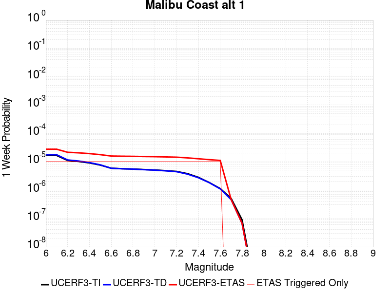 | 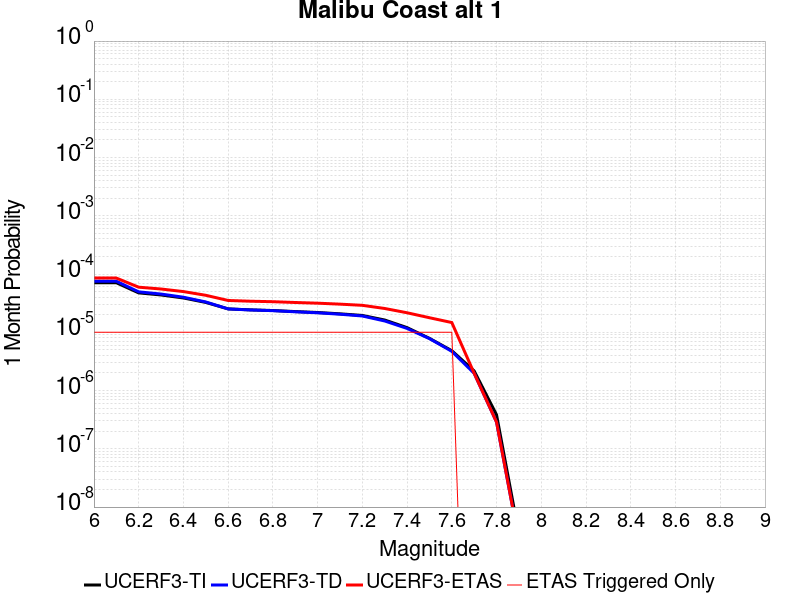 | 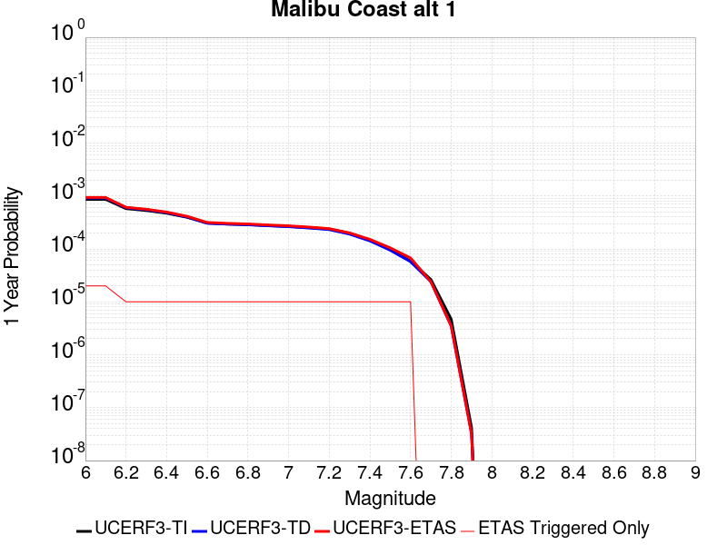 | 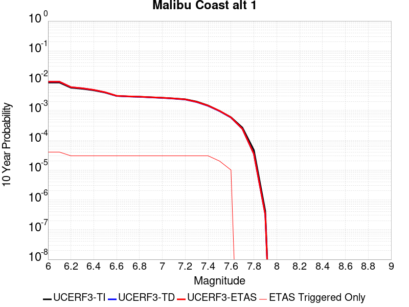 |

| Magnitude | 1 wk TI Prob | 1 wk TD Prob | 1 wk ETAS Prob | 1 wk ETAS/TD Gain | 1 wk ETAS Triggered Only | 1 mo TI Prob | 1 mo TD Prob | 1 mo ETAS Prob | 1 mo ETAS/TD Gain | 1 mo ETAS Triggered Only | 1 yr TI Prob | 1 yr TD Prob | 1 yr ETAS Prob | 1 yr ETAS/TD Gain | 1 yr ETAS Triggered Only | 10 yr TI Prob | 10 yr TD Prob | 10 yr ETAS Prob | 10 yr ETAS/TD Gain | 10 yr ETAS Triggered Only |
|-----|-----|-----|-----|-----|-----|-----|-----|-----|-----|-----|-----|-----|-----|-----|-----|-----|-----|-----|-----|-----|
| 6.0 | 1.6572556E-5 | 1.7598066E-5 | 2.7597891E-5 | 1.5682342 | 1.0E-5 | 7.102331E-5 | 7.541821E-5 | 8.541746E-5 | 1.132584 | 1.0E-5 | 8.6436566E-4 | 9.178488E-4 | 9.378304E-4 | 1.0217701 | 2.0E-5 | 0.0086101135 | 0.009142512 | 0.009182147 | 1.0043352 | 4.0E-5 |
| 6.1 | 1.6572556E-5 | 1.7598066E-5 | 2.7597891E-5 | 1.5682342 | 1.0E-5 | 7.102331E-5 | 7.541821E-5 | 8.541746E-5 | 1.132584 | 1.0E-5 | 8.6436566E-4 | 9.178488E-4 | 9.378304E-4 | 1.0217701 | 2.0E-5 | 0.0086101135 | 0.009142512 | 0.009182147 | 1.0043352 | 4.0E-5 |
| 6.2 | 1.1085717E-5 | 1.1557147E-5 | 2.155703E-5 | 1.8652555 | 1.0E-5 | 4.750935E-5 | 4.952971E-5 | 5.9529215E-5 | 1.201889 | 1.0E-5 | 5.782728E-4 | 6.028609E-4 | 6.128549E-4 | 1.0165776 | 1.0E-5 | 0.0057677035 | 0.0060126255 | 0.0060424455 | 1.0049595 | 3.0E-5 |
| 6.3 | 1.0208568E-5 | 1.0592237E-5 | 2.0592131E-5 | 1.9440776 | 1.0E-5 | 4.375027E-5 | 4.539453E-5 | 5.5394077E-5 | 1.2202809 | 1.0E-5 | 5.325294E-4 | 5.5254117E-4 | 5.6253566E-4 | 1.0180882 | 1.0E-5 | 0.0053125503 | 0.0055119814 | 0.0055418164 | 1.0054127 | 3.0E-5 |
| 6.4 | 9.0682315E-6 | 9.342637E-6 | 1.9342544E-5 | 2.0703516 | 1.0E-5 | 3.8863272E-5 | 4.003927E-5 | 5.003887E-5 | 1.2497448 | 1.0E-5 | 4.730576E-4 | 4.8737114E-4 | 4.9736624E-4 | 1.0205083 | 1.0E-5 | 0.0047205184 | 0.004863236 | 0.0048930906 | 1.0061387 | 3.0E-5 |
| 6.5 | 7.605796E-6 | 7.748587E-6 | 1.774851E-5 | 2.2905478 | 1.0E-5 | 3.259586E-5 | 3.3207816E-5 | 4.3207485E-5 | 1.301124 | 1.0E-5 | 3.9678233E-4 | 4.0423148E-4 | 4.1422746E-4 | 1.0247283 | 1.0E-5 | 0.0039607463 | 0.0040351 | 0.0040649786 | 1.0074048 | 3.0E-5 |
| 6.6 | 5.889873E-6 | 5.8795385E-6 | 1.587948E-5 | 2.7008038 | 1.0E-5 | 2.5242069E-5 | 2.519778E-5 | 3.519753E-5 | 1.3968503 | 1.0E-5 | 3.0727885E-4 | 3.0673988E-4 | 3.167368E-4 | 1.0325909 | 1.0E-5 | 0.003068543 | 0.0030631777 | 0.003093086 | 1.0097637 | 3.0E-5 |
| 6.7 | 5.66586E-6 | 5.641641E-6 | 1.5641584E-5 | 2.7725239 | 1.0E-5 | 2.428203E-5 | 2.417824E-5 | 3.4177996E-5 | 1.4135851 | 1.0E-5 | 2.955936E-4 | 2.9433038E-4 | 3.0432743E-4 | 1.0339655 | 1.0E-5 | 0.0029520073 | 0.0029394177 | 0.0029693295 | 1.0101761 | 3.0E-5 |
| 6.8 | 5.521556E-6 | 5.489427E-6 | 1.5489371E-5 | 2.8216739 | 1.0E-5 | 2.3663597E-5 | 2.3525903E-5 | 3.352567E-5 | 1.4250534 | 1.0E-5 | 2.880662E-4 | 2.8639034E-4 | 2.9638747E-4 | 1.0349073 | 1.0E-5 | 0.0028769306 | 0.002860224 | 0.0028901384 | 1.0104587 | 3.0E-5 |
| 6.9 | 5.29752E-6 | 5.2499317E-6 | 1.5249879E-5 | 2.9047768 | 1.0E-5 | 2.270346E-5 | 2.2499513E-5 | 3.2499287E-5 | 1.4444441 | 1.0E-5 | 2.7637955E-4 | 2.7389723E-4 | 2.8389448E-4 | 1.0365001 | 1.0E-5 | 0.0027603607 | 0.0027356069 | 0.0027655247 | 1.0109365 | 3.0E-5 |
| 7.0 | 5.106743E-6 | 5.0476788E-6 | 1.5047628E-5 | 2.9810987 | 1.0E-5 | 2.1885859E-5 | 2.163273E-5 | 3.1632513E-5 | 1.4622525 | 1.0E-5 | 2.6642776E-4 | 2.6334674E-4 | 2.7334408E-4 | 1.0379628 | 1.0E-5 | 0.0026610855 | 0.0026303562 | 0.0026602773 | 1.0113753 | 3.0E-5 |
| 7.1 | 4.8469647E-6 | 4.770373E-6 | 1.4770325E-5 | 3.0962622 | 1.0E-5 | 2.0772539E-5 | 2.0444295E-5 | 3.0444091E-5 | 1.489124 | 1.0E-5 | 2.528763E-4 | 2.4888094E-4 | 2.5887846E-4 | 1.0401698 | 1.0E-5 | 0.0025258875 | 0.00248603 | 0.0025159556 | 1.0120374 | 3.0E-5 |
| 7.2 | 4.545514E-6 | 4.4481935E-6 | 1.4448149E-5 | 3.2480936 | 1.0E-5 | 1.9480629E-5 | 1.9063547E-5 | 2.9063358E-5 | 1.5245513 | 1.0E-5 | 2.3715083E-4 | 2.3207403E-4 | 2.4207172E-4 | 1.0430797 | 1.0E-5 | 0.0023689792 | 0.0023183243 | 0.0023482547 | 1.0129104 | 3.0E-5 |
| 7.3 | 3.794097E-6 | 3.6519348E-6 | 1.3651898E-5 | 3.7382646 | 1.0E-5 | 1.6260314E-5 | 1.5651056E-5 | 2.56509E-5 | 1.6389245 | 1.0E-5 | 1.9795135E-4 | 1.9053498E-4 | 2.0053308E-4 | 1.0524738 | 1.0E-5 | 0.001977751 | 0.0019037209 | 0.0019336637 | 1.0157286 | 3.0E-5 |
| 7.4 | 2.808217E-6 | 2.719077E-6 | 1.271905E-5 | 4.6777086 | 1.0E-5 | 1.203516E-5 | 1.1653135E-5 | 2.1653019E-5 | 1.8581282 | 1.0E-5 | 1.4651821E-4 | 1.418677E-4 | 1.5186628E-4 | 1.0704782 | 1.0E-5 | 0.0014642165 | 0.001417774 | 0.0014477315 | 1.02113 | 3.0E-5 |
| 7.5 | 1.83809E-6 | 1.8190691E-6 | 1.1819051E-5 | 6.4973073 | 1.0E-5 | 7.877505E-6 | 7.795988E-6 | 1.779591E-5 | 2.2827013 | 1.0E-5 | 9.59044E-5 | 9.491203E-5 | 1.0491108E-4 | 1.1053507 | 1.0E-5 | 9.5863023E-4 | 9.48717E-4 | 9.68698E-4 | 1.0210611 | 2.0E-5 |
| 7.6 | 1.1292672E-6 | 1.1001447E-6 | 1.1100134E-5 | 10.089704 | 1.0E-5 | 4.839708E-6 | 4.714897E-6 | 1.471485E-5 | 3.120927 | 1.0E-5 | 5.8921847E-5 | 5.7402376E-5 | 6.74018E-5 | 1.1741989 | 1.0E-5 | 5.890623E-4 | 5.738771E-4 | 5.838714E-4 | 1.0174153 | 1.0E-5 |
| 7.7 | 5.065272E-7 | 4.609151E-7 | 4.609151E-7 | 1.0 | 0.0 | 2.170829E-6 | 1.975349E-6 | 1.975349E-6 | 1.0 | 0.0 | 2.6429525E-5 | 2.404962E-5 | 2.404962E-5 | 1.0 | 0.0 | 2.642638E-4 | 2.4047129E-4 | 2.4047129E-4 | 1.0 | 0.0 |
| 7.8 | 8.952991E-8 | 6.707874E-8 | 6.707874E-8 | 1.0 | 0.0 | 3.8369956E-7 | 2.8748025E-7 | 2.8748025E-7 | 1.0 | 0.0 | 4.671532E-6 | 3.5000667E-6 | 3.5000667E-6 | 1.0 | 0.0 | 4.671434E-5 | 3.5000136E-5 | 3.5000136E-5 | 1.0 | 0.0 |
| 7.9 | 8.007447E-10 | 6.1608785E-10 | 6.1608785E-10 | 1.0 | 0.0 | 3.4317629E-9 | 2.6403764E-9 | 2.6403764E-9 | 1.0 | 0.0 | 4.1781714E-8 | 3.2146584E-8 | 3.2146584E-8 | 1.0 | 0.0 | 4.1781706E-7 | 3.214658E-7 | 3.214658E-7 | 1.0 | 0.0 |

## Hunting Creek - Bartlett Springs connector 2011
*[(top)](#table-of-contents)*

| 1 Week | 1 Month | 1 Year | 10 Year |
|-----|-----|-----|-----|
| 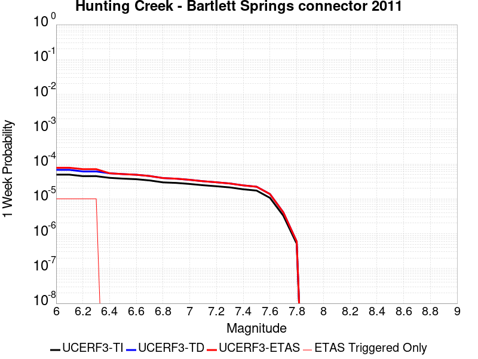 | 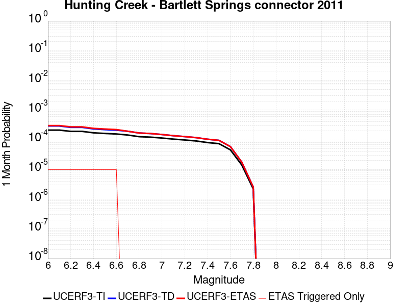 | 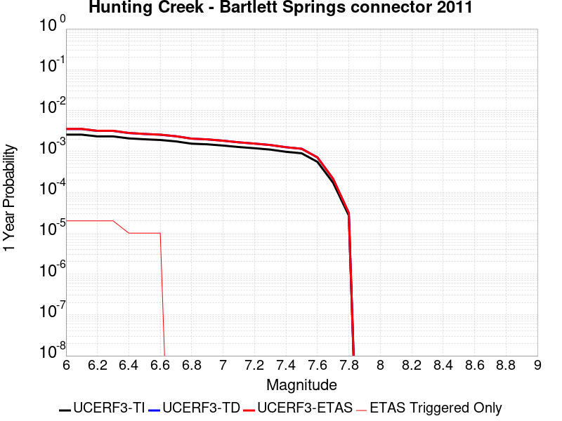 | 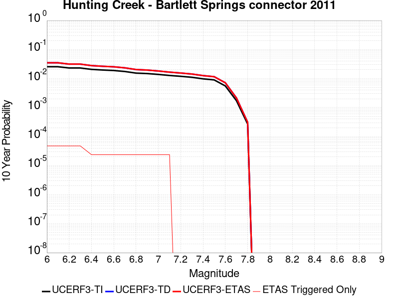 |

| Magnitude | 1 wk TI Prob | 1 wk TD Prob | 1 wk ETAS Prob | 1 wk ETAS/TD Gain | 1 wk ETAS Triggered Only | 1 mo TI Prob | 1 mo TD Prob | 1 mo ETAS Prob | 1 mo ETAS/TD Gain | 1 mo ETAS Triggered Only | 1 yr TI Prob | 1 yr TD Prob | 1 yr ETAS Prob | 1 yr ETAS/TD Gain | 1 yr ETAS Triggered Only | 10 yr TI Prob | 10 yr TD Prob | 10 yr ETAS Prob | 10 yr ETAS/TD Gain | 10 yr ETAS Triggered Only |
|-----|-----|-----|-----|-----|-----|-----|-----|-----|-----|-----|-----|-----|-----|-----|-----|-----|-----|-----|-----|-----|
| 6.0 | 4.940016E-5 | 6.786822E-5 | 7.786754E-5 | 1.1473343 | 1.0E-5 | 2.1169778E-4 | 2.9083234E-4 | 3.0082942E-4 | 1.0343741 | 1.0E-5 | 0.002574374 | 0.003535177 | 0.0035551065 | 1.0056374 | 2.0E-5 | 0.025447546 | 0.034773834 | 0.03480279 | 1.0008327 | 3.0E-5 |
| 6.1 | 4.940016E-5 | 6.786822E-5 | 7.786754E-5 | 1.1473343 | 1.0E-5 | 2.1169778E-4 | 2.9083234E-4 | 3.0082942E-4 | 1.0343741 | 1.0E-5 | 0.002574374 | 0.003535177 | 0.0035551065 | 1.0056374 | 2.0E-5 | 0.025447546 | 0.034773834 | 0.03480279 | 1.0008327 | 3.0E-5 |
| 6.2 | 4.472471E-5 | 6.1002804E-5 | 7.100219E-5 | 1.163917 | 1.0E-5 | 1.9166325E-4 | 2.6141506E-4 | 2.7141246E-4 | 1.0382433 | 1.0E-5 | 0.0023310026 | 0.003178107 | 0.0031980434 | 1.006273 | 2.0E-5 | 0.02306703 | 0.031316914 | 0.031345975 | 1.0009279 | 3.0E-5 |
| 6.3 | 4.472471E-5 | 6.1002804E-5 | 7.100219E-5 | 1.163917 | 1.0E-5 | 1.9166325E-4 | 2.6141506E-4 | 2.7141246E-4 | 1.0382433 | 1.0E-5 | 0.0023310026 | 0.003178107 | 0.0031980434 | 1.006273 | 2.0E-5 | 0.02306703 | 0.031316914 | 0.031345975 | 1.0009279 | 3.0E-5 |
| 6.4 | 4.0001003E-5 | 5.4103755E-5 | 5.4103755E-5 | 1.0 | 0.0 | 1.714216E-4 | 2.31853E-4 | 2.4185069E-4 | 1.0431207 | 1.0E-5 | 0.0020850603 | 0.0028191248 | 0.0028290965 | 1.0035372 | 1.0E-5 | 0.02065605 | 0.027828315 | 0.02784776 | 1.0006987 | 2.0E-5 |
| 6.5 | 3.8033053E-5 | 5.1266547E-5 | 5.1266547E-5 | 1.0 | 0.0 | 1.6298861E-4 | 2.1969559E-4 | 2.2969338E-4 | 1.0455076 | 1.0E-5 | 0.0019825802 | 0.0026714746 | 0.002681448 | 1.0037333 | 1.0E-5 | 0.019649856 | 0.026390454 | 0.026409926 | 1.0007379 | 2.0E-5 |
| 6.6 | 3.653754E-5 | 4.913017E-5 | 4.913017E-5 | 1.0 | 0.0 | 1.5658008E-4 | 2.1054115E-4 | 2.2053906E-4 | 1.0474867 | 1.0E-5 | 0.0019046954 | 0.0025602852 | 0.0025702596 | 1.0038958 | 1.0E-5 | 0.018884527 | 0.025306415 | 0.025325907 | 1.0007703 | 2.0E-5 |
| 6.7 | 3.372024E-5 | 4.514011E-5 | 4.514011E-5 | 1.0 | 0.0 | 1.4450731E-4 | 1.9344354E-4 | 1.9344354E-4 | 1.0 | 0.0 | 0.0017579567 | 0.002352639 | 0.002352639 | 1.0 | 0.0 | 0.017441148 | 0.023278099 | 0.023287866 | 1.0004196 | 1.0E-5 |
| 6.8 | 2.9650024E-5 | 3.9411374E-5 | 3.9411374E-5 | 1.0 | 0.0 | 1.2706534E-4 | 1.6889503E-4 | 1.6889503E-4 | 1.0 | 0.0 | 0.0015459227 | 0.0020543463 | 0.0020543463 | 1.0 | 0.0 | 0.015352124 | 0.020351216 | 0.020361012 | 1.0004814 | 1.0E-5 |
| 6.9 | 2.860775E-5 | 3.7812544E-5 | 3.7812544E-5 | 1.0 | 0.0 | 1.2259888E-4 | 1.6204377E-4 | 1.6204377E-4 | 1.0 | 0.0 | 0.0014916194 | 0.001971107 | 0.001971107 | 1.0 | 0.0 | 0.014816469 | 0.01953584 | 0.019545645 | 1.0005019 | 1.0E-5 |
| 7.0 | 2.6696067E-5 | 3.506726E-5 | 3.506726E-5 | 1.0 | 0.0 | 1.144067E-4 | 1.5027967E-4 | 1.5027967E-4 | 1.0 | 0.0 | 0.0013920115 | 0.0018281302 | 0.0018281302 | 1.0 | 0.0 | 0.013833242 | 0.018131364 | 0.018141182 | 1.0005416 | 1.0E-5 |
| 7.1 | 2.456087E-5 | 3.2013093E-5 | 3.2013093E-5 | 1.0 | 0.0 | 1.0525662E-4 | 1.371918E-4 | 1.371918E-4 | 1.0 | 0.0 | 0.001280746 | 0.0016690396 | 0.0016690396 | 1.0 | 0.0 | 0.012733897 | 0.016566366 | 0.0165762 | 1.0005937 | 1.0E-5 |
| 7.2 | 2.295761E-5 | 2.9822932E-5 | 2.9822932E-5 | 1.0 | 0.0 | 9.8386045E-5 | 1.2780636E-4 | 1.2780636E-4 | 1.0 | 0.0 | 0.0011971919 | 0.001554941 | 0.001554941 | 1.0 | 0.0 | 0.011907627 | 0.015442089 | 0.015442089 | 1.0 | 0.0 |
| 7.3 | 2.1256936E-5 | 2.7541912E-5 | 2.7541912E-5 | 1.0 | 0.0 | 9.109797E-5 | 1.1803147E-4 | 1.1803147E-4 | 1.0 | 0.0 | 0.0011085535 | 0.0014360948 | 0.0014360948 | 1.0 | 0.0 | 0.011030397 | 0.014269472 | 0.014269472 | 1.0 | 0.0 |
| 7.4 | 1.8784336E-5 | 2.4306766E-5 | 2.4306766E-5 | 1.0 | 0.0 | 8.050181E-5 | 1.0416774E-4 | 1.0416774E-4 | 1.0 | 0.0 | 9.796688E-4 | 0.001267512 | 0.001267512 | 1.0 | 0.0 | 0.009753612 | 0.012603902 | 0.012603902 | 1.0 | 0.0 |
| 7.5 | 1.7248298E-5 | 2.2268887E-5 | 2.2268887E-5 | 1.0 | 0.0 | 7.391918E-5 | 9.543464E-5 | 9.543464E-5 | 1.0 | 0.0 | 8.9959445E-4 | 0.0011613049 | 0.0011613049 | 1.0 | 0.0 | 0.008959615 | 0.01155334 | 0.01155334 | 1.0 | 0.0 |
| 7.6 | 1.0653709E-5 | 1.3722118E-5 | 1.3722118E-5 | 1.0 | 0.0 | 4.5657955E-5 | 5.8807767E-5 | 5.8807767E-5 | 1.0 | 0.0 | 5.557438E-4 | 7.157521E-4 | 7.157521E-4 | 1.0 | 0.0 | 0.0055435603 | 0.0071348166 | 0.0071348166 | 1.0 | 0.0 |
| 7.7 | 3.286316E-6 | 4.0903437E-6 | 4.0903437E-6 | 1.0 | 0.0 | 1.4084137E-5 | 1.7529928E-5 | 1.7529928E-5 | 1.0 | 0.0 | 1.7146087E-4 | 2.1340612E-4 | 2.1340612E-4 | 1.0 | 0.0 | 0.0017132863 | 0.0021320276 | 0.0021320276 | 1.0 | 0.0 |
| 7.8 | 5.1855085E-7 | 5.9720696E-7 | 5.9720696E-7 | 1.0 | 0.0 | 2.222359E-6 | 2.5594559E-6 | 2.5594559E-6 | 1.0 | 0.0 | 2.7056883E-5 | 3.116094E-5 | 3.116094E-5 | 1.0 | 0.0 | 2.705359E-4 | 3.1156495E-4 | 3.1156495E-4 | 1.0 | 0.0 |

## San Juan
*[(top)](#table-of-contents)*

| 1 Week | 1 Month | 1 Year | 10 Year |
|-----|-----|-----|-----|
|  | 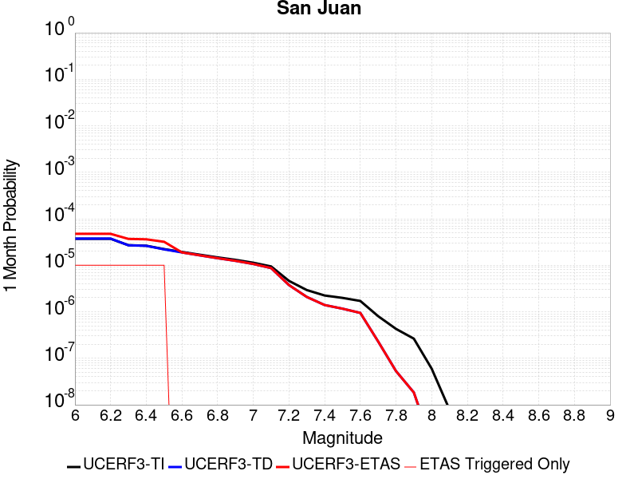 | 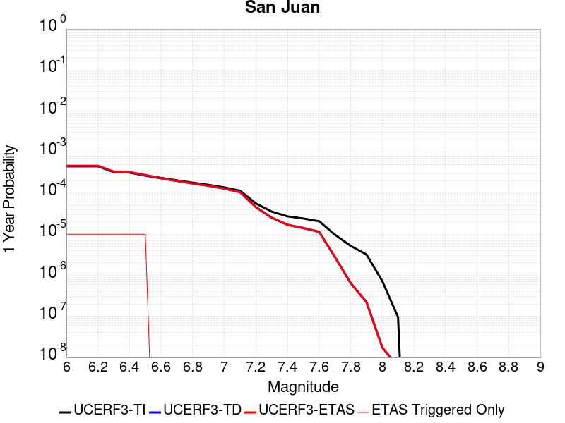 | 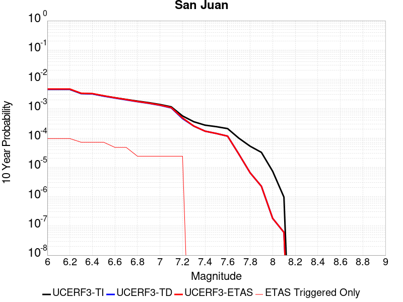 |

| Magnitude | 1 wk TI Prob | 1 wk TD Prob | 1 wk ETAS Prob | 1 wk ETAS/TD Gain | 1 wk ETAS Triggered Only | 1 mo TI Prob | 1 mo TD Prob | 1 mo ETAS Prob | 1 mo ETAS/TD Gain | 1 mo ETAS Triggered Only | 1 yr TI Prob | 1 yr TD Prob | 1 yr ETAS Prob | 1 yr ETAS/TD Gain | 1 yr ETAS Triggered Only | 10 yr TI Prob | 10 yr TD Prob | 10 yr ETAS Prob | 10 yr ETAS/TD Gain | 10 yr ETAS Triggered Only |
|-----|-----|-----|-----|-----|-----|-----|-----|-----|-----|-----|-----|-----|-----|-----|-----|-----|-----|-----|-----|-----|
| 6.0 | 8.682808E-6 | 8.7491635E-6 | 8.7491635E-6 | 1.0 | 0.0 | 3.72115E-5 | 3.74959E-5 | 4.7495527E-5 | 1.2666858 | 1.0E-5 | 4.5295584E-4 | 4.564218E-4 | 4.6641726E-4 | 1.0218996 | 1.0E-5 | 0.004520337 | 0.004555385 | 0.004595203 | 1.0087408 | 4.0E-5 |
| 6.1 | 8.682808E-6 | 8.7491635E-6 | 8.7491635E-6 | 1.0 | 0.0 | 3.72115E-5 | 3.74959E-5 | 4.7495527E-5 | 1.2666858 | 1.0E-5 | 4.5295584E-4 | 4.564218E-4 | 4.6641726E-4 | 1.0218996 | 1.0E-5 | 0.004520337 | 0.004555385 | 0.004595203 | 1.0087408 | 4.0E-5 |
| 6.2 | 8.682808E-6 | 8.7491635E-6 | 8.7491635E-6 | 1.0 | 0.0 | 3.72115E-5 | 3.74959E-5 | 4.7495527E-5 | 1.2666858 | 1.0E-5 | 4.5295584E-4 | 4.564218E-4 | 4.6641726E-4 | 1.0218996 | 1.0E-5 | 0.004520337 | 0.004555385 | 0.004595203 | 1.0087408 | 4.0E-5 |
| 6.3 | 6.3054235E-6 | 6.2825848E-6 | 6.2825848E-6 | 1.0 | 0.0 | 2.7022963E-5 | 2.6925094E-5 | 3.6924826E-5 | 1.3713907 | 1.0E-5 | 3.2895492E-4 | 3.2776513E-4 | 3.3776183E-4 | 1.0304997 | 1.0E-5 | 0.003284684 | 0.003273017 | 0.0033029187 | 1.0091358 | 3.0E-5 |
| 6.4 | 6.1490473E-6 | 6.1144656E-6 | 6.1144656E-6 | 1.0 | 0.0 | 2.6352795E-5 | 2.6204598E-5 | 3.6204336E-5 | 1.3816024 | 1.0E-5 | 3.2079802E-4 | 3.1899565E-4 | 3.2899246E-4 | 1.0313383 | 1.0E-5 | 0.0032033534 | 0.0031855737 | 0.0032154783 | 1.0093875 | 3.0E-5 |
| 6.5 | 5.204848E-6 | 5.137233E-6 | 5.137233E-6 | 1.0 | 0.0 | 2.23063E-5 | 2.2016533E-5 | 3.2016313E-5 | 1.4541941 | 1.0E-5 | 2.7154534E-4 | 2.6801927E-4 | 2.780166E-4 | 1.0373007 | 1.0E-5 | 0.0027121378 | 0.0026771144 | 0.0027070341 | 1.0111761 | 3.0E-5 |
| 6.6 | 4.5179986E-6 | 4.4150297E-6 | 4.4150297E-6 | 1.0 | 0.0 | 1.9362706E-5 | 1.8921424E-5 | 1.8921424E-5 | 1.0 | 0.0 | 2.3571544E-4 | 2.3034477E-4 | 2.3034477E-4 | 1.0 | 0.0 | 0.0023546559 | 0.0023011973 | 0.002321151 | 1.0086712 | 2.0E-5 |
| 6.7 | 3.9442616E-6 | 3.819828E-6 | 3.819828E-6 | 1.0 | 0.0 | 1.6903869E-5 | 1.6370592E-5 | 1.6370592E-5 | 1.0 | 0.0 | 2.0578515E-4 | 1.992944E-4 | 1.992944E-4 | 1.0 | 0.0 | 0.002055947 | 0.0019912818 | 0.0020112419 | 1.0100238 | 2.0E-5 |
| 6.8 | 3.4536245E-6 | 3.3163353E-6 | 3.3163353E-6 | 1.0 | 0.0 | 1.4801163E-5 | 1.4212792E-5 | 1.4212792E-5 | 1.0 | 0.0 | 1.8018926E-4 | 1.7302761E-4 | 1.7302761E-4 | 1.0 | 0.0 | 0.0018004322 | 0.0017290477 | 0.0017390305 | 1.0057735 | 1.0E-5 |
| 6.9 | 3.059865E-6 | 2.9120315E-6 | 2.9120315E-6 | 1.0 | 0.0 | 1.3113641E-5 | 1.2480078E-5 | 1.2480078E-5 | 1.0 | 0.0 | 1.596469E-4 | 1.5193493E-4 | 1.5193493E-4 | 1.0 | 0.0 | 0.0015953224 | 0.0015184252 | 0.00152841 | 1.0065758 | 1.0E-5 |
| 7.0 | 2.6504351E-6 | 2.4920002E-6 | 2.4920002E-6 | 1.0 | 0.0 | 1.1358958E-5 | 1.0679961E-5 | 1.0679961E-5 | 1.0 | 0.0 | 1.3828653E-4 | 1.300213E-4 | 1.300213E-4 | 1.0 | 0.0 | 0.0013820052 | 0.0012995641 | 0.0013095512 | 1.007685 | 1.0E-5 |
| 7.1 | 2.2039317E-6 | 2.0338296E-6 | 2.0338296E-6 | 1.0 | 0.0 | 9.445387E-6 | 8.716386E-6 | 8.716386E-6 | 1.0 | 0.0 | 1.1499152E-4 | 1.0611736E-4 | 1.0611736E-4 | 1.0 | 0.0 | 0.0011493203 | 0.0010607769 | 0.0010707662 | 1.009417 | 1.0E-5 |
| 7.2 | 1.0786707E-6 | 8.7701903E-7 | 8.7701903E-7 | 1.0 | 0.0 | 4.622866E-6 | 3.7586476E-6 | 3.7586476E-6 | 1.0 | 0.0 | 5.628194E-5 | 4.5760586E-5 | 4.5760586E-5 | 1.0 | 0.0 | 5.6267687E-4 | 4.5757066E-4 | 4.6756607E-4 | 1.0218445 | 1.0E-5 |
| 7.3 | 6.846433E-7 | 4.868805E-7 | 4.868805E-7 | 1.0 | 0.0 | 2.9341822E-6 | 2.086629E-6 | 2.086629E-6 | 1.0 | 0.0 | 3.5723086E-5 | 2.5404412E-5 | 2.5404412E-5 | 1.0 | 0.0 | 3.571734E-4 | 2.540486E-4 | 2.540486E-4 | 1.0 | 0.0 |
| 7.4 | 5.23043E-7 | 3.2628162E-7 | 3.2628162E-7 | 1.0 | 0.0 | 2.2416111E-6 | 1.398349E-6 | 1.398349E-6 | 1.0 | 0.0 | 2.7291273E-5 | 1.7024766E-5 | 1.7024766E-5 | 1.0 | 0.0 | 2.7287923E-4 | 1.7026656E-4 | 1.7026656E-4 | 1.0 | 0.0 |
| 7.5 | 4.648444E-7 | 2.7234944E-7 | 2.7234944E-7 | 1.0 | 0.0 | 1.9921886E-6 | 1.1672114E-6 | 1.1672114E-6 | 1.0 | 0.0 | 2.4254627E-5 | 1.42107065E-5 | 1.42107065E-5 | 1.0 | 0.0 | 2.425198E-4 | 1.421276E-4 | 1.421276E-4 | 1.0 | 0.0 |
| 7.6 | 3.9906567E-7 | 2.2083314E-7 | 2.2083314E-7 | 1.0 | 0.0 | 1.7102802E-6 | 9.464274E-7 | 9.464274E-7 | 1.0 | 0.0 | 2.0822463E-5 | 1.1522693E-5 | 1.1522693E-5 | 1.0 | 0.0 | 2.0820512E-4 | 1.15245566E-4 | 1.15245566E-4 | 1.0 | 0.0 |
| 7.7 | 1.8784601E-7 | 5.3666906E-8 | 5.3666906E-8 | 1.0 | 0.0 | 8.0505407E-7 | 2.30001E-7 | 2.30001E-7 | 1.0 | 0.0 | 9.80149E-6 | 2.8002585E-6 | 2.8002585E-6 | 1.0 | 0.0 | 9.801057E-5 | 2.8011282E-5 | 2.8011282E-5 | 1.0 | 0.0 |
| 7.8 | 1.00154914E-7 | 1.2415832E-8 | 1.2415832E-8 | 1.0 | 0.0 | 4.2923529E-7 | 5.3210716E-8 | 5.3210716E-8 | 1.0 | 0.0 | 5.225927E-6 | 6.4784024E-7 | 6.4784024E-7 | 1.0 | 0.0 | 5.225804E-5 | 6.484273E-6 | 6.484273E-6 | 1.0 | 0.0 |
| 7.9 | 6.171429E-8 | 4.2966155E-9 | 4.2966155E-9 | 1.0 | 0.0 | 2.6448978E-7 | 1.8414067E-8 | 1.8414067E-8 | 1.0 | 0.0 | 3.2201583E-6 | 2.2419121E-7 | 2.2419121E-7 | 1.0 | 0.0 | 3.2201115E-5 | 2.2472002E-6 | 2.2472002E-6 | 1.0 | 0.0 |
| 8.0 | 1.3974572E-8 | 3.3788217E-10 | 3.3788217E-10 | 1.0 | 0.0 | 5.989102E-8 | 1.448067E-9 | 1.448067E-9 | 1.0 | 0.0 | 7.2917294E-7 | 1.763022E-8 | 1.763022E-8 | 1.0 | 0.0 | 7.2917055E-6 | 1.8060365E-7 | 1.8060365E-7 | 1.0 | 0.0 |
| 8.1 | 1.8403477E-9 | 1.1302803E-10 | 1.1302803E-10 | 1.0 | 0.0 | 7.887204E-9 | 4.844063E-10 | 4.844063E-10 | 1.0 | 0.0 | 9.602671E-8 | 5.8976446E-9 | 5.8976446E-9 | 1.0 | 0.0 | 9.602667E-7 | 6.021993E-8 | 6.021993E-8 | 1.0 | 0.0 |

## Great Valley 03 Mysterious Ridge
*[(top)](#table-of-contents)*

| 1 Week | 1 Month | 1 Year | 10 Year |
|-----|-----|-----|-----|
| 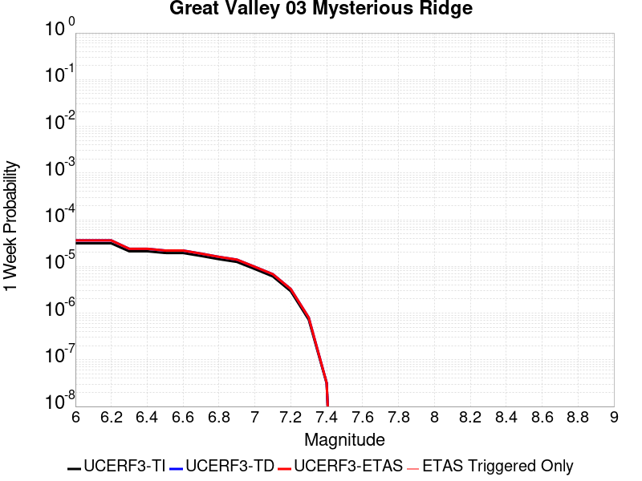 | 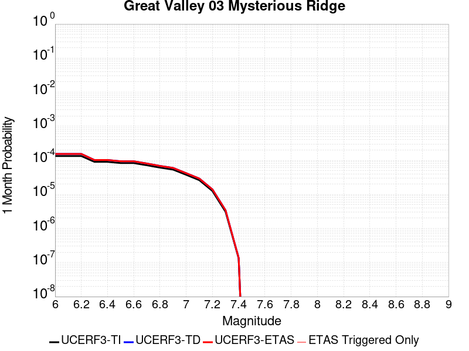 | 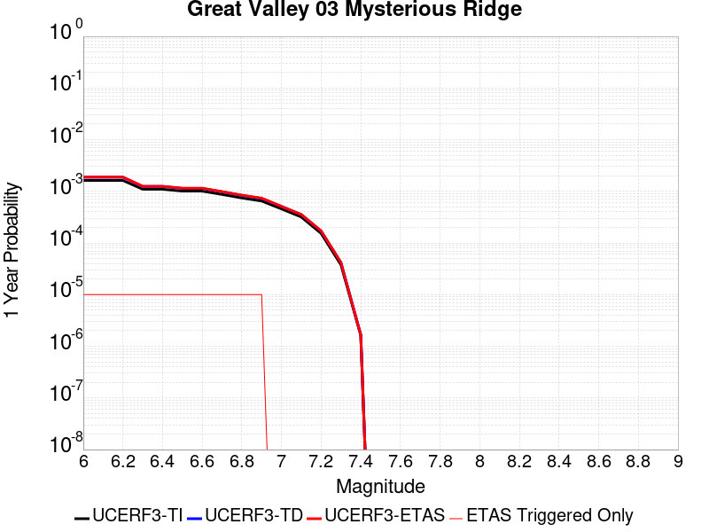 | 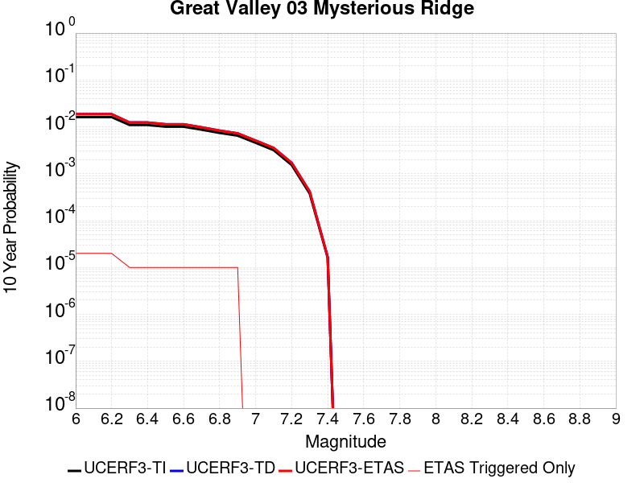 |

| Magnitude | 1 wk TI Prob | 1 wk TD Prob | 1 wk ETAS Prob | 1 wk ETAS/TD Gain | 1 wk ETAS Triggered Only | 1 mo TI Prob | 1 mo TD Prob | 1 mo ETAS Prob | 1 mo ETAS/TD Gain | 1 mo ETAS Triggered Only | 1 yr TI Prob | 1 yr TD Prob | 1 yr ETAS Prob | 1 yr ETAS/TD Gain | 1 yr ETAS Triggered Only | 10 yr TI Prob | 10 yr TD Prob | 10 yr ETAS Prob | 10 yr ETAS/TD Gain | 10 yr ETAS Triggered Only |
|-----|-----|-----|-----|-----|-----|-----|-----|-----|-----|-----|-----|-----|-----|-----|-----|-----|-----|-----|-----|-----|
| 6.0 | 3.1182444E-5 | 3.603423E-5 | 3.603423E-5 | 1.0 | 0.0 | 1.336322E-4 | 1.544242E-4 | 1.544242E-4 | 1.0 | 0.0 | 0.0016257578 | 0.0018786696 | 0.0018886508 | 1.0053129 | 1.0E-5 | 0.016139153 | 0.018646652 | 0.018666279 | 1.0010526 | 2.0E-5 |
| 6.1 | 3.1182444E-5 | 3.603423E-5 | 3.603423E-5 | 1.0 | 0.0 | 1.336322E-4 | 1.544242E-4 | 1.544242E-4 | 1.0 | 0.0 | 0.0016257578 | 0.0018786696 | 0.0018886508 | 1.0053129 | 1.0E-5 | 0.016139153 | 0.018646652 | 0.018666279 | 1.0010526 | 2.0E-5 |
| 6.2 | 3.1182444E-5 | 3.603423E-5 | 3.603423E-5 | 1.0 | 0.0 | 1.336322E-4 | 1.544242E-4 | 1.544242E-4 | 1.0 | 0.0 | 0.0016257578 | 0.0018786696 | 0.0018886508 | 1.0053129 | 1.0E-5 | 0.016139153 | 0.018646652 | 0.018666279 | 1.0010526 | 2.0E-5 |
| 6.3 | 2.106934E-5 | 2.3850307E-5 | 2.3850307E-5 | 1.0 | 0.0 | 9.0294045E-5 | 1.0221177E-4 | 1.0221177E-4 | 1.0 | 0.0 | 0.0010987755 | 0.0012437489 | 0.0012537364 | 1.0080302 | 1.0E-5 | 0.010933585 | 0.012371127 | 0.012381003 | 1.0007983 | 1.0E-5 |
| 6.4 | 2.106934E-5 | 2.3850307E-5 | 2.3850307E-5 | 1.0 | 0.0 | 9.0294045E-5 | 1.0221177E-4 | 1.0221177E-4 | 1.0 | 0.0 | 0.0010987755 | 0.0012437489 | 0.0012537364 | 1.0080302 | 1.0E-5 | 0.010933585 | 0.012371127 | 0.012381003 | 1.0007983 | 1.0E-5 |
| 6.5 | 1.9389783E-5 | 2.1884984E-5 | 2.1884984E-5 | 1.0 | 0.0 | 8.309642E-5 | 9.3789575E-5 | 9.3789575E-5 | 1.0 | 0.0 | 0.0010112294 | 0.0011413174 | 0.001151306 | 1.0087517 | 1.0E-5 | 0.010066401 | 0.011357434 | 0.01136732 | 1.0008705 | 1.0E-5 |
| 6.6 | 1.9370193E-5 | 2.1864906E-5 | 2.1864906E-5 | 1.0 | 0.0 | 8.301247E-5 | 9.370353E-5 | 9.370353E-5 | 1.0 | 0.0 | 0.0010102082 | 0.001140271 | 0.0011502595 | 1.0087599 | 1.0E-5 | 0.010056281 | 0.011347076 | 0.011356962 | 1.0008713 | 1.0E-5 |
| 6.7 | 1.6723505E-5 | 1.8799281E-5 | 1.8799281E-5 | 1.0 | 0.0 | 7.16702E-5 | 8.056597E-5 | 8.056597E-5 | 1.0 | 0.0 | 8.722353E-4 | 9.804688E-4 | 9.90459E-4 | 1.0101892 | 1.0E-5 | 0.008688197 | 0.009763439 | 0.009773342 | 1.0010142 | 1.0E-5 |
| 6.8 | 1.426937E-5 | 1.599721E-5 | 1.599721E-5 | 1.0 | 0.0 | 6.115301E-5 | 6.855775E-5 | 6.855775E-5 | 1.0 | 0.0 | 7.4428355E-4 | 8.343854E-4 | 8.443771E-4 | 1.0119748 | 1.0E-5 | 0.007417957 | 0.008314005 | 0.008323922 | 1.0011928 | 1.0E-5 |
| 6.9 | 1.2469891E-5 | 1.3956928E-5 | 1.3956928E-5 | 1.0 | 0.0 | 5.3441294E-5 | 5.9814105E-5 | 5.9814105E-5 | 1.0 | 0.0 | 6.504535E-4 | 7.280055E-4 | 7.3799817E-4 | 1.0137261 | 1.0E-5 | 0.006485529 | 0.00725743 | 0.0072673573 | 1.0013679 | 1.0E-5 |
| 7.0 | 8.7746275E-6 | 9.791734E-6 | 9.791734E-6 | 1.0 | 0.0 | 3.7605005E-5 | 4.196394E-5 | 4.196394E-5 | 1.0 | 0.0 | 4.5774475E-4 | 5.1079853E-4 | 5.1079853E-4 | 1.0 | 0.0 | 0.00456803 | 0.005096977 | 0.005096977 | 1.0 | 0.0 |
| 7.1 | 6.1067153E-6 | 6.813725E-6 | 6.813725E-6 | 1.0 | 0.0 | 2.6171374E-5 | 2.9201385E-5 | 2.9201385E-5 | 1.0 | 0.0 | 3.1858988E-4 | 3.5547445E-4 | 3.5547445E-4 | 1.0 | 0.0 | 0.0031813353 | 0.003549609 | 0.003549609 | 1.0 | 0.0 |
| 7.2 | 2.939283E-6 | 3.2741057E-6 | 3.2741057E-6 | 1.0 | 0.0 | 1.2596866E-5 | 1.4031816E-5 | 1.4031816E-5 | 1.0 | 0.0 | 1.5335606E-4 | 1.7082572E-4 | 1.7082572E-4 | 1.0 | 0.0 | 0.0015325027 | 0.001707116 | 0.001707116 | 1.0 | 0.0 |
| 7.3 | 7.2387763E-7 | 8.008505E-7 | 8.008505E-7 | 1.0 | 0.0 | 3.102329E-6 | 3.4322145E-6 | 3.4322145E-6 | 1.0 | 0.0 | 3.77702E-5 | 4.178687E-5 | 4.178687E-5 | 1.0 | 0.0 | 3.7763783E-4 | 4.1783508E-4 | 4.1783508E-4 | 1.0 | 0.0 |
| 7.4 | 3.112171E-8 | 3.2068368E-8 | 3.2068368E-8 | 1.0 | 0.0 | 1.3337875E-7 | 1.3743585E-7 | 1.3743585E-7 | 1.0 | 0.0 | 1.6238852E-6 | 1.6732803E-6 | 1.6732803E-6 | 1.0 | 0.0 | 1.6238733E-5 | 1.6732685E-5 | 1.6732685E-5 | 1.0 | 0.0 |

## East Huasna 2011 CFM
*[(top)](#table-of-contents)*

| 1 Week | 1 Month | 1 Year | 10 Year |
|-----|-----|-----|-----|
| 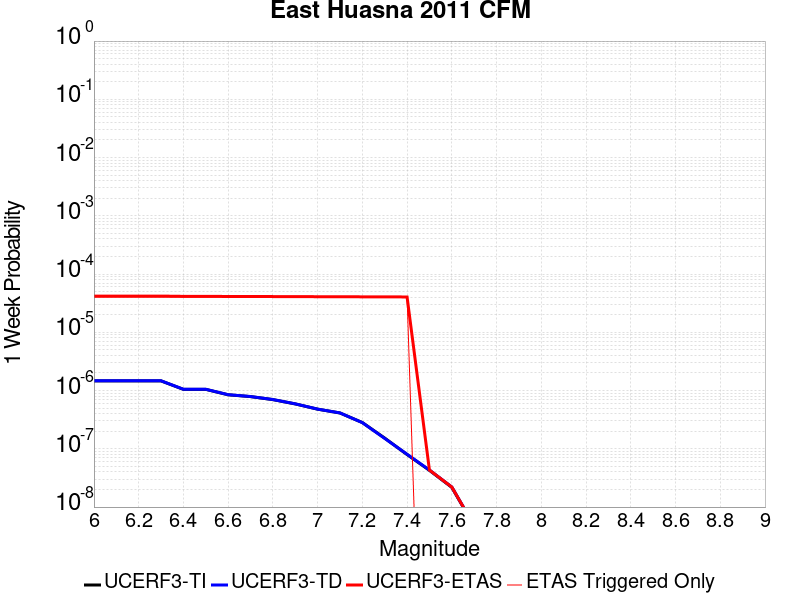 | 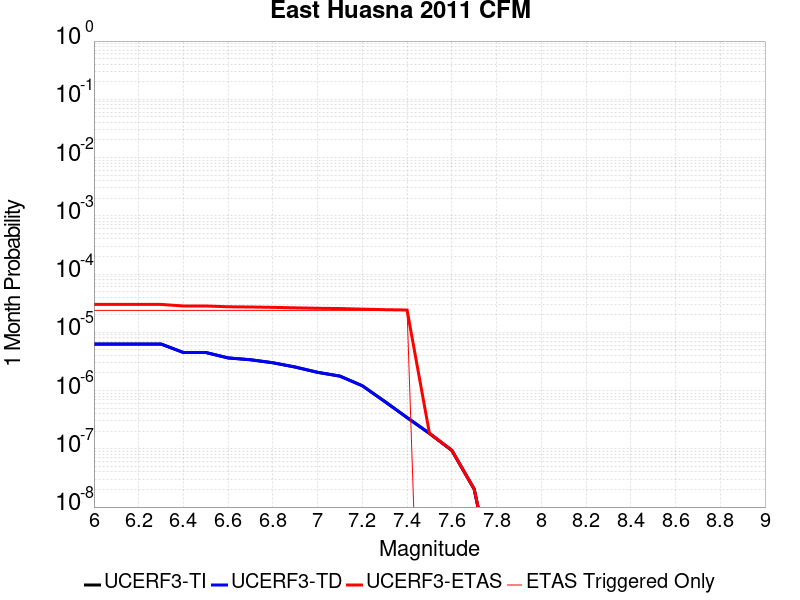 | 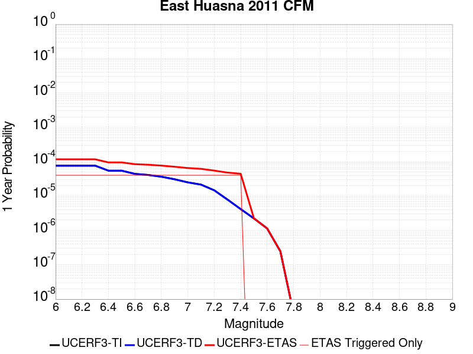 | 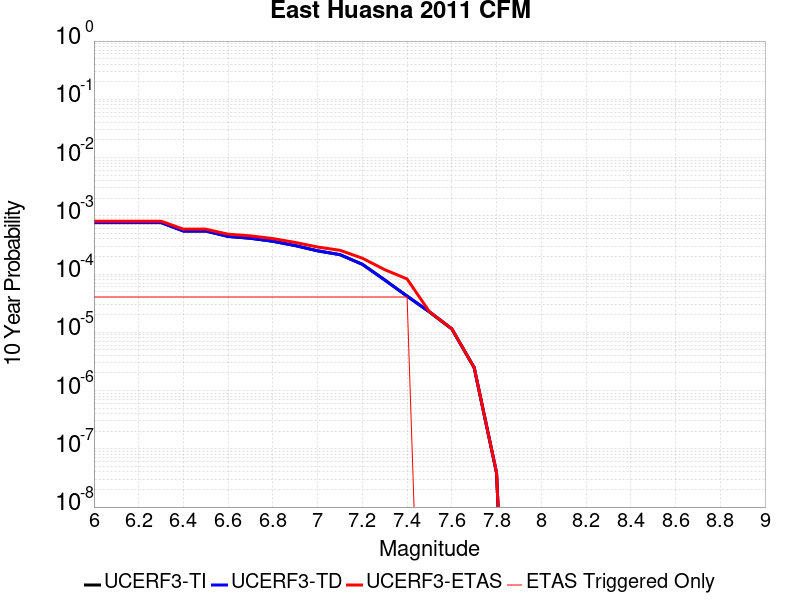 |

| Magnitude | 1 wk TI Prob | 1 wk TD Prob | 1 wk ETAS Prob | 1 wk ETAS/TD Gain | 1 wk ETAS Triggered Only | 1 mo TI Prob | 1 mo TD Prob | 1 mo ETAS Prob | 1 mo ETAS/TD Gain | 1 mo ETAS Triggered Only | 1 yr TI Prob | 1 yr TD Prob | 1 yr ETAS Prob | 1 yr ETAS/TD Gain | 1 yr ETAS Triggered Only | 10 yr TI Prob | 10 yr TD Prob | 10 yr ETAS Prob | 10 yr ETAS/TD Gain | 10 yr ETAS Triggered Only |
|-----|-----|-----|-----|-----|-----|-----|-----|-----|-----|-----|-----|-----|-----|-----|-----|-----|-----|-----|-----|-----|
| 6.0 | 1.4658423E-6 | 1.4715657E-6 | 2.1471536E-5 | 14.590946 | 2.0E-5 | 6.282166E-6 | 6.3066955E-6 | 2.6306569E-5 | 4.1712127 | 2.0E-5 | 7.6482684E-5 | 7.678138E-5 | 9.677985E-5 | 1.2604598 | 2.0E-5 | 7.645637E-4 | 7.6755555E-4 | 7.9753256E-4 | 1.0390551 | 3.0E-5 |
| 6.1 | 1.4658423E-6 | 1.4715657E-6 | 2.1471536E-5 | 14.590946 | 2.0E-5 | 6.282166E-6 | 6.3066955E-6 | 2.6306569E-5 | 4.1712127 | 2.0E-5 | 7.6482684E-5 | 7.678138E-5 | 9.677985E-5 | 1.2604598 | 2.0E-5 | 7.645637E-4 | 7.6755555E-4 | 7.9753256E-4 | 1.0390551 | 3.0E-5 |
| 6.2 | 1.4658423E-6 | 1.4715657E-6 | 2.1471536E-5 | 14.590946 | 2.0E-5 | 6.282166E-6 | 6.3066955E-6 | 2.6306569E-5 | 4.1712127 | 2.0E-5 | 7.6482684E-5 | 7.678138E-5 | 9.677985E-5 | 1.2604598 | 2.0E-5 | 7.645637E-4 | 7.6755555E-4 | 7.9753256E-4 | 1.0390551 | 3.0E-5 |
| 6.3 | 1.4658423E-6 | 1.4715657E-6 | 2.1471536E-5 | 14.590946 | 2.0E-5 | 6.282166E-6 | 6.3066955E-6 | 2.6306569E-5 | 4.1712127 | 2.0E-5 | 7.6482684E-5 | 7.678138E-5 | 9.677985E-5 | 1.2604598 | 2.0E-5 | 7.645637E-4 | 7.6755555E-4 | 7.9753256E-4 | 1.0390551 | 3.0E-5 |
| 6.4 | 1.0488257E-6 | 1.0527513E-6 | 1.1052741E-5 | 10.49891 | 1.0E-5 | 4.4949593E-6 | 4.5117836E-6 | 1.4511738E-5 | 3.2164085 | 1.0E-5 | 5.472476E-5 | 5.49296E-5 | 6.4929045E-5 | 1.1820412 | 1.0E-5 | 5.4711284E-4 | 5.491621E-4 | 5.6915113E-4 | 1.0363991 | 2.0E-5 |
| 6.5 | 1.0488257E-6 | 1.0527513E-6 | 1.1052741E-5 | 10.49891 | 1.0E-5 | 4.4949593E-6 | 4.5117836E-6 | 1.4511738E-5 | 3.2164085 | 1.0E-5 | 5.472476E-5 | 5.49296E-5 | 6.4929045E-5 | 1.1820412 | 1.0E-5 | 5.4711284E-4 | 5.491621E-4 | 5.6915113E-4 | 1.0363991 | 2.0E-5 |
| 6.6 | 8.463064E-7 | 8.49363E-7 | 1.0849354E-5 | 12.773519 | 1.0E-5 | 3.6270226E-6 | 3.6401223E-6 | 1.3640086E-5 | 3.7471504 | 1.0E-5 | 4.4158103E-5 | 4.4317596E-5 | 5.431715E-5 | 1.225634 | 1.0E-5 | 4.414933E-4 | 4.4308844E-4 | 4.53084E-4 | 1.0225588 | 1.0E-5 |
| 6.7 | 7.876149E-7 | 7.902531E-7 | 1.0790245E-5 | 13.654163 | 1.0E-5 | 3.375488E-6 | 3.3867946E-6 | 1.3386761E-5 | 3.9526343 | 1.0E-5 | 4.109579E-5 | 4.1233452E-5 | 5.1233037E-5 | 1.2425115 | 1.0E-5 | 4.108819E-4 | 4.1225864E-4 | 4.222545E-4 | 1.0242466 | 1.0E-5 |
| 6.8 | 6.9940785E-7 | 7.0165754E-7 | 1.070165E-5 | 15.251957 | 1.0E-5 | 2.9974588E-6 | 3.0071003E-6 | 1.300707E-5 | 4.325453 | 1.0E-5 | 3.649345E-5 | 3.6610836E-5 | 4.661047E-5 | 1.2731332 | 1.0E-5 | 3.6487455E-4 | 3.660485E-4 | 3.7604486E-4 | 1.0273088 | 1.0E-5 |
| 6.9 | 5.899658E-7 | 5.9155974E-7 | 1.0591554E-5 | 17.904453 | 1.0E-5 | 2.5284223E-6 | 2.5352535E-6 | 1.2535228E-5 | 4.944369 | 1.0E-5 | 3.0783107E-5 | 3.086628E-5 | 4.086597E-5 | 1.3239682 | 1.0E-5 | 3.0778843E-4 | 3.086202E-4 | 3.186171E-4 | 1.0323923 | 1.0E-5 |
| 7.0 | 4.793814E-7 | 4.8032706E-7 | 1.0480322E-5 | 21.819138 | 1.0E-5 | 2.05449E-6 | 2.058543E-6 | 1.2058523E-5 | 5.857795 | 1.0E-5 | 2.501313E-5 | 2.5062474E-5 | 3.5062225E-5 | 1.3989929 | 1.0E-5 | 2.5010316E-4 | 2.5059667E-4 | 2.6059416E-4 | 1.0398948 | 1.0E-5 |
| 7.1 | 4.1256908E-7 | 4.129939E-7 | 1.04129895E-5 | 25.213423 | 1.0E-5 | 1.768152E-6 | 1.7699726E-6 | 1.1769955E-5 | 6.649795 | 1.0E-5 | 2.1527037E-5 | 2.1549205E-5 | 3.154899E-5 | 1.4640442 | 1.0E-5 | 2.1524953E-4 | 2.154713E-4 | 2.2546915E-4 | 1.0464 | 1.0E-5 |
| 7.2 | 2.822599E-7 | 2.8161398E-7 | 1.0281611E-5 | 36.50959 | 1.0E-5 | 1.2096847E-6 | 1.2069165E-6 | 1.1206905E-5 | 9.285567 | 1.0E-5 | 1.47278115E-5 | 1.469411E-5 | 2.4693963E-5 | 1.6805348 | 1.0E-5 | 1.4726835E-4 | 1.4693146E-4 | 1.5693E-4 | 1.068049 | 1.0E-5 |
| 7.3 | 1.5261652E-7 | 1.5075E-7 | 1.01507485E-5 | 67.334984 | 1.0E-5 | 6.540707E-7 | 6.4607127E-7 | 1.0646065E-5 | 16.478159 | 1.0E-5 | 7.963281E-6 | 7.8658895E-6 | 1.786581E-5 | 2.271302 | 1.0E-5 | 7.962996E-5 | 7.865613E-5 | 8.8655346E-5 | 1.1271256 | 1.0E-5 |
| 7.4 | 7.976414E-8 | 8.057865E-8 | 1.0080578E-5 | 125.10234 | 1.0E-5 | 3.418463E-7 | 3.45337E-7 | 1.0345334E-5 | 29.957209 | 1.0E-5 | 4.1619705E-6 | 4.2044703E-6 | 1.4204428E-5 | 3.3784108 | 1.0E-5 | 4.161893E-5 | 4.2043914E-5 | 5.204349E-5 | 1.2378366 | 1.0E-5 |
| 7.5 | 4.2715055E-8 | 4.3202512E-8 | 4.3202512E-8 | 1.0 | 0.0 | 1.830645E-7 | 1.8515361E-7 | 1.8515361E-7 | 1.0 | 0.0 | 2.228808E-6 | 2.2542429E-6 | 2.2542429E-6 | 1.0 | 0.0 | 2.2287857E-5 | 2.2542203E-5 | 2.2542203E-5 | 1.0 | 0.0 |
| 7.6 | 2.1807532E-8 | 2.2057476E-8 | 2.2057476E-8 | 1.0 | 0.0 | 9.346085E-8 | 9.4532034E-8 | 9.4532034E-8 | 1.0 | 0.0 | 1.1378852E-6 | 1.1509269E-6 | 1.1509269E-6 | 1.0 | 0.0 | 1.1378794E-5 | 1.1509211E-5 | 1.1509211E-5 | 1.0 | 0.0 |
| 7.7 | 4.7196043E-9 | 4.767283E-9 | 4.767283E-9 | 1.0 | 0.0 | 2.0226874E-8 | 2.0431212E-8 | 2.0431212E-8 | 1.0 | 0.0 | 2.4626218E-7 | 2.4874998E-7 | 2.4874998E-7 | 1.0 | 0.0 | 2.462619E-6 | 2.487497E-6 | 2.487497E-6 | 1.0 | 0.0 |
| 7.8 | 7.400003E-11 | 7.4654505E-11 | 7.4654505E-11 | 1.0 | 0.0 | 3.171432E-10 | 3.1994773E-10 | 3.1994773E-10 | 1.0 | 0.0 | 3.861218E-9 | 3.895363E-9 | 3.895363E-9 | 1.0 | 0.0 | 3.861218E-8 | 3.895363E-8 | 3.895363E-8 | 1.0 | 0.0 |

## Great Valley 10 (Panoche)
*[(top)](#table-of-contents)*

| 1 Week | 1 Month | 1 Year | 10 Year |
|-----|-----|-----|-----|
| 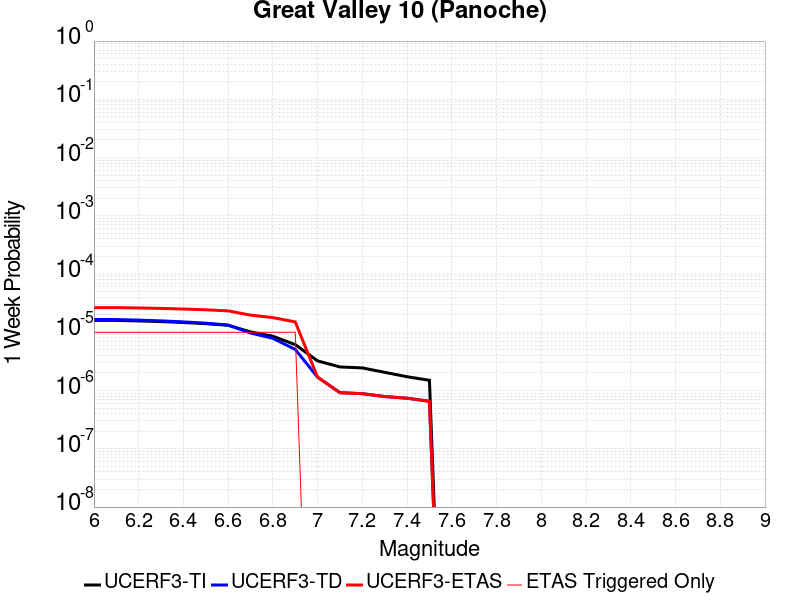 | 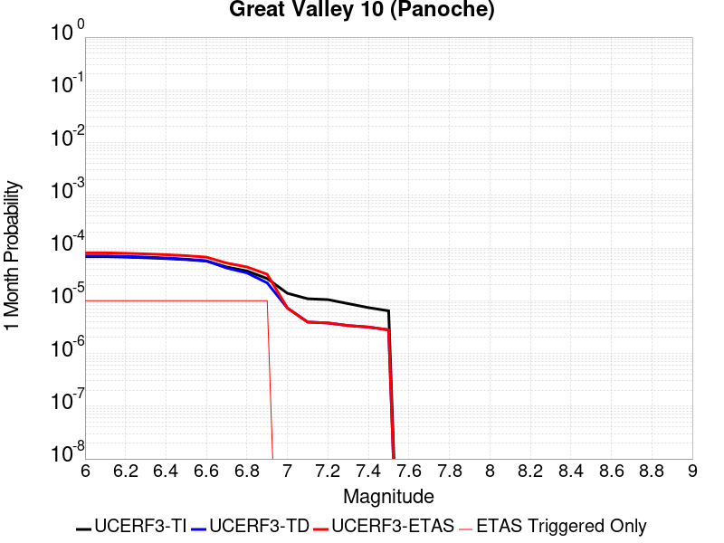 | 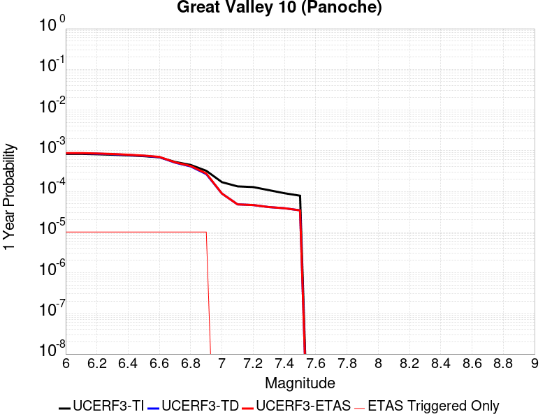 | 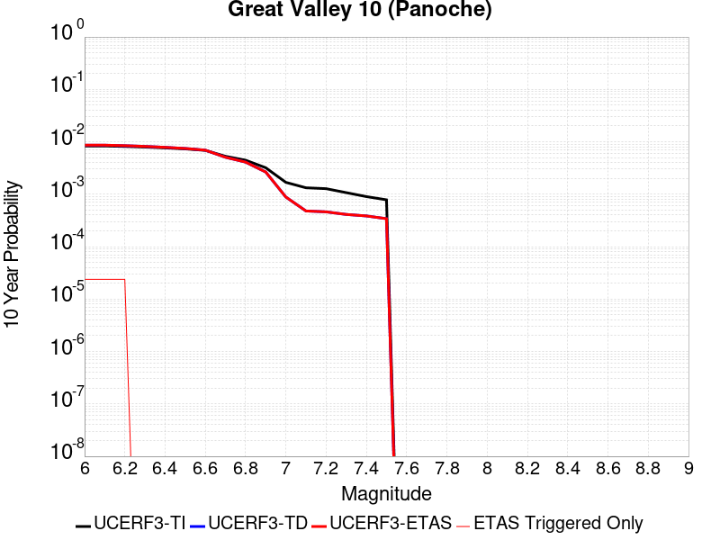 |

| Magnitude | 1 wk TI Prob | 1 wk TD Prob | 1 wk ETAS Prob | 1 wk ETAS/TD Gain | 1 wk ETAS Triggered Only | 1 mo TI Prob | 1 mo TD Prob | 1 mo ETAS Prob | 1 mo ETAS/TD Gain | 1 mo ETAS Triggered Only | 1 yr TI Prob | 1 yr TD Prob | 1 yr ETAS Prob | 1 yr ETAS/TD Gain | 1 yr ETAS Triggered Only | 10 yr TI Prob | 10 yr TD Prob | 10 yr ETAS Prob | 10 yr ETAS/TD Gain | 10 yr ETAS Triggered Only |
|-----|-----|-----|-----|-----|-----|-----|-----|-----|-----|-----|-----|-----|-----|-----|-----|-----|-----|-----|-----|-----|
| 6.0 | 1.6014626E-5 | 1.6575399E-5 | 2.6575233E-5 | 1.6032938 | 1.0E-5 | 6.863231E-5 | 7.103552E-5 | 8.1034814E-5 | 1.1407646 | 1.0E-5 | 8.35278E-4 | 8.645185E-4 | 8.7450986E-4 | 1.0115571 | 1.0E-5 | 0.008321454 | 0.008612172 | 0.0086419135 | 1.0034535 | 3.0E-5 |
| 6.1 | 1.6014626E-5 | 1.6575399E-5 | 2.6575233E-5 | 1.6032938 | 1.0E-5 | 6.863231E-5 | 7.103552E-5 | 8.1034814E-5 | 1.1407646 | 1.0E-5 | 8.35278E-4 | 8.645185E-4 | 8.7450986E-4 | 1.0115571 | 1.0E-5 | 0.008321454 | 0.008612172 | 0.0086419135 | 1.0034535 | 3.0E-5 |
| 6.2 | 1.56782E-5 | 1.6198446E-5 | 2.6198284E-5 | 1.6173332 | 1.0E-5 | 6.719056E-5 | 6.94201E-5 | 7.9419406E-5 | 1.1440405 | 1.0E-5 | 8.17738E-4 | 8.4486604E-4 | 8.548576E-4 | 1.0118262 | 1.0E-5 | 0.008147354 | 0.008417147 | 0.008446895 | 1.0035342 | 3.0E-5 |
| 6.3 | 1.5263338E-5 | 1.5723514E-5 | 2.5723357E-5 | 1.6359801 | 1.0E-5 | 6.541267E-5 | 6.738478E-5 | 7.738411E-5 | 1.1483915 | 1.0E-5 | 7.961082E-4 | 8.201049E-4 | 8.300967E-4 | 1.0121835 | 1.0E-5 | 0.007932622 | 0.008171377 | 0.008191213 | 1.0024276 | 2.0E-5 |
| 6.4 | 1.4720723E-5 | 1.5099376E-5 | 2.5099225E-5 | 1.662269 | 1.0E-5 | 6.308728E-5 | 6.471004E-5 | 7.470939E-5 | 1.1545255 | 1.0E-5 | 7.67817E-4 | 7.8756385E-4 | 7.9755596E-4 | 1.0126873 | 1.0E-5 | 0.007651695 | 0.007848303 | 0.007868146 | 1.0025283 | 2.0E-5 |
| 6.5 | 1.408264E-5 | 1.4355969E-5 | 2.4355826E-5 | 1.6965643 | 1.0E-5 | 6.0352773E-5 | 6.1524166E-5 | 7.152355E-5 | 1.1625278 | 1.0E-5 | 7.3454727E-4 | 7.488031E-4 | 7.587956E-4 | 1.0133446 | 1.0E-5 | 0.0073212404 | 0.0074633555 | 0.0074832067 | 1.0026598 | 2.0E-5 |
| 6.6 | 1.3197086E-5 | 1.3321889E-5 | 2.3321756E-5 | 1.7506343 | 1.0E-5 | 5.6557717E-5 | 5.709259E-5 | 6.709202E-5 | 1.1751441 | 1.0E-5 | 6.8837265E-4 | 6.9488434E-4 | 7.0487737E-4 | 1.0143809 | 1.0E-5 | 0.006862442 | 0.0069276537 | 0.006947515 | 1.002867 | 2.0E-5 |
| 6.7 | 1.017583E-5 | 9.745382E-6 | 1.9745285E-5 | 2.026117 | 1.0E-5 | 4.360997E-5 | 4.176527E-5 | 5.176485E-5 | 1.2394234 | 1.0E-5 | 5.30822E-4 | 5.0837593E-4 | 5.183708E-4 | 1.0196605 | 1.0E-5 | 0.0052955584 | 0.005072382 | 0.005082331 | 1.0019615 | 1.0E-5 |
| 6.8 | 8.557912E-6 | 7.872707E-6 | 1.787263E-5 | 2.270201 | 1.0E-5 | 3.667625E-5 | 3.373975E-5 | 4.3739412E-5 | 1.2963763 | 1.0E-5 | 4.4644187E-4 | 4.1070607E-4 | 4.2070195E-4 | 1.0243384 | 1.0E-5 | 0.0044554602 | 0.004099677 | 0.004109636 | 1.0024292 | 1.0E-5 |
| 6.9 | 6.14664E-6 | 5.092071E-6 | 1.50920205E-5 | 2.9638274 | 1.0E-5 | 2.6342475E-5 | 2.1822989E-5 | 3.182277E-5 | 1.4582224 | 1.0E-5 | 3.2067244E-4 | 2.6566387E-4 | 2.7566124E-4 | 1.0376315 | 1.0E-5 | 0.003202101 | 0.002653601 | 0.0026635746 | 1.0037584 | 1.0E-5 |
| 7.0 | 3.2310581E-6 | 1.6951219E-6 | 1.6951219E-6 | 1.0 | 0.0 | 1.3847319E-5 | 7.264788E-6 | 7.264788E-6 | 1.0 | 0.0 | 1.6857806E-4 | 8.8445304E-5 | 8.8445304E-5 | 1.0 | 0.0 | 0.0016845023 | 8.841104E-4 | 8.841104E-4 | 1.0 | 0.0 |
| 7.1 | 2.544492E-6 | 9.1889206E-7 | 9.1889206E-7 | 1.0 | 0.0 | 1.090492E-5 | 3.938103E-6 | 3.938103E-6 | 1.0 | 0.0 | 1.327593E-4 | 4.79454E-5 | 4.79454E-5 | 1.0 | 0.0 | 0.0013268003 | 4.793553E-4 | 4.793553E-4 | 1.0 | 0.0 |
| 7.2 | 2.4479045E-6 | 8.841304E-7 | 8.841304E-7 | 1.0 | 0.0 | 1.0490977E-5 | 3.789125E-6 | 3.789125E-6 | 1.0 | 0.0 | 1.2772017E-4 | 4.6131667E-5 | 4.6131667E-5 | 1.0 | 0.0 | 0.0012764678 | 4.6122566E-4 | 4.6122566E-4 | 1.0 | 0.0 |
| 7.3 | 2.0559578E-6 | 7.892787E-7 | 7.892787E-7 | 1.0 | 0.0 | 8.811218E-6 | 3.3826188E-6 | 3.3826188E-6 | 1.0 | 0.0 | 1.072713E-4 | 4.1182655E-5 | 4.1182655E-5 | 1.0 | 0.0 | 0.0010721954 | 4.1175485E-4 | 4.1175485E-4 | 1.0 | 0.0 |
| 7.4 | 1.727687E-6 | 7.387757E-7 | 7.387757E-7 | 1.0 | 0.0 | 7.404352E-6 | 3.1661782E-6 | 3.1661782E-6 | 1.0 | 0.0 | 9.0144255E-5 | 3.8547583E-5 | 3.8547583E-5 | 1.0 | 0.0 | 9.0107694E-4 | 3.854136E-4 | 3.854136E-4 | 1.0 | 0.0 |
| 7.5 | 1.5002679E-6 | 6.546144E-7 | 6.546144E-7 | 1.0 | 0.0 | 6.4297037E-6 | 2.8054874E-6 | 2.8054874E-6 | 1.0 | 0.0 | 7.827883E-5 | 3.4156317E-5 | 3.4156317E-5 | 1.0 | 0.0 | 7.825126E-4 | 3.4151482E-4 | 3.4151482E-4 | 1.0 | 0.0 |

## Hosgri (Extension)
*[(top)](#table-of-contents)*

| 1 Week | 1 Month | 1 Year | 10 Year |
|-----|-----|-----|-----|
| 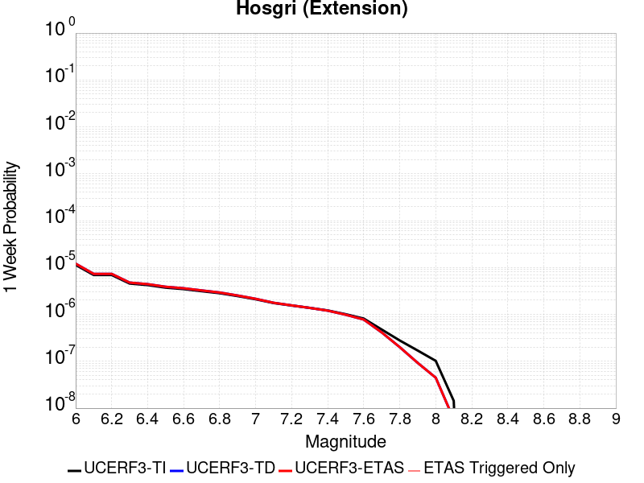 | 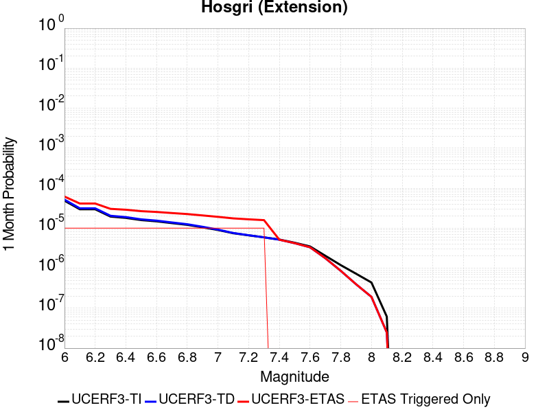 | 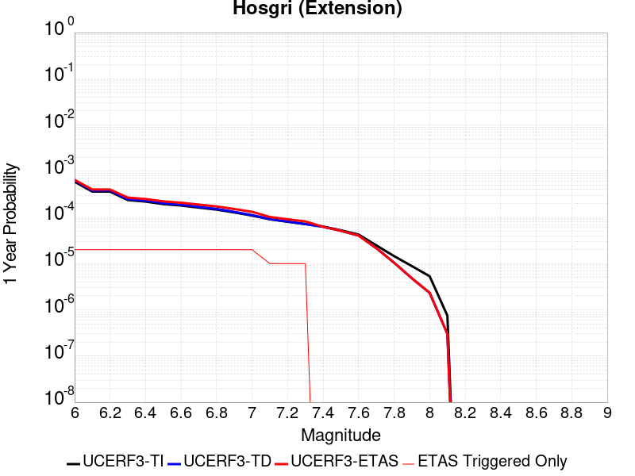 | 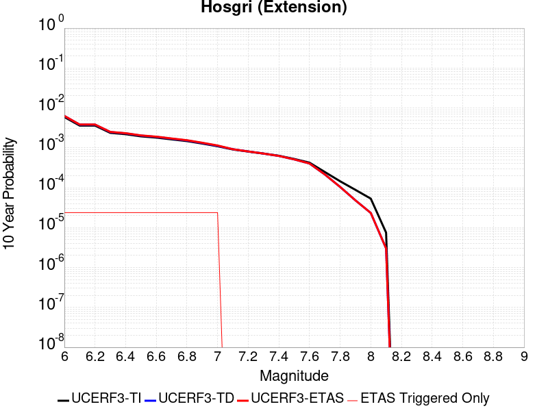 |

| Magnitude | 1 wk TI Prob | 1 wk TD Prob | 1 wk ETAS Prob | 1 wk ETAS/TD Gain | 1 wk ETAS Triggered Only | 1 mo TI Prob | 1 mo TD Prob | 1 mo ETAS Prob | 1 mo ETAS/TD Gain | 1 mo ETAS Triggered Only | 1 yr TI Prob | 1 yr TD Prob | 1 yr ETAS Prob | 1 yr ETAS/TD Gain | 1 yr ETAS Triggered Only | 10 yr TI Prob | 10 yr TD Prob | 10 yr ETAS Prob | 10 yr ETAS/TD Gain | 10 yr ETAS Triggered Only |
|-----|-----|-----|-----|-----|-----|-----|-----|-----|-----|-----|-----|-----|-----|-----|-----|-----|-----|-----|-----|-----|
| 6.0 | 1.1369135E-5 | 1.2083072E-5 | 1.2083072E-5 | 1.0 | 0.0 | 4.8723956E-5 | 5.1783692E-5 | 6.1783176E-5 | 1.1931009 | 1.0E-5 | 5.9305265E-4 | 6.3030684E-4 | 6.5029424E-4 | 1.0317106 | 2.0E-5 | 0.005914725 | 0.0062874397 | 0.006307314 | 1.003161 | 2.0E-5 |
| 6.1 | 6.934979E-6 | 7.324555E-6 | 7.324555E-6 | 1.0 | 0.0 | 2.9721E-5 | 3.1390595E-5 | 4.139028E-5 | 1.3185568 | 1.0E-5 | 3.617931E-4 | 3.8211764E-4 | 4.0211E-4 | 1.0523199 | 2.0E-5 | 0.0036120464 | 0.0038150186 | 0.0038349421 | 1.0052224 | 2.0E-5 |
| 6.2 | 6.934979E-6 | 7.324555E-6 | 7.324555E-6 | 1.0 | 0.0 | 2.9721E-5 | 3.1390595E-5 | 4.139028E-5 | 1.3185568 | 1.0E-5 | 3.617931E-4 | 3.8211764E-4 | 4.0211E-4 | 1.0523199 | 2.0E-5 | 0.0036120464 | 0.0038150186 | 0.0038349421 | 1.0052224 | 2.0E-5 |
| 6.3 | 4.5484676E-6 | 4.76933E-6 | 4.76933E-6 | 1.0 | 0.0 | 1.9493287E-5 | 2.043983E-5 | 3.0439625E-5 | 1.4892309 | 1.0E-5 | 2.3730492E-4 | 2.4882692E-4 | 2.6882192E-4 | 1.0803572 | 2.0E-5 | 0.0023705168 | 0.0024855258 | 0.0025054761 | 1.0080266 | 2.0E-5 |
| 6.4 | 4.218095E-6 | 4.4168614E-6 | 4.4168614E-6 | 1.0 | 0.0 | 1.8077424E-5 | 1.8929271E-5 | 2.8929082E-5 | 1.5282724 | 1.0E-5 | 2.2007042E-4 | 2.3043984E-4 | 2.5043523E-4 | 1.0867705 | 2.0E-5 | 0.002198526 | 0.0023020422 | 0.0023219963 | 1.008668 | 2.0E-5 |
| 6.5 | 3.717374E-6 | 3.8838775E-6 | 3.8838775E-6 | 1.0 | 0.0 | 1.5931506E-5 | 1.6645085E-5 | 2.6644919E-5 | 1.600768 | 1.0E-5 | 1.9394881E-4 | 2.0263524E-4 | 2.2263119E-4 | 1.0986795 | 2.0E-5 | 0.0019377962 | 0.0020245234 | 0.002044483 | 1.0098588 | 2.0E-5 |
| 6.6 | 3.4605036E-6 | 3.608306E-6 | 3.608306E-6 | 1.0 | 0.0 | 1.4830645E-5 | 1.5464078E-5 | 2.5463924E-5 | 1.64665 | 1.0E-5 | 1.8054814E-4 | 1.8825903E-4 | 2.0825525E-4 | 1.1062165 | 2.0E-5 | 0.0018040152 | 0.0018810101 | 0.0019009726 | 1.0106126 | 2.0E-5 |
| 6.7 | 3.123439E-6 | 3.2465687E-6 | 3.2465687E-6 | 1.0 | 0.0 | 1.33860985E-5 | 1.3913792E-5 | 2.3913653E-5 | 1.7187014 | 1.0E-5 | 1.6296357E-4 | 1.6938736E-4 | 1.8938397E-4 | 1.1180526 | 2.0E-5 | 0.001628441 | 0.0016925934 | 0.0017125596 | 1.0117962 | 2.0E-5 |
| 6.8 | 2.8290783E-6 | 2.9305404E-6 | 2.9305404E-6 | 1.0 | 0.0 | 1.2124565E-5 | 1.2559399E-5 | 2.2559274E-5 | 1.7962065 | 1.0E-5 | 1.4760658E-4 | 1.5290003E-4 | 1.7289698E-4 | 1.1307844 | 2.0E-5 | 0.0014750857 | 0.001527957 | 0.0015479265 | 1.0130694 | 2.0E-5 |
| 6.9 | 2.454112E-6 | 2.5283196E-6 | 2.5283196E-6 | 1.0 | 0.0 | 1.0517581E-5 | 1.0835611E-5 | 2.0835501E-5 | 1.9228729 | 1.0E-5 | 1.2804402E-4 | 1.3191563E-4 | 1.5191299E-4 | 1.151592 | 2.0E-5 | 0.0012797028 | 0.0013183793 | 0.001338353 | 1.0151502 | 2.0E-5 |
| 7.0 | 2.1008145E-6 | 2.1498704E-6 | 2.1498704E-6 | 1.0 | 0.0 | 9.003459E-6 | 9.213698E-6 | 1.9213605E-5 | 2.0853305 | 1.0E-5 | 1.096116E-4 | 1.1217103E-4 | 1.3216879E-4 | 1.1782792 | 2.0E-5 | 0.0010955755 | 0.0011211479 | 0.0011411255 | 1.0178188 | 2.0E-5 |
| 7.1 | 1.744384E-6 | 1.7686352E-6 | 1.7686352E-6 | 1.0 | 0.0 | 7.47591E-6 | 7.5798434E-6 | 1.7579767E-5 | 2.3192785 | 1.0E-5 | 9.1015405E-5 | 9.22807E-5 | 1.0227978E-4 | 1.108355 | 1.0E-5 | 9.097813E-4 | 9.2242553E-4 | 9.3241635E-4 | 1.010831 | 1.0E-5 |
| 7.2 | 1.5456587E-6 | 1.5562882E-6 | 1.5562882E-6 | 1.0 | 0.0 | 6.6242346E-6 | 6.66979E-6 | 1.6669723E-5 | 2.4992876 | 1.0E-5 | 8.064707E-5 | 8.120168E-5 | 9.120086E-5 | 1.1231402 | 1.0E-5 | 8.0617814E-4 | 8.117213E-4 | 8.217132E-4 | 1.0123096 | 1.0E-5 |
| 7.3 | 1.3775123E-6 | 1.3766082E-6 | 1.3766082E-6 | 1.0 | 0.0 | 5.9036106E-6 | 5.899736E-6 | 1.5899677E-5 | 2.694981 | 1.0E-5 | 7.187409E-5 | 7.182693E-5 | 8.182621E-5 | 1.1392136 | 1.0E-5 | 7.185085E-4 | 7.180382E-4 | 7.28031E-4 | 1.0139169 | 1.0E-5 |
| 7.4 | 1.214491E-6 | 1.2023461E-6 | 1.2023461E-6 | 1.0 | 0.0 | 5.2049513E-6 | 5.1529014E-6 | 5.1529014E-6 | 1.0 | 0.0 | 6.336844E-5 | 6.2734776E-5 | 6.2734776E-5 | 1.0 | 0.0 | 6.335037E-4 | 6.271715E-4 | 6.271715E-4 | 1.0 | 0.0 |
| 7.5 | 1.0101123E-6 | 9.842246E-7 | 9.842246E-7 | 1.0 | 0.0 | 4.3290456E-6 | 4.2180986E-6 | 4.2180986E-6 | 1.0 | 0.0 | 5.2704854E-5 | 5.1354145E-5 | 5.1354145E-5 | 1.0 | 0.0 | 5.2692357E-4 | 5.1342335E-4 | 5.1342335E-4 | 1.0 | 0.0 |
| 7.6 | 8.1558215E-7 | 7.765966E-7 | 7.765966E-7 | 1.0 | 0.0 | 3.4953473E-6 | 3.328267E-6 | 3.328267E-6 | 1.0 | 0.0 | 4.255502E-5 | 4.0520903E-5 | 4.0520903E-5 | 1.0 | 0.0 | 4.2546875E-4 | 4.0513556E-4 | 4.0513556E-4 | 1.0 | 0.0 |
| 7.7 | 4.757816E-7 | 4.1308888E-7 | 4.1308888E-7 | 1.0 | 0.0 | 2.0390623E-6 | 1.7703798E-6 | 1.7703798E-6 | 1.0 | 0.0 | 2.4825302E-5 | 2.155416E-5 | 2.155416E-5 | 1.0 | 0.0 | 2.482253E-4 | 2.1552083E-4 | 2.1552083E-4 | 1.0 | 0.0 |
| 7.8 | 2.782787E-7 | 2.0047722E-7 | 2.0047722E-7 | 1.0 | 0.0 | 1.1926223E-6 | 8.5918776E-7 | 8.5918776E-7 | 1.0 | 0.0 | 1.452008E-5 | 1.04605615E-5 | 1.04605615E-5 | 1.0 | 0.0 | 1.4519131E-4 | 1.04600724E-4 | 1.04600724E-4 | 1.0 | 0.0 |
| 7.9 | 1.6948086E-7 | 9.244227E-8 | 9.244227E-8 | 1.0 | 0.0 | 7.2634634E-7 | 3.961811E-7 | 3.961811E-7 | 1.0 | 0.0 | 8.843231E-6 | 4.8234942E-6 | 4.8234942E-6 | 1.0 | 0.0 | 8.842879E-5 | 4.8233902E-5 | 4.8233902E-5 | 1.0 | 0.0 |
| 8.0 | 1.0225492E-7 | 4.4738776E-8 | 4.4738776E-8 | 1.0 | 0.0 | 4.382353E-7 | 1.917376E-7 | 1.917376E-7 | 1.0 | 0.0 | 5.335502E-6 | 2.3344028E-6 | 2.3344028E-6 | 1.0 | 0.0 | 5.335374E-5 | 2.3343786E-5 | 2.3343786E-5 | 1.0 | 0.0 |
| 8.1 | 1.43711345E-8 | 5.787707E-9 | 5.787707E-9 | 1.0 | 0.0 | 6.1590576E-8 | 2.480446E-8 | 2.480446E-8 | 1.0 | 0.0 | 7.4986497E-7 | 3.0199428E-7 | 3.0199428E-7 | 1.0 | 0.0 | 7.4986247E-6 | 3.0199392E-6 | 3.0199392E-6 | 1.0 | 0.0 |

## Compton
*[(top)](#table-of-contents)*

| 1 Week | 1 Month | 1 Year | 10 Year |
|-----|-----|-----|-----|
|  | 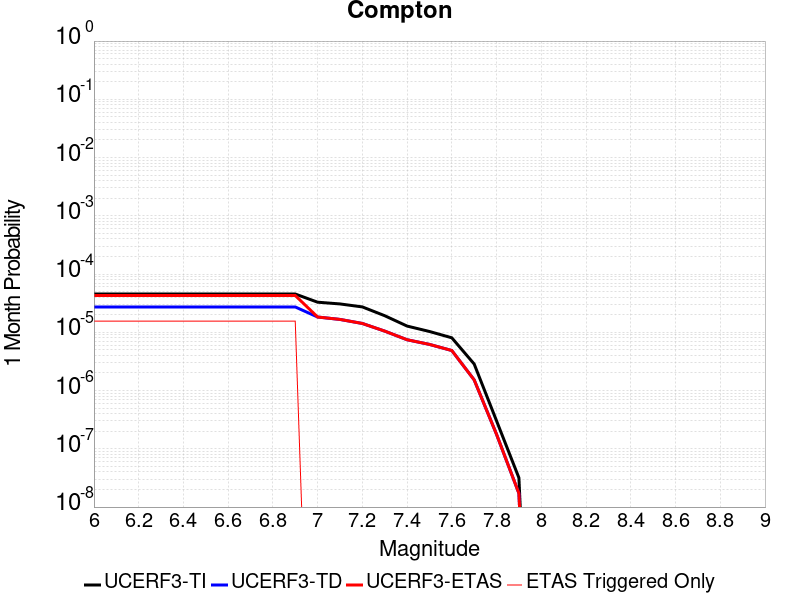 | 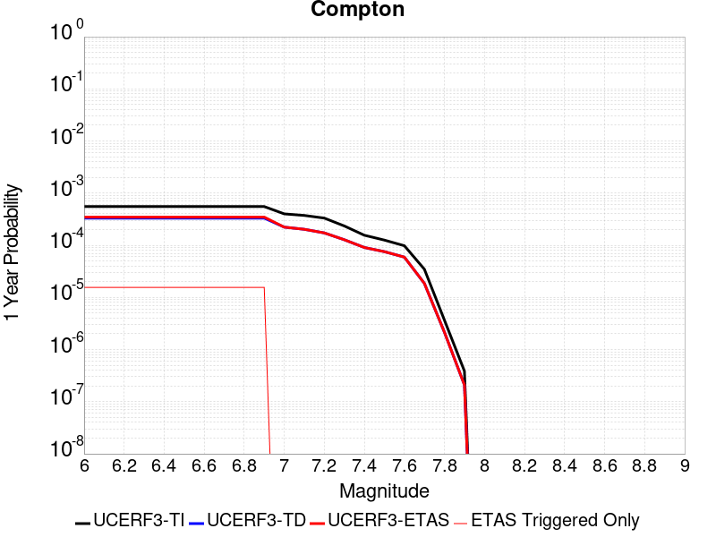 | 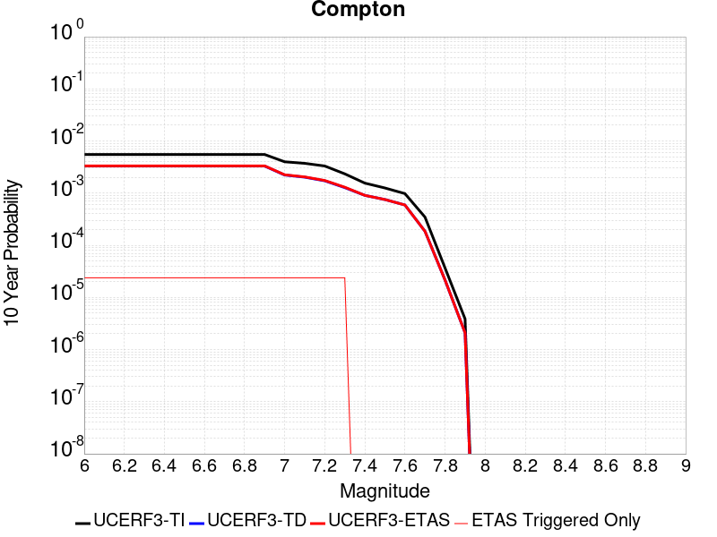 |

| Magnitude | 1 wk TI Prob | 1 wk TD Prob | 1 wk ETAS Prob | 1 wk ETAS/TD Gain | 1 wk ETAS Triggered Only | 1 mo TI Prob | 1 mo TD Prob | 1 mo ETAS Prob | 1 mo ETAS/TD Gain | 1 mo ETAS Triggered Only | 1 yr TI Prob | 1 yr TD Prob | 1 yr ETAS Prob | 1 yr ETAS/TD Gain | 1 yr ETAS Triggered Only | 10 yr TI Prob | 10 yr TD Prob | 10 yr ETAS Prob | 10 yr ETAS/TD Gain | 10 yr ETAS Triggered Only |
|-----|-----|-----|-----|-----|-----|-----|-----|-----|-----|-----|-----|-----|-----|-----|-----|-----|-----|-----|-----|-----|
| 6.0 | 1.06050875E-5 | 6.358671E-6 | 1.6358606E-5 | 2.5726457 | 1.0E-5 | 4.5449582E-5 | 2.7251177E-5 | 3.7250906E-5 | 1.3669466 | 1.0E-5 | 5.5320817E-4 | 3.317354E-4 | 3.5172878E-4 | 1.060269 | 2.0E-5 | 0.0055183303 | 0.0033126862 | 0.0033425868 | 1.009026 | 3.0E-5 |
| 6.1 | 1.06050875E-5 | 6.358671E-6 | 1.6358606E-5 | 2.5726457 | 1.0E-5 | 4.5449582E-5 | 2.7251177E-5 | 3.7250906E-5 | 1.3669466 | 1.0E-5 | 5.5320817E-4 | 3.317354E-4 | 3.5172878E-4 | 1.060269 | 2.0E-5 | 0.0055183303 | 0.0033126862 | 0.0033425868 | 1.009026 | 3.0E-5 |
| 6.2 | 1.06050875E-5 | 6.358671E-6 | 1.6358606E-5 | 2.5726457 | 1.0E-5 | 4.5449582E-5 | 2.7251177E-5 | 3.7250906E-5 | 1.3669466 | 1.0E-5 | 5.5320817E-4 | 3.317354E-4 | 3.5172878E-4 | 1.060269 | 2.0E-5 | 0.0055183303 | 0.0033126862 | 0.0033425868 | 1.009026 | 3.0E-5 |
| 6.3 | 1.06050875E-5 | 6.358671E-6 | 1.6358606E-5 | 2.5726457 | 1.0E-5 | 4.5449582E-5 | 2.7251177E-5 | 3.7250906E-5 | 1.3669466 | 1.0E-5 | 5.5320817E-4 | 3.317354E-4 | 3.5172878E-4 | 1.060269 | 2.0E-5 | 0.0055183303 | 0.0033126862 | 0.0033425868 | 1.009026 | 3.0E-5 |
| 6.4 | 1.06050875E-5 | 6.358671E-6 | 1.6358606E-5 | 2.5726457 | 1.0E-5 | 4.5449582E-5 | 2.7251177E-5 | 3.7250906E-5 | 1.3669466 | 1.0E-5 | 5.5320817E-4 | 3.317354E-4 | 3.5172878E-4 | 1.060269 | 2.0E-5 | 0.0055183303 | 0.0033126862 | 0.0033425868 | 1.009026 | 3.0E-5 |
| 6.5 | 1.06050875E-5 | 6.358671E-6 | 1.6358606E-5 | 2.5726457 | 1.0E-5 | 4.5449582E-5 | 2.7251177E-5 | 3.7250906E-5 | 1.3669466 | 1.0E-5 | 5.5320817E-4 | 3.317354E-4 | 3.5172878E-4 | 1.060269 | 2.0E-5 | 0.0055183303 | 0.0033126862 | 0.0033425868 | 1.009026 | 3.0E-5 |
| 6.6 | 1.06050875E-5 | 6.358671E-6 | 1.6358606E-5 | 2.5726457 | 1.0E-5 | 4.5449582E-5 | 2.7251177E-5 | 3.7250906E-5 | 1.3669466 | 1.0E-5 | 5.5320817E-4 | 3.317354E-4 | 3.5172878E-4 | 1.060269 | 2.0E-5 | 0.0055183303 | 0.0033126862 | 0.0033425868 | 1.009026 | 3.0E-5 |
| 6.7 | 1.06050875E-5 | 6.358671E-6 | 1.6358606E-5 | 2.5726457 | 1.0E-5 | 4.5449582E-5 | 2.7251177E-5 | 3.7250906E-5 | 1.3669466 | 1.0E-5 | 5.5320817E-4 | 3.317354E-4 | 3.5172878E-4 | 1.060269 | 2.0E-5 | 0.0055183303 | 0.0033126862 | 0.0033425868 | 1.009026 | 3.0E-5 |
| 6.8 | 1.06050875E-5 | 6.358671E-6 | 1.6358606E-5 | 2.5726457 | 1.0E-5 | 4.5449582E-5 | 2.7251177E-5 | 3.7250906E-5 | 1.3669466 | 1.0E-5 | 5.5320817E-4 | 3.317354E-4 | 3.5172878E-4 | 1.060269 | 2.0E-5 | 0.0055183303 | 0.0033126862 | 0.0033425868 | 1.009026 | 3.0E-5 |
| 6.9 | 1.06050875E-5 | 6.358671E-6 | 1.6358606E-5 | 2.5726457 | 1.0E-5 | 4.5449582E-5 | 2.7251177E-5 | 3.7250906E-5 | 1.3669466 | 1.0E-5 | 5.5320817E-4 | 3.317354E-4 | 3.5172878E-4 | 1.060269 | 2.0E-5 | 0.0055183303 | 0.0033126862 | 0.0033425868 | 1.009026 | 3.0E-5 |
| 7.0 | 7.672486E-6 | 4.2720512E-6 | 4.2720512E-6 | 1.0 | 0.0 | 3.288167E-5 | 1.8308665E-5 | 1.8308665E-5 | 1.0 | 0.0 | 4.0026082E-4 | 2.2288582E-4 | 2.2288582E-4 | 1.0 | 0.0 | 0.0039954064 | 0.002226685 | 0.0022366627 | 1.004481 | 1.0E-5 |
| 7.1 | 7.163992E-6 | 3.883762E-6 | 3.883762E-6 | 1.0 | 0.0 | 3.0702464E-5 | 1.6644592E-5 | 1.6644592E-5 | 1.0 | 0.0 | 3.7373835E-4 | 2.0262963E-4 | 2.0262963E-4 | 1.0 | 0.0 | 0.0037311043 | 0.0020245055 | 0.0020344853 | 1.0049294 | 1.0E-5 |
| 7.2 | 6.3689185E-6 | 3.3102428E-6 | 3.3102428E-6 | 1.0 | 0.0 | 2.729508E-5 | 1.418668E-5 | 1.418668E-5 | 1.0 | 0.0 | 3.322669E-4 | 1.7270957E-4 | 1.7270957E-4 | 1.0 | 0.0 | 0.0033177056 | 0.0017257951 | 0.0017357778 | 1.0057844 | 1.0E-5 |
| 7.3 | 4.4987873E-6 | 2.4480942E-6 | 2.4480942E-6 | 1.0 | 0.0 | 1.9280375E-5 | 1.0491792E-5 | 1.0491792E-5 | 1.0 | 0.0 | 2.3471327E-4 | 1.2773038E-4 | 1.2773038E-4 | 1.0 | 0.0 | 0.002344655 | 0.0012765999 | 0.0012865871 | 1.0078233 | 1.0E-5 |
| 7.4 | 2.987296E-6 | 1.7394335E-6 | 1.7394335E-6 | 1.0 | 0.0 | 1.2802635E-5 | 7.454694E-6 | 7.454694E-6 | 1.0 | 0.0 | 1.5586092E-4 | 9.0757174E-5 | 9.0757174E-5 | 1.0 | 0.0 | 0.0015575165 | 9.072069E-4 | 9.072069E-4 | 1.0 | 0.0 |
| 7.5 | 2.4111696E-6 | 1.4472155E-6 | 1.4472155E-6 | 1.0 | 0.0 | 1.0333543E-5 | 6.2023378E-6 | 6.2023378E-6 | 1.0 | 0.0 | 1.2580362E-4 | 7.551089E-5 | 7.551089E-5 | 1.0 | 0.0 | 0.0012573242 | 7.54857E-4 | 7.54857E-4 | 1.0 | 0.0 |
| 7.6 | 1.8783096E-6 | 1.1360459E-6 | 1.1360459E-6 | 1.0 | 0.0 | 8.049874E-6 | 4.8687593E-6 | 4.8687593E-6 | 1.0 | 0.0 | 9.8002805E-5 | 5.927557E-5 | 5.927557E-5 | 1.0 | 0.0 | 9.795959E-4 | 5.926016E-4 | 5.926016E-4 | 1.0 | 0.0 |
| 7.7 | 6.6646817E-7 | 3.560237E-7 | 3.560237E-7 | 1.0 | 0.0 | 2.856289E-6 | 1.525815E-6 | 1.525815E-6 | 1.0 | 0.0 | 3.4774763E-5 | 1.8576653E-5 | 1.8576653E-5 | 1.0 | 0.0 | 3.4769322E-4 | 1.8575235E-4 | 1.8575235E-4 | 1.0 | 0.0 |
| 7.8 | 7.054689E-8 | 4.1342968E-8 | 4.1342968E-8 | 1.0 | 0.0 | 3.0234378E-7 | 1.7718413E-7 | 1.7718413E-7 | 1.0 | 0.0 | 3.6810293E-6 | 2.1572148E-6 | 2.1572148E-6 | 1.0 | 0.0 | 3.6809684E-5 | 2.1571948E-5 | 2.1571948E-5 | 1.0 | 0.0 |
| 7.9 | 7.420925E-9 | 4.0131285E-9 | 4.0131285E-9 | 1.0 | 0.0 | 3.1803964E-8 | 1.7199122E-8 | 1.7199122E-8 | 1.0 | 0.0 | 3.872132E-7 | 2.093993E-7 | 2.093993E-7 | 1.0 | 0.0 | 3.872125E-6 | 2.0939913E-6 | 2.0939913E-6 | 1.0 | 0.0 |

## Los Alamos 2011 CFM
*[(top)](#table-of-contents)*

| 1 Week | 1 Month | 1 Year | 10 Year |
|-----|-----|-----|-----|
| 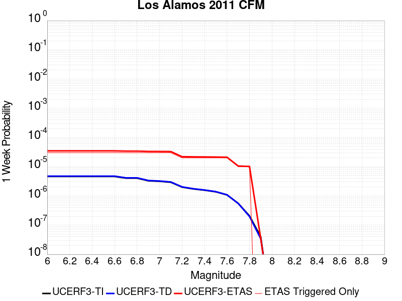 | 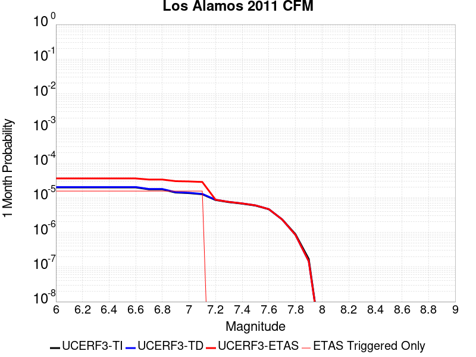 | 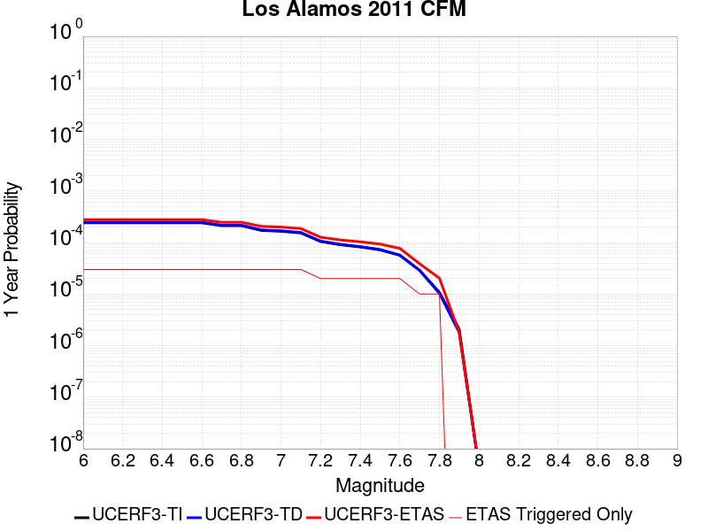 | 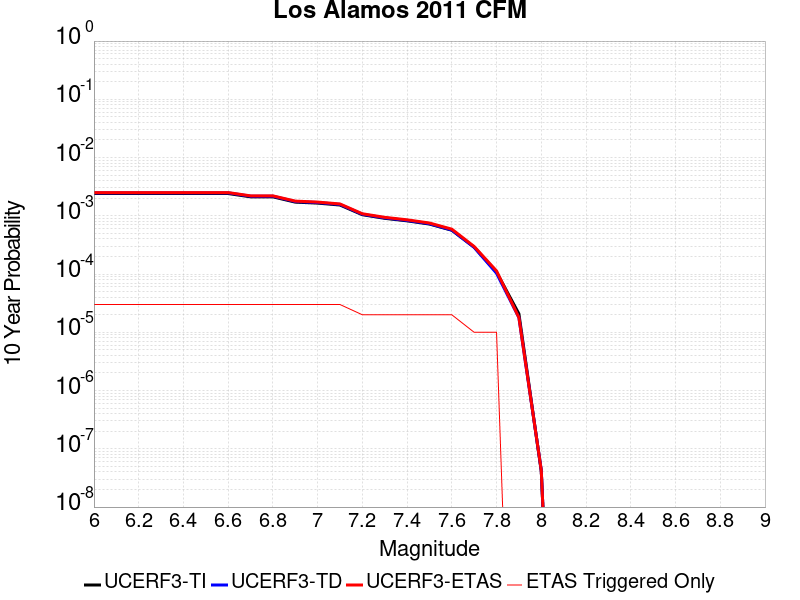 |

| Magnitude | 1 wk TI Prob | 1 wk TD Prob | 1 wk ETAS Prob | 1 wk ETAS/TD Gain | 1 wk ETAS Triggered Only | 1 mo TI Prob | 1 mo TD Prob | 1 mo ETAS Prob | 1 mo ETAS/TD Gain | 1 mo ETAS Triggered Only | 1 yr TI Prob | 1 yr TD Prob | 1 yr ETAS Prob | 1 yr ETAS/TD Gain | 1 yr ETAS Triggered Only | 10 yr TI Prob | 10 yr TD Prob | 10 yr ETAS Prob | 10 yr ETAS/TD Gain | 10 yr ETAS Triggered Only |
|-----|-----|-----|-----|-----|-----|-----|-----|-----|-----|-----|-----|-----|-----|-----|-----|-----|-----|-----|-----|-----|
| 6.0 | 4.6284417E-6 | 4.751731E-6 | 3.475159E-5 | 7.3134584 | 3.0E-5 | 1.9836029E-5 | 2.0364414E-5 | 5.0363804E-5 | 2.473128 | 3.0E-5 | 2.4147688E-4 | 2.4791027E-4 | 2.7790284E-4 | 1.1209816 | 3.0E-5 | 0.0024121467 | 0.0024765113 | 0.002506437 | 1.0120838 | 3.0E-5 |
| 6.1 | 4.6284417E-6 | 4.751731E-6 | 3.475159E-5 | 7.3134584 | 3.0E-5 | 1.9836029E-5 | 2.0364414E-5 | 5.0363804E-5 | 2.473128 | 3.0E-5 | 2.4147688E-4 | 2.4791027E-4 | 2.7790284E-4 | 1.1209816 | 3.0E-5 | 0.0024121467 | 0.0024765113 | 0.002506437 | 1.0120838 | 3.0E-5 |
| 6.2 | 4.6284417E-6 | 4.751731E-6 | 3.475159E-5 | 7.3134584 | 3.0E-5 | 1.9836029E-5 | 2.0364414E-5 | 5.0363804E-5 | 2.473128 | 3.0E-5 | 2.4147688E-4 | 2.4791027E-4 | 2.7790284E-4 | 1.1209816 | 3.0E-5 | 0.0024121467 | 0.0024765113 | 0.002506437 | 1.0120838 | 3.0E-5 |
| 6.3 | 4.6284417E-6 | 4.751731E-6 | 3.475159E-5 | 7.3134584 | 3.0E-5 | 1.9836029E-5 | 2.0364414E-5 | 5.0363804E-5 | 2.473128 | 3.0E-5 | 2.4147688E-4 | 2.4791027E-4 | 2.7790284E-4 | 1.1209816 | 3.0E-5 | 0.0024121467 | 0.0024765113 | 0.002506437 | 1.0120838 | 3.0E-5 |
| 6.4 | 4.6284417E-6 | 4.751731E-6 | 3.475159E-5 | 7.3134584 | 3.0E-5 | 1.9836029E-5 | 2.0364414E-5 | 5.0363804E-5 | 2.473128 | 3.0E-5 | 2.4147688E-4 | 2.4791027E-4 | 2.7790284E-4 | 1.1209816 | 3.0E-5 | 0.0024121467 | 0.0024765113 | 0.002506437 | 1.0120838 | 3.0E-5 |
| 6.5 | 4.6284417E-6 | 4.751731E-6 | 3.475159E-5 | 7.3134584 | 3.0E-5 | 1.9836029E-5 | 2.0364414E-5 | 5.0363804E-5 | 2.473128 | 3.0E-5 | 2.4147688E-4 | 2.4791027E-4 | 2.7790284E-4 | 1.1209816 | 3.0E-5 | 0.0024121467 | 0.0024765113 | 0.002506437 | 1.0120838 | 3.0E-5 |
| 6.6 | 4.6284417E-6 | 4.751731E-6 | 3.475159E-5 | 7.3134584 | 3.0E-5 | 1.9836029E-5 | 2.0364414E-5 | 5.0363804E-5 | 2.473128 | 3.0E-5 | 2.4147688E-4 | 2.4791027E-4 | 2.7790284E-4 | 1.1209816 | 3.0E-5 | 0.0024121467 | 0.0024765113 | 0.002506437 | 1.0120838 | 3.0E-5 |
| 6.7 | 4.062321E-6 | 4.166349E-6 | 3.4166223E-5 | 8.20052 | 3.0E-5 | 1.7409831E-5 | 1.7855667E-5 | 4.785513E-5 | 2.6801088 | 3.0E-5 | 2.1194408E-4 | 2.1737257E-4 | 2.4736606E-4 | 1.1379819 | 3.0E-5 | 0.0021174205 | 0.0021717492 | 0.002201684 | 1.0137837 | 3.0E-5 |
| 6.8 | 4.062321E-6 | 4.166349E-6 | 3.4166223E-5 | 8.20052 | 3.0E-5 | 1.7409831E-5 | 1.7855667E-5 | 4.785513E-5 | 2.6801088 | 3.0E-5 | 2.1194408E-4 | 2.1737257E-4 | 2.4736606E-4 | 1.1379819 | 3.0E-5 | 0.0021174205 | 0.0021717492 | 0.002201684 | 1.0137837 | 3.0E-5 |
| 6.9 | 3.2936077E-6 | 3.372958E-6 | 3.3372857E-5 | 9.89424 | 3.0E-5 | 1.4115385E-5 | 1.4455459E-5 | 4.4455024E-5 | 3.0753105 | 3.0E-5 | 1.7184127E-4 | 1.7598194E-4 | 2.0597666E-4 | 1.170442 | 3.0E-5 | 0.0017170844 | 0.0017585184 | 0.0017884657 | 1.0170298 | 3.0E-5 |
| 7.0 | 3.1687898E-6 | 3.2448156E-6 | 3.324472E-5 | 10.245488 | 3.0E-5 | 1.3580457E-5 | 1.3906283E-5 | 4.3905868E-5 | 3.1572683 | 3.0E-5 | 1.6532952E-4 | 1.6929678E-4 | 1.992917E-4 | 1.1771736 | 3.0E-5 | 0.0016520657 | 0.0016917696 | 0.0017217188 | 1.0177029 | 3.0E-5 |
| 7.1 | 2.9379228E-6 | 3.0073259E-6 | 3.3007236E-5 | 10.97561 | 3.0E-5 | 1.25910365E-5 | 1.288848E-5 | 4.2888096E-5 | 3.32763 | 3.0E-5 | 1.5328509E-4 | 1.5690686E-4 | 1.8690215E-4 | 1.1911663 | 3.0E-5 | 0.001531794 | 0.0015680499 | 0.0015980029 | 1.0191021 | 3.0E-5 |
| 7.2 | 2.0020686E-6 | 2.0416298E-6 | 2.204159E-5 | 10.796075 | 2.0E-5 | 8.580266E-6 | 8.749813E-6 | 2.8749639E-5 | 3.2857432 | 2.0E-5 | 1.0445973E-4 | 1.0652381E-4 | 1.2652167E-4 | 1.1877315 | 2.0E-5 | 0.0010441064 | 0.001064732 | 0.0010847106 | 1.018764 | 2.0E-5 |
| 7.3 | 1.7364243E-6 | 1.7678802E-6 | 2.1767844E-5 | 12.3129635 | 2.0E-5 | 7.441797E-6 | 7.576608E-6 | 2.7576456E-5 | 3.6396837 | 2.0E-5 | 9.0600115E-5 | 9.2241324E-5 | 1.1223948E-4 | 1.2168026 | 2.0E-5 | 9.0563187E-4 | 9.2203356E-4 | 9.420151E-4 | 1.0216712 | 2.0E-5 |
| 7.4 | 1.5718434E-6 | 1.5983177E-6 | 2.1598285E-5 | 13.513137 | 2.0E-5 | 6.7364545E-6 | 6.849915E-6 | 2.6849779E-5 | 3.9197242 | 2.0E-5 | 8.201325E-5 | 8.339455E-5 | 1.03392886E-4 | 1.2398038 | 2.0E-5 | 8.198299E-4 | 8.3363557E-4 | 8.536189E-4 | 1.0239713 | 2.0E-5 |
| 7.5 | 1.3841119E-6 | 1.4042793E-6 | 2.1404252E-5 | 15.242162 | 2.0E-5 | 5.9318945E-6 | 6.0183256E-6 | 2.6018206E-5 | 4.3231635 | 2.0E-5 | 7.221842E-5 | 7.327068E-5 | 9.326922E-5 | 1.2729405 | 2.0E-5 | 7.2194956E-4 | 7.324681E-4 | 7.5245346E-4 | 1.027285 | 2.0E-5 |
| 7.6 | 1.0843726E-6 | 1.093442E-6 | 2.109342E-5 | 19.290844 | 2.0E-5 | 4.647303E-6 | 4.6861724E-6 | 2.4686078E-5 | 5.2678556 | 2.0E-5 | 5.6579443E-5 | 5.705268E-5 | 7.705154E-5 | 1.3505332 | 2.0E-5 | 5.656504E-4 | 5.703829E-4 | 5.903715E-4 | 1.0350442 | 2.0E-5 |
| 7.7 | 5.544814E-7 | 5.5018705E-7 | 1.0550181E-5 | 19.175627 | 1.0E-5 | 2.3763469E-6 | 2.3579425E-6 | 1.2357919E-5 | 5.2409754 | 1.0E-5 | 2.8931638E-5 | 2.8707573E-5 | 3.8707287E-5 | 1.3483301 | 1.0E-5 | 2.8927872E-4 | 2.870388E-4 | 2.9703593E-4 | 1.0348285 | 1.0E-5 |
| 7.8 | 2.0707465E-7 | 1.977846E-7 | 1.0197783E-5 | 51.560043 | 1.0E-5 | 8.874625E-7 | 8.4764804E-7 | 1.084764E-5 | 12.797339 | 1.0E-5 | 1.08048025E-5 | 1.0320066E-5 | 2.0319963E-5 | 1.968976 | 1.0E-5 | 1.0804277E-4 | 1.0319592E-4 | 1.1319488E-4 | 1.0968931 | 1.0E-5 |
| 7.9 | 3.9821284E-8 | 3.433109E-8 | 3.433109E-8 | 1.0 | 0.0 | 1.7066264E-7 | 1.4713324E-7 | 1.4713324E-7 | 1.0 | 0.0 | 2.0778157E-6 | 1.7913457E-6 | 1.7913457E-6 | 1.0 | 0.0 | 2.0777963E-5 | 1.7913319E-5 | 1.7913319E-5 | 1.0 | 0.0 |
| 8.0 | 7.880441E-11 | 8.2353124E-11 | 8.2353124E-11 | 1.0 | 0.0 | 3.3773329E-10 | 3.52942E-10 | 3.52942E-10 | 1.0 | 0.0 | 4.1119033E-9 | 4.2970694E-9 | 4.2970694E-9 | 1.0 | 0.0 | 4.1119034E-8 | 4.2970694E-8 | 4.2970694E-8 | 1.0 | 0.0 |

## Hayward (So) extension 2011 CFM
*[(top)](#table-of-contents)*

| 1 Week | 1 Month | 1 Year | 10 Year |
|-----|-----|-----|-----|
| 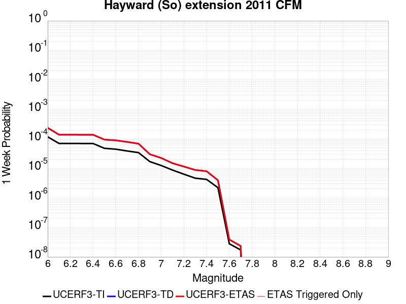 | 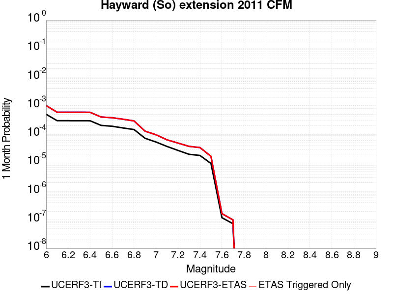 | 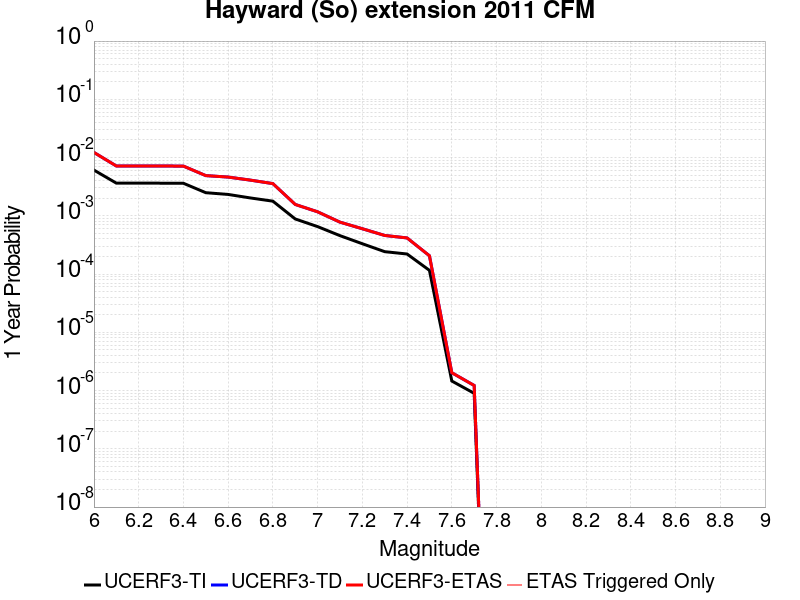 | 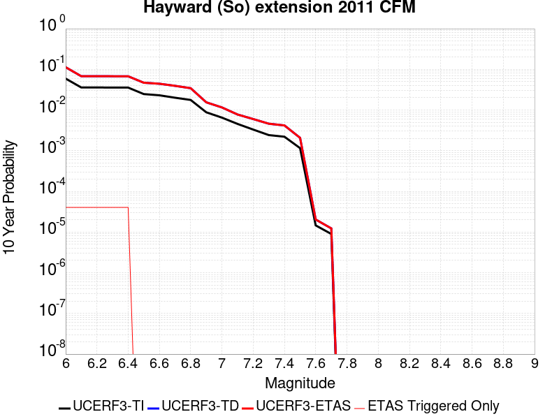 |

| Magnitude | 1 wk TI Prob | 1 wk TD Prob | 1 wk ETAS Prob | 1 wk ETAS/TD Gain | 1 wk ETAS Triggered Only | 1 mo TI Prob | 1 mo TD Prob | 1 mo ETAS Prob | 1 mo ETAS/TD Gain | 1 mo ETAS Triggered Only | 1 yr TI Prob | 1 yr TD Prob | 1 yr ETAS Prob | 1 yr ETAS/TD Gain | 1 yr ETAS Triggered Only | 10 yr TI Prob | 10 yr TD Prob | 10 yr ETAS Prob | 10 yr ETAS/TD Gain | 10 yr ETAS Triggered Only |
|-----|-----|-----|-----|-----|-----|-----|-----|-----|-----|-----|-----|-----|-----|-----|-----|-----|-----|-----|-----|-----|
| 6.0 | 1.1721256E-4 | 2.3697627E-4 | 2.3697627E-4 | 1.0 | 0.0 | 5.022428E-4 | 0.0010129517 | 0.0010129517 | 1.0 | 0.0 | 0.0060976758 | 0.012248711 | 0.012258588 | 1.0008065 | 1.0E-5 | 0.0593305 | 0.112843215 | 0.11286983 | 1.0002359 | 3.0E-5 |
| 6.1 | 6.99169E-5 | 1.3822885E-4 | 1.3822885E-4 | 1.0 | 0.0 | 2.9960944E-4 | 5.9128006E-4 | 5.9128006E-4 | 1.0 | 0.0 | 0.0036416445 | 0.0071720886 | 0.0071720886 | 1.0 | 0.0 | 0.035825435 | 0.067803554 | 0.067812875 | 1.0001374 | 1.0E-5 |
| 6.2 | 6.99169E-5 | 1.3822885E-4 | 1.3822885E-4 | 1.0 | 0.0 | 2.9960944E-4 | 5.9128006E-4 | 5.9128006E-4 | 1.0 | 0.0 | 0.0036416445 | 0.0071720886 | 0.0071720886 | 1.0 | 0.0 | 0.035825435 | 0.067803554 | 0.067812875 | 1.0001374 | 1.0E-5 |
| 6.3 | 6.970908E-5 | 1.379104E-4 | 1.379104E-4 | 1.0 | 0.0 | 2.9871898E-4 | 5.899159E-4 | 5.899159E-4 | 1.0 | 0.0 | 0.0036308395 | 0.007155625 | 0.007155625 | 1.0 | 0.0 | 0.035720866 | 0.067652516 | 0.06766184 | 1.0001378 | 1.0E-5 |
| 6.4 | 6.9517155E-5 | 1.375792E-4 | 1.375792E-4 | 1.0 | 0.0 | 2.9789665E-4 | 5.884971E-4 | 5.884971E-4 | 1.0 | 0.0 | 0.0036208609 | 0.0071385372 | 0.0071385372 | 1.0 | 0.0 | 0.03562429 | 0.06749655 | 0.06750588 | 1.0001382 | 1.0E-5 |
| 6.5 | 4.786248E-5 | 9.41498E-5 | 9.41498E-5 | 1.0 | 0.0 | 2.0510878E-4 | 4.034394E-4 | 4.034394E-4 | 1.0 | 0.0 | 0.0024943394 | 0.004901227 | 0.004901227 | 1.0 | 0.0 | 0.02466527 | 0.046901822 | 0.046901822 | 1.0 | 0.0 |
| 6.6 | 4.4662214E-5 | 8.881654E-5 | 8.881654E-5 | 1.0 | 0.0 | 1.9139545E-4 | 3.805894E-4 | 3.805894E-4 | 1.0 | 0.0 | 0.0023277493 | 0.0046242937 | 0.0046242937 | 1.0 | 0.0 | 0.02303517 | 0.044293344 | 0.044293344 | 1.0 | 0.0 |
| 6.7 | 3.884542E-5 | 7.8648096E-5 | 7.8648096E-5 | 1.0 | 0.0 | 1.6646975E-4 | 3.370222E-4 | 3.370222E-4 | 1.0 | 0.0 | 0.002024885 | 0.0040959697 | 0.0040959697 | 1.0 | 0.0 | 0.020065336 | 0.039333146 | 0.039333146 | 1.0 | 0.0 |
| 6.8 | 3.4221863E-5 | 6.855653E-5 | 6.855653E-5 | 1.0 | 0.0 | 1.4665688E-4 | 2.93783E-4 | 2.93783E-4 | 1.0 | 0.0 | 0.0017840851 | 0.0035713627 | 0.0035713627 | 1.0 | 0.0 | 0.017698295 | 0.034421004 | 0.034421004 | 1.0 | 0.0 |
| 6.9 | 1.6927712E-5 | 3.0061563E-5 | 3.0061563E-5 | 1.0 | 0.0 | 7.2545314E-5 | 1.2882923E-4 | 1.2882923E-4 | 1.0 | 0.0 | 8.828813E-4 | 0.0015674243 | 0.0015674243 | 1.0 | 0.0 | 0.008793819 | 0.01546327 | 0.01546327 | 1.0 | 0.0 |
| 7.0 | 1.2509653E-5 | 2.2462571E-5 | 2.2462571E-5 | 1.0 | 0.0 | 5.3611697E-5 | 9.6264856E-5 | 9.6264856E-5 | 1.0 | 0.0 | 6.525269E-4 | 0.0011714385 | 0.0011714385 | 1.0 | 0.0 | 0.0065061417 | 0.01158231 | 0.01158231 | 1.0 | 0.0 |
| 7.1 | 8.751583E-6 | 1.4925648E-5 | 1.4925648E-5 | 1.0 | 0.0 | 3.750624E-5 | 6.3965526E-5 | 6.3965526E-5 | 1.0 | 0.0 | 4.5654282E-4 | 7.785079E-4 | 7.785079E-4 | 1.0 | 0.0 | 0.0045560603 | 0.007763496 | 0.007763496 | 1.0 | 0.0 |
| 7.2 | 6.354379E-6 | 1.1498636E-5 | 1.1498636E-5 | 1.0 | 0.0 | 2.7232769E-5 | 4.9278966E-5 | 4.9278966E-5 | 1.0 | 0.0 | 3.3150852E-4 | 5.99811E-4 | 5.99811E-4 | 1.0 | 0.0 | 0.0033101442 | 0.0060003046 | 0.0060003046 | 1.0 | 0.0 |
| 7.3 | 4.645554E-6 | 8.818172E-6 | 8.818172E-6 | 1.0 | 0.0 | 1.9909365E-5 | 3.779164E-5 | 3.779164E-5 | 1.0 | 0.0 | 2.4236954E-4 | 4.6002E-4 | 4.6002E-4 | 1.0 | 0.0 | 0.0024210536 | 0.004610708 | 0.004610708 | 1.0 | 0.0 |
| 7.4 | 4.23437E-6 | 7.992532E-6 | 7.992532E-6 | 1.0 | 0.0 | 1.8147173E-5 | 3.425328E-5 | 3.425328E-5 | 1.0 | 0.0 | 2.2091944E-4 | 4.1695772E-4 | 4.1695772E-4 | 1.0 | 0.0 | 0.0022069993 | 0.004181972 | 0.004181972 | 1.0 | 0.0 |
| 7.5 | 2.2187417E-6 | 3.9522306E-6 | 3.9522306E-6 | 1.0 | 0.0 | 9.508858E-6 | 1.6938036E-5 | 1.6938036E-5 | 1.0 | 0.0 | 1.157642E-4 | 2.0620368E-4 | 2.0620368E-4 | 1.0 | 0.0 | 0.0011570391 | 0.0020734754 | 0.0020734754 | 1.0 | 0.0 |
| 7.6 | 2.7952495E-8 | 3.878529E-8 | 3.878529E-8 | 1.0 | 0.0 | 1.1979641E-7 | 1.6622266E-7 | 1.6622266E-7 | 1.0 | 0.0 | 1.4585203E-6 | 2.0237592E-6 | 2.0237592E-6 | 1.0 | 0.0 | 1.4585107E-5 | 2.0328182E-5 | 2.0328182E-5 | 1.0 | 0.0 |
| 7.7 | 1.7192724E-8 | 2.3436517E-8 | 2.3436517E-8 | 1.0 | 0.0 | 7.36831E-8 | 1.0044221E-7 | 1.0044221E-7 | 1.0 | 0.0 | 8.9709135E-7 | 1.2228833E-6 | 1.2228833E-6 | 1.0 | 0.0 | 8.970877E-6 | 1.2296933E-5 | 1.2296933E-5 | 1.0 | 0.0 |

## Casmalia 2011 CFM
*[(top)](#table-of-contents)*

| 1 Week | 1 Month | 1 Year | 10 Year |
|-----|-----|-----|-----|
|  | 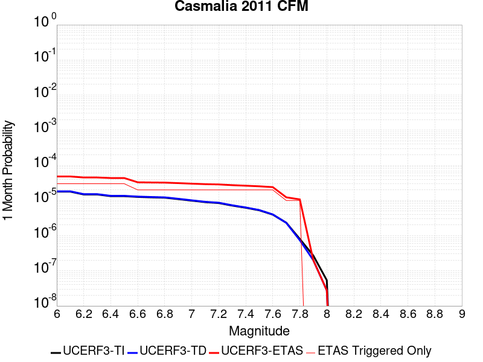 | 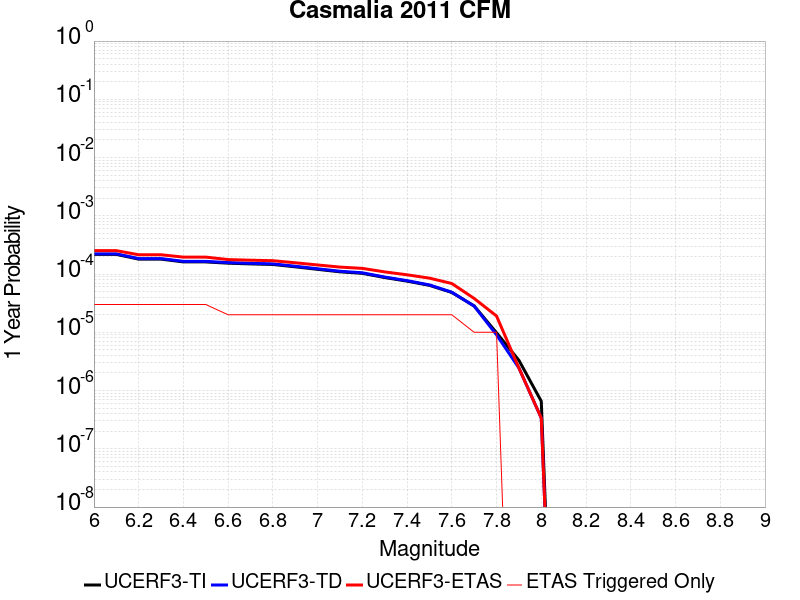 | 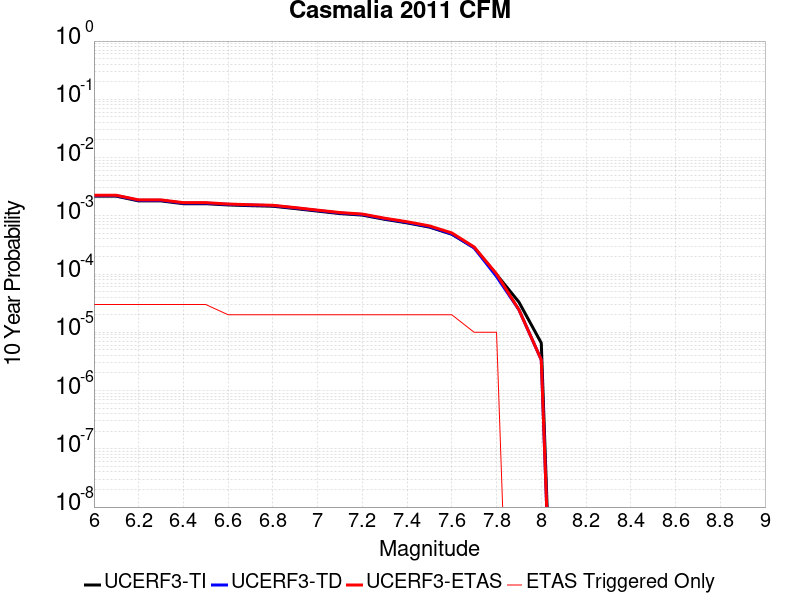 |

| Magnitude | 1 wk TI Prob | 1 wk TD Prob | 1 wk ETAS Prob | 1 wk ETAS/TD Gain | 1 wk ETAS Triggered Only | 1 mo TI Prob | 1 mo TD Prob | 1 mo ETAS Prob | 1 mo ETAS/TD Gain | 1 mo ETAS Triggered Only | 1 yr TI Prob | 1 yr TD Prob | 1 yr ETAS Prob | 1 yr ETAS/TD Gain | 1 yr ETAS Triggered Only | 10 yr TI Prob | 10 yr TD Prob | 10 yr ETAS Prob | 10 yr ETAS/TD Gain | 10 yr ETAS Triggered Only |
|-----|-----|-----|-----|-----|-----|-----|-----|-----|-----|-----|-----|-----|-----|-----|-----|-----|-----|-----|-----|-----|
| 6.0 | 4.1704893E-6 | 4.262483E-6 | 3.4262353E-5 | 8.038121 | 3.0E-5 | 1.7873403E-5 | 1.8267656E-5 | 4.826711E-5 | 2.6422167 | 3.0E-5 | 2.1758694E-4 | 2.2238622E-4 | 2.5237954E-4 | 1.1348704 | 3.0E-5 | 0.0021737402 | 0.0022216577 | 0.002251591 | 1.0134734 | 3.0E-5 |
| 6.1 | 4.1704893E-6 | 4.262483E-6 | 3.4262353E-5 | 8.038121 | 3.0E-5 | 1.7873403E-5 | 1.8267656E-5 | 4.826711E-5 | 2.6422167 | 3.0E-5 | 2.1758694E-4 | 2.2238622E-4 | 2.5237954E-4 | 1.1348704 | 3.0E-5 | 0.0021737402 | 0.0022216577 | 0.002251591 | 1.0134734 | 3.0E-5 |
| 6.2 | 3.457312E-6 | 3.5370217E-6 | 3.3536915E-5 | 9.481682 | 3.0E-5 | 1.4816967E-5 | 1.5158577E-5 | 4.515812E-5 | 2.9790475 | 3.0E-5 | 1.8038164E-4 | 1.8454014E-4 | 2.145346E-4 | 1.1625363 | 3.0E-5 | 0.001802353 | 0.0018438784 | 0.001873823 | 1.01624 | 3.0E-5 |
| 6.3 | 3.457312E-6 | 3.5370217E-6 | 3.3536915E-5 | 9.481682 | 3.0E-5 | 1.4816967E-5 | 1.5158577E-5 | 4.515812E-5 | 2.9790475 | 3.0E-5 | 1.8038164E-4 | 1.8454014E-4 | 2.145346E-4 | 1.1625363 | 3.0E-5 | 0.001802353 | 0.0018438784 | 0.001873823 | 1.01624 | 3.0E-5 |
| 6.4 | 3.0957337E-6 | 3.1692257E-6 | 3.316913E-5 | 10.466004 | 3.0E-5 | 1.3267363E-5 | 1.3582326E-5 | 4.3581917E-5 | 3.2087228 | 3.0E-5 | 1.6151817E-4 | 1.6535232E-4 | 1.9534735E-4 | 1.1814008 | 3.0E-5 | 0.0016140083 | 0.0016522991 | 0.0016822495 | 1.0181265 | 3.0E-5 |
| 6.5 | 3.0957337E-6 | 3.1692257E-6 | 3.316913E-5 | 10.466004 | 3.0E-5 | 1.3267363E-5 | 1.3582326E-5 | 4.3581917E-5 | 3.2087228 | 3.0E-5 | 1.6151817E-4 | 1.6535232E-4 | 1.9534735E-4 | 1.1814008 | 3.0E-5 | 0.0016140083 | 0.0016522991 | 0.0016822495 | 1.0181265 | 3.0E-5 |
| 6.6 | 2.9459152E-6 | 3.0165752E-6 | 2.3016515E-5 | 7.6300154 | 2.0E-5 | 1.262529E-5 | 1.2928115E-5 | 3.2927856E-5 | 2.5469959 | 2.0E-5 | 1.5370206E-4 | 1.5738848E-4 | 1.7738534E-4 | 1.1270541 | 2.0E-5 | 0.0015359579 | 0.0015727758 | 0.0015927444 | 1.0126964 | 2.0E-5 |
| 6.7 | 2.8634809E-6 | 2.9324726E-6 | 2.2932414E-5 | 7.8201632 | 2.0E-5 | 1.2272003E-5 | 1.256768E-5 | 3.2567426E-5 | 2.5913637 | 2.0E-5 | 1.4940138E-4 | 1.530008E-4 | 1.7299774E-4 | 1.1306983 | 2.0E-5 | 0.0014930099 | 0.0015289601 | 0.0015489295 | 1.0130608 | 2.0E-5 |
| 6.8 | 2.7999822E-6 | 2.8675968E-6 | 2.286754E-5 | 7.9744616 | 2.0E-5 | 1.1999869E-5 | 1.2289643E-5 | 3.2289397E-5 | 2.6273665 | 2.0E-5 | 1.460886E-4 | 1.4961617E-4 | 1.6961318E-4 | 1.1336554 | 2.0E-5 | 0.001459926 | 0.0014951597 | 0.0015151298 | 1.0133564 | 2.0E-5 |
| 6.9 | 2.551052E-6 | 2.6119649E-6 | 2.2611912E-5 | 8.657051 | 2.0E-5 | 1.0933034E-5 | 1.1194087E-5 | 3.1193864E-5 | 2.7866375 | 2.0E-5 | 1.3310155E-4 | 1.3627953E-4 | 1.562768E-4 | 1.1467372 | 2.0E-5 | 0.0013302186 | 0.0013619636 | 0.0013819364 | 1.0146646 | 2.0E-5 |
| 7.0 | 2.3081875E-6 | 2.3624088E-6 | 2.2362361E-5 | 9.465915 | 2.0E-5 | 9.892195E-6 | 1.01245705E-5 | 3.0124367E-5 | 2.9753726 | 2.0E-5 | 1.20430814E-4 | 1.232597E-4 | 1.4325723E-4 | 1.1622391 | 2.0E-5 | 0.0012036557 | 0.0012319161 | 0.0012518915 | 1.0162148 | 2.0E-5 |
| 7.1 | 2.093245E-6 | 2.1417243E-6 | 2.2141681E-5 | 10.33825 | 2.0E-5 | 8.971019E-6 | 9.178786E-6 | 2.9178602E-5 | 3.1789174 | 2.0E-5 | 1.09216686E-4 | 1.1174601E-4 | 1.3174377E-4 | 1.1789573 | 2.0E-5 | 0.0010916302 | 0.0011169002 | 0.0011368779 | 1.0178868 | 2.0E-5 |
| 7.2 | 1.9714576E-6 | 2.0165091E-6 | 2.201647E-5 | 10.91811 | 2.0E-5 | 8.449076E-6 | 8.642153E-6 | 2.864198E-5 | 3.314218 | 2.0E-5 | 1.0286264E-4 | 1.05213156E-4 | 1.2521105E-4 | 1.1900703 | 2.0E-5 | 0.0010281504 | 0.0010516352 | 0.0010716142 | 1.018998 | 2.0E-5 |
| 7.3 | 1.6689512E-6 | 1.7047131E-6 | 2.1704678E-5 | 12.73216 | 2.0E-5 | 7.1526288E-6 | 7.3058927E-6 | 2.7305747E-5 | 3.7374964 | 2.0E-5 | 8.7079774E-5 | 8.894562E-5 | 1.0894384E-4 | 1.2248365 | 2.0E-5 | 8.7045657E-4 | 8.89101E-4 | 9.0908323E-4 | 1.0224746 | 2.0E-5 |
| 7.4 | 1.4490954E-6 | 1.4778908E-6 | 2.1477861E-5 | 14.53278 | 2.0E-5 | 6.210394E-6 | 6.333802E-6 | 2.6333675E-5 | 4.157641 | 2.0E-5 | 7.560892E-5 | 7.711132E-5 | 9.7109776E-5 | 1.2593453 | 2.0E-5 | 7.55832E-4 | 7.7084627E-4 | 7.908308E-4 | 1.0259255 | 2.0E-5 |
| 7.5 | 1.226873E-6 | 1.2481701E-6 | 2.1248145E-5 | 17.023438 | 2.0E-5 | 5.2580162E-6 | 5.3492895E-6 | 2.5349182E-5 | 4.7387943 | 2.0E-5 | 6.401447E-5 | 6.5125656E-5 | 8.512435E-5 | 1.3070786 | 2.0E-5 | 6.399603E-4 | 6.5106625E-4 | 6.7105325E-4 | 1.0306989 | 2.0E-5 |
| 7.6 | 9.2561345E-7 | 9.361923E-7 | 2.0936173E-5 | 22.363111 | 2.0E-5 | 3.966909E-6 | 4.012247E-6 | 2.4012166E-5 | 5.9847183 | 2.0E-5 | 4.8296046E-5 | 4.884801E-5 | 6.884703E-5 | 1.4094132 | 2.0E-5 | 4.828555E-4 | 4.8837316E-4 | 5.0836336E-4 | 1.0409323 | 2.0E-5 |
| 7.7 | 5.4367933E-7 | 5.392888E-7 | 1.0539284E-5 | 19.54293 | 1.0E-5 | 2.3300522E-6 | 2.3112357E-6 | 1.2311212E-5 | 5.3266797 | 1.0E-5 | 2.8368017E-5 | 2.8138933E-5 | 3.8138653E-5 | 1.3553694 | 1.0E-5 | 2.8364395E-4 | 2.8135383E-4 | 2.9135103E-4 | 1.0355325 | 1.0E-5 |
| 7.8 | 1.8825742E-7 | 1.7342276E-7 | 1.0173421E-5 | 58.662548 | 1.0E-5 | 8.068173E-7 | 7.4324015E-7 | 1.0743232E-5 | 14.454591 | 1.0E-5 | 9.822956E-6 | 9.048912E-6 | 1.904882E-5 | 2.1050951 | 1.0E-5 | 9.822522E-5 | 9.048546E-5 | 1.00484554E-4 | 1.110505 | 1.0E-5 |
| 7.9 | 6.342771E-8 | 4.6790706E-8 | 4.6790706E-8 | 1.0 | 0.0 | 2.7183304E-7 | 2.0053157E-7 | 2.0053157E-7 | 1.0 | 0.0 | 3.3095623E-6 | 2.4414692E-6 | 2.4414692E-6 | 1.0 | 0.0 | 3.309513E-5 | 2.4414428E-5 | 2.4414428E-5 | 1.0 | 0.0 |
| 8.0 | 1.2574819E-8 | 6.4733463E-9 | 6.4733463E-9 | 1.0 | 0.0 | 5.3892084E-8 | 2.7742912E-8 | 2.7742912E-8 | 1.0 | 0.0 | 6.561359E-7 | 3.377699E-7 | 3.377699E-7 | 1.0 | 0.0 | 6.56134E-6 | 3.377694E-6 | 3.377694E-6 | 1.0 | 0.0 |

## Monte Vista - Shannon 2011 CFM
*[(top)](#table-of-contents)*

| 1 Week | 1 Month | 1 Year | 10 Year |
|-----|-----|-----|-----|
| 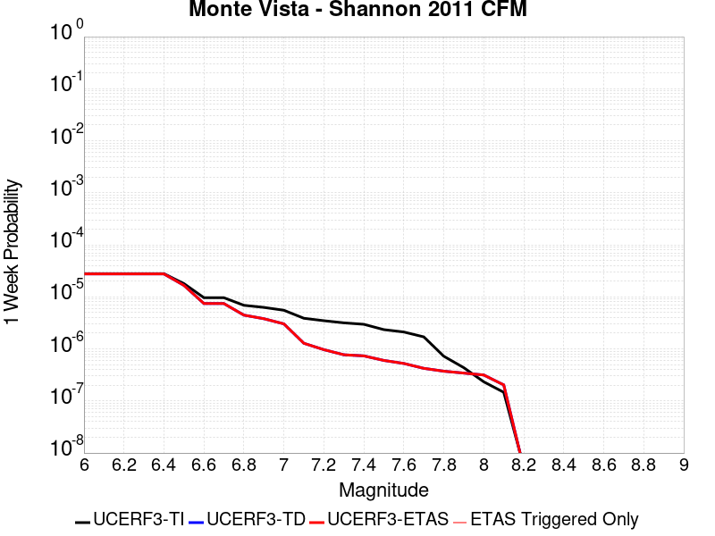 | 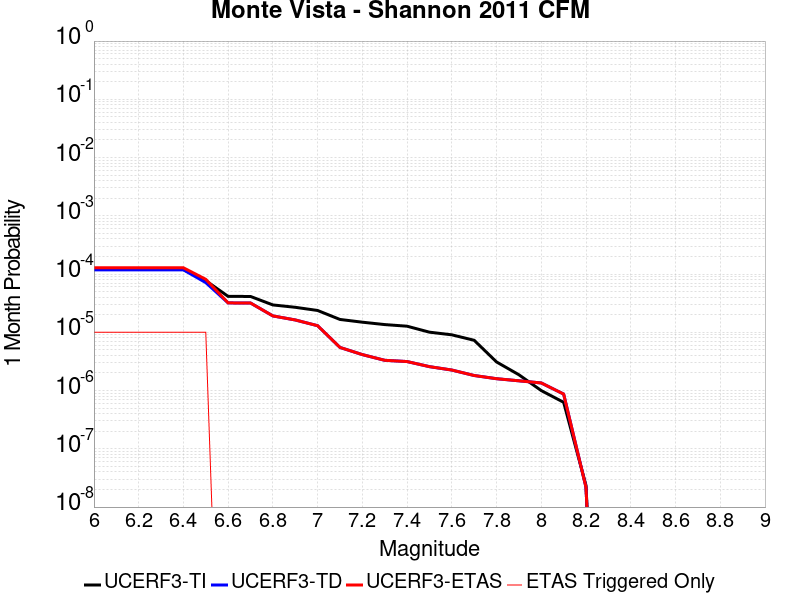 | 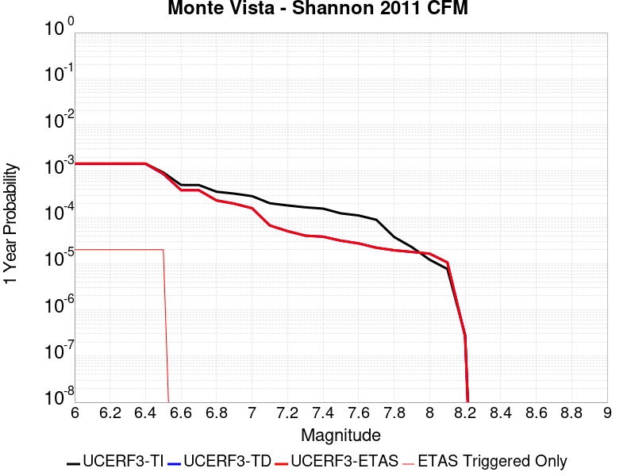 | 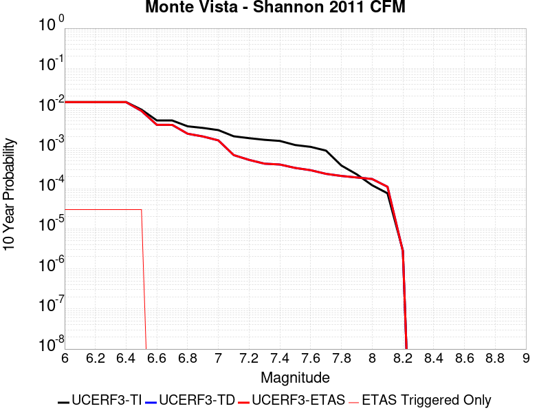 |

| Magnitude | 1 wk TI Prob | 1 wk TD Prob | 1 wk ETAS Prob | 1 wk ETAS/TD Gain | 1 wk ETAS Triggered Only | 1 mo TI Prob | 1 mo TD Prob | 1 mo ETAS Prob | 1 mo ETAS/TD Gain | 1 mo ETAS Triggered Only | 1 yr TI Prob | 1 yr TD Prob | 1 yr ETAS Prob | 1 yr ETAS/TD Gain | 1 yr ETAS Triggered Only | 10 yr TI Prob | 10 yr TD Prob | 10 yr ETAS Prob | 10 yr ETAS/TD Gain | 10 yr ETAS Triggered Only |
|-----|-----|-----|-----|-----|-----|-----|-----|-----|-----|-----|-----|-----|-----|-----|-----|-----|-----|-----|-----|-----|
| 6.0 | 2.7907707E-5 | 2.7584209E-5 | 2.7584209E-5 | 1.0 | 0.0 | 1.19598975E-4 | 1.1821338E-4 | 1.282122E-4 | 1.0845828 | 1.0E-5 | 0.0014551448 | 0.0014384214 | 0.0014583926 | 1.0138842 | 2.0E-5 | 0.014456532 | 0.014320195 | 0.014349765 | 1.002065 | 3.0E-5 |
| 6.1 | 2.7907707E-5 | 2.7584209E-5 | 2.7584209E-5 | 1.0 | 0.0 | 1.19598975E-4 | 1.1821338E-4 | 1.282122E-4 | 1.0845828 | 1.0E-5 | 0.0014551448 | 0.0014384214 | 0.0014583926 | 1.0138842 | 2.0E-5 | 0.014456532 | 0.014320195 | 0.014349765 | 1.002065 | 3.0E-5 |
| 6.2 | 2.7907707E-5 | 2.7584209E-5 | 2.7584209E-5 | 1.0 | 0.0 | 1.19598975E-4 | 1.1821338E-4 | 1.282122E-4 | 1.0845828 | 1.0E-5 | 0.0014551448 | 0.0014384214 | 0.0014583926 | 1.0138842 | 2.0E-5 | 0.014456532 | 0.014320195 | 0.014349765 | 1.002065 | 3.0E-5 |
| 6.3 | 2.7907707E-5 | 2.7584209E-5 | 2.7584209E-5 | 1.0 | 0.0 | 1.19598975E-4 | 1.1821338E-4 | 1.282122E-4 | 1.0845828 | 1.0E-5 | 0.0014551448 | 0.0014384214 | 0.0014583926 | 1.0138842 | 2.0E-5 | 0.014456532 | 0.014320195 | 0.014349765 | 1.002065 | 3.0E-5 |
| 6.4 | 2.7907707E-5 | 2.7584209E-5 | 2.7584209E-5 | 1.0 | 0.0 | 1.19598975E-4 | 1.1821338E-4 | 1.282122E-4 | 1.0845828 | 1.0E-5 | 0.0014551448 | 0.0014384214 | 0.0014583926 | 1.0138842 | 2.0E-5 | 0.014456532 | 0.014320195 | 0.014349765 | 1.002065 | 3.0E-5 |
| 6.5 | 1.7990213E-5 | 1.6639884E-5 | 1.6639884E-5 | 1.0 | 0.0 | 7.709863E-5 | 7.131221E-5 | 8.1311504E-5 | 1.1402184 | 1.0E-5 | 9.382716E-4 | 8.679467E-4 | 8.8792935E-4 | 1.0230229 | 2.0E-5 | 0.0093431985 | 0.008668941 | 0.008698681 | 1.0034306 | 3.0E-5 |
| 6.6 | 9.650407E-6 | 7.4571435E-6 | 7.4571435E-6 | 1.0 | 0.0 | 4.135823E-5 | 3.195884E-5 | 3.195884E-5 | 1.0 | 0.0 | 5.0342013E-4 | 3.8903722E-4 | 3.8903722E-4 | 1.0 | 0.0 | 0.005022812 | 0.0039012418 | 0.0039012418 | 1.0 | 0.0 |
| 6.7 | 9.62828E-6 | 7.4350583E-6 | 7.4350583E-6 | 1.0 | 0.0 | 4.1263404E-5 | 3.186419E-5 | 3.186419E-5 | 1.0 | 0.0 | 5.022661E-4 | 3.878853E-4 | 3.878853E-4 | 1.0 | 0.0 | 0.0050113243 | 0.003889763 | 0.003889763 | 1.0 | 0.0 |
| 6.8 | 6.887523E-6 | 4.4615676E-6 | 4.4615676E-6 | 1.0 | 0.0 | 2.9517621E-5 | 1.9120876E-5 | 1.9120876E-5 | 1.0 | 0.0 | 3.5931775E-4 | 2.3277402E-4 | 2.3277402E-4 | 1.0 | 0.0 | 0.0035873733 | 0.0023424553 | 0.0023424553 | 1.0 | 0.0 |
| 6.9 | 6.2722347E-6 | 3.8034377E-6 | 3.8034377E-6 | 1.0 | 0.0 | 2.6880729E-5 | 1.6300357E-5 | 1.6300357E-5 | 1.0 | 0.0 | 3.2722374E-4 | 1.984408E-4 | 1.984408E-4 | 1.0 | 0.0 | 0.003267423 | 0.0019997752 | 0.0019997752 | 1.0 | 0.0 |
| 7.0 | 5.5320347E-6 | 3.0305885E-6 | 3.0305885E-6 | 1.0 | 0.0 | 2.3708504E-5 | 1.2988182E-5 | 1.2988182E-5 | 1.0 | 0.0 | 2.8861282E-4 | 1.5812147E-4 | 1.5812147E-4 | 1.0 | 0.0 | 0.0028823826 | 0.001597215 | 0.001597215 | 1.0 | 0.0 |
| 7.1 | 3.8794055E-6 | 1.2837862E-6 | 1.2837862E-6 | 1.0 | 0.0 | 1.6625918E-5 | 5.5019295E-6 | 5.5019295E-6 | 1.0 | 0.0 | 2.0240174E-4 | 6.698394E-5 | 6.698394E-5 | 1.0 | 0.0 | 0.002022175 | 6.865884E-4 | 6.865884E-4 | 1.0 | 0.0 |
| 7.2 | 3.4813652E-6 | 9.671046E-7 | 9.671046E-7 | 1.0 | 0.0 | 1.49200505E-5 | 4.1447274E-6 | 4.1447274E-6 | 1.0 | 0.0 | 1.8163648E-4 | 5.0460894E-5 | 5.0460894E-5 | 1.0 | 0.0 | 0.0018148809 | 5.214329E-4 | 5.214329E-4 | 1.0 | 0.0 |
| 7.3 | 3.1682148E-6 | 7.719097E-7 | 7.719097E-7 | 1.0 | 0.0 | 1.3577992E-5 | 3.30818E-6 | 3.30818E-6 | 1.0 | 0.0 | 1.6529951E-4 | 4.027635E-5 | 4.027635E-5 | 1.0 | 0.0 | 0.0016517661 | 4.1960424E-4 | 4.1960424E-4 | 1.0 | 0.0 |
| 7.4 | 2.9707667E-6 | 7.3457204E-7 | 7.3457204E-7 | 1.0 | 0.0 | 1.2731795E-5 | 3.148162E-6 | 3.148162E-6 | 1.0 | 0.0 | 1.5499859E-4 | 3.8328202E-5 | 3.8328202E-5 | 1.0 | 0.0 | 0.0015489052 | 3.9992164E-4 | 3.9992164E-4 | 1.0 | 0.0 |
| 7.5 | 2.3462758E-6 | 6.007889E-7 | 6.007889E-7 | 1.0 | 0.0 | 1.0055429E-5 | 2.574807E-6 | 2.574807E-6 | 1.0 | 0.0 | 1.2241797E-4 | 3.1347827E-5 | 3.1347827E-5 | 1.0 | 0.0 | 0.0012235056 | 3.2839534E-4 | 3.2839534E-4 | 1.0 | 0.0 |
| 7.6 | 2.112783E-6 | 5.251582E-7 | 5.251582E-7 | 1.0 | 0.0 | 9.054753E-6 | 2.250676E-6 | 2.250676E-6 | 1.0 | 0.0 | 1.1023604E-4 | 2.7401638E-5 | 2.7401638E-5 | 1.0 | 0.0 | 0.0011018137 | 2.885138E-4 | 2.885138E-4 | 1.0 | 0.0 |
| 7.7 | 1.7022471E-6 | 4.231601E-7 | 4.231601E-7 | 1.0 | 0.0 | 7.2953244E-6 | 1.8135419E-6 | 1.8135419E-6 | 1.0 | 0.0 | 8.881695E-5 | 2.207965E-5 | 2.207965E-5 | 1.0 | 0.0 | 8.878146E-4 | 2.3398738E-4 | 2.3398738E-4 | 1.0 | 0.0 |
| 7.8 | 7.230914E-7 | 3.7285864E-7 | 3.7285864E-7 | 1.0 | 0.0 | 3.0989595E-6 | 1.5979647E-6 | 1.5979647E-6 | 1.0 | 0.0 | 3.772918E-5 | 1.9455047E-5 | 1.9455047E-5 | 1.0 | 0.0 | 3.7722773E-4 | 2.0726922E-4 | 2.0726922E-4 | 1.0 | 0.0 |
| 7.9 | 4.3588446E-7 | 3.4305793E-7 | 3.4305793E-7 | 1.0 | 0.0 | 1.868075E-6 | 1.4702474E-6 | 1.4702474E-6 | 1.0 | 0.0 | 2.2743576E-5 | 1.7900116E-5 | 1.7900116E-5 | 1.0 | 0.0 | 2.2741247E-4 | 1.8995286E-4 | 1.8995286E-4 | 1.0 | 0.0 |
| 8.0 | 2.3317523E-7 | 3.1513588E-7 | 3.1513588E-7 | 1.0 | 0.0 | 9.99322E-7 | 1.3505817E-6 | 1.3505817E-6 | 1.0 | 0.0 | 1.2166677E-5 | 1.644321E-5 | 1.644321E-5 | 1.0 | 0.0 | 1.21660116E-4 | 1.7399415E-4 | 1.7399415E-4 | 1.0 | 0.0 |
| 8.1 | 1.4662456E-7 | 2.030774E-7 | 2.030774E-7 | 1.0 | 0.0 | 6.283908E-7 | 8.703314E-7 | 8.703314E-7 | 1.0 | 0.0 | 7.650631E-6 | 1.05962345E-5 | 1.05962345E-5 | 1.0 | 0.0 | 7.650368E-5 | 1.113227E-4 | 1.113227E-4 | 1.0 | 0.0 |
| 8.2 | 5.4931775E-9 | 5.07573E-9 | 5.07573E-9 | 1.0 | 0.0 | 2.3542189E-8 | 2.1753127E-8 | 2.1753127E-8 | 1.0 | 0.0 | 2.8662612E-7 | 2.6484432E-7 | 2.6484432E-7 | 1.0 | 0.0 | 2.8662573E-6 | 2.7539324E-6 | 2.7539324E-6 | 1.0 | 0.0 |

## Santa Susana East (connector)
*[(top)](#table-of-contents)*

| 1 Week | 1 Month | 1 Year | 10 Year |
|-----|-----|-----|-----|
|  |  | 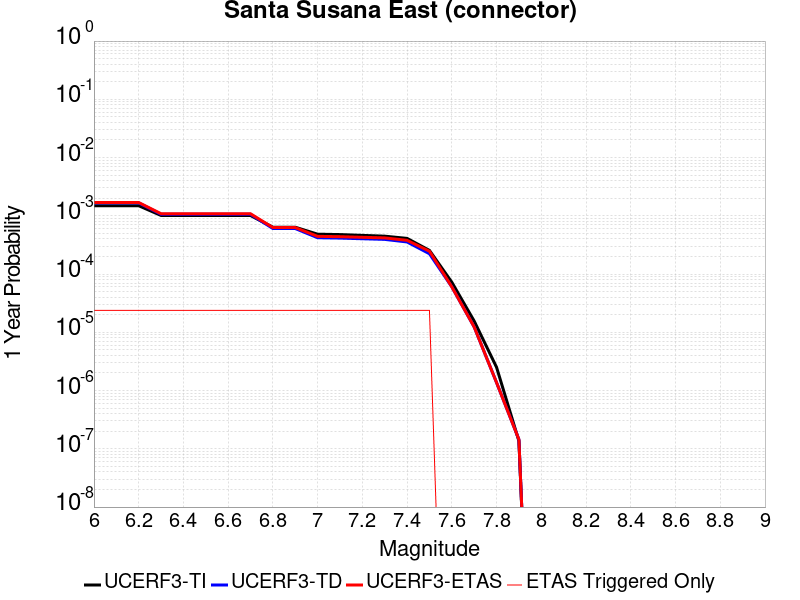 | 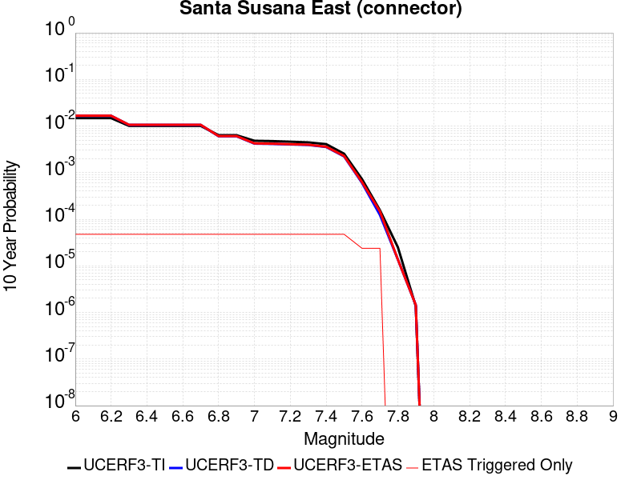 |

| Magnitude | 1 wk TI Prob | 1 wk TD Prob | 1 wk ETAS Prob | 1 wk ETAS/TD Gain | 1 wk ETAS Triggered Only | 1 mo TI Prob | 1 mo TD Prob | 1 mo ETAS Prob | 1 mo ETAS/TD Gain | 1 mo ETAS Triggered Only | 1 yr TI Prob | 1 yr TD Prob | 1 yr ETAS Prob | 1 yr ETAS/TD Gain | 1 yr ETAS Triggered Only | 10 yr TI Prob | 10 yr TD Prob | 10 yr ETAS Prob | 10 yr ETAS/TD Gain | 10 yr ETAS Triggered Only |
|-----|-----|-----|-----|-----|-----|-----|-----|-----|-----|-----|-----|-----|-----|-----|-----|-----|-----|-----|-----|-----|
| 6.0 | 2.858397E-5 | 3.202091E-5 | 3.202091E-5 | 1.0 | 0.0 | 1.2249697E-4 | 1.3722685E-4 | 1.3722685E-4 | 1.0 | 0.0 | 0.0014903803 | 0.0016697381 | 0.0016797214 | 1.005979 | 1.0E-5 | 0.014804244 | 0.016599052 | 0.016628554 | 1.0017773 | 3.0E-5 |
| 6.1 | 2.858397E-5 | 3.202091E-5 | 3.202091E-5 | 1.0 | 0.0 | 1.2249697E-4 | 1.3722685E-4 | 1.3722685E-4 | 1.0 | 0.0 | 0.0014903803 | 0.0016697381 | 0.0016797214 | 1.005979 | 1.0E-5 | 0.014804244 | 0.016599052 | 0.016628554 | 1.0017773 | 3.0E-5 |
| 6.2 | 2.858397E-5 | 3.202091E-5 | 3.202091E-5 | 1.0 | 0.0 | 1.2249697E-4 | 1.3722685E-4 | 1.3722685E-4 | 1.0 | 0.0 | 0.0014903803 | 0.0016697381 | 0.0016797214 | 1.005979 | 1.0E-5 | 0.014804244 | 0.016599052 | 0.016628554 | 1.0017773 | 3.0E-5 |
| 6.3 | 1.943582E-5 | 2.036718E-5 | 2.036718E-5 | 1.0 | 0.0 | 8.329371E-5 | 8.7285625E-5 | 8.7285625E-5 | 1.0 | 0.0 | 0.001013629 | 0.0010622967 | 0.001072286 | 1.0094036 | 1.0E-5 | 0.010090181 | 0.010583619 | 0.010613301 | 1.0028045 | 3.0E-5 |
| 6.4 | 1.943582E-5 | 2.036718E-5 | 2.036718E-5 | 1.0 | 0.0 | 8.329371E-5 | 8.7285625E-5 | 8.7285625E-5 | 1.0 | 0.0 | 0.001013629 | 0.0010622967 | 0.001072286 | 1.0094036 | 1.0E-5 | 0.010090181 | 0.010583619 | 0.010613301 | 1.0028045 | 3.0E-5 |
| 6.5 | 1.943582E-5 | 2.036718E-5 | 2.036718E-5 | 1.0 | 0.0 | 8.329371E-5 | 8.7285625E-5 | 8.7285625E-5 | 1.0 | 0.0 | 0.001013629 | 0.0010622967 | 0.001072286 | 1.0094036 | 1.0E-5 | 0.010090181 | 0.010583619 | 0.010613301 | 1.0028045 | 3.0E-5 |
| 6.6 | 1.943582E-5 | 2.036718E-5 | 2.036718E-5 | 1.0 | 0.0 | 8.329371E-5 | 8.7285625E-5 | 8.7285625E-5 | 1.0 | 0.0 | 0.001013629 | 0.0010622967 | 0.001072286 | 1.0094036 | 1.0E-5 | 0.010090181 | 0.010583619 | 0.010613301 | 1.0028045 | 3.0E-5 |
| 6.7 | 1.9404439E-5 | 2.03546E-5 | 2.03546E-5 | 1.0 | 0.0 | 8.3159226E-5 | 8.723172E-5 | 8.723172E-5 | 1.0 | 0.0 | 0.0010119933 | 0.0010616409 | 0.0010716304 | 1.0094094 | 1.0E-5 | 0.010073971 | 0.010577125 | 0.010606807 | 1.0028063 | 3.0E-5 |
| 6.8 | 1.2217526E-5 | 1.1592998E-5 | 1.1592998E-5 | 1.0 | 0.0 | 5.2359774E-5 | 4.9683425E-5 | 4.9683425E-5 | 1.0 | 0.0 | 6.372938E-4 | 6.0474465E-4 | 6.147386E-4 | 1.0165259 | 1.0E-5 | 0.0063546924 | 0.006033037 | 0.006052916 | 1.0032951 | 2.0E-5 |
| 6.9 | 1.2217526E-5 | 1.1592998E-5 | 1.1592998E-5 | 1.0 | 0.0 | 5.2359774E-5 | 4.9683425E-5 | 4.9683425E-5 | 1.0 | 0.0 | 6.372938E-4 | 6.0474465E-4 | 6.147386E-4 | 1.0165259 | 1.0E-5 | 0.0063546924 | 0.006033037 | 0.006052916 | 1.0032951 | 2.0E-5 |
| 7.0 | 9.276017E-6 | 8.059113E-6 | 8.059113E-6 | 1.0 | 0.0 | 3.9753755E-5 | 3.4538618E-5 | 3.4538618E-5 | 1.0 | 0.0 | 4.8389446E-4 | 4.2042998E-4 | 4.3042577E-4 | 1.0237752 | 1.0E-5 | 0.0048284214 | 0.0041970722 | 0.004216988 | 1.0047452 | 2.0E-5 |
| 7.1 | 9.130355E-6 | 7.942286E-6 | 7.942286E-6 | 1.0 | 0.0 | 3.9129503E-5 | 3.4037945E-5 | 3.4037945E-5 | 1.0 | 0.0 | 4.7629757E-4 | 4.1433662E-4 | 4.2433248E-4 | 1.024125 | 1.0E-5 | 0.00475278 | 0.004136367 | 0.004156284 | 1.0048151 | 2.0E-5 |
| 7.2 | 8.851015E-6 | 7.741445E-6 | 7.741445E-6 | 1.0 | 0.0 | 3.7932372E-5 | 3.317722E-5 | 3.317722E-5 | 1.0 | 0.0 | 4.6172875E-4 | 4.038612E-4 | 4.1385717E-4 | 1.024751 | 1.0E-5 | 0.0046077054 | 0.0040319953 | 0.004051915 | 1.0049403 | 2.0E-5 |
| 7.3 | 8.573006E-6 | 7.550166E-6 | 7.550166E-6 | 1.0 | 0.0 | 3.6740938E-5 | 3.2357475E-5 | 3.2357475E-5 | 1.0 | 0.0 | 4.472291E-4 | 3.9388443E-4 | 4.038805E-4 | 1.0253781 | 1.0E-5 | 0.004463301 | 0.0039325804 | 0.003952502 | 1.0050657 | 2.0E-5 |
| 7.4 | 7.852282E-6 | 6.817687E-6 | 6.817687E-6 | 1.0 | 0.0 | 3.36522E-5 | 2.9218349E-5 | 2.9218349E-5 | 1.0 | 0.0 | 4.096385E-4 | 3.5567835E-4 | 3.656748E-4 | 1.0281053 | 1.0E-5 | 0.0040888423 | 0.0035517553 | 0.0035716842 | 1.0056111 | 2.0E-5 |
| 7.5 | 4.8869324E-6 | 4.279055E-6 | 4.279055E-6 | 1.0 | 0.0 | 2.0943828E-5 | 1.8338687E-5 | 1.8338687E-5 | 1.0 | 0.0 | 2.5496128E-4 | 2.232523E-4 | 2.3325007E-4 | 1.0447824 | 1.0E-5 | 0.0025466895 | 0.0022304445 | 0.0022504 | 1.0089468 | 2.0E-5 |
| 7.6 | 1.3894544E-6 | 1.1568179E-6 | 1.1568179E-6 | 1.0 | 0.0 | 5.954791E-6 | 4.957783E-6 | 4.957783E-6 | 1.0 | 0.0 | 7.249717E-5 | 6.0359558E-5 | 6.0359558E-5 | 1.0 | 0.0 | 7.247352E-4 | 6.0345343E-4 | 6.134474E-4 | 1.0165613 | 1.0E-5 |
| 7.7 | 2.9924632E-7 | 2.371928E-7 | 2.371928E-7 | 1.0 | 0.0 | 1.2824837E-6 | 1.0165402E-6 | 1.0165402E-6 | 1.0 | 0.0 | 1.5614127E-5 | 1.2376314E-5 | 1.2376314E-5 | 1.0 | 0.0 | 1.5613029E-4 | 1.2375697E-4 | 1.3375572E-4 | 1.0807935 | 1.0E-5 |
| 7.8 | 4.8188564E-8 | 2.6323061E-8 | 2.6323061E-8 | 1.0 | 0.0 | 2.065224E-7 | 1.1281311E-7 | 1.1281311E-7 | 1.0 | 0.0 | 2.5144072E-6 | 1.3734989E-6 | 1.3734989E-6 | 1.0 | 0.0 | 2.5143789E-5 | 1.3734912E-5 | 1.3734912E-5 | 1.0 | 0.0 |
| 7.9 | 2.6127251E-9 | 2.7681102E-9 | 2.7681102E-9 | 1.0 | 0.0 | 1.1197393E-8 | 1.186333E-8 | 1.186333E-8 | 1.0 | 0.0 | 1.3632825E-7 | 1.4443603E-7 | 1.4443603E-7 | 1.0 | 0.0 | 1.3632817E-6 | 1.4443604E-6 | 1.4443604E-6 | 1.0 | 0.0 |

## Elsinore (Coyote Mountains)
*[(top)](#table-of-contents)*

| 1 Week | 1 Month | 1 Year | 10 Year |
|-----|-----|-----|-----|
| 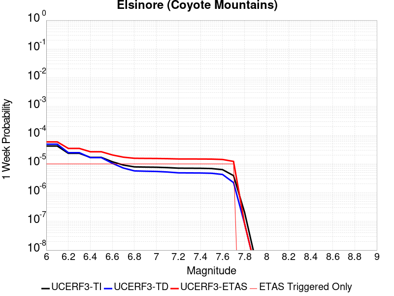 | 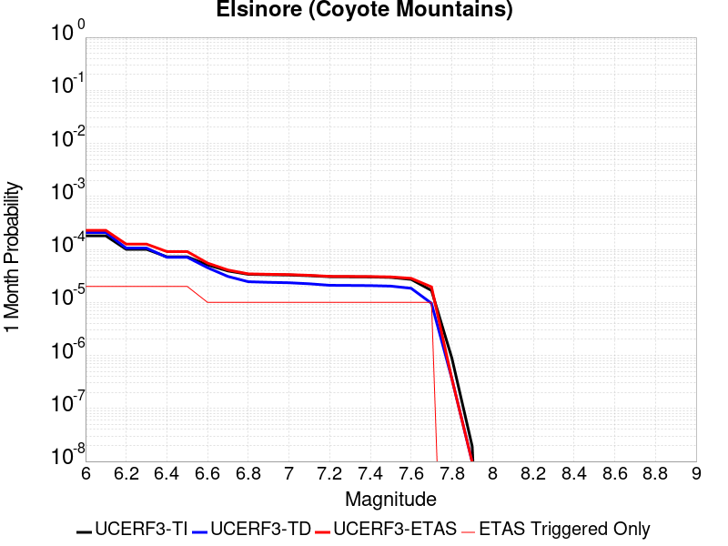 | 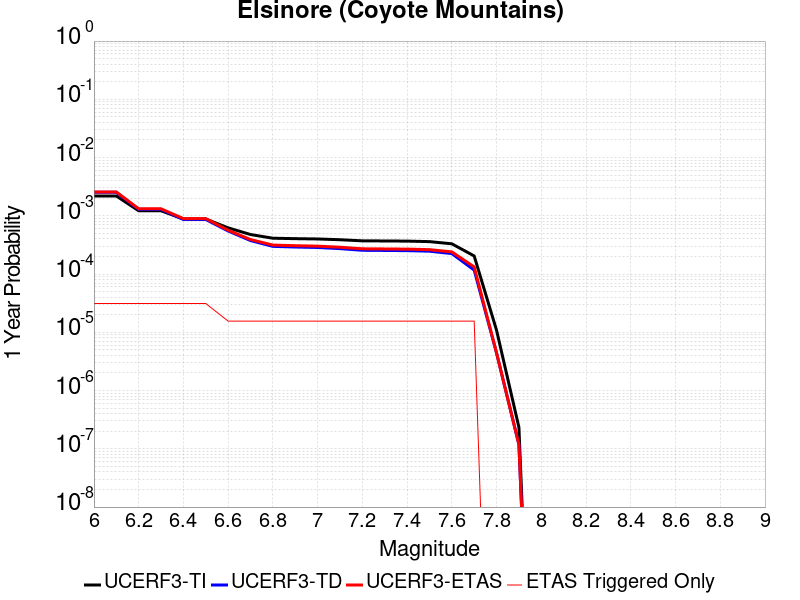 | 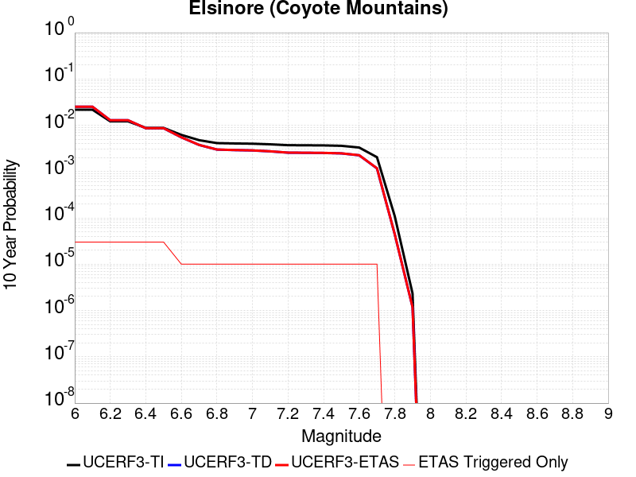 |

| Magnitude | 1 wk TI Prob | 1 wk TD Prob | 1 wk ETAS Prob | 1 wk ETAS/TD Gain | 1 wk ETAS Triggered Only | 1 mo TI Prob | 1 mo TD Prob | 1 mo ETAS Prob | 1 mo ETAS/TD Gain | 1 mo ETAS Triggered Only | 1 yr TI Prob | 1 yr TD Prob | 1 yr ETAS Prob | 1 yr ETAS/TD Gain | 1 yr ETAS Triggered Only | 10 yr TI Prob | 10 yr TD Prob | 10 yr ETAS Prob | 10 yr ETAS/TD Gain | 10 yr ETAS Triggered Only |
|-----|-----|-----|-----|-----|-----|-----|-----|-----|-----|-----|-----|-----|-----|-----|-----|-----|-----|-----|-----|-----|
| 6.0 | 4.20513E-5 | 4.8631882E-5 | 5.8631398E-5 | 1.2056165 | 1.0E-5 | 1.8020741E-4 | 2.0840895E-4 | 2.2840478E-4 | 1.0959451 | 2.0E-5 | 0.0021918174 | 0.002535 | 0.002564924 | 1.0118043 | 3.0E-5 | 0.021703249 | 0.025111282 | 0.02514053 | 1.0011647 | 3.0E-5 |
| 6.1 | 4.20513E-5 | 4.8631882E-5 | 5.8631398E-5 | 1.2056165 | 1.0E-5 | 1.8020741E-4 | 2.0840895E-4 | 2.2840478E-4 | 1.0959451 | 2.0E-5 | 0.0021918174 | 0.002535 | 0.002564924 | 1.0118043 | 3.0E-5 | 0.021703249 | 0.025111282 | 0.02514053 | 1.0011647 | 3.0E-5 |
| 6.2 | 2.3413893E-5 | 2.469566E-5 | 3.4695415E-5 | 1.4049194 | 1.0E-5 | 1.0034139E-4 | 1.0583479E-4 | 1.2583268E-4 | 1.1889538 | 2.0E-5 | 0.0012209718 | 0.0012878707 | 0.001317832 | 1.0232643 | 3.0E-5 | 0.012142851 | 0.01281264 | 0.012842256 | 1.0023115 | 3.0E-5 |
| 6.3 | 2.3413893E-5 | 2.469566E-5 | 3.4695415E-5 | 1.4049194 | 1.0E-5 | 1.0034139E-4 | 1.0583479E-4 | 1.2583268E-4 | 1.1889538 | 2.0E-5 | 0.0012209718 | 0.0012878707 | 0.001317832 | 1.0232643 | 3.0E-5 | 0.012142851 | 0.01281264 | 0.012842256 | 1.0023115 | 3.0E-5 |
| 6.4 | 1.6894814E-5 | 1.6568361E-5 | 2.6568196E-5 | 1.60355 | 1.0E-5 | 7.240433E-5 | 7.1005554E-5 | 9.100413E-5 | 1.2816482 | 2.0E-5 | 8.811662E-4 | 8.6418656E-4 | 8.9416065E-4 | 1.0346848 | 3.0E-5 | 0.0087768035 | 0.00861194 | 0.008641682 | 1.0034535 | 3.0E-5 |
| 6.5 | 1.6894814E-5 | 1.6568361E-5 | 2.6568196E-5 | 1.60355 | 1.0E-5 | 7.240433E-5 | 7.1005554E-5 | 9.100413E-5 | 1.2816482 | 2.0E-5 | 8.811662E-4 | 8.6418656E-4 | 8.9416065E-4 | 1.0346848 | 3.0E-5 | 0.0087768035 | 0.00861194 | 0.008641682 | 1.0034535 | 3.0E-5 |
| 6.6 | 1.1910969E-5 | 1.0530774E-5 | 2.0530668E-5 | 1.9495878 | 1.0E-5 | 5.1046012E-5 | 4.5131183E-5 | 5.513073E-5 | 1.2215663 | 1.0E-5 | 6.21308E-4 | 5.4934516E-4 | 5.5933965E-4 | 1.0181935 | 1.0E-5 | 0.0061957375 | 0.005481174 | 0.0054911193 | 1.0018145 | 1.0E-5 |
| 6.7 | 9.1486E-6 | 7.2028593E-6 | 1.7202787E-5 | 2.3883276 | 1.0E-5 | 3.9207694E-5 | 3.0869054E-5 | 4.0868745E-5 | 1.3239391 | 1.0E-5 | 4.7724912E-4 | 3.757697E-4 | 3.8576598E-4 | 1.026602 | 1.0E-5 | 0.0047622547 | 0.0037517229 | 0.0037616852 | 1.0026554 | 1.0E-5 |
| 6.8 | 7.90441E-6 | 5.7290276E-6 | 1.572897E-5 | 2.745487 | 1.0E-5 | 3.3875604E-5 | 2.4552752E-5 | 3.4552504E-5 | 1.4072763 | 1.0E-5 | 4.1235742E-4 | 2.9889002E-4 | 3.0888704E-4 | 1.0334471 | 1.0E-5 | 0.0041159308 | 0.002985009 | 0.002994979 | 1.0033401 | 1.0E-5 |
| 6.9 | 7.77015E-6 | 5.582982E-6 | 1.5582926E-5 | 2.7911475 | 1.0E-5 | 3.3300217E-5 | 2.3926852E-5 | 3.392661E-5 | 1.4179305 | 1.0E-5 | 4.0535472E-4 | 2.9127175E-4 | 3.0126885E-4 | 1.0343221 | 1.0E-5 | 0.004046161 | 0.002909027 | 0.002918998 | 1.0034276 | 1.0E-5 |
| 7.0 | 7.675798E-6 | 5.47984E-6 | 1.5479785E-5 | 2.8248606 | 1.0E-5 | 3.289586E-5 | 2.3484827E-5 | 3.348459E-5 | 1.4257969 | 1.0E-5 | 4.004335E-4 | 2.858915E-4 | 2.9588863E-4 | 1.0349683 | 1.0E-5 | 0.003997127 | 0.0028553635 | 0.0028653352 | 1.0034922 | 1.0E-5 |
| 7.1 | 7.447814E-6 | 5.238714E-6 | 1.5238662E-5 | 2.9088554 | 1.0E-5 | 3.191881E-5 | 2.2451446E-5 | 3.2451222E-5 | 1.4453956 | 1.0E-5 | 3.8854225E-4 | 2.7331332E-4 | 2.8331057E-4 | 1.036578 | 1.0E-5 | 0.003878636 | 0.0027298962 | 0.0027398688 | 1.0036532 | 1.0E-5 |
| 7.2 | 7.128185E-6 | 4.905372E-6 | 1.4905323E-5 | 3.0385714 | 1.0E-5 | 3.0549007E-5 | 2.102286E-5 | 3.102265E-5 | 1.4756627 | 1.0E-5 | 3.7187067E-4 | 2.5592445E-4 | 2.659219E-4 | 1.039064 | 1.0E-5 | 0.00371249 | 0.0025564157 | 0.00256639 | 1.0039017 | 1.0E-5 |
| 7.3 | 7.0913875E-6 | 4.874047E-6 | 1.4873998E-5 | 3.051673 | 1.0E-5 | 3.0391306E-5 | 2.0888614E-5 | 3.0888405E-5 | 1.4787197 | 1.0E-5 | 3.6995133E-4 | 2.5429038E-4 | 2.6428784E-4 | 1.0393151 | 1.0E-5 | 0.0036933604 | 0.0025401122 | 0.002550087 | 1.0039269 | 1.0E-5 |
| 7.4 | 7.051521E-6 | 4.837899E-6 | 1.483785E-5 | 3.067003 | 1.0E-5 | 3.0220453E-5 | 2.0733693E-5 | 3.0733485E-5 | 1.4822967 | 1.0E-5 | 3.6787192E-4 | 2.5240466E-4 | 2.6240214E-4 | 1.039609 | 1.0E-5 | 0.0036726352 | 0.0025212981 | 0.0025312728 | 1.0039562 | 1.0E-5 |
| 7.5 | 6.910666E-6 | 4.733448E-6 | 1.47334E-5 | 3.1126149 | 1.0E-5 | 2.9616802E-5 | 2.0286056E-5 | 3.0285852E-5 | 1.4929395 | 1.0E-5 | 3.605249E-4 | 2.4695593E-4 | 2.5695344E-4 | 1.040483 | 1.0E-5 | 0.0035994058 | 0.0024669329 | 0.002476908 | 1.0040436 | 1.0E-5 |
| 7.6 | 6.341753E-6 | 4.3065565E-6 | 1.4306514E-5 | 3.322031 | 1.0E-5 | 2.7178658E-5 | 1.8456547E-5 | 2.8456361E-5 | 1.5418032 | 1.0E-5 | 3.3084993E-4 | 2.2468645E-4 | 2.346842E-4 | 1.0444964 | 1.0E-5 | 0.0033035777 | 0.002244708 | 0.0022546856 | 1.004445 | 1.0E-5 |
| 7.7 | 3.9205916E-6 | 2.2439415E-6 | 1.2243919E-5 | 5.4564342 | 1.0E-5 | 1.6802427E-5 | 9.616861E-6 | 1.9616764E-5 | 2.0398304 | 1.0E-5 | 2.0455034E-4 | 1.1707973E-4 | 1.2707856E-4 | 1.0854019 | 1.0E-5 | 0.0020436216 | 0.0011702535 | 0.0011802417 | 1.0085351 | 1.0E-5 |
| 7.8 | 2.0846227E-7 | 8.486417E-8 | 8.486417E-8 | 1.0 | 0.0 | 8.9340944E-7 | 3.6370355E-7 | 3.6370355E-7 | 1.0 | 0.0 | 1.0877206E-5 | 4.428085E-6 | 4.428085E-6 | 1.0 | 0.0 | 1.0876673E-4 | 4.4280296E-5 | 4.4280296E-5 | 1.0 | 0.0 |
| 7.9 | 4.4969806E-9 | 2.2691855E-9 | 2.2691855E-9 | 1.0 | 0.0 | 1.9272775E-8 | 9.72508E-9 | 9.72508E-9 | 1.0 | 0.0 | 2.3464601E-7 | 1.18402845E-7 | 1.18402845E-7 | 1.0 | 0.0 | 2.3464577E-6 | 1.184028E-6 | 1.184028E-6 | 1.0 | 0.0 |

## Butano 2011 CFM
*[(top)](#table-of-contents)*

| 1 Week | 1 Month | 1 Year | 10 Year |
|-----|-----|-----|-----|
|  |  | 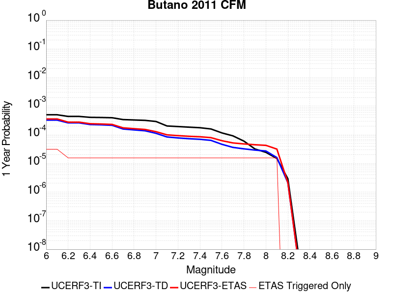 | 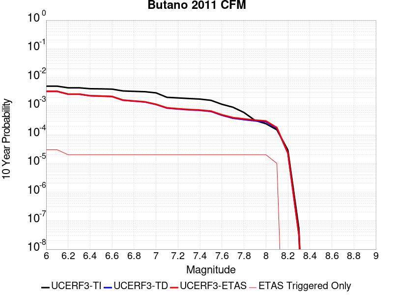 |

| Magnitude | 1 wk TI Prob | 1 wk TD Prob | 1 wk ETAS Prob | 1 wk ETAS/TD Gain | 1 wk ETAS Triggered Only | 1 mo TI Prob | 1 mo TD Prob | 1 mo ETAS Prob | 1 mo ETAS/TD Gain | 1 mo ETAS Triggered Only | 1 yr TI Prob | 1 yr TD Prob | 1 yr ETAS Prob | 1 yr ETAS/TD Gain | 1 yr ETAS Triggered Only | 10 yr TI Prob | 10 yr TD Prob | 10 yr ETAS Prob | 10 yr ETAS/TD Gain | 10 yr ETAS Triggered Only |
|-----|-----|-----|-----|-----|-----|-----|-----|-----|-----|-----|-----|-----|-----|-----|-----|-----|-----|-----|-----|-----|
| 6.0 | 9.561135E-6 | 6.2256954E-6 | 6.2256954E-6 | 1.0 | 0.0 | 4.097565E-5 | 2.6681291E-5 | 3.6681024E-5 | 1.3747845 | 1.0E-5 | 4.9876433E-4 | 3.247985E-4 | 3.44792E-4 | 1.0615567 | 2.0E-5 | 0.004976464 | 0.003260905 | 0.0032908071 | 1.0091699 | 3.0E-5 |
| 6.1 | 9.561135E-6 | 6.2256954E-6 | 6.2256954E-6 | 1.0 | 0.0 | 4.097565E-5 | 2.6681291E-5 | 3.6681024E-5 | 1.3747845 | 1.0E-5 | 4.9876433E-4 | 3.247985E-4 | 3.44792E-4 | 1.0615567 | 2.0E-5 | 0.004976464 | 0.003260905 | 0.0032908071 | 1.0091699 | 3.0E-5 |
| 6.2 | 8.364741E-6 | 4.9787805E-6 | 4.9787805E-6 | 1.0 | 0.0 | 3.5848396E-5 | 2.1337464E-5 | 2.1337464E-5 | 1.0 | 0.0 | 4.3636683E-4 | 2.5975425E-4 | 2.6975165E-4 | 1.0384879 | 1.0E-5 | 0.0043551093 | 0.0026121214 | 0.0026320692 | 1.0076367 | 2.0E-5 |
| 6.3 | 8.364741E-6 | 4.9787805E-6 | 4.9787805E-6 | 1.0 | 0.0 | 3.5848396E-5 | 2.1337464E-5 | 2.1337464E-5 | 1.0 | 0.0 | 4.3636683E-4 | 2.5975425E-4 | 2.6975165E-4 | 1.0384879 | 1.0E-5 | 0.0043551093 | 0.0026121214 | 0.0026320692 | 1.0076367 | 2.0E-5 |
| 6.4 | 7.768282E-6 | 4.3567284E-6 | 4.3567284E-6 | 1.0 | 0.0 | 3.329221E-5 | 1.8671566E-5 | 1.8671566E-5 | 1.0 | 0.0 | 4.0525728E-4 | 2.2730397E-4 | 2.3730169E-4 | 1.0439839 | 1.0E-5 | 0.0040451903 | 0.0022883145 | 0.0023082688 | 1.00872 | 2.0E-5 |
| 6.5 | 7.673437E-6 | 4.2562915E-6 | 4.2562915E-6 | 1.0 | 0.0 | 3.2885746E-5 | 1.8241128E-5 | 1.8241128E-5 | 1.0 | 0.0 | 4.0031038E-4 | 2.2206445E-4 | 2.3206224E-4 | 1.045022 | 1.0E-5 | 0.0039959005 | 0.002236025 | 0.0022559804 | 1.0089245 | 2.0E-5 |
| 6.6 | 7.5244197E-6 | 4.101255E-6 | 4.101255E-6 | 1.0 | 0.0 | 3.2247113E-5 | 1.7576695E-5 | 1.7576695E-5 | 1.0 | 0.0 | 3.9253788E-4 | 2.1397659E-4 | 2.2397445E-4 | 1.0467241 | 1.0E-5 | 0.003918452 | 0.0021553051 | 0.002175262 | 1.0092595 | 2.0E-5 |
| 6.7 | 6.4921405E-6 | 3.0413205E-6 | 3.0413205E-6 | 1.0 | 0.0 | 2.7823162E-5 | 1.3034165E-5 | 1.3034165E-5 | 1.0 | 0.0 | 3.3869434E-4 | 1.586795E-4 | 1.6867791E-4 | 1.0630101 | 1.0E-5 | 0.003381786 | 0.0016031476 | 0.0016231156 | 1.0124555 | 2.0E-5 |
| 6.8 | 6.2890294E-6 | 2.8280872E-6 | 2.8280872E-6 | 1.0 | 0.0 | 2.6952705E-5 | 1.2120317E-5 | 1.2120317E-5 | 1.0 | 0.0 | 3.2809976E-4 | 1.4755495E-4 | 1.5755347E-4 | 1.0677614 | 1.0E-5 | 0.0032761577 | 0.0014920565 | 0.0015120266 | 1.0133843 | 2.0E-5 |
| 6.9 | 6.0965517E-6 | 2.6346027E-6 | 2.6346027E-6 | 1.0 | 0.0 | 2.6127816E-5 | 1.1291106E-5 | 1.1291106E-5 | 1.0 | 0.0 | 3.1805973E-4 | 1.374606E-4 | 1.4745923E-4 | 1.0727382 | 1.0E-5 | 0.0031760489 | 0.001391243 | 0.0014112152 | 1.0143557 | 2.0E-5 |
| 7.0 | 5.566252E-6 | 2.1520116E-6 | 2.1520116E-6 | 1.0 | 0.0 | 2.3855147E-5 | 9.222874E-6 | 9.222874E-6 | 1.0 | 0.0 | 2.9039773E-4 | 1.1228274E-4 | 1.2228162E-4 | 1.0890509 | 1.0E-5 | 0.0029001853 | 0.0011397449 | 0.0011597221 | 1.0175278 | 2.0E-5 |
| 7.1 | 3.878588E-6 | 1.6034423E-6 | 1.6034423E-6 | 1.0 | 0.0 | 1.6622414E-5 | 6.8718773E-6 | 6.8718773E-6 | 1.0 | 0.0 | 2.023591E-4 | 8.36619E-5 | 9.366106E-5 | 1.1195188 | 1.0E-5 | 0.0020217493 | 8.533922E-4 | 8.7337516E-4 | 1.0234159 | 2.0E-5 |
| 7.2 | 3.7038085E-6 | 1.4845051E-6 | 1.4845051E-6 | 1.0 | 0.0 | 1.587337E-5 | 6.362149E-6 | 6.362149E-6 | 1.0 | 0.0 | 1.9324113E-4 | 7.745641E-5 | 8.7455635E-5 | 1.1290948 | 1.0E-5 | 0.0019307317 | 7.913504E-4 | 8.113345E-4 | 1.0252533 | 2.0E-5 |
| 7.3 | 3.5277278E-6 | 1.3926247E-6 | 1.3926247E-6 | 1.0 | 0.0 | 1.5118746E-5 | 5.9683775E-6 | 5.9683775E-6 | 1.0 | 0.0 | 1.8405518E-4 | 7.266257E-5 | 8.266185E-5 | 1.1376125 | 1.0E-5 | 0.0018390282 | 7.433578E-4 | 7.6334295E-4 | 1.0268849 | 2.0E-5 |
| 7.4 | 3.3711294E-6 | 1.3298818E-6 | 1.3298818E-6 | 1.0 | 0.0 | 1.4447617E-5 | 5.699481E-6 | 5.699481E-6 | 1.0 | 0.0 | 1.7588554E-4 | 6.9388974E-5 | 7.938828E-5 | 1.1441051 | 1.0E-5 | 0.0017574639 | 7.10591E-4 | 7.3057675E-4 | 1.0281256 | 2.0E-5 |
| 7.5 | 3.0496426E-6 | 1.2188874E-6 | 1.2188874E-6 | 1.0 | 0.0 | 1.3069831E-5 | 5.223793E-6 | 5.223793E-6 | 1.0 | 0.0 | 1.5911358E-4 | 6.359782E-5 | 7.3597184E-5 | 1.1572281 | 1.0E-5 | 0.001589997 | 6.526465E-4 | 6.726334E-4 | 1.0306245 | 2.0E-5 |
| 7.6 | 2.2179781E-6 | 8.870908E-7 | 8.870908E-7 | 1.0 | 0.0 | 9.505586E-6 | 3.801812E-6 | 3.801812E-6 | 1.0 | 0.0 | 1.1572436E-4 | 4.6286077E-5 | 5.6285615E-5 | 1.2160376 | 1.0E-5 | 0.0011566412 | 4.7951055E-4 | 4.9950095E-4 | 1.0416892 | 2.0E-5 |
| 7.7 | 1.7519328E-6 | 6.9309675E-7 | 6.9309675E-7 | 1.0 | 0.0 | 7.508262E-6 | 2.9704113E-6 | 2.9704113E-6 | 1.0 | 0.0 | 9.140925E-5 | 3.6164158E-5 | 4.6163794E-5 | 1.2765069 | 1.0E-5 | 9.137166E-4 | 3.7759746E-4 | 3.9758993E-4 | 1.0529464 | 2.0E-5 |
| 7.8 | 1.1478974E-6 | 6.174061E-7 | 6.174061E-7 | 1.0 | 0.0 | 4.9195505E-6 | 2.6460236E-6 | 2.6460236E-6 | 1.0 | 0.0 | 5.9893882E-5 | 3.221486E-5 | 4.221454E-5 | 1.3104057 | 1.0E-5 | 5.9877743E-4 | 3.377777E-4 | 3.577709E-4 | 1.0591905 | 2.0E-5 |
| 7.9 | 6.1154634E-7 | 5.581767E-7 | 5.581767E-7 | 1.0 | 0.0 | 2.6209104E-6 | 2.3921834E-6 | 2.3921834E-6 | 1.0 | 0.0 | 3.1909116E-5 | 2.9124443E-5 | 3.9124152E-5 | 1.3433442 | 1.0E-5 | 3.1904536E-4 | 3.0563958E-4 | 3.2563345E-4 | 1.0654166 | 2.0E-5 |
| 8.0 | 4.6520046E-7 | 5.189283E-7 | 5.189283E-7 | 1.0 | 0.0 | 1.9937147E-6 | 2.2239765E-6 | 2.2239765E-6 | 1.0 | 0.0 | 2.4273206E-5 | 2.7076578E-5 | 3.707631E-5 | 1.3693129 | 1.0E-5 | 2.4270554E-4 | 2.8419052E-4 | 3.0418485E-4 | 1.0703553 | 2.0E-5 |
| 8.1 | 2.8425194E-7 | 3.0570487E-7 | 3.0570487E-7 | 1.0 | 0.0 | 1.218222E-6 | 1.3101632E-6 | 1.3101632E-6 | 1.0 | 0.0 | 1.4831752E-5 | 1.5951118E-5 | 2.595096E-5 | 1.6269053 | 1.0E-5 | 1.4830762E-4 | 1.6740595E-4 | 1.7740426E-4 | 1.059725 | 1.0E-5 |
| 8.2 | 5.585778E-8 | 4.0522167E-8 | 4.0522167E-8 | 1.0 | 0.0 | 2.3939046E-7 | 1.7366644E-7 | 1.7366644E-7 | 1.0 | 0.0 | 2.914575E-6 | 2.1143867E-6 | 2.1143867E-6 | 1.0 | 0.0 | 2.9145367E-5 | 2.2976306E-5 | 2.2976306E-5 | 1.0 | 0.0 |
| 8.3 | 1.0371215E-10 | 5.356804E-11 | 5.356804E-11 | 1.0 | 0.0 | 4.4448079E-10 | 2.2957702E-10 | 2.2957702E-10 | 1.0 | 0.0 | 5.4115543E-9 | 2.795101E-9 | 2.795101E-9 | 1.0 | 0.0 | 5.4115542E-8 | 3.2150194E-8 | 3.2150194E-8 | 1.0 | 0.0 |

## Carlsbad
*[(top)](#table-of-contents)*

| 1 Week | 1 Month | 1 Year | 10 Year |
|-----|-----|-----|-----|
|  | 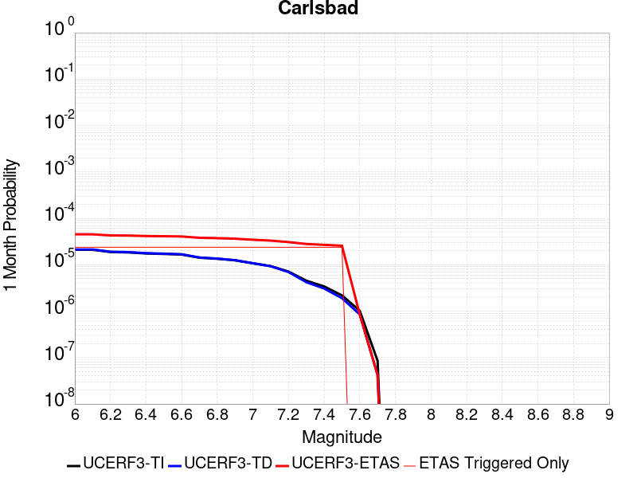 | 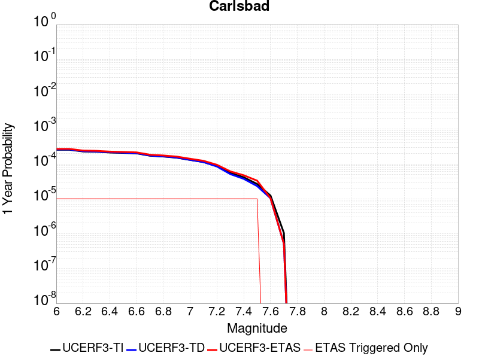 | 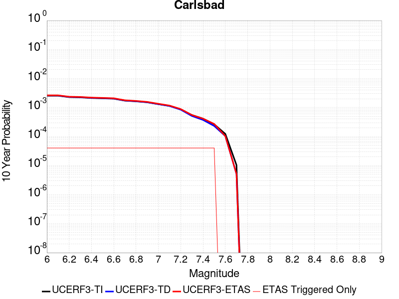 |

| Magnitude | 1 wk TI Prob | 1 wk TD Prob | 1 wk ETAS Prob | 1 wk ETAS/TD Gain | 1 wk ETAS Triggered Only | 1 mo TI Prob | 1 mo TD Prob | 1 mo ETAS Prob | 1 mo ETAS/TD Gain | 1 mo ETAS Triggered Only | 1 yr TI Prob | 1 yr TD Prob | 1 yr ETAS Prob | 1 yr ETAS/TD Gain | 1 yr ETAS Triggered Only | 10 yr TI Prob | 10 yr TD Prob | 10 yr ETAS Prob | 10 yr ETAS/TD Gain | 10 yr ETAS Triggered Only |
|-----|-----|-----|-----|-----|-----|-----|-----|-----|-----|-----|-----|-----|-----|-----|-----|-----|-----|-----|-----|-----|
| 6.0 | 4.9038536E-6 | 4.9872565E-6 | 4.9872565E-6 | 1.0 | 0.0 | 2.1016345E-5 | 2.1373784E-5 | 3.137357E-5 | 1.4678528 | 1.0E-5 | 2.5584397E-4 | 2.601952E-4 | 2.701926E-4 | 1.0384227 | 1.0E-5 | 0.002555496 | 0.0025989525 | 0.0026189005 | 1.0076754 | 2.0E-5 |
| 6.1 | 4.9038536E-6 | 4.9872565E-6 | 4.9872565E-6 | 1.0 | 0.0 | 2.1016345E-5 | 2.1373784E-5 | 3.137357E-5 | 1.4678528 | 1.0E-5 | 2.5584397E-4 | 2.601952E-4 | 2.701926E-4 | 1.0384227 | 1.0E-5 | 0.002555496 | 0.0025989525 | 0.0026189005 | 1.0076754 | 2.0E-5 |
| 6.2 | 4.3820614E-6 | 4.4547687E-6 | 4.4547687E-6 | 1.0 | 0.0 | 1.8780129E-5 | 1.9091729E-5 | 2.9091538E-5 | 1.523777 | 1.0E-5 | 2.2862408E-4 | 2.3241735E-4 | 2.4241503E-4 | 1.0430161 | 1.0E-5 | 0.00228389 | 0.0023217786 | 0.0023417321 | 1.008594 | 2.0E-5 |
| 6.3 | 4.302872E-6 | 4.373006E-6 | 4.373006E-6 | 1.0 | 0.0 | 1.8440749E-5 | 1.8741322E-5 | 2.8741135E-5 | 1.5335703 | 1.0E-5 | 2.24493E-4 | 2.2815206E-4 | 2.3814978E-4 | 1.0438204 | 1.0E-5 | 0.0022426634 | 0.0022792136 | 0.002299168 | 1.008755 | 2.0E-5 |
| 6.4 | 4.0835243E-6 | 4.1476546E-6 | 4.1476546E-6 | 1.0 | 0.0 | 1.75007E-5 | 1.7775543E-5 | 2.7775364E-5 | 1.5625607 | 1.0E-5 | 2.1305021E-4 | 2.1639607E-4 | 2.2639391E-4 | 1.0462016 | 1.0E-5 | 0.0021284607 | 0.0021618877 | 0.0021818443 | 1.0092312 | 2.0E-5 |
| 6.5 | 3.987806E-6 | 4.0488867E-6 | 4.0488867E-6 | 1.0 | 0.0 | 1.7090486E-5 | 1.7352257E-5 | 2.7352084E-5 | 1.5762839 | 1.0E-5 | 2.080568E-4 | 2.1124359E-4 | 2.2124147E-4 | 1.0473287 | 1.0E-5 | 0.002078621 | 0.0021104617 | 0.0021304195 | 1.0094566 | 2.0E-5 |
| 6.6 | 3.8707576E-6 | 3.927488E-6 | 3.927488E-6 | 1.0 | 0.0 | 1.6588854E-5 | 1.6831984E-5 | 2.6831816E-5 | 1.594097 | 1.0E-5 | 2.0195059E-4 | 2.0491047E-4 | 2.1490842E-4 | 1.0487918 | 1.0E-5 | 0.0020176715 | 0.0020472489 | 0.0020672078 | 1.0097492 | 2.0E-5 |
| 6.7 | 3.3093434E-6 | 3.3423917E-6 | 3.3423917E-6 | 1.0 | 0.0 | 1.4182823E-5 | 1.4324457E-5 | 2.4324314E-5 | 1.6980968 | 1.0E-5 | 1.7266218E-4 | 1.7438637E-4 | 1.8438463E-4 | 1.057334 | 1.0E-5 | 0.001725281 | 0.0017425013 | 0.0017624664 | 1.0114578 | 2.0E-5 |
| 6.8 | 3.136983E-6 | 3.1664536E-6 | 3.1664536E-6 | 1.0 | 0.0 | 1.3444143E-5 | 1.3570445E-5 | 2.3570308E-5 | 1.7368855 | 1.0E-5 | 1.6367015E-4 | 1.6520769E-4 | 1.7520603E-4 | 1.0605198 | 1.0E-5 | 0.0016354966 | 0.0016508545 | 0.0016708215 | 1.012095 | 2.0E-5 |
| 6.9 | 2.9056644E-6 | 2.9267585E-6 | 2.9267585E-6 | 1.0 | 0.0 | 1.2452788E-5 | 1.2543191E-5 | 2.2543065E-5 | 1.7972354 | 1.0E-5 | 1.5160214E-4 | 1.5270269E-4 | 1.6270117E-4 | 1.0654768 | 1.0E-5 | 0.0015149876 | 0.001525983 | 0.0015359677 | 1.0065432 | 1.0E-5 |
| 7.0 | 2.5071035E-6 | 2.5113977E-6 | 2.5113977E-6 | 1.0 | 0.0 | 1.0744685E-5 | 1.07630885E-5 | 2.0762982E-5 | 1.9290913 | 1.0E-5 | 1.308087E-4 | 1.3103275E-4 | 1.4103144E-4 | 1.0763068 | 1.0E-5 | 0.0013073172 | 0.0013095582 | 0.0013195451 | 1.0076262 | 1.0E-5 |
| 7.1 | 2.1786877E-6 | 2.1678832E-6 | 2.1678832E-6 | 1.0 | 0.0 | 9.3372E-6 | 9.290896E-6 | 1.9290803E-5 | 2.0763125 | 1.0E-5 | 1.13674476E-4 | 1.1311081E-4 | 1.2310968E-4 | 1.0883989 | 1.0E-5 | 0.0011361635 | 0.0011305353 | 0.0011405239 | 1.0088353 | 1.0E-5 |
| 7.2 | 1.6628418E-6 | 1.6213872E-6 | 1.6213872E-6 | 1.0 | 0.0 | 7.1264453E-6 | 6.948784E-6 | 1.6948716E-5 | 2.4390907 | 1.0E-5 | 8.676102E-5 | 8.4598185E-5 | 9.459734E-5 | 1.1181959 | 1.0E-5 | 8.672715E-4 | 8.45662E-4 | 8.5565355E-4 | 1.0118151 | 1.0E-5 |
| 7.3 | 1.0595926E-6 | 9.816804E-7 | 9.816804E-7 | 1.0 | 0.0 | 4.541103E-6 | 4.2071947E-6 | 1.4207153E-5 | 3.3768706 | 1.0E-5 | 5.5286528E-5 | 5.1221403E-5 | 6.122089E-5 | 1.195221 | 1.0E-5 | 5.527277E-4 | 5.1209686E-4 | 5.2209175E-4 | 1.0195175 | 1.0E-5 |
| 7.4 | 7.956623E-7 | 7.1737975E-7 | 7.1737975E-7 | 1.0 | 0.0 | 3.4099767E-6 | 3.074481E-6 | 1.307445E-5 | 4.2525716 | 1.0E-5 | 4.1515676E-5 | 3.743117E-5 | 4.7430796E-5 | 1.2671471 | 1.0E-5 | 4.150792E-4 | 3.7424936E-4 | 3.8424562E-4 | 1.0267102 | 1.0E-5 |
| 7.5 | 5.1043804E-7 | 4.4483627E-7 | 4.4483627E-7 | 1.0 | 0.0 | 2.1875896E-6 | 1.9064398E-6 | 1.1906421E-5 | 6.245369 | 1.0E-5 | 2.663358E-5 | 2.3210663E-5 | 3.3210432E-5 | 1.4308264 | 1.0E-5 | 2.6630386E-4 | 2.3208297E-4 | 2.4208066E-4 | 1.0430781 | 1.0E-5 |
| 7.6 | 2.3723294E-7 | 1.989569E-7 | 1.989569E-7 | 1.0 | 0.0 | 1.0167122E-6 | 8.5267214E-7 | 8.5267214E-7 | 1.0 | 0.0 | 1.2378401E-5 | 1.0381237E-5 | 1.0381237E-5 | 1.0 | 0.0 | 1.237771E-4 | 1.038078E-4 | 1.038078E-4 | 1.0 | 0.0 |
| 7.7 | 1.9992152E-8 | 9.8601785E-9 | 9.8601785E-9 | 1.0 | 0.0 | 8.568065E-8 | 4.225791E-8 | 4.225791E-8 | 1.0 | 0.0 | 1.0431614E-6 | 5.1449E-7 | 5.1449E-7 | 1.0 | 0.0 | 1.0431565E-5 | 5.1449E-6 | 5.1449E-6 | 1.0 | 0.0 |

## Del Valle
*[(top)](#table-of-contents)*

| 1 Week | 1 Month | 1 Year | 10 Year |
|-----|-----|-----|-----|
|  | 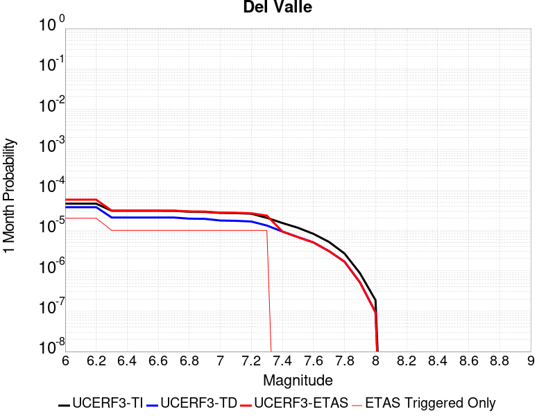 | 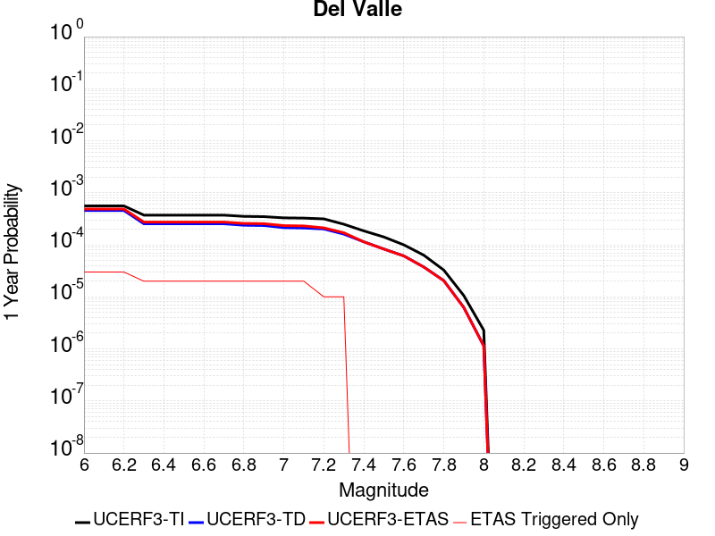 | 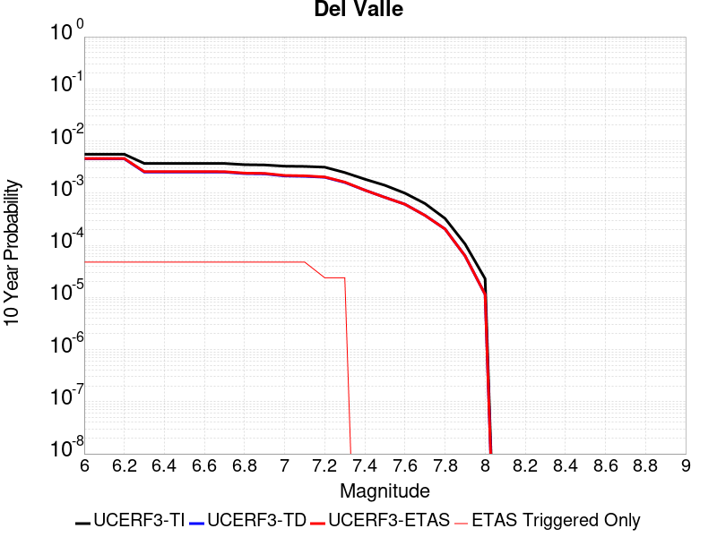 |

| Magnitude | 1 wk TI Prob | 1 wk TD Prob | 1 wk ETAS Prob | 1 wk ETAS/TD Gain | 1 wk ETAS Triggered Only | 1 mo TI Prob | 1 mo TD Prob | 1 mo ETAS Prob | 1 mo ETAS/TD Gain | 1 mo ETAS Triggered Only | 1 yr TI Prob | 1 yr TD Prob | 1 yr ETAS Prob | 1 yr ETAS/TD Gain | 1 yr ETAS Triggered Only | 10 yr TI Prob | 10 yr TD Prob | 10 yr ETAS Prob | 10 yr ETAS/TD Gain | 10 yr ETAS Triggered Only |
|-----|-----|-----|-----|-----|-----|-----|-----|-----|-----|-----|-----|-----|-----|-----|-----|-----|-----|-----|-----|-----|
| 6.0 | 1.0716125E-5 | 8.767882E-6 | 8.767882E-6 | 1.0 | 0.0 | 4.592544E-5 | 3.7576207E-5 | 5.7575457E-5 | 1.5322317 | 2.0E-5 | 5.589988E-4 | 4.5741405E-4 | 4.874003E-4 | 1.065556 | 3.0E-5 | 0.0055759475 | 0.00456668 | 0.0045965435 | 1.0065393 | 3.0E-5 |
| 6.1 | 1.0716125E-5 | 8.767882E-6 | 8.767882E-6 | 1.0 | 0.0 | 4.592544E-5 | 3.7576207E-5 | 5.7575457E-5 | 1.5322317 | 2.0E-5 | 5.589988E-4 | 4.5741405E-4 | 4.874003E-4 | 1.065556 | 3.0E-5 | 0.0055759475 | 0.00456668 | 0.0045965435 | 1.0065393 | 3.0E-5 |
| 6.2 | 1.0716125E-5 | 8.767882E-6 | 8.767882E-6 | 1.0 | 0.0 | 4.592544E-5 | 3.7576207E-5 | 5.7575457E-5 | 1.5322317 | 2.0E-5 | 5.589988E-4 | 4.5741405E-4 | 4.874003E-4 | 1.065556 | 3.0E-5 | 0.0055759475 | 0.00456668 | 0.0045965435 | 1.0065393 | 3.0E-5 |
| 6.3 | 7.1293784E-6 | 4.865823E-6 | 4.865823E-6 | 1.0 | 0.0 | 3.055412E-5 | 2.0853364E-5 | 3.0853156E-5 | 1.4795289 | 1.0E-5 | 3.7193293E-4 | 2.5386087E-4 | 2.7385578E-4 | 1.0787634 | 2.0E-5 | 0.0037131102 | 0.0025357946 | 0.002555744 | 1.0078671 | 2.0E-5 |
| 6.4 | 7.1293784E-6 | 4.865823E-6 | 4.865823E-6 | 1.0 | 0.0 | 3.055412E-5 | 2.0853364E-5 | 3.0853156E-5 | 1.4795289 | 1.0E-5 | 3.7193293E-4 | 2.5386087E-4 | 2.7385578E-4 | 1.0787634 | 2.0E-5 | 0.0037131102 | 0.0025357946 | 0.002555744 | 1.0078671 | 2.0E-5 |
| 6.5 | 7.1293784E-6 | 4.865823E-6 | 4.865823E-6 | 1.0 | 0.0 | 3.055412E-5 | 2.0853364E-5 | 3.0853156E-5 | 1.4795289 | 1.0E-5 | 3.7193293E-4 | 2.5386087E-4 | 2.7385578E-4 | 1.0787634 | 2.0E-5 | 0.0037131102 | 0.0025357946 | 0.002555744 | 1.0078671 | 2.0E-5 |
| 6.6 | 7.1293784E-6 | 4.865823E-6 | 4.865823E-6 | 1.0 | 0.0 | 3.055412E-5 | 2.0853364E-5 | 3.0853156E-5 | 1.4795289 | 1.0E-5 | 3.7193293E-4 | 2.5386087E-4 | 2.7385578E-4 | 1.0787634 | 2.0E-5 | 0.0037131102 | 0.0025357946 | 0.002555744 | 1.0078671 | 2.0E-5 |
| 6.7 | 7.12272E-6 | 4.8631987E-6 | 4.8631987E-6 | 1.0 | 0.0 | 3.0525585E-5 | 2.0842117E-5 | 3.0841908E-5 | 1.4797877 | 1.0E-5 | 3.7158563E-4 | 2.5372396E-4 | 2.737189E-4 | 1.0788058 | 2.0E-5 | 0.003709649 | 0.0025344288 | 0.002554378 | 1.0078713 | 2.0E-5 |
| 6.8 | 6.7558703E-6 | 4.5594015E-6 | 4.5594015E-6 | 1.0 | 0.0 | 2.895341E-5 | 1.9540148E-5 | 2.9539953E-5 | 1.5117568 | 1.0E-5 | 3.5245073E-4 | 2.3787597E-4 | 2.578712E-4 | 1.0840575 | 2.0E-5 | 0.0035189227 | 0.0023762889 | 0.0023962413 | 1.0083965 | 2.0E-5 |
| 6.9 | 6.6700386E-6 | 4.502539E-6 | 4.502539E-6 | 1.0 | 0.0 | 2.8585566E-5 | 1.9296456E-5 | 2.9296263E-5 | 1.5182198 | 1.0E-5 | 3.479737E-4 | 2.3490966E-4 | 2.5490497E-4 | 1.0851191 | 2.0E-5 | 0.003474293 | 0.0023466884 | 0.0023666415 | 1.0085026 | 2.0E-5 |
| 7.0 | 6.3181424E-6 | 4.0987034E-6 | 4.0987034E-6 | 1.0 | 0.0 | 2.7077473E-5 | 1.7565755E-5 | 2.756558E-5 | 1.5692794 | 1.0E-5 | 3.2961834E-4 | 2.1384252E-4 | 2.3383823E-4 | 1.0935068 | 2.0E-5 | 0.0032912986 | 0.002136422 | 0.0021563794 | 1.0093415 | 2.0E-5 |
| 7.1 | 6.248759E-6 | 4.033895E-6 | 4.033895E-6 | 1.0 | 0.0 | 2.678012E-5 | 1.7288008E-5 | 2.7287835E-5 | 1.5784256 | 1.0E-5 | 3.2599916E-4 | 2.104616E-4 | 2.3045739E-4 | 1.0950092 | 2.0E-5 | 0.0032552136 | 0.0021026772 | 0.0021226353 | 1.0094917 | 2.0E-5 |
| 7.2 | 6.0411944E-6 | 3.869888E-6 | 3.869888E-6 | 1.0 | 0.0 | 2.5890577E-5 | 1.658513E-5 | 2.6584965E-5 | 1.6029397 | 1.0E-5 | 3.1517216E-4 | 2.0190567E-4 | 2.1190365E-4 | 1.0495181 | 1.0E-5 | 0.0031472554 | 0.0020172757 | 0.0020272555 | 1.0049472 | 1.0E-5 |
| 7.3 | 4.7691183E-6 | 3.0781202E-6 | 3.0781202E-6 | 1.0 | 0.0 | 2.0438918E-5 | 1.3191879E-5 | 2.3191747E-5 | 1.7580321 | 1.0E-5 | 2.488154E-4 | 1.605995E-4 | 1.705979E-4 | 1.0622567 | 1.0E-5 | 0.00248537 | 0.0016048603 | 0.0016148442 | 1.006221 | 1.0E-5 |
| 7.4 | 3.5524722E-6 | 2.1893363E-6 | 2.1893363E-6 | 1.0 | 0.0 | 1.5224792E-5 | 9.382837E-6 | 9.382837E-6 | 1.0 | 0.0 | 1.8534607E-4 | 1.1423013E-4 | 1.1423013E-4 | 1.0 | 0.0 | 0.0018519156 | 0.0011417224 | 0.0011417224 | 1.0 | 0.0 |
| 7.5 | 2.7133442E-6 | 1.5916097E-6 | 1.5916097E-6 | 1.0 | 0.0 | 1.1628566E-5 | 6.821167E-6 | 6.821167E-6 | 1.0 | 0.0 | 1.415686E-4 | 8.304456E-5 | 8.304456E-5 | 1.0 | 0.0 | 0.0014147845 | 8.301372E-4 | 8.301372E-4 | 1.0 | 0.0 |
| 7.6 | 1.915338E-6 | 1.173914E-6 | 1.173914E-6 | 1.0 | 0.0 | 8.208566E-6 | 5.0310505E-6 | 5.0310505E-6 | 1.0 | 0.0 | 9.993471E-5 | 6.125133E-5 | 6.125133E-5 | 1.0 | 0.0 | 9.988978E-4 | 6.123454E-4 | 6.123454E-4 | 1.0 | 0.0 |
| 7.7 | 1.2120448E-6 | 7.180313E-7 | 7.180313E-7 | 1.0 | 0.0 | 5.194467E-6 | 3.0772733E-6 | 3.0772733E-6 | 1.0 | 0.0 | 6.3240805E-5 | 3.746516E-5 | 3.746516E-5 | 1.0 | 0.0 | 6.322281E-4 | 3.7458882E-4 | 3.7458882E-4 | 1.0 | 0.0 |
| 7.8 | 6.272381E-7 | 3.932549E-7 | 3.932549E-7 | 1.0 | 0.0 | 2.6881603E-6 | 1.6853771E-6 | 1.6853771E-6 | 1.0 | 0.0 | 3.272786E-5 | 2.0519275E-5 | 2.0519275E-5 | 1.0 | 0.0 | 3.272304E-4 | 2.0517396E-4 | 2.0517396E-4 | 1.0 | 0.0 |
| 7.9 | 2.0292627E-7 | 1.2004622E-7 | 1.2004622E-7 | 1.0 | 0.0 | 8.6968373E-7 | 5.1448376E-7 | 5.1448376E-7 | 1.0 | 0.0 | 1.0588348E-5 | 6.263822E-6 | 6.263822E-6 | 1.0 | 0.0 | 1.0587843E-4 | 6.263647E-5 | 6.263647E-5 | 1.0 | 0.0 |
| 8.0 | 4.374492E-8 | 2.189964E-8 | 2.189964E-8 | 1.0 | 0.0 | 1.8747821E-7 | 9.385559E-8 | 9.385559E-8 | 1.0 | 0.0 | 2.2825448E-6 | 1.1426913E-6 | 1.1426913E-6 | 1.0 | 0.0 | 2.2825214E-5 | 1.1426858E-5 | 1.1426858E-5 | 1.0 | 0.0 |

## Great Valley 03a Dunnigan Hills
*[(top)](#table-of-contents)*

| 1 Week | 1 Month | 1 Year | 10 Year |
|-----|-----|-----|-----|
| 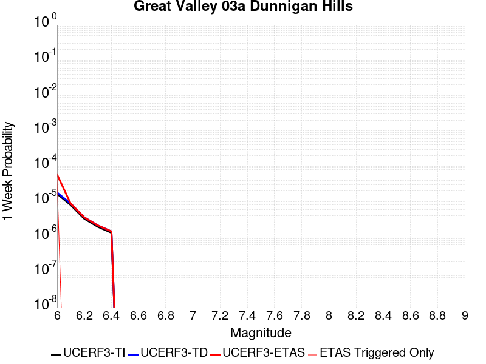 | 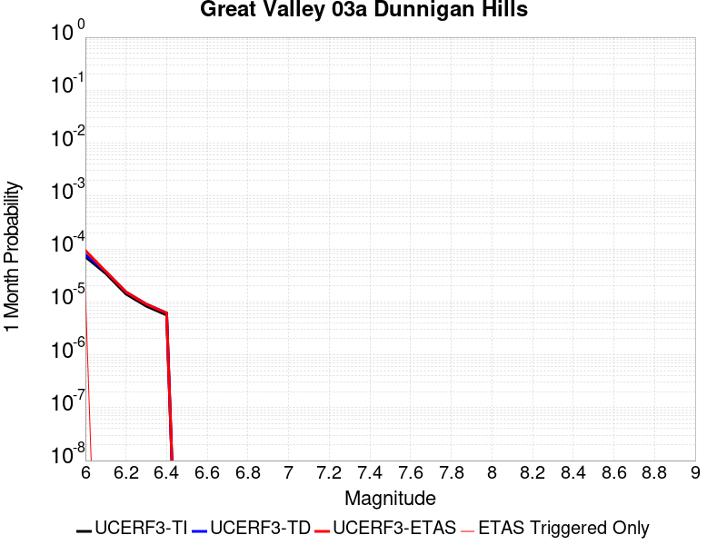 | 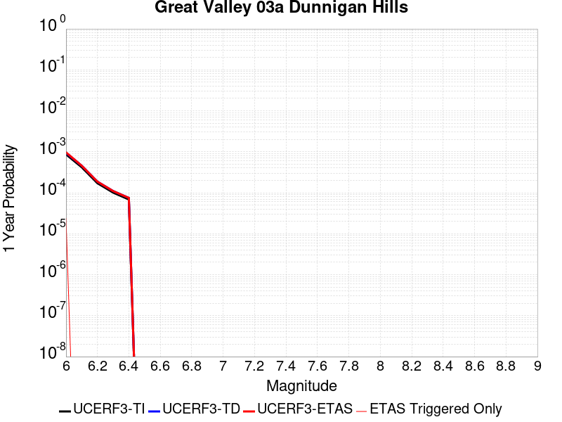 | 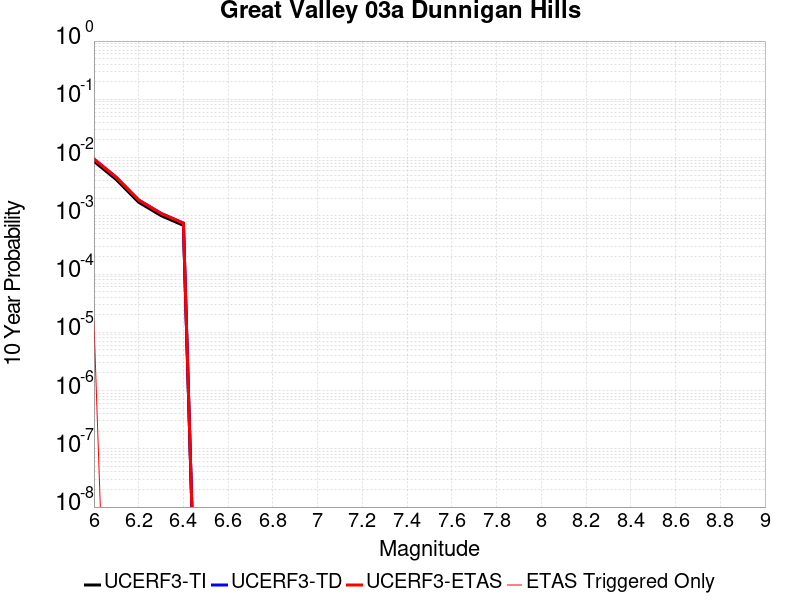 |

| Magnitude | 1 wk TI Prob | 1 wk TD Prob | 1 wk ETAS Prob | 1 wk ETAS/TD Gain | 1 wk ETAS Triggered Only | 1 mo TI Prob | 1 mo TD Prob | 1 mo ETAS Prob | 1 mo ETAS/TD Gain | 1 mo ETAS Triggered Only | 1 yr TI Prob | 1 yr TD Prob | 1 yr ETAS Prob | 1 yr ETAS/TD Gain | 1 yr ETAS Triggered Only | 10 yr TI Prob | 10 yr TD Prob | 10 yr ETAS Prob | 10 yr ETAS/TD Gain | 10 yr ETAS Triggered Only |
|-----|-----|-----|-----|-----|-----|-----|-----|-----|-----|-----|-----|-----|-----|-----|-----|-----|-----|-----|-----|-----|
| 6.0 | 1.6591328E-5 | 1.8107954E-5 | 2.8107774E-5 | 1.5522335 | 1.0E-5 | 7.110376E-5 | 7.7603596E-5 | 8.760282E-5 | 1.12885 | 1.0E-5 | 8.6534437E-4 | 9.444834E-4 | 9.54474E-4 | 1.0105778 | 1.0E-5 | 0.008619824 | 0.009411525 | 0.009431337 | 1.002105 | 2.0E-5 |
| 6.1 | 8.041125E-6 | 8.769726E-6 | 8.769726E-6 | 1.0 | 0.0 | 3.4461507E-5 | 3.7584115E-5 | 3.7584115E-5 | 1.0 | 0.0 | 4.194881E-4 | 4.5751085E-4 | 4.5751085E-4 | 1.0 | 0.0 | 0.004186971 | 0.004567687 | 0.004567687 | 1.0 | 0.0 |
| 6.2 | 3.2807004E-6 | 3.5795688E-6 | 3.5795688E-6 | 1.0 | 0.0 | 1.4060069E-5 | 1.5340942E-5 | 1.5340942E-5 | 1.0 | 0.0 | 1.7116789E-4 | 1.8676413E-4 | 1.8676413E-4 | 1.0 | 0.0 | 0.0017103611 | 0.0018664796 | 0.0018664796 | 1.0 | 0.0 |
| 6.3 | 1.9339366E-6 | 2.1103806E-6 | 2.1103806E-6 | 1.0 | 0.0 | 8.288273E-6 | 9.044474E-6 | 9.044474E-6 | 1.0 | 0.0 | 1.00905054E-4 | 1.1011375E-4 | 1.1011375E-4 | 1.0 | 0.0 | 0.0010085925 | 0.0011008718 | 0.0011008718 | 1.0 | 0.0 |
| 6.4 | 1.3142635E-6 | 1.4339867E-6 | 1.4339867E-6 | 1.0 | 0.0 | 5.6325457E-6 | 6.145657E-6 | 6.145657E-6 | 1.0 | 0.0 | 6.857408E-5 | 7.482337E-5 | 7.482337E-5 | 1.0 | 0.0 | 6.8552926E-4 | 7.4823375E-4 | 7.4823375E-4 | 1.0 | 0.0 |

## White Wolf
*[(top)](#table-of-contents)*

| 1 Week | 1 Month | 1 Year | 10 Year |
|-----|-----|-----|-----|
|  |  | 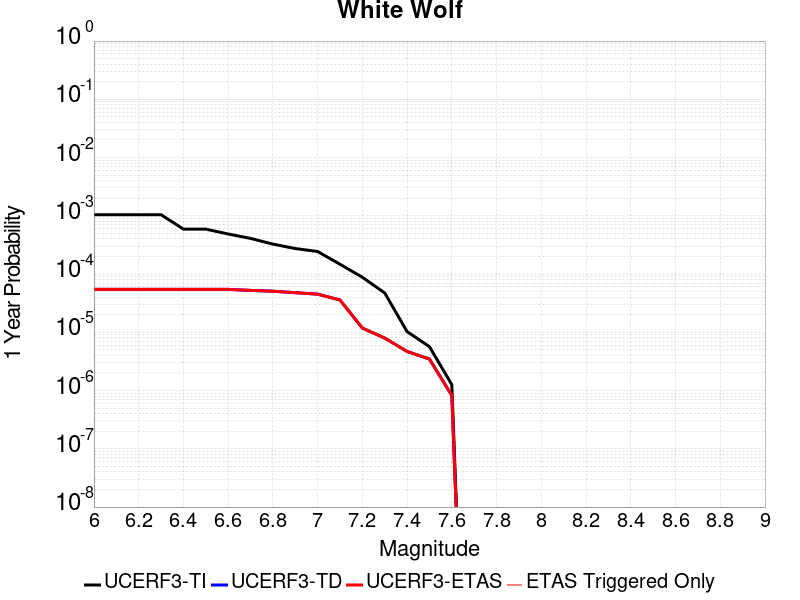 | 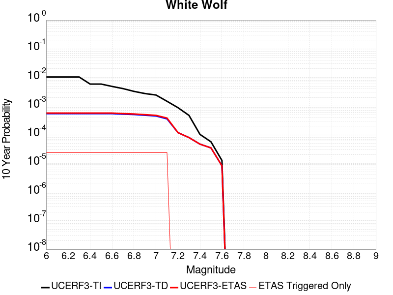 |

| Magnitude | 1 wk TI Prob | 1 wk TD Prob | 1 wk ETAS Prob | 1 wk ETAS/TD Gain | 1 wk ETAS Triggered Only | 1 mo TI Prob | 1 mo TD Prob | 1 mo ETAS Prob | 1 mo ETAS/TD Gain | 1 mo ETAS Triggered Only | 1 yr TI Prob | 1 yr TD Prob | 1 yr ETAS Prob | 1 yr ETAS/TD Gain | 1 yr ETAS Triggered Only | 10 yr TI Prob | 10 yr TD Prob | 10 yr ETAS Prob | 10 yr ETAS/TD Gain | 10 yr ETAS Triggered Only |
|-----|-----|-----|-----|-----|-----|-----|-----|-----|-----|-----|-----|-----|-----|-----|-----|-----|-----|-----|-----|-----|
| 6.0 | 2.0037822E-5 | 1.0469162E-6 | 1.0469162E-6 | 1.0 | 0.0 | 8.587355E-5 | 4.486776E-6 | 4.486776E-6 | 1.0 | 0.0 | 0.001045009 | 5.4625183E-5 | 5.4625183E-5 | 1.0 | 0.0 | 0.010401085 | 5.461226E-4 | 5.7610625E-4 | 1.0549027 | 3.0E-5 |
| 6.1 | 2.0037822E-5 | 1.0469162E-6 | 1.0469162E-6 | 1.0 | 0.0 | 8.587355E-5 | 4.486776E-6 | 4.486776E-6 | 1.0 | 0.0 | 0.001045009 | 5.4625183E-5 | 5.4625183E-5 | 1.0 | 0.0 | 0.010401085 | 5.461226E-4 | 5.7610625E-4 | 1.0549027 | 3.0E-5 |
| 6.2 | 2.0037822E-5 | 1.0469162E-6 | 1.0469162E-6 | 1.0 | 0.0 | 8.587355E-5 | 4.486776E-6 | 4.486776E-6 | 1.0 | 0.0 | 0.001045009 | 5.4625183E-5 | 5.4625183E-5 | 1.0 | 0.0 | 0.010401085 | 5.461226E-4 | 5.7610625E-4 | 1.0549027 | 3.0E-5 |
| 6.3 | 2.0037822E-5 | 1.0469162E-6 | 1.0469162E-6 | 1.0 | 0.0 | 8.587355E-5 | 4.486776E-6 | 4.486776E-6 | 1.0 | 0.0 | 0.001045009 | 5.4625183E-5 | 5.4625183E-5 | 1.0 | 0.0 | 0.010401085 | 5.461226E-4 | 5.7610625E-4 | 1.0549027 | 3.0E-5 |
| 6.4 | 1.132487E-5 | 1.0469162E-6 | 1.0469162E-6 | 1.0 | 0.0 | 4.8534253E-5 | 4.486776E-6 | 4.486776E-6 | 1.0 | 0.0 | 5.907443E-4 | 5.4625183E-5 | 5.4625183E-5 | 1.0 | 0.0 | 0.005891764 | 5.461226E-4 | 5.7610625E-4 | 1.0549027 | 3.0E-5 |
| 6.5 | 1.132487E-5 | 1.0469162E-6 | 1.0469162E-6 | 1.0 | 0.0 | 4.8534253E-5 | 4.486776E-6 | 4.486776E-6 | 1.0 | 0.0 | 5.907443E-4 | 5.4625183E-5 | 5.4625183E-5 | 1.0 | 0.0 | 0.005891764 | 5.461226E-4 | 5.7610625E-4 | 1.0549027 | 3.0E-5 |
| 6.6 | 9.347473E-6 | 1.0469162E-6 | 1.0469162E-6 | 1.0 | 0.0 | 4.0059982E-5 | 4.486776E-6 | 4.486776E-6 | 1.0 | 0.0 | 4.8762115E-4 | 5.4625183E-5 | 5.4625183E-5 | 1.0 | 0.0 | 0.0048655253 | 5.461226E-4 | 5.7610625E-4 | 1.0549027 | 3.0E-5 |
| 6.7 | 7.842647E-6 | 1.0048342E-6 | 1.0048342E-6 | 1.0 | 0.0 | 3.361091E-5 | 4.3064256E-6 | 4.3064256E-6 | 1.0 | 0.0 | 4.0913603E-4 | 5.2429517E-5 | 5.2429517E-5 | 1.0 | 0.0 | 0.004083836 | 5.2417646E-4 | 5.5416074E-4 | 1.0572026 | 3.0E-5 |
| 6.8 | 6.26597E-6 | 9.734822E-7 | 9.734822E-7 | 1.0 | 0.0 | 2.685388E-5 | 4.17206E-6 | 4.17206E-6 | 1.0 | 0.0 | 3.2689696E-4 | 5.0793697E-5 | 5.0793697E-5 | 1.0 | 0.0 | 0.003264165 | 5.078258E-4 | 5.3781056E-4 | 1.0590454 | 3.0E-5 |
| 6.9 | 5.258436E-6 | 9.183254E-7 | 9.183254E-7 | 1.0 | 0.0 | 2.2535958E-5 | 3.9356746E-6 | 3.9356746E-6 | 1.0 | 0.0 | 2.7434074E-4 | 4.7915833E-5 | 4.7915833E-5 | 1.0 | 0.0 | 0.0027400232 | 4.790598E-4 | 5.0904544E-4 | 1.0625926 | 3.0E-5 |
| 7.0 | 4.675028E-6 | 8.6611794E-7 | 8.6611794E-7 | 1.0 | 0.0 | 2.003568E-5 | 3.7119291E-6 | 3.7119291E-6 | 1.0 | 0.0 | 2.4390711E-4 | 4.5191846E-5 | 4.5191846E-5 | 1.0 | 0.0 | 0.0024363957 | 4.518313E-4 | 4.8181773E-4 | 1.0663664 | 3.0E-5 |
| 7.1 | 2.8270078E-6 | 6.8741696E-7 | 6.8741696E-7 | 1.0 | 0.0 | 1.2115692E-5 | 2.9460696E-6 | 2.9460696E-6 | 1.0 | 0.0 | 1.4749856E-4 | 3.5867848E-5 | 3.5867848E-5 | 1.0 | 0.0 | 0.001474007 | 3.586247E-4 | 3.7861752E-4 | 1.0557486 | 2.0E-5 |
| 7.2 | 1.6881406E-6 | 2.2706382E-7 | 2.2706382E-7 | 1.0 | 0.0 | 7.2348685E-6 | 9.731303E-7 | 9.731303E-7 | 1.0 | 0.0 | 8.808096E-5 | 1.1847799E-5 | 1.1847799E-5 | 1.0 | 0.0 | 8.8046055E-4 | 1.1847183E-4 | 1.1847183E-4 | 1.0 | 0.0 |
| 7.3 | 9.086107E-7 | 1.5266386E-7 | 1.5266386E-7 | 1.0 | 0.0 | 3.8940398E-6 | 6.5427355E-7 | 6.5427355E-7 | 1.0 | 0.0 | 4.7408903E-5 | 7.965752E-6 | 7.965752E-6 | 1.0 | 0.0 | 4.739879E-4 | 7.965475E-5 | 7.965475E-5 | 1.0 | 0.0 |
| 7.4 | 1.9717383E-7 | 9.003913E-8 | 9.003913E-8 | 1.0 | 0.0 | 8.450304E-7 | 3.8588192E-7 | 3.8588192E-7 | 1.0 | 0.0 | 1.0288197E-5 | 4.6981027E-6 | 4.6981027E-6 | 1.0 | 0.0 | 1.028772E-4 | 4.6980065E-5 | 4.6980065E-5 | 1.0 | 0.0 |
| 7.5 | 1.086975E-7 | 6.6597195E-8 | 6.6597195E-8 | 1.0 | 0.0 | 4.6584634E-7 | 2.8541652E-7 | 2.8541652E-7 | 1.0 | 0.0 | 5.6716644E-6 | 3.474941E-6 | 3.474941E-6 | 1.0 | 0.0 | 5.6715195E-5 | 3.474889E-5 | 3.474889E-5 | 1.0 | 0.0 |
| 7.6 | 2.4217808E-8 | 1.5820765E-8 | 1.5820765E-8 | 1.0 | 0.0 | 1.03790605E-7 | 6.780328E-8 | 6.780328E-8 | 1.0 | 0.0 | 1.2636499E-6 | 8.255046E-7 | 8.255046E-7 | 1.0 | 0.0 | 1.2636427E-5 | 8.2550205E-6 | 8.2550205E-6 | 1.0 | 0.0 |

## Green Valley 2011 CFM
*[(top)](#table-of-contents)*

| 1 Week | 1 Month | 1 Year | 10 Year |
|-----|-----|-----|-----|
| 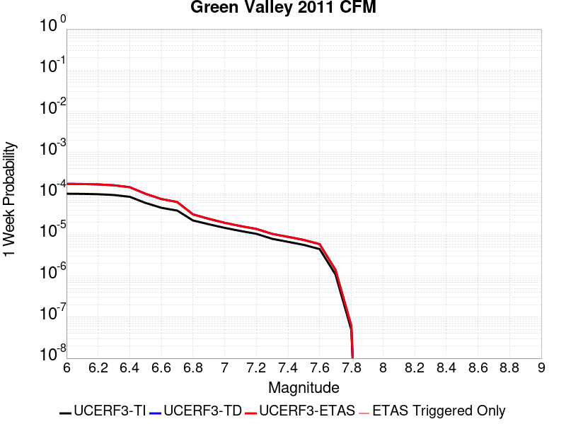 |  | 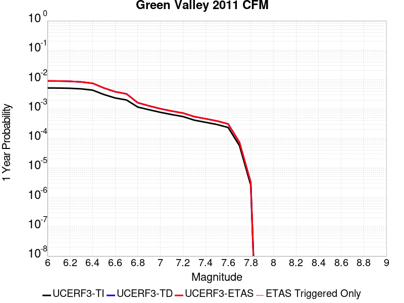 | 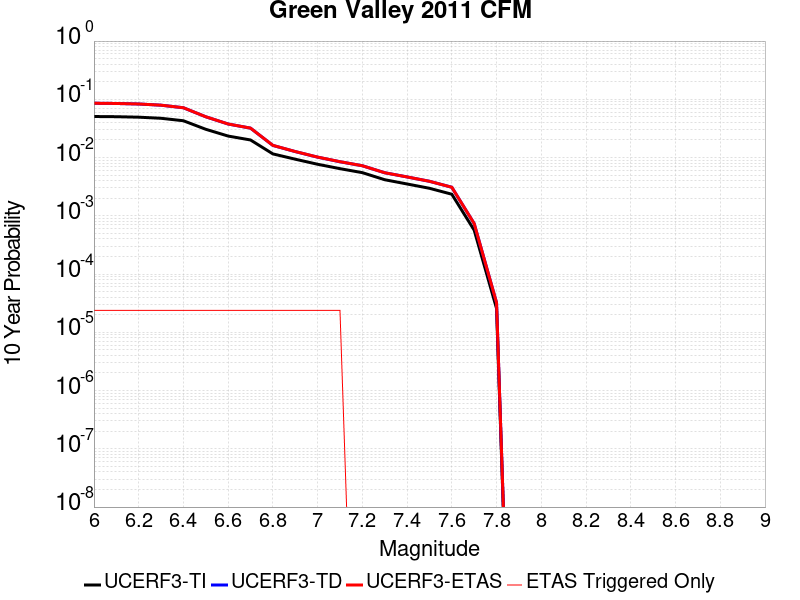 |

| Magnitude | 1 wk TI Prob | 1 wk TD Prob | 1 wk ETAS Prob | 1 wk ETAS/TD Gain | 1 wk ETAS Triggered Only | 1 mo TI Prob | 1 mo TD Prob | 1 mo ETAS Prob | 1 mo ETAS/TD Gain | 1 mo ETAS Triggered Only | 1 yr TI Prob | 1 yr TD Prob | 1 yr ETAS Prob | 1 yr ETAS/TD Gain | 1 yr ETAS Triggered Only | 10 yr TI Prob | 10 yr TD Prob | 10 yr ETAS Prob | 10 yr ETAS/TD Gain | 10 yr ETAS Triggered Only |
|-----|-----|-----|-----|-----|-----|-----|-----|-----|-----|-----|-----|-----|-----|-----|-----|-----|-----|-----|-----|-----|
| 6.0 | 9.9629346E-5 | 1.7305532E-4 | 1.7305532E-4 | 1.0 | 0.0 | 4.2691303E-4 | 7.4143766E-4 | 7.4143766E-4 | 1.0 | 0.0 | 0.0051852856 | 0.008986705 | 0.008986705 | 1.0 | 0.0 | 0.050659515 | 0.085522056 | 0.085549496 | 1.0003208 | 3.0E-5 |
| 6.1 | 9.88615E-5 | 1.7152846E-4 | 1.7152846E-4 | 1.0 | 0.0 | 4.2362334E-4 | 7.348976E-4 | 7.348976E-4 | 1.0 | 0.0 | 0.0051454236 | 0.0089077335 | 0.0089077335 | 1.0 | 0.0 | 0.050279044 | 0.084809676 | 0.08483713 | 1.0003238 | 3.0E-5 |
| 6.2 | 9.696895E-5 | 1.6791887E-4 | 1.6791887E-4 | 1.0 | 0.0 | 4.15515E-4 | 7.194366E-4 | 7.194366E-4 | 1.0 | 0.0 | 0.0050471667 | 0.008721114 | 0.008721114 | 1.0 | 0.0 | 0.04934063 | 0.0831186 | 0.08314611 | 1.0003309 | 3.0E-5 |
| 6.3 | 9.275224E-5 | 1.5971228E-4 | 1.5971228E-4 | 1.0 | 0.0 | 3.9744904E-4 | 6.842841E-4 | 6.842841E-4 | 1.0 | 0.0 | 0.0048282105 | 0.008296439 | 0.008296439 | 1.0 | 0.0 | 0.047246475 | 0.07925707 | 0.07928469 | 1.0003486 | 3.0E-5 |
| 6.4 | 8.391499E-5 | 1.4367796E-4 | 1.4367796E-4 | 1.0 | 0.0 | 3.595861E-4 | 6.156248E-4 | 6.156248E-4 | 1.0 | 0.0 | 0.004369175 | 0.0074670846 | 0.0074670846 | 1.0 | 0.0 | 0.04284265 | 0.071630865 | 0.071658716 | 1.0003889 | 3.0E-5 |
| 6.5 | 5.9519385E-5 | 9.9340905E-5 | 9.9340905E-5 | 1.0 | 0.0 | 2.5505814E-4 | 4.2568138E-4 | 4.2568138E-4 | 1.0 | 0.0 | 0.0031009112 | 0.005168295 | 0.005168295 | 1.0 | 0.0 | 0.030579966 | 0.050145864 | 0.05016486 | 1.0003788 | 2.0E-5 |
| 6.6 | 4.5361558E-5 | 7.402609E-5 | 7.402609E-5 | 1.0 | 0.0 | 1.9439218E-4 | 3.1721895E-4 | 3.1721895E-4 | 1.0 | 0.0 | 0.0023641558 | 0.0038539418 | 0.0038539418 | 1.0 | 0.0 | 0.023391623 | 0.037665963 | 0.037685208 | 1.0005109 | 2.0E-5 |
| 6.7 | 3.8808106E-5 | 6.2651976E-5 | 6.2651976E-5 | 1.0 | 0.0 | 1.6630985E-4 | 2.6848342E-4 | 2.6848342E-4 | 1.0 | 0.0 | 0.0020229418 | 0.0032626586 | 0.0032626586 | 1.0 | 0.0 | 0.020046256 | 0.032005914 | 0.032025274 | 1.0006049 | 2.0E-5 |
| 6.8 | 2.2284667E-5 | 3.1285235E-5 | 3.1285235E-5 | 1.0 | 0.0 | 9.550222E-5 | 1.3407279E-4 | 1.3407279E-4 | 1.0 | 0.0 | 0.0011621192 | 0.0016311078 | 0.0016311078 | 1.0 | 0.0 | 0.011560607 | 0.016165998 | 0.016185675 | 1.0012171 | 2.0E-5 |
| 6.9 | 1.8050168E-5 | 2.4448054E-5 | 2.4448054E-5 | 1.0 | 0.0 | 7.735557E-5 | 1.047732E-4 | 1.047732E-4 | 1.0 | 0.0 | 9.4139716E-4 | 0.0012748708 | 0.0012748708 | 1.0 | 0.0 | 0.009374191 | 0.012667833 | 0.012677706 | 1.0007794 | 1.0E-5 |
| 7.0 | 1.4763166E-5 | 1.9582854E-5 | 1.9582854E-5 | 1.0 | 0.0 | 6.326917E-5 | 8.3923835E-5 | 8.3923835E-5 | 1.0 | 0.0 | 7.7002996E-4 | 0.0010212966 | 0.0010212966 | 1.0 | 0.0 | 0.007673672 | 0.010165343 | 0.010175241 | 1.0009737 | 1.0E-5 |
| 7.1 | 1.2399713E-5 | 1.6303715E-5 | 1.6303715E-5 | 1.0 | 0.0 | 5.3140546E-5 | 6.98712E-5 | 6.98712E-5 | 1.0 | 0.0 | 6.467941E-4 | 8.503518E-4 | 8.503518E-4 | 1.0 | 0.0 | 0.006449148 | 0.008471259 | 0.008481174 | 1.0011705 | 1.0E-5 |
| 7.2 | 1.0584195E-5 | 1.3921742E-5 | 1.3921742E-5 | 1.0 | 0.0 | 4.5360044E-5 | 5.9663253E-5 | 5.9663253E-5 | 1.0 | 0.0 | 5.521186E-4 | 7.261596E-4 | 7.261596E-4 | 1.0 | 0.0 | 0.0055074887 | 0.007238285 | 0.007238285 | 1.0 | 0.0 |
| 7.3 | 7.998173E-6 | 1.054402E-5 | 1.054402E-5 | 1.0 | 0.0 | 3.4277433E-5 | 4.518788E-5 | 4.518788E-5 | 1.0 | 0.0 | 4.1724785E-4 | 5.500247E-4 | 5.500247E-4 | 1.0 | 0.0 | 0.004164653 | 0.0054868995 | 0.0054868995 | 1.0 | 0.0 |
| 7.4 | 6.7571127E-6 | 8.932697E-6 | 8.932697E-6 | 1.0 | 0.0 | 2.8958733E-5 | 3.828243E-5 | 3.828243E-5 | 1.0 | 0.0 | 3.5251552E-4 | 4.6598984E-4 | 4.6598984E-4 | 1.0 | 0.0 | 0.0035195686 | 0.0046503306 | 0.0046503306 | 1.0 | 0.0 |
| 7.5 | 5.69878E-6 | 7.516314E-6 | 7.516314E-6 | 1.0 | 0.0 | 2.4423114E-5 | 3.221238E-5 | 3.221238E-5 | 1.0 | 0.0 | 2.9731085E-4 | 3.9211605E-4 | 3.9211605E-4 | 1.0 | 0.0 | 0.002969134 | 0.0039143935 | 0.0039143935 | 1.0 | 0.0 |
| 7.6 | 4.503664E-6 | 5.9356807E-6 | 5.9356807E-6 | 1.0 | 0.0 | 1.9301275E-5 | 2.5438389E-5 | 2.5438389E-5 | 1.0 | 0.0 | 2.3496768E-4 | 3.096692E-4 | 3.096692E-4 | 1.0 | 0.0 | 0.002347194 | 0.003092502 | 0.003092502 | 1.0 | 0.0 |
| 7.7 | 1.0873546E-6 | 1.4106979E-6 | 1.4106979E-6 | 1.0 | 0.0 | 4.6600826E-6 | 6.045834E-6 | 6.045834E-6 | 1.0 | 0.0 | 5.6735033E-5 | 7.360557E-5 | 7.360557E-5 | 1.0 | 0.0 | 5.672055E-4 | 7.35814E-4 | 7.35814E-4 | 1.0 | 0.0 |
| 7.8 | 4.9373917E-8 | 6.1777136E-8 | 6.1777136E-8 | 1.0 | 0.0 | 2.1160248E-7 | 2.6475914E-7 | 2.6475914E-7 | 1.0 | 0.0 | 2.5762572E-6 | 3.223439E-6 | 3.223439E-6 | 1.0 | 0.0 | 2.5762274E-5 | 3.2232296E-5 | 3.2232296E-5 | 1.0 | 0.0 |

## Newport-Inglewood (Offshore)
*[(top)](#table-of-contents)*

| 1 Week | 1 Month | 1 Year | 10 Year |
|-----|-----|-----|-----|
|  | 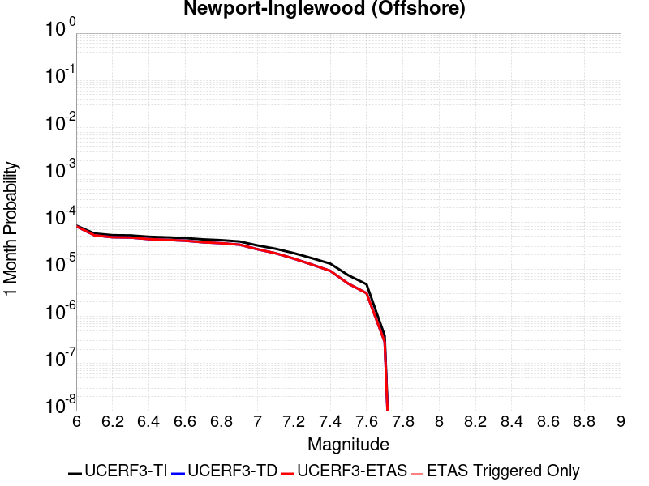 | 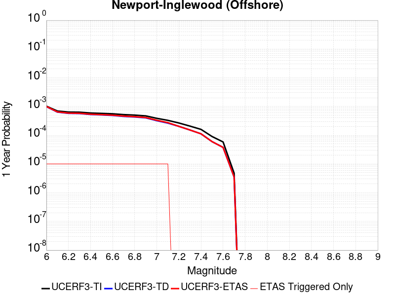 | 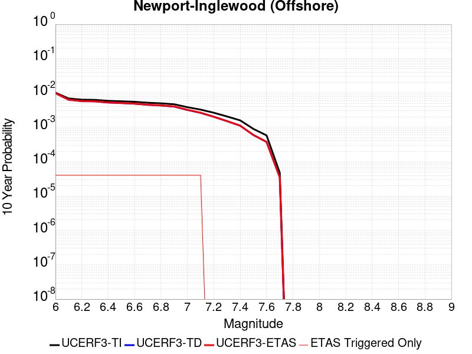 |

| Magnitude | 1 wk TI Prob | 1 wk TD Prob | 1 wk ETAS Prob | 1 wk ETAS/TD Gain | 1 wk ETAS Triggered Only | 1 mo TI Prob | 1 mo TD Prob | 1 mo ETAS Prob | 1 mo ETAS/TD Gain | 1 mo ETAS Triggered Only | 1 yr TI Prob | 1 yr TD Prob | 1 yr ETAS Prob | 1 yr ETAS/TD Gain | 1 yr ETAS Triggered Only | 10 yr TI Prob | 10 yr TD Prob | 10 yr ETAS Prob | 10 yr ETAS/TD Gain | 10 yr ETAS Triggered Only |
|-----|-----|-----|-----|-----|-----|-----|-----|-----|-----|-----|-----|-----|-----|-----|-----|-----|-----|-----|-----|-----|
| 6.0 | 1.9626508E-5 | 1.8965357E-5 | 1.8965357E-5 | 1.0 | 0.0 | 8.411089E-5 | 8.1277634E-5 | 8.1277634E-5 | 1.0 | 0.0 | 0.001023569 | 9.891186E-4 | 9.991087E-4 | 1.0101 | 1.0E-5 | 0.010188672 | 0.009848503 | 0.009868307 | 1.0020108 | 2.0E-5 |
| 6.1 | 1.331886E-5 | 1.2218092E-5 | 1.2218092E-5 | 1.0 | 0.0 | 5.707958E-5 | 5.2362207E-5 | 5.2362207E-5 | 1.0 | 0.0 | 6.947222E-4 | 6.3732493E-4 | 6.4731855E-4 | 1.0156806 | 1.0E-5 | 0.006925544 | 0.006355149 | 0.0063650855 | 1.0015635 | 1.0E-5 |
| 6.2 | 1.2250852E-5 | 1.1076029E-5 | 1.1076029E-5 | 1.0 | 0.0 | 5.2502597E-5 | 4.7467838E-5 | 4.7467838E-5 | 1.0 | 0.0 | 6.3903164E-4 | 5.777687E-4 | 5.877629E-4 | 1.017298 | 1.0E-5 | 0.006371971 | 0.0057627866 | 0.005772729 | 1.0017253 | 1.0E-5 |
| 6.3 | 1.2106258E-5 | 1.0918891E-5 | 1.0918891E-5 | 1.0 | 0.0 | 5.1882926E-5 | 4.6794412E-5 | 4.6794412E-5 | 1.0 | 0.0 | 6.3149154E-4 | 5.69574E-4 | 5.795683E-4 | 1.017547 | 1.0E-5 | 0.0062970007 | 0.005681259 | 0.0056912024 | 1.0017502 | 1.0E-5 |
| 6.4 | 1.1348758E-5 | 1.0109362E-5 | 1.0109362E-5 | 1.0 | 0.0 | 4.8636626E-5 | 4.3325123E-5 | 4.3325123E-5 | 1.0 | 0.0 | 5.919901E-4 | 5.273565E-4 | 5.3735124E-4 | 1.0189525 | 1.0E-5 | 0.005904155 | 0.0052611465 | 0.005271094 | 1.0018908 | 1.0E-5 |
| 6.5 | 1.100837E-5 | 9.7433895E-6 | 9.7433895E-6 | 1.0 | 0.0 | 4.7177873E-5 | 4.1756717E-5 | 4.1756717E-5 | 1.0 | 0.0 | 5.7423924E-4 | 5.082702E-4 | 5.182651E-4 | 1.0196645 | 1.0E-5 | 0.005727576 | 0.0050711688 | 0.005081118 | 1.001962 | 1.0E-5 |
| 6.6 | 1.0634696E-5 | 9.345544E-6 | 9.345544E-6 | 1.0 | 0.0 | 4.557647E-5 | 4.0051716E-5 | 4.0051716E-5 | 1.0 | 0.0 | 5.5475225E-4 | 4.8752132E-4 | 4.975164E-4 | 1.020502 | 1.0E-5 | 0.0055336943 | 0.0048646047 | 0.004874556 | 1.0020456 | 1.0E-5 |
| 6.7 | 9.9780855E-6 | 8.667911E-6 | 8.667911E-6 | 1.0 | 0.0 | 4.276252E-5 | 3.7147664E-5 | 3.7147664E-5 | 1.0 | 0.0 | 5.205093E-4 | 4.5217964E-4 | 4.621751E-4 | 1.0221051 | 1.0E-5 | 0.0051929182 | 0.004512675 | 0.0045226295 | 1.002206 | 1.0E-5 |
| 6.8 | 9.59546E-6 | 8.27295E-6 | 8.27295E-6 | 1.0 | 0.0 | 4.1122752E-5 | 3.5455025E-5 | 3.5455025E-5 | 1.0 | 0.0 | 5.0055445E-4 | 4.315801E-4 | 4.4157577E-4 | 1.0231607 | 1.0E-5 | 0.004994285 | 0.004307495 | 0.004317452 | 1.0023116 | 1.0E-5 |
| 6.9 | 9.000614E-6 | 7.70684E-6 | 7.70684E-6 | 1.0 | 0.0 | 3.857349E-5 | 3.30289E-5 | 3.30289E-5 | 1.0 | 0.0 | 4.6953102E-4 | 4.0205332E-4 | 4.120493E-4 | 1.0248623 | 1.0E-5 | 0.004685402 | 0.0040133307 | 0.0040232907 | 1.0024817 | 1.0E-5 |
| 7.0 | 7.4070194E-6 | 6.148904E-6 | 6.148904E-6 | 1.0 | 0.0 | 3.1743984E-5 | 2.635218E-5 | 2.635218E-5 | 1.0 | 0.0 | 3.8641447E-4 | 3.207907E-4 | 3.307875E-4 | 1.031163 | 1.0E-5 | 0.0038574322 | 0.0032032963 | 0.0032132643 | 1.0031118 | 1.0E-5 |
| 7.1 | 6.299615E-6 | 5.0565927E-6 | 5.0565927E-6 | 1.0 | 0.0 | 2.699807E-5 | 2.1670932E-5 | 2.1670932E-5 | 1.0 | 0.0 | 3.2865192E-4 | 2.638118E-4 | 2.7380916E-4 | 1.0378958 | 1.0E-5 | 0.003281663 | 0.002635001 | 0.0026449745 | 1.003785 | 1.0E-5 |
| 7.2 | 5.096653E-6 | 3.892769E-6 | 3.892769E-6 | 1.0 | 0.0 | 2.1842614E-5 | 1.668319E-5 | 1.668319E-5 | 1.0 | 0.0 | 2.6590136E-4 | 2.0309901E-4 | 2.0309901E-4 | 1.0 | 0.0 | 0.0026558342 | 0.0020291451 | 0.0020291451 | 1.0 | 0.0 |
| 7.3 | 3.9753018E-6 | 2.9099103E-6 | 2.9099103E-6 | 1.0 | 0.0 | 1.7036897E-5 | 1.2470985E-5 | 1.2470985E-5 | 1.0 | 0.0 | 2.0740448E-4 | 1.5182374E-4 | 1.5182374E-4 | 1.0 | 0.0 | 0.00207211 | 0.0015172083 | 0.0015172083 | 1.0 | 0.0 |
| 7.4 | 3.0568392E-6 | 2.1449955E-6 | 2.1449955E-6 | 1.0 | 0.0 | 1.3100675E-5 | 9.192806E-6 | 9.192806E-6 | 1.0 | 0.0 | 1.5948903E-4 | 1.1191672E-4 | 1.1191672E-4 | 1.0 | 0.0 | 0.0015937461 | 0.0011186098 | 0.0011186098 | 1.0 | 0.0 |
| 7.5 | 1.7279019E-6 | 1.1469883E-6 | 1.1469883E-6 | 1.0 | 0.0 | 7.405273E-6 | 4.915655E-6 | 4.915655E-6 | 1.0 | 0.0 | 9.015547E-5 | 5.9846494E-5 | 5.9846494E-5 | 1.0 | 0.0 | 9.01189E-4 | 5.9830764E-4 | 5.9830764E-4 | 1.0 | 0.0 |
| 7.6 | 1.1156416E-6 | 7.223012E-7 | 7.223012E-7 | 1.0 | 0.0 | 4.7813123E-6 | 3.095573E-6 | 3.095573E-6 | 1.0 | 0.0 | 5.821092E-5 | 3.7687976E-5 | 3.7687976E-5 | 1.0 | 0.0 | 5.8195676E-4 | 3.7681818E-4 | 3.7681818E-4 | 1.0 | 0.0 |
| 7.7 | 9.117973E-8 | 6.734145E-8 | 6.734145E-8 | 1.0 | 0.0 | 3.907702E-7 | 2.886062E-7 | 2.886062E-7 | 1.0 | 0.0 | 4.757617E-6 | 3.513775E-6 | 3.513775E-6 | 1.0 | 0.0 | 4.7575148E-5 | 3.5137225E-5 | 3.5137225E-5 | 1.0 | 0.0 |

## Puente Hills
*[(top)](#table-of-contents)*

| 1 Week | 1 Month | 1 Year | 10 Year |
|-----|-----|-----|-----|
| 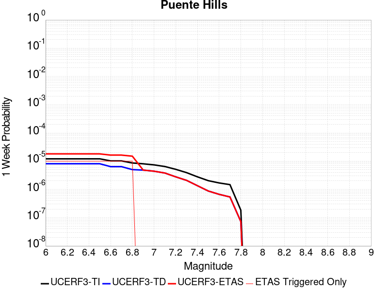 | 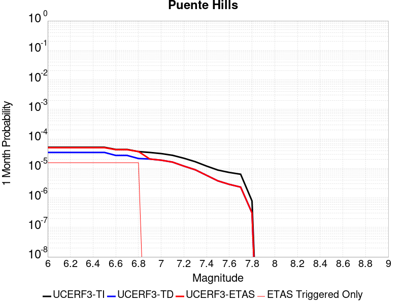 | 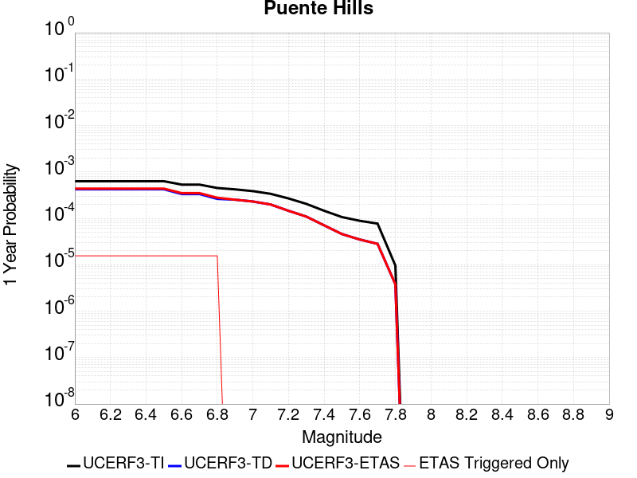 | 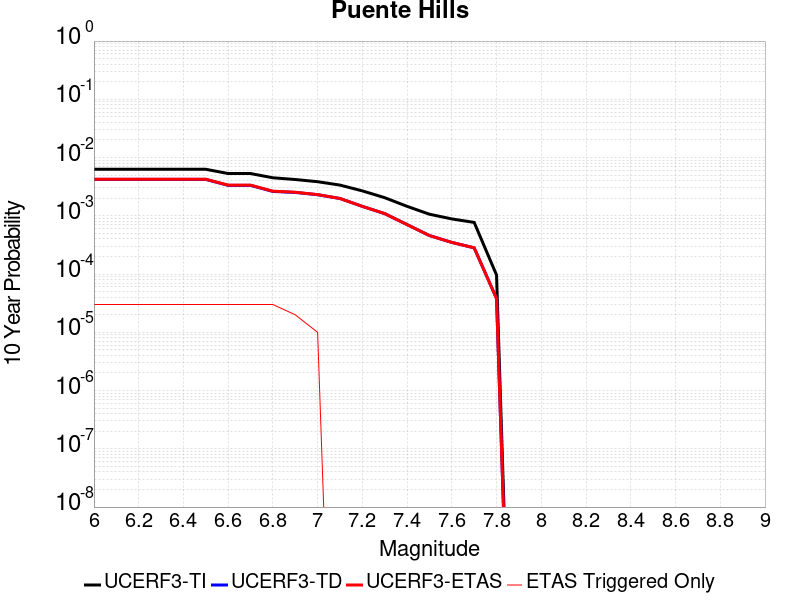 |

| Magnitude | 1 wk TI Prob | 1 wk TD Prob | 1 wk ETAS Prob | 1 wk ETAS/TD Gain | 1 wk ETAS Triggered Only | 1 mo TI Prob | 1 mo TD Prob | 1 mo ETAS Prob | 1 mo ETAS/TD Gain | 1 mo ETAS Triggered Only | 1 yr TI Prob | 1 yr TD Prob | 1 yr ETAS Prob | 1 yr ETAS/TD Gain | 1 yr ETAS Triggered Only | 10 yr TI Prob | 10 yr TD Prob | 10 yr ETAS Prob | 10 yr ETAS/TD Gain | 10 yr ETAS Triggered Only |
|-----|-----|-----|-----|-----|-----|-----|-----|-----|-----|-----|-----|-----|-----|-----|-----|-----|-----|-----|-----|-----|
| 6.0 | 1.2101656E-5 | 8.098625E-6 | 1.8098544E-5 | 2.2347674 | 1.0E-5 | 5.1863204E-5 | 3.4707962E-5 | 4.4707616E-5 | 1.2881083 | 1.0E-5 | 6.312516E-4 | 4.2249315E-4 | 4.3248892E-4 | 1.023659 | 1.0E-5 | 0.0062946146 | 0.0042174594 | 0.004247333 | 1.0070833 | 3.0E-5 |
| 6.1 | 1.2101656E-5 | 8.098625E-6 | 1.8098544E-5 | 2.2347674 | 1.0E-5 | 5.1863204E-5 | 3.4707962E-5 | 4.4707616E-5 | 1.2881083 | 1.0E-5 | 6.312516E-4 | 4.2249315E-4 | 4.3248892E-4 | 1.023659 | 1.0E-5 | 0.0062946146 | 0.0042174594 | 0.004247333 | 1.0070833 | 3.0E-5 |
| 6.2 | 1.2101656E-5 | 8.098625E-6 | 1.8098544E-5 | 2.2347674 | 1.0E-5 | 5.1863204E-5 | 3.4707962E-5 | 4.4707616E-5 | 1.2881083 | 1.0E-5 | 6.312516E-4 | 4.2249315E-4 | 4.3248892E-4 | 1.023659 | 1.0E-5 | 0.0062946146 | 0.0042174594 | 0.004247333 | 1.0070833 | 3.0E-5 |
| 6.3 | 1.2101656E-5 | 8.098625E-6 | 1.8098544E-5 | 2.2347674 | 1.0E-5 | 5.1863204E-5 | 3.4707962E-5 | 4.4707616E-5 | 1.2881083 | 1.0E-5 | 6.312516E-4 | 4.2249315E-4 | 4.3248892E-4 | 1.023659 | 1.0E-5 | 0.0062946146 | 0.0042174594 | 0.004247333 | 1.0070833 | 3.0E-5 |
| 6.4 | 1.2101656E-5 | 8.098625E-6 | 1.8098544E-5 | 2.2347674 | 1.0E-5 | 5.1863204E-5 | 3.4707962E-5 | 4.4707616E-5 | 1.2881083 | 1.0E-5 | 6.312516E-4 | 4.2249315E-4 | 4.3248892E-4 | 1.023659 | 1.0E-5 | 0.0062946146 | 0.0042174594 | 0.004247333 | 1.0070833 | 3.0E-5 |
| 6.5 | 1.2101656E-5 | 8.098625E-6 | 1.8098544E-5 | 2.2347674 | 1.0E-5 | 5.1863204E-5 | 3.4707962E-5 | 4.4707616E-5 | 1.2881083 | 1.0E-5 | 6.312516E-4 | 4.2249315E-4 | 4.3248892E-4 | 1.023659 | 1.0E-5 | 0.0062946146 | 0.0042174594 | 0.004247333 | 1.0070833 | 3.0E-5 |
| 6.6 | 1.0222488E-5 | 6.3991847E-6 | 1.639912E-5 | 2.562689 | 1.0E-5 | 4.3809923E-5 | 2.7424803E-5 | 3.742453E-5 | 1.3646234 | 1.0E-5 | 5.332553E-4 | 3.3384826E-4 | 3.4384493E-4 | 1.0299437 | 1.0E-5 | 0.0053197746 | 0.0033337125 | 0.0033636126 | 1.008969 | 3.0E-5 |
| 6.7 | 1.0222488E-5 | 6.3991847E-6 | 1.639912E-5 | 2.562689 | 1.0E-5 | 4.3809923E-5 | 2.7424803E-5 | 3.742453E-5 | 1.3646234 | 1.0E-5 | 5.332553E-4 | 3.3384826E-4 | 3.4384493E-4 | 1.0299437 | 1.0E-5 | 0.0053197746 | 0.0033337125 | 0.0033636126 | 1.008969 | 3.0E-5 |
| 6.8 | 8.6367845E-6 | 5.0282533E-6 | 1.5028203E-5 | 2.9887521 | 1.0E-5 | 3.7014266E-5 | 2.1549482E-5 | 3.1549265E-5 | 1.4640383 | 1.0E-5 | 4.505555E-4 | 2.623339E-4 | 2.723313E-4 | 1.0381093 | 1.0E-5 | 0.004496431 | 0.0026202986 | 0.00265022 | 1.011419 | 3.0E-5 |
| 6.9 | 8.066481E-6 | 4.836117E-6 | 4.836117E-6 | 1.0 | 0.0 | 3.4570177E-5 | 2.0726053E-5 | 2.0726053E-5 | 1.0 | 0.0 | 4.2081063E-4 | 2.52311E-4 | 2.52311E-4 | 1.0 | 0.0 | 0.0042001465 | 0.0025202993 | 0.002540249 | 1.0079156 | 2.0E-5 |
| 7.0 | 7.393828E-6 | 4.417296E-6 | 4.417296E-6 | 1.0 | 0.0 | 3.168745E-5 | 1.8931134E-5 | 1.8931134E-5 | 1.0 | 0.0 | 3.857264E-4 | 2.3046264E-4 | 2.3046264E-4 | 1.0 | 0.0 | 0.0038505755 | 0.0023022818 | 0.0023122588 | 1.0043335 | 1.0E-5 |
| 7.1 | 6.4660953E-6 | 3.8044495E-6 | 3.8044495E-6 | 1.0 | 0.0 | 2.7711543E-5 | 1.6304684E-5 | 1.6304684E-5 | 1.0 | 0.0 | 3.373358E-4 | 1.984918E-4 | 1.984918E-4 | 1.0 | 0.0 | 0.0033682417 | 0.001983181 | 0.001983181 | 1.0 | 0.0 |
| 7.2 | 5.143232E-6 | 2.7865456E-6 | 2.7865456E-6 | 1.0 | 0.0 | 2.2042237E-5 | 1.1942284E-5 | 1.1942284E-5 | 1.0 | 0.0 | 2.6833118E-4 | 1.453877E-4 | 1.453877E-4 | 1.0 | 0.0 | 0.002680074 | 0.0014529356 | 0.0014529356 | 1.0 | 0.0 |
| 7.3 | 3.928255E-6 | 2.0913774E-6 | 2.0913774E-6 | 1.0 | 0.0 | 1.683527E-5 | 8.963015E-6 | 8.963015E-6 | 1.0 | 0.0 | 2.0495013E-4 | 1.0911931E-4 | 1.0911931E-4 | 1.0 | 0.0 | 0.002047612 | 0.001090664 | 0.001090664 | 1.0 | 0.0 |
| 7.4 | 2.7894434E-6 | 1.3546753E-6 | 1.3546753E-6 | 1.0 | 0.0 | 1.1954703E-5 | 5.8057385E-6 | 5.8057385E-6 | 1.0 | 0.0 | 1.4553878E-4 | 7.068262E-5 | 7.068262E-5 | 1.0 | 0.0 | 0.001454435 | 7.066058E-4 | 7.066058E-4 | 1.0 | 0.0 |
| 7.5 | 2.041735E-6 | 8.787305E-7 | 8.787305E-7 | 1.0 | 0.0 | 8.750263E-6 | 3.7659825E-6 | 3.7659825E-6 | 1.0 | 0.0 | 1.06529245E-4 | 4.5849905E-5 | 4.5849905E-5 | 1.0 | 0.0 | 0.0010647819 | 4.5840783E-4 | 4.5840783E-4 | 1.0 | 0.0 |
| 7.6 | 1.6959062E-6 | 6.6986263E-7 | 6.6986263E-7 | 1.0 | 0.0 | 7.268149E-6 | 2.8708366E-6 | 2.8708366E-6 | 1.0 | 0.0 | 8.848612E-5 | 3.4951907E-5 | 3.4951907E-5 | 1.0 | 0.0 | 8.84509E-4 | 3.4946698E-4 | 3.4946698E-4 | 1.0 | 0.0 |
| 7.7 | 1.4767965E-6 | 5.407607E-7 | 5.407607E-7 | 1.0 | 0.0 | 6.3291122E-6 | 2.317544E-6 | 2.317544E-6 | 1.0 | 0.0 | 7.705422E-5 | 2.8215758E-5 | 2.8215758E-5 | 1.0 | 0.0 | 7.702751E-4 | 2.8212433E-4 | 2.8212433E-4 | 1.0 | 0.0 |
| 7.8 | 1.8432911E-7 | 7.28201E-8 | 7.28201E-8 | 1.0 | 0.0 | 7.8998164E-7 | 3.1208612E-7 | 3.1208612E-7 | 1.0 | 0.0 | 9.617985E-6 | 3.7996451E-6 | 3.7996451E-6 | 1.0 | 0.0 | 9.617568E-5 | 3.7996128E-5 | 3.7996128E-5 | 1.0 | 0.0 |

## Homestead Valley 2011
*[(top)](#table-of-contents)*

| 1 Week | 1 Month | 1 Year | 10 Year |
|-----|-----|-----|-----|
| 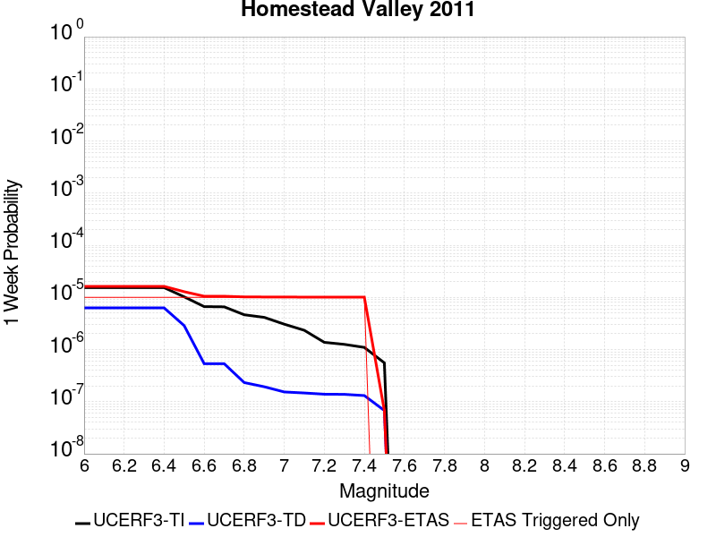 | 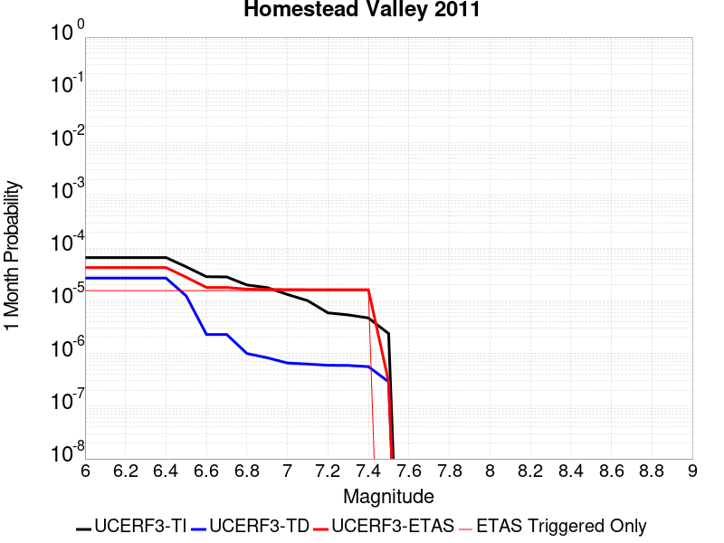 | 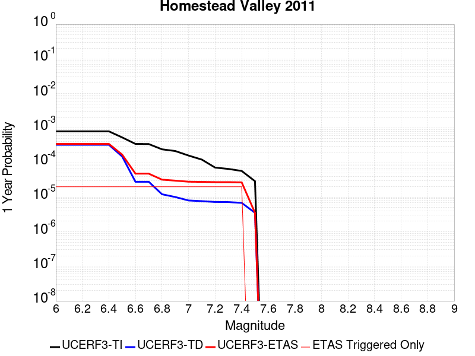 | 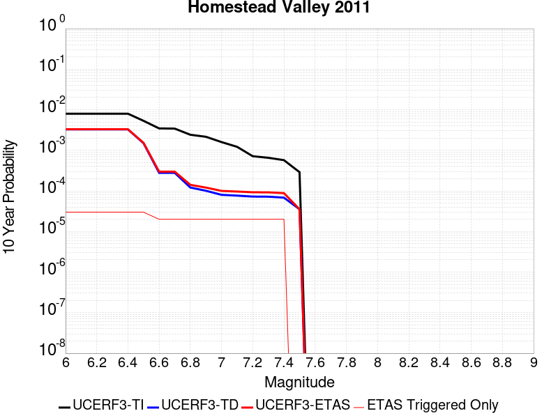 |

| Magnitude | 1 wk TI Prob | 1 wk TD Prob | 1 wk ETAS Prob | 1 wk ETAS/TD Gain | 1 wk ETAS Triggered Only | 1 mo TI Prob | 1 mo TD Prob | 1 mo ETAS Prob | 1 mo ETAS/TD Gain | 1 mo ETAS Triggered Only | 1 yr TI Prob | 1 yr TD Prob | 1 yr ETAS Prob | 1 yr ETAS/TD Gain | 1 yr ETAS Triggered Only | 10 yr TI Prob | 10 yr TD Prob | 10 yr ETAS Prob | 10 yr ETAS/TD Gain | 10 yr ETAS Triggered Only |
|-----|-----|-----|-----|-----|-----|-----|-----|-----|-----|-----|-----|-----|-----|-----|-----|-----|-----|-----|-----|-----|
| 6.0 | 1.539795E-5 | 6.286606E-6 | 1.6286544E-5 | 2.5906734 | 1.0E-5 | 6.5989545E-5 | 2.6942436E-5 | 3.6942165E-5 | 1.3711517 | 1.0E-5 | 8.0312655E-4 | 3.279954E-4 | 3.4798883E-4 | 1.0609565 | 2.0E-5 | 0.008002302 | 0.0032771337 | 0.0033070354 | 1.0091244 | 3.0E-5 |
| 6.1 | 1.539795E-5 | 6.286606E-6 | 1.6286544E-5 | 2.5906734 | 1.0E-5 | 6.5989545E-5 | 2.6942436E-5 | 3.6942165E-5 | 1.3711517 | 1.0E-5 | 8.0312655E-4 | 3.279954E-4 | 3.4798883E-4 | 1.0609565 | 2.0E-5 | 0.008002302 | 0.0032771337 | 0.0033070354 | 1.0091244 | 3.0E-5 |
| 6.2 | 1.539795E-5 | 6.286606E-6 | 1.6286544E-5 | 2.5906734 | 1.0E-5 | 6.5989545E-5 | 2.6942436E-5 | 3.6942165E-5 | 1.3711517 | 1.0E-5 | 8.0312655E-4 | 3.279954E-4 | 3.4798883E-4 | 1.0609565 | 2.0E-5 | 0.008002302 | 0.0032771337 | 0.0033070354 | 1.0091244 | 3.0E-5 |
| 6.3 | 1.539795E-5 | 6.286606E-6 | 1.6286544E-5 | 2.5906734 | 1.0E-5 | 6.5989545E-5 | 2.6942436E-5 | 3.6942165E-5 | 1.3711517 | 1.0E-5 | 8.0312655E-4 | 3.279954E-4 | 3.4798883E-4 | 1.0609565 | 2.0E-5 | 0.008002302 | 0.0032771337 | 0.0033070354 | 1.0091244 | 3.0E-5 |
| 6.4 | 1.539795E-5 | 6.286606E-6 | 1.6286544E-5 | 2.5906734 | 1.0E-5 | 6.5989545E-5 | 2.6942436E-5 | 3.6942165E-5 | 1.3711517 | 1.0E-5 | 8.0312655E-4 | 3.279954E-4 | 3.4798883E-4 | 1.0609565 | 2.0E-5 | 0.008002302 | 0.0032771337 | 0.0033070354 | 1.0091244 | 3.0E-5 |
| 6.5 | 1.0265258E-5 | 2.8788488E-6 | 1.287882E-5 | 4.4736004 | 1.0E-5 | 4.3993223E-5 | 1.2337905E-5 | 2.2337781E-5 | 1.8105004 | 1.0E-5 | 5.3548586E-4 | 1.5021059E-4 | 1.7020758E-4 | 1.1331264 | 2.0E-5 | 0.005341973 | 0.0015017724 | 0.0015317274 | 1.0199463 | 3.0E-5 |
| 6.6 | 6.664671E-6 | 5.348204E-7 | 1.0534815E-5 | 19.697855 | 1.0E-5 | 2.8562565E-5 | 2.2920863E-6 | 1.2292063E-5 | 5.362828 | 1.0E-5 | 3.476937E-4 | 2.7905911E-5 | 4.7905352E-5 | 1.7166741 | 2.0E-5 | 0.003471502 | 2.790357E-4 | 2.9903013E-4 | 1.0716554 | 2.0E-5 |
| 6.7 | 6.5954046E-6 | 5.348204E-7 | 1.0534815E-5 | 19.697855 | 1.0E-5 | 2.8265715E-5 | 2.2920863E-6 | 1.2292063E-5 | 5.362828 | 1.0E-5 | 3.4408073E-4 | 2.7905911E-5 | 4.7905352E-5 | 1.7166741 | 2.0E-5 | 0.0034354846 | 2.790357E-4 | 2.9903013E-4 | 1.0716554 | 2.0E-5 |
| 6.8 | 4.648189E-6 | 2.3265572E-7 | 1.0232653E-5 | 43.981953 | 1.0E-5 | 1.9920659E-5 | 9.970956E-7 | 1.0997086E-5 | 11.029119 | 1.0E-5 | 2.4250703E-4 | 1.2139576E-5 | 3.2139335E-5 | 2.647484 | 2.0E-5 | 0.0024224254 | 1.2138961E-4 | 1.4138718E-4 | 1.1647388 | 2.0E-5 |
| 6.9 | 4.1428534E-6 | 1.9344557E-7 | 1.0193444E-5 | 52.69412 | 1.0E-5 | 1.7754966E-5 | 8.290522E-7 | 1.0829044E-5 | 13.061956 | 1.0E-5 | 2.1614527E-4 | 1.0093667E-5 | 3.0093464E-5 | 2.9814205 | 2.0E-5 | 0.0021593515 | 1.0093238E-4 | 1.2093036E-4 | 1.1981325 | 2.0E-5 |
| 7.0 | 3.0673707E-6 | 1.5367603E-7 | 1.0153674E-5 | 66.071945 | 1.0E-5 | 1.3145808E-5 | 6.586114E-7 | 1.0658605E-5 | 16.18345 | 1.0E-5 | 1.6003846E-4 | 8.0185655E-6 | 2.8018405E-5 | 3.494192 | 2.0E-5 | 0.0015992324 | 8.0182865E-5 | 1.00181256E-4 | 1.2494099 | 2.0E-5 |
| 7.1 | 2.340854E-6 | 1.468766E-7 | 1.0146875E-5 | 69.08436 | 1.0E-5 | 1.0032193E-5 | 6.29471E-7 | 1.0629465E-5 | 16.886345 | 1.0E-5 | 1.221351E-4 | 7.663783E-6 | 2.766363E-5 | 3.609657 | 2.0E-5 | 0.00122068 | 7.663529E-5 | 9.6633754E-5 | 1.2609564 | 2.0E-5 |
| 7.2 | 1.3754182E-6 | 1.3922634E-7 | 1.0139225E-5 | 72.82548 | 1.0E-5 | 5.8946357E-6 | 5.966842E-7 | 1.0596678E-5 | 17.759275 | 1.0E-5 | 7.176483E-5 | 7.2646067E-6 | 2.7264461E-5 | 3.7530541 | 2.0E-5 | 7.174166E-4 | 7.264379E-5 | 9.264233E-5 | 1.2752961 | 2.0E-5 |
| 7.3 | 1.2573237E-6 | 1.3827146E-7 | 1.013827E-5 | 73.321495 | 1.0E-5 | 5.388519E-6 | 5.9259185E-7 | 1.0592586E-5 | 17.875011 | 1.0E-5 | 6.560324E-5 | 7.2147827E-6 | 2.7214639E-5 | 3.7720664 | 2.0E-5 | 6.558388E-4 | 7.214558E-5 | 9.214413E-5 | 1.2771972 | 2.0E-5 |
| 7.4 | 1.0994207E-6 | 1.3106106E-7 | 1.013106E-5 | 77.30031 | 1.0E-5 | 4.7117946E-6 | 5.616901E-7 | 1.0561685E-5 | 18.8034 | 1.0E-5 | 5.736459E-5 | 6.8385566E-6 | 2.683842E-5 | 3.9245737 | 2.0E-5 | 5.734978E-4 | 6.838355E-5 | 8.8382185E-5 | 1.2924479 | 2.0E-5 |
| 7.5 | 5.5569126E-7 | 6.772991E-8 | 6.772991E-8 | 1.0 | 0.0 | 2.3815317E-6 | 2.90271E-7 | 2.90271E-7 | 1.0 | 0.0 | 2.8994764E-5 | 3.5340445E-6 | 3.5340445E-6 | 1.0 | 0.0 | 2.899098E-4 | 3.5339945E-5 | 3.5339945E-5 | 1.0 | 0.0 |

## San Andreas (Peninsula) 2011 CFM
*[(top)](#table-of-contents)*

| 1 Week | 1 Month | 1 Year | 10 Year |
|-----|-----|-----|-----|
|  | 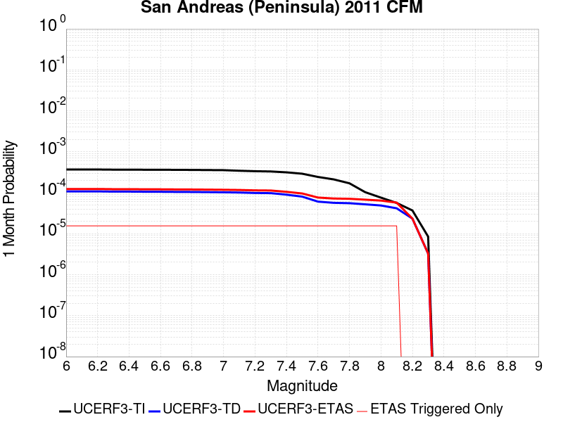 | 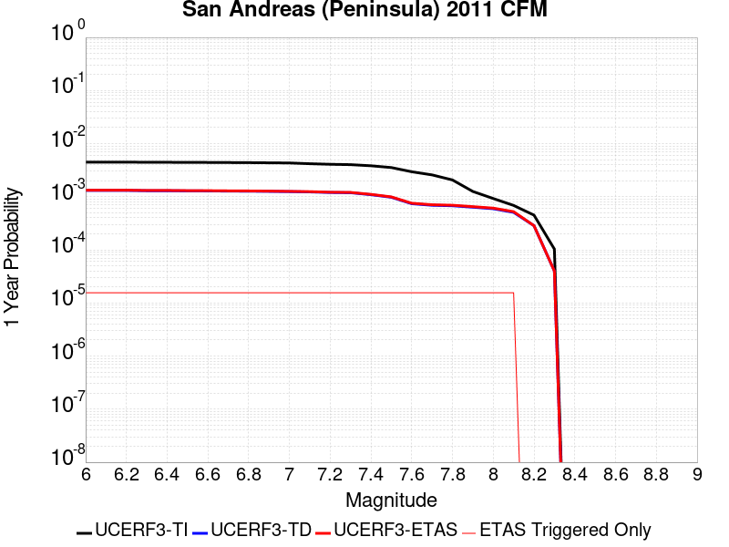 | 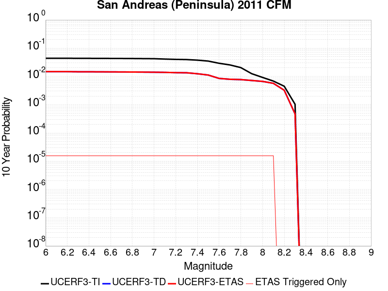 |

| Magnitude | 1 wk TI Prob | 1 wk TD Prob | 1 wk ETAS Prob | 1 wk ETAS/TD Gain | 1 wk ETAS Triggered Only | 1 mo TI Prob | 1 mo TD Prob | 1 mo ETAS Prob | 1 mo ETAS/TD Gain | 1 mo ETAS Triggered Only | 1 yr TI Prob | 1 yr TD Prob | 1 yr ETAS Prob | 1 yr ETAS/TD Gain | 1 yr ETAS Triggered Only | 10 yr TI Prob | 10 yr TD Prob | 10 yr ETAS Prob | 10 yr ETAS/TD Gain | 10 yr ETAS Triggered Only |
|-----|-----|-----|-----|-----|-----|-----|-----|-----|-----|-----|-----|-----|-----|-----|-----|-----|-----|-----|-----|-----|
| 6.0 | 8.6200685E-5 | 2.52136E-5 | 2.52136E-5 | 1.0 | 0.0 | 3.6937918E-4 | 1.0805382E-4 | 1.1805274E-4 | 1.0925364 | 1.0E-5 | 0.0044879215 | 0.001314763 | 0.0013247498 | 1.0075959 | 1.0E-5 | 0.043983612 | 0.014774441 | 0.014794146 | 1.0013337 | 2.0E-5 |
| 6.1 | 8.6200685E-5 | 2.52136E-5 | 2.52136E-5 | 1.0 | 0.0 | 3.6937918E-4 | 1.0805382E-4 | 1.1805274E-4 | 1.0925364 | 1.0E-5 | 0.0044879215 | 0.001314763 | 0.0013247498 | 1.0075959 | 1.0E-5 | 0.043983612 | 0.014774441 | 0.014794146 | 1.0013337 | 2.0E-5 |
| 6.2 | 8.6200685E-5 | 2.52136E-5 | 2.52136E-5 | 1.0 | 0.0 | 3.6937918E-4 | 1.0805382E-4 | 1.1805274E-4 | 1.0925364 | 1.0E-5 | 0.0044879215 | 0.001314763 | 0.0013247498 | 1.0075959 | 1.0E-5 | 0.043983612 | 0.014774441 | 0.014794146 | 1.0013337 | 2.0E-5 |
| 6.3 | 8.551163E-5 | 2.490552E-5 | 2.490552E-5 | 1.0 | 0.0 | 3.6642692E-4 | 1.06733576E-4 | 1.1673251E-4 | 1.0936812 | 1.0E-5 | 0.004452125 | 0.0012987083 | 0.0013086953 | 1.00769 | 1.0E-5 | 0.043639794 | 0.014601416 | 0.014621124 | 1.0013497 | 2.0E-5 |
| 6.4 | 8.551163E-5 | 2.490552E-5 | 2.490552E-5 | 1.0 | 0.0 | 3.6642692E-4 | 1.06733576E-4 | 1.1673251E-4 | 1.0936812 | 1.0E-5 | 0.004452125 | 0.0012987083 | 0.0013086953 | 1.00769 | 1.0E-5 | 0.043639794 | 0.014601416 | 0.014621124 | 1.0013497 | 2.0E-5 |
| 6.5 | 8.511146E-5 | 2.4726973E-5 | 2.4726973E-5 | 1.0 | 0.0 | 3.647124E-4 | 1.05968444E-4 | 1.1596738E-4 | 1.0943577 | 1.0E-5 | 0.004431336 | 0.0012894038 | 0.0012993909 | 1.0077455 | 1.0E-5 | 0.04344007 | 0.0145011945 | 0.014520904 | 1.0013592 | 2.0E-5 |
| 6.6 | 8.4985084E-5 | 2.4657606E-5 | 2.4657606E-5 | 1.0 | 0.0 | 3.6417096E-4 | 1.05671184E-4 | 1.15670126E-4 | 1.0946232 | 1.0E-5 | 0.0044247704 | 0.001285789 | 0.0012957761 | 1.0077673 | 1.0E-5 | 0.043376986 | 0.014463263 | 0.014482973 | 1.0013628 | 2.0E-5 |
| 6.7 | 8.462618E-5 | 2.4486113E-5 | 2.4486113E-5 | 1.0 | 0.0 | 3.6263323E-4 | 1.0493627E-4 | 1.1493522E-4 | 1.0952859 | 1.0E-5 | 0.004406125 | 0.0012768519 | 0.0012868391 | 1.0078218 | 1.0E-5 | 0.043197807 | 0.01436807 | 0.014387783 | 1.001372 | 2.0E-5 |
| 6.8 | 8.42337E-5 | 2.438192E-5 | 2.438192E-5 | 1.0 | 0.0 | 3.6095164E-4 | 1.04489765E-4 | 1.1448872E-4 | 1.0956931 | 1.0E-5 | 0.004385734 | 0.0012714221 | 0.0012814094 | 1.0078552 | 1.0E-5 | 0.043001823 | 0.014308756 | 0.0143284695 | 1.0013777 | 2.0E-5 |
| 6.9 | 8.365989E-5 | 2.4186513E-5 | 2.4186513E-5 | 1.0 | 0.0 | 3.5849313E-4 | 1.03652375E-4 | 1.1365134E-4 | 1.0964663 | 1.0E-5 | 0.004355922 | 0.0012612387 | 0.0012712261 | 1.0079187 | 1.0E-5 | 0.04271523 | 0.014201242 | 0.014220958 | 1.0013883 | 2.0E-5 |
| 7.0 | 8.30936E-5 | 2.3948E-5 | 2.3948E-5 | 1.0 | 0.0 | 3.560668E-4 | 1.02630256E-4 | 1.12629226E-4 | 1.0974271 | 1.0E-5 | 0.004326499 | 0.0012488087 | 0.0012587962 | 1.0079976 | 1.0E-5 | 0.042432297 | 0.014072227 | 0.014091945 | 1.0014012 | 2.0E-5 |
| 7.1 | 8.041264E-5 | 2.3634402E-5 | 2.3634402E-5 | 1.0 | 0.0 | 3.4458007E-4 | 1.0128637E-4 | 1.1128536E-4 | 1.09872 | 1.0E-5 | 0.0041871946 | 0.0012324656 | 0.0012424532 | 1.0081038 | 1.0E-5 | 0.041091725 | 0.013895032 | 0.013914754 | 1.0014193 | 2.0E-5 |
| 7.2 | 7.8427016E-5 | 2.3058019E-5 | 2.3058019E-5 | 1.0 | 0.0 | 3.3607247E-4 | 9.8816345E-5 | 1.0881535E-4 | 1.1011878 | 1.0E-5 | 0.004084008 | 0.0012024266 | 0.0012124146 | 1.0083065 | 1.0E-5 | 0.040097635 | 0.013579085 | 0.013598813 | 1.0014528 | 2.0E-5 |
| 7.3 | 7.721087E-5 | 2.2842805E-5 | 2.2842805E-5 | 1.0 | 0.0 | 3.3086175E-4 | 9.7894066E-5 | 1.0789309E-4 | 1.1021413 | 1.0E-5 | 0.004020803 | 0.0011912102 | 0.0012011983 | 1.0083848 | 1.0E-5 | 0.03948827 | 0.013462781 | 0.013482512 | 1.0014656 | 2.0E-5 |
| 7.4 | 7.3536525E-5 | 2.0960428E-5 | 2.0960428E-5 | 1.0 | 0.0 | 3.1511846E-4 | 8.982732E-5 | 9.982642E-5 | 1.1113147 | 1.0E-5 | 0.0038298194 | 0.0010931002 | 0.0011030893 | 1.0091383 | 1.0E-5 | 0.037644852 | 0.012419564 | 0.012439315 | 1.0015904 | 2.0E-5 |
| 7.5 | 6.806207E-5 | 1.876674E-5 | 1.876674E-5 | 1.0 | 0.0 | 2.9166197E-4 | 8.042641E-5 | 9.042561E-5 | 1.1243273 | 1.0E-5 | 0.0035452035 | 9.787527E-4 | 9.887429E-4 | 1.010207 | 1.0E-5 | 0.034891766 | 0.01117254 | 0.011192316 | 1.0017701 | 2.0E-5 |
| 7.6 | 5.6731416E-5 | 1.4177827E-5 | 1.4177827E-5 | 1.0 | 0.0 | 2.43112E-4 | 6.07607E-5 | 7.076009E-5 | 1.1645701 | 1.0E-5 | 0.0029558712 | 7.395106E-4 | 7.495032E-4 | 1.0135125 | 1.0E-5 | 0.02916862 | 0.008485565 | 0.008505396 | 1.002337 | 2.0E-5 |
| 7.7 | 4.946994E-5 | 1.3246218E-5 | 1.3246218E-5 | 1.0 | 0.0 | 2.1199681E-4 | 5.6768273E-5 | 6.67677E-5 | 1.1761447 | 1.0E-5 | 0.002578006 | 6.9093466E-4 | 7.0092775E-4 | 1.0144632 | 1.0E-5 | 0.02548303 | 0.0079078935 | 0.007927735 | 1.0025091 | 2.0E-5 |
| 7.8 | 3.9718198E-5 | 1.2982541E-5 | 1.2982541E-5 | 1.0 | 0.0 | 1.7020974E-4 | 5.5638273E-5 | 6.5637716E-5 | 1.1797224 | 1.0E-5 | 0.0020703338 | 6.771856E-4 | 6.871788E-4 | 1.014757 | 1.0E-5 | 0.020511515 | 0.0077184658 | 0.007738312 | 1.0025712 | 2.0E-5 |
| 7.9 | 2.4115114E-5 | 1.218559E-5 | 1.218559E-5 | 1.0 | 0.0 | 1.0334639E-4 | 5.2222913E-5 | 6.222239E-5 | 1.1914768 | 1.0E-5 | 0.001257516 | 6.3562865E-4 | 6.4562226E-4 | 1.0157225 | 1.0E-5 | 0.012504238 | 0.007159044 | 0.0071789008 | 1.0027736 | 2.0E-5 |
| 8.0 | 1.7756569E-5 | 1.1410005E-5 | 1.1410005E-5 | 1.0 | 0.0 | 7.6097356E-5 | 4.8899106E-5 | 5.8898615E-5 | 1.2044927 | 1.0E-5 | 9.260915E-4 | 5.951841E-4 | 6.051782E-4 | 1.0167916 | 1.0E-5 | 0.009222416 | 0.006659493 | 0.00667936 | 1.0029832 | 2.0E-5 |
| 8.1 | 1.3159258E-5 | 9.746194E-6 | 9.746194E-6 | 1.0 | 0.0 | 5.6395602E-5 | 4.1768737E-5 | 5.176832E-5 | 1.2394035 | 1.0E-5 | 6.864001E-4 | 5.0841586E-4 | 5.1841076E-4 | 1.0196589 | 1.0E-5 | 0.0068428386 | 0.005689538 | 0.005699481 | 1.0017476 | 1.0E-5 |
| 8.2 | 8.635426E-6 | 5.466912E-6 | 5.466912E-6 | 1.0 | 0.0 | 3.700844E-5 | 2.3429413E-5 | 2.3429413E-5 | 1.0 | 0.0 | 4.5048463E-4 | 2.8521585E-4 | 2.8521585E-4 | 1.0 | 0.0 | 0.004495725 | 0.0032445018 | 0.0032445018 | 1.0 | 0.0 |
| 8.3 | 1.983087E-6 | 7.6599065E-7 | 7.6599065E-7 | 1.0 | 0.0 | 8.498917E-6 | 3.282813E-6 | 3.282813E-6 | 1.0 | 0.0 | 1.034694E-4 | 3.9967534E-5 | 3.9967534E-5 | 1.0 | 0.0 | 0.0010342124 | 4.719687E-4 | 4.719687E-4 | 1.0 | 0.0 |

## Earthquake Valley (So Extension)
*[(top)](#table-of-contents)*

| 1 Week | 1 Month | 1 Year | 10 Year |
|-----|-----|-----|-----|
| 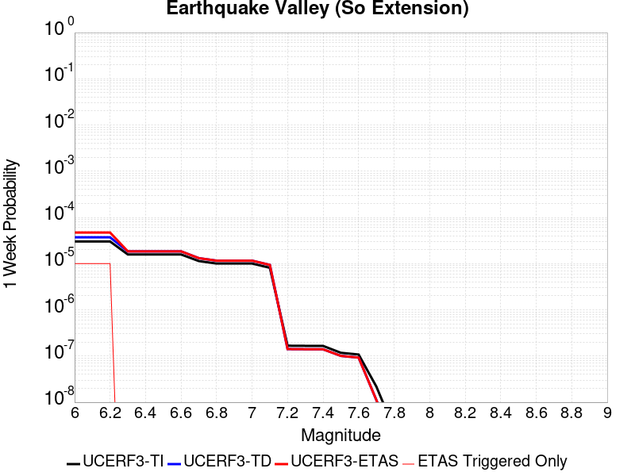 | 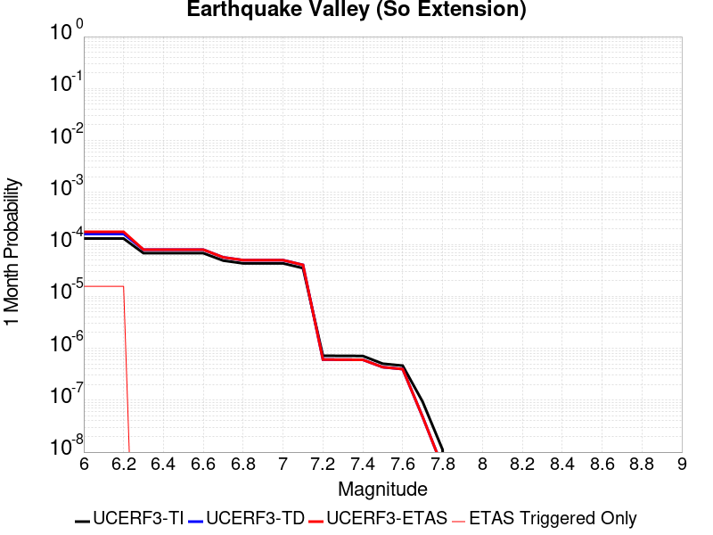 | 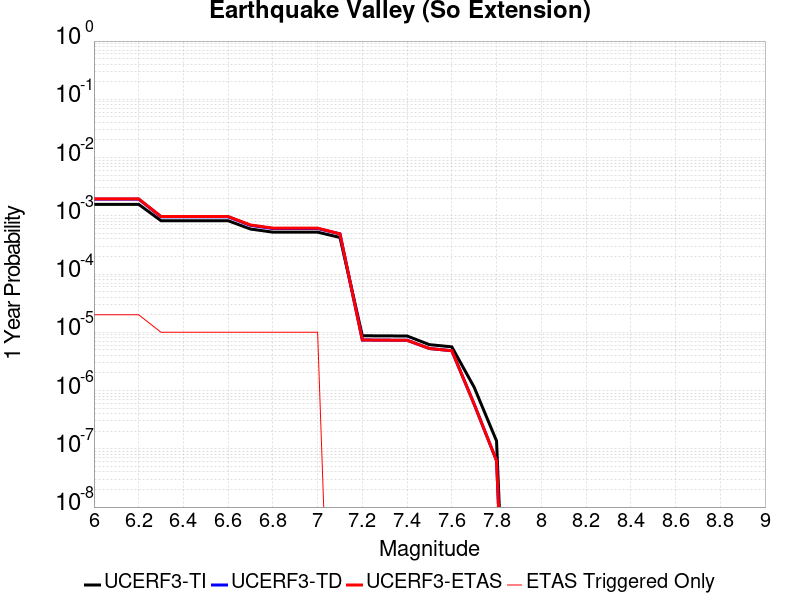 | 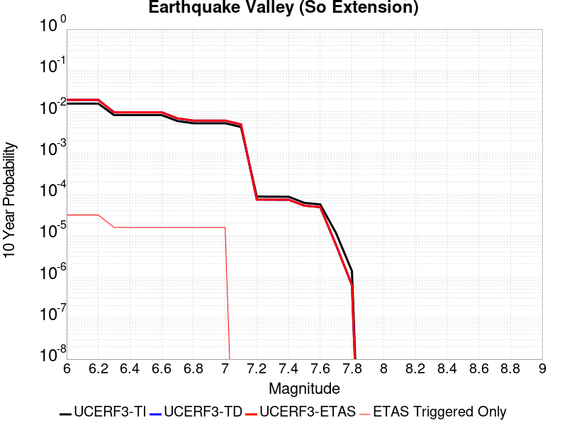 |

| Magnitude | 1 wk TI Prob | 1 wk TD Prob | 1 wk ETAS Prob | 1 wk ETAS/TD Gain | 1 wk ETAS Triggered Only | 1 mo TI Prob | 1 mo TD Prob | 1 mo ETAS Prob | 1 mo ETAS/TD Gain | 1 mo ETAS Triggered Only | 1 yr TI Prob | 1 yr TD Prob | 1 yr ETAS Prob | 1 yr ETAS/TD Gain | 1 yr ETAS Triggered Only | 10 yr TI Prob | 10 yr TD Prob | 10 yr ETAS Prob | 10 yr ETAS/TD Gain | 10 yr ETAS Triggered Only |
|-----|-----|-----|-----|-----|-----|-----|-----|-----|-----|-----|-----|-----|-----|-----|-----|-----|-----|-----|-----|-----|
| 6.0 | 3.0194888E-5 | 3.7072114E-5 | 4.7071742E-5 | 1.2697345 | 1.0E-5 | 1.2940024E-4 | 1.5887388E-4 | 1.6887228E-4 | 1.062933 | 1.0E-5 | 0.0015743093 | 0.0019331174 | 0.0019530788 | 1.010326 | 2.0E-5 | 0.01563203 | 0.019213019 | 0.019232634 | 1.0010209 | 2.0E-5 |
| 6.1 | 3.0194888E-5 | 3.7072114E-5 | 4.7071742E-5 | 1.2697345 | 1.0E-5 | 1.2940024E-4 | 1.5887388E-4 | 1.6887228E-4 | 1.062933 | 1.0E-5 | 0.0015743093 | 0.0019331174 | 0.0019530788 | 1.010326 | 2.0E-5 | 0.01563203 | 0.019213019 | 0.019232634 | 1.0010209 | 2.0E-5 |
| 6.2 | 3.0194888E-5 | 3.7072114E-5 | 4.7071742E-5 | 1.2697345 | 1.0E-5 | 1.2940024E-4 | 1.5887388E-4 | 1.6887228E-4 | 1.062933 | 1.0E-5 | 0.0015743093 | 0.0019331174 | 0.0019530788 | 1.010326 | 2.0E-5 | 0.01563203 | 0.019213019 | 0.019232634 | 1.0010209 | 2.0E-5 |
| 6.3 | 1.5795305E-5 | 1.844658E-5 | 1.844658E-5 | 1.0 | 0.0 | 6.769241E-5 | 7.9055004E-5 | 7.9055004E-5 | 1.0 | 0.0 | 8.238434E-4 | 9.6218096E-4 | 9.721713E-4 | 1.010383 | 1.0E-5 | 0.008207959 | 0.009591061 | 0.009600965 | 1.0010326 | 1.0E-5 |
| 6.4 | 1.5795305E-5 | 1.844658E-5 | 1.844658E-5 | 1.0 | 0.0 | 6.769241E-5 | 7.9055004E-5 | 7.9055004E-5 | 1.0 | 0.0 | 8.238434E-4 | 9.6218096E-4 | 9.721713E-4 | 1.010383 | 1.0E-5 | 0.008207959 | 0.009591061 | 0.009600965 | 1.0010326 | 1.0E-5 |
| 6.5 | 1.5795305E-5 | 1.844658E-5 | 1.844658E-5 | 1.0 | 0.0 | 6.769241E-5 | 7.9055004E-5 | 7.9055004E-5 | 1.0 | 0.0 | 8.238434E-4 | 9.6218096E-4 | 9.721713E-4 | 1.010383 | 1.0E-5 | 0.008207959 | 0.009591061 | 0.009600965 | 1.0010326 | 1.0E-5 |
| 6.6 | 1.5795305E-5 | 1.844658E-5 | 1.844658E-5 | 1.0 | 0.0 | 6.769241E-5 | 7.9055004E-5 | 7.9055004E-5 | 1.0 | 0.0 | 8.238434E-4 | 9.6218096E-4 | 9.721713E-4 | 1.010383 | 1.0E-5 | 0.008207959 | 0.009591061 | 0.009600965 | 1.0010326 | 1.0E-5 |
| 6.7 | 1.1363076E-5 | 1.3138294E-5 | 1.3138294E-5 | 1.0 | 0.0 | 4.8697988E-5 | 5.6306188E-5 | 5.6306188E-5 | 1.0 | 0.0 | 5.927367E-4 | 6.8538834E-4 | 6.953815E-4 | 1.0145802 | 1.0E-5 | 0.0059115817 | 0.0068402183 | 0.00685015 | 1.001452 | 1.0E-5 |
| 6.8 | 1.0049611E-5 | 1.1594334E-5 | 1.1594334E-5 | 1.0 | 0.0 | 4.306905E-5 | 4.9689468E-5 | 4.9689468E-5 | 1.0 | 0.0 | 5.242395E-4 | 6.048745E-4 | 6.148685E-4 | 1.0165224 | 1.0E-5 | 0.0052300454 | 0.006039458 | 0.006049398 | 1.0016458 | 1.0E-5 |
| 6.9 | 1.0049611E-5 | 1.1594334E-5 | 1.1594334E-5 | 1.0 | 0.0 | 4.306905E-5 | 4.9689468E-5 | 4.9689468E-5 | 1.0 | 0.0 | 5.242395E-4 | 6.048745E-4 | 6.148685E-4 | 1.0165224 | 1.0E-5 | 0.0052300454 | 0.006039458 | 0.006049398 | 1.0016458 | 1.0E-5 |
| 7.0 | 1.0049611E-5 | 1.1594334E-5 | 1.1594334E-5 | 1.0 | 0.0 | 4.306905E-5 | 4.9689468E-5 | 4.9689468E-5 | 1.0 | 0.0 | 5.242395E-4 | 6.048745E-4 | 6.148685E-4 | 1.0165224 | 1.0E-5 | 0.0052300454 | 0.006039458 | 0.006049398 | 1.0016458 | 1.0E-5 |
| 7.1 | 8.140254E-6 | 9.383458E-6 | 9.383458E-6 | 1.0 | 0.0 | 3.4886336E-5 | 4.0214578E-5 | 4.0214578E-5 | 1.0 | 0.0 | 4.2465836E-4 | 4.8956956E-4 | 4.8956956E-4 | 1.0 | 0.0 | 0.0042384774 | 0.0048914864 | 0.0048914864 | 1.0 | 0.0 |
| 7.2 | 1.673835E-7 | 1.4154125E-7 | 1.4154125E-7 | 1.0 | 0.0 | 7.173577E-7 | 6.066052E-7 | 6.066052E-7 | 1.0 | 0.0 | 8.733795E-6 | 7.385397E-6 | 7.385397E-6 | 1.0 | 0.0 | 8.733451E-5 | 7.385187E-5 | 7.385187E-5 | 1.0 | 0.0 |
| 7.3 | 1.6632116E-7 | 1.4052354E-7 | 1.4052354E-7 | 1.0 | 0.0 | 7.1280476E-7 | 6.0224363E-7 | 6.0224363E-7 | 1.0 | 0.0 | 8.678364E-6 | 7.332295E-6 | 7.332295E-6 | 1.0 | 0.0 | 8.6780245E-5 | 7.332089E-5 | 7.332089E-5 | 1.0 | 0.0 |
| 7.4 | 1.6569169E-7 | 1.3996983E-7 | 1.3996983E-7 | 1.0 | 0.0 | 7.1010703E-7 | 5.9987053E-7 | 5.9987053E-7 | 1.0 | 0.0 | 8.645519E-6 | 7.303403E-6 | 7.303403E-6 | 1.0 | 0.0 | 8.645182E-5 | 7.303199E-5 | 7.303199E-5 | 1.0 | 0.0 |
| 7.5 | 1.1764555E-7 | 1.0095917E-7 | 1.0095917E-7 | 1.0 | 0.0 | 5.041951E-7 | 4.326821E-7 | 4.326821E-7 | 1.0 | 0.0 | 6.138558E-6 | 5.267894E-6 | 5.267894E-6 | 1.0 | 0.0 | 6.1383886E-5 | 5.2677904E-5 | 5.2677904E-5 | 1.0 | 0.0 |
| 7.6 | 1.07927605E-7 | 9.260736E-8 | 9.260736E-8 | 1.0 | 0.0 | 4.6254678E-7 | 3.9688865E-7 | 3.9688865E-7 | 1.0 | 0.0 | 5.6314925E-6 | 4.832111E-6 | 4.832111E-6 | 1.0 | 0.0 | 5.63135E-5 | 4.8320264E-5 | 4.8320264E-5 | 1.0 | 0.0 |
| 7.7 | 2.1826905E-8 | 1.1180516E-8 | 1.1180516E-8 | 1.0 | 0.0 | 9.3543875E-8 | 4.7916494E-8 | 4.7916494E-8 | 1.0 | 0.0 | 1.1388961E-6 | 5.833832E-7 | 5.833832E-7 | 1.0 | 0.0 | 1.1388902E-5 | 5.8338223E-6 | 5.8338223E-6 | 1.0 | 0.0 |
| 7.8 | 2.6169649E-9 | 1.1969472E-9 | 1.1969472E-9 | 1.0 | 0.0 | 1.1215564E-8 | 5.1297735E-9 | 5.1297735E-9 | 1.0 | 0.0 | 1.3654947E-7 | 6.2454994E-8 | 6.2454994E-8 | 1.0 | 0.0 | 1.365494E-6 | 6.245499E-7 | 6.245499E-7 | 1.0 | 0.0 |

## Great Valley 06 (Midland) 2011 CFM alt1
*[(top)](#table-of-contents)*

| 1 Week | 1 Month | 1 Year | 10 Year |
|-----|-----|-----|-----|
|  | 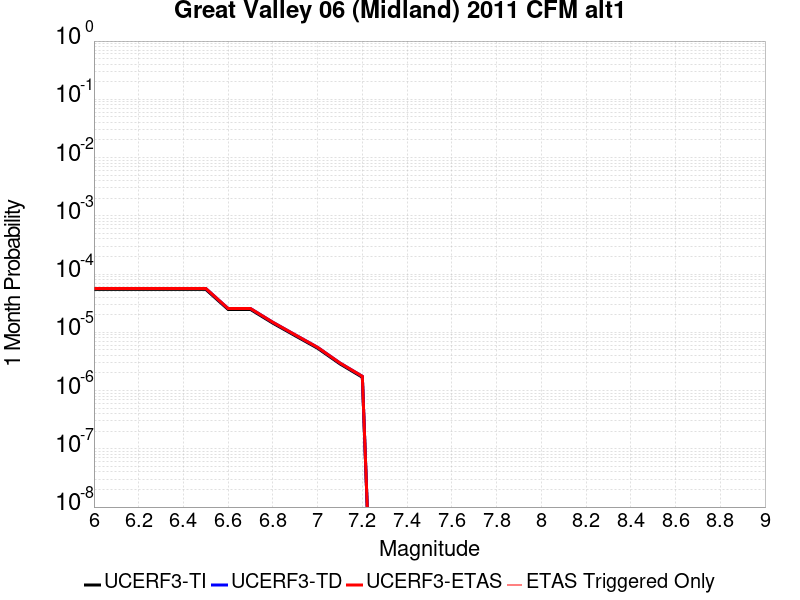 | 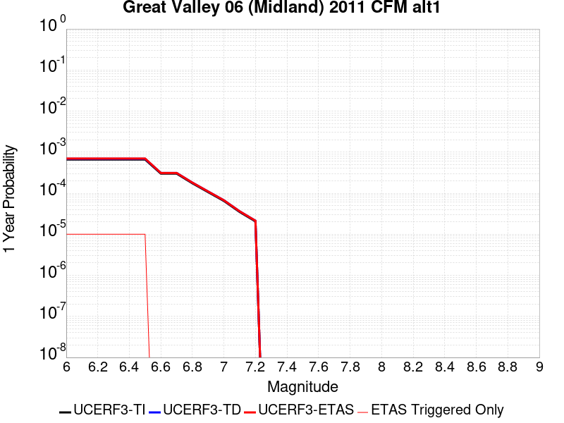 |  |

| Magnitude | 1 wk TI Prob | 1 wk TD Prob | 1 wk ETAS Prob | 1 wk ETAS/TD Gain | 1 wk ETAS Triggered Only | 1 mo TI Prob | 1 mo TD Prob | 1 mo ETAS Prob | 1 mo ETAS/TD Gain | 1 mo ETAS Triggered Only | 1 yr TI Prob | 1 yr TD Prob | 1 yr ETAS Prob | 1 yr ETAS/TD Gain | 1 yr ETAS Triggered Only | 10 yr TI Prob | 10 yr TD Prob | 10 yr ETAS Prob | 10 yr ETAS/TD Gain | 10 yr ETAS Triggered Only |
|-----|-----|-----|-----|-----|-----|-----|-----|-----|-----|-----|-----|-----|-----|-----|-----|-----|-----|-----|-----|-----|
| 6.0 | 1.2712525E-5 | 1.3210576E-5 | 1.3210576E-5 | 1.0 | 0.0 | 5.4481112E-5 | 5.6615667E-5 | 5.6615667E-5 | 1.0 | 0.0 | 6.6310563E-4 | 6.8910315E-4 | 6.9909624E-4 | 1.0145016 | 1.0E-5 | 0.0066113044 | 0.006872179 | 0.00688211 | 1.0014452 | 1.0E-5 |
| 6.1 | 1.2712525E-5 | 1.3210576E-5 | 1.3210576E-5 | 1.0 | 0.0 | 5.4481112E-5 | 5.6615667E-5 | 5.6615667E-5 | 1.0 | 0.0 | 6.6310563E-4 | 6.8910315E-4 | 6.9909624E-4 | 1.0145016 | 1.0E-5 | 0.0066113044 | 0.006872179 | 0.00688211 | 1.0014452 | 1.0E-5 |
| 6.2 | 1.2712525E-5 | 1.3210576E-5 | 1.3210576E-5 | 1.0 | 0.0 | 5.4481112E-5 | 5.6615667E-5 | 5.6615667E-5 | 1.0 | 0.0 | 6.6310563E-4 | 6.8910315E-4 | 6.9909624E-4 | 1.0145016 | 1.0E-5 | 0.0066113044 | 0.006872179 | 0.00688211 | 1.0014452 | 1.0E-5 |
| 6.3 | 1.2712525E-5 | 1.3210576E-5 | 1.3210576E-5 | 1.0 | 0.0 | 5.4481112E-5 | 5.6615667E-5 | 5.6615667E-5 | 1.0 | 0.0 | 6.6310563E-4 | 6.8910315E-4 | 6.9909624E-4 | 1.0145016 | 1.0E-5 | 0.0066113044 | 0.006872179 | 0.00688211 | 1.0014452 | 1.0E-5 |
| 6.4 | 1.2712525E-5 | 1.3210576E-5 | 1.3210576E-5 | 1.0 | 0.0 | 5.4481112E-5 | 5.6615667E-5 | 5.6615667E-5 | 1.0 | 0.0 | 6.6310563E-4 | 6.8910315E-4 | 6.9909624E-4 | 1.0145016 | 1.0E-5 | 0.0066113044 | 0.006872179 | 0.00688211 | 1.0014452 | 1.0E-5 |
| 6.5 | 1.2712525E-5 | 1.3210576E-5 | 1.3210576E-5 | 1.0 | 0.0 | 5.4481112E-5 | 5.6615667E-5 | 5.6615667E-5 | 1.0 | 0.0 | 6.6310563E-4 | 6.8910315E-4 | 6.9909624E-4 | 1.0145016 | 1.0E-5 | 0.0066113044 | 0.006872179 | 0.00688211 | 1.0014452 | 1.0E-5 |
| 6.6 | 5.7574384E-6 | 5.9706463E-6 | 5.9706463E-6 | 1.0 | 0.0 | 2.4674504E-5 | 2.5588255E-5 | 2.5588255E-5 | 1.0 | 0.0 | 3.0037065E-4 | 3.1149638E-4 | 3.1149638E-4 | 1.0 | 0.0 | 0.0029996498 | 0.0031109843 | 0.0031209532 | 1.0032045 | 1.0E-5 |
| 6.7 | 5.7574384E-6 | 5.9706463E-6 | 5.9706463E-6 | 1.0 | 0.0 | 2.4674504E-5 | 2.5588255E-5 | 2.5588255E-5 | 1.0 | 0.0 | 3.0037065E-4 | 3.1149638E-4 | 3.1149638E-4 | 1.0 | 0.0 | 0.0029996498 | 0.0031109843 | 0.0031209532 | 1.0032045 | 1.0E-5 |
| 6.8 | 3.3474828E-6 | 3.4693849E-6 | 3.4693849E-6 | 1.0 | 0.0 | 1.4346277E-5 | 1.4868716E-5 | 1.4868716E-5 | 1.0 | 0.0 | 1.7465191E-4 | 1.8101306E-4 | 1.8101306E-4 | 1.0 | 0.0 | 0.0017451472 | 0.0018088033 | 0.0018088033 | 1.0 | 0.0 |
| 6.9 | 2.035106E-6 | 2.1090357E-6 | 2.1090357E-6 | 1.0 | 0.0 | 8.721853E-6 | 9.038697E-6 | 9.038697E-6 | 1.0 | 0.0 | 1.0618339E-4 | 1.10041314E-4 | 1.10041314E-4 | 1.0 | 0.0 | 0.0010613267 | 0.0010999405 | 0.0010999405 | 1.0 | 0.0 |
| 7.0 | 1.2424716E-6 | 1.2878762E-6 | 1.2878762E-6 | 1.0 | 0.0 | 5.3248673E-6 | 5.51946E-6 | 5.51946E-6 | 1.0 | 0.0 | 6.482833E-5 | 6.7197805E-5 | 6.7197805E-5 | 1.0 | 0.0 | 6.480942E-4 | 6.718192E-4 | 6.718192E-4 | 1.0 | 0.0 |
| 7.1 | 6.6904556E-7 | 6.939035E-7 | 6.939035E-7 | 1.0 | 0.0 | 2.867335E-6 | 2.97387E-6 | 2.97387E-6 | 1.0 | 0.0 | 3.4909244E-5 | 3.6206526E-5 | 3.6206526E-5 | 1.0 | 0.0 | 3.490376E-4 | 3.6203177E-4 | 3.6203177E-4 | 1.0 | 0.0 |
| 7.2 | 3.948168E-7 | 4.095705E-7 | 4.095705E-7 | 1.0 | 0.0 | 1.6920709E-6 | 1.7553022E-6 | 1.7553022E-6 | 1.0 | 0.0 | 2.0600768E-5 | 2.1370803E-5 | 2.1370803E-5 | 1.0 | 0.0 | 2.0598859E-4 | 2.1370803E-4 | 2.1370803E-4 | 1.0 | 0.0 |

## Robinson Creek
*[(top)](#table-of-contents)*

| 1 Week | 1 Month | 1 Year | 10 Year |
|-----|-----|-----|-----|
|  | 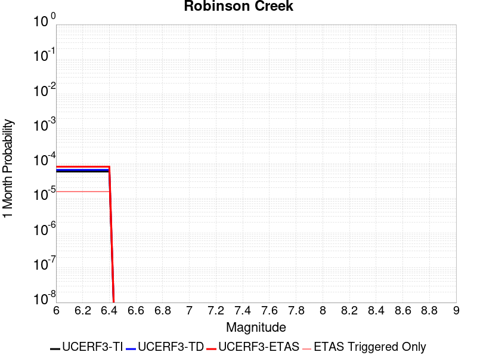 | 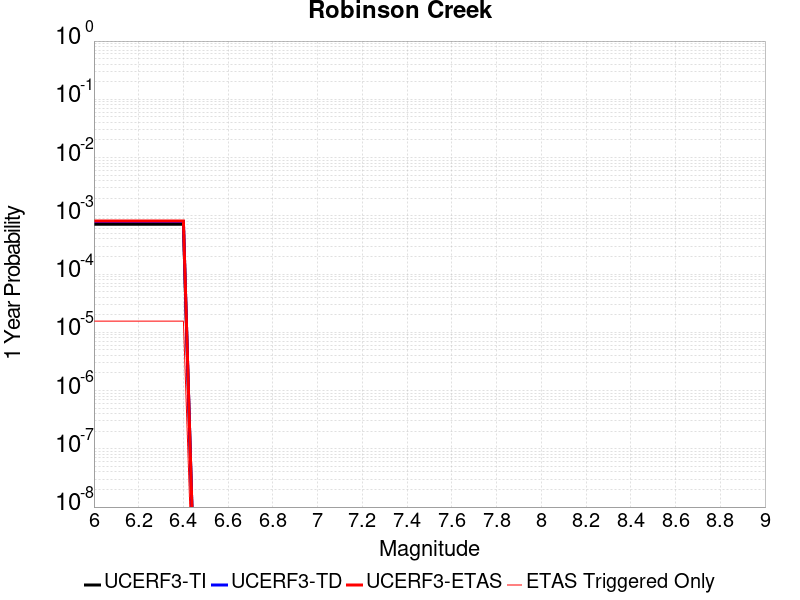 | 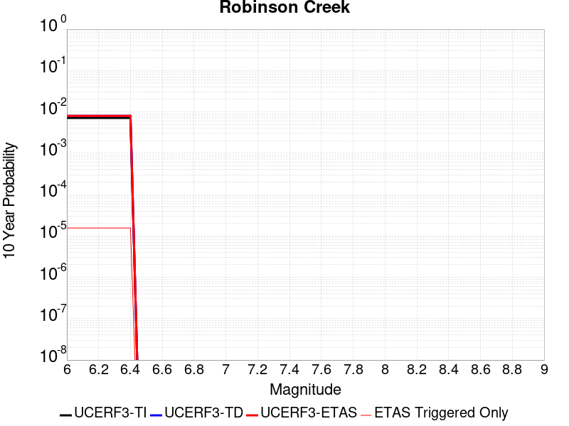 |

| Magnitude | 1 wk TI Prob | 1 wk TD Prob | 1 wk ETAS Prob | 1 wk ETAS/TD Gain | 1 wk ETAS Triggered Only | 1 mo TI Prob | 1 mo TD Prob | 1 mo ETAS Prob | 1 mo ETAS/TD Gain | 1 mo ETAS Triggered Only | 1 yr TI Prob | 1 yr TD Prob | 1 yr ETAS Prob | 1 yr ETAS/TD Gain | 1 yr ETAS Triggered Only | 10 yr TI Prob | 10 yr TD Prob | 10 yr ETAS Prob | 10 yr ETAS/TD Gain | 10 yr ETAS Triggered Only |
|-----|-----|-----|-----|-----|-----|-----|-----|-----|-----|-----|-----|-----|-----|-----|-----|-----|-----|-----|-----|-----|
| 6.0 | 1.3705327E-5 | 1.5285013E-5 | 2.528486E-5 | 1.6542256 | 1.0E-5 | 5.8735794E-5 | 6.55072E-5 | 7.550655E-5 | 1.152645 | 1.0E-5 | 7.1487366E-4 | 7.9755014E-4 | 8.075422E-4 | 1.0125284 | 1.0E-5 | 0.0071257832 | 0.007975501 | 0.007995342 | 1.0024877 | 2.0E-5 |
| 6.1 | 1.3705327E-5 | 1.5285013E-5 | 2.528486E-5 | 1.6542256 | 1.0E-5 | 5.8735794E-5 | 6.55072E-5 | 7.550655E-5 | 1.152645 | 1.0E-5 | 7.1487366E-4 | 7.9755014E-4 | 8.075422E-4 | 1.0125284 | 1.0E-5 | 0.0071257832 | 0.007975501 | 0.007995342 | 1.0024877 | 2.0E-5 |
| 6.2 | 1.3705327E-5 | 1.5285013E-5 | 2.528486E-5 | 1.6542256 | 1.0E-5 | 5.8735794E-5 | 6.55072E-5 | 7.550655E-5 | 1.152645 | 1.0E-5 | 7.1487366E-4 | 7.9755014E-4 | 8.075422E-4 | 1.0125284 | 1.0E-5 | 0.0071257832 | 0.007975501 | 0.007995342 | 1.0024877 | 2.0E-5 |
| 6.3 | 1.3705327E-5 | 1.5285013E-5 | 2.528486E-5 | 1.6542256 | 1.0E-5 | 5.8735794E-5 | 6.55072E-5 | 7.550655E-5 | 1.152645 | 1.0E-5 | 7.1487366E-4 | 7.9755014E-4 | 8.075422E-4 | 1.0125284 | 1.0E-5 | 0.0071257832 | 0.007975501 | 0.007995342 | 1.0024877 | 2.0E-5 |
| 6.4 | 1.3705327E-5 | 1.5285013E-5 | 2.528486E-5 | 1.6542256 | 1.0E-5 | 5.8735794E-5 | 6.55072E-5 | 7.550655E-5 | 1.152645 | 1.0E-5 | 7.1487366E-4 | 7.9755014E-4 | 8.075422E-4 | 1.0125284 | 1.0E-5 | 0.0071257832 | 0.007975501 | 0.007995342 | 1.0024877 | 2.0E-5 |

## Los Osos 2011
*[(top)](#table-of-contents)*

| 1 Week | 1 Month | 1 Year | 10 Year |
|-----|-----|-----|-----|
|  |  | 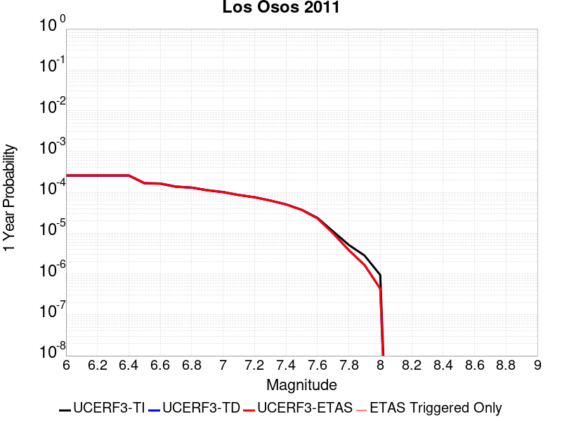 | 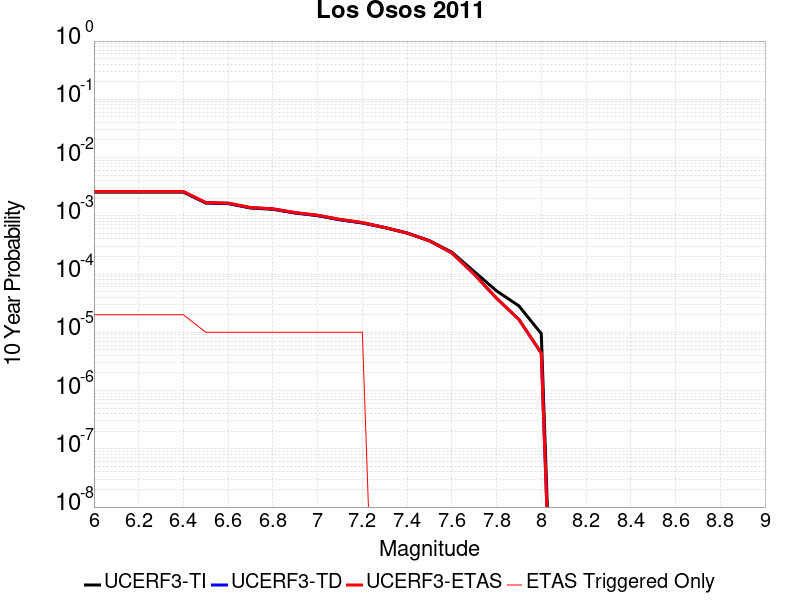 |

| Magnitude | 1 wk TI Prob | 1 wk TD Prob | 1 wk ETAS Prob | 1 wk ETAS/TD Gain | 1 wk ETAS Triggered Only | 1 mo TI Prob | 1 mo TD Prob | 1 mo ETAS Prob | 1 mo ETAS/TD Gain | 1 mo ETAS Triggered Only | 1 yr TI Prob | 1 yr TD Prob | 1 yr ETAS Prob | 1 yr ETAS/TD Gain | 1 yr ETAS Triggered Only | 10 yr TI Prob | 10 yr TD Prob | 10 yr ETAS Prob | 10 yr ETAS/TD Gain | 10 yr ETAS Triggered Only |
|-----|-----|-----|-----|-----|-----|-----|-----|-----|-----|-----|-----|-----|-----|-----|-----|-----|-----|-----|-----|-----|
| 6.0 | 4.8871775E-6 | 4.9814835E-6 | 4.9814835E-6 | 1.0 | 0.0 | 2.0944879E-5 | 2.1349055E-5 | 2.1349055E-5 | 1.0 | 0.0 | 2.5497406E-4 | 2.5989654E-4 | 2.5989654E-4 | 1.0 | 0.0 | 0.002546817 | 0.0025962002 | 0.0026161484 | 1.0076835 | 2.0E-5 |
| 6.1 | 4.8871775E-6 | 4.9814835E-6 | 4.9814835E-6 | 1.0 | 0.0 | 2.0944879E-5 | 2.1349055E-5 | 2.1349055E-5 | 1.0 | 0.0 | 2.5497406E-4 | 2.5989654E-4 | 2.5989654E-4 | 1.0 | 0.0 | 0.002546817 | 0.0025962002 | 0.0026161484 | 1.0076835 | 2.0E-5 |
| 6.2 | 4.8871775E-6 | 4.9814835E-6 | 4.9814835E-6 | 1.0 | 0.0 | 2.0944879E-5 | 2.1349055E-5 | 2.1349055E-5 | 1.0 | 0.0 | 2.5497406E-4 | 2.5989654E-4 | 2.5989654E-4 | 1.0 | 0.0 | 0.002546817 | 0.0025962002 | 0.0026161484 | 1.0076835 | 2.0E-5 |
| 6.3 | 4.8871775E-6 | 4.9814835E-6 | 4.9814835E-6 | 1.0 | 0.0 | 2.0944879E-5 | 2.1349055E-5 | 2.1349055E-5 | 1.0 | 0.0 | 2.5497406E-4 | 2.5989654E-4 | 2.5989654E-4 | 1.0 | 0.0 | 0.002546817 | 0.0025962002 | 0.0026161484 | 1.0076835 | 2.0E-5 |
| 6.4 | 4.8871775E-6 | 4.9814835E-6 | 4.9814835E-6 | 1.0 | 0.0 | 2.0944879E-5 | 2.1349055E-5 | 2.1349055E-5 | 1.0 | 0.0 | 2.5497406E-4 | 2.5989654E-4 | 2.5989654E-4 | 1.0 | 0.0 | 0.002546817 | 0.0025962002 | 0.0026161484 | 1.0076835 | 2.0E-5 |
| 6.5 | 3.1724062E-6 | 3.223395E-6 | 3.223395E-6 | 1.0 | 0.0 | 1.3595956E-5 | 1.3814477E-5 | 1.3814477E-5 | 1.0 | 0.0 | 1.6551818E-4 | 1.681784E-4 | 1.681784E-4 | 1.0 | 0.0 | 0.0016539496 | 0.0016805249 | 0.0016905081 | 1.0059406 | 1.0E-5 |
| 6.6 | 3.1022591E-6 | 3.1511045E-6 | 3.1511045E-6 | 1.0 | 0.0 | 1.3295328E-5 | 1.3504664E-5 | 1.3504664E-5 | 1.0 | 0.0 | 1.618586E-4 | 1.64407E-4 | 1.64407E-4 | 1.0 | 0.0 | 0.0016174077 | 0.0016428665 | 0.0016528501 | 1.0060769 | 1.0E-5 |
| 6.7 | 2.611518E-6 | 2.6491832E-6 | 2.6491832E-6 | 1.0 | 0.0 | 1.1192172E-5 | 1.1353593E-5 | 1.1353593E-5 | 1.0 | 0.0 | 1.3625617E-4 | 1.3822126E-4 | 1.3822126E-4 | 1.0 | 0.0 | 0.0013617266 | 0.0013813575 | 0.0013913437 | 1.0072292 | 1.0E-5 |
| 6.8 | 2.4780884E-6 | 2.5121592E-6 | 2.5121592E-6 | 1.0 | 0.0 | 1.0620336E-5 | 1.0766353E-5 | 1.0766353E-5 | 1.0 | 0.0 | 1.2929492E-4 | 1.3107249E-4 | 1.3107249E-4 | 1.0 | 0.0 | 0.0012921972 | 0.001309956 | 0.0013199429 | 1.0076238 | 1.0E-5 |
| 6.9 | 2.1376322E-6 | 2.1635055E-6 | 2.1635055E-6 | 1.0 | 0.0 | 9.161248E-6 | 9.272134E-6 | 9.272134E-6 | 1.0 | 0.0 | 1.1153249E-4 | 1.128824E-4 | 1.128824E-4 | 1.0 | 0.0 | 0.0011147653 | 0.0011282525 | 0.0011382413 | 1.0088533 | 1.0E-5 |
| 7.0 | 1.9282882E-6 | 1.9494585E-6 | 1.9494585E-6 | 1.0 | 0.0 | 8.264066E-6 | 8.354796E-6 | 8.354796E-6 | 1.0 | 0.0 | 1.0061036E-4 | 1.017149E-4 | 1.017149E-4 | 1.0 | 0.0 | 0.0010056482 | 0.0010166848 | 0.0010266746 | 1.009826 | 1.0E-5 |
| 7.1 | 1.6353226E-6 | 1.6501118E-6 | 1.6501118E-6 | 1.0 | 0.0 | 7.0085066E-6 | 7.0718884E-6 | 7.0718884E-6 | 1.0 | 0.0 | 8.532523E-5 | 8.609685E-5 | 8.609685E-5 | 1.0 | 0.0 | 8.529247E-4 | 8.6063566E-4 | 8.7062706E-4 | 1.0116093 | 1.0E-5 |
| 7.2 | 1.4446276E-6 | 1.4553341E-6 | 1.4553341E-6 | 1.0 | 0.0 | 6.191247E-6 | 6.237131E-6 | 6.237131E-6 | 1.0 | 0.0 | 7.537582E-5 | 7.593443E-5 | 7.593443E-5 | 1.0 | 0.0 | 7.535026E-4 | 7.590854E-4 | 7.6907786E-4 | 1.0131638 | 1.0E-5 |
| 7.3 | 1.2014582E-6 | 1.2069073E-6 | 1.2069073E-6 | 1.0 | 0.0 | 5.149096E-6 | 5.1724496E-6 | 5.1724496E-6 | 1.0 | 0.0 | 6.268844E-5 | 6.297276E-5 | 6.297276E-5 | 1.0 | 0.0 | 6.267076E-4 | 6.295495E-4 | 6.295495E-4 | 1.0 | 0.0 |
| 7.4 | 9.707733E-7 | 9.709773E-7 | 9.709773E-7 | 1.0 | 0.0 | 4.16045E-6 | 4.161325E-6 | 4.161325E-6 | 1.0 | 0.0 | 5.0652303E-5 | 5.066295E-5 | 5.066295E-5 | 1.0 | 0.0 | 5.064076E-4 | 5.065143E-4 | 5.065143E-4 | 1.0 | 0.0 |
| 7.5 | 7.174908E-7 | 7.1149134E-7 | 7.1149134E-7 | 1.0 | 0.0 | 3.074957E-6 | 3.0492452E-6 | 3.0492452E-6 | 1.0 | 0.0 | 3.743696E-5 | 3.712393E-5 | 3.712393E-5 | 1.0 | 0.0 | 3.7430652E-4 | 3.7117745E-4 | 3.7117745E-4 | 1.0 | 0.0 |
| 7.6 | 4.5535776E-7 | 4.420792E-7 | 4.420792E-7 | 1.0 | 0.0 | 1.9515319E-6 | 1.8946238E-6 | 1.8946238E-6 | 1.0 | 0.0 | 2.3759641E-5 | 2.3066801E-5 | 2.3066801E-5 | 1.0 | 0.0 | 2.37571E-4 | 2.3064416E-4 | 2.3064416E-4 | 1.0 | 0.0 |
| 7.7 | 2.1173553E-7 | 1.9060796E-7 | 1.9060796E-7 | 1.0 | 0.0 | 9.0743765E-7 | 8.1689103E-7 | 8.1689103E-7 | 1.0 | 0.0 | 1.1047998E-5 | 9.945603E-6 | 9.945603E-6 | 1.0 | 0.0 | 1.1047449E-4 | 9.945161E-5 | 9.945161E-5 | 1.0 | 0.0 |
| 7.8 | 9.873608E-8 | 7.3675665E-8 | 7.3675665E-8 | 1.0 | 0.0 | 4.2315455E-7 | 3.157528E-7 | 3.157528E-7 | 1.0 | 0.0 | 5.1518946E-6 | 3.8442836E-6 | 3.8442836E-6 | 1.0 | 0.0 | 5.1517753E-5 | 3.8442176E-5 | 3.8442176E-5 | 1.0 | 0.0 |
| 7.9 | 5.4399106E-8 | 3.1880155E-8 | 3.1880155E-8 | 1.0 | 0.0 | 2.33139E-7 | 1.3662923E-7 | 1.3662923E-7 | 1.0 | 0.0 | 2.8384638E-6 | 1.6634596E-6 | 1.6634596E-6 | 1.0 | 0.0 | 2.8384275E-5 | 1.6634473E-5 | 1.6634473E-5 | 1.0 | 0.0 |
| 8.0 | 1.817203E-8 | 8.420727E-9 | 8.420727E-9 | 1.0 | 0.0 | 7.7880124E-8 | 3.608883E-8 | 3.608883E-8 | 1.0 | 0.0 | 9.481901E-7 | 4.393814E-7 | 4.393814E-7 | 1.0 | 0.0 | 9.481861E-6 | 4.3938057E-6 | 4.3938057E-6 | 1.0 | 0.0 |

## Bartlett Springs 2011 CFM
*[(top)](#table-of-contents)*

| 1 Week | 1 Month | 1 Year | 10 Year |
|-----|-----|-----|-----|
|  |  | 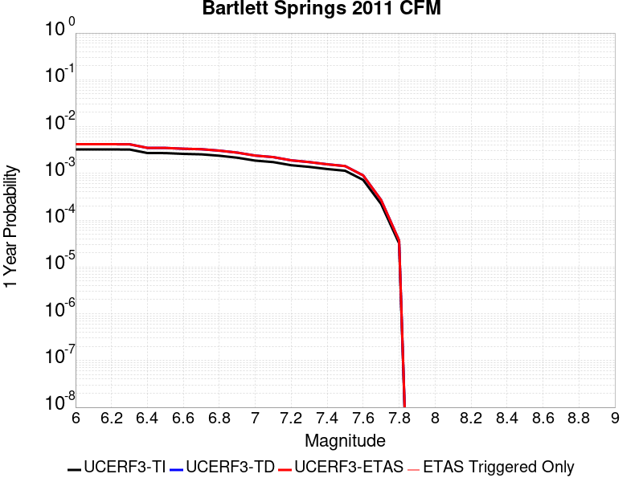 | 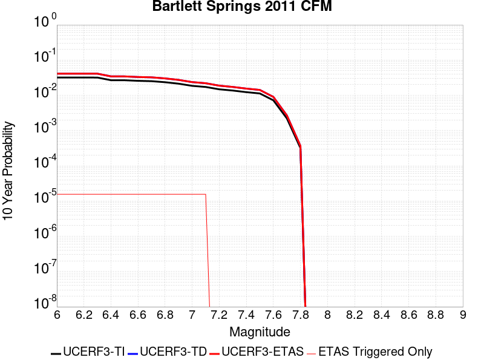 |

| Magnitude | 1 wk TI Prob | 1 wk TD Prob | 1 wk ETAS Prob | 1 wk ETAS/TD Gain | 1 wk ETAS Triggered Only | 1 mo TI Prob | 1 mo TD Prob | 1 mo ETAS Prob | 1 mo ETAS/TD Gain | 1 mo ETAS Triggered Only | 1 yr TI Prob | 1 yr TD Prob | 1 yr ETAS Prob | 1 yr ETAS/TD Gain | 1 yr ETAS Triggered Only | 10 yr TI Prob | 10 yr TD Prob | 10 yr ETAS Prob | 10 yr ETAS/TD Gain | 10 yr ETAS Triggered Only |
|-----|-----|-----|-----|-----|-----|-----|-----|-----|-----|-----|-----|-----|-----|-----|-----|-----|-----|-----|-----|-----|
| 6.0 | 6.2326144E-5 | 8.060613E-5 | 8.060613E-5 | 1.0 | 0.0 | 2.6708472E-4 | 3.454099E-4 | 3.454099E-4 | 1.0 | 0.0 | 0.003246908 | 0.0041973945 | 0.0041973945 | 1.0 | 0.0 | 0.031998757 | 0.04119771 | 0.041216888 | 1.0004655 | 2.0E-5 |
| 6.1 | 6.227657E-5 | 8.054363E-5 | 8.054363E-5 | 1.0 | 0.0 | 2.668723E-4 | 3.4514212E-4 | 3.4514212E-4 | 1.0 | 0.0 | 0.0032443295 | 0.004194147 | 0.004194147 | 1.0 | 0.0 | 0.031973712 | 0.041166443 | 0.04118562 | 1.0004659 | 2.0E-5 |
| 6.2 | 6.22452E-5 | 8.050423E-5 | 8.050423E-5 | 1.0 | 0.0 | 2.6673786E-4 | 3.4497332E-4 | 3.4497332E-4 | 1.0 | 0.0 | 0.0032426978 | 0.0041921 | 0.0041921 | 1.0 | 0.0 | 0.03195787 | 0.041146737 | 0.041165914 | 1.0004661 | 2.0E-5 |
| 6.3 | 6.219006E-5 | 8.043407E-5 | 8.043407E-5 | 1.0 | 0.0 | 2.6650162E-4 | 3.4467268E-4 | 3.4467268E-4 | 1.0 | 0.0 | 0.00323983 | 0.0041884542 | 0.0041884542 | 1.0 | 0.0 | 0.031930014 | 0.041111637 | 0.041130815 | 1.0004665 | 2.0E-5 |
| 6.4 | 5.2175856E-5 | 6.725342E-5 | 6.725342E-5 | 1.0 | 0.0 | 2.2359163E-4 | 2.8819745E-4 | 2.8819745E-4 | 1.0 | 0.0 | 0.0027188298 | 0.0035032115 | 0.0035032115 | 1.0 | 0.0 | 0.026858058 | 0.034489222 | 0.03450853 | 1.0005599 | 2.0E-5 |
| 6.5 | 5.205166E-5 | 6.7096094E-5 | 6.7096094E-5 | 1.0 | 0.0 | 2.2305945E-4 | 2.8752335E-4 | 2.8752335E-4 | 1.0 | 0.0 | 0.0027123666 | 0.0034950306 | 0.0034950306 | 1.0 | 0.0 | 0.026794989 | 0.034409966 | 0.03442928 | 1.0005612 | 2.0E-5 |
| 6.6 | 5.0085426E-5 | 6.449277E-5 | 6.449277E-5 | 1.0 | 0.0 | 2.1463417E-4 | 2.763686E-4 | 2.763686E-4 | 1.0 | 0.0 | 0.0026100394 | 0.0033596456 | 0.0033596456 | 1.0 | 0.0 | 0.025795965 | 0.033097573 | 0.03311691 | 1.0005842 | 2.0E-5 |
| 6.7 | 4.8930866E-5 | 6.3017396E-5 | 6.3017396E-5 | 1.0 | 0.0 | 2.0968684E-4 | 2.7004688E-4 | 2.7004688E-4 | 1.0 | 0.0 | 0.0025499484 | 0.0032829174 | 0.0032829174 | 1.0 | 0.0 | 0.025208864 | 0.03235294 | 0.032372292 | 1.0005982 | 2.0E-5 |
| 6.8 | 4.5679535E-5 | 5.8741858E-5 | 5.8741858E-5 | 1.0 | 0.0 | 1.9575475E-4 | 2.5172674E-4 | 2.5172674E-4 | 1.0 | 0.0 | 0.002380709 | 0.0030605064 | 0.0030605064 | 1.0 | 0.0 | 0.023553653 | 0.03019042 | 0.030209817 | 1.0006424 | 2.0E-5 |
| 6.9 | 4.1439176E-5 | 5.3220094E-5 | 5.3220094E-5 | 1.0 | 0.0 | 1.7758438E-4 | 2.2806633E-4 | 2.2806633E-4 | 1.0 | 0.0 | 0.002159946 | 0.0027731995 | 0.0027731995 | 1.0 | 0.0 | 0.021390721 | 0.027390772 | 0.027410226 | 1.0007101 | 2.0E-5 |
| 7.0 | 3.5920104E-5 | 4.600871E-5 | 4.600871E-5 | 1.0 | 0.0 | 1.5393422E-4 | 1.9716538E-4 | 1.9716538E-4 | 1.0 | 0.0 | 0.001872538 | 0.0023978627 | 0.0023978627 | 1.0 | 0.0 | 0.018568378 | 0.023723004 | 0.023732768 | 1.0004115 | 1.0E-5 |
| 7.1 | 3.338812E-5 | 4.2689582E-5 | 4.2689582E-5 | 1.0 | 0.0 | 1.430841E-4 | 1.829426E-4 | 1.829426E-4 | 1.0 | 0.0 | 0.0017406568 | 0.0022250658 | 0.0022250658 | 1.0 | 0.0 | 0.017270854 | 0.02203054 | 0.02204032 | 1.0004439 | 1.0E-5 |
| 7.2 | 2.8619615E-5 | 3.6401652E-5 | 3.6401652E-5 | 1.0 | 0.0 | 1.2264973E-4 | 1.5599781E-4 | 1.5599781E-4 | 1.0 | 0.0 | 0.0014922376 | 0.0018976285 | 0.0018976285 | 1.0 | 0.0 | 0.014822568 | 0.01881613 | 0.01881613 | 1.0 | 0.0 |
| 7.3 | 2.6376783E-5 | 3.342276E-5 | 3.342276E-5 | 1.0 | 0.0 | 1.13038455E-4 | 1.4323258E-4 | 1.4323258E-4 | 1.0 | 0.0 | 0.0013753743 | 0.001742471 | 0.001742471 | 1.0 | 0.0 | 0.01366893 | 0.01728972 | 0.01728972 | 1.0 | 0.0 |
| 7.4 | 2.3738676E-5 | 2.9978975E-5 | 2.9978975E-5 | 1.0 | 0.0 | 1.0173322E-4 | 1.2847505E-4 | 1.2847505E-4 | 1.0 | 0.0 | 0.0012378981 | 0.0015630693 | 0.0015630693 | 1.0 | 0.0 | 0.012310251 | 0.015522073 | 0.015522073 | 1.0 | 0.0 |
| 7.5 | 2.1789481E-5 | 2.7439388E-5 | 2.7439388E-5 | 1.0 | 0.0 | 9.338015E-5 | 1.1759212E-4 | 1.1759212E-4 | 1.0 | 0.0 | 0.0011363103 | 0.0014307518 | 0.0014307518 | 1.0 | 0.0 | 0.011305175 | 0.014216576 | 0.014216576 | 1.0 | 0.0 |
| 7.6 | 1.3895281E-5 | 1.7368426E-5 | 1.7368426E-5 | 1.0 | 0.0 | 5.9549846E-5 | 7.4434E-5 | 7.4434E-5 | 1.0 | 0.0 | 7.2477816E-4 | 9.0586004E-4 | 9.0586004E-4 | 1.0 | 0.0 | 0.0072241887 | 0.009022084 | 0.009022084 | 1.0 | 0.0 |
| 7.7 | 4.245981E-6 | 5.1624675E-6 | 5.1624675E-6 | 1.0 | 0.0 | 1.8196934E-5 | 2.2124674E-5 | 2.2124674E-5 | 1.0 | 0.0 | 2.2152514E-4 | 2.693348E-4 | 2.693348E-4 | 1.0 | 0.0 | 0.0022130446 | 0.0026901034 | 0.0026901034 | 1.0 | 0.0 |
| 7.8 | 6.145192E-7 | 7.047006E-7 | 7.047006E-7 | 1.0 | 0.0 | 2.633651E-6 | 3.020142E-6 | 3.020142E-6 | 1.0 | 0.0 | 3.206423E-5 | 3.676962E-5 | 3.676962E-5 | 1.0 | 0.0 | 3.2059604E-4 | 3.6763478E-4 | 3.6763478E-4 | 1.0 | 0.0 |

## Morales (East)
*[(top)](#table-of-contents)*

| 1 Week | 1 Month | 1 Year | 10 Year |
|-----|-----|-----|-----|
| 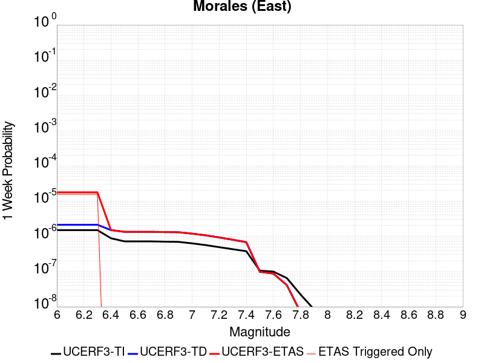 | 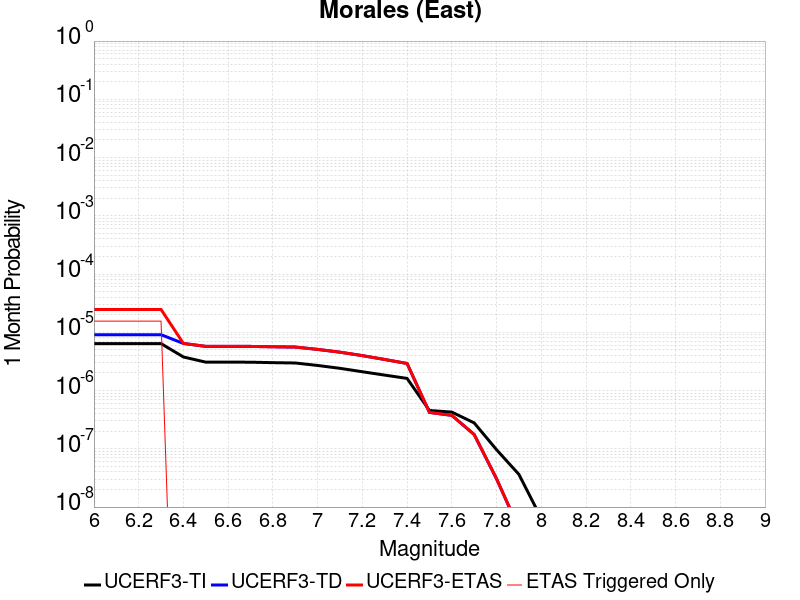 | 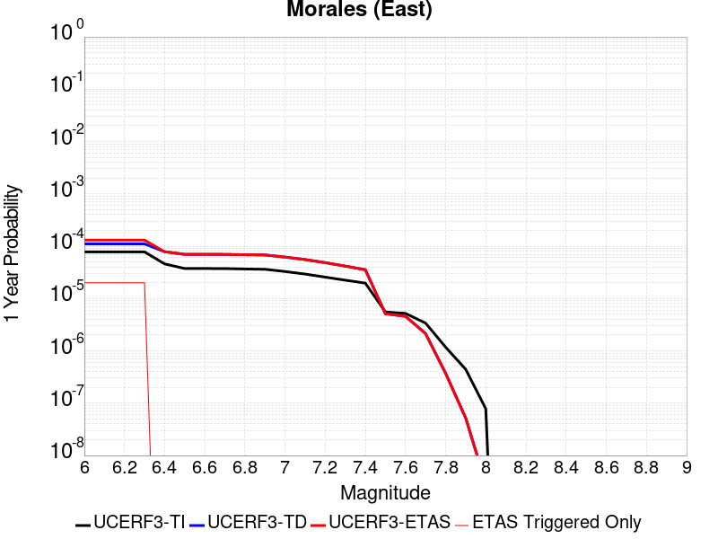 | 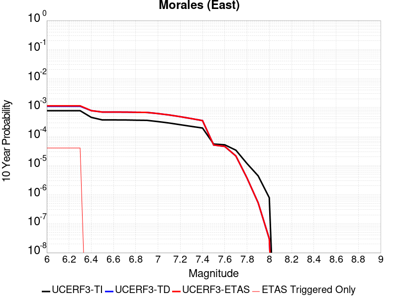 |

| Magnitude | 1 wk TI Prob | 1 wk TD Prob | 1 wk ETAS Prob | 1 wk ETAS/TD Gain | 1 wk ETAS Triggered Only | 1 mo TI Prob | 1 mo TD Prob | 1 mo ETAS Prob | 1 mo ETAS/TD Gain | 1 mo ETAS Triggered Only | 1 yr TI Prob | 1 yr TD Prob | 1 yr ETAS Prob | 1 yr ETAS/TD Gain | 1 yr ETAS Triggered Only | 10 yr TI Prob | 10 yr TD Prob | 10 yr ETAS Prob | 10 yr ETAS/TD Gain | 10 yr ETAS Triggered Only |
|-----|-----|-----|-----|-----|-----|-----|-----|-----|-----|-----|-----|-----|-----|-----|-----|-----|-----|-----|-----|-----|
| 6.0 | 1.4942771E-6 | 2.123479E-6 | 1.2123458E-5 | 5.7092433 | 1.0E-5 | 6.404029E-6 | 9.100596E-6 | 1.9100504E-5 | 2.0988193 | 1.0E-5 | 7.7966266E-5 | 1.107947E-4 | 1.3079248E-4 | 1.1804941 | 2.0E-5 | 7.793892E-4 | 0.0011074544 | 0.0011274322 | 1.0180395 | 2.0E-5 |
| 6.1 | 1.4942771E-6 | 2.123479E-6 | 1.2123458E-5 | 5.7092433 | 1.0E-5 | 6.404029E-6 | 9.100596E-6 | 1.9100504E-5 | 2.0988193 | 1.0E-5 | 7.7966266E-5 | 1.107947E-4 | 1.3079248E-4 | 1.1804941 | 2.0E-5 | 7.793892E-4 | 0.0011074544 | 0.0011274322 | 1.0180395 | 2.0E-5 |
| 6.2 | 1.4942771E-6 | 2.123479E-6 | 1.2123458E-5 | 5.7092433 | 1.0E-5 | 6.404029E-6 | 9.100596E-6 | 1.9100504E-5 | 2.0988193 | 1.0E-5 | 7.7966266E-5 | 1.107947E-4 | 1.3079248E-4 | 1.1804941 | 2.0E-5 | 7.793892E-4 | 0.0011074544 | 0.0011274322 | 1.0180395 | 2.0E-5 |
| 6.3 | 1.4942771E-6 | 2.123479E-6 | 1.2123458E-5 | 5.7092433 | 1.0E-5 | 6.404029E-6 | 9.100596E-6 | 1.9100504E-5 | 2.0988193 | 1.0E-5 | 7.7966266E-5 | 1.107947E-4 | 1.3079248E-4 | 1.1804941 | 2.0E-5 | 7.793892E-4 | 0.0011074544 | 0.0011274322 | 1.0180395 | 2.0E-5 |
| 6.4 | 8.798845E-7 | 1.5022731E-6 | 1.5022731E-6 | 1.0 | 0.0 | 3.7709283E-6 | 6.438298E-6 | 6.438298E-6 | 1.0 | 0.0 | 4.5910085E-5 | 7.8383564E-5 | 7.8383564E-5 | 1.0 | 0.0 | 4.59006E-4 | 7.835727E-4 | 7.835727E-4 | 1.0 | 0.0 |
| 6.5 | 7.1751725E-7 | 1.3384229E-6 | 1.3384229E-6 | 1.0 | 0.0 | 3.0750705E-6 | 5.7360858E-6 | 5.7360858E-6 | 1.0 | 0.0 | 3.7438338E-5 | 6.9834685E-5 | 6.9834685E-5 | 1.0 | 0.0 | 3.743203E-4 | 6.9813756E-4 | 6.9813756E-4 | 1.0 | 0.0 |
| 6.6 | 7.1751725E-7 | 1.3384229E-6 | 1.3384229E-6 | 1.0 | 0.0 | 3.0750705E-6 | 5.7360858E-6 | 5.7360858E-6 | 1.0 | 0.0 | 3.7438338E-5 | 6.9834685E-5 | 6.9834685E-5 | 1.0 | 0.0 | 3.743203E-4 | 6.9813756E-4 | 6.9813756E-4 | 1.0 | 0.0 |
| 6.7 | 7.159057E-7 | 1.3358889E-6 | 1.3358889E-6 | 1.0 | 0.0 | 3.0681638E-6 | 5.725226E-6 | 5.725226E-6 | 1.0 | 0.0 | 3.7354253E-5 | 6.970247E-5 | 6.970247E-5 | 1.0 | 0.0 | 3.7347974E-4 | 6.968163E-4 | 6.968163E-4 | 1.0 | 0.0 |
| 6.8 | 7.032203E-7 | 1.3174443E-6 | 1.3174443E-6 | 1.0 | 0.0 | 3.0137978E-6 | 5.646178E-6 | 5.646178E-6 | 1.0 | 0.0 | 3.669237E-5 | 6.8740126E-5 | 6.8740126E-5 | 1.0 | 0.0 | 3.6686313E-4 | 6.871988E-4 | 6.871988E-4 | 1.0 | 0.0 |
| 6.9 | 6.941549E-7 | 1.3025061E-6 | 1.3025061E-6 | 1.0 | 0.0 | 2.974946E-6 | 5.582158E-6 | 5.582158E-6 | 1.0 | 0.0 | 3.6219368E-5 | 6.7960726E-5 | 6.7960726E-5 | 1.0 | 0.0 | 3.6213463E-4 | 6.7940954E-4 | 6.7940954E-4 | 1.0 | 0.0 |
| 7.0 | 6.2932247E-7 | 1.18774E-6 | 1.18774E-6 | 1.0 | 0.0 | 2.6970936E-6 | 5.090305E-6 | 5.090305E-6 | 1.0 | 0.0 | 3.283662E-5 | 6.1972765E-5 | 6.1972765E-5 | 1.0 | 0.0 | 3.283177E-4 | 6.1956374E-4 | 6.1956374E-4 | 1.0 | 0.0 |
| 7.1 | 5.6200963E-7 | 1.0640374E-6 | 1.0640374E-6 | 1.0 | 0.0 | 2.4086105E-6 | 4.5601523E-6 | 4.5601523E-6 | 1.0 | 0.0 | 2.9324437E-5 | 5.551849E-5 | 5.551849E-5 | 1.0 | 0.0 | 2.9320567E-4 | 5.550534E-4 | 5.550534E-4 | 1.0 | 0.0 |
| 7.2 | 4.91044E-7 | 9.285713E-7 | 9.285713E-7 | 1.0 | 0.0 | 2.1044725E-6 | 3.9795855E-6 | 3.9795855E-6 | 1.0 | 0.0 | 2.5621652E-5 | 4.8450413E-5 | 4.8450413E-5 | 1.0 | 0.0 | 2.56187E-4 | 4.8440482E-4 | 4.8440482E-4 | 1.0 | 0.0 |
| 7.3 | 4.2978448E-7 | 7.9739846E-7 | 7.9739846E-7 | 1.0 | 0.0 | 1.8419321E-6 | 3.4174175E-6 | 3.4174175E-6 | 1.0 | 0.0 | 2.2425293E-5 | 4.1606294E-5 | 4.1606294E-5 | 1.0 | 0.0 | 2.242303E-4 | 4.1599068E-4 | 4.1599068E-4 | 1.0 | 0.0 |
| 7.4 | 3.774317E-7 | 6.806746E-7 | 6.806746E-7 | 1.0 | 0.0 | 1.6175634E-6 | 2.9171736E-6 | 2.9171736E-6 | 1.0 | 0.0 | 1.9693656E-5 | 3.5516037E-5 | 3.5516037E-5 | 1.0 | 0.0 | 1.969191E-4 | 3.551089E-4 | 3.551089E-4 | 1.0 | 0.0 |
| 7.5 | 1.0603232E-7 | 9.840901E-8 | 9.840901E-8 | 1.0 | 0.0 | 4.5442414E-7 | 4.2175284E-7 | 4.2175284E-7 | 1.0 | 0.0 | 5.5326E-6 | 5.134829E-6 | 5.134829E-6 | 1.0 | 0.0 | 5.532462E-5 | 5.134967E-5 | 5.134967E-5 | 1.0 | 0.0 |
| 7.6 | 9.960384E-8 | 8.755334E-8 | 8.755334E-8 | 1.0 | 0.0 | 4.2687353E-7 | 3.7522852E-7 | 3.7522852E-7 | 1.0 | 0.0 | 5.197173E-6 | 4.568398E-6 | 4.568398E-6 | 1.0 | 0.0 | 5.1970514E-5 | 4.5685607E-5 | 4.5685607E-5 | 1.0 | 0.0 |
| 7.7 | 6.499468E-8 | 4.1038682E-8 | 4.1038682E-8 | 1.0 | 0.0 | 2.785486E-7 | 1.7588006E-7 | 1.7588006E-7 | 1.0 | 0.0 | 3.3913238E-6 | 2.1413375E-6 | 2.1413375E-6 | 1.0 | 0.0 | 3.3912722E-5 | 2.1415728E-5 | 2.1415728E-5 | 1.0 | 0.0 |
| 7.8 | 2.2517119E-8 | 7.1312614E-9 | 7.1312614E-9 | 1.0 | 0.0 | 9.6501935E-8 | 3.0562546E-8 | 3.0562546E-8 | 1.0 | 0.0 | 1.1749105E-6 | 3.7209892E-7 | 3.7209892E-7 | 1.0 | 0.0 | 1.1749043E-5 | 3.7235213E-6 | 3.7235213E-6 | 1.0 | 0.0 |
| 7.9 | 8.493023E-9 | 9.970124E-10 | 9.970124E-10 | 1.0 | 0.0 | 3.639867E-8 | 4.2729082E-9 | 4.2729082E-9 | 1.0 | 0.0 | 4.4315374E-7 | 5.202266E-8 | 5.202266E-8 | 1.0 | 0.0 | 4.4315284E-6 | 5.2233156E-7 | 5.2233156E-7 | 1.0 | 0.0 |
| 8.0 | 1.4971842E-9 | 5.5458416E-11 | 5.5458416E-11 | 1.0 | 0.0 | 6.4165038E-9 | 2.376762E-10 | 2.376762E-10 | 1.0 | 0.0 | 7.812093E-8 | 2.8937068E-9 | 2.8937068E-9 | 1.0 | 0.0 | 7.81209E-7 | 3.019288E-8 | 3.019288E-8 | 1.0 | 0.0 |

## Johnson Valley (No) 2011 rev
*[(top)](#table-of-contents)*

| 1 Week | 1 Month | 1 Year | 10 Year |
|-----|-----|-----|-----|
|  |  | 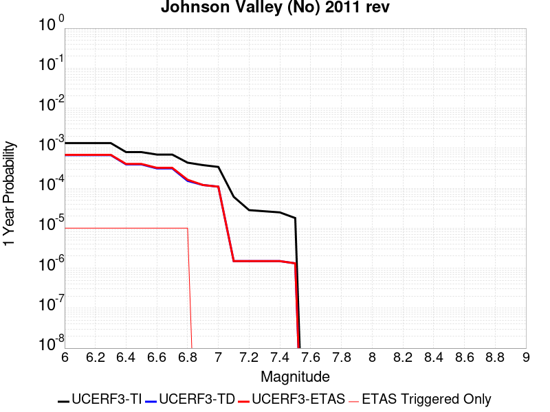 | 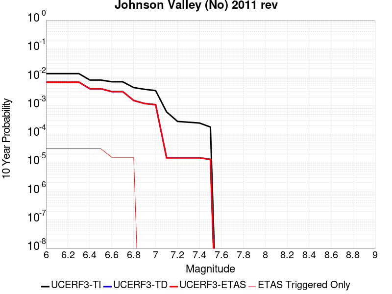 |

| Magnitude | 1 wk TI Prob | 1 wk TD Prob | 1 wk ETAS Prob | 1 wk ETAS/TD Gain | 1 wk ETAS Triggered Only | 1 mo TI Prob | 1 mo TD Prob | 1 mo ETAS Prob | 1 mo ETAS/TD Gain | 1 mo ETAS Triggered Only | 1 yr TI Prob | 1 yr TD Prob | 1 yr ETAS Prob | 1 yr ETAS/TD Gain | 1 yr ETAS Triggered Only | 10 yr TI Prob | 10 yr TD Prob | 10 yr ETAS Prob | 10 yr ETAS/TD Gain | 10 yr ETAS Triggered Only |
|-----|-----|-----|-----|-----|-----|-----|-----|-----|-----|-----|-----|-----|-----|-----|-----|-----|-----|-----|-----|-----|
| 6.0 | 2.577707E-5 | 1.2900938E-5 | 1.2900938E-5 | 1.0 | 0.0 | 1.1046848E-4 | 5.5288787E-5 | 5.5288787E-5 | 1.0 | 0.0 | 0.0013441239 | 6.7297276E-4 | 6.82966E-4 | 1.0148494 | 1.0E-5 | 0.013360229 | 0.006713257 | 0.0067331227 | 1.0029591 | 2.0E-5 |
| 6.1 | 2.577707E-5 | 1.2900938E-5 | 1.2900938E-5 | 1.0 | 0.0 | 1.1046848E-4 | 5.5288787E-5 | 5.5288787E-5 | 1.0 | 0.0 | 0.0013441239 | 6.7297276E-4 | 6.82966E-4 | 1.0148494 | 1.0E-5 | 0.013360229 | 0.006713257 | 0.0067331227 | 1.0029591 | 2.0E-5 |
| 6.2 | 2.577707E-5 | 1.2900938E-5 | 1.2900938E-5 | 1.0 | 0.0 | 1.1046848E-4 | 5.5288787E-5 | 5.5288787E-5 | 1.0 | 0.0 | 0.0013441239 | 6.7297276E-4 | 6.82966E-4 | 1.0148494 | 1.0E-5 | 0.013360229 | 0.006713257 | 0.0067331227 | 1.0029591 | 2.0E-5 |
| 6.3 | 2.577707E-5 | 1.2900938E-5 | 1.2900938E-5 | 1.0 | 0.0 | 1.1046848E-4 | 5.5288787E-5 | 5.5288787E-5 | 1.0 | 0.0 | 0.0013441239 | 6.7297276E-4 | 6.82966E-4 | 1.0148494 | 1.0E-5 | 0.013360229 | 0.006713257 | 0.0067331227 | 1.0029591 | 2.0E-5 |
| 6.4 | 1.5296591E-5 | 7.536742E-6 | 7.536742E-6 | 1.0 | 0.0 | 6.555518E-5 | 3.2300028E-5 | 3.2300028E-5 | 1.0 | 0.0 | 7.97842E-4 | 3.9320064E-4 | 4.031967E-4 | 1.0254223 | 1.0E-5 | 0.007949836 | 0.0039268904 | 0.0039468124 | 1.0050731 | 2.0E-5 |
| 6.5 | 1.5296591E-5 | 7.536742E-6 | 7.536742E-6 | 1.0 | 0.0 | 6.555518E-5 | 3.2300028E-5 | 3.2300028E-5 | 1.0 | 0.0 | 7.97842E-4 | 3.9320064E-4 | 4.031967E-4 | 1.0254223 | 1.0E-5 | 0.007949836 | 0.0039268904 | 0.0039468124 | 1.0050731 | 2.0E-5 |
| 6.6 | 1.3289383E-5 | 5.9917306E-6 | 5.9917306E-6 | 1.0 | 0.0 | 5.6953253E-5 | 2.5678688E-5 | 2.5678688E-5 | 1.0 | 0.0 | 6.9318525E-4 | 3.1261015E-4 | 3.2260703E-4 | 1.0319787 | 1.0E-5 | 0.0069102696 | 0.0031233684 | 0.003133337 | 1.0031917 | 1.0E-5 |
| 6.7 | 1.3289383E-5 | 5.9917306E-6 | 5.9917306E-6 | 1.0 | 0.0 | 5.6953253E-5 | 2.5678688E-5 | 2.5678688E-5 | 1.0 | 0.0 | 6.9318525E-4 | 3.1261015E-4 | 3.2260703E-4 | 1.0319787 | 1.0E-5 | 0.0069102696 | 0.0031233684 | 0.003133337 | 1.0031917 | 1.0E-5 |
| 6.8 | 8.330789E-6 | 2.9211888E-6 | 2.9211888E-6 | 1.0 | 0.0 | 3.570289E-5 | 1.2519352E-5 | 1.2519352E-5 | 1.0 | 0.0 | 4.34596E-4 | 1.5241816E-4 | 1.6241663E-4 | 1.065599 | 1.0E-5 | 0.0043374705 | 0.0015236961 | 0.001533681 | 1.0065529 | 1.0E-5 |
| 6.9 | 7.2359003E-6 | 2.3013247E-6 | 2.3013247E-6 | 1.0 | 0.0 | 3.1010633E-5 | 9.8628125E-6 | 9.8628125E-6 | 1.0 | 0.0 | 3.7748902E-4 | 1.2007845E-4 | 1.2007845E-4 | 1.0 | 0.0 | 0.0037684843 | 0.0012006586 | 0.0012006586 | 1.0 | 0.0 |
| 7.0 | 6.5149957E-6 | 2.088482E-6 | 2.088482E-6 | 1.0 | 0.0 | 2.792111E-5 | 8.950637E-6 | 8.950637E-6 | 1.0 | 0.0 | 3.398865E-4 | 1.0897385E-4 | 1.0897385E-4 | 1.0 | 0.0 | 0.003393671 | 0.0010897239 | 0.0010897239 | 1.0 | 0.0 |
| 7.1 | 1.1662233E-6 | 2.8802024E-8 | 2.8802024E-8 | 1.0 | 0.0 | 4.9980904E-6 | 1.2343725E-7 | 1.2343725E-7 | 1.0 | 0.0 | 6.0850052E-5 | 1.5028476E-6 | 1.5028476E-6 | 1.0 | 0.0 | 6.083339E-4 | 1.50283895E-5 | 1.50283895E-5 | 1.0 | 0.0 |
| 7.2 | 5.413881E-7 | 2.8802024E-8 | 2.8802024E-8 | 1.0 | 0.0 | 2.3202326E-6 | 1.2343725E-7 | 1.2343725E-7 | 1.0 | 0.0 | 2.8248465E-5 | 1.5028476E-6 | 1.5028476E-6 | 1.0 | 0.0 | 2.8244875E-4 | 1.50283895E-5 | 1.50283895E-5 | 1.0 | 0.0 |
| 7.3 | 5.076821E-7 | 2.8802024E-8 | 2.8802024E-8 | 1.0 | 0.0 | 2.1757785E-6 | 1.2343723E-7 | 1.2343723E-7 | 1.0 | 0.0 | 2.648978E-5 | 1.5028475E-6 | 1.5028475E-6 | 1.0 | 0.0 | 2.6486625E-4 | 1.50283895E-5 | 1.50283895E-5 | 1.0 | 0.0 |
| 7.4 | 4.7568687E-7 | 2.8783948E-8 | 2.8783948E-8 | 1.0 | 0.0 | 2.0386565E-6 | 1.2335977E-7 | 1.2335977E-7 | 1.0 | 0.0 | 2.482036E-5 | 1.5019043E-6 | 1.5019043E-6 | 1.0 | 0.0 | 2.4817587E-4 | 1.5018958E-5 | 1.5018958E-5 | 1.0 | 0.0 |
| 7.5 | 3.435626E-7 | 2.5357679E-8 | 2.5357679E-8 | 1.0 | 0.0 | 1.4724103E-6 | 1.0867576E-7 | 1.0867576E-7 | 1.0 | 0.0 | 1.7926448E-5 | 1.3231268E-6 | 1.3231268E-6 | 1.0 | 0.0 | 1.7925001E-4 | 1.3231205E-5 | 1.3231205E-5 | 1.0 | 0.0 |

## Eureka Peak
*[(top)](#table-of-contents)*

| 1 Week | 1 Month | 1 Year | 10 Year |
|-----|-----|-----|-----|
|  |  |  | 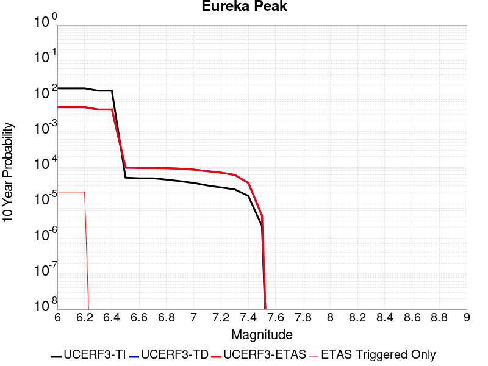 |

| Magnitude | 1 wk TI Prob | 1 wk TD Prob | 1 wk ETAS Prob | 1 wk ETAS/TD Gain | 1 wk ETAS Triggered Only | 1 mo TI Prob | 1 mo TD Prob | 1 mo ETAS Prob | 1 mo ETAS/TD Gain | 1 mo ETAS Triggered Only | 1 yr TI Prob | 1 yr TD Prob | 1 yr ETAS Prob | 1 yr ETAS/TD Gain | 1 yr ETAS Triggered Only | 10 yr TI Prob | 10 yr TD Prob | 10 yr ETAS Prob | 10 yr ETAS/TD Gain | 10 yr ETAS Triggered Only |
|-----|-----|-----|-----|-----|-----|-----|-----|-----|-----|-----|-----|-----|-----|-----|-----|-----|-----|-----|-----|-----|
| 6.0 | 3.1949054E-5 | 9.310571E-6 | 9.310571E-6 | 1.0 | 0.0 | 1.3691733E-4 | 3.990228E-5 | 3.990228E-5 | 1.0 | 0.0 | 0.0016656938 | 4.8578004E-4 | 4.957752E-4 | 1.0205754 | 1.0E-5 | 0.016532637 | 0.0049248957 | 0.004944797 | 1.004041 | 2.0E-5 |
| 6.1 | 3.1949054E-5 | 9.310571E-6 | 9.310571E-6 | 1.0 | 0.0 | 1.3691733E-4 | 3.990228E-5 | 3.990228E-5 | 1.0 | 0.0 | 0.0016656938 | 4.8578004E-4 | 4.957752E-4 | 1.0205754 | 1.0E-5 | 0.016532637 | 0.0049248957 | 0.004944797 | 1.004041 | 2.0E-5 |
| 6.2 | 3.1949054E-5 | 9.310571E-6 | 9.310571E-6 | 1.0 | 0.0 | 1.3691733E-4 | 3.990228E-5 | 3.990228E-5 | 1.0 | 0.0 | 0.0016656938 | 4.8578004E-4 | 4.957752E-4 | 1.0205754 | 1.0E-5 | 0.016532637 | 0.0049248957 | 0.004944797 | 1.004041 | 2.0E-5 |
| 6.3 | 2.7339745E-5 | 7.980718E-6 | 7.980718E-6 | 1.0 | 0.0 | 1.1716507E-4 | 3.4203054E-5 | 3.4203054E-5 | 1.0 | 0.0 | 0.0014255513 | 4.164185E-4 | 4.164185E-4 | 1.0 | 0.0 | 0.0141644105 | 0.004228374 | 0.004228374 | 1.0 | 0.0 |
| 6.4 | 2.7339745E-5 | 7.980718E-6 | 7.980718E-6 | 1.0 | 0.0 | 1.1716507E-4 | 3.4203054E-5 | 3.4203054E-5 | 1.0 | 0.0 | 0.0014255513 | 4.164185E-4 | 4.164185E-4 | 1.0 | 0.0 | 0.0141644105 | 0.004228374 | 0.004228374 | 1.0 | 0.0 |
| 6.5 | 9.738388E-8 | 1.8619214E-7 | 1.8619214E-7 | 1.0 | 0.0 | 4.1735944E-7 | 7.979661E-7 | 7.979661E-7 | 1.0 | 0.0 | 5.081339E-6 | 9.715194E-6 | 9.715194E-6 | 1.0 | 0.0 | 5.0812232E-5 | 9.714778E-5 | 9.714778E-5 | 1.0 | 0.0 |
| 6.6 | 9.3495956E-8 | 1.8328048E-7 | 1.8328048E-7 | 1.0 | 0.0 | 4.0069688E-7 | 7.8548754E-7 | 7.8548754E-7 | 1.0 | 0.0 | 4.8784736E-6 | 9.5632695E-6 | 9.5632695E-6 | 1.0 | 0.0 | 4.8783666E-5 | 9.562866E-5 | 9.562866E-5 | 1.0 | 0.0 |
| 6.7 | 9.3495956E-8 | 1.8328048E-7 | 1.8328048E-7 | 1.0 | 0.0 | 4.0069688E-7 | 7.8548754E-7 | 7.8548754E-7 | 1.0 | 0.0 | 4.8784736E-6 | 9.5632695E-6 | 9.5632695E-6 | 1.0 | 0.0 | 4.8783666E-5 | 9.562866E-5 | 9.562866E-5 | 1.0 | 0.0 |
| 6.8 | 8.591428E-8 | 1.8021015E-7 | 1.8021015E-7 | 1.0 | 0.0 | 3.68204E-7 | 7.72329E-7 | 7.72329E-7 | 1.0 | 0.0 | 4.4828744E-6 | 9.403066E-6 | 9.403066E-6 | 1.0 | 0.0 | 4.482784E-5 | 9.402676E-5 | 9.402676E-5 | 1.0 | 0.0 |
| 6.9 | 7.749723E-8 | 1.7439022E-7 | 1.7439022E-7 | 1.0 | 0.0 | 3.3213098E-7 | 7.473864E-7 | 7.473864E-7 | 1.0 | 0.0 | 4.043687E-6 | 9.099393E-6 | 9.099393E-6 | 1.0 | 0.0 | 4.0436134E-5 | 9.099028E-5 | 9.099028E-5 | 1.0 | 0.0 |
| 7.0 | 6.897872E-8 | 1.6415258E-7 | 1.6415258E-7 | 1.0 | 0.0 | 2.9562307E-7 | 7.035109E-7 | 7.035109E-7 | 1.0 | 0.0 | 3.5992048E-6 | 8.565212E-6 | 8.565212E-6 | 1.0 | 0.0 | 3.5991467E-5 | 8.564889E-5 | 8.564889E-5 | 1.0 | 0.0 |
| 7.1 | 5.859318E-8 | 1.4787166E-7 | 1.4787166E-7 | 1.0 | 0.0 | 2.5111362E-7 | 6.337355E-7 | 6.337355E-7 | 1.0 | 0.0 | 3.057304E-6 | 7.715704E-6 | 7.715704E-6 | 1.0 | 0.0 | 3.0572617E-5 | 7.715442E-5 | 7.715442E-5 | 1.0 | 0.0 |
| 7.2 | 5.1375338E-8 | 1.342105E-7 | 1.342105E-7 | 1.0 | 0.0 | 2.2018E-7 | 5.751877E-7 | 5.751877E-7 | 1.0 | 0.0 | 2.680688E-6 | 7.002888E-6 | 7.002888E-6 | 1.0 | 0.0 | 2.6806558E-5 | 7.0026734E-5 | 7.0026734E-5 | 1.0 | 0.0 |
| 7.3 | 4.5441396E-8 | 1.16363104E-7 | 1.16363104E-7 | 1.0 | 0.0 | 1.9474882E-7 | 4.986989E-7 | 4.986989E-7 | 1.0 | 0.0 | 2.3710643E-6 | 6.071643E-6 | 6.071643E-6 | 1.0 | 0.0 | 2.371039E-5 | 6.0714825E-5 | 6.0714825E-5 | 1.0 | 0.0 |
| 7.4 | 2.981918E-8 | 6.9113334E-8 | 6.9113334E-8 | 1.0 | 0.0 | 1.2779647E-7 | 2.9619997E-7 | 2.9619997E-7 | 1.0 | 0.0 | 1.5559209E-6 | 3.6062293E-6 | 3.6062293E-6 | 1.0 | 0.0 | 1.55591E-5 | 3.606175E-5 | 3.606175E-5 | 1.0 | 0.0 |
| 7.5 | 4.24214E-9 | 8.342421E-9 | 8.342421E-9 | 1.0 | 0.0 | 1.81806E-8 | 3.5753235E-8 | 3.5753235E-8 | 1.0 | 0.0 | 2.213488E-7 | 4.352956E-7 | 4.352956E-7 | 1.0 | 0.0 | 2.2134857E-6 | 4.352954E-6 | 4.352954E-6 | 1.0 | 0.0 |

## Morales (West)
*[(top)](#table-of-contents)*

| 1 Week | 1 Month | 1 Year | 10 Year |
|-----|-----|-----|-----|
| 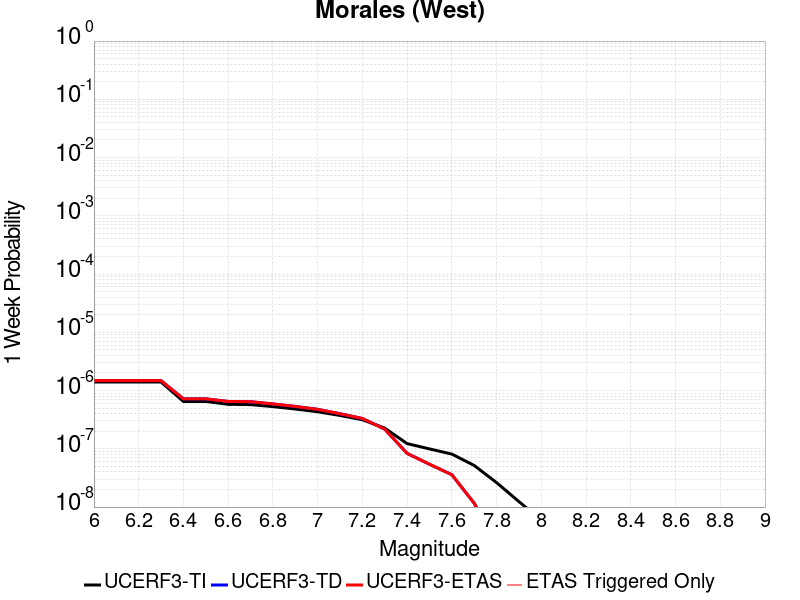 | 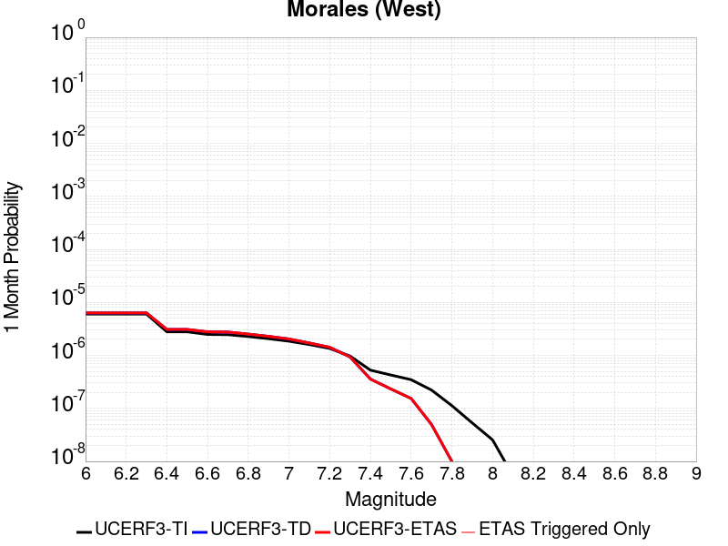 |  | 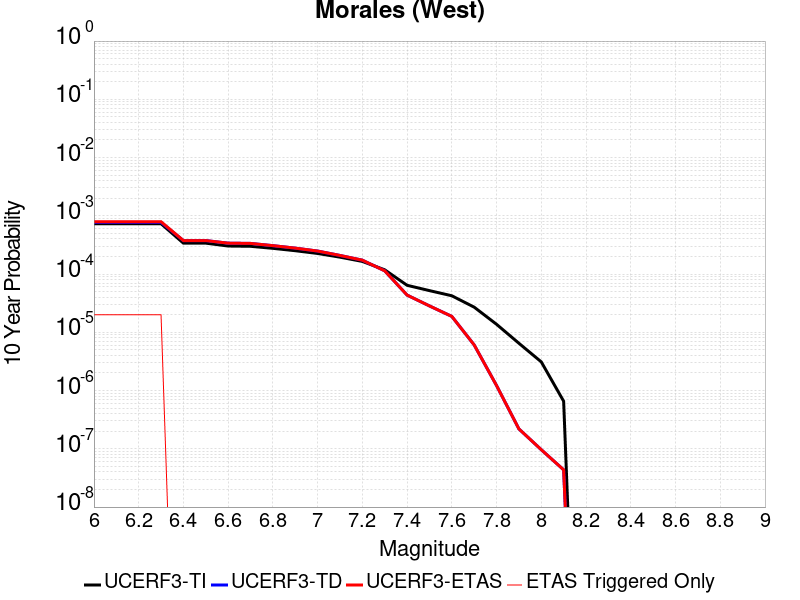 |

| Magnitude | 1 wk TI Prob | 1 wk TD Prob | 1 wk ETAS Prob | 1 wk ETAS/TD Gain | 1 wk ETAS Triggered Only | 1 mo TI Prob | 1 mo TD Prob | 1 mo ETAS Prob | 1 mo ETAS/TD Gain | 1 mo ETAS Triggered Only | 1 yr TI Prob | 1 yr TD Prob | 1 yr ETAS Prob | 1 yr ETAS/TD Gain | 1 yr ETAS Triggered Only | 10 yr TI Prob | 10 yr TD Prob | 10 yr ETAS Prob | 10 yr ETAS/TD Gain | 10 yr ETAS Triggered Only |
|-----|-----|-----|-----|-----|-----|-----|-----|-----|-----|-----|-----|-----|-----|-----|-----|-----|-----|-----|-----|-----|
| 6.0 | 1.4027072E-6 | 1.4791576E-6 | 1.4791576E-6 | 1.0 | 0.0 | 6.0115885E-6 | 6.339236E-6 | 6.339236E-6 | 1.0 | 0.0 | 7.318863E-5 | 7.7178156E-5 | 8.717739E-5 | 1.1295604 | 1.0E-5 | 7.316453E-4 | 7.715821E-4 | 7.915667E-4 | 1.0259007 | 2.0E-5 |
| 6.1 | 1.4027072E-6 | 1.4791576E-6 | 1.4791576E-6 | 1.0 | 0.0 | 6.0115885E-6 | 6.339236E-6 | 6.339236E-6 | 1.0 | 0.0 | 7.318863E-5 | 7.7178156E-5 | 8.717739E-5 | 1.1295604 | 1.0E-5 | 7.316453E-4 | 7.715821E-4 | 7.915667E-4 | 1.0259007 | 2.0E-5 |
| 6.2 | 1.4027072E-6 | 1.4791576E-6 | 1.4791576E-6 | 1.0 | 0.0 | 6.0115885E-6 | 6.339236E-6 | 6.339236E-6 | 1.0 | 0.0 | 7.318863E-5 | 7.7178156E-5 | 8.717739E-5 | 1.1295604 | 1.0E-5 | 7.316453E-4 | 7.715821E-4 | 7.915667E-4 | 1.0259007 | 2.0E-5 |
| 6.3 | 1.4027072E-6 | 1.4791576E-6 | 1.4791576E-6 | 1.0 | 0.0 | 6.0115885E-6 | 6.339236E-6 | 6.339236E-6 | 1.0 | 0.0 | 7.318863E-5 | 7.7178156E-5 | 8.717739E-5 | 1.1295604 | 1.0E-5 | 7.316453E-4 | 7.715821E-4 | 7.915667E-4 | 1.0259007 | 2.0E-5 |
| 6.4 | 6.504502E-7 | 7.2038824E-7 | 7.2038824E-7 | 1.0 | 0.0 | 2.7876408E-6 | 3.0873746E-6 | 3.0873746E-6 | 1.0 | 0.0 | 3.3939E-5 | 3.758815E-5 | 3.758815E-5 | 1.0 | 0.0 | 3.3933815E-4 | 3.758191E-4 | 3.758191E-4 | 1.0 | 0.0 |
| 6.5 | 6.504502E-7 | 7.2038824E-7 | 7.2038824E-7 | 1.0 | 0.0 | 2.7876408E-6 | 3.0873746E-6 | 3.0873746E-6 | 1.0 | 0.0 | 3.3939E-5 | 3.758815E-5 | 3.758815E-5 | 1.0 | 0.0 | 3.3933815E-4 | 3.758191E-4 | 3.758191E-4 | 1.0 | 0.0 |
| 6.6 | 5.8056526E-7 | 6.500143E-7 | 6.500143E-7 | 1.0 | 0.0 | 2.4881344E-6 | 2.7857725E-6 | 2.7857725E-6 | 1.0 | 0.0 | 3.0292615E-5 | 3.3916258E-5 | 3.3916258E-5 | 1.0 | 0.0 | 3.0288487E-4 | 3.3911143E-4 | 3.3911143E-4 | 1.0 | 0.0 |
| 6.7 | 5.741448E-7 | 6.435454E-7 | 6.435454E-7 | 1.0 | 0.0 | 2.4606184E-6 | 2.7580488E-6 | 2.7580488E-6 | 1.0 | 0.0 | 2.9957617E-5 | 3.3578734E-5 | 3.3578734E-5 | 1.0 | 0.0 | 2.9953578E-4 | 3.357372E-4 | 3.357372E-4 | 1.0 | 0.0 |
| 6.8 | 5.299428E-7 | 5.8909023E-7 | 5.8909023E-7 | 1.0 | 0.0 | 2.2711813E-6 | 2.52467E-6 | 2.52467E-6 | 1.0 | 0.0 | 2.7651282E-5 | 3.073743E-5 | 3.073743E-5 | 1.0 | 0.0 | 2.7647841E-4 | 3.0733226E-4 | 3.0733226E-4 | 1.0 | 0.0 |
| 6.9 | 4.82394E-7 | 5.3416807E-7 | 5.3416807E-7 | 1.0 | 0.0 | 2.0674013E-6 | 2.2892896E-6 | 2.2892896E-6 | 1.0 | 0.0 | 2.517032E-5 | 2.7871749E-5 | 2.7871749E-5 | 1.0 | 0.0 | 2.516747E-4 | 2.7868294E-4 | 2.7868294E-4 | 1.0 | 0.0 |
| 7.0 | 4.3264512E-7 | 4.759864E-7 | 4.759864E-7 | 1.0 | 0.0 | 1.8541921E-6 | 2.0399402E-6 | 2.0399402E-6 | 1.0 | 0.0 | 2.2574555E-5 | 2.4835992E-5 | 2.4835992E-5 | 1.0 | 0.0 | 2.2572262E-4 | 2.4833248E-4 | 2.4833248E-4 | 1.0 | 0.0 |
| 7.1 | 3.7388565E-7 | 4.000384E-7 | 4.000384E-7 | 1.0 | 0.0 | 1.6023661E-6 | 1.7144492E-6 | 1.7144492E-6 | 1.0 | 0.0 | 1.9508632E-5 | 2.0873222E-5 | 2.0873222E-5 | 1.0 | 0.0 | 1.950692E-4 | 2.0871284E-4 | 2.0871284E-4 | 1.0 | 0.0 |
| 7.2 | 3.1592543E-7 | 3.3199075E-7 | 3.3199075E-7 | 1.0 | 0.0 | 1.3539654E-6 | 1.4228168E-6 | 1.4228168E-6 | 1.0 | 0.0 | 1.6484404E-5 | 1.7322658E-5 | 1.7322658E-5 | 1.0 | 0.0 | 1.6483181E-4 | 1.7321325E-4 | 1.7321325E-4 | 1.0 | 0.0 |
| 7.3 | 2.2677783E-7 | 2.1793869E-7 | 2.1793869E-7 | 1.0 | 0.0 | 9.719047E-7 | 9.3402264E-7 | 9.3402264E-7 | 1.0 | 0.0 | 1.1832874E-5 | 1.1371666E-5 | 1.1371666E-5 | 1.0 | 0.0 | 1.18322445E-4 | 1.1371089E-4 | 1.1371089E-4 | 1.0 | 0.0 |
| 7.4 | 1.2295531E-7 | 8.350771E-8 | 8.350771E-8 | 1.0 | 0.0 | 5.269512E-7 | 3.5789014E-7 | 3.5789014E-7 | 1.0 | 0.0 | 6.4156125E-6 | 4.3573036E-6 | 4.3573036E-6 | 1.0 | 0.0 | 6.415427E-5 | 4.357219E-5 | 4.357219E-5 | 1.0 | 0.0 |
| 7.5 | 9.9632544E-8 | 5.443089E-8 | 5.443089E-8 | 1.0 | 0.0 | 4.2699656E-7 | 2.3327522E-7 | 2.3327522E-7 | 1.0 | 0.0 | 5.198671E-6 | 2.840122E-6 | 2.840122E-6 | 1.0 | 0.0 | 5.198549E-5 | 2.8400864E-5 | 2.8400864E-5 | 1.0 | 0.0 |
| 7.6 | 8.125894E-8 | 3.594956E-8 | 3.594956E-8 | 1.0 | 0.0 | 3.4825257E-7 | 1.5406955E-7 | 1.5406955E-7 | 1.0 | 0.0 | 4.2399665E-6 | 1.8757952E-6 | 1.8757952E-6 | 1.0 | 0.0 | 4.2398857E-5 | 1.8757797E-5 | 1.8757797E-5 | 1.0 | 0.0 |
| 7.7 | 5.1810765E-8 | 1.1642662E-8 | 1.1642662E-8 | 1.0 | 0.0 | 2.2204613E-7 | 4.9897128E-8 | 4.9897128E-8 | 1.0 | 0.0 | 2.7034082E-6 | 6.074974E-7 | 6.074974E-7 | 1.0 | 0.0 | 2.7033753E-5 | 6.0749603E-6 | 6.0749603E-6 | 1.0 | 0.0 |
| 7.8 | 2.6315043E-8 | 2.3383624E-9 | 2.3383624E-9 | 1.0 | 0.0 | 1.1277875E-7 | 1.0021558E-8 | 1.0021558E-8 | 1.0 | 0.0 | 1.3730804E-6 | 1.2201247E-7 | 1.2201247E-7 | 1.0 | 0.0 | 1.3730719E-5 | 1.2201268E-6 | 1.2201268E-6 | 1.0 | 0.0 |
| 7.9 | 1.24281545E-8 | 4.207228E-10 | 4.207228E-10 | 1.0 | 0.0 | 5.3263516E-8 | 1.8031033E-9 | 1.8031033E-9 | 1.0 | 0.0 | 6.4848314E-7 | 2.1952776E-8 | 2.1952776E-8 | 1.0 | 0.0 | 6.4848123E-6 | 2.195305E-7 | 2.195305E-7 | 1.0 | 0.0 |
| 8.0 | 5.954214E-9 | 1.8509339E-10 | 1.8509339E-10 | 1.0 | 0.0 | 2.551806E-8 | 7.9326146E-10 | 7.9326146E-10 | 1.0 | 0.0 | 3.1068234E-7 | 9.657958E-9 | 9.657958E-9 | 1.0 | 0.0 | 3.1068191E-6 | 9.658236E-8 | 9.658236E-8 | 1.0 | 0.0 |
| 8.1 | 1.2586262E-9 | 8.346668E-11 | 8.346668E-11 | 1.0 | 0.0 | 5.3941123E-9 | 3.5771386E-10 | 3.5771386E-10 | 1.0 | 0.0 | 6.567332E-8 | 4.355168E-9 | 4.355168E-9 | 1.0 | 0.0 | 6.56733E-7 | 4.3554458E-8 | 4.3554458E-8 | 1.0 | 0.0 |

## West Tahoe
*[(top)](#table-of-contents)*

| 1 Week | 1 Month | 1 Year | 10 Year |
|-----|-----|-----|-----|
| 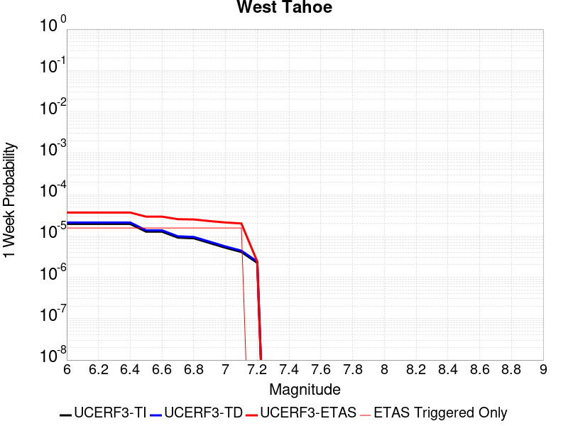 | 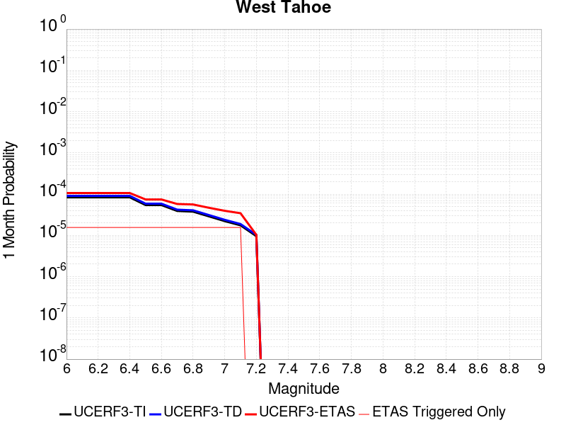 | 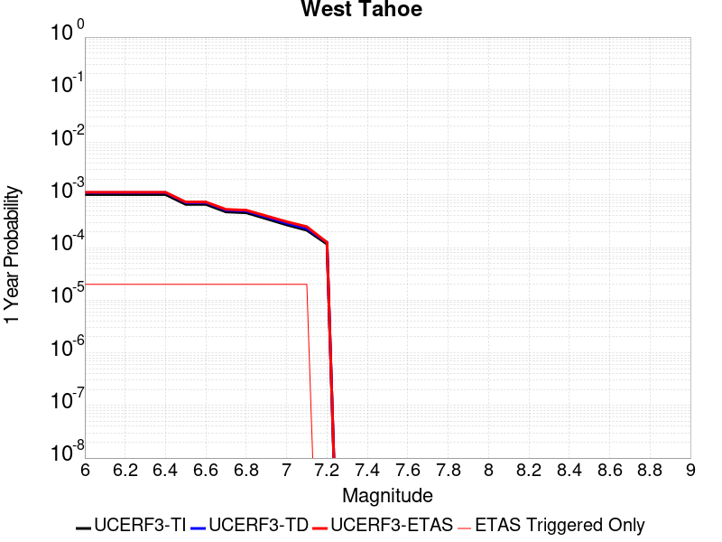 | 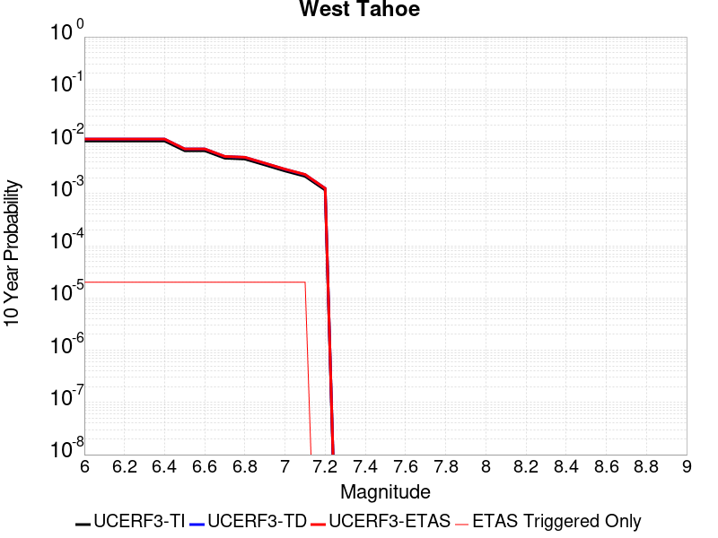 |

| Magnitude | 1 wk TI Prob | 1 wk TD Prob | 1 wk ETAS Prob | 1 wk ETAS/TD Gain | 1 wk ETAS Triggered Only | 1 mo TI Prob | 1 mo TD Prob | 1 mo ETAS Prob | 1 mo ETAS/TD Gain | 1 mo ETAS Triggered Only | 1 yr TI Prob | 1 yr TD Prob | 1 yr ETAS Prob | 1 yr ETAS/TD Gain | 1 yr ETAS Triggered Only | 10 yr TI Prob | 10 yr TD Prob | 10 yr ETAS Prob | 10 yr ETAS/TD Gain | 10 yr ETAS Triggered Only |
|-----|-----|-----|-----|-----|-----|-----|-----|-----|-----|-----|-----|-----|-----|-----|-----|-----|-----|-----|-----|-----|
| 6.0 | 1.952444E-5 | 2.118317E-5 | 3.1182957E-5 | 1.4720628 | 1.0E-5 | 8.367348E-5 | 9.078217E-5 | 1.0078125E-4 | 1.1101438 | 1.0E-5 | 0.0010182485 | 0.0011047672 | 0.001124745 | 1.0180833 | 2.0E-5 | 0.010135954 | 0.010998235 | 0.011018015 | 1.0017985 | 2.0E-5 |
| 6.1 | 1.952444E-5 | 2.118317E-5 | 3.1182957E-5 | 1.4720628 | 1.0E-5 | 8.367348E-5 | 9.078217E-5 | 1.0078125E-4 | 1.1101438 | 1.0E-5 | 0.0010182485 | 0.0011047672 | 0.001124745 | 1.0180833 | 2.0E-5 | 0.010135954 | 0.010998235 | 0.011018015 | 1.0017985 | 2.0E-5 |
| 6.2 | 1.952444E-5 | 2.118317E-5 | 3.1182957E-5 | 1.4720628 | 1.0E-5 | 8.367348E-5 | 9.078217E-5 | 1.0078125E-4 | 1.1101438 | 1.0E-5 | 0.0010182485 | 0.0011047672 | 0.001124745 | 1.0180833 | 2.0E-5 | 0.010135954 | 0.010998235 | 0.011018015 | 1.0017985 | 2.0E-5 |
| 6.3 | 1.952444E-5 | 2.118317E-5 | 3.1182957E-5 | 1.4720628 | 1.0E-5 | 8.367348E-5 | 9.078217E-5 | 1.0078125E-4 | 1.1101438 | 1.0E-5 | 0.0010182485 | 0.0011047672 | 0.001124745 | 1.0180833 | 2.0E-5 | 0.010135954 | 0.010998235 | 0.011018015 | 1.0017985 | 2.0E-5 |
| 6.4 | 1.952444E-5 | 2.118317E-5 | 3.1182957E-5 | 1.4720628 | 1.0E-5 | 8.367348E-5 | 9.078217E-5 | 1.0078125E-4 | 1.1101438 | 1.0E-5 | 0.0010182485 | 0.0011047672 | 0.001124745 | 1.0180833 | 2.0E-5 | 0.010135954 | 0.010998235 | 0.011018015 | 1.0017985 | 2.0E-5 |
| 6.5 | 1.2685271E-5 | 1.3690627E-5 | 2.369049E-5 | 1.7304167 | 1.0E-5 | 5.4364315E-5 | 5.8672893E-5 | 6.867231E-5 | 1.1704265 | 1.0E-5 | 6.616845E-4 | 7.141248E-4 | 7.3411054E-4 | 1.0279863 | 2.0E-5 | 0.0065971776 | 0.00711995 | 0.0071398076 | 1.002789 | 2.0E-5 |
| 6.6 | 1.2685271E-5 | 1.3690627E-5 | 2.369049E-5 | 1.7304167 | 1.0E-5 | 5.4364315E-5 | 5.8672893E-5 | 6.867231E-5 | 1.1704265 | 1.0E-5 | 6.616845E-4 | 7.141248E-4 | 7.3411054E-4 | 1.0279863 | 2.0E-5 | 0.0065971776 | 0.00711995 | 0.0071398076 | 1.002789 | 2.0E-5 |
| 6.7 | 9.117886E-6 | 9.809846E-6 | 1.9809748E-5 | 2.019374 | 1.0E-5 | 3.9076072E-5 | 4.2041564E-5 | 5.204114E-5 | 1.2378498 | 1.0E-5 | 4.756473E-4 | 5.11743E-4 | 5.3173275E-4 | 1.0390621 | 2.0E-5 | 0.0047463053 | 0.0051063634 | 0.0051262616 | 1.0038967 | 2.0E-5 |
| 6.8 | 8.786828E-6 | 9.457863E-6 | 1.9457768E-5 | 2.0573113 | 1.0E-5 | 3.7657293E-5 | 4.053311E-5 | 5.0532704E-5 | 1.2467018 | 1.0E-5 | 4.5838108E-4 | 4.933859E-4 | 5.13376E-4 | 1.0405163 | 2.0E-5 | 0.0045743673 | 0.0049236063 | 0.0049435077 | 1.004042 | 2.0E-5 |
| 6.9 | 6.7562123E-6 | 7.2638086E-6 | 1.7263736E-5 | 2.3766782 | 1.0E-5 | 2.8954875E-5 | 3.1130265E-5 | 4.112995E-5 | 1.3212209 | 1.0E-5 | 3.5246857E-4 | 3.789498E-4 | 3.9894224E-4 | 1.0527574 | 2.0E-5 | 0.0035191004 | 0.0037835082 | 0.0038034325 | 1.0052661 | 2.0E-5 |
| 7.0 | 5.1792854E-6 | 5.567338E-6 | 1.5567282E-5 | 2.7961805 | 1.0E-5 | 2.2196748E-5 | 2.3859824E-5 | 3.3859586E-5 | 1.4191046 | 1.0E-5 | 2.702119E-4 | 2.9045844E-4 | 3.1045263E-4 | 1.0688367 | 2.0E-5 | 0.0026988357 | 0.0029011632 | 0.0029211054 | 1.0068737 | 2.0E-5 |
| 7.1 | 4.090765E-6 | 4.3974223E-6 | 1.4397378E-5 | 3.2740493 | 1.0E-5 | 1.7531731E-5 | 1.884598E-5 | 2.884579E-5 | 1.5306071 | 1.0E-5 | 2.134279E-4 | 2.2942905E-4 | 2.4942445E-4 | 1.087153 | 2.0E-5 | 0.0021322304 | 0.0022922563 | 0.0023122104 | 1.008705 | 2.0E-5 |
| 7.2 | 2.2356758E-6 | 2.4023684E-6 | 2.4023684E-6 | 1.0 | 0.0 | 9.581432E-6 | 1.0295834E-5 | 1.0295834E-5 | 1.0 | 0.0 | 1.1664769E-4 | 1.2534647E-4 | 1.2534647E-4 | 1.0 | 0.0 | 0.0011658648 | 0.0012529434 | 0.0012529434 | 1.0 | 0.0 |

## Greenville (So) 2011 CFM
*[(top)](#table-of-contents)*

| 1 Week | 1 Month | 1 Year | 10 Year |
|-----|-----|-----|-----|
| 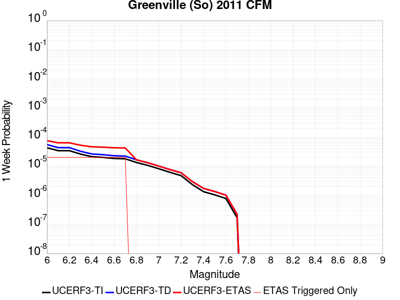 | 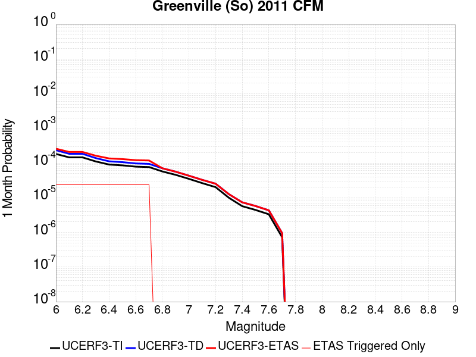 | 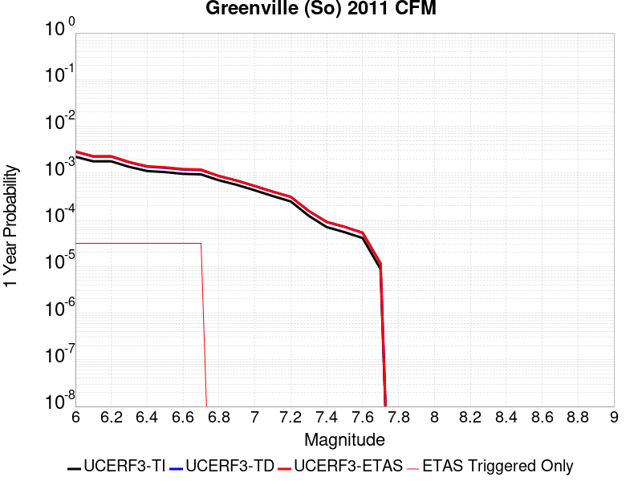 | 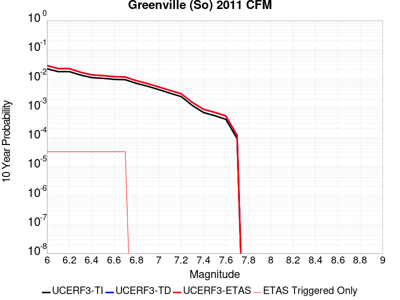 |

| Magnitude | 1 wk TI Prob | 1 wk TD Prob | 1 wk ETAS Prob | 1 wk ETAS/TD Gain | 1 wk ETAS Triggered Only | 1 mo TI Prob | 1 mo TD Prob | 1 mo ETAS Prob | 1 mo ETAS/TD Gain | 1 mo ETAS Triggered Only | 1 yr TI Prob | 1 yr TD Prob | 1 yr ETAS Prob | 1 yr ETAS/TD Gain | 1 yr ETAS Triggered Only | 10 yr TI Prob | 10 yr TD Prob | 10 yr ETAS Prob | 10 yr ETAS/TD Gain | 10 yr ETAS Triggered Only |
|-----|-----|-----|-----|-----|-----|-----|-----|-----|-----|-----|-----|-----|-----|-----|-----|-----|-----|-----|-----|-----|
| 6.0 | 4.279693E-5 | 5.5040087E-5 | 7.503899E-5 | 1.3633515 | 2.0E-5 | 1.8340252E-4 | 2.3586681E-4 | 2.558621E-4 | 1.0847737 | 2.0E-5 | 0.0022306389 | 0.0028682416 | 0.0028881843 | 1.0069529 | 2.0E-5 | 0.022083808 | 0.028338138 | 0.028357571 | 1.0006858 | 2.0E-5 |
| 6.1 | 3.4037297E-5 | 4.3192387E-5 | 6.3191525E-5 | 1.4630245 | 2.0E-5 | 1.4586597E-4 | 1.8509831E-4 | 2.050946E-4 | 1.1080307 | 2.0E-5 | 0.0017744715 | 0.0022514379 | 0.0022713928 | 1.0088632 | 2.0E-5 | 0.01760369 | 0.022302566 | 0.02232212 | 1.0008768 | 2.0E-5 |
| 6.2 | 3.4037297E-5 | 4.3192387E-5 | 6.3191525E-5 | 1.4630245 | 2.0E-5 | 1.4586597E-4 | 1.8509831E-4 | 2.050946E-4 | 1.1080307 | 2.0E-5 | 0.0017744715 | 0.0022514379 | 0.0022713928 | 1.0088632 | 2.0E-5 | 0.01760369 | 0.022302566 | 0.02232212 | 1.0008768 | 2.0E-5 |
| 6.3 | 2.5956324E-5 | 3.2428903E-5 | 5.2428255E-5 | 1.6167138 | 2.0E-5 | 1.11236644E-4 | 1.3897405E-4 | 1.5897128E-4 | 1.1438918 | 2.0E-5 | 0.0013534647 | 0.0016907708 | 0.001710737 | 1.0118089 | 2.0E-5 | 0.013452509 | 0.016785882 | 0.016805546 | 1.0011715 | 2.0E-5 |
| 6.4 | 2.1145053E-5 | 2.6197677E-5 | 4.6197154E-5 | 1.7634065 | 2.0E-5 | 9.061851E-5 | 1.1227112E-4 | 1.3226886E-4 | 1.1781203 | 2.0E-5 | 0.0011027219 | 0.0013660751 | 0.0013860478 | 1.0146204 | 2.0E-5 | 0.01097266 | 0.01358018 | 0.013599908 | 1.0014527 | 2.0E-5 |
| 6.5 | 2.0030959E-5 | 2.479578E-5 | 4.4795284E-5 | 1.8065689 | 2.0E-5 | 8.584414E-5 | 1.06263484E-4 | 1.2626135E-4 | 1.1881914 | 2.0E-5 | 0.0010446513 | 0.0012930221 | 0.0013129963 | 1.0154476 | 2.0E-5 | 0.010397541 | 0.012858339 | 0.012878081 | 1.0015354 | 2.0E-5 |
| 6.6 | 1.8395405E-5 | 2.2754466E-5 | 4.275401E-5 | 1.8789283 | 2.0E-5 | 7.8835066E-5 | 9.751565E-5 | 1.175137E-4 | 1.2050753 | 2.0E-5 | 9.5939427E-4 | 0.0011866348 | 0.001206611 | 1.0168344 | 2.0E-5 | 0.009552629 | 0.011806041 | 0.011825805 | 1.001674 | 2.0E-5 |
| 6.7 | 1.7883482E-5 | 2.212551E-5 | 4.212507E-5 | 1.903914 | 2.0E-5 | 7.664124E-5 | 9.482033E-5 | 1.1481843E-4 | 1.2109052 | 2.0E-5 | 9.3270757E-4 | 0.0011538545 | 0.0011738314 | 1.0173132 | 2.0E-5 | 0.009288026 | 0.011481688 | 0.0115014585 | 1.0017219 | 2.0E-5 |
| 6.8 | 1.3373564E-5 | 1.6505966E-5 | 1.6505966E-5 | 1.0 | 0.0 | 5.7314013E-5 | 7.073802E-5 | 7.073802E-5 | 1.0 | 0.0 | 6.975747E-4 | 8.609098E-4 | 8.609098E-4 | 1.0 | 0.0 | 0.0069538904 | 0.008577357 | 0.008577357 | 1.0 | 0.0 |
| 6.9 | 1.06692905E-5 | 1.3152582E-5 | 1.3152582E-5 | 1.0 | 0.0 | 4.5724726E-5 | 5.6367055E-5 | 5.6367055E-5 | 1.0 | 0.0 | 5.5655633E-4 | 6.86064E-4 | 6.86064E-4 | 1.0 | 0.0 | 0.005551645 | 0.006840693 | 0.006840693 | 1.0 | 0.0 |
| 7.0 | 8.157512E-6 | 1.0062639E-5 | 1.0062639E-5 | 1.0 | 0.0 | 3.4960296E-5 | 4.3124903E-5 | 4.3124903E-5 | 1.0 | 0.0 | 4.2555845E-4 | 5.2492286E-4 | 5.2492286E-4 | 1.0 | 0.0 | 0.004247444 | 0.0052373074 | 0.0052373074 | 1.0 | 0.0 |
| 7.1 | 6.1467113E-6 | 7.6274314E-6 | 7.6274314E-6 | 1.0 | 0.0 | 2.6342783E-5 | 3.268859E-5 | 3.268859E-5 | 1.0 | 0.0 | 3.206762E-4 | 3.9791173E-4 | 3.9791173E-4 | 1.0 | 0.0 | 0.0032021382 | 0.0039721807 | 0.0039721807 | 1.0 | 0.0 |
| 7.2 | 4.713467E-6 | 5.9141557E-6 | 5.9141557E-6 | 1.0 | 0.0 | 2.0200418E-5 | 2.5346139E-5 | 2.5346139E-5 | 1.0 | 0.0 | 2.4591232E-4 | 3.0854615E-4 | 3.0854615E-4 | 1.0 | 0.0 | 0.0024564038 | 0.0030813308 | 0.0030813308 | 1.0 | 0.0 |
| 7.3 | 2.3266216E-6 | 2.954009E-6 | 2.954009E-6 | 1.0 | 0.0 | 9.971197E-6 | 1.2659978E-5 | 1.2659978E-5 | 1.0 | 0.0 | 1.2139256E-4 | 1.5412449E-4 | 1.5412449E-4 | 1.0 | 0.0 | 0.0012132627 | 0.0015402455 | 0.0015402455 | 1.0 | 0.0 |
| 7.4 | 1.3314E-6 | 1.7179472E-6 | 1.7179472E-6 | 1.0 | 0.0 | 5.7059874E-6 | 7.36261E-6 | 7.36261E-6 | 1.0 | 0.0 | 6.946818E-5 | 8.963614E-5 | 8.963614E-5 | 1.0 | 0.0 | 6.9446466E-4 | 8.9603866E-4 | 8.9603866E-4 | 1.0 | 0.0 |
| 7.5 | 1.0362941E-6 | 1.3468821E-6 | 1.3468821E-6 | 1.0 | 0.0 | 4.4412527E-6 | 5.772339E-6 | 5.772339E-6 | 1.0 | 0.0 | 5.407091E-5 | 7.027601E-5 | 7.027601E-5 | 1.0 | 0.0 | 5.405776E-4 | 7.025681E-4 | 7.025681E-4 | 1.0 | 0.0 |
| 7.6 | 7.764784E-7 | 1.0088593E-6 | 1.0088593E-6 | 1.0 | 0.0 | 3.3277602E-6 | 4.323676E-6 | 4.323676E-6 | 1.0 | 0.0 | 4.0514726E-5 | 5.263952E-5 | 5.263952E-5 | 1.0 | 0.0 | 4.050734E-4 | 5.262919E-4 | 5.262919E-4 | 1.0 | 0.0 |
| 7.7 | 1.6927763E-7 | 2.2139248E-7 | 2.2139248E-7 | 1.0 | 0.0 | 7.2547533E-7 | 9.4882455E-7 | 9.4882455E-7 | 1.0 | 0.0 | 8.832627E-6 | 1.15518815E-5 | 1.15518815E-5 | 1.0 | 0.0 | 8.8322755E-5 | 1.15515526E-4 | 1.15515526E-4 | 1.0 | 0.0 |

## Concord 2011 CFM
*[(top)](#table-of-contents)*

| 1 Week | 1 Month | 1 Year | 10 Year |
|-----|-----|-----|-----|
|  | 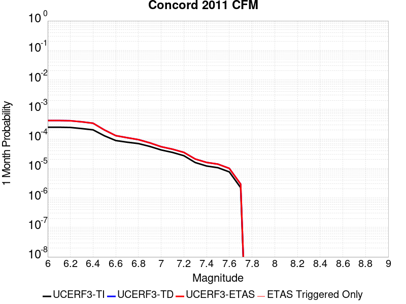 | 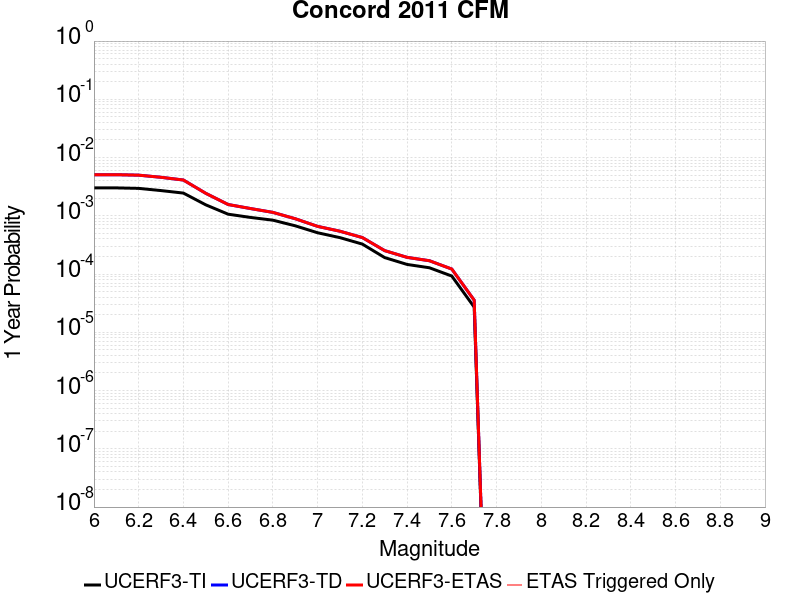 | 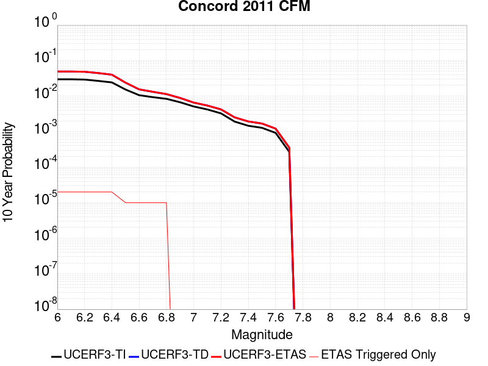 |

| Magnitude | 1 wk TI Prob | 1 wk TD Prob | 1 wk ETAS Prob | 1 wk ETAS/TD Gain | 1 wk ETAS Triggered Only | 1 mo TI Prob | 1 mo TD Prob | 1 mo ETAS Prob | 1 mo ETAS/TD Gain | 1 mo ETAS Triggered Only | 1 yr TI Prob | 1 yr TD Prob | 1 yr ETAS Prob | 1 yr ETAS/TD Gain | 1 yr ETAS Triggered Only | 10 yr TI Prob | 10 yr TD Prob | 10 yr ETAS Prob | 10 yr ETAS/TD Gain | 10 yr ETAS Triggered Only |
|-----|-----|-----|-----|-----|-----|-----|-----|-----|-----|-----|-----|-----|-----|-----|-----|-----|-----|-----|-----|-----|
| 6.0 | 5.7865112E-5 | 9.759152E-5 | 9.759152E-5 | 1.0 | 0.0 | 2.4796976E-4 | 4.1818706E-4 | 4.1818706E-4 | 1.0 | 0.0 | 0.0030148525 | 0.005079467 | 0.005079467 | 1.0 | 0.0 | 0.029742775 | 0.049248982 | 0.049267996 | 1.0003861 | 2.0E-5 |
| 6.1 | 5.7865112E-5 | 9.759152E-5 | 9.759152E-5 | 1.0 | 0.0 | 2.4796976E-4 | 4.1818706E-4 | 4.1818706E-4 | 1.0 | 0.0 | 0.0030148525 | 0.005079467 | 0.005079467 | 1.0 | 0.0 | 0.029742775 | 0.049248982 | 0.049267996 | 1.0003861 | 2.0E-5 |
| 6.2 | 5.6789337E-5 | 9.5795076E-5 | 9.5795076E-5 | 1.0 | 0.0 | 2.4336016E-4 | 4.104905E-4 | 4.104905E-4 | 1.0 | 0.0 | 0.0029588845 | 0.0049861916 | 0.0049861916 | 1.0 | 0.0 | 0.029197963 | 0.04836556 | 0.048384592 | 1.0003935 | 2.0E-5 |
| 6.3 | 5.203322E-5 | 8.803056E-5 | 8.803056E-5 | 1.0 | 0.0 | 2.2298045E-4 | 3.7722368E-4 | 3.7722368E-4 | 1.0 | 0.0 | 0.0027114071 | 0.0045838105 | 0.0045838105 | 1.0 | 0.0 | 0.026785625 | 0.04453672 | 0.044555828 | 1.000429 | 2.0E-5 |
| 6.4 | 4.7120942E-5 | 7.897404E-5 | 7.897404E-5 | 1.0 | 0.0 | 2.0193127E-4 | 3.3842045E-4 | 3.3842045E-4 | 1.0 | 0.0 | 0.0024557412 | 0.00411323 | 0.00411323 | 1.0 | 0.0 | 0.024287801 | 0.040065527 | 0.040084727 | 1.0004792 | 2.0E-5 |
| 6.5 | 2.9598437E-5 | 4.667486E-5 | 4.667486E-5 | 1.0 | 0.0 | 1.2684427E-4 | 2.0002096E-4 | 2.0002096E-4 | 1.0 | 0.0 | 0.001543235 | 0.0024327459 | 0.0024327459 | 1.0 | 0.0 | 0.015325619 | 0.023909973 | 0.023919733 | 1.0004083 | 1.0E-5 |
| 6.6 | 2.0443718E-5 | 2.998433E-5 | 2.998433E-5 | 1.0 | 0.0 | 8.7613E-5 | 1.2849816E-4 | 1.2849816E-4 | 1.0 | 0.0 | 0.0010661662 | 0.0015633785 | 0.0015633785 | 1.0 | 0.0 | 0.010610655 | 0.015466996 | 0.0154768415 | 1.0006366 | 1.0E-5 |
| 6.7 | 1.798539E-5 | 2.5557381E-5 | 2.5557381E-5 | 1.0 | 0.0 | 7.7077966E-5 | 1.0952716E-4 | 1.0952716E-4 | 1.0 | 0.0 | 9.380202E-4 | 0.001332699 | 0.001332699 | 1.0 | 0.0 | 0.009340706 | 0.013217433 | 0.013227301 | 1.0007466 | 1.0E-5 |
| 6.8 | 1.613555E-5 | 2.1959211E-5 | 2.1959211E-5 | 1.0 | 0.0 | 6.915052E-5 | 9.4107585E-5 | 9.4107585E-5 | 1.0 | 0.0 | 8.4158237E-4 | 0.0011451716 | 0.0011451716 | 1.0 | 0.0 | 0.008384023 | 0.0113782035 | 0.01138809 | 1.0008689 | 1.0E-5 |
| 6.9 | 1.2916435E-5 | 1.7081054E-5 | 1.7081054E-5 | 1.0 | 0.0 | 5.5354973E-5 | 7.32025E-5 | 7.32025E-5 | 1.0 | 0.0 | 6.7373837E-4 | 8.908818E-4 | 8.908818E-4 | 1.0 | 0.0 | 0.006716994 | 0.008867139 | 0.008867139 | 1.0 | 0.0 |
| 7.0 | 9.81129E-6 | 1.2630829E-5 | 1.2630829E-5 | 1.0 | 0.0 | 4.2047708E-5 | 5.413101E-5 | 5.413101E-5 | 1.0 | 0.0 | 5.118106E-4 | 6.588474E-4 | 6.588474E-4 | 1.0 | 0.0 | 0.005106334 | 0.006569153 | 0.006569153 | 1.0 | 0.0 |
| 7.1 | 8.0889195E-6 | 1.0418261E-5 | 1.0418261E-5 | 1.0 | 0.0 | 3.4666336E-5 | 4.4648932E-5 | 4.4648932E-5 | 1.0 | 0.0 | 4.219809E-4 | 5.434662E-4 | 5.434662E-4 | 1.0 | 0.0 | 0.004211805 | 0.0054215975 | 0.0054215975 | 1.0 | 0.0 |
| 7.2 | 6.267438E-6 | 8.115699E-6 | 8.115699E-6 | 1.0 | 0.0 | 2.6860173E-5 | 3.4781104E-5 | 3.4781104E-5 | 1.0 | 0.0 | 3.2697353E-4 | 4.233784E-4 | 4.233784E-4 | 1.0 | 0.0 | 0.0032649285 | 0.004225969 | 0.004225969 | 1.0 | 0.0 |
| 7.3 | 3.6761196E-6 | 4.8401653E-6 | 4.8401653E-6 | 1.0 | 0.0 | 1.5754704E-5 | 2.0743402E-5 | 2.0743402E-5 | 1.0 | 0.0 | 1.9179663E-4 | 2.5252186E-4 | 2.5252186E-4 | 1.0 | 0.0 | 0.0019163118 | 0.002522487 | 0.002522487 | 1.0 | 0.0 |
| 7.4 | 2.8044356E-6 | 3.7096036E-6 | 3.7096036E-6 | 1.0 | 0.0 | 1.2018954E-5 | 1.5898204E-5 | 1.5898204E-5 | 1.0 | 0.0 | 1.4632095E-4 | 1.9354356E-4 | 1.9354356E-4 | 1.0 | 0.0 | 0.0014622464 | 0.0019338481 | 0.0019338481 | 1.0 | 0.0 |
| 7.5 | 2.4578699E-6 | 3.2447442E-6 | 3.2447442E-6 | 1.0 | 0.0 | 1.0533685E-5 | 1.3905973E-5 | 1.3905973E-5 | 1.0 | 0.0 | 1.2824008E-4 | 1.6929218E-4 | 1.6929218E-4 | 1.0 | 0.0 | 0.0012816609 | 0.001691713 | 0.001691713 | 1.0 | 0.0 |
| 7.6 | 1.7713267E-6 | 2.3351192E-6 | 2.3351192E-6 | 1.0 | 0.0 | 7.591378E-6 | 1.0007616E-5 | 1.0007616E-5 | 1.0 | 0.0 | 9.2421105E-5 | 1.21836E-4 | 1.21836E-4 | 1.0 | 0.0 | 9.2382677E-4 | 0.0012177454 | 0.0012177454 | 1.0 | 0.0 |
| 7.7 | 5.1912366E-7 | 6.8290143E-7 | 6.8290143E-7 | 1.0 | 0.0 | 2.2248137E-6 | 2.9267171E-6 | 2.9267171E-6 | 1.0 | 0.0 | 2.708677E-5 | 3.5632213E-5 | 3.5632213E-5 | 1.0 | 0.0 | 2.708347E-4 | 3.5627294E-4 | 3.5627294E-4 | 1.0 | 0.0 |

## Anacapa-Dume alt 1
*[(top)](#table-of-contents)*

| 1 Week | 1 Month | 1 Year | 10 Year |
|-----|-----|-----|-----|
| 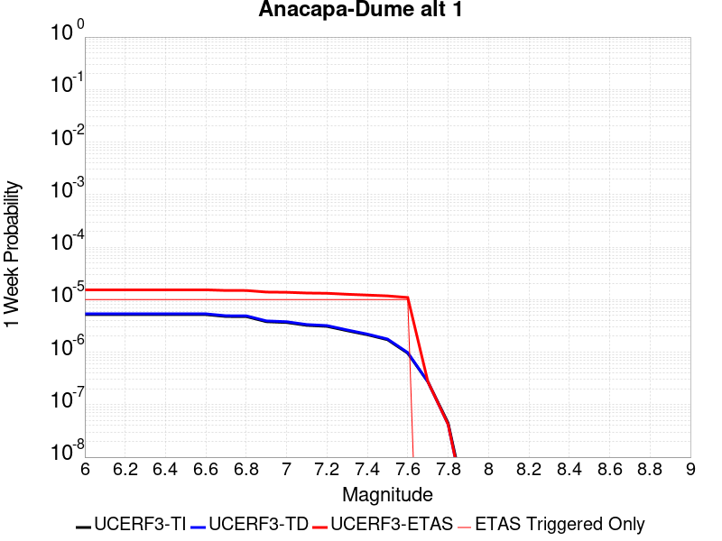 | 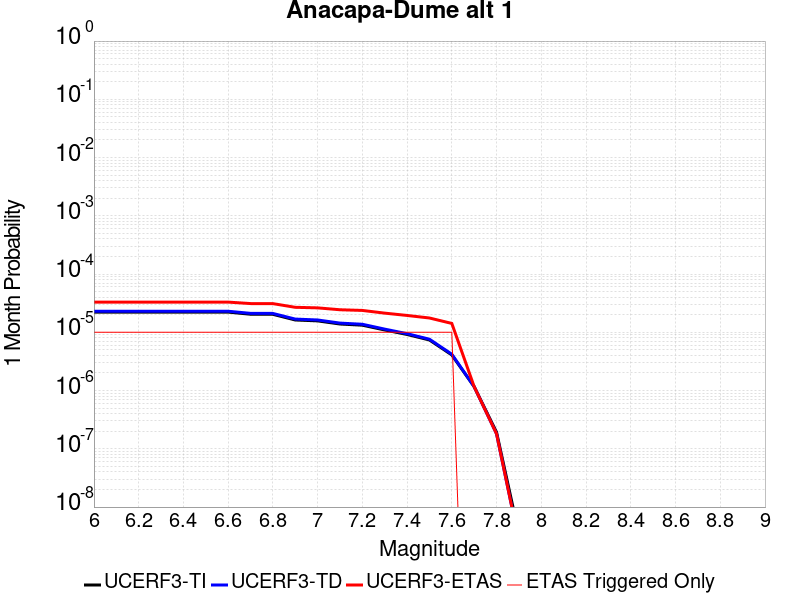 | 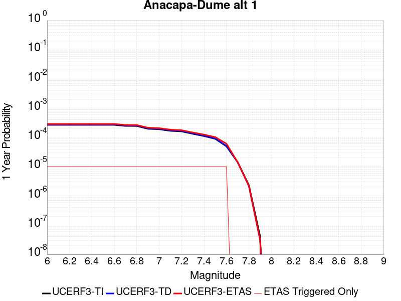 | 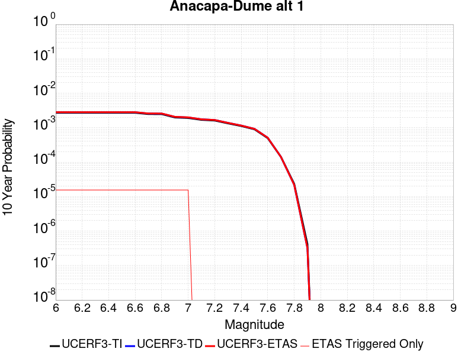 |

| Magnitude | 1 wk TI Prob | 1 wk TD Prob | 1 wk ETAS Prob | 1 wk ETAS/TD Gain | 1 wk ETAS Triggered Only | 1 mo TI Prob | 1 mo TD Prob | 1 mo ETAS Prob | 1 mo ETAS/TD Gain | 1 mo ETAS Triggered Only | 1 yr TI Prob | 1 yr TD Prob | 1 yr ETAS Prob | 1 yr ETAS/TD Gain | 1 yr ETAS Triggered Only | 10 yr TI Prob | 10 yr TD Prob | 10 yr ETAS Prob | 10 yr ETAS/TD Gain | 10 yr ETAS Triggered Only |
|-----|-----|-----|-----|-----|-----|-----|-----|-----|-----|-----|-----|-----|-----|-----|-----|-----|-----|-----|-----|-----|
| 6.0 | 5.1871802E-6 | 5.3673907E-6 | 1.5367337E-5 | 2.8630927 | 1.0E-5 | 2.2230583E-5 | 2.3002905E-5 | 3.3002674E-5 | 1.4347177 | 1.0E-5 | 2.7062374E-4 | 2.8002524E-4 | 2.9002244E-4 | 1.035701 | 1.0E-5 | 0.002702944 | 0.0027968092 | 0.0028167532 | 1.007131 | 2.0E-5 |
| 6.1 | 5.1871802E-6 | 5.3673907E-6 | 1.5367337E-5 | 2.8630927 | 1.0E-5 | 2.2230583E-5 | 2.3002905E-5 | 3.3002674E-5 | 1.4347177 | 1.0E-5 | 2.7062374E-4 | 2.8002524E-4 | 2.9002244E-4 | 1.035701 | 1.0E-5 | 0.002702944 | 0.0027968092 | 0.0028167532 | 1.007131 | 2.0E-5 |
| 6.2 | 5.1871802E-6 | 5.3673907E-6 | 1.5367337E-5 | 2.8630927 | 1.0E-5 | 2.2230583E-5 | 2.3002905E-5 | 3.3002674E-5 | 1.4347177 | 1.0E-5 | 2.7062374E-4 | 2.8002524E-4 | 2.9002244E-4 | 1.035701 | 1.0E-5 | 0.002702944 | 0.0027968092 | 0.0028167532 | 1.007131 | 2.0E-5 |
| 6.3 | 5.1871802E-6 | 5.3673907E-6 | 1.5367337E-5 | 2.8630927 | 1.0E-5 | 2.2230583E-5 | 2.3002905E-5 | 3.3002674E-5 | 1.4347177 | 1.0E-5 | 2.7062374E-4 | 2.8002524E-4 | 2.9002244E-4 | 1.035701 | 1.0E-5 | 0.002702944 | 0.0027968092 | 0.0028167532 | 1.007131 | 2.0E-5 |
| 6.4 | 5.1871802E-6 | 5.3673907E-6 | 1.5367337E-5 | 2.8630927 | 1.0E-5 | 2.2230583E-5 | 2.3002905E-5 | 3.3002674E-5 | 1.4347177 | 1.0E-5 | 2.7062374E-4 | 2.8002524E-4 | 2.9002244E-4 | 1.035701 | 1.0E-5 | 0.002702944 | 0.0027968092 | 0.0028167532 | 1.007131 | 2.0E-5 |
| 6.5 | 5.1871802E-6 | 5.3673907E-6 | 1.5367337E-5 | 2.8630927 | 1.0E-5 | 2.2230583E-5 | 2.3002905E-5 | 3.3002674E-5 | 1.4347177 | 1.0E-5 | 2.7062374E-4 | 2.8002524E-4 | 2.9002244E-4 | 1.035701 | 1.0E-5 | 0.002702944 | 0.0027968092 | 0.0028167532 | 1.007131 | 2.0E-5 |
| 6.6 | 5.1871802E-6 | 5.3673907E-6 | 1.5367337E-5 | 2.8630927 | 1.0E-5 | 2.2230583E-5 | 2.3002905E-5 | 3.3002674E-5 | 1.4347177 | 1.0E-5 | 2.7062374E-4 | 2.8002524E-4 | 2.9002244E-4 | 1.035701 | 1.0E-5 | 0.002702944 | 0.0027968092 | 0.0028167532 | 1.007131 | 2.0E-5 |
| 6.7 | 4.7693475E-6 | 4.9366918E-6 | 1.4936642E-5 | 3.025638 | 1.0E-5 | 2.04399E-5 | 2.1157082E-5 | 3.115687E-5 | 1.4726449 | 1.0E-5 | 2.4882736E-4 | 2.5755778E-4 | 2.675552E-4 | 1.0388162 | 1.0E-5 | 0.0024854892 | 0.002572669 | 0.0025926174 | 1.0077541 | 2.0E-5 |
| 6.8 | 4.753408E-6 | 4.92024E-6 | 1.4920191E-5 | 3.032411 | 1.0E-5 | 2.037159E-5 | 2.1086576E-5 | 3.1086365E-5 | 1.4742254 | 1.0E-5 | 2.4799586E-4 | 2.5669957E-4 | 2.66697E-4 | 1.038946 | 1.0E-5 | 0.002477193 | 0.0025641066 | 0.0025840553 | 1.00778 | 2.0E-5 |
| 6.9 | 3.800069E-6 | 3.937126E-6 | 1.3937087E-5 | 3.5399137 | 1.0E-5 | 1.6285909E-5 | 1.687329E-5 | 2.687312E-5 | 1.5926427 | 1.0E-5 | 1.9826289E-4 | 2.0541316E-4 | 2.1541111E-4 | 1.0486723 | 1.0E-5 | 0.001980861 | 0.0020522568 | 0.0020722158 | 1.0097253 | 2.0E-5 |
| 7.0 | 3.6671938E-6 | 3.7999182E-6 | 1.379988E-5 | 3.6316257 | 1.0E-5 | 1.571645E-5 | 1.6285263E-5 | 2.62851E-5 | 1.614042 | 1.0E-5 | 1.9133097E-4 | 1.9825528E-4 | 2.0825329E-4 | 1.05043 | 1.0E-5 | 0.0019116632 | 0.0019808074 | 0.0020007677 | 1.0100769 | 2.0E-5 |
| 7.1 | 3.2394885E-6 | 3.3587933E-6 | 1.335876E-5 | 3.9772499 | 1.0E-5 | 1.3883448E-5 | 1.4394749E-5 | 2.4394605E-5 | 1.6946877 | 1.0E-5 | 1.6901788E-4 | 1.7524208E-4 | 1.8524034E-4 | 1.0570539 | 1.0E-5 | 0.0016888938 | 0.0017510501 | 0.0017610326 | 1.0057008 | 1.0E-5 |
| 7.2 | 3.0935948E-6 | 3.2079258E-6 | 1.3207894E-5 | 4.117269 | 1.0E-5 | 1.3258196E-5 | 1.3748182E-5 | 2.3748045E-5 | 1.7273589 | 1.0E-5 | 1.6140658E-4 | 1.6737137E-4 | 1.7736969E-4 | 1.0597373 | 1.0E-5 | 0.001612894 | 0.0016724641 | 0.0016824474 | 1.0059692 | 1.0E-5 |
| 7.3 | 2.5604163E-6 | 2.647073E-6 | 1.2647047E-5 | 4.7777476 | 1.0E-5 | 1.0973167E-5 | 1.1344549E-5 | 2.1344436E-5 | 1.8814706 | 1.0E-5 | 1.3359012E-4 | 1.3811118E-4 | 1.481098E-4 | 1.0723954 | 1.0E-5 | 0.0013350984 | 0.0013802581 | 0.0013902442 | 1.007235 | 1.0E-5 |
| 7.4 | 2.1429005E-6 | 2.2106028E-6 | 1.221058E-5 | 5.523643 | 1.0E-5 | 9.1838265E-6 | 9.473977E-6 | 1.9473882E-5 | 2.055513 | 1.0E-5 | 1.11807356E-4 | 1.1533959E-4 | 1.2533844E-4 | 1.0866905 | 1.0E-5 | 0.0011175112 | 0.0011527999 | 0.0011627885 | 1.0086645 | 1.0E-5 |
| 7.5 | 1.7237151E-6 | 1.7761449E-6 | 1.1776127E-5 | 6.630161 | 1.0E-5 | 7.3873293E-6 | 7.6120277E-6 | 1.7611952E-5 | 2.3137004 | 1.0E-5 | 8.993702E-5 | 9.267252E-5 | 1.0267159E-4 | 1.1078968 | 1.0E-5 | 8.990063E-4 | 9.2634105E-4 | 9.363318E-4 | 1.0107851 | 1.0E-5 |
| 7.6 | 9.541696E-7 | 9.823206E-7 | 1.098231E-5 | 11.179967 | 1.0E-5 | 4.089292E-6 | 4.2099387E-6 | 1.4209896E-5 | 3.3753216 | 1.0E-5 | 4.9785995E-5 | 5.1254807E-5 | 6.125429E-5 | 1.1950936 | 1.0E-5 | 4.9774844E-4 | 5.1243114E-4 | 5.2242604E-4 | 1.0195048 | 1.0E-5 |
| 7.7 | 2.7226676E-7 | 2.7172416E-7 | 2.7172416E-7 | 1.0 | 0.0 | 1.166857E-6 | 1.1645316E-6 | 1.1645316E-6 | 1.0 | 0.0 | 1.4206392E-5 | 1.4178081E-5 | 1.4178081E-5 | 1.0 | 0.0 | 1.4205484E-4 | 1.4177183E-4 | 1.4177183E-4 | 1.0 | 0.0 |
| 7.8 | 4.5017995E-8 | 4.2157676E-8 | 4.2157676E-8 | 1.0 | 0.0 | 1.9293425E-7 | 1.8067574E-7 | 1.8067574E-7 | 1.0 | 0.0 | 2.348972E-6 | 2.1997253E-6 | 2.1997253E-6 | 1.0 | 0.0 | 2.348947E-5 | 2.1997055E-5 | 2.1997055E-5 | 1.0 | 0.0 |
| 7.9 | 8.007447E-10 | 6.1608785E-10 | 6.1608785E-10 | 1.0 | 0.0 | 3.4317629E-9 | 2.6403764E-9 | 2.6403764E-9 | 1.0 | 0.0 | 4.1781714E-8 | 3.2146584E-8 | 3.2146584E-8 | 1.0 | 0.0 | 4.1781706E-7 | 3.214658E-7 | 3.214658E-7 | 1.0 | 0.0 |

## Channel Islands Western Deep Ramp
*[(top)](#table-of-contents)*

| 1 Week | 1 Month | 1 Year | 10 Year |
|-----|-----|-----|-----|
| 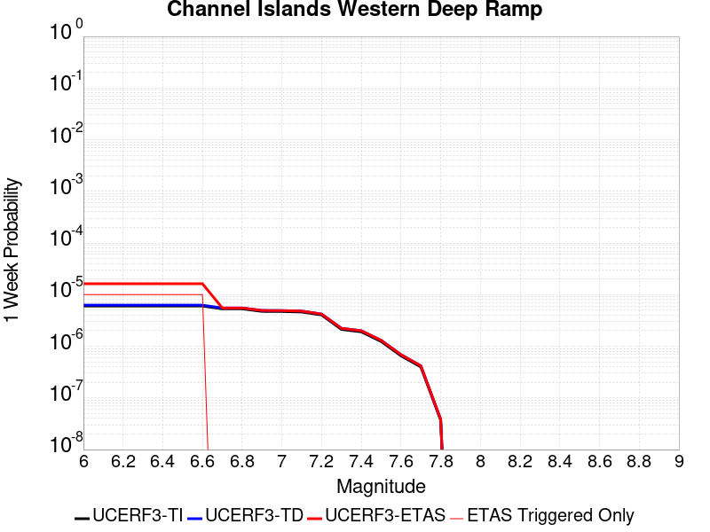 | 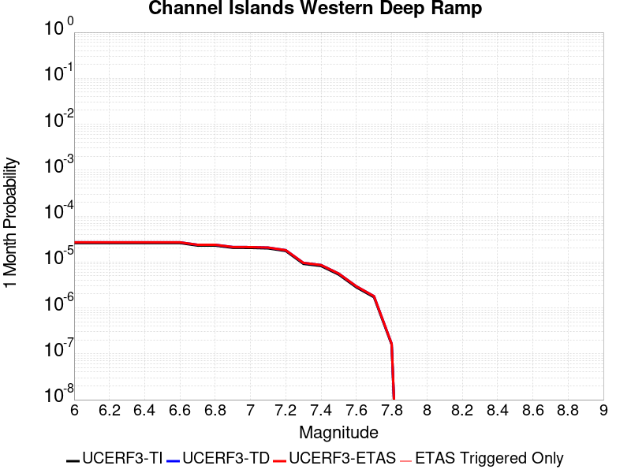 | 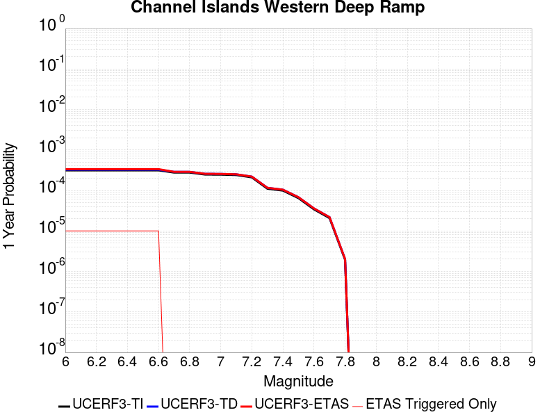 | 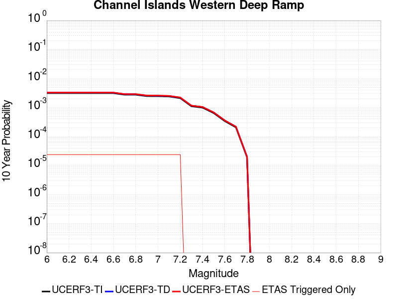 |

| Magnitude | 1 wk TI Prob | 1 wk TD Prob | 1 wk ETAS Prob | 1 wk ETAS/TD Gain | 1 wk ETAS Triggered Only | 1 mo TI Prob | 1 mo TD Prob | 1 mo ETAS Prob | 1 mo ETAS/TD Gain | 1 mo ETAS Triggered Only | 1 yr TI Prob | 1 yr TD Prob | 1 yr ETAS Prob | 1 yr ETAS/TD Gain | 1 yr ETAS Triggered Only | 10 yr TI Prob | 10 yr TD Prob | 10 yr ETAS Prob | 10 yr ETAS/TD Gain | 10 yr ETAS Triggered Only |
|-----|-----|-----|-----|-----|-----|-----|-----|-----|-----|-----|-----|-----|-----|-----|-----|-----|-----|-----|-----|-----|
| 6.0 | 6.0213506E-6 | 6.2548684E-6 | 1.6254806E-5 | 2.5987446 | 1.0E-5 | 2.5805533E-5 | 2.6806329E-5 | 3.680606E-5 | 1.3730363 | 1.0E-5 | 3.1413708E-4 | 3.2632265E-4 | 3.3631938E-4 | 1.0306345 | 1.0E-5 | 0.0031369338 | 0.0032588763 | 0.003278811 | 1.0061171 | 2.0E-5 |
| 6.1 | 6.0213506E-6 | 6.2548684E-6 | 1.6254806E-5 | 2.5987446 | 1.0E-5 | 2.5805533E-5 | 2.6806329E-5 | 3.680606E-5 | 1.3730363 | 1.0E-5 | 3.1413708E-4 | 3.2632265E-4 | 3.3631938E-4 | 1.0306345 | 1.0E-5 | 0.0031369338 | 0.0032588763 | 0.003278811 | 1.0061171 | 2.0E-5 |
| 6.2 | 6.0213506E-6 | 6.2548684E-6 | 1.6254806E-5 | 2.5987446 | 1.0E-5 | 2.5805533E-5 | 2.6806329E-5 | 3.680606E-5 | 1.3730363 | 1.0E-5 | 3.1413708E-4 | 3.2632265E-4 | 3.3631938E-4 | 1.0306345 | 1.0E-5 | 0.0031369338 | 0.0032588763 | 0.003278811 | 1.0061171 | 2.0E-5 |
| 6.3 | 6.0213506E-6 | 6.2548684E-6 | 1.6254806E-5 | 2.5987446 | 1.0E-5 | 2.5805533E-5 | 2.6806329E-5 | 3.680606E-5 | 1.3730363 | 1.0E-5 | 3.1413708E-4 | 3.2632265E-4 | 3.3631938E-4 | 1.0306345 | 1.0E-5 | 0.0031369338 | 0.0032588763 | 0.003278811 | 1.0061171 | 2.0E-5 |
| 6.4 | 6.0213506E-6 | 6.2548684E-6 | 1.6254806E-5 | 2.5987446 | 1.0E-5 | 2.5805533E-5 | 2.6806329E-5 | 3.680606E-5 | 1.3730363 | 1.0E-5 | 3.1413708E-4 | 3.2632265E-4 | 3.3631938E-4 | 1.0306345 | 1.0E-5 | 0.0031369338 | 0.0032588763 | 0.003278811 | 1.0061171 | 2.0E-5 |
| 6.5 | 6.0213506E-6 | 6.2548684E-6 | 1.6254806E-5 | 2.5987446 | 1.0E-5 | 2.5805533E-5 | 2.6806329E-5 | 3.680606E-5 | 1.3730363 | 1.0E-5 | 3.1413708E-4 | 3.2632265E-4 | 3.3631938E-4 | 1.0306345 | 1.0E-5 | 0.0031369338 | 0.0032588763 | 0.003278811 | 1.0061171 | 2.0E-5 |
| 6.6 | 6.0213506E-6 | 6.2548684E-6 | 1.6254806E-5 | 2.5987446 | 1.0E-5 | 2.5805533E-5 | 2.6806329E-5 | 3.680606E-5 | 1.3730363 | 1.0E-5 | 3.1413708E-4 | 3.2632265E-4 | 3.3631938E-4 | 1.0306345 | 1.0E-5 | 0.0031369338 | 0.0032588763 | 0.003278811 | 1.0061171 | 2.0E-5 |
| 6.7 | 5.313309E-6 | 5.5252403E-6 | 5.5252403E-6 | 1.0 | 0.0 | 2.2771126E-5 | 2.367941E-5 | 2.367941E-5 | 1.0 | 0.0 | 2.772032E-4 | 2.8826276E-4 | 2.8826276E-4 | 1.0 | 0.0 | 0.0027685766 | 0.0028792918 | 0.002889263 | 1.003463 | 1.0E-5 |
| 6.8 | 5.313309E-6 | 5.5252403E-6 | 5.5252403E-6 | 1.0 | 0.0 | 2.2771126E-5 | 2.367941E-5 | 2.367941E-5 | 1.0 | 0.0 | 2.772032E-4 | 2.8826276E-4 | 2.8826276E-4 | 1.0 | 0.0 | 0.0027685766 | 0.0028792918 | 0.002889263 | 1.003463 | 1.0E-5 |
| 6.9 | 4.744377E-6 | 4.9394303E-6 | 4.9394303E-6 | 1.0 | 0.0 | 2.0332885E-5 | 2.1168837E-5 | 2.1168837E-5 | 1.0 | 0.0 | 2.4752476E-4 | 2.5770385E-4 | 2.5770385E-4 | 1.0 | 0.0 | 0.0024724922 | 0.0025744175 | 0.0025843917 | 1.0038744 | 1.0E-5 |
| 7.0 | 4.722209E-6 | 4.9164732E-6 | 4.9164732E-6 | 1.0 | 0.0 | 2.0237881E-5 | 2.107045E-5 | 2.107045E-5 | 1.0 | 0.0 | 2.4636835E-4 | 2.5650626E-4 | 2.5650626E-4 | 1.0 | 0.0 | 0.002460954 | 0.0025624693 | 0.0025724438 | 1.0038925 | 1.0E-5 |
| 7.1 | 4.611174E-6 | 4.801409E-6 | 4.801409E-6 | 1.0 | 0.0 | 1.9762025E-5 | 2.0577325E-5 | 2.0577325E-5 | 1.0 | 0.0 | 2.4057609E-4 | 2.5050386E-4 | 2.5050386E-4 | 1.0 | 0.0 | 0.002403158 | 0.002502582 | 0.002512557 | 1.0039859 | 1.0E-5 |
| 7.2 | 4.043994E-6 | 4.2120264E-6 | 4.2120264E-6 | 1.0 | 0.0 | 1.7331287E-5 | 1.8051438E-5 | 1.8051438E-5 | 1.0 | 0.0 | 2.10988E-4 | 2.1975765E-4 | 2.1975765E-4 | 1.0 | 0.0 | 0.002107878 | 0.0021957543 | 0.0022057323 | 1.0045443 | 1.0E-5 |
| 7.3 | 2.1233036E-6 | 2.2297875E-6 | 2.2297875E-6 | 1.0 | 0.0 | 9.099841E-6 | 9.556197E-6 | 9.556197E-6 | 1.0 | 0.0 | 1.1078493E-4 | 1.1634055E-4 | 1.1634055E-4 | 1.0 | 0.0 | 0.0011072971 | 0.001162802 | 0.001162802 | 1.0 | 0.0 |
| 7.4 | 1.9051884E-6 | 2.0014973E-6 | 2.0014973E-6 | 1.0 | 0.0 | 8.165067E-6 | 8.577817E-6 | 8.577817E-6 | 1.0 | 0.0 | 9.940516E-5 | 1.0442998E-4 | 1.0442998E-4 | 1.0 | 0.0 | 9.93607E-4 | 0.0010438144 | 0.0010438144 | 1.0 | 0.0 |
| 7.5 | 1.2408497E-6 | 1.3038839E-6 | 1.3038839E-6 | 1.0 | 0.0 | 5.317916E-6 | 5.588062E-6 | 5.588062E-6 | 1.0 | 0.0 | 6.4743705E-5 | 6.8032554E-5 | 6.8032554E-5 | 1.0 | 0.0 | 6.4724847E-4 | 6.8011944E-4 | 6.8011944E-4 | 1.0 | 0.0 |
| 7.6 | 6.5440025E-7 | 6.886718E-7 | 6.886718E-7 | 1.0 | 0.0 | 2.8045695E-6 | 2.9514472E-6 | 2.9514472E-6 | 1.0 | 0.0 | 3.4145098E-5 | 3.593329E-5 | 3.593329E-5 | 1.0 | 0.0 | 3.4139853E-4 | 3.5927625E-4 | 3.5927625E-4 | 1.0 | 0.0 |
| 7.7 | 3.985963E-7 | 4.1930787E-7 | 4.1930787E-7 | 1.0 | 0.0 | 1.7082689E-6 | 1.7970326E-6 | 1.7970326E-6 | 1.0 | 0.0 | 2.0797976E-5 | 2.1878664E-5 | 2.1878664E-5 | 1.0 | 0.0 | 2.0796029E-4 | 2.1876628E-4 | 2.1876628E-4 | 1.0 | 0.0 |
| 7.8 | 3.706329E-8 | 3.8591796E-8 | 3.8591796E-8 | 1.0 | 0.0 | 1.5884267E-7 | 1.653934E-7 | 1.653934E-7 | 1.0 | 0.0 | 1.9339077E-6 | 2.0136629E-6 | 2.0136629E-6 | 1.0 | 0.0 | 1.933891E-5 | 2.0136458E-5 | 2.0136458E-5 | 1.0 | 0.0 |

## Calaveras (No) 2011 CFM
*[(top)](#table-of-contents)*

| 1 Week | 1 Month | 1 Year | 10 Year |
|-----|-----|-----|-----|
| 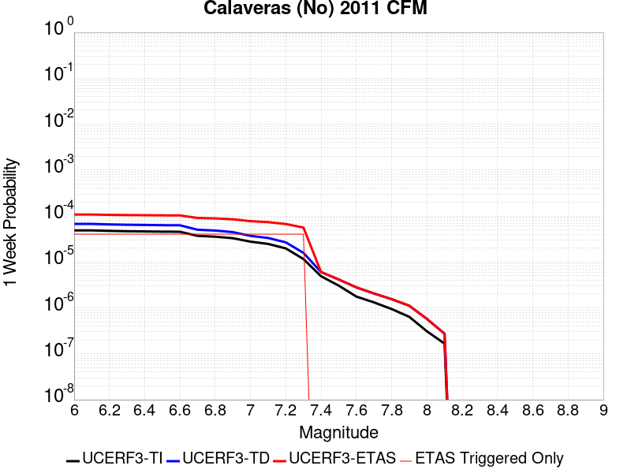 | 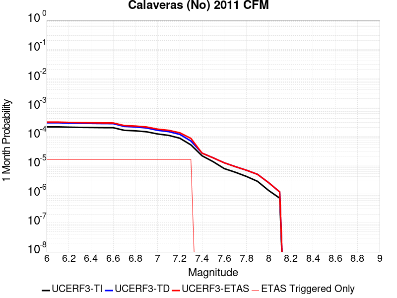 | 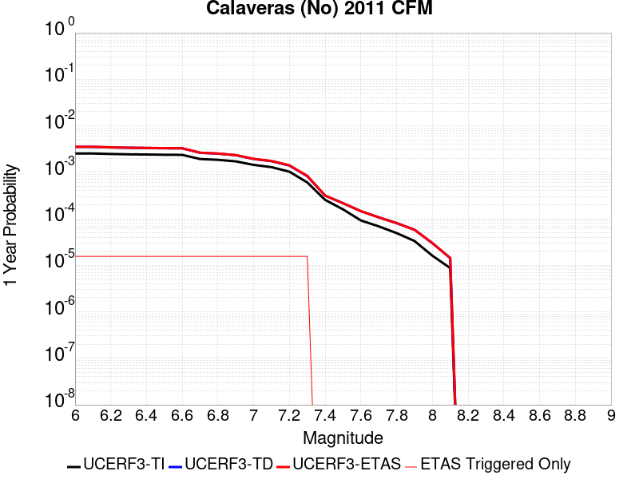 | 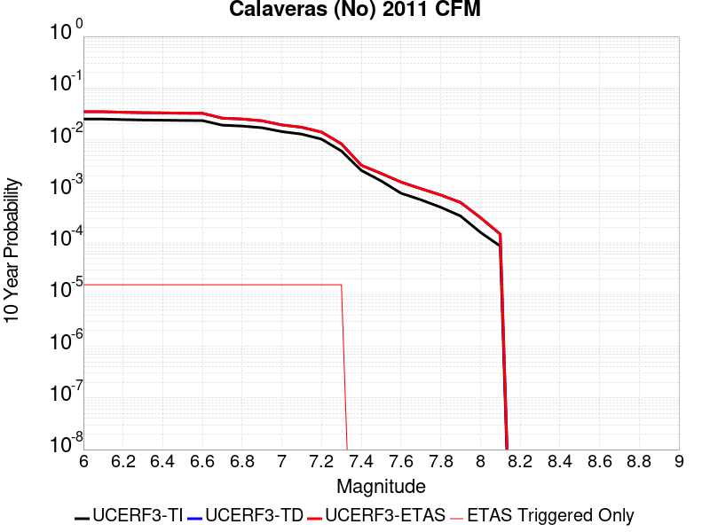 |

| Magnitude | 1 wk TI Prob | 1 wk TD Prob | 1 wk ETAS Prob | 1 wk ETAS/TD Gain | 1 wk ETAS Triggered Only | 1 mo TI Prob | 1 mo TD Prob | 1 mo ETAS Prob | 1 mo ETAS/TD Gain | 1 mo ETAS Triggered Only | 1 yr TI Prob | 1 yr TD Prob | 1 yr ETAS Prob | 1 yr ETAS/TD Gain | 1 yr ETAS Triggered Only | 10 yr TI Prob | 10 yr TD Prob | 10 yr ETAS Prob | 10 yr ETAS/TD Gain | 10 yr ETAS Triggered Only |
|-----|-----|-----|-----|-----|-----|-----|-----|-----|-----|-----|-----|-----|-----|-----|-----|-----|-----|-----|-----|-----|
| 6.0 | 4.8694856E-5 | 6.747121E-5 | 7.7470526E-5 | 1.1482013 | 1.0E-5 | 2.0867554E-4 | 2.8913133E-4 | 2.9912844E-4 | 1.0345764 | 1.0E-5 | 0.0025376645 | 0.003514627 | 0.003524592 | 1.0028353 | 1.0E-5 | 0.02508881 | 0.034771245 | 0.03479055 | 1.0005552 | 2.0E-5 |
| 6.1 | 4.8694856E-5 | 6.747121E-5 | 7.7470526E-5 | 1.1482013 | 1.0E-5 | 2.0867554E-4 | 2.8913133E-4 | 2.9912844E-4 | 1.0345764 | 1.0E-5 | 0.0025376645 | 0.003514627 | 0.003524592 | 1.0028353 | 1.0E-5 | 0.02508881 | 0.034771245 | 0.03479055 | 1.0005552 | 2.0E-5 |
| 6.2 | 4.7541962E-5 | 6.580218E-5 | 7.580152E-5 | 1.1519606 | 1.0E-5 | 2.0373536E-4 | 2.8197994E-4 | 2.919771E-4 | 1.0354536 | 1.0E-5 | 0.0024776561 | 0.003427859 | 0.0034378245 | 1.0029073 | 1.0E-5 | 0.024502134 | 0.033932675 | 0.033951998 | 1.0005693 | 2.0E-5 |
| 6.3 | 4.6717287E-5 | 6.4635555E-5 | 7.463491E-5 | 1.1547036 | 1.0E-5 | 2.0020158E-4 | 2.7698115E-4 | 2.869784E-4 | 1.0360936 | 1.0E-5 | 0.0024347296 | 0.0033672103 | 0.0033771766 | 1.0029598 | 1.0E-5 | 0.024082264 | 0.033345193 | 0.033364523 | 1.0005798 | 2.0E-5 |
| 6.4 | 4.6276386E-5 | 6.399742E-5 | 7.399678E-5 | 1.1562463 | 1.0E-5 | 1.983123E-4 | 2.7424688E-4 | 2.8424413E-4 | 1.0364535 | 1.0E-5 | 0.0024117786 | 0.0033340224 | 0.0033439891 | 1.0029894 | 1.0E-5 | 0.02385771 | 0.033024073 | 0.03304341 | 1.0005857 | 2.0E-5 |
| 6.5 | 4.5720994E-5 | 6.319881E-5 | 7.319818E-5 | 1.1582208 | 1.0E-5 | 1.9593239E-4 | 2.70825E-4 | 2.8082228E-4 | 1.0369142 | 1.0E-5 | 0.002382867 | 0.0032924965 | 0.0033024636 | 1.0030272 | 1.0E-5 | 0.023574775 | 0.032622032 | 0.03264138 | 1.0005931 | 2.0E-5 |
| 6.6 | 4.549134E-5 | 6.28519E-5 | 7.285127E-5 | 1.1590942 | 1.0E-5 | 1.949483E-4 | 2.6933852E-4 | 2.7933583E-4 | 1.037118 | 1.0E-5 | 0.0023709119 | 0.0032744533 | 0.0032844206 | 1.0030439 | 1.0E-5 | 0.023457756 | 0.032447387 | 0.03246674 | 1.0005964 | 2.0E-5 |
| 6.7 | 3.701047E-5 | 5.0359427E-5 | 6.0358925E-5 | 1.1985625 | 1.0E-5 | 1.5860666E-4 | 2.1580851E-4 | 2.2580635E-4 | 1.0463274 | 1.0E-5 | 0.0019293258 | 0.002624346 | 0.0026343197 | 1.0038005 | 1.0E-5 | 0.019126613 | 0.026125323 | 0.0261448 | 1.0007455 | 2.0E-5 |
| 6.8 | 3.5523568E-5 | 4.8341022E-5 | 5.8340538E-5 | 1.2068536 | 1.0E-5 | 1.5223498E-4 | 2.071596E-4 | 2.1715753E-4 | 1.048262 | 1.0E-5 | 0.0018518851 | 0.0025192937 | 0.0025292686 | 1.0039594 | 1.0E-5 | 0.018365284 | 0.025097553 | 0.02511705 | 1.0007769 | 2.0E-5 |
| 6.9 | 3.2946147E-5 | 4.466269E-5 | 5.4662247E-5 | 1.2238905 | 1.0E-5 | 1.4119013E-4 | 1.9139773E-4 | 2.0139581E-4 | 1.0522373 | 1.0E-5 | 0.0017176344 | 0.0023278191 | 0.002337796 | 1.0042858 | 1.0E-5 | 0.017044188 | 0.023219598 | 0.023239136 | 1.0008414 | 2.0E-5 |
| 7.0 | 2.7682381E-5 | 3.702223E-5 | 4.7021862E-5 | 1.270098 | 1.0E-5 | 1.1863338E-4 | 1.5865723E-4 | 1.6865564E-4 | 1.0630189 | 1.0E-5 | 0.0014434044 | 0.0019299705 | 0.0019399511 | 1.0051714 | 1.0E-5 | 0.01434065 | 0.01931092 | 0.019330533 | 1.0010157 | 2.0E-5 |
| 7.1 | 2.471967E-5 | 3.328669E-5 | 4.328636E-5 | 1.3004104 | 1.0E-5 | 1.05937135E-4 | 1.4264962E-4 | 1.526482E-4 | 1.0700918 | 1.0E-5 | 0.0012890215 | 0.0017354045 | 0.0017453871 | 1.0057523 | 1.0E-5 | 0.0128157 | 0.017385952 | 0.017405605 | 1.0011303 | 2.0E-5 |
| 7.2 | 1.9748062E-5 | 2.6774684E-5 | 3.6774418E-5 | 1.3734771 | 1.0E-5 | 8.463181E-5 | 1.1474373E-4 | 1.2474258E-4 | 1.0871407 | 1.0E-5 | 0.0010299052 | 0.0013961331 | 0.0014061191 | 1.0071527 | 1.0E-5 | 0.01025145 | 0.014030739 | 0.014050459 | 1.0014055 | 2.0E-5 |
| 7.3 | 1.1603734E-5 | 1.5783844E-5 | 2.5783687E-5 | 1.6335492 | 1.0E-5 | 4.9729337E-5 | 6.764337E-5 | 7.76427E-5 | 1.1478242 | 1.0E-5 | 6.052865E-4 | 8.232611E-4 | 8.3325285E-4 | 1.0121368 | 1.0E-5 | 0.0060364045 | 0.008308666 | 0.008318583 | 1.0011935 | 1.0E-5 |
| 7.4 | 4.885381E-6 | 6.0349853E-6 | 6.0349853E-6 | 1.0 | 0.0 | 2.0937177E-5 | 2.5863968E-5 | 2.5863968E-5 | 1.0 | 0.0 | 2.5488032E-4 | 3.148485E-4 | 3.148485E-4 | 1.0 | 0.0 | 0.0025458818 | 0.0032010598 | 0.0032010598 | 1.0 | 0.0 |
| 7.5 | 3.0571264E-6 | 4.155299E-6 | 4.155299E-6 | 1.0 | 0.0 | 1.3101904E-5 | 1.7808303E-5 | 1.7808303E-5 | 1.0 | 0.0 | 1.5950401E-4 | 2.1679462E-4 | 2.1679462E-4 | 1.0 | 0.0 | 0.0015938957 | 0.002221121 | 0.002221121 | 1.0 | 0.0 |
| 7.6 | 1.764948E-6 | 2.7955498E-6 | 2.7955498E-6 | 1.0 | 0.0 | 7.564041E-6 | 1.1980874E-5 | 1.1980874E-5 | 1.0 | 0.0 | 9.208831E-5 | 1.4585744E-4 | 1.4585744E-4 | 1.0 | 0.0 | 9.205016E-4 | 0.0015123509 | 0.0015123509 | 1.0 | 0.0 |
| 7.7 | 1.3173734E-6 | 2.058471E-6 | 2.058471E-6 | 1.0 | 0.0 | 5.645874E-6 | 8.8219895E-6 | 8.8219895E-6 | 1.0 | 0.0 | 6.873634E-5 | 1.0740245E-4 | 1.0740245E-4 | 1.0 | 0.0 | 6.8715087E-4 | 0.0011261401 | 0.0011261401 | 1.0 | 0.0 |
| 7.8 | 9.4429885E-7 | 1.5489635E-6 | 1.5489635E-6 | 1.0 | 0.0 | 4.0469886E-6 | 6.638398E-6 | 6.638398E-6 | 1.0 | 0.0 | 4.9270973E-5 | 8.081952E-5 | 8.081952E-5 | 1.0 | 0.0 | 4.926005E-4 | 8.5014524E-4 | 8.5014524E-4 | 1.0 | 0.0 |
| 7.9 | 6.388233E-7 | 1.1148749E-6 | 1.1148749E-6 | 1.0 | 0.0 | 2.7378112E-6 | 4.7780263E-6 | 4.7780263E-6 | 1.0 | 0.0 | 3.3332344E-5 | 5.817093E-5 | 5.817093E-5 | 1.0 | 0.0 | 3.3327343E-4 | 6.0963054E-4 | 6.0963054E-4 | 1.0 | 0.0 |
| 8.0 | 3.087986E-7 | 5.7543696E-7 | 5.7543696E-7 | 1.0 | 0.0 | 1.323422E-6 | 2.466156E-6 | 2.466156E-6 | 1.0 | 0.0 | 1.6112543E-5 | 3.002504E-5 | 3.002504E-5 | 1.0 | 0.0 | 1.6111376E-4 | 3.110302E-4 | 3.110302E-4 | 1.0 | 0.0 |
| 8.1 | 1.6725647E-7 | 2.7410047E-7 | 2.7410047E-7 | 1.0 | 0.0 | 7.168133E-7 | 1.1747159E-6 | 1.1747159E-6 | 1.0 | 0.0 | 8.7271665E-6 | 1.4302073E-5 | 1.4302073E-5 | 1.0 | 0.0 | 8.726824E-5 | 1.48486E-4 | 1.48486E-4 | 1.0 | 0.0 |

## San Joaquin Hills
*[(top)](#table-of-contents)*

| 1 Week | 1 Month | 1 Year | 10 Year |
|-----|-----|-----|-----|
| 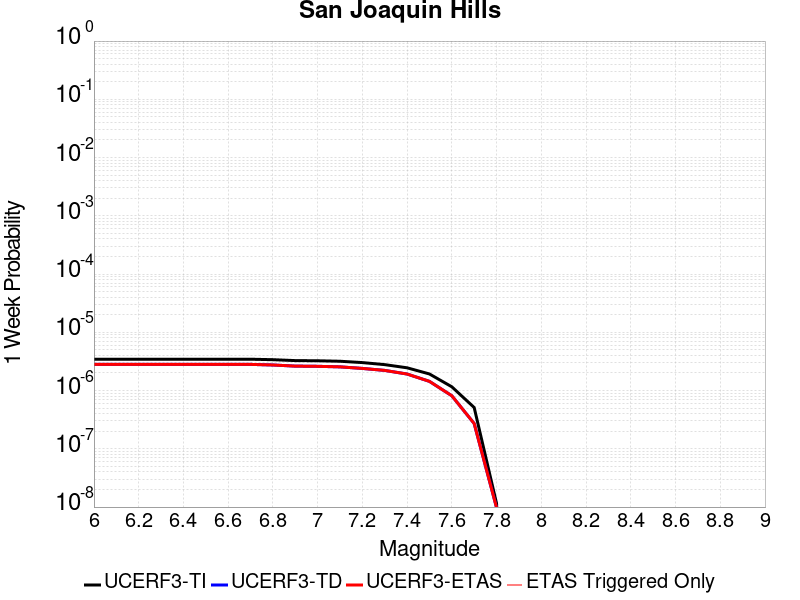 | 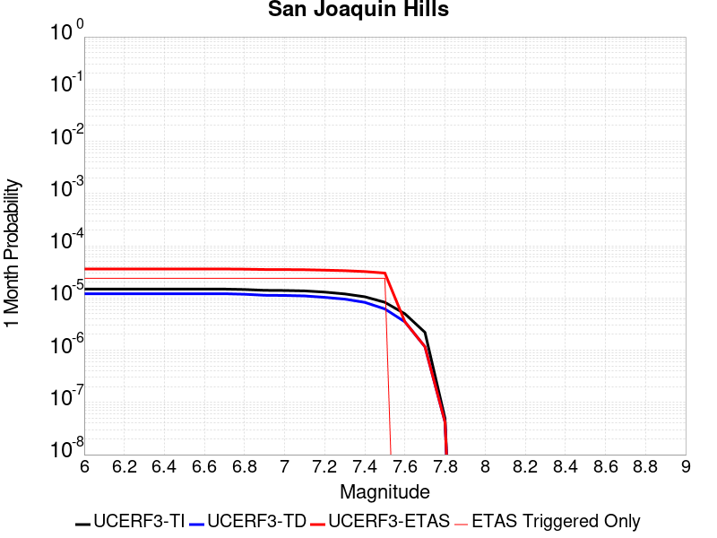 | 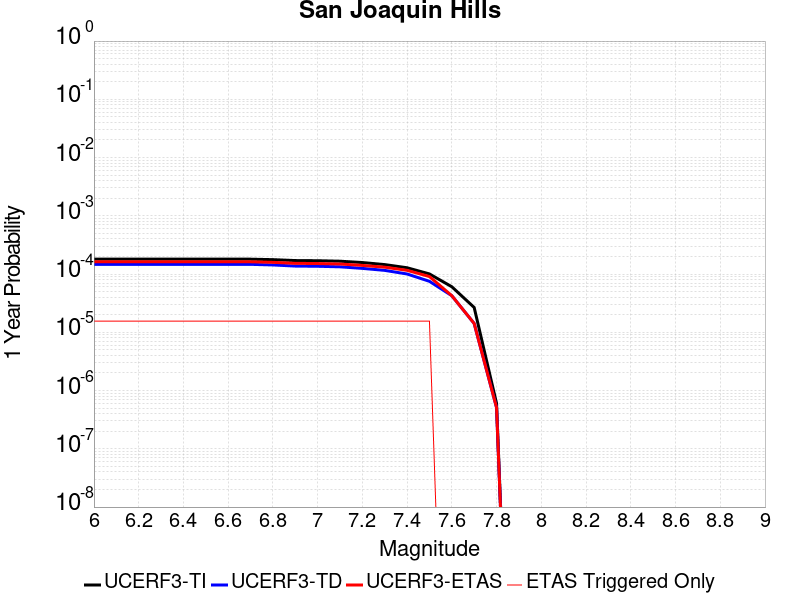 | 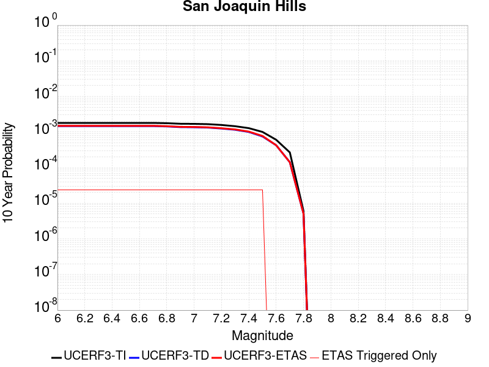 |

| Magnitude | 1 wk TI Prob | 1 wk TD Prob | 1 wk ETAS Prob | 1 wk ETAS/TD Gain | 1 wk ETAS Triggered Only | 1 mo TI Prob | 1 mo TD Prob | 1 mo ETAS Prob | 1 mo ETAS/TD Gain | 1 mo ETAS Triggered Only | 1 yr TI Prob | 1 yr TD Prob | 1 yr ETAS Prob | 1 yr ETAS/TD Gain | 1 yr ETAS Triggered Only | 10 yr TI Prob | 10 yr TD Prob | 10 yr ETAS Prob | 10 yr ETAS/TD Gain | 10 yr ETAS Triggered Only |
|-----|-----|-----|-----|-----|-----|-----|-----|-----|-----|-----|-----|-----|-----|-----|-----|-----|-----|-----|-----|-----|
| 6.0 | 3.4525704E-6 | 2.8139818E-6 | 2.8139818E-6 | 1.0 | 0.0 | 1.4796647E-5 | 1.2059867E-5 | 3.2059626E-5 | 2.658373 | 2.0E-5 | 1.8013427E-4 | 1.4681912E-4 | 1.6681619E-4 | 1.1362021 | 2.0E-5 | 0.0017998833 | 0.0014672345 | 0.001487205 | 1.0136111 | 2.0E-5 |
| 6.1 | 3.4525704E-6 | 2.8139818E-6 | 2.8139818E-6 | 1.0 | 0.0 | 1.4796647E-5 | 1.2059867E-5 | 3.2059626E-5 | 2.658373 | 2.0E-5 | 1.8013427E-4 | 1.4681912E-4 | 1.6681619E-4 | 1.1362021 | 2.0E-5 | 0.0017998833 | 0.0014672345 | 0.001487205 | 1.0136111 | 2.0E-5 |
| 6.2 | 3.4525704E-6 | 2.8139818E-6 | 2.8139818E-6 | 1.0 | 0.0 | 1.4796647E-5 | 1.2059867E-5 | 3.2059626E-5 | 2.658373 | 2.0E-5 | 1.8013427E-4 | 1.4681912E-4 | 1.6681619E-4 | 1.1362021 | 2.0E-5 | 0.0017998833 | 0.0014672345 | 0.001487205 | 1.0136111 | 2.0E-5 |
| 6.3 | 3.4525704E-6 | 2.8139818E-6 | 2.8139818E-6 | 1.0 | 0.0 | 1.4796647E-5 | 1.2059867E-5 | 3.2059626E-5 | 2.658373 | 2.0E-5 | 1.8013427E-4 | 1.4681912E-4 | 1.6681619E-4 | 1.1362021 | 2.0E-5 | 0.0017998833 | 0.0014672345 | 0.001487205 | 1.0136111 | 2.0E-5 |
| 6.4 | 3.4525704E-6 | 2.8139818E-6 | 2.8139818E-6 | 1.0 | 0.0 | 1.4796647E-5 | 1.2059867E-5 | 3.2059626E-5 | 2.658373 | 2.0E-5 | 1.8013427E-4 | 1.4681912E-4 | 1.6681619E-4 | 1.1362021 | 2.0E-5 | 0.0017998833 | 0.0014672345 | 0.001487205 | 1.0136111 | 2.0E-5 |
| 6.5 | 3.4525704E-6 | 2.8139818E-6 | 2.8139818E-6 | 1.0 | 0.0 | 1.4796647E-5 | 1.2059867E-5 | 3.2059626E-5 | 2.658373 | 2.0E-5 | 1.8013427E-4 | 1.4681912E-4 | 1.6681619E-4 | 1.1362021 | 2.0E-5 | 0.0017998833 | 0.0014672345 | 0.001487205 | 1.0136111 | 2.0E-5 |
| 6.6 | 3.4525704E-6 | 2.8139818E-6 | 2.8139818E-6 | 1.0 | 0.0 | 1.4796647E-5 | 1.2059867E-5 | 3.2059626E-5 | 2.658373 | 2.0E-5 | 1.8013427E-4 | 1.4681912E-4 | 1.6681619E-4 | 1.1362021 | 2.0E-5 | 0.0017998833 | 0.0014672345 | 0.001487205 | 1.0136111 | 2.0E-5 |
| 6.7 | 3.4525704E-6 | 2.8139818E-6 | 2.8139818E-6 | 1.0 | 0.0 | 1.4796647E-5 | 1.2059867E-5 | 3.2059626E-5 | 2.658373 | 2.0E-5 | 1.8013427E-4 | 1.4681912E-4 | 1.6681619E-4 | 1.1362021 | 2.0E-5 | 0.0017998833 | 0.0014672345 | 0.001487205 | 1.0136111 | 2.0E-5 |
| 6.8 | 3.388654E-6 | 2.7484202E-6 | 2.7484202E-6 | 1.0 | 0.0 | 1.4522722E-5 | 1.1778891E-5 | 3.1778654E-5 | 2.6979327 | 2.0E-5 | 1.767998E-4 | 1.4339869E-4 | 1.6339582E-4 | 1.1394513 | 2.0E-5 | 0.001766592 | 0.0014330745 | 0.0014530458 | 1.013936 | 2.0E-5 |
| 6.9 | 3.2694352E-6 | 2.6283346E-6 | 2.6283346E-6 | 1.0 | 0.0 | 1.401179E-5 | 1.1264243E-5 | 3.126402E-5 | 2.7755098 | 2.0E-5 | 1.7058018E-4 | 1.3713364E-4 | 1.571309E-4 | 1.1458231 | 2.0E-5 | 0.0017044931 | 0.0013705015 | 0.001390474 | 1.0145732 | 2.0E-5 |
| 7.0 | 3.246912E-6 | 2.6069915E-6 | 2.6069915E-6 | 1.0 | 0.0 | 1.39152635E-5 | 1.1172774E-5 | 3.117255E-5 | 2.7900457 | 2.0E-5 | 1.6940516E-4 | 1.3602014E-4 | 1.5601743E-4 | 1.147017 | 2.0E-5 | 0.0016927607 | 0.0013593802 | 0.001379353 | 1.0146925 | 2.0E-5 |
| 7.1 | 3.1864927E-6 | 2.5523198E-6 | 2.5523198E-6 | 1.0 | 0.0 | 1.3656326E-5 | 1.0938467E-5 | 3.093825E-5 | 2.8283896 | 2.0E-5 | 1.6625308E-4 | 1.3316782E-4 | 1.5316515E-4 | 1.1501664 | 2.0E-5 | 0.0016612876 | 0.0013308912 | 0.0013508645 | 1.0150075 | 2.0E-5 |
| 7.2 | 3.0220644E-6 | 2.3991677E-6 | 2.3991677E-6 | 1.0 | 0.0 | 1.295164E-5 | 1.0282108E-5 | 3.0281903E-5 | 2.9451065 | 2.0E-5 | 1.576748E-4 | 1.2517757E-4 | 1.4517507E-4 | 1.1597531 | 2.0E-5 | 0.0015756298 | 0.0012510809 | 0.0012710559 | 1.0159662 | 2.0E-5 |
| 7.3 | 2.787619E-6 | 2.2173858E-6 | 2.2173858E-6 | 1.0 | 0.0 | 1.1946884E-5 | 9.503048E-6 | 2.9502859E-5 | 3.104568 | 2.0E-5 | 1.454436E-4 | 1.1569356E-4 | 1.3569125E-4 | 1.1728505 | 2.0E-5 | 0.0014534845 | 0.0011563431 | 0.00117632 | 1.0172759 | 2.0E-5 |
| 7.4 | 2.4593792E-6 | 1.9226306E-6 | 1.9226306E-6 | 1.0 | 0.0 | 1.0540153E-5 | 8.23982E-6 | 2.8239656E-5 | 3.4272172 | 2.0E-5 | 1.2831882E-4 | 1.0031529E-4 | 1.2031328E-4 | 1.1993514 | 2.0E-5 | 0.0012824474 | 0.0010027088 | 0.0010226888 | 1.019926 | 2.0E-5 |
| 7.5 | 1.926764E-6 | 1.4383021E-6 | 1.4383021E-6 | 1.0 | 0.0 | 8.257534E-6 | 6.1641376E-6 | 1.6164076E-5 | 2.622277 | 1.0E-5 | 1.00530844E-4 | 7.504586E-5 | 8.50451E-5 | 1.1332419 | 1.0E-5 | 0.0010048538 | 7.502115E-4 | 7.60204E-4 | 1.0133196 | 1.0E-5 |
| 7.6 | 1.1609359E-6 | 8.14558E-7 | 8.14558E-7 | 1.0 | 0.0 | 4.97543E-6 | 3.4909585E-6 | 3.4909585E-6 | 1.0 | 0.0 | 6.0574173E-5 | 4.2501633E-5 | 4.2501633E-5 | 1.0 | 0.0 | 6.055767E-4 | 4.249394E-4 | 4.249394E-4 | 1.0 | 0.0 |
| 7.7 | 5.1168536E-7 | 2.7155914E-7 | 2.7155914E-7 | 1.0 | 0.0 | 2.1929354E-6 | 1.1638244E-6 | 1.1638244E-6 | 1.0 | 0.0 | 2.669866E-5 | 1.41694845E-5 | 1.41694845E-5 | 1.0 | 0.0 | 2.6695454E-4 | 1.4168715E-4 | 1.4168715E-4 | 1.0 | 0.0 |
| 7.8 | 1.16056995E-8 | 9.782373E-9 | 9.782373E-9 | 1.0 | 0.0 | 4.9738713E-8 | 4.1924455E-8 | 4.1924455E-8 | 1.0 | 0.0 | 6.0556863E-7 | 5.1043025E-7 | 5.1043025E-7 | 1.0 | 0.0 | 6.05567E-6 | 5.1043025E-6 | 5.1043025E-6 | 1.0 | 0.0 |

## Hat Creek-McArthur-Mayfield
*[(top)](#table-of-contents)*

| 1 Week | 1 Month | 1 Year | 10 Year |
|-----|-----|-----|-----|
| 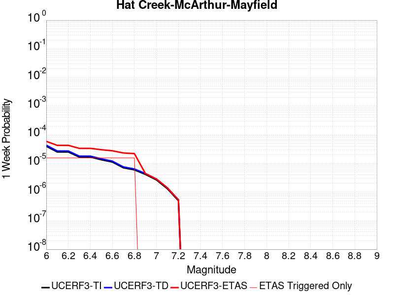 |  | 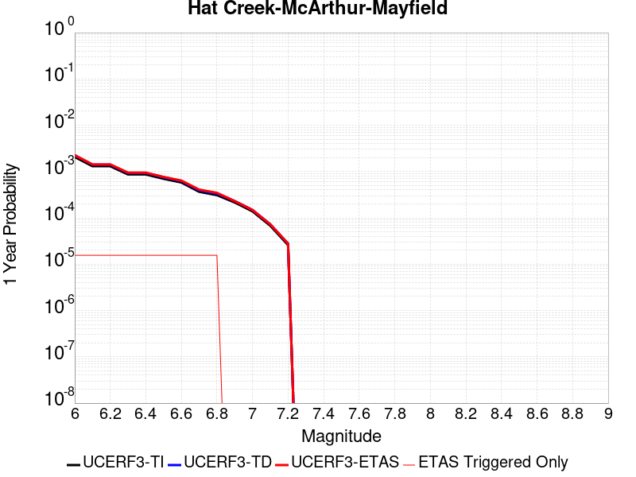 | 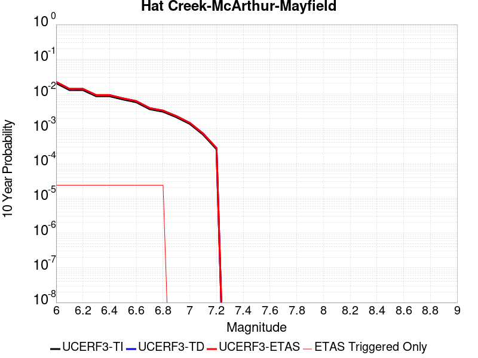 |

| Magnitude | 1 wk TI Prob | 1 wk TD Prob | 1 wk ETAS Prob | 1 wk ETAS/TD Gain | 1 wk ETAS Triggered Only | 1 mo TI Prob | 1 mo TD Prob | 1 mo ETAS Prob | 1 mo ETAS/TD Gain | 1 mo ETAS Triggered Only | 1 yr TI Prob | 1 yr TD Prob | 1 yr ETAS Prob | 1 yr ETAS/TD Gain | 1 yr ETAS Triggered Only | 10 yr TI Prob | 10 yr TD Prob | 10 yr ETAS Prob | 10 yr ETAS/TD Gain | 10 yr ETAS Triggered Only |
|-----|-----|-----|-----|-----|-----|-----|-----|-----|-----|-----|-----|-----|-----|-----|-----|-----|-----|-----|-----|-----|
| 6.0 | 3.967457E-5 | 4.315831E-5 | 5.3157877E-5 | 1.231695 | 1.0E-5 | 1.7002279E-4 | 1.8495171E-4 | 1.9494987E-4 | 1.0540582 | 1.0E-5 | 0.002068062 | 0.002249576 | 0.0022595534 | 1.0044353 | 1.0E-5 | 0.02048922 | 0.022280399 | 0.022299953 | 1.0008776 | 2.0E-5 |
| 6.1 | 2.5044013E-5 | 2.7071164E-5 | 3.7070895E-5 | 1.3693868 | 1.0E-5 | 1.0732707E-4 | 1.1601429E-4 | 1.2601314E-4 | 1.0861863 | 1.0E-5 | 0.0013059238 | 0.0014115906 | 0.0014215765 | 1.0070742 | 1.0E-5 | 0.01298276 | 0.01402966 | 0.01403952 | 1.0007027 | 1.0E-5 |
| 6.2 | 2.5044013E-5 | 2.7071164E-5 | 3.7070895E-5 | 1.3693868 | 1.0E-5 | 1.0732707E-4 | 1.1601429E-4 | 1.2601314E-4 | 1.0861863 | 1.0E-5 | 0.0013059238 | 0.0014115906 | 0.0014215765 | 1.0070742 | 1.0E-5 | 0.01298276 | 0.01402966 | 0.01403952 | 1.0007027 | 1.0E-5 |
| 6.3 | 1.6624012E-5 | 1.7891072E-5 | 2.7890892E-5 | 1.558928 | 1.0E-5 | 7.124382E-5 | 7.6673816E-5 | 8.667305E-5 | 1.1304126 | 1.0E-5 | 8.670483E-4 | 9.331125E-4 | 9.4310316E-4 | 1.0107068 | 1.0E-5 | 0.008636732 | 0.009292879 | 0.009302787 | 1.0010661 | 1.0E-5 |
| 6.4 | 1.6624012E-5 | 1.7891072E-5 | 2.7890892E-5 | 1.558928 | 1.0E-5 | 7.124382E-5 | 7.6673816E-5 | 8.667305E-5 | 1.1304126 | 1.0E-5 | 8.670483E-4 | 9.331125E-4 | 9.4310316E-4 | 1.0107068 | 1.0E-5 | 0.008636732 | 0.009292879 | 0.009302787 | 1.0010661 | 1.0E-5 |
| 6.5 | 1.3394842E-5 | 1.4392137E-5 | 2.4391993E-5 | 1.6948138 | 1.0E-5 | 5.7405203E-5 | 6.167916E-5 | 7.167854E-5 | 1.1621193 | 1.0E-5 | 6.986842E-4 | 7.506906E-4 | 7.606831E-4 | 1.013311 | 1.0E-5 | 0.006964916 | 0.0074821403 | 0.007492066 | 1.0013266 | 1.0E-5 |
| 6.6 | 1.1137514E-5 | 1.1954546E-5 | 2.1954425E-5 | 1.8364918 | 1.0E-5 | 4.7731326E-5 | 5.1232782E-5 | 6.123227E-5 | 1.1951776 | 1.0E-5 | 5.809739E-4 | 6.2358467E-4 | 6.335784E-4 | 1.0160263 | 1.0E-5 | 0.005794574 | 0.00621877 | 0.0062287077 | 1.001598 | 1.0E-5 |
| 6.7 | 7.0200663E-6 | 7.5242897E-6 | 1.7524215E-5 | 2.329019 | 1.0E-5 | 3.008565E-5 | 3.2246568E-5 | 4.2246244E-5 | 1.3101006 | 1.0E-5 | 3.6623122E-4 | 3.925328E-4 | 4.0252888E-4 | 1.0254656 | 1.0E-5 | 0.0036562826 | 0.0039185574 | 0.003928518 | 1.002542 | 1.0E-5 |
| 6.8 | 5.940172E-6 | 6.3654766E-6 | 1.6365413E-5 | 2.5709643 | 1.0E-5 | 2.545763E-5 | 2.7280335E-5 | 3.7280064E-5 | 1.3665544 | 1.0E-5 | 3.0990256E-4 | 3.3208873E-4 | 3.420854E-4 | 1.0301025 | 1.0E-5 | 0.0030947074 | 0.0033160534 | 0.0033260202 | 1.0030056 | 1.0E-5 |
| 6.9 | 4.129831E-6 | 4.423547E-6 | 4.423547E-6 | 1.0 | 0.0 | 1.7699154E-5 | 1.8957926E-5 | 1.8957926E-5 | 1.0 | 0.0 | 2.154659E-4 | 2.3078908E-4 | 2.3078908E-4 | 1.0 | 0.0 | 0.002152571 | 0.0023055724 | 0.0023055724 | 1.0 | 0.0 |
| 7.0 | 2.6512955E-6 | 2.8374002E-6 | 2.8374002E-6 | 1.0 | 0.0 | 1.1362646E-5 | 1.2160232E-5 | 1.2160232E-5 | 1.0 | 0.0 | 1.3833142E-4 | 1.480412E-4 | 1.480412E-4 | 1.0 | 0.0 | 0.0013824535 | 0.0014794683 | 0.0014794683 | 1.0 | 0.0 |
| 7.1 | 1.2992575E-6 | 1.3909317E-6 | 1.3909317E-6 | 1.0 | 0.0 | 5.568235E-6 | 5.961124E-6 | 5.961124E-6 | 1.0 | 0.0 | 6.779115E-5 | 7.257448E-5 | 7.257448E-5 | 1.0 | 0.0 | 6.7770475E-4 | 7.2552945E-4 | 7.2552945E-4 | 1.0 | 0.0 |
| 7.2 | 4.968191E-7 | 5.3271475E-7 | 5.3271475E-7 | 1.0 | 0.0 | 2.1292228E-6 | 2.283062E-6 | 2.283062E-6 | 1.0 | 0.0 | 2.592298E-5 | 2.7796052E-5 | 2.7796052E-5 | 1.0 | 0.0 | 2.5919956E-4 | 2.7793812E-4 | 2.7793812E-4 | 1.0 | 0.0 |

## Rinconada 2011 CFM
*[(top)](#table-of-contents)*

| 1 Week | 1 Month | 1 Year | 10 Year |
|-----|-----|-----|-----|
| 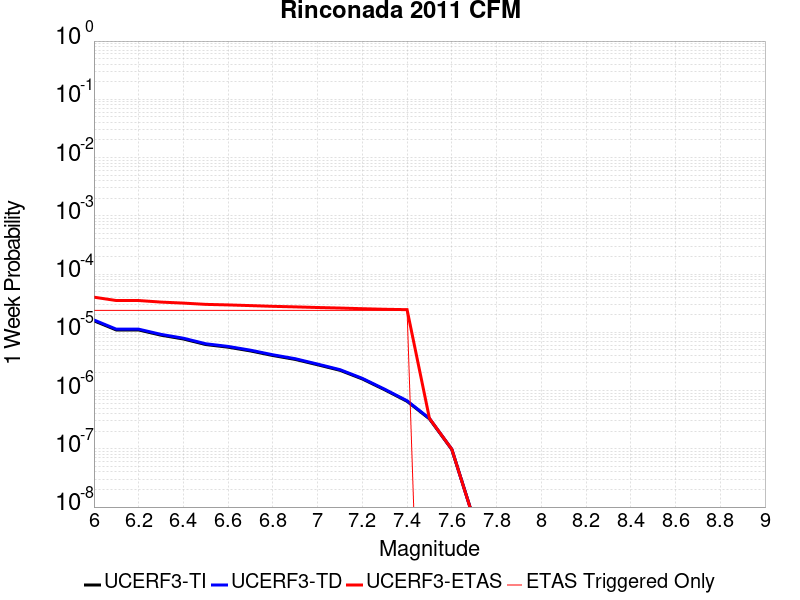 | 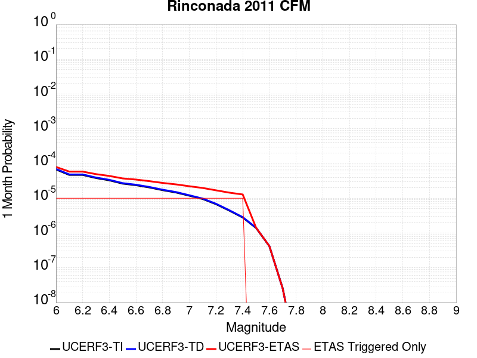 | 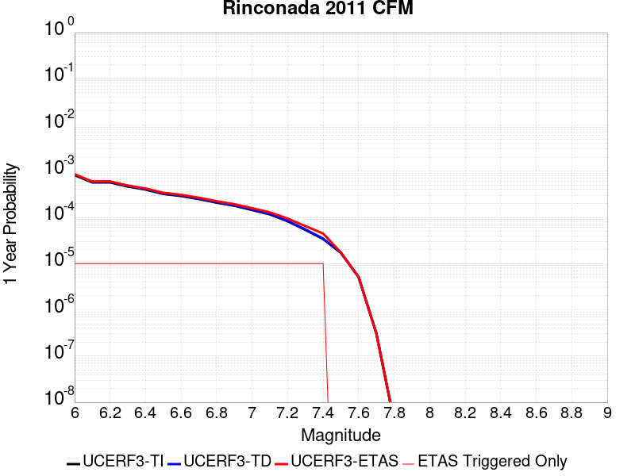 | 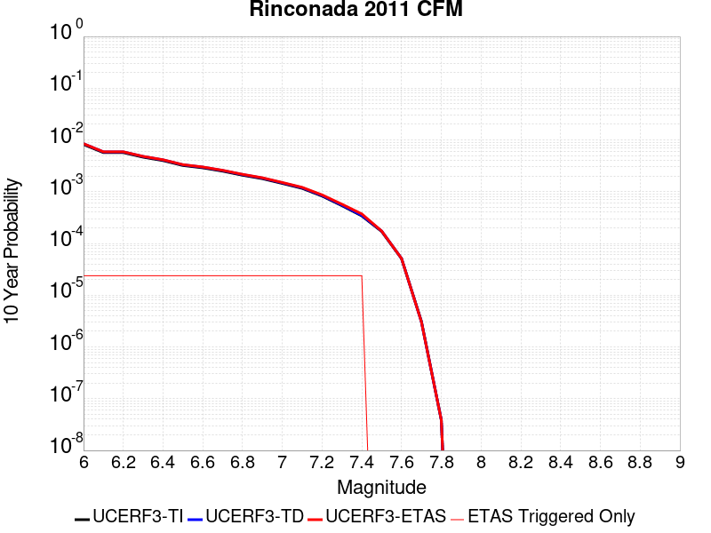 |

| Magnitude | 1 wk TI Prob | 1 wk TD Prob | 1 wk ETAS Prob | 1 wk ETAS/TD Gain | 1 wk ETAS Triggered Only | 1 mo TI Prob | 1 mo TD Prob | 1 mo ETAS Prob | 1 mo ETAS/TD Gain | 1 mo ETAS Triggered Only | 1 yr TI Prob | 1 yr TD Prob | 1 yr ETAS Prob | 1 yr ETAS/TD Gain | 1 yr ETAS Triggered Only | 10 yr TI Prob | 10 yr TD Prob | 10 yr ETAS Prob | 10 yr ETAS/TD Gain | 10 yr ETAS Triggered Only |
|-----|-----|-----|-----|-----|-----|-----|-----|-----|-----|-----|-----|-----|-----|-----|-----|-----|-----|-----|-----|-----|
| 6.0 | 1.5752368E-5 | 1.6274716E-5 | 2.6274553E-5 | 1.6144401 | 1.0E-5 | 6.75084E-5 | 6.974694E-5 | 7.9746234E-5 | 1.1433655 | 1.0E-5 | 8.2160486E-4 | 8.488412E-4 | 8.5883273E-4 | 1.0117707 | 1.0E-5 | 0.008185739 | 0.00845637 | 0.0084762005 | 1.0023451 | 2.0E-5 |
| 6.1 | 1.0966133E-5 | 1.1323029E-5 | 2.1322916E-5 | 1.8831459 | 1.0E-5 | 4.6996865E-5 | 4.852637E-5 | 5.8525882E-5 | 1.2060635 | 1.0E-5 | 5.720366E-4 | 5.906491E-4 | 6.006432E-4 | 1.0169206 | 1.0E-5 | 0.0057056635 | 0.0058908886 | 0.00590083 | 1.0016875 | 1.0E-5 |
| 6.2 | 1.0966133E-5 | 1.1323029E-5 | 2.1322916E-5 | 1.8831459 | 1.0E-5 | 4.6996865E-5 | 4.852637E-5 | 5.8525882E-5 | 1.2060635 | 1.0E-5 | 5.720366E-4 | 5.906491E-4 | 6.006432E-4 | 1.0169206 | 1.0E-5 | 0.0057056635 | 0.0058908886 | 0.00590083 | 1.0016875 | 1.0E-5 |
| 6.3 | 8.926149E-6 | 9.212771E-6 | 1.9212679E-5 | 2.0854397 | 1.0E-5 | 3.8254362E-5 | 3.948271E-5 | 4.9482314E-5 | 1.2532654 | 1.0E-5 | 4.6564735E-4 | 4.805963E-4 | 4.905915E-4 | 1.0207975 | 1.0E-5 | 0.0046467283 | 0.0047956146 | 0.0048055663 | 1.0020752 | 1.0E-5 |
| 6.4 | 7.676955E-6 | 7.920191E-6 | 1.7920112E-5 | 2.2625859 | 1.0E-5 | 3.290082E-5 | 3.3943234E-5 | 4.3942895E-5 | 1.2945995 | 1.0E-5 | 4.0049385E-4 | 4.1318068E-4 | 4.2317656E-4 | 1.0241925 | 1.0E-5 | 0.0039977287 | 0.004124151 | 0.0041341097 | 1.0024147 | 1.0E-5 |
| 6.5 | 6.1671026E-6 | 6.3589546E-6 | 1.6358892E-5 | 2.5725756 | 1.0E-5 | 2.6430173E-5 | 2.725238E-5 | 3.7252106E-5 | 1.3669305 | 1.0E-5 | 3.2173982E-4 | 3.317473E-4 | 3.4174396E-4 | 1.0301335 | 1.0E-5 | 0.003212744 | 0.0033125326 | 0.0033224993 | 1.0030088 | 1.0E-5 |
| 6.6 | 5.553456E-6 | 5.7248126E-6 | 1.5724756E-5 | 2.746772 | 1.0E-5 | 2.3800309E-5 | 2.453468E-5 | 3.4534434E-5 | 1.4075763 | 1.0E-5 | 2.897302E-4 | 2.9866883E-4 | 3.0866585E-4 | 1.033472 | 1.0E-5 | 0.0028935277 | 0.002982683 | 0.0029926533 | 1.0033426 | 1.0E-5 |
| 6.7 | 4.787857E-6 | 4.9333094E-6 | 1.493326E-5 | 3.027027 | 1.0E-5 | 2.0519226E-5 | 2.1142583E-5 | 3.1142372E-5 | 1.472969 | 1.0E-5 | 2.4979294E-4 | 2.573806E-4 | 2.6737803E-4 | 1.0388429 | 1.0E-5 | 0.0024951235 | 0.0025708308 | 0.002580805 | 1.0038798 | 1.0E-5 |
| 6.8 | 3.9955166E-6 | 4.1134763E-6 | 1.4113435E-5 | 3.4310238 | 1.0E-5 | 1.7123532E-5 | 1.7629065E-5 | 2.7628888E-5 | 1.5672351 | 1.0E-5 | 2.0845905E-4 | 2.1461274E-4 | 2.246106E-4 | 1.0465856 | 1.0E-5 | 0.002082636 | 0.0021440585 | 0.0021540371 | 1.004654 | 1.0E-5 |
| 6.9 | 3.4250072E-6 | 3.5224464E-6 | 1.3522411E-5 | 3.838926 | 1.0E-5 | 1.46785205E-5 | 1.5096111E-5 | 2.509596E-5 | 1.6624123 | 1.0E-5 | 1.7869633E-4 | 1.8377967E-4 | 1.9377783E-4 | 1.054403 | 1.0E-5 | 0.001785527 | 0.0018362794 | 0.001846261 | 1.0054358 | 1.0E-5 |
| 7.0 | 2.7712713E-6 | 2.8467E-6 | 1.2846672E-5 | 4.5128293 | 1.0E-5 | 1.1876823E-5 | 1.2200086E-5 | 2.2199963E-5 | 1.8196564 | 1.0E-5 | 1.4459073E-4 | 1.4852593E-4 | 1.5852445E-4 | 1.0673183 | 1.0E-5 | 0.0014449668 | 0.0014842682 | 0.0014942534 | 1.0067273 | 1.0E-5 |
| 7.1 | 2.227358E-6 | 2.2856984E-6 | 1.2285675E-5 | 5.3750205 | 1.0E-5 | 9.545785E-6 | 9.795814E-6 | 1.9795716E-5 | 2.0208342 | 1.0E-5 | 1.16213734E-4 | 1.19257515E-4 | 1.2925632E-4 | 1.0838422 | 1.0E-5 | 0.0011615298 | 0.0011919362 | 0.0012019243 | 1.0083797 | 1.0E-5 |
| 7.2 | 1.581796E-6 | 1.6209011E-6 | 1.1620885E-5 | 7.169398 | 1.0E-5 | 6.779108E-6 | 6.9467005E-6 | 1.6946631E-5 | 2.4395223 | 1.0E-5 | 8.253252E-5 | 8.457281E-5 | 9.457196E-5 | 1.1182313 | 1.0E-5 | 8.250187E-4 | 8.454067E-4 | 8.5539825E-4 | 1.0118186 | 1.0E-5 |
| 7.3 | 1.0306567E-6 | 1.0546477E-6 | 1.1054637E-5 | 10.48183 | 1.0E-5 | 4.4170924E-6 | 4.519911E-6 | 1.45198655E-5 | 3.212423 | 1.0E-5 | 5.3776774E-5 | 5.5028526E-5 | 6.5027976E-5 | 1.1817139 | 1.0E-5 | 5.376376E-4 | 5.5014924E-4 | 5.6014373E-4 | 1.0181669 | 1.0E-5 |
| 7.4 | 6.535541E-7 | 6.682742E-7 | 1.0668267E-5 | 15.963908 | 1.0E-5 | 2.800943E-6 | 2.864029E-6 | 1.2864E-5 | 4.491575 | 1.0E-5 | 3.4100947E-5 | 3.4868997E-5 | 4.4868648E-5 | 1.2867777 | 1.0E-5 | 3.4095717E-4 | 3.4863537E-4 | 3.586319E-4 | 1.0286733 | 1.0E-5 |
| 7.5 | 3.2656962E-7 | 3.3316687E-7 | 3.3316687E-7 | 1.0 | 0.0 | 1.3995833E-6 | 1.4278572E-6 | 1.4278572E-6 | 1.0 | 0.0 | 1.7039794E-5 | 1.7384024E-5 | 1.7384024E-5 | 1.0 | 0.0 | 1.7038487E-4 | 1.7382667E-4 | 1.7382667E-4 | 1.0 | 0.0 |
| 7.6 | 9.754343E-8 | 9.82099E-8 | 9.82099E-8 | 1.0 | 0.0 | 4.180432E-7 | 4.208995E-7 | 4.208995E-7 | 1.0 | 0.0 | 5.089664E-6 | 5.1244397E-6 | 5.1244397E-6 | 1.0 | 0.0 | 5.0895473E-5 | 5.1243223E-5 | 5.1243223E-5 | 1.0 | 0.0 |
| 7.7 | 6.0001453E-9 | 5.8490435E-9 | 5.8490435E-9 | 1.0 | 0.0 | 2.5714908E-8 | 2.506733E-8 | 2.506733E-8 | 1.0 | 0.0 | 3.1307894E-7 | 3.051947E-7 | 3.051947E-7 | 1.0 | 0.0 | 3.1307852E-6 | 3.051943E-6 | 3.051943E-6 | 1.0 | 0.0 |
| 7.8 | 7.400003E-11 | 7.4654505E-11 | 7.4654505E-11 | 1.0 | 0.0 | 3.171432E-10 | 3.1994773E-10 | 3.1994773E-10 | 1.0 | 0.0 | 3.861218E-9 | 3.895363E-9 | 3.895363E-9 | 1.0 | 0.0 | 3.861218E-8 | 3.895363E-8 | 3.895363E-8 | 1.0 | 0.0 |

## Sisar
*[(top)](#table-of-contents)*

| 1 Week | 1 Month | 1 Year | 10 Year |
|-----|-----|-----|-----|
|  |  | 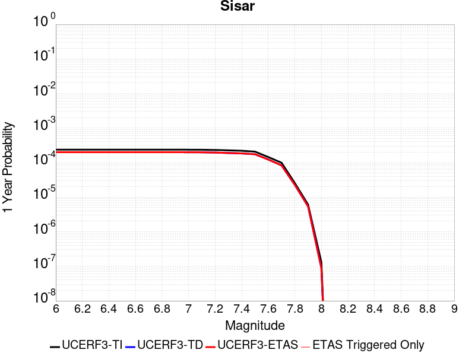 | 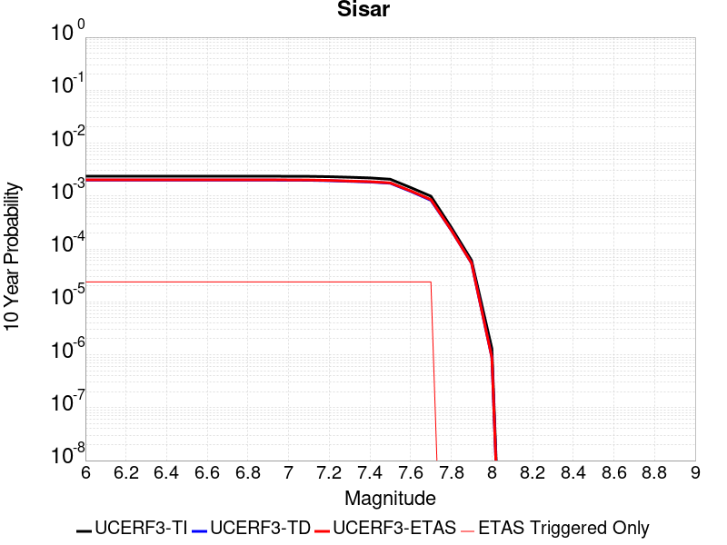 |

| Magnitude | 1 wk TI Prob | 1 wk TD Prob | 1 wk ETAS Prob | 1 wk ETAS/TD Gain | 1 wk ETAS Triggered Only | 1 mo TI Prob | 1 mo TD Prob | 1 mo ETAS Prob | 1 mo ETAS/TD Gain | 1 mo ETAS Triggered Only | 1 yr TI Prob | 1 yr TD Prob | 1 yr ETAS Prob | 1 yr ETAS/TD Gain | 1 yr ETAS Triggered Only | 10 yr TI Prob | 10 yr TD Prob | 10 yr ETAS Prob | 10 yr ETAS/TD Gain | 10 yr ETAS Triggered Only |
|-----|-----|-----|-----|-----|-----|-----|-----|-----|-----|-----|-----|-----|-----|-----|-----|-----|-----|-----|-----|-----|
| 6.0 | 4.544193E-6 | 3.839576E-6 | 3.839576E-6 | 1.0 | 0.0 | 1.9474966E-5 | 1.6455224E-5 | 1.6455224E-5 | 1.0 | 0.0 | 2.3708193E-4 | 2.0032428E-4 | 2.0032428E-4 | 1.0 | 0.0 | 0.0023682916 | 0.002001471 | 0.0020214308 | 1.0099727 | 2.0E-5 |
| 6.1 | 4.544193E-6 | 3.839576E-6 | 3.839576E-6 | 1.0 | 0.0 | 1.9474966E-5 | 1.6455224E-5 | 1.6455224E-5 | 1.0 | 0.0 | 2.3708193E-4 | 2.0032428E-4 | 2.0032428E-4 | 1.0 | 0.0 | 0.0023682916 | 0.002001471 | 0.0020214308 | 1.0099727 | 2.0E-5 |
| 6.2 | 4.544193E-6 | 3.839576E-6 | 3.839576E-6 | 1.0 | 0.0 | 1.9474966E-5 | 1.6455224E-5 | 1.6455224E-5 | 1.0 | 0.0 | 2.3708193E-4 | 2.0032428E-4 | 2.0032428E-4 | 1.0 | 0.0 | 0.0023682916 | 0.002001471 | 0.0020214308 | 1.0099727 | 2.0E-5 |
| 6.3 | 4.544193E-6 | 3.839576E-6 | 3.839576E-6 | 1.0 | 0.0 | 1.9474966E-5 | 1.6455224E-5 | 1.6455224E-5 | 1.0 | 0.0 | 2.3708193E-4 | 2.0032428E-4 | 2.0032428E-4 | 1.0 | 0.0 | 0.0023682916 | 0.002001471 | 0.0020214308 | 1.0099727 | 2.0E-5 |
| 6.4 | 4.544193E-6 | 3.839576E-6 | 3.839576E-6 | 1.0 | 0.0 | 1.9474966E-5 | 1.6455224E-5 | 1.6455224E-5 | 1.0 | 0.0 | 2.3708193E-4 | 2.0032428E-4 | 2.0032428E-4 | 1.0 | 0.0 | 0.0023682916 | 0.002001471 | 0.0020214308 | 1.0099727 | 2.0E-5 |
| 6.5 | 4.544193E-6 | 3.839576E-6 | 3.839576E-6 | 1.0 | 0.0 | 1.9474966E-5 | 1.6455224E-5 | 1.6455224E-5 | 1.0 | 0.0 | 2.3708193E-4 | 2.0032428E-4 | 2.0032428E-4 | 1.0 | 0.0 | 0.0023682916 | 0.002001471 | 0.0020214308 | 1.0099727 | 2.0E-5 |
| 6.6 | 4.544193E-6 | 3.839576E-6 | 3.839576E-6 | 1.0 | 0.0 | 1.9474966E-5 | 1.6455224E-5 | 1.6455224E-5 | 1.0 | 0.0 | 2.3708193E-4 | 2.0032428E-4 | 2.0032428E-4 | 1.0 | 0.0 | 0.0023682916 | 0.002001471 | 0.0020214308 | 1.0099727 | 2.0E-5 |
| 6.7 | 4.544193E-6 | 3.839576E-6 | 3.839576E-6 | 1.0 | 0.0 | 1.9474966E-5 | 1.6455224E-5 | 1.6455224E-5 | 1.0 | 0.0 | 2.3708193E-4 | 2.0032428E-4 | 2.0032428E-4 | 1.0 | 0.0 | 0.0023682916 | 0.002001471 | 0.0020214308 | 1.0099727 | 2.0E-5 |
| 6.8 | 4.544193E-6 | 3.839576E-6 | 3.839576E-6 | 1.0 | 0.0 | 1.9474966E-5 | 1.6455224E-5 | 1.6455224E-5 | 1.0 | 0.0 | 2.3708193E-4 | 2.0032428E-4 | 2.0032428E-4 | 1.0 | 0.0 | 0.0023682916 | 0.002001471 | 0.0020214308 | 1.0099727 | 2.0E-5 |
| 6.9 | 4.542225E-6 | 3.8375383E-6 | 3.8375383E-6 | 1.0 | 0.0 | 1.9466532E-5 | 1.6446491E-5 | 1.6446491E-5 | 1.0 | 0.0 | 2.3697925E-4 | 2.0021795E-4 | 2.0021795E-4 | 1.0 | 0.0 | 0.002367267 | 0.0020004094 | 0.0020203695 | 1.0099779 | 2.0E-5 |
| 7.0 | 4.5278484E-6 | 3.822602E-6 | 3.822602E-6 | 1.0 | 0.0 | 1.940492E-5 | 1.638248E-5 | 1.638248E-5 | 1.0 | 0.0 | 2.3622929E-4 | 1.9943877E-4 | 1.9943877E-4 | 1.0 | 0.0 | 0.0023597833 | 0.0019926317 | 0.0020125918 | 1.010017 | 2.0E-5 |
| 7.1 | 4.5132488E-6 | 3.8073897E-6 | 3.8073897E-6 | 1.0 | 0.0 | 1.9342351E-5 | 1.6317284E-5 | 1.6317284E-5 | 1.0 | 0.0 | 2.3546767E-4 | 1.9864515E-4 | 1.9864515E-4 | 1.0 | 0.0 | 0.0023521832 | 0.0019847096 | 0.00200467 | 1.0100571 | 2.0E-5 |
| 7.2 | 4.448859E-6 | 3.7398502E-6 | 3.7398502E-6 | 1.0 | 0.0 | 1.9066398E-5 | 1.6027832E-5 | 1.6027832E-5 | 1.0 | 0.0 | 2.3210866E-4 | 1.9512173E-4 | 1.9512173E-4 | 1.0 | 0.0 | 0.0023186638 | 0.0019495375 | 0.0019694986 | 1.0102389 | 2.0E-5 |
| 7.3 | 4.3424366E-6 | 3.6336846E-6 | 3.6336846E-6 | 1.0 | 0.0 | 1.861031E-5 | 1.5572843E-5 | 1.5572843E-5 | 1.0 | 0.0 | 2.2655698E-4 | 1.895832E-4 | 1.895832E-4 | 1.0 | 0.0 | 0.0022632615 | 0.0018942481 | 0.0019142103 | 1.0105382 | 2.0E-5 |
| 7.4 | 4.218641E-6 | 3.5330384E-6 | 3.5330384E-6 | 1.0 | 0.0 | 1.8079765E-5 | 1.5141507E-5 | 1.5141507E-5 | 1.0 | 0.0 | 2.2009891E-4 | 1.8433259E-4 | 1.8433259E-4 | 1.0 | 0.0 | 0.0021988105 | 0.0018418302 | 0.0018617935 | 1.0108387 | 2.0E-5 |
| 7.5 | 3.983779E-6 | 3.3478068E-6 | 3.3478068E-6 | 1.0 | 0.0 | 1.7073227E-5 | 1.4347666E-5 | 1.4347666E-5 | 1.0 | 0.0 | 2.0784672E-4 | 1.7466917E-4 | 1.7466917E-4 | 1.0 | 0.0 | 0.0020765243 | 0.0017453518 | 0.0017653169 | 1.011439 | 2.0E-5 |
| 7.6 | 2.777393E-6 | 2.35225E-6 | 2.35225E-6 | 1.0 | 0.0 | 1.1903058E-5 | 1.0081033E-5 | 1.0081033E-5 | 1.0 | 0.0 | 1.449101E-4 | 1.2272975E-4 | 1.2272975E-4 | 1.0 | 0.0 | 0.0014481564 | 0.0012266274 | 0.0012366151 | 1.0081425 | 1.0E-5 |
| 7.7 | 1.9028433E-6 | 1.593867E-6 | 1.593867E-6 | 1.0 | 0.0 | 8.155017E-6 | 6.8308404E-6 | 6.8308404E-6 | 1.0 | 0.0 | 9.928281E-5 | 8.3162355E-5 | 8.3162355E-5 | 1.0 | 0.0 | 9.923846E-4 | 8.313171E-4 | 8.413088E-4 | 1.0120192 | 1.0E-5 |
| 7.8 | 4.9095956E-7 | 4.3583708E-7 | 4.3583708E-7 | 1.0 | 0.0 | 2.1041105E-6 | 1.8678718E-6 | 1.8678718E-6 | 1.0 | 0.0 | 2.5617246E-5 | 2.2741104E-5 | 2.2741104E-5 | 1.0 | 0.0 | 2.5614293E-4 | 2.2738794E-4 | 2.2738794E-4 | 1.0 | 0.0 |
| 7.9 | 1.16657894E-7 | 1.0335569E-7 | 1.0335569E-7 | 1.0 | 0.0 | 4.999623E-7 | 4.4295288E-7 | 4.4295288E-7 | 1.0 | 0.0 | 6.087024E-6 | 5.3929384E-6 | 5.3929384E-6 | 1.0 | 0.0 | 6.0868573E-5 | 5.3928103E-5 | 5.3928103E-5 | 1.0 | 0.0 |
| 8.0 | 2.5100346E-9 | 1.7067566E-9 | 1.7067566E-9 | 1.0 | 0.0 | 1.0757291E-8 | 7.3146724E-9 | 7.3146724E-9 | 1.0 | 0.0 | 1.3097001E-7 | 8.905613E-8 | 8.905613E-8 | 1.0 | 0.0 | 1.3096993E-6 | 8.9056095E-7 | 8.9056095E-7 | 1.0 | 0.0 |

## San Jose
*[(top)](#table-of-contents)*

| 1 Week | 1 Month | 1 Year | 10 Year |
|-----|-----|-----|-----|
| 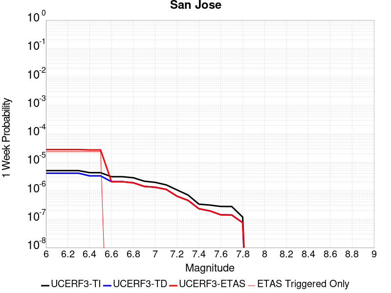 | 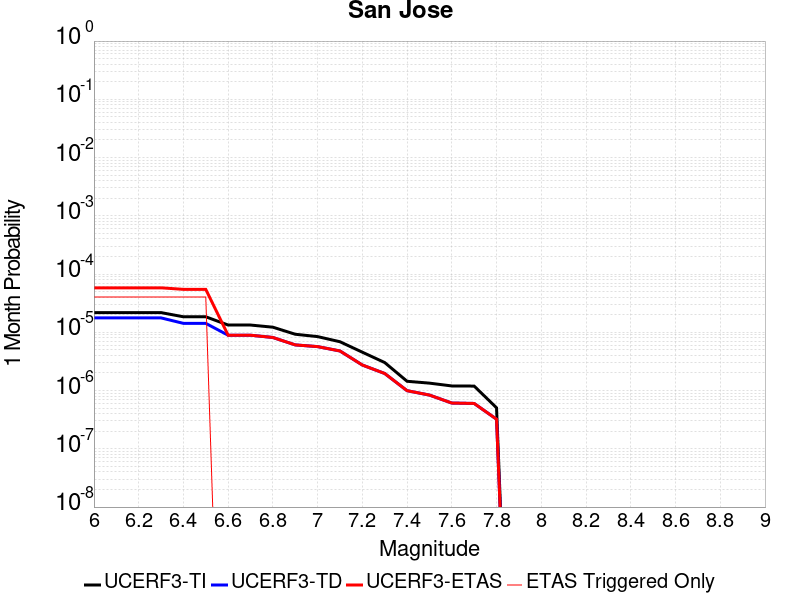 | 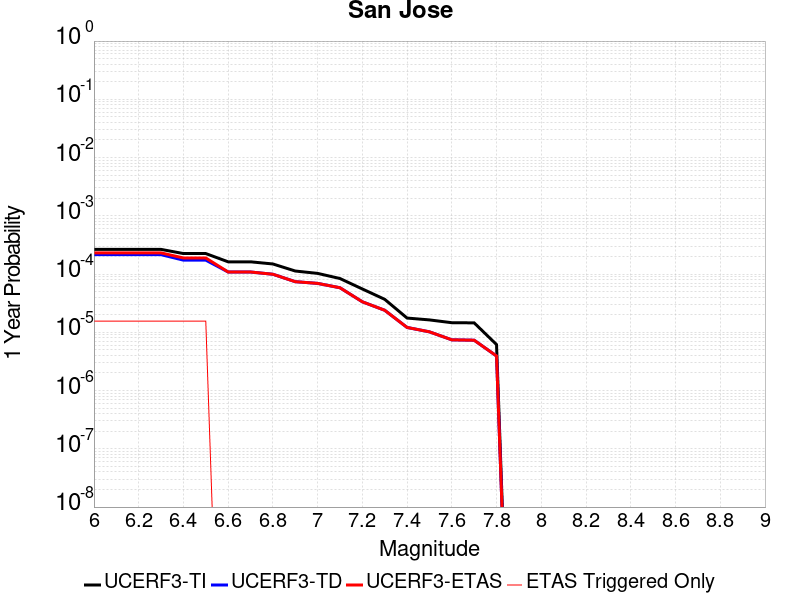 | 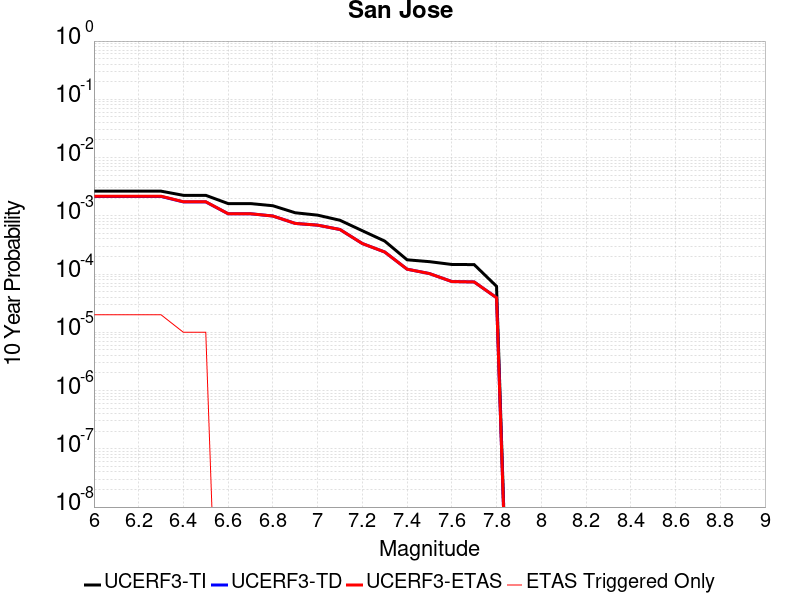 |

| Magnitude | 1 wk TI Prob | 1 wk TD Prob | 1 wk ETAS Prob | 1 wk ETAS/TD Gain | 1 wk ETAS Triggered Only | 1 mo TI Prob | 1 mo TD Prob | 1 mo ETAS Prob | 1 mo ETAS/TD Gain | 1 mo ETAS Triggered Only | 1 yr TI Prob | 1 yr TD Prob | 1 yr ETAS Prob | 1 yr ETAS/TD Gain | 1 yr ETAS Triggered Only | 10 yr TI Prob | 10 yr TD Prob | 10 yr ETAS Prob | 10 yr ETAS/TD Gain | 10 yr ETAS Triggered Only |
|-----|-----|-----|-----|-----|-----|-----|-----|-----|-----|-----|-----|-----|-----|-----|-----|-----|-----|-----|-----|-----|
| 6.0 | 5.0851277E-6 | 4.1256726E-6 | 1.4125631E-5 | 3.4238372 | 1.0E-5 | 2.1793223E-5 | 1.768135E-5 | 2.7681173E-5 | 1.5655577 | 1.0E-5 | 2.653002E-4 | 2.152518E-4 | 2.2524965E-4 | 1.0464473 | 1.0E-5 | 0.0026498367 | 0.0021507242 | 0.002170681 | 1.0092793 | 2.0E-5 |
| 6.1 | 5.0851277E-6 | 4.1256726E-6 | 1.4125631E-5 | 3.4238372 | 1.0E-5 | 2.1793223E-5 | 1.768135E-5 | 2.7681173E-5 | 1.5655577 | 1.0E-5 | 2.653002E-4 | 2.152518E-4 | 2.2524965E-4 | 1.0464473 | 1.0E-5 | 0.0026498367 | 0.0021507242 | 0.002170681 | 1.0092793 | 2.0E-5 |
| 6.2 | 5.0851277E-6 | 4.1256726E-6 | 1.4125631E-5 | 3.4238372 | 1.0E-5 | 2.1793223E-5 | 1.768135E-5 | 2.7681173E-5 | 1.5655577 | 1.0E-5 | 2.653002E-4 | 2.152518E-4 | 2.2524965E-4 | 1.0464473 | 1.0E-5 | 0.0026498367 | 0.0021507242 | 0.002170681 | 1.0092793 | 2.0E-5 |
| 6.3 | 5.0851277E-6 | 4.1256726E-6 | 1.4125631E-5 | 3.4238372 | 1.0E-5 | 2.1793223E-5 | 1.768135E-5 | 2.7681173E-5 | 1.5655577 | 1.0E-5 | 2.653002E-4 | 2.152518E-4 | 2.2524965E-4 | 1.0464473 | 1.0E-5 | 0.0026498367 | 0.0021507242 | 0.002170681 | 1.0092793 | 2.0E-5 |
| 6.4 | 4.3115124E-6 | 3.3237832E-6 | 1.332375E-5 | 4.00861 | 1.0E-5 | 1.8477778E-5 | 1.424472E-5 | 2.4244577E-5 | 1.7020046 | 1.0E-5 | 2.2494372E-4 | 1.7341787E-4 | 1.8341614E-4 | 1.0576541 | 1.0E-5 | 0.0022471617 | 0.0017330751 | 0.0017430579 | 1.0057601 | 1.0E-5 |
| 6.5 | 4.3115124E-6 | 3.3237832E-6 | 1.332375E-5 | 4.00861 | 1.0E-5 | 1.8477778E-5 | 1.424472E-5 | 2.4244577E-5 | 1.7020046 | 1.0E-5 | 2.2494372E-4 | 1.7341787E-4 | 1.8341614E-4 | 1.0576541 | 1.0E-5 | 0.0022471617 | 0.0017330751 | 0.0017430579 | 1.0057601 | 1.0E-5 |
| 6.6 | 3.110396E-6 | 2.0799866E-6 | 2.0799866E-6 | 1.0 | 0.0 | 1.33302E-5 | 8.9141995E-6 | 8.9141995E-6 | 1.0 | 0.0 | 1.622831E-4 | 1.0852526E-4 | 1.0852526E-4 | 1.0 | 0.0 | 0.0016216465 | 0.0010847825 | 0.0010847825 | 1.0 | 0.0 |
| 6.7 | 3.110396E-6 | 2.0799866E-6 | 2.0799866E-6 | 1.0 | 0.0 | 1.33302E-5 | 8.9141995E-6 | 8.9141995E-6 | 1.0 | 0.0 | 1.622831E-4 | 1.0852526E-4 | 1.0852526E-4 | 1.0 | 0.0 | 0.0016216465 | 0.0010847825 | 0.0010847825 | 1.0 | 0.0 |
| 6.8 | 2.856651E-6 | 1.902435E-6 | 1.902435E-6 | 1.0 | 0.0 | 1.2242733E-5 | 8.153269E-6 | 8.153269E-6 | 1.0 | 0.0 | 1.4904508E-4 | 9.926178E-5 | 9.926178E-5 | 1.0 | 0.0 | 0.0014894515 | 9.922314E-4 | 9.922314E-4 | 1.0 | 0.0 |
| 6.9 | 2.1618725E-6 | 1.4186642E-6 | 1.4186642E-6 | 1.0 | 0.0 | 9.265135E-6 | 6.0799757E-6 | 6.0799757E-6 | 1.0 | 0.0 | 1.12797185E-4 | 7.402128E-5 | 7.402128E-5 | 1.0 | 0.0 | 0.0011273995 | 7.4000744E-4 | 7.4000744E-4 | 1.0 | 0.0 |
| 7.0 | 1.9684312E-6 | 1.3256331E-6 | 1.3256331E-6 | 1.0 | 0.0 | 8.436106E-6 | 5.681273E-6 | 5.681273E-6 | 1.0 | 0.0 | 1.02704755E-4 | 6.9167385E-5 | 6.9167385E-5 | 1.0 | 0.0 | 0.001026573 | 6.914992E-4 | 6.914992E-4 | 1.0 | 0.0 |
| 7.1 | 1.6070337E-6 | 1.1155087E-6 | 1.1155087E-6 | 1.0 | 0.0 | 6.887269E-6 | 4.780743E-6 | 4.780743E-6 | 1.0 | 0.0 | 8.384928E-5 | 5.8204052E-5 | 5.8204052E-5 | 1.0 | 0.0 | 8.3817646E-4 | 5.819267E-4 | 5.819267E-4 | 1.0 | 0.0 |
| 7.2 | 1.0631658E-6 | 6.4037624E-7 | 6.4037624E-7 | 1.0 | 0.0 | 4.556417E-6 | 2.7444669E-6 | 2.7444669E-6 | 1.0 | 0.0 | 5.5472963E-5 | 3.3413387E-5 | 3.3413387E-5 | 1.0 | 0.0 | 5.545912E-4 | 3.3411747E-4 | 3.3411747E-4 | 1.0 | 0.0 |
| 7.3 | 7.060711E-7 | 4.5824706E-7 | 4.5824706E-7 | 1.0 | 0.0 | 3.0260155E-6 | 1.9639147E-6 | 1.9639147E-6 | 1.0 | 0.0 | 3.6841117E-5 | 2.3910407E-5 | 2.3910407E-5 | 1.0 | 0.0 | 3.6835007E-4 | 2.3911172E-4 | 2.3911172E-4 | 1.0 | 0.0 |
| 7.4 | 3.3677085E-7 | 2.3233133E-7 | 2.3233133E-7 | 1.0 | 0.0 | 1.4433028E-6 | 9.957054E-7 | 9.957054E-7 | 1.0 | 0.0 | 1.757207E-5 | 1.21226485E-5 | 1.21226485E-5 | 1.0 | 0.0 | 1.7570681E-4 | 1.2125263E-4 | 1.2125263E-4 | 1.0 | 0.0 |
| 7.5 | 3.129161E-7 | 1.9530925E-7 | 1.9530925E-7 | 1.0 | 0.0 | 1.3410682E-6 | 8.370394E-7 | 8.370394E-7 | 1.0 | 0.0 | 1.6327383E-5 | 1.0190909E-5 | 1.0190909E-5 | 1.0 | 0.0 | 1.6326184E-4 | 1.0193714E-4 | 1.0193714E-4 | 1.0 | 0.0 |
| 7.6 | 2.8008668E-7 | 1.4242323E-7 | 1.4242323E-7 | 1.0 | 0.0 | 1.2003709E-6 | 6.1038514E-7 | 6.1038514E-7 | 1.0 | 0.0 | 1.46144175E-5 | 7.4314153E-6 | 7.4314153E-6 | 1.0 | 0.0 | 1.4613457E-4 | 7.434427E-5 | 7.434427E-5 | 1.0 | 0.0 |
| 7.7 | 2.7852005E-7 | 1.4016913E-7 | 1.4016913E-7 | 1.0 | 0.0 | 1.1936568E-6 | 6.007248E-7 | 6.007248E-7 | 1.0 | 0.0 | 1.4532674E-5 | 7.3138012E-6 | 7.3138012E-6 | 1.0 | 0.0 | 1.4531724E-4 | 7.316821E-5 | 7.316821E-5 | 1.0 | 0.0 |
| 7.8 | 1.1810797E-7 | 7.5190094E-8 | 7.5190094E-8 | 1.0 | 0.0 | 5.0617695E-7 | 3.222432E-7 | 3.222432E-7 | 1.0 | 0.0 | 6.1626865E-6 | 3.9233046E-6 | 3.9233046E-6 | 1.0 | 0.0 | 6.162516E-5 | 3.9250725E-5 | 3.9250725E-5 | 1.0 | 0.0 |

## Great Valley 05 Pittsburg - Kirby Hills alt1
*[(top)](#table-of-contents)*

| 1 Week | 1 Month | 1 Year | 10 Year |
|-----|-----|-----|-----|
| 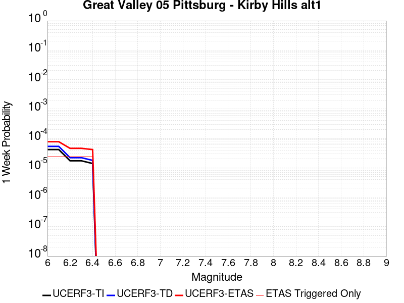 | 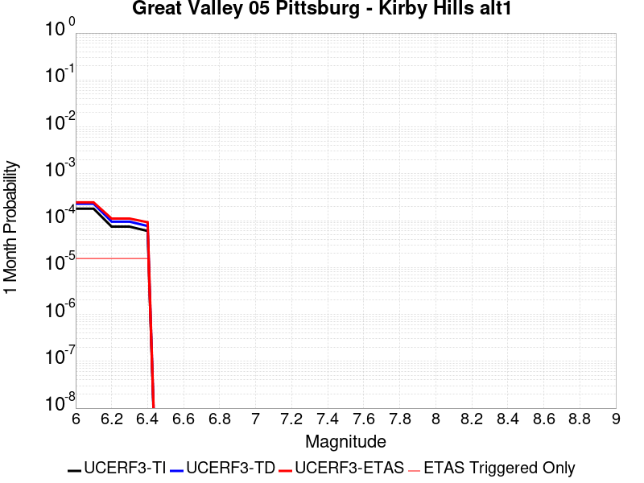 | 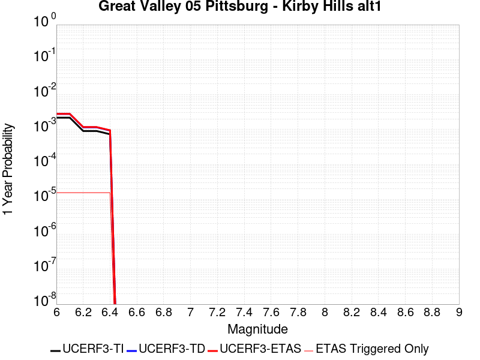 | 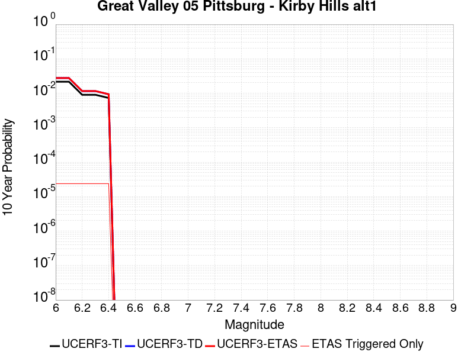 |

| Magnitude | 1 wk TI Prob | 1 wk TD Prob | 1 wk ETAS Prob | 1 wk ETAS/TD Gain | 1 wk ETAS Triggered Only | 1 mo TI Prob | 1 mo TD Prob | 1 mo ETAS Prob | 1 mo ETAS/TD Gain | 1 mo ETAS Triggered Only | 1 yr TI Prob | 1 yr TD Prob | 1 yr ETAS Prob | 1 yr ETAS/TD Gain | 1 yr ETAS Triggered Only | 10 yr TI Prob | 10 yr TD Prob | 10 yr ETAS Prob | 10 yr ETAS/TD Gain | 10 yr ETAS Triggered Only |
|-----|-----|-----|-----|-----|-----|-----|-----|-----|-----|-----|-----|-----|-----|-----|-----|-----|-----|-----|-----|-----|
| 6.0 | 4.187212E-5 | 5.3442072E-5 | 6.344154E-5 | 1.1871085 | 1.0E-5 | 1.794396E-4 | 2.290231E-4 | 2.3902081E-4 | 1.0436537 | 1.0E-5 | 0.002182488 | 0.0027857882 | 0.0028057324 | 1.0071594 | 2.0E-5 | 0.021611776 | 0.02760304 | 0.027622487 | 1.0007045 | 2.0E-5 |
| 6.1 | 4.187212E-5 | 5.3442072E-5 | 6.344154E-5 | 1.1871085 | 1.0E-5 | 1.794396E-4 | 2.290231E-4 | 2.3902081E-4 | 1.0436537 | 1.0E-5 | 0.002182488 | 0.0027857882 | 0.0028057324 | 1.0071594 | 2.0E-5 | 0.021611776 | 0.02760304 | 0.027622487 | 1.0007045 | 2.0E-5 |
| 6.2 | 1.7353306E-5 | 2.2154374E-5 | 3.2154152E-5 | 1.4513681 | 1.0E-5 | 7.436919E-5 | 9.494618E-5 | 1.0494523E-4 | 1.1053128 | 1.0E-5 | 9.050688E-4 | 0.0011557543 | 0.0011657428 | 1.0086423 | 1.0E-5 | 0.009013915 | 0.011535114 | 0.011544998 | 1.0008569 | 1.0E-5 |
| 6.3 | 1.7353306E-5 | 2.2154374E-5 | 3.2154152E-5 | 1.4513681 | 1.0E-5 | 7.436919E-5 | 9.494618E-5 | 1.0494523E-4 | 1.1053128 | 1.0E-5 | 9.050688E-4 | 0.0011557543 | 0.0011657428 | 1.0086423 | 1.0E-5 | 0.009013915 | 0.011535114 | 0.011544998 | 1.0008569 | 1.0E-5 |
| 6.4 | 1.4028824E-5 | 1.7900597E-5 | 2.7900416E-5 | 1.5586306 | 1.0E-5 | 6.0122147E-5 | 7.671684E-5 | 8.671607E-5 | 1.1303395 | 1.0E-5 | 7.3174125E-4 | 9.340275E-4 | 9.440182E-4 | 1.0106963 | 1.0E-5 | 0.0072933645 | 0.009338138 | 0.009348044 | 1.0010608 | 1.0E-5 |

## Sargent 2011 CFM
*[(top)](#table-of-contents)*

| 1 Week | 1 Month | 1 Year | 10 Year |
|-----|-----|-----|-----|
| 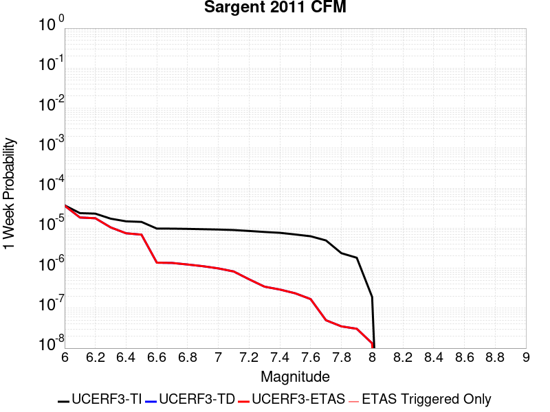 |  | 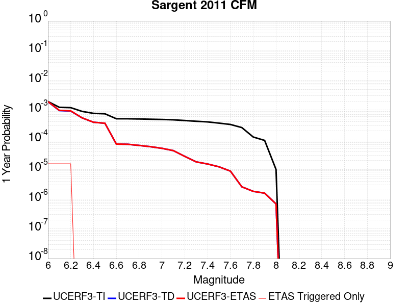 | 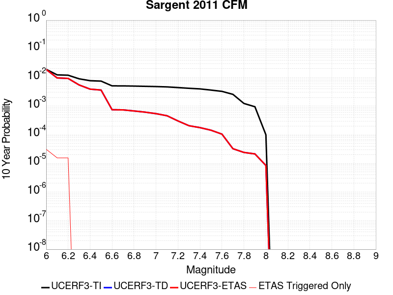 |

| Magnitude | 1 wk TI Prob | 1 wk TD Prob | 1 wk ETAS Prob | 1 wk ETAS/TD Gain | 1 wk ETAS Triggered Only | 1 mo TI Prob | 1 mo TD Prob | 1 mo ETAS Prob | 1 mo ETAS/TD Gain | 1 mo ETAS Triggered Only | 1 yr TI Prob | 1 yr TD Prob | 1 yr ETAS Prob | 1 yr ETAS/TD Gain | 1 yr ETAS Triggered Only | 10 yr TI Prob | 10 yr TD Prob | 10 yr ETAS Prob | 10 yr ETAS/TD Gain | 10 yr ETAS Triggered Only |
|-----|-----|-----|-----|-----|-----|-----|-----|-----|-----|-----|-----|-----|-----|-----|-----|-----|-----|-----|-----|-----|
| 6.0 | 3.7327867E-5 | 3.664913E-5 | 3.664913E-5 | 1.0 | 0.0 | 1.5996677E-4 | 1.5706103E-4 | 1.5706103E-4 | 1.0 | 0.0 | 0.0019458556 | 0.0019110236 | 0.0019210045 | 1.0052228 | 1.0E-5 | 0.01928905 | 0.019018095 | 0.019037714 | 1.0010316 | 2.0E-5 |
| 6.1 | 2.3771476E-5 | 1.8479273E-5 | 1.8479273E-5 | 1.0 | 0.0 | 1.01873775E-4 | 7.919498E-5 | 7.919498E-5 | 1.0 | 0.0 | 0.0012396075 | 9.638493E-4 | 9.7383966E-4 | 1.010365 | 1.0E-5 | 0.012327154 | 0.009636091 | 0.009645995 | 1.0010278 | 1.0E-5 |
| 6.2 | 2.3112721E-5 | 1.7710632E-5 | 1.7710632E-5 | 1.0 | 0.0 | 9.9050754E-5 | 7.590099E-5 | 7.590099E-5 | 1.0 | 0.0 | 0.0012052758 | 9.237792E-4 | 9.3377E-4 | 1.0108151 | 1.0E-5 | 0.011987597 | 0.009238743 | 0.009248652 | 1.0010724 | 1.0E-5 |
| 6.3 | 1.728509E-5 | 1.0458927E-5 | 1.0458927E-5 | 1.0 | 0.0 | 7.407686E-5 | 4.482347E-5 | 4.482347E-5 | 1.0 | 0.0 | 9.015125E-4 | 5.456343E-4 | 5.456343E-4 | 1.0 | 0.0 | 0.008978641 | 0.0054791216 | 0.0054791216 | 1.0 | 0.0 |
| 6.4 | 1.48395575E-5 | 7.4559816E-6 | 7.4559816E-6 | 1.0 | 0.0 | 6.3596555E-5 | 3.195403E-5 | 3.195403E-5 | 1.0 | 0.0 | 7.7401294E-4 | 3.8900663E-4 | 3.8900663E-4 | 1.0 | 0.0 | 0.0077132257 | 0.003918666 | 0.003918666 | 1.0 | 0.0 |
| 6.5 | 1.4358964E-5 | 6.894759E-6 | 6.894759E-6 | 1.0 | 0.0 | 6.1536964E-5 | 2.9548846E-5 | 2.9548846E-5 | 1.0 | 0.0 | 7.48955E-4 | 3.5973339E-4 | 3.5973339E-4 | 1.0 | 0.0 | 0.0074643586 | 0.0036269152 | 0.0036269152 | 1.0 | 0.0 |
| 6.6 | 9.772591E-6 | 1.3736154E-6 | 1.3736154E-6 | 1.0 | 0.0 | 4.188186E-5 | 5.88691E-6 | 5.88691E-6 | 1.0 | 0.0 | 5.097923E-4 | 7.16708E-5 | 7.16708E-5 | 1.0 | 0.0 | 0.005086244 | 7.483097E-4 | 7.483097E-4 | 1.0 | 0.0 |
| 6.7 | 9.752745E-6 | 1.3523068E-6 | 1.3523068E-6 | 1.0 | 0.0 | 4.179681E-5 | 5.795587E-6 | 5.795587E-6 | 1.0 | 0.0 | 5.0875737E-4 | 7.055902E-5 | 7.055902E-5 | 1.0 | 0.0 | 0.005075942 | 7.371994E-4 | 7.371994E-4 | 1.0 | 0.0 |
| 6.8 | 9.608213E-6 | 1.2361709E-6 | 1.2361709E-6 | 1.0 | 0.0 | 4.1177405E-5 | 5.2978644E-6 | 5.2978644E-6 | 1.0 | 0.0 | 5.012196E-4 | 6.449961E-5 | 6.449961E-5 | 1.0 | 0.0 | 0.005000906 | 6.7634037E-4 | 6.7634037E-4 | 1.0 | 0.0 |
| 6.9 | 9.427164E-6 | 1.12094E-6 | 1.12094E-6 | 1.0 | 0.0 | 4.04015E-5 | 4.80402E-6 | 4.80402E-6 | 1.0 | 0.0 | 4.9177726E-4 | 5.8487396E-5 | 5.8487396E-5 | 1.0 | 0.0 | 0.004906904 | 6.1557174E-4 | 6.1557174E-4 | 1.0 | 0.0 |
| 7.0 | 9.247601E-6 | 9.873988E-7 | 9.873988E-7 | 1.0 | 0.0 | 3.9631974E-5 | 4.2317024E-6 | 4.2317024E-6 | 1.0 | 0.0 | 4.8241246E-4 | 5.1519775E-5 | 5.1519775E-5 | 1.0 | 0.0 | 0.0048136655 | 5.4542476E-4 | 5.4542476E-4 | 1.0 | 0.0 |
| 7.1 | 8.995454E-6 | 8.2711284E-7 | 8.2711284E-7 | 1.0 | 0.0 | 3.8551374E-5 | 3.5447645E-6 | 3.5447645E-6 | 1.0 | 0.0 | 4.6926187E-4 | 4.3156666E-5 | 4.3156666E-5 | 1.0 | 0.0 | 0.004682722 | 4.609069E-4 | 4.609069E-4 | 1.0 | 0.0 |
| 7.2 | 8.520861E-6 | 5.2766507E-7 | 5.2766507E-7 | 1.0 | 0.0 | 3.6517464E-5 | 2.2614197E-6 | 2.2614197E-6 | 1.0 | 0.0 | 4.445094E-4 | 2.7532446E-5 | 2.7532446E-5 | 1.0 | 0.0 | 0.004436213 | 3.0297207E-4 | 3.0297207E-4 | 1.0 | 0.0 |
| 7.3 | 8.043592E-6 | 3.456507E-7 | 3.456507E-7 | 1.0 | 0.0 | 3.4472083E-5 | 1.4813593E-6 | 1.4813593E-6 | 1.0 | 0.0 | 4.196168E-4 | 1.8035402E-5 | 1.8035402E-5 | 1.0 | 0.0 | 0.004188253 | 2.0669671E-4 | 2.0669671E-4 | 1.0 | 0.0 |
| 7.4 | 7.662316E-6 | 2.928958E-7 | 2.928958E-7 | 1.0 | 0.0 | 3.2838085E-5 | 1.2552671E-6 | 1.2552671E-6 | 1.0 | 0.0 | 3.9973034E-4 | 1.528277E-5 | 1.528277E-5 | 1.0 | 0.0 | 0.0039901207 | 1.7736501E-4 | 1.7736501E-4 | 1.0 | 0.0 |
| 7.5 | 6.961638E-6 | 2.3574503E-7 | 2.3574503E-7 | 1.0 | 0.0 | 2.9835252E-5 | 1.0103355E-6 | 1.0103355E-6 | 1.0 | 0.0 | 3.6318362E-4 | 1.2300766E-5 | 1.2300766E-5 | 1.0 | 0.0 | 0.0036259065 | 1.4409334E-4 | 1.4409334E-4 | 1.0 | 0.0 |
| 7.6 | 6.282332E-6 | 1.6892966E-7 | 1.6892966E-7 | 1.0 | 0.0 | 2.6924003E-5 | 7.2398404E-7 | 7.2398404E-7 | 1.0 | 0.0 | 3.2775043E-4 | 8.814471E-6 | 8.814471E-6 | 1.0 | 0.0 | 0.0032726745 | 1.05050465E-4 | 1.05050465E-4 | 1.0 | 0.0 |
| 7.7 | 4.934408E-6 | 5.001089E-8 | 5.001089E-8 | 1.0 | 0.0 | 2.114729E-5 | 2.1433237E-7 | 2.1433237E-7 | 1.0 | 0.0 | 2.5743784E-4 | 2.6094935E-6 | 2.6094935E-6 | 1.0 | 0.0 | 0.0025713982 | 3.2545366E-5 | 3.2545366E-5 | 1.0 | 0.0 |
| 7.8 | 2.373212E-6 | 3.5172643E-8 | 3.5172643E-8 | 1.0 | 0.0 | 1.0170869E-5 | 1.507399E-7 | 1.507399E-7 | 1.0 | 0.0 | 1.238233E-4 | 1.8352566E-6 | 1.8352566E-6 | 1.0 | 0.0 | 0.0012375432 | 2.4125171E-5 | 2.4125171E-5 | 1.0 | 0.0 |
| 7.9 | 1.8227792E-6 | 3.0619603E-8 | 3.0619603E-8 | 1.0 | 0.0 | 7.811887E-6 | 1.3122687E-7 | 1.3122687E-7 | 1.0 | 0.0 | 9.510558E-5 | 1.5976858E-6 | 1.5976858E-6 | 1.0 | 0.0 | 9.5064886E-4 | 2.1410624E-5 | 2.1410624E-5 | 1.0 | 0.0 |
| 8.0 | 1.9095137E-7 | 1.326461E-8 | 1.326461E-8 | 1.0 | 0.0 | 8.1836276E-7 | 5.684833E-8 | 5.684833E-8 | 1.0 | 0.0 | 9.963521E-6 | 6.921282E-7 | 6.921282E-7 | 1.0 | 0.0 | 9.963074E-5 | 8.463319E-6 | 8.463319E-6 | 1.0 | 0.0 |

## Shoreline
*[(top)](#table-of-contents)*

| 1 Week | 1 Month | 1 Year | 10 Year |
|-----|-----|-----|-----|
|  | 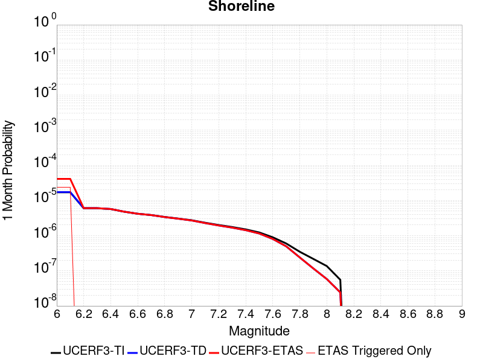 | 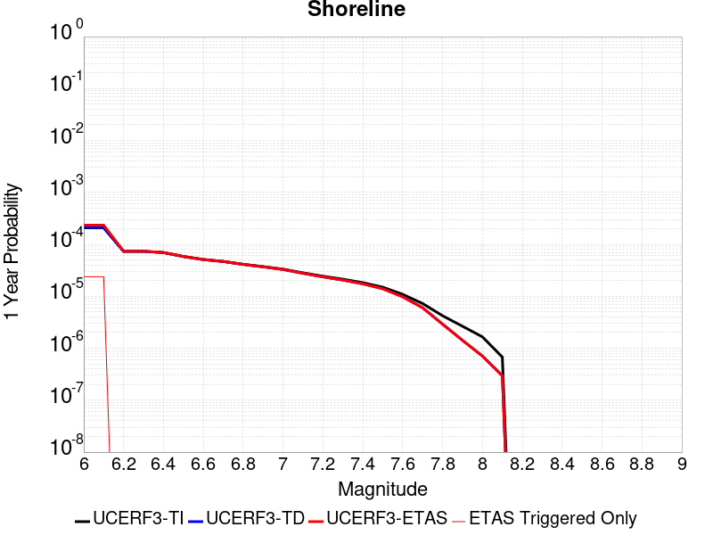 | 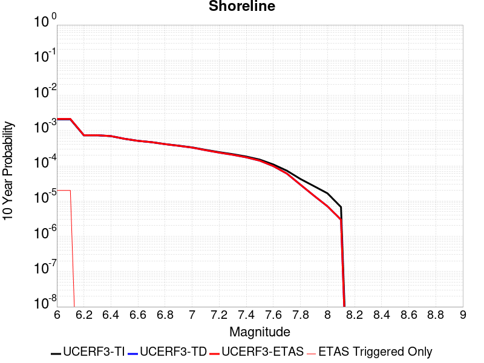 |

| Magnitude | 1 wk TI Prob | 1 wk TD Prob | 1 wk ETAS Prob | 1 wk ETAS/TD Gain | 1 wk ETAS Triggered Only | 1 mo TI Prob | 1 mo TD Prob | 1 mo ETAS Prob | 1 mo ETAS/TD Gain | 1 mo ETAS Triggered Only | 1 yr TI Prob | 1 yr TD Prob | 1 yr ETAS Prob | 1 yr ETAS/TD Gain | 1 yr ETAS Triggered Only | 10 yr TI Prob | 10 yr TD Prob | 10 yr ETAS Prob | 10 yr ETAS/TD Gain | 10 yr ETAS Triggered Only |
|-----|-----|-----|-----|-----|-----|-----|-----|-----|-----|-----|-----|-----|-----|-----|-----|-----|-----|-----|-----|-----|
| 6.0 | 3.9888673E-6 | 4.047929E-6 | 4.047929E-6 | 1.0 | 0.0 | 1.7095033E-5 | 1.7348184E-5 | 3.7347836E-5 | 2.1528385 | 2.0E-5 | 2.0811215E-4 | 2.1119925E-4 | 2.3119502E-4 | 1.0946773 | 2.0E-5 | 0.0020791737 | 0.002110534 | 0.002130492 | 1.0094563 | 2.0E-5 |
| 6.1 | 3.9888673E-6 | 4.047929E-6 | 4.047929E-6 | 1.0 | 0.0 | 1.7095033E-5 | 1.7348184E-5 | 3.7347836E-5 | 2.1528385 | 2.0E-5 | 2.0811215E-4 | 2.1119925E-4 | 2.3119502E-4 | 1.0946773 | 2.0E-5 | 0.0020791737 | 0.002110534 | 0.002130492 | 1.0094563 | 2.0E-5 |
| 6.2 | 1.4039653E-6 | 1.4100891E-6 | 1.4100891E-6 | 1.0 | 0.0 | 6.0169805E-6 | 6.0432253E-6 | 6.0432253E-6 | 1.0 | 0.0 | 7.325427E-5 | 7.357384E-5 | 7.357384E-5 | 1.0 | 0.0 | 7.3230127E-4 | 7.355009E-4 | 7.355009E-4 | 1.0 | 0.0 |
| 6.3 | 1.4039653E-6 | 1.4100891E-6 | 1.4100891E-6 | 1.0 | 0.0 | 6.0169805E-6 | 6.0432253E-6 | 6.0432253E-6 | 1.0 | 0.0 | 7.325427E-5 | 7.357384E-5 | 7.357384E-5 | 1.0 | 0.0 | 7.3230127E-4 | 7.355009E-4 | 7.355009E-4 | 1.0 | 0.0 |
| 6.4 | 1.3314152E-6 | 1.3361605E-6 | 1.3361605E-6 | 1.0 | 0.0 | 5.7060524E-6 | 5.7263896E-6 | 5.7263896E-6 | 1.0 | 0.0 | 6.946897E-5 | 6.971662E-5 | 6.971662E-5 | 1.0 | 0.0 | 6.9447263E-4 | 6.9695286E-4 | 6.9695286E-4 | 1.0 | 0.0 |
| 6.5 | 1.1187026E-6 | 1.120364E-6 | 1.120364E-6 | 1.0 | 0.0 | 4.794431E-6 | 4.8015513E-6 | 4.8015513E-6 | 1.0 | 0.0 | 5.8370628E-5 | 5.8457343E-5 | 5.8457343E-5 | 1.0 | 0.0 | 5.83553E-4 | 5.844222E-4 | 5.844222E-4 | 1.0 | 0.0 |
| 6.6 | 9.793089E-7 | 9.784919E-7 | 9.784919E-7 | 1.0 | 0.0 | 4.1970316E-6 | 4.1935305E-6 | 4.1935305E-6 | 1.0 | 0.0 | 5.1097657E-5 | 5.105505E-5 | 5.105505E-5 | 1.0 | 0.0 | 5.108591E-4 | 5.1043445E-4 | 5.1043445E-4 | 1.0 | 0.0 |
| 6.7 | 8.995986E-7 | 8.9728E-7 | 8.9728E-7 | 1.0 | 0.0 | 3.8554167E-6 | 3.84548E-6 | 3.84548E-6 | 1.0 | 0.0 | 4.693869E-5 | 4.6817724E-5 | 4.6817724E-5 | 1.0 | 0.0 | 4.6928777E-4 | 4.6807955E-4 | 4.6807955E-4 | 1.0 | 0.0 |
| 6.8 | 7.931612E-7 | 7.8804027E-7 | 7.8804027E-7 | 1.0 | 0.0 | 3.3992578E-6 | 3.377311E-6 | 3.377311E-6 | 1.0 | 0.0 | 4.1385178E-5 | 4.1117994E-5 | 4.1117994E-5 | 1.0 | 0.0 | 4.1377472E-4 | 4.1110438E-4 | 4.1110438E-4 | 1.0 | 0.0 |
| 6.9 | 7.1465956E-7 | 7.078006E-7 | 7.078006E-7 | 1.0 | 0.0 | 3.062823E-6 | 3.0334277E-6 | 3.0334277E-6 | 1.0 | 0.0 | 3.7289232E-5 | 3.6931357E-5 | 3.6931357E-5 | 1.0 | 0.0 | 3.7282976E-4 | 3.6925258E-4 | 3.6925258E-4 | 1.0 | 0.0 |
| 7.0 | 6.389046E-7 | 6.299458E-7 | 6.299458E-7 | 1.0 | 0.0 | 2.7381598E-6 | 2.699765E-6 | 2.699765E-6 | 1.0 | 0.0 | 3.3336586E-5 | 3.2869146E-5 | 3.2869146E-5 | 1.0 | 0.0 | 3.3331584E-4 | 3.2864307E-4 | 3.2864307E-4 | 1.0 | 0.0 |
| 7.1 | 5.4300875E-7 | 5.3111313E-7 | 5.3111313E-7 | 1.0 | 0.0 | 2.3271782E-6 | 2.276197E-6 | 2.276197E-6 | 1.0 | 0.0 | 2.8333026E-5 | 2.7712347E-5 | 2.7712347E-5 | 1.0 | 0.0 | 2.8329415E-4 | 2.77089E-4 | 2.77089E-4 | 1.0 | 0.0 |
| 7.2 | 4.6768855E-7 | 4.5348952E-7 | 4.5348952E-7 | 1.0 | 0.0 | 2.0043778E-6 | 1.9435251E-6 | 1.9435251E-6 | 1.0 | 0.0 | 2.4403027E-5 | 2.3662162E-5 | 2.3662162E-5 | 1.0 | 0.0 | 2.4400349E-4 | 2.3659648E-4 | 2.3659648E-4 | 1.0 | 0.0 |
| 7.3 | 4.0966103E-7 | 3.9385662E-7 | 3.9385662E-7 | 1.0 | 0.0 | 1.7556889E-6 | 1.6879559E-6 | 1.6879559E-6 | 1.0 | 0.0 | 2.1375303E-5 | 2.055067E-5 | 2.055067E-5 | 1.0 | 0.0 | 2.1373246E-4 | 2.0548773E-4 | 2.0548773E-4 | 1.0 | 0.0 |
| 7.4 | 3.5105785E-7 | 3.3363975E-7 | 3.3363975E-7 | 1.0 | 0.0 | 1.5045327E-6 | 1.4298838E-6 | 1.4298838E-6 | 1.0 | 0.0 | 1.8317533E-5 | 1.7408696E-5 | 1.7408696E-5 | 1.0 | 0.0 | 1.8316023E-4 | 1.7407336E-4 | 1.7407336E-4 | 1.0 | 0.0 |
| 7.5 | 2.8737534E-7 | 2.6820038E-7 | 2.6820038E-7 | 1.0 | 0.0 | 1.2316079E-6 | 1.1494297E-6 | 1.1494297E-6 | 1.0 | 0.0 | 1.4994724E-5 | 1.3994217E-5 | 1.3994217E-5 | 1.0 | 0.0 | 1.4993713E-4 | 1.3993339E-4 | 1.3993339E-4 | 1.0 | 0.0 |
| 7.6 | 2.0924051E-7 | 1.8778988E-7 | 1.8778988E-7 | 1.0 | 0.0 | 8.967448E-7 | 8.048135E-7 | 8.048135E-7 | 1.0 | 0.0 | 1.0917813E-5 | 9.79856E-6 | 9.79856E-6 | 1.0 | 0.0 | 1.0917276E-4 | 9.798129E-5 | 9.798129E-5 | 1.0 | 0.0 |
| 7.7 | 1.392265E-7 | 1.15433906E-7 | 1.15433906E-7 | 1.0 | 0.0 | 5.9668486E-7 | 4.9471663E-7 | 4.9471663E-7 | 1.0 | 0.0 | 7.2646135E-6 | 6.023158E-6 | 6.023158E-6 | 1.0 | 0.0 | 7.2643765E-5 | 6.0229955E-5 | 6.0229955E-5 | 1.0 | 0.0 |
| 7.8 | 8.1080074E-8 | 5.586722E-8 | 5.586722E-8 | 1.0 | 0.0 | 3.4748598E-7 | 2.394309E-7 | 2.394309E-7 | 1.0 | 0.0 | 4.2306337E-6 | 2.9150672E-6 | 2.9150672E-6 | 1.0 | 0.0 | 4.230553E-5 | 2.9150291E-5 | 2.9150291E-5 | 1.0 | 0.0 |
| 7.9 | 5.0859036E-8 | 2.7244445E-8 | 2.7244445E-8 | 1.0 | 0.0 | 2.1796728E-7 | 1.16761896E-7 | 1.16761896E-7 | 1.0 | 0.0 | 2.6537484E-6 | 1.4215751E-6 | 1.4215751E-6 | 1.0 | 0.0 | 2.6537167E-5 | 1.4215661E-5 | 1.4215661E-5 | 1.0 | 0.0 |
| 8.0 | 3.1760536E-8 | 1.3577206E-8 | 1.3577206E-8 | 1.0 | 0.0 | 1.3611657E-7 | 5.8188025E-8 | 5.8188025E-8 | 1.0 | 0.0 | 1.6572179E-6 | 7.0843896E-7 | 7.0843896E-7 | 1.0 | 0.0 | 1.6572056E-5 | 7.084367E-6 | 7.084367E-6 | 1.0 | 0.0 |
| 8.1 | 1.2947896E-8 | 5.6628693E-9 | 5.6628693E-9 | 1.0 | 0.0 | 5.5490982E-8 | 2.426944E-8 | 2.426944E-8 | 1.0 | 0.0 | 6.756025E-7 | 2.954804E-7 | 2.954804E-7 | 1.0 | 0.0 | 6.7560045E-6 | 2.9548003E-6 | 2.9548003E-6 | 1.0 | 0.0 |

## Sierra Madre (San Fernando)
*[(top)](#table-of-contents)*

| 1 Week | 1 Month | 1 Year | 10 Year |
|-----|-----|-----|-----|
| 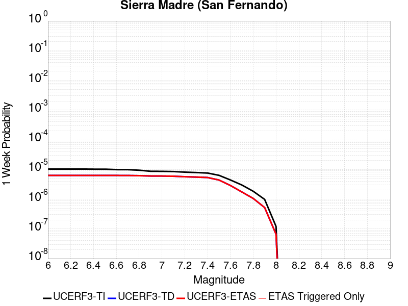 | 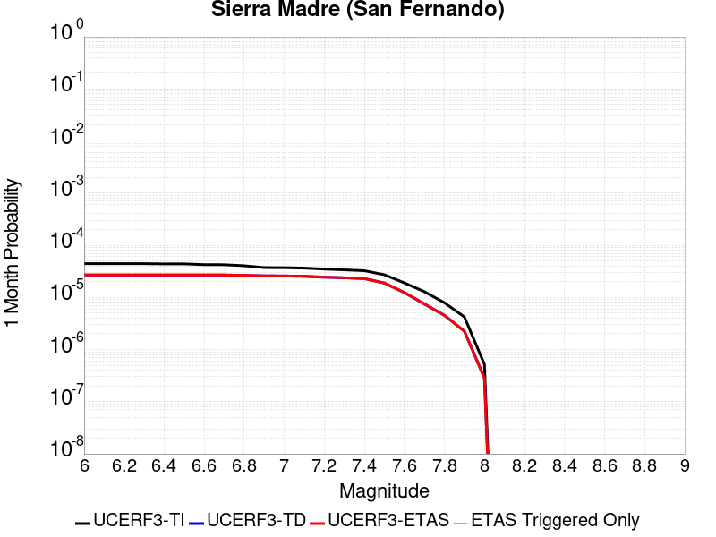 | 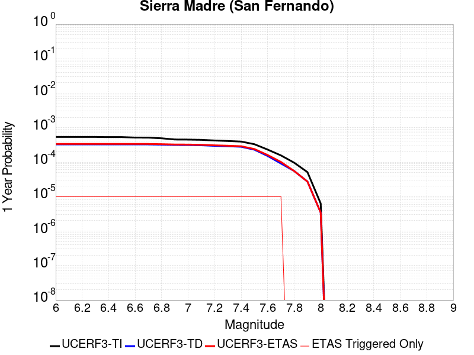 | 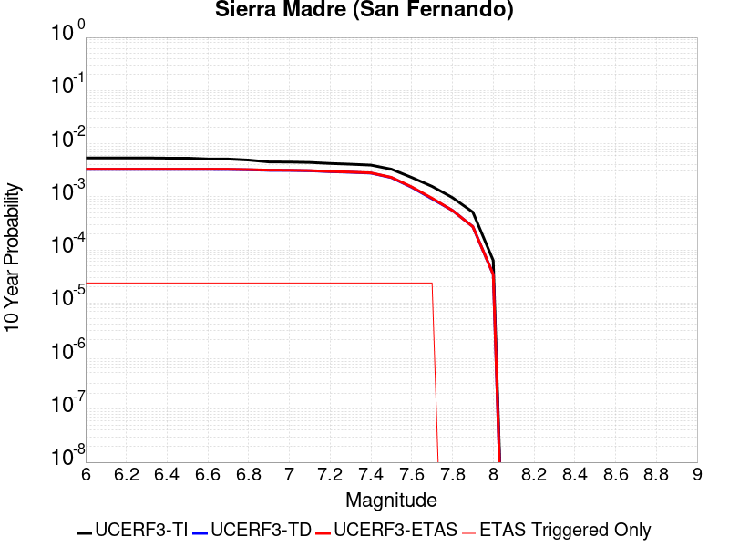 |

| Magnitude | 1 wk TI Prob | 1 wk TD Prob | 1 wk ETAS Prob | 1 wk ETAS/TD Gain | 1 wk ETAS Triggered Only | 1 mo TI Prob | 1 mo TD Prob | 1 mo ETAS Prob | 1 mo ETAS/TD Gain | 1 mo ETAS Triggered Only | 1 yr TI Prob | 1 yr TD Prob | 1 yr ETAS Prob | 1 yr ETAS/TD Gain | 1 yr ETAS Triggered Only | 10 yr TI Prob | 10 yr TD Prob | 10 yr ETAS Prob | 10 yr ETAS/TD Gain | 10 yr ETAS Triggered Only |
|-----|-----|-----|-----|-----|-----|-----|-----|-----|-----|-----|-----|-----|-----|-----|-----|-----|-----|-----|-----|-----|
| 6.0 | 1.0346413E-5 | 6.2872605E-6 | 6.2872605E-6 | 1.0 | 0.0 | 4.4341014E-5 | 2.694513E-5 | 2.694513E-5 | 1.0 | 0.0 | 5.3971814E-4 | 3.280087E-4 | 3.380054E-4 | 1.030477 | 1.0E-5 | 0.0053840918 | 0.0032753581 | 0.0032952926 | 1.0060862 | 2.0E-5 |
| 6.1 | 1.0346413E-5 | 6.2872605E-6 | 6.2872605E-6 | 1.0 | 0.0 | 4.4341014E-5 | 2.694513E-5 | 2.694513E-5 | 1.0 | 0.0 | 5.3971814E-4 | 3.280087E-4 | 3.380054E-4 | 1.030477 | 1.0E-5 | 0.0053840918 | 0.0032753581 | 0.0032952926 | 1.0060862 | 2.0E-5 |
| 6.2 | 1.0346413E-5 | 6.2872605E-6 | 6.2872605E-6 | 1.0 | 0.0 | 4.4341014E-5 | 2.694513E-5 | 2.694513E-5 | 1.0 | 0.0 | 5.3971814E-4 | 3.280087E-4 | 3.380054E-4 | 1.030477 | 1.0E-5 | 0.0053840918 | 0.0032753581 | 0.0032952926 | 1.0060862 | 2.0E-5 |
| 6.3 | 1.0346413E-5 | 6.2872605E-6 | 6.2872605E-6 | 1.0 | 0.0 | 4.4341014E-5 | 2.694513E-5 | 2.694513E-5 | 1.0 | 0.0 | 5.3971814E-4 | 3.280087E-4 | 3.380054E-4 | 1.030477 | 1.0E-5 | 0.0053840918 | 0.0032753581 | 0.0032952926 | 1.0060862 | 2.0E-5 |
| 6.4 | 1.0249558E-5 | 6.2872605E-6 | 6.2872605E-6 | 1.0 | 0.0 | 4.392594E-5 | 2.694513E-5 | 2.694513E-5 | 1.0 | 0.0 | 5.3466705E-4 | 3.280087E-4 | 3.380054E-4 | 1.030477 | 1.0E-5 | 0.0053338245 | 0.0032753581 | 0.0032952926 | 1.0060862 | 2.0E-5 |
| 6.5 | 1.0249558E-5 | 6.2872605E-6 | 6.2872605E-6 | 1.0 | 0.0 | 4.392594E-5 | 2.694513E-5 | 2.694513E-5 | 1.0 | 0.0 | 5.3466705E-4 | 3.280087E-4 | 3.380054E-4 | 1.030477 | 1.0E-5 | 0.0053338245 | 0.0032753581 | 0.0032952926 | 1.0060862 | 2.0E-5 |
| 6.6 | 9.9035515E-6 | 6.2872605E-6 | 6.2872605E-6 | 1.0 | 0.0 | 4.2443102E-5 | 2.694513E-5 | 2.694513E-5 | 1.0 | 0.0 | 5.166222E-4 | 3.280087E-4 | 3.380054E-4 | 1.030477 | 1.0E-5 | 0.0051542283 | 0.0032753581 | 0.0032952926 | 1.0060862 | 2.0E-5 |
| 6.7 | 9.87217E-6 | 6.2746817E-6 | 6.2746817E-6 | 1.0 | 0.0 | 4.2308613E-5 | 2.689122E-5 | 2.689122E-5 | 1.0 | 0.0 | 5.149856E-4 | 3.2735255E-4 | 3.3734928E-4 | 1.0305381 | 1.0E-5 | 0.005137938 | 0.0032688158 | 0.0032887505 | 1.0060984 | 2.0E-5 |
| 6.8 | 9.4359175E-6 | 6.1786586E-6 | 6.1786586E-6 | 1.0 | 0.0 | 4.043902E-5 | 2.6479704E-5 | 2.6479704E-5 | 1.0 | 0.0 | 4.9223384E-4 | 3.2234378E-4 | 3.3234057E-4 | 1.0310128 | 1.0E-5 | 0.0049114493 | 0.0032188739 | 0.0032388095 | 1.0061934 | 2.0E-5 |
| 6.9 | 8.700447E-6 | 6.039922E-6 | 6.039922E-6 | 1.0 | 0.0 | 3.72871E-5 | 2.5885129E-5 | 2.5885129E-5 | 1.0 | 0.0 | 4.5387587E-4 | 3.1510694E-4 | 3.2510379E-4 | 1.0317253 | 1.0E-5 | 0.0045295 | 0.003146711 | 0.003166648 | 1.0063359 | 2.0E-5 |
| 7.0 | 8.648878E-6 | 6.0148373E-6 | 6.0148373E-6 | 1.0 | 0.0 | 3.7066096E-5 | 2.5777625E-5 | 2.5777625E-5 | 1.0 | 0.0 | 4.5118626E-4 | 3.1379846E-4 | 3.2379534E-4 | 1.0318576 | 1.0E-5 | 0.004502713 | 0.003133663 | 0.0031536005 | 1.0063623 | 2.0E-5 |
| 7.1 | 8.505786E-6 | 5.9244676E-6 | 5.9244676E-6 | 1.0 | 0.0 | 3.645286E-5 | 2.5390334E-5 | 2.5390334E-5 | 1.0 | 0.0 | 4.437232E-4 | 3.0908454E-4 | 3.1908145E-4 | 1.0323436 | 1.0E-5 | 0.0044283825 | 0.0030866556 | 0.0031065939 | 1.0064595 | 2.0E-5 |
| 7.2 | 8.139752E-6 | 5.6987624E-6 | 5.6987624E-6 | 1.0 | 0.0 | 3.4884186E-5 | 2.4423045E-5 | 2.4423045E-5 | 1.0 | 0.0 | 4.246322E-4 | 2.9731105E-4 | 3.0730807E-4 | 1.0336248 | 1.0E-5 | 0.004238217 | 0.0029692391 | 0.0029891797 | 1.0067158 | 2.0E-5 |
| 7.3 | 7.8816E-6 | 5.552077E-6 | 5.552077E-6 | 1.0 | 0.0 | 3.3777847E-5 | 2.3794404E-5 | 2.3794404E-5 | 1.0 | 0.0 | 4.111677E-4 | 2.896594E-4 | 2.996565E-4 | 1.0345134 | 1.0E-5 | 0.004104078 | 0.0028929242 | 0.0029128664 | 1.0068934 | 2.0E-5 |
| 7.4 | 7.5810603E-6 | 5.3563126E-6 | 5.3563126E-6 | 1.0 | 0.0 | 3.2489854E-5 | 2.2955428E-5 | 2.2955428E-5 | 1.0 | 0.0 | 3.9549218E-4 | 2.7944756E-4 | 2.8944475E-4 | 1.035775 | 1.0E-5 | 0.0039478904 | 0.0027910667 | 0.0028110107 | 1.0071458 | 2.0E-5 |
| 7.5 | 6.349153E-6 | 4.407576E-6 | 4.407576E-6 | 1.0 | 0.0 | 2.7210372E-5 | 1.888948E-5 | 1.888948E-5 | 1.0 | 0.0 | 3.312359E-4 | 2.2995596E-4 | 2.3995366E-4 | 1.0434766 | 1.0E-5 | 0.0033074263 | 0.0022972622 | 0.0023172162 | 1.0086861 | 2.0E-5 |
| 7.6 | 4.430576E-6 | 2.8905868E-6 | 2.8905868E-6 | 1.0 | 0.0 | 1.8988047E-5 | 1.2388171E-5 | 1.2388171E-5 | 1.0 | 0.0 | 2.3115493E-4 | 1.5081577E-4 | 1.6081426E-4 | 1.0662961 | 1.0E-5 | 0.0023091463 | 0.0015071568 | 0.0015271266 | 1.01325 | 2.0E-5 |
| 7.7 | 3.005066E-6 | 1.7510115E-6 | 1.7510115E-6 | 1.0 | 0.0 | 1.2878791E-5 | 7.504313E-6 | 7.504313E-6 | 1.0 | 0.0 | 1.56788E-4 | 9.1361195E-5 | 1.0136028E-4 | 1.1094457 | 1.0E-5 | 0.0015667742 | 9.132375E-4 | 9.332193E-4 | 1.0218801 | 2.0E-5 |
| 7.8 | 1.8459098E-6 | 1.0582091E-6 | 1.0582091E-6 | 1.0 | 0.0 | 7.911018E-6 | 4.535174E-6 | 4.535174E-6 | 1.0 | 0.0 | 9.631238E-5 | 5.5214347E-5 | 5.5214347E-5 | 1.0 | 0.0 | 9.627065E-4 | 5.5200676E-4 | 5.5200676E-4 | 1.0 | 0.0 |
| 7.9 | 9.839262E-7 | 5.23421E-7 | 5.23421E-7 | 1.0 | 0.0 | 4.2168194E-6 | 2.2432312E-6 | 2.2432312E-6 | 1.0 | 0.0 | 5.1338568E-5 | 2.7310998E-5 | 2.7310998E-5 | 1.0 | 0.0 | 5.132671E-4 | 2.730767E-4 | 2.730767E-4 | 1.0 | 0.0 |
| 8.0 | 1.210983E-7 | 6.613821E-8 | 6.613821E-8 | 1.0 | 0.0 | 5.1899264E-7 | 2.8344945E-7 | 2.8344945E-7 | 1.0 | 0.0 | 6.3187167E-6 | 3.4509917E-6 | 3.4509917E-6 | 1.0 | 0.0 | 6.318537E-5 | 3.45094E-5 | 3.45094E-5 | 1.0 | 0.0 |

## Emerson-Copper Mtn 2011
*[(top)](#table-of-contents)*

| 1 Week | 1 Month | 1 Year | 10 Year |
|-----|-----|-----|-----|
| 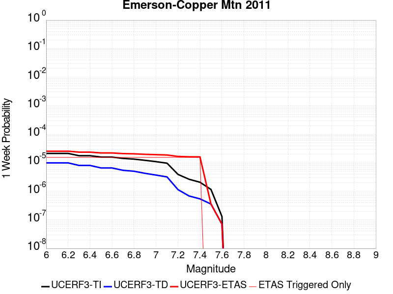 | 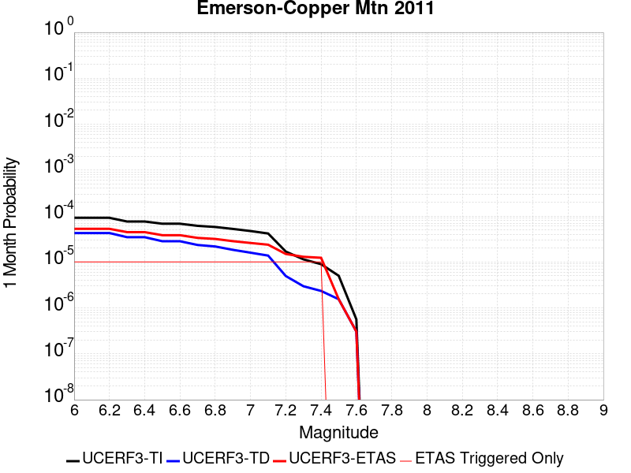 | 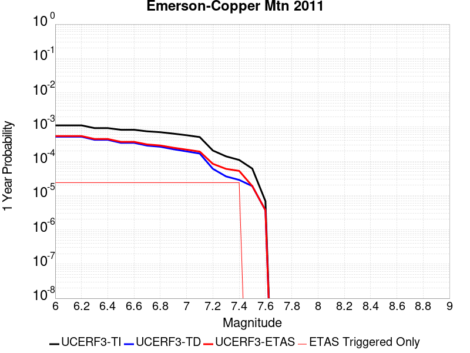 | 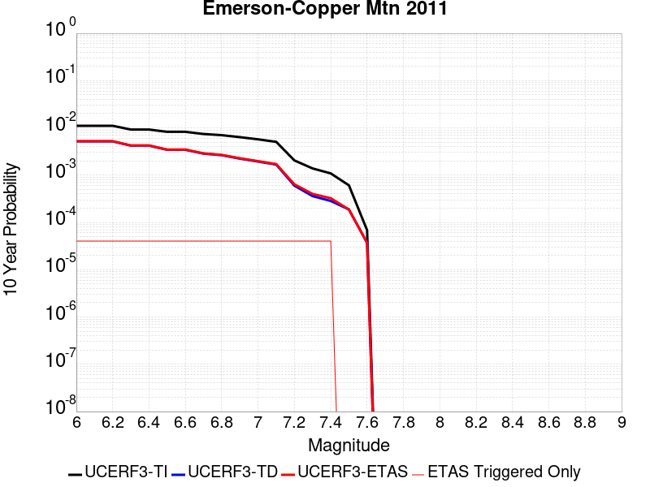 |

| Magnitude | 1 wk TI Prob | 1 wk TD Prob | 1 wk ETAS Prob | 1 wk ETAS/TD Gain | 1 wk ETAS Triggered Only | 1 mo TI Prob | 1 mo TD Prob | 1 mo ETAS Prob | 1 mo ETAS/TD Gain | 1 mo ETAS Triggered Only | 1 yr TI Prob | 1 yr TD Prob | 1 yr ETAS Prob | 1 yr ETAS/TD Gain | 1 yr ETAS Triggered Only | 10 yr TI Prob | 10 yr TD Prob | 10 yr ETAS Prob | 10 yr ETAS/TD Gain | 10 yr ETAS Triggered Only |
|-----|-----|-----|-----|-----|-----|-----|-----|-----|-----|-----|-----|-----|-----|-----|-----|-----|-----|-----|-----|-----|
| 6.0 | 2.1364202E-5 | 9.968114E-6 | 1.9968014E-5 | 2.0031888 | 1.0E-5 | 9.1557646E-5 | 4.2719836E-5 | 5.271941E-5 | 1.2340733 | 1.0E-5 | 0.0011141442 | 5.199986E-4 | 5.399882E-4 | 1.0384417 | 2.0E-5 | 0.011085749 | 0.005188688 | 0.0052085845 | 1.0038345 | 2.0E-5 |
| 6.1 | 2.1364202E-5 | 9.968114E-6 | 1.9968014E-5 | 2.0031888 | 1.0E-5 | 9.1557646E-5 | 4.2719836E-5 | 5.271941E-5 | 1.2340733 | 1.0E-5 | 0.0011141442 | 5.199986E-4 | 5.399882E-4 | 1.0384417 | 2.0E-5 | 0.011085749 | 0.005188688 | 0.0052085845 | 1.0038345 | 2.0E-5 |
| 6.2 | 2.1364202E-5 | 9.968114E-6 | 1.9968014E-5 | 2.0031888 | 1.0E-5 | 9.1557646E-5 | 4.2719836E-5 | 5.271941E-5 | 1.2340733 | 1.0E-5 | 0.0011141442 | 5.199986E-4 | 5.399882E-4 | 1.0384417 | 2.0E-5 | 0.011085749 | 0.005188688 | 0.0052085845 | 1.0038345 | 2.0E-5 |
| 6.3 | 1.7751237E-5 | 8.089227E-6 | 1.8089146E-5 | 2.236202 | 1.0E-5 | 7.607452E-5 | 3.466769E-5 | 4.4667344E-5 | 1.2884431 | 1.0E-5 | 9.258136E-4 | 4.2200365E-4 | 4.4199522E-4 | 1.0473729 | 2.0E-5 | 0.00921966 | 0.0042126453 | 0.004232561 | 1.0047276 | 2.0E-5 |
| 6.4 | 1.7751237E-5 | 8.089227E-6 | 1.8089146E-5 | 2.236202 | 1.0E-5 | 7.607452E-5 | 3.466769E-5 | 4.4667344E-5 | 1.2884431 | 1.0E-5 | 9.258136E-4 | 4.2200365E-4 | 4.4199522E-4 | 1.0473729 | 2.0E-5 | 0.00921966 | 0.0042126453 | 0.004232561 | 1.0047276 | 2.0E-5 |
| 6.5 | 1.5886664E-5 | 6.603819E-6 | 1.6603753E-5 | 2.5142653 | 1.0E-5 | 6.808392E-5 | 2.8301802E-5 | 3.8301518E-5 | 1.3533244 | 1.0E-5 | 8.286065E-4 | 3.4452465E-4 | 3.6451776E-4 | 1.058031 | 2.0E-5 | 0.008255237 | 0.0034403696 | 0.0034603006 | 1.0057933 | 2.0E-5 |
| 6.6 | 1.5886664E-5 | 6.603819E-6 | 1.6603753E-5 | 2.5142653 | 1.0E-5 | 6.808392E-5 | 2.8301802E-5 | 3.8301518E-5 | 1.3533244 | 1.0E-5 | 8.286065E-4 | 3.4452465E-4 | 3.6451776E-4 | 1.058031 | 2.0E-5 | 0.008255237 | 0.0034403696 | 0.0034603006 | 1.0057933 | 2.0E-5 |
| 6.7 | 1.428471E-5 | 5.470403E-6 | 1.5470348E-5 | 2.828009 | 1.0E-5 | 6.121875E-5 | 2.3444394E-5 | 3.344416E-5 | 1.4265312 | 1.0E-5 | 7.450834E-4 | 2.8540206E-4 | 3.0539636E-4 | 1.0700566 | 2.0E-5 | 0.007425902 | 0.0028507432 | 0.0028706861 | 1.0069957 | 2.0E-5 |
| 6.8 | 1.3490684E-5 | 5.073699E-6 | 1.5073648E-5 | 2.9709387 | 1.0E-5 | 5.7815934E-5 | 2.1744265E-5 | 3.1744046E-5 | 1.4598814 | 1.0E-5 | 7.0368167E-4 | 2.6470813E-4 | 2.8470284E-4 | 1.0755349 | 2.0E-5 | 0.007014576 | 0.002644309 | 0.0026642561 | 1.0075434 | 2.0E-5 |
| 6.9 | 1.2235421E-5 | 4.289677E-6 | 1.4289634E-5 | 3.331168 | 1.0E-5 | 5.2436466E-5 | 1.838422E-5 | 2.8384036E-5 | 1.5439347 | 1.0E-5 | 6.38227E-4 | 2.238085E-4 | 2.4380402E-4 | 1.0893421 | 2.0E-5 | 0.0063639707 | 0.0022361854 | 0.0022561406 | 1.0089238 | 2.0E-5 |
| 7.0 | 1.1009851E-5 | 3.7189886E-6 | 1.3718952E-5 | 3.688893 | 1.0E-5 | 4.7184225E-5 | 1.5938444E-5 | 2.5938285E-5 | 1.6274039 | 1.0E-5 | 5.743165E-4 | 1.9403672E-4 | 2.1403284E-4 | 1.1030533 | 2.0E-5 | 0.005728345 | 0.0019390108 | 0.001958972 | 1.0102946 | 2.0E-5 |
| 7.1 | 9.726373E-6 | 3.2117953E-6 | 1.3211763E-5 | 4.1135135 | 1.0E-5 | 4.168379E-5 | 1.3764783E-5 | 2.3764645E-5 | 1.7264817 | 1.0E-5 | 5.07382E-4 | 1.6757673E-4 | 1.8757337E-4 | 1.1193283 | 2.0E-5 | 0.0050622504 | 0.0016748349 | 0.0016948014 | 1.0119215 | 2.0E-5 |
| 7.2 | 3.9335127E-6 | 1.1524792E-6 | 1.1152468E-5 | 9.676936 | 1.0E-5 | 1.6857803E-5 | 4.9391874E-6 | 1.4939138E-5 | 3.0246146 | 1.0E-5 | 2.0522442E-4 | 6.0133007E-5 | 8.01318E-5 | 1.332576 | 2.0E-5 | 0.00205035 | 6.011733E-4 | 6.211613E-4 | 1.0332483 | 2.0E-5 |
| 7.3 | 2.661632E-6 | 6.911505E-7 | 1.0691144E-5 | 15.468619 | 1.0E-5 | 1.14069435E-5 | 2.9620703E-6 | 1.296204E-5 | 4.376007 | 1.0E-5 | 1.3887069E-4 | 3.6062618E-5 | 5.6061897E-5 | 1.5545709 | 2.0E-5 | 0.0013878393 | 3.605687E-4 | 3.8056148E-4 | 1.0554479 | 2.0E-5 |
| 7.4 | 2.0893426E-6 | 5.4618386E-7 | 1.0546179E-5 | 19.308844 | 1.0E-5 | 8.954295E-6 | 2.3407858E-6 | 1.2340763E-5 | 5.2720594 | 1.0E-5 | 1.0901308E-4 | 2.84987E-5 | 4.8498132E-5 | 1.7017664 | 2.0E-5 | 0.0010895962 | 2.84951E-4 | 3.049453E-4 | 1.0701675 | 2.0E-5 |
| 7.5 | 1.1681728E-6 | 3.6030585E-7 | 3.6030585E-7 | 1.0 | 0.0 | 5.0064455E-6 | 1.544167E-6 | 1.544167E-6 | 1.0 | 0.0 | 6.0951766E-5 | 1.8800076E-5 | 1.8800076E-5 | 1.0 | 0.0 | 6.093505E-4 | 1.8798532E-4 | 1.8798532E-4 | 1.0 | 0.0 |
| 7.6 | 1.3154387E-7 | 7.1197384E-8 | 7.1197384E-8 | 1.0 | 0.0 | 5.6375933E-7 | 3.051316E-7 | 3.051316E-7 | 1.0 | 0.0 | 6.863748E-6 | 3.7149728E-6 | 3.7149728E-6 | 1.0 | 0.0 | 6.863536E-5 | 3.7149264E-5 | 3.7149264E-5 | 1.0 | 0.0 |

## Northridge
*[(top)](#table-of-contents)*

| 1 Week | 1 Month | 1 Year | 10 Year |
|-----|-----|-----|-----|
| 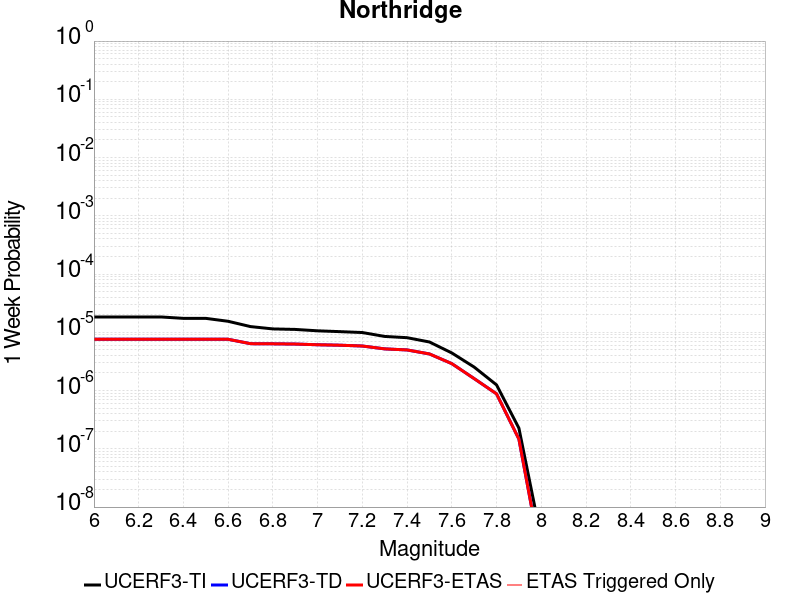 |  | 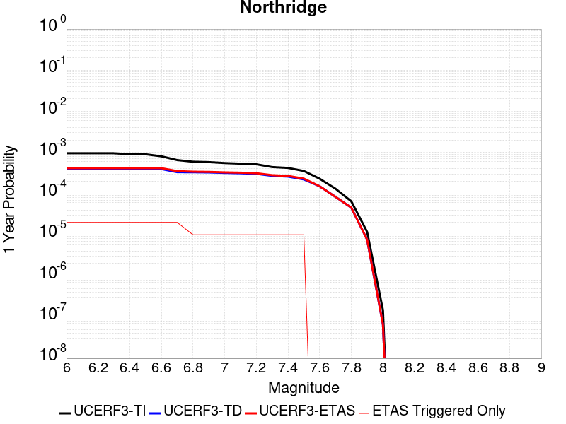 | 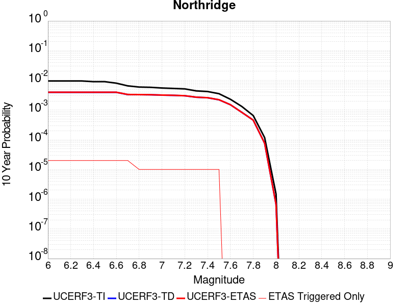 |

| Magnitude | 1 wk TI Prob | 1 wk TD Prob | 1 wk ETAS Prob | 1 wk ETAS/TD Gain | 1 wk ETAS Triggered Only | 1 mo TI Prob | 1 mo TD Prob | 1 mo ETAS Prob | 1 mo ETAS/TD Gain | 1 mo ETAS Triggered Only | 1 yr TI Prob | 1 yr TD Prob | 1 yr ETAS Prob | 1 yr ETAS/TD Gain | 1 yr ETAS Triggered Only | 10 yr TI Prob | 10 yr TD Prob | 10 yr ETAS Prob | 10 yr ETAS/TD Gain | 10 yr ETAS Triggered Only |
|-----|-----|-----|-----|-----|-----|-----|-----|-----|-----|-----|-----|-----|-----|-----|-----|-----|-----|-----|-----|-----|
| 6.0 | 1.8340852E-5 | 7.5880193E-6 | 7.5880193E-6 | 1.0 | 0.0 | 7.860128E-5 | 3.251969E-5 | 3.251969E-5 | 1.0 | 0.0 | 9.565505E-4 | 3.958575E-4 | 4.158496E-4 | 1.0505033 | 2.0E-5 | 0.009524435 | 0.003951746 | 0.003971667 | 1.005041 | 2.0E-5 |
| 6.1 | 1.8340852E-5 | 7.5880193E-6 | 7.5880193E-6 | 1.0 | 0.0 | 7.860128E-5 | 3.251969E-5 | 3.251969E-5 | 1.0 | 0.0 | 9.565505E-4 | 3.958575E-4 | 4.158496E-4 | 1.0505033 | 2.0E-5 | 0.009524435 | 0.003951746 | 0.003971667 | 1.005041 | 2.0E-5 |
| 6.2 | 1.8340852E-5 | 7.5880193E-6 | 7.5880193E-6 | 1.0 | 0.0 | 7.860128E-5 | 3.251969E-5 | 3.251969E-5 | 1.0 | 0.0 | 9.565505E-4 | 3.958575E-4 | 4.158496E-4 | 1.0505033 | 2.0E-5 | 0.009524435 | 0.003951746 | 0.003971667 | 1.005041 | 2.0E-5 |
| 6.3 | 1.8340852E-5 | 7.5880193E-6 | 7.5880193E-6 | 1.0 | 0.0 | 7.860128E-5 | 3.251969E-5 | 3.251969E-5 | 1.0 | 0.0 | 9.565505E-4 | 3.958575E-4 | 4.158496E-4 | 1.0505033 | 2.0E-5 | 0.009524435 | 0.003951746 | 0.003971667 | 1.005041 | 2.0E-5 |
| 6.4 | 1.7361892E-5 | 7.5880193E-6 | 7.5880193E-6 | 1.0 | 0.0 | 7.440598E-5 | 3.251969E-5 | 3.251969E-5 | 1.0 | 0.0 | 9.055163E-4 | 3.958575E-4 | 4.158496E-4 | 1.0505033 | 2.0E-5 | 0.009018354 | 0.003951746 | 0.003971667 | 1.005041 | 2.0E-5 |
| 6.5 | 1.7361892E-5 | 7.5880193E-6 | 7.5880193E-6 | 1.0 | 0.0 | 7.440598E-5 | 3.251969E-5 | 3.251969E-5 | 1.0 | 0.0 | 9.055163E-4 | 3.958575E-4 | 4.158496E-4 | 1.0505033 | 2.0E-5 | 0.009018354 | 0.003951746 | 0.003971667 | 1.005041 | 2.0E-5 |
| 6.6 | 1.5458201E-5 | 7.5880193E-6 | 7.5880193E-6 | 1.0 | 0.0 | 6.624775E-5 | 3.251969E-5 | 3.251969E-5 | 1.0 | 0.0 | 8.0626784E-4 | 3.958575E-4 | 4.158496E-4 | 1.0505033 | 2.0E-5 | 0.008033488 | 0.003951746 | 0.003971667 | 1.005041 | 2.0E-5 |
| 6.7 | 1.2538368E-5 | 6.381603E-6 | 6.381603E-6 | 1.0 | 0.0 | 5.3734755E-5 | 2.7349442E-5 | 2.7349442E-5 | 1.0 | 0.0 | 6.5402425E-4 | 3.3292902E-4 | 3.5292236E-4 | 1.0600529 | 2.0E-5 | 0.0065210275 | 0.0033243506 | 0.0033442841 | 1.0059962 | 2.0E-5 |
| 6.8 | 1.1438097E-5 | 6.3502566E-6 | 6.3502566E-6 | 1.0 | 0.0 | 4.9019498E-5 | 2.7215105E-5 | 2.7215105E-5 | 1.0 | 0.0 | 5.9664896E-4 | 3.3129397E-4 | 3.4129064E-4 | 1.0301747 | 1.0E-5 | 0.005950495 | 0.0033080487 | 0.0033180155 | 1.0030129 | 1.0E-5 |
| 6.9 | 1.1204891E-5 | 6.2867084E-6 | 6.2867084E-6 | 1.0 | 0.0 | 4.8020076E-5 | 2.694276E-5 | 2.694276E-5 | 1.0 | 0.0 | 5.8448757E-4 | 3.2797916E-4 | 3.379759E-4 | 1.0304798 | 1.0E-5 | 0.0058295266 | 0.0032749989 | 0.003284966 | 1.0030434 | 1.0E-5 |
| 7.0 | 1.061046E-5 | 6.115359E-6 | 6.115359E-6 | 1.0 | 0.0 | 4.5472607E-5 | 2.6208421E-5 | 2.6208421E-5 | 1.0 | 0.0 | 5.534883E-4 | 3.1904122E-4 | 3.2903804E-4 | 1.0313339 | 1.0E-5 | 0.0055211177 | 0.0031858785 | 0.0031958467 | 1.0031289 | 1.0E-5 |
| 7.1 | 1.0266979E-5 | 6.004274E-6 | 6.004274E-6 | 1.0 | 0.0 | 4.40006E-5 | 2.5732352E-5 | 2.5732352E-5 | 1.0 | 0.0 | 5.355756E-4 | 3.1324677E-4 | 3.2324364E-4 | 1.0319138 | 1.0E-5 | 0.0053428668 | 0.003128098 | 0.003138067 | 1.0031868 | 1.0E-5 |
| 7.2 | 9.91273E-6 | 5.819984E-6 | 5.819984E-6 | 1.0 | 0.0 | 4.248244E-5 | 2.4942554E-5 | 2.4942554E-5 | 1.0 | 0.0 | 5.171009E-4 | 3.036337E-4 | 3.1363065E-4 | 1.0329244 | 1.0E-5 | 0.0051589934 | 0.0030322333 | 0.0030422031 | 1.0032879 | 1.0E-5 |
| 7.3 | 8.4959265E-6 | 5.193062E-6 | 5.193062E-6 | 1.0 | 0.0 | 3.6410605E-5 | 2.225579E-5 | 2.225579E-5 | 1.0 | 0.0 | 4.4320893E-4 | 2.709308E-4 | 2.809281E-4 | 1.0368998 | 1.0E-5 | 0.00442326 | 0.0027060313 | 0.0027160044 | 1.0036855 | 1.0E-5 |
| 7.4 | 8.0847185E-6 | 4.9819355E-6 | 4.9819355E-6 | 1.0 | 0.0 | 3.4648332E-5 | 2.135098E-5 | 2.135098E-5 | 1.0 | 0.0 | 4.2176177E-4 | 2.599174E-4 | 2.699148E-4 | 1.0384637 | 1.0E-5 | 0.0042096223 | 0.00259616 | 0.002606134 | 1.0038419 | 1.0E-5 |
| 7.5 | 6.8220684E-6 | 4.2533075E-6 | 4.2533075E-6 | 1.0 | 0.0 | 2.9237108E-5 | 1.8228335E-5 | 1.8228335E-5 | 1.0 | 0.0 | 3.5590364E-4 | 2.2190758E-4 | 2.3190536E-4 | 1.0450538 | 1.0E-5 | 0.0035533418 | 0.002216881 | 0.0022268586 | 1.0045009 | 1.0E-5 |
| 7.6 | 4.4224143E-6 | 2.8999582E-6 | 2.8999582E-6 | 1.0 | 0.0 | 1.8953066E-5 | 1.2428334E-5 | 1.2428334E-5 | 1.0 | 0.0 | 2.3072914E-4 | 1.5130457E-4 | 1.5130457E-4 | 1.0 | 0.0 | 0.0023048974 | 0.0015120271 | 0.0015120271 | 1.0 | 0.0 |
| 7.7 | 2.5297056E-6 | 1.6045905E-6 | 1.6045905E-6 | 1.0 | 0.0 | 1.0841551E-5 | 6.8767986E-6 | 6.8767986E-6 | 1.0 | 0.0 | 1.319879E-4 | 8.3721854E-5 | 8.3721854E-5 | 1.0 | 0.0 | 0.0013190953 | 8.369078E-4 | 8.369078E-4 | 1.0 | 0.0 |
| 7.8 | 1.2508156E-6 | 8.780076E-7 | 8.780076E-7 | 1.0 | 0.0 | 5.3606273E-6 | 3.7628845E-6 | 3.7628845E-6 | 1.0 | 0.0 | 6.526368E-5 | 4.581217E-5 | 4.581217E-5 | 1.0 | 0.0 | 6.524452E-4 | 4.5802852E-4 | 4.5802852E-4 | 1.0 | 0.0 |
| 7.9 | 2.262199E-7 | 1.4664671E-7 | 1.4664671E-7 | 1.0 | 0.0 | 9.695135E-7 | 6.284858E-7 | 6.284858E-7 | 1.0 | 0.0 | 1.1803763E-5 | 7.651788E-6 | 7.651788E-6 | 1.0 | 0.0 | 1.1803136E-4 | 7.651533E-5 | 7.651533E-5 | 1.0 | 0.0 |
| 8.0 | 2.865362E-9 | 1.2753101E-9 | 1.2753101E-9 | 1.0 | 0.0 | 1.2280123E-8 | 5.4656146E-9 | 5.4656146E-9 | 1.0 | 0.0 | 1.4951048E-7 | 6.654386E-8 | 6.654386E-8 | 1.0 | 0.0 | 1.4951038E-6 | 6.654386E-7 | 6.654386E-7 | 1.0 | 0.0 |

## Monterey Bay-Tularcitos
*[(top)](#table-of-contents)*

| 1 Week | 1 Month | 1 Year | 10 Year |
|-----|-----|-----|-----|
|  | 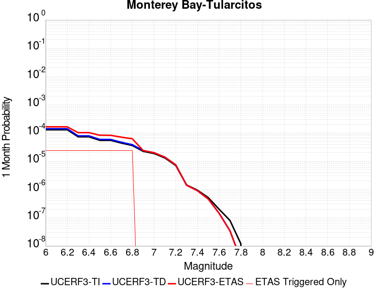 | 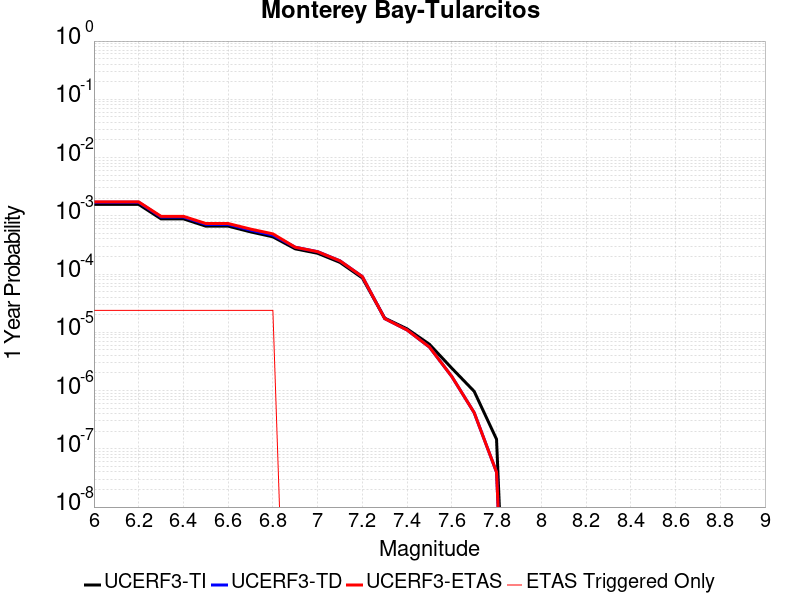 | 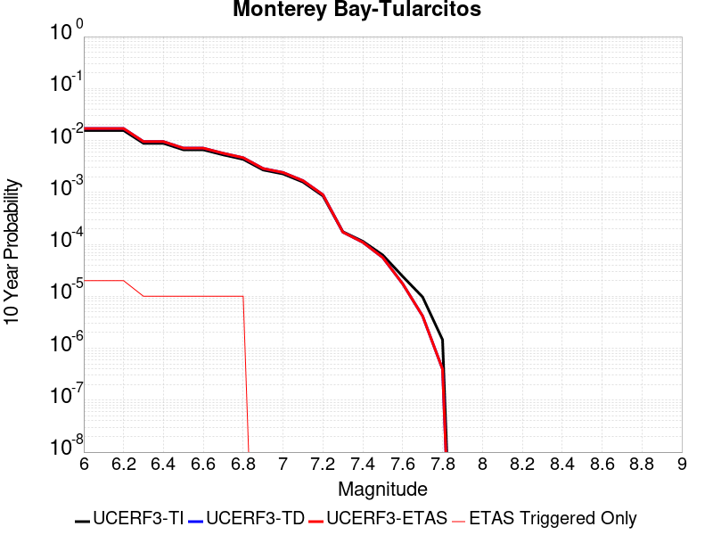 |

| Magnitude | 1 wk TI Prob | 1 wk TD Prob | 1 wk ETAS Prob | 1 wk ETAS/TD Gain | 1 wk ETAS Triggered Only | 1 mo TI Prob | 1 mo TD Prob | 1 mo ETAS Prob | 1 mo ETAS/TD Gain | 1 mo ETAS Triggered Only | 1 yr TI Prob | 1 yr TD Prob | 1 yr ETAS Prob | 1 yr ETAS/TD Gain | 1 yr ETAS Triggered Only | 10 yr TI Prob | 10 yr TD Prob | 10 yr ETAS Prob | 10 yr ETAS/TD Gain | 10 yr ETAS Triggered Only |
|-----|-----|-----|-----|-----|-----|-----|-----|-----|-----|-----|-----|-----|-----|-----|-----|-----|-----|-----|-----|-----|
| 6.0 | 3.0131365E-5 | 3.279877E-5 | 3.279877E-5 | 1.0 | 0.0 | 1.2912804E-4 | 1.4055918E-4 | 1.5055778E-4 | 1.0711344 | 1.0E-5 | 0.001571 | 0.0017100703 | 0.0017200531 | 1.0058377 | 1.0E-5 | 0.015599402 | 0.016979916 | 0.016999578 | 1.0011579 | 2.0E-5 |
| 6.1 | 3.0131365E-5 | 3.279877E-5 | 3.279877E-5 | 1.0 | 0.0 | 1.2912804E-4 | 1.4055918E-4 | 1.5055778E-4 | 1.0711344 | 1.0E-5 | 0.001571 | 0.0017100703 | 0.0017200531 | 1.0058377 | 1.0E-5 | 0.015599402 | 0.016979916 | 0.016999578 | 1.0011579 | 2.0E-5 |
| 6.2 | 3.0131365E-5 | 3.279877E-5 | 3.279877E-5 | 1.0 | 0.0 | 1.2912804E-4 | 1.4055918E-4 | 1.5055778E-4 | 1.0711344 | 1.0E-5 | 0.001571 | 0.0017100703 | 0.0017200531 | 1.0058377 | 1.0E-5 | 0.015599402 | 0.016979916 | 0.016999578 | 1.0011579 | 2.0E-5 |
| 6.3 | 1.6998249E-5 | 1.8330798E-5 | 1.8330798E-5 | 1.0 | 0.0 | 7.28476E-5 | 7.85583E-5 | 8.8557514E-5 | 1.127284 | 1.0E-5 | 8.865586E-4 | 9.5604634E-4 | 9.6603675E-4 | 1.0104498 | 1.0E-5 | 0.0088303005 | 0.009521258 | 0.009531163 | 1.0010403 | 1.0E-5 |
| 6.4 | 1.6998249E-5 | 1.8330798E-5 | 1.8330798E-5 | 1.0 | 0.0 | 7.28476E-5 | 7.85583E-5 | 8.8557514E-5 | 1.127284 | 1.0E-5 | 8.865586E-4 | 9.5604634E-4 | 9.6603675E-4 | 1.0104498 | 1.0E-5 | 0.0088303005 | 0.009521258 | 0.009531163 | 1.0010403 | 1.0E-5 |
| 6.5 | 1.27470785E-5 | 1.3693312E-5 | 1.3693312E-5 | 1.0 | 0.0 | 5.4629192E-5 | 5.8684363E-5 | 6.8683774E-5 | 1.1703931 | 1.0E-5 | 6.649074E-4 | 7.1425823E-4 | 7.242511E-4 | 1.0139905 | 1.0E-5 | 0.0066292146 | 0.007120678 | 0.007130607 | 1.0013944 | 1.0E-5 |
| 6.6 | 1.2739422E-5 | 1.36854E-5 | 1.36854E-5 | 1.0 | 0.0 | 5.4596385E-5 | 5.8650454E-5 | 6.864987E-5 | 1.1704917 | 1.0E-5 | 6.645082E-4 | 7.1384566E-4 | 7.238385E-4 | 1.0139986 | 1.0E-5 | 0.0066252467 | 0.007116579 | 0.007126508 | 1.0013952 | 1.0E-5 |
| 6.7 | 1.0160109E-5 | 1.0885755E-5 | 1.0885755E-5 | 1.0 | 0.0 | 4.35426E-5 | 4.665244E-5 | 5.6651974E-5 | 1.214341 | 1.0E-5 | 5.300022E-4 | 5.6785246E-4 | 5.778468E-4 | 1.0176002 | 1.0E-5 | 0.005287399 | 0.0056647263 | 0.0056746695 | 1.0017554 | 1.0E-5 |
| 6.8 | 8.349859E-6 | 8.932587E-6 | 8.932587E-6 | 1.0 | 0.0 | 3.578462E-5 | 3.8281985E-5 | 4.8281603E-5 | 1.2612095 | 1.0E-5 | 4.3559066E-4 | 4.6598914E-4 | 4.759845E-4 | 1.0214497 | 1.0E-5 | 0.004347378 | 0.004650685 | 0.0046606385 | 1.0021402 | 1.0E-5 |
| 6.9 | 5.193639E-6 | 5.53643E-6 | 5.53643E-6 | 1.0 | 0.0 | 2.2258262E-5 | 2.372736E-5 | 2.372736E-5 | 1.0 | 0.0 | 2.7096065E-4 | 2.8884556E-4 | 2.8884556E-4 | 1.0 | 0.0 | 0.0027063051 | 0.0028850222 | 0.0028850222 | 1.0 | 0.0 |
| 7.0 | 4.359381E-6 | 4.643366E-6 | 4.643366E-6 | 1.0 | 0.0 | 1.8682927E-5 | 1.9900004E-5 | 1.9900004E-5 | 1.0 | 0.0 | 2.274409E-4 | 2.422586E-4 | 2.422586E-4 | 1.0 | 0.0 | 0.0022720827 | 0.002420238 | 0.002420238 | 1.0 | 0.0 |
| 7.1 | 3.0398533E-6 | 3.2310427E-6 | 3.2310427E-6 | 1.0 | 0.0 | 1.3027877E-5 | 1.3847267E-5 | 1.3847267E-5 | 1.0 | 0.0 | 1.5860285E-4 | 1.6858005E-4 | 1.6858005E-4 | 1.0 | 0.0 | 0.001584897 | 0.0016847793 | 0.0016847793 | 1.0 | 0.0 |
| 7.2 | 1.642335E-6 | 1.7333153E-6 | 1.7333153E-6 | 1.0 | 0.0 | 7.0385595E-6 | 7.428485E-6 | 7.428485E-6 | 1.0 | 0.0 | 8.569109E-5 | 9.044012E-5 | 9.044012E-5 | 1.0 | 0.0 | 8.5658056E-4 | 9.042358E-4 | 9.042358E-4 | 1.0 | 0.0 |
| 7.3 | 3.356842E-7 | 3.2952389E-7 | 3.2952389E-7 | 1.0 | 0.0 | 1.4386458E-6 | 1.4122444E-6 | 1.4122444E-6 | 1.0 | 0.0 | 1.7515373E-5 | 1.7193941E-5 | 1.7193941E-5 | 1.0 | 0.0 | 1.7513991E-4 | 1.719262E-4 | 1.719262E-4 | 1.0 | 0.0 |
| 7.4 | 2.1973483E-7 | 2.1006413E-7 | 2.1006413E-7 | 1.0 | 0.0 | 9.417204E-7 | 9.0027453E-7 | 9.0027453E-7 | 1.0 | 0.0 | 1.1465385E-5 | 1.0960787E-5 | 1.0960787E-5 | 1.0 | 0.0 | 1.1464794E-4 | 1.096025E-4 | 1.096025E-4 | 1.0 | 0.0 |
| 7.5 | 1.1944135E-7 | 1.0696043E-7 | 1.0696043E-7 | 1.0 | 0.0 | 5.118914E-7 | 4.5840173E-7 | 4.5840173E-7 | 1.0 | 0.0 | 6.23226E-6 | 5.581027E-6 | 5.581027E-6 | 1.0 | 0.0 | 6.2320854E-5 | 5.5808883E-5 | 5.5808883E-5 | 1.0 | 0.0 |
| 7.6 | 4.636058E-8 | 3.336489E-8 | 3.336489E-8 | 1.0 | 0.0 | 1.9868818E-7 | 1.4299238E-7 | 1.4299238E-7 | 1.0 | 0.0 | 2.419026E-6 | 1.7409308E-6 | 1.7409308E-6 | 1.0 | 0.0 | 2.4189996E-5 | 1.7409173E-5 | 1.7409173E-5 | 1.0 | 0.0 |
| 7.7 | 1.8588572E-8 | 8.003744E-9 | 8.003744E-9 | 1.0 | 0.0 | 7.9665305E-8 | 3.430176E-8 | 3.430176E-8 | 1.0 | 0.0 | 9.699246E-7 | 4.1762385E-7 | 4.1762385E-7 | 1.0 | 0.0 | 9.699204E-6 | 4.176231E-6 | 4.176231E-6 | 1.0 | 0.0 |
| 7.8 | 2.7960154E-9 | 7.6099427E-10 | 7.6099427E-10 | 1.0 | 0.0 | 1.1982923E-8 | 3.2614043E-9 | 3.2614043E-9 | 1.0 | 0.0 | 1.4589209E-7 | 3.9707597E-8 | 3.9707597E-8 | 1.0 | 0.0 | 1.4589199E-6 | 3.9707595E-7 | 3.9707595E-7 | 1.0 | 0.0 |

## Owens Valley Keough Hot Springs
*[(top)](#table-of-contents)*

| 1 Week | 1 Month | 1 Year | 10 Year |
|-----|-----|-----|-----|
|  | 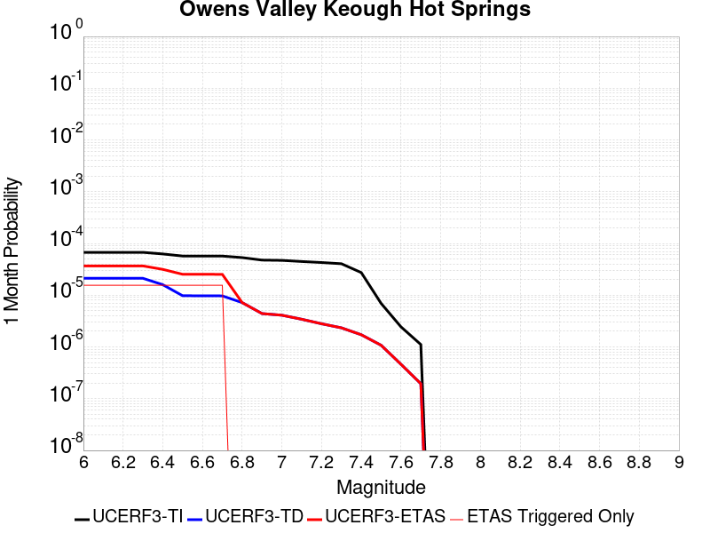 | 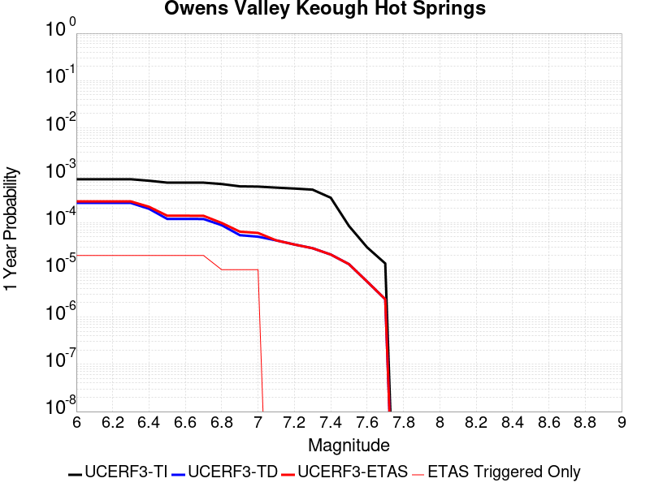 | 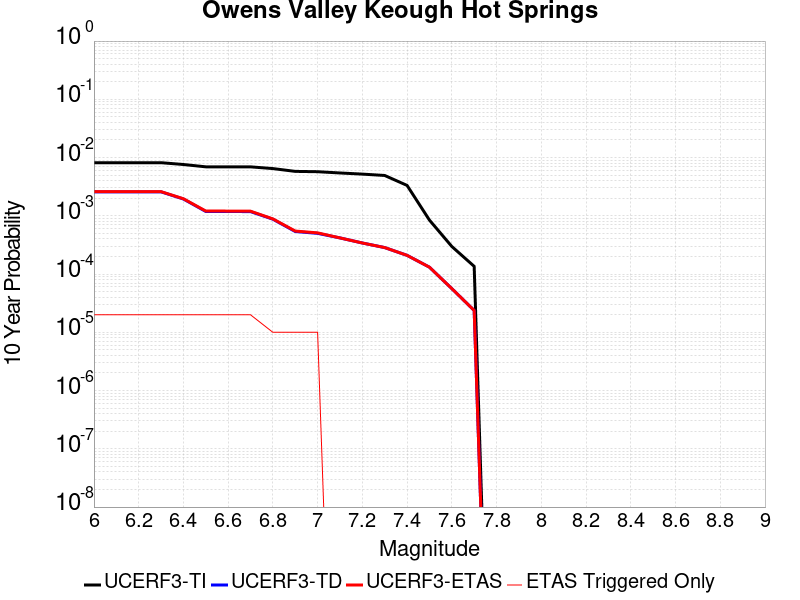 |

| Magnitude | 1 wk TI Prob | 1 wk TD Prob | 1 wk ETAS Prob | 1 wk ETAS/TD Gain | 1 wk ETAS Triggered Only | 1 mo TI Prob | 1 mo TD Prob | 1 mo ETAS Prob | 1 mo ETAS/TD Gain | 1 mo ETAS Triggered Only | 1 yr TI Prob | 1 yr TD Prob | 1 yr ETAS Prob | 1 yr ETAS/TD Gain | 1 yr ETAS Triggered Only | 10 yr TI Prob | 10 yr TD Prob | 10 yr ETAS Prob | 10 yr ETAS/TD Gain | 10 yr ETAS Triggered Only |
|-----|-----|-----|-----|-----|-----|-----|-----|-----|-----|-----|-----|-----|-----|-----|-----|-----|-----|-----|-----|-----|
| 6.0 | 1.5708529E-5 | 4.950656E-6 | 4.950656E-6 | 1.0 | 0.0 | 6.7320536E-5 | 2.1216953E-5 | 3.121674E-5 | 1.4713112 | 1.0E-5 | 8.193192E-4 | 2.582909E-4 | 2.7828573E-4 | 1.0774121 | 2.0E-5 | 0.008163051 | 0.0025805652 | 0.0026005134 | 1.0077302 | 2.0E-5 |
| 6.1 | 1.5708529E-5 | 4.950656E-6 | 4.950656E-6 | 1.0 | 0.0 | 6.7320536E-5 | 2.1216953E-5 | 3.121674E-5 | 1.4713112 | 1.0E-5 | 8.193192E-4 | 2.582909E-4 | 2.7828573E-4 | 1.0774121 | 2.0E-5 | 0.008163051 | 0.0025805652 | 0.0026005134 | 1.0077302 | 2.0E-5 |
| 6.2 | 1.5708529E-5 | 4.950656E-6 | 4.950656E-6 | 1.0 | 0.0 | 6.7320536E-5 | 2.1216953E-5 | 3.121674E-5 | 1.4713112 | 1.0E-5 | 8.193192E-4 | 2.582909E-4 | 2.7828573E-4 | 1.0774121 | 2.0E-5 | 0.008163051 | 0.0025805652 | 0.0026005134 | 1.0077302 | 2.0E-5 |
| 6.3 | 1.5708529E-5 | 4.950656E-6 | 4.950656E-6 | 1.0 | 0.0 | 6.7320536E-5 | 2.1216953E-5 | 3.121674E-5 | 1.4713112 | 1.0E-5 | 8.193192E-4 | 2.582909E-4 | 2.7828573E-4 | 1.0774121 | 2.0E-5 | 0.008163051 | 0.0025805652 | 0.0026005134 | 1.0077302 | 2.0E-5 |
| 6.4 | 1.4622509E-5 | 3.7265204E-6 | 3.7265204E-6 | 1.0 | 0.0 | 6.266639E-5 | 1.5970723E-5 | 2.5970563E-5 | 1.6261357 | 1.0E-5 | 7.626962E-4 | 1.944295E-4 | 2.1442561E-4 | 1.1028451 | 2.0E-5 | 0.007600839 | 0.0019430731 | 0.0019630343 | 1.010273 | 2.0E-5 |
| 6.5 | 1.3335527E-5 | 2.2777172E-6 | 2.2777172E-6 | 1.0 | 0.0 | 5.7151006E-5 | 9.761612E-6 | 1.9761514E-5 | 2.024411 | 1.0E-5 | 6.955913E-4 | 1.18841825E-4 | 1.3883944E-4 | 1.168271 | 2.0E-5 | 0.0069341804 | 0.0011880046 | 0.0012079809 | 1.016815 | 2.0E-5 |
| 6.6 | 1.3332855E-5 | 2.2748663E-6 | 2.2748663E-6 | 1.0 | 0.0 | 5.7139558E-5 | 9.749395E-6 | 1.9749297E-5 | 2.0256948 | 1.0E-5 | 6.9545204E-4 | 1.186931E-4 | 1.3869072E-4 | 1.1684818 | 2.0E-5 | 0.0069327964 | 0.0011865189 | 0.0012064951 | 1.016836 | 2.0E-5 |
| 6.7 | 1.3318214E-5 | 2.2640966E-6 | 2.2640966E-6 | 1.0 | 0.0 | 5.707681E-5 | 9.703239E-6 | 1.9703142E-5 | 2.0305736 | 1.0E-5 | 6.946886E-4 | 1.1813121E-4 | 1.3812885E-4 | 1.1692833 | 2.0E-5 | 0.0069252094 | 0.001180906 | 0.0012008824 | 1.0169162 | 2.0E-5 |
| 6.8 | 1.2441338E-5 | 1.6777863E-6 | 1.6777863E-6 | 1.0 | 0.0 | 5.331893E-5 | 7.1904947E-6 | 7.1904947E-6 | 1.0 | 0.0 | 6.489646E-4 | 8.7541055E-5 | 9.754018E-5 | 1.1142222 | 1.0E-5 | 0.0064707273 | 8.752499E-4 | 8.8524114E-4 | 1.0114154 | 1.0E-5 |
| 6.9 | 1.1130476E-5 | 1.0303868E-6 | 1.0303868E-6 | 1.0 | 0.0 | 4.7701167E-5 | 4.415936E-6 | 4.415936E-6 | 1.0 | 0.0 | 5.806069E-4 | 5.3762706E-5 | 6.376217E-5 | 1.1859926 | 1.0E-5 | 0.0057909233 | 5.37651E-4 | 5.476456E-4 | 1.0185894 | 1.0E-5 |
| 7.0 | 1.0986073E-5 | 9.579413E-7 | 9.579413E-7 | 1.0 | 0.0 | 4.7082318E-5 | 4.1054564E-6 | 4.1054564E-6 | 1.0 | 0.0 | 5.730765E-4 | 4.99828E-5 | 5.9982296E-5 | 1.2000588 | 1.0E-5 | 0.0057160086 | 4.9986853E-4 | 5.0986354E-4 | 1.0199952 | 1.0E-5 |
| 7.1 | 1.0451338E-5 | 8.0002656E-7 | 8.0002656E-7 | 1.0 | 0.0 | 4.4790682E-5 | 3.4286807E-6 | 3.4286807E-6 | 1.0 | 0.0 | 5.451901E-4 | 4.1743395E-5 | 4.1743395E-5 | 1.0 | 0.0 | 0.005438545 | 4.1750458E-4 | 4.1750458E-4 | 1.0 | 0.0 |
| 7.2 | 9.989061E-6 | 6.544956E-7 | 6.544956E-7 | 1.0 | 0.0 | 4.280956E-5 | 2.804978E-6 | 2.804978E-6 | 1.0 | 0.0 | 5.2108173E-4 | 3.4150078E-5 | 3.4150078E-5 | 1.0 | 0.0 | 0.0051986156 | 3.415851E-4 | 3.415851E-4 | 1.0 | 0.0 |
| 7.3 | 9.465365E-6 | 5.4600474E-7 | 5.4600474E-7 | 1.0 | 0.0 | 4.056522E-5 | 2.3400182E-6 | 2.3400182E-6 | 1.0 | 0.0 | 4.937696E-4 | 2.8489352E-5 | 2.8489352E-5 | 1.0 | 0.0 | 0.0049267393 | 2.8498896E-4 | 2.8498896E-4 | 1.0 | 0.0 |
| 7.4 | 6.3824805E-6 | 4.016335E-7 | 4.016335E-7 | 1.0 | 0.0 | 2.73532E-5 | 1.7212853E-6 | 1.7212853E-6 | 1.0 | 0.0 | 3.3297433E-4 | 2.095645E-5 | 2.095645E-5 | 1.0 | 0.0 | 0.0033247585 | 2.0963654E-4 | 2.0963654E-4 | 1.0 | 0.0 |
| 7.5 | 1.6192645E-6 | 2.516124E-7 | 2.516124E-7 | 1.0 | 0.0 | 6.9396865E-6 | 1.0783383E-6 | 1.0783383E-6 | 1.0 | 0.0 | 8.448741E-5 | 1.31286915E-5 | 1.31286915E-5 | 1.0 | 0.0 | 8.4455294E-4 | 1.3127929E-4 | 1.3127929E-4 | 1.0 | 0.0 |
| 7.6 | 5.7062545E-7 | 1.07924045E-7 | 1.07924045E-7 | 1.0 | 0.0 | 2.4455355E-6 | 4.6253152E-7 | 4.6253152E-7 | 1.0 | 0.0 | 2.9773988E-5 | 5.6313074E-6 | 5.6313074E-6 | 1.0 | 0.0 | 2.977E-4 | 5.6311732E-5 | 5.6311732E-5 | 1.0 | 0.0 |
| 7.7 | 2.5988817E-7 | 4.5457977E-8 | 4.5457977E-8 | 1.0 | 0.0 | 1.113806E-6 | 1.9481989E-7 | 1.9481989E-7 | 1.0 | 0.0 | 1.3560503E-5 | 2.3719301E-6 | 2.3719301E-6 | 1.0 | 0.0 | 1.3559677E-4 | 2.371909E-5 | 2.371909E-5 | 1.0 | 0.0 |

## Greenville (No) 2011 CFM
*[(top)](#table-of-contents)*

| 1 Week | 1 Month | 1 Year | 10 Year |
|-----|-----|-----|-----|
| 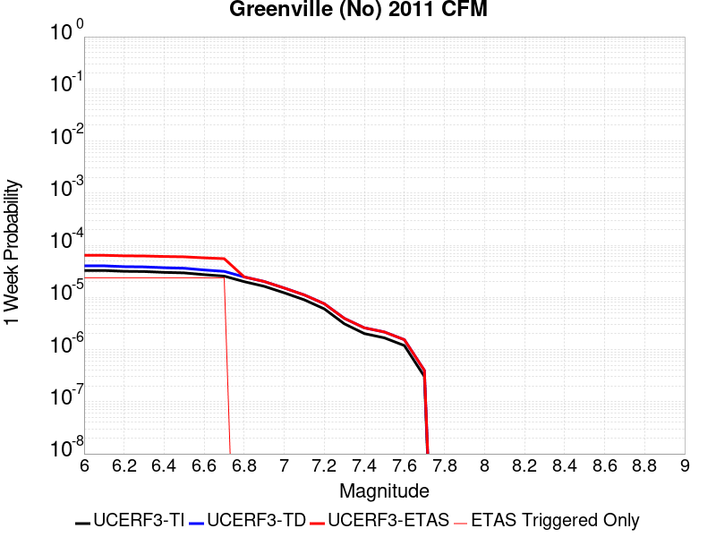 | 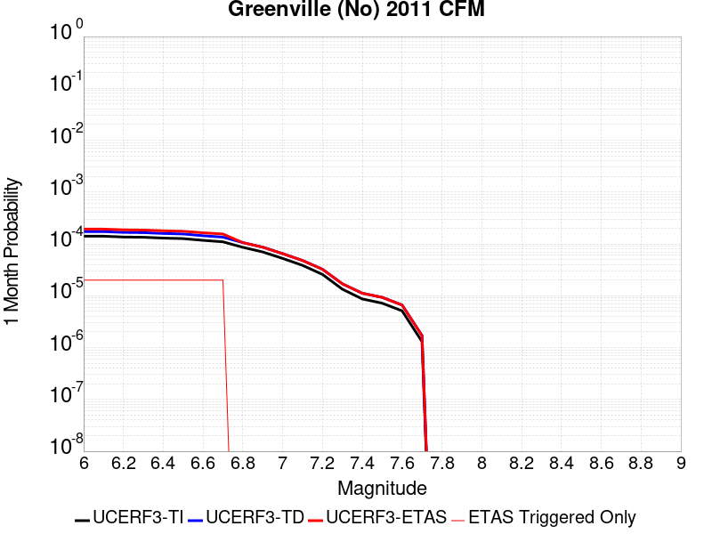 | 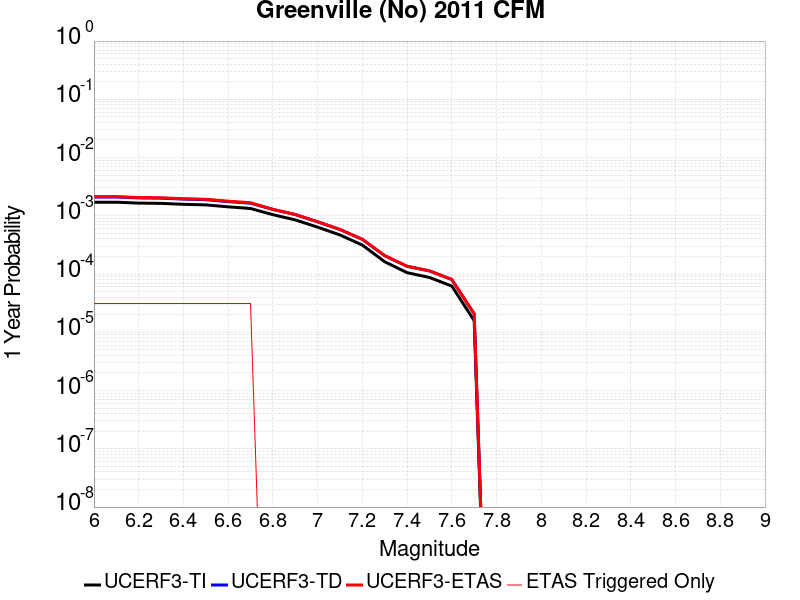 | 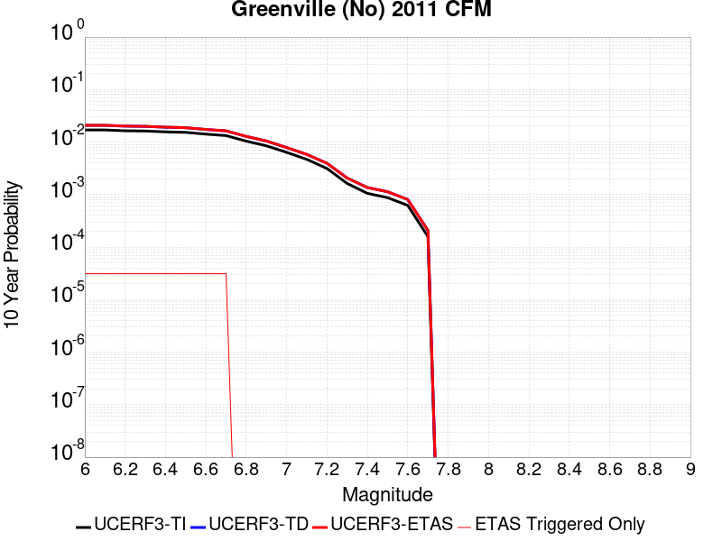 |

| Magnitude | 1 wk TI Prob | 1 wk TD Prob | 1 wk ETAS Prob | 1 wk ETAS/TD Gain | 1 wk ETAS Triggered Only | 1 mo TI Prob | 1 mo TD Prob | 1 mo ETAS Prob | 1 mo ETAS/TD Gain | 1 mo ETAS Triggered Only | 1 yr TI Prob | 1 yr TD Prob | 1 yr ETAS Prob | 1 yr ETAS/TD Gain | 1 yr ETAS Triggered Only | 10 yr TI Prob | 10 yr TD Prob | 10 yr ETAS Prob | 10 yr ETAS/TD Gain | 10 yr ETAS Triggered Only |
|-----|-----|-----|-----|-----|-----|-----|-----|-----|-----|-----|-----|-----|-----|-----|-----|-----|-----|-----|-----|-----|
| 6.0 | 3.286654E-5 | 4.036648E-5 | 6.0365674E-5 | 1.4954406 | 2.0E-5 | 1.4084899E-4 | 1.7298796E-4 | 1.929845E-4 | 1.115595 | 2.0E-5 | 0.0017134876 | 0.002104132 | 0.00212409 | 1.0094851 | 2.0E-5 | 0.017003356 | 0.020846982 | 0.020866565 | 1.0009394 | 2.0E-5 |
| 6.1 | 3.286654E-5 | 4.036648E-5 | 6.0365674E-5 | 1.4954406 | 2.0E-5 | 1.4084899E-4 | 1.7298796E-4 | 1.929845E-4 | 1.115595 | 2.0E-5 | 0.0017134876 | 0.002104132 | 0.00212409 | 1.0094851 | 2.0E-5 | 0.017003356 | 0.020846982 | 0.020866565 | 1.0009394 | 2.0E-5 |
| 6.2 | 3.1697953E-5 | 3.8929385E-5 | 5.8928606E-5 | 1.5137308 | 2.0E-5 | 1.358413E-4 | 1.6682976E-4 | 1.8682644E-4 | 1.1198627 | 2.0E-5 | 0.0016526132 | 0.002029298 | 0.0020492575 | 1.0098356 | 2.0E-5 | 0.01640377 | 0.020112377 | 0.020131974 | 1.0009744 | 2.0E-5 |
| 6.3 | 3.1363317E-5 | 3.851826E-5 | 5.851749E-5 | 1.5192143 | 2.0E-5 | 1.344073E-4 | 1.6506804E-4 | 1.8506472E-4 | 1.1211421 | 2.0E-5 | 0.0016351803 | 0.0020078886 | 0.0020278485 | 1.0099407 | 2.0E-5 | 0.016232004 | 0.019902144 | 0.019921746 | 1.0009849 | 2.0E-5 |
| 6.4 | 3.0228604E-5 | 3.7125395E-5 | 5.7124653E-5 | 1.5386947 | 2.0E-5 | 1.2954473E-4 | 1.5909935E-4 | 1.7909617E-4 | 1.1256876 | 2.0E-5 | 0.0015760659 | 0.0019353506 | 0.0019553117 | 1.010314 | 2.0E-5 | 0.015649348 | 0.019189484 | 0.019209102 | 1.0010222 | 2.0E-5 |
| 6.5 | 2.9537814E-5 | 3.6280853E-5 | 5.6280125E-5 | 1.551235 | 2.0E-5 | 1.2658449E-4 | 1.554803E-4 | 1.754772E-4 | 1.1286137 | 2.0E-5 | 0.0015400766 | 0.0018913659 | 0.001911328 | 1.0105543 | 2.0E-5 | 0.01529447 | 0.018757146 | 0.01877677 | 1.0010463 | 2.0E-5 |
| 6.6 | 2.7345395E-5 | 3.3590182E-5 | 5.3589512E-5 | 1.595392 | 2.0E-5 | 1.1718928E-4 | 1.4395016E-4 | 1.6394729E-4 | 1.138917 | 2.0E-5 | 0.0014258457 | 0.0017512152 | 0.0017711802 | 1.0114007 | 2.0E-5 | 0.014167317 | 0.01737797 | 0.017397622 | 1.0011309 | 2.0E-5 |
| 6.7 | 2.5615784E-5 | 3.1567088E-5 | 5.1566458E-5 | 1.6335512 | 2.0E-5 | 1.09777306E-4 | 1.3528067E-4 | 1.5527797E-4 | 1.1478208 | 2.0E-5 | 0.0013357193 | 0.0016458282 | 0.0016657953 | 1.0121319 | 2.0E-5 | 0.013277191 | 0.016340064 | 0.016359737 | 1.001204 | 2.0E-5 |
| 6.8 | 2.0059057E-5 | 2.4712073E-5 | 2.4712073E-5 | 1.0 | 0.0 | 8.596455E-5 | 1.0590468E-4 | 1.0590468E-4 | 1.0 | 0.0 | 0.0010461159 | 0.001288643 | 0.001288643 | 1.0 | 0.0 | 0.0104120495 | 0.012813724 | 0.012813724 | 1.0 | 0.0 |
| 6.9 | 1.6321746E-5 | 2.018467E-5 | 2.018467E-5 | 1.0 | 0.0 | 6.9948466E-5 | 8.650293E-5 | 8.650293E-5 | 1.0 | 0.0 | 8.5128983E-4 | 0.0010526767 | 0.0010526767 | 1.0 | 0.0 | 0.008480361 | 0.010478431 | 0.010478431 | 1.0 | 0.0 |
| 7.0 | 1.22527645E-5 | 1.5135633E-5 | 1.5135633E-5 | 1.0 | 0.0 | 5.2510793E-5 | 6.486541E-5 | 6.486541E-5 | 1.0 | 0.0 | 6.3913135E-4 | 7.894544E-4 | 7.894544E-4 | 1.0 | 0.0 | 0.0063729626 | 0.007867137 | 0.007867137 | 1.0 | 0.0 |
| 7.1 | 8.996482E-6 | 1.1164954E-5 | 1.1164954E-5 | 1.0 | 0.0 | 3.8555783E-5 | 4.7848935E-5 | 4.7848935E-5 | 1.0 | 0.0 | 4.6931554E-4 | 5.824063E-4 | 5.824063E-4 | 1.0 | 0.0 | 0.004683256 | 0.0058090906 | 0.0058090906 | 1.0 | 0.0 |
| 7.2 | 6.0273087E-6 | 7.569474E-6 | 7.569474E-6 | 1.0 | 0.0 | 2.5831067E-5 | 3.2440203E-5 | 3.2440203E-5 | 1.0 | 0.0 | 3.1444785E-4 | 3.9488857E-4 | 3.9488857E-4 | 1.0 | 0.0 | 0.0031400328 | 0.003942066 | 0.003942066 | 1.0 | 0.0 |
| 7.3 | 3.1209995E-6 | 3.9663746E-6 | 3.9663746E-6 | 1.0 | 0.0 | 1.3375643E-5 | 1.699864E-5 | 1.699864E-5 | 1.0 | 0.0 | 1.6283628E-4 | 2.0693893E-4 | 2.0693893E-4 | 1.0 | 0.0 | 0.0016271701 | 0.0020675526 | 0.0020675526 | 1.0 | 0.0 |
| 7.4 | 2.0254208E-6 | 2.6096043E-6 | 2.6096043E-6 | 1.0 | 0.0 | 8.680347E-6 | 1.1183971E-5 | 1.1183971E-5 | 1.0 | 0.0 | 1.0567809E-4 | 1.361564E-4 | 1.361564E-4 | 1.0 | 0.0 | 0.0010562785 | 0.0013607866 | 0.0013607866 | 1.0 | 0.0 |
| 7.5 | 1.6763418E-6 | 2.173353E-6 | 2.173353E-6 | 1.0 | 0.0 | 7.184302E-6 | 9.314337E-6 | 9.314337E-6 | 1.0 | 0.0 | 8.746537E-5 | 1.1339621E-4 | 1.1339621E-4 | 1.0 | 0.0 | 8.743095E-4 | 0.0011334305 | 0.0011334305 | 1.0 | 0.0 |
| 7.6 | 1.1935462E-6 | 1.5458467E-6 | 1.5458467E-6 | 1.0 | 0.0 | 5.115188E-6 | 6.6250404E-6 | 6.6250404E-6 | 1.0 | 0.0 | 6.2275634E-5 | 8.065693E-5 | 8.065693E-5 | 1.0 | 0.0 | 6.2258187E-4 | 8.0630725E-4 | 8.0630725E-4 | 1.0 | 0.0 |
| 7.7 | 3.0464201E-7 | 3.9846822E-7 | 3.9846822E-7 | 1.0 | 0.0 | 1.3056081E-6 | 1.7077199E-6 | 1.7077199E-6 | 1.0 | 0.0 | 1.589566E-5 | 2.0791296E-5 | 2.0791296E-5 | 1.0 | 0.0 | 1.5894524E-4 | 2.0789822E-4 | 2.0789822E-4 | 1.0 | 0.0 |

## Pittville 2011 CFM
*[(top)](#table-of-contents)*

| 1 Week | 1 Month | 1 Year | 10 Year |
|-----|-----|-----|-----|
|  | 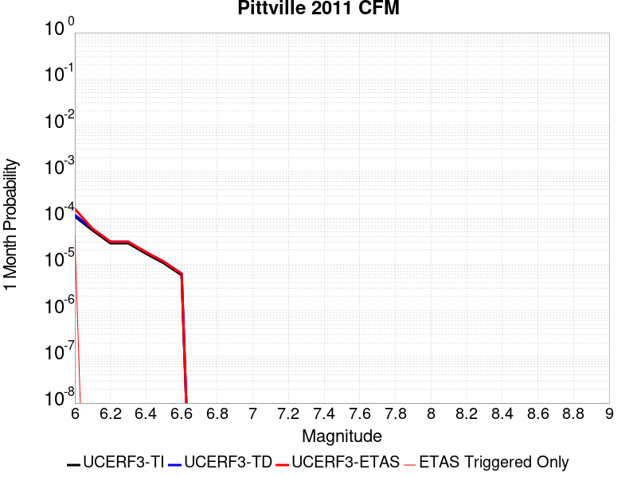 | 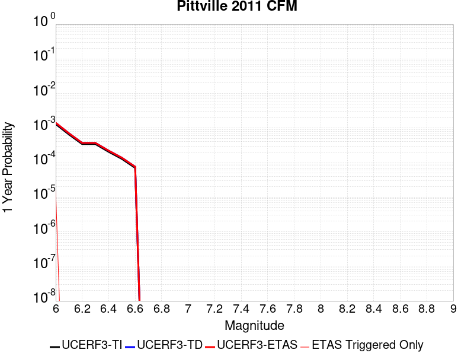 | 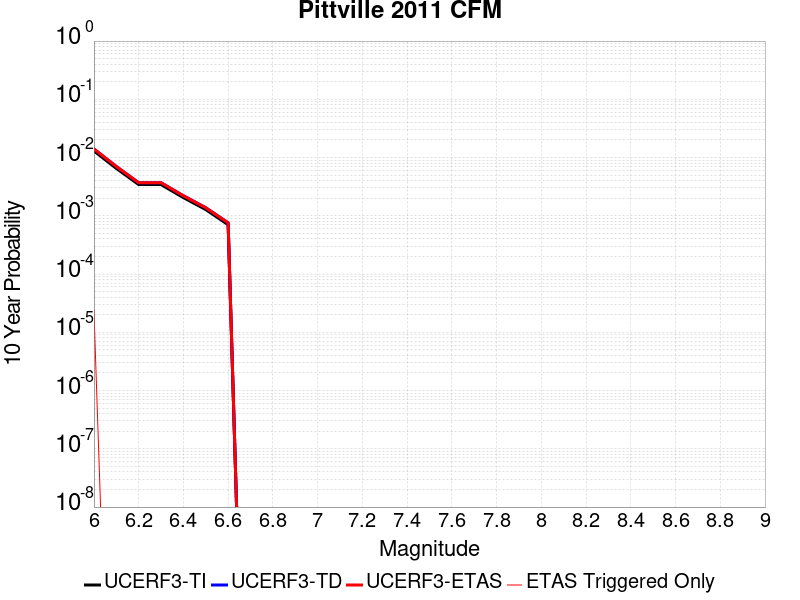 |

| Magnitude | 1 wk TI Prob | 1 wk TD Prob | 1 wk ETAS Prob | 1 wk ETAS/TD Gain | 1 wk ETAS Triggered Only | 1 mo TI Prob | 1 mo TD Prob | 1 mo ETAS Prob | 1 mo ETAS/TD Gain | 1 mo ETAS Triggered Only | 1 yr TI Prob | 1 yr TD Prob | 1 yr ETAS Prob | 1 yr ETAS/TD Gain | 1 yr ETAS Triggered Only | 10 yr TI Prob | 10 yr TD Prob | 10 yr ETAS Prob | 10 yr ETAS/TD Gain | 10 yr ETAS Triggered Only |
|-----|-----|-----|-----|-----|-----|-----|-----|-----|-----|-----|-----|-----|-----|-----|-----|-----|-----|-----|-----|-----|
| 6.0 | 2.5031832E-5 | 2.7056969E-5 | 2.7056969E-5 | 1.0 | 0.0 | 1.0727487E-4 | 1.1595384E-4 | 1.2595268E-4 | 1.0862312 | 1.0E-5 | 0.001305289 | 0.0014109211 | 0.001420907 | 1.0070776 | 1.0E-5 | 0.012976485 | 0.014029415 | 0.014039275 | 1.0007027 | 1.0E-5 |
| 6.1 | 1.2540113E-5 | 1.3513067E-5 | 1.3513067E-5 | 1.0 | 0.0 | 5.3742235E-5 | 5.7911984E-5 | 5.7911984E-5 | 1.0 | 0.0 | 6.541153E-4 | 7.048728E-4 | 7.048728E-4 | 1.0 | 0.0 | 0.0065219323 | 0.0070286044 | 0.0070286044 | 1.0 | 0.0 |
| 6.2 | 6.603218E-6 | 7.107189E-6 | 7.107189E-6 | 1.0 | 0.0 | 2.8299199E-5 | 3.0459063E-5 | 3.0459063E-5 | 1.0 | 0.0 | 3.4448825E-4 | 3.7078248E-4 | 3.7078248E-4 | 1.0 | 0.0 | 0.0034395473 | 0.0037022792 | 0.0037022792 | 1.0 | 0.0 |
| 6.3 | 6.603218E-6 | 7.107189E-6 | 7.107189E-6 | 1.0 | 0.0 | 2.8299199E-5 | 3.0459063E-5 | 3.0459063E-5 | 1.0 | 0.0 | 3.4448825E-4 | 3.7078248E-4 | 3.7078248E-4 | 1.0 | 0.0 | 0.0034395473 | 0.0037022792 | 0.0037022792 | 1.0 | 0.0 |
| 6.4 | 3.9389015E-6 | 4.239175E-6 | 4.239175E-6 | 1.0 | 0.0 | 1.6880897E-5 | 1.8167784E-5 | 1.8167784E-5 | 1.0 | 0.0 | 2.0550552E-4 | 2.2117342E-4 | 2.2117342E-4 | 1.0 | 0.0 | 0.0020531558 | 0.002209838 | 0.002209838 | 1.0 | 0.0 |
| 6.5 | 2.4533072E-6 | 2.6412686E-6 | 2.6412686E-6 | 1.0 | 0.0 | 1.0514132E-5 | 1.1319685E-5 | 1.1319685E-5 | 1.0 | 0.0 | 1.2800204E-4 | 1.3781038E-4 | 1.3781038E-4 | 1.0 | 0.0 | 0.0012792832 | 0.0013774394 | 0.0013774394 | 1.0 | 0.0 |
| 6.6 | 1.3482367E-6 | 1.452993E-6 | 1.452993E-6 | 1.0 | 0.0 | 5.778144E-6 | 6.2271047E-6 | 6.2271047E-6 | 1.0 | 0.0 | 7.0346636E-5 | 7.58135E-5 | 7.58135E-5 | 1.0 | 0.0 | 7.032437E-4 | 7.5798744E-4 | 7.5798744E-4 | 1.0 | 0.0 |

## South Klamath Lake East
*[(top)](#table-of-contents)*

| 1 Week | 1 Month | 1 Year | 10 Year |
|-----|-----|-----|-----|
|  | 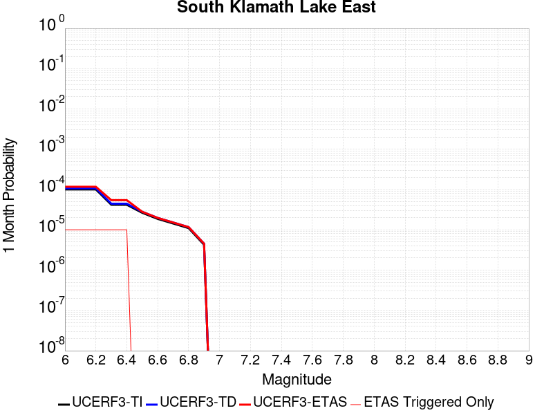 | 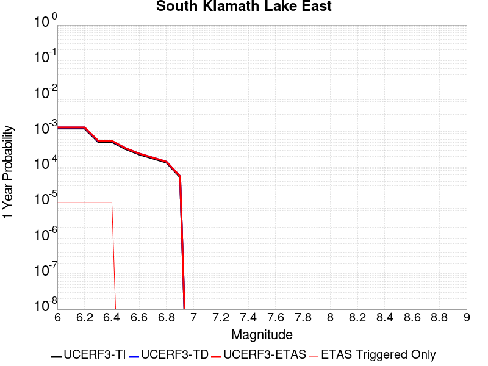 | 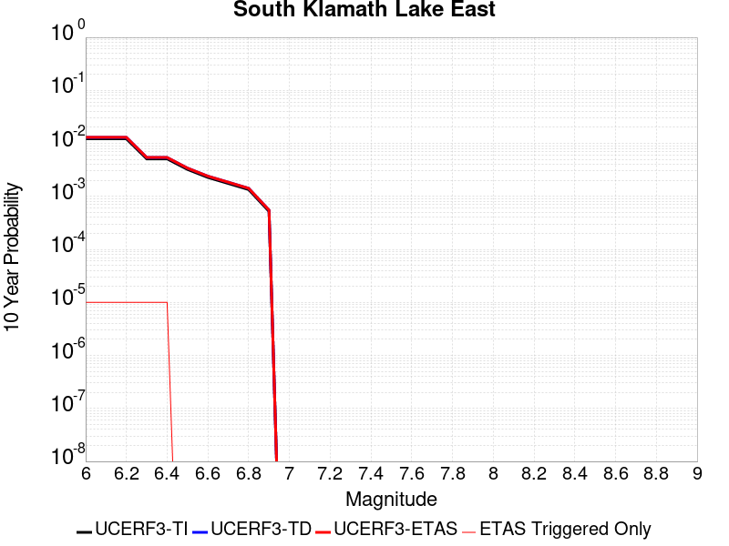 |

| Magnitude | 1 wk TI Prob | 1 wk TD Prob | 1 wk ETAS Prob | 1 wk ETAS/TD Gain | 1 wk ETAS Triggered Only | 1 mo TI Prob | 1 mo TD Prob | 1 mo ETAS Prob | 1 mo ETAS/TD Gain | 1 mo ETAS Triggered Only | 1 yr TI Prob | 1 yr TD Prob | 1 yr ETAS Prob | 1 yr ETAS/TD Gain | 1 yr ETAS Triggered Only | 10 yr TI Prob | 10 yr TD Prob | 10 yr ETAS Prob | 10 yr ETAS/TD Gain | 10 yr ETAS Triggered Only |
|-----|-----|-----|-----|-----|-----|-----|-----|-----|-----|-----|-----|-----|-----|-----|-----|-----|-----|-----|-----|-----|
| 6.0 | 2.3539369E-5 | 2.5047308E-5 | 2.5047308E-5 | 1.0 | 0.0 | 1.0087911E-4 | 1.0734166E-4 | 1.1734058E-4 | 1.0931505 | 1.0E-5 | 0.0012275111 | 0.0013061843 | 0.0013161713 | 1.0076458 | 1.0E-5 | 0.012207527 | 0.012993417 | 0.013003287 | 1.0007596 | 1.0E-5 |
| 6.1 | 2.3539369E-5 | 2.5047308E-5 | 2.5047308E-5 | 1.0 | 0.0 | 1.0087911E-4 | 1.0734166E-4 | 1.1734058E-4 | 1.0931505 | 1.0E-5 | 0.0012275111 | 0.0013061843 | 0.0013161713 | 1.0076458 | 1.0E-5 | 0.012207527 | 0.012993417 | 0.013003287 | 1.0007596 | 1.0E-5 |
| 6.2 | 2.3539369E-5 | 2.5047308E-5 | 2.5047308E-5 | 1.0 | 0.0 | 1.0087911E-4 | 1.0734166E-4 | 1.1734058E-4 | 1.0931505 | 1.0E-5 | 0.0012275111 | 0.0013061843 | 0.0013161713 | 1.0076458 | 1.0E-5 | 0.012207527 | 0.012993417 | 0.013003287 | 1.0007596 | 1.0E-5 |
| 6.3 | 9.807823E-6 | 1.0396044E-5 | 1.0396044E-5 | 1.0 | 0.0 | 4.2032847E-5 | 4.455376E-5 | 5.455331E-5 | 1.224438 | 1.0E-5 | 5.1162974E-4 | 5.4231536E-4 | 5.5230997E-4 | 1.0184294 | 1.0E-5 | 0.005104534 | 0.005410756 | 0.005420702 | 1.0018382 | 1.0E-5 |
| 6.4 | 9.807823E-6 | 1.0396044E-5 | 1.0396044E-5 | 1.0 | 0.0 | 4.2032847E-5 | 4.455376E-5 | 5.455331E-5 | 1.224438 | 1.0E-5 | 5.1162974E-4 | 5.4231536E-4 | 5.5230997E-4 | 1.0184294 | 1.0E-5 | 0.005104534 | 0.005410756 | 0.005420702 | 1.0018382 | 1.0E-5 |
| 6.5 | 6.191981E-6 | 6.5508398E-6 | 6.5508398E-6 | 1.0 | 0.0 | 2.653679E-5 | 2.8074743E-5 | 2.8074743E-5 | 1.0 | 0.0 | 3.2303753E-4 | 3.4175918E-4 | 3.4175918E-4 | 1.0 | 0.0 | 0.0032256835 | 0.003412614 | 0.003412614 | 1.0 | 0.0 |
| 6.6 | 4.3693776E-6 | 4.6165574E-6 | 4.6165574E-6 | 1.0 | 0.0 | 1.8725768E-5 | 1.9785102E-5 | 1.9785102E-5 | 1.0 | 0.0 | 2.2796239E-4 | 2.4085813E-4 | 2.4085813E-4 | 1.0 | 0.0 | 0.0022772867 | 0.0024060833 | 0.0024060833 | 1.0 | 0.0 |
| 6.7 | 3.360834E-6 | 3.5512403E-6 | 3.5512403E-6 | 1.0 | 0.0 | 1.4403494E-5 | 1.5219517E-5 | 1.5219517E-5 | 1.0 | 0.0 | 1.7534842E-4 | 1.8528267E-4 | 1.8528267E-4 | 1.0 | 0.0 | 0.0017521014 | 0.0018513618 | 0.0018513618 | 1.0 | 0.0 |
| 6.8 | 2.57873E-6 | 2.7251708E-6 | 2.7251708E-6 | 1.0 | 0.0 | 1.1051653E-5 | 1.1679254E-5 | 1.1679254E-5 | 1.0 | 0.0 | 1.3454557E-4 | 1.4218627E-4 | 1.4218627E-4 | 1.0 | 0.0 | 0.0013446413 | 0.0014210136 | 0.0014210136 | 1.0 | 0.0 |
| 6.9 | 9.987825E-7 | 1.0566213E-6 | 1.0566213E-6 | 1.0 | 0.0 | 4.2804895E-6 | 4.528371E-6 | 4.528371E-6 | 1.0 | 0.0 | 5.211371E-5 | 5.5131848E-5 | 5.5131848E-5 | 1.0 | 0.0 | 5.210149E-4 | 5.5121386E-4 | 5.5121386E-4 | 1.0 | 0.0 |

## Hector Mine
*[(top)](#table-of-contents)*

| 1 Week | 1 Month | 1 Year | 10 Year |
|-----|-----|-----|-----|
| 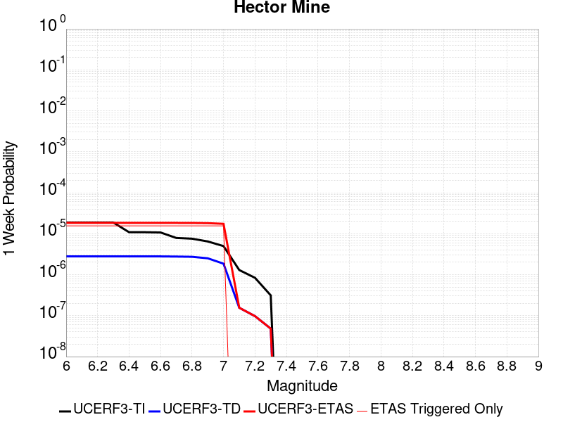 | 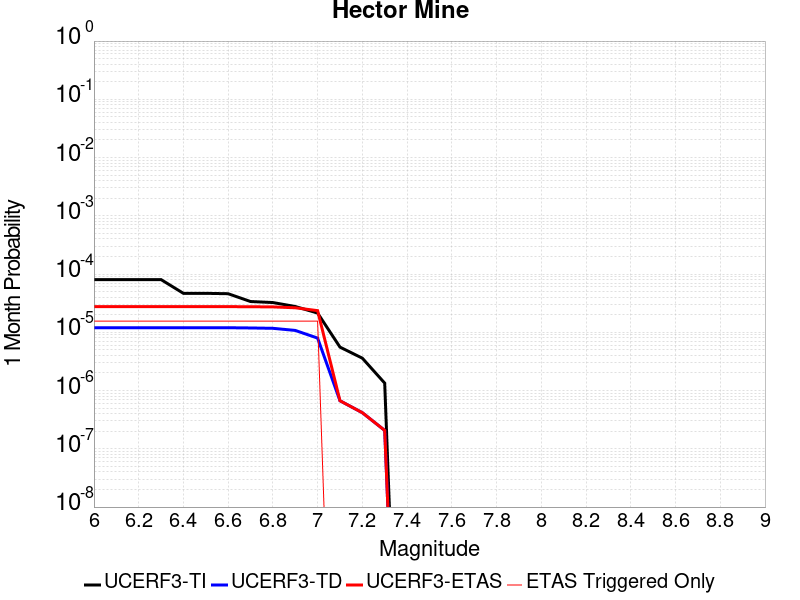 | 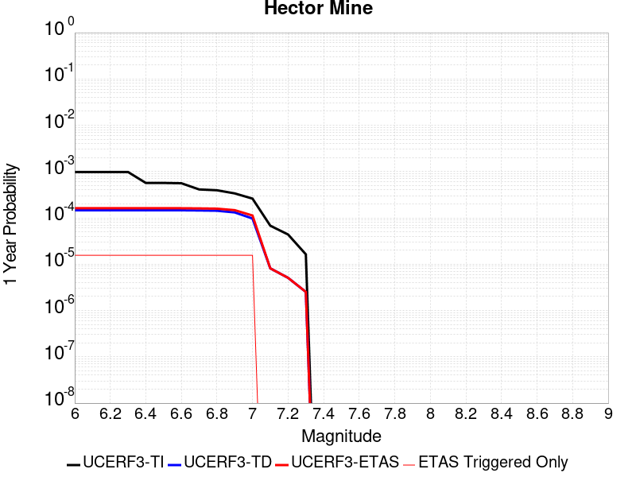 | 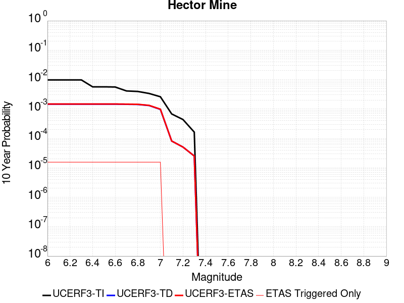 |

| Magnitude | 1 wk TI Prob | 1 wk TD Prob | 1 wk ETAS Prob | 1 wk ETAS/TD Gain | 1 wk ETAS Triggered Only | 1 mo TI Prob | 1 mo TD Prob | 1 mo ETAS Prob | 1 mo ETAS/TD Gain | 1 mo ETAS Triggered Only | 1 yr TI Prob | 1 yr TD Prob | 1 yr ETAS Prob | 1 yr ETAS/TD Gain | 1 yr ETAS Triggered Only | 10 yr TI Prob | 10 yr TD Prob | 10 yr ETAS Prob | 10 yr ETAS/TD Gain | 10 yr ETAS Triggered Only |
|-----|-----|-----|-----|-----|-----|-----|-----|-----|-----|-----|-----|-----|-----|-----|-----|-----|-----|-----|-----|-----|
| 6.0 | 1.8760093E-5 | 2.7963818E-6 | 1.2796354E-5 | 4.57604 | 1.0E-5 | 8.039792E-5 | 1.1984461E-5 | 2.198434E-5 | 1.8344039 | 1.0E-5 | 9.78405E-4 | 1.4590504E-4 | 1.5590357E-4 | 1.0685277 | 1.0E-5 | 0.009741086 | 0.0014584847 | 0.0014784555 | 1.0136929 | 2.0E-5 |
| 6.1 | 1.8760093E-5 | 2.7963818E-6 | 1.2796354E-5 | 4.57604 | 1.0E-5 | 8.039792E-5 | 1.1984461E-5 | 2.198434E-5 | 1.8344039 | 1.0E-5 | 9.78405E-4 | 1.4590504E-4 | 1.5590357E-4 | 1.0685277 | 1.0E-5 | 0.009741086 | 0.0014584847 | 0.0014784555 | 1.0136929 | 2.0E-5 |
| 6.2 | 1.8760093E-5 | 2.7963818E-6 | 1.2796354E-5 | 4.57604 | 1.0E-5 | 8.039792E-5 | 1.1984461E-5 | 2.198434E-5 | 1.8344039 | 1.0E-5 | 9.78405E-4 | 1.4590504E-4 | 1.5590357E-4 | 1.0685277 | 1.0E-5 | 0.009741086 | 0.0014584847 | 0.0014784555 | 1.0136929 | 2.0E-5 |
| 6.3 | 1.8760093E-5 | 2.7963818E-6 | 1.2796354E-5 | 4.57604 | 1.0E-5 | 8.039792E-5 | 1.1984461E-5 | 2.198434E-5 | 1.8344039 | 1.0E-5 | 9.78405E-4 | 1.4590504E-4 | 1.5590357E-4 | 1.0685277 | 1.0E-5 | 0.009741086 | 0.0014584847 | 0.0014784555 | 1.0136929 | 2.0E-5 |
| 6.4 | 1.0888055E-5 | 2.7963818E-6 | 1.2796354E-5 | 4.57604 | 1.0E-5 | 4.666226E-5 | 1.1984461E-5 | 2.198434E-5 | 1.8344039 | 1.0E-5 | 5.679649E-4 | 1.4590504E-4 | 1.5590357E-4 | 1.0685277 | 1.0E-5 | 0.0056651547 | 0.0014584847 | 0.0014784555 | 1.0136929 | 2.0E-5 |
| 6.5 | 1.0888055E-5 | 2.7963818E-6 | 1.2796354E-5 | 4.57604 | 1.0E-5 | 4.666226E-5 | 1.1984461E-5 | 2.198434E-5 | 1.8344039 | 1.0E-5 | 5.679649E-4 | 1.4590504E-4 | 1.5590357E-4 | 1.0685277 | 1.0E-5 | 0.0056651547 | 0.0014584847 | 0.0014784555 | 1.0136929 | 2.0E-5 |
| 6.6 | 1.0730738E-5 | 2.7963818E-6 | 1.2796354E-5 | 4.57604 | 1.0E-5 | 4.5988065E-5 | 1.1984461E-5 | 2.198434E-5 | 1.8344039 | 1.0E-5 | 5.5976084E-4 | 1.4590504E-4 | 1.5590357E-4 | 1.0685277 | 1.0E-5 | 0.0055835294 | 0.0014584847 | 0.0014784555 | 1.0136929 | 2.0E-5 |
| 6.7 | 7.881326E-6 | 2.7710626E-6 | 1.2771035E-5 | 4.608714 | 1.0E-5 | 3.3776672E-5 | 1.1875951E-5 | 2.1875832E-5 | 1.8420279 | 1.0E-5 | 4.111534E-4 | 1.445841E-4 | 1.5458265E-4 | 1.0691539 | 1.0E-5 | 0.0041039353 | 0.0014452925 | 0.0014652635 | 1.013818 | 2.0E-5 |
| 6.8 | 7.5683483E-6 | 2.7328138E-6 | 1.2732787E-5 | 4.659222 | 1.0E-5 | 3.2435375E-5 | 1.1712029E-5 | 2.1711912E-5 | 1.853813 | 1.0E-5 | 3.9482914E-4 | 1.4258861E-4 | 1.5258719E-4 | 1.0701219 | 1.0E-5 | 0.0039412836 | 0.0014253634 | 0.0014453348 | 1.0140115 | 2.0E-5 |
| 6.9 | 6.473048E-6 | 2.5138945E-6 | 1.25138695E-5 | 4.9778814 | 1.0E-5 | 2.7741338E-5 | 1.07738115E-5 | 2.0773705E-5 | 1.9281666 | 1.0E-5 | 3.3769844E-4 | 1.3116724E-4 | 1.4116592E-4 | 1.0762285 | 1.0E-5 | 0.0033718573 | 0.0013112876 | 0.0013312615 | 1.0152322 | 2.0E-5 |
| 7.0 | 4.9959954E-6 | 1.8565124E-6 | 1.1856494E-5 | 6.386434 | 1.0E-5 | 2.1411232E-5 | 7.956478E-6 | 1.7956398E-5 | 2.2568276 | 1.0E-5 | 2.6065056E-4 | 9.686937E-5 | 1.0686841E-4 | 1.1032218 | 1.0E-5 | 0.0026034506 | 9.6862105E-4 | 9.886017E-4 | 1.0206279 | 2.0E-5 |
| 7.1 | 1.2997541E-6 | 1.5602147E-7 | 1.5602147E-7 | 1.0 | 0.0 | 5.5703626E-6 | 6.686633E-7 | 6.686633E-7 | 1.0 | 0.0 | 6.7817055E-5 | 8.140949E-6 | 8.140949E-6 | 1.0 | 0.0 | 6.779636E-4 | 8.1406906E-5 | 8.1406906E-5 | 1.0 | 0.0 |
| 7.2 | 8.392699E-7 | 9.727592E-8 | 9.727592E-8 | 1.0 | 0.0 | 3.596866E-6 | 4.1689677E-7 | 4.1689677E-7 | 1.0 | 0.0 | 4.3790962E-5 | 5.0757085E-6 | 5.0757085E-6 | 1.0 | 0.0 | 4.3782333E-4 | 5.0756116E-5 | 5.0756116E-5 | 1.0 | 0.0 |
| 7.3 | 3.13015E-7 | 4.829262E-8 | 4.829262E-8 | 1.0 | 0.0 | 1.3414921E-6 | 2.0696835E-7 | 2.0696835E-7 | 1.0 | 0.0 | 1.6332544E-5 | 2.5198376E-6 | 2.5198376E-6 | 1.0 | 0.0 | 1.6331344E-4 | 2.5198176E-5 | 2.5198176E-5 | 1.0 | 0.0 |

## Elsinore (Temecula) rev
*[(top)](#table-of-contents)*

| 1 Week | 1 Month | 1 Year | 10 Year |
|-----|-----|-----|-----|
| 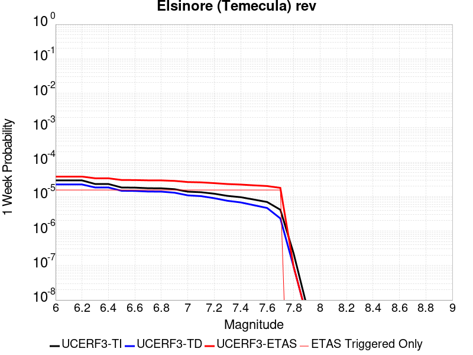 | 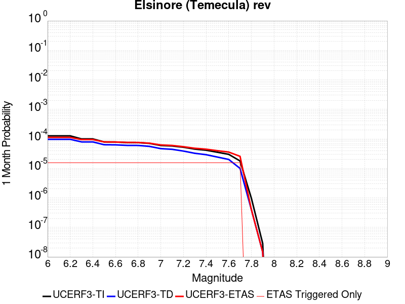 | 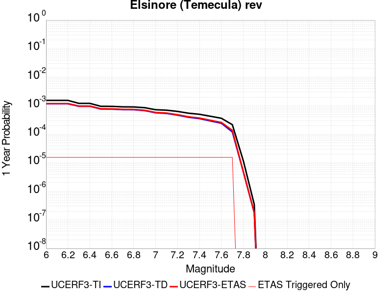 | 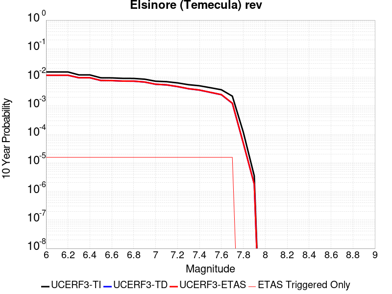 |

| Magnitude | 1 wk TI Prob | 1 wk TD Prob | 1 wk ETAS Prob | 1 wk ETAS/TD Gain | 1 wk ETAS Triggered Only | 1 mo TI Prob | 1 mo TD Prob | 1 mo ETAS Prob | 1 mo ETAS/TD Gain | 1 mo ETAS Triggered Only | 1 yr TI Prob | 1 yr TD Prob | 1 yr ETAS Prob | 1 yr ETAS/TD Gain | 1 yr ETAS Triggered Only | 10 yr TI Prob | 10 yr TD Prob | 10 yr ETAS Prob | 10 yr ETAS/TD Gain | 10 yr ETAS Triggered Only |
|-----|-----|-----|-----|-----|-----|-----|-----|-----|-----|-----|-----|-----|-----|-----|-----|-----|-----|-----|-----|-----|
| 6.0 | 2.9514995E-5 | 2.2517117E-5 | 3.251689E-5 | 1.4440966 | 1.0E-5 | 1.264867E-4 | 9.649849E-5 | 1.0649752E-4 | 1.1036186 | 1.0E-5 | 0.0015388876 | 0.0011742581 | 0.0011842463 | 1.0085061 | 1.0E-5 | 0.015282745 | 0.011696897 | 0.011716664 | 1.0016899 | 2.0E-5 |
| 6.1 | 2.9514995E-5 | 2.2517117E-5 | 3.251689E-5 | 1.4440966 | 1.0E-5 | 1.264867E-4 | 9.649849E-5 | 1.0649752E-4 | 1.1036186 | 1.0E-5 | 0.0015388876 | 0.0011742581 | 0.0011842463 | 1.0085061 | 1.0E-5 | 0.015282745 | 0.011696897 | 0.011716664 | 1.0016899 | 2.0E-5 |
| 6.2 | 2.9514995E-5 | 2.2517117E-5 | 3.251689E-5 | 1.4440966 | 1.0E-5 | 1.264867E-4 | 9.649849E-5 | 1.0649752E-4 | 1.1036186 | 1.0E-5 | 0.0015388876 | 0.0011742581 | 0.0011842463 | 1.0085061 | 1.0E-5 | 0.015282745 | 0.011696897 | 0.011716664 | 1.0016899 | 2.0E-5 |
| 6.3 | 2.3223649E-5 | 1.8406454E-5 | 2.840627E-5 | 1.5432777 | 1.0E-5 | 9.952613E-5 | 7.888251E-5 | 8.888173E-5 | 1.1267608 | 1.0E-5 | 0.001211057 | 9.599888E-4 | 9.6997916E-4 | 1.0104067 | 1.0E-5 | 0.012044783 | 0.009569948 | 0.009589756 | 1.0020698 | 2.0E-5 |
| 6.4 | 2.3223649E-5 | 1.8406454E-5 | 2.840627E-5 | 1.5432777 | 1.0E-5 | 9.952613E-5 | 7.888251E-5 | 8.888173E-5 | 1.1267608 | 1.0E-5 | 0.001211057 | 9.599888E-4 | 9.6997916E-4 | 1.0104067 | 1.0E-5 | 0.012044783 | 0.009569948 | 0.009589756 | 1.0020698 | 2.0E-5 |
| 6.5 | 1.8338875E-5 | 1.4750118E-5 | 2.474997E-5 | 1.6779507 | 1.0E-5 | 7.8592806E-5 | 6.321331E-5 | 7.321267E-5 | 1.1581845 | 1.0E-5 | 9.5644733E-4 | 7.69359E-4 | 7.7935134E-4 | 1.0129879 | 1.0E-5 | 0.009523412 | 0.0076739118 | 0.0076937582 | 1.0025862 | 2.0E-5 |
| 6.6 | 1.8223333E-5 | 1.4612673E-5 | 2.4612527E-5 | 1.6843275 | 1.0E-5 | 7.809766E-5 | 6.262429E-5 | 7.262366E-5 | 1.1596725 | 1.0E-5 | 9.504242E-4 | 7.6219277E-4 | 7.7218516E-4 | 1.01311 | 1.0E-5 | 0.009463696 | 0.0076027405 | 0.0076126647 | 1.0013053 | 1.0E-5 |
| 6.7 | 1.7512752E-5 | 1.402721E-5 | 2.402707E-5 | 1.7128901 | 1.0E-5 | 7.505249E-5 | 6.011528E-5 | 7.011468E-5 | 1.166337 | 1.0E-5 | 9.13381E-4 | 7.3166634E-4 | 7.41659E-4 | 1.0136575 | 1.0E-5 | 0.00909636 | 0.00729892 | 0.007308847 | 1.00136 | 1.0E-5 |
| 6.8 | 1.7417142E-5 | 1.3951195E-5 | 2.3951055E-5 | 1.7167745 | 1.0E-5 | 7.4642754E-5 | 5.9789512E-5 | 6.978891E-5 | 1.1672434 | 1.0E-5 | 9.083966E-4 | 7.277028E-4 | 7.376955E-4 | 1.0137318 | 1.0E-5 | 0.009046922 | 0.0072594886 | 0.007269416 | 1.0013674 | 1.0E-5 |
| 6.9 | 1.6402591E-5 | 1.2988613E-5 | 2.2988483E-5 | 1.7698951 | 1.0E-5 | 7.0294926E-5 | 5.5664343E-5 | 6.5663786E-5 | 1.1796383 | 1.0E-5 | 8.5550465E-4 | 6.775103E-4 | 6.8750355E-4 | 1.0147499 | 1.0E-5 | 0.008522186 | 0.006760169 | 0.0067701014 | 1.0014693 | 1.0E-5 |
| 7.0 | 1.3912486E-5 | 1.0878233E-5 | 2.0878124E-5 | 1.9192569 | 1.0E-5 | 5.9623577E-5 | 4.6620182E-5 | 5.6619716E-5 | 1.2144893 | 1.0E-5 | 7.2567526E-4 | 5.674556E-4 | 5.7745E-4 | 1.0176126 | 1.0E-5 | 0.0072331014 | 0.005663986 | 0.005673929 | 1.0017556 | 1.0E-5 |
| 7.1 | 1.3405147E-5 | 1.03274215E-5 | 2.0327318E-5 | 1.9682859 | 1.0E-5 | 5.7449364E-5 | 4.425964E-5 | 5.4259195E-5 | 1.2259295 | 1.0E-5 | 6.9922156E-4 | 5.3873047E-4 | 5.487251E-4 | 1.0185522 | 1.0E-5 | 0.0069702556 | 0.005377577 | 0.005387523 | 1.0018495 | 1.0E-5 |
| 7.2 | 1.21402E-5 | 8.996737E-6 | 1.8996647E-5 | 2.111504 | 1.0E-5 | 5.202839E-5 | 3.8556886E-5 | 4.85565E-5 | 1.2593471 | 1.0E-5 | 6.332616E-4 | 4.6933076E-4 | 4.7932606E-4 | 1.021297 | 1.0E-5 | 0.0063146 | 0.004684821 | 0.004694774 | 1.0021245 | 1.0E-5 |
| 7.3 | 1.05047775E-5 | 7.571771E-6 | 1.7571696E-5 | 2.320685 | 1.0E-5 | 4.5019697E-5 | 3.245005E-5 | 4.2449727E-5 | 1.3081559 | 1.0E-5 | 5.4797693E-4 | 3.950092E-4 | 4.0500527E-4 | 1.0253059 | 1.0E-5 | 0.005466277 | 0.00394346 | 0.003953421 | 1.0025258 | 1.0E-5 |
| 7.4 | 9.624483E-6 | 6.7868696E-6 | 1.6786802E-5 | 2.4734235 | 1.0E-5 | 4.124713E-5 | 2.9086266E-5 | 3.9085975E-5 | 1.3437948 | 1.0E-5 | 5.0206814E-4 | 3.5406914E-4 | 3.640656E-4 | 1.028233 | 1.0E-5 | 0.005009353 | 0.003535204 | 0.0035451688 | 1.0028187 | 1.0E-5 |
| 7.5 | 8.215151E-6 | 5.635538E-6 | 1.5635482E-5 | 2.7744434 | 1.0E-5 | 3.5207315E-5 | 2.4152088E-5 | 3.4151846E-5 | 1.4140328 | 1.0E-5 | 4.2856473E-4 | 2.9401327E-4 | 3.0401035E-4 | 1.0340021 | 1.0E-5 | 0.004277392 | 0.002936371 | 0.0029463414 | 1.0033956 | 1.0E-5 |
| 7.6 | 6.975058E-6 | 4.676045E-6 | 1.46759985E-5 | 3.1385493 | 1.0E-5 | 2.9892764E-5 | 2.0040046E-5 | 3.0039846E-5 | 1.4989909 | 1.0E-5 | 3.6388362E-4 | 2.439614E-4 | 2.5395898E-4 | 1.0409801 | 1.0E-5 | 0.0036328835 | 0.002437052 | 0.0024470277 | 1.0040933 | 1.0E-5 |
| 7.7 | 4.159604E-6 | 2.3269924E-6 | 1.2326969E-5 | 5.297383 | 1.0E-5 | 1.7826753E-5 | 9.97279E-6 | 1.9972691E-5 | 2.0027184 | 1.0E-5 | 2.1701909E-4 | 1.21412704E-4 | 1.3141149E-4 | 1.0823537 | 1.0E-5 | 0.0021680726 | 0.0012135367 | 0.0012235246 | 1.0082303 | 1.0E-5 |
| 7.8 | 2.2692414E-7 | 9.3854695E-8 | 9.3854695E-8 | 1.0 | 0.0 | 9.725317E-7 | 4.0223435E-7 | 4.0223435E-7 | 1.0 | 0.0 | 1.1840509E-5 | 4.8971956E-6 | 4.8971956E-6 | 1.0 | 0.0 | 1.1839878E-4 | 4.8971204E-5 | 4.8971204E-5 | 1.0 | 0.0 |
| 7.9 | 6.676829E-9 | 3.439853E-9 | 3.439853E-9 | 1.0 | 0.0 | 2.861498E-8 | 1.4742227E-8 | 1.4742227E-8 | 1.0 | 0.0 | 3.4838732E-7 | 1.7948659E-7 | 1.7948659E-7 | 1.0 | 0.0 | 3.4838679E-6 | 1.7948646E-6 | 1.7948646E-6 | 1.0 | 0.0 |

## Verdugo
*[(top)](#table-of-contents)*

| 1 Week | 1 Month | 1 Year | 10 Year |
|-----|-----|-----|-----|
| 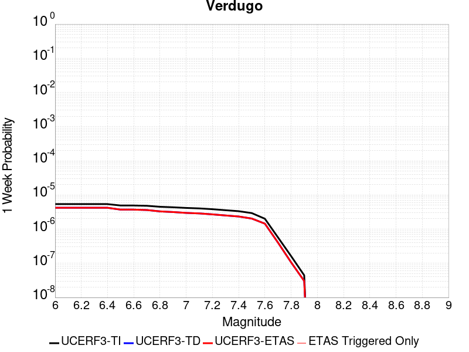 | 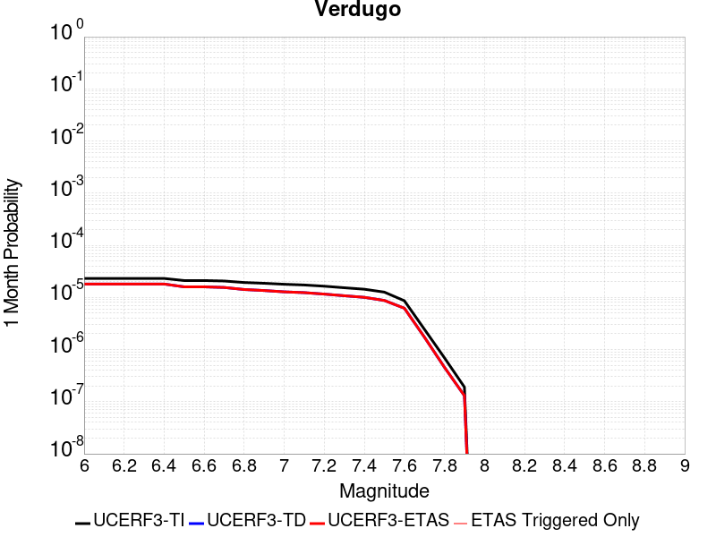 | 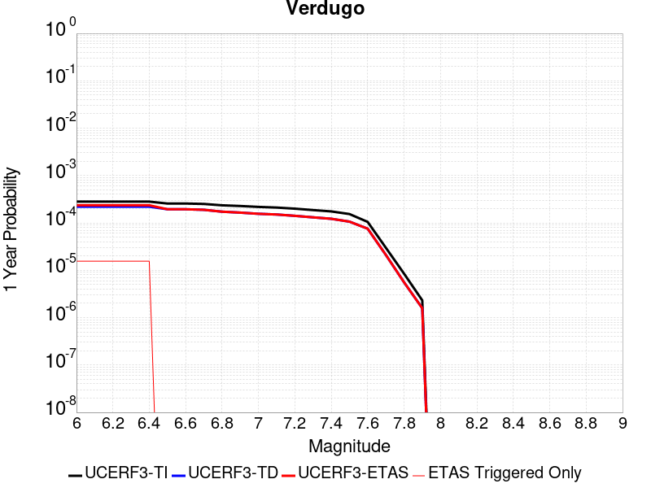 | 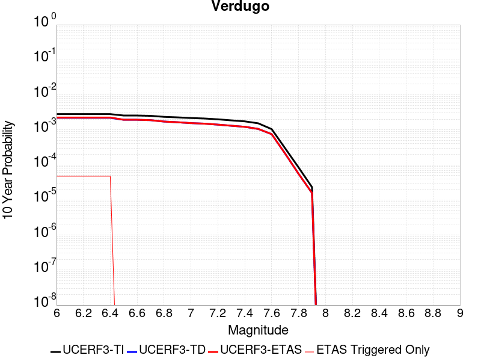 |

| Magnitude | 1 wk TI Prob | 1 wk TD Prob | 1 wk ETAS Prob | 1 wk ETAS/TD Gain | 1 wk ETAS Triggered Only | 1 mo TI Prob | 1 mo TD Prob | 1 mo ETAS Prob | 1 mo ETAS/TD Gain | 1 mo ETAS Triggered Only | 1 yr TI Prob | 1 yr TD Prob | 1 yr ETAS Prob | 1 yr ETAS/TD Gain | 1 yr ETAS Triggered Only | 10 yr TI Prob | 10 yr TD Prob | 10 yr ETAS Prob | 10 yr ETAS/TD Gain | 10 yr ETAS Triggered Only |
|-----|-----|-----|-----|-----|-----|-----|-----|-----|-----|-----|-----|-----|-----|-----|-----|-----|-----|-----|-----|-----|
| 6.0 | 5.392987E-6 | 4.216517E-6 | 4.216517E-6 | 1.0 | 0.0 | 2.3112598E-5 | 1.8070665E-5 | 1.8070665E-5 | 1.0 | 0.0 | 2.8135953E-4 | 2.1998861E-4 | 2.2998641E-4 | 1.0454469 | 1.0E-5 | 0.0028100356 | 0.0021977562 | 0.002217712 | 1.0090802 | 2.0E-5 |
| 6.1 | 5.392987E-6 | 4.216517E-6 | 4.216517E-6 | 1.0 | 0.0 | 2.3112598E-5 | 1.8070665E-5 | 1.8070665E-5 | 1.0 | 0.0 | 2.8135953E-4 | 2.1998861E-4 | 2.2998641E-4 | 1.0454469 | 1.0E-5 | 0.0028100356 | 0.0021977562 | 0.002217712 | 1.0090802 | 2.0E-5 |
| 6.2 | 5.392987E-6 | 4.216517E-6 | 4.216517E-6 | 1.0 | 0.0 | 2.3112598E-5 | 1.8070665E-5 | 1.8070665E-5 | 1.0 | 0.0 | 2.8135953E-4 | 2.1998861E-4 | 2.2998641E-4 | 1.0454469 | 1.0E-5 | 0.0028100356 | 0.0021977562 | 0.002217712 | 1.0090802 | 2.0E-5 |
| 6.3 | 5.392987E-6 | 4.216517E-6 | 4.216517E-6 | 1.0 | 0.0 | 2.3112598E-5 | 1.8070665E-5 | 1.8070665E-5 | 1.0 | 0.0 | 2.8135953E-4 | 2.1998861E-4 | 2.2998641E-4 | 1.0454469 | 1.0E-5 | 0.0028100356 | 0.0021977562 | 0.002217712 | 1.0090802 | 2.0E-5 |
| 6.4 | 5.392987E-6 | 4.216517E-6 | 4.216517E-6 | 1.0 | 0.0 | 2.3112598E-5 | 1.8070665E-5 | 1.8070665E-5 | 1.0 | 0.0 | 2.8135953E-4 | 2.1998861E-4 | 2.2998641E-4 | 1.0454469 | 1.0E-5 | 0.0028100356 | 0.0021977562 | 0.002217712 | 1.0090802 | 2.0E-5 |
| 6.5 | 4.9154837E-6 | 3.722465E-6 | 3.722465E-6 | 1.0 | 0.0 | 2.1066187E-5 | 1.5953325E-5 | 1.5953325E-5 | 1.0 | 0.0 | 2.5645064E-4 | 1.9421462E-4 | 1.9421462E-4 | 1.0 | 0.0 | 0.002561549 | 0.0019404698 | 0.0019404698 | 1.0 | 0.0 |
| 6.6 | 4.9154837E-6 | 3.722465E-6 | 3.722465E-6 | 1.0 | 0.0 | 2.1066187E-5 | 1.5953325E-5 | 1.5953325E-5 | 1.0 | 0.0 | 2.5645064E-4 | 1.9421462E-4 | 1.9421462E-4 | 1.0 | 0.0 | 0.002561549 | 0.0019404698 | 0.0019404698 | 1.0 | 0.0 |
| 6.7 | 4.817006E-6 | 3.6206518E-6 | 3.6206518E-6 | 1.0 | 0.0 | 2.0644147E-5 | 1.5516987E-5 | 1.5516987E-5 | 1.0 | 0.0 | 2.513135E-4 | 1.8890314E-4 | 1.8890314E-4 | 1.0 | 0.0 | 0.0025102948 | 0.0018874453 | 0.0018874453 | 1.0 | 0.0 |
| 6.8 | 4.507407E-6 | 3.3071042E-6 | 3.3071042E-6 | 1.0 | 0.0 | 1.9317316E-5 | 1.4173227E-5 | 1.4173227E-5 | 1.0 | 0.0 | 2.3516294E-4 | 1.7254551E-4 | 1.7254551E-4 | 1.0 | 0.0 | 0.0023491425 | 0.0017241298 | 0.0017241298 | 1.0 | 0.0 |
| 6.9 | 4.3573054E-6 | 3.161011E-6 | 3.161011E-6 | 1.0 | 0.0 | 1.8674033E-5 | 1.354712E-5 | 1.354712E-5 | 1.0 | 0.0 | 2.2733262E-4 | 1.6492383E-4 | 1.6492383E-4 | 1.0 | 0.0 | 0.0022710022 | 0.0016480266 | 0.0016480266 | 1.0 | 0.0 |
| 7.0 | 4.171527E-6 | 2.9836704E-6 | 2.9836704E-6 | 1.0 | 0.0 | 1.787785E-5 | 1.2787096E-5 | 1.2787096E-5 | 1.0 | 0.0 | 2.1764109E-4 | 1.5567189E-4 | 1.5567189E-4 | 1.0 | 0.0 | 0.0021742806 | 0.0015556397 | 0.0015556397 | 1.0 | 0.0 |
| 7.1 | 4.0405484E-6 | 2.882261E-6 | 2.882261E-6 | 1.0 | 0.0 | 1.731652E-5 | 1.235249E-5 | 1.235249E-5 | 1.0 | 0.0 | 2.1080824E-4 | 1.503813E-4 | 1.503813E-4 | 1.0 | 0.0 | 0.0021060838 | 0.0015028063 | 0.0015028063 | 1.0 | 0.0 |
| 7.2 | 3.8306007E-6 | 2.7018452E-6 | 2.7018452E-6 | 1.0 | 0.0 | 1.6416758E-5 | 1.15792855E-5 | 1.15792855E-5 | 1.0 | 0.0 | 1.9985568E-4 | 1.4096878E-4 | 1.4096878E-4 | 1.0 | 0.0 | 0.0019967605 | 0.0014088044 | 0.0014088044 | 1.0 | 0.0 |
| 7.3 | 3.5750938E-6 | 2.5121758E-6 | 2.5121758E-6 | 1.0 | 0.0 | 1.532174E-5 | 1.0766424E-5 | 1.0766424E-5 | 1.0 | 0.0 | 1.8652623E-4 | 1.3107344E-4 | 1.3107344E-4 | 1.0 | 0.0 | 0.0018636974 | 0.0013099718 | 0.0013099718 | 1.0 | 0.0 |
| 7.4 | 3.3510041E-6 | 2.3408586E-6 | 2.3408586E-6 | 1.0 | 0.0 | 1.4361368E-5 | 1.0032213E-5 | 1.0032213E-5 | 1.0 | 0.0 | 1.7483562E-4 | 1.2213545E-4 | 1.2213545E-4 | 1.0 | 0.0 | 0.0017469813 | 0.0012206937 | 0.0012206937 | 1.0 | 0.0 |
| 7.5 | 2.948287E-6 | 2.0391124E-6 | 2.0391124E-6 | 1.0 | 0.0 | 1.2635454E-5 | 8.739024E-6 | 8.739024E-6 | 1.0 | 0.0 | 1.538258E-4 | 1.0639253E-4 | 1.0639253E-4 | 1.0 | 0.0 | 0.0015371935 | 0.0010634261 | 0.0010634261 | 1.0 | 0.0 |
| 7.6 | 2.0134323E-6 | 1.4471265E-6 | 1.4471265E-6 | 1.0 | 0.0 | 8.628967E-6 | 6.2019562E-6 | 6.2019562E-6 | 1.0 | 0.0 | 1.05052604E-4 | 7.550629E-5 | 7.550629E-5 | 1.0 | 0.0 | 0.0010500296 | 7.548152E-4 | 7.548152E-4 | 1.0 | 0.0 |
| 7.7 | 5.726436E-7 | 4.045248E-7 | 4.045248E-7 | 1.0 | 0.0 | 2.4541846E-6 | 1.7336766E-6 | 1.7336766E-6 | 1.0 | 0.0 | 2.9879287E-5 | 2.1107335E-5 | 2.1107335E-5 | 1.0 | 0.0 | 2.987527E-4 | 2.1105584E-4 | 2.1105584E-4 | 1.0 | 0.0 |
| 7.8 | 1.6248204E-7 | 1.0687696E-7 | 1.0687696E-7 | 1.0 | 0.0 | 6.963514E-7 | 4.5804404E-7 | 4.5804404E-7 | 1.0 | 0.0 | 8.478045E-6 | 5.5766723E-6 | 5.5766723E-6 | 1.0 | 0.0 | 8.477722E-5 | 5.5765355E-5 | 5.5765355E-5 | 1.0 | 0.0 |
| 7.9 | 4.4475744E-8 | 3.0375546E-8 | 3.0375546E-8 | 1.0 | 0.0 | 1.9061031E-7 | 1.301809E-7 | 1.301809E-7 | 1.0 | 0.0 | 2.320678E-6 | 1.5849514E-6 | 1.5849514E-6 | 1.0 | 0.0 | 2.3206538E-5 | 1.5849415E-5 | 1.5849415E-5 | 1.0 | 0.0 |

## Antelope Valley 2011
*[(top)](#table-of-contents)*

| 1 Week | 1 Month | 1 Year | 10 Year |
|-----|-----|-----|-----|
|  | 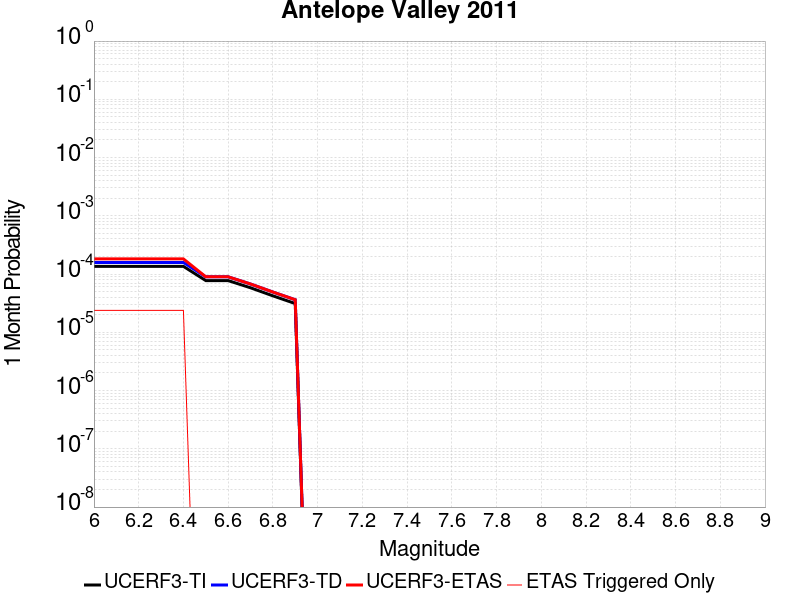 | 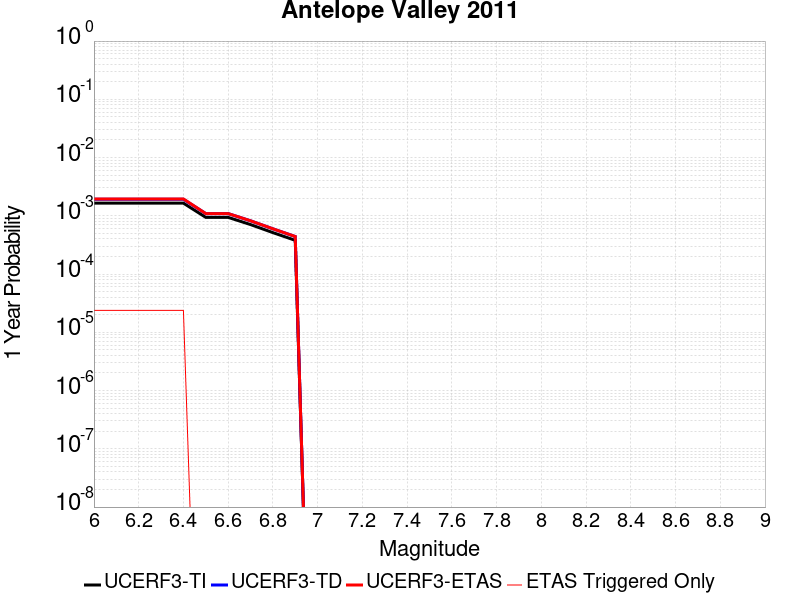 | 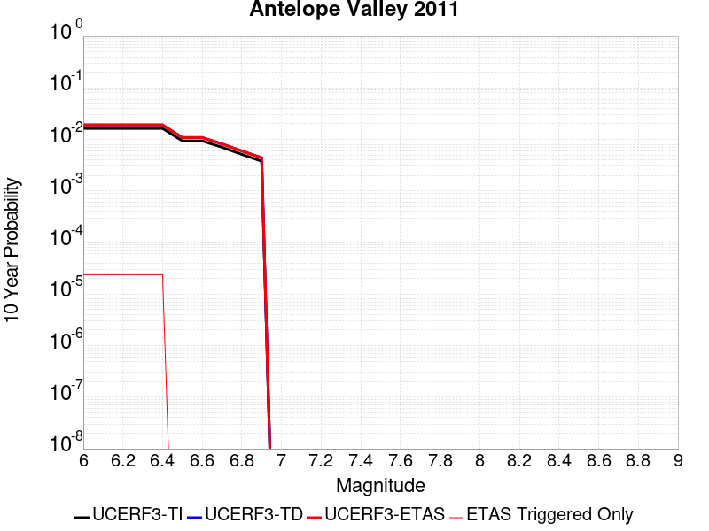 |

| Magnitude | 1 wk TI Prob | 1 wk TD Prob | 1 wk ETAS Prob | 1 wk ETAS/TD Gain | 1 wk ETAS Triggered Only | 1 mo TI Prob | 1 mo TD Prob | 1 mo ETAS Prob | 1 mo ETAS/TD Gain | 1 mo ETAS Triggered Only | 1 yr TI Prob | 1 yr TD Prob | 1 yr ETAS Prob | 1 yr ETAS/TD Gain | 1 yr ETAS Triggered Only | 10 yr TI Prob | 10 yr TD Prob | 10 yr ETAS Prob | 10 yr ETAS/TD Gain | 10 yr ETAS Triggered Only |
|-----|-----|-----|-----|-----|-----|-----|-----|-----|-----|-----|-----|-----|-----|-----|-----|-----|-----|-----|-----|-----|
| 6.0 | 3.1646934E-5 | 3.6904403E-5 | 3.6904403E-5 | 1.0 | 0.0 | 1.3562266E-4 | 1.5815363E-4 | 1.6815205E-4 | 1.0632197 | 1.0E-5 | 0.0016499552 | 0.0019240845 | 0.0019340653 | 1.0051873 | 1.0E-5 | 0.016377583 | 0.019100651 | 0.01911046 | 1.0005136 | 1.0E-5 |
| 6.1 | 3.1646934E-5 | 3.6904403E-5 | 3.6904403E-5 | 1.0 | 0.0 | 1.3562266E-4 | 1.5815363E-4 | 1.6815205E-4 | 1.0632197 | 1.0E-5 | 0.0016499552 | 0.0019240845 | 0.0019340653 | 1.0051873 | 1.0E-5 | 0.016377583 | 0.019100651 | 0.01911046 | 1.0005136 | 1.0E-5 |
| 6.2 | 3.1646934E-5 | 3.6904403E-5 | 3.6904403E-5 | 1.0 | 0.0 | 1.3562266E-4 | 1.5815363E-4 | 1.6815205E-4 | 1.0632197 | 1.0E-5 | 0.0016499552 | 0.0019240845 | 0.0019340653 | 1.0051873 | 1.0E-5 | 0.016377583 | 0.019100651 | 0.01911046 | 1.0005136 | 1.0E-5 |
| 6.3 | 3.1646934E-5 | 3.6904403E-5 | 3.6904403E-5 | 1.0 | 0.0 | 1.3562266E-4 | 1.5815363E-4 | 1.6815205E-4 | 1.0632197 | 1.0E-5 | 0.0016499552 | 0.0019240845 | 0.0019340653 | 1.0051873 | 1.0E-5 | 0.016377583 | 0.019100651 | 0.01911046 | 1.0005136 | 1.0E-5 |
| 6.4 | 3.1646934E-5 | 3.6904403E-5 | 3.6904403E-5 | 1.0 | 0.0 | 1.3562266E-4 | 1.5815363E-4 | 1.6815205E-4 | 1.0632197 | 1.0E-5 | 0.0016499552 | 0.0019240845 | 0.0019340653 | 1.0051873 | 1.0E-5 | 0.016377583 | 0.019100651 | 0.01911046 | 1.0005136 | 1.0E-5 |
| 6.5 | 1.8034107E-5 | 2.0940959E-5 | 2.0940959E-5 | 1.0 | 0.0 | 7.7286735E-5 | 8.974457E-5 | 8.974457E-5 | 1.0 | 0.0 | 9.405598E-4 | 0.0010922146 | 0.0010922146 | 1.0 | 0.0 | 0.009365888 | 0.010880542 | 0.010880542 | 1.0 | 0.0 |
| 6.6 | 1.8034107E-5 | 2.0940959E-5 | 2.0940959E-5 | 1.0 | 0.0 | 7.7286735E-5 | 8.974457E-5 | 8.974457E-5 | 1.0 | 0.0 | 9.405598E-4 | 0.0010922146 | 0.0010922146 | 1.0 | 0.0 | 0.009365888 | 0.010880542 | 0.010880542 | 1.0 | 0.0 |
| 6.7 | 1.3567667E-5 | 1.5749509E-5 | 1.5749509E-5 | 1.0 | 0.0 | 5.814585E-5 | 6.749675E-5 | 6.749675E-5 | 1.0 | 0.0 | 7.076958E-4 | 8.2156935E-4 | 8.2156935E-4 | 1.0 | 0.0 | 0.007054463 | 0.008195754 | 0.008195754 | 1.0 | 0.0 |
| 6.8 | 9.867387E-6 | 1.1467935E-5 | 1.1467935E-5 | 1.0 | 0.0 | 4.2288117E-5 | 4.91479E-5 | 4.91479E-5 | 1.0 | 0.0 | 5.1473617E-4 | 5.9830636E-4 | 5.9830636E-4 | 1.0 | 0.0 | 0.005135455 | 0.005976268 | 0.005976268 | 1.0 | 0.0 |
| 6.9 | 7.273233E-6 | 8.454864E-6 | 8.454864E-6 | 1.0 | 0.0 | 3.1170628E-5 | 3.623513E-5 | 3.623513E-5 | 1.0 | 0.0 | 3.794363E-4 | 4.411627E-4 | 4.411627E-4 | 1.0 | 0.0 | 0.0037878908 | 0.004411627 | 0.004411627 | 1.0 | 0.0 |

## Mission Hills 2011
*[(top)](#table-of-contents)*

| 1 Week | 1 Month | 1 Year | 10 Year |
|-----|-----|-----|-----|
| 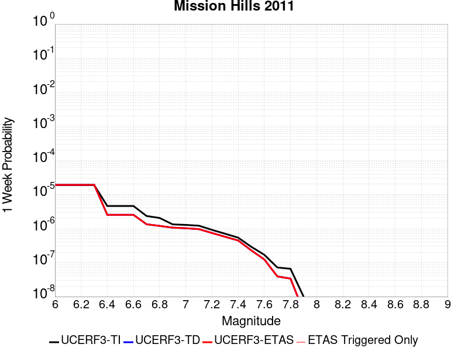 |  | 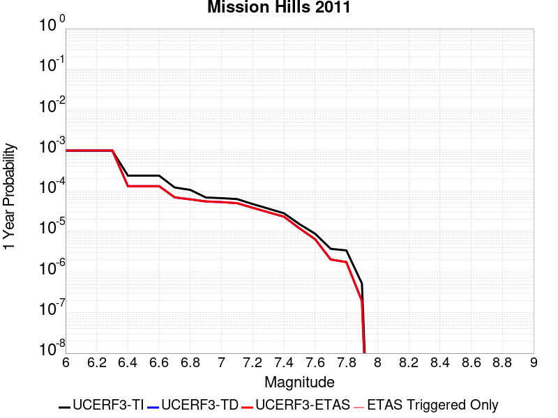 | 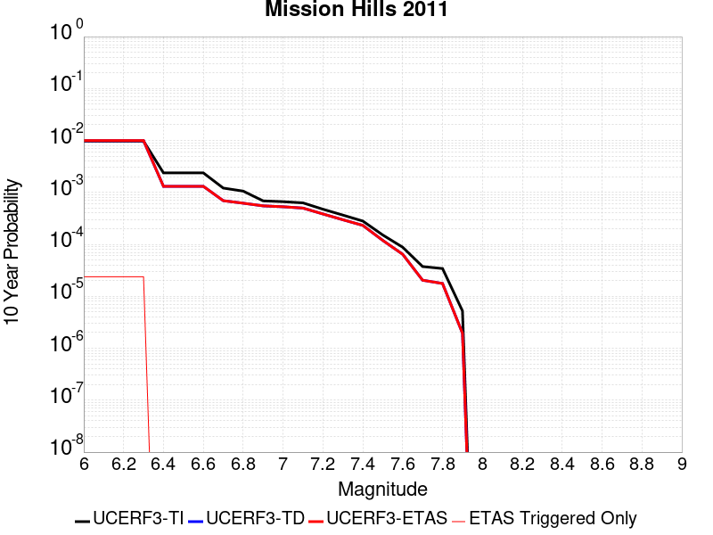 |

| Magnitude | 1 wk TI Prob | 1 wk TD Prob | 1 wk ETAS Prob | 1 wk ETAS/TD Gain | 1 wk ETAS Triggered Only | 1 mo TI Prob | 1 mo TD Prob | 1 mo ETAS Prob | 1 mo ETAS/TD Gain | 1 mo ETAS Triggered Only | 1 yr TI Prob | 1 yr TD Prob | 1 yr ETAS Prob | 1 yr ETAS/TD Gain | 1 yr ETAS Triggered Only | 10 yr TI Prob | 10 yr TD Prob | 10 yr ETAS Prob | 10 yr ETAS/TD Gain | 10 yr ETAS Triggered Only |
|-----|-----|-----|-----|-----|-----|-----|-----|-----|-----|-----|-----|-----|-----|-----|-----|-----|-----|-----|-----|-----|
| 6.0 | 1.8765717E-5 | 1.9054645E-5 | 1.9054645E-5 | 1.0 | 0.0 | 8.0422025E-5 | 8.166215E-5 | 8.166215E-5 | 1.0 | 0.0 | 9.786983E-4 | 9.941267E-4 | 9.941267E-4 | 1.0 | 0.0 | 0.009743992 | 0.009930461 | 0.009940362 | 1.000997 | 1.0E-5 |
| 6.1 | 1.8765717E-5 | 1.9054645E-5 | 1.9054645E-5 | 1.0 | 0.0 | 8.0422025E-5 | 8.166215E-5 | 8.166215E-5 | 1.0 | 0.0 | 9.786983E-4 | 9.941267E-4 | 9.941267E-4 | 1.0 | 0.0 | 0.009743992 | 0.009930461 | 0.009940362 | 1.000997 | 1.0E-5 |
| 6.2 | 1.8765717E-5 | 1.9054645E-5 | 1.9054645E-5 | 1.0 | 0.0 | 8.0422025E-5 | 8.166215E-5 | 8.166215E-5 | 1.0 | 0.0 | 9.786983E-4 | 9.941267E-4 | 9.941267E-4 | 1.0 | 0.0 | 0.009743992 | 0.009930461 | 0.009940362 | 1.000997 | 1.0E-5 |
| 6.3 | 1.8765717E-5 | 1.9054645E-5 | 1.9054645E-5 | 1.0 | 0.0 | 8.0422025E-5 | 8.166215E-5 | 8.166215E-5 | 1.0 | 0.0 | 9.786983E-4 | 9.941267E-4 | 9.941267E-4 | 1.0 | 0.0 | 0.009743992 | 0.009930461 | 0.009940362 | 1.000997 | 1.0E-5 |
| 6.4 | 4.566357E-6 | 2.5148488E-6 | 2.5148488E-6 | 1.0 | 0.0 | 1.9569954E-5 | 1.0777889E-5 | 1.0777889E-5 | 1.0 | 0.0 | 2.3823815E-4 | 1.3121472E-4 | 1.3121472E-4 | 1.0 | 0.0 | 0.002379829 | 0.0013115506 | 0.0013115506 | 1.0 | 0.0 |
| 6.5 | 4.566357E-6 | 2.5148488E-6 | 2.5148488E-6 | 1.0 | 0.0 | 1.9569954E-5 | 1.0777889E-5 | 1.0777889E-5 | 1.0 | 0.0 | 2.3823815E-4 | 1.3121472E-4 | 1.3121472E-4 | 1.0 | 0.0 | 0.002379829 | 0.0013115506 | 0.0013115506 | 1.0 | 0.0 |
| 6.6 | 4.566357E-6 | 2.5148488E-6 | 2.5148488E-6 | 1.0 | 0.0 | 1.9569954E-5 | 1.0777889E-5 | 1.0777889E-5 | 1.0 | 0.0 | 2.3823815E-4 | 1.3121472E-4 | 1.3121472E-4 | 1.0 | 0.0 | 0.002379829 | 0.0013115506 | 0.0013115506 | 1.0 | 0.0 |
| 6.7 | 2.3266773E-6 | 1.3296187E-6 | 1.3296187E-6 | 1.0 | 0.0 | 9.971435E-6 | 5.698354E-6 | 5.698354E-6 | 1.0 | 0.0 | 1.2139547E-4 | 6.937531E-5 | 6.937531E-5 | 1.0 | 0.0 | 0.0012132917 | 6.9354265E-4 | 6.9354265E-4 | 1.0 | 0.0 |
| 6.8 | 2.032735E-6 | 1.1894115E-6 | 1.1894115E-6 | 1.0 | 0.0 | 8.711692E-6 | 5.097468E-6 | 5.097468E-6 | 1.0 | 0.0 | 1.06059684E-4 | 6.205996E-5 | 6.205996E-5 | 1.0 | 0.0 | 0.0010600908 | 6.2043115E-4 | 6.2043115E-4 | 1.0 | 0.0 |
| 6.9 | 1.3186259E-6 | 1.0561778E-6 | 1.0561778E-6 | 1.0 | 0.0 | 5.6512413E-6 | 4.5264687E-6 | 4.5264687E-6 | 1.0 | 0.0 | 6.8801695E-5 | 5.5108394E-5 | 5.5108394E-5 | 1.0 | 0.0 | 6.8780396E-4 | 5.5095024E-4 | 5.5095024E-4 | 1.0 | 0.0 |
| 7.0 | 1.2726016E-6 | 1.0159088E-6 | 1.0159088E-6 | 1.0 | 0.0 | 5.4539955E-6 | 4.3538876E-6 | 4.3538876E-6 | 1.0 | 0.0 | 6.6400375E-5 | 5.300732E-5 | 5.300732E-5 | 1.0 | 0.0 | 6.6380535E-4 | 5.299496E-4 | 5.299496E-4 | 1.0 | 0.0 |
| 7.1 | 1.2063913E-6 | 9.570072E-7 | 9.570072E-7 | 1.0 | 0.0 | 5.170238E-6 | 4.101453E-6 | 4.101453E-6 | 1.0 | 0.0 | 6.294583E-5 | 4.9934075E-5 | 4.9934075E-5 | 1.0 | 0.0 | 6.2928005E-4 | 4.992311E-4 | 4.992311E-4 | 1.0 | 0.0 |
| 7.2 | 9.105806E-7 | 7.3765557E-7 | 7.3765557E-7 | 1.0 | 0.0 | 3.9024826E-6 | 3.1613772E-6 | 3.1613772E-6 | 1.0 | 0.0 | 4.7511687E-5 | 3.8489103E-5 | 3.8489103E-5 | 1.0 | 0.0 | 4.7501532E-4 | 3.8482592E-4 | 3.8482592E-4 | 1.0 | 0.0 |
| 7.3 | 7.020432E-7 | 5.710089E-7 | 5.710089E-7 | 1.0 | 0.0 | 3.0087533E-6 | 2.447179E-6 | 2.447179E-6 | 1.0 | 0.0 | 3.6630954E-5 | 2.979401E-5 | 2.979401E-5 | 1.0 | 0.0 | 3.6624918E-4 | 2.9790145E-4 | 2.9790145E-4 | 1.0 | 0.0 |
| 7.4 | 5.3900635E-7 | 4.4480825E-7 | 4.4480825E-7 | 1.0 | 0.0 | 2.3100251E-6 | 1.9063198E-6 | 1.9063198E-6 | 1.0 | 0.0 | 2.8124194E-5 | 2.3209208E-5 | 2.3209208E-5 | 1.0 | 0.0 | 2.8120633E-4 | 2.3206905E-4 | 2.3206905E-4 | 1.0 | 0.0 |
| 7.5 | 2.907075E-7 | 2.2875415E-7 | 2.2875415E-7 | 1.0 | 0.0 | 1.2458887E-6 | 9.803746E-7 | 9.803746E-7 | 1.0 | 0.0 | 1.5168589E-5 | 1.1935997E-5 | 1.1935997E-5 | 1.0 | 0.0 | 1.5167553E-4 | 1.1935373E-4 | 1.1935373E-4 | 1.0 | 0.0 |
| 7.6 | 1.6903675E-7 | 1.2353402E-7 | 1.2353402E-7 | 1.0 | 0.0 | 7.2444305E-7 | 5.294314E-7 | 5.294314E-7 | 1.0 | 0.0 | 8.820059E-6 | 6.4458095E-6 | 6.4458095E-6 | 1.0 | 0.0 | 8.8197085E-5 | 6.445635E-5 | 6.445635E-5 | 1.0 | 0.0 |
| 7.7 | 7.168073E-8 | 3.9135116E-8 | 3.9135116E-8 | 1.0 | 0.0 | 3.072031E-7 | 1.6772192E-7 | 1.6772192E-7 | 1.0 | 0.0 | 3.7401915E-6 | 2.0420127E-6 | 2.0420127E-6 | 1.0 | 0.0 | 3.7401285E-5 | 2.041995E-5 | 2.041995E-5 | 1.0 | 0.0 |
| 7.8 | 6.564101E-8 | 3.3835356E-8 | 3.3835356E-8 | 1.0 | 0.0 | 2.813186E-7 | 1.4500866E-7 | 1.4500866E-7 | 1.0 | 0.0 | 3.4250486E-6 | 1.7654792E-6 | 1.7654792E-6 | 1.0 | 0.0 | 3.424996E-5 | 1.7654662E-5 | 1.7654662E-5 | 1.0 | 0.0 |
| 7.9 | 1.0029074E-8 | 3.7292542E-9 | 3.7292542E-9 | 1.0 | 0.0 | 4.2981743E-8 | 1.5982518E-8 | 1.5982518E-8 | 1.0 | 0.0 | 5.2330256E-7 | 1.9458714E-7 | 1.9458714E-7 | 1.0 | 0.0 | 5.2330133E-6 | 1.945871E-6 | 1.945871E-6 | 1.0 | 0.0 |

## Garberville - Briceland 2011 CFM
*[(top)](#table-of-contents)*

| 1 Week | 1 Month | 1 Year | 10 Year |
|-----|-----|-----|-----|
|  |  | 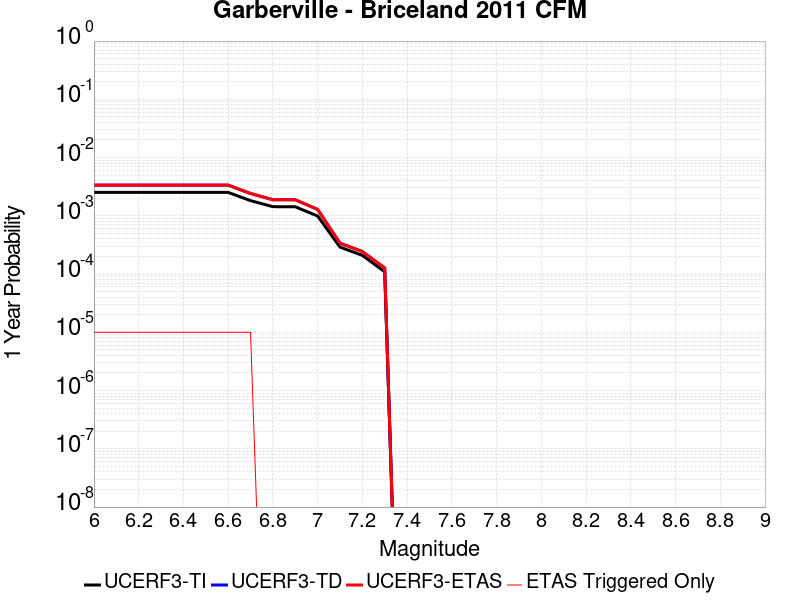 | 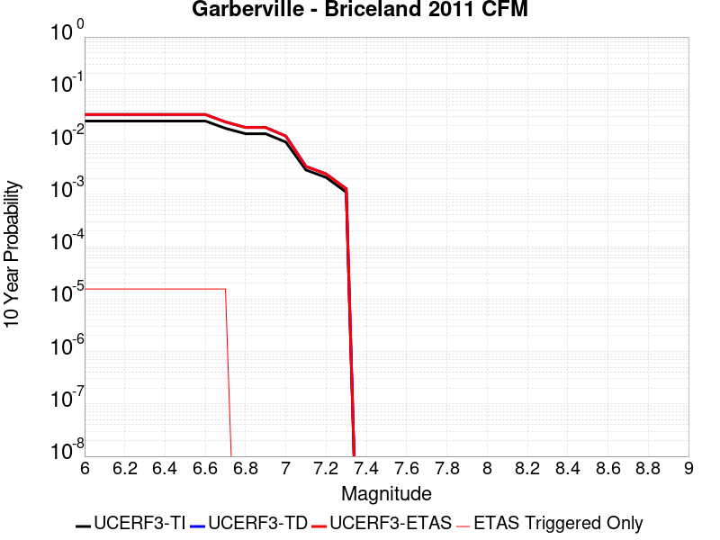 |

| Magnitude | 1 wk TI Prob | 1 wk TD Prob | 1 wk ETAS Prob | 1 wk ETAS/TD Gain | 1 wk ETAS Triggered Only | 1 mo TI Prob | 1 mo TD Prob | 1 mo ETAS Prob | 1 mo ETAS/TD Gain | 1 mo ETAS Triggered Only | 1 yr TI Prob | 1 yr TD Prob | 1 yr ETAS Prob | 1 yr ETAS/TD Gain | 1 yr ETAS Triggered Only | 10 yr TI Prob | 10 yr TD Prob | 10 yr ETAS Prob | 10 yr ETAS/TD Gain | 10 yr ETAS Triggered Only |
|-----|-----|-----|-----|-----|-----|-----|-----|-----|-----|-----|-----|-----|-----|-----|-----|-----|-----|-----|-----|-----|
| 6.0 | 4.8399295E-5 | 6.452381E-5 | 6.452381E-5 | 1.0 | 0.0 | 2.0740906E-4 | 2.7650563E-4 | 2.7650563E-4 | 1.0 | 0.0 | 0.002522281 | 0.003362017 | 0.0033719833 | 1.0029644 | 1.0E-5 | 0.024938442 | 0.03317861 | 0.03318828 | 1.0002913 | 1.0E-5 |
| 6.1 | 4.8399295E-5 | 6.452381E-5 | 6.452381E-5 | 1.0 | 0.0 | 2.0740906E-4 | 2.7650563E-4 | 2.7650563E-4 | 1.0 | 0.0 | 0.002522281 | 0.003362017 | 0.0033719833 | 1.0029644 | 1.0E-5 | 0.024938442 | 0.03317861 | 0.03318828 | 1.0002913 | 1.0E-5 |
| 6.2 | 4.8399295E-5 | 6.452381E-5 | 6.452381E-5 | 1.0 | 0.0 | 2.0740906E-4 | 2.7650563E-4 | 2.7650563E-4 | 1.0 | 0.0 | 0.002522281 | 0.003362017 | 0.0033719833 | 1.0029644 | 1.0E-5 | 0.024938442 | 0.03317861 | 0.03318828 | 1.0002913 | 1.0E-5 |
| 6.3 | 4.8399295E-5 | 6.452381E-5 | 6.452381E-5 | 1.0 | 0.0 | 2.0740906E-4 | 2.7650563E-4 | 2.7650563E-4 | 1.0 | 0.0 | 0.002522281 | 0.003362017 | 0.0033719833 | 1.0029644 | 1.0E-5 | 0.024938442 | 0.03317861 | 0.03318828 | 1.0002913 | 1.0E-5 |
| 6.4 | 4.8399295E-5 | 6.452381E-5 | 6.452381E-5 | 1.0 | 0.0 | 2.0740906E-4 | 2.7650563E-4 | 2.7650563E-4 | 1.0 | 0.0 | 0.002522281 | 0.003362017 | 0.0033719833 | 1.0029644 | 1.0E-5 | 0.024938442 | 0.03317861 | 0.03318828 | 1.0002913 | 1.0E-5 |
| 6.5 | 4.8399295E-5 | 6.452381E-5 | 6.452381E-5 | 1.0 | 0.0 | 2.0740906E-4 | 2.7650563E-4 | 2.7650563E-4 | 1.0 | 0.0 | 0.002522281 | 0.003362017 | 0.0033719833 | 1.0029644 | 1.0E-5 | 0.024938442 | 0.03317861 | 0.03318828 | 1.0002913 | 1.0E-5 |
| 6.6 | 4.8399295E-5 | 6.452381E-5 | 6.452381E-5 | 1.0 | 0.0 | 2.0740906E-4 | 2.7650563E-4 | 2.7650563E-4 | 1.0 | 0.0 | 0.002522281 | 0.003362017 | 0.0033719833 | 1.0029644 | 1.0E-5 | 0.024938442 | 0.03317861 | 0.03318828 | 1.0002913 | 1.0E-5 |
| 6.7 | 3.495179E-5 | 4.6308873E-5 | 4.6308873E-5 | 1.0 | 0.0 | 1.4978478E-4 | 1.9845461E-4 | 1.9845461E-4 | 1.0 | 0.0 | 0.0018221042 | 0.002414053 | 0.002424029 | 1.0041324 | 1.0E-5 | 0.018072363 | 0.023930617 | 0.023940377 | 1.0004079 | 1.0E-5 |
| 6.8 | 2.7517597E-5 | 3.6241618E-5 | 3.6241618E-5 | 1.0 | 0.0 | 1.1792722E-4 | 1.5531474E-4 | 1.5531474E-4 | 1.0 | 0.0 | 0.0014348183 | 0.0018897996 | 0.0018897996 | 1.0 | 0.0 | 0.014255894 | 0.018783508 | 0.018783508 | 1.0 | 0.0 |
| 6.9 | 2.74461E-5 | 3.6159345E-5 | 3.6159345E-5 | 1.0 | 0.0 | 1.1762084E-4 | 1.5496218E-4 | 1.5496218E-4 | 1.0 | 0.0 | 0.001431093 | 0.0018855145 | 0.0018855145 | 1.0 | 0.0 | 0.014219119 | 0.018741382 | 0.018741382 | 1.0 | 0.0 |
| 7.0 | 1.9023773E-5 | 2.4707579E-5 | 2.4707579E-5 | 1.0 | 0.0 | 8.152791E-5 | 1.0588763E-4 | 1.0588763E-4 | 1.0 | 0.0 | 9.921503E-4 | 0.0012888284 | 0.0012888284 | 1.0 | 0.0 | 0.009877323 | 0.012852574 | 0.012852574 | 1.0 | 0.0 |
| 7.1 | 5.566844E-6 | 6.512147E-6 | 6.512147E-6 | 1.0 | 0.0 | 2.3857683E-5 | 2.7908927E-5 | 2.7908927E-5 | 1.0 | 0.0 | 2.9042858E-4 | 3.3974246E-4 | 3.3974246E-4 | 1.0 | 0.0 | 0.002900493 | 0.0033926512 | 0.0033926512 | 1.0 | 0.0 |
| 7.2 | 4.011353E-6 | 4.6746213E-6 | 4.6746213E-6 | 1.0 | 0.0 | 1.7191402E-5 | 2.0033956E-5 | 2.0033956E-5 | 1.0 | 0.0 | 2.0928521E-4 | 2.4388955E-4 | 2.4388955E-4 | 1.0 | 0.0 | 0.0020908823 | 0.0024365564 | 0.0024365564 | 1.0 | 0.0 |
| 7.3 | 2.0974871E-6 | 2.4395908E-6 | 2.4395908E-6 | 1.0 | 0.0 | 8.989199E-6 | 1.0455362E-5 | 1.0455362E-5 | 1.0 | 0.0 | 1.09438006E-4 | 1.272891E-4 | 1.272891E-4 | 1.0 | 0.0 | 0.0010938413 | 0.0012724071 | 0.0012724071 | 1.0 | 0.0 |

## Peralta Hills
*[(top)](#table-of-contents)*

| 1 Week | 1 Month | 1 Year | 10 Year |
|-----|-----|-----|-----|
|  | 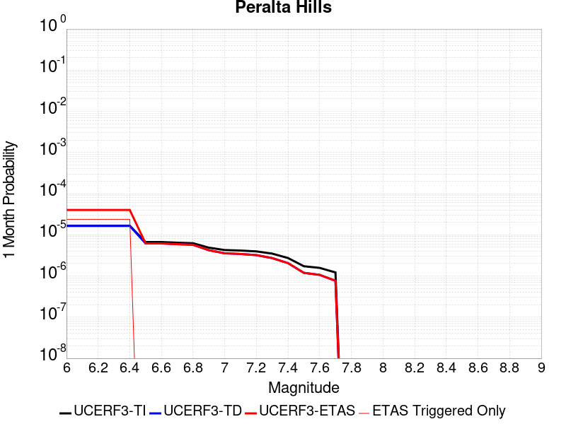 | 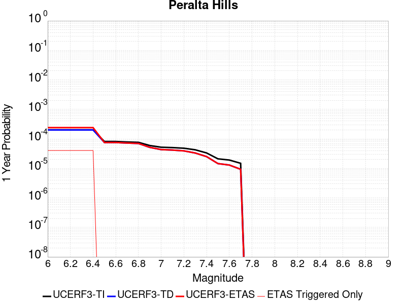 | 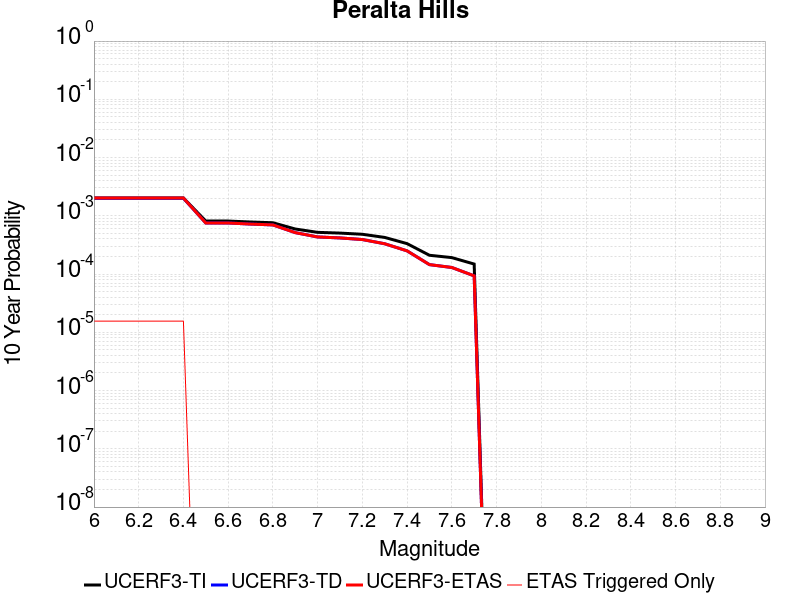 |

| Magnitude | 1 wk TI Prob | 1 wk TD Prob | 1 wk ETAS Prob | 1 wk ETAS/TD Gain | 1 wk ETAS Triggered Only | 1 mo TI Prob | 1 mo TD Prob | 1 mo ETAS Prob | 1 mo ETAS/TD Gain | 1 mo ETAS Triggered Only | 1 yr TI Prob | 1 yr TD Prob | 1 yr ETAS Prob | 1 yr ETAS/TD Gain | 1 yr ETAS Triggered Only | 10 yr TI Prob | 10 yr TD Prob | 10 yr ETAS Prob | 10 yr ETAS/TD Gain | 10 yr ETAS Triggered Only |
|-----|-----|-----|-----|-----|-----|-----|-----|-----|-----|-----|-----|-----|-----|-----|-----|-----|-----|-----|-----|-----|
| 6.0 | 3.8850067E-6 | 3.839512E-6 | 3.839512E-6 | 1.0 | 0.0 | 1.6649923E-5 | 1.645499E-5 | 2.6454823E-5 | 1.6077085 | 1.0E-5 | 2.0269395E-4 | 2.0032849E-4 | 2.1032649E-4 | 1.049908 | 1.0E-5 | 0.0020250916 | 0.0020022066 | 0.0020121867 | 1.0049845 | 1.0E-5 |
| 6.1 | 3.8850067E-6 | 3.839512E-6 | 3.839512E-6 | 1.0 | 0.0 | 1.6649923E-5 | 1.645499E-5 | 2.6454823E-5 | 1.6077085 | 1.0E-5 | 2.0269395E-4 | 2.0032849E-4 | 2.1032649E-4 | 1.049908 | 1.0E-5 | 0.0020250916 | 0.0020022066 | 0.0020121867 | 1.0049845 | 1.0E-5 |
| 6.2 | 3.8850067E-6 | 3.839512E-6 | 3.839512E-6 | 1.0 | 0.0 | 1.6649923E-5 | 1.645499E-5 | 2.6454823E-5 | 1.6077085 | 1.0E-5 | 2.0269395E-4 | 2.0032849E-4 | 2.1032649E-4 | 1.049908 | 1.0E-5 | 0.0020250916 | 0.0020022066 | 0.0020121867 | 1.0049845 | 1.0E-5 |
| 6.3 | 3.8850067E-6 | 3.839512E-6 | 3.839512E-6 | 1.0 | 0.0 | 1.6649923E-5 | 1.645499E-5 | 2.6454823E-5 | 1.6077085 | 1.0E-5 | 2.0269395E-4 | 2.0032849E-4 | 2.1032649E-4 | 1.049908 | 1.0E-5 | 0.0020250916 | 0.0020022066 | 0.0020121867 | 1.0049845 | 1.0E-5 |
| 6.4 | 3.8850067E-6 | 3.839512E-6 | 3.839512E-6 | 1.0 | 0.0 | 1.6649923E-5 | 1.645499E-5 | 2.6454823E-5 | 1.6077085 | 1.0E-5 | 2.0269395E-4 | 2.0032849E-4 | 2.1032649E-4 | 1.049908 | 1.0E-5 | 0.0020250916 | 0.0020022066 | 0.0020121867 | 1.0049845 | 1.0E-5 |
| 6.5 | 1.5587785E-6 | 1.4430796E-6 | 1.4430796E-6 | 1.0 | 0.0 | 6.6804623E-6 | 6.184613E-6 | 6.184613E-6 | 1.0 | 0.0 | 8.133159E-5 | 7.529531E-5 | 7.529531E-5 | 1.0 | 0.0 | 8.1301836E-4 | 7.52722E-4 | 7.52722E-4 | 1.0 | 0.0 |
| 6.6 | 1.5587785E-6 | 1.4430796E-6 | 1.4430796E-6 | 1.0 | 0.0 | 6.6804623E-6 | 6.184613E-6 | 6.184613E-6 | 1.0 | 0.0 | 8.133159E-5 | 7.529531E-5 | 7.529531E-5 | 1.0 | 0.0 | 8.1301836E-4 | 7.52722E-4 | 7.52722E-4 | 1.0 | 0.0 |
| 6.7 | 1.5018579E-6 | 1.3837022E-6 | 1.3837022E-6 | 1.0 | 0.0 | 6.436518E-6 | 5.93014E-6 | 5.93014E-6 | 1.0 | 0.0 | 7.836179E-5 | 7.21973E-5 | 7.21973E-5 | 1.0 | 0.0 | 7.833416E-4 | 7.21762E-4 | 7.21762E-4 | 1.0 | 0.0 |
| 6.8 | 1.4584314E-6 | 1.3381342E-6 | 1.3381342E-6 | 1.0 | 0.0 | 6.250405E-6 | 5.7348498E-6 | 5.7348498E-6 | 1.0 | 0.0 | 7.6096025E-5 | 6.98198E-5 | 6.98198E-5 | 1.0 | 0.0 | 7.6069974E-4 | 6.98002E-4 | 6.98002E-4 | 1.0 | 0.0 |
| 6.9 | 1.1382393E-6 | 9.862285E-7 | 9.862285E-7 | 1.0 | 0.0 | 4.8781594E-6 | 4.226687E-6 | 4.226687E-6 | 1.0 | 0.0 | 5.9389975E-5 | 5.1458785E-5 | 5.1458785E-5 | 1.0 | 0.0 | 5.93741E-4 | 5.144769E-4 | 5.144769E-4 | 1.0 | 0.0 |
| 7.0 | 9.970413E-7 | 8.309642E-7 | 8.309642E-7 | 1.0 | 0.0 | 4.273027E-6 | 3.561271E-6 | 3.561271E-6 | 1.0 | 0.0 | 5.2022864E-5 | 4.335768E-5 | 4.335768E-5 | 1.0 | 0.0 | 5.2010687E-4 | 4.33499E-4 | 4.33499E-4 | 1.0 | 0.0 |
| 7.1 | 9.684443E-7 | 7.99408E-7 | 7.99408E-7 | 1.0 | 0.0 | 4.150469E-6 | 3.4260302E-6 | 3.4260302E-6 | 1.0 | 0.0 | 5.053079E-5 | 4.1711188E-5 | 4.1711188E-5 | 1.0 | 0.0 | 5.05193E-4 | 4.170403E-4 | 4.170403E-4 | 1.0 | 0.0 |
| 7.2 | 9.240811E-7 | 7.5031426E-7 | 7.5031426E-7 | 1.0 | 0.0 | 3.960342E-6 | 3.215629E-6 | 3.215629E-6 | 1.0 | 0.0 | 4.8216094E-5 | 3.9149647E-5 | 3.9149647E-5 | 1.0 | 0.0 | 4.8205635E-4 | 3.9143403E-4 | 3.9143403E-4 | 1.0 | 0.0 |
| 7.3 | 8.158643E-7 | 6.350017E-7 | 6.350017E-7 | 1.0 | 0.0 | 3.4965567E-6 | 2.7214332E-6 | 2.7214332E-6 | 1.0 | 0.0 | 4.2569747E-5 | 3.313301E-5 | 3.313301E-5 | 1.0 | 0.0 | 4.2561593E-4 | 3.3128684E-4 | 3.3128684E-4 | 1.0 | 0.0 |
| 7.4 | 6.3822824E-7 | 4.7957286E-7 | 4.7957286E-7 | 1.0 | 0.0 | 2.7352612E-6 | 2.0553111E-6 | 2.0553111E-6 | 1.0 | 0.0 | 3.3301294E-5 | 2.5023177E-5 | 2.5023177E-5 | 1.0 | 0.0 | 3.3296304E-4 | 2.5020874E-4 | 2.5020874E-4 | 1.0 | 0.0 |
| 7.5 | 4.0292628E-7 | 2.7846056E-7 | 2.7846056E-7 | 1.0 | 0.0 | 1.7268258E-6 | 1.193402E-6 | 1.193402E-6 | 1.0 | 0.0 | 2.1023901E-5 | 1.4529601E-5 | 1.4529601E-5 | 1.0 | 0.0 | 2.1021912E-4 | 1.452893E-4 | 1.452893E-4 | 1.0 | 0.0 |
| 7.6 | 3.672993E-7 | 2.485495E-7 | 2.485495E-7 | 1.0 | 0.0 | 1.5741389E-6 | 1.0652118E-6 | 1.0652118E-6 | 1.0 | 0.0 | 1.9164972E-5 | 1.2968904E-5 | 1.2968904E-5 | 1.0 | 0.0 | 1.916332E-4 | 1.296842E-4 | 1.296842E-4 | 1.0 | 0.0 |
| 7.7 | 2.8466823E-7 | 1.7859877E-7 | 1.7859877E-7 | 1.0 | 0.0 | 1.2200061E-6 | 7.6542324E-7 | 7.6542324E-7 | 1.0 | 0.0 | 1.4853474E-5 | 9.319015E-6 | 9.319015E-6 | 1.0 | 0.0 | 1.485248E-4 | 9.3188835E-5 | 9.3188835E-5 | 1.0 | 0.0 |

## San Luis Range - Oceano 2011 CFM
*[(top)](#table-of-contents)*

| 1 Week | 1 Month | 1 Year | 10 Year |
|-----|-----|-----|-----|
| 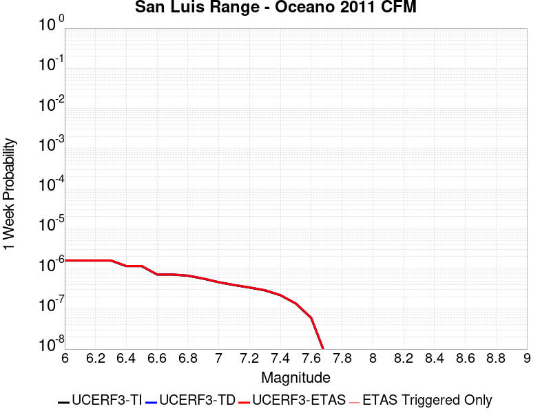 |  | 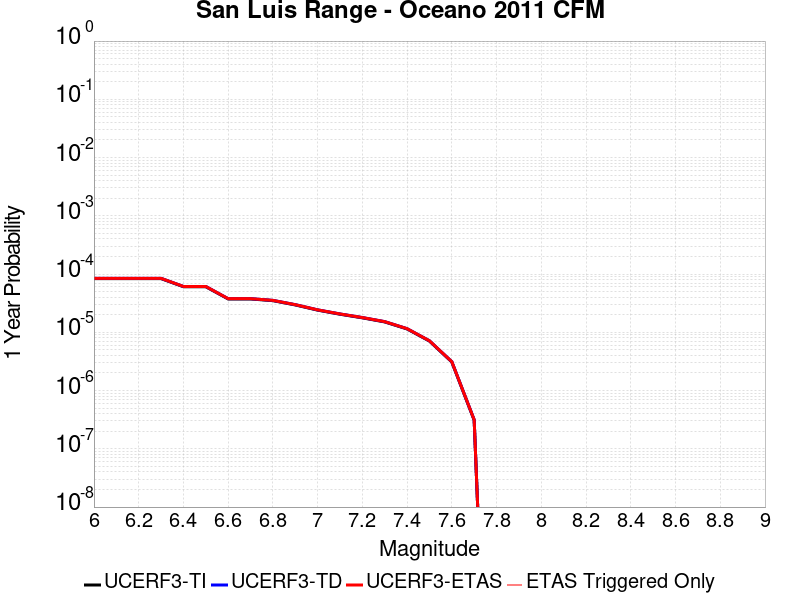 | 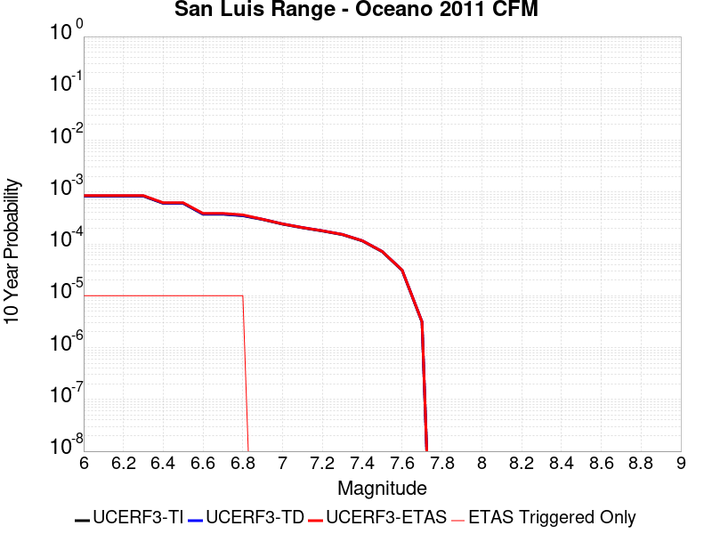 |

| Magnitude | 1 wk TI Prob | 1 wk TD Prob | 1 wk ETAS Prob | 1 wk ETAS/TD Gain | 1 wk ETAS Triggered Only | 1 mo TI Prob | 1 mo TD Prob | 1 mo ETAS Prob | 1 mo ETAS/TD Gain | 1 mo ETAS Triggered Only | 1 yr TI Prob | 1 yr TD Prob | 1 yr ETAS Prob | 1 yr ETAS/TD Gain | 1 yr ETAS Triggered Only | 10 yr TI Prob | 10 yr TD Prob | 10 yr ETAS Prob | 10 yr ETAS/TD Gain | 10 yr ETAS Triggered Only |
|-----|-----|-----|-----|-----|-----|-----|-----|-----|-----|-----|-----|-----|-----|-----|-----|-----|-----|-----|-----|-----|
| 6.0 | 1.6025788E-6 | 1.620119E-6 | 1.620119E-6 | 1.0 | 0.0 | 6.8681766E-6 | 6.943351E-6 | 6.943351E-6 | 1.0 | 0.0 | 8.361684E-5 | 8.453243E-5 | 8.453243E-5 | 1.0 | 0.0 | 8.3585386E-4 | 8.4504357E-4 | 8.5503515E-4 | 1.0118237 | 1.0E-5 |
| 6.1 | 1.6025788E-6 | 1.620119E-6 | 1.620119E-6 | 1.0 | 0.0 | 6.8681766E-6 | 6.943351E-6 | 6.943351E-6 | 1.0 | 0.0 | 8.361684E-5 | 8.453243E-5 | 8.453243E-5 | 1.0 | 0.0 | 8.3585386E-4 | 8.4504357E-4 | 8.5503515E-4 | 1.0118237 | 1.0E-5 |
| 6.2 | 1.6025788E-6 | 1.620119E-6 | 1.620119E-6 | 1.0 | 0.0 | 6.8681766E-6 | 6.943351E-6 | 6.943351E-6 | 1.0 | 0.0 | 8.361684E-5 | 8.453243E-5 | 8.453243E-5 | 1.0 | 0.0 | 8.3585386E-4 | 8.4504357E-4 | 8.5503515E-4 | 1.0118237 | 1.0E-5 |
| 6.3 | 1.6025788E-6 | 1.620119E-6 | 1.620119E-6 | 1.0 | 0.0 | 6.8681766E-6 | 6.943351E-6 | 6.943351E-6 | 1.0 | 0.0 | 8.361684E-5 | 8.453243E-5 | 8.453243E-5 | 1.0 | 0.0 | 8.3585386E-4 | 8.4504357E-4 | 8.5503515E-4 | 1.0118237 | 1.0E-5 |
| 6.4 | 1.1621186E-6 | 1.1749894E-6 | 1.1749894E-6 | 1.0 | 0.0 | 4.980499E-6 | 5.0356607E-6 | 5.0356607E-6 | 1.0 | 0.0 | 6.0635884E-5 | 6.130771E-5 | 6.130771E-5 | 1.0 | 0.0 | 6.0619344E-4 | 6.1293464E-4 | 6.229285E-4 | 1.016305 | 1.0E-5 |
| 6.5 | 1.1621186E-6 | 1.1749894E-6 | 1.1749894E-6 | 1.0 | 0.0 | 4.980499E-6 | 5.0356607E-6 | 5.0356607E-6 | 1.0 | 0.0 | 6.0635884E-5 | 6.130771E-5 | 6.130771E-5 | 1.0 | 0.0 | 6.0619344E-4 | 6.1293464E-4 | 6.229285E-4 | 1.016305 | 1.0E-5 |
| 6.6 | 7.164729E-7 | 7.2485784E-7 | 7.2485784E-7 | 1.0 | 0.0 | 3.0705946E-6 | 3.10653E-6 | 3.10653E-6 | 1.0 | 0.0 | 3.738385E-5 | 3.7821363E-5 | 3.7821363E-5 | 1.0 | 0.0 | 3.737756E-4 | 3.7815105E-4 | 3.8814725E-4 | 1.0264344 | 1.0E-5 |
| 6.7 | 7.164729E-7 | 7.2485784E-7 | 7.2485784E-7 | 1.0 | 0.0 | 3.0705946E-6 | 3.10653E-6 | 3.10653E-6 | 1.0 | 0.0 | 3.738385E-5 | 3.7821363E-5 | 3.7821363E-5 | 1.0 | 0.0 | 3.737756E-4 | 3.7815105E-4 | 3.8814725E-4 | 1.0264344 | 1.0E-5 |
| 6.8 | 6.700177E-7 | 6.7774397E-7 | 6.7774397E-7 | 1.0 | 0.0 | 2.8715012E-6 | 2.904614E-6 | 2.904614E-6 | 1.0 | 0.0 | 3.495997E-5 | 3.536312E-5 | 3.536312E-5 | 1.0 | 0.0 | 3.495447E-4 | 3.5357653E-4 | 3.63573E-4 | 1.0282724 | 1.0E-5 |
| 6.9 | 5.657865E-7 | 5.7217864E-7 | 5.7217864E-7 | 1.0 | 0.0 | 2.424797E-6 | 2.452192E-6 | 2.452192E-6 | 1.0 | 0.0 | 2.9521503E-5 | 2.9855039E-5 | 2.9855039E-5 | 1.0 | 0.0 | 2.9517582E-4 | 2.9851135E-4 | 2.9851135E-4 | 1.0 | 0.0 |
| 7.0 | 4.608413E-7 | 4.660169E-7 | 4.660169E-7 | 1.0 | 0.0 | 1.9750328E-6 | 1.9972138E-6 | 1.9972138E-6 | 1.0 | 0.0 | 2.4045758E-5 | 2.431581E-5 | 2.431581E-5 | 1.0 | 0.0 | 2.4043156E-4 | 2.4313178E-4 | 2.4313178E-4 | 1.0 | 0.0 |
| 7.1 | 3.9177846E-7 | 3.9621602E-7 | 3.9621602E-7 | 1.0 | 0.0 | 1.6790494E-6 | 1.6980675E-6 | 1.6980675E-6 | 1.0 | 0.0 | 2.0442236E-5 | 2.0673779E-5 | 2.0673779E-5 | 1.0 | 0.0 | 2.0440355E-4 | 2.067187E-4 | 2.067187E-4 | 1.0 | 0.0 |
| 7.2 | 3.3974752E-7 | 3.436653E-7 | 3.436653E-7 | 1.0 | 0.0 | 1.45606E-6 | 1.4728505E-6 | 1.4728505E-6 | 1.0 | 0.0 | 1.7727387E-5 | 1.7931809E-5 | 1.7931809E-5 | 1.0 | 0.0 | 1.7725973E-4 | 1.7930372E-4 | 1.7930372E-4 | 1.0 | 0.0 |
| 7.3 | 2.8900928E-7 | 2.923402E-7 | 2.923402E-7 | 1.0 | 0.0 | 1.2386106E-6 | 1.2528859E-6 | 1.2528859E-6 | 1.0 | 0.0 | 1.5079979E-5 | 1.525378E-5 | 1.525378E-5 | 1.0 | 0.0 | 1.5078956E-4 | 1.5252741E-4 | 1.5252741E-4 | 1.0 | 0.0 |
| 7.4 | 2.1881527E-7 | 2.2139594E-7 | 2.2139594E-7 | 1.0 | 0.0 | 9.3777936E-7 | 9.488394E-7 | 9.488394E-7 | 1.0 | 0.0 | 1.14174045E-5 | 1.1552059E-5 | 1.1552059E-5 | 1.0 | 0.0 | 1.1416818E-4 | 1.1551464E-4 | 1.1551464E-4 | 1.0 | 0.0 |
| 7.5 | 1.356398E-7 | 1.3718639E-7 | 1.3718639E-7 | 1.0 | 0.0 | 5.813133E-7 | 5.8794154E-7 | 5.8794154E-7 | 1.0 | 0.0 | 7.0774663E-6 | 7.158165E-6 | 7.158165E-6 | 1.0 | 0.0 | 7.077241E-5 | 7.157937E-5 | 7.157937E-5 | 1.0 | 0.0 |
| 7.6 | 5.9269272E-8 | 6.001364E-8 | 6.001364E-8 | 1.0 | 0.0 | 2.5401116E-7 | 2.572013E-7 | 2.572013E-7 | 1.0 | 0.0 | 3.0925814E-6 | 3.1314214E-6 | 3.1314214E-6 | 1.0 | 0.0 | 3.0925385E-5 | 3.1313786E-5 | 3.1313786E-5 | 1.0 | 0.0 |
| 7.7 | 5.946232E-9 | 6.036928E-9 | 6.036928E-9 | 1.0 | 0.0 | 2.5483851E-8 | 2.5872547E-8 | 2.5872547E-8 | 1.0 | 0.0 | 3.1026585E-7 | 3.1499823E-7 | 3.1499823E-7 | 1.0 | 0.0 | 3.102654E-6 | 3.1499787E-6 | 3.1499787E-6 | 1.0 | 0.0 |

## Yorba Linda
*[(top)](#table-of-contents)*

| 1 Week | 1 Month | 1 Year | 10 Year |
|-----|-----|-----|-----|
|  | 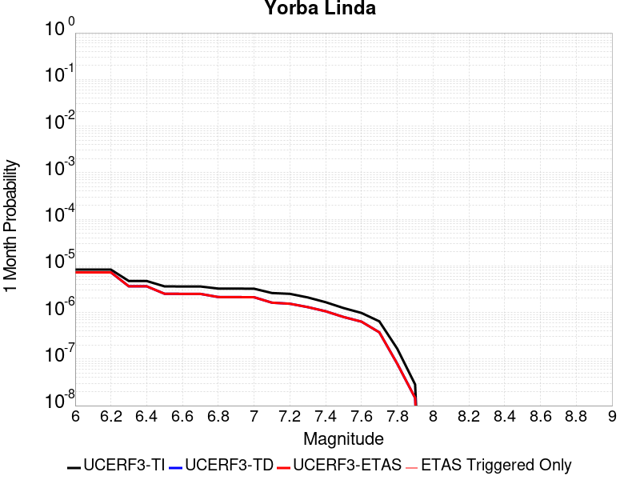 |  | 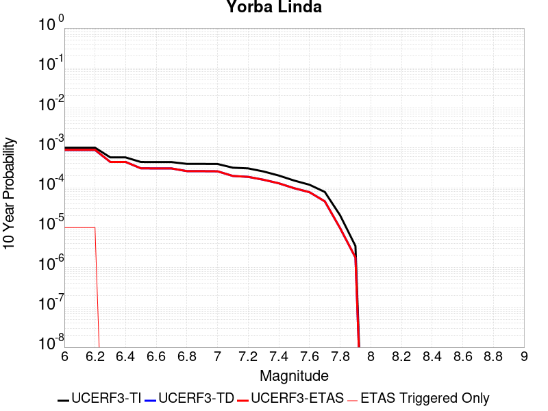 |

| Magnitude | 1 wk TI Prob | 1 wk TD Prob | 1 wk ETAS Prob | 1 wk ETAS/TD Gain | 1 wk ETAS Triggered Only | 1 mo TI Prob | 1 mo TD Prob | 1 mo ETAS Prob | 1 mo ETAS/TD Gain | 1 mo ETAS Triggered Only | 1 yr TI Prob | 1 yr TD Prob | 1 yr ETAS Prob | 1 yr ETAS/TD Gain | 1 yr ETAS Triggered Only | 10 yr TI Prob | 10 yr TD Prob | 10 yr ETAS Prob | 10 yr ETAS/TD Gain | 10 yr ETAS Triggered Only |
|-----|-----|-----|-----|-----|-----|-----|-----|-----|-----|-----|-----|-----|-----|-----|-----|-----|-----|-----|-----|-----|
| 6.0 | 1.9346849E-6 | 1.6909235E-6 | 1.6909235E-6 | 1.0 | 0.0 | 8.29148E-6 | 7.2468E-6 | 7.2468E-6 | 1.0 | 0.0 | 1.009441E-4 | 8.822717E-5 | 8.822717E-5 | 1.0 | 0.0 | 0.0010089825 | 8.820145E-4 | 8.920057E-4 | 1.0113276 | 1.0E-5 |
| 6.1 | 1.9346849E-6 | 1.6909235E-6 | 1.6909235E-6 | 1.0 | 0.0 | 8.29148E-6 | 7.2468E-6 | 7.2468E-6 | 1.0 | 0.0 | 1.009441E-4 | 8.822717E-5 | 8.822717E-5 | 1.0 | 0.0 | 0.0010089825 | 8.820145E-4 | 8.920057E-4 | 1.0113276 | 1.0E-5 |
| 6.2 | 1.9346849E-6 | 1.6909235E-6 | 1.6909235E-6 | 1.0 | 0.0 | 8.29148E-6 | 7.2468E-6 | 7.2468E-6 | 1.0 | 0.0 | 1.009441E-4 | 8.822717E-5 | 8.822717E-5 | 1.0 | 0.0 | 0.0010089825 | 8.820145E-4 | 8.920057E-4 | 1.0113276 | 1.0E-5 |
| 6.3 | 1.1028608E-6 | 8.481986E-7 | 8.481986E-7 | 1.0 | 0.0 | 4.7265376E-6 | 3.6351323E-6 | 3.6351323E-6 | 1.0 | 0.0 | 5.754407E-5 | 4.4256903E-5 | 4.4256903E-5 | 1.0 | 0.0 | 5.7529175E-4 | 4.4248742E-4 | 4.4248742E-4 | 1.0 | 0.0 |
| 6.4 | 1.1028608E-6 | 8.481986E-7 | 8.481986E-7 | 1.0 | 0.0 | 4.7265376E-6 | 3.6351323E-6 | 3.6351323E-6 | 1.0 | 0.0 | 5.754407E-5 | 4.4256903E-5 | 4.4256903E-5 | 1.0 | 0.0 | 5.7529175E-4 | 4.4248742E-4 | 4.4248742E-4 | 1.0 | 0.0 |
| 6.5 | 8.4451364E-7 | 5.8692325E-7 | 5.8692325E-7 | 1.0 | 0.0 | 3.619339E-6 | 2.5153831E-6 | 2.5153831E-6 | 1.0 | 0.0 | 4.406456E-5 | 3.0624382E-5 | 3.0624382E-5 | 1.0 | 0.0 | 4.4055824E-4 | 3.0620373E-4 | 3.0620373E-4 | 1.0 | 0.0 |
| 6.6 | 8.422957E-7 | 5.8447665E-7 | 5.8447665E-7 | 1.0 | 0.0 | 3.6098338E-6 | 2.5048976E-6 | 2.5048976E-6 | 1.0 | 0.0 | 4.3948843E-5 | 3.0496723E-5 | 3.0496723E-5 | 1.0 | 0.0 | 4.394015E-4 | 3.0492753E-4 | 3.0492753E-4 | 1.0 | 0.0 |
| 6.7 | 8.4119705E-7 | 5.832608E-7 | 5.832608E-7 | 1.0 | 0.0 | 3.6051254E-6 | 2.499687E-6 | 2.499687E-6 | 1.0 | 0.0 | 4.3891516E-5 | 3.0433286E-5 | 3.0433286E-5 | 1.0 | 0.0 | 4.388285E-4 | 3.0429332E-4 | 3.0429332E-4 | 1.0 | 0.0 |
| 6.8 | 7.5919155E-7 | 4.995118E-7 | 4.995118E-7 | 1.0 | 0.0 | 3.253674E-6 | 2.1407632E-6 | 2.1407632E-6 | 1.0 | 0.0 | 3.961276E-5 | 2.6063499E-5 | 2.6063499E-5 | 1.0 | 0.0 | 3.9605703E-4 | 2.6060612E-4 | 2.6060612E-4 | 1.0 | 0.0 |
| 6.9 | 7.5804564E-7 | 4.981302E-7 | 4.981302E-7 | 1.0 | 0.0 | 3.248763E-6 | 2.134842E-6 | 2.134842E-6 | 1.0 | 0.0 | 3.955297E-5 | 2.5991409E-5 | 2.5991409E-5 | 1.0 | 0.0 | 3.9545933E-4 | 2.598854E-4 | 2.598854E-4 | 1.0 | 0.0 |
| 7.0 | 7.539293E-7 | 4.943436E-7 | 4.943436E-7 | 1.0 | 0.0 | 3.2311218E-6 | 2.118614E-6 | 2.118614E-6 | 1.0 | 0.0 | 3.9338196E-5 | 2.5793837E-5 | 2.5793837E-5 | 1.0 | 0.0 | 3.9331234E-4 | 2.5791014E-4 | 2.5791014E-4 | 1.0 | 0.0 |
| 7.1 | 6.0900885E-7 | 3.781838E-7 | 3.781838E-7 | 1.0 | 0.0 | 2.6100352E-6 | 1.6207867E-6 | 1.6207867E-6 | 1.0 | 0.0 | 3.1776715E-5 | 1.9732903E-5 | 1.9732903E-5 | 1.0 | 0.0 | 3.1772171E-4 | 1.9731186E-4 | 1.9731186E-4 | 1.0 | 0.0 |
| 7.2 | 5.849925E-7 | 3.5880063E-7 | 3.5880063E-7 | 1.0 | 0.0 | 2.5071083E-6 | 1.5377161E-6 | 1.5377161E-6 | 1.0 | 0.0 | 3.0523614E-5 | 1.8721537E-5 | 1.8721537E-5 | 1.0 | 0.0 | 3.0519423E-4 | 1.8719993E-4 | 1.8719993E-4 | 1.0 | 0.0 |
| 7.3 | 4.89808E-7 | 3.038045E-7 | 3.038045E-7 | 1.0 | 0.0 | 2.0991754E-6 | 1.3020187E-6 | 1.3020187E-6 | 1.0 | 0.0 | 2.5557161E-5 | 1.5851965E-5 | 1.5851965E-5 | 1.0 | 0.0 | 2.5554223E-4 | 1.5850857E-4 | 1.5850857E-4 | 1.0 | 0.0 |
| 7.4 | 3.8700415E-7 | 2.4723E-7 | 2.4723E-7 | 1.0 | 0.0 | 1.6585881E-6 | 1.0595568E-6 | 1.0595568E-6 | 1.0 | 0.0 | 2.0193123E-5 | 1.2900028E-5 | 1.2900028E-5 | 1.0 | 0.0 | 2.0191289E-4 | 1.2899292E-4 | 1.2899292E-4 | 1.0 | 0.0 |
| 7.5 | 2.900565E-7 | 1.8637812E-7 | 1.8637812E-7 | 1.0 | 0.0 | 1.2430987E-6 | 7.987631E-7 | 7.987631E-7 | 1.0 | 0.0 | 1.5134622E-5 | 9.7248985E-6 | 9.7248985E-6 | 1.0 | 0.0 | 1.5133592E-4 | 9.724481E-5 | 9.724481E-5 | 1.0 | 0.0 |
| 7.6 | 2.2770318E-7 | 1.4814457E-7 | 1.4814457E-7 | 1.0 | 0.0 | 9.758704E-7 | 6.349051E-7 | 6.349051E-7 | 1.0 | 0.0 | 1.1881158E-5 | 7.729943E-6 | 7.729943E-6 | 1.0 | 0.0 | 1.1880523E-4 | 7.729679E-5 | 7.729679E-5 | 1.0 | 0.0 |
| 7.7 | 1.5017194E-7 | 8.735719E-8 | 8.735719E-8 | 1.0 | 0.0 | 6.4359386E-7 | 3.743879E-7 | 3.743879E-7 | 1.0 | 0.0 | 7.835727E-6 | 4.5581633E-6 | 4.5581633E-6 | 1.0 | 0.0 | 7.835451E-5 | 4.5580728E-5 | 4.5580728E-5 | 1.0 | 0.0 |
| 7.8 | 3.895753E-8 | 1.8533399E-8 | 1.8533399E-8 | 1.0 | 0.0 | 1.6696083E-7 | 7.9428844E-8 | 7.9428844E-8 | 1.0 | 0.0 | 2.0327461E-6 | 9.670458E-7 | 9.670458E-7 | 1.0 | 0.0 | 2.0327276E-5 | 9.670418E-6 | 9.670418E-6 | 1.0 | 0.0 |
| 7.9 | 6.648505E-9 | 3.4184469E-9 | 3.4184469E-9 | 1.0 | 0.0 | 2.8493591E-8 | 1.4650486E-8 | 1.4650486E-8 | 1.0 | 0.0 | 3.4690942E-7 | 1.7836966E-7 | 1.7836966E-7 | 1.0 | 0.0 | 3.4690888E-6 | 1.7836953E-6 | 1.7836953E-6 | 1.0 | 0.0 |

## West Napa 2011 CFM
*[(top)](#table-of-contents)*

| 1 Week | 1 Month | 1 Year | 10 Year |
|-----|-----|-----|-----|
| 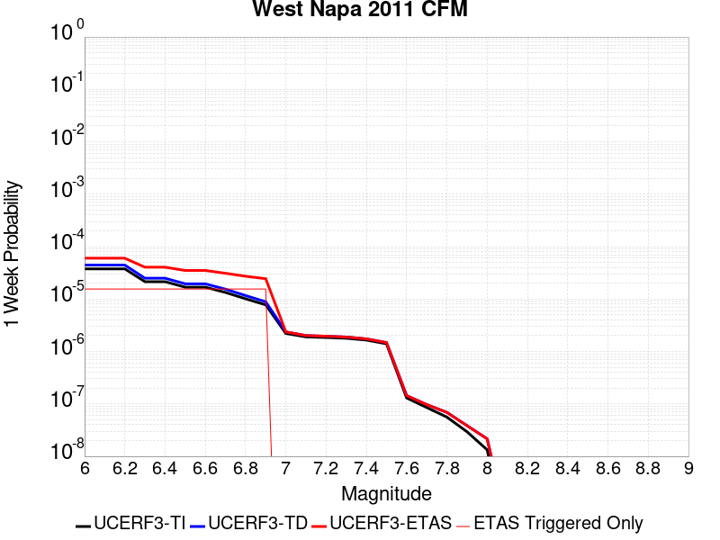 | 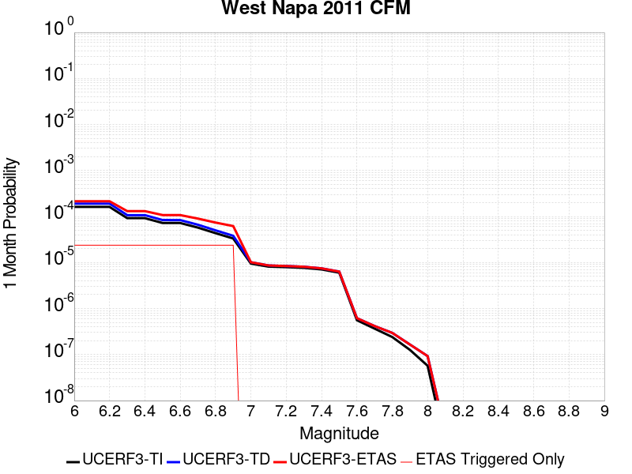 | 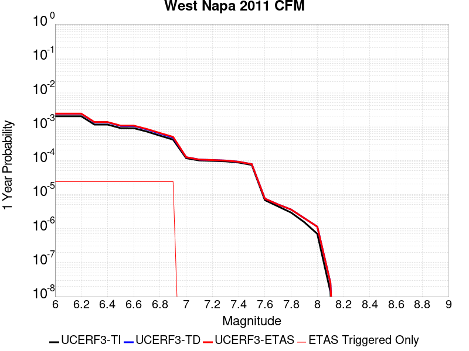 | 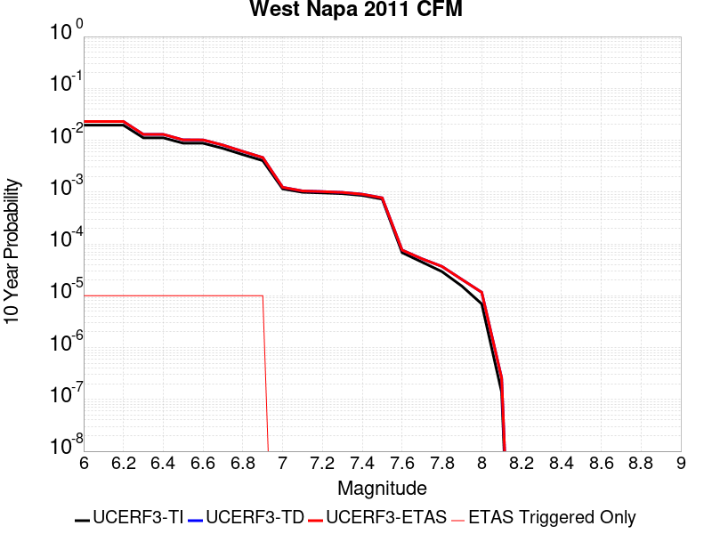 |

| Magnitude | 1 wk TI Prob | 1 wk TD Prob | 1 wk ETAS Prob | 1 wk ETAS/TD Gain | 1 wk ETAS Triggered Only | 1 mo TI Prob | 1 mo TD Prob | 1 mo ETAS Prob | 1 mo ETAS/TD Gain | 1 mo ETAS Triggered Only | 1 yr TI Prob | 1 yr TD Prob | 1 yr ETAS Prob | 1 yr ETAS/TD Gain | 1 yr ETAS Triggered Only | 10 yr TI Prob | 10 yr TD Prob | 10 yr ETAS Prob | 10 yr ETAS/TD Gain | 10 yr ETAS Triggered Only |
|-----|-----|-----|-----|-----|-----|-----|-----|-----|-----|-----|-----|-----|-----|-----|-----|-----|-----|-----|-----|-----|
| 6.0 | 3.773104E-5 | 4.452845E-5 | 5.4528E-5 | 1.2245655 | 1.0E-5 | 1.6169442E-4 | 1.9082405E-4 | 2.0082213E-4 | 1.0523943 | 1.0E-5 | 0.001966852 | 0.0023211248 | 0.0023311016 | 1.0042982 | 1.0E-5 | 0.019495348 | 0.023002245 | 0.023012016 | 1.0004247 | 1.0E-5 |
| 6.1 | 3.773104E-5 | 4.452845E-5 | 5.4528E-5 | 1.2245655 | 1.0E-5 | 1.6169442E-4 | 1.9082405E-4 | 2.0082213E-4 | 1.0523943 | 1.0E-5 | 0.001966852 | 0.0023211248 | 0.0023311016 | 1.0042982 | 1.0E-5 | 0.019495348 | 0.023002245 | 0.023012016 | 1.0004247 | 1.0E-5 |
| 6.2 | 3.773104E-5 | 4.452845E-5 | 5.4528E-5 | 1.2245655 | 1.0E-5 | 1.6169442E-4 | 1.9082405E-4 | 2.0082213E-4 | 1.0523943 | 1.0E-5 | 0.001966852 | 0.0023211248 | 0.0023311016 | 1.0042982 | 1.0E-5 | 0.019495348 | 0.023002245 | 0.023012016 | 1.0004247 | 1.0E-5 |
| 6.3 | 2.147964E-5 | 2.4987039E-5 | 3.4986788E-5 | 1.4001975 | 1.0E-5 | 9.2052345E-5 | 1.0708343E-4 | 1.1708236E-4 | 1.0933751 | 1.0E-5 | 0.001120161 | 0.0013030528 | 0.0013130397 | 1.0076643 | 1.0E-5 | 0.011145315 | 0.0129647385 | 0.012974609 | 1.0007613 | 1.0E-5 |
| 6.4 | 2.147964E-5 | 2.4987039E-5 | 3.4986788E-5 | 1.4001975 | 1.0E-5 | 9.2052345E-5 | 1.0708343E-4 | 1.1708236E-4 | 1.0933751 | 1.0E-5 | 0.001120161 | 0.0013030528 | 0.0013130397 | 1.0076643 | 1.0E-5 | 0.011145315 | 0.0129647385 | 0.012974609 | 1.0007613 | 1.0E-5 |
| 6.5 | 1.688201E-5 | 1.9547346E-5 | 2.9547151E-5 | 1.5115684 | 1.0E-5 | 7.234947E-5 | 8.377206E-5 | 9.3771225E-5 | 1.1193615 | 1.0E-5 | 8.804988E-4 | 0.0010195201 | 0.0010295099 | 1.0097985 | 1.0E-5 | 0.008770182 | 0.010157098 | 0.010166996 | 1.0009745 | 1.0E-5 |
| 6.6 | 1.6846381E-5 | 1.9507039E-5 | 2.9506844E-5 | 1.5126255 | 1.0E-5 | 7.219678E-5 | 8.359933E-5 | 9.359849E-5 | 1.1196082 | 1.0E-5 | 8.7864127E-4 | 0.001017419 | 0.0010274089 | 1.0098188 | 1.0E-5 | 0.008751754 | 0.010136279 | 0.010146177 | 1.0009766 | 1.0E-5 |
| 6.7 | 1.3396501E-5 | 1.5467655E-5 | 2.54675E-5 | 1.6465005 | 1.0E-5 | 5.7412315E-5 | 6.628862E-5 | 7.628796E-5 | 1.1508454 | 1.0E-5 | 6.9877075E-4 | 8.0682867E-4 | 8.168206E-4 | 1.0123842 | 1.0E-5 | 0.0069657755 | 0.008046719 | 0.008056639 | 1.0012327 | 1.0E-5 |
| 6.8 | 1.0139058E-5 | 1.1672149E-5 | 2.1672033E-5 | 1.8567302 | 1.0E-5 | 4.3452383E-5 | 5.0022853E-5 | 6.0022354E-5 | 1.1998986 | 1.0E-5 | 5.289043E-4 | 6.0891354E-4 | 6.1890745E-4 | 1.0164127 | 1.0E-5 | 0.005276473 | 0.006079373 | 0.006089312 | 1.001635 | 1.0E-5 |
| 6.9 | 7.761281E-6 | 8.890694E-6 | 1.8890605E-5 | 2.1247616 | 1.0E-5 | 3.326221E-5 | 3.8102706E-5 | 4.8102323E-5 | 1.2624385 | 1.0E-5 | 4.0489217E-4 | 4.6385307E-4 | 4.7384843E-4 | 1.0215485 | 1.0E-5 | 0.0040415525 | 0.004635363 | 0.0046453164 | 1.0021473 | 1.0E-5 |
| 7.0 | 2.2109202E-6 | 2.3666025E-6 | 2.3666025E-6 | 1.0 | 0.0 | 9.475338E-6 | 1.0142544E-5 | 1.0142544E-5 | 1.0 | 0.0 | 1.1535613E-4 | 1.2347854E-4 | 1.2347854E-4 | 1.0 | 0.0 | 0.0011529627 | 0.0012355851 | 0.0012355851 | 1.0 | 0.0 |
| 7.1 | 1.9008926E-6 | 2.0132914E-6 | 2.0132914E-6 | 1.0 | 0.0 | 8.146657E-6 | 8.6283635E-6 | 8.6283635E-6 | 1.0 | 0.0 | 9.918104E-5 | 1.05045285E-4 | 1.05045285E-4 | 1.0 | 0.0 | 9.913679E-4 | 0.001051437 | 0.001051437 | 1.0 | 0.0 |
| 7.2 | 1.8495944E-6 | 1.9560982E-6 | 1.9560982E-6 | 1.0 | 0.0 | 7.926808E-6 | 8.383251E-6 | 8.383251E-6 | 1.0 | 0.0 | 9.650462E-5 | 1.0206133E-4 | 1.0206133E-4 | 1.0 | 0.0 | 9.6462725E-4 | 0.0010216252 | 0.0010216252 | 1.0 | 0.0 |
| 7.3 | 1.7883189E-6 | 1.8880608E-6 | 1.8880608E-6 | 1.0 | 0.0 | 7.664201E-6 | 8.091664E-6 | 8.091664E-6 | 1.0 | 0.0 | 9.330765E-5 | 9.8511584E-5 | 9.8511584E-5 | 1.0 | 0.0 | 9.3268487E-4 | 9.861597E-4 | 9.861597E-4 | 1.0 | 0.0 |
| 7.4 | 1.6520572E-6 | 1.741484E-6 | 1.741484E-6 | 1.0 | 0.0 | 7.0802257E-6 | 7.463482E-6 | 7.463482E-6 | 1.0 | 0.0 | 8.6198335E-5 | 9.086413E-5 | 9.086413E-5 | 1.0 | 0.0 | 8.616491E-4 | 9.0974604E-4 | 9.0974604E-4 | 1.0 | 0.0 |
| 7.5 | 1.4040345E-6 | 1.4800074E-6 | 1.4800074E-6 | 1.0 | 0.0 | 6.0172765E-6 | 6.3428733E-6 | 6.3428733E-6 | 1.0 | 0.0 | 7.325788E-5 | 7.7221775E-5 | 7.7221775E-5 | 1.0 | 0.0 | 7.3233736E-4 | 7.7339396E-4 | 7.7339396E-4 | 1.0 | 0.0 |
| 7.6 | 1.3013842E-7 | 1.4415936E-7 | 1.4415936E-7 | 1.0 | 0.0 | 5.57736E-7 | 6.1782566E-7 | 6.1782566E-7 | 1.0 | 0.0 | 6.790414E-6 | 7.5220014E-6 | 7.5220014E-6 | 1.0 | 0.0 | 6.790207E-5 | 7.614869E-5 | 7.614869E-5 | 1.0 | 0.0 |
| 7.7 | 8.541512E-8 | 9.716316E-8 | 9.716316E-8 | 1.0 | 0.0 | 3.6606474E-7 | 4.1641349E-7 | 4.1641349E-7 | 1.0 | 0.0 | 4.456829E-6 | 5.0698222E-6 | 5.0698222E-6 | 1.0 | 0.0 | 4.4567398E-5 | 5.160297E-5 | 5.160297E-5 | 1.0 | 0.0 |
| 7.8 | 5.6074793E-8 | 6.89534E-8 | 6.89534E-8 | 1.0 | 0.0 | 2.403205E-7 | 2.9551452E-7 | 2.9551452E-7 | 1.0 | 0.0 | 2.9258983E-6 | 3.5978833E-6 | 3.5978833E-6 | 1.0 | 0.0 | 2.9258597E-5 | 3.681433E-5 | 3.681433E-5 | 1.0 | 0.0 |
| 7.9 | 2.9475839E-8 | 3.8566046E-8 | 3.8566046E-8 | 1.0 | 0.0 | 1.2632502E-7 | 1.6528305E-7 | 1.6528305E-7 | 1.0 | 0.0 | 1.538006E-6 | 2.0123193E-6 | 2.0123193E-6 | 1.0 | 0.0 | 1.5379954E-5 | 2.0665891E-5 | 2.0665891E-5 | 1.0 | 0.0 |
| 8.0 | 1.3337122E-8 | 2.163124E-8 | 2.163124E-8 | 1.0 | 0.0 | 5.7159088E-8 | 9.270532E-8 | 9.270532E-8 | 1.0 | 0.0 | 6.959117E-7 | 1.1286867E-6 | 1.1286867E-6 | 1.0 | 0.0 | 6.959095E-6 | 1.1645628E-5 | 1.1645628E-5 | 1.0 | 0.0 |
| 8.1 | 2.6589986E-10 | 4.8615456E-10 | 4.8615456E-10 | 1.0 | 0.0 | 1.1395708E-9 | 2.0835205E-9 | 2.0835205E-9 | 1.0 | 0.0 | 1.3874274E-8 | 2.536686E-8 | 2.536686E-8 | 1.0 | 0.0 | 1.3874273E-7 | 2.6035906E-7 | 2.6035906E-7 | 1.0 | 0.0 |

## Point Reyes 2011 CFM
*[(top)](#table-of-contents)*

| 1 Week | 1 Month | 1 Year | 10 Year |
|-----|-----|-----|-----|
|  |  | 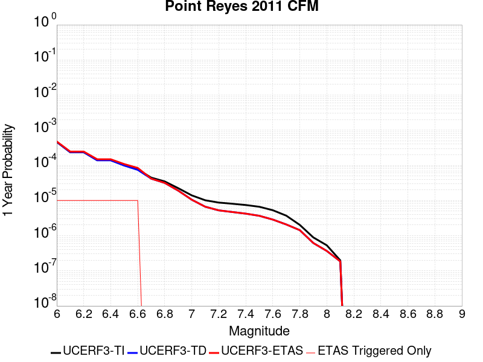 | 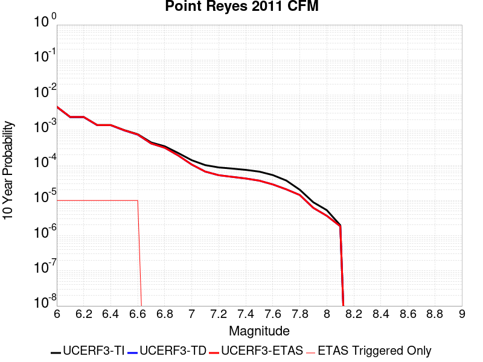 |

| Magnitude | 1 wk TI Prob | 1 wk TD Prob | 1 wk ETAS Prob | 1 wk ETAS/TD Gain | 1 wk ETAS Triggered Only | 1 mo TI Prob | 1 mo TD Prob | 1 mo ETAS Prob | 1 mo ETAS/TD Gain | 1 mo ETAS Triggered Only | 1 yr TI Prob | 1 yr TD Prob | 1 yr ETAS Prob | 1 yr ETAS/TD Gain | 1 yr ETAS Triggered Only | 10 yr TI Prob | 10 yr TD Prob | 10 yr ETAS Prob | 10 yr ETAS/TD Gain | 10 yr ETAS Triggered Only |
|-----|-----|-----|-----|-----|-----|-----|-----|-----|-----|-----|-----|-----|-----|-----|-----|-----|-----|-----|-----|-----|
| 6.0 | 8.8644965E-6 | 8.967163E-6 | 8.967163E-6 | 1.0 | 0.0 | 3.7990147E-5 | 3.843017E-5 | 3.843017E-5 | 1.0 | 0.0 | 4.624319E-4 | 4.6779314E-4 | 4.7778848E-4 | 1.021367 | 1.0E-5 | 0.0046147075 | 0.004668713 | 0.004678666 | 1.0021319 | 1.0E-5 |
| 6.1 | 4.526405E-6 | 4.5392185E-6 | 4.5392185E-6 | 1.0 | 0.0 | 1.9398734E-5 | 1.9453653E-5 | 1.9453653E-5 | 1.0 | 0.0 | 2.36154E-4 | 2.3682354E-4 | 2.4682118E-4 | 1.0422156 | 1.0E-5 | 0.002359032 | 0.0023658178 | 0.002375794 | 1.0042169 | 1.0E-5 |
| 6.2 | 4.526405E-6 | 4.5392185E-6 | 4.5392185E-6 | 1.0 | 0.0 | 1.9398734E-5 | 1.9453653E-5 | 1.9453653E-5 | 1.0 | 0.0 | 2.36154E-4 | 2.3682354E-4 | 2.4682118E-4 | 1.0422156 | 1.0E-5 | 0.002359032 | 0.0023658178 | 0.002375794 | 1.0042169 | 1.0E-5 |
| 6.3 | 2.6842322E-6 | 2.660676E-6 | 2.660676E-6 | 1.0 | 0.0 | 1.1503801E-5 | 1.1402849E-5 | 1.1402849E-5 | 1.0 | 0.0 | 1.4004979E-4 | 1.3882104E-4 | 1.4881964E-4 | 1.0720252 | 1.0E-5 | 0.0013996155 | 0.0013873649 | 0.001397351 | 1.0071979 | 1.0E-5 |
| 6.4 | 2.6842322E-6 | 2.660676E-6 | 2.660676E-6 | 1.0 | 0.0 | 1.1503801E-5 | 1.1402849E-5 | 1.1402849E-5 | 1.0 | 0.0 | 1.4004979E-4 | 1.3882104E-4 | 1.4881964E-4 | 1.0720252 | 1.0E-5 | 0.0013996155 | 0.0013873649 | 0.001397351 | 1.0071979 | 1.0E-5 |
| 6.5 | 1.9281833E-6 | 1.8906262E-6 | 1.8906262E-6 | 1.0 | 0.0 | 8.263617E-6 | 8.102659E-6 | 8.102659E-6 | 1.0 | 0.0 | 1.0060489E-4 | 9.86455E-5 | 1.0864451E-4 | 1.1013631 | 1.0E-5 | 0.0010055936 | 9.860279E-4 | 9.960181E-4 | 1.0101317 | 1.0E-5 |
| 6.6 | 1.4726726E-6 | 1.4269577E-6 | 1.4269577E-6 | 1.0 | 0.0 | 6.3114385E-6 | 6.1155188E-6 | 6.1155188E-6 | 1.0 | 0.0 | 7.683905E-5 | 7.445395E-5 | 8.4453204E-5 | 1.1343012 | 1.0E-5 | 7.6812494E-4 | 7.4429717E-4 | 7.5428974E-4 | 1.0134255 | 1.0E-5 |
| 6.7 | 8.572307E-7 | 8.007212E-7 | 8.007212E-7 | 1.0 | 0.0 | 3.6738406E-6 | 3.431658E-6 | 3.431658E-6 | 1.0 | 0.0 | 4.472809E-5 | 4.1779647E-5 | 4.1779647E-5 | 1.0 | 0.0 | 4.471909E-4 | 4.1772184E-4 | 4.1772184E-4 | 1.0 | 0.0 |
| 6.8 | 6.6745434E-7 | 6.0773E-7 | 6.0773E-7 | 1.0 | 0.0 | 2.8605155E-6 | 2.6045543E-6 | 2.6045543E-6 | 1.0 | 0.0 | 3.482622E-5 | 3.171E-5 | 3.171E-5 | 1.0 | 0.0 | 3.4820763E-4 | 3.1705803E-4 | 3.1705803E-4 | 1.0 | 0.0 |
| 6.9 | 4.291521E-7 | 3.6535937E-7 | 3.6535937E-7 | 1.0 | 0.0 | 1.839222E-6 | 1.565825E-6 | 1.565825E-6 | 1.0 | 0.0 | 2.2392298E-5 | 1.9063755E-5 | 1.9063755E-5 | 1.0 | 0.0 | 2.2390042E-4 | 1.9062385E-4 | 1.9062385E-4 | 1.0 | 0.0 |
| 7.0 | 2.6812808E-7 | 2.0187414E-7 | 2.0187414E-7 | 1.0 | 0.0 | 1.1491198E-6 | 8.651746E-7 | 8.651746E-7 | 1.0 | 0.0 | 1.3990444E-5 | 1.0533451E-5 | 1.0533451E-5 | 1.0 | 0.0 | 1.3989564E-4 | 1.0533186E-4 | 1.0533186E-4 | 1.0 | 0.0 |
| 7.1 | 1.9451231E-7 | 1.2725499E-7 | 1.2725499E-7 | 1.0 | 0.0 | 8.336239E-7 | 5.453784E-7 | 5.453784E-7 | 1.0 | 0.0 | 1.0149324E-5 | 6.6399616E-6 | 6.6399616E-6 | 1.0 | 0.0 | 1.014886E-4 | 6.639991E-5 | 6.639991E-5 | 1.0 | 0.0 |
| 7.2 | 1.6715143E-7 | 1.00428394E-7 | 1.00428394E-7 | 1.0 | 0.0 | 7.1636305E-7 | 4.3040734E-7 | 4.3040734E-7 | 1.0 | 0.0 | 8.721685E-6 | 5.2401965E-6 | 5.2401965E-6 | 1.0 | 0.0 | 8.721343E-5 | 5.2402997E-5 | 5.2402997E-5 | 1.0 | 0.0 |
| 7.3 | 1.5503173E-7 | 9.0131024E-8 | 9.0131024E-8 | 1.0 | 0.0 | 6.644215E-7 | 3.8627576E-7 | 3.8627576E-7 | 1.0 | 0.0 | 8.089301E-6 | 4.702897E-6 | 4.702897E-6 | 1.0 | 0.0 | 8.089007E-5 | 4.7030244E-5 | 4.7030244E-5 | 1.0 | 0.0 |
| 7.4 | 1.4251614E-7 | 8.097624E-8 | 8.097624E-8 | 1.0 | 0.0 | 6.1078333E-7 | 3.47041E-7 | 3.47041E-7 | 1.0 | 0.0 | 7.4362615E-6 | 4.225216E-6 | 4.225216E-6 | 1.0 | 0.0 | 7.436013E-5 | 4.2253625E-5 | 4.2253625E-5 | 1.0 | 0.0 |
| 7.5 | 1.2710186E-7 | 7.0296394E-8 | 7.0296394E-8 | 1.0 | 0.0 | 5.447221E-7 | 3.0127023E-7 | 3.0127023E-7 | 1.0 | 0.0 | 6.6319717E-6 | 3.667959E-6 | 3.667959E-6 | 1.0 | 0.0 | 6.6317734E-5 | 3.6681253E-5 | 3.6681253E-5 | 1.0 | 0.0 |
| 7.6 | 1.0144708E-7 | 5.4952274E-8 | 5.4952274E-8 | 1.0 | 0.0 | 4.347731E-7 | 2.3550973E-7 | 2.3550973E-7 | 1.0 | 0.0 | 5.2933497E-6 | 2.8673273E-6 | 2.8673273E-6 | 1.0 | 0.0 | 5.293224E-5 | 2.8675171E-5 | 2.8675171E-5 | 1.0 | 0.0 |
| 7.7 | 7.090527E-8 | 3.98231E-8 | 3.98231E-8 | 1.0 | 0.0 | 3.038797E-7 | 1.7067042E-7 | 1.7067042E-7 | 1.0 | 0.0 | 3.699729E-6 | 2.0779103E-6 | 2.0779103E-6 | 1.0 | 0.0 | 3.6996673E-5 | 2.0781177E-5 | 2.0781177E-5 | 1.0 | 0.0 |
| 7.8 | 3.8712045E-8 | 2.7440025E-8 | 2.7440025E-8 | 1.0 | 0.0 | 1.6590876E-7 | 1.176001E-7 | 1.176001E-7 | 1.0 | 0.0 | 2.0199373E-6 | 1.4317802E-6 | 1.4317802E-6 | 1.0 | 0.0 | 2.0199188E-5 | 1.4319979E-5 | 1.4319979E-5 | 1.0 | 0.0 |
| 7.9 | 1.7068782E-8 | 1.1833354E-8 | 1.1833354E-8 | 1.0 | 0.0 | 7.315192E-8 | 5.0714362E-8 | 5.0714362E-8 | 1.0 | 0.0 | 8.906242E-7 | 6.174472E-7 | 6.174472E-7 | 1.0 | 0.0 | 8.906207E-6 | 6.1767228E-6 | 6.1767228E-6 | 1.0 | 0.0 |
| 8.0 | 1.0172592E-8 | 7.0280843E-9 | 7.0280843E-9 | 1.0 | 0.0 | 4.359682E-8 | 3.0120354E-8 | 3.0120354E-8 | 1.0 | 0.0 | 5.3079117E-7 | 3.6671526E-7 | 3.6671526E-7 | 1.0 | 0.0 | 5.307899E-6 | 3.6694146E-6 | 3.6694146E-6 | 1.0 | 0.0 |
| 8.1 | 3.7861243E-9 | 3.5452439E-9 | 3.5452439E-9 | 1.0 | 0.0 | 1.6226247E-8 | 1.5193901E-8 | 1.5193901E-8 | 1.0 | 0.0 | 1.9755454E-7 | 1.8498575E-7 | 1.8498575E-7 | 1.0 | 0.0 | 1.9755437E-6 | 1.8518531E-6 | 1.8518531E-6 | 1.0 | 0.0 |

## Point Reyes 2011 connector
*[(top)](#table-of-contents)*

| 1 Week | 1 Month | 1 Year | 10 Year |
|-----|-----|-----|-----|
| 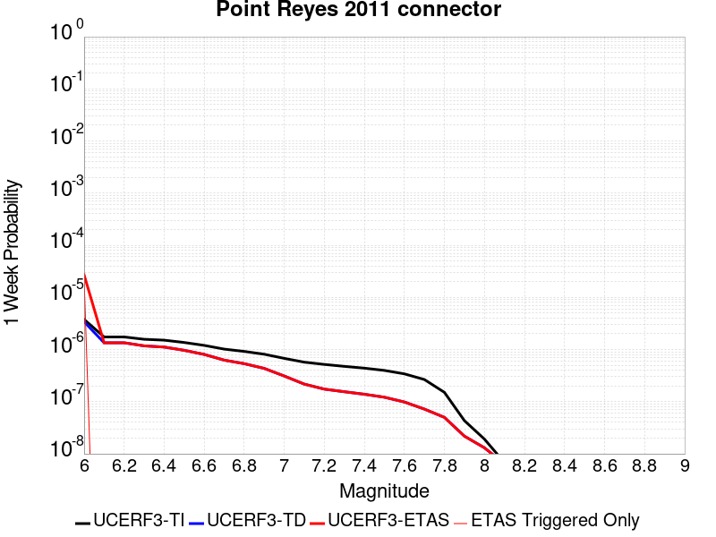 | 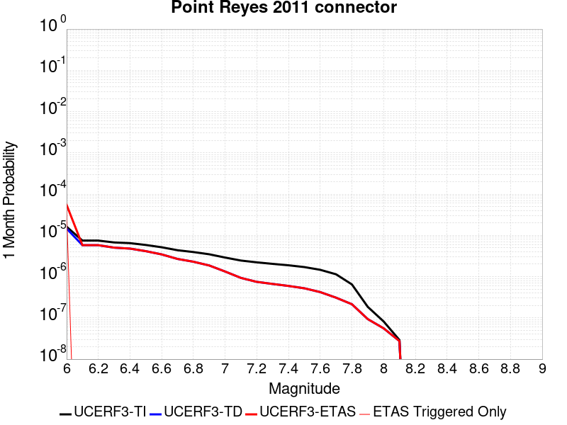 | 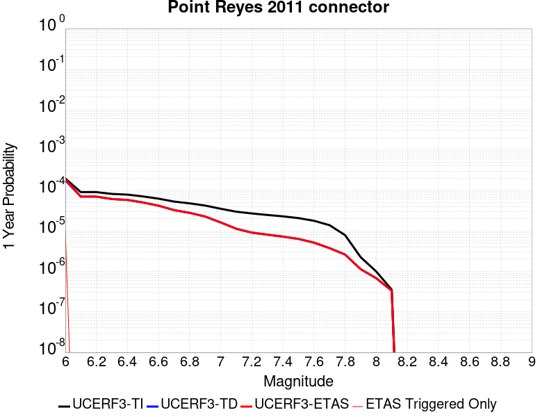 | 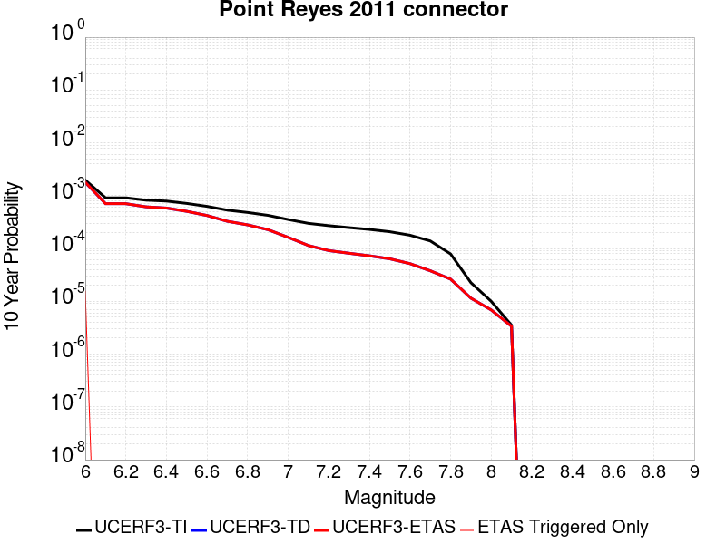 |

| Magnitude | 1 wk TI Prob | 1 wk TD Prob | 1 wk ETAS Prob | 1 wk ETAS/TD Gain | 1 wk ETAS Triggered Only | 1 mo TI Prob | 1 mo TD Prob | 1 mo ETAS Prob | 1 mo ETAS/TD Gain | 1 mo ETAS Triggered Only | 1 yr TI Prob | 1 yr TD Prob | 1 yr ETAS Prob | 1 yr ETAS/TD Gain | 1 yr ETAS Triggered Only | 10 yr TI Prob | 10 yr TD Prob | 10 yr ETAS Prob | 10 yr ETAS/TD Gain | 10 yr ETAS Triggered Only |
|-----|-----|-----|-----|-----|-----|-----|-----|-----|-----|-----|-----|-----|-----|-----|-----|-----|-----|-----|-----|-----|
| 6.0 | 3.7893044E-6 | 3.419046E-6 | 1.3419011E-5 | 3.9247825 | 1.0E-5 | 1.6239776E-5 | 1.4652984E-5 | 2.4652838E-5 | 1.6824448 | 1.0E-5 | 1.9770133E-4 | 1.783876E-4 | 1.8838582E-4 | 1.0560477 | 1.0E-5 | 0.0019752553 | 0.0017829017 | 0.001792884 | 1.0055988 | 1.0E-5 |
| 6.1 | 1.7449562E-6 | 1.3500958E-6 | 1.3500958E-6 | 1.0 | 0.0 | 7.478362E-6 | 5.786112E-6 | 5.786112E-6 | 1.0 | 0.0 | 9.104525E-5 | 7.044369E-5 | 7.044369E-5 | 1.0 | 0.0 | 9.1007963E-4 | 7.044673E-4 | 7.044673E-4 | 1.0 | 0.0 |
| 6.2 | 1.7449562E-6 | 1.3500958E-6 | 1.3500958E-6 | 1.0 | 0.0 | 7.478362E-6 | 5.786112E-6 | 5.786112E-6 | 1.0 | 0.0 | 9.104525E-5 | 7.044369E-5 | 7.044369E-5 | 1.0 | 0.0 | 9.1007963E-4 | 7.044673E-4 | 7.044673E-4 | 1.0 | 0.0 |
| 6.3 | 1.5739171E-6 | 1.1773358E-6 | 1.1773358E-6 | 1.0 | 0.0 | 6.7453416E-6 | 5.0457156E-6 | 5.0457156E-6 | 1.0 | 0.0 | 8.212144E-5 | 6.14299E-5 | 6.14299E-5 | 1.0 | 0.0 | 8.2091097E-4 | 6.1438145E-4 | 6.1438145E-4 | 1.0 | 0.0 |
| 6.4 | 1.5138507E-6 | 1.1166904E-6 | 1.1166904E-6 | 1.0 | 0.0 | 6.4879155E-6 | 4.7858075E-6 | 4.7858075E-6 | 1.0 | 0.0 | 7.898751E-5 | 5.8265687E-5 | 5.8265687E-5 | 1.0 | 0.0 | 7.8959437E-4 | 5.827562E-4 | 5.827562E-4 | 1.0 | 0.0 |
| 6.5 | 1.3662817E-6 | 9.671372E-7 | 9.671372E-7 | 1.0 | 0.0 | 5.8554797E-6 | 4.1448675E-6 | 4.1448675E-6 | 1.0 | 0.0 | 7.128814E-5 | 5.046261E-5 | 5.046261E-5 | 1.0 | 0.0 | 7.126527E-4 | 5.047615E-4 | 5.047615E-4 | 1.0 | 0.0 |
| 6.6 | 1.2022703E-6 | 8.0703006E-7 | 8.0703006E-7 | 1.0 | 0.0 | 5.1525767E-6 | 3.4586958E-6 | 3.4586958E-6 | 1.0 | 0.0 | 6.273081E-5 | 4.210882E-5 | 4.210882E-5 | 1.0 | 0.0 | 6.271311E-4 | 4.2125754E-4 | 4.2125754E-4 | 1.0 | 0.0 |
| 6.7 | 1.0194848E-6 | 6.265979E-7 | 6.265979E-7 | 1.0 | 0.0 | 4.3692135E-6 | 2.6854168E-6 | 2.6854168E-6 | 1.0 | 0.0 | 5.319387E-5 | 3.2694465E-5 | 3.2694465E-5 | 1.0 | 0.0 | 5.3181144E-4 | 3.271452E-4 | 3.271452E-4 | 1.0 | 0.0 |
| 6.8 | 9.212307E-7 | 5.3645635E-7 | 5.3645635E-7 | 1.0 | 0.0 | 3.9481256E-6 | 2.2990966E-6 | 2.2990966E-6 | 1.0 | 0.0 | 4.806737E-5 | 2.7991146E-5 | 2.7991146E-5 | 1.0 | 0.0 | 4.8056975E-4 | 2.8012466E-4 | 2.8012466E-4 | 1.0 | 0.0 |
| 6.9 | 8.1306075E-7 | 4.350046E-7 | 4.350046E-7 | 1.0 | 0.0 | 3.4845416E-6 | 1.8643041E-6 | 1.8643041E-6 | 1.0 | 0.0 | 4.2423468E-5 | 2.2697668E-5 | 2.2697668E-5 | 1.0 | 0.0 | 4.241537E-4 | 2.2720183E-4 | 2.2720183E-4 | 1.0 | 0.0 |
| 7.0 | 6.773335E-7 | 3.1073702E-7 | 3.1073702E-7 | 1.0 | 0.0 | 2.9028547E-6 | 1.3317294E-6 | 1.3317294E-6 | 1.0 | 0.0 | 3.5341684E-5 | 1.6213686E-5 | 1.6213686E-5 | 1.0 | 0.0 | 3.5336064E-4 | 1.6237324E-4 | 1.6237324E-4 | 1.0 | 0.0 |
| 7.1 | 5.7279397E-7 | 2.1742792E-7 | 2.1742792E-7 | 1.0 | 0.0 | 2.454829E-6 | 9.3183365E-7 | 9.3183365E-7 | 1.0 | 0.0 | 2.9887131E-5 | 1.1345015E-5 | 1.1345015E-5 | 1.0 | 0.0 | 2.9883112E-4 | 1.13692506E-4 | 1.13692506E-4 | 1.0 | 0.0 |
| 7.2 | 5.185539E-7 | 1.7429139E-7 | 1.7429139E-7 | 1.0 | 0.0 | 2.222372E-6 | 7.469629E-7 | 7.469629E-7 | 1.0 | 0.0 | 2.7057044E-5 | 9.094235E-6 | 9.094235E-6 | 1.0 | 0.0 | 2.7053748E-4 | 9.118677E-5 | 9.118677E-5 | 1.0 | 0.0 |
| 7.3 | 4.7599846E-7 | 1.5520465E-7 | 1.5520465E-7 | 1.0 | 0.0 | 2.0399918E-6 | 6.6516264E-7 | 6.6516264E-7 | 1.0 | 0.0 | 2.4836616E-5 | 8.0983245E-6 | 8.0983245E-6 | 1.0 | 0.0 | 2.4833842E-4 | 8.122844E-5 | 8.122844E-5 | 1.0 | 0.0 |
| 7.4 | 4.3987393E-7 | 1.3893278E-7 | 1.3893278E-7 | 1.0 | 0.0 | 1.8851727E-6 | 5.9542606E-7 | 5.9542606E-7 | 1.0 | 0.0 | 2.2951735E-5 | 7.249288E-6 | 7.249288E-6 | 1.0 | 0.0 | 2.2949366E-4 | 7.273859E-5 | 7.273859E-5 | 1.0 | 0.0 |
| 7.5 | 3.980054E-7 | 1.218581E-7 | 1.218581E-7 | 1.0 | 0.0 | 1.7057363E-6 | 5.222489E-7 | 5.222489E-7 | 1.0 | 0.0 | 2.0767142E-5 | 6.358361E-6 | 6.358361E-6 | 1.0 | 0.0 | 2.0765202E-4 | 6.382455E-5 | 6.382455E-5 | 1.0 | 0.0 |
| 7.6 | 3.4188398E-7 | 9.8577246E-8 | 9.8577246E-8 | 1.0 | 0.0 | 1.4652163E-6 | 4.2247387E-7 | 4.2247387E-7 | 1.0 | 0.0 | 1.7838862E-5 | 5.143607E-6 | 5.143607E-6 | 1.0 | 0.0 | 1.783743E-4 | 5.166426E-5 | 5.166426E-5 | 1.0 | 0.0 |
| 7.7 | 2.6611437E-7 | 7.213626E-8 | 7.213626E-8 | 1.0 | 0.0 | 1.1404896E-6 | 3.0915538E-7 | 3.0915538E-7 | 1.0 | 0.0 | 1.3885373E-5 | 3.7639602E-6 | 3.7639602E-6 | 1.0 | 0.0 | 1.3884505E-4 | 3.78245E-5 | 3.78245E-5 | 1.0 | 0.0 |
| 7.8 | 1.5107078E-7 | 5.0054087E-8 | 5.0054087E-8 | 1.0 | 0.0 | 6.474461E-7 | 2.145175E-7 | 2.145175E-7 | 1.0 | 0.0 | 7.882627E-6 | 2.6117473E-6 | 2.6117473E-6 | 1.0 | 0.0 | 7.8823476E-5 | 2.6281212E-5 | 2.6281212E-5 | 1.0 | 0.0 |
| 7.9 | 4.3228205E-8 | 2.1818217E-8 | 2.1818217E-8 | 1.0 | 0.0 | 1.8526373E-7 | 9.350663E-8 | 9.350663E-8 | 1.0 | 0.0 | 2.2555835E-6 | 1.1384427E-6 | 1.1384427E-6 | 1.0 | 0.0 | 2.2555607E-5 | 1.1461557E-5 | 1.1461557E-5 | 1.0 | 0.0 |
| 8.0 | 1.9149928E-8 | 1.30497515E-8 | 1.30497515E-8 | 1.0 | 0.0 | 8.207112E-8 | 5.5927494E-8 | 5.5927494E-8 | 1.0 | 0.0 | 9.992154E-7 | 6.80917E-7 | 6.80917E-7 | 1.0 | 0.0 | 9.992109E-6 | 6.857356E-6 | 6.857356E-6 | 1.0 | 0.0 |
| 8.1 | 6.7792816E-9 | 6.4085857E-9 | 6.4085857E-9 | 1.0 | 0.0 | 2.9054062E-8 | 2.7465362E-8 | 2.7465362E-8 | 1.0 | 0.0 | 3.5373316E-7 | 3.3439076E-7 | 3.3439076E-7 | 1.0 | 0.0 | 3.537326E-6 | 3.3694284E-6 | 3.3694284E-6 | 1.0 | 0.0 |

## Honey Lake 2011 CFM
*[(top)](#table-of-contents)*

| 1 Week | 1 Month | 1 Year | 10 Year |
|-----|-----|-----|-----|
|  |  | 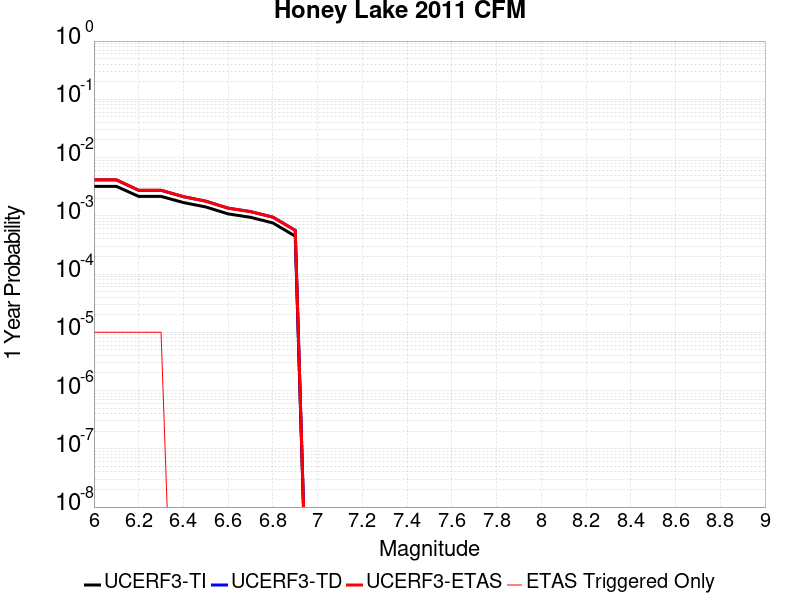 | 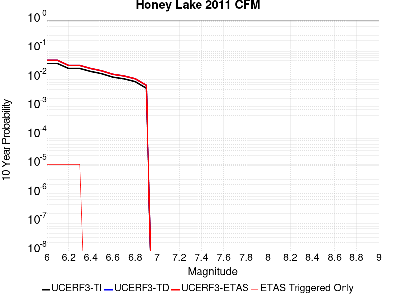 |

| Magnitude | 1 wk TI Prob | 1 wk TD Prob | 1 wk ETAS Prob | 1 wk ETAS/TD Gain | 1 wk ETAS Triggered Only | 1 mo TI Prob | 1 mo TD Prob | 1 mo ETAS Prob | 1 mo ETAS/TD Gain | 1 mo ETAS Triggered Only | 1 yr TI Prob | 1 yr TD Prob | 1 yr ETAS Prob | 1 yr ETAS/TD Gain | 1 yr ETAS Triggered Only | 10 yr TI Prob | 10 yr TD Prob | 10 yr ETAS Prob | 10 yr ETAS/TD Gain | 10 yr ETAS Triggered Only |
|-----|-----|-----|-----|-----|-----|-----|-----|-----|-----|-----|-----|-----|-----|-----|-----|-----|-----|-----|-----|-----|
| 6.0 | 6.155506E-5 | 7.954667E-5 | 7.954667E-5 | 1.0 | 0.0 | 2.6378073E-4 | 3.40873E-4 | 3.40873E-4 | 1.0 | 0.0 | 0.0032068014 | 0.0041427943 | 0.004152753 | 1.0024039 | 1.0E-5 | 0.03160919 | 0.040702924 | 0.040712517 | 1.0002357 | 1.0E-5 |
| 6.1 | 6.155506E-5 | 7.954667E-5 | 7.954667E-5 | 1.0 | 0.0 | 2.6378073E-4 | 3.40873E-4 | 3.40873E-4 | 1.0 | 0.0 | 0.0032068014 | 0.0041427943 | 0.004152753 | 1.0024039 | 1.0E-5 | 0.03160919 | 0.040702924 | 0.040712517 | 1.0002357 | 1.0E-5 |
| 6.2 | 4.1335024E-5 | 5.257629E-5 | 5.257629E-5 | 1.0 | 0.0 | 1.7713808E-4 | 2.253086E-4 | 2.253086E-4 | 1.0 | 0.0 | 0.0021545228 | 0.0027398595 | 0.002749832 | 1.0036398 | 1.0E-5 | 0.021337535 | 0.027076708 | 0.027086439 | 1.0003593 | 1.0E-5 |
| 6.3 | 4.1335024E-5 | 5.257629E-5 | 5.257629E-5 | 1.0 | 0.0 | 1.7713808E-4 | 2.253086E-4 | 2.253086E-4 | 1.0 | 0.0 | 0.0021545228 | 0.0027398595 | 0.002749832 | 1.0036398 | 1.0E-5 | 0.021337535 | 0.027076708 | 0.027086439 | 1.0003593 | 1.0E-5 |
| 6.4 | 3.2393702E-5 | 4.0887444E-5 | 4.0887444E-5 | 1.0 | 0.0 | 1.3882275E-4 | 1.7522085E-4 | 1.7522085E-4 | 1.0 | 0.0 | 0.0016888566 | 0.002131335 | 0.002131335 | 1.0 | 0.0 | 0.016760793 | 0.02111982 | 0.02111982 | 1.0 | 0.0 |
| 6.5 | 2.7205504E-5 | 3.4211684E-5 | 3.4211684E-5 | 1.0 | 0.0 | 1.1658981E-4 | 1.4661385E-4 | 1.4661385E-4 | 1.0 | 0.0 | 0.0014185566 | 0.0017836588 | 0.0017836588 | 1.0 | 0.0 | 0.014095354 | 0.017702932 | 0.017702932 | 1.0 | 0.0 |
| 6.6 | 2.069265E-5 | 2.5955307E-5 | 2.5955307E-5 | 1.0 | 0.0 | 8.867977E-5 | 1.1123277E-4 | 1.1123277E-4 | 1.0 | 0.0 | 0.0010791414 | 0.0013535038 | 0.0013535038 | 1.0 | 0.0 | 0.010739161 | 0.013461002 | 0.013461002 | 1.0 | 0.0 |
| 6.7 | 1.8060919E-5 | 2.2656828E-5 | 2.2656828E-5 | 1.0 | 0.0 | 7.7401644E-5 | 9.709754E-5 | 9.709754E-5 | 1.0 | 0.0 | 9.419576E-4 | 0.0011816026 | 0.0011816026 | 1.0 | 0.0 | 0.009379748 | 0.011761238 | 0.011761238 | 1.0 | 0.0 |
| 6.8 | 1.4474663E-5 | 1.818127E-5 | 1.818127E-5 | 1.0 | 0.0 | 6.203279E-5 | 7.791784E-5 | 7.791784E-5 | 1.0 | 0.0 | 7.5498753E-4 | 9.483136E-4 | 9.483136E-4 | 1.0 | 0.0 | 0.007524277 | 0.009450192 | 0.009450192 | 1.0 | 0.0 |
| 6.9 | 8.564552E-6 | 1.0802308E-5 | 1.0802308E-5 | 1.0 | 0.0 | 3.6704707E-5 | 4.6295158E-5 | 4.6295158E-5 | 1.0 | 0.0 | 4.4678818E-4 | 5.635644E-4 | 5.635644E-4 | 1.0 | 0.0 | 0.0044589094 | 0.0056278477 | 0.0056278477 | 1.0 | 0.0 |

## Great Valley 04a Trout Creek
*[(top)](#table-of-contents)*

| 1 Week | 1 Month | 1 Year | 10 Year |
|-----|-----|-----|-----|
|  |  | 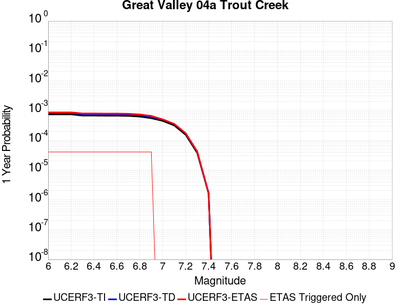 | 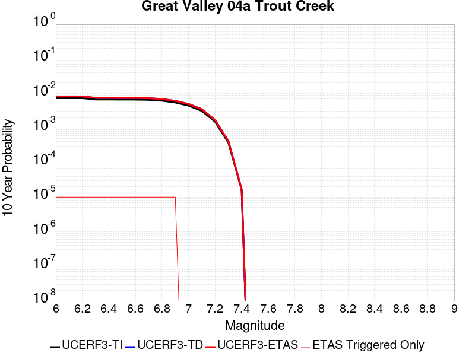 |

| Magnitude | 1 wk TI Prob | 1 wk TD Prob | 1 wk ETAS Prob | 1 wk ETAS/TD Gain | 1 wk ETAS Triggered Only | 1 mo TI Prob | 1 mo TD Prob | 1 mo ETAS Prob | 1 mo ETAS/TD Gain | 1 mo ETAS Triggered Only | 1 yr TI Prob | 1 yr TD Prob | 1 yr ETAS Prob | 1 yr ETAS/TD Gain | 1 yr ETAS Triggered Only | 10 yr TI Prob | 10 yr TD Prob | 10 yr ETAS Prob | 10 yr ETAS/TD Gain | 10 yr ETAS Triggered Only |
|-----|-----|-----|-----|-----|-----|-----|-----|-----|-----|-----|-----|-----|-----|-----|-----|-----|-----|-----|-----|-----|
| 6.0 | 1.4088538E-5 | 1.5719554E-5 | 1.5719554E-5 | 1.0 | 0.0 | 6.037805E-5 | 6.7367844E-5 | 6.7367844E-5 | 1.0 | 0.0 | 7.3485484E-4 | 8.199074E-4 | 8.2989916E-4 | 1.0121865 | 1.0E-5 | 0.007324295 | 0.008170108 | 0.008180026 | 1.001214 | 1.0E-5 |
| 6.1 | 1.4088538E-5 | 1.5719554E-5 | 1.5719554E-5 | 1.0 | 0.0 | 6.037805E-5 | 6.7367844E-5 | 6.7367844E-5 | 1.0 | 0.0 | 7.3485484E-4 | 8.199074E-4 | 8.2989916E-4 | 1.0121865 | 1.0E-5 | 0.007324295 | 0.008170108 | 0.008180026 | 1.001214 | 1.0E-5 |
| 6.2 | 1.4088538E-5 | 1.5719554E-5 | 1.5719554E-5 | 1.0 | 0.0 | 6.037805E-5 | 6.7367844E-5 | 6.7367844E-5 | 1.0 | 0.0 | 7.3485484E-4 | 8.199074E-4 | 8.2989916E-4 | 1.0121865 | 1.0E-5 | 0.007324295 | 0.008170108 | 0.008180026 | 1.001214 | 1.0E-5 |
| 6.3 | 1.2882862E-5 | 1.4378603E-5 | 1.4378603E-5 | 1.0 | 0.0 | 5.5211098E-5 | 6.1621184E-5 | 6.1621184E-5 | 1.0 | 0.0 | 6.7198783E-4 | 7.4999005E-4 | 7.5998256E-4 | 1.0133235 | 1.0E-5 | 0.0066995937 | 0.0074756527 | 0.0074855783 | 1.0013276 | 1.0E-5 |
| 6.4 | 1.2882862E-5 | 1.4378603E-5 | 1.4378603E-5 | 1.0 | 0.0 | 5.5211098E-5 | 6.1621184E-5 | 6.1621184E-5 | 1.0 | 0.0 | 6.7198783E-4 | 7.4999005E-4 | 7.5998256E-4 | 1.0133235 | 1.0E-5 | 0.0066995937 | 0.0074756527 | 0.0074855783 | 1.0013276 | 1.0E-5 |
| 6.5 | 1.2762329E-5 | 1.424516E-5 | 1.424516E-5 | 1.0 | 0.0 | 5.469455E-5 | 6.1049315E-5 | 6.1049315E-5 | 1.0 | 0.0 | 6.657027E-4 | 7.430323E-4 | 7.530249E-4 | 1.0134484 | 1.0E-5 | 0.00663712 | 0.0074065393 | 0.007416465 | 1.0013402 | 1.0E-5 |
| 6.6 | 1.2762329E-5 | 1.424516E-5 | 1.424516E-5 | 1.0 | 0.0 | 5.469455E-5 | 6.1049315E-5 | 6.1049315E-5 | 1.0 | 0.0 | 6.657027E-4 | 7.430323E-4 | 7.530249E-4 | 1.0134484 | 1.0E-5 | 0.00663712 | 0.0074065393 | 0.007416465 | 1.0013402 | 1.0E-5 |
| 6.7 | 1.2557959E-5 | 1.4019395E-5 | 1.4019395E-5 | 1.0 | 0.0 | 5.3818712E-5 | 6.0081795E-5 | 6.0081795E-5 | 1.0 | 0.0 | 6.5504585E-4 | 7.312607E-4 | 7.412534E-4 | 1.013665 | 1.0E-5 | 0.006531183 | 0.007289598 | 0.007299525 | 1.0013618 | 1.0E-5 |
| 6.8 | 1.1871544E-5 | 1.3258823E-5 | 1.3258823E-5 | 1.0 | 0.0 | 5.0877054E-5 | 5.6822348E-5 | 5.6822348E-5 | 1.0 | 0.0 | 6.1925204E-4 | 6.916025E-4 | 7.0159556E-4 | 1.0144491 | 1.0E-5 | 0.0061752927 | 0.0068955184 | 0.0069054496 | 1.0014402 | 1.0E-5 |
| 6.9 | 1.0500373E-5 | 1.1731261E-5 | 1.1731261E-5 | 1.0 | 0.0 | 4.5000823E-5 | 5.0275914E-5 | 5.0275914E-5 | 1.0 | 0.0 | 5.4774724E-4 | 6.119459E-4 | 6.219398E-4 | 1.0163313 | 1.0E-5 | 0.005463991 | 0.0061034737 | 0.006113413 | 1.0016284 | 1.0E-5 |
| 7.0 | 8.524332E-6 | 9.5334835E-6 | 9.5334835E-6 | 1.0 | 0.0 | 3.653234E-5 | 4.0857187E-5 | 4.0857187E-5 | 1.0 | 0.0 | 4.4469046E-4 | 4.9733004E-4 | 4.9733004E-4 | 1.0 | 0.0 | 0.0044380166 | 0.004962902 | 0.004962902 | 1.0 | 0.0 |
| 7.1 | 6.006849E-6 | 6.711559E-6 | 6.711559E-6 | 1.0 | 0.0 | 2.5743384E-5 | 2.876354E-5 | 2.876354E-5 | 1.0 | 0.0 | 3.1338062E-4 | 3.501454E-4 | 3.501454E-4 | 1.0 | 0.0 | 0.0031293905 | 0.0034964874 | 0.0034964874 | 1.0 | 0.0 |
| 7.2 | 2.9122193E-6 | 3.2465305E-6 | 3.2465305E-6 | 1.0 | 0.0 | 1.248088E-5 | 1.3913637E-5 | 1.3913637E-5 | 1.0 | 0.0 | 1.5194413E-4 | 1.6938712E-4 | 1.6938712E-4 | 1.0 | 0.0 | 0.0015184027 | 0.0016927521 | 0.0016927521 | 1.0 | 0.0 |
| 7.3 | 7.2194007E-7 | 7.988761E-7 | 7.988761E-7 | 1.0 | 0.0 | 3.0940253E-6 | 3.4237528E-6 | 3.4237528E-6 | 1.0 | 0.0 | 3.7669106E-5 | 4.1683852E-5 | 4.1683852E-5 | 1.0 | 0.0 | 3.766272E-4 | 4.168053E-4 | 4.168053E-4 | 1.0 | 0.0 |
| 7.4 | 3.112171E-8 | 3.2068368E-8 | 3.2068368E-8 | 1.0 | 0.0 | 1.3337875E-7 | 1.3743585E-7 | 1.3743585E-7 | 1.0 | 0.0 | 1.6238852E-6 | 1.6732803E-6 | 1.6732803E-6 | 1.0 | 0.0 | 1.6238733E-5 | 1.6732685E-5 | 1.6732685E-5 | 1.0 | 0.0 |

## Burnt Mtn
*[(top)](#table-of-contents)*

| 1 Week | 1 Month | 1 Year | 10 Year |
|-----|-----|-----|-----|
|  | 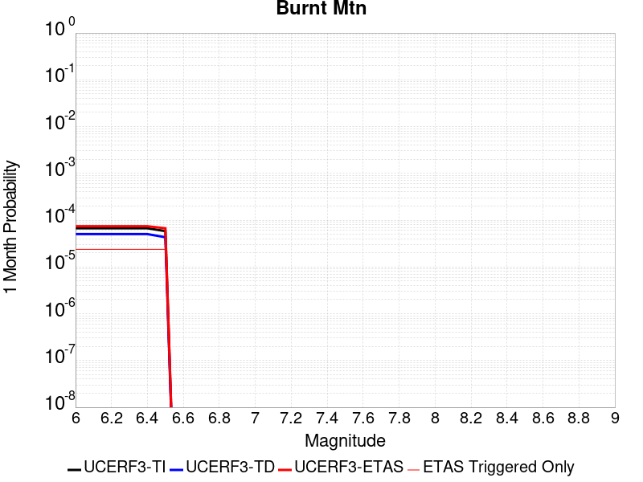 | 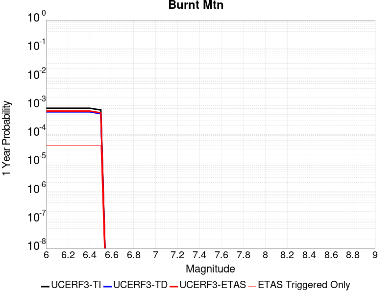 | 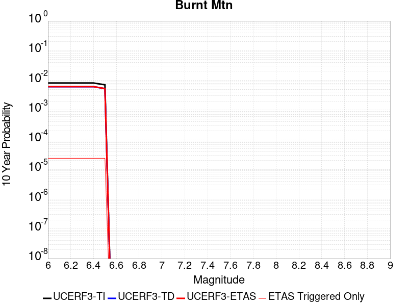 |

| Magnitude | 1 wk TI Prob | 1 wk TD Prob | 1 wk ETAS Prob | 1 wk ETAS/TD Gain | 1 wk ETAS Triggered Only | 1 mo TI Prob | 1 mo TD Prob | 1 mo ETAS Prob | 1 mo ETAS/TD Gain | 1 mo ETAS Triggered Only | 1 yr TI Prob | 1 yr TD Prob | 1 yr ETAS Prob | 1 yr ETAS/TD Gain | 1 yr ETAS Triggered Only | 10 yr TI Prob | 10 yr TD Prob | 10 yr ETAS Prob | 10 yr ETAS/TD Gain | 10 yr ETAS Triggered Only |
|-----|-----|-----|-----|-----|-----|-----|-----|-----|-----|-----|-----|-----|-----|-----|-----|-----|-----|-----|-----|-----|
| 6.0 | 1.5673151E-5 | 1.1749407E-5 | 1.1749407E-5 | 1.0 | 0.0 | 6.716892E-5 | 5.0354356E-5 | 6.0353854E-5 | 1.1985825 | 1.0E-5 | 8.1747473E-4 | 6.1302073E-4 | 6.2301464E-4 | 1.0163027 | 1.0E-5 | 0.008144741 | 0.006125938 | 0.0061358768 | 1.0016224 | 1.0E-5 |
| 6.1 | 1.5673151E-5 | 1.1749407E-5 | 1.1749407E-5 | 1.0 | 0.0 | 6.716892E-5 | 5.0354356E-5 | 6.0353854E-5 | 1.1985825 | 1.0E-5 | 8.1747473E-4 | 6.1302073E-4 | 6.2301464E-4 | 1.0163027 | 1.0E-5 | 0.008144741 | 0.006125938 | 0.0061358768 | 1.0016224 | 1.0E-5 |
| 6.2 | 1.5673151E-5 | 1.1749407E-5 | 1.1749407E-5 | 1.0 | 0.0 | 6.716892E-5 | 5.0354356E-5 | 6.0353854E-5 | 1.1985825 | 1.0E-5 | 8.1747473E-4 | 6.1302073E-4 | 6.2301464E-4 | 1.0163027 | 1.0E-5 | 0.008144741 | 0.006125938 | 0.0061358768 | 1.0016224 | 1.0E-5 |
| 6.3 | 1.5673151E-5 | 1.1749407E-5 | 1.1749407E-5 | 1.0 | 0.0 | 6.716892E-5 | 5.0354356E-5 | 6.0353854E-5 | 1.1985825 | 1.0E-5 | 8.1747473E-4 | 6.1302073E-4 | 6.2301464E-4 | 1.0163027 | 1.0E-5 | 0.008144741 | 0.006125938 | 0.0061358768 | 1.0016224 | 1.0E-5 |
| 6.4 | 1.5673151E-5 | 1.1749407E-5 | 1.1749407E-5 | 1.0 | 0.0 | 6.716892E-5 | 5.0354356E-5 | 6.0353854E-5 | 1.1985825 | 1.0E-5 | 8.1747473E-4 | 6.1302073E-4 | 6.2301464E-4 | 1.0163027 | 1.0E-5 | 0.008144741 | 0.006125938 | 0.0061358768 | 1.0016224 | 1.0E-5 |
| 6.5 | 1.36191375E-5 | 1.0078299E-5 | 1.0078299E-5 | 1.0 | 0.0 | 5.8366426E-5 | 4.3192707E-5 | 5.3192278E-5 | 1.2315105 | 1.0E-5 | 7.103795E-4 | 5.2587123E-4 | 5.3586595E-4 | 1.019006 | 1.0E-5 | 0.0070811296 | 0.0052587125 | 0.0052686594 | 1.0018916 | 1.0E-5 |

## Elsinore (Julian)
*[(top)](#table-of-contents)*

| 1 Week | 1 Month | 1 Year | 10 Year |
|-----|-----|-----|-----|
| 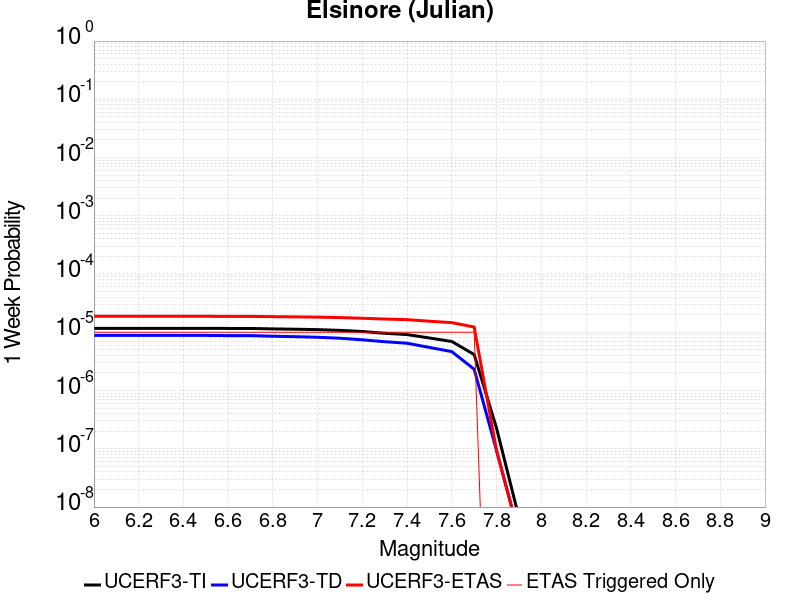 | 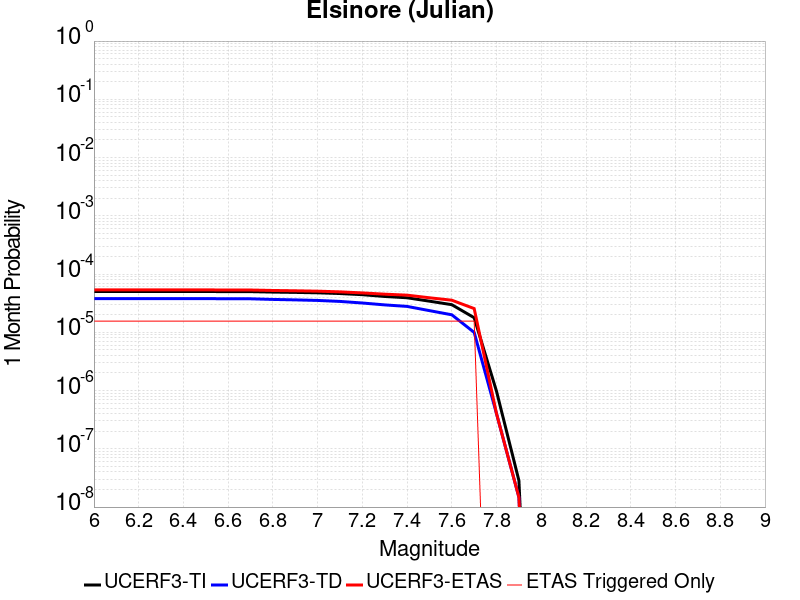 |  | 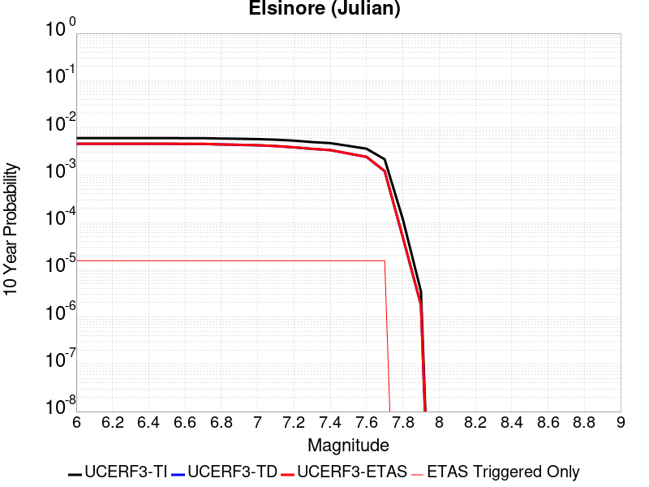 |

| Magnitude | 1 wk TI Prob | 1 wk TD Prob | 1 wk ETAS Prob | 1 wk ETAS/TD Gain | 1 wk ETAS Triggered Only | 1 mo TI Prob | 1 mo TD Prob | 1 mo ETAS Prob | 1 mo ETAS/TD Gain | 1 mo ETAS Triggered Only | 1 yr TI Prob | 1 yr TD Prob | 1 yr ETAS Prob | 1 yr ETAS/TD Gain | 1 yr ETAS Triggered Only | 10 yr TI Prob | 10 yr TD Prob | 10 yr ETAS Prob | 10 yr ETAS/TD Gain | 10 yr ETAS Triggered Only |
|-----|-----|-----|-----|-----|-----|-----|-----|-----|-----|-----|-----|-----|-----|-----|-----|-----|-----|-----|-----|-----|
| 6.0 | 1.1710231E-5 | 8.845509E-6 | 1.884542E-5 | 2.1305072 | 1.0E-5 | 5.0185736E-5 | 3.7908783E-5 | 4.7908405E-5 | 1.2637811 | 1.0E-5 | 6.1084004E-4 | 4.614434E-4 | 4.7143875E-4 | 1.0216612 | 1.0E-5 | 0.006091637 | 0.0046050567 | 0.0046150107 | 1.0021615 | 1.0E-5 |
| 6.1 | 1.1710231E-5 | 8.845509E-6 | 1.884542E-5 | 2.1305072 | 1.0E-5 | 5.0185736E-5 | 3.7908783E-5 | 4.7908405E-5 | 1.2637811 | 1.0E-5 | 6.1084004E-4 | 4.614434E-4 | 4.7143875E-4 | 1.0216612 | 1.0E-5 | 0.006091637 | 0.0046050567 | 0.0046150107 | 1.0021615 | 1.0E-5 |
| 6.2 | 1.1710231E-5 | 8.845509E-6 | 1.884542E-5 | 2.1305072 | 1.0E-5 | 5.0185736E-5 | 3.7908783E-5 | 4.7908405E-5 | 1.2637811 | 1.0E-5 | 6.1084004E-4 | 4.614434E-4 | 4.7143875E-4 | 1.0216612 | 1.0E-5 | 0.006091637 | 0.0046050567 | 0.0046150107 | 1.0021615 | 1.0E-5 |
| 6.3 | 1.1710231E-5 | 8.845509E-6 | 1.884542E-5 | 2.1305072 | 1.0E-5 | 5.0185736E-5 | 3.7908783E-5 | 4.7908405E-5 | 1.2637811 | 1.0E-5 | 6.1084004E-4 | 4.614434E-4 | 4.7143875E-4 | 1.0216612 | 1.0E-5 | 0.006091637 | 0.0046050567 | 0.0046150107 | 1.0021615 | 1.0E-5 |
| 6.4 | 1.1710231E-5 | 8.845509E-6 | 1.884542E-5 | 2.1305072 | 1.0E-5 | 5.0185736E-5 | 3.7908783E-5 | 4.7908405E-5 | 1.2637811 | 1.0E-5 | 6.1084004E-4 | 4.614434E-4 | 4.7143875E-4 | 1.0216612 | 1.0E-5 | 0.006091637 | 0.0046050567 | 0.0046150107 | 1.0021615 | 1.0E-5 |
| 6.5 | 1.1710231E-5 | 8.845509E-6 | 1.884542E-5 | 2.1305072 | 1.0E-5 | 5.0185736E-5 | 3.7908783E-5 | 4.7908405E-5 | 1.2637811 | 1.0E-5 | 6.1084004E-4 | 4.614434E-4 | 4.7143875E-4 | 1.0216612 | 1.0E-5 | 0.006091637 | 0.0046050567 | 0.0046150107 | 1.0021615 | 1.0E-5 |
| 6.6 | 1.1650619E-5 | 8.777881E-6 | 1.8777793E-5 | 2.1392171 | 1.0E-5 | 4.993027E-5 | 3.7618956E-5 | 4.761858E-5 | 1.2658135 | 1.0E-5 | 6.0773146E-4 | 4.5791623E-4 | 4.6791165E-4 | 1.021828 | 1.0E-5 | 0.0060607214 | 0.004569931 | 0.004579885 | 1.0021782 | 1.0E-5 |
| 6.7 | 1.1650619E-5 | 8.777881E-6 | 1.8777793E-5 | 2.1392171 | 1.0E-5 | 4.993027E-5 | 3.7618956E-5 | 4.761858E-5 | 1.2658135 | 1.0E-5 | 6.0773146E-4 | 4.5791623E-4 | 4.6791165E-4 | 1.021828 | 1.0E-5 | 0.0060607214 | 0.004569931 | 0.004579885 | 1.0021782 | 1.0E-5 |
| 6.8 | 1.1442698E-5 | 8.561041E-6 | 1.8560955E-5 | 2.1680722 | 1.0E-5 | 4.9039216E-5 | 3.6689667E-5 | 4.66893E-5 | 1.2725463 | 1.0E-5 | 5.968889E-4 | 4.4660683E-4 | 4.5660237E-4 | 1.0223811 | 1.0E-5 | 0.0059528816 | 0.004457295 | 0.0044672503 | 1.0022335 | 1.0E-5 |
| 6.9 | 1.1300589E-5 | 8.408907E-6 | 1.8408824E-5 | 2.1892052 | 1.0E-5 | 4.8430196E-5 | 3.6037683E-5 | 4.6037323E-5 | 1.2774773 | 1.0E-5 | 5.894781E-4 | 4.3867214E-4 | 4.4866776E-4 | 1.022786 | 1.0E-5 | 0.005879169 | 0.0043782624 | 0.0043882183 | 1.002274 | 1.0E-5 |
| 7.0 | 1.1117729E-5 | 8.226087E-6 | 1.8226005E-5 | 2.2156348 | 1.0E-5 | 4.764654E-5 | 3.525419E-5 | 4.525384E-5 | 1.2836442 | 1.0E-5 | 5.799422E-4 | 4.291369E-4 | 4.3913262E-4 | 1.0232925 | 1.0E-5 | 0.0057843104 | 0.004283281 | 0.004293238 | 1.0023247 | 1.0E-5 |
| 7.1 | 1.08053955E-5 | 7.9117535E-6 | 1.7911674E-5 | 2.2639322 | 1.0E-5 | 4.6308014E-5 | 3.3907087E-5 | 4.3906748E-5 | 1.2949136 | 1.0E-5 | 5.6365423E-4 | 4.127422E-4 | 4.2273809E-4 | 1.0242182 | 1.0E-5 | 0.005622267 | 0.0041199517 | 0.004129911 | 1.0024172 | 1.0E-5 |
| 7.2 | 1.032804E-5 | 7.433021E-6 | 1.7432947E-5 | 2.345338 | 1.0E-5 | 4.4262277E-5 | 3.1855423E-5 | 4.1855106E-5 | 1.3139083 | 1.0E-5 | 5.387599E-4 | 3.8777234E-4 | 3.9776845E-4 | 1.0257783 | 1.0E-5 | 0.0053745564 | 0.0038711445 | 0.0038811057 | 1.0025733 | 1.0E-5 |
| 7.3 | 9.622426E-6 | 6.8978457E-6 | 1.6897777E-5 | 2.449718 | 1.0E-5 | 4.1238312E-5 | 2.9561868E-5 | 3.9561575E-5 | 1.3382636 | 1.0E-5 | 5.019608E-4 | 3.5985775E-4 | 3.6985413E-4 | 1.0277787 | 1.0E-5 | 0.005008285 | 0.0035929221 | 0.003602886 | 1.0027733 | 1.0E-5 |
| 7.4 | 9.144434E-6 | 6.4963933E-6 | 1.6496328E-5 | 2.5393057 | 1.0E-5 | 3.9189843E-5 | 2.7841395E-5 | 3.7841117E-5 | 1.3591673 | 1.0E-5 | 4.7703186E-4 | 3.3891766E-4 | 3.4891427E-4 | 1.0294957 | 1.0E-5 | 0.0047600917 | 0.0033841513 | 0.0033941176 | 1.002945 | 1.0E-5 |
| 7.5 | 7.988981E-6 | 5.4983307E-6 | 1.5498275E-5 | 2.8187237 | 1.0E-5 | 3.4238044E-5 | 2.356407E-5 | 3.3563832E-5 | 1.4243649 | 1.0E-5 | 4.1676845E-4 | 2.8685606E-4 | 2.968532E-4 | 1.0348507 | 1.0E-5 | 0.0041598766 | 0.002864985 | 0.0028749565 | 1.0034804 | 1.0E-5 |
| 7.6 | 6.9554876E-6 | 4.6625346E-6 | 1.4662488E-5 | 3.1447463 | 1.0E-5 | 2.9808893E-5 | 1.9982144E-5 | 2.9981944E-5 | 1.5004368 | 1.0E-5 | 3.6286283E-4 | 2.4325661E-4 | 2.5325417E-4 | 1.0410988 | 1.0E-5 | 0.0036227088 | 0.0024300197 | 0.0024399953 | 1.0041052 | 1.0E-5 |
| 7.7 | 4.1557314E-6 | 2.3246462E-6 | 1.2324623E-5 | 5.30172 | 1.0E-5 | 1.7810156E-5 | 9.962735E-6 | 1.9962636E-5 | 2.0037305 | 1.0E-5 | 2.1681708E-4 | 1.2129029E-4 | 1.3128908E-4 | 1.0824368 | 1.0E-5 | 0.0021660565 | 0.001212314 | 0.0012223019 | 1.0082387 | 1.0E-5 |
| 7.8 | 2.2597293E-7 | 9.332915E-8 | 9.332915E-8 | 1.0 | 0.0 | 9.684551E-7 | 3.99982E-7 | 3.99982E-7 | 1.0 | 0.0 | 1.1790877E-5 | 4.8697734E-6 | 4.8697734E-6 | 1.0 | 0.0 | 1.17902506E-4 | 4.8696995E-5 | 4.8696995E-5 | 1.0 | 0.0 |
| 7.9 | 6.676829E-9 | 3.439853E-9 | 3.439853E-9 | 1.0 | 0.0 | 2.861498E-8 | 1.4742227E-8 | 1.4742227E-8 | 1.0 | 0.0 | 3.4838732E-7 | 1.7948659E-7 | 1.7948659E-7 | 1.0 | 0.0 | 3.4838679E-6 | 1.7948646E-6 | 1.7948646E-6 | 1.0 | 0.0 |

## Elmore Ranch
*[(top)](#table-of-contents)*

| 1 Week | 1 Month | 1 Year | 10 Year |
|-----|-----|-----|-----|
|  | 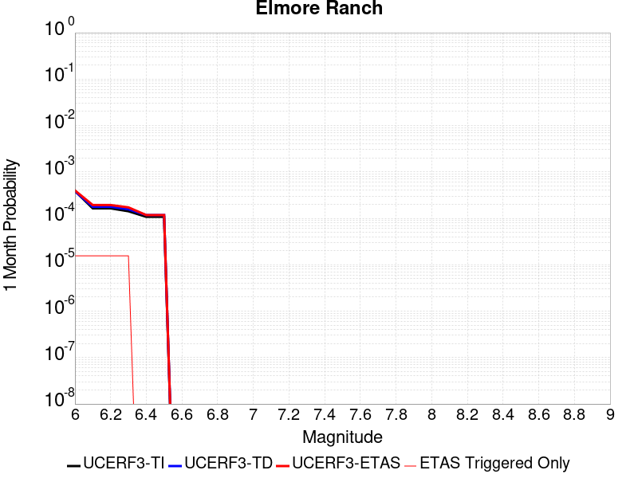 | 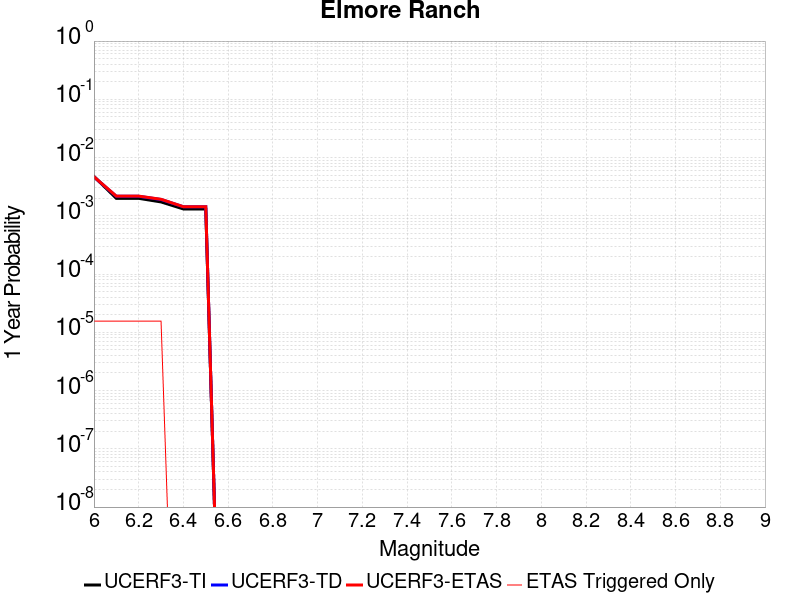 | 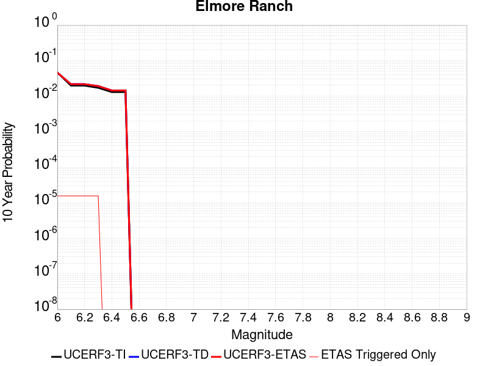 |

| Magnitude | 1 wk TI Prob | 1 wk TD Prob | 1 wk ETAS Prob | 1 wk ETAS/TD Gain | 1 wk ETAS Triggered Only | 1 mo TI Prob | 1 mo TD Prob | 1 mo ETAS Prob | 1 mo ETAS/TD Gain | 1 mo ETAS Triggered Only | 1 yr TI Prob | 1 yr TD Prob | 1 yr ETAS Prob | 1 yr ETAS/TD Gain | 1 yr ETAS Triggered Only | 10 yr TI Prob | 10 yr TD Prob | 10 yr ETAS Prob | 10 yr ETAS/TD Gain | 10 yr ETAS Triggered Only |
|-----|-----|-----|-----|-----|-----|-----|-----|-----|-----|-----|-----|-----|-----|-----|-----|-----|-----|-----|-----|-----|
| 6.0 | 9.102099E-5 | 8.952015E-5 | 9.951925E-5 | 1.1116967 | 1.0E-5 | 3.9003167E-4 | 3.8361453E-4 | 3.9361068E-4 | 1.0260578 | 1.0E-5 | 0.0047383 | 0.004662009 | 0.0046719625 | 1.002135 | 1.0E-5 | 0.046385348 | 0.045870975 | 0.045880515 | 1.000208 | 1.0E-5 |
| 6.1 | 3.8306698E-5 | 4.1498504E-5 | 5.149809E-5 | 1.2409625 | 1.0E-5 | 1.6416123E-4 | 1.7784268E-4 | 1.8784091E-4 | 1.0562195 | 1.0E-5 | 0.0019968306 | 0.0021631396 | 0.002173118 | 1.0046129 | 1.0E-5 | 0.019789828 | 0.021628205 | 0.021637987 | 1.0004524 | 1.0E-5 |
| 6.2 | 3.8306698E-5 | 4.1498504E-5 | 5.149809E-5 | 1.2409625 | 1.0E-5 | 1.6416123E-4 | 1.7784268E-4 | 1.8784091E-4 | 1.0562195 | 1.0E-5 | 0.0019968306 | 0.0021631396 | 0.002173118 | 1.0046129 | 1.0E-5 | 0.019789828 | 0.021628205 | 0.021637987 | 1.0004524 | 1.0E-5 |
| 6.3 | 3.3197924E-5 | 3.6554302E-5 | 4.6553938E-5 | 1.2735556 | 1.0E-5 | 1.4226905E-4 | 1.5665586E-4 | 1.666543E-4 | 1.0638242 | 1.0E-5 | 0.0017307495 | 0.001905917 | 0.0019158979 | 1.0052369 | 1.0E-5 | 0.017173318 | 0.01908996 | 0.019099768 | 1.0005138 | 1.0E-5 |
| 6.4 | 2.5148964E-5 | 2.7420487E-5 | 2.7420487E-5 | 1.0 | 0.0 | 1.0777682E-4 | 1.17514726E-4 | 1.17514726E-4 | 1.0 | 0.0 | 0.0013113929 | 0.0014304507 | 0.0014304507 | 1.0 | 0.0 | 0.01303681 | 0.014387194 | 0.014387194 | 1.0 | 0.0 |
| 6.5 | 2.5148964E-5 | 2.7420487E-5 | 2.7420487E-5 | 1.0 | 0.0 | 1.0777682E-4 | 1.17514726E-4 | 1.17514726E-4 | 1.0 | 0.0 | 0.0013113929 | 0.0014304507 | 0.0014304507 | 1.0 | 0.0 | 0.01303681 | 0.014387194 | 0.014387194 | 1.0 | 0.0 |

## Fontana (Seismicity)
*[(top)](#table-of-contents)*

| 1 Week | 1 Month | 1 Year | 10 Year |
|-----|-----|-----|-----|
|  |  | 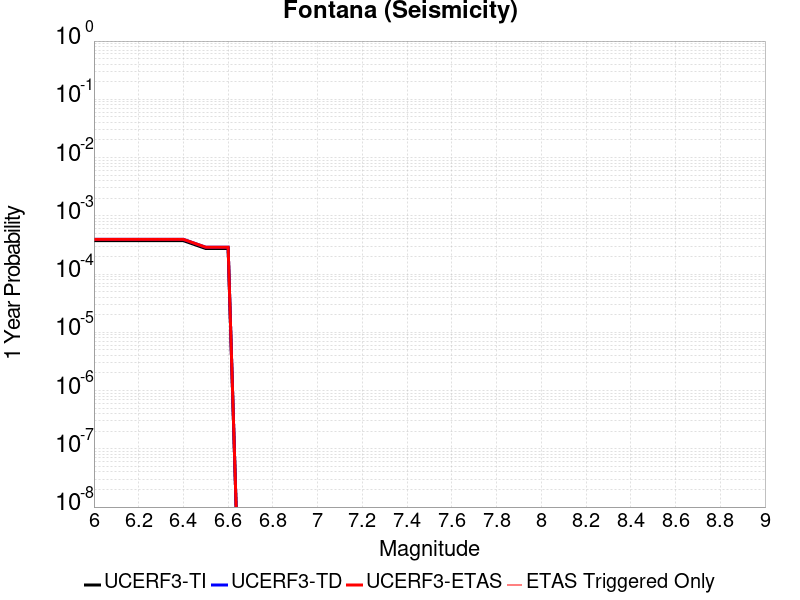 |  |

| Magnitude | 1 wk TI Prob | 1 wk TD Prob | 1 wk ETAS Prob | 1 wk ETAS/TD Gain | 1 wk ETAS Triggered Only | 1 mo TI Prob | 1 mo TD Prob | 1 mo ETAS Prob | 1 mo ETAS/TD Gain | 1 mo ETAS Triggered Only | 1 yr TI Prob | 1 yr TD Prob | 1 yr ETAS Prob | 1 yr ETAS/TD Gain | 1 yr ETAS Triggered Only | 10 yr TI Prob | 10 yr TD Prob | 10 yr ETAS Prob | 10 yr ETAS/TD Gain | 10 yr ETAS Triggered Only |
|-----|-----|-----|-----|-----|-----|-----|-----|-----|-----|-----|-----|-----|-----|-----|-----|-----|-----|-----|-----|-----|
| 6.0 | 7.1789214E-6 | 7.5520006E-6 | 7.5520006E-6 | 1.0 | 0.0 | 3.076644E-5 | 3.2365548E-5 | 3.2365548E-5 | 1.0 | 0.0 | 3.7451705E-4 | 3.9402005E-4 | 3.9402005E-4 | 1.0 | 0.0 | 0.003738865 | 0.003937214 | 0.0039471746 | 1.0025299 | 1.0E-5 |
| 6.1 | 7.1789214E-6 | 7.5520006E-6 | 7.5520006E-6 | 1.0 | 0.0 | 3.076644E-5 | 3.2365548E-5 | 3.2365548E-5 | 1.0 | 0.0 | 3.7451705E-4 | 3.9402005E-4 | 3.9402005E-4 | 1.0 | 0.0 | 0.003738865 | 0.003937214 | 0.0039471746 | 1.0025299 | 1.0E-5 |
| 6.2 | 7.1789214E-6 | 7.5520006E-6 | 7.5520006E-6 | 1.0 | 0.0 | 3.076644E-5 | 3.2365548E-5 | 3.2365548E-5 | 1.0 | 0.0 | 3.7451705E-4 | 3.9402005E-4 | 3.9402005E-4 | 1.0 | 0.0 | 0.003738865 | 0.003937214 | 0.0039471746 | 1.0025299 | 1.0E-5 |
| 6.3 | 7.1789214E-6 | 7.5520006E-6 | 7.5520006E-6 | 1.0 | 0.0 | 3.076644E-5 | 3.2365548E-5 | 3.2365548E-5 | 1.0 | 0.0 | 3.7451705E-4 | 3.9402005E-4 | 3.9402005E-4 | 1.0 | 0.0 | 0.003738865 | 0.003937214 | 0.0039471746 | 1.0025299 | 1.0E-5 |
| 6.4 | 7.1789214E-6 | 7.5520006E-6 | 7.5520006E-6 | 1.0 | 0.0 | 3.076644E-5 | 3.2365548E-5 | 3.2365548E-5 | 1.0 | 0.0 | 3.7451705E-4 | 3.9402005E-4 | 3.9402005E-4 | 1.0 | 0.0 | 0.003738865 | 0.003937214 | 0.0039471746 | 1.0025299 | 1.0E-5 |
| 6.5 | 5.2611317E-6 | 5.532726E-6 | 5.532726E-6 | 1.0 | 0.0 | 2.2547512E-5 | 2.3711682E-5 | 2.3711682E-5 | 1.0 | 0.0 | 2.744814E-4 | 2.8868974E-4 | 2.8868974E-4 | 1.0 | 0.0 | 0.002741426 | 0.0028868972 | 0.0028868972 | 1.0 | 0.0 |
| 6.6 | 5.2611317E-6 | 5.532726E-6 | 5.532726E-6 | 1.0 | 0.0 | 2.2547512E-5 | 2.3711682E-5 | 2.3711682E-5 | 1.0 | 0.0 | 2.744814E-4 | 2.8868974E-4 | 2.8868974E-4 | 1.0 | 0.0 | 0.002741426 | 0.0028868972 | 0.0028868972 | 1.0 | 0.0 |

## Round Valley
*[(top)](#table-of-contents)*

| 1 Week | 1 Month | 1 Year | 10 Year |
|-----|-----|-----|-----|
|  |  | 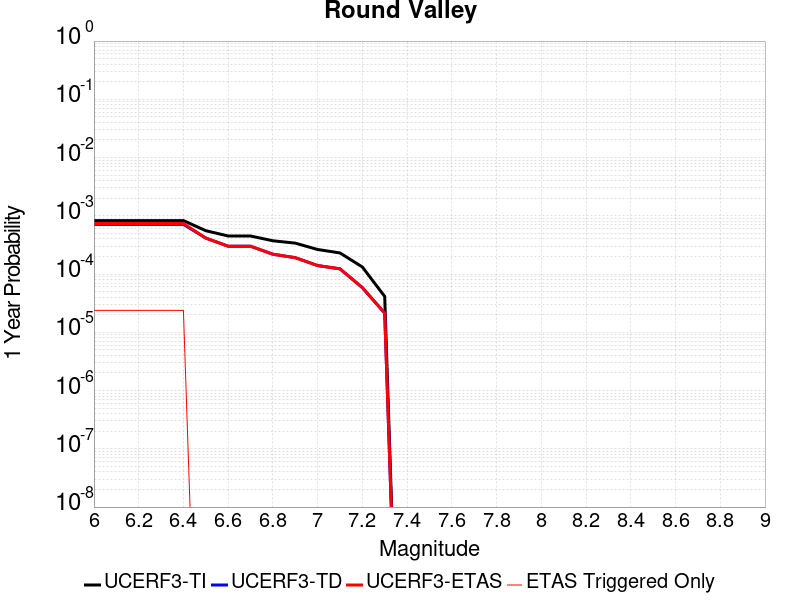 | 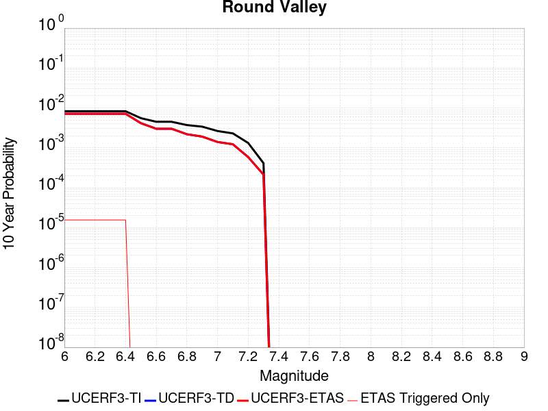 |

| Magnitude | 1 wk TI Prob | 1 wk TD Prob | 1 wk ETAS Prob | 1 wk ETAS/TD Gain | 1 wk ETAS Triggered Only | 1 mo TI Prob | 1 mo TD Prob | 1 mo ETAS Prob | 1 mo ETAS/TD Gain | 1 mo ETAS Triggered Only | 1 yr TI Prob | 1 yr TD Prob | 1 yr ETAS Prob | 1 yr ETAS/TD Gain | 1 yr ETAS Triggered Only | 10 yr TI Prob | 10 yr TD Prob | 10 yr ETAS Prob | 10 yr ETAS/TD Gain | 10 yr ETAS Triggered Only |
|-----|-----|-----|-----|-----|-----|-----|-----|-----|-----|-----|-----|-----|-----|-----|-----|-----|-----|-----|-----|-----|
| 6.0 | 1.588152E-5 | 1.3670716E-5 | 1.3670716E-5 | 1.0 | 0.0 | 6.806188E-5 | 5.8587688E-5 | 5.8587688E-5 | 1.0 | 0.0 | 8.283384E-4 | 7.13111E-4 | 7.231039E-4 | 1.014013 | 1.0E-5 | 0.008252576 | 0.0071121147 | 0.007122044 | 1.0013961 | 1.0E-5 |
| 6.1 | 1.588152E-5 | 1.3670716E-5 | 1.3670716E-5 | 1.0 | 0.0 | 6.806188E-5 | 5.8587688E-5 | 5.8587688E-5 | 1.0 | 0.0 | 8.283384E-4 | 7.13111E-4 | 7.231039E-4 | 1.014013 | 1.0E-5 | 0.008252576 | 0.0071121147 | 0.007122044 | 1.0013961 | 1.0E-5 |
| 6.2 | 1.588152E-5 | 1.3670716E-5 | 1.3670716E-5 | 1.0 | 0.0 | 6.806188E-5 | 5.8587688E-5 | 5.8587688E-5 | 1.0 | 0.0 | 8.283384E-4 | 7.13111E-4 | 7.231039E-4 | 1.014013 | 1.0E-5 | 0.008252576 | 0.0071121147 | 0.007122044 | 1.0013961 | 1.0E-5 |
| 6.3 | 1.588152E-5 | 1.3670716E-5 | 1.3670716E-5 | 1.0 | 0.0 | 6.806188E-5 | 5.8587688E-5 | 5.8587688E-5 | 1.0 | 0.0 | 8.283384E-4 | 7.13111E-4 | 7.231039E-4 | 1.014013 | 1.0E-5 | 0.008252576 | 0.0071121147 | 0.007122044 | 1.0013961 | 1.0E-5 |
| 6.4 | 1.588152E-5 | 1.3670716E-5 | 1.3670716E-5 | 1.0 | 0.0 | 6.806188E-5 | 5.8587688E-5 | 5.8587688E-5 | 1.0 | 0.0 | 8.283384E-4 | 7.13111E-4 | 7.231039E-4 | 1.014013 | 1.0E-5 | 0.008252576 | 0.0071121147 | 0.007122044 | 1.0013961 | 1.0E-5 |
| 6.5 | 1.0646776E-5 | 7.953037E-6 | 7.953037E-6 | 1.0 | 0.0 | 4.5628243E-5 | 3.408405E-5 | 3.408405E-5 | 1.0 | 0.0 | 5.553823E-4 | 4.1490266E-4 | 4.1490266E-4 | 1.0 | 0.0 | 0.005539963 | 0.0041421093 | 0.0041421093 | 1.0 | 0.0 |
| 6.6 | 8.632956E-6 | 5.768742E-6 | 5.768742E-6 | 1.0 | 0.0 | 3.6997862E-5 | 2.4722967E-5 | 2.4722967E-5 | 1.0 | 0.0 | 4.5035584E-4 | 3.009644E-4 | 3.009644E-4 | 1.0 | 0.0 | 0.0044944426 | 0.003005946 | 0.003005946 | 1.0 | 0.0 |
| 6.7 | 8.632956E-6 | 5.768742E-6 | 5.768742E-6 | 1.0 | 0.0 | 3.6997862E-5 | 2.4722967E-5 | 2.4722967E-5 | 1.0 | 0.0 | 4.5035584E-4 | 3.009644E-4 | 3.009644E-4 | 1.0 | 0.0 | 0.0044944426 | 0.003005946 | 0.003005946 | 1.0 | 0.0 |
| 6.8 | 7.143895E-6 | 4.2018346E-6 | 4.2018346E-6 | 1.0 | 0.0 | 3.0616335E-5 | 1.8007748E-5 | 1.8007748E-5 | 1.0 | 0.0 | 3.726901E-4 | 2.1922393E-4 | 2.1922393E-4 | 1.0 | 0.0 | 0.0037206567 | 0.0021902416 | 0.0021902416 | 1.0 | 0.0 |
| 6.9 | 6.5120694E-6 | 3.6644687E-6 | 3.6644687E-6 | 1.0 | 0.0 | 2.790857E-5 | 1.570478E-5 | 1.570478E-5 | 1.0 | 0.0 | 3.3973387E-4 | 1.9119044E-4 | 1.9119044E-4 | 1.0 | 0.0 | 0.0033921495 | 0.0019104085 | 0.0019104085 | 1.0 | 0.0 |
| 7.0 | 5.0614435E-6 | 2.6836676E-6 | 2.6836676E-6 | 1.0 | 0.0 | 2.169172E-5 | 1.1501388E-5 | 1.1501388E-5 | 1.0 | 0.0 | 2.6406467E-4 | 1.4002144E-4 | 1.4002144E-4 | 1.0 | 0.0 | 0.0026375111 | 0.0013994334 | 0.0013994334 | 1.0 | 0.0 |
| 7.1 | 4.41728E-6 | 2.3575074E-6 | 2.3575074E-6 | 1.0 | 0.0 | 1.8931061E-5 | 1.0103569E-5 | 1.0103569E-5 | 1.0 | 0.0 | 2.304613E-4 | 1.23005E-4 | 1.23005E-4 | 1.0 | 0.0 | 0.0023022245 | 0.0012294657 | 0.0012294657 | 1.0 | 0.0 |
| 7.2 | 2.535495E-6 | 1.1208391E-6 | 1.1208391E-6 | 1.0 | 0.0 | 1.0866362E-5 | 4.8035904E-6 | 4.8035904E-6 | 1.0 | 0.0 | 1.3228992E-4 | 5.8482667E-5 | 5.8482667E-5 | 1.0 | 0.0 | 0.0013221119 | 5.84724E-4 | 5.84724E-4 | 1.0 | 0.0 |
| 7.3 | 7.900015E-7 | 4.0889498E-7 | 4.0889498E-7 | 1.0 | 0.0 | 3.3857161E-6 | 1.752407E-6 | 1.752407E-6 | 1.0 | 0.0 | 4.1220315E-5 | 2.1335554E-5 | 2.1335554E-5 | 1.0 | 0.0 | 4.121267E-4 | 2.1335555E-4 | 2.1335555E-4 | 1.0 | 0.0 |

## Mount Diablo Thrust South
*[(top)](#table-of-contents)*

| 1 Week | 1 Month | 1 Year | 10 Year |
|-----|-----|-----|-----|
| 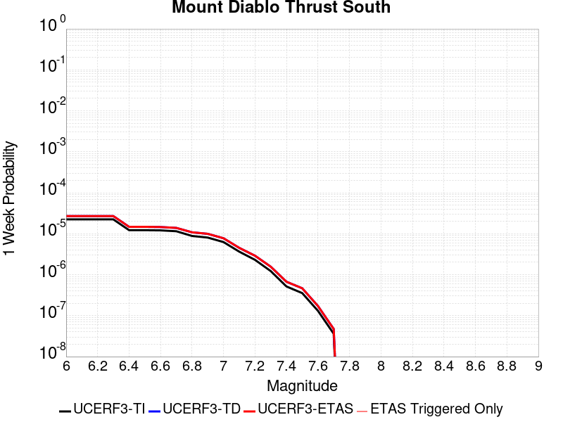 | 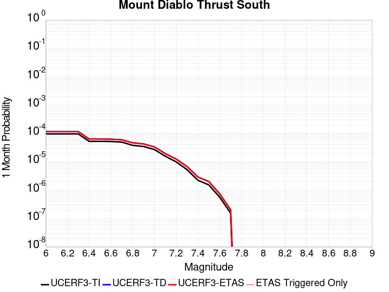 | 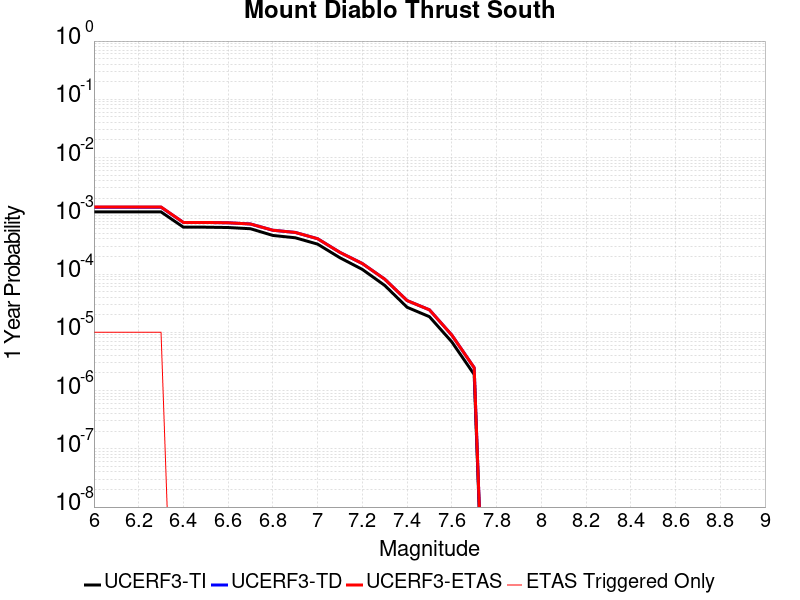 | 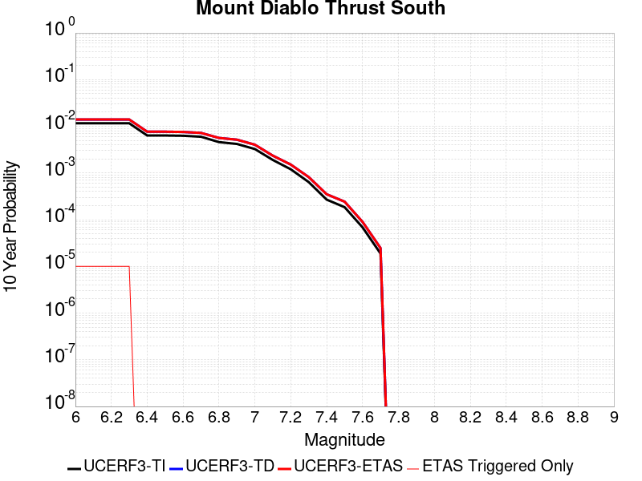 |

| Magnitude | 1 wk TI Prob | 1 wk TD Prob | 1 wk ETAS Prob | 1 wk ETAS/TD Gain | 1 wk ETAS Triggered Only | 1 mo TI Prob | 1 mo TD Prob | 1 mo ETAS Prob | 1 mo ETAS/TD Gain | 1 mo ETAS Triggered Only | 1 yr TI Prob | 1 yr TD Prob | 1 yr ETAS Prob | 1 yr ETAS/TD Gain | 1 yr ETAS Triggered Only | 10 yr TI Prob | 10 yr TD Prob | 10 yr ETAS Prob | 10 yr ETAS/TD Gain | 10 yr ETAS Triggered Only |
|-----|-----|-----|-----|-----|-----|-----|-----|-----|-----|-----|-----|-----|-----|-----|-----|-----|-----|-----|-----|-----|
| 6.0 | 2.2377444E-5 | 2.695623E-5 | 2.695623E-5 | 1.0 | 0.0 | 9.5899806E-5 | 1.1552271E-4 | 1.1552271E-4 | 1.0 | 0.0 | 0.0011669548 | 0.0014057803 | 0.0014157663 | 1.0071034 | 1.0E-5 | 0.011608457 | 0.013988447 | 0.013998307 | 1.0007049 | 1.0E-5 |
| 6.1 | 2.2377444E-5 | 2.695623E-5 | 2.695623E-5 | 1.0 | 0.0 | 9.5899806E-5 | 1.1552271E-4 | 1.1552271E-4 | 1.0 | 0.0 | 0.0011669548 | 0.0014057803 | 0.0014157663 | 1.0071034 | 1.0E-5 | 0.011608457 | 0.013988447 | 0.013998307 | 1.0007049 | 1.0E-5 |
| 6.2 | 2.2377444E-5 | 2.695623E-5 | 2.695623E-5 | 1.0 | 0.0 | 9.5899806E-5 | 1.1552271E-4 | 1.1552271E-4 | 1.0 | 0.0 | 0.0011669548 | 0.0014057803 | 0.0014157663 | 1.0071034 | 1.0E-5 | 0.011608457 | 0.013988447 | 0.013998307 | 1.0007049 | 1.0E-5 |
| 6.3 | 2.2377444E-5 | 2.695623E-5 | 2.695623E-5 | 1.0 | 0.0 | 9.5899806E-5 | 1.1552271E-4 | 1.1552271E-4 | 1.0 | 0.0 | 0.0011669548 | 0.0014057803 | 0.0014157663 | 1.0071034 | 1.0E-5 | 0.011608457 | 0.013988447 | 0.013998307 | 1.0007049 | 1.0E-5 |
| 6.4 | 1.2228463E-5 | 1.4747655E-5 | 1.4747655E-5 | 1.0 | 0.0 | 5.2406645E-5 | 6.320278E-5 | 6.320278E-5 | 1.0 | 0.0 | 6.378641E-4 | 7.6923496E-4 | 7.6923496E-4 | 1.0 | 0.0 | 0.0063603627 | 0.0076671084 | 0.0076671084 | 1.0 | 0.0 |
| 6.5 | 1.2228463E-5 | 1.4747655E-5 | 1.4747655E-5 | 1.0 | 0.0 | 5.2406645E-5 | 6.320278E-5 | 6.320278E-5 | 1.0 | 0.0 | 6.378641E-4 | 7.6923496E-4 | 7.6923496E-4 | 1.0 | 0.0 | 0.0063603627 | 0.0076671084 | 0.0076671084 | 1.0 | 0.0 |
| 6.6 | 1.2068118E-5 | 1.4552453E-5 | 1.4552453E-5 | 1.0 | 0.0 | 5.1719482E-5 | 6.2366234E-5 | 6.2366234E-5 | 1.0 | 0.0 | 6.2950276E-4 | 7.590571E-4 | 7.590571E-4 | 1.0 | 0.0 | 0.006277225 | 0.0075660287 | 0.0075660287 | 1.0 | 0.0 |
| 6.7 | 1.1499428E-5 | 1.3875117E-5 | 1.3875117E-5 | 1.0 | 0.0 | 4.9282335E-5 | 5.94635E-5 | 5.94635E-5 | 1.0 | 0.0 | 5.9984723E-4 | 7.237403E-4 | 7.237403E-4 | 1.0 | 0.0 | 0.0059823063 | 0.0072152023 | 0.0072152023 | 1.0 | 0.0 |
| 6.8 | 8.82118E-6 | 1.0830408E-5 | 1.0830408E-5 | 1.0 | 0.0 | 3.780451E-5 | 4.641524E-5 | 4.641524E-5 | 1.0 | 0.0 | 4.601727E-4 | 5.6496455E-4 | 5.6496455E-4 | 1.0 | 0.0 | 0.0045922096 | 0.005635934 | 0.005635934 | 1.0 | 0.0 |
| 6.9 | 8.047112E-6 | 9.9393765E-6 | 9.9393765E-6 | 1.0 | 0.0 | 3.4487166E-5 | 4.259666E-5 | 4.259666E-5 | 1.0 | 0.0 | 4.1980037E-4 | 5.1849615E-4 | 5.1849615E-4 | 1.0 | 0.0 | 0.004190082 | 0.0051734787 | 0.0051734787 | 1.0 | 0.0 |
| 7.0 | 6.2574763E-6 | 7.748453E-6 | 7.748453E-6 | 1.0 | 0.0 | 2.681748E-5 | 3.3207252E-5 | 3.3207252E-5 | 1.0 | 0.0 | 3.264539E-4 | 4.0422694E-4 | 4.0422694E-4 | 1.0 | 0.0 | 0.0032597475 | 0.004035359 | 0.004035359 | 1.0 | 0.0 |
| 7.1 | 3.6485903E-6 | 4.512883E-6 | 4.512883E-6 | 1.0 | 0.0 | 1.5636722E-5 | 1.9340787E-5 | 1.9340787E-5 | 1.0 | 0.0 | 1.9036046E-4 | 2.3544904E-4 | 2.3544904E-4 | 1.0 | 0.0 | 0.0019019748 | 0.0023520947 | 0.0023520947 | 1.0 | 0.0 |
| 7.2 | 2.3034274E-6 | 2.9054847E-6 | 2.9054847E-6 | 1.0 | 0.0 | 9.871795E-6 | 1.2452019E-5 | 1.2452019E-5 | 1.0 | 0.0 | 1.2018247E-4 | 1.5159303E-4 | 1.5159303E-4 | 1.0 | 0.0 | 0.0012011749 | 0.0015149695 | 0.0015149695 | 1.0 | 0.0 |
| 7.3 | 1.224035E-6 | 1.567953E-6 | 1.567953E-6 | 1.0 | 0.0 | 5.245854E-6 | 6.7197816E-6 | 6.7197816E-6 | 1.0 | 0.0 | 6.38664E-5 | 8.181038E-5 | 8.181038E-5 | 1.0 | 0.0 | 6.384805E-4 | 8.1784575E-4 | 8.1784575E-4 | 1.0 | 0.0 |
| 7.4 | 5.1601154E-7 | 6.72323E-7 | 6.72323E-7 | 1.0 | 0.0 | 2.2114762E-6 | 2.8813813E-6 | 2.8813813E-6 | 1.0 | 0.0 | 2.6924388E-5 | 3.508027E-5 | 3.508027E-5 | 1.0 | 0.0 | 2.6921128E-4 | 3.507647E-4 | 3.507647E-4 | 1.0 | 0.0 |
| 7.5 | 3.552894E-7 | 4.6652323E-7 | 4.6652323E-7 | 1.0 | 0.0 | 1.5226678E-6 | 1.9993838E-6 | 1.9993838E-6 | 1.0 | 0.0 | 1.8538323E-5 | 2.434224E-5 | 2.434224E-5 | 1.0 | 0.0 | 1.8536777E-4 | 2.4340794E-4 | 2.4340794E-4 | 1.0 | 0.0 |
| 7.6 | 1.3124082E-7 | 1.7191535E-7 | 1.7191535E-7 | 1.0 | 0.0 | 5.6246057E-7 | 7.367799E-7 | 7.367799E-7 | 1.0 | 0.0 | 6.8479358E-6 | 8.970267E-6 | 8.970267E-6 | 1.0 | 0.0 | 6.8477246E-5 | 8.9703215E-5 | 8.9703215E-5 | 1.0 | 0.0 |
| 7.7 | 3.6193022E-8 | 4.733273E-8 | 4.733273E-8 | 1.0 | 0.0 | 1.5511293E-7 | 2.0285455E-7 | 2.0285455E-7 | 1.0 | 0.0 | 1.8884983E-6 | 2.4697524E-6 | 2.4697524E-6 | 1.0 | 0.0 | 1.8884823E-5 | 2.4697838E-5 | 2.4697838E-5 | 1.0 | 0.0 |

## Goose Lake 2011 CFM
*[(top)](#table-of-contents)*

| 1 Week | 1 Month | 1 Year | 10 Year |
|-----|-----|-----|-----|
|  |  | 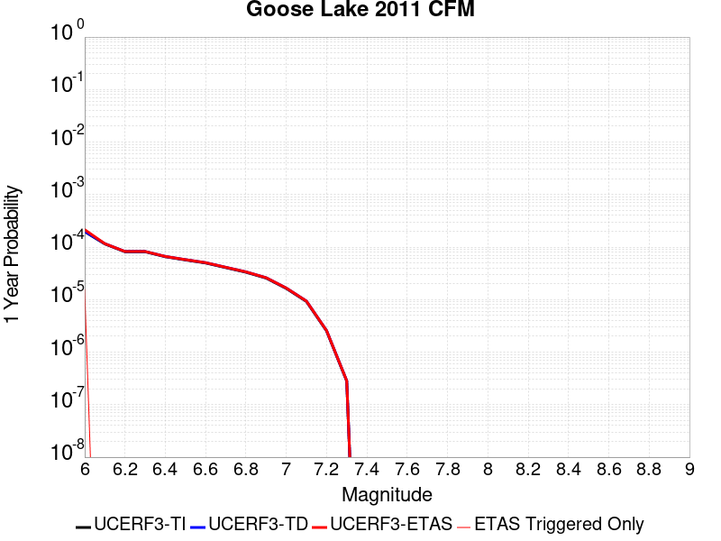 | 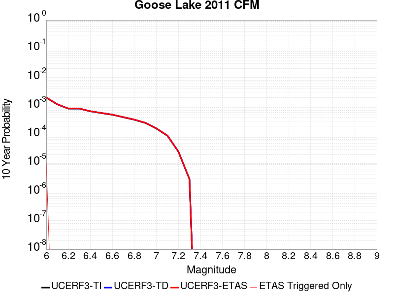 |

| Magnitude | 1 wk TI Prob | 1 wk TD Prob | 1 wk ETAS Prob | 1 wk ETAS/TD Gain | 1 wk ETAS Triggered Only | 1 mo TI Prob | 1 mo TD Prob | 1 mo ETAS Prob | 1 mo ETAS/TD Gain | 1 mo ETAS Triggered Only | 1 yr TI Prob | 1 yr TD Prob | 1 yr ETAS Prob | 1 yr ETAS/TD Gain | 1 yr ETAS Triggered Only | 10 yr TI Prob | 10 yr TD Prob | 10 yr ETAS Prob | 10 yr ETAS/TD Gain | 10 yr ETAS Triggered Only |
|-----|-----|-----|-----|-----|-----|-----|-----|-----|-----|-----|-----|-----|-----|-----|-----|-----|-----|-----|-----|-----|
| 6.0 | 3.780968E-6 | 3.8230223E-6 | 3.8230223E-6 | 1.0 | 0.0 | 1.6204049E-5 | 1.6384285E-5 | 1.6384285E-5 | 1.0 | 0.0 | 1.9726643E-4 | 1.994615E-4 | 2.0945951E-4 | 1.050125 | 1.0E-5 | 0.001970914 | 0.001992933 | 0.002002913 | 1.0050077 | 1.0E-5 |
| 6.1 | 2.2035124E-6 | 2.229801E-6 | 2.229801E-6 | 1.0 | 0.0 | 9.443591E-6 | 9.556257E-6 | 9.556257E-6 | 1.0 | 0.0 | 1.1496965E-4 | 1.163414E-4 | 1.163414E-4 | 1.0 | 0.0 | 0.0011491019 | 0.0011628233 | 0.0011628233 | 1.0 | 0.0 |
| 6.2 | 1.5624689E-6 | 1.5826923E-6 | 1.5826923E-6 | 1.0 | 0.0 | 6.6962784E-6 | 6.7829496E-6 | 6.7829496E-6 | 1.0 | 0.0 | 8.152414E-5 | 8.2579325E-5 | 8.2579325E-5 | 1.0 | 0.0 | 8.1494235E-4 | 8.2549086E-4 | 8.2549086E-4 | 1.0 | 0.0 |
| 6.3 | 1.5624689E-6 | 1.5826923E-6 | 1.5826923E-6 | 1.0 | 0.0 | 6.6962784E-6 | 6.7829496E-6 | 6.7829496E-6 | 1.0 | 0.0 | 8.152414E-5 | 8.2579325E-5 | 8.2579325E-5 | 1.0 | 0.0 | 8.1494235E-4 | 8.2549086E-4 | 8.2549086E-4 | 1.0 | 0.0 |
| 6.4 | 1.256464E-6 | 1.2738695E-6 | 1.2738695E-6 | 1.0 | 0.0 | 5.3848344E-6 | 5.4594293E-6 | 5.4594293E-6 | 1.0 | 0.0 | 6.5558386E-5 | 6.646655E-5 | 6.646655E-5 | 1.0 | 0.0 | 6.553905E-4 | 6.644687E-4 | 6.644687E-4 | 1.0 | 0.0 |
| 6.5 | 1.0910911E-6 | 1.1069404E-6 | 1.1069404E-6 | 1.0 | 0.0 | 4.6760965E-6 | 4.7440217E-6 | 4.7440217E-6 | 1.0 | 0.0 | 5.692999E-5 | 5.7756948E-5 | 5.7756948E-5 | 1.0 | 0.0 | 5.6915404E-4 | 5.7742064E-4 | 5.7742064E-4 | 1.0 | 0.0 |
| 6.6 | 9.546601E-7 | 9.691246E-7 | 9.691246E-7 | 1.0 | 0.0 | 4.091394E-6 | 4.1533845E-6 | 4.1533845E-6 | 1.0 | 0.0 | 4.9811584E-5 | 5.056629E-5 | 5.056629E-5 | 1.0 | 0.0 | 4.980042E-4 | 5.055487E-4 | 5.055487E-4 | 1.0 | 0.0 |
| 6.7 | 7.790316E-7 | 7.9159634E-7 | 7.9159634E-7 | 1.0 | 0.0 | 3.3387028E-6 | 3.3925514E-6 | 3.3925514E-6 | 1.0 | 0.0 | 4.0647945E-5 | 4.1303538E-5 | 4.1303538E-5 | 1.0 | 0.0 | 4.0640513E-4 | 4.129592E-4 | 4.129592E-4 | 1.0 | 0.0 |
| 6.8 | 6.3714384E-7 | 6.4787395E-7 | 6.4787395E-7 | 1.0 | 0.0 | 2.7306137E-6 | 2.7765998E-6 | 2.7765998E-6 | 1.0 | 0.0 | 3.3244716E-5 | 3.3804583E-5 | 3.3804583E-5 | 1.0 | 0.0 | 3.323974E-4 | 3.379949E-4 | 3.379949E-4 | 1.0 | 0.0 |
| 6.9 | 4.92586E-7 | 5.0139147E-7 | 5.0139147E-7 | 1.0 | 0.0 | 2.1110811E-6 | 2.1488188E-6 | 2.1488188E-6 | 1.0 | 0.0 | 2.5702111E-5 | 2.616156E-5 | 2.616156E-5 | 1.0 | 0.0 | 2.569914E-4 | 2.6158517E-4 | 2.6158517E-4 | 1.0 | 0.0 |
| 7.0 | 3.130245E-7 | 3.190354E-7 | 3.190354E-7 | 1.0 | 0.0 | 1.3415328E-6 | 1.3672939E-6 | 1.3672939E-6 | 1.0 | 0.0 | 1.6333039E-5 | 1.6646678E-5 | 1.6646678E-5 | 1.0 | 0.0 | 1.6331839E-4 | 1.6645451E-4 | 1.6645451E-4 | 1.0 | 0.0 |
| 7.1 | 1.7680084E-7 | 1.8023923E-7 | 1.8023923E-7 | 1.0 | 0.0 | 7.5771766E-7 | 7.724536E-7 | 7.724536E-7 | 1.0 | 0.0 | 9.225173E-6 | 9.404583E-6 | 9.404583E-6 | 1.0 | 0.0 | 9.22479E-5 | 9.4041956E-5 | 9.4041956E-5 | 1.0 | 0.0 |
| 7.2 | 4.8641045E-8 | 4.9402068E-8 | 4.9402068E-8 | 1.0 | 0.0 | 2.084616E-7 | 2.1172312E-7 | 2.1172312E-7 | 1.0 | 0.0 | 2.538017E-6 | 2.577726E-6 | 2.577726E-6 | 1.0 | 0.0 | 2.537988E-5 | 2.5776973E-5 | 2.5776973E-5 | 1.0 | 0.0 |
| 7.3 | 5.3911844E-9 | 5.4758145E-9 | 5.4758145E-9 | 1.0 | 0.0 | 2.3105075E-8 | 2.3467775E-8 | 2.3467775E-8 | 1.0 | 0.0 | 2.8130427E-7 | 2.8572015E-7 | 2.8572015E-7 | 1.0 | 0.0 | 2.8130391E-6 | 2.8571992E-6 | 2.8571992E-6 | 1.0 | 0.0 |

## Reliz 2011 CFM
*[(top)](#table-of-contents)*

| 1 Week | 1 Month | 1 Year | 10 Year |
|-----|-----|-----|-----|
|  | 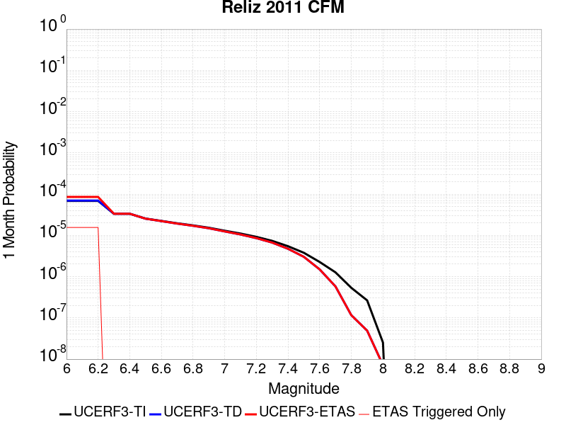 | 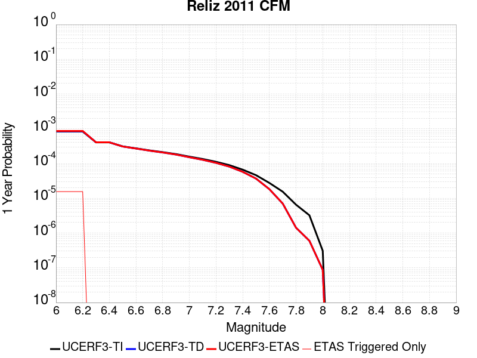 | 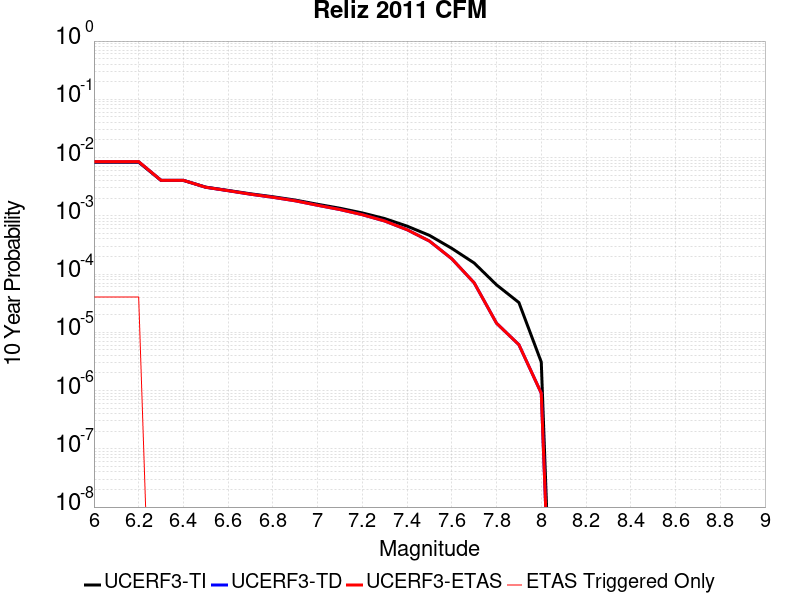 |

| Magnitude | 1 wk TI Prob | 1 wk TD Prob | 1 wk ETAS Prob | 1 wk ETAS/TD Gain | 1 wk ETAS Triggered Only | 1 mo TI Prob | 1 mo TD Prob | 1 mo ETAS Prob | 1 mo ETAS/TD Gain | 1 mo ETAS Triggered Only | 1 yr TI Prob | 1 yr TD Prob | 1 yr ETAS Prob | 1 yr ETAS/TD Gain | 1 yr ETAS Triggered Only | 10 yr TI Prob | 10 yr TD Prob | 10 yr ETAS Prob | 10 yr ETAS/TD Gain | 10 yr ETAS Triggered Only |
|-----|-----|-----|-----|-----|-----|-----|-----|-----|-----|-----|-----|-----|-----|-----|-----|-----|-----|-----|-----|-----|
| 6.0 | 1.6002472E-5 | 1.6282804E-5 | 1.6282804E-5 | 1.0 | 0.0 | 6.8580215E-5 | 6.9781694E-5 | 7.978099E-5 | 1.1432941 | 1.0E-5 | 8.3464425E-4 | 8.4928074E-4 | 8.5927226E-4 | 1.0117646 | 1.0E-5 | 0.008315164 | 0.008462547 | 0.008472463 | 1.0011717 | 1.0E-5 |
| 6.1 | 1.6002472E-5 | 1.6282804E-5 | 1.6282804E-5 | 1.0 | 0.0 | 6.8580215E-5 | 6.9781694E-5 | 7.978099E-5 | 1.1432941 | 1.0E-5 | 8.3464425E-4 | 8.4928074E-4 | 8.5927226E-4 | 1.0117646 | 1.0E-5 | 0.008315164 | 0.008462547 | 0.008472463 | 1.0011717 | 1.0E-5 |
| 6.2 | 1.6002472E-5 | 1.6282804E-5 | 1.6282804E-5 | 1.0 | 0.0 | 6.8580215E-5 | 6.9781694E-5 | 7.978099E-5 | 1.1432941 | 1.0E-5 | 8.3464425E-4 | 8.4928074E-4 | 8.5927226E-4 | 1.0117646 | 1.0E-5 | 0.008315164 | 0.008462547 | 0.008472463 | 1.0011717 | 1.0E-5 |
| 6.3 | 7.792404E-6 | 7.803802E-6 | 7.803802E-6 | 1.0 | 0.0 | 3.339559E-5 | 3.344444E-5 | 3.344444E-5 | 1.0 | 0.0 | 4.0651546E-4 | 4.0711078E-4 | 4.0711078E-4 | 1.0 | 0.0 | 0.0040577264 | 0.004063926 | 0.004063926 | 1.0 | 0.0 |
| 6.4 | 7.792404E-6 | 7.803802E-6 | 7.803802E-6 | 1.0 | 0.0 | 3.339559E-5 | 3.344444E-5 | 3.344444E-5 | 1.0 | 0.0 | 4.0651546E-4 | 4.0711078E-4 | 4.0711078E-4 | 1.0 | 0.0 | 0.0040577264 | 0.004063926 | 0.004063926 | 1.0 | 0.0 |
| 6.5 | 5.9659374E-6 | 5.928738E-6 | 5.928738E-6 | 1.0 | 0.0 | 2.5568053E-5 | 2.5408632E-5 | 2.5408632E-5 | 1.0 | 0.0 | 3.1124658E-4 | 3.093064E-4 | 3.093064E-4 | 1.0 | 0.0 | 0.00310811 | 0.0030889767 | 0.0030889767 | 1.0 | 0.0 |
| 6.6 | 5.2350692E-6 | 5.178986E-6 | 5.178986E-6 | 1.0 | 0.0 | 2.2435817E-5 | 2.2195467E-5 | 2.2195467E-5 | 1.0 | 0.0 | 2.7312184E-4 | 2.7019644E-4 | 2.7019644E-4 | 1.0 | 0.0 | 0.002727864 | 0.0026988892 | 0.0026988892 | 1.0 | 0.0 |
| 6.7 | 4.580206E-6 | 4.5061206E-6 | 4.5061206E-6 | 1.0 | 0.0 | 1.9629308E-5 | 1.9311801E-5 | 1.9311801E-5 | 1.0 | 0.0 | 2.389606E-4 | 2.350959E-4 | 2.350959E-4 | 1.0 | 0.0 | 0.002387038 | 0.0023486738 | 0.0023486738 | 1.0 | 0.0 |
| 6.8 | 4.0765017E-6 | 3.9882384E-6 | 3.9882384E-6 | 1.0 | 0.0 | 1.7470604E-5 | 1.7092338E-5 | 1.7092338E-5 | 1.0 | 0.0 | 2.1268385E-4 | 2.0807938E-4 | 2.0807938E-4 | 1.0 | 0.0 | 0.002124804 | 0.0020790435 | 0.0020790435 | 1.0 | 0.0 |
| 6.9 | 3.5752896E-6 | 3.4725176E-6 | 3.4725176E-6 | 1.0 | 0.0 | 1.532258E-5 | 1.4882134E-5 | 1.4882134E-5 | 1.0 | 0.0 | 1.8653645E-4 | 1.8117494E-4 | 1.8117494E-4 | 1.0 | 0.0 | 0.0018637994 | 0.0018104686 | 0.0018104686 | 1.0 | 0.0 |
| 7.0 | 3.0259848E-6 | 2.9079417E-6 | 2.9079417E-6 | 1.0 | 0.0 | 1.2968442E-5 | 1.2462548E-5 | 1.2462548E-5 | 1.0 | 0.0 | 1.5787935E-4 | 1.5172097E-4 | 1.5172097E-4 | 1.0 | 0.0 | 0.0015776722 | 0.001516369 | 0.001516369 | 1.0 | 0.0 |
| 7.1 | 2.5861116E-6 | 2.455167E-6 | 2.455167E-6 | 1.0 | 0.0 | 1.1083288E-5 | 1.05221025E-5 | 1.05221025E-5 | 1.0 | 0.0 | 1.3493067E-4 | 1.2809907E-4 | 1.2809907E-4 | 1.0 | 0.0 | 0.0013484878 | 0.001280447 | 0.001280447 | 1.0 | 0.0 |
| 7.2 | 2.1482588E-6 | 2.003237E-6 | 2.003237E-6 | 1.0 | 0.0 | 9.20679E-6 | 8.585273E-6 | 8.585273E-6 | 1.0 | 0.0 | 1.12086906E-4 | 1.0452068E-4 | 1.0452068E-4 | 1.0 | 0.0 | 0.0011203039 | 0.0010449095 | 0.0010449095 | 1.0 | 0.0 |
| 7.3 | 1.7194744E-6 | 1.5611241E-6 | 1.5611241E-6 | 1.0 | 0.0 | 7.3691554E-6 | 6.690515E-6 | 6.690515E-6 | 1.0 | 0.0 | 8.971577E-5 | 8.1453974E-5 | 8.1453974E-5 | 1.0 | 0.0 | 8.967956E-4 | 8.1443513E-4 | 8.1443513E-4 | 1.0 | 0.0 |
| 7.4 | 1.2755178E-6 | 1.10563E-6 | 1.10563E-6 | 1.0 | 0.0 | 5.4664933E-6 | 4.7384056E-6 | 4.7384056E-6 | 1.0 | 0.0 | 6.655252E-5 | 5.768856E-5 | 5.768856E-5 | 1.0 | 0.0 | 6.6532596E-4 | 5.7692965E-4 | 5.7692965E-4 | 1.0 | 0.0 |
| 7.5 | 8.8463224E-7 | 7.0580273E-7 | 7.0580273E-7 | 1.0 | 0.0 | 3.7912755E-6 | 3.0248652E-6 | 3.0248652E-6 | 1.0 | 0.0 | 4.6157802E-5 | 3.6827114E-5 | 3.6827114E-5 | 1.0 | 0.0 | 4.6148215E-4 | 3.684038E-4 | 3.684038E-4 | 1.0 | 0.0 |
| 7.6 | 5.291355E-7 | 3.500777E-7 | 3.500777E-7 | 1.0 | 0.0 | 2.2677216E-6 | 1.5003321E-6 | 1.5003321E-6 | 1.0 | 0.0 | 2.760916E-5 | 1.8266392E-5 | 1.8266392E-5 | 1.0 | 0.0 | 2.760573E-4 | 1.8284164E-4 | 1.8284164E-4 | 1.0 | 0.0 |
| 7.7 | 2.9663357E-7 | 1.351113E-7 | 1.351113E-7 | 1.0 | 0.0 | 1.2712861E-6 | 5.7904833E-7 | 5.7904833E-7 | 1.0 | 0.0 | 1.5477797E-5 | 7.049891E-6 | 7.049891E-6 | 1.0 | 0.0 | 1.547672E-4 | 7.068132E-5 | 7.068132E-5 | 1.0 | 0.0 |
| 7.8 | 1.2509386E-7 | 2.7157126E-8 | 2.7157126E-8 | 1.0 | 0.0 | 5.3611643E-7 | 1.1638769E-7 | 1.1638769E-7 | 1.0 | 0.0 | 6.527198E-6 | 1.4170191E-6 | 1.4170191E-6 | 1.0 | 0.0 | 6.527006E-5 | 1.4326506E-5 | 1.4326506E-5 | 1.0 | 0.0 |
| 7.9 | 6.213493E-8 | 1.1482114E-8 | 1.1482114E-8 | 1.0 | 0.0 | 2.6629255E-7 | 4.920906E-8 | 4.920906E-8 | 1.0 | 0.0 | 3.242107E-6 | 5.9912014E-7 | 5.9912014E-7 | 1.0 | 0.0 | 3.2420594E-5 | 6.1224223E-6 | 6.1224223E-6 | 1.0 | 0.0 |
| 8.0 | 5.92383E-9 | 1.677887E-9 | 1.677887E-9 | 1.0 | 0.0 | 2.5387841E-8 | 7.190944E-9 | 7.190944E-9 | 1.0 | 0.0 | 3.0909692E-7 | 8.754974E-8 | 8.754974E-8 | 1.0 | 0.0 | 3.090965E-6 | 9.003061E-7 | 9.003061E-7 | 1.0 | 0.0 |

## Polaris 2011 CFM
*[(top)](#table-of-contents)*

| 1 Week | 1 Month | 1 Year | 10 Year |
|-----|-----|-----|-----|
|  | 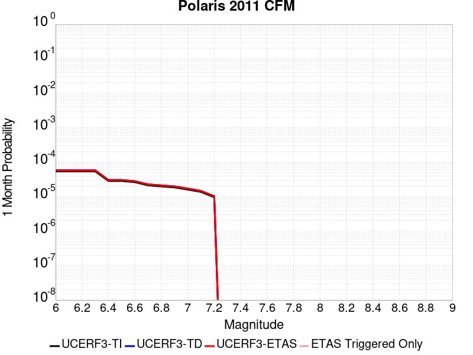 | 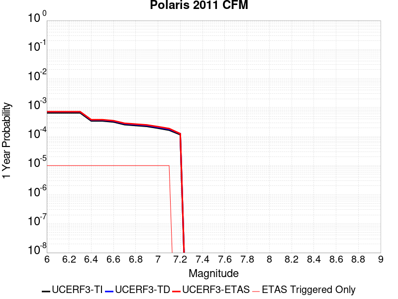 | 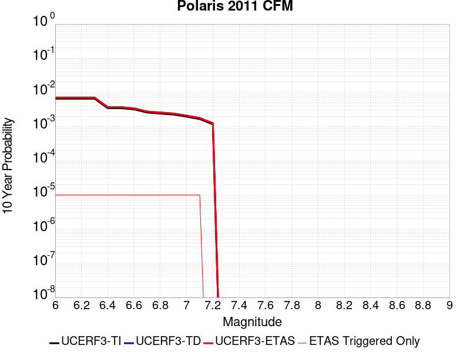 |

| Magnitude | 1 wk TI Prob | 1 wk TD Prob | 1 wk ETAS Prob | 1 wk ETAS/TD Gain | 1 wk ETAS Triggered Only | 1 mo TI Prob | 1 mo TD Prob | 1 mo ETAS Prob | 1 mo ETAS/TD Gain | 1 mo ETAS Triggered Only | 1 yr TI Prob | 1 yr TD Prob | 1 yr ETAS Prob | 1 yr ETAS/TD Gain | 1 yr ETAS Triggered Only | 10 yr TI Prob | 10 yr TD Prob | 10 yr ETAS Prob | 10 yr ETAS/TD Gain | 10 yr ETAS Triggered Only |
|-----|-----|-----|-----|-----|-----|-----|-----|-----|-----|-----|-----|-----|-----|-----|-----|-----|-----|-----|-----|-----|
| 6.0 | 1.2630823E-5 | 1.3582916E-5 | 1.3582916E-5 | 1.0 | 0.0 | 5.413098E-5 | 5.821149E-5 | 5.821149E-5 | 1.0 | 0.0 | 6.5884535E-4 | 7.085464E-4 | 7.1853923E-4 | 1.0141034 | 1.0E-5 | 0.0065689543 | 0.007067981 | 0.0070779105 | 1.0014049 | 1.0E-5 |
| 6.1 | 1.2630823E-5 | 1.3582916E-5 | 1.3582916E-5 | 1.0 | 0.0 | 5.413098E-5 | 5.821149E-5 | 5.821149E-5 | 1.0 | 0.0 | 6.5884535E-4 | 7.085464E-4 | 7.1853923E-4 | 1.0141034 | 1.0E-5 | 0.0065689543 | 0.007067981 | 0.0070779105 | 1.0014049 | 1.0E-5 |
| 6.2 | 1.2630823E-5 | 1.3582916E-5 | 1.3582916E-5 | 1.0 | 0.0 | 5.413098E-5 | 5.821149E-5 | 5.821149E-5 | 1.0 | 0.0 | 6.5884535E-4 | 7.085464E-4 | 7.1853923E-4 | 1.0141034 | 1.0E-5 | 0.0065689543 | 0.007067981 | 0.0070779105 | 1.0014049 | 1.0E-5 |
| 6.3 | 1.2630823E-5 | 1.3582916E-5 | 1.3582916E-5 | 1.0 | 0.0 | 5.413098E-5 | 5.821149E-5 | 5.821149E-5 | 1.0 | 0.0 | 6.5884535E-4 | 7.085464E-4 | 7.1853923E-4 | 1.0141034 | 1.0E-5 | 0.0065689543 | 0.007067981 | 0.0070779105 | 1.0014049 | 1.0E-5 |
| 6.4 | 6.642994E-6 | 7.10706E-6 | 7.10706E-6 | 1.0 | 0.0 | 2.8469662E-5 | 3.0458501E-5 | 3.0458501E-5 | 1.0 | 0.0 | 3.46563E-4 | 3.7077433E-4 | 3.8077062E-4 | 1.0269606 | 1.0E-5 | 0.0034602303 | 0.0037020678 | 0.0037120308 | 1.0026911 | 1.0E-5 |
| 6.5 | 6.642994E-6 | 7.10706E-6 | 7.10706E-6 | 1.0 | 0.0 | 2.8469662E-5 | 3.0458501E-5 | 3.0458501E-5 | 1.0 | 0.0 | 3.46563E-4 | 3.7077433E-4 | 3.8077062E-4 | 1.0269606 | 1.0E-5 | 0.0034602303 | 0.0037020678 | 0.0037120308 | 1.0026911 | 1.0E-5 |
| 6.6 | 6.1286296E-6 | 6.5561712E-6 | 6.5561712E-6 | 1.0 | 0.0 | 2.626529E-5 | 2.8097602E-5 | 2.8097602E-5 | 1.0 | 0.0 | 3.19733E-4 | 3.4203942E-4 | 3.52036E-4 | 1.0292264 | 1.0E-5 | 0.0031927335 | 0.003415605 | 0.003425571 | 1.0029178 | 1.0E-5 |
| 6.7 | 4.9474666E-6 | 5.298249E-6 | 5.298249E-6 | 1.0 | 0.0 | 2.1203256E-5 | 2.2706601E-5 | 2.2706601E-5 | 1.0 | 0.0 | 2.5811905E-4 | 2.7642061E-4 | 2.8641787E-4 | 1.0361668 | 1.0E-5 | 0.0025781945 | 0.0027610478 | 0.0027710202 | 1.0036118 | 1.0E-5 |
| 6.8 | 4.616407E-6 | 4.946264E-6 | 4.946264E-6 | 1.0 | 0.0 | 1.978445E-5 | 2.1198117E-5 | 2.1198117E-5 | 1.0 | 0.0 | 2.4084905E-4 | 2.5805918E-4 | 2.680566E-4 | 1.0387408 | 1.0E-5 | 0.0024058819 | 0.0025778597 | 0.002587834 | 1.0038692 | 1.0E-5 |
| 6.9 | 4.320343E-6 | 4.630886E-6 | 4.630886E-6 | 1.0 | 0.0 | 1.8515624E-5 | 1.9846519E-5 | 1.9846519E-5 | 1.0 | 0.0 | 2.2540441E-4 | 2.4160717E-4 | 2.5160477E-4 | 1.0413795 | 1.0E-5 | 0.0022517592 | 0.0024137017 | 0.0024236776 | 1.004133 | 1.0E-5 |
| 7.0 | 3.7382292E-6 | 4.009553E-6 | 4.009553E-6 | 1.0 | 0.0 | 1.6020884E-5 | 1.7183698E-5 | 1.7183698E-5 | 1.0 | 0.0 | 1.950368E-4 | 2.0919384E-4 | 2.1919174E-4 | 1.0477926 | 1.0E-5 | 0.0019486571 | 0.0020902045 | 0.0021001836 | 1.0047742 | 1.0E-5 |
| 7.1 | 3.193576E-6 | 3.427699E-6 | 3.427699E-6 | 1.0 | 0.0 | 1.3686683E-5 | 1.4690068E-5 | 1.4690068E-5 | 1.0 | 0.0 | 1.6662262E-4 | 1.7883914E-4 | 1.8883735E-4 | 1.0559062 | 1.0E-5 | 0.0016649774 | 0.001787171 | 0.0017971531 | 1.0055854 | 1.0E-5 |
| 7.2 | 2.2356758E-6 | 2.4023684E-6 | 2.4023684E-6 | 1.0 | 0.0 | 9.581432E-6 | 1.0295834E-5 | 1.0295834E-5 | 1.0 | 0.0 | 1.1664769E-4 | 1.2534647E-4 | 1.2534647E-4 | 1.0 | 0.0 | 0.0011658648 | 0.0012529434 | 0.0012529434 | 1.0 | 0.0 |

## Great Valley 11
*[(top)](#table-of-contents)*

| 1 Week | 1 Month | 1 Year | 10 Year |
|-----|-----|-----|-----|
| 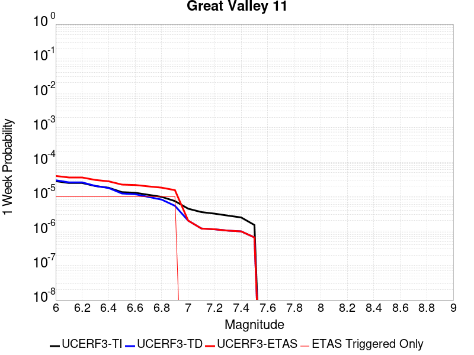 | 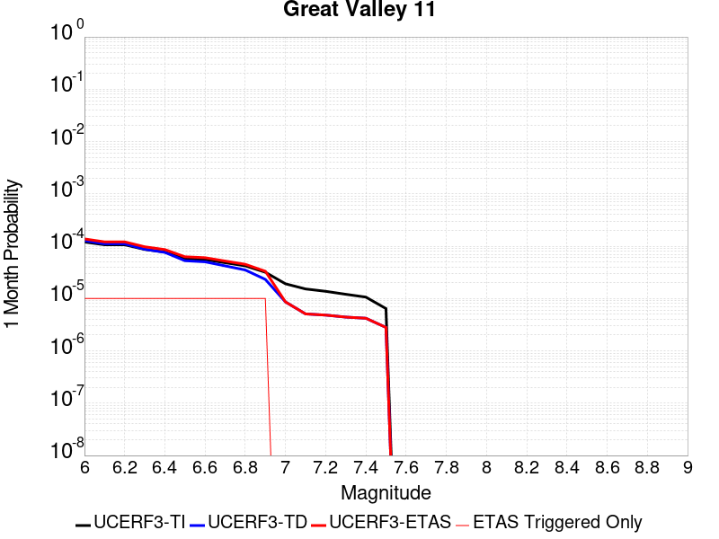 | 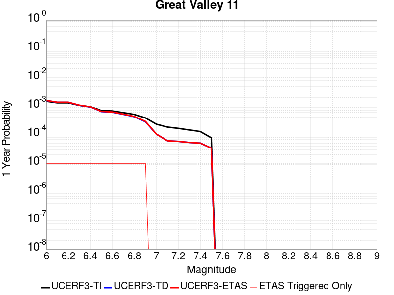 | 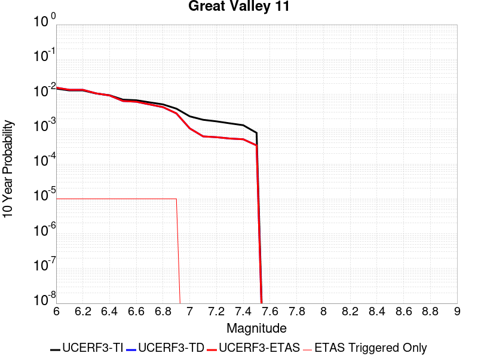 |

| Magnitude | 1 wk TI Prob | 1 wk TD Prob | 1 wk ETAS Prob | 1 wk ETAS/TD Gain | 1 wk ETAS Triggered Only | 1 mo TI Prob | 1 mo TD Prob | 1 mo ETAS Prob | 1 mo ETAS/TD Gain | 1 mo ETAS Triggered Only | 1 yr TI Prob | 1 yr TD Prob | 1 yr ETAS Prob | 1 yr ETAS/TD Gain | 1 yr ETAS Triggered Only | 10 yr TI Prob | 10 yr TD Prob | 10 yr ETAS Prob | 10 yr ETAS/TD Gain | 10 yr ETAS Triggered Only |
|-----|-----|-----|-----|-----|-----|-----|-----|-----|-----|-----|-----|-----|-----|-----|-----|-----|-----|-----|-----|-----|
| 6.0 | 2.8099583E-5 | 2.9832152E-5 | 3.983185E-5 | 1.3351988 | 1.0E-5 | 1.20421224E-4 | 1.278462E-4 | 1.3784492E-4 | 1.078209 | 1.0E-5 | 0.0014651422 | 0.0015554909 | 0.0015654754 | 1.0064188 | 1.0E-5 | 0.0145552 | 0.01545356 | 0.015463406 | 1.000637 | 1.0E-5 |
| 6.1 | 2.483194E-5 | 2.590715E-5 | 3.590689E-5 | 1.3859838 | 1.0E-5 | 1.0641825E-4 | 1.11026246E-4 | 1.21025136E-4 | 1.0900588 | 1.0E-5 | 0.0012948721 | 0.0013509706 | 0.001360957 | 1.007392 | 1.0E-5 | 0.012873529 | 0.013433994 | 0.013443859 | 1.0007343 | 1.0E-5 |
| 6.2 | 2.483194E-5 | 2.590715E-5 | 3.590689E-5 | 1.3859838 | 1.0E-5 | 1.0641825E-4 | 1.11026246E-4 | 1.21025136E-4 | 1.0900588 | 1.0E-5 | 0.0012948721 | 0.0013509706 | 0.001360957 | 1.007392 | 1.0E-5 | 0.012873529 | 0.013433994 | 0.013443859 | 1.0007343 | 1.0E-5 |
| 6.3 | 2.0257901E-5 | 2.0398922E-5 | 3.0398718E-5 | 1.490212 | 1.0E-5 | 8.681669E-5 | 8.742122E-5 | 9.742035E-5 | 1.1143787 | 1.0E-5 | 0.0010564806 | 0.0010638756 | 0.001073865 | 1.0093896 | 1.0E-5 | 0.01051472 | 0.010592012 | 0.010601905 | 1.0009341 | 1.0E-5 |
| 6.4 | 1.8054898E-5 | 1.7780874E-5 | 2.7780698E-5 | 1.562392 | 1.0E-5 | 7.737584E-5 | 7.62017E-5 | 8.620094E-5 | 1.1312207 | 1.0E-5 | 9.416436E-4 | 9.2739856E-4 | 9.373893E-4 | 1.0107728 | 1.0E-5 | 0.009376635 | 0.009239036 | 0.009248943 | 1.0010724 | 1.0E-5 |
| 6.5 | 1.34804895E-5 | 1.2321055E-5 | 2.2320932E-5 | 1.8116088 | 1.0E-5 | 5.777225E-5 | 5.2803476E-5 | 6.2802945E-5 | 1.1893715 | 1.0E-5 | 7.031501E-4 | 6.4269686E-4 | 6.526904E-4 | 1.0155494 | 1.0E-5 | 0.007009294 | 0.0064088185 | 0.0064187543 | 1.0015503 | 1.0E-5 |
| 6.6 | 1.294883E-5 | 1.1732312E-5 | 2.1732194E-5 | 1.852337 | 1.0E-5 | 5.5493805E-5 | 5.028039E-5 | 6.0279886E-5 | 1.1988747 | 1.0E-5 | 6.754276E-4 | 6.1199587E-4 | 6.219898E-4 | 1.01633 | 1.0E-5 | 0.006733784 | 0.0061035305 | 0.0061134696 | 1.0016284 | 1.0E-5 |
| 6.7 | 1.1272237E-5 | 9.811886E-6 | 1.9811787E-5 | 2.0191622 | 1.0E-5 | 4.8308695E-5 | 4.2050277E-5 | 5.2049858E-5 | 1.2378006 | 1.0E-5 | 5.879996E-4 | 5.118446E-4 | 5.218395E-4 | 1.0195272 | 1.0E-5 | 0.005864462 | 0.0051069413 | 0.00511689 | 1.0019481 | 1.0E-5 |
| 6.8 | 9.8337505E-6 | 8.19377E-6 | 1.8193688E-5 | 2.2204294 | 1.0E-5 | 4.2143965E-5 | 3.5115696E-5 | 4.5115343E-5 | 1.284763 | 1.0E-5 | 5.1298196E-4 | 4.2745177E-4 | 4.374475E-4 | 1.0233845 | 1.0E-5 | 0.005117994 | 0.0042665056 | 0.0042764633 | 1.0023339 | 1.0E-5 |
| 6.9 | 7.4224813E-6 | 5.4131347E-6 | 1.5413081E-5 | 2.8473485 | 1.0E-5 | 3.1810247E-5 | 2.319895E-5 | 3.3198718E-5 | 1.431044 | 1.0E-5 | 3.872209E-4 | 2.8241202E-4 | 2.924092E-4 | 1.0353992 | 1.0E-5 | 0.0038654688 | 0.0028206722 | 0.002830644 | 1.0035353 | 1.0E-5 |
| 7.0 | 4.4628923E-6 | 2.0110795E-6 | 2.0110795E-6 | 1.0 | 0.0 | 1.912654E-5 | 8.618884E-6 | 8.618884E-6 | 1.0 | 0.0 | 2.3284076E-4 | 1.04929975E-4 | 1.04929975E-4 | 1.0 | 0.0 | 0.0023259693 | 0.0010488159 | 0.0010488159 | 1.0 | 0.0 |
| 7.1 | 3.5546527E-6 | 1.1855836E-6 | 1.1855836E-6 | 1.0 | 0.0 | 1.5234136E-5 | 5.081063E-6 | 5.081063E-6 | 1.0 | 0.0 | 1.8545982E-4 | 6.186026E-5 | 6.186026E-5 | 1.0 | 0.0 | 0.0018530512 | 6.1843713E-4 | 6.1843713E-4 | 1.0 | 0.0 |
| 7.2 | 3.2039936E-6 | 1.1254128E-6 | 1.1254128E-6 | 1.0 | 0.0 | 1.3731329E-5 | 4.823189E-6 | 4.823189E-6 | 1.0 | 0.0 | 1.671661E-4 | 5.8720816E-5 | 5.8720816E-5 | 1.0 | 0.0 | 0.0016704041 | 5.870597E-4 | 5.870597E-4 | 1.0 | 0.0 |
| 7.3 | 2.8120473E-6 | 1.0305612E-6 | 1.0305612E-6 | 1.0 | 0.0 | 1.2051575E-5 | 4.4166836E-6 | 4.4166836E-6 | 1.0 | 0.0 | 1.4671806E-4 | 5.3771862E-5 | 5.3771862E-5 | 1.0 | 0.0 | 0.0014662122 | 5.3759513E-4 | 5.3759513E-4 | 1.0 | 0.0 |
| 7.4 | 2.4837766E-6 | 9.800582E-7 | 9.800582E-7 | 1.0 | 0.0 | 1.0644713E-5 | 4.200243E-6 | 4.200243E-6 | 1.0 | 0.0 | 1.2959167E-4 | 5.1136827E-5 | 5.1136827E-5 | 1.0 | 0.0 | 0.0012951613 | 5.112572E-4 | 5.112572E-4 | 1.0 | 0.0 |
| 7.5 | 1.5002679E-6 | 6.546144E-7 | 6.546144E-7 | 1.0 | 0.0 | 6.4297037E-6 | 2.8054874E-6 | 2.8054874E-6 | 1.0 | 0.0 | 7.827883E-5 | 3.4156317E-5 | 3.4156317E-5 | 1.0 | 0.0 | 7.825126E-4 | 3.4151482E-4 | 3.4151482E-4 | 1.0 | 0.0 |

## Great Valley 04b Gordon Valley
*[(top)](#table-of-contents)*

| 1 Week | 1 Month | 1 Year | 10 Year |
|-----|-----|-----|-----|
|  |  | 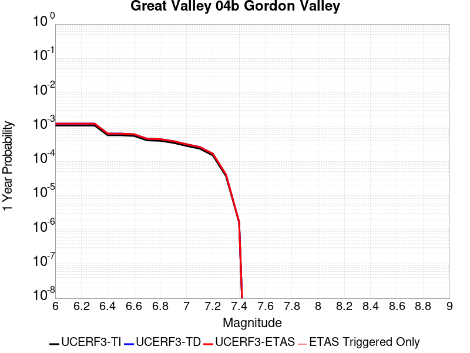 |  |

| Magnitude | 1 wk TI Prob | 1 wk TD Prob | 1 wk ETAS Prob | 1 wk ETAS/TD Gain | 1 wk ETAS Triggered Only | 1 mo TI Prob | 1 mo TD Prob | 1 mo ETAS Prob | 1 mo ETAS/TD Gain | 1 mo ETAS Triggered Only | 1 yr TI Prob | 1 yr TD Prob | 1 yr ETAS Prob | 1 yr ETAS/TD Gain | 1 yr ETAS Triggered Only | 10 yr TI Prob | 10 yr TD Prob | 10 yr ETAS Prob | 10 yr ETAS/TD Gain | 10 yr ETAS Triggered Only |
|-----|-----|-----|-----|-----|-----|-----|-----|-----|-----|-----|-----|-----|-----|-----|-----|-----|-----|-----|-----|-----|
| 6.0 | 2.1181217E-5 | 2.3981953E-5 | 2.3981953E-5 | 1.0 | 0.0 | 9.077348E-5 | 1.0277669E-4 | 1.0277669E-4 | 1.0 | 0.0 | 0.0011046068 | 0.0012507546 | 0.0012507546 | 1.0 | 0.0 | 0.010991322 | 0.012453599 | 0.012463475 | 1.000793 | 1.0E-5 |
| 6.1 | 2.1181217E-5 | 2.3981953E-5 | 2.3981953E-5 | 1.0 | 0.0 | 9.077348E-5 | 1.0277669E-4 | 1.0277669E-4 | 1.0 | 0.0 | 0.0011046068 | 0.0012507546 | 0.0012507546 | 1.0 | 0.0 | 0.010991322 | 0.012453599 | 0.012463475 | 1.000793 | 1.0E-5 |
| 6.2 | 2.1181217E-5 | 2.3981953E-5 | 2.3981953E-5 | 1.0 | 0.0 | 9.077348E-5 | 1.0277669E-4 | 1.0277669E-4 | 1.0 | 0.0 | 0.0011046068 | 0.0012507546 | 0.0012507546 | 1.0 | 0.0 | 0.010991322 | 0.012453599 | 0.012463475 | 1.000793 | 1.0E-5 |
| 6.3 | 2.1181217E-5 | 2.3981953E-5 | 2.3981953E-5 | 1.0 | 0.0 | 9.077348E-5 | 1.0277669E-4 | 1.0277669E-4 | 1.0 | 0.0 | 0.0011046068 | 0.0012507546 | 0.0012507546 | 1.0 | 0.0 | 0.010991322 | 0.012453599 | 0.012463475 | 1.000793 | 1.0E-5 |
| 6.4 | 1.0988268E-5 | 1.2254499E-5 | 1.2254499E-5 | 1.0 | 0.0 | 4.7091726E-5 | 5.2518313E-5 | 5.2518313E-5 | 1.0 | 0.0 | 5.731909E-4 | 6.392388E-4 | 6.392388E-4 | 1.0 | 0.0 | 0.005717147 | 0.0063755875 | 0.0063755875 | 1.0 | 0.0 |
| 6.5 | 1.0988268E-5 | 1.2254499E-5 | 1.2254499E-5 | 1.0 | 0.0 | 4.7091726E-5 | 5.2518313E-5 | 5.2518313E-5 | 1.0 | 0.0 | 5.731909E-4 | 6.392388E-4 | 6.392388E-4 | 1.0 | 0.0 | 0.005717147 | 0.0063755875 | 0.0063755875 | 1.0 | 0.0 |
| 6.6 | 1.0517822E-5 | 1.1724062E-5 | 1.1724062E-5 | 1.0 | 0.0 | 4.5075605E-5 | 5.02451E-5 | 5.02451E-5 | 1.0 | 0.0 | 5.4865726E-4 | 6.11578E-4 | 6.11578E-4 | 1.0 | 0.0 | 0.0054730466 | 0.0061005033 | 0.0061005033 | 1.0 | 0.0 |
| 6.7 | 7.789219E-6 | 8.6776445E-6 | 8.6776445E-6 | 1.0 | 0.0 | 3.3381937E-5 | 3.7189402E-5 | 3.7189402E-5 | 1.0 | 0.0 | 4.063493E-4 | 4.526921E-4 | 4.526921E-4 | 1.0 | 0.0 | 0.004056071 | 0.0045182165 | 0.0045182165 | 1.0 | 0.0 |
| 6.8 | 7.5850853E-6 | 8.452389E-6 | 8.452389E-6 | 1.0 | 0.0 | 3.2507105E-5 | 3.622405E-5 | 3.622405E-5 | 1.0 | 0.0 | 3.957021E-4 | 4.409437E-4 | 4.409437E-4 | 1.0 | 0.0 | 0.0039499826 | 0.0044012 | 0.0044012 | 1.0 | 0.0 |
| 6.9 | 6.604105E-6 | 7.3585493E-6 | 7.3585493E-6 | 1.0 | 0.0 | 2.8303E-5 | 3.153628E-5 | 3.153628E-5 | 1.0 | 0.0 | 3.4453452E-4 | 3.8389044E-4 | 3.8389044E-4 | 1.0 | 0.0 | 0.0034400085 | 0.0038326595 | 0.0038326595 | 1.0 | 0.0 |
| 7.0 | 5.3701115E-6 | 5.9884183E-6 | 5.9884183E-6 | 1.0 | 0.0 | 2.301456E-5 | 2.5664414E-5 | 2.5664414E-5 | 1.0 | 0.0 | 2.8016625E-4 | 3.1242234E-4 | 3.1242234E-4 | 1.0 | 0.0 | 0.0027981328 | 0.00312012 | 0.00312012 | 1.0 | 0.0 |
| 7.1 | 4.4685607E-6 | 4.986478E-6 | 4.986478E-6 | 1.0 | 0.0 | 1.9150835E-5 | 2.1370459E-5 | 2.1370459E-5 | 1.0 | 0.0 | 2.3313647E-4 | 2.6015675E-4 | 2.6015675E-4 | 1.0 | 0.0 | 0.0023289204 | 0.0025987667 | 0.0025987667 | 1.0 | 0.0 |
| 7.2 | 2.833378E-6 | 3.164419E-6 | 3.164419E-6 | 1.0 | 0.0 | 1.2142991E-5 | 1.3561736E-5 | 1.3561736E-5 | 1.0 | 0.0 | 1.4783088E-4 | 1.6510337E-4 | 1.6510337E-4 | 1.0 | 0.0 | 0.0014773258 | 0.0016499789 | 0.0016499789 | 1.0 | 0.0 |
| 7.3 | 7.0087293E-7 | 7.7728157E-7 | 7.7728157E-7 | 1.0 | 0.0 | 3.0037377E-6 | 3.3312049E-6 | 3.3312049E-6 | 1.0 | 0.0 | 3.656989E-5 | 4.0557123E-5 | 4.0557123E-5 | 1.0 | 0.0 | 3.6563876E-4 | 4.055422E-4 | 4.055422E-4 | 1.0 | 0.0 |
| 7.4 | 3.112171E-8 | 3.2068368E-8 | 3.2068368E-8 | 1.0 | 0.0 | 1.3337875E-7 | 1.3743585E-7 | 1.3743585E-7 | 1.0 | 0.0 | 1.6238852E-6 | 1.6732803E-6 | 1.6732803E-6 | 1.0 | 0.0 | 1.6238733E-5 | 1.6732685E-5 | 1.6732685E-5 | 1.0 | 0.0 |

## San Gregorio (North) 2011 CFM
*[(top)](#table-of-contents)*

| 1 Week | 1 Month | 1 Year | 10 Year |
|-----|-----|-----|-----|
| 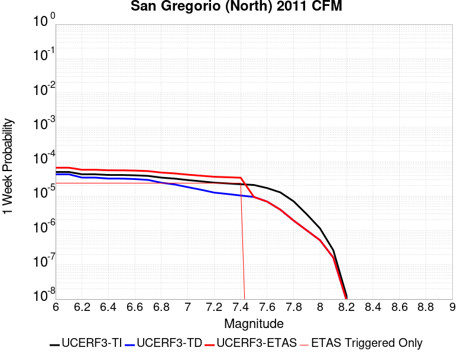 | 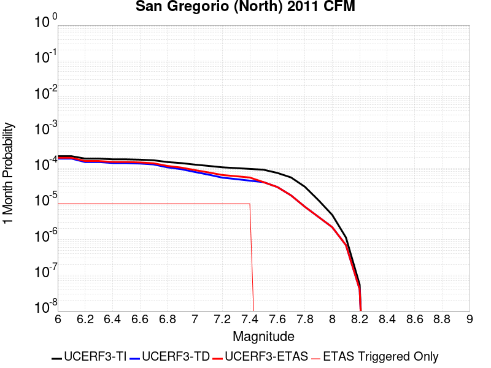 | 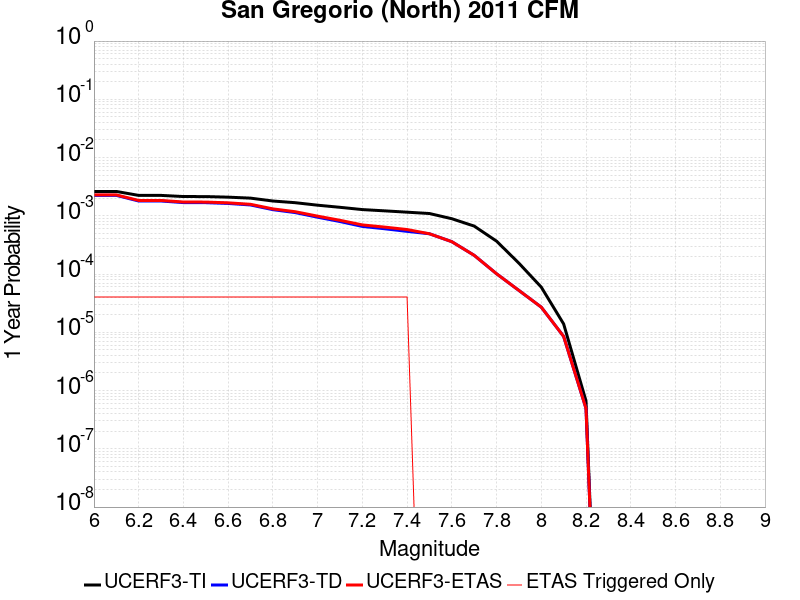 | 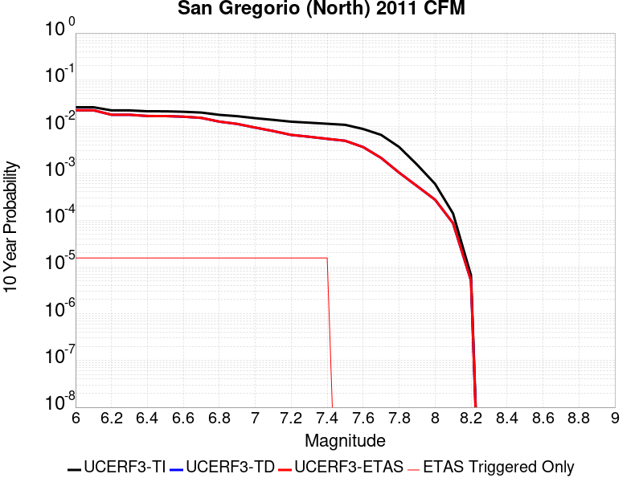 |

| Magnitude | 1 wk TI Prob | 1 wk TD Prob | 1 wk ETAS Prob | 1 wk ETAS/TD Gain | 1 wk ETAS Triggered Only | 1 mo TI Prob | 1 mo TD Prob | 1 mo ETAS Prob | 1 mo ETAS/TD Gain | 1 mo ETAS Triggered Only | 1 yr TI Prob | 1 yr TD Prob | 1 yr ETAS Prob | 1 yr ETAS/TD Gain | 1 yr ETAS Triggered Only | 10 yr TI Prob | 10 yr TD Prob | 10 yr ETAS Prob | 10 yr ETAS/TD Gain | 10 yr ETAS Triggered Only |
|-----|-----|-----|-----|-----|-----|-----|-----|-----|-----|-----|-----|-----|-----|-----|-----|-----|-----|-----|-----|-----|
| 6.0 | 5.0283932E-5 | 4.3057815E-5 | 5.305738E-5 | 1.2322359 | 1.0E-5 | 2.1548476E-4 | 1.8452053E-4 | 1.9451868E-4 | 1.0541846 | 1.0E-5 | 0.0026203706 | 0.002244237 | 0.0022542146 | 1.0044459 | 1.0E-5 | 0.02589687 | 0.022293162 | 0.022302939 | 1.0004386 | 1.0E-5 |
| 6.1 | 5.0283932E-5 | 4.3057815E-5 | 5.305738E-5 | 1.2322359 | 1.0E-5 | 2.1548476E-4 | 1.8452053E-4 | 1.9451868E-4 | 1.0541846 | 1.0E-5 | 0.0026203706 | 0.002244237 | 0.0022542146 | 1.0044459 | 1.0E-5 | 0.02589687 | 0.022293162 | 0.022302939 | 1.0004386 | 1.0E-5 |
| 6.2 | 4.2998647E-5 | 3.4441564E-5 | 4.4441218E-5 | 1.2903368 | 1.0E-5 | 1.842669E-4 | 1.475984E-4 | 1.5759692E-4 | 1.0677414 | 1.0E-5 | 0.0022411412 | 0.00179554 | 0.001805522 | 1.0055593 | 1.0E-5 | 0.022186736 | 0.017886506 | 0.017896328 | 1.0005491 | 1.0E-5 |
| 6.3 | 4.2998647E-5 | 3.4441564E-5 | 4.4441218E-5 | 1.2903368 | 1.0E-5 | 1.842669E-4 | 1.475984E-4 | 1.5759692E-4 | 1.0677414 | 1.0E-5 | 0.0022411412 | 0.00179554 | 0.001805522 | 1.0055593 | 1.0E-5 | 0.022186736 | 0.017886506 | 0.017896328 | 1.0005491 | 1.0E-5 |
| 6.4 | 4.1101295E-5 | 3.2326872E-5 | 4.232655E-5 | 1.3093302 | 1.0E-5 | 1.7613651E-4 | 1.3853642E-4 | 1.4853504E-4 | 1.0721732 | 1.0E-5 | 0.0021423528 | 0.0016853869 | 0.00169537 | 1.0059234 | 1.0E-5 | 0.02121817 | 0.016801886 | 0.016811717 | 1.0005852 | 1.0E-5 |
| 6.5 | 4.1032585E-5 | 3.2244905E-5 | 4.2244585E-5 | 1.3101165 | 1.0E-5 | 1.7584208E-4 | 1.3818518E-4 | 1.481838E-4 | 1.0723567 | 1.0E-5 | 0.0021387753 | 0.0016811171 | 0.0016911003 | 1.0059384 | 1.0E-5 | 0.021183075 | 0.016759839 | 0.016769672 | 1.0005866 | 1.0E-5 |
| 6.6 | 4.011629E-5 | 3.1266558E-5 | 4.1266245E-5 | 1.3198205 | 1.0E-5 | 1.7191563E-4 | 1.339927E-4 | 1.4399135E-4 | 1.074621 | 1.0E-5 | 0.0020910634 | 0.0016301516 | 0.0016401353 | 1.0061244 | 1.0E-5 | 0.020714961 | 0.01625741 | 0.016267247 | 1.0006051 | 1.0E-5 |
| 6.7 | 3.8583938E-5 | 2.9453593E-5 | 3.9453298E-5 | 1.3395071 | 1.0E-5 | 1.6534925E-4 | 1.2622366E-4 | 1.362224E-4 | 1.0792145 | 1.0E-5 | 0.0020112682 | 0.0015357039 | 0.0015456886 | 1.0065017 | 1.0E-5 | 0.019931622 | 0.015325955 | 0.015335802 | 1.0006425 | 1.0E-5 |
| 6.8 | 3.44341E-5 | 2.4450854E-5 | 3.445061E-5 | 1.4089737 | 1.0E-5 | 1.4756636E-4 | 1.0478523E-4 | 1.14784176E-4 | 1.0954233 | 1.0E-5 | 0.0017951399 | 0.0012750238 | 0.0012850111 | 1.007833 | 1.0E-5 | 0.017807078 | 0.012751131 | 0.012761004 | 1.0007743 | 1.0E-5 |
| 6.9 | 3.221199E-5 | 2.1778029E-5 | 3.177781E-5 | 1.4591683 | 1.0E-5 | 1.3804408E-4 | 9.333112E-5 | 1.0333019E-4 | 1.1071354 | 1.0E-5 | 0.0016793909 | 0.0011357224 | 0.0011457109 | 1.008795 | 1.0E-5 | 0.01666756 | 0.011372583 | 0.011382469 | 1.0008693 | 1.0E-5 |
| 7.0 | 2.9186718E-5 | 1.8146875E-5 | 2.8146693E-5 | 1.5510491 | 1.0E-5 | 1.2507994E-4 | 7.7770026E-5 | 8.7769244E-5 | 1.1285743 | 1.0E-5 | 0.0015217843 | 9.464431E-4 | 9.5643365E-4 | 1.0105559 | 1.0E-5 | 0.015114053 | 0.009496798 | 0.009506703 | 1.001043 | 1.0E-5 |
| 7.1 | 2.6840138E-5 | 1.5284508E-5 | 2.5284355E-5 | 1.6542472 | 1.0E-5 | 1.1502409E-4 | 6.55034E-5 | 7.550274E-5 | 1.1526538 | 1.0E-5 | 0.0013995186 | 7.9721404E-4 | 8.072061E-4 | 1.0125337 | 1.0E-5 | 0.013907375 | 0.008015723 | 0.0080256425 | 1.0012375 | 1.0E-5 |
| 7.2 | 2.453002E-5 | 1.2606672E-5 | 2.2606546E-5 | 1.7932208 | 1.0E-5 | 1.05124425E-4 | 5.4027478E-5 | 6.4026935E-5 | 1.185081 | 1.0E-5 | 0.0012791384 | 6.575866E-4 | 6.6758E-4 | 1.0151972 | 1.0E-5 | 0.012718005 | 0.00662763 | 0.0066375635 | 1.0014988 | 1.0E-5 |
| 7.3 | 2.3330727E-5 | 1.1488677E-5 | 2.1488562E-5 | 1.8704122 | 1.0E-5 | 9.9985E-5 | 4.923626E-5 | 5.9235765E-5 | 1.2030923 | 1.0E-5 | 0.0012166376 | 5.9928704E-4 | 6.09281E-4 | 1.0166765 | 1.0E-5 | 0.012099981 | 0.006046564 | 0.0060565034 | 1.0016438 | 1.0E-5 |
| 7.4 | 2.2136466E-5 | 1.0368981E-5 | 2.0368878E-5 | 1.964405 | 1.0E-5 | 9.486712E-5 | 4.4437733E-5 | 5.443729E-5 | 1.225024 | 1.0E-5 | 0.0011543952 | 5.4089533E-4 | 5.5088993E-4 | 1.0184779 | 1.0E-5 | 0.011484168 | 0.005464249 | 0.0054741944 | 1.0018201 | 1.0E-5 |
| 7.5 | 2.0994974E-5 | 9.427217E-6 | 9.427217E-6 | 1.0 | 0.0 | 8.997535E-5 | 4.0401734E-5 | 4.0401734E-5 | 1.0 | 0.0 | 0.0010948994 | 4.9178035E-4 | 4.9178035E-4 | 1.0 | 0.0 | 0.010895205 | 0.004973358 | 0.004973358 | 1.0 | 0.0 |
| 7.6 | 1.7091823E-5 | 6.893766E-6 | 6.893766E-6 | 1.0 | 0.0 | 7.3248615E-5 | 2.9544377E-5 | 2.9544377E-5 | 1.0 | 0.0 | 8.9143694E-4 | 3.596435E-4 | 3.596435E-4 | 1.0 | 0.0 | 0.008878695 | 0.0036482841 | 0.0036482841 | 1.0 | 0.0 |
| 7.7 | 1.2772179E-5 | 4.0208706E-6 | 4.0208706E-6 | 1.0 | 0.0 | 5.473676E-5 | 1.7232189E-5 | 1.7232189E-5 | 1.0 | 0.0 | 6.6621625E-4 | 2.0978172E-4 | 2.0978172E-4 | 1.0 | 0.0 | 0.006642225 | 0.002136922 | 0.002136922 | 1.0 | 0.0 |
| 7.8 | 7.041923E-6 | 1.940626E-6 | 1.940626E-6 | 1.0 | 0.0 | 3.017932E-5 | 8.316942E-6 | 8.316942E-6 | 1.0 | 0.0 | 3.6737128E-4 | 1.0125406E-4 | 1.0125406E-4 | 1.0 | 0.0 | 0.0036676454 | 0.0010379003 | 0.0010379003 | 1.0 | 0.0 |
| 7.9 | 2.946768E-6 | 1.0033551E-6 | 1.0033551E-6 | 1.0 | 0.0 | 1.2628945E-5 | 4.300086E-6 | 4.300086E-6 | 1.0 | 0.0 | 1.5374656E-4 | 5.235229E-5 | 5.235229E-5 | 1.0 | 0.0 | 0.0015364023 | 5.3400313E-4 | 5.3400313E-4 | 1.0 | 0.0 |
| 8.0 | 1.1433375E-6 | 5.18146E-7 | 5.18146E-7 | 1.0 | 0.0 | 4.9000087E-6 | 2.2206239E-6 | 2.2206239E-6 | 1.0 | 0.0 | 5.965597E-5 | 2.703576E-5 | 2.703576E-5 | 1.0 | 0.0 | 5.963996E-4 | 2.7398416E-4 | 2.7398416E-4 | 1.0 | 0.0 |
| 8.1 | 2.6675295E-7 | 1.62899E-7 | 1.62899E-7 | 1.0 | 0.0 | 1.1432264E-6 | 6.9813836E-7 | 6.9813836E-7 | 1.0 | 0.0 | 1.3918692E-5 | 8.499802E-6 | 8.499802E-6 | 1.0 | 0.0 | 1.391782E-4 | 8.63795E-5 | 8.63795E-5 | 1.0 | 0.0 |
| 8.2 | 1.2704569E-8 | 9.431393E-9 | 9.431393E-9 | 1.0 | 0.0 | 5.444815E-8 | 4.042026E-8 | 4.042026E-8 | 1.0 | 0.0 | 6.629061E-7 | 4.9211656E-7 | 4.9211656E-7 | 1.0 | 0.0 | 6.629041E-6 | 5.1121438E-6 | 5.1121438E-6 | 1.0 | 0.0 |

## Clamshell-Sawpit
*[(top)](#table-of-contents)*

| 1 Week | 1 Month | 1 Year | 10 Year |
|-----|-----|-----|-----|
|  |  | 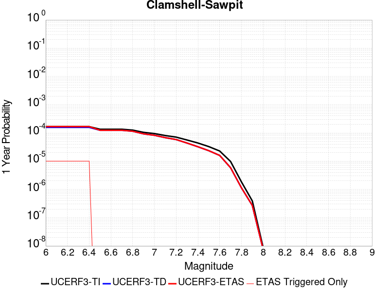 | 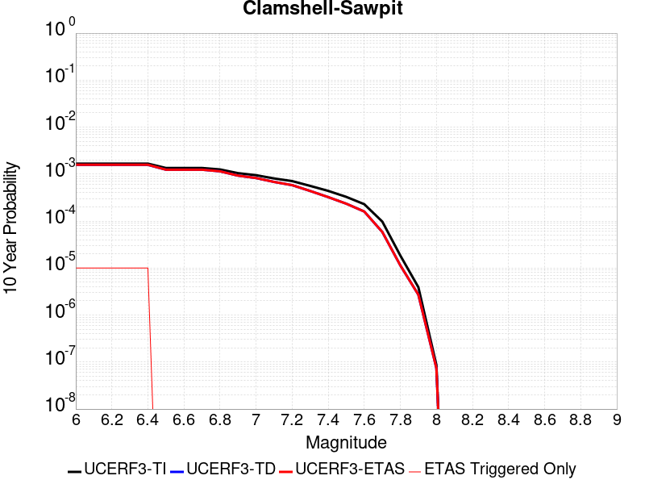 |

| Magnitude | 1 wk TI Prob | 1 wk TD Prob | 1 wk ETAS Prob | 1 wk ETAS/TD Gain | 1 wk ETAS Triggered Only | 1 mo TI Prob | 1 mo TD Prob | 1 mo ETAS Prob | 1 mo ETAS/TD Gain | 1 mo ETAS Triggered Only | 1 yr TI Prob | 1 yr TD Prob | 1 yr ETAS Prob | 1 yr ETAS/TD Gain | 1 yr ETAS Triggered Only | 10 yr TI Prob | 10 yr TD Prob | 10 yr ETAS Prob | 10 yr ETAS/TD Gain | 10 yr ETAS Triggered Only |
|-----|-----|-----|-----|-----|-----|-----|-----|-----|-----|-----|-----|-----|-----|-----|-----|-----|-----|-----|-----|-----|
| 6.0 | 3.202998E-6 | 3.0127644E-6 | 3.0127644E-6 | 1.0 | 0.0 | 1.3727062E-5 | 1.2911788E-5 | 1.2911788E-5 | 1.0 | 0.0 | 1.6711417E-4 | 1.5719049E-4 | 1.671889E-4 | 1.0636071 | 1.0E-5 | 0.0016698855 | 0.0015708724 | 0.0015808566 | 1.0063559 | 1.0E-5 |
| 6.1 | 3.202998E-6 | 3.0127644E-6 | 3.0127644E-6 | 1.0 | 0.0 | 1.3727062E-5 | 1.2911788E-5 | 1.2911788E-5 | 1.0 | 0.0 | 1.6711417E-4 | 1.5719049E-4 | 1.671889E-4 | 1.0636071 | 1.0E-5 | 0.0016698855 | 0.0015708724 | 0.0015808566 | 1.0063559 | 1.0E-5 |
| 6.2 | 3.202998E-6 | 3.0127644E-6 | 3.0127644E-6 | 1.0 | 0.0 | 1.3727062E-5 | 1.2911788E-5 | 1.2911788E-5 | 1.0 | 0.0 | 1.6711417E-4 | 1.5719049E-4 | 1.671889E-4 | 1.0636071 | 1.0E-5 | 0.0016698855 | 0.0015708724 | 0.0015808566 | 1.0063559 | 1.0E-5 |
| 6.3 | 3.202998E-6 | 3.0127644E-6 | 3.0127644E-6 | 1.0 | 0.0 | 1.3727062E-5 | 1.2911788E-5 | 1.2911788E-5 | 1.0 | 0.0 | 1.6711417E-4 | 1.5719049E-4 | 1.671889E-4 | 1.0636071 | 1.0E-5 | 0.0016698855 | 0.0015708724 | 0.0015808566 | 1.0063559 | 1.0E-5 |
| 6.4 | 3.202998E-6 | 3.0127644E-6 | 3.0127644E-6 | 1.0 | 0.0 | 1.3727062E-5 | 1.2911788E-5 | 1.2911788E-5 | 1.0 | 0.0 | 1.6711417E-4 | 1.5719049E-4 | 1.671889E-4 | 1.0636071 | 1.0E-5 | 0.0016698855 | 0.0015708724 | 0.0015808566 | 1.0063559 | 1.0E-5 |
| 6.5 | 2.5862723E-6 | 2.380775E-6 | 2.380775E-6 | 1.0 | 0.0 | 1.1083977E-5 | 1.0203283E-5 | 1.0203283E-5 | 1.0 | 0.0 | 1.3493907E-4 | 1.2421819E-4 | 1.2421819E-4 | 1.0 | 0.0 | 0.0013485716 | 0.0012415178 | 0.0012415178 | 1.0 | 0.0 |
| 6.6 | 2.5862723E-6 | 2.380775E-6 | 2.380775E-6 | 1.0 | 0.0 | 1.1083977E-5 | 1.0203283E-5 | 1.0203283E-5 | 1.0 | 0.0 | 1.3493907E-4 | 1.2421819E-4 | 1.2421819E-4 | 1.0 | 0.0 | 0.0013485716 | 0.0012415178 | 0.0012415178 | 1.0 | 0.0 |
| 6.7 | 2.5862723E-6 | 2.380775E-6 | 2.380775E-6 | 1.0 | 0.0 | 1.1083977E-5 | 1.0203283E-5 | 1.0203283E-5 | 1.0 | 0.0 | 1.3493907E-4 | 1.2421819E-4 | 1.2421819E-4 | 1.0 | 0.0 | 0.0013485716 | 0.0012415178 | 0.0012415178 | 1.0 | 0.0 |
| 6.8 | 2.4098806E-6 | 2.1977307E-6 | 2.1977307E-6 | 1.0 | 0.0 | 1.0328019E-5 | 9.4188135E-6 | 9.4188135E-6 | 1.0 | 0.0 | 1.2573638E-4 | 1.1466829E-4 | 1.1466829E-4 | 1.0 | 0.0 | 0.0012566525 | 0.0011461178 | 0.0011461178 | 1.0 | 0.0 |
| 6.9 | 2.0073985E-6 | 1.7784248E-6 | 1.7784248E-6 | 1.0 | 0.0 | 8.603109E-6 | 7.621799E-6 | 7.621799E-6 | 1.0 | 0.0 | 1.0473781E-4 | 9.279157E-5 | 9.279157E-5 | 1.0 | 0.0 | 0.0010468846 | 9.275401E-4 | 9.275401E-4 | 1.0 | 0.0 |
| 7.0 | 1.8166766E-6 | 1.5807095E-6 | 1.5807095E-6 | 1.0 | 0.0 | 7.785734E-6 | 6.7744522E-6 | 6.7744522E-6 | 1.0 | 0.0 | 9.478718E-5 | 8.247593E-5 | 8.247593E-5 | 1.0 | 0.0 | 9.4746763E-4 | 8.244633E-4 | 8.244633E-4 | 1.0 | 0.0 |
| 7.1 | 1.5471421E-6 | 1.3052961E-6 | 1.3052961E-6 | 1.0 | 0.0 | 6.6305925E-6 | 5.5941146E-6 | 5.5941146E-6 | 1.0 | 0.0 | 8.072447E-5 | 6.8106274E-5 | 6.8106274E-5 | 1.0 | 0.0 | 8.0695155E-4 | 6.808595E-4 | 6.808595E-4 | 1.0 | 0.0 |
| 7.2 | 1.3608037E-6 | 1.1153443E-6 | 1.1153443E-6 | 1.0 | 0.0 | 5.8320024E-6 | 4.7800386E-6 | 4.7800386E-6 | 1.0 | 0.0 | 7.1002316E-5 | 5.8195463E-5 | 5.8195463E-5 | 1.0 | 0.0 | 7.097964E-4 | 5.818069E-4 | 5.818069E-4 | 1.0 | 0.0 |
| 7.3 | 1.0749634E-6 | 8.384254E-7 | 8.384254E-7 | 1.0 | 0.0 | 4.6069777E-6 | 3.593247E-6 | 3.593247E-6 | 1.0 | 0.0 | 5.608851E-5 | 4.374693E-5 | 4.374693E-5 | 1.0 | 0.0 | 5.6074356E-4 | 4.37386E-4 | 4.37386E-4 | 1.0 | 0.0 |
| 7.4 | 8.416856E-7 | 6.200048E-7 | 6.200048E-7 | 1.0 | 0.0 | 3.607219E-6 | 2.6571608E-6 | 2.6571608E-6 | 1.0 | 0.0 | 4.3917007E-5 | 3.2350472E-5 | 3.2350472E-5 | 1.0 | 0.0 | 4.390833E-4 | 3.2345962E-4 | 3.2345962E-4 | 1.0 | 0.0 |
| 7.5 | 6.2779594E-7 | 4.496886E-7 | 4.496886E-7 | 1.0 | 0.0 | 2.6905511E-6 | 1.9272356E-6 | 1.9272356E-6 | 1.0 | 0.0 | 3.275697E-5 | 2.346386E-5 | 2.346386E-5 | 1.0 | 0.0 | 3.275214E-4 | 2.346157E-4 | 2.346157E-4 | 1.0 | 0.0 |
| 7.6 | 4.3822078E-7 | 3.0595405E-7 | 3.0595405E-7 | 1.0 | 0.0 | 1.8780877E-6 | 1.311231E-6 | 1.311231E-6 | 1.0 | 0.0 | 2.2865479E-5 | 1.5964137E-5 | 1.5964137E-5 | 1.0 | 0.0 | 2.2863125E-4 | 1.5963144E-4 | 1.5963144E-4 | 1.0 | 0.0 |
| 7.7 | 1.8704569E-7 | 1.12379205E-7 | 1.12379205E-7 | 1.0 | 0.0 | 8.0162414E-7 | 4.816251E-7 | 4.816251E-7 | 1.0 | 0.0 | 9.75973E-6 | 5.86377E-6 | 5.86377E-6 | 1.0 | 0.0 | 9.7593016E-5 | 5.863622E-5 | 5.863622E-5 | 1.0 | 0.0 |
| 7.8 | 3.5378733E-8 | 2.1838144E-8 | 2.1838144E-8 | 1.0 | 0.0 | 1.5162313E-7 | 9.359204E-8 | 9.359204E-8 | 1.0 | 0.0 | 1.84601E-6 | 1.1394826E-6 | 1.1394826E-6 | 1.0 | 0.0 | 1.8459947E-5 | 1.139477E-5 | 1.139477E-5 | 1.0 | 0.0 |
| 7.9 | 7.504945E-9 | 5.1920326E-9 | 5.1920326E-9 | 1.0 | 0.0 | 3.2164053E-8 | 2.225157E-8 | 2.225157E-8 | 1.0 | 0.0 | 3.9159727E-7 | 2.7091284E-7 | 2.7091284E-7 | 1.0 | 0.0 | 3.915966E-6 | 2.7091257E-6 | 2.7091257E-6 | 1.0 | 0.0 |
| 8.0 | 1.6554036E-10 | 1.4180768E-10 | 1.4180768E-10 | 1.0 | 0.0 | 7.0945894E-10 | 6.077475E-10 | 6.077475E-10 | 1.0 | 0.0 | 8.637662E-9 | 7.3993256E-9 | 7.3993256E-9 | 1.0 | 0.0 | 8.6376616E-8 | 7.3993256E-8 | 7.3993256E-8 | 1.0 | 0.0 |

## Eaton Roughs 2011 CFM
*[(top)](#table-of-contents)*

| 1 Week | 1 Month | 1 Year | 10 Year |
|-----|-----|-----|-----|
| 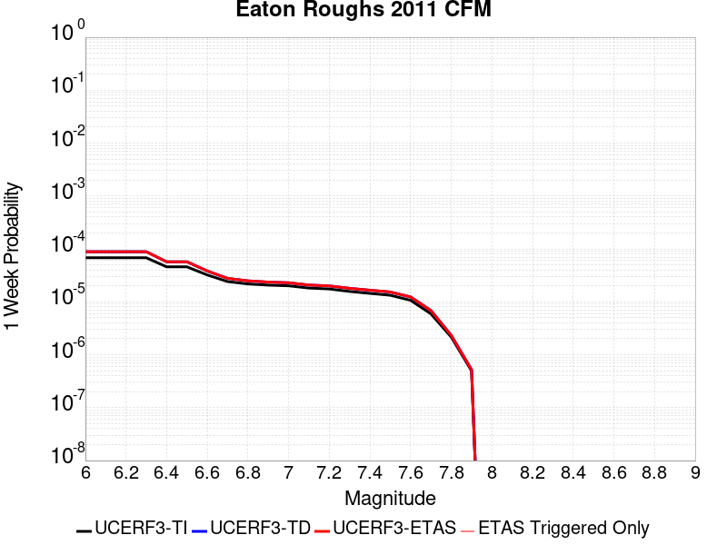 | 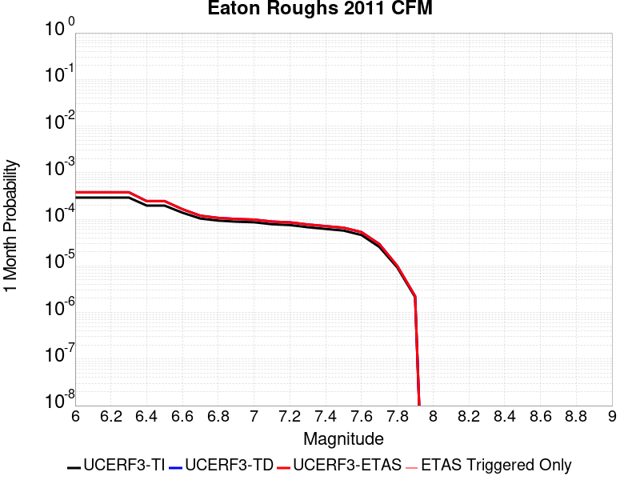 | 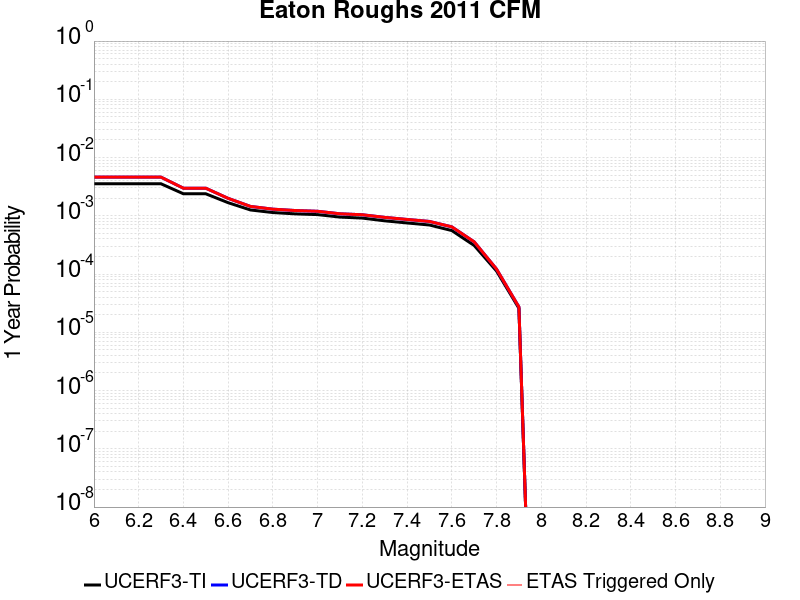 | 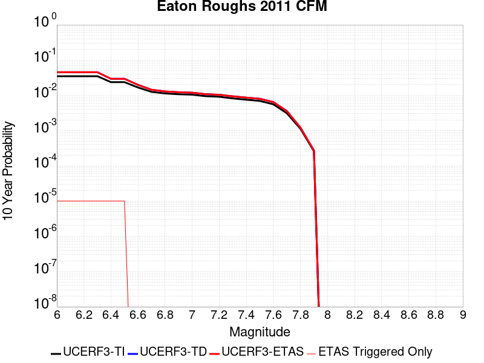 |

| Magnitude | 1 wk TI Prob | 1 wk TD Prob | 1 wk ETAS Prob | 1 wk ETAS/TD Gain | 1 wk ETAS Triggered Only | 1 mo TI Prob | 1 mo TD Prob | 1 mo ETAS Prob | 1 mo ETAS/TD Gain | 1 mo ETAS Triggered Only | 1 yr TI Prob | 1 yr TD Prob | 1 yr ETAS Prob | 1 yr ETAS/TD Gain | 1 yr ETAS Triggered Only | 10 yr TI Prob | 10 yr TD Prob | 10 yr ETAS Prob | 10 yr ETAS/TD Gain | 10 yr ETAS Triggered Only |
|-----|-----|-----|-----|-----|-----|-----|-----|-----|-----|-----|-----|-----|-----|-----|-----|-----|-----|-----|-----|-----|
| 6.0 | 6.8044945E-5 | 8.843646E-5 | 8.843646E-5 | 1.0 | 0.0 | 2.9158857E-4 | 3.7896493E-4 | 3.7896493E-4 | 1.0 | 0.0 | 0.0035443127 | 0.0046050907 | 0.0046050907 | 1.0 | 0.0 | 0.03488314 | 0.04516335 | 0.045172896 | 1.0002115 | 1.0E-5 |
| 6.1 | 6.8044945E-5 | 8.843646E-5 | 8.843646E-5 | 1.0 | 0.0 | 2.9158857E-4 | 3.7896493E-4 | 3.7896493E-4 | 1.0 | 0.0 | 0.0035443127 | 0.0046050907 | 0.0046050907 | 1.0 | 0.0 | 0.03488314 | 0.04516335 | 0.045172896 | 1.0002115 | 1.0E-5 |
| 6.2 | 6.8044945E-5 | 8.843646E-5 | 8.843646E-5 | 1.0 | 0.0 | 2.9158857E-4 | 3.7896493E-4 | 3.7896493E-4 | 1.0 | 0.0 | 0.0035443127 | 0.0046050907 | 0.0046050907 | 1.0 | 0.0 | 0.03488314 | 0.04516335 | 0.045172896 | 1.0002115 | 1.0E-5 |
| 6.3 | 6.8044945E-5 | 8.843646E-5 | 8.843646E-5 | 1.0 | 0.0 | 2.9158857E-4 | 3.7896493E-4 | 3.7896493E-4 | 1.0 | 0.0 | 0.0035443127 | 0.0046050907 | 0.0046050907 | 1.0 | 0.0 | 0.03488314 | 0.04516335 | 0.045172896 | 1.0002115 | 1.0E-5 |
| 6.4 | 4.5830013E-5 | 5.715427E-5 | 5.715427E-5 | 1.0 | 0.0 | 1.9639956E-4 | 2.4492692E-4 | 2.4492692E-4 | 1.0 | 0.0 | 0.0023885423 | 0.0029784471 | 0.0029784471 | 1.0 | 0.0 | 0.023630321 | 0.029421588 | 0.029431295 | 1.0003299 | 1.0E-5 |
| 6.5 | 4.5830013E-5 | 5.715427E-5 | 5.715427E-5 | 1.0 | 0.0 | 1.9639956E-4 | 2.4492692E-4 | 2.4492692E-4 | 1.0 | 0.0 | 0.0023885423 | 0.0029784471 | 0.0029784471 | 1.0 | 0.0 | 0.023630321 | 0.029421588 | 0.029431295 | 1.0003299 | 1.0E-5 |
| 6.6 | 3.222194E-5 | 3.8261504E-5 | 3.8261504E-5 | 1.0 | 0.0 | 1.3808672E-4 | 1.639682E-4 | 1.639682E-4 | 1.0 | 0.0 | 0.0016799092 | 0.001994599 | 0.001994599 | 1.0 | 0.0 | 0.016672665 | 0.019776601 | 0.019776601 | 1.0 | 0.0 |
| 6.7 | 2.4155654E-5 | 2.7786238E-5 | 2.7786238E-5 | 1.0 | 0.0 | 1.0352012E-4 | 1.1907848E-4 | 1.1907848E-4 | 1.0 | 0.0 | 0.0012596287 | 0.0014488247 | 0.0014488247 | 1.0 | 0.0 | 0.012525126 | 0.014394943 | 0.014394943 | 1.0 | 0.0 |
| 6.8 | 2.1814667E-5 | 2.4940868E-5 | 2.4940868E-5 | 1.0 | 0.0 | 9.348808E-5 | 1.06885076E-4 | 1.06885076E-4 | 1.0 | 0.0 | 0.001137623 | 0.0013005526 | 0.0013005526 | 1.0 | 0.0 | 0.011318169 | 0.012930038 | 0.012930038 | 1.0 | 0.0 |
| 6.9 | 2.0700467E-5 | 2.3628932E-5 | 2.3628932E-5 | 1.0 | 0.0 | 8.871327E-5 | 1.01262944E-4 | 1.01262944E-4 | 1.0 | 0.0 | 0.0010795488 | 0.0012321823 | 0.0012321823 | 1.0 | 0.0 | 0.010743194 | 0.012254035 | 0.012254035 | 1.0 | 0.0 |
| 7.0 | 2.0104066E-5 | 2.29365E-5 | 2.29365E-5 | 1.0 | 0.0 | 8.615744E-5 | 9.82956E-5 | 9.82956E-5 | 1.0 | 0.0 | 0.0010484619 | 0.0011960949 | 0.0011960949 | 1.0 | 0.0 | 0.010435291 | 0.011897073 | 0.011897073 | 1.0 | 0.0 |
| 7.1 | 1.8225232E-5 | 2.0773046E-5 | 2.0773046E-5 | 1.0 | 0.0 | 7.81058E-5 | 8.902431E-5 | 8.902431E-5 | 1.0 | 0.0 | 9.5052324E-4 | 0.0010833336 | 0.0010833336 | 1.0 | 0.0 | 0.009464677 | 0.010780825 | 0.010780825 | 1.0 | 0.0 |
| 7.2 | 1.7526572E-5 | 1.9993488E-5 | 1.9993488E-5 | 1.0 | 0.0 | 7.511172E-5 | 8.5683576E-5 | 8.5683576E-5 | 1.0 | 0.0 | 9.141015E-4 | 0.0010426997 | 0.0010426997 | 1.0 | 0.0 | 0.009103506 | 0.010378351 | 0.010378351 | 1.0 | 0.0 |
| 7.3 | 1.5727232E-5 | 1.8021507E-5 | 1.8021507E-5 | 1.0 | 0.0 | 6.740067E-5 | 7.723275E-5 | 7.723275E-5 | 1.0 | 0.0 | 8.2029426E-4 | 9.399043E-4 | 9.399043E-4 | 1.0 | 0.0 | 0.008172729 | 0.009359511 | 0.009359511 | 1.0 | 0.0 |
| 7.4 | 1.4457361E-5 | 1.6598358E-5 | 1.6598358E-5 | 1.0 | 0.0 | 6.195865E-5 | 7.113389E-5 | 7.113389E-5 | 1.0 | 0.0 | 7.540854E-4 | 8.657119E-4 | 8.657119E-4 | 1.0 | 0.0 | 0.007515317 | 0.008623555 | 0.008623555 | 1.0 | 0.0 |
| 7.5 | 1.33280955E-5 | 1.5345435E-5 | 1.5345435E-5 | 1.0 | 0.0 | 5.711916E-5 | 6.57645E-5 | 6.57645E-5 | 1.0 | 0.0 | 6.9520384E-4 | 8.0038945E-4 | 8.0038945E-4 | 1.0 | 0.0 | 0.00693033 | 0.007975209 | 0.007975209 | 1.0 | 0.0 |
| 7.6 | 1.0699478E-5 | 1.2387815E-5 | 1.2387815E-5 | 1.0 | 0.0 | 4.5854096E-5 | 5.308956E-5 | 5.308956E-5 | 1.0 | 0.0 | 5.581306E-4 | 6.4617425E-4 | 6.4617425E-4 | 1.0 | 0.0 | 0.005567309 | 0.0064430353 | 0.0064430353 | 1.0 | 0.0 |
| 7.7 | 5.9390236E-6 | 6.852951E-6 | 6.852951E-6 | 1.0 | 0.0 | 2.545271E-5 | 2.9369461E-5 | 2.9369461E-5 | 1.0 | 0.0 | 3.0984267E-4 | 3.5751477E-4 | 3.5751477E-4 | 1.0 | 0.0 | 0.0030941102 | 0.0035694204 | 0.0035694204 | 1.0 | 0.0 |
| 7.8 | 2.1622036E-6 | 2.3296996E-6 | 2.3296996E-6 | 1.0 | 0.0 | 9.266554E-6 | 9.984388E-6 | 9.984388E-6 | 1.0 | 0.0 | 1.1281446E-4 | 1.21553225E-4 | 1.21553225E-4 | 1.0 | 0.0 | 0.001127572 | 0.001214873 | 0.001214873 | 1.0 | 0.0 |
| 7.9 | 4.9586197E-7 | 5.2189216E-7 | 5.2189216E-7 | 1.0 | 0.0 | 2.125121E-6 | 2.2366787E-6 | 2.2366787E-6 | 1.0 | 0.0 | 2.5873042E-5 | 2.7231245E-5 | 2.7231245E-5 | 1.0 | 0.0 | 2.5870028E-4 | 2.7228118E-4 | 2.7228118E-4 | 1.0 | 0.0 |

## Hayward (So) 2011 CFM
*[(top)](#table-of-contents)*

| 1 Week | 1 Month | 1 Year | 10 Year |
|-----|-----|-----|-----|
| 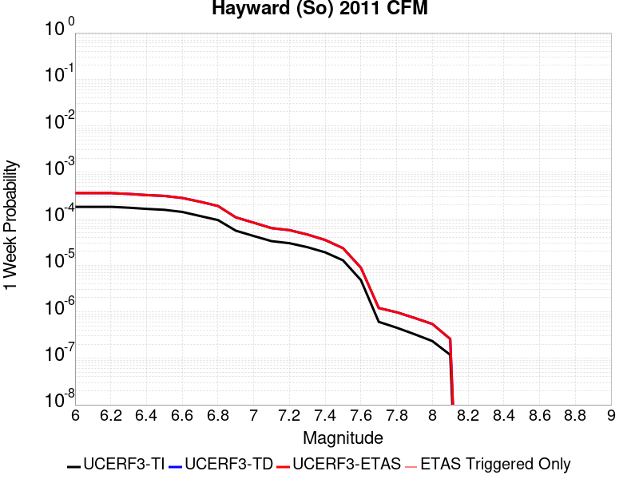 | 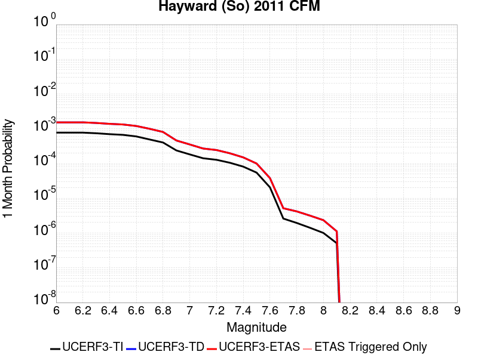 | 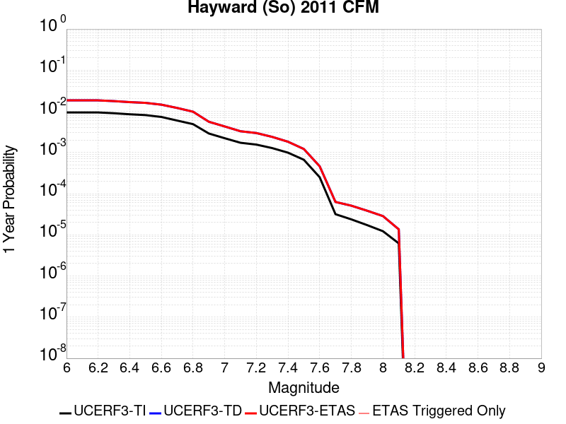 | 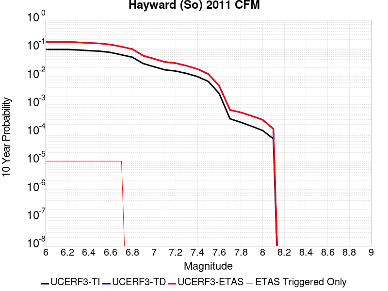 |

| Magnitude | 1 wk TI Prob | 1 wk TD Prob | 1 wk ETAS Prob | 1 wk ETAS/TD Gain | 1 wk ETAS Triggered Only | 1 mo TI Prob | 1 mo TD Prob | 1 mo ETAS Prob | 1 mo ETAS/TD Gain | 1 mo ETAS Triggered Only | 1 yr TI Prob | 1 yr TD Prob | 1 yr ETAS Prob | 1 yr ETAS/TD Gain | 1 yr ETAS Triggered Only | 10 yr TI Prob | 10 yr TD Prob | 10 yr ETAS Prob | 10 yr ETAS/TD Gain | 10 yr ETAS Triggered Only |
|-----|-----|-----|-----|-----|-----|-----|-----|-----|-----|-----|-----|-----|-----|-----|-----|-----|-----|-----|-----|-----|
| 6.0 | 1.8091932E-4 | 3.570541E-4 | 3.570541E-4 | 1.0 | 0.0 | 7.751381E-4 | 0.0015293444 | 0.0015293444 | 1.0 | 0.0 | 0.00939654 | 0.018463207 | 0.018463207 | 1.0 | 0.0 | 0.090090066 | 0.16673161 | 0.16673994 | 1.00005 | 1.0E-5 |
| 6.1 | 1.8091932E-4 | 3.570541E-4 | 3.570541E-4 | 1.0 | 0.0 | 7.751381E-4 | 0.0015293444 | 0.0015293444 | 1.0 | 0.0 | 0.00939654 | 0.018463207 | 0.018463207 | 1.0 | 0.0 | 0.090090066 | 0.16673161 | 0.16673994 | 1.00005 | 1.0E-5 |
| 6.2 | 1.8091932E-4 | 3.570541E-4 | 3.570541E-4 | 1.0 | 0.0 | 7.751381E-4 | 0.0015293444 | 0.0015293444 | 1.0 | 0.0 | 0.00939654 | 0.018463207 | 0.018463207 | 1.0 | 0.0 | 0.090090066 | 0.16673161 | 0.16673994 | 1.00005 | 1.0E-5 |
| 6.3 | 1.7322872E-4 | 3.426234E-4 | 3.426234E-4 | 1.0 | 0.0 | 7.4219756E-4 | 0.0014675693 | 0.0014675693 | 1.0 | 0.0 | 0.0089988755 | 0.017723544 | 0.017723544 | 1.0 | 0.0 | 0.08643075 | 0.16066726 | 0.16067564 | 1.0000522 | 1.0E-5 |
| 6.4 | 1.6334097E-4 | 3.234411E-4 | 3.234411E-4 | 1.0 | 0.0 | 6.998449E-4 | 0.0013854484 | 0.0013854484 | 1.0 | 0.0 | 0.008487372 | 0.016739385 | 0.016739385 | 1.0 | 0.0 | 0.081704415 | 0.15255594 | 0.15256442 | 1.0000556 | 1.0E-5 |
| 6.5 | 1.5600289E-4 | 3.1018828E-4 | 3.1018828E-4 | 1.0 | 0.0 | 6.684125E-4 | 0.0013287093 | 0.0013287093 | 1.0 | 0.0 | 0.008107598 | 0.016058935 | 0.016058935 | 1.0 | 0.0 | 0.078181036 | 0.14683272 | 0.14684124 | 1.000058 | 1.0E-5 |
| 6.6 | 1.4046066E-4 | 2.8032906E-4 | 2.8032906E-4 | 1.0 | 0.0 | 6.018354E-4 | 0.0012008639 | 0.0012008639 | 1.0 | 0.0 | 0.0073027555 | 0.014524006 | 0.014524006 | 1.0 | 0.0 | 0.07067384 | 0.13391982 | 0.1339285 | 1.0000647 | 1.0E-5 |
| 6.7 | 1.14696966E-4 | 2.3271477E-4 | 2.3271477E-4 | 1.0 | 0.0 | 4.914658E-4 | 9.969729E-4 | 9.969729E-4 | 1.0 | 0.0 | 0.0059671924 | 0.012071652 | 0.012071652 | 1.0 | 0.0 | 0.058094822 | 0.11274672 | 0.1127556 | 1.0000787 | 1.0E-5 |
| 6.8 | 9.3874296E-5 | 1.8861453E-4 | 1.8861453E-4 | 1.0 | 0.0 | 4.0225635E-4 | 8.0810126E-4 | 8.0810126E-4 | 1.0 | 0.0 | 0.0048864787 | 0.009794984 | 0.009794984 | 1.0 | 0.0 | 0.047804173 | 0.09259856 | 0.09259856 | 1.0 | 0.0 |
| 6.9 | 5.551852E-5 | 1.072948E-4 | 1.072948E-4 | 1.0 | 0.0 | 2.3791482E-4 | 4.5975443E-4 | 4.5975443E-4 | 1.0 | 0.0 | 0.0028927654 | 0.0055832625 | 0.0055832625 | 1.0 | 0.0 | 0.028553981 | 0.054245494 | 0.054245494 | 1.0 | 0.0 |
| 7.0 | 4.2662363E-5 | 8.2464416E-5 | 8.2464416E-5 | 1.0 | 0.0 | 1.8282588E-4 | 3.5337146E-4 | 3.5337146E-4 | 1.0 | 0.0 | 0.0022236328 | 0.0042938837 | 0.0042938837 | 1.0 | 0.0 | 0.022015138 | 0.042064495 | 0.042064495 | 1.0 | 0.0 |
| 7.1 | 3.305886E-5 | 6.3019055E-5 | 6.3019055E-5 | 1.0 | 0.0 | 1.4167312E-4 | 2.700538E-4 | 2.700538E-4 | 1.0 | 0.0 | 0.0017235056 | 0.0032829668 | 0.0032829668 | 1.0 | 0.0 | 0.017101998 | 0.032452874 | 0.032452874 | 1.0 | 0.0 |
| 7.2 | 2.9856887E-5 | 5.7013647E-5 | 5.7013647E-5 | 1.0 | 0.0 | 1.2795182E-4 | 2.4432142E-4 | 2.4432142E-4 | 1.0 | 0.0 | 0.0015567001 | 0.0029705726 | 0.0029705726 | 1.0 | 0.0 | 0.015458403 | 0.029453589 | 0.029453589 | 1.0 | 0.0 |
| 7.3 | 2.4559737E-5 | 4.599088E-5 | 4.599088E-5 | 1.0 | 0.0 | 1.0525176E-4 | 1.9708896E-4 | 1.9708896E-4 | 1.0 | 0.0 | 0.0012806869 | 0.0023969305 | 0.0023969305 | 1.0 | 0.0 | 0.012733313 | 0.023857482 | 0.023857482 | 1.0 | 0.0 |
| 7.4 | 1.9002231E-5 | 3.5049303E-5 | 3.5049303E-5 | 1.0 | 0.0 | 8.143559E-5 | 1.502027E-4 | 1.502027E-4 | 1.0 | 0.0 | 9.910273E-4 | 0.0018271938 | 0.0018271938 | 1.0 | 0.0 | 0.009866194 | 0.018258283 | 0.018258283 | 1.0 | 0.0 |
| 7.5 | 1.2783333E-5 | 2.3330069E-5 | 2.3330069E-5 | 1.0 | 0.0 | 5.4784563E-5 | 9.998221E-5 | 9.998221E-5 | 1.0 | 0.0 | 6.667979E-4 | 0.0012166094 | 0.0012166094 | 1.0 | 0.0 | 0.006648007 | 0.012209582 | 0.012209582 | 1.0 | 0.0 |
| 7.6 | 4.8149627E-6 | 8.887544E-6 | 8.887544E-6 | 1.0 | 0.0 | 2.063539E-5 | 3.8088925E-5 | 3.8088925E-5 | 1.0 | 0.0 | 2.5120692E-4 | 4.636352E-4 | 4.636352E-4 | 1.0 | 0.0 | 0.0025092314 | 0.0046812436 | 0.0046812436 | 1.0 | 0.0 |
| 7.7 | 6.0838227E-7 | 1.2056693E-6 | 1.2056693E-6 | 1.0 | 0.0 | 2.6073499E-6 | 5.1671436E-6 | 5.1671436E-6 | 1.0 | 0.0 | 3.174402E-5 | 6.290816E-5 | 6.290816E-5 | 1.0 | 0.0 | 3.1739488E-4 | 6.5293367E-4 | 6.5293367E-4 | 1.0 | 0.0 |
| 7.8 | 4.5542808E-7 | 9.792182E-7 | 9.792182E-7 | 1.0 | 0.0 | 1.9518332E-6 | 4.1966427E-6 | 4.1966427E-6 | 1.0 | 0.0 | 2.376331E-5 | 5.1092928E-5 | 5.1092928E-5 | 1.0 | 0.0 | 2.3760769E-4 | 5.321372E-4 | 5.321372E-4 | 1.0 | 0.0 |
| 7.9 | 3.3016747E-7 | 7.386335E-7 | 7.386335E-7 | 1.0 | 0.0 | 1.4150027E-6 | 3.1655684E-6 | 3.1655684E-6 | 1.0 | 0.0 | 1.7227521E-5 | 3.8540114E-5 | 3.8540114E-5 | 1.0 | 0.0 | 1.7226185E-4 | 3.9930744E-4 | 3.9930744E-4 | 1.0 | 0.0 |
| 8.0 | 2.347038E-7 | 5.4714894E-7 | 5.4714894E-7 | 1.0 | 0.0 | 1.0058731E-6 | 2.344922E-6 | 2.344922E-6 | 1.0 | 0.0 | 1.2246436E-5 | 2.8549053E-5 | 2.8549053E-5 | 1.0 | 0.0 | 1.2245761E-4 | 2.9355253E-4 | 2.9355253E-4 | 1.0 | 0.0 |
| 8.1 | 1.18822804E-7 | 2.6058973E-7 | 2.6058973E-7 | 1.0 | 0.0 | 5.092405E-7 | 1.1168127E-6 | 1.1168127E-6 | 1.0 | 0.0 | 6.1999854E-6 | 1.359711E-5 | 1.359711E-5 | 1.0 | 0.0 | 6.199812E-5 | 1.3917852E-4 | 1.3917852E-4 | 1.0 | 0.0 |

## Ozena
*[(top)](#table-of-contents)*

| 1 Week | 1 Month | 1 Year | 10 Year |
|-----|-----|-----|-----|
|  |  |  | 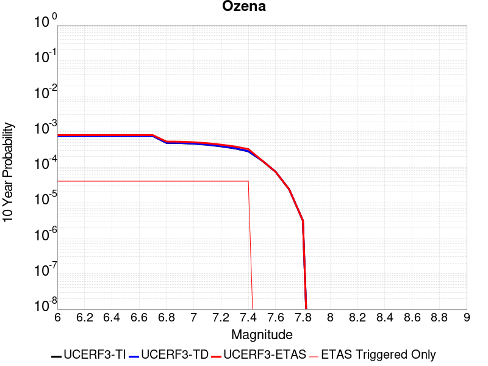 |

| Magnitude | 1 wk TI Prob | 1 wk TD Prob | 1 wk ETAS Prob | 1 wk ETAS/TD Gain | 1 wk ETAS Triggered Only | 1 mo TI Prob | 1 mo TD Prob | 1 mo ETAS Prob | 1 mo ETAS/TD Gain | 1 mo ETAS Triggered Only | 1 yr TI Prob | 1 yr TD Prob | 1 yr ETAS Prob | 1 yr ETAS/TD Gain | 1 yr ETAS Triggered Only | 10 yr TI Prob | 10 yr TD Prob | 10 yr ETAS Prob | 10 yr ETAS/TD Gain | 10 yr ETAS Triggered Only |
|-----|-----|-----|-----|-----|-----|-----|-----|-----|-----|-----|-----|-----|-----|-----|-----|-----|-----|-----|-----|-----|
| 6.0 | 1.4377547E-6 | 1.4513782E-6 | 1.4513782E-6 | 1.0 | 0.0 | 6.161791E-6 | 6.2201793E-6 | 6.2201793E-6 | 1.0 | 0.0 | 7.5017226E-5 | 7.572832E-5 | 7.572832E-5 | 1.0 | 0.0 | 7.4991904E-4 | 7.570518E-4 | 7.670442E-4 | 1.0131991 | 1.0E-5 |
| 6.1 | 1.4377547E-6 | 1.4513782E-6 | 1.4513782E-6 | 1.0 | 0.0 | 6.161791E-6 | 6.2201793E-6 | 6.2201793E-6 | 1.0 | 0.0 | 7.5017226E-5 | 7.572832E-5 | 7.572832E-5 | 1.0 | 0.0 | 7.4991904E-4 | 7.570518E-4 | 7.670442E-4 | 1.0131991 | 1.0E-5 |
| 6.2 | 1.4377547E-6 | 1.4513782E-6 | 1.4513782E-6 | 1.0 | 0.0 | 6.161791E-6 | 6.2201793E-6 | 6.2201793E-6 | 1.0 | 0.0 | 7.5017226E-5 | 7.572832E-5 | 7.572832E-5 | 1.0 | 0.0 | 7.4991904E-4 | 7.570518E-4 | 7.670442E-4 | 1.0131991 | 1.0E-5 |
| 6.3 | 1.4377547E-6 | 1.4513782E-6 | 1.4513782E-6 | 1.0 | 0.0 | 6.161791E-6 | 6.2201793E-6 | 6.2201793E-6 | 1.0 | 0.0 | 7.5017226E-5 | 7.572832E-5 | 7.572832E-5 | 1.0 | 0.0 | 7.4991904E-4 | 7.570518E-4 | 7.670442E-4 | 1.0131991 | 1.0E-5 |
| 6.4 | 1.4377547E-6 | 1.4513782E-6 | 1.4513782E-6 | 1.0 | 0.0 | 6.161791E-6 | 6.2201793E-6 | 6.2201793E-6 | 1.0 | 0.0 | 7.5017226E-5 | 7.572832E-5 | 7.572832E-5 | 1.0 | 0.0 | 7.4991904E-4 | 7.570518E-4 | 7.670442E-4 | 1.0131991 | 1.0E-5 |
| 6.5 | 1.4377547E-6 | 1.4513782E-6 | 1.4513782E-6 | 1.0 | 0.0 | 6.161791E-6 | 6.2201793E-6 | 6.2201793E-6 | 1.0 | 0.0 | 7.5017226E-5 | 7.572832E-5 | 7.572832E-5 | 1.0 | 0.0 | 7.4991904E-4 | 7.570518E-4 | 7.670442E-4 | 1.0131991 | 1.0E-5 |
| 6.6 | 1.4377547E-6 | 1.4513782E-6 | 1.4513782E-6 | 1.0 | 0.0 | 6.161791E-6 | 6.2201793E-6 | 6.2201793E-6 | 1.0 | 0.0 | 7.5017226E-5 | 7.572832E-5 | 7.572832E-5 | 1.0 | 0.0 | 7.4991904E-4 | 7.570518E-4 | 7.670442E-4 | 1.0131991 | 1.0E-5 |
| 6.7 | 1.4377547E-6 | 1.4513782E-6 | 1.4513782E-6 | 1.0 | 0.0 | 6.161791E-6 | 6.2201793E-6 | 6.2201793E-6 | 1.0 | 0.0 | 7.5017226E-5 | 7.572832E-5 | 7.572832E-5 | 1.0 | 0.0 | 7.4991904E-4 | 7.570518E-4 | 7.670442E-4 | 1.0131991 | 1.0E-5 |
| 6.8 | 9.223257E-7 | 9.317624E-7 | 9.317624E-7 | 1.0 | 0.0 | 3.9528186E-6 | 3.9932615E-6 | 3.9932615E-6 | 1.0 | 0.0 | 4.81245E-5 | 4.8616912E-5 | 4.8616912E-5 | 1.0 | 0.0 | 4.811408E-4 | 4.860668E-4 | 4.960619E-4 | 1.0205632 | 1.0E-5 |
| 6.9 | 9.141515E-7 | 9.235371E-7 | 9.235371E-7 | 1.0 | 0.0 | 3.917786E-6 | 3.9580104E-6 | 3.9580104E-6 | 1.0 | 0.0 | 4.7698002E-5 | 4.818775E-5 | 4.818775E-5 | 1.0 | 0.0 | 4.7687767E-4 | 4.8177704E-4 | 4.917722E-4 | 1.0207465 | 1.0E-5 |
| 7.0 | 8.767648E-7 | 8.8585773E-7 | 8.8585773E-7 | 1.0 | 0.0 | 3.757558E-6 | 3.7965276E-6 | 3.7965276E-6 | 1.0 | 0.0 | 4.5747307E-5 | 4.6221783E-5 | 4.6221783E-5 | 1.0 | 0.0 | 4.5737892E-4 | 4.6212564E-4 | 4.7212103E-4 | 1.0216291 | 1.0E-5 |
| 7.1 | 8.199402E-7 | 8.2853984E-7 | 8.2853984E-7 | 1.0 | 0.0 | 3.5140247E-6 | 3.5508804E-6 | 3.5508804E-6 | 1.0 | 0.0 | 4.2782412E-5 | 4.323115E-5 | 4.323115E-5 | 1.0 | 0.0 | 4.2774176E-4 | 4.322311E-4 | 4.422268E-4 | 1.0231258 | 1.0E-5 |
| 7.2 | 7.38705E-7 | 7.464262E-7 | 7.464262E-7 | 1.0 | 0.0 | 3.1658747E-6 | 3.198966E-6 | 3.198966E-6 | 1.0 | 0.0 | 3.8543843E-5 | 3.894675E-5 | 3.894675E-5 | 1.0 | 0.0 | 3.853716E-4 | 3.8940276E-4 | 3.9939885E-4 | 1.0256704 | 1.0E-5 |
| 7.3 | 6.490017E-7 | 6.557802E-7 | 6.557802E-7 | 1.0 | 0.0 | 2.7814328E-6 | 2.8104837E-6 | 2.8104837E-6 | 1.0 | 0.0 | 3.386342E-5 | 3.4217133E-5 | 3.4217133E-5 | 1.0 | 0.0 | 3.3858258E-4 | 3.4212202E-4 | 3.521186E-4 | 1.0292194 | 1.0E-5 |
| 7.4 | 5.346736E-7 | 5.4022604E-7 | 5.4022604E-7 | 1.0 | 0.0 | 2.291456E-6 | 2.3152527E-6 | 2.3152527E-6 | 1.0 | 0.0 | 2.789812E-5 | 2.8187867E-5 | 2.8187867E-5 | 1.0 | 0.0 | 2.789462E-4 | 2.8184598E-4 | 2.9184314E-4 | 1.0354704 | 1.0E-5 |
| 7.5 | 2.939325E-7 | 2.9666057E-7 | 2.9666057E-7 | 1.0 | 0.0 | 1.25971E-6 | 1.271402E-6 | 1.271402E-6 | 1.0 | 0.0 | 1.5336862E-5 | 1.5479225E-5 | 1.5479225E-5 | 1.0 | 0.0 | 1.5335804E-4 | 1.5478309E-4 | 1.5478309E-4 | 1.0 | 0.0 |
| 7.6 | 1.4151905E-7 | 1.4253266E-7 | 1.4253266E-7 | 1.0 | 0.0 | 6.065101E-7 | 6.108541E-7 | 6.108541E-7 | 1.0 | 0.0 | 7.3842357E-6 | 7.4371237E-6 | 7.4371237E-6 | 1.0 | 0.0 | 7.38399E-5 | 7.436883E-5 | 7.436883E-5 | 1.0 | 0.0 |
| 7.7 | 4.4957577E-8 | 4.5252243E-8 | 4.5252243E-8 | 1.0 | 0.0 | 1.9267533E-7 | 1.9393818E-7 | 1.9393818E-7 | 1.0 | 0.0 | 2.3458194E-6 | 2.3611947E-6 | 2.3611947E-6 | 1.0 | 0.0 | 2.3457947E-5 | 2.3611707E-5 | 2.3611707E-5 | 1.0 | 0.0 |
| 7.8 | 5.9993255E-9 | 6.0412972E-9 | 6.0412972E-9 | 1.0 | 0.0 | 2.5711394E-8 | 2.5891273E-8 | 2.5891273E-8 | 1.0 | 0.0 | 3.1303617E-7 | 3.1522623E-7 | 3.1522623E-7 | 1.0 | 0.0 | 3.1303573E-6 | 3.1522588E-6 | 3.1522588E-6 | 1.0 | 0.0 |

## Great Valley 08 (Quinto)
*[(top)](#table-of-contents)*

| 1 Week | 1 Month | 1 Year | 10 Year |
|-----|-----|-----|-----|
| 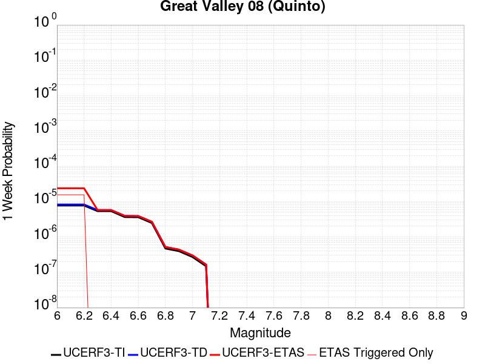 | 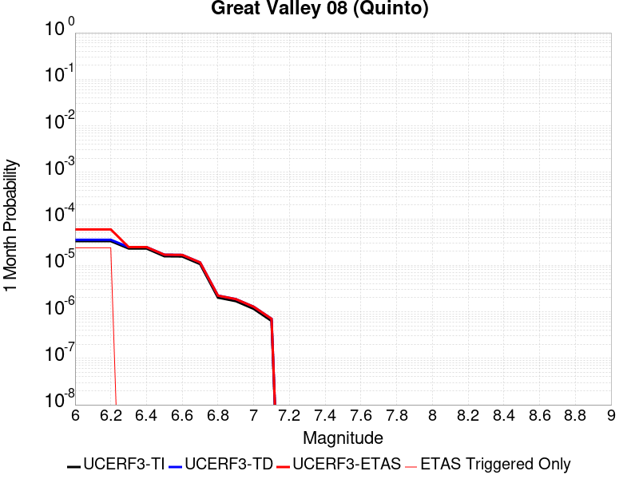 | 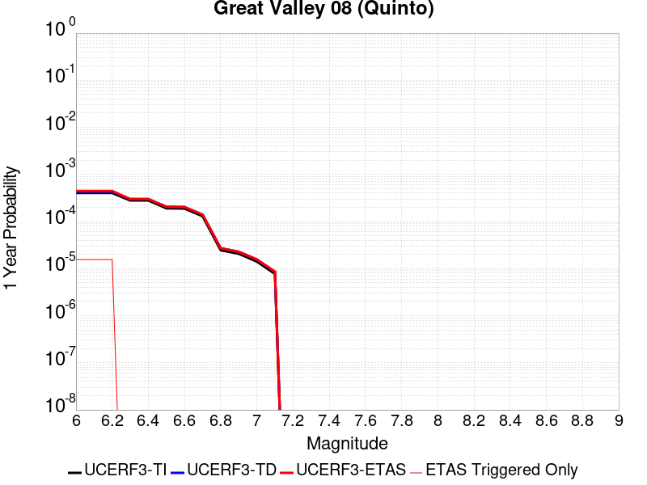 | 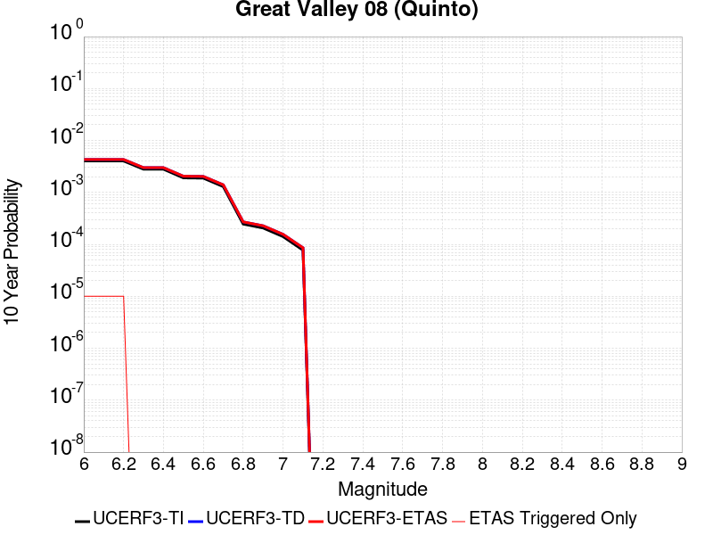 |

| Magnitude | 1 wk TI Prob | 1 wk TD Prob | 1 wk ETAS Prob | 1 wk ETAS/TD Gain | 1 wk ETAS Triggered Only | 1 mo TI Prob | 1 mo TD Prob | 1 mo ETAS Prob | 1 mo ETAS/TD Gain | 1 mo ETAS Triggered Only | 1 yr TI Prob | 1 yr TD Prob | 1 yr ETAS Prob | 1 yr ETAS/TD Gain | 1 yr ETAS Triggered Only | 10 yr TI Prob | 10 yr TD Prob | 10 yr ETAS Prob | 10 yr ETAS/TD Gain | 10 yr ETAS Triggered Only |
|-----|-----|-----|-----|-----|-----|-----|-----|-----|-----|-----|-----|-----|-----|-----|-----|-----|-----|-----|-----|-----|
| 6.0 | 7.737697E-6 | 8.253038E-6 | 1.8252955E-5 | 2.211665 | 1.0E-5 | 3.3161137E-5 | 3.536979E-5 | 4.5369437E-5 | 1.2827171 | 1.0E-5 | 4.0366207E-4 | 4.3056096E-4 | 4.4055664E-4 | 1.0232155 | 1.0E-5 | 0.004029296 | 0.0042991205 | 0.0043090777 | 1.002316 | 1.0E-5 |
| 6.1 | 7.737697E-6 | 8.253038E-6 | 1.8252955E-5 | 2.211665 | 1.0E-5 | 3.3161137E-5 | 3.536979E-5 | 4.5369437E-5 | 1.2827171 | 1.0E-5 | 4.0366207E-4 | 4.3056096E-4 | 4.4055664E-4 | 1.0232155 | 1.0E-5 | 0.004029296 | 0.0042991205 | 0.0043090777 | 1.002316 | 1.0E-5 |
| 6.2 | 7.737697E-6 | 8.253038E-6 | 1.8252955E-5 | 2.211665 | 1.0E-5 | 3.3161137E-5 | 3.536979E-5 | 4.5369437E-5 | 1.2827171 | 1.0E-5 | 4.0366207E-4 | 4.3056096E-4 | 4.4055664E-4 | 1.0232155 | 1.0E-5 | 0.004029296 | 0.0042991205 | 0.0043090777 | 1.002316 | 1.0E-5 |
| 6.3 | 5.374012E-6 | 5.7505736E-6 | 5.7505736E-6 | 1.0 | 0.0 | 2.3031276E-5 | 2.4645145E-5 | 2.4645145E-5 | 1.0 | 0.0 | 2.803697E-4 | 3.0002446E-4 | 3.0002446E-4 | 1.0 | 0.0 | 0.0028001624 | 0.0029972875 | 0.0029972875 | 1.0 | 0.0 |
| 6.4 | 5.374012E-6 | 5.7505736E-6 | 5.7505736E-6 | 1.0 | 0.0 | 2.3031276E-5 | 2.4645145E-5 | 2.4645145E-5 | 1.0 | 0.0 | 2.803697E-4 | 3.0002446E-4 | 3.0002446E-4 | 1.0 | 0.0 | 0.0028001624 | 0.0029972875 | 0.0029972875 | 1.0 | 0.0 |
| 6.5 | 3.65427E-6 | 3.941324E-6 | 3.941324E-6 | 1.0 | 0.0 | 1.5661062E-5 | 1.689132E-5 | 1.689132E-5 | 1.0 | 0.0 | 1.9065675E-4 | 2.0563944E-4 | 2.0563944E-4 | 1.0 | 0.0 | 0.0019049325 | 0.0020551833 | 0.0020551833 | 1.0 | 0.0 |
| 6.6 | 3.6143538E-6 | 3.8985104E-6 | 3.8985104E-6 | 1.0 | 0.0 | 1.5489995E-5 | 1.6707834E-5 | 1.6707834E-5 | 1.0 | 0.0 | 1.8857437E-4 | 2.0340596E-4 | 2.0340596E-4 | 1.0 | 0.0 | 0.0018841444 | 0.0020328893 | 0.0020328893 | 1.0 | 0.0 |
| 6.7 | 2.4821015E-6 | 2.6857067E-6 | 2.6857067E-6 | 1.0 | 0.0 | 1.0637535E-5 | 1.1510153E-5 | 1.1510153E-5 | 1.0 | 0.0 | 1.2950429E-4 | 1.4013276E-4 | 1.4013276E-4 | 1.0 | 0.0 | 0.0012942884 | 0.0014009989 | 0.0014009989 | 1.0 | 0.0 |
| 6.8 | 4.7110538E-7 | 5.193021E-7 | 5.193021E-7 | 1.0 | 0.0 | 2.0190216E-6 | 2.2255786E-6 | 2.2255786E-6 | 1.0 | 0.0 | 2.458131E-5 | 2.70961E-5 | 2.70961E-5 | 1.0 | 0.0 | 2.457859E-4 | 2.7092977E-4 | 2.7092977E-4 | 1.0 | 0.0 |
| 6.9 | 3.958685E-7 | 4.3703452E-7 | 4.3703452E-7 | 1.0 | 0.0 | 1.6965782E-6 | 1.8730038E-6 | 1.8730038E-6 | 1.0 | 0.0 | 2.0655643E-5 | 2.28036E-5 | 2.28036E-5 | 1.0 | 0.0 | 2.0653724E-4 | 2.2801422E-4 | 2.2801422E-4 | 1.0 | 0.0 |
| 7.0 | 2.70294E-7 | 2.9920008E-7 | 2.9920008E-7 | 1.0 | 0.0 | 1.1584025E-6 | 1.2822856E-6 | 1.2822856E-6 | 1.0 | 0.0 | 1.4103458E-5 | 1.5611728E-5 | 1.5611728E-5 | 1.0 | 0.0 | 1.4102564E-4 | 1.5610759E-4 | 1.5610759E-4 | 1.0 | 0.0 |
| 7.1 | 1.4828602E-7 | 1.6469107E-7 | 1.6469107E-7 | 1.0 | 0.0 | 6.3551136E-7 | 7.058187E-7 | 7.058187E-7 | 1.0 | 0.0 | 7.737323E-6 | 8.593317E-6 | 8.593317E-6 | 1.0 | 0.0 | 7.737054E-5 | 8.593065E-5 | 8.593065E-5 | 1.0 | 0.0 |

## Earthquake Valley
*[(top)](#table-of-contents)*

| 1 Week | 1 Month | 1 Year | 10 Year |
|-----|-----|-----|-----|
|  |  | 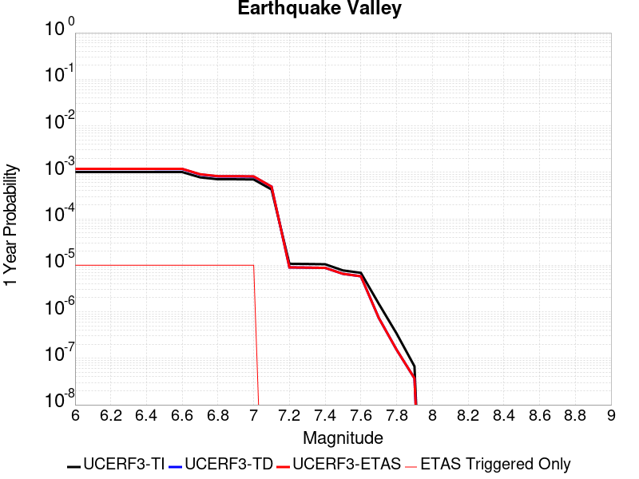 | 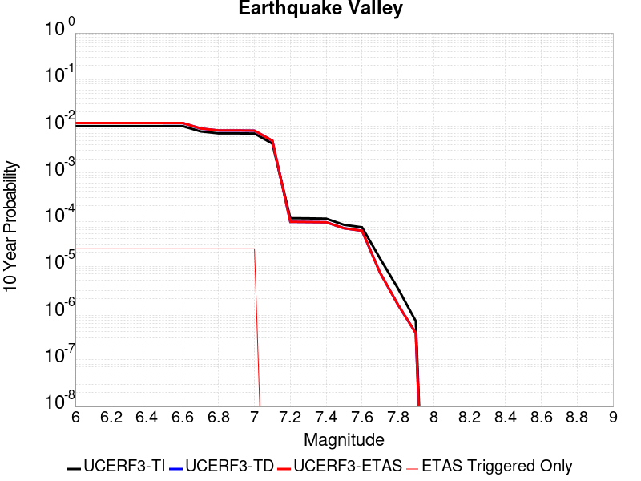 |

| Magnitude | 1 wk TI Prob | 1 wk TD Prob | 1 wk ETAS Prob | 1 wk ETAS/TD Gain | 1 wk ETAS Triggered Only | 1 mo TI Prob | 1 mo TD Prob | 1 mo ETAS Prob | 1 mo ETAS/TD Gain | 1 mo ETAS Triggered Only | 1 yr TI Prob | 1 yr TD Prob | 1 yr ETAS Prob | 1 yr ETAS/TD Gain | 1 yr ETAS Triggered Only | 10 yr TI Prob | 10 yr TD Prob | 10 yr ETAS Prob | 10 yr ETAS/TD Gain | 10 yr ETAS Triggered Only |
|-----|-----|-----|-----|-----|-----|-----|-----|-----|-----|-----|-----|-----|-----|-----|-----|-----|-----|-----|-----|-----|
| 6.0 | 1.9416384E-5 | 2.258408E-5 | 2.258408E-5 | 1.0 | 0.0 | 8.321042E-5 | 9.6785996E-5 | 9.6785996E-5 | 1.0 | 0.0 | 0.001012616 | 0.0011778527 | 0.001187841 | 1.0084801 | 1.0E-5 | 0.010080142 | 0.011727943 | 0.011737825 | 1.0008427 | 1.0E-5 |
| 6.1 | 1.9416384E-5 | 2.258408E-5 | 2.258408E-5 | 1.0 | 0.0 | 8.321042E-5 | 9.6785996E-5 | 9.6785996E-5 | 1.0 | 0.0 | 0.001012616 | 0.0011778527 | 0.001187841 | 1.0084801 | 1.0E-5 | 0.010080142 | 0.011727943 | 0.011737825 | 1.0008427 | 1.0E-5 |
| 6.2 | 1.9416384E-5 | 2.258408E-5 | 2.258408E-5 | 1.0 | 0.0 | 8.321042E-5 | 9.6785996E-5 | 9.6785996E-5 | 1.0 | 0.0 | 0.001012616 | 0.0011778527 | 0.001187841 | 1.0084801 | 1.0E-5 | 0.010080142 | 0.011727943 | 0.011737825 | 1.0008427 | 1.0E-5 |
| 6.3 | 1.9416384E-5 | 2.258408E-5 | 2.258408E-5 | 1.0 | 0.0 | 8.321042E-5 | 9.6785996E-5 | 9.6785996E-5 | 1.0 | 0.0 | 0.001012616 | 0.0011778527 | 0.001187841 | 1.0084801 | 1.0E-5 | 0.010080142 | 0.011727943 | 0.011737825 | 1.0008427 | 1.0E-5 |
| 6.4 | 1.9416384E-5 | 2.258408E-5 | 2.258408E-5 | 1.0 | 0.0 | 8.321042E-5 | 9.6785996E-5 | 9.6785996E-5 | 1.0 | 0.0 | 0.001012616 | 0.0011778527 | 0.001187841 | 1.0084801 | 1.0E-5 | 0.010080142 | 0.011727943 | 0.011737825 | 1.0008427 | 1.0E-5 |
| 6.5 | 1.9389157E-5 | 2.255267E-5 | 2.255267E-5 | 1.0 | 0.0 | 8.309374E-5 | 9.665139E-5 | 9.665139E-5 | 1.0 | 0.0 | 0.0010111968 | 0.0011762156 | 0.0011862039 | 1.0084919 | 1.0E-5 | 0.010066078 | 0.011711745 | 0.011721628 | 1.0008439 | 1.0E-5 |
| 6.6 | 1.9389157E-5 | 2.255267E-5 | 2.255267E-5 | 1.0 | 0.0 | 8.309374E-5 | 9.665139E-5 | 9.665139E-5 | 1.0 | 0.0 | 0.0010111968 | 0.0011762156 | 0.0011862039 | 1.0084919 | 1.0E-5 | 0.010066078 | 0.011711745 | 0.011721628 | 1.0008439 | 1.0E-5 |
| 6.7 | 1.4925434E-5 | 1.7208227E-5 | 1.7208227E-5 | 1.0 | 0.0 | 6.396457E-5 | 7.374794E-5 | 7.374794E-5 | 1.0 | 0.0 | 7.7849044E-4 | 8.9759636E-4 | 9.0758735E-4 | 1.0111308 | 1.0E-5 | 0.007757689 | 0.008948085 | 0.008957995 | 1.0011076 | 1.0E-5 |
| 6.8 | 1.3570335E-5 | 1.5616843E-5 | 1.5616843E-5 | 1.0 | 0.0 | 5.8157282E-5 | 6.692807E-5 | 6.692807E-5 | 1.0 | 0.0 | 7.0783484E-4 | 8.1462675E-4 | 8.246186E-4 | 1.0122656 | 1.0E-5 | 0.0070558446 | 0.008124476 | 0.008134395 | 1.0012208 | 1.0E-5 |
| 6.9 | 1.3570335E-5 | 1.5616843E-5 | 1.5616843E-5 | 1.0 | 0.0 | 5.8157282E-5 | 6.692807E-5 | 6.692807E-5 | 1.0 | 0.0 | 7.0783484E-4 | 8.1462675E-4 | 8.246186E-4 | 1.0122656 | 1.0E-5 | 0.0070558446 | 0.008124476 | 0.008134395 | 1.0012208 | 1.0E-5 |
| 7.0 | 1.3433392E-5 | 1.5460388E-5 | 1.5460388E-5 | 1.0 | 0.0 | 5.757041E-5 | 6.6257584E-5 | 6.6257584E-5 | 1.0 | 0.0 | 7.0069433E-4 | 8.064695E-4 | 8.1646146E-4 | 1.0123898 | 1.0E-5 | 0.006984891 | 0.008043497 | 0.008053416 | 1.0012332 | 1.0E-5 |
| 7.1 | 8.181609E-6 | 9.416851E-6 | 9.416851E-6 | 1.0 | 0.0 | 3.5063567E-5 | 4.0357685E-5 | 4.0357685E-5 | 1.0 | 0.0 | 4.268153E-4 | 4.9131113E-4 | 4.9131113E-4 | 1.0 | 0.0 | 0.0042599645 | 0.0049088253 | 0.0049088253 | 1.0 | 0.0 |
| 7.2 | 2.0663983E-7 | 1.726294E-7 | 1.726294E-7 | 1.0 | 0.0 | 8.855989E-7 | 7.398401E-7 | 7.398401E-7 | 1.0 | 0.0 | 1.0782113E-5 | 9.00752E-6 | 9.00752E-6 | 1.0 | 0.0 | 1.07815904E-4 | 9.00719E-5 | 9.00719E-5 | 1.0 | 0.0 |
| 7.3 | 2.0462376E-7 | 1.7078433E-7 | 1.7078433E-7 | 1.0 | 0.0 | 8.7695867E-7 | 7.319327E-7 | 7.319327E-7 | 1.0 | 0.0 | 1.0676919E-5 | 8.911247E-6 | 8.911247E-6 | 1.0 | 0.0 | 1.0676406E-4 | 8.910926E-5 | 8.910926E-5 | 1.0 | 0.0 |
| 7.4 | 2.0171088E-7 | 1.6860913E-7 | 1.6860913E-7 | 1.0 | 0.0 | 8.644749E-7 | 7.2261037E-7 | 7.2261037E-7 | 1.0 | 0.0 | 1.0524931E-5 | 8.79775E-6 | 8.79775E-6 | 1.0 | 0.0 | 1.05244326E-4 | 8.7974375E-5 | 8.7974375E-5 | 1.0 | 0.0 |
| 7.5 | 1.4847944E-7 | 1.2559275E-7 | 1.2559275E-7 | 1.0 | 0.0 | 6.363403E-7 | 5.3825454E-7 | 5.3825454E-7 | 1.0 | 0.0 | 7.747416E-6 | 6.5532317E-6 | 6.5532317E-6 | 1.0 | 0.0 | 7.747146E-5 | 6.55306E-5 | 6.55306E-5 | 1.0 | 0.0 |
| 7.6 | 1.3185847E-7 | 1.1123213E-7 | 1.1123213E-7 | 1.0 | 0.0 | 5.6510765E-7 | 4.7670906E-7 | 4.7670906E-7 | 1.0 | 0.0 | 6.8801637E-6 | 5.8039195E-6 | 5.8039195E-6 | 1.0 | 0.0 | 6.8799505E-5 | 5.803789E-5 | 5.803789E-5 | 1.0 | 0.0 |
| 7.7 | 2.8609954E-8 | 1.4170958E-8 | 1.4170958E-8 | 1.0 | 0.0 | 1.2261408E-7 | 6.0732674E-8 | 6.0732674E-8 | 1.0 | 0.0 | 1.4928254E-6 | 7.394201E-7 | 7.394201E-7 | 1.0 | 0.0 | 1.4928154E-5 | 7.394182E-6 | 7.394182E-6 | 1.0 | 0.0 |
| 7.8 | 6.527266E-9 | 2.923417E-9 | 2.923417E-9 | 1.0 | 0.0 | 2.7973995E-8 | 1.2528931E-8 | 1.2528931E-8 | 1.0 | 0.0 | 3.4058334E-7 | 1.5253973E-7 | 1.5253973E-7 | 1.0 | 0.0 | 3.4058282E-6 | 1.5253964E-6 | 1.5253964E-6 | 1.0 | 0.0 |
| 7.9 | 1.2898267E-9 | 7.127684E-10 | 7.127684E-10 | 1.0 | 0.0 | 5.527829E-9 | 3.0547218E-9 | 3.0547218E-9 | 1.0 | 0.0 | 6.7301315E-8 | 3.719124E-8 | 3.719124E-8 | 1.0 | 0.0 | 6.7301295E-7 | 3.719124E-7 | 3.719124E-7 | 1.0 | 0.0 |

## San Andreas (North Coast) 2011 CFM
*[(top)](#table-of-contents)*

| 1 Week | 1 Month | 1 Year | 10 Year |
|-----|-----|-----|-----|
| 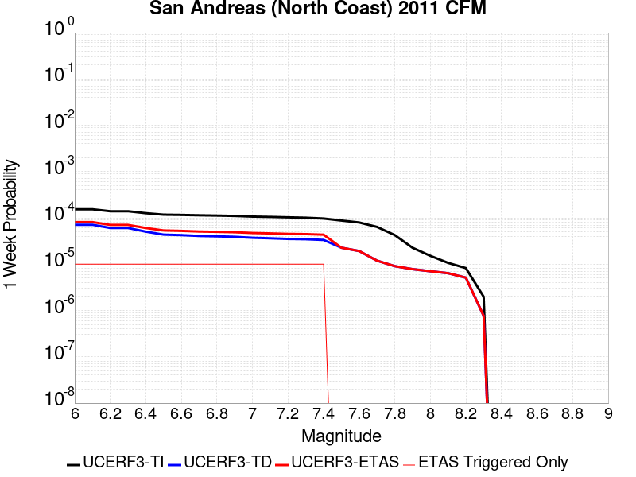 | 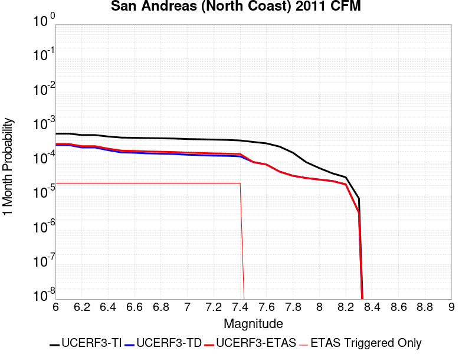 | 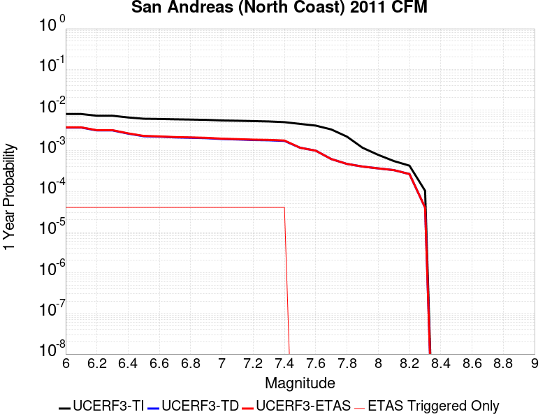 | 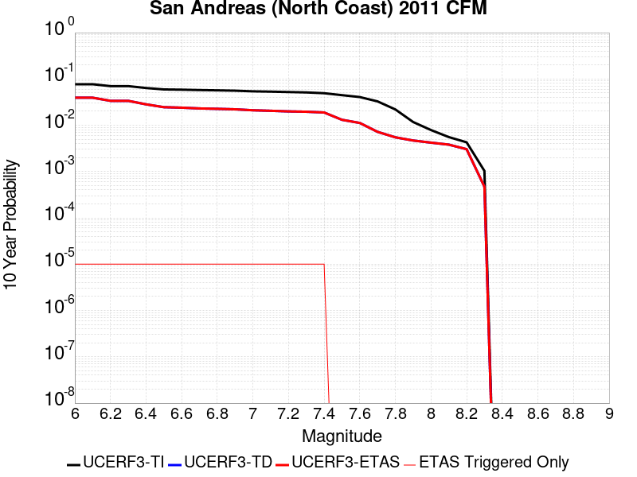 |

| Magnitude | 1 wk TI Prob | 1 wk TD Prob | 1 wk ETAS Prob | 1 wk ETAS/TD Gain | 1 wk ETAS Triggered Only | 1 mo TI Prob | 1 mo TD Prob | 1 mo ETAS Prob | 1 mo ETAS/TD Gain | 1 mo ETAS Triggered Only | 1 yr TI Prob | 1 yr TD Prob | 1 yr ETAS Prob | 1 yr ETAS/TD Gain | 1 yr ETAS Triggered Only | 10 yr TI Prob | 10 yr TD Prob | 10 yr ETAS Prob | 10 yr ETAS/TD Gain | 10 yr ETAS Triggered Only |
|-----|-----|-----|-----|-----|-----|-----|-----|-----|-----|-----|-----|-----|-----|-----|-----|-----|-----|-----|-----|-----|
| 6.0 | 1.5333705E-4 | 7.1106435E-5 | 8.1105725E-5 | 1.1406243 | 1.0E-5 | 6.5699324E-4 | 3.0470645E-4 | 3.147034E-4 | 1.0328084 | 1.0E-5 | 0.007969595 | 0.0037035241 | 0.0037134872 | 1.0026901 | 1.0E-5 | 0.0768977 | 0.03935284 | 0.03936245 | 1.0002441 | 1.0E-5 |
| 6.1 | 1.5333705E-4 | 7.1106435E-5 | 8.1105725E-5 | 1.1406243 | 1.0E-5 | 6.5699324E-4 | 3.0470645E-4 | 3.147034E-4 | 1.0328084 | 1.0E-5 | 0.007969595 | 0.0037035241 | 0.0037134872 | 1.0026901 | 1.0E-5 | 0.0768977 | 0.03935284 | 0.03936245 | 1.0002441 | 1.0E-5 |
| 6.2 | 1.3912938E-4 | 6.050204E-5 | 7.050143E-5 | 1.1652737 | 1.0E-5 | 5.961325E-4 | 2.5926883E-4 | 2.6926622E-4 | 1.03856 | 1.0E-5 | 0.007233787 | 0.003152056 | 0.0031620245 | 1.0031625 | 1.0E-5 | 0.07002798 | 0.03369227 | 0.033701934 | 1.0002868 | 1.0E-5 |
| 6.3 | 1.3912938E-4 | 6.050204E-5 | 7.050143E-5 | 1.1652737 | 1.0E-5 | 5.961325E-4 | 2.5926883E-4 | 2.6926622E-4 | 1.03856 | 1.0E-5 | 0.007233787 | 0.003152056 | 0.0031620245 | 1.0031625 | 1.0E-5 | 0.07002798 | 0.03369227 | 0.033701934 | 1.0002868 | 1.0E-5 |
| 6.4 | 1.2623647E-4 | 5.0442024E-5 | 6.0441518E-5 | 1.1982374 | 1.0E-5 | 5.4090127E-4 | 2.161623E-4 | 2.2616013E-4 | 1.0462515 | 1.0E-5 | 0.0065656058 | 0.0026286195 | 0.0026385933 | 1.0037943 | 1.0E-5 | 0.06374981 | 0.028303223 | 0.02831294 | 1.0003433 | 1.0E-5 |
| 6.5 | 1.1736096E-4 | 4.3523814E-5 | 5.3523378E-5 | 1.2297493 | 1.0E-5 | 5.028786E-4 | 1.8651738E-4 | 1.9651551E-4 | 1.0536044 | 1.0E-5 | 0.006105373 | 0.0022685004 | 0.0022784777 | 1.0043982 | 1.0E-5 | 0.05940335 | 0.024579322 | 0.024589075 | 1.0003968 | 1.0E-5 |
| 6.6 | 1.1586959E-4 | 4.2423668E-5 | 5.2423246E-5 | 1.2357075 | 1.0E-5 | 4.964894E-4 | 1.8180315E-4 | 1.9180133E-4 | 1.0549946 | 1.0E-5 | 0.006028018 | 0.0022112224 | 0.0022212004 | 1.0045124 | 1.0E-5 | 0.058671024 | 0.023984991 | 0.023994751 | 1.000407 | 1.0E-5 |
| 6.7 | 1.13693764E-4 | 4.073593E-5 | 5.073552E-5 | 1.2454735 | 1.0E-5 | 4.87168E-4 | 1.7457096E-4 | 1.8456922E-4 | 1.0572733 | 1.0E-5 | 0.005915152 | 0.0021233456 | 0.0021333243 | 1.0046996 | 1.0E-5 | 0.057601593 | 0.023076393 | 0.023086162 | 1.0004233 | 1.0E-5 |
| 6.8 | 1.1204889E-4 | 3.9953447E-5 | 4.995305E-5 | 1.2502813 | 1.0E-5 | 4.8012115E-4 | 1.7121792E-4 | 1.8121621E-4 | 1.0583951 | 1.0E-5 | 0.005829819 | 0.002082601 | 0.0020925803 | 1.0047917 | 1.0E-5 | 0.05679232 | 0.022636656 | 0.022646429 | 1.0004318 | 1.0E-5 |
| 6.9 | 1.1005794E-4 | 3.900957E-5 | 4.900918E-5 | 1.2563374 | 1.0E-5 | 4.7159163E-4 | 1.6717325E-4 | 1.7717158E-4 | 1.0598081 | 1.0E-5 | 0.0057265228 | 0.0020334502 | 0.0020434298 | 1.0049077 | 1.0E-5 | 0.055811852 | 0.022102542 | 0.022112321 | 1.0004424 | 1.0E-5 |
| 7.0 | 1.0647948E-4 | 3.7166337E-5 | 4.7165966E-5 | 1.2690507 | 1.0E-5 | 4.562608E-4 | 1.5927466E-4 | 1.6927307E-4 | 1.0627747 | 1.0E-5 | 0.0055408357 | 0.0019374598 | 0.0019474404 | 1.0051514 | 1.0E-5 | 0.054047033 | 0.021062272 | 0.021072062 | 1.0004648 | 1.0E-5 |
| 7.1 | 1.04795035E-4 | 3.6215948E-5 | 4.6215588E-5 | 1.2761115 | 1.0E-5 | 4.4904428E-4 | 1.5520205E-4 | 1.652005E-4 | 1.0644221 | 1.0E-5 | 0.0054534175 | 0.0018879628 | 0.001897944 | 1.0052867 | 1.0E-5 | 0.053215165 | 0.020530313 | 0.020540107 | 1.0004771 | 1.0E-5 |
| 7.2 | 1.02724036E-4 | 3.5124547E-5 | 4.5124194E-5 | 1.2846912 | 1.0E-5 | 4.401716E-4 | 1.5052517E-4 | 1.6052366E-4 | 1.066424 | 1.0E-5 | 0.0053459285 | 0.0018311188 | 0.0018411005 | 1.0054511 | 1.0E-5 | 0.052191395 | 0.019919246 | 0.019929048 | 1.000492 | 1.0E-5 |
| 7.3 | 1.00650694E-4 | 3.4592013E-5 | 4.4591667E-5 | 1.2890741 | 1.0E-5 | 4.312888E-4 | 1.4824314E-4 | 1.5824166E-4 | 1.0674467 | 1.0E-5 | 0.005238306 | 0.0018033815 | 0.0018133634 | 1.0055351 | 1.0E-5 | 0.051165357 | 0.019596443 | 0.019606246 | 1.0005003 | 1.0E-5 |
| 7.4 | 9.672919E-5 | 3.338123E-5 | 4.3380896E-5 | 1.2995596 | 1.0E-5 | 4.144878E-4 | 1.4305465E-4 | 1.5305322E-4 | 1.0698934 | 1.0E-5 | 0.005034718 | 0.0017403142 | 0.0017502968 | 1.0057361 | 1.0E-5 | 0.049221683 | 0.018869769 | 0.01887958 | 1.00052 | 1.0E-5 |
| 7.5 | 8.7600405E-5 | 2.2700917E-5 | 2.2700917E-5 | 1.0 | 0.0 | 3.753763E-4 | 9.728602E-5 | 9.728602E-5 | 1.0 | 0.0 | 0.0045606326 | 0.0011838155 | 0.0011838155 | 1.0 | 0.0 | 0.04468165 | 0.013130207 | 0.013130207 | 1.0 | 0.0 |
| 7.6 | 7.9562284E-5 | 1.9226305E-5 | 1.9226305E-5 | 1.0 | 0.0 | 3.4093665E-4 | 8.239586E-5 | 8.239586E-5 | 1.0 | 0.0 | 0.0041430052 | 0.0010027094 | 0.0010027094 | 1.0 | 0.0 | 0.040666126 | 0.011221658 | 0.011221658 | 1.0 | 0.0 |
| 7.7 | 6.3866544E-5 | 1.1941707E-5 | 1.1941707E-5 | 1.0 | 0.0 | 2.7368503E-4 | 5.117774E-5 | 5.117774E-5 | 1.0 | 0.0 | 0.0033270244 | 6.2291115E-4 | 6.2291115E-4 | 1.0 | 0.0 | 0.032776527 | 0.007210334 | 0.007210334 | 1.0 | 0.0 |
| 7.8 | 4.2543215E-5 | 9.076524E-6 | 9.076524E-6 | 1.0 | 0.0 | 1.8231533E-4 | 3.8898812E-5 | 3.8898812E-5 | 1.0 | 0.0 | 0.0022174292 | 4.7349022E-4 | 4.7349022E-4 | 1.0 | 0.0 | 0.021954332 | 0.005490525 | 0.005490525 | 1.0 | 0.0 |
| 7.9 | 2.2636612E-5 | 7.81435E-6 | 7.81435E-6 | 1.0 | 0.0 | 9.7010445E-5 | 3.3489643E-5 | 3.3489643E-5 | 1.0 | 0.0 | 0.0011804621 | 4.076602E-4 | 4.076602E-4 | 1.0 | 0.0 | 0.011742111 | 0.0046832846 | 0.0046832846 | 1.0 | 0.0 |
| 8.0 | 1.5167874E-5 | 7.0494675E-6 | 7.0494675E-6 | 1.0 | 0.0 | 6.500356E-5 | 3.0211655E-5 | 3.0211655E-5 | 1.0 | 0.0 | 7.9113094E-4 | 3.677649E-4 | 3.677649E-4 | 1.0 | 0.0 | 0.007883203 | 0.004215588 | 0.004215588 | 1.0 | 0.0 |
| 8.1 | 1.0681047E-5 | 6.386992E-6 | 6.386992E-6 | 1.0 | 0.0 | 4.5775112E-5 | 2.7372536E-5 | 2.7372536E-5 | 1.0 | 0.0 | 5.5716943E-4 | 3.3320975E-4 | 3.3320975E-4 | 1.0 | 0.0 | 0.0055577457 | 0.003817393 | 0.003817393 | 1.0 | 0.0 |
| 8.2 | 8.226114E-6 | 5.1150587E-6 | 5.1150587E-6 | 1.0 | 0.0 | 3.52543E-5 | 2.1921496E-5 | 2.1921496E-5 | 1.0 | 0.0 | 4.2913653E-4 | 2.668616E-4 | 2.668616E-4 | 1.0 | 0.0 | 0.004283088 | 0.0030450926 | 0.0030450926 | 1.0 | 0.0 |
| 8.3 | 1.983087E-6 | 7.6599065E-7 | 7.6599065E-7 | 1.0 | 0.0 | 8.498917E-6 | 3.282813E-6 | 3.282813E-6 | 1.0 | 0.0 | 1.034694E-4 | 3.9967534E-5 | 3.9967534E-5 | 1.0 | 0.0 | 0.0010342124 | 4.719687E-4 | 4.719687E-4 | 1.0 | 0.0 |

## Northridge Hills
*[(top)](#table-of-contents)*

| 1 Week | 1 Month | 1 Year | 10 Year |
|-----|-----|-----|-----|
|  |  | 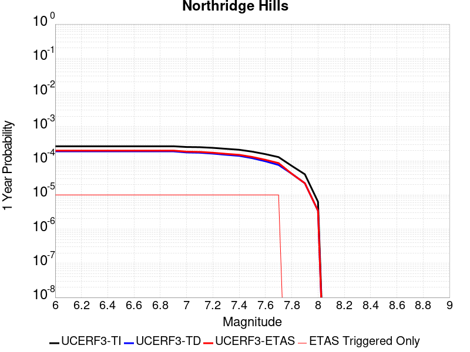 | 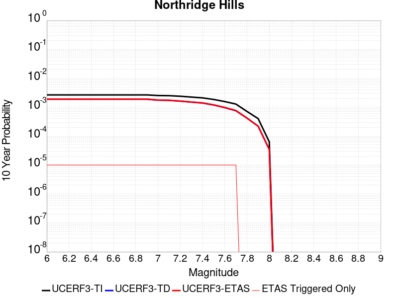 |

| Magnitude | 1 wk TI Prob | 1 wk TD Prob | 1 wk ETAS Prob | 1 wk ETAS/TD Gain | 1 wk ETAS Triggered Only | 1 mo TI Prob | 1 mo TD Prob | 1 mo ETAS Prob | 1 mo ETAS/TD Gain | 1 mo ETAS Triggered Only | 1 yr TI Prob | 1 yr TD Prob | 1 yr ETAS Prob | 1 yr ETAS/TD Gain | 1 yr ETAS Triggered Only | 10 yr TI Prob | 10 yr TD Prob | 10 yr ETAS Prob | 10 yr ETAS/TD Gain | 10 yr ETAS Triggered Only |
|-----|-----|-----|-----|-----|-----|-----|-----|-----|-----|-----|-----|-----|-----|-----|-----|-----|-----|-----|-----|-----|
| 6.0 | 5.095982E-6 | 3.6152098E-6 | 3.6152098E-6 | 1.0 | 0.0 | 2.183974E-5 | 1.5493664E-5 | 1.5493664E-5 | 1.0 | 0.0 | 2.658664E-4 | 1.8861916E-4 | 1.9861727E-4 | 1.0530069 | 1.0E-5 | 0.0026554854 | 0.001884603 | 0.0018945843 | 1.0052961 | 1.0E-5 |
| 6.1 | 5.095982E-6 | 3.6152098E-6 | 3.6152098E-6 | 1.0 | 0.0 | 2.183974E-5 | 1.5493664E-5 | 1.5493664E-5 | 1.0 | 0.0 | 2.658664E-4 | 1.8861916E-4 | 1.9861727E-4 | 1.0530069 | 1.0E-5 | 0.0026554854 | 0.001884603 | 0.0018945843 | 1.0052961 | 1.0E-5 |
| 6.2 | 5.095982E-6 | 3.6152098E-6 | 3.6152098E-6 | 1.0 | 0.0 | 2.183974E-5 | 1.5493664E-5 | 1.5493664E-5 | 1.0 | 0.0 | 2.658664E-4 | 1.8861916E-4 | 1.9861727E-4 | 1.0530069 | 1.0E-5 | 0.0026554854 | 0.001884603 | 0.0018945843 | 1.0052961 | 1.0E-5 |
| 6.3 | 5.095982E-6 | 3.6152098E-6 | 3.6152098E-6 | 1.0 | 0.0 | 2.183974E-5 | 1.5493664E-5 | 1.5493664E-5 | 1.0 | 0.0 | 2.658664E-4 | 1.8861916E-4 | 1.9861727E-4 | 1.0530069 | 1.0E-5 | 0.0026554854 | 0.001884603 | 0.0018945843 | 1.0052961 | 1.0E-5 |
| 6.4 | 5.095982E-6 | 3.6152098E-6 | 3.6152098E-6 | 1.0 | 0.0 | 2.183974E-5 | 1.5493664E-5 | 1.5493664E-5 | 1.0 | 0.0 | 2.658664E-4 | 1.8861916E-4 | 1.9861727E-4 | 1.0530069 | 1.0E-5 | 0.0026554854 | 0.001884603 | 0.0018945843 | 1.0052961 | 1.0E-5 |
| 6.5 | 5.095982E-6 | 3.6152098E-6 | 3.6152098E-6 | 1.0 | 0.0 | 2.183974E-5 | 1.5493664E-5 | 1.5493664E-5 | 1.0 | 0.0 | 2.658664E-4 | 1.8861916E-4 | 1.9861727E-4 | 1.0530069 | 1.0E-5 | 0.0026554854 | 0.001884603 | 0.0018945843 | 1.0052961 | 1.0E-5 |
| 6.6 | 5.095982E-6 | 3.6152098E-6 | 3.6152098E-6 | 1.0 | 0.0 | 2.183974E-5 | 1.5493664E-5 | 1.5493664E-5 | 1.0 | 0.0 | 2.658664E-4 | 1.8861916E-4 | 1.9861727E-4 | 1.0530069 | 1.0E-5 | 0.0026554854 | 0.001884603 | 0.0018945843 | 1.0052961 | 1.0E-5 |
| 6.7 | 5.095982E-6 | 3.6152098E-6 | 3.6152098E-6 | 1.0 | 0.0 | 2.183974E-5 | 1.5493664E-5 | 1.5493664E-5 | 1.0 | 0.0 | 2.658664E-4 | 1.8861916E-4 | 1.9861727E-4 | 1.0530069 | 1.0E-5 | 0.0026554854 | 0.001884603 | 0.0018945843 | 1.0052961 | 1.0E-5 |
| 6.8 | 5.095982E-6 | 3.6152098E-6 | 3.6152098E-6 | 1.0 | 0.0 | 2.183974E-5 | 1.5493664E-5 | 1.5493664E-5 | 1.0 | 0.0 | 2.658664E-4 | 1.8861916E-4 | 1.9861727E-4 | 1.0530069 | 1.0E-5 | 0.0026554854 | 0.001884603 | 0.0018945843 | 1.0052961 | 1.0E-5 |
| 6.9 | 5.0942654E-6 | 3.6134247E-6 | 3.6134247E-6 | 1.0 | 0.0 | 2.1832384E-5 | 1.5486015E-5 | 1.5486015E-5 | 1.0 | 0.0 | 2.6577685E-4 | 1.8852603E-4 | 1.9852415E-4 | 1.0530331 | 1.0E-5 | 0.002654592 | 0.0018836735 | 0.0018936546 | 1.0052987 | 1.0E-5 |
| 7.0 | 4.851143E-6 | 3.3587396E-6 | 3.3587396E-6 | 1.0 | 0.0 | 2.0790447E-5 | 1.4394519E-5 | 1.4394519E-5 | 1.0 | 0.0 | 2.5309427E-4 | 1.7523921E-4 | 1.8523747E-4 | 1.0570549 | 1.0E-5 | 0.0025280623 | 0.0017510147 | 0.0017609972 | 1.005701 | 1.0E-5 |
| 7.1 | 4.7910607E-6 | 3.2970208E-6 | 3.2970208E-6 | 1.0 | 0.0 | 2.0532956E-5 | 1.4130013E-5 | 1.4130013E-5 | 1.0 | 0.0 | 2.4996005E-4 | 1.7201937E-4 | 1.8201764E-4 | 1.058123 | 1.0E-5 | 0.0024967908 | 0.0017188663 | 0.001728849 | 1.0058078 | 1.0E-5 |
| 7.2 | 4.580079E-6 | 3.1067987E-6 | 3.1067987E-6 | 1.0 | 0.0 | 1.9628762E-5 | 1.3314784E-5 | 1.3314784E-5 | 1.0 | 0.0 | 2.3895396E-4 | 1.6209547E-4 | 1.7209385E-4 | 1.061682 | 1.0E-5 | 0.0023869718 | 0.0016197758 | 0.0016297597 | 1.0061637 | 1.0E-5 |
| 7.3 | 4.290062E-6 | 2.8682275E-6 | 2.8682275E-6 | 1.0 | 0.0 | 1.838585E-5 | 1.2292346E-5 | 1.2292346E-5 | 1.0 | 0.0 | 2.2382473E-4 | 1.4964906E-4 | 1.5964756E-4 | 1.066813 | 1.0E-5 | 0.0022359942 | 0.0014954859 | 0.0015054708 | 1.0066768 | 1.0E-5 |
| 7.4 | 4.0259683E-6 | 2.673904E-6 | 2.673904E-6 | 1.0 | 0.0 | 1.7254037E-5 | 1.1459538E-5 | 1.1459538E-5 | 1.0 | 0.0 | 2.1004764E-4 | 1.3951097E-4 | 1.4950958E-4 | 1.071669 | 1.0E-5 | 0.002098492 | 0.0013942367 | 0.0014042228 | 1.0071623 | 1.0E-5 |
| 7.5 | 3.5477108E-6 | 2.285216E-6 | 2.285216E-6 | 1.0 | 0.0 | 1.5204386E-5 | 9.793746E-6 | 9.793746E-6 | 1.0 | 0.0 | 1.8509767E-4 | 1.1923235E-4 | 1.2923115E-4 | 1.0838598 | 1.0E-5 | 0.0018494357 | 0.0011916853 | 0.0012016734 | 1.0083815 | 1.0E-5 |
| 7.6 | 2.9990608E-6 | 1.8528339E-6 | 1.8528339E-6 | 1.0 | 0.0 | 1.2853055E-5 | 7.940693E-6 | 7.940693E-6 | 1.0 | 0.0 | 1.564747E-4 | 9.667365E-5 | 1.0667268E-4 | 1.1034307 | 1.0E-5 | 0.0015636457 | 9.663168E-4 | 9.763071E-4 | 1.0103385 | 1.0E-5 |
| 7.7 | 2.4542855E-6 | 1.4461344E-6 | 1.4461344E-6 | 1.0 | 0.0 | 1.05183235E-5 | 6.197704E-6 | 6.197704E-6 | 1.0 | 0.0 | 1.2805307E-4 | 7.545444E-5 | 8.5453685E-5 | 1.1325203 | 1.0E-5 | 0.001279793 | 7.5428875E-4 | 7.642812E-4 | 1.0132475 | 1.0E-5 |
| 7.8 | 1.3623128E-6 | 8.016168E-7 | 8.016168E-7 | 1.0 | 0.0 | 5.8384703E-6 | 3.4354962E-6 | 3.4354962E-6 | 1.0 | 0.0 | 7.108106E-5 | 4.1826366E-5 | 4.1826366E-5 | 1.0 | 0.0 | 7.1058323E-4 | 4.1818514E-4 | 4.1818514E-4 | 1.0 | 0.0 |
| 7.9 | 7.716622E-7 | 4.218757E-7 | 4.218757E-7 | 1.0 | 0.0 | 3.3071194E-6 | 1.8080375E-6 | 1.8080375E-6 | 1.0 | 0.0 | 4.0263436E-5 | 2.2012635E-5 | 2.2012635E-5 | 1.0 | 0.0 | 4.0256142E-4 | 2.2010466E-4 | 2.2010466E-4 | 1.0 | 0.0 |
| 8.0 | 1.2117711E-7 | 6.6220565E-8 | 6.6220565E-8 | 1.0 | 0.0 | 5.1933034E-7 | 2.838024E-7 | 2.838024E-7 | 1.0 | 0.0 | 6.3228285E-6 | 3.4552888E-6 | 3.4552888E-6 | 1.0 | 0.0 | 6.3226486E-5 | 3.455237E-5 | 3.455237E-5 | 1.0 | 0.0 |

## Earthquake Valley (No  Extension)
*[(top)](#table-of-contents)*

| 1 Week | 1 Month | 1 Year | 10 Year |
|-----|-----|-----|-----|
| 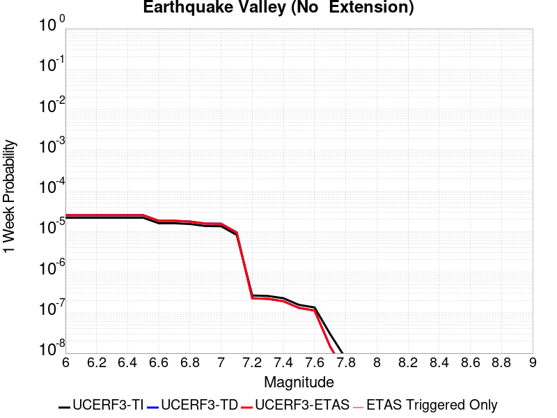 | 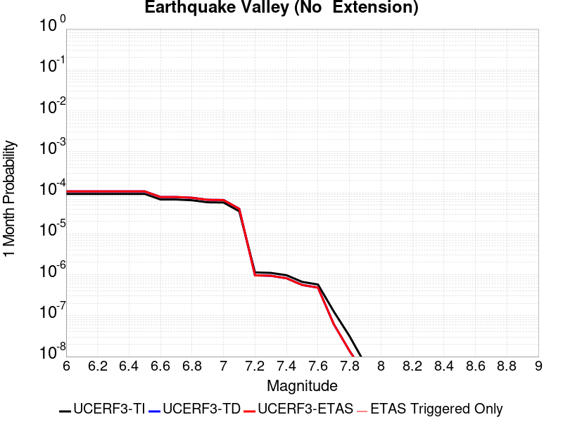 | 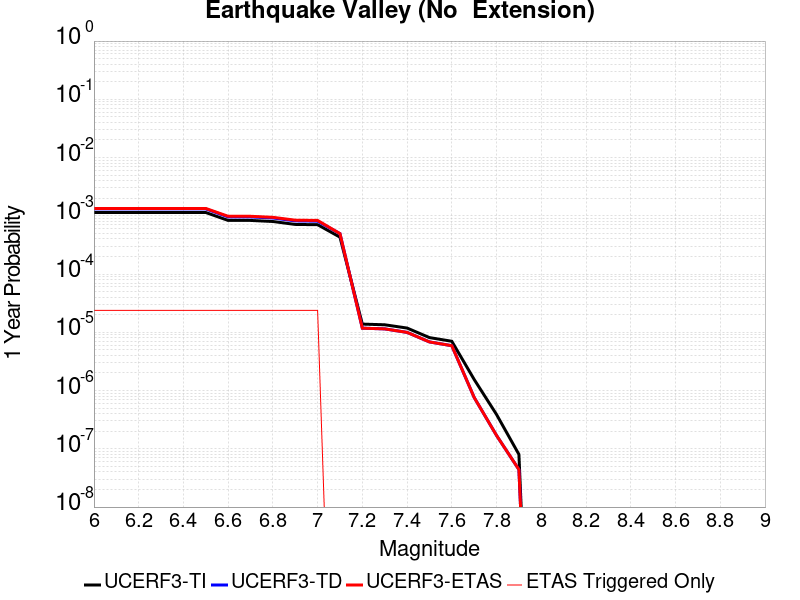 | 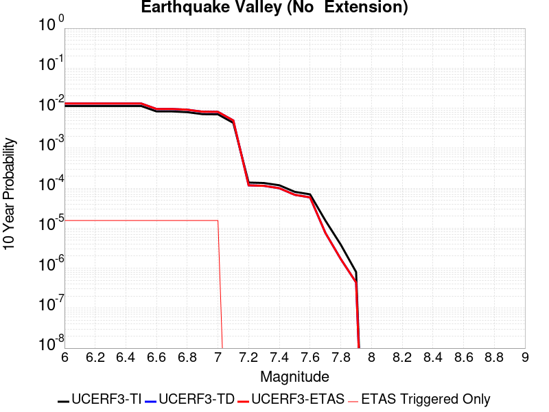 |

| Magnitude | 1 wk TI Prob | 1 wk TD Prob | 1 wk ETAS Prob | 1 wk ETAS/TD Gain | 1 wk ETAS Triggered Only | 1 mo TI Prob | 1 mo TD Prob | 1 mo ETAS Prob | 1 mo ETAS/TD Gain | 1 mo ETAS Triggered Only | 1 yr TI Prob | 1 yr TD Prob | 1 yr ETAS Prob | 1 yr ETAS/TD Gain | 1 yr ETAS Triggered Only | 10 yr TI Prob | 10 yr TD Prob | 10 yr ETAS Prob | 10 yr ETAS/TD Gain | 10 yr ETAS Triggered Only |
|-----|-----|-----|-----|-----|-----|-----|-----|-----|-----|-----|-----|-----|-----|-----|-----|-----|-----|-----|-----|-----|
| 6.0 | 2.1859703E-5 | 2.5198362E-5 | 2.5198362E-5 | 1.0 | 0.0 | 9.3681076E-5 | 1.07989326E-4 | 1.07989326E-4 | 1.0 | 0.0 | 0.0011399703 | 0.001314122 | 0.0013241089 | 1.0075996 | 1.0E-5 | 0.011341401 | 0.013077871 | 0.01308774 | 1.0007546 | 1.0E-5 |
| 6.1 | 2.1859703E-5 | 2.5198362E-5 | 2.5198362E-5 | 1.0 | 0.0 | 9.3681076E-5 | 1.07989326E-4 | 1.07989326E-4 | 1.0 | 0.0 | 0.0011399703 | 0.001314122 | 0.0013241089 | 1.0075996 | 1.0E-5 | 0.011341401 | 0.013077871 | 0.01308774 | 1.0007546 | 1.0E-5 |
| 6.2 | 2.1859703E-5 | 2.5198362E-5 | 2.5198362E-5 | 1.0 | 0.0 | 9.3681076E-5 | 1.07989326E-4 | 1.07989326E-4 | 1.0 | 0.0 | 0.0011399703 | 0.001314122 | 0.0013241089 | 1.0075996 | 1.0E-5 | 0.011341401 | 0.013077871 | 0.01308774 | 1.0007546 | 1.0E-5 |
| 6.3 | 2.1859703E-5 | 2.5198362E-5 | 2.5198362E-5 | 1.0 | 0.0 | 9.3681076E-5 | 1.07989326E-4 | 1.07989326E-4 | 1.0 | 0.0 | 0.0011399703 | 0.001314122 | 0.0013241089 | 1.0075996 | 1.0E-5 | 0.011341401 | 0.013077871 | 0.01308774 | 1.0007546 | 1.0E-5 |
| 6.4 | 2.1859703E-5 | 2.5198362E-5 | 2.5198362E-5 | 1.0 | 0.0 | 9.3681076E-5 | 1.07989326E-4 | 1.07989326E-4 | 1.0 | 0.0 | 0.0011399703 | 0.001314122 | 0.0013241089 | 1.0075996 | 1.0E-5 | 0.011341401 | 0.013077871 | 0.01308774 | 1.0007546 | 1.0E-5 |
| 6.5 | 2.1859703E-5 | 2.5198362E-5 | 2.5198362E-5 | 1.0 | 0.0 | 9.3681076E-5 | 1.07989326E-4 | 1.07989326E-4 | 1.0 | 0.0 | 0.0011399703 | 0.001314122 | 0.0013241089 | 1.0075996 | 1.0E-5 | 0.011341401 | 0.013077871 | 0.01308774 | 1.0007546 | 1.0E-5 |
| 6.6 | 1.597E-5 | 1.8356275E-5 | 1.8356275E-5 | 1.0 | 0.0 | 6.8441055E-5 | 7.866787E-5 | 7.866787E-5 | 1.0 | 0.0 | 8.329513E-4 | 9.574478E-4 | 9.674382E-4 | 1.0104344 | 1.0E-5 | 0.008298361 | 0.009541836 | 0.00955174 | 1.0010381 | 1.0E-5 |
| 6.7 | 1.597E-5 | 1.8356275E-5 | 1.8356275E-5 | 1.0 | 0.0 | 6.8441055E-5 | 7.866787E-5 | 7.866787E-5 | 1.0 | 0.0 | 8.329513E-4 | 9.574478E-4 | 9.674382E-4 | 1.0104344 | 1.0E-5 | 0.008298361 | 0.009541836 | 0.00955174 | 1.0010381 | 1.0E-5 |
| 6.8 | 1.5315149E-5 | 1.7602091E-5 | 1.7602091E-5 | 1.0 | 0.0 | 6.5634704E-5 | 7.543584E-5 | 7.543584E-5 | 1.0 | 0.0 | 7.988095E-4 | 9.181311E-4 | 9.281219E-4 | 1.0108817 | 1.0E-5 | 0.007959441 | 0.009151919 | 0.009161827 | 1.0010827 | 1.0E-5 |
| 6.9 | 1.3634728E-5 | 1.5675821E-5 | 1.5675821E-5 | 1.0 | 0.0 | 5.8433237E-5 | 6.718082E-5 | 6.718082E-5 | 1.0 | 0.0 | 7.1119244E-4 | 8.177017E-4 | 8.276935E-4 | 1.0122194 | 1.0E-5 | 0.007089207 | 0.008155 | 0.008164919 | 1.0012163 | 1.0E-5 |
| 7.0 | 1.3496271E-5 | 1.5517853E-5 | 1.5517853E-5 | 1.0 | 0.0 | 5.783988E-5 | 6.650385E-5 | 6.650385E-5 | 1.0 | 0.0 | 7.03973E-4 | 8.094657E-4 | 8.1945764E-4 | 1.0123439 | 1.0E-5 | 0.007017471 | 0.0080732405 | 0.00808316 | 1.0012287 | 1.0E-5 |
| 7.1 | 8.242798E-6 | 9.4726E-6 | 9.4726E-6 | 1.0 | 0.0 | 3.53258E-5 | 4.0596606E-5 | 4.0596606E-5 | 1.0 | 0.0 | 4.300067E-4 | 4.9421866E-4 | 4.9421866E-4 | 1.0 | 0.0 | 0.004291756 | 0.0049377717 | 0.0049377717 | 1.0 | 0.0 |
| 7.2 | 2.6506527E-7 | 2.2560312E-7 | 2.2560312E-7 | 1.0 | 0.0 | 1.1359936E-6 | 9.668702E-7 | 9.668702E-7 | 1.0 | 0.0 | 1.3830633E-5 | 1.17715845E-5 | 1.17715845E-5 | 1.0 | 0.0 | 1.3829772E-4 | 1.1771003E-4 | 1.1771003E-4 | 1.0 | 0.0 |
| 7.3 | 2.5810488E-7 | 2.1955442E-7 | 2.1955442E-7 | 1.0 | 0.0 | 1.1061633E-6 | 9.409472E-7 | 9.409472E-7 | 1.0 | 0.0 | 1.3467455E-5 | 1.1455976E-5 | 1.1455976E-5 | 1.0 | 0.0 | 1.3466639E-4 | 1.1455427E-4 | 1.1455427E-4 | 1.0 | 0.0 |
| 7.4 | 2.2676066E-7 | 1.9110601E-7 | 1.9110601E-7 | 1.0 | 0.0 | 9.71831E-7 | 8.190255E-7 | 8.190255E-7 | 1.0 | 0.0 | 1.1831979E-5 | 9.9715935E-6 | 9.9715935E-6 | 1.0 | 0.0 | 1.1831349E-4 | 9.9711855E-5 | 9.9711855E-5 | 1.0 | 0.0 |
| 7.5 | 1.5553917E-7 | 1.3112096E-7 | 1.3112096E-7 | 1.0 | 0.0 | 6.6659624E-7 | 5.619469E-7 | 5.619469E-7 | 1.0 | 0.0 | 8.115779E-6 | 6.8416834E-6 | 6.8416834E-6 | 1.0 | 0.0 | 8.115482E-5 | 6.841495E-5 | 6.841495E-5 | 1.0 | 0.0 |
| 7.6 | 1.3448629E-7 | 1.1288419E-7 | 1.1288419E-7 | 1.0 | 0.0 | 5.7636964E-7 | 4.837893E-7 | 4.837893E-7 | 1.0 | 0.0 | 7.017278E-6 | 5.890121E-6 | 5.890121E-6 | 1.0 | 0.0 | 7.0170565E-5 | 5.889986E-5 | 5.889986E-5 | 1.0 | 0.0 |
| 7.7 | 2.9719402E-8 | 1.458206E-8 | 1.458206E-8 | 1.0 | 0.0 | 1.2736886E-7 | 6.249454E-8 | 6.249454E-8 | 1.0 | 0.0 | 1.5507147E-6 | 7.608708E-7 | 7.608708E-7 | 1.0 | 0.0 | 1.550704E-5 | 7.6086876E-6 | 7.6086876E-6 | 1.0 | 0.0 |
| 7.8 | 7.4390196E-9 | 3.2502152E-9 | 3.2502152E-9 | 1.0 | 0.0 | 3.1881513E-8 | 1.3929493E-8 | 1.3929493E-8 | 1.0 | 0.0 | 3.8815733E-7 | 1.6959156E-7 | 1.6959156E-7 | 1.0 | 0.0 | 3.8815665E-6 | 1.6959145E-6 | 1.6959145E-6 | 1.0 | 0.0 |
| 7.9 | 1.5373532E-9 | 8.440161E-10 | 8.440161E-10 | 1.0 | 0.0 | 6.5886567E-9 | 3.6172119E-9 | 3.6172119E-9 | 1.0 | 0.0 | 8.021689E-8 | 4.4039556E-8 | 4.4039556E-8 | 1.0 | 0.0 | 8.0216864E-7 | 4.4039552E-7 | 4.4039552E-7 | 1.0 | 0.0 |

## Hartley Springs 2011 CFM
*[(top)](#table-of-contents)*

| 1 Week | 1 Month | 1 Year | 10 Year |
|-----|-----|-----|-----|
|  | 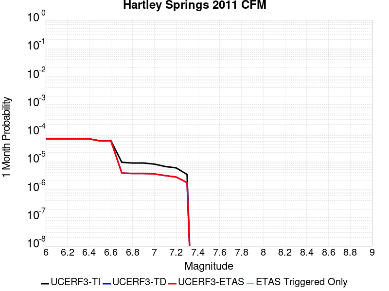 | 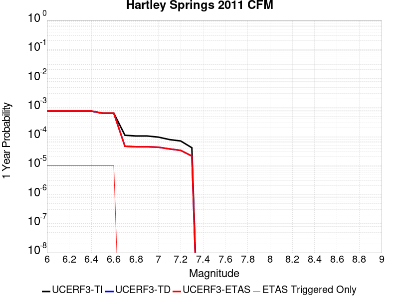 | 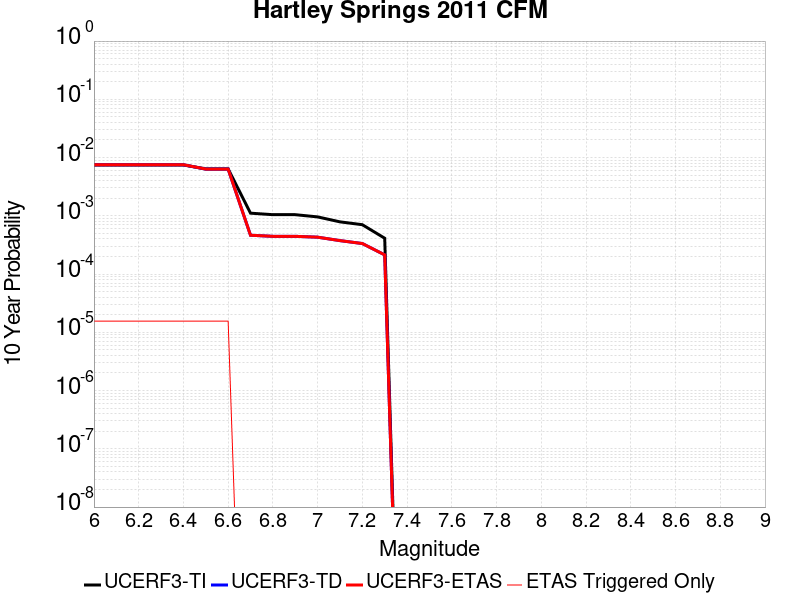 |

| Magnitude | 1 wk TI Prob | 1 wk TD Prob | 1 wk ETAS Prob | 1 wk ETAS/TD Gain | 1 wk ETAS Triggered Only | 1 mo TI Prob | 1 mo TD Prob | 1 mo ETAS Prob | 1 mo ETAS/TD Gain | 1 mo ETAS Triggered Only | 1 yr TI Prob | 1 yr TD Prob | 1 yr ETAS Prob | 1 yr ETAS/TD Gain | 1 yr ETAS Triggered Only | 10 yr TI Prob | 10 yr TD Prob | 10 yr ETAS Prob | 10 yr ETAS/TD Gain | 10 yr ETAS Triggered Only |
|-----|-----|-----|-----|-----|-----|-----|-----|-----|-----|-----|-----|-----|-----|-----|-----|-----|-----|-----|-----|-----|
| 6.0 | 1.4352418E-5 | 1.4434182E-5 | 1.4434182E-5 | 1.0 | 0.0 | 6.1508916E-5 | 6.1860235E-5 | 6.1860235E-5 | 1.0 | 0.0 | 7.486137E-4 | 7.5305253E-4 | 7.63045E-4 | 1.0132693 | 1.0E-5 | 0.007460968 | 0.0075211283 | 0.0075310534 | 1.0013196 | 1.0E-5 |
| 6.1 | 1.4352418E-5 | 1.4434182E-5 | 1.4434182E-5 | 1.0 | 0.0 | 6.1508916E-5 | 6.1860235E-5 | 6.1860235E-5 | 1.0 | 0.0 | 7.486137E-4 | 7.5305253E-4 | 7.63045E-4 | 1.0132693 | 1.0E-5 | 0.007460968 | 0.0075211283 | 0.0075310534 | 1.0013196 | 1.0E-5 |
| 6.2 | 1.4352418E-5 | 1.4434182E-5 | 1.4434182E-5 | 1.0 | 0.0 | 6.1508916E-5 | 6.1860235E-5 | 6.1860235E-5 | 1.0 | 0.0 | 7.486137E-4 | 7.5305253E-4 | 7.63045E-4 | 1.0132693 | 1.0E-5 | 0.007460968 | 0.0075211283 | 0.0075310534 | 1.0013196 | 1.0E-5 |
| 6.3 | 1.4352418E-5 | 1.4434182E-5 | 1.4434182E-5 | 1.0 | 0.0 | 6.1508916E-5 | 6.1860235E-5 | 6.1860235E-5 | 1.0 | 0.0 | 7.486137E-4 | 7.5305253E-4 | 7.63045E-4 | 1.0132693 | 1.0E-5 | 0.007460968 | 0.0075211283 | 0.0075310534 | 1.0013196 | 1.0E-5 |
| 6.4 | 1.4352418E-5 | 1.4434182E-5 | 1.4434182E-5 | 1.0 | 0.0 | 6.1508916E-5 | 6.1860235E-5 | 6.1860235E-5 | 1.0 | 0.0 | 7.486137E-4 | 7.5305253E-4 | 7.63045E-4 | 1.0132693 | 1.0E-5 | 0.007460968 | 0.0075211283 | 0.0075310534 | 1.0013196 | 1.0E-5 |
| 6.5 | 1.2279858E-5 | 1.2133106E-5 | 1.2133106E-5 | 1.0 | 0.0 | 5.26269E-5 | 5.1998883E-5 | 5.1998883E-5 | 1.0 | 0.0 | 6.4054417E-4 | 6.3306064E-4 | 6.430543E-4 | 1.0157863 | 1.0E-5 | 0.0063870098 | 0.006328085 | 0.0063380217 | 1.0015702 | 1.0E-5 |
| 6.6 | 1.2279858E-5 | 1.2133106E-5 | 1.2133106E-5 | 1.0 | 0.0 | 5.26269E-5 | 5.1998883E-5 | 5.1998883E-5 | 1.0 | 0.0 | 6.4054417E-4 | 6.3306064E-4 | 6.430543E-4 | 1.0157863 | 1.0E-5 | 0.0063870098 | 0.006328085 | 0.0063380217 | 1.0015702 | 1.0E-5 |
| 6.7 | 2.1282601E-6 | 8.8948315E-7 | 8.8948315E-7 | 1.0 | 0.0 | 9.121083E-6 | 3.8120663E-6 | 3.8120663E-6 | 1.0 | 0.0 | 1.11043526E-4 | 4.641118E-5 | 4.641118E-5 | 1.0 | 0.0 | 0.0011098806 | 4.6404017E-4 | 4.6404017E-4 | 1.0 | 0.0 |
| 6.8 | 2.00516E-6 | 8.517597E-7 | 8.517597E-7 | 1.0 | 0.0 | 8.593515E-6 | 3.650395E-6 | 3.650395E-6 | 1.0 | 0.0 | 1.04621024E-4 | 4.444291E-5 | 4.444291E-5 | 1.0 | 0.0 | 0.0010457177 | 4.4436535E-4 | 4.4436535E-4 | 1.0 | 0.0 |
| 6.9 | 2.00516E-6 | 8.517597E-7 | 8.517597E-7 | 1.0 | 0.0 | 8.593515E-6 | 3.650395E-6 | 3.650395E-6 | 1.0 | 0.0 | 1.04621024E-4 | 4.444291E-5 | 4.444291E-5 | 1.0 | 0.0 | 0.0010457177 | 4.4436535E-4 | 4.4436535E-4 | 1.0 | 0.0 |
| 7.0 | 1.8366732E-6 | 8.237307E-7 | 8.237307E-7 | 1.0 | 0.0 | 7.871433E-6 | 3.5302712E-6 | 3.5302712E-6 | 1.0 | 0.0 | 9.583048E-5 | 4.298046E-5 | 4.298046E-5 | 1.0 | 0.0 | 9.5789164E-4 | 4.2974652E-4 | 4.2974652E-4 | 1.0 | 0.0 |
| 7.1 | 1.5097997E-6 | 7.1902616E-7 | 7.1902616E-7 | 1.0 | 0.0 | 6.470554E-6 | 3.0815384E-6 | 3.0815384E-6 | 1.0 | 0.0 | 7.877615E-5 | 3.7517326E-5 | 3.7517326E-5 | 1.0 | 0.0 | 7.874823E-4 | 3.7513362E-4 | 3.7513362E-4 | 1.0 | 0.0 |
| 7.2 | 1.3490993E-6 | 6.405254E-7 | 6.405254E-7 | 1.0 | 0.0 | 5.7818415E-6 | 2.7451074E-6 | 2.7451074E-6 | 1.0 | 0.0 | 7.0391645E-5 | 3.3421402E-5 | 3.3421402E-5 | 1.0 | 0.0 | 7.0369354E-4 | 3.341867E-4 | 3.341867E-4 | 1.0 | 0.0 |
| 7.3 | 7.900015E-7 | 4.0889498E-7 | 4.0889498E-7 | 1.0 | 0.0 | 3.3857161E-6 | 1.752407E-6 | 1.752407E-6 | 1.0 | 0.0 | 4.1220315E-5 | 2.1335554E-5 | 2.1335554E-5 | 1.0 | 0.0 | 4.121267E-4 | 2.1335555E-4 | 2.1335555E-4 | 1.0 | 0.0 |

## Davis Creek
*[(top)](#table-of-contents)*

| 1 Week | 1 Month | 1 Year | 10 Year |
|-----|-----|-----|-----|
|  |  | 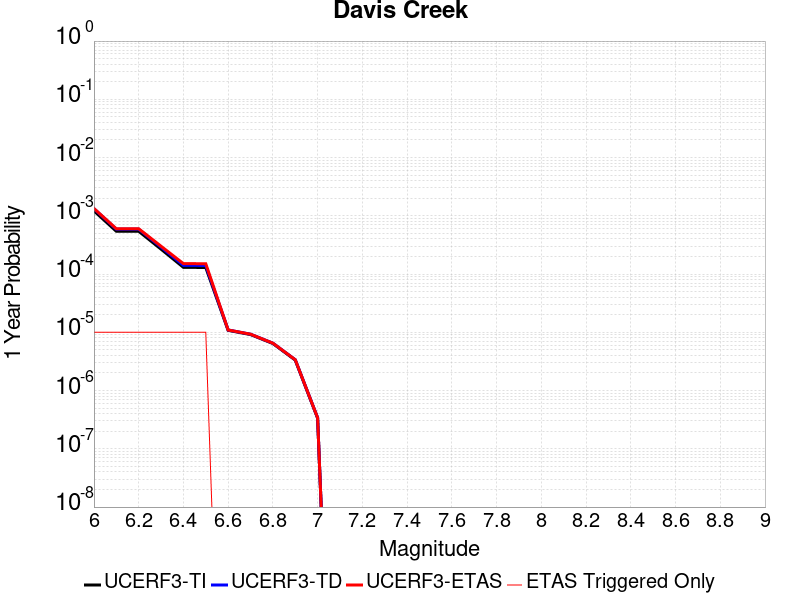 | 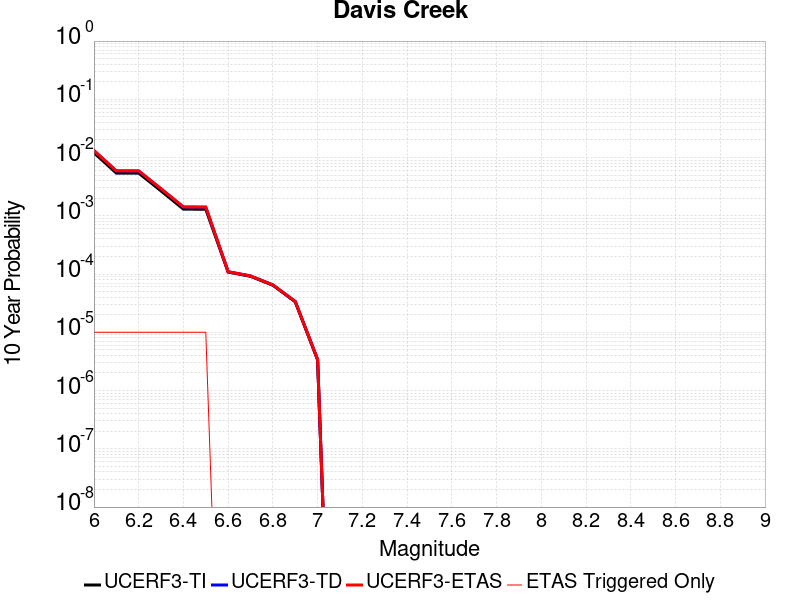 |

| Magnitude | 1 wk TI Prob | 1 wk TD Prob | 1 wk ETAS Prob | 1 wk ETAS/TD Gain | 1 wk ETAS Triggered Only | 1 mo TI Prob | 1 mo TD Prob | 1 mo ETAS Prob | 1 mo ETAS/TD Gain | 1 mo ETAS Triggered Only | 1 yr TI Prob | 1 yr TD Prob | 1 yr ETAS Prob | 1 yr ETAS/TD Gain | 1 yr ETAS Triggered Only | 10 yr TI Prob | 10 yr TD Prob | 10 yr ETAS Prob | 10 yr ETAS/TD Gain | 10 yr ETAS Triggered Only |
|-----|-----|-----|-----|-----|-----|-----|-----|-----|-----|-----|-----|-----|-----|-----|-----|-----|-----|-----|-----|-----|
| 6.0 | 2.331472E-5 | 2.5417214E-5 | 2.5417214E-5 | 1.0 | 0.0 | 9.99164E-5 | 1.0892704E-4 | 1.0892704E-4 | 1.0 | 0.0 | 0.0012158032 | 0.0013254983 | 0.0013354851 | 1.0075344 | 1.0E-5 | 0.01209173 | 0.013187704 | 0.013197572 | 1.0007483 | 1.0E-5 |
| 6.1 | 1.0407654E-5 | 1.1316986E-5 | 1.1316986E-5 | 1.0 | 0.0 | 4.4603472E-5 | 4.8500624E-5 | 4.8500624E-5 | 1.0 | 0.0 | 5.4291193E-4 | 5.9036224E-4 | 6.003563E-4 | 1.0169288 | 1.0E-5 | 0.0054158745 | 0.005890611 | 0.005900552 | 1.0016876 | 1.0E-5 |
| 6.2 | 1.0407654E-5 | 1.1316986E-5 | 1.1316986E-5 | 1.0 | 0.0 | 4.4603472E-5 | 4.8500624E-5 | 4.8500624E-5 | 1.0 | 0.0 | 5.4291193E-4 | 5.9036224E-4 | 6.003563E-4 | 1.0169288 | 1.0E-5 | 0.0054158745 | 0.005890611 | 0.005900552 | 1.0016876 | 1.0E-5 |
| 6.3 | 5.1323277E-6 | 5.568556E-6 | 5.568556E-6 | 1.0 | 0.0 | 2.1995505E-5 | 2.386507E-5 | 2.386507E-5 | 1.0 | 0.0 | 2.6776237E-4 | 2.905271E-4 | 3.005242E-4 | 1.0344102 | 1.0E-5 | 0.0026743996 | 0.0029023192 | 0.0029122902 | 1.0034355 | 1.0E-5 |
| 6.4 | 2.4985154E-6 | 2.704538E-6 | 2.704538E-6 | 1.0 | 0.0 | 1.07078795E-5 | 1.1590847E-5 | 1.1590847E-5 | 1.0 | 0.0 | 1.3036063E-4 | 1.4111304E-4 | 1.5111163E-4 | 1.0708551 | 1.0E-5 | 0.0013028418 | 0.001410589 | 0.001420575 | 1.0070792 | 1.0E-5 |
| 6.5 | 2.4846438E-6 | 2.6904722E-6 | 2.6904722E-6 | 1.0 | 0.0 | 1.064843E-5 | 1.1530565E-5 | 1.1530565E-5 | 1.0 | 0.0 | 1.2963692E-4 | 1.403792E-4 | 1.503778E-4 | 1.0712256 | 1.0E-5 | 0.0012956132 | 0.0014032599 | 0.0014132459 | 1.0071163 | 1.0E-5 |
| 6.6 | 2.072566E-7 | 2.1018087E-7 | 2.1018087E-7 | 1.0 | 0.0 | 8.882423E-7 | 9.0077486E-7 | 9.0077486E-7 | 1.0 | 0.0 | 1.0814296E-5 | 1.0966881E-5 | 1.0966881E-5 | 1.0 | 0.0 | 1.081377E-4 | 1.09663575E-4 | 1.09663575E-4 | 1.0 | 0.0 |
| 6.7 | 1.7544528E-7 | 1.7790826E-7 | 1.7790826E-7 | 1.0 | 0.0 | 7.5190815E-7 | 7.6246374E-7 | 7.6246374E-7 | 1.0 | 0.0 | 9.154443E-6 | 9.282958E-6 | 9.282958E-6 | 1.0 | 0.0 | 9.1540656E-5 | 9.282586E-5 | 9.282586E-5 | 1.0 | 0.0 |
| 6.8 | 1.2320395E-7 | 1.2481138E-7 | 1.2481138E-7 | 1.0 | 0.0 | 5.280168E-7 | 5.349058E-7 | 5.349058E-7 | 1.0 | 0.0 | 6.428586E-6 | 6.5124595E-6 | 6.5124595E-6 | 1.0 | 0.0 | 6.4284E-5 | 6.5122804E-5 | 6.5122804E-5 | 1.0 | 0.0 |
| 6.9 | 6.399997E-8 | 6.486058E-8 | 6.486058E-8 | 1.0 | 0.0 | 2.7428555E-7 | 2.7797387E-7 | 2.7797387E-7 | 1.0 | 0.0 | 3.3394215E-6 | 3.3843273E-6 | 3.3843273E-6 | 1.0 | 0.0 | 3.3393713E-5 | 3.384282E-5 | 3.384282E-5 | 1.0 | 0.0 |
| 7.0 | 6.4455685E-9 | 6.535264E-9 | 6.535264E-9 | 1.0 | 0.0 | 2.7623864E-8 | 2.8008275E-8 | 2.8008275E-8 | 1.0 | 0.0 | 3.3632048E-7 | 3.4100074E-7 | 3.4100074E-7 | 1.0 | 0.0 | 3.3631998E-6 | 3.4100074E-6 | 3.4100074E-6 | 1.0 | 0.0 |

## Holser alt 1
*[(top)](#table-of-contents)*

| 1 Week | 1 Month | 1 Year | 10 Year |
|-----|-----|-----|-----|
|  |  | 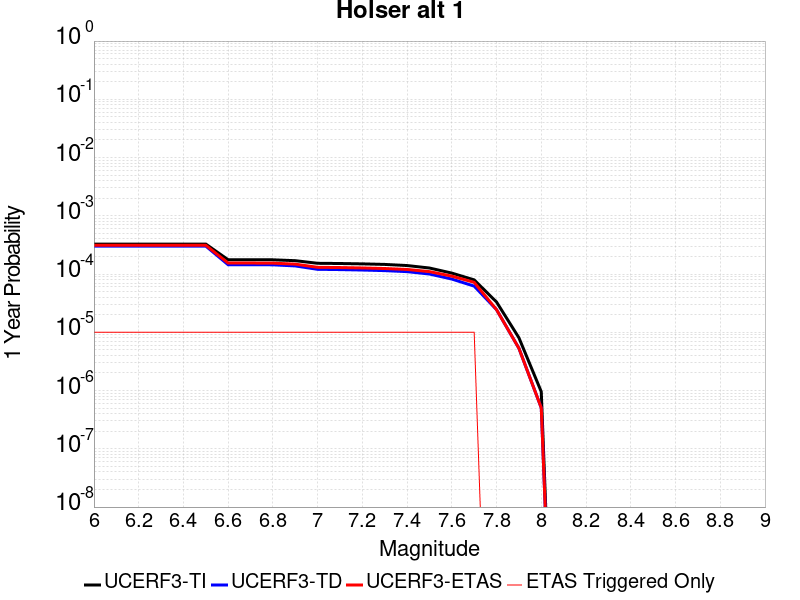 | 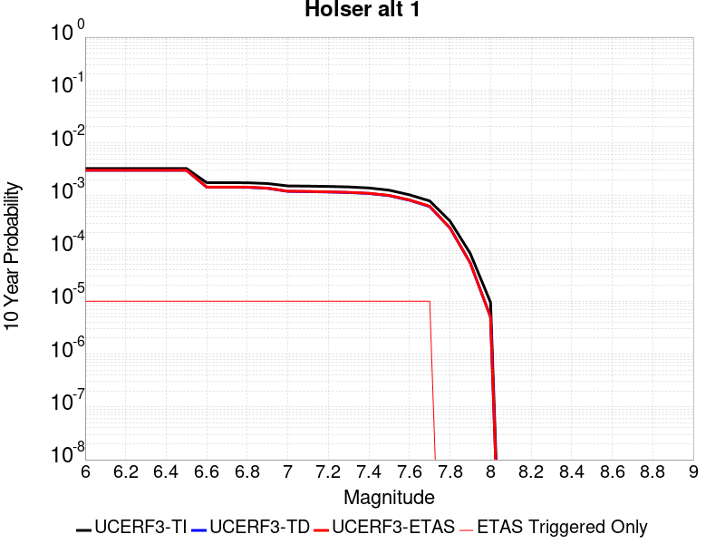 |

| Magnitude | 1 wk TI Prob | 1 wk TD Prob | 1 wk ETAS Prob | 1 wk ETAS/TD Gain | 1 wk ETAS Triggered Only | 1 mo TI Prob | 1 mo TD Prob | 1 mo ETAS Prob | 1 mo ETAS/TD Gain | 1 mo ETAS Triggered Only | 1 yr TI Prob | 1 yr TD Prob | 1 yr ETAS Prob | 1 yr ETAS/TD Gain | 1 yr ETAS Triggered Only | 10 yr TI Prob | 10 yr TD Prob | 10 yr ETAS Prob | 10 yr ETAS/TD Gain | 10 yr ETAS Triggered Only |
|-----|-----|-----|-----|-----|-----|-----|-----|-----|-----|-----|-----|-----|-----|-----|-----|-----|-----|-----|-----|-----|
| 6.0 | 6.2746653E-6 | 5.789965E-6 | 5.789965E-6 | 1.0 | 0.0 | 2.6891146E-5 | 2.4813964E-5 | 2.4813964E-5 | 1.0 | 0.0 | 3.273505E-4 | 3.020797E-4 | 3.1207665E-4 | 1.0330938 | 1.0E-5 | 0.0032686873 | 0.0030178234 | 0.0030277933 | 1.0033036 | 1.0E-5 |
| 6.1 | 6.2746653E-6 | 5.789965E-6 | 5.789965E-6 | 1.0 | 0.0 | 2.6891146E-5 | 2.4813964E-5 | 2.4813964E-5 | 1.0 | 0.0 | 3.273505E-4 | 3.020797E-4 | 3.1207665E-4 | 1.0330938 | 1.0E-5 | 0.0032686873 | 0.0030178234 | 0.0030277933 | 1.0033036 | 1.0E-5 |
| 6.2 | 6.2746653E-6 | 5.789965E-6 | 5.789965E-6 | 1.0 | 0.0 | 2.6891146E-5 | 2.4813964E-5 | 2.4813964E-5 | 1.0 | 0.0 | 3.273505E-4 | 3.020797E-4 | 3.1207665E-4 | 1.0330938 | 1.0E-5 | 0.0032686873 | 0.0030178234 | 0.0030277933 | 1.0033036 | 1.0E-5 |
| 6.3 | 6.2746653E-6 | 5.789965E-6 | 5.789965E-6 | 1.0 | 0.0 | 2.6891146E-5 | 2.4813964E-5 | 2.4813964E-5 | 1.0 | 0.0 | 3.273505E-4 | 3.020797E-4 | 3.1207665E-4 | 1.0330938 | 1.0E-5 | 0.0032686873 | 0.0030178234 | 0.0030277933 | 1.0033036 | 1.0E-5 |
| 6.4 | 6.2746653E-6 | 5.789965E-6 | 5.789965E-6 | 1.0 | 0.0 | 2.6891146E-5 | 2.4813964E-5 | 2.4813964E-5 | 1.0 | 0.0 | 3.273505E-4 | 3.020797E-4 | 3.1207665E-4 | 1.0330938 | 1.0E-5 | 0.0032686873 | 0.0030178234 | 0.0030277933 | 1.0033036 | 1.0E-5 |
| 6.5 | 6.2746653E-6 | 5.789965E-6 | 5.789965E-6 | 1.0 | 0.0 | 2.6891146E-5 | 2.4813964E-5 | 2.4813964E-5 | 1.0 | 0.0 | 3.273505E-4 | 3.020797E-4 | 3.1207665E-4 | 1.0330938 | 1.0E-5 | 0.0032686873 | 0.0030178234 | 0.0030277933 | 1.0033036 | 1.0E-5 |
| 6.6 | 3.375825E-6 | 2.7711897E-6 | 2.7711897E-6 | 1.0 | 0.0 | 1.4467741E-5 | 1.1876474E-5 | 1.1876474E-5 | 1.0 | 0.0 | 1.761305E-4 | 1.4458665E-4 | 1.545852E-4 | 1.0691527 | 1.0E-5 | 0.0017599097 | 0.0014449427 | 0.0014549283 | 1.0069107 | 1.0E-5 |
| 6.7 | 3.375825E-6 | 2.7711897E-6 | 2.7711897E-6 | 1.0 | 0.0 | 1.4467741E-5 | 1.1876474E-5 | 1.1876474E-5 | 1.0 | 0.0 | 1.761305E-4 | 1.4458665E-4 | 1.545852E-4 | 1.0691527 | 1.0E-5 | 0.0017599097 | 0.0014449427 | 0.0014549283 | 1.0069107 | 1.0E-5 |
| 6.8 | 3.366533E-6 | 2.7615893E-6 | 2.7615893E-6 | 1.0 | 0.0 | 1.4427919E-5 | 1.183533E-5 | 1.183533E-5 | 1.0 | 0.0 | 1.7564575E-4 | 1.4408577E-4 | 1.5408434E-4 | 1.0693932 | 1.0E-5 | 0.0017550698 | 0.0014399405 | 0.0014499262 | 1.0069348 | 1.0E-5 |
| 6.9 | 3.253174E-6 | 2.6438113E-6 | 2.6438113E-6 | 1.0 | 0.0 | 1.39421E-5 | 1.1330571E-5 | 1.1330571E-5 | 1.0 | 0.0 | 1.6973184E-4 | 1.3794114E-4 | 1.4793976E-4 | 1.0724847 | 1.0E-5 | 0.0016960226 | 0.001378571 | 0.0013885573 | 1.0072439 | 1.0E-5 |
| 7.0 | 2.9336593E-6 | 2.311799E-6 | 2.311799E-6 | 1.0 | 0.0 | 1.2572766E-5 | 9.907673E-6 | 9.907673E-6 | 1.0 | 0.0 | 1.5306266E-4 | 1.2061927E-4 | 1.3061806E-4 | 1.0828955 | 1.0E-5 | 0.0015295728 | 0.0012055405 | 0.0012155285 | 1.008285 | 1.0E-5 |
| 7.1 | 2.9087812E-6 | 2.2876513E-6 | 2.2876513E-6 | 1.0 | 0.0 | 1.2466146E-5 | 9.804184E-6 | 9.804184E-6 | 1.0 | 0.0 | 1.5176475E-4 | 1.19359414E-4 | 1.2935822E-4 | 1.0837705 | 1.0E-5 | 0.0015166114 | 0.0011929555 | 0.0012029436 | 1.0083725 | 1.0E-5 |
| 7.2 | 2.8674524E-6 | 2.2475429E-6 | 2.2475429E-6 | 1.0 | 0.0 | 1.2289024E-5 | 9.63229E-6 | 9.63229E-6 | 1.0 | 0.0 | 1.4960859E-4 | 1.1726685E-4 | 1.2726568E-4 | 1.0852656 | 1.0E-5 | 0.0014950791 | 0.001172052 | 0.0011820403 | 1.008522 | 1.0E-5 |
| 7.3 | 2.8057775E-6 | 2.1954324E-6 | 2.1954324E-6 | 1.0 | 0.0 | 1.2024705E-5 | 9.408962E-6 | 9.408962E-6 | 1.0 | 0.0 | 1.4639096E-4 | 1.14548115E-4 | 1.2454698E-4 | 1.0872896 | 1.0E-5 | 0.0014629456 | 0.001144893 | 0.0011548816 | 1.0087245 | 1.0E-5 |
| 7.4 | 2.683666E-6 | 2.1092305E-6 | 2.1092305E-6 | 1.0 | 0.0 | 1.1501375E-5 | 9.039529E-6 | 9.039529E-6 | 1.0 | 0.0 | 1.4002025E-4 | 1.1005072E-4 | 1.2004962E-4 | 1.0908571 | 1.0E-5 | 0.0013993206 | 0.0010999644 | 0.0011099534 | 1.0090812 | 1.0E-5 |
| 7.5 | 2.434495E-6 | 1.9195363E-6 | 1.9195363E-6 | 1.0 | 0.0 | 1.0433508E-5 | 8.226558E-6 | 8.226558E-6 | 1.0 | 0.0 | 1.2702055E-4 | 1.0015376E-4 | 1.1015276E-4 | 1.0998365 | 1.0E-5 | 0.0012694797 | 0.0010010883 | 0.0010110782 | 1.0099791 | 1.0E-5 |
| 7.6 | 1.9914562E-6 | 1.5731459E-6 | 1.5731459E-6 | 1.0 | 0.0 | 8.534785E-6 | 6.742037E-6 | 6.742037E-6 | 1.0 | 0.0 | 1.03906044E-4 | 8.208122E-5 | 9.20804E-5 | 1.1218206 | 1.0E-5 | 0.0010385747 | 8.205106E-4 | 8.3050237E-4 | 1.0121776 | 1.0E-5 |
| 7.7 | 1.5229501E-6 | 1.1896061E-6 | 1.1896061E-6 | 1.0 | 0.0 | 6.526913E-6 | 5.098302E-6 | 5.098302E-6 | 1.0 | 0.0 | 7.946226E-5 | 6.2070074E-5 | 7.206945E-5 | 1.1610982 | 1.0E-5 | 7.943385E-4 | 6.2052865E-4 | 6.3052244E-4 | 1.0161053 | 1.0E-5 |
| 7.8 | 6.3489426E-7 | 4.687806E-7 | 4.687806E-7 | 1.0 | 0.0 | 2.7209726E-6 | 2.009058E-6 | 2.009058E-6 | 1.0 | 0.0 | 3.312734E-5 | 2.4460009E-5 | 2.4460009E-5 | 1.0 | 0.0 | 3.31224E-4 | 2.4457334E-4 | 2.4457334E-4 | 1.0 | 0.0 |
| 7.9 | 1.5459432E-7 | 1.0193758E-7 | 1.0193758E-7 | 1.0 | 0.0 | 6.6254694E-7 | 4.3687527E-7 | 4.3687527E-7 | 1.0 | 0.0 | 8.066479E-6 | 5.3189433E-6 | 5.3189433E-6 | 1.0 | 0.0 | 8.066186E-5 | 5.3188178E-5 | 5.3188178E-5 | 1.0 | 0.0 |
| 8.0 | 1.8307812E-8 | 9.690293E-9 | 9.690293E-9 | 1.0 | 0.0 | 7.846205E-8 | 4.152983E-8 | 4.152983E-8 | 1.0 | 0.0 | 9.55275E-7 | 5.0562556E-7 | 5.0562556E-7 | 1.0 | 0.0 | 9.552709E-6 | 5.0562444E-6 | 5.0562444E-6 | 1.0 | 0.0 |

## Cerro Prieto
*[(top)](#table-of-contents)*

| 1 Week | 1 Month | 1 Year | 10 Year |
|-----|-----|-----|-----|
| 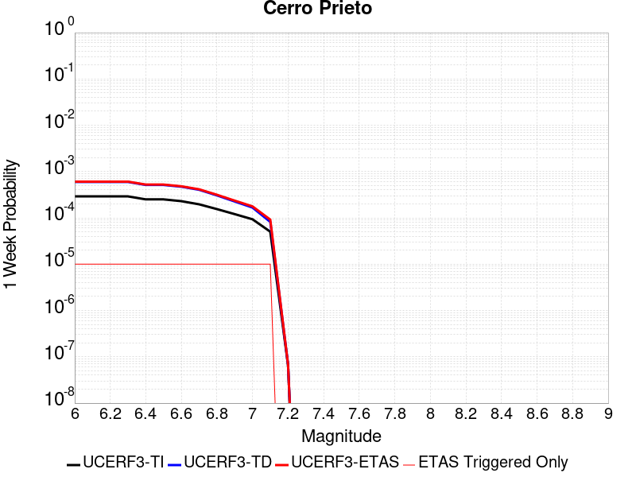 |  |  |  |

| Magnitude | 1 wk TI Prob | 1 wk TD Prob | 1 wk ETAS Prob | 1 wk ETAS/TD Gain | 1 wk ETAS Triggered Only | 1 mo TI Prob | 1 mo TD Prob | 1 mo ETAS Prob | 1 mo ETAS/TD Gain | 1 mo ETAS Triggered Only | 1 yr TI Prob | 1 yr TD Prob | 1 yr ETAS Prob | 1 yr ETAS/TD Gain | 1 yr ETAS Triggered Only | 10 yr TI Prob | 10 yr TD Prob | 10 yr ETAS Prob | 10 yr ETAS/TD Gain | 10 yr ETAS Triggered Only |
|-----|-----|-----|-----|-----|-----|-----|-----|-----|-----|-----|-----|-----|-----|-----|-----|-----|-----|-----|-----|-----|
| 6.0 | 2.9101528E-4 | 5.964804E-4 | 6.064744E-4 | 1.016755 | 1.0E-5 | 0.0012466122 | 0.002554082 | 0.0025640565 | 1.0039053 | 1.0E-5 | 0.015072231 | 0.03064807 | 0.030657765 | 1.0003163 | 1.0E-5 | 0.14089979 | 0.25397858 | 0.25398603 | 1.0000293 | 1.0E-5 |
| 6.1 | 2.9101528E-4 | 5.964804E-4 | 6.064744E-4 | 1.016755 | 1.0E-5 | 0.0012466122 | 0.002554082 | 0.0025640565 | 1.0039053 | 1.0E-5 | 0.015072231 | 0.03064807 | 0.030657765 | 1.0003163 | 1.0E-5 | 0.14089979 | 0.25397858 | 0.25398603 | 1.0000293 | 1.0E-5 |
| 6.2 | 2.9101528E-4 | 5.964804E-4 | 6.064744E-4 | 1.016755 | 1.0E-5 | 0.0012466122 | 0.002554082 | 0.0025640565 | 1.0039053 | 1.0E-5 | 0.015072231 | 0.03064807 | 0.030657765 | 1.0003163 | 1.0E-5 | 0.14089979 | 0.25397858 | 0.25398603 | 1.0000293 | 1.0E-5 |
| 6.3 | 2.9101528E-4 | 5.964804E-4 | 6.064744E-4 | 1.016755 | 1.0E-5 | 0.0012466122 | 0.002554082 | 0.0025640565 | 1.0039053 | 1.0E-5 | 0.015072231 | 0.03064807 | 0.030657765 | 1.0003163 | 1.0E-5 | 0.14089979 | 0.25397858 | 0.25398603 | 1.0000293 | 1.0E-5 |
| 6.4 | 2.508648E-4 | 5.1397446E-4 | 5.239693E-4 | 1.0194463 | 1.0E-5 | 0.0010746918 | 0.0022010866 | 0.0022110646 | 1.0045332 | 1.0E-5 | 0.013006088 | 0.026471792 | 0.026481528 | 1.0003678 | 1.0E-5 | 0.12270685 | 0.22440416 | 0.2244119 | 1.0000346 | 1.0E-5 |
| 6.5 | 2.508648E-4 | 5.1397446E-4 | 5.239693E-4 | 1.0194463 | 1.0E-5 | 0.0010746918 | 0.0022010866 | 0.0022110646 | 1.0045332 | 1.0E-5 | 0.013006088 | 0.026471792 | 0.026481528 | 1.0003678 | 1.0E-5 | 0.12270685 | 0.22440416 | 0.2244119 | 1.0000346 | 1.0E-5 |
| 6.6 | 2.294914E-4 | 4.7116808E-4 | 4.8116336E-4 | 1.0212139 | 1.0E-5 | 9.831638E-4 | 0.0020179166 | 0.0020278965 | 1.0049456 | 1.0E-5 | 0.011904482 | 0.02429866 | 0.024308417 | 1.0004015 | 1.0E-5 | 0.11286586 | 0.20858558 | 0.20859349 | 1.0000379 | 1.0E-5 |
| 6.7 | 1.9621674E-4 | 4.0419117E-4 | 4.1418715E-4 | 1.0247308 | 1.0E-5 | 8.4065786E-4 | 0.0017312564 | 0.001741239 | 1.0057662 | 1.0E-5 | 0.010187071 | 0.020884845 | 0.020894635 | 1.0004689 | 1.0E-5 | 0.09732539 | 0.18290249 | 0.18291067 | 1.0000447 | 1.0E-5 |
| 6.8 | 1.5476145E-4 | 3.056516E-4 | 3.1564853E-4 | 1.032707 | 1.0E-5 | 6.6309475E-4 | 0.00130938 | 0.0013193669 | 1.0076272 | 1.0E-5 | 0.008043335 | 0.015836509 | 0.01584635 | 1.0006214 | 1.0E-5 | 0.07758363 | 0.14336355 | 0.14337212 | 1.0000597 | 1.0E-5 |
| 6.9 | 1.20509176E-4 | 2.2582515E-4 | 2.358229E-4 | 1.0442721 | 1.0E-5 | 5.1636563E-4 | 9.6752634E-4 | 9.775166E-4 | 1.0103257 | 1.0E-5 | 0.006268645 | 0.011726342 | 0.011736225 | 1.0008428 | 1.0E-5 | 0.060947374 | 0.109451205 | 0.10946011 | 1.0000814 | 1.0E-5 |
| 7.0 | 9.3269155E-5 | 1.6716642E-4 | 1.7716475E-4 | 1.0598106 | 1.0E-5 | 3.9966372E-4 | 7.162739E-4 | 7.2626676E-4 | 1.0139512 | 1.0E-5 | 0.0048550544 | 0.008693418 | 0.008703331 | 1.0011402 | 1.0E-5 | 0.04750344 | 0.08315912 | 0.08316828 | 1.0001103 | 1.0E-5 |
| 7.1 | 5.029709E-5 | 8.1718936E-5 | 9.171812E-5 | 1.1223607 | 1.0E-5 | 2.1554115E-4 | 3.5019626E-4 | 3.6019276E-4 | 1.0285454 | 1.0E-5 | 0.0026210553 | 0.0042587193 | 0.0042686765 | 1.0023382 | 1.0E-5 | 0.025903556 | 0.042365108 | 0.042374685 | 1.000226 | 1.0E-5 |
| 7.2 | 6.5445185E-8 | 6.814903E-8 | 6.814903E-8 | 1.0 | 0.0 | 2.8047933E-7 | 2.9206726E-7 | 2.9206726E-7 | 1.0 | 0.0 | 3.4148304E-6 | 3.555919E-6 | 3.555919E-6 | 1.0 | 0.0 | 3.414778E-5 | 3.5559187E-5 | 3.5559187E-5 | 1.0 | 0.0 |

## North Salt Lake
*[(top)](#table-of-contents)*

| 1 Week | 1 Month | 1 Year | 10 Year |
|-----|-----|-----|-----|
| 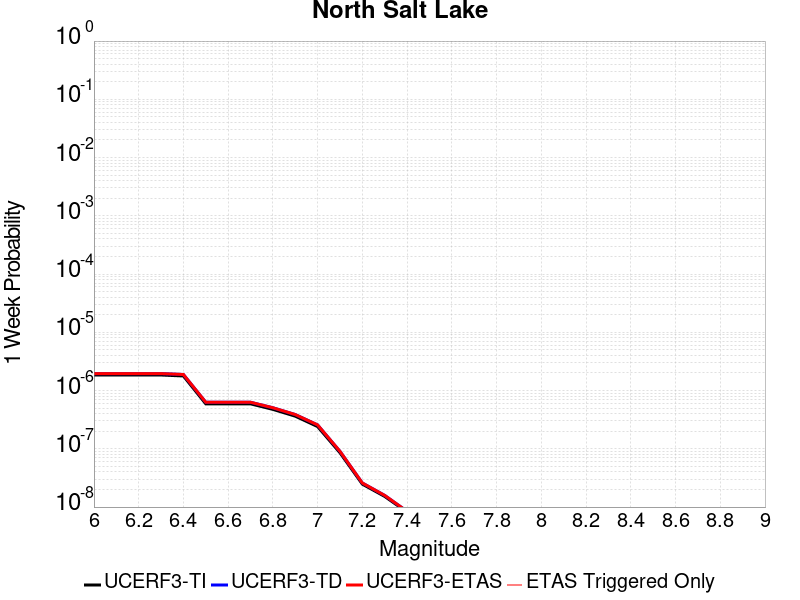 | 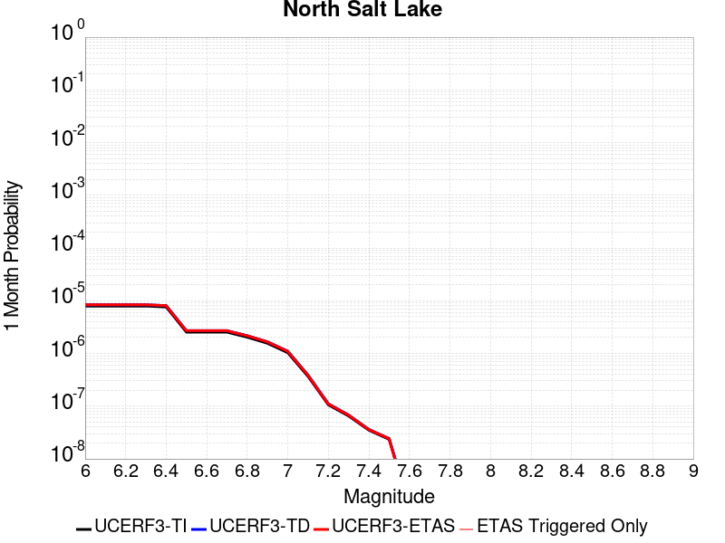 | 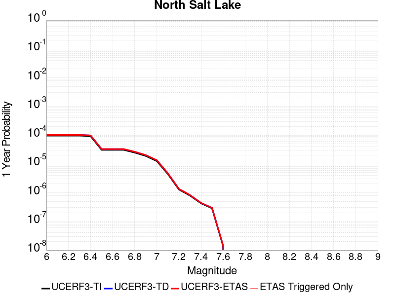 | 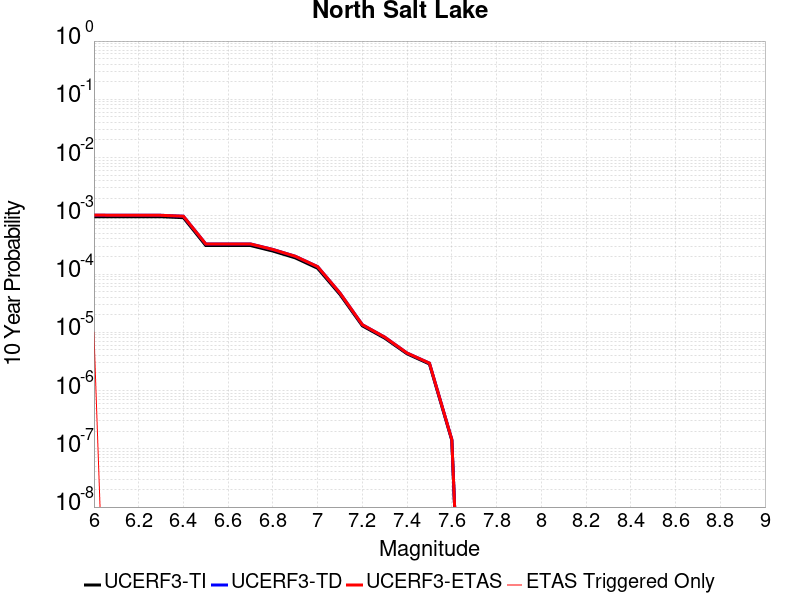 |

| Magnitude | 1 wk TI Prob | 1 wk TD Prob | 1 wk ETAS Prob | 1 wk ETAS/TD Gain | 1 wk ETAS Triggered Only | 1 mo TI Prob | 1 mo TD Prob | 1 mo ETAS Prob | 1 mo ETAS/TD Gain | 1 mo ETAS Triggered Only | 1 yr TI Prob | 1 yr TD Prob | 1 yr ETAS Prob | 1 yr ETAS/TD Gain | 1 yr ETAS Triggered Only | 10 yr TI Prob | 10 yr TD Prob | 10 yr ETAS Prob | 10 yr ETAS/TD Gain | 10 yr ETAS Triggered Only |
|-----|-----|-----|-----|-----|-----|-----|-----|-----|-----|-----|-----|-----|-----|-----|-----|-----|-----|-----|-----|-----|
| 6.0 | 1.849599E-6 | 1.955571E-6 | 1.955571E-6 | 1.0 | 0.0 | 7.926829E-6 | 8.381003E-6 | 8.381003E-6 | 1.0 | 0.0 | 9.650487E-5 | 1.0203594E-4 | 1.0203594E-4 | 1.0 | 0.0 | 9.646297E-4 | 0.0010200888 | 0.0010300786 | 1.009793 | 1.0E-5 |
| 6.1 | 1.849599E-6 | 1.955571E-6 | 1.955571E-6 | 1.0 | 0.0 | 7.926829E-6 | 8.381003E-6 | 8.381003E-6 | 1.0 | 0.0 | 9.650487E-5 | 1.0203594E-4 | 1.0203594E-4 | 1.0 | 0.0 | 9.646297E-4 | 0.0010200888 | 0.0010200888 | 1.0 | 0.0 |
| 6.2 | 1.849599E-6 | 1.955571E-6 | 1.955571E-6 | 1.0 | 0.0 | 7.926829E-6 | 8.381003E-6 | 8.381003E-6 | 1.0 | 0.0 | 9.650487E-5 | 1.0203594E-4 | 1.0203594E-4 | 1.0 | 0.0 | 9.646297E-4 | 0.0010200888 | 0.0010200888 | 1.0 | 0.0 |
| 6.3 | 1.849599E-6 | 1.955571E-6 | 1.955571E-6 | 1.0 | 0.0 | 7.926829E-6 | 8.381003E-6 | 8.381003E-6 | 1.0 | 0.0 | 9.650487E-5 | 1.0203594E-4 | 1.0203594E-4 | 1.0 | 0.0 | 9.646297E-4 | 0.0010200888 | 0.0010200888 | 1.0 | 0.0 |
| 6.4 | 1.7803909E-6 | 1.8860707E-6 | 1.8860707E-6 | 1.0 | 0.0 | 7.630225E-6 | 8.083147E-6 | 8.083147E-6 | 1.0 | 0.0 | 9.289402E-5 | 9.840987E-5 | 9.840987E-5 | 1.0 | 0.0 | 9.28552E-4 | 9.838602E-4 | 9.838602E-4 | 1.0 | 0.0 |
| 6.5 | 5.9157696E-7 | 6.3001835E-7 | 6.3001835E-7 | 1.0 | 0.0 | 2.5353274E-6 | 2.7000763E-6 | 2.7000763E-6 | 1.0 | 0.0 | 3.0867173E-5 | 3.2872973E-5 | 3.2872973E-5 | 1.0 | 0.0 | 3.0862886E-4 | 3.28685E-4 | 3.28685E-4 | 1.0 | 0.0 |
| 6.6 | 5.9157696E-7 | 6.3001835E-7 | 6.3001835E-7 | 1.0 | 0.0 | 2.5353274E-6 | 2.7000763E-6 | 2.7000763E-6 | 1.0 | 0.0 | 3.0867173E-5 | 3.2872973E-5 | 3.2872973E-5 | 1.0 | 0.0 | 3.0862886E-4 | 3.28685E-4 | 3.28685E-4 | 1.0 | 0.0 |
| 6.7 | 5.9157696E-7 | 6.3001835E-7 | 6.3001835E-7 | 1.0 | 0.0 | 2.5353274E-6 | 2.7000763E-6 | 2.7000763E-6 | 1.0 | 0.0 | 3.0867173E-5 | 3.2872973E-5 | 3.2872973E-5 | 1.0 | 0.0 | 3.0862886E-4 | 3.28685E-4 | 3.28685E-4 | 1.0 | 0.0 |
| 6.8 | 4.7536267E-7 | 5.066019E-7 | 5.066019E-7 | 1.0 | 0.0 | 2.037267E-6 | 2.1711494E-6 | 2.1711494E-6 | 1.0 | 0.0 | 2.4803443E-5 | 2.6433447E-5 | 2.6433447E-5 | 1.0 | 0.0 | 2.4800675E-4 | 2.6430548E-4 | 2.6430548E-4 | 1.0 | 0.0 |
| 6.9 | 3.6345344E-7 | 3.8750048E-7 | 3.8750048E-7 | 1.0 | 0.0 | 1.5576567E-6 | 1.6607154E-6 | 1.6607154E-6 | 1.0 | 0.0 | 1.8964305E-5 | 2.021904E-5 | 2.021904E-5 | 1.0 | 0.0 | 1.8962687E-4 | 2.021737E-4 | 2.021737E-4 | 1.0 | 0.0 |
| 7.0 | 2.4087325E-7 | 2.5709335E-7 | 2.5709335E-7 | 1.0 | 0.0 | 1.0323135E-6 | 1.1018283E-6 | 1.1018283E-6 | 1.0 | 0.0 | 1.25683455E-5 | 1.3414689E-5 | 1.3414689E-5 | 1.0 | 0.0 | 1.2567634E-4 | 1.3414006E-4 | 1.3414006E-4 | 1.0 | 0.0 |
| 7.1 | 8.551555E-8 | 9.044477E-8 | 9.044477E-8 | 1.0 | 0.0 | 3.6649516E-7 | 3.876204E-7 | 3.876204E-7 | 1.0 | 0.0 | 4.4620692E-6 | 4.7192693E-6 | 4.7192693E-6 | 1.0 | 0.0 | 4.46198E-5 | 4.719181E-5 | 4.719181E-5 | 1.0 | 0.0 |
| 7.2 | 2.475279E-8 | 2.5893172E-8 | 2.5893172E-8 | 1.0 | 0.0 | 1.0608338E-7 | 1.1097074E-7 | 1.1097074E-7 | 1.0 | 0.0 | 1.2915643E-6 | 1.3510679E-6 | 1.3510679E-6 | 1.0 | 0.0 | 1.2915569E-5 | 1.3510604E-5 | 1.3510604E-5 | 1.0 | 0.0 |
| 7.3 | 1.5212393E-8 | 1.5847489E-8 | 1.5847489E-8 | 1.0 | 0.0 | 6.519597E-8 | 6.791781E-8 | 6.791781E-8 | 1.0 | 0.0 | 7.9376065E-7 | 8.2689905E-7 | 8.2689905E-7 | 1.0 | 0.0 | 7.937579E-6 | 8.268963E-6 | 8.268963E-6 | 1.0 | 0.0 |
| 7.4 | 8.182E-9 | 8.447294E-9 | 8.447294E-9 | 1.0 | 0.0 | 3.5065714E-8 | 3.620269E-8 | 3.620269E-8 | 1.0 | 0.0 | 4.26925E-7 | 4.4076765E-7 | 4.4076765E-7 | 1.0 | 0.0 | 4.269242E-6 | 4.4076683E-6 | 4.4076683E-6 | 1.0 | 0.0 |
| 7.5 | 5.479913E-9 | 5.6680434E-9 | 5.6680434E-9 | 1.0 | 0.0 | 2.3485342E-8 | 2.4291614E-8 | 2.4291614E-8 | 1.0 | 0.0 | 2.85934E-7 | 2.9575037E-7 | 2.9575037E-7 | 1.0 | 0.0 | 2.8593363E-6 | 2.9575E-6 | 2.9575E-6 | 1.0 | 0.0 |
| 7.6 | 2.6813562E-10 | 2.773195E-10 | 2.773195E-10 | 1.0 | 0.0 | 1.1491527E-9 | 1.1885122E-9 | 1.1885122E-9 | 1.0 | 0.0 | 1.3990933E-8 | 1.4470135E-8 | 1.4470135E-8 | 1.0 | 0.0 | 1.3990932E-7 | 1.4470135E-7 | 1.4470135E-7 | 1.0 | 0.0 |

## Dog Valley
*[(top)](#table-of-contents)*

| 1 Week | 1 Month | 1 Year | 10 Year |
|-----|-----|-----|-----|
|  | 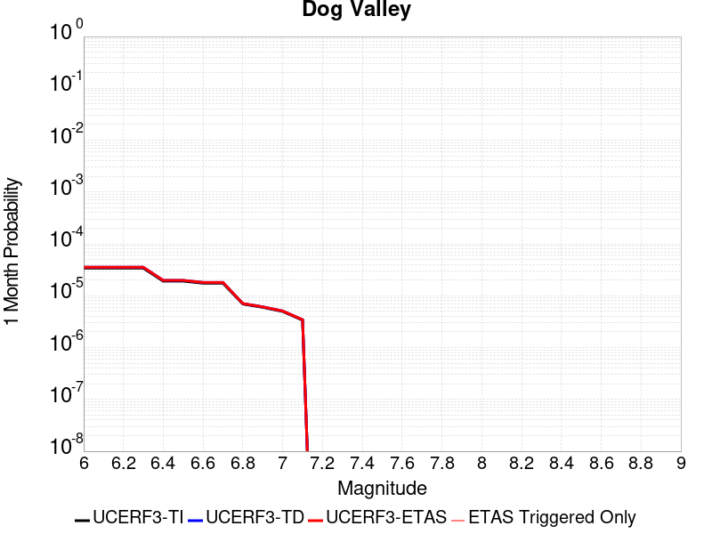 | 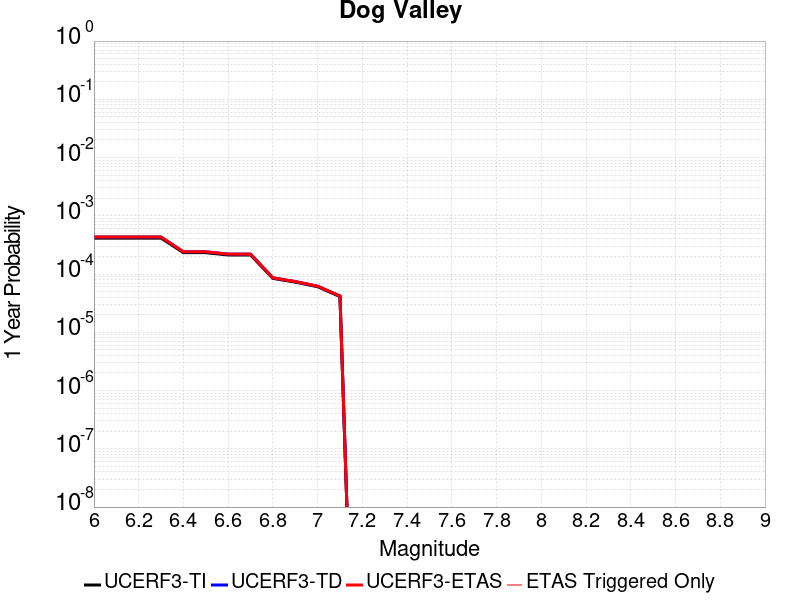 | 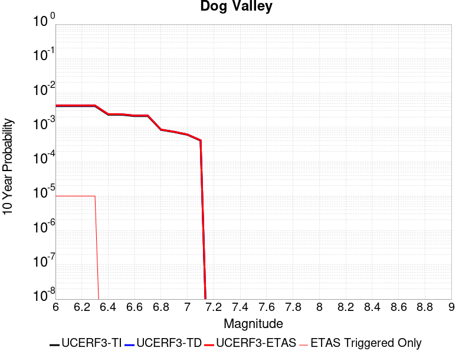 |

| Magnitude | 1 wk TI Prob | 1 wk TD Prob | 1 wk ETAS Prob | 1 wk ETAS/TD Gain | 1 wk ETAS Triggered Only | 1 mo TI Prob | 1 mo TD Prob | 1 mo ETAS Prob | 1 mo ETAS/TD Gain | 1 mo ETAS Triggered Only | 1 yr TI Prob | 1 yr TD Prob | 1 yr ETAS Prob | 1 yr ETAS/TD Gain | 1 yr ETAS Triggered Only | 10 yr TI Prob | 10 yr TD Prob | 10 yr ETAS Prob | 10 yr ETAS/TD Gain | 10 yr ETAS Triggered Only |
|-----|-----|-----|-----|-----|-----|-----|-----|-----|-----|-----|-----|-----|-----|-----|-----|-----|-----|-----|-----|-----|
| 6.0 | 7.949598E-6 | 8.275726E-6 | 8.275726E-6 | 1.0 | 0.0 | 3.4069257E-5 | 3.5467026E-5 | 3.5467026E-5 | 1.0 | 0.0 | 4.1471425E-4 | 4.317451E-4 | 4.317451E-4 | 1.0 | 0.0 | 0.0041394117 | 0.0043109935 | 0.0043209502 | 1.0023097 | 1.0E-5 |
| 6.1 | 7.949598E-6 | 8.275726E-6 | 8.275726E-6 | 1.0 | 0.0 | 3.4069257E-5 | 3.5467026E-5 | 3.5467026E-5 | 1.0 | 0.0 | 4.1471425E-4 | 4.317451E-4 | 4.317451E-4 | 1.0 | 0.0 | 0.0041394117 | 0.0043109935 | 0.0043209502 | 1.0023097 | 1.0E-5 |
| 6.2 | 7.949598E-6 | 8.275726E-6 | 8.275726E-6 | 1.0 | 0.0 | 3.4069257E-5 | 3.5467026E-5 | 3.5467026E-5 | 1.0 | 0.0 | 4.1471425E-4 | 4.317451E-4 | 4.317451E-4 | 1.0 | 0.0 | 0.0041394117 | 0.0043109935 | 0.0043209502 | 1.0023097 | 1.0E-5 |
| 6.3 | 7.949598E-6 | 8.275726E-6 | 8.275726E-6 | 1.0 | 0.0 | 3.4069257E-5 | 3.5467026E-5 | 3.5467026E-5 | 1.0 | 0.0 | 4.1471425E-4 | 4.317451E-4 | 4.317451E-4 | 1.0 | 0.0 | 0.0041394117 | 0.0043109935 | 0.0043209502 | 1.0023097 | 1.0E-5 |
| 6.4 | 4.462132E-6 | 4.6231626E-6 | 4.6231626E-6 | 1.0 | 0.0 | 1.9123283E-5 | 1.9813455E-5 | 1.9813455E-5 | 1.0 | 0.0 | 2.328011E-4 | 2.4121105E-4 | 2.4121105E-4 | 1.0 | 0.0 | 0.0023255737 | 0.0024103695 | 0.0024103695 | 1.0 | 0.0 |
| 6.5 | 4.462132E-6 | 4.6231626E-6 | 4.6231626E-6 | 1.0 | 0.0 | 1.9123283E-5 | 1.9813455E-5 | 1.9813455E-5 | 1.0 | 0.0 | 2.328011E-4 | 2.4121105E-4 | 2.4121105E-4 | 1.0 | 0.0 | 0.0023255737 | 0.0024103695 | 0.0024103695 | 1.0 | 0.0 |
| 6.6 | 4.074213E-6 | 4.2173756E-6 | 4.2173756E-6 | 1.0 | 0.0 | 1.7460794E-5 | 1.807439E-5 | 1.807439E-5 | 1.0 | 0.0 | 2.1256444E-4 | 2.2004228E-4 | 2.2004228E-4 | 1.0 | 0.0 | 0.0021236122 | 0.0021991057 | 0.0021991057 | 1.0 | 0.0 |
| 6.7 | 4.074213E-6 | 4.2173756E-6 | 4.2173756E-6 | 1.0 | 0.0 | 1.7460794E-5 | 1.807439E-5 | 1.807439E-5 | 1.0 | 0.0 | 2.1256444E-4 | 2.2004228E-4 | 2.2004228E-4 | 1.0 | 0.0 | 0.0021236122 | 0.0021991057 | 0.0021991057 | 1.0 | 0.0 |
| 6.8 | 1.6159543E-6 | 1.6503406E-6 | 1.6503406E-6 | 1.0 | 0.0 | 6.9255E-6 | 7.072872E-6 | 7.072872E-6 | 1.0 | 0.0 | 8.43147E-5 | 8.6109365E-5 | 8.6109365E-5 | 1.0 | 0.0 | 8.4282714E-4 | 8.6081424E-4 | 8.6081424E-4 | 1.0 | 0.0 |
| 6.9 | 1.3952654E-6 | 1.4252876E-6 | 1.4252876E-6 | 1.0 | 0.0 | 5.9796953E-6 | 6.108364E-6 | 6.108364E-6 | 1.0 | 0.0 | 7.280036E-5 | 7.436728E-5 | 7.436728E-5 | 1.0 | 0.0 | 7.2776515E-4 | 7.4347196E-4 | 7.4347196E-4 | 1.0 | 0.0 |
| 7.0 | 1.1619308E-6 | 1.1869527E-6 | 1.1869527E-6 | 1.0 | 0.0 | 4.979694E-6 | 5.0869326E-6 | 5.0869326E-6 | 1.0 | 0.0 | 6.0626087E-5 | 6.1932085E-5 | 6.1932085E-5 | 1.0 | 0.0 | 6.060955E-4 | 6.19192E-4 | 6.19192E-4 | 1.0 | 0.0 |
| 7.1 | 7.8723247E-7 | 8.0469965E-7 | 8.0469965E-7 | 1.0 | 0.0 | 3.373849E-6 | 3.44871E-6 | 3.44871E-6 | 1.0 | 0.0 | 4.107584E-5 | 4.198754E-5 | 4.198754E-5 | 1.0 | 0.0 | 4.1068246E-4 | 4.1982596E-4 | 4.1982596E-4 | 1.0 | 0.0 |

