# Parent Section Magnitude-Probability Distributions

Only fault sections with at least one triggered aftershock are plotted. Sections are sorted by total supraseismogenic trigger rate (decreasing)

## Table Of Contents

* [Garlock (Central)](#garlock-central)
* [Tank Canyon](#tank-canyon)
* [Little Lake](#little-lake)
* [Owl Lake](#owl-lake)
* [Airport Lake](#airport-lake)
* [Panamint Valley](#panamint-valley)
* [Garlock (East)](#garlock-east)
* [Ash Hill](#ash-hill)
* [Hunter Mountain-Saline Valley](#hunter-mountain-saline-valley)
* [Blackwater](#blackwater)
* [Garlock (West)](#garlock-west)
* [McLean Lake](#mclean-lake)
* [Goldstone Lake](#goldstone-lake)
* [Gravel Hills-Harper Lk](#gravel-hills-harper-lk)
* [Death Valley (So)](#death-valley-so)
* [So Sierra Nevada](#so-sierra-nevada)
* [Coyote Canyon](#coyote-canyon)
* [San Andreas (Mojave S)](#san-andreas-mojave-s)
* [Lenwood-Lockhart-Old Woman Springs](#lenwood-lockhart-old-woman-springs)
* [San Andreas (Mojave N)](#san-andreas-mojave-n)
* [Nelson Lake](#nelson-lake)
* [Paradise](#paradise)
* [San Andreas (San Bernardino N)](#san-andreas-san-bernardino-n)
* [Bicycle Lake](#bicycle-lake)
* [Towne Pass](#towne-pass)
* [Garlic Springs](#garlic-springs)
* [San Andreas (San Bernardino S)](#san-andreas-san-bernardino-s)
* [Helendale-So Lockhart](#helendale-so-lockhart)
* [Death Valley (Black Mtns Frontal)](#death-valley-black-mtns-frontal)
* [Death Valley (No)](#death-valley-no)
* [San Andreas (San Gorgonio Pass-Garnet HIll)](#san-andreas-san-gorgonio-pass-garnet-hill)
* [San Andreas (Big Bend)](#san-andreas-big-bend)
* [Sierra Nevada  (No Extension)](#sierra-nevada--no-extension)
* [Elsinore (Glen Ivy) rev](#elsinore-glen-ivy-rev)
* [Red Pass](#red-pass)
* [Death Valley (Fish Lake Valley)](#death-valley-fish-lake-valley)
* [Coyote Lake](#coyote-lake)
* [San Andreas (Carrizo) rev](#san-andreas-carrizo-rev)
* [San Andreas (Cholame) rev](#san-andreas-cholame-rev)
* [San Andreas (Parkfield)](#san-andreas-parkfield)
* [Ludlow](#ludlow)
* [Cleghorn Lake](#cleghorn-lake)
* [San Jacinto (San Bernardino)](#san-jacinto-san-bernardino)
* [Independence rev 2011](#independence-rev-2011)
* [Baker](#baker)
* [Cleghorn Pass](#cleghorn-pass)
* [White Wolf (Extension)](#white-wolf-extension)
* [Palos Verdes](#palos-verdes)
* [San Andreas (Coachella) rev](#san-andreas-coachella-rev)
* [Lake Isabella (Seismicity)](#lake-isabella-seismicity)
* [Manix-Afton Hills](#manix-afton-hills)
* [Calico-Hidalgo](#calico-hidalgo)
* [Cady](#cady)
* [San Andreas (Creeping Section) 2011 CFM](#san-andreas-creeping-section-2011-cfm)
* [Ortigalita (North)](#ortigalita-north)
* [Brawley (Seismic Zone) alt 1](#brawley-seismic-zone-alt-1)
* [Santa Ynez (West)](#santa-ynez-west)
* [San Jacinto (Lytle Creek connector)](#san-jacinto-lytle-creek-connector)
* [San Andreas (North Branch Mill Creek)](#san-andreas-north-branch-mill-creek)
* [Owens Valley](#owens-valley)
* [San Pedro Basin](#san-pedro-basin)
* [Scodie Lineament](#scodie-lineament)
* [Imperial](#imperial)
* [Coronado Bank alt1](#coronado-bank-alt1)
* [Sheephole](#sheephole)
* [Big Pine (Central)](#big-pine-central)
* [Santa Rosa Island](#santa-rosa-island)
* [San Jacinto (Stepovers Combined)](#san-jacinto-stepovers-combined)
* [Great Valley 09 (Laguna Seca)](#great-valley-09-laguna-seca)
* [San Jacinto (Anza) rev](#san-jacinto-anza-rev)
* [Whittier alt 1](#whittier-alt-1)
* [Robinson Creek](#robinson-creek)
* [Deep Springs](#deep-springs)
* [Cleghorn](#cleghorn)
* [Kern Canyon (North Kern) 2011](#kern-canyon-north-kern-2011)
* [San Diego Trough north alt1](#san-diego-trough-north-alt1)
* [San Jacinto (Borrego)](#san-jacinto-borrego)
* [San Jacinto (Coyote Creek)](#san-jacinto-coyote-creek)
* [Big Pine (East)](#big-pine-east)
* [Lost Hills](#lost-hills)
* [San Jacinto (San Jacinto Valley) rev](#san-jacinto-san-jacinto-valley-rev)
* [Santa Susana alt 1](#santa-susana-alt-1)
* [Hartley Springs 2011 CFM](#hartley-springs-2011-cfm)
* [Hosgri](#hosgri)
* [Santa Cruz Catalina Ridge alt1](#santa-cruz-catalina-ridge-alt1)
* [Ortigalita (South)](#ortigalita-south)
* [Shoreline](#shoreline)
* [Great Valley 11](#great-valley-11)
* [Great Valley 04b Gordon Valley](#great-valley-04b-gordon-valley)
* [Bullion Mountains](#bullion-mountains)
* [Antelope Valley 2011](#antelope-valley-2011)
* [Almanor 2011 CFM](#almanor-2011-cfm)
* [San Jose](#san-jose)
* [Greenville (No) 2011 CFM](#greenville-no-2011-cfm)
* [Hayward (So) 2011 CFM](#hayward-so-2011-cfm)
* [Dry Mountain](#dry-mountain)
* [Kern Canyon (South Kern) 2011](#kern-canyon-south-kern-2011)
* [Oceanic - West Huasna](#oceanic---west-huasna)
* [Great Valley 08 (Quinto)](#great-valley-08-quinto)
* [Rinconada 2011 CFM](#rinconada-2011-cfm)
* [Thirty Mile Bank](#thirty-mile-bank)
* [Chino alt 1](#chino-alt-1)
* [Great Valley 07 (Orestimba)](#great-valley-07-orestimba)
* [Great Valley 10 (Panoche)](#great-valley-10-panoche)
* [Blue Cut](#blue-cut)
* [Mission Ridge-Arroyo Parida-Santa Ana](#mission-ridge-arroyo-parida-santa-ana)
* [San Juan](#san-juan)
* [Big Lagoon - Bald Mtn 2011 CFM](#big-lagoon---bald-mtn-2011-cfm)
* [San Andreas (Peninsula) 2011 CFM](#san-andreas-peninsula-2011-cfm)
* [San Andreas (Santa Cruz Mts) 2011 CFM](#san-andreas-santa-cruz-mts-2011-cfm)
* [San Cayetano](#san-cayetano)
* [Santa Susana East (connector)](#santa-susana-east-connector)
* [Mono Lake 2011 CFM](#mono-lake-2011-cfm)
* [Sargent 2011 CFM](#sargent-2011-cfm)
* [Mission Creek](#mission-creek)
* [Elysian Park (Upper)](#elysian-park-upper)
* [Honey Lake 2011 CFM](#honey-lake-2011-cfm)
* [Los Alamos extension](#los-alamos-extension)
* [Camp Rock 2011](#camp-rock-2011)
* [Santa Ynez (East)](#santa-ynez-east)
* [Santa Cruz Island](#santa-cruz-island)
* [Los Osos 2011](#los-osos-2011)
* [Malibu Coast alt 1](#malibu-coast-alt-1)
* [Compton](#compton)
* [Tin Mountain](#tin-mountain)
* [Oak Ridge (Onshore)](#oak-ridge-onshore)

## Garlock (Central)
*[(top)](#table-of-contents)*

| 1 Week | 1 Month | 1 Year | 10 Year |
|-----|-----|-----|-----|
|  |  |  |  |

| Magnitude | 1 wk TI Prob | 1 wk TD Prob | 1 wk ETAS Prob | 1 wk ETAS/TD Gain | 1 wk ETAS Triggered Only | 1 mo TI Prob | 1 mo TD Prob | 1 mo ETAS Prob | 1 mo ETAS/TD Gain | 1 mo ETAS Triggered Only | 1 yr TI Prob | 1 yr TD Prob | 1 yr ETAS Prob | 1 yr ETAS/TD Gain | 1 yr ETAS Triggered Only | 10 yr TI Prob | 10 yr TD Prob | 10 yr ETAS Prob | 10 yr ETAS/TD Gain | 10 yr ETAS Triggered Only |
|-----|-----|-----|-----|-----|-----|-----|-----|-----|-----|-----|-----|-----|-----|-----|-----|-----|-----|-----|-----|-----|
| 6.0 | 5.5131142E-5 | 7.0259026E-5 | 0.0048469934 | 68.98749 | 0.00477707 | 2.3625491E-4 | 3.0107572E-4 | 0.013786979 | 45.7924 | 0.013489965 | 0.0028726095 | 0.0036595012 | 0.040299352 | 11.012252 | 0.036774427 | 0.028357591 | 0.036085956 | 0.09672879 | 2.6805108 | 0.06291311 |
| 6.1 | 5.5131142E-5 | 7.0259026E-5 | 0.0048469934 | 68.98749 | 0.00477707 | 2.3625491E-4 | 3.0107572E-4 | 0.013786979 | 45.7924 | 0.013489965 | 0.0028726095 | 0.0036595012 | 0.040299352 | 11.012252 | 0.036774427 | 0.028357591 | 0.036085956 | 0.09672879 | 2.6805108 | 0.06291311 |
| 6.2 | 4.216245E-5 | 5.1672545E-5 | 0.002995878 | 57.97814 | 0.0029443577 | 1.806837E-4 | 2.2143514E-4 | 0.008632023 | 38.982174 | 0.008412451 | 0.0021976046 | 0.0026926713 | 0.025315164 | 9.401505 | 0.022683572 | 0.021759989 | 0.02669539 | 0.06400871 | 2.3977442 | 0.03833674 |
| 6.3 | 4.216245E-5 | 5.1672545E-5 | 0.002995878 | 57.97814 | 0.0029443577 | 1.806837E-4 | 2.2143514E-4 | 0.008632023 | 38.982174 | 0.008412451 | 0.0021976046 | 0.0026926713 | 0.025315164 | 9.401505 | 0.022683572 | 0.021759989 | 0.02669539 | 0.06400871 | 2.3977442 | 0.03833674 |
| 6.4 | 3.6858168E-5 | 4.412114E-5 | 0.0023574429 | 53.43114 | 0.002313424 | 1.5795401E-4 | 1.8907705E-4 | 0.007188114 | 38.01685 | 0.0070003606 | 0.0019213937 | 0.002299608 | 0.020314809 | 8.834031 | 0.018056724 | 0.019048655 | 0.022854341 | 0.052681886 | 2.305115 | 0.030525178 |
| 6.5 | 3.39199E-5 | 4.0028488E-5 | 0.0022031434 | 55.039387 | 0.0021632016 | 1.453629E-4 | 1.715395E-4 | 0.0067201094 | 39.17529 | 0.0065496936 | 0.0017683565 | 0.0020865148 | 0.018756384 | 8.989336 | 0.016704723 | 0.017543508 | 0.020765178 | 0.04836169 | 2.3289802 | 0.02818171 |
| 6.6 | 3.3571985E-5 | 3.948265E-5 | 0.0022025988 | 55.786495 | 0.0021632016 | 1.4387199E-4 | 1.692005E-4 | 0.0067177857 | 39.703106 | 0.0065496936 | 0.0017502342 | 0.0020580916 | 0.018728435 | 9.099903 | 0.016704723 | 0.017365133 | 0.02048648 | 0.048031986 | 2.3445702 | 0.02812162 |
| 6.7 | 3.2580007E-5 | 3.8099013E-5 | 0.0021110883 | 55.410576 | 0.0020730682 | 1.3962112E-4 | 1.6327138E-4 | 0.006471579 | 39.636948 | 0.006309338 | 0.0016985617 | 0.0019860382 | 0.017758042 | 8.94144 | 0.01580339 | 0.016856372 | 0.019779084 | 0.046078123 | 2.329639 | 0.026829708 |
| 6.8 | 3.2185937E-5 | 3.752619E-5 | 0.0020804731 | 55.440563 | 0.0020430237 | 1.3793244E-4 | 1.6081674E-4 | 0.0063489815 | 39.479607 | 0.00618916 | 0.0016780337 | 0.001956207 | 0.017518781 | 8.955484 | 0.015593078 | 0.016654192 | 0.019485867 | 0.045527644 | 2.3364444 | 0.026559308 |
| 6.9 | 3.165394E-5 | 3.673072E-5 | 0.0020796794 | 56.619617 | 0.0020430237 | 1.3565269E-4 | 1.57408E-4 | 0.006345594 | 40.313034 | 0.00618916 | 0.0016503202 | 0.0019147792 | 0.017328065 | 9.049642 | 0.015442856 | 0.01638118 | 0.019078473 | 0.044806886 | 2.3485572 | 0.026228819 |
| 7.0 | 3.0903822E-5 | 3.5635905E-5 | 0.0019884566 | 55.799244 | 0.0019528903 | 1.3243823E-4 | 1.5271649E-4 | 0.006130652 | 40.14401 | 0.005978849 | 0.0016112428 | 0.0018577588 | 0.016762119 | 9.022763 | 0.0149321 | 0.015996104 | 0.018517604 | 0.04343506 | 2.3456092 | 0.025387574 |
| 7.1 | 3.0069863E-5 | 3.4402125E-5 | 0.0018970949 | 55.144703 | 0.0018627569 | 1.2886449E-4 | 1.4742947E-4 | 0.0057949563 | 39.306637 | 0.0056483597 | 0.0015677959 | 0.001793497 | 0.015799098 | 8.809102 | 0.014030766 | 0.01556781 | 0.017885225 | 0.041520424 | 2.321493 | 0.024065617 |
| 7.2 | 2.7957109E-5 | 3.129128E-5 | 0.0016836852 | 53.806847 | 0.0016524456 | 1.1981068E-4 | 1.3409871E-4 | 0.0049405685 | 36.842773 | 0.0048071146 | 0.0014577188 | 0.0016314486 | 0.013449656 | 8.243996 | 0.01183752 | 0.014481937 | 0.016288739 | 0.035942867 | 2.2066083 | 0.01997957 |
| 7.3 | 2.4519275E-5 | 2.6724028E-5 | 0.0010782522 | 40.347668 | 0.0010515563 | 1.0507837E-4 | 1.1452661E-4 | 0.0033289164 | 29.06675 | 0.003214758 | 0.0012785783 | 0.0013934843 | 0.009974227 | 7.157761 | 0.008592717 | 0.012712469 | 0.013932804 | 0.027738456 | 1.9908739 | 0.014000721 |
| 7.4 | 2.3225532E-5 | 2.5208445E-5 | 9.866072E-4 | 39.13796 | 9.614229E-4 | 9.95342E-5 | 1.080318E-4 | 0.0030220302 | 27.973524 | 0.0029143132 | 0.0012111551 | 0.001314508 | 0.0092958305 | 7.0717187 | 0.007991828 | 0.012045753 | 0.013150382 | 0.025899611 | 1.9694949 | 0.0129191205 |
| 7.5 | 2.097765E-5 | 2.2492284E-5 | 7.1349944E-4 | 31.721966 | 6.910227E-4 | 8.9901114E-5 | 9.6392E-5 | 0.0023495096 | 24.374529 | 0.002253335 | 0.0010939965 | 0.0011729527 | 0.0072648255 | 6.193622 | 0.0060990267 | 0.010886264 | 0.011744797 | 0.02145395 | 1.826677 | 0.0098245405 |
| 7.6 | 1.511254E-5 | 1.5999336E-5 | 4.3661514E-4 | 27.28958 | 4.2062253E-4 | 6.476642E-5 | 6.856682E-5 | 0.0013603902 | 19.840357 | 0.001291912 | 7.882459E-4 | 8.344892E-4 | 0.0041366224 | 4.957072 | 0.0033048913 | 0.007854558 | 0.008387699 | 0.013750342 | 1.6393461 | 0.005408004 |
| 7.7 | 9.934069E-6 | 1.06862235E-5 | 4.0730367E-5 | 3.8114839 | 3.0044466E-5 | 4.2573887E-5 | 4.5797296E-5 | 4.6640055E-4 | 10.184019 | 4.2062253E-4 | 5.182138E-4 | 5.574398E-4 | 0.0013982159 | 2.5082815 | 8.4124506E-4 | 0.00517007 | 0.005631538 | 0.0071551767 | 1.2705547 | 0.0015322678 |
| 7.8 | 6.7562896E-6 | 8.434505E-6 | 8.434505E-6 | 1.0 | 0.0 | 2.8955206E-5 | 3.6147376E-5 | 2.1640766E-4 | 5.986815 | 1.802668E-4 | 3.5247262E-4 | 4.400056E-4 | 8.904743E-4 | 2.0237794 | 4.50667E-4 | 0.0035191406 | 0.0044497973 | 0.0054069418 | 1.2150985 | 9.614229E-4 |
| 7.9 | 3.975453E-6 | 5.3747294E-6 | 5.3747294E-6 | 1.0 | 0.0 | 1.7037546E-5 | 2.3034352E-5 | 1.4320944E-4 | 6.2172117 | 1.20177865E-4 | 2.0741238E-4 | 2.8040723E-4 | 6.108037E-4 | 2.1782737 | 3.3048913E-4 | 0.002072189 | 0.0028355496 | 0.0034646944 | 1.2218776 | 6.309338E-4 |
| 8.0 | 1.6729537E-6 | 2.078796E-6 | 2.078796E-6 | 1.0 | 0.0 | 7.169782E-6 | 8.9090945E-6 | 9.904169E-5 | 11.1169195 | 9.01334E-5 | 8.7288594E-5 | 1.0846286E-4 | 2.2862769E-4 | 2.1078892 | 1.20177865E-4 | 8.7254314E-4 | 0.0010976003 | 0.0013076807 | 1.1913997 | 2.1031126E-4 |
| 8.1 | 3.6733252E-7 | 3.150841E-7 | 3.150841E-7 | 1.0 | 0.0 | 1.5742813E-6 | 1.3503599E-6 | 1.3503599E-6 | 1.0 | 0.0 | 1.9166706E-5 | 1.6440523E-5 | 4.6484496E-5 | 2.827434 | 3.0044466E-5 | 1.9165053E-4 | 1.6648423E-4 | 2.2656315E-4 | 1.3608686 | 6.0088933E-5 |

## Tank Canyon
*[(top)](#table-of-contents)*

| 1 Week | 1 Month | 1 Year | 10 Year |
|-----|-----|-----|-----|
|  |  |  |  |

| Magnitude | 1 wk TI Prob | 1 wk TD Prob | 1 wk ETAS Prob | 1 wk ETAS/TD Gain | 1 wk ETAS Triggered Only | 1 mo TI Prob | 1 mo TD Prob | 1 mo ETAS Prob | 1 mo ETAS/TD Gain | 1 mo ETAS Triggered Only | 1 yr TI Prob | 1 yr TD Prob | 1 yr ETAS Prob | 1 yr ETAS/TD Gain | 1 yr ETAS Triggered Only | 10 yr TI Prob | 10 yr TD Prob | 10 yr ETAS Prob | 10 yr ETAS/TD Gain | 10 yr ETAS Triggered Only |
|-----|-----|-----|-----|-----|-----|-----|-----|-----|-----|-----|-----|-----|-----|-----|-----|-----|-----|-----|-----|-----|
| 6.0 | 4.8284557E-5 | 5.7967874E-5 | 0.0019807022 | 34.168964 | 0.0019228458 | 2.0691741E-4 | 2.4841394E-4 | 0.0068865917 | 27.722244 | 0.006639827 | 0.0025163088 | 0.0030209143 | 0.026774202 | 8.8629465 | 0.023825262 | 0.02488006 | 0.029865172 | 0.07341106 | 2.4580827 | 0.044886433 |
| 6.1 | 1.7796336E-5 | 2.0874211E-5 | 7.419263E-4 | 35.542725 | 7.210672E-4 | 7.626778E-5 | 8.945806E-5 | 0.0026129675 | 29.208853 | 0.0025237352 | 9.281647E-4 | 0.0010886447 | 0.009762043 | 8.967152 | 0.008682851 | 0.009242975 | 0.010837206 | 0.027717523 | 2.5576262 | 0.017065257 |
| 6.2 | 1.7796336E-5 | 2.0874211E-5 | 7.419263E-4 | 35.542725 | 7.210672E-4 | 7.626778E-5 | 8.945806E-5 | 0.0026129675 | 29.208853 | 0.0025237352 | 9.281647E-4 | 0.0010886447 | 0.009762043 | 8.967152 | 0.008682851 | 0.009242975 | 0.010837206 | 0.027717523 | 2.5576262 | 0.017065257 |
| 6.3 | 1.3515912E-5 | 1.5760197E-5 | 4.6642008E-4 | 29.594814 | 4.50667E-4 | 5.792405E-5 | 6.754209E-5 | 0.0018400458 | 27.242952 | 0.0017726235 | 7.049971E-4 | 8.220387E-4 | 0.007216249 | 8.778479 | 0.0063994713 | 0.007027647 | 0.008192591 | 0.020409904 | 2.4912636 | 0.012318231 |
| 6.4 | 1.0870146E-5 | 1.2618496E-5 | 3.7314754E-4 | 29.571474 | 3.605336E-4 | 4.658551E-5 | 5.407825E-5 | 0.0013158775 | 24.332844 | 0.0012618676 | 5.67031E-4 | 6.582217E-4 | 0.005161925 | 7.842229 | 0.00450667 | 0.005655863 | 0.006564737 | 0.01536967 | 2.341247 | 0.008863118 |
| 6.5 | 7.964826E-6 | 9.196408E-6 | 2.1950573E-4 | 23.868635 | 2.1031126E-4 | 3.4134522E-5 | 3.9412644E-5 | 7.304081E-4 | 18.53233 | 6.910227E-4 | 4.1550855E-4 | 4.7975397E-4 | 0.0030923686 | 6.4457383 | 0.0026138686 | 0.0041473247 | 0.0047884844 | 0.010349995 | 2.1614347 | 0.0055882707 |
| 6.6 | 6.6317E-6 | 7.612538E-6 | 2.1792219E-4 | 28.626747 | 2.1031126E-4 | 2.8421264E-5 | 3.2624805E-5 | 5.433641E-4 | 16.654936 | 5.107559E-4 | 3.4597394E-4 | 3.9714374E-4 | 0.0022591609 | 5.688522 | 0.0018627569 | 0.0034543579 | 0.0039654924 | 0.008454291 | 2.1319652 | 0.00450667 |
| 6.7 | 4.793663E-6 | 5.430923E-6 | 1.5565244E-4 | 28.660402 | 1.5022233E-4 | 2.0544108E-5 | 2.32752E-5 | 3.838004E-4 | 16.48967 | 3.605336E-4 | 2.500958E-4 | 2.833431E-4 | 0.0015448531 | 5.4522347 | 0.0012618676 | 0.0024981452 | 0.0028305112 | 0.005377062 | 1.899679 | 0.0025537796 |
| 6.8 | 4.382823E-6 | 4.969375E-6 | 1.2514665E-4 | 25.183578 | 1.20177865E-4 | 1.8783392E-5 | 2.129717E-5 | 3.5177925E-4 | 16.517653 | 3.3048913E-4 | 2.286638E-4 | 2.5926647E-4 | 0.0014306968 | 5.5182486 | 0.0011717342 | 0.0022842865 | 0.0025903143 | 0.0049576787 | 1.9139296 | 0.0023735128 |
| 6.9 | 2.729601E-6 | 3.0735969E-6 | 6.316234E-5 | 20.549976 | 6.0088933E-5 | 1.1698237E-5 | 1.3172498E-5 | 1.9343692E-4 | 14.684907 | 1.802668E-4 | 1.4241673E-4 | 1.603646E-4 | 7.010783E-4 | 4.371777 | 5.408004E-4 | 0.001423255 | 0.0016026546 | 0.0026225292 | 1.6363659 | 0.0010215119 |
| 7.0 | 1.8987357E-6 | 2.126969E-6 | 2.126969E-6 | 1.0 | 0.0 | 8.137413E-6 | 9.115553E-6 | 6.920394E-5 | 7.5918527 | 6.0088933E-5 | 9.90685E-5 | 1.1097691E-4 | 4.1138823E-4 | 3.7069714 | 3.0044466E-4 | 9.902435E-4 | 0.0011092835 | 0.0016794952 | 1.5140359 | 5.7084486E-4 |
| 7.1 | 1.4928986E-6 | 1.6641478E-6 | 1.6641478E-6 | 1.0 | 0.0 | 6.398121E-6 | 7.1320455E-6 | 3.7176298E-5 | 5.212571 | 3.0044466E-5 | 7.789434E-5 | 8.682979E-5 | 2.0699721E-4 | 2.3839424 | 1.20177865E-4 | 7.786704E-4 | 8.6801645E-4 | 0.0012282371 | 1.4149928 | 3.605336E-4 |
| 7.2 | 1.069082E-6 | 1.1828703E-6 | 1.1828703E-6 | 1.0 | 0.0 | 4.581772E-6 | 5.0694375E-6 | 5.0694375E-6 | 1.0 | 0.0 | 5.5781646E-5 | 6.171918E-5 | 9.1761794E-5 | 1.4867629 | 3.0044466E-5 | 5.576765E-4 | 6.170727E-4 | 7.371764E-4 | 1.1946346 | 1.20177865E-4 |
| 7.3 | 8.776551E-7 | 9.7701E-7 | 9.7701E-7 | 1.0 | 0.0 | 3.7613736E-6 | 4.1871817E-6 | 4.1871817E-6 | 1.0 | 0.0 | 4.579376E-5 | 5.0978266E-5 | 8.10212E-5 | 1.5893283 | 3.0044466E-5 | 4.5784327E-4 | 5.0971675E-4 | 5.6977506E-4 | 1.1178268 | 6.0088933E-5 |
| 7.4 | 7.55721E-7 | 8.510323E-7 | 8.510323E-7 | 1.0 | 0.0 | 3.2388E-6 | 3.6472793E-6 | 3.6472793E-6 | 1.0 | 0.0 | 3.9431678E-5 | 4.440524E-5 | 7.444837E-5 | 1.6765673 | 3.0044466E-5 | 3.942468E-4 | 4.440145E-4 | 5.040768E-4 | 1.135271 | 6.0088933E-5 |
| 7.5 | 5.587665E-7 | 6.305676E-7 | 6.305676E-7 | 1.0 | 0.0 | 2.3947114E-6 | 2.7024325E-6 | 2.7024325E-6 | 1.0 | 0.0 | 2.915522E-5 | 3.2902117E-5 | 6.29456E-5 | 1.9131168 | 3.0044466E-5 | 2.9151395E-4 | 3.2902116E-4 | 3.8909033E-4 | 1.1825693 | 6.0088933E-5 |

## Little Lake
*[(top)](#table-of-contents)*

| 1 Week | 1 Month | 1 Year | 10 Year |
|-----|-----|-----|-----|
|  |  |  |  |

| Magnitude | 1 wk TI Prob | 1 wk TD Prob | 1 wk ETAS Prob | 1 wk ETAS/TD Gain | 1 wk ETAS Triggered Only | 1 mo TI Prob | 1 mo TD Prob | 1 mo ETAS Prob | 1 mo ETAS/TD Gain | 1 mo ETAS Triggered Only | 1 yr TI Prob | 1 yr TD Prob | 1 yr ETAS Prob | 1 yr ETAS/TD Gain | 1 yr ETAS Triggered Only | 10 yr TI Prob | 10 yr TD Prob | 10 yr ETAS Prob | 10 yr ETAS/TD Gain | 10 yr ETAS Triggered Only |
|-----|-----|-----|-----|-----|-----|-----|-----|-----|-----|-----|-----|-----|-----|-----|-----|-----|-----|-----|-----|-----|
| 6.0 | 2.8424427E-5 | 3.12066E-5 | 0.0020140794 | 64.54018 | 0.0019829348 | 1.2181328E-4 | 1.3373647E-4 | 0.0062920284 | 47.047966 | 0.0061591156 | 0.0014820677 | 0.0016271585 | 0.020254413 | 12.44772 | 0.018657614 | 0.014722223 | 0.016165853 | 0.0463158 | 2.865039 | 0.030645356 |
| 6.1 | 2.8424427E-5 | 3.12066E-5 | 0.0020140794 | 64.54018 | 0.0019829348 | 1.2181328E-4 | 1.3373647E-4 | 0.0062920284 | 47.047966 | 0.0061591156 | 0.0014820677 | 0.0016271585 | 0.020254413 | 12.44772 | 0.018657614 | 0.014722223 | 0.016165853 | 0.0463158 | 2.865039 | 0.030645356 |
| 6.2 | 2.8424427E-5 | 3.12066E-5 | 0.0020140794 | 64.54018 | 0.0019829348 | 1.2181328E-4 | 1.3373647E-4 | 0.0062920284 | 47.047966 | 0.0061591156 | 0.0014820677 | 0.0016271585 | 0.020254413 | 12.44772 | 0.018657614 | 0.014722223 | 0.016165853 | 0.0463158 | 2.865039 | 0.030645356 |
| 6.3 | 1.48860645E-5 | 1.6081798E-5 | 0.0010976652 | 68.25513 | 0.0010816008 | 6.379586E-5 | 6.892033E-5 | 0.0041847285 | 60.71835 | 0.004116092 | 7.7643775E-4 | 8.3881017E-4 | 0.012576343 | 14.993073 | 0.011747386 | 0.007737305 | 0.008359259 | 0.027546154 | 3.2952867 | 0.019348636 |
| 6.4 | 1.48860645E-5 | 1.6081798E-5 | 0.0010976652 | 68.25513 | 0.0010816008 | 6.379586E-5 | 6.892033E-5 | 0.0041847285 | 60.71835 | 0.004116092 | 7.7643775E-4 | 8.3881017E-4 | 0.012576343 | 14.993073 | 0.011747386 | 0.007737305 | 0.008359259 | 0.027546154 | 3.2952867 | 0.019348636 |
| 6.5 | 1.2797581E-5 | 1.3765906E-5 | 0.0010653078 | 77.387405 | 0.0010515563 | 5.4845623E-5 | 5.899555E-5 | 0.0038744176 | 65.67305 | 0.0038156472 | 6.675408E-4 | 7.1805983E-4 | 0.01161637 | 16.17744 | 0.010906141 | 0.006655392 | 0.007159947 | 0.024789093 | 3.4621894 | 0.01775628 |
| 6.6 | 9.661896E-6 | 1.0289278E-5 | 9.4165816E-4 | 91.51839 | 9.3137845E-4 | 4.1407468E-5 | 4.4096254E-5 | 0.003408928 | 77.306526 | 0.0033649802 | 5.040193E-4 | 5.367559E-4 | 0.009965654 | 18.566456 | 0.009433962 | 0.005028777 | 0.0053561996 | 0.02029797 | 3.7896218 | 0.015022233 |
| 6.7 | 7.767871E-6 | 8.1998705E-6 | 7.593054E-4 | 92.59968 | 7.5111166E-4 | 3.329045E-5 | 3.5141904E-5 | 0.0029193093 | 83.07203 | 0.0028842688 | 4.0523586E-4 | 4.2778242E-4 | 0.008506286 | 19.88461 | 0.008081961 | 0.004044977 | 0.0042709415 | 0.016955389 | 3.9699416 | 0.012738854 |
| 6.8 | 6.4235196E-6 | 6.7358933E-6 | 6.677097E-4 | 99.12711 | 6.6097826E-4 | 2.752908E-5 | 2.8867868E-5 | 0.0024623994 | 85.29897 | 0.0024336018 | 3.35115E-4 | 3.5142244E-4 | 0.006778679 | 19.28926 | 0.006429516 | 0.003346101 | 0.0035099275 | 0.013389802 | 3.814837 | 0.009914674 |
| 6.9 | 3.1283696E-6 | 3.1122331E-6 | 4.2373344E-4 | 136.15094 | 4.2062253E-4 | 1.3407229E-5 | 1.3338082E-5 | 0.0014854972 | 111.37263 | 0.0014721788 | 1.6322079E-4 | 1.6238056E-4 | 0.0041276063 | 25.419336 | 0.0039658695 | 0.0016310095 | 0.0016227674 | 0.007351948 | 4.5305004 | 0.005738493 |
| 7.0 | 2.290603E-6 | 2.2287213E-6 | 3.026727E-4 | 135.80554 | 3.0044466E-4 | 9.816834E-6 | 9.551634E-6 | 9.10877E-4 | 95.36347 | 9.01334E-4 | 1.19513395E-4 | 1.1628598E-4 | 0.0025796457 | 22.183634 | 0.0024636462 | 0.0011944914 | 0.0011623534 | 0.0047334894 | 4.072332 | 0.0035752915 |
| 7.1 | 1.293693E-6 | 1.1777075E-6 | 9.1311E-5 | 77.53284 | 9.01334E-5 | 5.5443866E-6 | 5.047312E-6 | 3.0549045E-4 | 60.525375 | 3.0044466E-4 | 6.750081E-5 | 6.144999E-5 | 0.0010228138 | 16.644653 | 9.614229E-4 | 6.7480316E-4 | 6.1439845E-4 | 0.0020556469 | 3.3457878 | 0.0014421344 |
| 7.2 | 4.715842E-7 | 3.0919028E-7 | 3.0919028E-7 | 1.0 | 0.0 | 2.0210737E-6 | 1.3251006E-6 | 1.3251006E-6 | 1.0 | 0.0 | 2.4606294E-5 | 1.6132984E-5 | 1.6132984E-5 | 1.0 | 0.0 | 2.460357E-4 | 1.6131868E-4 | 2.2139792E-4 | 1.3724258 | 6.0088933E-5 |
| 7.3 | 3.9430947E-7 | 2.3098563E-7 | 2.3098563E-7 | 1.0 | 0.0 | 1.6898966E-6 | 9.89938E-7 | 9.89938E-7 | 1.0 | 0.0 | 2.0574296E-5 | 1.205243E-5 | 1.205243E-5 | 1.0 | 0.0 | 2.0572392E-4 | 1.20517834E-4 | 1.8059953E-4 | 1.4985294 | 6.0088933E-5 |
| 7.4 | 3.547123E-7 | 1.9680134E-7 | 1.9680134E-7 | 1.0 | 0.0 | 1.5201948E-6 | 8.4343407E-7 | 8.4343407E-7 | 1.0 | 0.0 | 1.8508214E-5 | 1.0268762E-5 | 1.0268762E-5 | 1.0 | 0.0 | 1.8506673E-4 | 1.02682934E-4 | 1.3272432E-4 | 1.2925645 | 3.0044466E-5 |
| 7.5 | 2.6354266E-7 | 1.4423837E-7 | 1.4423837E-7 | 1.0 | 0.0 | 1.129468E-6 | 6.181643E-7 | 6.181643E-7 | 1.0 | 0.0 | 1.3751187E-5 | 7.5261246E-6 | 7.5261246E-6 | 1.0 | 0.0 | 1.3750336E-4 | 7.525875E-5 | 1.05300955E-4 | 1.3991855 | 3.0044466E-5 |
| 7.6 | 1.269913E-7 | 7.572853E-8 | 7.572853E-8 | 1.0 | 0.0 | 5.4424834E-7 | 3.245508E-7 | 3.245508E-7 | 1.0 | 0.0 | 6.6262032E-6 | 3.951399E-6 | 3.951399E-6 | 1.0 | 0.0 | 6.626006E-5 | 3.9513325E-5 | 6.9556605E-5 | 1.7603328 | 3.0044466E-5 |

## Owl Lake
*[(top)](#table-of-contents)*

| 1 Week | 1 Month | 1 Year | 10 Year |
|-----|-----|-----|-----|
|  |  |  |  |

| Magnitude | 1 wk TI Prob | 1 wk TD Prob | 1 wk ETAS Prob | 1 wk ETAS/TD Gain | 1 wk ETAS Triggered Only | 1 mo TI Prob | 1 mo TD Prob | 1 mo ETAS Prob | 1 mo ETAS/TD Gain | 1 mo ETAS Triggered Only | 1 yr TI Prob | 1 yr TD Prob | 1 yr ETAS Prob | 1 yr ETAS/TD Gain | 1 yr ETAS Triggered Only | 10 yr TI Prob | 10 yr TD Prob | 10 yr ETAS Prob | 10 yr ETAS/TD Gain | 10 yr ETAS Triggered Only |
|-----|-----|-----|-----|-----|-----|-----|-----|-----|-----|-----|-----|-----|-----|-----|-----|-----|-----|-----|-----|-----|
| 6.0 | 5.0320643E-5 | 6.636483E-5 | 0.0013581911 | 20.465525 | 0.001291912 | 2.1564208E-4 | 2.84396E-4 | 0.004459389 | 15.680211 | 0.004176181 | 0.0026222812 | 0.0034580813 | 0.014566032 | 4.212172 | 0.011146497 | 0.02591553 | 0.03414388 | 0.05393459 | 1.5796267 | 0.020490326 |
| 6.1 | 5.0320643E-5 | 6.636483E-5 | 0.0013581911 | 20.465525 | 0.001291912 | 2.1564208E-4 | 2.84396E-4 | 0.004459389 | 15.680211 | 0.004176181 | 0.0026222812 | 0.0034580813 | 0.014566032 | 4.212172 | 0.011146497 | 0.02591553 | 0.03414388 | 0.05393459 | 1.5796267 | 0.020490326 |
| 6.2 | 2.4125871E-5 | 3.0984345E-5 | 0.0012026823 | 38.8158 | 0.0011717342 | 1.0339249E-4 | 1.3278447E-4 | 0.0034071964 | 25.659601 | 0.0032748468 | 0.0012580766 | 0.0016156066 | 0.009894482 | 6.124314 | 0.008292273 | 0.012509781 | 0.016072132 | 0.03114854 | 1.9380467 | 0.015322678 |
| 6.3 | 1.7433485E-5 | 2.2358157E-5 | 0.0011339785 | 50.71878 | 0.0011116453 | 7.471279E-5 | 9.581805E-5 | 0.0030999768 | 32.35274 | 0.0030044466 | 9.0924866E-4 | 0.0011661111 | 0.008428393 | 7.2277794 | 0.007270761 | 0.009055373 | 0.011630244 | 0.024755452 | 2.1285412 | 0.013279654 |
| 6.4 | 1.7433485E-5 | 2.2358157E-5 | 0.0011339785 | 50.71878 | 0.0011116453 | 7.471279E-5 | 9.581805E-5 | 0.0030999768 | 32.35274 | 0.0030044466 | 9.0924866E-4 | 0.0011661111 | 0.008428393 | 7.2277794 | 0.007270761 | 0.009055373 | 0.011630244 | 0.024755452 | 2.1285412 | 0.013279654 |
| 6.5 | 1.5182742E-5 | 1.943156E-5 | 0.0011010113 | 56.660984 | 0.0010816008 | 6.506727E-5 | 8.327631E-5 | 0.0030574307 | 36.71429 | 0.0029744022 | 7.919061E-4 | 0.0010135688 | 0.007886778 | 7.781196 | 0.006880183 | 0.0078909 | 0.0101196645 | 0.022580903 | 2.2313886 | 0.012588631 |
| 6.6 | 6.7271576E-6 | 8.548953E-6 | 7.5965415E-4 | 88.85932 | 7.5111166E-4 | 2.8830356E-5 | 3.6637888E-5 | 0.002349977 | 64.140625 | 0.002313424 | 3.5095305E-4 | 4.4598064E-4 | 0.005641355 | 12.649327 | 0.0051976927 | 0.0035039932 | 0.004468639 | 0.013651073 | 3.0548613 | 0.009223651 |
| 6.7 | 6.682835E-6 | 8.481396E-6 | 7.595867E-4 | 89.55915 | 7.5111166E-4 | 2.8640408E-5 | 3.6348367E-5 | 0.0023496882 | 64.64357 | 0.002313424 | 3.4864116E-4 | 4.4245718E-4 | 0.0056078187 | 12.674264 | 0.005167648 | 0.003480947 | 0.004433564 | 0.01358641 | 3.0644443 | 0.009193607 |
| 6.8 | 6.5774975E-6 | 8.327863E-6 | 7.5943326E-4 | 91.19186 | 7.5111166E-4 | 2.8188972E-5 | 3.5690384E-5 | 0.0023490316 | 65.81694 | 0.002313424 | 3.4314668E-4 | 4.344494E-4 | 0.0055998527 | 12.889539 | 0.005167648 | 0.0034261728 | 0.0043537063 | 0.013507286 | 3.10248 | 0.009193607 |
| 6.9 | 6.363419E-6 | 8.001017E-6 | 7.5910665E-4 | 94.876274 | 7.5111166E-4 | 2.727151E-5 | 3.4289653E-5 | 0.0023175909 | 67.58863 | 0.0022833794 | 3.3198006E-4 | 4.1740213E-4 | 0.0055228295 | 13.231435 | 0.0051075593 | 0.0033148455 | 0.004183688 | 0.013219156 | 3.15969 | 0.009073429 |
| 7.0 | 6.1342453E-6 | 7.633193E-6 | 7.5873913E-4 | 99.39997 | 7.5111166E-4 | 2.6289357E-5 | 3.2713302E-5 | 0.0022859746 | 69.87905 | 0.002253335 | 3.2002592E-4 | 3.9821718E-4 | 0.00547371 | 13.74554 | 0.005077515 | 0.0031956544 | 0.003992369 | 0.012969724 | 3.2486286 | 0.00901334 |
| 7.1 | 5.842926E-6 | 7.1437107E-6 | 7.282057E-4 | 101.93662 | 7.210672E-4 | 2.504087E-5 | 3.0615574E-5 | 0.0021637073 | 70.67342 | 0.002133157 | 3.0482994E-4 | 3.7268628E-4 | 0.0050278427 | 13.490819 | 0.0046568923 | 0.0030441214 | 0.0037378124 | 0.012118818 | 3.2422223 | 0.008412451 |
| 7.2 | 4.77173E-6 | 5.3598433E-6 | 5.16113E-4 | 96.29256 | 5.107559E-4 | 2.045011E-5 | 2.2970578E-5 | 0.0015251593 | 66.39621 | 0.0015022233 | 2.4895166E-4 | 2.7963496E-4 | 0.0033733496 | 12.063404 | 0.00309458 | 0.0024867293 | 0.0028093536 | 0.008441845 | 3.0049064 | 0.0056483597 |
| 7.3 | 3.0494948E-6 | 2.7114665E-6 | 9.284462E-5 | 34.241478 | 9.01334E-5 | 1.3069198E-5 | 1.162052E-5 | 3.120617E-4 | 26.854364 | 3.0044466E-4 | 1.5910587E-4 | 1.4147081E-4 | 8.924762E-4 | 6.3085537 | 7.5111166E-4 | 0.0015899199 | 0.0014237651 | 0.0025638293 | 1.800739 | 0.0011416897 |
| 7.4 | 2.7263884E-6 | 2.3066186E-6 | 9.2439805E-5 | 40.075897 | 9.01334E-5 | 1.1684469E-5 | 9.885472E-6 | 2.8028298E-4 | 28.353024 | 2.704002E-4 | 1.4224913E-4 | 1.2034907E-4 | 7.211661E-4 | 5.992286 | 6.008893E-4 | 0.0014215811 | 0.0012117156 | 0.0020819495 | 1.7181832 | 8.712895E-4 |
| 7.5 | 2.6090431E-6 | 2.1665383E-6 | 9.229974E-5 | 42.602406 | 9.01334E-5 | 1.1181565E-5 | 9.2851315E-6 | 2.796828E-4 | 30.121578 | 2.704002E-4 | 1.3612706E-4 | 1.130407E-4 | 6.8382104E-4 | 6.0493345 | 5.7084486E-4 | 0.001360437 | 0.0011384635 | 0.0019187303 | 1.6853683 | 7.811561E-4 |
| 7.6 | 2.3008756E-6 | 1.8736819E-6 | 9.200691E-5 | 49.104874 | 9.01334E-5 | 9.860858E-6 | 8.0300415E-6 | 2.4838385E-4 | 30.931826 | 2.4035573E-4 | 1.20049335E-4 | 9.776145E-5 | 5.1834283E-4 | 5.3021193 | 4.2062253E-4 | 0.001199845 | 9.854571E-4 | 0.0015857542 | 1.6091561 | 6.008893E-4 |
| 7.7 | 1.7184348E-6 | 1.3427394E-6 | 3.1387164E-5 | 23.375471 | 3.0044466E-5 | 7.3646997E-6 | 5.754585E-6 | 1.8602035E-4 | 32.32559 | 1.802668E-4 | 8.966153E-5 | 7.005986E-5 | 3.1039875E-4 | 4.430479 | 2.4035573E-4 | 8.962536E-4 | 7.082645E-4 | 0.0010385195 | 1.4662877 | 3.3048913E-4 |
| 7.8 | 8.4612907E-7 | 8.411728E-7 | 8.411728E-7 | 1.0 | 0.0 | 3.6262625E-6 | 3.6050214E-6 | 3.364938E-5 | 9.33403 | 3.0044466E-5 | 4.4148852E-5 | 4.389027E-5 | 7.393342E-5 | 1.6845058 | 3.0044466E-5 | 4.414008E-4 | 4.442907E-4 | 5.3438405E-4 | 1.2027802 | 9.01334E-5 |
| 7.9 | 2.716738E-7 | 3.7706997E-7 | 3.7706997E-7 | 1.0 | 0.0 | 1.1643157E-6 | 1.6160132E-6 | 1.6160132E-6 | 1.0 | 0.0 | 1.4175452E-5 | 1.9674793E-5 | 1.9674793E-5 | 1.0 | 0.0 | 1.4174548E-4 | 1.9850205E-4 | 1.9850205E-4 | 1.0 | 0.0 |
| 8.0 | 2.1995428E-8 | 3.3871476E-8 | 3.3871476E-8 | 1.0 | 0.0 | 9.426611E-8 | 1.4516347E-7 | 1.4516347E-7 | 1.0 | 0.0 | 1.1476893E-6 | 1.7673646E-6 | 1.7673646E-6 | 1.0 | 0.0 | 1.14768345E-5 | 1.7974871E-5 | 1.7974871E-5 | 1.0 | 0.0 |

## Airport Lake
*[(top)](#table-of-contents)*

| 1 Week | 1 Month | 1 Year | 10 Year |
|-----|-----|-----|-----|
|  |  |  |  |

| Magnitude | 1 wk TI Prob | 1 wk TD Prob | 1 wk ETAS Prob | 1 wk ETAS/TD Gain | 1 wk ETAS Triggered Only | 1 mo TI Prob | 1 mo TD Prob | 1 mo ETAS Prob | 1 mo ETAS/TD Gain | 1 mo ETAS Triggered Only | 1 yr TI Prob | 1 yr TD Prob | 1 yr ETAS Prob | 1 yr ETAS/TD Gain | 1 yr ETAS Triggered Only | 10 yr TI Prob | 10 yr TD Prob | 10 yr ETAS Prob | 10 yr ETAS/TD Gain | 10 yr ETAS Triggered Only |
|-----|-----|-----|-----|-----|-----|-----|-----|-----|-----|-----|-----|-----|-----|-----|-----|-----|-----|-----|-----|-----|
| 6.0 | 1.2387061E-5 | 1.3103358E-5 | 0.0016054392 | 122.5212 | 0.0015923567 | 5.3086325E-5 | 5.6156197E-5 | 0.0051934714 | 92.4826 | 0.0051376037 | 6.461343E-4 | 6.835157E-4 | 0.014614619 | 21.381542 | 0.013940632 | 0.0064425888 | 0.0068169436 | 0.029853156 | 4.379258 | 0.023194328 |
| 6.1 | 1.2387061E-5 | 1.3103358E-5 | 0.0016054392 | 122.5212 | 0.0015923567 | 5.3086325E-5 | 5.6156197E-5 | 0.0051934714 | 92.4826 | 0.0051376037 | 6.461343E-4 | 6.835157E-4 | 0.014614619 | 21.381542 | 0.013940632 | 0.0064425888 | 0.0068169436 | 0.029853156 | 4.379258 | 0.023194328 |
| 6.2 | 1.2387061E-5 | 1.3103358E-5 | 0.0016054392 | 122.5212 | 0.0015923567 | 5.3086325E-5 | 5.6156197E-5 | 0.0051934714 | 92.4826 | 0.0051376037 | 6.461343E-4 | 6.835157E-4 | 0.014614619 | 21.381542 | 0.013940632 | 0.0064425888 | 0.0068169436 | 0.029853156 | 4.379258 | 0.023194328 |
| 6.3 | 1.2387061E-5 | 1.3103358E-5 | 0.0016054392 | 122.5212 | 0.0015923567 | 5.3086325E-5 | 5.6156197E-5 | 0.0051934714 | 92.4826 | 0.0051376037 | 6.461343E-4 | 6.835157E-4 | 0.014614619 | 21.381542 | 0.013940632 | 0.0064425888 | 0.0068169436 | 0.029853156 | 4.379258 | 0.023194328 |
| 6.4 | 1.2387061E-5 | 1.3103358E-5 | 0.0016054392 | 122.5212 | 0.0015923567 | 5.3086325E-5 | 5.6156197E-5 | 0.0051934714 | 92.4826 | 0.0051376037 | 6.461343E-4 | 6.835157E-4 | 0.014614619 | 21.381542 | 0.013940632 | 0.0064425888 | 0.0068169436 | 0.029853156 | 4.379258 | 0.023194328 |
| 6.5 | 6.9922594E-6 | 7.385035E-6 | 0.0011490663 | 155.59389 | 0.0011416897 | 2.996648E-5 | 3.1649797E-5 | 0.0039072633 | 123.453026 | 0.0038757361 | 3.6478083E-4 | 3.8527357E-4 | 0.011107015 | 28.828905 | 0.010725874 | 0.003641826 | 0.003846594 | 0.020995852 | 5.4582973 | 0.01721548 |
| 6.6 | 6.9922594E-6 | 7.385035E-6 | 0.0011490663 | 155.59389 | 0.0011416897 | 2.996648E-5 | 3.1649797E-5 | 0.0039072633 | 123.453026 | 0.0038757361 | 3.6478083E-4 | 3.8527357E-4 | 0.011107015 | 28.828905 | 0.010725874 | 0.003641826 | 0.003846594 | 0.020995852 | 5.4582973 | 0.01721548 |
| 6.7 | 5.477277E-6 | 5.786155E-6 | 9.972478E-4 | 172.3507 | 9.914674E-4 | 2.3473833E-5 | 2.4797593E-5 | 0.003329607 | 134.27138 | 0.0033048913 | 2.8575645E-4 | 3.0187276E-4 | 0.009342527 | 30.948559 | 0.009043384 | 0.0028538927 | 0.0030150109 | 0.017303012 | 5.738955 | 0.01433121 |
| 6.8 | 3.9950432E-6 | 4.21915E-6 | 8.454606E-4 | 200.38649 | 8.4124506E-4 | 1.7121502E-5 | 1.808196E-5 | 0.0026919912 | 148.87717 | 0.0026739575 | 2.0843433E-4 | 2.201284E-4 | 0.0072489856 | 32.930717 | 0.007030405 | 0.0020823893 | 0.0021993744 | 0.012991593 | 5.9069495 | 0.010816008 |
| 6.9 | 2.95695E-6 | 3.1230709E-6 | 6.0401054E-4 | 193.40276 | 6.008893E-4 | 1.2672582E-5 | 1.3384533E-5 | 0.0019061605 | 142.41516 | 0.0018928014 | 1.5427776E-4 | 1.6294677E-4 | 0.0053597926 | 32.892902 | 0.0051976927 | 0.001541707 | 0.0016284954 | 0.00939734 | 5.770566 | 0.0077815168 |
| 7.0 | 1.456072E-6 | 1.5408358E-6 | 3.0198504E-4 | 195.98781 | 3.0044466E-4 | 6.2402937E-6 | 6.603571E-6 | 8.778873E-4 | 132.9413 | 8.712895E-4 | 7.597293E-5 | 8.0396516E-5 | 0.0024537186 | 30.520208 | 0.0023735128 | 7.594696E-4 | 8.0377323E-4 | 0.004196069 | 5.2204638 | 0.0033950247 |
| 7.1 | 6.995192E-7 | 7.4090906E-7 | 9.087424E-5 | 122.65235 | 9.01334E-5 | 2.997936E-6 | 3.1753245E-6 | 3.0361902E-4 | 95.61826 | 3.0044466E-4 | 3.649926E-5 | 3.8659575E-5 | 9.7000203E-4 | 25.09086 | 9.3137845E-4 | 3.6493264E-4 | 3.8659576E-4 | 0.001738074 | 4.4958434 | 0.001352001 |

## Panamint Valley
*[(top)](#table-of-contents)*

| 1 Week | 1 Month | 1 Year | 10 Year |
|-----|-----|-----|-----|
|  |  |  |  |

| Magnitude | 1 wk TI Prob | 1 wk TD Prob | 1 wk ETAS Prob | 1 wk ETAS/TD Gain | 1 wk ETAS Triggered Only | 1 mo TI Prob | 1 mo TD Prob | 1 mo ETAS Prob | 1 mo ETAS/TD Gain | 1 mo ETAS Triggered Only | 1 yr TI Prob | 1 yr TD Prob | 1 yr ETAS Prob | 1 yr ETAS/TD Gain | 1 yr ETAS Triggered Only | 10 yr TI Prob | 10 yr TD Prob | 10 yr ETAS Prob | 10 yr ETAS/TD Gain | 10 yr ETAS Triggered Only |
|-----|-----|-----|-----|-----|-----|-----|-----|-----|-----|-----|-----|-----|-----|-----|-----|-----|-----|-----|-----|-----|
| 6.0 | 3.0211835E-5 | 3.3986267E-5 | 0.0010254199 | 30.171597 | 9.914674E-4 | 1.2947287E-4 | 1.4564747E-4 | 0.0027891754 | 19.15018 | 0.002643913 | 0.0015751923 | 0.0017718452 | 0.009809495 | 5.5363164 | 0.008051917 | 0.015640736 | 0.017584037 | 0.032371633 | 1.8409672 | 0.015052278 |
| 6.1 | 3.0211835E-5 | 3.3986267E-5 | 0.0010254199 | 30.171597 | 9.914674E-4 | 1.2947287E-4 | 1.4564747E-4 | 0.0027891754 | 19.15018 | 0.002643913 | 0.0015751923 | 0.0017718452 | 0.009809495 | 5.5363164 | 0.008051917 | 0.015640736 | 0.017584037 | 0.032371633 | 1.8409672 | 0.015052278 |
| 6.2 | 3.0211835E-5 | 3.3986267E-5 | 0.0010254199 | 30.171597 | 9.914674E-4 | 1.2947287E-4 | 1.4564747E-4 | 0.0027891754 | 19.15018 | 0.002643913 | 0.0015751923 | 0.0017718452 | 0.009809495 | 5.5363164 | 0.008051917 | 0.015640736 | 0.017584037 | 0.032371633 | 1.8409672 | 0.015052278 |
| 6.3 | 2.8573924E-5 | 3.2104348E-5 | 9.634529E-4 | 30.010044 | 9.3137845E-4 | 1.2245393E-4 | 1.3758296E-4 | 0.002660971 | 19.340847 | 0.0025237352 | 0.001489857 | 0.0016738133 | 0.009442305 | 5.641194 | 0.0077815168 | 0.01479908 | 0.016618656 | 0.030563975 | 1.8391364 | 0.014180988 |
| 6.4 | 2.8573924E-5 | 3.2104348E-5 | 9.634529E-4 | 30.010044 | 9.3137845E-4 | 1.2245393E-4 | 1.3758296E-4 | 0.002660971 | 19.340847 | 0.0025237352 | 0.001489857 | 0.0016738133 | 0.009442305 | 5.641194 | 0.0077815168 | 0.01479908 | 0.016618656 | 0.030563975 | 1.8391364 | 0.014180988 |
| 6.5 | 2.7468774E-5 | 3.083004E-5 | 9.6217974E-4 | 31.209164 | 9.3137845E-4 | 1.1771801E-4 | 1.3212221E-4 | 0.0026254833 | 19.87163 | 0.0024936907 | 0.0014322745 | 0.0016074283 | 0.009196459 | 5.7212257 | 0.00760125 | 0.014230782 | 0.0159645 | 0.029534753 | 1.8500267 | 0.01379041 |
| 6.6 | 2.6135967E-5 | 2.9254019E-5 | 9.606052E-4 | 32.836693 | 9.3137845E-4 | 1.1200648E-4 | 1.2536849E-4 | 0.0025286244 | 20.169537 | 0.0024035573 | 0.0013628257 | 0.0015253192 | 0.008934983 | 5.857779 | 0.007420983 | 0.013544982 | 0.015154834 | 0.028322004 | 1.868843 | 0.0133697875 |
| 6.7 | 2.4498746E-5 | 2.7342825E-5 | 9.586958E-4 | 35.06206 | 9.3137845E-4 | 1.04990395E-4 | 1.1717841E-4 | 0.0024904131 | 21.253174 | 0.0023735128 | 0.0012775084 | 0.0014257386 | 0.008746136 | 6.13446 | 0.0073308498 | 0.012701893 | 0.014172041 | 0.026967308 | 1.9028529 | 0.012979209 |
| 6.8 | 2.2244329E-5 | 2.4936824E-5 | 8.361172E-4 | 33.529415 | 8.112006E-4 | 9.532935E-5 | 1.0686785E-4 | 0.002359962 | 22.082993 | 0.002253335 | 0.0011600169 | 0.0013003612 | 0.008111587 | 6.2379484 | 0.006820094 | 0.011539802 | 0.012933239 | 0.024588006 | 1.9011482 | 0.011807475 |
| 6.9 | 1.9902658E-5 | 2.2291566E-5 | 7.7338645E-4 | 34.69413 | 7.5111166E-4 | 8.529431E-5 | 9.553189E-5 | 0.002168402 | 22.6982 | 0.0020730682 | 0.0010379635 | 0.0011624986 | 0.0071644066 | 6.1629376 | 0.0060088933 | 0.010331288 | 0.011569277 | 0.021695912 | 1.8753039 | 0.010245163 |
| 7.0 | 1.8353881E-5 | 2.0567417E-5 | 7.115759E-4 | 34.597244 | 6.910227E-4 | 7.865712E-5 | 8.814319E-5 | 0.0020108195 | 22.8131 | 0.0019228458 | 9.5722964E-4 | 0.0010726327 | 0.0066549093 | 6.2042756 | 0.0055882707 | 0.009531168 | 0.010679484 | 0.020012697 | 1.8739386 | 0.009433962 |
| 7.1 | 1.7667631E-5 | 1.9773817E-5 | 7.107829E-4 | 35.945656 | 6.910227E-4 | 7.571623E-5 | 8.474228E-5 | 0.0019473413 | 22.979572 | 0.0018627569 | 9.2145515E-4 | 0.0010312665 | 0.00640368 | 6.2095294 | 0.0053779595 | 0.009176437 | 0.010269695 | 0.019368887 | 1.8860235 | 0.009193607 |
| 7.2 | 1.6381597E-5 | 1.8159382E-5 | 7.0916954E-4 | 39.052513 | 6.910227E-4 | 7.020495E-5 | 7.78237E-5 | 0.0017301408 | 22.23154 | 0.0016524456 | 8.544101E-4 | 9.4710896E-4 | 0.0056596226 | 5.9756827 | 0.004716981 | 0.008511325 | 0.009435377 | 0.01708395 | 1.8106271 | 0.007721428 |
| 7.3 | 1.4520491E-5 | 1.596737E-5 | 5.267151E-4 | 32.98697 | 5.107559E-4 | 6.222919E-5 | 6.842988E-5 | 0.0013902959 | 20.31709 | 0.0013219565 | 7.57377E-4 | 8.3283155E-4 | 0.004855437 | 5.8300347 | 0.0040259585 | 0.0075480095 | 0.008300213 | 0.014706158 | 1.7717807 | 0.0064595602 |
| 7.4 | 1.2852287E-5 | 1.4146221E-5 | 4.6480683E-4 | 32.857315 | 4.50667E-4 | 5.5080065E-5 | 6.0625338E-5 | 0.0012923738 | 21.317387 | 0.0012318231 | 6.7039346E-4 | 7.378793E-4 | 0.0045807334 | 6.2079706 | 0.0038456917 | 0.0066837464 | 0.007357214 | 0.013500839 | 1.8350477 | 0.00618916 |
| 7.5 | 1.1637851E-5 | 1.2837501E-5 | 4.334546E-4 | 33.764717 | 4.2062253E-4 | 4.987555E-5 | 5.501679E-5 | 0.0012567294 | 22.84265 | 0.0012017787 | 6.070656E-4 | 6.6963927E-4 | 0.004482731 | 6.694248 | 0.0038156472 | 0.006054099 | 0.0066791116 | 0.012767246 | 1.9115186 | 0.006129071 |
| 7.6 | 3.0068115E-6 | 3.333306E-6 | 1.835995E-4 | 55.0803 | 1.802668E-4 | 1.2886271E-5 | 1.4285561E-5 | 5.550782E-4 | 38.855896 | 5.408004E-4 | 1.5687906E-4 | 1.739201E-4 | 0.0016458429 | 9.463213 | 0.0014721788 | 0.0015676835 | 0.0017392797 | 0.0040786723 | 2.345035 | 0.0023434684 |

## Garlock (East)
*[(top)](#table-of-contents)*

| 1 Week | 1 Month | 1 Year | 10 Year |
|-----|-----|-----|-----|
|  |  |  |  |

| Magnitude | 1 wk TI Prob | 1 wk TD Prob | 1 wk ETAS Prob | 1 wk ETAS/TD Gain | 1 wk ETAS Triggered Only | 1 mo TI Prob | 1 mo TD Prob | 1 mo ETAS Prob | 1 mo ETAS/TD Gain | 1 mo ETAS Triggered Only | 1 yr TI Prob | 1 yr TD Prob | 1 yr ETAS Prob | 1 yr ETAS/TD Gain | 1 yr ETAS Triggered Only | 10 yr TI Prob | 10 yr TD Prob | 10 yr ETAS Prob | 10 yr ETAS/TD Gain | 10 yr ETAS Triggered Only |
|-----|-----|-----|-----|-----|-----|-----|-----|-----|-----|-----|-----|-----|-----|-----|-----|-----|-----|-----|-----|-----|
| 6.0 | 4.5092507E-5 | 6.291034E-5 | 8.7405986E-4 | 13.893741 | 8.112006E-4 | 1.9323928E-4 | 2.6959038E-4 | 0.0029728634 | 11.027334 | 0.002704002 | 0.0023501497 | 0.0032777686 | 0.010554643 | 3.2200696 | 0.0073008053 | 0.023254504 | 0.03235544 | 0.045118205 | 1.3944551 | 0.013189521 |
| 6.1 | 4.5092507E-5 | 6.291034E-5 | 8.7405986E-4 | 13.893741 | 8.112006E-4 | 1.9323928E-4 | 2.6959038E-4 | 0.0029728634 | 11.027334 | 0.002704002 | 0.0023501497 | 0.0032777686 | 0.010554643 | 3.2200696 | 0.0073008053 | 0.023254504 | 0.03235544 | 0.045118205 | 1.3944551 | 0.013189521 |
| 6.2 | 2.6674514E-5 | 3.451529E-5 | 5.75297E-4 | 16.667889 | 5.408004E-4 | 1.1431433E-4 | 1.4791447E-4 | 0.002160596 | 14.607062 | 0.0020129792 | 0.0013908884 | 0.0017994043 | 0.0072576576 | 4.033367 | 0.005468093 | 0.01382215 | 0.017893167 | 0.027453395 | 1.5342948 | 0.009734407 |
| 6.3 | 2.6674514E-5 | 3.451529E-5 | 5.75297E-4 | 16.667889 | 5.408004E-4 | 1.1431433E-4 | 1.4791447E-4 | 0.002160596 | 14.607062 | 0.0020129792 | 0.0013908884 | 0.0017994043 | 0.0072576576 | 4.033367 | 0.005468093 | 0.01382215 | 0.017893167 | 0.027453395 | 1.5342948 | 0.009734407 |
| 6.4 | 2.5312667E-5 | 3.234442E-5 | 5.731273E-4 | 17.719511 | 5.408004E-4 | 1.0847834E-4 | 1.3861175E-4 | 0.0021212716 | 15.303694 | 0.0019829348 | 0.0013199237 | 0.001686321 | 0.006995224 | 4.148216 | 0.0053178705 | 0.013121112 | 0.016781144 | 0.026027253 | 1.5509821 | 0.009403918 |
| 6.5 | 2.5312667E-5 | 3.234442E-5 | 5.731273E-4 | 17.719511 | 5.408004E-4 | 1.0847834E-4 | 1.3861175E-4 | 0.0021212716 | 15.303694 | 0.0019829348 | 0.0013199237 | 0.001686321 | 0.006995224 | 4.148216 | 0.0053178705 | 0.013121112 | 0.016781144 | 0.026027253 | 1.5509821 | 0.009403918 |
| 6.6 | 2.246556E-5 | 2.8139062E-5 | 5.6892424E-4 | 20.21831 | 5.408004E-4 | 9.627742E-5 | 1.20590536E-4 | 0.0020732454 | 17.192438 | 0.0019528903 | 0.0011715472 | 0.0014672246 | 0.0065372894 | 4.4555483 | 0.005077515 | 0.011653901 | 0.014621371 | 0.023354897 | 1.5973125 | 0.008863118 |
| 6.7 | 2.2241198E-5 | 2.7808788E-5 | 5.6859414E-4 | 20.446562 | 5.408004E-4 | 9.531594E-5 | 1.1917521E-4 | 0.0020718328 | 17.384762 | 0.0019528903 | 0.0011598538 | 0.0014500159 | 0.0065201684 | 4.4966183 | 0.005077515 | 0.011538187 | 0.014451557 | 0.023127368 | 1.6003375 | 0.008803029 |
| 6.8 | 1.9528685E-5 | 2.3903114E-5 | 5.3464685E-4 | 22.367245 | 5.107559E-4 | 8.369167E-5 | 1.02438E-4 | 0.0019950455 | 19.475637 | 0.0018928014 | 0.0010184698 | 0.0012464889 | 0.006047611 | 4.851717 | 0.0048071146 | 0.010138147 | 0.012438961 | 0.0207171 | 1.6655008 | 0.008382406 |
| 6.9 | 1.3318621E-5 | 1.5203129E-5 | 5.2595127E-4 | 34.594936 | 5.107559E-4 | 5.7078556E-5 | 6.515467E-5 | 0.0017174926 | 26.360237 | 0.0016524456 | 6.9470983E-4 | 7.9297513E-4 | 0.005145968 | 6.4894443 | 0.0043564476 | 0.0069254204 | 0.007942084 | 0.0152743235 | 1.9232135 | 0.0073909387 |
| 7.0 | 1.1760853E-5 | 1.3111888E-5 | 5.238611E-4 | 39.953144 | 5.107559E-4 | 5.0402683E-5 | 5.619262E-5 | 0.0017085454 | 30.405155 | 0.0016524456 | 6.134799E-4 | 6.839354E-4 | 0.0049173078 | 7.189725 | 0.0042362697 | 0.0061178906 | 0.006858643 | 0.01401986 | 2.0441155 | 0.007210672 |
| 7.1 | 1.0064758E-5 | 1.0906889E-5 | 5.2165723E-4 | 47.828236 | 5.107559E-4 | 4.3133965E-5 | 4.6742993E-5 | 0.0016991114 | 36.35008 | 0.0016524456 | 5.2502943E-4 | 5.6895084E-4 | 0.0046526734 | 8.177637 | 0.0040860474 | 0.005237907 | 0.0057150517 | 0.012615659 | 2.2074444 | 0.0069402717 |
| 7.2 | 9.768808E-6 | 1.05027375E-5 | 5.2125327E-4 | 49.63023 | 5.107559E-4 | 4.186565E-5 | 4.5010976E-5 | 0.0016973822 | 37.710407 | 0.0016524456 | 5.095951E-4 | 5.478743E-4 | 0.004601655 | 8.399107 | 0.004056003 | 0.0050842804 | 0.005505304 | 0.01231773 | 2.2374296 | 0.0068501383 |
| 7.3 | 9.344516E-6 | 9.948323E-6 | 5.2069913E-4 | 52.340393 | 5.107559E-4 | 4.004731E-5 | 4.2634994E-5 | 0.0015748374 | 36.93767 | 0.0015322678 | 4.8746695E-4 | 5.189609E-4 | 0.004302599 | 8.290796 | 0.0037856027 | 0.0048639905 | 0.005216946 | 0.011583031 | 2.2202706 | 0.0063994713 |
| 7.4 | 9.023491E-6 | 9.49444E-6 | 4.6015714E-4 | 48.46596 | 4.50667E-4 | 3.867153E-5 | 4.068984E-5 | 0.0013926357 | 34.22564 | 0.001352001 | 4.7072413E-4 | 4.952895E-4 | 0.004008751 | 8.093753 | 0.0035152026 | 0.004697283 | 0.0049803588 | 0.010809852 | 2.1704965 | 0.005858671 |
| 7.5 | 7.081253E-6 | 7.091033E-6 | 1.8735655E-4 | 26.421616 | 1.802668E-4 | 3.0347876E-5 | 3.038979E-5 | 7.213915E-4 | 23.737955 | 6.910227E-4 | 3.6942272E-4 | 3.6993364E-4 | 0.0020518014 | 5.546404 | 0.0016824901 | 0.003688092 | 0.003726062 | 0.006629516 | 1.7792287 | 0.0029143132 |
| 7.6 | 6.116396E-6 | 5.962439E-6 | 1.5618387E-4 | 26.194628 | 1.5022233E-4 | 2.6212863E-5 | 2.5553061E-5 | 5.062522E-4 | 19.811804 | 4.8071146E-4 | 3.1909486E-4 | 3.1106436E-4 | 0.0016025745 | 5.1519065 | 0.001291912 | 0.0031863707 | 0.0031374171 | 0.0052638818 | 1.6777755 | 0.002133157 |
| 7.7 | 4.797145E-6 | 4.7603035E-6 | 4.7603035E-6 | 1.0 | 0.0 | 2.055903E-5 | 2.0401141E-5 | 2.3070812E-4 | 11.308588 | 2.1031126E-4 | 2.5027743E-4 | 2.4835573E-4 | 7.5898477E-4 | 3.056039 | 5.107559E-4 | 0.0024999576 | 0.0025109209 | 0.0034099915 | 1.3580642 | 9.01334E-4 |
| 7.8 | 3.4028885E-6 | 3.981157E-6 | 3.981157E-6 | 1.0 | 0.0 | 1.4583726E-5 | 1.7061991E-5 | 1.372378E-4 | 8.043481 | 1.20177865E-4 | 1.775424E-4 | 2.0771002E-4 | 5.381305E-4 | 2.5907779 | 3.3048913E-4 | 0.0017740062 | 0.002102626 | 0.0027622145 | 1.3136975 | 6.6097826E-4 |
| 7.9 | 2.5928412E-6 | 3.3747272E-6 | 3.3747272E-6 | 1.0 | 0.0 | 1.1112129E-5 | 1.4463037E-5 | 1.3463917E-4 | 9.30919 | 1.20177865E-4 | 1.3528178E-4 | 1.7607331E-4 | 5.0650426E-4 | 2.8766668 | 3.3048913E-4 | 0.0013519945 | 0.0017824261 | 0.0023222626 | 1.3028661 | 5.408004E-4 |
| 8.0 | 1.3743648E-6 | 1.6745075E-6 | 1.6745075E-6 | 1.0 | 0.0 | 5.8901214E-6 | 7.1764416E-6 | 9.7309196E-5 | 13.559532 | 9.01334E-5 | 7.1709874E-5 | 8.73697E-5 | 2.0753706E-4 | 2.3753893 | 1.20177865E-4 | 7.1686733E-4 | 8.8426104E-4 | 0.0010943863 | 1.2376281 | 2.1031126E-4 |
| 8.1 | 3.6733252E-7 | 3.150841E-7 | 3.150841E-7 | 1.0 | 0.0 | 1.5742813E-6 | 1.3503599E-6 | 1.3503599E-6 | 1.0 | 0.0 | 1.9166706E-5 | 1.6440523E-5 | 4.6484496E-5 | 2.827434 | 3.0044466E-5 | 1.9165053E-4 | 1.6648423E-4 | 2.2656315E-4 | 1.3608686 | 6.0088933E-5 |

## Ash Hill
*[(top)](#table-of-contents)*

| 1 Week | 1 Month | 1 Year | 10 Year |
|-----|-----|-----|-----|
|  |  |  |  |

| Magnitude | 1 wk TI Prob | 1 wk TD Prob | 1 wk ETAS Prob | 1 wk ETAS/TD Gain | 1 wk ETAS Triggered Only | 1 mo TI Prob | 1 mo TD Prob | 1 mo ETAS Prob | 1 mo ETAS/TD Gain | 1 mo ETAS Triggered Only | 1 yr TI Prob | 1 yr TD Prob | 1 yr ETAS Prob | 1 yr ETAS/TD Gain | 1 yr ETAS Triggered Only | 10 yr TI Prob | 10 yr TD Prob | 10 yr ETAS Prob | 10 yr ETAS/TD Gain | 10 yr ETAS Triggered Only |
|-----|-----|-----|-----|-----|-----|-----|-----|-----|-----|-----|-----|-----|-----|-----|-----|-----|-----|-----|-----|-----|
| 6.0 | 2.1545662E-5 | 2.3194918E-5 | 5.038952E-4 | 21.72438 | 4.8071146E-4 | 9.2335285E-5 | 9.9403456E-5 | 0.0011808967 | 11.879836 | 0.0010816008 | 0.0011236023 | 0.0012096452 | 0.004900644 | 4.051307 | 0.0036954693 | 0.011179381 | 0.012038592 | 0.0187469 | 1.5572335 | 0.0067900494 |
| 6.1 | 2.1545662E-5 | 2.3194918E-5 | 5.038952E-4 | 21.72438 | 4.8071146E-4 | 9.2335285E-5 | 9.9403456E-5 | 0.0011808967 | 11.879836 | 0.0010816008 | 0.0011236023 | 0.0012096452 | 0.004900644 | 4.051307 | 0.0036954693 | 0.011179381 | 0.012038592 | 0.0187469 | 1.5572335 | 0.0067900494 |
| 6.2 | 2.1545662E-5 | 2.3194918E-5 | 5.038952E-4 | 21.72438 | 4.8071146E-4 | 9.2335285E-5 | 9.9403456E-5 | 0.0011808967 | 11.879836 | 0.0010816008 | 0.0011236023 | 0.0012096452 | 0.004900644 | 4.051307 | 0.0036954693 | 0.011179381 | 0.012038592 | 0.0187469 | 1.5572335 | 0.0067900494 |
| 6.3 | 1.0025529E-5 | 1.074714E-5 | 3.4123272E-4 | 31.751026 | 3.3048913E-4 | 4.2965847E-5 | 4.605843E-5 | 6.4692006E-4 | 14.045639 | 6.008893E-4 | 5.229836E-4 | 5.6063035E-4 | 0.0022421773 | 3.999386 | 0.0016824901 | 0.005217545 | 0.0055934726 | 0.008371979 | 1.4967408 | 0.0027941354 |
| 6.4 | 1.0025529E-5 | 1.074714E-5 | 3.4123272E-4 | 31.751026 | 3.3048913E-4 | 4.2965847E-5 | 4.605843E-5 | 6.4692006E-4 | 14.045639 | 6.008893E-4 | 5.229836E-4 | 5.6063035E-4 | 0.0022421773 | 3.999386 | 0.0016824901 | 0.005217545 | 0.0055934726 | 0.008371979 | 1.4967408 | 0.0027941354 |
| 6.5 | 6.9617327E-6 | 7.4567747E-6 | 2.1776647E-4 | 29.203842 | 2.1031126E-4 | 2.9835655E-5 | 3.1957265E-5 | 4.2252283E-4 | 13.221497 | 3.9057806E-4 | 3.6318856E-4 | 3.8901888E-4 | 0.0015602972 | 4.0108523 | 0.0011717342 | 0.0036259557 | 0.0038842335 | 0.0056798994 | 1.4622961 | 0.001802668 |
| 6.6 | 4.9919777E-6 | 5.346789E-6 | 1.8561262E-4 | 34.714783 | 1.802668E-4 | 2.1394015E-5 | 2.2914646E-5 | 3.2335243E-4 | 14.111168 | 3.0044466E-4 | 2.60441E-4 | 2.789568E-4 | 0.0011500033 | 4.122514 | 8.712895E-4 | 0.0026013597 | 0.002786725 | 0.00419488 | 1.5053082 | 0.0014120899 |
| 6.7 | 3.6630722E-6 | 3.924698E-6 | 1.241021E-4 | 31.6208 | 1.20177865E-4 | 1.5698786E-5 | 1.6820059E-5 | 1.9708382E-4 | 11.71719 | 1.802668E-4 | 1.9111596E-4 | 2.0477071E-4 | 8.05537E-4 | 3.9338489 | 6.008893E-4 | 0.0019095168 | 0.0020463832 | 0.0030658047 | 1.4981576 | 0.0010215119 |
| 6.8 | 2.5599613E-6 | 2.7449778E-6 | 6.2833744E-5 | 22.890438 | 6.0088933E-5 | 1.0971216E-5 | 1.1764165E-5 | 1.01896505E-4 | 8.661601 | 9.01334E-5 | 1.3356637E-4 | 1.4322424E-4 | 5.6378654E-4 | 3.9363904 | 4.2062253E-4 | 0.0013348613 | 0.0014318044 | 0.0020918362 | 1.4609791 | 6.6097826E-4 |
| 6.9 | 1.7684905E-6 | 1.8969073E-6 | 3.1941316E-5 | 16.838629 | 3.0044466E-5 | 7.579223E-6 | 8.129602E-6 | 6.821805E-5 | 8.391314 | 6.0088933E-5 | 9.2273134E-5 | 9.897791E-5 | 2.7922686E-4 | 2.8211029 | 1.802668E-4 | 9.223483E-4 | 9.897791E-4 | 0.0013499558 | 1.3638961 | 3.605336E-4 |

## Hunter Mountain-Saline Valley
*[(top)](#table-of-contents)*

| 1 Week | 1 Month | 1 Year | 10 Year |
|-----|-----|-----|-----|
|  |  |  |  |

| Magnitude | 1 wk TI Prob | 1 wk TD Prob | 1 wk ETAS Prob | 1 wk ETAS/TD Gain | 1 wk ETAS Triggered Only | 1 mo TI Prob | 1 mo TD Prob | 1 mo ETAS Prob | 1 mo ETAS/TD Gain | 1 mo ETAS Triggered Only | 1 yr TI Prob | 1 yr TD Prob | 1 yr ETAS Prob | 1 yr ETAS/TD Gain | 1 yr ETAS Triggered Only | 10 yr TI Prob | 10 yr TD Prob | 10 yr ETAS Prob | 10 yr ETAS/TD Gain | 10 yr ETAS Triggered Only |
|-----|-----|-----|-----|-----|-----|-----|-----|-----|-----|-----|-----|-----|-----|-----|-----|-----|-----|-----|-----|-----|
| 6.0 | 4.5103672E-5 | 5.4573724E-5 | 5.6530174E-4 | 10.358497 | 5.107559E-4 | 1.9328714E-4 | 2.3386456E-4 | 0.0015555118 | 6.6513367 | 0.0013219565 | 0.002350731 | 0.0028436917 | 0.0069181197 | 2.4327953 | 0.0040860474 | 0.023260195 | 0.028093647 | 0.034430135 | 1.2255489 | 0.006519649 |
| 6.1 | 4.5103672E-5 | 5.4573724E-5 | 5.6530174E-4 | 10.358497 | 5.107559E-4 | 1.9328714E-4 | 2.3386456E-4 | 0.0015555118 | 6.6513367 | 0.0013219565 | 0.002350731 | 0.0028436917 | 0.0069181197 | 2.4327953 | 0.0040860474 | 0.023260195 | 0.028093647 | 0.034430135 | 1.2255489 | 0.006519649 |
| 6.2 | 3.9363465E-5 | 4.70663E-5 | 5.577982E-4 | 11.851328 | 5.107559E-4 | 1.6868966E-4 | 2.0169491E-4 | 0.0015233848 | 7.552916 | 0.0013219565 | 0.002051862 | 0.002452966 | 0.006469049 | 2.6372354 | 0.0040259585 | 0.020330196 | 0.024274953 | 0.030548392 | 1.2584326 | 0.006429516 |
| 6.3 | 3.9363465E-5 | 4.70663E-5 | 5.577982E-4 | 11.851328 | 5.107559E-4 | 1.6868966E-4 | 2.0169491E-4 | 0.0015233848 | 7.552916 | 0.0013219565 | 0.002051862 | 0.002452966 | 0.006469049 | 2.6372354 | 0.0040259585 | 0.020330196 | 0.024274953 | 0.030548392 | 1.2584326 | 0.006429516 |
| 6.4 | 3.2311684E-5 | 3.7953207E-5 | 5.4868974E-4 | 14.4570055 | 5.107559E-4 | 1.384713E-4 | 1.6264687E-4 | 0.0014843884 | 9.126449 | 0.0013219565 | 0.0016845843 | 0.0019784998 | 0.005936523 | 3.0005171 | 0.0039658695 | 0.016718714 | 0.019617606 | 0.025862081 | 1.3183097 | 0.006369427 |
| 6.5 | 3.2311684E-5 | 3.7953207E-5 | 5.4868974E-4 | 14.4570055 | 5.107559E-4 | 1.384713E-4 | 1.6264687E-4 | 0.0014843884 | 9.126449 | 0.0013219565 | 0.0016845843 | 0.0019784998 | 0.005936523 | 3.0005171 | 0.0039658695 | 0.016718714 | 0.019617606 | 0.025862081 | 1.3183097 | 0.006369427 |
| 6.6 | 2.9305844E-5 | 3.4183795E-5 | 5.4492225E-4 | 15.940952 | 5.107559E-4 | 1.2559042E-4 | 1.464941E-4 | 0.0014682569 | 10.0226345 | 0.0013219565 | 0.0015279909 | 0.0017821693 | 0.005740971 | 3.2213387 | 0.0039658695 | 0.015175272 | 0.017686697 | 0.02394347 | 1.3537558 | 0.006369427 |
| 6.7 | 2.7826512E-5 | 3.234612E-5 | 5.430855E-4 | 16.78982 | 5.107559E-4 | 1.19251024E-4 | 1.386192E-4 | 0.0014603925 | 10.535282 | 0.0013219565 | 0.0014509142 | 0.0016864425 | 0.005645624 | 3.3476527 | 0.0039658695 | 0.014414776 | 0.016744133 | 0.02300691 | 1.3740281 | 0.006369427 |
| 6.8 | 2.3389874E-5 | 2.6868218E-5 | 5.075667E-4 | 18.890972 | 4.8071146E-4 | 1.0023846E-4 | 1.15144685E-4 | 0.0014069079 | 12.21861 | 0.001291912 | 0.00121972 | 0.0014010323 | 0.005331343 | 3.8052964 | 0.003935825 | 0.01213047 | 0.0139282085 | 0.020179294 | 1.4488076 | 0.0063393824 |
| 6.9 | 2.069209E-5 | 2.3571341E-5 | 5.042715E-4 | 21.393415 | 4.8071146E-4 | 8.867737E-5 | 1.01016325E-4 | 0.0013627564 | 13.490458 | 0.0012618676 | 0.0010791123 | 0.001229216 | 0.0051301955 | 4.173551 | 0.0039057806 | 0.010738871 | 0.012229199 | 0.018461378 | 1.5096147 | 0.006309338 |
| 7.0 | 1.7462342E-5 | 1.9634626E-5 | 5.0033664E-4 | 25.48236 | 4.8071146E-4 | 7.483646E-5 | 8.414581E-5 | 0.0013459072 | 15.99494 | 0.0012618676 | 9.1075303E-4 | 0.0010240164 | 0.004925797 | 4.8102717 | 0.0039057806 | 0.009070295 | 0.010196611 | 0.016411876 | 1.6095424 | 0.0062792934 |
| 7.1 | 1.4807709E-5 | 1.6442658E-5 | 4.971462E-4 | 30.235147 | 4.8071146E-4 | 6.3460066E-5 | 7.0466725E-5 | 0.0013322454 | 18.906021 | 0.0012618676 | 7.723524E-4 | 8.576112E-4 | 0.0047600423 | 5.5503497 | 0.0039057806 | 0.007696735 | 0.008546002 | 0.014771633 | 1.7284845 | 0.0062792934 |
| 7.2 | 1.4180048E-5 | 1.5699208E-5 | 4.9640314E-4 | 31.619625 | 4.8071146E-4 | 6.077022E-5 | 6.728068E-5 | 0.0013290633 | 19.754011 | 0.0012618676 | 7.396263E-4 | 8.1885065E-4 | 0.004721433 | 5.765927 | 0.0039057806 | 0.0073716943 | 0.008161285 | 0.014359532 | 1.7594695 | 0.006249249 |
| 7.3 | 1.3730402E-5 | 1.5172925E-5 | 4.9587706E-4 | 32.68171 | 4.8071146E-4 | 5.8843252E-5 | 6.502529E-5 | 0.0013268108 | 20.404535 | 0.0012618676 | 7.161811E-4 | 7.9141144E-4 | 0.004694101 | 5.931303 | 0.0039057806 | 0.007138774 | 0.007888863 | 0.014088812 | 1.7859117 | 0.006249249 |
| 7.4 | 1.2810095E-5 | 1.4110082E-5 | 4.647707E-4 | 32.93891 | 4.50667E-4 | 5.489925E-5 | 6.0470466E-5 | 0.001292219 | 21.369425 | 0.0012318231 | 6.681934E-4 | 7.35995E-4 | 0.0045788563 | 6.221314 | 0.0038456917 | 0.006661878 | 0.0073384703 | 0.013482211 | 1.8371965 | 0.00618916 |
| 7.5 | 1.1595659E-5 | 1.2801363E-5 | 4.334185E-4 | 33.857216 | 4.2062253E-4 | 4.9694736E-5 | 5.4861917E-5 | 0.0012565746 | 22.904314 | 0.0012017787 | 6.0486543E-4 | 6.6775485E-4 | 0.004480854 | 6.710328 | 0.0038156472 | 0.006032217 | 0.006660355 | 0.012748604 | 1.9141028 | 0.006129071 |
| 7.6 | 2.997694E-6 | 3.3254314E-6 | 1.8359163E-4 | 55.208363 | 1.802668E-4 | 1.28471975E-5 | 1.4251812E-5 | 5.550445E-4 | 38.945538 | 5.408004E-4 | 1.564034E-4 | 1.7350928E-4 | 0.0016454327 | 9.483254 | 0.0014721788 | 0.0015629337 | 0.001735174 | 0.004074576 | 2.3482232 | 0.0023434684 |

## Blackwater
*[(top)](#table-of-contents)*

| 1 Week | 1 Month | 1 Year | 10 Year |
|-----|-----|-----|-----|
|  |  |  |  |

| Magnitude | 1 wk TI Prob | 1 wk TD Prob | 1 wk ETAS Prob | 1 wk ETAS/TD Gain | 1 wk ETAS Triggered Only | 1 mo TI Prob | 1 mo TD Prob | 1 mo ETAS Prob | 1 mo ETAS/TD Gain | 1 mo ETAS Triggered Only | 1 yr TI Prob | 1 yr TD Prob | 1 yr ETAS Prob | 1 yr ETAS/TD Gain | 1 yr ETAS Triggered Only | 10 yr TI Prob | 10 yr TD Prob | 10 yr ETAS Prob | 10 yr ETAS/TD Gain | 10 yr ETAS Triggered Only |
|-----|-----|-----|-----|-----|-----|-----|-----|-----|-----|-----|-----|-----|-----|-----|-----|-----|-----|-----|-----|-----|
| 6.0 | 3.0708583E-5 | 3.309653E-5 | 2.734443E-4 | 8.262023 | 2.4035573E-4 | 1.3160157E-4 | 1.4183533E-4 | 6.8255904E-4 | 4.812334 | 5.408004E-4 | 0.0016010714 | 0.0017256141 | 0.003915075 | 2.2688012 | 0.002193246 | 0.015895851 | 0.017135985 | 0.02215602 | 1.2929529 | 0.0051075593 |
| 6.1 | 3.0708583E-5 | 3.309653E-5 | 2.734443E-4 | 8.262023 | 2.4035573E-4 | 1.3160157E-4 | 1.4183533E-4 | 6.8255904E-4 | 4.812334 | 5.408004E-4 | 0.0016010714 | 0.0017256141 | 0.003915075 | 2.2688012 | 0.002193246 | 0.015895851 | 0.017135985 | 0.02215602 | 1.2929529 | 0.0051075593 |
| 6.2 | 1.1707779E-5 | 1.2545361E-5 | 4.258945E-5 | 3.3948367 | 3.0044466E-5 | 5.017523E-5 | 5.3764776E-5 | 2.0397903E-4 | 3.7939157 | 1.5022233E-4 | 6.107122E-4 | 6.5439916E-4 | 0.0015551433 | 2.3764446 | 9.01334E-4 | 0.006090366 | 0.006525693 | 0.008435991 | 1.2927349 | 0.0019228458 |
| 6.3 | 1.1707779E-5 | 1.2545361E-5 | 4.258945E-5 | 3.3948367 | 3.0044466E-5 | 5.017523E-5 | 5.3764776E-5 | 2.0397903E-4 | 3.7939157 | 1.5022233E-4 | 6.107122E-4 | 6.5439916E-4 | 0.0015551433 | 2.3764446 | 9.01334E-4 | 0.006090366 | 0.006525693 | 0.008435991 | 1.2927349 | 0.0019228458 |
| 6.4 | 7.929244E-6 | 8.480254E-6 | 3.8524464E-5 | 4.5428433 | 3.0044466E-5 | 3.3982033E-5 | 3.6343463E-5 | 1.8656033E-4 | 5.133257 | 1.5022233E-4 | 4.136527E-4 | 4.4239586E-4 | 0.0010430194 | 2.3576608 | 6.008893E-4 | 0.0041288356 | 0.0044155573 | 0.0057316767 | 1.2980641 | 0.0013219565 |
| 6.5 | 5.8832115E-6 | 6.286105E-6 | 6.286105E-6 | 1.0 | 0.0 | 2.521352E-5 | 2.6940186E-5 | 8.7027496E-5 | 3.230397 | 6.0088933E-5 | 3.0693135E-4 | 3.2794994E-4 | 8.0850377E-4 | 2.4653265 | 4.8071146E-4 | 0.0030650778 | 0.0032749132 | 0.0042032413 | 1.2834666 | 9.3137845E-4 |
| 6.6 | 5.8832115E-6 | 6.286105E-6 | 6.286105E-6 | 1.0 | 0.0 | 2.521352E-5 | 2.6940186E-5 | 8.7027496E-5 | 3.230397 | 6.0088933E-5 | 3.0693135E-4 | 3.2794994E-4 | 8.0850377E-4 | 2.4653265 | 4.8071146E-4 | 0.0030650778 | 0.0032749132 | 0.0042032413 | 1.2834666 | 9.3137845E-4 |
| 6.7 | 3.0715053E-6 | 3.2815258E-6 | 3.2815258E-6 | 1.0 | 0.0 | 1.3163528E-5 | 1.4063612E-5 | 4.4107655E-5 | 3.1362963 | 3.0044466E-5 | 1.6025416E-4 | 1.7121219E-4 | 4.1152677E-4 | 2.4036067 | 2.4035573E-4 | 0.0016013865 | 0.0017109173 | 0.0021008272 | 1.2278951 | 3.9057806E-4 |
| 6.8 | 2.2722281E-6 | 2.428798E-6 | 2.428798E-6 | 1.0 | 0.0 | 9.738084E-6 | 1.0409098E-5 | 1.0409098E-5 | 1.0 | 0.0 | 1.1855473E-4 | 1.2672432E-4 | 1.5676497E-4 | 1.2370552 | 3.0044466E-5 | 0.001184915 | 0.0012666107 | 0.0014466492 | 1.1421419 | 1.802668E-4 |
| 6.9 | 9.952399E-7 | 1.0653688E-6 | 1.0653688E-6 | 1.0 | 0.0 | 4.265307E-6 | 4.565861E-6 | 4.565861E-6 | 1.0 | 0.0 | 5.1928873E-5 | 5.5588458E-5 | 8.5631254E-5 | 1.5404502 | 3.0044466E-5 | 5.191674E-4 | 5.5579614E-4 | 6.458794E-4 | 1.1620798 | 9.01334E-5 |
| 7.0 | 4.7385504E-7 | 5.075655E-7 | 5.075655E-7 | 1.0 | 0.0 | 2.0308057E-6 | 2.1752808E-6 | 2.1752808E-6 | 1.0 | 0.0 | 2.4724779E-5 | 2.6484044E-5 | 2.6484044E-5 | 1.0 | 0.0 | 2.4722028E-4 | 2.6484043E-4 | 2.9487695E-4 | 1.1134136 | 3.0044466E-5 |

## Garlock (West)
*[(top)](#table-of-contents)*

| 1 Week | 1 Month | 1 Year | 10 Year |
|-----|-----|-----|-----|
|  |  |  |  |

| Magnitude | 1 wk TI Prob | 1 wk TD Prob | 1 wk ETAS Prob | 1 wk ETAS/TD Gain | 1 wk ETAS Triggered Only | 1 mo TI Prob | 1 mo TD Prob | 1 mo ETAS Prob | 1 mo ETAS/TD Gain | 1 mo ETAS Triggered Only | 1 yr TI Prob | 1 yr TD Prob | 1 yr ETAS Prob | 1 yr ETAS/TD Gain | 1 yr ETAS Triggered Only | 10 yr TI Prob | 10 yr TD Prob | 10 yr ETAS Prob | 10 yr ETAS/TD Gain | 10 yr ETAS Triggered Only |
|-----|-----|-----|-----|-----|-----|-----|-----|-----|-----|-----|-----|-----|-----|-----|-----|-----|-----|-----|-----|-----|
| 6.0 | 2.5181727E-5 | 2.520697E-5 | 2.9560036E-4 | 11.726929 | 2.704002E-4 | 1.0791722E-4 | 1.0802542E-4 | 0.0012195506 | 11.289477 | 0.0011116453 | 0.0013131002 | 0.0013144194 | 0.004074877 | 3.1001346 | 0.002764091 | 0.013053683 | 0.013146939 | 0.017861204 | 1.3585829 | 0.00477707 |
| 6.1 | 2.5077732E-5 | 2.5108038E-5 | 2.9550144E-4 | 11.7691965 | 2.704002E-4 | 1.0747157E-4 | 1.0760146E-4 | 0.0012191271 | 11.330024 | 0.0011116453 | 0.001307681 | 0.0013092639 | 0.0040697358 | 3.1084151 | 0.002764091 | 0.013000126 | 0.013095993 | 0.017810503 | 1.3599963 | 0.00477707 |
| 6.2 | 2.494612E-5 | 2.498971E-5 | 2.9538316E-4 | 11.820191 | 2.704002E-4 | 1.0690756E-4 | 1.07094376E-4 | 0.0012186206 | 11.378941 | 0.0011116453 | 0.0013008224 | 0.0013030976 | 0.0040635867 | 3.1184053 | 0.002764091 | 0.012932341 | 0.013035054 | 0.017749855 | 1.3617016 | 0.00477707 |
| 6.3 | 2.4733758E-5 | 2.4809067E-5 | 2.9520254E-4 | 11.898978 | 2.704002E-4 | 1.0599751E-4 | 1.0632026E-4 | 0.0012178473 | 11.454517 | 0.0011116453 | 0.0012897556 | 0.0012936839 | 0.004054199 | 3.1338403 | 0.002764091 | 0.012822957 | 0.012942018 | 0.017657263 | 1.3643361 | 0.00477707 |
| 6.4 | 2.3237335E-5 | 2.318831E-5 | 2.9358224E-4 | 12.660787 | 2.704002E-4 | 9.958477E-5 | 9.9374694E-5 | 0.0012109095 | 12.185289 | 0.0011116453 | 0.0012117702 | 0.0012092182 | 0.003969967 | 3.2830853 | 0.002764091 | 0.012051838 | 0.012106836 | 0.01682607 | 1.3897992 | 0.00477707 |
| 6.5 | 2.2732203E-5 | 2.3002827E-5 | 2.933968E-4 | 12.754814 | 2.704002E-4 | 9.742009E-5 | 9.857984E-5 | 0.0012101155 | 12.275487 | 0.0011116453 | 0.0011854442 | 0.0011995515 | 0.003960327 | 3.3015063 | 0.002764091 | 0.011791403 | 0.012011218 | 0.01673091 | 1.3929403 | 0.00477707 |
| 6.6 | 2.1319436E-5 | 2.1782947E-5 | 2.9217725E-4 | 13.413118 | 2.704002E-4 | 9.136581E-5 | 9.335216E-5 | 0.0012048936 | 12.906971 | 0.0011116453 | 0.001111811 | 0.0011359722 | 0.0038969233 | 3.4304738 | 0.002764091 | 0.011062649 | 0.0113820825 | 0.01610478 | 1.4149238 | 0.00477707 |
| 6.7 | 1.970802E-5 | 2.0402744E-5 | 2.907974E-4 | 14.252859 | 2.704002E-4 | 8.446021E-5 | 8.743741E-5 | 0.0011989855 | 13.7125 | 0.0011116453 | 0.001027818 | 0.0010640323 | 0.003825182 | 3.594987 | 0.002764091 | 0.010230771 | 0.0106697725 | 0.015395872 | 1.4429429 | 0.00477707 |
| 6.8 | 1.8744462E-5 | 1.9910338E-5 | 2.9030515E-4 | 14.580624 | 2.704002E-4 | 8.033094E-5 | 8.532724E-5 | 0.0011968776 | 14.026911 | 0.0011116453 | 9.775903E-4 | 0.0010383658 | 0.0037995866 | 3.6591985 | 0.002764091 | 0.009733009 | 0.010415533 | 0.015113115 | 1.451017 | 0.0047470257 |
| 6.9 | 1.7559682E-5 | 1.8962646E-5 | 2.893577E-4 | 15.259354 | 2.704002E-4 | 7.5253614E-5 | 8.126596E-5 | 0.0011928208 | 14.677989 | 0.0011116453 | 9.158276E-4 | 9.889654E-4 | 0.0037503226 | 3.7921677 | 0.002764091 | 0.0091206245 | 0.009925983 | 0.01462589 | 1.4734954 | 0.0047470257 |
| 7.0 | 1.6794445E-5 | 1.82254E-5 | 2.8862068E-4 | 15.836177 | 2.704002E-4 | 7.197421E-5 | 7.810653E-5 | 0.0011896649 | 15.231312 | 0.0011116453 | 8.759337E-4 | 9.505335E-4 | 0.003711997 | 3.905172 | 0.002764091 | 0.008724891 | 0.00954486 | 0.01418706 | 1.4863561 | 0.0046869367 |
| 7.1 | 1.6337795E-5 | 1.7726159E-5 | 2.8812155E-4 | 16.254032 | 2.704002E-4 | 7.0017246E-5 | 7.5967044E-5 | 0.0011875278 | 15.632144 | 0.0011116453 | 8.521265E-4 | 9.245077E-4 | 0.0036860432 | 3.9870336 | 0.002764091 | 0.008488664 | 0.0092866905 | 0.013930101 | 1.500007 | 0.0046869367 |
| 7.2 | 1.5780008E-5 | 1.7174763E-5 | 2.8757032E-4 | 16.74377 | 2.704002E-4 | 6.762685E-5 | 7.360406E-5 | 0.0011851675 | 16.10193 | 0.0011116453 | 8.2304585E-4 | 8.9576235E-4 | 0.0036273596 | 4.0494666 | 0.0027340464 | 0.008200042 | 0.009001516 | 0.013586715 | 1.5093808 | 0.004626848 |
| 7.3 | 1.5058865E-5 | 1.6627771E-5 | 2.8702346E-4 | 17.261692 | 2.704002E-4 | 6.45364E-5 | 7.1259936E-5 | 0.001182826 | 16.598751 | 0.0011116453 | 7.854473E-4 | 8.6724554E-4 | 0.0035689024 | 4.115216 | 0.002704002 | 0.00782677 | 0.008718181 | 0.013274909 | 1.5226696 | 0.0045968033 |
| 7.4 | 1.4887923E-5 | 1.6463711E-5 | 2.8685946E-4 | 17.423742 | 2.704002E-4 | 6.380382E-5 | 7.055686E-5 | 0.0011520813 | 16.32841 | 0.0010816008 | 7.7653467E-4 | 8.5869245E-4 | 0.0035303538 | 4.1113133 | 0.0026739575 | 0.0077382675 | 0.008633028 | 0.013130576 | 1.5209701 | 0.0045367144 |
| 7.5 | 1.4509299E-5 | 1.6055668E-5 | 2.864515E-4 | 17.841146 | 2.704002E-4 | 6.218123E-5 | 6.880819E-5 | 0.0011202921 | 16.281376 | 0.0010515563 | 7.567935E-4 | 8.37419E-4 | 0.0033290214 | 3.9753356 | 0.0024936907 | 0.0075422134 | 0.008421303 | 0.012532523 | 1.4881929 | 0.0041461363 |
| 7.6 | 1.2756717E-5 | 1.4059411E-5 | 2.5441175E-4 | 18.095478 | 2.4035573E-4 | 5.4670498E-5 | 6.025323E-5 | 8.113196E-4 | 13.465163 | 7.5111166E-4 | 6.6541E-4 | 7.3333684E-4 | 0.0025647052 | 3.4973087 | 0.0018327124 | 0.006634211 | 0.0073861093 | 0.01042801 | 1.4118407 | 0.0030645356 |
| 7.7 | 1.0328985E-5 | 1.1468589E-5 | 4.151271E-5 | 3.6196878 | 3.0044466E-5 | 4.4266326E-5 | 4.915017E-5 | 4.69752E-4 | 9.557485 | 4.2062253E-4 | 5.388092E-4 | 5.982394E-4 | 0.0014389812 | 2.40536 | 8.4124506E-4 | 0.0053750467 | 0.00604267 | 0.0075656786 | 1.2520424 | 0.0015322678 |
| 7.8 | 7.0306583E-6 | 8.906025E-6 | 8.906025E-6 | 1.0 | 0.0 | 3.0131043E-5 | 3.816812E-5 | 2.1842803E-4 | 5.7227874 | 1.802668E-4 | 3.667837E-4 | 4.6459792E-4 | 9.1505557E-4 | 1.9695644 | 4.50667E-4 | 0.003661789 | 0.0046986034 | 0.005655509 | 1.2036574 | 9.614229E-4 |
| 7.9 | 4.060633E-6 | 5.4691627E-6 | 5.4691627E-6 | 1.0 | 0.0 | 1.7402595E-5 | 2.3439059E-5 | 1.436141E-4 | 6.1271276 | 1.20177865E-4 | 2.11856E-4 | 2.8533328E-4 | 6.157281E-4 | 2.157926 | 3.3048913E-4 | 0.0021165414 | 0.0028861589 | 0.0035152717 | 1.2179759 | 6.309338E-4 |
| 8.0 | 1.6729537E-6 | 2.078796E-6 | 2.078796E-6 | 1.0 | 0.0 | 7.169782E-6 | 8.9090945E-6 | 9.904169E-5 | 11.1169195 | 9.01334E-5 | 8.7288594E-5 | 1.0846286E-4 | 2.2862769E-4 | 2.1078892 | 1.20177865E-4 | 8.7254314E-4 | 0.0010976003 | 0.0013076807 | 1.1913997 | 2.1031126E-4 |
| 8.1 | 3.6733252E-7 | 3.150841E-7 | 3.150841E-7 | 1.0 | 0.0 | 1.5742813E-6 | 1.3503599E-6 | 1.3503599E-6 | 1.0 | 0.0 | 1.9166706E-5 | 1.6440523E-5 | 4.6484496E-5 | 2.827434 | 3.0044466E-5 | 1.9165053E-4 | 1.6648423E-4 | 2.2656315E-4 | 1.3608686 | 6.0088933E-5 |

## McLean Lake
*[(top)](#table-of-contents)*

| 1 Week | 1 Month | 1 Year | 10 Year |
|-----|-----|-----|-----|
|  |  |  |  |

| Magnitude | 1 wk TI Prob | 1 wk TD Prob | 1 wk ETAS Prob | 1 wk ETAS/TD Gain | 1 wk ETAS Triggered Only | 1 mo TI Prob | 1 mo TD Prob | 1 mo ETAS Prob | 1 mo ETAS/TD Gain | 1 mo ETAS Triggered Only | 1 yr TI Prob | 1 yr TD Prob | 1 yr ETAS Prob | 1 yr ETAS/TD Gain | 1 yr ETAS Triggered Only | 10 yr TI Prob | 10 yr TD Prob | 10 yr ETAS Prob | 10 yr ETAS/TD Gain | 10 yr ETAS Triggered Only |
|-----|-----|-----|-----|-----|-----|-----|-----|-----|-----|-----|-----|-----|-----|-----|-----|-----|-----|-----|-----|-----|
| 6.0 | 1.7360222E-5 | 1.850195E-5 | 1.3867758E-4 | 7.4952955 | 1.20177865E-4 | 7.439883E-5 | 7.929194E-5 | 4.998811E-4 | 6.3043118 | 4.2062253E-4 | 9.0542925E-4 | 9.650004E-4 | 0.002525805 | 2.6174133 | 0.0015623122 | 0.009017491 | 0.009612942 | 0.013243131 | 1.3776356 | 0.0036654249 |
| 6.1 | 9.062689E-6 | 9.592342E-6 | 6.96807E-5 | 7.2642007 | 6.0088933E-5 | 3.8839516E-5 | 4.110944E-5 | 3.1149853E-4 | 7.5772986 | 2.704002E-4 | 4.727685E-4 | 5.0040137E-4 | 0.0011910783 | 2.380246 | 6.910227E-4 | 0.0047176396 | 0.004993629 | 0.006847084 | 1.371164 | 0.0018627569 |
| 6.2 | 9.062689E-6 | 9.592342E-6 | 6.96807E-5 | 7.2642007 | 6.0088933E-5 | 3.8839516E-5 | 4.110944E-5 | 3.1149853E-4 | 7.5772986 | 2.704002E-4 | 4.727685E-4 | 5.0040137E-4 | 0.0011910783 | 2.380246 | 6.910227E-4 | 0.0047176396 | 0.004993629 | 0.006847084 | 1.371164 | 0.0018627569 |
| 6.3 | 7.2575485E-6 | 7.667824E-6 | 3.771206E-5 | 4.9182215 | 3.0044466E-5 | 3.110341E-5 | 3.286173E-5 | 2.7320956E-4 | 8.313912 | 2.4035573E-4 | 3.786182E-4 | 4.0002525E-4 | 0.001060739 | 2.6516802 | 6.6097826E-4 | 0.0037797375 | 0.0039937566 | 0.0054899803 | 1.3746407 | 0.0015022233 |
| 6.4 | 7.2575485E-6 | 7.667824E-6 | 3.771206E-5 | 4.9182215 | 3.0044466E-5 | 3.110341E-5 | 3.286173E-5 | 2.7320956E-4 | 8.313912 | 2.4035573E-4 | 3.786182E-4 | 4.0002525E-4 | 0.001060739 | 2.6516802 | 6.6097826E-4 | 0.0037797375 | 0.0039937566 | 0.0054899803 | 1.3746407 | 0.0015022233 |
| 6.5 | 6.06582E-6 | 6.403972E-6 | 3.6448244E-5 | 5.6915064 | 3.0044466E-5 | 2.5996113E-5 | 2.7445341E-5 | 1.7766355E-4 | 6.473359 | 1.5022233E-4 | 3.164567E-4 | 3.3410228E-4 | 8.7472197E-4 | 2.6181264 | 5.408004E-4 | 0.0031600643 | 0.0033366384 | 0.0045643514 | 1.367949 | 0.0012318231 |
| 6.6 | 5.598744E-6 | 5.9103495E-6 | 3.595464E-5 | 6.0833354 | 3.0044466E-5 | 2.3994397E-5 | 2.532986E-5 | 1.7554838E-4 | 6.930492 | 1.5022233E-4 | 2.9209262E-4 | 3.083538E-4 | 7.588818E-4 | 2.461075 | 4.50667E-4 | 0.0029170897 | 0.0030798884 | 0.00418811 | 1.3598253 | 0.0011116453 |
| 6.7 | 5.246996E-6 | 5.539244E-6 | 3.5583544E-5 | 6.423899 | 3.0044466E-5 | 2.2486933E-5 | 2.3739436E-5 | 1.739582E-4 | 7.327815 | 1.5022233E-4 | 2.73744E-4 | 2.8899565E-4 | 7.395324E-4 | 2.558974 | 4.50667E-4 | 0.0027340704 | 0.0028868222 | 0.0039952584 | 1.3839641 | 0.0011116453 |
| 6.8 | 4.02324E-6 | 4.246967E-6 | 4.246967E-6 | 1.0 | 0.0 | 1.7242342E-5 | 1.8201194E-5 | 1.3837687E-4 | 7.602626 | 1.20177865E-4 | 2.099053E-4 | 2.2158296E-4 | 5.820367E-4 | 2.6267211 | 3.605336E-4 | 0.0020970714 | 0.0022142045 | 0.0030835648 | 1.3926287 | 8.712895E-4 |
| 6.9 | 6.835972E-7 | 7.1400126E-7 | 7.1400126E-7 | 1.0 | 0.0 | 2.9296991E-6 | 3.0600036E-6 | 3.0600036E-6 | 1.0 | 0.0 | 3.56685E-5 | 3.7255224E-5 | 3.7255224E-5 | 1.0 | 0.0 | 3.5662777E-4 | 3.7252106E-4 | 3.7252106E-4 | 1.0 | 0.0 |

## Goldstone Lake
*[(top)](#table-of-contents)*

| 1 Week | 1 Month | 1 Year | 10 Year |
|-----|-----|-----|-----|
|  |  |  |  |

| Magnitude | 1 wk TI Prob | 1 wk TD Prob | 1 wk ETAS Prob | 1 wk ETAS/TD Gain | 1 wk ETAS Triggered Only | 1 mo TI Prob | 1 mo TD Prob | 1 mo ETAS Prob | 1 mo ETAS/TD Gain | 1 mo ETAS Triggered Only | 1 yr TI Prob | 1 yr TD Prob | 1 yr ETAS Prob | 1 yr ETAS/TD Gain | 1 yr ETAS Triggered Only | 10 yr TI Prob | 10 yr TD Prob | 10 yr ETAS Prob | 10 yr ETAS/TD Gain | 10 yr ETAS Triggered Only |
|-----|-----|-----|-----|-----|-----|-----|-----|-----|-----|-----|-----|-----|-----|-----|-----|-----|-----|-----|-----|-----|
| 6.0 | 2.671352E-5 | 3.0377167E-5 | 1.2050782E-4 | 3.967053 | 9.01334E-5 | 1.1448149E-4 | 1.3018247E-4 | 4.0054746E-4 | 3.0768156 | 2.704002E-4 | 0.001392921 | 0.0015840156 | 0.0029938687 | 1.89005 | 0.0014120899 | 0.013842222 | 0.01574675 | 0.018733459 | 1.1896714 | 0.003034491 |
| 6.1 | 2.671352E-5 | 3.0377167E-5 | 1.2050782E-4 | 3.967053 | 9.01334E-5 | 1.1448149E-4 | 1.3018247E-4 | 4.0054746E-4 | 3.0768156 | 2.704002E-4 | 0.001392921 | 0.0015840156 | 0.0029938687 | 1.89005 | 0.0014120899 | 0.013842222 | 0.01574675 | 0.018733459 | 1.1896714 | 0.003034491 |
| 6.2 | 1.4197047E-5 | 1.6096787E-5 | 4.614077E-5 | 2.8664584 | 3.0044466E-5 | 6.0843064E-5 | 6.898496E-5 | 1.8915454E-4 | 2.7419677 | 1.20177865E-4 | 7.4051257E-4 | 8.396669E-4 | 0.0016501864 | 1.9652869 | 8.112006E-4 | 0.007380498 | 0.00837464 | 0.00983449 | 1.174318 | 0.0014721788 |
| 6.3 | 1.4197047E-5 | 1.6096787E-5 | 4.614077E-5 | 2.8664584 | 3.0044466E-5 | 6.0843064E-5 | 6.898496E-5 | 1.8915454E-4 | 2.7419677 | 1.20177865E-4 | 7.4051257E-4 | 8.396669E-4 | 0.0016501864 | 1.9652869 | 8.112006E-4 | 0.007380498 | 0.00837464 | 0.00983449 | 1.174318 | 0.0014721788 |
| 6.4 | 1.3238931E-5 | 1.5008963E-5 | 4.5052977E-5 | 3.0017383 | 3.0044466E-5 | 5.6737044E-5 | 6.4323096E-5 | 1.544507E-4 | 2.4011703 | 9.01334E-5 | 6.9055456E-4 | 7.8295026E-4 | 0.0015034529 | 1.9202405 | 7.210672E-4 | 0.006884126 | 0.007811545 | 0.0091231745 | 1.1679091 | 0.0013219565 |
| 6.5 | 1.3238931E-5 | 1.5008963E-5 | 4.5052977E-5 | 3.0017383 | 3.0044466E-5 | 5.6737044E-5 | 6.4323096E-5 | 1.544507E-4 | 2.4011703 | 9.01334E-5 | 6.9055456E-4 | 7.8295026E-4 | 0.0015034529 | 1.9202405 | 7.210672E-4 | 0.006884126 | 0.007811545 | 0.0091231745 | 1.1679091 | 0.0013219565 |
| 6.6 | 1.1328278E-5 | 1.2855597E-5 | 4.2899675E-5 | 3.3370428 | 3.0044466E-5 | 4.8548856E-5 | 5.5094788E-5 | 1.4522322E-4 | 2.6358795 | 9.01334E-5 | 5.90922E-4 | 6.706683E-4 | 0.0013312033 | 1.9848907 | 6.6097826E-4 | 0.0058935313 | 0.0066958326 | 0.007889564 | 1.1782798 | 0.0012017787 |
| 6.7 | 8.651175E-6 | 9.824889E-6 | 3.986906E-5 | 4.0579653 | 3.0044466E-5 | 3.707594E-5 | 4.2106498E-5 | 1.021929E-4 | 2.4270103 | 6.0088933E-5 | 4.5130608E-4 | 5.126166E-4 | 0.0010231107 | 1.9958595 | 5.107559E-4 | 0.0045039062 | 0.0051232204 | 0.0060199364 | 1.1750298 | 9.01334E-4 |
| 6.8 | 1.0215377E-6 | 1.1754883E-6 | 1.1754883E-6 | 1.0 | 0.0 | 4.378012E-6 | 5.0377976E-6 | 3.5082114E-5 | 6.9637794 | 3.0044466E-5 | 5.3300988E-5 | 6.133357E-5 | 9.13762E-5 | 1.4898235 | 3.0044466E-5 | 5.3288206E-4 | 6.131777E-4 | 6.432038E-4 | 1.048968 | 3.0044466E-5 |
| 6.9 | 7.9360774E-7 | 9.283521E-7 | 9.283521E-7 | 1.0 | 0.0 | 3.4011714E-6 | 3.9786464E-6 | 3.4022993E-5 | 8.551399 | 3.0044466E-5 | 4.1408475E-5 | 4.843901E-5 | 7.848202E-5 | 1.6202234 | 3.0044466E-5 | 4.140076E-4 | 4.8429155E-4 | 5.1432144E-4 | 1.0620079 | 3.0044466E-5 |
| 7.0 | 7.4382757E-7 | 8.747442E-7 | 8.747442E-7 | 1.0 | 0.0 | 3.1878285E-6 | 3.7488987E-6 | 3.379325E-5 | 9.014181 | 3.0044466E-5 | 3.8811122E-5 | 4.5641955E-5 | 7.568505E-5 | 1.6582341 | 3.0044466E-5 | 3.8804344E-4 | 4.5633246E-4 | 4.863632E-4 | 1.0658089 | 3.0044466E-5 |
| 7.1 | 6.4709513E-7 | 7.711394E-7 | 7.711394E-7 | 1.0 | 0.0 | 2.773262E-6 | 3.3048793E-6 | 3.3349246E-5 | 10.090912 | 3.0044466E-5 | 3.376394E-5 | 4.0236224E-5 | 7.027948E-5 | 1.7466719 | 3.0044466E-5 | 3.375881E-4 | 4.0229535E-4 | 4.323277E-4 | 1.0746526 | 3.0044466E-5 |
| 7.2 | 6.356704E-7 | 7.5884515E-7 | 7.5884515E-7 | 1.0 | 0.0 | 2.7242988E-6 | 3.2521898E-6 | 3.3296557E-5 | 10.238196 | 3.0044466E-5 | 3.3167835E-5 | 3.959475E-5 | 6.963803E-5 | 1.7587692 | 3.0044466E-5 | 3.3162883E-4 | 3.958829E-4 | 4.2591547E-4 | 1.0758623 | 3.0044466E-5 |
| 7.3 | 5.7695723E-7 | 6.89665E-7 | 6.89665E-7 | 1.0 | 0.0 | 2.4726714E-6 | 2.955704E-6 | 2.955704E-6 | 1.0 | 0.0 | 3.0104358E-5 | 3.5985162E-5 | 3.5985162E-5 | 1.0 | 0.0 | 3.0100282E-4 | 3.5979907E-4 | 3.5979907E-4 | 1.0 | 0.0 |
| 7.4 | 5.209647E-7 | 6.193585E-7 | 6.193585E-7 | 1.0 | 0.0 | 2.232704E-6 | 2.6543912E-6 | 2.6543912E-6 | 1.0 | 0.0 | 2.718283E-5 | 3.231679E-5 | 3.231679E-5 | 1.0 | 0.0 | 2.7179506E-4 | 3.2312647E-4 | 3.2312647E-4 | 1.0 | 0.0 |
| 7.5 | 4.512955E-7 | 5.3489435E-7 | 5.3489435E-7 | 1.0 | 0.0 | 1.934122E-6 | 2.2924028E-6 | 2.2924028E-6 | 1.0 | 0.0 | 2.3547682E-5 | 2.79097E-5 | 2.79097E-5 | 1.0 | 0.0 | 2.3545188E-4 | 2.7906726E-4 | 2.7906726E-4 | 1.0 | 0.0 |
| 7.6 | 2.21172E-7 | 2.6039865E-7 | 2.6039865E-7 | 1.0 | 0.0 | 9.478797E-7 | 1.115994E-6 | 1.115994E-6 | 1.0 | 0.0 | 1.1540374E-5 | 1.35871705E-5 | 1.35871705E-5 | 1.0 | 0.0 | 1.1539775E-4 | 1.3586621E-4 | 1.3586621E-4 | 1.0 | 0.0 |

## Gravel Hills-Harper Lk
*[(top)](#table-of-contents)*

| 1 Week | 1 Month | 1 Year | 10 Year |
|-----|-----|-----|-----|
| 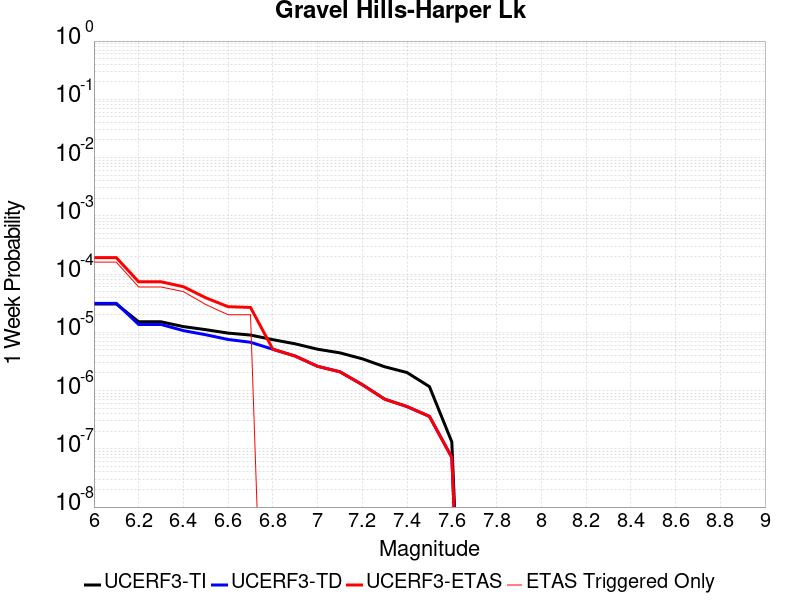 |  |  |  |

| Magnitude | 1 wk TI Prob | 1 wk TD Prob | 1 wk ETAS Prob | 1 wk ETAS/TD Gain | 1 wk ETAS Triggered Only | 1 mo TI Prob | 1 mo TD Prob | 1 mo ETAS Prob | 1 mo ETAS/TD Gain | 1 mo ETAS Triggered Only | 1 yr TI Prob | 1 yr TD Prob | 1 yr ETAS Prob | 1 yr ETAS/TD Gain | 1 yr ETAS Triggered Only | 10 yr TI Prob | 10 yr TD Prob | 10 yr ETAS Prob | 10 yr ETAS/TD Gain | 10 yr ETAS Triggered Only |
|-----|-----|-----|-----|-----|-----|-----|-----|-----|-----|-----|-----|-----|-----|-----|-----|-----|-----|-----|-----|-----|
| 6.0 | 3.0679566E-5 | 3.1465726E-5 | 2.4177037E-4 | 7.6836104 | 2.1031126E-4 | 1.3147724E-4 | 1.3484736E-4 | 7.056152E-4 | 5.232696 | 5.7084486E-4 | 0.0015995599 | 0.0016407467 | 0.0034104618 | 2.0786035 | 0.0017726235 | 0.015880952 | 0.016307894 | 0.019617999 | 1.2029756 | 0.0033649802 |
| 6.1 | 3.0679566E-5 | 3.1465726E-5 | 2.4177037E-4 | 7.6836104 | 2.1031126E-4 | 1.3147724E-4 | 1.3484736E-4 | 7.056152E-4 | 5.232696 | 5.7084486E-4 | 0.0015995599 | 0.0016407467 | 0.0034104618 | 2.0786035 | 0.0017726235 | 0.015880952 | 0.016307894 | 0.019617999 | 1.2029756 | 0.0033649802 |
| 6.2 | 1.514536E-5 | 1.363558E-5 | 4.3679636E-5 | 3.2033575 | 3.0044466E-5 | 6.490707E-5 | 5.8436955E-5 | 1.1852238E-4 | 2.0282092 | 6.0088933E-5 | 7.8995706E-4 | 7.112496E-4 | 0.0012816885 | 1.8020234 | 5.7084486E-4 | 0.007871548 | 0.0070909336 | 0.00807537 | 1.1388304 | 9.914674E-4 |
| 6.3 | 1.514536E-5 | 1.363558E-5 | 4.3679636E-5 | 3.2033575 | 3.0044466E-5 | 6.490707E-5 | 5.8436955E-5 | 1.1852238E-4 | 2.0282092 | 6.0088933E-5 | 7.8995706E-4 | 7.112496E-4 | 0.0012816885 | 1.8020234 | 5.7084486E-4 | 0.007871548 | 0.0070909336 | 0.00807537 | 1.1388304 | 9.914674E-4 |
| 6.4 | 1.2532521E-5 | 1.0689963E-5 | 4.0734107E-5 | 3.8105001 | 3.0044466E-5 | 5.37097E-5 | 4.5813358E-5 | 1.0589954E-4 | 2.3115427 | 6.0088933E-5 | 6.537194E-4 | 5.5764074E-4 | 8.579178E-4 | 1.5384778 | 3.0044466E-4 | 0.0065179965 | 0.0055630044 | 0.006100796 | 1.0966729 | 5.408004E-4 |
| 6.5 | 1.1094058E-5 | 9.083887E-6 | 3.912808E-5 | 4.307416 | 3.0044466E-5 | 4.7545094E-5 | 3.8930382E-5 | 9.901698E-5 | 2.543437 | 6.0088933E-5 | 5.787078E-4 | 4.7387838E-4 | 7.141202E-4 | 1.5069693 | 2.4035573E-4 | 0.0057720304 | 0.0047290865 | 0.0051178173 | 1.0822 | 3.9057806E-4 |
| 6.6 | 9.688328E-6 | 7.5318753E-6 | 3.7576116E-5 | 4.9889455 | 3.0044466E-5 | 4.1520743E-5 | 3.227908E-5 | 6.232258E-5 | 1.930742 | 3.0044466E-5 | 5.053978E-4 | 3.9292948E-4 | 5.7312544E-4 | 1.4585962 | 1.802668E-4 | 0.0050424994 | 0.003922604 | 0.0041320906 | 1.0534049 | 2.1031126E-4 |
| 6.7 | 8.974824E-6 | 6.749573E-6 | 3.6793837E-5 | 5.4512835 | 3.0044466E-5 | 3.8462964E-5 | 2.8926434E-5 | 5.897003E-5 | 2.038621 | 3.0044466E-5 | 4.6818596E-4 | 3.5212463E-4 | 5.0229405E-4 | 1.4264667 | 1.5022233E-4 | 0.004672008 | 0.0035158878 | 0.0036955208 | 1.0510918 | 1.802668E-4 |
| 6.8 | 7.4780046E-6 | 5.116314E-6 | 5.116314E-6 | 1.0 | 0.0 | 3.20482E-5 | 2.1926882E-5 | 2.1926882E-5 | 1.0 | 0.0 | 3.9011694E-4 | 2.669285E-4 | 3.2700138E-4 | 1.2250524 | 6.0088933E-5 | 0.0038943281 | 0.0026662168 | 0.00275611 | 1.0337156 | 9.01334E-5 |
| 6.9 | 6.3409307E-6 | 3.9075912E-6 | 3.9075912E-6 | 1.0 | 0.0 | 2.7175134E-5 | 1.6746717E-5 | 1.6746717E-5 | 1.0 | 0.0 | 3.3080703E-4 | 2.038732E-4 | 2.3391155E-4 | 1.1473384 | 3.0044466E-5 | 0.0033031502 | 0.0020369599 | 0.0020969263 | 1.0294392 | 6.0088933E-5 |
| 7.0 | 5.1239335E-6 | 2.605923E-6 | 2.605923E-6 | 1.0 | 0.0 | 2.195953E-5 | 1.1168196E-5 | 1.1168196E-5 | 1.0 | 0.0 | 2.6732447E-4 | 1.3596455E-4 | 1.3596455E-4 | 1.0 | 0.0 | 0.0026700313 | 0.001358839 | 0.0013888426 | 1.0220803 | 3.0044466E-5 |
| 7.1 | 4.438899E-6 | 2.098529E-6 | 2.098529E-6 | 1.0 | 0.0 | 1.9023713E-5 | 8.993666E-6 | 8.993666E-6 | 1.0 | 0.0 | 2.315891E-4 | 1.094926E-4 | 1.094926E-4 | 1.0 | 0.0 | 0.002313479 | 0.0010944083 | 0.0010944083 | 1.0 | 0.0 |
| 7.2 | 3.50367E-6 | 1.2616134E-6 | 1.2616134E-6 | 1.0 | 0.0 | 1.5015643E-5 | 5.4069037E-6 | 5.4069037E-6 | 1.0 | 0.0 | 1.8280011E-4 | 6.5827146E-5 | 6.5827146E-5 | 1.0 | 0.0 | 0.0018264982 | 6.580847E-4 | 6.580847E-4 | 1.0 | 0.0 |
| 7.3 | 2.561638E-6 | 7.1194825E-7 | 7.1194825E-7 | 1.0 | 0.0 | 1.0978401E-5 | 3.0512035E-6 | 3.0512035E-6 | 1.0 | 0.0 | 1.3365384E-4 | 3.7147787E-5 | 3.7147787E-5 | 1.0 | 0.0 | 0.0013357349 | 3.714178E-4 | 3.714178E-4 | 1.0 | 0.0 |
| 7.4 | 2.0368864E-6 | 5.305101E-7 | 5.305101E-7 | 1.0 | 0.0 | 8.729483E-6 | 2.2736126E-6 | 2.2736126E-6 | 1.0 | 0.0 | 1.06276275E-4 | 2.7680888E-5 | 2.7680888E-5 | 1.0 | 0.0 | 0.0010622547 | 2.7677492E-4 | 2.7677492E-4 | 1.0 | 0.0 |
| 7.5 | 1.1681728E-6 | 3.603199E-7 | 3.603199E-7 | 1.0 | 0.0 | 5.0064455E-6 | 1.5442272E-6 | 1.5442272E-6 | 1.0 | 0.0 | 6.0951766E-5 | 1.8800809E-5 | 1.8800809E-5 | 1.0 | 0.0 | 6.093505E-4 | 1.8799266E-4 | 1.8799266E-4 | 1.0 | 0.0 |
| 7.6 | 1.3154387E-7 | 7.119914E-8 | 7.119914E-8 | 1.0 | 0.0 | 5.6375933E-7 | 3.0513914E-7 | 3.0513914E-7 | 1.0 | 0.0 | 6.863748E-6 | 3.7150644E-6 | 3.7150644E-6 | 1.0 | 0.0 | 6.863536E-5 | 3.715018E-5 | 3.715018E-5 | 1.0 | 0.0 |

## Death Valley (So)
*[(top)](#table-of-contents)*

| 1 Week | 1 Month | 1 Year | 10 Year |
|-----|-----|-----|-----|
|  |  |  |  |

| Magnitude | 1 wk TI Prob | 1 wk TD Prob | 1 wk ETAS Prob | 1 wk ETAS/TD Gain | 1 wk ETAS Triggered Only | 1 mo TI Prob | 1 mo TD Prob | 1 mo ETAS Prob | 1 mo ETAS/TD Gain | 1 mo ETAS Triggered Only | 1 yr TI Prob | 1 yr TD Prob | 1 yr ETAS Prob | 1 yr ETAS/TD Gain | 1 yr ETAS Triggered Only | 10 yr TI Prob | 10 yr TD Prob | 10 yr ETAS Prob | 10 yr ETAS/TD Gain | 10 yr ETAS Triggered Only |
|-----|-----|-----|-----|-----|-----|-----|-----|-----|-----|-----|-----|-----|-----|-----|-----|-----|-----|-----|-----|-----|
| 6.0 | 2.0684236E-5 | 2.5619069E-5 | 8.570646E-5 | 3.3454168 | 6.0088933E-5 | 8.864371E-5 | 1.0979148E-4 | 4.4024433E-4 | 4.0098224 | 3.3048913E-4 | 0.0010787029 | 0.0013359085 | 0.0024160643 | 1.8085552 | 0.0010816008 | 0.010734817 | 0.013282061 | 0.015446176 | 1.1629351 | 0.002193246 |
| 6.1 | 2.0684236E-5 | 2.5619069E-5 | 8.570646E-5 | 3.3454168 | 6.0088933E-5 | 8.864371E-5 | 1.0979148E-4 | 4.4024433E-4 | 4.0098224 | 3.3048913E-4 | 0.0010787029 | 0.0013359085 | 0.0024160643 | 1.8085552 | 0.0010816008 | 0.010734817 | 0.013282061 | 0.015446176 | 1.1629351 | 0.002193246 |
| 6.2 | 2.0684236E-5 | 2.5619069E-5 | 8.570646E-5 | 3.3454168 | 6.0088933E-5 | 8.864371E-5 | 1.0979148E-4 | 4.4024433E-4 | 4.0098224 | 3.3048913E-4 | 0.0010787029 | 0.0013359085 | 0.0024160643 | 1.8085552 | 0.0010816008 | 0.010734817 | 0.013282061 | 0.015446176 | 1.1629351 | 0.002193246 |
| 6.3 | 2.0240292E-5 | 2.5119136E-5 | 5.5162847E-5 | 2.1960487 | 3.0044466E-5 | 8.6741224E-5 | 1.07649095E-4 | 4.080614E-4 | 3.7906628 | 3.0044466E-4 | 0.0010555626 | 0.0013098564 | 0.0023300303 | 1.778844 | 0.0010215119 | 0.010505628 | 0.013024611 | 0.015041026 | 1.1548157 | 0.0020430237 |
| 6.4 | 2.0240292E-5 | 2.5119136E-5 | 5.5162847E-5 | 2.1960487 | 3.0044466E-5 | 8.6741224E-5 | 1.07649095E-4 | 4.080614E-4 | 3.7906628 | 3.0044466E-4 | 0.0010555626 | 0.0013098564 | 0.0023300303 | 1.778844 | 0.0010215119 | 0.010505628 | 0.013024611 | 0.015041026 | 1.1548157 | 0.0020430237 |
| 6.5 | 1.9962767E-5 | 2.480838E-5 | 5.48521E-5 | 2.2110312 | 3.0044466E-5 | 8.55519E-5 | 1.06317384E-4 | 4.067301E-4 | 3.8256216 | 3.0044466E-4 | 0.0010410968 | 0.0012936622 | 0.0023138525 | 1.7886064 | 0.0010215119 | 0.010362327 | 0.012864553 | 0.014881294 | 1.1567672 | 0.0020430237 |
| 6.6 | 1.8937297E-5 | 2.3312172E-5 | 5.335594E-5 | 2.2887588 | 3.0044466E-5 | 8.115732E-5 | 9.990556E-5 | 4.0032022E-4 | 4.006986 | 3.0044466E-4 | 9.876423E-4 | 0.0012156861 | 0.0021759402 | 1.7898866 | 9.614229E-4 | 0.009832645 | 0.01209341 | 0.014022684 | 1.159531 | 0.0019528903 |
| 6.7 | 1.8621096E-5 | 2.2912802E-5 | 5.2956577E-5 | 2.3112223 | 3.0044466E-5 | 7.980225E-5 | 9.8194105E-5 | 3.9860926E-4 | 4.059401 | 3.0044466E-4 | 9.711593E-4 | 0.0011948721 | 0.002155146 | 1.8036628 | 9.614229E-4 | 0.009669261 | 0.011887519 | 0.013757819 | 1.1573331 | 0.0018928014 |
| 6.8 | 1.7830353E-5 | 2.1806807E-5 | 2.1806807E-5 | 1.0 | 0.0 | 7.641356E-5 | 9.345448E-5 | 3.638294E-4 | 3.8931189 | 2.704002E-4 | 9.29938E-4 | 0.0011372284 | 0.0020375373 | 1.7916694 | 9.01334E-4 | 0.009260561 | 0.011316931 | 0.013128903 | 1.1601115 | 0.0018327124 |
| 6.9 | 1.3135183E-5 | 1.5304558E-5 | 1.5304558E-5 | 1.0 | 0.0 | 5.6292425E-5 | 6.5589345E-5 | 1.5571683E-4 | 2.3741176 | 9.01334E-5 | 6.8514474E-4 | 7.982642E-4 | 0.0012785919 | 1.6017152 | 4.8071146E-4 | 0.006830362 | 0.007954976 | 0.008998167 | 1.1311369 | 0.0010515563 |
| 7.0 | 1.1507512E-5 | 1.31546885E-5 | 1.31546885E-5 | 1.0 | 0.0 | 4.9316975E-5 | 5.637605E-5 | 1.164616E-4 | 2.065799 | 6.0088933E-5 | 6.002687E-4 | 6.8616803E-4 | 9.2635886E-4 | 1.3500466 | 2.4035573E-4 | 0.0059864987 | 0.006841195 | 0.0075871684 | 1.1090413 | 7.5111166E-4 |
| 7.1 | 9.715903E-6 | 1.08656295E-5 | 1.08656295E-5 | 1.0 | 0.0 | 4.1638916E-5 | 4.6566176E-5 | 4.6566176E-5 | 1.0 | 0.0 | 5.068359E-4 | 5.668E-4 | 6.2685483E-4 | 1.1059543 | 6.0088933E-5 | 0.0050568148 | 0.005653997 | 0.0060722413 | 1.0739732 | 4.2062253E-4 |
| 7.2 | 9.233269E-6 | 1.0286636E-5 | 1.0286636E-5 | 1.0 | 0.0 | 3.9570554E-5 | 4.408486E-5 | 4.408486E-5 | 1.0 | 0.0 | 4.81665E-4 | 5.366052E-4 | 5.966619E-4 | 1.1119196 | 6.0088933E-5 | 0.0048062233 | 0.0053535267 | 0.0056822463 | 1.0614024 | 3.3048913E-4 |
| 7.3 | 8.8041315E-6 | 9.808462E-6 | 9.808462E-6 | 1.0 | 0.0 | 3.7731446E-5 | 4.2035612E-5 | 4.2035612E-5 | 1.0 | 0.0 | 4.592835E-4 | 5.1166763E-4 | 5.717258E-4 | 1.1173774 | 6.0088933E-5 | 0.0045833546 | 0.005105322 | 0.005434124 | 1.0644038 | 3.3048913E-4 |
| 7.4 | 8.708749E-6 | 9.707472E-6 | 9.707472E-6 | 1.0 | 0.0 | 3.7322676E-5 | 4.160281E-5 | 4.160281E-5 | 1.0 | 0.0 | 4.5430884E-4 | 5.064007E-4 | 5.664592E-4 | 1.1185988 | 6.0088933E-5 | 0.004533812 | 0.0050528934 | 0.0053817127 | 1.0650754 | 3.3048913E-4 |
| 7.5 | 8.612678E-6 | 9.605112E-6 | 9.605112E-6 | 1.0 | 0.0 | 3.6910955E-5 | 4.116414E-5 | 4.116414E-5 | 1.0 | 0.0 | 4.492982E-4 | 5.010624E-4 | 5.6112115E-4 | 1.1198629 | 6.0088933E-5 | 0.004483909 | 0.0049997517 | 0.0053285887 | 1.0657706 | 3.3048913E-4 |
| 7.6 | 8.319024E-6 | 9.284203E-6 | 9.284203E-6 | 1.0 | 0.0 | 3.5652476E-5 | 3.9788858E-5 | 3.9788858E-5 | 1.0 | 0.0 | 4.3398244E-4 | 4.8432586E-4 | 5.443857E-4 | 1.1240071 | 6.0088933E-5 | 0.0043313587 | 0.0048331274 | 0.0051620193 | 1.0680494 | 3.3048913E-4 |
| 7.7 | 7.4718328E-6 | 8.34543E-6 | 8.34543E-6 | 1.0 | 0.0 | 3.2021748E-5 | 3.5765657E-5 | 3.5765657E-5 | 1.0 | 0.0 | 3.8979502E-4 | 4.3536394E-4 | 4.954267E-4 | 1.13796 | 6.0088933E-5 | 0.00389112 | 0.0043455157 | 0.0046147406 | 1.0619547 | 2.704002E-4 |
| 7.8 | 3.4586725E-7 | 3.6483146E-7 | 3.6483146E-7 | 1.0 | 0.0 | 1.4822873E-6 | 1.5635625E-6 | 1.5635625E-6 | 1.0 | 0.0 | 1.80467E-5 | 1.9036212E-5 | 4.9080107E-5 | 2.5782497 | 3.0044466E-5 | 1.8045233E-4 | 1.9034625E-4 | 2.20385E-4 | 1.157811 | 3.0044466E-5 |
| 7.9 | 2.5591178E-9 | 2.6697022E-9 | 2.6697022E-9 | 1.0 | 0.0 | 1.0967647E-8 | 1.1441582E-8 | 1.1441582E-8 | 1.0 | 0.0 | 1.335311E-7 | 1.3930125E-7 | 1.3930125E-7 | 1.0 | 0.0 | 1.3353102E-6 | 1.3930126E-6 | 1.3930126E-6 | 1.0 | 0.0 |

## So Sierra Nevada
*[(top)](#table-of-contents)*

| 1 Week | 1 Month | 1 Year | 10 Year |
|-----|-----|-----|-----|
|  |  |  |  |

| Magnitude | 1 wk TI Prob | 1 wk TD Prob | 1 wk ETAS Prob | 1 wk ETAS/TD Gain | 1 wk ETAS Triggered Only | 1 mo TI Prob | 1 mo TD Prob | 1 mo ETAS Prob | 1 mo ETAS/TD Gain | 1 mo ETAS Triggered Only | 1 yr TI Prob | 1 yr TD Prob | 1 yr ETAS Prob | 1 yr ETAS/TD Gain | 1 yr ETAS Triggered Only | 10 yr TI Prob | 10 yr TD Prob | 10 yr ETAS Prob | 10 yr ETAS/TD Gain | 10 yr ETAS Triggered Only |
|-----|-----|-----|-----|-----|-----|-----|-----|-----|-----|-----|-----|-----|-----|-----|-----|-----|-----|-----|-----|-----|
| 6.0 | 1.15488665E-5 | 1.1079801E-5 | 1.6130047E-4 | 14.558065 | 1.5022233E-4 | 4.9494203E-5 | 4.7484067E-5 | 3.1787143E-4 | 6.6942754 | 2.704002E-4 | 6.024253E-4 | 5.779779E-4 | 0.0016889806 | 2.9222236 | 0.0011116453 | 0.006007948 | 0.005766016 | 0.007827131 | 1.3574591 | 0.0020730682 |
| 6.1 | 1.15488665E-5 | 1.1079801E-5 | 1.6130047E-4 | 14.558065 | 1.5022233E-4 | 4.9494203E-5 | 4.7484067E-5 | 3.1787143E-4 | 6.6942754 | 2.704002E-4 | 6.024253E-4 | 5.779779E-4 | 0.0016889806 | 2.9222236 | 0.0011116453 | 0.006007948 | 0.005766016 | 0.007827131 | 1.3574591 | 0.0020730682 |
| 6.2 | 1.15488665E-5 | 1.1079801E-5 | 1.6130047E-4 | 14.558065 | 1.5022233E-4 | 4.9494203E-5 | 4.7484067E-5 | 3.1787143E-4 | 6.6942754 | 2.704002E-4 | 6.024253E-4 | 5.779779E-4 | 0.0016889806 | 2.9222236 | 0.0011116453 | 0.006007948 | 0.005766016 | 0.007827131 | 1.3574591 | 0.0020730682 |
| 6.3 | 1.15488665E-5 | 1.1079801E-5 | 1.6130047E-4 | 14.558065 | 1.5022233E-4 | 4.9494203E-5 | 4.7484067E-5 | 3.1787143E-4 | 6.6942754 | 2.704002E-4 | 6.024253E-4 | 5.779779E-4 | 0.0016889806 | 2.9222236 | 0.0011116453 | 0.006007948 | 0.005766016 | 0.007827131 | 1.3574591 | 0.0020730682 |
| 6.4 | 1.15488665E-5 | 1.1079801E-5 | 1.6130047E-4 | 14.558065 | 1.5022233E-4 | 4.9494203E-5 | 4.7484067E-5 | 3.1787143E-4 | 6.6942754 | 2.704002E-4 | 6.024253E-4 | 5.779779E-4 | 0.0016889806 | 2.9222236 | 0.0011116453 | 0.006007948 | 0.005766016 | 0.007827131 | 1.3574591 | 0.0020730682 |
| 6.5 | 1.15488665E-5 | 1.1079801E-5 | 1.6130047E-4 | 14.558065 | 1.5022233E-4 | 4.9494203E-5 | 4.7484067E-5 | 3.1787143E-4 | 6.6942754 | 2.704002E-4 | 6.024253E-4 | 5.779779E-4 | 0.0016889806 | 2.9222236 | 0.0011116453 | 0.006007948 | 0.005766016 | 0.007827131 | 1.3574591 | 0.0020730682 |
| 6.6 | 7.587044E-6 | 6.9357425E-6 | 6.702426E-5 | 9.663602 | 6.0088933E-5 | 3.2515498E-5 | 2.972429E-5 | 1.7994216E-4 | 6.0537076 | 1.5022233E-4 | 3.9580427E-4 | 3.6183605E-4 | 0.0011126759 | 3.075083 | 7.5111166E-4 | 0.003951 | 0.0036127607 | 0.004989813 | 1.3811635 | 0.0013820454 |
| 6.7 | 7.587044E-6 | 6.9357425E-6 | 6.702426E-5 | 9.663602 | 6.0088933E-5 | 3.2515498E-5 | 2.972429E-5 | 1.7994216E-4 | 6.0537076 | 1.5022233E-4 | 3.9580427E-4 | 3.6183605E-4 | 0.0011126759 | 3.075083 | 7.5111166E-4 | 0.003951 | 0.0036127607 | 0.004989813 | 1.3811635 | 0.0013820454 |
| 6.8 | 5.9026956E-6 | 5.1794805E-6 | 3.522379E-5 | 6.800642 | 3.0044466E-5 | 2.5297022E-5 | 2.219759E-5 | 1.4237278E-4 | 6.4138846 | 1.20177865E-4 | 3.0794772E-4 | 2.702233E-4 | 8.409139E-4 | 3.111922 | 5.7084486E-4 | 0.0030752132 | 0.0026990636 | 0.0037178183 | 1.3774475 | 0.0010215119 |
| 6.9 | 5.0118915E-6 | 4.252503E-6 | 3.429684E-5 | 8.065095 | 3.0044466E-5 | 2.1479358E-5 | 1.822489E-5 | 1.08356646E-4 | 5.945531 | 9.01334E-5 | 2.614798E-4 | 2.2186617E-4 | 5.8231974E-4 | 2.6246443 | 3.605336E-4 | 0.0026117235 | 0.002216519 | 0.002965966 | 1.3381188 | 7.5111166E-4 |
| 7.0 | 4.4924795E-6 | 3.71399E-6 | 3.3758344E-5 | 9.089509 | 3.0044466E-5 | 1.925334E-5 | 1.5917007E-5 | 1.0604897E-4 | 6.6626205 | 9.01334E-5 | 2.3438422E-4 | 1.9377295E-4 | 5.2419805E-4 | 2.7052178 | 3.3048913E-4 | 0.0023413717 | 0.0019361029 | 0.0026257876 | 1.3562232 | 6.910227E-4 |
| 7.1 | 3.9118436E-6 | 3.1120435E-6 | 3.3156415E-5 | 10.654226 | 3.0044466E-5 | 1.6764936E-5 | 1.3337264E-5 | 7.342539E-5 | 5.5052814 | 6.0088933E-5 | 2.0409399E-4 | 1.6236966E-4 | 3.7264678E-4 | 2.2950518 | 2.1031126E-4 | 0.0020390663 | 0.0016225664 | 0.0021624893 | 1.3327585 | 5.408004E-4 |
| 7.2 | 3.4200818E-6 | 2.6055152E-6 | 3.2649903E-5 | 12.531074 | 3.0044466E-5 | 1.4657411E-5 | 1.11664485E-5 | 7.125471E-5 | 6.3811436 | 6.0088933E-5 | 1.7843937E-4 | 1.3594353E-4 | 2.8614543E-4 | 2.1048846 | 1.5022233E-4 | 0.0017829615 | 0.0013586534 | 0.0018087082 | 1.3312505 | 4.50667E-4 |
| 7.3 | 2.6593618E-6 | 1.8284734E-6 | 3.1872885E-5 | 17.431417 | 3.0044466E-5 | 1.13972155E-5 | 7.836293E-6 | 6.792475E-5 | 8.667971 | 6.0088933E-5 | 1.3875226E-4 | 9.540298E-5 | 2.1556938E-4 | 2.2595665 | 1.20177865E-4 | 0.0013866565 | 9.5364917E-4 | 0.0012538073 | 1.314747 | 3.0044466E-4 |
| 7.4 | 2.2577992E-6 | 1.4364865E-6 | 1.4364865E-6 | 1.0 | 0.0 | 9.676246E-6 | 6.1563574E-6 | 3.620064E-5 | 5.880204 | 3.0044466E-5 | 1.1780193E-4 | 7.495133E-5 | 1.3503576E-4 | 1.8016459 | 6.0088933E-5 | 0.001177395 | 7.4928557E-4 | 9.2941726E-4 | 1.2404046 | 1.802668E-4 |
| 7.5 | 1.489319E-6 | 7.354316E-7 | 7.354316E-7 | 1.0 | 0.0 | 6.3827797E-6 | 3.1518462E-6 | 3.1518462E-6 | 1.0 | 0.0 | 7.770758E-5 | 3.8373055E-5 | 6.841637E-5 | 1.7829273 | 3.0044466E-5 | 7.7680405E-4 | 3.8366474E-4 | 4.7376353E-4 | 1.2348374 | 9.01334E-5 |
| 7.6 | 1.0680322E-6 | 4.6599368E-7 | 4.6599368E-7 | 1.0 | 0.0 | 4.577273E-6 | 1.9971142E-6 | 1.9971142E-6 | 1.0 | 0.0 | 5.5726876E-5 | 2.4314597E-5 | 5.4358334E-5 | 2.2356255 | 3.0044466E-5 | 5.5712904E-4 | 2.4311963E-4 | 3.0319396E-4 | 1.2470977 | 6.0088933E-5 |
| 7.7 | 5.509146E-7 | 1.5581914E-7 | 1.5581914E-7 | 1.0 | 0.0 | 2.3610605E-6 | 6.6779614E-7 | 6.6779614E-7 | 1.0 | 0.0 | 2.8745531E-5 | 8.130389E-6 | 8.130389E-6 | 1.0 | 0.0 | 2.8741814E-4 | 8.130103E-5 | 8.130103E-5 | 1.0 | 0.0 |

## Coyote Canyon
*[(top)](#table-of-contents)*

| 1 Week | 1 Month | 1 Year | 10 Year |
|-----|-----|-----|-----|
|  |  |  |  |

| Magnitude | 1 wk TI Prob | 1 wk TD Prob | 1 wk ETAS Prob | 1 wk ETAS/TD Gain | 1 wk ETAS Triggered Only | 1 mo TI Prob | 1 mo TD Prob | 1 mo ETAS Prob | 1 mo ETAS/TD Gain | 1 mo ETAS Triggered Only | 1 yr TI Prob | 1 yr TD Prob | 1 yr ETAS Prob | 1 yr ETAS/TD Gain | 1 yr ETAS Triggered Only | 10 yr TI Prob | 10 yr TD Prob | 10 yr ETAS Prob | 10 yr ETAS/TD Gain | 10 yr ETAS Triggered Only |
|-----|-----|-----|-----|-----|-----|-----|-----|-----|-----|-----|-----|-----|-----|-----|-----|-----|-----|-----|-----|-----|
| 6.0 | 3.5090034E-5 | 4.0365936E-5 | 4.0365936E-5 | 1.0 | 0.0 | 1.503772E-4 | 1.7298684E-4 | 2.3306538E-4 | 1.3473012 | 6.0088933E-5 | 0.0018293047 | 0.0021043366 | 0.0028238865 | 1.3419367 | 7.210672E-4 | 0.018143194 | 0.020870026 | 0.022664491 | 1.0859828 | 0.0018327124 |
| 6.1 | 3.5090034E-5 | 4.0365936E-5 | 4.0365936E-5 | 1.0 | 0.0 | 1.503772E-4 | 1.7298684E-4 | 2.3306538E-4 | 1.3473012 | 6.0088933E-5 | 0.0018293047 | 0.0021043366 | 0.0028238865 | 1.3419367 | 7.210672E-4 | 0.018143194 | 0.020870026 | 0.022664491 | 1.0859828 | 0.0018327124 |
| 6.2 | 1.841879E-5 | 2.1060594E-5 | 2.1060594E-5 | 1.0 | 0.0 | 7.8935285E-5 | 9.025714E-5 | 1.202989E-4 | 1.3328463 | 3.0044466E-5 | 9.606133E-4 | 0.0010984287 | 0.0014285549 | 1.3005439 | 3.3048913E-4 | 0.0095647145 | 0.010940081 | 0.011920702 | 1.0896356 | 9.914674E-4 |
| 6.3 | 1.841879E-5 | 2.1060594E-5 | 2.1060594E-5 | 1.0 | 0.0 | 7.8935285E-5 | 9.025714E-5 | 1.202989E-4 | 1.3328463 | 3.0044466E-5 | 9.606133E-4 | 0.0010984287 | 0.0014285549 | 1.3005439 | 3.3048913E-4 | 0.0095647145 | 0.010940081 | 0.011920702 | 1.0896356 | 9.914674E-4 |
| 6.4 | 1.712201E-5 | 1.9565952E-5 | 1.9565952E-5 | 1.0 | 0.0 | 7.337798E-5 | 8.3851955E-5 | 8.3851955E-5 | 1.0 | 0.0 | 8.930107E-4 | 0.00102052 | 0.0012906442 | 1.2646928 | 2.704002E-4 | 0.008894307 | 0.010168254 | 0.011060423 | 1.0877407 | 9.01334E-4 |
| 6.5 | 1.4744935E-5 | 1.6837605E-5 | 1.6837605E-5 | 1.0 | 0.0 | 6.3191044E-5 | 7.2159695E-5 | 7.2159695E-5 | 1.0 | 0.0 | 7.6907943E-4 | 8.782837E-4 | 0.0011184283 | 1.2734249 | 2.4035573E-4 | 0.007664232 | 0.008757323 | 0.009591201 | 1.0952207 | 8.4124506E-4 |
| 6.6 | 1.2017839E-5 | 1.3724606E-5 | 1.3724606E-5 | 1.0 | 0.0 | 5.150401E-5 | 5.8818914E-5 | 5.8818914E-5 | 1.0 | 0.0 | 6.268809E-4 | 7.1597355E-4 | 8.961113E-4 | 1.2515982 | 1.802668E-4 | 0.0062511545 | 0.0071453624 | 0.007891107 | 1.1043676 | 7.5111166E-4 |
| 6.7 | 1.00956095E-5 | 1.1533953E-5 | 1.1533953E-5 | 1.0 | 0.0 | 4.326618E-5 | 4.943078E-5 | 4.943078E-5 | 1.0 | 0.0 | 5.266384E-4 | 6.0174055E-4 | 7.518725E-4 | 1.2494961 | 1.5022233E-4 | 0.005253921 | 0.0060096392 | 0.0066367816 | 1.104356 | 6.309338E-4 |

## San Andreas (Mojave S)
*[(top)](#table-of-contents)*

| 1 Week | 1 Month | 1 Year | 10 Year |
|-----|-----|-----|-----|
|  |  |  |  |

| Magnitude | 1 wk TI Prob | 1 wk TD Prob | 1 wk ETAS Prob | 1 wk ETAS/TD Gain | 1 wk ETAS Triggered Only | 1 mo TI Prob | 1 mo TD Prob | 1 mo ETAS Prob | 1 mo ETAS/TD Gain | 1 mo ETAS Triggered Only | 1 yr TI Prob | 1 yr TD Prob | 1 yr ETAS Prob | 1 yr ETAS/TD Gain | 1 yr ETAS Triggered Only | 10 yr TI Prob | 10 yr TD Prob | 10 yr ETAS Prob | 10 yr ETAS/TD Gain | 10 yr ETAS Triggered Only |
|-----|-----|-----|-----|-----|-----|-----|-----|-----|-----|-----|-----|-----|-----|-----|-----|-----|-----|-----|-----|-----|
| 6.0 | 3.1064058E-4 | 6.7480345E-4 | 7.0482766E-4 | 1.0444932 | 3.0044466E-5 | 0.0013306376 | 0.0028889377 | 0.0031885144 | 1.1036979 | 3.0044466E-4 | 0.016080605 | 0.03463161 | 0.035414718 | 1.0226125 | 8.112006E-4 | 0.1496549 | 0.2866709 | 0.28791392 | 1.0043361 | 0.001742579 |
| 6.1 | 3.1064058E-4 | 6.7480345E-4 | 7.0482766E-4 | 1.0444932 | 3.0044466E-5 | 0.0013306376 | 0.0028889377 | 0.0031885144 | 1.1036979 | 3.0044466E-4 | 0.016080605 | 0.03463161 | 0.035414718 | 1.0226125 | 8.112006E-4 | 0.1496549 | 0.2866709 | 0.28791392 | 1.0043361 | 0.001742579 |
| 6.2 | 3.1064058E-4 | 6.7480345E-4 | 7.0482766E-4 | 1.0444932 | 3.0044466E-5 | 0.0013306376 | 0.0028889377 | 0.0031885144 | 1.1036979 | 3.0044466E-4 | 0.016080605 | 0.03463161 | 0.035414718 | 1.0226125 | 8.112006E-4 | 0.1496549 | 0.2866709 | 0.28791392 | 1.0043361 | 0.001742579 |
| 6.3 | 3.1064058E-4 | 6.7480345E-4 | 7.0482766E-4 | 1.0444932 | 3.0044466E-5 | 0.0013306376 | 0.0028889377 | 0.0031885144 | 1.1036979 | 3.0044466E-4 | 0.016080605 | 0.03463161 | 0.035414718 | 1.0226125 | 8.112006E-4 | 0.1496549 | 0.2866709 | 0.28791392 | 1.0043361 | 0.001742579 |
| 6.4 | 1.9872203E-4 | 4.3197922E-4 | 4.620107E-4 | 1.0695207 | 3.0044466E-5 | 8.5138786E-4 | 0.0018500541 | 0.002149943 | 1.1620973 | 3.0044466E-4 | 0.010316478 | 0.022297915 | 0.023002904 | 1.0316168 | 7.210672E-4 | 0.098504856 | 0.1970686 | 0.1982989 | 1.006243 | 0.0015322678 |
| 6.5 | 1.291105E-4 | 2.8770286E-4 | 3.1773868E-4 | 1.1043987 | 3.0044466E-5 | 5.5321335E-4 | 0.0012324324 | 0.0015325068 | 1.2434814 | 3.0044466E-4 | 0.006714592 | 0.014902458 | 0.015583183 | 1.0456787 | 6.910227E-4 | 0.065152965 | 0.13810734 | 0.13932441 | 1.0088125 | 0.0014120899 |
| 6.6 | 1.291105E-4 | 2.8770286E-4 | 3.1773868E-4 | 1.1043987 | 3.0044466E-5 | 5.5321335E-4 | 0.0012324324 | 0.0015325068 | 1.2434814 | 3.0044466E-4 | 0.006714592 | 0.014902458 | 0.015583183 | 1.0456787 | 6.910227E-4 | 0.065152965 | 0.13810734 | 0.13932441 | 1.0088125 | 0.0014120899 |
| 6.7 | 1.08001186E-4 | 2.4351236E-4 | 2.7354952E-4 | 1.1233495 | 3.0044466E-5 | 4.6278012E-4 | 0.0010432076 | 0.0013433389 | 1.2877004 | 3.0044466E-4 | 0.0056198016 | 0.012627386 | 0.013309683 | 1.0540332 | 6.910227E-4 | 0.054797906 | 0.11925044 | 0.12046768 | 1.0102074 | 0.0013820454 |
| 6.8 | 1.0624356E-4 | 2.3868853E-4 | 2.6872582E-4 | 1.125843 | 3.0044466E-5 | 4.5525006E-4 | 0.0010225503 | 0.0013226877 | 1.2935185 | 3.0044466E-4 | 0.0055285925 | 0.01237876 | 0.013061228 | 1.0551323 | 6.910227E-4 | 0.053930566 | 0.11719959 | 0.11841966 | 1.0104102 | 0.0013820454 |
| 6.9 | 1.0393785E-4 | 2.323913E-4 | 2.624288E-4 | 1.1292539 | 3.0044466E-5 | 4.4537184E-4 | 9.95583E-4 | 0.0012957286 | 1.3014772 | 3.0044466E-4 | 0.0054089287 | 0.012054106 | 0.012736799 | 1.0566357 | 6.910227E-4 | 0.05279156 | 0.11449702 | 0.11572082 | 1.0106885 | 0.0013820454 |
| 7.0 | 1.0155622E-4 | 2.2608582E-4 | 2.561235E-4 | 1.1328596 | 3.0044466E-5 | 4.3516833E-4 | 9.685798E-4 | 0.0012687334 | 1.3098905 | 3.0044466E-4 | 0.005285311 | 0.011728923 | 0.012382149 | 1.0556936 | 6.6097826E-4 | 0.05161361 | 0.111757115 | 0.11293133 | 1.0105069 | 0.0013219565 |
| 7.1 | 9.885595E-5 | 2.1896887E-4 | 2.4900676E-4 | 1.1371788 | 3.0044466E-5 | 4.2359953E-4 | 9.381008E-4 | 0.0012382637 | 1.3199686 | 3.0044466E-4 | 0.0051451353 | 0.011361765 | 0.012015233 | 1.0575147 | 6.6097826E-4 | 0.05027629 | 0.108641416 | 0.10979298 | 1.0105996 | 0.001291912 |
| 7.2 | 9.6411415E-5 | 2.125978E-4 | 2.4263588E-4 | 1.1412907 | 3.0044466E-5 | 4.1312634E-4 | 9.108156E-4 | 0.0012109866 | 1.3295629 | 3.0044466E-4 | 0.005018219 | 0.011032978 | 0.011686664 | 1.0592483 | 6.6097826E-4 | 0.049064007 | 0.105831034 | 0.106986225 | 1.0109154 | 0.001291912 |
| 7.3 | 9.1180635E-5 | 1.9487667E-4 | 2.2491527E-4 | 1.1541417 | 3.0044466E-5 | 3.907156E-4 | 8.3491846E-4 | 0.0011351123 | 1.3595487 | 3.0044466E-4 | 0.004746591 | 0.010117867 | 0.010772157 | 1.0646669 | 6.6097826E-4 | 0.046464786 | 0.098022886 | 0.099188164 | 1.0118878 | 0.001291912 |
| 7.4 | 8.887388E-5 | 1.8736067E-4 | 2.173995E-4 | 1.1603262 | 3.0044466E-5 | 3.8083247E-4 | 8.0272724E-4 | 0.0011029307 | 1.3739794 | 3.0044466E-4 | 0.0046267817 | 0.009729506 | 0.010384054 | 1.0672745 | 6.6097826E-4 | 0.045316286 | 0.094657235 | 0.09582686 | 1.0123564 | 0.001291912 |
| 7.5 | 8.6750515E-5 | 1.8067459E-4 | 2.1071362E-4 | 1.1662605 | 3.0044466E-5 | 3.7173493E-4 | 7.7408995E-4 | 0.001074302 | 1.3878258 | 3.0044466E-4 | 0.004516484 | 0.009383905 | 0.01003868 | 1.0697764 | 6.6097826E-4 | 0.04425787 | 0.09162046 | 0.092794 | 1.0128088 | 0.001291912 |
| 7.6 | 8.453092E-5 | 1.7454862E-4 | 2.0458785E-4 | 1.1720966 | 3.0044466E-5 | 3.6222505E-4 | 7.4785115E-4 | 0.0010180491 | 1.3612992 | 2.704002E-4 | 0.0044011753 | 0.009067151 | 0.009692363 | 1.0689536 | 6.309338E-4 | 0.04315024 | 0.088778876 | 0.08992872 | 1.0129517 | 0.0012618676 |
| 7.7 | 8.259102E-5 | 1.6976826E-4 | 1.9980762E-4 | 1.1769433 | 3.0044466E-5 | 3.539135E-4 | 7.2737545E-4 | 9.97579E-4 | 1.3714774 | 2.704002E-4 | 0.004300386 | 0.008819905 | 0.009445274 | 1.0709043 | 6.309338E-4 | 0.042181134 | 0.0865291 | 0.08768178 | 1.0133213 | 0.0012618676 |
| 7.8 | 7.444844E-5 | 1.5297718E-4 | 1.5297718E-4 | 1.0 | 0.0 | 3.1902574E-4 | 6.554518E-4 | 8.656252E-4 | 1.3206543 | 2.1031126E-4 | 0.0038772223 | 0.007950976 | 0.008487476 | 1.067476 | 5.408004E-4 | 0.03810269 | 0.078354426 | 0.079351276 | 1.0127224 | 0.0010816008 |
| 7.9 | 5.2586525E-5 | 1.0016126E-4 | 1.0016126E-4 | 1.0 | 0.0 | 2.2535135E-4 | 4.2919195E-4 | 5.793498E-4 | 1.3498617 | 1.5022233E-4 | 0.0027402006 | 0.0052129035 | 0.005631333 | 1.0802681 | 4.2062253E-4 | 0.027066574 | 0.05224533 | 0.0529572 | 1.0136255 | 7.5111166E-4 |
| 8.0 | 3.379877E-5 | 5.4130138E-5 | 5.4130138E-5 | 1.0 | 0.0 | 1.4484383E-4 | 2.3196569E-4 | 3.2207818E-4 | 1.3884734 | 9.01334E-5 | 0.0017620471 | 0.0028205265 | 0.002970325 | 1.0531101 | 1.5022233E-4 | 0.017481409 | 0.028862298 | 0.029124893 | 1.0090982 | 2.704002E-4 |
| 8.1 | 1.8668277E-5 | 1.9335645E-5 | 1.9335645E-5 | 1.0 | 0.0 | 8.000444E-5 | 8.286442E-5 | 8.286442E-5 | 1.0 | 0.0 | 9.736188E-4 | 0.001008408 | 0.0010384221 | 1.0297639 | 3.0044466E-5 | 0.009693642 | 0.010812608 | 0.010901767 | 1.0082458 | 9.01334E-5 |
| 8.2 | 8.541571E-6 | 5.470761E-6 | 5.470761E-6 | 1.0 | 0.0 | 3.660622E-5 | 2.344591E-5 | 2.344591E-5 | 1.0 | 0.0 | 4.455896E-4 | 2.8541664E-4 | 2.8541664E-4 | 1.0 | 0.0 | 0.0044469717 | 0.0032462394 | 0.0032462394 | 1.0 | 0.0 |
| 8.3 | 1.983087E-6 | 7.676691E-7 | 7.676691E-7 | 1.0 | 0.0 | 8.498917E-6 | 3.2900064E-6 | 3.2900064E-6 | 1.0 | 0.0 | 1.034694E-4 | 4.005511E-5 | 4.005511E-5 | 1.0 | 0.0 | 0.0010342124 | 4.729315E-4 | 4.729315E-4 | 1.0 | 0.0 |

## Lenwood-Lockhart-Old Woman Springs
*[(top)](#table-of-contents)*

| 1 Week | 1 Month | 1 Year | 10 Year |
|-----|-----|-----|-----|
|  |  |  |  |

| Magnitude | 1 wk TI Prob | 1 wk TD Prob | 1 wk ETAS Prob | 1 wk ETAS/TD Gain | 1 wk ETAS Triggered Only | 1 mo TI Prob | 1 mo TD Prob | 1 mo ETAS Prob | 1 mo ETAS/TD Gain | 1 mo ETAS Triggered Only | 1 yr TI Prob | 1 yr TD Prob | 1 yr ETAS Prob | 1 yr ETAS/TD Gain | 1 yr ETAS Triggered Only | 10 yr TI Prob | 10 yr TD Prob | 10 yr ETAS Prob | 10 yr ETAS/TD Gain | 10 yr ETAS Triggered Only |
|-----|-----|-----|-----|-----|-----|-----|-----|-----|-----|-----|-----|-----|-----|-----|-----|-----|-----|-----|-----|-----|
| 6.0 | 3.744542E-5 | 4.3963413E-5 | 1.3409284E-4 | 3.050101 | 9.01334E-5 | 1.604705E-4 | 1.8840199E-4 | 4.8879004E-4 | 2.5943997 | 3.0044466E-4 | 0.0019519776 | 0.0022915532 | 0.0031908217 | 1.3924274 | 9.01334E-4 | 0.019349206 | 0.022697244 | 0.024429634 | 1.076326 | 0.0017726235 |
| 6.1 | 3.744542E-5 | 4.3963413E-5 | 1.3409284E-4 | 3.050101 | 9.01334E-5 | 1.604705E-4 | 1.8840199E-4 | 4.8879004E-4 | 2.5943997 | 3.0044466E-4 | 0.0019519776 | 0.0022915532 | 0.0031908217 | 1.3924274 | 9.01334E-4 | 0.019349206 | 0.022697244 | 0.024429634 | 1.076326 | 0.0017726235 |
| 6.2 | 3.744542E-5 | 4.3963413E-5 | 1.3409284E-4 | 3.050101 | 9.01334E-5 | 1.604705E-4 | 1.8840199E-4 | 4.8879004E-4 | 2.5943997 | 3.0044466E-4 | 0.0019519776 | 0.0022915532 | 0.0031908217 | 1.3924274 | 9.01334E-4 | 0.019349206 | 0.022697244 | 0.024429634 | 1.076326 | 0.0017726235 |
| 6.3 | 2.1079984E-5 | 2.535376E-5 | 5.5397464E-5 | 2.1849802 | 3.0044466E-5 | 9.0339665E-5 | 1.0865455E-4 | 1.9877816E-4 | 1.8294507 | 9.01334E-5 | 0.0010993304 | 0.0013220864 | 0.0018021623 | 1.36312 | 4.8071146E-4 | 0.010939079 | 0.013144425 | 0.013974613 | 1.0631589 | 8.4124506E-4 |
| 6.4 | 2.1079984E-5 | 2.535376E-5 | 5.5397464E-5 | 2.1849802 | 3.0044466E-5 | 9.0339665E-5 | 1.0865455E-4 | 1.9877816E-4 | 1.8294507 | 9.01334E-5 | 0.0010993304 | 0.0013220864 | 0.0018021623 | 1.36312 | 4.8071146E-4 | 0.010939079 | 0.013144425 | 0.013974613 | 1.0631589 | 8.4124506E-4 |
| 6.5 | 1.7397282E-5 | 2.0662661E-5 | 5.0706505E-5 | 2.4540162 | 3.0044466E-5 | 7.455765E-5 | 8.855132E-5 | 1.7867674E-4 | 2.017776 | 9.01334E-5 | 9.073613E-4 | 0.0010775909 | 0.001437736 | 1.3342131 | 3.605336E-4 | 0.009036654 | 0.010724951 | 0.011349118 | 1.0581976 | 6.309338E-4 |
| 6.6 | 1.52050325E-5 | 1.7679906E-5 | 4.772384E-5 | 2.6993268 | 3.0044466E-5 | 6.51628E-5 | 7.576887E-5 | 1.6589543E-4 | 2.1894934 | 9.01334E-5 | 7.9306826E-4 | 9.221034E-4 | 0.001222271 | 1.3255249 | 3.0044466E-4 | 0.007902439 | 0.009183636 | 0.009659932 | 1.0518637 | 4.8071146E-4 |
| 6.7 | 1.332523E-5 | 1.526418E-5 | 4.530819E-5 | 2.9682686 | 3.0044466E-5 | 5.7106878E-5 | 6.541631E-5 | 1.255013E-4 | 1.9185019 | 6.0088933E-5 | 6.950544E-4 | 7.961584E-4 | 0.0010663433 | 1.3393607 | 2.704002E-4 | 0.006928845 | 0.007933691 | 0.008350977 | 1.0525967 | 4.2062253E-4 |
| 6.8 | 1.1525329E-5 | 1.303112E-5 | 4.3075193E-5 | 3.3055634 | 3.0044466E-5 | 4.9393333E-5 | 5.584649E-5 | 1.1593206E-4 | 2.075906 | 6.0088933E-5 | 6.011979E-4 | 6.797231E-4 | 9.499395E-4 | 1.3975389 | 2.704002E-4 | 0.00599574 | 0.0067768926 | 0.0071648234 | 1.0572432 | 3.9057806E-4 |
| 6.9 | 1.0253909E-5 | 1.1514558E-5 | 4.1558676E-5 | 3.6092293 | 3.0044466E-5 | 4.3944583E-5 | 4.934719E-5 | 1.0943315E-4 | 2.2176168 | 6.0088933E-5 | 5.3489394E-4 | 6.0064E-4 | 8.408514E-4 | 1.3999257 | 2.4035573E-4 | 0.0053360825 | 0.0059905457 | 0.0063489196 | 1.0598233 | 3.605336E-4 |
| 7.0 | 8.104563E-6 | 8.991363E-6 | 3.903556E-5 | 4.3414507 | 3.0044466E-5 | 3.4733377E-5 | 3.8533854E-5 | 9.862047E-5 | 2.5593202 | 6.0088933E-5 | 4.2279682E-4 | 4.690511E-4 | 6.4923335E-4 | 1.384142 | 1.802668E-4 | 0.0042199334 | 0.004680859 | 0.0049798973 | 1.0638853 | 3.0044466E-4 |
| 7.1 | 6.7986157E-6 | 7.515881E-6 | 3.756012E-5 | 4.997434 | 3.0044466E-5 | 2.91366E-5 | 3.2210533E-5 | 6.225403E-5 | 1.9327228 | 3.0044466E-5 | 3.5468035E-4 | 3.920948E-4 | 4.8219287E-4 | 1.2297864 | 9.01334E-5 | 0.003541148 | 0.0039142463 | 0.0041237343 | 1.0535194 | 2.1031126E-4 |
| 7.2 | 5.6893327E-6 | 6.2800646E-6 | 3.632434E-5 | 5.7840714 | 3.0044466E-5 | 2.4382627E-5 | 2.6914295E-5 | 5.6957953E-5 | 2.1162713 | 3.0044466E-5 | 2.9681803E-4 | 3.2763428E-4 | 4.1773813E-4 | 1.2750136 | 9.01334E-5 | 0.002964219 | 0.003271711 | 0.003421442 | 1.0457653 | 1.5022233E-4 |
| 7.3 | 4.253348E-6 | 4.7069434E-6 | 3.475127E-5 | 7.3829794 | 3.0044466E-5 | 1.8228506E-5 | 2.017247E-5 | 5.021633E-5 | 2.4893496 | 3.0044466E-5 | 2.2190946E-4 | 2.4557396E-4 | 3.3568524E-4 | 1.3669415 | 9.01334E-5 | 0.00221688 | 0.002453207 | 0.0026030608 | 1.0610849 | 1.5022233E-4 |
| 7.4 | 2.5448119E-6 | 2.8520617E-6 | 3.289644E-5 | 11.534266 | 3.0044466E-5 | 1.0906291E-5 | 1.2223074E-5 | 4.2267173E-5 | 3.4579823 | 3.0044466E-5 | 1.3277601E-4 | 1.4880742E-4 | 2.088874E-4 | 1.4037433 | 6.0088933E-5 | 0.001326967 | 0.00148724 | 0.001607239 | 1.0806857 | 1.20177865E-4 |
| 7.5 | 4.3706837E-8 | 4.5629623E-8 | 4.5629623E-8 | 1.0 | 0.0 | 1.8731501E-7 | 1.9555551E-7 | 1.9555551E-7 | 1.0 | 0.0 | 2.2805577E-6 | 2.3808864E-6 | 2.3808864E-6 | 1.0 | 0.0 | 2.2805343E-5 | 2.3808663E-5 | 2.3808663E-5 | 1.0 | 0.0 |

## San Andreas (Mojave N)
*[(top)](#table-of-contents)*

| 1 Week | 1 Month | 1 Year | 10 Year |
|-----|-----|-----|-----|
|  |  |  |  |

| Magnitude | 1 wk TI Prob | 1 wk TD Prob | 1 wk ETAS Prob | 1 wk ETAS/TD Gain | 1 wk ETAS Triggered Only | 1 mo TI Prob | 1 mo TD Prob | 1 mo ETAS Prob | 1 mo ETAS/TD Gain | 1 mo ETAS Triggered Only | 1 yr TI Prob | 1 yr TD Prob | 1 yr ETAS Prob | 1 yr ETAS/TD Gain | 1 yr ETAS Triggered Only | 10 yr TI Prob | 10 yr TD Prob | 10 yr ETAS Prob | 10 yr ETAS/TD Gain | 10 yr ETAS Triggered Only |
|-----|-----|-----|-----|-----|-----|-----|-----|-----|-----|-----|-----|-----|-----|-----|-----|-----|-----|-----|-----|-----|
| 6.0 | 9.877682E-5 | 1.9418082E-4 | 2.5425808E-4 | 1.3093883 | 6.0088933E-5 | 4.2326056E-4 | 8.3193823E-4 | 0.0013422692 | 1.6134242 | 5.107559E-4 | 0.0051410277 | 0.010081935 | 0.011122889 | 1.1032494 | 0.0010515563 | 0.05023708 | 0.09839042 | 0.09998864 | 1.0162436 | 0.0017726235 |
| 6.1 | 9.877682E-5 | 1.9418082E-4 | 2.5425808E-4 | 1.3093883 | 6.0088933E-5 | 4.2326056E-4 | 8.3193823E-4 | 0.0013422692 | 1.6134242 | 5.107559E-4 | 0.0051410277 | 0.010081935 | 0.011122889 | 1.1032494 | 0.0010515563 | 0.05023708 | 0.09839042 | 0.09998864 | 1.0162436 | 0.0017726235 |
| 6.2 | 9.877682E-5 | 1.9418082E-4 | 2.5425808E-4 | 1.3093883 | 6.0088933E-5 | 4.2326056E-4 | 8.3193823E-4 | 0.0013422692 | 1.6134242 | 5.107559E-4 | 0.0051410277 | 0.010081935 | 0.011122889 | 1.1032494 | 0.0010515563 | 0.05023708 | 0.09839042 | 0.09998864 | 1.0162436 | 0.0017726235 |
| 6.3 | 9.877682E-5 | 1.9418082E-4 | 2.5425808E-4 | 1.3093883 | 6.0088933E-5 | 4.2326056E-4 | 8.3193823E-4 | 0.0013422692 | 1.6134242 | 5.107559E-4 | 0.0051410277 | 0.010081935 | 0.011122889 | 1.1032494 | 0.0010515563 | 0.05023708 | 0.09839042 | 0.09998864 | 1.0162436 | 0.0017726235 |
| 6.4 | 9.877682E-5 | 1.9418082E-4 | 2.5425808E-4 | 1.3093883 | 6.0088933E-5 | 4.2326056E-4 | 8.3193823E-4 | 0.0013422692 | 1.6134242 | 5.107559E-4 | 0.0051410277 | 0.010081935 | 0.011122889 | 1.1032494 | 0.0010515563 | 0.05023708 | 0.09839042 | 0.09998864 | 1.0162436 | 0.0017726235 |
| 6.5 | 9.861474E-5 | 1.9391841E-4 | 2.539957E-4 | 1.309807 | 6.0088933E-5 | 4.2256617E-4 | 8.308144E-4 | 0.001341146 | 1.6142546 | 5.107559E-4 | 0.0051326132 | 0.010068378 | 0.011109347 | 1.1033899 | 0.0010515563 | 0.050156746 | 0.0982682 | 0.099866636 | 1.016266 | 0.0017726235 |
| 6.6 | 9.861474E-5 | 1.9391841E-4 | 2.539957E-4 | 1.309807 | 6.0088933E-5 | 4.2256617E-4 | 8.308144E-4 | 0.001341146 | 1.6142546 | 5.107559E-4 | 0.0051326132 | 0.010068378 | 0.011109347 | 1.1033899 | 0.0010515563 | 0.050156746 | 0.0982682 | 0.099866636 | 1.016266 | 0.0017726235 |
| 6.7 | 9.8552715E-5 | 1.9381793E-4 | 2.538952E-4 | 1.3099676 | 6.0088933E-5 | 4.223004E-4 | 8.3038403E-4 | 0.0013407158 | 1.6145732 | 5.107559E-4 | 0.0051293927 | 0.010063187 | 0.011104161 | 1.1034437 | 0.0010515563 | 0.050125998 | 0.09822139 | 0.099819906 | 1.0162746 | 0.0017726235 |
| 6.8 | 9.8464974E-5 | 1.936695E-4 | 2.537468E-4 | 1.3102052 | 6.0088933E-5 | 4.219245E-4 | 8.2974834E-4 | 0.0013400805 | 1.6150445 | 5.107559E-4 | 0.0051248376 | 0.010055519 | 0.011096502 | 1.1035235 | 0.0010515563 | 0.05008251 | 0.0981514 | 0.099750035 | 1.0162874 | 0.0017726235 |
| 6.9 | 9.825824E-5 | 1.9334951E-4 | 2.534268E-4 | 1.3107188 | 6.0088933E-5 | 4.2103877E-4 | 8.283778E-4 | 0.0013387107 | 1.6160629 | 5.107559E-4 | 0.0051141046 | 0.010038987 | 0.011079987 | 1.1036958 | 0.0010515563 | 0.049980022 | 0.09800047 | 0.09959938 | 1.0163153 | 0.0017726235 |
| 7.0 | 9.781462E-5 | 1.9266298E-4 | 2.527403E-4 | 1.3118261 | 6.0088933E-5 | 4.1913814E-4 | 8.2543737E-4 | 0.0013357716 | 1.6182593 | 5.107559E-4 | 0.005091073 | 0.0100035155 | 0.011014809 | 1.1010938 | 0.0010215119 | 0.04976007 | 0.09767679 | 0.09924916 | 1.0160977 | 0.001742579 |
| 7.1 | 9.7121134E-5 | 1.9167982E-4 | 2.5175724E-4 | 1.3134259 | 6.0088933E-5 | 4.1616702E-4 | 8.212265E-4 | 0.001331563 | 1.6214321 | 5.107559E-4 | 0.005055068 | 0.009952718 | 0.010964063 | 1.101615 | 0.0010215119 | 0.04941613 | 0.097213216 | 0.0987864 | 1.0161828 | 0.001742579 |
| 7.2 | 9.663819E-5 | 1.9098747E-4 | 2.5106492E-4 | 1.3145623 | 6.0088933E-5 | 4.1409794E-4 | 8.182612E-4 | 0.0013285992 | 1.623686 | 5.107559E-4 | 0.0050299936 | 0.009916944 | 0.010928326 | 1.1019852 | 0.0010215119 | 0.049176537 | 0.09688642 | 0.09846017 | 1.0162432 | 0.001742579 |
| 7.3 | 9.6277574E-5 | 1.9051235E-4 | 2.5058983E-4 | 1.315347 | 6.0088933E-5 | 4.125529E-4 | 8.1622624E-4 | 0.0013265653 | 1.6252421 | 5.107559E-4 | 0.0050112694 | 0.009892395 | 0.010903801 | 1.1022408 | 0.0010215119 | 0.04899759 | 0.09665979 | 0.09823393 | 1.0162854 | 0.001742579 |
| 7.4 | 9.593308E-5 | 1.8990989E-4 | 2.499874E-4 | 1.3163475 | 6.0088933E-5 | 4.1107697E-4 | 8.1364583E-4 | 0.0013239862 | 1.6272266 | 5.107559E-4 | 0.0049933824 | 0.009861263 | 0.010872702 | 1.1025668 | 0.0010215119 | 0.04882661 | 0.09637787 | 0.0979525 | 1.0163381 | 0.001742579 |
| 7.5 | 9.561707E-5 | 1.8937046E-4 | 2.49448E-4 | 1.3172488 | 6.0088933E-5 | 4.0972308E-4 | 8.113354E-4 | 0.001321677 | 1.6290143 | 5.107559E-4 | 0.0049769743 | 0.009833388 | 0.010844856 | 1.1028605 | 0.0010215119 | 0.048669744 | 0.09612396 | 0.09769904 | 1.0163859 | 0.001742579 |
| 7.6 | 9.418194E-5 | 1.858917E-4 | 2.4596945E-4 | 1.3231869 | 6.0088933E-5 | 4.0357444E-4 | 7.9643563E-4 | 0.0012767642 | 1.6030978 | 4.8071146E-4 | 0.004902454 | 0.009653605 | 0.010635501 | 1.101713 | 9.914674E-4 | 0.047957025 | 0.094505794 | 0.09605648 | 1.0164084 | 0.0017125346 |
| 7.7 | 8.202141E-5 | 1.6036903E-4 | 1.9040868E-4 | 1.1873157 | 3.0044466E-5 | 3.51473E-4 | 6.871149E-4 | 0.0011374722 | 1.6554323 | 4.50667E-4 | 0.00427079 | 0.008333592 | 0.009257209 | 1.1108305 | 9.3137845E-4 | 0.04189639 | 0.08230197 | 0.08379084 | 1.0180904 | 0.0016224012 |
| 7.8 | 7.2859846E-5 | 1.4530488E-4 | 1.4530488E-4 | 1.0 | 0.0 | 3.1221908E-4 | 6.225866E-4 | 8.327669E-4 | 1.3375921 | 2.1031126E-4 | 0.003794643 | 0.0075536883 | 0.008090404 | 1.0710534 | 5.408004E-4 | 0.037304975 | 0.074787885 | 0.075788595 | 1.0133806 | 0.0010816008 |
| 7.9 | 5.3874453E-5 | 1.00554826E-4 | 1.00554826E-4 | 1.0 | 0.0 | 2.3087008E-4 | 4.308781E-4 | 5.810357E-4 | 1.348492 | 1.5022233E-4 | 0.0028072202 | 0.005233334 | 0.0056517553 | 1.0799531 | 4.2062253E-4 | 0.02772022 | 0.052470244 | 0.053181946 | 1.0135639 | 7.5111166E-4 |
| 8.0 | 3.468538E-5 | 5.4316755E-5 | 5.4316755E-5 | 1.0 | 0.0 | 1.4864317E-4 | 2.3276533E-4 | 3.2287775E-4 | 1.3871385 | 9.01334E-5 | 0.0018082283 | 0.002830237 | 0.002980034 | 1.0529274 | 1.5022233E-4 | 0.017935853 | 0.028975194 | 0.02923776 | 1.0090617 | 2.704002E-4 |
| 8.1 | 1.9152367E-5 | 1.9429131E-5 | 1.9429131E-5 | 1.0 | 0.0 | 8.207899E-5 | 8.3265055E-5 | 8.3265055E-5 | 1.0 | 0.0 | 9.988535E-4 | 0.0010132812 | 0.0010432953 | 1.0296206 | 3.0044466E-5 | 0.009943757 | 0.010870115 | 0.010959269 | 1.0082017 | 9.01334E-5 |
| 8.2 | 8.643924E-6 | 5.4848397E-6 | 5.4848397E-6 | 1.0 | 0.0 | 3.704486E-5 | 2.3506243E-5 | 2.3506243E-5 | 1.0 | 0.0 | 4.5092785E-4 | 2.8615101E-4 | 2.8615101E-4 | 1.0 | 0.0 | 0.0045001395 | 0.0032541603 | 0.0032541603 | 1.0 | 0.0 |
| 8.3 | 1.983087E-6 | 7.676691E-7 | 7.676691E-7 | 1.0 | 0.0 | 8.498917E-6 | 3.2900064E-6 | 3.2900064E-6 | 1.0 | 0.0 | 1.034694E-4 | 4.005511E-5 | 4.005511E-5 | 1.0 | 0.0 | 0.0010342124 | 4.729315E-4 | 4.729315E-4 | 1.0 | 0.0 |

## Nelson Lake
*[(top)](#table-of-contents)*

| 1 Week | 1 Month | 1 Year | 10 Year |
|-----|-----|-----|-----|
|  |  |  |  |

| Magnitude | 1 wk TI Prob | 1 wk TD Prob | 1 wk ETAS Prob | 1 wk ETAS/TD Gain | 1 wk ETAS Triggered Only | 1 mo TI Prob | 1 mo TD Prob | 1 mo ETAS Prob | 1 mo ETAS/TD Gain | 1 mo ETAS Triggered Only | 1 yr TI Prob | 1 yr TD Prob | 1 yr ETAS Prob | 1 yr ETAS/TD Gain | 1 yr ETAS Triggered Only | 10 yr TI Prob | 10 yr TD Prob | 10 yr ETAS Prob | 10 yr ETAS/TD Gain | 10 yr ETAS Triggered Only |
|-----|-----|-----|-----|-----|-----|-----|-----|-----|-----|-----|-----|-----|-----|-----|-----|-----|-----|-----|-----|-----|
| 6.0 | 9.913453E-6 | 1.01923315E-5 | 7.028065E-5 | 6.895444 | 6.0088933E-5 | 4.2485535E-5 | 4.3680746E-5 | 1.9389651E-4 | 4.4389467 | 1.5022233E-4 | 5.1713863E-4 | 5.316937E-4 | 0.0013124344 | 2.4684033 | 7.811561E-4 | 0.0051593683 | 0.0053052437 | 0.006679957 | 1.2591236 | 0.0013820454 |
| 6.1 | 9.913453E-6 | 1.01923315E-5 | 7.028065E-5 | 6.895444 | 6.0088933E-5 | 4.2485535E-5 | 4.3680746E-5 | 1.9389651E-4 | 4.4389467 | 1.5022233E-4 | 5.1713863E-4 | 5.316937E-4 | 0.0013124344 | 2.4684033 | 7.811561E-4 | 0.0051593683 | 0.0053052437 | 0.006679957 | 1.2591236 | 0.0013820454 |
| 6.2 | 4.5596407E-6 | 4.6963505E-6 | 6.4785E-5 | 13.794754 | 6.0088933E-5 | 1.954117E-5 | 2.0127069E-5 | 1.10258654E-4 | 5.478128 | 9.01334E-5 | 2.3788778E-4 | 2.4502078E-4 | 6.3550315E-4 | 2.5936704 | 3.9057806E-4 | 0.0023763329 | 0.0024476324 | 0.00301708 | 1.2326524 | 5.7084486E-4 |
| 6.3 | 4.5596407E-6 | 4.6963505E-6 | 6.4785E-5 | 13.794754 | 6.0088933E-5 | 1.954117E-5 | 2.0127069E-5 | 1.10258654E-4 | 5.478128 | 9.01334E-5 | 2.3788778E-4 | 2.4502078E-4 | 6.3550315E-4 | 2.5936704 | 3.9057806E-4 | 0.0023763329 | 0.0024476324 | 0.00301708 | 1.2326524 | 5.7084486E-4 |
| 6.4 | 3.4025713E-6 | 3.5099267E-6 | 6.359865E-5 | 18.119652 | 6.0088933E-5 | 1.4582367E-5 | 1.5042461E-5 | 7.513049E-5 | 4.994561 | 6.0088933E-5 | 1.7752586E-4 | 1.8312741E-4 | 4.8351704E-4 | 2.6403315 | 3.0044466E-4 | 0.001773841 | 0.001829848 | 0.0022197114 | 1.2130578 | 3.9057806E-4 |
| 6.5 | 2.8352947E-6 | 2.9278815E-6 | 3.297226E-5 | 11.261474 | 3.0044466E-5 | 1.2151207E-5 | 1.2548007E-5 | 4.2592095E-5 | 3.3943315 | 3.0044466E-5 | 1.479309E-4 | 1.5276203E-4 | 3.9308105E-4 | 2.5731592 | 2.4035573E-4 | 0.0014783246 | 0.0015266441 | 0.0018566287 | 1.2161503 | 3.3048913E-4 |
| 6.6 | 2.251518E-6 | 2.3290888E-6 | 3.2373486E-5 | 13.899634 | 3.0044466E-5 | 9.649328E-6 | 9.981775E-6 | 4.002594E-5 | 4.009902 | 3.0044466E-5 | 1.1747423E-4 | 1.2152196E-4 | 3.0176685E-4 | 2.483229 | 1.802668E-4 | 0.0011741214 | 0.0012146168 | 0.0014546806 | 1.1976457 | 2.4035573E-4 |
| 6.7 | 1.8911853E-6 | 1.9591585E-6 | 1.9591585E-6 | 1.0 | 0.0 | 8.105055E-6 | 8.39637E-6 | 8.39637E-6 | 1.0 | 0.0 | 9.867457E-5 | 1.0222159E-4 | 2.5242855E-4 | 2.4694252 | 1.5022233E-4 | 9.863076E-4 | 0.0010218031 | 0.0012018858 | 1.17624 | 1.802668E-4 |
| 6.8 | 1.4874814E-6 | 1.543846E-6 | 1.543846E-6 | 1.0 | 0.0 | 6.374905E-6 | 6.6164694E-6 | 6.6164694E-6 | 1.0 | 0.0 | 7.76117E-5 | 8.055306E-5 | 1.4063714E-4 | 1.7458947 | 6.0088933E-5 | 7.75846E-4 | 8.0528966E-4 | 8.653302E-4 | 1.0745577 | 6.0088933E-5 |
| 6.9 | 6.835972E-7 | 7.1400126E-7 | 7.1400126E-7 | 1.0 | 0.0 | 2.9296991E-6 | 3.0600036E-6 | 3.0600036E-6 | 1.0 | 0.0 | 3.56685E-5 | 3.7255224E-5 | 3.7255224E-5 | 1.0 | 0.0 | 3.5662777E-4 | 3.7252106E-4 | 3.7252106E-4 | 1.0 | 0.0 |

## Paradise
*[(top)](#table-of-contents)*

| 1 Week | 1 Month | 1 Year | 10 Year |
|-----|-----|-----|-----|
|  |  |  |  |

| Magnitude | 1 wk TI Prob | 1 wk TD Prob | 1 wk ETAS Prob | 1 wk ETAS/TD Gain | 1 wk ETAS Triggered Only | 1 mo TI Prob | 1 mo TD Prob | 1 mo ETAS Prob | 1 mo ETAS/TD Gain | 1 mo ETAS Triggered Only | 1 yr TI Prob | 1 yr TD Prob | 1 yr ETAS Prob | 1 yr ETAS/TD Gain | 1 yr ETAS Triggered Only | 10 yr TI Prob | 10 yr TD Prob | 10 yr ETAS Prob | 10 yr ETAS/TD Gain | 10 yr ETAS Triggered Only |
|-----|-----|-----|-----|-----|-----|-----|-----|-----|-----|-----|-----|-----|-----|-----|-----|-----|-----|-----|-----|-----|
| 6.0 | 1.4851273E-5 | 1.6695016E-5 | 7.678295E-5 | 4.5991535 | 6.0088933E-5 | 6.364676E-5 | 7.154824E-5 | 2.2175982E-4 | 3.0994449 | 1.5022233E-4 | 7.7462377E-4 | 8.707753E-4 | 0.0014411231 | 1.6549884 | 5.7084486E-4 | 0.0077192914 | 0.008676012 | 0.009778013 | 1.1270169 | 0.0011116453 |
| 6.1 | 1.4851273E-5 | 1.6695016E-5 | 7.678295E-5 | 4.5991535 | 6.0088933E-5 | 6.364676E-5 | 7.154824E-5 | 2.2175982E-4 | 3.0994449 | 1.5022233E-4 | 7.7462377E-4 | 8.707753E-4 | 0.0014411231 | 1.6549884 | 5.7084486E-4 | 0.0077192914 | 0.008676012 | 0.009778013 | 1.1270169 | 0.0011116453 |
| 6.2 | 1.4851273E-5 | 1.6695016E-5 | 7.678295E-5 | 4.5991535 | 6.0088933E-5 | 6.364676E-5 | 7.154824E-5 | 2.2175982E-4 | 3.0994449 | 1.5022233E-4 | 7.7462377E-4 | 8.707753E-4 | 0.0014411231 | 1.6549884 | 5.7084486E-4 | 0.0077192914 | 0.008676012 | 0.009778013 | 1.1270169 | 0.0011116453 |
| 6.3 | 1.0426831E-5 | 1.1888835E-5 | 4.1932944E-5 | 3.527086 | 3.0044466E-5 | 4.4685654E-5 | 5.095119E-5 | 1.7112293E-4 | 3.358566 | 1.20177865E-4 | 5.43912E-4 | 6.201601E-4 | 8.6036674E-4 | 1.38733 | 2.4035573E-4 | 0.0054258266 | 0.006184903 | 0.0066327825 | 1.072415 | 4.50667E-4 |
| 6.4 | 1.0426831E-5 | 1.1888835E-5 | 4.1932944E-5 | 3.527086 | 3.0044466E-5 | 4.4685654E-5 | 5.095119E-5 | 1.7112293E-4 | 3.358566 | 1.20177865E-4 | 5.43912E-4 | 6.201601E-4 | 8.6036674E-4 | 1.38733 | 2.4035573E-4 | 0.0054258266 | 0.006184903 | 0.0066327825 | 1.072415 | 4.50667E-4 |
| 6.5 | 9.25027E-6 | 1.0620148E-5 | 4.0664294E-5 | 3.8289764 | 3.0044466E-5 | 3.964341E-5 | 4.5514153E-5 | 1.6568655E-4 | 3.64033 | 1.20177865E-4 | 4.8255164E-4 | 5.539988E-4 | 7.341658E-4 | 1.3252118 | 1.802668E-4 | 0.0048150513 | 0.005526677 | 0.0058553396 | 1.0594684 | 3.3048913E-4 |
| 6.6 | 7.904275E-6 | 9.15968E-6 | 3.920387E-5 | 4.280048 | 3.0044466E-5 | 3.3875025E-5 | 3.9255203E-5 | 1.2938507E-4 | 3.2959979 | 9.01334E-5 | 4.1235037E-4 | 4.7783123E-4 | 5.9795164E-4 | 1.2513868 | 1.20177865E-4 | 0.0041158604 | 0.004768435 | 0.0049777436 | 1.0438945 | 2.1031126E-4 |
| 6.7 | 7.2061953E-6 | 8.407388E-6 | 8.407388E-6 | 1.0 | 0.0 | 3.088333E-5 | 3.6031186E-5 | 9.6117954E-5 | 2.667632 | 6.0088933E-5 | 3.7593965E-4 | 4.3859507E-4 | 5.2868895E-4 | 1.2054147 | 9.01334E-5 | 0.003753043 | 0.0043776636 | 0.004557141 | 1.0409985 | 1.802668E-4 |
| 6.8 | 6.6948724E-6 | 7.8422945E-6 | 7.8422945E-6 | 1.0 | 0.0 | 2.8691995E-5 | 3.360942E-5 | 9.369633E-5 | 2.7877996 | 6.0088933E-5 | 3.4926904E-4 | 4.0912145E-4 | 4.9921795E-4 | 1.2202195 | 9.01334E-5 | 0.003487206 | 0.00408404 | 0.0042635705 | 1.043959 | 1.802668E-4 |
| 6.9 | 6.0421025E-6 | 7.130736E-6 | 7.130736E-6 | 1.0 | 0.0 | 2.5894467E-5 | 3.0559957E-5 | 9.064705E-5 | 2.9662035 | 6.0088933E-5 | 3.1521954E-4 | 3.7200734E-4 | 4.6210721E-4 | 1.2421992 | 9.01334E-5 | 0.0031477278 | 0.0037141845 | 0.0038937817 | 1.0483544 | 1.802668E-4 |
| 7.0 | 4.134091E-6 | 5.0803887E-6 | 5.0803887E-6 | 1.0 | 0.0 | 1.7717413E-5 | 2.1772921E-5 | 5.1816733E-5 | 2.3798704 | 3.0044466E-5 | 2.1568815E-4 | 2.650546E-4 | 3.2512762E-4 | 1.2266439 | 6.0088933E-5 | 0.0021547892 | 0.002647538 | 0.0027074679 | 1.022636 | 6.0088933E-5 |
| 7.1 | 3.7674888E-6 | 4.6319415E-6 | 4.6319415E-6 | 1.0 | 0.0 | 1.6146281E-5 | 1.9851035E-5 | 4.9894905E-5 | 2.5134661 | 3.0044466E-5 | 1.9656324E-4 | 2.4166107E-4 | 3.0173548E-4 | 1.2485895 | 6.0088933E-5 | 0.0019638946 | 0.0024141334 | 0.0024740773 | 1.0248303 | 6.0088933E-5 |
| 7.2 | 3.4065345E-6 | 4.1567873E-6 | 4.1567873E-6 | 1.0 | 0.0 | 1.4599351E-5 | 1.781469E-5 | 4.785862E-5 | 2.6864696 | 3.0044466E-5 | 1.777326E-4 | 2.1687376E-4 | 2.7694966E-4 | 1.2770087 | 6.0088933E-5 | 0.0017759053 | 0.0021667692 | 0.002226728 | 1.0276719 | 6.0088933E-5 |
| 7.3 | 2.9934936E-6 | 3.6293698E-6 | 3.6293698E-6 | 1.0 | 0.0 | 1.2829195E-5 | 1.5554358E-5 | 1.5554358E-5 | 1.0 | 0.0 | 1.5618425E-4 | 1.8935933E-4 | 1.8935933E-4 | 1.0 | 0.0 | 0.0015607453 | 0.0018921251 | 0.0018921251 | 1.0 | 0.0 |
| 7.4 | 2.4049796E-6 | 2.889023E-6 | 2.889023E-6 | 1.0 | 0.0 | 1.0307015E-5 | 1.2381477E-5 | 1.2381477E-5 | 1.0 | 0.0 | 1.2548068E-4 | 1.5073549E-4 | 1.5073549E-4 | 1.0 | 0.0 | 0.0012540985 | 0.001506474 | 0.001506474 | 1.0 | 0.0 |
| 7.5 | 1.2710091E-6 | 1.5134868E-6 | 1.5134868E-6 | 1.0 | 0.0 | 5.44717E-6 | 6.486363E-6 | 6.486363E-6 | 1.0 | 0.0 | 6.631728E-5 | 7.896985E-5 | 7.896985E-5 | 1.0 | 0.0 | 6.6297496E-4 | 7.895406E-4 | 7.895406E-4 | 1.0 | 0.0 |
| 7.6 | 2.21172E-7 | 2.6039865E-7 | 2.6039865E-7 | 1.0 | 0.0 | 9.478797E-7 | 1.115994E-6 | 1.115994E-6 | 1.0 | 0.0 | 1.1540374E-5 | 1.35871705E-5 | 1.35871705E-5 | 1.0 | 0.0 | 1.1539775E-4 | 1.3586621E-4 | 1.3586621E-4 | 1.0 | 0.0 |

## San Andreas (San Bernardino N)
*[(top)](#table-of-contents)*

| 1 Week | 1 Month | 1 Year | 10 Year |
|-----|-----|-----|-----|
|  |  |  |  |

| Magnitude | 1 wk TI Prob | 1 wk TD Prob | 1 wk ETAS Prob | 1 wk ETAS/TD Gain | 1 wk ETAS Triggered Only | 1 mo TI Prob | 1 mo TD Prob | 1 mo ETAS Prob | 1 mo ETAS/TD Gain | 1 mo ETAS Triggered Only | 1 yr TI Prob | 1 yr TD Prob | 1 yr ETAS Prob | 1 yr ETAS/TD Gain | 1 yr ETAS Triggered Only | 10 yr TI Prob | 10 yr TD Prob | 10 yr ETAS Prob | 10 yr ETAS/TD Gain | 10 yr ETAS Triggered Only |
|-----|-----|-----|-----|-----|-----|-----|-----|-----|-----|-----|-----|-----|-----|-----|-----|-----|-----|-----|-----|-----|
| 6.0 | 1.4273766E-4 | 3.162134E-4 | 3.162134E-4 | 1.0 | 0.0 | 6.115894E-4 | 0.0013545024 | 0.0015645288 | 1.155058 | 2.1031126E-4 | 0.0074207084 | 0.016367871 | 0.016899819 | 1.0324996 | 5.408004E-4 | 0.07177748 | 0.15032761 | 0.15111898 | 1.0052643 | 9.3137845E-4 |
| 6.1 | 1.4273766E-4 | 3.162134E-4 | 3.162134E-4 | 1.0 | 0.0 | 6.115894E-4 | 0.0013545024 | 0.0015645288 | 1.155058 | 2.1031126E-4 | 0.0074207084 | 0.016367871 | 0.016899819 | 1.0324996 | 5.408004E-4 | 0.07177748 | 0.15032761 | 0.15111898 | 1.0052643 | 9.3137845E-4 |
| 6.2 | 1.4273766E-4 | 3.162134E-4 | 3.162134E-4 | 1.0 | 0.0 | 6.115894E-4 | 0.0013545024 | 0.0015645288 | 1.155058 | 2.1031126E-4 | 0.0074207084 | 0.016367871 | 0.016899819 | 1.0324996 | 5.408004E-4 | 0.07177748 | 0.15032761 | 0.15111898 | 1.0052643 | 9.3137845E-4 |
| 6.3 | 1.3730655E-4 | 3.052612E-4 | 3.052612E-4 | 1.0 | 0.0 | 5.883239E-4 | 0.001307612 | 0.0015176482 | 1.1606258 | 2.1031126E-4 | 0.0071393442 | 0.015805366 | 0.016337618 | 1.0336754 | 5.408004E-4 | 0.06914291 | 0.14562751 | 0.14642325 | 1.0054642 | 9.3137845E-4 |
| 6.4 | 1.3730655E-4 | 3.052612E-4 | 3.052612E-4 | 1.0 | 0.0 | 5.883239E-4 | 0.001307612 | 0.0015176482 | 1.1606258 | 2.1031126E-4 | 0.0071393442 | 0.015805366 | 0.016337618 | 1.0336754 | 5.408004E-4 | 0.06914291 | 0.14562751 | 0.14642325 | 1.0054642 | 9.3137845E-4 |
| 6.5 | 1.2942807E-4 | 2.894048E-4 | 2.894048E-4 | 1.0 | 0.0 | 5.545738E-4 | 0.0012397218 | 0.0014497724 | 1.1694336 | 2.1031126E-4 | 0.0067310524 | 0.014990403 | 0.015523097 | 1.0355357 | 5.408004E-4 | 0.06530788 | 0.13877022 | 0.13957235 | 1.0057803 | 9.3137845E-4 |
| 6.6 | 1.1125901E-4 | 2.5379105E-4 | 2.5379105E-4 | 1.0 | 0.0 | 4.767372E-4 | 0.0010872248 | 0.0012672957 | 1.1656243 | 1.802668E-4 | 0.005788839 | 0.013157256 | 0.013661292 | 1.0383086 | 5.107559E-4 | 0.056403454 | 0.12306005 | 0.12382412 | 1.0062089 | 8.712895E-4 |
| 6.7 | 1.02209575E-4 | 2.3513977E-4 | 2.3513977E-4 | 1.0 | 0.0 | 4.3796748E-4 | 0.0010073541 | 0.0011874393 | 1.1787705 | 1.802668E-4 | 0.0053192247 | 0.0121959895 | 0.012700516 | 1.0413682 | 5.107559E-4 | 0.051936906 | 0.11485184 | 0.11562306 | 1.0067149 | 8.712895E-4 |
| 6.8 | 9.610582E-5 | 2.2039599E-4 | 2.2039599E-4 | 1.0 | 0.0 | 4.1181705E-4 | 9.44213E-4 | 0.0011243096 | 1.1907372 | 1.802668E-4 | 0.0050023515 | 0.011435465 | 0.01194038 | 1.0441535 | 5.107559E-4 | 0.048912346 | 0.1082535 | 0.10903048 | 1.0071774 | 8.712895E-4 |
| 6.9 | 9.3877505E-5 | 2.1495075E-4 | 2.1495075E-4 | 1.0 | 0.0 | 4.0227012E-4 | 9.208929E-4 | 0.0011009937 | 1.1955719 | 1.802668E-4 | 0.0048866454 | 0.011154479 | 0.011659538 | 1.0452785 | 5.107559E-4 | 0.04780577 | 0.10584366 | 0.10662273 | 1.0073606 | 8.712895E-4 |
| 7.0 | 9.1019785E-5 | 2.082188E-4 | 2.082188E-4 | 1.0 | 0.0 | 3.900265E-4 | 8.9206174E-4 | 0.0010721677 | 1.2018986 | 1.802668E-4 | 0.0047382377 | 0.010806991 | 0.011312228 | 1.0467509 | 5.107559E-4 | 0.046384744 | 0.10281373 | 0.10359544 | 1.0076032 | 8.712895E-4 |
| 7.1 | 8.771155E-5 | 1.999633E-4 | 1.999633E-4 | 1.0 | 0.0 | 3.758525E-4 | 8.567046E-4 | 0.001036817 | 1.2102386 | 1.802668E-4 | 0.0045664064 | 0.010380693 | 0.010886147 | 1.0486917 | 5.107559E-4 | 0.044737056 | 0.09912506 | 0.099882916 | 1.0076455 | 8.4124506E-4 |
| 7.2 | 8.0830236E-5 | 1.8401694E-4 | 1.8401694E-4 | 1.0 | 0.0 | 3.4636928E-4 | 7.884058E-4 | 9.685305E-4 | 1.228467 | 1.802668E-4 | 0.0042088944 | 0.0095567005 | 0.010062575 | 1.052934 | 5.107559E-4 | 0.041300658 | 0.091855355 | 0.09261933 | 1.0083171 | 8.4124506E-4 |
| 7.3 | 7.7668235E-5 | 1.7344984E-4 | 1.7344984E-4 | 1.0 | 0.0 | 3.328214E-4 | 7.431448E-4 | 9.2327764E-4 | 1.2423927 | 1.802668E-4 | 0.0040445733 | 0.009010333 | 0.009516486 | 1.0561749 | 5.107559E-4 | 0.03971748 | 0.08712171 | 0.087889664 | 1.0088147 | 8.4124506E-4 |
| 7.4 | 7.520177E-5 | 1.6564903E-4 | 1.6564903E-4 | 1.0 | 0.0 | 3.2225347E-4 | 7.0973136E-4 | 8.898702E-4 | 1.2538127 | 1.802668E-4 | 0.0039163795 | 0.00860681 | 0.00911317 | 1.0588325 | 5.107559E-4 | 0.038480744 | 0.083577305 | 0.08434825 | 1.0092242 | 8.4124506E-4 |
| 7.5 | 7.274697E-5 | 1.5852388E-4 | 1.5852388E-4 | 1.0 | 0.0 | 3.1173544E-4 | 6.792112E-4 | 8.5935555E-4 | 1.2652258 | 1.802668E-4 | 0.003788775 | 0.0082380995 | 0.008744648 | 1.0614885 | 5.107559E-4 | 0.03724827 | 0.08029351 | 0.08106721 | 1.0096359 | 8.4124506E-4 |
| 7.6 | 7.1185845E-5 | 1.5422139E-4 | 1.5422139E-4 | 1.0 | 0.0 | 3.0504653E-4 | 6.6078146E-4 | 8.409291E-4 | 1.2726282 | 1.802668E-4 | 0.0037076178 | 0.0080153905 | 0.008522052 | 1.0632112 | 5.107559E-4 | 0.036463667 | 0.07828282 | 0.07905821 | 1.009905 | 8.4124506E-4 |
| 7.7 | 6.709961E-5 | 1.4330712E-4 | 1.4330712E-4 | 1.0 | 0.0 | 2.8753807E-4 | 6.1402883E-4 | 7.941849E-4 | 1.2934 | 1.802668E-4 | 0.003495157 | 0.0074502146 | 0.007957165 | 1.0680451 | 5.107559E-4 | 0.034406938 | 0.0731105 | 0.07389024 | 1.0106653 | 8.4124506E-4 |
| 7.8 | 6.300812E-5 | 1.3214166E-4 | 1.3214166E-4 | 1.0 | 0.0 | 2.7000686E-4 | 5.661985E-4 | 7.4636325E-4 | 1.3182006 | 1.802668E-4 | 0.0032823787 | 0.0068717073 | 0.0073789535 | 1.0738167 | 5.107559E-4 | 0.032343175 | 0.06776682 | 0.068551056 | 1.0115726 | 8.4124506E-4 |
| 7.9 | 4.983037E-5 | 9.732745E-5 | 9.732745E-5 | 1.0 | 0.0 | 2.1354125E-4 | 4.17051E-4 | 5.6721066E-4 | 1.3600512 | 1.5022233E-4 | 0.0025967648 | 0.0050657843 | 0.005484276 | 1.0826114 | 4.2062253E-4 | 0.025666296 | 0.05069198 | 0.051405016 | 1.0140661 | 7.5111166E-4 |
| 8.0 | 3.2211527E-5 | 5.3358806E-5 | 5.3358806E-5 | 1.0 | 0.0 | 1.380421E-4 | 2.2866056E-4 | 3.1877335E-4 | 1.3940898 | 9.01334E-5 | 0.0016793669 | 0.00278039 | 0.0029301946 | 1.053879 | 1.5022233E-4 | 0.016667323 | 0.028387805 | 0.02865053 | 1.0092548 | 2.704002E-4 |
| 8.1 | 1.743376E-5 | 1.8849456E-5 | 1.8849456E-5 | 1.0 | 0.0 | 7.471398E-5 | 8.078089E-5 | 8.078089E-5 | 1.0 | 0.0 | 9.0926304E-4 | 9.830642E-4 | 0.0010130791 | 1.030532 | 3.0044466E-5 | 0.009055517 | 0.0104971165 | 0.010586304 | 1.0084964 | 9.01334E-5 |
| 8.2 | 7.831616E-6 | 5.1643096E-6 | 5.1643096E-6 | 1.0 | 0.0 | 3.3563636E-5 | 2.2132566E-5 | 2.2132566E-5 | 1.0 | 0.0 | 4.0856065E-4 | 2.6943078E-4 | 2.6943078E-4 | 1.0 | 0.0 | 0.004078103 | 0.0030468171 | 0.0030468171 | 1.0 | 0.0 |
| 8.3 | 1.983087E-6 | 7.676691E-7 | 7.676691E-7 | 1.0 | 0.0 | 8.498917E-6 | 3.2900064E-6 | 3.2900064E-6 | 1.0 | 0.0 | 1.034694E-4 | 4.005511E-5 | 4.005511E-5 | 1.0 | 0.0 | 0.0010342124 | 4.729315E-4 | 4.729315E-4 | 1.0 | 0.0 |

## Bicycle Lake
*[(top)](#table-of-contents)*

| 1 Week | 1 Month | 1 Year | 10 Year |
|-----|-----|-----|-----|
|  |  |  |  |

| Magnitude | 1 wk TI Prob | 1 wk TD Prob | 1 wk ETAS Prob | 1 wk ETAS/TD Gain | 1 wk ETAS Triggered Only | 1 mo TI Prob | 1 mo TD Prob | 1 mo ETAS Prob | 1 mo ETAS/TD Gain | 1 mo ETAS Triggered Only | 1 yr TI Prob | 1 yr TD Prob | 1 yr ETAS Prob | 1 yr ETAS/TD Gain | 1 yr ETAS Triggered Only | 10 yr TI Prob | 10 yr TD Prob | 10 yr ETAS Prob | 10 yr ETAS/TD Gain | 10 yr ETAS Triggered Only |
|-----|-----|-----|-----|-----|-----|-----|-----|-----|-----|-----|-----|-----|-----|-----|-----|-----|-----|-----|-----|-----|
| 6.0 | 1.9621975E-5 | 2.2097818E-5 | 2.2097818E-5 | 1.0 | 0.0 | 8.4091465E-5 | 9.4702256E-5 | 9.4702256E-5 | 1.0 | 0.0 | 0.0010233327 | 0.0011525251 | 0.0013926039 | 1.2083067 | 2.4035573E-4 | 0.01018633 | 0.01147879 | 0.012369778 | 1.0776204 | 9.01334E-4 |
| 6.1 | 1.9621975E-5 | 2.2097818E-5 | 2.2097818E-5 | 1.0 | 0.0 | 8.4091465E-5 | 9.4702256E-5 | 9.4702256E-5 | 1.0 | 0.0 | 0.0010233327 | 0.0011525251 | 0.0013926039 | 1.2083067 | 2.4035573E-4 | 0.01018633 | 0.01147879 | 0.012369778 | 1.0776204 | 9.01334E-4 |
| 6.2 | 9.9971285E-6 | 1.1256016E-5 | 1.1256016E-5 | 1.0 | 0.0 | 4.2844134E-5 | 4.8239468E-5 | 4.8239468E-5 | 1.0 | 0.0 | 5.2150246E-4 | 5.8720924E-4 | 7.373434E-4 | 1.255674 | 1.5022233E-4 | 0.0052028033 | 0.005861682 | 0.006369444 | 1.0866239 | 5.107559E-4 |
| 6.3 | 9.589428E-6 | 1.0798707E-5 | 1.0798707E-5 | 1.0 | 0.0 | 4.10969E-5 | 4.6279645E-5 | 4.6279645E-5 | 1.0 | 0.0 | 5.002399E-4 | 5.6336087E-4 | 7.1349856E-4 | 1.2665036 | 1.5022233E-4 | 0.0049911533 | 0.005624417 | 0.0061323005 | 1.0902997 | 5.107559E-4 |
| 6.4 | 9.589428E-6 | 1.0798707E-5 | 1.0798707E-5 | 1.0 | 0.0 | 4.10969E-5 | 4.6279645E-5 | 4.6279645E-5 | 1.0 | 0.0 | 5.002399E-4 | 5.6336087E-4 | 7.1349856E-4 | 1.2665036 | 1.5022233E-4 | 0.0049911533 | 0.005624417 | 0.0061323005 | 1.0902997 | 5.107559E-4 |
| 6.5 | 5.557707E-6 | 6.28582E-6 | 6.28582E-6 | 1.0 | 0.0 | 2.3818526E-5 | 2.69391E-5 | 2.69391E-5 | 1.0 | 0.0 | 2.8995197E-4 | 3.2796108E-4 | 3.880303E-4 | 1.1831596 | 6.0088933E-5 | 0.0028957394 | 0.0032774073 | 0.003546921 | 1.0822339 | 2.704002E-4 |
| 6.6 | 4.8742945E-6 | 5.5134815E-6 | 5.5134815E-6 | 1.0 | 0.0 | 2.0889667E-5 | 2.362914E-5 | 2.362914E-5 | 1.0 | 0.0 | 2.54302E-4 | 2.87673E-4 | 3.4774464E-4 | 1.2088192 | 6.0088933E-5 | 0.002540112 | 0.002875575 | 0.0031152398 | 1.0833449 | 2.4035573E-4 |
| 6.7 | 3.991108E-6 | 4.5160677E-6 | 4.5160677E-6 | 1.0 | 0.0 | 1.7104636E-5 | 1.9354577E-5 | 1.9354577E-5 | 1.0 | 0.0 | 2.0822904E-4 | 2.3564197E-4 | 2.9571675E-4 | 1.2549409 | 6.0088933E-5 | 0.0020803404 | 0.0023564196 | 0.002596209 | 1.10176 | 2.4035573E-4 |

## Towne Pass
*[(top)](#table-of-contents)*

| 1 Week | 1 Month | 1 Year | 10 Year |
|-----|-----|-----|-----|
| 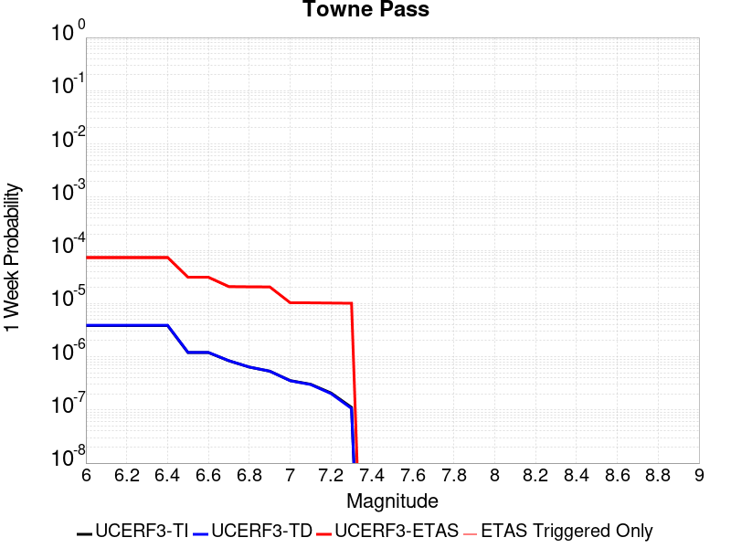 |  |  |  |

| Magnitude | 1 wk TI Prob | 1 wk TD Prob | 1 wk ETAS Prob | 1 wk ETAS/TD Gain | 1 wk ETAS Triggered Only | 1 mo TI Prob | 1 mo TD Prob | 1 mo ETAS Prob | 1 mo ETAS/TD Gain | 1 mo ETAS Triggered Only | 1 yr TI Prob | 1 yr TD Prob | 1 yr ETAS Prob | 1 yr ETAS/TD Gain | 1 yr ETAS Triggered Only | 10 yr TI Prob | 10 yr TD Prob | 10 yr ETAS Prob | 10 yr ETAS/TD Gain | 10 yr ETAS Triggered Only |
|-----|-----|-----|-----|-----|-----|-----|-----|-----|-----|-----|-----|-----|-----|-----|-----|-----|-----|-----|-----|-----|
| 6.0 | 3.849728E-6 | 3.8945577E-6 | 3.8945577E-6 | 1.0 | 0.0 | 1.649873E-5 | 1.669088E-5 | 7.677881E-5 | 4.6000457 | 6.0088933E-5 | 2.0085352E-4 | 2.0319689E-4 | 5.636572E-4 | 2.773946 | 3.605336E-4 | 0.0020067208 | 0.00203054 | 0.0028400936 | 1.3986887 | 8.112006E-4 |
| 6.1 | 3.849728E-6 | 3.8945577E-6 | 3.8945577E-6 | 1.0 | 0.0 | 1.649873E-5 | 1.669088E-5 | 7.677881E-5 | 4.6000457 | 6.0088933E-5 | 2.0085352E-4 | 2.0319689E-4 | 5.636572E-4 | 2.773946 | 3.605336E-4 | 0.0020067208 | 0.00203054 | 0.0028400936 | 1.3986887 | 8.112006E-4 |
| 6.2 | 3.849728E-6 | 3.8945577E-6 | 3.8945577E-6 | 1.0 | 0.0 | 1.649873E-5 | 1.669088E-5 | 7.677881E-5 | 4.6000457 | 6.0088933E-5 | 2.0085352E-4 | 2.0319689E-4 | 5.636572E-4 | 2.773946 | 3.605336E-4 | 0.0020067208 | 0.00203054 | 0.0028400936 | 1.3986887 | 8.112006E-4 |
| 6.3 | 3.849728E-6 | 3.8945577E-6 | 3.8945577E-6 | 1.0 | 0.0 | 1.649873E-5 | 1.669088E-5 | 7.677881E-5 | 4.6000457 | 6.0088933E-5 | 2.0085352E-4 | 2.0319689E-4 | 5.636572E-4 | 2.773946 | 3.605336E-4 | 0.0020067208 | 0.00203054 | 0.0028400936 | 1.3986887 | 8.112006E-4 |
| 6.4 | 3.849728E-6 | 3.8945577E-6 | 3.8945577E-6 | 1.0 | 0.0 | 1.649873E-5 | 1.669088E-5 | 7.677881E-5 | 4.6000457 | 6.0088933E-5 | 2.0085352E-4 | 2.0319689E-4 | 5.636572E-4 | 2.773946 | 3.605336E-4 | 0.0020067208 | 0.00203054 | 0.0028400936 | 1.3986887 | 8.112006E-4 |
| 6.5 | 1.1953545E-6 | 1.2030586E-6 | 1.2030586E-6 | 1.0 | 0.0 | 5.1229376E-6 | 5.1559555E-6 | 5.1559555E-6 | 1.0 | 0.0 | 6.236998E-5 | 6.277207E-5 | 1.8294239E-4 | 2.9143915 | 1.20177865E-4 | 6.235248E-4 | 6.275551E-4 | 7.7768316E-4 | 1.2392269 | 1.5022233E-4 |
| 6.6 | 1.1953545E-6 | 1.2030586E-6 | 1.2030586E-6 | 1.0 | 0.0 | 5.1229376E-6 | 5.1559555E-6 | 5.1559555E-6 | 1.0 | 0.0 | 6.236998E-5 | 6.277207E-5 | 1.8294239E-4 | 2.9143915 | 1.20177865E-4 | 6.235248E-4 | 6.275551E-4 | 7.7768316E-4 | 1.2392269 | 1.5022233E-4 |
| 6.7 | 8.375951E-7 | 8.410724E-7 | 8.410724E-7 | 1.0 | 0.0 | 3.5896885E-6 | 3.6045915E-6 | 3.6045915E-6 | 1.0 | 0.0 | 4.370358E-5 | 4.3885073E-5 | 1.0397137E-4 | 2.3691738 | 6.0088933E-5 | 4.3694986E-4 | 4.3876978E-4 | 5.2886363E-4 | 1.2053329 | 9.01334E-5 |
| 6.8 | 6.38041E-7 | 6.392204E-7 | 6.392204E-7 | 1.0 | 0.0 | 2.7344586E-6 | 2.7395133E-6 | 2.7395133E-6 | 1.0 | 0.0 | 3.3291526E-5 | 3.3353102E-5 | 9.344003E-5 | 2.8015394 | 6.0088933E-5 | 3.3286537E-4 | 3.334848E-4 | 4.2358812E-4 | 1.2701873 | 9.01334E-5 |
| 6.9 | 5.3460053E-7 | 5.345377E-7 | 5.345377E-7 | 1.0 | 0.0 | 2.2911431E-6 | 2.2908741E-6 | 2.2908741E-6 | 1.0 | 0.0 | 2.789431E-5 | 2.789107E-5 | 8.7978326E-5 | 3.1543546 | 6.0088933E-5 | 2.789081E-4 | 2.7887902E-4 | 3.6898727E-4 | 1.3231088 | 9.01334E-5 |
| 7.0 | 3.557783E-7 | 3.53246E-7 | 3.53246E-7 | 1.0 | 0.0 | 1.5247632E-6 | 1.5139107E-6 | 1.5139107E-6 | 1.0 | 0.0 | 1.8563835E-5 | 1.8431714E-5 | 4.8475627E-5 | 2.6300118 | 3.0044466E-5 | 1.8562283E-4 | 1.843027E-4 | 2.4438056E-4 | 1.3259739 | 6.0088933E-5 |
| 7.1 | 3.037942E-7 | 3.000256E-7 | 3.000256E-7 | 1.0 | 0.0 | 1.3019744E-6 | 1.2858234E-6 | 1.2858234E-6 | 1.0 | 0.0 | 1.5851423E-5 | 1.5654796E-5 | 4.569879E-5 | 2.919156 | 3.0044466E-5 | 1.5850292E-4 | 1.5653767E-4 | 2.1661719E-4 | 1.3838023 | 6.0088933E-5 |
| 7.2 | 2.0808248E-7 | 2.021797E-7 | 2.021797E-7 | 1.0 | 0.0 | 8.917818E-7 | 8.664842E-7 | 8.664842E-7 | 1.0 | 0.0 | 1.0857389E-5 | 1.0549398E-5 | 1.0549398E-5 | 1.0 | 0.0 | 1.0856859E-4 | 1.0548944E-4 | 1.3553073E-4 | 1.2847801 | 3.0044466E-5 |
| 7.3 | 1.1162073E-7 | 1.0637072E-7 | 1.0637072E-7 | 1.0 | 0.0 | 4.7837443E-7 | 4.5587444E-7 | 4.5587444E-7 | 1.0 | 0.0 | 5.8241935E-6 | 5.550259E-6 | 5.550259E-6 | 1.0 | 0.0 | 5.8240406E-5 | 5.550141E-5 | 5.550141E-5 | 1.0 | 0.0 |

## Garlic Springs
*[(top)](#table-of-contents)*

| 1 Week | 1 Month | 1 Year | 10 Year |
|-----|-----|-----|-----|
|  |  |  |  |

| Magnitude | 1 wk TI Prob | 1 wk TD Prob | 1 wk ETAS Prob | 1 wk ETAS/TD Gain | 1 wk ETAS Triggered Only | 1 mo TI Prob | 1 mo TD Prob | 1 mo ETAS Prob | 1 mo ETAS/TD Gain | 1 mo ETAS Triggered Only | 1 yr TI Prob | 1 yr TD Prob | 1 yr ETAS Prob | 1 yr ETAS/TD Gain | 1 yr ETAS Triggered Only | 10 yr TI Prob | 10 yr TD Prob | 10 yr ETAS Prob | 10 yr ETAS/TD Gain | 10 yr ETAS Triggered Only |
|-----|-----|-----|-----|-----|-----|-----|-----|-----|-----|-----|-----|-----|-----|-----|-----|-----|-----|-----|-----|-----|
| 6.0 | 1.6760017E-5 | 1.8777433E-5 | 1.8777433E-5 | 1.0 | 0.0 | 7.182667E-5 | 8.047289E-5 | 8.047289E-5 | 1.0 | 0.0 | 8.7413884E-4 | 9.794345E-4 | 0.0010994946 | 1.1225811 | 1.20177865E-4 | 0.008707083 | 0.009762724 | 0.010387498 | 1.0639958 | 6.309338E-4 |
| 6.1 | 9.852767E-6 | 1.09739185E-5 | 1.09739185E-5 | 1.0 | 0.0 | 4.222546E-5 | 4.703063E-5 | 4.703063E-5 | 1.0 | 0.0 | 5.139737E-4 | 5.7251845E-4 | 6.626002E-4 | 1.157343 | 9.01334E-5 | 0.005127866 | 0.0057173935 | 0.0060459934 | 1.0574737 | 3.3048913E-4 |
| 6.2 | 9.852767E-6 | 1.09739185E-5 | 1.09739185E-5 | 1.0 | 0.0 | 4.222546E-5 | 4.703063E-5 | 4.703063E-5 | 1.0 | 0.0 | 5.139737E-4 | 5.7251845E-4 | 6.626002E-4 | 1.157343 | 9.01334E-5 | 0.005127866 | 0.0057173935 | 0.0060459934 | 1.0574737 | 3.3048913E-4 |
| 6.3 | 4.3167724E-6 | 4.778164E-6 | 4.778164E-6 | 1.0 | 0.0 | 1.8500323E-5 | 2.0477815E-5 | 2.0477815E-5 | 1.0 | 0.0 | 2.2521814E-4 | 2.493119E-4 | 2.7934887E-4 | 1.1204795 | 3.0044466E-5 | 0.0022499003 | 0.0024925806 | 0.0025525198 | 1.024047 | 6.0088933E-5 |
| 6.4 | 4.3167724E-6 | 4.778164E-6 | 4.778164E-6 | 1.0 | 0.0 | 1.8500323E-5 | 2.0477815E-5 | 2.0477815E-5 | 1.0 | 0.0 | 2.2521814E-4 | 2.493119E-4 | 2.7934887E-4 | 1.1204795 | 3.0044466E-5 | 0.0022499003 | 0.0024925806 | 0.0025525198 | 1.024047 | 6.0088933E-5 |
| 6.5 | 4.3167724E-6 | 4.778164E-6 | 4.778164E-6 | 1.0 | 0.0 | 1.8500323E-5 | 2.0477815E-5 | 2.0477815E-5 | 1.0 | 0.0 | 2.2521814E-4 | 2.493119E-4 | 2.7934887E-4 | 1.1204795 | 3.0044466E-5 | 0.0022499003 | 0.0024925806 | 0.0025525198 | 1.024047 | 6.0088933E-5 |
| 6.6 | 4.301311E-6 | 4.761032E-6 | 4.761032E-6 | 1.0 | 0.0 | 1.8434059E-5 | 2.0404394E-5 | 2.0404394E-5 | 1.0 | 0.0 | 2.2441156E-4 | 2.484182E-4 | 2.784552E-4 | 1.120913 | 3.0044466E-5 | 0.0022418506 | 0.0024836634 | 0.002543603 | 1.0241336 | 6.0088933E-5 |
| 6.7 | 3.8599724E-6 | 4.2711804E-6 | 4.2711804E-6 | 1.0 | 0.0 | 1.6542634E-5 | 1.830506E-5 | 1.830506E-5 | 1.0 | 0.0 | 2.0138794E-4 | 2.228641E-4 | 2.5290187E-4 | 1.1347806 | 3.0044466E-5 | 0.0020120554 | 0.002228641 | 0.002288596 | 1.0269021 | 6.0088933E-5 |

## San Andreas (San Bernardino S)
*[(top)](#table-of-contents)*

| 1 Week | 1 Month | 1 Year | 10 Year |
|-----|-----|-----|-----|
|  |  |  |  |

| Magnitude | 1 wk TI Prob | 1 wk TD Prob | 1 wk ETAS Prob | 1 wk ETAS/TD Gain | 1 wk ETAS Triggered Only | 1 mo TI Prob | 1 mo TD Prob | 1 mo ETAS Prob | 1 mo ETAS/TD Gain | 1 mo ETAS Triggered Only | 1 yr TI Prob | 1 yr TD Prob | 1 yr ETAS Prob | 1 yr ETAS/TD Gain | 1 yr ETAS Triggered Only | 10 yr TI Prob | 10 yr TD Prob | 10 yr ETAS Prob | 10 yr ETAS/TD Gain | 10 yr ETAS Triggered Only |
|-----|-----|-----|-----|-----|-----|-----|-----|-----|-----|-----|-----|-----|-----|-----|-----|-----|-----|-----|-----|-----|
| 6.0 | 1.2336002E-4 | 3.001381E-4 | 3.001381E-4 | 1.0 | 0.0 | 5.2857865E-4 | 0.0012856981 | 0.0013757156 | 1.0700145 | 9.01334E-5 | 0.006416472 | 0.015545984 | 0.015812181 | 1.0171232 | 2.704002E-4 | 0.06234337 | 0.14287543 | 0.14339048 | 1.0036048 | 6.008893E-4 |
| 6.1 | 1.2336002E-4 | 3.001381E-4 | 3.001381E-4 | 1.0 | 0.0 | 5.2857865E-4 | 0.0012856981 | 0.0013757156 | 1.0700145 | 9.01334E-5 | 0.006416472 | 0.015545984 | 0.015812181 | 1.0171232 | 2.704002E-4 | 0.06234337 | 0.14287543 | 0.14339048 | 1.0036048 | 6.008893E-4 |
| 6.2 | 1.2336002E-4 | 3.001381E-4 | 3.001381E-4 | 1.0 | 0.0 | 5.2857865E-4 | 0.0012856981 | 0.0013757156 | 1.0700145 | 9.01334E-5 | 0.006416472 | 0.015545984 | 0.015812181 | 1.0171232 | 2.704002E-4 | 0.06234337 | 0.14287543 | 0.14339048 | 1.0036048 | 6.008893E-4 |
| 6.3 | 1.1712257E-4 | 2.8802018E-4 | 2.8802018E-4 | 1.0 | 0.0 | 5.018573E-4 | 0.0012338139 | 0.001323836 | 1.0729625 | 9.01334E-5 | 0.006093008 | 0.014923064 | 0.015189429 | 1.0178492 | 2.704002E-4 | 0.059286322 | 0.13758378 | 0.13807608 | 1.0035782 | 5.7084486E-4 |
| 6.4 | 1.1712257E-4 | 2.8802018E-4 | 2.8802018E-4 | 1.0 | 0.0 | 5.018573E-4 | 0.0012338139 | 0.001323836 | 1.0729625 | 9.01334E-5 | 0.006093008 | 0.014923064 | 0.015189429 | 1.0178492 | 2.704002E-4 | 0.059286322 | 0.13758378 | 0.13807608 | 1.0035782 | 5.7084486E-4 |
| 6.5 | 1.0689076E-4 | 2.6814712E-4 | 2.6814712E-4 | 1.0 | 0.0 | 4.5802278E-4 | 0.0011487206 | 0.0012387504 | 1.078374 | 9.01334E-5 | 0.0055621783 | 0.013900606 | 0.014137621 | 1.0170506 | 2.4035573E-4 | 0.05425003 | 0.12883076 | 0.12930189 | 1.003657 | 5.408004E-4 |
| 6.6 | 9.7648895E-5 | 2.5059367E-4 | 2.5059367E-4 | 1.0 | 0.0 | 4.1842813E-4 | 0.0010735545 | 0.001163591 | 1.0838678 | 9.01334E-5 | 0.005082469 | 0.01299656 | 0.013233792 | 1.0182534 | 2.4035573E-4 | 0.049677886 | 0.120990366 | 0.12143933 | 1.0037107 | 5.107559E-4 |
| 6.7 | 8.757013E-5 | 2.3130006E-4 | 2.3130006E-4 | 1.0 | 0.0 | 3.7524657E-4 | 9.909316E-4 | 0.0010809758 | 1.0908681 | 9.01334E-5 | 0.00455906 | 0.012001941 | 0.0122394115 | 1.019786 | 2.4035573E-4 | 0.04466656 | 0.11229846 | 0.11275186 | 1.0040375 | 5.107559E-4 |
| 6.8 | 8.562978E-5 | 2.2689818E-4 | 2.2689818E-4 | 1.0 | 0.0 | 3.6693315E-4 | 9.720806E-4 | 0.0010621264 | 1.092632 | 9.01334E-5 | 0.004458263 | 0.0117749255 | 0.012012451 | 1.0201721 | 2.4035573E-4 | 0.043698758 | 0.11030855 | 0.11076297 | 1.0041195 | 5.107559E-4 |
| 6.9 | 6.124075E-5 | 1.7073889E-4 | 1.7073889E-4 | 1.0 | 0.0 | 2.6243398E-4 | 7.3153374E-4 | 8.216012E-4 | 1.1231214 | 9.01334E-5 | 0.0031904527 | 0.00887026 | 0.009078706 | 1.0234994 | 2.1031126E-4 | 0.031450346 | 0.08421729 | 0.08465751 | 1.0052273 | 4.8071146E-4 |
| 7.0 | 5.8598747E-5 | 1.650282E-4 | 1.650282E-4 | 1.0 | 0.0 | 2.5111332E-4 | 7.0707285E-4 | 7.971425E-4 | 1.1273838 | 9.01334E-5 | 0.0030530186 | 0.0085748285 | 0.008783336 | 1.0243163 | 2.1031126E-4 | 0.03011414 | 0.08153475 | 0.081976265 | 1.0054151 | 4.8071146E-4 |
| 7.1 | 5.613814E-5 | 1.5921291E-4 | 1.5921291E-4 | 1.0 | 0.0 | 2.4056983E-4 | 6.821634E-4 | 7.7223533E-4 | 1.1320386 | 9.01334E-5 | 0.0029250039 | 0.008273893 | 0.008482465 | 1.0252084 | 2.1031126E-4 | 0.028868021 | 0.07883346 | 0.07927628 | 1.0056171 | 4.8071146E-4 |
| 7.2 | 4.991222E-5 | 1.4527571E-4 | 1.4527571E-4 | 1.0 | 0.0 | 2.1389198E-4 | 6.224621E-4 | 7.1253936E-4 | 1.1447113 | 9.01334E-5 | 0.002601025 | 0.0075522447 | 0.0077609676 | 1.0276372 | 2.1031126E-4 | 0.025707912 | 0.072286695 | 0.07273266 | 1.0061693 | 4.8071146E-4 |
| 7.3 | 4.7410045E-5 | 1.3721608E-4 | 1.3721608E-4 | 1.0 | 0.0 | 2.0317009E-4 | 5.8793667E-4 | 6.780171E-4 | 1.1532145 | 9.01334E-5 | 0.0024707897 | 0.007134721 | 0.007343532 | 1.0292668 | 2.1031126E-4 | 0.024434982 | 0.06856856 | 0.06901631 | 1.0065299 | 4.8071146E-4 |
| 7.4 | 4.5556746E-5 | 1.3129383E-4 | 1.3129383E-4 | 1.0 | 0.0 | 1.952286E-4 | 5.625668E-4 | 6.526495E-4 | 1.160128 | 9.01334E-5 | 0.002374317 | 0.00682782 | 0.0070366953 | 1.0305918 | 2.1031126E-4 | 0.023491086 | 0.06582052 | 0.06626959 | 1.0068227 | 4.8071146E-4 |
| 7.5 | 4.3084514E-5 | 1.2364559E-4 | 1.2364559E-4 | 1.0 | 0.0 | 1.8463485E-4 | 5.2980235E-4 | 6.19888E-4 | 1.1700363 | 9.01334E-5 | 0.0022456115 | 0.006431338 | 0.006640297 | 1.0324907 | 2.1031126E-4 | 0.022230545 | 0.062220756 | 0.06267156 | 1.0072452 | 4.8071146E-4 |
| 7.6 | 3.408608E-5 | 9.842233E-5 | 9.842233E-5 | 1.0 | 0.0 | 1.4607502E-4 | 4.217419E-4 | 5.1183725E-4 | 1.2136269 | 9.01334E-5 | 0.0017770125 | 0.0051226444 | 0.005331878 | 1.0408449 | 2.1031126E-4 | 0.017628696 | 0.05005001 | 0.050506663 | 1.0091239 | 4.8071146E-4 |
| 7.7 | 2.8315713E-5 | 8.254984E-5 | 8.254984E-5 | 1.0 | 0.0 | 1.2134742E-4 | 3.537371E-4 | 4.438386E-4 | 1.2547132 | 9.01334E-5 | 0.0014764034 | 0.0042982535 | 0.004507661 | 1.0487192 | 2.1031126E-4 | 0.01466633 | 0.04229954 | 0.042759914 | 1.0108838 | 4.8071146E-4 |
| 7.8 | 2.6222975E-5 | 7.468984E-5 | 7.468984E-5 | 1.0 | 0.0 | 1.1237934E-4 | 3.2006006E-4 | 4.1016462E-4 | 1.2815238 | 9.01334E-5 | 0.0013673597 | 0.003889775 | 0.004099268 | 1.0538574 | 2.1031126E-4 | 0.013589768 | 0.038463186 | 0.03889652 | 1.0112662 | 4.50667E-4 |
| 7.9 | 2.1469694E-5 | 5.7927857E-5 | 5.7927857E-5 | 1.0 | 0.0 | 9.200973E-5 | 2.4823865E-4 | 3.3834967E-4 | 1.3630016 | 9.01334E-5 | 0.0011196428 | 0.0030181198 | 0.0032277964 | 1.0694726 | 2.1031126E-4 | 0.011140184 | 0.030174483 | 0.03061155 | 1.0144846 | 4.50667E-4 |
| 8.0 | 1.2420249E-5 | 3.1346288E-5 | 3.1346288E-5 | 1.0 | 0.0 | 5.322855E-5 | 1.3433433E-4 | 1.9441519E-4 | 1.4472487 | 6.0088933E-5 | 6.478649E-4 | 0.0016342945 | 0.0017242805 | 1.0550611 | 9.01334E-5 | 0.0064597935 | 0.016535252 | 0.016712539 | 1.0107217 | 1.802668E-4 |
| 8.1 | 4.9197724E-6 | 7.832194E-6 | 7.832194E-6 | 1.0 | 0.0 | 2.1084568E-5 | 3.3566113E-5 | 3.3566113E-5 | 1.0 | 0.0 | 2.566744E-4 | 4.0859092E-4 | 4.0859092E-4 | 1.0 | 0.0 | 0.002563781 | 0.004389317 | 0.0044192295 | 1.0068148 | 3.0044466E-5 |
| 8.2 | 2.5634774E-6 | 2.9112718E-6 | 2.9112718E-6 | 1.0 | 0.0 | 1.0986286E-5 | 1.247682E-5 | 1.247682E-5 | 1.0 | 0.0 | 1.3374983E-4 | 1.5189474E-4 | 1.5189474E-4 | 1.0 | 0.0 | 0.0013366934 | 0.001707363 | 0.001707363 | 1.0 | 0.0 |
| 8.3 | 5.2850464E-7 | 3.2150157E-7 | 3.2150157E-7 | 1.0 | 0.0 | 2.2650179E-6 | 1.3778632E-6 | 1.3778632E-6 | 1.0 | 0.0 | 2.7576245E-5 | 1.6775368E-5 | 1.6775368E-5 | 1.0 | 0.0 | 2.7572823E-4 | 1.9904955E-4 | 1.9904955E-4 | 1.0 | 0.0 |

## Helendale-So Lockhart
*[(top)](#table-of-contents)*

| 1 Week | 1 Month | 1 Year | 10 Year |
|-----|-----|-----|-----|
|  |  |  |  |

| Magnitude | 1 wk TI Prob | 1 wk TD Prob | 1 wk ETAS Prob | 1 wk ETAS/TD Gain | 1 wk ETAS Triggered Only | 1 mo TI Prob | 1 mo TD Prob | 1 mo ETAS Prob | 1 mo ETAS/TD Gain | 1 mo ETAS Triggered Only | 1 yr TI Prob | 1 yr TD Prob | 1 yr ETAS Prob | 1 yr ETAS/TD Gain | 1 yr ETAS Triggered Only | 10 yr TI Prob | 10 yr TD Prob | 10 yr ETAS Prob | 10 yr ETAS/TD Gain | 10 yr ETAS Triggered Only |
|-----|-----|-----|-----|-----|-----|-----|-----|-----|-----|-----|-----|-----|-----|-----|-----|-----|-----|-----|-----|-----|
| 6.0 | 1.7296055E-5 | 1.8103954E-5 | 1.8103954E-5 | 1.0 | 0.0 | 7.412385E-5 | 7.7586184E-5 | 1.3767046E-4 | 1.7744197 | 6.0088933E-5 | 9.0208417E-4 | 9.4422314E-4 | 0.001214368 | 1.2861028 | 2.704002E-4 | 0.008984311 | 0.009404233 | 0.009999471 | 1.0632948 | 6.008893E-4 |
| 6.1 | 1.7296055E-5 | 1.8103954E-5 | 1.8103954E-5 | 1.0 | 0.0 | 7.412385E-5 | 7.7586184E-5 | 1.3767046E-4 | 1.7744197 | 6.0088933E-5 | 9.0208417E-4 | 9.4422314E-4 | 0.001214368 | 1.2861028 | 2.704002E-4 | 0.008984311 | 0.009404233 | 0.009999471 | 1.0632948 | 6.008893E-4 |
| 6.2 | 1.7296055E-5 | 1.8103954E-5 | 1.8103954E-5 | 1.0 | 0.0 | 7.412385E-5 | 7.7586184E-5 | 1.3767046E-4 | 1.7744197 | 6.0088933E-5 | 9.0208417E-4 | 9.4422314E-4 | 0.001214368 | 1.2861028 | 2.704002E-4 | 0.008984311 | 0.009404233 | 0.009999471 | 1.0632948 | 6.008893E-4 |
| 6.3 | 1.0669118E-5 | 1.1135554E-5 | 1.1135554E-5 | 1.0 | 0.0 | 4.5723988E-5 | 4.7722944E-5 | 1.07809006E-4 | 2.2590604 | 6.0088933E-5 | 5.5654737E-4 | 5.8087474E-4 | 8.210908E-4 | 1.413542 | 2.4035573E-4 | 0.0055515557 | 0.0057938606 | 0.006271787 | 1.0824884 | 4.8071146E-4 |
| 6.4 | 1.0669118E-5 | 1.1135554E-5 | 1.1135554E-5 | 1.0 | 0.0 | 4.5723988E-5 | 4.7722944E-5 | 1.07809006E-4 | 2.2590604 | 6.0088933E-5 | 5.5654737E-4 | 5.8087474E-4 | 8.210908E-4 | 1.413542 | 2.4035573E-4 | 0.0055515557 | 0.0057938606 | 0.006271787 | 1.0824884 | 4.8071146E-4 |
| 6.5 | 8.790038E-6 | 9.170302E-6 | 9.170302E-6 | 1.0 | 0.0 | 3.767105E-5 | 3.930071E-5 | 9.938728E-5 | 2.5288928 | 6.0088933E-5 | 4.585485E-4 | 4.7838266E-4 | 6.585632E-4 | 1.3766452 | 1.802668E-4 | 0.0045760344 | 0.004773693 | 0.0051624067 | 1.0814283 | 3.9057806E-4 |
| 6.6 | 7.396949E-6 | 7.7156255E-6 | 7.7156255E-6 | 1.0 | 0.0 | 3.1700827E-5 | 3.3066553E-5 | 9.3153496E-5 | 2.8171518 | 6.0088933E-5 | 3.858892E-4 | 4.025119E-4 | 5.827061E-4 | 1.4476743 | 1.802668E-4 | 0.003852198 | 0.0040179356 | 0.0043770205 | 1.0893705 | 3.605336E-4 |
| 6.7 | 6.4600285E-6 | 6.738108E-6 | 6.738108E-6 | 1.0 | 0.0 | 2.7685543E-5 | 2.887729E-5 | 5.892089E-5 | 2.0403883 | 3.0044466E-5 | 3.3701936E-4 | 3.515251E-4 | 4.716607E-4 | 1.3417555 | 1.20177865E-4 | 0.0033650869 | 0.003509772 | 0.0037792232 | 1.0767717 | 2.704002E-4 |
| 6.8 | 5.600104E-6 | 5.8360747E-6 | 5.8360747E-6 | 1.0 | 0.0 | 2.4000226E-5 | 2.5011512E-5 | 5.5055225E-5 | 2.2011955 | 3.0044466E-5 | 2.9216358E-4 | 3.0447321E-4 | 4.2461447E-4 | 1.3945874 | 1.20177865E-4 | 0.0029177975 | 0.003040622 | 0.0033102 | 1.0886588 | 2.704002E-4 |
| 6.9 | 4.839122E-6 | 5.0395647E-6 | 5.0395647E-6 | 1.0 | 0.0 | 2.0738931E-5 | 2.1597958E-5 | 5.1641775E-5 | 2.391049 | 3.0044466E-5 | 2.5246723E-4 | 2.629239E-4 | 3.5303357E-4 | 1.3427216 | 9.01334E-5 | 0.002521806 | 0.0026261755 | 0.0028659 | 1.0912827 | 2.4035573E-4 |
| 7.0 | 3.6937633E-6 | 3.84525E-6 | 3.84525E-6 | 1.0 | 0.0 | 1.5830317E-5 | 1.647954E-5 | 4.652351E-5 | 2.8231075 | 3.0044466E-5 | 1.9271708E-4 | 2.0062024E-4 | 2.9073554E-4 | 1.4491836 | 9.01334E-5 | 0.0019255003 | 0.0020044227 | 0.0022143126 | 1.1047133 | 2.1031126E-4 |
| 7.1 | 2.7858857E-6 | 2.8978848E-6 | 2.8978848E-6 | 1.0 | 0.0 | 1.1939455E-5 | 1.2419448E-5 | 1.2419448E-5 | 1.0 | 0.0 | 1.4535317E-4 | 1.5119651E-4 | 1.8123642E-4 | 1.1986814 | 3.0044466E-5 | 0.0014525814 | 0.0015109578 | 0.0016609532 | 1.0992717 | 1.5022233E-4 |
| 7.2 | 2.1672065E-6 | 2.2540366E-6 | 2.2540366E-6 | 1.0 | 0.0 | 9.2879945E-6 | 9.6601225E-6 | 9.6601225E-6 | 1.0 | 0.0 | 1.1307546E-4 | 1.1760583E-4 | 1.4764676E-4 | 1.2554375 | 3.0044466E-5 | 0.0011301794 | 0.0011754541 | 0.0012654816 | 1.0765895 | 9.01334E-5 |
| 7.3 | 1.4823496E-6 | 1.5422268E-6 | 1.5422268E-6 | 1.0 | 0.0 | 6.3529114E-6 | 6.609527E-6 | 6.609527E-6 | 1.0 | 0.0 | 7.734395E-5 | 8.046818E-5 | 1.1051023E-4 | 1.3733407 | 3.0044466E-5 | 7.731704E-4 | 8.044055E-4 | 8.944664E-4 | 1.1119596 | 9.01334E-5 |
| 7.4 | 4.2321457E-7 | 4.410926E-7 | 4.410926E-7 | 1.0 | 0.0 | 1.8137755E-6 | 1.8903958E-6 | 1.8903958E-6 | 1.0 | 0.0 | 2.2082493E-5 | 2.3015371E-5 | 2.3015371E-5 | 1.0 | 0.0 | 2.2080299E-4 | 2.301344E-4 | 2.6017195E-4 | 1.1305218 | 3.0044466E-5 |
| 7.5 | 5.6942316E-8 | 5.941633E-8 | 5.941633E-8 | 1.0 | 0.0 | 2.440385E-7 | 2.546414E-7 | 2.546414E-7 | 1.0 | 0.0 | 2.9711643E-6 | 3.1002553E-6 | 3.1002553E-6 | 1.0 | 0.0 | 2.9711247E-5 | 3.10022E-5 | 3.10022E-5 | 1.0 | 0.0 |

## Death Valley (Black Mtns Frontal)
*[(top)](#table-of-contents)*

| 1 Week | 1 Month | 1 Year | 10 Year |
|-----|-----|-----|-----|
|  |  |  |  |

| Magnitude | 1 wk TI Prob | 1 wk TD Prob | 1 wk ETAS Prob | 1 wk ETAS/TD Gain | 1 wk ETAS Triggered Only | 1 mo TI Prob | 1 mo TD Prob | 1 mo ETAS Prob | 1 mo ETAS/TD Gain | 1 mo ETAS Triggered Only | 1 yr TI Prob | 1 yr TD Prob | 1 yr ETAS Prob | 1 yr ETAS/TD Gain | 1 yr ETAS Triggered Only | 10 yr TI Prob | 10 yr TD Prob | 10 yr ETAS Prob | 10 yr ETAS/TD Gain | 10 yr ETAS Triggered Only |
|-----|-----|-----|-----|-----|-----|-----|-----|-----|-----|-----|-----|-----|-----|-----|-----|-----|-----|-----|-----|-----|
| 6.0 | 1.6707214E-5 | 1.8670851E-5 | 1.8670851E-5 | 1.0 | 0.0 | 7.160038E-5 | 8.0015525E-5 | 1.701417E-4 | 2.1263587 | 9.01334E-5 | 8.71386E-4 | 9.7376126E-4 | 0.0011838677 | 1.215768 | 2.1031126E-4 | 0.00867977 | 0.009695798 | 0.010261108 | 1.0583047 | 5.7084486E-4 |
| 6.1 | 1.6707214E-5 | 1.8670851E-5 | 1.8670851E-5 | 1.0 | 0.0 | 7.160038E-5 | 8.0015525E-5 | 1.701417E-4 | 2.1263587 | 9.01334E-5 | 8.71386E-4 | 9.7376126E-4 | 0.0011838677 | 1.215768 | 2.1031126E-4 | 0.00867977 | 0.009695798 | 0.010261108 | 1.0583047 | 5.7084486E-4 |
| 6.2 | 1.6707214E-5 | 1.8670851E-5 | 1.8670851E-5 | 1.0 | 0.0 | 7.160038E-5 | 8.0015525E-5 | 1.701417E-4 | 2.1263587 | 9.01334E-5 | 8.71386E-4 | 9.7376126E-4 | 0.0011838677 | 1.215768 | 2.1031126E-4 | 0.00867977 | 0.009695798 | 0.010261108 | 1.0583047 | 5.7084486E-4 |
| 6.3 | 1.6707214E-5 | 1.8670851E-5 | 1.8670851E-5 | 1.0 | 0.0 | 7.160038E-5 | 8.0015525E-5 | 1.701417E-4 | 2.1263587 | 9.01334E-5 | 8.71386E-4 | 9.7376126E-4 | 0.0011838677 | 1.215768 | 2.1031126E-4 | 0.00867977 | 0.009695798 | 0.010261108 | 1.0583047 | 5.7084486E-4 |
| 6.4 | 1.5515609E-5 | 1.7338754E-5 | 1.7338754E-5 | 1.0 | 0.0 | 6.649377E-5 | 7.430687E-5 | 1.6443357E-4 | 2.2128987 | 9.01334E-5 | 8.0926094E-4 | 9.043167E-4 | 0.0010844205 | 1.1991601 | 1.802668E-4 | 0.008063202 | 0.009007053 | 0.009542982 | 1.059501 | 5.408004E-4 |
| 6.5 | 1.5515609E-5 | 1.7338754E-5 | 1.7338754E-5 | 1.0 | 0.0 | 6.649377E-5 | 7.430687E-5 | 1.6443357E-4 | 2.2128987 | 9.01334E-5 | 8.0926094E-4 | 9.043167E-4 | 0.0010844205 | 1.1991601 | 1.802668E-4 | 0.008063202 | 0.009007053 | 0.009542982 | 1.059501 | 5.408004E-4 |
| 6.6 | 1.5041828E-5 | 1.680967E-5 | 1.680967E-5 | 1.0 | 0.0 | 6.4463384E-5 | 7.203949E-5 | 1.621664E-4 | 2.2510765 | 9.01334E-5 | 7.8455906E-4 | 8.7673374E-4 | 0.0010568425 | 1.2054316 | 1.802668E-4 | 0.00781795 | 0.008733404 | 0.0092397 | 1.0579723 | 5.107559E-4 |
| 6.7 | 1.4634985E-5 | 1.6356527E-5 | 1.6356527E-5 | 1.0 | 0.0 | 6.271985E-5 | 7.009756E-5 | 1.6022463E-4 | 2.2857378 | 9.01334E-5 | 7.6334673E-4 | 8.5310935E-4 | 0.0010332223 | 1.2111254 | 1.802668E-4 | 0.007607299 | 0.008498981 | 0.009005396 | 1.0595853 | 5.107559E-4 |
| 6.8 | 1.4209158E-5 | 1.5882546E-5 | 1.5882546E-5 | 1.0 | 0.0 | 6.089497E-5 | 6.806631E-5 | 1.5819356E-4 | 2.3241098 | 9.01334E-5 | 7.4114406E-4 | 8.283978E-4 | 0.0010085152 | 1.2174287 | 1.802668E-4 | 0.007386771 | 0.008253714 | 0.008760254 | 1.0613712 | 5.107559E-4 |
| 6.9 | 1.3780098E-5 | 1.5405076E-5 | 1.5405076E-5 | 1.0 | 0.0 | 5.9056227E-5 | 6.602012E-5 | 1.5614757E-4 | 2.3651514 | 9.01334E-5 | 7.1877235E-4 | 8.0350396E-4 | 9.836259E-4 | 1.2241706 | 1.802668E-4 | 0.0071645193 | 0.008006583 | 0.008513249 | 1.0632813 | 5.107559E-4 |
| 7.0 | 1.3585064E-5 | 1.51886325E-5 | 1.51886325E-5 | 1.0 | 0.0 | 5.8220405E-5 | 6.509254E-5 | 1.2517757E-4 | 1.9230707 | 6.0088933E-5 | 7.086029E-4 | 7.92219E-4 | 9.123017E-4 | 1.1515776 | 1.20177865E-4 | 0.007063476 | 0.007894541 | 0.00834165 | 1.0566353 | 4.50667E-4 |
| 7.1 | 1.3398601E-5 | 1.4981811E-5 | 1.4981811E-5 | 1.0 | 0.0 | 5.742131E-5 | 6.420621E-5 | 9.4248746E-5 | 1.4679071 | 3.0044466E-5 | 6.9888023E-4 | 7.814357E-4 | 8.7149866E-4 | 1.1152532 | 9.01334E-5 | 0.0069668638 | 0.007787468 | 0.008204815 | 1.0535921 | 4.2062253E-4 |
| 7.2 | 1.3126312E-5 | 1.4680023E-5 | 1.4680023E-5 | 1.0 | 0.0 | 5.6254412E-5 | 6.29129E-5 | 9.295547E-5 | 1.4775265 | 3.0044466E-5 | 6.846822E-4 | 7.6570077E-4 | 8.557652E-4 | 1.1176234 | 9.01334E-5 | 0.006825765 | 0.0076312097 | 0.008018807 | 1.0507911 | 3.9057806E-4 |
| 7.3 | 1.2922429E-5 | 1.4454244E-5 | 1.4454244E-5 | 1.0 | 0.0 | 5.5380664E-5 | 6.194532E-5 | 9.1987924E-5 | 1.4849858 | 3.0044466E-5 | 6.74051E-4 | 7.5392873E-4 | 8.4399414E-4 | 1.1194615 | 9.01334E-5 | 0.006720101 | 0.007514291 | 0.007901934 | 1.0515875 | 3.9057806E-4 |
| 7.4 | 1.2768878E-5 | 1.4284223E-5 | 1.4284223E-5 | 1.0 | 0.0 | 5.4722615E-5 | 6.121669E-5 | 9.125932E-5 | 1.4907588 | 3.0044466E-5 | 6.660441E-4 | 7.4506376E-4 | 8.3513E-4 | 1.120884 | 9.01334E-5 | 0.0066405144 | 0.007426237 | 0.007813915 | 1.0522038 | 3.9057806E-4 |
| 7.5 | 1.2521929E-5 | 1.4012458E-5 | 1.4012458E-5 | 1.0 | 0.0 | 5.366431E-5 | 6.0052043E-5 | 9.0094705E-5 | 1.500277 | 3.0044466E-5 | 6.531671E-4 | 7.308938E-4 | 8.209613E-4 | 1.1232293 | 9.01334E-5 | 0.006512506 | 0.0072854757 | 0.007673208 | 1.0532199 | 3.9057806E-4 |
| 7.6 | 1.1301089E-5 | 1.264855E-5 | 1.264855E-5 | 1.0 | 0.0 | 4.8432343E-5 | 5.4206976E-5 | 5.4206976E-5 | 1.0 | 0.0 | 5.895042E-4 | 6.597754E-4 | 7.198247E-4 | 1.0910147 | 6.0088933E-5 | 0.0058794282 | 0.0065787183 | 0.00693688 | 1.0544425 | 3.605336E-4 |
| 7.7 | 9.189108E-6 | 1.0283684E-5 | 1.0283684E-5 | 1.0 | 0.0 | 3.93813E-5 | 4.4072214E-5 | 4.4072214E-5 | 1.0 | 0.0 | 4.7936183E-4 | 5.3645216E-4 | 5.9650885E-4 | 1.1119516 | 6.0088933E-5 | 0.004783291 | 0.005352083 | 0.00565092 | 1.0558356 | 3.0044466E-4 |
| 7.8 | 3.4586725E-7 | 3.6483146E-7 | 3.6483146E-7 | 1.0 | 0.0 | 1.4822873E-6 | 1.5635625E-6 | 1.5635625E-6 | 1.0 | 0.0 | 1.80467E-5 | 1.9036212E-5 | 4.9080107E-5 | 2.5782497 | 3.0044466E-5 | 1.8045233E-4 | 1.9034625E-4 | 2.20385E-4 | 1.157811 | 3.0044466E-5 |
| 7.9 | 2.5591178E-9 | 2.6697022E-9 | 2.6697022E-9 | 1.0 | 0.0 | 1.0967647E-8 | 1.1441582E-8 | 1.1441582E-8 | 1.0 | 0.0 | 1.335311E-7 | 1.3930125E-7 | 1.3930125E-7 | 1.0 | 0.0 | 1.3353102E-6 | 1.3930126E-6 | 1.3930126E-6 | 1.0 | 0.0 |

## Death Valley (No)
*[(top)](#table-of-contents)*

| 1 Week | 1 Month | 1 Year | 10 Year |
|-----|-----|-----|-----|
|  |  |  |  |

| Magnitude | 1 wk TI Prob | 1 wk TD Prob | 1 wk ETAS Prob | 1 wk ETAS/TD Gain | 1 wk ETAS Triggered Only | 1 mo TI Prob | 1 mo TD Prob | 1 mo ETAS Prob | 1 mo ETAS/TD Gain | 1 mo ETAS Triggered Only | 1 yr TI Prob | 1 yr TD Prob | 1 yr ETAS Prob | 1 yr ETAS/TD Gain | 1 yr ETAS Triggered Only | 10 yr TI Prob | 10 yr TD Prob | 10 yr ETAS Prob | 10 yr ETAS/TD Gain | 10 yr ETAS Triggered Only |
|-----|-----|-----|-----|-----|-----|-----|-----|-----|-----|-----|-----|-----|-----|-----|-----|-----|-----|-----|-----|-----|
| 6.0 | 2.0074807E-5 | 2.2500808E-5 | 2.2500808E-5 | 1.0 | 0.0 | 8.603206E-5 | 9.6428514E-5 | 1.2647008E-4 | 1.3115424 | 3.0044466E-5 | 0.001046937 | 0.0011733922 | 0.0012634199 | 1.0767243 | 9.01334E-5 | 0.010420183 | 0.0116728805 | 0.012029205 | 1.0305259 | 3.605336E-4 |
| 6.1 | 2.0074807E-5 | 2.2500808E-5 | 2.2500808E-5 | 1.0 | 0.0 | 8.603206E-5 | 9.6428514E-5 | 1.2647008E-4 | 1.3115424 | 3.0044466E-5 | 0.001046937 | 0.0011733922 | 0.0012634199 | 1.0767243 | 9.01334E-5 | 0.010420183 | 0.0116728805 | 0.012029205 | 1.0305259 | 3.605336E-4 |
| 6.2 | 2.0074807E-5 | 2.2500808E-5 | 2.2500808E-5 | 1.0 | 0.0 | 8.603206E-5 | 9.6428514E-5 | 1.2647008E-4 | 1.3115424 | 3.0044466E-5 | 0.001046937 | 0.0011733922 | 0.0012634199 | 1.0767243 | 9.01334E-5 | 0.010420183 | 0.0116728805 | 0.012029205 | 1.0305259 | 3.605336E-4 |
| 6.3 | 1.9050609E-5 | 2.133763E-5 | 2.133763E-5 | 1.0 | 0.0 | 8.164292E-5 | 9.144382E-5 | 1.2148554E-4 | 1.3285265 | 3.0044466E-5 | 9.935491E-4 | 0.0011127667 | 0.0012027997 | 1.0809093 | 9.01334E-5 | 0.009891188 | 0.011072771 | 0.011429313 | 1.0321999 | 3.605336E-4 |
| 6.4 | 1.9050609E-5 | 2.133763E-5 | 2.133763E-5 | 1.0 | 0.0 | 8.164292E-5 | 9.144382E-5 | 1.2148554E-4 | 1.3285265 | 3.0044466E-5 | 9.935491E-4 | 0.0011127667 | 0.0012027997 | 1.0809093 | 9.01334E-5 | 0.009891188 | 0.011072771 | 0.011429313 | 1.0321999 | 3.605336E-4 |
| 6.5 | 1.8367004E-5 | 2.0561663E-5 | 2.0561663E-5 | 1.0 | 0.0 | 7.8713354E-5 | 8.8118475E-5 | 1.1816029E-4 | 1.3409253 | 3.0044466E-5 | 9.5791375E-4 | 0.001072321 | 0.0011623577 | 1.0839643 | 9.01334E-5 | 0.009537951 | 0.010672254 | 0.01102894 | 1.0334218 | 3.605336E-4 |
| 6.6 | 1.779439E-5 | 1.991156E-5 | 1.991156E-5 | 1.0 | 0.0 | 7.625944E-5 | 8.53325E-5 | 1.153744E-4 | 1.352057 | 3.0044466E-5 | 9.280632E-4 | 0.0010384344 | 0.0011284743 | 1.0867072 | 9.01334E-5 | 0.009241969 | 0.010336579 | 0.010693385 | 1.0345188 | 3.605336E-4 |
| 6.7 | 1.7025437E-5 | 1.9044028E-5 | 1.9044028E-5 | 1.0 | 0.0 | 7.296412E-5 | 8.1614744E-5 | 1.1165676E-4 | 1.3680954 | 3.0044466E-5 | 8.87976E-4 | 9.932127E-4 | 0.0010832566 | 1.0906593 | 9.01334E-5 | 0.008844362 | 0.009888456 | 0.010245425 | 1.0360996 | 3.605336E-4 |
| 6.8 | 1.6545107E-5 | 1.8513132E-5 | 1.8513132E-5 | 1.0 | 0.0 | 7.090568E-5 | 7.933962E-5 | 1.093817E-4 | 1.3786517 | 3.0044466E-5 | 8.629347E-4 | 9.6553785E-4 | 0.0010555843 | 1.0932603 | 9.01334E-5 | 0.008595915 | 0.009614132 | 0.0099712 | 1.0371399 | 3.605336E-4 |
| 6.9 | 1.615478E-5 | 1.808817E-5 | 1.808817E-5 | 1.0 | 0.0 | 6.9232934E-5 | 7.751846E-5 | 1.075606E-4 | 1.3875482 | 3.0044466E-5 | 8.4258494E-4 | 9.433847E-4 | 0.001033433 | 1.0954524 | 9.01334E-5 | 0.008393973 | 0.009394494 | 0.00975164 | 1.0380166 | 3.605336E-4 |
| 7.0 | 1.5894311E-5 | 1.780612E-5 | 1.780612E-5 | 1.0 | 0.0 | 6.81167E-5 | 7.630974E-5 | 1.06351916E-4 | 1.3936872 | 3.0044466E-5 | 8.2900526E-4 | 9.286812E-4 | 0.0010187309 | 1.0969651 | 9.01334E-5 | 0.008259195 | 0.009248693 | 0.009605891 | 1.0386215 | 3.605336E-4 |
| 7.1 | 1.5602263E-5 | 1.7484064E-5 | 1.7484064E-5 | 1.0 | 0.0 | 6.6865134E-5 | 7.492959E-5 | 1.049718E-4 | 1.4009392 | 3.0044466E-5 | 8.137789E-4 | 9.11892E-4 | 0.0010019431 | 1.098752 | 9.01334E-5 | 0.008108052 | 0.009082184 | 0.009439443 | 1.0393362 | 3.605336E-4 |
| 7.2 | 1.5323829E-5 | 1.7171182E-5 | 1.7171182E-5 | 1.0 | 0.0 | 6.56719E-5 | 7.358874E-5 | 1.0363099E-4 | 1.4082453 | 3.0044466E-5 | 7.99262E-4 | 8.955806E-4 | 9.856333E-4 | 1.1005523 | 9.01334E-5 | 0.007963934 | 0.008920391 | 0.009277709 | 1.0400562 | 3.605336E-4 |
| 7.3 | 1.4556212E-5 | 1.6302976E-5 | 1.6302976E-5 | 1.0 | 0.0 | 6.238227E-5 | 6.986806E-5 | 9.991042E-5 | 1.4299872 | 3.0044466E-5 | 7.592395E-4 | 8.503175E-4 | 9.403742E-4 | 1.1059096 | 9.01334E-5 | 0.0075665074 | 0.008471284 | 0.008828763 | 1.042199 | 3.605336E-4 |
| 7.4 | 1.411725E-5 | 1.5808464E-5 | 1.5808464E-5 | 1.0 | 0.0 | 6.0501097E-5 | 6.7748835E-5 | 9.7791264E-5 | 1.4434383 | 3.0044466E-5 | 7.363519E-4 | 8.2453573E-4 | 9.145948E-4 | 1.109224 | 9.01334E-5 | 0.0073391674 | 0.008215399 | 0.0085729705 | 1.0435246 | 3.605336E-4 |
| 7.5 | 1.3503312E-5 | 1.5126773E-5 | 1.5126773E-5 | 1.0 | 0.0 | 5.7870053E-5 | 6.482745E-5 | 9.486997E-5 | 1.4634228 | 3.0044466E-5 | 7.043401E-4 | 7.889942E-4 | 8.7905646E-4 | 1.1141483 | 9.01334E-5 | 0.007021119 | 0.007862555 | 0.0082202535 | 1.045494 | 3.605336E-4 |
| 7.6 | 1.1279839E-5 | 1.2626728E-5 | 1.2626728E-5 | 1.0 | 0.0 | 4.834127E-5 | 5.4113454E-5 | 5.4113454E-5 | 1.0 | 0.0 | 5.88396E-4 | 6.586375E-4 | 7.1868685E-4 | 1.0911721 | 6.0088933E-5 | 0.005868405 | 0.0065674065 | 0.006895725 | 1.0499921 | 3.3048913E-4 |
| 7.7 | 9.189108E-6 | 1.0283684E-5 | 1.0283684E-5 | 1.0 | 0.0 | 3.93813E-5 | 4.4072214E-5 | 4.4072214E-5 | 1.0 | 0.0 | 4.7936183E-4 | 5.3645216E-4 | 5.9650885E-4 | 1.1119516 | 6.0088933E-5 | 0.004783291 | 0.005352083 | 0.00565092 | 1.0558356 | 3.0044466E-4 |
| 7.8 | 3.4586725E-7 | 3.6483146E-7 | 3.6483146E-7 | 1.0 | 0.0 | 1.4822873E-6 | 1.5635625E-6 | 1.5635625E-6 | 1.0 | 0.0 | 1.80467E-5 | 1.9036212E-5 | 4.9080107E-5 | 2.5782497 | 3.0044466E-5 | 1.8045233E-4 | 1.9034625E-4 | 2.20385E-4 | 1.157811 | 3.0044466E-5 |
| 7.9 | 2.5591178E-9 | 2.6697022E-9 | 2.6697022E-9 | 1.0 | 0.0 | 1.0967647E-8 | 1.1441582E-8 | 1.1441582E-8 | 1.0 | 0.0 | 1.335311E-7 | 1.3930125E-7 | 1.3930125E-7 | 1.0 | 0.0 | 1.3353102E-6 | 1.3930126E-6 | 1.3930126E-6 | 1.0 | 0.0 |

## San Andreas (San Gorgonio Pass-Garnet HIll)
*[(top)](#table-of-contents)*

| 1 Week | 1 Month | 1 Year | 10 Year |
|-----|-----|-----|-----|
|  |  |  |  |

| Magnitude | 1 wk TI Prob | 1 wk TD Prob | 1 wk ETAS Prob | 1 wk ETAS/TD Gain | 1 wk ETAS Triggered Only | 1 mo TI Prob | 1 mo TD Prob | 1 mo ETAS Prob | 1 mo ETAS/TD Gain | 1 mo ETAS Triggered Only | 1 yr TI Prob | 1 yr TD Prob | 1 yr ETAS Prob | 1 yr ETAS/TD Gain | 1 yr ETAS Triggered Only | 10 yr TI Prob | 10 yr TD Prob | 10 yr ETAS Prob | 10 yr ETAS/TD Gain | 10 yr ETAS Triggered Only |
|-----|-----|-----|-----|-----|-----|-----|-----|-----|-----|-----|-----|-----|-----|-----|-----|-----|-----|-----|-----|-----|
| 6.0 | 8.31567E-5 | 2.3390418E-4 | 2.3390418E-4 | 1.0 | 0.0 | 3.5633717E-4 | 0.0010020639 | 0.0010620926 | 1.059905 | 6.0088933E-5 | 0.004329778 | 0.01213195 | 0.01225067 | 1.0097858 | 1.20177865E-4 | 0.042463828 | 0.11261114 | 0.112904415 | 1.0026042 | 3.3048913E-4 |
| 6.1 | 8.31567E-5 | 2.3390418E-4 | 2.3390418E-4 | 1.0 | 0.0 | 3.5633717E-4 | 0.0010020639 | 0.0010620926 | 1.059905 | 6.0088933E-5 | 0.004329778 | 0.01213195 | 0.01225067 | 1.0097858 | 1.20177865E-4 | 0.042463828 | 0.11261114 | 0.112904415 | 1.0026042 | 3.3048913E-4 |
| 6.2 | 8.31567E-5 | 2.3390418E-4 | 2.3390418E-4 | 1.0 | 0.0 | 3.5633717E-4 | 0.0010020639 | 0.0010620926 | 1.059905 | 6.0088933E-5 | 0.004329778 | 0.01213195 | 0.01225067 | 1.0097858 | 1.20177865E-4 | 0.042463828 | 0.11261114 | 0.112904415 | 1.0026042 | 3.3048913E-4 |
| 6.3 | 8.31567E-5 | 2.3390418E-4 | 2.3390418E-4 | 1.0 | 0.0 | 3.5633717E-4 | 0.0010020639 | 0.0010620926 | 1.059905 | 6.0088933E-5 | 0.004329778 | 0.01213195 | 0.01225067 | 1.0097858 | 1.20177865E-4 | 0.042463828 | 0.11261114 | 0.112904415 | 1.0026042 | 3.3048913E-4 |
| 6.4 | 8.059055E-5 | 2.2948666E-4 | 2.2948666E-4 | 1.0 | 0.0 | 3.4534236E-4 | 9.83146E-4 | 0.0010431759 | 1.061059 | 6.0088933E-5 | 0.0041964394 | 0.011904163 | 0.012022911 | 1.0099753 | 1.20177865E-4 | 0.041180745 | 0.11059223 | 0.11088617 | 1.0026579 | 3.3048913E-4 |
| 6.5 | 8.059055E-5 | 2.2948666E-4 | 2.2948666E-4 | 1.0 | 0.0 | 3.4534236E-4 | 9.83146E-4 | 0.0010431759 | 1.061059 | 6.0088933E-5 | 0.0041964394 | 0.011904163 | 0.012022911 | 1.0099753 | 1.20177865E-4 | 0.041180745 | 0.11059223 | 0.11088617 | 1.0026579 | 3.3048913E-4 |
| 6.6 | 7.619237E-5 | 2.2192899E-4 | 2.2192899E-4 | 1.0 | 0.0 | 3.2649786E-4 | 9.507798E-4 | 0.0010108117 | 1.0631396 | 6.0088933E-5 | 0.0039678677 | 0.011514857 | 0.011633651 | 1.0103166 | 1.20177865E-4 | 0.03897764 | 0.10712875 | 0.10742383 | 1.0027544 | 3.3048913E-4 |
| 6.7 | 7.440636E-5 | 2.1868707E-4 | 2.1868707E-4 | 1.0 | 0.0 | 3.188454E-4 | 9.368959E-4 | 9.969285E-4 | 1.0640761 | 6.0088933E-5 | 0.0038750346 | 0.011347586 | 0.011466401 | 1.0104704 | 1.20177865E-4 | 0.038081564 | 0.10563716 | 0.10593274 | 1.0027981 | 3.3048913E-4 |
| 6.8 | 7.3735864E-5 | 2.1715868E-4 | 2.1715868E-4 | 1.0 | 0.0 | 3.1597257E-4 | 9.303504E-4 | 9.903834E-4 | 1.0645274 | 6.0088933E-5 | 0.0038401815 | 0.011268722 | 0.011387546 | 1.0105445 | 1.20177865E-4 | 0.03774495 | 0.1049387 | 0.105234504 | 1.0028188 | 3.3048913E-4 |
| 6.9 | 7.27575E-5 | 2.1484829E-4 | 2.1484829E-4 | 1.0 | 0.0 | 3.117806E-4 | 9.204557E-4 | 9.804893E-4 | 1.0652217 | 6.0088933E-5 | 0.003789323 | 0.011149493 | 0.011268332 | 1.0106586 | 1.20177865E-4 | 0.037253562 | 0.1038866 | 0.10418276 | 1.0028508 | 3.3048913E-4 |
| 7.0 | 7.102591E-5 | 2.1068838E-4 | 2.1068838E-4 | 1.0 | 0.0 | 3.0436125E-4 | 9.0263993E-4 | 9.626747E-4 | 1.0665101 | 6.0088933E-5 | 0.003699303 | 0.010934781 | 0.011053645 | 1.0108702 | 1.20177865E-4 | 0.03638325 | 0.101988725 | 0.10228551 | 1.00291 | 3.3048913E-4 |
| 7.1 | 7.028513E-5 | 2.090447E-4 | 2.090447E-4 | 1.0 | 0.0 | 3.0118722E-4 | 8.956004E-4 | 9.5563557E-4 | 1.0670334 | 6.0088933E-5 | 0.0036607897 | 0.010849932 | 0.010968806 | 1.0109562 | 1.20177865E-4 | 0.036010686 | 0.101231724 | 0.10152876 | 1.0029342 | 3.3048913E-4 |
| 7.2 | 6.8498244E-5 | 2.0512305E-4 | 2.0512305E-4 | 1.0 | 0.0 | 2.9353087E-4 | 8.788049E-4 | 9.3884097E-4 | 1.0683156 | 6.0088933E-5 | 0.003567883 | 0.01064746 | 0.010766358 | 1.0111668 | 1.20177865E-4 | 0.035111405 | 0.09942366 | 0.09972129 | 1.0029936 | 3.3048913E-4 |
| 7.3 | 6.622592E-5 | 1.973951E-4 | 1.973951E-4 | 1.0 | 0.0 | 2.8379448E-4 | 8.457069E-4 | 9.05745E-4 | 1.0709916 | 6.0088933E-5 | 0.0034497243 | 0.010248352 | 0.0103672985 | 1.0116063 | 1.20177865E-4 | 0.033966612 | 0.09591987 | 0.09621866 | 1.0031149 | 3.3048913E-4 |
| 7.4 | 5.1050705E-5 | 1.4695495E-4 | 1.4695495E-4 | 1.0 | 0.0 | 2.1877038E-4 | 6.296557E-4 | 6.897068E-4 | 1.0953714 | 6.0088933E-5 | 0.002660276 | 0.0076393057 | 0.0077585652 | 1.0156113 | 1.20177865E-4 | 0.02628654 | 0.07289092 | 0.07319732 | 1.0042036 | 3.3048913E-4 |
| 7.5 | 3.9302922E-5 | 1.1135462E-4 | 1.1135462E-4 | 1.0 | 0.0 | 1.6843023E-4 | 4.771471E-4 | 5.3720735E-4 | 1.1258737 | 6.0088933E-5 | 0.0020487092 | 0.005793862 | 0.0059133437 | 1.0206221 | 1.20177865E-4 | 0.020299247 | 0.05603429 | 0.05634626 | 1.0055674 | 3.3048913E-4 |
| 7.6 | 2.9851626E-5 | 8.49997E-5 | 8.49997E-5 | 1.0 | 0.0 | 1.2792926E-4 | 3.642337E-4 | 4.2430076E-4 | 1.1649134 | 6.0088933E-5 | 0.0015564259 | 0.004425554 | 0.0045452 | 1.0270352 | 1.20177865E-4 | 0.0154556995 | 0.043216076 | 0.043532282 | 1.0073168 | 3.3048913E-4 |
| 7.7 | 2.1135214E-5 | 6.357336E-5 | 6.357336E-5 | 1.0 | 0.0 | 9.0576345E-5 | 2.7242882E-4 | 3.325014E-4 | 1.2205074 | 6.0088933E-5 | 0.0011022091 | 0.0033117817 | 0.0034315616 | 1.0361677 | 1.20177865E-4 | 0.010967582 | 0.03260256 | 0.03292227 | 1.0098064 | 3.3048913E-4 |
| 7.8 | 1.883379E-5 | 5.5680954E-5 | 5.5680954E-5 | 1.0 | 0.0 | 8.0713755E-5 | 2.3861085E-4 | 2.9868545E-4 | 1.2517681 | 6.0088933E-5 | 9.822468E-4 | 0.0029012202 | 0.0030210493 | 1.041303 | 1.20177865E-4 | 0.0097791655 | 0.028713608 | 0.029005425 | 1.0101631 | 3.0044466E-4 |
| 7.9 | 1.5156185E-5 | 4.1691877E-5 | 4.1691877E-5 | 1.0 | 0.0 | 6.495346E-5 | 1.7866725E-4 | 2.3874544E-4 | 1.3362575 | 6.0088933E-5 | 7.9052144E-4 | 0.002173105 | 0.0022930217 | 1.0551822 | 1.20177865E-4 | 0.007877152 | 0.021774774 | 0.022068677 | 1.0134974 | 3.0044466E-4 |
| 8.0 | 1.1405907E-5 | 2.9999417E-5 | 2.9999417E-5 | 1.0 | 0.0 | 4.8881542E-5 | 1.2856259E-4 | 1.886438E-4 | 1.4673303 | 6.0088933E-5 | 5.9497025E-4 | 0.0015641268 | 0.0016541192 | 1.0575353 | 9.01334E-5 | 0.005933798 | 0.015784537 | 0.015961958 | 1.0112402 | 1.802668E-4 |
| 8.1 | 4.3511436E-6 | 7.378168E-6 | 7.378168E-6 | 1.0 | 0.0 | 1.8647626E-5 | 3.1620337E-5 | 3.1620337E-5 | 1.0 | 0.0 | 2.2701119E-4 | 3.8490974E-4 | 3.8490974E-4 | 1.0 | 0.0 | 0.0022677942 | 0.004120797 | 0.0041507175 | 1.0072609 | 3.0044466E-5 |
| 8.2 | 2.3042528E-6 | 2.7371211E-6 | 2.7371211E-6 | 1.0 | 0.0 | 9.875332E-6 | 1.1730467E-5 | 1.1730467E-5 | 1.0 | 0.0 | 1.2022553E-4 | 1.4280912E-4 | 1.4280912E-4 | 1.0 | 0.0 | 0.0012016051 | 0.0016001607 | 0.0016001607 | 1.0 | 0.0 |
| 8.3 | 5.202968E-7 | 3.1658746E-7 | 3.1658746E-7 | 1.0 | 0.0 | 2.2298414E-6 | 1.3568028E-6 | 1.3568028E-6 | 1.0 | 0.0 | 2.714798E-5 | 1.6518961E-5 | 1.6518961E-5 | 1.0 | 0.0 | 2.7144665E-4 | 1.959719E-4 | 1.959719E-4 | 1.0 | 0.0 |

## San Andreas (Big Bend)
*[(top)](#table-of-contents)*

| 1 Week | 1 Month | 1 Year | 10 Year |
|-----|-----|-----|-----|
|  |  |  |  |

| Magnitude | 1 wk TI Prob | 1 wk TD Prob | 1 wk ETAS Prob | 1 wk ETAS/TD Gain | 1 wk ETAS Triggered Only | 1 mo TI Prob | 1 mo TD Prob | 1 mo ETAS Prob | 1 mo ETAS/TD Gain | 1 mo ETAS Triggered Only | 1 yr TI Prob | 1 yr TD Prob | 1 yr ETAS Prob | 1 yr ETAS/TD Gain | 1 yr ETAS Triggered Only | 10 yr TI Prob | 10 yr TD Prob | 10 yr ETAS Prob | 10 yr ETAS/TD Gain | 10 yr ETAS Triggered Only |
|-----|-----|-----|-----|-----|-----|-----|-----|-----|-----|-----|-----|-----|-----|-----|-----|-----|-----|-----|-----|-----|
| 6.0 | 1.0179969E-4 | 2.0089281E-4 | 2.0089281E-4 | 1.0 | 0.0 | 4.362114E-4 | 8.606861E-4 | 9.207233E-4 | 1.0697551 | 6.0088933E-5 | 0.0052979486 | 0.01042879 | 0.010547714 | 1.0114034 | 1.20177865E-4 | 0.051734097 | 0.101523116 | 0.10179306 | 1.002659 | 3.0044466E-4 |
| 6.1 | 1.0179969E-4 | 2.0089281E-4 | 2.0089281E-4 | 1.0 | 0.0 | 4.362114E-4 | 8.606861E-4 | 9.207233E-4 | 1.0697551 | 6.0088933E-5 | 0.0052979486 | 0.01042879 | 0.010547714 | 1.0114034 | 1.20177865E-4 | 0.051734097 | 0.101523116 | 0.10179306 | 1.002659 | 3.0044466E-4 |
| 6.2 | 1.0179969E-4 | 2.0089281E-4 | 2.0089281E-4 | 1.0 | 0.0 | 4.362114E-4 | 8.606861E-4 | 9.207233E-4 | 1.0697551 | 6.0088933E-5 | 0.0052979486 | 0.01042879 | 0.010547714 | 1.0114034 | 1.20177865E-4 | 0.051734097 | 0.101523116 | 0.10179306 | 1.002659 | 3.0044466E-4 |
| 6.3 | 1.0179969E-4 | 2.0089281E-4 | 2.0089281E-4 | 1.0 | 0.0 | 4.362114E-4 | 8.606861E-4 | 9.207233E-4 | 1.0697551 | 6.0088933E-5 | 0.0052979486 | 0.01042879 | 0.010547714 | 1.0114034 | 1.20177865E-4 | 0.051734097 | 0.101523116 | 0.10179306 | 1.002659 | 3.0044466E-4 |
| 6.4 | 9.1639464E-5 | 1.8446219E-4 | 1.8446219E-4 | 1.0 | 0.0 | 3.9268145E-4 | 7.9031294E-4 | 8.503544E-4 | 1.0759717 | 6.0088933E-5 | 0.0047704205 | 0.009579727 | 0.009698753 | 1.0124248 | 1.20177865E-4 | 0.046693064 | 0.093848534 | 0.09403911 | 1.0020306 | 2.1031126E-4 |
| 6.5 | 9.1639464E-5 | 1.8446219E-4 | 1.8446219E-4 | 1.0 | 0.0 | 3.9268145E-4 | 7.9031294E-4 | 8.503544E-4 | 1.0759717 | 6.0088933E-5 | 0.0047704205 | 0.009579727 | 0.009698753 | 1.0124248 | 1.20177865E-4 | 0.046693064 | 0.093848534 | 0.09403911 | 1.0020306 | 2.1031126E-4 |
| 6.6 | 9.042622E-5 | 1.8253236E-4 | 1.8253236E-4 | 1.0 | 0.0 | 3.8748336E-4 | 7.8204717E-4 | 8.420891E-4 | 1.0767753 | 6.0088933E-5 | 0.0047074095 | 0.00947997 | 0.009599008 | 1.0125569 | 1.20177865E-4 | 0.046089325 | 0.09294244 | 0.0931332 | 1.0020525 | 2.1031126E-4 |
| 6.7 | 8.9836685E-5 | 1.8167557E-4 | 1.8167557E-4 | 1.0 | 0.0 | 3.8495753E-4 | 7.7837746E-4 | 8.384196E-4 | 1.0771376 | 6.0088933E-5 | 0.00467679 | 0.009435678 | 0.009554721 | 1.0126164 | 1.20177865E-4 | 0.045795817 | 0.09253668 | 0.092727534 | 1.0020624 | 2.1031126E-4 |
| 6.8 | 8.9471854E-5 | 1.8114323E-4 | 1.8114323E-4 | 1.0 | 0.0 | 3.8339442E-4 | 7.7609735E-4 | 8.3613966E-4 | 1.0773644 | 6.0088933E-5 | 0.004657841 | 0.009408158 | 0.0095272055 | 1.0126536 | 1.20177865E-4 | 0.04561414 | 0.09228384 | 0.09247474 | 1.0020686 | 2.1031126E-4 |
| 6.9 | 8.858234E-5 | 1.7996269E-4 | 1.7996269E-4 | 1.0 | 0.0 | 3.7958333E-4 | 7.710409E-4 | 8.310835E-4 | 1.0778722 | 6.0088933E-5 | 0.004611638 | 0.009347125 | 0.00946618 | 1.012737 | 1.20177865E-4 | 0.04517103 | 0.091723874 | 0.09191489 | 1.0020826 | 2.1031126E-4 |
| 7.0 | 8.7433385E-5 | 1.7835027E-4 | 1.7835027E-4 | 1.0 | 0.0 | 3.746607E-4 | 7.641346E-4 | 7.941561E-4 | 1.0392883 | 3.0044466E-5 | 0.004551957 | 0.009263758 | 0.009353057 | 1.0096395 | 9.01334E-5 | 0.044598386 | 0.090958185 | 0.09112205 | 1.0018016 | 1.802668E-4 |
| 7.1 | 8.684964E-5 | 1.7746954E-4 | 1.7746954E-4 | 1.0 | 0.0 | 3.7215967E-4 | 7.6036225E-4 | 7.9038384E-4 | 1.0394833 | 3.0044466E-5 | 0.0045216335 | 0.00921822 | 0.009307522 | 1.0096877 | 9.01334E-5 | 0.04430731 | 0.09053964 | 0.090703584 | 1.0018108 | 1.802668E-4 |
| 7.2 | 8.606521E-5 | 1.7637543E-4 | 1.7637543E-4 | 1.0 | 0.0 | 3.6879873E-4 | 7.556759E-4 | 7.8569766E-4 | 1.0397284 | 3.0044466E-5 | 0.0044808835 | 0.009161645 | 0.009250952 | 1.009748 | 9.01334E-5 | 0.043916024 | 0.09002007 | 0.09018411 | 1.0018222 | 1.802668E-4 |
| 7.3 | 8.568266E-5 | 1.7579518E-4 | 1.7579518E-4 | 1.0 | 0.0 | 3.6715972E-4 | 7.531906E-4 | 7.832124E-4 | 1.0398595 | 3.0044466E-5 | 0.0044610105 | 0.009131639 | 0.00922095 | 1.0097803 | 9.01334E-5 | 0.043725148 | 0.08974111 | 0.0899052 | 1.0018284 | 1.802668E-4 |
| 7.4 | 8.5432206E-5 | 1.7542086E-4 | 1.7542086E-4 | 1.0 | 0.0 | 3.6608664E-4 | 7.515873E-4 | 7.8160915E-4 | 1.0399446 | 3.0044466E-5 | 0.004447999 | 0.009112283 | 0.009201595 | 1.0098013 | 9.01334E-5 | 0.043600157 | 0.08956122 | 0.08972534 | 1.0018325 | 1.802668E-4 |
| 7.5 | 8.4791965E-5 | 1.7411346E-4 | 1.7411346E-4 | 1.0 | 0.0 | 3.633435E-4 | 7.4598734E-4 | 7.760094E-4 | 1.0402447 | 3.0044466E-5 | 0.0044147377 | 0.009044672 | 0.00913399 | 1.0098752 | 9.01334E-5 | 0.043280575 | 0.088938616 | 0.08910285 | 1.0018466 | 1.802668E-4 |
| 7.6 | 8.241105E-5 | 1.6856502E-4 | 1.6856502E-4 | 1.0 | 0.0 | 3.531424E-4 | 7.222217E-4 | 7.522445E-4 | 1.0415701 | 3.0044466E-5 | 0.0042910352 | 0.008757687 | 0.008847031 | 1.0102018 | 9.01334E-5 | 0.042091176 | 0.086314626 | 0.086479336 | 1.0019082 | 1.802668E-4 |
| 7.7 | 7.00432E-5 | 1.4219029E-4 | 1.4219029E-4 | 1.0 | 0.0 | 3.001506E-4 | 6.092446E-4 | 6.392708E-4 | 1.0492842 | 3.0044466E-5 | 0.0036482112 | 0.0073923655 | 0.007481833 | 1.0121026 | 9.01334E-5 | 0.035888977 | 0.07358285 | 0.073694184 | 1.001513 | 1.20177865E-4 |
| 7.8 | 6.415362E-5 | 1.2982021E-4 | 1.2982021E-4 | 1.0 | 0.0 | 2.749151E-4 | 5.562537E-4 | 5.862815E-4 | 1.0539821 | 3.0044466E-5 | 0.0033419547 | 0.0067513892 | 0.006840914 | 1.0132602 | 9.01334E-5 | 0.03292141 | 0.06731172 | 0.06742381 | 1.0016652 | 1.20177865E-4 |
| 7.9 | 4.939911E-5 | 9.350515E-5 | 9.350515E-5 | 1.0 | 0.0 | 2.116933E-4 | 4.0067482E-4 | 4.3070724E-4 | 1.0749546 | 3.0044466E-5 | 0.0025743195 | 0.0048673134 | 0.004957008 | 1.018428 | 9.01334E-5 | 0.025447013 | 0.048958268 | 0.049072564 | 1.0023345 | 1.20177865E-4 |
| 8.0 | 3.344983E-5 | 5.2282365E-5 | 5.2282365E-5 | 1.0 | 0.0 | 1.4334853E-4 | 2.2404804E-4 | 2.2404804E-4 | 1.0 | 0.0 | 0.0017438711 | 0.0027243744 | 0.0027543372 | 1.010998 | 3.0044466E-5 | 0.017302496 | 0.027949443 | 0.028007852 | 1.0020899 | 6.0088933E-5 |
| 8.1 | 1.9104898E-5 | 1.9199628E-5 | 1.9199628E-5 | 1.0 | 0.0 | 8.1875565E-5 | 8.228153E-5 | 8.228153E-5 | 1.0 | 0.0 | 9.963791E-4 | 0.0010013179 | 0.0010013179 | 1.0 | 0.0 | 0.009919235 | 0.010763723 | 0.010793444 | 1.0027612 | 3.0044466E-5 |
| 8.2 | 8.643924E-6 | 5.4848397E-6 | 5.4848397E-6 | 1.0 | 0.0 | 3.704486E-5 | 2.3506243E-5 | 2.3506243E-5 | 1.0 | 0.0 | 4.5092785E-4 | 2.8615101E-4 | 2.8615101E-4 | 1.0 | 0.0 | 0.0045001395 | 0.0032541603 | 0.0032541603 | 1.0 | 0.0 |
| 8.3 | 1.983087E-6 | 7.676691E-7 | 7.676691E-7 | 1.0 | 0.0 | 8.498917E-6 | 3.2900064E-6 | 3.2900064E-6 | 1.0 | 0.0 | 1.034694E-4 | 4.005511E-5 | 4.005511E-5 | 1.0 | 0.0 | 0.0010342124 | 4.729315E-4 | 4.729315E-4 | 1.0 | 0.0 |

## Sierra Nevada  (No Extension)
*[(top)](#table-of-contents)*

| 1 Week | 1 Month | 1 Year | 10 Year |
|-----|-----|-----|-----|
|  |  |  |  |

| Magnitude | 1 wk TI Prob | 1 wk TD Prob | 1 wk ETAS Prob | 1 wk ETAS/TD Gain | 1 wk ETAS Triggered Only | 1 mo TI Prob | 1 mo TD Prob | 1 mo ETAS Prob | 1 mo ETAS/TD Gain | 1 mo ETAS Triggered Only | 1 yr TI Prob | 1 yr TD Prob | 1 yr ETAS Prob | 1 yr ETAS/TD Gain | 1 yr ETAS Triggered Only | 10 yr TI Prob | 10 yr TD Prob | 10 yr ETAS Prob | 10 yr ETAS/TD Gain | 10 yr ETAS Triggered Only |
|-----|-----|-----|-----|-----|-----|-----|-----|-----|-----|-----|-----|-----|-----|-----|-----|-----|-----|-----|-----|-----|
| 6.0 | 7.7690465E-6 | 6.9764446E-6 | 3.70207E-5 | 5.306528 | 3.0044466E-5 | 3.329549E-5 | 2.9898909E-5 | 5.9942475E-5 | 2.0048382 | 3.0044466E-5 | 4.0529718E-4 | 3.6399424E-4 | 4.2406132E-4 | 1.165022 | 6.0088933E-5 | 0.004045588 | 0.0036374966 | 0.003906913 | 1.0740665 | 2.704002E-4 |
| 6.1 | 7.7690465E-6 | 6.9764446E-6 | 3.70207E-5 | 5.306528 | 3.0044466E-5 | 3.329549E-5 | 2.9898909E-5 | 5.9942475E-5 | 2.0048382 | 3.0044466E-5 | 4.0529718E-4 | 3.6399424E-4 | 4.2406132E-4 | 1.165022 | 6.0088933E-5 | 0.004045588 | 0.0036374966 | 0.003906913 | 1.0740665 | 2.704002E-4 |
| 6.2 | 7.7690465E-6 | 6.9764446E-6 | 3.70207E-5 | 5.306528 | 3.0044466E-5 | 3.329549E-5 | 2.9898909E-5 | 5.9942475E-5 | 2.0048382 | 3.0044466E-5 | 4.0529718E-4 | 3.6399424E-4 | 4.2406132E-4 | 1.165022 | 6.0088933E-5 | 0.004045588 | 0.0036374966 | 0.003906913 | 1.0740665 | 2.704002E-4 |
| 6.3 | 7.7690465E-6 | 6.9764446E-6 | 3.70207E-5 | 5.306528 | 3.0044466E-5 | 3.329549E-5 | 2.9898909E-5 | 5.9942475E-5 | 2.0048382 | 3.0044466E-5 | 4.0529718E-4 | 3.6399424E-4 | 4.2406132E-4 | 1.165022 | 6.0088933E-5 | 0.004045588 | 0.0036374966 | 0.003906913 | 1.0740665 | 2.704002E-4 |
| 6.4 | 7.7690465E-6 | 6.9764446E-6 | 3.70207E-5 | 5.306528 | 3.0044466E-5 | 3.329549E-5 | 2.9898909E-5 | 5.9942475E-5 | 2.0048382 | 3.0044466E-5 | 4.0529718E-4 | 3.6399424E-4 | 4.2406132E-4 | 1.165022 | 6.0088933E-5 | 0.004045588 | 0.0036374966 | 0.003906913 | 1.0740665 | 2.704002E-4 |
| 6.5 | 7.7690465E-6 | 6.9764446E-6 | 3.70207E-5 | 5.306528 | 3.0044466E-5 | 3.329549E-5 | 2.9898909E-5 | 5.9942475E-5 | 2.0048382 | 3.0044466E-5 | 4.0529718E-4 | 3.6399424E-4 | 4.2406132E-4 | 1.165022 | 6.0088933E-5 | 0.004045588 | 0.0036374966 | 0.003906913 | 1.0740665 | 2.704002E-4 |
| 6.6 | 2.653E-6 | 1.6149087E-6 | 1.6149087E-6 | 1.0 | 0.0 | 1.136995E-5 | 6.921019E-6 | 6.921019E-6 | 1.0 | 0.0 | 1.3842035E-4 | 8.426019E-5 | 1.1430212E-4 | 1.3565377 | 3.0044466E-5 | 0.0013833415 | 8.422858E-4 | 0.0010224008 | 1.2138407 | 1.802668E-4 |
| 6.7 | 2.5902466E-6 | 1.5502418E-6 | 1.5502418E-6 | 1.0 | 0.0 | 1.11010095E-5 | 6.6438765E-6 | 6.6438765E-6 | 1.0 | 0.0 | 1.351464E-4 | 8.0886224E-5 | 1.1092826E-4 | 1.3714111 | 3.0044466E-5 | 0.0013506424 | 8.085708E-4 | 9.886918E-4 | 1.2227647 | 1.802668E-4 |
| 6.8 | 2.5853892E-6 | 1.5470417E-6 | 1.5470417E-6 | 1.0 | 0.0 | 1.1080193E-5 | 6.6301623E-6 | 6.6301623E-6 | 1.0 | 0.0 | 1.34893E-4 | 8.071926E-5 | 1.10761306E-4 | 1.3721793 | 3.0044466E-5 | 0.0013481114 | 8.069024E-4 | 9.870238E-4 | 1.2232257 | 1.802668E-4 |
| 6.9 | 2.458257E-6 | 1.4221148E-6 | 1.4221148E-6 | 1.0 | 0.0 | 1.0535345E-5 | 6.094763E-6 | 6.094763E-6 | 1.0 | 0.0 | 1.2826028E-4 | 7.4201234E-5 | 1.04243474E-4 | 1.4048752 | 3.0044466E-5 | 0.0012818627 | 7.417666E-4 | 9.218996E-4 | 1.2428434 | 1.802668E-4 |
| 7.0 | 2.4341468E-6 | 1.3990783E-6 | 1.3990783E-6 | 1.0 | 0.0 | 1.0432016E-5 | 5.996036E-6 | 5.996036E-6 | 1.0 | 0.0 | 1.270024E-4 | 7.299932E-5 | 1.0304159E-4 | 1.4115418 | 3.0044466E-5 | 0.0012692984 | 7.2975527E-4 | 9.098905E-4 | 1.2468433 | 1.802668E-4 |
| 7.1 | 2.3652476E-6 | 1.3340272E-6 | 1.3340272E-6 | 1.0 | 0.0 | 1.0136736E-5 | 5.717247E-6 | 5.717247E-6 | 1.0 | 0.0 | 1.2340778E-4 | 6.9605274E-5 | 9.964765E-5 | 1.4316106 | 3.0044466E-5 | 0.0012333926 | 6.9583644E-4 | 8.759778E-4 | 1.2588847 | 1.802668E-4 |
| 7.2 | 2.272158E-6 | 1.2503327E-6 | 1.2503327E-6 | 1.0 | 0.0 | 9.737784E-6 | 5.3585577E-6 | 5.3585577E-6 | 1.0 | 0.0 | 1.1855107E-4 | 6.52385E-5 | 9.528101E-5 | 1.4605027 | 3.0044466E-5 | 0.0011848784 | 6.52195E-4 | 8.3234423E-4 | 1.2762198 | 1.802668E-4 |
| 7.3 | 2.1382127E-6 | 1.1420192E-6 | 1.1420192E-6 | 1.0 | 0.0 | 9.163737E-6 | 4.894359E-6 | 4.894359E-6 | 1.0 | 0.0 | 1.1156279E-4 | 5.9587204E-5 | 8.962988E-5 | 1.50418 | 3.0044466E-5 | 0.001115068 | 5.9571344E-4 | 7.7587285E-4 | 1.3024263 | 1.802668E-4 |
| 7.4 | 1.9048055E-6 | 9.575706E-7 | 9.575706E-7 | 1.0 | 0.0 | 8.163426E-6 | 4.1038675E-6 | 4.1038675E-6 | 1.0 | 0.0 | 9.9385186E-5 | 4.9963448E-5 | 8.0006415E-5 | 1.6012988 | 3.0044466E-5 | 9.934074E-4 | 4.9952284E-4 | 6.196407E-4 | 1.2404652 | 1.20177865E-4 |
| 7.5 | 1.5373403E-6 | 7.5604373E-7 | 7.5604373E-7 | 1.0 | 0.0 | 6.5885843E-6 | 3.2401833E-6 | 3.2401833E-6 | 1.0 | 0.0 | 8.021306E-5 | 3.944852E-5 | 6.9491805E-5 | 1.7615819 | 3.0044466E-5 | 8.0184115E-4 | 3.9441566E-4 | 4.8451353E-4 | 1.2284337 | 9.01334E-5 |
| 7.6 | 1.0680322E-6 | 4.6599368E-7 | 4.6599368E-7 | 1.0 | 0.0 | 4.577273E-6 | 1.9971142E-6 | 1.9971142E-6 | 1.0 | 0.0 | 5.5726876E-5 | 2.4314597E-5 | 5.4358334E-5 | 2.2356255 | 3.0044466E-5 | 5.5712904E-4 | 2.4311963E-4 | 3.0319396E-4 | 1.2470977 | 6.0088933E-5 |
| 7.7 | 5.509146E-7 | 1.5581914E-7 | 1.5581914E-7 | 1.0 | 0.0 | 2.3610605E-6 | 6.6779614E-7 | 6.6779614E-7 | 1.0 | 0.0 | 2.8745531E-5 | 8.130389E-6 | 8.130389E-6 | 1.0 | 0.0 | 2.8741814E-4 | 8.130103E-5 | 8.130103E-5 | 1.0 | 0.0 |

## Elsinore (Glen Ivy) rev
*[(top)](#table-of-contents)*

| 1 Week | 1 Month | 1 Year | 10 Year |
|-----|-----|-----|-----|
|  |  |  |  |

| Magnitude | 1 wk TI Prob | 1 wk TD Prob | 1 wk ETAS Prob | 1 wk ETAS/TD Gain | 1 wk ETAS Triggered Only | 1 mo TI Prob | 1 mo TD Prob | 1 mo ETAS Prob | 1 mo ETAS/TD Gain | 1 mo ETAS Triggered Only | 1 yr TI Prob | 1 yr TD Prob | 1 yr ETAS Prob | 1 yr ETAS/TD Gain | 1 yr ETAS Triggered Only | 10 yr TI Prob | 10 yr TD Prob | 10 yr ETAS Prob | 10 yr ETAS/TD Gain | 10 yr ETAS Triggered Only |
|-----|-----|-----|-----|-----|-----|-----|-----|-----|-----|-----|-----|-----|-----|-----|-----|-----|-----|-----|-----|-----|
| 6.0 | 1.6204086E-4 | 2.9363323E-4 | 2.9363323E-4 | 1.0 | 0.0 | 6.94276E-4 | 0.0012579759 | 0.0013179893 | 1.0477062 | 6.0088933E-5 | 0.008420097 | 0.015235834 | 0.015354181 | 1.0077677 | 1.20177865E-4 | 0.081081145 | 0.13969852 | 0.1399053 | 1.0014802 | 2.4035573E-4 |
| 6.1 | 1.6204086E-4 | 2.9363323E-4 | 2.9363323E-4 | 1.0 | 0.0 | 6.94276E-4 | 0.0012579759 | 0.0013179893 | 1.0477062 | 6.0088933E-5 | 0.008420097 | 0.015235834 | 0.015354181 | 1.0077677 | 1.20177865E-4 | 0.081081145 | 0.13969852 | 0.1399053 | 1.0014802 | 2.4035573E-4 |
| 6.2 | 1.6204086E-4 | 2.9363323E-4 | 2.9363323E-4 | 1.0 | 0.0 | 6.94276E-4 | 0.0012579759 | 0.0013179893 | 1.0477062 | 6.0088933E-5 | 0.008420097 | 0.015235834 | 0.015354181 | 1.0077677 | 1.20177865E-4 | 0.081081145 | 0.13969852 | 0.1399053 | 1.0014802 | 2.4035573E-4 |
| 6.3 | 1.0111737E-4 | 1.7704144E-4 | 1.7704144E-4 | 1.0 | 0.0 | 4.332882E-4 | 7.586451E-4 | 8.186885E-4 | 1.0791456 | 6.0088933E-5 | 0.005262531 | 0.009218078 | 0.00930738 | 1.0096878 | 9.01334E-5 | 0.0513964 | 0.0870225 | 0.087187074 | 1.0018913 | 1.802668E-4 |
| 6.4 | 1.0111737E-4 | 1.7704144E-4 | 1.7704144E-4 | 1.0 | 0.0 | 4.332882E-4 | 7.586451E-4 | 8.186885E-4 | 1.0791456 | 6.0088933E-5 | 0.005262531 | 0.009218078 | 0.00930738 | 1.0096878 | 9.01334E-5 | 0.0513964 | 0.0870225 | 0.087187074 | 1.0018913 | 1.802668E-4 |
| 6.5 | 3.6624708E-5 | 4.639482E-5 | 4.639482E-5 | 1.0 | 0.0 | 1.569536E-4 | 1.9882184E-4 | 1.9882184E-4 | 1.0 | 0.0 | 0.001909235 | 0.0024183316 | 0.0024183316 | 1.0 | 0.0 | 0.01892915 | 0.023741813 | 0.023771144 | 1.0012354 | 3.0044466E-5 |
| 6.6 | 2.5051324E-5 | 2.6150326E-5 | 2.6150326E-5 | 1.0 | 0.0 | 1.073584E-4 | 1.12068265E-4 | 1.12068265E-4 | 1.0 | 0.0 | 0.0013063047 | 0.0013636217 | 0.0013636217 | 1.0 | 0.0 | 0.012986525 | 0.013565952 | 0.0135955885 | 1.0021846 | 3.0044466E-5 |
| 6.7 | 2.2189772E-5 | 2.2075095E-5 | 2.2075095E-5 | 1.0 | 0.0 | 9.509556E-5 | 9.460433E-5 | 9.460433E-5 | 1.0 | 0.0 | 0.0011571734 | 0.0011512354 | 0.0011512354 | 1.0 | 0.0 | 0.011511663 | 0.011466569 | 0.011496269 | 1.0025902 | 3.0044466E-5 |
| 6.8 | 1.6654378E-5 | 1.443907E-5 | 1.443907E-5 | 1.0 | 0.0 | 7.137396E-5 | 6.188029E-5 | 6.188029E-5 | 1.0 | 0.0 | 8.686314E-4 | 7.531372E-4 | 7.531372E-4 | 1.0 | 0.0 | 0.008652439 | 0.007511186 | 0.007511186 | 1.0 | 0.0 |
| 6.9 | 1.5042909E-5 | 1.2333212E-5 | 1.2333212E-5 | 1.0 | 0.0 | 6.446802E-5 | 5.285557E-5 | 5.285557E-5 | 1.0 | 0.0 | 7.8461546E-4 | 6.433297E-4 | 6.433297E-4 | 1.0 | 0.0 | 0.007818509 | 0.0064188964 | 0.0064188964 | 1.0 | 0.0 |
| 7.0 | 1.4361385E-5 | 1.1452447E-5 | 1.1452447E-5 | 1.0 | 0.0 | 6.154734E-5 | 4.908101E-5 | 4.908101E-5 | 1.0 | 0.0 | 7.490812E-4 | 5.9740036E-4 | 5.9740036E-4 | 1.0 | 0.0 | 0.007465612 | 0.0059619355 | 0.0059619355 | 1.0 | 0.0 |
| 7.1 | 1.3265571E-5 | 1.0245848E-5 | 1.0245848E-5 | 1.0 | 0.0 | 5.6851208E-5 | 4.391005E-5 | 4.391005E-5 | 1.0 | 0.0 | 6.919436E-4 | 5.344763E-4 | 5.344763E-4 | 1.0 | 0.0 | 0.006897931 | 0.005335265 | 0.005335265 | 1.0 | 0.0 |
| 7.2 | 1.1596403E-5 | 8.505811E-6 | 8.505811E-6 | 1.0 | 0.0 | 4.9697923E-5 | 3.6452977E-5 | 3.6452977E-5 | 1.0 | 0.0 | 6.049042E-4 | 4.437263E-4 | 4.437263E-4 | 1.0 | 0.0 | 0.006032603 | 0.004429818 | 0.004429818 | 1.0 | 0.0 |
| 7.3 | 1.0150827E-5 | 7.2393773E-6 | 7.2393773E-6 | 1.0 | 0.0 | 4.3502816E-5 | 3.1025542E-5 | 3.1025542E-5 | 1.0 | 0.0 | 5.2951806E-4 | 3.7767194E-4 | 3.7767194E-4 | 1.0 | 0.0 | 0.005282581 | 0.0037706876 | 0.0037706876 | 1.0 | 0.0 |
| 7.4 | 9.080705E-6 | 6.353049E-6 | 6.353049E-6 | 1.0 | 0.0 | 3.8916725E-5 | 2.7227075E-5 | 2.7227075E-5 | 1.0 | 0.0 | 4.7370812E-4 | 3.314406E-4 | 3.314406E-4 | 1.0 | 0.0 | 0.004726996 | 0.0033096136 | 0.0033096136 | 1.0 | 0.0 |
| 7.5 | 7.671649E-6 | 5.226064E-6 | 5.226064E-6 | 1.0 | 0.0 | 3.287808E-5 | 2.2397231E-5 | 2.2397231E-5 | 1.0 | 0.0 | 4.0021708E-4 | 2.7265341E-4 | 2.7265341E-4 | 1.0 | 0.0 | 0.0039949706 | 0.002723314 | 0.002723314 | 1.0 | 0.0 |
| 7.6 | 6.990086E-6 | 4.687931E-6 | 4.687931E-6 | 1.0 | 0.0 | 2.9957167E-5 | 2.0090984E-5 | 2.0090984E-5 | 1.0 | 0.0 | 3.6466747E-4 | 2.4458146E-4 | 2.4458146E-4 | 1.0 | 0.0 | 0.0036406964 | 0.0024432389 | 0.0024432389 | 1.0 | 0.0 |
| 7.7 | 4.163505E-6 | 2.3297607E-6 | 2.3297607E-6 | 1.0 | 0.0 | 1.7843471E-5 | 9.984655E-6 | 9.984655E-6 | 1.0 | 0.0 | 2.172226E-4 | 1.2155714E-4 | 1.2155714E-4 | 1.0 | 0.0 | 0.0021701038 | 0.0012149796 | 0.0012149796 | 1.0 | 0.0 |
| 7.8 | 2.2692414E-7 | 9.386416E-8 | 9.386416E-8 | 1.0 | 0.0 | 9.725317E-7 | 4.0227494E-7 | 4.0227494E-7 | 1.0 | 0.0 | 1.1840509E-5 | 4.8976895E-6 | 4.8976895E-6 | 1.0 | 0.0 | 1.1839878E-4 | 4.8976144E-5 | 4.8976144E-5 | 1.0 | 0.0 |
| 7.9 | 6.676829E-9 | 3.440101E-9 | 3.440101E-9 | 1.0 | 0.0 | 2.861498E-8 | 1.4743291E-8 | 1.4743291E-8 | 1.0 | 0.0 | 3.4838732E-7 | 1.7949955E-7 | 1.7949955E-7 | 1.0 | 0.0 | 3.4838679E-6 | 1.7949943E-6 | 1.7949943E-6 | 1.0 | 0.0 |

## Red Pass
*[(top)](#table-of-contents)*

| 1 Week | 1 Month | 1 Year | 10 Year |
|-----|-----|-----|-----|
|  |  |  |  |

| Magnitude | 1 wk TI Prob | 1 wk TD Prob | 1 wk ETAS Prob | 1 wk ETAS/TD Gain | 1 wk ETAS Triggered Only | 1 mo TI Prob | 1 mo TD Prob | 1 mo ETAS Prob | 1 mo ETAS/TD Gain | 1 mo ETAS Triggered Only | 1 yr TI Prob | 1 yr TD Prob | 1 yr ETAS Prob | 1 yr ETAS/TD Gain | 1 yr ETAS Triggered Only | 10 yr TI Prob | 10 yr TD Prob | 10 yr ETAS Prob | 10 yr ETAS/TD Gain | 10 yr ETAS Triggered Only |
|-----|-----|-----|-----|-----|-----|-----|-----|-----|-----|-----|-----|-----|-----|-----|-----|-----|-----|-----|-----|-----|
| 6.0 | 8.258278E-6 | 8.551346E-6 | 8.551346E-6 | 1.0 | 0.0 | 3.539214E-5 | 3.664821E-5 | 3.664821E-5 | 1.0 | 0.0 | 4.308141E-4 | 4.4611847E-4 | 5.962738E-4 | 1.3365817 | 1.5022233E-4 | 0.0042997985 | 0.004453987 | 0.0047231824 | 1.0604393 | 2.704002E-4 |
| 6.1 | 3.649988E-6 | 3.7753505E-6 | 3.7753505E-6 | 1.0 | 0.0 | 1.5642712E-5 | 1.618E-5 | 1.618E-5 | 1.0 | 0.0 | 1.9043336E-4 | 1.9697845E-4 | 2.5705554E-4 | 1.3049933 | 6.0088933E-5 | 0.0019027026 | 0.001968506 | 0.0021184324 | 1.0761627 | 1.5022233E-4 |
| 6.2 | 3.649988E-6 | 3.7753505E-6 | 3.7753505E-6 | 1.0 | 0.0 | 1.5642712E-5 | 1.618E-5 | 1.618E-5 | 1.0 | 0.0 | 1.9043336E-4 | 1.9697845E-4 | 2.5705554E-4 | 1.3049933 | 6.0088933E-5 | 0.0019027026 | 0.001968506 | 0.0021184324 | 1.0761627 | 1.5022233E-4 |
| 6.3 | 1.3924937E-6 | 1.4411299E-6 | 1.4411299E-6 | 1.0 | 0.0 | 5.9678164E-6 | 6.176265E-6 | 6.176265E-6 | 1.0 | 0.0 | 7.265574E-5 | 7.519485E-5 | 7.519485E-5 | 1.0 | 0.0 | 7.263199E-4 | 7.518328E-4 | 8.118765E-4 | 1.0798632 | 6.0088933E-5 |
| 6.4 | 1.3924937E-6 | 1.4411299E-6 | 1.4411299E-6 | 1.0 | 0.0 | 5.9678164E-6 | 6.176265E-6 | 6.176265E-6 | 1.0 | 0.0 | 7.265574E-5 | 7.519485E-5 | 7.519485E-5 | 1.0 | 0.0 | 7.263199E-4 | 7.518328E-4 | 8.118765E-4 | 1.0798632 | 6.0088933E-5 |
| 6.5 | 9.876812E-7 | 1.0222006E-6 | 1.0222006E-6 | 1.0 | 0.0 | 4.2329125E-6 | 4.38086E-6 | 4.38086E-6 | 1.0 | 0.0 | 5.153449E-5 | 5.333697E-5 | 5.333697E-5 | 1.0 | 0.0 | 5.1522546E-4 | 5.333697E-4 | 5.633982E-4 | 1.0562994 | 3.0044466E-5 |

## Death Valley (Fish Lake Valley)
*[(top)](#table-of-contents)*

| 1 Week | 1 Month | 1 Year | 10 Year |
|-----|-----|-----|-----|
|  |  |  |  |

| Magnitude | 1 wk TI Prob | 1 wk TD Prob | 1 wk ETAS Prob | 1 wk ETAS/TD Gain | 1 wk ETAS Triggered Only | 1 mo TI Prob | 1 mo TD Prob | 1 mo ETAS Prob | 1 mo ETAS/TD Gain | 1 mo ETAS Triggered Only | 1 yr TI Prob | 1 yr TD Prob | 1 yr ETAS Prob | 1 yr ETAS/TD Gain | 1 yr ETAS Triggered Only | 10 yr TI Prob | 10 yr TD Prob | 10 yr ETAS Prob | 10 yr ETAS/TD Gain | 10 yr ETAS Triggered Only |
|-----|-----|-----|-----|-----|-----|-----|-----|-----|-----|-----|-----|-----|-----|-----|-----|-----|-----|-----|-----|-----|
| 6.0 | 3.872328E-5 | 4.7270314E-5 | 4.7270314E-5 | 1.0 | 0.0 | 1.6594635E-4 | 2.0257304E-4 | 2.0257304E-4 | 1.0 | 0.0 | 0.0020185246 | 0.0024636737 | 0.0025236146 | 1.0243299 | 6.0088933E-5 | 0.02000288 | 0.024389584 | 0.024653388 | 1.0108163 | 2.704002E-4 |
| 6.1 | 3.872328E-5 | 4.7270314E-5 | 4.7270314E-5 | 1.0 | 0.0 | 1.6594635E-4 | 2.0257304E-4 | 2.0257304E-4 | 1.0 | 0.0 | 0.0020185246 | 0.0024636737 | 0.0025236146 | 1.0243299 | 6.0088933E-5 | 0.02000288 | 0.024389584 | 0.024653388 | 1.0108163 | 2.704002E-4 |
| 6.2 | 3.872328E-5 | 4.7270314E-5 | 4.7270314E-5 | 1.0 | 0.0 | 1.6594635E-4 | 2.0257304E-4 | 2.0257304E-4 | 1.0 | 0.0 | 0.0020185246 | 0.0024636737 | 0.0025236146 | 1.0243299 | 6.0088933E-5 | 0.02000288 | 0.024389584 | 0.024653388 | 1.0108163 | 2.704002E-4 |
| 6.3 | 2.8356371E-5 | 3.3611537E-5 | 3.3611537E-5 | 1.0 | 0.0 | 1.2152165E-4 | 1.4404193E-4 | 1.4404193E-4 | 1.0 | 0.0 | 0.0014785219 | 0.0017523789 | 0.0018123625 | 1.0342299 | 6.0088933E-5 | 0.014687235 | 0.017392637 | 0.017658334 | 1.0152764 | 2.704002E-4 |
| 6.4 | 2.8356371E-5 | 3.3611537E-5 | 3.3611537E-5 | 1.0 | 0.0 | 1.2152165E-4 | 1.4404193E-4 | 1.4404193E-4 | 1.0 | 0.0 | 0.0014785219 | 0.0017523789 | 0.0018123625 | 1.0342299 | 6.0088933E-5 | 0.014687235 | 0.017392637 | 0.017658334 | 1.0152764 | 2.704002E-4 |
| 6.5 | 2.4448687E-5 | 2.8608863E-5 | 2.8608863E-5 | 1.0 | 0.0 | 1.0477588E-4 | 1.2260395E-4 | 1.2260395E-4 | 1.0 | 0.0 | 0.0012748998 | 0.0014917315 | 0.0015517308 | 1.0402212 | 6.0088933E-5 | 0.012676105 | 0.014822047 | 0.01508844 | 1.0179727 | 2.704002E-4 |
| 6.6 | 2.1298161E-5 | 2.4661129E-5 | 2.4661129E-5 | 1.0 | 0.0 | 9.127464E-5 | 1.05686464E-4 | 1.05686464E-4 | 1.0 | 0.0 | 0.0011107022 | 0.001286007 | 0.0013460187 | 1.0466651 | 6.0088933E-5 | 0.011051672 | 0.012789063 | 0.013056005 | 1.0208727 | 2.704002E-4 |
| 6.7 | 1.8959729E-5 | 2.1781894E-5 | 2.1781894E-5 | 1.0 | 0.0 | 8.125345E-5 | 9.334778E-5 | 9.334778E-5 | 1.0 | 0.0 | 9.888117E-4 | 0.0011359422 | 0.0011959629 | 1.0528377 | 6.0088933E-5 | 0.009844234 | 0.011304018 | 0.011571362 | 1.0236503 | 2.704002E-4 |
| 6.8 | 1.6691629E-5 | 1.901906E-5 | 1.901906E-5 | 1.0 | 0.0 | 7.153359E-5 | 8.150781E-5 | 8.150781E-5 | 1.0 | 0.0 | 8.7057345E-4 | 9.919226E-4 | 0.0010519519 | 1.0605181 | 6.0088933E-5 | 0.008671708 | 0.009876709 | 0.0101444395 | 1.0271071 | 2.704002E-4 |
| 6.9 | 1.450505E-5 | 1.6390108E-5 | 1.6390108E-5 | 1.0 | 0.0 | 6.216302E-5 | 7.0241476E-5 | 7.0241476E-5 | 1.0 | 0.0 | 7.5657194E-4 | 8.548632E-4 | 9.149008E-4 | 1.0702306 | 6.0088933E-5 | 0.007540013 | 0.0085166795 | 0.008784777 | 1.0314791 | 2.704002E-4 |
| 7.0 | 1.2940855E-5 | 1.4538449E-5 | 1.4538449E-5 | 1.0 | 0.0 | 5.545963E-5 | 6.2306186E-5 | 6.2306186E-5 | 1.0 | 0.0 | 6.750118E-4 | 7.5831957E-4 | 8.183629E-4 | 1.0791795 | 6.0088933E-5 | 0.006729651 | 0.007557937 | 0.007826294 | 1.0355066 | 2.704002E-4 |
| 7.1 | 1.2544658E-5 | 1.4078665E-5 | 1.4078665E-5 | 1.0 | 0.0 | 5.3761712E-5 | 6.0335773E-5 | 6.0335773E-5 | 1.0 | 0.0 | 6.5435225E-4 | 7.3434605E-4 | 7.9439086E-4 | 1.0817664 | 6.0088933E-5 | 0.006524288 | 0.007319788 | 0.007588209 | 1.0366706 | 2.704002E-4 |
| 7.2 | 1.2489416E-5 | 1.401613E-5 | 1.401613E-5 | 1.0 | 0.0 | 5.3524967E-5 | 6.0067778E-5 | 6.0067778E-5 | 1.0 | 0.0 | 6.514716E-4 | 7.3108537E-4 | 7.9113035E-4 | 1.0821313 | 6.0088933E-5 | 0.006495651 | 0.0072873957 | 0.007555825 | 1.0368348 | 2.704002E-4 |
| 7.3 | 1.2368307E-5 | 1.3880263E-5 | 1.3880263E-5 | 1.0 | 0.0 | 5.3005948E-5 | 5.948552E-5 | 5.948552E-5 | 1.0 | 0.0 | 6.451563E-4 | 7.2400115E-4 | 7.8404654E-4 | 1.0829356 | 6.0088933E-5 | 0.0064328653 | 0.0072170156 | 0.007485464 | 1.0371966 | 2.704002E-4 |
| 7.4 | 1.2161707E-5 | 1.3648311E-5 | 1.3648311E-5 | 1.0 | 0.0 | 5.212056E-5 | 5.849148E-5 | 5.849148E-5 | 1.0 | 0.0 | 6.3438306E-4 | 7.119067E-4 | 7.7195285E-4 | 1.0843456 | 6.0088933E-5 | 0.006325751 | 0.0070968503 | 0.0073653315 | 1.0378311 | 2.704002E-4 |
| 7.5 | 1.1707948E-5 | 1.3145944E-5 | 1.3145944E-5 | 1.0 | 0.0 | 5.0175953E-5 | 5.6338577E-5 | 5.6338577E-5 | 1.0 | 0.0 | 6.10721E-4 | 6.8571186E-4 | 7.457596E-4 | 1.08757 | 6.0088933E-5 | 0.0060904534 | 0.0068365433 | 0.0071050953 | 1.0392817 | 2.704002E-4 |
| 7.6 | 1.0319538E-5 | 1.1579998E-5 | 1.1579998E-5 | 1.0 | 0.0 | 4.4225842E-5 | 4.9627648E-5 | 4.9627648E-5 | 1.0 | 0.0 | 5.383166E-4 | 6.0405425E-4 | 6.641069E-4 | 1.099416 | 6.0088933E-5 | 0.0053701443 | 0.0060246554 | 0.0062934263 | 1.0446118 | 2.704002E-4 |
| 7.7 | 8.937764E-6 | 1.0023103E-5 | 1.0023103E-5 | 1.0 | 0.0 | 3.830414E-5 | 4.2955475E-5 | 4.2955475E-5 | 1.0 | 0.0 | 4.6625308E-4 | 5.228624E-4 | 5.8292E-4 | 1.1148629 | 6.0088933E-5 | 0.0046527605 | 0.0052168323 | 0.0054858215 | 1.0515618 | 2.704002E-4 |
| 7.8 | 3.108007E-7 | 3.2847038E-7 | 3.2847038E-7 | 1.0 | 0.0 | 1.3320023E-6 | 1.4077294E-6 | 1.4077294E-6 | 1.0 | 0.0 | 1.6217007E-5 | 1.7138975E-5 | 4.7182926E-5 | 2.7529607 | 3.0044466E-5 | 1.6215823E-4 | 1.7137692E-4 | 2.0141623E-4 | 1.1752821 | 3.0044466E-5 |
| 7.9 | 2.5591178E-9 | 2.6697022E-9 | 2.6697022E-9 | 1.0 | 0.0 | 1.0967647E-8 | 1.1441582E-8 | 1.1441582E-8 | 1.0 | 0.0 | 1.335311E-7 | 1.3930125E-7 | 1.3930125E-7 | 1.0 | 0.0 | 1.3353102E-6 | 1.3930126E-6 | 1.3930126E-6 | 1.0 | 0.0 |

## Coyote Lake
*[(top)](#table-of-contents)*

| 1 Week | 1 Month | 1 Year | 10 Year |
|-----|-----|-----|-----|
|  |  |  |  |

| Magnitude | 1 wk TI Prob | 1 wk TD Prob | 1 wk ETAS Prob | 1 wk ETAS/TD Gain | 1 wk ETAS Triggered Only | 1 mo TI Prob | 1 mo TD Prob | 1 mo ETAS Prob | 1 mo ETAS/TD Gain | 1 mo ETAS Triggered Only | 1 yr TI Prob | 1 yr TD Prob | 1 yr ETAS Prob | 1 yr ETAS/TD Gain | 1 yr ETAS Triggered Only | 10 yr TI Prob | 10 yr TD Prob | 10 yr ETAS Prob | 10 yr ETAS/TD Gain | 10 yr ETAS Triggered Only |
|-----|-----|-----|-----|-----|-----|-----|-----|-----|-----|-----|-----|-----|-----|-----|-----|-----|-----|-----|-----|-----|
| 6.0 | 1.980352E-5 | 2.1707297E-5 | 5.175111E-5 | 2.384042 | 3.0044466E-5 | 8.486947E-5 | 9.3028364E-5 | 1.2307004E-4 | 1.3229302 | 3.0044466E-5 | 0.0010327959 | 0.001132104 | 0.0012221353 | 1.0795257 | 9.01334E-5 | 0.010280091 | 0.0112705445 | 0.011508191 | 1.0210856 | 2.4035573E-4 |
| 6.1 | 1.980352E-5 | 2.1707297E-5 | 5.175111E-5 | 2.384042 | 3.0044466E-5 | 8.486947E-5 | 9.3028364E-5 | 1.2307004E-4 | 1.3229302 | 3.0044466E-5 | 0.0010327959 | 0.001132104 | 0.0012221353 | 1.0795257 | 9.01334E-5 | 0.010280091 | 0.0112705445 | 0.011508191 | 1.0210856 | 2.4035573E-4 |
| 6.2 | 1.980352E-5 | 2.1707297E-5 | 5.175111E-5 | 2.384042 | 3.0044466E-5 | 8.486947E-5 | 9.3028364E-5 | 1.2307004E-4 | 1.3229302 | 3.0044466E-5 | 0.0010327959 | 0.001132104 | 0.0012221353 | 1.0795257 | 9.01334E-5 | 0.010280091 | 0.0112705445 | 0.011508191 | 1.0210856 | 2.4035573E-4 |
| 6.3 | 1.5344787E-5 | 1.6821099E-5 | 4.6865058E-5 | 2.786088 | 3.0044466E-5 | 6.576172E-5 | 7.208878E-5 | 1.02131075E-4 | 1.4167403 | 3.0044466E-5 | 8.003548E-4 | 8.7738864E-4 | 9.3742483E-4 | 1.068426 | 6.0088933E-5 | 0.007974784 | 0.008745291 | 0.008864419 | 1.0136218 | 1.20177865E-4 |
| 6.4 | 1.5344787E-5 | 1.6821099E-5 | 4.6865058E-5 | 2.786088 | 3.0044466E-5 | 6.576172E-5 | 7.208878E-5 | 1.02131075E-4 | 1.4167403 | 3.0044466E-5 | 8.003548E-4 | 8.7738864E-4 | 9.3742483E-4 | 1.068426 | 6.0088933E-5 | 0.007974784 | 0.008745291 | 0.008864419 | 1.0136218 | 1.20177865E-4 |
| 6.5 | 1.4189697E-5 | 1.5558386E-5 | 4.5602384E-5 | 2.9310486 | 3.0044466E-5 | 6.081157E-5 | 6.667743E-5 | 9.6719894E-5 | 1.4505641 | 3.0044466E-5 | 7.401293E-4 | 8.1155566E-4 | 8.715958E-4 | 1.0739815 | 6.0088933E-5 | 0.0073766913 | 0.008091862 | 0.008211068 | 1.0147315 | 1.20177865E-4 |
| 6.6 | 1.3469301E-5 | 1.4771957E-5 | 4.4815977E-5 | 3.0338554 | 3.0044466E-5 | 5.7724297E-5 | 6.330718E-5 | 9.334975E-5 | 1.4745522 | 3.0044466E-5 | 7.025667E-4 | 7.7055243E-4 | 8.3059503E-4 | 1.0779215 | 6.0088933E-5 | 0.0070034964 | 0.007684711 | 0.007803965 | 1.0155184 | 1.20177865E-4 |
| 6.7 | 1.3027966E-5 | 1.428211E-5 | 4.4326145E-5 | 3.1036134 | 3.0044466E-5 | 5.5832945E-5 | 6.1207946E-5 | 9.125057E-5 | 1.4908289 | 3.0044466E-5 | 6.7955407E-4 | 7.4501167E-4 | 8.0505584E-4 | 1.0805949 | 6.0088933E-5 | 0.006774798 | 0.007431018 | 0.007550303 | 1.0160522 | 1.20177865E-4 |
| 6.8 | 5.695434E-6 | 6.2245713E-6 | 3.626885E-5 | 5.8267226 | 3.0044466E-5 | 2.4408775E-5 | 2.667663E-5 | 5.6720295E-5 | 2.1262167 | 3.0044466E-5 | 2.971363E-4 | 3.2476956E-4 | 3.5480427E-4 | 1.0924801 | 3.0044466E-5 | 0.0029673933 | 0.0032458904 | 0.0033057842 | 1.0184522 | 6.0088933E-5 |
| 6.9 | 4.385688E-6 | 4.7931735E-6 | 4.7931735E-6 | 1.0 | 0.0 | 1.879567E-5 | 2.0542171E-5 | 2.0542171E-5 | 1.0 | 0.0 | 2.2881327E-4 | 2.5010094E-4 | 2.5010094E-4 | 1.0 | 0.0 | 0.002285778 | 0.0025010095 | 0.0025010095 | 1.0 | 0.0 |

## San Andreas (Carrizo) rev
*[(top)](#table-of-contents)*

| 1 Week | 1 Month | 1 Year | 10 Year |
|-----|-----|-----|-----|
|  |  |  |  |

| Magnitude | 1 wk TI Prob | 1 wk TD Prob | 1 wk ETAS Prob | 1 wk ETAS/TD Gain | 1 wk ETAS Triggered Only | 1 mo TI Prob | 1 mo TD Prob | 1 mo ETAS Prob | 1 mo ETAS/TD Gain | 1 mo ETAS Triggered Only | 1 yr TI Prob | 1 yr TD Prob | 1 yr ETAS Prob | 1 yr ETAS/TD Gain | 1 yr ETAS Triggered Only | 10 yr TI Prob | 10 yr TD Prob | 10 yr ETAS Prob | 10 yr ETAS/TD Gain | 10 yr ETAS Triggered Only |
|-----|-----|-----|-----|-----|-----|-----|-----|-----|-----|-----|-----|-----|-----|-----|-----|-----|-----|-----|-----|-----|
| 6.0 | 1.1674632E-4 | 2.4342148E-4 | 2.4342148E-4 | 1.0 | 0.0 | 5.002454E-4 | 0.0010428195 | 0.0010728326 | 1.0287808 | 3.0044466E-5 | 0.006073493 | 0.012622899 | 0.01274156 | 1.0094005 | 1.20177865E-4 | 0.0591016 | 0.120694615 | 0.120879546 | 1.0015322 | 2.1031126E-4 |
| 6.1 | 1.1674632E-4 | 2.4342148E-4 | 2.4342148E-4 | 1.0 | 0.0 | 5.002454E-4 | 0.0010428195 | 0.0010728326 | 1.0287808 | 3.0044466E-5 | 0.006073493 | 0.012622899 | 0.01274156 | 1.0094005 | 1.20177865E-4 | 0.0591016 | 0.120694615 | 0.120879546 | 1.0015322 | 2.1031126E-4 |
| 6.2 | 1.1674632E-4 | 2.4342148E-4 | 2.4342148E-4 | 1.0 | 0.0 | 5.002454E-4 | 0.0010428195 | 0.0010728326 | 1.0287808 | 3.0044466E-5 | 0.006073493 | 0.012622899 | 0.01274156 | 1.0094005 | 1.20177865E-4 | 0.0591016 | 0.120694615 | 0.120879546 | 1.0015322 | 2.1031126E-4 |
| 6.3 | 1.1674632E-4 | 2.4342148E-4 | 2.4342148E-4 | 1.0 | 0.0 | 5.002454E-4 | 0.0010428195 | 0.0010728326 | 1.0287808 | 3.0044466E-5 | 0.006073493 | 0.012622899 | 0.01274156 | 1.0094005 | 1.20177865E-4 | 0.0591016 | 0.120694615 | 0.120879546 | 1.0015322 | 2.1031126E-4 |
| 6.4 | 1.1674632E-4 | 2.4342148E-4 | 2.4342148E-4 | 1.0 | 0.0 | 5.002454E-4 | 0.0010428195 | 0.0010728326 | 1.0287808 | 3.0044466E-5 | 0.006073493 | 0.012622899 | 0.01274156 | 1.0094005 | 1.20177865E-4 | 0.0591016 | 0.120694615 | 0.120879546 | 1.0015322 | 2.1031126E-4 |
| 6.5 | 1.13136164E-4 | 2.3662073E-4 | 2.3662073E-4 | 1.0 | 0.0 | 4.847792E-4 | 0.0010136963 | 0.0010437103 | 1.0296085 | 3.0044466E-5 | 0.0058862255 | 0.012272361 | 0.012391063 | 1.0096724 | 1.20177865E-4 | 0.057327334 | 0.11766591 | 0.11785147 | 1.001577 | 2.1031126E-4 |
| 6.6 | 1.13136164E-4 | 2.3662073E-4 | 2.3662073E-4 | 1.0 | 0.0 | 4.847792E-4 | 0.0010136963 | 0.0010437103 | 1.0296085 | 3.0044466E-5 | 0.0058862255 | 0.012272361 | 0.012391063 | 1.0096724 | 1.20177865E-4 | 0.057327334 | 0.11766591 | 0.11785147 | 1.001577 | 2.1031126E-4 |
| 6.7 | 1.1149675E-4 | 2.3353257E-4 | 2.3353257E-4 | 1.0 | 0.0 | 4.777557E-4 | 0.0010004715 | 0.0010304858 | 1.0300002 | 3.0044466E-5 | 0.0058011734 | 0.012113147 | 0.01223187 | 1.0098011 | 1.20177865E-4 | 0.05652051 | 0.11628742 | 0.11647327 | 1.0015982 | 2.1031126E-4 |
| 6.8 | 1.1103589E-4 | 2.3255392E-4 | 2.3255392E-4 | 1.0 | 0.0 | 4.7578133E-4 | 9.962805E-4 | 0.001026295 | 1.0301266 | 3.0044466E-5 | 0.005777263 | 0.012062688 | 0.012181416 | 1.0098426 | 1.20177865E-4 | 0.056293584 | 0.11584766 | 0.11603361 | 1.0016052 | 2.1031126E-4 |
| 6.9 | 1.1053259E-4 | 2.3147749E-4 | 2.3147749E-4 | 1.0 | 0.0 | 4.7362508E-4 | 9.916708E-4 | 0.0010216854 | 1.0302668 | 3.0044466E-5 | 0.0057511497 | 0.012007184 | 0.01212592 | 1.0098886 | 1.20177865E-4 | 0.05604569 | 0.11536381 | 0.115549855 | 1.0016127 | 2.1031126E-4 |
| 7.0 | 1.1005377E-4 | 2.3048568E-4 | 2.3048568E-4 | 1.0 | 0.0 | 4.7157376E-4 | 9.874234E-4 | 0.0010174381 | 1.030397 | 3.0044466E-5 | 0.0057263062 | 0.011956041 | 0.012074782 | 1.0099314 | 1.20177865E-4 | 0.055809796 | 0.114916064 | 0.1151022 | 1.0016198 | 2.1031126E-4 |
| 7.1 | 1.0308142E-4 | 2.1557917E-4 | 2.1557917E-4 | 1.0 | 0.0 | 4.417027E-4 | 9.235847E-4 | 9.536014E-4 | 1.0325003 | 3.0044466E-5 | 0.0053644776 | 0.011186983 | 0.0113058165 | 1.0106225 | 1.20177865E-4 | 0.052368138 | 0.10817159 | 0.10835915 | 1.0017339 | 2.1031126E-4 |
| 7.2 | 1.0027479E-4 | 2.0965667E-4 | 2.0965667E-4 | 1.0 | 0.0 | 4.296783E-4 | 8.9822017E-4 | 9.282377E-4 | 1.0334189 | 3.0044466E-5 | 0.0052187922 | 0.0108812945 | 0.011000165 | 1.0109242 | 1.20177865E-4 | 0.050979212 | 0.10547522 | 0.105663344 | 1.0017836 | 2.1031126E-4 |
| 7.3 | 9.816942E-5 | 2.044063E-4 | 2.044063E-4 | 1.0 | 0.0 | 4.2065824E-4 | 8.757339E-4 | 9.0575207E-4 | 1.0342777 | 3.0044466E-5 | 0.005109493 | 0.010610223 | 0.0106994 | 1.0084049 | 9.01334E-5 | 0.049935985 | 0.10305815 | 0.10321984 | 1.0015689 | 1.802668E-4 |
| 7.4 | 9.5634205E-5 | 1.9809832E-4 | 1.9809832E-4 | 1.0 | 0.0 | 4.0979648E-4 | 8.4871746E-4 | 8.7873643E-4 | 1.0353698 | 3.0044466E-5 | 0.0049778637 | 0.0102844415 | 0.010373648 | 1.0086739 | 9.01334E-5 | 0.048678253 | 0.100143395 | 0.10030561 | 1.0016198 | 1.802668E-4 |
| 7.5 | 8.052417E-5 | 1.612829E-4 | 1.612829E-4 | 1.0 | 0.0 | 3.4505792E-4 | 6.910295E-4 | 7.210532E-4 | 1.0434477 | 3.0044466E-5 | 0.0041929903 | 0.00838091 | 0.0084702885 | 1.0106645 | 9.01334E-5 | 0.04114753 | 0.08288026 | 0.08304559 | 1.0019947 | 1.802668E-4 |
| 7.6 | 7.897024E-5 | 1.5781343E-4 | 1.5781343E-4 | 1.0 | 0.0 | 3.384E-4 | 6.761681E-4 | 7.061923E-4 | 1.0444034 | 3.0044466E-5 | 0.0041122385 | 0.0082013495 | 0.008290743 | 1.0108999 | 9.01334E-5 | 0.040369697 | 0.0812208 | 0.081386425 | 1.0020392 | 1.802668E-4 |
| 7.7 | 6.707427E-5 | 1.3290055E-4 | 1.3290055E-4 | 1.0 | 0.0 | 2.8742946E-4 | 5.694495E-4 | 5.9947686E-4 | 1.0527306 | 3.0044466E-5 | 0.003493839 | 0.0069110407 | 0.007000551 | 1.0129519 | 9.01334E-5 | 0.034394164 | 0.06911137 | 0.06922325 | 1.0016187 | 1.20177865E-4 |
| 7.8 | 6.147705E-5 | 1.2210102E-4 | 1.2210102E-4 | 1.0 | 0.0 | 2.6344648E-4 | 5.231851E-4 | 5.532139E-4 | 1.057396 | 3.0044466E-5 | 0.0032027436 | 0.0063512004 | 0.0064407615 | 1.0141014 | 9.01334E-5 | 0.031569764 | 0.063572146 | 0.06368468 | 1.0017703 | 1.20177865E-4 |
| 7.9 | 4.7636717E-5 | 8.888838E-5 | 8.888838E-5 | 1.0 | 0.0 | 2.0414138E-4 | 3.808946E-4 | 4.1092763E-4 | 1.0788486 | 3.0044466E-5 | 0.0024825884 | 0.004627539 | 0.004717255 | 1.0193875 | 9.01334E-5 | 0.024550365 | 0.046670716 | 0.046785284 | 1.0024549 | 1.20177865E-4 |
| 8.0 | 3.3554235E-5 | 5.2192438E-5 | 5.2192438E-5 | 1.0 | 0.0 | 1.4379594E-4 | 2.236627E-4 | 2.236627E-4 | 1.0 | 0.0 | 0.0017493097 | 0.0027196947 | 0.0027496575 | 1.011017 | 3.0044466E-5 | 0.017356034 | 0.02790823 | 0.027966643 | 1.002093 | 6.0088933E-5 |
| 8.1 | 1.9175432E-5 | 1.9211575E-5 | 1.9211575E-5 | 1.0 | 0.0 | 8.217783E-5 | 8.233273E-5 | 8.233273E-5 | 1.0 | 0.0 | 0.0010000558 | 0.0010019407 | 0.0010019407 | 1.0 | 0.0 | 0.009955673 | 0.010771971 | 0.0108016925 | 1.0027591 | 3.0044466E-5 |
| 8.2 | 8.643924E-6 | 5.4848397E-6 | 5.4848397E-6 | 1.0 | 0.0 | 3.704486E-5 | 2.3506243E-5 | 2.3506243E-5 | 1.0 | 0.0 | 4.5092785E-4 | 2.8615101E-4 | 2.8615101E-4 | 1.0 | 0.0 | 0.0045001395 | 0.0032541603 | 0.0032541603 | 1.0 | 0.0 |
| 8.3 | 1.983087E-6 | 7.676691E-7 | 7.676691E-7 | 1.0 | 0.0 | 8.498917E-6 | 3.2900064E-6 | 3.2900064E-6 | 1.0 | 0.0 | 1.034694E-4 | 4.005511E-5 | 4.005511E-5 | 1.0 | 0.0 | 0.0010342124 | 4.729315E-4 | 4.729315E-4 | 1.0 | 0.0 |

## San Andreas (Cholame) rev
*[(top)](#table-of-contents)*

| 1 Week | 1 Month | 1 Year | 10 Year |
|-----|-----|-----|-----|
|  |  |  |  |

| Magnitude | 1 wk TI Prob | 1 wk TD Prob | 1 wk ETAS Prob | 1 wk ETAS/TD Gain | 1 wk ETAS Triggered Only | 1 mo TI Prob | 1 mo TD Prob | 1 mo ETAS Prob | 1 mo ETAS/TD Gain | 1 mo ETAS Triggered Only | 1 yr TI Prob | 1 yr TD Prob | 1 yr ETAS Prob | 1 yr ETAS/TD Gain | 1 yr ETAS Triggered Only | 10 yr TI Prob | 10 yr TD Prob | 10 yr ETAS Prob | 10 yr ETAS/TD Gain | 10 yr ETAS Triggered Only |
|-----|-----|-----|-----|-----|-----|-----|-----|-----|-----|-----|-----|-----|-----|-----|-----|-----|-----|-----|-----|-----|
| 6.0 | 1.2302514E-4 | 2.5223597E-4 | 2.5223597E-4 | 1.0 | 0.0 | 5.27144E-4 | 0.0010805652 | 0.0011105771 | 1.0277743 | 3.0044466E-5 | 0.0063991086 | 0.01307703 | 0.013195636 | 1.0090698 | 1.20177865E-4 | 0.06217949 | 0.124471135 | 0.12465527 | 1.0014793 | 2.1031126E-4 |
| 6.1 | 1.2302514E-4 | 2.5223597E-4 | 2.5223597E-4 | 1.0 | 0.0 | 5.27144E-4 | 0.0010805652 | 0.0011105771 | 1.0277743 | 3.0044466E-5 | 0.0063991086 | 0.01307703 | 0.013195636 | 1.0090698 | 1.20177865E-4 | 0.06217949 | 0.124471135 | 0.12465527 | 1.0014793 | 2.1031126E-4 |
| 6.2 | 1.2203569E-4 | 2.5040368E-4 | 2.5040368E-4 | 1.0 | 0.0 | 5.2290526E-4 | 0.001072719 | 0.0011027312 | 1.0279777 | 3.0044466E-5 | 0.006347804 | 0.012982645 | 0.013101263 | 1.0091367 | 1.20177865E-4 | 0.061695136 | 0.12365729 | 0.1238416 | 1.0014905 | 2.1031126E-4 |
| 6.3 | 1.2142645E-4 | 2.4926328E-4 | 2.4926328E-4 | 1.0 | 0.0 | 5.202953E-4 | 0.0010678354 | 0.0010978478 | 1.0281059 | 3.0044466E-5 | 0.006316212 | 0.012923895 | 0.01304252 | 1.0091788 | 1.20177865E-4 | 0.06139677 | 0.12315141 | 0.123335816 | 1.0014974 | 2.1031126E-4 |
| 6.4 | 1.1865206E-4 | 2.443175E-4 | 2.443175E-4 | 1.0 | 0.0 | 5.0840975E-4 | 0.0010466564 | 0.0010766694 | 1.0286752 | 3.0044466E-5 | 0.006172335 | 0.012669064 | 0.012787719 | 1.0093658 | 1.20177865E-4 | 0.060036868 | 0.12094392 | 0.1211288 | 1.0015286 | 2.1031126E-4 |
| 6.5 | 1.17443946E-4 | 2.4224987E-4 | 2.4224987E-4 | 1.0 | 0.0 | 5.032341E-4 | 0.0010378022 | 0.0010678155 | 1.02892 | 3.0044466E-5 | 0.006109677 | 0.012562509 | 0.012681177 | 1.0094463 | 1.20177865E-4 | 0.059444077 | 0.12001792 | 0.120202996 | 1.001542 | 2.1031126E-4 |
| 6.6 | 1.13579066E-4 | 2.3533787E-4 | 2.3533787E-4 | 1.0 | 0.0 | 4.866766E-4 | 0.0010082026 | 0.0010382166 | 1.02977 | 3.0044466E-5 | 0.0059092017 | 0.012206224 | 0.012324935 | 1.0097255 | 1.20177865E-4 | 0.057545185 | 0.116931416 | 0.11711714 | 1.0015882 | 2.1031126E-4 |
| 6.7 | 1.1271412E-4 | 2.3378055E-4 | 2.3378055E-4 | 1.0 | 0.0 | 4.829711E-4 | 0.0010015335 | 0.0010315478 | 1.0299684 | 3.0044466E-5 | 0.005864331 | 0.0121259345 | 0.012244656 | 1.0097907 | 1.20177865E-4 | 0.057119697 | 0.116234876 | 0.11642074 | 1.0015991 | 2.1031126E-4 |
| 6.8 | 1.1217975E-4 | 2.3266436E-4 | 2.3266436E-4 | 1.0 | 0.0 | 4.8068175E-4 | 9.967535E-4 | 0.0010267679 | 1.0301123 | 3.0044466E-5 | 0.005836608 | 0.012068384 | 0.012187112 | 1.0098379 | 1.20177865E-4 | 0.056856725 | 0.115733 | 0.11591897 | 1.001607 | 2.1031126E-4 |
| 6.9 | 1.1146753E-4 | 2.3115135E-4 | 2.3115135E-4 | 1.0 | 0.0 | 4.7763053E-4 | 9.90274E-4 | 0.0010202888 | 1.0303096 | 3.0044466E-5 | 0.0057996577 | 0.011990369 | 0.012109106 | 1.0099027 | 1.20177865E-4 | 0.056506127 | 0.11505329 | 0.1152394 | 1.0016177 | 2.1031126E-4 |
| 7.0 | 1.0965793E-4 | 2.2738328E-4 | 2.2738328E-4 | 1.0 | 0.0 | 4.698779E-4 | 9.7413734E-4 | 0.0010041526 | 1.030812 | 3.0044466E-5 | 0.005705768 | 0.011796049 | 0.011914809 | 1.0100678 | 1.20177865E-4 | 0.055614736 | 0.11335443 | 0.113540895 | 1.0016451 | 2.1031126E-4 |
| 7.1 | 9.927982E-5 | 2.0556754E-4 | 2.0556754E-4 | 1.0 | 0.0 | 4.2541555E-4 | 8.8070735E-4 | 9.107253E-4 | 1.034084 | 3.0044466E-5 | 0.0051671406 | 0.010670188 | 0.010789083 | 1.0111427 | 1.20177865E-4 | 0.05048634 | 0.10344718 | 0.103635736 | 1.0018227 | 2.1031126E-4 |
| 7.2 | 9.696786E-5 | 2.0060889E-4 | 2.0060889E-4 | 1.0 | 0.0 | 4.1551032E-4 | 8.594701E-4 | 8.894887E-4 | 1.0349269 | 3.0044466E-5 | 0.00504711 | 0.0104141245 | 0.010533051 | 1.0114197 | 1.20177865E-4 | 0.04934009 | 0.10118485 | 0.10137388 | 1.0018681 | 2.1031126E-4 |
| 7.3 | 9.4727984E-5 | 1.9489892E-4 | 1.9489892E-4 | 1.0 | 0.0 | 4.0591392E-4 | 8.350147E-4 | 8.6503406E-4 | 1.0359507 | 3.0044466E-5 | 0.0049308087 | 0.010119184 | 0.010208405 | 1.0088171 | 9.01334E-5 | 0.048228268 | 0.09855488 | 0.098717384 | 1.0016488 | 1.802668E-4 |
| 7.4 | 9.220358E-5 | 1.8860167E-4 | 1.8860167E-4 | 1.0 | 0.0 | 3.9509835E-4 | 8.0804335E-4 | 8.3806354E-4 | 1.0371517 | 3.0044466E-5 | 0.004799717 | 0.009793798 | 0.009883049 | 1.009113 | 9.01334E-5 | 0.046973653 | 0.09563176 | 0.0957948 | 1.0017047 | 1.802668E-4 |
| 7.5 | 7.71631E-5 | 1.5192907E-4 | 1.5192907E-4 | 1.0 | 0.0 | 3.306571E-4 | 6.509623E-4 | 6.809872E-4 | 1.0461239 | 3.0044466E-5 | 0.0040183207 | 0.007896737 | 0.007986158 | 1.0113239 | 9.01334E-5 | 0.03946433 | 0.07835218 | 0.07851833 | 1.0021205 | 1.802668E-4 |
| 7.6 | 7.5634416E-5 | 1.485219E-4 | 1.485219E-4 | 1.0 | 0.0 | 3.241072E-4 | 6.363673E-4 | 6.663926E-4 | 1.0471824 | 3.0044466E-5 | 0.0039388672 | 0.007720316 | 0.007809753 | 1.0115848 | 9.01334E-5 | 0.038697794 | 0.07671492 | 0.07688136 | 1.0021696 | 1.802668E-4 |
| 7.7 | 6.3783E-5 | 1.2371938E-4 | 1.2371938E-4 | 1.0 | 0.0 | 2.7332708E-4 | 5.301182E-4 | 5.601467E-4 | 1.056645 | 3.0044466E-5 | 0.0033226798 | 0.0064351154 | 0.0065246685 | 1.0139164 | 9.01334E-5 | 0.032734364 | 0.064600654 | 0.06471307 | 1.0017401 | 1.20177865E-4 |
| 7.8 | 5.863422E-5 | 1.1428115E-4 | 1.1428115E-4 | 1.0 | 0.0 | 2.512653E-4 | 4.8968446E-4 | 5.197142E-4 | 1.0613247 | 3.0044466E-5 | 0.003054864 | 0.005945632 | 0.006035229 | 1.0150695 | 9.01334E-5 | 0.030132094 | 0.05971428 | 0.059827283 | 1.0018923 | 1.20177865E-4 |
| 7.9 | 4.595283E-5 | 8.43508E-5 | 8.43508E-5 | 1.0 | 0.0 | 1.9692584E-4 | 3.6145336E-4 | 3.9148697E-4 | 1.0830913 | 3.0044466E-5 | 0.0023949358 | 0.0043918216 | 0.004481559 | 1.0204328 | 9.01334E-5 | 0.023692891 | 0.04440328 | 0.044518124 | 1.0025864 | 1.20177865E-4 |
| 8.0 | 3.2950178E-5 | 5.0827417E-5 | 5.0827417E-5 | 1.0 | 0.0 | 1.412074E-4 | 2.178136E-4 | 2.178136E-4 | 1.0 | 0.0 | 0.0017178444 | 0.0026486574 | 0.0026786223 | 1.0113132 | 3.0044466E-5 | 0.017046256 | 0.027206937 | 0.02726539 | 1.0021485 | 6.0088933E-5 |
| 8.1 | 1.9177472E-5 | 1.9211746E-5 | 1.9211746E-5 | 1.0 | 0.0 | 8.218658E-5 | 8.2333456E-5 | 8.2333456E-5 | 1.0 | 0.0 | 0.0010001622 | 0.0010019495 | 0.0010019495 | 1.0 | 0.0 | 0.009956728 | 0.010772088 | 0.010801808 | 1.0027591 | 3.0044466E-5 |
| 8.2 | 8.643924E-6 | 5.4848397E-6 | 5.4848397E-6 | 1.0 | 0.0 | 3.704486E-5 | 2.3506243E-5 | 2.3506243E-5 | 1.0 | 0.0 | 4.5092785E-4 | 2.8615101E-4 | 2.8615101E-4 | 1.0 | 0.0 | 0.0045001395 | 0.0032541603 | 0.0032541603 | 1.0 | 0.0 |
| 8.3 | 1.983087E-6 | 7.676691E-7 | 7.676691E-7 | 1.0 | 0.0 | 8.498917E-6 | 3.2900064E-6 | 3.2900064E-6 | 1.0 | 0.0 | 1.034694E-4 | 4.005511E-5 | 4.005511E-5 | 1.0 | 0.0 | 0.0010342124 | 4.729315E-4 | 4.729315E-4 | 1.0 | 0.0 |

## San Andreas (Parkfield)
*[(top)](#table-of-contents)*

| 1 Week | 1 Month | 1 Year | 10 Year |
|-----|-----|-----|-----|
|  |  |  |  |

| Magnitude | 1 wk TI Prob | 1 wk TD Prob | 1 wk ETAS Prob | 1 wk ETAS/TD Gain | 1 wk ETAS Triggered Only | 1 mo TI Prob | 1 mo TD Prob | 1 mo ETAS Prob | 1 mo ETAS/TD Gain | 1 mo ETAS Triggered Only | 1 yr TI Prob | 1 yr TD Prob | 1 yr ETAS Prob | 1 yr ETAS/TD Gain | 1 yr ETAS Triggered Only | 10 yr TI Prob | 10 yr TD Prob | 10 yr ETAS Prob | 10 yr ETAS/TD Gain | 10 yr ETAS Triggered Only |
|-----|-----|-----|-----|-----|-----|-----|-----|-----|-----|-----|-----|-----|-----|-----|-----|-----|-----|-----|-----|-----|
| 6.0 | 5.556969E-4 | 7.798663E-4 | 7.798663E-4 | 1.0 | 0.0 | 0.0023793848 | 0.0033385542 | 0.0033684985 | 1.0089692 | 3.0044466E-5 | 0.028586963 | 0.040288743 | 0.040404078 | 1.0028627 | 1.20177865E-4 | 0.25176284 | 0.3374694 | 0.33760872 | 1.000413 | 2.1031126E-4 |
| 6.1 | 1.925858E-4 | 3.0333296E-4 | 3.0333296E-4 | 1.0 | 0.0 | 8.2510663E-4 | 0.0012994452 | 0.0013294505 | 1.023091 | 3.0044466E-5 | 0.0099994885 | 0.015806371 | 0.01592465 | 1.007483 | 1.20177865E-4 | 0.095613256 | 0.14986144 | 0.15004022 | 1.001193 | 2.1031126E-4 |
| 6.2 | 9.4306815E-5 | 1.8258012E-4 | 1.8258012E-4 | 1.0 | 0.0 | 4.0410945E-4 | 7.822528E-4 | 8.1227376E-4 | 1.0383775 | 3.0044466E-5 | 0.0049089384 | 0.009482546 | 0.009601585 | 1.0125535 | 1.20177865E-4 | 0.048019063 | 0.09192004 | 0.09211102 | 1.0020777 | 2.1031126E-4 |
| 6.3 | 9.283051E-5 | 1.7954489E-4 | 1.7954489E-4 | 1.0 | 0.0 | 3.9778434E-4 | 7.692524E-4 | 7.992738E-4 | 1.0390266 | 3.0044466E-5 | 0.0048322747 | 0.009325632 | 0.009444688 | 1.0127666 | 1.20177865E-4 | 0.047285385 | 0.09057292 | 0.09076419 | 1.0021117 | 2.1031126E-4 |
| 6.4 | 9.138826E-5 | 1.7716596E-4 | 1.7716596E-4 | 1.0 | 0.0 | 3.916052E-4 | 7.5906294E-4 | 7.890846E-4 | 1.0395509 | 3.0044466E-5 | 0.0047573745 | 0.009202629 | 0.009321702 | 1.0129389 | 1.20177865E-4 | 0.046568092 | 0.089474835 | 0.08966633 | 1.0021402 | 2.1031126E-4 |
| 6.5 | 9.000255E-5 | 1.7474552E-4 | 1.7474552E-4 | 1.0 | 0.0 | 3.8566816E-4 | 7.486956E-4 | 7.787176E-4 | 1.040099 | 3.0044466E-5 | 0.0046854047 | 0.009077476 | 0.009196564 | 1.013119 | 1.20177865E-4 | 0.045878403 | 0.08836034 | 0.08855207 | 1.0021698 | 2.1031126E-4 |
| 6.6 | 8.8109264E-5 | 1.7155531E-4 | 1.7155531E-4 | 1.0 | 0.0 | 3.7755648E-4 | 7.3503103E-4 | 7.650534E-4 | 1.040845 | 3.0044466E-5 | 0.0045870654 | 0.008912498 | 0.009031605 | 1.0133641 | 1.20177865E-4 | 0.04493529 | 0.086891316 | 0.087083355 | 1.0022101 | 2.1031126E-4 |
| 6.7 | 8.738073E-5 | 1.7022568E-4 | 1.7022568E-4 | 1.0 | 0.0 | 3.7443507E-4 | 7.293359E-4 | 7.593584E-4 | 1.0411643 | 3.0044466E-5 | 0.0045492216 | 0.0088437665 | 0.008962881 | 1.0134689 | 1.20177865E-4 | 0.04457213 | 0.08629157 | 0.086483724 | 1.002227 | 2.1031126E-4 |
| 6.8 | 8.710195E-5 | 1.6968038E-4 | 1.6968038E-4 | 1.0 | 0.0 | 3.7324068E-4 | 7.270001E-4 | 7.5702276E-4 | 1.0412966 | 3.0044466E-5 | 0.0045347405 | 0.008815567 | 0.008934685 | 1.0135123 | 1.20177865E-4 | 0.04443313 | 0.08603905 | 0.08623127 | 1.0022341 | 2.1031126E-4 |
| 6.9 | 8.6801556E-5 | 1.6908965E-4 | 1.6908965E-4 | 1.0 | 0.0 | 3.7195362E-4 | 7.2446984E-4 | 7.5449253E-4 | 1.041441 | 3.0044466E-5 | 0.0045191357 | 0.008785009 | 0.008904131 | 1.0135597 | 1.20177865E-4 | 0.044283327 | 0.08576502 | 0.085957296 | 1.0022418 | 2.1031126E-4 |
| 7.0 | 8.5571606E-5 | 1.6661684E-4 | 1.6661684E-4 | 1.0 | 0.0 | 3.6668387E-4 | 7.138779E-4 | 7.439009E-4 | 1.0420562 | 3.0044466E-5 | 0.004455241 | 0.008657085 | 0.008776221 | 1.0137619 | 1.20177865E-4 | 0.043669727 | 0.08461303 | 0.08480555 | 1.0022752 | 2.1031126E-4 |
| 7.1 | 7.82589E-5 | 1.514216E-4 | 1.514216E-4 | 1.0 | 0.0 | 3.3535215E-4 | 6.4878905E-4 | 6.78814E-4 | 1.0462785 | 3.0044466E-5 | 0.0040752706 | 0.007870569 | 0.007989801 | 1.0151491 | 1.20177865E-4 | 0.040013418 | 0.07752336 | 0.077717364 | 1.0025026 | 2.1031126E-4 |
| 7.2 | 7.690929E-5 | 1.4879332E-4 | 1.4879332E-4 | 1.0 | 0.0 | 3.2956956E-4 | 6.375305E-4 | 6.6755584E-4 | 1.0470963 | 3.0044466E-5 | 0.004005129 | 0.0077344766 | 0.007853725 | 1.0154178 | 1.20177865E-4 | 0.0393371 | 0.07629627 | 0.07649054 | 1.0025462 | 2.1031126E-4 |
| 7.3 | 7.5543794E-5 | 1.4575745E-4 | 1.4575745E-4 | 1.0 | 0.0 | 3.2371894E-4 | 6.2452594E-4 | 6.5455167E-4 | 1.0480776 | 3.0044466E-5 | 0.003934157 | 0.0075772577 | 0.007666708 | 1.0118052 | 9.01334E-5 | 0.038652334 | 0.07485874 | 0.075025514 | 1.0022278 | 1.802668E-4 |
| 7.4 | 7.4214564E-5 | 1.4276539E-4 | 1.4276539E-4 | 1.0 | 0.0 | 3.1802364E-4 | 6.1170897E-4 | 6.4173504E-4 | 1.0490856 | 3.0044466E-5 | 0.003865065 | 0.0074222833 | 0.007511748 | 1.0120535 | 9.01334E-5 | 0.03798529 | 0.07343194 | 0.073598966 | 1.0022746 | 1.802668E-4 |
| 7.5 | 6.149578E-5 | 1.12024136E-4 | 1.12024136E-4 | 1.0 | 0.0 | 2.6352672E-4 | 4.800152E-4 | 5.1004527E-4 | 1.0625606 | 3.0044466E-5 | 0.0032037178 | 0.0058285566 | 0.0059181647 | 1.015374 | 9.01334E-5 | 0.03157923 | 0.05861135 | 0.058781046 | 1.0028954 | 1.802668E-4 |
| 7.6 | 6.0643448E-5 | 1.1030965E-4 | 1.1030965E-4 | 1.0 | 0.0 | 2.598746E-4 | 4.726701E-4 | 5.0270034E-4 | 1.0635332 | 3.0044466E-5 | 0.0031593828 | 0.0057396046 | 0.0058292206 | 1.0156137 | 9.01334E-5 | 0.031148417 | 0.057771955 | 0.057941806 | 1.00294 | 1.802668E-4 |
| 7.7 | 5.1652263E-5 | 9.185091E-5 | 9.185091E-5 | 1.0 | 0.0 | 2.2134806E-4 | 3.935874E-4 | 4.2362005E-4 | 1.0763049 | 3.0044466E-5 | 0.002691582 | 0.004781408 | 0.00487111 | 1.0187607 | 9.01334E-5 | 0.026592141 | 0.048584834 | 0.048699174 | 1.0023534 | 1.20177865E-4 |
| 7.8 | 4.8090482E-5 | 8.569196E-5 | 8.569196E-5 | 1.0 | 0.0 | 2.060858E-4 | 3.6719957E-4 | 3.97233E-4 | 1.0817904 | 3.0044466E-5 | 0.0025062072 | 0.0044614985 | 0.0045512295 | 1.0201124 | 9.01334E-5 | 0.024781305 | 0.045347307 | 0.045462035 | 1.00253 | 1.20177865E-4 |
| 7.9 | 3.970278E-5 | 6.75786E-5 | 6.75786E-5 | 1.0 | 0.0 | 1.7014367E-4 | 2.8959045E-4 | 3.196262E-4 | 1.103718 | 3.0044466E-5 | 0.002069531 | 0.0035200673 | 0.0036098834 | 1.0255154 | 9.01334E-5 | 0.020503636 | 0.03591693 | 0.03603279 | 1.0032258 | 1.20177865E-4 |
| 8.0 | 2.8982335E-5 | 4.074487E-5 | 4.074487E-5 | 1.0 | 0.0 | 1.2420409E-4 | 1.746092E-4 | 1.746092E-4 | 1.0 | 0.0 | 0.0015111357 | 0.0021237954 | 0.0021537761 | 1.0141165 | 3.0044466E-5 | 0.015009012 | 0.022034096 | 0.022092862 | 1.002667 | 6.0088933E-5 |
| 8.1 | 1.8836186E-5 | 1.8707255E-5 | 1.8707255E-5 | 1.0 | 0.0 | 8.0724014E-5 | 8.0171485E-5 | 8.0171485E-5 | 1.0 | 0.0 | 9.823717E-4 | 9.756514E-4 | 9.756514E-4 | 1.0 | 0.0 | 0.009780403 | 0.010501816 | 0.010531546 | 1.0028309 | 3.0044466E-5 |
| 8.2 | 8.643924E-6 | 5.4848397E-6 | 5.4848397E-6 | 1.0 | 0.0 | 3.704486E-5 | 2.3506243E-5 | 2.3506243E-5 | 1.0 | 0.0 | 4.5092785E-4 | 2.8615101E-4 | 2.8615101E-4 | 1.0 | 0.0 | 0.0045001395 | 0.0032541603 | 0.0032541603 | 1.0 | 0.0 |
| 8.3 | 1.983087E-6 | 7.676691E-7 | 7.676691E-7 | 1.0 | 0.0 | 8.498917E-6 | 3.2900064E-6 | 3.2900064E-6 | 1.0 | 0.0 | 1.034694E-4 | 4.005511E-5 | 4.005511E-5 | 1.0 | 0.0 | 0.0010342124 | 4.729315E-4 | 4.729315E-4 | 1.0 | 0.0 |

## Ludlow
*[(top)](#table-of-contents)*

| 1 Week | 1 Month | 1 Year | 10 Year |
|-----|-----|-----|-----|
|  |  |  |  |

| Magnitude | 1 wk TI Prob | 1 wk TD Prob | 1 wk ETAS Prob | 1 wk ETAS/TD Gain | 1 wk ETAS Triggered Only | 1 mo TI Prob | 1 mo TD Prob | 1 mo ETAS Prob | 1 mo ETAS/TD Gain | 1 mo ETAS Triggered Only | 1 yr TI Prob | 1 yr TD Prob | 1 yr ETAS Prob | 1 yr ETAS/TD Gain | 1 yr ETAS Triggered Only | 10 yr TI Prob | 10 yr TD Prob | 10 yr ETAS Prob | 10 yr ETAS/TD Gain | 10 yr ETAS Triggered Only |
|-----|-----|-----|-----|-----|-----|-----|-----|-----|-----|-----|-----|-----|-----|-----|-----|-----|-----|-----|-----|-----|
| 6.0 | 2.2407607E-5 | 2.3657603E-5 | 5.370136E-5 | 2.2699409 | 3.0044466E-5 | 9.602906E-5 | 1.0138604E-4 | 1.3142746E-4 | 1.2963072 | 3.0044466E-5 | 0.0011685267 | 0.0012337202 | 0.0013537498 | 1.0972908 | 1.20177865E-4 | 0.011624013 | 0.012273222 | 0.012451277 | 1.0145075 | 1.802668E-4 |
| 6.1 | 2.2407607E-5 | 2.3657603E-5 | 5.370136E-5 | 2.2699409 | 3.0044466E-5 | 9.602906E-5 | 1.0138604E-4 | 1.3142746E-4 | 1.2963072 | 3.0044466E-5 | 0.0011685267 | 0.0012337202 | 0.0013537498 | 1.0972908 | 1.20177865E-4 | 0.011624013 | 0.012273222 | 0.012451277 | 1.0145075 | 1.802668E-4 |
| 6.2 | 1.0781252E-5 | 1.1365827E-5 | 1.1365827E-5 | 1.0 | 0.0 | 4.620455E-5 | 4.87098E-5 | 4.87098E-5 | 1.0 | 0.0 | 5.623952E-4 | 5.928845E-4 | 6.529378E-4 | 1.1012901 | 6.0088933E-5 | 0.00560974 | 0.005913446 | 0.0060030464 | 1.015152 | 9.01334E-5 |
| 6.3 | 1.0781252E-5 | 1.1365827E-5 | 1.1365827E-5 | 1.0 | 0.0 | 4.620455E-5 | 4.87098E-5 | 4.87098E-5 | 1.0 | 0.0 | 5.623952E-4 | 5.928845E-4 | 6.529378E-4 | 1.1012901 | 6.0088933E-5 | 0.00560974 | 0.005913446 | 0.0060030464 | 1.015152 | 9.01334E-5 |
| 6.4 | 7.814439E-6 | 8.237847E-6 | 8.237847E-6 | 1.0 | 0.0 | 3.3490025E-5 | 3.530459E-5 | 3.530459E-5 | 1.0 | 0.0 | 4.0766477E-4 | 4.2975E-4 | 4.898131E-4 | 1.1397629 | 6.0088933E-5 | 0.0040691774 | 0.004289336 | 0.004379083 | 1.0209233 | 9.01334E-5 |
| 6.5 | 6.4986366E-6 | 6.851018E-6 | 6.851018E-6 | 1.0 | 0.0 | 2.7851002E-5 | 2.9361181E-5 | 2.9361181E-5 | 1.0 | 0.0 | 3.390332E-4 | 3.5741468E-4 | 4.1748214E-4 | 1.168061 | 6.0088933E-5 | 0.003385164 | 0.0035684945 | 0.0036583063 | 1.025168 | 9.01334E-5 |
| 6.6 | 5.582177E-6 | 5.8860905E-6 | 5.8860905E-6 | 1.0 | 0.0 | 2.3923398E-5 | 2.5225863E-5 | 2.5225863E-5 | 1.0 | 0.0 | 2.9122844E-4 | 3.0708231E-4 | 3.3711756E-4 | 1.0978085 | 3.0044466E-5 | 0.0029084706 | 0.0030666532 | 0.0031265577 | 1.0195342 | 6.0088933E-5 |
| 6.7 | 4.6858763E-6 | 4.9404985E-6 | 4.9404985E-6 | 1.0 | 0.0 | 2.0082172E-5 | 2.1173397E-5 | 2.1173397E-5 | 1.0 | 0.0 | 2.4447302E-4 | 2.5775615E-4 | 2.8779288E-4 | 1.1165315 | 3.0044466E-5 | 0.0024420423 | 0.0025746285 | 0.0026345626 | 1.0232788 | 6.0088933E-5 |
| 6.8 | 3.5584908E-6 | 3.7520724E-6 | 3.7520724E-6 | 1.0 | 0.0 | 1.5250586E-5 | 1.6080214E-5 | 1.6080214E-5 | 1.0 | 0.0 | 1.8566006E-4 | 1.9575942E-4 | 2.2579801E-4 | 1.1534464 | 3.0044466E-5 | 0.0018550502 | 0.0019559108 | 0.0019858966 | 1.0153308 | 3.0044466E-5 |
| 6.9 | 2.532834E-6 | 2.671042E-6 | 2.671042E-6 | 1.0 | 0.0 | 1.0854958E-5 | 1.1447275E-5 | 1.1447275E-5 | 1.0 | 0.0 | 1.3215111E-4 | 1.3936193E-4 | 1.694022E-4 | 1.2155558 | 3.0044466E-5 | 0.0013207254 | 0.001392773 | 0.0014227756 | 1.0215416 | 3.0044466E-5 |
| 7.0 | 1.7083285E-6 | 1.80197E-6 | 1.80197E-6 | 1.0 | 0.0 | 7.3213873E-6 | 7.722707E-6 | 7.722707E-6 | 1.0 | 0.0 | 8.913424E-5 | 9.402007E-5 | 1.2406171E-4 | 1.3195237 | 3.0044466E-5 | 8.9098496E-4 | 9.398194E-4 | 9.698356E-4 | 1.0319383 | 3.0044466E-5 |
| 7.1 | 1.0905424E-6 | 1.1497785E-6 | 1.1497785E-6 | 1.0 | 0.0 | 4.6737446E-6 | 4.9276136E-6 | 4.9276136E-6 | 1.0 | 0.0 | 5.6901354E-5 | 5.9992144E-5 | 9.003481E-5 | 1.5007766 | 3.0044466E-5 | 5.6886784E-4 | 5.9976924E-4 | 6.297957E-4 | 1.0500634 | 3.0044466E-5 |
| 7.2 | 6.06668E-7 | 6.387367E-7 | 6.387367E-7 | 1.0 | 0.0 | 2.600003E-6 | 2.7374406E-6 | 2.7374406E-6 | 1.0 | 0.0 | 3.1654577E-5 | 3.33279E-5 | 3.33279E-5 | 1.0 | 0.0 | 3.1650066E-4 | 3.3323586E-4 | 3.3323586E-4 | 1.0 | 0.0 |

## Cleghorn Lake
*[(top)](#table-of-contents)*

| 1 Week | 1 Month | 1 Year | 10 Year |
|-----|-----|-----|-----|
|  |  |  |  |

| Magnitude | 1 wk TI Prob | 1 wk TD Prob | 1 wk ETAS Prob | 1 wk ETAS/TD Gain | 1 wk ETAS Triggered Only | 1 mo TI Prob | 1 mo TD Prob | 1 mo ETAS Prob | 1 mo ETAS/TD Gain | 1 mo ETAS Triggered Only | 1 yr TI Prob | 1 yr TD Prob | 1 yr ETAS Prob | 1 yr ETAS/TD Gain | 1 yr ETAS Triggered Only | 10 yr TI Prob | 10 yr TD Prob | 10 yr ETAS Prob | 10 yr ETAS/TD Gain | 10 yr ETAS Triggered Only |
|-----|-----|-----|-----|-----|-----|-----|-----|-----|-----|-----|-----|-----|-----|-----|-----|-----|-----|-----|-----|-----|
| 6.0 | 1.5467183E-5 | 1.6794587E-5 | 1.6794587E-5 | 1.0 | 0.0 | 6.6286244E-5 | 7.1975126E-5 | 7.1975126E-5 | 1.0 | 0.0 | 8.067362E-4 | 8.7599974E-4 | 9.6605415E-4 | 1.1028019 | 9.01334E-5 | 0.008038137 | 0.008730894 | 0.008879805 | 1.0170556 | 1.5022233E-4 |
| 6.1 | 1.5467183E-5 | 1.6794587E-5 | 1.6794587E-5 | 1.0 | 0.0 | 6.6286244E-5 | 7.1975126E-5 | 7.1975126E-5 | 1.0 | 0.0 | 8.067362E-4 | 8.7599974E-4 | 9.6605415E-4 | 1.1028019 | 9.01334E-5 | 0.008038137 | 0.008730894 | 0.008879805 | 1.0170556 | 1.5022233E-4 |
| 6.2 | 1.2624631E-5 | 1.368185E-5 | 1.368185E-5 | 1.0 | 0.0 | 5.410444E-5 | 5.8635454E-5 | 5.8635454E-5 | 1.0 | 0.0 | 6.585225E-4 | 7.1370153E-4 | 8.037706E-4 | 1.1262 | 9.01334E-5 | 0.0065657445 | 0.00711889 | 0.007268043 | 1.0209517 | 1.5022233E-4 |
| 6.3 | 1.2624631E-5 | 1.368185E-5 | 1.368185E-5 | 1.0 | 0.0 | 5.410444E-5 | 5.8635454E-5 | 5.8635454E-5 | 1.0 | 0.0 | 6.585225E-4 | 7.1370153E-4 | 8.037706E-4 | 1.1262 | 9.01334E-5 | 0.0065657445 | 0.00711889 | 0.007268043 | 1.0209517 | 1.5022233E-4 |
| 6.4 | 9.417684E-6 | 1.01703345E-5 | 1.01703345E-5 | 1.0 | 0.0 | 4.036088E-5 | 4.358665E-5 | 4.358665E-5 | 1.0 | 0.0 | 4.912829E-4 | 5.3057936E-4 | 6.206649E-4 | 1.1697872 | 9.01334E-5 | 0.004901982 | 0.0052971616 | 0.005446588 | 1.0282089 | 1.5022233E-4 |
| 6.5 | 9.368219E-6 | 1.011776E-5 | 1.011776E-5 | 1.0 | 0.0 | 4.014889E-5 | 4.336134E-5 | 4.336134E-5 | 1.0 | 0.0 | 4.8870314E-4 | 5.278375E-4 | 6.1792333E-4 | 1.1706696 | 9.01334E-5 | 0.004876298 | 0.0052698734 | 0.005419304 | 1.0283556 | 1.5022233E-4 |
| 6.6 | 7.803798E-6 | 8.442014E-6 | 8.442014E-6 | 1.0 | 0.0 | 3.3444423E-5 | 3.6179787E-5 | 3.6179787E-5 | 1.0 | 0.0 | 4.0710976E-4 | 4.404398E-4 | 4.7047102E-4 | 1.0681846 | 3.0044466E-5 | 0.0040636472 | 0.004399586 | 0.0044594104 | 1.0135977 | 6.0088933E-5 |
| 6.7 | 2.3108669E-6 | 2.443871E-6 | 2.443871E-6 | 1.0 | 0.0 | 9.903678E-6 | 1.0473692E-5 | 1.0473692E-5 | 1.0 | 0.0 | 1.205706E-4 | 1.2750992E-4 | 1.5755056E-4 | 1.2355945 | 3.0044466E-5 | 0.001205052 | 0.0012743863 | 0.0013343986 | 1.0470911 | 6.0088933E-5 |
| 6.8 | 2.0882828E-6 | 2.2063152E-6 | 2.2063152E-6 | 1.0 | 0.0 | 8.949753E-6 | 9.4556035E-6 | 9.4556035E-6 | 1.0 | 0.0 | 1.08957785E-4 | 1.1511606E-4 | 1.4515707E-4 | 1.2609627 | 3.0044466E-5 | 0.0010890438 | 0.0011505812 | 0.0011805911 | 1.0260824 | 3.0044466E-5 |
| 6.9 | 1.876935E-6 | 1.9810802E-6 | 1.9810802E-6 | 1.0 | 0.0 | 8.043982E-6 | 8.490317E-6 | 8.490317E-6 | 1.0 | 0.0 | 9.7931086E-5 | 1.03364866E-4 | 1.3340623E-4 | 1.2906342 | 3.0044466E-5 | 9.788794E-4 | 0.0010331839 | 0.0010631973 | 1.0290494 | 3.0044466E-5 |
| 7.0 | 1.5357559E-6 | 1.6203044E-6 | 1.6203044E-6 | 1.0 | 0.0 | 6.5817944E-6 | 6.944144E-6 | 6.944144E-6 | 1.0 | 0.0 | 8.01304E-5 | 8.4541796E-5 | 1.1458372E-4 | 1.35535 | 3.0044466E-5 | 8.010151E-4 | 8.451088E-4 | 8.751279E-4 | 1.0355209 | 3.0044466E-5 |
| 7.1 | 1.0905424E-6 | 1.1497785E-6 | 1.1497785E-6 | 1.0 | 0.0 | 4.6737446E-6 | 4.9276136E-6 | 4.9276136E-6 | 1.0 | 0.0 | 5.6901354E-5 | 5.9992144E-5 | 9.003481E-5 | 1.5007766 | 3.0044466E-5 | 5.6886784E-4 | 5.9976924E-4 | 6.297957E-4 | 1.0500634 | 3.0044466E-5 |
| 7.2 | 6.06668E-7 | 6.387367E-7 | 6.387367E-7 | 1.0 | 0.0 | 2.600003E-6 | 2.7374406E-6 | 2.7374406E-6 | 1.0 | 0.0 | 3.1654577E-5 | 3.33279E-5 | 3.33279E-5 | 1.0 | 0.0 | 3.1650066E-4 | 3.3323586E-4 | 3.3323586E-4 | 1.0 | 0.0 |

## San Jacinto (San Bernardino)
*[(top)](#table-of-contents)*

| 1 Week | 1 Month | 1 Year | 10 Year |
|-----|-----|-----|-----|
|  |  |  |  |

| Magnitude | 1 wk TI Prob | 1 wk TD Prob | 1 wk ETAS Prob | 1 wk ETAS/TD Gain | 1 wk ETAS Triggered Only | 1 mo TI Prob | 1 mo TD Prob | 1 mo ETAS Prob | 1 mo ETAS/TD Gain | 1 mo ETAS Triggered Only | 1 yr TI Prob | 1 yr TD Prob | 1 yr ETAS Prob | 1 yr ETAS/TD Gain | 1 yr ETAS Triggered Only | 10 yr TI Prob | 10 yr TD Prob | 10 yr ETAS Prob | 10 yr ETAS/TD Gain | 10 yr ETAS Triggered Only |
|-----|-----|-----|-----|-----|-----|-----|-----|-----|-----|-----|-----|-----|-----|-----|-----|-----|-----|-----|-----|-----|
| 6.0 | 3.409352E-5 | 3.6018435E-5 | 3.6018435E-5 | 1.0 | 0.0 | 1.461069E-4 | 1.543556E-4 | 1.543556E-4 | 1.0 | 0.0 | 0.0017774 | 0.0018776614 | 0.0019976138 | 1.0638838 | 1.20177865E-4 | 0.01763251 | 0.019366246 | 0.01951356 | 1.0076067 | 1.5022233E-4 |
| 6.1 | 3.409352E-5 | 3.6018435E-5 | 3.6018435E-5 | 1.0 | 0.0 | 1.461069E-4 | 1.543556E-4 | 1.543556E-4 | 1.0 | 0.0 | 0.0017774 | 0.0018776614 | 0.0019976138 | 1.0638838 | 1.20177865E-4 | 0.01763251 | 0.019366246 | 0.01951356 | 1.0076067 | 1.5022233E-4 |
| 6.2 | 3.409352E-5 | 3.6018435E-5 | 3.6018435E-5 | 1.0 | 0.0 | 1.461069E-4 | 1.543556E-4 | 1.543556E-4 | 1.0 | 0.0 | 0.0017774 | 0.0018776614 | 0.0019976138 | 1.0638838 | 1.20177865E-4 | 0.01763251 | 0.019366246 | 0.01951356 | 1.0076067 | 1.5022233E-4 |
| 6.3 | 3.409352E-5 | 3.6018435E-5 | 3.6018435E-5 | 1.0 | 0.0 | 1.461069E-4 | 1.543556E-4 | 1.543556E-4 | 1.0 | 0.0 | 0.0017774 | 0.0018776614 | 0.0019976138 | 1.0638838 | 1.20177865E-4 | 0.01763251 | 0.019366246 | 0.01951356 | 1.0076067 | 1.5022233E-4 |
| 6.4 | 3.400795E-5 | 3.5911093E-5 | 3.5911093E-5 | 1.0 | 0.0 | 1.4574021E-4 | 1.5389561E-4 | 1.5389561E-4 | 1.0 | 0.0 | 0.0017729428 | 0.0018720708 | 0.0019920238 | 1.064075 | 1.20177865E-4 | 0.017588645 | 0.019311326 | 0.019458648 | 1.0076288 | 1.5022233E-4 |
| 6.5 | 3.341482E-5 | 3.517168E-5 | 3.517168E-5 | 1.0 | 0.0 | 1.4319851E-4 | 1.5072708E-4 | 1.5072708E-4 | 1.0 | 0.0 | 0.0017420477 | 0.001833559 | 0.0019535164 | 1.0654234 | 1.20177865E-4 | 0.017284546 | 0.01893285 | 0.019080227 | 1.0077842 | 1.5022233E-4 |
| 6.6 | 3.3364955E-5 | 3.5108897E-5 | 3.5108897E-5 | 1.0 | 0.0 | 1.4298483E-4 | 1.5045803E-4 | 1.5045803E-4 | 1.0 | 0.0 | 0.0017394501 | 0.0018302888 | 0.0019502467 | 1.0655404 | 1.20177865E-4 | 0.017258976 | 0.018900713 | 0.019048095 | 1.0077977 | 1.5022233E-4 |
| 6.7 | 3.335922E-5 | 3.509867E-5 | 3.509867E-5 | 1.0 | 0.0 | 1.4296026E-4 | 1.504142E-4 | 1.504142E-4 | 1.0 | 0.0 | 0.0017391514 | 0.0018297562 | 0.0019497141 | 1.0655595 | 1.20177865E-4 | 0.017256035 | 0.018895503 | 0.019042887 | 1.0078 | 1.5022233E-4 |
| 6.8 | 3.327683E-5 | 3.499273E-5 | 3.499273E-5 | 1.0 | 0.0 | 1.4260718E-4 | 1.4996022E-4 | 1.4996022E-4 | 1.0 | 0.0 | 0.0017348597 | 0.0018242382 | 0.0019441968 | 1.0657582 | 1.20177865E-4 | 0.017213784 | 0.018841272 | 0.018988663 | 1.0078229 | 1.5022233E-4 |
| 6.9 | 3.3235785E-5 | 3.4933677E-5 | 3.4933677E-5 | 1.0 | 0.0 | 1.4243131E-4 | 1.4970718E-4 | 1.4970718E-4 | 1.0 | 0.0 | 0.0017327217 | 0.0018211625 | 0.0019411215 | 1.0658695 | 1.20177865E-4 | 0.017192734 | 0.018811138 | 0.018958535 | 1.0078356 | 1.5022233E-4 |
| 7.0 | 3.3197095E-5 | 3.4873603E-5 | 3.4873603E-5 | 1.0 | 0.0 | 1.422655E-4 | 1.4944974E-4 | 1.4944974E-4 | 1.0 | 0.0 | 0.0017307063 | 0.0018180334 | 0.0019379929 | 1.065983 | 1.20177865E-4 | 0.017172894 | 0.018780515 | 0.018927915 | 1.0078486 | 1.5022233E-4 |
| 7.1 | 3.3129716E-5 | 3.47538E-5 | 3.47538E-5 | 1.0 | 0.0 | 1.4197677E-4 | 1.4893636E-4 | 1.4893636E-4 | 1.0 | 0.0 | 0.0017271966 | 0.0018117935 | 0.0019317536 | 1.0662107 | 1.20177865E-4 | 0.017138338 | 0.01871959 | 0.018867 | 1.0078746 | 1.5022233E-4 |
| 7.2 | 3.3034008E-5 | 3.4621236E-5 | 3.4621236E-5 | 1.0 | 0.0 | 1.4156665E-4 | 1.483683E-4 | 1.483683E-4 | 1.0 | 0.0 | 0.0017222111 | 0.0018048888 | 0.0019248498 | 1.0664644 | 1.20177865E-4 | 0.017089253 | 0.018651977 | 0.018799398 | 1.0079037 | 1.5022233E-4 |
| 7.3 | 3.2956614E-5 | 3.4488978E-5 | 3.4488978E-5 | 1.0 | 0.0 | 1.4123498E-4 | 1.4780153E-4 | 1.4780153E-4 | 1.0 | 0.0 | 0.0017181796 | 0.0017979998 | 0.0019179616 | 1.0667195 | 1.20177865E-4 | 0.017049557 | 0.018584717 | 0.018732147 | 1.0079329 | 1.5022233E-4 |
| 7.4 | 3.2915937E-5 | 3.4410656E-5 | 3.4410656E-5 | 1.0 | 0.0 | 1.4106068E-4 | 1.4746592E-4 | 1.4746592E-4 | 1.0 | 0.0 | 0.0017160608 | 0.0017939204 | 0.0019138827 | 1.0668715 | 1.20177865E-4 | 0.017028693 | 0.018544978 | 0.018692413 | 1.0079502 | 1.5022233E-4 |
| 7.5 | 3.281791E-5 | 3.427555E-5 | 3.427555E-5 | 1.0 | 0.0 | 1.406406E-4 | 1.4688695E-4 | 1.4688695E-4 | 1.0 | 0.0 | 0.0017109542 | 0.0017868831 | 0.0019068462 | 1.0671355 | 1.20177865E-4 | 0.016978411 | 0.018475853 | 0.0186233 | 1.0079805 | 1.5022233E-4 |
| 7.6 | 3.2521442E-5 | 3.400044E-5 | 3.400044E-5 | 1.0 | 0.0 | 1.3937015E-4 | 1.4570804E-4 | 1.4570804E-4 | 1.0 | 0.0 | 0.0016955109 | 0.0017725533 | 0.0018925181 | 1.0676792 | 1.20177865E-4 | 0.016826328 | 0.018333454 | 0.018480921 | 1.0080436 | 1.5022233E-4 |
| 7.7 | 3.0287873E-5 | 3.2484106E-5 | 3.2484106E-5 | 1.0 | 0.0 | 1.297987E-4 | 1.3921017E-4 | 1.3921017E-4 | 1.0 | 0.0 | 0.0015791537 | 0.0016935674 | 0.0018135416 | 1.0708412 | 1.20177865E-4 | 0.01567979 | 0.017544134 | 0.01769172 | 1.0084124 | 1.5022233E-4 |
| 7.8 | 2.6316151E-5 | 2.9693794E-5 | 2.9693794E-5 | 1.0 | 0.0 | 1.1277862E-4 | 1.2725292E-4 | 1.2725292E-4 | 1.0 | 0.0 | 0.0013722149 | 0.0015482042 | 0.001668196 | 1.0775039 | 1.20177865E-4 | 0.013637724 | 0.016085118 | 0.016232923 | 1.009189 | 1.5022233E-4 |
| 7.9 | 2.0761147E-5 | 2.3444441E-5 | 2.3444441E-5 | 1.0 | 0.0 | 8.897331E-5 | 1.00472316E-4 | 1.00472316E-4 | 1.0 | 0.0 | 0.0010827117 | 0.0012225648 | 0.001312588 | 1.0736347 | 9.01334E-5 | 0.010774517 | 0.01280678 | 0.012925419 | 1.0092638 | 1.20177865E-4 |
| 8.0 | 1.5738568E-5 | 1.6053358E-5 | 1.6053358E-5 | 1.0 | 0.0 | 6.744926E-5 | 6.87983E-5 | 6.87983E-5 | 1.0 | 0.0 | 8.2088535E-4 | 8.3729805E-4 | 8.673174E-4 | 1.0358526 | 3.0044466E-5 | 0.008178596 | 0.00887633 | 0.008935886 | 1.0067095 | 6.0088933E-5 |
| 8.1 | 1.0105832E-5 | 8.341976E-6 | 8.341976E-6 | 1.0 | 0.0 | 4.3309992E-5 | 3.575084E-5 | 3.575084E-5 | 1.0 | 0.0 | 5.2717153E-4 | 4.3518006E-4 | 4.6521146E-4 | 1.0690091 | 3.0044466E-5 | 0.005259227 | 0.004683402 | 0.0047432096 | 1.01277 | 6.0088933E-5 |
| 8.2 | 4.189207E-6 | 1.5817745E-6 | 1.5817745E-6 | 1.0 | 0.0 | 1.7953622E-5 | 6.779016E-6 | 6.779016E-6 | 1.0 | 0.0 | 2.1856341E-4 | 8.253143E-5 | 8.253143E-5 | 1.0 | 0.0 | 0.0021834858 | 9.584939E-4 | 9.584939E-4 | 1.0 | 0.0 |
| 8.3 | 1.2758221E-6 | 3.6239646E-7 | 3.6239646E-7 | 1.0 | 0.0 | 5.4677976E-6 | 1.5531268E-6 | 1.5531268E-6 | 1.0 | 0.0 | 6.65684E-5 | 1.8909159E-5 | 1.8909159E-5 | 1.0 | 0.0 | 6.6548464E-4 | 2.2804004E-4 | 2.2804004E-4 | 1.0 | 0.0 |

## Independence rev 2011
*[(top)](#table-of-contents)*

| 1 Week | 1 Month | 1 Year | 10 Year |
|-----|-----|-----|-----|
|  |  |  |  |

| Magnitude | 1 wk TI Prob | 1 wk TD Prob | 1 wk ETAS Prob | 1 wk ETAS/TD Gain | 1 wk ETAS Triggered Only | 1 mo TI Prob | 1 mo TD Prob | 1 mo ETAS Prob | 1 mo ETAS/TD Gain | 1 mo ETAS Triggered Only | 1 yr TI Prob | 1 yr TD Prob | 1 yr ETAS Prob | 1 yr ETAS/TD Gain | 1 yr ETAS Triggered Only | 10 yr TI Prob | 10 yr TD Prob | 10 yr ETAS Prob | 10 yr ETAS/TD Gain | 10 yr ETAS Triggered Only |
|-----|-----|-----|-----|-----|-----|-----|-----|-----|-----|-----|-----|-----|-----|-----|-----|-----|-----|-----|-----|-----|
| 6.0 | 4.422171E-6 | 4.3262635E-6 | 4.3262635E-6 | 1.0 | 0.0 | 1.8952025E-5 | 1.8541015E-5 | 1.8541015E-5 | 1.0 | 0.0 | 2.3071647E-4 | 2.2571646E-4 | 2.8579182E-4 | 1.2661542 | 6.0088933E-5 | 0.0023047708 | 0.0022551655 | 0.002405049 | 1.0664623 | 1.5022233E-4 |
| 6.1 | 4.422171E-6 | 4.3262635E-6 | 4.3262635E-6 | 1.0 | 0.0 | 1.8952025E-5 | 1.8541015E-5 | 1.8541015E-5 | 1.0 | 0.0 | 2.3071647E-4 | 2.2571646E-4 | 2.8579182E-4 | 1.2661542 | 6.0088933E-5 | 0.0023047708 | 0.0022551655 | 0.002405049 | 1.0664623 | 1.5022233E-4 |
| 6.2 | 4.422171E-6 | 4.3262635E-6 | 4.3262635E-6 | 1.0 | 0.0 | 1.8952025E-5 | 1.8541015E-5 | 1.8541015E-5 | 1.0 | 0.0 | 2.3071647E-4 | 2.2571646E-4 | 2.8579182E-4 | 1.2661542 | 6.0088933E-5 | 0.0023047708 | 0.0022551655 | 0.002405049 | 1.0664623 | 1.5022233E-4 |
| 6.3 | 4.422171E-6 | 4.3262635E-6 | 4.3262635E-6 | 1.0 | 0.0 | 1.8952025E-5 | 1.8541015E-5 | 1.8541015E-5 | 1.0 | 0.0 | 2.3071647E-4 | 2.2571646E-4 | 2.8579182E-4 | 1.2661542 | 6.0088933E-5 | 0.0023047708 | 0.0022551655 | 0.002405049 | 1.0664623 | 1.5022233E-4 |
| 6.4 | 4.422171E-6 | 4.3262635E-6 | 4.3262635E-6 | 1.0 | 0.0 | 1.8952025E-5 | 1.8541015E-5 | 1.8541015E-5 | 1.0 | 0.0 | 2.3071647E-4 | 2.2571646E-4 | 2.8579182E-4 | 1.2661542 | 6.0088933E-5 | 0.0023047708 | 0.0022551655 | 0.002405049 | 1.0664623 | 1.5022233E-4 |
| 6.5 | 4.422171E-6 | 4.3262635E-6 | 4.3262635E-6 | 1.0 | 0.0 | 1.8952025E-5 | 1.8541015E-5 | 1.8541015E-5 | 1.0 | 0.0 | 2.3071647E-4 | 2.2571646E-4 | 2.8579182E-4 | 1.2661542 | 6.0088933E-5 | 0.0023047708 | 0.0022551655 | 0.002405049 | 1.0664623 | 1.5022233E-4 |
| 6.6 | 2.663744E-6 | 2.532013E-6 | 2.532013E-6 | 1.0 | 0.0 | 1.1415996E-5 | 1.0851442E-5 | 1.0851442E-5 | 1.0 | 0.0 | 1.3898089E-4 | 1.3210879E-4 | 1.9218978E-4 | 1.4547843 | 6.0088933E-5 | 0.0013889399 | 0.0013203508 | 0.0014703748 | 1.1136243 | 1.5022233E-4 |
| 6.7 | 2.663744E-6 | 2.532013E-6 | 2.532013E-6 | 1.0 | 0.0 | 1.1415996E-5 | 1.0851442E-5 | 1.0851442E-5 | 1.0 | 0.0 | 1.3898089E-4 | 1.3210879E-4 | 1.9218978E-4 | 1.4547843 | 6.0088933E-5 | 0.0013889399 | 0.0013203508 | 0.0014703748 | 1.1136243 | 1.5022233E-4 |
| 6.8 | 1.9716529E-6 | 1.8322814E-6 | 1.8322814E-6 | 1.0 | 0.0 | 8.449913E-6 | 7.852612E-6 | 7.852612E-6 | 1.0 | 0.0 | 1.0287284E-4 | 9.5601485E-5 | 1.5568467E-4 | 1.6284754 | 6.0088933E-5 | 0.0010282523 | 9.556165E-4 | 0.0011056953 | 1.1570492 | 1.5022233E-4 |
| 6.9 | 1.8788617E-6 | 1.7430215E-6 | 1.7430215E-6 | 1.0 | 0.0 | 8.0522395E-6 | 7.470071E-6 | 7.470071E-6 | 1.0 | 0.0 | 9.80316E-5 | 9.094444E-5 | 1.5102791E-4 | 1.6606612 | 6.0088933E-5 | 9.798837E-4 | 9.090843E-4 | 0.00105917 | 1.1650956 | 1.5022233E-4 |
| 7.0 | 1.5045488E-6 | 1.3849686E-6 | 1.3849686E-6 | 1.0 | 0.0 | 6.44805E-6 | 5.935567E-6 | 5.935567E-6 | 1.0 | 0.0 | 7.8502184E-5 | 7.226318E-5 | 1.0230548E-4 | 1.4157344 | 3.0044466E-5 | 7.8474457E-4 | 7.2240195E-4 | 8.42493E-4 | 1.1662385 | 1.20177865E-4 |
| 7.1 | 1.272341E-6 | 1.1625257E-6 | 1.1625257E-6 | 1.0 | 0.0 | 5.4528787E-6 | 4.9822434E-6 | 4.9822434E-6 | 1.0 | 0.0 | 6.6386776E-5 | 6.0657156E-5 | 9.06998E-5 | 1.495286 | 3.0044466E-5 | 6.636695E-4 | 6.064092E-4 | 7.265142E-4 | 1.1980593 | 1.20177865E-4 |
| 7.2 | 1.0416892E-6 | 9.410018E-7 | 9.410018E-7 | 1.0 | 0.0 | 4.464375E-6 | 4.0328587E-6 | 4.0328587E-6 | 1.0 | 0.0 | 5.4352407E-5 | 4.9098966E-5 | 7.914196E-5 | 1.6118864 | 3.0044466E-5 | 5.4339116E-4 | 4.908831E-4 | 6.110019E-4 | 1.2446996 | 1.20177865E-4 |
| 7.3 | 7.9450155E-7 | 7.235105E-7 | 7.235105E-7 | 1.0 | 0.0 | 3.4050022E-6 | 3.1007555E-6 | 3.1007555E-6 | 1.0 | 0.0 | 4.1455114E-5 | 3.7751055E-5 | 6.779439E-5 | 1.7958276 | 3.0044466E-5 | 4.144738E-4 | 3.7744755E-4 | 4.9758004E-4 | 1.318276 | 1.20177865E-4 |
| 7.4 | 5.3893444E-7 | 5.0195763E-7 | 5.0195763E-7 | 1.0 | 0.0 | 2.309717E-6 | 2.151245E-6 | 2.151245E-6 | 1.0 | 0.0 | 2.8120441E-5 | 2.6191101E-5 | 5.6234778E-5 | 2.147095 | 3.0044466E-5 | 2.8116882E-4 | 2.618806E-4 | 3.5199037E-4 | 1.3440874 | 9.01334E-5 |
| 7.5 | 3.8852085E-7 | 3.6825958E-7 | 3.6825958E-7 | 1.0 | 0.0 | 1.6650882E-6 | 1.5782543E-6 | 1.5782543E-6 | 1.0 | 0.0 | 2.027226E-5 | 1.921508E-5 | 4.9258968E-5 | 2.5635579 | 3.0044466E-5 | 2.0270412E-4 | 1.921344E-4 | 2.522118E-4 | 1.3126842 | 6.0088933E-5 |
| 7.6 | 2.414929E-7 | 2.3457768E-7 | 2.3457768E-7 | 1.0 | 0.0 | 1.0349692E-6 | 1.0053326E-6 | 1.0053326E-6 | 1.0 | 0.0 | 1.2600677E-5 | 1.2239856E-5 | 4.2283955E-5 | 3.454612 | 3.0044466E-5 | 1.2599962E-4 | 1.2239195E-4 | 1.8247352E-4 | 1.4908949 | 6.0088933E-5 |
| 7.7 | 6.8298014E-8 | 6.8590154E-8 | 6.8590154E-8 | 1.0 | 0.0 | 2.9270575E-7 | 2.9395778E-7 | 2.9395778E-7 | 1.0 | 0.0 | 3.5636867E-6 | 3.5789305E-6 | 3.5789305E-6 | 1.0 | 0.0 | 3.5636294E-5 | 3.5788777E-5 | 3.5788777E-5 | 1.0 | 0.0 |

## Baker
*[(top)](#table-of-contents)*

| 1 Week | 1 Month | 1 Year | 10 Year |
|-----|-----|-----|-----|
|  |  |  |  |

| Magnitude | 1 wk TI Prob | 1 wk TD Prob | 1 wk ETAS Prob | 1 wk ETAS/TD Gain | 1 wk ETAS Triggered Only | 1 mo TI Prob | 1 mo TD Prob | 1 mo ETAS Prob | 1 mo ETAS/TD Gain | 1 mo ETAS Triggered Only | 1 yr TI Prob | 1 yr TD Prob | 1 yr ETAS Prob | 1 yr ETAS/TD Gain | 1 yr ETAS Triggered Only | 10 yr TI Prob | 10 yr TD Prob | 10 yr ETAS Prob | 10 yr ETAS/TD Gain | 10 yr ETAS Triggered Only |
|-----|-----|-----|-----|-----|-----|-----|-----|-----|-----|-----|-----|-----|-----|-----|-----|-----|-----|-----|-----|-----|
| 6.0 | 5.695525E-6 | 5.834875E-6 | 5.834875E-6 | 1.0 | 0.0 | 2.4409164E-5 | 2.5006391E-5 | 2.5006391E-5 | 1.0 | 0.0 | 2.9714106E-4 | 3.0441428E-4 | 3.6448493E-4 | 1.1973319 | 6.0088933E-5 | 0.0029674405 | 0.0030403684 | 0.0031901342 | 1.0492591 | 1.5022233E-4 |
| 6.1 | 5.695525E-6 | 5.834875E-6 | 5.834875E-6 | 1.0 | 0.0 | 2.4409164E-5 | 2.5006391E-5 | 2.5006391E-5 | 1.0 | 0.0 | 2.9714106E-4 | 3.0441428E-4 | 3.6448493E-4 | 1.1973319 | 6.0088933E-5 | 0.0029674405 | 0.0030403684 | 0.0031901342 | 1.0492591 | 1.5022233E-4 |
| 6.2 | 5.695525E-6 | 5.834875E-6 | 5.834875E-6 | 1.0 | 0.0 | 2.4409164E-5 | 2.5006391E-5 | 2.5006391E-5 | 1.0 | 0.0 | 2.9714106E-4 | 3.0441428E-4 | 3.6448493E-4 | 1.1973319 | 6.0088933E-5 | 0.0029674405 | 0.0030403684 | 0.0031901342 | 1.0492591 | 1.5022233E-4 |
| 6.3 | 3.2995713E-6 | 3.3836902E-6 | 3.3836902E-6 | 1.0 | 0.0 | 1.4140943E-5 | 1.4501451E-5 | 1.4501451E-5 | 1.0 | 0.0 | 1.7215237E-4 | 1.7654135E-4 | 2.065805E-4 | 1.1701537 | 3.0044466E-5 | 0.0017201907 | 0.001764058 | 0.0018840239 | 1.0680056 | 1.20177865E-4 |
| 6.4 | 3.2995713E-6 | 3.3836902E-6 | 3.3836902E-6 | 1.0 | 0.0 | 1.4140943E-5 | 1.4501451E-5 | 1.4501451E-5 | 1.0 | 0.0 | 1.7215237E-4 | 1.7654135E-4 | 2.065805E-4 | 1.1701537 | 3.0044466E-5 | 0.0017201907 | 0.001764058 | 0.0018840239 | 1.0680056 | 1.20177865E-4 |
| 6.5 | 2.782202E-6 | 2.8558607E-6 | 2.8558607E-6 | 1.0 | 0.0 | 1.1923668E-5 | 1.2239348E-5 | 1.2239348E-5 | 1.0 | 0.0 | 1.4516099E-4 | 1.4900419E-4 | 1.7904419E-4 | 1.201605 | 3.0044466E-5 | 0.001450662 | 0.0014890756 | 0.0016090745 | 1.0805862 | 1.20177865E-4 |
| 6.6 | 2.3163404E-6 | 2.3809378E-6 | 2.3809378E-6 | 1.0 | 0.0 | 9.927136E-6 | 1.020398E-5 | 1.020398E-5 | 1.0 | 0.0 | 1.20856166E-4 | 1.2422659E-4 | 1.5426731E-4 | 1.2418221 | 3.0044466E-5 | 0.0012079047 | 0.0012415916 | 0.0013616203 | 1.0966733 | 1.20177865E-4 |
| 6.7 | 2.037056E-6 | 2.096517E-6 | 2.096517E-6 | 1.0 | 0.0 | 8.7302105E-6 | 8.985042E-6 | 8.985042E-6 | 1.0 | 0.0 | 1.0628513E-4 | 1.0938756E-4 | 1.3942874E-4 | 1.2746307 | 3.0044466E-5 | 0.0010623431 | 0.0010933533 | 0.0012133998 | 1.1097966 | 1.20177865E-4 |
| 6.8 | 1.8356744E-6 | 1.8915441E-6 | 1.8915441E-6 | 1.0 | 0.0 | 7.867153E-6 | 8.106594E-6 | 8.106594E-6 | 1.0 | 0.0 | 9.577837E-5 | 9.869345E-5 | 1.2873494E-4 | 1.3043921 | 3.0044466E-5 | 9.57371E-4 | 9.865101E-4 | 0.0011065694 | 1.121701 | 1.20177865E-4 |
| 6.9 | 1.6310546E-6 | 1.6832216E-6 | 1.6832216E-6 | 1.0 | 0.0 | 6.9902153E-6 | 7.2137877E-6 | 7.2137877E-6 | 1.0 | 0.0 | 8.510255E-5 | 8.782444E-5 | 1.17866264E-4 | 1.3420669 | 3.0044466E-5 | 8.5069967E-4 | 8.779086E-4 | 9.979809E-4 | 1.136771 | 1.20177865E-4 |
| 7.0 | 1.2058036E-6 | 1.2508791E-6 | 1.2508791E-6 | 1.0 | 0.0 | 5.1677193E-6 | 5.360899E-6 | 5.360899E-6 | 1.0 | 0.0 | 6.291517E-5 | 6.526702E-5 | 9.530952E-5 | 1.4603015 | 3.0044466E-5 | 6.289736E-4 | 6.524808E-4 | 7.725803E-4 | 1.1840658 | 1.20177865E-4 |
| 7.1 | 1.052382E-6 | 1.0951728E-6 | 1.0951728E-6 | 1.0 | 0.0 | 4.5102006E-6 | 4.6935893E-6 | 4.6935893E-6 | 1.0 | 0.0 | 5.491031E-5 | 5.714296E-5 | 8.7185705E-5 | 1.5257472 | 3.0044466E-5 | 5.4896745E-4 | 5.712835E-4 | 6.9139275E-4 | 1.2102445 | 1.20177865E-4 |
| 7.2 | 1.0067454E-6 | 1.0487828E-6 | 1.0487828E-6 | 1.0 | 0.0 | 4.3146156E-6 | 4.4947756E-6 | 4.4947756E-6 | 1.0 | 0.0 | 5.252918E-5 | 5.4722528E-5 | 8.476535E-5 | 1.5490028 | 3.0044466E-5 | 5.251676E-4 | 5.4709136E-4 | 6.3717546E-4 | 1.16466 | 9.01334E-5 |
| 7.3 | 9.3596316E-7 | 9.767837E-7 | 9.767837E-7 | 1.0 | 0.0 | 4.0112645E-6 | 4.186209E-6 | 4.186209E-6 | 1.0 | 0.0 | 4.8836053E-5 | 5.0965915E-5 | 8.1008846E-5 | 1.5894711 | 3.0044466E-5 | 4.8825322E-4 | 5.0954305E-4 | 5.996305E-4 | 1.1768005 | 9.01334E-5 |
| 7.4 | 8.8117395E-7 | 9.207774E-7 | 9.207774E-7 | 1.0 | 0.0 | 3.7764542E-6 | 3.946183E-6 | 3.946183E-6 | 1.0 | 0.0 | 4.5977362E-5 | 4.8043723E-5 | 7.808675E-5 | 1.6253266 | 3.0044466E-5 | 4.596785E-4 | 4.8033413E-4 | 5.7042425E-4 | 1.1875571 | 9.01334E-5 |
| 7.5 | 8.292386E-7 | 8.6747025E-7 | 8.6747025E-7 | 1.0 | 0.0 | 3.5538749E-6 | 3.7177244E-6 | 3.7177244E-6 | 1.0 | 0.0 | 4.326757E-5 | 4.526236E-5 | 7.530547E-5 | 1.6637547 | 3.0044466E-5 | 4.3259145E-4 | 4.5253217E-4 | 5.426248E-4 | 1.1990856 | 9.01334E-5 |
| 7.6 | 7.553842E-7 | 7.914571E-7 | 7.914571E-7 | 1.0 | 0.0 | 3.2373566E-6 | 3.3919548E-6 | 3.3919548E-6 | 1.0 | 0.0 | 3.9414106E-5 | 4.1296273E-5 | 7.13395E-5 | 1.7275045 | 3.0044466E-5 | 3.9407116E-4 | 4.128867E-4 | 5.029829E-4 | 1.2182105 | 9.01334E-5 |
| 7.7 | 6.5285366E-7 | 6.8528874E-7 | 6.8528874E-7 | 1.0 | 0.0 | 2.797941E-6 | 2.9369485E-6 | 2.9369485E-6 | 1.0 | 0.0 | 3.40644E-5 | 3.575677E-5 | 6.580016E-5 | 1.8402156 | 3.0044466E-5 | 3.405918E-4 | 3.575108E-4 | 4.1757827E-4 | 1.1680157 | 6.0088933E-5 |
| 7.8 | 3.4586725E-7 | 3.6483146E-7 | 3.6483146E-7 | 1.0 | 0.0 | 1.4822873E-6 | 1.5635625E-6 | 1.5635625E-6 | 1.0 | 0.0 | 1.80467E-5 | 1.9036212E-5 | 4.9080107E-5 | 2.5782497 | 3.0044466E-5 | 1.8045233E-4 | 1.9034625E-4 | 2.20385E-4 | 1.157811 | 3.0044466E-5 |
| 7.9 | 2.5591178E-9 | 2.6697022E-9 | 2.6697022E-9 | 1.0 | 0.0 | 1.0967647E-8 | 1.1441582E-8 | 1.1441582E-8 | 1.0 | 0.0 | 1.335311E-7 | 1.3930125E-7 | 1.3930125E-7 | 1.0 | 0.0 | 1.3353102E-6 | 1.3930126E-6 | 1.3930126E-6 | 1.0 | 0.0 |

## Cleghorn Pass
*[(top)](#table-of-contents)*

| 1 Week | 1 Month | 1 Year | 10 Year |
|-----|-----|-----|-----|
|  |  |  |  |

| Magnitude | 1 wk TI Prob | 1 wk TD Prob | 1 wk ETAS Prob | 1 wk ETAS/TD Gain | 1 wk ETAS Triggered Only | 1 mo TI Prob | 1 mo TD Prob | 1 mo ETAS Prob | 1 mo ETAS/TD Gain | 1 mo ETAS Triggered Only | 1 yr TI Prob | 1 yr TD Prob | 1 yr ETAS Prob | 1 yr ETAS/TD Gain | 1 yr ETAS Triggered Only | 10 yr TI Prob | 10 yr TD Prob | 10 yr ETAS Prob | 10 yr ETAS/TD Gain | 10 yr ETAS Triggered Only |
|-----|-----|-----|-----|-----|-----|-----|-----|-----|-----|-----|-----|-----|-----|-----|-----|-----|-----|-----|-----|-----|
| 6.0 | 1.0522846E-5 | 1.10407855E-5 | 1.10407855E-5 | 1.0 | 0.0 | 4.509713E-5 | 4.731709E-5 | 4.731709E-5 | 1.0 | 0.0 | 5.4891926E-4 | 5.7598593E-4 | 6.060131E-4 | 1.0521318 | 3.0044466E-5 | 0.0054756533 | 0.005750097 | 0.0058695837 | 1.02078 | 1.20177865E-4 |
| 6.1 | 1.0522846E-5 | 1.10407855E-5 | 1.10407855E-5 | 1.0 | 0.0 | 4.509713E-5 | 4.731709E-5 | 4.731709E-5 | 1.0 | 0.0 | 5.4891926E-4 | 5.7598593E-4 | 6.060131E-4 | 1.0521318 | 3.0044466E-5 | 0.0054756533 | 0.005750097 | 0.0058695837 | 1.02078 | 1.20177865E-4 |
| 6.2 | 2.1045846E-6 | 2.2082313E-6 | 2.2082313E-6 | 1.0 | 0.0 | 9.019617E-6 | 9.463838E-6 | 9.463838E-6 | 1.0 | 0.0 | 1.098083E-4 | 1.15220326E-4 | 1.15220326E-4 | 1.0 | 0.0 | 0.0010975406 | 0.0011520173 | 0.0011820272 | 1.0260499 | 3.0044466E-5 |
| 6.3 | 2.1045846E-6 | 2.2082313E-6 | 2.2082313E-6 | 1.0 | 0.0 | 9.019617E-6 | 9.463838E-6 | 9.463838E-6 | 1.0 | 0.0 | 1.098083E-4 | 1.15220326E-4 | 1.15220326E-4 | 1.0 | 0.0 | 0.0010975406 | 0.0011520173 | 0.0011820272 | 1.0260499 | 3.0044466E-5 |
| 6.4 | 1.7259927E-6 | 1.8109007E-6 | 1.8109007E-6 | 1.0 | 0.0 | 7.3970905E-6 | 7.761003E-6 | 7.761003E-6 | 1.0 | 0.0 | 9.005586E-5 | 9.449021E-5 | 9.449021E-5 | 1.0 | 0.0 | 9.001937E-4 | 9.4490213E-4 | 9.749182E-4 | 1.0317663 | 3.0044466E-5 |

## White Wolf (Extension)
*[(top)](#table-of-contents)*

| 1 Week | 1 Month | 1 Year | 10 Year |
|-----|-----|-----|-----|
|  |  |  |  |

| Magnitude | 1 wk TI Prob | 1 wk TD Prob | 1 wk ETAS Prob | 1 wk ETAS/TD Gain | 1 wk ETAS Triggered Only | 1 mo TI Prob | 1 mo TD Prob | 1 mo ETAS Prob | 1 mo ETAS/TD Gain | 1 mo ETAS Triggered Only | 1 yr TI Prob | 1 yr TD Prob | 1 yr ETAS Prob | 1 yr ETAS/TD Gain | 1 yr ETAS Triggered Only | 10 yr TI Prob | 10 yr TD Prob | 10 yr ETAS Prob | 10 yr ETAS/TD Gain | 10 yr ETAS Triggered Only |
|-----|-----|-----|-----|-----|-----|-----|-----|-----|-----|-----|-----|-----|-----|-----|-----|-----|-----|-----|-----|-----|
| 6.0 | 8.222555E-6 | 6.066746E-6 | 6.066746E-6 | 1.0 | 0.0 | 3.5239045E-5 | 2.6000118E-5 | 2.6000118E-5 | 1.0 | 0.0 | 4.289509E-4 | 3.1651207E-4 | 3.4654705E-4 | 1.0948936 | 3.0044466E-5 | 0.0042812387 | 0.0031612648 | 0.0032810627 | 1.0378956 | 1.20177865E-4 |
| 6.1 | 8.222555E-6 | 6.066746E-6 | 6.066746E-6 | 1.0 | 0.0 | 3.5239045E-5 | 2.6000118E-5 | 2.6000118E-5 | 1.0 | 0.0 | 4.289509E-4 | 3.1651207E-4 | 3.4654705E-4 | 1.0948936 | 3.0044466E-5 | 0.0042812387 | 0.0031612648 | 0.0032810627 | 1.0378956 | 1.20177865E-4 |
| 6.2 | 8.222555E-6 | 6.066746E-6 | 6.066746E-6 | 1.0 | 0.0 | 3.5239045E-5 | 2.6000118E-5 | 2.6000118E-5 | 1.0 | 0.0 | 4.289509E-4 | 3.1651207E-4 | 3.4654705E-4 | 1.0948936 | 3.0044466E-5 | 0.0042812387 | 0.0031612648 | 0.0032810627 | 1.0378956 | 1.20177865E-4 |
| 6.3 | 8.222555E-6 | 6.066746E-6 | 6.066746E-6 | 1.0 | 0.0 | 3.5239045E-5 | 2.6000118E-5 | 2.6000118E-5 | 1.0 | 0.0 | 4.289509E-4 | 3.1651207E-4 | 3.4654705E-4 | 1.0948936 | 3.0044466E-5 | 0.0042812387 | 0.0031612648 | 0.0032810627 | 1.0378956 | 1.20177865E-4 |
| 6.4 | 5.821773E-6 | 3.5572268E-6 | 3.5572268E-6 | 1.0 | 0.0 | 2.4950215E-5 | 1.5245175E-5 | 1.5245175E-5 | 1.0 | 0.0 | 3.0372653E-4 | 1.8559529E-4 | 2.1563418E-4 | 1.1618515 | 3.0044466E-5 | 0.0030331176 | 0.0018545112 | 0.0019144887 | 1.0323414 | 6.0088933E-5 |
| 6.5 | 5.766023E-6 | 3.4991601E-6 | 3.4991601E-6 | 1.0 | 0.0 | 2.4711293E-5 | 1.4996321E-5 | 1.4996321E-5 | 1.0 | 0.0 | 3.0081844E-4 | 1.82566E-4 | 2.12605E-4 | 1.1645377 | 3.0044466E-5 | 0.0030041158 | 0.0018242685 | 0.0018842478 | 1.0328785 | 6.0088933E-5 |
| 6.6 | 4.643576E-6 | 2.3326616E-6 | 2.3326616E-6 | 1.0 | 0.0 | 1.9900888E-5 | 9.997085E-6 | 9.997085E-6 | 1.0 | 0.0 | 2.4226638E-4 | 1.21708144E-4 | 1.5174896E-4 | 1.2468266 | 3.0044466E-5 | 0.0024200242 | 0.0012164573 | 0.0012464653 | 1.0246683 | 3.0044466E-5 |
| 6.7 | 3.9529173E-6 | 1.6483779E-6 | 1.6483779E-6 | 1.0 | 0.0 | 1.6940963E-5 | 7.0644587E-6 | 7.0644587E-6 | 1.0 | 0.0 | 2.0623671E-4 | 8.600658E-5 | 1.1604846E-4 | 1.3492975 | 3.0044466E-5 | 0.002060454 | 8.597514E-4 | 8.8977005E-4 | 1.0349154 | 3.0044466E-5 |
| 6.8 | 3.4377522E-6 | 1.2245486E-6 | 1.2245486E-6 | 1.0 | 0.0 | 1.473314E-5 | 5.2480555E-6 | 5.2480555E-6 | 1.0 | 0.0 | 1.7936122E-4 | 6.389329E-5 | 9.393584E-5 | 1.4701988 | 3.0044466E-5 | 0.0017921652 | 6.3875836E-4 | 6.687836E-4 | 1.0470057 | 3.0044466E-5 |
| 6.9 | 3.1367306E-6 | 1.0034003E-6 | 1.0034003E-6 | 1.0 | 0.0 | 1.3443062E-5 | 4.30028E-6 | 4.30028E-6 | 1.0 | 0.0 | 1.63657E-4 | 5.235473E-5 | 5.235473E-5 | 1.0 | 0.0 | 0.0016353652 | 5.234316E-4 | 5.234316E-4 | 1.0 | 0.0 |
| 7.0 | 2.8298145E-6 | 7.428855E-7 | 7.428855E-7 | 1.0 | 0.0 | 1.2127721E-5 | 3.1837913E-6 | 3.1837913E-6 | 1.0 | 0.0 | 1.47645E-4 | 3.876202E-5 | 3.876202E-5 | 1.0 | 0.0 | 0.0014754693 | 3.8755758E-4 | 3.8755758E-4 | 1.0 | 0.0 |
| 7.1 | 2.4091064E-6 | 5.422905E-7 | 5.422905E-7 | 1.0 | 0.0 | 1.03247E-5 | 2.3241003E-6 | 2.3241003E-6 | 1.0 | 0.0 | 1.2569598E-4 | 2.8295595E-5 | 2.8295595E-5 | 1.0 | 0.0 | 0.001256249 | 2.8292395E-4 | 2.8292395E-4 | 1.0 | 0.0 |
| 7.2 | 1.3875518E-6 | 1.07438126E-7 | 1.07438126E-7 | 1.0 | 0.0 | 5.9466374E-6 | 4.6044906E-7 | 4.6044906E-7 | 1.0 | 0.0 | 7.23979E-5 | 5.605954E-6 | 5.605954E-6 | 1.0 | 0.0 | 7.2374323E-4 | 5.6058238E-5 | 5.6058238E-5 | 1.0 | 0.0 |
| 7.3 | 7.056077E-7 | 5.002465E-8 | 5.002465E-8 | 1.0 | 0.0 | 3.0240296E-6 | 2.1439133E-7 | 2.1439133E-7 | 1.0 | 0.0 | 3.681694E-5 | 2.6102118E-6 | 2.6102118E-6 | 1.0 | 0.0 | 3.681084E-4 | 2.6101858E-5 | 2.6101858E-5 | 1.0 | 0.0 |
| 7.4 | 5.9334678E-8 | 4.8687716E-9 | 4.8687716E-9 | 1.0 | 0.0 | 2.5429145E-7 | 2.0866164E-8 | 2.0866164E-8 | 1.0 | 0.0 | 3.095994E-6 | 2.5404555E-7 | 2.5404555E-7 | 1.0 | 0.0 | 3.095951E-5 | 2.5404536E-6 | 2.5404536E-6 | 1.0 | 0.0 |

## Palos Verdes
*[(top)](#table-of-contents)*

| 1 Week | 1 Month | 1 Year | 10 Year |
|-----|-----|-----|-----|
|  |  |  |  |

| Magnitude | 1 wk TI Prob | 1 wk TD Prob | 1 wk ETAS Prob | 1 wk ETAS/TD Gain | 1 wk ETAS Triggered Only | 1 mo TI Prob | 1 mo TD Prob | 1 mo ETAS Prob | 1 mo ETAS/TD Gain | 1 mo ETAS Triggered Only | 1 yr TI Prob | 1 yr TD Prob | 1 yr ETAS Prob | 1 yr ETAS/TD Gain | 1 yr ETAS Triggered Only | 10 yr TI Prob | 10 yr TD Prob | 10 yr ETAS Prob | 10 yr ETAS/TD Gain | 10 yr ETAS Triggered Only |
|-----|-----|-----|-----|-----|-----|-----|-----|-----|-----|-----|-----|-----|-----|-----|-----|-----|-----|-----|-----|-----|
| 6.0 | 6.126063E-5 | 7.623113E-5 | 1.06273306E-4 | 1.3940933 | 3.0044466E-5 | 2.6251914E-4 | 3.2666727E-4 | 3.5670193E-4 | 1.0919427 | 3.0044466E-5 | 0.0031914865 | 0.0039704246 | 0.00400035 | 1.007537 | 3.0044466E-5 | 0.031460393 | 0.03905135 | 0.039166834 | 1.0029572 | 1.20177865E-4 |
| 6.1 | 6.126063E-5 | 7.623113E-5 | 1.06273306E-4 | 1.3940933 | 3.0044466E-5 | 2.6251914E-4 | 3.2666727E-4 | 3.5670193E-4 | 1.0919427 | 3.0044466E-5 | 0.0031914865 | 0.0039704246 | 0.00400035 | 1.007537 | 3.0044466E-5 | 0.031460393 | 0.03905135 | 0.039166834 | 1.0029572 | 1.20177865E-4 |
| 6.2 | 6.126063E-5 | 7.623113E-5 | 1.06273306E-4 | 1.3940933 | 3.0044466E-5 | 2.6251914E-4 | 3.2666727E-4 | 3.5670193E-4 | 1.0919427 | 3.0044466E-5 | 0.0031914865 | 0.0039704246 | 0.00400035 | 1.007537 | 3.0044466E-5 | 0.031460393 | 0.03905135 | 0.039166834 | 1.0029572 | 1.20177865E-4 |
| 6.3 | 4.0838047E-5 | 4.975235E-5 | 7.979532E-5 | 1.6038502 | 3.0044466E-5 | 1.7500846E-4 | 2.132082E-4 | 2.4324626E-4 | 1.1408861 | 3.0044466E-5 | 0.0021286458 | 0.002592929 | 0.0026228956 | 1.011557 | 3.0044466E-5 | 0.021083709 | 0.025648147 | 0.025735969 | 1.003424 | 9.01334E-5 |
| 6.4 | 4.0838047E-5 | 4.975235E-5 | 7.979532E-5 | 1.6038502 | 3.0044466E-5 | 1.7500846E-4 | 2.132082E-4 | 2.4324626E-4 | 1.1408861 | 3.0044466E-5 | 0.0021286458 | 0.002592929 | 0.0026228956 | 1.011557 | 3.0044466E-5 | 0.021083709 | 0.025648147 | 0.025735969 | 1.003424 | 9.01334E-5 |
| 6.5 | 3.0512005E-5 | 3.6563564E-5 | 6.660693E-5 | 1.8216751 | 3.0044466E-5 | 1.3075917E-4 | 1.5669226E-4 | 1.8673201E-4 | 1.1917118 | 3.0044466E-5 | 0.0015908304 | 0.0019061773 | 0.0019361645 | 1.0157316 | 3.0044466E-5 | 0.015794903 | 0.018910145 | 0.018969098 | 1.0031176 | 6.0088933E-5 |
| 6.6 | 2.9255087E-5 | 3.5156318E-5 | 6.5199725E-5 | 1.8545665 | 3.0044466E-5 | 1.2537291E-4 | 1.5066189E-4 | 1.8070183E-4 | 1.1993865 | 3.0044466E-5 | 0.0015253464 | 0.0018328811 | 0.0018628704 | 1.0163618 | 3.0044466E-5 | 0.015149189 | 0.018189194 | 0.01824819 | 1.0032434 | 6.0088933E-5 |
| 6.7 | 2.287198E-5 | 2.7249673E-5 | 5.729332E-5 | 2.1025324 | 3.0044466E-5 | 9.801909E-5 | 1.167796E-4 | 1.4682056E-4 | 1.257245 | 3.0044466E-5 | 0.001192729 | 0.001420956 | 0.0014509578 | 1.0211138 | 3.0044466E-5 | 0.011863477 | 0.014127935 | 0.014187176 | 1.0041931 | 6.0088933E-5 |
| 6.8 | 2.1325764E-5 | 2.5433186E-5 | 5.547689E-5 | 2.1812794 | 3.0044466E-5 | 9.139293E-5 | 1.0899533E-4 | 1.3903652E-4 | 1.275619 | 3.0044466E-5 | 0.001112141 | 0.0013263006 | 0.0013563051 | 1.0226228 | 3.0044466E-5 | 0.011065915 | 0.0131928865 | 0.013252183 | 1.0044945 | 6.0088933E-5 |
| 6.9 | 1.9009392E-5 | 2.2614695E-5 | 5.265848E-5 | 2.3285072 | 3.0044466E-5 | 8.1466285E-5 | 9.6917014E-5 | 1.2695856E-4 | 1.3099719 | 3.0044466E-5 | 9.914007E-4 | 0.0011794133 | 0.0012094222 | 1.025444 | 3.0044466E-5 | 0.009869894 | 0.011740225 | 0.011799608 | 1.0050582 | 6.0088933E-5 |
| 7.0 | 1.7098473E-5 | 2.032038E-5 | 5.0364237E-5 | 2.4785085 | 3.0044466E-5 | 7.3277115E-5 | 8.708492E-5 | 1.17126765E-4 | 1.3449719 | 3.0044466E-5 | 8.917837E-4 | 0.0010598284 | 0.001089841 | 1.0283184 | 3.0044466E-5 | 0.008882134 | 0.010556176 | 0.010615631 | 1.0056322 | 6.0088933E-5 |
| 7.1 | 1.5982785E-5 | 1.8995719E-5 | 4.9039612E-5 | 2.581614 | 3.0044466E-5 | 6.849585E-5 | 8.140816E-5 | 1.1145018E-4 | 1.3690296 | 3.0044466E-5 | 8.336179E-4 | 9.907784E-4 | 0.0010207931 | 1.0302941 | 3.0044466E-5 | 0.008304977 | 0.0098719755 | 0.009931471 | 1.0060267 | 6.0088933E-5 |
| 7.2 | 1.4468002E-5 | 1.7198105E-5 | 4.7242054E-5 | 2.7469337 | 3.0044466E-5 | 6.200425E-5 | 7.3704556E-5 | 1.0374681E-4 | 1.4076037 | 3.0044466E-5 | 7.546402E-4 | 8.9706754E-4 | 9.2708506E-4 | 1.0334618 | 3.0044466E-5 | 0.007520827 | 0.008942734 | 0.009002286 | 1.0066593 | 6.0088933E-5 |
| 7.3 | 5.288233E-6 | 6.2039667E-6 | 6.2039667E-6 | 1.0 | 0.0 | 2.2663658E-5 | 2.6588355E-5 | 2.6588355E-5 | 1.0 | 0.0 | 2.7589512E-4 | 3.2370005E-4 | 3.2370005E-4 | 1.0 | 0.0 | 0.0027555283 | 0.0032357085 | 0.0032656558 | 1.0092553 | 3.0044466E-5 |
| 7.4 | 8.279556E-7 | 8.4083814E-7 | 8.4083814E-7 | 1.0 | 0.0 | 3.5483763E-6 | 3.6035874E-6 | 3.6035874E-6 | 1.0 | 0.0 | 4.3200624E-5 | 4.3872868E-5 | 4.3872868E-5 | 1.0 | 0.0 | 4.3192226E-4 | 4.3864927E-4 | 4.3864927E-4 | 1.0 | 0.0 |
| 7.5 | 6.559831E-7 | 6.667258E-7 | 6.667258E-7 | 1.0 | 0.0 | 2.8113532E-6 | 2.8573934E-6 | 2.8573934E-6 | 1.0 | 0.0 | 3.4227687E-5 | 3.4788278E-5 | 3.4788278E-5 | 1.0 | 0.0 | 3.4222414E-4 | 3.4783495E-4 | 3.4783495E-4 | 1.0 | 0.0 |
| 7.6 | 3.5018968E-7 | 3.562019E-7 | 3.562019E-7 | 1.0 | 0.0 | 1.500812E-6 | 1.526579E-6 | 1.526579E-6 | 1.0 | 0.0 | 1.8272232E-5 | 1.8585988E-5 | 1.8585988E-5 | 1.0 | 0.0 | 1.8270731E-4 | 1.8584893E-4 | 1.8584893E-4 | 1.0 | 0.0 |
| 7.7 | 1.1986104E-7 | 1.2198434E-7 | 1.2198434E-7 | 1.0 | 0.0 | 5.1369005E-7 | 5.2278995E-7 | 5.2278995E-7 | 1.0 | 0.0 | 6.2541585E-6 | 6.364949E-6 | 6.364949E-6 | 1.0 | 0.0 | 6.2539824E-5 | 6.364771E-5 | 6.364771E-5 | 1.0 | 0.0 |
| 7.8 | 3.0445005E-8 | 3.1027742E-8 | 3.1027742E-8 | 1.0 | 0.0 | 1.3047858E-7 | 1.3297603E-7 | 1.3297603E-7 | 1.0 | 0.0 | 1.5885756E-6 | 1.6189822E-6 | 1.6189822E-6 | 1.0 | 0.0 | 1.5885644E-5 | 1.6189724E-5 | 1.6189724E-5 | 1.0 | 0.0 |

## San Andreas (Coachella) rev
*[(top)](#table-of-contents)*

| 1 Week | 1 Month | 1 Year | 10 Year |
|-----|-----|-----|-----|
|  |  |  |  |

| Magnitude | 1 wk TI Prob | 1 wk TD Prob | 1 wk ETAS Prob | 1 wk ETAS/TD Gain | 1 wk ETAS Triggered Only | 1 mo TI Prob | 1 mo TD Prob | 1 mo ETAS Prob | 1 mo ETAS/TD Gain | 1 mo ETAS Triggered Only | 1 yr TI Prob | 1 yr TD Prob | 1 yr ETAS Prob | 1 yr ETAS/TD Gain | 1 yr ETAS Triggered Only | 10 yr TI Prob | 10 yr TD Prob | 10 yr ETAS Prob | 10 yr ETAS/TD Gain | 10 yr ETAS Triggered Only |
|-----|-----|-----|-----|-----|-----|-----|-----|-----|-----|-----|-----|-----|-----|-----|-----|-----|-----|-----|-----|-----|
| 6.0 | 1.1925945E-4 | 3.273821E-4 | 3.273821E-4 | 1.0 | 0.0 | 5.110118E-4 | 0.0014023164 | 0.0014323187 | 1.0213948 | 3.0044466E-5 | 0.0062038354 | 0.016940884 | 0.016999954 | 1.0034869 | 6.0088933E-5 | 0.060334753 | 0.15268753 | 0.15278937 | 1.0006669 | 1.20177865E-4 |
| 6.1 | 1.1925945E-4 | 3.273821E-4 | 3.273821E-4 | 1.0 | 0.0 | 5.110118E-4 | 0.0014023164 | 0.0014323187 | 1.0213948 | 3.0044466E-5 | 0.0062038354 | 0.016940884 | 0.016999954 | 1.0034869 | 6.0088933E-5 | 0.060334753 | 0.15268753 | 0.15278937 | 1.0006669 | 1.20177865E-4 |
| 6.2 | 1.07432395E-4 | 3.02389E-4 | 3.02389E-4 | 1.0 | 0.0 | 4.603433E-4 | 0.0012953132 | 0.0013253188 | 1.0231647 | 3.0044466E-5 | 0.005590286 | 0.015657501 | 0.01571665 | 1.0037776 | 6.0088933E-5 | 0.05451731 | 0.1418587 | 0.14196183 | 1.0007269 | 1.20177865E-4 |
| 6.3 | 1.0718766E-4 | 3.0184205E-4 | 3.0184205E-4 | 1.0 | 0.0 | 4.592948E-4 | 0.0012929715 | 0.0013229771 | 1.0232067 | 3.0044466E-5 | 0.005577586 | 0.015629401 | 0.01568855 | 1.0037845 | 6.0088933E-5 | 0.054396555 | 0.14162697 | 0.14173011 | 1.0007284 | 1.20177865E-4 |
| 6.4 | 1.0355944E-4 | 2.9392284E-4 | 2.9392284E-4 | 1.0 | 0.0 | 4.4375064E-4 | 0.0012590651 | 0.0012890717 | 1.0238324 | 3.0044466E-5 | 0.0053892885 | 0.01522243 | 0.015281604 | 1.0038873 | 6.0088933E-5 | 0.052604496 | 0.1381871 | 0.13829067 | 1.0007495 | 1.20177865E-4 |
| 6.5 | 1.0227914E-4 | 2.9111715E-4 | 2.9111715E-4 | 1.0 | 0.0 | 4.382655E-4 | 0.0012470522 | 0.0012770593 | 1.0240624 | 3.0044466E-5 | 0.0053228354 | 0.015078207 | 0.01513739 | 1.0039251 | 6.0088933E-5 | 0.051971316 | 0.1369663 | 0.13707002 | 1.0007572 | 1.20177865E-4 |
| 6.6 | 1.0116757E-4 | 2.887746E-4 | 2.887746E-4 | 1.0 | 0.0 | 4.3350324E-4 | 0.0012370225 | 0.0012670297 | 1.0242577 | 3.0044466E-5 | 0.0052651367 | 0.014957775 | 0.015016966 | 1.0039572 | 6.0088933E-5 | 0.051421247 | 0.1359445 | 0.13604835 | 1.0007639 | 1.20177865E-4 |
| 6.7 | 1.0050676E-4 | 2.8736022E-4 | 2.8736022E-4 | 1.0 | 0.0 | 4.3067214E-4 | 0.0012309664 | 0.001260974 | 1.0243772 | 3.0044466E-5 | 0.005230834 | 0.014885054 | 0.014944249 | 1.0039768 | 6.0088933E-5 | 0.051094085 | 0.13532923 | 0.13543315 | 1.0007678 | 1.20177865E-4 |
| 6.8 | 9.976819E-5 | 2.853967E-4 | 2.853967E-4 | 1.0 | 0.0 | 4.2750788E-4 | 0.0012225593 | 0.001252567 | 1.0245451 | 3.0044466E-5 | 0.0051924936 | 0.01478409 | 0.014843292 | 1.0040044 | 6.0088933E-5 | 0.050728295 | 0.13448092 | 0.13458493 | 1.0007734 | 1.20177865E-4 |
| 6.9 | 9.77719E-5 | 2.8036523E-4 | 2.8036523E-4 | 1.0 | 0.0 | 4.1895514E-4 | 0.0012010159 | 0.0012310243 | 1.0249858 | 3.0044466E-5 | 0.0050888555 | 0.014525326 | 0.014584542 | 1.0040767 | 6.0088933E-5 | 0.049738888 | 0.13230929 | 0.13241357 | 1.0007881 | 1.20177865E-4 |
| 7.0 | 8.500761E-5 | 2.477065E-4 | 2.477065E-4 | 1.0 | 0.0 | 3.6426744E-4 | 0.0010611707 | 0.0010911833 | 1.0282825 | 3.0044466E-5 | 0.0044259406 | 0.0128439935 | 0.01290331 | 1.0046183 | 6.0088933E-5 | 0.04338823 | 0.11816597 | 0.11827195 | 1.0008968 | 1.20177865E-4 |
| 7.1 | 8.319876E-5 | 2.4373304E-4 | 2.4373304E-4 | 1.0 | 0.0 | 3.5651738E-4 | 0.0010441552 | 0.0010741682 | 1.0287439 | 3.0044466E-5 | 0.004331963 | 0.0126392525 | 0.012698581 | 1.0046941 | 6.0088933E-5 | 0.042484846 | 0.11638594 | 0.11649212 | 1.0009124 | 1.20177865E-4 |
| 7.2 | 7.563917E-5 | 2.2421507E-4 | 2.2421507E-4 | 1.0 | 0.0 | 3.2412758E-4 | 9.605709E-4 | 9.905865E-4 | 1.0312476 | 3.0044466E-5 | 0.0039391145 | 0.011632929 | 0.011692319 | 1.0051054 | 6.0088933E-5 | 0.03870018 | 0.107791536 | 0.10789876 | 1.0009947 | 1.20177865E-4 |
| 7.3 | 7.082985E-5 | 2.0737379E-4 | 2.0737379E-4 | 1.0 | 0.0 | 3.0352117E-4 | 8.88445E-4 | 9.1846276E-4 | 1.0337869 | 3.0044466E-5 | 0.0036891096 | 0.010763795 | 0.010823238 | 1.0055224 | 6.0088933E-5 | 0.03628465 | 0.10031335 | 0.10042147 | 1.0010779 | 1.20177865E-4 |
| 7.4 | 5.146215E-5 | 1.4279918E-4 | 1.4279918E-4 | 1.0 | 0.0 | 2.2053342E-4 | 6.1185384E-4 | 6.418799E-4 | 1.0490739 | 3.0044466E-5 | 0.0026816884 | 0.0074240654 | 0.007483708 | 1.0080338 | 6.0088933E-5 | 0.02649557 | 0.070876285 | 0.07098795 | 1.0015755 | 1.20177865E-4 |
| 7.5 | 4.0285166E-5 | 1.0946912E-4 | 1.0946912E-4 | 1.0 | 0.0 | 1.7263928E-4 | 4.6906932E-4 | 4.990997E-4 | 1.0640212 | 3.0044466E-5 | 0.002099857 | 0.0056960345 | 0.0057557807 | 1.0104892 | 6.0088933E-5 | 0.020801254 | 0.05503479 | 0.055148356 | 1.0020635 | 1.20177865E-4 |
| 7.6 | 3.1168736E-5 | 8.44363E-5 | 8.44363E-5 | 1.0 | 0.0 | 1.3357346E-4 | 3.618198E-4 | 3.9185342E-4 | 1.0830071 | 3.0044466E-5 | 0.0016250437 | 0.004396285 | 0.00445611 | 1.013608 | 6.0088933E-5 | 0.016132116 | 0.042831328 | 0.042946357 | 1.0026857 | 1.20177865E-4 |
| 7.7 | 2.2100989E-5 | 6.2429055E-5 | 6.2429055E-5 | 1.0 | 0.0 | 9.4715084E-5 | 2.675257E-4 | 2.9756213E-4 | 1.1122749 | 3.0044466E-5 | 0.001152546 | 0.0032522671 | 0.0033121607 | 1.0184159 | 6.0088933E-5 | 0.011465867 | 0.031919047 | 0.032035388 | 1.003645 | 1.20177865E-4 |
| 7.8 | 1.7484861E-5 | 5.1832718E-5 | 5.1832718E-5 | 1.0 | 0.0 | 7.493296E-5 | 2.2212132E-4 | 2.521591E-4 | 1.1352315 | 3.0044466E-5 | 9.1192697E-4 | 0.002700976 | 0.0027609027 | 1.022187 | 6.0088933E-5 | 0.009081938 | 0.026656965 | 0.026744695 | 1.0032911 | 9.01334E-5 |
| 7.9 | 1.3967285E-5 | 3.8252856E-5 | 3.8252856E-5 | 1.0 | 0.0 | 5.985842E-5 | 1.6393051E-4 | 1.9397006E-4 | 1.1832455 | 3.0044466E-5 | 7.2853256E-4 | 0.0019940282 | 0.0020539975 | 1.0300744 | 6.0088933E-5 | 0.0072614877 | 0.019923447 | 0.020011785 | 1.0044339 | 9.01334E-5 |
| 8.0 | 1.1887396E-5 | 3.109123E-5 | 3.109123E-5 | 1.0 | 0.0 | 5.094499E-5 | 1.3324132E-4 | 1.6328179E-4 | 1.2254591 | 3.0044466E-5 | 6.200787E-4 | 0.0016210071 | 0.0016809986 | 1.0370088 | 6.0088933E-5 | 0.006183513 | 0.016291393 | 0.016380059 | 1.0054425 | 9.01334E-5 |
| 8.1 | 5.100864E-6 | 8.98391E-6 | 8.98391E-6 | 1.0 | 0.0 | 2.1860664E-5 | 3.8501905E-5 | 3.8501905E-5 | 1.0 | 0.0 | 2.6612106E-4 | 4.6866E-4 | 4.6866E-4 | 1.0 | 0.0 | 0.002658026 | 0.0049229623 | 0.0049528587 | 1.0060729 | 3.0044466E-5 |
| 8.2 | 2.3004484E-6 | 2.7906688E-6 | 2.7906688E-6 | 1.0 | 0.0 | 9.859027E-6 | 1.1959954E-5 | 1.1959954E-5 | 1.0 | 0.0 | 1.2002704E-4 | 1.4560274E-4 | 1.4560274E-4 | 1.0 | 0.0 | 0.0011996223 | 0.0015995705 | 0.0015995705 | 1.0 | 0.0 |
| 8.3 | 1.0424446E-7 | 5.8277656E-8 | 5.8277656E-8 | 1.0 | 0.0 | 4.4676187E-7 | 2.4976137E-7 | 2.4976137E-7 | 1.0 | 0.0 | 5.439312E-6 | 3.0408405E-6 | 3.0408405E-6 | 1.0 | 0.0 | 5.4391792E-5 | 3.196925E-5 | 3.196925E-5 | 1.0 | 0.0 |

## Lake Isabella (Seismicity)
*[(top)](#table-of-contents)*

| 1 Week | 1 Month | 1 Year | 10 Year |
|-----|-----|-----|-----|
|  |  |  |  |

| Magnitude | 1 wk TI Prob | 1 wk TD Prob | 1 wk ETAS Prob | 1 wk ETAS/TD Gain | 1 wk ETAS Triggered Only | 1 mo TI Prob | 1 mo TD Prob | 1 mo ETAS Prob | 1 mo ETAS/TD Gain | 1 mo ETAS Triggered Only | 1 yr TI Prob | 1 yr TD Prob | 1 yr ETAS Prob | 1 yr ETAS/TD Gain | 1 yr ETAS Triggered Only | 10 yr TI Prob | 10 yr TD Prob | 10 yr ETAS Prob | 10 yr ETAS/TD Gain | 10 yr ETAS Triggered Only |
|-----|-----|-----|-----|-----|-----|-----|-----|-----|-----|-----|-----|-----|-----|-----|-----|-----|-----|-----|-----|-----|
| 6.0 | 9.431637E-6 | 9.741737E-6 | 9.741737E-6 | 1.0 | 0.0 | 4.0420677E-5 | 4.1749707E-5 | 7.1792914E-5 | 1.719603 | 3.0044466E-5 | 4.920106E-4 | 5.081972E-4 | 5.682556E-4 | 1.1181793 | 6.0088933E-5 | 0.004909227 | 0.005071643 | 0.0051912116 | 1.0235759 | 1.20177865E-4 |
| 6.1 | 9.431637E-6 | 9.741737E-6 | 9.741737E-6 | 1.0 | 0.0 | 4.0420677E-5 | 4.1749707E-5 | 7.1792914E-5 | 1.719603 | 3.0044466E-5 | 4.920106E-4 | 5.081972E-4 | 5.682556E-4 | 1.1181793 | 6.0088933E-5 | 0.004909227 | 0.005071643 | 0.0051912116 | 1.0235759 | 1.20177865E-4 |
| 6.2 | 9.431637E-6 | 9.741737E-6 | 9.741737E-6 | 1.0 | 0.0 | 4.0420677E-5 | 4.1749707E-5 | 7.1792914E-5 | 1.719603 | 3.0044466E-5 | 4.920106E-4 | 5.081972E-4 | 5.682556E-4 | 1.1181793 | 6.0088933E-5 | 0.004909227 | 0.005071643 | 0.0051912116 | 1.0235759 | 1.20177865E-4 |
| 6.3 | 9.431637E-6 | 9.741737E-6 | 9.741737E-6 | 1.0 | 0.0 | 4.0420677E-5 | 4.1749707E-5 | 7.1792914E-5 | 1.719603 | 3.0044466E-5 | 4.920106E-4 | 5.081972E-4 | 5.682556E-4 | 1.1181793 | 6.0088933E-5 | 0.004909227 | 0.005071643 | 0.0051912116 | 1.0235759 | 1.20177865E-4 |
| 6.4 | 5.144063E-6 | 5.3001186E-6 | 5.3001186E-6 | 1.0 | 0.0 | 2.2045799E-5 | 2.2714617E-5 | 5.27584E-5 | 2.322663 | 3.0044466E-5 | 2.6837454E-4 | 2.765188E-4 | 3.0655498E-4 | 1.1086224 | 3.0044466E-5 | 0.0026805066 | 0.0027620879 | 0.0027920494 | 1.0108474 | 3.0044466E-5 |
| 6.5 | 5.144063E-6 | 5.3001186E-6 | 5.3001186E-6 | 1.0 | 0.0 | 2.2045799E-5 | 2.2714617E-5 | 5.27584E-5 | 2.322663 | 3.0044466E-5 | 2.6837454E-4 | 2.765188E-4 | 3.0655498E-4 | 1.1086224 | 3.0044466E-5 | 0.0026805066 | 0.0027620879 | 0.0027920494 | 1.0108474 | 3.0044466E-5 |
| 6.6 | 3.4009804E-6 | 3.498813E-6 | 3.498813E-6 | 1.0 | 0.0 | 1.4575549E-5 | 1.49948355E-5 | 4.503885E-5 | 3.0036242 | 3.0044466E-5 | 1.7744285E-4 | 1.8254842E-4 | 2.125874E-4 | 1.1645535 | 3.0044466E-5 | 0.0017730123 | 0.0018241425 | 0.0018541322 | 1.0164404 | 3.0044466E-5 |
| 6.7 | 3.3880428E-6 | 3.4856794E-6 | 3.4856794E-6 | 1.0 | 0.0 | 1.4520103E-5 | 1.493855E-5 | 4.4982567E-5 | 3.0111737 | 3.0044466E-5 | 1.767679E-4 | 1.8186326E-4 | 2.1190227E-4 | 1.1651735 | 3.0044466E-5 | 0.0017662736 | 0.0018173021 | 0.001847292 | 1.0165024 | 3.0044466E-5 |
| 6.8 | 2.6582E-6 | 2.7337207E-6 | 2.7337207E-6 | 1.0 | 0.0 | 1.1392236E-5 | 1.1715902E-5 | 4.1760017E-5 | 3.5643878 | 3.0044466E-5 | 1.3869164E-4 | 1.426331E-4 | 1.7267329E-4 | 1.2106116 | 3.0044466E-5 | 0.0013860512 | 0.0014255476 | 0.0014555493 | 1.0210457 | 3.0044466E-5 |
| 6.9 | 2.406011E-6 | 2.4743474E-6 | 2.4743474E-6 | 1.0 | 0.0 | 1.0311434E-5 | 1.0604311E-5 | 4.0648458E-5 | 3.8332014 | 3.0044466E-5 | 1.2553448E-4 | 1.2910116E-4 | 1.5914174E-4 | 1.2326903 | 3.0044466E-5 | 0.0012546359 | 0.0012903912 | 0.0013203968 | 1.0232532 | 3.0044466E-5 |
| 7.0 | 1.6953097E-6 | 1.7429502E-6 | 1.7429502E-6 | 1.0 | 0.0 | 7.265593E-6 | 7.469771E-6 | 7.469771E-6 | 1.0 | 0.0 | 8.8455E-5 | 9.0941714E-5 | 9.0941714E-5 | 1.0 | 0.0 | 8.84198E-4 | 9.091477E-4 | 9.091477E-4 | 1.0 | 0.0 |
| 7.1 | 3.5013824E-7 | 3.5715013E-7 | 3.5715013E-7 | 1.0 | 0.0 | 1.5005916E-6 | 1.5306425E-6 | 1.5306425E-6 | 1.0 | 0.0 | 1.826955E-5 | 1.8635415E-5 | 1.8635415E-5 | 1.0 | 0.0 | 1.8268047E-4 | 1.8633879E-4 | 1.8633879E-4 | 1.0 | 0.0 |
| 7.2 | 2.2321095E-7 | 2.2750689E-7 | 2.2750689E-7 | 1.0 | 0.0 | 9.56618E-7 | 9.750291E-7 | 9.750291E-7 | 1.0 | 0.0 | 1.1646762E-5 | 1.1870917E-5 | 1.1870917E-5 | 1.0 | 0.0 | 1.1646151E-4 | 1.1870293E-4 | 1.1870293E-4 | 1.0 | 0.0 |
| 7.3 | 1.5760406E-7 | 1.6061003E-7 | 1.6061003E-7 | 1.0 | 0.0 | 6.7544585E-7 | 6.8832856E-7 | 6.8832856E-7 | 1.0 | 0.0 | 8.223522E-6 | 8.380368E-6 | 8.380368E-6 | 1.0 | 0.0 | 8.2232174E-5 | 8.380059E-5 | 8.380059E-5 | 1.0 | 0.0 |
| 7.4 | 1.1216497E-7 | 1.1431764E-7 | 1.1431764E-7 | 1.0 | 0.0 | 4.8070694E-7 | 4.899327E-7 | 4.899327E-7 | 1.0 | 0.0 | 5.852591E-6 | 5.964914E-6 | 5.964914E-6 | 1.0 | 0.0 | 5.8524372E-5 | 5.9647587E-5 | 5.9647587E-5 | 1.0 | 0.0 |
| 7.5 | 4.885185E-8 | 4.978799E-8 | 4.978799E-8 | 1.0 | 0.0 | 2.0936506E-7 | 2.1337708E-7 | 2.1337708E-7 | 1.0 | 0.0 | 2.5490165E-6 | 2.5978632E-6 | 2.5978632E-6 | 1.0 | 0.0 | 2.5489873E-5 | 2.5978346E-5 | 2.5978346E-5 | 1.0 | 0.0 |
| 7.6 | 1.504641E-9 | 1.5317976E-9 | 1.5317976E-9 | 1.0 | 0.0 | 6.4484613E-9 | 6.564847E-9 | 6.564847E-9 | 1.0 | 0.0 | 7.851001E-8 | 7.992701E-8 | 7.992701E-8 | 1.0 | 0.0 | 7.8509987E-7 | 7.9927014E-7 | 7.9927014E-7 | 1.0 | 0.0 |

## Manix-Afton Hills
*[(top)](#table-of-contents)*

| 1 Week | 1 Month | 1 Year | 10 Year |
|-----|-----|-----|-----|
|  |  |  |  |

| Magnitude | 1 wk TI Prob | 1 wk TD Prob | 1 wk ETAS Prob | 1 wk ETAS/TD Gain | 1 wk ETAS Triggered Only | 1 mo TI Prob | 1 mo TD Prob | 1 mo ETAS Prob | 1 mo ETAS/TD Gain | 1 mo ETAS Triggered Only | 1 yr TI Prob | 1 yr TD Prob | 1 yr ETAS Prob | 1 yr ETAS/TD Gain | 1 yr ETAS Triggered Only | 10 yr TI Prob | 10 yr TD Prob | 10 yr ETAS Prob | 10 yr ETAS/TD Gain | 10 yr ETAS Triggered Only |
|-----|-----|-----|-----|-----|-----|-----|-----|-----|-----|-----|-----|-----|-----|-----|-----|-----|-----|-----|-----|-----|
| 6.0 | 1.3783202E-5 | 1.4711353E-5 | 1.4711353E-5 | 1.0 | 0.0 | 5.906953E-5 | 6.304723E-5 | 6.304723E-5 | 1.0 | 0.0 | 7.189342E-4 | 7.6734717E-4 | 8.574114E-4 | 1.117371 | 9.01334E-5 | 0.0071661277 | 0.007648732 | 0.0077679907 | 1.015592 | 1.20177865E-4 |
| 6.1 | 1.3783202E-5 | 1.4711353E-5 | 1.4711353E-5 | 1.0 | 0.0 | 5.906953E-5 | 6.304723E-5 | 6.304723E-5 | 1.0 | 0.0 | 7.189342E-4 | 7.6734717E-4 | 8.574114E-4 | 1.117371 | 9.01334E-5 | 0.0071661277 | 0.007648732 | 0.0077679907 | 1.015592 | 1.20177865E-4 |
| 6.2 | 1.3783202E-5 | 1.4711353E-5 | 1.4711353E-5 | 1.0 | 0.0 | 5.906953E-5 | 6.304723E-5 | 6.304723E-5 | 1.0 | 0.0 | 7.189342E-4 | 7.6734717E-4 | 8.574114E-4 | 1.117371 | 9.01334E-5 | 0.0071661277 | 0.007648732 | 0.0077679907 | 1.015592 | 1.20177865E-4 |
| 6.3 | 1.10494875E-5 | 1.1793347E-5 | 1.1793347E-5 | 1.0 | 0.0 | 4.7354086E-5 | 5.0541992E-5 | 5.0541992E-5 | 1.0 | 0.0 | 5.763835E-4 | 6.151854E-4 | 6.452114E-4 | 1.048808 | 3.0044466E-5 | 0.005748908 | 0.006135865 | 0.0061955852 | 1.009733 | 6.0088933E-5 |
| 6.4 | 1.10494875E-5 | 1.1793347E-5 | 1.1793347E-5 | 1.0 | 0.0 | 4.7354086E-5 | 5.0541992E-5 | 5.0541992E-5 | 1.0 | 0.0 | 5.763835E-4 | 6.151854E-4 | 6.452114E-4 | 1.048808 | 3.0044466E-5 | 0.005748908 | 0.006135865 | 0.0061955852 | 1.009733 | 6.0088933E-5 |
| 6.5 | 9.788949E-6 | 1.0454509E-5 | 1.0454509E-5 | 1.0 | 0.0 | 4.1951964E-5 | 4.480432E-5 | 4.480432E-5 | 1.0 | 0.0 | 5.1064545E-4 | 5.453653E-4 | 5.453653E-4 | 1.0 | 0.0 | 0.0050947363 | 0.0054411967 | 0.0054710777 | 1.0054916 | 3.0044466E-5 |
| 6.6 | 8.810006E-6 | 9.4137995E-6 | 9.4137995E-6 | 1.0 | 0.0 | 3.775662E-5 | 4.0344283E-5 | 4.0344283E-5 | 1.0 | 0.0 | 4.5958988E-4 | 4.910898E-4 | 4.910898E-4 | 1.0 | 0.0 | 0.0045864056 | 0.004900928 | 0.0049308254 | 1.0061003 | 3.0044466E-5 |
| 6.7 | 8.80128E-6 | 9.404279E-6 | 9.404279E-6 | 1.0 | 0.0 | 3.7719226E-5 | 4.0303483E-5 | 4.0303483E-5 | 1.0 | 0.0 | 4.591348E-4 | 4.905933E-4 | 4.905933E-4 | 1.0 | 0.0 | 0.004581874 | 0.0048959847 | 0.0049258824 | 1.0061065 | 3.0044466E-5 |
| 6.8 | 6.8994877E-6 | 7.3802125E-6 | 7.3802125E-6 | 1.0 | 0.0 | 2.9568899E-5 | 3.1629144E-5 | 3.1629144E-5 | 1.0 | 0.0 | 3.5994186E-4 | 3.8502496E-4 | 3.8502496E-4 | 1.0 | 0.0 | 0.003593594 | 0.0038443839 | 0.0038743129 | 1.0077851 | 3.0044466E-5 |
| 6.9 | 4.9328037E-6 | 5.2710575E-6 | 5.2710575E-6 | 1.0 | 0.0 | 2.1140417E-5 | 2.2590086E-5 | 2.2590086E-5 | 1.0 | 0.0 | 2.5735417E-4 | 2.7500573E-4 | 2.7500573E-4 | 1.0 | 0.0 | 0.0025705635 | 0.0027472596 | 0.0027472596 | 1.0 | 0.0 |
| 7.0 | 3.347973E-6 | 3.5900991E-6 | 3.5900991E-6 | 1.0 | 0.0 | 1.4348378E-5 | 1.5386071E-5 | 1.5386071E-5 | 1.0 | 0.0 | 1.746775E-4 | 1.8731342E-4 | 1.8731342E-4 | 1.0 | 0.0 | 0.0017454025 | 0.0018719579 | 0.0018719579 | 1.0 | 0.0 |
| 7.1 | 1.2073567E-6 | 1.2935066E-6 | 1.2935066E-6 | 1.0 | 0.0 | 5.1743755E-6 | 5.5435967E-6 | 5.5435967E-6 | 1.0 | 0.0 | 6.29962E-5 | 6.749283E-5 | 6.749283E-5 | 1.0 | 0.0 | 6.297835E-4 | 6.7488354E-4 | 6.7488354E-4 | 1.0 | 0.0 |

## Calico-Hidalgo
*[(top)](#table-of-contents)*

| 1 Week | 1 Month | 1 Year | 10 Year |
|-----|-----|-----|-----|
|  |  |  |  |

| Magnitude | 1 wk TI Prob | 1 wk TD Prob | 1 wk ETAS Prob | 1 wk ETAS/TD Gain | 1 wk ETAS Triggered Only | 1 mo TI Prob | 1 mo TD Prob | 1 mo ETAS Prob | 1 mo ETAS/TD Gain | 1 mo ETAS Triggered Only | 1 yr TI Prob | 1 yr TD Prob | 1 yr ETAS Prob | 1 yr ETAS/TD Gain | 1 yr ETAS Triggered Only | 10 yr TI Prob | 10 yr TD Prob | 10 yr ETAS Prob | 10 yr ETAS/TD Gain | 10 yr ETAS Triggered Only |
|-----|-----|-----|-----|-----|-----|-----|-----|-----|-----|-----|-----|-----|-----|-----|-----|-----|-----|-----|-----|-----|
| 6.0 | 4.0906612E-5 | 5.0705617E-5 | 5.0705617E-5 | 1.0 | 0.0 | 1.7530227E-4 | 2.1729397E-4 | 2.4733192E-4 | 1.1382364 | 3.0044466E-5 | 0.0021322158 | 0.0026427484 | 0.0027326436 | 1.0340158 | 9.01334E-5 | 0.02111873 | 0.026153587 | 0.02627062 | 1.0044749 | 1.20177865E-4 |
| 6.1 | 4.0906612E-5 | 5.0705617E-5 | 5.0705617E-5 | 1.0 | 0.0 | 1.7530227E-4 | 2.1729397E-4 | 2.4733192E-4 | 1.1382364 | 3.0044466E-5 | 0.0021322158 | 0.0026427484 | 0.0027326436 | 1.0340158 | 9.01334E-5 | 0.02111873 | 0.026153587 | 0.02627062 | 1.0044749 | 1.20177865E-4 |
| 6.2 | 4.0906612E-5 | 5.0705617E-5 | 5.0705617E-5 | 1.0 | 0.0 | 1.7530227E-4 | 2.1729397E-4 | 2.4733192E-4 | 1.1382364 | 3.0044466E-5 | 0.0021322158 | 0.0026427484 | 0.0027326436 | 1.0340158 | 9.01334E-5 | 0.02111873 | 0.026153587 | 0.02627062 | 1.0044749 | 1.20177865E-4 |
| 6.3 | 2.4242801E-5 | 3.0091394E-5 | 3.0091394E-5 | 1.0 | 0.0 | 1.0389358E-4 | 1.2895693E-4 | 1.5899753E-4 | 1.2329506 | 3.0044466E-5 | 0.0012641704 | 0.0015689528 | 0.0016289474 | 1.0382386 | 6.0088933E-5 | 0.01257003 | 0.015582433 | 0.015671162 | 1.0056942 | 9.01334E-5 |
| 6.4 | 2.4242801E-5 | 3.0091394E-5 | 3.0091394E-5 | 1.0 | 0.0 | 1.0389358E-4 | 1.2895693E-4 | 1.5899753E-4 | 1.2329506 | 3.0044466E-5 | 0.0012641704 | 0.0015689528 | 0.0016289474 | 1.0382386 | 6.0088933E-5 | 0.01257003 | 0.015582433 | 0.015671162 | 1.0056942 | 9.01334E-5 |
| 6.5 | 2.0286952E-5 | 2.5316232E-5 | 2.5316232E-5 | 1.0 | 0.0 | 8.694118E-5 | 1.08493725E-4 | 1.3853493E-4 | 1.2768935 | 3.0044466E-5 | 0.0010579949 | 0.0013201279 | 0.0013801374 | 1.0454574 | 6.0088933E-5 | 0.010529719 | 0.013124793 | 0.013184093 | 1.0045182 | 6.0088933E-5 |
| 6.6 | 2.0269223E-5 | 2.5297182E-5 | 2.5297182E-5 | 1.0 | 0.0 | 8.6865206E-5 | 1.0841208E-4 | 1.384533E-4 | 1.277102 | 3.0044466E-5 | 0.0010570707 | 0.0013191351 | 0.0013791447 | 1.0454917 | 6.0088933E-5 | 0.010520565 | 0.013114982 | 0.013174283 | 1.0045216 | 6.0088933E-5 |
| 6.7 | 1.799852E-5 | 2.2541E-5 | 2.2541E-5 | 1.0 | 0.0 | 7.713423E-5 | 9.6600794E-5 | 1.2664235E-4 | 1.3109868 | 3.0044466E-5 | 9.3870464E-4 | 0.0011754946 | 0.001235513 | 1.0510579 | 6.0088933E-5 | 0.009347493 | 0.01169438 | 0.011753766 | 1.0050782 | 6.0088933E-5 |
| 6.8 | 1.7458793E-5 | 2.1842507E-5 | 2.1842507E-5 | 1.0 | 0.0 | 7.4821255E-5 | 9.3607465E-5 | 1.2364912E-4 | 1.3209323 | 3.0044466E-5 | 9.10568E-4 | 0.0011390895 | 0.00119911 | 1.0526916 | 6.0088933E-5 | 0.009068459 | 0.011334092 | 0.0113935005 | 1.0052415 | 6.0088933E-5 |
| 6.9 | 1.542884E-5 | 1.9026247E-5 | 1.9026247E-5 | 1.0 | 0.0 | 6.612192E-5 | 8.153858E-5 | 1.115806E-4 | 1.3684393 | 3.0044466E-5 | 8.04737E-4 | 9.922932E-4 | 0.0010523226 | 1.0604955 | 6.0088933E-5 | 0.008018291 | 0.009880023 | 0.009939518 | 1.0060217 | 6.0088933E-5 |
| 7.0 | 1.468253E-5 | 1.8030894E-5 | 1.8030894E-5 | 1.0 | 0.0 | 6.292361E-5 | 7.727305E-5 | 1.07315194E-4 | 1.388779 | 3.0044466E-5 | 7.658257E-4 | 9.404063E-4 | 0.0010004387 | 1.0638367 | 6.0088933E-5 | 0.0076319184 | 0.009365634 | 0.0094251605 | 1.0063558 | 6.0088933E-5 |
| 7.1 | 1.3139281E-5 | 1.6201197E-5 | 1.6201197E-5 | 1.0 | 0.0 | 5.6309986E-5 | 6.9431924E-5 | 9.94743E-5 | 1.4326882 | 3.0044466E-5 | 6.853584E-4 | 8.4501837E-4 | 9.0505654E-4 | 1.0710496 | 6.0088933E-5 | 0.0068324856 | 0.00841935 | 0.008478933 | 1.0070769 | 6.0088933E-5 |
| 7.2 | 1.1127404E-5 | 1.3866808E-5 | 1.3866808E-5 | 1.0 | 0.0 | 4.7688E-5 | 5.9427886E-5 | 8.9470566E-5 | 1.5055317 | 3.0044466E-5 | 5.8044674E-4 | 7.233052E-4 | 7.8335067E-4 | 1.0830154 | 6.0088933E-5 | 0.0057893298 | 0.007210618 | 0.0072702733 | 1.0082734 | 6.0088933E-5 |
| 7.3 | 9.808154E-6 | 1.2176387E-5 | 1.2176387E-5 | 1.0 | 0.0 | 4.2034266E-5 | 5.2183535E-5 | 5.2183535E-5 | 1.0 | 0.0 | 5.11647E-4 | 6.3516E-4 | 6.3516E-4 | 1.0 | 0.0 | 0.0051047057 | 0.0063345223 | 0.0063345223 | 1.0 | 0.0 |
| 7.4 | 7.942452E-6 | 9.792272E-6 | 9.792272E-6 | 1.0 | 0.0 | 3.4038632E-5 | 4.1966257E-5 | 4.1966257E-5 | 1.0 | 0.0 | 4.1434157E-4 | 5.1082886E-4 | 5.1082886E-4 | 1.0 | 0.0 | 0.0041356985 | 0.005097488 | 0.005097488 | 1.0 | 0.0 |
| 7.5 | 4.7121216E-6 | 5.772906E-6 | 5.772906E-6 | 1.0 | 0.0 | 2.019465E-5 | 2.4740835E-5 | 2.4740835E-5 | 1.0 | 0.0 | 2.4584212E-4 | 3.0118568E-4 | 3.0118568E-4 | 1.0 | 0.0 | 0.0024557032 | 0.0030085274 | 0.0030085274 | 1.0 | 0.0 |
| 7.6 | 2.21172E-7 | 2.6039865E-7 | 2.6039865E-7 | 1.0 | 0.0 | 9.478797E-7 | 1.115994E-6 | 1.115994E-6 | 1.0 | 0.0 | 1.1540374E-5 | 1.35871705E-5 | 1.35871705E-5 | 1.0 | 0.0 | 1.1539775E-4 | 1.3586621E-4 | 1.3586621E-4 | 1.0 | 0.0 |

## Cady
*[(top)](#table-of-contents)*

| 1 Week | 1 Month | 1 Year | 10 Year |
|-----|-----|-----|-----|
|  |  |  |  |

| Magnitude | 1 wk TI Prob | 1 wk TD Prob | 1 wk ETAS Prob | 1 wk ETAS/TD Gain | 1 wk ETAS Triggered Only | 1 mo TI Prob | 1 mo TD Prob | 1 mo ETAS Prob | 1 mo ETAS/TD Gain | 1 mo ETAS Triggered Only | 1 yr TI Prob | 1 yr TD Prob | 1 yr ETAS Prob | 1 yr ETAS/TD Gain | 1 yr ETAS Triggered Only | 10 yr TI Prob | 10 yr TD Prob | 10 yr ETAS Prob | 10 yr ETAS/TD Gain | 10 yr ETAS Triggered Only |
|-----|-----|-----|-----|-----|-----|-----|-----|-----|-----|-----|-----|-----|-----|-----|-----|-----|-----|-----|-----|-----|
| 6.0 | 1.9892565E-5 | 2.1859303E-5 | 2.1859303E-5 | 1.0 | 0.0 | 8.525106E-5 | 9.3679875E-5 | 1.2372152E-4 | 1.3206842 | 3.0044466E-5 | 0.0010374374 | 0.0011400466 | 0.001200067 | 1.0526474 | 6.0088933E-5 | 0.010326075 | 0.011350997 | 0.01146981 | 1.0104673 | 1.20177865E-4 |
| 6.1 | 1.9892565E-5 | 2.1859303E-5 | 2.1859303E-5 | 1.0 | 0.0 | 8.525106E-5 | 9.3679875E-5 | 1.2372152E-4 | 1.3206842 | 3.0044466E-5 | 0.0010374374 | 0.0011400466 | 0.001200067 | 1.0526474 | 6.0088933E-5 | 0.010326075 | 0.011350997 | 0.01146981 | 1.0104673 | 1.20177865E-4 |
| 6.2 | 1.9892565E-5 | 2.1859303E-5 | 2.1859303E-5 | 1.0 | 0.0 | 8.525106E-5 | 9.3679875E-5 | 1.2372152E-4 | 1.3206842 | 3.0044466E-5 | 0.0010374374 | 0.0011400466 | 0.001200067 | 1.0526474 | 6.0088933E-5 | 0.010326075 | 0.011350997 | 0.01146981 | 1.0104673 | 1.20177865E-4 |
| 6.3 | 1.1117327E-5 | 1.2176892E-5 | 1.2176892E-5 | 1.0 | 0.0 | 4.764482E-5 | 5.2185813E-5 | 5.2185813E-5 | 1.0 | 0.0 | 5.7992124E-4 | 6.3520856E-4 | 6.3520856E-4 | 1.0 | 0.0 | 0.0057841022 | 0.0063370354 | 0.0063370354 | 1.0 | 0.0 |
| 6.4 | 1.1117327E-5 | 1.2176892E-5 | 1.2176892E-5 | 1.0 | 0.0 | 4.764482E-5 | 5.2185813E-5 | 5.2185813E-5 | 1.0 | 0.0 | 5.7992124E-4 | 6.3520856E-4 | 6.3520856E-4 | 1.0 | 0.0 | 0.0057841022 | 0.0063370354 | 0.0063370354 | 1.0 | 0.0 |
| 6.5 | 6.103093E-6 | 6.672186E-6 | 6.672186E-6 | 1.0 | 0.0 | 2.615585E-5 | 2.8594839E-5 | 2.8594839E-5 | 1.0 | 0.0 | 3.1840094E-4 | 3.480991E-4 | 3.480991E-4 | 1.0 | 0.0 | 0.0031794512 | 0.0034767727 | 0.0034767727 | 1.0 | 0.0 |
| 6.6 | 5.817237E-6 | 6.3658176E-6 | 6.3658176E-6 | 1.0 | 0.0 | 2.4930776E-5 | 2.7281862E-5 | 2.7281862E-5 | 1.0 | 0.0 | 3.034899E-4 | 3.3211848E-4 | 3.3211848E-4 | 1.0 | 0.0 | 0.0030307577 | 0.0033174434 | 0.0033174434 | 1.0 | 0.0 |
| 6.7 | 4.8846314E-6 | 5.3407007E-6 | 5.3407007E-6 | 1.0 | 0.0 | 2.0933967E-5 | 2.2888582E-5 | 2.2888582E-5 | 1.0 | 0.0 | 2.5484123E-4 | 2.7864464E-4 | 2.7864464E-4 | 1.0 | 0.0 | 0.0025454918 | 0.002784108 | 0.002784108 | 1.0 | 0.0 |
| 6.8 | 1.7788773E-6 | 1.9399545E-6 | 1.9399545E-6 | 1.0 | 0.0 | 7.6237375E-6 | 8.314073E-6 | 8.314073E-6 | 1.0 | 0.0 | 9.281505E-5 | 1.0122072E-4 | 1.0122072E-4 | 1.0 | 0.0 | 9.2776294E-4 | 0.0010119008 | 0.0010119008 | 1.0 | 0.0 |
| 6.9 | 7.5455404E-7 | 8.2973116E-7 | 8.2973116E-7 | 1.0 | 0.0 | 3.233799E-6 | 3.5559876E-6 | 3.5559876E-6 | 1.0 | 0.0 | 3.937079E-5 | 4.3293625E-5 | 4.3293625E-5 | 1.0 | 0.0 | 3.9363815E-4 | 4.3288487E-4 | 4.3288487E-4 | 1.0 | 0.0 |
| 7.0 | 6.8578805E-7 | 7.5420155E-7 | 7.5420155E-7 | 1.0 | 0.0 | 2.9390883E-6 | 3.2322903E-6 | 3.2322903E-6 | 1.0 | 0.0 | 3.578281E-5 | 3.9352755E-5 | 3.9352755E-5 | 1.0 | 0.0 | 3.577705E-4 | 3.9349034E-4 | 3.9349034E-4 | 1.0 | 0.0 |

## San Andreas (Creeping Section) 2011 CFM
*[(top)](#table-of-contents)*

| 1 Week | 1 Month | 1 Year | 10 Year |
|-----|-----|-----|-----|
|  |  |  | 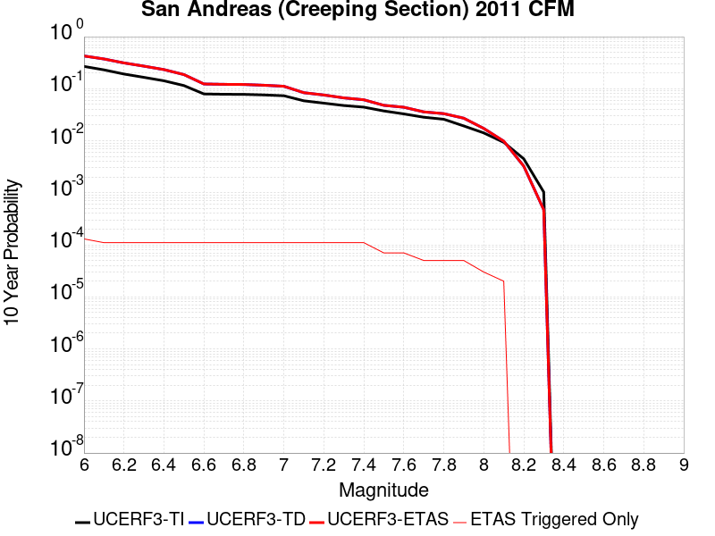 |

| Magnitude | 1 wk TI Prob | 1 wk TD Prob | 1 wk ETAS Prob | 1 wk ETAS/TD Gain | 1 wk ETAS Triggered Only | 1 mo TI Prob | 1 mo TD Prob | 1 mo ETAS Prob | 1 mo ETAS/TD Gain | 1 mo ETAS Triggered Only | 1 yr TI Prob | 1 yr TD Prob | 1 yr ETAS Prob | 1 yr ETAS/TD Gain | 1 yr ETAS Triggered Only | 10 yr TI Prob | 10 yr TD Prob | 10 yr ETAS Prob | 10 yr ETAS/TD Gain | 10 yr ETAS Triggered Only |
|-----|-----|-----|-----|-----|-----|-----|-----|-----|-----|-----|-----|-----|-----|-----|-----|-----|-----|-----|-----|-----|
| 6.0 | 5.986481E-4 | 0.0012280511 | 0.0012280511 | 1.0 | 0.0 | 0.0025631124 | 0.0052459883 | 0.0052758753 | 1.0056971 | 3.0044466E-5 | 0.030762846 | 0.061217785 | 0.06124599 | 1.0004607 | 3.0044466E-5 | 0.26835477 | 0.42601007 | 0.42607906 | 1.0001619 | 1.20177865E-4 |
| 6.1 | 5.015945E-4 | 0.001022282 | 0.001022282 | 1.0 | 0.0 | 0.00214792 | 0.004367797 | 0.004397711 | 1.0068486 | 3.0044466E-5 | 0.025839351 | 0.051259354 | 0.05128786 | 1.0005561 | 3.0044466E-5 | 0.23032776 | 0.37293026 | 0.3730056 | 1.0002021 | 1.20177865E-4 |
| 6.2 | 4.073338E-4 | 8.1122696E-4 | 8.1122696E-4 | 1.0 | 0.0 | 0.0017445484 | 0.0034677165 | 0.003497657 | 1.008634 | 3.0044466E-5 | 0.021034058 | 0.04094444 | 0.040973254 | 1.0007037 | 3.0044466E-5 | 0.19150782 | 0.31311423 | 0.31319675 | 1.0002637 | 1.20177865E-4 |
| 6.3 | 3.464099E-4 | 6.742372E-4 | 6.742372E-4 | 1.0 | 0.0 | 0.0014837692 | 0.0028832946 | 0.0029132525 | 1.0103902 | 3.0044466E-5 | 0.017915873 | 0.03420035 | 0.034229368 | 1.0008484 | 3.0044466E-5 | 0.16538359 | 0.2714023 | 0.27148986 | 1.0003226 | 1.20177865E-4 |
| 6.4 | 2.935057E-4 | 5.547048E-4 | 5.547048E-4 | 1.0 | 0.0 | 0.0012572751 | 0.002372106 | 0.0024020793 | 1.0126357 | 3.0044466E-5 | 0.015200248 | 0.028275466 | 0.02830466 | 1.0010325 | 3.0044466E-5 | 0.14201577 | 0.23307559 | 0.23316775 | 1.0003954 | 1.20177865E-4 |
| 6.5 | 2.3409708E-4 | 4.212275E-4 | 4.212275E-4 | 1.0 | 0.0 | 0.0010028875 | 0.0018021442 | 0.0018321346 | 1.0166415 | 3.0044466E-5 | 0.012141965 | 0.02159958 | 0.021628976 | 1.0013609 | 3.0044466E-5 | 0.11499573 | 0.18691993 | 0.18701763 | 1.0005227 | 1.20177865E-4 |
| 6.6 | 1.5842178E-4 | 2.5095858E-4 | 2.5095858E-4 | 1.0 | 0.0 | 6.7877385E-4 | 0.001075094 | 0.0011051062 | 1.0279158 | 3.0044466E-5 | 0.0082328 | 0.013009229 | 0.013038882 | 1.0022794 | 3.0044466E-5 | 0.07934396 | 0.1232508 | 0.12335616 | 1.0008548 | 1.20177865E-4 |
| 6.7 | 1.5616413E-4 | 2.4632283E-4 | 2.4632283E-4 | 1.0 | 0.0 | 6.691031E-4 | 0.0010552427 | 0.0010852555 | 1.0284415 | 3.0044466E-5 | 0.0081159435 | 0.012771067 | 0.012800728 | 1.0023226 | 3.0044466E-5 | 0.0782586 | 0.12127795 | 0.121383555 | 1.0008707 | 1.20177865E-4 |
| 6.8 | 1.5538467E-4 | 2.4456103E-4 | 2.4456103E-4 | 1.0 | 0.0 | 6.6576427E-4 | 0.0010476983 | 0.0010777113 | 1.0286466 | 3.0044466E-5 | 0.008075596 | 0.01268043 | 0.0127100935 | 1.0023394 | 3.0044466E-5 | 0.07788358 | 0.12050877 | 0.12061446 | 1.000877 | 1.20177865E-4 |
| 6.9 | 1.5153569E-4 | 2.3565214E-4 | 2.3565214E-4 | 1.0 | 0.0 | 6.49277E-4 | 0.0010095489 | 0.0010395631 | 1.0297302 | 3.0044466E-5 | 0.007876333 | 0.012222517 | 0.012252195 | 1.002428 | 3.0044466E-5 | 0.07602952 | 0.11657863 | 0.116684794 | 1.0009106 | 1.20177865E-4 |
| 7.0 | 1.4588932E-4 | 2.242227E-4 | 2.242227E-4 | 1.0 | 0.0 | 6.250901E-4 | 9.606025E-4 | 9.906181E-4 | 1.0312467 | 3.0044466E-5 | 0.0075839474 | 0.011633118 | 0.011662813 | 1.0025526 | 3.0044466E-5 | 0.073302895 | 0.11142479 | 0.11153158 | 1.0009583 | 1.20177865E-4 |
| 7.1 | 1.1565079E-4 | 1.6302502E-4 | 1.6302502E-4 | 1.0 | 0.0 | 4.955521E-4 | 6.9849245E-4 | 7.285159E-4 | 1.0429833 | 3.0044466E-5 | 0.006016669 | 0.008471188 | 0.008500978 | 1.0035167 | 3.0044466E-5 | 0.058563538 | 0.08376011 | 0.083870225 | 1.0013146 | 1.20177865E-4 |
| 7.2 | 1.0393792E-4 | 1.463503E-4 | 1.463503E-4 | 1.0 | 0.0 | 4.4537216E-4 | 6.2706554E-4 | 6.5709115E-4 | 1.0478828 | 3.0044466E-5 | 0.005408933 | 0.007607968 | 0.0076377844 | 1.003919 | 3.0044466E-5 | 0.052791595 | 0.07570439 | 0.07581546 | 1.0014672 | 1.20177865E-4 |
| 7.3 | 9.332884E-5 | 1.279767E-4 | 1.279767E-4 | 1.0 | 0.0 | 3.999194E-4 | 5.483569E-4 | 5.783849E-4 | 1.05476 | 3.0044466E-5 | 0.0048581534 | 0.0066559436 | 0.006685788 | 1.0044839 | 3.0044466E-5 | 0.047533102 | 0.06655922 | 0.066671394 | 1.0016854 | 1.20177865E-4 |
| 7.4 | 8.670252E-5 | 1.1716587E-4 | 1.1716587E-4 | 1.0 | 0.0 | 3.715293E-4 | 5.020434E-4 | 5.320728E-4 | 1.0598143 | 3.0044466E-5 | 0.004513991 | 0.006095369 | 0.00612523 | 1.004899 | 3.0044466E-5 | 0.044233937 | 0.06121244 | 0.06132526 | 1.0018431 | 1.20177865E-4 |
| 7.5 | 7.3036405E-5 | 9.0168665E-5 | 9.0168665E-5 | 1.0 | 0.0 | 3.129756E-4 | 3.8637998E-4 | 4.1641286E-4 | 1.0777289 | 3.0044466E-5 | 0.0038038217 | 0.004694051 | 0.0047239545 | 1.0063705 | 3.0044466E-5 | 0.03739367 | 0.047929354 | 0.048043773 | 1.0023872 | 1.20177865E-4 |
| 7.6 | 6.3935775E-5 | 8.289479E-5 | 8.289479E-5 | 1.0 | 0.0 | 2.7398168E-4 | 3.552151E-4 | 3.852489E-4 | 1.084551 | 3.0044466E-5 | 0.0033306254 | 0.0043161865 | 0.0043461015 | 1.0069308 | 3.0044466E-5 | 0.032811474 | 0.044034593 | 0.044149477 | 1.002609 | 1.20177865E-4 |
| 7.7 | 5.5050095E-5 | 6.66987E-5 | 6.66987E-5 | 1.0 | 0.0 | 2.3590765E-4 | 2.8582028E-4 | 3.1585616E-4 | 1.1050866 | 3.0044466E-5 | 0.0028683927 | 0.0034743135 | 0.0035042535 | 1.0086175 | 3.0044466E-5 | 0.0283165 | 0.035834707 | 0.035892643 | 1.0016167 | 6.0088933E-5 |
| 7.8 | 5.027131E-5 | 6.1701845E-5 | 6.1701845E-5 | 1.0 | 0.0 | 2.1543067E-4 | 2.644097E-4 | 2.9444622E-4 | 1.1135985 | 3.0044466E-5 | 0.0026197135 | 0.0032144396 | 0.0032443875 | 1.0093167 | 3.0044466E-5 | 0.025890453 | 0.033161845 | 0.03321994 | 1.0017519 | 6.0088933E-5 |
| 7.9 | 3.7271806E-5 | 5.0283532E-5 | 5.0283532E-5 | 1.0 | 0.0 | 1.5972654E-4 | 2.1548307E-4 | 2.4552105E-4 | 1.1393983 | 3.0044466E-5 | 0.0019429359 | 0.002620352 | 0.0026503177 | 1.0114357 | 3.0044466E-5 | 0.019260362 | 0.027095705 | 0.027154166 | 1.0021576 | 6.0088933E-5 |
| 8.0 | 2.7310243E-5 | 3.1467505E-5 | 3.1467505E-5 | 1.0 | 0.0 | 1.17038646E-4 | 1.3485376E-4 | 1.3485376E-4 | 1.0 | 0.0 | 0.0014240141 | 0.001640609 | 0.001640609 | 1.0 | 0.0 | 0.014149235 | 0.017233718 | 0.017263245 | 1.0017133 | 3.0044466E-5 |
| 8.1 | 1.7940547E-5 | 1.7425557E-5 | 1.7425557E-5 | 1.0 | 0.0 | 7.688579E-5 | 7.467882E-5 | 7.467882E-5 | 1.0 | 0.0 | 9.3568244E-4 | 9.0883597E-4 | 9.0883597E-4 | 1.0 | 0.0 | 0.009317525 | 0.009812082 | 0.009841831 | 1.003032 | 3.0044466E-5 |
| 8.2 | 8.643924E-6 | 5.4848397E-6 | 5.4848397E-6 | 1.0 | 0.0 | 3.704486E-5 | 2.3506243E-5 | 2.3506243E-5 | 1.0 | 0.0 | 4.5092785E-4 | 2.8615101E-4 | 2.8615101E-4 | 1.0 | 0.0 | 0.0045001395 | 0.0032541603 | 0.0032541603 | 1.0 | 0.0 |
| 8.3 | 1.983087E-6 | 7.676691E-7 | 7.676691E-7 | 1.0 | 0.0 | 8.498917E-6 | 3.2900064E-6 | 3.2900064E-6 | 1.0 | 0.0 | 1.034694E-4 | 4.005511E-5 | 4.005511E-5 | 1.0 | 0.0 | 0.0010342124 | 4.729315E-4 | 4.729315E-4 | 1.0 | 0.0 |

## Ortigalita (North)
*[(top)](#table-of-contents)*

| 1 Week | 1 Month | 1 Year | 10 Year |
|-----|-----|-----|-----|
|  |  |  |  |

| Magnitude | 1 wk TI Prob | 1 wk TD Prob | 1 wk ETAS Prob | 1 wk ETAS/TD Gain | 1 wk ETAS Triggered Only | 1 mo TI Prob | 1 mo TD Prob | 1 mo ETAS Prob | 1 mo ETAS/TD Gain | 1 mo ETAS Triggered Only | 1 yr TI Prob | 1 yr TD Prob | 1 yr ETAS Prob | 1 yr ETAS/TD Gain | 1 yr ETAS Triggered Only | 10 yr TI Prob | 10 yr TD Prob | 10 yr ETAS Prob | 10 yr ETAS/TD Gain | 10 yr ETAS Triggered Only |
|-----|-----|-----|-----|-----|-----|-----|-----|-----|-----|-----|-----|-----|-----|-----|-----|-----|-----|-----|-----|-----|
| 6.0 | 7.711876E-5 | 1.0507549E-4 | 1.0507549E-4 | 1.0 | 0.0 | 3.3046713E-4 | 4.502567E-4 | 4.8028762E-4 | 1.0666974 | 3.0044466E-5 | 0.004016016 | 0.0054685385 | 0.005498419 | 1.005464 | 3.0044466E-5 | 0.039442103 | 0.053459276 | 0.053487714 | 1.0005319 | 3.0044466E-5 |
| 6.1 | 4.607858E-5 | 6.0244274E-5 | 6.0244274E-5 | 1.0 | 0.0 | 1.9746469E-4 | 2.58167E-4 | 2.882037E-4 | 1.116346 | 3.0044466E-5 | 0.0024014818 | 0.0031390057 | 0.003168956 | 1.0095413 | 3.0044466E-5 | 0.023756953 | 0.030977463 | 0.031006578 | 1.0009398 | 3.0044466E-5 |
| 6.2 | 4.607858E-5 | 6.0244274E-5 | 6.0244274E-5 | 1.0 | 0.0 | 1.9746469E-4 | 2.58167E-4 | 2.882037E-4 | 1.116346 | 3.0044466E-5 | 0.0024014818 | 0.0031390057 | 0.003168956 | 1.0095413 | 3.0044466E-5 | 0.023756953 | 0.030977463 | 0.031006578 | 1.0009398 | 3.0044466E-5 |
| 6.3 | 3.327423E-5 | 4.2478347E-5 | 4.2478347E-5 | 1.0 | 0.0 | 1.4259605E-4 | 1.820391E-4 | 2.120781E-4 | 1.165014 | 3.0044466E-5 | 0.0017347244 | 0.0022143624 | 0.0022443403 | 1.013538 | 3.0044466E-5 | 0.017212452 | 0.021947231 | 0.021976616 | 1.0013388 | 3.0044466E-5 |
| 6.4 | 2.7732503E-5 | 3.5001114E-5 | 3.5001114E-5 | 1.0 | 0.0 | 1.1884817E-4 | 1.4999765E-4 | 1.8003762E-4 | 1.2002696 | 3.0044466E-5 | 0.001446016 | 0.0018249385 | 0.0018549281 | 1.0164332 | 3.0044466E-5 | 0.014366428 | 0.018122489 | 0.01815199 | 1.0016278 | 3.0044466E-5 |
| 6.5 | 2.7689714E-5 | 3.4950925E-5 | 3.4950925E-5 | 1.0 | 0.0 | 1.186648E-4 | 1.4978259E-4 | 1.7982256E-4 | 1.2005571 | 3.0044466E-5 | 0.0014437864 | 0.0018223245 | 0.0018523141 | 1.0164568 | 3.0044466E-5 | 0.014344421 | 0.018096775 | 0.018126275 | 1.0016302 | 3.0044466E-5 |
| 6.6 | 2.2976905E-5 | 2.8720246E-5 | 2.8720246E-5 | 1.0 | 0.0 | 9.846873E-5 | 1.2308238E-4 | 1.5312315E-4 | 1.2440704 | 3.0044466E-5 | 0.0011981975 | 0.0014977377 | 0.0015277371 | 1.0200299 | 3.0044466E-5 | 0.011917574 | 0.014899705 | 0.014929301 | 1.0019864 | 3.0044466E-5 |
| 6.7 | 1.9871539E-5 | 2.4906147E-5 | 2.4906147E-5 | 1.0 | 0.0 | 8.516096E-5 | 1.06737665E-4 | 1.3677892E-4 | 1.2814494 | 3.0044466E-5 | 0.0010363415 | 0.001299005 | 0.0013290105 | 1.0230988 | 3.0044466E-5 | 0.010315218 | 0.012937811 | 0.012967466 | 1.0022922 | 3.0044466E-5 |
| 6.8 | 6.5640475E-6 | 7.605813E-6 | 7.605813E-6 | 1.0 | 0.0 | 2.813133E-5 | 3.259595E-5 | 6.263944E-5 | 1.9216938 | 3.0044466E-5 | 3.424451E-4 | 3.967863E-4 | 4.2681882E-4 | 1.0756894 | 3.0044466E-5 | 0.0034191788 | 0.003961066 | 0.003990991 | 1.0075549 | 3.0044466E-5 |
| 6.9 | 5.6219683E-6 | 6.502108E-6 | 6.502108E-6 | 1.0 | 0.0 | 2.4093928E-5 | 2.7865894E-5 | 2.7865894E-5 | 1.0 | 0.0 | 2.933041E-4 | 3.3921702E-4 | 3.3921702E-4 | 1.0 | 0.0 | 0.0029291727 | 0.0033872493 | 0.0033872493 | 1.0 | 0.0 |
| 7.0 | 3.875591E-6 | 4.484942E-6 | 4.484942E-6 | 1.0 | 0.0 | 1.6609569E-5 | 1.922105E-5 | 1.922105E-5 | 1.0 | 0.0 | 2.0220275E-4 | 2.3399328E-4 | 2.3399328E-4 | 1.0 | 0.0 | 0.0020201886 | 0.0023376774 | 0.0023376774 | 1.0 | 0.0 |
| 7.1 | 1.6017933E-6 | 1.8571203E-6 | 1.8571203E-6 | 1.0 | 0.0 | 6.8648105E-6 | 7.959069E-6 | 7.959069E-6 | 1.0 | 0.0 | 8.357586E-5 | 9.6898424E-5 | 9.6898424E-5 | 1.0 | 0.0 | 8.3544437E-4 | 9.686664E-4 | 9.686664E-4 | 1.0 | 0.0 |

## Brawley (Seismic Zone) alt 1
*[(top)](#table-of-contents)*

| 1 Week | 1 Month | 1 Year | 10 Year |
|-----|-----|-----|-----|
|  |  |  |  |

| Magnitude | 1 wk TI Prob | 1 wk TD Prob | 1 wk ETAS Prob | 1 wk ETAS/TD Gain | 1 wk ETAS Triggered Only | 1 mo TI Prob | 1 mo TD Prob | 1 mo ETAS Prob | 1 mo ETAS/TD Gain | 1 mo ETAS Triggered Only | 1 yr TI Prob | 1 yr TD Prob | 1 yr ETAS Prob | 1 yr ETAS/TD Gain | 1 yr ETAS Triggered Only | 10 yr TI Prob | 10 yr TD Prob | 10 yr ETAS Prob | 10 yr ETAS/TD Gain | 10 yr ETAS Triggered Only |
|-----|-----|-----|-----|-----|-----|-----|-----|-----|-----|-----|-----|-----|-----|-----|-----|-----|-----|-----|-----|-----|
| 6.0 | 2.2521618E-4 | 4.7650016E-4 | 4.7650016E-4 | 1.0 | 0.0 | 9.6485513E-4 | 0.0020405825 | 0.0020405825 | 1.0 | 0.0 | 0.011683988 | 0.02455514 | 0.024584444 | 1.0011935 | 3.0044466E-5 | 0.11088423 | 0.21356027 | 0.21363115 | 1.0003319 | 9.01334E-5 |
| 6.1 | 2.2521618E-4 | 4.7650016E-4 | 4.7650016E-4 | 1.0 | 0.0 | 9.6485513E-4 | 0.0020405825 | 0.0020405825 | 1.0 | 0.0 | 0.011683988 | 0.02455514 | 0.024584444 | 1.0011935 | 3.0044466E-5 | 0.11088423 | 0.21356027 | 0.21363115 | 1.0003319 | 9.01334E-5 |
| 6.2 | 2.198148E-4 | 4.6734224E-4 | 4.6734224E-4 | 1.0 | 0.0 | 9.417233E-4 | 0.0020013945 | 0.0020013945 | 1.0 | 0.0 | 0.011405343 | 0.024089206 | 0.024118528 | 1.0012171 | 3.0044466E-5 | 0.10837428 | 0.20999599 | 0.21006718 | 1.000339 | 9.01334E-5 |
| 6.3 | 2.1704129E-4 | 4.6169842E-4 | 4.6169842E-4 | 1.0 | 0.0 | 9.298453E-4 | 0.0019772437 | 0.0019772437 | 1.0 | 0.0 | 0.011262234 | 0.023802334 | 0.023831664 | 1.0012321 | 3.0044466E-5 | 0.107082725 | 0.20788695 | 0.20795834 | 1.0003434 | 9.01334E-5 |
| 6.4 | 1.876142E-4 | 4.0061463E-4 | 4.0061463E-4 | 1.0 | 0.0 | 8.038131E-4 | 0.0017158045 | 0.0017158045 | 1.0 | 0.0 | 0.00974259 | 0.020688858 | 0.02071828 | 1.0014222 | 3.0044466E-5 | 0.093263686 | 0.18463784 | 0.18471134 | 1.000398 | 9.01334E-5 |
| 6.5 | 1.7390939E-4 | 3.7493056E-4 | 3.7493056E-4 | 1.0 | 0.0 | 7.45113E-4 | 0.0016058679 | 0.0016058679 | 1.0 | 0.0 | 0.009034078 | 0.019376898 | 0.019406362 | 1.0015205 | 3.0044466E-5 | 0.086755216 | 0.174459 | 0.17453341 | 1.0004265 | 9.01334E-5 |
| 6.6 | 1.591791E-4 | 3.4907137E-4 | 3.4907137E-4 | 1.0 | 0.0 | 6.8201777E-4 | 0.0014951725 | 0.0014951725 | 1.0 | 0.0 | 0.008271996 | 0.018053345 | 0.018082846 | 1.0016341 | 3.0044466E-5 | 0.07970774 | 0.16386543 | 0.1639408 | 1.0004599 | 9.01334E-5 |
| 6.7 | 1.4268003E-4 | 3.207246E-4 | 3.207246E-4 | 1.0 | 0.0 | 6.1134255E-4 | 0.001373818 | 0.001373818 | 1.0 | 0.0 | 0.007417723 | 0.01659992 | 0.016629465 | 1.0017799 | 3.0044466E-5 | 0.07174956 | 0.15198784 | 0.15206426 | 1.000503 | 9.01334E-5 |
| 6.8 | 1.239713E-4 | 2.906574E-4 | 2.906574E-4 | 1.0 | 0.0 | 5.3119735E-4 | 0.001245086 | 0.001245086 | 1.0 | 0.0 | 0.0064481674 | 0.01505499 | 0.015084581 | 1.0019656 | 3.0044466E-5 | 0.06264243 | 0.13842559 | 0.13850324 | 1.000561 | 9.01334E-5 |
| 6.9 | 1.0180238E-4 | 2.6263754E-4 | 2.6263754E-4 | 1.0 | 0.0 | 4.3622297E-4 | 0.0011251081 | 0.0011251081 | 1.0 | 0.0 | 0.005298089 | 0.013613156 | 0.013642792 | 1.002177 | 3.0044466E-5 | 0.05173543 | 0.12499963 | 0.12507848 | 1.000631 | 9.01334E-5 |
| 7.0 | 7.6619996E-5 | 2.2406445E-4 | 2.2406445E-4 | 1.0 | 0.0 | 3.283301E-4 | 9.59926E-4 | 9.59926E-4 | 1.0 | 0.0 | 0.0039900932 | 0.011625181 | 0.011654876 | 1.0025544 | 3.0044466E-5 | 0.039192066 | 0.10729616 | 0.10737663 | 1.00075 | 9.01334E-5 |
| 7.1 | 7.5127435E-5 | 2.2089518E-4 | 2.2089518E-4 | 1.0 | 0.0 | 3.2193496E-4 | 9.463533E-4 | 9.463533E-4 | 1.0 | 0.0 | 0.0039125155 | 0.011461684 | 0.011491384 | 1.0025913 | 3.0044466E-5 | 0.038443442 | 0.10585982 | 0.10594042 | 1.0007613 | 9.01334E-5 |
| 7.2 | 6.788582E-5 | 2.0217002E-4 | 2.0217002E-4 | 1.0 | 0.0 | 2.9090676E-4 | 8.661583E-4 | 8.661583E-4 | 1.0 | 0.0 | 0.0035360386 | 0.010495127 | 0.010524856 | 1.0028327 | 3.0044466E-5 | 0.034803 | 0.0975296 | 0.097610936 | 1.000834 | 9.01334E-5 |
| 7.3 | 6.399602E-5 | 1.8847662E-4 | 1.8847662E-4 | 1.0 | 0.0 | 2.7423984E-4 | 8.075098E-4 | 8.075098E-4 | 1.0 | 0.0 | 0.0033337586 | 0.009787704 | 0.009817454 | 1.0030396 | 3.0044466E-5 | 0.03284188 | 0.09142354 | 0.09150544 | 1.0008957 | 9.01334E-5 |
| 7.4 | 4.506759E-5 | 1.2534359E-4 | 1.2534359E-4 | 1.0 | 0.0 | 1.9313251E-4 | 5.3707714E-4 | 5.3707714E-4 | 1.0 | 0.0 | 0.0023488526 | 0.006519484 | 0.0065493323 | 1.0045784 | 3.0044466E-5 | 0.023241805 | 0.0623863 | 0.062470812 | 1.0013546 | 9.01334E-5 |
| 7.5 | 3.43289E-5 | 9.339764E-5 | 9.339764E-5 | 1.0 | 0.0 | 1.4711556E-4 | 4.002145E-4 | 4.002145E-4 | 1.0 | 0.0 | 0.0017896603 | 0.0048617874 | 0.004891686 | 1.0061496 | 3.0044466E-5 | 0.01775316 | 0.04707467 | 0.047160562 | 1.0018245 | 9.01334E-5 |
| 7.6 | 2.5980507E-5 | 7.056894E-5 | 7.056894E-5 | 1.0 | 0.0 | 1.1134028E-4 | 3.0240338E-4 | 3.0240338E-4 | 1.0 | 0.0 | 0.001354725 | 0.0036755698 | 0.003705504 | 1.008144 | 3.0044466E-5 | 0.013464959 | 0.035857998 | 0.035944898 | 1.0024235 | 9.01334E-5 |
| 7.7 | 1.7292105E-5 | 4.943965E-5 | 4.943965E-5 | 1.0 | 0.0 | 7.4106916E-5 | 2.1186704E-4 | 2.1186704E-4 | 1.0 | 0.0 | 9.018782E-4 | 0.0025764357 | 0.0026064026 | 1.0116313 | 3.0044466E-5 | 0.008982267 | 0.025305117 | 0.025392968 | 1.0034717 | 9.01334E-5 |
| 7.8 | 1.2927471E-5 | 3.9721428E-5 | 3.9721428E-5 | 1.0 | 0.0 | 5.5402274E-5 | 1.702236E-4 | 1.702236E-4 | 1.0 | 0.0 | 6.743139E-4 | 0.002070505 | 0.0021004872 | 1.0144806 | 3.0044466E-5 | 0.0067227143 | 0.020444553 | 0.020503413 | 1.002879 | 6.0088933E-5 |
| 7.9 | 1.0200774E-5 | 2.876846E-5 | 2.876846E-5 | 1.0 | 0.0 | 4.371687E-5 | 1.2328758E-4 | 1.2328758E-4 | 1.0 | 0.0 | 5.321229E-4 | 0.0014999938 | 0.0015299933 | 1.0199996 | 3.0044466E-5 | 0.005308505 | 0.015002176 | 0.015061364 | 1.0039452 | 6.0088933E-5 |
| 8.0 | 8.650396E-6 | 2.329689E-5 | 2.329689E-5 | 1.0 | 0.0 | 3.70726E-5 | 9.984E-5 | 9.984E-5 | 1.0 | 0.0 | 4.5126543E-4 | 0.001214875 | 0.0012448829 | 1.0247004 | 3.0044466E-5 | 0.0045035016 | 0.012220192 | 0.012279547 | 1.0048571 | 6.0088933E-5 |
| 8.1 | 3.9368224E-6 | 7.336344E-6 | 7.336344E-6 | 1.0 | 0.0 | 1.6871985E-5 | 3.1441094E-5 | 3.1441094E-5 | 1.0 | 0.0 | 2.0539707E-4 | 3.8272823E-4 | 3.8272823E-4 | 1.0 | 0.0 | 0.0020520731 | 0.0040053325 | 0.0040352563 | 1.0074711 | 3.0044466E-5 |
| 8.2 | 1.7101195E-6 | 2.2211486E-6 | 2.2211486E-6 | 1.0 | 0.0 | 7.329063E-6 | 9.519174E-6 | 9.519174E-6 | 1.0 | 0.0 | 8.922769E-5 | 1.1588981E-4 | 1.1588981E-4 | 1.0 | 0.0 | 8.9191867E-4 | 0.0012683558 | 0.0012683558 | 1.0 | 0.0 |
| 8.3 | 3.0346666E-8 | 1.725032E-8 | 1.725032E-8 | 1.0 | 0.0 | 1.3005713E-7 | 7.392994E-8 | 7.392994E-8 | 1.0 | 0.0 | 1.5834444E-6 | 9.0009695E-7 | 9.0009695E-7 | 1.0 | 0.0 | 1.5834332E-5 | 9.386116E-6 | 9.386116E-6 | 1.0 | 0.0 |

## Santa Ynez (West)
*[(top)](#table-of-contents)*

| 1 Week | 1 Month | 1 Year | 10 Year |
|-----|-----|-----|-----|
|  |  |  |  |

| Magnitude | 1 wk TI Prob | 1 wk TD Prob | 1 wk ETAS Prob | 1 wk ETAS/TD Gain | 1 wk ETAS Triggered Only | 1 mo TI Prob | 1 mo TD Prob | 1 mo ETAS Prob | 1 mo ETAS/TD Gain | 1 mo ETAS Triggered Only | 1 yr TI Prob | 1 yr TD Prob | 1 yr ETAS Prob | 1 yr ETAS/TD Gain | 1 yr ETAS Triggered Only | 10 yr TI Prob | 10 yr TD Prob | 10 yr ETAS Prob | 10 yr ETAS/TD Gain | 10 yr ETAS Triggered Only |
|-----|-----|-----|-----|-----|-----|-----|-----|-----|-----|-----|-----|-----|-----|-----|-----|-----|-----|-----|-----|-----|
| 6.0 | 4.7352758E-5 | 5.4974862E-5 | 8.501767E-5 | 1.5464828 | 3.0044466E-5 | 2.0292461E-4 | 2.3558694E-4 | 2.6562432E-4 | 1.1275002 | 3.0044466E-5 | 0.0024678076 | 0.0028646647 | 0.0029245815 | 1.0209159 | 6.0088933E-5 | 0.024405818 | 0.028305776 | 0.028364165 | 1.0020628 | 6.0088933E-5 |
| 6.1 | 4.7352758E-5 | 5.4974862E-5 | 8.501767E-5 | 1.5464828 | 3.0044466E-5 | 2.0292461E-4 | 2.3558694E-4 | 2.6562432E-4 | 1.1275002 | 3.0044466E-5 | 0.0024678076 | 0.0028646647 | 0.002894623 | 1.0104579 | 3.0044466E-5 | 0.024405818 | 0.028305776 | 0.02833497 | 1.0010314 | 3.0044466E-5 |
| 6.2 | 3.0415853E-5 | 3.3926462E-5 | 6.396991E-5 | 1.8855461 | 3.0044466E-5 | 1.3034715E-4 | 1.4539124E-4 | 1.7543134E-4 | 1.2066156 | 3.0044466E-5 | 0.0015858212 | 0.0017687364 | 0.0017987277 | 1.0169563 | 3.0044466E-5 | 0.015745522 | 0.017550496 | 0.017580014 | 1.0016818 | 3.0044466E-5 |
| 6.3 | 3.0415853E-5 | 3.3926462E-5 | 6.396991E-5 | 1.8855461 | 3.0044466E-5 | 1.3034715E-4 | 1.4539124E-4 | 1.7543134E-4 | 1.2066156 | 3.0044466E-5 | 0.0015858212 | 0.0017687364 | 0.0017987277 | 1.0169563 | 3.0044466E-5 | 0.015745522 | 0.017550496 | 0.017580014 | 1.0016818 | 3.0044466E-5 |
| 6.4 | 2.5452082E-5 | 2.7913433E-5 | 5.795706E-5 | 2.0763144 | 3.0044466E-5 | 1.09075794E-4 | 1.19623626E-4 | 1.496645E-4 | 1.2511282 | 3.0044466E-5 | 0.0013271887 | 0.0014554613 | 0.001485462 | 1.0206125 | 3.0044466E-5 | 0.013192902 | 0.01446147 | 0.014491079 | 1.0020475 | 3.0044466E-5 |
| 6.5 | 2.3143784E-5 | 2.5129113E-5 | 5.5172823E-5 | 2.1955738 | 3.0044466E-5 | 9.9183875E-5 | 1.07691834E-4 | 1.3773306E-4 | 1.2789555 | 3.0044466E-5 | 0.0012068948 | 0.0013103712 | 0.0013403763 | 1.0228982 | 3.0044466E-5 | 0.012003611 | 0.013028121 | 0.013057773 | 1.0022761 | 3.0044466E-5 |
| 6.6 | 1.9118515E-5 | 2.0354959E-5 | 2.0354959E-5 | 1.0 | 0.0 | 8.193392E-5 | 8.7232664E-5 | 8.7232664E-5 | 1.0 | 0.0 | 9.97089E-4 | 0.0010615482 | 0.0010615482 | 1.0 | 0.0 | 0.00992627 | 0.010565684 | 0.010595411 | 1.0028136 | 3.0044466E-5 |
| 6.7 | 1.722807E-5 | 1.8146866E-5 | 1.8146866E-5 | 1.0 | 0.0 | 7.3832496E-5 | 7.777E-5 | 7.777E-5 | 1.0 | 0.0 | 8.985399E-4 | 9.46444E-4 | 9.46444E-4 | 1.0 | 0.0 | 0.008949154 | 0.009424779 | 0.00945454 | 1.0031577 | 3.0044466E-5 |
| 6.8 | 1.5317364E-5 | 1.5926908E-5 | 1.5926908E-5 | 1.0 | 0.0 | 6.56442E-5 | 6.825642E-5 | 6.825642E-5 | 1.0 | 0.0 | 7.98925E-4 | 8.3070935E-4 | 8.3070935E-4 | 1.0 | 0.0 | 0.007960589 | 0.008276529 | 0.008276529 | 1.0 | 0.0 |
| 6.9 | 1.3071226E-5 | 1.3329939E-5 | 1.3329939E-5 | 1.0 | 0.0 | 5.6018336E-5 | 5.7127072E-5 | 5.7127072E-5 | 1.0 | 0.0 | 6.8180985E-4 | 6.953024E-4 | 6.953024E-4 | 1.0 | 0.0 | 0.0067972173 | 0.0069315303 | 0.0069315303 | 1.0 | 0.0 |
| 7.0 | 1.1836986E-5 | 1.1933047E-5 | 1.1933047E-5 | 1.0 | 0.0 | 5.0728955E-5 | 5.114064E-5 | 5.114064E-5 | 1.0 | 0.0 | 6.1745E-4 | 6.224611E-4 | 6.224611E-4 | 1.0 | 0.0 | 0.006157372 | 0.006207369 | 0.006207369 | 1.0 | 0.0 |
| 7.1 | 1.0597169E-5 | 1.05424215E-5 | 1.05424215E-5 | 1.0 | 0.0 | 4.541565E-5 | 4.518103E-5 | 4.518103E-5 | 1.0 | 0.0 | 5.5279525E-4 | 5.499413E-4 | 5.499413E-4 | 1.0 | 0.0 | 0.0055142213 | 0.005485935 | 0.005485935 | 1.0 | 0.0 |
| 7.2 | 9.59113E-6 | 9.459342E-6 | 9.459342E-6 | 1.0 | 0.0 | 4.11042E-5 | 4.0539413E-5 | 4.0539413E-5 | 1.0 | 0.0 | 5.0032866E-4 | 4.9345667E-4 | 4.9345667E-4 | 1.0 | 0.0 | 0.004992037 | 0.0049237283 | 0.0049237283 | 1.0 | 0.0 |
| 7.3 | 8.586084E-6 | 8.37976E-6 | 8.37976E-6 | 1.0 | 0.0 | 3.679698E-5 | 3.591277E-5 | 3.591277E-5 | 1.0 | 0.0 | 4.4791115E-4 | 4.3715126E-4 | 4.3715126E-4 | 1.0 | 0.0 | 0.004470094 | 0.0043630246 | 0.0043630246 | 1.0 | 0.0 |
| 7.4 | 7.2622997E-6 | 6.9516886E-6 | 6.9516886E-6 | 1.0 | 0.0 | 3.112377E-5 | 2.9792616E-5 | 2.9792616E-5 | 1.0 | 0.0 | 3.78866E-4 | 3.626657E-4 | 3.626657E-4 | 1.0 | 0.0 | 0.0037822074 | 0.0036208387 | 0.0036208387 | 1.0 | 0.0 |
| 7.5 | 5.627296E-6 | 5.251695E-6 | 5.251695E-6 | 1.0 | 0.0 | 2.411676E-5 | 2.2507073E-5 | 2.2507073E-5 | 1.0 | 0.0 | 2.9358198E-4 | 2.7398986E-4 | 2.7398986E-4 | 1.0 | 0.0 | 0.0029319443 | 0.0027365927 | 0.0027365927 | 1.0 | 0.0 |
| 7.6 | 2.265244E-6 | 2.0608993E-6 | 2.0608993E-6 | 1.0 | 0.0 | 9.708152E-6 | 8.832396E-6 | 8.832396E-6 | 1.0 | 0.0 | 1.18190335E-4 | 1.07529195E-4 | 1.07529195E-4 | 1.0 | 0.0 | 0.001181275 | 0.0010747804 | 0.0010747804 | 1.0 | 0.0 |
| 7.7 | 1.3099874E-6 | 1.1016477E-6 | 1.1016477E-6 | 1.0 | 0.0 | 5.61422E-6 | 4.7213393E-6 | 4.7213393E-6 | 1.0 | 0.0 | 6.8350986E-5 | 5.748081E-5 | 5.748081E-5 | 1.0 | 0.0 | 6.832996E-4 | 5.746618E-4 | 5.746618E-4 | 1.0 | 0.0 |
| 7.8 | 7.903951E-7 | 6.07124E-7 | 6.07124E-7 | 1.0 | 0.0 | 3.3874032E-6 | 2.6019575E-6 | 2.6019575E-6 | 1.0 | 0.0 | 4.1240855E-5 | 3.1678384E-5 | 3.1678384E-5 | 1.0 | 0.0 | 4.12332E-4 | 3.1674E-4 | 3.1674E-4 | 1.0 | 0.0 |
| 7.9 | 7.0753297E-9 | 5.0900093E-9 | 5.0900093E-9 | 1.0 | 0.0 | 3.032284E-8 | 2.1814326E-8 | 2.1814326E-8 | 1.0 | 0.0 | 3.6918053E-7 | 2.655894E-7 | 2.655894E-7 | 1.0 | 0.0 | 3.691799E-6 | 2.6558916E-6 | 2.6558916E-6 | 1.0 | 0.0 |

## San Jacinto (Lytle Creek connector)
*[(top)](#table-of-contents)*

| 1 Week | 1 Month | 1 Year | 10 Year |
|-----|-----|-----|-----|
|  |  |  |  |

| Magnitude | 1 wk TI Prob | 1 wk TD Prob | 1 wk ETAS Prob | 1 wk ETAS/TD Gain | 1 wk ETAS Triggered Only | 1 mo TI Prob | 1 mo TD Prob | 1 mo ETAS Prob | 1 mo ETAS/TD Gain | 1 mo ETAS Triggered Only | 1 yr TI Prob | 1 yr TD Prob | 1 yr ETAS Prob | 1 yr ETAS/TD Gain | 1 yr ETAS Triggered Only | 10 yr TI Prob | 10 yr TD Prob | 10 yr ETAS Prob | 10 yr ETAS/TD Gain | 10 yr ETAS Triggered Only |
|-----|-----|-----|-----|-----|-----|-----|-----|-----|-----|-----|-----|-----|-----|-----|-----|-----|-----|-----|-----|-----|
| 6.0 | 6.693995E-6 | 6.6656444E-6 | 6.6656444E-6 | 1.0 | 0.0 | 2.8688235E-5 | 2.8566736E-5 | 5.861034E-5 | 2.051699 | 3.0044466E-5 | 3.492233E-4 | 3.477446E-4 | 4.0781262E-4 | 1.172736 | 6.0088933E-5 | 0.00348675 | 0.0035522047 | 0.0036420177 | 1.0252838 | 9.01334E-5 |
| 6.1 | 6.693995E-6 | 6.6656444E-6 | 6.6656444E-6 | 1.0 | 0.0 | 2.8688235E-5 | 2.8566736E-5 | 5.861034E-5 | 2.051699 | 3.0044466E-5 | 3.492233E-4 | 3.477446E-4 | 4.0781262E-4 | 1.172736 | 6.0088933E-5 | 0.00348675 | 0.0035522047 | 0.0036420177 | 1.0252838 | 9.01334E-5 |
| 6.2 | 6.693995E-6 | 6.6656444E-6 | 6.6656444E-6 | 1.0 | 0.0 | 2.8688235E-5 | 2.8566736E-5 | 5.861034E-5 | 2.051699 | 3.0044466E-5 | 3.492233E-4 | 3.477446E-4 | 4.0781262E-4 | 1.172736 | 6.0088933E-5 | 0.00348675 | 0.0035522047 | 0.0036420177 | 1.0252838 | 9.01334E-5 |
| 6.3 | 6.693995E-6 | 6.6656444E-6 | 6.6656444E-6 | 1.0 | 0.0 | 2.8688235E-5 | 2.8566736E-5 | 5.861034E-5 | 2.051699 | 3.0044466E-5 | 3.492233E-4 | 3.477446E-4 | 4.0781262E-4 | 1.172736 | 6.0088933E-5 | 0.00348675 | 0.0035522047 | 0.0036420177 | 1.0252838 | 9.01334E-5 |
| 6.4 | 6.693995E-6 | 6.6656444E-6 | 6.6656444E-6 | 1.0 | 0.0 | 2.8688235E-5 | 2.8566736E-5 | 5.861034E-5 | 2.051699 | 3.0044466E-5 | 3.492233E-4 | 3.477446E-4 | 4.0781262E-4 | 1.172736 | 6.0088933E-5 | 0.00348675 | 0.0035522047 | 0.0036420177 | 1.0252838 | 9.01334E-5 |
| 6.5 | 6.6561875E-6 | 6.625862E-6 | 6.625862E-6 | 1.0 | 0.0 | 2.8526205E-5 | 2.8396244E-5 | 5.8439855E-5 | 2.0580137 | 3.0044466E-5 | 3.472512E-4 | 3.4566948E-4 | 4.0573766E-4 | 1.1737734 | 6.0088933E-5 | 0.0034670907 | 0.0035315198 | 0.003621335 | 1.0254325 | 9.01334E-5 |
| 6.6 | 6.6561875E-6 | 6.625862E-6 | 6.625862E-6 | 1.0 | 0.0 | 2.8526205E-5 | 2.8396244E-5 | 5.8439855E-5 | 2.0580137 | 3.0044466E-5 | 3.472512E-4 | 3.4566948E-4 | 4.0573766E-4 | 1.1737734 | 6.0088933E-5 | 0.0034670907 | 0.0035315198 | 0.003621335 | 1.0254325 | 9.01334E-5 |
| 6.7 | 6.5802237E-6 | 6.5450376E-6 | 6.5450376E-6 | 1.0 | 0.0 | 2.8200653E-5 | 2.8049859E-5 | 5.8093483E-5 | 2.0710793 | 3.0044466E-5 | 3.4328885E-4 | 3.414536E-4 | 4.01522E-4 | 1.1759197 | 6.0088933E-5 | 0.0034275902 | 0.0034894939 | 0.0035793127 | 1.0257398 | 9.01334E-5 |
| 6.8 | 6.575632E-6 | 6.539527E-6 | 6.539527E-6 | 1.0 | 0.0 | 2.8180975E-5 | 2.8026243E-5 | 5.8069865E-5 | 2.071982 | 3.0044466E-5 | 3.4304935E-4 | 3.4116616E-4 | 4.0123457E-4 | 1.176068 | 6.0088933E-5 | 0.0034252026 | 0.0034866284 | 0.0035764475 | 1.025761 | 9.01334E-5 |
| 6.9 | 6.570433E-6 | 6.53092E-6 | 6.53092E-6 | 1.0 | 0.0 | 2.8158694E-5 | 2.7989357E-5 | 5.8032983E-5 | 2.0733945 | 3.0044466E-5 | 3.4277816E-4 | 3.4071723E-4 | 4.0078568E-4 | 1.1763 | 6.0088933E-5 | 0.0034224992 | 0.0034821532 | 0.0035719727 | 1.0257943 | 9.01334E-5 |
| 7.0 | 6.5643826E-6 | 6.52104E-6 | 6.52104E-6 | 1.0 | 0.0 | 2.8132765E-5 | 2.7947017E-5 | 5.7990645E-5 | 2.0750208 | 3.0044466E-5 | 3.424626E-4 | 3.402019E-4 | 4.0027036E-4 | 1.1765672 | 6.0088933E-5 | 0.0034193532 | 0.003477016 | 0.003566836 | 1.0258325 | 9.01334E-5 |
| 7.1 | 6.557402E-6 | 6.5097515E-6 | 6.5097515E-6 | 1.0 | 0.0 | 2.8102848E-5 | 2.7898635E-5 | 5.7942263E-5 | 2.0768852 | 3.0044466E-5 | 3.4209844E-4 | 3.3961303E-4 | 3.9968156E-4 | 1.1768734 | 6.0088933E-5 | 0.0034157229 | 0.0034711468 | 0.0035609673 | 1.0258763 | 9.01334E-5 |
| 7.2 | 6.546394E-6 | 6.4917162E-6 | 6.4917162E-6 | 1.0 | 0.0 | 2.8055672E-5 | 2.7821345E-5 | 5.7864974E-5 | 2.079877 | 3.0044466E-5 | 3.4152428E-4 | 3.3867228E-4 | 3.9874087E-4 | 1.177365 | 6.0088933E-5 | 0.0034099987 | 0.0034617733 | 0.0035515947 | 1.0259466 | 9.01334E-5 |
| 7.3 | 6.5364216E-6 | 6.4724986E-6 | 6.4724986E-6 | 1.0 | 0.0 | 2.8012933E-5 | 2.7738984E-5 | 5.7782618E-5 | 2.0830834 | 3.0044466E-5 | 3.4100408E-4 | 3.376699E-4 | 3.9773853E-4 | 1.1778916 | 6.0088933E-5 | 0.003404813 | 0.0034517932 | 0.0035416153 | 1.026022 | 9.01334E-5 |
| 7.4 | 6.5269523E-6 | 6.453582E-6 | 6.453582E-6 | 1.0 | 0.0 | 2.7972354E-5 | 2.7657916E-5 | 5.770155E-5 | 2.0862582 | 3.0044466E-5 | 3.4051016E-4 | 3.3668315E-4 | 3.9675186E-4 | 1.1784132 | 6.0088933E-5 | 0.0033998888 | 0.0034419734 | 0.0035317964 | 1.0260965 | 9.01334E-5 |
| 7.5 | 6.5111835E-6 | 6.429852E-6 | 6.429852E-6 | 1.0 | 0.0 | 2.7904773E-5 | 2.7556218E-5 | 5.7599857E-5 | 2.0902672 | 3.0044466E-5 | 3.3968766E-4 | 3.3544537E-4 | 3.9551416E-4 | 1.1790717 | 6.0088933E-5 | 0.0033916887 | 0.0034296443 | 0.0035194685 | 1.0261905 | 9.01334E-5 |
| 7.6 | 6.4768806E-6 | 6.3889547E-6 | 6.3889547E-6 | 1.0 | 0.0 | 2.7757764E-5 | 2.7380947E-5 | 5.742459E-5 | 2.0972464 | 3.0044466E-5 | 3.3789838E-4 | 3.333121E-4 | 3.9338102E-4 | 1.1802182 | 6.0088933E-5 | 0.0033738504 | 0.003408373 | 0.0034981994 | 1.0263546 | 9.01334E-5 |
| 7.7 | 6.1655364E-6 | 6.1813976E-6 | 6.1813976E-6 | 1.0 | 0.0 | 2.642346E-5 | 2.6491434E-5 | 5.6535104E-5 | 2.13409 | 3.0044466E-5 | 3.2165812E-4 | 3.2248555E-4 | 3.825551E-4 | 1.1862705 | 6.0088933E-5 | 0.0032119295 | 0.0032999665 | 0.0033898023 | 1.0272233 | 9.01334E-5 |
| 7.8 | 5.5043524E-6 | 5.742308E-6 | 5.742308E-6 | 1.0 | 0.0 | 2.3589868E-5 | 2.4609659E-5 | 5.4653385E-5 | 2.2208104 | 3.0044466E-5 | 2.871688E-4 | 2.9958147E-4 | 3.596524E-4 | 1.2005162 | 6.0088933E-5 | 0.0028679797 | 0.0030699905 | 0.0031598473 | 1.0292693 | 9.01334E-5 |
| 7.9 | 3.889249E-6 | 4.081015E-6 | 4.081015E-6 | 1.0 | 0.0 | 1.6668104E-5 | 1.7489947E-5 | 4.753389E-5 | 2.7177835 | 3.0044466E-5 | 2.0291525E-4 | 2.1291935E-4 | 2.7299547E-4 | 1.2821544 | 6.0088933E-5 | 0.0020273007 | 0.002196554 | 0.0022864896 | 1.0409439 | 9.01334E-5 |
| 8.0 | 2.668535E-6 | 2.534446E-6 | 2.534446E-6 | 1.0 | 0.0 | 1.1436528E-5 | 1.0861866E-5 | 1.0861866E-5 | 1.0 | 0.0 | 1.3923083E-4 | 1.3223522E-4 | 1.6227571E-4 | 1.2271746 | 3.0044466E-5 | 0.0013914363 | 0.0013773474 | 0.0014373536 | 1.0435665 | 6.0088933E-5 |
| 8.1 | 1.5911459E-6 | 1.2202424E-6 | 1.2202424E-6 | 1.0 | 0.0 | 6.8191785E-6 | 5.2296E-6 | 5.2296E-6 | 1.0 | 0.0 | 8.3020335E-5 | 6.366854E-5 | 9.3711096E-5 | 1.4718586 | 3.0044466E-5 | 8.298933E-4 | 6.70172E-4 | 7.3022064E-4 | 1.0896019 | 6.0088933E-5 |
| 8.2 | 6.1294963E-7 | 2.1858382E-7 | 2.1858382E-7 | 1.0 | 0.0 | 2.6269242E-6 | 9.3678744E-7 | 9.3678744E-7 | 1.0 | 0.0 | 3.1982334E-5 | 1.1405327E-5 | 1.1405327E-5 | 1.0 | 0.0 | 3.1977732E-4 | 1.2810447E-4 | 1.2810447E-4 | 1.0 | 0.0 |
| 8.3 | 1.762871E-7 | 4.7662454E-8 | 4.7662454E-8 | 1.0 | 0.0 | 7.5551594E-7 | 2.0426765E-7 | 2.0426765E-7 | 1.0 | 0.0 | 9.1983675E-6 | 2.486956E-6 | 2.486956E-6 | 1.0 | 0.0 | 9.197987E-5 | 2.8753902E-5 | 2.8753902E-5 | 1.0 | 0.0 |

## San Andreas (North Branch Mill Creek)
*[(top)](#table-of-contents)*

| 1 Week | 1 Month | 1 Year | 10 Year |
|-----|-----|-----|-----|
|  |  |  |  |

| Magnitude | 1 wk TI Prob | 1 wk TD Prob | 1 wk ETAS Prob | 1 wk ETAS/TD Gain | 1 wk ETAS Triggered Only | 1 mo TI Prob | 1 mo TD Prob | 1 mo ETAS Prob | 1 mo ETAS/TD Gain | 1 mo ETAS Triggered Only | 1 yr TI Prob | 1 yr TD Prob | 1 yr ETAS Prob | 1 yr ETAS/TD Gain | 1 yr ETAS Triggered Only | 10 yr TI Prob | 10 yr TD Prob | 10 yr ETAS Prob | 10 yr ETAS/TD Gain | 10 yr ETAS Triggered Only |
|-----|-----|-----|-----|-----|-----|-----|-----|-----|-----|-----|-----|-----|-----|-----|-----|-----|-----|-----|-----|-----|
| 6.0 | 1.3461156E-5 | 2.3513652E-5 | 2.3513652E-5 | 1.0 | 0.0 | 5.7689394E-5 | 1.0076892E-4 | 1.3081035E-4 | 1.298122 | 3.0044466E-5 | 7.02142E-4 | 0.0012261744 | 0.0012861897 | 1.0489451 | 6.0088933E-5 | 0.0069992766 | 0.012236614 | 0.0123256445 | 1.0072757 | 9.01334E-5 |
| 6.1 | 1.3461156E-5 | 2.3513652E-5 | 2.3513652E-5 | 1.0 | 0.0 | 5.7689394E-5 | 1.0076892E-4 | 1.3081035E-4 | 1.298122 | 3.0044466E-5 | 7.02142E-4 | 0.0012261744 | 0.0012861897 | 1.0489451 | 6.0088933E-5 | 0.0069992766 | 0.012236614 | 0.0123256445 | 1.0072757 | 9.01334E-5 |
| 6.2 | 1.3461156E-5 | 2.3513652E-5 | 2.3513652E-5 | 1.0 | 0.0 | 5.7689394E-5 | 1.0076892E-4 | 1.3081035E-4 | 1.298122 | 3.0044466E-5 | 7.02142E-4 | 0.0012261744 | 0.0012861897 | 1.0489451 | 6.0088933E-5 | 0.0069992766 | 0.012236614 | 0.0123256445 | 1.0072757 | 9.01334E-5 |
| 6.3 | 1.3461156E-5 | 2.3513652E-5 | 2.3513652E-5 | 1.0 | 0.0 | 5.7689394E-5 | 1.0076892E-4 | 1.3081035E-4 | 1.298122 | 3.0044466E-5 | 7.02142E-4 | 0.0012261744 | 0.0012861897 | 1.0489451 | 6.0088933E-5 | 0.0069992766 | 0.012236614 | 0.0123256445 | 1.0072757 | 9.01334E-5 |
| 6.4 | 1.3461156E-5 | 2.3513652E-5 | 2.3513652E-5 | 1.0 | 0.0 | 5.7689394E-5 | 1.0076892E-4 | 1.3081035E-4 | 1.298122 | 3.0044466E-5 | 7.02142E-4 | 0.0012261744 | 0.0012861897 | 1.0489451 | 6.0088933E-5 | 0.0069992766 | 0.012236614 | 0.0123256445 | 1.0072757 | 9.01334E-5 |
| 6.5 | 1.3450706E-5 | 2.3502611E-5 | 2.3502611E-5 | 1.0 | 0.0 | 5.764461E-5 | 1.00721605E-4 | 1.3076304E-4 | 1.2982621 | 3.0044466E-5 | 7.0159714E-4 | 0.0012255991 | 0.0012856143 | 1.0489681 | 6.0088933E-5 | 0.006993862 | 0.012230923 | 0.012319954 | 1.0072792 | 9.01334E-5 |
| 6.6 | 1.3074523E-5 | 2.3116889E-5 | 2.3116889E-5 | 1.0 | 0.0 | 5.6032466E-5 | 9.906864E-5 | 1.2911012E-4 | 1.3032391 | 3.0044466E-5 | 6.8198174E-4 | 0.0012054965 | 0.001265513 | 1.0497857 | 6.0088933E-5 | 0.006798926 | 0.012032087 | 0.012121136 | 1.007401 | 9.01334E-5 |
| 6.7 | 1.3050216E-5 | 2.3092185E-5 | 2.3092185E-5 | 1.0 | 0.0 | 5.59283E-5 | 9.896277E-5 | 1.2900426E-4 | 1.3035636 | 3.0044466E-5 | 6.8071426E-4 | 0.0012042089 | 0.0012642256 | 1.049839 | 6.0088933E-5 | 0.0067863287 | 0.012019351 | 0.012108401 | 1.0074089 | 9.01334E-5 |
| 6.8 | 1.29049395E-5 | 2.294059E-5 | 2.294059E-5 | 1.0 | 0.0 | 5.530571E-5 | 9.831313E-5 | 1.2835464E-4 | 1.3055696 | 3.0044466E-5 | 6.73139E-4 | 0.0011963083 | 0.0012563254 | 1.0501685 | 6.0088933E-5 | 0.0067110364 | 0.011941195 | 0.012030252 | 1.007458 | 9.01334E-5 |
| 6.9 | 1.2867369E-5 | 2.2899992E-5 | 2.2899992E-5 | 1.0 | 0.0 | 5.51447E-5 | 9.813915E-5 | 1.2818066E-4 | 1.3061115 | 3.0044466E-5 | 6.711799E-4 | 0.0011941924 | 0.0012542097 | 1.0502576 | 6.0088933E-5 | 0.006691564 | 0.011920264 | 0.012009323 | 1.0074712 | 9.01334E-5 |
| 7.0 | 1.2495996E-5 | 2.2299977E-5 | 2.2299977E-5 | 1.0 | 0.0 | 5.3553173E-5 | 9.556785E-5 | 1.2560944E-4 | 1.3143483 | 3.0044466E-5 | 6.518148E-4 | 0.0011629204 | 0.0012229393 | 1.0516106 | 6.0088933E-5 | 0.0064990623 | 0.011610822 | 0.011699908 | 1.0076728 | 9.01334E-5 |
| 7.1 | 1.2452067E-5 | 2.2245047E-5 | 2.2245047E-5 | 1.0 | 0.0 | 5.3364907E-5 | 9.533244E-5 | 1.2537405E-4 | 1.3151246 | 3.0044466E-5 | 6.4952404E-4 | 0.0011600574 | 0.0012200766 | 1.0517381 | 6.0088933E-5 | 0.0064762887 | 0.011582491 | 0.01167158 | 1.0076917 | 9.01334E-5 |
| 7.2 | 1.2002777E-5 | 2.1623538E-5 | 2.1623538E-5 | 1.0 | 0.0 | 5.143946E-5 | 9.2669026E-5 | 1.2271071E-4 | 1.3241825 | 3.0044466E-5 | 6.2609545E-4 | 0.0011276641 | 0.0011576747 | 1.026613 | 3.0044466E-5 | 0.006243344 | 0.011261879 | 0.011321291 | 1.0052755 | 6.0088933E-5 |
| 7.3 | 1.1923425E-5 | 2.1493353E-5 | 2.1493353E-5 | 1.0 | 0.0 | 5.109939E-5 | 9.211113E-5 | 1.2215284E-4 | 1.3261462 | 3.0044466E-5 | 6.219575E-4 | 0.0011208787 | 0.0011508896 | 1.0267743 | 3.0044466E-5 | 0.0062021962 | 0.011194738 | 0.011254154 | 1.0053076 | 6.0088933E-5 |
| 7.4 | 1.16105175E-5 | 2.0867199E-5 | 2.0867199E-5 | 1.0 | 0.0 | 4.975841E-5 | 8.9427806E-5 | 1.1946958E-4 | 1.3359333 | 3.0044466E-5 | 6.0564023E-4 | 0.0010882423 | 0.001118254 | 1.0275782 | 3.0044466E-5 | 0.006039923 | 0.01087228 | 0.010931715 | 1.0054667 | 6.0088933E-5 |
| 7.5 | 1.1037265E-5 | 1.9566864E-5 | 1.9566864E-5 | 1.0 | 0.0 | 4.7301706E-5 | 8.385531E-5 | 1.1389725E-4 | 1.3582593 | 3.0044466E-5 | 5.757461E-4 | 0.0010204624 | 0.0010504762 | 1.0294119 | 3.0044466E-5 | 0.005742567 | 0.010201546 | 0.010261022 | 1.00583 | 6.0088933E-5 |
| 7.6 | 1.0720915E-5 | 1.9008614E-5 | 1.9008614E-5 | 1.0 | 0.0 | 4.5945973E-5 | 8.146295E-5 | 1.11504974E-4 | 1.3687813 | 3.0044466E-5 | 5.592486E-4 | 9.913624E-4 | 0.001021377 | 1.0302762 | 3.0044466E-5 | 0.005578433 | 0.009913189 | 0.009972682 | 1.0060015 | 6.0088933E-5 |
| 7.7 | 9.276279E-6 | 1.6453832E-5 | 1.6453832E-5 | 1.0 | 0.0 | 3.9754876E-5 | 7.051453E-5 | 1.0055688E-4 | 1.4260448 | 3.0044466E-5 | 4.839081E-4 | 8.581779E-4 | 8.8819664E-4 | 1.0349796 | 3.0044466E-5 | 0.0048285574 | 0.008592301 | 0.008651873 | 1.0069332 | 6.0088933E-5 |
| 7.8 | 5.8346777E-6 | 1.1164909E-5 | 1.1164909E-5 | 1.0 | 0.0 | 2.5005522E-5 | 4.784873E-5 | 7.789176E-5 | 1.6278751 | 3.0044466E-5 | 3.043997E-4 | 5.824027E-4 | 6.124297E-4 | 1.0515571 | 3.0044466E-5 | 0.0030398308 | 0.005852016 | 0.0059117535 | 1.010208 | 6.0088933E-5 |
| 7.9 | 4.690204E-6 | 8.51735E-6 | 8.51735E-6 | 1.0 | 0.0 | 2.0100719E-5 | 3.6502417E-5 | 6.6545785E-5 | 1.8230515 | 3.0044466E-5 | 2.4469878E-4 | 4.443264E-4 | 4.743575E-4 | 1.067588 | 3.0044466E-5 | 0.002444295 | 0.004474998 | 0.0045348178 | 1.0133677 | 6.0088933E-5 |
| 8.0 | 2.9570454E-6 | 4.8519973E-6 | 4.8519973E-6 | 1.0 | 0.0 | 1.267299E-5 | 2.0794108E-5 | 5.083795E-5 | 2.4448247 | 3.0044466E-5 | 1.5428272E-4 | 2.531389E-4 | 2.8317576E-4 | 1.1186576 | 3.0044466E-5 | 0.0015417566 | 0.002552271 | 0.0025822388 | 1.0117416 | 3.0044466E-5 |
| 8.1 | 1.6376824E-6 | 2.1995454E-6 | 2.1995454E-6 | 1.0 | 0.0 | 7.01862E-6 | 9.426589E-6 | 9.426589E-6 | 1.0 | 0.0 | 8.544835E-5 | 1.1476269E-4 | 1.1476269E-4 | 1.0 | 0.0 | 8.54155E-4 | 0.0011620459 | 0.0011620459 | 1.0 | 0.0 |
| 8.2 | 6.9631557E-7 | 4.5442795E-7 | 4.5442795E-7 | 1.0 | 0.0 | 2.984206E-6 | 1.947547E-6 | 1.947547E-6 | 1.0 | 0.0 | 3.63321E-5 | 2.3711127E-5 | 2.3711127E-5 | 1.0 | 0.0 | 3.6326164E-4 | 2.4559486E-4 | 2.4559486E-4 | 1.0 | 0.0 |
| 8.3 | 1.7876137E-7 | 8.377124E-8 | 8.377124E-8 | 1.0 | 0.0 | 7.661199E-7 | 3.5901954E-7 | 3.5901954E-7 | 1.0 | 0.0 | 9.32747E-6 | 4.3710543E-6 | 4.3710543E-6 | 1.0 | 0.0 | 9.3270784E-5 | 4.5906912E-5 | 4.5906912E-5 | 1.0 | 0.0 |

## Owens Valley
*[(top)](#table-of-contents)*

| 1 Week | 1 Month | 1 Year | 10 Year |
|-----|-----|-----|-----|
|  |  |  |  |

| Magnitude | 1 wk TI Prob | 1 wk TD Prob | 1 wk ETAS Prob | 1 wk ETAS/TD Gain | 1 wk ETAS Triggered Only | 1 mo TI Prob | 1 mo TD Prob | 1 mo ETAS Prob | 1 mo ETAS/TD Gain | 1 mo ETAS Triggered Only | 1 yr TI Prob | 1 yr TD Prob | 1 yr ETAS Prob | 1 yr ETAS/TD Gain | 1 yr ETAS Triggered Only | 10 yr TI Prob | 10 yr TD Prob | 10 yr ETAS Prob | 10 yr ETAS/TD Gain | 10 yr ETAS Triggered Only |
|-----|-----|-----|-----|-----|-----|-----|-----|-----|-----|-----|-----|-----|-----|-----|-----|-----|-----|-----|-----|-----|
| 6.0 | 4.83821E-5 | 3.6282252E-6 | 3.6282252E-6 | 1.0 | 0.0 | 2.0733538E-4 | 1.5549449E-5 | 1.5549449E-5 | 1.0 | 0.0 | 0.002521386 | 1.8929908E-4 | 2.1933788E-4 | 1.1586843 | 3.0044466E-5 | 0.024929691 | 0.0019258651 | 0.002015825 | 1.0467113 | 9.01334E-5 |
| 6.1 | 4.83821E-5 | 3.6282252E-6 | 3.6282252E-6 | 1.0 | 0.0 | 2.0733538E-4 | 1.5549449E-5 | 1.5549449E-5 | 1.0 | 0.0 | 0.002521386 | 1.8929908E-4 | 2.1933788E-4 | 1.1586843 | 3.0044466E-5 | 0.024929691 | 0.0019258651 | 0.002015825 | 1.0467113 | 9.01334E-5 |
| 6.2 | 4.83821E-5 | 3.6282252E-6 | 3.6282252E-6 | 1.0 | 0.0 | 2.0733538E-4 | 1.5549449E-5 | 1.5549449E-5 | 1.0 | 0.0 | 0.002521386 | 1.8929908E-4 | 2.1933788E-4 | 1.1586843 | 3.0044466E-5 | 0.024929691 | 0.0019258651 | 0.002015825 | 1.0467113 | 9.01334E-5 |
| 6.3 | 3.953008E-5 | 3.1562945E-6 | 3.1562945E-6 | 1.0 | 0.0 | 1.6940363E-4 | 1.352691E-5 | 1.352691E-5 | 1.0 | 0.0 | 0.002060538 | 1.6467842E-4 | 1.9471794E-4 | 1.1824132 | 3.0044466E-5 | 0.020415364 | 0.0016596789 | 0.0017496627 | 1.0542176 | 9.01334E-5 |
| 6.4 | 3.953008E-5 | 3.1562945E-6 | 3.1562945E-6 | 1.0 | 0.0 | 1.6940363E-4 | 1.352691E-5 | 1.352691E-5 | 1.0 | 0.0 | 0.002060538 | 1.6467842E-4 | 1.9471794E-4 | 1.1824132 | 3.0044466E-5 | 0.020415364 | 0.0016596789 | 0.0017496627 | 1.0542176 | 9.01334E-5 |
| 6.5 | 3.457342E-5 | 2.9721791E-6 | 2.9721791E-6 | 1.0 | 0.0 | 1.4816338E-4 | 1.2737853E-5 | 1.2737853E-5 | 1.0 | 0.0 | 0.0018023965 | 1.5507302E-4 | 1.8511282E-4 | 1.1937139 | 3.0044466E-5 | 0.017878477 | 0.0015560347 | 0.0016460278 | 1.057835 | 9.01334E-5 |
| 6.6 | 3.1127765E-5 | 2.8749025E-6 | 2.8749025E-6 | 1.0 | 0.0 | 1.3339789E-4 | 1.2320957E-5 | 1.2320957E-5 | 1.0 | 0.0 | 0.0016229092 | 1.49998E-4 | 1.8003797E-4 | 1.2002691 | 3.0044466E-5 | 0.016111081 | 0.0015014741 | 0.0015914721 | 1.0599399 | 9.01334E-5 |
| 6.7 | 2.806885E-5 | 2.8107188E-6 | 2.8107188E-6 | 1.0 | 0.0 | 1.2028952E-4 | 1.2045885E-5 | 1.2045885E-5 | 1.0 | 0.0 | 0.001463541 | 1.4664947E-4 | 1.7668953E-4 | 1.2048426 | 3.0044466E-5 | 0.014539397 | 0.0014659108 | 0.0015559121 | 1.0613961 | 9.01334E-5 |
| 6.8 | 2.524524E-5 | 2.235633E-6 | 2.235633E-6 | 1.0 | 0.0 | 1.0818939E-4 | 9.581251E-6 | 9.581251E-6 | 1.0 | 0.0 | 0.0013164099 | 1.1664579E-4 | 1.4668674E-4 | 1.2575401 | 3.0044466E-5 | 0.01308639 | 0.001166119 | 0.0012561474 | 1.0772034 | 9.01334E-5 |
| 6.9 | 2.2704568E-5 | 1.608363E-6 | 1.608363E-6 | 1.0 | 0.0 | 9.730166E-5 | 6.892966E-6 | 6.892966E-6 | 1.0 | 0.0 | 0.0011840039 | 8.391865E-5 | 1.13960596E-4 | 1.357989 | 3.0044466E-5 | 0.011777153 | 8.3908177E-4 | 9.291395E-4 | 1.107329 | 9.01334E-5 |
| 7.0 | 2.0871712E-5 | 1.5397294E-6 | 1.5397294E-6 | 1.0 | 0.0 | 8.944713E-5 | 6.5988233E-6 | 6.5988233E-6 | 1.0 | 0.0 | 0.0010884746 | 8.033773E-5 | 1.10379784E-4 | 1.373947 | 3.0044466E-5 | 0.010831586 | 8.0325926E-4 | 8.9332025E-4 | 1.1121194 | 9.01334E-5 |
| 7.1 | 1.944928E-5 | 1.3865751E-6 | 1.3865751E-6 | 1.0 | 0.0 | 8.335139E-5 | 5.9424515E-6 | 5.9424515E-6 | 1.0 | 0.0 | 0.0010143308 | 7.234695E-5 | 1.0238925E-4 | 1.415253 | 3.0044466E-5 | 0.010097133 | 7.2339235E-4 | 8.1346056E-4 | 1.124508 | 9.01334E-5 |
| 7.2 | 1.7876306E-5 | 1.2490525E-6 | 1.2490525E-6 | 1.0 | 0.0 | 7.6610486E-5 | 5.353071E-6 | 5.353071E-6 | 1.0 | 0.0 | 9.3233347E-4 | 6.5171706E-5 | 9.5214215E-5 | 1.4609747 | 3.0044466E-5 | 0.009284316 | 6.516637E-4 | 7.4173836E-4 | 1.1382226 | 9.01334E-5 |
| 7.3 | 1.2618672E-5 | 1.1116495E-6 | 1.1116495E-6 | 1.0 | 0.0 | 5.40789E-5 | 4.764203E-6 | 4.764203E-6 | 1.0 | 0.0 | 6.582117E-4 | 5.8002635E-5 | 8.804536E-5 | 1.5179545 | 3.0044466E-5 | 0.0065626553 | 5.8000785E-4 | 6.70089E-4 | 1.1553102 | 9.01334E-5 |
| 7.4 | 7.4874442E-6 | 8.549725E-7 | 8.549725E-7 | 1.0 | 0.0 | 3.208865E-5 | 3.6641627E-6 | 3.6641627E-6 | 1.0 | 0.0 | 3.906093E-4 | 4.461027E-5 | 7.46534E-5 | 1.6734576 | 3.0044466E-5 | 0.003899234 | 4.4610567E-4 | 5.3619884E-4 | 1.2019548 | 9.01334E-5 |
| 7.5 | 2.4734156E-6 | 6.069335E-7 | 6.069335E-7 | 1.0 | 0.0 | 1.060031E-5 | 2.601141E-6 | 2.601141E-6 | 1.0 | 0.0 | 1.2905113E-4 | 3.1668435E-5 | 6.171195E-5 | 1.9486896 | 3.0044466E-5 | 0.0012897621 | 3.1663955E-4 | 4.067444E-4 | 1.284566 | 9.01334E-5 |
| 7.6 | 1.1328841E-6 | 3.1968878E-7 | 3.1968878E-7 | 1.0 | 0.0 | 4.8552088E-6 | 1.3700941E-6 | 1.3700941E-6 | 1.0 | 0.0 | 5.9110564E-5 | 1.668077E-5 | 4.6724734E-5 | 2.8011138 | 3.0044466E-5 | 5.9094845E-4 | 1.6679536E-4 | 2.2687428E-4 | 1.3601953 | 6.0088933E-5 |
| 7.7 | 4.8613185E-7 | 8.9660794E-8 | 8.9660794E-8 | 1.0 | 0.0 | 2.0834207E-6 | 3.842605E-7 | 3.842605E-7 | 1.0 | 0.0 | 2.536535E-5 | 4.678362E-6 | 4.678362E-6 | 1.0 | 0.0 | 2.5362454E-4 | 4.6782705E-5 | 4.6782705E-5 | 1.0 | 0.0 |

## San Pedro Basin
*[(top)](#table-of-contents)*

| 1 Week | 1 Month | 1 Year | 10 Year |
|-----|-----|-----|-----|
|  |  |  |  |

| Magnitude | 1 wk TI Prob | 1 wk TD Prob | 1 wk ETAS Prob | 1 wk ETAS/TD Gain | 1 wk ETAS Triggered Only | 1 mo TI Prob | 1 mo TD Prob | 1 mo ETAS Prob | 1 mo ETAS/TD Gain | 1 mo ETAS Triggered Only | 1 yr TI Prob | 1 yr TD Prob | 1 yr ETAS Prob | 1 yr ETAS/TD Gain | 1 yr ETAS Triggered Only | 10 yr TI Prob | 10 yr TD Prob | 10 yr ETAS Prob | 10 yr ETAS/TD Gain | 10 yr ETAS Triggered Only |
|-----|-----|-----|-----|-----|-----|-----|-----|-----|-----|-----|-----|-----|-----|-----|-----|-----|-----|-----|-----|-----|
| 6.0 | 5.3449043E-5 | 6.337271E-5 | 6.337271E-5 | 1.0 | 0.0 | 2.2904722E-4 | 2.7157253E-4 | 2.7157253E-4 | 1.0 | 0.0 | 0.0027850836 | 0.0033019905 | 0.0033319355 | 1.0090688 | 3.0044466E-5 | 0.027504366 | 0.03259105 | 0.032678243 | 1.0026754 | 9.01334E-5 |
| 6.1 | 5.3449043E-5 | 6.337271E-5 | 6.337271E-5 | 1.0 | 0.0 | 2.2904722E-4 | 2.7157253E-4 | 2.7157253E-4 | 1.0 | 0.0 | 0.0027850836 | 0.0033019905 | 0.0033319355 | 1.0090688 | 3.0044466E-5 | 0.027504366 | 0.03259105 | 0.032678243 | 1.0026754 | 9.01334E-5 |
| 6.2 | 2.3189454E-5 | 2.6643871E-5 | 2.6643871E-5 | 1.0 | 0.0 | 9.9379584E-5 | 1.1418329E-4 | 1.1418329E-4 | 1.0 | 0.0 | 0.0012092749 | 0.0013893425 | 0.0014193451 | 1.0215949 | 3.0044466E-5 | 0.012027155 | 0.013811437 | 0.013870697 | 1.0042906 | 6.0088933E-5 |
| 6.3 | 2.3189454E-5 | 2.6643871E-5 | 2.6643871E-5 | 1.0 | 0.0 | 9.9379584E-5 | 1.1418329E-4 | 1.1418329E-4 | 1.0 | 0.0 | 0.0012092749 | 0.0013893425 | 0.0014193451 | 1.0215949 | 3.0044466E-5 | 0.012027155 | 0.013811437 | 0.013870697 | 1.0042906 | 6.0088933E-5 |
| 6.4 | 1.966056E-5 | 2.2464283E-5 | 2.2464283E-5 | 1.0 | 0.0 | 8.425682E-5 | 9.6272175E-5 | 9.6272175E-5 | 1.0 | 0.0 | 0.001025344 | 0.0011715237 | 0.0012015329 | 1.0256156 | 3.0044466E-5 | 0.010206259 | 0.011657566 | 0.011716954 | 1.0050944 | 6.0088933E-5 |
| 6.5 | 1.7342953E-5 | 1.9745894E-5 | 1.9745894E-5 | 1.0 | 0.0 | 7.4324824E-5 | 8.462272E-5 | 8.462272E-5 | 1.0 | 0.0 | 9.04529E-4 | 0.0010298316 | 0.0010598452 | 1.0291442 | 3.0044466E-5 | 0.009008561 | 0.010254316 | 0.010313789 | 1.0057998 | 6.0088933E-5 |
| 6.6 | 1.439804E-5 | 1.6323314E-5 | 1.6323314E-5 | 1.0 | 0.0 | 6.170443E-5 | 6.9955364E-5 | 6.9955364E-5 | 1.0 | 0.0 | 7.509924E-4 | 8.514059E-4 | 8.8142476E-4 | 1.035258 | 3.0044466E-5 | 0.0074845953 | 0.008484642 | 0.008544221 | 1.007022 | 6.0088933E-5 |
| 6.7 | 1.2634884E-5 | 1.4285811E-5 | 1.4285811E-5 | 1.0 | 0.0 | 5.414838E-5 | 6.122364E-5 | 6.122364E-5 | 1.0 | 0.0 | 6.590571E-4 | 7.4517337E-4 | 7.751954E-4 | 1.0402887 | 3.0044466E-5 | 0.006571059 | 0.007429768 | 0.00748941 | 1.0080276 | 6.0088933E-5 |
| 6.8 | 1.146091E-5 | 1.2933651E-5 | 1.2933651E-5 | 1.0 | 0.0 | 4.911726E-5 | 5.542892E-5 | 5.542892E-5 | 1.0 | 0.0 | 5.9783855E-4 | 6.7466794E-4 | 7.0469215E-4 | 1.0445021 | 3.0044466E-5 | 0.0059623276 | 0.0067291376 | 0.006788822 | 1.0088695 | 6.0088933E-5 |
| 6.9 | 9.109035E-6 | 1.0235365E-5 | 1.0235365E-5 | 1.0 | 0.0 | 3.9038136E-5 | 4.386527E-5 | 4.386527E-5 | 1.0 | 0.0 | 4.7518566E-4 | 5.339568E-4 | 5.6398526E-4 | 1.0562376 | 3.0044466E-5 | 0.0047417083 | 0.005329493 | 0.0053892615 | 1.0112147 | 6.0088933E-5 |
| 7.0 | 5.9351028E-6 | 6.5841723E-6 | 6.5841723E-6 | 1.0 | 0.0 | 2.5435906E-5 | 2.8217708E-5 | 2.8217708E-5 | 1.0 | 0.0 | 3.0963816E-4 | 3.4352005E-4 | 3.4352005E-4 | 1.0 | 0.0 | 0.0030920706 | 0.0034322077 | 0.003462149 | 1.0087236 | 3.0044466E-5 |
| 7.1 | 2.1557585E-6 | 2.2096735E-6 | 2.2096735E-6 | 1.0 | 0.0 | 9.238933E-6 | 9.469995E-6 | 9.469995E-6 | 1.0 | 0.0 | 1.1247819E-4 | 1.1529125E-4 | 1.1529125E-4 | 1.0 | 0.0 | 0.0011242128 | 0.0011523297 | 0.0011523297 | 1.0 | 0.0 |
| 7.2 | 2.1251979E-6 | 2.1780195E-6 | 2.1780195E-6 | 1.0 | 0.0 | 9.107958E-6 | 9.334337E-6 | 9.334337E-6 | 1.0 | 0.0 | 1.1088375E-4 | 1.1363978E-4 | 1.1363978E-4 | 1.0 | 0.0 | 0.0011082845 | 0.0011358319 | 0.0011358319 | 1.0 | 0.0 |
| 7.3 | 1.7145798E-6 | 1.744306E-6 | 1.744306E-6 | 1.0 | 0.0 | 7.3481783E-6 | 7.4755762E-6 | 7.4755762E-6 | 1.0 | 0.0 | 8.94604E-5 | 9.101143E-5 | 9.101143E-5 | 1.0 | 0.0 | 8.9424395E-4 | 9.097507E-4 | 9.097507E-4 | 1.0 | 0.0 |
| 7.4 | 1.4467993E-6 | 1.4642019E-6 | 1.4642019E-6 | 1.0 | 0.0 | 6.200554E-6 | 6.275136E-6 | 6.275136E-6 | 1.0 | 0.0 | 7.548913E-5 | 7.639718E-5 | 7.639718E-5 | 1.0 | 0.0 | 7.546349E-4 | 7.637164E-4 | 7.637164E-4 | 1.0 | 0.0 |
| 7.5 | 1.2803735E-6 | 1.293163E-6 | 1.293163E-6 | 1.0 | 0.0 | 5.487303E-6 | 5.542116E-6 | 5.542116E-6 | 1.0 | 0.0 | 6.680587E-5 | 6.7473244E-5 | 6.7473244E-5 | 1.0 | 0.0 | 6.678579E-4 | 6.7453465E-4 | 6.7453465E-4 | 1.0 | 0.0 |
| 7.6 | 6.755009E-7 | 6.769536E-7 | 6.769536E-7 | 1.0 | 0.0 | 2.8950008E-6 | 2.901227E-6 | 2.901227E-6 | 1.0 | 0.0 | 3.5246063E-5 | 3.5321922E-5 | 3.5321922E-5 | 1.0 | 0.0 | 3.5240475E-4 | 3.531688E-4 | 3.531688E-4 | 1.0 | 0.0 |
| 7.7 | 6.211885E-8 | 4.5700194E-8 | 4.5700194E-8 | 1.0 | 0.0 | 2.6622362E-7 | 1.9585796E-7 | 1.9585796E-7 | 1.0 | 0.0 | 3.2412677E-6 | 2.3845682E-6 | 2.3845682E-6 | 1.0 | 0.0 | 3.2412205E-5 | 2.3845447E-5 | 2.3845447E-5 | 1.0 | 0.0 |
| 7.8 | 2.6580573E-9 | 1.51392E-9 | 1.51392E-9 | 1.0 | 0.0 | 1.1391674E-8 | 6.4882286E-9 | 6.4882286E-9 | 1.0 | 0.0 | 1.3869362E-7 | 7.8994184E-8 | 7.8994184E-8 | 1.0 | 0.0 | 1.3869354E-6 | 7.899418E-7 | 7.899418E-7 | 1.0 | 0.0 |

## Scodie Lineament
*[(top)](#table-of-contents)*

| 1 Week | 1 Month | 1 Year | 10 Year |
|-----|-----|-----|-----|
|  |  |  |  |

| Magnitude | 1 wk TI Prob | 1 wk TD Prob | 1 wk ETAS Prob | 1 wk ETAS/TD Gain | 1 wk ETAS Triggered Only | 1 mo TI Prob | 1 mo TD Prob | 1 mo ETAS Prob | 1 mo ETAS/TD Gain | 1 mo ETAS Triggered Only | 1 yr TI Prob | 1 yr TD Prob | 1 yr ETAS Prob | 1 yr ETAS/TD Gain | 1 yr ETAS Triggered Only | 10 yr TI Prob | 10 yr TD Prob | 10 yr ETAS Prob | 10 yr ETAS/TD Gain | 10 yr ETAS Triggered Only |
|-----|-----|-----|-----|-----|-----|-----|-----|-----|-----|-----|-----|-----|-----|-----|-----|-----|-----|-----|-----|-----|
| 6.0 | 3.2919327E-6 | 3.0133708E-6 | 3.0133708E-6 | 1.0 | 0.0 | 1.4108206E-5 | 1.29144E-5 | 4.2958476E-5 | 3.3264015 | 3.0044466E-5 | 1.7175387E-4 | 1.5722465E-4 | 2.1730413E-4 | 1.3821251 | 6.0088933E-5 | 0.0017162118 | 0.0015714457 | 0.0016614374 | 1.0572668 | 9.01334E-5 |
| 6.1 | 1.8663811E-6 | 1.5490679E-6 | 1.5490679E-6 | 1.0 | 0.0 | 7.998751E-6 | 6.6388484E-6 | 6.6388484E-6 | 1.0 | 0.0 | 9.738045E-5 | 8.082548E-5 | 1.1086751E-4 | 1.3716902 | 3.0044466E-5 | 9.7337784E-4 | 8.080096E-4 | 8.380298E-4 | 1.0371532 | 3.0044466E-5 |
| 6.2 | 1.8663811E-6 | 1.5490679E-6 | 1.5490679E-6 | 1.0 | 0.0 | 7.998751E-6 | 6.6388484E-6 | 6.6388484E-6 | 1.0 | 0.0 | 9.738045E-5 | 8.082548E-5 | 1.1086751E-4 | 1.3716902 | 3.0044466E-5 | 9.7337784E-4 | 8.080096E-4 | 8.380298E-4 | 1.0371532 | 3.0044466E-5 |
| 6.3 | 1.8663811E-6 | 1.5490679E-6 | 1.5490679E-6 | 1.0 | 0.0 | 7.998751E-6 | 6.6388484E-6 | 6.6388484E-6 | 1.0 | 0.0 | 9.738045E-5 | 8.082548E-5 | 1.1086751E-4 | 1.3716902 | 3.0044466E-5 | 9.7337784E-4 | 8.080096E-4 | 8.380298E-4 | 1.0371532 | 3.0044466E-5 |
| 6.4 | 1.8663811E-6 | 1.5490679E-6 | 1.5490679E-6 | 1.0 | 0.0 | 7.998751E-6 | 6.6388484E-6 | 6.6388484E-6 | 1.0 | 0.0 | 9.738045E-5 | 8.082548E-5 | 1.1086751E-4 | 1.3716902 | 3.0044466E-5 | 9.7337784E-4 | 8.080096E-4 | 8.380298E-4 | 1.0371532 | 3.0044466E-5 |
| 6.5 | 1.8106311E-6 | 1.4910013E-6 | 1.4910013E-6 | 1.0 | 0.0 | 7.759824E-6 | 6.3899924E-6 | 6.3899924E-6 | 1.0 | 0.0 | 9.447177E-5 | 7.779588E-5 | 1.0783801E-4 | 1.3861661 | 3.0044466E-5 | 9.4431615E-4 | 7.777351E-4 | 8.077562E-4 | 1.0386007 | 3.0044466E-5 |
| 6.6 | 1.2414679E-6 | 8.99767E-7 | 8.99767E-7 | 1.0 | 0.0 | 5.320566E-6 | 3.856139E-6 | 3.856139E-6 | 1.0 | 0.0 | 6.477596E-5 | 4.6947567E-5 | 7.6990626E-5 | 1.6399279 | 3.0044466E-5 | 6.475708E-4 | 4.6938515E-4 | 4.994155E-4 | 1.0639781 | 3.0044466E-5 |
| 6.7 | 1.1062215E-6 | 7.594409E-7 | 7.594409E-7 | 1.0 | 0.0 | 4.7409408E-6 | 3.2547432E-6 | 3.2547432E-6 | 1.0 | 0.0 | 5.7719422E-5 | 3.9625847E-5 | 6.966912E-5 | 1.7581737 | 3.0044466E-5 | 5.770443E-4 | 3.961948E-4 | 4.2622737E-4 | 1.0758026 | 3.0044466E-5 |
| 6.8 | 1.0006736E-6 | 6.5004843E-7 | 6.5004843E-7 | 1.0 | 0.0 | 4.288594E-6 | 2.7859192E-6 | 2.7859192E-6 | 1.0 | 0.0 | 5.221238E-5 | 3.39181E-5 | 6.396155E-5 | 1.8857645 | 3.0044466E-5 | 5.220012E-4 | 3.3913532E-4 | 3.6916957E-4 | 1.0885613 | 3.0044466E-5 |
| 6.9 | 9.167364E-7 | 5.6317043E-7 | 5.6317043E-7 | 1.0 | 0.0 | 3.9288643E-6 | 2.4135857E-6 | 2.4135857E-6 | 1.0 | 0.0 | 4.7832873E-5 | 2.9385066E-5 | 2.9385066E-5 | 1.0 | 0.0 | 4.782258E-4 | 2.938175E-4 | 2.938175E-4 | 1.0 | 0.0 |
| 7.0 | 7.6987664E-7 | 4.113449E-7 | 4.113449E-7 | 1.0 | 0.0 | 3.2994672E-6 | 1.7629058E-6 | 1.7629058E-6 | 1.0 | 0.0 | 4.0170275E-5 | 2.1463205E-5 | 2.1463205E-5 | 1.0 | 0.0 | 4.0163012E-4 | 2.1461518E-4 | 2.1461518E-4 | 1.0 | 0.0 |
| 7.1 | 7.1038727E-7 | 3.52121E-7 | 3.52121E-7 | 1.0 | 0.0 | 3.0445133E-6 | 1.5090893E-6 | 1.5090893E-6 | 1.0 | 0.0 | 3.706632E-5 | 1.8373043E-5 | 1.8373043E-5 | 1.0 | 0.0 | 3.7060137E-4 | 1.8371873E-4 | 1.8371873E-4 | 1.0 | 0.0 |
| 7.2 | 2.0799602E-7 | 3.118852E-8 | 3.118852E-8 | 1.0 | 0.0 | 8.914113E-7 | 1.3366508E-7 | 1.3366508E-7 | 1.0 | 0.0 | 1.0852878E-5 | 1.6273711E-6 | 1.6273711E-6 | 1.0 | 0.0 | 1.08523476E-4 | 1.62736E-5 | 1.62736E-5 | 1.0 | 0.0 |
| 7.3 | 1.5048182E-7 | 1.594683E-8 | 1.594683E-8 | 1.0 | 0.0 | 6.449219E-7 | 6.834355E-8 | 6.834355E-8 | 1.0 | 0.0 | 7.851896E-6 | 8.3208243E-7 | 8.3208243E-7 | 1.0 | 0.0 | 7.851618E-5 | 8.320796E-6 | 8.320796E-6 | 1.0 | 0.0 |
| 7.4 | 5.9334678E-8 | 4.8687716E-9 | 4.8687716E-9 | 1.0 | 0.0 | 2.5429145E-7 | 2.0866164E-8 | 2.0866164E-8 | 1.0 | 0.0 | 3.095994E-6 | 2.5404555E-7 | 2.5404555E-7 | 1.0 | 0.0 | 3.095951E-5 | 2.5404536E-6 | 2.5404536E-6 | 1.0 | 0.0 |

## Imperial
*[(top)](#table-of-contents)*

| 1 Week | 1 Month | 1 Year | 10 Year |
|-----|-----|-----|-----|
|  |  |  |  |

| Magnitude | 1 wk TI Prob | 1 wk TD Prob | 1 wk ETAS Prob | 1 wk ETAS/TD Gain | 1 wk ETAS Triggered Only | 1 mo TI Prob | 1 mo TD Prob | 1 mo ETAS Prob | 1 mo ETAS/TD Gain | 1 mo ETAS Triggered Only | 1 yr TI Prob | 1 yr TD Prob | 1 yr ETAS Prob | 1 yr ETAS/TD Gain | 1 yr ETAS Triggered Only | 10 yr TI Prob | 10 yr TD Prob | 10 yr ETAS Prob | 10 yr ETAS/TD Gain | 10 yr ETAS Triggered Only |
|-----|-----|-----|-----|-----|-----|-----|-----|-----|-----|-----|-----|-----|-----|-----|-----|-----|-----|-----|-----|-----|
| 6.0 | 2.7496446E-4 | 5.057827E-4 | 5.057827E-4 | 1.0 | 0.0 | 0.0011778869 | 0.002165879 | 0.002165879 | 1.0 | 0.0 | 0.0142467655 | 0.026051812 | 0.026081074 | 1.0011232 | 3.0044466E-5 | 0.13367249 | 0.22812897 | 0.22819854 | 1.0003049 | 9.01334E-5 |
| 6.1 | 2.5356023E-4 | 4.8678988E-4 | 4.8678988E-4 | 1.0 | 0.0 | 0.001086234 | 0.0020846126 | 0.0020846126 | 1.0 | 0.0 | 0.013144928 | 0.025082607 | 0.025111899 | 1.0011678 | 3.0044466E-5 | 0.123940155 | 0.21955532 | 0.21962567 | 1.0003204 | 9.01334E-5 |
| 6.2 | 2.4820742E-4 | 4.777401E-4 | 4.777401E-4 | 1.0 | 0.0 | 0.0010633124 | 0.002045889 | 0.002045889 | 1.0 | 0.0 | 0.01286919 | 0.024622431 | 0.024651736 | 1.0011902 | 3.0044466E-5 | 0.12148927 | 0.21606027 | 0.21613093 | 1.000327 | 9.01334E-5 |
| 6.3 | 2.3205351E-4 | 4.5909933E-4 | 4.5909933E-4 | 1.0 | 0.0 | 9.94136E-4 | 0.0019661218 | 0.0019661218 | 1.0 | 0.0 | 0.012036599 | 0.02367121 | 0.023700543 | 1.0012392 | 3.0044466E-5 | 0.11405133 | 0.20800267 | 0.20807406 | 1.0003432 | 9.01334E-5 |
| 6.4 | 2.0304754E-4 | 3.989547E-4 | 3.989547E-4 | 1.0 | 0.0 | 8.6991355E-4 | 0.0017087 | 0.0017087 | 1.0 | 0.0 | 0.010539869 | 0.020605337 | 0.020634763 | 1.001428 | 3.0044466E-5 | 0.100537635 | 0.18513547 | 0.18520892 | 1.0003967 | 9.01334E-5 |
| 6.5 | 1.854992E-4 | 3.7006545E-4 | 3.7006545E-4 | 1.0 | 0.0 | 7.9475436E-4 | 0.001585043 | 0.001585043 | 1.0 | 0.0 | 0.009633281 | 0.019128485 | 0.019157954 | 1.0015407 | 3.0044466E-5 | 0.0922623 | 0.17336346 | 0.17343798 | 1.0004297 | 9.01334E-5 |
| 6.6 | 1.6586106E-4 | 3.4051097E-4 | 3.4051097E-4 | 1.0 | 0.0 | 7.106394E-4 | 0.0014585268 | 0.0014585268 | 1.0 | 0.0 | 0.008617763 | 0.01761463 | 0.017644145 | 1.0016756 | 3.0044466E-5 | 0.08291132 | 0.16083635 | 0.16091199 | 1.0004703 | 9.01334E-5 |
| 6.7 | 1.4224656E-4 | 3.0780918E-4 | 3.0780918E-4 | 1.0 | 0.0 | 6.094856E-4 | 0.0013185235 | 0.0013185235 | 1.0 | 0.0 | 0.0073952693 | 0.015936768 | 0.015966333 | 1.0018551 | 3.0044466E-5 | 0.07153955 | 0.14653869 | 0.14661561 | 1.000525 | 9.01334E-5 |
| 6.8 | 1.2317259E-4 | 2.7802997E-4 | 2.7802997E-4 | 1.0 | 0.0 | 5.2777573E-4 | 0.0011910191 | 0.0011910191 | 1.0 | 0.0 | 0.0064067547 | 0.01440563 | 0.014435241 | 1.0020555 | 3.0044466E-5 | 0.06225166 | 0.13298422 | 0.13306238 | 1.0005876 | 9.01334E-5 |
| 6.9 | 9.859898E-5 | 2.5023127E-4 | 2.5023127E-4 | 1.0 | 0.0 | 4.2249862E-4 | 0.0010719832 | 0.0010719832 | 1.0 | 0.0 | 0.0051317946 | 0.012974257 | 0.013003911 | 1.0022856 | 3.0044466E-5 | 0.05014893 | 0.11944234 | 0.119521715 | 1.0006645 | 9.01334E-5 |
| 7.0 | 7.3191884E-5 | 2.127335E-4 | 2.127335E-4 | 1.0 | 0.0 | 3.136418E-4 | 9.1139966E-4 | 9.1139966E-4 | 1.0 | 0.0 | 0.003811904 | 0.011040522 | 0.011070234 | 1.0026913 | 3.0044466E-5 | 0.037471764 | 0.10209204 | 0.10217297 | 1.0007927 | 9.01334E-5 |
| 7.1 | 7.1760296E-5 | 2.0974626E-4 | 2.0974626E-4 | 1.0 | 0.0 | 3.0750787E-4 | 8.98606E-4 | 8.98606E-4 | 1.0 | 0.0 | 0.003737482 | 0.0108863255 | 0.010916043 | 1.0027298 | 3.0044466E-5 | 0.03675245 | 0.10072824 | 0.1008093 | 1.0008047 | 9.01334E-5 |
| 7.2 | 6.46614E-5 | 1.9142927E-4 | 1.9142927E-4 | 1.0 | 0.0 | 2.7709085E-4 | 8.201562E-4 | 8.201562E-4 | 1.0 | 0.0 | 0.0033683628 | 0.009940307 | 0.009970052 | 1.0029924 | 3.0044466E-5 | 0.033177625 | 0.09253505 | 0.09261684 | 1.0008839 | 9.01334E-5 |
| 7.3 | 6.088115E-5 | 1.781436E-4 | 1.781436E-4 | 1.0 | 0.0 | 2.6089314E-4 | 7.63252E-4 | 7.63252E-4 | 1.0 | 0.0 | 0.0031717476 | 0.0092535755 | 0.009283342 | 1.0032167 | 3.0044466E-5 | 0.031268585 | 0.086585045 | 0.086667374 | 1.0009508 | 9.01334E-5 |
| 7.4 | 4.199346E-5 | 1.1514954E-4 | 1.1514954E-4 | 1.0 | 0.0 | 1.7995955E-4 | 4.9340556E-4 | 4.9340556E-4 | 1.0 | 0.0 | 0.0021888057 | 0.005990836 | 0.0060207 | 1.004985 | 3.0044466E-5 | 0.02167372 | 0.057460066 | 0.05754502 | 1.0014786 | 9.01334E-5 |
| 7.5 | 3.130448E-5 | 8.337072E-5 | 8.337072E-5 | 1.0 | 0.0 | 1.3415517E-4 | 3.572545E-4 | 3.572545E-4 | 1.0 | 0.0 | 0.0016321153 | 0.0043409583 | 0.0043708724 | 1.0068911 | 3.0044466E-5 | 0.016201803 | 0.04214912 | 0.042235453 | 1.0020483 | 9.01334E-5 |
| 7.6 | 2.3074248E-5 | 6.0877E-5 | 6.0877E-5 | 1.0 | 0.0 | 9.888588E-5 | 2.6087547E-4 | 2.6087547E-4 | 1.0 | 0.0 | 0.0012032706 | 0.0031715562 | 0.0032015054 | 1.009443 | 3.0044466E-5 | 0.011967761 | 0.03104116 | 0.031128496 | 1.0028136 | 9.01334E-5 |
| 7.7 | 1.45864815E-5 | 4.0151528E-5 | 4.0151528E-5 | 1.0 | 0.0 | 6.2511994E-5 | 1.7206666E-4 | 1.7206666E-4 | 1.0 | 0.0 | 7.608177E-4 | 0.0020929042 | 0.0021228858 | 1.0143254 | 3.0044466E-5 | 0.007582182 | 0.02064007 | 0.020728342 | 1.0042768 | 9.01334E-5 |
| 7.8 | 1.0352979E-5 | 3.098372E-5 | 3.098372E-5 | 1.0 | 0.0 | 4.4369157E-5 | 1.3278062E-4 | 1.3278062E-4 | 1.0 | 0.0 | 5.400606E-4 | 0.0016154076 | 0.0016454037 | 1.0185686 | 3.0044466E-5 | 0.0053875 | 0.016027302 | 0.016086427 | 1.003689 | 6.0088933E-5 |
| 7.9 | 8.137906E-6 | 2.2167435E-5 | 2.2167435E-5 | 1.0 | 0.0 | 3.4876273E-5 | 9.499984E-5 | 9.499984E-5 | 1.0 | 0.0 | 4.2453592E-4 | 0.0011560103 | 0.0011860201 | 1.0259597 | 3.0044466E-5 | 0.004237258 | 0.011626446 | 0.011685835 | 1.0051082 | 6.0088933E-5 |
| 8.0 | 6.93792E-6 | 1.8024533E-5 | 1.8024533E-5 | 1.0 | 0.0 | 2.9733603E-5 | 7.724572E-5 | 7.724572E-5 | 1.0 | 0.0 | 3.6194647E-4 | 9.400616E-4 | 9.700778E-4 | 1.0319301 | 3.0044466E-5 | 0.0036135751 | 0.009508948 | 0.009568466 | 1.0062591 | 6.0088933E-5 |
| 8.1 | 3.4286315E-6 | 6.3871958E-6 | 6.3871958E-6 | 1.0 | 0.0 | 1.4694053E-5 | 2.737341E-5 | 2.737341E-5 | 1.0 | 0.0 | 1.7888541E-4 | 3.3322044E-4 | 3.3322044E-4 | 1.0 | 0.0 | 0.0017874148 | 0.0034896673 | 0.003519607 | 1.0085795 | 3.0044466E-5 |
| 8.2 | 1.4906886E-6 | 1.9395372E-6 | 1.9395372E-6 | 1.0 | 0.0 | 6.3886496E-6 | 8.312277E-6 | 8.312277E-6 | 1.0 | 0.0 | 7.7779034E-5 | 1.011973E-4 | 1.011973E-4 | 1.0 | 0.0 | 7.775182E-4 | 0.0011090065 | 0.0011090065 | 1.0 | 0.0 |
| 8.3 | 2.5758007E-8 | 1.4529296E-8 | 1.4529296E-8 | 1.0 | 0.0 | 1.10391454E-7 | 6.226841E-8 | 6.226841E-8 | 1.0 | 0.0 | 1.3440151E-6 | 7.581179E-7 | 7.581179E-7 | 1.0 | 0.0 | 1.344007E-5 | 7.903342E-6 | 7.903342E-6 | 1.0 | 0.0 |

## Coronado Bank alt1
*[(top)](#table-of-contents)*

| 1 Week | 1 Month | 1 Year | 10 Year |
|-----|-----|-----|-----|
|  |  |  |  |

| Magnitude | 1 wk TI Prob | 1 wk TD Prob | 1 wk ETAS Prob | 1 wk ETAS/TD Gain | 1 wk ETAS Triggered Only | 1 mo TI Prob | 1 mo TD Prob | 1 mo ETAS Prob | 1 mo ETAS/TD Gain | 1 mo ETAS Triggered Only | 1 yr TI Prob | 1 yr TD Prob | 1 yr ETAS Prob | 1 yr ETAS/TD Gain | 1 yr ETAS Triggered Only | 10 yr TI Prob | 10 yr TD Prob | 10 yr ETAS Prob | 10 yr ETAS/TD Gain | 10 yr ETAS Triggered Only |
|-----|-----|-----|-----|-----|-----|-----|-----|-----|-----|-----|-----|-----|-----|-----|-----|-----|-----|-----|-----|-----|
| 6.0 | 7.533492E-5 | 9.395546E-5 | 9.395546E-5 | 1.0 | 0.0 | 3.22824E-4 | 4.026084E-4 | 4.026084E-4 | 1.0 | 0.0 | 0.0039233007 | 0.0048912824 | 0.0049510775 | 1.0122248 | 6.0088933E-5 | 0.03854755 | 0.047906585 | 0.0479924 | 1.0017914 | 9.01334E-5 |
| 6.1 | 4.1807285E-5 | 5.049567E-5 | 5.049567E-5 | 1.0 | 0.0 | 1.7916178E-4 | 2.1639265E-4 | 2.1639265E-4 | 1.0 | 0.0 | 0.0021791123 | 0.0026314945 | 0.0026314945 | 1.0 | 0.0 | 0.021578677 | 0.026012467 | 0.02604173 | 1.001125 | 3.0044466E-5 |
| 6.2 | 4.1807285E-5 | 5.049567E-5 | 5.049567E-5 | 1.0 | 0.0 | 1.7916178E-4 | 2.1639265E-4 | 2.1639265E-4 | 1.0 | 0.0 | 0.0021791123 | 0.0026314945 | 0.0026314945 | 1.0 | 0.0 | 0.021578677 | 0.026012467 | 0.02604173 | 1.001125 | 3.0044466E-5 |
| 6.3 | 3.1793104E-5 | 3.7713005E-5 | 3.7713005E-5 | 1.0 | 0.0 | 1.3624904E-4 | 1.6161737E-4 | 1.6161737E-4 | 1.0 | 0.0 | 0.0016575698 | 0.0019659458 | 0.0019659458 | 1.0 | 0.0 | 0.016452603 | 0.019489426 | 0.019489426 | 1.0 | 0.0 |
| 6.4 | 2.9878007E-5 | 3.533753E-5 | 3.533753E-5 | 1.0 | 0.0 | 1.2804232E-4 | 1.5143797E-4 | 1.5143797E-4 | 1.0 | 0.0 | 0.0015578003 | 0.0018422286 | 0.0018422286 | 1.0 | 0.0 | 0.015469253 | 0.018273327 | 0.018273327 | 1.0 | 0.0 |
| 6.5 | 2.4512565E-5 | 2.8765384E-5 | 2.8765384E-5 | 1.0 | 0.0 | 1.0504962E-4 | 1.2327454E-4 | 1.2327454E-4 | 1.0 | 0.0 | 0.0012782287 | 0.001499862 | 0.001499862 | 1.0 | 0.0 | 0.012709012 | 0.014900371 | 0.014900371 | 1.0 | 0.0 |
| 6.6 | 2.1317413E-5 | 2.4907797E-5 | 2.4907797E-5 | 1.0 | 0.0 | 9.135714E-5 | 1.06743464E-4 | 1.06743464E-4 | 1.0 | 0.0 | 0.0011117056 | 0.0012988492 | 0.0012988492 | 1.0 | 0.0 | 0.011061605 | 0.012914985 | 0.012914985 | 1.0 | 0.0 |
| 6.7 | 1.8585655E-5 | 2.1635835E-5 | 2.1635835E-5 | 1.0 | 0.0 | 7.9650374E-5 | 9.272183E-5 | 9.272183E-5 | 1.0 | 0.0 | 9.6931186E-4 | 0.0011283241 | 0.0011283241 | 1.0 | 0.0 | 0.0096509475 | 0.011228115 | 0.011228115 | 1.0 | 0.0 |
| 6.8 | 1.5862879E-5 | 1.8420275E-5 | 1.8420275E-5 | 1.0 | 0.0 | 6.798199E-5 | 7.894175E-5 | 7.894175E-5 | 1.0 | 0.0 | 8.273665E-4 | 9.6071133E-4 | 9.6071133E-4 | 1.0 | 0.0 | 0.008242928 | 0.009567563 | 0.009567563 | 1.0 | 0.0 |
| 6.9 | 1.3021509E-5 | 1.5095914E-5 | 1.5095914E-5 | 1.0 | 0.0 | 5.5805274E-5 | 6.469527E-5 | 6.469527E-5 | 1.0 | 0.0 | 6.792174E-4 | 7.8739837E-4 | 7.8739837E-4 | 1.0 | 0.0 | 0.006771452 | 0.007847909 | 0.007847909 | 1.0 | 0.0 |
| 7.0 | 1.0974371E-5 | 1.2720651E-5 | 1.2720651E-5 | 1.0 | 0.0 | 4.7032172E-5 | 5.4516036E-5 | 5.4516036E-5 | 1.0 | 0.0 | 5.7246623E-4 | 6.635482E-4 | 6.635482E-4 | 1.0 | 0.0 | 0.0057099373 | 0.006617419 | 0.006617419 | 1.0 | 0.0 |
| 7.1 | 8.766221E-6 | 1.0164273E-5 | 1.0164273E-5 | 1.0 | 0.0 | 3.7568978E-5 | 4.3560536E-5 | 4.3560536E-5 | 1.0 | 0.0 | 4.573063E-4 | 5.302377E-4 | 5.302377E-4 | 1.0 | 0.0 | 0.0045636636 | 0.005291425 | 0.005291425 | 1.0 | 0.0 |
| 7.2 | 8.026024E-7 | 8.3319094E-7 | 8.3319094E-7 | 1.0 | 0.0 | 3.43972E-6 | 3.5708135E-6 | 3.5708135E-6 | 1.0 | 0.0 | 4.1877785E-5 | 4.3473796E-5 | 4.3473796E-5 | 1.0 | 0.0 | 4.1869894E-4 | 4.34654E-4 | 4.34654E-4 | 1.0 | 0.0 |
| 7.3 | 3.7293114E-7 | 3.7001422E-7 | 3.7001422E-7 | 1.0 | 0.0 | 1.5982754E-6 | 1.5857743E-6 | 1.5857743E-6 | 1.0 | 0.0 | 1.9458828E-5 | 1.9306632E-5 | 1.9306632E-5 | 1.0 | 0.0 | 1.9457124E-4 | 1.9304961E-4 | 1.9304961E-4 | 1.0 | 0.0 |
| 7.4 | 2.0557036E-7 | 1.9674565E-7 | 1.9674565E-7 | 1.0 | 0.0 | 8.810155E-7 | 8.431953E-7 | 8.431953E-7 | 1.0 | 0.0 | 1.0726311E-5 | 1.0265855E-5 | 1.0265855E-5 | 1.0 | 0.0 | 1.0725793E-4 | 1.0265384E-4 | 1.0265384E-4 | 1.0 | 0.0 |
| 7.5 | 6.845446E-8 | 6.279407E-8 | 6.279407E-8 | 1.0 | 0.0 | 2.9337625E-7 | 2.691174E-7 | 2.691174E-7 | 1.0 | 0.0 | 3.5718497E-6 | 3.2764997E-6 | 3.2764997E-6 | 1.0 | 0.0 | 3.5717923E-5 | 3.2764525E-5 | 3.2764525E-5 | 1.0 | 0.0 |
| 7.6 | 6.0975145E-9 | 5.531872E-9 | 5.531872E-9 | 1.0 | 0.0 | 2.6132206E-8 | 2.3708022E-8 | 2.3708022E-8 | 1.0 | 0.0 | 3.1815955E-7 | 2.8864514E-7 | 2.8864514E-7 | 1.0 | 0.0 | 3.181591E-6 | 2.8864486E-6 | 2.8864486E-6 | 1.0 | 0.0 |

## Sheephole
*[(top)](#table-of-contents)*

| 1 Week | 1 Month | 1 Year | 10 Year |
|-----|-----|-----|-----|
|  | 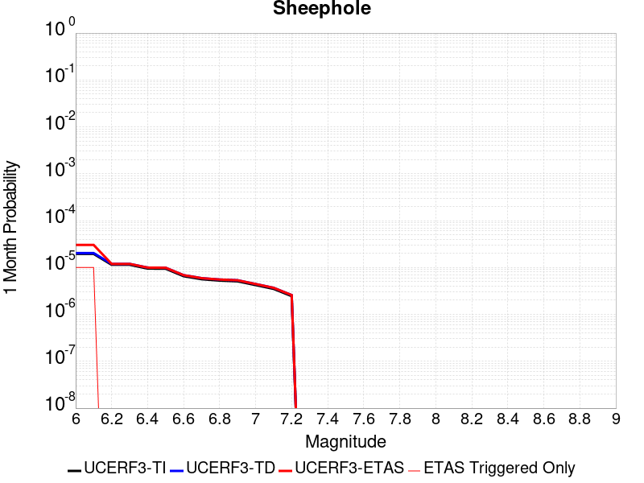 |  |  |

| Magnitude | 1 wk TI Prob | 1 wk TD Prob | 1 wk ETAS Prob | 1 wk ETAS/TD Gain | 1 wk ETAS Triggered Only | 1 mo TI Prob | 1 mo TD Prob | 1 mo ETAS Prob | 1 mo ETAS/TD Gain | 1 mo ETAS Triggered Only | 1 yr TI Prob | 1 yr TD Prob | 1 yr ETAS Prob | 1 yr ETAS/TD Gain | 1 yr ETAS Triggered Only | 10 yr TI Prob | 10 yr TD Prob | 10 yr ETAS Prob | 10 yr ETAS/TD Gain | 10 yr ETAS Triggered Only |
|-----|-----|-----|-----|-----|-----|-----|-----|-----|-----|-----|-----|-----|-----|-----|-----|-----|-----|-----|-----|-----|
| 6.0 | 4.5579695E-6 | 4.741313E-6 | 4.741313E-6 | 1.0 | 0.0 | 1.9534009E-5 | 2.0319787E-5 | 2.0319787E-5 | 1.0 | 0.0 | 2.3780059E-4 | 2.4737086E-4 | 3.0744492E-4 | 1.2428502 | 6.0088933E-5 | 0.0023754628 | 0.0024714996 | 0.00253144 | 1.0242527 | 6.0088933E-5 |
| 6.1 | 4.5579695E-6 | 4.741313E-6 | 4.741313E-6 | 1.0 | 0.0 | 1.9534009E-5 | 2.0319787E-5 | 2.0319787E-5 | 1.0 | 0.0 | 2.3780059E-4 | 2.4737086E-4 | 3.0744492E-4 | 1.2428502 | 6.0088933E-5 | 0.0023754628 | 0.0024714996 | 0.00253144 | 1.0242527 | 6.0088933E-5 |
| 6.2 | 2.6677674E-6 | 2.7874275E-6 | 2.7874275E-6 | 1.0 | 0.0 | 1.1433239E-5 | 1.1946069E-5 | 1.1946069E-5 | 1.0 | 0.0 | 1.3919079E-4 | 1.4543477E-4 | 2.0551495E-4 | 1.4131075 | 6.0088933E-5 | 0.0013910364 | 0.0014535018 | 0.0015135033 | 1.0412807 | 6.0088933E-5 |
| 6.3 | 2.6677674E-6 | 2.7874275E-6 | 2.7874275E-6 | 1.0 | 0.0 | 1.1433239E-5 | 1.1946069E-5 | 1.1946069E-5 | 1.0 | 0.0 | 1.3919079E-4 | 1.4543477E-4 | 2.0551495E-4 | 1.4131075 | 6.0088933E-5 | 0.0013910364 | 0.0014535018 | 0.0015135033 | 1.0412807 | 6.0088933E-5 |
| 6.4 | 2.2159759E-6 | 2.3229084E-6 | 2.3229084E-6 | 1.0 | 0.0 | 9.497005E-6 | 9.955288E-6 | 9.955288E-6 | 1.0 | 0.0 | 1.156199E-4 | 1.211997E-4 | 1.8128136E-4 | 1.4957244 | 6.0088933E-5 | 0.0011555976 | 0.0012114154 | 0.0012714316 | 1.0495422 | 6.0088933E-5 |
| 6.5 | 2.1986082E-6 | 2.3047885E-6 | 2.3047885E-6 | 1.0 | 0.0 | 9.4225725E-6 | 9.877633E-6 | 9.877633E-6 | 1.0 | 0.0 | 1.1471378E-4 | 1.2025435E-4 | 1.8033605E-4 | 1.4996219 | 6.0088933E-5 | 0.0011465458 | 0.001201972 | 0.0012619888 | 1.0499319 | 6.0088933E-5 |
| 6.6 | 1.5232331E-6 | 1.6019138E-6 | 1.6019138E-6 | 1.0 | 0.0 | 6.5281256E-6 | 6.8653276E-6 | 6.8653276E-6 | 1.0 | 0.0 | 7.947703E-5 | 8.358235E-5 | 8.358235E-5 | 1.0 | 0.0 | 7.9448614E-4 | 8.3552784E-4 | 8.3552784E-4 | 1.0 | 0.0 |
| 6.7 | 1.3137362E-6 | 1.3828384E-6 | 1.3828384E-6 | 1.0 | 0.0 | 5.6302856E-6 | 5.926437E-6 | 5.926437E-6 | 1.0 | 0.0 | 6.854657E-5 | 7.215213E-5 | 7.215213E-5 | 1.0 | 0.0 | 6.8525434E-4 | 7.213009E-4 | 7.213009E-4 | 1.0 | 0.0 |
| 6.8 | 1.2275751E-6 | 1.2923027E-6 | 1.2923027E-6 | 1.0 | 0.0 | 5.2610258E-6 | 5.5384294E-6 | 5.5384294E-6 | 1.0 | 0.0 | 6.4051106E-5 | 6.7428424E-5 | 6.7428424E-5 | 1.0 | 0.0 | 6.4032647E-4 | 6.74093E-4 | 6.74093E-4 | 1.0 | 0.0 |
| 6.9 | 1.1837088E-6 | 1.2461194E-6 | 1.2461194E-6 | 1.0 | 0.0 | 5.0730278E-6 | 5.3405015E-6 | 5.3405015E-6 | 1.0 | 0.0 | 6.176237E-5 | 6.50188E-5 | 6.50188E-5 | 1.0 | 0.0 | 6.17452E-4 | 6.5001094E-4 | 6.5001094E-4 | 1.0 | 0.0 |
| 7.0 | 9.849371E-7 | 1.0366432E-6 | 1.0366432E-6 | 1.0 | 0.0 | 4.2211523E-6 | 4.4427497E-6 | 4.4427497E-6 | 1.0 | 0.0 | 5.1391315E-5 | 5.408924E-5 | 5.408924E-5 | 1.0 | 0.0 | 5.137943E-4 | 5.407708E-4 | 5.407708E-4 | 1.0 | 0.0 |
| 7.1 | 8.1643645E-7 | 8.5917884E-7 | 8.5917884E-7 | 1.0 | 0.0 | 3.4990085E-6 | 3.6821903E-6 | 3.6821903E-6 | 1.0 | 0.0 | 4.2599597E-5 | 4.482983E-5 | 4.482983E-5 | 1.0 | 0.0 | 4.259143E-4 | 4.482165E-4 | 4.482165E-4 | 1.0 | 0.0 |
| 7.2 | 5.7295756E-7 | 6.0295855E-7 | 6.0295855E-7 | 1.0 | 0.0 | 2.45553E-6 | 2.584106E-6 | 2.584106E-6 | 1.0 | 0.0 | 2.9895667E-5 | 3.1461102E-5 | 3.1461102E-5 | 1.0 | 0.0 | 2.9891645E-4 | 3.1457318E-4 | 3.1457318E-4 | 1.0 | 0.0 |

## Big Pine (Central)
*[(top)](#table-of-contents)*

| 1 Week | 1 Month | 1 Year | 10 Year |
|-----|-----|-----|-----|
|  | 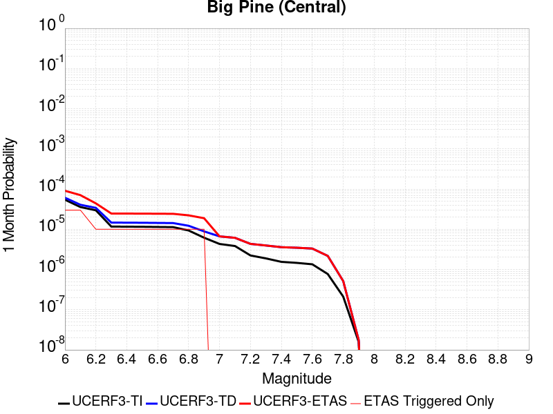 |  |  |

| Magnitude | 1 wk TI Prob | 1 wk TD Prob | 1 wk ETAS Prob | 1 wk ETAS/TD Gain | 1 wk ETAS Triggered Only | 1 mo TI Prob | 1 mo TD Prob | 1 mo ETAS Prob | 1 mo ETAS/TD Gain | 1 mo ETAS Triggered Only | 1 yr TI Prob | 1 yr TD Prob | 1 yr ETAS Prob | 1 yr ETAS/TD Gain | 1 yr ETAS Triggered Only | 10 yr TI Prob | 10 yr TD Prob | 10 yr ETAS Prob | 10 yr ETAS/TD Gain | 10 yr ETAS Triggered Only |
|-----|-----|-----|-----|-----|-----|-----|-----|-----|-----|-----|-----|-----|-----|-----|-----|-----|-----|-----|-----|-----|
| 6.0 | 1.2706755E-5 | 1.42514955E-5 | 1.42514955E-5 | 1.0 | 0.0 | 5.4456385E-5 | 6.1076615E-5 | 9.111925E-5 | 1.4918844 | 3.0044466E-5 | 6.628048E-4 | 7.4339064E-4 | 8.0343493E-4 | 1.0807709 | 6.0088933E-5 | 0.006608314 | 0.007414062 | 0.0074737053 | 1.0080446 | 6.0088933E-5 |
| 6.1 | 8.342579E-6 | 9.511621E-6 | 9.511621E-6 | 1.0 | 0.0 | 3.5753423E-5 | 4.0763574E-5 | 7.080682E-5 | 1.7370119 | 3.0044466E-5 | 4.3521097E-4 | 4.9620523E-4 | 5.262348E-4 | 1.0605184 | 3.0044466E-5 | 0.0043435963 | 0.0049545225 | 0.0049844184 | 1.006034 | 3.0044466E-5 |
| 6.2 | 6.923899E-6 | 7.96797E-6 | 7.96797E-6 | 1.0 | 0.0 | 2.9673516E-5 | 3.4148106E-5 | 6.419155E-5 | 1.879798 | 3.0044466E-5 | 3.6121515E-4 | 4.1569312E-4 | 4.457251E-4 | 1.0722456 | 3.0044466E-5 | 0.003606286 | 0.0041524586 | 0.0041823783 | 1.0072052 | 3.0044466E-5 |
| 6.3 | 2.728396E-6 | 3.4250143E-6 | 3.4250143E-6 | 1.0 | 0.0 | 1.1693074E-5 | 1.4678555E-5 | 4.472258E-5 | 3.0467973 | 3.0044466E-5 | 1.4235388E-4 | 1.7869762E-4 | 2.0873672E-4 | 1.1681001 | 3.0044466E-5 | 0.0014226272 | 0.0017870412 | 0.0018170319 | 1.0167824 | 3.0044466E-5 |
| 6.4 | 2.7136944E-6 | 3.4093073E-6 | 3.4093073E-6 | 1.0 | 0.0 | 1.1630066E-5 | 1.4611241E-5 | 4.4655266E-5 | 3.056227 | 3.0044466E-5 | 1.4158686E-4 | 1.778782E-4 | 2.0791733E-4 | 1.1688746 | 3.0044466E-5 | 0.0014149669 | 0.0017788601 | 0.0018088511 | 1.0168597 | 3.0044466E-5 |
| 6.5 | 2.6971882E-6 | 3.3916522E-6 | 3.3916522E-6 | 1.0 | 0.0 | 1.1559327E-5 | 1.4535576E-5 | 4.4579607E-5 | 3.0669308 | 3.0044466E-5 | 1.4072572E-4 | 1.7695714E-4 | 2.0699628E-4 | 1.1697538 | 3.0044466E-5 | 0.0014063664 | 0.0017696641 | 0.0017996554 | 1.0169475 | 3.0044466E-5 |
| 6.6 | 2.669092E-6 | 3.361672E-6 | 3.361672E-6 | 1.0 | 0.0 | 1.1438916E-5 | 1.4407092E-5 | 4.4451124E-5 | 3.0853643 | 3.0044466E-5 | 1.3925991E-4 | 1.7539308E-4 | 2.0543228E-4 | 1.1712679 | 3.0044466E-5 | 0.0013917267 | 0.0017540484 | 0.0017840401 | 1.0170985 | 3.0044466E-5 |
| 6.7 | 2.6408059E-6 | 3.3316971E-6 | 3.3316971E-6 | 1.0 | 0.0 | 1.1317691E-5 | 1.4278629E-5 | 4.4322667E-5 | 3.1041262 | 3.0044466E-5 | 1.3778417E-4 | 1.738293E-4 | 2.0386855E-4 | 1.1728089 | 3.0044466E-5 | 0.0013769877 | 0.0017384351 | 0.0017684274 | 1.0172524 | 3.0044466E-5 |
| 6.8 | 2.1786943E-6 | 2.8551506E-6 | 2.8551506E-6 | 1.0 | 0.0 | 9.337228E-6 | 1.2236306E-5 | 4.2280404E-5 | 3.4553242 | 3.0044466E-5 | 1.1367482E-4 | 1.4896758E-4 | 1.7900756E-4 | 1.2016546 | 3.0044466E-5 | 0.0011361669 | 0.0014901655 | 0.0015201651 | 1.0201318 | 3.0044466E-5 |
| 6.9 | 1.4411696E-6 | 2.0691853E-6 | 2.0691853E-6 | 1.0 | 0.0 | 6.1764263E-6 | 8.867908E-6 | 3.891211E-5 | 4.3879695 | 3.0044466E-5 | 7.51954E-5 | 1.079617E-4 | 1.3800293E-4 | 1.2782581 | 3.0044466E-5 | 7.5169955E-4 | 0.0010805362 | 0.0011105482 | 1.027775 | 3.0044466E-5 |
| 7.0 | 1.0073411E-6 | 1.5548736E-6 | 1.5548736E-6 | 1.0 | 0.0 | 4.317169E-6 | 6.663728E-6 | 6.663728E-6 | 1.0 | 0.0 | 5.2560266E-5 | 8.1128026E-5 | 8.1128026E-5 | 1.0 | 0.0 | 5.2547833E-4 | 8.1241643E-4 | 8.1241643E-4 | 1.0 | 0.0 |
| 7.1 | 8.947104E-7 | 1.4308533E-6 | 1.4308533E-6 | 1.0 | 0.0 | 3.834468E-6 | 6.1322153E-6 | 6.1322153E-6 | 1.0 | 0.0 | 4.6683643E-5 | 7.465731E-5 | 7.465731E-5 | 1.0 | 0.0 | 4.6673836E-4 | 7.477545E-4 | 7.477545E-4 | 1.0 | 0.0 |
| 7.2 | 5.215166E-7 | 1.0117315E-6 | 1.0117315E-6 | 1.0 | 0.0 | 2.2350691E-6 | 4.335985E-6 | 4.335985E-6 | 1.0 | 0.0 | 2.7211627E-5 | 5.2789383E-5 | 5.2789383E-5 | 1.0 | 0.0 | 2.7208295E-4 | 5.2919047E-4 | 5.2919047E-4 | 1.0 | 0.0 |
| 7.3 | 4.4024807E-7 | 9.225058E-7 | 9.225058E-7 | 1.0 | 0.0 | 1.8867761E-6 | 3.9535903E-6 | 3.9535903E-6 | 1.0 | 0.0 | 2.2971257E-5 | 4.813394E-5 | 4.813394E-5 | 1.0 | 0.0 | 2.2968883E-4 | 4.8265705E-4 | 4.8265705E-4 | 1.0 | 0.0 |
| 7.4 | 3.6130905E-7 | 8.3638224E-7 | 8.3638224E-7 | 1.0 | 0.0 | 1.5484665E-6 | 3.5844905E-6 | 3.5844905E-6 | 1.0 | 0.0 | 1.8852415E-5 | 4.364034E-5 | 4.364034E-5 | 1.0 | 0.0 | 1.8850817E-4 | 4.3773E-4 | 4.3773E-4 | 1.0 | 0.0 |
| 7.5 | 3.408184E-7 | 8.1133305E-7 | 8.1133305E-7 | 1.0 | 0.0 | 1.4606494E-6 | 3.4771374E-6 | 3.4771374E-6 | 1.0 | 0.0 | 1.7783263E-5 | 4.2333362E-5 | 4.2333362E-5 | 1.0 | 0.0 | 1.778184E-4 | 4.2464386E-4 | 4.2464386E-4 | 1.0 | 0.0 |
| 7.6 | 3.1428627E-7 | 7.7365996E-7 | 7.7365996E-7 | 1.0 | 0.0 | 1.3469405E-6 | 3.3156816E-6 | 3.3156816E-6 | 1.0 | 0.0 | 1.6398877E-5 | 4.0367715E-5 | 4.0367715E-5 | 1.0 | 0.0 | 1.6397667E-4 | 4.0496574E-4 | 4.0496574E-4 | 1.0 | 0.0 |
| 7.7 | 1.7972785E-7 | 5.081573E-7 | 5.081573E-7 | 1.0 | 0.0 | 7.70262E-7 | 2.1778153E-6 | 2.1778153E-6 | 1.0 | 0.0 | 9.377899E-6 | 2.651459E-5 | 2.651459E-5 | 1.0 | 0.0 | 9.377503E-5 | 2.664834E-4 | 2.664834E-4 | 1.0 | 0.0 |
| 7.8 | 4.9230927E-8 | 1.1989805E-7 | 1.1989805E-7 | 1.0 | 0.0 | 2.1098968E-7 | 5.138487E-7 | 5.138487E-7 | 1.0 | 0.0 | 2.5687964E-6 | 6.2560916E-6 | 6.2560916E-6 | 1.0 | 0.0 | 2.5687666E-5 | 6.3000305E-5 | 6.3000305E-5 | 1.0 | 0.0 |
| 7.9 | 3.6805972E-9 | 4.108844E-9 | 4.108844E-9 | 1.0 | 0.0 | 1.5773987E-8 | 1.7609333E-8 | 1.7609333E-8 | 1.0 | 0.0 | 1.9204828E-7 | 2.143936E-7 | 2.143936E-7 | 1.0 | 0.0 | 1.920481E-6 | 2.191921E-6 | 2.191921E-6 | 1.0 | 0.0 |

## Santa Rosa Island
*[(top)](#table-of-contents)*

| 1 Week | 1 Month | 1 Year | 10 Year |
|-----|-----|-----|-----|
|  |  |  |  |

| Magnitude | 1 wk TI Prob | 1 wk TD Prob | 1 wk ETAS Prob | 1 wk ETAS/TD Gain | 1 wk ETAS Triggered Only | 1 mo TI Prob | 1 mo TD Prob | 1 mo ETAS Prob | 1 mo ETAS/TD Gain | 1 mo ETAS Triggered Only | 1 yr TI Prob | 1 yr TD Prob | 1 yr ETAS Prob | 1 yr ETAS/TD Gain | 1 yr ETAS Triggered Only | 10 yr TI Prob | 10 yr TD Prob | 10 yr ETAS Prob | 10 yr ETAS/TD Gain | 10 yr ETAS Triggered Only |
|-----|-----|-----|-----|-----|-----|-----|-----|-----|-----|-----|-----|-----|-----|-----|-----|-----|-----|-----|-----|-----|
| 6.0 | 4.1143165E-5 | 4.709295E-5 | 4.709295E-5 | 1.0 | 0.0 | 1.7631594E-4 | 2.0181242E-4 | 2.0181242E-4 | 1.0 | 0.0 | 0.002144533 | 0.0024544946 | 0.002514436 | 1.0244211 | 6.0088933E-5 | 0.021239553 | 0.024294477 | 0.024353106 | 1.0024133 | 6.0088933E-5 |
| 6.1 | 2.1061249E-5 | 2.3865807E-5 | 2.3865807E-5 | 1.0 | 0.0 | 9.0259375E-5 | 1.0227819E-4 | 1.0227819E-4 | 1.0 | 0.0 | 0.0010983539 | 0.0012445545 | 0.0012745616 | 1.0241107 | 3.0044466E-5 | 0.01092941 | 0.012378885 | 0.012408557 | 1.0023971 | 3.0044466E-5 |
| 6.2 | 2.1061249E-5 | 2.3865807E-5 | 2.3865807E-5 | 1.0 | 0.0 | 9.0259375E-5 | 1.0227819E-4 | 1.0227819E-4 | 1.0 | 0.0 | 0.0010983539 | 0.0012445545 | 0.0012745616 | 1.0241107 | 3.0044466E-5 | 0.01092941 | 0.012378885 | 0.012408557 | 1.0023971 | 3.0044466E-5 |
| 6.3 | 1.5158236E-5 | 1.7074995E-5 | 1.7074995E-5 | 1.0 | 0.0 | 6.496225E-5 | 7.317657E-5 | 7.317657E-5 | 1.0 | 0.0 | 7.906284E-4 | 8.9057244E-4 | 9.205902E-4 | 1.0337061 | 3.0044466E-5 | 0.007878214 | 0.008871287 | 0.008901065 | 1.0033567 | 3.0044466E-5 |
| 6.4 | 1.2341918E-5 | 1.385337E-5 | 1.385337E-5 | 1.0 | 0.0 | 5.2892858E-5 | 5.937028E-5 | 5.937028E-5 | 1.0 | 0.0 | 6.437803E-4 | 7.2260154E-4 | 7.2260154E-4 | 1.0 | 0.0 | 0.006419184 | 0.007203356 | 0.007203356 | 1.0 | 0.0 |
| 6.5 | 9.061158E-6 | 1.0117346E-5 | 1.0117346E-5 | 1.0 | 0.0 | 3.883296E-5 | 4.3359363E-5 | 4.3359363E-5 | 1.0 | 0.0 | 4.726887E-4 | 5.277777E-4 | 5.277777E-4 | 1.0 | 0.0 | 0.004716845 | 0.005265781 | 0.005265781 | 1.0 | 0.0 |
| 6.6 | 7.5461685E-6 | 8.400988E-6 | 8.400988E-6 | 1.0 | 0.0 | 3.2340322E-5 | 3.6003763E-5 | 3.6003763E-5 | 1.0 | 0.0 | 3.936723E-4 | 4.3826195E-4 | 4.3826195E-4 | 1.0 | 0.0 | 0.003929756 | 0.004374406 | 0.004374406 | 1.0 | 0.0 |
| 6.7 | 5.5023775E-6 | 6.0875545E-6 | 6.0875545E-6 | 1.0 | 0.0 | 2.3581404E-5 | 2.6089278E-5 | 2.6089278E-5 | 1.0 | 0.0 | 2.8706578E-4 | 3.175939E-4 | 3.175939E-4 | 1.0 | 0.0 | 0.0028669522 | 0.003171722 | 0.003171722 | 1.0 | 0.0 |
| 6.8 | 3.7351679E-6 | 4.083243E-6 | 4.083243E-6 | 1.0 | 0.0 | 1.6007763E-5 | 1.749951E-5 | 1.749951E-5 | 1.0 | 0.0 | 1.948771E-4 | 2.1303819E-4 | 2.1303819E-4 | 1.0 | 0.0 | 0.0019470629 | 0.0021285848 | 0.0021285848 | 1.0 | 0.0 |
| 6.9 | 2.456366E-6 | 2.6293203E-6 | 2.6293203E-6 | 1.0 | 0.0 | 1.0527241E-5 | 1.1268467E-5 | 1.1268467E-5 | 1.0 | 0.0 | 1.2816161E-4 | 1.3718496E-4 | 1.3718496E-4 | 1.0 | 0.0 | 0.0012808773 | 0.0013710058 | 0.0013710058 | 1.0 | 0.0 |
| 7.0 | 2.3245157E-6 | 2.4828237E-6 | 2.4828237E-6 | 1.0 | 0.0 | 9.962172E-6 | 1.064063E-5 | 1.064063E-5 | 1.0 | 0.0 | 1.2128269E-4 | 1.2954198E-4 | 1.2954198E-4 | 1.0 | 0.0 | 0.0012121652 | 0.001294667 | 0.001294667 | 1.0 | 0.0 |
| 7.1 | 2.2248344E-6 | 2.3732923E-6 | 2.3732923E-6 | 1.0 | 0.0 | 9.53497E-6 | 1.0171214E-5 | 1.0171214E-5 | 1.0 | 0.0 | 1.1608207E-4 | 1.2382751E-4 | 1.2382751E-4 | 1.0 | 0.0 | 0.0011602144 | 0.0012375871 | 0.0012375871 | 1.0 | 0.0 |
| 7.2 | 2.1350402E-6 | 2.2761942E-6 | 2.2761942E-6 | 1.0 | 0.0 | 9.150141E-6 | 9.755082E-6 | 9.755082E-6 | 1.0 | 0.0 | 1.1139726E-4 | 1.18761665E-4 | 1.18761665E-4 | 1.0 | 0.0 | 0.0011134144 | 0.0011869839 | 0.0011869839 | 1.0 | 0.0 |
| 7.3 | 1.9793572E-6 | 2.108756E-6 | 2.108756E-6 | 1.0 | 0.0 | 8.482932E-6 | 9.037495E-6 | 9.037495E-6 | 1.0 | 0.0 | 1.032748E-4 | 1.1002596E-4 | 1.1002596E-4 | 1.0 | 0.0 | 0.0010322682 | 0.0010997166 | 0.0010997166 | 1.0 | 0.0 |
| 7.4 | 1.6951194E-6 | 1.8046047E-6 | 1.8046047E-6 | 1.0 | 0.0 | 7.264777E-6 | 7.733997E-6 | 7.733997E-6 | 1.0 | 0.0 | 8.844508E-5 | 9.415737E-5 | 9.415737E-5 | 1.0 | 0.0 | 8.840988E-4 | 9.411764E-4 | 9.411764E-4 | 1.0 | 0.0 |
| 7.5 | 8.987207E-7 | 9.512366E-7 | 9.512366E-7 | 1.0 | 0.0 | 3.8516546E-6 | 4.076722E-6 | 4.076722E-6 | 1.0 | 0.0 | 4.6892885E-5 | 4.963297E-5 | 4.963297E-5 | 1.0 | 0.0 | 4.688299E-4 | 4.9622E-4 | 4.9622E-4 | 1.0 | 0.0 |
| 7.6 | 3.8783037E-7 | 4.0529838E-7 | 4.0529838E-7 | 1.0 | 0.0 | 1.6621291E-6 | 1.736992E-6 | 1.736992E-6 | 1.0 | 0.0 | 2.0236233E-5 | 2.1147678E-5 | 2.1147678E-5 | 1.0 | 0.0 | 2.023439E-4 | 2.1145731E-4 | 2.1145731E-4 | 1.0 | 0.0 |
| 7.7 | 6.181804E-8 | 6.339098E-8 | 6.339098E-8 | 1.0 | 0.0 | 2.6493444E-7 | 2.716756E-7 | 2.716756E-7 | 1.0 | 0.0 | 3.225572E-6 | 3.3076453E-6 | 3.3076453E-6 | 1.0 | 0.0 | 3.225525E-5 | 3.307597E-5 | 3.307597E-5 | 1.0 | 0.0 |
| 7.8 | 1.3704449E-9 | 1.3964223E-9 | 1.3964223E-9 | 1.0 | 0.0 | 5.873335E-9 | 5.984667E-9 | 5.984667E-9 | 1.0 | 0.0 | 7.1507856E-8 | 7.286332E-8 | 7.286332E-8 | 1.0 | 0.0 | 7.1507833E-7 | 7.2863304E-7 | 7.2863304E-7 | 1.0 | 0.0 |

## San Jacinto (Stepovers Combined)
*[(top)](#table-of-contents)*

| 1 Week | 1 Month | 1 Year | 10 Year |
|-----|-----|-----|-----|
|  |  |  |  |

| Magnitude | 1 wk TI Prob | 1 wk TD Prob | 1 wk ETAS Prob | 1 wk ETAS/TD Gain | 1 wk ETAS Triggered Only | 1 mo TI Prob | 1 mo TD Prob | 1 mo ETAS Prob | 1 mo ETAS/TD Gain | 1 mo ETAS Triggered Only | 1 yr TI Prob | 1 yr TD Prob | 1 yr ETAS Prob | 1 yr ETAS/TD Gain | 1 yr ETAS Triggered Only | 10 yr TI Prob | 10 yr TD Prob | 10 yr ETAS Prob | 10 yr ETAS/TD Gain | 10 yr ETAS Triggered Only |
|-----|-----|-----|-----|-----|-----|-----|-----|-----|-----|-----|-----|-----|-----|-----|-----|-----|-----|-----|-----|-----|
| 6.0 | 4.0667746E-5 | 3.530169E-5 | 3.530169E-5 | 1.0 | 0.0 | 1.742787E-4 | 1.5128418E-4 | 1.5128418E-4 | 1.0 | 0.0 | 0.0021197782 | 0.0018403295 | 0.0018703187 | 1.0162956 | 3.0044466E-5 | 0.020996714 | 0.01900186 | 0.019060807 | 1.0031022 | 6.0088933E-5 |
| 6.1 | 4.0667746E-5 | 3.530169E-5 | 3.530169E-5 | 1.0 | 0.0 | 1.742787E-4 | 1.5128418E-4 | 1.5128418E-4 | 1.0 | 0.0 | 0.0021197782 | 0.0018403295 | 0.0018703187 | 1.0162956 | 3.0044466E-5 | 0.020996714 | 0.01900186 | 0.019060807 | 1.0031022 | 6.0088933E-5 |
| 6.2 | 4.0667746E-5 | 3.530169E-5 | 3.530169E-5 | 1.0 | 0.0 | 1.742787E-4 | 1.5128418E-4 | 1.5128418E-4 | 1.0 | 0.0 | 0.0021197782 | 0.0018403295 | 0.0018703187 | 1.0162956 | 3.0044466E-5 | 0.020996714 | 0.01900186 | 0.019060807 | 1.0031022 | 6.0088933E-5 |
| 6.3 | 4.0667746E-5 | 3.530169E-5 | 3.530169E-5 | 1.0 | 0.0 | 1.742787E-4 | 1.5128418E-4 | 1.5128418E-4 | 1.0 | 0.0 | 0.0021197782 | 0.0018403295 | 0.0018703187 | 1.0162956 | 3.0044466E-5 | 0.020996714 | 0.01900186 | 0.019060807 | 1.0031022 | 6.0088933E-5 |
| 6.4 | 4.0577226E-5 | 3.5173576E-5 | 3.5173576E-5 | 1.0 | 0.0 | 1.738908E-4 | 1.5073518E-4 | 1.5073518E-4 | 1.0 | 0.0 | 0.0021150648 | 0.0018336585 | 0.0018636478 | 1.0163549 | 3.0044466E-5 | 0.020950472 | 0.018936424 | 0.018995376 | 1.0031132 | 6.0088933E-5 |
| 6.5 | 4.0577226E-5 | 3.5173576E-5 | 3.5173576E-5 | 1.0 | 0.0 | 1.738908E-4 | 1.5073518E-4 | 1.5073518E-4 | 1.0 | 0.0 | 0.0021150648 | 0.0018336585 | 0.0018636478 | 1.0163549 | 3.0044466E-5 | 0.020950472 | 0.018936424 | 0.018995376 | 1.0031132 | 6.0088933E-5 |
| 6.6 | 4.053861E-5 | 3.5118916E-5 | 3.5118916E-5 | 1.0 | 0.0 | 1.7372532E-4 | 1.5050096E-4 | 1.5050096E-4 | 1.0 | 0.0 | 0.0021130538 | 0.0018308115 | 0.001860801 | 1.0163804 | 3.0044466E-5 | 0.020930743 | 0.0189085 | 0.018967453 | 1.0031178 | 6.0088933E-5 |
| 6.7 | 4.0516545E-5 | 3.5087978E-5 | 3.5087978E-5 | 1.0 | 0.0 | 1.7363077E-4 | 1.5036839E-4 | 1.5036839E-4 | 1.0 | 0.0 | 0.002111905 | 0.0018292008 | 0.0018591903 | 1.0163949 | 3.0044466E-5 | 0.020919468 | 0.018892696 | 0.018951649 | 1.0031204 | 6.0088933E-5 |
| 6.8 | 4.049434E-5 | 3.5059536E-5 | 3.5059536E-5 | 1.0 | 0.0 | 1.7353562E-4 | 1.502465E-4 | 1.502465E-4 | 1.0 | 0.0 | 0.0021107488 | 0.0018277195 | 0.001857709 | 1.0164082 | 3.0044466E-5 | 0.020908125 | 0.018878108 | 0.018937062 | 1.0031229 | 6.0088933E-5 |
| 6.9 | 4.046386E-5 | 3.5022094E-5 | 3.5022094E-5 | 1.0 | 0.0 | 1.73405E-4 | 1.5008605E-4 | 1.5008605E-4 | 1.0 | 0.0 | 0.0021091616 | 0.0018257692 | 0.0018557588 | 1.0164257 | 3.0044466E-5 | 0.020892553 | 0.018858878 | 0.018917834 | 1.0031261 | 6.0088933E-5 |
| 7.0 | 4.036382E-5 | 3.4902645E-5 | 3.4902645E-5 | 1.0 | 0.0 | 1.7297632E-4 | 1.4957422E-4 | 1.4957422E-4 | 1.0 | 0.0 | 0.0021039525 | 0.0018195482 | 0.0018495381 | 1.016482 | 3.0044466E-5 | 0.02084144 | 0.018797487 | 0.018856445 | 1.0031365 | 6.0088933E-5 |
| 7.1 | 4.0343282E-5 | 3.4881108E-5 | 3.4881108E-5 | 1.0 | 0.0 | 1.7288832E-4 | 1.4948192E-4 | 1.4948192E-4 | 1.0 | 0.0 | 0.002102883 | 0.0018184263 | 0.0018484162 | 1.0164922 | 3.0044466E-5 | 0.020830948 | 0.018786363 | 0.018845322 | 1.0031384 | 6.0088933E-5 |
| 7.2 | 4.0257353E-5 | 3.4785597E-5 | 3.4785597E-5 | 1.0 | 0.0 | 1.725201E-4 | 1.4907263E-4 | 1.4907263E-4 | 1.0 | 0.0 | 0.0020984085 | 0.0018134515 | 0.0018434415 | 1.0165375 | 3.0044466E-5 | 0.020787042 | 0.018737096 | 0.018796058 | 1.0031469 | 6.0088933E-5 |
| 7.3 | 3.9940667E-5 | 3.4613182E-5 | 3.4613182E-5 | 1.0 | 0.0 | 1.7116306E-4 | 1.4833378E-4 | 1.4833378E-4 | 1.0 | 0.0 | 0.0020819185 | 0.0018044711 | 0.0018344615 | 1.0166199 | 3.0044466E-5 | 0.020625217 | 0.018645693 | 0.018704662 | 1.0031626 | 6.0088933E-5 |
| 7.4 | 3.9721202E-5 | 3.449852E-5 | 3.449852E-5 | 1.0 | 0.0 | 1.7022261E-4 | 1.4784244E-4 | 1.4784244E-4 | 1.0 | 0.0 | 0.0020704903 | 0.0017984989 | 0.0018284894 | 1.0166752 | 3.0044466E-5 | 0.020513052 | 0.01858479 | 0.018643761 | 1.0031731 | 6.0088933E-5 |
| 7.5 | 3.7036873E-5 | 3.356544E-5 | 3.356544E-5 | 1.0 | 0.0 | 1.5871979E-4 | 1.4384396E-4 | 1.4384396E-4 | 1.0 | 0.0 | 0.0019307006 | 0.0017498966 | 0.0017798884 | 1.0171392 | 3.0044466E-5 | 0.019140124 | 0.01808609 | 0.018145094 | 1.0032623 | 6.0088933E-5 |
| 7.6 | 3.2940967E-5 | 3.134552E-5 | 3.134552E-5 | 1.0 | 0.0 | 1.4116794E-4 | 1.3433104E-4 | 1.3433104E-4 | 1.0 | 0.0 | 0.0017173645 | 0.0016342559 | 0.0016642512 | 1.0183542 | 3.0044466E-5 | 0.01704153 | 0.016918624 | 0.016977696 | 1.0034915 | 6.0088933E-5 |
| 7.7 | 2.8236149E-5 | 2.7910712E-5 | 2.7910712E-5 | 1.0 | 0.0 | 1.2100645E-4 | 1.19611854E-4 | 1.19611854E-4 | 1.0 | 0.0 | 0.0014722579 | 0.0014553026 | 0.0014853033 | 1.0206147 | 3.0044466E-5 | 0.014625421 | 0.015129022 | 0.015188201 | 1.0039117 | 6.0088933E-5 |
| 7.8 | 2.4329287E-5 | 2.5233301E-5 | 2.5233301E-5 | 1.0 | 0.0 | 1.042642E-4 | 1.0813824E-4 | 1.0813824E-4 | 1.0 | 0.0 | 0.0012686774 | 0.0013157888 | 0.0013457937 | 1.0228038 | 3.0044466E-5 | 0.012614589 | 0.013725796 | 0.01378506 | 1.0043178 | 6.0088933E-5 |
| 7.9 | 1.9370926E-5 | 2.0444677E-5 | 2.0444677E-5 | 1.0 | 0.0 | 8.301561E-5 | 8.761711E-5 | 8.761711E-5 | 1.0 | 0.0 | 0.0010102465 | 0.0010662171 | 0.0010962294 | 1.0281485 | 3.0044466E-5 | 0.0100566605 | 0.0112116095 | 0.011271025 | 1.0052994 | 6.0088933E-5 |
| 8.0 | 1.5583017E-5 | 1.5906007E-5 | 1.5906007E-5 | 1.0 | 0.0 | 6.6782646E-5 | 6.8166824E-5 | 6.8166824E-5 | 1.0 | 0.0 | 8.127754E-4 | 8.2961575E-4 | 8.596353E-4 | 1.0361849 | 3.0044466E-5 | 0.008098091 | 0.00879209 | 0.008851651 | 1.0067743 | 6.0088933E-5 |
| 8.1 | 1.0024873E-5 | 8.30379E-6 | 8.30379E-6 | 1.0 | 0.0 | 4.2963035E-5 | 3.558719E-5 | 3.558719E-5 | 1.0 | 0.0 | 5.229494E-4 | 4.3318843E-4 | 4.6321988E-4 | 1.0693265 | 3.0044466E-5 | 0.0052172043 | 0.004659528 | 0.004719337 | 1.0128359 | 6.0088933E-5 |
| 8.2 | 4.142796E-6 | 1.5642979E-6 | 1.5642979E-6 | 1.0 | 0.0 | 1.775472E-5 | 6.704117E-6 | 6.704117E-6 | 1.0 | 0.0 | 2.1614227E-4 | 8.16196E-5 | 8.16196E-5 | 1.0 | 0.0 | 0.0021593217 | 9.473458E-4 | 9.473458E-4 | 1.0 | 0.0 |
| 8.3 | 1.2750878E-6 | 3.6210974E-7 | 3.6210974E-7 | 1.0 | 0.0 | 5.4646503E-6 | 1.551898E-6 | 1.551898E-6 | 1.0 | 0.0 | 6.653009E-5 | 1.88942E-5 | 1.88942E-5 | 1.0 | 0.0 | 6.6510175E-4 | 2.2786931E-4 | 2.2786931E-4 | 1.0 | 0.0 |

## Great Valley 09 (Laguna Seca)
*[(top)](#table-of-contents)*

| 1 Week | 1 Month | 1 Year | 10 Year |
|-----|-----|-----|-----|
|  |  |  |  |

| Magnitude | 1 wk TI Prob | 1 wk TD Prob | 1 wk ETAS Prob | 1 wk ETAS/TD Gain | 1 wk ETAS Triggered Only | 1 mo TI Prob | 1 mo TD Prob | 1 mo ETAS Prob | 1 mo ETAS/TD Gain | 1 mo ETAS Triggered Only | 1 yr TI Prob | 1 yr TD Prob | 1 yr ETAS Prob | 1 yr ETAS/TD Gain | 1 yr ETAS Triggered Only | 10 yr TI Prob | 10 yr TD Prob | 10 yr ETAS Prob | 10 yr ETAS/TD Gain | 10 yr ETAS Triggered Only |
|-----|-----|-----|-----|-----|-----|-----|-----|-----|-----|-----|-----|-----|-----|-----|-----|-----|-----|-----|-----|-----|
| 6.0 | 5.4353277E-5 | 7.050752E-5 | 7.050752E-5 | 1.0 | 0.0 | 2.3292181E-4 | 3.0213883E-4 | 3.321742E-4 | 1.0994092 | 3.0044466E-5 | 0.0028321352 | 0.0036724764 | 0.0037024105 | 1.0081509 | 3.0044466E-5 | 0.02796312 | 0.03611835 | 0.03617627 | 1.0016036 | 6.0088933E-5 |
| 6.1 | 4.5578287E-5 | 5.822518E-5 | 5.822518E-5 | 1.0 | 0.0 | 1.953209E-4 | 2.495107E-4 | 2.7954765E-4 | 1.1203835 | 3.0044466E-5 | 0.0023754383 | 0.0030336666 | 0.00306362 | 1.0098736 | 3.0044466E-5 | 0.023502063 | 0.029921863 | 0.029951008 | 1.000974 | 3.0044466E-5 |
| 6.2 | 2.8536782E-5 | 3.4738863E-5 | 3.4738863E-5 | 1.0 | 0.0 | 1.2229476E-4 | 1.4886934E-4 | 1.7890932E-4 | 1.2017876 | 3.0044466E-5 | 0.0014879217 | 0.0018109402 | 0.0018409303 | 1.0165604 | 3.0044466E-5 | 0.014779986 | 0.017959375 | 0.017988881 | 1.0016428 | 3.0044466E-5 |
| 6.3 | 2.3698774E-5 | 2.8214268E-5 | 2.8214268E-5 | 1.0 | 0.0 | 1.01562226E-4 | 1.20909535E-4 | 1.5095036E-4 | 1.2484571 | 3.0044466E-5 | 0.0012358186 | 0.0014711232 | 0.0015011235 | 1.0203928 | 3.0044466E-5 | 0.012289686 | 0.01461232 | 0.014641925 | 1.0020261 | 3.0044466E-5 |
| 6.4 | 1.9191197E-5 | 2.2123577E-5 | 2.2123577E-5 | 1.0 | 0.0 | 8.2245395E-5 | 9.4808645E-5 | 1.2485027E-4 | 1.3168658 | 3.0044466E-5 | 0.0010008777 | 0.0011537144 | 0.0011837241 | 1.0260115 | 3.0044466E-5 | 0.009963818 | 0.011477661 | 0.011507361 | 1.0025876 | 3.0044466E-5 |
| 6.5 | 1.5203241E-5 | 1.6802116E-5 | 1.6802116E-5 | 1.0 | 0.0 | 6.5155116E-5 | 7.200377E-5 | 1.0204608E-4 | 1.4172324 | 3.0044466E-5 | 7.9297484E-4 | 8.763123E-4 | 9.063305E-4 | 1.034255 | 3.0044466E-5 | 0.007901512 | 0.008730002 | 0.008759784 | 1.0034115 | 3.0044466E-5 |
| 6.6 | 1.0984925E-5 | 1.12430935E-5 | 1.12430935E-5 | 1.0 | 0.0 | 4.70774E-5 | 4.8183778E-5 | 4.8183778E-5 | 1.0 | 0.0 | 5.730166E-4 | 5.864824E-4 | 5.864824E-4 | 1.0 | 0.0 | 0.005715413 | 0.0058497433 | 0.0058497433 | 1.0 | 0.0 |
| 6.7 | 9.134616E-6 | 9.020273E-6 | 9.020273E-6 | 1.0 | 0.0 | 3.9147766E-5 | 3.8657752E-5 | 3.8657752E-5 | 1.0 | 0.0 | 4.7651984E-4 | 4.7055888E-4 | 4.7055888E-4 | 1.0 | 0.0 | 0.004754993 | 0.00469587 | 0.00469587 | 1.0 | 0.0 |
| 6.8 | 7.785589E-6 | 7.4522554E-6 | 7.4522554E-6 | 1.0 | 0.0 | 3.3366385E-5 | 3.193786E-5 | 3.193786E-5 | 1.0 | 0.0 | 4.0616E-4 | 3.8877607E-4 | 3.8877607E-4 | 1.0 | 0.0 | 0.0040541845 | 0.0038811632 | 0.0038811632 | 1.0 | 0.0 |
| 6.9 | 5.579095E-6 | 4.8986967E-6 | 4.8986967E-6 | 1.0 | 0.0 | 2.3910188E-5 | 2.0994254E-5 | 2.0994254E-5 | 1.0 | 0.0 | 2.9106764E-4 | 2.5557645E-4 | 2.5557645E-4 | 1.0 | 0.0 | 0.002906867 | 0.0025529626 | 0.0025529626 | 1.0 | 0.0 |
| 7.0 | 2.6816688E-6 | 1.5216688E-6 | 1.5216688E-6 | 1.0 | 0.0 | 1.1492816E-5 | 6.5214217E-6 | 6.5214217E-6 | 1.0 | 0.0 | 1.3991605E-4 | 7.9395504E-5 | 7.9395504E-5 | 1.0 | 0.0 | 0.0013982799 | 7.9368014E-4 | 7.9368014E-4 | 1.0 | 0.0 |
| 7.1 | 1.9951021E-6 | 7.4541185E-7 | 7.4541185E-7 | 1.0 | 0.0 | 8.55041E-6 | 3.1946186E-6 | 3.1946186E-6 | 1.0 | 0.0 | 1.0409627E-4 | 3.8893828E-5 | 3.8893828E-5 | 1.0 | 0.0 | 0.0010404752 | 3.8887435E-4 | 3.8887435E-4 | 1.0 | 0.0 |
| 7.2 | 1.9951021E-6 | 7.4541185E-7 | 7.4541185E-7 | 1.0 | 0.0 | 8.55041E-6 | 3.1946186E-6 | 3.1946186E-6 | 1.0 | 0.0 | 1.0409627E-4 | 3.8893828E-5 | 3.8893828E-5 | 1.0 | 0.0 | 0.0010404752 | 3.8887435E-4 | 3.8887435E-4 | 1.0 | 0.0 |
| 7.3 | 1.7087556E-6 | 6.579125E-7 | 6.579125E-7 | 1.0 | 0.0 | 7.3232177E-6 | 2.819622E-6 | 2.819622E-6 | 1.0 | 0.0 | 8.915652E-5 | 3.43284E-5 | 3.43284E-5 | 1.0 | 0.0 | 8.9120766E-4 | 3.43235E-4 | 3.43235E-4 | 1.0 | 0.0 |
| 7.4 | 1.3804846E-6 | 6.074053E-7 | 6.074053E-7 | 1.0 | 0.0 | 5.916349E-6 | 2.6031632E-6 | 2.6031632E-6 | 1.0 | 0.0 | 7.2029165E-5 | 3.1693093E-5 | 3.1693093E-5 | 1.0 | 0.0 | 7.200583E-4 | 3.1688975E-4 | 3.1688975E-4 | 1.0 | 0.0 |
| 7.5 | 1.3804846E-6 | 6.074053E-7 | 6.074053E-7 | 1.0 | 0.0 | 5.916349E-6 | 2.6031632E-6 | 2.6031632E-6 | 1.0 | 0.0 | 7.2029165E-5 | 3.1693093E-5 | 3.1693093E-5 | 1.0 | 0.0 | 7.200583E-4 | 3.1688975E-4 | 3.1688975E-4 | 1.0 | 0.0 |

## San Jacinto (Anza) rev
*[(top)](#table-of-contents)*

| 1 Week | 1 Month | 1 Year | 10 Year |
|-----|-----|-----|-----|
|  |  |  |  |

| Magnitude | 1 wk TI Prob | 1 wk TD Prob | 1 wk ETAS Prob | 1 wk ETAS/TD Gain | 1 wk ETAS Triggered Only | 1 mo TI Prob | 1 mo TD Prob | 1 mo ETAS Prob | 1 mo ETAS/TD Gain | 1 mo ETAS Triggered Only | 1 yr TI Prob | 1 yr TD Prob | 1 yr ETAS Prob | 1 yr ETAS/TD Gain | 1 yr ETAS Triggered Only | 10 yr TI Prob | 10 yr TD Prob | 10 yr ETAS Prob | 10 yr ETAS/TD Gain | 10 yr ETAS Triggered Only |
|-----|-----|-----|-----|-----|-----|-----|-----|-----|-----|-----|-----|-----|-----|-----|-----|-----|-----|-----|-----|-----|
| 6.0 | 6.3015636E-5 | 4.333665E-5 | 4.333665E-5 | 1.0 | 0.0 | 2.7003905E-4 | 1.8571535E-4 | 1.8571535E-4 | 1.0 | 0.0 | 0.0032827691 | 0.0022587518 | 0.0022887283 | 1.0132713 | 3.0044466E-5 | 0.032346968 | 0.023313757 | 0.023372445 | 1.0025173 | 6.0088933E-5 |
| 6.1 | 6.3015636E-5 | 4.333665E-5 | 4.333665E-5 | 1.0 | 0.0 | 2.7003905E-4 | 1.8571535E-4 | 1.8571535E-4 | 1.0 | 0.0 | 0.0032827691 | 0.0022587518 | 0.0022887283 | 1.0132713 | 3.0044466E-5 | 0.032346968 | 0.023313757 | 0.023372445 | 1.0025173 | 6.0088933E-5 |
| 6.2 | 6.3015636E-5 | 4.333665E-5 | 4.333665E-5 | 1.0 | 0.0 | 2.7003905E-4 | 1.8571535E-4 | 1.8571535E-4 | 1.0 | 0.0 | 0.0032827691 | 0.0022587518 | 0.0022887283 | 1.0132713 | 3.0044466E-5 | 0.032346968 | 0.023313757 | 0.023372445 | 1.0025173 | 6.0088933E-5 |
| 6.3 | 6.3015636E-5 | 4.333665E-5 | 4.333665E-5 | 1.0 | 0.0 | 2.7003905E-4 | 1.8571535E-4 | 1.8571535E-4 | 1.0 | 0.0 | 0.0032827691 | 0.0022587518 | 0.0022887283 | 1.0132713 | 3.0044466E-5 | 0.032346968 | 0.023313757 | 0.023372445 | 1.0025173 | 6.0088933E-5 |
| 6.4 | 6.3015636E-5 | 4.333665E-5 | 4.333665E-5 | 1.0 | 0.0 | 2.7003905E-4 | 1.8571535E-4 | 1.8571535E-4 | 1.0 | 0.0 | 0.0032827691 | 0.0022587518 | 0.0022887283 | 1.0132713 | 3.0044466E-5 | 0.032346968 | 0.023313757 | 0.023372445 | 1.0025173 | 6.0088933E-5 |
| 6.5 | 5.811017E-5 | 4.01148E-5 | 4.01148E-5 | 1.0 | 0.0 | 2.4901982E-4 | 1.7190928E-4 | 1.7190928E-4 | 1.0 | 0.0 | 0.0030276014 | 0.002090992 | 0.0021209735 | 1.0143385 | 3.0044466E-5 | 0.02986684 | 0.021610463 | 0.021669254 | 1.0027205 | 6.0088933E-5 |
| 6.6 | 5.811017E-5 | 4.01148E-5 | 4.01148E-5 | 1.0 | 0.0 | 2.4901982E-4 | 1.7190928E-4 | 1.7190928E-4 | 1.0 | 0.0 | 0.0030276014 | 0.002090992 | 0.0021209735 | 1.0143385 | 3.0044466E-5 | 0.02986684 | 0.021610463 | 0.021669254 | 1.0027205 | 6.0088933E-5 |
| 6.7 | 5.712442E-5 | 3.9537146E-5 | 3.9537146E-5 | 1.0 | 0.0 | 2.4479596E-4 | 1.6943393E-4 | 1.6943393E-4 | 1.0 | 0.0 | 0.0029763177 | 0.0020609119 | 0.0020908944 | 1.0145482 | 3.0044466E-5 | 0.029367693 | 0.02130211 | 0.021360919 | 1.0027606 | 6.0088933E-5 |
| 6.8 | 5.6967532E-5 | 3.93935E-5 | 3.93935E-5 | 1.0 | 0.0 | 2.4412372E-4 | 1.688184E-4 | 1.688184E-4 | 1.0 | 0.0 | 0.0029681553 | 0.002053432 | 0.0020834147 | 1.0146013 | 3.0044466E-5 | 0.029288229 | 0.021226803 | 0.021285616 | 1.0027707 | 6.0088933E-5 |
| 6.9 | 5.6211324E-5 | 3.9098068E-5 | 3.9098068E-5 | 1.0 | 0.0 | 2.4088343E-4 | 1.6755243E-4 | 1.6755243E-4 | 1.0 | 0.0 | 0.0029288116 | 0.0020380476 | 0.0020680309 | 1.0147117 | 3.0044466E-5 | 0.028905109 | 0.021066118 | 0.02112494 | 1.0027924 | 6.0088933E-5 |
| 7.0 | 5.4383527E-5 | 3.7957852E-5 | 3.7957852E-5 | 1.0 | 0.0 | 2.3305144E-4 | 1.6266639E-4 | 1.6266639E-4 | 1.0 | 0.0 | 0.0028337094 | 0.0019786693 | 0.0020086542 | 1.0151541 | 3.0044466E-5 | 0.027978465 | 0.020456703 | 0.020515563 | 1.0028772 | 6.0088933E-5 |
| 7.1 | 5.1393665E-5 | 3.6419628E-5 | 3.6419628E-5 | 1.0 | 0.0 | 2.2023996E-4 | 1.560748E-4 | 1.560748E-4 | 1.0 | 0.0 | 0.0026781242 | 0.0018985589 | 0.0019285463 | 1.0157949 | 3.0044466E-5 | 0.026460782 | 0.019629754 | 0.019688662 | 1.003001 | 6.0088933E-5 |
| 7.2 | 4.785222E-5 | 3.4770273E-5 | 3.4770273E-5 | 1.0 | 0.0 | 2.0506482E-4 | 1.4900696E-4 | 1.4900696E-4 | 1.0 | 0.0 | 0.0024938055 | 0.0018126537 | 0.0018426437 | 1.0165448 | 3.0044466E-5 | 0.024660049 | 0.018743815 | 0.018802777 | 1.0031457 | 6.0088933E-5 |
| 7.3 | 4.2143256E-5 | 3.386394E-5 | 3.386394E-5 | 1.0 | 0.0 | 1.8060145E-4 | 1.4512311E-4 | 1.4512311E-4 | 1.0 | 0.0 | 0.002196605 | 0.0017654453 | 0.0017954368 | 1.016988 | 3.0044466E-5 | 0.02175019 | 0.018251613 | 0.018310606 | 1.0032321 | 6.0088933E-5 |
| 7.4 | 4.0264713E-5 | 3.3501856E-5 | 3.3501856E-5 | 1.0 | 0.0 | 1.7255165E-4 | 1.435715E-4 | 1.435715E-4 | 1.0 | 0.0 | 0.002098792 | 0.0017465849 | 0.0017765769 | 1.0171717 | 3.0044466E-5 | 0.020790804 | 0.018056048 | 0.018115053 | 1.0032678 | 6.0088933E-5 |
| 7.5 | 3.694492E-5 | 3.2215252E-5 | 3.2215252E-5 | 1.0 | 0.0 | 1.5832575E-4 | 1.3805808E-4 | 1.3805808E-4 | 1.0 | 0.0 | 0.0019259118 | 0.0016795642 | 0.0017095583 | 1.0178581 | 3.0044466E-5 | 0.01909306 | 0.01737219 | 0.017431235 | 1.0033988 | 6.0088933E-5 |
| 7.6 | 3.200565E-5 | 2.9530029E-5 | 2.9530029E-5 | 1.0 | 0.0 | 1.3715986E-4 | 1.2655114E-4 | 1.2655114E-4 | 1.0 | 0.0 | 0.001668642 | 0.0015396734 | 0.0015696717 | 1.0194834 | 3.0044466E-5 | 0.01656168 | 0.01595979 | 0.01601892 | 1.0037049 | 6.0088933E-5 |
| 7.7 | 2.731642E-5 | 2.6118E-5 | 2.6118E-5 | 1.0 | 0.0 | 1.1706512E-4 | 1.1192949E-4 | 1.1192949E-4 | 1.0 | 0.0 | 0.001424336 | 0.0013618907 | 0.0013918942 | 1.0220308 | 3.0044466E-5 | 0.014152412 | 0.014180151 | 0.014239388 | 1.0041775 | 6.0088933E-5 |
| 7.8 | 2.3466424E-5 | 2.3529019E-5 | 2.3529019E-5 | 1.0 | 0.0 | 1.0056651E-4 | 1.0083476E-4 | 1.0083476E-4 | 1.0 | 0.0 | 0.0012237094 | 0.0012269727 | 0.0012569802 | 1.0244566 | 3.0044466E-5 | 0.012169928 | 0.012821534 | 0.0128808515 | 1.0046265 | 6.0088933E-5 |
| 7.9 | 1.8611925E-5 | 1.8929926E-5 | 1.8929926E-5 | 1.0 | 0.0 | 7.9762955E-5 | 8.112574E-5 | 8.112574E-5 | 1.0 | 0.0 | 9.7068126E-4 | 9.872591E-4 | 0.0010172739 | 1.0304022 | 3.0044466E-5 | 0.0096645225 | 0.010405261 | 0.010464725 | 1.0057148 | 6.0088933E-5 |
| 8.0 | 1.5460775E-5 | 1.5760346E-5 | 1.5760346E-5 | 1.0 | 0.0 | 6.6258784E-5 | 6.75426E-5 | 6.75426E-5 | 1.0 | 0.0 | 8.0640207E-4 | 8.220215E-4 | 8.520413E-4 | 1.0365194 | 3.0044466E-5 | 0.008034821 | 0.008713083 | 0.008772648 | 1.0068363 | 6.0088933E-5 |
| 8.1 | 9.983884E-6 | 8.281292E-6 | 8.281292E-6 | 1.0 | 0.0 | 4.2787375E-5 | 3.549077E-5 | 3.549077E-5 | 1.0 | 0.0 | 5.2081177E-4 | 4.32015E-4 | 4.6204648E-4 | 1.0695149 | 3.0044466E-5 | 0.0051959283 | 0.004646114 | 0.0047059236 | 1.012873 | 6.0088933E-5 |
| 8.2 | 4.1226E-6 | 1.5562537E-6 | 1.5562537E-6 | 1.0 | 0.0 | 1.7668166E-5 | 6.669642E-6 | 6.669642E-6 | 1.0 | 0.0 | 2.1508869E-4 | 8.119989E-5 | 8.119989E-5 | 1.0 | 0.0 | 0.0021488064 | 9.4237167E-4 | 9.4237167E-4 | 1.0 | 0.0 |
| 8.3 | 1.2750878E-6 | 3.6210974E-7 | 3.6210974E-7 | 1.0 | 0.0 | 5.4646503E-6 | 1.551898E-6 | 1.551898E-6 | 1.0 | 0.0 | 6.653009E-5 | 1.88942E-5 | 1.88942E-5 | 1.0 | 0.0 | 6.6510175E-4 | 2.2786931E-4 | 2.2786931E-4 | 1.0 | 0.0 |

## Whittier alt 1
*[(top)](#table-of-contents)*

| 1 Week | 1 Month | 1 Year | 10 Year |
|-----|-----|-----|-----|
|  |  |  |  |

| Magnitude | 1 wk TI Prob | 1 wk TD Prob | 1 wk ETAS Prob | 1 wk ETAS/TD Gain | 1 wk ETAS Triggered Only | 1 mo TI Prob | 1 mo TD Prob | 1 mo ETAS Prob | 1 mo ETAS/TD Gain | 1 mo ETAS Triggered Only | 1 yr TI Prob | 1 yr TD Prob | 1 yr ETAS Prob | 1 yr ETAS/TD Gain | 1 yr ETAS Triggered Only | 10 yr TI Prob | 10 yr TD Prob | 10 yr ETAS Prob | 10 yr ETAS/TD Gain | 10 yr ETAS Triggered Only |
|-----|-----|-----|-----|-----|-----|-----|-----|-----|-----|-----|-----|-----|-----|-----|-----|-----|-----|-----|-----|-----|
| 6.0 | 4.2554693E-5 | 4.725463E-5 | 4.725463E-5 | 1.0 | 0.0 | 1.8236451E-4 | 2.0250595E-4 | 2.3254432E-4 | 1.1483333 | 3.0044466E-5 | 0.002218027 | 0.002463043 | 0.0024930134 | 1.012168 | 3.0044466E-5 | 0.02196019 | 0.024391484 | 0.024450107 | 1.0024034 | 6.0088933E-5 |
| 6.1 | 4.2554693E-5 | 4.725463E-5 | 4.725463E-5 | 1.0 | 0.0 | 1.8236451E-4 | 2.0250595E-4 | 2.3254432E-4 | 1.1483333 | 3.0044466E-5 | 0.002218027 | 0.002463043 | 0.0024930134 | 1.012168 | 3.0044466E-5 | 0.02196019 | 0.024391484 | 0.024450107 | 1.0024034 | 6.0088933E-5 |
| 6.2 | 4.2554693E-5 | 4.725463E-5 | 4.725463E-5 | 1.0 | 0.0 | 1.8236451E-4 | 2.0250595E-4 | 2.3254432E-4 | 1.1483333 | 3.0044466E-5 | 0.002218027 | 0.002463043 | 0.0024930134 | 1.012168 | 3.0044466E-5 | 0.02196019 | 0.024391484 | 0.024450107 | 1.0024034 | 6.0088933E-5 |
| 6.3 | 1.9617712E-5 | 1.826992E-5 | 1.826992E-5 | 1.0 | 0.0 | 8.40732E-5 | 7.829742E-5 | 7.829742E-5 | 1.0 | 0.0 | 0.0010231105 | 9.528732E-4 | 9.528732E-4 | 1.0 | 0.0 | 0.01018413 | 0.00949116 | 0.009520919 | 1.0031354 | 3.0044466E-5 |
| 6.4 | 1.5611336E-5 | 1.36054E-5 | 1.36054E-5 | 1.0 | 0.0 | 6.690401E-5 | 5.830759E-5 | 5.830759E-5 | 1.0 | 0.0 | 8.142519E-4 | 7.0966966E-4 | 7.0966966E-4 | 1.0 | 0.0 | 0.008112748 | 0.0070759985 | 0.0070759985 | 1.0 | 0.0 |
| 6.5 | 1.5150166E-5 | 1.31020415E-5 | 1.31020415E-5 | 1.0 | 0.0 | 6.492767E-5 | 5.615043E-5 | 5.615043E-5 | 1.0 | 0.0 | 7.9020765E-4 | 6.8342296E-4 | 6.8342296E-4 | 1.0 | 0.0 | 0.007874036 | 0.0068151625 | 0.0068151625 | 1.0 | 0.0 |
| 6.6 | 1.295588E-5 | 1.0381657E-5 | 1.0381657E-5 | 1.0 | 0.0 | 5.552402E-5 | 4.449207E-5 | 4.449207E-5 | 1.0 | 0.0 | 6.7579525E-4 | 5.4155826E-4 | 5.4155826E-4 | 1.0 | 0.0 | 0.006737438 | 0.005403819 | 0.005403819 | 1.0 | 0.0 |
| 6.7 | 1.2542085E-5 | 9.900279E-6 | 9.900279E-6 | 1.0 | 0.0 | 5.3750682E-5 | 4.242909E-5 | 4.242909E-5 | 1.0 | 0.0 | 6.542181E-4 | 5.164536E-4 | 5.164536E-4 | 1.0 | 0.0 | 0.006522954 | 0.0051539517 | 0.0051539517 | 1.0 | 0.0 |
| 6.8 | 1.2195878E-5 | 9.496295E-6 | 9.496295E-6 | 1.0 | 0.0 | 5.2267E-5 | 4.069778E-5 | 4.069778E-5 | 1.0 | 0.0 | 6.36165E-4 | 4.9538474E-4 | 4.9538474E-4 | 1.0 | 0.0 | 0.0063434686 | 0.004944145 | 0.004944145 | 1.0 | 0.0 |
| 6.9 | 1.1580298E-5 | 8.773767E-6 | 8.773767E-6 | 1.0 | 0.0 | 4.9628903E-5 | 3.7601327E-5 | 3.7601327E-5 | 1.0 | 0.0 | 6.040644E-4 | 4.5770165E-4 | 4.5770165E-4 | 1.0 | 0.0 | 0.00602425 | 0.0045688488 | 0.0045688488 | 1.0 | 0.0 |
| 7.0 | 1.0964795E-5 | 8.084788E-6 | 8.084788E-6 | 1.0 | 0.0 | 4.6991136E-5 | 3.4648638E-5 | 3.4648638E-5 | 1.0 | 0.0 | 5.7196687E-4 | 4.2176704E-4 | 4.2176704E-4 | 1.0 | 0.0 | 0.0057049696 | 0.004210874 | 0.004210874 | 1.0 | 0.0 |
| 7.1 | 1.0230601E-5 | 7.3273063E-6 | 7.3273063E-6 | 1.0 | 0.0 | 4.3844695E-5 | 3.140237E-5 | 3.140237E-5 | 1.0 | 0.0 | 5.336784E-4 | 3.822581E-4 | 3.822581E-4 | 1.0 | 0.0 | 0.005323986 | 0.0038171692 | 0.0038171692 | 1.0 | 0.0 |
| 7.2 | 9.40865E-6 | 6.5438535E-6 | 6.5438535E-6 | 1.0 | 0.0 | 4.032216E-5 | 2.8044791E-5 | 2.8044791E-5 | 1.0 | 0.0 | 4.908117E-4 | 3.4139305E-4 | 3.4139305E-4 | 1.0 | 0.0 | 0.0048972913 | 0.0034097787 | 0.0034097787 | 1.0 | 0.0 |
| 7.3 | 8.237384E-6 | 5.598234E-6 | 5.598234E-6 | 1.0 | 0.0 | 3.5302593E-5 | 2.3992217E-5 | 2.3992217E-5 | 1.0 | 0.0 | 4.2972428E-4 | 2.9206712E-4 | 2.9206712E-4 | 1.0 | 0.0 | 0.0042889426 | 0.0029171538 | 0.0029171538 | 1.0 | 0.0 |
| 7.4 | 7.5316966E-6 | 5.0282547E-6 | 5.0282547E-6 | 1.0 | 0.0 | 3.2278298E-5 | 2.1549491E-5 | 2.1549491E-5 | 1.0 | 0.0 | 3.9291743E-4 | 2.6233448E-4 | 2.6233448E-4 | 1.0 | 0.0 | 0.0039222343 | 0.0026203599 | 0.0026203599 | 1.0 | 0.0 |
| 7.5 | 6.149649E-6 | 3.9341826E-6 | 3.9341826E-6 | 1.0 | 0.0 | 2.6355372E-5 | 1.6860678E-5 | 1.6860678E-5 | 1.0 | 0.0 | 3.208294E-4 | 2.0526032E-4 | 2.0526032E-4 | 1.0 | 0.0 | 0.003203666 | 0.0020507965 | 0.0020507965 | 1.0 | 0.0 |
| 7.6 | 5.457711E-6 | 3.3956767E-6 | 3.3956767E-6 | 1.0 | 0.0 | 2.338998E-5 | 1.4552824E-5 | 1.4552824E-5 | 1.0 | 0.0 | 2.8473578E-4 | 1.7716704E-4 | 1.7716704E-4 | 1.0 | 0.0 | 0.0028437122 | 0.0017703387 | 0.0017703387 | 1.0 | 0.0 |
| 7.7 | 4.1676276E-6 | 2.333422E-6 | 2.333422E-6 | 1.0 | 0.0 | 1.7861139E-5 | 1.0000345E-5 | 1.0000345E-5 | 1.0 | 0.0 | 2.1743766E-4 | 1.2174814E-4 | 1.2174814E-4 | 1.0 | 0.0 | 0.0021722503 | 0.0012168875 | 0.0012168875 | 1.0 | 0.0 |
| 7.8 | 2.2692414E-7 | 9.386416E-8 | 9.386416E-8 | 1.0 | 0.0 | 9.725317E-7 | 4.0227494E-7 | 4.0227494E-7 | 1.0 | 0.0 | 1.1840509E-5 | 4.8976895E-6 | 4.8976895E-6 | 1.0 | 0.0 | 1.1839878E-4 | 4.8976144E-5 | 4.8976144E-5 | 1.0 | 0.0 |
| 7.9 | 6.676829E-9 | 3.440101E-9 | 3.440101E-9 | 1.0 | 0.0 | 2.861498E-8 | 1.4743291E-8 | 1.4743291E-8 | 1.0 | 0.0 | 3.4838732E-7 | 1.7949955E-7 | 1.7949955E-7 | 1.0 | 0.0 | 3.4838679E-6 | 1.7949943E-6 | 1.7949943E-6 | 1.0 | 0.0 |

## Robinson Creek
*[(top)](#table-of-contents)*

| 1 Week | 1 Month | 1 Year | 10 Year |
|-----|-----|-----|-----|
|  |  |  |  |

| Magnitude | 1 wk TI Prob | 1 wk TD Prob | 1 wk ETAS Prob | 1 wk ETAS/TD Gain | 1 wk ETAS Triggered Only | 1 mo TI Prob | 1 mo TD Prob | 1 mo ETAS Prob | 1 mo ETAS/TD Gain | 1 mo ETAS Triggered Only | 1 yr TI Prob | 1 yr TD Prob | 1 yr ETAS Prob | 1 yr ETAS/TD Gain | 1 yr ETAS Triggered Only | 10 yr TI Prob | 10 yr TD Prob | 10 yr ETAS Prob | 10 yr ETAS/TD Gain | 10 yr ETAS Triggered Only |
|-----|-----|-----|-----|-----|-----|-----|-----|-----|-----|-----|-----|-----|-----|-----|-----|-----|-----|-----|-----|-----|
| 6.0 | 1.3705327E-5 | 1.5285481E-5 | 1.5285481E-5 | 1.0 | 0.0 | 5.8735794E-5 | 6.55092E-5 | 9.55517E-5 | 1.4585997 | 3.0044466E-5 | 7.1487366E-4 | 7.975745E-4 | 8.5761555E-4 | 1.0752795 | 6.0088933E-5 | 0.0071257832 | 0.007975745 | 0.008035355 | 1.0074738 | 6.0088933E-5 |
| 6.1 | 1.3705327E-5 | 1.5285481E-5 | 1.5285481E-5 | 1.0 | 0.0 | 5.8735794E-5 | 6.55092E-5 | 9.55517E-5 | 1.4585997 | 3.0044466E-5 | 7.1487366E-4 | 7.975745E-4 | 8.5761555E-4 | 1.0752795 | 6.0088933E-5 | 0.0071257832 | 0.007975745 | 0.008035355 | 1.0074738 | 6.0088933E-5 |
| 6.2 | 1.3705327E-5 | 1.5285481E-5 | 1.5285481E-5 | 1.0 | 0.0 | 5.8735794E-5 | 6.55092E-5 | 9.55517E-5 | 1.4585997 | 3.0044466E-5 | 7.1487366E-4 | 7.975745E-4 | 8.5761555E-4 | 1.0752795 | 6.0088933E-5 | 0.0071257832 | 0.007975745 | 0.008035355 | 1.0074738 | 6.0088933E-5 |
| 6.3 | 1.3705327E-5 | 1.5285481E-5 | 1.5285481E-5 | 1.0 | 0.0 | 5.8735794E-5 | 6.55092E-5 | 9.55517E-5 | 1.4585997 | 3.0044466E-5 | 7.1487366E-4 | 7.975745E-4 | 8.5761555E-4 | 1.0752795 | 6.0088933E-5 | 0.0071257832 | 0.007975745 | 0.008035355 | 1.0074738 | 6.0088933E-5 |
| 6.4 | 1.3705327E-5 | 1.5285481E-5 | 1.5285481E-5 | 1.0 | 0.0 | 5.8735794E-5 | 6.55092E-5 | 9.55517E-5 | 1.4585997 | 3.0044466E-5 | 7.1487366E-4 | 7.975745E-4 | 8.5761555E-4 | 1.0752795 | 6.0088933E-5 | 0.0071257832 | 0.007975745 | 0.008035355 | 1.0074738 | 6.0088933E-5 |

## Deep Springs
*[(top)](#table-of-contents)*

| 1 Week | 1 Month | 1 Year | 10 Year |
|-----|-----|-----|-----|
|  |  |  | 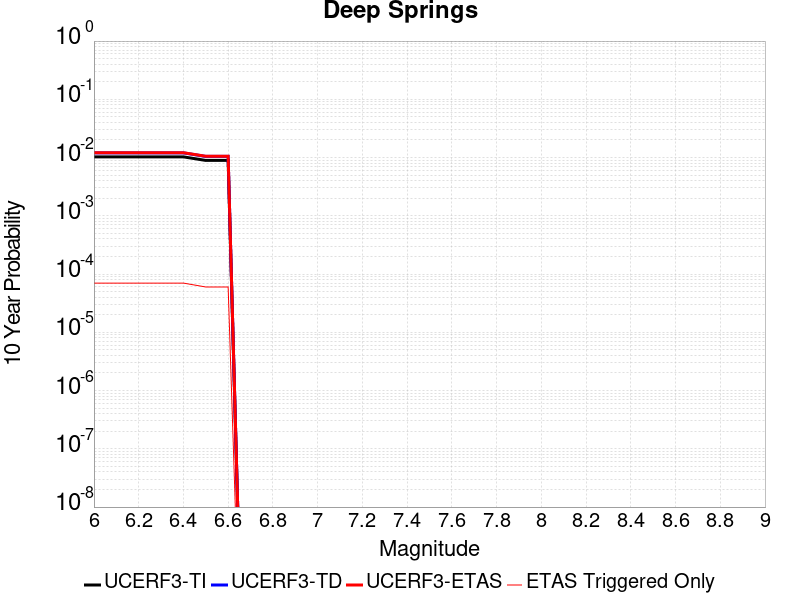 |

| Magnitude | 1 wk TI Prob | 1 wk TD Prob | 1 wk ETAS Prob | 1 wk ETAS/TD Gain | 1 wk ETAS Triggered Only | 1 mo TI Prob | 1 mo TD Prob | 1 mo ETAS Prob | 1 mo ETAS/TD Gain | 1 mo ETAS Triggered Only | 1 yr TI Prob | 1 yr TD Prob | 1 yr ETAS Prob | 1 yr ETAS/TD Gain | 1 yr ETAS Triggered Only | 10 yr TI Prob | 10 yr TD Prob | 10 yr ETAS Prob | 10 yr ETAS/TD Gain | 10 yr ETAS Triggered Only |
|-----|-----|-----|-----|-----|-----|-----|-----|-----|-----|-----|-----|-----|-----|-----|-----|-----|-----|-----|-----|-----|
| 6.0 | 1.9810619E-5 | 2.3113542E-5 | 2.3113542E-5 | 1.0 | 0.0 | 8.489989E-5 | 9.9057135E-5 | 1.2909863E-4 | 1.3032744 | 3.0044466E-5 | 0.001033166 | 0.0012058612 | 0.0012358695 | 1.0248853 | 3.0044466E-5 | 0.010283757 | 0.012042956 | 0.012102322 | 1.0049294 | 6.0088933E-5 |
| 6.1 | 1.9810619E-5 | 2.3113542E-5 | 2.3113542E-5 | 1.0 | 0.0 | 8.489989E-5 | 9.9057135E-5 | 1.2909863E-4 | 1.3032744 | 3.0044466E-5 | 0.001033166 | 0.0012058612 | 0.0012358695 | 1.0248853 | 3.0044466E-5 | 0.010283757 | 0.012042956 | 0.012102322 | 1.0049294 | 6.0088933E-5 |
| 6.2 | 1.9810619E-5 | 2.3113542E-5 | 2.3113542E-5 | 1.0 | 0.0 | 8.489989E-5 | 9.9057135E-5 | 1.2909863E-4 | 1.3032744 | 3.0044466E-5 | 0.001033166 | 0.0012058612 | 0.0012358695 | 1.0248853 | 3.0044466E-5 | 0.010283757 | 0.012042956 | 0.012102322 | 1.0049294 | 6.0088933E-5 |
| 6.3 | 1.9810619E-5 | 2.3113542E-5 | 2.3113542E-5 | 1.0 | 0.0 | 8.489989E-5 | 9.9057135E-5 | 1.2909863E-4 | 1.3032744 | 3.0044466E-5 | 0.001033166 | 0.0012058612 | 0.0012358695 | 1.0248853 | 3.0044466E-5 | 0.010283757 | 0.012042956 | 0.012102322 | 1.0049294 | 6.0088933E-5 |
| 6.4 | 1.9810619E-5 | 2.3113542E-5 | 2.3113542E-5 | 1.0 | 0.0 | 8.489989E-5 | 9.9057135E-5 | 1.2909863E-4 | 1.3032744 | 3.0044466E-5 | 0.001033166 | 0.0012058612 | 0.0012358695 | 1.0248853 | 3.0044466E-5 | 0.010283757 | 0.012042956 | 0.012102322 | 1.0049294 | 6.0088933E-5 |
| 6.5 | 1.7190405E-5 | 2.005144E-5 | 2.005144E-5 | 1.0 | 0.0 | 7.367108E-5 | 8.593474E-5 | 8.593474E-5 | 1.0 | 0.0 | 8.9657627E-4 | 0.0010462555 | 0.0010462555 | 1.0 | 0.0 | 0.008929676 | 0.010462518 | 0.0104922475 | 1.0028416 | 3.0044466E-5 |
| 6.6 | 1.7190405E-5 | 2.005144E-5 | 2.005144E-5 | 1.0 | 0.0 | 7.367108E-5 | 8.593474E-5 | 8.593474E-5 | 1.0 | 0.0 | 8.9657627E-4 | 0.0010462555 | 0.0010462555 | 1.0 | 0.0 | 0.008929676 | 0.010462518 | 0.0104922475 | 1.0028416 | 3.0044466E-5 |

## Cleghorn
*[(top)](#table-of-contents)*

| 1 Week | 1 Month | 1 Year | 10 Year |
|-----|-----|-----|-----|
|  |  |  |  |

| Magnitude | 1 wk TI Prob | 1 wk TD Prob | 1 wk ETAS Prob | 1 wk ETAS/TD Gain | 1 wk ETAS Triggered Only | 1 mo TI Prob | 1 mo TD Prob | 1 mo ETAS Prob | 1 mo ETAS/TD Gain | 1 mo ETAS Triggered Only | 1 yr TI Prob | 1 yr TD Prob | 1 yr ETAS Prob | 1 yr ETAS/TD Gain | 1 yr ETAS Triggered Only | 10 yr TI Prob | 10 yr TD Prob | 10 yr ETAS Prob | 10 yr ETAS/TD Gain | 10 yr ETAS Triggered Only |
|-----|-----|-----|-----|-----|-----|-----|-----|-----|-----|-----|-----|-----|-----|-----|-----|-----|-----|-----|-----|-----|
| 6.0 | 7.9267165E-6 | 9.836382E-6 | 9.836382E-6 | 1.0 | 0.0 | 3.39712E-5 | 4.21553E-5 | 4.21553E-5 | 1.0 | 0.0 | 4.1352084E-4 | 5.1313057E-4 | 5.1313057E-4 | 1.0 | 0.0 | 0.004127522 | 0.0051345266 | 0.0051943073 | 1.0116428 | 6.0088933E-5 |
| 6.1 | 7.9267165E-6 | 9.836382E-6 | 9.836382E-6 | 1.0 | 0.0 | 3.39712E-5 | 4.21553E-5 | 4.21553E-5 | 1.0 | 0.0 | 4.1352084E-4 | 5.1313057E-4 | 5.1313057E-4 | 1.0 | 0.0 | 0.004127522 | 0.0051345266 | 0.0051943073 | 1.0116428 | 6.0088933E-5 |
| 6.2 | 7.9267165E-6 | 9.836382E-6 | 9.836382E-6 | 1.0 | 0.0 | 3.39712E-5 | 4.21553E-5 | 4.21553E-5 | 1.0 | 0.0 | 4.1352084E-4 | 5.1313057E-4 | 5.1313057E-4 | 1.0 | 0.0 | 0.004127522 | 0.0051345266 | 0.0051943073 | 1.0116428 | 6.0088933E-5 |
| 6.3 | 7.9267165E-6 | 9.836382E-6 | 9.836382E-6 | 1.0 | 0.0 | 3.39712E-5 | 4.21553E-5 | 4.21553E-5 | 1.0 | 0.0 | 4.1352084E-4 | 5.1313057E-4 | 5.1313057E-4 | 1.0 | 0.0 | 0.004127522 | 0.0051345266 | 0.0051943073 | 1.0116428 | 6.0088933E-5 |
| 6.4 | 4.3445207E-6 | 6.096199E-6 | 6.096199E-6 | 1.0 | 0.0 | 1.8619241E-5 | 2.612631E-5 | 2.612631E-5 | 1.0 | 0.0 | 2.2666567E-4 | 3.180424E-4 | 3.180424E-4 | 1.0 | 0.0 | 0.0022643462 | 0.003190019 | 0.0032199675 | 1.0093882 | 3.0044466E-5 |
| 6.5 | 4.3445207E-6 | 6.096199E-6 | 6.096199E-6 | 1.0 | 0.0 | 1.8619241E-5 | 2.612631E-5 | 2.612631E-5 | 1.0 | 0.0 | 2.2666567E-4 | 3.180424E-4 | 3.180424E-4 | 1.0 | 0.0 | 0.0022643462 | 0.003190019 | 0.0032199675 | 1.0093882 | 3.0044466E-5 |
| 6.6 | 4.040109E-6 | 5.778603E-6 | 5.778603E-6 | 1.0 | 0.0 | 1.7314638E-5 | 2.4765211E-5 | 2.4765211E-5 | 1.0 | 0.0 | 2.1078532E-4 | 3.0147567E-4 | 3.0147567E-4 | 1.0 | 0.0 | 0.002105855 | 0.0030248072 | 0.0030547606 | 1.0099026 | 3.0044466E-5 |
| 6.7 | 3.3632055E-6 | 5.0720914E-6 | 5.0720914E-6 | 1.0 | 0.0 | 1.4413658E-5 | 2.1737356E-5 | 2.1737356E-5 | 1.0 | 0.0 | 1.7547216E-4 | 2.646205E-4 | 2.646205E-4 | 1.0 | 0.0 | 0.0017533366 | 0.002657138 | 0.002657138 | 1.0 | 0.0 |
| 6.8 | 3.2902772E-6 | 4.9939977E-6 | 4.9939977E-6 | 1.0 | 0.0 | 1.4101111E-5 | 2.1402673E-5 | 2.1402673E-5 | 1.0 | 0.0 | 1.716675E-4 | 2.6054672E-4 | 2.6054672E-4 | 1.0 | 0.0 | 0.0017153495 | 0.0026164963 | 0.0026164963 | 1.0 | 0.0 |
| 6.9 | 3.031547E-6 | 4.695545E-6 | 4.695545E-6 | 1.0 | 0.0 | 1.299228E-5 | 2.012361E-5 | 2.012361E-5 | 1.0 | 0.0 | 1.5816953E-4 | 2.449777E-4 | 2.449777E-4 | 1.0 | 0.0 | 0.00158057 | 0.0024611582 | 0.0024611582 | 1.0 | 0.0 |
| 7.0 | 2.8259715E-6 | 4.3745763E-6 | 4.3745763E-6 | 1.0 | 0.0 | 1.211125E-5 | 1.8748051E-5 | 1.8748051E-5 | 1.0 | 0.0 | 1.4744449E-4 | 2.2823385E-4 | 2.2823385E-4 | 1.0 | 0.0 | 0.001473467 | 0.002294075 | 0.002294075 | 1.0 | 0.0 |
| 7.1 | 2.5962665E-6 | 4.0695813E-6 | 4.0695813E-6 | 1.0 | 0.0 | 1.1126809E-5 | 1.7440947E-5 | 1.7440947E-5 | 1.0 | 0.0 | 1.3546048E-4 | 2.1232305E-4 | 2.1232305E-4 | 1.0 | 0.0 | 0.0013537793 | 0.0021352873 | 0.0021352873 | 1.0 | 0.0 |
| 7.2 | 2.3247253E-6 | 3.6798972E-6 | 3.6798972E-6 | 1.0 | 0.0 | 9.96307E-6 | 1.5770895E-5 | 1.5770895E-5 | 1.0 | 0.0 | 1.21293626E-4 | 1.919939E-4 | 1.919939E-4 | 1.0 | 0.0 | 0.0012122744 | 0.001932387 | 0.001932387 | 1.0 | 0.0 |
| 7.3 | 2.056928E-6 | 3.2381586E-6 | 3.2381586E-6 | 1.0 | 0.0 | 8.815376E-6 | 1.3877749E-5 | 1.3877749E-5 | 1.0 | 0.0 | 1.0732192E-4 | 1.6894865E-4 | 1.6894865E-4 | 1.0 | 0.0 | 0.001072701 | 0.0017023751 | 0.0017023751 | 1.0 | 0.0 |
| 7.4 | 1.8055999E-6 | 2.8281777E-6 | 2.8281777E-6 | 1.0 | 0.0 | 7.738263E-6 | 1.2120706E-5 | 1.2120706E-5 | 1.0 | 0.0 | 9.4209274E-5 | 1.4755974E-4 | 1.4755974E-4 | 1.0 | 0.0 | 9.4169343E-4 | 0.0014889282 | 0.0014889282 | 1.0 | 0.0 |
| 7.5 | 1.4683443E-6 | 2.4272497E-6 | 2.4272497E-6 | 1.0 | 0.0 | 6.292889E-6 | 1.0402458E-5 | 1.0402458E-5 | 1.0 | 0.0 | 7.661323E-5 | 1.2664266E-4 | 1.2664266E-4 | 1.0 | 0.0 | 7.658682E-4 | 0.0012800582 | 0.0012800582 | 1.0 | 0.0 |
| 7.6 | 9.804088E-7 | 1.9026955E-6 | 1.9026955E-6 | 1.0 | 0.0 | 4.201745E-6 | 8.154385E-6 | 8.154385E-6 | 1.0 | 0.0 | 5.1155046E-5 | 9.927515E-5 | 9.927515E-5 | 1.0 | 0.0 | 5.114327E-4 | 0.0010066963 | 0.0010066963 | 1.0 | 0.0 |
| 7.7 | 7.3434086E-7 | 1.6307837E-6 | 1.6307837E-6 | 1.0 | 0.0 | 3.1471714E-6 | 6.9890543E-6 | 6.9890543E-6 | 1.0 | 0.0 | 3.831614E-5 | 8.508844E-5 | 8.508844E-5 | 1.0 | 0.0 | 3.8309532E-4 | 8.649813E-4 | 8.649813E-4 | 1.0 | 0.0 |
| 7.8 | 6.434184E-7 | 1.5242053E-6 | 1.5242053E-6 | 1.0 | 0.0 | 2.7575045E-6 | 6.5322924E-6 | 6.5322924E-6 | 1.0 | 0.0 | 3.35721E-5 | 7.952779E-5 | 7.952779E-5 | 1.0 | 0.0 | 3.3567028E-4 | 8.0907624E-4 | 8.0907624E-4 | 1.0 | 0.0 |
| 7.9 | 3.4943926E-7 | 7.585602E-7 | 7.585602E-7 | 1.0 | 0.0 | 1.497596E-6 | 3.2509683E-6 | 3.2509683E-6 | 1.0 | 0.0 | 1.8233079E-5 | 3.957983E-5 | 3.957983E-5 | 1.0 | 0.0 | 1.8231584E-4 | 4.045744E-4 | 4.045744E-4 | 1.0 | 0.0 |
| 8.0 | 6.717524E-8 | 5.8493473E-8 | 5.8493473E-8 | 1.0 | 0.0 | 2.8789387E-7 | 2.506863E-7 | 2.506863E-7 | 1.0 | 0.0 | 3.505102E-6 | 3.0521014E-6 | 3.0521014E-6 | 1.0 | 0.0 | 3.5050467E-5 | 3.2791522E-5 | 3.2791522E-5 | 1.0 | 0.0 |
| 8.1 | 3.1984914E-8 | 1.2990346E-8 | 1.2990346E-8 | 1.0 | 0.0 | 1.370782E-7 | 5.5672913E-8 | 5.5672913E-8 | 1.0 | 0.0 | 1.6689258E-6 | 6.7781747E-7 | 6.7781747E-7 | 1.0 | 0.0 | 1.6689133E-5 | 7.763877E-6 | 7.763877E-6 | 1.0 | 0.0 |
| 8.2 | 1.21887656E-8 | 3.660091E-9 | 3.660091E-9 | 1.0 | 0.0 | 5.2237567E-8 | 1.5686105E-8 | 1.5686105E-8 | 1.0 | 0.0 | 6.359922E-7 | 1.9097831E-7 | 1.9097831E-7 | 1.0 | 0.0 | 6.3599036E-6 | 2.2531958E-6 | 2.2531958E-6 | 1.0 | 0.0 |

## Kern Canyon (North Kern) 2011
*[(top)](#table-of-contents)*

| 1 Week | 1 Month | 1 Year | 10 Year |
|-----|-----|-----|-----|
|  |  |  |  |

| Magnitude | 1 wk TI Prob | 1 wk TD Prob | 1 wk ETAS Prob | 1 wk ETAS/TD Gain | 1 wk ETAS Triggered Only | 1 mo TI Prob | 1 mo TD Prob | 1 mo ETAS Prob | 1 mo ETAS/TD Gain | 1 mo ETAS Triggered Only | 1 yr TI Prob | 1 yr TD Prob | 1 yr ETAS Prob | 1 yr ETAS/TD Gain | 1 yr ETAS Triggered Only | 10 yr TI Prob | 10 yr TD Prob | 10 yr ETAS Prob | 10 yr ETAS/TD Gain | 10 yr ETAS Triggered Only |
|-----|-----|-----|-----|-----|-----|-----|-----|-----|-----|-----|-----|-----|-----|-----|-----|-----|-----|-----|-----|-----|
| 6.0 | 6.6264497E-6 | 6.757373E-6 | 6.757373E-6 | 1.0 | 0.0 | 2.8398761E-5 | 2.8959894E-5 | 2.8959894E-5 | 1.0 | 0.0 | 3.4570007E-4 | 3.5253767E-4 | 3.8257154E-4 | 1.0851934 | 3.0044466E-5 | 0.0034516277 | 0.0035205726 | 0.0035804498 | 1.0170078 | 6.0088933E-5 |
| 6.1 | 6.6264497E-6 | 6.757373E-6 | 6.757373E-6 | 1.0 | 0.0 | 2.8398761E-5 | 2.8959894E-5 | 2.8959894E-5 | 1.0 | 0.0 | 3.4570007E-4 | 3.5253767E-4 | 3.8257154E-4 | 1.0851934 | 3.0044466E-5 | 0.0034516277 | 0.0035205726 | 0.0035804498 | 1.0170078 | 6.0088933E-5 |
| 6.2 | 6.6264497E-6 | 6.757373E-6 | 6.757373E-6 | 1.0 | 0.0 | 2.8398761E-5 | 2.8959894E-5 | 2.8959894E-5 | 1.0 | 0.0 | 3.4570007E-4 | 3.5253767E-4 | 3.8257154E-4 | 1.0851934 | 3.0044466E-5 | 0.0034516277 | 0.0035205726 | 0.0035804498 | 1.0170078 | 6.0088933E-5 |
| 6.3 | 6.6264497E-6 | 6.757373E-6 | 6.757373E-6 | 1.0 | 0.0 | 2.8398761E-5 | 2.8959894E-5 | 2.8959894E-5 | 1.0 | 0.0 | 3.4570007E-4 | 3.5253767E-4 | 3.8257154E-4 | 1.0851934 | 3.0044466E-5 | 0.0034516277 | 0.0035205726 | 0.0035804498 | 1.0170078 | 6.0088933E-5 |
| 6.4 | 6.6264497E-6 | 6.757373E-6 | 6.757373E-6 | 1.0 | 0.0 | 2.8398761E-5 | 2.8959894E-5 | 2.8959894E-5 | 1.0 | 0.0 | 3.4570007E-4 | 3.5253767E-4 | 3.8257154E-4 | 1.0851934 | 3.0044466E-5 | 0.0034516277 | 0.0035205726 | 0.0035804498 | 1.0170078 | 6.0088933E-5 |
| 6.5 | 3.2162225E-6 | 3.2571097E-6 | 3.2571097E-6 | 1.0 | 0.0 | 1.3783738E-5 | 1.3958972E-5 | 1.3958972E-5 | 1.0 | 0.0 | 1.6780409E-4 | 1.6993804E-4 | 1.999774E-4 | 1.1767665 | 3.0044466E-5 | 0.0016767744 | 0.0016981605 | 0.001728154 | 1.0176623 | 3.0044466E-5 |
| 6.6 | 3.2162225E-6 | 3.2571097E-6 | 3.2571097E-6 | 1.0 | 0.0 | 1.3783738E-5 | 1.3958972E-5 | 1.3958972E-5 | 1.0 | 0.0 | 1.6780409E-4 | 1.6993804E-4 | 1.999774E-4 | 1.1767665 | 3.0044466E-5 | 0.0016767744 | 0.0016981605 | 0.001728154 | 1.0176623 | 3.0044466E-5 |
| 6.7 | 2.1908265E-6 | 2.2071338E-6 | 2.2071338E-6 | 1.0 | 0.0 | 9.389223E-6 | 9.459111E-6 | 9.459111E-6 | 1.0 | 0.0 | 1.1430779E-4 | 1.1515879E-4 | 1.451998E-4 | 1.2608659 | 3.0044466E-5 | 0.0011424901 | 0.0011510106 | 0.0011810205 | 1.0260726 | 3.0044466E-5 |
| 6.8 | 1.7303895E-6 | 1.7365618E-6 | 1.7365618E-6 | 1.0 | 0.0 | 7.415934E-6 | 7.442387E-6 | 7.442387E-6 | 1.0 | 0.0 | 9.028525E-5 | 9.060739E-5 | 9.060739E-5 | 1.0 | 0.0 | 9.024858E-4 | 9.0571423E-4 | 9.0571423E-4 | 1.0 | 0.0 |
| 6.9 | 1.3700314E-6 | 1.3688691E-6 | 1.3688691E-6 | 1.0 | 0.0 | 5.87155E-6 | 5.866569E-6 | 5.866569E-6 | 1.0 | 0.0 | 7.148377E-5 | 7.142319E-5 | 7.142319E-5 | 1.0 | 0.0 | 7.146078E-4 | 7.1400683E-4 | 7.1400683E-4 | 1.0 | 0.0 |
| 7.0 | 1.1467797E-6 | 1.1413862E-6 | 1.1413862E-6 | 1.0 | 0.0 | 4.9147607E-6 | 4.8916463E-6 | 4.8916463E-6 | 1.0 | 0.0 | 5.983557E-5 | 5.9554197E-5 | 5.9554197E-5 | 1.0 | 0.0 | 5.981946E-4 | 5.953855E-4 | 5.953855E-4 | 1.0 | 0.0 |
| 7.1 | 9.3952065E-7 | 9.3027376E-7 | 9.3027376E-7 | 1.0 | 0.0 | 4.026511E-6 | 3.9868814E-6 | 3.9868814E-6 | 1.0 | 0.0 | 4.9021666E-5 | 4.853922E-5 | 4.853922E-5 | 1.0 | 0.0 | 4.901085E-4 | 4.8528795E-4 | 4.8528795E-4 | 1.0 | 0.0 |
| 7.2 | 6.858055E-7 | 6.7193355E-7 | 6.7193355E-7 | 1.0 | 0.0 | 2.939163E-6 | 2.879712E-6 | 2.879712E-6 | 1.0 | 0.0 | 3.5783723E-5 | 3.5059937E-5 | 3.5059937E-5 | 1.0 | 0.0 | 3.5777962E-4 | 3.5054496E-4 | 3.5054496E-4 | 1.0 | 0.0 |
| 7.3 | 5.1101983E-7 | 4.939326E-7 | 4.939326E-7 | 1.0 | 0.0 | 2.1900833E-6 | 2.1168523E-6 | 2.1168523E-6 | 1.0 | 0.0 | 2.6663936E-5 | 2.5772377E-5 | 2.5772377E-5 | 1.0 | 0.0 | 2.6660739E-4 | 2.5769437E-4 | 2.5769437E-4 | 1.0 | 0.0 |
| 7.4 | 3.4999414E-7 | 3.2996087E-7 | 3.2996087E-7 | 1.0 | 0.0 | 1.499974E-6 | 1.4141173E-6 | 1.4141173E-6 | 1.0 | 0.0 | 1.8262032E-5 | 1.7216744E-5 | 1.7216744E-5 | 1.0 | 0.0 | 1.826053E-4 | 1.7215434E-4 | 1.7215434E-4 | 1.0 | 0.0 |
| 7.5 | 1.7021522E-7 | 1.4750137E-7 | 1.4750137E-7 | 1.0 | 0.0 | 7.2949354E-7 | 6.3214856E-7 | 6.3214856E-7 | 1.0 | 0.0 | 8.881548E-6 | 7.696382E-6 | 7.696382E-6 | 1.0 | 0.0 | 8.8811925E-5 | 7.6961245E-5 | 7.6961245E-5 | 1.0 | 0.0 |
| 7.6 | 2.572245E-8 | 1.735272E-8 | 1.735272E-8 | 1.0 | 0.0 | 1.10239064E-7 | 7.43688E-8 | 7.43688E-8 | 1.0 | 0.0 | 1.3421597E-6 | 9.054398E-7 | 9.054398E-7 | 1.0 | 0.0 | 1.3421517E-5 | 9.054366E-6 | 9.054366E-6 | 1.0 | 0.0 |

## San Diego Trough north alt1
*[(top)](#table-of-contents)*

| 1 Week | 1 Month | 1 Year | 10 Year |
|-----|-----|-----|-----|
|  |  |  |  |

| Magnitude | 1 wk TI Prob | 1 wk TD Prob | 1 wk ETAS Prob | 1 wk ETAS/TD Gain | 1 wk ETAS Triggered Only | 1 mo TI Prob | 1 mo TD Prob | 1 mo ETAS Prob | 1 mo ETAS/TD Gain | 1 mo ETAS Triggered Only | 1 yr TI Prob | 1 yr TD Prob | 1 yr ETAS Prob | 1 yr ETAS/TD Gain | 1 yr ETAS Triggered Only | 10 yr TI Prob | 10 yr TD Prob | 10 yr ETAS Prob | 10 yr ETAS/TD Gain | 10 yr ETAS Triggered Only |
|-----|-----|-----|-----|-----|-----|-----|-----|-----|-----|-----|-----|-----|-----|-----|-----|-----|-----|-----|-----|-----|
| 6.0 | 7.329252E-5 | 8.821585E-5 | 1.1825767E-4 | 1.340549 | 3.0044466E-5 | 3.14073E-4 | 3.780168E-4 | 4.3808302E-4 | 1.1588982 | 6.0088933E-5 | 0.0038171355 | 0.0045932815 | 0.0046530943 | 1.0130218 | 6.0088933E-5 | 0.03752231 | 0.045047384 | 0.045104768 | 1.0012739 | 6.0088933E-5 |
| 6.1 | 3.7940346E-5 | 4.488724E-5 | 7.493036E-5 | 1.669302 | 3.0044466E-5 | 1.6259136E-4 | 1.9236025E-4 | 2.2239894E-4 | 1.1561584 | 3.0044466E-5 | 0.0019777524 | 0.0023395587 | 0.002369533 | 1.0128119 | 3.0044466E-5 | 0.019602431 | 0.02315781 | 0.023187159 | 1.0012673 | 3.0044466E-5 |
| 6.2 | 2.8645263E-5 | 3.329824E-5 | 6.334171E-5 | 1.9022537 | 3.0044466E-5 | 1.2275964E-4 | 1.4269911E-4 | 1.7273928E-4 | 1.2105142 | 3.0044466E-5 | 0.0014935739 | 0.0017359941 | 0.0017659864 | 1.0172768 | 3.0044466E-5 | 0.0148357535 | 0.017226992 | 0.017256519 | 1.001714 | 3.0044466E-5 |
| 6.3 | 2.8645263E-5 | 3.329824E-5 | 6.334171E-5 | 1.9022537 | 3.0044466E-5 | 1.2275964E-4 | 1.4269911E-4 | 1.7273928E-4 | 1.2105142 | 3.0044466E-5 | 0.0014935739 | 0.0017359941 | 0.0017659864 | 1.0172768 | 3.0044466E-5 | 0.0148357535 | 0.017226992 | 0.017256519 | 1.001714 | 3.0044466E-5 |
| 6.4 | 2.2204576E-5 | 2.5449317E-5 | 5.5493016E-5 | 2.1805308 | 3.0044466E-5 | 9.5159E-5 | 1.0906399E-4 | 1.3910519E-4 | 1.2754455 | 3.0044466E-5 | 0.001157945 | 0.0013270554 | 0.0013570599 | 1.02261 | 3.0044466E-5 | 0.011519298 | 0.013192467 | 0.013222116 | 1.0022473 | 3.0044466E-5 |
| 6.5 | 2.1004838E-5 | 2.4025621E-5 | 5.4069365E-5 | 2.2504878 | 3.0044466E-5 | 9.0017624E-5 | 1.02962935E-4 | 1.330043E-4 | 1.2917688 | 3.0044466E-5 | 0.0010954136 | 0.0012528622 | 0.0012828689 | 1.0239506 | 3.0044466E-5 | 0.010900296 | 0.012459066 | 0.012488736 | 1.0023814 | 3.0044466E-5 |
| 6.6 | 1.820557E-5 | 2.0705547E-5 | 5.074939E-5 | 2.4510045 | 3.0044466E-5 | 7.802154E-5 | 8.8735076E-5 | 1.1877687E-4 | 1.338556 | 3.0044466E-5 | 9.4949827E-4 | 0.0010798195 | 0.0011098316 | 1.0277935 | 3.0044466E-5 | 0.009454516 | 0.010746397 | 0.010776118 | 1.0027658 | 3.0044466E-5 |
| 6.7 | 1.5884485E-5 | 1.7984283E-5 | 4.8028207E-5 | 2.6705656 | 3.0044466E-5 | 6.807459E-5 | 7.707324E-5 | 1.0711538E-4 | 1.3897871 | 3.0044466E-5 | 8.284929E-4 | 9.379654E-4 | 9.679817E-4 | 1.0320015 | 3.0044466E-5 | 0.008254109 | 0.0093404325 | 0.009370196 | 1.0031866 | 3.0044466E-5 |
| 6.8 | 1.4331171E-5 | 1.620163E-5 | 4.624561E-5 | 2.8543801 | 3.0044466E-5 | 6.141786E-5 | 6.943372E-5 | 9.94761E-5 | 1.4326771 | 3.0044466E-5 | 7.4750587E-4 | 8.4502966E-4 | 8.7504875E-4 | 1.0355242 | 3.0044466E-5 | 0.0074499645 | 0.0084184315 | 0.008448223 | 1.0035388 | 3.0044466E-5 |
| 6.9 | 1.2574203E-5 | 1.4206327E-5 | 4.4250366E-5 | 3.114835 | 3.0044466E-5 | 5.3888325E-5 | 6.0882845E-5 | 9.092548E-5 | 1.4934499 | 3.0044466E-5 | 6.558929E-4 | 7.4099796E-4 | 7.710202E-4 | 1.0405159 | 3.0044466E-5 | 0.0065396037 | 0.0073854583 | 0.0074152807 | 1.004038 | 3.0044466E-5 |
| 7.0 | 1.0883844E-5 | 1.2289685E-5 | 4.233378E-5 | 3.4446595 | 3.0044466E-5 | 4.664421E-5 | 5.266902E-5 | 8.271191E-5 | 1.5704089 | 3.0044466E-5 | 5.677453E-4 | 6.410577E-4 | 6.710829E-4 | 1.046837 | 3.0044466E-5 | 0.00566297 | 0.0063922126 | 0.0064220647 | 1.0046701 | 3.0044466E-5 |
| 7.1 | 9.393088E-6 | 1.0607386E-5 | 4.0651532E-5 | 3.8323798 | 3.0044466E-5 | 4.025547E-5 | 4.5459437E-5 | 7.550254E-5 | 1.6608771 | 3.0044466E-5 | 4.900001E-4 | 5.533289E-4 | 5.833567E-4 | 1.0542676 | 3.0044466E-5 | 0.0048892107 | 0.005519608 | 0.0055494867 | 1.0054132 | 3.0044466E-5 |
| 7.2 | 8.190791E-6 | 9.258948E-6 | 3.9303137E-5 | 4.244881 | 3.0044466E-5 | 3.510292E-5 | 3.9680606E-5 | 6.972388E-5 | 1.7571274 | 3.0044466E-5 | 4.2729423E-4 | 4.83005E-4 | 5.1303493E-4 | 1.0621731 | 3.0044466E-5 | 0.0042647356 | 0.004819632 | 0.0048495317 | 1.0062038 | 3.0044466E-5 |
| 7.3 | 6.268162E-6 | 7.0899637E-6 | 7.0899637E-6 | 1.0 | 0.0 | 2.6863276E-5 | 3.0385208E-5 | 3.0385208E-5 | 1.0 | 0.0 | 3.2701128E-4 | 3.6987753E-4 | 3.6987753E-4 | 1.0 | 0.0 | 0.003265305 | 0.003692665 | 0.003692665 | 1.0 | 0.0 |
| 7.4 | 4.985186E-6 | 5.6428803E-6 | 5.6428803E-6 | 1.0 | 0.0 | 2.1364907E-5 | 2.418355E-5 | 2.418355E-5 | 1.0 | 0.0 | 2.600867E-4 | 2.9439534E-4 | 2.9439534E-4 | 1.0 | 0.0 | 0.002597825 | 0.0029400948 | 0.0029400948 | 1.0 | 0.0 |
| 7.5 | 1.7489613E-6 | 1.9697447E-6 | 1.9697447E-6 | 1.0 | 0.0 | 7.495527E-6 | 8.441737E-6 | 8.441737E-6 | 1.0 | 0.0 | 9.125422E-5 | 1.0277352E-4 | 1.0277352E-4 | 1.0 | 0.0 | 9.1216754E-4 | 0.001027282 | 0.001027282 | 1.0 | 0.0 |
| 7.6 | 1.6988751E-7 | 1.7533972E-7 | 1.7533972E-7 | 1.0 | 0.0 | 7.2808916E-7 | 7.514558E-7 | 7.514558E-7 | 1.0 | 0.0 | 8.864449E-6 | 9.148937E-6 | 9.148937E-6 | 1.0 | 0.0 | 8.8640954E-5 | 9.14858E-5 | 9.14858E-5 | 1.0 | 0.0 |

## San Jacinto (Borrego)
*[(top)](#table-of-contents)*

| 1 Week | 1 Month | 1 Year | 10 Year |
|-----|-----|-----|-----|
|  |  |  |  |

| Magnitude | 1 wk TI Prob | 1 wk TD Prob | 1 wk ETAS Prob | 1 wk ETAS/TD Gain | 1 wk ETAS Triggered Only | 1 mo TI Prob | 1 mo TD Prob | 1 mo ETAS Prob | 1 mo ETAS/TD Gain | 1 mo ETAS Triggered Only | 1 yr TI Prob | 1 yr TD Prob | 1 yr ETAS Prob | 1 yr ETAS/TD Gain | 1 yr ETAS Triggered Only | 10 yr TI Prob | 10 yr TD Prob | 10 yr ETAS Prob | 10 yr ETAS/TD Gain | 10 yr ETAS Triggered Only |
|-----|-----|-----|-----|-----|-----|-----|-----|-----|-----|-----|-----|-----|-----|-----|-----|-----|-----|-----|-----|-----|
| 6.0 | 3.543992E-5 | 2.7941607E-5 | 2.7941607E-5 | 1.0 | 0.0 | 1.5187653E-4 | 1.1974432E-4 | 1.1974432E-4 | 1.0 | 0.0 | 0.0018475284 | 0.0014569244 | 0.0014869251 | 1.0205919 | 3.0044466E-5 | 0.018322436 | 0.01487749 | 0.014936685 | 1.0039788 | 6.0088933E-5 |
| 6.1 | 3.542281E-5 | 2.7941607E-5 | 2.7941607E-5 | 1.0 | 0.0 | 1.5180321E-4 | 1.1974432E-4 | 1.1974432E-4 | 1.0 | 0.0 | 0.0018466372 | 0.0014569244 | 0.0014869251 | 1.0205919 | 3.0044466E-5 | 0.018313672 | 0.01487749 | 0.014936685 | 1.0039788 | 6.0088933E-5 |
| 6.2 | 3.4688688E-5 | 2.7941607E-5 | 2.7941607E-5 | 1.0 | 0.0 | 1.4865733E-4 | 1.1974432E-4 | 1.1974432E-4 | 1.0 | 0.0 | 0.0018084005 | 0.0014569244 | 0.0014869251 | 1.0205919 | 3.0044466E-5 | 0.017937548 | 0.01487749 | 0.014936685 | 1.0039788 | 6.0088933E-5 |
| 6.3 | 3.2087122E-5 | 2.7786951E-5 | 2.7786951E-5 | 1.0 | 0.0 | 1.3750899E-4 | 1.1908157E-4 | 1.1908157E-4 | 1.0 | 0.0 | 0.0016728862 | 0.0014488661 | 0.001478867 | 1.0207065 | 3.0044466E-5 | 0.016603488 | 0.014798521 | 0.014857721 | 1.0040004 | 6.0088933E-5 |
| 6.4 | 3.1828724E-5 | 2.7753935E-5 | 2.7753935E-5 | 1.0 | 0.0 | 1.364017E-4 | 1.1894008E-4 | 1.1894008E-4 | 1.0 | 0.0 | 0.0016594254 | 0.0014471457 | 0.0014771468 | 1.0207311 | 3.0044466E-5 | 0.016470885 | 0.014781598 | 0.014840799 | 1.0040051 | 6.0088933E-5 |
| 6.5 | 3.1563577E-5 | 2.7493628E-5 | 2.7493628E-5 | 1.0 | 0.0 | 1.3526545E-4 | 1.1782459E-4 | 1.1782459E-4 | 1.0 | 0.0 | 0.0016456128 | 0.0014335825 | 0.0014635839 | 1.0209275 | 3.0044466E-5 | 0.0163348 | 0.014648173 | 0.014707382 | 1.004042 | 6.0088933E-5 |
| 6.6 | 3.1467625E-5 | 2.7337843E-5 | 2.7337843E-5 | 1.0 | 0.0 | 1.3485427E-4 | 1.1715699E-4 | 1.1715699E-4 | 1.0 | 0.0 | 0.0016406142 | 0.0014254652 | 0.0014554668 | 1.0210469 | 3.0044466E-5 | 0.016285548 | 0.014568415 | 0.014627628 | 1.0040646 | 6.0088933E-5 |
| 6.7 | 3.1223695E-5 | 2.695584E-5 | 2.695584E-5 | 1.0 | 0.0 | 1.3380898E-4 | 1.1551998E-4 | 1.1551998E-4 | 1.0 | 0.0 | 0.0016279068 | 0.0014055604 | 0.0014355627 | 1.0213454 | 3.0044466E-5 | 0.01616033 | 0.014372777 | 0.014432002 | 1.0041207 | 6.0088933E-5 |
| 6.8 | 3.1015585E-5 | 2.6776821E-5 | 2.6776821E-5 | 1.0 | 0.0 | 1.3291716E-4 | 1.14752824E-4 | 1.14752824E-4 | 1.0 | 0.0 | 0.001617065 | 0.0013962323 | 0.0014262348 | 1.0214882 | 3.0044466E-5 | 0.016053487 | 0.0142800445 | 0.014339275 | 1.0041478 | 6.0088933E-5 |
| 6.9 | 2.6641965E-5 | 2.2198341E-5 | 2.2198341E-5 | 1.0 | 0.0 | 1.1417485E-4 | 9.51323E-5 | 9.51323E-5 | 1.0 | 0.0 | 0.0013891924 | 0.0011576243 | 0.001187634 | 1.0259235 | 3.0044466E-5 | 0.0138054015 | 0.011889795 | 0.011949169 | 1.0049937 | 6.0088933E-5 |
| 7.0 | 2.3854353E-5 | 2.0492607E-5 | 2.0492607E-5 | 1.0 | 0.0 | 1.02228936E-4 | 8.782251E-5 | 8.782251E-5 | 1.0 | 0.0 | 0.0012439266 | 0.0010687172 | 0.0010987296 | 1.0280826 | 3.0044466E-5 | 0.012369866 | 0.010989892 | 0.011049321 | 1.0054076 | 6.0088933E-5 |
| 7.1 | 2.3672901E-5 | 2.032908E-5 | 2.032908E-5 | 1.0 | 0.0 | 1.0145135E-4 | 8.7121734E-5 | 8.7121734E-5 | 1.0 | 0.0 | 0.0012344702 | 0.0010601935 | 0.0010902061 | 1.0283086 | 3.0044466E-5 | 0.0122763505 | 0.010905062 | 0.010964495 | 1.0054501 | 6.0088933E-5 |
| 7.2 | 2.2717244E-5 | 1.9556348E-5 | 1.9556348E-5 | 1.0 | 0.0 | 9.735599E-5 | 8.3810235E-5 | 8.3810235E-5 | 1.0 | 0.0 | 0.0011846646 | 0.0010199143 | 0.0010499281 | 1.0294278 | 3.0044466E-5 | 0.01178369 | 0.010502371 | 0.0105618285 | 1.0056614 | 6.0088933E-5 |
| 7.3 | 2.1016205E-5 | 1.839779E-5 | 1.839779E-5 | 1.0 | 0.0 | 9.006634E-5 | 7.8845296E-5 | 7.8845296E-5 | 1.0 | 0.0 | 0.001096006 | 9.595208E-4 | 9.895364E-4 | 1.031282 | 3.0044466E-5 | 0.010906163 | 0.009897902 | 0.0099573955 | 1.0060108 | 6.0088933E-5 |
| 7.4 | 2.0683625E-5 | 1.8200271E-5 | 1.8200271E-5 | 1.0 | 0.0 | 8.86411E-5 | 7.799884E-5 | 7.799884E-5 | 1.0 | 0.0 | 0.001078671 | 9.492242E-4 | 9.792402E-4 | 1.0316216 | 3.0044466E-5 | 0.010734501 | 0.009794607 | 0.009854107 | 1.0060748 | 6.0088933E-5 |
| 7.5 | 1.9993966E-5 | 1.779518E-5 | 1.779518E-5 | 1.0 | 0.0 | 8.568561E-5 | 7.626284E-5 | 7.626284E-5 | 1.0 | 0.0 | 0.001042723 | 9.281066E-4 | 9.581232E-4 | 1.0323417 | 3.0044466E-5 | 0.010378438 | 0.009581469 | 0.009640982 | 1.0062113 | 6.0088933E-5 |
| 7.6 | 1.788966E-5 | 1.6448063E-5 | 1.6448063E-5 | 1.0 | 0.0 | 7.666772E-5 | 7.0489805E-5 | 7.0489805E-5 | 1.0 | 0.0 | 9.3302975E-4 | 8.578772E-4 | 8.878959E-4 | 1.0349919 | 3.0044466E-5 | 0.00929122 | 0.008873172 | 0.008932727 | 1.0067118 | 6.0088933E-5 |
| 7.7 | 1.5125781E-5 | 1.4249754E-5 | 1.4249754E-5 | 1.0 | 0.0 | 6.4823165E-5 | 6.1068946E-5 | 6.1068946E-5 | 1.0 | 0.0 | 7.889362E-4 | 7.432616E-4 | 7.7328377E-4 | 1.0403924 | 3.0044466E-5 | 0.007861412 | 0.007720691 | 0.0077803163 | 1.0077227 | 6.0088933E-5 |
| 7.8 | 1.250089E-5 | 1.264242E-5 | 1.264242E-5 | 1.0 | 0.0 | 5.3574146E-5 | 5.418068E-5 | 5.418068E-5 | 1.0 | 0.0 | 6.5207E-4 | 6.594508E-4 | 6.894754E-4 | 1.0455298 | 3.0044466E-5 | 0.006501599 | 0.0068740193 | 0.006933695 | 1.0086814 | 6.0088933E-5 |
| 7.9 | 9.561E-6 | 9.7651555E-6 | 9.7651555E-6 | 1.0 | 0.0 | 4.0975072E-5 | 4.1849995E-5 | 4.1849995E-5 | 1.0 | 0.0 | 4.987573E-4 | 5.0940516E-4 | 5.394343E-4 | 1.0589495 | 3.0044466E-5 | 0.0049763937 | 0.0053578936 | 0.005417661 | 1.0111549 | 6.0088933E-5 |
| 8.0 | 8.01699E-6 | 8.303067E-6 | 8.303067E-6 | 1.0 | 0.0 | 3.4358076E-5 | 3.5584093E-5 | 3.5584093E-5 | 1.0 | 0.0 | 4.1822926E-4 | 4.3315074E-4 | 4.631822E-4 | 1.0693326 | 3.0044466E-5 | 0.0041744304 | 0.004578426 | 0.0046382397 | 1.0130643 | 6.0088933E-5 |
| 8.1 | 6.541947E-6 | 6.4700785E-6 | 6.4700785E-6 | 1.0 | 0.0 | 2.8036617E-5 | 2.7728616E-5 | 2.7728616E-5 | 1.0 | 0.0 | 3.4129233E-4 | 3.375441E-4 | 3.6757844E-4 | 1.088979 | 3.0044466E-5 | 0.0034076865 | 0.0035848522 | 0.0036447258 | 1.0167018 | 6.0088933E-5 |
| 8.2 | 1.7968189E-6 | 7.9862866E-7 | 7.9862866E-7 | 1.0 | 0.0 | 7.70063E-6 | 3.4226898E-6 | 3.4226898E-6 | 1.0 | 0.0 | 9.3751136E-5 | 4.1670475E-5 | 4.1670475E-5 | 1.0 | 0.0 | 9.371159E-4 | 4.720419E-4 | 4.720419E-4 | 1.0 | 0.0 |
| 8.3 | 1.5167889E-7 | 4.9083955E-8 | 4.9083955E-8 | 1.0 | 0.0 | 6.500522E-7 | 2.103598E-7 | 2.103598E-7 | 1.0 | 0.0 | 7.9143565E-6 | 2.561128E-6 | 2.561128E-6 | 1.0 | 0.0 | 7.914075E-5 | 2.9756291E-5 | 2.9756291E-5 | 1.0 | 0.0 |

## San Jacinto (Coyote Creek)
*[(top)](#table-of-contents)*

| 1 Week | 1 Month | 1 Year | 10 Year |
|-----|-----|-----|-----|
|  |  |  |  |

| Magnitude | 1 wk TI Prob | 1 wk TD Prob | 1 wk ETAS Prob | 1 wk ETAS/TD Gain | 1 wk ETAS Triggered Only | 1 mo TI Prob | 1 mo TD Prob | 1 mo ETAS Prob | 1 mo ETAS/TD Gain | 1 mo ETAS Triggered Only | 1 yr TI Prob | 1 yr TD Prob | 1 yr ETAS Prob | 1 yr ETAS/TD Gain | 1 yr ETAS Triggered Only | 10 yr TI Prob | 10 yr TD Prob | 10 yr ETAS Prob | 10 yr ETAS/TD Gain | 10 yr ETAS Triggered Only |
|-----|-----|-----|-----|-----|-----|-----|-----|-----|-----|-----|-----|-----|-----|-----|-----|-----|-----|-----|-----|-----|
| 6.0 | 2.7374346E-5 | 2.4161187E-5 | 2.4161187E-5 | 1.0 | 0.0 | 1.1731335E-4 | 1.0354385E-4 | 1.0354385E-4 | 1.0 | 0.0 | 0.0014273542 | 0.0012599198 | 0.0012899265 | 1.0238162 | 3.0044466E-5 | 0.01418221 | 0.012936629 | 0.012995941 | 1.0045848 | 6.0088933E-5 |
| 6.1 | 2.7374346E-5 | 2.4161187E-5 | 2.4161187E-5 | 1.0 | 0.0 | 1.1731335E-4 | 1.0354385E-4 | 1.0354385E-4 | 1.0 | 0.0 | 0.0014273542 | 0.0012599198 | 0.0012899265 | 1.0238162 | 3.0044466E-5 | 0.01418221 | 0.012936629 | 0.012995941 | 1.0045848 | 6.0088933E-5 |
| 6.2 | 2.7374346E-5 | 2.4161187E-5 | 2.4161187E-5 | 1.0 | 0.0 | 1.1731335E-4 | 1.0354385E-4 | 1.0354385E-4 | 1.0 | 0.0 | 0.0014273542 | 0.0012599198 | 0.0012899265 | 1.0238162 | 3.0044466E-5 | 0.01418221 | 0.012936629 | 0.012995941 | 1.0045848 | 6.0088933E-5 |
| 6.3 | 2.7374346E-5 | 2.4161187E-5 | 2.4161187E-5 | 1.0 | 0.0 | 1.1731335E-4 | 1.0354385E-4 | 1.0354385E-4 | 1.0 | 0.0 | 0.0014273542 | 0.0012599198 | 0.0012899265 | 1.0238162 | 3.0044466E-5 | 0.01418221 | 0.012936629 | 0.012995941 | 1.0045848 | 6.0088933E-5 |
| 6.4 | 2.7374346E-5 | 2.4161187E-5 | 2.4161187E-5 | 1.0 | 0.0 | 1.1731335E-4 | 1.0354385E-4 | 1.0354385E-4 | 1.0 | 0.0 | 0.0014273542 | 0.0012599198 | 0.0012899265 | 1.0238162 | 3.0044466E-5 | 0.01418221 | 0.012936629 | 0.012995941 | 1.0045848 | 6.0088933E-5 |
| 6.5 | 2.7282445E-5 | 2.4047258E-5 | 2.4047258E-5 | 1.0 | 0.0 | 1.16919524E-4 | 1.0305562E-4 | 1.0305562E-4 | 1.0 | 0.0 | 0.0014225657 | 0.0012539827 | 0.0012839894 | 1.0239292 | 3.0044466E-5 | 0.014134934 | 0.012877954 | 0.012937269 | 1.0046059 | 6.0088933E-5 |
| 6.6 | 2.7282445E-5 | 2.4047258E-5 | 2.4047258E-5 | 1.0 | 0.0 | 1.16919524E-4 | 1.0305562E-4 | 1.0305562E-4 | 1.0 | 0.0 | 0.0014225657 | 0.0012539827 | 0.0012839894 | 1.0239292 | 3.0044466E-5 | 0.014134934 | 0.012877954 | 0.012937269 | 1.0046059 | 6.0088933E-5 |
| 6.7 | 2.7216198E-5 | 2.3972374E-5 | 2.3972374E-5 | 1.0 | 0.0 | 1.1663563E-4 | 1.0273472E-4 | 1.0273472E-4 | 1.0 | 0.0 | 0.0014191137 | 0.0012500801 | 0.001280087 | 1.024004 | 3.0044466E-5 | 0.014100855 | 0.012839363 | 0.012898681 | 1.00462 | 6.0088933E-5 |
| 6.8 | 2.7078617E-5 | 2.3889581E-5 | 2.3889581E-5 | 1.0 | 0.0 | 1.1604605E-4 | 1.0237992E-4 | 1.0237992E-4 | 1.0 | 0.0 | 0.001411945 | 0.0012457654 | 0.0012757725 | 1.0240872 | 3.0044466E-5 | 0.014030075 | 0.012796501 | 0.01285582 | 1.0046357 | 6.0088933E-5 |
| 6.9 | 2.6982952E-5 | 2.3809083E-5 | 2.3809083E-5 | 1.0 | 0.0 | 1.15636096E-4 | 1.0203495E-4 | 1.0203495E-4 | 1.0 | 0.0 | 0.0014069602 | 0.0012415702 | 0.0012715774 | 1.0241687 | 3.0044466E-5 | 0.013980856 | 0.012754811 | 0.012814133 | 1.004651 | 6.0088933E-5 |
| 7.0 | 2.6449972E-5 | 2.338607E-5 | 2.338607E-5 | 1.0 | 0.0 | 1.1335209E-4 | 1.00222176E-4 | 1.00222176E-4 | 1.0 | 0.0 | 0.001379188 | 0.0012195245 | 0.0012495324 | 1.0246061 | 3.0044466E-5 | 0.0137065975 | 0.012536157 | 0.012595492 | 1.0047332 | 6.0088933E-5 |
| 7.1 | 2.6257849E-5 | 2.321209E-5 | 2.321209E-5 | 1.0 | 0.0 | 1.1252879E-4 | 9.947661E-5 | 9.947661E-5 | 1.0 | 0.0 | 0.0013691769 | 0.0012104574 | 0.0012404654 | 1.0247908 | 3.0044466E-5 | 0.013607717 | 0.012446014 | 0.012505355 | 1.0047679 | 6.0088933E-5 |
| 7.2 | 2.5270041E-5 | 2.2406735E-5 | 2.2406735E-5 | 1.0 | 0.0 | 1.0829568E-4 | 9.6025346E-5 | 9.6025346E-5 | 1.0 | 0.0 | 0.0013177024 | 0.0011684839 | 0.0011984933 | 1.0256823 | 3.0044466E-5 | 0.013099162 | 0.012026992 | 0.012086358 | 1.0049361 | 6.0088933E-5 |
| 7.3 | 2.339701E-5 | 2.1138358E-5 | 2.1138358E-5 | 1.0 | 0.0 | 1.0026905E-4 | 9.058983E-5 | 9.058983E-5 | 1.0 | 0.0 | 0.001220092 | 0.0011023752 | 0.0011323865 | 1.0272243 | 3.0044466E-5 | 0.012134149 | 0.011365798 | 0.011425205 | 1.0052267 | 6.0088933E-5 |
| 7.4 | 2.296333E-5 | 2.0868656E-5 | 2.0868656E-5 | 1.0 | 0.0 | 9.841056E-5 | 8.943405E-5 | 8.943405E-5 | 1.0 | 0.0 | 0.0011974899 | 0.0010883177 | 0.0011183295 | 1.0275763 | 3.0044466E-5 | 0.011910575 | 0.011224884 | 0.011284298 | 1.0052931 | 6.0088933E-5 |
| 7.5 | 2.2188895E-5 | 2.0391453E-5 | 2.0391453E-5 | 1.0 | 0.0 | 9.50918E-5 | 8.7389024E-5 | 8.7389024E-5 | 1.0 | 0.0 | 0.0011571277 | 0.0010634441 | 0.0010934566 | 1.028222 | 3.0044466E-5 | 0.011511209 | 0.010974437 | 0.011033867 | 1.0054153 | 6.0088933E-5 |
| 7.6 | 2.0013189E-5 | 1.897738E-5 | 1.897738E-5 | 1.0 | 0.0 | 8.5767984E-5 | 8.13291E-5 | 8.13291E-5 | 1.0 | 0.0 | 0.001043725 | 9.897337E-4 | 0.0010197485 | 1.030326 | 3.0044466E-5 | 0.010388365 | 0.01023227 | 0.010291744 | 1.0058124 | 6.0088933E-5 |
| 7.7 | 1.7230794E-5 | 1.6758324E-5 | 1.6758324E-5 | 1.0 | 0.0 | 7.384417E-5 | 7.181942E-5 | 7.181942E-5 | 1.0 | 0.0 | 8.986819E-4 | 8.740515E-4 | 9.0406963E-4 | 1.0343437 | 3.0044466E-5 | 0.008950562 | 0.009070594 | 0.009130138 | 1.0065645 | 6.0088933E-5 |
| 7.8 | 1.4478809E-5 | 1.500508E-5 | 1.500508E-5 | 1.0 | 0.0 | 6.205057E-5 | 6.43059E-5 | 6.43059E-5 | 1.0 | 0.0 | 7.552038E-4 | 7.826438E-4 | 8.1266474E-4 | 1.0383583 | 3.0044466E-5 | 0.0075264242 | 0.008148765 | 0.008208365 | 1.0073138 | 6.0088933E-5 |
| 7.9 | 1.1114467E-5 | 1.1657594E-5 | 1.1657594E-5 | 1.0 | 0.0 | 4.7632562E-5 | 4.9960163E-5 | 4.9960163E-5 | 1.0 | 0.0 | 5.797721E-4 | 6.080958E-4 | 6.38122E-4 | 1.0493774 | 3.0044466E-5 | 0.0057826187 | 0.006386882 | 0.0064465874 | 1.009348 | 6.0088933E-5 |
| 8.0 | 9.327402E-6 | 9.910499E-6 | 9.910499E-6 | 1.0 | 0.0 | 3.9973966E-5 | 4.247288E-5 | 4.247288E-5 | 1.0 | 0.0 | 4.8657437E-4 | 5.1698514E-4 | 5.4701406E-4 | 1.0580847 | 3.0044466E-5 | 0.0048551033 | 0.005455918 | 0.0055156793 | 1.0109534 | 6.0088933E-5 |
| 8.1 | 7.0235833E-6 | 6.8358813E-6 | 6.8358813E-6 | 1.0 | 0.0 | 3.0100724E-5 | 2.9296307E-5 | 2.9296307E-5 | 1.0 | 0.0 | 3.664147E-4 | 3.5662466E-4 | 3.8665842E-4 | 1.0842167 | 3.0044466E-5 | 0.003658111 | 0.0037920482 | 0.0038519094 | 1.0157859 | 6.0088933E-5 |
| 8.2 | 2.0358202E-6 | 9.011531E-7 | 9.011531E-7 | 1.0 | 0.0 | 8.724915E-6 | 3.862079E-6 | 3.862079E-6 | 1.0 | 0.0 | 1.06220665E-4 | 4.701982E-5 | 4.701982E-5 | 1.0 | 0.0 | 0.001061699 | 5.3349446E-4 | 5.3349446E-4 | 1.0 | 0.0 |
| 8.3 | 2.0051264E-7 | 6.631698E-8 | 6.631698E-8 | 1.0 | 0.0 | 8.5933965E-7 | 2.842156E-7 | 2.842156E-7 | 1.0 | 0.0 | 1.046241E-5 | 3.4603197E-6 | 3.4603197E-6 | 1.0 | 0.0 | 1.0461917E-4 | 4.0221577E-5 | 4.0221577E-5 | 1.0 | 0.0 |

## Big Pine (East)
*[(top)](#table-of-contents)*

| 1 Week | 1 Month | 1 Year | 10 Year |
|-----|-----|-----|-----|
|  |  |  |  |

| Magnitude | 1 wk TI Prob | 1 wk TD Prob | 1 wk ETAS Prob | 1 wk ETAS/TD Gain | 1 wk ETAS Triggered Only | 1 mo TI Prob | 1 mo TD Prob | 1 mo ETAS Prob | 1 mo ETAS/TD Gain | 1 mo ETAS Triggered Only | 1 yr TI Prob | 1 yr TD Prob | 1 yr ETAS Prob | 1 yr ETAS/TD Gain | 1 yr ETAS Triggered Only | 10 yr TI Prob | 10 yr TD Prob | 10 yr ETAS Prob | 10 yr ETAS/TD Gain | 10 yr ETAS Triggered Only |
|-----|-----|-----|-----|-----|-----|-----|-----|-----|-----|-----|-----|-----|-----|-----|-----|-----|-----|-----|-----|-----|
| 6.0 | 9.916913E-6 | 1.2819477E-5 | 1.2819477E-5 | 1.0 | 0.0 | 4.250036E-5 | 5.4939585E-5 | 8.49824E-5 | 1.5468336 | 3.0044466E-5 | 5.173191E-4 | 6.6870626E-4 | 6.9873064E-4 | 1.0448992 | 3.0044466E-5 | 0.0051611643 | 0.0066717123 | 0.0067314003 | 1.0089464 | 6.0088933E-5 |
| 6.1 | 9.916913E-6 | 1.2819477E-5 | 1.2819477E-5 | 1.0 | 0.0 | 4.250036E-5 | 5.4939585E-5 | 8.49824E-5 | 1.5468336 | 3.0044466E-5 | 5.173191E-4 | 6.6870626E-4 | 6.9873064E-4 | 1.0448992 | 3.0044466E-5 | 0.0051611643 | 0.0066717123 | 0.0067314003 | 1.0089464 | 6.0088933E-5 |
| 6.2 | 9.916913E-6 | 1.2819477E-5 | 1.2819477E-5 | 1.0 | 0.0 | 4.250036E-5 | 5.4939585E-5 | 8.49824E-5 | 1.5468336 | 3.0044466E-5 | 5.173191E-4 | 6.6870626E-4 | 6.9873064E-4 | 1.0448992 | 3.0044466E-5 | 0.0051611643 | 0.0066717123 | 0.0067314003 | 1.0089464 | 6.0088933E-5 |
| 6.3 | 5.479711E-6 | 8.115369E-6 | 8.115369E-6 | 1.0 | 0.0 | 2.3484265E-5 | 3.4779707E-5 | 6.482313E-5 | 1.8638204 | 3.0044466E-5 | 2.858834E-4 | 4.2336388E-4 | 4.533956E-4 | 1.070936 | 3.0044466E-5 | 0.0028551589 | 0.0042284788 | 0.004258396 | 1.0070752 | 3.0044466E-5 |
| 6.4 | 5.465009E-6 | 8.099662E-6 | 8.099662E-6 | 1.0 | 0.0 | 2.3421257E-5 | 3.4712393E-5 | 6.475582E-5 | 1.8654956 | 3.0044466E-5 | 2.851165E-4 | 4.2254463E-4 | 4.525764E-4 | 1.0710737 | 3.0044466E-5 | 0.0028475097 | 0.0042203176 | 0.0042502354 | 1.007089 | 3.0044466E-5 |
| 6.5 | 4.826767E-6 | 7.424708E-6 | 7.424708E-6 | 1.0 | 0.0 | 2.068598E-5 | 3.1819807E-5 | 6.186331E-5 | 1.9441764 | 3.0044466E-5 | 2.518227E-4 | 3.8734006E-4 | 4.1737288E-4 | 1.0775361 | 3.0044466E-5 | 0.0025153751 | 0.0038695128 | 0.003899441 | 1.0077344 | 3.0044466E-5 |
| 6.6 | 4.3146847E-6 | 6.8846366E-6 | 6.8846366E-6 | 1.0 | 0.0 | 1.8491375E-5 | 2.9505265E-5 | 5.9548845E-5 | 2.0182447 | 3.0044466E-5 | 2.2510924E-4 | 3.5916985E-4 | 3.8920352E-4 | 1.0836197 | 3.0044466E-5 | 0.0022488134 | 0.0035887246 | 0.0036186613 | 1.0083419 | 3.0044466E-5 |
| 6.7 | 3.6968106E-6 | 5.9977306E-6 | 5.9977306E-6 | 1.0 | 0.0 | 1.5843378E-5 | 2.5704314E-5 | 5.574801E-5 | 2.1688192 | 3.0044466E-5 | 1.9287605E-4 | 3.1290663E-4 | 3.429417E-4 | 1.0959873 | 3.0044466E-5 | 0.0019270873 | 0.0031274015 | 0.0031573519 | 1.0095768 | 3.0044466E-5 |
| 6.8 | 3.4671132E-6 | 5.704374E-6 | 5.704374E-6 | 1.0 | 0.0 | 1.4858972E-5 | 2.4447096E-5 | 5.4490825E-5 | 2.2289286 | 3.0044466E-5 | 1.8089297E-4 | 2.976042E-4 | 3.276397E-4 | 1.1009244 | 3.0044466E-5 | 0.0018074579 | 0.0029747887 | 0.0030047437 | 1.0100696 | 3.0044466E-5 |
| 6.9 | 2.7686972E-6 | 4.8272514E-6 | 4.8272514E-6 | 1.0 | 0.0 | 1.1865792E-5 | 2.068806E-5 | 5.0731902E-5 | 2.4522312 | 3.0044466E-5 | 1.4445644E-4 | 2.5184877E-4 | 2.8188567E-4 | 1.1192657 | 3.0044466E-5 | 0.0014436257 | 0.0025182979 | 0.0025482667 | 1.0119004 | 3.0044466E-5 |
| 7.0 | 2.1472624E-6 | 3.986883E-6 | 3.986883E-6 | 1.0 | 0.0 | 9.20252E-6 | 1.7086531E-5 | 1.7086531E-5 | 1.0 | 0.0 | 1.12034926E-4 | 2.0800921E-4 | 2.0800921E-4 | 1.0 | 0.0 | 0.0011197845 | 0.0020807774 | 0.0020807774 | 1.0 | 0.0 |
| 7.1 | 1.7018335E-6 | 3.3465526E-6 | 3.3465526E-6 | 1.0 | 0.0 | 7.293552E-6 | 1.4342291E-5 | 1.4342291E-5 | 1.0 | 0.0 | 8.879537E-5 | 1.7460376E-4 | 1.7460376E-4 | 1.0 | 0.0 | 8.87599E-4 | 0.0017472665 | 0.0017472665 | 1.0 | 0.0 |
| 7.2 | 1.25603E-6 | 2.796068E-6 | 2.796068E-6 | 1.0 | 0.0 | 5.3829745E-6 | 1.1983095E-5 | 1.1983095E-5 | 1.0 | 0.0 | 6.553574E-5 | 1.4588464E-4 | 1.4588464E-4 | 1.0 | 0.0 | 6.551642E-4 | 0.001460465 | 0.001460465 | 1.0 | 0.0 |
| 7.3 | 1.112297E-6 | 2.6118275E-6 | 2.6118275E-6 | 1.0 | 0.0 | 4.7669787E-6 | 1.11935E-5 | 1.11935E-5 | 1.0 | 0.0 | 5.803642E-5 | 1.3627256E-4 | 1.3627256E-4 | 1.0 | 0.0 | 5.802127E-4 | 0.0013642985 | 0.0013642985 | 1.0 | 0.0 |
| 7.4 | 1.0137181E-6 | 2.484923E-6 | 2.484923E-6 | 1.0 | 0.0 | 4.3444993E-6 | 1.0649628E-5 | 1.0649628E-5 | 1.0 | 0.0 | 5.2892992E-5 | 1.2965173E-4 | 1.2965173E-4 | 1.0 | 0.0 | 5.288041E-4 | 0.0012979534 | 0.0012979534 | 1.0 | 0.0 |
| 7.5 | 9.598608E-7 | 2.408537E-6 | 2.408537E-6 | 1.0 | 0.0 | 4.1136827E-6 | 1.0322262E-5 | 1.0322262E-5 | 1.0 | 0.0 | 5.0082934E-5 | 1.256665E-4 | 1.256665E-4 | 1.0 | 0.0 | 5.007165E-4 | 0.0012579551 | 0.0012579551 | 1.0 | 0.0 |
| 7.6 | 7.929459E-7 | 2.0460855E-6 | 2.0460855E-6 | 1.0 | 0.0 | 3.3983351E-6 | 8.768909E-6 | 8.768909E-6 | 1.0 | 0.0 | 4.1373947E-5 | 1.0675641E-4 | 1.0675641E-4 | 1.0 | 0.0 | 4.1366243E-4 | 0.0010691425 | 0.0010691425 | 1.0 | 0.0 |
| 7.7 | 4.155788E-7 | 1.1614285E-6 | 1.1614285E-6 | 1.0 | 0.0 | 1.7810507E-6 | 4.9775413E-6 | 4.9775413E-6 | 1.0 | 0.0 | 2.1684076E-5 | 6.059992E-5 | 6.059992E-5 | 1.0 | 0.0 | 2.1681961E-4 | 6.0901203E-4 | 6.0901203E-4 | 1.0 | 0.0 |
| 7.8 | 1.14666925E-7 | 2.5939678E-7 | 2.5939678E-7 | 1.0 | 0.0 | 4.914296E-7 | 1.1117E-6 | 1.1117E-6 | 1.0 | 0.0 | 5.9831386E-6 | 1.3534868E-5 | 1.3534868E-5 | 1.0 | 0.0 | 5.9829777E-5 | 1.364413E-4 | 1.364413E-4 | 1.0 | 0.0 |
| 7.9 | 2.9231824E-8 | 4.1496527E-8 | 4.1496527E-8 | 1.0 | 0.0 | 1.2527924E-7 | 1.7784224E-7 | 1.7784224E-7 | 1.0 | 0.0 | 1.5252737E-6 | 2.1652272E-6 | 2.1652272E-6 | 1.0 | 0.0 | 1.5252632E-5 | 2.198479E-5 | 2.198479E-5 | 1.0 | 0.0 |

## Lost Hills
*[(top)](#table-of-contents)*

| 1 Week | 1 Month | 1 Year | 10 Year |
|-----|-----|-----|-----|
|  |  |  |  |

| Magnitude | 1 wk TI Prob | 1 wk TD Prob | 1 wk ETAS Prob | 1 wk ETAS/TD Gain | 1 wk ETAS Triggered Only | 1 mo TI Prob | 1 mo TD Prob | 1 mo ETAS Prob | 1 mo ETAS/TD Gain | 1 mo ETAS Triggered Only | 1 yr TI Prob | 1 yr TD Prob | 1 yr ETAS Prob | 1 yr ETAS/TD Gain | 1 yr ETAS Triggered Only | 10 yr TI Prob | 10 yr TD Prob | 10 yr ETAS Prob | 10 yr ETAS/TD Gain | 10 yr ETAS Triggered Only |
|-----|-----|-----|-----|-----|-----|-----|-----|-----|-----|-----|-----|-----|-----|-----|-----|-----|-----|-----|-----|-----|
| 6.0 | 2.233523E-5 | 2.5107409E-5 | 2.5107409E-5 | 1.0 | 0.0 | 9.571891E-5 | 1.0759969E-4 | 1.0759969E-4 | 1.0 | 0.0 | 0.0011647546 | 0.0013094071 | 0.0013394122 | 1.022915 | 3.0044466E-5 | 0.011586686 | 0.013033518 | 0.013092823 | 1.0045502 | 6.0088933E-5 |
| 6.1 | 2.233523E-5 | 2.5107409E-5 | 2.5107409E-5 | 1.0 | 0.0 | 9.571891E-5 | 1.0759969E-4 | 1.0759969E-4 | 1.0 | 0.0 | 0.0011647546 | 0.0013094071 | 0.0013394122 | 1.022915 | 3.0044466E-5 | 0.011586686 | 0.013033518 | 0.013092823 | 1.0045502 | 6.0088933E-5 |
| 6.2 | 2.233523E-5 | 2.5107409E-5 | 2.5107409E-5 | 1.0 | 0.0 | 9.571891E-5 | 1.0759969E-4 | 1.0759969E-4 | 1.0 | 0.0 | 0.0011647546 | 0.0013094071 | 0.0013394122 | 1.022915 | 3.0044466E-5 | 0.011586686 | 0.013033518 | 0.013092823 | 1.0045502 | 6.0088933E-5 |
| 6.3 | 2.233523E-5 | 2.5107409E-5 | 2.5107409E-5 | 1.0 | 0.0 | 9.571891E-5 | 1.0759969E-4 | 1.0759969E-4 | 1.0 | 0.0 | 0.0011647546 | 0.0013094071 | 0.0013394122 | 1.022915 | 3.0044466E-5 | 0.011586686 | 0.013033518 | 0.013092823 | 1.0045502 | 6.0088933E-5 |
| 6.4 | 1.2288092E-5 | 1.3781551E-5 | 1.3781551E-5 | 1.0 | 0.0 | 5.2662188E-5 | 5.9062982E-5 | 5.9062982E-5 | 1.0 | 0.0 | 6.409735E-4 | 7.189484E-4 | 7.189484E-4 | 1.0 | 0.0 | 0.006391279 | 0.0071754316 | 0.0072052605 | 1.0041571 | 3.0044466E-5 |
| 6.5 | 1.2288092E-5 | 1.3781551E-5 | 1.3781551E-5 | 1.0 | 0.0 | 5.2662188E-5 | 5.9062982E-5 | 5.9062982E-5 | 1.0 | 0.0 | 6.409735E-4 | 7.189484E-4 | 7.189484E-4 | 1.0 | 0.0 | 0.006391279 | 0.0071754316 | 0.0072052605 | 1.0041571 | 3.0044466E-5 |
| 6.6 | 8.58281E-6 | 9.634083E-6 | 9.634083E-6 | 1.0 | 0.0 | 3.6782953E-5 | 4.1288742E-5 | 4.1288742E-5 | 1.0 | 0.0 | 4.4774043E-4 | 5.026577E-4 | 5.026577E-4 | 1.0 | 0.0 | 0.0044683935 | 0.005023368 | 0.0050532618 | 1.0059509 | 3.0044466E-5 |
| 6.7 | 7.205685E-6 | 8.088565E-6 | 8.088565E-6 | 1.0 | 0.0 | 3.088114E-5 | 3.4665278E-5 | 3.4665278E-5 | 1.0 | 0.0 | 3.7591302E-4 | 4.2204975E-4 | 4.2204975E-4 | 1.0 | 0.0 | 0.0037527776 | 0.0042204973 | 0.004250415 | 1.0070887 | 3.0044466E-5 |

## San Jacinto (San Jacinto Valley) rev
*[(top)](#table-of-contents)*

| 1 Week | 1 Month | 1 Year | 10 Year |
|-----|-----|-----|-----|
|  |  |  |  |

| Magnitude | 1 wk TI Prob | 1 wk TD Prob | 1 wk ETAS Prob | 1 wk ETAS/TD Gain | 1 wk ETAS Triggered Only | 1 mo TI Prob | 1 mo TD Prob | 1 mo ETAS Prob | 1 mo ETAS/TD Gain | 1 mo ETAS Triggered Only | 1 yr TI Prob | 1 yr TD Prob | 1 yr ETAS Prob | 1 yr ETAS/TD Gain | 1 yr ETAS Triggered Only | 10 yr TI Prob | 10 yr TD Prob | 10 yr ETAS Prob | 10 yr ETAS/TD Gain | 10 yr ETAS Triggered Only |
|-----|-----|-----|-----|-----|-----|-----|-----|-----|-----|-----|-----|-----|-----|-----|-----|-----|-----|-----|-----|-----|
| 6.0 | 3.652694E-5 | 3.443176E-5 | 3.443176E-5 | 1.0 | 0.0 | 1.5653463E-4 | 1.4755632E-4 | 1.4755632E-4 | 1.0 | 0.0 | 0.0019041431 | 0.0017950195 | 0.00182501 | 1.0167077 | 3.0044466E-5 | 0.018879099 | 0.018541748 | 0.018600723 | 1.0031806 | 6.0088933E-5 |
| 6.1 | 3.652694E-5 | 3.443176E-5 | 3.443176E-5 | 1.0 | 0.0 | 1.5653463E-4 | 1.4755632E-4 | 1.4755632E-4 | 1.0 | 0.0 | 0.0019041431 | 0.0017950195 | 0.00182501 | 1.0167077 | 3.0044466E-5 | 0.018879099 | 0.018541748 | 0.018600723 | 1.0031806 | 6.0088933E-5 |
| 6.2 | 3.652694E-5 | 3.443176E-5 | 3.443176E-5 | 1.0 | 0.0 | 1.5653463E-4 | 1.4755632E-4 | 1.4755632E-4 | 1.0 | 0.0 | 0.0019041431 | 0.0017950195 | 0.00182501 | 1.0167077 | 3.0044466E-5 | 0.018879099 | 0.018541748 | 0.018600723 | 1.0031806 | 6.0088933E-5 |
| 6.3 | 3.652694E-5 | 3.443176E-5 | 3.443176E-5 | 1.0 | 0.0 | 1.5653463E-4 | 1.4755632E-4 | 1.4755632E-4 | 1.0 | 0.0 | 0.0019041431 | 0.0017950195 | 0.00182501 | 1.0167077 | 3.0044466E-5 | 0.018879099 | 0.018541748 | 0.018600723 | 1.0031806 | 6.0088933E-5 |
| 6.4 | 3.646941E-5 | 3.435333E-5 | 3.435333E-5 | 1.0 | 0.0 | 1.5628811E-4 | 1.4722023E-4 | 1.4722023E-4 | 1.0 | 0.0 | 0.0019011468 | 0.0017909348 | 0.0018209255 | 1.0167458 | 3.0044466E-5 | 0.018849645 | 0.018501626 | 0.018560603 | 1.0031877 | 6.0088933E-5 |
| 6.5 | 3.646941E-5 | 3.435333E-5 | 3.435333E-5 | 1.0 | 0.0 | 1.5628811E-4 | 1.4722023E-4 | 1.4722023E-4 | 1.0 | 0.0 | 0.0019011468 | 0.0017909348 | 0.0018209255 | 1.0167458 | 3.0044466E-5 | 0.018849645 | 0.018501626 | 0.018560603 | 1.0031877 | 6.0088933E-5 |
| 6.6 | 3.6442503E-5 | 3.431671E-5 | 3.431671E-5 | 1.0 | 0.0 | 1.561728E-4 | 1.4706331E-4 | 1.4706331E-4 | 1.0 | 0.0 | 0.0018997455 | 0.0017890275 | 0.0018190182 | 1.0167637 | 3.0044466E-5 | 0.018835869 | 0.018482894 | 0.018541873 | 1.003191 | 6.0088933E-5 |
| 6.7 | 3.6432113E-5 | 3.430228E-5 | 3.430228E-5 | 1.0 | 0.0 | 1.5612828E-4 | 1.4700148E-4 | 1.4700148E-4 | 1.0 | 0.0 | 0.0018992044 | 0.0017882761 | 0.0018182669 | 1.0167707 | 3.0044466E-5 | 0.018830549 | 0.018475518 | 0.018534496 | 1.0031923 | 6.0088933E-5 |
| 6.8 | 3.6409598E-5 | 3.4271332E-5 | 3.4271332E-5 | 1.0 | 0.0 | 1.560318E-4 | 1.4686886E-4 | 1.4686886E-4 | 1.0 | 0.0 | 0.0018980318 | 0.0017866642 | 0.001816655 | 1.0167859 | 3.0044466E-5 | 0.018819023 | 0.01845967 | 0.01851865 | 1.003195 | 6.0088933E-5 |
| 6.9 | 3.638078E-5 | 3.423175E-5 | 3.423175E-5 | 1.0 | 0.0 | 1.5590832E-4 | 1.4669925E-4 | 1.4669925E-4 | 1.0 | 0.0 | 0.0018965311 | 0.0017846026 | 0.0018145934 | 1.0168053 | 3.0044466E-5 | 0.018804269 | 0.018439403 | 0.018498383 | 1.0031986 | 6.0088933E-5 |
| 7.0 | 3.6294874E-5 | 3.4113757E-5 | 3.4113757E-5 | 1.0 | 0.0 | 1.5554018E-4 | 1.4619363E-4 | 1.4619363E-4 | 1.0 | 0.0 | 0.0018920569 | 0.001778457 | 0.001808448 | 1.0168635 | 3.0044466E-5 | 0.018760284 | 0.01837898 | 0.018437965 | 1.0032094 | 6.0088933E-5 |
| 7.1 | 3.6260717E-5 | 3.4070035E-5 | 3.4070035E-5 | 1.0 | 0.0 | 1.5539382E-4 | 1.4600628E-4 | 1.4600628E-4 | 1.0 | 0.0 | 0.001890278 | 0.0017761796 | 0.0018061708 | 1.0168852 | 3.0044466E-5 | 0.018742796 | 0.018356578 | 0.018415565 | 1.0032133 | 6.0088933E-5 |
| 7.2 | 3.6210204E-5 | 3.4004246E-5 | 3.4004246E-5 | 1.0 | 0.0 | 1.5517735E-4 | 1.4572436E-4 | 1.4572436E-4 | 1.0 | 0.0 | 0.001887647 | 0.001772753 | 0.0018027442 | 1.0169178 | 3.0044466E-5 | 0.01871693 | 0.018322857 | 0.018381843 | 1.0032194 | 6.0088933E-5 |
| 7.3 | 3.6119454E-5 | 3.389252E-5 | 3.389252E-5 | 1.0 | 0.0 | 1.5478847E-4 | 1.4524558E-4 | 1.4524558E-4 | 1.0 | 0.0 | 0.0018829206 | 0.0017669332 | 0.0017969246 | 1.0169737 | 3.0044466E-5 | 0.018670462 | 0.018265404 | 0.018324394 | 1.0032297 | 6.0088933E-5 |
| 7.4 | 3.607848E-5 | 3.384001E-5 | 3.384001E-5 | 1.0 | 0.0 | 1.5461289E-4 | 1.4502056E-4 | 1.4502056E-4 | 1.0 | 0.0 | 0.0018807866 | 0.0017641982 | 0.0017941897 | 1.0170001 | 3.0044466E-5 | 0.018649481 | 0.018238394 | 0.018297387 | 1.0032345 | 6.0088933E-5 |
| 7.5 | 3.5856774E-5 | 3.364974E-5 | 3.364974E-5 | 1.0 | 0.0 | 1.5366284E-4 | 1.442052E-4 | 1.442052E-4 | 1.0 | 0.0 | 0.0018692396 | 0.0017542872 | 0.0017842789 | 1.0170963 | 3.0044466E-5 | 0.018535944 | 0.01813947 | 0.01819847 | 1.0032525 | 6.0088933E-5 |
| 7.6 | 3.286655E-5 | 3.217215E-5 | 3.217215E-5 | 1.0 | 0.0 | 1.4084904E-4 | 1.3787337E-4 | 1.3787337E-4 | 1.0 | 0.0 | 0.001713488 | 0.0016773179 | 0.001707312 | 1.0178821 | 3.0044466E-5 | 0.017003361 | 0.01735886 | 0.017417906 | 1.0034015 | 6.0088933E-5 |
| 7.7 | 2.8882527E-5 | 2.9264393E-5 | 2.9264393E-5 | 1.0 | 0.0 | 1.237764E-4 | 1.254128E-4 | 1.254128E-4 | 1.0 | 0.0 | 0.0015059357 | 0.0015258325 | 0.0015558312 | 1.0196605 | 3.0044466E-5 | 0.014957713 | 0.015844999 | 0.015904136 | 1.0037322 | 6.0088933E-5 |
| 7.8 | 2.4950225E-5 | 2.6554231E-5 | 2.6554231E-5 | 1.0 | 0.0 | 1.0692515E-4 | 1.1379889E-4 | 1.1379889E-4 | 1.0 | 0.0 | 0.0013010362 | 0.0013846217 | 0.0014146246 | 1.0216687 | 3.0044466E-5 | 0.012934455 | 0.01442576 | 0.014484983 | 1.0041053 | 6.0088933E-5 |
| 7.9 | 1.9881603E-5 | 2.1531732E-5 | 2.1531732E-5 | 1.0 | 0.0 | 8.520408E-5 | 9.227559E-5 | 9.227559E-5 | 1.0 | 0.0 | 0.001036866 | 0.0011228771 | 0.0011528878 | 1.0267266 | 3.0044466E-5 | 0.010320415 | 0.011789665 | 0.011849045 | 1.0050367 | 6.0088933E-5 |
| 8.0 | 1.563292E-5 | 1.5956964E-5 | 1.5956964E-5 | 1.0 | 0.0 | 6.6996516E-5 | 6.8385205E-5 | 6.8385205E-5 | 1.0 | 0.0 | 8.153773E-4 | 8.3227246E-4 | 8.6229196E-4 | 1.0360693 | 3.0044466E-5 | 0.00812392 | 0.008820829 | 0.008880387 | 1.0067521 | 6.0088933E-5 |
| 8.1 | 1.0045313E-5 | 8.313211E-6 | 8.313211E-6 | 1.0 | 0.0 | 4.305063E-5 | 3.5627563E-5 | 3.5627563E-5 | 1.0 | 0.0 | 5.2401534E-4 | 4.3367976E-4 | 4.6371119E-4 | 1.069248 | 3.0044466E-5 | 0.0052278144 | 0.0046652434 | 0.004725052 | 1.01282 | 6.0088933E-5 |
| 8.2 | 4.1554413E-6 | 1.5688654E-6 | 1.5688654E-6 | 1.0 | 0.0 | 1.7808914E-5 | 6.723692E-6 | 6.723692E-6 | 1.0 | 0.0 | 2.1680194E-4 | 8.18579E-5 | 8.18579E-5 | 1.0 | 0.0 | 0.0021659054 | 9.501779E-4 | 9.501779E-4 | 1.0 | 0.0 |
| 8.3 | 1.2758221E-6 | 3.6239646E-7 | 3.6239646E-7 | 1.0 | 0.0 | 5.4677976E-6 | 1.5531268E-6 | 1.5531268E-6 | 1.0 | 0.0 | 6.65684E-5 | 1.8909159E-5 | 1.8909159E-5 | 1.0 | 0.0 | 6.6548464E-4 | 2.2804004E-4 | 2.2804004E-4 | 1.0 | 0.0 |

## Santa Susana alt 1
*[(top)](#table-of-contents)*

| 1 Week | 1 Month | 1 Year | 10 Year |
|-----|-----|-----|-----|
|  |  |  |  |

| Magnitude | 1 wk TI Prob | 1 wk TD Prob | 1 wk ETAS Prob | 1 wk ETAS/TD Gain | 1 wk ETAS Triggered Only | 1 mo TI Prob | 1 mo TD Prob | 1 mo ETAS Prob | 1 mo ETAS/TD Gain | 1 mo ETAS Triggered Only | 1 yr TI Prob | 1 yr TD Prob | 1 yr ETAS Prob | 1 yr ETAS/TD Gain | 1 yr ETAS Triggered Only | 10 yr TI Prob | 10 yr TD Prob | 10 yr ETAS Prob | 10 yr ETAS/TD Gain | 10 yr ETAS Triggered Only |
|-----|-----|-----|-----|-----|-----|-----|-----|-----|-----|-----|-----|-----|-----|-----|-----|-----|-----|-----|-----|-----|
| 6.0 | 2.674877E-5 | 2.7199343E-5 | 2.7199343E-5 | 1.0 | 0.0 | 1.1463255E-4 | 1.1656405E-4 | 1.4660502E-4 | 1.2577207 | 3.0044466E-5 | 0.0013947578 | 0.001418357 | 0.0014483589 | 1.0211525 | 3.0044466E-5 | 0.013860362 | 0.014104809 | 0.014134429 | 1.0021 | 3.0044466E-5 |
| 6.1 | 2.674877E-5 | 2.7199343E-5 | 2.7199343E-5 | 1.0 | 0.0 | 1.1463255E-4 | 1.1656405E-4 | 1.4660502E-4 | 1.2577207 | 3.0044466E-5 | 0.0013947578 | 0.001418357 | 0.0014483589 | 1.0211525 | 3.0044466E-5 | 0.013860362 | 0.014104809 | 0.014134429 | 1.0021 | 3.0044466E-5 |
| 6.2 | 2.674877E-5 | 2.7199343E-5 | 2.7199343E-5 | 1.0 | 0.0 | 1.1463255E-4 | 1.1656405E-4 | 1.4660502E-4 | 1.2577207 | 3.0044466E-5 | 0.0013947578 | 0.001418357 | 0.0014483589 | 1.0211525 | 3.0044466E-5 | 0.013860362 | 0.014104809 | 0.014134429 | 1.0021 | 3.0044466E-5 |
| 6.3 | 2.674877E-5 | 2.7199343E-5 | 2.7199343E-5 | 1.0 | 0.0 | 1.1463255E-4 | 1.1656405E-4 | 1.4660502E-4 | 1.2577207 | 3.0044466E-5 | 0.0013947578 | 0.001418357 | 0.0014483589 | 1.0211525 | 3.0044466E-5 | 0.013860362 | 0.014104809 | 0.014134429 | 1.0021 | 3.0044466E-5 |
| 6.4 | 2.674877E-5 | 2.7199343E-5 | 2.7199343E-5 | 1.0 | 0.0 | 1.1463255E-4 | 1.1656405E-4 | 1.4660502E-4 | 1.2577207 | 3.0044466E-5 | 0.0013947578 | 0.001418357 | 0.0014483589 | 1.0211525 | 3.0044466E-5 | 0.013860362 | 0.014104809 | 0.014134429 | 1.0021 | 3.0044466E-5 |
| 6.5 | 2.674877E-5 | 2.7199343E-5 | 2.7199343E-5 | 1.0 | 0.0 | 1.1463255E-4 | 1.1656405E-4 | 1.4660502E-4 | 1.2577207 | 3.0044466E-5 | 0.0013947578 | 0.001418357 | 0.0014483589 | 1.0211525 | 3.0044466E-5 | 0.013860362 | 0.014104809 | 0.014134429 | 1.0021 | 3.0044466E-5 |
| 6.6 | 2.6647976E-5 | 2.7075674E-5 | 2.7075674E-5 | 1.0 | 0.0 | 1.14200615E-4 | 1.16034076E-4 | 1.4607506E-4 | 1.2588979 | 3.0044466E-5 | 0.0013895056 | 0.0014119132 | 0.0014419153 | 1.0212492 | 3.0044466E-5 | 0.013808494 | 0.01404119 | 0.014070813 | 1.0021096 | 3.0044466E-5 |
| 6.7 | 2.6647976E-5 | 2.7075674E-5 | 2.7075674E-5 | 1.0 | 0.0 | 1.14200615E-4 | 1.16034076E-4 | 1.4607506E-4 | 1.2588979 | 3.0044466E-5 | 0.0013895056 | 0.0014119132 | 0.0014419153 | 1.0212492 | 3.0044466E-5 | 0.013808494 | 0.01404119 | 0.014070813 | 1.0021096 | 3.0044466E-5 |
| 6.8 | 1.9073179E-5 | 1.7637982E-5 | 1.7637982E-5 | 1.0 | 0.0 | 8.1739636E-5 | 7.558926E-5 | 1.0563146E-4 | 1.39744 | 3.0044466E-5 | 9.947256E-4 | 9.1992883E-4 | 9.4994565E-4 | 1.0326295 | 3.0044466E-5 | 0.009902848 | 0.009163462 | 0.009193231 | 1.0032487 | 3.0044466E-5 |
| 6.9 | 1.9041876E-5 | 1.7620112E-5 | 1.7620112E-5 | 1.0 | 0.0 | 8.160549E-5 | 7.551268E-5 | 1.0555488E-4 | 1.3978431 | 3.0044466E-5 | 9.930939E-4 | 9.189973E-4 | 9.490141E-4 | 1.0326626 | 3.0044466E-5 | 0.0098866755 | 0.009154223 | 0.009183993 | 1.003252 | 3.0044466E-5 |
| 7.0 | 1.5917482E-5 | 1.3864347E-5 | 1.3864347E-5 | 1.0 | 0.0 | 6.8215995E-5 | 5.9417303E-5 | 8.945999E-5 | 1.5056218 | 3.0044466E-5 | 8.302132E-4 | 7.2317023E-4 | 7.5319293E-4 | 1.0415155 | 3.0044466E-5 | 0.008271185 | 0.0072090644 | 0.0072388924 | 1.0041375 | 3.0044466E-5 |
| 7.1 | 1.577788E-5 | 1.374435E-5 | 1.374435E-5 | 1.0 | 0.0 | 6.761774E-5 | 5.8903053E-5 | 8.894575E-5 | 1.5100363 | 3.0044466E-5 | 8.2293496E-4 | 7.169134E-4 | 7.469363E-4 | 1.041878 | 3.0044466E-5 | 0.008198941 | 0.0071468996 | 0.0071767294 | 1.0041738 | 3.0044466E-5 |
| 7.2 | 1.5416446E-5 | 1.3470412E-5 | 1.3470412E-5 | 1.0 | 0.0 | 6.606882E-5 | 5.772909E-5 | 8.777182E-5 | 1.5204089 | 3.0044466E-5 | 8.0409093E-4 | 7.026296E-4 | 7.3265296E-4 | 1.04273 | 3.0044466E-5 | 0.008011877 | 0.007004966 | 0.0070348 | 1.004259 | 3.0044466E-5 |
| 7.3 | 1.4534083E-5 | 1.2718311E-5 | 1.2718311E-5 | 1.0 | 0.0 | 6.228744E-5 | 5.4505934E-5 | 8.454876E-5 | 1.5511845 | 3.0044466E-5 | 7.580857E-4 | 6.6341215E-4 | 6.9343665E-4 | 1.0452577 | 3.0044466E-5 | 0.007555048 | 0.0066151684 | 0.006645014 | 1.0045117 | 3.0044466E-5 |
| 7.4 | 1.2858995E-5 | 1.1230016E-5 | 1.1230016E-5 | 1.0 | 0.0 | 5.5108816E-5 | 4.8127775E-5 | 7.817079E-5 | 1.6242346 | 3.0044466E-5 | 6.7074323E-4 | 5.858021E-4 | 6.158289E-4 | 1.0512577 | 3.0044466E-5 | 0.0066872234 | 0.0058433535 | 0.0058732224 | 1.0051116 | 3.0044466E-5 |
| 7.5 | 8.827668E-6 | 7.805619E-6 | 7.805619E-6 | 1.0 | 0.0 | 3.7832317E-5 | 3.3452237E-5 | 3.3452237E-5 | 1.0 | 0.0 | 4.605111E-4 | 4.0720735E-4 | 4.0720735E-4 | 1.0 | 0.0 | 0.0045955796 | 0.0040648608 | 0.0040648608 | 1.0 | 0.0 |
| 7.6 | 3.2533426E-6 | 2.872028E-6 | 2.872028E-6 | 1.0 | 0.0 | 1.3942822E-5 | 1.2308636E-5 | 1.2308636E-5 | 1.0 | 0.0 | 1.6974064E-4 | 1.498477E-4 | 1.498477E-4 | 1.0 | 0.0 | 0.0016961104 | 0.0014975035 | 0.0014975035 | 1.0 | 0.0 |
| 7.7 | 1.2751709E-6 | 1.1491308E-6 | 1.1491308E-6 | 1.0 | 0.0 | 5.4650063E-6 | 4.924837E-6 | 4.924837E-6 | 1.0 | 0.0 | 6.653442E-5 | 5.9958333E-5 | 5.9958333E-5 | 1.0 | 0.0 | 6.6514505E-4 | 5.9943047E-4 | 5.9943047E-4 | 1.0 | 0.0 |
| 7.8 | 3.067544E-7 | 3.2401002E-7 | 3.2401002E-7 | 1.0 | 0.0 | 1.3146611E-6 | 1.3886137E-6 | 1.3886137E-6 | 1.0 | 0.0 | 1.600588E-5 | 1.6906251E-5 | 1.6906251E-5 | 1.0 | 0.0 | 1.6004729E-4 | 1.6905068E-4 | 1.6905068E-4 | 1.0 | 0.0 |
| 7.9 | 7.622999E-8 | 8.0881E-8 | 8.0881E-8 | 1.0 | 0.0 | 3.2669993E-7 | 3.4663285E-7 | 3.4663285E-7 | 1.0 | 0.0 | 3.977564E-6 | 4.2202487E-6 | 4.2202487E-6 | 1.0 | 0.0 | 3.977493E-5 | 4.2201897E-5 | 4.2201897E-5 | 1.0 | 0.0 |

## Hartley Springs 2011 CFM
*[(top)](#table-of-contents)*

| 1 Week | 1 Month | 1 Year | 10 Year |
|-----|-----|-----|-----|
|  |  |  |  |

| Magnitude | 1 wk TI Prob | 1 wk TD Prob | 1 wk ETAS Prob | 1 wk ETAS/TD Gain | 1 wk ETAS Triggered Only | 1 mo TI Prob | 1 mo TD Prob | 1 mo ETAS Prob | 1 mo ETAS/TD Gain | 1 mo ETAS Triggered Only | 1 yr TI Prob | 1 yr TD Prob | 1 yr ETAS Prob | 1 yr ETAS/TD Gain | 1 yr ETAS Triggered Only | 10 yr TI Prob | 10 yr TD Prob | 10 yr ETAS Prob | 10 yr ETAS/TD Gain | 10 yr ETAS Triggered Only |
|-----|-----|-----|-----|-----|-----|-----|-----|-----|-----|-----|-----|-----|-----|-----|-----|-----|-----|-----|-----|-----|
| 6.0 | 1.4352418E-5 | 1.4434639E-5 | 1.4434639E-5 | 1.0 | 0.0 | 6.1508916E-5 | 6.186219E-5 | 6.186219E-5 | 1.0 | 0.0 | 7.486137E-4 | 7.5307634E-4 | 7.8309816E-4 | 1.0398656 | 3.0044466E-5 | 0.007460968 | 0.007521366 | 0.0075511844 | 1.0039645 | 3.0044466E-5 |
| 6.1 | 1.4352418E-5 | 1.4434639E-5 | 1.4434639E-5 | 1.0 | 0.0 | 6.1508916E-5 | 6.186219E-5 | 6.186219E-5 | 1.0 | 0.0 | 7.486137E-4 | 7.5307634E-4 | 7.8309816E-4 | 1.0398656 | 3.0044466E-5 | 0.007460968 | 0.007521366 | 0.0075511844 | 1.0039645 | 3.0044466E-5 |
| 6.2 | 1.4352418E-5 | 1.4434639E-5 | 1.4434639E-5 | 1.0 | 0.0 | 6.1508916E-5 | 6.186219E-5 | 6.186219E-5 | 1.0 | 0.0 | 7.486137E-4 | 7.5307634E-4 | 7.8309816E-4 | 1.0398656 | 3.0044466E-5 | 0.007460968 | 0.007521366 | 0.0075511844 | 1.0039645 | 3.0044466E-5 |
| 6.3 | 1.4352418E-5 | 1.4434639E-5 | 1.4434639E-5 | 1.0 | 0.0 | 6.1508916E-5 | 6.186219E-5 | 6.186219E-5 | 1.0 | 0.0 | 7.486137E-4 | 7.5307634E-4 | 7.8309816E-4 | 1.0398656 | 3.0044466E-5 | 0.007460968 | 0.007521366 | 0.0075511844 | 1.0039645 | 3.0044466E-5 |
| 6.4 | 1.4352418E-5 | 1.4434639E-5 | 1.4434639E-5 | 1.0 | 0.0 | 6.1508916E-5 | 6.186219E-5 | 6.186219E-5 | 1.0 | 0.0 | 7.486137E-4 | 7.5307634E-4 | 7.8309816E-4 | 1.0398656 | 3.0044466E-5 | 0.007460968 | 0.007521366 | 0.0075511844 | 1.0039645 | 3.0044466E-5 |
| 6.5 | 1.2279858E-5 | 1.2133495E-5 | 1.2133495E-5 | 1.0 | 0.0 | 5.26269E-5 | 5.200055E-5 | 5.200055E-5 | 1.0 | 0.0 | 6.4054417E-4 | 6.3308096E-4 | 6.631064E-4 | 1.0474275 | 3.0044466E-5 | 0.0063870098 | 0.0063282875 | 0.006358142 | 1.0047176 | 3.0044466E-5 |
| 6.6 | 1.2279858E-5 | 1.2133495E-5 | 1.2133495E-5 | 1.0 | 0.0 | 5.26269E-5 | 5.200055E-5 | 5.200055E-5 | 1.0 | 0.0 | 6.4054417E-4 | 6.3308096E-4 | 6.631064E-4 | 1.0474275 | 3.0044466E-5 | 0.0063870098 | 0.0063282875 | 0.006358142 | 1.0047176 | 3.0044466E-5 |
| 6.7 | 2.1282601E-6 | 8.895516E-7 | 8.895516E-7 | 1.0 | 0.0 | 9.121083E-6 | 3.8123599E-6 | 3.8123599E-6 | 1.0 | 0.0 | 1.11043526E-4 | 4.641475E-5 | 4.641475E-5 | 1.0 | 0.0 | 0.0011098806 | 4.6407589E-4 | 4.6407589E-4 | 1.0 | 0.0 |
| 6.8 | 2.00516E-6 | 8.518234E-7 | 8.518234E-7 | 1.0 | 0.0 | 8.593515E-6 | 3.650668E-6 | 3.650668E-6 | 1.0 | 0.0 | 1.04621024E-4 | 4.444623E-5 | 4.444623E-5 | 1.0 | 0.0 | 0.0010457177 | 4.4439858E-4 | 4.4439858E-4 | 1.0 | 0.0 |
| 6.9 | 2.00516E-6 | 8.518234E-7 | 8.518234E-7 | 1.0 | 0.0 | 8.593515E-6 | 3.650668E-6 | 3.650668E-6 | 1.0 | 0.0 | 1.04621024E-4 | 4.444623E-5 | 4.444623E-5 | 1.0 | 0.0 | 0.0010457177 | 4.4439858E-4 | 4.4439858E-4 | 1.0 | 0.0 |
| 7.0 | 1.8366732E-6 | 8.2378887E-7 | 8.2378887E-7 | 1.0 | 0.0 | 7.871433E-6 | 3.5305202E-6 | 3.5305202E-6 | 1.0 | 0.0 | 9.583048E-5 | 4.298349E-5 | 4.298349E-5 | 1.0 | 0.0 | 9.5789164E-4 | 4.2977685E-4 | 4.2977685E-4 | 1.0 | 0.0 |
| 7.1 | 1.5097997E-6 | 7.1907147E-7 | 7.1907147E-7 | 1.0 | 0.0 | 6.470554E-6 | 3.0817325E-6 | 3.0817325E-6 | 1.0 | 0.0 | 7.877615E-5 | 3.751969E-5 | 3.751969E-5 | 1.0 | 0.0 | 7.874823E-4 | 3.7515728E-4 | 3.7515728E-4 | 1.0 | 0.0 |
| 7.2 | 1.3490993E-6 | 6.40565E-7 | 6.40565E-7 | 1.0 | 0.0 | 5.7818415E-6 | 2.745277E-6 | 2.745277E-6 | 1.0 | 0.0 | 7.0391645E-5 | 3.342347E-5 | 3.342347E-5 | 1.0 | 0.0 | 7.0369354E-4 | 3.3420738E-4 | 3.3420738E-4 | 1.0 | 0.0 |
| 7.3 | 7.900015E-7 | 4.0891763E-7 | 4.0891763E-7 | 1.0 | 0.0 | 3.3857161E-6 | 1.7525041E-6 | 1.7525041E-6 | 1.0 | 0.0 | 4.1220315E-5 | 2.1336737E-5 | 2.1336737E-5 | 1.0 | 0.0 | 4.121267E-4 | 2.1336737E-4 | 2.1336737E-4 | 1.0 | 0.0 |

## Hosgri
*[(top)](#table-of-contents)*

| 1 Week | 1 Month | 1 Year | 10 Year |
|-----|-----|-----|-----|
|  |  |  |  |

| Magnitude | 1 wk TI Prob | 1 wk TD Prob | 1 wk ETAS Prob | 1 wk ETAS/TD Gain | 1 wk ETAS Triggered Only | 1 mo TI Prob | 1 mo TD Prob | 1 mo ETAS Prob | 1 mo ETAS/TD Gain | 1 mo ETAS Triggered Only | 1 yr TI Prob | 1 yr TD Prob | 1 yr ETAS Prob | 1 yr ETAS/TD Gain | 1 yr ETAS Triggered Only | 10 yr TI Prob | 10 yr TD Prob | 10 yr ETAS Prob | 10 yr ETAS/TD Gain | 10 yr ETAS Triggered Only |
|-----|-----|-----|-----|-----|-----|-----|-----|-----|-----|-----|-----|-----|-----|-----|-----|-----|-----|-----|-----|-----|
| 6.0 | 2.883978E-5 | 2.9129236E-5 | 2.9129236E-5 | 1.0 | 0.0 | 1.235932E-4 | 1.2483376E-4 | 1.2483376E-4 | 1.0 | 0.0 | 0.0015037085 | 0.0015188187 | 0.0015188187 | 1.0 | 0.0 | 0.01493574 | 0.015088161 | 0.015117752 | 1.0019612 | 3.0044466E-5 |
| 6.1 | 2.883978E-5 | 2.9129236E-5 | 2.9129236E-5 | 1.0 | 0.0 | 1.235932E-4 | 1.2483376E-4 | 1.2483376E-4 | 1.0 | 0.0 | 0.0015037085 | 0.0015188187 | 0.0015188187 | 1.0 | 0.0 | 0.01493574 | 0.015088161 | 0.015117752 | 1.0019612 | 3.0044466E-5 |
| 6.2 | 2.883978E-5 | 2.9129236E-5 | 2.9129236E-5 | 1.0 | 0.0 | 1.235932E-4 | 1.2483376E-4 | 1.2483376E-4 | 1.0 | 0.0 | 0.0015037085 | 0.0015188187 | 0.0015188187 | 1.0 | 0.0 | 0.01493574 | 0.015088161 | 0.015117752 | 1.0019612 | 3.0044466E-5 |
| 6.3 | 2.2914428E-5 | 2.2642625E-5 | 2.2642625E-5 | 1.0 | 0.0 | 9.8200995E-5 | 9.703624E-5 | 9.703624E-5 | 1.0 | 0.0 | 0.0011949413 | 0.0011807808 | 0.0011807808 | 1.0 | 0.0 | 0.011885363 | 0.011746472 | 0.011776163 | 1.0025277 | 3.0044466E-5 |
| 6.4 | 2.0195741E-5 | 1.969715E-5 | 1.969715E-5 | 1.0 | 0.0 | 8.65503E-5 | 8.441364E-5 | 8.441364E-5 | 1.0 | 0.0 | 0.0010532405 | 0.0010272535 | 0.0010272535 | 1.0 | 0.0 | 0.010482626 | 0.010226098 | 0.010226098 | 1.0 | 0.0 |
| 6.5 | 1.9924333E-5 | 1.9409566E-5 | 1.9409566E-5 | 1.0 | 0.0 | 8.53872E-5 | 8.3181214E-5 | 8.3181214E-5 | 1.0 | 0.0 | 0.0010390934 | 0.0010122628 | 0.0010122628 | 1.0 | 0.0 | 0.010342481 | 0.010077557 | 0.010077557 | 1.0 | 0.0 |
| 6.6 | 1.809694E-5 | 1.745885E-5 | 1.745885E-5 | 1.0 | 0.0 | 7.7556004E-5 | 7.48215E-5 | 7.48215E-5 | 1.0 | 0.0 | 9.438353E-4 | 9.1057236E-4 | 9.1057236E-4 | 1.0 | 0.0 | 0.009398366 | 0.009069357 | 0.009069357 | 1.0 | 0.0 |
| 6.7 | 1.675989E-5 | 1.6043288E-5 | 1.6043288E-5 | 1.0 | 0.0 | 7.182612E-5 | 6.8755144E-5 | 6.8755144E-5 | 1.0 | 0.0 | 8.7413215E-4 | 8.367735E-4 | 8.367735E-4 | 1.0 | 0.0 | 0.008707017 | 0.0083371345 | 0.0083371345 | 1.0 | 0.0 |
| 6.8 | 1.5401129E-5 | 1.461458E-5 | 1.461458E-5 | 1.0 | 0.0 | 6.6003166E-5 | 6.263242E-5 | 6.263242E-5 | 1.0 | 0.0 | 8.032922E-4 | 7.6228374E-4 | 7.6228374E-4 | 1.0 | 0.0 | 0.008003947 | 0.0075975545 | 0.0075975545 | 1.0 | 0.0 |
| 6.9 | 1.356559E-5 | 1.2690432E-5 | 1.2690432E-5 | 1.0 | 0.0 | 5.8136946E-5 | 5.4386433E-5 | 5.4386433E-5 | 1.0 | 0.0 | 7.0758746E-4 | 6.619541E-4 | 6.619541E-4 | 1.0 | 0.0 | 0.007053386 | 0.006600629 | 0.006600629 | 1.0 | 0.0 |
| 7.0 | 1.2030819E-5 | 1.1096399E-5 | 1.1096399E-5 | 1.0 | 0.0 | 5.155963E-5 | 4.755513E-5 | 4.755513E-5 | 1.0 | 0.0 | 6.275577E-4 | 5.7883E-4 | 5.7883E-4 | 1.0 | 0.0 | 0.006257884 | 0.0057739844 | 0.0057739844 | 1.0 | 0.0 |
| 7.1 | 1.0972698E-5 | 1.0022601E-5 | 1.0022601E-5 | 1.0 | 0.0 | 4.7025E-5 | 4.2953296E-5 | 4.2953296E-5 | 1.0 | 0.0 | 5.72379E-4 | 5.22831E-4 | 5.22831E-4 | 1.0 | 0.0 | 0.0057090693 | 0.0052167615 | 0.0052167615 | 1.0 | 0.0 |
| 7.2 | 9.961926E-6 | 9.035154E-6 | 9.035154E-6 | 1.0 | 0.0 | 4.2693267E-5 | 3.8721515E-5 | 3.8721515E-5 | 1.0 | 0.0 | 5.1966653E-4 | 4.7133252E-4 | 4.7133252E-4 | 1.0 | 0.0 | 0.00518453 | 0.004704075 | 0.004704075 | 1.0 | 0.0 |
| 7.3 | 8.700929E-6 | 7.828493E-6 | 7.828493E-6 | 1.0 | 0.0 | 3.7289166E-5 | 3.3550252E-5 | 3.3550252E-5 | 1.0 | 0.0 | 4.53901E-4 | 4.0839778E-4 | 4.0839778E-4 | 1.0 | 0.0 | 0.00452975 | 0.0040772124 | 0.0040772124 | 1.0 | 0.0 |
| 7.4 | 7.866285E-6 | 6.999122E-6 | 6.999122E-6 | 1.0 | 0.0 | 3.3712215E-5 | 2.9995892E-5 | 2.9995892E-5 | 1.0 | 0.0 | 4.103689E-4 | 3.651388E-4 | 3.651388E-4 | 1.0 | 0.0 | 0.004096119 | 0.0036461262 | 0.0036461262 | 1.0 | 0.0 |
| 7.5 | 6.8381305E-6 | 5.960066E-6 | 5.960066E-6 | 1.0 | 0.0 | 2.9305946E-5 | 2.554289E-5 | 2.554289E-5 | 1.0 | 0.0 | 3.5674145E-4 | 3.1094032E-4 | 3.1094032E-4 | 1.0 | 0.0 | 0.0035616932 | 0.0031057878 | 0.0031057878 | 1.0 | 0.0 |
| 7.6 | 5.503376E-6 | 4.5955962E-6 | 4.5955962E-6 | 1.0 | 0.0 | 2.3585684E-5 | 1.9695264E-5 | 1.9695264E-5 | 1.0 | 0.0 | 2.8711787E-4 | 2.3976347E-4 | 2.3976347E-4 | 1.0 | 0.0 | 0.002867472 | 0.0023957812 | 0.0023957812 | 1.0 | 0.0 |
| 7.7 | 3.6144982E-6 | 2.6525374E-6 | 2.6525374E-6 | 1.0 | 0.0 | 1.5490614E-5 | 1.1367967E-5 | 1.1367967E-5 | 1.0 | 0.0 | 1.8858191E-4 | 1.3839622E-4 | 1.3839622E-4 | 1.0 | 0.0 | 0.0018842196 | 0.0013838317 | 0.0013838317 | 1.0 | 0.0 |
| 7.8 | 1.9853494E-6 | 1.136388E-6 | 1.136388E-6 | 1.0 | 0.0 | 8.508612E-6 | 4.8702254E-6 | 4.8702254E-6 | 1.0 | 0.0 | 1.0358743E-4 | 5.929338E-5 | 5.929338E-5 | 1.0 | 0.0 | 0.0010353916 | 5.935057E-4 | 5.935057E-4 | 1.0 | 0.0 |
| 7.9 | 1.1818757E-6 | 5.2973536E-7 | 5.2973536E-7 | 1.0 | 0.0 | 5.0651715E-6 | 2.2702923E-6 | 2.2702923E-6 | 1.0 | 0.0 | 6.1666724E-5 | 2.7640457E-5 | 2.7640457E-5 | 1.0 | 0.0 | 6.1649614E-4 | 2.7705863E-4 | 2.7705863E-4 | 1.0 | 0.0 |
| 8.0 | 6.962958E-7 | 2.7154752E-7 | 2.7154752E-7 | 1.0 | 0.0 | 2.9841215E-6 | 1.1637745E-6 | 1.1637745E-6 | 1.0 | 0.0 | 3.6331072E-5 | 1.4168862E-5 | 1.4168862E-5 | 1.0 | 0.0 | 3.6325134E-4 | 1.4225018E-4 | 1.4225018E-4 | 1.0 | 0.0 |
| 8.1 | 1.5033264E-7 | 6.5307525E-8 | 6.5307525E-8 | 1.0 | 0.0 | 6.442826E-7 | 2.7988935E-7 | 2.7988935E-7 | 1.0 | 0.0 | 7.844113E-6 | 3.4076477E-6 | 3.4076477E-6 | 1.0 | 0.0 | 7.843835E-5 | 3.4093264E-5 | 3.4093264E-5 | 1.0 | 0.0 |

## Santa Cruz Catalina Ridge alt1
*[(top)](#table-of-contents)*

| 1 Week | 1 Month | 1 Year | 10 Year |
|-----|-----|-----|-----|
|  |  |  |  |

| Magnitude | 1 wk TI Prob | 1 wk TD Prob | 1 wk ETAS Prob | 1 wk ETAS/TD Gain | 1 wk ETAS Triggered Only | 1 mo TI Prob | 1 mo TD Prob | 1 mo ETAS Prob | 1 mo ETAS/TD Gain | 1 mo ETAS Triggered Only | 1 yr TI Prob | 1 yr TD Prob | 1 yr ETAS Prob | 1 yr ETAS/TD Gain | 1 yr ETAS Triggered Only | 10 yr TI Prob | 10 yr TD Prob | 10 yr ETAS Prob | 10 yr ETAS/TD Gain | 10 yr ETAS Triggered Only |
|-----|-----|-----|-----|-----|-----|-----|-----|-----|-----|-----|-----|-----|-----|-----|-----|-----|-----|-----|-----|-----|
| 6.0 | 3.2833184E-5 | 3.6559515E-5 | 3.6559515E-5 | 1.0 | 0.0 | 1.4070606E-4 | 1.5667517E-4 | 1.5667517E-4 | 1.0 | 0.0 | 0.00171175 | 0.0019060178 | 0.0019060178 | 1.0 | 0.0 | 0.016986247 | 0.018913602 | 0.018943079 | 1.0015584 | 3.0044466E-5 |
| 6.1 | 1.9835548E-5 | 2.1660038E-5 | 2.1660038E-5 | 1.0 | 0.0 | 8.500672E-5 | 9.282555E-5 | 9.282555E-5 | 1.0 | 0.0 | 0.0010344655 | 0.0011295852 | 0.0011295852 | 1.0 | 0.0 | 0.010296632 | 0.011240571 | 0.011240571 | 1.0 | 0.0 |
| 6.2 | 1.9835548E-5 | 2.1660038E-5 | 2.1660038E-5 | 1.0 | 0.0 | 8.500672E-5 | 9.282555E-5 | 9.282555E-5 | 1.0 | 0.0 | 0.0010344655 | 0.0011295852 | 0.0011295852 | 1.0 | 0.0 | 0.010296632 | 0.011240571 | 0.011240571 | 1.0 | 0.0 |
| 6.3 | 1.5728183E-5 | 1.7034326E-5 | 1.7034326E-5 | 1.0 | 0.0 | 6.7404755E-5 | 7.3002244E-5 | 7.3002244E-5 | 1.0 | 0.0 | 8.2034385E-4 | 8.8844605E-4 | 8.8844605E-4 | 1.0 | 0.0 | 0.008173222 | 0.008849622 | 0.008849622 | 1.0 | 0.0 |
| 6.4 | 1.5728183E-5 | 1.7034326E-5 | 1.7034326E-5 | 1.0 | 0.0 | 6.7404755E-5 | 7.3002244E-5 | 7.3002244E-5 | 1.0 | 0.0 | 8.2034385E-4 | 8.8844605E-4 | 8.8844605E-4 | 1.0 | 0.0 | 0.008173222 | 0.008849622 | 0.008849622 | 1.0 | 0.0 |
| 6.5 | 1.3707734E-5 | 1.4794834E-5 | 1.4794834E-5 | 1.0 | 0.0 | 5.8746107E-5 | 6.3404914E-5 | 6.3404914E-5 | 1.0 | 0.0 | 7.1499916E-4 | 7.716849E-4 | 7.716849E-4 | 1.0 | 0.0 | 0.0071270303 | 0.007690451 | 0.007690451 | 1.0 | 0.0 |
| 6.6 | 1.2539813E-5 | 1.3510497E-5 | 1.3510497E-5 | 1.0 | 0.0 | 5.3740947E-5 | 5.7900863E-5 | 5.7900863E-5 | 1.0 | 0.0 | 6.540996E-4 | 7.0471765E-4 | 7.0471765E-4 | 1.0 | 0.0 | 0.0065217763 | 0.0070251324 | 0.0070251324 | 1.0 | 0.0 |
| 6.7 | 1.1504083E-5 | 1.2377624E-5 | 1.2377624E-5 | 1.0 | 0.0 | 4.930228E-5 | 5.3045896E-5 | 5.3045896E-5 | 1.0 | 0.0 | 6.0008996E-4 | 6.4564444E-4 | 6.4564444E-4 | 1.0 | 0.0 | 0.005984721 | 0.0064379154 | 0.0064379154 | 1.0 | 0.0 |
| 6.8 | 1.012739E-5 | 1.0877286E-5 | 1.0877286E-5 | 1.0 | 0.0 | 4.340238E-5 | 4.661611E-5 | 4.661611E-5 | 1.0 | 0.0 | 5.282958E-4 | 5.674049E-4 | 5.674049E-4 | 1.0 | 0.0 | 0.0052704164 | 0.0056597306 | 0.0056597306 | 1.0 | 0.0 |
| 6.9 | 8.9607865E-6 | 9.609302E-6 | 9.609302E-6 | 1.0 | 0.0 | 3.8402806E-5 | 4.118208E-5 | 4.118208E-5 | 1.0 | 0.0 | 4.6745385E-4 | 5.012775E-4 | 5.012775E-4 | 1.0 | 0.0 | 0.0046647177 | 0.005001588 | 0.005001588 | 1.0 | 0.0 |
| 7.0 | 8.046829E-6 | 8.619909E-6 | 8.619909E-6 | 1.0 | 0.0 | 3.4485955E-5 | 3.6941947E-5 | 3.6941947E-5 | 1.0 | 0.0 | 4.1978562E-4 | 4.496762E-4 | 4.496762E-4 | 1.0 | 0.0 | 0.004189935 | 0.0044877534 | 0.0044877534 | 1.0 | 0.0 |
| 7.1 | 7.136131E-6 | 7.637798E-6 | 7.637798E-6 | 1.0 | 0.0 | 3.0583058E-5 | 3.2733016E-5 | 3.2733016E-5 | 1.0 | 0.0 | 3.7228514E-4 | 3.984523E-4 | 3.984523E-4 | 1.0 | 0.0 | 0.0037166206 | 0.003977455 | 0.003977455 | 1.0 | 0.0 |
| 7.2 | 6.362014E-6 | 6.8050845E-6 | 6.8050845E-6 | 1.0 | 0.0 | 2.726549E-5 | 2.9164326E-5 | 2.9164326E-5 | 1.0 | 0.0 | 3.3190678E-4 | 3.5501845E-4 | 3.5501845E-4 | 1.0 | 0.0 | 0.0033141149 | 0.0035445816 | 0.0035445816 | 1.0 | 0.0 |
| 7.3 | 5.004101E-6 | 5.351814E-6 | 5.351814E-6 | 1.0 | 0.0 | 2.1445969E-5 | 2.2936147E-5 | 2.2936147E-5 | 1.0 | 0.0 | 2.6107338E-4 | 2.7921234E-4 | 2.7921234E-4 | 1.0 | 0.0 | 0.002607669 | 0.00278867 | 0.00278867 | 1.0 | 0.0 |
| 7.4 | 3.4901443E-6 | 3.7321213E-6 | 3.7321213E-6 | 1.0 | 0.0 | 1.4957676E-5 | 1.599471E-5 | 1.599471E-5 | 1.0 | 0.0 | 1.8209449E-4 | 1.9471857E-4 | 1.9471857E-4 | 1.0 | 0.0 | 0.0018194534 | 0.0019455182 | 0.0019455182 | 1.0 | 0.0 |
| 7.5 | 1.1215045E-6 | 1.1894062E-6 | 1.1894062E-6 | 1.0 | 0.0 | 4.806439E-6 | 5.0974454E-6 | 5.0974454E-6 | 1.0 | 0.0 | 5.851682E-5 | 6.205966E-5 | 6.205966E-5 | 1.0 | 0.0 | 5.850142E-4 | 6.204264E-4 | 6.204264E-4 | 1.0 | 0.0 |
| 7.6 | 2.8599047E-7 | 2.995237E-7 | 2.995237E-7 | 1.0 | 0.0 | 1.2256729E-6 | 1.2836723E-6 | 1.2836723E-6 | 1.0 | 0.0 | 1.4922465E-5 | 1.56286E-5 | 1.56286E-5 | 1.0 | 0.0 | 1.4921463E-4 | 1.5627514E-4 | 1.5627514E-4 | 1.0 | 0.0 |
| 7.7 | 2.0781519E-7 | 2.174459E-7 | 2.174459E-7 | 1.0 | 0.0 | 8.906362E-7 | 9.319107E-7 | 9.319107E-7 | 1.0 | 0.0 | 1.08434415E-5 | 1.1345955E-5 | 1.1345955E-5 | 1.0 | 0.0 | 1.0842913E-4 | 1.1345385E-4 | 1.1345385E-4 | 1.0 | 0.0 |
| 7.8 | 3.614776E-8 | 3.764143E-8 | 3.764143E-8 | 1.0 | 0.0 | 1.5491896E-7 | 1.613204E-7 | 1.613204E-7 | 1.0 | 0.0 | 1.8861368E-6 | 1.9640743E-6 | 1.9640743E-6 | 1.0 | 0.0 | 1.8861208E-5 | 1.9640582E-5 | 1.9640582E-5 | 1.0 | 0.0 |

## Ortigalita (South)
*[(top)](#table-of-contents)*

| 1 Week | 1 Month | 1 Year | 10 Year |
|-----|-----|-----|-----|
|  |  |  |  |

| Magnitude | 1 wk TI Prob | 1 wk TD Prob | 1 wk ETAS Prob | 1 wk ETAS/TD Gain | 1 wk ETAS Triggered Only | 1 mo TI Prob | 1 mo TD Prob | 1 mo ETAS Prob | 1 mo ETAS/TD Gain | 1 mo ETAS Triggered Only | 1 yr TI Prob | 1 yr TD Prob | 1 yr ETAS Prob | 1 yr ETAS/TD Gain | 1 yr ETAS Triggered Only | 10 yr TI Prob | 10 yr TD Prob | 10 yr ETAS Prob | 10 yr ETAS/TD Gain | 10 yr ETAS Triggered Only |
|-----|-----|-----|-----|-----|-----|-----|-----|-----|-----|-----|-----|-----|-----|-----|-----|-----|-----|-----|-----|-----|
| 6.0 | 3.72394E-5 | 4.325748E-5 | 4.325748E-5 | 1.0 | 0.0 | 1.5958765E-4 | 1.8537692E-4 | 2.1541581E-4 | 1.1620423 | 3.0044466E-5 | 0.0019412481 | 0.0022547843 | 0.002284761 | 1.0132947 | 3.0044466E-5 | 0.019243775 | 0.022335447 | 0.022364821 | 1.0013151 | 3.0044466E-5 |
| 6.1 | 2.7299884E-5 | 3.1493328E-5 | 3.1493328E-5 | 1.0 | 0.0 | 1.16994255E-4 | 1.3496475E-4 | 1.6500516E-4 | 1.2225797 | 3.0044466E-5 | 0.0014234743 | 0.0016420127 | 0.0016720078 | 1.0182673 | 3.0044466E-5 | 0.014143906 | 0.016304731 | 0.016334286 | 1.0018127 | 3.0044466E-5 |
| 6.2 | 2.7299884E-5 | 3.1493328E-5 | 3.1493328E-5 | 1.0 | 0.0 | 1.16994255E-4 | 1.3496475E-4 | 1.6500516E-4 | 1.2225797 | 3.0044466E-5 | 0.0014234743 | 0.0016420127 | 0.0016720078 | 1.0182673 | 3.0044466E-5 | 0.014143906 | 0.016304731 | 0.016334286 | 1.0018127 | 3.0044466E-5 |
| 6.3 | 2.0546433E-5 | 2.3632394E-5 | 2.3632394E-5 | 1.0 | 0.0 | 8.805317E-5 | 1.0127787E-4 | 1.3131929E-4 | 1.2966238 | 3.0044466E-5 | 0.00107152 | 0.0012323795 | 0.0012623869 | 1.0243492 | 3.0044466E-5 | 0.010663681 | 0.012257517 | 0.012287193 | 1.002421 | 3.0044466E-5 |
| 6.4 | 2.0546433E-5 | 2.3632394E-5 | 2.3632394E-5 | 1.0 | 0.0 | 8.805317E-5 | 1.0127787E-4 | 1.3131929E-4 | 1.2966238 | 3.0044466E-5 | 0.00107152 | 0.0012323795 | 0.0012623869 | 1.0243492 | 3.0044466E-5 | 0.010663681 | 0.012257517 | 0.012287193 | 1.002421 | 3.0044466E-5 |
| 6.5 | 1.7779594E-5 | 2.0447791E-5 | 2.0447791E-5 | 1.0 | 0.0 | 7.619603E-5 | 8.763052E-5 | 1.1767235E-4 | 1.3428239 | 3.0044466E-5 | 9.272918E-4 | 0.001066393 | 0.0010964054 | 1.0281439 | 3.0044466E-5 | 0.009234319 | 0.010614225 | 0.010643951 | 1.0028006 | 3.0044466E-5 |
| 6.6 | 1.6272212E-5 | 1.8715715E-5 | 1.8715715E-5 | 1.0 | 0.0 | 6.973618E-5 | 8.0207814E-5 | 1.10249865E-4 | 1.3745527 | 3.0044466E-5 | 8.487073E-4 | 9.761048E-4 | 0.00100612 | 1.0307499 | 3.0044466E-5 | 0.008454733 | 0.009719477 | 0.009749229 | 1.0030612 | 3.0044466E-5 |
| 6.7 | 1.3051484E-5 | 1.5039368E-5 | 1.5039368E-5 | 1.0 | 0.0 | 5.593373E-5 | 6.445289E-5 | 9.449542E-5 | 1.4661161 | 3.0044466E-5 | 6.807804E-4 | 7.8444096E-4 | 8.1446185E-4 | 1.0382705 | 3.0044466E-5 | 0.006786986 | 0.007817703 | 0.007847513 | 1.003813 | 3.0044466E-5 |
| 6.8 | 1.04277415E-5 | 1.1987711E-5 | 1.1987711E-5 | 1.0 | 0.0 | 4.4689557E-5 | 5.1374936E-5 | 8.141786E-5 | 1.5847778 | 3.0044466E-5 | 5.439595E-4 | 6.253178E-4 | 6.5534347E-4 | 1.0480167 | 3.0044466E-5 | 0.0054262993 | 0.006236337 | 0.006266194 | 1.0047876 | 3.0044466E-5 |
| 6.9 | 7.639968E-6 | 8.791855E-6 | 8.791855E-6 | 1.0 | 0.0 | 3.274231E-5 | 3.767887E-5 | 3.767887E-5 | 1.0 | 0.0 | 3.9856473E-4 | 4.5864953E-4 | 4.5864953E-4 | 1.0 | 0.0 | 0.003978506 | 0.0045776158 | 0.0045776158 | 1.0 | 0.0 |
| 7.0 | 3.919831E-6 | 4.5335896E-6 | 4.5335896E-6 | 1.0 | 0.0 | 1.679917E-5 | 1.9429537E-5 | 1.9429537E-5 | 1.0 | 0.0 | 2.045107E-4 | 2.3653106E-4 | 2.3653106E-4 | 1.0 | 0.0 | 0.0020432258 | 0.0023630017 | 0.0023630017 | 1.0 | 0.0 |
| 7.1 | 1.6017933E-6 | 1.8571203E-6 | 1.8571203E-6 | 1.0 | 0.0 | 6.8648105E-6 | 7.959069E-6 | 7.959069E-6 | 1.0 | 0.0 | 8.357586E-5 | 9.6898424E-5 | 9.6898424E-5 | 1.0 | 0.0 | 8.3544437E-4 | 9.686664E-4 | 9.686664E-4 | 1.0 | 0.0 |

## Shoreline
*[(top)](#table-of-contents)*

| 1 Week | 1 Month | 1 Year | 10 Year |
|-----|-----|-----|-----|
| 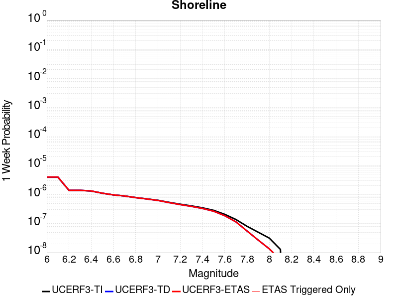 | 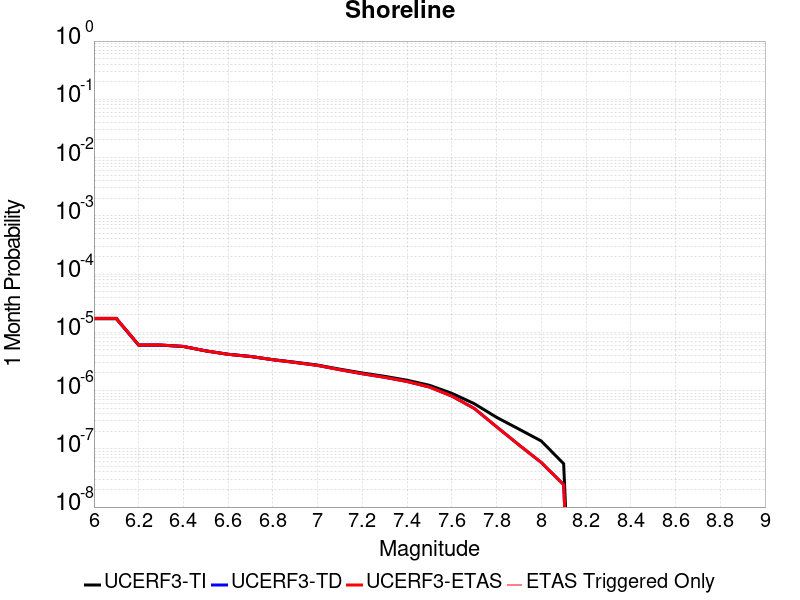 |  |  |

| Magnitude | 1 wk TI Prob | 1 wk TD Prob | 1 wk ETAS Prob | 1 wk ETAS/TD Gain | 1 wk ETAS Triggered Only | 1 mo TI Prob | 1 mo TD Prob | 1 mo ETAS Prob | 1 mo ETAS/TD Gain | 1 mo ETAS Triggered Only | 1 yr TI Prob | 1 yr TD Prob | 1 yr ETAS Prob | 1 yr ETAS/TD Gain | 1 yr ETAS Triggered Only | 10 yr TI Prob | 10 yr TD Prob | 10 yr ETAS Prob | 10 yr ETAS/TD Gain | 10 yr ETAS Triggered Only |
|-----|-----|-----|-----|-----|-----|-----|-----|-----|-----|-----|-----|-----|-----|-----|-----|-----|-----|-----|-----|-----|
| 6.0 | 3.9888673E-6 | 4.047961E-6 | 4.047961E-6 | 1.0 | 0.0 | 1.7095033E-5 | 1.7348319E-5 | 1.7348319E-5 | 1.0 | 0.0 | 2.0811215E-4 | 2.1120091E-4 | 2.1120091E-4 | 1.0 | 0.0 | 0.0020791737 | 0.0021105506 | 0.0021405315 | 1.0142053 | 3.0044466E-5 |
| 6.1 | 3.9888673E-6 | 4.047961E-6 | 4.047961E-6 | 1.0 | 0.0 | 1.7095033E-5 | 1.7348319E-5 | 1.7348319E-5 | 1.0 | 0.0 | 2.0811215E-4 | 2.1120091E-4 | 2.1120091E-4 | 1.0 | 0.0 | 0.0020791737 | 0.0021105506 | 0.0021405315 | 1.0142053 | 3.0044466E-5 |
| 6.2 | 1.4039653E-6 | 1.4101064E-6 | 1.4101064E-6 | 1.0 | 0.0 | 6.0169805E-6 | 6.0432994E-6 | 6.0432994E-6 | 1.0 | 0.0 | 7.325427E-5 | 7.3574745E-5 | 7.3574745E-5 | 1.0 | 0.0 | 7.3230127E-4 | 7.355099E-4 | 7.355099E-4 | 1.0 | 0.0 |
| 6.3 | 1.4039653E-6 | 1.4101064E-6 | 1.4101064E-6 | 1.0 | 0.0 | 6.0169805E-6 | 6.0432994E-6 | 6.0432994E-6 | 1.0 | 0.0 | 7.325427E-5 | 7.3574745E-5 | 7.3574745E-5 | 1.0 | 0.0 | 7.3230127E-4 | 7.355099E-4 | 7.355099E-4 | 1.0 | 0.0 |
| 6.4 | 1.3314152E-6 | 1.3361774E-6 | 1.3361774E-6 | 1.0 | 0.0 | 5.7060524E-6 | 5.7264624E-6 | 5.7264624E-6 | 1.0 | 0.0 | 6.946897E-5 | 6.9717506E-5 | 6.9717506E-5 | 1.0 | 0.0 | 6.9447263E-4 | 6.969617E-4 | 6.969617E-4 | 1.0 | 0.0 |
| 6.5 | 1.1187026E-6 | 1.1203801E-6 | 1.1203801E-6 | 1.0 | 0.0 | 4.794431E-6 | 4.8016204E-6 | 4.8016204E-6 | 1.0 | 0.0 | 5.8370628E-5 | 5.8458183E-5 | 5.8458183E-5 | 1.0 | 0.0 | 5.83553E-4 | 5.844306E-4 | 5.844306E-4 | 1.0 | 0.0 |
| 6.6 | 9.793089E-7 | 9.785074E-7 | 9.785074E-7 | 1.0 | 0.0 | 4.1970316E-6 | 4.1935964E-6 | 4.1935964E-6 | 1.0 | 0.0 | 5.1097657E-5 | 5.1055853E-5 | 5.1055853E-5 | 1.0 | 0.0 | 5.108591E-4 | 5.1044254E-4 | 5.1044254E-4 | 1.0 | 0.0 |
| 6.7 | 8.995986E-7 | 8.97295E-7 | 8.97295E-7 | 1.0 | 0.0 | 3.8554167E-6 | 3.8455446E-6 | 3.8455446E-6 | 1.0 | 0.0 | 4.693869E-5 | 4.681851E-5 | 4.681851E-5 | 1.0 | 0.0 | 4.6928777E-4 | 4.680874E-4 | 4.680874E-4 | 1.0 | 0.0 |
| 6.8 | 7.931612E-7 | 7.8805454E-7 | 7.8805454E-7 | 1.0 | 0.0 | 3.3992578E-6 | 3.3773722E-6 | 3.3773722E-6 | 1.0 | 0.0 | 4.1385178E-5 | 4.1118736E-5 | 4.1118736E-5 | 1.0 | 0.0 | 4.1377472E-4 | 4.1111183E-4 | 4.1111183E-4 | 1.0 | 0.0 |
| 6.9 | 7.1465956E-7 | 7.0781437E-7 | 7.0781437E-7 | 1.0 | 0.0 | 3.062823E-6 | 3.0334868E-6 | 3.0334868E-6 | 1.0 | 0.0 | 3.7289232E-5 | 3.6932077E-5 | 3.6932077E-5 | 1.0 | 0.0 | 3.7282976E-4 | 3.6925977E-4 | 3.6925977E-4 | 1.0 | 0.0 |
| 7.0 | 6.389046E-7 | 6.2995906E-7 | 6.2995906E-7 | 1.0 | 0.0 | 2.7381598E-6 | 2.6998216E-6 | 2.6998216E-6 | 1.0 | 0.0 | 3.3336586E-5 | 3.2869837E-5 | 3.2869837E-5 | 1.0 | 0.0 | 3.3331584E-4 | 3.2864997E-4 | 3.2864997E-4 | 1.0 | 0.0 |
| 7.1 | 5.4300875E-7 | 5.311255E-7 | 5.311255E-7 | 1.0 | 0.0 | 2.3271782E-6 | 2.2762501E-6 | 2.2762501E-6 | 1.0 | 0.0 | 2.8333026E-5 | 2.7712995E-5 | 2.7712995E-5 | 1.0 | 0.0 | 2.8329415E-4 | 2.770955E-4 | 2.770955E-4 | 1.0 | 0.0 |
| 7.2 | 4.6768855E-7 | 4.5350131E-7 | 4.5350131E-7 | 1.0 | 0.0 | 2.0043778E-6 | 1.9435756E-6 | 1.9435756E-6 | 1.0 | 0.0 | 2.4403027E-5 | 2.3662777E-5 | 2.3662777E-5 | 1.0 | 0.0 | 2.4400349E-4 | 2.3660263E-4 | 2.3660263E-4 | 1.0 | 0.0 |
| 7.3 | 4.0966103E-7 | 3.93868E-7 | 3.93868E-7 | 1.0 | 0.0 | 1.7556889E-6 | 1.6880045E-6 | 1.6880045E-6 | 1.0 | 0.0 | 2.1375303E-5 | 2.055126E-5 | 2.055126E-5 | 1.0 | 0.0 | 2.1373246E-4 | 2.0549365E-4 | 2.0549365E-4 | 1.0 | 0.0 |
| 7.4 | 3.5105785E-7 | 3.3365063E-7 | 3.3365063E-7 | 1.0 | 0.0 | 1.5045327E-6 | 1.4299305E-6 | 1.4299305E-6 | 1.0 | 0.0 | 1.8317533E-5 | 1.7409266E-5 | 1.7409266E-5 | 1.0 | 0.0 | 1.8316023E-4 | 1.7407905E-4 | 1.7407905E-4 | 1.0 | 0.0 |
| 7.5 | 2.8737534E-7 | 2.682108E-7 | 2.682108E-7 | 1.0 | 0.0 | 1.2316079E-6 | 1.1494744E-6 | 1.1494744E-6 | 1.0 | 0.0 | 1.4994724E-5 | 1.3994761E-5 | 1.3994761E-5 | 1.0 | 0.0 | 1.4993713E-4 | 1.3993881E-4 | 1.3993881E-4 | 1.0 | 0.0 |
| 7.6 | 2.0924051E-7 | 1.8779967E-7 | 1.8779967E-7 | 1.0 | 0.0 | 8.967448E-7 | 8.0485546E-7 | 8.0485546E-7 | 1.0 | 0.0 | 1.0917813E-5 | 9.799071E-6 | 9.799071E-6 | 1.0 | 0.0 | 1.0917276E-4 | 9.7986405E-5 | 9.7986405E-5 | 1.0 | 0.0 |
| 7.7 | 1.392265E-7 | 1.1544305E-7 | 1.1544305E-7 | 1.0 | 0.0 | 5.9668486E-7 | 4.9475585E-7 | 4.9475585E-7 | 1.0 | 0.0 | 7.2646135E-6 | 6.0236357E-6 | 6.0236357E-6 | 1.0 | 0.0 | 7.2643765E-5 | 6.0234728E-5 | 6.0234728E-5 | 1.0 | 0.0 |
| 7.8 | 8.1080074E-8 | 5.5875784E-8 | 5.5875784E-8 | 1.0 | 0.0 | 3.4748598E-7 | 2.3946762E-7 | 2.3946762E-7 | 1.0 | 0.0 | 4.2306337E-6 | 2.9155144E-6 | 2.9155144E-6 | 1.0 | 0.0 | 4.230553E-5 | 2.9154762E-5 | 2.9154762E-5 | 1.0 | 0.0 |
| 7.9 | 5.0859036E-8 | 2.7252394E-8 | 2.7252394E-8 | 1.0 | 0.0 | 2.1796728E-7 | 1.16795974E-7 | 1.16795974E-7 | 1.0 | 0.0 | 2.6537484E-6 | 1.42199E-6 | 1.42199E-6 | 1.0 | 0.0 | 2.6537167E-5 | 1.421981E-5 | 1.421981E-5 | 1.0 | 0.0 |
| 8.0 | 3.1760536E-8 | 1.35833655E-8 | 1.35833655E-8 | 1.0 | 0.0 | 1.3611657E-7 | 5.821442E-8 | 5.821442E-8 | 1.0 | 0.0 | 1.6572179E-6 | 7.0876035E-7 | 7.0876035E-7 | 1.0 | 0.0 | 1.6572056E-5 | 7.0875813E-6 | 7.0875813E-6 | 1.0 | 0.0 |
| 8.1 | 1.2947896E-8 | 5.6655294E-9 | 5.6655294E-9 | 1.0 | 0.0 | 5.5490982E-8 | 2.4280842E-8 | 2.4280842E-8 | 1.0 | 0.0 | 6.756025E-7 | 2.956192E-7 | 2.956192E-7 | 1.0 | 0.0 | 6.7560045E-6 | 2.9561884E-6 | 2.9561884E-6 | 1.0 | 0.0 |

## Great Valley 11
*[(top)](#table-of-contents)*

| 1 Week | 1 Month | 1 Year | 10 Year |
|-----|-----|-----|-----|
|  |  |  |  |

| Magnitude | 1 wk TI Prob | 1 wk TD Prob | 1 wk ETAS Prob | 1 wk ETAS/TD Gain | 1 wk ETAS Triggered Only | 1 mo TI Prob | 1 mo TD Prob | 1 mo ETAS Prob | 1 mo ETAS/TD Gain | 1 mo ETAS Triggered Only | 1 yr TI Prob | 1 yr TD Prob | 1 yr ETAS Prob | 1 yr ETAS/TD Gain | 1 yr ETAS Triggered Only | 10 yr TI Prob | 10 yr TD Prob | 10 yr ETAS Prob | 10 yr ETAS/TD Gain | 10 yr ETAS Triggered Only |
|-----|-----|-----|-----|-----|-----|-----|-----|-----|-----|-----|-----|-----|-----|-----|-----|-----|-----|-----|-----|-----|
| 6.0 | 2.8099583E-5 | 2.983355E-5 | 2.983355E-5 | 1.0 | 0.0 | 1.20421224E-4 | 1.2785224E-4 | 1.2785224E-4 | 1.0 | 0.0 | 0.0014651422 | 0.0015555643 | 0.0015855621 | 1.0192841 | 3.0044466E-5 | 0.0145552 | 0.015454284 | 0.015483864 | 1.001914 | 3.0044466E-5 |
| 6.1 | 2.483194E-5 | 2.590834E-5 | 2.590834E-5 | 1.0 | 0.0 | 1.0641825E-4 | 1.1103138E-4 | 1.1103138E-4 | 1.0 | 0.0 | 0.0012948721 | 0.0013510331 | 0.0013810371 | 1.0222081 | 3.0044466E-5 | 0.012873529 | 0.013434611 | 0.0134642515 | 1.0022063 | 3.0044466E-5 |
| 6.2 | 2.483194E-5 | 2.590834E-5 | 2.590834E-5 | 1.0 | 0.0 | 1.0641825E-4 | 1.1103138E-4 | 1.1103138E-4 | 1.0 | 0.0 | 0.0012948721 | 0.0013510331 | 0.0013810371 | 1.0222081 | 3.0044466E-5 | 0.012873529 | 0.013434611 | 0.0134642515 | 1.0022063 | 3.0044466E-5 |
| 6.3 | 2.0257901E-5 | 2.0399813E-5 | 2.0399813E-5 | 1.0 | 0.0 | 8.681669E-5 | 8.7425076E-5 | 8.7425076E-5 | 1.0 | 0.0 | 0.0010564806 | 0.0010639227 | 0.0010939351 | 1.0282093 | 3.0044466E-5 | 0.01051472 | 0.010592477 | 0.010622203 | 1.0028063 | 3.0044466E-5 |
| 6.4 | 1.8054898E-5 | 1.7781635E-5 | 1.7781635E-5 | 1.0 | 0.0 | 7.737584E-5 | 7.6205E-5 | 7.6205E-5 | 1.0 | 0.0 | 9.416436E-4 | 9.274388E-4 | 9.5745537E-4 | 1.0323651 | 3.0044466E-5 | 0.009376635 | 0.009239434 | 0.009269201 | 1.0032218 | 3.0044466E-5 |
| 6.5 | 1.34804895E-5 | 1.2321545E-5 | 1.2321545E-5 | 1.0 | 0.0 | 5.777225E-5 | 5.2805575E-5 | 5.2805575E-5 | 1.0 | 0.0 | 7.031501E-4 | 6.427224E-4 | 6.7274756E-4 | 1.0467156 | 3.0044466E-5 | 0.007009294 | 0.006409073 | 0.0064389245 | 1.0046577 | 3.0044466E-5 |
| 6.6 | 1.294883E-5 | 1.17327845E-5 | 1.17327845E-5 | 1.0 | 0.0 | 5.5493805E-5 | 5.028242E-5 | 5.028242E-5 | 1.0 | 0.0 | 6.754276E-4 | 6.1202055E-4 | 6.1202055E-4 | 1.0 | 0.0 | 0.006733784 | 0.0061037764 | 0.0061037764 | 1.0 | 0.0 |
| 6.7 | 1.1272237E-5 | 9.8122855E-6 | 9.8122855E-6 | 1.0 | 0.0 | 4.8308695E-5 | 4.2051986E-5 | 4.2051986E-5 | 1.0 | 0.0 | 5.879996E-4 | 5.118654E-4 | 5.118654E-4 | 1.0 | 0.0 | 0.005864462 | 0.0051071486 | 0.0051071486 | 1.0 | 0.0 |
| 6.8 | 9.8337505E-6 | 8.194115E-6 | 8.194115E-6 | 1.0 | 0.0 | 4.2143965E-5 | 3.5117177E-5 | 3.5117177E-5 | 1.0 | 0.0 | 5.1298196E-4 | 4.274698E-4 | 4.274698E-4 | 1.0 | 0.0 | 0.005117994 | 0.0042666853 | 0.0042666853 | 1.0 | 0.0 |
| 6.9 | 7.4224813E-6 | 5.413367E-6 | 5.413367E-6 | 1.0 | 0.0 | 3.1810247E-5 | 2.3199946E-5 | 2.3199946E-5 | 1.0 | 0.0 | 3.872209E-4 | 2.8242415E-4 | 2.8242415E-4 | 1.0 | 0.0 | 0.0038654688 | 0.002820793 | 0.002820793 | 1.0 | 0.0 |
| 7.0 | 4.4628923E-6 | 2.011162E-6 | 2.011162E-6 | 1.0 | 0.0 | 1.912654E-5 | 8.6192385E-6 | 8.6192385E-6 | 1.0 | 0.0 | 2.3284076E-4 | 1.0493429E-4 | 1.0493429E-4 | 1.0 | 0.0 | 0.0023259693 | 0.001048859 | 0.001048859 | 1.0 | 0.0 |
| 7.1 | 3.5546527E-6 | 1.1856353E-6 | 1.1856353E-6 | 1.0 | 0.0 | 1.5234136E-5 | 5.081284E-6 | 5.081284E-6 | 1.0 | 0.0 | 1.8545982E-4 | 6.186295E-5 | 6.186295E-5 | 1.0 | 0.0 | 0.0018530512 | 6.184641E-4 | 6.184641E-4 | 1.0 | 0.0 |
| 7.2 | 3.2039936E-6 | 1.1254593E-6 | 1.1254593E-6 | 1.0 | 0.0 | 1.3731329E-5 | 4.8233887E-6 | 4.8233887E-6 | 1.0 | 0.0 | 1.671661E-4 | 5.8723243E-5 | 5.8723243E-5 | 1.0 | 0.0 | 0.0016704041 | 5.87084E-4 | 5.87084E-4 | 1.0 | 0.0 |
| 7.3 | 2.8120473E-6 | 1.030602E-6 | 1.030602E-6 | 1.0 | 0.0 | 1.2051575E-5 | 4.4168587E-6 | 4.4168587E-6 | 1.0 | 0.0 | 1.4671806E-4 | 5.377399E-5 | 5.377399E-5 | 1.0 | 0.0 | 0.0014662122 | 5.3761643E-4 | 5.3761643E-4 | 1.0 | 0.0 |
| 7.4 | 2.4837766E-6 | 9.800948E-7 | 9.800948E-7 | 1.0 | 0.0 | 1.0644713E-5 | 4.2004E-6 | 4.2004E-6 | 1.0 | 0.0 | 1.2959167E-4 | 5.1138737E-5 | 5.1138737E-5 | 1.0 | 0.0 | 0.0012951613 | 5.1127624E-4 | 5.1127624E-4 | 1.0 | 0.0 |
| 7.5 | 1.5002679E-6 | 6.5463627E-7 | 6.5463627E-7 | 1.0 | 0.0 | 6.4297037E-6 | 2.8055813E-6 | 2.8055813E-6 | 1.0 | 0.0 | 7.827883E-5 | 3.415746E-5 | 3.415746E-5 | 1.0 | 0.0 | 7.825126E-4 | 3.4152623E-4 | 3.4152623E-4 | 1.0 | 0.0 |

## Great Valley 04b Gordon Valley
*[(top)](#table-of-contents)*

| 1 Week | 1 Month | 1 Year | 10 Year |
|-----|-----|-----|-----|
|  |  |  |  |

| Magnitude | 1 wk TI Prob | 1 wk TD Prob | 1 wk ETAS Prob | 1 wk ETAS/TD Gain | 1 wk ETAS Triggered Only | 1 mo TI Prob | 1 mo TD Prob | 1 mo ETAS Prob | 1 mo ETAS/TD Gain | 1 mo ETAS Triggered Only | 1 yr TI Prob | 1 yr TD Prob | 1 yr ETAS Prob | 1 yr ETAS/TD Gain | 1 yr ETAS Triggered Only | 10 yr TI Prob | 10 yr TD Prob | 10 yr ETAS Prob | 10 yr ETAS/TD Gain | 10 yr ETAS Triggered Only |
|-----|-----|-----|-----|-----|-----|-----|-----|-----|-----|-----|-----|-----|-----|-----|-----|-----|-----|-----|-----|-----|
| 6.0 | 2.1181217E-5 | 2.3982797E-5 | 2.3982797E-5 | 1.0 | 0.0 | 9.077348E-5 | 1.0278031E-4 | 1.0278031E-4 | 1.0 | 0.0 | 0.0011046068 | 0.0012507986 | 0.0012808056 | 1.0239902 | 3.0044466E-5 | 0.010991322 | 0.012454035 | 0.012483705 | 1.0023824 | 3.0044466E-5 |
| 6.1 | 2.1181217E-5 | 2.3982797E-5 | 2.3982797E-5 | 1.0 | 0.0 | 9.077348E-5 | 1.0278031E-4 | 1.0278031E-4 | 1.0 | 0.0 | 0.0011046068 | 0.0012507986 | 0.0012808056 | 1.0239902 | 3.0044466E-5 | 0.010991322 | 0.012454035 | 0.012483705 | 1.0023824 | 3.0044466E-5 |
| 6.2 | 2.1181217E-5 | 2.3982797E-5 | 2.3982797E-5 | 1.0 | 0.0 | 9.077348E-5 | 1.0278031E-4 | 1.0278031E-4 | 1.0 | 0.0 | 0.0011046068 | 0.0012507986 | 0.0012808056 | 1.0239902 | 3.0044466E-5 | 0.010991322 | 0.012454035 | 0.012483705 | 1.0023824 | 3.0044466E-5 |
| 6.3 | 2.1181217E-5 | 2.3982797E-5 | 2.3982797E-5 | 1.0 | 0.0 | 9.077348E-5 | 1.0278031E-4 | 1.0278031E-4 | 1.0 | 0.0 | 0.0011046068 | 0.0012507986 | 0.0012808056 | 1.0239902 | 3.0044466E-5 | 0.010991322 | 0.012454035 | 0.012483705 | 1.0023824 | 3.0044466E-5 |
| 6.4 | 1.0988268E-5 | 1.2254874E-5 | 1.2254874E-5 | 1.0 | 0.0 | 4.7091726E-5 | 5.2519918E-5 | 5.2519918E-5 | 1.0 | 0.0 | 5.731909E-4 | 6.3925836E-4 | 6.692836E-4 | 1.0469689 | 3.0044466E-5 | 0.005717147 | 0.0063757817 | 0.006405635 | 1.0046822 | 3.0044466E-5 |
| 6.5 | 1.0988268E-5 | 1.2254874E-5 | 1.2254874E-5 | 1.0 | 0.0 | 4.7091726E-5 | 5.2519918E-5 | 5.2519918E-5 | 1.0 | 0.0 | 5.731909E-4 | 6.3925836E-4 | 6.692836E-4 | 1.0469689 | 3.0044466E-5 | 0.005717147 | 0.0063757817 | 0.006405635 | 1.0046822 | 3.0044466E-5 |
| 6.6 | 1.0517822E-5 | 1.1724419E-5 | 1.1724419E-5 | 1.0 | 0.0 | 4.5075605E-5 | 5.024663E-5 | 5.024663E-5 | 1.0 | 0.0 | 5.4865726E-4 | 6.115966E-4 | 6.115966E-4 | 1.0 | 0.0 | 0.0054730466 | 0.006100688 | 0.006100688 | 1.0 | 0.0 |
| 6.7 | 7.789219E-6 | 8.677907E-6 | 8.677907E-6 | 1.0 | 0.0 | 3.3381937E-5 | 3.719053E-5 | 3.719053E-5 | 1.0 | 0.0 | 4.063493E-4 | 4.527058E-4 | 4.527058E-4 | 1.0 | 0.0 | 0.004056071 | 0.004518353 | 0.004518353 | 1.0 | 0.0 |
| 6.8 | 7.5850853E-6 | 8.4526455E-6 | 8.4526455E-6 | 1.0 | 0.0 | 3.2507105E-5 | 3.622515E-5 | 3.622515E-5 | 1.0 | 0.0 | 3.957021E-4 | 4.4095708E-4 | 4.4095708E-4 | 1.0 | 0.0 | 0.0039499826 | 0.0044013336 | 0.0044013336 | 1.0 | 0.0 |
| 6.9 | 6.604105E-6 | 7.358772E-6 | 7.358772E-6 | 1.0 | 0.0 | 2.8303E-5 | 3.1537238E-5 | 3.1537238E-5 | 1.0 | 0.0 | 3.4453452E-4 | 3.8390208E-4 | 3.8390208E-4 | 1.0 | 0.0 | 0.0034400085 | 0.0038327754 | 0.0038327754 | 1.0 | 0.0 |
| 7.0 | 5.3701115E-6 | 5.9886015E-6 | 5.9886015E-6 | 1.0 | 0.0 | 2.301456E-5 | 2.5665198E-5 | 2.5665198E-5 | 1.0 | 0.0 | 2.8016625E-4 | 3.124319E-4 | 3.124319E-4 | 1.0 | 0.0 | 0.0027981328 | 0.0031202151 | 0.0031202151 | 1.0 | 0.0 |
| 7.1 | 4.4685607E-6 | 4.9866317E-6 | 4.9866317E-6 | 1.0 | 0.0 | 1.9150835E-5 | 2.1371117E-5 | 2.1371117E-5 | 1.0 | 0.0 | 2.3313647E-4 | 2.6016476E-4 | 2.6016476E-4 | 1.0 | 0.0 | 0.0023289204 | 0.0025988468 | 0.0025988468 | 1.0 | 0.0 |
| 7.2 | 2.833378E-6 | 3.1645172E-6 | 3.1645172E-6 | 1.0 | 0.0 | 1.2142991E-5 | 1.3562157E-5 | 1.3562157E-5 | 1.0 | 0.0 | 1.4783088E-4 | 1.6510849E-4 | 1.6510849E-4 | 1.0 | 0.0 | 0.0014773258 | 0.0016500301 | 0.0016500301 | 1.0 | 0.0 |
| 7.3 | 7.0087293E-7 | 7.773042E-7 | 7.773042E-7 | 1.0 | 0.0 | 3.0037377E-6 | 3.331302E-6 | 3.331302E-6 | 1.0 | 0.0 | 3.656989E-5 | 4.0558305E-5 | 4.0558305E-5 | 1.0 | 0.0 | 3.6563876E-4 | 4.0555402E-4 | 4.0555402E-4 | 1.0 | 0.0 |
| 7.4 | 3.112171E-8 | 3.2068627E-8 | 3.2068627E-8 | 1.0 | 0.0 | 1.3337875E-7 | 1.3743696E-7 | 1.3743696E-7 | 1.0 | 0.0 | 1.6238852E-6 | 1.6732937E-6 | 1.6732937E-6 | 1.0 | 0.0 | 1.6238733E-5 | 1.673282E-5 | 1.673282E-5 | 1.0 | 0.0 |

## Bullion Mountains
*[(top)](#table-of-contents)*

| 1 Week | 1 Month | 1 Year | 10 Year |
|-----|-----|-----|-----|
|  |  |  |  |

| Magnitude | 1 wk TI Prob | 1 wk TD Prob | 1 wk ETAS Prob | 1 wk ETAS/TD Gain | 1 wk ETAS Triggered Only | 1 mo TI Prob | 1 mo TD Prob | 1 mo ETAS Prob | 1 mo ETAS/TD Gain | 1 mo ETAS Triggered Only | 1 yr TI Prob | 1 yr TD Prob | 1 yr ETAS Prob | 1 yr ETAS/TD Gain | 1 yr ETAS Triggered Only | 10 yr TI Prob | 10 yr TD Prob | 10 yr ETAS Prob | 10 yr ETAS/TD Gain | 10 yr ETAS Triggered Only |
|-----|-----|-----|-----|-----|-----|-----|-----|-----|-----|-----|-----|-----|-----|-----|-----|-----|-----|-----|-----|-----|
| 6.0 | 1.6420427E-5 | 1.4692522E-5 | 1.4692522E-5 | 1.0 | 0.0 | 7.037136E-5 | 6.296665E-5 | 6.296665E-5 | 1.0 | 0.0 | 8.5643446E-4 | 7.663877E-4 | 7.663877E-4 | 1.0 | 0.0 | 0.008531413 | 0.0076412405 | 0.0076710554 | 1.0039018 | 3.0044466E-5 |
| 6.1 | 1.6420427E-5 | 1.4692522E-5 | 1.4692522E-5 | 1.0 | 0.0 | 7.037136E-5 | 6.296665E-5 | 6.296665E-5 | 1.0 | 0.0 | 8.5643446E-4 | 7.663877E-4 | 7.663877E-4 | 1.0 | 0.0 | 0.008531413 | 0.0076412405 | 0.0076710554 | 1.0039018 | 3.0044466E-5 |
| 6.2 | 1.6420427E-5 | 1.4692522E-5 | 1.4692522E-5 | 1.0 | 0.0 | 7.037136E-5 | 6.296665E-5 | 6.296665E-5 | 1.0 | 0.0 | 8.5643446E-4 | 7.663877E-4 | 7.663877E-4 | 1.0 | 0.0 | 0.008531413 | 0.0076412405 | 0.0076710554 | 1.0039018 | 3.0044466E-5 |
| 6.3 | 1.2046778E-5 | 9.862634E-6 | 9.862634E-6 | 1.0 | 0.0 | 5.1628023E-5 | 4.226788E-5 | 4.226788E-5 | 1.0 | 0.0 | 6.283899E-4 | 5.145131E-4 | 5.145131E-4 | 1.0 | 0.0 | 0.0062661595 | 0.0051355003 | 0.0051355003 | 1.0 | 0.0 |
| 6.4 | 1.2046778E-5 | 9.862634E-6 | 9.862634E-6 | 1.0 | 0.0 | 5.1628023E-5 | 4.226788E-5 | 4.226788E-5 | 1.0 | 0.0 | 6.283899E-4 | 5.145131E-4 | 5.145131E-4 | 1.0 | 0.0 | 0.0062661595 | 0.0051355003 | 0.0051355003 | 1.0 | 0.0 |
| 6.5 | 1.0244343E-5 | 7.879705E-6 | 7.879705E-6 | 1.0 | 0.0 | 4.390359E-5 | 3.3769844E-5 | 3.3769844E-5 | 1.0 | 0.0 | 5.343951E-4 | 4.1109096E-4 | 4.1109096E-4 | 1.0 | 0.0 | 0.005331118 | 0.0041053365 | 0.0041053365 | 1.0 | 0.0 |
| 6.6 | 9.605408E-6 | 7.1777245E-6 | 7.1777245E-6 | 1.0 | 0.0 | 4.1165385E-5 | 3.076143E-5 | 3.076143E-5 | 1.0 | 0.0 | 5.010733E-4 | 3.744764E-4 | 3.744764E-4 | 1.0 | 0.0 | 0.00499945 | 0.0037404508 | 0.0037404508 | 1.0 | 0.0 |
| 6.7 | 8.60418E-6 | 6.124204E-6 | 6.124204E-6 | 1.0 | 0.0 | 3.687454E-5 | 2.6246435E-5 | 2.6246435E-5 | 1.0 | 0.0 | 4.48855E-4 | 3.1952298E-4 | 3.1952298E-4 | 1.0 | 0.0 | 0.004479495 | 0.0031925477 | 0.0031925477 | 1.0 | 0.0 |
| 6.8 | 5.187994E-6 | 2.5632721E-6 | 2.5632721E-6 | 1.0 | 0.0 | 2.223407E-5 | 1.0985429E-5 | 1.0985429E-5 | 1.0 | 0.0 | 2.7066618E-4 | 1.3374338E-4 | 1.3374338E-4 | 1.0 | 0.0 | 0.0027033675 | 0.0013370205 | 0.0013370205 | 1.0 | 0.0 |
| 6.9 | 4.5302368E-6 | 2.344408E-6 | 2.344408E-6 | 1.0 | 0.0 | 1.9415156E-5 | 1.0047446E-5 | 1.0047446E-5 | 1.0 | 0.0 | 2.3635388E-4 | 1.2232475E-4 | 1.2232475E-4 | 1.0 | 0.0 | 0.0023610266 | 0.0012229634 | 0.0012229634 | 1.0 | 0.0 |
| 7.0 | 3.431668E-6 | 1.6883112E-6 | 1.6883112E-6 | 1.0 | 0.0 | 1.4707065E-5 | 7.2356193E-6 | 7.2356193E-6 | 1.0 | 0.0 | 1.7904381E-4 | 8.8093664E-5 | 8.8093664E-5 | 1.0 | 0.0 | 0.0017889962 | 8.809366E-4 | 8.809366E-4 | 1.0 | 0.0 |

## Antelope Valley 2011
*[(top)](#table-of-contents)*

| 1 Week | 1 Month | 1 Year | 10 Year |
|-----|-----|-----|-----|
|  |  |  |  |

| Magnitude | 1 wk TI Prob | 1 wk TD Prob | 1 wk ETAS Prob | 1 wk ETAS/TD Gain | 1 wk ETAS Triggered Only | 1 mo TI Prob | 1 mo TD Prob | 1 mo ETAS Prob | 1 mo ETAS/TD Gain | 1 mo ETAS Triggered Only | 1 yr TI Prob | 1 yr TD Prob | 1 yr ETAS Prob | 1 yr ETAS/TD Gain | 1 yr ETAS Triggered Only | 10 yr TI Prob | 10 yr TD Prob | 10 yr ETAS Prob | 10 yr ETAS/TD Gain | 10 yr ETAS Triggered Only |
|-----|-----|-----|-----|-----|-----|-----|-----|-----|-----|-----|-----|-----|-----|-----|-----|-----|-----|-----|-----|-----|
| 6.0 | 3.1646934E-5 | 3.690603E-5 | 3.690603E-5 | 1.0 | 0.0 | 1.3562266E-4 | 1.581606E-4 | 1.8820031E-4 | 1.1899318 | 3.0044466E-5 | 0.0016499552 | 0.0019241691 | 0.0019541557 | 1.0155842 | 3.0044466E-5 | 0.016377583 | 0.019101486 | 0.019130956 | 1.0015428 | 3.0044466E-5 |
| 6.1 | 3.1646934E-5 | 3.690603E-5 | 3.690603E-5 | 1.0 | 0.0 | 1.3562266E-4 | 1.581606E-4 | 1.8820031E-4 | 1.1899318 | 3.0044466E-5 | 0.0016499552 | 0.0019241691 | 0.0019541557 | 1.0155842 | 3.0044466E-5 | 0.016377583 | 0.019101486 | 0.019130956 | 1.0015428 | 3.0044466E-5 |
| 6.2 | 3.1646934E-5 | 3.690603E-5 | 3.690603E-5 | 1.0 | 0.0 | 1.3562266E-4 | 1.581606E-4 | 1.8820031E-4 | 1.1899318 | 3.0044466E-5 | 0.0016499552 | 0.0019241691 | 0.0019541557 | 1.0155842 | 3.0044466E-5 | 0.016377583 | 0.019101486 | 0.019130956 | 1.0015428 | 3.0044466E-5 |
| 6.3 | 3.1646934E-5 | 3.690603E-5 | 3.690603E-5 | 1.0 | 0.0 | 1.3562266E-4 | 1.581606E-4 | 1.8820031E-4 | 1.1899318 | 3.0044466E-5 | 0.0016499552 | 0.0019241691 | 0.0019541557 | 1.0155842 | 3.0044466E-5 | 0.016377583 | 0.019101486 | 0.019130956 | 1.0015428 | 3.0044466E-5 |
| 6.4 | 3.1646934E-5 | 3.690603E-5 | 3.690603E-5 | 1.0 | 0.0 | 1.3562266E-4 | 1.581606E-4 | 1.8820031E-4 | 1.1899318 | 3.0044466E-5 | 0.0016499552 | 0.0019241691 | 0.0019541557 | 1.0155842 | 3.0044466E-5 | 0.016377583 | 0.019101486 | 0.019130956 | 1.0015428 | 3.0044466E-5 |
| 6.5 | 1.8034107E-5 | 2.0941854E-5 | 2.0941854E-5 | 1.0 | 0.0 | 7.7286735E-5 | 8.9748406E-5 | 8.9748406E-5 | 1.0 | 0.0 | 9.405598E-4 | 0.0010922612 | 0.0010922612 | 1.0 | 0.0 | 0.009365888 | 0.010881005 | 0.010881005 | 1.0 | 0.0 |
| 6.6 | 1.8034107E-5 | 2.0941854E-5 | 2.0941854E-5 | 1.0 | 0.0 | 7.7286735E-5 | 8.9748406E-5 | 8.9748406E-5 | 1.0 | 0.0 | 9.405598E-4 | 0.0010922612 | 0.0010922612 | 1.0 | 0.0 | 0.009365888 | 0.010881005 | 0.010881005 | 1.0 | 0.0 |
| 6.7 | 1.3567667E-5 | 1.5750182E-5 | 1.5750182E-5 | 1.0 | 0.0 | 5.814585E-5 | 6.7499626E-5 | 6.7499626E-5 | 1.0 | 0.0 | 7.076958E-4 | 8.216044E-4 | 8.216044E-4 | 1.0 | 0.0 | 0.007054463 | 0.008196103 | 0.008196103 | 1.0 | 0.0 |
| 6.8 | 9.867387E-6 | 1.1468428E-5 | 1.1468428E-5 | 1.0 | 0.0 | 4.2288117E-5 | 4.9150018E-5 | 4.9150018E-5 | 1.0 | 0.0 | 5.1473617E-4 | 5.983321E-4 | 5.983321E-4 | 1.0 | 0.0 | 0.005135455 | 0.0059765247 | 0.0059765247 | 1.0 | 0.0 |
| 6.9 | 7.273233E-6 | 8.4552275E-6 | 8.4552275E-6 | 1.0 | 0.0 | 3.1170628E-5 | 3.623669E-5 | 3.623669E-5 | 1.0 | 0.0 | 3.794363E-4 | 4.411817E-4 | 4.411817E-4 | 1.0 | 0.0 | 0.0037878908 | 0.004411817 | 0.004411817 | 1.0 | 0.0 |

## Almanor 2011 CFM
*[(top)](#table-of-contents)*

| 1 Week | 1 Month | 1 Year | 10 Year |
|-----|-----|-----|-----|
|  |  |  |  |

| Magnitude | 1 wk TI Prob | 1 wk TD Prob | 1 wk ETAS Prob | 1 wk ETAS/TD Gain | 1 wk ETAS Triggered Only | 1 mo TI Prob | 1 mo TD Prob | 1 mo ETAS Prob | 1 mo ETAS/TD Gain | 1 mo ETAS Triggered Only | 1 yr TI Prob | 1 yr TD Prob | 1 yr ETAS Prob | 1 yr ETAS/TD Gain | 1 yr ETAS Triggered Only | 10 yr TI Prob | 10 yr TD Prob | 10 yr ETAS Prob | 10 yr ETAS/TD Gain | 10 yr ETAS Triggered Only |
|-----|-----|-----|-----|-----|-----|-----|-----|-----|-----|-----|-----|-----|-----|-----|-----|-----|-----|-----|-----|-----|
| 6.0 | 6.1479834E-5 | 8.328662E-5 | 8.328662E-5 | 1.0 | 0.0 | 2.6345838E-4 | 3.5689972E-4 | 3.5689972E-4 | 1.0 | 0.0 | 0.0032028882 | 0.0043369606 | 0.004366875 | 1.0068974 | 3.0044466E-5 | 0.031571172 | 0.042589366 | 0.042618133 | 1.0006754 | 3.0044466E-5 |
| 6.1 | 4.4387216E-5 | 5.9775994E-5 | 5.9775994E-5 | 1.0 | 0.0 | 1.9021705E-4 | 2.5616187E-4 | 2.5616187E-4 | 1.0 | 0.0 | 0.0023134327 | 0.003114681 | 0.003114681 | 1.0 | 0.0 | 0.022894967 | 0.030757606 | 0.030757606 | 1.0 | 0.0 |
| 6.2 | 4.4387216E-5 | 5.9775994E-5 | 5.9775994E-5 | 1.0 | 0.0 | 1.9021705E-4 | 2.5616187E-4 | 2.5616187E-4 | 1.0 | 0.0 | 0.0023134327 | 0.003114681 | 0.003114681 | 1.0 | 0.0 | 0.022894967 | 0.030757606 | 0.030757606 | 1.0 | 0.0 |
| 6.3 | 2.9523822E-5 | 3.9550785E-5 | 3.9550785E-5 | 1.0 | 0.0 | 1.2652454E-4 | 1.6949525E-4 | 1.6949525E-4 | 1.0 | 0.0 | 0.0015393476 | 0.0020620371 | 0.0020620371 | 1.0 | 0.0 | 0.015287281 | 0.020462489 | 0.020462489 | 1.0 | 0.0 |
| 6.4 | 2.0512744E-5 | 2.7434106E-5 | 2.7434106E-5 | 1.0 | 0.0 | 8.79088E-5 | 1.17571864E-4 | 1.17571864E-4 | 1.0 | 0.0 | 0.001069764 | 0.0014308526 | 0.0014308526 | 1.0 | 0.0 | 0.010646289 | 0.0142455865 | 0.0142455865 | 1.0 | 0.0 |
| 6.5 | 1.6750226E-5 | 2.239333E-5 | 2.239333E-5 | 1.0 | 0.0 | 7.178471E-5 | 9.597022E-5 | 9.597022E-5 | 1.0 | 0.0 | 8.7362836E-4 | 0.0011681512 | 0.0011681512 | 1.0 | 0.0 | 0.008702018 | 0.011649999 | 0.011649999 | 1.0 | 0.0 |
| 6.6 | 1.4745303E-5 | 1.9709738E-5 | 1.9709738E-5 | 1.0 | 0.0 | 6.319262E-5 | 8.446988E-5 | 8.446988E-5 | 1.0 | 0.0 | 7.690986E-4 | 0.0010282715 | 0.0010282715 | 1.0 | 0.0 | 0.0076644225 | 0.010265817 | 0.010265817 | 1.0 | 0.0 |
| 6.7 | 9.951145E-7 | 1.1616863E-6 | 1.1616863E-6 | 1.0 | 0.0 | 4.26477E-6 | 4.978647E-6 | 4.978647E-6 | 1.0 | 0.0 | 5.1922336E-5 | 6.0613518E-5 | 6.0613518E-5 | 1.0 | 0.0 | 5.1910203E-4 | 6.059871E-4 | 6.059871E-4 | 1.0 | 0.0 |
| 6.8 | 5.866312E-7 | 6.849689E-7 | 6.849689E-7 | 1.0 | 0.0 | 2.5141312E-6 | 2.9355783E-6 | 2.9355783E-6 | 1.0 | 0.0 | 3.0609117E-5 | 3.574021E-5 | 3.574021E-5 | 1.0 | 0.0 | 3.06049E-4 | 3.5735746E-4 | 3.5735746E-4 | 1.0 | 0.0 |

## San Jose
*[(top)](#table-of-contents)*

| 1 Week | 1 Month | 1 Year | 10 Year |
|-----|-----|-----|-----|
|  |  |  | 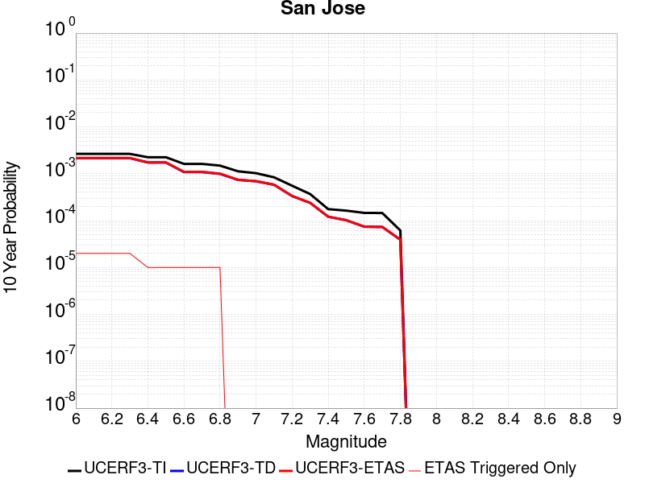 |

| Magnitude | 1 wk TI Prob | 1 wk TD Prob | 1 wk ETAS Prob | 1 wk ETAS/TD Gain | 1 wk ETAS Triggered Only | 1 mo TI Prob | 1 mo TD Prob | 1 mo ETAS Prob | 1 mo ETAS/TD Gain | 1 mo ETAS Triggered Only | 1 yr TI Prob | 1 yr TD Prob | 1 yr ETAS Prob | 1 yr ETAS/TD Gain | 1 yr ETAS Triggered Only | 10 yr TI Prob | 10 yr TD Prob | 10 yr ETAS Prob | 10 yr ETAS/TD Gain | 10 yr ETAS Triggered Only |
|-----|-----|-----|-----|-----|-----|-----|-----|-----|-----|-----|-----|-----|-----|-----|-----|-----|-----|-----|-----|-----|
| 6.0 | 5.0851277E-6 | 4.125829E-6 | 4.125829E-6 | 1.0 | 0.0 | 2.1793223E-5 | 1.768202E-5 | 1.768202E-5 | 1.0 | 0.0 | 2.653002E-4 | 2.1525996E-4 | 2.4529797E-4 | 1.1395429 | 3.0044466E-5 | 0.0026498367 | 0.0021508057 | 0.0021807854 | 1.0139389 | 3.0044466E-5 |
| 6.1 | 5.0851277E-6 | 4.125829E-6 | 4.125829E-6 | 1.0 | 0.0 | 2.1793223E-5 | 1.768202E-5 | 1.768202E-5 | 1.0 | 0.0 | 2.653002E-4 | 2.1525996E-4 | 2.4529797E-4 | 1.1395429 | 3.0044466E-5 | 0.0026498367 | 0.0021508057 | 0.0021807854 | 1.0139389 | 3.0044466E-5 |
| 6.2 | 5.0851277E-6 | 4.125829E-6 | 4.125829E-6 | 1.0 | 0.0 | 2.1793223E-5 | 1.768202E-5 | 1.768202E-5 | 1.0 | 0.0 | 2.653002E-4 | 2.1525996E-4 | 2.4529797E-4 | 1.1395429 | 3.0044466E-5 | 0.0026498367 | 0.0021508057 | 0.0021807854 | 1.0139389 | 3.0044466E-5 |
| 6.3 | 5.0851277E-6 | 4.125829E-6 | 4.125829E-6 | 1.0 | 0.0 | 2.1793223E-5 | 1.768202E-5 | 1.768202E-5 | 1.0 | 0.0 | 2.653002E-4 | 2.1525996E-4 | 2.4529797E-4 | 1.1395429 | 3.0044466E-5 | 0.0026498367 | 0.0021508057 | 0.0021807854 | 1.0139389 | 3.0044466E-5 |
| 6.4 | 4.3115124E-6 | 3.3239319E-6 | 3.3239319E-6 | 1.0 | 0.0 | 1.8477778E-5 | 1.4245357E-5 | 1.4245357E-5 | 1.0 | 0.0 | 2.2494372E-4 | 1.7342564E-4 | 1.7342564E-4 | 1.0 | 0.0 | 0.0022471617 | 0.0017331527 | 0.0017331527 | 1.0 | 0.0 |
| 6.5 | 4.3115124E-6 | 3.3239319E-6 | 3.3239319E-6 | 1.0 | 0.0 | 1.8477778E-5 | 1.4245357E-5 | 1.4245357E-5 | 1.0 | 0.0 | 2.2494372E-4 | 1.7342564E-4 | 1.7342564E-4 | 1.0 | 0.0 | 0.0022471617 | 0.0017331527 | 0.0017331527 | 1.0 | 0.0 |
| 6.6 | 3.110396E-6 | 2.0801237E-6 | 2.0801237E-6 | 1.0 | 0.0 | 1.33302E-5 | 8.914787E-6 | 8.914787E-6 | 1.0 | 0.0 | 1.622831E-4 | 1.08532404E-4 | 1.08532404E-4 | 1.0 | 0.0 | 0.0016216465 | 0.001084854 | 0.001084854 | 1.0 | 0.0 |
| 6.7 | 3.110396E-6 | 2.0801237E-6 | 2.0801237E-6 | 1.0 | 0.0 | 1.33302E-5 | 8.914787E-6 | 8.914787E-6 | 1.0 | 0.0 | 1.622831E-4 | 1.08532404E-4 | 1.08532404E-4 | 1.0 | 0.0 | 0.0016216465 | 0.001084854 | 0.001084854 | 1.0 | 0.0 |
| 6.8 | 2.856651E-6 | 1.9025686E-6 | 1.9025686E-6 | 1.0 | 0.0 | 1.2242733E-5 | 8.153841E-6 | 8.153841E-6 | 1.0 | 0.0 | 1.4904508E-4 | 9.926874E-5 | 9.926874E-5 | 1.0 | 0.0 | 0.0014894515 | 9.92301E-4 | 9.92301E-4 | 1.0 | 0.0 |
| 6.9 | 2.1618725E-6 | 1.4187887E-6 | 1.4187887E-6 | 1.0 | 0.0 | 9.265135E-6 | 6.080509E-6 | 6.080509E-6 | 1.0 | 0.0 | 1.12797185E-4 | 7.4027776E-5 | 7.4027776E-5 | 1.0 | 0.0 | 0.0011273995 | 7.4007234E-4 | 7.4007234E-4 | 1.0 | 0.0 |
| 7.0 | 1.9684312E-6 | 1.3257552E-6 | 1.3257552E-6 | 1.0 | 0.0 | 8.436106E-6 | 5.681796E-6 | 5.681796E-6 | 1.0 | 0.0 | 1.02704755E-4 | 6.917376E-5 | 6.917376E-5 | 1.0 | 0.0 | 0.001026573 | 6.915629E-4 | 6.915629E-4 | 1.0 | 0.0 |
| 7.1 | 1.6070337E-6 | 1.1156246E-6 | 1.1156246E-6 | 1.0 | 0.0 | 6.887269E-6 | 4.78124E-6 | 4.78124E-6 | 1.0 | 0.0 | 8.384928E-5 | 5.8210106E-5 | 5.8210106E-5 | 1.0 | 0.0 | 8.3817646E-4 | 5.8198726E-4 | 5.8198726E-4 | 1.0 | 0.0 |
| 7.2 | 1.0631658E-6 | 6.4046236E-7 | 6.4046236E-7 | 1.0 | 0.0 | 4.556417E-6 | 2.744836E-6 | 2.744836E-6 | 1.0 | 0.0 | 5.5472963E-5 | 3.3417877E-5 | 3.3417877E-5 | 1.0 | 0.0 | 5.545912E-4 | 3.341624E-4 | 3.341624E-4 | 1.0 | 0.0 |
| 7.3 | 7.060711E-7 | 4.583165E-7 | 4.583165E-7 | 1.0 | 0.0 | 3.0260155E-6 | 1.964212E-6 | 1.964212E-6 | 1.0 | 0.0 | 3.6841117E-5 | 2.391403E-5 | 2.391403E-5 | 1.0 | 0.0 | 3.6835007E-4 | 2.3914794E-4 | 2.3914794E-4 | 1.0 | 0.0 |
| 7.4 | 3.3677085E-7 | 2.323812E-7 | 2.323812E-7 | 1.0 | 0.0 | 1.4433028E-6 | 9.959191E-7 | 9.959191E-7 | 1.0 | 0.0 | 1.757207E-5 | 1.2125251E-5 | 1.2125251E-5 | 1.0 | 0.0 | 1.7570681E-4 | 1.2127866E-4 | 1.2127866E-4 | 1.0 | 0.0 |
| 7.5 | 3.129161E-7 | 1.9535003E-7 | 1.9535003E-7 | 1.0 | 0.0 | 1.3410682E-6 | 8.3721415E-7 | 8.3721415E-7 | 1.0 | 0.0 | 1.6327383E-5 | 1.0193037E-5 | 1.0193037E-5 | 1.0 | 0.0 | 1.6326184E-4 | 1.01958416E-4 | 1.01958416E-4 | 1.0 | 0.0 |
| 7.6 | 2.8008668E-7 | 1.4245146E-7 | 1.4245146E-7 | 1.0 | 0.0 | 1.2003709E-6 | 6.105061E-7 | 6.105061E-7 | 1.0 | 0.0 | 1.46144175E-5 | 7.432888E-6 | 7.432888E-6 | 1.0 | 0.0 | 1.4613457E-4 | 7.4359006E-5 | 7.4359006E-5 | 1.0 | 0.0 |
| 7.7 | 2.7852005E-7 | 1.4019697E-7 | 1.4019697E-7 | 1.0 | 0.0 | 1.1936568E-6 | 6.0084403E-7 | 6.0084403E-7 | 1.0 | 0.0 | 1.4532674E-5 | 7.3152532E-6 | 7.3152532E-6 | 1.0 | 0.0 | 1.4531724E-4 | 7.318273E-5 | 7.318273E-5 | 1.0 | 0.0 |
| 7.8 | 1.1810797E-7 | 7.520163E-8 | 7.520163E-8 | 1.0 | 0.0 | 5.0617695E-7 | 3.2229266E-7 | 3.2229266E-7 | 1.0 | 0.0 | 6.1626865E-6 | 3.9239067E-6 | 3.9239067E-6 | 1.0 | 0.0 | 6.162516E-5 | 3.9256745E-5 | 3.9256745E-5 | 1.0 | 0.0 |

## Greenville (No) 2011 CFM
*[(top)](#table-of-contents)*

| 1 Week | 1 Month | 1 Year | 10 Year |
|-----|-----|-----|-----|
|  |  |  |  |

| Magnitude | 1 wk TI Prob | 1 wk TD Prob | 1 wk ETAS Prob | 1 wk ETAS/TD Gain | 1 wk ETAS Triggered Only | 1 mo TI Prob | 1 mo TD Prob | 1 mo ETAS Prob | 1 mo ETAS/TD Gain | 1 mo ETAS Triggered Only | 1 yr TI Prob | 1 yr TD Prob | 1 yr ETAS Prob | 1 yr ETAS/TD Gain | 1 yr ETAS Triggered Only | 10 yr TI Prob | 10 yr TD Prob | 10 yr ETAS Prob | 10 yr ETAS/TD Gain | 10 yr ETAS Triggered Only |
|-----|-----|-----|-----|-----|-----|-----|-----|-----|-----|-----|-----|-----|-----|-----|-----|-----|-----|-----|-----|-----|
| 6.0 | 3.286654E-5 | 4.0368323E-5 | 4.0368323E-5 | 1.0 | 0.0 | 1.4084899E-4 | 1.7299583E-4 | 1.7299583E-4 | 1.0 | 0.0 | 0.0017134876 | 0.002104228 | 0.0021342093 | 1.0142481 | 3.0044466E-5 | 0.017003356 | 0.020847922 | 0.020877339 | 1.0014111 | 3.0044466E-5 |
| 6.1 | 3.286654E-5 | 4.0368323E-5 | 4.0368323E-5 | 1.0 | 0.0 | 1.4084899E-4 | 1.7299583E-4 | 1.7299583E-4 | 1.0 | 0.0 | 0.0017134876 | 0.002104228 | 0.0021342093 | 1.0142481 | 3.0044466E-5 | 0.017003356 | 0.020847922 | 0.020877339 | 1.0014111 | 3.0044466E-5 |
| 6.2 | 3.1697953E-5 | 3.893114E-5 | 3.893114E-5 | 1.0 | 0.0 | 1.358413E-4 | 1.6683727E-4 | 1.6683727E-4 | 1.0 | 0.0 | 0.0016526132 | 0.0020293896 | 0.0020293896 | 1.0 | 0.0 | 0.01640377 | 0.020113273 | 0.020113273 | 1.0 | 0.0 |
| 6.3 | 3.1363317E-5 | 3.8519993E-5 | 3.8519993E-5 | 1.0 | 0.0 | 1.344073E-4 | 1.6507543E-4 | 1.6507543E-4 | 1.0 | 0.0 | 0.0016351803 | 0.0020079787 | 0.0020079787 | 1.0 | 0.0 | 0.016232004 | 0.019903028 | 0.019903028 | 1.0 | 0.0 |
| 6.4 | 3.0228604E-5 | 3.7127043E-5 | 3.7127043E-5 | 1.0 | 0.0 | 1.2954473E-4 | 1.5910638E-4 | 1.5910638E-4 | 1.0 | 0.0 | 0.0015760659 | 0.0019354363 | 0.0019354363 | 1.0 | 0.0 | 0.015649348 | 0.019190326 | 0.019190326 | 1.0 | 0.0 |
| 6.5 | 2.9537814E-5 | 3.6282447E-5 | 3.6282447E-5 | 1.0 | 0.0 | 1.2658449E-4 | 1.5548713E-4 | 1.5548713E-4 | 1.0 | 0.0 | 0.0015400766 | 0.001891449 | 0.001891449 | 1.0 | 0.0 | 0.01529447 | 0.018757964 | 0.018757964 | 1.0 | 0.0 |
| 6.6 | 2.7345395E-5 | 3.359162E-5 | 3.359162E-5 | 1.0 | 0.0 | 1.1718928E-4 | 1.4395629E-4 | 1.4395629E-4 | 1.0 | 0.0 | 0.0014258457 | 0.0017512899 | 0.0017512899 | 1.0 | 0.0 | 0.014167317 | 0.017378705 | 0.017378705 | 1.0 | 0.0 |
| 6.7 | 2.5615784E-5 | 3.156843E-5 | 3.156843E-5 | 1.0 | 0.0 | 1.09777306E-4 | 1.352864E-4 | 1.352864E-4 | 1.0 | 0.0 | 0.0013357193 | 0.0016458981 | 0.0016458981 | 1.0 | 0.0 | 0.013277191 | 0.016340753 | 0.016340753 | 1.0 | 0.0 |
| 6.8 | 2.0059057E-5 | 2.4712988E-5 | 2.4712988E-5 | 1.0 | 0.0 | 8.596455E-5 | 1.0590859E-4 | 1.0590859E-4 | 1.0 | 0.0 | 0.0010461159 | 0.0012886907 | 0.0012886907 | 1.0 | 0.0 | 0.0104120495 | 0.012814194 | 0.012814194 | 1.0 | 0.0 |
| 6.9 | 1.6321746E-5 | 2.0185327E-5 | 2.0185327E-5 | 1.0 | 0.0 | 6.9948466E-5 | 8.6505745E-5 | 8.6505745E-5 | 1.0 | 0.0 | 8.5128983E-4 | 0.0010527109 | 0.0010527109 | 1.0 | 0.0 | 0.008480361 | 0.010478771 | 0.010478771 | 1.0 | 0.0 |
| 7.0 | 1.22527645E-5 | 1.5136057E-5 | 1.5136057E-5 | 1.0 | 0.0 | 5.2510793E-5 | 6.486723E-5 | 6.486723E-5 | 1.0 | 0.0 | 6.3913135E-4 | 7.8947656E-4 | 7.8947656E-4 | 1.0 | 0.0 | 0.0063729626 | 0.007867357 | 0.007867357 | 1.0 | 0.0 |
| 7.1 | 8.996482E-6 | 1.1165205E-5 | 1.1165205E-5 | 1.0 | 0.0 | 3.8555783E-5 | 4.7850008E-5 | 4.7850008E-5 | 1.0 | 0.0 | 4.6931554E-4 | 5.8241934E-4 | 5.8241934E-4 | 1.0 | 0.0 | 0.004683256 | 0.0058092205 | 0.0058092205 | 1.0 | 0.0 |
| 7.2 | 6.0273087E-6 | 7.5696203E-6 | 7.5696203E-6 | 1.0 | 0.0 | 2.5831067E-5 | 3.2440832E-5 | 3.2440832E-5 | 1.0 | 0.0 | 3.1444785E-4 | 3.9489623E-4 | 3.9489623E-4 | 1.0 | 0.0 | 0.0031400328 | 0.003942142 | 0.003942142 | 1.0 | 0.0 |
| 7.3 | 3.1209995E-6 | 3.966436E-6 | 3.966436E-6 | 1.0 | 0.0 | 1.3375643E-5 | 1.6998902E-5 | 1.6998902E-5 | 1.0 | 0.0 | 1.6283628E-4 | 2.0694213E-4 | 2.0694213E-4 | 1.0 | 0.0 | 0.0016271701 | 0.0020675845 | 0.0020675845 | 1.0 | 0.0 |
| 7.4 | 2.0254208E-6 | 2.6096434E-6 | 2.6096434E-6 | 1.0 | 0.0 | 8.680347E-6 | 1.1184138E-5 | 1.1184138E-5 | 1.0 | 0.0 | 1.0567809E-4 | 1.3615844E-4 | 1.3615844E-4 | 1.0 | 0.0 | 0.0010562785 | 0.001360807 | 0.001360807 | 1.0 | 0.0 |
| 7.5 | 1.6763418E-6 | 2.1733672E-6 | 2.1733672E-6 | 1.0 | 0.0 | 7.184302E-6 | 9.314398E-6 | 9.314398E-6 | 1.0 | 0.0 | 8.746537E-5 | 1.13396956E-4 | 1.13396956E-4 | 1.0 | 0.0 | 8.743095E-4 | 0.0011334379 | 0.0011334379 | 1.0 | 0.0 |
| 7.6 | 1.1935462E-6 | 1.5458563E-6 | 1.5458563E-6 | 1.0 | 0.0 | 5.115188E-6 | 6.625082E-6 | 6.625082E-6 | 1.0 | 0.0 | 6.2275634E-5 | 8.065743E-5 | 8.065743E-5 | 1.0 | 0.0 | 6.2258187E-4 | 8.0631225E-4 | 8.0631225E-4 | 1.0 | 0.0 |
| 7.7 | 3.0464201E-7 | 3.9847114E-7 | 3.9847114E-7 | 1.0 | 0.0 | 1.3056081E-6 | 1.7077324E-6 | 1.7077324E-6 | 1.0 | 0.0 | 1.589566E-5 | 2.0791449E-5 | 2.0791449E-5 | 1.0 | 0.0 | 1.5894524E-4 | 2.0789975E-4 | 2.0789975E-4 | 1.0 | 0.0 |

## Hayward (So) 2011 CFM
*[(top)](#table-of-contents)*

| 1 Week | 1 Month | 1 Year | 10 Year |
|-----|-----|-----|-----|
|  |  |  |  |

| Magnitude | 1 wk TI Prob | 1 wk TD Prob | 1 wk ETAS Prob | 1 wk ETAS/TD Gain | 1 wk ETAS Triggered Only | 1 mo TI Prob | 1 mo TD Prob | 1 mo ETAS Prob | 1 mo ETAS/TD Gain | 1 mo ETAS Triggered Only | 1 yr TI Prob | 1 yr TD Prob | 1 yr ETAS Prob | 1 yr ETAS/TD Gain | 1 yr ETAS Triggered Only | 10 yr TI Prob | 10 yr TD Prob | 10 yr ETAS Prob | 10 yr ETAS/TD Gain | 10 yr ETAS Triggered Only |
|-----|-----|-----|-----|-----|-----|-----|-----|-----|-----|-----|-----|-----|-----|-----|-----|-----|-----|-----|-----|-----|
| 6.0 | 1.8091932E-4 | 3.5712728E-4 | 3.5712728E-4 | 1.0 | 0.0 | 7.751381E-4 | 0.0015296576 | 0.0015296576 | 1.0 | 0.0 | 0.00939654 | 0.018466959 | 0.018466959 | 1.0 | 0.0 | 0.090090066 | 0.16675977 | 0.16678481 | 1.0001501 | 3.0044466E-5 |
| 6.1 | 1.8091932E-4 | 3.5712728E-4 | 3.5712728E-4 | 1.0 | 0.0 | 7.751381E-4 | 0.0015296576 | 0.0015296576 | 1.0 | 0.0 | 0.00939654 | 0.018466959 | 0.018466959 | 1.0 | 0.0 | 0.090090066 | 0.16675977 | 0.16678481 | 1.0001501 | 3.0044466E-5 |
| 6.2 | 1.8091932E-4 | 3.5712728E-4 | 3.5712728E-4 | 1.0 | 0.0 | 7.751381E-4 | 0.0015296576 | 0.0015296576 | 1.0 | 0.0 | 0.00939654 | 0.018466959 | 0.018466959 | 1.0 | 0.0 | 0.090090066 | 0.16675977 | 0.16678481 | 1.0001501 | 3.0044466E-5 |
| 6.3 | 1.7322872E-4 | 3.426947E-4 | 3.426947E-4 | 1.0 | 0.0 | 7.4219756E-4 | 0.0014678745 | 0.0014678745 | 1.0 | 0.0 | 0.0089988755 | 0.0177272 | 0.0177272 | 1.0 | 0.0 | 0.08643075 | 0.16069497 | 0.16072018 | 1.0001569 | 3.0044466E-5 |
| 6.4 | 1.6334097E-4 | 3.235102E-4 | 3.235102E-4 | 1.0 | 0.0 | 6.998449E-4 | 0.0013857442 | 0.0013857442 | 1.0 | 0.0 | 0.008487372 | 0.016742932 | 0.016742932 | 1.0 | 0.0 | 0.081704415 | 0.15258306 | 0.15260851 | 1.0001669 | 3.0044466E-5 |
| 6.5 | 1.5600289E-4 | 3.1025545E-4 | 3.1025545E-4 | 1.0 | 0.0 | 6.684125E-4 | 0.001328997 | 0.001328997 | 1.0 | 0.0 | 0.008107598 | 0.016062386 | 0.016062386 | 1.0 | 0.0 | 0.078181036 | 0.14685929 | 0.14685929 | 1.0 | 0.0 |
| 6.6 | 1.4046066E-4 | 2.8039276E-4 | 2.8039276E-4 | 1.0 | 0.0 | 6.018354E-4 | 0.0012011366 | 0.0012011366 | 1.0 | 0.0 | 0.0073027555 | 0.014527284 | 0.014527284 | 1.0 | 0.0 | 0.07067384 | 0.13394552 | 0.13394552 | 1.0 | 0.0 |
| 6.7 | 1.14696966E-4 | 2.327723E-4 | 2.327723E-4 | 1.0 | 0.0 | 4.914658E-4 | 9.972192E-4 | 9.972192E-4 | 1.0 | 0.0 | 0.0059671924 | 0.01207462 | 0.01207462 | 1.0 | 0.0 | 0.058094822 | 0.11277058 | 0.11277058 | 1.0 | 0.0 |
| 6.8 | 9.3874296E-5 | 1.8866264E-4 | 1.8866264E-4 | 1.0 | 0.0 | 4.0225635E-4 | 8.083073E-4 | 8.083073E-4 | 1.0 | 0.0 | 0.0048864787 | 0.00979747 | 0.00979747 | 1.0 | 0.0 | 0.047804173 | 0.09261912 | 0.09261912 | 1.0 | 0.0 |
| 6.9 | 5.551852E-5 | 1.0732669E-4 | 1.0732669E-4 | 1.0 | 0.0 | 2.3791482E-4 | 4.5989105E-4 | 4.5989105E-4 | 1.0 | 0.0 | 0.0028927654 | 0.0055849175 | 0.0055849175 | 1.0 | 0.0 | 0.028553981 | 0.05426006 | 0.05426006 | 1.0 | 0.0 |
| 7.0 | 4.2662363E-5 | 8.249069E-5 | 8.249069E-5 | 1.0 | 0.0 | 1.8282588E-4 | 3.53484E-4 | 3.53484E-4 | 1.0 | 0.0 | 0.0022236328 | 0.0042952485 | 0.0042952485 | 1.0 | 0.0 | 0.022015138 | 0.042076755 | 0.042076755 | 1.0 | 0.0 |
| 7.1 | 3.305886E-5 | 6.304103E-5 | 6.304103E-5 | 1.0 | 0.0 | 1.4167312E-4 | 2.7014795E-4 | 2.7014795E-4 | 1.0 | 0.0 | 0.0017235056 | 0.0032841098 | 0.0032841098 | 1.0 | 0.0 | 0.017101998 | 0.032463335 | 0.032463335 | 1.0 | 0.0 |
| 7.2 | 2.9856887E-5 | 5.703456E-5 | 5.703456E-5 | 1.0 | 0.0 | 1.2795182E-4 | 2.4441103E-4 | 2.4441103E-4 | 1.0 | 0.0 | 0.0015567001 | 0.0029716603 | 0.0029716603 | 1.0 | 0.0 | 0.015458403 | 0.029463593 | 0.029463593 | 1.0 | 0.0 |
| 7.3 | 2.4559737E-5 | 4.6008925E-5 | 4.6008925E-5 | 1.0 | 0.0 | 1.0525176E-4 | 1.9716629E-4 | 1.9716629E-4 | 1.0 | 0.0 | 0.0012806869 | 0.0023978697 | 0.0023978697 | 1.0 | 0.0 | 0.012733313 | 0.023866206 | 0.023866206 | 1.0 | 0.0 |
| 7.4 | 1.9002231E-5 | 3.5064808E-5 | 3.5064808E-5 | 1.0 | 0.0 | 8.143559E-5 | 1.5026914E-4 | 1.5026914E-4 | 1.0 | 0.0 | 9.910273E-4 | 0.0018280015 | 0.0018280015 | 1.0 | 0.0 | 0.009866194 | 0.01826584 | 0.01826584 | 1.0 | 0.0 |
| 7.5 | 1.2783333E-5 | 2.3340559E-5 | 2.3340559E-5 | 1.0 | 0.0 | 5.4784563E-5 | 1.00027166E-4 | 1.00027166E-4 | 1.0 | 0.0 | 6.667979E-4 | 0.0012171562 | 0.0012171562 | 1.0 | 0.0 | 0.006648007 | 0.012214717 | 0.012214717 | 1.0 | 0.0 |
| 7.6 | 4.8149627E-6 | 8.894059E-6 | 8.894059E-6 | 1.0 | 0.0 | 2.063539E-5 | 3.8116847E-5 | 3.8116847E-5 | 1.0 | 0.0 | 2.5120692E-4 | 4.63975E-4 | 4.63975E-4 | 1.0 | 0.0 | 0.0025092314 | 0.004684447 | 0.004684447 | 1.0 | 0.0 |
| 7.7 | 6.0838227E-7 | 1.2068782E-6 | 1.2068782E-6 | 1.0 | 0.0 | 2.6073499E-6 | 5.172325E-6 | 5.172325E-6 | 1.0 | 0.0 | 3.174402E-5 | 6.297124E-5 | 6.297124E-5 | 1.0 | 0.0 | 3.1739488E-4 | 6.535205E-4 | 6.535205E-4 | 1.0 | 0.0 |
| 7.8 | 4.5542808E-7 | 9.802699E-7 | 9.802699E-7 | 1.0 | 0.0 | 1.9518332E-6 | 4.2011497E-6 | 4.2011497E-6 | 1.0 | 0.0 | 2.376331E-5 | 5.11478E-5 | 5.11478E-5 | 1.0 | 0.0 | 2.3760769E-4 | 5.3264626E-4 | 5.3264626E-4 | 1.0 | 0.0 |
| 7.9 | 3.3016747E-7 | 7.3940566E-7 | 7.3940566E-7 | 1.0 | 0.0 | 1.4150027E-6 | 3.1688776E-6 | 3.1688776E-6 | 1.0 | 0.0 | 1.7227521E-5 | 3.8580405E-5 | 3.8580405E-5 | 1.0 | 0.0 | 1.7226185E-4 | 3.9968E-4 | 3.9968E-4 | 1.0 | 0.0 |
| 8.0 | 2.347038E-7 | 5.4768105E-7 | 5.4768105E-7 | 1.0 | 0.0 | 1.0058731E-6 | 2.3472023E-6 | 2.3472023E-6 | 1.0 | 0.0 | 1.2246436E-5 | 2.8576816E-5 | 2.8576816E-5 | 1.0 | 0.0 | 1.2245761E-4 | 2.938083E-4 | 2.938083E-4 | 1.0 | 0.0 |
| 8.1 | 1.18822804E-7 | 2.6082148E-7 | 2.6082148E-7 | 1.0 | 0.0 | 5.092405E-7 | 1.1178059E-6 | 1.1178059E-6 | 1.0 | 0.0 | 6.1999854E-6 | 1.3609203E-5 | 1.3609203E-5 | 1.0 | 0.0 | 6.199812E-5 | 1.3929205E-4 | 1.3929205E-4 | 1.0 | 0.0 |

## Dry Mountain
*[(top)](#table-of-contents)*

| 1 Week | 1 Month | 1 Year | 10 Year |
|-----|-----|-----|-----|
|  |  |  |  |

| Magnitude | 1 wk TI Prob | 1 wk TD Prob | 1 wk ETAS Prob | 1 wk ETAS/TD Gain | 1 wk ETAS Triggered Only | 1 mo TI Prob | 1 mo TD Prob | 1 mo ETAS Prob | 1 mo ETAS/TD Gain | 1 mo ETAS Triggered Only | 1 yr TI Prob | 1 yr TD Prob | 1 yr ETAS Prob | 1 yr ETAS/TD Gain | 1 yr ETAS Triggered Only | 10 yr TI Prob | 10 yr TD Prob | 10 yr ETAS Prob | 10 yr ETAS/TD Gain | 10 yr ETAS Triggered Only |
|-----|-----|-----|-----|-----|-----|-----|-----|-----|-----|-----|-----|-----|-----|-----|-----|-----|-----|-----|-----|-----|
| 6.0 | 6.222801E-6 | 6.4394408E-6 | 6.4394408E-6 | 1.0 | 0.0 | 2.6668875E-5 | 2.7597402E-5 | 5.764104E-5 | 2.08864 | 3.0044466E-5 | 3.2464517E-4 | 3.3596248E-4 | 3.6599685E-4 | 1.089398 | 3.0044466E-5 | 0.0032417132 | 0.0033561077 | 0.0033860514 | 1.0089221 | 3.0044466E-5 |
| 6.1 | 6.222801E-6 | 6.4394408E-6 | 6.4394408E-6 | 1.0 | 0.0 | 2.6668875E-5 | 2.7597402E-5 | 5.764104E-5 | 2.08864 | 3.0044466E-5 | 3.2464517E-4 | 3.3596248E-4 | 3.6599685E-4 | 1.089398 | 3.0044466E-5 | 0.0032417132 | 0.0033561077 | 0.0033860514 | 1.0089221 | 3.0044466E-5 |
| 6.2 | 6.222801E-6 | 6.4394408E-6 | 6.4394408E-6 | 1.0 | 0.0 | 2.6668875E-5 | 2.7597402E-5 | 5.764104E-5 | 2.08864 | 3.0044466E-5 | 3.2464517E-4 | 3.3596248E-4 | 3.6599685E-4 | 1.089398 | 3.0044466E-5 | 0.0032417132 | 0.0033561077 | 0.0033860514 | 1.0089221 | 3.0044466E-5 |
| 6.3 | 6.222801E-6 | 6.4394408E-6 | 6.4394408E-6 | 1.0 | 0.0 | 2.6668875E-5 | 2.7597402E-5 | 5.764104E-5 | 2.08864 | 3.0044466E-5 | 3.2464517E-4 | 3.3596248E-4 | 3.6599685E-4 | 1.089398 | 3.0044466E-5 | 0.0032417132 | 0.0033561077 | 0.0033860514 | 1.0089221 | 3.0044466E-5 |
| 6.4 | 6.222801E-6 | 6.4394408E-6 | 6.4394408E-6 | 1.0 | 0.0 | 2.6668875E-5 | 2.7597402E-5 | 5.764104E-5 | 2.08864 | 3.0044466E-5 | 3.2464517E-4 | 3.3596248E-4 | 3.6599685E-4 | 1.089398 | 3.0044466E-5 | 0.0032417132 | 0.0033561077 | 0.0033860514 | 1.0089221 | 3.0044466E-5 |
| 6.5 | 2.8528623E-6 | 2.9521957E-6 | 2.9521957E-6 | 1.0 | 0.0 | 1.22264955E-5 | 1.2652255E-5 | 1.2652255E-5 | 1.0 | 0.0 | 1.4884741E-4 | 1.5403902E-4 | 1.5403902E-4 | 1.0 | 0.0 | 0.0014874774 | 0.0015401759 | 0.0015401759 | 1.0 | 0.0 |
| 6.6 | 2.8528623E-6 | 2.9521957E-6 | 2.9521957E-6 | 1.0 | 0.0 | 1.22264955E-5 | 1.2652255E-5 | 1.2652255E-5 | 1.0 | 0.0 | 1.4884741E-4 | 1.5403902E-4 | 1.5403902E-4 | 1.0 | 0.0 | 0.0014874774 | 0.0015401759 | 0.0015401759 | 1.0 | 0.0 |
| 6.7 | 2.541E-6 | 2.6293822E-6 | 2.6293822E-6 | 1.0 | 0.0 | 1.0889954E-5 | 1.126878E-5 | 1.126878E-5 | 1.0 | 0.0 | 1.3257713E-4 | 1.371974E-4 | 1.371974E-4 | 1.0 | 0.0 | 0.0013249806 | 0.001371974 | 0.001371974 | 1.0 | 0.0 |

## Kern Canyon (South Kern) 2011
*[(top)](#table-of-contents)*

| 1 Week | 1 Month | 1 Year | 10 Year |
|-----|-----|-----|-----|
|  |  |  |  |

| Magnitude | 1 wk TI Prob | 1 wk TD Prob | 1 wk ETAS Prob | 1 wk ETAS/TD Gain | 1 wk ETAS Triggered Only | 1 mo TI Prob | 1 mo TD Prob | 1 mo ETAS Prob | 1 mo ETAS/TD Gain | 1 mo ETAS Triggered Only | 1 yr TI Prob | 1 yr TD Prob | 1 yr ETAS Prob | 1 yr ETAS/TD Gain | 1 yr ETAS Triggered Only | 10 yr TI Prob | 10 yr TD Prob | 10 yr ETAS Prob | 10 yr ETAS/TD Gain | 10 yr ETAS Triggered Only |
|-----|-----|-----|-----|-----|-----|-----|-----|-----|-----|-----|-----|-----|-----|-----|-----|-----|-----|-----|-----|-----|
| 6.0 | 4.105075E-6 | 4.113747E-6 | 4.113747E-6 | 1.0 | 0.0 | 1.7593058E-5 | 1.763023E-5 | 1.763023E-5 | 1.0 | 0.0 | 2.1417443E-4 | 2.1462754E-4 | 2.4466554E-4 | 1.1399542 | 3.0044466E-5 | 0.0021396813 | 0.0021442664 | 0.0021742464 | 1.0139815 | 3.0044466E-5 |
| 6.1 | 4.105075E-6 | 4.113747E-6 | 4.113747E-6 | 1.0 | 0.0 | 1.7593058E-5 | 1.763023E-5 | 1.763023E-5 | 1.0 | 0.0 | 2.1417443E-4 | 2.1462754E-4 | 2.4466554E-4 | 1.1399542 | 3.0044466E-5 | 0.0021396813 | 0.0021442664 | 0.0021742464 | 1.0139815 | 3.0044466E-5 |
| 6.2 | 4.105075E-6 | 4.113747E-6 | 4.113747E-6 | 1.0 | 0.0 | 1.7593058E-5 | 1.763023E-5 | 1.763023E-5 | 1.0 | 0.0 | 2.1417443E-4 | 2.1462754E-4 | 2.4466554E-4 | 1.1399542 | 3.0044466E-5 | 0.0021396813 | 0.0021442664 | 0.0021742464 | 1.0139815 | 3.0044466E-5 |
| 6.3 | 4.105075E-6 | 4.113747E-6 | 4.113747E-6 | 1.0 | 0.0 | 1.7593058E-5 | 1.763023E-5 | 1.763023E-5 | 1.0 | 0.0 | 2.1417443E-4 | 2.1462754E-4 | 2.4466554E-4 | 1.1399542 | 3.0044466E-5 | 0.0021396813 | 0.0021442664 | 0.0021742464 | 1.0139815 | 3.0044466E-5 |
| 6.4 | 4.105075E-6 | 4.113747E-6 | 4.113747E-6 | 1.0 | 0.0 | 1.7593058E-5 | 1.763023E-5 | 1.763023E-5 | 1.0 | 0.0 | 2.1417443E-4 | 2.1462754E-4 | 2.4466554E-4 | 1.1399542 | 3.0044466E-5 | 0.0021396813 | 0.0021442664 | 0.0021742464 | 1.0139815 | 3.0044466E-5 |
| 6.5 | 2.9849807E-6 | 2.9731698E-6 | 2.9731698E-6 | 1.0 | 0.0 | 1.2792712E-5 | 1.2742094E-5 | 1.2742094E-5 | 1.0 | 0.0 | 1.5574014E-4 | 1.5512411E-4 | 1.5512411E-4 | 1.0 | 0.0 | 0.0015563103 | 0.0015501734 | 0.0015501734 | 1.0 | 0.0 |
| 6.6 | 2.9849807E-6 | 2.9731698E-6 | 2.9731698E-6 | 1.0 | 0.0 | 1.2792712E-5 | 1.2742094E-5 | 1.2742094E-5 | 1.0 | 0.0 | 1.5574014E-4 | 1.5512411E-4 | 1.5512411E-4 | 1.0 | 0.0 | 0.0015563103 | 0.0015501734 | 0.0015501734 | 1.0 | 0.0 |
| 6.7 | 2.6756725E-6 | 2.6582343E-6 | 2.6582343E-6 | 1.0 | 0.0 | 1.1467117E-5 | 1.1392383E-5 | 1.1392383E-5 | 1.0 | 0.0 | 1.396032E-4 | 1.3869355E-4 | 1.3869355E-4 | 1.0 | 0.0 | 0.0013951553 | 0.0013860808 | 0.0013860808 | 1.0 | 0.0 |
| 6.8 | 2.3283721E-6 | 2.3047905E-6 | 2.3047905E-6 | 1.0 | 0.0 | 9.9787E-6 | 9.877637E-6 | 9.877637E-6 | 1.0 | 0.0 | 1.214839E-4 | 1.2025367E-4 | 1.2025367E-4 | 1.0 | 0.0 | 0.001214175 | 0.0012018934 | 0.0012018934 | 1.0 | 0.0 |
| 6.9 | 2.0972677E-6 | 2.0696518E-6 | 2.0696518E-6 | 1.0 | 0.0 | 8.988259E-6 | 8.869907E-6 | 8.869907E-6 | 1.0 | 0.0 | 1.0942656E-4 | 1.0798582E-4 | 1.0798582E-4 | 1.0 | 0.0 | 0.0010937268 | 0.0010793393 | 0.0010793393 | 1.0 | 0.0 |
| 7.0 | 1.7132242E-6 | 1.6787125E-6 | 1.6787125E-6 | 1.0 | 0.0 | 7.3423685E-6 | 7.1944623E-6 | 7.1944623E-6 | 1.0 | 0.0 | 8.938967E-5 | 8.75891E-5 | 8.75891E-5 | 1.0 | 0.0 | 8.935372E-4 | 8.7554957E-4 | 8.7554957E-4 | 1.0 | 0.0 |
| 7.1 | 1.4215541E-6 | 1.3815826E-6 | 1.3815826E-6 | 1.0 | 0.0 | 6.0923603E-6 | 5.921055E-6 | 5.921055E-6 | 1.0 | 0.0 | 7.417196E-5 | 7.2086485E-5 | 7.2086485E-5 | 1.0 | 0.0 | 7.414721E-4 | 7.206337E-4 | 7.206337E-4 | 1.0 | 0.0 |
| 7.2 | 9.097853E-7 | 8.603824E-7 | 8.603824E-7 | 1.0 | 0.0 | 3.899074E-6 | 3.687348E-6 | 3.687348E-6 | 1.0 | 0.0 | 4.7470192E-5 | 4.489255E-5 | 4.489255E-5 | 1.0 | 0.0 | 4.7460053E-4 | 4.4883587E-4 | 4.4883587E-4 | 1.0 | 0.0 |
| 7.3 | 6.144169E-7 | 5.6282397E-7 | 5.6282397E-7 | 1.0 | 0.0 | 2.6332125E-6 | 2.4121007E-6 | 2.4121007E-6 | 1.0 | 0.0 | 3.205889E-5 | 2.9366935E-5 | 2.9366935E-5 | 1.0 | 0.0 | 3.2054266E-4 | 2.9363105E-4 | 2.9363105E-4 | 1.0 | 0.0 |
| 7.4 | 4.049844E-7 | 3.5728542E-7 | 3.5728542E-7 | 1.0 | 0.0 | 1.7356463E-6 | 1.5312223E-6 | 1.5312223E-6 | 1.0 | 0.0 | 2.1131287E-5 | 1.8642475E-5 | 1.8642475E-5 | 1.0 | 0.0 | 2.1129279E-4 | 1.8640936E-4 | 1.8640936E-4 | 1.0 | 0.0 |
| 7.5 | 1.9871162E-7 | 1.5830561E-7 | 1.5830561E-7 | 1.0 | 0.0 | 8.5162094E-7 | 6.7845247E-7 | 6.7845247E-7 | 1.0 | 0.0 | 1.0368436E-5 | 8.260128E-6 | 8.260128E-6 | 1.0 | 0.0 | 1.0367952E-4 | 8.259829E-5 | 8.259829E-5 | 1.0 | 0.0 |
| 7.6 | 2.572245E-8 | 1.735272E-8 | 1.735272E-8 | 1.0 | 0.0 | 1.10239064E-7 | 7.43688E-8 | 7.43688E-8 | 1.0 | 0.0 | 1.3421597E-6 | 9.054398E-7 | 9.054398E-7 | 1.0 | 0.0 | 1.3421517E-5 | 9.054366E-6 | 9.054366E-6 | 1.0 | 0.0 |

## Oceanic - West Huasna
*[(top)](#table-of-contents)*

| 1 Week | 1 Month | 1 Year | 10 Year |
|-----|-----|-----|-----|
|  |  |  |  |

| Magnitude | 1 wk TI Prob | 1 wk TD Prob | 1 wk ETAS Prob | 1 wk ETAS/TD Gain | 1 wk ETAS Triggered Only | 1 mo TI Prob | 1 mo TD Prob | 1 mo ETAS Prob | 1 mo ETAS/TD Gain | 1 mo ETAS Triggered Only | 1 yr TI Prob | 1 yr TD Prob | 1 yr ETAS Prob | 1 yr ETAS/TD Gain | 1 yr ETAS Triggered Only | 10 yr TI Prob | 10 yr TD Prob | 10 yr ETAS Prob | 10 yr ETAS/TD Gain | 10 yr ETAS Triggered Only |
|-----|-----|-----|-----|-----|-----|-----|-----|-----|-----|-----|-----|-----|-----|-----|-----|-----|-----|-----|-----|-----|
| 6.0 | 3.195567E-5 | 2.7927439E-5 | 2.7927439E-5 | 1.0 | 0.0 | 1.3694567E-4 | 1.1968378E-4 | 1.1968378E-4 | 1.0 | 0.0 | 0.0016660384 | 0.0014562191 | 0.0014862198 | 1.0206017 | 3.0044466E-5 | 0.016536033 | 0.014471321 | 0.014500931 | 1.0020461 | 3.0044466E-5 |
| 6.1 | 2.1156782E-5 | 1.7573822E-5 | 1.7573822E-5 | 1.0 | 0.0 | 9.066878E-5 | 7.531426E-5 | 7.531426E-5 | 1.0 | 0.0 | 0.0011033333 | 9.1657473E-4 | 9.4659167E-4 | 1.032749 | 3.0044466E-5 | 0.010978713 | 0.0091289515 | 0.009158722 | 1.0032611 | 3.0044466E-5 |
| 6.2 | 1.6195117E-5 | 1.3327386E-5 | 1.3327386E-5 | 1.0 | 0.0 | 6.9405796E-5 | 5.7116133E-5 | 5.7116133E-5 | 1.0 | 0.0 | 8.44688E-4 | 6.9516967E-4 | 7.2519324E-4 | 1.0431888 | 3.0044466E-5 | 0.008414844 | 0.006930244 | 0.0069600805 | 1.0043052 | 3.0044466E-5 |
| 6.3 | 1.3559345E-5 | 1.1179326E-5 | 1.1179326E-5 | 1.0 | 0.0 | 5.811018E-5 | 4.7910522E-5 | 4.7910522E-5 | 1.0 | 0.0 | 7.072618E-4 | 5.8315543E-4 | 6.131824E-4 | 1.0514904 | 3.0044466E-5 | 0.0070501505 | 0.0058163702 | 0.0058462396 | 1.0051354 | 3.0044466E-5 |
| 6.4 | 1.2120619E-5 | 1.0001135E-5 | 1.0001135E-5 | 1.0 | 0.0 | 5.1944477E-5 | 4.2861306E-5 | 4.2861306E-5 | 1.0 | 0.0 | 6.322405E-4 | 5.2171195E-4 | 5.5174076E-4 | 1.0575582 | 3.0044466E-5 | 0.006304447 | 0.0052049393 | 0.0052348273 | 1.0057423 | 3.0044466E-5 |
| 6.5 | 1.13511915E-5 | 9.367619E-6 | 9.367619E-6 | 1.0 | 0.0 | 4.8647056E-5 | 4.0146326E-5 | 4.0146326E-5 | 1.0 | 0.0 | 5.9211696E-4 | 4.8867235E-4 | 5.187021E-4 | 1.0614518 | 3.0044466E-5 | 0.0059054173 | 0.0048760367 | 0.0049059344 | 1.0061316 | 3.0044466E-5 |
| 6.6 | 9.850605E-6 | 8.135542E-6 | 8.135542E-6 | 1.0 | 0.0 | 4.2216197E-5 | 3.486614E-5 | 3.486614E-5 | 1.0 | 0.0 | 5.1386096E-4 | 4.2441284E-4 | 4.5444455E-4 | 1.0707606 | 3.0044466E-5 | 0.0051267436 | 0.004236055 | 0.0042659724 | 1.0070626 | 3.0044466E-5 |
| 6.7 | 8.8558645E-6 | 7.3185433E-6 | 7.3185433E-6 | 1.0 | 0.0 | 3.7953152E-5 | 3.136481E-5 | 3.136481E-5 | 1.0 | 0.0 | 4.6198163E-4 | 3.8179982E-4 | 4.1183282E-4 | 1.0786617 | 3.0044466E-5 | 0.004610224 | 0.0038114642 | 0.003841394 | 1.0078526 | 3.0044466E-5 |
| 6.8 | 7.67136E-6 | 6.3918524E-6 | 6.3918524E-6 | 1.0 | 0.0 | 3.2876844E-5 | 2.7393366E-5 | 2.7393366E-5 | 1.0 | 0.0 | 4.0020206E-4 | 3.3346334E-4 | 3.634978E-4 | 1.0900682 | 3.0044466E-5 | 0.003994821 | 0.0033296507 | 0.003359595 | 1.0089933 | 3.0044466E-5 |
| 6.9 | 6.534529E-6 | 5.4584125E-6 | 5.4584125E-6 | 1.0 | 0.0 | 2.8004823E-5 | 2.3392988E-5 | 2.3392988E-5 | 1.0 | 0.0 | 3.4090536E-4 | 2.8477254E-4 | 3.1480845E-4 | 1.1054733 | 3.0044466E-5 | 0.0034038287 | 0.002844093 | 0.002874052 | 1.0105338 | 3.0044466E-5 |
| 7.0 | 5.460525E-6 | 4.5700235E-6 | 4.5700235E-6 | 1.0 | 0.0 | 2.3402039E-5 | 1.9585668E-5 | 1.9585668E-5 | 1.0 | 0.0 | 2.8488258E-4 | 2.3842954E-4 | 2.6846683E-4 | 1.1259798 | 3.0044466E-5 | 0.0028451765 | 0.002381751 | 0.002411724 | 1.0125844 | 3.0044466E-5 |
| 7.1 | 4.4825083E-6 | 3.7525074E-6 | 3.7525074E-6 | 1.0 | 0.0 | 1.9210609E-5 | 1.6082075E-5 | 1.6082075E-5 | 1.0 | 0.0 | 2.3386406E-4 | 1.9578177E-4 | 2.2582036E-4 | 1.1534289 | 3.0044466E-5 | 0.002336181 | 0.001956105 | 0.0019860906 | 1.0153292 | 3.0044466E-5 |
| 7.2 | 2.821708E-6 | 2.424985E-6 | 2.424985E-6 | 1.0 | 0.0 | 1.2092979E-5 | 1.0392751E-5 | 1.0392751E-5 | 1.0 | 0.0 | 1.4722206E-4 | 1.265244E-4 | 1.265244E-4 | 1.0 | 0.0 | 0.0014712457 | 0.0012645263 | 0.0012645263 | 1.0 | 0.0 |
| 7.3 | 2.0644757E-6 | 1.768787E-6 | 1.768787E-6 | 1.0 | 0.0 | 8.847723E-6 | 7.5804937E-6 | 7.5804937E-6 | 1.0 | 0.0 | 1.0771569E-4 | 9.22886E-5 | 9.22886E-5 | 1.0 | 0.0 | 0.001076635 | 9.225045E-4 | 9.225045E-4 | 1.0 | 0.0 |
| 7.4 | 1.6980367E-6 | 1.4380325E-6 | 1.4380325E-6 | 1.0 | 0.0 | 7.27728E-6 | 6.162982E-6 | 6.162982E-6 | 1.0 | 0.0 | 8.8597284E-5 | 7.503173E-5 | 7.503173E-5 | 1.0 | 0.0 | 8.8561967E-4 | 7.5006555E-4 | 7.5006555E-4 | 1.0 | 0.0 |
| 7.5 | 1.3637683E-6 | 1.1303049E-6 | 1.1303049E-6 | 1.0 | 0.0 | 5.844708E-6 | 4.844155E-6 | 4.844155E-6 | 1.0 | 0.0 | 7.1156996E-5 | 5.8975987E-5 | 5.8975987E-5 | 1.0 | 0.0 | 7.1134215E-4 | 5.896049E-4 | 5.896049E-4 | 1.0 | 0.0 |
| 7.6 | 9.802994E-7 | 7.677622E-7 | 7.677622E-7 | 1.0 | 0.0 | 4.2012766E-6 | 3.2904052E-6 | 3.2904052E-6 | 1.0 | 0.0 | 5.1149345E-5 | 4.0059946E-5 | 4.0059946E-5 | 1.0 | 0.0 | 5.113757E-4 | 4.005287E-4 | 4.005287E-4 | 1.0 | 0.0 |
| 7.7 | 5.986191E-7 | 4.0054078E-7 | 4.0054078E-7 | 1.0 | 0.0 | 2.5655079E-6 | 1.7166022E-6 | 1.7166022E-6 | 1.0 | 0.0 | 3.1234613E-5 | 2.0899432E-5 | 2.0899432E-5 | 1.0 | 0.0 | 3.123022E-4 | 2.0897601E-4 | 2.0897601E-4 | 1.0 | 0.0 |
| 7.8 | 2.9189815E-7 | 1.5288921E-7 | 1.5288921E-7 | 1.0 | 0.0 | 1.2509914E-6 | 6.5523926E-7 | 6.5523926E-7 | 1.0 | 0.0 | 1.5230714E-5 | 7.977509E-6 | 7.977509E-6 | 1.0 | 0.0 | 1.522967E-4 | 7.977354E-5 | 7.977354E-5 | 1.0 | 0.0 |
| 7.9 | 1.2057845E-7 | 4.622985E-8 | 4.622985E-8 | 1.0 | 0.0 | 5.1676466E-7 | 1.981279E-7 | 1.981279E-7 | 1.0 | 0.0 | 6.2915915E-6 | 2.4122046E-6 | 2.4122046E-6 | 1.0 | 0.0 | 6.2914136E-5 | 2.4123088E-5 | 2.4123088E-5 | 1.0 | 0.0 |
| 8.0 | 3.3806387E-9 | 9.0180974E-10 | 9.0180974E-10 | 1.0 | 0.0 | 1.4488451E-8 | 3.864901E-9 | 3.864901E-9 | 1.0 | 0.0 | 1.7639688E-7 | 4.7055163E-8 | 4.7055163E-8 | 1.0 | 0.0 | 1.7639674E-6 | 4.716459E-7 | 4.716459E-7 | 1.0 | 0.0 |

## Great Valley 08 (Quinto)
*[(top)](#table-of-contents)*

| 1 Week | 1 Month | 1 Year | 10 Year |
|-----|-----|-----|-----|
|  |  | 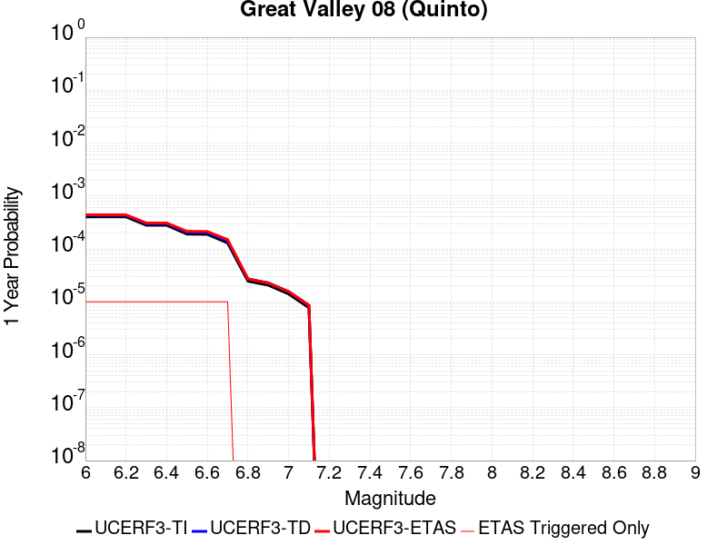 |  |

| Magnitude | 1 wk TI Prob | 1 wk TD Prob | 1 wk ETAS Prob | 1 wk ETAS/TD Gain | 1 wk ETAS Triggered Only | 1 mo TI Prob | 1 mo TD Prob | 1 mo ETAS Prob | 1 mo ETAS/TD Gain | 1 mo ETAS Triggered Only | 1 yr TI Prob | 1 yr TD Prob | 1 yr ETAS Prob | 1 yr ETAS/TD Gain | 1 yr ETAS Triggered Only | 10 yr TI Prob | 10 yr TD Prob | 10 yr ETAS Prob | 10 yr ETAS/TD Gain | 10 yr ETAS Triggered Only |
|-----|-----|-----|-----|-----|-----|-----|-----|-----|-----|-----|-----|-----|-----|-----|-----|-----|-----|-----|-----|-----|
| 6.0 | 7.737697E-6 | 8.253184E-6 | 8.253184E-6 | 1.0 | 0.0 | 3.3161137E-5 | 3.5370416E-5 | 6.541382E-5 | 1.8493935 | 3.0044466E-5 | 4.0366207E-4 | 4.305686E-4 | 4.606001E-4 | 1.0697485 | 3.0044466E-5 | 0.004029296 | 0.0042991964 | 0.004329112 | 1.0069584 | 3.0044466E-5 |
| 6.1 | 7.737697E-6 | 8.253184E-6 | 8.253184E-6 | 1.0 | 0.0 | 3.3161137E-5 | 3.5370416E-5 | 6.541382E-5 | 1.8493935 | 3.0044466E-5 | 4.0366207E-4 | 4.305686E-4 | 4.606001E-4 | 1.0697485 | 3.0044466E-5 | 0.004029296 | 0.0042991964 | 0.004329112 | 1.0069584 | 3.0044466E-5 |
| 6.2 | 7.737697E-6 | 8.253184E-6 | 8.253184E-6 | 1.0 | 0.0 | 3.3161137E-5 | 3.5370416E-5 | 6.541382E-5 | 1.8493935 | 3.0044466E-5 | 4.0366207E-4 | 4.305686E-4 | 4.606001E-4 | 1.0697485 | 3.0044466E-5 | 0.004029296 | 0.0042991964 | 0.004329112 | 1.0069584 | 3.0044466E-5 |
| 6.3 | 5.374012E-6 | 5.750681E-6 | 5.750681E-6 | 1.0 | 0.0 | 2.3031276E-5 | 2.4645606E-5 | 5.468933E-5 | 2.2190297 | 3.0044466E-5 | 2.803697E-4 | 3.0003005E-4 | 3.3006552E-4 | 1.1001081 | 3.0044466E-5 | 0.0028001624 | 0.0029973432 | 0.0030272978 | 1.0099937 | 3.0044466E-5 |
| 6.4 | 5.374012E-6 | 5.750681E-6 | 5.750681E-6 | 1.0 | 0.0 | 2.3031276E-5 | 2.4645606E-5 | 5.468933E-5 | 2.2190297 | 3.0044466E-5 | 2.803697E-4 | 3.0003005E-4 | 3.3006552E-4 | 1.1001081 | 3.0044466E-5 | 0.0028001624 | 0.0029973432 | 0.0030272978 | 1.0099937 | 3.0044466E-5 |
| 6.5 | 3.65427E-6 | 3.9414062E-6 | 3.9414062E-6 | 1.0 | 0.0 | 1.5661062E-5 | 1.689167E-5 | 4.693563E-5 | 2.7786255 | 3.0044466E-5 | 1.9065675E-4 | 2.0564374E-4 | 2.3568202E-4 | 1.1460695 | 3.0044466E-5 | 0.0019049325 | 0.0020552261 | 0.002085209 | 1.0145885 | 3.0044466E-5 |
| 6.6 | 3.6143538E-6 | 3.898592E-6 | 3.898592E-6 | 1.0 | 0.0 | 1.5489995E-5 | 1.6708183E-5 | 4.675215E-5 | 2.7981586 | 3.0044466E-5 | 1.8857437E-4 | 2.034102E-4 | 2.3344856E-4 | 1.1476737 | 3.0044466E-5 | 0.0018841444 | 0.0020329317 | 0.0020629151 | 1.0147488 | 3.0044466E-5 |
| 6.7 | 2.4821015E-6 | 2.6857654E-6 | 2.6857654E-6 | 1.0 | 0.0 | 1.0637535E-5 | 1.1510404E-5 | 4.1554526E-5 | 3.6101708 | 3.0044466E-5 | 1.2950429E-4 | 1.4013582E-4 | 1.7017606E-4 | 1.2143652 | 3.0044466E-5 | 0.0012942884 | 0.0014010294 | 0.0014310317 | 1.0214145 | 3.0044466E-5 |
| 6.8 | 4.7110538E-7 | 5.193162E-7 | 5.193162E-7 | 1.0 | 0.0 | 2.0190216E-6 | 2.225639E-6 | 2.225639E-6 | 1.0 | 0.0 | 2.458131E-5 | 2.7096836E-5 | 2.7096836E-5 | 1.0 | 0.0 | 2.457859E-4 | 2.7093713E-4 | 2.7093713E-4 | 1.0 | 0.0 |
| 6.9 | 3.958685E-7 | 4.370466E-7 | 4.370466E-7 | 1.0 | 0.0 | 1.6965782E-6 | 1.8730556E-6 | 1.8730556E-6 | 1.0 | 0.0 | 2.0655643E-5 | 2.2804228E-5 | 2.2804228E-5 | 1.0 | 0.0 | 2.0653724E-4 | 2.2802051E-4 | 2.2802051E-4 | 1.0 | 0.0 |
| 7.0 | 2.70294E-7 | 2.9920858E-7 | 2.9920858E-7 | 1.0 | 0.0 | 1.1584025E-6 | 1.2823219E-6 | 1.2823219E-6 | 1.0 | 0.0 | 1.4103458E-5 | 1.561217E-5 | 1.561217E-5 | 1.0 | 0.0 | 1.4102564E-4 | 1.5611202E-4 | 1.5611202E-4 | 1.0 | 0.0 |
| 7.1 | 1.4828602E-7 | 1.646959E-7 | 1.646959E-7 | 1.0 | 0.0 | 6.3551136E-7 | 7.0583945E-7 | 7.0583945E-7 | 1.0 | 0.0 | 7.737323E-6 | 8.59357E-6 | 8.59357E-6 | 1.0 | 0.0 | 7.737054E-5 | 8.593317E-5 | 8.593317E-5 | 1.0 | 0.0 |

## Rinconada 2011 CFM
*[(top)](#table-of-contents)*

| 1 Week | 1 Month | 1 Year | 10 Year |
|-----|-----|-----|-----|
|  |  |  |  |

| Magnitude | 1 wk TI Prob | 1 wk TD Prob | 1 wk ETAS Prob | 1 wk ETAS/TD Gain | 1 wk ETAS Triggered Only | 1 mo TI Prob | 1 mo TD Prob | 1 mo ETAS Prob | 1 mo ETAS/TD Gain | 1 mo ETAS Triggered Only | 1 yr TI Prob | 1 yr TD Prob | 1 yr ETAS Prob | 1 yr ETAS/TD Gain | 1 yr ETAS Triggered Only | 10 yr TI Prob | 10 yr TD Prob | 10 yr ETAS Prob | 10 yr ETAS/TD Gain | 10 yr ETAS Triggered Only |
|-----|-----|-----|-----|-----|-----|-----|-----|-----|-----|-----|-----|-----|-----|-----|-----|-----|-----|-----|-----|-----|
| 6.0 | 1.5752368E-5 | 1.627486E-5 | 1.627486E-5 | 1.0 | 0.0 | 6.75084E-5 | 6.974755E-5 | 9.978992E-5 | 1.4307301 | 3.0044466E-5 | 8.2160486E-4 | 8.488487E-4 | 8.788677E-4 | 1.0353643 | 3.0044466E-5 | 0.008185739 | 0.008456444 | 0.008486235 | 1.0035228 | 3.0044466E-5 |
| 6.1 | 1.0966133E-5 | 1.1323127E-5 | 1.1323127E-5 | 1.0 | 0.0 | 4.6996865E-5 | 4.852679E-5 | 7.85698E-5 | 1.6191015 | 3.0044466E-5 | 5.720366E-4 | 5.9065426E-4 | 6.20681E-4 | 1.0508363 | 3.0044466E-5 | 0.0057056635 | 0.00589094 | 0.0059208074 | 1.0050701 | 3.0044466E-5 |
| 6.2 | 1.0966133E-5 | 1.1323127E-5 | 1.1323127E-5 | 1.0 | 0.0 | 4.6996865E-5 | 4.852679E-5 | 7.85698E-5 | 1.6191015 | 3.0044466E-5 | 5.720366E-4 | 5.9065426E-4 | 6.20681E-4 | 1.0508363 | 3.0044466E-5 | 0.0057056635 | 0.00589094 | 0.0059208074 | 1.0050701 | 3.0044466E-5 |
| 6.3 | 8.926149E-6 | 9.21285E-6 | 9.21285E-6 | 1.0 | 0.0 | 3.8254362E-5 | 3.948305E-5 | 6.952633E-5 | 1.7609159 | 3.0044466E-5 | 4.6564735E-4 | 4.8060043E-4 | 5.1063043E-4 | 1.0624844 | 3.0044466E-5 | 0.0046467283 | 0.0047956556 | 0.0048255557 | 1.0062349 | 3.0044466E-5 |
| 6.4 | 7.676955E-6 | 7.920258E-6 | 7.920258E-6 | 1.0 | 0.0 | 3.290082E-5 | 3.394352E-5 | 6.398697E-5 | 1.885101 | 3.0044466E-5 | 4.0049385E-4 | 4.131842E-4 | 4.4321624E-4 | 1.0726844 | 3.0044466E-5 | 0.0039977287 | 0.004124186 | 0.0041541066 | 1.007255 | 3.0044466E-5 |
| 6.5 | 6.1671026E-6 | 6.359008E-6 | 6.359008E-6 | 1.0 | 0.0 | 2.6430173E-5 | 2.7252607E-5 | 5.7296253E-5 | 2.1024137 | 3.0044466E-5 | 3.2173982E-4 | 3.3175005E-4 | 3.6178454E-4 | 1.0905335 | 3.0044466E-5 | 0.003212744 | 0.00331256 | 0.003342505 | 1.0090398 | 3.0044466E-5 |
| 6.6 | 5.553456E-6 | 5.72486E-6 | 5.72486E-6 | 1.0 | 0.0 | 2.3800309E-5 | 2.4534884E-5 | 2.4534884E-5 | 1.0 | 0.0 | 2.897302E-4 | 2.986713E-4 | 2.986713E-4 | 1.0 | 0.0 | 0.0028935277 | 0.002982708 | 0.002982708 | 1.0 | 0.0 |
| 6.7 | 4.787857E-6 | 4.93335E-6 | 4.93335E-6 | 1.0 | 0.0 | 2.0519226E-5 | 2.1142756E-5 | 2.1142756E-5 | 1.0 | 0.0 | 2.4979294E-4 | 2.573827E-4 | 2.573827E-4 | 1.0 | 0.0 | 0.0024951235 | 0.0025708517 | 0.0025708517 | 1.0 | 0.0 |
| 6.8 | 3.9955166E-6 | 4.113509E-6 | 4.113509E-6 | 1.0 | 0.0 | 1.7123532E-5 | 1.7629205E-5 | 1.7629205E-5 | 1.0 | 0.0 | 2.0845905E-4 | 2.1461445E-4 | 2.1461445E-4 | 1.0 | 0.0 | 0.002082636 | 0.0021440755 | 0.0021440755 | 1.0 | 0.0 |
| 6.9 | 3.4250072E-6 | 3.5224734E-6 | 3.5224734E-6 | 1.0 | 0.0 | 1.46785205E-5 | 1.5096228E-5 | 1.5096228E-5 | 1.0 | 0.0 | 1.7869633E-4 | 1.8378109E-4 | 1.8378109E-4 | 1.0 | 0.0 | 0.001785527 | 0.0018362935 | 0.0018362935 | 1.0 | 0.0 |
| 7.0 | 2.7712713E-6 | 2.846721E-6 | 2.846721E-6 | 1.0 | 0.0 | 1.1876823E-5 | 1.2200176E-5 | 1.2200176E-5 | 1.0 | 0.0 | 1.4459073E-4 | 1.4852703E-4 | 1.4852703E-4 | 1.0 | 0.0 | 0.0014449668 | 0.0014842792 | 0.0014842792 | 1.0 | 0.0 |
| 7.1 | 2.227358E-6 | 2.2857148E-6 | 2.2857148E-6 | 1.0 | 0.0 | 9.545785E-6 | 9.795884E-6 | 9.795884E-6 | 1.0 | 0.0 | 1.16213734E-4 | 1.1925837E-4 | 1.1925837E-4 | 1.0 | 0.0 | 0.0011615298 | 0.0011919448 | 0.0011919448 | 1.0 | 0.0 |
| 7.2 | 1.581796E-6 | 1.6209123E-6 | 1.6209123E-6 | 1.0 | 0.0 | 6.779108E-6 | 6.9467483E-6 | 6.9467483E-6 | 1.0 | 0.0 | 8.253252E-5 | 8.457338E-5 | 8.457338E-5 | 1.0 | 0.0 | 8.250187E-4 | 8.4541255E-4 | 8.4541255E-4 | 1.0 | 0.0 |
| 7.3 | 1.0306567E-6 | 1.0546547E-6 | 1.0546547E-6 | 1.0 | 0.0 | 4.4170924E-6 | 4.519941E-6 | 4.519941E-6 | 1.0 | 0.0 | 5.3776774E-5 | 5.5028893E-5 | 5.5028893E-5 | 1.0 | 0.0 | 5.376376E-4 | 5.501529E-4 | 5.501529E-4 | 1.0 | 0.0 |
| 7.4 | 6.535541E-7 | 6.6827863E-7 | 6.6827863E-7 | 1.0 | 0.0 | 2.800943E-6 | 2.8640482E-6 | 2.8640482E-6 | 1.0 | 0.0 | 3.4100947E-5 | 3.486923E-5 | 3.486923E-5 | 1.0 | 0.0 | 3.4095717E-4 | 3.4863772E-4 | 3.4863772E-4 | 1.0 | 0.0 |
| 7.5 | 3.2656962E-7 | 3.331691E-7 | 3.331691E-7 | 1.0 | 0.0 | 1.3995833E-6 | 1.4278669E-6 | 1.4278669E-6 | 1.0 | 0.0 | 1.7039794E-5 | 1.738414E-5 | 1.738414E-5 | 1.0 | 0.0 | 1.7038487E-4 | 1.7382785E-4 | 1.7382785E-4 | 1.0 | 0.0 |
| 7.6 | 9.754343E-8 | 9.821055E-8 | 9.821055E-8 | 1.0 | 0.0 | 4.180432E-7 | 4.2090227E-7 | 4.2090227E-7 | 1.0 | 0.0 | 5.089664E-6 | 5.124473E-6 | 5.124473E-6 | 1.0 | 0.0 | 5.0895473E-5 | 5.1243558E-5 | 5.1243558E-5 | 1.0 | 0.0 |
| 7.7 | 6.0001453E-9 | 5.849095E-9 | 5.849095E-9 | 1.0 | 0.0 | 2.5714908E-8 | 2.506755E-8 | 2.506755E-8 | 1.0 | 0.0 | 3.1307894E-7 | 3.0519737E-7 | 3.0519737E-7 | 1.0 | 0.0 | 3.1307852E-6 | 3.0519698E-6 | 3.0519698E-6 | 1.0 | 0.0 |
| 7.8 | 7.400003E-11 | 7.4654616E-11 | 7.4654616E-11 | 1.0 | 0.0 | 3.171432E-10 | 3.199484E-10 | 3.199484E-10 | 1.0 | 0.0 | 3.861218E-9 | 3.895372E-9 | 3.895372E-9 | 1.0 | 0.0 | 3.861218E-8 | 3.8953722E-8 | 3.8953722E-8 | 1.0 | 0.0 |

## Thirty Mile Bank
*[(top)](#table-of-contents)*

| 1 Week | 1 Month | 1 Year | 10 Year |
|-----|-----|-----|-----|
| 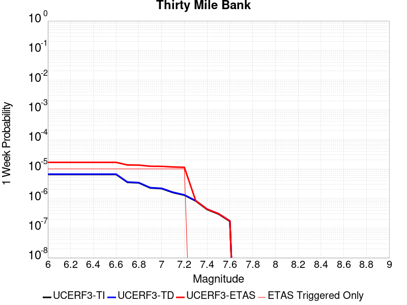 |  |  |  |

| Magnitude | 1 wk TI Prob | 1 wk TD Prob | 1 wk ETAS Prob | 1 wk ETAS/TD Gain | 1 wk ETAS Triggered Only | 1 mo TI Prob | 1 mo TD Prob | 1 mo ETAS Prob | 1 mo ETAS/TD Gain | 1 mo ETAS Triggered Only | 1 yr TI Prob | 1 yr TD Prob | 1 yr ETAS Prob | 1 yr ETAS/TD Gain | 1 yr ETAS Triggered Only | 10 yr TI Prob | 10 yr TD Prob | 10 yr ETAS Prob | 10 yr ETAS/TD Gain | 10 yr ETAS Triggered Only |
|-----|-----|-----|-----|-----|-----|-----|-----|-----|-----|-----|-----|-----|-----|-----|-----|-----|-----|-----|-----|-----|
| 6.0 | 6.5124755E-6 | 6.6593043E-6 | 3.670357E-5 | 5.5116224 | 3.0044466E-5 | 2.791031E-5 | 2.8539587E-5 | 5.8583195E-5 | 2.0526996 | 3.0044466E-5 | 3.3975503E-4 | 3.4741845E-4 | 3.7745247E-4 | 1.0864491 | 3.0044466E-5 | 0.0033923604 | 0.0034691847 | 0.003499125 | 1.0086304 | 3.0044466E-5 |
| 6.1 | 6.5124755E-6 | 6.6593043E-6 | 3.670357E-5 | 5.5116224 | 3.0044466E-5 | 2.791031E-5 | 2.8539587E-5 | 5.8583195E-5 | 2.0526996 | 3.0044466E-5 | 3.3975503E-4 | 3.4741845E-4 | 3.7745247E-4 | 1.0864491 | 3.0044466E-5 | 0.0033923604 | 0.0034691847 | 0.003499125 | 1.0086304 | 3.0044466E-5 |
| 6.2 | 6.5124755E-6 | 6.6593043E-6 | 3.670357E-5 | 5.5116224 | 3.0044466E-5 | 2.791031E-5 | 2.8539587E-5 | 5.8583195E-5 | 2.0526996 | 3.0044466E-5 | 3.3975503E-4 | 3.4741845E-4 | 3.7745247E-4 | 1.0864491 | 3.0044466E-5 | 0.0033923604 | 0.0034691847 | 0.003499125 | 1.0086304 | 3.0044466E-5 |
| 6.3 | 6.5124755E-6 | 6.6593043E-6 | 3.670357E-5 | 5.5116224 | 3.0044466E-5 | 2.791031E-5 | 2.8539587E-5 | 5.8583195E-5 | 2.0526996 | 3.0044466E-5 | 3.3975503E-4 | 3.4741845E-4 | 3.7745247E-4 | 1.0864491 | 3.0044466E-5 | 0.0033923604 | 0.0034691847 | 0.003499125 | 1.0086304 | 3.0044466E-5 |
| 6.4 | 6.5124755E-6 | 6.6593043E-6 | 3.670357E-5 | 5.5116224 | 3.0044466E-5 | 2.791031E-5 | 2.8539587E-5 | 5.8583195E-5 | 2.0526996 | 3.0044466E-5 | 3.3975503E-4 | 3.4741845E-4 | 3.7745247E-4 | 1.0864491 | 3.0044466E-5 | 0.0033923604 | 0.0034691847 | 0.003499125 | 1.0086304 | 3.0044466E-5 |
| 6.5 | 6.5124755E-6 | 6.6593043E-6 | 3.670357E-5 | 5.5116224 | 3.0044466E-5 | 2.791031E-5 | 2.8539587E-5 | 5.8583195E-5 | 2.0526996 | 3.0044466E-5 | 3.3975503E-4 | 3.4741845E-4 | 3.7745247E-4 | 1.0864491 | 3.0044466E-5 | 0.0033923604 | 0.0034691847 | 0.003499125 | 1.0086304 | 3.0044466E-5 |
| 6.6 | 6.5124755E-6 | 6.6593043E-6 | 3.670357E-5 | 5.5116224 | 3.0044466E-5 | 2.791031E-5 | 2.8539587E-5 | 5.8583195E-5 | 2.0526996 | 3.0044466E-5 | 3.3975503E-4 | 3.4741845E-4 | 3.7745247E-4 | 1.0864491 | 3.0044466E-5 | 0.0033923604 | 0.0034691847 | 0.003499125 | 1.0086304 | 3.0044466E-5 |
| 6.7 | 3.5261137E-6 | 3.6099225E-6 | 3.365428E-5 | 9.322716 | 3.0044466E-5 | 1.5111828E-5 | 1.5471009E-5 | 4.5515008E-5 | 2.941955 | 3.0044466E-5 | 1.8397097E-4 | 1.883439E-4 | 2.183827E-4 | 1.1594892 | 3.0044466E-5 | 0.0018381875 | 0.0018819077 | 0.0019118956 | 1.0159348 | 3.0044466E-5 |
| 6.8 | 3.370743E-6 | 3.4509574E-6 | 3.349532E-5 | 9.706095 | 3.0044466E-5 | 1.4445961E-5 | 1.4789737E-5 | 4.483376E-5 | 3.0314102 | 3.0044466E-5 | 1.7586538E-4 | 1.8005079E-4 | 2.1008986E-4 | 1.1668366 | 3.0044466E-5 | 0.0017572626 | 0.001799111 | 0.0018291014 | 1.0166696 | 3.0044466E-5 |
| 6.9 | 2.2756835E-6 | 2.3331768E-6 | 3.237757E-5 | 13.877033 | 3.0044466E-5 | 9.752893E-6 | 9.999292E-6 | 4.004346E-5 | 4.004629 | 3.0044466E-5 | 1.18735006E-4 | 1.21734825E-4 | 1.5177563E-4 | 1.2467725 | 3.0044466E-5 | 0.0011867158 | 0.001216706 | 0.0012467139 | 1.0246632 | 3.0044466E-5 |
| 7.0 | 2.1617404E-6 | 2.2159948E-6 | 3.2260396E-5 | 14.557974 | 3.0044466E-5 | 9.264569E-6 | 9.497087E-6 | 3.9541268E-5 | 4.163515 | 3.0044466E-5 | 1.1279029E-4 | 1.15621144E-4 | 1.4566214E-4 | 1.2598226 | 3.0044466E-5 | 0.0011273306 | 0.001155634 | 0.0011856437 | 1.0259682 | 3.0044466E-5 |
| 7.1 | 1.5900777E-6 | 1.6327131E-6 | 3.167713E-5 | 19.40153 | 3.0044466E-5 | 6.814601E-6 | 6.9973235E-6 | 3.704158E-5 | 5.2936783 | 3.0044466E-5 | 8.296461E-5 | 8.518921E-5 | 1.1523112E-4 | 1.3526492 | 3.0044466E-5 | 8.293364E-4 | 8.515783E-4 | 8.815972E-4 | 1.0352509 | 3.0044466E-5 |
| 7.2 | 1.2971728E-6 | 1.3329089E-6 | 3.1377334E-5 | 23.540495 | 3.0044466E-5 | 5.5593005E-6 | 5.712455E-6 | 3.5756748E-5 | 6.2594366 | 3.0044466E-5 | 6.768238E-5 | 6.954702E-5 | 9.95894E-5 | 1.4319721 | 3.0044466E-5 | 6.7661767E-4 | 6.952629E-4 | 7.252865E-4 | 1.0431831 | 3.0044466E-5 |
| 7.3 | 8.2454284E-7 | 8.4489466E-7 | 8.4489466E-7 | 1.0 | 0.0 | 3.5337503E-6 | 3.6209724E-6 | 3.6209724E-6 | 1.0 | 0.0 | 4.302256E-5 | 4.4084507E-5 | 4.4084507E-5 | 1.0 | 0.0 | 4.301423E-4 | 4.407637E-4 | 4.407637E-4 | 1.0 | 0.0 |
| 7.4 | 4.2619024E-7 | 4.3863807E-7 | 4.3863807E-7 | 1.0 | 0.0 | 1.8265283E-6 | 1.8798761E-6 | 1.8798761E-6 | 1.0 | 0.0 | 2.2237757E-5 | 2.2887256E-5 | 2.2887256E-5 | 1.0 | 0.0 | 2.223553E-4 | 2.2884937E-4 | 2.2884937E-4 | 1.0 | 0.0 |
| 7.5 | 2.993922E-7 | 3.0864783E-7 | 3.0864783E-7 | 1.0 | 0.0 | 1.2831089E-6 | 1.3227758E-6 | 1.3227758E-6 | 1.0 | 0.0 | 1.5621737E-5 | 1.610468E-5 | 1.610468E-5 | 1.0 | 0.0 | 1.562064E-4 | 1.6103536E-4 | 1.6103536E-4 | 1.0 | 0.0 |
| 7.6 | 1.6988751E-7 | 1.7533972E-7 | 1.7533972E-7 | 1.0 | 0.0 | 7.2808916E-7 | 7.514558E-7 | 7.514558E-7 | 1.0 | 0.0 | 8.864449E-6 | 9.148937E-6 | 9.148937E-6 | 1.0 | 0.0 | 8.8640954E-5 | 9.14858E-5 | 9.14858E-5 | 1.0 | 0.0 |

## Chino alt 1
*[(top)](#table-of-contents)*

| 1 Week | 1 Month | 1 Year | 10 Year |
|-----|-----|-----|-----|
|  |  |  |  |

| Magnitude | 1 wk TI Prob | 1 wk TD Prob | 1 wk ETAS Prob | 1 wk ETAS/TD Gain | 1 wk ETAS Triggered Only | 1 mo TI Prob | 1 mo TD Prob | 1 mo ETAS Prob | 1 mo ETAS/TD Gain | 1 mo ETAS Triggered Only | 1 yr TI Prob | 1 yr TD Prob | 1 yr ETAS Prob | 1 yr ETAS/TD Gain | 1 yr ETAS Triggered Only | 10 yr TI Prob | 10 yr TD Prob | 10 yr ETAS Prob | 10 yr ETAS/TD Gain | 10 yr ETAS Triggered Only |
|-----|-----|-----|-----|-----|-----|-----|-----|-----|-----|-----|-----|-----|-----|-----|-----|-----|-----|-----|-----|-----|
| 6.0 | 3.939946E-5 | 4.8952163E-5 | 4.8952163E-5 | 1.0 | 0.0 | 1.6884391E-4 | 2.0978106E-4 | 2.0978106E-4 | 1.0 | 0.0 | 0.0020537362 | 0.0025515798 | 0.0025515798 | 1.0 | 0.0 | 0.020348595 | 0.025279671 | 0.025308955 | 1.0011585 | 3.0044466E-5 |
| 6.1 | 2.1505624E-5 | 2.6881262E-5 | 2.6881262E-5 | 1.0 | 0.0 | 9.2163704E-5 | 1.1520095E-4 | 1.1520095E-4 | 1.0 | 0.0 | 0.0011215154 | 0.0014017805 | 0.0014017805 | 1.0 | 0.0 | 0.011158722 | 0.013946284 | 0.013975909 | 1.0021243 | 3.0044466E-5 |
| 6.2 | 2.1505624E-5 | 2.6881262E-5 | 2.6881262E-5 | 1.0 | 0.0 | 9.2163704E-5 | 1.1520095E-4 | 1.1520095E-4 | 1.0 | 0.0 | 0.0011215154 | 0.0014017805 | 0.0014017805 | 1.0 | 0.0 | 0.011158722 | 0.013946284 | 0.013975909 | 1.0021243 | 3.0044466E-5 |
| 6.3 | 1.4290785E-5 | 1.8166884E-5 | 1.8166884E-5 | 1.0 | 0.0 | 6.1244784E-5 | 7.7856006E-5 | 7.7856006E-5 | 1.0 | 0.0 | 7.454001E-4 | 9.4753003E-4 | 9.4753003E-4 | 1.0 | 0.0 | 0.007429048 | 0.009445356 | 0.009475118 | 1.0031508 | 3.0044466E-5 |
| 6.4 | 1.4290785E-5 | 1.8166884E-5 | 1.8166884E-5 | 1.0 | 0.0 | 6.1244784E-5 | 7.7856006E-5 | 7.7856006E-5 | 1.0 | 0.0 | 7.454001E-4 | 9.4753003E-4 | 9.4753003E-4 | 1.0 | 0.0 | 0.007429048 | 0.009445356 | 0.009475118 | 1.0031508 | 3.0044466E-5 |
| 6.5 | 1.3017944E-5 | 1.6653768E-5 | 1.6653768E-5 | 1.0 | 0.0 | 5.5789995E-5 | 7.1371585E-5 | 7.1371585E-5 | 1.0 | 0.0 | 6.790315E-4 | 8.686464E-4 | 8.686464E-4 | 1.0 | 0.0 | 0.0067696036 | 0.00866281 | 0.008692594 | 1.0034381 | 3.0044466E-5 |
| 6.6 | 9.470016E-6 | 1.204067E-5 | 1.204067E-5 | 1.0 | 0.0 | 4.058515E-5 | 5.1602045E-5 | 5.1602045E-5 | 1.0 | 0.0 | 4.940122E-4 | 6.2810775E-4 | 6.2810775E-4 | 1.0 | 0.0 | 0.004929154 | 0.00627254 | 0.006302396 | 1.0047598 | 3.0044466E-5 |
| 6.7 | 8.314155E-6 | 1.040883E-5 | 1.040883E-5 | 1.0 | 0.0 | 3.5631605E-5 | 4.4608692E-5 | 4.4608692E-5 | 1.0 | 0.0 | 4.3372845E-4 | 5.4300774E-4 | 5.4300774E-4 | 1.0 | 0.0 | 0.004328829 | 0.005426339 | 0.0054562204 | 1.0055068 | 3.0044466E-5 |
| 6.8 | 3.4856364E-6 | 3.813685E-6 | 3.813685E-6 | 1.0 | 0.0 | 1.4938357E-5 | 1.6344273E-5 | 1.6344273E-5 | 1.0 | 0.0 | 1.8185932E-4 | 1.9897544E-4 | 1.9897544E-4 | 1.0 | 0.0 | 0.0018171056 | 0.0019896496 | 0.0019896496 | 1.0 | 0.0 |
| 6.9 | 2.2645952E-6 | 2.1530768E-6 | 2.1530768E-6 | 1.0 | 0.0 | 9.705372E-6 | 9.227441E-6 | 9.227441E-6 | 1.0 | 0.0 | 1.18156495E-4 | 1.12338515E-4 | 1.12338515E-4 | 1.0 | 0.0 | 0.0011809369 | 0.0011234334 | 0.0011234334 | 1.0 | 0.0 |
| 7.0 | 1.7864003E-6 | 1.5432176E-6 | 1.5432176E-6 | 1.0 | 0.0 | 7.655979E-6 | 6.6137736E-6 | 6.6137736E-6 | 1.0 | 0.0 | 9.3207556E-5 | 8.051978E-5 | 8.051978E-5 | 1.0 | 0.0 | 9.316847E-4 | 8.053531E-4 | 8.053531E-4 | 1.0 | 0.0 |
| 7.1 | 1.7315456E-6 | 1.4734859E-6 | 1.4734859E-6 | 1.0 | 0.0 | 7.420889E-6 | 6.3149246E-6 | 6.3149246E-6 | 1.0 | 0.0 | 9.034557E-5 | 7.688155E-5 | 7.688155E-5 | 1.0 | 0.0 | 9.0308854E-4 | 7.689874E-4 | 7.689874E-4 | 1.0 | 0.0 |
| 7.2 | 1.6008337E-6 | 1.3575291E-6 | 1.3575291E-6 | 1.0 | 0.0 | 6.860698E-6 | 5.8179694E-6 | 5.8179694E-6 | 1.0 | 0.0 | 8.352579E-5 | 7.083153E-5 | 7.083153E-5 | 1.0 | 0.0 | 8.34944E-4 | 7.085137E-4 | 7.085137E-4 | 1.0 | 0.0 |
| 7.3 | 1.3320939E-6 | 1.1218683E-6 | 1.1218683E-6 | 1.0 | 0.0 | 5.7089615E-6 | 4.8079983E-6 | 4.8079983E-6 | 1.0 | 0.0 | 6.9504385E-5 | 5.8535854E-5 | 5.8535854E-5 | 1.0 | 0.0 | 6.9482654E-4 | 5.8534887E-4 | 5.8534887E-4 | 1.0 | 0.0 |
| 7.4 | 1.114294E-6 | 9.237794E-7 | 9.237794E-7 | 1.0 | 0.0 | 4.775537E-6 | 3.9590486E-6 | 3.9590486E-6 | 1.0 | 0.0 | 5.8140613E-5 | 4.820039E-5 | 4.820039E-5 | 1.0 | 0.0 | 5.81254E-4 | 4.8191615E-4 | 4.8191615E-4 | 1.0 | 0.0 |
| 7.5 | 9.354081E-7 | 7.623971E-7 | 7.623971E-7 | 1.0 | 0.0 | 4.0088858E-6 | 3.2674122E-6 | 3.2674122E-6 | 1.0 | 0.0 | 4.8807087E-5 | 3.9780054E-5 | 3.9780054E-5 | 1.0 | 0.0 | 4.879637E-4 | 3.977327E-4 | 3.977327E-4 | 1.0 | 0.0 |
| 7.6 | 8.521771E-7 | 6.8811886E-7 | 6.8811886E-7 | 1.0 | 0.0 | 3.6521824E-6 | 2.9490777E-6 | 2.9490777E-6 | 1.0 | 0.0 | 4.4464414E-5 | 3.590446E-5 | 3.590446E-5 | 1.0 | 0.0 | 4.4455516E-4 | 3.5898978E-4 | 3.5898978E-4 | 1.0 | 0.0 |
| 7.7 | 2.1803626E-7 | 1.4187812E-7 | 1.4187812E-7 | 1.0 | 0.0 | 9.344408E-7 | 6.08049E-7 | 6.08049E-7 | 1.0 | 0.0 | 1.1376757E-5 | 7.402981E-6 | 7.402981E-6 | 1.0 | 0.0 | 1.13761744E-4 | 7.402831E-5 | 7.402831E-5 | 1.0 | 0.0 |

## Great Valley 07 (Orestimba)
*[(top)](#table-of-contents)*

| 1 Week | 1 Month | 1 Year | 10 Year |
|-----|-----|-----|-----|
|  |  |  |  |

| Magnitude | 1 wk TI Prob | 1 wk TD Prob | 1 wk ETAS Prob | 1 wk ETAS/TD Gain | 1 wk ETAS Triggered Only | 1 mo TI Prob | 1 mo TD Prob | 1 mo ETAS Prob | 1 mo ETAS/TD Gain | 1 mo ETAS Triggered Only | 1 yr TI Prob | 1 yr TD Prob | 1 yr ETAS Prob | 1 yr ETAS/TD Gain | 1 yr ETAS Triggered Only | 10 yr TI Prob | 10 yr TD Prob | 10 yr ETAS Prob | 10 yr ETAS/TD Gain | 10 yr ETAS Triggered Only |
|-----|-----|-----|-----|-----|-----|-----|-----|-----|-----|-----|-----|-----|-----|-----|-----|-----|-----|-----|-----|-----|
| 6.0 | 2.9687902E-5 | 3.27584E-5 | 6.280188E-5 | 1.9171231 | 3.0044466E-5 | 1.2722766E-4 | 1.40386E-4 | 1.7042624E-4 | 1.2139833 | 3.0044466E-5 | 0.0015478961 | 0.0017079313 | 0.0017379244 | 1.0175611 | 3.0044466E-5 | 0.015371585 | 0.016955597 | 0.016985133 | 1.0017419 | 3.0044466E-5 |
| 6.1 | 2.9687902E-5 | 3.27584E-5 | 6.280188E-5 | 1.9171231 | 3.0044466E-5 | 1.2722766E-4 | 1.40386E-4 | 1.7042624E-4 | 1.2139833 | 3.0044466E-5 | 0.0015478961 | 0.0017079313 | 0.0017379244 | 1.0175611 | 3.0044466E-5 | 0.015371585 | 0.016955597 | 0.016985133 | 1.0017419 | 3.0044466E-5 |
| 6.2 | 1.9231524E-5 | 2.1159729E-5 | 5.120356E-5 | 2.419859 | 3.0044466E-5 | 8.2418206E-5 | 9.068153E-5 | 1.2072327E-4 | 1.3312885 | 3.0044466E-5 | 0.0010029797 | 0.0011035115 | 0.001133523 | 1.0271962 | 3.0044466E-5 | 0.00998465 | 0.010982731 | 0.011012445 | 1.0027056 | 3.0044466E-5 |
| 6.3 | 1.324766E-5 | 1.4548912E-5 | 1.4548912E-5 | 1.0 | 0.0 | 5.6774446E-5 | 6.235104E-5 | 6.235104E-5 | 1.0 | 0.0 | 6.910097E-4 | 7.588687E-4 | 7.588687E-4 | 1.0 | 0.0 | 0.006888649 | 0.00756372 | 0.00756372 | 1.0 | 0.0 |
| 6.4 | 7.818645E-6 | 8.573059E-6 | 8.573059E-6 | 1.0 | 0.0 | 3.3508048E-5 | 3.6741185E-5 | 3.6741185E-5 | 1.0 | 0.0 | 4.078841E-4 | 4.4723548E-4 | 4.4723548E-4 | 1.0 | 0.0 | 0.004071363 | 0.0044636945 | 0.0044636945 | 1.0 | 0.0 |
| 6.5 | 5.3076565E-6 | 5.817949E-6 | 5.817949E-6 | 1.0 | 0.0 | 2.27469E-5 | 2.493384E-5 | 2.493384E-5 | 1.0 | 0.0 | 2.7690834E-4 | 3.0352935E-4 | 3.0352935E-4 | 1.0 | 0.0 | 0.0027656353 | 0.0030313572 | 0.0030313572 | 1.0 | 0.0 |
| 6.6 | 3.6003578E-6 | 3.9485967E-6 | 3.9485967E-6 | 1.0 | 0.0 | 1.5430012E-5 | 1.6922457E-5 | 1.6922457E-5 | 1.0 | 0.0 | 1.8784421E-4 | 2.0601299E-4 | 2.0601299E-4 | 1.0 | 0.0 | 0.0018768552 | 0.0020583742 | 0.0020583742 | 1.0 | 0.0 |
| 6.7 | 2.5361826E-6 | 2.78354E-6 | 2.78354E-6 | 1.0 | 0.0 | 1.0869308E-5 | 1.192941E-5 | 1.192941E-5 | 1.0 | 0.0 | 1.3232579E-4 | 1.452322E-4 | 1.452322E-4 | 1.0 | 0.0 | 0.0013224703 | 0.0014515029 | 0.0014515029 | 1.0 | 0.0 |
| 6.8 | 1.2115831E-6 | 1.3314148E-6 | 1.3314148E-6 | 1.0 | 0.0 | 5.1924885E-6 | 5.706056E-6 | 5.706056E-6 | 1.0 | 0.0 | 6.3216714E-5 | 6.9469985E-5 | 6.9469985E-5 | 1.0 | 0.0 | 6.3198735E-4 | 6.945778E-4 | 6.945778E-4 | 1.0 | 0.0 |

## Great Valley 10 (Panoche)
*[(top)](#table-of-contents)*

| 1 Week | 1 Month | 1 Year | 10 Year |
|-----|-----|-----|-----|
|  |  |  |  |

| Magnitude | 1 wk TI Prob | 1 wk TD Prob | 1 wk ETAS Prob | 1 wk ETAS/TD Gain | 1 wk ETAS Triggered Only | 1 mo TI Prob | 1 mo TD Prob | 1 mo ETAS Prob | 1 mo ETAS/TD Gain | 1 mo ETAS Triggered Only | 1 yr TI Prob | 1 yr TD Prob | 1 yr ETAS Prob | 1 yr ETAS/TD Gain | 1 yr ETAS Triggered Only | 10 yr TI Prob | 10 yr TD Prob | 10 yr ETAS Prob | 10 yr ETAS/TD Gain | 10 yr ETAS Triggered Only |
|-----|-----|-----|-----|-----|-----|-----|-----|-----|-----|-----|-----|-----|-----|-----|-----|-----|-----|-----|-----|-----|
| 6.0 | 1.6014626E-5 | 1.6576112E-5 | 1.6576112E-5 | 1.0 | 0.0 | 6.863231E-5 | 7.103854E-5 | 7.103854E-5 | 1.0 | 0.0 | 8.35278E-4 | 8.6455565E-4 | 8.945741E-4 | 1.0347213 | 3.0044466E-5 | 0.008321454 | 0.008612541 | 0.008642326 | 1.0034584 | 3.0044466E-5 |
| 6.1 | 1.6014626E-5 | 1.6576112E-5 | 1.6576112E-5 | 1.0 | 0.0 | 6.863231E-5 | 7.103854E-5 | 7.103854E-5 | 1.0 | 0.0 | 8.35278E-4 | 8.6455565E-4 | 8.945741E-4 | 1.0347213 | 3.0044466E-5 | 0.008321454 | 0.008612541 | 0.008642326 | 1.0034584 | 3.0044466E-5 |
| 6.2 | 1.56782E-5 | 1.6199148E-5 | 1.6199148E-5 | 1.0 | 0.0 | 6.719056E-5 | 6.942306E-5 | 6.942306E-5 | 1.0 | 0.0 | 8.17738E-4 | 8.4490253E-4 | 8.749216E-4 | 1.0355296 | 3.0044466E-5 | 0.008147354 | 0.0084175095 | 0.008447302 | 1.0035392 | 3.0044466E-5 |
| 6.3 | 1.5263338E-5 | 1.5724198E-5 | 1.5724198E-5 | 1.0 | 0.0 | 6.541267E-5 | 6.738767E-5 | 6.738767E-5 | 1.0 | 0.0 | 7.961082E-4 | 8.2014047E-4 | 8.501603E-4 | 1.0366032 | 3.0044466E-5 | 0.007932622 | 0.00817173 | 0.008201529 | 1.0036466 | 3.0044466E-5 |
| 6.4 | 1.4720723E-5 | 1.5100035E-5 | 1.5100035E-5 | 1.0 | 0.0 | 6.308728E-5 | 6.471282E-5 | 6.471282E-5 | 1.0 | 0.0 | 7.67817E-4 | 7.875981E-4 | 8.176189E-4 | 1.0381169 | 3.0044466E-5 | 0.007651695 | 0.007848644 | 0.007878453 | 1.0037979 | 3.0044466E-5 |
| 6.5 | 1.408264E-5 | 1.4356596E-5 | 1.4356596E-5 | 1.0 | 0.0 | 6.0352773E-5 | 6.152681E-5 | 6.152681E-5 | 1.0 | 0.0 | 7.3454727E-4 | 7.488357E-4 | 7.788576E-4 | 1.0400915 | 3.0044466E-5 | 0.0073212404 | 0.0074636796 | 0.0074934997 | 1.0039954 | 3.0044466E-5 |
| 6.6 | 1.3197086E-5 | 1.33224685E-5 | 1.33224685E-5 | 1.0 | 0.0 | 5.6557717E-5 | 5.7095036E-5 | 5.7095036E-5 | 1.0 | 0.0 | 6.8837265E-4 | 6.949145E-4 | 6.949145E-4 | 1.0 | 0.0 | 0.006862442 | 0.0069279536 | 0.0069279536 | 1.0 | 0.0 |
| 6.7 | 1.017583E-5 | 9.745787E-6 | 9.745787E-6 | 1.0 | 0.0 | 4.360997E-5 | 4.1767E-5 | 4.1767E-5 | 1.0 | 0.0 | 5.30822E-4 | 5.08397E-4 | 5.08397E-4 | 1.0 | 0.0 | 0.0052955584 | 0.005072592 | 0.005072592 | 1.0 | 0.0 |
| 6.8 | 8.557912E-6 | 7.873034E-6 | 7.873034E-6 | 1.0 | 0.0 | 3.667625E-5 | 3.3741147E-5 | 3.3741147E-5 | 1.0 | 0.0 | 4.4644187E-4 | 4.1072306E-4 | 4.1072306E-4 | 1.0 | 0.0 | 0.0044554602 | 0.004099847 | 0.004099847 | 1.0 | 0.0 |
| 6.9 | 6.14664E-6 | 5.0922845E-6 | 5.0922845E-6 | 1.0 | 0.0 | 2.6342475E-5 | 2.1823902E-5 | 2.1823902E-5 | 1.0 | 0.0 | 3.2067244E-4 | 2.65675E-4 | 2.65675E-4 | 1.0 | 0.0 | 0.003202101 | 0.0026537122 | 0.0026537122 | 1.0 | 0.0 |
| 7.0 | 3.2310581E-6 | 1.695186E-6 | 1.695186E-6 | 1.0 | 0.0 | 1.3847319E-5 | 7.2650632E-6 | 7.2650632E-6 | 1.0 | 0.0 | 1.6857806E-4 | 8.844865E-5 | 8.844865E-5 | 1.0 | 0.0 | 0.0016845023 | 8.841438E-4 | 8.841438E-4 | 1.0 | 0.0 |
| 7.1 | 2.544492E-6 | 9.1892923E-7 | 9.1892923E-7 | 1.0 | 0.0 | 1.090492E-5 | 3.9382626E-6 | 3.9382626E-6 | 1.0 | 0.0 | 1.327593E-4 | 4.794734E-5 | 4.794734E-5 | 1.0 | 0.0 | 0.0013268003 | 4.7937472E-4 | 4.7937472E-4 | 1.0 | 0.0 |
| 7.2 | 2.4479045E-6 | 8.841656E-7 | 8.841656E-7 | 1.0 | 0.0 | 1.0490977E-5 | 3.789276E-6 | 3.789276E-6 | 1.0 | 0.0 | 1.2772017E-4 | 4.6133508E-5 | 4.6133508E-5 | 1.0 | 0.0 | 0.0012764678 | 4.6124402E-4 | 4.6124402E-4 | 1.0 | 0.0 |
| 7.3 | 2.0559578E-6 | 7.893082E-7 | 7.893082E-7 | 1.0 | 0.0 | 8.811218E-6 | 3.3827455E-6 | 3.3827455E-6 | 1.0 | 0.0 | 1.072713E-4 | 4.1184194E-5 | 4.1184194E-5 | 1.0 | 0.0 | 0.0010721954 | 4.1177025E-4 | 4.1177025E-4 | 1.0 | 0.0 |
| 7.4 | 1.727687E-6 | 7.388011E-7 | 7.388011E-7 | 1.0 | 0.0 | 7.404352E-6 | 3.1662867E-6 | 3.1662867E-6 | 1.0 | 0.0 | 9.0144255E-5 | 3.8548904E-5 | 3.8548904E-5 | 1.0 | 0.0 | 9.0107694E-4 | 3.8542677E-4 | 3.8542677E-4 | 1.0 | 0.0 |
| 7.5 | 1.5002679E-6 | 6.5463627E-7 | 6.5463627E-7 | 1.0 | 0.0 | 6.4297037E-6 | 2.8055813E-6 | 2.8055813E-6 | 1.0 | 0.0 | 7.827883E-5 | 3.415746E-5 | 3.415746E-5 | 1.0 | 0.0 | 7.825126E-4 | 3.4152623E-4 | 3.4152623E-4 | 1.0 | 0.0 |

## Blue Cut
*[(top)](#table-of-contents)*

| 1 Week | 1 Month | 1 Year | 10 Year |
|-----|-----|-----|-----|
|  |  |  |  |

| Magnitude | 1 wk TI Prob | 1 wk TD Prob | 1 wk ETAS Prob | 1 wk ETAS/TD Gain | 1 wk ETAS Triggered Only | 1 mo TI Prob | 1 mo TD Prob | 1 mo ETAS Prob | 1 mo ETAS/TD Gain | 1 mo ETAS Triggered Only | 1 yr TI Prob | 1 yr TD Prob | 1 yr ETAS Prob | 1 yr ETAS/TD Gain | 1 yr ETAS Triggered Only | 10 yr TI Prob | 10 yr TD Prob | 10 yr ETAS Prob | 10 yr ETAS/TD Gain | 10 yr ETAS Triggered Only |
|-----|-----|-----|-----|-----|-----|-----|-----|-----|-----|-----|-----|-----|-----|-----|-----|-----|-----|-----|-----|-----|
| 6.0 | 2.1227985E-5 | 2.2719998E-5 | 2.2719998E-5 | 1.0 | 0.0 | 9.097391E-5 | 9.7368116E-5 | 9.7368116E-5 | 1.0 | 0.0 | 0.0011070445 | 0.0011848703 | 0.0011848703 | 1.0 | 0.0 | 0.011015458 | 0.011791371 | 0.01182106 | 1.0025179 | 3.0044466E-5 |
| 6.1 | 2.1227985E-5 | 2.2719998E-5 | 2.2719998E-5 | 1.0 | 0.0 | 9.097391E-5 | 9.7368116E-5 | 9.7368116E-5 | 1.0 | 0.0 | 0.0011070445 | 0.0011848703 | 0.0011848703 | 1.0 | 0.0 | 0.011015458 | 0.011791371 | 0.01182106 | 1.0025179 | 3.0044466E-5 |
| 6.2 | 2.1227985E-5 | 2.2719998E-5 | 2.2719998E-5 | 1.0 | 0.0 | 9.097391E-5 | 9.7368116E-5 | 9.7368116E-5 | 1.0 | 0.0 | 0.0011070445 | 0.0011848703 | 0.0011848703 | 1.0 | 0.0 | 0.011015458 | 0.011791371 | 0.01182106 | 1.0025179 | 3.0044466E-5 |
| 6.3 | 1.1613981E-5 | 1.2353751E-5 | 1.2353751E-5 | 1.0 | 0.0 | 4.9773254E-5 | 5.294364E-5 | 5.294364E-5 | 1.0 | 0.0 | 6.0582085E-4 | 6.4441067E-4 | 6.4441067E-4 | 1.0 | 0.0 | 0.0060417196 | 0.0064266673 | 0.006456519 | 1.0046449 | 3.0044466E-5 |
| 6.4 | 1.1613981E-5 | 1.2353751E-5 | 1.2353751E-5 | 1.0 | 0.0 | 4.9773254E-5 | 5.294364E-5 | 5.294364E-5 | 1.0 | 0.0 | 6.0582085E-4 | 6.4441067E-4 | 6.4441067E-4 | 1.0 | 0.0 | 0.0060417196 | 0.0064266673 | 0.006456519 | 1.0046449 | 3.0044466E-5 |
| 6.5 | 8.931326E-6 | 9.481755E-6 | 9.481755E-6 | 1.0 | 0.0 | 3.8276554E-5 | 4.063551E-5 | 4.063551E-5 | 1.0 | 0.0 | 4.6591737E-4 | 4.946342E-4 | 4.946342E-4 | 1.0 | 0.0 | 0.0046494175 | 0.0049362415 | 0.0049362415 | 1.0 | 0.0 |
| 6.6 | 7.345353E-6 | 7.790404E-6 | 7.790404E-6 | 1.0 | 0.0 | 3.1479703E-5 | 3.3387067E-5 | 3.3387067E-5 | 1.0 | 0.0 | 3.83198E-4 | 4.064197E-4 | 4.064197E-4 | 1.0 | 0.0 | 0.0038253788 | 0.004057556 | 0.004057556 | 1.0 | 0.0 |
| 6.7 | 6.2775666E-6 | 6.655255E-6 | 6.655255E-6 | 1.0 | 0.0 | 2.690358E-5 | 2.8522252E-5 | 2.8522252E-5 | 1.0 | 0.0 | 3.2750185E-4 | 3.4721062E-4 | 3.4721062E-4 | 1.0 | 0.0 | 0.0032701963 | 0.0034674224 | 0.0034674224 | 1.0 | 0.0 |
| 6.8 | 5.5234095E-6 | 5.8552046E-6 | 5.8552046E-6 | 1.0 | 0.0 | 2.367154E-5 | 2.5093534E-5 | 2.5093534E-5 | 1.0 | 0.0 | 2.8816288E-4 | 3.0547823E-4 | 3.0547823E-4 | 1.0 | 0.0 | 0.002877895 | 0.0030512991 | 0.0030512991 | 1.0 | 0.0 |
| 6.9 | 4.7780054E-6 | 5.065501E-6 | 5.065501E-6 | 1.0 | 0.0 | 2.0477004E-5 | 2.1709151E-5 | 2.1709151E-5 | 1.0 | 0.0 | 2.4927902E-4 | 2.642839E-4 | 2.642839E-4 | 1.0 | 0.0 | 0.0024899957 | 0.0026403882 | 0.0026403882 | 1.0 | 0.0 |
| 7.0 | 3.883171E-6 | 4.1185535E-6 | 4.1185535E-6 | 1.0 | 0.0 | 1.6642054E-5 | 1.7650862E-5 | 1.7650862E-5 | 1.0 | 0.0 | 2.0259817E-4 | 2.1488495E-4 | 2.1488495E-4 | 1.0 | 0.0 | 0.0020241356 | 0.0021474473 | 0.0021474473 | 1.0 | 0.0 |
| 7.1 | 2.8358215E-6 | 3.009765E-6 | 3.009765E-6 | 1.0 | 0.0 | 1.2153464E-5 | 1.2898965E-5 | 1.2898965E-5 | 1.0 | 0.0 | 1.4795837E-4 | 1.5704017E-4 | 1.5704017E-4 | 1.0 | 0.0 | 0.001478599 | 0.0015699371 | 0.0015699371 | 1.0 | 0.0 |

## Mission Ridge-Arroyo Parida-Santa Ana
*[(top)](#table-of-contents)*

| 1 Week | 1 Month | 1 Year | 10 Year |
|-----|-----|-----|-----|
|  |  |  |  |

| Magnitude | 1 wk TI Prob | 1 wk TD Prob | 1 wk ETAS Prob | 1 wk ETAS/TD Gain | 1 wk ETAS Triggered Only | 1 mo TI Prob | 1 mo TD Prob | 1 mo ETAS Prob | 1 mo ETAS/TD Gain | 1 mo ETAS Triggered Only | 1 yr TI Prob | 1 yr TD Prob | 1 yr ETAS Prob | 1 yr ETAS/TD Gain | 1 yr ETAS Triggered Only | 10 yr TI Prob | 10 yr TD Prob | 10 yr ETAS Prob | 10 yr ETAS/TD Gain | 10 yr ETAS Triggered Only |
|-----|-----|-----|-----|-----|-----|-----|-----|-----|-----|-----|-----|-----|-----|-----|-----|-----|-----|-----|-----|-----|
| 6.0 | 4.169034E-5 | 4.7140853E-5 | 4.7140853E-5 | 1.0 | 0.0 | 1.7866064E-4 | 2.0202145E-4 | 2.3205984E-4 | 1.1486892 | 3.0044466E-5 | 0.0021730233 | 0.002457577 | 0.0024875477 | 1.0121952 | 3.0044466E-5 | 0.021518968 | 0.02438592 | 0.02441523 | 1.001202 | 3.0044466E-5 |
| 6.1 | 1.73813E-5 | 1.68548E-5 | 1.68548E-5 | 1.0 | 0.0 | 7.4489166E-5 | 7.223291E-5 | 1.0227521E-4 | 1.4159087 | 3.0044466E-5 | 9.065282E-4 | 8.790917E-4 | 9.091097E-4 | 1.0341467 | 3.0044466E-5 | 0.009028391 | 0.008757284 | 0.008787066 | 1.0034008 | 3.0044466E-5 |
| 6.2 | 1.4622182E-5 | 1.3673732E-5 | 1.3673732E-5 | 1.0 | 0.0 | 6.2664985E-5 | 5.860041E-5 | 8.8643115E-5 | 1.5126705 | 3.0044466E-5 | 7.6267915E-4 | 7.1323034E-4 | 7.432534E-4 | 1.0420945 | 3.0044466E-5 | 0.007600669 | 0.0071098562 | 0.007139687 | 1.0041957 | 3.0044466E-5 |
| 6.3 | 1.3552434E-5 | 1.24826065E-5 | 1.24826065E-5 | 1.0 | 0.0 | 5.8080568E-5 | 5.3495805E-5 | 8.353866E-5 | 1.5615928 | 3.0044466E-5 | 7.069015E-4 | 6.511199E-4 | 6.811448E-4 | 1.0461127 | 3.0044466E-5 | 0.00704657 | 0.0064924853 | 0.0065223346 | 1.0045975 | 3.0044466E-5 |
| 6.4 | 1.30977305E-5 | 1.1979547E-5 | 1.1979547E-5 | 1.0 | 0.0 | 5.613192E-5 | 5.1339925E-5 | 8.1382845E-5 | 1.5851766 | 3.0044466E-5 | 6.831918E-4 | 6.248873E-4 | 6.54913E-4 | 1.0480498 | 3.0044466E-5 | 0.006810953 | 0.006231647 | 0.0062615043 | 1.0047913 | 3.0044466E-5 |
| 6.5 | 1.225205E-5 | 1.1049169E-5 | 1.1049169E-5 | 1.0 | 0.0 | 5.2507727E-5 | 4.735274E-5 | 7.739578E-5 | 1.6344521 | 3.0044466E-5 | 6.3909404E-4 | 5.763698E-4 | 6.0639693E-4 | 1.052097 | 3.0044466E-5 | 0.006372592 | 0.0057490594 | 0.005778931 | 1.005196 | 3.0044466E-5 |
| 6.6 | 1.1352241E-5 | 1.0063876E-5 | 1.0063876E-5 | 1.0 | 0.0 | 4.8651553E-5 | 4.31302E-5 | 7.317337E-5 | 1.6965692 | 3.0044466E-5 | 5.921717E-4 | 5.249858E-4 | 5.5501447E-4 | 1.0571991 | 3.0044466E-5 | 0.0059059616 | 0.005237702 | 0.005267589 | 1.0057062 | 3.0044466E-5 |
| 6.7 | 1.0864116E-5 | 9.517351E-6 | 9.517351E-6 | 1.0 | 0.0 | 4.6559664E-5 | 4.078802E-5 | 7.083126E-5 | 1.7365702 | 3.0044466E-5 | 5.667165E-4 | 4.96483E-4 | 5.2651257E-4 | 1.0604845 | 3.0044466E-5 | 0.005652734 | 0.004953972 | 0.0049838675 | 1.0060347 | 3.0044466E-5 |
| 6.8 | 1.0666365E-5 | 9.300097E-6 | 9.300097E-6 | 1.0 | 0.0 | 4.571219E-5 | 3.985696E-5 | 6.990023E-5 | 1.7537773 | 3.0044466E-5 | 5.564038E-4 | 4.8515244E-4 | 5.151823E-4 | 1.0618979 | 3.0044466E-5 | 0.005550127 | 0.004841165 | 0.0048710643 | 1.006176 | 3.0044466E-5 |
| 6.9 | 1.0038665E-5 | 8.592339E-6 | 8.592339E-6 | 1.0 | 0.0 | 4.302214E-5 | 3.6823803E-5 | 6.6867164E-5 | 1.8158679 | 3.0044466E-5 | 5.236687E-4 | 4.4823939E-4 | 4.7827038E-4 | 1.0669976 | 3.0044466E-5 | 0.005224364 | 0.0044735637 | 0.0045034736 | 1.006686 | 3.0044466E-5 |
| 7.0 | 9.5379955E-6 | 8.025347E-6 | 8.025347E-6 | 1.0 | 0.0 | 4.0876483E-5 | 3.43939E-5 | 6.443733E-5 | 1.8735106 | 3.0044466E-5 | 4.975576E-4 | 4.1866695E-4 | 4.4869885E-4 | 1.0717322 | 3.0044466E-5 | 0.00496445 | 0.0041789818 | 0.0042089005 | 1.0071594 | 3.0044466E-5 |
| 7.1 | 9.207389E-6 | 7.652634E-6 | 7.652634E-6 | 1.0 | 0.0 | 3.945964E-5 | 3.27966E-5 | 6.284008E-5 | 1.9160547 | 3.0044466E-5 | 4.803152E-4 | 3.9922714E-4 | 4.292596E-4 | 1.0752265 | 3.0044466E-5 | 0.004792784 | 0.0039852955 | 0.0040152203 | 1.0075088 | 3.0044466E-5 |
| 7.2 | 7.638091E-6 | 5.9313033E-6 | 5.9313033E-6 | 1.0 | 0.0 | 3.2734264E-5 | 2.5419626E-5 | 5.546333E-5 | 2.1819096 | 3.0044466E-5 | 3.984668E-4 | 3.094403E-4 | 3.394755E-4 | 1.0970628 | 3.0044466E-5 | 0.0039775306 | 0.0030901511 | 0.0031201027 | 1.0096925 | 3.0044466E-5 |
| 7.3 | 7.2500147E-6 | 5.5963246E-6 | 5.5963246E-6 | 1.0 | 0.0 | 3.1071122E-5 | 2.3984028E-5 | 5.4027772E-5 | 2.2526562 | 3.0044466E-5 | 3.7822526E-4 | 2.9196672E-4 | 3.2200242E-4 | 1.1028737 | 3.0044466E-5 | 0.0037758215 | 0.002915887 | 0.0029458436 | 1.0102737 | 3.0044466E-5 |
| 7.4 | 6.3899715E-6 | 4.9186388E-6 | 4.9186388E-6 | 1.0 | 0.0 | 2.7385306E-5 | 2.1079712E-5 | 5.1123545E-5 | 2.4252489 | 3.0044466E-5 | 3.3336508E-4 | 2.5661546E-4 | 2.866522E-4 | 1.1170497 | 3.0044466E-5 | 0.0033286542 | 0.0025632358 | 0.0025932034 | 1.0116912 | 3.0044466E-5 |
| 7.5 | 5.379025E-6 | 4.0839664E-6 | 4.0839664E-6 | 1.0 | 0.0 | 2.305276E-5 | 1.7502596E-5 | 1.7502596E-5 | 1.0 | 0.0 | 2.806312E-4 | 2.1307338E-4 | 2.1307338E-4 | 1.0 | 0.0 | 0.0028027708 | 0.0021287021 | 0.0021287021 | 1.0 | 0.0 |
| 7.6 | 4.1270696E-6 | 3.0884264E-6 | 3.0884264E-6 | 1.0 | 0.0 | 1.768732E-5 | 1.3236046E-5 | 1.3236046E-5 | 1.0 | 0.0 | 2.1532185E-4 | 1.6113702E-4 | 1.6113702E-4 | 1.0 | 0.0 | 0.0021511333 | 0.0016102099 | 0.0016102099 | 1.0 | 0.0 |
| 7.7 | 2.5406805E-6 | 1.8282518E-6 | 1.8282518E-6 | 1.0 | 0.0 | 1.0888585E-5 | 7.835341E-6 | 7.835341E-6 | 1.0 | 0.0 | 1.3256045E-4 | 9.5391166E-5 | 9.5391166E-5 | 1.0 | 0.0 | 0.0013248142 | 9.5350837E-4 | 9.5350837E-4 | 1.0 | 0.0 |
| 7.8 | 4.8608285E-7 | 3.5099728E-7 | 3.5099728E-7 | 1.0 | 0.0 | 2.0832106E-6 | 1.5042731E-6 | 1.5042731E-6 | 1.0 | 0.0 | 2.5362791E-5 | 1.8314373E-5 | 1.8314373E-5 | 1.0 | 0.0 | 2.5359896E-4 | 1.8312875E-4 | 1.8312875E-4 | 1.0 | 0.0 |
| 7.9 | 2.0472514E-8 | 1.2689404E-8 | 1.2689404E-8 | 1.0 | 0.0 | 8.7739345E-8 | 5.4383158E-8 | 5.4383158E-8 | 1.0 | 0.0 | 1.068226E-6 | 6.6211476E-7 | 6.6211476E-7 | 1.0 | 0.0 | 1.0682209E-5 | 6.6211287E-6 | 6.6211287E-6 | 1.0 | 0.0 |
| 8.0 | 4.443582E-9 | 2.032401E-9 | 2.032401E-9 | 1.0 | 0.0 | 1.9043922E-8 | 8.7102885E-9 | 8.7102885E-9 | 1.0 | 0.0 | 2.3185973E-7 | 1.06047764E-7 | 1.06047764E-7 | 1.0 | 0.0 | 2.3185949E-6 | 1.0604772E-6 | 1.0604772E-6 | 1.0 | 0.0 |

## San Juan
*[(top)](#table-of-contents)*

| 1 Week | 1 Month | 1 Year | 10 Year |
|-----|-----|-----|-----|
|  |  |  |  |

| Magnitude | 1 wk TI Prob | 1 wk TD Prob | 1 wk ETAS Prob | 1 wk ETAS/TD Gain | 1 wk ETAS Triggered Only | 1 mo TI Prob | 1 mo TD Prob | 1 mo ETAS Prob | 1 mo ETAS/TD Gain | 1 mo ETAS Triggered Only | 1 yr TI Prob | 1 yr TD Prob | 1 yr ETAS Prob | 1 yr ETAS/TD Gain | 1 yr ETAS Triggered Only | 10 yr TI Prob | 10 yr TD Prob | 10 yr ETAS Prob | 10 yr ETAS/TD Gain | 10 yr ETAS Triggered Only |
|-----|-----|-----|-----|-----|-----|-----|-----|-----|-----|-----|-----|-----|-----|-----|-----|-----|-----|-----|-----|-----|
| 6.0 | 8.682808E-6 | 8.749955E-6 | 8.749955E-6 | 1.0 | 0.0 | 3.72115E-5 | 3.7499292E-5 | 3.7499292E-5 | 1.0 | 0.0 | 4.5295584E-4 | 4.5646308E-4 | 4.5646308E-4 | 1.0 | 0.0 | 0.004520337 | 0.004555796 | 0.004585704 | 1.0065647 | 3.0044466E-5 |
| 6.1 | 8.682808E-6 | 8.749955E-6 | 8.749955E-6 | 1.0 | 0.0 | 3.72115E-5 | 3.7499292E-5 | 3.7499292E-5 | 1.0 | 0.0 | 4.5295584E-4 | 4.5646308E-4 | 4.5646308E-4 | 1.0 | 0.0 | 0.004520337 | 0.004555796 | 0.004585704 | 1.0065647 | 3.0044466E-5 |
| 6.2 | 8.682808E-6 | 8.749955E-6 | 8.749955E-6 | 1.0 | 0.0 | 3.72115E-5 | 3.7499292E-5 | 3.7499292E-5 | 1.0 | 0.0 | 4.5295584E-4 | 4.5646308E-4 | 4.5646308E-4 | 1.0 | 0.0 | 0.004520337 | 0.004555796 | 0.004585704 | 1.0065647 | 3.0044466E-5 |
| 6.3 | 6.3054235E-6 | 6.2833515E-6 | 6.2833515E-6 | 1.0 | 0.0 | 2.7022963E-5 | 2.692838E-5 | 2.692838E-5 | 1.0 | 0.0 | 3.2895492E-4 | 3.2780512E-4 | 3.2780512E-4 | 1.0 | 0.0 | 0.003284684 | 0.0032734156 | 0.0032734156 | 1.0 | 0.0 |
| 6.4 | 6.1490473E-6 | 6.115127E-6 | 6.115127E-6 | 1.0 | 0.0 | 2.6352795E-5 | 2.620743E-5 | 2.620743E-5 | 1.0 | 0.0 | 3.2079802E-4 | 3.1903014E-4 | 3.1903014E-4 | 1.0 | 0.0 | 0.0032033534 | 0.0031859176 | 0.0031859176 | 1.0 | 0.0 |
| 6.5 | 5.204848E-6 | 5.137873E-6 | 5.137873E-6 | 1.0 | 0.0 | 2.23063E-5 | 2.2019276E-5 | 2.2019276E-5 | 1.0 | 0.0 | 2.7154534E-4 | 2.6805265E-4 | 2.6805265E-4 | 1.0 | 0.0 | 0.0027121378 | 0.0026774474 | 0.0026774474 | 1.0 | 0.0 |
| 6.6 | 4.5179986E-6 | 4.4155086E-6 | 4.4155086E-6 | 1.0 | 0.0 | 1.9362706E-5 | 1.8923476E-5 | 1.8923476E-5 | 1.0 | 0.0 | 2.3571544E-4 | 2.3036974E-4 | 2.3036974E-4 | 1.0 | 0.0 | 0.0023546559 | 0.0023014464 | 0.0023014464 | 1.0 | 0.0 |
| 6.7 | 3.9442616E-6 | 3.8202556E-6 | 3.8202556E-6 | 1.0 | 0.0 | 1.6903869E-5 | 1.6372425E-5 | 1.6372425E-5 | 1.0 | 0.0 | 2.0578515E-4 | 1.9931671E-4 | 1.9931671E-4 | 1.0 | 0.0 | 0.002055947 | 0.0019915043 | 0.0019915043 | 1.0 | 0.0 |
| 6.8 | 3.4536245E-6 | 3.316745E-6 | 3.316745E-6 | 1.0 | 0.0 | 1.4801163E-5 | 1.4214547E-5 | 1.4214547E-5 | 1.0 | 0.0 | 1.8018926E-4 | 1.7304897E-4 | 1.7304897E-4 | 1.0 | 0.0 | 0.0018004322 | 0.0017292611 | 0.0017292611 | 1.0 | 0.0 |
| 6.9 | 3.059865E-6 | 2.9124226E-6 | 2.9124226E-6 | 1.0 | 0.0 | 1.3113641E-5 | 1.2481754E-5 | 1.2481754E-5 | 1.0 | 0.0 | 1.596469E-4 | 1.5195533E-4 | 1.5195533E-4 | 1.0 | 0.0 | 0.0015953224 | 0.001518629 | 0.001518629 | 1.0 | 0.0 |
| 7.0 | 2.6504351E-6 | 2.4923695E-6 | 2.4923695E-6 | 1.0 | 0.0 | 1.1358958E-5 | 1.0681543E-5 | 1.0681543E-5 | 1.0 | 0.0 | 1.3828653E-4 | 1.3004057E-4 | 1.3004057E-4 | 1.0 | 0.0 | 0.0013820052 | 0.0012997567 | 0.0012997567 | 1.0 | 0.0 |
| 7.1 | 2.2039317E-6 | 2.0341317E-6 | 2.0341317E-6 | 1.0 | 0.0 | 9.445387E-6 | 8.717681E-6 | 8.717681E-6 | 1.0 | 0.0 | 1.1499152E-4 | 1.0613313E-4 | 1.0613313E-4 | 1.0 | 0.0 | 0.0011493203 | 0.0010609344 | 0.0010609344 | 1.0 | 0.0 |
| 7.2 | 1.0786707E-6 | 8.772781E-7 | 8.772781E-7 | 1.0 | 0.0 | 4.622866E-6 | 3.7597579E-6 | 3.7597579E-6 | 1.0 | 0.0 | 5.628194E-5 | 4.5774104E-5 | 4.5774104E-5 | 1.0 | 0.0 | 5.6267687E-4 | 4.5770584E-4 | 4.5770584E-4 | 1.0 | 0.0 |
| 7.3 | 6.846433E-7 | 4.8704425E-7 | 4.8704425E-7 | 1.0 | 0.0 | 2.9341822E-6 | 2.0873308E-6 | 2.0873308E-6 | 1.0 | 0.0 | 3.5723086E-5 | 2.5412957E-5 | 2.5412957E-5 | 1.0 | 0.0 | 3.571734E-4 | 2.5413404E-4 | 2.5413404E-4 | 1.0 | 0.0 |
| 7.4 | 5.23043E-7 | 3.2640304E-7 | 3.2640304E-7 | 1.0 | 0.0 | 2.2416111E-6 | 1.3988695E-6 | 1.3988695E-6 | 1.0 | 0.0 | 2.7291273E-5 | 1.7031103E-5 | 1.7031103E-5 | 1.0 | 0.0 | 2.7287923E-4 | 1.7032993E-4 | 1.7032993E-4 | 1.0 | 0.0 |
| 7.5 | 4.648444E-7 | 2.7245397E-7 | 2.7245397E-7 | 1.0 | 0.0 | 1.9921886E-6 | 1.1676593E-6 | 1.1676593E-6 | 1.0 | 0.0 | 2.4254627E-5 | 1.4216161E-5 | 1.4216161E-5 | 1.0 | 0.0 | 2.425198E-4 | 1.4218215E-4 | 1.4218215E-4 | 1.0 | 0.0 |
| 7.6 | 3.9906567E-7 | 2.2091646E-7 | 2.2091646E-7 | 1.0 | 0.0 | 1.7102802E-6 | 9.467845E-7 | 9.467845E-7 | 1.0 | 0.0 | 2.0822463E-5 | 1.152704E-5 | 1.152704E-5 | 1.0 | 0.0 | 2.0820512E-4 | 1.1528905E-4 | 1.1528905E-4 | 1.0 | 0.0 |
| 7.7 | 1.8784601E-7 | 5.369796E-8 | 5.369796E-8 | 1.0 | 0.0 | 8.0505407E-7 | 2.301341E-7 | 2.301341E-7 | 1.0 | 0.0 | 9.80149E-6 | 2.801879E-6 | 2.801879E-6 | 1.0 | 0.0 | 9.801057E-5 | 2.8027504E-5 | 2.8027504E-5 | 1.0 | 0.0 |
| 7.8 | 1.00154914E-7 | 1.2425791E-8 | 1.2425791E-8 | 1.0 | 0.0 | 4.2923529E-7 | 5.3253387E-8 | 5.3253387E-8 | 1.0 | 0.0 | 5.225927E-6 | 6.483598E-7 | 6.483598E-7 | 1.0 | 0.0 | 5.225804E-5 | 6.4894875E-6 | 6.4894875E-6 | 1.0 | 0.0 |
| 7.9 | 6.171429E-8 | 4.301782E-9 | 4.301782E-9 | 1.0 | 0.0 | 2.6448978E-7 | 1.8436214E-8 | 1.8436214E-8 | 1.0 | 0.0 | 3.2201583E-6 | 2.2446086E-7 | 2.2446086E-7 | 1.0 | 0.0 | 3.2201115E-5 | 2.249913E-6 | 2.249913E-6 | 1.0 | 0.0 |
| 8.0 | 1.3974572E-8 | 3.388243E-10 | 3.388243E-10 | 1.0 | 0.0 | 5.989102E-8 | 1.4521105E-9 | 1.4521105E-9 | 1.0 | 0.0 | 7.2917294E-7 | 1.7679438E-8 | 1.7679438E-8 | 1.0 | 0.0 | 7.2917055E-6 | 1.8110795E-7 | 1.8110795E-7 | 1.0 | 0.0 |
| 8.1 | 1.8403477E-9 | 1.1326151E-10 | 1.1326151E-10 | 1.0 | 0.0 | 7.887204E-9 | 4.8540727E-10 | 4.8540727E-10 | 1.0 | 0.0 | 9.602671E-8 | 5.9098357E-9 | 5.9098357E-9 | 1.0 | 0.0 | 9.602667E-7 | 6.0343986E-8 | 6.0343986E-8 | 1.0 | 0.0 |

## Big Lagoon - Bald Mtn 2011 CFM
*[(top)](#table-of-contents)*

| 1 Week | 1 Month | 1 Year | 10 Year |
|-----|-----|-----|-----|
|  |  |  |  |

| Magnitude | 1 wk TI Prob | 1 wk TD Prob | 1 wk ETAS Prob | 1 wk ETAS/TD Gain | 1 wk ETAS Triggered Only | 1 mo TI Prob | 1 mo TD Prob | 1 mo ETAS Prob | 1 mo ETAS/TD Gain | 1 mo ETAS Triggered Only | 1 yr TI Prob | 1 yr TD Prob | 1 yr ETAS Prob | 1 yr ETAS/TD Gain | 1 yr ETAS Triggered Only | 10 yr TI Prob | 10 yr TD Prob | 10 yr ETAS Prob | 10 yr ETAS/TD Gain | 10 yr ETAS Triggered Only |
|-----|-----|-----|-----|-----|-----|-----|-----|-----|-----|-----|-----|-----|-----|-----|-----|-----|-----|-----|-----|-----|
| 6.0 | 1.8699735E-5 | 1.9850506E-5 | 1.9850506E-5 | 1.0 | 0.0 | 8.013926E-5 | 8.5071035E-5 | 8.5071035E-5 | 1.0 | 0.0 | 9.752587E-4 | 0.0010352855 | 0.0010652989 | 1.0289904 | 3.0044466E-5 | 0.009709897 | 0.010308442 | 0.010338177 | 1.0028845 | 3.0044466E-5 |
| 6.1 | 1.8699735E-5 | 1.9850506E-5 | 1.9850506E-5 | 1.0 | 0.0 | 8.013926E-5 | 8.5071035E-5 | 8.5071035E-5 | 1.0 | 0.0 | 9.752587E-4 | 0.0010352855 | 0.0010652989 | 1.0289904 | 3.0044466E-5 | 0.009709897 | 0.010308442 | 0.010338177 | 1.0028845 | 3.0044466E-5 |
| 6.2 | 1.8699735E-5 | 1.9850506E-5 | 1.9850506E-5 | 1.0 | 0.0 | 8.013926E-5 | 8.5071035E-5 | 8.5071035E-5 | 1.0 | 0.0 | 9.752587E-4 | 0.0010352855 | 0.0010652989 | 1.0289904 | 3.0044466E-5 | 0.009709897 | 0.010308442 | 0.010338177 | 1.0028845 | 3.0044466E-5 |
| 6.3 | 1.8699735E-5 | 1.9850506E-5 | 1.9850506E-5 | 1.0 | 0.0 | 8.013926E-5 | 8.5071035E-5 | 8.5071035E-5 | 1.0 | 0.0 | 9.752587E-4 | 0.0010352855 | 0.0010652989 | 1.0289904 | 3.0044466E-5 | 0.009709897 | 0.010308442 | 0.010338177 | 1.0028845 | 3.0044466E-5 |
| 6.4 | 1.8699735E-5 | 1.9850506E-5 | 1.9850506E-5 | 1.0 | 0.0 | 8.013926E-5 | 8.5071035E-5 | 8.5071035E-5 | 1.0 | 0.0 | 9.752587E-4 | 0.0010352855 | 0.0010652989 | 1.0289904 | 3.0044466E-5 | 0.009709897 | 0.010308442 | 0.010338177 | 1.0028845 | 3.0044466E-5 |
| 6.5 | 1.8699735E-5 | 1.9850506E-5 | 1.9850506E-5 | 1.0 | 0.0 | 8.013926E-5 | 8.5071035E-5 | 8.5071035E-5 | 1.0 | 0.0 | 9.752587E-4 | 0.0010352855 | 0.0010652989 | 1.0289904 | 3.0044466E-5 | 0.009709897 | 0.010308442 | 0.010338177 | 1.0028845 | 3.0044466E-5 |
| 6.6 | 1.8699735E-5 | 1.9850506E-5 | 1.9850506E-5 | 1.0 | 0.0 | 8.013926E-5 | 8.5071035E-5 | 8.5071035E-5 | 1.0 | 0.0 | 9.752587E-4 | 0.0010352855 | 0.0010652989 | 1.0289904 | 3.0044466E-5 | 0.009709897 | 0.010308442 | 0.010338177 | 1.0028845 | 3.0044466E-5 |
| 6.7 | 1.8699735E-5 | 1.9850506E-5 | 1.9850506E-5 | 1.0 | 0.0 | 8.013926E-5 | 8.5071035E-5 | 8.5071035E-5 | 1.0 | 0.0 | 9.752587E-4 | 0.0010352855 | 0.0010652989 | 1.0289904 | 3.0044466E-5 | 0.009709897 | 0.010308442 | 0.010338177 | 1.0028845 | 3.0044466E-5 |
| 6.8 | 1.18505095E-5 | 1.2499986E-5 | 1.2499986E-5 | 1.0 | 0.0 | 5.078691E-5 | 5.3570297E-5 | 5.3570297E-5 | 1.0 | 0.0 | 6.181552E-4 | 6.52028E-4 | 6.52028E-4 | 1.0 | 0.0 | 0.006164385 | 0.006501653 | 0.006501653 | 1.0 | 0.0 |
| 6.9 | 1.18505095E-5 | 1.2499986E-5 | 1.2499986E-5 | 1.0 | 0.0 | 5.078691E-5 | 5.3570297E-5 | 5.3570297E-5 | 1.0 | 0.0 | 6.181552E-4 | 6.52028E-4 | 6.52028E-4 | 1.0 | 0.0 | 0.006164385 | 0.006501653 | 0.006501653 | 1.0 | 0.0 |
| 7.0 | 9.719786E-6 | 1.0235632E-5 | 1.0235632E-5 | 1.0 | 0.0 | 4.1655563E-5 | 4.386627E-5 | 4.386627E-5 | 1.0 | 0.0 | 5.0703844E-4 | 5.339433E-4 | 5.339433E-4 | 1.0 | 0.0 | 0.005058831 | 0.0053268503 | 0.0053268503 | 1.0 | 0.0 |
| 7.1 | 8.523418E-6 | 8.969589E-6 | 8.969589E-6 | 1.0 | 0.0 | 3.652842E-5 | 3.8440536E-5 | 3.8440536E-5 | 1.0 | 0.0 | 4.4464276E-4 | 4.6791456E-4 | 4.6791456E-4 | 1.0 | 0.0 | 0.0044375416 | 0.004669457 | 0.004669457 | 1.0 | 0.0 |
| 7.2 | 7.378894E-6 | 7.761219E-6 | 7.761219E-6 | 1.0 | 0.0 | 3.162345E-5 | 3.326195E-5 | 3.326195E-5 | 1.0 | 0.0 | 3.8494746E-4 | 4.0488987E-4 | 4.0488987E-4 | 1.0 | 0.0 | 0.0038428132 | 0.0040416177 | 0.0040416177 | 1.0 | 0.0 |
| 7.3 | 6.4640294E-6 | 6.7925353E-6 | 6.7925353E-6 | 1.0 | 0.0 | 2.7702688E-5 | 2.9110544E-5 | 2.9110544E-5 | 1.0 | 0.0 | 3.3722803E-4 | 3.543639E-4 | 3.543639E-4 | 1.0 | 0.0 | 0.0033671674 | 0.0035380586 | 0.0035380586 | 1.0 | 0.0 |
| 7.4 | 5.9959093E-6 | 6.2988847E-6 | 6.2988847E-6 | 1.0 | 0.0 | 2.5696501E-5 | 2.6994943E-5 | 2.6994943E-5 | 1.0 | 0.0 | 3.1280998E-4 | 3.2861446E-4 | 3.2861446E-4 | 1.0 | 0.0 | 0.0031237002 | 0.0032813475 | 0.0032813475 | 1.0 | 0.0 |
| 7.5 | 4.929265E-6 | 5.176465E-6 | 5.176465E-6 | 1.0 | 0.0 | 2.112525E-5 | 2.2184664E-5 | 2.2184664E-5 | 1.0 | 0.0 | 2.5716957E-4 | 2.7006518E-4 | 2.7006518E-4 | 1.0 | 0.0 | 0.0025687215 | 0.0026974108 | 0.0026974108 | 1.0 | 0.0 |
| 7.6 | 3.8982403E-6 | 4.08898E-6 | 4.08898E-6 | 1.0 | 0.0 | 1.6706637E-5 | 1.7524084E-5 | 1.7524084E-5 | 1.0 | 0.0 | 2.0338432E-4 | 2.133351E-4 | 2.133351E-4 | 1.0 | 0.0 | 0.0020319829 | 0.0021313308 | 0.0021313308 | 1.0 | 0.0 |
| 7.7 | 2.820968E-6 | 2.9572495E-6 | 2.9572495E-6 | 1.0 | 0.0 | 1.2089806E-5 | 1.2673866E-5 | 1.2673866E-5 | 1.0 | 0.0 | 1.4718344E-4 | 1.5429356E-4 | 1.5429356E-4 | 1.0 | 0.0 | 0.00147086 | 0.0015418822 | 0.0015418822 | 1.0 | 0.0 |
| 7.8 | 1.9314455E-6 | 2.0260447E-6 | 2.0260447E-6 | 1.0 | 0.0 | 8.277597E-6 | 8.683021E-6 | 8.683021E-6 | 1.0 | 0.0 | 1.0077508E-4 | 1.0571078E-4 | 1.0571078E-4 | 1.0 | 0.0 | 0.0010072939 | 0.0010566178 | 0.0010566178 | 1.0 | 0.0 |
| 7.9 | 4.9586197E-7 | 5.218994E-7 | 5.218994E-7 | 1.0 | 0.0 | 2.125121E-6 | 2.2367099E-6 | 2.2367099E-6 | 1.0 | 0.0 | 2.5873042E-5 | 2.7231625E-5 | 2.7231625E-5 | 1.0 | 0.0 | 2.5870028E-4 | 2.7228496E-4 | 2.7228496E-4 | 1.0 | 0.0 |

## San Andreas (Peninsula) 2011 CFM
*[(top)](#table-of-contents)*

| 1 Week | 1 Month | 1 Year | 10 Year |
|-----|-----|-----|-----|
|  |  |  |  |

| Magnitude | 1 wk TI Prob | 1 wk TD Prob | 1 wk ETAS Prob | 1 wk ETAS/TD Gain | 1 wk ETAS Triggered Only | 1 mo TI Prob | 1 mo TD Prob | 1 mo ETAS Prob | 1 mo ETAS/TD Gain | 1 mo ETAS Triggered Only | 1 yr TI Prob | 1 yr TD Prob | 1 yr ETAS Prob | 1 yr ETAS/TD Gain | 1 yr ETAS Triggered Only | 10 yr TI Prob | 10 yr TD Prob | 10 yr ETAS Prob | 10 yr ETAS/TD Gain | 10 yr ETAS Triggered Only |
|-----|-----|-----|-----|-----|-----|-----|-----|-----|-----|-----|-----|-----|-----|-----|-----|-----|-----|-----|-----|-----|
| 6.0 | 8.6200685E-5 | 2.5279105E-5 | 2.5279105E-5 | 1.0 | 0.0 | 3.6937918E-4 | 1.08334534E-4 | 1.08334534E-4 | 1.0 | 0.0 | 0.0044879215 | 0.0013181765 | 0.0013181765 | 1.0 | 0.0 | 0.043983612 | 0.014809495 | 0.014839094 | 1.0019987 | 3.0044466E-5 |
| 6.1 | 8.6200685E-5 | 2.5279105E-5 | 2.5279105E-5 | 1.0 | 0.0 | 3.6937918E-4 | 1.08334534E-4 | 1.08334534E-4 | 1.0 | 0.0 | 0.0044879215 | 0.0013181765 | 0.0013181765 | 1.0 | 0.0 | 0.043983612 | 0.014809495 | 0.014839094 | 1.0019987 | 3.0044466E-5 |
| 6.2 | 8.6200685E-5 | 2.5279105E-5 | 2.5279105E-5 | 1.0 | 0.0 | 3.6937918E-4 | 1.08334534E-4 | 1.08334534E-4 | 1.0 | 0.0 | 0.0044879215 | 0.0013181765 | 0.0013181765 | 1.0 | 0.0 | 0.043983612 | 0.014809495 | 0.014839094 | 1.0019987 | 3.0044466E-5 |
| 6.3 | 8.551163E-5 | 2.4970692E-5 | 2.4970692E-5 | 1.0 | 0.0 | 3.6642692E-4 | 1.0701287E-4 | 1.0701287E-4 | 1.0 | 0.0 | 0.004452125 | 0.0013021047 | 0.0013021047 | 1.0 | 0.0 | 0.043639794 | 0.01463631 | 0.014665915 | 1.0020227 | 3.0044466E-5 |
| 6.4 | 8.551163E-5 | 2.4970692E-5 | 2.4970692E-5 | 1.0 | 0.0 | 3.6642692E-4 | 1.0701287E-4 | 1.0701287E-4 | 1.0 | 0.0 | 0.004452125 | 0.0013021047 | 0.0013021047 | 1.0 | 0.0 | 0.043639794 | 0.01463631 | 0.014665915 | 1.0020227 | 3.0044466E-5 |
| 6.5 | 8.511146E-5 | 2.4791954E-5 | 2.4791954E-5 | 1.0 | 0.0 | 3.647124E-4 | 1.0624691E-4 | 1.0624691E-4 | 1.0 | 0.0 | 0.004431336 | 0.0012927902 | 0.0012927902 | 1.0 | 0.0 | 0.04344007 | 0.014535993 | 0.014565601 | 1.0020368 | 3.0044466E-5 |
| 6.6 | 8.4985084E-5 | 2.472253E-5 | 2.472253E-5 | 1.0 | 0.0 | 3.6417096E-4 | 1.0594941E-4 | 1.0594941E-4 | 1.0 | 0.0 | 0.0044247704 | 0.0012891723 | 0.0012891723 | 1.0 | 0.0 | 0.043376986 | 0.014498032 | 0.01452764 | 1.0020423 | 3.0044466E-5 |
| 6.7 | 8.462618E-5 | 2.455087E-5 | 2.455087E-5 | 1.0 | 0.0 | 3.6263323E-4 | 1.0521379E-4 | 1.0521379E-4 | 1.0 | 0.0 | 0.004406125 | 0.0012802267 | 0.0012802267 | 1.0 | 0.0 | 0.043197807 | 0.014402757 | 0.01443237 | 1.002056 | 3.0044466E-5 |
| 6.8 | 8.42337E-5 | 2.4446548E-5 | 2.4446548E-5 | 1.0 | 0.0 | 3.6095164E-4 | 1.04766725E-4 | 1.04766725E-4 | 1.0 | 0.0 | 0.004385734 | 0.0012747901 | 0.0012747901 | 1.0 | 0.0 | 0.043001823 | 0.0143433735 | 0.014372987 | 1.0020646 | 3.0044466E-5 |
| 6.9 | 8.365989E-5 | 2.4250969E-5 | 2.4250969E-5 | 1.0 | 0.0 | 3.5849313E-4 | 1.0392859E-4 | 1.0392859E-4 | 1.0 | 0.0 | 0.004355922 | 0.0012645978 | 0.0012645978 | 1.0 | 0.0 | 0.04271523 | 0.014235767 | 0.014265384 | 1.0020804 | 3.0044466E-5 |
| 7.0 | 8.30936E-5 | 2.4012294E-5 | 2.4012294E-5 | 1.0 | 0.0 | 3.560668E-4 | 1.02905775E-4 | 1.02905775E-4 | 1.0 | 0.0 | 0.004326499 | 0.0012521594 | 0.0012521594 | 1.0 | 0.0 | 0.042432297 | 0.014106668 | 0.014136288 | 1.0020998 | 3.0044466E-5 |
| 7.1 | 8.041264E-5 | 2.3698338E-5 | 2.3698338E-5 | 1.0 | 0.0 | 3.4458007E-4 | 1.01560356E-4 | 1.01560356E-4 | 1.0 | 0.0 | 0.0041871946 | 0.0012357977 | 0.0012357977 | 1.0 | 0.0 | 0.041091725 | 0.01392926 | 0.013958886 | 1.0021269 | 3.0044466E-5 |
| 7.2 | 7.8427016E-5 | 2.3121482E-5 | 2.3121482E-5 | 1.0 | 0.0 | 3.3607247E-4 | 9.908831E-5 | 9.908831E-5 | 1.0 | 0.0 | 0.004084008 | 0.0012057341 | 0.0012057341 | 1.0 | 0.0 | 0.040097635 | 0.013613057 | 0.013642693 | 1.002177 | 3.0044466E-5 |
| 7.3 | 7.721087E-5 | 2.2906104E-5 | 2.2906104E-5 | 1.0 | 0.0 | 3.3086175E-4 | 9.8165336E-5 | 9.8165336E-5 | 1.0 | 0.0 | 0.004020803 | 0.0011945092 | 0.0011945092 | 1.0 | 0.0 | 0.03948827 | 0.0134966625 | 0.013526301 | 1.0021961 | 3.0044466E-5 |
| 7.4 | 7.3536525E-5 | 2.1016924E-5 | 2.1016924E-5 | 1.0 | 0.0 | 3.1511846E-4 | 9.006943E-5 | 9.006943E-5 | 1.0 | 0.0 | 0.0038298194 | 0.0010960449 | 0.0010960449 | 1.0 | 0.0 | 0.037644852 | 0.012450197 | 0.012479868 | 1.0023831 | 3.0044466E-5 |
| 7.5 | 6.806207E-5 | 1.8813871E-5 | 1.8813871E-5 | 1.0 | 0.0 | 2.9166197E-4 | 8.0628386E-5 | 8.0628386E-5 | 1.0 | 0.0 | 0.0035452035 | 9.812096E-4 | 9.812096E-4 | 1.0 | 0.0 | 0.034891766 | 0.011198469 | 0.011228178 | 1.0026529 | 3.0044466E-5 |
| 7.6 | 5.6731416E-5 | 1.420664E-5 | 1.420664E-5 | 1.0 | 0.0 | 2.43112E-4 | 6.088418E-5 | 6.088418E-5 | 1.0 | 0.0 | 0.0029558712 | 7.410129E-4 | 7.410129E-4 | 1.0 | 0.0 | 0.02916862 | 0.008501929 | 0.008531718 | 1.0035038 | 3.0044466E-5 |
| 7.7 | 4.946994E-5 | 1.3272084E-5 | 1.3272084E-5 | 1.0 | 0.0 | 2.1199681E-4 | 5.6879122E-5 | 5.6879122E-5 | 1.0 | 0.0 | 0.002578006 | 6.922834E-4 | 6.922834E-4 | 1.0 | 0.0 | 0.02548303 | 0.007922578 | 0.007952384 | 1.0037622 | 3.0044466E-5 |
| 7.8 | 3.9718198E-5 | 1.3007184E-5 | 1.3007184E-5 | 1.0 | 0.0 | 1.7020974E-4 | 5.574388E-5 | 5.574388E-5 | 1.0 | 0.0 | 0.0020703338 | 6.784706E-4 | 6.784706E-4 | 1.0 | 0.0 | 0.020511515 | 0.0077323024 | 0.0077621145 | 1.0038556 | 3.0044466E-5 |
| 7.9 | 2.4115114E-5 | 1.2207115E-5 | 1.2207115E-5 | 1.0 | 0.0 | 1.0334639E-4 | 5.2315158E-5 | 5.2315158E-5 | 1.0 | 0.0 | 0.001257516 | 6.3675107E-4 | 6.3675107E-4 | 1.0 | 0.0 | 0.012504238 | 0.0071707577 | 0.0072005866 | 1.0041598 | 3.0044466E-5 |
| 8.0 | 1.7756569E-5 | 1.1429554E-5 | 1.1429554E-5 | 1.0 | 0.0 | 7.6097356E-5 | 4.8982885E-5 | 4.8982885E-5 | 1.0 | 0.0 | 9.260915E-4 | 5.962036E-4 | 5.962036E-4 | 1.0 | 0.0 | 0.009222416 | 0.006670016 | 0.00669986 | 1.0044744 | 3.0044466E-5 |
| 8.1 | 1.3159258E-5 | 9.762734E-6 | 9.762734E-6 | 1.0 | 0.0 | 5.6395602E-5 | 4.183962E-5 | 4.183962E-5 | 1.0 | 0.0 | 6.864001E-4 | 5.0927844E-4 | 5.0927844E-4 | 1.0 | 0.0 | 0.0068428386 | 0.00569844 | 0.0057283132 | 1.0052423 | 3.0044466E-5 |
| 8.2 | 8.635426E-6 | 5.4768793E-6 | 5.4768793E-6 | 1.0 | 0.0 | 3.700844E-5 | 2.3472128E-5 | 2.3472128E-5 | 1.0 | 0.0 | 4.5048463E-4 | 2.857358E-4 | 2.857358E-4 | 1.0 | 0.0 | 0.004495725 | 0.0032499495 | 0.0032499495 | 1.0 | 0.0 |
| 8.3 | 1.983087E-6 | 7.676691E-7 | 7.676691E-7 | 1.0 | 0.0 | 8.498917E-6 | 3.2900064E-6 | 3.2900064E-6 | 1.0 | 0.0 | 1.034694E-4 | 4.005511E-5 | 4.005511E-5 | 1.0 | 0.0 | 0.0010342124 | 4.729315E-4 | 4.729315E-4 | 1.0 | 0.0 |

## San Andreas (Santa Cruz Mts) 2011 CFM
*[(top)](#table-of-contents)*

| 1 Week | 1 Month | 1 Year | 10 Year |
|-----|-----|-----|-----|
|  |  |  |  |

| Magnitude | 1 wk TI Prob | 1 wk TD Prob | 1 wk ETAS Prob | 1 wk ETAS/TD Gain | 1 wk ETAS Triggered Only | 1 mo TI Prob | 1 mo TD Prob | 1 mo ETAS Prob | 1 mo ETAS/TD Gain | 1 mo ETAS Triggered Only | 1 yr TI Prob | 1 yr TD Prob | 1 yr ETAS Prob | 1 yr ETAS/TD Gain | 1 yr ETAS Triggered Only | 10 yr TI Prob | 10 yr TD Prob | 10 yr ETAS Prob | 10 yr ETAS/TD Gain | 10 yr ETAS Triggered Only |
|-----|-----|-----|-----|-----|-----|-----|-----|-----|-----|-----|-----|-----|-----|-----|-----|-----|-----|-----|-----|-----|
| 6.0 | 1.7221631E-4 | 1.381117E-4 | 1.381117E-4 | 1.0 | 0.0 | 7.378611E-4 | 5.9177505E-4 | 5.9177505E-4 | 1.0 | 0.0 | 0.008946515 | 0.0071814503 | 0.0071814503 | 1.0 | 0.0 | 0.08594794 | 0.07063769 | 0.07066561 | 1.0003953 | 3.0044466E-5 |
| 6.1 | 1.7221631E-4 | 1.381117E-4 | 1.381117E-4 | 1.0 | 0.0 | 7.378611E-4 | 5.9177505E-4 | 5.9177505E-4 | 1.0 | 0.0 | 0.008946515 | 0.0071814503 | 0.0071814503 | 1.0 | 0.0 | 0.08594794 | 0.07063769 | 0.07066561 | 1.0003953 | 3.0044466E-5 |
| 6.2 | 1.7221631E-4 | 1.381117E-4 | 1.381117E-4 | 1.0 | 0.0 | 7.378611E-4 | 5.9177505E-4 | 5.9177505E-4 | 1.0 | 0.0 | 0.008946515 | 0.0071814503 | 0.0071814503 | 1.0 | 0.0 | 0.08594794 | 0.07063769 | 0.07066561 | 1.0003953 | 3.0044466E-5 |
| 6.3 | 1.716926E-4 | 1.3730582E-4 | 1.3730582E-4 | 1.0 | 0.0 | 7.3561794E-4 | 5.883228E-4 | 5.883228E-4 | 1.0 | 0.0 | 0.008919428 | 0.0071396944 | 0.0071396944 | 1.0 | 0.0 | 0.08569809 | 0.07024978 | 0.07027772 | 1.0003977 | 3.0044466E-5 |
| 6.4 | 1.6392978E-4 | 1.360619E-4 | 1.360619E-4 | 1.0 | 0.0 | 7.02367E-4 | 5.829942E-4 | 5.829942E-4 | 1.0 | 0.0 | 0.008517839 | 0.0070752404 | 0.0070752404 | 1.0 | 0.0 | 0.08198654 | 0.06948225 | 0.06951021 | 1.0004023 | 3.0044466E-5 |
| 6.5 | 1.5742714E-4 | 1.2665732E-4 | 1.2665732E-4 | 1.0 | 0.0 | 6.745133E-4 | 5.427059E-4 | 5.427059E-4 | 1.0 | 0.0 | 0.00818132 | 0.0065877517 | 0.0065877517 | 1.0 | 0.0 | 0.078865945 | 0.064942814 | 0.0649709 | 1.0004326 | 3.0044466E-5 |
| 6.6 | 1.3038084E-4 | 1.1604606E-4 | 1.1604606E-4 | 1.0 | 0.0 | 5.5865536E-4 | 4.9724674E-4 | 4.9724674E-4 | 1.0 | 0.0 | 0.006780438 | 0.0060374164 | 0.0060374164 | 1.0 | 0.0 | 0.0657725 | 0.059401643 | 0.059429903 | 1.0004758 | 3.0044466E-5 |
| 6.7 | 1.2867592E-4 | 1.133101E-4 | 1.133101E-4 | 1.0 | 0.0 | 5.5135164E-4 | 4.855256E-4 | 4.855256E-4 | 1.0 | 0.0 | 0.0066920654 | 0.0058954917 | 0.0058954917 | 1.0 | 0.0 | 0.06494093 | 0.058112424 | 0.05814072 | 1.000487 | 3.0044466E-5 |
| 6.8 | 1.2801298E-4 | 1.126855E-4 | 1.126855E-4 | 1.0 | 0.0 | 5.485117E-4 | 4.8284975E-4 | 4.8284975E-4 | 1.0 | 0.0 | 0.0066577005 | 0.005863089 | 0.005863089 | 1.0 | 0.0 | 0.06461738 | 0.057826214 | 0.057854522 | 1.0004895 | 3.0044466E-5 |
| 6.9 | 1.269149E-4 | 1.1110668E-4 | 1.1110668E-4 | 1.0 | 0.0 | 5.4380763E-4 | 4.7608587E-4 | 4.7608587E-4 | 1.0 | 0.0 | 0.006600777 | 0.005781179 | 0.005781179 | 1.0 | 0.0 | 0.06408122 | 0.05709776 | 0.057126086 | 1.0004961 | 3.0044466E-5 |
| 7.0 | 1.2030331E-4 | 1.08405424E-4 | 1.08405424E-4 | 1.0 | 0.0 | 5.154837E-4 | 4.645132E-4 | 4.645132E-4 | 1.0 | 0.0 | 0.006257969 | 0.0056410194 | 0.0056410194 | 1.0 | 0.0 | 0.06084648 | 0.055769473 | 0.05579784 | 1.0005087 | 3.0044466E-5 |
| 7.1 | 8.049617E-5 | 5.403394E-5 | 5.403394E-5 | 1.0 | 0.0 | 3.4493793E-4 | 2.3155365E-4 | 2.3155365E-4 | 1.0 | 0.0 | 0.0041915346 | 0.0028155562 | 0.0028155562 | 1.0 | 0.0 | 0.041133516 | 0.02967129 | 0.029700445 | 1.0009825 | 3.0044466E-5 |
| 7.2 | 7.093979E-5 | 4.3030155E-5 | 4.3030155E-5 | 1.0 | 0.0 | 3.0399222E-4 | 1.8440204E-4 | 1.8440204E-4 | 1.0 | 0.0 | 0.0036948253 | 0.0022428061 | 0.0022428061 | 1.0 | 0.0 | 0.03633994 | 0.023987254 | 0.024016578 | 1.0012225 | 3.0044466E-5 |
| 7.3 | 6.193693E-5 | 2.8961713E-5 | 2.8961713E-5 | 1.0 | 0.0 | 2.6541698E-4 | 1.2411573E-4 | 1.2411573E-4 | 1.0 | 0.0 | 0.0032266637 | 0.0015100633 | 0.0015100633 | 1.0 | 0.0 | 0.031802133 | 0.01653441 | 0.01656396 | 1.0017871 | 3.0044466E-5 |
| 7.4 | 5.906492E-5 | 2.708431E-5 | 2.708431E-5 | 1.0 | 0.0 | 2.5311083E-4 | 1.16070456E-4 | 1.16070456E-4 | 1.0 | 0.0 | 0.0030772698 | 0.0014122431 | 0.0014122431 | 1.0 | 0.0 | 0.030350044 | 0.015503098 | 0.015532677 | 1.001908 | 3.0044466E-5 |
| 7.5 | 5.424296E-5 | 2.472983E-5 | 2.472983E-5 | 1.0 | 0.0 | 2.324491E-4 | 1.0598069E-4 | 1.0598069E-4 | 1.0 | 0.0 | 0.002826395 | 0.0012895523 | 0.0012895523 | 1.0 | 0.0 | 0.027907165 | 0.014190641 | 0.014220259 | 1.0020871 | 3.0044466E-5 |
| 7.6 | 4.43084E-5 | 1.9937785E-5 | 1.9937785E-5 | 1.0 | 0.0 | 1.8987931E-4 | 8.544485E-5 | 8.544485E-5 | 1.0 | 0.0 | 0.0023093296 | 0.0010397949 | 0.0010397949 | 1.0 | 0.0 | 0.022854783 | 0.011430768 | 0.011460469 | 1.0025983 | 3.0044466E-5 |
| 7.7 | 4.118098E-5 | 1.896772E-5 | 1.896772E-5 | 1.0 | 0.0 | 1.7647797E-4 | 8.12877E-5 | 8.12877E-5 | 1.0 | 0.0 | 0.002146502 | 9.892286E-4 | 9.892286E-4 | 1.0 | 0.0 | 0.021258866 | 0.010887381 | 0.010917098 | 1.0027295 | 3.0044466E-5 |
| 7.8 | 3.5408906E-5 | 1.8594681E-5 | 1.8594681E-5 | 1.0 | 0.0 | 1.5174363E-4 | 7.968905E-5 | 7.968905E-5 | 1.0 | 0.0 | 0.0018459131 | 9.697826E-4 | 9.697826E-4 | 1.0 | 0.0 | 0.018306552 | 0.0106682675 | 0.010697992 | 1.0027862 | 3.0044466E-5 |
| 7.9 | 2.5860836E-5 | 1.7343082E-5 | 1.7343082E-5 | 1.0 | 0.0 | 1.10827445E-4 | 7.432538E-5 | 7.432538E-5 | 1.0 | 0.0 | 0.001348489 | 9.04536E-4 | 9.04536E-4 | 1.0 | 0.0 | 0.013403354 | 0.009921942 | 0.009951688 | 1.002998 | 3.0044466E-5 |
| 8.0 | 1.9777332E-5 | 1.4862934E-5 | 1.4862934E-5 | 1.0 | 0.0 | 8.4757245E-5 | 6.369673E-5 | 6.369673E-5 | 1.0 | 0.0 | 0.0010314309 | 7.75232E-4 | 7.75232E-4 | 1.0 | 0.0 | 0.010266567 | 0.008521339 | 0.008551127 | 1.0034957 | 3.0044466E-5 |
| 8.1 | 1.468494E-5 | 1.212653E-5 | 1.212653E-5 | 1.0 | 0.0 | 6.293394E-5 | 5.1969808E-5 | 5.1969808E-5 | 1.0 | 0.0 | 7.6595135E-4 | 6.3254894E-4 | 6.3254894E-4 | 1.0 | 0.0 | 0.0076331664 | 0.0069793463 | 0.0070091807 | 1.0042747 | 3.0044466E-5 |
| 8.2 | 8.63836E-6 | 5.479032E-6 | 5.479032E-6 | 1.0 | 0.0 | 3.7021015E-5 | 2.3481356E-5 | 2.3481356E-5 | 1.0 | 0.0 | 4.5063766E-4 | 2.8584807E-4 | 2.8584807E-4 | 1.0 | 0.0 | 0.004497249 | 0.00325114 | 0.00325114 | 1.0 | 0.0 |
| 8.3 | 1.983087E-6 | 7.676691E-7 | 7.676691E-7 | 1.0 | 0.0 | 8.498917E-6 | 3.2900064E-6 | 3.2900064E-6 | 1.0 | 0.0 | 1.034694E-4 | 4.005511E-5 | 4.005511E-5 | 1.0 | 0.0 | 0.0010342124 | 4.729315E-4 | 4.729315E-4 | 1.0 | 0.0 |

## San Cayetano
*[(top)](#table-of-contents)*

| 1 Week | 1 Month | 1 Year | 10 Year |
|-----|-----|-----|-----|
|  | 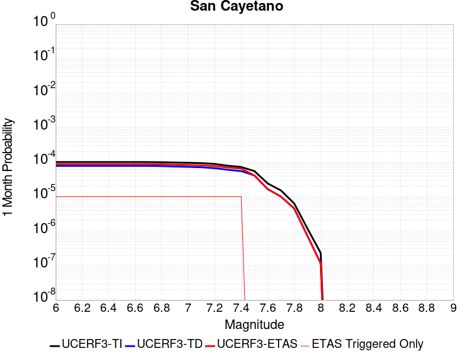 |  |  |

| Magnitude | 1 wk TI Prob | 1 wk TD Prob | 1 wk ETAS Prob | 1 wk ETAS/TD Gain | 1 wk ETAS Triggered Only | 1 mo TI Prob | 1 mo TD Prob | 1 mo ETAS Prob | 1 mo ETAS/TD Gain | 1 mo ETAS Triggered Only | 1 yr TI Prob | 1 yr TD Prob | 1 yr ETAS Prob | 1 yr ETAS/TD Gain | 1 yr ETAS Triggered Only | 10 yr TI Prob | 10 yr TD Prob | 10 yr ETAS Prob | 10 yr ETAS/TD Gain | 10 yr ETAS Triggered Only |
|-----|-----|-----|-----|-----|-----|-----|-----|-----|-----|-----|-----|-----|-----|-----|-----|-----|-----|-----|-----|-----|
| 6.0 | 2.3476267E-5 | 1.8169987E-5 | 1.8169987E-5 | 1.0 | 0.0 | 1.0060869E-4 | 7.786907E-5 | 1.079112E-4 | 1.3858031 | 3.0044466E-5 | 0.0012242225 | 9.476472E-4 | 9.776632E-4 | 1.0316743 | 3.0044466E-5 | 0.012175002 | 0.00943695 | 0.009466711 | 1.0031537 | 3.0044466E-5 |
| 6.1 | 2.3476267E-5 | 1.8169987E-5 | 1.8169987E-5 | 1.0 | 0.0 | 1.0060869E-4 | 7.786907E-5 | 1.079112E-4 | 1.3858031 | 3.0044466E-5 | 0.0012242225 | 9.476472E-4 | 9.776632E-4 | 1.0316743 | 3.0044466E-5 | 0.012175002 | 0.00943695 | 0.009466711 | 1.0031537 | 3.0044466E-5 |
| 6.2 | 2.3476267E-5 | 1.8169987E-5 | 1.8169987E-5 | 1.0 | 0.0 | 1.0060869E-4 | 7.786907E-5 | 1.079112E-4 | 1.3858031 | 3.0044466E-5 | 0.0012242225 | 9.476472E-4 | 9.776632E-4 | 1.0316743 | 3.0044466E-5 | 0.012175002 | 0.00943695 | 0.009466711 | 1.0031537 | 3.0044466E-5 |
| 6.3 | 2.3476267E-5 | 1.8169987E-5 | 1.8169987E-5 | 1.0 | 0.0 | 1.0060869E-4 | 7.786907E-5 | 1.079112E-4 | 1.3858031 | 3.0044466E-5 | 0.0012242225 | 9.476472E-4 | 9.776632E-4 | 1.0316743 | 3.0044466E-5 | 0.012175002 | 0.00943695 | 0.009466711 | 1.0031537 | 3.0044466E-5 |
| 6.4 | 2.3476267E-5 | 1.8169987E-5 | 1.8169987E-5 | 1.0 | 0.0 | 1.0060869E-4 | 7.786907E-5 | 1.079112E-4 | 1.3858031 | 3.0044466E-5 | 0.0012242225 | 9.476472E-4 | 9.776632E-4 | 1.0316743 | 3.0044466E-5 | 0.012175002 | 0.00943695 | 0.009466711 | 1.0031537 | 3.0044466E-5 |
| 6.5 | 2.3476267E-5 | 1.8169987E-5 | 1.8169987E-5 | 1.0 | 0.0 | 1.0060869E-4 | 7.786907E-5 | 1.079112E-4 | 1.3858031 | 3.0044466E-5 | 0.0012242225 | 9.476472E-4 | 9.776632E-4 | 1.0316743 | 3.0044466E-5 | 0.012175002 | 0.00943695 | 0.009466711 | 1.0031537 | 3.0044466E-5 |
| 6.6 | 2.3476267E-5 | 1.8169987E-5 | 1.8169987E-5 | 1.0 | 0.0 | 1.0060869E-4 | 7.786907E-5 | 1.079112E-4 | 1.3858031 | 3.0044466E-5 | 0.0012242225 | 9.476472E-4 | 9.776632E-4 | 1.0316743 | 3.0044466E-5 | 0.012175002 | 0.00943695 | 0.009466711 | 1.0031537 | 3.0044466E-5 |
| 6.7 | 2.3476267E-5 | 1.8169987E-5 | 1.8169987E-5 | 1.0 | 0.0 | 1.0060869E-4 | 7.786907E-5 | 1.079112E-4 | 1.3858031 | 3.0044466E-5 | 0.0012242225 | 9.476472E-4 | 9.776632E-4 | 1.0316743 | 3.0044466E-5 | 0.012175002 | 0.00943695 | 0.009466711 | 1.0031537 | 3.0044466E-5 |
| 6.8 | 2.3241924E-5 | 1.7937682E-5 | 1.7937682E-5 | 1.0 | 0.0 | 9.960445E-5 | 7.687353E-5 | 1.0691569E-4 | 1.3907998 | 3.0044466E-5 | 0.0012120095 | 9.3553704E-4 | 9.655534E-4 | 1.0320846 | 3.0044466E-5 | 0.012054204 | 0.009316841 | 0.009346606 | 1.0031947 | 3.0044466E-5 |
| 6.9 | 2.2761007E-5 | 1.7433098E-5 | 1.7433098E-5 | 1.0 | 0.0 | 9.7543525E-5 | 7.4711155E-5 | 1.0475338E-4 | 1.4021115 | 3.0044466E-5 | 0.0011869454 | 9.092322E-4 | 9.3924935E-4 | 1.0330137 | 3.0044466E-5 | 0.011806256 | 0.009055952 | 0.009085724 | 1.0032876 | 3.0044466E-5 |
| 7.0 | 2.240283E-5 | 1.706683E-5 | 1.706683E-5 | 1.0 | 0.0 | 9.600859E-5 | 7.314153E-5 | 1.0318379E-4 | 1.4107416 | 3.0044466E-5 | 0.0011682777 | 8.901377E-4 | 9.201554E-4 | 1.0337225 | 3.0044466E-5 | 0.011621549 | 0.008866537 | 0.0088963155 | 1.0033585 | 3.0044466E-5 |
| 7.1 | 2.1871154E-5 | 1.6586657E-5 | 1.6586657E-5 | 1.0 | 0.0 | 9.373015E-5 | 7.1083756E-5 | 1.0112608E-4 | 1.4226328 | 3.0044466E-5 | 0.0011405671 | 8.6510443E-4 | 8.951229E-4 | 1.0346992 | 3.0044466E-5 | 0.011347309 | 0.0086181685 | 0.008647954 | 1.0034561 | 3.0044466E-5 |
| 7.2 | 2.0714133E-5 | 1.5565152E-5 | 1.5565152E-5 | 1.0 | 0.0 | 8.8771834E-5 | 6.670611E-5 | 9.6748576E-5 | 1.4503704 | 3.0044466E-5 | 0.0010802611 | 8.1184757E-4 | 8.4186764E-4 | 1.0369775 | 3.0044466E-5 | 0.010750249 | 0.008089592 | 0.008119393 | 1.0036839 | 3.0044466E-5 |
| 7.3 | 1.8408395E-5 | 1.3997363E-5 | 1.3997363E-5 | 1.0 | 0.0 | 7.8890735E-5 | 5.9987335E-5 | 9.003E-5 | 1.5008168 | 3.0044466E-5 | 9.600714E-4 | 7.3010405E-4 | 7.6012657E-4 | 1.0411209 | 3.0044466E-5 | 0.009559342 | 0.007277773 | 0.0073075993 | 1.0040982 | 3.0044466E-5 |
| 7.4 | 1.6856795E-5 | 1.28505235E-5 | 1.28505235E-5 | 1.0 | 0.0 | 7.2241404E-5 | 5.5072524E-5 | 8.511534E-5 | 1.5455136 | 3.0044466E-5 | 8.7918417E-4 | 6.703046E-4 | 7.003289E-4 | 1.044792 | 3.0044466E-5 | 0.00875714 | 0.0066835075 | 0.0067133512 | 1.0044652 | 3.0044466E-5 |
| 7.5 | 1.2822778E-5 | 9.577859E-6 | 9.577859E-6 | 1.0 | 0.0 | 5.495361E-5 | 4.104733E-5 | 4.104733E-5 | 1.0 | 0.0 | 6.688548E-4 | 4.9963826E-4 | 4.9963826E-4 | 1.0 | 0.0 | 0.006668452 | 0.00498532 | 0.00498532 | 1.0 | 0.0 |
| 7.6 | 5.6272684E-6 | 3.8550384E-6 | 3.8550384E-6 | 1.0 | 0.0 | 2.4116642E-5 | 1.6521488E-5 | 1.6521488E-5 | 1.0 | 0.0 | 2.9358055E-4 | 2.0113066E-4 | 2.0113066E-4 | 1.0 | 0.0 | 0.0029319301 | 0.002009497 | 0.002009497 | 1.0 | 0.0 |
| 7.7 | 3.5261346E-6 | 2.3407883E-6 | 2.3407883E-6 | 1.0 | 0.0 | 1.5111918E-5 | 1.0031911E-5 | 1.0031911E-5 | 1.0 | 0.0 | 1.8397206E-4 | 1.2213175E-4 | 1.2213175E-4 | 1.0 | 0.0 | 0.0018381984 | 0.0012206536 | 0.0012206536 | 1.0 | 0.0 |
| 7.8 | 1.4826929E-6 | 1.0564627E-6 | 1.0564627E-6 | 1.0 | 0.0 | 6.354383E-6 | 4.5276893E-6 | 4.5276893E-6 | 1.0 | 0.0 | 7.736187E-5 | 5.512324E-5 | 5.512324E-5 | 1.0 | 0.0 | 7.733494E-4 | 5.5109774E-4 | 5.5109774E-4 | 1.0 | 0.0 |
| 7.9 | 2.7568166E-7 | 1.6979098E-7 | 1.6979098E-7 | 1.0 | 0.0 | 1.1814923E-6 | 7.276754E-7 | 7.276754E-7 | 1.0 | 0.0 | 1.4384574E-5 | 8.859412E-6 | 8.859412E-6 | 1.0 | 0.0 | 1.4383643E-4 | 8.859063E-5 | 8.859063E-5 | 1.0 | 0.0 |
| 8.0 | 5.407832E-8 | 2.6890575E-8 | 2.6890575E-8 | 1.0 | 0.0 | 2.3176422E-7 | 1.15245314E-7 | 1.15245314E-7 | 1.0 | 0.0 | 2.8217257E-6 | 1.4031108E-6 | 1.4031108E-6 | 1.0 | 0.0 | 2.8216898E-5 | 1.4031024E-5 | 1.4031024E-5 | 1.0 | 0.0 |

## Santa Susana East (connector)
*[(top)](#table-of-contents)*

| 1 Week | 1 Month | 1 Year | 10 Year |
|-----|-----|-----|-----|
|  |  |  |  |

| Magnitude | 1 wk TI Prob | 1 wk TD Prob | 1 wk ETAS Prob | 1 wk ETAS/TD Gain | 1 wk ETAS Triggered Only | 1 mo TI Prob | 1 mo TD Prob | 1 mo ETAS Prob | 1 mo ETAS/TD Gain | 1 mo ETAS Triggered Only | 1 yr TI Prob | 1 yr TD Prob | 1 yr ETAS Prob | 1 yr ETAS/TD Gain | 1 yr ETAS Triggered Only | 10 yr TI Prob | 10 yr TD Prob | 10 yr ETAS Prob | 10 yr ETAS/TD Gain | 10 yr ETAS Triggered Only |
|-----|-----|-----|-----|-----|-----|-----|-----|-----|-----|-----|-----|-----|-----|-----|-----|-----|-----|-----|-----|-----|
| 6.0 | 2.858397E-5 | 3.202275E-5 | 3.202275E-5 | 1.0 | 0.0 | 1.2249697E-4 | 1.3723472E-4 | 1.6727507E-4 | 1.2188976 | 3.0044466E-5 | 0.0014903803 | 0.0016698339 | 0.0016998282 | 1.0179625 | 3.0044466E-5 | 0.014804244 | 0.016599987 | 0.016629532 | 1.0017799 | 3.0044466E-5 |
| 6.1 | 2.858397E-5 | 3.202275E-5 | 3.202275E-5 | 1.0 | 0.0 | 1.2249697E-4 | 1.3723472E-4 | 1.6727507E-4 | 1.2188976 | 3.0044466E-5 | 0.0014903803 | 0.0016698339 | 0.0016998282 | 1.0179625 | 3.0044466E-5 | 0.014804244 | 0.016599987 | 0.016629532 | 1.0017799 | 3.0044466E-5 |
| 6.2 | 2.858397E-5 | 3.202275E-5 | 3.202275E-5 | 1.0 | 0.0 | 1.2249697E-4 | 1.3723472E-4 | 1.6727507E-4 | 1.2188976 | 3.0044466E-5 | 0.0014903803 | 0.0016698339 | 0.0016998282 | 1.0179625 | 3.0044466E-5 | 0.014804244 | 0.016599987 | 0.016629532 | 1.0017799 | 3.0044466E-5 |
| 6.3 | 1.943582E-5 | 2.0368168E-5 | 2.0368168E-5 | 1.0 | 0.0 | 8.329371E-5 | 8.728987E-5 | 1.1733171E-4 | 1.3441619 | 3.0044466E-5 | 0.001013629 | 0.0010623483 | 0.0010923607 | 1.0282512 | 3.0044466E-5 | 0.010090181 | 0.010584131 | 0.010613857 | 1.0028086 | 3.0044466E-5 |
| 6.4 | 1.943582E-5 | 2.0368168E-5 | 2.0368168E-5 | 1.0 | 0.0 | 8.329371E-5 | 8.728987E-5 | 1.1733171E-4 | 1.3441619 | 3.0044466E-5 | 0.001013629 | 0.0010623483 | 0.0010923607 | 1.0282512 | 3.0044466E-5 | 0.010090181 | 0.010584131 | 0.010613857 | 1.0028086 | 3.0044466E-5 |
| 6.5 | 1.943582E-5 | 2.0368168E-5 | 2.0368168E-5 | 1.0 | 0.0 | 8.329371E-5 | 8.728987E-5 | 1.1733171E-4 | 1.3441619 | 3.0044466E-5 | 0.001013629 | 0.0010623483 | 0.0010923607 | 1.0282512 | 3.0044466E-5 | 0.010090181 | 0.010584131 | 0.010613857 | 1.0028086 | 3.0044466E-5 |
| 6.6 | 1.943582E-5 | 2.0368168E-5 | 2.0368168E-5 | 1.0 | 0.0 | 8.329371E-5 | 8.728987E-5 | 1.1733171E-4 | 1.3441619 | 3.0044466E-5 | 0.001013629 | 0.0010623483 | 0.0010923607 | 1.0282512 | 3.0044466E-5 | 0.010090181 | 0.010584131 | 0.010613857 | 1.0028086 | 3.0044466E-5 |
| 6.7 | 1.9404439E-5 | 2.035559E-5 | 2.035559E-5 | 1.0 | 0.0 | 8.3159226E-5 | 8.723595E-5 | 1.172778E-4 | 1.3443745 | 3.0044466E-5 | 0.0010119933 | 0.0010616925 | 0.001091705 | 1.0282686 | 3.0044466E-5 | 0.010073971 | 0.010577636 | 0.010607363 | 1.0028104 | 3.0044466E-5 |
| 6.8 | 1.2217526E-5 | 1.1593401E-5 | 1.1593401E-5 | 1.0 | 0.0 | 5.2359774E-5 | 4.9685153E-5 | 7.9728125E-5 | 1.604667 | 3.0044466E-5 | 6.372938E-4 | 6.0476566E-4 | 6.3479197E-4 | 1.0496495 | 3.0044466E-5 | 0.0063546924 | 0.0060332464 | 0.0060631093 | 1.0049498 | 3.0044466E-5 |
| 6.9 | 1.2217526E-5 | 1.1593401E-5 | 1.1593401E-5 | 1.0 | 0.0 | 5.2359774E-5 | 4.9685153E-5 | 7.9728125E-5 | 1.604667 | 3.0044466E-5 | 6.372938E-4 | 6.0476566E-4 | 6.3479197E-4 | 1.0496495 | 3.0044466E-5 | 0.0063546924 | 0.0060332464 | 0.0060631093 | 1.0049498 | 3.0044466E-5 |
| 7.0 | 9.276017E-6 | 8.059318E-6 | 8.059318E-6 | 1.0 | 0.0 | 3.9753755E-5 | 3.4539495E-5 | 6.458293E-5 | 1.8698282 | 3.0044466E-5 | 4.8389446E-4 | 4.2044066E-4 | 4.504725E-4 | 1.0714294 | 3.0044466E-5 | 0.0048284214 | 0.004197179 | 0.004227097 | 1.0071282 | 3.0044466E-5 |
| 7.1 | 9.130355E-6 | 7.942487E-6 | 7.942487E-6 | 1.0 | 0.0 | 3.9129503E-5 | 3.4038807E-5 | 6.4082255E-5 | 1.8826232 | 3.0044466E-5 | 4.7629757E-4 | 4.1434713E-4 | 4.4437914E-4 | 1.0724803 | 3.0044466E-5 | 0.00475278 | 0.0041364715 | 0.0041663917 | 1.0072333 | 3.0044466E-5 |
| 7.2 | 8.851015E-6 | 7.741643E-6 | 7.741643E-6 | 1.0 | 0.0 | 3.7932372E-5 | 3.3178065E-5 | 6.322153E-5 | 1.9055221 | 3.0044466E-5 | 4.6172875E-4 | 4.0387147E-4 | 4.339038E-4 | 1.0743611 | 3.0044466E-5 | 0.0046077054 | 0.0040320978 | 0.004062021 | 1.0074213 | 3.0044466E-5 |
| 7.3 | 8.573006E-6 | 7.550358E-6 | 7.550358E-6 | 1.0 | 0.0 | 3.6740938E-5 | 3.2358294E-5 | 6.240179E-5 | 1.9284635 | 3.0044466E-5 | 4.472291E-4 | 3.9389444E-4 | 4.2392706E-4 | 1.0762454 | 3.0044466E-5 | 0.004463301 | 0.00393268 | 0.0039626067 | 1.0076096 | 3.0044466E-5 |
| 7.4 | 7.852282E-6 | 6.817847E-6 | 6.817847E-6 | 1.0 | 0.0 | 3.36522E-5 | 2.9219034E-5 | 5.926262E-5 | 2.0282197 | 3.0044466E-5 | 4.096385E-4 | 3.556867E-4 | 3.857205E-4 | 1.0844389 | 3.0044466E-5 | 0.0040888423 | 0.0035518385 | 0.0035817763 | 1.0084288 | 3.0044466E-5 |
| 7.5 | 4.8869324E-6 | 4.2791435E-6 | 4.2791435E-6 | 1.0 | 0.0 | 2.0943828E-5 | 1.8339068E-5 | 1.8339068E-5 | 1.0 | 0.0 | 2.5496128E-4 | 2.2325692E-4 | 2.2325692E-4 | 1.0 | 0.0 | 0.0025466895 | 0.0022304908 | 0.0022304908 | 1.0 | 0.0 |
| 7.6 | 1.3894544E-6 | 1.1568333E-6 | 1.1568333E-6 | 1.0 | 0.0 | 5.954791E-6 | 4.9578484E-6 | 4.9578484E-6 | 1.0 | 0.0 | 7.249717E-5 | 6.036036E-5 | 6.036036E-5 | 1.0 | 0.0 | 7.247352E-4 | 6.0346146E-4 | 6.0346146E-4 | 1.0 | 0.0 |
| 7.7 | 2.9924632E-7 | 2.3719976E-7 | 2.3719976E-7 | 1.0 | 0.0 | 1.2824837E-6 | 1.0165701E-6 | 1.0165701E-6 | 1.0 | 0.0 | 1.5614127E-5 | 1.2376678E-5 | 1.2376678E-5 | 1.0 | 0.0 | 1.5613029E-4 | 1.237606E-4 | 1.237606E-4 | 1.0 | 0.0 |
| 7.8 | 4.8188564E-8 | 2.6325937E-8 | 2.6325937E-8 | 1.0 | 0.0 | 2.065224E-7 | 1.1282544E-7 | 1.1282544E-7 | 1.0 | 0.0 | 2.5144072E-6 | 1.373649E-6 | 1.373649E-6 | 1.0 | 0.0 | 2.5143789E-5 | 1.3736413E-5 | 1.3736413E-5 | 1.0 | 0.0 |
| 7.9 | 2.6127251E-9 | 2.7681537E-9 | 2.7681537E-9 | 1.0 | 0.0 | 1.1197393E-8 | 1.1863516E-8 | 1.1863516E-8 | 1.0 | 0.0 | 1.3632825E-7 | 1.4443832E-7 | 1.4443832E-7 | 1.0 | 0.0 | 1.3632817E-6 | 1.4443831E-6 | 1.4443831E-6 | 1.0 | 0.0 |

## Mono Lake 2011 CFM
*[(top)](#table-of-contents)*

| 1 Week | 1 Month | 1 Year | 10 Year |
|-----|-----|-----|-----|
|  |  |  |  |

| Magnitude | 1 wk TI Prob | 1 wk TD Prob | 1 wk ETAS Prob | 1 wk ETAS/TD Gain | 1 wk ETAS Triggered Only | 1 mo TI Prob | 1 mo TD Prob | 1 mo ETAS Prob | 1 mo ETAS/TD Gain | 1 mo ETAS Triggered Only | 1 yr TI Prob | 1 yr TD Prob | 1 yr ETAS Prob | 1 yr ETAS/TD Gain | 1 yr ETAS Triggered Only | 10 yr TI Prob | 10 yr TD Prob | 10 yr ETAS Prob | 10 yr ETAS/TD Gain | 10 yr ETAS Triggered Only |
|-----|-----|-----|-----|-----|-----|-----|-----|-----|-----|-----|-----|-----|-----|-----|-----|-----|-----|-----|-----|-----|
| 6.0 | 2.0341662E-5 | 2.382925E-5 | 2.382925E-5 | 1.0 | 0.0 | 8.717564E-5 | 1.0212436E-4 | 1.0212436E-4 | 1.0 | 0.0 | 0.0010608466 | 0.0012431863 | 0.0012431863 | 1.0 | 0.0 | 0.010557966 | 0.012414398 | 0.01244407 | 1.00239 | 3.0044466E-5 |
| 6.1 | 2.0341662E-5 | 2.382925E-5 | 2.382925E-5 | 1.0 | 0.0 | 8.717564E-5 | 1.0212436E-4 | 1.0212436E-4 | 1.0 | 0.0 | 0.0010608466 | 0.0012431863 | 0.0012431863 | 1.0 | 0.0 | 0.010557966 | 0.012414398 | 0.01244407 | 1.00239 | 3.0044466E-5 |
| 6.2 | 2.0341662E-5 | 2.382925E-5 | 2.382925E-5 | 1.0 | 0.0 | 8.717564E-5 | 1.0212436E-4 | 1.0212436E-4 | 1.0 | 0.0 | 0.0010608466 | 0.0012431863 | 0.0012431863 | 1.0 | 0.0 | 0.010557966 | 0.012414398 | 0.01244407 | 1.00239 | 3.0044466E-5 |
| 6.3 | 2.0341662E-5 | 2.382925E-5 | 2.382925E-5 | 1.0 | 0.0 | 8.717564E-5 | 1.0212436E-4 | 1.0212436E-4 | 1.0 | 0.0 | 0.0010608466 | 0.0012431863 | 0.0012431863 | 1.0 | 0.0 | 0.010557966 | 0.012414398 | 0.01244407 | 1.00239 | 3.0044466E-5 |
| 6.4 | 1.749821E-5 | 2.0491914E-5 | 2.0491914E-5 | 1.0 | 0.0 | 7.499018E-5 | 8.782249E-5 | 8.782249E-5 | 1.0 | 0.0 | 9.1262296E-4 | 0.0010692389 | 0.0010692389 | 1.0 | 0.0 | 0.009088841 | 0.01069235 | 0.010722073 | 1.0027798 | 3.0044466E-5 |
| 6.5 | 1.749821E-5 | 2.0491914E-5 | 2.0491914E-5 | 1.0 | 0.0 | 7.499018E-5 | 8.782249E-5 | 8.782249E-5 | 1.0 | 0.0 | 9.1262296E-4 | 0.0010692389 | 0.0010692389 | 1.0 | 0.0 | 0.009088841 | 0.01069235 | 0.010722073 | 1.0027798 | 3.0044466E-5 |

## Sargent 2011 CFM
*[(top)](#table-of-contents)*

| 1 Week | 1 Month | 1 Year | 10 Year |
|-----|-----|-----|-----|
|  |  |  |  |

| Magnitude | 1 wk TI Prob | 1 wk TD Prob | 1 wk ETAS Prob | 1 wk ETAS/TD Gain | 1 wk ETAS Triggered Only | 1 mo TI Prob | 1 mo TD Prob | 1 mo ETAS Prob | 1 mo ETAS/TD Gain | 1 mo ETAS Triggered Only | 1 yr TI Prob | 1 yr TD Prob | 1 yr ETAS Prob | 1 yr ETAS/TD Gain | 1 yr ETAS Triggered Only | 10 yr TI Prob | 10 yr TD Prob | 10 yr ETAS Prob | 10 yr ETAS/TD Gain | 10 yr ETAS Triggered Only |
|-----|-----|-----|-----|-----|-----|-----|-----|-----|-----|-----|-----|-----|-----|-----|-----|-----|-----|-----|-----|-----|
| 6.0 | 3.7327867E-5 | 3.66527E-5 | 3.66527E-5 | 1.0 | 0.0 | 1.5996677E-4 | 1.5707633E-4 | 1.5707633E-4 | 1.0 | 0.0 | 0.0019458556 | 0.001911208 | 0.001941195 | 1.0156901 | 3.0044466E-5 | 0.01928905 | 0.019019924 | 0.019049397 | 1.0015496 | 3.0044466E-5 |
| 6.1 | 2.3771476E-5 | 1.8481187E-5 | 1.8481187E-5 | 1.0 | 0.0 | 1.01873775E-4 | 7.920318E-5 | 7.920318E-5 | 1.0 | 0.0 | 0.0012396075 | 9.639475E-4 | 9.639475E-4 | 1.0 | 0.0 | 0.012327154 | 0.00963713 | 0.00963713 | 1.0 | 0.0 |
| 6.2 | 2.3112721E-5 | 1.7712511E-5 | 1.7712511E-5 | 1.0 | 0.0 | 9.9050754E-5 | 7.590905E-5 | 7.590905E-5 | 1.0 | 0.0 | 0.0012052758 | 9.238756E-4 | 9.238756E-4 | 1.0 | 0.0 | 0.011987597 | 0.009239765 | 0.009239765 | 1.0 | 0.0 |
| 6.3 | 1.728509E-5 | 1.0460333E-5 | 1.0460333E-5 | 1.0 | 0.0 | 7.407686E-5 | 4.4829496E-5 | 4.4829496E-5 | 1.0 | 0.0 | 9.015125E-4 | 5.457075E-4 | 5.457075E-4 | 1.0 | 0.0 | 0.008978641 | 0.0054799058 | 0.0054799058 | 1.0 | 0.0 |
| 6.4 | 1.48395575E-5 | 7.457206E-6 | 7.457206E-6 | 1.0 | 0.0 | 6.3596555E-5 | 3.1959276E-5 | 3.1959276E-5 | 1.0 | 0.0 | 7.7401294E-4 | 3.890703E-4 | 3.890703E-4 | 1.0 | 0.0 | 0.0077132257 | 0.0039193574 | 0.0039193574 | 1.0 | 0.0 |
| 6.5 | 1.4358964E-5 | 6.8959575E-6 | 6.8959575E-6 | 1.0 | 0.0 | 6.1536964E-5 | 2.9553983E-5 | 2.9553983E-5 | 1.0 | 0.0 | 7.48955E-4 | 3.5979573E-4 | 3.5979573E-4 | 1.0 | 0.0 | 0.0074643586 | 0.0036275939 | 0.0036275939 | 1.0 | 0.0 |
| 6.6 | 9.772591E-6 | 1.3745157E-6 | 1.3745157E-6 | 1.0 | 0.0 | 4.188186E-5 | 5.8907685E-6 | 5.8907685E-6 | 1.0 | 0.0 | 5.097923E-4 | 7.1717775E-5 | 7.1717775E-5 | 1.0 | 0.0 | 0.005086244 | 7.488351E-4 | 7.488351E-4 | 1.0 | 0.0 |
| 6.7 | 9.752745E-6 | 1.3532066E-6 | 1.3532066E-6 | 1.0 | 0.0 | 4.179681E-5 | 5.799444E-6 | 5.799444E-6 | 1.0 | 0.0 | 5.0875737E-4 | 7.060597E-5 | 7.060597E-5 | 1.0 | 0.0 | 0.005075942 | 7.3772453E-4 | 7.3772453E-4 | 1.0 | 0.0 |
| 6.8 | 9.608213E-6 | 1.2370549E-6 | 1.2370549E-6 | 1.0 | 0.0 | 4.1177405E-5 | 5.3016533E-6 | 5.3016533E-6 | 1.0 | 0.0 | 5.012196E-4 | 6.454574E-5 | 6.454574E-5 | 1.0 | 0.0 | 0.005000906 | 6.768572E-4 | 6.768572E-4 | 1.0 | 0.0 |
| 6.9 | 9.427164E-6 | 1.1217882E-6 | 1.1217882E-6 | 1.0 | 0.0 | 4.04015E-5 | 4.807655E-6 | 4.807655E-6 | 1.0 | 0.0 | 4.9177726E-4 | 5.8531645E-5 | 5.8531645E-5 | 1.0 | 0.0 | 0.004906904 | 6.160689E-4 | 6.160689E-4 | 1.0 | 0.0 |
| 7.0 | 9.247601E-6 | 9.882198E-7 | 9.882198E-7 | 1.0 | 0.0 | 3.9631974E-5 | 4.2352203E-6 | 4.2352203E-6 | 1.0 | 0.0 | 4.8241246E-4 | 5.1562605E-5 | 5.1562605E-5 | 1.0 | 0.0 | 0.0048136655 | 5.4590765E-4 | 5.4590765E-4 | 1.0 | 0.0 |
| 7.1 | 8.995454E-6 | 8.2788455E-7 | 8.2788455E-7 | 1.0 | 0.0 | 3.8551374E-5 | 3.5480718E-6 | 3.5480718E-6 | 1.0 | 0.0 | 4.6926187E-4 | 4.319693E-5 | 4.319693E-5 | 1.0 | 0.0 | 0.004682722 | 4.6136387E-4 | 4.6136387E-4 | 1.0 | 0.0 |
| 7.2 | 8.520861E-6 | 5.283442E-7 | 5.283442E-7 | 1.0 | 0.0 | 3.6517464E-5 | 2.2643303E-6 | 2.2643303E-6 | 1.0 | 0.0 | 4.445094E-4 | 2.756788E-5 | 2.756788E-5 | 1.0 | 0.0 | 0.004436213 | 3.0338025E-4 | 3.0338025E-4 | 1.0 | 0.0 |
| 7.3 | 8.043592E-6 | 3.462658E-7 | 3.462658E-7 | 1.0 | 0.0 | 3.4472083E-5 | 1.4839954E-6 | 1.4839954E-6 | 1.0 | 0.0 | 4.196168E-4 | 1.8067496E-5 | 1.8067496E-5 | 1.0 | 0.0 | 0.004188253 | 2.0707028E-4 | 2.0707028E-4 | 1.0 | 0.0 |
| 7.4 | 7.662316E-6 | 2.934612E-7 | 2.934612E-7 | 1.0 | 0.0 | 3.2838085E-5 | 1.2576902E-6 | 1.2576902E-6 | 1.0 | 0.0 | 3.9973034E-4 | 1.5312271E-5 | 1.5312271E-5 | 1.0 | 0.0 | 0.0039901207 | 1.7771032E-4 | 1.7771032E-4 | 1.0 | 0.0 |
| 7.5 | 6.961638E-6 | 2.3622324E-7 | 2.3622324E-7 | 1.0 | 0.0 | 2.9835252E-5 | 1.0123849E-6 | 1.0123849E-6 | 1.0 | 0.0 | 3.6318362E-4 | 1.2325718E-5 | 1.2325718E-5 | 1.0 | 0.0 | 0.0036259065 | 1.443878E-4 | 1.443878E-4 | 1.0 | 0.0 |
| 7.6 | 6.282332E-6 | 1.693028E-7 | 1.693028E-7 | 1.0 | 0.0 | 2.6924003E-5 | 7.255832E-7 | 7.255832E-7 | 1.0 | 0.0 | 3.2775043E-4 | 8.83394E-6 | 8.83394E-6 | 1.0 | 0.0 | 0.0032726745 | 1.0528327E-4 | 1.0528327E-4 | 1.0 | 0.0 |
| 7.7 | 4.934408E-6 | 5.0136514E-8 | 5.0136514E-8 | 1.0 | 0.0 | 2.114729E-5 | 2.1487075E-7 | 2.1487075E-7 | 1.0 | 0.0 | 2.5743784E-4 | 2.6160483E-6 | 2.6160483E-6 | 1.0 | 0.0 | 0.0025713982 | 3.2631593E-5 | 3.2631593E-5 | 1.0 | 0.0 |
| 7.8 | 2.373212E-6 | 3.5272727E-8 | 3.5272727E-8 | 1.0 | 0.0 | 1.0170869E-5 | 1.511688E-7 | 1.511688E-7 | 1.0 | 0.0 | 1.238233E-4 | 1.8404786E-6 | 1.8404786E-6 | 1.0 | 0.0 | 0.0012375432 | 2.4194595E-5 | 2.4194595E-5 | 1.0 | 0.0 |
| 7.9 | 1.8227792E-6 | 3.070829E-8 | 3.070829E-8 | 1.0 | 0.0 | 7.811887E-6 | 1.3160694E-7 | 1.3160694E-7 | 1.0 | 0.0 | 9.510558E-5 | 1.6023133E-6 | 1.6023133E-6 | 1.0 | 0.0 | 9.5064886E-4 | 2.1472444E-5 | 2.1472444E-5 | 1.0 | 0.0 |
| 8.0 | 1.9095137E-7 | 1.3291495E-8 | 1.3291495E-8 | 1.0 | 0.0 | 8.1836276E-7 | 5.6963547E-8 | 5.6963547E-8 | 1.0 | 0.0 | 9.963521E-6 | 6.93531E-7 | 6.93531E-7 | 1.0 | 0.0 | 9.963074E-5 | 8.479904E-6 | 8.479904E-6 | 1.0 | 0.0 |

## Mission Creek
*[(top)](#table-of-contents)*

| 1 Week | 1 Month | 1 Year | 10 Year |
|-----|-----|-----|-----|
|  |  |  |  |

| Magnitude | 1 wk TI Prob | 1 wk TD Prob | 1 wk ETAS Prob | 1 wk ETAS/TD Gain | 1 wk ETAS Triggered Only | 1 mo TI Prob | 1 mo TD Prob | 1 mo ETAS Prob | 1 mo ETAS/TD Gain | 1 mo ETAS Triggered Only | 1 yr TI Prob | 1 yr TD Prob | 1 yr ETAS Prob | 1 yr ETAS/TD Gain | 1 yr ETAS Triggered Only | 10 yr TI Prob | 10 yr TD Prob | 10 yr ETAS Prob | 10 yr ETAS/TD Gain | 10 yr ETAS Triggered Only |
|-----|-----|-----|-----|-----|-----|-----|-----|-----|-----|-----|-----|-----|-----|-----|-----|-----|-----|-----|-----|-----|
| 6.0 | 1.1549387E-5 | 1.6327054E-5 | 1.6327054E-5 | 1.0 | 0.0 | 4.9496433E-5 | 6.99713E-5 | 6.99713E-5 | 1.0 | 0.0 | 6.0245243E-4 | 8.515826E-4 | 8.816015E-4 | 1.0352507 | 3.0044466E-5 | 0.006008218 | 0.008512369 | 0.008542158 | 1.0034995 | 3.0044466E-5 |
| 6.1 | 1.1549387E-5 | 1.6327054E-5 | 1.6327054E-5 | 1.0 | 0.0 | 4.9496433E-5 | 6.99713E-5 | 6.99713E-5 | 1.0 | 0.0 | 6.0245243E-4 | 8.515826E-4 | 8.816015E-4 | 1.0352507 | 3.0044466E-5 | 0.006008218 | 0.008512369 | 0.008542158 | 1.0034995 | 3.0044466E-5 |
| 6.2 | 1.1549387E-5 | 1.6327054E-5 | 1.6327054E-5 | 1.0 | 0.0 | 4.9496433E-5 | 6.99713E-5 | 6.99713E-5 | 1.0 | 0.0 | 6.0245243E-4 | 8.515826E-4 | 8.816015E-4 | 1.0352507 | 3.0044466E-5 | 0.006008218 | 0.008512369 | 0.008542158 | 1.0034995 | 3.0044466E-5 |
| 6.3 | 1.1549387E-5 | 1.6327054E-5 | 1.6327054E-5 | 1.0 | 0.0 | 4.9496433E-5 | 6.99713E-5 | 6.99713E-5 | 1.0 | 0.0 | 6.0245243E-4 | 8.515826E-4 | 8.816015E-4 | 1.0352507 | 3.0044466E-5 | 0.006008218 | 0.008512369 | 0.008542158 | 1.0034995 | 3.0044466E-5 |
| 6.4 | 1.1549387E-5 | 1.6327054E-5 | 1.6327054E-5 | 1.0 | 0.0 | 4.9496433E-5 | 6.99713E-5 | 6.99713E-5 | 1.0 | 0.0 | 6.0245243E-4 | 8.515826E-4 | 8.816015E-4 | 1.0352507 | 3.0044466E-5 | 0.006008218 | 0.008512369 | 0.008542158 | 1.0034995 | 3.0044466E-5 |
| 6.5 | 1.1549387E-5 | 1.6327054E-5 | 1.6327054E-5 | 1.0 | 0.0 | 4.9496433E-5 | 6.99713E-5 | 6.99713E-5 | 1.0 | 0.0 | 6.0245243E-4 | 8.515826E-4 | 8.816015E-4 | 1.0352507 | 3.0044466E-5 | 0.006008218 | 0.008512369 | 0.008542158 | 1.0034995 | 3.0044466E-5 |
| 6.6 | 9.202681E-6 | 1.3850295E-5 | 1.3850295E-5 | 1.0 | 0.0 | 3.9439463E-5 | 5.9357106E-5 | 5.9357106E-5 | 1.0 | 0.0 | 4.800697E-4 | 7.224422E-4 | 7.524649E-4 | 1.0415573 | 3.0044466E-5 | 0.004790339 | 0.0072295372 | 0.0072593642 | 1.0041257 | 3.0044466E-5 |
| 6.7 | 9.019164E-6 | 1.3655961E-5 | 1.3655961E-5 | 1.0 | 0.0 | 3.8652986E-5 | 5.8524285E-5 | 5.8524285E-5 | 1.0 | 0.0 | 4.7049852E-4 | 7.1230927E-4 | 7.423323E-4 | 1.042149 | 3.0044466E-5 | 0.004695036 | 0.00712886 | 0.00715869 | 1.0041845 | 3.0044466E-5 |
| 6.8 | 8.673558E-6 | 1.3278062E-5 | 1.3278062E-5 | 1.0 | 0.0 | 3.717186E-5 | 5.6904788E-5 | 5.6904788E-5 | 1.0 | 0.0 | 4.524734E-4 | 6.926044E-4 | 7.226281E-4 | 1.0433489 | 3.0044466E-5 | 0.0045155324 | 0.0069330437 | 0.00696288 | 1.0043035 | 3.0044466E-5 |
| 6.9 | 7.002255E-6 | 1.1482256E-5 | 1.1482256E-5 | 1.0 | 0.0 | 3.000932E-5 | 4.920878E-5 | 4.920878E-5 | 1.0 | 0.0 | 3.653022E-4 | 5.9895904E-4 | 6.289855E-4 | 1.0501311 | 3.0044466E-5 | 0.0036470229 | 0.0060018506 | 0.0060317144 | 1.0049758 | 3.0044466E-5 |
| 7.0 | 5.84644E-6 | 9.679345E-6 | 9.679345E-6 | 1.0 | 0.0 | 2.5055931E-5 | 4.148227E-5 | 4.148227E-5 | 1.0 | 0.0 | 3.0501327E-4 | 5.0493417E-4 | 5.349635E-4 | 1.0594717 | 3.0044466E-5 | 0.0030459496 | 0.0050660656 | 0.005095958 | 1.0059005 | 3.0044466E-5 |
| 7.1 | 5.54703E-6 | 9.333805E-6 | 9.333805E-6 | 1.0 | 0.0 | 2.377277E-5 | 4.0001432E-5 | 4.0001432E-5 | 1.0 | 0.0 | 2.8939504E-4 | 4.8691305E-4 | 5.169429E-4 | 1.0616739 | 3.0044466E-5 | 0.0028901845 | 0.004886652 | 0.0049165497 | 1.0061182 | 3.0044466E-5 |
| 7.2 | 4.384709E-6 | 7.685726E-6 | 7.685726E-6 | 1.0 | 0.0 | 1.8791474E-5 | 3.2938427E-5 | 3.2938427E-5 | 1.0 | 0.0 | 2.2876218E-4 | 4.0095524E-4 | 4.3098765E-4 | 1.0749022 | 3.0044466E-5 | 0.0022852682 | 0.0040304726 | 0.004060396 | 1.0074242 | 3.0044466E-5 |
| 7.3 | 3.7888456E-6 | 6.919525E-6 | 6.919525E-6 | 1.0 | 0.0 | 1.623781E-5 | 2.965479E-5 | 2.965479E-5 | 1.0 | 0.0 | 1.9767738E-4 | 3.6099058E-4 | 3.9102422E-4 | 1.0831978 | 3.0044466E-5 | 0.0019750162 | 0.0036321802 | 0.0036621154 | 1.0082417 | 3.0044466E-5 |
| 7.4 | 2.1982462E-6 | 5.027729E-6 | 5.027729E-6 | 1.0 | 0.0 | 9.421021E-6 | 2.1547232E-5 | 2.1547232E-5 | 1.0 | 0.0 | 1.1469489E-4 | 2.6230616E-4 | 2.9234274E-4 | 1.1145097 | 3.0044466E-5 | 0.0011463572 | 0.0026478888 | 0.0026778537 | 1.0113165 | 3.0044466E-5 |
| 7.5 | 2.051923E-6 | 4.6188607E-6 | 4.6188607E-6 | 1.0 | 0.0 | 8.793926E-6 | 1.9794968E-5 | 1.9794968E-5 | 1.0 | 0.0 | 1.0706078E-4 | 2.4097723E-4 | 2.7101446E-4 | 1.1246476 | 3.0044466E-5 | 0.0010700922 | 0.0024354912 | 0.0024654625 | 1.0123061 | 3.0044466E-5 |
| 7.6 | 1.8733427E-6 | 4.1270882E-6 | 4.1270882E-6 | 1.0 | 0.0 | 8.028587E-6 | 1.76874E-5 | 1.76874E-5 | 1.0 | 0.0 | 9.774366E-5 | 2.153229E-4 | 2.453609E-4 | 1.139502 | 3.0044466E-5 | 9.770069E-4 | 0.002179962 | 0.002209941 | 1.0137521 | 3.0044466E-5 |
| 7.7 | 1.8411953E-6 | 4.046738E-6 | 4.046738E-6 | 1.0 | 0.0 | 7.890813E-6 | 1.7343047E-5 | 1.7343047E-5 | 1.0 | 0.0 | 9.606641E-5 | 2.1113124E-4 | 2.4116936E-4 | 1.1422722 | 3.0044466E-5 | 9.6024893E-4 | 0.0021382344 | 0.0021682146 | 1.014021 | 3.0044466E-5 |
| 7.8 | 1.7194251E-6 | 3.713863E-6 | 3.713863E-6 | 1.0 | 0.0 | 7.368944E-6 | 1.591646E-5 | 1.591646E-5 | 1.0 | 0.0 | 8.97132E-5 | 1.9376572E-4 | 2.2380437E-4 | 1.1550256 | 3.0044466E-5 | 8.967699E-4 | 0.001964093 | 0.0019940785 | 1.0152668 | 3.0044466E-5 |
| 7.9 | 1.4035052E-6 | 2.9528794E-6 | 2.9528794E-6 | 1.0 | 0.0 | 6.0150082E-6 | 1.2655137E-5 | 1.2655137E-5 | 1.0 | 0.0 | 7.3230265E-5 | 1.5406546E-4 | 1.8410529E-4 | 1.194981 | 3.0044466E-5 | 7.3206134E-4 | 0.0015645352 | 0.0015945326 | 1.0191734 | 3.0044466E-5 |
| 8.0 | 3.9318823E-7 | 5.535372E-7 | 5.535372E-7 | 1.0 | 0.0 | 1.6850913E-6 | 2.3723E-6 | 2.3723E-6 | 1.0 | 0.0 | 2.0515794E-5 | 2.8882376E-5 | 2.8882376E-5 | 1.0 | 0.0 | 2.0513899E-4 | 2.9934838E-4 | 2.9934838E-4 | 1.0 | 0.0 |
| 8.1 | 1.596793E-7 | 1.14038066E-7 | 1.14038066E-7 | 1.0 | 0.0 | 6.8433974E-7 | 4.887345E-7 | 4.887345E-7 | 1.0 | 0.0 | 8.331805E-6 | 5.9503263E-6 | 5.9503263E-6 | 1.0 | 0.0 | 8.331492E-5 | 6.562903E-5 | 6.562903E-5 | 1.0 | 0.0 |
| 8.2 | 4.9003038E-8 | 2.5505308E-8 | 2.5505308E-8 | 1.0 | 0.0 | 2.10013E-7 | 1.0930846E-7 | 1.0930846E-7 | 1.0 | 0.0 | 2.5569052E-6 | 1.3308297E-6 | 1.3308297E-6 | 1.0 | 0.0 | 2.556876E-5 | 1.4989832E-5 | 1.4989832E-5 | 1.0 | 0.0 |

## Elysian Park (Upper)
*[(top)](#table-of-contents)*

| 1 Week | 1 Month | 1 Year | 10 Year |
|-----|-----|-----|-----|
|  |  |  |  |

| Magnitude | 1 wk TI Prob | 1 wk TD Prob | 1 wk ETAS Prob | 1 wk ETAS/TD Gain | 1 wk ETAS Triggered Only | 1 mo TI Prob | 1 mo TD Prob | 1 mo ETAS Prob | 1 mo ETAS/TD Gain | 1 mo ETAS Triggered Only | 1 yr TI Prob | 1 yr TD Prob | 1 yr ETAS Prob | 1 yr ETAS/TD Gain | 1 yr ETAS Triggered Only | 10 yr TI Prob | 10 yr TD Prob | 10 yr ETAS Prob | 10 yr ETAS/TD Gain | 10 yr ETAS Triggered Only |
|-----|-----|-----|-----|-----|-----|-----|-----|-----|-----|-----|-----|-----|-----|-----|-----|-----|-----|-----|-----|-----|
| 6.0 | 3.1876025E-5 | 3.7037524E-5 | 3.7037524E-5 | 1.0 | 0.0 | 1.3660437E-4 | 1.5872532E-4 | 1.8876501E-4 | 1.1892558 | 3.0044466E-5 | 0.0016618895 | 0.0019312092 | 0.0019611956 | 1.0155272 | 3.0044466E-5 | 0.016495159 | 0.019190805 | 0.019220274 | 1.0015355 | 3.0044466E-5 |
| 6.1 | 3.1876025E-5 | 3.7037524E-5 | 3.7037524E-5 | 1.0 | 0.0 | 1.3660437E-4 | 1.5872532E-4 | 1.8876501E-4 | 1.1892558 | 3.0044466E-5 | 0.0016618895 | 0.0019312092 | 0.0019611956 | 1.0155272 | 3.0044466E-5 | 0.016495159 | 0.019190805 | 0.019220274 | 1.0015355 | 3.0044466E-5 |
| 6.2 | 3.1876025E-5 | 3.7037524E-5 | 3.7037524E-5 | 1.0 | 0.0 | 1.3660437E-4 | 1.5872532E-4 | 1.8876501E-4 | 1.1892558 | 3.0044466E-5 | 0.0016618895 | 0.0019312092 | 0.0019611956 | 1.0155272 | 3.0044466E-5 | 0.016495159 | 0.019190805 | 0.019220274 | 1.0015355 | 3.0044466E-5 |
| 6.3 | 3.1876025E-5 | 3.7037524E-5 | 3.7037524E-5 | 1.0 | 0.0 | 1.3660437E-4 | 1.5872532E-4 | 1.8876501E-4 | 1.1892558 | 3.0044466E-5 | 0.0016618895 | 0.0019312092 | 0.0019611956 | 1.0155272 | 3.0044466E-5 | 0.016495159 | 0.019190805 | 0.019220274 | 1.0015355 | 3.0044466E-5 |
| 6.4 | 1.9273462E-5 | 2.1203196E-5 | 2.1203196E-5 | 1.0 | 0.0 | 8.259794E-5 | 9.0868656E-5 | 1.2091039E-4 | 1.3306061 | 3.0044466E-5 | 0.001005166 | 0.0011059378 | 0.001135949 | 1.0271364 | 3.0044466E-5 | 0.010006315 | 0.011021204 | 0.011050917 | 1.002696 | 3.0044466E-5 |
| 6.5 | 1.9273462E-5 | 2.1203196E-5 | 2.1203196E-5 | 1.0 | 0.0 | 8.259794E-5 | 9.0868656E-5 | 1.2091039E-4 | 1.3306061 | 3.0044466E-5 | 0.001005166 | 0.0011059378 | 0.001135949 | 1.0271364 | 3.0044466E-5 | 0.010006315 | 0.011021204 | 0.011050917 | 1.002696 | 3.0044466E-5 |
| 6.6 | 9.813258E-6 | 9.665857E-6 | 9.665857E-6 | 1.0 | 0.0 | 4.205614E-5 | 4.1424486E-5 | 4.1424486E-5 | 1.0 | 0.0 | 5.119132E-4 | 5.0423364E-4 | 5.0423364E-4 | 1.0 | 0.0 | 0.005107356 | 0.005031619 | 0.005031619 | 1.0 | 0.0 |
| 6.7 | 9.801478E-6 | 9.653426E-6 | 9.653426E-6 | 1.0 | 0.0 | 4.2005657E-5 | 4.137121E-5 | 4.137121E-5 | 1.0 | 0.0 | 5.112989E-4 | 5.035853E-4 | 5.035853E-4 | 1.0 | 0.0 | 0.0051012407 | 0.0050251656 | 0.0050251656 | 1.0 | 0.0 |
| 6.8 | 8.102489E-6 | 7.773209E-6 | 7.773209E-6 | 1.0 | 0.0 | 3.4724493E-5 | 3.3313354E-5 | 3.3313354E-5 | 1.0 | 0.0 | 4.2268867E-4 | 4.055196E-4 | 4.055196E-4 | 1.0 | 0.0 | 0.004218856 | 0.00404829 | 0.00404829 | 1.0 | 0.0 |
| 6.9 | 6.08275E-6 | 5.4815746E-6 | 5.4815746E-6 | 1.0 | 0.0 | 2.6068668E-5 | 2.3492254E-5 | 2.3492254E-5 | 1.0 | 0.0 | 3.173398E-4 | 2.8598143E-4 | 2.8598143E-4 | 1.0 | 0.0 | 0.0031688702 | 0.0028562117 | 0.0028562117 | 1.0 | 0.0 |
| 7.0 | 5.5995934E-6 | 4.9828914E-6 | 4.9828914E-6 | 1.0 | 0.0 | 2.3998036E-5 | 2.1355077E-5 | 2.1355077E-5 | 1.0 | 0.0 | 2.9213692E-4 | 2.5996772E-4 | 2.5996772E-4 | 1.0 | 0.0 | 0.0029175316 | 0.0025967034 | 0.0025967034 | 1.0 | 0.0 |
| 7.1 | 4.709881E-6 | 4.087492E-6 | 4.087492E-6 | 1.0 | 0.0 | 2.0185047E-5 | 1.7517707E-5 | 1.7517707E-5 | 1.0 | 0.0 | 2.4572524E-4 | 2.1325762E-4 | 2.1325762E-4 | 1.0 | 0.0 | 0.002454537 | 0.002130571 | 0.002130571 | 1.0 | 0.0 |
| 7.2 | 3.6063436E-6 | 2.9780188E-6 | 2.9780188E-6 | 1.0 | 0.0 | 1.5455667E-5 | 1.27628755E-5 | 1.27628755E-5 | 1.0 | 0.0 | 1.881565E-4 | 1.5537704E-4 | 1.5537704E-4 | 1.0 | 0.0 | 0.0018799726 | 0.0015526953 | 0.0015526953 | 1.0 | 0.0 |
| 7.3 | 2.471135E-6 | 2.0955067E-6 | 2.0955067E-6 | 1.0 | 0.0 | 1.0590536E-5 | 8.980713E-6 | 8.980713E-6 | 1.0 | 0.0 | 1.2893214E-4 | 1.0933477E-4 | 1.0933477E-4 | 1.0 | 0.0 | 0.0012885736 | 0.0010928169 | 0.0010928169 | 1.0 | 0.0 |
| 7.4 | 1.163943E-6 | 1.0275332E-6 | 1.0275332E-6 | 1.0 | 0.0 | 4.988318E-6 | 4.403707E-6 | 4.403707E-6 | 1.0 | 0.0 | 6.0731076E-5 | 5.3613843E-5 | 5.3613843E-5 | 1.0 | 0.0 | 6.071448E-4 | 5.3601206E-4 | 5.3601206E-4 | 1.0 | 0.0 |
| 7.5 | 4.99459E-7 | 4.9177174E-7 | 4.9177174E-7 | 1.0 | 0.0 | 2.140537E-6 | 2.1075914E-6 | 2.1075914E-6 | 1.0 | 0.0 | 2.6060725E-5 | 2.565964E-5 | 2.565964E-5 | 1.0 | 0.0 | 2.605767E-4 | 2.5656834E-4 | 2.5656834E-4 | 1.0 | 0.0 |
| 7.6 | 2.4667852E-7 | 2.4779015E-7 | 2.4779015E-7 | 1.0 | 0.0 | 1.0571932E-6 | 1.0619574E-6 | 1.0619574E-6 | 1.0 | 0.0 | 1.2871251E-5 | 1.29292575E-5 | 1.29292575E-5 | 1.0 | 0.0 | 1.2870505E-4 | 1.2928543E-4 | 1.2928543E-4 | 1.0 | 0.0 |
| 7.7 | 8.2312795E-8 | 7.386813E-8 | 7.386813E-8 | 1.0 | 0.0 | 3.527691E-7 | 3.1657765E-7 | 3.1657765E-7 | 1.0 | 0.0 | 4.294955E-6 | 3.8543276E-6 | 3.8543276E-6 | 1.0 | 0.0 | 4.2948723E-5 | 3.854272E-5 | 3.854272E-5 | 1.0 | 0.0 |
| 7.8 | 2.7819295E-8 | 1.756862E-8 | 1.756862E-8 | 1.0 | 0.0 | 1.1922555E-7 | 7.529408E-8 | 7.529408E-8 | 1.0 | 0.0 | 1.45157E-6 | 9.1670523E-7 | 9.1670523E-7 | 1.0 | 0.0 | 1.45156055E-5 | 9.16703E-6 | 9.16703E-6 | 1.0 | 0.0 |

## Honey Lake 2011 CFM
*[(top)](#table-of-contents)*

| 1 Week | 1 Month | 1 Year | 10 Year |
|-----|-----|-----|-----|
|  |  |  |  |

| Magnitude | 1 wk TI Prob | 1 wk TD Prob | 1 wk ETAS Prob | 1 wk ETAS/TD Gain | 1 wk ETAS Triggered Only | 1 mo TI Prob | 1 mo TD Prob | 1 mo ETAS Prob | 1 mo ETAS/TD Gain | 1 mo ETAS Triggered Only | 1 yr TI Prob | 1 yr TD Prob | 1 yr ETAS Prob | 1 yr ETAS/TD Gain | 1 yr ETAS Triggered Only | 10 yr TI Prob | 10 yr TD Prob | 10 yr ETAS Prob | 10 yr ETAS/TD Gain | 10 yr ETAS Triggered Only |
|-----|-----|-----|-----|-----|-----|-----|-----|-----|-----|-----|-----|-----|-----|-----|-----|-----|-----|-----|-----|-----|
| 6.0 | 6.155506E-5 | 7.955289E-5 | 7.955289E-5 | 1.0 | 0.0 | 2.6378073E-4 | 3.4089969E-4 | 3.4089969E-4 | 1.0 | 0.0 | 0.0032068014 | 0.0041431137 | 0.004173034 | 1.0072216 | 3.0044466E-5 | 0.03160919 | 0.040705904 | 0.040734727 | 1.000708 | 3.0044466E-5 |
| 6.1 | 6.155506E-5 | 7.955289E-5 | 7.955289E-5 | 1.0 | 0.0 | 2.6378073E-4 | 3.4089969E-4 | 3.4089969E-4 | 1.0 | 0.0 | 0.0032068014 | 0.0041431137 | 0.004173034 | 1.0072216 | 3.0044466E-5 | 0.03160919 | 0.040705904 | 0.040734727 | 1.000708 | 3.0044466E-5 |
| 6.2 | 4.1335024E-5 | 5.25801E-5 | 5.25801E-5 | 1.0 | 0.0 | 1.7713808E-4 | 2.2532493E-4 | 2.2532493E-4 | 1.0 | 0.0 | 0.0021545228 | 0.0027400537 | 0.002770016 | 1.0109348 | 3.0044466E-5 | 0.021337535 | 0.027078604 | 0.027107837 | 1.0010794 | 3.0044466E-5 |
| 6.3 | 4.1335024E-5 | 5.25801E-5 | 5.25801E-5 | 1.0 | 0.0 | 1.7713808E-4 | 2.2532493E-4 | 2.2532493E-4 | 1.0 | 0.0 | 0.0021545228 | 0.0027400537 | 0.002770016 | 1.0109348 | 3.0044466E-5 | 0.021337535 | 0.027078604 | 0.027107837 | 1.0010794 | 3.0044466E-5 |
| 6.4 | 3.2393702E-5 | 4.0890296E-5 | 4.0890296E-5 | 1.0 | 0.0 | 1.3882275E-4 | 1.7523306E-4 | 1.7523306E-4 | 1.0 | 0.0 | 0.0016888566 | 0.0021314796 | 0.0021314796 | 1.0 | 0.0 | 0.016760793 | 0.02112126 | 0.02112126 | 1.0 | 0.0 |
| 6.5 | 2.7205504E-5 | 3.4214027E-5 | 3.4214027E-5 | 1.0 | 0.0 | 1.1658981E-4 | 1.4662388E-4 | 1.4662388E-4 | 1.0 | 0.0 | 0.0014185566 | 0.0017837792 | 0.0017837792 | 1.0 | 0.0 | 0.014095354 | 0.017704122 | 0.017704122 | 1.0 | 0.0 |
| 6.6 | 2.069265E-5 | 2.5957059E-5 | 2.5957059E-5 | 1.0 | 0.0 | 8.867977E-5 | 1.1124028E-4 | 1.1124028E-4 | 1.0 | 0.0 | 0.0010791414 | 0.001353595 | 0.001353595 | 1.0 | 0.0 | 0.010739161 | 0.013461904 | 0.013461904 | 1.0 | 0.0 |
| 6.7 | 1.8060919E-5 | 2.2658358E-5 | 2.2658358E-5 | 1.0 | 0.0 | 7.7401644E-5 | 9.710409E-5 | 9.710409E-5 | 1.0 | 0.0 | 9.419576E-4 | 0.0011816823 | 0.0011816823 | 1.0 | 0.0 | 0.009379748 | 0.011762028 | 0.011762028 | 1.0 | 0.0 |
| 6.8 | 1.4474663E-5 | 1.8182507E-5 | 1.8182507E-5 | 1.0 | 0.0 | 6.203279E-5 | 7.7923134E-5 | 7.7923134E-5 | 1.0 | 0.0 | 7.5498753E-4 | 9.48378E-4 | 9.48378E-4 | 1.0 | 0.0 | 0.007524277 | 0.0094508305 | 0.0094508305 | 1.0 | 0.0 |
| 6.9 | 8.564552E-6 | 1.0803056E-5 | 1.0803056E-5 | 1.0 | 0.0 | 3.6704707E-5 | 4.6298366E-5 | 4.6298366E-5 | 1.0 | 0.0 | 4.4678818E-4 | 5.636035E-4 | 5.636035E-4 | 1.0 | 0.0 | 0.0044589094 | 0.005628237 | 0.005628237 | 1.0 | 0.0 |

## Los Alamos extension
*[(top)](#table-of-contents)*

| 1 Week | 1 Month | 1 Year | 10 Year |
|-----|-----|-----|-----|
|  |  |  |  |

| Magnitude | 1 wk TI Prob | 1 wk TD Prob | 1 wk ETAS Prob | 1 wk ETAS/TD Gain | 1 wk ETAS Triggered Only | 1 mo TI Prob | 1 mo TD Prob | 1 mo ETAS Prob | 1 mo ETAS/TD Gain | 1 mo ETAS Triggered Only | 1 yr TI Prob | 1 yr TD Prob | 1 yr ETAS Prob | 1 yr ETAS/TD Gain | 1 yr ETAS Triggered Only | 10 yr TI Prob | 10 yr TD Prob | 10 yr ETAS Prob | 10 yr ETAS/TD Gain | 10 yr ETAS Triggered Only |
|-----|-----|-----|-----|-----|-----|-----|-----|-----|-----|-----|-----|-----|-----|-----|-----|-----|-----|-----|-----|-----|
| 6.0 | 4.0146506E-6 | 4.086201E-6 | 4.086201E-6 | 1.0 | 0.0 | 1.7205533E-5 | 1.7512179E-5 | 1.7512179E-5 | 1.0 | 0.0 | 2.0945723E-4 | 2.1319102E-4 | 2.1319102E-4 | 1.0 | 0.0 | 0.0020925992 | 0.0021299743 | 0.0021599547 | 1.0140755 | 3.0044466E-5 |
| 6.1 | 4.0146506E-6 | 4.086201E-6 | 4.086201E-6 | 1.0 | 0.0 | 1.7205533E-5 | 1.7512179E-5 | 1.7512179E-5 | 1.0 | 0.0 | 2.0945723E-4 | 2.1319102E-4 | 2.1319102E-4 | 1.0 | 0.0 | 0.0020925992 | 0.0021299743 | 0.0021599547 | 1.0140755 | 3.0044466E-5 |
| 6.2 | 4.0146506E-6 | 4.086201E-6 | 4.086201E-6 | 1.0 | 0.0 | 1.7205533E-5 | 1.7512179E-5 | 1.7512179E-5 | 1.0 | 0.0 | 2.0945723E-4 | 2.1319102E-4 | 2.1319102E-4 | 1.0 | 0.0 | 0.0020925992 | 0.0021299743 | 0.0021599547 | 1.0140755 | 3.0044466E-5 |
| 6.3 | 4.0146506E-6 | 4.086201E-6 | 4.086201E-6 | 1.0 | 0.0 | 1.7205533E-5 | 1.7512179E-5 | 1.7512179E-5 | 1.0 | 0.0 | 2.0945723E-4 | 2.1319102E-4 | 2.1319102E-4 | 1.0 | 0.0 | 0.0020925992 | 0.0021299743 | 0.0021599547 | 1.0140755 | 3.0044466E-5 |
| 6.4 | 4.0146506E-6 | 4.086201E-6 | 4.086201E-6 | 1.0 | 0.0 | 1.7205533E-5 | 1.7512179E-5 | 1.7512179E-5 | 1.0 | 0.0 | 2.0945723E-4 | 2.1319102E-4 | 2.1319102E-4 | 1.0 | 0.0 | 0.0020925992 | 0.0021299743 | 0.0021599547 | 1.0140755 | 3.0044466E-5 |
| 6.5 | 4.0146506E-6 | 4.086201E-6 | 4.086201E-6 | 1.0 | 0.0 | 1.7205533E-5 | 1.7512179E-5 | 1.7512179E-5 | 1.0 | 0.0 | 2.0945723E-4 | 2.1319102E-4 | 2.1319102E-4 | 1.0 | 0.0 | 0.0020925992 | 0.0021299743 | 0.0021599547 | 1.0140755 | 3.0044466E-5 |
| 6.6 | 4.0146506E-6 | 4.086201E-6 | 4.086201E-6 | 1.0 | 0.0 | 1.7205533E-5 | 1.7512179E-5 | 1.7512179E-5 | 1.0 | 0.0 | 2.0945723E-4 | 2.1319102E-4 | 2.1319102E-4 | 1.0 | 0.0 | 0.0020925992 | 0.0021299743 | 0.0021599547 | 1.0140755 | 3.0044466E-5 |
| 6.7 | 4.0146506E-6 | 4.086201E-6 | 4.086201E-6 | 1.0 | 0.0 | 1.7205533E-5 | 1.7512179E-5 | 1.7512179E-5 | 1.0 | 0.0 | 2.0945723E-4 | 2.1319102E-4 | 2.1319102E-4 | 1.0 | 0.0 | 0.0020925992 | 0.0021299743 | 0.0021599547 | 1.0140755 | 3.0044466E-5 |
| 6.8 | 3.6584688E-6 | 3.7188972E-6 | 3.7188972E-6 | 1.0 | 0.0 | 1.5679057E-5 | 1.593804E-5 | 1.593804E-5 | 1.0 | 0.0 | 1.9087581E-4 | 1.9402929E-4 | 1.9402929E-4 | 1.0 | 0.0 | 0.0019071194 | 0.0019386911 | 0.0019386911 | 1.0 | 0.0 |
| 6.9 | 3.644631E-6 | 3.704607E-6 | 3.704607E-6 | 1.0 | 0.0 | 1.5619753E-5 | 1.5876796E-5 | 1.5876796E-5 | 1.0 | 0.0 | 1.901539E-4 | 1.9328378E-4 | 1.9328378E-4 | 1.0 | 0.0 | 0.0018999127 | 0.0019312492 | 0.0019312492 | 1.0 | 0.0 |
| 7.0 | 3.6318522E-6 | 3.6913675E-6 | 3.6913675E-6 | 1.0 | 0.0 | 1.5564989E-5 | 1.5820056E-5 | 1.5820056E-5 | 1.0 | 0.0 | 1.8948725E-4 | 1.9259308E-4 | 1.9259308E-4 | 1.0 | 0.0 | 0.0018932576 | 0.0019243542 | 0.0019243542 | 1.0 | 0.0 |
| 7.1 | 3.5001724E-6 | 3.555437E-6 | 3.555437E-6 | 1.0 | 0.0 | 1.5000653E-5 | 1.5237503E-5 | 1.5237503E-5 | 1.0 | 0.0 | 1.8261763E-4 | 1.8550173E-4 | 1.8550173E-4 | 1.0 | 0.0 | 0.0018246764 | 0.0018535595 | 0.0018535595 | 1.0 | 0.0 |
| 7.2 | 2.5204702E-6 | 2.5437225E-6 | 2.5437225E-6 | 1.0 | 0.0 | 1.080197E-5 | 1.0901623E-5 | 1.0901623E-5 | 1.0 | 0.0 | 1.3150605E-4 | 1.3271923E-4 | 1.3271923E-4 | 1.0 | 0.0 | 0.0013142825 | 0.0013264052 | 0.0013264052 | 1.0 | 0.0 |
| 7.3 | 2.1399692E-6 | 2.1501562E-6 | 2.1501562E-6 | 1.0 | 0.0 | 9.1712645E-6 | 9.214923E-6 | 9.214923E-6 | 1.0 | 0.0 | 1.1165442E-4 | 1.1218594E-4 | 1.1218594E-4 | 1.0 | 0.0 | 0.0011159834 | 0.0011212963 | 0.0011212963 | 1.0 | 0.0 |
| 7.4 | 1.9660122E-6 | 1.9702593E-6 | 1.9702593E-6 | 1.0 | 0.0 | 8.42574E-6 | 8.443942E-6 | 8.443942E-6 | 1.0 | 0.0 | 1.0257855E-4 | 1.02800164E-4 | 1.02800164E-4 | 1.0 | 0.0 | 0.0010253121 | 0.0010275292 | 0.0010275292 | 1.0 | 0.0 |
| 7.5 | 1.7204633E-6 | 1.7151186E-6 | 1.7151186E-6 | 1.0 | 0.0 | 7.373393E-6 | 7.350488E-6 | 7.350488E-6 | 1.0 | 0.0 | 8.976737E-5 | 8.9488545E-5 | 8.9488545E-5 | 1.0 | 0.0 | 8.9731114E-4 | 8.9452806E-4 | 8.9452806E-4 | 1.0 | 0.0 |
| 7.6 | 1.3717638E-6 | 1.353599E-6 | 1.353599E-6 | 1.0 | 0.0 | 5.878974E-6 | 5.801126E-6 | 5.801126E-6 | 1.0 | 0.0 | 7.157416E-5 | 7.062644E-5 | 7.062644E-5 | 1.0 | 0.0 | 7.1551115E-4 | 7.060426E-4 | 7.060426E-4 | 1.0 | 0.0 |
| 7.7 | 8.272564E-7 | 7.957738E-7 | 7.957738E-7 | 1.0 | 0.0 | 3.5453797E-6 | 3.4104548E-6 | 3.4104548E-6 | 1.0 | 0.0 | 4.3164142E-5 | 4.1521496E-5 | 4.1521496E-5 | 1.0 | 0.0 | 4.315576E-4 | 4.151376E-4 | 4.151376E-4 | 1.0 | 0.0 |
| 7.8 | 3.9708277E-7 | 3.6719533E-7 | 3.6719533E-7 | 1.0 | 0.0 | 1.7017821E-6 | 1.5736932E-6 | 1.5736932E-6 | 1.0 | 0.0 | 2.0719E-5 | 1.9159548E-5 | 1.9159548E-5 | 1.0 | 0.0 | 2.071707E-4 | 1.9157902E-4 | 1.9157902E-4 | 1.0 | 0.0 |
| 7.9 | 9.292528E-8 | 7.889202E-8 | 7.889202E-8 | 1.0 | 0.0 | 3.9825116E-7 | 3.3810863E-7 | 3.3810863E-7 | 1.0 | 0.0 | 4.848697E-6 | 4.116465E-6 | 4.116465E-6 | 1.0 | 0.0 | 4.8485912E-5 | 4.1163894E-5 | 4.1163894E-5 | 1.0 | 0.0 |
| 8.0 | 7.880441E-11 | 8.2354124E-11 | 8.2354124E-11 | 1.0 | 0.0 | 3.3773329E-10 | 3.5294623E-10 | 3.5294623E-10 | 1.0 | 0.0 | 4.1119033E-9 | 4.297121E-9 | 4.297121E-9 | 1.0 | 0.0 | 4.1119034E-8 | 4.297121E-8 | 4.297121E-8 | 1.0 | 0.0 |

## Camp Rock 2011
*[(top)](#table-of-contents)*

| 1 Week | 1 Month | 1 Year | 10 Year |
|-----|-----|-----|-----|
|  |  |  |  |

| Magnitude | 1 wk TI Prob | 1 wk TD Prob | 1 wk ETAS Prob | 1 wk ETAS/TD Gain | 1 wk ETAS Triggered Only | 1 mo TI Prob | 1 mo TD Prob | 1 mo ETAS Prob | 1 mo ETAS/TD Gain | 1 mo ETAS Triggered Only | 1 yr TI Prob | 1 yr TD Prob | 1 yr ETAS Prob | 1 yr ETAS/TD Gain | 1 yr ETAS Triggered Only | 10 yr TI Prob | 10 yr TD Prob | 10 yr ETAS Prob | 10 yr ETAS/TD Gain | 10 yr ETAS Triggered Only |
|-----|-----|-----|-----|-----|-----|-----|-----|-----|-----|-----|-----|-----|-----|-----|-----|-----|-----|-----|-----|-----|
| 6.0 | 1.6710783E-5 | 4.250364E-6 | 4.250364E-6 | 1.0 | 0.0 | 7.161568E-5 | 1.821572E-5 | 1.821572E-5 | 1.0 | 0.0 | 8.7157206E-4 | 2.2175435E-4 | 2.2175435E-4 | 1.0 | 0.0 | 0.008681616 | 0.0022153836 | 0.0022453615 | 1.0135317 | 3.0044466E-5 |
| 6.1 | 1.6710783E-5 | 4.250364E-6 | 4.250364E-6 | 1.0 | 0.0 | 7.161568E-5 | 1.821572E-5 | 1.821572E-5 | 1.0 | 0.0 | 8.7157206E-4 | 2.2175435E-4 | 2.2175435E-4 | 1.0 | 0.0 | 0.008681616 | 0.0022153836 | 0.0022453615 | 1.0135317 | 3.0044466E-5 |
| 6.2 | 1.6710783E-5 | 4.250364E-6 | 4.250364E-6 | 1.0 | 0.0 | 7.161568E-5 | 1.821572E-5 | 1.821572E-5 | 1.0 | 0.0 | 8.7157206E-4 | 2.2175435E-4 | 2.2175435E-4 | 1.0 | 0.0 | 0.008681616 | 0.0022153836 | 0.0022453615 | 1.0135317 | 3.0044466E-5 |
| 6.3 | 1.6710783E-5 | 4.250364E-6 | 4.250364E-6 | 1.0 | 0.0 | 7.161568E-5 | 1.821572E-5 | 1.821572E-5 | 1.0 | 0.0 | 8.7157206E-4 | 2.2175435E-4 | 2.2175435E-4 | 1.0 | 0.0 | 0.008681616 | 0.0022153836 | 0.0022453615 | 1.0135317 | 3.0044466E-5 |
| 6.4 | 7.982846E-6 | 3.6821798E-6 | 3.6821798E-6 | 1.0 | 0.0 | 3.421175E-5 | 1.5780677E-5 | 1.5780677E-5 | 1.0 | 0.0 | 4.1644843E-4 | 1.9211315E-4 | 1.9211315E-4 | 1.0 | 0.0 | 0.0041566887 | 0.0019195057 | 0.0019494924 | 1.0156221 | 3.0044466E-5 |
| 6.5 | 7.982846E-6 | 3.6821798E-6 | 3.6821798E-6 | 1.0 | 0.0 | 3.421175E-5 | 1.5780677E-5 | 1.5780677E-5 | 1.0 | 0.0 | 4.1644843E-4 | 1.9211315E-4 | 1.9211315E-4 | 1.0 | 0.0 | 0.0041566887 | 0.0019195057 | 0.0019494924 | 1.0156221 | 3.0044466E-5 |
| 6.6 | 7.048869E-6 | 3.4244447E-6 | 3.4244447E-6 | 1.0 | 0.0 | 3.0209088E-5 | 1.467611E-5 | 1.467611E-5 | 1.0 | 0.0 | 3.677336E-4 | 1.7866731E-4 | 1.7866731E-4 | 1.0 | 0.0 | 0.0036712566 | 0.0017852683 | 0.0018152592 | 1.0167991 | 3.0044466E-5 |
| 6.7 | 6.987307E-6 | 3.3624212E-6 | 3.3624212E-6 | 1.0 | 0.0 | 2.9945259E-5 | 1.4410299E-5 | 1.4410299E-5 | 1.0 | 0.0 | 3.6452254E-4 | 1.7543157E-4 | 1.7543157E-4 | 1.0 | 0.0 | 0.0036392517 | 0.001752962 | 0.0017829539 | 1.0171092 | 3.0044466E-5 |
| 6.8 | 6.3737602E-6 | 3.1179893E-6 | 3.1179893E-6 | 1.0 | 0.0 | 2.731583E-5 | 1.33627445E-5 | 1.33627445E-5 | 1.0 | 0.0 | 3.3251947E-4 | 1.6267956E-4 | 1.6267956E-4 | 1.0 | 0.0 | 0.0033202237 | 0.0016256333 | 0.0016556289 | 1.0184517 | 3.0044466E-5 |
| 6.9 | 6.112211E-6 | 2.933194E-6 | 2.933194E-6 | 1.0 | 0.0 | 2.6194928E-5 | 1.2570772E-5 | 1.2570772E-5 | 1.0 | 0.0 | 3.1887658E-4 | 1.5303868E-4 | 1.5303868E-4 | 1.0 | 0.0 | 0.003184194 | 0.0015293608 | 0.0015593593 | 1.019615 | 3.0044466E-5 |
| 7.0 | 5.5140117E-6 | 2.6419923E-6 | 2.6419923E-6 | 1.0 | 0.0 | 2.3631264E-5 | 1.1322776E-5 | 1.1322776E-5 | 1.0 | 0.0 | 2.8767265E-4 | 1.3784633E-4 | 1.3784633E-4 | 1.0 | 0.0 | 0.0028730053 | 0.0013776337 | 0.0014076367 | 1.0217787 | 3.0044466E-5 |
| 7.1 | 4.8151105E-6 | 2.1343292E-6 | 2.1343292E-6 | 1.0 | 0.0 | 2.0636026E-5 | 9.147094E-6 | 9.147094E-6 | 1.0 | 0.0 | 2.5121463E-4 | 1.113604E-4 | 1.113604E-4 | 1.0 | 0.0 | 0.0025093083 | 0.0011130678 | 0.0011130678 | 1.0 | 0.0 |
| 7.2 | 3.818335E-6 | 1.2937865E-6 | 1.2937865E-6 | 1.0 | 0.0 | 1.6364189E-5 | 5.5447877E-6 | 5.5447877E-6 | 1.0 | 0.0 | 1.9921579E-4 | 6.750578E-5 | 6.750578E-5 | 1.0 | 0.0 | 0.0019903728 | 6.7486096E-4 | 6.7486096E-4 | 1.0 | 0.0 |
| 7.3 | 2.7166698E-6 | 7.3839175E-7 | 7.3839175E-7 | 1.0 | 0.0 | 1.1642818E-5 | 3.1645322E-6 | 3.1645322E-6 | 1.0 | 0.0 | 1.4174209E-4 | 3.852752E-5 | 3.852752E-5 | 1.0 | 0.0 | 0.0014165172 | 3.852104E-4 | 3.852104E-4 | 1.0 | 0.0 |
| 7.4 | 2.0893426E-6 | 5.4621097E-7 | 5.4621097E-7 | 1.0 | 0.0 | 8.954295E-6 | 2.3409023E-6 | 2.3409023E-6 | 1.0 | 0.0 | 1.0901308E-4 | 2.8500117E-5 | 2.8500117E-5 | 1.0 | 0.0 | 0.0010895962 | 2.8496515E-4 | 2.8496515E-4 | 1.0 | 0.0 |
| 7.5 | 1.1681728E-6 | 3.603199E-7 | 3.603199E-7 | 1.0 | 0.0 | 5.0064455E-6 | 1.5442272E-6 | 1.5442272E-6 | 1.0 | 0.0 | 6.0951766E-5 | 1.8800809E-5 | 1.8800809E-5 | 1.0 | 0.0 | 6.093505E-4 | 1.8799266E-4 | 1.8799266E-4 | 1.0 | 0.0 |
| 7.6 | 1.3154387E-7 | 7.119914E-8 | 7.119914E-8 | 1.0 | 0.0 | 5.6375933E-7 | 3.0513914E-7 | 3.0513914E-7 | 1.0 | 0.0 | 6.863748E-6 | 3.7150644E-6 | 3.7150644E-6 | 1.0 | 0.0 | 6.863536E-5 | 3.715018E-5 | 3.715018E-5 | 1.0 | 0.0 |

## Santa Ynez (East)
*[(top)](#table-of-contents)*

| 1 Week | 1 Month | 1 Year | 10 Year |
|-----|-----|-----|-----|
|  |  |  |  |

| Magnitude | 1 wk TI Prob | 1 wk TD Prob | 1 wk ETAS Prob | 1 wk ETAS/TD Gain | 1 wk ETAS Triggered Only | 1 mo TI Prob | 1 mo TD Prob | 1 mo ETAS Prob | 1 mo ETAS/TD Gain | 1 mo ETAS Triggered Only | 1 yr TI Prob | 1 yr TD Prob | 1 yr ETAS Prob | 1 yr ETAS/TD Gain | 1 yr ETAS Triggered Only | 10 yr TI Prob | 10 yr TD Prob | 10 yr ETAS Prob | 10 yr ETAS/TD Gain | 10 yr ETAS Triggered Only |
|-----|-----|-----|-----|-----|-----|-----|-----|-----|-----|-----|-----|-----|-----|-----|-----|-----|-----|-----|-----|-----|
| 6.0 | 3.2269712E-5 | 3.6752193E-5 | 3.6752193E-5 | 1.0 | 0.0 | 1.3829143E-4 | 1.5750321E-4 | 1.8754294E-4 | 1.1907246 | 3.0044466E-5 | 0.0016823979 | 0.0019165046 | 0.0019464915 | 1.0156467 | 3.0044466E-5 | 0.016697178 | 0.01905731 | 0.01908678 | 1.0015465 | 3.0044466E-5 |
| 6.1 | 3.2269712E-5 | 3.6752193E-5 | 3.6752193E-5 | 1.0 | 0.0 | 1.3829143E-4 | 1.5750321E-4 | 1.8754294E-4 | 1.1907246 | 3.0044466E-5 | 0.0016823979 | 0.0019165046 | 0.0019464915 | 1.0156467 | 3.0044466E-5 | 0.016697178 | 0.01905731 | 0.01908678 | 1.0015465 | 3.0044466E-5 |
| 6.2 | 3.2269712E-5 | 3.6752193E-5 | 3.6752193E-5 | 1.0 | 0.0 | 1.3829143E-4 | 1.5750321E-4 | 1.8754294E-4 | 1.1907246 | 3.0044466E-5 | 0.0016823979 | 0.0019165046 | 0.0019464915 | 1.0156467 | 3.0044466E-5 | 0.016697178 | 0.01905731 | 0.01908678 | 1.0015465 | 3.0044466E-5 |
| 6.3 | 3.2269712E-5 | 3.6752193E-5 | 3.6752193E-5 | 1.0 | 0.0 | 1.3829143E-4 | 1.5750321E-4 | 1.8754294E-4 | 1.1907246 | 3.0044466E-5 | 0.0016823979 | 0.0019165046 | 0.0019464915 | 1.0156467 | 3.0044466E-5 | 0.016697178 | 0.01905731 | 0.01908678 | 1.0015465 | 3.0044466E-5 |
| 6.4 | 1.4404779E-5 | 1.4849757E-5 | 1.4849757E-5 | 1.0 | 0.0 | 6.1733306E-5 | 6.364029E-5 | 6.364029E-5 | 1.0 | 0.0 | 7.513438E-4 | 7.745501E-4 | 7.745501E-4 | 1.0 | 0.0 | 0.0074880854 | 0.0077190557 | 0.0077190557 | 1.0 | 0.0 |
| 6.5 | 1.4404779E-5 | 1.4849757E-5 | 1.4849757E-5 | 1.0 | 0.0 | 6.1733306E-5 | 6.364029E-5 | 6.364029E-5 | 1.0 | 0.0 | 7.513438E-4 | 7.745501E-4 | 7.745501E-4 | 1.0 | 0.0 | 0.0074880854 | 0.0077190557 | 0.0077190557 | 1.0 | 0.0 |
| 6.6 | 1.280208E-5 | 1.301225E-5 | 1.301225E-5 | 1.0 | 0.0 | 5.4864904E-5 | 5.5765602E-5 | 5.5765602E-5 | 1.0 | 0.0 | 6.6777546E-4 | 6.787365E-4 | 6.787365E-4 | 1.0 | 0.0 | 0.006657724 | 0.0067668455 | 0.0067668455 | 1.0 | 0.0 |
| 6.7 | 1.2457027E-5 | 1.2628759E-5 | 1.2628759E-5 | 1.0 | 0.0 | 5.3386164E-5 | 5.4122138E-5 | 5.4122138E-5 | 1.0 | 0.0 | 6.497827E-4 | 6.587395E-4 | 6.587395E-4 | 1.0 | 0.0 | 0.00647886 | 0.006568066 | 0.006568066 | 1.0 | 0.0 |
| 6.8 | 1.2095134E-5 | 1.2231195E-5 | 1.2231195E-5 | 1.0 | 0.0 | 5.1835254E-5 | 5.2418363E-5 | 5.2418363E-5 | 1.0 | 0.0 | 6.309115E-4 | 6.380083E-4 | 6.380083E-4 | 1.0 | 0.0 | 0.0062912325 | 0.0063619544 | 0.0063619544 | 1.0 | 0.0 |
| 6.9 | 1.1104036E-5 | 1.1157604E-5 | 1.1157604E-5 | 1.0 | 0.0 | 4.758786E-5 | 4.7817433E-5 | 4.7817433E-5 | 1.0 | 0.0 | 5.7922816E-4 | 5.82023E-4 | 5.82023E-4 | 1.0 | 0.0 | 0.005777207 | 0.0058051324 | 0.0058051324 | 1.0 | 0.0 |
| 7.0 | 1.0577444E-5 | 1.0581923E-5 | 1.0581923E-5 | 1.0 | 0.0 | 4.5331115E-5 | 4.5350316E-5 | 4.5350316E-5 | 1.0 | 0.0 | 5.5176654E-4 | 5.520014E-4 | 5.520014E-4 | 1.0 | 0.0 | 0.0055039856 | 0.0055064415 | 0.0055064415 | 1.0 | 0.0 |
| 7.1 | 1.0021775E-5 | 9.981217E-6 | 9.981217E-6 | 1.0 | 0.0 | 4.294976E-5 | 4.2775948E-5 | 4.2775948E-5 | 1.0 | 0.0 | 5.2278786E-4 | 5.2067393E-4 | 5.2067393E-4 | 1.0 | 0.0 | 0.0052155964 | 0.0051946724 | 0.0051946724 | 1.0 | 0.0 |
| 7.2 | 8.874109E-6 | 8.748995E-6 | 8.748995E-6 | 1.0 | 0.0 | 3.8031343E-5 | 3.7495163E-5 | 3.7495163E-5 | 1.0 | 0.0 | 4.629332E-4 | 4.5640906E-4 | 4.5640906E-4 | 1.0 | 0.0 | 0.0046197 | 0.004554835 | 0.004554835 | 1.0 | 0.0 |
| 7.3 | 7.5504267E-6 | 7.5052803E-6 | 7.5052803E-6 | 1.0 | 0.0 | 3.235857E-5 | 3.2165095E-5 | 3.2165095E-5 | 1.0 | 0.0 | 3.9389438E-4 | 3.915407E-4 | 3.915407E-4 | 1.0 | 0.0 | 0.0039319694 | 0.0039086156 | 0.0039086156 | 1.0 | 0.0 |
| 7.4 | 6.309394E-6 | 6.1832875E-6 | 6.1832875E-6 | 1.0 | 0.0 | 2.703998E-5 | 2.649954E-5 | 2.649954E-5 | 1.0 | 0.0 | 3.2916202E-4 | 3.2258508E-4 | 3.2258508E-4 | 1.0 | 0.0 | 0.003286749 | 0.0032212655 | 0.0032212655 | 1.0 | 0.0 |
| 7.5 | 4.6103073E-6 | 4.4409794E-6 | 4.4409794E-6 | 1.0 | 0.0 | 1.975831E-5 | 1.9032634E-5 | 1.9032634E-5 | 1.0 | 0.0 | 2.4053088E-4 | 2.3169837E-4 | 2.3169837E-4 | 1.0 | 0.0 | 0.002402707 | 0.0023146376 | 0.0023146376 | 1.0 | 0.0 |
| 7.6 | 1.2858658E-6 | 1.3008363E-6 | 1.3008363E-6 | 1.0 | 0.0 | 5.5108417E-6 | 5.575001E-6 | 5.575001E-6 | 1.0 | 0.0 | 6.7092435E-5 | 6.7873596E-5 | 6.7873596E-5 | 1.0 | 0.0 | 6.707218E-4 | 6.7853555E-4 | 6.7853555E-4 | 1.0 | 0.0 |
| 7.7 | 5.3302307E-7 | 5.612217E-7 | 5.612217E-7 | 1.0 | 0.0 | 2.2843826E-6 | 2.405234E-6 | 2.405234E-6 | 1.0 | 0.0 | 2.7812002E-5 | 2.9283367E-5 | 2.9283367E-5 | 1.0 | 0.0 | 2.7808524E-4 | 2.9279865E-4 | 2.9279865E-4 | 1.0 | 0.0 |
| 7.8 | 4.613933E-8 | 4.803062E-8 | 4.803062E-8 | 1.0 | 0.0 | 1.9773998E-7 | 2.058455E-7 | 2.058455E-7 | 1.0 | 0.0 | 2.4074816E-6 | 2.506166E-6 | 2.506166E-6 | 1.0 | 0.0 | 2.4074554E-5 | 2.5061388E-5 | 2.5061388E-5 | 1.0 | 0.0 |

## Santa Cruz Island
*[(top)](#table-of-contents)*

| 1 Week | 1 Month | 1 Year | 10 Year |
|-----|-----|-----|-----|
|  |  |  |  |

| Magnitude | 1 wk TI Prob | 1 wk TD Prob | 1 wk ETAS Prob | 1 wk ETAS/TD Gain | 1 wk ETAS Triggered Only | 1 mo TI Prob | 1 mo TD Prob | 1 mo ETAS Prob | 1 mo ETAS/TD Gain | 1 mo ETAS Triggered Only | 1 yr TI Prob | 1 yr TD Prob | 1 yr ETAS Prob | 1 yr ETAS/TD Gain | 1 yr ETAS Triggered Only | 10 yr TI Prob | 10 yr TD Prob | 10 yr ETAS Prob | 10 yr ETAS/TD Gain | 10 yr ETAS Triggered Only |
|-----|-----|-----|-----|-----|-----|-----|-----|-----|-----|-----|-----|-----|-----|-----|-----|-----|-----|-----|-----|-----|
| 6.0 | 2.9164563E-5 | 3.1600448E-5 | 3.1600448E-5 | 1.0 | 0.0 | 1.2498499E-4 | 1.3542423E-4 | 1.3542423E-4 | 1.0 | 0.0 | 0.0015206301 | 0.0016476793 | 0.0016776742 | 1.0182043 | 3.0044466E-5 | 0.015102667 | 0.016368361 | 0.016397914 | 1.0018054 | 3.0044466E-5 |
| 6.1 | 2.9164563E-5 | 3.1600448E-5 | 3.1600448E-5 | 1.0 | 0.0 | 1.2498499E-4 | 1.3542423E-4 | 1.3542423E-4 | 1.0 | 0.0 | 0.0015206301 | 0.0016476793 | 0.0016776742 | 1.0182043 | 3.0044466E-5 | 0.015102667 | 0.016368361 | 0.016397914 | 1.0018054 | 3.0044466E-5 |
| 6.2 | 2.9164563E-5 | 3.1600448E-5 | 3.1600448E-5 | 1.0 | 0.0 | 1.2498499E-4 | 1.3542423E-4 | 1.3542423E-4 | 1.0 | 0.0 | 0.0015206301 | 0.0016476793 | 0.0016776742 | 1.0182043 | 3.0044466E-5 | 0.015102667 | 0.016368361 | 0.016397914 | 1.0018054 | 3.0044466E-5 |
| 6.3 | 1.6635553E-5 | 1.7804694E-5 | 1.7804694E-5 | 1.0 | 0.0 | 7.1293274E-5 | 7.63037E-5 | 7.63037E-5 | 1.0 | 0.0 | 8.6765E-4 | 9.286198E-4 | 9.286198E-4 | 1.0 | 0.0 | 0.008642701 | 0.009249267 | 0.009249267 | 1.0 | 0.0 |
| 6.4 | 1.6635553E-5 | 1.7804694E-5 | 1.7804694E-5 | 1.0 | 0.0 | 7.1293274E-5 | 7.63037E-5 | 7.63037E-5 | 1.0 | 0.0 | 8.6765E-4 | 9.286198E-4 | 9.286198E-4 | 1.0 | 0.0 | 0.008642701 | 0.009249267 | 0.009249267 | 1.0 | 0.0 |
| 6.5 | 1.2238748E-5 | 1.3043225E-5 | 1.3043225E-5 | 1.0 | 0.0 | 5.2450723E-5 | 5.589836E-5 | 5.589836E-5 | 1.0 | 0.0 | 6.3840044E-4 | 6.803537E-4 | 6.803537E-4 | 1.0 | 0.0 | 0.0063656955 | 0.006783107 | 0.006783107 | 1.0 | 0.0 |
| 6.6 | 1.0489767E-5 | 1.1156826E-5 | 1.1156826E-5 | 1.0 | 0.0 | 4.495537E-5 | 4.781411E-5 | 4.781411E-5 | 1.0 | 0.0 | 5.4719415E-4 | 5.819835E-4 | 5.819835E-4 | 1.0 | 0.0 | 0.005458487 | 0.005804835 | 0.005804835 | 1.0 | 0.0 |
| 6.7 | 8.699222E-6 | 9.2369355E-6 | 9.2369355E-6 | 1.0 | 0.0 | 3.7281847E-5 | 3.958627E-5 | 3.958627E-5 | 1.0 | 0.0 | 4.5381195E-4 | 4.818568E-4 | 4.818568E-4 | 1.0 | 0.0 | 0.0045288634 | 0.004808188 | 0.004808188 | 1.0 | 0.0 |
| 6.8 | 8.307732E-6 | 8.81705E-6 | 8.81705E-6 | 1.0 | 0.0 | 3.560408E-5 | 3.7786813E-5 | 3.7786813E-5 | 1.0 | 0.0 | 4.3339343E-4 | 4.5995775E-4 | 4.5995775E-4 | 1.0 | 0.0 | 0.004325492 | 0.004590111 | 0.004590111 | 1.0 | 0.0 |
| 6.9 | 8.073121E-6 | 8.56508E-6 | 8.56508E-6 | 1.0 | 0.0 | 3.459863E-5 | 3.670697E-5 | 3.670697E-5 | 1.0 | 0.0 | 4.2115687E-4 | 4.4681615E-4 | 4.4681615E-4 | 1.0 | 0.0 | 0.004203596 | 0.0044592293 | 0.0044592293 | 1.0 | 0.0 |
| 7.0 | 7.617019E-6 | 8.074795E-6 | 8.074795E-6 | 1.0 | 0.0 | 3.264396E-5 | 3.4605808E-5 | 3.4605808E-5 | 1.0 | 0.0 | 3.9736772E-4 | 4.2124465E-4 | 4.2124465E-4 | 1.0 | 0.0 | 0.003966579 | 0.0042045093 | 0.0042045093 | 1.0 | 0.0 |
| 7.1 | 7.1224836E-6 | 7.545909E-6 | 7.545909E-6 | 1.0 | 0.0 | 3.052457E-5 | 3.2339212E-5 | 3.2339212E-5 | 1.0 | 0.0 | 3.715733E-4 | 3.936591E-4 | 3.936591E-4 | 1.0 | 0.0 | 0.003709526 | 0.0039296607 | 0.0039296607 | 1.0 | 0.0 |
| 7.2 | 6.441115E-6 | 6.827494E-6 | 6.827494E-6 | 1.0 | 0.0 | 2.7604487E-5 | 2.9260362E-5 | 2.9260362E-5 | 1.0 | 0.0 | 3.360328E-4 | 3.561869E-4 | 3.561869E-4 | 1.0 | 0.0 | 0.0033552512 | 0.0035561887 | 0.0035561887 | 1.0 | 0.0 |
| 7.3 | 5.494274E-6 | 5.820088E-6 | 5.820088E-6 | 1.0 | 0.0 | 2.3546674E-5 | 2.4942996E-5 | 2.4942996E-5 | 1.0 | 0.0 | 2.8664304E-4 | 3.0363887E-4 | 3.0363887E-4 | 1.0 | 0.0 | 0.002862736 | 0.0030322631 | 0.0030322631 | 1.0 | 0.0 |
| 7.4 | 4.0802624E-6 | 4.312323E-6 | 4.312323E-6 | 1.0 | 0.0 | 1.7486722E-5 | 1.8481254E-5 | 1.8481254E-5 | 1.0 | 0.0 | 2.1288003E-4 | 2.2498611E-4 | 2.2498611E-4 | 1.0 | 0.0 | 0.0021267622 | 0.0022475924 | 0.0022475924 | 1.0 | 0.0 |
| 7.5 | 2.3584746E-6 | 2.475344E-6 | 2.475344E-6 | 1.0 | 0.0 | 1.0107709E-5 | 1.0608574E-5 | 1.0608574E-5 | 1.0 | 0.0 | 1.2305441E-4 | 1.2915178E-4 | 1.2915178E-4 | 1.0 | 0.0 | 0.0012298629 | 0.0012907722 | 0.0012907722 | 1.0 | 0.0 |
| 7.6 | 9.4981914E-7 | 9.861046E-7 | 9.861046E-7 | 1.0 | 0.0 | 4.0706473E-6 | 4.226156E-6 | 4.226156E-6 | 1.0 | 0.0 | 4.9559E-5 | 5.1452243E-5 | 5.1452243E-5 | 1.0 | 0.0 | 4.954795E-4 | 5.144046E-4 | 5.144046E-4 | 1.0 | 0.0 |
| 7.7 | 2.6013532E-7 | 2.6416836E-7 | 2.6416836E-7 | 1.0 | 0.0 | 1.1148652E-6 | 1.1321496E-6 | 1.1321496E-6 | 1.0 | 0.0 | 1.3573399E-5 | 1.3783835E-5 | 1.3783835E-5 | 1.0 | 0.0 | 1.357257E-4 | 1.3782988E-4 | 1.3782988E-4 | 1.0 | 0.0 |
| 7.8 | 4.1522263E-8 | 3.9657046E-8 | 3.9657046E-8 | 1.0 | 0.0 | 1.7795254E-7 | 1.6995875E-7 | 1.6995875E-7 | 1.0 | 0.0 | 2.16657E-6 | 2.0692462E-6 | 2.0692462E-6 | 1.0 | 0.0 | 2.1665488E-5 | 2.069229E-5 | 2.069229E-5 | 1.0 | 0.0 |
| 7.9 | 7.7242046E-10 | 5.946882E-10 | 5.946882E-10 | 1.0 | 0.0 | 3.3103735E-9 | 2.5486635E-9 | 2.5486635E-9 | 1.0 | 0.0 | 4.0303796E-8 | 3.1029977E-8 | 3.1029977E-8 | 1.0 | 0.0 | 4.030379E-7 | 3.1029975E-7 | 3.1029975E-7 | 1.0 | 0.0 |

## Los Osos 2011
*[(top)](#table-of-contents)*

| 1 Week | 1 Month | 1 Year | 10 Year |
|-----|-----|-----|-----|
|  |  |  |  |

| Magnitude | 1 wk TI Prob | 1 wk TD Prob | 1 wk ETAS Prob | 1 wk ETAS/TD Gain | 1 wk ETAS Triggered Only | 1 mo TI Prob | 1 mo TD Prob | 1 mo ETAS Prob | 1 mo ETAS/TD Gain | 1 mo ETAS Triggered Only | 1 yr TI Prob | 1 yr TD Prob | 1 yr ETAS Prob | 1 yr ETAS/TD Gain | 1 yr ETAS Triggered Only | 10 yr TI Prob | 10 yr TD Prob | 10 yr ETAS Prob | 10 yr ETAS/TD Gain | 10 yr ETAS Triggered Only |
|-----|-----|-----|-----|-----|-----|-----|-----|-----|-----|-----|-----|-----|-----|-----|-----|-----|-----|-----|-----|-----|
| 6.0 | 4.8871775E-6 | 4.981524E-6 | 4.981524E-6 | 1.0 | 0.0 | 2.0944879E-5 | 2.134923E-5 | 2.134923E-5 | 1.0 | 0.0 | 2.5497406E-4 | 2.5989866E-4 | 2.5989866E-4 | 1.0 | 0.0 | 0.002546817 | 0.0025962214 | 0.0026261879 | 1.0115423 | 3.0044466E-5 |
| 6.1 | 4.8871775E-6 | 4.981524E-6 | 4.981524E-6 | 1.0 | 0.0 | 2.0944879E-5 | 2.134923E-5 | 2.134923E-5 | 1.0 | 0.0 | 2.5497406E-4 | 2.5989866E-4 | 2.5989866E-4 | 1.0 | 0.0 | 0.002546817 | 0.0025962214 | 0.0026261879 | 1.0115423 | 3.0044466E-5 |
| 6.2 | 4.8871775E-6 | 4.981524E-6 | 4.981524E-6 | 1.0 | 0.0 | 2.0944879E-5 | 2.134923E-5 | 2.134923E-5 | 1.0 | 0.0 | 2.5497406E-4 | 2.5989866E-4 | 2.5989866E-4 | 1.0 | 0.0 | 0.002546817 | 0.0025962214 | 0.0026261879 | 1.0115423 | 3.0044466E-5 |
| 6.3 | 4.8871775E-6 | 4.981524E-6 | 4.981524E-6 | 1.0 | 0.0 | 2.0944879E-5 | 2.134923E-5 | 2.134923E-5 | 1.0 | 0.0 | 2.5497406E-4 | 2.5989866E-4 | 2.5989866E-4 | 1.0 | 0.0 | 0.002546817 | 0.0025962214 | 0.0026261879 | 1.0115423 | 3.0044466E-5 |
| 6.4 | 4.8871775E-6 | 4.981524E-6 | 4.981524E-6 | 1.0 | 0.0 | 2.0944879E-5 | 2.134923E-5 | 2.134923E-5 | 1.0 | 0.0 | 2.5497406E-4 | 2.5989866E-4 | 2.5989866E-4 | 1.0 | 0.0 | 0.002546817 | 0.0025962214 | 0.0026261879 | 1.0115423 | 3.0044466E-5 |
| 6.5 | 3.1724062E-6 | 3.2234238E-6 | 3.2234238E-6 | 1.0 | 0.0 | 1.3595956E-5 | 1.3814601E-5 | 1.3814601E-5 | 1.0 | 0.0 | 1.6551818E-4 | 1.6817992E-4 | 1.6817992E-4 | 1.0 | 0.0 | 0.0016539496 | 0.0016805399 | 0.0016805399 | 1.0 | 0.0 |
| 6.6 | 3.1022591E-6 | 3.1511327E-6 | 3.1511327E-6 | 1.0 | 0.0 | 1.3295328E-5 | 1.3504785E-5 | 1.3504785E-5 | 1.0 | 0.0 | 1.618586E-4 | 1.6440848E-4 | 1.6440848E-4 | 1.0 | 0.0 | 0.0016174077 | 0.0016428813 | 0.0016428813 | 1.0 | 0.0 |
| 6.7 | 2.611518E-6 | 2.6492085E-6 | 2.6492085E-6 | 1.0 | 0.0 | 1.1192172E-5 | 1.1353702E-5 | 1.1353702E-5 | 1.0 | 0.0 | 1.3625617E-4 | 1.3822259E-4 | 1.3822259E-4 | 1.0 | 0.0 | 0.0013617266 | 0.0013813707 | 0.0013813707 | 1.0 | 0.0 |
| 6.8 | 2.4780884E-6 | 2.5121835E-6 | 2.5121835E-6 | 1.0 | 0.0 | 1.0620336E-5 | 1.0766456E-5 | 1.0766456E-5 | 1.0 | 0.0 | 1.2929492E-4 | 1.3107376E-4 | 1.3107376E-4 | 1.0 | 0.0 | 0.0012921972 | 0.0013099686 | 0.0013099686 | 1.0 | 0.0 |
| 6.9 | 2.1376322E-6 | 2.1635276E-6 | 2.1635276E-6 | 1.0 | 0.0 | 9.161248E-6 | 9.272228E-6 | 9.272228E-6 | 1.0 | 0.0 | 1.1153249E-4 | 1.1288355E-4 | 1.1288355E-4 | 1.0 | 0.0 | 0.0011147653 | 0.001128264 | 0.001128264 | 1.0 | 0.0 |
| 7.0 | 1.9282882E-6 | 1.9494794E-6 | 1.9494794E-6 | 1.0 | 0.0 | 8.264066E-6 | 8.354885E-6 | 8.354885E-6 | 1.0 | 0.0 | 1.0061036E-4 | 1.0171598E-4 | 1.0171598E-4 | 1.0 | 0.0 | 0.0010056482 | 0.0010166956 | 0.0010166956 | 1.0 | 0.0 |
| 7.1 | 1.6353226E-6 | 1.6501308E-6 | 1.6501308E-6 | 1.0 | 0.0 | 7.0085066E-6 | 7.0719702E-6 | 7.0719702E-6 | 1.0 | 0.0 | 8.532523E-5 | 8.609784E-5 | 8.609784E-5 | 1.0 | 0.0 | 8.529247E-4 | 8.606456E-4 | 8.606456E-4 | 1.0 | 0.0 |
| 7.2 | 1.4446276E-6 | 1.455352E-6 | 1.455352E-6 | 1.0 | 0.0 | 6.191247E-6 | 6.2372083E-6 | 6.2372083E-6 | 1.0 | 0.0 | 7.537582E-5 | 7.5935364E-5 | 7.5935364E-5 | 1.0 | 0.0 | 7.535026E-4 | 7.590948E-4 | 7.590948E-4 | 1.0 | 0.0 |
| 7.3 | 1.2014582E-6 | 1.2069238E-6 | 1.2069238E-6 | 1.0 | 0.0 | 5.149096E-6 | 5.17252E-6 | 5.17252E-6 | 1.0 | 0.0 | 6.268844E-5 | 6.297362E-5 | 6.297362E-5 | 1.0 | 0.0 | 6.267076E-4 | 6.295581E-4 | 6.295581E-4 | 1.0 | 0.0 |
| 7.4 | 9.707733E-7 | 9.709923E-7 | 9.709923E-7 | 1.0 | 0.0 | 4.16045E-6 | 4.1613894E-6 | 4.1613894E-6 | 1.0 | 0.0 | 5.0652303E-5 | 5.0663737E-5 | 5.0663737E-5 | 1.0 | 0.0 | 5.064076E-4 | 5.0652213E-4 | 5.0652213E-4 | 1.0 | 0.0 |
| 7.5 | 7.174908E-7 | 7.1150475E-7 | 7.1150475E-7 | 1.0 | 0.0 | 3.074957E-6 | 3.0493024E-6 | 3.0493024E-6 | 1.0 | 0.0 | 3.743696E-5 | 3.7124628E-5 | 3.7124628E-5 | 1.0 | 0.0 | 3.7430652E-4 | 3.7118443E-4 | 3.7118443E-4 | 1.0 | 0.0 |
| 7.6 | 4.5535776E-7 | 4.420906E-7 | 4.420906E-7 | 1.0 | 0.0 | 1.9515319E-6 | 1.8946727E-6 | 1.8946727E-6 | 1.0 | 0.0 | 2.3759641E-5 | 2.3067396E-5 | 2.3067396E-5 | 1.0 | 0.0 | 2.37571E-4 | 2.3065011E-4 | 2.3065011E-4 | 1.0 | 0.0 |
| 7.7 | 2.1173553E-7 | 1.9061721E-7 | 1.9061721E-7 | 1.0 | 0.0 | 9.0743765E-7 | 8.1693065E-7 | 8.1693065E-7 | 1.0 | 0.0 | 1.1047998E-5 | 9.946085E-6 | 9.946085E-6 | 1.0 | 0.0 | 1.1047449E-4 | 9.9456425E-5 | 9.9456425E-5 | 1.0 | 0.0 |
| 7.8 | 9.873608E-8 | 7.368371E-8 | 7.368371E-8 | 1.0 | 0.0 | 4.2315455E-7 | 3.1578728E-7 | 3.1578728E-7 | 1.0 | 0.0 | 5.1518946E-6 | 3.8447033E-6 | 3.8447033E-6 | 1.0 | 0.0 | 5.1517753E-5 | 3.8446375E-5 | 3.8446375E-5 | 1.0 | 0.0 |
| 7.9 | 5.4399106E-8 | 3.1887296E-8 | 3.1887296E-8 | 1.0 | 0.0 | 2.33139E-7 | 1.3665984E-7 | 1.3665984E-7 | 1.0 | 0.0 | 2.8384638E-6 | 1.6638322E-6 | 1.6638322E-6 | 1.0 | 0.0 | 2.8384275E-5 | 1.66382E-5 | 1.66382E-5 | 1.0 | 0.0 |
| 8.0 | 1.817203E-8 | 8.423749E-9 | 8.423749E-9 | 1.0 | 0.0 | 7.7880124E-8 | 3.610178E-8 | 3.610178E-8 | 1.0 | 0.0 | 9.481901E-7 | 4.3953912E-7 | 4.3953912E-7 | 1.0 | 0.0 | 9.481861E-6 | 4.395383E-6 | 4.395383E-6 | 1.0 | 0.0 |

## Malibu Coast alt 1
*[(top)](#table-of-contents)*

| 1 Week | 1 Month | 1 Year | 10 Year |
|-----|-----|-----|-----|
|  |  |  |  |

| Magnitude | 1 wk TI Prob | 1 wk TD Prob | 1 wk ETAS Prob | 1 wk ETAS/TD Gain | 1 wk ETAS Triggered Only | 1 mo TI Prob | 1 mo TD Prob | 1 mo ETAS Prob | 1 mo ETAS/TD Gain | 1 mo ETAS Triggered Only | 1 yr TI Prob | 1 yr TD Prob | 1 yr ETAS Prob | 1 yr ETAS/TD Gain | 1 yr ETAS Triggered Only | 10 yr TI Prob | 10 yr TD Prob | 10 yr ETAS Prob | 10 yr ETAS/TD Gain | 10 yr ETAS Triggered Only |
|-----|-----|-----|-----|-----|-----|-----|-----|-----|-----|-----|-----|-----|-----|-----|-----|-----|-----|-----|-----|-----|
| 6.0 | 1.6572556E-5 | 1.7598471E-5 | 4.7642407E-5 | 2.7071903 | 3.0044466E-5 | 7.102331E-5 | 7.541994E-5 | 1.05462146E-4 | 1.3983324 | 3.0044466E-5 | 8.6436566E-4 | 9.1786985E-4 | 9.478868E-4 | 1.0327028 | 3.0044466E-5 | 0.0086101135 | 0.009142722 | 0.009172492 | 1.0032561 | 3.0044466E-5 |
| 6.1 | 1.6572556E-5 | 1.7598471E-5 | 4.7642407E-5 | 2.7071903 | 3.0044466E-5 | 7.102331E-5 | 7.541994E-5 | 1.05462146E-4 | 1.3983324 | 3.0044466E-5 | 8.6436566E-4 | 9.1786985E-4 | 9.478868E-4 | 1.0327028 | 3.0044466E-5 | 0.0086101135 | 0.009142722 | 0.009172492 | 1.0032561 | 3.0044466E-5 |
| 6.2 | 1.1085717E-5 | 1.1557389E-5 | 1.1557389E-5 | 1.0 | 0.0 | 4.750935E-5 | 4.9530747E-5 | 4.9530747E-5 | 1.0 | 0.0 | 5.782728E-4 | 6.028735E-4 | 6.028735E-4 | 1.0 | 0.0 | 0.0057677035 | 0.0060127513 | 0.0060127513 | 1.0 | 0.0 |
| 6.3 | 1.0208568E-5 | 1.0592454E-5 | 1.0592454E-5 | 1.0 | 0.0 | 4.375027E-5 | 4.5395456E-5 | 4.5395456E-5 | 1.0 | 0.0 | 5.325294E-4 | 5.5255246E-4 | 5.5255246E-4 | 1.0 | 0.0 | 0.0053125503 | 0.005512094 | 0.005512094 | 1.0 | 0.0 |
| 6.4 | 9.0682315E-6 | 9.342822E-6 | 9.342822E-6 | 1.0 | 0.0 | 3.8863272E-5 | 4.004006E-5 | 4.004006E-5 | 1.0 | 0.0 | 4.730576E-4 | 4.8738075E-4 | 4.8738075E-4 | 1.0 | 0.0 | 0.0047205184 | 0.004863332 | 0.004863332 | 1.0 | 0.0 |
| 6.5 | 7.605796E-6 | 7.748734E-6 | 7.748734E-6 | 1.0 | 0.0 | 3.259586E-5 | 3.3208446E-5 | 3.3208446E-5 | 1.0 | 0.0 | 3.9678233E-4 | 4.0423914E-4 | 4.0423914E-4 | 1.0 | 0.0 | 0.0039607463 | 0.004035176 | 0.004035176 | 1.0 | 0.0 |
| 6.6 | 5.889873E-6 | 5.879641E-6 | 5.879641E-6 | 1.0 | 0.0 | 2.5242069E-5 | 2.5198216E-5 | 2.5198216E-5 | 1.0 | 0.0 | 3.0727885E-4 | 3.067452E-4 | 3.067452E-4 | 1.0 | 0.0 | 0.003068543 | 0.0030632308 | 0.0030632308 | 1.0 | 0.0 |
| 6.7 | 5.66586E-6 | 5.6417393E-6 | 5.6417393E-6 | 1.0 | 0.0 | 2.428203E-5 | 2.417866E-5 | 2.417866E-5 | 1.0 | 0.0 | 2.955936E-4 | 2.943355E-4 | 2.943355E-4 | 1.0 | 0.0 | 0.0029520073 | 0.0029394687 | 0.0029394687 | 1.0 | 0.0 |
| 6.8 | 5.521556E-6 | 5.489523E-6 | 5.489523E-6 | 1.0 | 0.0 | 2.3663597E-5 | 2.3526314E-5 | 2.3526314E-5 | 1.0 | 0.0 | 2.880662E-4 | 2.863953E-4 | 2.863953E-4 | 1.0 | 0.0 | 0.0028769306 | 0.002860274 | 0.002860274 | 1.0 | 0.0 |
| 6.9 | 5.29752E-6 | 5.250023E-6 | 5.250023E-6 | 1.0 | 0.0 | 2.270346E-5 | 2.2499906E-5 | 2.2499906E-5 | 1.0 | 0.0 | 2.7637955E-4 | 2.73902E-4 | 2.73902E-4 | 1.0 | 0.0 | 0.0027603607 | 0.0027356544 | 0.0027356544 | 1.0 | 0.0 |
| 7.0 | 5.106743E-6 | 5.047767E-6 | 5.047767E-6 | 1.0 | 0.0 | 2.1885859E-5 | 2.1633108E-5 | 2.1633108E-5 | 1.0 | 0.0 | 2.6642776E-4 | 2.6335134E-4 | 2.6335134E-4 | 1.0 | 0.0 | 0.0026610855 | 0.002630402 | 0.002630402 | 1.0 | 0.0 |
| 7.1 | 4.8469647E-6 | 4.770456E-6 | 4.770456E-6 | 1.0 | 0.0 | 2.0772539E-5 | 2.0444653E-5 | 2.0444653E-5 | 1.0 | 0.0 | 2.528763E-4 | 2.4888528E-4 | 2.4888528E-4 | 1.0 | 0.0 | 0.0025258875 | 0.0024860734 | 0.0024860734 | 1.0 | 0.0 |
| 7.2 | 4.545514E-6 | 4.448271E-6 | 4.448271E-6 | 1.0 | 0.0 | 1.9480629E-5 | 1.9063878E-5 | 1.9063878E-5 | 1.0 | 0.0 | 2.3715083E-4 | 2.3207806E-4 | 2.3207806E-4 | 1.0 | 0.0 | 0.0023689792 | 0.0023183646 | 0.0023183646 | 1.0 | 0.0 |
| 7.3 | 3.794097E-6 | 3.651996E-6 | 3.651996E-6 | 1.0 | 0.0 | 1.6260314E-5 | 1.5651318E-5 | 1.5651318E-5 | 1.0 | 0.0 | 1.9795135E-4 | 1.9053817E-4 | 1.9053817E-4 | 1.0 | 0.0 | 0.001977751 | 0.0019037527 | 0.0019037527 | 1.0 | 0.0 |
| 7.4 | 2.808217E-6 | 2.7191231E-6 | 2.7191231E-6 | 1.0 | 0.0 | 1.203516E-5 | 1.1653333E-5 | 1.1653333E-5 | 1.0 | 0.0 | 1.4651821E-4 | 1.4187011E-4 | 1.4187011E-4 | 1.0 | 0.0 | 0.0014642165 | 0.0014177981 | 0.0014177981 | 1.0 | 0.0 |
| 7.5 | 1.83809E-6 | 1.8191013E-6 | 1.8191013E-6 | 1.0 | 0.0 | 7.877505E-6 | 7.796125E-6 | 7.796125E-6 | 1.0 | 0.0 | 9.59044E-5 | 9.491371E-5 | 9.491371E-5 | 1.0 | 0.0 | 9.5863023E-4 | 9.487337E-4 | 9.487337E-4 | 1.0 | 0.0 |
| 7.6 | 1.1292672E-6 | 1.1001654E-6 | 1.1001654E-6 | 1.0 | 0.0 | 4.839708E-6 | 4.714986E-6 | 4.714986E-6 | 1.0 | 0.0 | 5.8921847E-5 | 5.7403457E-5 | 5.7403457E-5 | 1.0 | 0.0 | 5.890623E-4 | 5.7388796E-4 | 5.7388796E-4 | 1.0 | 0.0 |
| 7.7 | 5.065272E-7 | 4.609255E-7 | 4.609255E-7 | 1.0 | 0.0 | 2.170829E-6 | 1.9753936E-6 | 1.9753936E-6 | 1.0 | 0.0 | 2.6429525E-5 | 2.4050163E-5 | 2.4050163E-5 | 1.0 | 0.0 | 2.642638E-4 | 2.4047671E-4 | 2.4047671E-4 | 1.0 | 0.0 |
| 7.8 | 8.952991E-8 | 6.7082745E-8 | 6.7082745E-8 | 1.0 | 0.0 | 3.8369956E-7 | 2.8749744E-7 | 2.8749744E-7 | 1.0 | 0.0 | 4.671532E-6 | 3.500276E-6 | 3.500276E-6 | 1.0 | 0.0 | 4.671434E-5 | 3.5002227E-5 | 3.5002227E-5 | 1.0 | 0.0 |
| 7.9 | 8.007447E-10 | 6.160953E-10 | 6.160953E-10 | 1.0 | 0.0 | 3.4317629E-9 | 2.6404083E-9 | 2.6404083E-9 | 1.0 | 0.0 | 4.1781714E-8 | 3.214697E-8 | 3.214697E-8 | 1.0 | 0.0 | 4.1781706E-7 | 3.2146968E-7 | 3.2146968E-7 | 1.0 | 0.0 |

## Compton
*[(top)](#table-of-contents)*

| 1 Week | 1 Month | 1 Year | 10 Year |
|-----|-----|-----|-----|
|  |  |  |  |

| Magnitude | 1 wk TI Prob | 1 wk TD Prob | 1 wk ETAS Prob | 1 wk ETAS/TD Gain | 1 wk ETAS Triggered Only | 1 mo TI Prob | 1 mo TD Prob | 1 mo ETAS Prob | 1 mo ETAS/TD Gain | 1 mo ETAS Triggered Only | 1 yr TI Prob | 1 yr TD Prob | 1 yr ETAS Prob | 1 yr ETAS/TD Gain | 1 yr ETAS Triggered Only | 10 yr TI Prob | 10 yr TD Prob | 10 yr ETAS Prob | 10 yr ETAS/TD Gain | 10 yr ETAS Triggered Only |
|-----|-----|-----|-----|-----|-----|-----|-----|-----|-----|-----|-----|-----|-----|-----|-----|-----|-----|-----|-----|-----|
| 6.0 | 1.06050875E-5 | 6.3589177E-6 | 6.3589177E-6 | 1.0 | 0.0 | 4.5449582E-5 | 2.7252236E-5 | 2.7252236E-5 | 1.0 | 0.0 | 5.5320817E-4 | 3.317483E-4 | 3.6178282E-4 | 1.090534 | 3.0044466E-5 | 0.0055183303 | 0.0033128145 | 0.0033427596 | 1.0090392 | 3.0044466E-5 |
| 6.1 | 1.06050875E-5 | 6.3589177E-6 | 6.3589177E-6 | 1.0 | 0.0 | 4.5449582E-5 | 2.7252236E-5 | 2.7252236E-5 | 1.0 | 0.0 | 5.5320817E-4 | 3.317483E-4 | 3.6178282E-4 | 1.090534 | 3.0044466E-5 | 0.0055183303 | 0.0033128145 | 0.0033427596 | 1.0090392 | 3.0044466E-5 |
| 6.2 | 1.06050875E-5 | 6.3589177E-6 | 6.3589177E-6 | 1.0 | 0.0 | 4.5449582E-5 | 2.7252236E-5 | 2.7252236E-5 | 1.0 | 0.0 | 5.5320817E-4 | 3.317483E-4 | 3.6178282E-4 | 1.090534 | 3.0044466E-5 | 0.0055183303 | 0.0033128145 | 0.0033427596 | 1.0090392 | 3.0044466E-5 |
| 6.3 | 1.06050875E-5 | 6.3589177E-6 | 6.3589177E-6 | 1.0 | 0.0 | 4.5449582E-5 | 2.7252236E-5 | 2.7252236E-5 | 1.0 | 0.0 | 5.5320817E-4 | 3.317483E-4 | 3.6178282E-4 | 1.090534 | 3.0044466E-5 | 0.0055183303 | 0.0033128145 | 0.0033427596 | 1.0090392 | 3.0044466E-5 |
| 6.4 | 1.06050875E-5 | 6.3589177E-6 | 6.3589177E-6 | 1.0 | 0.0 | 4.5449582E-5 | 2.7252236E-5 | 2.7252236E-5 | 1.0 | 0.0 | 5.5320817E-4 | 3.317483E-4 | 3.6178282E-4 | 1.090534 | 3.0044466E-5 | 0.0055183303 | 0.0033128145 | 0.0033427596 | 1.0090392 | 3.0044466E-5 |
| 6.5 | 1.06050875E-5 | 6.3589177E-6 | 6.3589177E-6 | 1.0 | 0.0 | 4.5449582E-5 | 2.7252236E-5 | 2.7252236E-5 | 1.0 | 0.0 | 5.5320817E-4 | 3.317483E-4 | 3.6178282E-4 | 1.090534 | 3.0044466E-5 | 0.0055183303 | 0.0033128145 | 0.0033427596 | 1.0090392 | 3.0044466E-5 |
| 6.6 | 1.06050875E-5 | 6.3589177E-6 | 6.3589177E-6 | 1.0 | 0.0 | 4.5449582E-5 | 2.7252236E-5 | 2.7252236E-5 | 1.0 | 0.0 | 5.5320817E-4 | 3.317483E-4 | 3.6178282E-4 | 1.090534 | 3.0044466E-5 | 0.0055183303 | 0.0033128145 | 0.0033427596 | 1.0090392 | 3.0044466E-5 |
| 6.7 | 1.06050875E-5 | 6.3589177E-6 | 6.3589177E-6 | 1.0 | 0.0 | 4.5449582E-5 | 2.7252236E-5 | 2.7252236E-5 | 1.0 | 0.0 | 5.5320817E-4 | 3.317483E-4 | 3.6178282E-4 | 1.090534 | 3.0044466E-5 | 0.0055183303 | 0.0033128145 | 0.0033427596 | 1.0090392 | 3.0044466E-5 |
| 6.8 | 1.06050875E-5 | 6.3589177E-6 | 6.3589177E-6 | 1.0 | 0.0 | 4.5449582E-5 | 2.7252236E-5 | 2.7252236E-5 | 1.0 | 0.0 | 5.5320817E-4 | 3.317483E-4 | 3.6178282E-4 | 1.090534 | 3.0044466E-5 | 0.0055183303 | 0.0033128145 | 0.0033427596 | 1.0090392 | 3.0044466E-5 |
| 6.9 | 1.06050875E-5 | 6.3589177E-6 | 6.3589177E-6 | 1.0 | 0.0 | 4.5449582E-5 | 2.7252236E-5 | 2.7252236E-5 | 1.0 | 0.0 | 5.5320817E-4 | 3.317483E-4 | 3.6178282E-4 | 1.090534 | 3.0044466E-5 | 0.0055183303 | 0.0033128145 | 0.0033427596 | 1.0090392 | 3.0044466E-5 |
| 7.0 | 7.672486E-6 | 4.2722277E-6 | 4.2722277E-6 | 1.0 | 0.0 | 3.288167E-5 | 1.8309422E-5 | 1.8309422E-5 | 1.0 | 0.0 | 4.0026082E-4 | 2.2289503E-4 | 2.2289503E-4 | 1.0 | 0.0 | 0.0039954064 | 0.002226777 | 0.002226777 | 1.0 | 0.0 |
| 7.1 | 7.163992E-6 | 3.883928E-6 | 3.883928E-6 | 1.0 | 0.0 | 3.0702464E-5 | 1.6645303E-5 | 1.6645303E-5 | 1.0 | 0.0 | 3.7373835E-4 | 2.0263829E-4 | 2.0263829E-4 | 1.0 | 0.0 | 0.0037311043 | 0.0020245921 | 0.0020245921 | 1.0 | 0.0 |
| 7.2 | 6.3689185E-6 | 3.3103827E-6 | 3.3103827E-6 | 1.0 | 0.0 | 2.729508E-5 | 1.4187279E-5 | 1.4187279E-5 | 1.0 | 0.0 | 3.322669E-4 | 1.7271686E-4 | 1.7271686E-4 | 1.0 | 0.0 | 0.0033177056 | 0.001725868 | 0.001725868 | 1.0 | 0.0 |
| 7.3 | 4.4987873E-6 | 2.4481853E-6 | 2.4481853E-6 | 1.0 | 0.0 | 1.9280375E-5 | 1.0492182E-5 | 1.0492182E-5 | 1.0 | 0.0 | 2.3471327E-4 | 1.2773514E-4 | 1.2773514E-4 | 1.0 | 0.0 | 0.002344655 | 0.0012766473 | 0.0012766473 | 1.0 | 0.0 |
| 7.4 | 2.987296E-6 | 1.739488E-6 | 1.739488E-6 | 1.0 | 0.0 | 1.2802635E-5 | 7.4549275E-6 | 7.4549275E-6 | 1.0 | 0.0 | 1.5586092E-4 | 9.076002E-5 | 9.076002E-5 | 1.0 | 0.0 | 0.0015575165 | 9.072353E-4 | 9.072353E-4 | 1.0 | 0.0 |
| 7.5 | 2.4111696E-6 | 1.447256E-6 | 1.447256E-6 | 1.0 | 0.0 | 1.0333543E-5 | 6.202511E-6 | 6.202511E-6 | 1.0 | 0.0 | 1.2580362E-4 | 7.5513E-5 | 7.5513E-5 | 1.0 | 0.0 | 0.0012573242 | 7.548781E-4 | 7.548781E-4 | 1.0 | 0.0 |
| 7.6 | 1.8783096E-6 | 1.1360769E-6 | 1.1360769E-6 | 1.0 | 0.0 | 8.049874E-6 | 4.868892E-6 | 4.868892E-6 | 1.0 | 0.0 | 9.8002805E-5 | 5.9277187E-5 | 5.9277187E-5 | 1.0 | 0.0 | 9.795959E-4 | 5.926177E-4 | 5.926177E-4 | 1.0 | 0.0 |
| 7.7 | 6.6646817E-7 | 3.5603387E-7 | 3.5603387E-7 | 1.0 | 0.0 | 2.856289E-6 | 1.5258586E-6 | 1.5258586E-6 | 1.0 | 0.0 | 3.4774763E-5 | 1.8577184E-5 | 1.8577184E-5 | 1.0 | 0.0 | 3.4769322E-4 | 1.8575766E-4 | 1.8575766E-4 | 1.0 | 0.0 |
| 7.8 | 7.054689E-8 | 4.134483E-8 | 4.134483E-8 | 1.0 | 0.0 | 3.0234378E-7 | 1.771921E-7 | 1.771921E-7 | 1.0 | 0.0 | 3.6810293E-6 | 2.1573119E-6 | 2.1573119E-6 | 1.0 | 0.0 | 3.6809684E-5 | 2.157292E-5 | 2.157292E-5 | 1.0 | 0.0 |
| 7.9 | 7.420925E-9 | 4.0133825E-9 | 4.0133825E-9 | 1.0 | 0.0 | 3.1803964E-8 | 1.720021E-8 | 1.720021E-8 | 1.0 | 0.0 | 3.872132E-7 | 2.0941253E-7 | 2.0941253E-7 | 1.0 | 0.0 | 3.872125E-6 | 2.0941236E-6 | 2.0941236E-6 | 1.0 | 0.0 |

## Tin Mountain
*[(top)](#table-of-contents)*

| 1 Week | 1 Month | 1 Year | 10 Year |
|-----|-----|-----|-----|
|  |  |  |  |

| Magnitude | 1 wk TI Prob | 1 wk TD Prob | 1 wk ETAS Prob | 1 wk ETAS/TD Gain | 1 wk ETAS Triggered Only | 1 mo TI Prob | 1 mo TD Prob | 1 mo ETAS Prob | 1 mo ETAS/TD Gain | 1 mo ETAS Triggered Only | 1 yr TI Prob | 1 yr TD Prob | 1 yr ETAS Prob | 1 yr ETAS/TD Gain | 1 yr ETAS Triggered Only | 10 yr TI Prob | 10 yr TD Prob | 10 yr ETAS Prob | 10 yr ETAS/TD Gain | 10 yr ETAS Triggered Only |
|-----|-----|-----|-----|-----|-----|-----|-----|-----|-----|-----|-----|-----|-----|-----|-----|-----|-----|-----|-----|-----|
| 6.0 | 4.083776E-6 | 4.1815633E-6 | 4.1815633E-6 | 1.0 | 0.0 | 1.750178E-5 | 1.7920884E-5 | 4.796481E-5 | 2.6764758 | 3.0044466E-5 | 2.1306332E-4 | 2.1816863E-4 | 2.4820655E-4 | 1.1376821 | 3.0044466E-5 | 0.0021285915 | 0.0021799102 | 0.0022098892 | 1.0137523 | 3.0044466E-5 |
| 6.1 | 4.083776E-6 | 4.1815633E-6 | 4.1815633E-6 | 1.0 | 0.0 | 1.750178E-5 | 1.7920884E-5 | 4.796481E-5 | 2.6764758 | 3.0044466E-5 | 2.1306332E-4 | 2.1816863E-4 | 2.4820655E-4 | 1.1376821 | 3.0044466E-5 | 0.0021285915 | 0.0021799102 | 0.0022098892 | 1.0137523 | 3.0044466E-5 |
| 6.2 | 4.083776E-6 | 4.1815633E-6 | 4.1815633E-6 | 1.0 | 0.0 | 1.750178E-5 | 1.7920884E-5 | 4.796481E-5 | 2.6764758 | 3.0044466E-5 | 2.1306332E-4 | 2.1816863E-4 | 2.4820655E-4 | 1.1376821 | 3.0044466E-5 | 0.0021285915 | 0.0021799102 | 0.0022098892 | 1.0137523 | 3.0044466E-5 |
| 6.3 | 4.083776E-6 | 4.1815633E-6 | 4.1815633E-6 | 1.0 | 0.0 | 1.750178E-5 | 1.7920884E-5 | 4.796481E-5 | 2.6764758 | 3.0044466E-5 | 2.1306332E-4 | 2.1816863E-4 | 2.4820655E-4 | 1.1376821 | 3.0044466E-5 | 0.0021285915 | 0.0021799102 | 0.0022098892 | 1.0137523 | 3.0044466E-5 |
| 6.4 | 4.083776E-6 | 4.1815633E-6 | 4.1815633E-6 | 1.0 | 0.0 | 1.750178E-5 | 1.7920884E-5 | 4.796481E-5 | 2.6764758 | 3.0044466E-5 | 2.1306332E-4 | 2.1816863E-4 | 2.4820655E-4 | 1.1376821 | 3.0044466E-5 | 0.0021285915 | 0.0021799102 | 0.0022098892 | 1.0137523 | 3.0044466E-5 |
| 6.5 | 2.3143427E-6 | 2.3731732E-6 | 2.3731732E-6 | 1.0 | 0.0 | 9.9185745E-6 | 1.0170707E-5 | 1.0170707E-5 | 1.0 | 0.0 | 1.2075195E-4 | 1.238221E-4 | 1.238221E-4 | 1.0 | 0.0 | 0.0012068636 | 0.001237607 | 0.001237607 | 1.0 | 0.0 |
| 6.6 | 2.3143427E-6 | 2.3731732E-6 | 2.3731732E-6 | 1.0 | 0.0 | 9.9185745E-6 | 1.0170707E-5 | 1.0170707E-5 | 1.0 | 0.0 | 1.2075195E-4 | 1.238221E-4 | 1.238221E-4 | 1.0 | 0.0 | 0.0012068636 | 0.001237607 | 0.001237607 | 1.0 | 0.0 |
| 6.7 | 1.7029532E-6 | 1.7498044E-6 | 1.7498044E-6 | 1.0 | 0.0 | 7.2983503E-6 | 7.499143E-6 | 7.499143E-6 | 1.0 | 0.0 | 8.885379E-5 | 9.1298774E-5 | 9.1298774E-5 | 1.0 | 0.0 | 8.881827E-4 | 9.1266533E-4 | 9.1266533E-4 | 1.0 | 0.0 |
| 6.8 | 1.2914646E-6 | 1.3299484E-6 | 1.3299484E-6 | 1.0 | 0.0 | 5.534837E-6 | 5.699769E-6 | 5.699769E-6 | 1.0 | 0.0 | 6.738455E-5 | 6.939292E-5 | 6.939292E-5 | 1.0 | 0.0 | 6.736412E-4 | 6.9375586E-4 | 6.9375586E-4 | 1.0 | 0.0 |
| 6.9 | 5.8708974E-7 | 6.117062E-7 | 6.117062E-7 | 1.0 | 0.0 | 2.5160964E-6 | 2.6215955E-6 | 2.6215955E-6 | 1.0 | 0.0 | 3.0633044E-5 | 3.19175E-5 | 3.19175E-5 | 1.0 | 0.0 | 3.0628822E-4 | 3.1913328E-4 | 3.1913328E-4 | 1.0 | 0.0 |
| 7.0 | 4.6248786E-7 | 4.8320726E-7 | 4.8320726E-7 | 1.0 | 0.0 | 1.9820893E-6 | 2.070887E-6 | 2.070887E-6 | 1.0 | 0.0 | 2.413167E-5 | 2.5212794E-5 | 2.5212794E-5 | 1.0 | 0.0 | 2.412905E-4 | 2.5210303E-4 | 2.5210303E-4 | 1.0 | 0.0 |
| 7.1 | 3.804606E-7 | 3.9871978E-7 | 3.9871978E-7 | 1.0 | 0.0 | 1.6305444E-6 | 1.7087981E-6 | 1.7087981E-6 | 1.0 | 0.0 | 1.9851697E-5 | 2.0804453E-5 | 2.0804453E-5 | 1.0 | 0.0 | 1.9849923E-4 | 2.0802842E-4 | 2.0802842E-4 | 1.0 | 0.0 |
| 7.2 | 3.5864858E-7 | 3.7617352E-7 | 3.7617352E-7 | 1.0 | 0.0 | 1.5370645E-6 | 1.6121713E-6 | 1.6121713E-6 | 1.0 | 0.0 | 1.87136E-5 | 1.9628043E-5 | 1.9628043E-5 | 1.0 | 0.0 | 1.8712023E-4 | 1.9626641E-4 | 1.9626641E-4 | 1.0 | 0.0 |
| 7.3 | 3.342063E-7 | 3.5063928E-7 | 3.5063928E-7 | 1.0 | 0.0 | 1.4323119E-6 | 1.5027391E-6 | 1.5027391E-6 | 1.0 | 0.0 | 1.7438259E-5 | 1.829573E-5 | 1.829573E-5 | 1.0 | 0.0 | 1.743689E-4 | 1.8294553E-4 | 1.8294553E-4 | 1.0 | 0.0 |
| 7.4 | 2.971242E-7 | 3.1166223E-7 | 3.1166223E-7 | 1.0 | 0.0 | 1.2733886E-6 | 1.3356947E-6 | 1.3356947E-6 | 1.0 | 0.0 | 1.5503398E-5 | 1.6261996E-5 | 1.6261996E-5 | 1.0 | 0.0 | 1.5502315E-4 | 1.6261134E-4 | 1.6261134E-4 | 1.0 | 0.0 |
| 7.5 | 1.4326713E-7 | 1.5012715E-7 | 1.5012715E-7 | 1.0 | 0.0 | 6.140018E-7 | 6.434021E-7 | 6.434021E-7 | 1.0 | 0.0 | 7.4754466E-6 | 7.83342E-6 | 7.83342E-6 | 1.0 | 0.0 | 7.475195E-5 | 7.8334204E-5 | 7.8334204E-5 | 1.0 | 0.0 |

## Oak Ridge (Onshore)
*[(top)](#table-of-contents)*

| 1 Week | 1 Month | 1 Year | 10 Year |
|-----|-----|-----|-----|
|  |  |  |  |

| Magnitude | 1 wk TI Prob | 1 wk TD Prob | 1 wk ETAS Prob | 1 wk ETAS/TD Gain | 1 wk ETAS Triggered Only | 1 mo TI Prob | 1 mo TD Prob | 1 mo ETAS Prob | 1 mo ETAS/TD Gain | 1 mo ETAS Triggered Only | 1 yr TI Prob | 1 yr TD Prob | 1 yr ETAS Prob | 1 yr ETAS/TD Gain | 1 yr ETAS Triggered Only | 10 yr TI Prob | 10 yr TD Prob | 10 yr ETAS Prob | 10 yr ETAS/TD Gain | 10 yr ETAS Triggered Only |
|-----|-----|-----|-----|-----|-----|-----|-----|-----|-----|-----|-----|-----|-----|-----|-----|-----|-----|-----|-----|-----|
| 6.0 | 3.155064E-5 | 2.9526927E-5 | 2.9526927E-5 | 1.0 | 0.0 | 1.3521002E-4 | 1.2653806E-4 | 1.5657871E-4 | 1.2374042 | 3.0044466E-5 | 0.001644939 | 0.00153955 | 0.0015695483 | 1.019485 | 3.0044466E-5 | 0.01632816 | 0.015293349 | 0.015322934 | 1.0019345 | 3.0044466E-5 |
| 6.1 | 3.155064E-5 | 2.9526927E-5 | 2.9526927E-5 | 1.0 | 0.0 | 1.3521002E-4 | 1.2653806E-4 | 1.5657871E-4 | 1.2374042 | 3.0044466E-5 | 0.001644939 | 0.00153955 | 0.0015695483 | 1.019485 | 3.0044466E-5 | 0.01632816 | 0.015293349 | 0.015322934 | 1.0019345 | 3.0044466E-5 |
| 6.2 | 3.155064E-5 | 2.9526927E-5 | 2.9526927E-5 | 1.0 | 0.0 | 1.3521002E-4 | 1.2653806E-4 | 1.5657871E-4 | 1.2374042 | 3.0044466E-5 | 0.001644939 | 0.00153955 | 0.0015695483 | 1.019485 | 3.0044466E-5 | 0.01632816 | 0.015293349 | 0.015322934 | 1.0019345 | 3.0044466E-5 |
| 6.3 | 3.155064E-5 | 2.9526927E-5 | 2.9526927E-5 | 1.0 | 0.0 | 1.3521002E-4 | 1.2653806E-4 | 1.5657871E-4 | 1.2374042 | 3.0044466E-5 | 0.001644939 | 0.00153955 | 0.0015695483 | 1.019485 | 3.0044466E-5 | 0.01632816 | 0.015293349 | 0.015322934 | 1.0019345 | 3.0044466E-5 |
| 6.4 | 3.155064E-5 | 2.9526927E-5 | 2.9526927E-5 | 1.0 | 0.0 | 1.3521002E-4 | 1.2653806E-4 | 1.5657871E-4 | 1.2374042 | 3.0044466E-5 | 0.001644939 | 0.00153955 | 0.0015695483 | 1.019485 | 3.0044466E-5 | 0.01632816 | 0.015293349 | 0.015322934 | 1.0019345 | 3.0044466E-5 |
| 6.5 | 3.155064E-5 | 2.9526927E-5 | 2.9526927E-5 | 1.0 | 0.0 | 1.3521002E-4 | 1.2653806E-4 | 1.5657871E-4 | 1.2374042 | 3.0044466E-5 | 0.001644939 | 0.00153955 | 0.0015695483 | 1.019485 | 3.0044466E-5 | 0.01632816 | 0.015293349 | 0.015322934 | 1.0019345 | 3.0044466E-5 |
| 6.6 | 3.155064E-5 | 2.9526927E-5 | 2.9526927E-5 | 1.0 | 0.0 | 1.3521002E-4 | 1.2653806E-4 | 1.5657871E-4 | 1.2374042 | 3.0044466E-5 | 0.001644939 | 0.00153955 | 0.0015695483 | 1.019485 | 3.0044466E-5 | 0.01632816 | 0.015293349 | 0.015322934 | 1.0019345 | 3.0044466E-5 |
| 6.7 | 3.098897E-5 | 2.8865095E-5 | 2.8865095E-5 | 1.0 | 0.0 | 1.328031E-4 | 1.237019E-4 | 1.5374266E-4 | 1.2428479 | 3.0044466E-5 | 0.0016156785 | 0.0015050678 | 0.0015350671 | 1.0199322 | 3.0044466E-5 | 0.016039822 | 0.014953188 | 0.014982783 | 1.0019792 | 3.0044466E-5 |
| 6.8 | 3.0449872E-5 | 2.8240267E-5 | 2.8240267E-5 | 1.0 | 0.0 | 1.3049292E-4 | 1.2102431E-4 | 1.5106515E-4 | 1.2482214 | 3.0044466E-5 | 0.0015875935 | 0.0014725123 | 0.0015025125 | 1.0203735 | 3.0044466E-5 | 0.015762992 | 0.014631922 | 0.014661527 | 1.0020233 | 3.0044466E-5 |
| 6.9 | 2.697928E-5 | 2.4220499E-5 | 2.4220499E-5 | 1.0 | 0.0 | 1.15620365E-4 | 1.03798135E-4 | 1.3383948E-4 | 1.2894208 | 3.0044466E-5 | 0.0014067689 | 0.0012630312 | 0.0012930377 | 1.0237576 | 3.0044466E-5 | 0.0139789665 | 0.012561244 | 0.012590911 | 1.0023618 | 3.0044466E-5 |
| 7.0 | 2.4893961E-5 | 2.1862676E-5 | 2.1862676E-5 | 1.0 | 0.0 | 1.0668404E-4 | 9.369392E-5 | 1.2373556E-4 | 1.320636 | 3.0044466E-5 | 0.0012981043 | 0.0011401442 | 0.0011701544 | 1.0263214 | 3.0044466E-5 | 0.012905477 | 0.011345232 | 0.0113749355 | 1.0026182 | 3.0044466E-5 |
| 7.1 | 2.0945363E-5 | 1.7354947E-5 | 1.7354947E-5 | 1.0 | 0.0 | 8.976275E-5 | 7.437625E-5 | 1.0441848E-4 | 1.4039223 | 3.0044466E-5 | 0.0010923136 | 9.051594E-4 | 9.351767E-4 | 1.0331624 | 3.0044466E-5 | 0.0108696 | 0.009015661 | 0.009045435 | 1.0033025 | 3.0044466E-5 |
| 7.2 | 2.0439404E-5 | 1.6809865E-5 | 1.6809865E-5 | 1.0 | 0.0 | 8.7594504E-5 | 7.204031E-5 | 1.0208262E-4 | 1.4170207 | 3.0044466E-5 | 0.0010659413 | 8.7674253E-4 | 9.067607E-4 | 1.0342382 | 3.0044466E-5 | 0.010608427 | 0.008733754 | 0.008763537 | 1.00341 | 3.0044466E-5 |
| 7.3 | 1.8463334E-5 | 1.5382195E-5 | 1.5382195E-5 | 1.0 | 0.0 | 7.912617E-5 | 6.592205E-5 | 9.596453E-5 | 1.4557275 | 3.0044466E-5 | 9.6293533E-4 | 8.023098E-4 | 8.3233014E-4 | 1.0374174 | 3.0044466E-5 | 0.009587734 | 0.007994995 | 0.008024801 | 1.0037279 | 3.0044466E-5 |
| 7.4 | 1.763139E-5 | 1.4517186E-5 | 1.4517186E-5 | 1.0 | 0.0 | 7.556091E-5 | 6.2215055E-5 | 9.225765E-5 | 1.4828831 | 3.0044466E-5 | 9.1956573E-4 | 7.5720897E-4 | 7.872307E-4 | 1.0396478 | 3.0044466E-5 | 0.009157699 | 0.007547093 | 0.007576911 | 1.0039508 | 3.0044466E-5 |
| 7.5 | 1.3594944E-5 | 1.1163599E-5 | 1.1163599E-5 | 1.0 | 0.0 | 5.8262744E-5 | 4.7843132E-5 | 4.7843132E-5 | 1.0 | 0.0 | 7.0911803E-4 | 5.82337E-4 | 5.82337E-4 | 1.0 | 0.0 | 0.007068595 | 0.0058083814 | 0.0058083814 | 1.0 | 0.0 |
| 7.6 | 6.9889534E-6 | 5.636809E-6 | 5.636809E-6 | 1.0 | 0.0 | 2.9952313E-5 | 2.4157533E-5 | 2.4157533E-5 | 1.0 | 0.0 | 3.646084E-4 | 2.9407867E-4 | 2.9407867E-4 | 1.0 | 0.0 | 0.0036401073 | 0.0029369392 | 0.0029369392 | 1.0 | 0.0 |
| 7.7 | 4.0824193E-6 | 3.2833182E-6 | 3.2833182E-6 | 1.0 | 0.0 | 1.7495966E-5 | 1.4071288E-5 | 1.4071288E-5 | 1.0 | 0.0 | 2.1299256E-4 | 1.713046E-4 | 1.713046E-4 | 1.0 | 0.0 | 0.0021278851 | 0.0017117389 | 0.0017117389 | 1.0 | 0.0 |
| 7.8 | 1.7023609E-6 | 1.4370709E-6 | 1.4370709E-6 | 1.0 | 0.0 | 7.295812E-6 | 6.1588607E-6 | 6.1588607E-6 | 1.0 | 0.0 | 8.882289E-5 | 7.498157E-5 | 7.498157E-5 | 1.0 | 0.0 | 8.8787393E-4 | 7.4956554E-4 | 7.4956554E-4 | 1.0 | 0.0 |
| 7.9 | 2.721225E-7 | 2.2616932E-7 | 2.2616932E-7 | 1.0 | 0.0 | 1.1662388E-6 | 9.692967E-7 | 9.692967E-7 | 1.0 | 0.0 | 1.4198865E-5 | 1.1801127E-5 | 1.1801127E-5 | 1.0 | 0.0 | 1.4197957E-4 | 1.1800528E-4 | 1.1800528E-4 | 1.0 | 0.0 |
| 8.0 | 9.364255E-9 | 5.12118E-9 | 5.12118E-9 | 1.0 | 0.0 | 4.0132523E-8 | 2.1947914E-8 | 2.1947914E-8 | 1.0 | 0.0 | 4.8861335E-7 | 2.6721582E-7 | 2.6721582E-7 | 1.0 | 0.0 | 4.8861225E-6 | 2.6721555E-6 | 2.6721555E-6 | 1.0 | 0.0 |

